# Setup
First we load the data. The dataset used is a U.S. Defense Contracting dataset derived from   FPDS.

```
## Warning: replacing previous import 'Hmisc::summarize' by 'dplyr::summarize'
## when loading 'csis360'
```

```
## Warning: replacing previous import 'Hmisc::src' by 'dplyr::src' when
## loading 'csis360'
```

```
## Warning: replacing previous import 'dplyr::intersect' by
## 'lubridate::intersect' when loading 'csis360'
```

```
## Warning: replacing previous import 'dplyr::union' by 'lubridate::union'
## when loading 'csis360'
```

```
## Warning: replacing previous import 'dplyr::setdiff' by 'lubridate::setdiff'
## when loading 'csis360'
```

```
## 
## Attaching package: 'dplyr'
```

```
## The following objects are masked from 'package:stats':
## 
##     filter, lag
```

```
## The following objects are masked from 'package:base':
## 
##     intersect, setdiff, setequal, union
```

```
## Loading required package: MASS
```

```
## 
## Attaching package: 'MASS'
```

```
## The following object is masked from 'package:dplyr':
## 
##     select
```

```
## Loading required package: Matrix
```

```
## Loading required package: lme4
```

```
## 
## arm (Version 1.10-1, built: 2018-4-12)
```

```
## Working directory is F:/Users/Greg/Repositories/Services/analysis
```

```
## 
## Please cite as:
```

```
##  Hlavac, Marek (2018). stargazer: Well-Formatted Regression and Summary Statistics Tables.
```

```
##  R package version 5.2.2. https://CRAN.R-project.org/package=stargazer
```

```
## Version:  1.36.23
## Date:     2017-03-03
## Author:   Philip Leifeld (University of Glasgow)
## 
## Please cite the JSS article in your publications -- see citation("texreg").
```

```
## 
## Attaching package: 'texreg'
```

```
## The following object is masked from 'package:arm':
## 
##     coefplot
```

```
## -- Attaching packages ---------------------------------------------------------------------------------------------------------------- tidyverse 1.2.1 --
```

```
## v tibble  2.1.3     v purrr   0.3.3
## v tidyr   1.0.0     v stringr 1.4.0
## v readr   1.3.1     v forcats 0.4.0
```

```
## -- Conflicts ------------------------------------------------------------------------------------------------------------------- tidyverse_conflicts() --
## x tidyr::expand()  masks Matrix::expand()
## x tidyr::extract() masks texreg::extract()
## x dplyr::filter()  masks stats::filter()
## x dplyr::lag()     masks stats::lag()
## x tidyr::pack()    masks Matrix::pack()
## x MASS::select()   masks dplyr::select()
## x tidyr::unpack()  masks Matrix::unpack()
```

```
## Loading required package: carData
```

```
## Registered S3 methods overwritten by 'car':
##   method                          from
##   influence.merMod                lme4
##   cooks.distance.influence.merMod lme4
##   dfbeta.influence.merMod         lme4
##   dfbetas.influence.merMod        lme4
```

```
## 
## Attaching package: 'car'
```

```
## The following object is masked from 'package:purrr':
## 
##     some
```

```
## The following object is masked from 'package:arm':
## 
##     logit
```

```
## The following object is masked from 'package:dplyr':
## 
##     recode
```

```
## 
## Attaching package: 'scales'
```

```
## The following object is masked from 'package:purrr':
## 
##     discard
```

```
## The following object is masked from 'package:readr':
## 
##     col_factor
```

```
## The following object is masked from 'package:arm':
## 
##     rescale
```


Contracts are classified using a mix of numerical and categorical variables. While the changes in numerical variables are easy to grasp and summarize, a contract may have one line item that is competed and another that is not. As is detailed in the exploration on R&D, we are only considering information available prior to contract start. The percentage of contract obligations that were competed is a valuable benchmark, but is highly influenced by factors that occured after contract start..


## Citations

```r
citation()
```

```
## 
## To cite R in publications use:
## 
##   R Core Team (2019). R: A language and environment for
##   statistical computing. R Foundation for Statistical Computing,
##   Vienna, Austria. URL https://www.R-project.org/.
## 
## A BibTeX entry for LaTeX users is
## 
##   @Manual{,
##     title = {R: A Language and Environment for Statistical Computing},
##     author = {{R Core Team}},
##     organization = {R Foundation for Statistical Computing},
##     address = {Vienna, Austria},
##     year = {2019},
##     url = {https://www.R-project.org/},
##   }
## 
## We have invested a lot of time and effort in creating R, please
## cite it when using it for data analysis. See also
## 'citation("pkgname")' for citing R packages.
```

```r
citation("ggplot2")
```

```
## 
## To cite ggplot2 in publications, please use:
## 
##   H. Wickham. ggplot2: Elegant Graphics for Data Analysis.
##   Springer-Verlag New York, 2016.
## 
## A BibTeX entry for LaTeX users is
## 
##   @Book{,
##     author = {Hadley Wickham},
##     title = {ggplot2: Elegant Graphics for Data Analysis},
##     publisher = {Springer-Verlag New York},
##     year = {2016},
##     isbn = {978-3-319-24277-4},
##     url = {https://ggplot2.tidyverse.org},
##   }
```

```r
citation("dplyr")
```

```
## 
## To cite package 'dplyr' in publications use:
## 
##   Hadley Wickham, Romain François, Lionel Henry and Kirill Müller
##   (2019). dplyr: A Grammar of Data Manipulation. R package version
##   0.8.3. https://CRAN.R-project.org/package=dplyr
## 
## A BibTeX entry for LaTeX users is
## 
##   @Manual{,
##     title = {dplyr: A Grammar of Data Manipulation},
##     author = {Hadley Wickham and Romain François and Lionel Henry and Kirill Müller},
##     year = {2019},
##     note = {R package version 0.8.3},
##     url = {https://CRAN.R-project.org/package=dplyr},
##   }
```

```r
citation("arm")
```

```
## 
## To cite package 'arm' in publications use:
## 
##   Andrew Gelman and Yu-Sung Su (2018). arm: Data Analysis Using
##   Regression and Multilevel/Hierarchical Models. R package version
##   1.10-1. https://CRAN.R-project.org/package=arm
## 
## A BibTeX entry for LaTeX users is
## 
##   @Manual{,
##     title = {arm: Data Analysis Using Regression and Multilevel/Hierarchical
## Models},
##     author = {Andrew Gelman and Yu-Sung Su},
##     year = {2018},
##     note = {R package version 1.10-1},
##     url = {https://CRAN.R-project.org/package=arm},
##   }
```

```r
citation("knitr")
```

```
## 
## To cite the 'knitr' package in publications use:
## 
##   Yihui Xie (2019). knitr: A General-Purpose Package for Dynamic
##   Report Generation in R. R package version 1.25.
## 
##   Yihui Xie (2015) Dynamic Documents with R and knitr. 2nd
##   edition. Chapman and Hall/CRC. ISBN 978-1498716963
## 
##   Yihui Xie (2014) knitr: A Comprehensive Tool for Reproducible
##   Research in R. In Victoria Stodden, Friedrich Leisch and Roger
##   D. Peng, editors, Implementing Reproducible Computational
##   Research. Chapman and Hall/CRC. ISBN 978-1466561595
## 
## To see these entries in BibTeX format, use 'print(<citation>,
## bibtex=TRUE)', 'toBibtex(.)', or set
## 'options(citation.bibtex.max=999)'.
```

```r
citation("foreign")
```

```
## 
## To cite package 'foreign' in publications use:
## 
##   R Core Team (2018). foreign: Read Data Stored by 'Minitab', 'S',
##   'SAS', 'SPSS', 'Stata', 'Systat', 'Weka', 'dBase', .... R
##   package version 0.8-71.
##   https://CRAN.R-project.org/package=foreign
## 
## A BibTeX entry for LaTeX users is
## 
##   @Manual{,
##     title = {foreign: Read Data Stored by 'Minitab', 'S', 'SAS', 'SPSS', 'Stata',
## 'Systat', 'Weka', 'dBase', ...},
##     author = {{R Core Team}},
##     year = {2018},
##     note = {R package version 0.8-71},
##     url = {https://CRAN.R-project.org/package=foreign},
##   }
```

```r
citation("stargazer")
```

```
## 
## Please cite stargazer in publications as:
## 
##   Hlavac, Marek (2018). stargazer: Well-Formatted Regression and
##   Summary Statistics Tables. R package version 5.2.1.
##   https://CRAN.R-project.org/package=stargazer
## 
## A BibTeX entry for LaTeX users is
## 
##   @Manual{,
##     title = {stargazer: Well-Formatted Regression and Summary Statistics Tables},
##     author = {Marek Hlavac},
##     year = {2018},
##     note = {R package version 5.2.2},
##     organization = {Central European Labour Studies Institute (CELSI)},
##     address = {Bratislava, Slovakia},
##     url = {https://CRAN.R-project.org/package=stargazer},
##   }
```

```r
citation("texreg")
```

```
## 
## To cite texreg in publications use:
## 
##   Philip Leifeld (2013). texreg: Conversion of Statistical Model
##   Output in R to LaTeX and HTML Tables. Journal of Statistical
##   Software, 55(8), 1-24. URL http://www.jstatsoft.org/v55/i08/.
## 
## A BibTeX entry for LaTeX users is
## 
##   @Article{,
##     title = {{texreg}: Conversion of Statistical Model Output in {R} to {\LaTeX} and {HTML} Tables},
##     author = {Philip Leifeld},
##     journal = {Journal of Statistical Software},
##     year = {2013},
##     volume = {55},
##     number = {8},
##     pages = {1--24},
##     url = {http://www.jstatsoft.org/v55/i08/},
##   }
```

```r
citation("reshape2")
```

```
## 
## To cite reshape2 in publications use:
## 
##   Hadley Wickham (2007). Reshaping Data with the reshape Package.
##   Journal of Statistical Software, 21(12), 1-20. URL
##   http://www.jstatsoft.org/v21/i12/.
## 
## A BibTeX entry for LaTeX users is
## 
##   @Article{,
##     title = {Reshaping Data with the {reshape} Package},
##     author = {Hadley Wickham},
##     journal = {Journal of Statistical Software},
##     year = {2007},
##     volume = {21},
##     number = {12},
##     pages = {1--20},
##     url = {http://www.jstatsoft.org/v21/i12/},
##   }
```

```r
citation("tidyverse")
```

```
## 
## To cite package 'tidyverse' in publications use:
## 
##   Hadley Wickham (2017). tidyverse: Easily Install and Load the
##   'Tidyverse'. R package version 1.2.1.
##   https://CRAN.R-project.org/package=tidyverse
## 
## A BibTeX entry for LaTeX users is
## 
##   @Manual{,
##     title = {tidyverse: Easily Install and Load the 'Tidyverse'},
##     author = {Hadley Wickham},
##     year = {2017},
##     note = {R package version 1.2.1},
##     url = {https://CRAN.R-project.org/package=tidyverse},
##   }
```

```r
citation("Hmisc")
```

```
## 
## To cite package 'Hmisc' in publications use:
## 
##   Frank E Harrell Jr, with contributions from Charles Dupont and
##   many others. (2019). Hmisc: Harrell Miscellaneous. R package
##   version 4.3-0. https://CRAN.R-project.org/package=Hmisc
## 
## A BibTeX entry for LaTeX users is
## 
##   @Manual{,
##     title = {Hmisc: Harrell Miscellaneous},
##     author = {Frank E {Harrell Jr} and with contributions from Charles Dupont and many others.},
##     year = {2019},
##     note = {R package version 4.3-0},
##     url = {https://CRAN.R-project.org/package=Hmisc},
##   }
## 
## ATTENTION: This citation information has been auto-generated from
## the package DESCRIPTION file and may need manual editing, see
## 'help("citation")'.
```

```r
citation("lme4")
```

```
## 
## To cite lme4 in publications use:
## 
##   Douglas Bates, Martin Maechler, Ben Bolker, Steve Walker (2015).
##   Fitting Linear Mixed-Effects Models Using lme4. Journal of
##   Statistical Software, 67(1), 1-48. doi:10.18637/jss.v067.i01.
## 
## A BibTeX entry for LaTeX users is
## 
##   @Article{,
##     title = {Fitting Linear Mixed-Effects Models Using {lme4}},
##     author = {Douglas Bates and Martin M{\"a}chler and Ben Bolker and Steve Walker},
##     journal = {Journal of Statistical Software},
##     year = {2015},
##     volume = {67},
##     number = {1},
##     pages = {1--48},
##     doi = {10.18637/jss.v067.i01},
##   }
```

```r
citation("optimx")
```

```
## 
## To cite optimx in publications use:
## 
##   John C. Nash, Ravi Varadhan (2011). Unifying Optimization
##   Algorithms to Aid Software System Users: optimx for R. Journal
##   of Statistical Software, 43(9), 1-14. URL
##   http://www.jstatsoft.org/v43/i09/.
## 
##   John C. Nash (2014). On Best Practice Optimization Methods in R.
##   Journal of Statistical Software, 60(2), 1-14. URL
##   http://www.jstatsoft.org/v60/i02/.
## 
## To see these entries in BibTeX format, use 'print(<citation>,
## bibtex=TRUE)', 'toBibtex(.)', or set
## 'options(citation.bibtex.max=999)'.
```

```r
citation("magrittr")
```

```
## 
## To cite package 'magrittr' in publications use:
## 
##   Stefan Milton Bache and Hadley Wickham (2014). magrittr: A
##   Forward-Pipe Operator for R. R package version 1.5.
##   https://CRAN.R-project.org/package=magrittr
## 
## A BibTeX entry for LaTeX users is
## 
##   @Manual{,
##     title = {magrittr: A Forward-Pipe Operator for R},
##     author = {Stefan Milton Bache and Hadley Wickham},
##     year = {2014},
##     note = {R package version 1.5},
##     url = {https://CRAN.R-project.org/package=magrittr},
##   }
## 
## ATTENTION: This citation information has been auto-generated from
## the package DESCRIPTION file and may need manual editing, see
## 'help("citation")'.
```

```r
citation("lazyeval")
```

```
## 
## To cite package 'lazyeval' in publications use:
## 
##   Hadley Wickham (2019). lazyeval: Lazy (Non-Standard) Evaluation.
##   R package version 0.2.2.
##   https://CRAN.R-project.org/package=lazyeval
## 
## A BibTeX entry for LaTeX users is
## 
##   @Manual{,
##     title = {lazyeval: Lazy (Non-Standard) Evaluation},
##     author = {Hadley Wickham},
##     year = {2019},
##     note = {R package version 0.2.2},
##     url = {https://CRAN.R-project.org/package=lazyeval},
##   }
```

```r
citation("forcats")
```

```
## 
## To cite package 'forcats' in publications use:
## 
##   Hadley Wickham (2019). forcats: Tools for Working with
##   Categorical Variables (Factors). R package version 0.4.0.
##   https://CRAN.R-project.org/package=forcats
## 
## A BibTeX entry for LaTeX users is
## 
##   @Manual{,
##     title = {forcats: Tools for Working with Categorical Variables (Factors)},
##     author = {Hadley Wickham},
##     year = {2019},
##     note = {R package version 0.4.0},
##     url = {https://CRAN.R-project.org/package=forcats},
##   }
```

```r
citation("readr")
```

```
## 
## To cite package 'readr' in publications use:
## 
##   Hadley Wickham, Jim Hester and Romain Francois (2018). readr:
##   Read Rectangular Text Data. R package version 1.3.1.
##   https://CRAN.R-project.org/package=readr
## 
## A BibTeX entry for LaTeX users is
## 
##   @Manual{,
##     title = {readr: Read Rectangular Text Data},
##     author = {Hadley Wickham and Jim Hester and Romain Francois},
##     year = {2018},
##     note = {R package version 1.3.1},
##     url = {https://CRAN.R-project.org/package=readr},
##   }
```

```r
citation("lubridate")
```

```
## 
## To cite lubridate in publications use:
## 
##   Garrett Grolemund, Hadley Wickham (2011). Dates and Times Made
##   Easy with lubridate. Journal of Statistical Software, 40(3),
##   1-25. URL http://www.jstatsoft.org/v40/i03/.
## 
## A BibTeX entry for LaTeX users is
## 
##   @Article{,
##     title = {Dates and Times Made Easy with {lubridate}},
##     author = {Garrett Grolemund and Hadley Wickham},
##     journal = {Journal of Statistical Software},
##     year = {2011},
##     volume = {40},
##     number = {3},
##     pages = {1--25},
##     url = {http://www.jstatsoft.org/v40/i03/},
##   }
```

```r
citation("stringr")
```

```
## 
## To cite package 'stringr' in publications use:
## 
##   Hadley Wickham (2019). stringr: Simple, Consistent Wrappers for
##   Common String Operations. R package version 1.4.0.
##   https://CRAN.R-project.org/package=stringr
## 
## A BibTeX entry for LaTeX users is
## 
##   @Manual{,
##     title = {stringr: Simple, Consistent Wrappers for Common String Operations},
##     author = {Hadley Wickham},
##     year = {2019},
##     note = {R package version 1.4.0},
##     url = {https://CRAN.R-project.org/package=stringr},
##   }
```

```r
citation("scales")
```

```
## 
## To cite package 'scales' in publications use:
## 
##   Hadley Wickham (2018). scales: Scale Functions for
##   Visualization. R package version 1.0.0.
##   https://CRAN.R-project.org/package=scales
## 
## A BibTeX entry for LaTeX users is
## 
##   @Manual{,
##     title = {scales: Scale Functions for Visualization},
##     author = {Hadley Wickham},
##     year = {2018},
##     note = {R package version 1.0.0},
##     url = {https://CRAN.R-project.org/package=scales},
##   }
```


# Dependent Variable
 
### Options: b_SomeOpt and b_AllOpt
The measures b_SomeOptand b_AllOpt  are constructed using a variety of different measures of exercised options.

* b_SomeOpt ("Some Options Exercised") is a binary variable that reports whether the contract had at least one option exercised via a modification that did not increase scope. The sample for this for this model is restricted to those contracts with an initial base less than their initial ceiling.
* b_AllOpt ("All Options Exercised") is a binary variable that reports Whether the vast majority, over 95 percent by value, of a contract’s options were exercised. The sample for the model using this variable is limited to contracts that exercised some options in order to more clearly illustrate the relationship between independent variables and all options being exercised.


```r
grouped_barplot("Opt", def_serv)
```

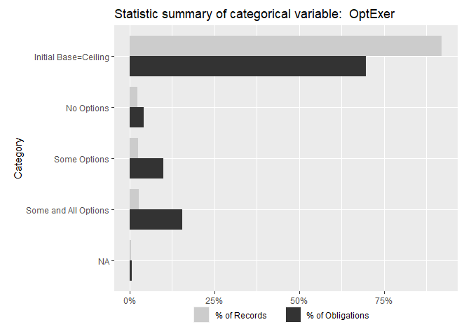<!-- -->

```r
freq_continuous_plot(def_serv %>%filter(AnyUnmodifiedUnexercisedOptions==1),"p_OptGrowth",bins=50, log=TRUE)
```

```
## Warning: Removed 702 rows containing non-finite values (stat_bin).

## Warning: Removed 702 rows containing non-finite values (stat_bin).
```

<!-- -->

```r
freq_continuous_plot(def_serv %>%filter(AnyUnmodifiedUnexercisedOptions==1),"n_OptGrowth_OMB20_GDP18",bins=50, log=TRUE)
```

```
## Warning: Removed 699 rows containing non-finite values (stat_bin).
```

```
## Warning: Removed 699 rows containing non-finite values (stat_bin).
```

<!-- -->

```r
grouped_barplot("b_SomeOpt", def_serv %>% dplyr::filter(AnyUnmodifiedUnexercisedOptions==1 ))
```

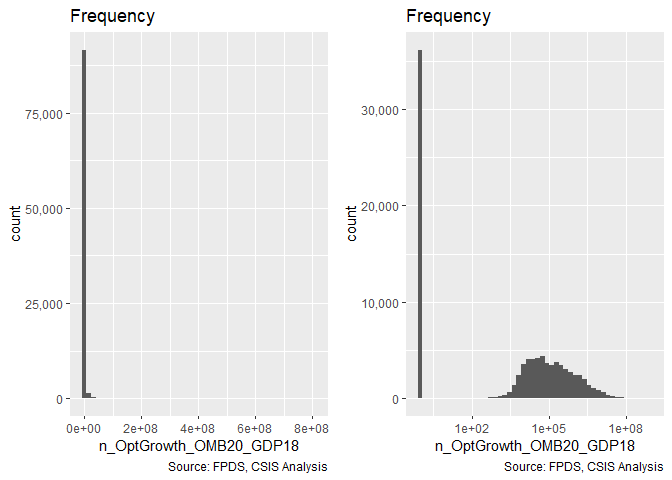<!-- -->

```r
grouped_barplot("b_AllOpt", def_serv %>% dplyr::filter(AnyUnmodifiedUnexercisedOptions==1 &
                                                              b_SomeOpt==1))
```

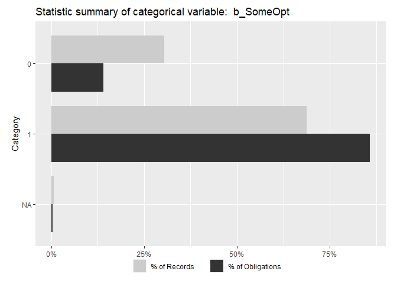<!-- -->

```r
statsummary_discrete("b_SomeOpt", def_serv %>% dplyr::filter(AnyUnmodifiedUnexercisedOptions==1 ))
```

```
##   b_SomeOpt % of records % of $s
## 1         0       32.05%   8.14%
## 2         1       67.89%  91.83%
## 3        NA        0.06%   0.03%
```

```r
statsummary_discrete("b_AllOpt", def_serv %>% dplyr::filter(AnyUnmodifiedUnexercisedOptions==1 &
                                                              b_SomeOpt==1))
```

```
##   b_AllOpt % of records % of $s
## 1        0       26.79%  20.17%
## 2        1       72.10%  79.54%
## 3       NA        1.11%   0.29%
```


### Ceiling Breaches
The base variables for b_CBre and  cln_CBre are is CBre and n_CBre_OMB20_GDP18 
* b_CBre ("Any Ceiling Breach") is a binary variable that reports whether a contract had its cost ceiling increased via a change order.
sum(def_serv$Action_Obligation_OMB20_GDP18[def_serv$b_CBre==1],na.rm=TRUE)/sum(def_serv$Action_Obligation_OMB20_GDP18,na.rm=TRUE)
NA_stats(def_serv,"b_CBre")`)
* ln_CBre ("Any Ceiling Breach") is a continuous variable that reports the increased contract ceiling due to change orders, logged, in 2018 constant dollars based on contract start fiscal year. The dataset for these models is limited to contracts with any ceiling breaches, in order to avoid clustering at zero-based problems.  The variable is rescaled, by subtracting its mean (9.19) and dividing by its standard deviation doubled (5.54). Values of -1, -0.5, 0, 0.5, and 1 correspond to 38, 612, 9,751, 155,323, and 2,474,204 dollars respectively.


```r
grouped_barplot("CBre", def_serv)
```

<!-- -->

```r
freq_continuous_plot(def_serv %>%filter(b_CBre==1),"n_CBre_OMB20_GDP18",bins=50, log=TRUE)
```

```
## Warning: Removed 2662 rows containing non-finite values (stat_bin).

## Warning: Removed 2662 rows containing non-finite values (stat_bin).
```

<!-- -->

```r
statsummary_discrete("CBre", def_serv)
```

```
##             CBre % of records % of $s
## 1           None       93.96%  76.60%
## 2 Ceiling Breach        6.04%  23.40%
```

```r
statsummary_continuous(c("n_CBre_OMB20_GDP18"), def_serv %>% dplyr::filter(b_CBre==1))
```

```
##        Variable_Name   Min             Max     Median Logarithmic Mean
## 1 n_CBre_OMB20_GDP18 0.000 367,080,377.479 10,583.141        9,750.761
##   1 unit below   1 unit above % of records NA
## 1      38.427  2,474,204.171            3.55%
##   % of Obligations to NA records
## 1                          5.34%
```

### Contract Terminations

Contract terminations and the number of change orders can be calculated for the entire sample.  Contract termination is determined using the *Reason for Modification* field in FPDS.  A contract is considered to be terminated if it has at least one modification with the following values:

* "Terminate for Default (complete or partial)"
* "Terminate for Convenience (complete or partial)"
* "Terminate for Cause"
* "Legal Contract Cancellation"

These four categories and the "Close Out" category are used to mark a contract as closed.  Many contracts in FPDS and in the sample are never marked closed.  

The original variables for b_Term is Term.

NA_stats(def_serv,"b_Term")
* b_Term is a binary variable that reports whether contracts experienced a partial or complete termination. (0.0246327


```r
grouped_barplot("Term", def_serv)
```

<!-- -->

```r
statsummary_discrete(c("Term"), def_serv)
```

```
##   Term % of records % of $s
## 1    0       98.12%  97.54%
## 2    1        1.88%   2.46%
```

```r
#Overlaping ceiling breach and termination
nrow(def_serv %>% filter(b_Term==1 & b_CBre==1))
```

```
## [1] 1034
```

```r
sum((def_serv %>% filter(b_Term==1 & b_CBre==1))$Action_Obligation_OMB20_GDP18)
```

```
## [1] 4300188992
```


# Independent Variables

## Study Variables

### Service Complexity 
The original variables for cln_US6sal is US6_avg_sal_lag1Const
* cln_US6sal ("Detailed Industry Salary") is a continuous variable that reports the Average U.S. wage in the contract’s detailed industry in the calendar year prior to contract start. Deflated to 2018 constant dollars based on the prior calendar year, logged, and rescaled. The variable is rescaled, by subtracting its mean (11) and dividing by its standard deviation doubled (0.799). Values of -1, -0.5, 0, 0.5, and 1 correspond to 26,033, 38,807, 57,851, 86,239, and 128,558 dollars respectively.

#### Detailed Industry Salary

```r
freq_continuous_plot(def_serv,"US6_avg_sal_lag1Const",bins=50,
                     log=TRUE)
```

```
## Warning: Removed 36642 rows containing non-finite values (stat_bin).

## Warning: Removed 36642 rows containing non-finite values (stat_bin).
```

<!-- -->

#### Service Code Invoice Rate
The original variables for cln_PSCrate is CFTE_Rate_1year

* cln_PSCrate ("Service Code Invoice Rate") is a continuous variable that reports the average annual invoice rate for the contract’s product or service code in the fiscal year prior to contract start. In 2018 constant dollars based on the start fiscal year, logged and rescaled. The variable is rescaled, by subtracting its mean (12) and dividing by its standard deviation doubled (1). Values of -1, -0.5, 0, 0.5, and 1 correspond to 59,462, 98,226, 162,260, 268,037, and 442,771 dollars respectively.


```r
freq_continuous_plot(def_serv,"CFTE_Rate_1year",bins=50,
                     log=TRUE)
```

```
## Warning: Removed 1204 rows containing non-finite values (stat_bin).

## Warning: Removed 1204 rows containing non-finite values (stat_bin).
```

<!-- -->

```r
statsummary_continuous(c("US6_avg_sal_lag1Const","CFTE_Rate_1year"), def_serv)
```

```
## Warning in if (!x %in% colnames(contract)) stop(paste(x, "is not a column
## in contract.")): the condition has length > 1 and only the first element
## will be used
```

```
##           Variable_Name       Min           Max      Median
## 1 US6_avg_sal_lag1Const 9,995.927   278,828.551  62,408.814
## 2       CFTE_Rate_1year 7,369.585 1,908,519.761 165,307.106
##   Logarithmic Mean 1 unit below 1 unit above % of records NA
## 1       57,850.656  26,032.696  128,557.502            2.95%
## 2      162,259.713  59,462.380  442,770.953            0.10%
##   % of Obligations to NA records
## 1                          1.10%
## 2                          0.04%
```

### Office Capacity
The variablecp_OffPerf7 is constructed by diving are the percentage form of office_PBSCobligated_1year / office_obligatedamount_1year

* cp_OffPerf7 ("Office Performance-Based ") is a continuous variable that reports the percentage share of office 2018 constant obligations that were for Performance-Based Service Contracts in the prior 7 fiscal years, rescaled.

#### PBSC

```r
freq_continuous_plot(def_serv,"office_PBSCobligated_1year",bins=50, 
                     denominator="office_obligatedamount_1year",cap1=TRUE,log=TRUE,plus1=TRUE)
```

```
## Warning: Removed 1188 rows containing non-finite values (stat_bin).

## Warning: Removed 1188 rows containing non-finite values (stat_bin).
```

```
## Warning: Removed 20605 rows containing non-finite values (stat_bin).

## Warning: Removed 20605 rows containing non-finite values (stat_bin).
```

<!-- -->


#### Office Experience withthe Product or Service Code
The original variables for cp_OffPerf7 is the percentage form of office_psc_obligatedamount_7year / office_obligatedamount_7year

* cp_OffPSC7 ("Office Service Code Experience") is a continuous variable that reports the percentage of office 2018 constant obligations that went to contracts with the same product or service code as the product in question over the last 7 fiscal years, rescaled.


```r
#Absolute proporitonal psc spending 
freq_continuous_plot(def_serv,"office_psc_obligatedamount_7year",bins=50, 
                     denominator="office_obligatedamount_7year",cap1=TRUE,log=TRUE,plus1=TRUE)
```

```
## Warning: Removed 1192 rows containing non-finite values (stat_bin).

## Warning: Removed 1192 rows containing non-finite values (stat_bin).
```

```
## Warning: Removed 18040 rows containing non-finite values (stat_bin).

## Warning: Removed 18040 rows containing non-finite values (stat_bin).
```

<!-- -->

```r
#See Number of Paired Years for the StatSummaryContinuous
```

Log of the percentage version doesn't end up 

### Office-Vendor Relationship
The original variables for cn_PairHist7 is office_entity_paircount_7year

* cn_PairHist7 ("Paired Years") is a continuous variable that reports how many of the past 7 fiscal years involved obligations being made from the office to the vendor, recalled. The variable is rescaled, by subtracting its mean (3.51) and dividing by its standard deviation doubled(4.82). Values of -1, -0.5, 0, 0.5, and 1 correspond to -1.3, 1.1, 3.5, 5.9, and 8.3 number of years respectively.

#### Number of  Paired Years

```r
freq_continuous_plot(def_serv,"office_entity_paircount_7year",bins=7)
```

```
## Warning: Removed 3052 rows containing non-finite values (stat_bin).
```

<!-- -->

```r
statsummary_continuous(c("pPBSC","pOffPSC","office_entity_paircount_7year"), def_serv,log=FALSE)
```

```
## Warning in if (!x %in% colnames(contract)) stop(paste(x, "is not a column
## in contract.")): the condition has length > 1 and only the first element
## will be used
```

```
##                   Variable_Name   Min   Max Median Arithmatic Mean
## 1                         pPBSC 0.000 1.000  0.281           0.339
## 2                       pOffPSC 0.000 1.000  0.012           0.126
## 3 office_entity_paircount_7year 0.000 7.000  4.000           3.505
##   1 unit below 1 unit above % of records NA % of Obligations to NA records
## 1   -0.261  *        0.939           0.096%                         0.000%
## 2   -0.377  *        0.630           0.096%                         0.000%
## 3   -1.312  *     8.323  *           0.246%                         0.517%
```

#### Number of Prior Year Contract Action
The original variables for cln_PairCA is office_entity_numberofactions_1year

* cln_PairCA ("Paired Actions") is a continuous variable that reports how many contracting actions the contract’s vendor performed for the office in question in the prior fiscal year, logged and rescaled. 1 action was added to all office-vendor pairings to allow for logarithmic transformation even when there was no previous acts. The variable is rescaled, by subtracting its mean (3.39) and dividing by its standard deviation doubled (4.54). Values of -1, -0.5, 0, 0.5, and 1 correspond to 0.32, 3.1, 30, 288, and 2,783 number of actions respectively.


```r
freq_continuous_plot(def_serv,"office_entity_numberofactions_1year",bins=50, log=TRUE, plus1 = TRUE)
```

```
## Warning: Removed 3052 rows containing non-finite values (stat_bin).

## Warning: Removed 3052 rows containing non-finite values (stat_bin).
```

<!-- -->

```r
statsummary_continuous(c("office_entity_numberofactions_1year"), def_serv, plus1=TRUE)
```

```
##                         Variable_Name   Min           Max Median
## 1 office_entity_numberofactions_1year 1.000 7,806,579.000 27.000
##   Logarithmic Mean 1 unit below 1 unit above % of records NA
## 1           34.012    0.491  *    2,355.033           0.246%
##   % of Obligations to NA records
## 1                         0.517%
```

## Contract-Level Controls


### Competition
Comp is derived from b_Comp to determine competition and UnmodifiedNumberOfOffersReceived to categorize competed contracts by offers

* Comp (Competition) is a categorical variable based on competition and the number of offers. 
  * No Competition  is its baseline value, for contracts that did not use competitive procedures. 
  * 1Offr (1 Offer) for contracts that were competed but only recieved one offer.
  * 2-4Offr (2-4 Offers) for competed contracts receiving between 2 and 4 offers.
  * 5plusOffr (5+ Offers) 5+ Offers for competed contracts receiving 5 or more offers.


```r
grouped_barplot("b_Comp",def_serv)
```

<!-- -->

```r
freq_continuous_plot(def_serv %>% dplyr::filter(b_Comp==1), #Only Competed
                     "UnmodifiedNumberOfOffersReceived", bins=100,log=TRUE)
```

```
## Warning: Removed 12969 rows containing non-finite values (stat_bin).

## Warning: Removed 12969 rows containing non-finite values (stat_bin).
```

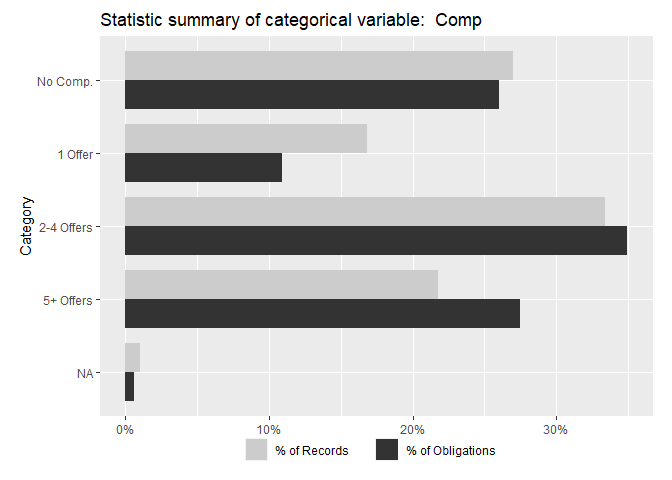<!-- -->

```r
grouped_barplot("Comp",def_serv)
```

<!-- -->

```r
statsummary_discrete("Comp",def_serv)
```

```
##             Comp % of records % of $s
## 1 No Competition       27.14%  26.25%
## 2        1 offer       16.98%  11.48%
## 3     2-4 offers       33.00%  34.23%
## 4      5+ offers       21.83%  27.31%
## 5             NA        1.06%   0.73%
```


### Initial Contract Scope

#### Base
* cl_Ceil is the natural log of the initial contract cost ceiling, in then-year dollars. Data is missing for 0.00321 of records and 0.00548 of obligated dollars.


```r
#The original variables for cp_OffPerf7 is the ratio form of UnmodifiedBase_OMB20_GDP18

freq_continuous_plot(def_serv,"UnmodifiedBase_OMB20_GDP18",bins=50, log=TRUE)
```

```
## Warning: Removed 6403 rows containing non-finite values (stat_bin).

## Warning: Removed 6403 rows containing non-finite values (stat_bin).
```

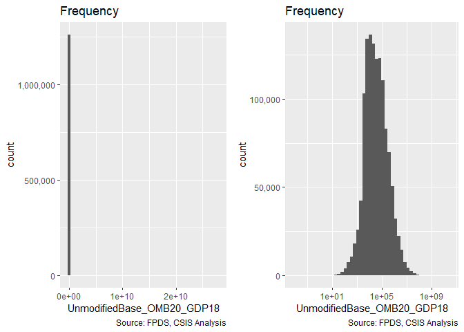<!-- -->

#### Base:Ceiling Ratio


```r
#The original variables for cp_OffPerf7 is the ratio form of UnmodifiedCeiling_OMB20_GDP18 / UnmodifiedBase_OMB20_GDP18

freq_continuous_plot(def_serv,"UnmodifiedCeiling_OMB20_GDP18",bins=50, 
                     denominator="UnmodifiedBase_OMB20_GDP18",log=TRUE)
```

```
## Warning: Removed 785 rows containing non-finite values (stat_bin).
```

```
## Warning: Transformation introduced infinite values in continuous x-axis
```

```
## Warning: Removed 3990 rows containing non-finite values (stat_bin).
```

```
## Warning: Removed 6408 rows containing non-finite values (stat_bin).
```

```
## Warning: Transformation introduced infinite values in continuous x-axis
```

```
## Warning: Removed 6409 rows containing non-finite values (stat_bin).
```

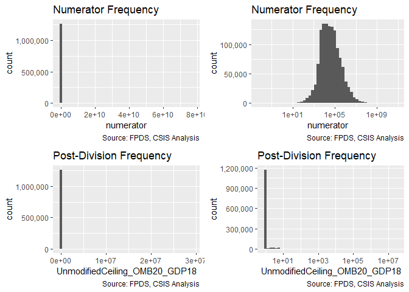<!-- -->

#### Duration
* capped_cln_Days is the natural log of the initial maximum duration of the contract, in days. The variable is centered, by subtracting its mean (Data is missing for NaN of records and 0 of obligated dollars. 


```r
#original variable for capped_cln_Days: UnmodifiedDays

freq_continuous_plot(def_serv,"UnmodifiedDays",bins=50, log=TRUE)
```

```
## Warning: Removed 28643 rows containing non-finite values (stat_bin).

## Warning: Removed 28643 rows containing non-finite values (stat_bin).
```

<!-- -->

```r
statsummary_continuous(c("UnmodifiedBase_OMB20_GDP18","Base2Ceil","UnmodifiedDays"), def_serv)
```

```
## Warning in if (!x %in% colnames(contract)) stop(paste(x, "is not a column
## in contract.")): the condition has length > 1 and only the first element
## will be used
```

```
##                Variable_Name   Min                Max     Median
## 1 UnmodifiedBase_OMB20_GDP18 0.009 14,756,841,090.022 30,043.570
## 2                  Base2Ceil 1.000     29,008,179.896      1.000
## 3             UnmodifiedDays 1.000         33,049.000    114.000
##   Logarithmic Mean 1 unit below   1 unit above % of records NA
## 1       34,224.128     469.889  2,492,697.987            0.52%
## 2            1.092    0.460  *          2.591            0.52%
## 3           78.537       2.809      2,195.777            2.31%
##   % of Obligations to NA records
## 1                          0.64%
## 2                          0.65%
## 3                          1.95%
```


### Contract Vehicle
* Comp (Competition) is a categorical variable based on whether there was a parent contract and if so of what type. 
* It's baseline value is for contracts that did not use competitive procedures. Other values are assigned based on the number of offers a competed contract received: 1 Offer, 2-4 Offers, 5+ Offers.

* Veh (Vehicle) is  SIDV, MIDV, and FSS/GWAC, BPA/BOA are dummy variables based on the contract vehicle. They correspond to Single-Award IDVs, Multi-Award IDVs, and Other IDVs, respectively, having a value of 1 when the task order has that vehicle type, and having a 0 other. The remaining types, definitive contracts and purchase orders, are intentionally left out. 


```r
grouped_barplot("Veh",def_serv)
```

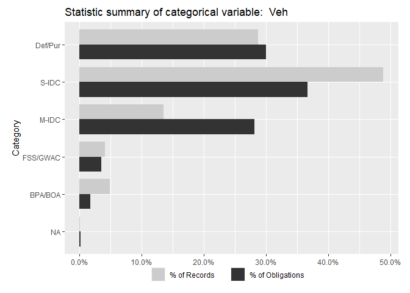<!-- -->

```r
statsummary_discrete("Veh",def_serv)
```

```
##        Veh % of records % of $s
## 1  Def/Pur       28.76%  28.08%
## 2    S-IDC       49.40%  38.78%
## 3    M-IDC       12.91%  27.85%
## 4 FSS/GWAC        4.05%   3.54%
## 5  BPA/BOA        4.83%   1.58%
## 6       NA        0.05%   0.16%
```


### Pricing
Pricing is constructed using the two variables: PricingFee which tracks contract type and UCA, which tracks letter and undefinized contract actions.

* PricingFee i is a numeric variable based on contract pricing. It has a value of 0 for cost-based, 0.5 or "combination or other", 1 for any fixed price (excluding fixed-price level of effort which is classified as cost-based). (1115255, 13046, 4460, 12478, 73269, 22763, 178)
* b_UCA is a binary variable with a value of 1 for contracts/task orders that begin as letter contracts or undefinitized contract awards (UCA) and a value of 0 otherwise. Data is missing for 0.0874 of records and 0.0704 of obligated dollars.


```r
grouped_barplot("PricingFee", def_serv)
```

<!-- -->

```r
grouped_barplot("UCA", def_serv)
```

<!-- -->

```r
summary((def_serv %>% dplyr::filter(b_UCA==1))$PricingFee)
```

```
##                  FFP             Other FP            Incentive 
##                10029                   49                   41 
## Combination or Other             Other CB         T&M/LH/FPLOE 
##                  196                 1864                  184
```

```r
grouped_barplot("Pricing", def_serv)
```

<!-- -->

```r
statsummary_discrete("Pricing", def_serv)
```

```
##                Pricing % of records % of $s
## 1                  FFP       81.27%  58.50%
## 2             Other FP        0.89%   2.32%
## 3            Incentive        0.34%   1.42%
## 4 Combination or Other        0.91%   5.23%
## 5             Other CB        5.13%  17.98%
## 6         T&M/LH/FPLOE        1.71%   5.13%
## 7                  UCA        1.00%   2.37%
## 8                   NA        8.75%   7.04%
```

## Multilevel Controls


```r
nrow(def_serv)
```

```
## [1] 1241449
```

```r
length(unique(def_serv$NAICS3))
```

```
## [1] 108
```

```r
length(unique(def_serv$NAICS6))
```

```
## [1] 1059
```

```r
length(unique(paste(def_serv$NAICS6,def_serv$ServArea)))
```

```
## [1] 3825
```

```r
length(unique(def_serv$Agency))
```

```
## [1] 28
```

```r
length(unique(paste(def_serv$Agency,def_serv$Office)))
```

```
## [1] 1228
```

```r
length(unique(def_serv$Place))
```

```
## [1] 197
```


### Acquirer
#### Agency
* Agency is a factor reporting the top Contracting Agency of each contract. 
Data is missing for 0.000615 of records and -1.97e-08 of obligated dollars.


```r
#Percent grouped bar plot for variable Agency
#Generate new data frame containing frequency information
Agency_Freq <- as.data.frame(table(def_serv$Agency))
Agency_Freq$Percent_Freq <- round(Agency_Freq$Freq/sum(Agency_Freq$Freq),4)*100
colnames(Agency_Freq) <- c("Agency","Count_Freq","Percent_Freq")

Agency_Freq <- Agency_Freq[order(-Agency_Freq$Count_Freq),]
Agency_Freq <- Agency_Freq[1:10,]

#Add detail description to Agency code
Agency_Lookup <- read.csv("https://raw.githubusercontent.com/CSISdefense/Lookup-Tables/master/Agency_AgencyID.csv")
Agency_Lookup <- Agency_Lookup[,1:2]
colnames(Agency_Lookup) <- c("Agency","Agency_Description")

Agency_Freq <- left_join(Agency_Freq, Agency_Lookup, by = "Agency")
```

```
## Warning: Column `Agency` joining factors with different levels, coercing to
## character vector
```

```r
Agency_Freq$Agency <- factor(Agency_Freq$Agency, levels = rev(Agency_Freq$Agency))
Agency_Freq <- Agency_Freq[order(-Agency_Freq$Percent_Freq),]
Agency_Freq$Agency_Description <- factor(Agency_Freq$Agency_Description, 
                                         levels=rev(Agency_Freq$Agency_Description))


#Add obligation percent information to data frame
Percent_Obli <- c()
for (i in Agency_Freq$Agency) {
  Percent_Obligation <- round(sum(def_serv$Action_Obligation_OMB20_GDP18[def_serv$Agency == i], na.rm = TRUE)/sum(def_serv$Action_Obligation_OMB20_GDP18, na.rm = TRUE),5)
  Percent_Obli <- c(Percent_Obli, Percent_Obligation)
}
Agency_Freq$Percent_Obli <- Percent_Obli*100

#Get top 5 Agencies that take largest percent obligation
Agency_Freq <- Agency_Freq[order(-Percent_Obli),]
Agency_Freq <- Agency_Freq[1:5,]
percent_freq_rest <- 100 - sum(Agency_Freq$Percent_Freq, na.rm = TRUE)
percent_obli_rest <- 100 - sum(Agency_Freq$Percent_Obli, na.rm = TRUE)

Agency_Freq[6,] <- c("All Other", "NA", percent_freq_rest, "All Other", percent_obli_rest)
```

```
## Warning in `[<-.factor`(`*tmp*`, iseq, value = "All Other"): invalid factor
## level, NA generated
```

```
## Warning in `[<-.factor`(`*tmp*`, iseq, value = "All Other"): invalid factor
## level, NA generated
```

```r
Agency_Freq$Agency_Description <- factor(Agency_Freq$Agency_Description, levels = rev(Agency_Freq$Agency_Description))
Agency_Freq[,c(3,5)] <- lapply(Agency_Freq[,c(3,5)], function(x) as.numeric(x))
Agency_Freq <- melt(Agency_Freq, id = c("Agency","Count_Freq","Percent_Freq", "Agency_Description"))


#build the frequency bar plot
(
Frequency_Plot3 <- ggplot(data = Agency_Freq, aes(x=Agency_Description,        y=Percent_Freq)) +
                   geom_bar(stat = "identity", position = "dodge", width = 0.8) +
                   coord_flip() +
                   xlab("Agency") +
                   ylab("Percent of Frequency") +
                   theme_grey() +
                   scale_fill_grey() +
                   ggtitle("Top 10 of the most frequently appeared Agency") +
                   theme(text = element_text(size = 10))
)
```

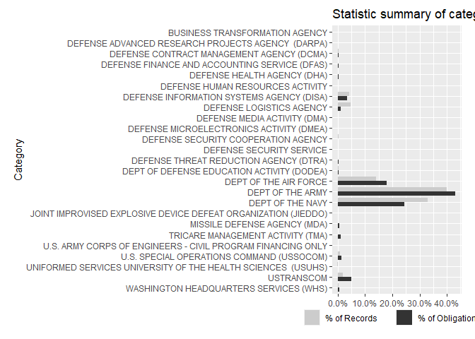<!-- -->

```r
#Build grouped bar plot
Agency_barplot <- ggplot(data = Agency_Freq, 
                         aes(x = Agency_Description, 
                             y=value, 
                             fill=factor(variable))) + 
                  geom_bar(stat = "identity", 
                           position= "dodge", 
                           width = 0.8) + 
                  xlab("") + 
                  ylab("") + 
                  coord_flip() + 
                  theme_grey() +
                  scale_fill_grey(labels = c("% of records", "% of obligation"),
                                  guide = guide_legend(reverse = TRUE)) +
                  theme(legend.title = element_blank(),
                        legend.position = "bottom",
                        legend.margin = margin(t=-0.8, r=0, b=0.5, l=0, unit = "cm"),
                        legend.text = element_text(margin = margin(r=0.5, unit = "cm")),
                        plot.margin = margin(t=0.3, r=0.5, b=0, l=0.5, unit = "cm")) +
                 ggtitle("Top 5 of the most frequently appeared Agency") 
Agency_barplot                  
```

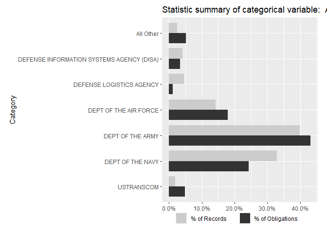<!-- -->

#### Office 

* Office is a factor reporting the top Contracting office of each contract. 
Data is missing for 0.000957 of records and -1.83e-07 of obligated dollars.

```r
#grouped bar plot for variable Office
#Perpare data for plot
#get the detailed desceription for Office by AgencyID and OfficeID
# Office_Lookup <- read.delim("https://raw.githubusercontent.com/CSISdefense/Lookup-Tables/master/office/Office.ContractingOfficeCode.txt")
# def_dup <- def_serv

memory.limit(56000)
```

```
## [1] 56000
```

```r
Office_Freq <- def_serv %>% group_by(Office,ContractingOfficeName) %>% summarise(
  Count_Freq=length(CSIScontractID),
  Action_Obligation_OMB20_GDP18=sum(Action_Obligation_OMB20_GDP18)
)
```

```
## Warning: Factor `ContractingOfficeName` contains implicit NA, consider
## using `forcats::fct_explicit_na`
```

```r
  # Office_Freq <- Office_Freq[order(-Office_Freq$Freq),]
# Office_Freq_TOP20 <- Office_Freq[1:20,]   #Get top 20 NAICS6 has largest frequency count
Office_Freq$Percent_Freq <- round(Office_Freq$Count_Freq/
                                   sum(Office_Freq$Count_Freq),4)*100
Office_Freq$Percent_Obli <- round(Office_Freq$Action_Obligation_OMB20_GDP18/
                                         sum(Office_Freq$Action_Obligation_OMB20_GDP18),4)*100

colnames(Office_Freq)[colnames(Office_Freq)=="Office"] <- "OfficeID"
colnames(Office_Freq)[colnames(Office_Freq)=="ContractingOfficeName"] <- "OfficeName"

Office_Freq$Percent_Freq <- round(Office_Freq$Count_Freq/sum(Office_Freq$Count_Freq),4)*100
Office_Freq <- subset(Office_Freq, (Office_Freq$Count_Freq != 0)&(Office_Freq$Percent_Freq!=0))
Office_Freq[,1:2] <- lapply(Office_Freq[,1:2], function(x) as.character(x))

Office_Freq$Office_Full <- ifelse(is.na(Office_Freq$OfficeName), Office_Freq$OfficeID, Office_Freq$OfficeName)


Office_Freq_top10Freq <- Office_Freq[order(-Office_Freq$Percent_Freq),]
Office_Freq_top10Freq <- Office_Freq_top10Freq[1:10, ]  #including NULL category
Office_Freq_top10Obli <- Office_Freq[order(-Office_Freq$Percent_Obli),]
Office_Freq_top10Obli <- Office_Freq_top10Obli[1:10, ]  #including NULL category

Office_Freq_TOP <- rbind(Office_Freq_top10Obli, Office_Freq_top10Freq)
Office_Freq_TOP <- unique(Office_Freq_TOP)  #17 records in total

#Generate a new name column by Combining officeID and officeName
Office_Freq_TOP$Office_Full <- ifelse(Office_Freq_TOP$Office_Full == Office_Freq_TOP$OfficeID, 
                                      Office_Freq_TOP$OfficeID, 
                                      paste(Office_Freq_TOP$OfficeID, 
                                            " - ", 
                                            Office_Freq_TOP$OfficeName))

Office_Freq_TOP$Office_Full <- factor(Office_Freq_TOP$Office_Full, 
                                      levels = rev(Office_Freq_TOP$Office_Full))
Office_Freq_TOP <- melt(Office_Freq_TOP, 
                        id = c("OfficeID", "OfficeName", "Count_Freq", "Office_Full"))

(
Office_barplot <- ggplot(data = Office_Freq_TOP,
                         aes(x = Office_Full, 
                             y = value,
                             fill = factor(variable))) +
                  geom_bar(stat = "identity", 
                  position = "dodge", 
                  width = 0.8) + 
                  coord_flip() +
                  xlab("") + 
                  ylab("") + 
                  theme_grey() + 
                  scale_fill_grey(labels = c("% of records", "% of obligation"),
                                  guide = guide_legend(reverse = TRUE)) + 
                  ggtitle("Percent of Frequency and obligation for Office") +
                  theme(text = element_text(size = 10), 
                        legend.title = element_blank(),
                        legend.position = "bottom",
                        legend.margin = margin(t=-0.8, r=0, b=0.5, l=0, unit = "cm"),
                        legend.text = element_text(margin = margin(r=0.5, unit = "cm")), 
                        plot.margin = margin(t=0.3, r=0.5, b=0, l=0.5, unit = "cm"))
)
```

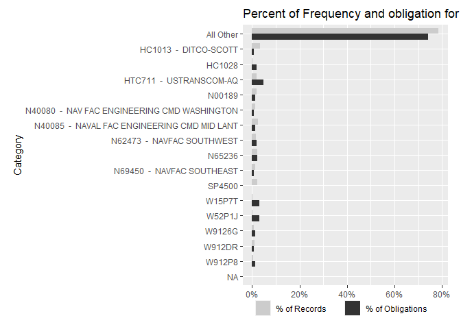<!-- -->


### Pair: Office and Vendor

#### pMarket

```r
freq_continuous_plot(def_serv,"pMarket",bins=50,log=TRUE)
```

```
## Warning: Removed 3052 rows containing non-finite values (stat_bin).
```

```
## Warning: Transformation introduced infinite values in continuous x-axis
```

```
## Warning: Removed 208511 rows containing non-finite values (stat_bin).
```

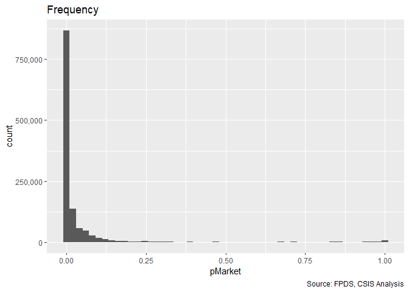<!-- -->

```r
summary(def_serv$pMarket)
```

```
##    Min. 1st Qu.  Median    Mean 3rd Qu.    Max.    NA's 
##  0.0000  0.0001  0.0019  0.0489  0.0192  1.0000    3052
```

### Economic Sector

#### NAICS 2

```r
# Add NAICS6 title
#def_serv$NAICS_Code<-create_naics2(def_serv$NAICS6)
def_serv$NAICS_Code<-def_serv$NAICS2


def_serv<-csis360::read_and_join_experiment(def_serv,
                            lookup_file = "Lookup_PrincipalNAICScode.csv",
                            path="https://raw.githubusercontent.com/CSISdefense/Lookup-Tables/master/",
                            dir="economic/",
                            by=c("NAICS_Code"="principalnaicscode"),
                            add_var="principalnaicscodeText"
)
```

```
## Parsed with column specification:
## cols(
##   principalnaicscode = col_character(),
##   principalnaicscodeText = col_character(),
##   principalNAICS2DigitCode = col_double(),
##   principalNAICS3DigitCode = col_double(),
##   principalNAICS4DigitCode = col_double(),
##   NAICS_shorthand = col_character()
## )
```

```r
def_serv$NAICS2_label<-paste(def_serv$NAICS_Code,
                             def_serv$principalnaicscodeText)

def_serv$NAICS2_label[
  def_serv$NAICS2_label==
    "56 Administrative and Support and Waste Management and Remediation Services"
  ]<-"56 Admin./Support/Waste Management and Remediation"
def_serv$NAICS2_label[def_serv$NAICS2_label==
                                    "NA NA"]<-"Unlabeled"

def_serv$NAICS2_label<-factor(def_serv$NAICS2_label)
order<-  rev(levels(def_serv$NAICS2_label))


NAICS2digit<-ggplot(def_serv,
       aes(x=NAICS2_label))+
  geom_bar()+coord_flip()+
  scale_y_continuous(label=scales::comma)+scale_x_discrete(limits=order)+
  labs(x="2-Digit NAICS6 Code",y="Number of Contracts and Task Orders in Unfiltered Dataset")

NAICS2digit
```

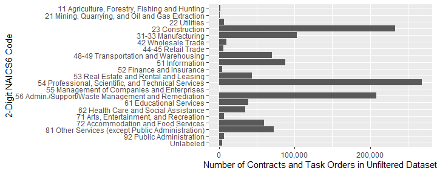<!-- -->

```r
ggsave(NAICS2digit,file="..\\Output\\NAICS2digitCount.png",width=10,height=6,dpi=600)
ggsave(NAICS2digit,file="..\\Output\\NAICS2digitCount.eps",width=10,height=6,dpi=600)
```


```r
#Prepare data for plot
NAICS2_Freq <- as.data.frame(table(def_serv$NAICS2))
NAICS2_Freq$Percent_Freq <- round(NAICS2_Freq$Freq/sum(NAICS2_Freq$Freq),4)*100
colnames(NAICS2_Freq) <- c("NAICS_Code", "Count_Freq", "Percent_Freq")


#Get detail description for NAICS2 code
NAICS2_Freq<-csis360::read_and_join_experiment(NAICS2_Freq,
                            lookup_file = "Lookup_PrincipalNAICScode.csv",
                            path="https://raw.githubusercontent.com/CSISdefense/Lookup-Tables/master/",
                            dir="economic/",
                            by=c("NAICS_Code"="principalnaicscode"),
                            add_var="principalnaicscodeText"
)
```

```
## Parsed with column specification:
## cols(
##   principalnaicscode = col_character(),
##   principalnaicscodeText = col_character(),
##   principalNAICS2DigitCode = col_double(),
##   principalNAICS3DigitCode = col_double(),
##   principalNAICS4DigitCode = col_double(),
##   NAICS_shorthand = col_character()
## )
```

```
## Warning: Column `NAICS_Code`/`principalnaicscode` joining factor and
## character vector, coercing into character vector
```

```r
Percent_Obli <- c()
Total_Obli <- sum(def_serv$Action_Obligation_OMB20_GDP18, na.rm = TRUE)
for (i in NAICS2_Freq$NAICS_Code) {
  Percent_Obligation <- round(sum(def_serv$Action_Obligation_OMB20_GDP18[def_serv$NAICS2 == i], na.rm = TRUE)/Total_Obli,5)
  Percent_Obli <- c(Percent_Obli, Percent_Obligation)
}

NAICS2_Freq$Percent_Obli <- Percent_Obli * 100
NAICS2_Freq <- NAICS2_Freq[order(-NAICS2_Freq$Percent_Obli),]
NAICS2_Freq[,c(1,3)] <- lapply(NAICS2_Freq[,c(1,3)], function(x) as.character(x))
NAICS2_Freq$principalnaicscodeText <- paste(NAICS2_Freq$NAICS_Code, " - ", NAICS2_Freq$principalnaicscodeText)
NAICS2_Freq$principalnaicscodeText <- factor(NAICS2_Freq$principalnaicscodeText, levels = rev(NAICS2_Freq$principalnaicscodeText))
NAICS2_Freq <- melt(NAICS2_Freq, id = c("NAICS_Code", "Count_Freq","principalnaicscodeText"))
NAICS2_Freq$value <- as.numeric(NAICS2_Freq$value)

NAICS2_barplot <- ggplot(data = NAICS2_Freq,
                          aes(x = principalnaicscodeText, 
                              y = value,
                              fill = factor(variable))) +
                   geom_bar(stat = "identity", 
                            position = "dodge", 
                            width = 0.8) + 
                   coord_flip() +
                   xlab("") + 
                   ylab("") + 
                   theme_grey() + 
                   scale_fill_grey(labels = c("% records", "% obligation"),
                                  guide = guide_legend(reverse = TRUE)) + 
                   ggtitle("Percent of Frequency and obligation for NAICS2") +
                   theme(text = element_text(size = 10), 
                         legend.title = element_blank(),
                         legend.position = "bottom",
                         legend.margin = margin(t=-0.8, r=0, b=0.5, l=0, unit = "cm"),
                         legend.text = element_text(margin = margin(r=0.5, unit = "cm")),
                         plot.margin = margin(t=0.3, r=0.5, b=0, l=0.5, unit = "cm"))
NAICS2_barplot
```

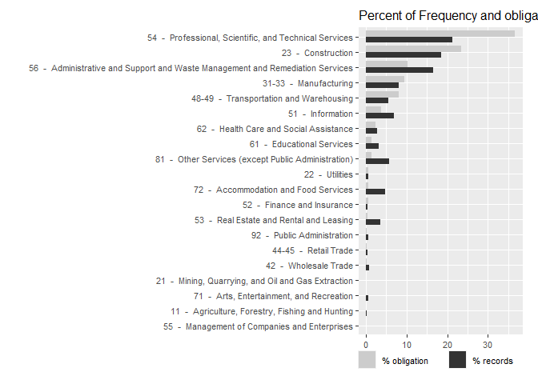<!-- -->


#### NAICS 3


```r
NAICS_summary<-def_serv %>% group_by(NAICS3,
                                     StartCY,
                                     def3_HHI_lag1,
                                     def3_obl_lag1,
                                     def3_ratio_lag1,
                                     US3_avg_sal_lag1) %>%
  dplyr::summarise(annual_action_obligation=sum(Action_Obligation_OMB20_GDP18),
                   annual_count=length(StartCY)) 

top_NAICS <- NAICS_summary %>% group_by(NAICS3) %>% 
  dplyr::summarise(naics_action_obligation=sum(annual_action_obligation),
                   naics_count=sum(annual_count)) 
top_NAICS$naics_dollar_rank<-rank(-top_NAICS$naics_action_obligation)
top_NAICS$naics_count_rank<-rank(-top_NAICS$naics_count)


NAICS_summary<-left_join(NAICS_summary,top_NAICS, by="NAICS3")

colnames(NAICS_summary)[colnames(NAICS_summary)=="NAICS3"]<-"principalnaicscode"

NAICS_summary$principalnaicscode<-as.character(NAICS_summary$principalnaicscode)
NAICS_summary<-as.data.frame(NAICS_summary)
NAICS_summary<-read_and_join_experiment(NAICS_summary,
                                        lookup_file = "Lookup_PrincipalNAICScode.csv",
                                        path="https://raw.githubusercontent.com/CSISdefense/Lookup-Tables/master/",
                                        dir="economic/",
                                        by="principalnaicscode",
                                        skip_check_var=c("principalnaicscodeText",
                                                         "NAICS_shorthand",
                                                         "principalNAICS4DigitCode")
)
```

```
## Parsed with column specification:
## cols(
##   principalnaicscode = col_character(),
##   principalnaicscodeText = col_character(),
##   principalNAICS2DigitCode = col_double(),
##   principalNAICS3DigitCode = col_double(),
##   principalNAICS4DigitCode = col_double(),
##   NAICS_shorthand = col_character()
## )
```

```r
# https://stackoverflow.com/questions/37174316/how-to-fit-long-text-into-ggplot2-facet-titles


centered_log_description(def_serv$def3_obl_lag1,"obligations")
```

```
## [1] "The variable is rescaled, by subtracting its mean (22.6) and dividing by its standard deviation doubled (4.12). Values of -1, -0.5, 0, 0.5, and 1 correspond to 1.1e+08, 8.5e+08, 6.7e+09, 5.3e+10, and 4.1e+11 obligations respectively."
```

```r
centered_log_description(def_serv$l_def6_obl_lag1,"obligations")
```

```
## [1] "The variable is rescaled, by subtracting its mean (3.02) and dividing by its standard deviation doubled (0.253). Values of -1, -0.5, 0, 0.5, and 1 correspond to 16, 18, 20, 23, and 26 obligations respectively."
```

```r
NA_stats(def_serv,"cl_def3_obl_lag1")
```

```
## [1] "Data is missing for 0.00644 of records and 0.00539 of obligated dollars."
```

```r
NA_stats(def_serv,"cln_Def6Obl")
```

```
## [1] "Data is missing for 0.0252 of records and 0.00884 of obligated dollars."
```

```r
centered_log_description(def_serv$def3_ratio_lag1,"obligations")
```

```
## [1] "The variable is rescaled, by subtracting its mean (-4.12) and dividing by its standard deviation doubled (3.06). Values of -1, -0.5, 0, 0.5, and 1 correspond to 0.00076, 0.0035, 0.016, 0.075, and 0.35 obligations respectively."
```

```r
centered_log_description(def_serv$def6_ratio_lag1,"obligations")
```

```
## [1] "The variable is rescaled, by subtracting its mean (-3.77) and dividing by its standard deviation doubled (4.56). Values of -1, -0.5, 0, 0.5, and 1 correspond to 0.00024, 0.0024, 0.023, 0.22, and 2.2 obligations respectively."
```

```r
NA_stats(def_serv,"clr_Def3toUS")
```

```
## [1] "Data is missing for 0.0117 of records and 0.00784 of obligated dollars."
```

```r
NA_stats(def_serv,"clr_Def6toUS")
```

```
## [1] "Data is missing for 0.0295 of records and 0.011 of obligated dollars."
```

```r
# View(NAICS_summary)
NAICS_summary$NAICS_shorthand<-swr(NAICS_summary$NAICS_shorthand,nwrap = 25)
NAICS_summary$CY<-NAICS_summary$StartCY-1
NAICS3top<-ggplot(subset(NAICS_summary,naics_dollar_rank<=4 |
                          naics_count_rank<=4),
       aes(x=CY,y=def3_HHI_lag1))+#color=NAICS_Code
  geom_line()+
  scale_y_continuous(label=scales::comma)+ 
  # scale_x_continuous(breaks=c(2006,2009,2011,2014))+
  labs(x="Calendar Year",y="Herfindahl-Herschman Index")+ 
  geom_hline(yintercept=c(1500,2500),linetype="dotted")

NAICS3top_paper<-NAICS3top+ facet_wrap(~NAICS_shorthand,ncol=2)
ggsave(NAICS3top_paper,file="..\\Output\\NAICS3top.png",width=4,height=8,dpi=600)
ggsave(NAICS3top_paper,file="..\\Output\\NAICS3top.eps",width=4,height=8,dpi=600)

NAICS3top_pp<-NAICS3top+ facet_wrap(~NAICS_shorthand,ncol=4)
NAICS3top_pp
```

<!-- -->

```r
ggsave(NAICS3top_pp,file="..\\Output\\NAICS3top_pp.png",width=10.5,height=5.5,dpi=600)
ggsave(NAICS3top_pp,file="..\\Output\\NAICS3top_pp.eps",width=10.5,height=5.5,dpi=600)

summary(NAICS_summary$naics_count_rank)
```

```
##    Min. 1st Qu.  Median    Mean 3rd Qu.    Max. 
##    1.00   26.00   51.00   51.58   77.50  108.00
```

```r
NAICS_summary$NAICS_shorthand<-swr(NAICS_summary$NAICS_shorthand,nwrap = 16)
# NAICS_summary$CY<-factor(paste("'",substring(as.character(NAICS_summary$CY),3,4),sep=""))

NAICS3top8<-ggplot(subset(NAICS_summary,naics_dollar_rank<=8),
       aes(x=CY,y=def3_HHI_lag1))+#color=NAICS_Code
  geom_line()+
  scale_y_continuous(label=scales::comma)+ 
  scale_x_continuous(breaks=c(2007,2012))+
  labs(x="Calendar Year",y="Herfindahl-Herschman Index")+ 
  geom_hline(yintercept=c(1500,2500),linetype="dotted")

NAICS3top8_wide<-NAICS3top8+ facet_grid(.~NAICS_shorthand)
ggsave(NAICS3top8_wide,file="..\\Output\\NAICS3top8.png",width=9.5,height=4,dpi=600)
ggsave(NAICS3top8_wide,file="..\\Output\\NAICS3top8.eps",width=9.5,height=4,dpi=600)

colnames(NAICS_summary)
```

```
##  [1] "principalnaicscode"       "StartCY"                 
##  [3] "def3_HHI_lag1"            "def3_obl_lag1"           
##  [5] "def3_ratio_lag1"          "US3_avg_sal_lag1"        
##  [7] "annual_action_obligation" "annual_count"            
##  [9] "naics_action_obligation"  "naics_count"             
## [11] "naics_dollar_rank"        "naics_count_rank"        
## [13] "principalnaicscodeText"   "principalNAICS2DigitCode"
## [15] "principalNAICS3DigitCode" "principalNAICS4DigitCode"
## [17] "NAICS_shorthand"          "CY"
```

```r
NAICS_long<-NAICS_summary[,colnames(NAICS_summary) %in% c( "principalnaicscode",
                                                    "def3_HHI_lag1",
                                                    "def3_obl_lag1",
                                                    "def3_ratio_lag1",
                                                    # "US3_avg_sal_lag1",
                                                    "naics_dollar_rank" ,
                                                    "naics_count_rank",
                                                    "principalnaicscodeText",
                                                     "NAICS_shorthand",
                                                    "CY")]
NAICS_long<-melt(NAICS_long, id=c("principalnaicscode","naics_dollar_rank","naics_count_rank","principalnaicscodeText","CY", "NAICS_shorthand"))


#Drop the ratios and average salaries w/ unique values
# NAICS_long<-NAICS_long[NAICS_long$variable %in% c(),]


levels(NAICS_long$variable)<- list("Herfindahl-\nHerschman Index"=c("def3_HHI_lag1"),
                                   "Defense Obligations"=c("def3_obl_lag1"),
                                   "Defense Obligations\nto U.S. Revenue Ratio"=c("def3_ratio_lag1"))

NAICS_long$high<-2500
NAICS_long$high[NAICS_long$variable!="Herfindahl-\nHerschman Index"]<-NA
NAICS_long$low<-1500
NAICS_long$low[NAICS_long$variable!="Herfindahl-\nHerschman Index"]<-NA


NAICS3long<-ggplot(subset(NAICS_long,naics_dollar_rank<=8),
       aes(x=CY,y=value))+#color=NAICS_Code
  geom_line()+
  scale_y_continuous(label=scales::comma)+ 
  scale_x_continuous(breaks=c(2007,2012))+
  labs(x="Calendar Year",y="Detailed Industry Metric")+
  geom_hline(aes(
           yintercept=high),linetype="dotted")+
  geom_hline(aes(
           yintercept=low),linetype="dotted")    


NAICS3long_wide<-NAICS3long+ facet_grid(variable~NAICS_shorthand,scales="free_y")
ggsave(NAICS3long_wide,file="..\\Output\\NAICS3long.png",width=9.5,height=5.5,dpi=600)
```

```
## Warning: Removed 128 rows containing missing values (geom_hline).

## Warning: Removed 128 rows containing missing values (geom_hline).
```

```r
ggsave(NAICS3long_wide,file="..\\Output\\NAICS3long.eps",width=9.5,height=5.5,dpi=600)
```

```
## Warning: Removed 128 rows containing missing values (geom_hline).

## Warning: Removed 128 rows containing missing values (geom_hline).
```

```r
write.csv(NAICS_summary,file="..\\Output/NAICS3_summary.csv",row.names = FALSE)
```


```r
Frequency <- as.data.frame(table(def_serv$NAICS3))
Frequency[["Percent_Freq"]] <- round(Frequency[["Freq"]]/sum(Frequency[["Freq"]]),4)*100
colnames(Frequency) <- c("NAICS3", "Count_Freq", "Percent_Freq")
Percent_Obli <- c()
for (i in Frequency[["NAICS3"]]) {
  Percent_Obligation <- round(sum(def_serv[["Action_Obligation_OMB20_GDP18"]][def_serv$NAICS3 == i], na.rm = TRUE)/sum(def_serv[["Action_Obligation_OMB20_GDP18"]], na.rm = TRUE),5)
    Percent_Obli <- c(Percent_Obli, Percent_Obligation)
  }
Frequency[["Percent_Obli"]] <- Percent_Obli*100
NAICS3_Freq <- Frequency

#Add detail description to unique NAICS3 code
NAICS3_Freq<-read_and_join_experiment(NAICS3_Freq,
                                        lookup_file = "Lookup_PrincipalNAICScode.csv",
                                        path="https://raw.githubusercontent.com/CSISdefense/Lookup-Tables/master/",
                                        dir="economic/",
                                        by=c("NAICS3"="principalnaicscode"),
                                        skip_check_var=c("principalnaicscodeText",
                                                         "NAICS_shorthand",
                                                         "principalNAICS4DigitCode")
)
```

```
## Parsed with column specification:
## cols(
##   principalnaicscode = col_character(),
##   principalnaicscodeText = col_character(),
##   principalNAICS2DigitCode = col_double(),
##   principalNAICS3DigitCode = col_double(),
##   principalNAICS4DigitCode = col_double(),
##   NAICS_shorthand = col_character()
## )
```

```
## Warning: Column `NAICS3`/`principalnaicscode` joining factor and character
## vector, coercing into character vector
```

```r
colnames(NAICS3_Freq)[colnames(NAICS3_Freq)=="principalnaicscodeText"]<-"Description"
NAICS3_Freq$Description <- as.character(NAICS3_Freq$Description)
NAICS3_Freq$Description <- paste(NAICS3_Freq$NAICS6, " - ", NAICS3_Freq$Description)

#Get the top 15 most frequently appeared NAICS3
NAICS3_Freq_top10Freq <- NAICS3_Freq[order(-NAICS3_Freq$Percent_Freq),]
NAICS3_Freq_top10Freq <- NAICS3_Freq_top10Freq[1:10, ]   
NAICS3_Freq_top10Obli <- NAICS3_Freq[order(-NAICS3_Freq$Percent_Obli),]
NAICS3_Freq_top10Obli <- NAICS3_Freq_top10Obli[1:10, ]
NAICS3_Freq_TOP <- rbind(NAICS3_Freq_top10Obli, NAICS3_Freq_top10Freq)
NAICS3_Freq_TOP <- unique(NAICS3_Freq_TOP)  #15 records in total
NAICS3_Freq_TOP <- NAICS3_Freq_TOP[order(-NAICS3_Freq_TOP$Percent_Obli),]
NAICS3_Freq_TOP$Description <- factor(NAICS3_Freq_TOP$Description, rev(NAICS3_Freq_TOP$Description))

#Reshape the dataframe to long format for plot
NAICS3_Freq_TOP <- melt(NAICS3_Freq_TOP, id = c("NAICS3", "Count_Freq", "Description"))

#Generate the plot and add title manually
part_grouped_barplot("NAICS3", NAICS3_Freq_TOP) + ggtitle("Top 15 of the most frequently appeared NAICS3")
```

<!-- -->


#### NAICS 6
* NAICS6 is a factor reporting the top North American Industrial Classification Code of each contract. 
Data is missing for 0.00328 of records and 0.00301 of obligated dollars.


```r
NAICS_summary<-def_serv %>% group_by(NAICS6,StartCY,def6_HHI_lag1,def6_obl_lag1,def6_ratio_lag1,US6_avg_sal_lag1) %>%
  dplyr::summarise(annual_action_obligation=sum(Action_Obligation_OMB20_GDP18),
                   annual_count=length(StartCY)) 

top_NAICS <- NAICS_summary %>% group_by(NAICS6) %>% 
  dplyr::summarise(naics_action_obligation=sum(annual_action_obligation),
                   naics_count=sum(annual_count)) 
top_NAICS$naics_dollar_rank<-rank(-top_NAICS$naics_action_obligation)
top_NAICS$naics_count_rank<-rank(-top_NAICS$naics_count)


NAICS_summary<-left_join(NAICS_summary,top_NAICS, by="NAICS6")

colnames(NAICS_summary)[colnames(NAICS_summary)=="NAICS6"]<-"principalnaicscode"

NAICS_summary$principalnaicscode<-as.character(NAICS_summary$principalnaicscode)
NAICS_summary<-as.data.frame(NAICS_summary)


NAICS_summary<-read_and_join_experiment(NAICS_summary,
                                                 lookup_file = "Lookup_PrincipalNAICScode.csv",
                                                 path="https://raw.githubusercontent.com/CSISdefense/Lookup-Tables/master/",
                                                 dir="economic/",
                                                 by="principalnaicscode",
                                                 skip_check_var=c("principalnaicscodeText",
                                                                  "NAICS_shorthand",
                                                                  "principalNAICS4DigitCode")

)
```

```
## Parsed with column specification:
## cols(
##   principalnaicscode = col_character(),
##   principalnaicscodeText = col_character(),
##   principalNAICS2DigitCode = col_double(),
##   principalNAICS3DigitCode = col_double(),
##   principalNAICS4DigitCode = col_double(),
##   NAICS_shorthand = col_character()
## )
```

```r
summary(NAICS_summary$NAICS_shorthand)
```

```
##    Length     Class      Mode 
##      6347 character character
```

```r
# View(NAICS_summary)
NAICS_summary$NAICS_shorthand<-swr(NAICS_summary$NAICS_shorthand,nwrap = 25)
NAICS_summary$CY<-NAICS_summary$StartCY-1
NAICS6top<-ggplot(subset(NAICS_summary,naics_dollar_rank<=4 |
                          naics_count_rank<=4),
       aes(x=CY,y=def6_HHI_lag1))+#color=NAICS_Code
  geom_line()+
  scale_y_continuous(label=scales::comma)+ 
  # scale_x_continuous(breaks=c(2006,2009,2011,2014))+
  labs(x="Calendar Year",y="Herfindahl-Herschman Index")+ 
  geom_hline(yintercept=c(1500,2500),linetype="dotted")

NAICS6top_paper<-NAICS6top+ facet_wrap(~NAICS_shorthand,ncol=2)
ggsave(NAICS6top_paper,file="..\\Output\\NAICS6top.png",width=4,height=8,dpi=600)
ggsave(NAICS6top_paper,file="..\\Output\\NAICS6top.eps",width=4,height=8,dpi=600)

NAICS6top_pp<-NAICS6top+ facet_wrap(~NAICS_shorthand,ncol=4)
NAICS6top_pp
```

<!-- -->

```r
ggsave(NAICS6top_pp,file="..\\Output\\NAICS6top_pp.png",width=10.5,height=5.5,dpi=600)
ggsave(NAICS6top_pp,file="..\\Output\\NAICS6top_pp.eps",width=10.5,height=5.5,dpi=600)

summary(NAICS_summary$naics_count_rank)
```

```
##    Min. 1st Qu.  Median    Mean 3rd Qu.    Max. 
##     1.0   199.0   401.0   418.6   620.0  1018.5
```

```r
NAICS_summary$NAICS_shorthand<-swr(NAICS_summary$NAICS_shorthand,nwrap = 16)
# NAICS_summary$CY<-factor(paste("'",substring(as.character(NAICS_summary$CY),3,4),sep=""))

NAICS6top8<-ggplot(subset(NAICS_summary,naics_dollar_rank<=8),
       aes(x=CY,y=def6_HHI_lag1))+#color=NAICS_Code
  geom_line()+
  scale_y_continuous(label=scales::comma)+ 
  scale_x_continuous(breaks=c(2007,2012))+
  labs(x="Calendar Year",y="Herfindahl-Herschman Index")+ 
  geom_hline(yintercept=c(1500,2500),linetype="dotted")

NAICS6top8_wide<-NAICS6top8+ facet_grid(.~NAICS_shorthand)
ggsave(NAICS6top8_wide,file="..\\Output\\NAICS6top8.png",width=9.5,height=4,dpi=600)
ggsave(NAICS6top8_wide,file="..\\Output\\NAICS6top8.eps",width=9.5,height=4,dpi=600)


colnames(NAICS_summary)
```

```
##  [1] "principalnaicscode"       "StartCY"                 
##  [3] "def6_HHI_lag1"            "def6_obl_lag1"           
##  [5] "def6_ratio_lag1"          "US6_avg_sal_lag1"        
##  [7] "annual_action_obligation" "annual_count"            
##  [9] "naics_action_obligation"  "naics_count"             
## [11] "naics_dollar_rank"        "naics_count_rank"        
## [13] "principalnaicscodeText"   "principalNAICS2DigitCode"
## [15] "principalNAICS3DigitCode" "principalNAICS4DigitCode"
## [17] "NAICS_shorthand"          "CY"
```

```r
NAICS_long<-NAICS_summary[,colnames(NAICS_summary) %in% c( "principalnaicscode",
                                                    "def6_HHI_lag1",
                                                    "def6_obl_lag1",
                                                    "def6_ratio_lag1",
                                                    # "US6_avg_sal_lag1",
                                                    "naics_dollar_rank" ,
                                                    "naics_count_rank",
                                                    "principalnaicscodeText",
                                                     "NAICS_shorthand",
                                                    "CY")]
NAICS_long<-melt(NAICS_long, id=c("principalnaicscode","naics_dollar_rank","naics_count_rank","principalnaicscodeText","CY", "NAICS_shorthand"))


#Drop the ratios and average salaries w/ unique values
# NAICS_long<-NAICS_long[NAICS_long$variable %in% c(),]


levels(NAICS_long$variable)<- list("Herfindahl-\nHerschman Index"=c("def6_HHI_lag1"),
                                   "Defense Obligations"=c("def6_obl_lag1"),
                                   "Defense Obligations\nto U.S. Revenue Ratio"=c("def6_ratio_lag1"))

NAICS_long$high<-2500
NAICS_long$high[NAICS_long$variable!="Herfindahl-\nHerschman Index"]<-NA
NAICS_long$low<-1500
NAICS_long$low[NAICS_long$variable!="Herfindahl-\nHerschman Index"]<-NA


NAICS6long<-ggplot(subset(NAICS_long,naics_dollar_rank<=8),
       aes(x=CY,y=value))+#color=NAICS_Code
  geom_line()+
  scale_y_continuous(label=scales::comma)+ 
  scale_x_continuous(breaks=c(2007,2012))+
  labs(x="Calendar Year",y="Detailed Industry Metric")+
  geom_hline(aes(
           yintercept=high),linetype="dotted")+
  geom_hline(aes(
           yintercept=low),linetype="dotted")    


NAICS6long_wide<-NAICS6long+ facet_grid(variable~NAICS_shorthand,scales="free_y")
ggsave(NAICS6long_wide,file="..\\Output\\NAICS6long.png",width=9.5,height=5.5,dpi=600)
```

```
## Warning: Removed 128 rows containing missing values (geom_hline).

## Warning: Removed 128 rows containing missing values (geom_hline).
```

```r
ggsave(NAICS6long_wide,file="..\\Output\\NAICS6long.eps",width=9.5,height=5.5,dpi=600)
```

```
## Warning: Removed 128 rows containing missing values (geom_hline).

## Warning: Removed 128 rows containing missing values (geom_hline).
```

```r
write.csv(NAICS_summary,file="..\\Output/NAICS6_summary.csv",row.names = FALSE)
```


```r
#Prepare dateframe for plot
NAICS_Freq <- as.data.frame(table(def_serv$NAICS6))
NAICS_Freq <- NAICS_Freq[order(-NAICS_Freq$Freq),]
NAICS_Freq_TOP20 <- NAICS_Freq[1:20,]   #Get top 20 NAICS6 has largest frequency count
NAICS_Freq_TOP20$Percent_Freq <- round(NAICS_Freq_TOP20$Freq/sum(NAICS_Freq$Freq),4)*100
colnames(NAICS_Freq_TOP20) <- c("NAICS_Code", "Count_Freq", "Percent_Freq")

#Get detail description for each NAICS6 code
NAICS_Freq_TOP20<-read_and_join_experiment(NAICS_Freq_TOP20,
                                                 lookup_file = "Lookup_PrincipalNAICScode.csv",
                                                 path="https://raw.githubusercontent.com/CSISdefense/Lookup-Tables/master/",
                                                 dir="economic/",
                                                 by=c("NAICS_Code"="principalnaicscode"),
                                                 skip_check_var=c("principalnaicscodeText",
                                                                  "NAICS_shorthand",
                                                                  "principalNAICS4DigitCode")

)
```

```
## Parsed with column specification:
## cols(
##   principalnaicscode = col_character(),
##   principalnaicscodeText = col_character(),
##   principalNAICS2DigitCode = col_double(),
##   principalNAICS3DigitCode = col_double(),
##   principalNAICS4DigitCode = col_double(),
##   NAICS_shorthand = col_character()
## )
```

```
## Warning: Column `NAICS_Code`/`principalnaicscode` joining factor and
## character vector, coercing into character vector
```

```r
NAICS_Freq_TOP20 <- NAICS_Freq_TOP20[order(-NAICS_Freq_TOP20$Percent_Freq),]
NAICS_Freq_TOP20$principalnaicscodeText <- factor(NAICS_Freq_TOP20$principalnaicscodeText, levels = rev(NAICS_Freq_TOP20$principalnaicscodeText))


Frequency_Plot <- ggplot(data = NAICS_Freq_TOP20, 
                         aes(x = NAICS_Freq_TOP20$principalnaicscodeText, 
                             y = NAICS_Freq_TOP20$Percent_Freq)) +
                  geom_bar(stat = "identity", position = "dodge", width = 0.8) + 
                  coord_flip() +
                  xlab("") + 
                  ylab("Percent of Frequency") + 
                  theme_grey() + 
                  scale_fill_grey() + 
                  ggtitle("Top 20 of the most frequently appeared NAICS6") +
                  theme(text = element_text(size = 10))
Frequency_Plot
```

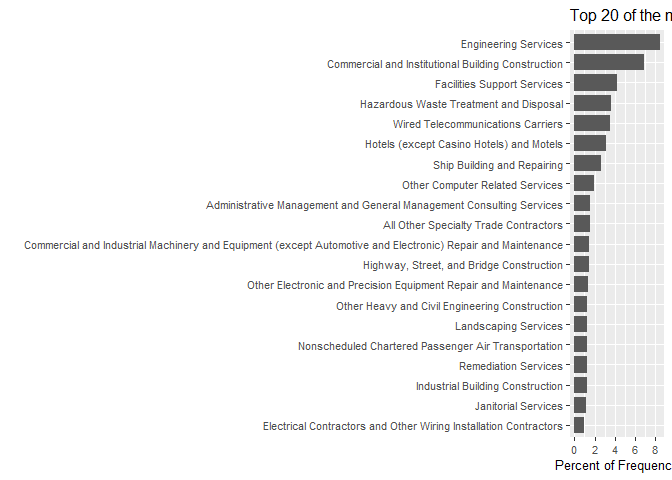<!-- -->


```r
#Percent frequency/obligation grouped bar plot for variable NAICS6
#Prepare dateframe for plot
NAICS_Freq <- def_serv %>% group_by(NAICS6) %>% summarise(
  Count_Freq=length(CSIScontractID),
  Action_Obligation_OMB20_GDP18=sum(Action_Obligation_OMB20_GDP18)
)
  
  # NAICS_Freq <- NAICS_Freq[order(-NAICS_Freq$Freq),]
# NAICS_Freq_TOP20 <- NAICS_Freq[1:20,]   #Get top 20 NAICS6 has largest frequency count
NAICS_Freq$Percent_Freq <- round(NAICS_Freq$Count_Freq/
                                   sum(NAICS_Freq$Count_Freq),4)*100
NAICS_Freq$Percent_Obli <- round(NAICS_Freq$Action_Obligation_OMB20_GDP18/
                                         sum(NAICS_Freq$Action_Obligation_OMB20_GDP18),4)*100

colnames(NAICS_Freq)[colnames(NAICS_Freq)=="NAICS6"] <- "NAICS_Code"
NAICS_Freq$NAICS_Code<-factor(NAICS_Freq$NAICS_Code)

#Get detail description for each NAICS6 code
NAICS_Freq<-read_and_join_experiment(NAICS_Freq,
                                                 lookup_file = "Lookup_PrincipalNAICScode.csv",
                                                 path="https://raw.githubusercontent.com/CSISdefense/Lookup-Tables/master/",
                                                 dir="economic/",
                                                 by=c("NAICS_Code"="principalnaicscode"),
                                                 skip_check_var=c("principalnaicscodeText",
                                                                  "NAICS_shorthand",
                                                                  "principalNAICS4DigitCode")

)
```

```
## Parsed with column specification:
## cols(
##   principalnaicscode = col_character(),
##   principalnaicscodeText = col_character(),
##   principalNAICS2DigitCode = col_double(),
##   principalNAICS3DigitCode = col_double(),
##   principalNAICS4DigitCode = col_double(),
##   NAICS_shorthand = col_character()
## )
```

```
## Warning: Column `NAICS_Code`/`principalnaicscode` joining factor and
## character vector, coercing into character vector
```

```r
NAICS_Freq <- NAICS_Freq[order(-NAICS_Freq$Percent_Freq),]
NAICS_Freq$principalnaicscodeText <- factor(NAICS_Freq$principalnaicscodeText,
                                                   levels = rev(unique(NAICS_Freq$principalnaicscodeText)))


memory.limit(56000)
```

```
## [1] 56000
```

```r
NAICS_Freq_top10Freq <- NAICS_Freq[order(-NAICS_Freq$Percent_Freq),]
NAICS_Freq_top10Freq <- NAICS_Freq_top10Freq[1:10, ]
NAICS_Freq_top10Obli <- NAICS_Freq[order(-NAICS_Freq$Percent_Obli),]
NAICS_Freq_top10Obli <- NAICS_Freq_top10Obli[1:10, ]

NAICS_Freq_TOP <- rbind( NAICS_Freq_top10Obli, NAICS_Freq_top10Freq)
NAICS_Freq_TOP <- unique(NAICS_Freq_TOP)  #18 records in total
NAICS_Freq_TOP[,c(1,4)] <- lapply(NAICS_Freq_TOP[,c(1,4)], function(x) as.character(x))
NAICS_Freq_TOP$principalnaicscodeText <- paste(NAICS_Freq_TOP$NAICS_Code, " - ", NAICS_Freq_TOP$principalnaicscodeText)

NAICS_Freq_TOP$principalnaicscodeText <- factor(NAICS_Freq_TOP$principalnaicscodeText, levels = rev(NAICS_Freq_TOP$principalnaicscodeText))
NAICS_Freq_TOP <- melt(NAICS_Freq_TOP, id = c("NAICS_Code","Count_Freq","principalnaicscodeText"))
#NAICS_Freq_TOP <- merge(NAICS_Freq_top20Freq, NAICS_Freq_top20Obli, by= "NAICS_Code", all=TRUE)

(
NAICS_barPlot <- ggplot(data = NAICS_Freq_TOP, 
                         aes(x = principalnaicscodeText, 
                             y = value,
                             fill = factor(variable))) +
                  geom_bar(stat = "identity", position = "dodge", width = 0.8) + 
                  coord_flip() +
                  xlab("") + 
                  ylab("") + 
                  theme_grey() + 
                  scale_fill_grey(labels = c("% records", "% obligation"),
                                  guide = guide_legend(reverse = TRUE)) + 
                  ggtitle("Top 18 of the most frequently appeared NAICS6") +
                  theme(text = element_text(size = 10),
                        legend.title = element_blank(),
                        legend.position = "bottom",
                        legend.margin = margin(t=-0.8, r=0, b=0.5, l=0, unit = "cm"),
                        legend.text = element_text(margin = margin(r=0.5, unit = "cm")),
                        plot.margin = margin(t=0.3, r=0.5, b=0, l=0.5, unit = "cm"))
)
```

<!-- -->

##### Detailed Industry HHI                            
                            
* cln_Def6HHI is a numeric variable based on the HHI Index of a NAICS6 code for defense contracting. Index values of 1500 and below are considered unconsolidated. 1500-2000 is considered moderately consolidated. And 2,000 and above are considered highly consolidated. The scale runs from 0 to 10,000. Data is missing for 0.00644 of records and 0.00539 of obligated dollars.

```r
# !is.na(def_serv$cln_US6sal)&
#   !is.na(def_serv$pPBSC)&
# !is.na(def_serv$pOffPSC)&

HHI_category<-c("def3_HHI_lag1","def6_HHI_lag1")
complex_category <- c("US6_avg_sal_lag1","CFTE_Rate_1year")
capacity_category <- c("pPBSC", "pOffPSC")
pair_category <- c("office_entity_ca_inc")

# def_serv$CFTE_Rate_1year
statsummary_discrete("CompOffr",def_serv)
```

```
##         CompOffr % of records % of $s
## 1 No Competition       27.14%  26.25%
## 2        1 offer       16.98%  11.48%
## 3       2 offers       13.06%  13.89%
## 4     3-4 offers       19.93%  20.34%
## 5      5+ offers       21.83%  27.31%
## 6             NA        1.06%   0.73%
```

```r
def_serv$office_entity_ca_inc<-def_serv$office_entity_numberofactions_1year+1
hhi<-statsummary_continuous(HHI_category, def_serv)
```

```
## Warning in if (!x %in% colnames(contract)) stop(paste(x, "is not a column
## in contract.")): the condition has length > 1 and only the first element
## will be used
```

```r
hhi
```

```
##   Variable_Name    Min        Max  Median Logarithmic Mean 1 unit below
## 1 def3_HHI_lag1 28.116 10,000.000 253.671          237.090      30.826 
## 2 def6_HHI_lag1 22.094 10,000.000 601.752          639.237      60.888 
##   1 unit above % of records NA % of Obligations to NA records
## 1   1,823.514            0.64%                         0.539%
## 2   6,711.109            2.42%                         0.854%
```

```r
write.csv(hhi,file="..\\Output/hhi_summary.csv")
statsummary_continuous(complex_category, def_serv)
```

```
## Warning in if (!x %in% colnames(contract)) stop(paste(x, "is not a column
## in contract.")): the condition has length > 1 and only the first element
## will be used
```

```
##      Variable_Name       Min           Max      Median Logarithmic Mean
## 1 US6_avg_sal_lag1 8,690.708   247,576.055  53,959.761       49,593.149
## 2  CFTE_Rate_1year 7,369.585 1,908,519.761 165,307.106      162,259.713
##   1 unit below 1 unit above % of records NA % of Obligations to NA records
## 1  22,215.287  110,711.173            2.95%                          1.10%
## 2  59,462.380  442,770.953            0.10%                          0.04%
```

```r
statsummary_continuous(capacity_category, def_serv,log=FALSE)
```

```
## Warning in if (!x %in% colnames(contract)) stop(paste(x, "is not a column
## in contract.")): the condition has length > 1 and only the first element
## will be used
```

```
##   Variable_Name   Min   Max Median Arithmatic Mean 1 unit below
## 1         pPBSC 0.000 1.000  0.281           0.339   -0.261  * 
## 2       pOffPSC 0.000 1.000  0.012           0.126   -0.377  * 
##   1 unit above % of records NA % of Obligations to NA records
## 1       0.939          0.0960%                             0%
## 2       0.630          0.0960%                             0%
```

```r
statsummary_continuous(pair_category, def_serv)
```

```
##          Variable_Name   Min           Max Median Logarithmic Mean
## 1 office_entity_ca_inc 1.000 7,806,579.000 27.000           34.012
##   1 unit below 1 unit above % of records NA % of Obligations to NA records
## 1    0.491  *    2,355.033           0.246%                         0.517%
```


### International
* b_Intl is a binary variable with a value of 1 for contracts/task orders with any transactions performed internationally and a value of 0 otherwise. Data is missing for 4.83e-06 of records and 0.000198 of obligated dollars.


```r
#n_Fixed(0,1), PricingFee, n_Incent, b_UCA(0,1), b_Intl
#original variable for b_UCA: UCA
#original variable for n_Fixed: FxCb
#original variable for n_Incent: Fee

grouped_barplot("Intl", def_serv)
```

<!-- -->

```r
statsummary_discrete("Intl", def_serv)
```

```
##        Intl % of records % of $s
## 1 Just U.S.       83.23%  83.94%
## 2 Any Intl.       16.77%  16.03%
## 3        NA        0.00%   0.02%
```

### Start Year


# Missing Data Measures

```r
 # load(file="data//def_sample.Rdata")

summary(def_serv$b_Term)
```

```
##    Min. 1st Qu.  Median    Mean 3rd Qu.    Max. 
## 0.00000 0.00000 0.00000 0.01879 0.00000 1.00000
```

```r
summary(def_serv$b_CBre)
```

```
##    Min. 1st Qu.  Median    Mean 3rd Qu.    Max. 
## 0.00000 0.00000 0.00000 0.06041 0.00000 1.00000
```

```r
summary(def_serv$lp_OptGrowth) #Missing
```

```
##    Min. 1st Qu.  Median    Mean 3rd Qu.    Max.    NA's 
##   0.000   0.000   0.000   0.043   0.000  17.890    7276
```

```r
summary(def_serv$ExercisedOptions)
```

```
## Length  Class   Mode 
##      0   NULL   NULL
```

```r
summary(def_serv$AnyUnmodifiedUnexercisedOptions)
```

```
##    Min. 1st Qu.  Median    Mean 3rd Qu.    Max.    NA's 
##   0.000   0.000   0.000   0.069   0.000   1.000    5977
```

```r
#Study Variables
summary(def_serv$cln_US6sal)
```

```
##    Min. 1st Qu.  Median    Mean 3rd Qu.    Max.    NA's 
##   -2.20   -0.25    0.09    0.00    0.34    1.97   36642
```

```r
summary(def_serv$cln_PSCrate)
```

```
##    Min. 1st Qu.  Median    Mean 3rd Qu.    Max.    NA's 
## -3.0800 -0.2847  0.0185  0.0000  0.3266  2.4554    1204
```

```r
summary(def_serv$cp_OffPerf7)
```

```
##    Min. 1st Qu.  Median    Mean 3rd Qu.    Max.    NA's 
## -0.5655 -0.4604 -0.0970  0.0000  0.3543  1.1010    1188
```

```r
summary(def_serv$cp_OffPSC7)
```

```
##    Min. 1st Qu.  Median    Mean 3rd Qu.    Max.    NA's 
## -0.2511 -0.2495 -0.2264  0.0000 -0.0687  1.7362    1192
```

```r
summary(def_serv$cn_PairHist7)
```

```
##    Min. 1st Qu.  Median    Mean 3rd Qu.    Max.    NA's 
## -0.7276 -0.5200  0.1027  0.0000  0.5179  0.7255    3052
```

```r
summary(def_serv$cln_PairCA)
```

```
##    Min. 1st Qu.  Median    Mean 3rd Qu.    Max.    NA's 
## -0.8322 -0.4094 -0.0545  0.0000  0.3182  2.9129    3052
```

```r
#Controls
summary(def_serv$CompOffr)
```

```
## No Competition        1 offer       2 offers     3-4 offers      5+ offers 
##         336894         210759         162167         247460         271022 
##           NA's 
##          13147
```

```r
summary(def_serv$cl_Offr)
```

```
##    Min. 1st Qu.  Median    Mean 3rd Qu.    Max.    NA's 
##  -0.446  -0.446  -0.075   0.000   0.297   3.254   13116
```

```r
summary(def_serv$cl_Ceil)
```

```
##    Min. 1st Qu.  Median    Mean 3rd Qu.    Max.    NA's 
##  -3.423  -0.350  -0.031   0.000   0.312   3.272    3990
```

```r
summary(def_serv$capped_cln_Days)
```

```
## Length  Class   Mode 
##      0   NULL   NULL
```

```r
summary(def_serv$Veh) 
```

```
##  Def/Pur    S-IDC    M-IDC FSS/GWAC  BPA/BOA     NA's 
##   357013   613264   160315    50284    59909      664
```

```r
summary(def_serv$Pricing)
```

```
##                  FFP             Other FP            Incentive 
##              1008903                11023                 4267 
## Combination or Other             Other CB         T&M/LH/FPLOE 
##                11343                63690                21230 
##                  UCA                 NA's 
##                12363               108630
```

```r
summary(def_serv$Place)
```

```
##    Length     Class      Mode 
##   1241449 character character
```

```r
summary(def_serv$NAICS6)
```

```
##    Min. 1st Qu.  Median    Mean 3rd Qu.    Max.    NA's 
##   54171  336413  541330  489853  561920  928120    4075
```

```r
summary(def_serv$NAICS3)
```

```
##    Min. 1st Qu.  Median    Mean 3rd Qu.    Max.    NA's 
##   111.0   336.0   541.0   493.3   561.0   928.0    4075
```

```r
summary(def_serv$Office)
```

```
##    Length     Class      Mode 
##   1241449 character character
```

```r
summary(def_serv$Agency)
```

```
##   *ODD   1450   1700   2100   3600   4730   4745   5700   6950   7012 
##      0      0 411473 498204      0      0      0 175993      0      0 
##   8900   96CE   9700   9748   9760   9761   9763   9770   9771   9773 
##      4      8      0    661    845    676   1939      0    304      0 
##   9776   9777   97AB   97AE   97AK   97AS   97AT   97AV   97AZ   97BZ 
##  24519    111      0     92  41912  58234   1992    411      1   1317 
##   97DH   97F1   97F2   97F5   97F7   97HW   97JC   97ZS   NA's 
##    572    810   4405   4278     81   1671    326   9846    764
```

```r
summary(def_serv$StartCY)
```

```
##    Min. 1st Qu.  Median    Mean 3rd Qu.    Max. 
##    2008    2009    2011    2011    2013    2015
```

```r
summary(def_serv$cln_Def3HHI)
```

```
##    Min. 1st Qu.  Median    Mean 3rd Qu.    Max.    NA's 
##  -1.045  -0.457   0.033   0.000   0.326   1.834    8001
```

```r
summary(def_serv$clr_Def3toUS)
```

```
##    Min. 1st Qu.  Median    Mean 3rd Qu.    Max.    NA's 
##  -0.556  -0.455  -0.110   0.000   0.452   2.092   14579
```

```r
summary(def_serv$cln_Def6HHI)
```

```
##    Min. 1st Qu.  Median    Mean 3rd Qu.    Max.    NA's 
##  -1.431  -0.314  -0.026   0.000   0.374   1.170   30108
```

```r
summary(def_serv$cln_Def6Obl)
```

```
##    Min. 1st Qu.  Median    Mean 3rd Qu.    Max.    NA's 
##  -2.861  -0.315  -0.015   0.000   0.448   0.830   31332
```

```r
summary(def_serv$clr_Def6toUS)
```

```
##    Min. 1st Qu.  Median    Mean 3rd Qu.    Max.    NA's 
##   -0.33   -0.25   -0.18    0.00    0.11   15.27   36642
```

```r
#New Controls
summary(def_serv$cl_OffCA)
```

```
##    Min. 1st Qu.  Median    Mean 3rd Qu.    Max.    NA's 
## -2.2258 -0.2093  0.0140  0.0000  0.2338  2.4019    1188
```

```r
summary(def_serv$cl_OffCA)
```

```
##    Min. 1st Qu.  Median    Mean 3rd Qu.    Max.    NA's 
## -2.2258 -0.2093  0.0140  0.0000  0.2338  2.4019    1188
```

```r
summary(def_serv$cp_PairObl7)
```

```
##    Min. 1st Qu.  Median    Mean 3rd Qu.    Max.    NA's 
## -0.1568 -0.1566 -0.1509  0.0000 -0.0951  3.0486    3052
```

```r
summary(def_serv$Crisis)
```

```
##   Other    ARRA     Dis     OCO 
## 1160883    6526    1917   72123
```

```r
complete<-
  #Dependent Variables
  !is.na(def_serv$b_Term)& #summary(def_serv$b_Term)
  !is.na(def_serv$b_CBre)&
  !is.na(def_serv$lp_OptGrowth)&
  !is.na(def_serv$ExercisedOptions)&
  !is.na(def_serv$AnyUnmodifiedUnexercisedOptions)&
  #Study Variables
  !is.na(def_serv$cln_US6sal)&
  !is.na(def_serv$cln_PSCrate)&
  !is.na(def_serv$cp_OffPerf7)&
  !is.na(def_serv$cp_OffPSC7)&
  !is.na(def_serv$cn_PairHist7)&
  !is.na(def_serv$cln_PairCA)&
  #Controls
  !is.na(def_serv$CompOffr)&
  !is.na(def_serv$cl_Offr)&
  !is.na(def_serv$cl_Ceil)&
  !is.na(def_serv$capped_cln_Days)&
  !is.na(def_serv$Veh) &
  !is.na(def_serv$Pricing)&
  !is.na(def_serv$Place)& #New Variable
  # !is.na(def_serv$b_UCA)& No longer  used
  !is.na(def_serv$NAICS6)&
  !is.na(def_serv$NAICS3)&
  !is.na(def_serv$Office)&
  !is.na(def_serv$Agency)&
  !is.na(def_serv$StartCY)&
  !is.na(def_serv$cln_Def3HHI)&
  !is.na(def_serv$clr_Def3toUS)&
  !is.na(def_serv$cln_Def6HHI)&
  !is.na(def_serv$cln_Def6OblConst)&
  !is.na(def_serv$clr_Def6toUS)&
  #New Controls
  !is.na(def_serv$cl_OffCA)& #summary(def_serv$cl_OffCA)
  !is.na(def_serv$cln_OffObl7)& #summary(def_serv$cln_OffObl7)
  !is.na(def_serv$cp_PairObl7)&  #summary(def_serv$cp_PairObl7)
  !is.na(def_serv$Crisis)  #summary(def_serv$cp_PairObl7)


summary(complete)
```

```
##    Mode 
## logical
```

```r
summary(def_serv$Action_Obligation_OMB20_GDP18)
```

```
##       Min.    1st Qu.     Median       Mean    3rd Qu.       Max. 
##   -6369931       6907      29592     585994     143976 9489310163
```

```r
money<-def_serv$Action_Obligation_OMB20_GDP18
any(def_serv$Action_Obligation_OMB20_GDP18<0)
```

```
## [1] TRUE
```

```r
money[def_serv$Action_Obligation_OMB20_GDP18<0]<-0
sum(def_serv$Action_Obligation_OMB20_GDP18[def_serv$Action_Obligation_OMB20_GDP18<0])
```

```
## [1] -19391790
```

```r
#Overall
length(money[!complete])/length(money)
```

```
## [1] 0
```

```r
sum(money[!complete],na.rm=TRUE)/sum(money,na.rm=TRUE)
```

```
## [1] 0
```

```r
#What portion of contracts have potential options, 
sum(money[def_serv$AnyUnmodifiedUnexercisedOptions==1],na.rm=TRUE)/
  sum(money,na.rm=TRUE)
```

```
## [1] 0.2685101
```

```r
#Missing data, how many records
nrow(def_serv[!complete,])/nrow(def_serv)
```

```
## [1] 0
```

```r
sum(def_serv[!complete,]$Action_Obligation_OMB20_GDP18.OMB20,na.rm=TRUE)/sum(def_serv$Action.Obligation.OMB20_GDP18,na.rm=TRUE)
```

```
## [1] NaN
```

```r
#Missing data how much money?
length(money[!complete&def_serv$AnyUnmodifiedUnexercisedOptions==1])/
  length(money[def_serv$AnyUnmodifiedUnexercisedOptions==1])
```

```
## [1] 0
```

```r
sum(money[!complete&def_serv$AnyUnmodifiedUnexercisedOptions==1],na.rm=TRUE)/
  sum(money[def_serv$AnyUnmodifiedUnexercisedOptions==1],na.rm=TRUE)
```

```
## [1] 0
```
