---
title: "Defense Services Ceiling Breaches "
author: "Greg Sanders, Justin Graham"
date: "Friday July 13, 2019"
output:
  html_document:
    keep_md: yes
--- 

Modeling Likelihood or size of Ceiling Breach
============================================================================

#Setup


##Load Data
First we load the data. The dataset used is a U.S. Defense Contracting dataset derived from FPDS.


```r
load(file="..//data//clean//def_sample.Rdata")
```

The sample is created by including the entirity of the ARRA and Disaster datasets, as well as 100,000 records each from the OCO datase and another 100,000 from all remaining records.

#Study Variables

##Services Complexity
Expectation: Higher service complexity would make work more demanding and thus raises the risks of negative contracting outcomes, namely the likelihood of cost ceiling breaches and terminations increases and the likelihood exercised options decraeses.

### 01A NAICS Salary
Expectation: Given the fact that one source for higher salaries is the difficulty of the work and the experience and education required, as average NAICS salary increases (decreases), the likelihood of cost ceiling breaches and terminations increases (decreases) and exercised options decreases (increases).  We also then expect that higher average NAICS salaries (lower) will be correlated with ceiling breaches larger (smaller) in absolute size.


```r
summary_continuous_plot(serv_smp1m,metric="cbre","cl_US6_avg_sal_lag1Const")
```

```
## Warning: summarise_() is deprecated. 
## Please use summarise() instead
## 
## The 'programming' vignette or the tidyeval book can help you
## to program with summarise() : https://tidyeval.tidyverse.org
## This warning is displayed once per session.
```

```
## Warning in `[<-.factor`(`*tmp*`, ri, value = c(0, 0, 0, 0, 0, 0, 0, 0, 0, :
## invalid factor level, NA generated
```

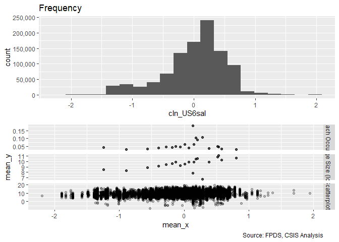<!-- -->

```r
#Scatter Plot of n_CBre01A
ggplot(serv_smp, aes(x=cl_US6_avg_sal_lag1Const, y=ln_CBre_OMB20_GDP18)) + geom_point(alpha = 0.1) + ggtitle('Ceiling Breach Growth') + theme(plot.title = element_text(hjust = 0.5))
```

<!-- -->

```r
#Model
b_CBre01A <- glm (data=serv_smp,
                 b_CBre ~ cl_US6_avg_sal_lag1Const, family=binomial(link="logit"))
display(b_CBre01A)
```

```
## glm(formula = b_CBre ~ cl_US6_avg_sal_lag1Const, family = binomial(link = "logit"), 
##     data = serv_smp)
##                          coef.est coef.se
## (Intercept)              -2.78     0.01  
## cl_US6_avg_sal_lag1Const  0.22     0.02  
## ---
##   n = 250000, k = 2
##   residual deviance = 111754.1, null deviance = 111909.6 (difference = 155.5)
```

```r
n_CBre01A <- glm(data=serv_breach,
                        ln_CBre_OMB20_GDP18 ~ cl_US6_avg_sal_lag1Const)
display(n_CBre01A)
```

```
## glm(formula = ln_CBre_OMB20_GDP18 ~ cl_US6_avg_sal_lag1Const, 
##     data = serv_breach)
##                          coef.est coef.se
## (Intercept)              9.26     0.01   
## cl_US6_avg_sal_lag1Const 0.87     0.03   
## ---
##   n = 61184, k = 2
##   residual deviance = 448659.6, null deviance = 456211.7 (difference = 7552.2)
##   overdispersion parameter = 7.3
##   residual sd is sqrt(overdispersion) = 2.71
```

```r
#Plot residuals versus fitted
stargazer::stargazer(b_CBre01A,n_CBre01A,type="text",
                       digits=2)
```

```
## 
## =======================================================
##                               Dependent variable:      
##                          ------------------------------
##                            b_CBre   ln_CBre_OMB20_GDP18
##                           logistic        normal       
##                             (1)             (2)        
## -------------------------------------------------------
## cl_US6_avg_sal_lag1Const  0.22***         0.87***      
##                            (0.02)         (0.03)       
##                                                        
## Constant                  -2.78***        9.26***      
##                            (0.01)         (0.01)       
##                                                        
## -------------------------------------------------------
## Observations              250,000         61,184       
## Log Likelihood           -55,877.03     -147,768.20    
## Akaike Inf. Crit.        111,758.10     295,540.40     
## =======================================================
## Note:                       *p<0.1; **p<0.05; ***p<0.01
```

Individually, expectations are matched for ceiing breaches, as higher average salaries estimate a higher risk of ceiling breaches.  In our GLM, we find an analogous relationship to our logit model, with higher salaries correlated with ceiling breaches of larger magnitudes.

### 01B Invoice Rate
Expectation: The invoice rate approximates how much the government is charged annually for each comparable full-time employees who are supporting the service contracts. A higher invoice rate indicates a more complex service. As invoice rate increases (decreases), the likelihood of cost ceiling breaches and terminations increases (decreases), and exercised options decrease (increase).  Likewise, we expect a higher invoice rate (lower) to be associated with ceiling breaches larger (smaller) in absolute magnitude.


```r
summary_continuous_plot(serv_smp1m,metric="cbre","cl_CFTE")
```

```
## Warning in `[<-.factor`(`*tmp*`, ri, value = c(0, 0, 0, 0, 0, 0, 0, 0, 0, :
## invalid factor level, NA generated
```

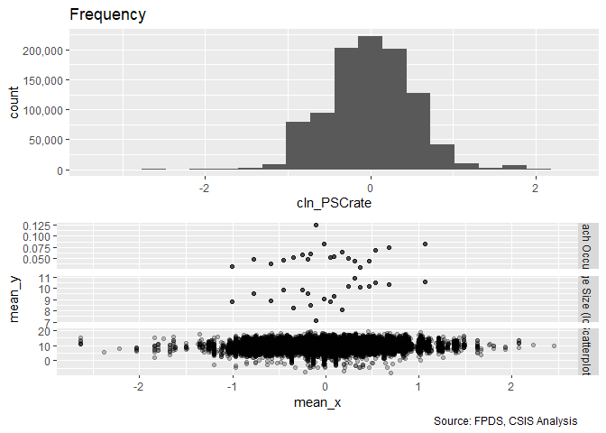<!-- -->

```r
#Scatter Plot 
ggplot(serv_smp, aes(x=cl_CFTE, y=ln_CBre_OMB20_GDP18)) + geom_point(alpha = 0.1) + ggtitle('Ceiling Breach Growth') + theme(plot.title = element_text(hjust = 0.5))
```

<!-- -->

```r
#Model
b_CBre01B <- glm (data=serv_smp,
                 b_CBre ~ cl_CFTE, family=binomial(link="logit"))
display(b_CBre01B)
```

```
## glm(formula = b_CBre ~ cl_CFTE, family = binomial(link = "logit"), 
##     data = serv_smp)
##             coef.est coef.se
## (Intercept) -2.78     0.01  
## cl_CFTE      0.21     0.02  
## ---
##   n = 250000, k = 2
##   residual deviance = 111763.5, null deviance = 111909.6 (difference = 146.0)
```

```r
n_CBre01B <- glm(data=serv_breach,
                        ln_CBre_OMB20_GDP18 ~ cl_CFTE)


#Plot residuals versus fitted
  stargazer::stargazer(b_CBre01A,b_CBre01B,
                       
                       n_CBre01A,n_CBre01B,
                       type="text",
                       digits=2)
```

```
## 
## ======================================================================
##                                       Dependent variable:             
##                          ---------------------------------------------
##                                 b_CBre           ln_CBre_OMB20_GDP18  
##                                logistic                normal         
##                             (1)        (2)         (3)         (4)    
## ----------------------------------------------------------------------
## cl_US6_avg_sal_lag1Const  0.22***                0.87***              
##                            (0.02)                (0.03)               
##                                                                       
## cl_CFTE                              0.21***                 1.20***  
##                                       (0.02)                 (0.02)   
##                                                                       
## Constant                  -2.78***   -2.78***    9.26***     9.25***  
##                            (0.01)     (0.01)     (0.01)      (0.01)   
##                                                                       
## ----------------------------------------------------------------------
## Observations              250,000    250,000     61,184      61,184   
## Log Likelihood           -55,877.03 -55,881.77 -147,768.20 -146,959.50
## Akaike Inf. Crit.        111,758.10 111,767.60 295,540.40  293,923.10 
## ======================================================================
## Note:                                      *p<0.1; **p<0.05; ***p<0.01
```

```r
debug(summary_residual_compare)
summary_residual_compare(b_CBre01A,b_CBre01B, skip_vif = TRUE)
```

```
## debugging in: summary_residual_compare(b_CBre01A, b_CBre01B, skip_vif = TRUE)
## debug: {
##     if (skip_vif == FALSE) 
##         warning("Deprecating VIF. Just use glmer_examine on the models")
##     if (!is.na(bins)) {
##         if ("cl_US6_avg_sal_lag1Const" %in% model_colnames(model1_old) & 
##             "cl_US6_avg_sal_lag1Const" %in% model_colnames(model1_new)) 
##             bins <- bins + 5
##         if ("cl_CFTE" %in% model_colnames(model1_old) & "cl_CFTE" %in% 
##             model_colnames(model1_new)) 
##             bins <- bins + 5
##         if ("c_pPBSC" %in% model_colnames(model1_old) & "c_pPBSC" %in% 
##             model_colnames(model1_new)) 
##             bins <- bins + 5
##         if ("c_pOffPSC" %in% model_colnames(model1_old) & "c_pOffPSC" %in% 
##             model_colnames(model1_new)) 
##             bins <- bins + 5
##         if ("cl_pairCA" %in% model_colnames(model1_old) & "cl_pairCA" %in% 
##             model_colnames(model1_new)) 
##             bins <- bins + 5
##         if ("c_OffCri" %in% model_colnames(model1_old) & "c_OffCri" %in% 
##             model_colnames(model1_new)) 
##             bins <- bins + 5
##         if (("cl_Ceil" %in% model_colnames(model1_old) & "cl_Ceil" %in% 
##             model_colnames(model1_new)) | ("cl_Ceil_Then_Year" %in% 
##             model_colnames(model1_old) & "cl_Ceil_Then_Year" %in% 
##             model_colnames(model1_new))) 
##             bins <- bins + 10
##         if ("cl_Days" %in% model_colnames(model1_old) & "cl_Days" %in% 
##             model_colnames(model1_new)) 
##             bins <- bins + 5
##     }
##     if (!is.null(model2_new)) {
##         gridExtra::grid.arrange(binned_fitted_versus_residuals(model1_old, 
##             bins = bins), binned_fitted_versus_residuals(model1_new, 
##             bins = bins), binned_fitted_versus_residuals(model2_old, 
##             bins = bins), binned_fitted_versus_residuals(model2_new, 
##             bins = bins), ncol = 2)
##         if (!"b_Term" %in% model_colnames(model1_old) & !"b_CBre" %in% 
##             model_colnames(model1_old)) 
##             gridExtra::grid.arrange(resid_plot(model1_old, sample = 25000), 
##                 resid_plot(model1_new, sample = 25000), resid_plot(model2_old, 
##                   sample = 25000), resid_plot(model2_new, sample = 25000), 
##                 ncol = 2)
##         if (!"b_Term" %in% colnames(model1_old) & !"b_CBre" %in% 
##             model_colnames(model1_old)) 
##             gridExtra::grid.arrange(residuals_binned(model1_old, 
##                 bins = bins), residuals_binned(model1_new, bins = bins), 
##                 residuals_binned(model2_old, bins = bins), residuals_binned(model2_new, 
##                   bins = bins), ncol = 2)
##         if ("cl_Ceil" %in% model_colnames(model1_new)) {
##             residual_compare(model1_old, model1_new, model2_old, 
##                 model2_new, "cl_Ceil", "Centered Log(Ceiling)", 
##                 20)
##         }
##         if ("cl_Days" %in% model_colnames(model1_new)) {
##             residual_compare(model1_old, model1_new, model2_old, 
##                 model2_new, "cl_Days", "Centered Log(Days)", 
##                 10)
##         }
##         output <- NULL
##         if (class(model1_new) == "glmerMod" & class(model2_new) == 
##             "glmerMod") {
##             m1t <- getME(model1_new, "theta")
##             m1l <- getME(model1_new, "lower")
##             m2t <- getME(model2_new, "theta")
##             m2l <- getME(model2_new, "lower")
##             output <- list(m1t[m1l == 0], m2t[m2l == 0], model1_new@optinfo$conv$lme4$messages, 
##                 model2_new@optinfo$conv$lme4$messages)
##         }
##         else if ((class(model1_new) != "glmerMod" & class(model2_new) != 
##             "glmerMod") & (class(model1_old) != "glmerMod" & 
##             class(model2_old) != "glmerMod")) {
##             output <- list(rbind(deviance_stats(model1_old, "model1_old"), 
##                 deviance_stats(model1_new, "model1_new"), deviance_stats(model2_old, 
##                   "model2_old"), deviance_stats(model2_new, "model2_new")))
##         }
##     }
##     else if (!is.null(model1_new)) {
##         gridExtra::grid.arrange(binned_fitted_versus_residuals(model1_old, 
##             bins = bins), binned_fitted_versus_residuals(model1_new, 
##             bins = bins), ncol = 2)
##         if (!"b_Term" %in% model_colnames(model1_old) & !"b_CBre" %in% 
##             model_colnames(model1_old)) 
##             gridExtra::grid.arrange(resid_plot(model1_old, sample = 25000), 
##                 resid_plot(model1_new, sample = 25000), ncol = 2)
##         gridExtra::grid.arrange(residuals_binned(model1_old, 
##             bins = bins), residuals_binned(model1_new, bins = bins), 
##             ncol = 2)
##         output <- NULL
##         if (class(model1_new) == "glmerMod") {
##             m1t <- getME(model1_new, "theta")
##             m1l <- getME(model1_new, "lower")
##             output <- list(m1t[m1l == 0], model1_new@optinfo$conv$lme4$messages)
##         }
##         else if (class(model1_new) != "glmerMod" & class(model1_old) != 
##             "glmerMod") {
##             output <- list(rbind(deviance_stats(model1_old, "model1_old"), 
##                 deviance_stats(model1_new, "model1_new")))
##         }
##     }
##     else {
##         if (!is.na(bins)) {
##             if ("cl_US6_avg_sal_lag1Const" %in% model_colnames(model1_old)) 
##                 bins <- bins + 5
##             if ("cl_CFTE" %in% model_colnames(model1_old)) 
##                 bins <- bins + 5
##             if ("c_pPBSC" %in% model_colnames(model1_old)) 
##                 bins <- bins + 5
##             if ("c_pOffPSC" %in% model_colnames(model1_old)) 
##                 bins <- bins + 5
##             if ("cl_pairCA" %in% model_colnames(model1_old)) 
##                 bins <- bins + 5
##             if ("c_OffCri" %in% model_colnames(model1_old)) 
##                 bins <- bins + 5
##             if (("cl_Ceil" %in% model_colnames(model1_old)) | 
##                 ("cl_Ceil_Then_Year" %in% model_colnames(model1_old))) 
##                 bins <- bins + 10
##             if ("cl_Days" %in% model_colnames(model1_old)) 
##                 bins <- bins + 5
##         }
##         if (!"b_Term" %in% model_colnames(model1_old) & !"b_CBre" %in% 
##             model_colnames(model1_old)) 
##             gridExtra::grid.arrange(binned_fitted_versus_residuals(model1_old, 
##                 bins = bins), residuals_binned(model1_old, bins = bins), 
##                 resid_plot(model1_old, sample = 25000))
##         else gridExtra::grid.arrange(binned_fitted_versus_residuals(model1_old, 
##             bins = bins), residuals_binned(model1_old, bins = bins))
##         output <- NULL
##         if (class(model1_old) == "glmerMod") {
##             m1t <- getME(model1_old, "theta")
##             m1l <- getME(model1_old, "lower")
##             output <- list(m1t[m1l == 0], model1_old@optinfo$conv$lme4$messages)
##         }
##         else if (class(model1_old) != "glmerMod" & class(model1_old) != 
##             "glmerMod") {
##             output <- list(deviance_stats(model1_old, "model1_old"))
##         }
##     }
##     output
## }
## debug: if (skip_vif == FALSE) warning("Deprecating VIF. Just use glmer_examine on the models")
## debug: if (!is.na(bins)) {
##     if ("cl_US6_avg_sal_lag1Const" %in% model_colnames(model1_old) & 
##         "cl_US6_avg_sal_lag1Const" %in% model_colnames(model1_new)) 
##         bins <- bins + 5
##     if ("cl_CFTE" %in% model_colnames(model1_old) & "cl_CFTE" %in% 
##         model_colnames(model1_new)) 
##         bins <- bins + 5
##     if ("c_pPBSC" %in% model_colnames(model1_old) & "c_pPBSC" %in% 
##         model_colnames(model1_new)) 
##         bins <- bins + 5
##     if ("c_pOffPSC" %in% model_colnames(model1_old) & "c_pOffPSC" %in% 
##         model_colnames(model1_new)) 
##         bins <- bins + 5
##     if ("cl_pairCA" %in% model_colnames(model1_old) & "cl_pairCA" %in% 
##         model_colnames(model1_new)) 
##         bins <- bins + 5
##     if ("c_OffCri" %in% model_colnames(model1_old) & "c_OffCri" %in% 
##         model_colnames(model1_new)) 
##         bins <- bins + 5
##     if (("cl_Ceil" %in% model_colnames(model1_old) & "cl_Ceil" %in% 
##         model_colnames(model1_new)) | ("cl_Ceil_Then_Year" %in% 
##         model_colnames(model1_old) & "cl_Ceil_Then_Year" %in% 
##         model_colnames(model1_new))) 
##         bins <- bins + 10
##     if ("cl_Days" %in% model_colnames(model1_old) & "cl_Days" %in% 
##         model_colnames(model1_new)) 
##         bins <- bins + 5
## }
## debug: if ("cl_US6_avg_sal_lag1Const" %in% model_colnames(model1_old) & 
##     "cl_US6_avg_sal_lag1Const" %in% model_colnames(model1_new)) bins <- bins + 
##     5
## debug: if ("cl_CFTE" %in% model_colnames(model1_old) & "cl_CFTE" %in% 
##     model_colnames(model1_new)) bins <- bins + 5
## debug: if ("c_pPBSC" %in% model_colnames(model1_old) & "c_pPBSC" %in% 
##     model_colnames(model1_new)) bins <- bins + 5
## debug: if ("c_pOffPSC" %in% model_colnames(model1_old) & "c_pOffPSC" %in% 
##     model_colnames(model1_new)) bins <- bins + 5
## debug: if ("cl_pairCA" %in% model_colnames(model1_old) & "cl_pairCA" %in% 
##     model_colnames(model1_new)) bins <- bins + 5
## debug: if ("c_OffCri" %in% model_colnames(model1_old) & "c_OffCri" %in% 
##     model_colnames(model1_new)) bins <- bins + 5
## debug: if (("cl_Ceil" %in% model_colnames(model1_old) & "cl_Ceil" %in% 
##     model_colnames(model1_new)) | ("cl_Ceil_Then_Year" %in% model_colnames(model1_old) & 
##     "cl_Ceil_Then_Year" %in% model_colnames(model1_new))) bins <- bins + 
##     10
## debug: if ("cl_Days" %in% model_colnames(model1_old) & "cl_Days" %in% 
##     model_colnames(model1_new)) bins <- bins + 5
## debug: if (!is.null(model2_new)) {
##     gridExtra::grid.arrange(binned_fitted_versus_residuals(model1_old, 
##         bins = bins), binned_fitted_versus_residuals(model1_new, 
##         bins = bins), binned_fitted_versus_residuals(model2_old, 
##         bins = bins), binned_fitted_versus_residuals(model2_new, 
##         bins = bins), ncol = 2)
##     if (!"b_Term" %in% model_colnames(model1_old) & !"b_CBre" %in% 
##         model_colnames(model1_old)) 
##         gridExtra::grid.arrange(resid_plot(model1_old, sample = 25000), 
##             resid_plot(model1_new, sample = 25000), resid_plot(model2_old, 
##                 sample = 25000), resid_plot(model2_new, sample = 25000), 
##             ncol = 2)
##     if (!"b_Term" %in% colnames(model1_old) & !"b_CBre" %in% 
##         model_colnames(model1_old)) 
##         gridExtra::grid.arrange(residuals_binned(model1_old, 
##             bins = bins), residuals_binned(model1_new, bins = bins), 
##             residuals_binned(model2_old, bins = bins), residuals_binned(model2_new, 
##                 bins = bins), ncol = 2)
##     if ("cl_Ceil" %in% model_colnames(model1_new)) {
##         residual_compare(model1_old, model1_new, model2_old, 
##             model2_new, "cl_Ceil", "Centered Log(Ceiling)", 20)
##     }
##     if ("cl_Days" %in% model_colnames(model1_new)) {
##         residual_compare(model1_old, model1_new, model2_old, 
##             model2_new, "cl_Days", "Centered Log(Days)", 10)
##     }
##     output <- NULL
##     if (class(model1_new) == "glmerMod" & class(model2_new) == 
##         "glmerMod") {
##         m1t <- getME(model1_new, "theta")
##         m1l <- getME(model1_new, "lower")
##         m2t <- getME(model2_new, "theta")
##         m2l <- getME(model2_new, "lower")
##         output <- list(m1t[m1l == 0], m2t[m2l == 0], model1_new@optinfo$conv$lme4$messages, 
##             model2_new@optinfo$conv$lme4$messages)
##     }
##     else if ((class(model1_new) != "glmerMod" & class(model2_new) != 
##         "glmerMod") & (class(model1_old) != "glmerMod" & class(model2_old) != 
##         "glmerMod")) {
##         output <- list(rbind(deviance_stats(model1_old, "model1_old"), 
##             deviance_stats(model1_new, "model1_new"), deviance_stats(model2_old, 
##                 "model2_old"), deviance_stats(model2_new, "model2_new")))
##     }
## } else if (!is.null(model1_new)) {
##     gridExtra::grid.arrange(binned_fitted_versus_residuals(model1_old, 
##         bins = bins), binned_fitted_versus_residuals(model1_new, 
##         bins = bins), ncol = 2)
##     if (!"b_Term" %in% model_colnames(model1_old) & !"b_CBre" %in% 
##         model_colnames(model1_old)) 
##         gridExtra::grid.arrange(resid_plot(model1_old, sample = 25000), 
##             resid_plot(model1_new, sample = 25000), ncol = 2)
##     gridExtra::grid.arrange(residuals_binned(model1_old, bins = bins), 
##         residuals_binned(model1_new, bins = bins), ncol = 2)
##     output <- NULL
##     if (class(model1_new) == "glmerMod") {
##         m1t <- getME(model1_new, "theta")
##         m1l <- getME(model1_new, "lower")
##         output <- list(m1t[m1l == 0], model1_new@optinfo$conv$lme4$messages)
##     }
##     else if (class(model1_new) != "glmerMod" & class(model1_old) != 
##         "glmerMod") {
##         output <- list(rbind(deviance_stats(model1_old, "model1_old"), 
##             deviance_stats(model1_new, "model1_new")))
##     }
## } else {
##     if (!is.na(bins)) {
##         if ("cl_US6_avg_sal_lag1Const" %in% model_colnames(model1_old)) 
##             bins <- bins + 5
##         if ("cl_CFTE" %in% model_colnames(model1_old)) 
##             bins <- bins + 5
##         if ("c_pPBSC" %in% model_colnames(model1_old)) 
##             bins <- bins + 5
##         if ("c_pOffPSC" %in% model_colnames(model1_old)) 
##             bins <- bins + 5
##         if ("cl_pairCA" %in% model_colnames(model1_old)) 
##             bins <- bins + 5
##         if ("c_OffCri" %in% model_colnames(model1_old)) 
##             bins <- bins + 5
##         if (("cl_Ceil" %in% model_colnames(model1_old)) | ("cl_Ceil_Then_Year" %in% 
##             model_colnames(model1_old))) 
##             bins <- bins + 10
##         if ("cl_Days" %in% model_colnames(model1_old)) 
##             bins <- bins + 5
##     }
##     if (!"b_Term" %in% model_colnames(model1_old) & !"b_CBre" %in% 
##         model_colnames(model1_old)) 
##         gridExtra::grid.arrange(binned_fitted_versus_residuals(model1_old, 
##             bins = bins), residuals_binned(model1_old, bins = bins), 
##             resid_plot(model1_old, sample = 25000))
##     else gridExtra::grid.arrange(binned_fitted_versus_residuals(model1_old, 
##         bins = bins), residuals_binned(model1_old, bins = bins))
##     output <- NULL
##     if (class(model1_old) == "glmerMod") {
##         m1t <- getME(model1_old, "theta")
##         m1l <- getME(model1_old, "lower")
##         output <- list(m1t[m1l == 0], model1_old@optinfo$conv$lme4$messages)
##     }
##     else if (class(model1_old) != "glmerMod" & class(model1_old) != 
##         "glmerMod") {
##         output <- list(deviance_stats(model1_old, "model1_old"))
##     }
## }
## debug: if (!is.null(model1_new)) {
##     gridExtra::grid.arrange(binned_fitted_versus_residuals(model1_old, 
##         bins = bins), binned_fitted_versus_residuals(model1_new, 
##         bins = bins), ncol = 2)
##     if (!"b_Term" %in% model_colnames(model1_old) & !"b_CBre" %in% 
##         model_colnames(model1_old)) 
##         gridExtra::grid.arrange(resid_plot(model1_old, sample = 25000), 
##             resid_plot(model1_new, sample = 25000), ncol = 2)
##     gridExtra::grid.arrange(residuals_binned(model1_old, bins = bins), 
##         residuals_binned(model1_new, bins = bins), ncol = 2)
##     output <- NULL
##     if (class(model1_new) == "glmerMod") {
##         m1t <- getME(model1_new, "theta")
##         m1l <- getME(model1_new, "lower")
##         output <- list(m1t[m1l == 0], model1_new@optinfo$conv$lme4$messages)
##     }
##     else if (class(model1_new) != "glmerMod" & class(model1_old) != 
##         "glmerMod") {
##         output <- list(rbind(deviance_stats(model1_old, "model1_old"), 
##             deviance_stats(model1_new, "model1_new")))
##     }
## } else {
##     if (!is.na(bins)) {
##         if ("cl_US6_avg_sal_lag1Const" %in% model_colnames(model1_old)) 
##             bins <- bins + 5
##         if ("cl_CFTE" %in% model_colnames(model1_old)) 
##             bins <- bins + 5
##         if ("c_pPBSC" %in% model_colnames(model1_old)) 
##             bins <- bins + 5
##         if ("c_pOffPSC" %in% model_colnames(model1_old)) 
##             bins <- bins + 5
##         if ("cl_pairCA" %in% model_colnames(model1_old)) 
##             bins <- bins + 5
##         if ("c_OffCri" %in% model_colnames(model1_old)) 
##             bins <- bins + 5
##         if (("cl_Ceil" %in% model_colnames(model1_old)) | ("cl_Ceil_Then_Year" %in% 
##             model_colnames(model1_old))) 
##             bins <- bins + 10
##         if ("cl_Days" %in% model_colnames(model1_old)) 
##             bins <- bins + 5
##     }
##     if (!"b_Term" %in% model_colnames(model1_old) & !"b_CBre" %in% 
##         model_colnames(model1_old)) 
##         gridExtra::grid.arrange(binned_fitted_versus_residuals(model1_old, 
##             bins = bins), residuals_binned(model1_old, bins = bins), 
##             resid_plot(model1_old, sample = 25000))
##     else gridExtra::grid.arrange(binned_fitted_versus_residuals(model1_old, 
##         bins = bins), residuals_binned(model1_old, bins = bins))
##     output <- NULL
##     if (class(model1_old) == "glmerMod") {
##         m1t <- getME(model1_old, "theta")
##         m1l <- getME(model1_old, "lower")
##         output <- list(m1t[m1l == 0], model1_old@optinfo$conv$lme4$messages)
##     }
##     else if (class(model1_old) != "glmerMod" & class(model1_old) != 
##         "glmerMod") {
##         output <- list(deviance_stats(model1_old, "model1_old"))
##     }
## }
## debug: gridExtra::grid.arrange(binned_fitted_versus_residuals(model1_old, 
##     bins = bins), binned_fitted_versus_residuals(model1_new, 
##     bins = bins), ncol = 2)
```

<!-- -->

```
## debug: if (!"b_Term" %in% model_colnames(model1_old) & !"b_CBre" %in% 
##     model_colnames(model1_old)) gridExtra::grid.arrange(resid_plot(model1_old, 
##     sample = 25000), resid_plot(model1_new, sample = 25000), 
##     ncol = 2)
## debug: gridExtra::grid.arrange(residuals_binned(model1_old, bins = bins), 
##     residuals_binned(model1_new, bins = bins), ncol = 2)
```

```
## debug: output <- NULL
## debug: if (class(model1_new) == "glmerMod") {
##     m1t <- getME(model1_new, "theta")
##     m1l <- getME(model1_new, "lower")
##     output <- list(m1t[m1l == 0], model1_new@optinfo$conv$lme4$messages)
## } else if (class(model1_new) != "glmerMod" & class(model1_old) != 
##     "glmerMod") {
##     output <- list(rbind(deviance_stats(model1_old, "model1_old"), 
##         deviance_stats(model1_new, "model1_new")))
## }
```

```
## Warning in if (class(model1_new) == "glmerMod") {: the condition has length
## > 1 and only the first element will be used
```

```
## debug: if (class(model1_new) != "glmerMod" & class(model1_old) != "glmerMod") {
##     output <- list(rbind(deviance_stats(model1_old, "model1_old"), 
##         deviance_stats(model1_new, "model1_new")))
## }
```

```
## Warning in if (class(model1_new) != "glmerMod" & class(model1_old) !=
## "glmerMod") {: the condition has length > 1 and only the first element will
## be used
```

<!-- -->

```
## debug: output <- list(rbind(deviance_stats(model1_old, "model1_old"), 
##     deviance_stats(model1_new, "model1_new")))
## debug: output
## exiting from: summary_residual_compare(b_CBre01A, b_CBre01B, skip_vif = TRUE)
```

```
## [[1]]
##        model deviance null.deviance difference
## 1 model1_old 111754.1      111909.6   155.5390
## 2 model1_new 111763.5      111909.6   146.0458
```

When considered alone, expectations are matched for ceiling breaches, as higher invoice rate estimates a higher risk of ceiling breaches and lower possibility of exercised options. Similarly, higher invoice rates are correlated with larger ceiling breaches, matching our expectations.


### 01C Service Complexity
Expectation: Collectively, the higher average salary and invoice rate (more complexity is indicated), the higher risk of ceiling breaches and terminations and the less exercised options there would be. Also, we expect the result of combined model would be the same as individual models. Again, we expect higher levels of complexity to be correlated with larger ceiling breaches.

 

```r
#Model
b_CBre01C <- glm (data=serv_smp,
                 b_CBre ~ cl_US6_avg_sal_lag1Const + cl_CFTE, family=binomial(link="logit"))
glmer_examine(b_CBre01C)
```

```
## cl_US6_avg_sal_lag1Const                  cl_CFTE 
##                 1.141702                 1.141702
```

```r
n_CBre01C <- glm(data=serv_breach,
                        ln_CBre_OMB20_GDP18 ~ cl_US6_avg_sal_lag1Const +  cl_CFTE)

glmer_examine(n_CBre01C)
```

```
## cl_US6_avg_sal_lag1Const                  cl_CFTE 
##                  1.15206                  1.15206
```

```r
#Plot residuals versus fitted
stargazer::stargazer(b_CBre01A,b_CBre01B,b_CBre01C,
                       
                       n_CBre01A,n_CBre01B,n_CBre01C,
                       type="text",
                       digits=2)
```

```
## 
## =============================================================================================
##                                                  Dependent variable:                         
##                          --------------------------------------------------------------------
##                                       b_CBre                      ln_CBre_OMB20_GDP18        
##                                      logistic                           normal               
##                             (1)        (2)        (3)         (4)         (5)         (6)    
## ---------------------------------------------------------------------------------------------
## cl_US6_avg_sal_lag1Const  0.22***               0.16***     0.87***                 0.42***  
##                            (0.02)                (0.02)     (0.03)                  (0.03)   
##                                                                                              
## cl_CFTE                              0.21***    0.15***                 1.20***     1.07***  
##                                       (0.02)     (0.02)                 (0.02)      (0.02)   
##                                                                                              
## Constant                  -2.78***   -2.78***   -2.78***    9.26***     9.25***     9.23***  
##                            (0.01)     (0.01)     (0.01)     (0.01)      (0.01)      (0.01)   
##                                                                                              
## ---------------------------------------------------------------------------------------------
## Observations              250,000    250,000    250,000     61,184      61,184      61,184   
## Log Likelihood           -55,877.03 -55,881.77 -55,844.23 -147,768.20 -146,959.50 -146,852.00
## Akaike Inf. Crit.        111,758.10 111,767.60 111,694.50 295,540.40  293,923.10  293,709.90 
## =============================================================================================
## Note:                                                             *p<0.1; **p<0.05; ***p<0.01
```

```r
  summary_residual_compare(b_CBre01A,b_CBre01C)
```

```
## debugging in: summary_residual_compare(b_CBre01A, b_CBre01C)
## debug: {
##     if (skip_vif == FALSE) 
##         warning("Deprecating VIF. Just use glmer_examine on the models")
##     if (!is.na(bins)) {
##         if ("cl_US6_avg_sal_lag1Const" %in% model_colnames(model1_old) & 
##             "cl_US6_avg_sal_lag1Const" %in% model_colnames(model1_new)) 
##             bins <- bins + 5
##         if ("cl_CFTE" %in% model_colnames(model1_old) & "cl_CFTE" %in% 
##             model_colnames(model1_new)) 
##             bins <- bins + 5
##         if ("c_pPBSC" %in% model_colnames(model1_old) & "c_pPBSC" %in% 
##             model_colnames(model1_new)) 
##             bins <- bins + 5
##         if ("c_pOffPSC" %in% model_colnames(model1_old) & "c_pOffPSC" %in% 
##             model_colnames(model1_new)) 
##             bins <- bins + 5
##         if ("cl_pairCA" %in% model_colnames(model1_old) & "cl_pairCA" %in% 
##             model_colnames(model1_new)) 
##             bins <- bins + 5
##         if ("c_OffCri" %in% model_colnames(model1_old) & "c_OffCri" %in% 
##             model_colnames(model1_new)) 
##             bins <- bins + 5
##         if (("cl_Ceil" %in% model_colnames(model1_old) & "cl_Ceil" %in% 
##             model_colnames(model1_new)) | ("cl_Ceil_Then_Year" %in% 
##             model_colnames(model1_old) & "cl_Ceil_Then_Year" %in% 
##             model_colnames(model1_new))) 
##             bins <- bins + 10
##         if ("cl_Days" %in% model_colnames(model1_old) & "cl_Days" %in% 
##             model_colnames(model1_new)) 
##             bins <- bins + 5
##     }
##     if (!is.null(model2_new)) {
##         gridExtra::grid.arrange(binned_fitted_versus_residuals(model1_old, 
##             bins = bins), binned_fitted_versus_residuals(model1_new, 
##             bins = bins), binned_fitted_versus_residuals(model2_old, 
##             bins = bins), binned_fitted_versus_residuals(model2_new, 
##             bins = bins), ncol = 2)
##         if (!"b_Term" %in% model_colnames(model1_old) & !"b_CBre" %in% 
##             model_colnames(model1_old)) 
##             gridExtra::grid.arrange(resid_plot(model1_old, sample = 25000), 
##                 resid_plot(model1_new, sample = 25000), resid_plot(model2_old, 
##                   sample = 25000), resid_plot(model2_new, sample = 25000), 
##                 ncol = 2)
##         if (!"b_Term" %in% colnames(model1_old) & !"b_CBre" %in% 
##             model_colnames(model1_old)) 
##             gridExtra::grid.arrange(residuals_binned(model1_old, 
##                 bins = bins), residuals_binned(model1_new, bins = bins), 
##                 residuals_binned(model2_old, bins = bins), residuals_binned(model2_new, 
##                   bins = bins), ncol = 2)
##         if ("cl_Ceil" %in% model_colnames(model1_new)) {
##             residual_compare(model1_old, model1_new, model2_old, 
##                 model2_new, "cl_Ceil", "Centered Log(Ceiling)", 
##                 20)
##         }
##         if ("cl_Days" %in% model_colnames(model1_new)) {
##             residual_compare(model1_old, model1_new, model2_old, 
##                 model2_new, "cl_Days", "Centered Log(Days)", 
##                 10)
##         }
##         output <- NULL
##         if (class(model1_new) == "glmerMod" & class(model2_new) == 
##             "glmerMod") {
##             m1t <- getME(model1_new, "theta")
##             m1l <- getME(model1_new, "lower")
##             m2t <- getME(model2_new, "theta")
##             m2l <- getME(model2_new, "lower")
##             output <- list(m1t[m1l == 0], m2t[m2l == 0], model1_new@optinfo$conv$lme4$messages, 
##                 model2_new@optinfo$conv$lme4$messages)
##         }
##         else if ((class(model1_new) != "glmerMod" & class(model2_new) != 
##             "glmerMod") & (class(model1_old) != "glmerMod" & 
##             class(model2_old) != "glmerMod")) {
##             output <- list(rbind(deviance_stats(model1_old, "model1_old"), 
##                 deviance_stats(model1_new, "model1_new"), deviance_stats(model2_old, 
##                   "model2_old"), deviance_stats(model2_new, "model2_new")))
##         }
##     }
##     else if (!is.null(model1_new)) {
##         gridExtra::grid.arrange(binned_fitted_versus_residuals(model1_old, 
##             bins = bins), binned_fitted_versus_residuals(model1_new, 
##             bins = bins), ncol = 2)
##         if (!"b_Term" %in% model_colnames(model1_old) & !"b_CBre" %in% 
##             model_colnames(model1_old)) 
##             gridExtra::grid.arrange(resid_plot(model1_old, sample = 25000), 
##                 resid_plot(model1_new, sample = 25000), ncol = 2)
##         gridExtra::grid.arrange(residuals_binned(model1_old, 
##             bins = bins), residuals_binned(model1_new, bins = bins), 
##             ncol = 2)
##         output <- NULL
##         if (class(model1_new) == "glmerMod") {
##             m1t <- getME(model1_new, "theta")
##             m1l <- getME(model1_new, "lower")
##             output <- list(m1t[m1l == 0], model1_new@optinfo$conv$lme4$messages)
##         }
##         else if (class(model1_new) != "glmerMod" & class(model1_old) != 
##             "glmerMod") {
##             output <- list(rbind(deviance_stats(model1_old, "model1_old"), 
##                 deviance_stats(model1_new, "model1_new")))
##         }
##     }
##     else {
##         if (!is.na(bins)) {
##             if ("cl_US6_avg_sal_lag1Const" %in% model_colnames(model1_old)) 
##                 bins <- bins + 5
##             if ("cl_CFTE" %in% model_colnames(model1_old)) 
##                 bins <- bins + 5
##             if ("c_pPBSC" %in% model_colnames(model1_old)) 
##                 bins <- bins + 5
##             if ("c_pOffPSC" %in% model_colnames(model1_old)) 
##                 bins <- bins + 5
##             if ("cl_pairCA" %in% model_colnames(model1_old)) 
##                 bins <- bins + 5
##             if ("c_OffCri" %in% model_colnames(model1_old)) 
##                 bins <- bins + 5
##             if (("cl_Ceil" %in% model_colnames(model1_old)) | 
##                 ("cl_Ceil_Then_Year" %in% model_colnames(model1_old))) 
##                 bins <- bins + 10
##             if ("cl_Days" %in% model_colnames(model1_old)) 
##                 bins <- bins + 5
##         }
##         if (!"b_Term" %in% model_colnames(model1_old) & !"b_CBre" %in% 
##             model_colnames(model1_old)) 
##             gridExtra::grid.arrange(binned_fitted_versus_residuals(model1_old, 
##                 bins = bins), residuals_binned(model1_old, bins = bins), 
##                 resid_plot(model1_old, sample = 25000))
##         else gridExtra::grid.arrange(binned_fitted_versus_residuals(model1_old, 
##             bins = bins), residuals_binned(model1_old, bins = bins))
##         output <- NULL
##         if (class(model1_old) == "glmerMod") {
##             m1t <- getME(model1_old, "theta")
##             m1l <- getME(model1_old, "lower")
##             output <- list(m1t[m1l == 0], model1_old@optinfo$conv$lme4$messages)
##         }
##         else if (class(model1_old) != "glmerMod" & class(model1_old) != 
##             "glmerMod") {
##             output <- list(deviance_stats(model1_old, "model1_old"))
##         }
##     }
##     output
## }
## debug: if (skip_vif == FALSE) warning("Deprecating VIF. Just use glmer_examine on the models")
## debug: if (!is.na(bins)) {
##     if ("cl_US6_avg_sal_lag1Const" %in% model_colnames(model1_old) & 
##         "cl_US6_avg_sal_lag1Const" %in% model_colnames(model1_new)) 
##         bins <- bins + 5
##     if ("cl_CFTE" %in% model_colnames(model1_old) & "cl_CFTE" %in% 
##         model_colnames(model1_new)) 
##         bins <- bins + 5
##     if ("c_pPBSC" %in% model_colnames(model1_old) & "c_pPBSC" %in% 
##         model_colnames(model1_new)) 
##         bins <- bins + 5
##     if ("c_pOffPSC" %in% model_colnames(model1_old) & "c_pOffPSC" %in% 
##         model_colnames(model1_new)) 
##         bins <- bins + 5
##     if ("cl_pairCA" %in% model_colnames(model1_old) & "cl_pairCA" %in% 
##         model_colnames(model1_new)) 
##         bins <- bins + 5
##     if ("c_OffCri" %in% model_colnames(model1_old) & "c_OffCri" %in% 
##         model_colnames(model1_new)) 
##         bins <- bins + 5
##     if (("cl_Ceil" %in% model_colnames(model1_old) & "cl_Ceil" %in% 
##         model_colnames(model1_new)) | ("cl_Ceil_Then_Year" %in% 
##         model_colnames(model1_old) & "cl_Ceil_Then_Year" %in% 
##         model_colnames(model1_new))) 
##         bins <- bins + 10
##     if ("cl_Days" %in% model_colnames(model1_old) & "cl_Days" %in% 
##         model_colnames(model1_new)) 
##         bins <- bins + 5
## }
## debug: if ("cl_US6_avg_sal_lag1Const" %in% model_colnames(model1_old) & 
##     "cl_US6_avg_sal_lag1Const" %in% model_colnames(model1_new)) bins <- bins + 
##     5
## debug: bins <- bins + 5
## debug: if ("cl_CFTE" %in% model_colnames(model1_old) & "cl_CFTE" %in% 
##     model_colnames(model1_new)) bins <- bins + 5
## debug: if ("c_pPBSC" %in% model_colnames(model1_old) & "c_pPBSC" %in% 
##     model_colnames(model1_new)) bins <- bins + 5
## debug: if ("c_pOffPSC" %in% model_colnames(model1_old) & "c_pOffPSC" %in% 
##     model_colnames(model1_new)) bins <- bins + 5
## debug: if ("cl_pairCA" %in% model_colnames(model1_old) & "cl_pairCA" %in% 
##     model_colnames(model1_new)) bins <- bins + 5
## debug: if ("c_OffCri" %in% model_colnames(model1_old) & "c_OffCri" %in% 
##     model_colnames(model1_new)) bins <- bins + 5
## debug: if (("cl_Ceil" %in% model_colnames(model1_old) & "cl_Ceil" %in% 
##     model_colnames(model1_new)) | ("cl_Ceil_Then_Year" %in% model_colnames(model1_old) & 
##     "cl_Ceil_Then_Year" %in% model_colnames(model1_new))) bins <- bins + 
##     10
## debug: if ("cl_Days" %in% model_colnames(model1_old) & "cl_Days" %in% 
##     model_colnames(model1_new)) bins <- bins + 5
## debug: if (!is.null(model2_new)) {
##     gridExtra::grid.arrange(binned_fitted_versus_residuals(model1_old, 
##         bins = bins), binned_fitted_versus_residuals(model1_new, 
##         bins = bins), binned_fitted_versus_residuals(model2_old, 
##         bins = bins), binned_fitted_versus_residuals(model2_new, 
##         bins = bins), ncol = 2)
##     if (!"b_Term" %in% model_colnames(model1_old) & !"b_CBre" %in% 
##         model_colnames(model1_old)) 
##         gridExtra::grid.arrange(resid_plot(model1_old, sample = 25000), 
##             resid_plot(model1_new, sample = 25000), resid_plot(model2_old, 
##                 sample = 25000), resid_plot(model2_new, sample = 25000), 
##             ncol = 2)
##     if (!"b_Term" %in% colnames(model1_old) & !"b_CBre" %in% 
##         model_colnames(model1_old)) 
##         gridExtra::grid.arrange(residuals_binned(model1_old, 
##             bins = bins), residuals_binned(model1_new, bins = bins), 
##             residuals_binned(model2_old, bins = bins), residuals_binned(model2_new, 
##                 bins = bins), ncol = 2)
##     if ("cl_Ceil" %in% model_colnames(model1_new)) {
##         residual_compare(model1_old, model1_new, model2_old, 
##             model2_new, "cl_Ceil", "Centered Log(Ceiling)", 20)
##     }
##     if ("cl_Days" %in% model_colnames(model1_new)) {
##         residual_compare(model1_old, model1_new, model2_old, 
##             model2_new, "cl_Days", "Centered Log(Days)", 10)
##     }
##     output <- NULL
##     if (class(model1_new) == "glmerMod" & class(model2_new) == 
##         "glmerMod") {
##         m1t <- getME(model1_new, "theta")
##         m1l <- getME(model1_new, "lower")
##         m2t <- getME(model2_new, "theta")
##         m2l <- getME(model2_new, "lower")
##         output <- list(m1t[m1l == 0], m2t[m2l == 0], model1_new@optinfo$conv$lme4$messages, 
##             model2_new@optinfo$conv$lme4$messages)
##     }
##     else if ((class(model1_new) != "glmerMod" & class(model2_new) != 
##         "glmerMod") & (class(model1_old) != "glmerMod" & class(model2_old) != 
##         "glmerMod")) {
##         output <- list(rbind(deviance_stats(model1_old, "model1_old"), 
##             deviance_stats(model1_new, "model1_new"), deviance_stats(model2_old, 
##                 "model2_old"), deviance_stats(model2_new, "model2_new")))
##     }
## } else if (!is.null(model1_new)) {
##     gridExtra::grid.arrange(binned_fitted_versus_residuals(model1_old, 
##         bins = bins), binned_fitted_versus_residuals(model1_new, 
##         bins = bins), ncol = 2)
##     if (!"b_Term" %in% model_colnames(model1_old) & !"b_CBre" %in% 
##         model_colnames(model1_old)) 
##         gridExtra::grid.arrange(resid_plot(model1_old, sample = 25000), 
##             resid_plot(model1_new, sample = 25000), ncol = 2)
##     gridExtra::grid.arrange(residuals_binned(model1_old, bins = bins), 
##         residuals_binned(model1_new, bins = bins), ncol = 2)
##     output <- NULL
##     if (class(model1_new) == "glmerMod") {
##         m1t <- getME(model1_new, "theta")
##         m1l <- getME(model1_new, "lower")
##         output <- list(m1t[m1l == 0], model1_new@optinfo$conv$lme4$messages)
##     }
##     else if (class(model1_new) != "glmerMod" & class(model1_old) != 
##         "glmerMod") {
##         output <- list(rbind(deviance_stats(model1_old, "model1_old"), 
##             deviance_stats(model1_new, "model1_new")))
##     }
## } else {
##     if (!is.na(bins)) {
##         if ("cl_US6_avg_sal_lag1Const" %in% model_colnames(model1_old)) 
##             bins <- bins + 5
##         if ("cl_CFTE" %in% model_colnames(model1_old)) 
##             bins <- bins + 5
##         if ("c_pPBSC" %in% model_colnames(model1_old)) 
##             bins <- bins + 5
##         if ("c_pOffPSC" %in% model_colnames(model1_old)) 
##             bins <- bins + 5
##         if ("cl_pairCA" %in% model_colnames(model1_old)) 
##             bins <- bins + 5
##         if ("c_OffCri" %in% model_colnames(model1_old)) 
##             bins <- bins + 5
##         if (("cl_Ceil" %in% model_colnames(model1_old)) | ("cl_Ceil_Then_Year" %in% 
##             model_colnames(model1_old))) 
##             bins <- bins + 10
##         if ("cl_Days" %in% model_colnames(model1_old)) 
##             bins <- bins + 5
##     }
##     if (!"b_Term" %in% model_colnames(model1_old) & !"b_CBre" %in% 
##         model_colnames(model1_old)) 
##         gridExtra::grid.arrange(binned_fitted_versus_residuals(model1_old, 
##             bins = bins), residuals_binned(model1_old, bins = bins), 
##             resid_plot(model1_old, sample = 25000))
##     else gridExtra::grid.arrange(binned_fitted_versus_residuals(model1_old, 
##         bins = bins), residuals_binned(model1_old, bins = bins))
##     output <- NULL
##     if (class(model1_old) == "glmerMod") {
##         m1t <- getME(model1_old, "theta")
##         m1l <- getME(model1_old, "lower")
##         output <- list(m1t[m1l == 0], model1_old@optinfo$conv$lme4$messages)
##     }
##     else if (class(model1_old) != "glmerMod" & class(model1_old) != 
##         "glmerMod") {
##         output <- list(deviance_stats(model1_old, "model1_old"))
##     }
## }
## debug: if (!is.null(model1_new)) {
##     gridExtra::grid.arrange(binned_fitted_versus_residuals(model1_old, 
##         bins = bins), binned_fitted_versus_residuals(model1_new, 
##         bins = bins), ncol = 2)
##     if (!"b_Term" %in% model_colnames(model1_old) & !"b_CBre" %in% 
##         model_colnames(model1_old)) 
##         gridExtra::grid.arrange(resid_plot(model1_old, sample = 25000), 
##             resid_plot(model1_new, sample = 25000), ncol = 2)
##     gridExtra::grid.arrange(residuals_binned(model1_old, bins = bins), 
##         residuals_binned(model1_new, bins = bins), ncol = 2)
##     output <- NULL
##     if (class(model1_new) == "glmerMod") {
##         m1t <- getME(model1_new, "theta")
##         m1l <- getME(model1_new, "lower")
##         output <- list(m1t[m1l == 0], model1_new@optinfo$conv$lme4$messages)
##     }
##     else if (class(model1_new) != "glmerMod" & class(model1_old) != 
##         "glmerMod") {
##         output <- list(rbind(deviance_stats(model1_old, "model1_old"), 
##             deviance_stats(model1_new, "model1_new")))
##     }
## } else {
##     if (!is.na(bins)) {
##         if ("cl_US6_avg_sal_lag1Const" %in% model_colnames(model1_old)) 
##             bins <- bins + 5
##         if ("cl_CFTE" %in% model_colnames(model1_old)) 
##             bins <- bins + 5
##         if ("c_pPBSC" %in% model_colnames(model1_old)) 
##             bins <- bins + 5
##         if ("c_pOffPSC" %in% model_colnames(model1_old)) 
##             bins <- bins + 5
##         if ("cl_pairCA" %in% model_colnames(model1_old)) 
##             bins <- bins + 5
##         if ("c_OffCri" %in% model_colnames(model1_old)) 
##             bins <- bins + 5
##         if (("cl_Ceil" %in% model_colnames(model1_old)) | ("cl_Ceil_Then_Year" %in% 
##             model_colnames(model1_old))) 
##             bins <- bins + 10
##         if ("cl_Days" %in% model_colnames(model1_old)) 
##             bins <- bins + 5
##     }
##     if (!"b_Term" %in% model_colnames(model1_old) & !"b_CBre" %in% 
##         model_colnames(model1_old)) 
##         gridExtra::grid.arrange(binned_fitted_versus_residuals(model1_old, 
##             bins = bins), residuals_binned(model1_old, bins = bins), 
##             resid_plot(model1_old, sample = 25000))
##     else gridExtra::grid.arrange(binned_fitted_versus_residuals(model1_old, 
##         bins = bins), residuals_binned(model1_old, bins = bins))
##     output <- NULL
##     if (class(model1_old) == "glmerMod") {
##         m1t <- getME(model1_old, "theta")
##         m1l <- getME(model1_old, "lower")
##         output <- list(m1t[m1l == 0], model1_old@optinfo$conv$lme4$messages)
##     }
##     else if (class(model1_old) != "glmerMod" & class(model1_old) != 
##         "glmerMod") {
##         output <- list(deviance_stats(model1_old, "model1_old"))
##     }
## }
## debug: gridExtra::grid.arrange(binned_fitted_versus_residuals(model1_old, 
##     bins = bins), binned_fitted_versus_residuals(model1_new, 
##     bins = bins), ncol = 2)
```

<!-- -->

```
## debug: if (!"b_Term" %in% model_colnames(model1_old) & !"b_CBre" %in% 
##     model_colnames(model1_old)) gridExtra::grid.arrange(resid_plot(model1_old, 
##     sample = 25000), resid_plot(model1_new, sample = 25000), 
##     ncol = 2)
## debug: gridExtra::grid.arrange(residuals_binned(model1_old, bins = bins), 
##     residuals_binned(model1_new, bins = bins), ncol = 2)
```

```
## debug: output <- NULL
## debug: if (class(model1_new) == "glmerMod") {
##     m1t <- getME(model1_new, "theta")
##     m1l <- getME(model1_new, "lower")
##     output <- list(m1t[m1l == 0], model1_new@optinfo$conv$lme4$messages)
## } else if (class(model1_new) != "glmerMod" & class(model1_old) != 
##     "glmerMod") {
##     output <- list(rbind(deviance_stats(model1_old, "model1_old"), 
##         deviance_stats(model1_new, "model1_new")))
## }
```

```
## Warning in if (class(model1_new) == "glmerMod") {: the condition has length
## > 1 and only the first element will be used
```

```
## debug: if (class(model1_new) != "glmerMod" & class(model1_old) != "glmerMod") {
##     output <- list(rbind(deviance_stats(model1_old, "model1_old"), 
##         deviance_stats(model1_new, "model1_new")))
## }
```

```
## Warning in if (class(model1_new) != "glmerMod" & class(model1_old) !=
## "glmerMod") {: the condition has length > 1 and only the first element will
## be used
```

<!-- -->

```
## debug: output <- list(rbind(deviance_stats(model1_old, "model1_old"), 
##     deviance_stats(model1_new, "model1_new")))
## debug: output
## exiting from: summary_residual_compare(b_CBre01A, b_CBre01C)
```

```
## [[1]]
##        model deviance null.deviance difference
## 1 model1_old 111754.1      111909.6    155.539
## 2 model1_new 111688.5      111909.6    221.133
```

```r
  summary_residual_compare(b_CBre01B,b_CBre01C)
```

```
## debugging in: summary_residual_compare(b_CBre01B, b_CBre01C)
## debug: {
##     if (skip_vif == FALSE) 
##         warning("Deprecating VIF. Just use glmer_examine on the models")
##     if (!is.na(bins)) {
##         if ("cl_US6_avg_sal_lag1Const" %in% model_colnames(model1_old) & 
##             "cl_US6_avg_sal_lag1Const" %in% model_colnames(model1_new)) 
##             bins <- bins + 5
##         if ("cl_CFTE" %in% model_colnames(model1_old) & "cl_CFTE" %in% 
##             model_colnames(model1_new)) 
##             bins <- bins + 5
##         if ("c_pPBSC" %in% model_colnames(model1_old) & "c_pPBSC" %in% 
##             model_colnames(model1_new)) 
##             bins <- bins + 5
##         if ("c_pOffPSC" %in% model_colnames(model1_old) & "c_pOffPSC" %in% 
##             model_colnames(model1_new)) 
##             bins <- bins + 5
##         if ("cl_pairCA" %in% model_colnames(model1_old) & "cl_pairCA" %in% 
##             model_colnames(model1_new)) 
##             bins <- bins + 5
##         if ("c_OffCri" %in% model_colnames(model1_old) & "c_OffCri" %in% 
##             model_colnames(model1_new)) 
##             bins <- bins + 5
##         if (("cl_Ceil" %in% model_colnames(model1_old) & "cl_Ceil" %in% 
##             model_colnames(model1_new)) | ("cl_Ceil_Then_Year" %in% 
##             model_colnames(model1_old) & "cl_Ceil_Then_Year" %in% 
##             model_colnames(model1_new))) 
##             bins <- bins + 10
##         if ("cl_Days" %in% model_colnames(model1_old) & "cl_Days" %in% 
##             model_colnames(model1_new)) 
##             bins <- bins + 5
##     }
##     if (!is.null(model2_new)) {
##         gridExtra::grid.arrange(binned_fitted_versus_residuals(model1_old, 
##             bins = bins), binned_fitted_versus_residuals(model1_new, 
##             bins = bins), binned_fitted_versus_residuals(model2_old, 
##             bins = bins), binned_fitted_versus_residuals(model2_new, 
##             bins = bins), ncol = 2)
##         if (!"b_Term" %in% model_colnames(model1_old) & !"b_CBre" %in% 
##             model_colnames(model1_old)) 
##             gridExtra::grid.arrange(resid_plot(model1_old, sample = 25000), 
##                 resid_plot(model1_new, sample = 25000), resid_plot(model2_old, 
##                   sample = 25000), resid_plot(model2_new, sample = 25000), 
##                 ncol = 2)
##         if (!"b_Term" %in% colnames(model1_old) & !"b_CBre" %in% 
##             model_colnames(model1_old)) 
##             gridExtra::grid.arrange(residuals_binned(model1_old, 
##                 bins = bins), residuals_binned(model1_new, bins = bins), 
##                 residuals_binned(model2_old, bins = bins), residuals_binned(model2_new, 
##                   bins = bins), ncol = 2)
##         if ("cl_Ceil" %in% model_colnames(model1_new)) {
##             residual_compare(model1_old, model1_new, model2_old, 
##                 model2_new, "cl_Ceil", "Centered Log(Ceiling)", 
##                 20)
##         }
##         if ("cl_Days" %in% model_colnames(model1_new)) {
##             residual_compare(model1_old, model1_new, model2_old, 
##                 model2_new, "cl_Days", "Centered Log(Days)", 
##                 10)
##         }
##         output <- NULL
##         if (class(model1_new) == "glmerMod" & class(model2_new) == 
##             "glmerMod") {
##             m1t <- getME(model1_new, "theta")
##             m1l <- getME(model1_new, "lower")
##             m2t <- getME(model2_new, "theta")
##             m2l <- getME(model2_new, "lower")
##             output <- list(m1t[m1l == 0], m2t[m2l == 0], model1_new@optinfo$conv$lme4$messages, 
##                 model2_new@optinfo$conv$lme4$messages)
##         }
##         else if ((class(model1_new) != "glmerMod" & class(model2_new) != 
##             "glmerMod") & (class(model1_old) != "glmerMod" & 
##             class(model2_old) != "glmerMod")) {
##             output <- list(rbind(deviance_stats(model1_old, "model1_old"), 
##                 deviance_stats(model1_new, "model1_new"), deviance_stats(model2_old, 
##                   "model2_old"), deviance_stats(model2_new, "model2_new")))
##         }
##     }
##     else if (!is.null(model1_new)) {
##         gridExtra::grid.arrange(binned_fitted_versus_residuals(model1_old, 
##             bins = bins), binned_fitted_versus_residuals(model1_new, 
##             bins = bins), ncol = 2)
##         if (!"b_Term" %in% model_colnames(model1_old) & !"b_CBre" %in% 
##             model_colnames(model1_old)) 
##             gridExtra::grid.arrange(resid_plot(model1_old, sample = 25000), 
##                 resid_plot(model1_new, sample = 25000), ncol = 2)
##         gridExtra::grid.arrange(residuals_binned(model1_old, 
##             bins = bins), residuals_binned(model1_new, bins = bins), 
##             ncol = 2)
##         output <- NULL
##         if (class(model1_new) == "glmerMod") {
##             m1t <- getME(model1_new, "theta")
##             m1l <- getME(model1_new, "lower")
##             output <- list(m1t[m1l == 0], model1_new@optinfo$conv$lme4$messages)
##         }
##         else if (class(model1_new) != "glmerMod" & class(model1_old) != 
##             "glmerMod") {
##             output <- list(rbind(deviance_stats(model1_old, "model1_old"), 
##                 deviance_stats(model1_new, "model1_new")))
##         }
##     }
##     else {
##         if (!is.na(bins)) {
##             if ("cl_US6_avg_sal_lag1Const" %in% model_colnames(model1_old)) 
##                 bins <- bins + 5
##             if ("cl_CFTE" %in% model_colnames(model1_old)) 
##                 bins <- bins + 5
##             if ("c_pPBSC" %in% model_colnames(model1_old)) 
##                 bins <- bins + 5
##             if ("c_pOffPSC" %in% model_colnames(model1_old)) 
##                 bins <- bins + 5
##             if ("cl_pairCA" %in% model_colnames(model1_old)) 
##                 bins <- bins + 5
##             if ("c_OffCri" %in% model_colnames(model1_old)) 
##                 bins <- bins + 5
##             if (("cl_Ceil" %in% model_colnames(model1_old)) | 
##                 ("cl_Ceil_Then_Year" %in% model_colnames(model1_old))) 
##                 bins <- bins + 10
##             if ("cl_Days" %in% model_colnames(model1_old)) 
##                 bins <- bins + 5
##         }
##         if (!"b_Term" %in% model_colnames(model1_old) & !"b_CBre" %in% 
##             model_colnames(model1_old)) 
##             gridExtra::grid.arrange(binned_fitted_versus_residuals(model1_old, 
##                 bins = bins), residuals_binned(model1_old, bins = bins), 
##                 resid_plot(model1_old, sample = 25000))
##         else gridExtra::grid.arrange(binned_fitted_versus_residuals(model1_old, 
##             bins = bins), residuals_binned(model1_old, bins = bins))
##         output <- NULL
##         if (class(model1_old) == "glmerMod") {
##             m1t <- getME(model1_old, "theta")
##             m1l <- getME(model1_old, "lower")
##             output <- list(m1t[m1l == 0], model1_old@optinfo$conv$lme4$messages)
##         }
##         else if (class(model1_old) != "glmerMod" & class(model1_old) != 
##             "glmerMod") {
##             output <- list(deviance_stats(model1_old, "model1_old"))
##         }
##     }
##     output
## }
## debug: if (skip_vif == FALSE) warning("Deprecating VIF. Just use glmer_examine on the models")
## debug: if (!is.na(bins)) {
##     if ("cl_US6_avg_sal_lag1Const" %in% model_colnames(model1_old) & 
##         "cl_US6_avg_sal_lag1Const" %in% model_colnames(model1_new)) 
##         bins <- bins + 5
##     if ("cl_CFTE" %in% model_colnames(model1_old) & "cl_CFTE" %in% 
##         model_colnames(model1_new)) 
##         bins <- bins + 5
##     if ("c_pPBSC" %in% model_colnames(model1_old) & "c_pPBSC" %in% 
##         model_colnames(model1_new)) 
##         bins <- bins + 5
##     if ("c_pOffPSC" %in% model_colnames(model1_old) & "c_pOffPSC" %in% 
##         model_colnames(model1_new)) 
##         bins <- bins + 5
##     if ("cl_pairCA" %in% model_colnames(model1_old) & "cl_pairCA" %in% 
##         model_colnames(model1_new)) 
##         bins <- bins + 5
##     if ("c_OffCri" %in% model_colnames(model1_old) & "c_OffCri" %in% 
##         model_colnames(model1_new)) 
##         bins <- bins + 5
##     if (("cl_Ceil" %in% model_colnames(model1_old) & "cl_Ceil" %in% 
##         model_colnames(model1_new)) | ("cl_Ceil_Then_Year" %in% 
##         model_colnames(model1_old) & "cl_Ceil_Then_Year" %in% 
##         model_colnames(model1_new))) 
##         bins <- bins + 10
##     if ("cl_Days" %in% model_colnames(model1_old) & "cl_Days" %in% 
##         model_colnames(model1_new)) 
##         bins <- bins + 5
## }
## debug: if ("cl_US6_avg_sal_lag1Const" %in% model_colnames(model1_old) & 
##     "cl_US6_avg_sal_lag1Const" %in% model_colnames(model1_new)) bins <- bins + 
##     5
## debug: if ("cl_CFTE" %in% model_colnames(model1_old) & "cl_CFTE" %in% 
##     model_colnames(model1_new)) bins <- bins + 5
## debug: bins <- bins + 5
## debug: if ("c_pPBSC" %in% model_colnames(model1_old) & "c_pPBSC" %in% 
##     model_colnames(model1_new)) bins <- bins + 5
## debug: if ("c_pOffPSC" %in% model_colnames(model1_old) & "c_pOffPSC" %in% 
##     model_colnames(model1_new)) bins <- bins + 5
## debug: if ("cl_pairCA" %in% model_colnames(model1_old) & "cl_pairCA" %in% 
##     model_colnames(model1_new)) bins <- bins + 5
## debug: if ("c_OffCri" %in% model_colnames(model1_old) & "c_OffCri" %in% 
##     model_colnames(model1_new)) bins <- bins + 5
## debug: if (("cl_Ceil" %in% model_colnames(model1_old) & "cl_Ceil" %in% 
##     model_colnames(model1_new)) | ("cl_Ceil_Then_Year" %in% model_colnames(model1_old) & 
##     "cl_Ceil_Then_Year" %in% model_colnames(model1_new))) bins <- bins + 
##     10
## debug: if ("cl_Days" %in% model_colnames(model1_old) & "cl_Days" %in% 
##     model_colnames(model1_new)) bins <- bins + 5
## debug: if (!is.null(model2_new)) {
##     gridExtra::grid.arrange(binned_fitted_versus_residuals(model1_old, 
##         bins = bins), binned_fitted_versus_residuals(model1_new, 
##         bins = bins), binned_fitted_versus_residuals(model2_old, 
##         bins = bins), binned_fitted_versus_residuals(model2_new, 
##         bins = bins), ncol = 2)
##     if (!"b_Term" %in% model_colnames(model1_old) & !"b_CBre" %in% 
##         model_colnames(model1_old)) 
##         gridExtra::grid.arrange(resid_plot(model1_old, sample = 25000), 
##             resid_plot(model1_new, sample = 25000), resid_plot(model2_old, 
##                 sample = 25000), resid_plot(model2_new, sample = 25000), 
##             ncol = 2)
##     if (!"b_Term" %in% colnames(model1_old) & !"b_CBre" %in% 
##         model_colnames(model1_old)) 
##         gridExtra::grid.arrange(residuals_binned(model1_old, 
##             bins = bins), residuals_binned(model1_new, bins = bins), 
##             residuals_binned(model2_old, bins = bins), residuals_binned(model2_new, 
##                 bins = bins), ncol = 2)
##     if ("cl_Ceil" %in% model_colnames(model1_new)) {
##         residual_compare(model1_old, model1_new, model2_old, 
##             model2_new, "cl_Ceil", "Centered Log(Ceiling)", 20)
##     }
##     if ("cl_Days" %in% model_colnames(model1_new)) {
##         residual_compare(model1_old, model1_new, model2_old, 
##             model2_new, "cl_Days", "Centered Log(Days)", 10)
##     }
##     output <- NULL
##     if (class(model1_new) == "glmerMod" & class(model2_new) == 
##         "glmerMod") {
##         m1t <- getME(model1_new, "theta")
##         m1l <- getME(model1_new, "lower")
##         m2t <- getME(model2_new, "theta")
##         m2l <- getME(model2_new, "lower")
##         output <- list(m1t[m1l == 0], m2t[m2l == 0], model1_new@optinfo$conv$lme4$messages, 
##             model2_new@optinfo$conv$lme4$messages)
##     }
##     else if ((class(model1_new) != "glmerMod" & class(model2_new) != 
##         "glmerMod") & (class(model1_old) != "glmerMod" & class(model2_old) != 
##         "glmerMod")) {
##         output <- list(rbind(deviance_stats(model1_old, "model1_old"), 
##             deviance_stats(model1_new, "model1_new"), deviance_stats(model2_old, 
##                 "model2_old"), deviance_stats(model2_new, "model2_new")))
##     }
## } else if (!is.null(model1_new)) {
##     gridExtra::grid.arrange(binned_fitted_versus_residuals(model1_old, 
##         bins = bins), binned_fitted_versus_residuals(model1_new, 
##         bins = bins), ncol = 2)
##     if (!"b_Term" %in% model_colnames(model1_old) & !"b_CBre" %in% 
##         model_colnames(model1_old)) 
##         gridExtra::grid.arrange(resid_plot(model1_old, sample = 25000), 
##             resid_plot(model1_new, sample = 25000), ncol = 2)
##     gridExtra::grid.arrange(residuals_binned(model1_old, bins = bins), 
##         residuals_binned(model1_new, bins = bins), ncol = 2)
##     output <- NULL
##     if (class(model1_new) == "glmerMod") {
##         m1t <- getME(model1_new, "theta")
##         m1l <- getME(model1_new, "lower")
##         output <- list(m1t[m1l == 0], model1_new@optinfo$conv$lme4$messages)
##     }
##     else if (class(model1_new) != "glmerMod" & class(model1_old) != 
##         "glmerMod") {
##         output <- list(rbind(deviance_stats(model1_old, "model1_old"), 
##             deviance_stats(model1_new, "model1_new")))
##     }
## } else {
##     if (!is.na(bins)) {
##         if ("cl_US6_avg_sal_lag1Const" %in% model_colnames(model1_old)) 
##             bins <- bins + 5
##         if ("cl_CFTE" %in% model_colnames(model1_old)) 
##             bins <- bins + 5
##         if ("c_pPBSC" %in% model_colnames(model1_old)) 
##             bins <- bins + 5
##         if ("c_pOffPSC" %in% model_colnames(model1_old)) 
##             bins <- bins + 5
##         if ("cl_pairCA" %in% model_colnames(model1_old)) 
##             bins <- bins + 5
##         if ("c_OffCri" %in% model_colnames(model1_old)) 
##             bins <- bins + 5
##         if (("cl_Ceil" %in% model_colnames(model1_old)) | ("cl_Ceil_Then_Year" %in% 
##             model_colnames(model1_old))) 
##             bins <- bins + 10
##         if ("cl_Days" %in% model_colnames(model1_old)) 
##             bins <- bins + 5
##     }
##     if (!"b_Term" %in% model_colnames(model1_old) & !"b_CBre" %in% 
##         model_colnames(model1_old)) 
##         gridExtra::grid.arrange(binned_fitted_versus_residuals(model1_old, 
##             bins = bins), residuals_binned(model1_old, bins = bins), 
##             resid_plot(model1_old, sample = 25000))
##     else gridExtra::grid.arrange(binned_fitted_versus_residuals(model1_old, 
##         bins = bins), residuals_binned(model1_old, bins = bins))
##     output <- NULL
##     if (class(model1_old) == "glmerMod") {
##         m1t <- getME(model1_old, "theta")
##         m1l <- getME(model1_old, "lower")
##         output <- list(m1t[m1l == 0], model1_old@optinfo$conv$lme4$messages)
##     }
##     else if (class(model1_old) != "glmerMod" & class(model1_old) != 
##         "glmerMod") {
##         output <- list(deviance_stats(model1_old, "model1_old"))
##     }
## }
## debug: if (!is.null(model1_new)) {
##     gridExtra::grid.arrange(binned_fitted_versus_residuals(model1_old, 
##         bins = bins), binned_fitted_versus_residuals(model1_new, 
##         bins = bins), ncol = 2)
##     if (!"b_Term" %in% model_colnames(model1_old) & !"b_CBre" %in% 
##         model_colnames(model1_old)) 
##         gridExtra::grid.arrange(resid_plot(model1_old, sample = 25000), 
##             resid_plot(model1_new, sample = 25000), ncol = 2)
##     gridExtra::grid.arrange(residuals_binned(model1_old, bins = bins), 
##         residuals_binned(model1_new, bins = bins), ncol = 2)
##     output <- NULL
##     if (class(model1_new) == "glmerMod") {
##         m1t <- getME(model1_new, "theta")
##         m1l <- getME(model1_new, "lower")
##         output <- list(m1t[m1l == 0], model1_new@optinfo$conv$lme4$messages)
##     }
##     else if (class(model1_new) != "glmerMod" & class(model1_old) != 
##         "glmerMod") {
##         output <- list(rbind(deviance_stats(model1_old, "model1_old"), 
##             deviance_stats(model1_new, "model1_new")))
##     }
## } else {
##     if (!is.na(bins)) {
##         if ("cl_US6_avg_sal_lag1Const" %in% model_colnames(model1_old)) 
##             bins <- bins + 5
##         if ("cl_CFTE" %in% model_colnames(model1_old)) 
##             bins <- bins + 5
##         if ("c_pPBSC" %in% model_colnames(model1_old)) 
##             bins <- bins + 5
##         if ("c_pOffPSC" %in% model_colnames(model1_old)) 
##             bins <- bins + 5
##         if ("cl_pairCA" %in% model_colnames(model1_old)) 
##             bins <- bins + 5
##         if ("c_OffCri" %in% model_colnames(model1_old)) 
##             bins <- bins + 5
##         if (("cl_Ceil" %in% model_colnames(model1_old)) | ("cl_Ceil_Then_Year" %in% 
##             model_colnames(model1_old))) 
##             bins <- bins + 10
##         if ("cl_Days" %in% model_colnames(model1_old)) 
##             bins <- bins + 5
##     }
##     if (!"b_Term" %in% model_colnames(model1_old) & !"b_CBre" %in% 
##         model_colnames(model1_old)) 
##         gridExtra::grid.arrange(binned_fitted_versus_residuals(model1_old, 
##             bins = bins), residuals_binned(model1_old, bins = bins), 
##             resid_plot(model1_old, sample = 25000))
##     else gridExtra::grid.arrange(binned_fitted_versus_residuals(model1_old, 
##         bins = bins), residuals_binned(model1_old, bins = bins))
##     output <- NULL
##     if (class(model1_old) == "glmerMod") {
##         m1t <- getME(model1_old, "theta")
##         m1l <- getME(model1_old, "lower")
##         output <- list(m1t[m1l == 0], model1_old@optinfo$conv$lme4$messages)
##     }
##     else if (class(model1_old) != "glmerMod" & class(model1_old) != 
##         "glmerMod") {
##         output <- list(deviance_stats(model1_old, "model1_old"))
##     }
## }
## debug: gridExtra::grid.arrange(binned_fitted_versus_residuals(model1_old, 
##     bins = bins), binned_fitted_versus_residuals(model1_new, 
##     bins = bins), ncol = 2)
```

<!-- -->

```
## debug: if (!"b_Term" %in% model_colnames(model1_old) & !"b_CBre" %in% 
##     model_colnames(model1_old)) gridExtra::grid.arrange(resid_plot(model1_old, 
##     sample = 25000), resid_plot(model1_new, sample = 25000), 
##     ncol = 2)
## debug: gridExtra::grid.arrange(residuals_binned(model1_old, bins = bins), 
##     residuals_binned(model1_new, bins = bins), ncol = 2)
```

```
## debug: output <- NULL
## debug: if (class(model1_new) == "glmerMod") {
##     m1t <- getME(model1_new, "theta")
##     m1l <- getME(model1_new, "lower")
##     output <- list(m1t[m1l == 0], model1_new@optinfo$conv$lme4$messages)
## } else if (class(model1_new) != "glmerMod" & class(model1_old) != 
##     "glmerMod") {
##     output <- list(rbind(deviance_stats(model1_old, "model1_old"), 
##         deviance_stats(model1_new, "model1_new")))
## }
```

```
## Warning in if (class(model1_new) == "glmerMod") {: the condition has length
## > 1 and only the first element will be used
```

```
## debug: if (class(model1_new) != "glmerMod" & class(model1_old) != "glmerMod") {
##     output <- list(rbind(deviance_stats(model1_old, "model1_old"), 
##         deviance_stats(model1_new, "model1_new")))
## }
```

```
## Warning in if (class(model1_new) != "glmerMod" & class(model1_old) !=
## "glmerMod") {: the condition has length > 1 and only the first element will
## be used
```

<!-- -->

```
## debug: output <- list(rbind(deviance_stats(model1_old, "model1_old"), 
##     deviance_stats(model1_new, "model1_new")))
## debug: output
## exiting from: summary_residual_compare(b_CBre01B, b_CBre01C)
```

```
## [[1]]
##        model deviance null.deviance difference
## 1 model1_old 111763.5      111909.6   146.0458
## 2 model1_new 111688.5      111909.6   221.1330
```

Both average salary and invoiced rate have a not inconsiderable VIF but one well within bounds, suggesting that the variance of the estimated coefficients is not evidently inflated and none of them are highly correlated with each other. 

Both individually and pair-wise, higher average salary and invoiced rate estimate higher possibility of cost ceiling breaches.  Likewise, both individually and pair-wise, higher average salary and invoiced rate are correlated with larger ceiling breaches.


## Office Capacity

### 02A: Performance Based Services
Expectation: Performance-based services contracting ties a portion of a contractor's payment, contract extensions, or contract renewals to the achievement of specific, measurable performance standards and requirements, which encourages better contracting results. PBSC has the potential to reduce terminations and ceiling breaches and bring more possibility of exercised options.


```r
summary_continuous_plot(serv_smp1m,metric="cbre","pPBSC")
```

```
## Warning in `[<-.factor`(`*tmp*`, ri, value = c(0, 0, 0, 0, 0, 0, 0, 0, 0, :
## invalid factor level, NA generated
```

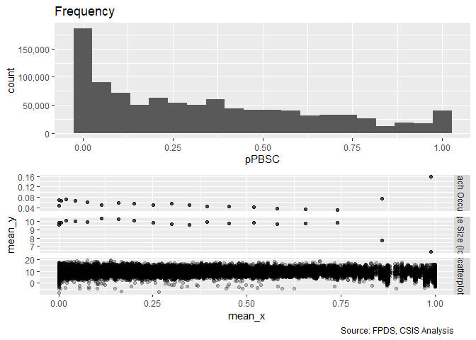<!-- -->

```r
#Scatter Plot 
ggplot(serv_smp, aes(x=c_pPBSC, y=ln_CBre_OMB20_GDP18)) + geom_point(alpha = 0.1) + ggtitle('Ceiling Breach Growth') + theme(plot.title = element_text(hjust = 0.5))
```

<!-- -->

```r
#Model
b_CBre02A <- glm (data=serv_smp,
                 b_CBre ~ c_pPBSC, family=binomial(link="logit"))
display(b_CBre02A)
```

```
## glm(formula = b_CBre ~ c_pPBSC, family = binomial(link = "logit"), 
##     data = serv_smp)
##             coef.est coef.se
## (Intercept) -2.78     0.01  
## c_pPBSC      0.23     0.02  
## ---
##   n = 250000, k = 2
##   residual deviance = 111717.8, null deviance = 111909.6 (difference = 191.8)
```

```r
n_CBre02A <- glm(data=serv_breach,
                        ln_CBre_OMB20_GDP18 ~ c_pPBSC)

display(n_CBre02A)
```

```
## glm(formula = ln_CBre_OMB20_GDP18 ~ c_pPBSC, data = serv_breach)
##             coef.est coef.se
## (Intercept)  9.40     0.01  
## c_pPBSC     -1.85     0.02  
## ---
##   n = 61184, k = 2
##   residual deviance = 384036.4, null deviance = 456211.7 (difference = 72175.3)
##   overdispersion parameter = 6.3
##   residual sd is sqrt(overdispersion) = 2.51
```

```r
#Plot residuals versus fitted
stargazer::stargazer(b_CBre01C,b_CBre02A,
                       n_CBre01C,n_CBre02A,
                       type="text",
                       digits=2)
```

```
## 
## ======================================================================
##                                       Dependent variable:             
##                          ---------------------------------------------
##                                 b_CBre           ln_CBre_OMB20_GDP18  
##                                logistic                normal         
##                             (1)        (2)         (3)         (4)    
## ----------------------------------------------------------------------
## cl_US6_avg_sal_lag1Const  0.16***                0.42***              
##                            (0.02)                (0.03)               
##                                                                       
## cl_CFTE                   0.15***                1.07***              
##                            (0.02)                (0.02)               
##                                                                       
## c_pPBSC                              0.23***                -1.85***  
##                                       (0.02)                 (0.02)   
##                                                                       
## Constant                  -2.78***   -2.78***    9.23***     9.40***  
##                            (0.01)     (0.01)     (0.01)      (0.01)   
##                                                                       
## ----------------------------------------------------------------------
## Observations              250,000    250,000     61,184      61,184   
## Log Likelihood           -55,844.23 -55,858.92 -146,852.00 -143,010.30
## Akaike Inf. Crit.        111,694.50 111,721.80 293,709.90  286,024.60 
## ======================================================================
## Note:                                      *p<0.1; **p<0.05; ***p<0.01
```

When considering PBSC alone, our logit model finds our expected relationship: higher levels of performance-based services contracting is associated with a lower likelihood of a ceiling breach occurring. However, our GLM demonstrates that higher levels of performance-based contracting are correlated with larger ceiling breaches (contrasting with our expectation), undermining this result (at least in part).  Given that the study team has more confidence in modelling ceiling breaches in dollar terms, it may be wise to disregard the logit result.


### 02B: No.Office PSC History
Expectation: The increasing share of contracting office obligations for a given service indicates high capcaity in that area, lower likelihood of cost ceiling breaches and termination and higher likelihood of exercised options are expected to be observed. Similarly, we expect the overall magnitude of ceiling breaches to be decreasing as the share of contracting office oglibations for a given service increases.


```r
summary_continuous_plot(serv_smp1m,metric="cbre","c_pOffPSC")
```

```
## Warning in `[<-.factor`(`*tmp*`, ri, value = c(0, 0, 0, 0, 0, 0, 0, 0, 0, :
## invalid factor level, NA generated
```

<!-- -->

```r
#Scatter Plot 
ggplot(serv_smp, aes(x=c_pOffPSC, y=ln_CBre_OMB20_GDP18)) + geom_point(alpha = 0.1) + ggtitle('Ceiling Breach Growth') + theme(plot.title = element_text(hjust = 0.5))
```

<!-- -->

```r
#Model
b_CBre02B <- glm (data=serv_smp,
                 b_CBre ~ c_pOffPSC, family=binomial(link="logit"))
display(b_CBre02B)
```

```
## glm(formula = b_CBre ~ c_pOffPSC, family = binomial(link = "logit"), 
##     data = serv_smp)
##             coef.est coef.se
## (Intercept) -2.83     0.01  
## c_pOffPSC    0.75     0.01  
## ---
##   n = 250000, k = 2
##   residual deviance = 109077.8, null deviance = 111909.6 (difference = 2831.8)
```

```r
n_CBre02B <- glm(data=serv_breach,
                        ln_CBre_OMB20_GDP18 ~ c_pOffPSC)

display(n_CBre02B)
```

```
## glm(formula = ln_CBre_OMB20_GDP18 ~ c_pOffPSC, data = serv_breach)
##             coef.est coef.se
## (Intercept)  9.66     0.01  
## c_pOffPSC   -1.57     0.01  
## ---
##   n = 61184, k = 2
##   residual deviance = 374232.4, null deviance = 456211.7 (difference = 81979.3)
##   overdispersion parameter = 6.1
##   residual sd is sqrt(overdispersion) = 2.47
```

```r
#Plot residuals versus fitted
stargazer::stargazer(b_CBre01C,b_CBre02A,b_CBre02B,
                       n_CBre01C,n_CBre02A,n_CBre02B,
                       type="text",
                       digits=2)
```

```
## 
## =============================================================================================
##                                                  Dependent variable:                         
##                          --------------------------------------------------------------------
##                                       b_CBre                      ln_CBre_OMB20_GDP18        
##                                      logistic                           normal               
##                             (1)        (2)        (3)         (4)         (5)         (6)    
## ---------------------------------------------------------------------------------------------
## cl_US6_avg_sal_lag1Const  0.16***                           0.42***                          
##                            (0.02)                           (0.03)                           
##                                                                                              
## cl_CFTE                   0.15***                           1.07***                          
##                            (0.02)                           (0.02)                           
##                                                                                              
## c_pPBSC                              0.23***                           -1.85***              
##                                       (0.02)                            (0.02)               
##                                                                                              
## c_pOffPSC                                       0.75***                            -1.57***  
##                                                  (0.01)                             (0.01)   
##                                                                                              
## Constant                  -2.78***   -2.78***   -2.83***    9.23***     9.40***     9.66***  
##                            (0.01)     (0.01)     (0.01)     (0.01)      (0.01)      (0.01)   
##                                                                                              
## ---------------------------------------------------------------------------------------------
## Observations              250,000    250,000    250,000     61,184      61,184      61,184   
## Log Likelihood           -55,844.23 -55,858.92 -54,538.89 -146,852.00 -143,010.30 -142,219.20
## Akaike Inf. Crit.        111,694.50 111,721.80 109,081.80 293,709.90  286,024.60  284,442.40 
## =============================================================================================
## Note:                                                             *p<0.1; **p<0.05; ***p<0.01
```

```r
summary_residual_compare(b_CBre02A,b_CBre02B, skip_vif = TRUE)
```

```
## debugging in: summary_residual_compare(b_CBre02A, b_CBre02B, skip_vif = TRUE)
## debug: {
##     if (skip_vif == FALSE) 
##         warning("Deprecating VIF. Just use glmer_examine on the models")
##     if (!is.na(bins)) {
##         if ("cl_US6_avg_sal_lag1Const" %in% model_colnames(model1_old) & 
##             "cl_US6_avg_sal_lag1Const" %in% model_colnames(model1_new)) 
##             bins <- bins + 5
##         if ("cl_CFTE" %in% model_colnames(model1_old) & "cl_CFTE" %in% 
##             model_colnames(model1_new)) 
##             bins <- bins + 5
##         if ("c_pPBSC" %in% model_colnames(model1_old) & "c_pPBSC" %in% 
##             model_colnames(model1_new)) 
##             bins <- bins + 5
##         if ("c_pOffPSC" %in% model_colnames(model1_old) & "c_pOffPSC" %in% 
##             model_colnames(model1_new)) 
##             bins <- bins + 5
##         if ("cl_pairCA" %in% model_colnames(model1_old) & "cl_pairCA" %in% 
##             model_colnames(model1_new)) 
##             bins <- bins + 5
##         if ("c_OffCri" %in% model_colnames(model1_old) & "c_OffCri" %in% 
##             model_colnames(model1_new)) 
##             bins <- bins + 5
##         if (("cl_Ceil" %in% model_colnames(model1_old) & "cl_Ceil" %in% 
##             model_colnames(model1_new)) | ("cl_Ceil_Then_Year" %in% 
##             model_colnames(model1_old) & "cl_Ceil_Then_Year" %in% 
##             model_colnames(model1_new))) 
##             bins <- bins + 10
##         if ("cl_Days" %in% model_colnames(model1_old) & "cl_Days" %in% 
##             model_colnames(model1_new)) 
##             bins <- bins + 5
##     }
##     if (!is.null(model2_new)) {
##         gridExtra::grid.arrange(binned_fitted_versus_residuals(model1_old, 
##             bins = bins), binned_fitted_versus_residuals(model1_new, 
##             bins = bins), binned_fitted_versus_residuals(model2_old, 
##             bins = bins), binned_fitted_versus_residuals(model2_new, 
##             bins = bins), ncol = 2)
##         if (!"b_Term" %in% model_colnames(model1_old) & !"b_CBre" %in% 
##             model_colnames(model1_old)) 
##             gridExtra::grid.arrange(resid_plot(model1_old, sample = 25000), 
##                 resid_plot(model1_new, sample = 25000), resid_plot(model2_old, 
##                   sample = 25000), resid_plot(model2_new, sample = 25000), 
##                 ncol = 2)
##         if (!"b_Term" %in% colnames(model1_old) & !"b_CBre" %in% 
##             model_colnames(model1_old)) 
##             gridExtra::grid.arrange(residuals_binned(model1_old, 
##                 bins = bins), residuals_binned(model1_new, bins = bins), 
##                 residuals_binned(model2_old, bins = bins), residuals_binned(model2_new, 
##                   bins = bins), ncol = 2)
##         if ("cl_Ceil" %in% model_colnames(model1_new)) {
##             residual_compare(model1_old, model1_new, model2_old, 
##                 model2_new, "cl_Ceil", "Centered Log(Ceiling)", 
##                 20)
##         }
##         if ("cl_Days" %in% model_colnames(model1_new)) {
##             residual_compare(model1_old, model1_new, model2_old, 
##                 model2_new, "cl_Days", "Centered Log(Days)", 
##                 10)
##         }
##         output <- NULL
##         if (class(model1_new) == "glmerMod" & class(model2_new) == 
##             "glmerMod") {
##             m1t <- getME(model1_new, "theta")
##             m1l <- getME(model1_new, "lower")
##             m2t <- getME(model2_new, "theta")
##             m2l <- getME(model2_new, "lower")
##             output <- list(m1t[m1l == 0], m2t[m2l == 0], model1_new@optinfo$conv$lme4$messages, 
##                 model2_new@optinfo$conv$lme4$messages)
##         }
##         else if ((class(model1_new) != "glmerMod" & class(model2_new) != 
##             "glmerMod") & (class(model1_old) != "glmerMod" & 
##             class(model2_old) != "glmerMod")) {
##             output <- list(rbind(deviance_stats(model1_old, "model1_old"), 
##                 deviance_stats(model1_new, "model1_new"), deviance_stats(model2_old, 
##                   "model2_old"), deviance_stats(model2_new, "model2_new")))
##         }
##     }
##     else if (!is.null(model1_new)) {
##         gridExtra::grid.arrange(binned_fitted_versus_residuals(model1_old, 
##             bins = bins), binned_fitted_versus_residuals(model1_new, 
##             bins = bins), ncol = 2)
##         if (!"b_Term" %in% model_colnames(model1_old) & !"b_CBre" %in% 
##             model_colnames(model1_old)) 
##             gridExtra::grid.arrange(resid_plot(model1_old, sample = 25000), 
##                 resid_plot(model1_new, sample = 25000), ncol = 2)
##         gridExtra::grid.arrange(residuals_binned(model1_old, 
##             bins = bins), residuals_binned(model1_new, bins = bins), 
##             ncol = 2)
##         output <- NULL
##         if (class(model1_new) == "glmerMod") {
##             m1t <- getME(model1_new, "theta")
##             m1l <- getME(model1_new, "lower")
##             output <- list(m1t[m1l == 0], model1_new@optinfo$conv$lme4$messages)
##         }
##         else if (class(model1_new) != "glmerMod" & class(model1_old) != 
##             "glmerMod") {
##             output <- list(rbind(deviance_stats(model1_old, "model1_old"), 
##                 deviance_stats(model1_new, "model1_new")))
##         }
##     }
##     else {
##         if (!is.na(bins)) {
##             if ("cl_US6_avg_sal_lag1Const" %in% model_colnames(model1_old)) 
##                 bins <- bins + 5
##             if ("cl_CFTE" %in% model_colnames(model1_old)) 
##                 bins <- bins + 5
##             if ("c_pPBSC" %in% model_colnames(model1_old)) 
##                 bins <- bins + 5
##             if ("c_pOffPSC" %in% model_colnames(model1_old)) 
##                 bins <- bins + 5
##             if ("cl_pairCA" %in% model_colnames(model1_old)) 
##                 bins <- bins + 5
##             if ("c_OffCri" %in% model_colnames(model1_old)) 
##                 bins <- bins + 5
##             if (("cl_Ceil" %in% model_colnames(model1_old)) | 
##                 ("cl_Ceil_Then_Year" %in% model_colnames(model1_old))) 
##                 bins <- bins + 10
##             if ("cl_Days" %in% model_colnames(model1_old)) 
##                 bins <- bins + 5
##         }
##         if (!"b_Term" %in% model_colnames(model1_old) & !"b_CBre" %in% 
##             model_colnames(model1_old)) 
##             gridExtra::grid.arrange(binned_fitted_versus_residuals(model1_old, 
##                 bins = bins), residuals_binned(model1_old, bins = bins), 
##                 resid_plot(model1_old, sample = 25000))
##         else gridExtra::grid.arrange(binned_fitted_versus_residuals(model1_old, 
##             bins = bins), residuals_binned(model1_old, bins = bins))
##         output <- NULL
##         if (class(model1_old) == "glmerMod") {
##             m1t <- getME(model1_old, "theta")
##             m1l <- getME(model1_old, "lower")
##             output <- list(m1t[m1l == 0], model1_old@optinfo$conv$lme4$messages)
##         }
##         else if (class(model1_old) != "glmerMod" & class(model1_old) != 
##             "glmerMod") {
##             output <- list(deviance_stats(model1_old, "model1_old"))
##         }
##     }
##     output
## }
## debug: if (skip_vif == FALSE) warning("Deprecating VIF. Just use glmer_examine on the models")
## debug: if (!is.na(bins)) {
##     if ("cl_US6_avg_sal_lag1Const" %in% model_colnames(model1_old) & 
##         "cl_US6_avg_sal_lag1Const" %in% model_colnames(model1_new)) 
##         bins <- bins + 5
##     if ("cl_CFTE" %in% model_colnames(model1_old) & "cl_CFTE" %in% 
##         model_colnames(model1_new)) 
##         bins <- bins + 5
##     if ("c_pPBSC" %in% model_colnames(model1_old) & "c_pPBSC" %in% 
##         model_colnames(model1_new)) 
##         bins <- bins + 5
##     if ("c_pOffPSC" %in% model_colnames(model1_old) & "c_pOffPSC" %in% 
##         model_colnames(model1_new)) 
##         bins <- bins + 5
##     if ("cl_pairCA" %in% model_colnames(model1_old) & "cl_pairCA" %in% 
##         model_colnames(model1_new)) 
##         bins <- bins + 5
##     if ("c_OffCri" %in% model_colnames(model1_old) & "c_OffCri" %in% 
##         model_colnames(model1_new)) 
##         bins <- bins + 5
##     if (("cl_Ceil" %in% model_colnames(model1_old) & "cl_Ceil" %in% 
##         model_colnames(model1_new)) | ("cl_Ceil_Then_Year" %in% 
##         model_colnames(model1_old) & "cl_Ceil_Then_Year" %in% 
##         model_colnames(model1_new))) 
##         bins <- bins + 10
##     if ("cl_Days" %in% model_colnames(model1_old) & "cl_Days" %in% 
##         model_colnames(model1_new)) 
##         bins <- bins + 5
## }
## debug: if ("cl_US6_avg_sal_lag1Const" %in% model_colnames(model1_old) & 
##     "cl_US6_avg_sal_lag1Const" %in% model_colnames(model1_new)) bins <- bins + 
##     5
## debug: if ("cl_CFTE" %in% model_colnames(model1_old) & "cl_CFTE" %in% 
##     model_colnames(model1_new)) bins <- bins + 5
## debug: if ("c_pPBSC" %in% model_colnames(model1_old) & "c_pPBSC" %in% 
##     model_colnames(model1_new)) bins <- bins + 5
## debug: if ("c_pOffPSC" %in% model_colnames(model1_old) & "c_pOffPSC" %in% 
##     model_colnames(model1_new)) bins <- bins + 5
## debug: if ("cl_pairCA" %in% model_colnames(model1_old) & "cl_pairCA" %in% 
##     model_colnames(model1_new)) bins <- bins + 5
## debug: if ("c_OffCri" %in% model_colnames(model1_old) & "c_OffCri" %in% 
##     model_colnames(model1_new)) bins <- bins + 5
## debug: if (("cl_Ceil" %in% model_colnames(model1_old) & "cl_Ceil" %in% 
##     model_colnames(model1_new)) | ("cl_Ceil_Then_Year" %in% model_colnames(model1_old) & 
##     "cl_Ceil_Then_Year" %in% model_colnames(model1_new))) bins <- bins + 
##     10
## debug: if ("cl_Days" %in% model_colnames(model1_old) & "cl_Days" %in% 
##     model_colnames(model1_new)) bins <- bins + 5
## debug: if (!is.null(model2_new)) {
##     gridExtra::grid.arrange(binned_fitted_versus_residuals(model1_old, 
##         bins = bins), binned_fitted_versus_residuals(model1_new, 
##         bins = bins), binned_fitted_versus_residuals(model2_old, 
##         bins = bins), binned_fitted_versus_residuals(model2_new, 
##         bins = bins), ncol = 2)
##     if (!"b_Term" %in% model_colnames(model1_old) & !"b_CBre" %in% 
##         model_colnames(model1_old)) 
##         gridExtra::grid.arrange(resid_plot(model1_old, sample = 25000), 
##             resid_plot(model1_new, sample = 25000), resid_plot(model2_old, 
##                 sample = 25000), resid_plot(model2_new, sample = 25000), 
##             ncol = 2)
##     if (!"b_Term" %in% colnames(model1_old) & !"b_CBre" %in% 
##         model_colnames(model1_old)) 
##         gridExtra::grid.arrange(residuals_binned(model1_old, 
##             bins = bins), residuals_binned(model1_new, bins = bins), 
##             residuals_binned(model2_old, bins = bins), residuals_binned(model2_new, 
##                 bins = bins), ncol = 2)
##     if ("cl_Ceil" %in% model_colnames(model1_new)) {
##         residual_compare(model1_old, model1_new, model2_old, 
##             model2_new, "cl_Ceil", "Centered Log(Ceiling)", 20)
##     }
##     if ("cl_Days" %in% model_colnames(model1_new)) {
##         residual_compare(model1_old, model1_new, model2_old, 
##             model2_new, "cl_Days", "Centered Log(Days)", 10)
##     }
##     output <- NULL
##     if (class(model1_new) == "glmerMod" & class(model2_new) == 
##         "glmerMod") {
##         m1t <- getME(model1_new, "theta")
##         m1l <- getME(model1_new, "lower")
##         m2t <- getME(model2_new, "theta")
##         m2l <- getME(model2_new, "lower")
##         output <- list(m1t[m1l == 0], m2t[m2l == 0], model1_new@optinfo$conv$lme4$messages, 
##             model2_new@optinfo$conv$lme4$messages)
##     }
##     else if ((class(model1_new) != "glmerMod" & class(model2_new) != 
##         "glmerMod") & (class(model1_old) != "glmerMod" & class(model2_old) != 
##         "glmerMod")) {
##         output <- list(rbind(deviance_stats(model1_old, "model1_old"), 
##             deviance_stats(model1_new, "model1_new"), deviance_stats(model2_old, 
##                 "model2_old"), deviance_stats(model2_new, "model2_new")))
##     }
## } else if (!is.null(model1_new)) {
##     gridExtra::grid.arrange(binned_fitted_versus_residuals(model1_old, 
##         bins = bins), binned_fitted_versus_residuals(model1_new, 
##         bins = bins), ncol = 2)
##     if (!"b_Term" %in% model_colnames(model1_old) & !"b_CBre" %in% 
##         model_colnames(model1_old)) 
##         gridExtra::grid.arrange(resid_plot(model1_old, sample = 25000), 
##             resid_plot(model1_new, sample = 25000), ncol = 2)
##     gridExtra::grid.arrange(residuals_binned(model1_old, bins = bins), 
##         residuals_binned(model1_new, bins = bins), ncol = 2)
##     output <- NULL
##     if (class(model1_new) == "glmerMod") {
##         m1t <- getME(model1_new, "theta")
##         m1l <- getME(model1_new, "lower")
##         output <- list(m1t[m1l == 0], model1_new@optinfo$conv$lme4$messages)
##     }
##     else if (class(model1_new) != "glmerMod" & class(model1_old) != 
##         "glmerMod") {
##         output <- list(rbind(deviance_stats(model1_old, "model1_old"), 
##             deviance_stats(model1_new, "model1_new")))
##     }
## } else {
##     if (!is.na(bins)) {
##         if ("cl_US6_avg_sal_lag1Const" %in% model_colnames(model1_old)) 
##             bins <- bins + 5
##         if ("cl_CFTE" %in% model_colnames(model1_old)) 
##             bins <- bins + 5
##         if ("c_pPBSC" %in% model_colnames(model1_old)) 
##             bins <- bins + 5
##         if ("c_pOffPSC" %in% model_colnames(model1_old)) 
##             bins <- bins + 5
##         if ("cl_pairCA" %in% model_colnames(model1_old)) 
##             bins <- bins + 5
##         if ("c_OffCri" %in% model_colnames(model1_old)) 
##             bins <- bins + 5
##         if (("cl_Ceil" %in% model_colnames(model1_old)) | ("cl_Ceil_Then_Year" %in% 
##             model_colnames(model1_old))) 
##             bins <- bins + 10
##         if ("cl_Days" %in% model_colnames(model1_old)) 
##             bins <- bins + 5
##     }
##     if (!"b_Term" %in% model_colnames(model1_old) & !"b_CBre" %in% 
##         model_colnames(model1_old)) 
##         gridExtra::grid.arrange(binned_fitted_versus_residuals(model1_old, 
##             bins = bins), residuals_binned(model1_old, bins = bins), 
##             resid_plot(model1_old, sample = 25000))
##     else gridExtra::grid.arrange(binned_fitted_versus_residuals(model1_old, 
##         bins = bins), residuals_binned(model1_old, bins = bins))
##     output <- NULL
##     if (class(model1_old) == "glmerMod") {
##         m1t <- getME(model1_old, "theta")
##         m1l <- getME(model1_old, "lower")
##         output <- list(m1t[m1l == 0], model1_old@optinfo$conv$lme4$messages)
##     }
##     else if (class(model1_old) != "glmerMod" & class(model1_old) != 
##         "glmerMod") {
##         output <- list(deviance_stats(model1_old, "model1_old"))
##     }
## }
## debug: if (!is.null(model1_new)) {
##     gridExtra::grid.arrange(binned_fitted_versus_residuals(model1_old, 
##         bins = bins), binned_fitted_versus_residuals(model1_new, 
##         bins = bins), ncol = 2)
##     if (!"b_Term" %in% model_colnames(model1_old) & !"b_CBre" %in% 
##         model_colnames(model1_old)) 
##         gridExtra::grid.arrange(resid_plot(model1_old, sample = 25000), 
##             resid_plot(model1_new, sample = 25000), ncol = 2)
##     gridExtra::grid.arrange(residuals_binned(model1_old, bins = bins), 
##         residuals_binned(model1_new, bins = bins), ncol = 2)
##     output <- NULL
##     if (class(model1_new) == "glmerMod") {
##         m1t <- getME(model1_new, "theta")
##         m1l <- getME(model1_new, "lower")
##         output <- list(m1t[m1l == 0], model1_new@optinfo$conv$lme4$messages)
##     }
##     else if (class(model1_new) != "glmerMod" & class(model1_old) != 
##         "glmerMod") {
##         output <- list(rbind(deviance_stats(model1_old, "model1_old"), 
##             deviance_stats(model1_new, "model1_new")))
##     }
## } else {
##     if (!is.na(bins)) {
##         if ("cl_US6_avg_sal_lag1Const" %in% model_colnames(model1_old)) 
##             bins <- bins + 5
##         if ("cl_CFTE" %in% model_colnames(model1_old)) 
##             bins <- bins + 5
##         if ("c_pPBSC" %in% model_colnames(model1_old)) 
##             bins <- bins + 5
##         if ("c_pOffPSC" %in% model_colnames(model1_old)) 
##             bins <- bins + 5
##         if ("cl_pairCA" %in% model_colnames(model1_old)) 
##             bins <- bins + 5
##         if ("c_OffCri" %in% model_colnames(model1_old)) 
##             bins <- bins + 5
##         if (("cl_Ceil" %in% model_colnames(model1_old)) | ("cl_Ceil_Then_Year" %in% 
##             model_colnames(model1_old))) 
##             bins <- bins + 10
##         if ("cl_Days" %in% model_colnames(model1_old)) 
##             bins <- bins + 5
##     }
##     if (!"b_Term" %in% model_colnames(model1_old) & !"b_CBre" %in% 
##         model_colnames(model1_old)) 
##         gridExtra::grid.arrange(binned_fitted_versus_residuals(model1_old, 
##             bins = bins), residuals_binned(model1_old, bins = bins), 
##             resid_plot(model1_old, sample = 25000))
##     else gridExtra::grid.arrange(binned_fitted_versus_residuals(model1_old, 
##         bins = bins), residuals_binned(model1_old, bins = bins))
##     output <- NULL
##     if (class(model1_old) == "glmerMod") {
##         m1t <- getME(model1_old, "theta")
##         m1l <- getME(model1_old, "lower")
##         output <- list(m1t[m1l == 0], model1_old@optinfo$conv$lme4$messages)
##     }
##     else if (class(model1_old) != "glmerMod" & class(model1_old) != 
##         "glmerMod") {
##         output <- list(deviance_stats(model1_old, "model1_old"))
##     }
## }
## debug: gridExtra::grid.arrange(binned_fitted_versus_residuals(model1_old, 
##     bins = bins), binned_fitted_versus_residuals(model1_new, 
##     bins = bins), ncol = 2)
```

<!-- -->

```
## debug: if (!"b_Term" %in% model_colnames(model1_old) & !"b_CBre" %in% 
##     model_colnames(model1_old)) gridExtra::grid.arrange(resid_plot(model1_old, 
##     sample = 25000), resid_plot(model1_new, sample = 25000), 
##     ncol = 2)
## debug: gridExtra::grid.arrange(residuals_binned(model1_old, bins = bins), 
##     residuals_binned(model1_new, bins = bins), ncol = 2)
```

```
## debug: output <- NULL
## debug: if (class(model1_new) == "glmerMod") {
##     m1t <- getME(model1_new, "theta")
##     m1l <- getME(model1_new, "lower")
##     output <- list(m1t[m1l == 0], model1_new@optinfo$conv$lme4$messages)
## } else if (class(model1_new) != "glmerMod" & class(model1_old) != 
##     "glmerMod") {
##     output <- list(rbind(deviance_stats(model1_old, "model1_old"), 
##         deviance_stats(model1_new, "model1_new")))
## }
```

```
## Warning in if (class(model1_new) == "glmerMod") {: the condition has length
## > 1 and only the first element will be used
```

```
## debug: if (class(model1_new) != "glmerMod" & class(model1_old) != "glmerMod") {
##     output <- list(rbind(deviance_stats(model1_old, "model1_old"), 
##         deviance_stats(model1_new, "model1_new")))
## }
```

```
## Warning in if (class(model1_new) != "glmerMod" & class(model1_old) !=
## "glmerMod") {: the condition has length > 1 and only the first element will
## be used
```

<!-- -->

```
## debug: output <- list(rbind(deviance_stats(model1_old, "model1_old"), 
##     deviance_stats(model1_new, "model1_new")))
## debug: output
## exiting from: summary_residual_compare(b_CBre02A, b_CBre02B, skip_vif = TRUE)
```

```
## [[1]]
##        model deviance null.deviance difference
## 1 model1_old 111717.8      111909.6   191.7574
## 2 model1_new 109077.8      111909.6  2831.8153
```

When considering number of contracting office obligations for a given service alone, we find a positive relationship between size of share of contracting office obligations for a service and the likelihood of a ceiling breach, the opposite of what was expected.  However, a negative relationship is found, as expected, between the size of the share of contracting office obligations for a service and the overall magnitude of ceiling breaches.


### 02C: Office Capacity
Expectation: Collectively, the larger share of PBSC and contracting office obligations for a given service, the less risk of ceiling breaches and terminations and the more exercised options there would be. Also we expect the results of combined model would be the same as two individual models above. Similarly, we expect that, as the collective share of PBSC and contracting office obligations for a given service increase, the magnitude of associated ceiling breaches declines.


```r
#Model
b_CBre02C <- glm (data=serv_smp,
                 b_CBre ~ c_pPBSC+c_pOffPSC, family=binomial(link="logit"))
glmer_examine(b_CBre02C)
```

```
##   c_pPBSC c_pOffPSC 
##  1.247524  1.247524
```

```r
n_CBre02C <- glm(data=serv_breach,
                        ln_CBre_OMB20_GDP18 ~ c_pPBSC+c_pOffPSC)

glmer_examine(n_CBre02C)
```

```
##   c_pPBSC c_pOffPSC 
##  2.057338  2.057338
```

```r
#Plot residuals versus fitted
stargazer::stargazer(b_CBre01C,b_CBre02A,b_CBre02B,b_CBre02C,
                       
                       n_CBre01C,n_CBre02A,n_CBre02B,n_CBre02C,
                       type="text",
                       digits=2)
```

```
## 
## ====================================================================================================================
##                                                              Dependent variable:                                    
##                          -------------------------------------------------------------------------------------------
##                                            b_CBre                                  ln_CBre_OMB20_GDP18              
##                                           logistic                                       normal                     
##                             (1)        (2)        (3)        (4)         (5)         (6)         (7)         (8)    
## --------------------------------------------------------------------------------------------------------------------
## cl_US6_avg_sal_lag1Const  0.16***                                      0.42***                                      
##                            (0.02)                                      (0.03)                                       
##                                                                                                                     
## cl_CFTE                   0.15***                                      1.07***                                      
##                            (0.02)                                      (0.02)                                       
##                                                                                                                     
## c_pPBSC                              0.23***               -0.15***               -1.85***                -0.90***  
##                                       (0.02)                (0.02)                 (0.02)                  (0.02)   
##                                                                                                                     
## c_pOffPSC                                       0.75***    0.81***                            -1.57***    -1.06***  
##                                                  (0.01)     (0.01)                             (0.01)      (0.02)   
##                                                                                                                     
## Constant                  -2.78***   -2.78***   -2.83***   -2.83***    9.23***     9.40***     9.66***     9.59***  
##                            (0.01)     (0.01)     (0.01)     (0.01)     (0.01)      (0.01)      (0.01)      (0.01)   
##                                                                                                                     
## --------------------------------------------------------------------------------------------------------------------
## Observations              250,000    250,000    250,000    250,000     61,184      61,184      61,184      61,184   
## Log Likelihood           -55,844.23 -55,858.92 -54,538.89 -54,503.45 -146,852.00 -143,010.30 -142,219.20 -141,535.70
## Akaike Inf. Crit.        111,694.50 111,721.80 109,081.80 109,012.90 293,709.90  286,024.60  284,442.40  283,077.50 
## ====================================================================================================================
## Note:                                                                                    *p<0.1; **p<0.05; ***p<0.01
```

```r
summary_residual_compare(b_CBre02A,b_CBre02C)
```

```
## debugging in: summary_residual_compare(b_CBre02A, b_CBre02C)
## debug: {
##     if (skip_vif == FALSE) 
##         warning("Deprecating VIF. Just use glmer_examine on the models")
##     if (!is.na(bins)) {
##         if ("cl_US6_avg_sal_lag1Const" %in% model_colnames(model1_old) & 
##             "cl_US6_avg_sal_lag1Const" %in% model_colnames(model1_new)) 
##             bins <- bins + 5
##         if ("cl_CFTE" %in% model_colnames(model1_old) & "cl_CFTE" %in% 
##             model_colnames(model1_new)) 
##             bins <- bins + 5
##         if ("c_pPBSC" %in% model_colnames(model1_old) & "c_pPBSC" %in% 
##             model_colnames(model1_new)) 
##             bins <- bins + 5
##         if ("c_pOffPSC" %in% model_colnames(model1_old) & "c_pOffPSC" %in% 
##             model_colnames(model1_new)) 
##             bins <- bins + 5
##         if ("cl_pairCA" %in% model_colnames(model1_old) & "cl_pairCA" %in% 
##             model_colnames(model1_new)) 
##             bins <- bins + 5
##         if ("c_OffCri" %in% model_colnames(model1_old) & "c_OffCri" %in% 
##             model_colnames(model1_new)) 
##             bins <- bins + 5
##         if (("cl_Ceil" %in% model_colnames(model1_old) & "cl_Ceil" %in% 
##             model_colnames(model1_new)) | ("cl_Ceil_Then_Year" %in% 
##             model_colnames(model1_old) & "cl_Ceil_Then_Year" %in% 
##             model_colnames(model1_new))) 
##             bins <- bins + 10
##         if ("cl_Days" %in% model_colnames(model1_old) & "cl_Days" %in% 
##             model_colnames(model1_new)) 
##             bins <- bins + 5
##     }
##     if (!is.null(model2_new)) {
##         gridExtra::grid.arrange(binned_fitted_versus_residuals(model1_old, 
##             bins = bins), binned_fitted_versus_residuals(model1_new, 
##             bins = bins), binned_fitted_versus_residuals(model2_old, 
##             bins = bins), binned_fitted_versus_residuals(model2_new, 
##             bins = bins), ncol = 2)
##         if (!"b_Term" %in% model_colnames(model1_old) & !"b_CBre" %in% 
##             model_colnames(model1_old)) 
##             gridExtra::grid.arrange(resid_plot(model1_old, sample = 25000), 
##                 resid_plot(model1_new, sample = 25000), resid_plot(model2_old, 
##                   sample = 25000), resid_plot(model2_new, sample = 25000), 
##                 ncol = 2)
##         if (!"b_Term" %in% colnames(model1_old) & !"b_CBre" %in% 
##             model_colnames(model1_old)) 
##             gridExtra::grid.arrange(residuals_binned(model1_old, 
##                 bins = bins), residuals_binned(model1_new, bins = bins), 
##                 residuals_binned(model2_old, bins = bins), residuals_binned(model2_new, 
##                   bins = bins), ncol = 2)
##         if ("cl_Ceil" %in% model_colnames(model1_new)) {
##             residual_compare(model1_old, model1_new, model2_old, 
##                 model2_new, "cl_Ceil", "Centered Log(Ceiling)", 
##                 20)
##         }
##         if ("cl_Days" %in% model_colnames(model1_new)) {
##             residual_compare(model1_old, model1_new, model2_old, 
##                 model2_new, "cl_Days", "Centered Log(Days)", 
##                 10)
##         }
##         output <- NULL
##         if (class(model1_new) == "glmerMod" & class(model2_new) == 
##             "glmerMod") {
##             m1t <- getME(model1_new, "theta")
##             m1l <- getME(model1_new, "lower")
##             m2t <- getME(model2_new, "theta")
##             m2l <- getME(model2_new, "lower")
##             output <- list(m1t[m1l == 0], m2t[m2l == 0], model1_new@optinfo$conv$lme4$messages, 
##                 model2_new@optinfo$conv$lme4$messages)
##         }
##         else if ((class(model1_new) != "glmerMod" & class(model2_new) != 
##             "glmerMod") & (class(model1_old) != "glmerMod" & 
##             class(model2_old) != "glmerMod")) {
##             output <- list(rbind(deviance_stats(model1_old, "model1_old"), 
##                 deviance_stats(model1_new, "model1_new"), deviance_stats(model2_old, 
##                   "model2_old"), deviance_stats(model2_new, "model2_new")))
##         }
##     }
##     else if (!is.null(model1_new)) {
##         gridExtra::grid.arrange(binned_fitted_versus_residuals(model1_old, 
##             bins = bins), binned_fitted_versus_residuals(model1_new, 
##             bins = bins), ncol = 2)
##         if (!"b_Term" %in% model_colnames(model1_old) & !"b_CBre" %in% 
##             model_colnames(model1_old)) 
##             gridExtra::grid.arrange(resid_plot(model1_old, sample = 25000), 
##                 resid_plot(model1_new, sample = 25000), ncol = 2)
##         gridExtra::grid.arrange(residuals_binned(model1_old, 
##             bins = bins), residuals_binned(model1_new, bins = bins), 
##             ncol = 2)
##         output <- NULL
##         if (class(model1_new) == "glmerMod") {
##             m1t <- getME(model1_new, "theta")
##             m1l <- getME(model1_new, "lower")
##             output <- list(m1t[m1l == 0], model1_new@optinfo$conv$lme4$messages)
##         }
##         else if (class(model1_new) != "glmerMod" & class(model1_old) != 
##             "glmerMod") {
##             output <- list(rbind(deviance_stats(model1_old, "model1_old"), 
##                 deviance_stats(model1_new, "model1_new")))
##         }
##     }
##     else {
##         if (!is.na(bins)) {
##             if ("cl_US6_avg_sal_lag1Const" %in% model_colnames(model1_old)) 
##                 bins <- bins + 5
##             if ("cl_CFTE" %in% model_colnames(model1_old)) 
##                 bins <- bins + 5
##             if ("c_pPBSC" %in% model_colnames(model1_old)) 
##                 bins <- bins + 5
##             if ("c_pOffPSC" %in% model_colnames(model1_old)) 
##                 bins <- bins + 5
##             if ("cl_pairCA" %in% model_colnames(model1_old)) 
##                 bins <- bins + 5
##             if ("c_OffCri" %in% model_colnames(model1_old)) 
##                 bins <- bins + 5
##             if (("cl_Ceil" %in% model_colnames(model1_old)) | 
##                 ("cl_Ceil_Then_Year" %in% model_colnames(model1_old))) 
##                 bins <- bins + 10
##             if ("cl_Days" %in% model_colnames(model1_old)) 
##                 bins <- bins + 5
##         }
##         if (!"b_Term" %in% model_colnames(model1_old) & !"b_CBre" %in% 
##             model_colnames(model1_old)) 
##             gridExtra::grid.arrange(binned_fitted_versus_residuals(model1_old, 
##                 bins = bins), residuals_binned(model1_old, bins = bins), 
##                 resid_plot(model1_old, sample = 25000))
##         else gridExtra::grid.arrange(binned_fitted_versus_residuals(model1_old, 
##             bins = bins), residuals_binned(model1_old, bins = bins))
##         output <- NULL
##         if (class(model1_old) == "glmerMod") {
##             m1t <- getME(model1_old, "theta")
##             m1l <- getME(model1_old, "lower")
##             output <- list(m1t[m1l == 0], model1_old@optinfo$conv$lme4$messages)
##         }
##         else if (class(model1_old) != "glmerMod" & class(model1_old) != 
##             "glmerMod") {
##             output <- list(deviance_stats(model1_old, "model1_old"))
##         }
##     }
##     output
## }
## debug: if (skip_vif == FALSE) warning("Deprecating VIF. Just use glmer_examine on the models")
## debug: if (!is.na(bins)) {
##     if ("cl_US6_avg_sal_lag1Const" %in% model_colnames(model1_old) & 
##         "cl_US6_avg_sal_lag1Const" %in% model_colnames(model1_new)) 
##         bins <- bins + 5
##     if ("cl_CFTE" %in% model_colnames(model1_old) & "cl_CFTE" %in% 
##         model_colnames(model1_new)) 
##         bins <- bins + 5
##     if ("c_pPBSC" %in% model_colnames(model1_old) & "c_pPBSC" %in% 
##         model_colnames(model1_new)) 
##         bins <- bins + 5
##     if ("c_pOffPSC" %in% model_colnames(model1_old) & "c_pOffPSC" %in% 
##         model_colnames(model1_new)) 
##         bins <- bins + 5
##     if ("cl_pairCA" %in% model_colnames(model1_old) & "cl_pairCA" %in% 
##         model_colnames(model1_new)) 
##         bins <- bins + 5
##     if ("c_OffCri" %in% model_colnames(model1_old) & "c_OffCri" %in% 
##         model_colnames(model1_new)) 
##         bins <- bins + 5
##     if (("cl_Ceil" %in% model_colnames(model1_old) & "cl_Ceil" %in% 
##         model_colnames(model1_new)) | ("cl_Ceil_Then_Year" %in% 
##         model_colnames(model1_old) & "cl_Ceil_Then_Year" %in% 
##         model_colnames(model1_new))) 
##         bins <- bins + 10
##     if ("cl_Days" %in% model_colnames(model1_old) & "cl_Days" %in% 
##         model_colnames(model1_new)) 
##         bins <- bins + 5
## }
## debug: if ("cl_US6_avg_sal_lag1Const" %in% model_colnames(model1_old) & 
##     "cl_US6_avg_sal_lag1Const" %in% model_colnames(model1_new)) bins <- bins + 
##     5
## debug: if ("cl_CFTE" %in% model_colnames(model1_old) & "cl_CFTE" %in% 
##     model_colnames(model1_new)) bins <- bins + 5
## debug: if ("c_pPBSC" %in% model_colnames(model1_old) & "c_pPBSC" %in% 
##     model_colnames(model1_new)) bins <- bins + 5
## debug: bins <- bins + 5
## debug: if ("c_pOffPSC" %in% model_colnames(model1_old) & "c_pOffPSC" %in% 
##     model_colnames(model1_new)) bins <- bins + 5
## debug: if ("cl_pairCA" %in% model_colnames(model1_old) & "cl_pairCA" %in% 
##     model_colnames(model1_new)) bins <- bins + 5
## debug: if ("c_OffCri" %in% model_colnames(model1_old) & "c_OffCri" %in% 
##     model_colnames(model1_new)) bins <- bins + 5
## debug: if (("cl_Ceil" %in% model_colnames(model1_old) & "cl_Ceil" %in% 
##     model_colnames(model1_new)) | ("cl_Ceil_Then_Year" %in% model_colnames(model1_old) & 
##     "cl_Ceil_Then_Year" %in% model_colnames(model1_new))) bins <- bins + 
##     10
## debug: if ("cl_Days" %in% model_colnames(model1_old) & "cl_Days" %in% 
##     model_colnames(model1_new)) bins <- bins + 5
## debug: if (!is.null(model2_new)) {
##     gridExtra::grid.arrange(binned_fitted_versus_residuals(model1_old, 
##         bins = bins), binned_fitted_versus_residuals(model1_new, 
##         bins = bins), binned_fitted_versus_residuals(model2_old, 
##         bins = bins), binned_fitted_versus_residuals(model2_new, 
##         bins = bins), ncol = 2)
##     if (!"b_Term" %in% model_colnames(model1_old) & !"b_CBre" %in% 
##         model_colnames(model1_old)) 
##         gridExtra::grid.arrange(resid_plot(model1_old, sample = 25000), 
##             resid_plot(model1_new, sample = 25000), resid_plot(model2_old, 
##                 sample = 25000), resid_plot(model2_new, sample = 25000), 
##             ncol = 2)
##     if (!"b_Term" %in% colnames(model1_old) & !"b_CBre" %in% 
##         model_colnames(model1_old)) 
##         gridExtra::grid.arrange(residuals_binned(model1_old, 
##             bins = bins), residuals_binned(model1_new, bins = bins), 
##             residuals_binned(model2_old, bins = bins), residuals_binned(model2_new, 
##                 bins = bins), ncol = 2)
##     if ("cl_Ceil" %in% model_colnames(model1_new)) {
##         residual_compare(model1_old, model1_new, model2_old, 
##             model2_new, "cl_Ceil", "Centered Log(Ceiling)", 20)
##     }
##     if ("cl_Days" %in% model_colnames(model1_new)) {
##         residual_compare(model1_old, model1_new, model2_old, 
##             model2_new, "cl_Days", "Centered Log(Days)", 10)
##     }
##     output <- NULL
##     if (class(model1_new) == "glmerMod" & class(model2_new) == 
##         "glmerMod") {
##         m1t <- getME(model1_new, "theta")
##         m1l <- getME(model1_new, "lower")
##         m2t <- getME(model2_new, "theta")
##         m2l <- getME(model2_new, "lower")
##         output <- list(m1t[m1l == 0], m2t[m2l == 0], model1_new@optinfo$conv$lme4$messages, 
##             model2_new@optinfo$conv$lme4$messages)
##     }
##     else if ((class(model1_new) != "glmerMod" & class(model2_new) != 
##         "glmerMod") & (class(model1_old) != "glmerMod" & class(model2_old) != 
##         "glmerMod")) {
##         output <- list(rbind(deviance_stats(model1_old, "model1_old"), 
##             deviance_stats(model1_new, "model1_new"), deviance_stats(model2_old, 
##                 "model2_old"), deviance_stats(model2_new, "model2_new")))
##     }
## } else if (!is.null(model1_new)) {
##     gridExtra::grid.arrange(binned_fitted_versus_residuals(model1_old, 
##         bins = bins), binned_fitted_versus_residuals(model1_new, 
##         bins = bins), ncol = 2)
##     if (!"b_Term" %in% model_colnames(model1_old) & !"b_CBre" %in% 
##         model_colnames(model1_old)) 
##         gridExtra::grid.arrange(resid_plot(model1_old, sample = 25000), 
##             resid_plot(model1_new, sample = 25000), ncol = 2)
##     gridExtra::grid.arrange(residuals_binned(model1_old, bins = bins), 
##         residuals_binned(model1_new, bins = bins), ncol = 2)
##     output <- NULL
##     if (class(model1_new) == "glmerMod") {
##         m1t <- getME(model1_new, "theta")
##         m1l <- getME(model1_new, "lower")
##         output <- list(m1t[m1l == 0], model1_new@optinfo$conv$lme4$messages)
##     }
##     else if (class(model1_new) != "glmerMod" & class(model1_old) != 
##         "glmerMod") {
##         output <- list(rbind(deviance_stats(model1_old, "model1_old"), 
##             deviance_stats(model1_new, "model1_new")))
##     }
## } else {
##     if (!is.na(bins)) {
##         if ("cl_US6_avg_sal_lag1Const" %in% model_colnames(model1_old)) 
##             bins <- bins + 5
##         if ("cl_CFTE" %in% model_colnames(model1_old)) 
##             bins <- bins + 5
##         if ("c_pPBSC" %in% model_colnames(model1_old)) 
##             bins <- bins + 5
##         if ("c_pOffPSC" %in% model_colnames(model1_old)) 
##             bins <- bins + 5
##         if ("cl_pairCA" %in% model_colnames(model1_old)) 
##             bins <- bins + 5
##         if ("c_OffCri" %in% model_colnames(model1_old)) 
##             bins <- bins + 5
##         if (("cl_Ceil" %in% model_colnames(model1_old)) | ("cl_Ceil_Then_Year" %in% 
##             model_colnames(model1_old))) 
##             bins <- bins + 10
##         if ("cl_Days" %in% model_colnames(model1_old)) 
##             bins <- bins + 5
##     }
##     if (!"b_Term" %in% model_colnames(model1_old) & !"b_CBre" %in% 
##         model_colnames(model1_old)) 
##         gridExtra::grid.arrange(binned_fitted_versus_residuals(model1_old, 
##             bins = bins), residuals_binned(model1_old, bins = bins), 
##             resid_plot(model1_old, sample = 25000))
##     else gridExtra::grid.arrange(binned_fitted_versus_residuals(model1_old, 
##         bins = bins), residuals_binned(model1_old, bins = bins))
##     output <- NULL
##     if (class(model1_old) == "glmerMod") {
##         m1t <- getME(model1_old, "theta")
##         m1l <- getME(model1_old, "lower")
##         output <- list(m1t[m1l == 0], model1_old@optinfo$conv$lme4$messages)
##     }
##     else if (class(model1_old) != "glmerMod" & class(model1_old) != 
##         "glmerMod") {
##         output <- list(deviance_stats(model1_old, "model1_old"))
##     }
## }
## debug: if (!is.null(model1_new)) {
##     gridExtra::grid.arrange(binned_fitted_versus_residuals(model1_old, 
##         bins = bins), binned_fitted_versus_residuals(model1_new, 
##         bins = bins), ncol = 2)
##     if (!"b_Term" %in% model_colnames(model1_old) & !"b_CBre" %in% 
##         model_colnames(model1_old)) 
##         gridExtra::grid.arrange(resid_plot(model1_old, sample = 25000), 
##             resid_plot(model1_new, sample = 25000), ncol = 2)
##     gridExtra::grid.arrange(residuals_binned(model1_old, bins = bins), 
##         residuals_binned(model1_new, bins = bins), ncol = 2)
##     output <- NULL
##     if (class(model1_new) == "glmerMod") {
##         m1t <- getME(model1_new, "theta")
##         m1l <- getME(model1_new, "lower")
##         output <- list(m1t[m1l == 0], model1_new@optinfo$conv$lme4$messages)
##     }
##     else if (class(model1_new) != "glmerMod" & class(model1_old) != 
##         "glmerMod") {
##         output <- list(rbind(deviance_stats(model1_old, "model1_old"), 
##             deviance_stats(model1_new, "model1_new")))
##     }
## } else {
##     if (!is.na(bins)) {
##         if ("cl_US6_avg_sal_lag1Const" %in% model_colnames(model1_old)) 
##             bins <- bins + 5
##         if ("cl_CFTE" %in% model_colnames(model1_old)) 
##             bins <- bins + 5
##         if ("c_pPBSC" %in% model_colnames(model1_old)) 
##             bins <- bins + 5
##         if ("c_pOffPSC" %in% model_colnames(model1_old)) 
##             bins <- bins + 5
##         if ("cl_pairCA" %in% model_colnames(model1_old)) 
##             bins <- bins + 5
##         if ("c_OffCri" %in% model_colnames(model1_old)) 
##             bins <- bins + 5
##         if (("cl_Ceil" %in% model_colnames(model1_old)) | ("cl_Ceil_Then_Year" %in% 
##             model_colnames(model1_old))) 
##             bins <- bins + 10
##         if ("cl_Days" %in% model_colnames(model1_old)) 
##             bins <- bins + 5
##     }
##     if (!"b_Term" %in% model_colnames(model1_old) & !"b_CBre" %in% 
##         model_colnames(model1_old)) 
##         gridExtra::grid.arrange(binned_fitted_versus_residuals(model1_old, 
##             bins = bins), residuals_binned(model1_old, bins = bins), 
##             resid_plot(model1_old, sample = 25000))
##     else gridExtra::grid.arrange(binned_fitted_versus_residuals(model1_old, 
##         bins = bins), residuals_binned(model1_old, bins = bins))
##     output <- NULL
##     if (class(model1_old) == "glmerMod") {
##         m1t <- getME(model1_old, "theta")
##         m1l <- getME(model1_old, "lower")
##         output <- list(m1t[m1l == 0], model1_old@optinfo$conv$lme4$messages)
##     }
##     else if (class(model1_old) != "glmerMod" & class(model1_old) != 
##         "glmerMod") {
##         output <- list(deviance_stats(model1_old, "model1_old"))
##     }
## }
## debug: gridExtra::grid.arrange(binned_fitted_versus_residuals(model1_old, 
##     bins = bins), binned_fitted_versus_residuals(model1_new, 
##     bins = bins), ncol = 2)
```

<!-- -->

```
## debug: if (!"b_Term" %in% model_colnames(model1_old) & !"b_CBre" %in% 
##     model_colnames(model1_old)) gridExtra::grid.arrange(resid_plot(model1_old, 
##     sample = 25000), resid_plot(model1_new, sample = 25000), 
##     ncol = 2)
## debug: gridExtra::grid.arrange(residuals_binned(model1_old, bins = bins), 
##     residuals_binned(model1_new, bins = bins), ncol = 2)
```

```
## debug: output <- NULL
## debug: if (class(model1_new) == "glmerMod") {
##     m1t <- getME(model1_new, "theta")
##     m1l <- getME(model1_new, "lower")
##     output <- list(m1t[m1l == 0], model1_new@optinfo$conv$lme4$messages)
## } else if (class(model1_new) != "glmerMod" & class(model1_old) != 
##     "glmerMod") {
##     output <- list(rbind(deviance_stats(model1_old, "model1_old"), 
##         deviance_stats(model1_new, "model1_new")))
## }
```

```
## Warning in if (class(model1_new) == "glmerMod") {: the condition has length
## > 1 and only the first element will be used
```

```
## debug: if (class(model1_new) != "glmerMod" & class(model1_old) != "glmerMod") {
##     output <- list(rbind(deviance_stats(model1_old, "model1_old"), 
##         deviance_stats(model1_new, "model1_new")))
## }
```

```
## Warning in if (class(model1_new) != "glmerMod" & class(model1_old) !=
## "glmerMod") {: the condition has length > 1 and only the first element will
## be used
```

<!-- -->

```
## debug: output <- list(rbind(deviance_stats(model1_old, "model1_old"), 
##     deviance_stats(model1_new, "model1_new")))
## debug: output
## exiting from: summary_residual_compare(b_CBre02A, b_CBre02C)
```

```
## [[1]]
##        model deviance null.deviance difference
## 1 model1_old 111717.8      111909.6   191.7574
## 2 model1_new 109006.9      111909.6  2902.6885
```

```r
summary_residual_compare(b_CBre02B,b_CBre02C)
```

```
## debugging in: summary_residual_compare(b_CBre02B, b_CBre02C)
## debug: {
##     if (skip_vif == FALSE) 
##         warning("Deprecating VIF. Just use glmer_examine on the models")
##     if (!is.na(bins)) {
##         if ("cl_US6_avg_sal_lag1Const" %in% model_colnames(model1_old) & 
##             "cl_US6_avg_sal_lag1Const" %in% model_colnames(model1_new)) 
##             bins <- bins + 5
##         if ("cl_CFTE" %in% model_colnames(model1_old) & "cl_CFTE" %in% 
##             model_colnames(model1_new)) 
##             bins <- bins + 5
##         if ("c_pPBSC" %in% model_colnames(model1_old) & "c_pPBSC" %in% 
##             model_colnames(model1_new)) 
##             bins <- bins + 5
##         if ("c_pOffPSC" %in% model_colnames(model1_old) & "c_pOffPSC" %in% 
##             model_colnames(model1_new)) 
##             bins <- bins + 5
##         if ("cl_pairCA" %in% model_colnames(model1_old) & "cl_pairCA" %in% 
##             model_colnames(model1_new)) 
##             bins <- bins + 5
##         if ("c_OffCri" %in% model_colnames(model1_old) & "c_OffCri" %in% 
##             model_colnames(model1_new)) 
##             bins <- bins + 5
##         if (("cl_Ceil" %in% model_colnames(model1_old) & "cl_Ceil" %in% 
##             model_colnames(model1_new)) | ("cl_Ceil_Then_Year" %in% 
##             model_colnames(model1_old) & "cl_Ceil_Then_Year" %in% 
##             model_colnames(model1_new))) 
##             bins <- bins + 10
##         if ("cl_Days" %in% model_colnames(model1_old) & "cl_Days" %in% 
##             model_colnames(model1_new)) 
##             bins <- bins + 5
##     }
##     if (!is.null(model2_new)) {
##         gridExtra::grid.arrange(binned_fitted_versus_residuals(model1_old, 
##             bins = bins), binned_fitted_versus_residuals(model1_new, 
##             bins = bins), binned_fitted_versus_residuals(model2_old, 
##             bins = bins), binned_fitted_versus_residuals(model2_new, 
##             bins = bins), ncol = 2)
##         if (!"b_Term" %in% model_colnames(model1_old) & !"b_CBre" %in% 
##             model_colnames(model1_old)) 
##             gridExtra::grid.arrange(resid_plot(model1_old, sample = 25000), 
##                 resid_plot(model1_new, sample = 25000), resid_plot(model2_old, 
##                   sample = 25000), resid_plot(model2_new, sample = 25000), 
##                 ncol = 2)
##         if (!"b_Term" %in% colnames(model1_old) & !"b_CBre" %in% 
##             model_colnames(model1_old)) 
##             gridExtra::grid.arrange(residuals_binned(model1_old, 
##                 bins = bins), residuals_binned(model1_new, bins = bins), 
##                 residuals_binned(model2_old, bins = bins), residuals_binned(model2_new, 
##                   bins = bins), ncol = 2)
##         if ("cl_Ceil" %in% model_colnames(model1_new)) {
##             residual_compare(model1_old, model1_new, model2_old, 
##                 model2_new, "cl_Ceil", "Centered Log(Ceiling)", 
##                 20)
##         }
##         if ("cl_Days" %in% model_colnames(model1_new)) {
##             residual_compare(model1_old, model1_new, model2_old, 
##                 model2_new, "cl_Days", "Centered Log(Days)", 
##                 10)
##         }
##         output <- NULL
##         if (class(model1_new) == "glmerMod" & class(model2_new) == 
##             "glmerMod") {
##             m1t <- getME(model1_new, "theta")
##             m1l <- getME(model1_new, "lower")
##             m2t <- getME(model2_new, "theta")
##             m2l <- getME(model2_new, "lower")
##             output <- list(m1t[m1l == 0], m2t[m2l == 0], model1_new@optinfo$conv$lme4$messages, 
##                 model2_new@optinfo$conv$lme4$messages)
##         }
##         else if ((class(model1_new) != "glmerMod" & class(model2_new) != 
##             "glmerMod") & (class(model1_old) != "glmerMod" & 
##             class(model2_old) != "glmerMod")) {
##             output <- list(rbind(deviance_stats(model1_old, "model1_old"), 
##                 deviance_stats(model1_new, "model1_new"), deviance_stats(model2_old, 
##                   "model2_old"), deviance_stats(model2_new, "model2_new")))
##         }
##     }
##     else if (!is.null(model1_new)) {
##         gridExtra::grid.arrange(binned_fitted_versus_residuals(model1_old, 
##             bins = bins), binned_fitted_versus_residuals(model1_new, 
##             bins = bins), ncol = 2)
##         if (!"b_Term" %in% model_colnames(model1_old) & !"b_CBre" %in% 
##             model_colnames(model1_old)) 
##             gridExtra::grid.arrange(resid_plot(model1_old, sample = 25000), 
##                 resid_plot(model1_new, sample = 25000), ncol = 2)
##         gridExtra::grid.arrange(residuals_binned(model1_old, 
##             bins = bins), residuals_binned(model1_new, bins = bins), 
##             ncol = 2)
##         output <- NULL
##         if (class(model1_new) == "glmerMod") {
##             m1t <- getME(model1_new, "theta")
##             m1l <- getME(model1_new, "lower")
##             output <- list(m1t[m1l == 0], model1_new@optinfo$conv$lme4$messages)
##         }
##         else if (class(model1_new) != "glmerMod" & class(model1_old) != 
##             "glmerMod") {
##             output <- list(rbind(deviance_stats(model1_old, "model1_old"), 
##                 deviance_stats(model1_new, "model1_new")))
##         }
##     }
##     else {
##         if (!is.na(bins)) {
##             if ("cl_US6_avg_sal_lag1Const" %in% model_colnames(model1_old)) 
##                 bins <- bins + 5
##             if ("cl_CFTE" %in% model_colnames(model1_old)) 
##                 bins <- bins + 5
##             if ("c_pPBSC" %in% model_colnames(model1_old)) 
##                 bins <- bins + 5
##             if ("c_pOffPSC" %in% model_colnames(model1_old)) 
##                 bins <- bins + 5
##             if ("cl_pairCA" %in% model_colnames(model1_old)) 
##                 bins <- bins + 5
##             if ("c_OffCri" %in% model_colnames(model1_old)) 
##                 bins <- bins + 5
##             if (("cl_Ceil" %in% model_colnames(model1_old)) | 
##                 ("cl_Ceil_Then_Year" %in% model_colnames(model1_old))) 
##                 bins <- bins + 10
##             if ("cl_Days" %in% model_colnames(model1_old)) 
##                 bins <- bins + 5
##         }
##         if (!"b_Term" %in% model_colnames(model1_old) & !"b_CBre" %in% 
##             model_colnames(model1_old)) 
##             gridExtra::grid.arrange(binned_fitted_versus_residuals(model1_old, 
##                 bins = bins), residuals_binned(model1_old, bins = bins), 
##                 resid_plot(model1_old, sample = 25000))
##         else gridExtra::grid.arrange(binned_fitted_versus_residuals(model1_old, 
##             bins = bins), residuals_binned(model1_old, bins = bins))
##         output <- NULL
##         if (class(model1_old) == "glmerMod") {
##             m1t <- getME(model1_old, "theta")
##             m1l <- getME(model1_old, "lower")
##             output <- list(m1t[m1l == 0], model1_old@optinfo$conv$lme4$messages)
##         }
##         else if (class(model1_old) != "glmerMod" & class(model1_old) != 
##             "glmerMod") {
##             output <- list(deviance_stats(model1_old, "model1_old"))
##         }
##     }
##     output
## }
## debug: if (skip_vif == FALSE) warning("Deprecating VIF. Just use glmer_examine on the models")
## debug: if (!is.na(bins)) {
##     if ("cl_US6_avg_sal_lag1Const" %in% model_colnames(model1_old) & 
##         "cl_US6_avg_sal_lag1Const" %in% model_colnames(model1_new)) 
##         bins <- bins + 5
##     if ("cl_CFTE" %in% model_colnames(model1_old) & "cl_CFTE" %in% 
##         model_colnames(model1_new)) 
##         bins <- bins + 5
##     if ("c_pPBSC" %in% model_colnames(model1_old) & "c_pPBSC" %in% 
##         model_colnames(model1_new)) 
##         bins <- bins + 5
##     if ("c_pOffPSC" %in% model_colnames(model1_old) & "c_pOffPSC" %in% 
##         model_colnames(model1_new)) 
##         bins <- bins + 5
##     if ("cl_pairCA" %in% model_colnames(model1_old) & "cl_pairCA" %in% 
##         model_colnames(model1_new)) 
##         bins <- bins + 5
##     if ("c_OffCri" %in% model_colnames(model1_old) & "c_OffCri" %in% 
##         model_colnames(model1_new)) 
##         bins <- bins + 5
##     if (("cl_Ceil" %in% model_colnames(model1_old) & "cl_Ceil" %in% 
##         model_colnames(model1_new)) | ("cl_Ceil_Then_Year" %in% 
##         model_colnames(model1_old) & "cl_Ceil_Then_Year" %in% 
##         model_colnames(model1_new))) 
##         bins <- bins + 10
##     if ("cl_Days" %in% model_colnames(model1_old) & "cl_Days" %in% 
##         model_colnames(model1_new)) 
##         bins <- bins + 5
## }
## debug: if ("cl_US6_avg_sal_lag1Const" %in% model_colnames(model1_old) & 
##     "cl_US6_avg_sal_lag1Const" %in% model_colnames(model1_new)) bins <- bins + 
##     5
## debug: if ("cl_CFTE" %in% model_colnames(model1_old) & "cl_CFTE" %in% 
##     model_colnames(model1_new)) bins <- bins + 5
## debug: if ("c_pPBSC" %in% model_colnames(model1_old) & "c_pPBSC" %in% 
##     model_colnames(model1_new)) bins <- bins + 5
## debug: if ("c_pOffPSC" %in% model_colnames(model1_old) & "c_pOffPSC" %in% 
##     model_colnames(model1_new)) bins <- bins + 5
## debug: bins <- bins + 5
## debug: if ("cl_pairCA" %in% model_colnames(model1_old) & "cl_pairCA" %in% 
##     model_colnames(model1_new)) bins <- bins + 5
## debug: if ("c_OffCri" %in% model_colnames(model1_old) & "c_OffCri" %in% 
##     model_colnames(model1_new)) bins <- bins + 5
## debug: if (("cl_Ceil" %in% model_colnames(model1_old) & "cl_Ceil" %in% 
##     model_colnames(model1_new)) | ("cl_Ceil_Then_Year" %in% model_colnames(model1_old) & 
##     "cl_Ceil_Then_Year" %in% model_colnames(model1_new))) bins <- bins + 
##     10
## debug: if ("cl_Days" %in% model_colnames(model1_old) & "cl_Days" %in% 
##     model_colnames(model1_new)) bins <- bins + 5
## debug: if (!is.null(model2_new)) {
##     gridExtra::grid.arrange(binned_fitted_versus_residuals(model1_old, 
##         bins = bins), binned_fitted_versus_residuals(model1_new, 
##         bins = bins), binned_fitted_versus_residuals(model2_old, 
##         bins = bins), binned_fitted_versus_residuals(model2_new, 
##         bins = bins), ncol = 2)
##     if (!"b_Term" %in% model_colnames(model1_old) & !"b_CBre" %in% 
##         model_colnames(model1_old)) 
##         gridExtra::grid.arrange(resid_plot(model1_old, sample = 25000), 
##             resid_plot(model1_new, sample = 25000), resid_plot(model2_old, 
##                 sample = 25000), resid_plot(model2_new, sample = 25000), 
##             ncol = 2)
##     if (!"b_Term" %in% colnames(model1_old) & !"b_CBre" %in% 
##         model_colnames(model1_old)) 
##         gridExtra::grid.arrange(residuals_binned(model1_old, 
##             bins = bins), residuals_binned(model1_new, bins = bins), 
##             residuals_binned(model2_old, bins = bins), residuals_binned(model2_new, 
##                 bins = bins), ncol = 2)
##     if ("cl_Ceil" %in% model_colnames(model1_new)) {
##         residual_compare(model1_old, model1_new, model2_old, 
##             model2_new, "cl_Ceil", "Centered Log(Ceiling)", 20)
##     }
##     if ("cl_Days" %in% model_colnames(model1_new)) {
##         residual_compare(model1_old, model1_new, model2_old, 
##             model2_new, "cl_Days", "Centered Log(Days)", 10)
##     }
##     output <- NULL
##     if (class(model1_new) == "glmerMod" & class(model2_new) == 
##         "glmerMod") {
##         m1t <- getME(model1_new, "theta")
##         m1l <- getME(model1_new, "lower")
##         m2t <- getME(model2_new, "theta")
##         m2l <- getME(model2_new, "lower")
##         output <- list(m1t[m1l == 0], m2t[m2l == 0], model1_new@optinfo$conv$lme4$messages, 
##             model2_new@optinfo$conv$lme4$messages)
##     }
##     else if ((class(model1_new) != "glmerMod" & class(model2_new) != 
##         "glmerMod") & (class(model1_old) != "glmerMod" & class(model2_old) != 
##         "glmerMod")) {
##         output <- list(rbind(deviance_stats(model1_old, "model1_old"), 
##             deviance_stats(model1_new, "model1_new"), deviance_stats(model2_old, 
##                 "model2_old"), deviance_stats(model2_new, "model2_new")))
##     }
## } else if (!is.null(model1_new)) {
##     gridExtra::grid.arrange(binned_fitted_versus_residuals(model1_old, 
##         bins = bins), binned_fitted_versus_residuals(model1_new, 
##         bins = bins), ncol = 2)
##     if (!"b_Term" %in% model_colnames(model1_old) & !"b_CBre" %in% 
##         model_colnames(model1_old)) 
##         gridExtra::grid.arrange(resid_plot(model1_old, sample = 25000), 
##             resid_plot(model1_new, sample = 25000), ncol = 2)
##     gridExtra::grid.arrange(residuals_binned(model1_old, bins = bins), 
##         residuals_binned(model1_new, bins = bins), ncol = 2)
##     output <- NULL
##     if (class(model1_new) == "glmerMod") {
##         m1t <- getME(model1_new, "theta")
##         m1l <- getME(model1_new, "lower")
##         output <- list(m1t[m1l == 0], model1_new@optinfo$conv$lme4$messages)
##     }
##     else if (class(model1_new) != "glmerMod" & class(model1_old) != 
##         "glmerMod") {
##         output <- list(rbind(deviance_stats(model1_old, "model1_old"), 
##             deviance_stats(model1_new, "model1_new")))
##     }
## } else {
##     if (!is.na(bins)) {
##         if ("cl_US6_avg_sal_lag1Const" %in% model_colnames(model1_old)) 
##             bins <- bins + 5
##         if ("cl_CFTE" %in% model_colnames(model1_old)) 
##             bins <- bins + 5
##         if ("c_pPBSC" %in% model_colnames(model1_old)) 
##             bins <- bins + 5
##         if ("c_pOffPSC" %in% model_colnames(model1_old)) 
##             bins <- bins + 5
##         if ("cl_pairCA" %in% model_colnames(model1_old)) 
##             bins <- bins + 5
##         if ("c_OffCri" %in% model_colnames(model1_old)) 
##             bins <- bins + 5
##         if (("cl_Ceil" %in% model_colnames(model1_old)) | ("cl_Ceil_Then_Year" %in% 
##             model_colnames(model1_old))) 
##             bins <- bins + 10
##         if ("cl_Days" %in% model_colnames(model1_old)) 
##             bins <- bins + 5
##     }
##     if (!"b_Term" %in% model_colnames(model1_old) & !"b_CBre" %in% 
##         model_colnames(model1_old)) 
##         gridExtra::grid.arrange(binned_fitted_versus_residuals(model1_old, 
##             bins = bins), residuals_binned(model1_old, bins = bins), 
##             resid_plot(model1_old, sample = 25000))
##     else gridExtra::grid.arrange(binned_fitted_versus_residuals(model1_old, 
##         bins = bins), residuals_binned(model1_old, bins = bins))
##     output <- NULL
##     if (class(model1_old) == "glmerMod") {
##         m1t <- getME(model1_old, "theta")
##         m1l <- getME(model1_old, "lower")
##         output <- list(m1t[m1l == 0], model1_old@optinfo$conv$lme4$messages)
##     }
##     else if (class(model1_old) != "glmerMod" & class(model1_old) != 
##         "glmerMod") {
##         output <- list(deviance_stats(model1_old, "model1_old"))
##     }
## }
## debug: if (!is.null(model1_new)) {
##     gridExtra::grid.arrange(binned_fitted_versus_residuals(model1_old, 
##         bins = bins), binned_fitted_versus_residuals(model1_new, 
##         bins = bins), ncol = 2)
##     if (!"b_Term" %in% model_colnames(model1_old) & !"b_CBre" %in% 
##         model_colnames(model1_old)) 
##         gridExtra::grid.arrange(resid_plot(model1_old, sample = 25000), 
##             resid_plot(model1_new, sample = 25000), ncol = 2)
##     gridExtra::grid.arrange(residuals_binned(model1_old, bins = bins), 
##         residuals_binned(model1_new, bins = bins), ncol = 2)
##     output <- NULL
##     if (class(model1_new) == "glmerMod") {
##         m1t <- getME(model1_new, "theta")
##         m1l <- getME(model1_new, "lower")
##         output <- list(m1t[m1l == 0], model1_new@optinfo$conv$lme4$messages)
##     }
##     else if (class(model1_new) != "glmerMod" & class(model1_old) != 
##         "glmerMod") {
##         output <- list(rbind(deviance_stats(model1_old, "model1_old"), 
##             deviance_stats(model1_new, "model1_new")))
##     }
## } else {
##     if (!is.na(bins)) {
##         if ("cl_US6_avg_sal_lag1Const" %in% model_colnames(model1_old)) 
##             bins <- bins + 5
##         if ("cl_CFTE" %in% model_colnames(model1_old)) 
##             bins <- bins + 5
##         if ("c_pPBSC" %in% model_colnames(model1_old)) 
##             bins <- bins + 5
##         if ("c_pOffPSC" %in% model_colnames(model1_old)) 
##             bins <- bins + 5
##         if ("cl_pairCA" %in% model_colnames(model1_old)) 
##             bins <- bins + 5
##         if ("c_OffCri" %in% model_colnames(model1_old)) 
##             bins <- bins + 5
##         if (("cl_Ceil" %in% model_colnames(model1_old)) | ("cl_Ceil_Then_Year" %in% 
##             model_colnames(model1_old))) 
##             bins <- bins + 10
##         if ("cl_Days" %in% model_colnames(model1_old)) 
##             bins <- bins + 5
##     }
##     if (!"b_Term" %in% model_colnames(model1_old) & !"b_CBre" %in% 
##         model_colnames(model1_old)) 
##         gridExtra::grid.arrange(binned_fitted_versus_residuals(model1_old, 
##             bins = bins), residuals_binned(model1_old, bins = bins), 
##             resid_plot(model1_old, sample = 25000))
##     else gridExtra::grid.arrange(binned_fitted_versus_residuals(model1_old, 
##         bins = bins), residuals_binned(model1_old, bins = bins))
##     output <- NULL
##     if (class(model1_old) == "glmerMod") {
##         m1t <- getME(model1_old, "theta")
##         m1l <- getME(model1_old, "lower")
##         output <- list(m1t[m1l == 0], model1_old@optinfo$conv$lme4$messages)
##     }
##     else if (class(model1_old) != "glmerMod" & class(model1_old) != 
##         "glmerMod") {
##         output <- list(deviance_stats(model1_old, "model1_old"))
##     }
## }
## debug: gridExtra::grid.arrange(binned_fitted_versus_residuals(model1_old, 
##     bins = bins), binned_fitted_versus_residuals(model1_new, 
##     bins = bins), ncol = 2)
```

<!-- -->

```
## debug: if (!"b_Term" %in% model_colnames(model1_old) & !"b_CBre" %in% 
##     model_colnames(model1_old)) gridExtra::grid.arrange(resid_plot(model1_old, 
##     sample = 25000), resid_plot(model1_new, sample = 25000), 
##     ncol = 2)
## debug: gridExtra::grid.arrange(residuals_binned(model1_old, bins = bins), 
##     residuals_binned(model1_new, bins = bins), ncol = 2)
```

```
## debug: output <- NULL
## debug: if (class(model1_new) == "glmerMod") {
##     m1t <- getME(model1_new, "theta")
##     m1l <- getME(model1_new, "lower")
##     output <- list(m1t[m1l == 0], model1_new@optinfo$conv$lme4$messages)
## } else if (class(model1_new) != "glmerMod" & class(model1_old) != 
##     "glmerMod") {
##     output <- list(rbind(deviance_stats(model1_old, "model1_old"), 
##         deviance_stats(model1_new, "model1_new")))
## }
```

```
## Warning in if (class(model1_new) == "glmerMod") {: the condition has length
## > 1 and only the first element will be used
```

```
## debug: if (class(model1_new) != "glmerMod" & class(model1_old) != "glmerMod") {
##     output <- list(rbind(deviance_stats(model1_old, "model1_old"), 
##         deviance_stats(model1_new, "model1_new")))
## }
```

```
## Warning in if (class(model1_new) != "glmerMod" & class(model1_old) !=
## "glmerMod") {: the condition has length > 1 and only the first element will
## be used
```

<!-- -->

```
## debug: output <- list(rbind(deviance_stats(model1_old, "model1_old"), 
##     deviance_stats(model1_new, "model1_new")))
## debug: output
## exiting from: summary_residual_compare(b_CBre02B, b_CBre02C)
```

```
## [[1]]
##        model deviance null.deviance difference
## 1 model1_old 109077.8      111909.6   2831.815
## 2 model1_new 109006.9      111909.6   2902.688
```

No high correlation is observed between PBSC and Contract Office Obligations for PSC based on the vif score.

After combining PBSC and Contract office obligations for PSC, PBSC had a flipped relationship with ceiling breaches that matches with expectation (A look at summary statistics for Performance-Based experience did find that as the percent of performance-based service went from 0 percent to 75 percent, the ceiling breach rate declined. Above 75 percent, it rose dramatically, suggesting an additional variable may influence that relationship.) but lost significance with terminations. The rest of results remained unmatching with expectations.

That said, we find the expected relationship in the model estimating ceiling breach sizes (as c_pPBSC and c_pOffPSC rise, the size of a given ceiling breach falls).


### 02D: Cumulative  Model
Expectation: When all the four variables are combined into one model, same expectations are applied as individual ones. Per service complexity indicator increases, higher risk of ceiling breaches and terminations and less exercised options expected. Per office capacity indicator increases, lower risk of ceiling breaches and terminations and more exercised options expected.  Again, per service complexity indicator increases, larger ceiling breaches in size expected.


```r
#Model
b_CBre02D <- glm (data=serv_smp,
                 b_CBre ~ cl_US6_avg_sal_lag1Const + cl_CFTE+ c_pPBSC+c_pOffPSC, family=binomial(link="logit"))
glmer_examine(b_CBre02D)
```

```
## cl_US6_avg_sal_lag1Const                  cl_CFTE                  c_pPBSC 
##                 1.193072                 1.155001                 1.261503 
##                c_pOffPSC 
##                 1.255696
```

```r
n_CBre02D <- glm(data=serv_breach,
                        ln_CBre_OMB20_GDP18 ~ cl_US6_avg_sal_lag1Const + cl_CFTE+ c_pPBSC+c_pOffPSC)

glmer_examine(n_CBre02D)
```

```
## cl_US6_avg_sal_lag1Const                  cl_CFTE                  c_pPBSC 
##                 1.228645                 1.203266                 2.057686 
##                c_pOffPSC 
##                 2.132484
```

```r
#Plot residuals versus fitted
stargazer::stargazer(b_CBre01C,b_CBre02C,b_CBre02D,
                       
                       n_CBre01C,n_CBre02C,n_CBre02D,
                       type="text",
                       digits=2)
```

```
## 
## =============================================================================================
##                                                  Dependent variable:                         
##                          --------------------------------------------------------------------
##                                       b_CBre                      ln_CBre_OMB20_GDP18        
##                                      logistic                           normal               
##                             (1)        (2)        (3)         (4)         (5)         (6)    
## ---------------------------------------------------------------------------------------------
## cl_US6_avg_sal_lag1Const  0.16***                 0.03      0.42***                 1.24***  
##                            (0.02)                (0.02)     (0.03)                  (0.03)   
##                                                                                              
## cl_CFTE                   0.15***               0.19***     1.07***                 0.50***  
##                            (0.02)                (0.02)     (0.02)                  (0.02)   
##                                                                                              
## c_pPBSC                              -0.15***   -0.16***               -0.90***    -0.91***  
##                                       (0.02)     (0.02)                 (0.02)      (0.02)   
##                                                                                              
## c_pOffPSC                            0.81***    0.81***                -1.06***    -1.14***  
##                                       (0.01)     (0.01)                 (0.02)      (0.02)   
##                                                                                              
## Constant                  -2.78***   -2.83***   -2.84***    9.23***     9.59***     9.51***  
##                            (0.01)     (0.01)     (0.01)     (0.01)      (0.01)      (0.01)   
##                                                                                              
## ---------------------------------------------------------------------------------------------
## Observations              250,000    250,000    250,000     61,184      61,184      61,184   
## Log Likelihood           -55,844.23 -54,503.45 -54,437.65 -146,852.00 -141,535.70 -139,511.70
## Akaike Inf. Crit.        111,694.50 109,012.90 108,885.30 293,709.90  283,077.50  279,033.40 
## =============================================================================================
## Note:                                                             *p<0.1; **p<0.05; ***p<0.01
```

```r
summary_residual_compare(b_CBre02C,b_CBre02D)
```

```
## debugging in: summary_residual_compare(b_CBre02C, b_CBre02D)
## debug: {
##     if (skip_vif == FALSE) 
##         warning("Deprecating VIF. Just use glmer_examine on the models")
##     if (!is.na(bins)) {
##         if ("cl_US6_avg_sal_lag1Const" %in% model_colnames(model1_old) & 
##             "cl_US6_avg_sal_lag1Const" %in% model_colnames(model1_new)) 
##             bins <- bins + 5
##         if ("cl_CFTE" %in% model_colnames(model1_old) & "cl_CFTE" %in% 
##             model_colnames(model1_new)) 
##             bins <- bins + 5
##         if ("c_pPBSC" %in% model_colnames(model1_old) & "c_pPBSC" %in% 
##             model_colnames(model1_new)) 
##             bins <- bins + 5
##         if ("c_pOffPSC" %in% model_colnames(model1_old) & "c_pOffPSC" %in% 
##             model_colnames(model1_new)) 
##             bins <- bins + 5
##         if ("cl_pairCA" %in% model_colnames(model1_old) & "cl_pairCA" %in% 
##             model_colnames(model1_new)) 
##             bins <- bins + 5
##         if ("c_OffCri" %in% model_colnames(model1_old) & "c_OffCri" %in% 
##             model_colnames(model1_new)) 
##             bins <- bins + 5
##         if (("cl_Ceil" %in% model_colnames(model1_old) & "cl_Ceil" %in% 
##             model_colnames(model1_new)) | ("cl_Ceil_Then_Year" %in% 
##             model_colnames(model1_old) & "cl_Ceil_Then_Year" %in% 
##             model_colnames(model1_new))) 
##             bins <- bins + 10
##         if ("cl_Days" %in% model_colnames(model1_old) & "cl_Days" %in% 
##             model_colnames(model1_new)) 
##             bins <- bins + 5
##     }
##     if (!is.null(model2_new)) {
##         gridExtra::grid.arrange(binned_fitted_versus_residuals(model1_old, 
##             bins = bins), binned_fitted_versus_residuals(model1_new, 
##             bins = bins), binned_fitted_versus_residuals(model2_old, 
##             bins = bins), binned_fitted_versus_residuals(model2_new, 
##             bins = bins), ncol = 2)
##         if (!"b_Term" %in% model_colnames(model1_old) & !"b_CBre" %in% 
##             model_colnames(model1_old)) 
##             gridExtra::grid.arrange(resid_plot(model1_old, sample = 25000), 
##                 resid_plot(model1_new, sample = 25000), resid_plot(model2_old, 
##                   sample = 25000), resid_plot(model2_new, sample = 25000), 
##                 ncol = 2)
##         if (!"b_Term" %in% colnames(model1_old) & !"b_CBre" %in% 
##             model_colnames(model1_old)) 
##             gridExtra::grid.arrange(residuals_binned(model1_old, 
##                 bins = bins), residuals_binned(model1_new, bins = bins), 
##                 residuals_binned(model2_old, bins = bins), residuals_binned(model2_new, 
##                   bins = bins), ncol = 2)
##         if ("cl_Ceil" %in% model_colnames(model1_new)) {
##             residual_compare(model1_old, model1_new, model2_old, 
##                 model2_new, "cl_Ceil", "Centered Log(Ceiling)", 
##                 20)
##         }
##         if ("cl_Days" %in% model_colnames(model1_new)) {
##             residual_compare(model1_old, model1_new, model2_old, 
##                 model2_new, "cl_Days", "Centered Log(Days)", 
##                 10)
##         }
##         output <- NULL
##         if (class(model1_new) == "glmerMod" & class(model2_new) == 
##             "glmerMod") {
##             m1t <- getME(model1_new, "theta")
##             m1l <- getME(model1_new, "lower")
##             m2t <- getME(model2_new, "theta")
##             m2l <- getME(model2_new, "lower")
##             output <- list(m1t[m1l == 0], m2t[m2l == 0], model1_new@optinfo$conv$lme4$messages, 
##                 model2_new@optinfo$conv$lme4$messages)
##         }
##         else if ((class(model1_new) != "glmerMod" & class(model2_new) != 
##             "glmerMod") & (class(model1_old) != "glmerMod" & 
##             class(model2_old) != "glmerMod")) {
##             output <- list(rbind(deviance_stats(model1_old, "model1_old"), 
##                 deviance_stats(model1_new, "model1_new"), deviance_stats(model2_old, 
##                   "model2_old"), deviance_stats(model2_new, "model2_new")))
##         }
##     }
##     else if (!is.null(model1_new)) {
##         gridExtra::grid.arrange(binned_fitted_versus_residuals(model1_old, 
##             bins = bins), binned_fitted_versus_residuals(model1_new, 
##             bins = bins), ncol = 2)
##         if (!"b_Term" %in% model_colnames(model1_old) & !"b_CBre" %in% 
##             model_colnames(model1_old)) 
##             gridExtra::grid.arrange(resid_plot(model1_old, sample = 25000), 
##                 resid_plot(model1_new, sample = 25000), ncol = 2)
##         gridExtra::grid.arrange(residuals_binned(model1_old, 
##             bins = bins), residuals_binned(model1_new, bins = bins), 
##             ncol = 2)
##         output <- NULL
##         if (class(model1_new) == "glmerMod") {
##             m1t <- getME(model1_new, "theta")
##             m1l <- getME(model1_new, "lower")
##             output <- list(m1t[m1l == 0], model1_new@optinfo$conv$lme4$messages)
##         }
##         else if (class(model1_new) != "glmerMod" & class(model1_old) != 
##             "glmerMod") {
##             output <- list(rbind(deviance_stats(model1_old, "model1_old"), 
##                 deviance_stats(model1_new, "model1_new")))
##         }
##     }
##     else {
##         if (!is.na(bins)) {
##             if ("cl_US6_avg_sal_lag1Const" %in% model_colnames(model1_old)) 
##                 bins <- bins + 5
##             if ("cl_CFTE" %in% model_colnames(model1_old)) 
##                 bins <- bins + 5
##             if ("c_pPBSC" %in% model_colnames(model1_old)) 
##                 bins <- bins + 5
##             if ("c_pOffPSC" %in% model_colnames(model1_old)) 
##                 bins <- bins + 5
##             if ("cl_pairCA" %in% model_colnames(model1_old)) 
##                 bins <- bins + 5
##             if ("c_OffCri" %in% model_colnames(model1_old)) 
##                 bins <- bins + 5
##             if (("cl_Ceil" %in% model_colnames(model1_old)) | 
##                 ("cl_Ceil_Then_Year" %in% model_colnames(model1_old))) 
##                 bins <- bins + 10
##             if ("cl_Days" %in% model_colnames(model1_old)) 
##                 bins <- bins + 5
##         }
##         if (!"b_Term" %in% model_colnames(model1_old) & !"b_CBre" %in% 
##             model_colnames(model1_old)) 
##             gridExtra::grid.arrange(binned_fitted_versus_residuals(model1_old, 
##                 bins = bins), residuals_binned(model1_old, bins = bins), 
##                 resid_plot(model1_old, sample = 25000))
##         else gridExtra::grid.arrange(binned_fitted_versus_residuals(model1_old, 
##             bins = bins), residuals_binned(model1_old, bins = bins))
##         output <- NULL
##         if (class(model1_old) == "glmerMod") {
##             m1t <- getME(model1_old, "theta")
##             m1l <- getME(model1_old, "lower")
##             output <- list(m1t[m1l == 0], model1_old@optinfo$conv$lme4$messages)
##         }
##         else if (class(model1_old) != "glmerMod" & class(model1_old) != 
##             "glmerMod") {
##             output <- list(deviance_stats(model1_old, "model1_old"))
##         }
##     }
##     output
## }
## debug: if (skip_vif == FALSE) warning("Deprecating VIF. Just use glmer_examine on the models")
## debug: if (!is.na(bins)) {
##     if ("cl_US6_avg_sal_lag1Const" %in% model_colnames(model1_old) & 
##         "cl_US6_avg_sal_lag1Const" %in% model_colnames(model1_new)) 
##         bins <- bins + 5
##     if ("cl_CFTE" %in% model_colnames(model1_old) & "cl_CFTE" %in% 
##         model_colnames(model1_new)) 
##         bins <- bins + 5
##     if ("c_pPBSC" %in% model_colnames(model1_old) & "c_pPBSC" %in% 
##         model_colnames(model1_new)) 
##         bins <- bins + 5
##     if ("c_pOffPSC" %in% model_colnames(model1_old) & "c_pOffPSC" %in% 
##         model_colnames(model1_new)) 
##         bins <- bins + 5
##     if ("cl_pairCA" %in% model_colnames(model1_old) & "cl_pairCA" %in% 
##         model_colnames(model1_new)) 
##         bins <- bins + 5
##     if ("c_OffCri" %in% model_colnames(model1_old) & "c_OffCri" %in% 
##         model_colnames(model1_new)) 
##         bins <- bins + 5
##     if (("cl_Ceil" %in% model_colnames(model1_old) & "cl_Ceil" %in% 
##         model_colnames(model1_new)) | ("cl_Ceil_Then_Year" %in% 
##         model_colnames(model1_old) & "cl_Ceil_Then_Year" %in% 
##         model_colnames(model1_new))) 
##         bins <- bins + 10
##     if ("cl_Days" %in% model_colnames(model1_old) & "cl_Days" %in% 
##         model_colnames(model1_new)) 
##         bins <- bins + 5
## }
## debug: if ("cl_US6_avg_sal_lag1Const" %in% model_colnames(model1_old) & 
##     "cl_US6_avg_sal_lag1Const" %in% model_colnames(model1_new)) bins <- bins + 
##     5
## debug: if ("cl_CFTE" %in% model_colnames(model1_old) & "cl_CFTE" %in% 
##     model_colnames(model1_new)) bins <- bins + 5
## debug: if ("c_pPBSC" %in% model_colnames(model1_old) & "c_pPBSC" %in% 
##     model_colnames(model1_new)) bins <- bins + 5
## debug: bins <- bins + 5
## debug: if ("c_pOffPSC" %in% model_colnames(model1_old) & "c_pOffPSC" %in% 
##     model_colnames(model1_new)) bins <- bins + 5
## debug: bins <- bins + 5
## debug: if ("cl_pairCA" %in% model_colnames(model1_old) & "cl_pairCA" %in% 
##     model_colnames(model1_new)) bins <- bins + 5
## debug: if ("c_OffCri" %in% model_colnames(model1_old) & "c_OffCri" %in% 
##     model_colnames(model1_new)) bins <- bins + 5
## debug: if (("cl_Ceil" %in% model_colnames(model1_old) & "cl_Ceil" %in% 
##     model_colnames(model1_new)) | ("cl_Ceil_Then_Year" %in% model_colnames(model1_old) & 
##     "cl_Ceil_Then_Year" %in% model_colnames(model1_new))) bins <- bins + 
##     10
## debug: if ("cl_Days" %in% model_colnames(model1_old) & "cl_Days" %in% 
##     model_colnames(model1_new)) bins <- bins + 5
## debug: if (!is.null(model2_new)) {
##     gridExtra::grid.arrange(binned_fitted_versus_residuals(model1_old, 
##         bins = bins), binned_fitted_versus_residuals(model1_new, 
##         bins = bins), binned_fitted_versus_residuals(model2_old, 
##         bins = bins), binned_fitted_versus_residuals(model2_new, 
##         bins = bins), ncol = 2)
##     if (!"b_Term" %in% model_colnames(model1_old) & !"b_CBre" %in% 
##         model_colnames(model1_old)) 
##         gridExtra::grid.arrange(resid_plot(model1_old, sample = 25000), 
##             resid_plot(model1_new, sample = 25000), resid_plot(model2_old, 
##                 sample = 25000), resid_plot(model2_new, sample = 25000), 
##             ncol = 2)
##     if (!"b_Term" %in% colnames(model1_old) & !"b_CBre" %in% 
##         model_colnames(model1_old)) 
##         gridExtra::grid.arrange(residuals_binned(model1_old, 
##             bins = bins), residuals_binned(model1_new, bins = bins), 
##             residuals_binned(model2_old, bins = bins), residuals_binned(model2_new, 
##                 bins = bins), ncol = 2)
##     if ("cl_Ceil" %in% model_colnames(model1_new)) {
##         residual_compare(model1_old, model1_new, model2_old, 
##             model2_new, "cl_Ceil", "Centered Log(Ceiling)", 20)
##     }
##     if ("cl_Days" %in% model_colnames(model1_new)) {
##         residual_compare(model1_old, model1_new, model2_old, 
##             model2_new, "cl_Days", "Centered Log(Days)", 10)
##     }
##     output <- NULL
##     if (class(model1_new) == "glmerMod" & class(model2_new) == 
##         "glmerMod") {
##         m1t <- getME(model1_new, "theta")
##         m1l <- getME(model1_new, "lower")
##         m2t <- getME(model2_new, "theta")
##         m2l <- getME(model2_new, "lower")
##         output <- list(m1t[m1l == 0], m2t[m2l == 0], model1_new@optinfo$conv$lme4$messages, 
##             model2_new@optinfo$conv$lme4$messages)
##     }
##     else if ((class(model1_new) != "glmerMod" & class(model2_new) != 
##         "glmerMod") & (class(model1_old) != "glmerMod" & class(model2_old) != 
##         "glmerMod")) {
##         output <- list(rbind(deviance_stats(model1_old, "model1_old"), 
##             deviance_stats(model1_new, "model1_new"), deviance_stats(model2_old, 
##                 "model2_old"), deviance_stats(model2_new, "model2_new")))
##     }
## } else if (!is.null(model1_new)) {
##     gridExtra::grid.arrange(binned_fitted_versus_residuals(model1_old, 
##         bins = bins), binned_fitted_versus_residuals(model1_new, 
##         bins = bins), ncol = 2)
##     if (!"b_Term" %in% model_colnames(model1_old) & !"b_CBre" %in% 
##         model_colnames(model1_old)) 
##         gridExtra::grid.arrange(resid_plot(model1_old, sample = 25000), 
##             resid_plot(model1_new, sample = 25000), ncol = 2)
##     gridExtra::grid.arrange(residuals_binned(model1_old, bins = bins), 
##         residuals_binned(model1_new, bins = bins), ncol = 2)
##     output <- NULL
##     if (class(model1_new) == "glmerMod") {
##         m1t <- getME(model1_new, "theta")
##         m1l <- getME(model1_new, "lower")
##         output <- list(m1t[m1l == 0], model1_new@optinfo$conv$lme4$messages)
##     }
##     else if (class(model1_new) != "glmerMod" & class(model1_old) != 
##         "glmerMod") {
##         output <- list(rbind(deviance_stats(model1_old, "model1_old"), 
##             deviance_stats(model1_new, "model1_new")))
##     }
## } else {
##     if (!is.na(bins)) {
##         if ("cl_US6_avg_sal_lag1Const" %in% model_colnames(model1_old)) 
##             bins <- bins + 5
##         if ("cl_CFTE" %in% model_colnames(model1_old)) 
##             bins <- bins + 5
##         if ("c_pPBSC" %in% model_colnames(model1_old)) 
##             bins <- bins + 5
##         if ("c_pOffPSC" %in% model_colnames(model1_old)) 
##             bins <- bins + 5
##         if ("cl_pairCA" %in% model_colnames(model1_old)) 
##             bins <- bins + 5
##         if ("c_OffCri" %in% model_colnames(model1_old)) 
##             bins <- bins + 5
##         if (("cl_Ceil" %in% model_colnames(model1_old)) | ("cl_Ceil_Then_Year" %in% 
##             model_colnames(model1_old))) 
##             bins <- bins + 10
##         if ("cl_Days" %in% model_colnames(model1_old)) 
##             bins <- bins + 5
##     }
##     if (!"b_Term" %in% model_colnames(model1_old) & !"b_CBre" %in% 
##         model_colnames(model1_old)) 
##         gridExtra::grid.arrange(binned_fitted_versus_residuals(model1_old, 
##             bins = bins), residuals_binned(model1_old, bins = bins), 
##             resid_plot(model1_old, sample = 25000))
##     else gridExtra::grid.arrange(binned_fitted_versus_residuals(model1_old, 
##         bins = bins), residuals_binned(model1_old, bins = bins))
##     output <- NULL
##     if (class(model1_old) == "glmerMod") {
##         m1t <- getME(model1_old, "theta")
##         m1l <- getME(model1_old, "lower")
##         output <- list(m1t[m1l == 0], model1_old@optinfo$conv$lme4$messages)
##     }
##     else if (class(model1_old) != "glmerMod" & class(model1_old) != 
##         "glmerMod") {
##         output <- list(deviance_stats(model1_old, "model1_old"))
##     }
## }
## debug: if (!is.null(model1_new)) {
##     gridExtra::grid.arrange(binned_fitted_versus_residuals(model1_old, 
##         bins = bins), binned_fitted_versus_residuals(model1_new, 
##         bins = bins), ncol = 2)
##     if (!"b_Term" %in% model_colnames(model1_old) & !"b_CBre" %in% 
##         model_colnames(model1_old)) 
##         gridExtra::grid.arrange(resid_plot(model1_old, sample = 25000), 
##             resid_plot(model1_new, sample = 25000), ncol = 2)
##     gridExtra::grid.arrange(residuals_binned(model1_old, bins = bins), 
##         residuals_binned(model1_new, bins = bins), ncol = 2)
##     output <- NULL
##     if (class(model1_new) == "glmerMod") {
##         m1t <- getME(model1_new, "theta")
##         m1l <- getME(model1_new, "lower")
##         output <- list(m1t[m1l == 0], model1_new@optinfo$conv$lme4$messages)
##     }
##     else if (class(model1_new) != "glmerMod" & class(model1_old) != 
##         "glmerMod") {
##         output <- list(rbind(deviance_stats(model1_old, "model1_old"), 
##             deviance_stats(model1_new, "model1_new")))
##     }
## } else {
##     if (!is.na(bins)) {
##         if ("cl_US6_avg_sal_lag1Const" %in% model_colnames(model1_old)) 
##             bins <- bins + 5
##         if ("cl_CFTE" %in% model_colnames(model1_old)) 
##             bins <- bins + 5
##         if ("c_pPBSC" %in% model_colnames(model1_old)) 
##             bins <- bins + 5
##         if ("c_pOffPSC" %in% model_colnames(model1_old)) 
##             bins <- bins + 5
##         if ("cl_pairCA" %in% model_colnames(model1_old)) 
##             bins <- bins + 5
##         if ("c_OffCri" %in% model_colnames(model1_old)) 
##             bins <- bins + 5
##         if (("cl_Ceil" %in% model_colnames(model1_old)) | ("cl_Ceil_Then_Year" %in% 
##             model_colnames(model1_old))) 
##             bins <- bins + 10
##         if ("cl_Days" %in% model_colnames(model1_old)) 
##             bins <- bins + 5
##     }
##     if (!"b_Term" %in% model_colnames(model1_old) & !"b_CBre" %in% 
##         model_colnames(model1_old)) 
##         gridExtra::grid.arrange(binned_fitted_versus_residuals(model1_old, 
##             bins = bins), residuals_binned(model1_old, bins = bins), 
##             resid_plot(model1_old, sample = 25000))
##     else gridExtra::grid.arrange(binned_fitted_versus_residuals(model1_old, 
##         bins = bins), residuals_binned(model1_old, bins = bins))
##     output <- NULL
##     if (class(model1_old) == "glmerMod") {
##         m1t <- getME(model1_old, "theta")
##         m1l <- getME(model1_old, "lower")
##         output <- list(m1t[m1l == 0], model1_old@optinfo$conv$lme4$messages)
##     }
##     else if (class(model1_old) != "glmerMod" & class(model1_old) != 
##         "glmerMod") {
##         output <- list(deviance_stats(model1_old, "model1_old"))
##     }
## }
## debug: gridExtra::grid.arrange(binned_fitted_versus_residuals(model1_old, 
##     bins = bins), binned_fitted_versus_residuals(model1_new, 
##     bins = bins), ncol = 2)
```

<!-- -->

```
## debug: if (!"b_Term" %in% model_colnames(model1_old) & !"b_CBre" %in% 
##     model_colnames(model1_old)) gridExtra::grid.arrange(resid_plot(model1_old, 
##     sample = 25000), resid_plot(model1_new, sample = 25000), 
##     ncol = 2)
## debug: gridExtra::grid.arrange(residuals_binned(model1_old, bins = bins), 
##     residuals_binned(model1_new, bins = bins), ncol = 2)
```

```
## debug: output <- NULL
## debug: if (class(model1_new) == "glmerMod") {
##     m1t <- getME(model1_new, "theta")
##     m1l <- getME(model1_new, "lower")
##     output <- list(m1t[m1l == 0], model1_new@optinfo$conv$lme4$messages)
## } else if (class(model1_new) != "glmerMod" & class(model1_old) != 
##     "glmerMod") {
##     output <- list(rbind(deviance_stats(model1_old, "model1_old"), 
##         deviance_stats(model1_new, "model1_new")))
## }
```

```
## Warning in if (class(model1_new) == "glmerMod") {: the condition has length
## > 1 and only the first element will be used
```

```
## debug: if (class(model1_new) != "glmerMod" & class(model1_old) != "glmerMod") {
##     output <- list(rbind(deviance_stats(model1_old, "model1_old"), 
##         deviance_stats(model1_new, "model1_new")))
## }
```

```
## Warning in if (class(model1_new) != "glmerMod" & class(model1_old) !=
## "glmerMod") {: the condition has length > 1 and only the first element will
## be used
```

<!-- -->

```
## debug: output <- list(rbind(deviance_stats(model1_old, "model1_old"), 
##     deviance_stats(model1_new, "model1_new")))
## debug: output
## exiting from: summary_residual_compare(b_CBre02C, b_CBre02D)
```

```
## [[1]]
##        model deviance null.deviance difference
## 1 model1_old 109006.9      111909.6   2902.688
## 2 model1_new 108875.3      111909.6   3034.290
```

```r
summary_residual_compare(b_CBre01C,b_CBre02D)
```

```
## debugging in: summary_residual_compare(b_CBre01C, b_CBre02D)
## debug: {
##     if (skip_vif == FALSE) 
##         warning("Deprecating VIF. Just use glmer_examine on the models")
##     if (!is.na(bins)) {
##         if ("cl_US6_avg_sal_lag1Const" %in% model_colnames(model1_old) & 
##             "cl_US6_avg_sal_lag1Const" %in% model_colnames(model1_new)) 
##             bins <- bins + 5
##         if ("cl_CFTE" %in% model_colnames(model1_old) & "cl_CFTE" %in% 
##             model_colnames(model1_new)) 
##             bins <- bins + 5
##         if ("c_pPBSC" %in% model_colnames(model1_old) & "c_pPBSC" %in% 
##             model_colnames(model1_new)) 
##             bins <- bins + 5
##         if ("c_pOffPSC" %in% model_colnames(model1_old) & "c_pOffPSC" %in% 
##             model_colnames(model1_new)) 
##             bins <- bins + 5
##         if ("cl_pairCA" %in% model_colnames(model1_old) & "cl_pairCA" %in% 
##             model_colnames(model1_new)) 
##             bins <- bins + 5
##         if ("c_OffCri" %in% model_colnames(model1_old) & "c_OffCri" %in% 
##             model_colnames(model1_new)) 
##             bins <- bins + 5
##         if (("cl_Ceil" %in% model_colnames(model1_old) & "cl_Ceil" %in% 
##             model_colnames(model1_new)) | ("cl_Ceil_Then_Year" %in% 
##             model_colnames(model1_old) & "cl_Ceil_Then_Year" %in% 
##             model_colnames(model1_new))) 
##             bins <- bins + 10
##         if ("cl_Days" %in% model_colnames(model1_old) & "cl_Days" %in% 
##             model_colnames(model1_new)) 
##             bins <- bins + 5
##     }
##     if (!is.null(model2_new)) {
##         gridExtra::grid.arrange(binned_fitted_versus_residuals(model1_old, 
##             bins = bins), binned_fitted_versus_residuals(model1_new, 
##             bins = bins), binned_fitted_versus_residuals(model2_old, 
##             bins = bins), binned_fitted_versus_residuals(model2_new, 
##             bins = bins), ncol = 2)
##         if (!"b_Term" %in% model_colnames(model1_old) & !"b_CBre" %in% 
##             model_colnames(model1_old)) 
##             gridExtra::grid.arrange(resid_plot(model1_old, sample = 25000), 
##                 resid_plot(model1_new, sample = 25000), resid_plot(model2_old, 
##                   sample = 25000), resid_plot(model2_new, sample = 25000), 
##                 ncol = 2)
##         if (!"b_Term" %in% colnames(model1_old) & !"b_CBre" %in% 
##             model_colnames(model1_old)) 
##             gridExtra::grid.arrange(residuals_binned(model1_old, 
##                 bins = bins), residuals_binned(model1_new, bins = bins), 
##                 residuals_binned(model2_old, bins = bins), residuals_binned(model2_new, 
##                   bins = bins), ncol = 2)
##         if ("cl_Ceil" %in% model_colnames(model1_new)) {
##             residual_compare(model1_old, model1_new, model2_old, 
##                 model2_new, "cl_Ceil", "Centered Log(Ceiling)", 
##                 20)
##         }
##         if ("cl_Days" %in% model_colnames(model1_new)) {
##             residual_compare(model1_old, model1_new, model2_old, 
##                 model2_new, "cl_Days", "Centered Log(Days)", 
##                 10)
##         }
##         output <- NULL
##         if (class(model1_new) == "glmerMod" & class(model2_new) == 
##             "glmerMod") {
##             m1t <- getME(model1_new, "theta")
##             m1l <- getME(model1_new, "lower")
##             m2t <- getME(model2_new, "theta")
##             m2l <- getME(model2_new, "lower")
##             output <- list(m1t[m1l == 0], m2t[m2l == 0], model1_new@optinfo$conv$lme4$messages, 
##                 model2_new@optinfo$conv$lme4$messages)
##         }
##         else if ((class(model1_new) != "glmerMod" & class(model2_new) != 
##             "glmerMod") & (class(model1_old) != "glmerMod" & 
##             class(model2_old) != "glmerMod")) {
##             output <- list(rbind(deviance_stats(model1_old, "model1_old"), 
##                 deviance_stats(model1_new, "model1_new"), deviance_stats(model2_old, 
##                   "model2_old"), deviance_stats(model2_new, "model2_new")))
##         }
##     }
##     else if (!is.null(model1_new)) {
##         gridExtra::grid.arrange(binned_fitted_versus_residuals(model1_old, 
##             bins = bins), binned_fitted_versus_residuals(model1_new, 
##             bins = bins), ncol = 2)
##         if (!"b_Term" %in% model_colnames(model1_old) & !"b_CBre" %in% 
##             model_colnames(model1_old)) 
##             gridExtra::grid.arrange(resid_plot(model1_old, sample = 25000), 
##                 resid_plot(model1_new, sample = 25000), ncol = 2)
##         gridExtra::grid.arrange(residuals_binned(model1_old, 
##             bins = bins), residuals_binned(model1_new, bins = bins), 
##             ncol = 2)
##         output <- NULL
##         if (class(model1_new) == "glmerMod") {
##             m1t <- getME(model1_new, "theta")
##             m1l <- getME(model1_new, "lower")
##             output <- list(m1t[m1l == 0], model1_new@optinfo$conv$lme4$messages)
##         }
##         else if (class(model1_new) != "glmerMod" & class(model1_old) != 
##             "glmerMod") {
##             output <- list(rbind(deviance_stats(model1_old, "model1_old"), 
##                 deviance_stats(model1_new, "model1_new")))
##         }
##     }
##     else {
##         if (!is.na(bins)) {
##             if ("cl_US6_avg_sal_lag1Const" %in% model_colnames(model1_old)) 
##                 bins <- bins + 5
##             if ("cl_CFTE" %in% model_colnames(model1_old)) 
##                 bins <- bins + 5
##             if ("c_pPBSC" %in% model_colnames(model1_old)) 
##                 bins <- bins + 5
##             if ("c_pOffPSC" %in% model_colnames(model1_old)) 
##                 bins <- bins + 5
##             if ("cl_pairCA" %in% model_colnames(model1_old)) 
##                 bins <- bins + 5
##             if ("c_OffCri" %in% model_colnames(model1_old)) 
##                 bins <- bins + 5
##             if (("cl_Ceil" %in% model_colnames(model1_old)) | 
##                 ("cl_Ceil_Then_Year" %in% model_colnames(model1_old))) 
##                 bins <- bins + 10
##             if ("cl_Days" %in% model_colnames(model1_old)) 
##                 bins <- bins + 5
##         }
##         if (!"b_Term" %in% model_colnames(model1_old) & !"b_CBre" %in% 
##             model_colnames(model1_old)) 
##             gridExtra::grid.arrange(binned_fitted_versus_residuals(model1_old, 
##                 bins = bins), residuals_binned(model1_old, bins = bins), 
##                 resid_plot(model1_old, sample = 25000))
##         else gridExtra::grid.arrange(binned_fitted_versus_residuals(model1_old, 
##             bins = bins), residuals_binned(model1_old, bins = bins))
##         output <- NULL
##         if (class(model1_old) == "glmerMod") {
##             m1t <- getME(model1_old, "theta")
##             m1l <- getME(model1_old, "lower")
##             output <- list(m1t[m1l == 0], model1_old@optinfo$conv$lme4$messages)
##         }
##         else if (class(model1_old) != "glmerMod" & class(model1_old) != 
##             "glmerMod") {
##             output <- list(deviance_stats(model1_old, "model1_old"))
##         }
##     }
##     output
## }
## debug: if (skip_vif == FALSE) warning("Deprecating VIF. Just use glmer_examine on the models")
## debug: if (!is.na(bins)) {
##     if ("cl_US6_avg_sal_lag1Const" %in% model_colnames(model1_old) & 
##         "cl_US6_avg_sal_lag1Const" %in% model_colnames(model1_new)) 
##         bins <- bins + 5
##     if ("cl_CFTE" %in% model_colnames(model1_old) & "cl_CFTE" %in% 
##         model_colnames(model1_new)) 
##         bins <- bins + 5
##     if ("c_pPBSC" %in% model_colnames(model1_old) & "c_pPBSC" %in% 
##         model_colnames(model1_new)) 
##         bins <- bins + 5
##     if ("c_pOffPSC" %in% model_colnames(model1_old) & "c_pOffPSC" %in% 
##         model_colnames(model1_new)) 
##         bins <- bins + 5
##     if ("cl_pairCA" %in% model_colnames(model1_old) & "cl_pairCA" %in% 
##         model_colnames(model1_new)) 
##         bins <- bins + 5
##     if ("c_OffCri" %in% model_colnames(model1_old) & "c_OffCri" %in% 
##         model_colnames(model1_new)) 
##         bins <- bins + 5
##     if (("cl_Ceil" %in% model_colnames(model1_old) & "cl_Ceil" %in% 
##         model_colnames(model1_new)) | ("cl_Ceil_Then_Year" %in% 
##         model_colnames(model1_old) & "cl_Ceil_Then_Year" %in% 
##         model_colnames(model1_new))) 
##         bins <- bins + 10
##     if ("cl_Days" %in% model_colnames(model1_old) & "cl_Days" %in% 
##         model_colnames(model1_new)) 
##         bins <- bins + 5
## }
## debug: if ("cl_US6_avg_sal_lag1Const" %in% model_colnames(model1_old) & 
##     "cl_US6_avg_sal_lag1Const" %in% model_colnames(model1_new)) bins <- bins + 
##     5
## debug: bins <- bins + 5
## debug: if ("cl_CFTE" %in% model_colnames(model1_old) & "cl_CFTE" %in% 
##     model_colnames(model1_new)) bins <- bins + 5
## debug: bins <- bins + 5
## debug: if ("c_pPBSC" %in% model_colnames(model1_old) & "c_pPBSC" %in% 
##     model_colnames(model1_new)) bins <- bins + 5
## debug: if ("c_pOffPSC" %in% model_colnames(model1_old) & "c_pOffPSC" %in% 
##     model_colnames(model1_new)) bins <- bins + 5
## debug: if ("cl_pairCA" %in% model_colnames(model1_old) & "cl_pairCA" %in% 
##     model_colnames(model1_new)) bins <- bins + 5
## debug: if ("c_OffCri" %in% model_colnames(model1_old) & "c_OffCri" %in% 
##     model_colnames(model1_new)) bins <- bins + 5
## debug: if (("cl_Ceil" %in% model_colnames(model1_old) & "cl_Ceil" %in% 
##     model_colnames(model1_new)) | ("cl_Ceil_Then_Year" %in% model_colnames(model1_old) & 
##     "cl_Ceil_Then_Year" %in% model_colnames(model1_new))) bins <- bins + 
##     10
## debug: if ("cl_Days" %in% model_colnames(model1_old) & "cl_Days" %in% 
##     model_colnames(model1_new)) bins <- bins + 5
## debug: if (!is.null(model2_new)) {
##     gridExtra::grid.arrange(binned_fitted_versus_residuals(model1_old, 
##         bins = bins), binned_fitted_versus_residuals(model1_new, 
##         bins = bins), binned_fitted_versus_residuals(model2_old, 
##         bins = bins), binned_fitted_versus_residuals(model2_new, 
##         bins = bins), ncol = 2)
##     if (!"b_Term" %in% model_colnames(model1_old) & !"b_CBre" %in% 
##         model_colnames(model1_old)) 
##         gridExtra::grid.arrange(resid_plot(model1_old, sample = 25000), 
##             resid_plot(model1_new, sample = 25000), resid_plot(model2_old, 
##                 sample = 25000), resid_plot(model2_new, sample = 25000), 
##             ncol = 2)
##     if (!"b_Term" %in% colnames(model1_old) & !"b_CBre" %in% 
##         model_colnames(model1_old)) 
##         gridExtra::grid.arrange(residuals_binned(model1_old, 
##             bins = bins), residuals_binned(model1_new, bins = bins), 
##             residuals_binned(model2_old, bins = bins), residuals_binned(model2_new, 
##                 bins = bins), ncol = 2)
##     if ("cl_Ceil" %in% model_colnames(model1_new)) {
##         residual_compare(model1_old, model1_new, model2_old, 
##             model2_new, "cl_Ceil", "Centered Log(Ceiling)", 20)
##     }
##     if ("cl_Days" %in% model_colnames(model1_new)) {
##         residual_compare(model1_old, model1_new, model2_old, 
##             model2_new, "cl_Days", "Centered Log(Days)", 10)
##     }
##     output <- NULL
##     if (class(model1_new) == "glmerMod" & class(model2_new) == 
##         "glmerMod") {
##         m1t <- getME(model1_new, "theta")
##         m1l <- getME(model1_new, "lower")
##         m2t <- getME(model2_new, "theta")
##         m2l <- getME(model2_new, "lower")
##         output <- list(m1t[m1l == 0], m2t[m2l == 0], model1_new@optinfo$conv$lme4$messages, 
##             model2_new@optinfo$conv$lme4$messages)
##     }
##     else if ((class(model1_new) != "glmerMod" & class(model2_new) != 
##         "glmerMod") & (class(model1_old) != "glmerMod" & class(model2_old) != 
##         "glmerMod")) {
##         output <- list(rbind(deviance_stats(model1_old, "model1_old"), 
##             deviance_stats(model1_new, "model1_new"), deviance_stats(model2_old, 
##                 "model2_old"), deviance_stats(model2_new, "model2_new")))
##     }
## } else if (!is.null(model1_new)) {
##     gridExtra::grid.arrange(binned_fitted_versus_residuals(model1_old, 
##         bins = bins), binned_fitted_versus_residuals(model1_new, 
##         bins = bins), ncol = 2)
##     if (!"b_Term" %in% model_colnames(model1_old) & !"b_CBre" %in% 
##         model_colnames(model1_old)) 
##         gridExtra::grid.arrange(resid_plot(model1_old, sample = 25000), 
##             resid_plot(model1_new, sample = 25000), ncol = 2)
##     gridExtra::grid.arrange(residuals_binned(model1_old, bins = bins), 
##         residuals_binned(model1_new, bins = bins), ncol = 2)
##     output <- NULL
##     if (class(model1_new) == "glmerMod") {
##         m1t <- getME(model1_new, "theta")
##         m1l <- getME(model1_new, "lower")
##         output <- list(m1t[m1l == 0], model1_new@optinfo$conv$lme4$messages)
##     }
##     else if (class(model1_new) != "glmerMod" & class(model1_old) != 
##         "glmerMod") {
##         output <- list(rbind(deviance_stats(model1_old, "model1_old"), 
##             deviance_stats(model1_new, "model1_new")))
##     }
## } else {
##     if (!is.na(bins)) {
##         if ("cl_US6_avg_sal_lag1Const" %in% model_colnames(model1_old)) 
##             bins <- bins + 5
##         if ("cl_CFTE" %in% model_colnames(model1_old)) 
##             bins <- bins + 5
##         if ("c_pPBSC" %in% model_colnames(model1_old)) 
##             bins <- bins + 5
##         if ("c_pOffPSC" %in% model_colnames(model1_old)) 
##             bins <- bins + 5
##         if ("cl_pairCA" %in% model_colnames(model1_old)) 
##             bins <- bins + 5
##         if ("c_OffCri" %in% model_colnames(model1_old)) 
##             bins <- bins + 5
##         if (("cl_Ceil" %in% model_colnames(model1_old)) | ("cl_Ceil_Then_Year" %in% 
##             model_colnames(model1_old))) 
##             bins <- bins + 10
##         if ("cl_Days" %in% model_colnames(model1_old)) 
##             bins <- bins + 5
##     }
##     if (!"b_Term" %in% model_colnames(model1_old) & !"b_CBre" %in% 
##         model_colnames(model1_old)) 
##         gridExtra::grid.arrange(binned_fitted_versus_residuals(model1_old, 
##             bins = bins), residuals_binned(model1_old, bins = bins), 
##             resid_plot(model1_old, sample = 25000))
##     else gridExtra::grid.arrange(binned_fitted_versus_residuals(model1_old, 
##         bins = bins), residuals_binned(model1_old, bins = bins))
##     output <- NULL
##     if (class(model1_old) == "glmerMod") {
##         m1t <- getME(model1_old, "theta")
##         m1l <- getME(model1_old, "lower")
##         output <- list(m1t[m1l == 0], model1_old@optinfo$conv$lme4$messages)
##     }
##     else if (class(model1_old) != "glmerMod" & class(model1_old) != 
##         "glmerMod") {
##         output <- list(deviance_stats(model1_old, "model1_old"))
##     }
## }
## debug: if (!is.null(model1_new)) {
##     gridExtra::grid.arrange(binned_fitted_versus_residuals(model1_old, 
##         bins = bins), binned_fitted_versus_residuals(model1_new, 
##         bins = bins), ncol = 2)
##     if (!"b_Term" %in% model_colnames(model1_old) & !"b_CBre" %in% 
##         model_colnames(model1_old)) 
##         gridExtra::grid.arrange(resid_plot(model1_old, sample = 25000), 
##             resid_plot(model1_new, sample = 25000), ncol = 2)
##     gridExtra::grid.arrange(residuals_binned(model1_old, bins = bins), 
##         residuals_binned(model1_new, bins = bins), ncol = 2)
##     output <- NULL
##     if (class(model1_new) == "glmerMod") {
##         m1t <- getME(model1_new, "theta")
##         m1l <- getME(model1_new, "lower")
##         output <- list(m1t[m1l == 0], model1_new@optinfo$conv$lme4$messages)
##     }
##     else if (class(model1_new) != "glmerMod" & class(model1_old) != 
##         "glmerMod") {
##         output <- list(rbind(deviance_stats(model1_old, "model1_old"), 
##             deviance_stats(model1_new, "model1_new")))
##     }
## } else {
##     if (!is.na(bins)) {
##         if ("cl_US6_avg_sal_lag1Const" %in% model_colnames(model1_old)) 
##             bins <- bins + 5
##         if ("cl_CFTE" %in% model_colnames(model1_old)) 
##             bins <- bins + 5
##         if ("c_pPBSC" %in% model_colnames(model1_old)) 
##             bins <- bins + 5
##         if ("c_pOffPSC" %in% model_colnames(model1_old)) 
##             bins <- bins + 5
##         if ("cl_pairCA" %in% model_colnames(model1_old)) 
##             bins <- bins + 5
##         if ("c_OffCri" %in% model_colnames(model1_old)) 
##             bins <- bins + 5
##         if (("cl_Ceil" %in% model_colnames(model1_old)) | ("cl_Ceil_Then_Year" %in% 
##             model_colnames(model1_old))) 
##             bins <- bins + 10
##         if ("cl_Days" %in% model_colnames(model1_old)) 
##             bins <- bins + 5
##     }
##     if (!"b_Term" %in% model_colnames(model1_old) & !"b_CBre" %in% 
##         model_colnames(model1_old)) 
##         gridExtra::grid.arrange(binned_fitted_versus_residuals(model1_old, 
##             bins = bins), residuals_binned(model1_old, bins = bins), 
##             resid_plot(model1_old, sample = 25000))
##     else gridExtra::grid.arrange(binned_fitted_versus_residuals(model1_old, 
##         bins = bins), residuals_binned(model1_old, bins = bins))
##     output <- NULL
##     if (class(model1_old) == "glmerMod") {
##         m1t <- getME(model1_old, "theta")
##         m1l <- getME(model1_old, "lower")
##         output <- list(m1t[m1l == 0], model1_old@optinfo$conv$lme4$messages)
##     }
##     else if (class(model1_old) != "glmerMod" & class(model1_old) != 
##         "glmerMod") {
##         output <- list(deviance_stats(model1_old, "model1_old"))
##     }
## }
## debug: gridExtra::grid.arrange(binned_fitted_versus_residuals(model1_old, 
##     bins = bins), binned_fitted_versus_residuals(model1_new, 
##     bins = bins), ncol = 2)
```

<!-- -->

```
## debug: if (!"b_Term" %in% model_colnames(model1_old) & !"b_CBre" %in% 
##     model_colnames(model1_old)) gridExtra::grid.arrange(resid_plot(model1_old, 
##     sample = 25000), resid_plot(model1_new, sample = 25000), 
##     ncol = 2)
## debug: gridExtra::grid.arrange(residuals_binned(model1_old, bins = bins), 
##     residuals_binned(model1_new, bins = bins), ncol = 2)
```

```
## debug: output <- NULL
## debug: if (class(model1_new) == "glmerMod") {
##     m1t <- getME(model1_new, "theta")
##     m1l <- getME(model1_new, "lower")
##     output <- list(m1t[m1l == 0], model1_new@optinfo$conv$lme4$messages)
## } else if (class(model1_new) != "glmerMod" & class(model1_old) != 
##     "glmerMod") {
##     output <- list(rbind(deviance_stats(model1_old, "model1_old"), 
##         deviance_stats(model1_new, "model1_new")))
## }
```

```
## Warning in if (class(model1_new) == "glmerMod") {: the condition has length
## > 1 and only the first element will be used
```

```
## debug: if (class(model1_new) != "glmerMod" & class(model1_old) != "glmerMod") {
##     output <- list(rbind(deviance_stats(model1_old, "model1_old"), 
##         deviance_stats(model1_new, "model1_new")))
## }
```

```
## Warning in if (class(model1_new) != "glmerMod" & class(model1_old) !=
## "glmerMod") {: the condition has length > 1 and only the first element will
## be used
```

<!-- -->

```
## debug: output <- list(rbind(deviance_stats(model1_old, "model1_old"), 
##     deviance_stats(model1_new, "model1_new")))
## debug: output
## exiting from: summary_residual_compare(b_CBre01C, b_CBre02D)
```

```
## [[1]]
##        model deviance null.deviance difference
## 1 model1_old 111688.5      111909.6    221.133
## 2 model1_new 108875.3      111909.6   3034.290
```

No high correlation is observed among all of the 4 predictors (average salary, invoiced rate, PBSC and Contract Office Obligations for PSC) so far based on the vif score. When all measures for sevice complexity and office capacity are combined:

Ceiling Breaches: All variables remain the same within each subgroup (Services Complexity and Office Capacity). Except for Contract office obligations for PSC, the results of other varibles matched with the expectation for ceiling breaches so far. For the model specified in terms of size of ceiling breach, again, all variables remain the same within each subgroup.  All variable results match with expectation for ceiling breaches so far.


## Office-Vendor Relationship

### 03A: Pair History
Expactation: The number of past years of the relationship between the contracting office or the contractors with a single transaction in a given fiscal year enough to qualify, namely, pair history increases (decreases), the likelihood of cost ceiling breaches and terminations decreases (increases) and the exercised options increase (decrease) for that partnership.  Similarly, as the length of the pair history increases (decreases). the size of cost ceiling breaches is expected to decrease (increase).


```r
summary_discrete_plot(serv_smp1m,metric="cbre","c_pairHist")
```

```
## Warning: Ignoring unknown parameters: binwidth, bins, pad
```

```
## Warning: group_by_() is deprecated. 
## Please use group_by() instead
## 
## The 'programming' vignette or the tidyeval book can help you
## to program with group_by() : https://tidyeval.tidyverse.org
## This warning is displayed once per session.
```

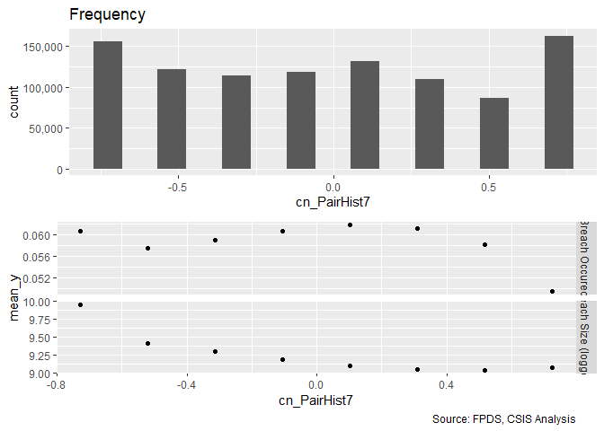<!-- -->

```
## [[1]]
## 
## -0.727574636460554 -0.519998477795702  -0.31242231913085 
##             155623             122002             113614 
## -0.104846160465998  0.102729998198854  0.310306156863706 
##             118101             131531             109387 
##  0.517882315528558   0.72545847419341 
##              86538             163204 
## 
## [[2]]
##                     
##                        None Ceiling Breach
##   -0.727574636460554 146181           9442
##   -0.519998477795702 114982           7020
##   -0.31242231913085  106910           6704
##   -0.104846160465998 110938           7163
##   0.102729998198854  123406           8125
##   0.310306156863706  102690           6697
##   0.517882315528558   81508           5030
##   0.72545847419341   155134           8070
## 
## [[3]]
##                     
##                           0      1
##   -0.727574636460554 151409   4214
##   -0.519998477795702 120240   1762
##   -0.31242231913085  112157   1457
##   -0.104846160465998 116734   1367
##   0.102729998198854  129311   2220
##   0.310306156863706  106592   2795
##   0.517882315528558   84540   1998
##   0.72545847419341   160340   2864
```

```r
#Scatter Plot
ggplot(serv_smp, aes(x=c_pairHist, y=ln_CBre_OMB20_GDP18)) + geom_point(alpha = 0.1) + ggtitle('Ceiling Breach Growth') + theme(plot.title = element_text(hjust = 0.5))
```

<!-- -->

```r
#Model
b_CBre03A <- glm (data=serv_smp,
                 b_CBre ~ c_pairHist, family=binomial(link="logit"))
display(b_CBre03A)
```

```
## glm(formula = b_CBre ~ c_pairHist, family = binomial(link = "logit"), 
##     data = serv_smp)
##             coef.est coef.se
## (Intercept) -2.77     0.01  
## c_pairHist  -0.09     0.02  
## ---
##   n = 250000, k = 2
##   residual deviance = 111883.0, null deviance = 111909.6 (difference = 26.6)
```

```r
n_CBre03A <- glm(data=serv_breach,
                        ln_CBre_OMB20_GDP18 ~ c_pairHist)

display(n_CBre03A)
```

```
## glm(formula = ln_CBre_OMB20_GDP18 ~ c_pairHist, data = serv_breach)
##             coef.est coef.se
## (Intercept)  9.29     0.01  
## c_pairHist  -0.53     0.02  
## ---
##   n = 61184, k = 2
##   residual deviance = 452147.4, null deviance = 456211.7 (difference = 4064.4)
##   overdispersion parameter = 7.4
##   residual sd is sqrt(overdispersion) = 2.72
```

```r
#Plot residuals versus fitted
  stargazer::stargazer(b_CBre02D,b_CBre03A,
                       
                       n_CBre02D,n_CBre03A,
                       type="text",
                       digits=2)
```

```
## 
## ======================================================================
##                                       Dependent variable:             
##                          ---------------------------------------------
##                                 b_CBre           ln_CBre_OMB20_GDP18  
##                                logistic                normal         
##                             (1)        (2)         (3)         (4)    
## ----------------------------------------------------------------------
## cl_US6_avg_sal_lag1Const    0.03                 1.24***              
##                            (0.02)                (0.03)               
##                                                                       
## cl_CFTE                   0.19***                0.50***              
##                            (0.02)                (0.02)               
##                                                                       
## c_pPBSC                   -0.16***              -0.91***              
##                            (0.02)                (0.02)               
##                                                                       
## c_pOffPSC                 0.81***               -1.14***              
##                            (0.01)                (0.02)               
##                                                                       
## c_pairHist                           -0.09***               -0.53***  
##                                       (0.02)                 (0.02)   
##                                                                       
## Constant                  -2.84***   -2.77***    9.51***     9.29***  
##                            (0.01)     (0.01)     (0.01)      (0.01)   
##                                                                       
## ----------------------------------------------------------------------
## Observations              250,000    250,000     61,184      61,184   
## Log Likelihood           -54,437.65 -55,941.52 -139,511.70 -148,005.10
## Akaike Inf. Crit.        108,885.30 111,887.00 279,033.40  296,014.20 
## ======================================================================
## Note:                                      *p<0.1; **p<0.05; ***p<0.01
```

```r
summary_residual_compare(b_CBre02D,b_CBre03A, skip_vif = TRUE)
```

```
## debugging in: summary_residual_compare(b_CBre02D, b_CBre03A, skip_vif = TRUE)
## debug: {
##     if (skip_vif == FALSE) 
##         warning("Deprecating VIF. Just use glmer_examine on the models")
##     if (!is.na(bins)) {
##         if ("cl_US6_avg_sal_lag1Const" %in% model_colnames(model1_old) & 
##             "cl_US6_avg_sal_lag1Const" %in% model_colnames(model1_new)) 
##             bins <- bins + 5
##         if ("cl_CFTE" %in% model_colnames(model1_old) & "cl_CFTE" %in% 
##             model_colnames(model1_new)) 
##             bins <- bins + 5
##         if ("c_pPBSC" %in% model_colnames(model1_old) & "c_pPBSC" %in% 
##             model_colnames(model1_new)) 
##             bins <- bins + 5
##         if ("c_pOffPSC" %in% model_colnames(model1_old) & "c_pOffPSC" %in% 
##             model_colnames(model1_new)) 
##             bins <- bins + 5
##         if ("cl_pairCA" %in% model_colnames(model1_old) & "cl_pairCA" %in% 
##             model_colnames(model1_new)) 
##             bins <- bins + 5
##         if ("c_OffCri" %in% model_colnames(model1_old) & "c_OffCri" %in% 
##             model_colnames(model1_new)) 
##             bins <- bins + 5
##         if (("cl_Ceil" %in% model_colnames(model1_old) & "cl_Ceil" %in% 
##             model_colnames(model1_new)) | ("cl_Ceil_Then_Year" %in% 
##             model_colnames(model1_old) & "cl_Ceil_Then_Year" %in% 
##             model_colnames(model1_new))) 
##             bins <- bins + 10
##         if ("cl_Days" %in% model_colnames(model1_old) & "cl_Days" %in% 
##             model_colnames(model1_new)) 
##             bins <- bins + 5
##     }
##     if (!is.null(model2_new)) {
##         gridExtra::grid.arrange(binned_fitted_versus_residuals(model1_old, 
##             bins = bins), binned_fitted_versus_residuals(model1_new, 
##             bins = bins), binned_fitted_versus_residuals(model2_old, 
##             bins = bins), binned_fitted_versus_residuals(model2_new, 
##             bins = bins), ncol = 2)
##         if (!"b_Term" %in% model_colnames(model1_old) & !"b_CBre" %in% 
##             model_colnames(model1_old)) 
##             gridExtra::grid.arrange(resid_plot(model1_old, sample = 25000), 
##                 resid_plot(model1_new, sample = 25000), resid_plot(model2_old, 
##                   sample = 25000), resid_plot(model2_new, sample = 25000), 
##                 ncol = 2)
##         if (!"b_Term" %in% colnames(model1_old) & !"b_CBre" %in% 
##             model_colnames(model1_old)) 
##             gridExtra::grid.arrange(residuals_binned(model1_old, 
##                 bins = bins), residuals_binned(model1_new, bins = bins), 
##                 residuals_binned(model2_old, bins = bins), residuals_binned(model2_new, 
##                   bins = bins), ncol = 2)
##         if ("cl_Ceil" %in% model_colnames(model1_new)) {
##             residual_compare(model1_old, model1_new, model2_old, 
##                 model2_new, "cl_Ceil", "Centered Log(Ceiling)", 
##                 20)
##         }
##         if ("cl_Days" %in% model_colnames(model1_new)) {
##             residual_compare(model1_old, model1_new, model2_old, 
##                 model2_new, "cl_Days", "Centered Log(Days)", 
##                 10)
##         }
##         output <- NULL
##         if (class(model1_new) == "glmerMod" & class(model2_new) == 
##             "glmerMod") {
##             m1t <- getME(model1_new, "theta")
##             m1l <- getME(model1_new, "lower")
##             m2t <- getME(model2_new, "theta")
##             m2l <- getME(model2_new, "lower")
##             output <- list(m1t[m1l == 0], m2t[m2l == 0], model1_new@optinfo$conv$lme4$messages, 
##                 model2_new@optinfo$conv$lme4$messages)
##         }
##         else if ((class(model1_new) != "glmerMod" & class(model2_new) != 
##             "glmerMod") & (class(model1_old) != "glmerMod" & 
##             class(model2_old) != "glmerMod")) {
##             output <- list(rbind(deviance_stats(model1_old, "model1_old"), 
##                 deviance_stats(model1_new, "model1_new"), deviance_stats(model2_old, 
##                   "model2_old"), deviance_stats(model2_new, "model2_new")))
##         }
##     }
##     else if (!is.null(model1_new)) {
##         gridExtra::grid.arrange(binned_fitted_versus_residuals(model1_old, 
##             bins = bins), binned_fitted_versus_residuals(model1_new, 
##             bins = bins), ncol = 2)
##         if (!"b_Term" %in% model_colnames(model1_old) & !"b_CBre" %in% 
##             model_colnames(model1_old)) 
##             gridExtra::grid.arrange(resid_plot(model1_old, sample = 25000), 
##                 resid_plot(model1_new, sample = 25000), ncol = 2)
##         gridExtra::grid.arrange(residuals_binned(model1_old, 
##             bins = bins), residuals_binned(model1_new, bins = bins), 
##             ncol = 2)
##         output <- NULL
##         if (class(model1_new) == "glmerMod") {
##             m1t <- getME(model1_new, "theta")
##             m1l <- getME(model1_new, "lower")
##             output <- list(m1t[m1l == 0], model1_new@optinfo$conv$lme4$messages)
##         }
##         else if (class(model1_new) != "glmerMod" & class(model1_old) != 
##             "glmerMod") {
##             output <- list(rbind(deviance_stats(model1_old, "model1_old"), 
##                 deviance_stats(model1_new, "model1_new")))
##         }
##     }
##     else {
##         if (!is.na(bins)) {
##             if ("cl_US6_avg_sal_lag1Const" %in% model_colnames(model1_old)) 
##                 bins <- bins + 5
##             if ("cl_CFTE" %in% model_colnames(model1_old)) 
##                 bins <- bins + 5
##             if ("c_pPBSC" %in% model_colnames(model1_old)) 
##                 bins <- bins + 5
##             if ("c_pOffPSC" %in% model_colnames(model1_old)) 
##                 bins <- bins + 5
##             if ("cl_pairCA" %in% model_colnames(model1_old)) 
##                 bins <- bins + 5
##             if ("c_OffCri" %in% model_colnames(model1_old)) 
##                 bins <- bins + 5
##             if (("cl_Ceil" %in% model_colnames(model1_old)) | 
##                 ("cl_Ceil_Then_Year" %in% model_colnames(model1_old))) 
##                 bins <- bins + 10
##             if ("cl_Days" %in% model_colnames(model1_old)) 
##                 bins <- bins + 5
##         }
##         if (!"b_Term" %in% model_colnames(model1_old) & !"b_CBre" %in% 
##             model_colnames(model1_old)) 
##             gridExtra::grid.arrange(binned_fitted_versus_residuals(model1_old, 
##                 bins = bins), residuals_binned(model1_old, bins = bins), 
##                 resid_plot(model1_old, sample = 25000))
##         else gridExtra::grid.arrange(binned_fitted_versus_residuals(model1_old, 
##             bins = bins), residuals_binned(model1_old, bins = bins))
##         output <- NULL
##         if (class(model1_old) == "glmerMod") {
##             m1t <- getME(model1_old, "theta")
##             m1l <- getME(model1_old, "lower")
##             output <- list(m1t[m1l == 0], model1_old@optinfo$conv$lme4$messages)
##         }
##         else if (class(model1_old) != "glmerMod" & class(model1_old) != 
##             "glmerMod") {
##             output <- list(deviance_stats(model1_old, "model1_old"))
##         }
##     }
##     output
## }
## debug: if (skip_vif == FALSE) warning("Deprecating VIF. Just use glmer_examine on the models")
## debug: if (!is.na(bins)) {
##     if ("cl_US6_avg_sal_lag1Const" %in% model_colnames(model1_old) & 
##         "cl_US6_avg_sal_lag1Const" %in% model_colnames(model1_new)) 
##         bins <- bins + 5
##     if ("cl_CFTE" %in% model_colnames(model1_old) & "cl_CFTE" %in% 
##         model_colnames(model1_new)) 
##         bins <- bins + 5
##     if ("c_pPBSC" %in% model_colnames(model1_old) & "c_pPBSC" %in% 
##         model_colnames(model1_new)) 
##         bins <- bins + 5
##     if ("c_pOffPSC" %in% model_colnames(model1_old) & "c_pOffPSC" %in% 
##         model_colnames(model1_new)) 
##         bins <- bins + 5
##     if ("cl_pairCA" %in% model_colnames(model1_old) & "cl_pairCA" %in% 
##         model_colnames(model1_new)) 
##         bins <- bins + 5
##     if ("c_OffCri" %in% model_colnames(model1_old) & "c_OffCri" %in% 
##         model_colnames(model1_new)) 
##         bins <- bins + 5
##     if (("cl_Ceil" %in% model_colnames(model1_old) & "cl_Ceil" %in% 
##         model_colnames(model1_new)) | ("cl_Ceil_Then_Year" %in% 
##         model_colnames(model1_old) & "cl_Ceil_Then_Year" %in% 
##         model_colnames(model1_new))) 
##         bins <- bins + 10
##     if ("cl_Days" %in% model_colnames(model1_old) & "cl_Days" %in% 
##         model_colnames(model1_new)) 
##         bins <- bins + 5
## }
## debug: if ("cl_US6_avg_sal_lag1Const" %in% model_colnames(model1_old) & 
##     "cl_US6_avg_sal_lag1Const" %in% model_colnames(model1_new)) bins <- bins + 
##     5
## debug: if ("cl_CFTE" %in% model_colnames(model1_old) & "cl_CFTE" %in% 
##     model_colnames(model1_new)) bins <- bins + 5
## debug: if ("c_pPBSC" %in% model_colnames(model1_old) & "c_pPBSC" %in% 
##     model_colnames(model1_new)) bins <- bins + 5
## debug: if ("c_pOffPSC" %in% model_colnames(model1_old) & "c_pOffPSC" %in% 
##     model_colnames(model1_new)) bins <- bins + 5
## debug: if ("cl_pairCA" %in% model_colnames(model1_old) & "cl_pairCA" %in% 
##     model_colnames(model1_new)) bins <- bins + 5
## debug: if ("c_OffCri" %in% model_colnames(model1_old) & "c_OffCri" %in% 
##     model_colnames(model1_new)) bins <- bins + 5
## debug: if (("cl_Ceil" %in% model_colnames(model1_old) & "cl_Ceil" %in% 
##     model_colnames(model1_new)) | ("cl_Ceil_Then_Year" %in% model_colnames(model1_old) & 
##     "cl_Ceil_Then_Year" %in% model_colnames(model1_new))) bins <- bins + 
##     10
## debug: if ("cl_Days" %in% model_colnames(model1_old) & "cl_Days" %in% 
##     model_colnames(model1_new)) bins <- bins + 5
## debug: if (!is.null(model2_new)) {
##     gridExtra::grid.arrange(binned_fitted_versus_residuals(model1_old, 
##         bins = bins), binned_fitted_versus_residuals(model1_new, 
##         bins = bins), binned_fitted_versus_residuals(model2_old, 
##         bins = bins), binned_fitted_versus_residuals(model2_new, 
##         bins = bins), ncol = 2)
##     if (!"b_Term" %in% model_colnames(model1_old) & !"b_CBre" %in% 
##         model_colnames(model1_old)) 
##         gridExtra::grid.arrange(resid_plot(model1_old, sample = 25000), 
##             resid_plot(model1_new, sample = 25000), resid_plot(model2_old, 
##                 sample = 25000), resid_plot(model2_new, sample = 25000), 
##             ncol = 2)
##     if (!"b_Term" %in% colnames(model1_old) & !"b_CBre" %in% 
##         model_colnames(model1_old)) 
##         gridExtra::grid.arrange(residuals_binned(model1_old, 
##             bins = bins), residuals_binned(model1_new, bins = bins), 
##             residuals_binned(model2_old, bins = bins), residuals_binned(model2_new, 
##                 bins = bins), ncol = 2)
##     if ("cl_Ceil" %in% model_colnames(model1_new)) {
##         residual_compare(model1_old, model1_new, model2_old, 
##             model2_new, "cl_Ceil", "Centered Log(Ceiling)", 20)
##     }
##     if ("cl_Days" %in% model_colnames(model1_new)) {
##         residual_compare(model1_old, model1_new, model2_old, 
##             model2_new, "cl_Days", "Centered Log(Days)", 10)
##     }
##     output <- NULL
##     if (class(model1_new) == "glmerMod" & class(model2_new) == 
##         "glmerMod") {
##         m1t <- getME(model1_new, "theta")
##         m1l <- getME(model1_new, "lower")
##         m2t <- getME(model2_new, "theta")
##         m2l <- getME(model2_new, "lower")
##         output <- list(m1t[m1l == 0], m2t[m2l == 0], model1_new@optinfo$conv$lme4$messages, 
##             model2_new@optinfo$conv$lme4$messages)
##     }
##     else if ((class(model1_new) != "glmerMod" & class(model2_new) != 
##         "glmerMod") & (class(model1_old) != "glmerMod" & class(model2_old) != 
##         "glmerMod")) {
##         output <- list(rbind(deviance_stats(model1_old, "model1_old"), 
##             deviance_stats(model1_new, "model1_new"), deviance_stats(model2_old, 
##                 "model2_old"), deviance_stats(model2_new, "model2_new")))
##     }
## } else if (!is.null(model1_new)) {
##     gridExtra::grid.arrange(binned_fitted_versus_residuals(model1_old, 
##         bins = bins), binned_fitted_versus_residuals(model1_new, 
##         bins = bins), ncol = 2)
##     if (!"b_Term" %in% model_colnames(model1_old) & !"b_CBre" %in% 
##         model_colnames(model1_old)) 
##         gridExtra::grid.arrange(resid_plot(model1_old, sample = 25000), 
##             resid_plot(model1_new, sample = 25000), ncol = 2)
##     gridExtra::grid.arrange(residuals_binned(model1_old, bins = bins), 
##         residuals_binned(model1_new, bins = bins), ncol = 2)
##     output <- NULL
##     if (class(model1_new) == "glmerMod") {
##         m1t <- getME(model1_new, "theta")
##         m1l <- getME(model1_new, "lower")
##         output <- list(m1t[m1l == 0], model1_new@optinfo$conv$lme4$messages)
##     }
##     else if (class(model1_new) != "glmerMod" & class(model1_old) != 
##         "glmerMod") {
##         output <- list(rbind(deviance_stats(model1_old, "model1_old"), 
##             deviance_stats(model1_new, "model1_new")))
##     }
## } else {
##     if (!is.na(bins)) {
##         if ("cl_US6_avg_sal_lag1Const" %in% model_colnames(model1_old)) 
##             bins <- bins + 5
##         if ("cl_CFTE" %in% model_colnames(model1_old)) 
##             bins <- bins + 5
##         if ("c_pPBSC" %in% model_colnames(model1_old)) 
##             bins <- bins + 5
##         if ("c_pOffPSC" %in% model_colnames(model1_old)) 
##             bins <- bins + 5
##         if ("cl_pairCA" %in% model_colnames(model1_old)) 
##             bins <- bins + 5
##         if ("c_OffCri" %in% model_colnames(model1_old)) 
##             bins <- bins + 5
##         if (("cl_Ceil" %in% model_colnames(model1_old)) | ("cl_Ceil_Then_Year" %in% 
##             model_colnames(model1_old))) 
##             bins <- bins + 10
##         if ("cl_Days" %in% model_colnames(model1_old)) 
##             bins <- bins + 5
##     }
##     if (!"b_Term" %in% model_colnames(model1_old) & !"b_CBre" %in% 
##         model_colnames(model1_old)) 
##         gridExtra::grid.arrange(binned_fitted_versus_residuals(model1_old, 
##             bins = bins), residuals_binned(model1_old, bins = bins), 
##             resid_plot(model1_old, sample = 25000))
##     else gridExtra::grid.arrange(binned_fitted_versus_residuals(model1_old, 
##         bins = bins), residuals_binned(model1_old, bins = bins))
##     output <- NULL
##     if (class(model1_old) == "glmerMod") {
##         m1t <- getME(model1_old, "theta")
##         m1l <- getME(model1_old, "lower")
##         output <- list(m1t[m1l == 0], model1_old@optinfo$conv$lme4$messages)
##     }
##     else if (class(model1_old) != "glmerMod" & class(model1_old) != 
##         "glmerMod") {
##         output <- list(deviance_stats(model1_old, "model1_old"))
##     }
## }
## debug: if (!is.null(model1_new)) {
##     gridExtra::grid.arrange(binned_fitted_versus_residuals(model1_old, 
##         bins = bins), binned_fitted_versus_residuals(model1_new, 
##         bins = bins), ncol = 2)
##     if (!"b_Term" %in% model_colnames(model1_old) & !"b_CBre" %in% 
##         model_colnames(model1_old)) 
##         gridExtra::grid.arrange(resid_plot(model1_old, sample = 25000), 
##             resid_plot(model1_new, sample = 25000), ncol = 2)
##     gridExtra::grid.arrange(residuals_binned(model1_old, bins = bins), 
##         residuals_binned(model1_new, bins = bins), ncol = 2)
##     output <- NULL
##     if (class(model1_new) == "glmerMod") {
##         m1t <- getME(model1_new, "theta")
##         m1l <- getME(model1_new, "lower")
##         output <- list(m1t[m1l == 0], model1_new@optinfo$conv$lme4$messages)
##     }
##     else if (class(model1_new) != "glmerMod" & class(model1_old) != 
##         "glmerMod") {
##         output <- list(rbind(deviance_stats(model1_old, "model1_old"), 
##             deviance_stats(model1_new, "model1_new")))
##     }
## } else {
##     if (!is.na(bins)) {
##         if ("cl_US6_avg_sal_lag1Const" %in% model_colnames(model1_old)) 
##             bins <- bins + 5
##         if ("cl_CFTE" %in% model_colnames(model1_old)) 
##             bins <- bins + 5
##         if ("c_pPBSC" %in% model_colnames(model1_old)) 
##             bins <- bins + 5
##         if ("c_pOffPSC" %in% model_colnames(model1_old)) 
##             bins <- bins + 5
##         if ("cl_pairCA" %in% model_colnames(model1_old)) 
##             bins <- bins + 5
##         if ("c_OffCri" %in% model_colnames(model1_old)) 
##             bins <- bins + 5
##         if (("cl_Ceil" %in% model_colnames(model1_old)) | ("cl_Ceil_Then_Year" %in% 
##             model_colnames(model1_old))) 
##             bins <- bins + 10
##         if ("cl_Days" %in% model_colnames(model1_old)) 
##             bins <- bins + 5
##     }
##     if (!"b_Term" %in% model_colnames(model1_old) & !"b_CBre" %in% 
##         model_colnames(model1_old)) 
##         gridExtra::grid.arrange(binned_fitted_versus_residuals(model1_old, 
##             bins = bins), residuals_binned(model1_old, bins = bins), 
##             resid_plot(model1_old, sample = 25000))
##     else gridExtra::grid.arrange(binned_fitted_versus_residuals(model1_old, 
##         bins = bins), residuals_binned(model1_old, bins = bins))
##     output <- NULL
##     if (class(model1_old) == "glmerMod") {
##         m1t <- getME(model1_old, "theta")
##         m1l <- getME(model1_old, "lower")
##         output <- list(m1t[m1l == 0], model1_old@optinfo$conv$lme4$messages)
##     }
##     else if (class(model1_old) != "glmerMod" & class(model1_old) != 
##         "glmerMod") {
##         output <- list(deviance_stats(model1_old, "model1_old"))
##     }
## }
## debug: gridExtra::grid.arrange(binned_fitted_versus_residuals(model1_old, 
##     bins = bins), binned_fitted_versus_residuals(model1_new, 
##     bins = bins), ncol = 2)
```

<!-- -->

```
## debug: if (!"b_Term" %in% model_colnames(model1_old) & !"b_CBre" %in% 
##     model_colnames(model1_old)) gridExtra::grid.arrange(resid_plot(model1_old, 
##     sample = 25000), resid_plot(model1_new, sample = 25000), 
##     ncol = 2)
## debug: gridExtra::grid.arrange(residuals_binned(model1_old, bins = bins), 
##     residuals_binned(model1_new, bins = bins), ncol = 2)
```

```
## debug: output <- NULL
## debug: if (class(model1_new) == "glmerMod") {
##     m1t <- getME(model1_new, "theta")
##     m1l <- getME(model1_new, "lower")
##     output <- list(m1t[m1l == 0], model1_new@optinfo$conv$lme4$messages)
## } else if (class(model1_new) != "glmerMod" & class(model1_old) != 
##     "glmerMod") {
##     output <- list(rbind(deviance_stats(model1_old, "model1_old"), 
##         deviance_stats(model1_new, "model1_new")))
## }
```

```
## Warning in if (class(model1_new) == "glmerMod") {: the condition has length
## > 1 and only the first element will be used
```

```
## debug: if (class(model1_new) != "glmerMod" & class(model1_old) != "glmerMod") {
##     output <- list(rbind(deviance_stats(model1_old, "model1_old"), 
##         deviance_stats(model1_new, "model1_new")))
## }
```

```
## Warning in if (class(model1_new) != "glmerMod" & class(model1_old) !=
## "glmerMod") {: the condition has length > 1 and only the first element will
## be used
```

<!-- -->

```
## debug: output <- list(rbind(deviance_stats(model1_old, "model1_old"), 
##     deviance_stats(model1_new, "model1_new")))
## debug: output
## exiting from: summary_residual_compare(b_CBre02D, b_CBre03A, skip_vif = TRUE)
```

```
## [[1]]
##        model deviance null.deviance difference
## 1 model1_old 108875.3      111909.6 3034.29035
## 2 model1_new 111883.0      111909.6   26.55349
```

When considering pair history alone, expectations were met for ceiling breaches, both in probability of a breach and the size of the breach.


### 03B: Interaction
Expectation: As the number of contract actions a vendor has performed for an office in the past year increases (decreases), the likelihood of cost ceiling breaches and terminations decreases (increases) and that of exercised options increases (decreases) for that partnership.  Similarly, as the number of contract actions a vendor has performed for an office in the past year increases (decreases), the size of cost ceiling breaches should decrease (increase).


```r
summary_continuous_plot(serv_smp1m,metric="cbre","cl_pairCA")
```

```
## Warning in `[<-.factor`(`*tmp*`, ri, value = c(0, 0, 0, 0, 0, 0, 0, 0, 0, :
## invalid factor level, NA generated
```

<!-- -->

```r
#Scatter Plot
ggplot(serv_smp, aes(x=cl_pairCA, y=ln_CBre_OMB20_GDP18)) + geom_point(alpha = 0.1) + ggtitle('Ceiling Breach Growth') + theme(plot.title = element_text(hjust = 0.5))
```

<!-- -->

```r
#Model
b_CBre03B <- glm (data=serv_smp,
                 b_CBre ~ cl_pairCA, family=binomial(link="logit"))
display(b_CBre03B)
```

```
## glm(formula = b_CBre ~ cl_pairCA, family = binomial(link = "logit"), 
##     data = serv_smp)
##             coef.est coef.se
## (Intercept) -2.77     0.01  
## cl_pairCA    0.18     0.02  
## ---
##   n = 250000, k = 2
##   residual deviance = 111790.5, null deviance = 111909.6 (difference = 119.1)
```

```r
n_CBre03B <- glm(data=serv_breach,
                        ln_CBre_OMB20_GDP18 ~ cl_pairCA)

display(n_CBre03B)
```

```
## glm(formula = ln_CBre_OMB20_GDP18 ~ cl_pairCA, data = serv_breach)
##             coef.est coef.se
## (Intercept)  9.38     0.01  
## cl_pairCA   -1.89     0.02  
## ---
##   n = 61184, k = 2
##   residual deviance = 408707.3, null deviance = 456211.7 (difference = 47504.4)
##   overdispersion parameter = 6.7
##   residual sd is sqrt(overdispersion) = 2.58
```

```r
#Plot residuals versus fitted
stargazer::stargazer(b_CBre02D,b_CBre03A,b_CBre03B,
                       
                       n_CBre02D,n_CBre03A,n_CBre03B,
                       type="text",
                       digits=2)
```

```
## 
## =============================================================================================
##                                                  Dependent variable:                         
##                          --------------------------------------------------------------------
##                                       b_CBre                      ln_CBre_OMB20_GDP18        
##                                      logistic                           normal               
##                             (1)        (2)        (3)         (4)         (5)         (6)    
## ---------------------------------------------------------------------------------------------
## cl_US6_avg_sal_lag1Const    0.03                            1.24***                          
##                            (0.02)                           (0.03)                           
##                                                                                              
## cl_CFTE                   0.19***                           0.50***                          
##                            (0.02)                           (0.02)                           
##                                                                                              
## c_pPBSC                   -0.16***                         -0.91***                          
##                            (0.02)                           (0.02)                           
##                                                                                              
## c_pOffPSC                 0.81***                          -1.14***                          
##                            (0.01)                           (0.02)                           
##                                                                                              
## c_pairHist                           -0.09***                          -0.53***              
##                                       (0.02)                            (0.02)               
##                                                                                              
## cl_pairCA                                       0.18***                            -1.89***  
##                                                  (0.02)                             (0.02)   
##                                                                                              
## Constant                  -2.84***   -2.77***   -2.77***    9.51***     9.29***     9.38***  
##                            (0.01)     (0.01)     (0.01)     (0.01)      (0.01)      (0.01)   
##                                                                                              
## ---------------------------------------------------------------------------------------------
## Observations              250,000    250,000    250,000     61,184      61,184      61,184   
## Log Likelihood           -54,437.65 -55,941.52 -55,895.24 -139,511.70 -148,005.10 -144,915.00
## Akaike Inf. Crit.        108,885.30 111,887.00 111,794.50 279,033.40  296,014.20  289,834.00 
## =============================================================================================
## Note:                                                             *p<0.1; **p<0.05; ***p<0.01
```

```r
summary_residual_compare(b_CBre03A,b_CBre03B, skip_vif = TRUE)
```

```
## debugging in: summary_residual_compare(b_CBre03A, b_CBre03B, skip_vif = TRUE)
## debug: {
##     if (skip_vif == FALSE) 
##         warning("Deprecating VIF. Just use glmer_examine on the models")
##     if (!is.na(bins)) {
##         if ("cl_US6_avg_sal_lag1Const" %in% model_colnames(model1_old) & 
##             "cl_US6_avg_sal_lag1Const" %in% model_colnames(model1_new)) 
##             bins <- bins + 5
##         if ("cl_CFTE" %in% model_colnames(model1_old) & "cl_CFTE" %in% 
##             model_colnames(model1_new)) 
##             bins <- bins + 5
##         if ("c_pPBSC" %in% model_colnames(model1_old) & "c_pPBSC" %in% 
##             model_colnames(model1_new)) 
##             bins <- bins + 5
##         if ("c_pOffPSC" %in% model_colnames(model1_old) & "c_pOffPSC" %in% 
##             model_colnames(model1_new)) 
##             bins <- bins + 5
##         if ("cl_pairCA" %in% model_colnames(model1_old) & "cl_pairCA" %in% 
##             model_colnames(model1_new)) 
##             bins <- bins + 5
##         if ("c_OffCri" %in% model_colnames(model1_old) & "c_OffCri" %in% 
##             model_colnames(model1_new)) 
##             bins <- bins + 5
##         if (("cl_Ceil" %in% model_colnames(model1_old) & "cl_Ceil" %in% 
##             model_colnames(model1_new)) | ("cl_Ceil_Then_Year" %in% 
##             model_colnames(model1_old) & "cl_Ceil_Then_Year" %in% 
##             model_colnames(model1_new))) 
##             bins <- bins + 10
##         if ("cl_Days" %in% model_colnames(model1_old) & "cl_Days" %in% 
##             model_colnames(model1_new)) 
##             bins <- bins + 5
##     }
##     if (!is.null(model2_new)) {
##         gridExtra::grid.arrange(binned_fitted_versus_residuals(model1_old, 
##             bins = bins), binned_fitted_versus_residuals(model1_new, 
##             bins = bins), binned_fitted_versus_residuals(model2_old, 
##             bins = bins), binned_fitted_versus_residuals(model2_new, 
##             bins = bins), ncol = 2)
##         if (!"b_Term" %in% model_colnames(model1_old) & !"b_CBre" %in% 
##             model_colnames(model1_old)) 
##             gridExtra::grid.arrange(resid_plot(model1_old, sample = 25000), 
##                 resid_plot(model1_new, sample = 25000), resid_plot(model2_old, 
##                   sample = 25000), resid_plot(model2_new, sample = 25000), 
##                 ncol = 2)
##         if (!"b_Term" %in% colnames(model1_old) & !"b_CBre" %in% 
##             model_colnames(model1_old)) 
##             gridExtra::grid.arrange(residuals_binned(model1_old, 
##                 bins = bins), residuals_binned(model1_new, bins = bins), 
##                 residuals_binned(model2_old, bins = bins), residuals_binned(model2_new, 
##                   bins = bins), ncol = 2)
##         if ("cl_Ceil" %in% model_colnames(model1_new)) {
##             residual_compare(model1_old, model1_new, model2_old, 
##                 model2_new, "cl_Ceil", "Centered Log(Ceiling)", 
##                 20)
##         }
##         if ("cl_Days" %in% model_colnames(model1_new)) {
##             residual_compare(model1_old, model1_new, model2_old, 
##                 model2_new, "cl_Days", "Centered Log(Days)", 
##                 10)
##         }
##         output <- NULL
##         if (class(model1_new) == "glmerMod" & class(model2_new) == 
##             "glmerMod") {
##             m1t <- getME(model1_new, "theta")
##             m1l <- getME(model1_new, "lower")
##             m2t <- getME(model2_new, "theta")
##             m2l <- getME(model2_new, "lower")
##             output <- list(m1t[m1l == 0], m2t[m2l == 0], model1_new@optinfo$conv$lme4$messages, 
##                 model2_new@optinfo$conv$lme4$messages)
##         }
##         else if ((class(model1_new) != "glmerMod" & class(model2_new) != 
##             "glmerMod") & (class(model1_old) != "glmerMod" & 
##             class(model2_old) != "glmerMod")) {
##             output <- list(rbind(deviance_stats(model1_old, "model1_old"), 
##                 deviance_stats(model1_new, "model1_new"), deviance_stats(model2_old, 
##                   "model2_old"), deviance_stats(model2_new, "model2_new")))
##         }
##     }
##     else if (!is.null(model1_new)) {
##         gridExtra::grid.arrange(binned_fitted_versus_residuals(model1_old, 
##             bins = bins), binned_fitted_versus_residuals(model1_new, 
##             bins = bins), ncol = 2)
##         if (!"b_Term" %in% model_colnames(model1_old) & !"b_CBre" %in% 
##             model_colnames(model1_old)) 
##             gridExtra::grid.arrange(resid_plot(model1_old, sample = 25000), 
##                 resid_plot(model1_new, sample = 25000), ncol = 2)
##         gridExtra::grid.arrange(residuals_binned(model1_old, 
##             bins = bins), residuals_binned(model1_new, bins = bins), 
##             ncol = 2)
##         output <- NULL
##         if (class(model1_new) == "glmerMod") {
##             m1t <- getME(model1_new, "theta")
##             m1l <- getME(model1_new, "lower")
##             output <- list(m1t[m1l == 0], model1_new@optinfo$conv$lme4$messages)
##         }
##         else if (class(model1_new) != "glmerMod" & class(model1_old) != 
##             "glmerMod") {
##             output <- list(rbind(deviance_stats(model1_old, "model1_old"), 
##                 deviance_stats(model1_new, "model1_new")))
##         }
##     }
##     else {
##         if (!is.na(bins)) {
##             if ("cl_US6_avg_sal_lag1Const" %in% model_colnames(model1_old)) 
##                 bins <- bins + 5
##             if ("cl_CFTE" %in% model_colnames(model1_old)) 
##                 bins <- bins + 5
##             if ("c_pPBSC" %in% model_colnames(model1_old)) 
##                 bins <- bins + 5
##             if ("c_pOffPSC" %in% model_colnames(model1_old)) 
##                 bins <- bins + 5
##             if ("cl_pairCA" %in% model_colnames(model1_old)) 
##                 bins <- bins + 5
##             if ("c_OffCri" %in% model_colnames(model1_old)) 
##                 bins <- bins + 5
##             if (("cl_Ceil" %in% model_colnames(model1_old)) | 
##                 ("cl_Ceil_Then_Year" %in% model_colnames(model1_old))) 
##                 bins <- bins + 10
##             if ("cl_Days" %in% model_colnames(model1_old)) 
##                 bins <- bins + 5
##         }
##         if (!"b_Term" %in% model_colnames(model1_old) & !"b_CBre" %in% 
##             model_colnames(model1_old)) 
##             gridExtra::grid.arrange(binned_fitted_versus_residuals(model1_old, 
##                 bins = bins), residuals_binned(model1_old, bins = bins), 
##                 resid_plot(model1_old, sample = 25000))
##         else gridExtra::grid.arrange(binned_fitted_versus_residuals(model1_old, 
##             bins = bins), residuals_binned(model1_old, bins = bins))
##         output <- NULL
##         if (class(model1_old) == "glmerMod") {
##             m1t <- getME(model1_old, "theta")
##             m1l <- getME(model1_old, "lower")
##             output <- list(m1t[m1l == 0], model1_old@optinfo$conv$lme4$messages)
##         }
##         else if (class(model1_old) != "glmerMod" & class(model1_old) != 
##             "glmerMod") {
##             output <- list(deviance_stats(model1_old, "model1_old"))
##         }
##     }
##     output
## }
## debug: if (skip_vif == FALSE) warning("Deprecating VIF. Just use glmer_examine on the models")
## debug: if (!is.na(bins)) {
##     if ("cl_US6_avg_sal_lag1Const" %in% model_colnames(model1_old) & 
##         "cl_US6_avg_sal_lag1Const" %in% model_colnames(model1_new)) 
##         bins <- bins + 5
##     if ("cl_CFTE" %in% model_colnames(model1_old) & "cl_CFTE" %in% 
##         model_colnames(model1_new)) 
##         bins <- bins + 5
##     if ("c_pPBSC" %in% model_colnames(model1_old) & "c_pPBSC" %in% 
##         model_colnames(model1_new)) 
##         bins <- bins + 5
##     if ("c_pOffPSC" %in% model_colnames(model1_old) & "c_pOffPSC" %in% 
##         model_colnames(model1_new)) 
##         bins <- bins + 5
##     if ("cl_pairCA" %in% model_colnames(model1_old) & "cl_pairCA" %in% 
##         model_colnames(model1_new)) 
##         bins <- bins + 5
##     if ("c_OffCri" %in% model_colnames(model1_old) & "c_OffCri" %in% 
##         model_colnames(model1_new)) 
##         bins <- bins + 5
##     if (("cl_Ceil" %in% model_colnames(model1_old) & "cl_Ceil" %in% 
##         model_colnames(model1_new)) | ("cl_Ceil_Then_Year" %in% 
##         model_colnames(model1_old) & "cl_Ceil_Then_Year" %in% 
##         model_colnames(model1_new))) 
##         bins <- bins + 10
##     if ("cl_Days" %in% model_colnames(model1_old) & "cl_Days" %in% 
##         model_colnames(model1_new)) 
##         bins <- bins + 5
## }
## debug: if ("cl_US6_avg_sal_lag1Const" %in% model_colnames(model1_old) & 
##     "cl_US6_avg_sal_lag1Const" %in% model_colnames(model1_new)) bins <- bins + 
##     5
## debug: if ("cl_CFTE" %in% model_colnames(model1_old) & "cl_CFTE" %in% 
##     model_colnames(model1_new)) bins <- bins + 5
## debug: if ("c_pPBSC" %in% model_colnames(model1_old) & "c_pPBSC" %in% 
##     model_colnames(model1_new)) bins <- bins + 5
## debug: if ("c_pOffPSC" %in% model_colnames(model1_old) & "c_pOffPSC" %in% 
##     model_colnames(model1_new)) bins <- bins + 5
## debug: if ("cl_pairCA" %in% model_colnames(model1_old) & "cl_pairCA" %in% 
##     model_colnames(model1_new)) bins <- bins + 5
## debug: if ("c_OffCri" %in% model_colnames(model1_old) & "c_OffCri" %in% 
##     model_colnames(model1_new)) bins <- bins + 5
## debug: if (("cl_Ceil" %in% model_colnames(model1_old) & "cl_Ceil" %in% 
##     model_colnames(model1_new)) | ("cl_Ceil_Then_Year" %in% model_colnames(model1_old) & 
##     "cl_Ceil_Then_Year" %in% model_colnames(model1_new))) bins <- bins + 
##     10
## debug: if ("cl_Days" %in% model_colnames(model1_old) & "cl_Days" %in% 
##     model_colnames(model1_new)) bins <- bins + 5
## debug: if (!is.null(model2_new)) {
##     gridExtra::grid.arrange(binned_fitted_versus_residuals(model1_old, 
##         bins = bins), binned_fitted_versus_residuals(model1_new, 
##         bins = bins), binned_fitted_versus_residuals(model2_old, 
##         bins = bins), binned_fitted_versus_residuals(model2_new, 
##         bins = bins), ncol = 2)
##     if (!"b_Term" %in% model_colnames(model1_old) & !"b_CBre" %in% 
##         model_colnames(model1_old)) 
##         gridExtra::grid.arrange(resid_plot(model1_old, sample = 25000), 
##             resid_plot(model1_new, sample = 25000), resid_plot(model2_old, 
##                 sample = 25000), resid_plot(model2_new, sample = 25000), 
##             ncol = 2)
##     if (!"b_Term" %in% colnames(model1_old) & !"b_CBre" %in% 
##         model_colnames(model1_old)) 
##         gridExtra::grid.arrange(residuals_binned(model1_old, 
##             bins = bins), residuals_binned(model1_new, bins = bins), 
##             residuals_binned(model2_old, bins = bins), residuals_binned(model2_new, 
##                 bins = bins), ncol = 2)
##     if ("cl_Ceil" %in% model_colnames(model1_new)) {
##         residual_compare(model1_old, model1_new, model2_old, 
##             model2_new, "cl_Ceil", "Centered Log(Ceiling)", 20)
##     }
##     if ("cl_Days" %in% model_colnames(model1_new)) {
##         residual_compare(model1_old, model1_new, model2_old, 
##             model2_new, "cl_Days", "Centered Log(Days)", 10)
##     }
##     output <- NULL
##     if (class(model1_new) == "glmerMod" & class(model2_new) == 
##         "glmerMod") {
##         m1t <- getME(model1_new, "theta")
##         m1l <- getME(model1_new, "lower")
##         m2t <- getME(model2_new, "theta")
##         m2l <- getME(model2_new, "lower")
##         output <- list(m1t[m1l == 0], m2t[m2l == 0], model1_new@optinfo$conv$lme4$messages, 
##             model2_new@optinfo$conv$lme4$messages)
##     }
##     else if ((class(model1_new) != "glmerMod" & class(model2_new) != 
##         "glmerMod") & (class(model1_old) != "glmerMod" & class(model2_old) != 
##         "glmerMod")) {
##         output <- list(rbind(deviance_stats(model1_old, "model1_old"), 
##             deviance_stats(model1_new, "model1_new"), deviance_stats(model2_old, 
##                 "model2_old"), deviance_stats(model2_new, "model2_new")))
##     }
## } else if (!is.null(model1_new)) {
##     gridExtra::grid.arrange(binned_fitted_versus_residuals(model1_old, 
##         bins = bins), binned_fitted_versus_residuals(model1_new, 
##         bins = bins), ncol = 2)
##     if (!"b_Term" %in% model_colnames(model1_old) & !"b_CBre" %in% 
##         model_colnames(model1_old)) 
##         gridExtra::grid.arrange(resid_plot(model1_old, sample = 25000), 
##             resid_plot(model1_new, sample = 25000), ncol = 2)
##     gridExtra::grid.arrange(residuals_binned(model1_old, bins = bins), 
##         residuals_binned(model1_new, bins = bins), ncol = 2)
##     output <- NULL
##     if (class(model1_new) == "glmerMod") {
##         m1t <- getME(model1_new, "theta")
##         m1l <- getME(model1_new, "lower")
##         output <- list(m1t[m1l == 0], model1_new@optinfo$conv$lme4$messages)
##     }
##     else if (class(model1_new) != "glmerMod" & class(model1_old) != 
##         "glmerMod") {
##         output <- list(rbind(deviance_stats(model1_old, "model1_old"), 
##             deviance_stats(model1_new, "model1_new")))
##     }
## } else {
##     if (!is.na(bins)) {
##         if ("cl_US6_avg_sal_lag1Const" %in% model_colnames(model1_old)) 
##             bins <- bins + 5
##         if ("cl_CFTE" %in% model_colnames(model1_old)) 
##             bins <- bins + 5
##         if ("c_pPBSC" %in% model_colnames(model1_old)) 
##             bins <- bins + 5
##         if ("c_pOffPSC" %in% model_colnames(model1_old)) 
##             bins <- bins + 5
##         if ("cl_pairCA" %in% model_colnames(model1_old)) 
##             bins <- bins + 5
##         if ("c_OffCri" %in% model_colnames(model1_old)) 
##             bins <- bins + 5
##         if (("cl_Ceil" %in% model_colnames(model1_old)) | ("cl_Ceil_Then_Year" %in% 
##             model_colnames(model1_old))) 
##             bins <- bins + 10
##         if ("cl_Days" %in% model_colnames(model1_old)) 
##             bins <- bins + 5
##     }
##     if (!"b_Term" %in% model_colnames(model1_old) & !"b_CBre" %in% 
##         model_colnames(model1_old)) 
##         gridExtra::grid.arrange(binned_fitted_versus_residuals(model1_old, 
##             bins = bins), residuals_binned(model1_old, bins = bins), 
##             resid_plot(model1_old, sample = 25000))
##     else gridExtra::grid.arrange(binned_fitted_versus_residuals(model1_old, 
##         bins = bins), residuals_binned(model1_old, bins = bins))
##     output <- NULL
##     if (class(model1_old) == "glmerMod") {
##         m1t <- getME(model1_old, "theta")
##         m1l <- getME(model1_old, "lower")
##         output <- list(m1t[m1l == 0], model1_old@optinfo$conv$lme4$messages)
##     }
##     else if (class(model1_old) != "glmerMod" & class(model1_old) != 
##         "glmerMod") {
##         output <- list(deviance_stats(model1_old, "model1_old"))
##     }
## }
## debug: if (!is.null(model1_new)) {
##     gridExtra::grid.arrange(binned_fitted_versus_residuals(model1_old, 
##         bins = bins), binned_fitted_versus_residuals(model1_new, 
##         bins = bins), ncol = 2)
##     if (!"b_Term" %in% model_colnames(model1_old) & !"b_CBre" %in% 
##         model_colnames(model1_old)) 
##         gridExtra::grid.arrange(resid_plot(model1_old, sample = 25000), 
##             resid_plot(model1_new, sample = 25000), ncol = 2)
##     gridExtra::grid.arrange(residuals_binned(model1_old, bins = bins), 
##         residuals_binned(model1_new, bins = bins), ncol = 2)
##     output <- NULL
##     if (class(model1_new) == "glmerMod") {
##         m1t <- getME(model1_new, "theta")
##         m1l <- getME(model1_new, "lower")
##         output <- list(m1t[m1l == 0], model1_new@optinfo$conv$lme4$messages)
##     }
##     else if (class(model1_new) != "glmerMod" & class(model1_old) != 
##         "glmerMod") {
##         output <- list(rbind(deviance_stats(model1_old, "model1_old"), 
##             deviance_stats(model1_new, "model1_new")))
##     }
## } else {
##     if (!is.na(bins)) {
##         if ("cl_US6_avg_sal_lag1Const" %in% model_colnames(model1_old)) 
##             bins <- bins + 5
##         if ("cl_CFTE" %in% model_colnames(model1_old)) 
##             bins <- bins + 5
##         if ("c_pPBSC" %in% model_colnames(model1_old)) 
##             bins <- bins + 5
##         if ("c_pOffPSC" %in% model_colnames(model1_old)) 
##             bins <- bins + 5
##         if ("cl_pairCA" %in% model_colnames(model1_old)) 
##             bins <- bins + 5
##         if ("c_OffCri" %in% model_colnames(model1_old)) 
##             bins <- bins + 5
##         if (("cl_Ceil" %in% model_colnames(model1_old)) | ("cl_Ceil_Then_Year" %in% 
##             model_colnames(model1_old))) 
##             bins <- bins + 10
##         if ("cl_Days" %in% model_colnames(model1_old)) 
##             bins <- bins + 5
##     }
##     if (!"b_Term" %in% model_colnames(model1_old) & !"b_CBre" %in% 
##         model_colnames(model1_old)) 
##         gridExtra::grid.arrange(binned_fitted_versus_residuals(model1_old, 
##             bins = bins), residuals_binned(model1_old, bins = bins), 
##             resid_plot(model1_old, sample = 25000))
##     else gridExtra::grid.arrange(binned_fitted_versus_residuals(model1_old, 
##         bins = bins), residuals_binned(model1_old, bins = bins))
##     output <- NULL
##     if (class(model1_old) == "glmerMod") {
##         m1t <- getME(model1_old, "theta")
##         m1l <- getME(model1_old, "lower")
##         output <- list(m1t[m1l == 0], model1_old@optinfo$conv$lme4$messages)
##     }
##     else if (class(model1_old) != "glmerMod" & class(model1_old) != 
##         "glmerMod") {
##         output <- list(deviance_stats(model1_old, "model1_old"))
##     }
## }
## debug: gridExtra::grid.arrange(binned_fitted_versus_residuals(model1_old, 
##     bins = bins), binned_fitted_versus_residuals(model1_new, 
##     bins = bins), ncol = 2)
```

<!-- -->

```
## debug: if (!"b_Term" %in% model_colnames(model1_old) & !"b_CBre" %in% 
##     model_colnames(model1_old)) gridExtra::grid.arrange(resid_plot(model1_old, 
##     sample = 25000), resid_plot(model1_new, sample = 25000), 
##     ncol = 2)
## debug: gridExtra::grid.arrange(residuals_binned(model1_old, bins = bins), 
##     residuals_binned(model1_new, bins = bins), ncol = 2)
```

```
## debug: output <- NULL
## debug: if (class(model1_new) == "glmerMod") {
##     m1t <- getME(model1_new, "theta")
##     m1l <- getME(model1_new, "lower")
##     output <- list(m1t[m1l == 0], model1_new@optinfo$conv$lme4$messages)
## } else if (class(model1_new) != "glmerMod" & class(model1_old) != 
##     "glmerMod") {
##     output <- list(rbind(deviance_stats(model1_old, "model1_old"), 
##         deviance_stats(model1_new, "model1_new")))
## }
```

```
## Warning in if (class(model1_new) == "glmerMod") {: the condition has length
## > 1 and only the first element will be used
```

```
## debug: if (class(model1_new) != "glmerMod" & class(model1_old) != "glmerMod") {
##     output <- list(rbind(deviance_stats(model1_old, "model1_old"), 
##         deviance_stats(model1_new, "model1_new")))
## }
```

```
## Warning in if (class(model1_new) != "glmerMod" & class(model1_old) !=
## "glmerMod") {: the condition has length > 1 and only the first element will
## be used
```

<!-- -->

```
## debug: output <- list(rbind(deviance_stats(model1_old, "model1_old"), 
##     deviance_stats(model1_new, "model1_new")))
## debug: output
## exiting from: summary_residual_compare(b_CBre03A, b_CBre03B, skip_vif = TRUE)
```

```
## [[1]]
##        model deviance null.deviance difference
## 1 model1_old 111883.0      111909.6   26.55349
## 2 model1_new 111790.5      111909.6  119.12038
```

```r
summary_residual_compare(b_CBre02D,b_CBre03B, skip_vif = TRUE)
```

```
## debugging in: summary_residual_compare(b_CBre02D, b_CBre03B, skip_vif = TRUE)
## debug: {
##     if (skip_vif == FALSE) 
##         warning("Deprecating VIF. Just use glmer_examine on the models")
##     if (!is.na(bins)) {
##         if ("cl_US6_avg_sal_lag1Const" %in% model_colnames(model1_old) & 
##             "cl_US6_avg_sal_lag1Const" %in% model_colnames(model1_new)) 
##             bins <- bins + 5
##         if ("cl_CFTE" %in% model_colnames(model1_old) & "cl_CFTE" %in% 
##             model_colnames(model1_new)) 
##             bins <- bins + 5
##         if ("c_pPBSC" %in% model_colnames(model1_old) & "c_pPBSC" %in% 
##             model_colnames(model1_new)) 
##             bins <- bins + 5
##         if ("c_pOffPSC" %in% model_colnames(model1_old) & "c_pOffPSC" %in% 
##             model_colnames(model1_new)) 
##             bins <- bins + 5
##         if ("cl_pairCA" %in% model_colnames(model1_old) & "cl_pairCA" %in% 
##             model_colnames(model1_new)) 
##             bins <- bins + 5
##         if ("c_OffCri" %in% model_colnames(model1_old) & "c_OffCri" %in% 
##             model_colnames(model1_new)) 
##             bins <- bins + 5
##         if (("cl_Ceil" %in% model_colnames(model1_old) & "cl_Ceil" %in% 
##             model_colnames(model1_new)) | ("cl_Ceil_Then_Year" %in% 
##             model_colnames(model1_old) & "cl_Ceil_Then_Year" %in% 
##             model_colnames(model1_new))) 
##             bins <- bins + 10
##         if ("cl_Days" %in% model_colnames(model1_old) & "cl_Days" %in% 
##             model_colnames(model1_new)) 
##             bins <- bins + 5
##     }
##     if (!is.null(model2_new)) {
##         gridExtra::grid.arrange(binned_fitted_versus_residuals(model1_old, 
##             bins = bins), binned_fitted_versus_residuals(model1_new, 
##             bins = bins), binned_fitted_versus_residuals(model2_old, 
##             bins = bins), binned_fitted_versus_residuals(model2_new, 
##             bins = bins), ncol = 2)
##         if (!"b_Term" %in% model_colnames(model1_old) & !"b_CBre" %in% 
##             model_colnames(model1_old)) 
##             gridExtra::grid.arrange(resid_plot(model1_old, sample = 25000), 
##                 resid_plot(model1_new, sample = 25000), resid_plot(model2_old, 
##                   sample = 25000), resid_plot(model2_new, sample = 25000), 
##                 ncol = 2)
##         if (!"b_Term" %in% colnames(model1_old) & !"b_CBre" %in% 
##             model_colnames(model1_old)) 
##             gridExtra::grid.arrange(residuals_binned(model1_old, 
##                 bins = bins), residuals_binned(model1_new, bins = bins), 
##                 residuals_binned(model2_old, bins = bins), residuals_binned(model2_new, 
##                   bins = bins), ncol = 2)
##         if ("cl_Ceil" %in% model_colnames(model1_new)) {
##             residual_compare(model1_old, model1_new, model2_old, 
##                 model2_new, "cl_Ceil", "Centered Log(Ceiling)", 
##                 20)
##         }
##         if ("cl_Days" %in% model_colnames(model1_new)) {
##             residual_compare(model1_old, model1_new, model2_old, 
##                 model2_new, "cl_Days", "Centered Log(Days)", 
##                 10)
##         }
##         output <- NULL
##         if (class(model1_new) == "glmerMod" & class(model2_new) == 
##             "glmerMod") {
##             m1t <- getME(model1_new, "theta")
##             m1l <- getME(model1_new, "lower")
##             m2t <- getME(model2_new, "theta")
##             m2l <- getME(model2_new, "lower")
##             output <- list(m1t[m1l == 0], m2t[m2l == 0], model1_new@optinfo$conv$lme4$messages, 
##                 model2_new@optinfo$conv$lme4$messages)
##         }
##         else if ((class(model1_new) != "glmerMod" & class(model2_new) != 
##             "glmerMod") & (class(model1_old) != "glmerMod" & 
##             class(model2_old) != "glmerMod")) {
##             output <- list(rbind(deviance_stats(model1_old, "model1_old"), 
##                 deviance_stats(model1_new, "model1_new"), deviance_stats(model2_old, 
##                   "model2_old"), deviance_stats(model2_new, "model2_new")))
##         }
##     }
##     else if (!is.null(model1_new)) {
##         gridExtra::grid.arrange(binned_fitted_versus_residuals(model1_old, 
##             bins = bins), binned_fitted_versus_residuals(model1_new, 
##             bins = bins), ncol = 2)
##         if (!"b_Term" %in% model_colnames(model1_old) & !"b_CBre" %in% 
##             model_colnames(model1_old)) 
##             gridExtra::grid.arrange(resid_plot(model1_old, sample = 25000), 
##                 resid_plot(model1_new, sample = 25000), ncol = 2)
##         gridExtra::grid.arrange(residuals_binned(model1_old, 
##             bins = bins), residuals_binned(model1_new, bins = bins), 
##             ncol = 2)
##         output <- NULL
##         if (class(model1_new) == "glmerMod") {
##             m1t <- getME(model1_new, "theta")
##             m1l <- getME(model1_new, "lower")
##             output <- list(m1t[m1l == 0], model1_new@optinfo$conv$lme4$messages)
##         }
##         else if (class(model1_new) != "glmerMod" & class(model1_old) != 
##             "glmerMod") {
##             output <- list(rbind(deviance_stats(model1_old, "model1_old"), 
##                 deviance_stats(model1_new, "model1_new")))
##         }
##     }
##     else {
##         if (!is.na(bins)) {
##             if ("cl_US6_avg_sal_lag1Const" %in% model_colnames(model1_old)) 
##                 bins <- bins + 5
##             if ("cl_CFTE" %in% model_colnames(model1_old)) 
##                 bins <- bins + 5
##             if ("c_pPBSC" %in% model_colnames(model1_old)) 
##                 bins <- bins + 5
##             if ("c_pOffPSC" %in% model_colnames(model1_old)) 
##                 bins <- bins + 5
##             if ("cl_pairCA" %in% model_colnames(model1_old)) 
##                 bins <- bins + 5
##             if ("c_OffCri" %in% model_colnames(model1_old)) 
##                 bins <- bins + 5
##             if (("cl_Ceil" %in% model_colnames(model1_old)) | 
##                 ("cl_Ceil_Then_Year" %in% model_colnames(model1_old))) 
##                 bins <- bins + 10
##             if ("cl_Days" %in% model_colnames(model1_old)) 
##                 bins <- bins + 5
##         }
##         if (!"b_Term" %in% model_colnames(model1_old) & !"b_CBre" %in% 
##             model_colnames(model1_old)) 
##             gridExtra::grid.arrange(binned_fitted_versus_residuals(model1_old, 
##                 bins = bins), residuals_binned(model1_old, bins = bins), 
##                 resid_plot(model1_old, sample = 25000))
##         else gridExtra::grid.arrange(binned_fitted_versus_residuals(model1_old, 
##             bins = bins), residuals_binned(model1_old, bins = bins))
##         output <- NULL
##         if (class(model1_old) == "glmerMod") {
##             m1t <- getME(model1_old, "theta")
##             m1l <- getME(model1_old, "lower")
##             output <- list(m1t[m1l == 0], model1_old@optinfo$conv$lme4$messages)
##         }
##         else if (class(model1_old) != "glmerMod" & class(model1_old) != 
##             "glmerMod") {
##             output <- list(deviance_stats(model1_old, "model1_old"))
##         }
##     }
##     output
## }
## debug: if (skip_vif == FALSE) warning("Deprecating VIF. Just use glmer_examine on the models")
## debug: if (!is.na(bins)) {
##     if ("cl_US6_avg_sal_lag1Const" %in% model_colnames(model1_old) & 
##         "cl_US6_avg_sal_lag1Const" %in% model_colnames(model1_new)) 
##         bins <- bins + 5
##     if ("cl_CFTE" %in% model_colnames(model1_old) & "cl_CFTE" %in% 
##         model_colnames(model1_new)) 
##         bins <- bins + 5
##     if ("c_pPBSC" %in% model_colnames(model1_old) & "c_pPBSC" %in% 
##         model_colnames(model1_new)) 
##         bins <- bins + 5
##     if ("c_pOffPSC" %in% model_colnames(model1_old) & "c_pOffPSC" %in% 
##         model_colnames(model1_new)) 
##         bins <- bins + 5
##     if ("cl_pairCA" %in% model_colnames(model1_old) & "cl_pairCA" %in% 
##         model_colnames(model1_new)) 
##         bins <- bins + 5
##     if ("c_OffCri" %in% model_colnames(model1_old) & "c_OffCri" %in% 
##         model_colnames(model1_new)) 
##         bins <- bins + 5
##     if (("cl_Ceil" %in% model_colnames(model1_old) & "cl_Ceil" %in% 
##         model_colnames(model1_new)) | ("cl_Ceil_Then_Year" %in% 
##         model_colnames(model1_old) & "cl_Ceil_Then_Year" %in% 
##         model_colnames(model1_new))) 
##         bins <- bins + 10
##     if ("cl_Days" %in% model_colnames(model1_old) & "cl_Days" %in% 
##         model_colnames(model1_new)) 
##         bins <- bins + 5
## }
## debug: if ("cl_US6_avg_sal_lag1Const" %in% model_colnames(model1_old) & 
##     "cl_US6_avg_sal_lag1Const" %in% model_colnames(model1_new)) bins <- bins + 
##     5
## debug: if ("cl_CFTE" %in% model_colnames(model1_old) & "cl_CFTE" %in% 
##     model_colnames(model1_new)) bins <- bins + 5
## debug: if ("c_pPBSC" %in% model_colnames(model1_old) & "c_pPBSC" %in% 
##     model_colnames(model1_new)) bins <- bins + 5
## debug: if ("c_pOffPSC" %in% model_colnames(model1_old) & "c_pOffPSC" %in% 
##     model_colnames(model1_new)) bins <- bins + 5
## debug: if ("cl_pairCA" %in% model_colnames(model1_old) & "cl_pairCA" %in% 
##     model_colnames(model1_new)) bins <- bins + 5
## debug: if ("c_OffCri" %in% model_colnames(model1_old) & "c_OffCri" %in% 
##     model_colnames(model1_new)) bins <- bins + 5
## debug: if (("cl_Ceil" %in% model_colnames(model1_old) & "cl_Ceil" %in% 
##     model_colnames(model1_new)) | ("cl_Ceil_Then_Year" %in% model_colnames(model1_old) & 
##     "cl_Ceil_Then_Year" %in% model_colnames(model1_new))) bins <- bins + 
##     10
## debug: if ("cl_Days" %in% model_colnames(model1_old) & "cl_Days" %in% 
##     model_colnames(model1_new)) bins <- bins + 5
## debug: if (!is.null(model2_new)) {
##     gridExtra::grid.arrange(binned_fitted_versus_residuals(model1_old, 
##         bins = bins), binned_fitted_versus_residuals(model1_new, 
##         bins = bins), binned_fitted_versus_residuals(model2_old, 
##         bins = bins), binned_fitted_versus_residuals(model2_new, 
##         bins = bins), ncol = 2)
##     if (!"b_Term" %in% model_colnames(model1_old) & !"b_CBre" %in% 
##         model_colnames(model1_old)) 
##         gridExtra::grid.arrange(resid_plot(model1_old, sample = 25000), 
##             resid_plot(model1_new, sample = 25000), resid_plot(model2_old, 
##                 sample = 25000), resid_plot(model2_new, sample = 25000), 
##             ncol = 2)
##     if (!"b_Term" %in% colnames(model1_old) & !"b_CBre" %in% 
##         model_colnames(model1_old)) 
##         gridExtra::grid.arrange(residuals_binned(model1_old, 
##             bins = bins), residuals_binned(model1_new, bins = bins), 
##             residuals_binned(model2_old, bins = bins), residuals_binned(model2_new, 
##                 bins = bins), ncol = 2)
##     if ("cl_Ceil" %in% model_colnames(model1_new)) {
##         residual_compare(model1_old, model1_new, model2_old, 
##             model2_new, "cl_Ceil", "Centered Log(Ceiling)", 20)
##     }
##     if ("cl_Days" %in% model_colnames(model1_new)) {
##         residual_compare(model1_old, model1_new, model2_old, 
##             model2_new, "cl_Days", "Centered Log(Days)", 10)
##     }
##     output <- NULL
##     if (class(model1_new) == "glmerMod" & class(model2_new) == 
##         "glmerMod") {
##         m1t <- getME(model1_new, "theta")
##         m1l <- getME(model1_new, "lower")
##         m2t <- getME(model2_new, "theta")
##         m2l <- getME(model2_new, "lower")
##         output <- list(m1t[m1l == 0], m2t[m2l == 0], model1_new@optinfo$conv$lme4$messages, 
##             model2_new@optinfo$conv$lme4$messages)
##     }
##     else if ((class(model1_new) != "glmerMod" & class(model2_new) != 
##         "glmerMod") & (class(model1_old) != "glmerMod" & class(model2_old) != 
##         "glmerMod")) {
##         output <- list(rbind(deviance_stats(model1_old, "model1_old"), 
##             deviance_stats(model1_new, "model1_new"), deviance_stats(model2_old, 
##                 "model2_old"), deviance_stats(model2_new, "model2_new")))
##     }
## } else if (!is.null(model1_new)) {
##     gridExtra::grid.arrange(binned_fitted_versus_residuals(model1_old, 
##         bins = bins), binned_fitted_versus_residuals(model1_new, 
##         bins = bins), ncol = 2)
##     if (!"b_Term" %in% model_colnames(model1_old) & !"b_CBre" %in% 
##         model_colnames(model1_old)) 
##         gridExtra::grid.arrange(resid_plot(model1_old, sample = 25000), 
##             resid_plot(model1_new, sample = 25000), ncol = 2)
##     gridExtra::grid.arrange(residuals_binned(model1_old, bins = bins), 
##         residuals_binned(model1_new, bins = bins), ncol = 2)
##     output <- NULL
##     if (class(model1_new) == "glmerMod") {
##         m1t <- getME(model1_new, "theta")
##         m1l <- getME(model1_new, "lower")
##         output <- list(m1t[m1l == 0], model1_new@optinfo$conv$lme4$messages)
##     }
##     else if (class(model1_new) != "glmerMod" & class(model1_old) != 
##         "glmerMod") {
##         output <- list(rbind(deviance_stats(model1_old, "model1_old"), 
##             deviance_stats(model1_new, "model1_new")))
##     }
## } else {
##     if (!is.na(bins)) {
##         if ("cl_US6_avg_sal_lag1Const" %in% model_colnames(model1_old)) 
##             bins <- bins + 5
##         if ("cl_CFTE" %in% model_colnames(model1_old)) 
##             bins <- bins + 5
##         if ("c_pPBSC" %in% model_colnames(model1_old)) 
##             bins <- bins + 5
##         if ("c_pOffPSC" %in% model_colnames(model1_old)) 
##             bins <- bins + 5
##         if ("cl_pairCA" %in% model_colnames(model1_old)) 
##             bins <- bins + 5
##         if ("c_OffCri" %in% model_colnames(model1_old)) 
##             bins <- bins + 5
##         if (("cl_Ceil" %in% model_colnames(model1_old)) | ("cl_Ceil_Then_Year" %in% 
##             model_colnames(model1_old))) 
##             bins <- bins + 10
##         if ("cl_Days" %in% model_colnames(model1_old)) 
##             bins <- bins + 5
##     }
##     if (!"b_Term" %in% model_colnames(model1_old) & !"b_CBre" %in% 
##         model_colnames(model1_old)) 
##         gridExtra::grid.arrange(binned_fitted_versus_residuals(model1_old, 
##             bins = bins), residuals_binned(model1_old, bins = bins), 
##             resid_plot(model1_old, sample = 25000))
##     else gridExtra::grid.arrange(binned_fitted_versus_residuals(model1_old, 
##         bins = bins), residuals_binned(model1_old, bins = bins))
##     output <- NULL
##     if (class(model1_old) == "glmerMod") {
##         m1t <- getME(model1_old, "theta")
##         m1l <- getME(model1_old, "lower")
##         output <- list(m1t[m1l == 0], model1_old@optinfo$conv$lme4$messages)
##     }
##     else if (class(model1_old) != "glmerMod" & class(model1_old) != 
##         "glmerMod") {
##         output <- list(deviance_stats(model1_old, "model1_old"))
##     }
## }
## debug: if (!is.null(model1_new)) {
##     gridExtra::grid.arrange(binned_fitted_versus_residuals(model1_old, 
##         bins = bins), binned_fitted_versus_residuals(model1_new, 
##         bins = bins), ncol = 2)
##     if (!"b_Term" %in% model_colnames(model1_old) & !"b_CBre" %in% 
##         model_colnames(model1_old)) 
##         gridExtra::grid.arrange(resid_plot(model1_old, sample = 25000), 
##             resid_plot(model1_new, sample = 25000), ncol = 2)
##     gridExtra::grid.arrange(residuals_binned(model1_old, bins = bins), 
##         residuals_binned(model1_new, bins = bins), ncol = 2)
##     output <- NULL
##     if (class(model1_new) == "glmerMod") {
##         m1t <- getME(model1_new, "theta")
##         m1l <- getME(model1_new, "lower")
##         output <- list(m1t[m1l == 0], model1_new@optinfo$conv$lme4$messages)
##     }
##     else if (class(model1_new) != "glmerMod" & class(model1_old) != 
##         "glmerMod") {
##         output <- list(rbind(deviance_stats(model1_old, "model1_old"), 
##             deviance_stats(model1_new, "model1_new")))
##     }
## } else {
##     if (!is.na(bins)) {
##         if ("cl_US6_avg_sal_lag1Const" %in% model_colnames(model1_old)) 
##             bins <- bins + 5
##         if ("cl_CFTE" %in% model_colnames(model1_old)) 
##             bins <- bins + 5
##         if ("c_pPBSC" %in% model_colnames(model1_old)) 
##             bins <- bins + 5
##         if ("c_pOffPSC" %in% model_colnames(model1_old)) 
##             bins <- bins + 5
##         if ("cl_pairCA" %in% model_colnames(model1_old)) 
##             bins <- bins + 5
##         if ("c_OffCri" %in% model_colnames(model1_old)) 
##             bins <- bins + 5
##         if (("cl_Ceil" %in% model_colnames(model1_old)) | ("cl_Ceil_Then_Year" %in% 
##             model_colnames(model1_old))) 
##             bins <- bins + 10
##         if ("cl_Days" %in% model_colnames(model1_old)) 
##             bins <- bins + 5
##     }
##     if (!"b_Term" %in% model_colnames(model1_old) & !"b_CBre" %in% 
##         model_colnames(model1_old)) 
##         gridExtra::grid.arrange(binned_fitted_versus_residuals(model1_old, 
##             bins = bins), residuals_binned(model1_old, bins = bins), 
##             resid_plot(model1_old, sample = 25000))
##     else gridExtra::grid.arrange(binned_fitted_versus_residuals(model1_old, 
##         bins = bins), residuals_binned(model1_old, bins = bins))
##     output <- NULL
##     if (class(model1_old) == "glmerMod") {
##         m1t <- getME(model1_old, "theta")
##         m1l <- getME(model1_old, "lower")
##         output <- list(m1t[m1l == 0], model1_old@optinfo$conv$lme4$messages)
##     }
##     else if (class(model1_old) != "glmerMod" & class(model1_old) != 
##         "glmerMod") {
##         output <- list(deviance_stats(model1_old, "model1_old"))
##     }
## }
## debug: gridExtra::grid.arrange(binned_fitted_versus_residuals(model1_old, 
##     bins = bins), binned_fitted_versus_residuals(model1_new, 
##     bins = bins), ncol = 2)
```

<!-- -->

```
## debug: if (!"b_Term" %in% model_colnames(model1_old) & !"b_CBre" %in% 
##     model_colnames(model1_old)) gridExtra::grid.arrange(resid_plot(model1_old, 
##     sample = 25000), resid_plot(model1_new, sample = 25000), 
##     ncol = 2)
## debug: gridExtra::grid.arrange(residuals_binned(model1_old, bins = bins), 
##     residuals_binned(model1_new, bins = bins), ncol = 2)
```

```
## debug: output <- NULL
## debug: if (class(model1_new) == "glmerMod") {
##     m1t <- getME(model1_new, "theta")
##     m1l <- getME(model1_new, "lower")
##     output <- list(m1t[m1l == 0], model1_new@optinfo$conv$lme4$messages)
## } else if (class(model1_new) != "glmerMod" & class(model1_old) != 
##     "glmerMod") {
##     output <- list(rbind(deviance_stats(model1_old, "model1_old"), 
##         deviance_stats(model1_new, "model1_new")))
## }
```

```
## Warning in if (class(model1_new) == "glmerMod") {: the condition has length
## > 1 and only the first element will be used
```

```
## debug: if (class(model1_new) != "glmerMod" & class(model1_old) != "glmerMod") {
##     output <- list(rbind(deviance_stats(model1_old, "model1_old"), 
##         deviance_stats(model1_new, "model1_new")))
## }
```

```
## Warning in if (class(model1_new) != "glmerMod" & class(model1_old) !=
## "glmerMod") {: the condition has length > 1 and only the first element will
## be used
```

<!-- -->

```
## debug: output <- list(rbind(deviance_stats(model1_old, "model1_old"), 
##     deviance_stats(model1_new, "model1_new")))
## debug: output
## exiting from: summary_residual_compare(b_CBre02D, b_CBre03B, skip_vif = TRUE)
```

```
## [[1]]
##        model deviance null.deviance difference
## 1 model1_old 108875.3      111909.6  3034.2904
## 2 model1_new 111790.5      111909.6   119.1204
```

When considering contract actions alone, no expectations were met in the logit model. The patterns in the plots are complex, ceiling breaches has a sinusoidal or perhaps exponential relationship while terminations has an neative relationship, until the number of ations grows extreme at which point the risk jumps up.  However, when switching to modeling ceiling breach size, a strong negative relationship is found, as expected.

### 03C: Office-Vendor Relationship
Expectation: 
The importance of partnership, trust, and handling difficult problems and uncertainty together naturally lead into the last characteristic: the relationship between the contractor and buyer. The higher level of interaction provides the more opportunity to build a deeper relationship, the likelihood of cost ceiling breaches and terminations decreases and the exercised options increase for that partnership. Moreover, a higher level of interaction should decrease the size of associated ceiling breaches. Also we expect the result of combined model would be the same as individual models above.


```r
#Model
b_CBre03C <- glm (data=serv_smp,
                 b_CBre ~ c_pairHist+cl_pairCA, family=binomial(link="logit"))
glmer_examine(b_CBre03C)
```

```
## c_pairHist  cl_pairCA 
##   1.204154   1.204154
```

```r
n_CBre03C <- glm(data=serv_breach,
                        ln_CBre_OMB20_GDP18 ~ c_pairHist+cl_pairCA)

glmer_examine(n_CBre03C)
```

```
## c_pairHist  cl_pairCA 
##   1.243717   1.243717
```

```r
#Plot residuals versus fitted
  stargazer::stargazer(b_CBre02D,b_CBre03A,b_CBre03B,b_CBre03C,
                       
                       n_CBre02D,n_CBre03A,n_CBre03B,n_CBre03C,
                       type="text",
                       digits=2)
```

```
## 
## ====================================================================================================================
##                                                              Dependent variable:                                    
##                          -------------------------------------------------------------------------------------------
##                                            b_CBre                                  ln_CBre_OMB20_GDP18              
##                                           logistic                                       normal                     
##                             (1)        (2)        (3)        (4)         (5)         (6)         (7)         (8)    
## --------------------------------------------------------------------------------------------------------------------
## cl_US6_avg_sal_lag1Const    0.03                                       1.24***                                      
##                            (0.02)                                      (0.03)                                       
##                                                                                                                     
## cl_CFTE                   0.19***                                      0.50***                                      
##                            (0.02)                                      (0.02)                                       
##                                                                                                                     
## c_pPBSC                   -0.16***                                    -0.91***                                      
##                            (0.02)                                      (0.02)                                       
##                                                                                                                     
## c_pOffPSC                 0.81***                                     -1.14***                                      
##                            (0.01)                                      (0.02)                                       
##                                                                                                                     
## c_pairHist                           -0.09***              -0.20***               -0.53***                 0.34***  
##                                       (0.02)                (0.02)                 (0.02)                  (0.02)   
##                                                                                                                     
## cl_pairCA                                       0.18***    0.26***                            -1.89***    -2.05***  
##                                                  (0.02)     (0.02)                             (0.02)      (0.02)   
##                                                                                                                     
## Constant                  -2.84***   -2.77***   -2.77***   -2.78***    9.51***     9.29***     9.38***     9.39***  
##                            (0.01)     (0.01)     (0.01)     (0.01)     (0.01)      (0.01)      (0.01)      (0.01)   
##                                                                                                                     
## --------------------------------------------------------------------------------------------------------------------
## Observations              250,000    250,000    250,000    250,000     61,184      61,184      61,184      61,184   
## Log Likelihood           -54,437.65 -55,941.52 -55,895.24 -55,839.86 -139,511.70 -148,005.10 -144,915.00 -144,815.10
## Akaike Inf. Crit.        108,885.30 111,887.00 111,794.50 111,685.70 279,033.40  296,014.20  289,834.00  289,636.30 
## ====================================================================================================================
## Note:                                                                                    *p<0.1; **p<0.05; ***p<0.01
```

```r
summary_residual_compare(b_CBre03A,b_CBre03C)
```

```
## debugging in: summary_residual_compare(b_CBre03A, b_CBre03C)
## debug: {
##     if (skip_vif == FALSE) 
##         warning("Deprecating VIF. Just use glmer_examine on the models")
##     if (!is.na(bins)) {
##         if ("cl_US6_avg_sal_lag1Const" %in% model_colnames(model1_old) & 
##             "cl_US6_avg_sal_lag1Const" %in% model_colnames(model1_new)) 
##             bins <- bins + 5
##         if ("cl_CFTE" %in% model_colnames(model1_old) & "cl_CFTE" %in% 
##             model_colnames(model1_new)) 
##             bins <- bins + 5
##         if ("c_pPBSC" %in% model_colnames(model1_old) & "c_pPBSC" %in% 
##             model_colnames(model1_new)) 
##             bins <- bins + 5
##         if ("c_pOffPSC" %in% model_colnames(model1_old) & "c_pOffPSC" %in% 
##             model_colnames(model1_new)) 
##             bins <- bins + 5
##         if ("cl_pairCA" %in% model_colnames(model1_old) & "cl_pairCA" %in% 
##             model_colnames(model1_new)) 
##             bins <- bins + 5
##         if ("c_OffCri" %in% model_colnames(model1_old) & "c_OffCri" %in% 
##             model_colnames(model1_new)) 
##             bins <- bins + 5
##         if (("cl_Ceil" %in% model_colnames(model1_old) & "cl_Ceil" %in% 
##             model_colnames(model1_new)) | ("cl_Ceil_Then_Year" %in% 
##             model_colnames(model1_old) & "cl_Ceil_Then_Year" %in% 
##             model_colnames(model1_new))) 
##             bins <- bins + 10
##         if ("cl_Days" %in% model_colnames(model1_old) & "cl_Days" %in% 
##             model_colnames(model1_new)) 
##             bins <- bins + 5
##     }
##     if (!is.null(model2_new)) {
##         gridExtra::grid.arrange(binned_fitted_versus_residuals(model1_old, 
##             bins = bins), binned_fitted_versus_residuals(model1_new, 
##             bins = bins), binned_fitted_versus_residuals(model2_old, 
##             bins = bins), binned_fitted_versus_residuals(model2_new, 
##             bins = bins), ncol = 2)
##         if (!"b_Term" %in% model_colnames(model1_old) & !"b_CBre" %in% 
##             model_colnames(model1_old)) 
##             gridExtra::grid.arrange(resid_plot(model1_old, sample = 25000), 
##                 resid_plot(model1_new, sample = 25000), resid_plot(model2_old, 
##                   sample = 25000), resid_plot(model2_new, sample = 25000), 
##                 ncol = 2)
##         if (!"b_Term" %in% colnames(model1_old) & !"b_CBre" %in% 
##             model_colnames(model1_old)) 
##             gridExtra::grid.arrange(residuals_binned(model1_old, 
##                 bins = bins), residuals_binned(model1_new, bins = bins), 
##                 residuals_binned(model2_old, bins = bins), residuals_binned(model2_new, 
##                   bins = bins), ncol = 2)
##         if ("cl_Ceil" %in% model_colnames(model1_new)) {
##             residual_compare(model1_old, model1_new, model2_old, 
##                 model2_new, "cl_Ceil", "Centered Log(Ceiling)", 
##                 20)
##         }
##         if ("cl_Days" %in% model_colnames(model1_new)) {
##             residual_compare(model1_old, model1_new, model2_old, 
##                 model2_new, "cl_Days", "Centered Log(Days)", 
##                 10)
##         }
##         output <- NULL
##         if (class(model1_new) == "glmerMod" & class(model2_new) == 
##             "glmerMod") {
##             m1t <- getME(model1_new, "theta")
##             m1l <- getME(model1_new, "lower")
##             m2t <- getME(model2_new, "theta")
##             m2l <- getME(model2_new, "lower")
##             output <- list(m1t[m1l == 0], m2t[m2l == 0], model1_new@optinfo$conv$lme4$messages, 
##                 model2_new@optinfo$conv$lme4$messages)
##         }
##         else if ((class(model1_new) != "glmerMod" & class(model2_new) != 
##             "glmerMod") & (class(model1_old) != "glmerMod" & 
##             class(model2_old) != "glmerMod")) {
##             output <- list(rbind(deviance_stats(model1_old, "model1_old"), 
##                 deviance_stats(model1_new, "model1_new"), deviance_stats(model2_old, 
##                   "model2_old"), deviance_stats(model2_new, "model2_new")))
##         }
##     }
##     else if (!is.null(model1_new)) {
##         gridExtra::grid.arrange(binned_fitted_versus_residuals(model1_old, 
##             bins = bins), binned_fitted_versus_residuals(model1_new, 
##             bins = bins), ncol = 2)
##         if (!"b_Term" %in% model_colnames(model1_old) & !"b_CBre" %in% 
##             model_colnames(model1_old)) 
##             gridExtra::grid.arrange(resid_plot(model1_old, sample = 25000), 
##                 resid_plot(model1_new, sample = 25000), ncol = 2)
##         gridExtra::grid.arrange(residuals_binned(model1_old, 
##             bins = bins), residuals_binned(model1_new, bins = bins), 
##             ncol = 2)
##         output <- NULL
##         if (class(model1_new) == "glmerMod") {
##             m1t <- getME(model1_new, "theta")
##             m1l <- getME(model1_new, "lower")
##             output <- list(m1t[m1l == 0], model1_new@optinfo$conv$lme4$messages)
##         }
##         else if (class(model1_new) != "glmerMod" & class(model1_old) != 
##             "glmerMod") {
##             output <- list(rbind(deviance_stats(model1_old, "model1_old"), 
##                 deviance_stats(model1_new, "model1_new")))
##         }
##     }
##     else {
##         if (!is.na(bins)) {
##             if ("cl_US6_avg_sal_lag1Const" %in% model_colnames(model1_old)) 
##                 bins <- bins + 5
##             if ("cl_CFTE" %in% model_colnames(model1_old)) 
##                 bins <- bins + 5
##             if ("c_pPBSC" %in% model_colnames(model1_old)) 
##                 bins <- bins + 5
##             if ("c_pOffPSC" %in% model_colnames(model1_old)) 
##                 bins <- bins + 5
##             if ("cl_pairCA" %in% model_colnames(model1_old)) 
##                 bins <- bins + 5
##             if ("c_OffCri" %in% model_colnames(model1_old)) 
##                 bins <- bins + 5
##             if (("cl_Ceil" %in% model_colnames(model1_old)) | 
##                 ("cl_Ceil_Then_Year" %in% model_colnames(model1_old))) 
##                 bins <- bins + 10
##             if ("cl_Days" %in% model_colnames(model1_old)) 
##                 bins <- bins + 5
##         }
##         if (!"b_Term" %in% model_colnames(model1_old) & !"b_CBre" %in% 
##             model_colnames(model1_old)) 
##             gridExtra::grid.arrange(binned_fitted_versus_residuals(model1_old, 
##                 bins = bins), residuals_binned(model1_old, bins = bins), 
##                 resid_plot(model1_old, sample = 25000))
##         else gridExtra::grid.arrange(binned_fitted_versus_residuals(model1_old, 
##             bins = bins), residuals_binned(model1_old, bins = bins))
##         output <- NULL
##         if (class(model1_old) == "glmerMod") {
##             m1t <- getME(model1_old, "theta")
##             m1l <- getME(model1_old, "lower")
##             output <- list(m1t[m1l == 0], model1_old@optinfo$conv$lme4$messages)
##         }
##         else if (class(model1_old) != "glmerMod" & class(model1_old) != 
##             "glmerMod") {
##             output <- list(deviance_stats(model1_old, "model1_old"))
##         }
##     }
##     output
## }
## debug: if (skip_vif == FALSE) warning("Deprecating VIF. Just use glmer_examine on the models")
## debug: if (!is.na(bins)) {
##     if ("cl_US6_avg_sal_lag1Const" %in% model_colnames(model1_old) & 
##         "cl_US6_avg_sal_lag1Const" %in% model_colnames(model1_new)) 
##         bins <- bins + 5
##     if ("cl_CFTE" %in% model_colnames(model1_old) & "cl_CFTE" %in% 
##         model_colnames(model1_new)) 
##         bins <- bins + 5
##     if ("c_pPBSC" %in% model_colnames(model1_old) & "c_pPBSC" %in% 
##         model_colnames(model1_new)) 
##         bins <- bins + 5
##     if ("c_pOffPSC" %in% model_colnames(model1_old) & "c_pOffPSC" %in% 
##         model_colnames(model1_new)) 
##         bins <- bins + 5
##     if ("cl_pairCA" %in% model_colnames(model1_old) & "cl_pairCA" %in% 
##         model_colnames(model1_new)) 
##         bins <- bins + 5
##     if ("c_OffCri" %in% model_colnames(model1_old) & "c_OffCri" %in% 
##         model_colnames(model1_new)) 
##         bins <- bins + 5
##     if (("cl_Ceil" %in% model_colnames(model1_old) & "cl_Ceil" %in% 
##         model_colnames(model1_new)) | ("cl_Ceil_Then_Year" %in% 
##         model_colnames(model1_old) & "cl_Ceil_Then_Year" %in% 
##         model_colnames(model1_new))) 
##         bins <- bins + 10
##     if ("cl_Days" %in% model_colnames(model1_old) & "cl_Days" %in% 
##         model_colnames(model1_new)) 
##         bins <- bins + 5
## }
## debug: if ("cl_US6_avg_sal_lag1Const" %in% model_colnames(model1_old) & 
##     "cl_US6_avg_sal_lag1Const" %in% model_colnames(model1_new)) bins <- bins + 
##     5
## debug: if ("cl_CFTE" %in% model_colnames(model1_old) & "cl_CFTE" %in% 
##     model_colnames(model1_new)) bins <- bins + 5
## debug: if ("c_pPBSC" %in% model_colnames(model1_old) & "c_pPBSC" %in% 
##     model_colnames(model1_new)) bins <- bins + 5
## debug: if ("c_pOffPSC" %in% model_colnames(model1_old) & "c_pOffPSC" %in% 
##     model_colnames(model1_new)) bins <- bins + 5
## debug: if ("cl_pairCA" %in% model_colnames(model1_old) & "cl_pairCA" %in% 
##     model_colnames(model1_new)) bins <- bins + 5
## debug: if ("c_OffCri" %in% model_colnames(model1_old) & "c_OffCri" %in% 
##     model_colnames(model1_new)) bins <- bins + 5
## debug: if (("cl_Ceil" %in% model_colnames(model1_old) & "cl_Ceil" %in% 
##     model_colnames(model1_new)) | ("cl_Ceil_Then_Year" %in% model_colnames(model1_old) & 
##     "cl_Ceil_Then_Year" %in% model_colnames(model1_new))) bins <- bins + 
##     10
## debug: if ("cl_Days" %in% model_colnames(model1_old) & "cl_Days" %in% 
##     model_colnames(model1_new)) bins <- bins + 5
## debug: if (!is.null(model2_new)) {
##     gridExtra::grid.arrange(binned_fitted_versus_residuals(model1_old, 
##         bins = bins), binned_fitted_versus_residuals(model1_new, 
##         bins = bins), binned_fitted_versus_residuals(model2_old, 
##         bins = bins), binned_fitted_versus_residuals(model2_new, 
##         bins = bins), ncol = 2)
##     if (!"b_Term" %in% model_colnames(model1_old) & !"b_CBre" %in% 
##         model_colnames(model1_old)) 
##         gridExtra::grid.arrange(resid_plot(model1_old, sample = 25000), 
##             resid_plot(model1_new, sample = 25000), resid_plot(model2_old, 
##                 sample = 25000), resid_plot(model2_new, sample = 25000), 
##             ncol = 2)
##     if (!"b_Term" %in% colnames(model1_old) & !"b_CBre" %in% 
##         model_colnames(model1_old)) 
##         gridExtra::grid.arrange(residuals_binned(model1_old, 
##             bins = bins), residuals_binned(model1_new, bins = bins), 
##             residuals_binned(model2_old, bins = bins), residuals_binned(model2_new, 
##                 bins = bins), ncol = 2)
##     if ("cl_Ceil" %in% model_colnames(model1_new)) {
##         residual_compare(model1_old, model1_new, model2_old, 
##             model2_new, "cl_Ceil", "Centered Log(Ceiling)", 20)
##     }
##     if ("cl_Days" %in% model_colnames(model1_new)) {
##         residual_compare(model1_old, model1_new, model2_old, 
##             model2_new, "cl_Days", "Centered Log(Days)", 10)
##     }
##     output <- NULL
##     if (class(model1_new) == "glmerMod" & class(model2_new) == 
##         "glmerMod") {
##         m1t <- getME(model1_new, "theta")
##         m1l <- getME(model1_new, "lower")
##         m2t <- getME(model2_new, "theta")
##         m2l <- getME(model2_new, "lower")
##         output <- list(m1t[m1l == 0], m2t[m2l == 0], model1_new@optinfo$conv$lme4$messages, 
##             model2_new@optinfo$conv$lme4$messages)
##     }
##     else if ((class(model1_new) != "glmerMod" & class(model2_new) != 
##         "glmerMod") & (class(model1_old) != "glmerMod" & class(model2_old) != 
##         "glmerMod")) {
##         output <- list(rbind(deviance_stats(model1_old, "model1_old"), 
##             deviance_stats(model1_new, "model1_new"), deviance_stats(model2_old, 
##                 "model2_old"), deviance_stats(model2_new, "model2_new")))
##     }
## } else if (!is.null(model1_new)) {
##     gridExtra::grid.arrange(binned_fitted_versus_residuals(model1_old, 
##         bins = bins), binned_fitted_versus_residuals(model1_new, 
##         bins = bins), ncol = 2)
##     if (!"b_Term" %in% model_colnames(model1_old) & !"b_CBre" %in% 
##         model_colnames(model1_old)) 
##         gridExtra::grid.arrange(resid_plot(model1_old, sample = 25000), 
##             resid_plot(model1_new, sample = 25000), ncol = 2)
##     gridExtra::grid.arrange(residuals_binned(model1_old, bins = bins), 
##         residuals_binned(model1_new, bins = bins), ncol = 2)
##     output <- NULL
##     if (class(model1_new) == "glmerMod") {
##         m1t <- getME(model1_new, "theta")
##         m1l <- getME(model1_new, "lower")
##         output <- list(m1t[m1l == 0], model1_new@optinfo$conv$lme4$messages)
##     }
##     else if (class(model1_new) != "glmerMod" & class(model1_old) != 
##         "glmerMod") {
##         output <- list(rbind(deviance_stats(model1_old, "model1_old"), 
##             deviance_stats(model1_new, "model1_new")))
##     }
## } else {
##     if (!is.na(bins)) {
##         if ("cl_US6_avg_sal_lag1Const" %in% model_colnames(model1_old)) 
##             bins <- bins + 5
##         if ("cl_CFTE" %in% model_colnames(model1_old)) 
##             bins <- bins + 5
##         if ("c_pPBSC" %in% model_colnames(model1_old)) 
##             bins <- bins + 5
##         if ("c_pOffPSC" %in% model_colnames(model1_old)) 
##             bins <- bins + 5
##         if ("cl_pairCA" %in% model_colnames(model1_old)) 
##             bins <- bins + 5
##         if ("c_OffCri" %in% model_colnames(model1_old)) 
##             bins <- bins + 5
##         if (("cl_Ceil" %in% model_colnames(model1_old)) | ("cl_Ceil_Then_Year" %in% 
##             model_colnames(model1_old))) 
##             bins <- bins + 10
##         if ("cl_Days" %in% model_colnames(model1_old)) 
##             bins <- bins + 5
##     }
##     if (!"b_Term" %in% model_colnames(model1_old) & !"b_CBre" %in% 
##         model_colnames(model1_old)) 
##         gridExtra::grid.arrange(binned_fitted_versus_residuals(model1_old, 
##             bins = bins), residuals_binned(model1_old, bins = bins), 
##             resid_plot(model1_old, sample = 25000))
##     else gridExtra::grid.arrange(binned_fitted_versus_residuals(model1_old, 
##         bins = bins), residuals_binned(model1_old, bins = bins))
##     output <- NULL
##     if (class(model1_old) == "glmerMod") {
##         m1t <- getME(model1_old, "theta")
##         m1l <- getME(model1_old, "lower")
##         output <- list(m1t[m1l == 0], model1_old@optinfo$conv$lme4$messages)
##     }
##     else if (class(model1_old) != "glmerMod" & class(model1_old) != 
##         "glmerMod") {
##         output <- list(deviance_stats(model1_old, "model1_old"))
##     }
## }
## debug: if (!is.null(model1_new)) {
##     gridExtra::grid.arrange(binned_fitted_versus_residuals(model1_old, 
##         bins = bins), binned_fitted_versus_residuals(model1_new, 
##         bins = bins), ncol = 2)
##     if (!"b_Term" %in% model_colnames(model1_old) & !"b_CBre" %in% 
##         model_colnames(model1_old)) 
##         gridExtra::grid.arrange(resid_plot(model1_old, sample = 25000), 
##             resid_plot(model1_new, sample = 25000), ncol = 2)
##     gridExtra::grid.arrange(residuals_binned(model1_old, bins = bins), 
##         residuals_binned(model1_new, bins = bins), ncol = 2)
##     output <- NULL
##     if (class(model1_new) == "glmerMod") {
##         m1t <- getME(model1_new, "theta")
##         m1l <- getME(model1_new, "lower")
##         output <- list(m1t[m1l == 0], model1_new@optinfo$conv$lme4$messages)
##     }
##     else if (class(model1_new) != "glmerMod" & class(model1_old) != 
##         "glmerMod") {
##         output <- list(rbind(deviance_stats(model1_old, "model1_old"), 
##             deviance_stats(model1_new, "model1_new")))
##     }
## } else {
##     if (!is.na(bins)) {
##         if ("cl_US6_avg_sal_lag1Const" %in% model_colnames(model1_old)) 
##             bins <- bins + 5
##         if ("cl_CFTE" %in% model_colnames(model1_old)) 
##             bins <- bins + 5
##         if ("c_pPBSC" %in% model_colnames(model1_old)) 
##             bins <- bins + 5
##         if ("c_pOffPSC" %in% model_colnames(model1_old)) 
##             bins <- bins + 5
##         if ("cl_pairCA" %in% model_colnames(model1_old)) 
##             bins <- bins + 5
##         if ("c_OffCri" %in% model_colnames(model1_old)) 
##             bins <- bins + 5
##         if (("cl_Ceil" %in% model_colnames(model1_old)) | ("cl_Ceil_Then_Year" %in% 
##             model_colnames(model1_old))) 
##             bins <- bins + 10
##         if ("cl_Days" %in% model_colnames(model1_old)) 
##             bins <- bins + 5
##     }
##     if (!"b_Term" %in% model_colnames(model1_old) & !"b_CBre" %in% 
##         model_colnames(model1_old)) 
##         gridExtra::grid.arrange(binned_fitted_versus_residuals(model1_old, 
##             bins = bins), residuals_binned(model1_old, bins = bins), 
##             resid_plot(model1_old, sample = 25000))
##     else gridExtra::grid.arrange(binned_fitted_versus_residuals(model1_old, 
##         bins = bins), residuals_binned(model1_old, bins = bins))
##     output <- NULL
##     if (class(model1_old) == "glmerMod") {
##         m1t <- getME(model1_old, "theta")
##         m1l <- getME(model1_old, "lower")
##         output <- list(m1t[m1l == 0], model1_old@optinfo$conv$lme4$messages)
##     }
##     else if (class(model1_old) != "glmerMod" & class(model1_old) != 
##         "glmerMod") {
##         output <- list(deviance_stats(model1_old, "model1_old"))
##     }
## }
## debug: gridExtra::grid.arrange(binned_fitted_versus_residuals(model1_old, 
##     bins = bins), binned_fitted_versus_residuals(model1_new, 
##     bins = bins), ncol = 2)
```

<!-- -->

```
## debug: if (!"b_Term" %in% model_colnames(model1_old) & !"b_CBre" %in% 
##     model_colnames(model1_old)) gridExtra::grid.arrange(resid_plot(model1_old, 
##     sample = 25000), resid_plot(model1_new, sample = 25000), 
##     ncol = 2)
## debug: gridExtra::grid.arrange(residuals_binned(model1_old, bins = bins), 
##     residuals_binned(model1_new, bins = bins), ncol = 2)
```

```
## debug: output <- NULL
## debug: if (class(model1_new) == "glmerMod") {
##     m1t <- getME(model1_new, "theta")
##     m1l <- getME(model1_new, "lower")
##     output <- list(m1t[m1l == 0], model1_new@optinfo$conv$lme4$messages)
## } else if (class(model1_new) != "glmerMod" & class(model1_old) != 
##     "glmerMod") {
##     output <- list(rbind(deviance_stats(model1_old, "model1_old"), 
##         deviance_stats(model1_new, "model1_new")))
## }
```

```
## Warning in if (class(model1_new) == "glmerMod") {: the condition has length
## > 1 and only the first element will be used
```

```
## debug: if (class(model1_new) != "glmerMod" & class(model1_old) != "glmerMod") {
##     output <- list(rbind(deviance_stats(model1_old, "model1_old"), 
##         deviance_stats(model1_new, "model1_new")))
## }
```

```
## Warning in if (class(model1_new) != "glmerMod" & class(model1_old) !=
## "glmerMod") {: the condition has length > 1 and only the first element will
## be used
```

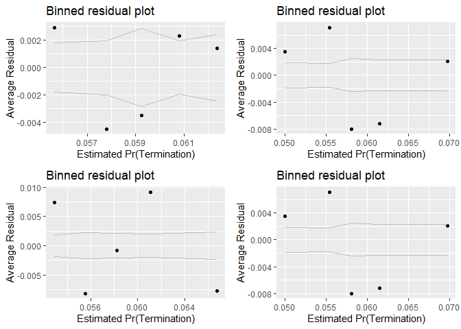<!-- -->

```
## debug: output <- list(rbind(deviance_stats(model1_old, "model1_old"), 
##     deviance_stats(model1_new, "model1_new")))
## debug: output
## exiting from: summary_residual_compare(b_CBre03A, b_CBre03C)
```

```
## [[1]]
##        model deviance null.deviance difference
## 1 model1_old 111883.0      111909.6   26.55349
## 2 model1_new 111679.7      111909.6  229.86655
```

```r
summary_residual_compare(b_CBre03B,b_CBre03C)
```

```
## debugging in: summary_residual_compare(b_CBre03B, b_CBre03C)
## debug: {
##     if (skip_vif == FALSE) 
##         warning("Deprecating VIF. Just use glmer_examine on the models")
##     if (!is.na(bins)) {
##         if ("cl_US6_avg_sal_lag1Const" %in% model_colnames(model1_old) & 
##             "cl_US6_avg_sal_lag1Const" %in% model_colnames(model1_new)) 
##             bins <- bins + 5
##         if ("cl_CFTE" %in% model_colnames(model1_old) & "cl_CFTE" %in% 
##             model_colnames(model1_new)) 
##             bins <- bins + 5
##         if ("c_pPBSC" %in% model_colnames(model1_old) & "c_pPBSC" %in% 
##             model_colnames(model1_new)) 
##             bins <- bins + 5
##         if ("c_pOffPSC" %in% model_colnames(model1_old) & "c_pOffPSC" %in% 
##             model_colnames(model1_new)) 
##             bins <- bins + 5
##         if ("cl_pairCA" %in% model_colnames(model1_old) & "cl_pairCA" %in% 
##             model_colnames(model1_new)) 
##             bins <- bins + 5
##         if ("c_OffCri" %in% model_colnames(model1_old) & "c_OffCri" %in% 
##             model_colnames(model1_new)) 
##             bins <- bins + 5
##         if (("cl_Ceil" %in% model_colnames(model1_old) & "cl_Ceil" %in% 
##             model_colnames(model1_new)) | ("cl_Ceil_Then_Year" %in% 
##             model_colnames(model1_old) & "cl_Ceil_Then_Year" %in% 
##             model_colnames(model1_new))) 
##             bins <- bins + 10
##         if ("cl_Days" %in% model_colnames(model1_old) & "cl_Days" %in% 
##             model_colnames(model1_new)) 
##             bins <- bins + 5
##     }
##     if (!is.null(model2_new)) {
##         gridExtra::grid.arrange(binned_fitted_versus_residuals(model1_old, 
##             bins = bins), binned_fitted_versus_residuals(model1_new, 
##             bins = bins), binned_fitted_versus_residuals(model2_old, 
##             bins = bins), binned_fitted_versus_residuals(model2_new, 
##             bins = bins), ncol = 2)
##         if (!"b_Term" %in% model_colnames(model1_old) & !"b_CBre" %in% 
##             model_colnames(model1_old)) 
##             gridExtra::grid.arrange(resid_plot(model1_old, sample = 25000), 
##                 resid_plot(model1_new, sample = 25000), resid_plot(model2_old, 
##                   sample = 25000), resid_plot(model2_new, sample = 25000), 
##                 ncol = 2)
##         if (!"b_Term" %in% colnames(model1_old) & !"b_CBre" %in% 
##             model_colnames(model1_old)) 
##             gridExtra::grid.arrange(residuals_binned(model1_old, 
##                 bins = bins), residuals_binned(model1_new, bins = bins), 
##                 residuals_binned(model2_old, bins = bins), residuals_binned(model2_new, 
##                   bins = bins), ncol = 2)
##         if ("cl_Ceil" %in% model_colnames(model1_new)) {
##             residual_compare(model1_old, model1_new, model2_old, 
##                 model2_new, "cl_Ceil", "Centered Log(Ceiling)", 
##                 20)
##         }
##         if ("cl_Days" %in% model_colnames(model1_new)) {
##             residual_compare(model1_old, model1_new, model2_old, 
##                 model2_new, "cl_Days", "Centered Log(Days)", 
##                 10)
##         }
##         output <- NULL
##         if (class(model1_new) == "glmerMod" & class(model2_new) == 
##             "glmerMod") {
##             m1t <- getME(model1_new, "theta")
##             m1l <- getME(model1_new, "lower")
##             m2t <- getME(model2_new, "theta")
##             m2l <- getME(model2_new, "lower")
##             output <- list(m1t[m1l == 0], m2t[m2l == 0], model1_new@optinfo$conv$lme4$messages, 
##                 model2_new@optinfo$conv$lme4$messages)
##         }
##         else if ((class(model1_new) != "glmerMod" & class(model2_new) != 
##             "glmerMod") & (class(model1_old) != "glmerMod" & 
##             class(model2_old) != "glmerMod")) {
##             output <- list(rbind(deviance_stats(model1_old, "model1_old"), 
##                 deviance_stats(model1_new, "model1_new"), deviance_stats(model2_old, 
##                   "model2_old"), deviance_stats(model2_new, "model2_new")))
##         }
##     }
##     else if (!is.null(model1_new)) {
##         gridExtra::grid.arrange(binned_fitted_versus_residuals(model1_old, 
##             bins = bins), binned_fitted_versus_residuals(model1_new, 
##             bins = bins), ncol = 2)
##         if (!"b_Term" %in% model_colnames(model1_old) & !"b_CBre" %in% 
##             model_colnames(model1_old)) 
##             gridExtra::grid.arrange(resid_plot(model1_old, sample = 25000), 
##                 resid_plot(model1_new, sample = 25000), ncol = 2)
##         gridExtra::grid.arrange(residuals_binned(model1_old, 
##             bins = bins), residuals_binned(model1_new, bins = bins), 
##             ncol = 2)
##         output <- NULL
##         if (class(model1_new) == "glmerMod") {
##             m1t <- getME(model1_new, "theta")
##             m1l <- getME(model1_new, "lower")
##             output <- list(m1t[m1l == 0], model1_new@optinfo$conv$lme4$messages)
##         }
##         else if (class(model1_new) != "glmerMod" & class(model1_old) != 
##             "glmerMod") {
##             output <- list(rbind(deviance_stats(model1_old, "model1_old"), 
##                 deviance_stats(model1_new, "model1_new")))
##         }
##     }
##     else {
##         if (!is.na(bins)) {
##             if ("cl_US6_avg_sal_lag1Const" %in% model_colnames(model1_old)) 
##                 bins <- bins + 5
##             if ("cl_CFTE" %in% model_colnames(model1_old)) 
##                 bins <- bins + 5
##             if ("c_pPBSC" %in% model_colnames(model1_old)) 
##                 bins <- bins + 5
##             if ("c_pOffPSC" %in% model_colnames(model1_old)) 
##                 bins <- bins + 5
##             if ("cl_pairCA" %in% model_colnames(model1_old)) 
##                 bins <- bins + 5
##             if ("c_OffCri" %in% model_colnames(model1_old)) 
##                 bins <- bins + 5
##             if (("cl_Ceil" %in% model_colnames(model1_old)) | 
##                 ("cl_Ceil_Then_Year" %in% model_colnames(model1_old))) 
##                 bins <- bins + 10
##             if ("cl_Days" %in% model_colnames(model1_old)) 
##                 bins <- bins + 5
##         }
##         if (!"b_Term" %in% model_colnames(model1_old) & !"b_CBre" %in% 
##             model_colnames(model1_old)) 
##             gridExtra::grid.arrange(binned_fitted_versus_residuals(model1_old, 
##                 bins = bins), residuals_binned(model1_old, bins = bins), 
##                 resid_plot(model1_old, sample = 25000))
##         else gridExtra::grid.arrange(binned_fitted_versus_residuals(model1_old, 
##             bins = bins), residuals_binned(model1_old, bins = bins))
##         output <- NULL
##         if (class(model1_old) == "glmerMod") {
##             m1t <- getME(model1_old, "theta")
##             m1l <- getME(model1_old, "lower")
##             output <- list(m1t[m1l == 0], model1_old@optinfo$conv$lme4$messages)
##         }
##         else if (class(model1_old) != "glmerMod" & class(model1_old) != 
##             "glmerMod") {
##             output <- list(deviance_stats(model1_old, "model1_old"))
##         }
##     }
##     output
## }
## debug: if (skip_vif == FALSE) warning("Deprecating VIF. Just use glmer_examine on the models")
## debug: if (!is.na(bins)) {
##     if ("cl_US6_avg_sal_lag1Const" %in% model_colnames(model1_old) & 
##         "cl_US6_avg_sal_lag1Const" %in% model_colnames(model1_new)) 
##         bins <- bins + 5
##     if ("cl_CFTE" %in% model_colnames(model1_old) & "cl_CFTE" %in% 
##         model_colnames(model1_new)) 
##         bins <- bins + 5
##     if ("c_pPBSC" %in% model_colnames(model1_old) & "c_pPBSC" %in% 
##         model_colnames(model1_new)) 
##         bins <- bins + 5
##     if ("c_pOffPSC" %in% model_colnames(model1_old) & "c_pOffPSC" %in% 
##         model_colnames(model1_new)) 
##         bins <- bins + 5
##     if ("cl_pairCA" %in% model_colnames(model1_old) & "cl_pairCA" %in% 
##         model_colnames(model1_new)) 
##         bins <- bins + 5
##     if ("c_OffCri" %in% model_colnames(model1_old) & "c_OffCri" %in% 
##         model_colnames(model1_new)) 
##         bins <- bins + 5
##     if (("cl_Ceil" %in% model_colnames(model1_old) & "cl_Ceil" %in% 
##         model_colnames(model1_new)) | ("cl_Ceil_Then_Year" %in% 
##         model_colnames(model1_old) & "cl_Ceil_Then_Year" %in% 
##         model_colnames(model1_new))) 
##         bins <- bins + 10
##     if ("cl_Days" %in% model_colnames(model1_old) & "cl_Days" %in% 
##         model_colnames(model1_new)) 
##         bins <- bins + 5
## }
## debug: if ("cl_US6_avg_sal_lag1Const" %in% model_colnames(model1_old) & 
##     "cl_US6_avg_sal_lag1Const" %in% model_colnames(model1_new)) bins <- bins + 
##     5
## debug: if ("cl_CFTE" %in% model_colnames(model1_old) & "cl_CFTE" %in% 
##     model_colnames(model1_new)) bins <- bins + 5
## debug: if ("c_pPBSC" %in% model_colnames(model1_old) & "c_pPBSC" %in% 
##     model_colnames(model1_new)) bins <- bins + 5
## debug: if ("c_pOffPSC" %in% model_colnames(model1_old) & "c_pOffPSC" %in% 
##     model_colnames(model1_new)) bins <- bins + 5
## debug: if ("cl_pairCA" %in% model_colnames(model1_old) & "cl_pairCA" %in% 
##     model_colnames(model1_new)) bins <- bins + 5
## debug: bins <- bins + 5
## debug: if ("c_OffCri" %in% model_colnames(model1_old) & "c_OffCri" %in% 
##     model_colnames(model1_new)) bins <- bins + 5
## debug: if (("cl_Ceil" %in% model_colnames(model1_old) & "cl_Ceil" %in% 
##     model_colnames(model1_new)) | ("cl_Ceil_Then_Year" %in% model_colnames(model1_old) & 
##     "cl_Ceil_Then_Year" %in% model_colnames(model1_new))) bins <- bins + 
##     10
## debug: if ("cl_Days" %in% model_colnames(model1_old) & "cl_Days" %in% 
##     model_colnames(model1_new)) bins <- bins + 5
## debug: if (!is.null(model2_new)) {
##     gridExtra::grid.arrange(binned_fitted_versus_residuals(model1_old, 
##         bins = bins), binned_fitted_versus_residuals(model1_new, 
##         bins = bins), binned_fitted_versus_residuals(model2_old, 
##         bins = bins), binned_fitted_versus_residuals(model2_new, 
##         bins = bins), ncol = 2)
##     if (!"b_Term" %in% model_colnames(model1_old) & !"b_CBre" %in% 
##         model_colnames(model1_old)) 
##         gridExtra::grid.arrange(resid_plot(model1_old, sample = 25000), 
##             resid_plot(model1_new, sample = 25000), resid_plot(model2_old, 
##                 sample = 25000), resid_plot(model2_new, sample = 25000), 
##             ncol = 2)
##     if (!"b_Term" %in% colnames(model1_old) & !"b_CBre" %in% 
##         model_colnames(model1_old)) 
##         gridExtra::grid.arrange(residuals_binned(model1_old, 
##             bins = bins), residuals_binned(model1_new, bins = bins), 
##             residuals_binned(model2_old, bins = bins), residuals_binned(model2_new, 
##                 bins = bins), ncol = 2)
##     if ("cl_Ceil" %in% model_colnames(model1_new)) {
##         residual_compare(model1_old, model1_new, model2_old, 
##             model2_new, "cl_Ceil", "Centered Log(Ceiling)", 20)
##     }
##     if ("cl_Days" %in% model_colnames(model1_new)) {
##         residual_compare(model1_old, model1_new, model2_old, 
##             model2_new, "cl_Days", "Centered Log(Days)", 10)
##     }
##     output <- NULL
##     if (class(model1_new) == "glmerMod" & class(model2_new) == 
##         "glmerMod") {
##         m1t <- getME(model1_new, "theta")
##         m1l <- getME(model1_new, "lower")
##         m2t <- getME(model2_new, "theta")
##         m2l <- getME(model2_new, "lower")
##         output <- list(m1t[m1l == 0], m2t[m2l == 0], model1_new@optinfo$conv$lme4$messages, 
##             model2_new@optinfo$conv$lme4$messages)
##     }
##     else if ((class(model1_new) != "glmerMod" & class(model2_new) != 
##         "glmerMod") & (class(model1_old) != "glmerMod" & class(model2_old) != 
##         "glmerMod")) {
##         output <- list(rbind(deviance_stats(model1_old, "model1_old"), 
##             deviance_stats(model1_new, "model1_new"), deviance_stats(model2_old, 
##                 "model2_old"), deviance_stats(model2_new, "model2_new")))
##     }
## } else if (!is.null(model1_new)) {
##     gridExtra::grid.arrange(binned_fitted_versus_residuals(model1_old, 
##         bins = bins), binned_fitted_versus_residuals(model1_new, 
##         bins = bins), ncol = 2)
##     if (!"b_Term" %in% model_colnames(model1_old) & !"b_CBre" %in% 
##         model_colnames(model1_old)) 
##         gridExtra::grid.arrange(resid_plot(model1_old, sample = 25000), 
##             resid_plot(model1_new, sample = 25000), ncol = 2)
##     gridExtra::grid.arrange(residuals_binned(model1_old, bins = bins), 
##         residuals_binned(model1_new, bins = bins), ncol = 2)
##     output <- NULL
##     if (class(model1_new) == "glmerMod") {
##         m1t <- getME(model1_new, "theta")
##         m1l <- getME(model1_new, "lower")
##         output <- list(m1t[m1l == 0], model1_new@optinfo$conv$lme4$messages)
##     }
##     else if (class(model1_new) != "glmerMod" & class(model1_old) != 
##         "glmerMod") {
##         output <- list(rbind(deviance_stats(model1_old, "model1_old"), 
##             deviance_stats(model1_new, "model1_new")))
##     }
## } else {
##     if (!is.na(bins)) {
##         if ("cl_US6_avg_sal_lag1Const" %in% model_colnames(model1_old)) 
##             bins <- bins + 5
##         if ("cl_CFTE" %in% model_colnames(model1_old)) 
##             bins <- bins + 5
##         if ("c_pPBSC" %in% model_colnames(model1_old)) 
##             bins <- bins + 5
##         if ("c_pOffPSC" %in% model_colnames(model1_old)) 
##             bins <- bins + 5
##         if ("cl_pairCA" %in% model_colnames(model1_old)) 
##             bins <- bins + 5
##         if ("c_OffCri" %in% model_colnames(model1_old)) 
##             bins <- bins + 5
##         if (("cl_Ceil" %in% model_colnames(model1_old)) | ("cl_Ceil_Then_Year" %in% 
##             model_colnames(model1_old))) 
##             bins <- bins + 10
##         if ("cl_Days" %in% model_colnames(model1_old)) 
##             bins <- bins + 5
##     }
##     if (!"b_Term" %in% model_colnames(model1_old) & !"b_CBre" %in% 
##         model_colnames(model1_old)) 
##         gridExtra::grid.arrange(binned_fitted_versus_residuals(model1_old, 
##             bins = bins), residuals_binned(model1_old, bins = bins), 
##             resid_plot(model1_old, sample = 25000))
##     else gridExtra::grid.arrange(binned_fitted_versus_residuals(model1_old, 
##         bins = bins), residuals_binned(model1_old, bins = bins))
##     output <- NULL
##     if (class(model1_old) == "glmerMod") {
##         m1t <- getME(model1_old, "theta")
##         m1l <- getME(model1_old, "lower")
##         output <- list(m1t[m1l == 0], model1_old@optinfo$conv$lme4$messages)
##     }
##     else if (class(model1_old) != "glmerMod" & class(model1_old) != 
##         "glmerMod") {
##         output <- list(deviance_stats(model1_old, "model1_old"))
##     }
## }
## debug: if (!is.null(model1_new)) {
##     gridExtra::grid.arrange(binned_fitted_versus_residuals(model1_old, 
##         bins = bins), binned_fitted_versus_residuals(model1_new, 
##         bins = bins), ncol = 2)
##     if (!"b_Term" %in% model_colnames(model1_old) & !"b_CBre" %in% 
##         model_colnames(model1_old)) 
##         gridExtra::grid.arrange(resid_plot(model1_old, sample = 25000), 
##             resid_plot(model1_new, sample = 25000), ncol = 2)
##     gridExtra::grid.arrange(residuals_binned(model1_old, bins = bins), 
##         residuals_binned(model1_new, bins = bins), ncol = 2)
##     output <- NULL
##     if (class(model1_new) == "glmerMod") {
##         m1t <- getME(model1_new, "theta")
##         m1l <- getME(model1_new, "lower")
##         output <- list(m1t[m1l == 0], model1_new@optinfo$conv$lme4$messages)
##     }
##     else if (class(model1_new) != "glmerMod" & class(model1_old) != 
##         "glmerMod") {
##         output <- list(rbind(deviance_stats(model1_old, "model1_old"), 
##             deviance_stats(model1_new, "model1_new")))
##     }
## } else {
##     if (!is.na(bins)) {
##         if ("cl_US6_avg_sal_lag1Const" %in% model_colnames(model1_old)) 
##             bins <- bins + 5
##         if ("cl_CFTE" %in% model_colnames(model1_old)) 
##             bins <- bins + 5
##         if ("c_pPBSC" %in% model_colnames(model1_old)) 
##             bins <- bins + 5
##         if ("c_pOffPSC" %in% model_colnames(model1_old)) 
##             bins <- bins + 5
##         if ("cl_pairCA" %in% model_colnames(model1_old)) 
##             bins <- bins + 5
##         if ("c_OffCri" %in% model_colnames(model1_old)) 
##             bins <- bins + 5
##         if (("cl_Ceil" %in% model_colnames(model1_old)) | ("cl_Ceil_Then_Year" %in% 
##             model_colnames(model1_old))) 
##             bins <- bins + 10
##         if ("cl_Days" %in% model_colnames(model1_old)) 
##             bins <- bins + 5
##     }
##     if (!"b_Term" %in% model_colnames(model1_old) & !"b_CBre" %in% 
##         model_colnames(model1_old)) 
##         gridExtra::grid.arrange(binned_fitted_versus_residuals(model1_old, 
##             bins = bins), residuals_binned(model1_old, bins = bins), 
##             resid_plot(model1_old, sample = 25000))
##     else gridExtra::grid.arrange(binned_fitted_versus_residuals(model1_old, 
##         bins = bins), residuals_binned(model1_old, bins = bins))
##     output <- NULL
##     if (class(model1_old) == "glmerMod") {
##         m1t <- getME(model1_old, "theta")
##         m1l <- getME(model1_old, "lower")
##         output <- list(m1t[m1l == 0], model1_old@optinfo$conv$lme4$messages)
##     }
##     else if (class(model1_old) != "glmerMod" & class(model1_old) != 
##         "glmerMod") {
##         output <- list(deviance_stats(model1_old, "model1_old"))
##     }
## }
## debug: gridExtra::grid.arrange(binned_fitted_versus_residuals(model1_old, 
##     bins = bins), binned_fitted_versus_residuals(model1_new, 
##     bins = bins), ncol = 2)
```

<!-- -->

```
## debug: if (!"b_Term" %in% model_colnames(model1_old) & !"b_CBre" %in% 
##     model_colnames(model1_old)) gridExtra::grid.arrange(resid_plot(model1_old, 
##     sample = 25000), resid_plot(model1_new, sample = 25000), 
##     ncol = 2)
## debug: gridExtra::grid.arrange(residuals_binned(model1_old, bins = bins), 
##     residuals_binned(model1_new, bins = bins), ncol = 2)
```

```
## debug: output <- NULL
## debug: if (class(model1_new) == "glmerMod") {
##     m1t <- getME(model1_new, "theta")
##     m1l <- getME(model1_new, "lower")
##     output <- list(m1t[m1l == 0], model1_new@optinfo$conv$lme4$messages)
## } else if (class(model1_new) != "glmerMod" & class(model1_old) != 
##     "glmerMod") {
##     output <- list(rbind(deviance_stats(model1_old, "model1_old"), 
##         deviance_stats(model1_new, "model1_new")))
## }
```

```
## Warning in if (class(model1_new) == "glmerMod") {: the condition has length
## > 1 and only the first element will be used
```

```
## debug: if (class(model1_new) != "glmerMod" & class(model1_old) != "glmerMod") {
##     output <- list(rbind(deviance_stats(model1_old, "model1_old"), 
##         deviance_stats(model1_new, "model1_new")))
## }
```

```
## Warning in if (class(model1_new) != "glmerMod" & class(model1_old) !=
## "glmerMod") {: the condition has length > 1 and only the first element will
## be used
```

<!-- -->

```
## debug: output <- list(rbind(deviance_stats(model1_old, "model1_old"), 
##     deviance_stats(model1_new, "model1_new")))
## debug: output
## exiting from: summary_residual_compare(b_CBre03B, b_CBre03C)
```

```
## [[1]]
##        model deviance null.deviance difference
## 1 model1_old 111790.5      111909.6   119.1204
## 2 model1_new 111679.7      111909.6   229.8666
```

```r
summary_residual_compare(b_CBre02D,b_CBre03C)
```

```
## debugging in: summary_residual_compare(b_CBre02D, b_CBre03C)
## debug: {
##     if (skip_vif == FALSE) 
##         warning("Deprecating VIF. Just use glmer_examine on the models")
##     if (!is.na(bins)) {
##         if ("cl_US6_avg_sal_lag1Const" %in% model_colnames(model1_old) & 
##             "cl_US6_avg_sal_lag1Const" %in% model_colnames(model1_new)) 
##             bins <- bins + 5
##         if ("cl_CFTE" %in% model_colnames(model1_old) & "cl_CFTE" %in% 
##             model_colnames(model1_new)) 
##             bins <- bins + 5
##         if ("c_pPBSC" %in% model_colnames(model1_old) & "c_pPBSC" %in% 
##             model_colnames(model1_new)) 
##             bins <- bins + 5
##         if ("c_pOffPSC" %in% model_colnames(model1_old) & "c_pOffPSC" %in% 
##             model_colnames(model1_new)) 
##             bins <- bins + 5
##         if ("cl_pairCA" %in% model_colnames(model1_old) & "cl_pairCA" %in% 
##             model_colnames(model1_new)) 
##             bins <- bins + 5
##         if ("c_OffCri" %in% model_colnames(model1_old) & "c_OffCri" %in% 
##             model_colnames(model1_new)) 
##             bins <- bins + 5
##         if (("cl_Ceil" %in% model_colnames(model1_old) & "cl_Ceil" %in% 
##             model_colnames(model1_new)) | ("cl_Ceil_Then_Year" %in% 
##             model_colnames(model1_old) & "cl_Ceil_Then_Year" %in% 
##             model_colnames(model1_new))) 
##             bins <- bins + 10
##         if ("cl_Days" %in% model_colnames(model1_old) & "cl_Days" %in% 
##             model_colnames(model1_new)) 
##             bins <- bins + 5
##     }
##     if (!is.null(model2_new)) {
##         gridExtra::grid.arrange(binned_fitted_versus_residuals(model1_old, 
##             bins = bins), binned_fitted_versus_residuals(model1_new, 
##             bins = bins), binned_fitted_versus_residuals(model2_old, 
##             bins = bins), binned_fitted_versus_residuals(model2_new, 
##             bins = bins), ncol = 2)
##         if (!"b_Term" %in% model_colnames(model1_old) & !"b_CBre" %in% 
##             model_colnames(model1_old)) 
##             gridExtra::grid.arrange(resid_plot(model1_old, sample = 25000), 
##                 resid_plot(model1_new, sample = 25000), resid_plot(model2_old, 
##                   sample = 25000), resid_plot(model2_new, sample = 25000), 
##                 ncol = 2)
##         if (!"b_Term" %in% colnames(model1_old) & !"b_CBre" %in% 
##             model_colnames(model1_old)) 
##             gridExtra::grid.arrange(residuals_binned(model1_old, 
##                 bins = bins), residuals_binned(model1_new, bins = bins), 
##                 residuals_binned(model2_old, bins = bins), residuals_binned(model2_new, 
##                   bins = bins), ncol = 2)
##         if ("cl_Ceil" %in% model_colnames(model1_new)) {
##             residual_compare(model1_old, model1_new, model2_old, 
##                 model2_new, "cl_Ceil", "Centered Log(Ceiling)", 
##                 20)
##         }
##         if ("cl_Days" %in% model_colnames(model1_new)) {
##             residual_compare(model1_old, model1_new, model2_old, 
##                 model2_new, "cl_Days", "Centered Log(Days)", 
##                 10)
##         }
##         output <- NULL
##         if (class(model1_new) == "glmerMod" & class(model2_new) == 
##             "glmerMod") {
##             m1t <- getME(model1_new, "theta")
##             m1l <- getME(model1_new, "lower")
##             m2t <- getME(model2_new, "theta")
##             m2l <- getME(model2_new, "lower")
##             output <- list(m1t[m1l == 0], m2t[m2l == 0], model1_new@optinfo$conv$lme4$messages, 
##                 model2_new@optinfo$conv$lme4$messages)
##         }
##         else if ((class(model1_new) != "glmerMod" & class(model2_new) != 
##             "glmerMod") & (class(model1_old) != "glmerMod" & 
##             class(model2_old) != "glmerMod")) {
##             output <- list(rbind(deviance_stats(model1_old, "model1_old"), 
##                 deviance_stats(model1_new, "model1_new"), deviance_stats(model2_old, 
##                   "model2_old"), deviance_stats(model2_new, "model2_new")))
##         }
##     }
##     else if (!is.null(model1_new)) {
##         gridExtra::grid.arrange(binned_fitted_versus_residuals(model1_old, 
##             bins = bins), binned_fitted_versus_residuals(model1_new, 
##             bins = bins), ncol = 2)
##         if (!"b_Term" %in% model_colnames(model1_old) & !"b_CBre" %in% 
##             model_colnames(model1_old)) 
##             gridExtra::grid.arrange(resid_plot(model1_old, sample = 25000), 
##                 resid_plot(model1_new, sample = 25000), ncol = 2)
##         gridExtra::grid.arrange(residuals_binned(model1_old, 
##             bins = bins), residuals_binned(model1_new, bins = bins), 
##             ncol = 2)
##         output <- NULL
##         if (class(model1_new) == "glmerMod") {
##             m1t <- getME(model1_new, "theta")
##             m1l <- getME(model1_new, "lower")
##             output <- list(m1t[m1l == 0], model1_new@optinfo$conv$lme4$messages)
##         }
##         else if (class(model1_new) != "glmerMod" & class(model1_old) != 
##             "glmerMod") {
##             output <- list(rbind(deviance_stats(model1_old, "model1_old"), 
##                 deviance_stats(model1_new, "model1_new")))
##         }
##     }
##     else {
##         if (!is.na(bins)) {
##             if ("cl_US6_avg_sal_lag1Const" %in% model_colnames(model1_old)) 
##                 bins <- bins + 5
##             if ("cl_CFTE" %in% model_colnames(model1_old)) 
##                 bins <- bins + 5
##             if ("c_pPBSC" %in% model_colnames(model1_old)) 
##                 bins <- bins + 5
##             if ("c_pOffPSC" %in% model_colnames(model1_old)) 
##                 bins <- bins + 5
##             if ("cl_pairCA" %in% model_colnames(model1_old)) 
##                 bins <- bins + 5
##             if ("c_OffCri" %in% model_colnames(model1_old)) 
##                 bins <- bins + 5
##             if (("cl_Ceil" %in% model_colnames(model1_old)) | 
##                 ("cl_Ceil_Then_Year" %in% model_colnames(model1_old))) 
##                 bins <- bins + 10
##             if ("cl_Days" %in% model_colnames(model1_old)) 
##                 bins <- bins + 5
##         }
##         if (!"b_Term" %in% model_colnames(model1_old) & !"b_CBre" %in% 
##             model_colnames(model1_old)) 
##             gridExtra::grid.arrange(binned_fitted_versus_residuals(model1_old, 
##                 bins = bins), residuals_binned(model1_old, bins = bins), 
##                 resid_plot(model1_old, sample = 25000))
##         else gridExtra::grid.arrange(binned_fitted_versus_residuals(model1_old, 
##             bins = bins), residuals_binned(model1_old, bins = bins))
##         output <- NULL
##         if (class(model1_old) == "glmerMod") {
##             m1t <- getME(model1_old, "theta")
##             m1l <- getME(model1_old, "lower")
##             output <- list(m1t[m1l == 0], model1_old@optinfo$conv$lme4$messages)
##         }
##         else if (class(model1_old) != "glmerMod" & class(model1_old) != 
##             "glmerMod") {
##             output <- list(deviance_stats(model1_old, "model1_old"))
##         }
##     }
##     output
## }
## debug: if (skip_vif == FALSE) warning("Deprecating VIF. Just use glmer_examine on the models")
## debug: if (!is.na(bins)) {
##     if ("cl_US6_avg_sal_lag1Const" %in% model_colnames(model1_old) & 
##         "cl_US6_avg_sal_lag1Const" %in% model_colnames(model1_new)) 
##         bins <- bins + 5
##     if ("cl_CFTE" %in% model_colnames(model1_old) & "cl_CFTE" %in% 
##         model_colnames(model1_new)) 
##         bins <- bins + 5
##     if ("c_pPBSC" %in% model_colnames(model1_old) & "c_pPBSC" %in% 
##         model_colnames(model1_new)) 
##         bins <- bins + 5
##     if ("c_pOffPSC" %in% model_colnames(model1_old) & "c_pOffPSC" %in% 
##         model_colnames(model1_new)) 
##         bins <- bins + 5
##     if ("cl_pairCA" %in% model_colnames(model1_old) & "cl_pairCA" %in% 
##         model_colnames(model1_new)) 
##         bins <- bins + 5
##     if ("c_OffCri" %in% model_colnames(model1_old) & "c_OffCri" %in% 
##         model_colnames(model1_new)) 
##         bins <- bins + 5
##     if (("cl_Ceil" %in% model_colnames(model1_old) & "cl_Ceil" %in% 
##         model_colnames(model1_new)) | ("cl_Ceil_Then_Year" %in% 
##         model_colnames(model1_old) & "cl_Ceil_Then_Year" %in% 
##         model_colnames(model1_new))) 
##         bins <- bins + 10
##     if ("cl_Days" %in% model_colnames(model1_old) & "cl_Days" %in% 
##         model_colnames(model1_new)) 
##         bins <- bins + 5
## }
## debug: if ("cl_US6_avg_sal_lag1Const" %in% model_colnames(model1_old) & 
##     "cl_US6_avg_sal_lag1Const" %in% model_colnames(model1_new)) bins <- bins + 
##     5
## debug: if ("cl_CFTE" %in% model_colnames(model1_old) & "cl_CFTE" %in% 
##     model_colnames(model1_new)) bins <- bins + 5
## debug: if ("c_pPBSC" %in% model_colnames(model1_old) & "c_pPBSC" %in% 
##     model_colnames(model1_new)) bins <- bins + 5
## debug: if ("c_pOffPSC" %in% model_colnames(model1_old) & "c_pOffPSC" %in% 
##     model_colnames(model1_new)) bins <- bins + 5
## debug: if ("cl_pairCA" %in% model_colnames(model1_old) & "cl_pairCA" %in% 
##     model_colnames(model1_new)) bins <- bins + 5
## debug: if ("c_OffCri" %in% model_colnames(model1_old) & "c_OffCri" %in% 
##     model_colnames(model1_new)) bins <- bins + 5
## debug: if (("cl_Ceil" %in% model_colnames(model1_old) & "cl_Ceil" %in% 
##     model_colnames(model1_new)) | ("cl_Ceil_Then_Year" %in% model_colnames(model1_old) & 
##     "cl_Ceil_Then_Year" %in% model_colnames(model1_new))) bins <- bins + 
##     10
## debug: if ("cl_Days" %in% model_colnames(model1_old) & "cl_Days" %in% 
##     model_colnames(model1_new)) bins <- bins + 5
## debug: if (!is.null(model2_new)) {
##     gridExtra::grid.arrange(binned_fitted_versus_residuals(model1_old, 
##         bins = bins), binned_fitted_versus_residuals(model1_new, 
##         bins = bins), binned_fitted_versus_residuals(model2_old, 
##         bins = bins), binned_fitted_versus_residuals(model2_new, 
##         bins = bins), ncol = 2)
##     if (!"b_Term" %in% model_colnames(model1_old) & !"b_CBre" %in% 
##         model_colnames(model1_old)) 
##         gridExtra::grid.arrange(resid_plot(model1_old, sample = 25000), 
##             resid_plot(model1_new, sample = 25000), resid_plot(model2_old, 
##                 sample = 25000), resid_plot(model2_new, sample = 25000), 
##             ncol = 2)
##     if (!"b_Term" %in% colnames(model1_old) & !"b_CBre" %in% 
##         model_colnames(model1_old)) 
##         gridExtra::grid.arrange(residuals_binned(model1_old, 
##             bins = bins), residuals_binned(model1_new, bins = bins), 
##             residuals_binned(model2_old, bins = bins), residuals_binned(model2_new, 
##                 bins = bins), ncol = 2)
##     if ("cl_Ceil" %in% model_colnames(model1_new)) {
##         residual_compare(model1_old, model1_new, model2_old, 
##             model2_new, "cl_Ceil", "Centered Log(Ceiling)", 20)
##     }
##     if ("cl_Days" %in% model_colnames(model1_new)) {
##         residual_compare(model1_old, model1_new, model2_old, 
##             model2_new, "cl_Days", "Centered Log(Days)", 10)
##     }
##     output <- NULL
##     if (class(model1_new) == "glmerMod" & class(model2_new) == 
##         "glmerMod") {
##         m1t <- getME(model1_new, "theta")
##         m1l <- getME(model1_new, "lower")
##         m2t <- getME(model2_new, "theta")
##         m2l <- getME(model2_new, "lower")
##         output <- list(m1t[m1l == 0], m2t[m2l == 0], model1_new@optinfo$conv$lme4$messages, 
##             model2_new@optinfo$conv$lme4$messages)
##     }
##     else if ((class(model1_new) != "glmerMod" & class(model2_new) != 
##         "glmerMod") & (class(model1_old) != "glmerMod" & class(model2_old) != 
##         "glmerMod")) {
##         output <- list(rbind(deviance_stats(model1_old, "model1_old"), 
##             deviance_stats(model1_new, "model1_new"), deviance_stats(model2_old, 
##                 "model2_old"), deviance_stats(model2_new, "model2_new")))
##     }
## } else if (!is.null(model1_new)) {
##     gridExtra::grid.arrange(binned_fitted_versus_residuals(model1_old, 
##         bins = bins), binned_fitted_versus_residuals(model1_new, 
##         bins = bins), ncol = 2)
##     if (!"b_Term" %in% model_colnames(model1_old) & !"b_CBre" %in% 
##         model_colnames(model1_old)) 
##         gridExtra::grid.arrange(resid_plot(model1_old, sample = 25000), 
##             resid_plot(model1_new, sample = 25000), ncol = 2)
##     gridExtra::grid.arrange(residuals_binned(model1_old, bins = bins), 
##         residuals_binned(model1_new, bins = bins), ncol = 2)
##     output <- NULL
##     if (class(model1_new) == "glmerMod") {
##         m1t <- getME(model1_new, "theta")
##         m1l <- getME(model1_new, "lower")
##         output <- list(m1t[m1l == 0], model1_new@optinfo$conv$lme4$messages)
##     }
##     else if (class(model1_new) != "glmerMod" & class(model1_old) != 
##         "glmerMod") {
##         output <- list(rbind(deviance_stats(model1_old, "model1_old"), 
##             deviance_stats(model1_new, "model1_new")))
##     }
## } else {
##     if (!is.na(bins)) {
##         if ("cl_US6_avg_sal_lag1Const" %in% model_colnames(model1_old)) 
##             bins <- bins + 5
##         if ("cl_CFTE" %in% model_colnames(model1_old)) 
##             bins <- bins + 5
##         if ("c_pPBSC" %in% model_colnames(model1_old)) 
##             bins <- bins + 5
##         if ("c_pOffPSC" %in% model_colnames(model1_old)) 
##             bins <- bins + 5
##         if ("cl_pairCA" %in% model_colnames(model1_old)) 
##             bins <- bins + 5
##         if ("c_OffCri" %in% model_colnames(model1_old)) 
##             bins <- bins + 5
##         if (("cl_Ceil" %in% model_colnames(model1_old)) | ("cl_Ceil_Then_Year" %in% 
##             model_colnames(model1_old))) 
##             bins <- bins + 10
##         if ("cl_Days" %in% model_colnames(model1_old)) 
##             bins <- bins + 5
##     }
##     if (!"b_Term" %in% model_colnames(model1_old) & !"b_CBre" %in% 
##         model_colnames(model1_old)) 
##         gridExtra::grid.arrange(binned_fitted_versus_residuals(model1_old, 
##             bins = bins), residuals_binned(model1_old, bins = bins), 
##             resid_plot(model1_old, sample = 25000))
##     else gridExtra::grid.arrange(binned_fitted_versus_residuals(model1_old, 
##         bins = bins), residuals_binned(model1_old, bins = bins))
##     output <- NULL
##     if (class(model1_old) == "glmerMod") {
##         m1t <- getME(model1_old, "theta")
##         m1l <- getME(model1_old, "lower")
##         output <- list(m1t[m1l == 0], model1_old@optinfo$conv$lme4$messages)
##     }
##     else if (class(model1_old) != "glmerMod" & class(model1_old) != 
##         "glmerMod") {
##         output <- list(deviance_stats(model1_old, "model1_old"))
##     }
## }
## debug: if (!is.null(model1_new)) {
##     gridExtra::grid.arrange(binned_fitted_versus_residuals(model1_old, 
##         bins = bins), binned_fitted_versus_residuals(model1_new, 
##         bins = bins), ncol = 2)
##     if (!"b_Term" %in% model_colnames(model1_old) & !"b_CBre" %in% 
##         model_colnames(model1_old)) 
##         gridExtra::grid.arrange(resid_plot(model1_old, sample = 25000), 
##             resid_plot(model1_new, sample = 25000), ncol = 2)
##     gridExtra::grid.arrange(residuals_binned(model1_old, bins = bins), 
##         residuals_binned(model1_new, bins = bins), ncol = 2)
##     output <- NULL
##     if (class(model1_new) == "glmerMod") {
##         m1t <- getME(model1_new, "theta")
##         m1l <- getME(model1_new, "lower")
##         output <- list(m1t[m1l == 0], model1_new@optinfo$conv$lme4$messages)
##     }
##     else if (class(model1_new) != "glmerMod" & class(model1_old) != 
##         "glmerMod") {
##         output <- list(rbind(deviance_stats(model1_old, "model1_old"), 
##             deviance_stats(model1_new, "model1_new")))
##     }
## } else {
##     if (!is.na(bins)) {
##         if ("cl_US6_avg_sal_lag1Const" %in% model_colnames(model1_old)) 
##             bins <- bins + 5
##         if ("cl_CFTE" %in% model_colnames(model1_old)) 
##             bins <- bins + 5
##         if ("c_pPBSC" %in% model_colnames(model1_old)) 
##             bins <- bins + 5
##         if ("c_pOffPSC" %in% model_colnames(model1_old)) 
##             bins <- bins + 5
##         if ("cl_pairCA" %in% model_colnames(model1_old)) 
##             bins <- bins + 5
##         if ("c_OffCri" %in% model_colnames(model1_old)) 
##             bins <- bins + 5
##         if (("cl_Ceil" %in% model_colnames(model1_old)) | ("cl_Ceil_Then_Year" %in% 
##             model_colnames(model1_old))) 
##             bins <- bins + 10
##         if ("cl_Days" %in% model_colnames(model1_old)) 
##             bins <- bins + 5
##     }
##     if (!"b_Term" %in% model_colnames(model1_old) & !"b_CBre" %in% 
##         model_colnames(model1_old)) 
##         gridExtra::grid.arrange(binned_fitted_versus_residuals(model1_old, 
##             bins = bins), residuals_binned(model1_old, bins = bins), 
##             resid_plot(model1_old, sample = 25000))
##     else gridExtra::grid.arrange(binned_fitted_versus_residuals(model1_old, 
##         bins = bins), residuals_binned(model1_old, bins = bins))
##     output <- NULL
##     if (class(model1_old) == "glmerMod") {
##         m1t <- getME(model1_old, "theta")
##         m1l <- getME(model1_old, "lower")
##         output <- list(m1t[m1l == 0], model1_old@optinfo$conv$lme4$messages)
##     }
##     else if (class(model1_old) != "glmerMod" & class(model1_old) != 
##         "glmerMod") {
##         output <- list(deviance_stats(model1_old, "model1_old"))
##     }
## }
## debug: gridExtra::grid.arrange(binned_fitted_versus_residuals(model1_old, 
##     bins = bins), binned_fitted_versus_residuals(model1_new, 
##     bins = bins), ncol = 2)
```

<!-- -->

```
## debug: if (!"b_Term" %in% model_colnames(model1_old) & !"b_CBre" %in% 
##     model_colnames(model1_old)) gridExtra::grid.arrange(resid_plot(model1_old, 
##     sample = 25000), resid_plot(model1_new, sample = 25000), 
##     ncol = 2)
## debug: gridExtra::grid.arrange(residuals_binned(model1_old, bins = bins), 
##     residuals_binned(model1_new, bins = bins), ncol = 2)
```

```
## debug: output <- NULL
## debug: if (class(model1_new) == "glmerMod") {
##     m1t <- getME(model1_new, "theta")
##     m1l <- getME(model1_new, "lower")
##     output <- list(m1t[m1l == 0], model1_new@optinfo$conv$lme4$messages)
## } else if (class(model1_new) != "glmerMod" & class(model1_old) != 
##     "glmerMod") {
##     output <- list(rbind(deviance_stats(model1_old, "model1_old"), 
##         deviance_stats(model1_new, "model1_new")))
## }
```

```
## Warning in if (class(model1_new) == "glmerMod") {: the condition has length
## > 1 and only the first element will be used
```

```
## debug: if (class(model1_new) != "glmerMod" & class(model1_old) != "glmerMod") {
##     output <- list(rbind(deviance_stats(model1_old, "model1_old"), 
##         deviance_stats(model1_new, "model1_new")))
## }
```

```
## Warning in if (class(model1_new) != "glmerMod" & class(model1_old) !=
## "glmerMod") {: the condition has length > 1 and only the first element will
## be used
```

<!-- -->

```
## debug: output <- list(rbind(deviance_stats(model1_old, "model1_old"), 
##     deviance_stats(model1_new, "model1_new")))
## debug: output
## exiting from: summary_residual_compare(b_CBre02D, b_CBre03C)
```

```
## [[1]]
##        model deviance null.deviance difference
## 1 model1_old 108875.3      111909.6  3034.2904
## 2 model1_new 111679.7      111909.6   229.8666
```

When combining pair history and contract actions, magnitude of relationships with dependent variables incraesed.  However, the results of the combined model were the same as previous individual models: i.e. the contract options relationship expectation (more contract actions in the past, lower probability of breach) was not, but again, the expectation for pair history (longer pair history, lower probability of breach) was met.  However, when specifying the model in terms of ceiling breach size, the results of the combined model are quite different. Again, as above, we actually do find the strong negative relationship that we expected for past contract actions, which actually increases in magnitude in the combined model.  Interestingly, however, in the combined model, length of pair history actually exhibits a positive relationship with size of ceiling breach, the opposite of the relationship in the individual model, and violating our expectation.


### 03D: Cumulative  Model

Expectation: Under each subgroup, the predictors are expected to have similar impacts on dependent variables individually and cumulatively:
1. Higher Services Complexity: Higher likelihood of cost ceiling breaches
2. Larger Office Capacity: Lower likelihood of cost ceiling breaches
3. Deeper Office-Vendor Relationship: Lower likelihood of cost ceiling breaches


```r
#Model
b_CBre03D <- glm (data=serv_smp,
                 b_CBre ~  cl_US6_avg_sal_lag1Const + 
                   cl_CFTE+ c_pPBSC+c_pOffPSC+
                 c_pairHist+cl_pairCA, family=binomial(link="logit"))
glmer_examine(b_CBre03D)
```

```
## cl_US6_avg_sal_lag1Const                  cl_CFTE                  c_pPBSC 
##                 1.225863                 1.164539                 1.282652 
##                c_pOffPSC               c_pairHist                cl_pairCA 
##                 1.463663                 1.246915                 1.561561
```

```r
n_CBre03D <- glm(data=serv_breach,
                        ln_CBre_OMB20_GDP18 ~  cl_US6_avg_sal_lag1Const + 
                   cl_CFTE+ c_pPBSC+c_pOffPSC+
                 c_pairHist+cl_pairCA)

glmer_examine(n_CBre03D)
```

```
## cl_US6_avg_sal_lag1Const                  cl_CFTE                  c_pPBSC 
##                 1.243644                 1.211566                 2.126648 
##                c_pOffPSC               c_pairHist                cl_pairCA 
##                 2.687533                 1.296822                 2.084814
```

```r
#Plot residuals versus fitted   

stargazer::stargazer(b_CBre02D,b_CBre03C,b_CBre03D,
                       
                       n_CBre02D,n_CBre03C,n_CBre03D,
                       type="text",
                       digits=2)
```

```
## 
## =============================================================================================
##                                                  Dependent variable:                         
##                          --------------------------------------------------------------------
##                                       b_CBre                      ln_CBre_OMB20_GDP18        
##                                      logistic                           normal               
##                             (1)        (2)        (3)         (4)         (5)         (6)    
## ---------------------------------------------------------------------------------------------
## cl_US6_avg_sal_lag1Const    0.03                0.08***     1.24***                 1.28***  
##                            (0.02)                (0.02)     (0.03)                  (0.03)   
##                                                                                              
## cl_CFTE                   0.19***               0.17***     0.50***                 0.46***  
##                            (0.02)                (0.02)     (0.02)                  (0.02)   
##                                                                                              
## c_pPBSC                   -0.16***              -0.13***   -0.91***                -0.87***  
##                            (0.02)                (0.02)     (0.02)                  (0.02)   
##                                                                                              
## c_pOffPSC                 0.81***               0.85***    -1.14***                -0.96***  
##                            (0.01)                (0.02)     (0.02)                  (0.02)   
##                                                                                              
## c_pairHist                           -0.20***   -0.16***                0.34***     0.10***  
##                                       (0.02)     (0.02)                 (0.02)      (0.02)   
##                                                                                              
## cl_pairCA                            0.26***    -0.14***               -2.05***    -0.55***  
##                                       (0.02)     (0.02)                 (0.02)      (0.03)   
##                                                                                              
## Constant                  -2.84***   -2.78***   -2.85***    9.51***     9.39***     9.49***  
##                            (0.01)     (0.01)     (0.01)     (0.01)      (0.01)      (0.01)   
##                                                                                              
## ---------------------------------------------------------------------------------------------
## Observations              250,000    250,000    250,000     61,184      61,184      61,184   
## Log Likelihood           -54,437.65 -55,839.86 -54,347.72 -139,511.70 -144,815.10 -139,332.10
## Akaike Inf. Crit.        108,885.30 111,685.70 108,709.40 279,033.40  289,636.30  278,678.30 
## =============================================================================================
## Note:                                                             *p<0.1; **p<0.05; ***p<0.01
```

```r
summary_residual_compare(b_CBre03C,b_CBre03D)
```

```
## debugging in: summary_residual_compare(b_CBre03C, b_CBre03D)
## debug: {
##     if (skip_vif == FALSE) 
##         warning("Deprecating VIF. Just use glmer_examine on the models")
##     if (!is.na(bins)) {
##         if ("cl_US6_avg_sal_lag1Const" %in% model_colnames(model1_old) & 
##             "cl_US6_avg_sal_lag1Const" %in% model_colnames(model1_new)) 
##             bins <- bins + 5
##         if ("cl_CFTE" %in% model_colnames(model1_old) & "cl_CFTE" %in% 
##             model_colnames(model1_new)) 
##             bins <- bins + 5
##         if ("c_pPBSC" %in% model_colnames(model1_old) & "c_pPBSC" %in% 
##             model_colnames(model1_new)) 
##             bins <- bins + 5
##         if ("c_pOffPSC" %in% model_colnames(model1_old) & "c_pOffPSC" %in% 
##             model_colnames(model1_new)) 
##             bins <- bins + 5
##         if ("cl_pairCA" %in% model_colnames(model1_old) & "cl_pairCA" %in% 
##             model_colnames(model1_new)) 
##             bins <- bins + 5
##         if ("c_OffCri" %in% model_colnames(model1_old) & "c_OffCri" %in% 
##             model_colnames(model1_new)) 
##             bins <- bins + 5
##         if (("cl_Ceil" %in% model_colnames(model1_old) & "cl_Ceil" %in% 
##             model_colnames(model1_new)) | ("cl_Ceil_Then_Year" %in% 
##             model_colnames(model1_old) & "cl_Ceil_Then_Year" %in% 
##             model_colnames(model1_new))) 
##             bins <- bins + 10
##         if ("cl_Days" %in% model_colnames(model1_old) & "cl_Days" %in% 
##             model_colnames(model1_new)) 
##             bins <- bins + 5
##     }
##     if (!is.null(model2_new)) {
##         gridExtra::grid.arrange(binned_fitted_versus_residuals(model1_old, 
##             bins = bins), binned_fitted_versus_residuals(model1_new, 
##             bins = bins), binned_fitted_versus_residuals(model2_old, 
##             bins = bins), binned_fitted_versus_residuals(model2_new, 
##             bins = bins), ncol = 2)
##         if (!"b_Term" %in% model_colnames(model1_old) & !"b_CBre" %in% 
##             model_colnames(model1_old)) 
##             gridExtra::grid.arrange(resid_plot(model1_old, sample = 25000), 
##                 resid_plot(model1_new, sample = 25000), resid_plot(model2_old, 
##                   sample = 25000), resid_plot(model2_new, sample = 25000), 
##                 ncol = 2)
##         if (!"b_Term" %in% colnames(model1_old) & !"b_CBre" %in% 
##             model_colnames(model1_old)) 
##             gridExtra::grid.arrange(residuals_binned(model1_old, 
##                 bins = bins), residuals_binned(model1_new, bins = bins), 
##                 residuals_binned(model2_old, bins = bins), residuals_binned(model2_new, 
##                   bins = bins), ncol = 2)
##         if ("cl_Ceil" %in% model_colnames(model1_new)) {
##             residual_compare(model1_old, model1_new, model2_old, 
##                 model2_new, "cl_Ceil", "Centered Log(Ceiling)", 
##                 20)
##         }
##         if ("cl_Days" %in% model_colnames(model1_new)) {
##             residual_compare(model1_old, model1_new, model2_old, 
##                 model2_new, "cl_Days", "Centered Log(Days)", 
##                 10)
##         }
##         output <- NULL
##         if (class(model1_new) == "glmerMod" & class(model2_new) == 
##             "glmerMod") {
##             m1t <- getME(model1_new, "theta")
##             m1l <- getME(model1_new, "lower")
##             m2t <- getME(model2_new, "theta")
##             m2l <- getME(model2_new, "lower")
##             output <- list(m1t[m1l == 0], m2t[m2l == 0], model1_new@optinfo$conv$lme4$messages, 
##                 model2_new@optinfo$conv$lme4$messages)
##         }
##         else if ((class(model1_new) != "glmerMod" & class(model2_new) != 
##             "glmerMod") & (class(model1_old) != "glmerMod" & 
##             class(model2_old) != "glmerMod")) {
##             output <- list(rbind(deviance_stats(model1_old, "model1_old"), 
##                 deviance_stats(model1_new, "model1_new"), deviance_stats(model2_old, 
##                   "model2_old"), deviance_stats(model2_new, "model2_new")))
##         }
##     }
##     else if (!is.null(model1_new)) {
##         gridExtra::grid.arrange(binned_fitted_versus_residuals(model1_old, 
##             bins = bins), binned_fitted_versus_residuals(model1_new, 
##             bins = bins), ncol = 2)
##         if (!"b_Term" %in% model_colnames(model1_old) & !"b_CBre" %in% 
##             model_colnames(model1_old)) 
##             gridExtra::grid.arrange(resid_plot(model1_old, sample = 25000), 
##                 resid_plot(model1_new, sample = 25000), ncol = 2)
##         gridExtra::grid.arrange(residuals_binned(model1_old, 
##             bins = bins), residuals_binned(model1_new, bins = bins), 
##             ncol = 2)
##         output <- NULL
##         if (class(model1_new) == "glmerMod") {
##             m1t <- getME(model1_new, "theta")
##             m1l <- getME(model1_new, "lower")
##             output <- list(m1t[m1l == 0], model1_new@optinfo$conv$lme4$messages)
##         }
##         else if (class(model1_new) != "glmerMod" & class(model1_old) != 
##             "glmerMod") {
##             output <- list(rbind(deviance_stats(model1_old, "model1_old"), 
##                 deviance_stats(model1_new, "model1_new")))
##         }
##     }
##     else {
##         if (!is.na(bins)) {
##             if ("cl_US6_avg_sal_lag1Const" %in% model_colnames(model1_old)) 
##                 bins <- bins + 5
##             if ("cl_CFTE" %in% model_colnames(model1_old)) 
##                 bins <- bins + 5
##             if ("c_pPBSC" %in% model_colnames(model1_old)) 
##                 bins <- bins + 5
##             if ("c_pOffPSC" %in% model_colnames(model1_old)) 
##                 bins <- bins + 5
##             if ("cl_pairCA" %in% model_colnames(model1_old)) 
##                 bins <- bins + 5
##             if ("c_OffCri" %in% model_colnames(model1_old)) 
##                 bins <- bins + 5
##             if (("cl_Ceil" %in% model_colnames(model1_old)) | 
##                 ("cl_Ceil_Then_Year" %in% model_colnames(model1_old))) 
##                 bins <- bins + 10
##             if ("cl_Days" %in% model_colnames(model1_old)) 
##                 bins <- bins + 5
##         }
##         if (!"b_Term" %in% model_colnames(model1_old) & !"b_CBre" %in% 
##             model_colnames(model1_old)) 
##             gridExtra::grid.arrange(binned_fitted_versus_residuals(model1_old, 
##                 bins = bins), residuals_binned(model1_old, bins = bins), 
##                 resid_plot(model1_old, sample = 25000))
##         else gridExtra::grid.arrange(binned_fitted_versus_residuals(model1_old, 
##             bins = bins), residuals_binned(model1_old, bins = bins))
##         output <- NULL
##         if (class(model1_old) == "glmerMod") {
##             m1t <- getME(model1_old, "theta")
##             m1l <- getME(model1_old, "lower")
##             output <- list(m1t[m1l == 0], model1_old@optinfo$conv$lme4$messages)
##         }
##         else if (class(model1_old) != "glmerMod" & class(model1_old) != 
##             "glmerMod") {
##             output <- list(deviance_stats(model1_old, "model1_old"))
##         }
##     }
##     output
## }
## debug: if (skip_vif == FALSE) warning("Deprecating VIF. Just use glmer_examine on the models")
## debug: if (!is.na(bins)) {
##     if ("cl_US6_avg_sal_lag1Const" %in% model_colnames(model1_old) & 
##         "cl_US6_avg_sal_lag1Const" %in% model_colnames(model1_new)) 
##         bins <- bins + 5
##     if ("cl_CFTE" %in% model_colnames(model1_old) & "cl_CFTE" %in% 
##         model_colnames(model1_new)) 
##         bins <- bins + 5
##     if ("c_pPBSC" %in% model_colnames(model1_old) & "c_pPBSC" %in% 
##         model_colnames(model1_new)) 
##         bins <- bins + 5
##     if ("c_pOffPSC" %in% model_colnames(model1_old) & "c_pOffPSC" %in% 
##         model_colnames(model1_new)) 
##         bins <- bins + 5
##     if ("cl_pairCA" %in% model_colnames(model1_old) & "cl_pairCA" %in% 
##         model_colnames(model1_new)) 
##         bins <- bins + 5
##     if ("c_OffCri" %in% model_colnames(model1_old) & "c_OffCri" %in% 
##         model_colnames(model1_new)) 
##         bins <- bins + 5
##     if (("cl_Ceil" %in% model_colnames(model1_old) & "cl_Ceil" %in% 
##         model_colnames(model1_new)) | ("cl_Ceil_Then_Year" %in% 
##         model_colnames(model1_old) & "cl_Ceil_Then_Year" %in% 
##         model_colnames(model1_new))) 
##         bins <- bins + 10
##     if ("cl_Days" %in% model_colnames(model1_old) & "cl_Days" %in% 
##         model_colnames(model1_new)) 
##         bins <- bins + 5
## }
## debug: if ("cl_US6_avg_sal_lag1Const" %in% model_colnames(model1_old) & 
##     "cl_US6_avg_sal_lag1Const" %in% model_colnames(model1_new)) bins <- bins + 
##     5
## debug: if ("cl_CFTE" %in% model_colnames(model1_old) & "cl_CFTE" %in% 
##     model_colnames(model1_new)) bins <- bins + 5
## debug: if ("c_pPBSC" %in% model_colnames(model1_old) & "c_pPBSC" %in% 
##     model_colnames(model1_new)) bins <- bins + 5
## debug: if ("c_pOffPSC" %in% model_colnames(model1_old) & "c_pOffPSC" %in% 
##     model_colnames(model1_new)) bins <- bins + 5
## debug: if ("cl_pairCA" %in% model_colnames(model1_old) & "cl_pairCA" %in% 
##     model_colnames(model1_new)) bins <- bins + 5
## debug: bins <- bins + 5
## debug: if ("c_OffCri" %in% model_colnames(model1_old) & "c_OffCri" %in% 
##     model_colnames(model1_new)) bins <- bins + 5
## debug: if (("cl_Ceil" %in% model_colnames(model1_old) & "cl_Ceil" %in% 
##     model_colnames(model1_new)) | ("cl_Ceil_Then_Year" %in% model_colnames(model1_old) & 
##     "cl_Ceil_Then_Year" %in% model_colnames(model1_new))) bins <- bins + 
##     10
## debug: if ("cl_Days" %in% model_colnames(model1_old) & "cl_Days" %in% 
##     model_colnames(model1_new)) bins <- bins + 5
## debug: if (!is.null(model2_new)) {
##     gridExtra::grid.arrange(binned_fitted_versus_residuals(model1_old, 
##         bins = bins), binned_fitted_versus_residuals(model1_new, 
##         bins = bins), binned_fitted_versus_residuals(model2_old, 
##         bins = bins), binned_fitted_versus_residuals(model2_new, 
##         bins = bins), ncol = 2)
##     if (!"b_Term" %in% model_colnames(model1_old) & !"b_CBre" %in% 
##         model_colnames(model1_old)) 
##         gridExtra::grid.arrange(resid_plot(model1_old, sample = 25000), 
##             resid_plot(model1_new, sample = 25000), resid_plot(model2_old, 
##                 sample = 25000), resid_plot(model2_new, sample = 25000), 
##             ncol = 2)
##     if (!"b_Term" %in% colnames(model1_old) & !"b_CBre" %in% 
##         model_colnames(model1_old)) 
##         gridExtra::grid.arrange(residuals_binned(model1_old, 
##             bins = bins), residuals_binned(model1_new, bins = bins), 
##             residuals_binned(model2_old, bins = bins), residuals_binned(model2_new, 
##                 bins = bins), ncol = 2)
##     if ("cl_Ceil" %in% model_colnames(model1_new)) {
##         residual_compare(model1_old, model1_new, model2_old, 
##             model2_new, "cl_Ceil", "Centered Log(Ceiling)", 20)
##     }
##     if ("cl_Days" %in% model_colnames(model1_new)) {
##         residual_compare(model1_old, model1_new, model2_old, 
##             model2_new, "cl_Days", "Centered Log(Days)", 10)
##     }
##     output <- NULL
##     if (class(model1_new) == "glmerMod" & class(model2_new) == 
##         "glmerMod") {
##         m1t <- getME(model1_new, "theta")
##         m1l <- getME(model1_new, "lower")
##         m2t <- getME(model2_new, "theta")
##         m2l <- getME(model2_new, "lower")
##         output <- list(m1t[m1l == 0], m2t[m2l == 0], model1_new@optinfo$conv$lme4$messages, 
##             model2_new@optinfo$conv$lme4$messages)
##     }
##     else if ((class(model1_new) != "glmerMod" & class(model2_new) != 
##         "glmerMod") & (class(model1_old) != "glmerMod" & class(model2_old) != 
##         "glmerMod")) {
##         output <- list(rbind(deviance_stats(model1_old, "model1_old"), 
##             deviance_stats(model1_new, "model1_new"), deviance_stats(model2_old, 
##                 "model2_old"), deviance_stats(model2_new, "model2_new")))
##     }
## } else if (!is.null(model1_new)) {
##     gridExtra::grid.arrange(binned_fitted_versus_residuals(model1_old, 
##         bins = bins), binned_fitted_versus_residuals(model1_new, 
##         bins = bins), ncol = 2)
##     if (!"b_Term" %in% model_colnames(model1_old) & !"b_CBre" %in% 
##         model_colnames(model1_old)) 
##         gridExtra::grid.arrange(resid_plot(model1_old, sample = 25000), 
##             resid_plot(model1_new, sample = 25000), ncol = 2)
##     gridExtra::grid.arrange(residuals_binned(model1_old, bins = bins), 
##         residuals_binned(model1_new, bins = bins), ncol = 2)
##     output <- NULL
##     if (class(model1_new) == "glmerMod") {
##         m1t <- getME(model1_new, "theta")
##         m1l <- getME(model1_new, "lower")
##         output <- list(m1t[m1l == 0], model1_new@optinfo$conv$lme4$messages)
##     }
##     else if (class(model1_new) != "glmerMod" & class(model1_old) != 
##         "glmerMod") {
##         output <- list(rbind(deviance_stats(model1_old, "model1_old"), 
##             deviance_stats(model1_new, "model1_new")))
##     }
## } else {
##     if (!is.na(bins)) {
##         if ("cl_US6_avg_sal_lag1Const" %in% model_colnames(model1_old)) 
##             bins <- bins + 5
##         if ("cl_CFTE" %in% model_colnames(model1_old)) 
##             bins <- bins + 5
##         if ("c_pPBSC" %in% model_colnames(model1_old)) 
##             bins <- bins + 5
##         if ("c_pOffPSC" %in% model_colnames(model1_old)) 
##             bins <- bins + 5
##         if ("cl_pairCA" %in% model_colnames(model1_old)) 
##             bins <- bins + 5
##         if ("c_OffCri" %in% model_colnames(model1_old)) 
##             bins <- bins + 5
##         if (("cl_Ceil" %in% model_colnames(model1_old)) | ("cl_Ceil_Then_Year" %in% 
##             model_colnames(model1_old))) 
##             bins <- bins + 10
##         if ("cl_Days" %in% model_colnames(model1_old)) 
##             bins <- bins + 5
##     }
##     if (!"b_Term" %in% model_colnames(model1_old) & !"b_CBre" %in% 
##         model_colnames(model1_old)) 
##         gridExtra::grid.arrange(binned_fitted_versus_residuals(model1_old, 
##             bins = bins), residuals_binned(model1_old, bins = bins), 
##             resid_plot(model1_old, sample = 25000))
##     else gridExtra::grid.arrange(binned_fitted_versus_residuals(model1_old, 
##         bins = bins), residuals_binned(model1_old, bins = bins))
##     output <- NULL
##     if (class(model1_old) == "glmerMod") {
##         m1t <- getME(model1_old, "theta")
##         m1l <- getME(model1_old, "lower")
##         output <- list(m1t[m1l == 0], model1_old@optinfo$conv$lme4$messages)
##     }
##     else if (class(model1_old) != "glmerMod" & class(model1_old) != 
##         "glmerMod") {
##         output <- list(deviance_stats(model1_old, "model1_old"))
##     }
## }
## debug: if (!is.null(model1_new)) {
##     gridExtra::grid.arrange(binned_fitted_versus_residuals(model1_old, 
##         bins = bins), binned_fitted_versus_residuals(model1_new, 
##         bins = bins), ncol = 2)
##     if (!"b_Term" %in% model_colnames(model1_old) & !"b_CBre" %in% 
##         model_colnames(model1_old)) 
##         gridExtra::grid.arrange(resid_plot(model1_old, sample = 25000), 
##             resid_plot(model1_new, sample = 25000), ncol = 2)
##     gridExtra::grid.arrange(residuals_binned(model1_old, bins = bins), 
##         residuals_binned(model1_new, bins = bins), ncol = 2)
##     output <- NULL
##     if (class(model1_new) == "glmerMod") {
##         m1t <- getME(model1_new, "theta")
##         m1l <- getME(model1_new, "lower")
##         output <- list(m1t[m1l == 0], model1_new@optinfo$conv$lme4$messages)
##     }
##     else if (class(model1_new) != "glmerMod" & class(model1_old) != 
##         "glmerMod") {
##         output <- list(rbind(deviance_stats(model1_old, "model1_old"), 
##             deviance_stats(model1_new, "model1_new")))
##     }
## } else {
##     if (!is.na(bins)) {
##         if ("cl_US6_avg_sal_lag1Const" %in% model_colnames(model1_old)) 
##             bins <- bins + 5
##         if ("cl_CFTE" %in% model_colnames(model1_old)) 
##             bins <- bins + 5
##         if ("c_pPBSC" %in% model_colnames(model1_old)) 
##             bins <- bins + 5
##         if ("c_pOffPSC" %in% model_colnames(model1_old)) 
##             bins <- bins + 5
##         if ("cl_pairCA" %in% model_colnames(model1_old)) 
##             bins <- bins + 5
##         if ("c_OffCri" %in% model_colnames(model1_old)) 
##             bins <- bins + 5
##         if (("cl_Ceil" %in% model_colnames(model1_old)) | ("cl_Ceil_Then_Year" %in% 
##             model_colnames(model1_old))) 
##             bins <- bins + 10
##         if ("cl_Days" %in% model_colnames(model1_old)) 
##             bins <- bins + 5
##     }
##     if (!"b_Term" %in% model_colnames(model1_old) & !"b_CBre" %in% 
##         model_colnames(model1_old)) 
##         gridExtra::grid.arrange(binned_fitted_versus_residuals(model1_old, 
##             bins = bins), residuals_binned(model1_old, bins = bins), 
##             resid_plot(model1_old, sample = 25000))
##     else gridExtra::grid.arrange(binned_fitted_versus_residuals(model1_old, 
##         bins = bins), residuals_binned(model1_old, bins = bins))
##     output <- NULL
##     if (class(model1_old) == "glmerMod") {
##         m1t <- getME(model1_old, "theta")
##         m1l <- getME(model1_old, "lower")
##         output <- list(m1t[m1l == 0], model1_old@optinfo$conv$lme4$messages)
##     }
##     else if (class(model1_old) != "glmerMod" & class(model1_old) != 
##         "glmerMod") {
##         output <- list(deviance_stats(model1_old, "model1_old"))
##     }
## }
## debug: gridExtra::grid.arrange(binned_fitted_versus_residuals(model1_old, 
##     bins = bins), binned_fitted_versus_residuals(model1_new, 
##     bins = bins), ncol = 2)
```

<!-- -->

```
## debug: if (!"b_Term" %in% model_colnames(model1_old) & !"b_CBre" %in% 
##     model_colnames(model1_old)) gridExtra::grid.arrange(resid_plot(model1_old, 
##     sample = 25000), resid_plot(model1_new, sample = 25000), 
##     ncol = 2)
## debug: gridExtra::grid.arrange(residuals_binned(model1_old, bins = bins), 
##     residuals_binned(model1_new, bins = bins), ncol = 2)
```

```
## debug: output <- NULL
## debug: if (class(model1_new) == "glmerMod") {
##     m1t <- getME(model1_new, "theta")
##     m1l <- getME(model1_new, "lower")
##     output <- list(m1t[m1l == 0], model1_new@optinfo$conv$lme4$messages)
## } else if (class(model1_new) != "glmerMod" & class(model1_old) != 
##     "glmerMod") {
##     output <- list(rbind(deviance_stats(model1_old, "model1_old"), 
##         deviance_stats(model1_new, "model1_new")))
## }
```

```
## Warning in if (class(model1_new) == "glmerMod") {: the condition has length
## > 1 and only the first element will be used
```

```
## debug: if (class(model1_new) != "glmerMod" & class(model1_old) != "glmerMod") {
##     output <- list(rbind(deviance_stats(model1_old, "model1_old"), 
##         deviance_stats(model1_new, "model1_new")))
## }
```

```
## Warning in if (class(model1_new) != "glmerMod" & class(model1_old) !=
## "glmerMod") {: the condition has length > 1 and only the first element will
## be used
```

<!-- -->

```
## debug: output <- list(rbind(deviance_stats(model1_old, "model1_old"), 
##     deviance_stats(model1_new, "model1_new")))
## debug: output
## exiting from: summary_residual_compare(b_CBre03C, b_CBre03D)
```

```
## [[1]]
##        model deviance null.deviance difference
## 1 model1_old 111679.7      111909.6   229.8666
## 2 model1_new 108695.4      111909.6  3214.1497
```

```r
summary_residual_compare(b_CBre02D,b_CBre03D)
```

```
## debugging in: summary_residual_compare(b_CBre02D, b_CBre03D)
## debug: {
##     if (skip_vif == FALSE) 
##         warning("Deprecating VIF. Just use glmer_examine on the models")
##     if (!is.na(bins)) {
##         if ("cl_US6_avg_sal_lag1Const" %in% model_colnames(model1_old) & 
##             "cl_US6_avg_sal_lag1Const" %in% model_colnames(model1_new)) 
##             bins <- bins + 5
##         if ("cl_CFTE" %in% model_colnames(model1_old) & "cl_CFTE" %in% 
##             model_colnames(model1_new)) 
##             bins <- bins + 5
##         if ("c_pPBSC" %in% model_colnames(model1_old) & "c_pPBSC" %in% 
##             model_colnames(model1_new)) 
##             bins <- bins + 5
##         if ("c_pOffPSC" %in% model_colnames(model1_old) & "c_pOffPSC" %in% 
##             model_colnames(model1_new)) 
##             bins <- bins + 5
##         if ("cl_pairCA" %in% model_colnames(model1_old) & "cl_pairCA" %in% 
##             model_colnames(model1_new)) 
##             bins <- bins + 5
##         if ("c_OffCri" %in% model_colnames(model1_old) & "c_OffCri" %in% 
##             model_colnames(model1_new)) 
##             bins <- bins + 5
##         if (("cl_Ceil" %in% model_colnames(model1_old) & "cl_Ceil" %in% 
##             model_colnames(model1_new)) | ("cl_Ceil_Then_Year" %in% 
##             model_colnames(model1_old) & "cl_Ceil_Then_Year" %in% 
##             model_colnames(model1_new))) 
##             bins <- bins + 10
##         if ("cl_Days" %in% model_colnames(model1_old) & "cl_Days" %in% 
##             model_colnames(model1_new)) 
##             bins <- bins + 5
##     }
##     if (!is.null(model2_new)) {
##         gridExtra::grid.arrange(binned_fitted_versus_residuals(model1_old, 
##             bins = bins), binned_fitted_versus_residuals(model1_new, 
##             bins = bins), binned_fitted_versus_residuals(model2_old, 
##             bins = bins), binned_fitted_versus_residuals(model2_new, 
##             bins = bins), ncol = 2)
##         if (!"b_Term" %in% model_colnames(model1_old) & !"b_CBre" %in% 
##             model_colnames(model1_old)) 
##             gridExtra::grid.arrange(resid_plot(model1_old, sample = 25000), 
##                 resid_plot(model1_new, sample = 25000), resid_plot(model2_old, 
##                   sample = 25000), resid_plot(model2_new, sample = 25000), 
##                 ncol = 2)
##         if (!"b_Term" %in% colnames(model1_old) & !"b_CBre" %in% 
##             model_colnames(model1_old)) 
##             gridExtra::grid.arrange(residuals_binned(model1_old, 
##                 bins = bins), residuals_binned(model1_new, bins = bins), 
##                 residuals_binned(model2_old, bins = bins), residuals_binned(model2_new, 
##                   bins = bins), ncol = 2)
##         if ("cl_Ceil" %in% model_colnames(model1_new)) {
##             residual_compare(model1_old, model1_new, model2_old, 
##                 model2_new, "cl_Ceil", "Centered Log(Ceiling)", 
##                 20)
##         }
##         if ("cl_Days" %in% model_colnames(model1_new)) {
##             residual_compare(model1_old, model1_new, model2_old, 
##                 model2_new, "cl_Days", "Centered Log(Days)", 
##                 10)
##         }
##         output <- NULL
##         if (class(model1_new) == "glmerMod" & class(model2_new) == 
##             "glmerMod") {
##             m1t <- getME(model1_new, "theta")
##             m1l <- getME(model1_new, "lower")
##             m2t <- getME(model2_new, "theta")
##             m2l <- getME(model2_new, "lower")
##             output <- list(m1t[m1l == 0], m2t[m2l == 0], model1_new@optinfo$conv$lme4$messages, 
##                 model2_new@optinfo$conv$lme4$messages)
##         }
##         else if ((class(model1_new) != "glmerMod" & class(model2_new) != 
##             "glmerMod") & (class(model1_old) != "glmerMod" & 
##             class(model2_old) != "glmerMod")) {
##             output <- list(rbind(deviance_stats(model1_old, "model1_old"), 
##                 deviance_stats(model1_new, "model1_new"), deviance_stats(model2_old, 
##                   "model2_old"), deviance_stats(model2_new, "model2_new")))
##         }
##     }
##     else if (!is.null(model1_new)) {
##         gridExtra::grid.arrange(binned_fitted_versus_residuals(model1_old, 
##             bins = bins), binned_fitted_versus_residuals(model1_new, 
##             bins = bins), ncol = 2)
##         if (!"b_Term" %in% model_colnames(model1_old) & !"b_CBre" %in% 
##             model_colnames(model1_old)) 
##             gridExtra::grid.arrange(resid_plot(model1_old, sample = 25000), 
##                 resid_plot(model1_new, sample = 25000), ncol = 2)
##         gridExtra::grid.arrange(residuals_binned(model1_old, 
##             bins = bins), residuals_binned(model1_new, bins = bins), 
##             ncol = 2)
##         output <- NULL
##         if (class(model1_new) == "glmerMod") {
##             m1t <- getME(model1_new, "theta")
##             m1l <- getME(model1_new, "lower")
##             output <- list(m1t[m1l == 0], model1_new@optinfo$conv$lme4$messages)
##         }
##         else if (class(model1_new) != "glmerMod" & class(model1_old) != 
##             "glmerMod") {
##             output <- list(rbind(deviance_stats(model1_old, "model1_old"), 
##                 deviance_stats(model1_new, "model1_new")))
##         }
##     }
##     else {
##         if (!is.na(bins)) {
##             if ("cl_US6_avg_sal_lag1Const" %in% model_colnames(model1_old)) 
##                 bins <- bins + 5
##             if ("cl_CFTE" %in% model_colnames(model1_old)) 
##                 bins <- bins + 5
##             if ("c_pPBSC" %in% model_colnames(model1_old)) 
##                 bins <- bins + 5
##             if ("c_pOffPSC" %in% model_colnames(model1_old)) 
##                 bins <- bins + 5
##             if ("cl_pairCA" %in% model_colnames(model1_old)) 
##                 bins <- bins + 5
##             if ("c_OffCri" %in% model_colnames(model1_old)) 
##                 bins <- bins + 5
##             if (("cl_Ceil" %in% model_colnames(model1_old)) | 
##                 ("cl_Ceil_Then_Year" %in% model_colnames(model1_old))) 
##                 bins <- bins + 10
##             if ("cl_Days" %in% model_colnames(model1_old)) 
##                 bins <- bins + 5
##         }
##         if (!"b_Term" %in% model_colnames(model1_old) & !"b_CBre" %in% 
##             model_colnames(model1_old)) 
##             gridExtra::grid.arrange(binned_fitted_versus_residuals(model1_old, 
##                 bins = bins), residuals_binned(model1_old, bins = bins), 
##                 resid_plot(model1_old, sample = 25000))
##         else gridExtra::grid.arrange(binned_fitted_versus_residuals(model1_old, 
##             bins = bins), residuals_binned(model1_old, bins = bins))
##         output <- NULL
##         if (class(model1_old) == "glmerMod") {
##             m1t <- getME(model1_old, "theta")
##             m1l <- getME(model1_old, "lower")
##             output <- list(m1t[m1l == 0], model1_old@optinfo$conv$lme4$messages)
##         }
##         else if (class(model1_old) != "glmerMod" & class(model1_old) != 
##             "glmerMod") {
##             output <- list(deviance_stats(model1_old, "model1_old"))
##         }
##     }
##     output
## }
## debug: if (skip_vif == FALSE) warning("Deprecating VIF. Just use glmer_examine on the models")
## debug: if (!is.na(bins)) {
##     if ("cl_US6_avg_sal_lag1Const" %in% model_colnames(model1_old) & 
##         "cl_US6_avg_sal_lag1Const" %in% model_colnames(model1_new)) 
##         bins <- bins + 5
##     if ("cl_CFTE" %in% model_colnames(model1_old) & "cl_CFTE" %in% 
##         model_colnames(model1_new)) 
##         bins <- bins + 5
##     if ("c_pPBSC" %in% model_colnames(model1_old) & "c_pPBSC" %in% 
##         model_colnames(model1_new)) 
##         bins <- bins + 5
##     if ("c_pOffPSC" %in% model_colnames(model1_old) & "c_pOffPSC" %in% 
##         model_colnames(model1_new)) 
##         bins <- bins + 5
##     if ("cl_pairCA" %in% model_colnames(model1_old) & "cl_pairCA" %in% 
##         model_colnames(model1_new)) 
##         bins <- bins + 5
##     if ("c_OffCri" %in% model_colnames(model1_old) & "c_OffCri" %in% 
##         model_colnames(model1_new)) 
##         bins <- bins + 5
##     if (("cl_Ceil" %in% model_colnames(model1_old) & "cl_Ceil" %in% 
##         model_colnames(model1_new)) | ("cl_Ceil_Then_Year" %in% 
##         model_colnames(model1_old) & "cl_Ceil_Then_Year" %in% 
##         model_colnames(model1_new))) 
##         bins <- bins + 10
##     if ("cl_Days" %in% model_colnames(model1_old) & "cl_Days" %in% 
##         model_colnames(model1_new)) 
##         bins <- bins + 5
## }
## debug: if ("cl_US6_avg_sal_lag1Const" %in% model_colnames(model1_old) & 
##     "cl_US6_avg_sal_lag1Const" %in% model_colnames(model1_new)) bins <- bins + 
##     5
## debug: bins <- bins + 5
## debug: if ("cl_CFTE" %in% model_colnames(model1_old) & "cl_CFTE" %in% 
##     model_colnames(model1_new)) bins <- bins + 5
## debug: bins <- bins + 5
## debug: if ("c_pPBSC" %in% model_colnames(model1_old) & "c_pPBSC" %in% 
##     model_colnames(model1_new)) bins <- bins + 5
## debug: bins <- bins + 5
## debug: if ("c_pOffPSC" %in% model_colnames(model1_old) & "c_pOffPSC" %in% 
##     model_colnames(model1_new)) bins <- bins + 5
## debug: bins <- bins + 5
## debug: if ("cl_pairCA" %in% model_colnames(model1_old) & "cl_pairCA" %in% 
##     model_colnames(model1_new)) bins <- bins + 5
## debug: if ("c_OffCri" %in% model_colnames(model1_old) & "c_OffCri" %in% 
##     model_colnames(model1_new)) bins <- bins + 5
## debug: if (("cl_Ceil" %in% model_colnames(model1_old) & "cl_Ceil" %in% 
##     model_colnames(model1_new)) | ("cl_Ceil_Then_Year" %in% model_colnames(model1_old) & 
##     "cl_Ceil_Then_Year" %in% model_colnames(model1_new))) bins <- bins + 
##     10
## debug: if ("cl_Days" %in% model_colnames(model1_old) & "cl_Days" %in% 
##     model_colnames(model1_new)) bins <- bins + 5
## debug: if (!is.null(model2_new)) {
##     gridExtra::grid.arrange(binned_fitted_versus_residuals(model1_old, 
##         bins = bins), binned_fitted_versus_residuals(model1_new, 
##         bins = bins), binned_fitted_versus_residuals(model2_old, 
##         bins = bins), binned_fitted_versus_residuals(model2_new, 
##         bins = bins), ncol = 2)
##     if (!"b_Term" %in% model_colnames(model1_old) & !"b_CBre" %in% 
##         model_colnames(model1_old)) 
##         gridExtra::grid.arrange(resid_plot(model1_old, sample = 25000), 
##             resid_plot(model1_new, sample = 25000), resid_plot(model2_old, 
##                 sample = 25000), resid_plot(model2_new, sample = 25000), 
##             ncol = 2)
##     if (!"b_Term" %in% colnames(model1_old) & !"b_CBre" %in% 
##         model_colnames(model1_old)) 
##         gridExtra::grid.arrange(residuals_binned(model1_old, 
##             bins = bins), residuals_binned(model1_new, bins = bins), 
##             residuals_binned(model2_old, bins = bins), residuals_binned(model2_new, 
##                 bins = bins), ncol = 2)
##     if ("cl_Ceil" %in% model_colnames(model1_new)) {
##         residual_compare(model1_old, model1_new, model2_old, 
##             model2_new, "cl_Ceil", "Centered Log(Ceiling)", 20)
##     }
##     if ("cl_Days" %in% model_colnames(model1_new)) {
##         residual_compare(model1_old, model1_new, model2_old, 
##             model2_new, "cl_Days", "Centered Log(Days)", 10)
##     }
##     output <- NULL
##     if (class(model1_new) == "glmerMod" & class(model2_new) == 
##         "glmerMod") {
##         m1t <- getME(model1_new, "theta")
##         m1l <- getME(model1_new, "lower")
##         m2t <- getME(model2_new, "theta")
##         m2l <- getME(model2_new, "lower")
##         output <- list(m1t[m1l == 0], m2t[m2l == 0], model1_new@optinfo$conv$lme4$messages, 
##             model2_new@optinfo$conv$lme4$messages)
##     }
##     else if ((class(model1_new) != "glmerMod" & class(model2_new) != 
##         "glmerMod") & (class(model1_old) != "glmerMod" & class(model2_old) != 
##         "glmerMod")) {
##         output <- list(rbind(deviance_stats(model1_old, "model1_old"), 
##             deviance_stats(model1_new, "model1_new"), deviance_stats(model2_old, 
##                 "model2_old"), deviance_stats(model2_new, "model2_new")))
##     }
## } else if (!is.null(model1_new)) {
##     gridExtra::grid.arrange(binned_fitted_versus_residuals(model1_old, 
##         bins = bins), binned_fitted_versus_residuals(model1_new, 
##         bins = bins), ncol = 2)
##     if (!"b_Term" %in% model_colnames(model1_old) & !"b_CBre" %in% 
##         model_colnames(model1_old)) 
##         gridExtra::grid.arrange(resid_plot(model1_old, sample = 25000), 
##             resid_plot(model1_new, sample = 25000), ncol = 2)
##     gridExtra::grid.arrange(residuals_binned(model1_old, bins = bins), 
##         residuals_binned(model1_new, bins = bins), ncol = 2)
##     output <- NULL
##     if (class(model1_new) == "glmerMod") {
##         m1t <- getME(model1_new, "theta")
##         m1l <- getME(model1_new, "lower")
##         output <- list(m1t[m1l == 0], model1_new@optinfo$conv$lme4$messages)
##     }
##     else if (class(model1_new) != "glmerMod" & class(model1_old) != 
##         "glmerMod") {
##         output <- list(rbind(deviance_stats(model1_old, "model1_old"), 
##             deviance_stats(model1_new, "model1_new")))
##     }
## } else {
##     if (!is.na(bins)) {
##         if ("cl_US6_avg_sal_lag1Const" %in% model_colnames(model1_old)) 
##             bins <- bins + 5
##         if ("cl_CFTE" %in% model_colnames(model1_old)) 
##             bins <- bins + 5
##         if ("c_pPBSC" %in% model_colnames(model1_old)) 
##             bins <- bins + 5
##         if ("c_pOffPSC" %in% model_colnames(model1_old)) 
##             bins <- bins + 5
##         if ("cl_pairCA" %in% model_colnames(model1_old)) 
##             bins <- bins + 5
##         if ("c_OffCri" %in% model_colnames(model1_old)) 
##             bins <- bins + 5
##         if (("cl_Ceil" %in% model_colnames(model1_old)) | ("cl_Ceil_Then_Year" %in% 
##             model_colnames(model1_old))) 
##             bins <- bins + 10
##         if ("cl_Days" %in% model_colnames(model1_old)) 
##             bins <- bins + 5
##     }
##     if (!"b_Term" %in% model_colnames(model1_old) & !"b_CBre" %in% 
##         model_colnames(model1_old)) 
##         gridExtra::grid.arrange(binned_fitted_versus_residuals(model1_old, 
##             bins = bins), residuals_binned(model1_old, bins = bins), 
##             resid_plot(model1_old, sample = 25000))
##     else gridExtra::grid.arrange(binned_fitted_versus_residuals(model1_old, 
##         bins = bins), residuals_binned(model1_old, bins = bins))
##     output <- NULL
##     if (class(model1_old) == "glmerMod") {
##         m1t <- getME(model1_old, "theta")
##         m1l <- getME(model1_old, "lower")
##         output <- list(m1t[m1l == 0], model1_old@optinfo$conv$lme4$messages)
##     }
##     else if (class(model1_old) != "glmerMod" & class(model1_old) != 
##         "glmerMod") {
##         output <- list(deviance_stats(model1_old, "model1_old"))
##     }
## }
## debug: if (!is.null(model1_new)) {
##     gridExtra::grid.arrange(binned_fitted_versus_residuals(model1_old, 
##         bins = bins), binned_fitted_versus_residuals(model1_new, 
##         bins = bins), ncol = 2)
##     if (!"b_Term" %in% model_colnames(model1_old) & !"b_CBre" %in% 
##         model_colnames(model1_old)) 
##         gridExtra::grid.arrange(resid_plot(model1_old, sample = 25000), 
##             resid_plot(model1_new, sample = 25000), ncol = 2)
##     gridExtra::grid.arrange(residuals_binned(model1_old, bins = bins), 
##         residuals_binned(model1_new, bins = bins), ncol = 2)
##     output <- NULL
##     if (class(model1_new) == "glmerMod") {
##         m1t <- getME(model1_new, "theta")
##         m1l <- getME(model1_new, "lower")
##         output <- list(m1t[m1l == 0], model1_new@optinfo$conv$lme4$messages)
##     }
##     else if (class(model1_new) != "glmerMod" & class(model1_old) != 
##         "glmerMod") {
##         output <- list(rbind(deviance_stats(model1_old, "model1_old"), 
##             deviance_stats(model1_new, "model1_new")))
##     }
## } else {
##     if (!is.na(bins)) {
##         if ("cl_US6_avg_sal_lag1Const" %in% model_colnames(model1_old)) 
##             bins <- bins + 5
##         if ("cl_CFTE" %in% model_colnames(model1_old)) 
##             bins <- bins + 5
##         if ("c_pPBSC" %in% model_colnames(model1_old)) 
##             bins <- bins + 5
##         if ("c_pOffPSC" %in% model_colnames(model1_old)) 
##             bins <- bins + 5
##         if ("cl_pairCA" %in% model_colnames(model1_old)) 
##             bins <- bins + 5
##         if ("c_OffCri" %in% model_colnames(model1_old)) 
##             bins <- bins + 5
##         if (("cl_Ceil" %in% model_colnames(model1_old)) | ("cl_Ceil_Then_Year" %in% 
##             model_colnames(model1_old))) 
##             bins <- bins + 10
##         if ("cl_Days" %in% model_colnames(model1_old)) 
##             bins <- bins + 5
##     }
##     if (!"b_Term" %in% model_colnames(model1_old) & !"b_CBre" %in% 
##         model_colnames(model1_old)) 
##         gridExtra::grid.arrange(binned_fitted_versus_residuals(model1_old, 
##             bins = bins), residuals_binned(model1_old, bins = bins), 
##             resid_plot(model1_old, sample = 25000))
##     else gridExtra::grid.arrange(binned_fitted_versus_residuals(model1_old, 
##         bins = bins), residuals_binned(model1_old, bins = bins))
##     output <- NULL
##     if (class(model1_old) == "glmerMod") {
##         m1t <- getME(model1_old, "theta")
##         m1l <- getME(model1_old, "lower")
##         output <- list(m1t[m1l == 0], model1_old@optinfo$conv$lme4$messages)
##     }
##     else if (class(model1_old) != "glmerMod" & class(model1_old) != 
##         "glmerMod") {
##         output <- list(deviance_stats(model1_old, "model1_old"))
##     }
## }
## debug: gridExtra::grid.arrange(binned_fitted_versus_residuals(model1_old, 
##     bins = bins), binned_fitted_versus_residuals(model1_new, 
##     bins = bins), ncol = 2)
```

<!-- -->

```
## debug: if (!"b_Term" %in% model_colnames(model1_old) & !"b_CBre" %in% 
##     model_colnames(model1_old)) gridExtra::grid.arrange(resid_plot(model1_old, 
##     sample = 25000), resid_plot(model1_new, sample = 25000), 
##     ncol = 2)
## debug: gridExtra::grid.arrange(residuals_binned(model1_old, bins = bins), 
##     residuals_binned(model1_new, bins = bins), ncol = 2)
```

```
## debug: output <- NULL
## debug: if (class(model1_new) == "glmerMod") {
##     m1t <- getME(model1_new, "theta")
##     m1l <- getME(model1_new, "lower")
##     output <- list(m1t[m1l == 0], model1_new@optinfo$conv$lme4$messages)
## } else if (class(model1_new) != "glmerMod" & class(model1_old) != 
##     "glmerMod") {
##     output <- list(rbind(deviance_stats(model1_old, "model1_old"), 
##         deviance_stats(model1_new, "model1_new")))
## }
```

```
## Warning in if (class(model1_new) == "glmerMod") {: the condition has length
## > 1 and only the first element will be used
```

```
## debug: if (class(model1_new) != "glmerMod" & class(model1_old) != "glmerMod") {
##     output <- list(rbind(deviance_stats(model1_old, "model1_old"), 
##         deviance_stats(model1_new, "model1_new")))
## }
```

```
## Warning in if (class(model1_new) != "glmerMod" & class(model1_old) !=
## "glmerMod") {: the condition has length > 1 and only the first element will
## be used
```

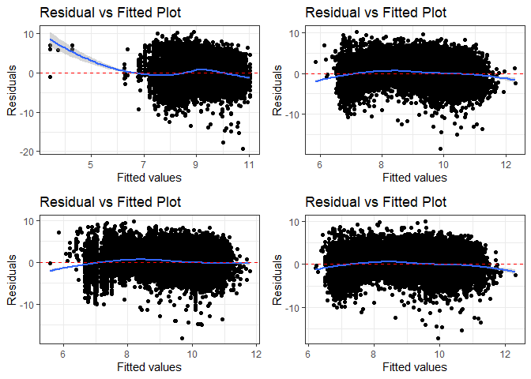<!-- -->

```
## debug: output <- list(rbind(deviance_stats(model1_old, "model1_old"), 
##     deviance_stats(model1_new, "model1_new")))
## debug: output
## exiting from: summary_residual_compare(b_CBre02D, b_CBre03D)
```

```
## [[1]]
##        model deviance null.deviance difference
## 1 model1_old 108875.3      111909.6    3034.29
## 2 model1_new 108695.4      111909.6    3214.15
```

None of the predictors has high level of correlation (vif over 1.7) with each other. 
In the cumulative model, per dependent variable and independent variable:

1. Ceiling breaches:
   A. Service Complexity:
      The relationship with average salary gained significance in line with expectation.
      The result for both average salary and invoice rate matched with expectation.
      
   B. Office Capacity: 
      The relationship with PBSC matched with expectation but with less magnitude.
      The result for office obligations did not match with expectation.
     
   C. Office-Vendor Relationship:
      The result for pair history matched with expectation 
      The relationship with contract actions reverse and now align with expectations.

2. Terminations:
   A. Service Complexity:
      The reult for average salary did not match with expectation.
      The result for invoice rate did matach with expectation, only significant (for p-value <0.5), which is still sufficient.
      
   B. Office Capacity: 
      The relationship with PBSC was not significant.
      The result for office obligations did not match with expectation.
     
   C. Office-Vendor Relationship:
      The result for pair history matched with expectation once all variables included.
      The result for contract actions did not match with expectation.

3. Exercised Options:
  A. Service Complexity:
      The result for both average salary and invoice rate matached with expectation but with less magnitude.
      
   B. Office Capacity: 
      The result for PBSC didn't match with expectation.
      The result for office obligations matched with expectation.
     
   C. Office-Vendor Relationship:
      The result for pair history lost significance and didn't match with expectations.
      The result for contract actions didn't match with expectation.


## Study Variables Alone


```r
study_coef_list<-list("(Intercept)"="(Intercept)",
                      "cl_US6_avg_sal_lag1Const"="Log(Det. Ind. Salary)",
                      "cl_CFTE"="Log(Service Invoice Rate)",
                      "c_pPBSC"="Office Perf.-Based %",
                      "c_pOffPSC"="Office Service Exp. %",
                      "c_pairHist"="Paired Years",
                      "cl_pairCA"="Log(Paired Actions)"
)

all_coef_list<-list("(Intercept)"="(Intercept)",
                    "cl_US6_avg_sal_lag1Const"="Log(Det. Ind. Salary)",
                    "cl_CFTE"="Log(Service Invoice Rate)",
                    "c_pPBSC"="Office Perf.-Based %",
                    "c_pOffPSC"="Office Service Exp. %",
                    "c_pairHist"="Paired Years",
                    "cl_pairCA"="Log(Paired Actions)",
                    
                    #Contract Controls
                    
                    "Comp1or51 offer"="Comp=1 offer",
                    "Comp1or52-4 offers"="Comp=2-4 offers",
                    "Comp1or55+ offers"="Comp=5+ offers",
                    
                    "CompOffr1 offer"="Comp=1 offer",
                    "CompOffr2 offers"="Comp=2 offers",
                    "CompOffr3-4 offers"="Comp=3-4 offers",
                    "CompOffr5+ offers"="Comp=5+ offers",
                    
                    "cl_Ceil"="Log(Init. Ceiling)",
                    "capped_cl_Days"="Log(Init. Days)",
                    "VehS-IDC"="Vehicle=S-IDC",
                    "VehM-IDC"="Vehicle=M-IDC",
                    "VehFSS/GWAC"="Vehicle=FSS/GWAC",
                    "VehBPA/BOA"="Vehicle=BPA/BOA",
                    "PricingUCAFFP"="Pricing=FFP",
                    "PricingUCAOther FP"="Pricing=Other FP",
                    "PricingUCAIncentive"="Pricing=Incentive Fee",
                    "PricingUCACombination or Other"="Pricing=Combination or Other",
                    "PricingUCAOther CB"="Pricing=Other CB",
                    "PricingUCAT&M/LH/FPLOE"="Pricing=T&M/LH/FP:LoE",
                    "PricingUCAUCA"="Pricing=UCA",
                    
                    "PricingFeeOther FP"="Pricing=Other FP",
                    "PricingFeeIncentive"="Pricing=Incentive Fee",
                    "PricingFeeCombination or Other"="Pricing=Combination or Other",
                    "PricingFeeOther CB"="Pricing=Other CB",
                    "PricingFeeT&M/LH/FPLOE"="Pricing=T&M/LH/FP:LoE",
                    "b_UCA"="UCA",
                    "CrisisARRA"="Crisis=ARRA",
                    "CrisisDis"="Crisis=Disaster",
                    "CrisisOCO"="Crisis=OCO",
                    "b_Intl"="Performed Abroad",

                    #NAICS
                    "cl_def3_HHI_lag1"="Log(Subsector HHI)",
                    "cl_def6_HHI_lag1"="Log(Det. Ind. HHI)",
                    "cl_def3_ratio_lag1"="Log(Subsector Ratio)",
                    "cl_def6_obl_lag1"="Log(Det. Ind. DoD Obl.)",
                    "cl_def6_ratio_lag1"="Log(Det. Ind. Ratio)",
                    #Office
                    "c_pMarket"="Percent Market",
                    "cl_OffVol"="Office Volume",
                    "cl_office_naics_hhi_k"="Office Concentration",
                    
                    
                    #interations
                    # # "cl_def6_HHI_lag1:capped_cl_Days"="Log(Det. Ind. HHI):Log(Init. Days)",
                    # "cl_def6_HHI_lag1:cl_def6_obl_lag1"="Log(Det. Ind. HHI):Log(Det. Ind. DoD Obl.)",
                    # # "cl_def3_HHI_lag1:cl_def3_ratio_lag1"="Log(Subsector HHI):Log(Subsector Ratio)"),
                    "cl_def6_HHI_lag1:b_UCA"="Log(Det. Ind. HHI):UCA",
                    # "cl_Ceil:b_UCA"="Log(Init. Ceiling):UCA",
                    # "CompOffr1 offer:b_UCA"="Comp=1 offer:UCA",
                    # "CompOffr2 offers:b_UCA"="Comp=2 offers:UCA",
                    # "CompOffr3-4 offers:b_UCA"="Comp=3-4 offers:UCA",
                    # "CompOffr5+ offers:b_UCA"="Comp=5+ offers:UCA"
                    "VehS-IDC:b_Intl"="Vehicle=S-IDC:Performed Abroad",
                    "VehM-IDC:b_Intl"="Vehicle=M-IDC:Performed Abroad",
                    "VehFSS/GWAC:b_Intl"="Vehicle=FSS/GWAC:Performed Abroad",
                    "VehBPA/BOA:b_Intl"="Vehicle=BPA/BOA:Performed Abroad",
                    "cl_US6_avg_sal_lag1:PricingFeeOther FP"="Pricing=Other FP:Log(Det. Ind. U.S. Avg. Salary)",
                    "cl_US6_avg_sal_lag1:PricingFeeIncentive"="Pricing=Incentive Fee:Log(Det. Ind. U.S. Avg. Salary)",
                    "cl_US6_avg_sal_lag1:PricingFeeCombination or Other"="Pricing=Comb./or Other:Log(Det. Ind. U.S. Avg. Salary)",
                    "cl_US6_avg_sal_lag1:PricingFeeOther CB"="Pricing=Other CB:Log(Det. Ind. U.S. Avg. Salary)",
                    "cl_US6_avg_sal_lag1:PricingFeeT&M/LH/FPLOE"="Pricing=T&M/LH/FP:LoE:Log(Det. Ind. U.S. Avg. Salary)"
)


#Ceiling Breaches Binary
  stargazer::stargazer(b_CBre01A,b_CBre01B,b_CBre02A,b_CBre02B,b_CBre03A,b_CBre03B,b_CBre03D,
                       type="text",
                       digits=2)
```

```
## 
## =====================================================================================================
##                                                      Dependent variable:                             
##                          ----------------------------------------------------------------------------
##                                                             b_CBre                                   
##                             (1)        (2)        (3)        (4)        (5)        (6)        (7)    
## -----------------------------------------------------------------------------------------------------
## cl_US6_avg_sal_lag1Const  0.22***                                                           0.08***  
##                            (0.02)                                                            (0.02)  
##                                                                                                      
## cl_CFTE                              0.21***                                                0.17***  
##                                       (0.02)                                                 (0.02)  
##                                                                                                      
## c_pPBSC                                         0.23***                                     -0.13*** 
##                                                  (0.02)                                      (0.02)  
##                                                                                                      
## c_pOffPSC                                                  0.75***                          0.85***  
##                                                             (0.01)                           (0.02)  
##                                                                                                      
## c_pairHist                                                            -0.09***              -0.16*** 
##                                                                        (0.02)                (0.02)  
##                                                                                                      
## cl_pairCA                                                                        0.18***    -0.14*** 
##                                                                                   (0.02)     (0.02)  
##                                                                                                      
## Constant                  -2.78***   -2.78***   -2.78***   -2.83***   -2.77***   -2.77***   -2.85*** 
##                            (0.01)     (0.01)     (0.01)     (0.01)     (0.01)     (0.01)     (0.01)  
##                                                                                                      
## -----------------------------------------------------------------------------------------------------
## Observations              250,000    250,000    250,000    250,000    250,000    250,000    250,000  
## Log Likelihood           -55,877.03 -55,881.77 -55,858.92 -54,538.89 -55,941.52 -55,895.24 -54,347.72
## Akaike Inf. Crit.        111,758.10 111,767.60 111,721.80 109,081.80 111,887.00 111,794.50 108,709.40
## =====================================================================================================
## Note:                                                                     *p<0.1; **p<0.05; ***p<0.01
```

```r
texreg::htmlreg(list(b_CBre01A,b_CBre01B,b_CBre02A,b_CBre02B,b_CBre03A,b_CBre03B,b_CBre03D),file="..//Output//b_CBreModel.html",
                single.row = TRUE,
                # custom.model.name=c("Ceiling Breaches"),
                stars=c(0.1,0.05,0.01,0.001),
                groups = list(
                              "Services Complexity" = 2:3,
                              "Office Capacity" =4:5,
                              "Past Relationship"=6:7
                              ),
                custom.coef.map=all_coef_list,
                bold=0.05,
                custom.note="%stars. Numerical inputs are rescaled.",
                caption="Table 6: Logit Bivariate Look at Study Variables and Ceiling Breaches",
                caption.above=TRUE)
```

```
## The table was written to the file '..//Output//b_CBreModel.html'.
```

```r
#Ceiling Breach Absolute
stargazer::stargazer(n_CBre01A,n_CBre01B,n_CBre02A,n_CBre02B,n_CBre03A,n_CBre03B,n_CBre03D,
                       type="text",
                       digits=2)
```

```
## 
## ============================================================================================================
##                                                          Dependent variable:                                
##                          -----------------------------------------------------------------------------------
##                                                          ln_CBre_OMB20_GDP18                                
##                              (1)         (2)         (3)         (4)         (5)         (6)         (7)    
## ------------------------------------------------------------------------------------------------------------
## cl_US6_avg_sal_lag1Const   0.87***                                                                 1.28***  
##                            (0.03)                                                                  (0.03)   
##                                                                                                             
## cl_CFTE                                1.20***                                                     0.46***  
##                                        (0.02)                                                      (0.02)   
##                                                                                                             
## c_pPBSC                                           -1.85***                                        -0.87***  
##                                                    (0.02)                                          (0.02)   
##                                                                                                             
## c_pOffPSC                                                     -1.57***                            -0.96***  
##                                                                (0.01)                              (0.02)   
##                                                                                                             
## c_pairHist                                                                -0.53***                 0.10***  
##                                                                            (0.02)                  (0.02)   
##                                                                                                             
## cl_pairCA                                                                             -1.89***    -0.55***  
##                                                                                        (0.02)      (0.03)   
##                                                                                                             
## Constant                   9.26***     9.25***     9.40***     9.66***     9.29***     9.38***     9.49***  
##                            (0.01)      (0.01)      (0.01)      (0.01)      (0.01)      (0.01)      (0.01)   
##                                                                                                             
## ------------------------------------------------------------------------------------------------------------
## Observations               61,184      61,184      61,184      61,184      61,184      61,184      61,184   
## Log Likelihood           -147,768.20 -146,959.50 -143,010.30 -142,219.20 -148,005.10 -144,915.00 -139,332.10
## Akaike Inf. Crit.        295,540.40  293,923.10  286,024.60  284,442.40  296,014.20  289,834.00  278,678.30 
## ============================================================================================================
## Note:                                                                            *p<0.1; **p<0.05; ***p<0.01
```

```r
texreg::htmlreg(list(n_CBre01A,n_CBre01B,n_CBre02A,n_CBre02B,n_CBre03A,n_CBre03B,n_CBre03D),file="..//Output//n_CBreModel.html",
                single.row = TRUE,
                # custom.model.name=c("Ceiling Breaches"),
                stars=c(0.1,0.05,0.01,0.001),
                groups = list(
                              "Services Complexity" = 2:3,
                              "Office Capacity" =4:5,
                              "Past Relationship"=6:7
                              ),
                custom.coef.map=all_coef_list,
                bold=0.05,
                custom.note="%stars. Numerical inputs are rescaled.",
                caption="Table 8: Regression Bivariate Look at Study Variables and Log(Options Growth)",
                caption.above=TRUE)
```

```
## The table was written to the file '..//Output//n_CBreModel.html'.
```

# Controls

##Contract-Level Controls
###Scope Variables
#### 04A: Cost Ceiling

Expectation: Initial Ceiling size positively estimates increasing probability of ceiling breaches and terminations and negatively estimates the option growth. Terminations and ceiling breaches simply comes down to large being associated with higher risk, while for option growth size imply makes it harder to grow proportionally.


```r
#Frequency Plot for unlogged ceiling
summary_continuous_plot(serv_smp1m,metric="cbre","UnmodifiedCeiling_OMB20_GDP18",bins=1000)
```

```
## Warning in `[<-.factor`(`*tmp*`, ri, value = c(0, 0, 0, 0, 0, 0, 0, 0, 0, :
## invalid factor level, NA generated
```

<!-- -->

```r
summary_continuous_plot(serv_smp1m,metric="cbre","UnmodifiedCeiling_OMB20_GDP18",bins=50,log=TRUE)
```

```
## Warning in `[<-.factor`(`*tmp*`, ri, value = c(0, 0, 0, 0, 0, 0, 0, 0, 0, :
## invalid factor level, NA generated
```

<!-- -->

```r
#Scatter Plot
ggplot(serv_smp, aes(x=cl_Ceil, y=ln_CBre_OMB20_GDP18)) + geom_point(alpha = 0.1) + ggtitle('Ceiling Breach Growth') + theme(plot.title = element_text(hjust = 0.5))
```

<!-- -->

```r
#Model
b_CBre04A <- glm (data=serv_smp,
                 b_CBre ~ cl_Ceil, family=binomial(link="logit"))
display(b_CBre04A)
```

```
## glm(formula = b_CBre ~ cl_Ceil, family = binomial(link = "logit"), 
##     data = serv_smp)
##             coef.est coef.se
## (Intercept) -2.86     0.01  
## cl_Ceil      0.87     0.02  
## ---
##   n = 250000, k = 2
##   residual deviance = 109334.7, null deviance = 111909.6 (difference = 2574.9)
```

```r
n_CBre04A <- glm(data=serv_breach,
                        ln_CBre_OMB20_GDP18 ~ cl_Ceil)

display(n_CBre04A)
```

```
## glm(formula = ln_CBre_OMB20_GDP18 ~ cl_Ceil, data = serv_breach)
##             coef.est coef.se
## (Intercept) 8.58     0.01   
## cl_Ceil     3.49     0.01   
## ---
##   n = 61184, k = 2
##   residual deviance = 215940.1, null deviance = 456211.7 (difference = 240271.7)
##   overdispersion parameter = 3.5
##   residual sd is sqrt(overdispersion) = 1.88
```

```r
#Plot residuals versus fitted
stargazer::stargazer(b_CBre03D,b_CBre04A,
                       
                       n_CBre03D,n_CBre04A,
                       type="text",
                       digits=2)
```

```
## 
## ======================================================================
##                                       Dependent variable:             
##                          ---------------------------------------------
##                                 b_CBre           ln_CBre_OMB20_GDP18  
##                                logistic                normal         
##                             (1)        (2)         (3)         (4)    
## ----------------------------------------------------------------------
## cl_US6_avg_sal_lag1Const  0.08***                1.28***              
##                            (0.02)                (0.03)               
##                                                                       
## cl_CFTE                   0.17***                0.46***              
##                            (0.02)                (0.02)               
##                                                                       
## c_pPBSC                   -0.13***              -0.87***              
##                            (0.02)                (0.02)               
##                                                                       
## c_pOffPSC                 0.85***               -0.96***              
##                            (0.02)                (0.02)               
##                                                                       
## c_pairHist                -0.16***               0.10***              
##                            (0.02)                (0.02)               
##                                                                       
## cl_pairCA                 -0.14***              -0.55***              
##                            (0.02)                (0.03)               
##                                                                       
## cl_Ceil                              0.87***                 3.49***  
##                                       (0.02)                 (0.01)   
##                                                                       
## Constant                  -2.85***   -2.86***    9.49***     8.58***  
##                            (0.01)     (0.01)     (0.01)      (0.01)   
##                                                                       
## ----------------------------------------------------------------------
## Observations              250,000    250,000     61,184      61,184   
## Log Likelihood           -54,347.72 -54,667.37 -139,332.10 -125,397.40
## Akaike Inf. Crit.        108,709.40 109,338.70 278,678.30  250,798.70 
## ======================================================================
## Note:                                      *p<0.1; **p<0.05; ***p<0.01
```

```r
#summary_residual_compare(b_CBre03D,b_CBre04A, skip_vif = TRUE)
```

Contract ceiling has a significant relationship, though the residuals show a possible non-linear patterns. This is most remarkable in the positive centered values between 0 and 1. This may be driven  by a missing value and is worth watching.
Expectations upheld for ceiling breaches and terminations. Weak expectations for options growth were countered.

#### 04B: Maximum Duration

Expectation: Greater maximum duration will positively estimate the probability ceiling of  breaches and terminations. Greater growth for options is also expected, because year-on-year options may be more of a default, though the scatter plot seems to go the other way.


```r
#Frequency Plot for max duration
freq_continuous_cbre_plot(serv_smp,"UnmodifiedDays",
               bins=1000)
```

<!-- -->

```r
summary_continuous_plot(serv_smp1m,metric="cbre","capped_cl_Days")
```

```
## Warning in `[<-.factor`(`*tmp*`, ri, value = c(0, 0, 0, 0, 0, 0, 0, 0, 0, :
## invalid factor level, NA generated
```

<!-- -->

```r
#Scatter Plot
ggplot(serv_smp, aes(x=capped_cl_Days, y=ln_CBre_OMB20_GDP18)) + geom_point(alpha = 0.1) + ggtitle('Ceiling Breach Growth') + theme(plot.title = element_text(hjust = 0.5))
```

<!-- -->

```r
#Model
b_CBre04B <- glm (data=serv_smp,
                 b_CBre ~ capped_cl_Days, family=binomial(link="logit"))
display(b_CBre04B)
```

```
## glm(formula = b_CBre ~ capped_cl_Days, family = binomial(link = "logit"), 
##     data = serv_smp)
##                coef.est coef.se
## (Intercept)    -2.78     0.01  
## capped_cl_Days  0.36     0.02  
## ---
##   n = 250000, k = 2
##   residual deviance = 111507.6, null deviance = 111909.6 (difference = 402.0)
```

```r
n_CBre04B <- glm(data=serv_breach,
                        ln_CBre_OMB20_GDP18 ~ capped_cl_Days)

display(n_CBre04B)
```

```
## glm(formula = ln_CBre_OMB20_GDP18 ~ capped_cl_Days, data = serv_breach)
##                coef.est coef.se
## (Intercept)    9.10     0.01   
## capped_cl_Days 2.94     0.02   
## ---
##   n = 61184, k = 2
##   residual deviance = 360301.7, null deviance = 456211.7 (difference = 95910.0)
##   overdispersion parameter = 5.9
##   residual sd is sqrt(overdispersion) = 2.43
```

```r
#Plot residuals versus fitted
stargazer::stargazer(b_CBre03D,b_CBre04A,b_CBre04B,
                       
                       n_CBre03D,n_CBre04A,n_CBre04B,
                       type="text",
                       digits=2)
```

```
## 
## =============================================================================================
##                                                  Dependent variable:                         
##                          --------------------------------------------------------------------
##                                       b_CBre                      ln_CBre_OMB20_GDP18        
##                                      logistic                           normal               
##                             (1)        (2)        (3)         (4)         (5)         (6)    
## ---------------------------------------------------------------------------------------------
## cl_US6_avg_sal_lag1Const  0.08***                           1.28***                          
##                            (0.02)                           (0.03)                           
##                                                                                              
## cl_CFTE                   0.17***                           0.46***                          
##                            (0.02)                           (0.02)                           
##                                                                                              
## c_pPBSC                   -0.13***                         -0.87***                          
##                            (0.02)                           (0.02)                           
##                                                                                              
## c_pOffPSC                 0.85***                          -0.96***                          
##                            (0.02)                           (0.02)                           
##                                                                                              
## c_pairHist                -0.16***                          0.10***                          
##                            (0.02)                           (0.02)                           
##                                                                                              
## cl_pairCA                 -0.14***                         -0.55***                          
##                            (0.02)                           (0.03)                           
##                                                                                              
## cl_Ceil                              0.87***                            3.49***              
##                                       (0.02)                            (0.01)               
##                                                                                              
## capped_cl_Days                                  0.36***                             2.94***  
##                                                  (0.02)                             (0.02)   
##                                                                                              
## Constant                  -2.85***   -2.86***   -2.78***    9.49***     8.58***     9.10***  
##                            (0.01)     (0.01)     (0.01)     (0.01)      (0.01)      (0.01)   
##                                                                                              
## ---------------------------------------------------------------------------------------------
## Observations              250,000    250,000    250,000     61,184      61,184      61,184   
## Log Likelihood           -54,347.72 -54,667.37 -55,753.80 -139,332.10 -125,397.40 -141,058.70
## Akaike Inf. Crit.        108,709.40 109,338.70 111,511.60 278,678.30  250,798.70  282,121.30 
## =============================================================================================
## Note:                                                             *p<0.1; **p<0.05; ***p<0.01
```

```r
summary_residual_compare(b_CBre03D,b_CBre04B, skip_vif = TRUE)
```

```
## debugging in: summary_residual_compare(b_CBre03D, b_CBre04B, skip_vif = TRUE)
## debug: {
##     if (skip_vif == FALSE) 
##         warning("Deprecating VIF. Just use glmer_examine on the models")
##     if (!is.na(bins)) {
##         if ("cl_US6_avg_sal_lag1Const" %in% model_colnames(model1_old) & 
##             "cl_US6_avg_sal_lag1Const" %in% model_colnames(model1_new)) 
##             bins <- bins + 5
##         if ("cl_CFTE" %in% model_colnames(model1_old) & "cl_CFTE" %in% 
##             model_colnames(model1_new)) 
##             bins <- bins + 5
##         if ("c_pPBSC" %in% model_colnames(model1_old) & "c_pPBSC" %in% 
##             model_colnames(model1_new)) 
##             bins <- bins + 5
##         if ("c_pOffPSC" %in% model_colnames(model1_old) & "c_pOffPSC" %in% 
##             model_colnames(model1_new)) 
##             bins <- bins + 5
##         if ("cl_pairCA" %in% model_colnames(model1_old) & "cl_pairCA" %in% 
##             model_colnames(model1_new)) 
##             bins <- bins + 5
##         if ("c_OffCri" %in% model_colnames(model1_old) & "c_OffCri" %in% 
##             model_colnames(model1_new)) 
##             bins <- bins + 5
##         if (("cl_Ceil" %in% model_colnames(model1_old) & "cl_Ceil" %in% 
##             model_colnames(model1_new)) | ("cl_Ceil_Then_Year" %in% 
##             model_colnames(model1_old) & "cl_Ceil_Then_Year" %in% 
##             model_colnames(model1_new))) 
##             bins <- bins + 10
##         if ("cl_Days" %in% model_colnames(model1_old) & "cl_Days" %in% 
##             model_colnames(model1_new)) 
##             bins <- bins + 5
##     }
##     if (!is.null(model2_new)) {
##         gridExtra::grid.arrange(binned_fitted_versus_residuals(model1_old, 
##             bins = bins), binned_fitted_versus_residuals(model1_new, 
##             bins = bins), binned_fitted_versus_residuals(model2_old, 
##             bins = bins), binned_fitted_versus_residuals(model2_new, 
##             bins = bins), ncol = 2)
##         if (!"b_Term" %in% model_colnames(model1_old) & !"b_CBre" %in% 
##             model_colnames(model1_old)) 
##             gridExtra::grid.arrange(resid_plot(model1_old, sample = 25000), 
##                 resid_plot(model1_new, sample = 25000), resid_plot(model2_old, 
##                   sample = 25000), resid_plot(model2_new, sample = 25000), 
##                 ncol = 2)
##         if (!"b_Term" %in% colnames(model1_old) & !"b_CBre" %in% 
##             model_colnames(model1_old)) 
##             gridExtra::grid.arrange(residuals_binned(model1_old, 
##                 bins = bins), residuals_binned(model1_new, bins = bins), 
##                 residuals_binned(model2_old, bins = bins), residuals_binned(model2_new, 
##                   bins = bins), ncol = 2)
##         if ("cl_Ceil" %in% model_colnames(model1_new)) {
##             residual_compare(model1_old, model1_new, model2_old, 
##                 model2_new, "cl_Ceil", "Centered Log(Ceiling)", 
##                 20)
##         }
##         if ("cl_Days" %in% model_colnames(model1_new)) {
##             residual_compare(model1_old, model1_new, model2_old, 
##                 model2_new, "cl_Days", "Centered Log(Days)", 
##                 10)
##         }
##         output <- NULL
##         if (class(model1_new) == "glmerMod" & class(model2_new) == 
##             "glmerMod") {
##             m1t <- getME(model1_new, "theta")
##             m1l <- getME(model1_new, "lower")
##             m2t <- getME(model2_new, "theta")
##             m2l <- getME(model2_new, "lower")
##             output <- list(m1t[m1l == 0], m2t[m2l == 0], model1_new@optinfo$conv$lme4$messages, 
##                 model2_new@optinfo$conv$lme4$messages)
##         }
##         else if ((class(model1_new) != "glmerMod" & class(model2_new) != 
##             "glmerMod") & (class(model1_old) != "glmerMod" & 
##             class(model2_old) != "glmerMod")) {
##             output <- list(rbind(deviance_stats(model1_old, "model1_old"), 
##                 deviance_stats(model1_new, "model1_new"), deviance_stats(model2_old, 
##                   "model2_old"), deviance_stats(model2_new, "model2_new")))
##         }
##     }
##     else if (!is.null(model1_new)) {
##         gridExtra::grid.arrange(binned_fitted_versus_residuals(model1_old, 
##             bins = bins), binned_fitted_versus_residuals(model1_new, 
##             bins = bins), ncol = 2)
##         if (!"b_Term" %in% model_colnames(model1_old) & !"b_CBre" %in% 
##             model_colnames(model1_old)) 
##             gridExtra::grid.arrange(resid_plot(model1_old, sample = 25000), 
##                 resid_plot(model1_new, sample = 25000), ncol = 2)
##         gridExtra::grid.arrange(residuals_binned(model1_old, 
##             bins = bins), residuals_binned(model1_new, bins = bins), 
##             ncol = 2)
##         output <- NULL
##         if (class(model1_new) == "glmerMod") {
##             m1t <- getME(model1_new, "theta")
##             m1l <- getME(model1_new, "lower")
##             output <- list(m1t[m1l == 0], model1_new@optinfo$conv$lme4$messages)
##         }
##         else if (class(model1_new) != "glmerMod" & class(model1_old) != 
##             "glmerMod") {
##             output <- list(rbind(deviance_stats(model1_old, "model1_old"), 
##                 deviance_stats(model1_new, "model1_new")))
##         }
##     }
##     else {
##         if (!is.na(bins)) {
##             if ("cl_US6_avg_sal_lag1Const" %in% model_colnames(model1_old)) 
##                 bins <- bins + 5
##             if ("cl_CFTE" %in% model_colnames(model1_old)) 
##                 bins <- bins + 5
##             if ("c_pPBSC" %in% model_colnames(model1_old)) 
##                 bins <- bins + 5
##             if ("c_pOffPSC" %in% model_colnames(model1_old)) 
##                 bins <- bins + 5
##             if ("cl_pairCA" %in% model_colnames(model1_old)) 
##                 bins <- bins + 5
##             if ("c_OffCri" %in% model_colnames(model1_old)) 
##                 bins <- bins + 5
##             if (("cl_Ceil" %in% model_colnames(model1_old)) | 
##                 ("cl_Ceil_Then_Year" %in% model_colnames(model1_old))) 
##                 bins <- bins + 10
##             if ("cl_Days" %in% model_colnames(model1_old)) 
##                 bins <- bins + 5
##         }
##         if (!"b_Term" %in% model_colnames(model1_old) & !"b_CBre" %in% 
##             model_colnames(model1_old)) 
##             gridExtra::grid.arrange(binned_fitted_versus_residuals(model1_old, 
##                 bins = bins), residuals_binned(model1_old, bins = bins), 
##                 resid_plot(model1_old, sample = 25000))
##         else gridExtra::grid.arrange(binned_fitted_versus_residuals(model1_old, 
##             bins = bins), residuals_binned(model1_old, bins = bins))
##         output <- NULL
##         if (class(model1_old) == "glmerMod") {
##             m1t <- getME(model1_old, "theta")
##             m1l <- getME(model1_old, "lower")
##             output <- list(m1t[m1l == 0], model1_old@optinfo$conv$lme4$messages)
##         }
##         else if (class(model1_old) != "glmerMod" & class(model1_old) != 
##             "glmerMod") {
##             output <- list(deviance_stats(model1_old, "model1_old"))
##         }
##     }
##     output
## }
## debug: if (skip_vif == FALSE) warning("Deprecating VIF. Just use glmer_examine on the models")
## debug: if (!is.na(bins)) {
##     if ("cl_US6_avg_sal_lag1Const" %in% model_colnames(model1_old) & 
##         "cl_US6_avg_sal_lag1Const" %in% model_colnames(model1_new)) 
##         bins <- bins + 5
##     if ("cl_CFTE" %in% model_colnames(model1_old) & "cl_CFTE" %in% 
##         model_colnames(model1_new)) 
##         bins <- bins + 5
##     if ("c_pPBSC" %in% model_colnames(model1_old) & "c_pPBSC" %in% 
##         model_colnames(model1_new)) 
##         bins <- bins + 5
##     if ("c_pOffPSC" %in% model_colnames(model1_old) & "c_pOffPSC" %in% 
##         model_colnames(model1_new)) 
##         bins <- bins + 5
##     if ("cl_pairCA" %in% model_colnames(model1_old) & "cl_pairCA" %in% 
##         model_colnames(model1_new)) 
##         bins <- bins + 5
##     if ("c_OffCri" %in% model_colnames(model1_old) & "c_OffCri" %in% 
##         model_colnames(model1_new)) 
##         bins <- bins + 5
##     if (("cl_Ceil" %in% model_colnames(model1_old) & "cl_Ceil" %in% 
##         model_colnames(model1_new)) | ("cl_Ceil_Then_Year" %in% 
##         model_colnames(model1_old) & "cl_Ceil_Then_Year" %in% 
##         model_colnames(model1_new))) 
##         bins <- bins + 10
##     if ("cl_Days" %in% model_colnames(model1_old) & "cl_Days" %in% 
##         model_colnames(model1_new)) 
##         bins <- bins + 5
## }
## debug: if ("cl_US6_avg_sal_lag1Const" %in% model_colnames(model1_old) & 
##     "cl_US6_avg_sal_lag1Const" %in% model_colnames(model1_new)) bins <- bins + 
##     5
## debug: if ("cl_CFTE" %in% model_colnames(model1_old) & "cl_CFTE" %in% 
##     model_colnames(model1_new)) bins <- bins + 5
## debug: if ("c_pPBSC" %in% model_colnames(model1_old) & "c_pPBSC" %in% 
##     model_colnames(model1_new)) bins <- bins + 5
## debug: if ("c_pOffPSC" %in% model_colnames(model1_old) & "c_pOffPSC" %in% 
##     model_colnames(model1_new)) bins <- bins + 5
## debug: if ("cl_pairCA" %in% model_colnames(model1_old) & "cl_pairCA" %in% 
##     model_colnames(model1_new)) bins <- bins + 5
## debug: if ("c_OffCri" %in% model_colnames(model1_old) & "c_OffCri" %in% 
##     model_colnames(model1_new)) bins <- bins + 5
## debug: if (("cl_Ceil" %in% model_colnames(model1_old) & "cl_Ceil" %in% 
##     model_colnames(model1_new)) | ("cl_Ceil_Then_Year" %in% model_colnames(model1_old) & 
##     "cl_Ceil_Then_Year" %in% model_colnames(model1_new))) bins <- bins + 
##     10
## debug: if ("cl_Days" %in% model_colnames(model1_old) & "cl_Days" %in% 
##     model_colnames(model1_new)) bins <- bins + 5
## debug: if (!is.null(model2_new)) {
##     gridExtra::grid.arrange(binned_fitted_versus_residuals(model1_old, 
##         bins = bins), binned_fitted_versus_residuals(model1_new, 
##         bins = bins), binned_fitted_versus_residuals(model2_old, 
##         bins = bins), binned_fitted_versus_residuals(model2_new, 
##         bins = bins), ncol = 2)
##     if (!"b_Term" %in% model_colnames(model1_old) & !"b_CBre" %in% 
##         model_colnames(model1_old)) 
##         gridExtra::grid.arrange(resid_plot(model1_old, sample = 25000), 
##             resid_plot(model1_new, sample = 25000), resid_plot(model2_old, 
##                 sample = 25000), resid_plot(model2_new, sample = 25000), 
##             ncol = 2)
##     if (!"b_Term" %in% colnames(model1_old) & !"b_CBre" %in% 
##         model_colnames(model1_old)) 
##         gridExtra::grid.arrange(residuals_binned(model1_old, 
##             bins = bins), residuals_binned(model1_new, bins = bins), 
##             residuals_binned(model2_old, bins = bins), residuals_binned(model2_new, 
##                 bins = bins), ncol = 2)
##     if ("cl_Ceil" %in% model_colnames(model1_new)) {
##         residual_compare(model1_old, model1_new, model2_old, 
##             model2_new, "cl_Ceil", "Centered Log(Ceiling)", 20)
##     }
##     if ("cl_Days" %in% model_colnames(model1_new)) {
##         residual_compare(model1_old, model1_new, model2_old, 
##             model2_new, "cl_Days", "Centered Log(Days)", 10)
##     }
##     output <- NULL
##     if (class(model1_new) == "glmerMod" & class(model2_new) == 
##         "glmerMod") {
##         m1t <- getME(model1_new, "theta")
##         m1l <- getME(model1_new, "lower")
##         m2t <- getME(model2_new, "theta")
##         m2l <- getME(model2_new, "lower")
##         output <- list(m1t[m1l == 0], m2t[m2l == 0], model1_new@optinfo$conv$lme4$messages, 
##             model2_new@optinfo$conv$lme4$messages)
##     }
##     else if ((class(model1_new) != "glmerMod" & class(model2_new) != 
##         "glmerMod") & (class(model1_old) != "glmerMod" & class(model2_old) != 
##         "glmerMod")) {
##         output <- list(rbind(deviance_stats(model1_old, "model1_old"), 
##             deviance_stats(model1_new, "model1_new"), deviance_stats(model2_old, 
##                 "model2_old"), deviance_stats(model2_new, "model2_new")))
##     }
## } else if (!is.null(model1_new)) {
##     gridExtra::grid.arrange(binned_fitted_versus_residuals(model1_old, 
##         bins = bins), binned_fitted_versus_residuals(model1_new, 
##         bins = bins), ncol = 2)
##     if (!"b_Term" %in% model_colnames(model1_old) & !"b_CBre" %in% 
##         model_colnames(model1_old)) 
##         gridExtra::grid.arrange(resid_plot(model1_old, sample = 25000), 
##             resid_plot(model1_new, sample = 25000), ncol = 2)
##     gridExtra::grid.arrange(residuals_binned(model1_old, bins = bins), 
##         residuals_binned(model1_new, bins = bins), ncol = 2)
##     output <- NULL
##     if (class(model1_new) == "glmerMod") {
##         m1t <- getME(model1_new, "theta")
##         m1l <- getME(model1_new, "lower")
##         output <- list(m1t[m1l == 0], model1_new@optinfo$conv$lme4$messages)
##     }
##     else if (class(model1_new) != "glmerMod" & class(model1_old) != 
##         "glmerMod") {
##         output <- list(rbind(deviance_stats(model1_old, "model1_old"), 
##             deviance_stats(model1_new, "model1_new")))
##     }
## } else {
##     if (!is.na(bins)) {
##         if ("cl_US6_avg_sal_lag1Const" %in% model_colnames(model1_old)) 
##             bins <- bins + 5
##         if ("cl_CFTE" %in% model_colnames(model1_old)) 
##             bins <- bins + 5
##         if ("c_pPBSC" %in% model_colnames(model1_old)) 
##             bins <- bins + 5
##         if ("c_pOffPSC" %in% model_colnames(model1_old)) 
##             bins <- bins + 5
##         if ("cl_pairCA" %in% model_colnames(model1_old)) 
##             bins <- bins + 5
##         if ("c_OffCri" %in% model_colnames(model1_old)) 
##             bins <- bins + 5
##         if (("cl_Ceil" %in% model_colnames(model1_old)) | ("cl_Ceil_Then_Year" %in% 
##             model_colnames(model1_old))) 
##             bins <- bins + 10
##         if ("cl_Days" %in% model_colnames(model1_old)) 
##             bins <- bins + 5
##     }
##     if (!"b_Term" %in% model_colnames(model1_old) & !"b_CBre" %in% 
##         model_colnames(model1_old)) 
##         gridExtra::grid.arrange(binned_fitted_versus_residuals(model1_old, 
##             bins = bins), residuals_binned(model1_old, bins = bins), 
##             resid_plot(model1_old, sample = 25000))
##     else gridExtra::grid.arrange(binned_fitted_versus_residuals(model1_old, 
##         bins = bins), residuals_binned(model1_old, bins = bins))
##     output <- NULL
##     if (class(model1_old) == "glmerMod") {
##         m1t <- getME(model1_old, "theta")
##         m1l <- getME(model1_old, "lower")
##         output <- list(m1t[m1l == 0], model1_old@optinfo$conv$lme4$messages)
##     }
##     else if (class(model1_old) != "glmerMod" & class(model1_old) != 
##         "glmerMod") {
##         output <- list(deviance_stats(model1_old, "model1_old"))
##     }
## }
## debug: if (!is.null(model1_new)) {
##     gridExtra::grid.arrange(binned_fitted_versus_residuals(model1_old, 
##         bins = bins), binned_fitted_versus_residuals(model1_new, 
##         bins = bins), ncol = 2)
##     if (!"b_Term" %in% model_colnames(model1_old) & !"b_CBre" %in% 
##         model_colnames(model1_old)) 
##         gridExtra::grid.arrange(resid_plot(model1_old, sample = 25000), 
##             resid_plot(model1_new, sample = 25000), ncol = 2)
##     gridExtra::grid.arrange(residuals_binned(model1_old, bins = bins), 
##         residuals_binned(model1_new, bins = bins), ncol = 2)
##     output <- NULL
##     if (class(model1_new) == "glmerMod") {
##         m1t <- getME(model1_new, "theta")
##         m1l <- getME(model1_new, "lower")
##         output <- list(m1t[m1l == 0], model1_new@optinfo$conv$lme4$messages)
##     }
##     else if (class(model1_new) != "glmerMod" & class(model1_old) != 
##         "glmerMod") {
##         output <- list(rbind(deviance_stats(model1_old, "model1_old"), 
##             deviance_stats(model1_new, "model1_new")))
##     }
## } else {
##     if (!is.na(bins)) {
##         if ("cl_US6_avg_sal_lag1Const" %in% model_colnames(model1_old)) 
##             bins <- bins + 5
##         if ("cl_CFTE" %in% model_colnames(model1_old)) 
##             bins <- bins + 5
##         if ("c_pPBSC" %in% model_colnames(model1_old)) 
##             bins <- bins + 5
##         if ("c_pOffPSC" %in% model_colnames(model1_old)) 
##             bins <- bins + 5
##         if ("cl_pairCA" %in% model_colnames(model1_old)) 
##             bins <- bins + 5
##         if ("c_OffCri" %in% model_colnames(model1_old)) 
##             bins <- bins + 5
##         if (("cl_Ceil" %in% model_colnames(model1_old)) | ("cl_Ceil_Then_Year" %in% 
##             model_colnames(model1_old))) 
##             bins <- bins + 10
##         if ("cl_Days" %in% model_colnames(model1_old)) 
##             bins <- bins + 5
##     }
##     if (!"b_Term" %in% model_colnames(model1_old) & !"b_CBre" %in% 
##         model_colnames(model1_old)) 
##         gridExtra::grid.arrange(binned_fitted_versus_residuals(model1_old, 
##             bins = bins), residuals_binned(model1_old, bins = bins), 
##             resid_plot(model1_old, sample = 25000))
##     else gridExtra::grid.arrange(binned_fitted_versus_residuals(model1_old, 
##         bins = bins), residuals_binned(model1_old, bins = bins))
##     output <- NULL
##     if (class(model1_old) == "glmerMod") {
##         m1t <- getME(model1_old, "theta")
##         m1l <- getME(model1_old, "lower")
##         output <- list(m1t[m1l == 0], model1_old@optinfo$conv$lme4$messages)
##     }
##     else if (class(model1_old) != "glmerMod" & class(model1_old) != 
##         "glmerMod") {
##         output <- list(deviance_stats(model1_old, "model1_old"))
##     }
## }
## debug: gridExtra::grid.arrange(binned_fitted_versus_residuals(model1_old, 
##     bins = bins), binned_fitted_versus_residuals(model1_new, 
##     bins = bins), ncol = 2)
```

<!-- -->

```
## debug: if (!"b_Term" %in% model_colnames(model1_old) & !"b_CBre" %in% 
##     model_colnames(model1_old)) gridExtra::grid.arrange(resid_plot(model1_old, 
##     sample = 25000), resid_plot(model1_new, sample = 25000), 
##     ncol = 2)
## debug: gridExtra::grid.arrange(residuals_binned(model1_old, bins = bins), 
##     residuals_binned(model1_new, bins = bins), ncol = 2)
```

```
## debug: output <- NULL
## debug: if (class(model1_new) == "glmerMod") {
##     m1t <- getME(model1_new, "theta")
##     m1l <- getME(model1_new, "lower")
##     output <- list(m1t[m1l == 0], model1_new@optinfo$conv$lme4$messages)
## } else if (class(model1_new) != "glmerMod" & class(model1_old) != 
##     "glmerMod") {
##     output <- list(rbind(deviance_stats(model1_old, "model1_old"), 
##         deviance_stats(model1_new, "model1_new")))
## }
```

```
## Warning in if (class(model1_new) == "glmerMod") {: the condition has length
## > 1 and only the first element will be used
```

```
## debug: if (class(model1_new) != "glmerMod" & class(model1_old) != "glmerMod") {
##     output <- list(rbind(deviance_stats(model1_old, "model1_old"), 
##         deviance_stats(model1_new, "model1_new")))
## }
```

```
## Warning in if (class(model1_new) != "glmerMod" & class(model1_old) !=
## "glmerMod") {: the condition has length > 1 and only the first element will
## be used
```

<!-- -->

```
## debug: output <- list(rbind(deviance_stats(model1_old, "model1_old"), 
##     deviance_stats(model1_new, "model1_new")))
## debug: output
## exiting from: summary_residual_compare(b_CBre03D, b_CBre04B, skip_vif = TRUE)
```

```
## [[1]]
##        model deviance null.deviance difference
## 1 model1_old 108695.4      111909.6  3214.1497
## 2 model1_new 111507.6      111909.6   401.9868
```

```r
summary_residual_compare(b_CBre04A,b_CBre04B, skip_vif = TRUE)
```

```
## debugging in: summary_residual_compare(b_CBre04A, b_CBre04B, skip_vif = TRUE)
## debug: {
##     if (skip_vif == FALSE) 
##         warning("Deprecating VIF. Just use glmer_examine on the models")
##     if (!is.na(bins)) {
##         if ("cl_US6_avg_sal_lag1Const" %in% model_colnames(model1_old) & 
##             "cl_US6_avg_sal_lag1Const" %in% model_colnames(model1_new)) 
##             bins <- bins + 5
##         if ("cl_CFTE" %in% model_colnames(model1_old) & "cl_CFTE" %in% 
##             model_colnames(model1_new)) 
##             bins <- bins + 5
##         if ("c_pPBSC" %in% model_colnames(model1_old) & "c_pPBSC" %in% 
##             model_colnames(model1_new)) 
##             bins <- bins + 5
##         if ("c_pOffPSC" %in% model_colnames(model1_old) & "c_pOffPSC" %in% 
##             model_colnames(model1_new)) 
##             bins <- bins + 5
##         if ("cl_pairCA" %in% model_colnames(model1_old) & "cl_pairCA" %in% 
##             model_colnames(model1_new)) 
##             bins <- bins + 5
##         if ("c_OffCri" %in% model_colnames(model1_old) & "c_OffCri" %in% 
##             model_colnames(model1_new)) 
##             bins <- bins + 5
##         if (("cl_Ceil" %in% model_colnames(model1_old) & "cl_Ceil" %in% 
##             model_colnames(model1_new)) | ("cl_Ceil_Then_Year" %in% 
##             model_colnames(model1_old) & "cl_Ceil_Then_Year" %in% 
##             model_colnames(model1_new))) 
##             bins <- bins + 10
##         if ("cl_Days" %in% model_colnames(model1_old) & "cl_Days" %in% 
##             model_colnames(model1_new)) 
##             bins <- bins + 5
##     }
##     if (!is.null(model2_new)) {
##         gridExtra::grid.arrange(binned_fitted_versus_residuals(model1_old, 
##             bins = bins), binned_fitted_versus_residuals(model1_new, 
##             bins = bins), binned_fitted_versus_residuals(model2_old, 
##             bins = bins), binned_fitted_versus_residuals(model2_new, 
##             bins = bins), ncol = 2)
##         if (!"b_Term" %in% model_colnames(model1_old) & !"b_CBre" %in% 
##             model_colnames(model1_old)) 
##             gridExtra::grid.arrange(resid_plot(model1_old, sample = 25000), 
##                 resid_plot(model1_new, sample = 25000), resid_plot(model2_old, 
##                   sample = 25000), resid_plot(model2_new, sample = 25000), 
##                 ncol = 2)
##         if (!"b_Term" %in% colnames(model1_old) & !"b_CBre" %in% 
##             model_colnames(model1_old)) 
##             gridExtra::grid.arrange(residuals_binned(model1_old, 
##                 bins = bins), residuals_binned(model1_new, bins = bins), 
##                 residuals_binned(model2_old, bins = bins), residuals_binned(model2_new, 
##                   bins = bins), ncol = 2)
##         if ("cl_Ceil" %in% model_colnames(model1_new)) {
##             residual_compare(model1_old, model1_new, model2_old, 
##                 model2_new, "cl_Ceil", "Centered Log(Ceiling)", 
##                 20)
##         }
##         if ("cl_Days" %in% model_colnames(model1_new)) {
##             residual_compare(model1_old, model1_new, model2_old, 
##                 model2_new, "cl_Days", "Centered Log(Days)", 
##                 10)
##         }
##         output <- NULL
##         if (class(model1_new) == "glmerMod" & class(model2_new) == 
##             "glmerMod") {
##             m1t <- getME(model1_new, "theta")
##             m1l <- getME(model1_new, "lower")
##             m2t <- getME(model2_new, "theta")
##             m2l <- getME(model2_new, "lower")
##             output <- list(m1t[m1l == 0], m2t[m2l == 0], model1_new@optinfo$conv$lme4$messages, 
##                 model2_new@optinfo$conv$lme4$messages)
##         }
##         else if ((class(model1_new) != "glmerMod" & class(model2_new) != 
##             "glmerMod") & (class(model1_old) != "glmerMod" & 
##             class(model2_old) != "glmerMod")) {
##             output <- list(rbind(deviance_stats(model1_old, "model1_old"), 
##                 deviance_stats(model1_new, "model1_new"), deviance_stats(model2_old, 
##                   "model2_old"), deviance_stats(model2_new, "model2_new")))
##         }
##     }
##     else if (!is.null(model1_new)) {
##         gridExtra::grid.arrange(binned_fitted_versus_residuals(model1_old, 
##             bins = bins), binned_fitted_versus_residuals(model1_new, 
##             bins = bins), ncol = 2)
##         if (!"b_Term" %in% model_colnames(model1_old) & !"b_CBre" %in% 
##             model_colnames(model1_old)) 
##             gridExtra::grid.arrange(resid_plot(model1_old, sample = 25000), 
##                 resid_plot(model1_new, sample = 25000), ncol = 2)
##         gridExtra::grid.arrange(residuals_binned(model1_old, 
##             bins = bins), residuals_binned(model1_new, bins = bins), 
##             ncol = 2)
##         output <- NULL
##         if (class(model1_new) == "glmerMod") {
##             m1t <- getME(model1_new, "theta")
##             m1l <- getME(model1_new, "lower")
##             output <- list(m1t[m1l == 0], model1_new@optinfo$conv$lme4$messages)
##         }
##         else if (class(model1_new) != "glmerMod" & class(model1_old) != 
##             "glmerMod") {
##             output <- list(rbind(deviance_stats(model1_old, "model1_old"), 
##                 deviance_stats(model1_new, "model1_new")))
##         }
##     }
##     else {
##         if (!is.na(bins)) {
##             if ("cl_US6_avg_sal_lag1Const" %in% model_colnames(model1_old)) 
##                 bins <- bins + 5
##             if ("cl_CFTE" %in% model_colnames(model1_old)) 
##                 bins <- bins + 5
##             if ("c_pPBSC" %in% model_colnames(model1_old)) 
##                 bins <- bins + 5
##             if ("c_pOffPSC" %in% model_colnames(model1_old)) 
##                 bins <- bins + 5
##             if ("cl_pairCA" %in% model_colnames(model1_old)) 
##                 bins <- bins + 5
##             if ("c_OffCri" %in% model_colnames(model1_old)) 
##                 bins <- bins + 5
##             if (("cl_Ceil" %in% model_colnames(model1_old)) | 
##                 ("cl_Ceil_Then_Year" %in% model_colnames(model1_old))) 
##                 bins <- bins + 10
##             if ("cl_Days" %in% model_colnames(model1_old)) 
##                 bins <- bins + 5
##         }
##         if (!"b_Term" %in% model_colnames(model1_old) & !"b_CBre" %in% 
##             model_colnames(model1_old)) 
##             gridExtra::grid.arrange(binned_fitted_versus_residuals(model1_old, 
##                 bins = bins), residuals_binned(model1_old, bins = bins), 
##                 resid_plot(model1_old, sample = 25000))
##         else gridExtra::grid.arrange(binned_fitted_versus_residuals(model1_old, 
##             bins = bins), residuals_binned(model1_old, bins = bins))
##         output <- NULL
##         if (class(model1_old) == "glmerMod") {
##             m1t <- getME(model1_old, "theta")
##             m1l <- getME(model1_old, "lower")
##             output <- list(m1t[m1l == 0], model1_old@optinfo$conv$lme4$messages)
##         }
##         else if (class(model1_old) != "glmerMod" & class(model1_old) != 
##             "glmerMod") {
##             output <- list(deviance_stats(model1_old, "model1_old"))
##         }
##     }
##     output
## }
## debug: if (skip_vif == FALSE) warning("Deprecating VIF. Just use glmer_examine on the models")
## debug: if (!is.na(bins)) {
##     if ("cl_US6_avg_sal_lag1Const" %in% model_colnames(model1_old) & 
##         "cl_US6_avg_sal_lag1Const" %in% model_colnames(model1_new)) 
##         bins <- bins + 5
##     if ("cl_CFTE" %in% model_colnames(model1_old) & "cl_CFTE" %in% 
##         model_colnames(model1_new)) 
##         bins <- bins + 5
##     if ("c_pPBSC" %in% model_colnames(model1_old) & "c_pPBSC" %in% 
##         model_colnames(model1_new)) 
##         bins <- bins + 5
##     if ("c_pOffPSC" %in% model_colnames(model1_old) & "c_pOffPSC" %in% 
##         model_colnames(model1_new)) 
##         bins <- bins + 5
##     if ("cl_pairCA" %in% model_colnames(model1_old) & "cl_pairCA" %in% 
##         model_colnames(model1_new)) 
##         bins <- bins + 5
##     if ("c_OffCri" %in% model_colnames(model1_old) & "c_OffCri" %in% 
##         model_colnames(model1_new)) 
##         bins <- bins + 5
##     if (("cl_Ceil" %in% model_colnames(model1_old) & "cl_Ceil" %in% 
##         model_colnames(model1_new)) | ("cl_Ceil_Then_Year" %in% 
##         model_colnames(model1_old) & "cl_Ceil_Then_Year" %in% 
##         model_colnames(model1_new))) 
##         bins <- bins + 10
##     if ("cl_Days" %in% model_colnames(model1_old) & "cl_Days" %in% 
##         model_colnames(model1_new)) 
##         bins <- bins + 5
## }
## debug: if ("cl_US6_avg_sal_lag1Const" %in% model_colnames(model1_old) & 
##     "cl_US6_avg_sal_lag1Const" %in% model_colnames(model1_new)) bins <- bins + 
##     5
## debug: if ("cl_CFTE" %in% model_colnames(model1_old) & "cl_CFTE" %in% 
##     model_colnames(model1_new)) bins <- bins + 5
## debug: if ("c_pPBSC" %in% model_colnames(model1_old) & "c_pPBSC" %in% 
##     model_colnames(model1_new)) bins <- bins + 5
## debug: if ("c_pOffPSC" %in% model_colnames(model1_old) & "c_pOffPSC" %in% 
##     model_colnames(model1_new)) bins <- bins + 5
## debug: if ("cl_pairCA" %in% model_colnames(model1_old) & "cl_pairCA" %in% 
##     model_colnames(model1_new)) bins <- bins + 5
## debug: if ("c_OffCri" %in% model_colnames(model1_old) & "c_OffCri" %in% 
##     model_colnames(model1_new)) bins <- bins + 5
## debug: if (("cl_Ceil" %in% model_colnames(model1_old) & "cl_Ceil" %in% 
##     model_colnames(model1_new)) | ("cl_Ceil_Then_Year" %in% model_colnames(model1_old) & 
##     "cl_Ceil_Then_Year" %in% model_colnames(model1_new))) bins <- bins + 
##     10
## debug: if ("cl_Days" %in% model_colnames(model1_old) & "cl_Days" %in% 
##     model_colnames(model1_new)) bins <- bins + 5
## debug: if (!is.null(model2_new)) {
##     gridExtra::grid.arrange(binned_fitted_versus_residuals(model1_old, 
##         bins = bins), binned_fitted_versus_residuals(model1_new, 
##         bins = bins), binned_fitted_versus_residuals(model2_old, 
##         bins = bins), binned_fitted_versus_residuals(model2_new, 
##         bins = bins), ncol = 2)
##     if (!"b_Term" %in% model_colnames(model1_old) & !"b_CBre" %in% 
##         model_colnames(model1_old)) 
##         gridExtra::grid.arrange(resid_plot(model1_old, sample = 25000), 
##             resid_plot(model1_new, sample = 25000), resid_plot(model2_old, 
##                 sample = 25000), resid_plot(model2_new, sample = 25000), 
##             ncol = 2)
##     if (!"b_Term" %in% colnames(model1_old) & !"b_CBre" %in% 
##         model_colnames(model1_old)) 
##         gridExtra::grid.arrange(residuals_binned(model1_old, 
##             bins = bins), residuals_binned(model1_new, bins = bins), 
##             residuals_binned(model2_old, bins = bins), residuals_binned(model2_new, 
##                 bins = bins), ncol = 2)
##     if ("cl_Ceil" %in% model_colnames(model1_new)) {
##         residual_compare(model1_old, model1_new, model2_old, 
##             model2_new, "cl_Ceil", "Centered Log(Ceiling)", 20)
##     }
##     if ("cl_Days" %in% model_colnames(model1_new)) {
##         residual_compare(model1_old, model1_new, model2_old, 
##             model2_new, "cl_Days", "Centered Log(Days)", 10)
##     }
##     output <- NULL
##     if (class(model1_new) == "glmerMod" & class(model2_new) == 
##         "glmerMod") {
##         m1t <- getME(model1_new, "theta")
##         m1l <- getME(model1_new, "lower")
##         m2t <- getME(model2_new, "theta")
##         m2l <- getME(model2_new, "lower")
##         output <- list(m1t[m1l == 0], m2t[m2l == 0], model1_new@optinfo$conv$lme4$messages, 
##             model2_new@optinfo$conv$lme4$messages)
##     }
##     else if ((class(model1_new) != "glmerMod" & class(model2_new) != 
##         "glmerMod") & (class(model1_old) != "glmerMod" & class(model2_old) != 
##         "glmerMod")) {
##         output <- list(rbind(deviance_stats(model1_old, "model1_old"), 
##             deviance_stats(model1_new, "model1_new"), deviance_stats(model2_old, 
##                 "model2_old"), deviance_stats(model2_new, "model2_new")))
##     }
## } else if (!is.null(model1_new)) {
##     gridExtra::grid.arrange(binned_fitted_versus_residuals(model1_old, 
##         bins = bins), binned_fitted_versus_residuals(model1_new, 
##         bins = bins), ncol = 2)
##     if (!"b_Term" %in% model_colnames(model1_old) & !"b_CBre" %in% 
##         model_colnames(model1_old)) 
##         gridExtra::grid.arrange(resid_plot(model1_old, sample = 25000), 
##             resid_plot(model1_new, sample = 25000), ncol = 2)
##     gridExtra::grid.arrange(residuals_binned(model1_old, bins = bins), 
##         residuals_binned(model1_new, bins = bins), ncol = 2)
##     output <- NULL
##     if (class(model1_new) == "glmerMod") {
##         m1t <- getME(model1_new, "theta")
##         m1l <- getME(model1_new, "lower")
##         output <- list(m1t[m1l == 0], model1_new@optinfo$conv$lme4$messages)
##     }
##     else if (class(model1_new) != "glmerMod" & class(model1_old) != 
##         "glmerMod") {
##         output <- list(rbind(deviance_stats(model1_old, "model1_old"), 
##             deviance_stats(model1_new, "model1_new")))
##     }
## } else {
##     if (!is.na(bins)) {
##         if ("cl_US6_avg_sal_lag1Const" %in% model_colnames(model1_old)) 
##             bins <- bins + 5
##         if ("cl_CFTE" %in% model_colnames(model1_old)) 
##             bins <- bins + 5
##         if ("c_pPBSC" %in% model_colnames(model1_old)) 
##             bins <- bins + 5
##         if ("c_pOffPSC" %in% model_colnames(model1_old)) 
##             bins <- bins + 5
##         if ("cl_pairCA" %in% model_colnames(model1_old)) 
##             bins <- bins + 5
##         if ("c_OffCri" %in% model_colnames(model1_old)) 
##             bins <- bins + 5
##         if (("cl_Ceil" %in% model_colnames(model1_old)) | ("cl_Ceil_Then_Year" %in% 
##             model_colnames(model1_old))) 
##             bins <- bins + 10
##         if ("cl_Days" %in% model_colnames(model1_old)) 
##             bins <- bins + 5
##     }
##     if (!"b_Term" %in% model_colnames(model1_old) & !"b_CBre" %in% 
##         model_colnames(model1_old)) 
##         gridExtra::grid.arrange(binned_fitted_versus_residuals(model1_old, 
##             bins = bins), residuals_binned(model1_old, bins = bins), 
##             resid_plot(model1_old, sample = 25000))
##     else gridExtra::grid.arrange(binned_fitted_versus_residuals(model1_old, 
##         bins = bins), residuals_binned(model1_old, bins = bins))
##     output <- NULL
##     if (class(model1_old) == "glmerMod") {
##         m1t <- getME(model1_old, "theta")
##         m1l <- getME(model1_old, "lower")
##         output <- list(m1t[m1l == 0], model1_old@optinfo$conv$lme4$messages)
##     }
##     else if (class(model1_old) != "glmerMod" & class(model1_old) != 
##         "glmerMod") {
##         output <- list(deviance_stats(model1_old, "model1_old"))
##     }
## }
## debug: if (!is.null(model1_new)) {
##     gridExtra::grid.arrange(binned_fitted_versus_residuals(model1_old, 
##         bins = bins), binned_fitted_versus_residuals(model1_new, 
##         bins = bins), ncol = 2)
##     if (!"b_Term" %in% model_colnames(model1_old) & !"b_CBre" %in% 
##         model_colnames(model1_old)) 
##         gridExtra::grid.arrange(resid_plot(model1_old, sample = 25000), 
##             resid_plot(model1_new, sample = 25000), ncol = 2)
##     gridExtra::grid.arrange(residuals_binned(model1_old, bins = bins), 
##         residuals_binned(model1_new, bins = bins), ncol = 2)
##     output <- NULL
##     if (class(model1_new) == "glmerMod") {
##         m1t <- getME(model1_new, "theta")
##         m1l <- getME(model1_new, "lower")
##         output <- list(m1t[m1l == 0], model1_new@optinfo$conv$lme4$messages)
##     }
##     else if (class(model1_new) != "glmerMod" & class(model1_old) != 
##         "glmerMod") {
##         output <- list(rbind(deviance_stats(model1_old, "model1_old"), 
##             deviance_stats(model1_new, "model1_new")))
##     }
## } else {
##     if (!is.na(bins)) {
##         if ("cl_US6_avg_sal_lag1Const" %in% model_colnames(model1_old)) 
##             bins <- bins + 5
##         if ("cl_CFTE" %in% model_colnames(model1_old)) 
##             bins <- bins + 5
##         if ("c_pPBSC" %in% model_colnames(model1_old)) 
##             bins <- bins + 5
##         if ("c_pOffPSC" %in% model_colnames(model1_old)) 
##             bins <- bins + 5
##         if ("cl_pairCA" %in% model_colnames(model1_old)) 
##             bins <- bins + 5
##         if ("c_OffCri" %in% model_colnames(model1_old)) 
##             bins <- bins + 5
##         if (("cl_Ceil" %in% model_colnames(model1_old)) | ("cl_Ceil_Then_Year" %in% 
##             model_colnames(model1_old))) 
##             bins <- bins + 10
##         if ("cl_Days" %in% model_colnames(model1_old)) 
##             bins <- bins + 5
##     }
##     if (!"b_Term" %in% model_colnames(model1_old) & !"b_CBre" %in% 
##         model_colnames(model1_old)) 
##         gridExtra::grid.arrange(binned_fitted_versus_residuals(model1_old, 
##             bins = bins), residuals_binned(model1_old, bins = bins), 
##             resid_plot(model1_old, sample = 25000))
##     else gridExtra::grid.arrange(binned_fitted_versus_residuals(model1_old, 
##         bins = bins), residuals_binned(model1_old, bins = bins))
##     output <- NULL
##     if (class(model1_old) == "glmerMod") {
##         m1t <- getME(model1_old, "theta")
##         m1l <- getME(model1_old, "lower")
##         output <- list(m1t[m1l == 0], model1_old@optinfo$conv$lme4$messages)
##     }
##     else if (class(model1_old) != "glmerMod" & class(model1_old) != 
##         "glmerMod") {
##         output <- list(deviance_stats(model1_old, "model1_old"))
##     }
## }
## debug: gridExtra::grid.arrange(binned_fitted_versus_residuals(model1_old, 
##     bins = bins), binned_fitted_versus_residuals(model1_new, 
##     bins = bins), ncol = 2)
```

<!-- -->

```
## debug: if (!"b_Term" %in% model_colnames(model1_old) & !"b_CBre" %in% 
##     model_colnames(model1_old)) gridExtra::grid.arrange(resid_plot(model1_old, 
##     sample = 25000), resid_plot(model1_new, sample = 25000), 
##     ncol = 2)
## debug: gridExtra::grid.arrange(residuals_binned(model1_old, bins = bins), 
##     residuals_binned(model1_new, bins = bins), ncol = 2)
```

```
## debug: output <- NULL
## debug: if (class(model1_new) == "glmerMod") {
##     m1t <- getME(model1_new, "theta")
##     m1l <- getME(model1_new, "lower")
##     output <- list(m1t[m1l == 0], model1_new@optinfo$conv$lme4$messages)
## } else if (class(model1_new) != "glmerMod" & class(model1_old) != 
##     "glmerMod") {
##     output <- list(rbind(deviance_stats(model1_old, "model1_old"), 
##         deviance_stats(model1_new, "model1_new")))
## }
```

```
## Warning in if (class(model1_new) == "glmerMod") {: the condition has length
## > 1 and only the first element will be used
```

```
## debug: if (class(model1_new) != "glmerMod" & class(model1_old) != "glmerMod") {
##     output <- list(rbind(deviance_stats(model1_old, "model1_old"), 
##         deviance_stats(model1_new, "model1_new")))
## }
```

```
## Warning in if (class(model1_new) != "glmerMod" & class(model1_old) !=
## "glmerMod") {: the condition has length > 1 and only the first element will
## be used
```

<!-- -->

```
## debug: output <- list(rbind(deviance_stats(model1_old, "model1_old"), 
##     deviance_stats(model1_new, "model1_new")))
## debug: output
## exiting from: summary_residual_compare(b_CBre04A, b_CBre04B, skip_vif = TRUE)
```

```
## [[1]]
##        model deviance null.deviance difference
## 1 model1_old 109334.7      111909.6  2574.8575
## 2 model1_new 111507.6      111909.6   401.9868
```

All expections were upheld.

#### 04C: Both Scope variables


```r
#Model
b_CBre04C <- glm (data=serv_smp,
                 b_CBre ~ cl_Ceil + capped_cl_Days, family=binomial(link="logit"))
display(b_CBre04C)
```

```
## glm(formula = b_CBre ~ cl_Ceil + capped_cl_Days, family = binomial(link = "logit"), 
##     data = serv_smp)
##                coef.est coef.se
## (Intercept)    -2.87     0.01  
## cl_Ceil         0.89     0.02  
## capped_cl_Days -0.05     0.02  
## ---
##   n = 250000, k = 3
##   residual deviance = 109327.9, null deviance = 111909.6 (difference = 2581.7)
```

```r
n_CBre04C <- glm(data=serv_breach,
                        ln_CBre_OMB20_GDP18 ~cl_Ceil + capped_cl_Days)

display(n_CBre04C)
```

```
## glm(formula = ln_CBre_OMB20_GDP18 ~ cl_Ceil + capped_cl_Days, 
##     data = serv_breach)
##                coef.est coef.se
## (Intercept)    8.59     0.01   
## cl_Ceil        3.31     0.02   
## capped_cl_Days 0.41     0.02   
## ---
##   n = 61184, k = 3
##   residual deviance = 214676.9, null deviance = 456211.7 (difference = 241534.9)
##   overdispersion parameter = 3.5
##   residual sd is sqrt(overdispersion) = 1.87
```

```r
#Plot residuals versus fitted
stargazer::stargazer(b_CBre03D,b_CBre04A,b_CBre04B,b_CBre04C,
                       
                       n_CBre03D,n_CBre04A,n_CBre04B,n_CBre04C,
                       type="text",
                       digits=2)
```

```
## 
## ====================================================================================================================
##                                                              Dependent variable:                                    
##                          -------------------------------------------------------------------------------------------
##                                            b_CBre                                  ln_CBre_OMB20_GDP18              
##                                           logistic                                       normal                     
##                             (1)        (2)        (3)        (4)         (5)         (6)         (7)         (8)    
## --------------------------------------------------------------------------------------------------------------------
## cl_US6_avg_sal_lag1Const  0.08***                                      1.28***                                      
##                            (0.02)                                      (0.03)                                       
##                                                                                                                     
## cl_CFTE                   0.17***                                      0.46***                                      
##                            (0.02)                                      (0.02)                                       
##                                                                                                                     
## c_pPBSC                   -0.13***                                    -0.87***                                      
##                            (0.02)                                      (0.02)                                       
##                                                                                                                     
## c_pOffPSC                 0.85***                                     -0.96***                                      
##                            (0.02)                                      (0.02)                                       
##                                                                                                                     
## c_pairHist                -0.16***                                     0.10***                                      
##                            (0.02)                                      (0.02)                                       
##                                                                                                                     
## cl_pairCA                 -0.14***                                    -0.55***                                      
##                            (0.02)                                      (0.03)                                       
##                                                                                                                     
## cl_Ceil                              0.87***               0.89***                 3.49***                 3.31***  
##                                       (0.02)                (0.02)                 (0.01)                  (0.02)   
##                                                                                                                     
## capped_cl_Days                                  0.36***    -0.05***                            2.94***     0.41***  
##                                                  (0.02)     (0.02)                             (0.02)      (0.02)   
##                                                                                                                     
## Constant                  -2.85***   -2.86***   -2.78***   -2.87***    9.49***     8.58***     9.10***     8.59***  
##                            (0.01)     (0.01)     (0.01)     (0.01)     (0.01)      (0.01)      (0.01)      (0.01)   
##                                                                                                                     
## --------------------------------------------------------------------------------------------------------------------
## Observations              250,000    250,000    250,000    250,000     61,184      61,184      61,184      61,184   
## Log Likelihood           -54,347.72 -54,667.37 -55,753.80 -54,663.96 -139,332.10 -125,397.40 -141,058.70 -125,217.90
## Akaike Inf. Crit.        108,709.40 109,338.70 111,511.60 109,333.90 278,678.30  250,798.70  282,121.30  250,441.80 
## ====================================================================================================================
## Note:                                                                                    *p<0.1; **p<0.05; ***p<0.01
```

```r
#summary_residual_compare(b_CBre03D,b_CBre04C)
#summary_residual_compare(b_CBre04A,b_CBre04C)
#summary_residual_compare(b_CBre04B,b_CBre04C)
```
Days loses significance for ceiling breaches. Ceiling has a smaller coefficient for terminations. Otherwise largely unchanged.

#### 04D: Cumulative  Model


```r
#Model
b_CBre04D <- glm (data=serv_smp,
                 b_CBre ~  cl_US6_avg_sal_lag1Const + 
                   cl_CFTE+ c_pPBSC+c_pOffPSC+
                 c_pairHist+cl_pairCA +
                   cl_Ceil + capped_cl_Days, family=binomial(link="logit"))
glmer_examine(b_CBre04D)
```

```
## cl_US6_avg_sal_lag1Const                  cl_CFTE                  c_pPBSC 
##                 1.347309                 1.191461                 1.255513 
##                c_pOffPSC               c_pairHist                cl_pairCA 
##                 1.458206                 1.242915                 1.539589 
##                  cl_Ceil           capped_cl_Days 
##                 1.327270                 1.324864
```

```r
n_CBre04D <- glm(data=serv_breach,
                        ln_CBre_OMB20_GDP18 ~  cl_US6_avg_sal_lag1Const + 
                   cl_CFTE+ c_pPBSC+c_pOffPSC+
                 c_pairHist+cl_pairCA+
                 cl_Ceil + capped_cl_Days)

glmer_examine(n_CBre04D)
```

```
## cl_US6_avg_sal_lag1Const                  cl_CFTE                  c_pPBSC 
##                 1.321303                 1.221871                 2.167512 
##                c_pOffPSC               c_pairHist                cl_pairCA 
##                 2.767673                 1.304730                 2.121942 
##                  cl_Ceil           capped_cl_Days 
##                 1.705156                 1.565154
```

```r
#Plot residuals versus fitted   

stargazer::stargazer(b_CBre03D,b_CBre04C,b_CBre04D,
                       
                       n_CBre03D,n_CBre04C,n_CBre04D,
                       type="text",
                       digits=2)
```

```
## 
## =============================================================================================
##                                                  Dependent variable:                         
##                          --------------------------------------------------------------------
##                                       b_CBre                      ln_CBre_OMB20_GDP18        
##                                      logistic                           normal               
##                             (1)        (2)        (3)         (4)         (5)         (6)    
## ---------------------------------------------------------------------------------------------
## cl_US6_avg_sal_lag1Const  0.08***               -0.17***    1.28***                 0.39***  
##                            (0.02)                (0.02)     (0.03)                  (0.02)   
##                                                                                              
## cl_CFTE                   0.17***               0.11***     0.46***                 0.17***  
##                            (0.02)                (0.02)     (0.02)                  (0.02)   
##                                                                                              
## c_pPBSC                   -0.13***              -0.09***   -0.87***                -0.36***  
##                            (0.02)                (0.02)     (0.02)                  (0.02)   
##                                                                                              
## c_pOffPSC                 0.85***               0.98***    -0.96***                -0.50***  
##                            (0.02)                (0.02)     (0.02)                  (0.02)   
##                                                                                              
## c_pairHist                -0.16***              -0.16***    0.10***                 0.14***  
##                            (0.02)                (0.02)     (0.02)                  (0.02)   
##                                                                                              
## cl_pairCA                 -0.14***              -0.16***   -0.55***                 0.05**   
##                            (0.02)                (0.02)     (0.03)                  (0.02)   
##                                                                                              
## cl_Ceil                              0.89***    0.96***                 3.31***     2.99***  
##                                       (0.02)     (0.02)                 (0.02)      (0.02)   
##                                                                                              
## capped_cl_Days                       -0.05***    0.04**                 0.41***     0.18***  
##                                       (0.02)     (0.02)                 (0.02)      (0.02)   
##                                                                                              
## Constant                  -2.85***   -2.87***   -2.96***    9.49***     8.59***     8.77***  
##                            (0.01)     (0.01)     (0.01)     (0.01)      (0.01)      (0.01)   
##                                                                                              
## ---------------------------------------------------------------------------------------------
## Observations              250,000    250,000    250,000     61,184      61,184      61,184   
## Log Likelihood           -54,347.72 -54,663.96 -52,842.69 -139,332.10 -125,217.90 -123,246.10
## Akaike Inf. Crit.        108,709.40 109,333.90 105,703.40 278,678.30  250,441.80  246,510.30 
## =============================================================================================
## Note:                                                             *p<0.1; **p<0.05; ***p<0.01
```

```r
#summary_residual_compare(b_CBre03D,b_CBre04D)
#summary_residual_compare(b_CBre04C,b_CBre04D)
```
Salary no longer matches expectations for ceiling breaches. Invoice rate is no longer significant for terminations. 


### Competition
#### 05A: No Competition / 1 / 2-4 / 5+ Offers
Expectations
No Competition (Baseline)			+	-	-
1 Offer			+	-	-
2-4 Offers			-	+	+
5+ Offers			-	+	-


```r
summary_discrete_plot(serv_smp1m,metric="cbre","Comp1or5")
```

```
## Warning: Ignoring unknown parameters: binwidth, bins, pad
```

<!-- -->

```
## [[1]]
## 
## No Competition        1 offer     2-4 offers      5+ offers 
##         276175         171282         335859         216684 
## 
## [[2]]
##                 
##                    None Ceiling Breach
##   No Competition 263437          12738
##   1 offer        165170           6112
##   2-4 offers     313642          22217
##   5+ offers      199500          17184
## 
## [[3]]
##                 
##                       0      1
##   No Competition 272818   3357
##   1 offer        168674   2608
##   2-4 offers     330839   5020
##   5+ offers      208992   7692
```

```r
#Scatter Plot
ggplot(serv_smp, aes(x=Comp1or5, y=ln_CBre_OMB20_GDP18)) + geom_point(alpha = 0.1) + ggtitle('Ceiling Breach Growth') + theme(plot.title = element_text(hjust = 0.5))
```

<!-- -->

```r
#Model
b_CBre05A <- glm (data=serv_smp,
                 b_CBre ~ Comp1or5, family=binomial(link="logit"))
display(b_CBre05A)
```

```
## glm(formula = b_CBre ~ Comp1or5, family = binomial(link = "logit"), 
##     data = serv_smp)
##                    coef.est coef.se
## (Intercept)        -2.99     0.02  
## Comp1or51 offer    -0.27     0.03  
## Comp1or52-4 offers  0.33     0.02  
## Comp1or55+ offers   0.56     0.02  
## ---
##   n = 250000, k = 4
##   residual deviance = 110845.1, null deviance = 111909.6 (difference = 1064.5)
```

```r
n_CBre05A <- glm(data=serv_breach,
                        ln_CBre_OMB20_GDP18 ~ Comp1or5)

display(n_CBre05A)
```

```
## glm(formula = ln_CBre_OMB20_GDP18 ~ Comp1or5, data = serv_breach)
##                    coef.est coef.se
## (Intercept)         9.88     0.02  
## Comp1or51 offer    -0.39     0.04  
## Comp1or52-4 offers -1.10     0.03  
## Comp1or55+ offers  -0.37     0.03  
## ---
##   n = 61184, k = 4
##   residual deviance = 444408.7, null deviance = 456211.7 (difference = 11803.0)
##   overdispersion parameter = 7.3
##   residual sd is sqrt(overdispersion) = 2.70
```

```r
#Plot residuals versus fitted
stargazer::stargazer(b_CBre04D,b_CBre05A,
                       
                       n_CBre04D,n_CBre05A,
                       type="text",
                       digits=2)
```

```
## 
## ======================================================================
##                                       Dependent variable:             
##                          ---------------------------------------------
##                                 b_CBre           ln_CBre_OMB20_GDP18  
##                                logistic                normal         
##                             (1)        (2)         (3)         (4)    
## ----------------------------------------------------------------------
## cl_US6_avg_sal_lag1Const  -0.17***               0.39***              
##                            (0.02)                (0.02)               
##                                                                       
## cl_CFTE                   0.11***                0.17***              
##                            (0.02)                (0.02)               
##                                                                       
## c_pPBSC                   -0.09***              -0.36***              
##                            (0.02)                (0.02)               
##                                                                       
## c_pOffPSC                 0.98***               -0.50***              
##                            (0.02)                (0.02)               
##                                                                       
## c_pairHist                -0.16***               0.14***              
##                            (0.02)                (0.02)               
##                                                                       
## cl_pairCA                 -0.16***               0.05**               
##                            (0.02)                (0.02)               
##                                                                       
## cl_Ceil                   0.96***                2.99***              
##                            (0.02)                (0.02)               
##                                                                       
## capped_cl_Days             0.04**                0.18***              
##                            (0.02)                (0.02)               
##                                                                       
## Comp1or51 offer                      -0.27***               -0.39***  
##                                       (0.03)                 (0.04)   
##                                                                       
## Comp1or52-4 offers                   0.33***                -1.10***  
##                                       (0.02)                 (0.03)   
##                                                                       
## Comp1or55+ offers                    0.56***                -0.37***  
##                                       (0.02)                 (0.03)   
##                                                                       
## Constant                  -2.96***   -2.99***    8.77***     9.88***  
##                            (0.01)     (0.02)     (0.01)      (0.02)   
##                                                                       
## ----------------------------------------------------------------------
## Observations              250,000    250,000     61,184      61,184   
## Log Likelihood           -52,842.69 -55,422.56 -123,246.10 -147,477.00
## Akaike Inf. Crit.        105,703.40 110,853.10 246,510.30  294,961.90 
## ======================================================================
## Note:                                      *p<0.1; **p<0.05; ***p<0.01
```
Expectations were completely unmet for ceiling breaches. For terminations, expectations were met for 2-4 offers and 5+ offers, but not for 1 offer. For ceiling breaches expectations were met for 1 offer, but not for 2-4 or 5+.

#### 05B: Cumulative  Model


```r
#Model
b_CBre05B <- glm (data=serv_smp,
                 b_CBre ~  cl_US6_avg_sal_lag1Const + 
                   cl_CFTE+ c_pPBSC+c_pOffPSC+
                 c_pairHist+cl_pairCA +
                   cl_Ceil + capped_cl_Days+
                   Comp1or5, family=binomial(link="logit"))
glmer_examine(b_CBre05B)
```

```
##                              GVIF Df GVIF^(1/(2*Df))
## cl_US6_avg_sal_lag1Const 1.368400  1        1.169786
## cl_CFTE                  1.199342  1        1.095145
## c_pPBSC                  1.289840  1        1.135711
## c_pOffPSC                1.504383  1        1.226533
## c_pairHist               1.245987  1        1.116238
## cl_pairCA                1.585308  1        1.259090
## cl_Ceil                  1.343758  1        1.159206
## capped_cl_Days           1.339991  1        1.157580
## Comp1or5                 1.087110  3        1.014018
```

```r
n_CBre05B <- glm(data=serv_breach,
                        ln_CBre_OMB20_GDP18 ~  cl_US6_avg_sal_lag1Const + 
                   cl_CFTE+ c_pPBSC+c_pOffPSC+
                 c_pairHist+cl_pairCA+
                 cl_Ceil + capped_cl_Days+
                 Comp1or5)

glmer_examine(n_CBre05B)
```

```
##                              GVIF Df GVIF^(1/(2*Df))
## cl_US6_avg_sal_lag1Const 1.328161  1        1.152459
## cl_CFTE                  1.225046  1        1.106818
## c_pPBSC                  2.179351  1        1.476262
## c_pOffPSC                2.799012  1        1.673025
## c_pairHist               1.318098  1        1.148085
## cl_pairCA                2.142383  1        1.463688
## cl_Ceil                  1.726663  1        1.314025
## capped_cl_Days           1.576190  1        1.255464
## Comp1or5                 1.131605  3        1.020820
```

```r
#Plot residuals versus fitted   

stargazer::stargazer(b_CBre04D,b_CBre05A,b_CBre05B,
                       
                       n_CBre04D,n_CBre05A,n_CBre05B,
                       type="text",
                       digits=2)
```

```
## 
## =============================================================================================
##                                                  Dependent variable:                         
##                          --------------------------------------------------------------------
##                                       b_CBre                      ln_CBre_OMB20_GDP18        
##                                      logistic                           normal               
##                             (1)        (2)        (3)         (4)         (5)         (6)    
## ---------------------------------------------------------------------------------------------
## cl_US6_avg_sal_lag1Const  -0.17***              -0.14***    0.39***                 0.37***  
##                            (0.02)                (0.02)     (0.02)                  (0.02)   
##                                                                                              
## cl_CFTE                   0.11***               0.10***     0.17***                 0.17***  
##                            (0.02)                (0.02)     (0.02)                  (0.02)   
##                                                                                              
## c_pPBSC                   -0.09***              -0.13***   -0.36***                -0.35***  
##                            (0.02)                (0.02)     (0.02)                  (0.02)   
##                                                                                              
## c_pOffPSC                 0.98***               0.98***    -0.50***                -0.47***  
##                            (0.02)                (0.02)     (0.02)                  (0.02)   
##                                                                                              
## c_pairHist                -0.16***              -0.12***    0.14***                 0.13***  
##                            (0.02)                (0.02)     (0.02)                  (0.02)   
##                                                                                              
## cl_pairCA                 -0.16***              -0.21***    0.05**                  0.08***  
##                            (0.02)                (0.02)     (0.02)                  (0.02)   
##                                                                                              
## cl_Ceil                   0.96***               0.94***     2.99***                 3.01***  
##                            (0.02)                (0.02)     (0.02)                  (0.02)   
##                                                                                              
## capped_cl_Days             0.04**                 0.02      0.18***                 0.17***  
##                            (0.02)                (0.02)     (0.02)                  (0.02)   
##                                                                                              
## Comp1or51 offer                      -0.27***   -0.23***               -0.39***     0.07**   
##                                       (0.03)     (0.03)                 (0.04)      (0.03)   
##                                                                                              
## Comp1or52-4 offers                   0.33***    0.24***                -1.10***    -0.24***  
##                                       (0.02)     (0.02)                 (0.03)      (0.02)   
##                                                                                              
## Comp1or55+ offers                    0.56***    0.41***                -0.37***    -0.25***  
##                                       (0.02)     (0.02)                 (0.03)      (0.02)   
##                                                                                              
## Constant                  -2.96***   -2.99***   -3.11***    8.77***     9.88***     8.92***  
##                            (0.01)     (0.02)     (0.02)     (0.01)      (0.02)      (0.02)   
##                                                                                              
## ---------------------------------------------------------------------------------------------
## Observations              250,000    250,000    250,000     61,184      61,184      61,184   
## Log Likelihood           -52,842.69 -55,422.56 -52,561.97 -123,246.10 -147,477.00 -123,111.00
## Akaike Inf. Crit.        105,703.40 110,853.10 105,147.90 246,510.30  294,961.90  246,246.00 
## =============================================================================================
## Note:                                                             *p<0.1; **p<0.05; ***p<0.01
```

```r
#summary_residual_compare(b_CBre04D,b_CBre05B)
```
Minimal effect on study variables. 2-4 offers for terminations is not  longer significant, it's really 5+ that boosts the risks. But for exercised options, 5+ leads to more options while fewer having negative relationship with 2-4 offers, but only significant with p-value < 0.1 

### Contract Vehicle

#### 06A: Def/Pur; S-IDC; M-IDC; FSS-GWAC; BPA-BOA.

Old text:
Expectation: Indefinite delivery vehicles, means that the government has an existing relationship with the vendor and administration is easier. The downside is that the government may be locked into the vendor, although exit does not necessarily require outright termination, instead the government may simply cease to use a vehicle. Taken together, across the board the four categories of vehicles are expected to  negatively estimate the probability of termination. Ceiling breaches are a more complex topic and the study team does not have immediate expecations aside from likely significance.
Definitive Contract (base)			+	+	+
Single-Award IDC			-	-	-
Multi-Award IDC			-	-	-
FSS/GWAC			-	-	-
BPA/BOA			-	-	-


```r
summary_discrete_plot(serv_smp1m,metric="cbre","Veh")
```

```
## Warning: Ignoring unknown parameters: binwidth, bins, pad
```

<!-- -->

```
## [[1]]
## 
##  Def/Pur    S-IDC    M-IDC FSS/GWAC  BPA/BOA 
##   304598   487553   119080    45850    42919 
## 
## [[2]]
##           
##              None Ceiling Breach
##   Def/Pur  287933          16665
##   S-IDC    457840          29713
##   M-IDC    110379           8701
##   FSS/GWAC  44106           1744
##   BPA/BOA   41491           1428
## 
## [[3]]
##           
##                 0      1
##   Def/Pur  297406   7192
##   S-IDC    480278   7275
##   M-IDC    116234   2846
##   FSS/GWAC  44887    963
##   BPA/BOA   42518    401
```

```r
#Scatter Plot
ggplot(serv_smp, aes(x=Veh, y=ln_CBre_OMB20_GDP18)) + geom_point(alpha = 0.1) + ggtitle('Ceiling Breach Growth') + theme(plot.title = element_text(hjust = 0.5))
```

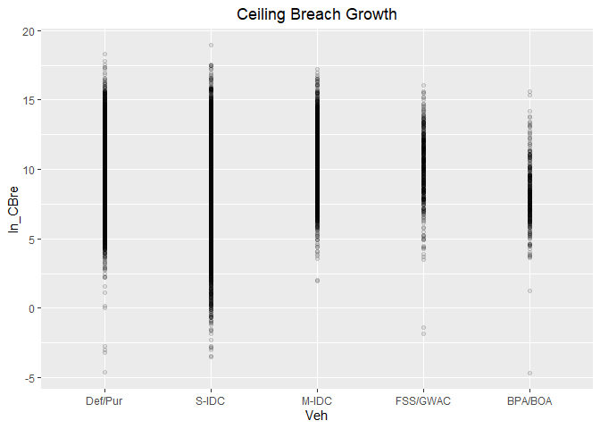<!-- -->

```r
#Model
b_CBre06A <- glm (data=serv_smp,
                 b_CBre ~ Veh, family=binomial(link="logit"))
display(b_CBre06A)
```

```
## glm(formula = b_CBre ~ Veh, family = binomial(link = "logit"), 
##     data = serv_smp)
##             coef.est coef.se
## (Intercept) -2.84     0.02  
## VehS-IDC     0.11     0.02  
## VehM-IDC     0.31     0.03  
## VehFSS/GWAC -0.37     0.05  
## VehBPA/BOA  -0.48     0.06  
## ---
##   n = 250000, k = 5
##   residual deviance = 111546.5, null deviance = 111909.6 (difference = 363.1)
```

```r
n_CBre06A <- glm(data=serv_breach,
                        ln_CBre_OMB20_GDP18 ~ Veh)

display(n_CBre06A)
```

```
## glm(formula = ln_CBre_OMB20_GDP18 ~ Veh, data = serv_breach)
##             coef.est coef.se
## (Intercept)  9.77     0.02  
## VehS-IDC    -1.07     0.02  
## VehM-IDC     0.82     0.03  
## VehFSS/GWAC  0.28     0.06  
## VehBPA/BOA  -1.60     0.07  
## ---
##   n = 61184, k = 5
##   residual deviance = 422854.6, null deviance = 456211.7 (difference = 33357.2)
##   overdispersion parameter = 6.9
##   residual sd is sqrt(overdispersion) = 2.63
```

```r
#Plot residuals versus fitted
stargazer::stargazer(b_CBre05B,b_CBre06A,
                       
                       n_CBre05B,n_CBre06A,
                       type="text",
                       digits=2)
```

```
## 
## ======================================================================
##                                       Dependent variable:             
##                          ---------------------------------------------
##                                 b_CBre           ln_CBre_OMB20_GDP18  
##                                logistic                normal         
##                             (1)        (2)         (3)         (4)    
## ----------------------------------------------------------------------
## cl_US6_avg_sal_lag1Const  -0.14***               0.37***              
##                            (0.02)                (0.02)               
##                                                                       
## cl_CFTE                   0.10***                0.17***              
##                            (0.02)                (0.02)               
##                                                                       
## c_pPBSC                   -0.13***              -0.35***              
##                            (0.02)                (0.02)               
##                                                                       
## c_pOffPSC                 0.98***               -0.47***              
##                            (0.02)                (0.02)               
##                                                                       
## c_pairHist                -0.12***               0.13***              
##                            (0.02)                (0.02)               
##                                                                       
## cl_pairCA                 -0.21***               0.08***              
##                            (0.02)                (0.02)               
##                                                                       
## cl_Ceil                   0.94***                3.01***              
##                            (0.02)                (0.02)               
##                                                                       
## capped_cl_Days              0.02                 0.17***              
##                            (0.02)                (0.02)               
##                                                                       
## Comp1or51 offer           -0.23***               0.07**               
##                            (0.03)                (0.03)               
##                                                                       
## Comp1or52-4 offers        0.24***               -0.24***              
##                            (0.02)                (0.02)               
##                                                                       
## Comp1or55+ offers         0.41***               -0.25***              
##                            (0.02)                (0.02)               
##                                                                       
## VehS-IDC                             0.11***                -1.07***  
##                                       (0.02)                 (0.02)   
##                                                                       
## VehM-IDC                             0.31***                 0.82***  
##                                       (0.03)                 (0.03)   
##                                                                       
## VehFSS/GWAC                          -0.37***                0.28***  
##                                       (0.05)                 (0.06)   
##                                                                       
## VehBPA/BOA                           -0.48***               -1.60***  
##                                       (0.06)                 (0.07)   
##                                                                       
## Constant                  -3.11***   -2.84***    8.92***     9.77***  
##                            (0.02)     (0.02)     (0.02)      (0.02)   
##                                                                       
## ----------------------------------------------------------------------
## Observations              250,000    250,000     61,184      61,184   
## Log Likelihood           -52,561.97 -55,773.23 -123,111.00 -145,956.00
## Akaike Inf. Crit.        105,147.90 111,556.50 246,246.00  291,922.10 
## ======================================================================
## Note:                                      *p<0.1; **p<0.05; ***p<0.01
```

```r
ggplot(glm(b_CBre~Veh, data=serv_smp)) + geom_point(aes(x=.fitted, y=.resid)) + ggtitle('Residual Plot') + theme(plot.title = element_text(hjust = 0.5))
```

<!-- -->
For ceiling breaches, IDCs, particularly multiaward IDCs, were more likely to have breaches contrary to expecatitions.

For terminations expectation were upheld or S-IDCs and BPA/BOA. They were not upheld for multi-award, which is significantly more likely to be terminated.

Expectations were largely upheld for options exercised, with the exception of FSS/GWAC.


#### 06B: Cumulative  Model


```r
#Model
b_CBre06B <- glm (data=serv_smp,
                 b_CBre ~  cl_US6_avg_sal_lag1Const + 
                   cl_CFTE+ c_pPBSC+c_pOffPSC+
                 c_pairHist+cl_pairCA +
                   cl_Ceil + capped_cl_Days+
                   Comp1or5+
                   Veh, family=binomial(link="logit"))
glmer_examine(b_CBre06B)
```

```
##                              GVIF Df GVIF^(1/(2*Df))
## cl_US6_avg_sal_lag1Const 1.394955  1        1.181082
## cl_CFTE                  1.198288  1        1.094664
## c_pPBSC                  1.306599  1        1.143066
## c_pOffPSC                1.540054  1        1.240989
## c_pairHist               1.277536  1        1.130281
## cl_pairCA                1.780273  1        1.334269
## cl_Ceil                  1.388106  1        1.178179
## capped_cl_Days           1.355141  1        1.164105
## Comp1or5                 1.170302  3        1.026557
## Veh                      1.569544  4        1.057966
```

```r
n_CBre06B <- glm(data=serv_breach,
                        ln_CBre_OMB20_GDP18 ~  cl_US6_avg_sal_lag1Const + 
                   cl_CFTE+ c_pPBSC+c_pOffPSC+
                 c_pairHist+cl_pairCA+
                 cl_Ceil + capped_cl_Days+
                 Comp1or5+
                   Veh)

glmer_examine(n_CBre06B)
```

```
##                              GVIF Df GVIF^(1/(2*Df))
## cl_US6_avg_sal_lag1Const 1.377160  1        1.173525
## cl_CFTE                  1.227983  1        1.108144
## c_pPBSC                  2.192891  1        1.480841
## c_pOffPSC                2.866555  1        1.693090
## c_pairHist               1.343695  1        1.159179
## cl_pairCA                2.417164  1        1.554723
## cl_Ceil                  1.795251  1        1.339870
## capped_cl_Days           1.585093  1        1.259005
## Comp1or5                 1.237631  3        1.036172
## Veh                      1.871221  4        1.081473
```

```r
#Plot residuals versus fitted   

stargazer::stargazer(b_CBre05B,b_CBre06A,b_CBre06B,
                       
                       n_CBre05B,n_CBre06A,n_CBre06B,
                       type="text",
                       digits=2)
```

```
## 
## =============================================================================================
##                                                  Dependent variable:                         
##                          --------------------------------------------------------------------
##                                       b_CBre                      ln_CBre_OMB20_GDP18        
##                                      logistic                           normal               
##                             (1)        (2)        (3)         (4)         (5)         (6)    
## ---------------------------------------------------------------------------------------------
## cl_US6_avg_sal_lag1Const  -0.14***              -0.12***    0.37***                 0.34***  
##                            (0.02)                (0.02)     (0.02)                  (0.02)   
##                                                                                              
## cl_CFTE                   0.10***               0.10***     0.17***                 0.18***  
##                            (0.02)                (0.02)     (0.02)                  (0.02)   
##                                                                                              
## c_pPBSC                   -0.13***              -0.15***   -0.35***                -0.35***  
##                            (0.02)                (0.02)     (0.02)                  (0.02)   
##                                                                                              
## c_pOffPSC                 0.98***               1.00***    -0.47***                -0.47***  
##                            (0.02)                (0.02)     (0.02)                  (0.02)   
##                                                                                              
## c_pairHist                -0.12***              -0.10***    0.13***                 0.12***  
##                            (0.02)                (0.02)     (0.02)                  (0.02)   
##                                                                                              
## cl_pairCA                 -0.21***              -0.17***    0.08***                  0.04    
##                            (0.02)                (0.02)     (0.02)                  (0.02)   
##                                                                                              
## cl_Ceil                   0.94***               0.92***     3.01***                 3.02***  
##                            (0.02)                (0.02)     (0.02)                  (0.02)   
##                                                                                              
## capped_cl_Days              0.02                 0.05**     0.17***                 0.16***  
##                            (0.02)                (0.02)     (0.02)                  (0.02)   
##                                                                                              
## Comp1or51 offer           -0.23***              -0.20***    0.07**                  0.06**   
##                            (0.03)                (0.03)     (0.03)                  (0.03)   
##                                                                                              
## Comp1or52-4 offers        0.24***               0.27***    -0.24***                -0.25***  
##                            (0.02)                (0.02)     (0.02)                  (0.02)   
##                                                                                              
## Comp1or55+ offers         0.41***               0.44***    -0.25***                -0.27***  
##                            (0.02)                (0.03)     (0.02)                  (0.02)   
##                                                                                              
## VehS-IDC                             0.11***    -0.21***               -1.07***     0.15***  
##                                       (0.02)     (0.02)                 (0.02)      (0.02)   
##                                                                                              
## VehM-IDC                             0.31***    -0.18***                0.82***     0.11***  
##                                       (0.03)     (0.03)                 (0.03)      (0.03)   
##                                                                                              
## VehFSS/GWAC                          -0.37***   -0.46***                0.28***     0.29***  
##                                       (0.05)     (0.05)                 (0.06)      (0.04)   
##                                                                                              
## VehBPA/BOA                           -0.48***   -0.45***               -1.60***     0.12**   
##                                       (0.06)     (0.06)                 (0.07)      (0.05)   
##                                                                                              
## Constant                  -3.11***   -2.84***   -2.97***    8.92***     9.77***     8.83***  
##                            (0.02)     (0.02)     (0.02)     (0.02)      (0.02)      (0.02)   
##                                                                                              
## ---------------------------------------------------------------------------------------------
## Observations              250,000    250,000    250,000     61,184      61,184      61,184   
## Log Likelihood           -52,561.97 -55,773.23 -52,481.14 -123,111.00 -145,956.00 -123,073.20
## Akaike Inf. Crit.        105,147.90 111,556.50 104,994.30 246,246.00  291,922.10  246,178.40 
## =============================================================================================
## Note:                                                             *p<0.1; **p<0.05; ***p<0.01
```

```r
#summary_residual_compare(b_CBre05B,b_CBre06B)
```
Expectations for vehicle are now upheld for both ceiling breaches and terminations. For other variables the addition of vehicle proved less pivotal, though coefficients were often decreased.

### Type of Contract

The next step adds a measure for whether the contract was cost-based or fixed-price. 

Expectation Prior CSIS research has found that fixed-price contracts estimate a higher probability of terminations but did not find a notable relationship for ceiling breaches.

#### 07A: FFP / Other FP / Incentive / T&M/FP:LOE;LH / Other CB / Combination

Firm-Fixed Price (base)			+	++	+
Other Fixed Price			-	-	-
Time & Materials / Labor Hours / FP: LoE			+	-	-
Incentive Fee (both FPIF or CBIF)			-	-	+
Other Cost Based			-	-	-
Undefinitized Contract Award			++	++	--
Combination			+	+	-


```r
serv_smp$PricingUCA<-factor(serv_smp$PricingUCA,
                            levels=c( "FFP","Other FP","T&M/LH/FPLOE","Incentive","Other CB","UCA" ,"Combination or Other" ))
serv_smp$PricingUCA<-factor(serv_smp$PricingUCA,
                            levels=c( "FFP","Other FP","T&M/LH/FPLOE","Incentive","Other CB","UCA" ,"Combination or Other" ))
  summary_discrete_plot(serv_smp1m,metric="cbre","PricingUCA")
```

```
## Warning: Ignoring unknown parameters: binwidth, bins, pad
```

<!-- -->

```
## [[1]]
## 
##                  FFP             Other FP            Incentive 
##               891476                 6446                 4001 
## Combination or Other             Other CB         T&M/LH/FPLOE 
##                 9985                58015                18934 
##                  UCA 
##                11143 
## 
## [[2]]
##                       
##                          None Ceiling Breach
##   FFP                  837990          53486
##   Other FP               6272            174
##   Incentive              3544            457
##   Combination or Other   9318            667
##   Other CB              56145           1870
##   T&M/LH/FPLOE          18116            818
##   UCA                   10364            779
## 
## [[3]]
##                       
##                             0      1
##   FFP                  873612  17864
##   Other FP               6261    185
##   Incentive              3993      8
##   Combination or Other   9863    122
##   Other CB              57732    283
##   T&M/LH/FPLOE          18773    161
##   UCA                   11089     54
```

```r
#Scatter Plot
ggplot(serv_smp, aes(x=PricingUCA, y=ln_CBre_OMB20_GDP18)) + geom_point(alpha = 0.1) + ggtitle('Ceiling Breach Growth') + theme(plot.title = element_text(hjust = 0.5))
```

<!-- -->

```r
#Model
b_CBre07A <- glm (data=serv_smp,
                 b_CBre ~ PricingUCA, family=binomial(link="logit"))
display(b_CBre07A)
```

```
## glm(formula = b_CBre ~ PricingUCA, family = binomial(link = "logit"), 
##     data = serv_smp)
##                                coef.est coef.se
## (Intercept)                    -2.74     0.01  
## PricingUCAOther FP             -0.47     0.13  
## PricingUCAT&M/LH/FPLOE         -0.34     0.07  
## PricingUCAIncentive             0.71     0.10  
## PricingUCAOther CB             -0.63     0.05  
## PricingUCAUCA                   0.10     0.08  
## PricingUCACombination or Other  0.24     0.08  
## ---
##   n = 250000, k = 7
##   residual deviance = 111598.0, null deviance = 111909.6 (difference = 311.6)
```

```r
n_CBre07A <- glm(data=serv_breach,
                        ln_CBre_OMB20_GDP18 ~ PricingUCA)
display(n_CBre07A)
```

```
## glm(formula = ln_CBre_OMB20_GDP18 ~ PricingUCA, data = serv_breach)
##                                coef.est coef.se
## (Intercept)                    9.12     0.01   
## PricingUCAOther FP             0.30     0.20   
## PricingUCAIncentive            1.61     0.12   
## PricingUCACombination or Other 2.24     0.10   
## PricingUCAOther CB             2.83     0.06   
## PricingUCAT&M/LH/FPLOE         2.61     0.09   
## PricingUCAUCA                  1.57     0.09   
## ---
##   n = 61184, k = 7
##   residual deviance = 429816.3, null deviance = 456211.7 (difference = 26395.5)
##   overdispersion parameter = 7.0
##   residual sd is sqrt(overdispersion) = 2.65
```

```r
#Plot residuals versus fitted
stargazer::stargazer(b_CBre06B,b_CBre07A,
                       
                       n_CBre06B,n_CBre07A,
                       type="text",
                       digits=2)
```

```
## 
## ============================================================================
##                                             Dependent variable:             
##                                ---------------------------------------------
##                                       b_CBre           ln_CBre_OMB20_GDP18  
##                                      logistic                normal         
##                                   (1)        (2)         (3)         (4)    
## ----------------------------------------------------------------------------
## cl_US6_avg_sal_lag1Const        -0.12***               0.34***              
##                                  (0.02)                (0.02)               
##                                                                             
## cl_CFTE                         0.10***                0.18***              
##                                  (0.02)                (0.02)               
##                                                                             
## c_pPBSC                         -0.15***              -0.35***              
##                                  (0.02)                (0.02)               
##                                                                             
## c_pOffPSC                       1.00***               -0.47***              
##                                  (0.02)                (0.02)               
##                                                                             
## c_pairHist                      -0.10***               0.12***              
##                                  (0.02)                (0.02)               
##                                                                             
## cl_pairCA                       -0.17***                0.04                
##                                  (0.02)                (0.02)               
##                                                                             
## cl_Ceil                         0.92***                3.02***              
##                                  (0.02)                (0.02)               
##                                                                             
## capped_cl_Days                   0.05**                0.16***              
##                                  (0.02)                (0.02)               
##                                                                             
## Comp1or51 offer                 -0.20***               0.06**               
##                                  (0.03)                (0.03)               
##                                                                             
## Comp1or52-4 offers              0.27***               -0.25***              
##                                  (0.02)                (0.02)               
##                                                                             
## Comp1or55+ offers               0.44***               -0.27***              
##                                  (0.03)                (0.02)               
##                                                                             
## VehS-IDC                        -0.21***               0.15***              
##                                  (0.02)                (0.02)               
##                                                                             
## VehM-IDC                        -0.18***               0.11***              
##                                  (0.03)                (0.03)               
##                                                                             
## VehFSS/GWAC                     -0.46***               0.29***              
##                                  (0.05)                (0.04)               
##                                                                             
## VehBPA/BOA                      -0.45***               0.12**               
##                                  (0.06)                (0.05)               
##                                                                             
## PricingUCAOther FP                         -0.47***                 0.30    
##                                             (0.13)                 (0.20)   
##                                                                             
## PricingUCAT&M/LH/FPLOE                     -0.34***                2.61***  
##                                             (0.07)                 (0.09)   
##                                                                             
## PricingUCAIncentive                        0.71***                 1.61***  
##                                             (0.10)                 (0.12)   
##                                                                             
## PricingUCAOther CB                         -0.63***                2.83***  
##                                             (0.05)                 (0.06)   
##                                                                             
## PricingUCAUCA                                0.10                  1.57***  
##                                             (0.08)                 (0.09)   
##                                                                             
## PricingUCACombination or Other             0.24***                 2.24***  
##                                             (0.08)                 (0.10)   
##                                                                             
## Constant                        -2.97***   -2.74***    8.83***     9.12***  
##                                  (0.02)     (0.01)     (0.02)      (0.01)   
##                                                                             
## ----------------------------------------------------------------------------
## Observations                    250,000    250,000     61,184      61,184   
## Log Likelihood                 -52,481.14 -55,799.00 -123,073.20 -146,455.60
## Akaike Inf. Crit.              104,994.30 111,612.00 246,178.40  292,925.20 
## ============================================================================
## Note:                                            *p<0.1; **p<0.05; ***p<0.01
```

```r
#summary_residual_compare(b_CBre06B,b_CBre07A,30)
```

Other fixed price and other cost based aligned with expecations for ceiling breaches.
For terminations, other fixed price, incentive, cost-based, were line with expectations. 
For options exercied Other fixed-price, incentive, and UCA were in line with expectations

#### 07B: Cumulative  Model


```r
#Model
b_CBre07B <- glm (data=serv_smp,
                 b_CBre ~  cl_US6_avg_sal_lag1Const + 
                   cl_CFTE+ c_pPBSC+c_pOffPSC+
                 c_pairHist+cl_pairCA +
                   cl_Ceil + capped_cl_Days+
                   Comp1or5+
                   Veh+
                   PricingUCA, family=binomial(link="logit"))
glmer_examine(b_CBre07B)
```

```
##                              GVIF Df GVIF^(1/(2*Df))
## cl_US6_avg_sal_lag1Const 1.366462  1        1.168958
## cl_CFTE                  1.192058  1        1.091814
## c_pPBSC                  1.327610  1        1.152220
## c_pOffPSC                1.561302  1        1.249521
## c_pairHist               1.261779  1        1.123290
## cl_pairCA                1.766235  1        1.328998
## cl_Ceil                  1.409023  1        1.187023
## capped_cl_Days           1.351399  1        1.162497
## Comp1or5                 1.215571  3        1.033071
## Veh                      1.574486  4        1.058382
## PricingUCA               1.155917  6        1.012148
```

```r
n_CBre07B <- glm(data=serv_breach,
                        ln_CBre_OMB20_GDP18 ~  cl_US6_avg_sal_lag1Const + 
                   cl_CFTE+ c_pPBSC+c_pOffPSC+
                 c_pairHist+cl_pairCA+
                 cl_Ceil + capped_cl_Days+
                 Comp1or5+
                   Veh+
                   PricingUCA)

glmer_examine(n_CBre07B)
```

```
##                              GVIF Df GVIF^(1/(2*Df))
## cl_US6_avg_sal_lag1Const 1.386890  1        1.177663
## cl_CFTE                  1.232065  1        1.109984
## c_pPBSC                  2.201655  1        1.483798
## c_pOffPSC                2.886154  1        1.698868
## c_pairHist               1.351797  1        1.162668
## cl_pairCA                2.477939  1        1.574147
## cl_Ceil                  1.844699  1        1.358197
## capped_cl_Days           1.593177  1        1.262211
## Comp1or5                 1.268248  3        1.040401
## Veh                      1.913253  4        1.084480
## PricingUCA               1.188909  6        1.014524
```

```r
#Plot residuals versus fitted   

stargazer::stargazer(b_CBre06B,b_CBre07A,b_CBre07B,
                       
                       n_CBre06B,n_CBre07A,n_CBre07B,
                       type="text",
                       digits=2)
```

```
## 
## ===================================================================================================
##                                                        Dependent variable:                         
##                                --------------------------------------------------------------------
##                                             b_CBre                      ln_CBre_OMB20_GDP18        
##                                            logistic                           normal               
##                                   (1)        (2)        (3)         (4)         (5)         (6)    
## ---------------------------------------------------------------------------------------------------
## cl_US6_avg_sal_lag1Const        -0.12***              -0.07***    0.34***                 0.28***  
##                                  (0.02)                (0.02)     (0.02)                  (0.02)   
##                                                                                                    
## cl_CFTE                         0.10***               0.12***     0.18***                 0.16***  
##                                  (0.02)                (0.02)     (0.02)                  (0.02)   
##                                                                                                    
## c_pPBSC                         -0.15***              -0.13***   -0.35***                -0.39***  
##                                  (0.02)                (0.02)     (0.02)                  (0.02)   
##                                                                                                    
## c_pOffPSC                       1.00***               1.00***    -0.47***                -0.42***  
##                                  (0.02)                (0.02)     (0.02)                  (0.02)   
##                                                                                                    
## c_pairHist                      -0.10***              -0.08***    0.12***                 0.12***  
##                                  (0.02)                (0.02)     (0.02)                  (0.02)   
##                                                                                                    
## cl_pairCA                       -0.17***              -0.12***     0.04                  -0.10***  
##                                  (0.02)                (0.02)     (0.02)                  (0.02)   
##                                                                                                    
## cl_Ceil                         0.92***               1.00***     3.02***                 2.91***  
##                                  (0.02)                (0.02)     (0.02)                  (0.02)   
##                                                                                                    
## capped_cl_Days                   0.05**               0.10***     0.16***                 0.10***  
##                                  (0.02)                (0.02)     (0.02)                  (0.02)   
##                                                                                                    
## Comp1or51 offer                 -0.20***              -0.18***    0.06**                   0.01    
##                                  (0.03)                (0.03)     (0.03)                  (0.03)   
##                                                                                                    
## Comp1or52-4 offers              0.27***               0.24***    -0.25***                -0.24***  
##                                  (0.02)                (0.02)     (0.02)                  (0.02)   
##                                                                                                    
## Comp1or55+ offers               0.44***               0.35***    -0.27***                -0.19***  
##                                  (0.03)                (0.03)     (0.02)                  (0.02)   
##                                                                                                    
## VehS-IDC                        -0.21***              -0.14***    0.15***                 0.11***  
##                                  (0.02)                (0.02)     (0.02)                  (0.02)   
##                                                                                                    
## VehM-IDC                        -0.18***              -0.18***    0.11***                 0.08***  
##                                  (0.03)                (0.03)     (0.03)                  (0.02)   
##                                                                                                    
## VehFSS/GWAC                     -0.46***              -0.49***    0.29***                 0.24***  
##                                  (0.05)                (0.05)     (0.04)                  (0.04)   
##                                                                                                    
## VehBPA/BOA                      -0.45***              -0.44***    0.12**                  0.12**   
##                                  (0.06)                (0.06)     (0.05)                  (0.05)   
##                                                                                                    
## PricingUCAOther FP                         -0.47***   -0.61***                 0.30      -0.39***  
##                                             (0.13)     (0.13)                 (0.20)      (0.13)   
##                                                                                                    
## PricingUCAT&M/LH/FPLOE                     -0.34***   -0.59***                2.61***     1.23***  
##                                             (0.07)     (0.07)                 (0.09)      (0.06)   
##                                                                                                    
## PricingUCAIncentive                        0.71***      0.03                  1.61***     1.02***  
##                                             (0.10)     (0.10)                 (0.12)      (0.08)   
##                                                                                                    
## PricingUCAOther CB                         -0.63***   -1.16***                2.83***     1.36***  
##                                             (0.05)     (0.05)                 (0.06)      (0.04)   
##                                                                                                    
## PricingUCAUCA                                0.10      -0.12                  1.57***     0.64***  
##                                             (0.08)     (0.08)                 (0.09)      (0.06)   
##                                                                                                    
## PricingUCACombination or Other             0.24***    -0.29***                2.24***     0.69***  
##                                             (0.08)     (0.08)                 (0.10)      (0.07)   
##                                                                                                    
## Constant                        -2.97***   -2.74***   -2.92***    8.83***     9.12***     8.78***  
##                                  (0.02)     (0.01)     (0.02)     (0.02)      (0.01)      (0.02)   
##                                                                                                    
## ---------------------------------------------------------------------------------------------------
## Observations                    250,000    250,000    250,000     61,184      61,184      61,184   
## Log Likelihood                 -52,481.14 -55,799.00 -52,088.70 -123,073.20 -146,455.60 -122,283.10
## Akaike Inf. Crit.              104,994.30 111,612.00 104,221.40 246,178.40  292,925.20  244,610.10 
## ===================================================================================================
## Note:                                                                   *p<0.1; **p<0.05; ***p<0.01
```

```r
#summary_residual_compare(b_CBre06B,b_CBre07B)
#summary_residual_compare(b_CBre07A,b_CBre07B,bins=3)
```

Incentive contracts are no longer significantly associated with a greater risk of ceiling breaches, though they have also lost significance in options. Suprirsingly, UCA and Combination or Other have both become significant in for lower risk of ceiling breaches.


### Crisis Dataset
Expectation: Service Contract replying on crisis funds would have more likelihood of cost-ceiling breaches and exercised options but less terminations.  

#### 08A: Crisis Funding

```r
summary_discrete_plot(serv_smp1m,metric="cbre","Crisis")
```

```
## Warning: Ignoring unknown parameters: binwidth, bins, pad
```

<!-- -->

```
## [[1]]
## 
##  Other   ARRA    Dis    OCO 
## 934213   5937   1616  58234 
## 
## [[2]]
##        
##           None Ceiling Breach
##   Other 879813          54400
##   ARRA    4935           1002
##   Dis     1436            180
##   OCO    55565           2669
## 
## [[3]]
##        
##              0      1
##   Other 916552  17661
##   ARRA    5871     66
##   Dis     1586     30
##   OCO    57314    920
```

```r
#Scatter Plot
ggplot(serv_smp, aes(x=Crisis, y=ln_CBre_OMB20_GDP18)) + geom_point(alpha = 0.1) + ggtitle('Ceiling Breach Growth') + theme(plot.title = element_text(hjust = 0.5))
```

<!-- -->

```r
#Model
b_CBre08A <- glm (data=serv_smp,
                 b_CBre ~ Crisis, family=binomial(link="logit"))
display(b_CBre08A)
```

```
## glm(formula = b_CBre ~ Crisis, family = binomial(link = "logit"), 
##     data = serv_smp)
##             coef.est coef.se
## (Intercept) -2.77     0.01  
## CrisisARRA   1.26     0.07  
## CrisisDis    0.73     0.16  
## CrisisOCO   -0.34     0.04  
## ---
##   n = 250000, k = 4
##   residual deviance = 111553.6, null deviance = 111909.6 (difference = 356.0)
```

```r
n_CBre08A <- glm(data=serv_breach,
                        ln_CBre_OMB20_GDP18 ~ Crisis)

display(n_CBre08A)
```

```
## glm(formula = ln_CBre_OMB20_GDP18 ~ Crisis, data = serv_breach)
##             coef.est coef.se
## (Intercept) 9.25     0.01   
## CrisisARRA  1.65     0.08   
## CrisisDis   1.70     0.20   
## CrisisOCO   0.61     0.05   
## ---
##   n = 61184, k = 4
##   residual deviance = 452009.1, null deviance = 456211.7 (difference = 4202.7)
##   overdispersion parameter = 7.4
##   residual sd is sqrt(overdispersion) = 2.72
```

```r
#Plot residuals versus fitted
stargazer::stargazer(b_CBre07B,b_CBre08A,
                       
                       n_CBre07B,n_CBre08A,
                       type="text",
                       digits=2)
```

```
## 
## ============================================================================
##                                             Dependent variable:             
##                                ---------------------------------------------
##                                       b_CBre           ln_CBre_OMB20_GDP18  
##                                      logistic                normal         
##                                   (1)        (2)         (3)         (4)    
## ----------------------------------------------------------------------------
## cl_US6_avg_sal_lag1Const        -0.07***               0.28***              
##                                  (0.02)                (0.02)               
##                                                                             
## cl_CFTE                         0.12***                0.16***              
##                                  (0.02)                (0.02)               
##                                                                             
## c_pPBSC                         -0.13***              -0.39***              
##                                  (0.02)                (0.02)               
##                                                                             
## c_pOffPSC                       1.00***               -0.42***              
##                                  (0.02)                (0.02)               
##                                                                             
## c_pairHist                      -0.08***               0.12***              
##                                  (0.02)                (0.02)               
##                                                                             
## cl_pairCA                       -0.12***              -0.10***              
##                                  (0.02)                (0.02)               
##                                                                             
## cl_Ceil                         1.00***                2.91***              
##                                  (0.02)                (0.02)               
##                                                                             
## capped_cl_Days                  0.10***                0.10***              
##                                  (0.02)                (0.02)               
##                                                                             
## Comp1or51 offer                 -0.18***                0.01                
##                                  (0.03)                (0.03)               
##                                                                             
## Comp1or52-4 offers              0.24***               -0.24***              
##                                  (0.02)                (0.02)               
##                                                                             
## Comp1or55+ offers               0.35***               -0.19***              
##                                  (0.03)                (0.02)               
##                                                                             
## VehS-IDC                        -0.14***               0.11***              
##                                  (0.02)                (0.02)               
##                                                                             
## VehM-IDC                        -0.18***               0.08***              
##                                  (0.03)                (0.02)               
##                                                                             
## VehFSS/GWAC                     -0.49***               0.24***              
##                                  (0.05)                (0.04)               
##                                                                             
## VehBPA/BOA                      -0.44***               0.12**               
##                                  (0.06)                (0.05)               
##                                                                             
## PricingUCAOther FP              -0.61***              -0.39***              
##                                  (0.13)                (0.13)               
##                                                                             
## PricingUCAT&M/LH/FPLOE          -0.59***               1.23***              
##                                  (0.07)                (0.06)               
##                                                                             
## PricingUCAIncentive               0.03                 1.02***              
##                                  (0.10)                (0.08)               
##                                                                             
## PricingUCAOther CB              -1.16***               1.36***              
##                                  (0.05)                (0.04)               
##                                                                             
## PricingUCAUCA                    -0.12                 0.64***              
##                                  (0.08)                (0.06)               
##                                                                             
## PricingUCACombination or Other  -0.29***               0.69***              
##                                  (0.08)                (0.07)               
##                                                                             
## CrisisARRA                                 1.26***                 1.65***  
##                                             (0.07)                 (0.08)   
##                                                                             
## CrisisDis                                  0.73***                 1.70***  
##                                             (0.16)                 (0.20)   
##                                                                             
## CrisisOCO                                  -0.34***                0.61***  
##                                             (0.04)                 (0.05)   
##                                                                             
## Constant                        -2.92***   -2.77***    8.78***     9.25***  
##                                  (0.02)     (0.01)     (0.02)      (0.01)   
##                                                                             
## ----------------------------------------------------------------------------
## Observations                    250,000    250,000     61,184      61,184   
## Log Likelihood                 -52,088.70 -55,776.82 -122,283.10 -147,995.70
## Akaike Inf. Crit.              104,221.40 111,561.60 244,610.10  295,999.40 
## ============================================================================
## Note:                                            *p<0.1; **p<0.05; ***p<0.01
```

```r
# summary_residual_compare(b_CBre07B,b_CBre08A,30)
```

For ceiling breaches ARRA and Disaster results were in keeping with expcetations but OCO results were not. There were no significant results for terminations. For options, contrary to exepectation, all forms of crisis funding have a lower rate of usage.


#### 08B: Cumulative  Model


```r
#Model
b_CBre08B <- glm (data=serv_smp,
                 b_CBre ~  cl_US6_avg_sal_lag1Const + 
                   cl_CFTE+ c_pPBSC+c_pOffPSC+
                 c_pairHist+cl_pairCA +
                   cl_Ceil + capped_cl_Days+
                   Comp1or5+
                   Veh+
                   PricingUCA+
                   Crisis, family=binomial(link="logit"))
glmer_examine(b_CBre08B)
```

```
##                              GVIF Df GVIF^(1/(2*Df))
## cl_US6_avg_sal_lag1Const 1.402420  1        1.184238
## cl_CFTE                  1.308218  1        1.143773
## c_pPBSC                  1.336958  1        1.156269
## c_pOffPSC                1.602694  1        1.265976
## c_pairHist               1.266103  1        1.125213
## cl_pairCA                1.965697  1        1.402033
## cl_Ceil                  1.453231  1        1.205500
## capped_cl_Days           1.392941  1        1.180229
## Comp1or5                 1.229190  3        1.034991
## Veh                      1.691230  4        1.067887
## PricingUCA               1.162385  6        1.012618
## Crisis                   1.334603  3        1.049282
```

```r
n_CBre08B <- glm(data=serv_breach,
                        ln_CBre_OMB20_GDP18 ~  cl_US6_avg_sal_lag1Const + 
                   cl_CFTE+ c_pPBSC+c_pOffPSC+
                 c_pairHist+cl_pairCA+
                 cl_Ceil + capped_cl_Days+
                 Comp1or5+
                   Veh+
                   PricingUCA+
                   Crisis)
glmer_examine(n_CBre08B)
```

```
##                              GVIF Df GVIF^(1/(2*Df))
## cl_US6_avg_sal_lag1Const 1.397896  1        1.182326
## cl_CFTE                  1.338827  1        1.157077
## c_pPBSC                  2.226033  1        1.491990
## c_pOffPSC                2.895686  1        1.701671
## c_pairHist               1.352553  1        1.162993
## cl_pairCA                2.539107  1        1.593458
## cl_Ceil                  1.865097  1        1.365685
## capped_cl_Days           1.603667  1        1.266360
## Comp1or5                 1.273095  3        1.041062
## Veh                      1.998425  4        1.090400
## PricingUCA               1.194579  6        1.014926
## Crisis                   1.211206  3        1.032452
```

```r
#Plot residuals versus fitted   

stargazer::stargazer(b_CBre07B,b_CBre08A,b_CBre08B,
                       
                       n_CBre07B,n_CBre08A,n_CBre08B,
                       type="text",
                       digits=2)
```

```
## 
## ===================================================================================================
##                                                        Dependent variable:                         
##                                --------------------------------------------------------------------
##                                             b_CBre                      ln_CBre_OMB20_GDP18        
##                                            logistic                           normal               
##                                   (1)        (2)        (3)         (4)         (5)         (6)    
## ---------------------------------------------------------------------------------------------------
## cl_US6_avg_sal_lag1Const        -0.07***              -0.05**     0.28***                 0.25***  
##                                  (0.02)                (0.02)     (0.02)                  (0.02)   
##                                                                                                    
## cl_CFTE                         0.12***               0.08***     0.16***                 0.23***  
##                                  (0.02)                (0.02)     (0.02)                  (0.02)   
##                                                                                                    
## c_pPBSC                         -0.13***              -0.11***   -0.39***                -0.37***  
##                                  (0.02)                (0.02)     (0.02)                  (0.02)   
##                                                                                                    
## c_pOffPSC                       1.00***               0.98***    -0.42***                -0.41***  
##                                  (0.02)                (0.02)     (0.02)                  (0.02)   
##                                                                                                    
## c_pairHist                      -0.08***              -0.08***    0.12***                 0.12***  
##                                  (0.02)                (0.02)     (0.02)                  (0.02)   
##                                                                                                    
## cl_pairCA                       -0.12***              -0.07***   -0.10***                -0.16***  
##                                  (0.02)                (0.02)     (0.02)                  (0.02)   
##                                                                                                    
## cl_Ceil                         1.00***               1.01***     2.91***                 2.89***  
##                                  (0.02)                (0.02)     (0.02)                  (0.02)   
##                                                                                                    
## capped_cl_Days                  0.10***               0.08***     0.10***                 0.13***  
##                                  (0.02)                (0.02)     (0.02)                  (0.02)   
##                                                                                                    
## Comp1or51 offer                 -0.18***              -0.15***     0.01                   -0.002   
##                                  (0.03)                (0.03)     (0.03)                  (0.03)   
##                                                                                                    
## Comp1or52-4 offers              0.24***               0.25***    -0.24***                -0.26***  
##                                  (0.02)                (0.02)     (0.02)                  (0.02)   
##                                                                                                    
## Comp1or55+ offers               0.35***               0.36***    -0.19***                -0.20***  
##                                  (0.03)                (0.03)     (0.02)                  (0.02)   
##                                                                                                    
## VehS-IDC                        -0.14***              -0.19***    0.11***                 0.15***  
##                                  (0.02)                (0.02)     (0.02)                  (0.02)   
##                                                                                                    
## VehM-IDC                        -0.18***              -0.20***    0.08***                 0.09***  
##                                  (0.03)                (0.03)     (0.02)                  (0.02)   
##                                                                                                    
## VehFSS/GWAC                     -0.49***              -0.50***    0.24***                 0.27***  
##                                  (0.05)                (0.05)     (0.04)                  (0.04)   
##                                                                                                    
## VehBPA/BOA                      -0.44***              -0.44***    0.12**                   0.06    
##                                  (0.06)                (0.06)     (0.05)                  (0.05)   
##                                                                                                    
## PricingUCAOther FP              -0.61***              -0.64***   -0.39***                -0.36***  
##                                  (0.13)                (0.13)     (0.13)                  (0.13)   
##                                                                                                    
## PricingUCAT&M/LH/FPLOE          -0.59***              -0.59***    1.23***                 1.25***  
##                                  (0.07)                (0.07)     (0.06)                  (0.06)   
##                                                                                                    
## PricingUCAIncentive               0.03                  0.03      1.02***                 1.03***  
##                                  (0.10)                (0.10)     (0.08)                  (0.08)   
##                                                                                                    
## PricingUCAOther CB              -1.16***              -1.16***    1.36***                 1.37***  
##                                  (0.05)                (0.05)     (0.04)                  (0.04)   
##                                                                                                    
## PricingUCAUCA                    -0.12                 -0.13      0.64***                 0.66***  
##                                  (0.08)                (0.08)     (0.06)                  (0.06)   
##                                                                                                    
## PricingUCACombination or Other  -0.29***              -0.28***    0.69***                 0.72***  
##                                  (0.08)                (0.08)     (0.07)                  (0.07)   
##                                                                                                    
## CrisisARRA                                 1.26***    0.89***                 1.65***      -0.04   
##                                             (0.07)     (0.07)                 (0.08)      (0.06)   
##                                                                                                    
## CrisisDis                                  0.73***    0.69***                 1.70***     0.46***  
##                                             (0.16)     (0.16)                 (0.20)      (0.13)   
##                                                                                                    
## CrisisOCO                                  -0.34***   -0.34***                0.61***     0.54***  
##                                             (0.04)     (0.05)                 (0.05)      (0.04)   
##                                                                                                    
## Constant                        -2.92***   -2.77***   -2.89***    8.78***     9.25***     8.73***  
##                                  (0.02)     (0.01)     (0.02)     (0.02)      (0.01)      (0.02)   
##                                                                                                    
## ---------------------------------------------------------------------------------------------------
## Observations                    250,000    250,000    250,000     61,184      61,184      61,184   
## Log Likelihood                 -52,088.70 -55,776.82 -51,987.42 -122,283.10 -147,995.70 -122,173.30
## Akaike Inf. Crit.              104,221.40 111,561.60 104,024.80 244,610.10  295,999.40  244,396.60 
## ===================================================================================================
## Note:                                                                   *p<0.1; **p<0.05; ***p<0.01
```

```r
#summary_residual_compare(b_CBre07B,b_CBre08B)
```

Terminatins for OCO and ARRA are now significant in the expected direction.


## Industrial Sector

### Level 6

#### Model 09A: l_def6_HHI_lag1
HHI (logged, + means more consolidation)	cl_def6_HHI_lag1+		+	-	-

Expectations are  unchanged.

```r
#Frequency Plot for unlogged ceiling
summary_continuous_plot(serv_smp1m,metric="cbre","def6_HHI_lag1")
```

```
## Warning in `[<-.factor`(`*tmp*`, ri, value = c(0, 0, 0, 0, 0, 0, 0, 0, 0, :
## invalid factor level, NA generated
```

<!-- -->

```r
summary_continuous_plot(serv_smp1m,metric="cbre","cl_def6_HHI_lag1")
```

```
## Warning in `[<-.factor`(`*tmp*`, ri, value = c(0, 0, 0, 0, 0, 0, 0, 0, 0, :
## invalid factor level, NA generated
```

<!-- -->

```r
summary_continuous_plot(serv_smp1m,metric="cbre","cl_def3_HHI_lag1")
```

```
## Warning in `[<-.factor`(`*tmp*`, ri, value = c(0, 0, 0, 0, 0, 0, 0, 0, 0, :
## invalid factor level, NA generated
```

<!-- -->

```r
#Scatter Plot
ggplot(serv_smp, aes(x=cl_def6_HHI_lag1, y=ln_CBre_OMB20_GDP18)) + geom_point(alpha = 0.1) + ggtitle('Ceiling Breach Growth') + theme(plot.title = element_text(hjust = 0.5))
```

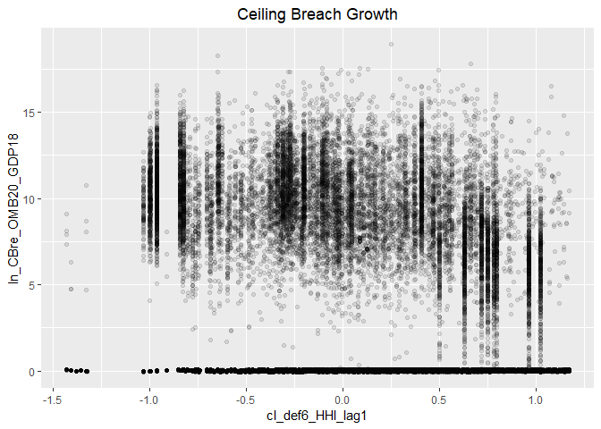<!-- -->

```r
#Model
b_CBre09A <- glm (data=serv_smp,
                 b_CBre ~ cl_def6_HHI_lag1, family=binomial(link="logit"))
display(b_CBre09A)
```

```
## glm(formula = b_CBre ~ cl_def6_HHI_lag1, family = binomial(link = "logit"), 
##     data = serv_smp)
##                  coef.est coef.se
## (Intercept)      -2.77     0.01  
## cl_def6_HHI_lag1  0.08     0.02  
## ---
##   n = 250000, k = 2
##   residual deviance = 111887.6, null deviance = 111909.6 (difference = 22.0)
```

```r
n_CBre09A <- glm(data=serv_breach,
                        ln_CBre_OMB20_GDP18 ~ cl_def6_HHI_lag1)

display(n_CBre09A)
```

```
## glm(formula = ln_CBre_OMB20_GDP18 ~ cl_def6_HHI_lag1, data = serv_breach)
##                  coef.est coef.se
## (Intercept)       9.34     0.01  
## cl_def6_HHI_lag1 -1.76     0.02  
## ---
##   n = 61184, k = 2
##   residual deviance = 391227.8, null deviance = 456211.7 (difference = 64983.9)
##   overdispersion parameter = 6.4
##   residual sd is sqrt(overdispersion) = 2.53
```

```r
#Plot residuals versus fitted
stargazer::stargazer(b_CBre08B,b_CBre09A,
                       
                       n_CBre08B,n_CBre09A,
                       type="text",
                       digits=2)
```

```
## 
## ============================================================================
##                                             Dependent variable:             
##                                ---------------------------------------------
##                                       b_CBre           ln_CBre_OMB20_GDP18  
##                                      logistic                normal         
##                                   (1)        (2)         (3)         (4)    
## ----------------------------------------------------------------------------
## cl_US6_avg_sal_lag1Const        -0.05**                0.25***              
##                                  (0.02)                (0.02)               
##                                                                             
## cl_CFTE                         0.08***                0.23***              
##                                  (0.02)                (0.02)               
##                                                                             
## c_pPBSC                         -0.11***              -0.37***              
##                                  (0.02)                (0.02)               
##                                                                             
## c_pOffPSC                       0.98***               -0.41***              
##                                  (0.02)                (0.02)               
##                                                                             
## c_pairHist                      -0.08***               0.12***              
##                                  (0.02)                (0.02)               
##                                                                             
## cl_pairCA                       -0.07***              -0.16***              
##                                  (0.02)                (0.02)               
##                                                                             
## cl_Ceil                         1.01***                2.89***              
##                                  (0.02)                (0.02)               
##                                                                             
## capped_cl_Days                  0.08***                0.13***              
##                                  (0.02)                (0.02)               
##                                                                             
## Comp1or51 offer                 -0.15***               -0.002               
##                                  (0.03)                (0.03)               
##                                                                             
## Comp1or52-4 offers              0.25***               -0.26***              
##                                  (0.02)                (0.02)               
##                                                                             
## Comp1or55+ offers               0.36***               -0.20***              
##                                  (0.03)                (0.02)               
##                                                                             
## VehS-IDC                        -0.19***               0.15***              
##                                  (0.02)                (0.02)               
##                                                                             
## VehM-IDC                        -0.20***               0.09***              
##                                  (0.03)                (0.02)               
##                                                                             
## VehFSS/GWAC                     -0.50***               0.27***              
##                                  (0.05)                (0.04)               
##                                                                             
## VehBPA/BOA                      -0.44***                0.06                
##                                  (0.06)                (0.05)               
##                                                                             
## PricingUCAOther FP              -0.64***              -0.36***              
##                                  (0.13)                (0.13)               
##                                                                             
## PricingUCAT&M/LH/FPLOE          -0.59***               1.25***              
##                                  (0.07)                (0.06)               
##                                                                             
## PricingUCAIncentive               0.03                 1.03***              
##                                  (0.10)                (0.08)               
##                                                                             
## PricingUCAOther CB              -1.16***               1.37***              
##                                  (0.05)                (0.04)               
##                                                                             
## PricingUCAUCA                    -0.13                 0.66***              
##                                  (0.08)                (0.06)               
##                                                                             
## PricingUCACombination or Other  -0.28***               0.72***              
##                                  (0.08)                (0.07)               
##                                                                             
## CrisisARRA                      0.89***                 -0.04               
##                                  (0.07)                (0.06)               
##                                                                             
## CrisisDis                       0.69***                0.46***              
##                                  (0.16)                (0.13)               
##                                                                             
## CrisisOCO                       -0.34***               0.54***              
##                                  (0.05)                (0.04)               
##                                                                             
## cl_def6_HHI_lag1                           0.08***                -1.76***  
##                                             (0.02)                 (0.02)   
##                                                                             
## Constant                        -2.89***   -2.77***    8.73***     9.34***  
##                                  (0.02)     (0.01)     (0.02)      (0.01)   
##                                                                             
## ----------------------------------------------------------------------------
## Observations                    250,000    250,000     61,184      61,184   
## Log Likelihood                 -51,987.42 -55,943.79 -122,173.30 -143,577.90
## Akaike Inf. Crit.              104,024.80 111,891.60 244,396.60  287,159.70 
## ============================================================================
## Note:                                            *p<0.1; **p<0.05; ***p<0.01
```

```r
summary_residual_compare(b_CBre08B,b_CBre09A, skip_vif = TRUE)
```

```
## debugging in: summary_residual_compare(b_CBre08B, b_CBre09A, skip_vif = TRUE)
## debug: {
##     if (skip_vif == FALSE) 
##         warning("Deprecating VIF. Just use glmer_examine on the models")
##     if (!is.na(bins)) {
##         if ("cl_US6_avg_sal_lag1Const" %in% model_colnames(model1_old) & 
##             "cl_US6_avg_sal_lag1Const" %in% model_colnames(model1_new)) 
##             bins <- bins + 5
##         if ("cl_CFTE" %in% model_colnames(model1_old) & "cl_CFTE" %in% 
##             model_colnames(model1_new)) 
##             bins <- bins + 5
##         if ("c_pPBSC" %in% model_colnames(model1_old) & "c_pPBSC" %in% 
##             model_colnames(model1_new)) 
##             bins <- bins + 5
##         if ("c_pOffPSC" %in% model_colnames(model1_old) & "c_pOffPSC" %in% 
##             model_colnames(model1_new)) 
##             bins <- bins + 5
##         if ("cl_pairCA" %in% model_colnames(model1_old) & "cl_pairCA" %in% 
##             model_colnames(model1_new)) 
##             bins <- bins + 5
##         if ("c_OffCri" %in% model_colnames(model1_old) & "c_OffCri" %in% 
##             model_colnames(model1_new)) 
##             bins <- bins + 5
##         if (("cl_Ceil" %in% model_colnames(model1_old) & "cl_Ceil" %in% 
##             model_colnames(model1_new)) | ("cl_Ceil_Then_Year" %in% 
##             model_colnames(model1_old) & "cl_Ceil_Then_Year" %in% 
##             model_colnames(model1_new))) 
##             bins <- bins + 10
##         if ("cl_Days" %in% model_colnames(model1_old) & "cl_Days" %in% 
##             model_colnames(model1_new)) 
##             bins <- bins + 5
##     }
##     if (!is.null(model2_new)) {
##         gridExtra::grid.arrange(binned_fitted_versus_residuals(model1_old, 
##             bins = bins), binned_fitted_versus_residuals(model1_new, 
##             bins = bins), binned_fitted_versus_residuals(model2_old, 
##             bins = bins), binned_fitted_versus_residuals(model2_new, 
##             bins = bins), ncol = 2)
##         if (!"b_Term" %in% model_colnames(model1_old) & !"b_CBre" %in% 
##             model_colnames(model1_old)) 
##             gridExtra::grid.arrange(resid_plot(model1_old, sample = 25000), 
##                 resid_plot(model1_new, sample = 25000), resid_plot(model2_old, 
##                   sample = 25000), resid_plot(model2_new, sample = 25000), 
##                 ncol = 2)
##         if (!"b_Term" %in% colnames(model1_old) & !"b_CBre" %in% 
##             model_colnames(model1_old)) 
##             gridExtra::grid.arrange(residuals_binned(model1_old, 
##                 bins = bins), residuals_binned(model1_new, bins = bins), 
##                 residuals_binned(model2_old, bins = bins), residuals_binned(model2_new, 
##                   bins = bins), ncol = 2)
##         if ("cl_Ceil" %in% model_colnames(model1_new)) {
##             residual_compare(model1_old, model1_new, model2_old, 
##                 model2_new, "cl_Ceil", "Centered Log(Ceiling)", 
##                 20)
##         }
##         if ("cl_Days" %in% model_colnames(model1_new)) {
##             residual_compare(model1_old, model1_new, model2_old, 
##                 model2_new, "cl_Days", "Centered Log(Days)", 
##                 10)
##         }
##         output <- NULL
##         if (class(model1_new) == "glmerMod" & class(model2_new) == 
##             "glmerMod") {
##             m1t <- getME(model1_new, "theta")
##             m1l <- getME(model1_new, "lower")
##             m2t <- getME(model2_new, "theta")
##             m2l <- getME(model2_new, "lower")
##             output <- list(m1t[m1l == 0], m2t[m2l == 0], model1_new@optinfo$conv$lme4$messages, 
##                 model2_new@optinfo$conv$lme4$messages)
##         }
##         else if ((class(model1_new) != "glmerMod" & class(model2_new) != 
##             "glmerMod") & (class(model1_old) != "glmerMod" & 
##             class(model2_old) != "glmerMod")) {
##             output <- list(rbind(deviance_stats(model1_old, "model1_old"), 
##                 deviance_stats(model1_new, "model1_new"), deviance_stats(model2_old, 
##                   "model2_old"), deviance_stats(model2_new, "model2_new")))
##         }
##     }
##     else if (!is.null(model1_new)) {
##         gridExtra::grid.arrange(binned_fitted_versus_residuals(model1_old, 
##             bins = bins), binned_fitted_versus_residuals(model1_new, 
##             bins = bins), ncol = 2)
##         if (!"b_Term" %in% model_colnames(model1_old) & !"b_CBre" %in% 
##             model_colnames(model1_old)) 
##             gridExtra::grid.arrange(resid_plot(model1_old, sample = 25000), 
##                 resid_plot(model1_new, sample = 25000), ncol = 2)
##         gridExtra::grid.arrange(residuals_binned(model1_old, 
##             bins = bins), residuals_binned(model1_new, bins = bins), 
##             ncol = 2)
##         output <- NULL
##         if (class(model1_new) == "glmerMod") {
##             m1t <- getME(model1_new, "theta")
##             m1l <- getME(model1_new, "lower")
##             output <- list(m1t[m1l == 0], model1_new@optinfo$conv$lme4$messages)
##         }
##         else if (class(model1_new) != "glmerMod" & class(model1_old) != 
##             "glmerMod") {
##             output <- list(rbind(deviance_stats(model1_old, "model1_old"), 
##                 deviance_stats(model1_new, "model1_new")))
##         }
##     }
##     else {
##         if (!is.na(bins)) {
##             if ("cl_US6_avg_sal_lag1Const" %in% model_colnames(model1_old)) 
##                 bins <- bins + 5
##             if ("cl_CFTE" %in% model_colnames(model1_old)) 
##                 bins <- bins + 5
##             if ("c_pPBSC" %in% model_colnames(model1_old)) 
##                 bins <- bins + 5
##             if ("c_pOffPSC" %in% model_colnames(model1_old)) 
##                 bins <- bins + 5
##             if ("cl_pairCA" %in% model_colnames(model1_old)) 
##                 bins <- bins + 5
##             if ("c_OffCri" %in% model_colnames(model1_old)) 
##                 bins <- bins + 5
##             if (("cl_Ceil" %in% model_colnames(model1_old)) | 
##                 ("cl_Ceil_Then_Year" %in% model_colnames(model1_old))) 
##                 bins <- bins + 10
##             if ("cl_Days" %in% model_colnames(model1_old)) 
##                 bins <- bins + 5
##         }
##         if (!"b_Term" %in% model_colnames(model1_old) & !"b_CBre" %in% 
##             model_colnames(model1_old)) 
##             gridExtra::grid.arrange(binned_fitted_versus_residuals(model1_old, 
##                 bins = bins), residuals_binned(model1_old, bins = bins), 
##                 resid_plot(model1_old, sample = 25000))
##         else gridExtra::grid.arrange(binned_fitted_versus_residuals(model1_old, 
##             bins = bins), residuals_binned(model1_old, bins = bins))
##         output <- NULL
##         if (class(model1_old) == "glmerMod") {
##             m1t <- getME(model1_old, "theta")
##             m1l <- getME(model1_old, "lower")
##             output <- list(m1t[m1l == 0], model1_old@optinfo$conv$lme4$messages)
##         }
##         else if (class(model1_old) != "glmerMod" & class(model1_old) != 
##             "glmerMod") {
##             output <- list(deviance_stats(model1_old, "model1_old"))
##         }
##     }
##     output
## }
## debug: if (skip_vif == FALSE) warning("Deprecating VIF. Just use glmer_examine on the models")
## debug: if (!is.na(bins)) {
##     if ("cl_US6_avg_sal_lag1Const" %in% model_colnames(model1_old) & 
##         "cl_US6_avg_sal_lag1Const" %in% model_colnames(model1_new)) 
##         bins <- bins + 5
##     if ("cl_CFTE" %in% model_colnames(model1_old) & "cl_CFTE" %in% 
##         model_colnames(model1_new)) 
##         bins <- bins + 5
##     if ("c_pPBSC" %in% model_colnames(model1_old) & "c_pPBSC" %in% 
##         model_colnames(model1_new)) 
##         bins <- bins + 5
##     if ("c_pOffPSC" %in% model_colnames(model1_old) & "c_pOffPSC" %in% 
##         model_colnames(model1_new)) 
##         bins <- bins + 5
##     if ("cl_pairCA" %in% model_colnames(model1_old) & "cl_pairCA" %in% 
##         model_colnames(model1_new)) 
##         bins <- bins + 5
##     if ("c_OffCri" %in% model_colnames(model1_old) & "c_OffCri" %in% 
##         model_colnames(model1_new)) 
##         bins <- bins + 5
##     if (("cl_Ceil" %in% model_colnames(model1_old) & "cl_Ceil" %in% 
##         model_colnames(model1_new)) | ("cl_Ceil_Then_Year" %in% 
##         model_colnames(model1_old) & "cl_Ceil_Then_Year" %in% 
##         model_colnames(model1_new))) 
##         bins <- bins + 10
##     if ("cl_Days" %in% model_colnames(model1_old) & "cl_Days" %in% 
##         model_colnames(model1_new)) 
##         bins <- bins + 5
## }
## debug: if ("cl_US6_avg_sal_lag1Const" %in% model_colnames(model1_old) & 
##     "cl_US6_avg_sal_lag1Const" %in% model_colnames(model1_new)) bins <- bins + 
##     5
## debug: if ("cl_CFTE" %in% model_colnames(model1_old) & "cl_CFTE" %in% 
##     model_colnames(model1_new)) bins <- bins + 5
## debug: if ("c_pPBSC" %in% model_colnames(model1_old) & "c_pPBSC" %in% 
##     model_colnames(model1_new)) bins <- bins + 5
## debug: if ("c_pOffPSC" %in% model_colnames(model1_old) & "c_pOffPSC" %in% 
##     model_colnames(model1_new)) bins <- bins + 5
## debug: if ("cl_pairCA" %in% model_colnames(model1_old) & "cl_pairCA" %in% 
##     model_colnames(model1_new)) bins <- bins + 5
## debug: if ("c_OffCri" %in% model_colnames(model1_old) & "c_OffCri" %in% 
##     model_colnames(model1_new)) bins <- bins + 5
## debug: if (("cl_Ceil" %in% model_colnames(model1_old) & "cl_Ceil" %in% 
##     model_colnames(model1_new)) | ("cl_Ceil_Then_Year" %in% model_colnames(model1_old) & 
##     "cl_Ceil_Then_Year" %in% model_colnames(model1_new))) bins <- bins + 
##     10
## debug: if ("cl_Days" %in% model_colnames(model1_old) & "cl_Days" %in% 
##     model_colnames(model1_new)) bins <- bins + 5
## debug: if (!is.null(model2_new)) {
##     gridExtra::grid.arrange(binned_fitted_versus_residuals(model1_old, 
##         bins = bins), binned_fitted_versus_residuals(model1_new, 
##         bins = bins), binned_fitted_versus_residuals(model2_old, 
##         bins = bins), binned_fitted_versus_residuals(model2_new, 
##         bins = bins), ncol = 2)
##     if (!"b_Term" %in% model_colnames(model1_old) & !"b_CBre" %in% 
##         model_colnames(model1_old)) 
##         gridExtra::grid.arrange(resid_plot(model1_old, sample = 25000), 
##             resid_plot(model1_new, sample = 25000), resid_plot(model2_old, 
##                 sample = 25000), resid_plot(model2_new, sample = 25000), 
##             ncol = 2)
##     if (!"b_Term" %in% colnames(model1_old) & !"b_CBre" %in% 
##         model_colnames(model1_old)) 
##         gridExtra::grid.arrange(residuals_binned(model1_old, 
##             bins = bins), residuals_binned(model1_new, bins = bins), 
##             residuals_binned(model2_old, bins = bins), residuals_binned(model2_new, 
##                 bins = bins), ncol = 2)
##     if ("cl_Ceil" %in% model_colnames(model1_new)) {
##         residual_compare(model1_old, model1_new, model2_old, 
##             model2_new, "cl_Ceil", "Centered Log(Ceiling)", 20)
##     }
##     if ("cl_Days" %in% model_colnames(model1_new)) {
##         residual_compare(model1_old, model1_new, model2_old, 
##             model2_new, "cl_Days", "Centered Log(Days)", 10)
##     }
##     output <- NULL
##     if (class(model1_new) == "glmerMod" & class(model2_new) == 
##         "glmerMod") {
##         m1t <- getME(model1_new, "theta")
##         m1l <- getME(model1_new, "lower")
##         m2t <- getME(model2_new, "theta")
##         m2l <- getME(model2_new, "lower")
##         output <- list(m1t[m1l == 0], m2t[m2l == 0], model1_new@optinfo$conv$lme4$messages, 
##             model2_new@optinfo$conv$lme4$messages)
##     }
##     else if ((class(model1_new) != "glmerMod" & class(model2_new) != 
##         "glmerMod") & (class(model1_old) != "glmerMod" & class(model2_old) != 
##         "glmerMod")) {
##         output <- list(rbind(deviance_stats(model1_old, "model1_old"), 
##             deviance_stats(model1_new, "model1_new"), deviance_stats(model2_old, 
##                 "model2_old"), deviance_stats(model2_new, "model2_new")))
##     }
## } else if (!is.null(model1_new)) {
##     gridExtra::grid.arrange(binned_fitted_versus_residuals(model1_old, 
##         bins = bins), binned_fitted_versus_residuals(model1_new, 
##         bins = bins), ncol = 2)
##     if (!"b_Term" %in% model_colnames(model1_old) & !"b_CBre" %in% 
##         model_colnames(model1_old)) 
##         gridExtra::grid.arrange(resid_plot(model1_old, sample = 25000), 
##             resid_plot(model1_new, sample = 25000), ncol = 2)
##     gridExtra::grid.arrange(residuals_binned(model1_old, bins = bins), 
##         residuals_binned(model1_new, bins = bins), ncol = 2)
##     output <- NULL
##     if (class(model1_new) == "glmerMod") {
##         m1t <- getME(model1_new, "theta")
##         m1l <- getME(model1_new, "lower")
##         output <- list(m1t[m1l == 0], model1_new@optinfo$conv$lme4$messages)
##     }
##     else if (class(model1_new) != "glmerMod" & class(model1_old) != 
##         "glmerMod") {
##         output <- list(rbind(deviance_stats(model1_old, "model1_old"), 
##             deviance_stats(model1_new, "model1_new")))
##     }
## } else {
##     if (!is.na(bins)) {
##         if ("cl_US6_avg_sal_lag1Const" %in% model_colnames(model1_old)) 
##             bins <- bins + 5
##         if ("cl_CFTE" %in% model_colnames(model1_old)) 
##             bins <- bins + 5
##         if ("c_pPBSC" %in% model_colnames(model1_old)) 
##             bins <- bins + 5
##         if ("c_pOffPSC" %in% model_colnames(model1_old)) 
##             bins <- bins + 5
##         if ("cl_pairCA" %in% model_colnames(model1_old)) 
##             bins <- bins + 5
##         if ("c_OffCri" %in% model_colnames(model1_old)) 
##             bins <- bins + 5
##         if (("cl_Ceil" %in% model_colnames(model1_old)) | ("cl_Ceil_Then_Year" %in% 
##             model_colnames(model1_old))) 
##             bins <- bins + 10
##         if ("cl_Days" %in% model_colnames(model1_old)) 
##             bins <- bins + 5
##     }
##     if (!"b_Term" %in% model_colnames(model1_old) & !"b_CBre" %in% 
##         model_colnames(model1_old)) 
##         gridExtra::grid.arrange(binned_fitted_versus_residuals(model1_old, 
##             bins = bins), residuals_binned(model1_old, bins = bins), 
##             resid_plot(model1_old, sample = 25000))
##     else gridExtra::grid.arrange(binned_fitted_versus_residuals(model1_old, 
##         bins = bins), residuals_binned(model1_old, bins = bins))
##     output <- NULL
##     if (class(model1_old) == "glmerMod") {
##         m1t <- getME(model1_old, "theta")
##         m1l <- getME(model1_old, "lower")
##         output <- list(m1t[m1l == 0], model1_old@optinfo$conv$lme4$messages)
##     }
##     else if (class(model1_old) != "glmerMod" & class(model1_old) != 
##         "glmerMod") {
##         output <- list(deviance_stats(model1_old, "model1_old"))
##     }
## }
## debug: if (!is.null(model1_new)) {
##     gridExtra::grid.arrange(binned_fitted_versus_residuals(model1_old, 
##         bins = bins), binned_fitted_versus_residuals(model1_new, 
##         bins = bins), ncol = 2)
##     if (!"b_Term" %in% model_colnames(model1_old) & !"b_CBre" %in% 
##         model_colnames(model1_old)) 
##         gridExtra::grid.arrange(resid_plot(model1_old, sample = 25000), 
##             resid_plot(model1_new, sample = 25000), ncol = 2)
##     gridExtra::grid.arrange(residuals_binned(model1_old, bins = bins), 
##         residuals_binned(model1_new, bins = bins), ncol = 2)
##     output <- NULL
##     if (class(model1_new) == "glmerMod") {
##         m1t <- getME(model1_new, "theta")
##         m1l <- getME(model1_new, "lower")
##         output <- list(m1t[m1l == 0], model1_new@optinfo$conv$lme4$messages)
##     }
##     else if (class(model1_new) != "glmerMod" & class(model1_old) != 
##         "glmerMod") {
##         output <- list(rbind(deviance_stats(model1_old, "model1_old"), 
##             deviance_stats(model1_new, "model1_new")))
##     }
## } else {
##     if (!is.na(bins)) {
##         if ("cl_US6_avg_sal_lag1Const" %in% model_colnames(model1_old)) 
##             bins <- bins + 5
##         if ("cl_CFTE" %in% model_colnames(model1_old)) 
##             bins <- bins + 5
##         if ("c_pPBSC" %in% model_colnames(model1_old)) 
##             bins <- bins + 5
##         if ("c_pOffPSC" %in% model_colnames(model1_old)) 
##             bins <- bins + 5
##         if ("cl_pairCA" %in% model_colnames(model1_old)) 
##             bins <- bins + 5
##         if ("c_OffCri" %in% model_colnames(model1_old)) 
##             bins <- bins + 5
##         if (("cl_Ceil" %in% model_colnames(model1_old)) | ("cl_Ceil_Then_Year" %in% 
##             model_colnames(model1_old))) 
##             bins <- bins + 10
##         if ("cl_Days" %in% model_colnames(model1_old)) 
##             bins <- bins + 5
##     }
##     if (!"b_Term" %in% model_colnames(model1_old) & !"b_CBre" %in% 
##         model_colnames(model1_old)) 
##         gridExtra::grid.arrange(binned_fitted_versus_residuals(model1_old, 
##             bins = bins), residuals_binned(model1_old, bins = bins), 
##             resid_plot(model1_old, sample = 25000))
##     else gridExtra::grid.arrange(binned_fitted_versus_residuals(model1_old, 
##         bins = bins), residuals_binned(model1_old, bins = bins))
##     output <- NULL
##     if (class(model1_old) == "glmerMod") {
##         m1t <- getME(model1_old, "theta")
##         m1l <- getME(model1_old, "lower")
##         output <- list(m1t[m1l == 0], model1_old@optinfo$conv$lme4$messages)
##     }
##     else if (class(model1_old) != "glmerMod" & class(model1_old) != 
##         "glmerMod") {
##         output <- list(deviance_stats(model1_old, "model1_old"))
##     }
## }
## debug: gridExtra::grid.arrange(binned_fitted_versus_residuals(model1_old, 
##     bins = bins), binned_fitted_versus_residuals(model1_new, 
##     bins = bins), ncol = 2)
```

<!-- -->

```
## debug: if (!"b_Term" %in% model_colnames(model1_old) & !"b_CBre" %in% 
##     model_colnames(model1_old)) gridExtra::grid.arrange(resid_plot(model1_old, 
##     sample = 25000), resid_plot(model1_new, sample = 25000), 
##     ncol = 2)
## debug: gridExtra::grid.arrange(residuals_binned(model1_old, bins = bins), 
##     residuals_binned(model1_new, bins = bins), ncol = 2)
```

```
## debug: output <- NULL
## debug: if (class(model1_new) == "glmerMod") {
##     m1t <- getME(model1_new, "theta")
##     m1l <- getME(model1_new, "lower")
##     output <- list(m1t[m1l == 0], model1_new@optinfo$conv$lme4$messages)
## } else if (class(model1_new) != "glmerMod" & class(model1_old) != 
##     "glmerMod") {
##     output <- list(rbind(deviance_stats(model1_old, "model1_old"), 
##         deviance_stats(model1_new, "model1_new")))
## }
```

```
## Warning in if (class(model1_new) == "glmerMod") {: the condition has length
## > 1 and only the first element will be used
```

```
## debug: if (class(model1_new) != "glmerMod" & class(model1_old) != "glmerMod") {
##     output <- list(rbind(deviance_stats(model1_old, "model1_old"), 
##         deviance_stats(model1_new, "model1_new")))
## }
```

```
## Warning in if (class(model1_new) != "glmerMod" & class(model1_old) !=
## "glmerMod") {: the condition has length > 1 and only the first element will
## be used
```

<!-- -->

```
## debug: output <- list(rbind(deviance_stats(model1_old, "model1_old"), 
##     deviance_stats(model1_new, "model1_new")))
## debug: output
## exiting from: summary_residual_compare(b_CBre08B, b_CBre09A, skip_vif = TRUE)
```

```
## [[1]]
##        model deviance null.deviance difference
## 1 model1_old 103974.8      111909.6  7934.7483
## 2 model1_new 111887.6      111909.6    22.0174
```

Expected direction for ceiling breach and termination, but no real results on options.

#### Model 09B: Defense to Overall ratio
The higher the ratio of defense obligations to reciepts in the overall economy, the DoD holds a monosopy over a sector. Given the challenges of monosopy, the a higher ratio estimates a greater  risk of ceiling breaches.

Ratio Def. obligatons : US revenue	cl_def6_obl_lag1+		+	-	-


```r
#Frequency Plot for unlogged ceiling
      summary_continuous_plot(serv_smp1m,metric="cbre","def6_ratio_lag1")
```

```
## Warning in `[<-.factor`(`*tmp*`, ri, value = c(0, 0, 0, 0, 0, 0, 0, 0, 0, :
## invalid factor level, NA generated
```

<!-- -->

```r
      summary_continuous_plot(serv_smp1m,metric="cbre","cl_def6_ratio_lag1")
```

```
## Warning in `[<-.factor`(`*tmp*`, ri, value = c(0, 0, 0, 0, 0, 0, 0, 0, 0, :
## invalid factor level, NA generated
```

<!-- -->

```r
#Scatter Plot
ggplot(serv_smp, aes(x=cl_def6_ratio_lag1, y=ln_CBre_OMB20_GDP18)) + geom_point(alpha = 0.1) + ggtitle('Ceiling Breach Growth') + theme(plot.title = element_text(hjust = 0.5))
```

<!-- -->

```r
#Model
b_CBre09B <- glm (data=serv_smp,
                 b_CBre ~ cl_def6_ratio_lag1, family=binomial(link="logit"))
display(b_CBre09B)
```

```
## glm(formula = b_CBre ~ cl_def6_ratio_lag1, family = binomial(link = "logit"), 
##     data = serv_smp)
##                    coef.est coef.se
## (Intercept)        -2.77     0.01  
## cl_def6_ratio_lag1  0.03     0.02  
## ---
##   n = 250000, k = 2
##   residual deviance = 111907.0, null deviance = 111909.6 (difference = 2.5)
```

```r
n_CBre09B <- glm(data=serv_breach,
                        ln_CBre_OMB20_GDP18 ~ cl_def6_ratio_lag1)

display(n_CBre09B)
```

```
## glm(formula = ln_CBre_OMB20_GDP18 ~ cl_def6_ratio_lag1, data = serv_breach)
##                    coef.est coef.se
## (Intercept)        9.31     0.01   
## cl_def6_ratio_lag1 0.18     0.03   
## ---
##   n = 61184, k = 2
##   residual deviance = 455867.1, null deviance = 456211.7 (difference = 344.7)
##   overdispersion parameter = 7.5
##   residual sd is sqrt(overdispersion) = 2.73
```

```r
#Plot residuals versus fitted
stargazer::stargazer(b_CBre08B,b_CBre09A,b_CBre09B,
                       
                       n_CBre08B,n_CBre09A,n_CBre09B,
                       type="text",
                       digits=2)
```

```
## 
## ===================================================================================================
##                                                        Dependent variable:                         
##                                --------------------------------------------------------------------
##                                             b_CBre                      ln_CBre_OMB20_GDP18        
##                                            logistic                           normal               
##                                   (1)        (2)        (3)         (4)         (5)         (6)    
## ---------------------------------------------------------------------------------------------------
## cl_US6_avg_sal_lag1Const        -0.05**                           0.25***                          
##                                  (0.02)                           (0.02)                           
##                                                                                                    
## cl_CFTE                         0.08***                           0.23***                          
##                                  (0.02)                           (0.02)                           
##                                                                                                    
## c_pPBSC                         -0.11***                         -0.37***                          
##                                  (0.02)                           (0.02)                           
##                                                                                                    
## c_pOffPSC                       0.98***                          -0.41***                          
##                                  (0.02)                           (0.02)                           
##                                                                                                    
## c_pairHist                      -0.08***                          0.12***                          
##                                  (0.02)                           (0.02)                           
##                                                                                                    
## cl_pairCA                       -0.07***                         -0.16***                          
##                                  (0.02)                           (0.02)                           
##                                                                                                    
## cl_Ceil                         1.01***                           2.89***                          
##                                  (0.02)                           (0.02)                           
##                                                                                                    
## capped_cl_Days                  0.08***                           0.13***                          
##                                  (0.02)                           (0.02)                           
##                                                                                                    
## Comp1or51 offer                 -0.15***                          -0.002                           
##                                  (0.03)                           (0.03)                           
##                                                                                                    
## Comp1or52-4 offers              0.25***                          -0.26***                          
##                                  (0.02)                           (0.02)                           
##                                                                                                    
## Comp1or55+ offers               0.36***                          -0.20***                          
##                                  (0.03)                           (0.02)                           
##                                                                                                    
## VehS-IDC                        -0.19***                          0.15***                          
##                                  (0.02)                           (0.02)                           
##                                                                                                    
## VehM-IDC                        -0.20***                          0.09***                          
##                                  (0.03)                           (0.02)                           
##                                                                                                    
## VehFSS/GWAC                     -0.50***                          0.27***                          
##                                  (0.05)                           (0.04)                           
##                                                                                                    
## VehBPA/BOA                      -0.44***                           0.06                            
##                                  (0.06)                           (0.05)                           
##                                                                                                    
## PricingUCAOther FP              -0.64***                         -0.36***                          
##                                  (0.13)                           (0.13)                           
##                                                                                                    
## PricingUCAT&M/LH/FPLOE          -0.59***                          1.25***                          
##                                  (0.07)                           (0.06)                           
##                                                                                                    
## PricingUCAIncentive               0.03                            1.03***                          
##                                  (0.10)                           (0.08)                           
##                                                                                                    
## PricingUCAOther CB              -1.16***                          1.37***                          
##                                  (0.05)                           (0.04)                           
##                                                                                                    
## PricingUCAUCA                    -0.13                            0.66***                          
##                                  (0.08)                           (0.06)                           
##                                                                                                    
## PricingUCACombination or Other  -0.28***                          0.72***                          
##                                  (0.08)                           (0.07)                           
##                                                                                                    
## CrisisARRA                      0.89***                            -0.04                           
##                                  (0.07)                           (0.06)                           
##                                                                                                    
## CrisisDis                       0.69***                           0.46***                          
##                                  (0.16)                           (0.13)                           
##                                                                                                    
## CrisisOCO                       -0.34***                          0.54***                          
##                                  (0.05)                           (0.04)                           
##                                                                                                    
## cl_def6_HHI_lag1                           0.08***                           -1.76***              
##                                             (0.02)                            (0.02)               
##                                                                                                    
## cl_def6_ratio_lag1                                      0.03                              0.18***  
##                                                        (0.02)                             (0.03)   
##                                                                                                    
## Constant                        -2.89***   -2.77***   -2.77***    8.73***     9.34***     9.31***  
##                                  (0.02)     (0.01)     (0.01)     (0.02)      (0.01)      (0.01)   
##                                                                                                    
## ---------------------------------------------------------------------------------------------------
## Observations                    250,000    250,000    250,000     61,184      61,184      61,184   
## Log Likelihood                 -51,987.42 -55,943.79 -55,953.52 -122,173.30 -143,577.90 -148,255.70
## Akaike Inf. Crit.              104,024.80 111,891.60 111,911.00 244,396.60  287,159.70  296,515.50 
## ===================================================================================================
## Note:                                                                   *p<0.1; **p<0.05; ***p<0.01
```

```r
#summary_residual_compare(b_CBre08B,b_CBre09B)
#summary_residual_compare(b_CBre09A,b_CBre09B)
```


#### Model 09C: Defense Obligations
Defense obligations (logged)	cl_def6_ratio_lag1+		-	-	+


```r
#Frequency Plot for unlogged ceiling
      summary_continuous_plot(serv_smp1m,metric="cbre","def6_obl_lag1Const")
```

```
## Warning in `[<-.factor`(`*tmp*`, ri, value = c(0, 0, 0, 0, 0, 0, 0, 0, 0, :
## invalid factor level, NA generated
```

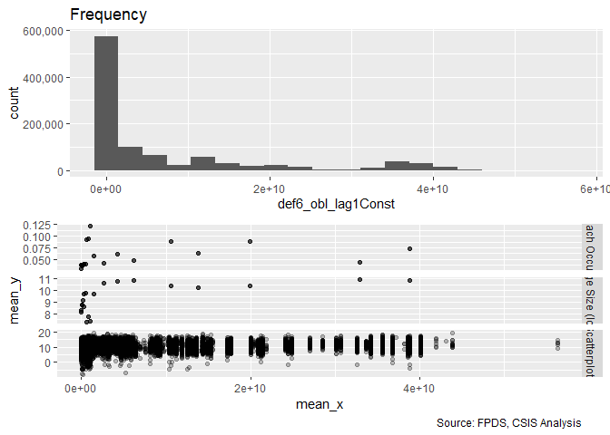<!-- -->

```r
      summary_continuous_plot(serv_smp1m,metric="cbre","cl_def6_obl_lag1Const")
```

```
## Warning in `[<-.factor`(`*tmp*`, ri, value = c(0, 0, 0, 0, 0, 0, 0, 0, 0, :
## invalid factor level, NA generated
```

<!-- -->

```r
#Scatter Plot
ggplot(serv_smp, aes(x=cl_def6_obl_lag1Const, y=ln_CBre_OMB20_GDP18)) + geom_point(alpha = 0.1) + ggtitle('Ceiling Breach Growth') + theme(plot.title = element_text(hjust = 0.5))
```

<!-- -->

```r
#Model
b_CBre09C <- glm (data=serv_smp,
                 b_CBre ~ cl_def6_obl_lag1Const, family=binomial(link="logit"))
display(b_CBre09C)
```

```
## glm(formula = b_CBre ~ cl_def6_obl_lag1Const, family = binomial(link = "logit"), 
##     data = serv_smp)
##                       coef.est coef.se
## (Intercept)           -2.80     0.01  
## cl_def6_obl_lag1Const  0.46     0.02  
## ---
##   n = 250000, k = 2
##   residual deviance = 111239.6, null deviance = 111909.6 (difference = 670.0)
```

```r
n_CBre09C <- glm(data=serv_breach,
                        ln_CBre_OMB20_GDP18 ~ cl_def6_obl_lag1Const)

display(n_CBre09C)
```

```
## glm(formula = ln_CBre_OMB20_GDP18 ~ cl_def6_obl_lag1Const, data = serv_breach)
##                       coef.est coef.se
## (Intercept)           9.10     0.01   
## cl_def6_obl_lag1Const 1.97     0.02   
## ---
##   n = 61184, k = 2
##   residual deviance = 410369.2, null deviance = 456211.7 (difference = 45842.5)
##   overdispersion parameter = 6.7
##   residual sd is sqrt(overdispersion) = 2.59
```

```r
#Plot residuals versus fitted
stargazer::stargazer(b_CBre09A,b_CBre09B,b_CBre09C,
                       
                       n_CBre09A,n_CBre09B,n_CBre09C,
                       type="text",
                       digits=2)
```

```
## 
## ==========================================================================================
##                                               Dependent variable:                         
##                       --------------------------------------------------------------------
##                                    b_CBre                      ln_CBre_OMB20_GDP18        
##                                   logistic                           normal               
##                          (1)        (2)        (3)         (4)         (5)         (6)    
## ------------------------------------------------------------------------------------------
## cl_def6_HHI_lag1       0.08***                          -1.76***                          
##                         (0.02)                           (0.02)                           
##                                                                                           
## cl_def6_ratio_lag1                  0.03                             0.18***              
##                                    (0.02)                            (0.03)               
##                                                                                           
## cl_def6_obl_lag1Const                        0.46***                             1.97***  
##                                               (0.02)                             (0.02)   
##                                                                                           
## Constant               -2.77***   -2.77***   -2.80***    9.34***     9.31***     9.10***  
##                         (0.01)     (0.01)     (0.01)     (0.01)      (0.01)      (0.01)   
##                                                                                           
## ------------------------------------------------------------------------------------------
## Observations           250,000    250,000    250,000     61,184      61,184      61,184   
## Log Likelihood        -55,943.79 -55,953.52 -55,619.78 -143,577.90 -148,255.70 -145,039.20
## Akaike Inf. Crit.     111,891.60 111,911.00 111,243.60 287,159.70  296,515.50  290,082.30 
## ==========================================================================================
## Note:                                                          *p<0.1; **p<0.05; ***p<0.01
```

```r
#summary_residual_compare(b_CBre08B,b_CBre09C)
#summary_residual_compare(b_CBre09A,b_CBre09C)
#summary_residual_compare(b_CBre09B,b_CBre09C)
```

Contrary to expectation. for termination and options.

#### Model 09D: NAICS 6 Combined
Consolidation at lessa nd more granular levels may have different effects. Efficiencies are often used to describe sectors, like utilities, with high barriers to entry. Many of these aspects seem like they would already be captured at less granular NAICS levels, e.g. power plants, rather than more specific NAICS levels, like solar vs. coal. As a result, consolidation for more granular NAICS codes should estimate higher rates of ceiling breaches compared to less granular NAICS code.

We'll start by adding in everything from both models and seeing what violates VIF.

```r
#Frequency Plot for unlogged ceiling


#Model
b_CBre09D <- glm (data=serv_smp,
                 b_CBre ~ cl_def6_HHI_lag1+cl_def6_ratio_lag1+cl_def6_obl_lag1Const
                 , family=binomial(link="logit"))
glmer_examine(b_CBre09D)
```

```
##      cl_def6_HHI_lag1    cl_def6_ratio_lag1 cl_def6_obl_lag1Const 
##              1.244389              1.519725              1.513021
```

```r
n_CBre09D <- glm(data=serv_breach,
                        ln_CBre_OMB20_GDP18 ~ cl_def6_HHI_lag1+cl_def6_ratio_lag1)

glmer_examine(n_CBre09D)
```

```
##   cl_def6_HHI_lag1 cl_def6_ratio_lag1 
##           1.057517           1.057517
```

```r
b_CBre09D2 <- glm (data=serv_smp,
                 b_CBre ~ cl_def6_HHI_lag1+cl_def6_ratio_lag1
                 , family=binomial(link="logit"))
glmer_examine(b_CBre09D2)
```

```
##   cl_def6_HHI_lag1 cl_def6_ratio_lag1 
##           1.047777           1.047777
```

```r
n_CBre09D2 <- glm(data=serv_breach,
                        ln_CBre_OMB20_GDP18 ~ cl_def6_HHI_lag1+cl_def6_ratio_lag1)

glmer_examine(n_CBre09D2)
```

```
##   cl_def6_HHI_lag1 cl_def6_ratio_lag1 
##           1.057517           1.057517
```

```r
#Plot residuals versus fitted
stargazer::stargazer(b_CBre09D,b_CBre09D2,
                     
                     n_CBre09D,n_CBre09D2,
                       type="text",
                       digits=2)
```

```
## 
## ===================================================================
##                                    Dependent variable:             
##                       ---------------------------------------------
##                              b_CBre           ln_CBre_OMB20_GDP18  
##                             logistic                normal         
##                          (1)        (2)         (3)         (4)    
## -------------------------------------------------------------------
## cl_def6_HHI_lag1       0.30***    0.08***    -1.89***    -1.89***  
##                         (0.02)     (0.02)     (0.02)      (0.02)   
##                                                                    
## cl_def6_ratio_lag1     -0.42***     0.01      0.78***     0.78***  
##                         (0.03)     (0.02)     (0.02)      (0.02)   
##                                                                    
## cl_def6_obl_lag1Const  0.68***                                     
##                         (0.02)                                     
##                                                                    
## Constant               -2.81***   -2.77***    9.34***     9.34***  
##                         (0.01)     (0.01)     (0.01)      (0.01)   
##                                                                    
## -------------------------------------------------------------------
## Observations           250,000    250,000     61,184      61,184   
## Log Likelihood        -55,447.13 -55,943.60 -143,070.40 -143,070.40
## Akaike Inf. Crit.     110,902.30 111,893.20 286,146.70  286,146.70 
## ===================================================================
## Note:                                   *p<0.1; **p<0.05; ***p<0.01
```

```r
summary_residual_compare(b_CBre09D,b_CBre09D2)
```

```
## debugging in: summary_residual_compare(b_CBre09D, b_CBre09D2)
## debug: {
##     if (skip_vif == FALSE) 
##         warning("Deprecating VIF. Just use glmer_examine on the models")
##     if (!is.na(bins)) {
##         if ("cl_US6_avg_sal_lag1Const" %in% model_colnames(model1_old) & 
##             "cl_US6_avg_sal_lag1Const" %in% model_colnames(model1_new)) 
##             bins <- bins + 5
##         if ("cl_CFTE" %in% model_colnames(model1_old) & "cl_CFTE" %in% 
##             model_colnames(model1_new)) 
##             bins <- bins + 5
##         if ("c_pPBSC" %in% model_colnames(model1_old) & "c_pPBSC" %in% 
##             model_colnames(model1_new)) 
##             bins <- bins + 5
##         if ("c_pOffPSC" %in% model_colnames(model1_old) & "c_pOffPSC" %in% 
##             model_colnames(model1_new)) 
##             bins <- bins + 5
##         if ("cl_pairCA" %in% model_colnames(model1_old) & "cl_pairCA" %in% 
##             model_colnames(model1_new)) 
##             bins <- bins + 5
##         if ("c_OffCri" %in% model_colnames(model1_old) & "c_OffCri" %in% 
##             model_colnames(model1_new)) 
##             bins <- bins + 5
##         if (("cl_Ceil" %in% model_colnames(model1_old) & "cl_Ceil" %in% 
##             model_colnames(model1_new)) | ("cl_Ceil_Then_Year" %in% 
##             model_colnames(model1_old) & "cl_Ceil_Then_Year" %in% 
##             model_colnames(model1_new))) 
##             bins <- bins + 10
##         if ("cl_Days" %in% model_colnames(model1_old) & "cl_Days" %in% 
##             model_colnames(model1_new)) 
##             bins <- bins + 5
##     }
##     if (!is.null(model2_new)) {
##         gridExtra::grid.arrange(binned_fitted_versus_residuals(model1_old, 
##             bins = bins), binned_fitted_versus_residuals(model1_new, 
##             bins = bins), binned_fitted_versus_residuals(model2_old, 
##             bins = bins), binned_fitted_versus_residuals(model2_new, 
##             bins = bins), ncol = 2)
##         if (!"b_Term" %in% model_colnames(model1_old) & !"b_CBre" %in% 
##             model_colnames(model1_old)) 
##             gridExtra::grid.arrange(resid_plot(model1_old, sample = 25000), 
##                 resid_plot(model1_new, sample = 25000), resid_plot(model2_old, 
##                   sample = 25000), resid_plot(model2_new, sample = 25000), 
##                 ncol = 2)
##         if (!"b_Term" %in% colnames(model1_old) & !"b_CBre" %in% 
##             model_colnames(model1_old)) 
##             gridExtra::grid.arrange(residuals_binned(model1_old, 
##                 bins = bins), residuals_binned(model1_new, bins = bins), 
##                 residuals_binned(model2_old, bins = bins), residuals_binned(model2_new, 
##                   bins = bins), ncol = 2)
##         if ("cl_Ceil" %in% model_colnames(model1_new)) {
##             residual_compare(model1_old, model1_new, model2_old, 
##                 model2_new, "cl_Ceil", "Centered Log(Ceiling)", 
##                 20)
##         }
##         if ("cl_Days" %in% model_colnames(model1_new)) {
##             residual_compare(model1_old, model1_new, model2_old, 
##                 model2_new, "cl_Days", "Centered Log(Days)", 
##                 10)
##         }
##         output <- NULL
##         if (class(model1_new) == "glmerMod" & class(model2_new) == 
##             "glmerMod") {
##             m1t <- getME(model1_new, "theta")
##             m1l <- getME(model1_new, "lower")
##             m2t <- getME(model2_new, "theta")
##             m2l <- getME(model2_new, "lower")
##             output <- list(m1t[m1l == 0], m2t[m2l == 0], model1_new@optinfo$conv$lme4$messages, 
##                 model2_new@optinfo$conv$lme4$messages)
##         }
##         else if ((class(model1_new) != "glmerMod" & class(model2_new) != 
##             "glmerMod") & (class(model1_old) != "glmerMod" & 
##             class(model2_old) != "glmerMod")) {
##             output <- list(rbind(deviance_stats(model1_old, "model1_old"), 
##                 deviance_stats(model1_new, "model1_new"), deviance_stats(model2_old, 
##                   "model2_old"), deviance_stats(model2_new, "model2_new")))
##         }
##     }
##     else if (!is.null(model1_new)) {
##         gridExtra::grid.arrange(binned_fitted_versus_residuals(model1_old, 
##             bins = bins), binned_fitted_versus_residuals(model1_new, 
##             bins = bins), ncol = 2)
##         if (!"b_Term" %in% model_colnames(model1_old) & !"b_CBre" %in% 
##             model_colnames(model1_old)) 
##             gridExtra::grid.arrange(resid_plot(model1_old, sample = 25000), 
##                 resid_plot(model1_new, sample = 25000), ncol = 2)
##         gridExtra::grid.arrange(residuals_binned(model1_old, 
##             bins = bins), residuals_binned(model1_new, bins = bins), 
##             ncol = 2)
##         output <- NULL
##         if (class(model1_new) == "glmerMod") {
##             m1t <- getME(model1_new, "theta")
##             m1l <- getME(model1_new, "lower")
##             output <- list(m1t[m1l == 0], model1_new@optinfo$conv$lme4$messages)
##         }
##         else if (class(model1_new) != "glmerMod" & class(model1_old) != 
##             "glmerMod") {
##             output <- list(rbind(deviance_stats(model1_old, "model1_old"), 
##                 deviance_stats(model1_new, "model1_new")))
##         }
##     }
##     else {
##         if (!is.na(bins)) {
##             if ("cl_US6_avg_sal_lag1Const" %in% model_colnames(model1_old)) 
##                 bins <- bins + 5
##             if ("cl_CFTE" %in% model_colnames(model1_old)) 
##                 bins <- bins + 5
##             if ("c_pPBSC" %in% model_colnames(model1_old)) 
##                 bins <- bins + 5
##             if ("c_pOffPSC" %in% model_colnames(model1_old)) 
##                 bins <- bins + 5
##             if ("cl_pairCA" %in% model_colnames(model1_old)) 
##                 bins <- bins + 5
##             if ("c_OffCri" %in% model_colnames(model1_old)) 
##                 bins <- bins + 5
##             if (("cl_Ceil" %in% model_colnames(model1_old)) | 
##                 ("cl_Ceil_Then_Year" %in% model_colnames(model1_old))) 
##                 bins <- bins + 10
##             if ("cl_Days" %in% model_colnames(model1_old)) 
##                 bins <- bins + 5
##         }
##         if (!"b_Term" %in% model_colnames(model1_old) & !"b_CBre" %in% 
##             model_colnames(model1_old)) 
##             gridExtra::grid.arrange(binned_fitted_versus_residuals(model1_old, 
##                 bins = bins), residuals_binned(model1_old, bins = bins), 
##                 resid_plot(model1_old, sample = 25000))
##         else gridExtra::grid.arrange(binned_fitted_versus_residuals(model1_old, 
##             bins = bins), residuals_binned(model1_old, bins = bins))
##         output <- NULL
##         if (class(model1_old) == "glmerMod") {
##             m1t <- getME(model1_old, "theta")
##             m1l <- getME(model1_old, "lower")
##             output <- list(m1t[m1l == 0], model1_old@optinfo$conv$lme4$messages)
##         }
##         else if (class(model1_old) != "glmerMod" & class(model1_old) != 
##             "glmerMod") {
##             output <- list(deviance_stats(model1_old, "model1_old"))
##         }
##     }
##     output
## }
## debug: if (skip_vif == FALSE) warning("Deprecating VIF. Just use glmer_examine on the models")
## debug: if (!is.na(bins)) {
##     if ("cl_US6_avg_sal_lag1Const" %in% model_colnames(model1_old) & 
##         "cl_US6_avg_sal_lag1Const" %in% model_colnames(model1_new)) 
##         bins <- bins + 5
##     if ("cl_CFTE" %in% model_colnames(model1_old) & "cl_CFTE" %in% 
##         model_colnames(model1_new)) 
##         bins <- bins + 5
##     if ("c_pPBSC" %in% model_colnames(model1_old) & "c_pPBSC" %in% 
##         model_colnames(model1_new)) 
##         bins <- bins + 5
##     if ("c_pOffPSC" %in% model_colnames(model1_old) & "c_pOffPSC" %in% 
##         model_colnames(model1_new)) 
##         bins <- bins + 5
##     if ("cl_pairCA" %in% model_colnames(model1_old) & "cl_pairCA" %in% 
##         model_colnames(model1_new)) 
##         bins <- bins + 5
##     if ("c_OffCri" %in% model_colnames(model1_old) & "c_OffCri" %in% 
##         model_colnames(model1_new)) 
##         bins <- bins + 5
##     if (("cl_Ceil" %in% model_colnames(model1_old) & "cl_Ceil" %in% 
##         model_colnames(model1_new)) | ("cl_Ceil_Then_Year" %in% 
##         model_colnames(model1_old) & "cl_Ceil_Then_Year" %in% 
##         model_colnames(model1_new))) 
##         bins <- bins + 10
##     if ("cl_Days" %in% model_colnames(model1_old) & "cl_Days" %in% 
##         model_colnames(model1_new)) 
##         bins <- bins + 5
## }
## debug: if ("cl_US6_avg_sal_lag1Const" %in% model_colnames(model1_old) & 
##     "cl_US6_avg_sal_lag1Const" %in% model_colnames(model1_new)) bins <- bins + 
##     5
## debug: if ("cl_CFTE" %in% model_colnames(model1_old) & "cl_CFTE" %in% 
##     model_colnames(model1_new)) bins <- bins + 5
## debug: if ("c_pPBSC" %in% model_colnames(model1_old) & "c_pPBSC" %in% 
##     model_colnames(model1_new)) bins <- bins + 5
## debug: if ("c_pOffPSC" %in% model_colnames(model1_old) & "c_pOffPSC" %in% 
##     model_colnames(model1_new)) bins <- bins + 5
## debug: if ("cl_pairCA" %in% model_colnames(model1_old) & "cl_pairCA" %in% 
##     model_colnames(model1_new)) bins <- bins + 5
## debug: if ("c_OffCri" %in% model_colnames(model1_old) & "c_OffCri" %in% 
##     model_colnames(model1_new)) bins <- bins + 5
## debug: if (("cl_Ceil" %in% model_colnames(model1_old) & "cl_Ceil" %in% 
##     model_colnames(model1_new)) | ("cl_Ceil_Then_Year" %in% model_colnames(model1_old) & 
##     "cl_Ceil_Then_Year" %in% model_colnames(model1_new))) bins <- bins + 
##     10
## debug: if ("cl_Days" %in% model_colnames(model1_old) & "cl_Days" %in% 
##     model_colnames(model1_new)) bins <- bins + 5
## debug: if (!is.null(model2_new)) {
##     gridExtra::grid.arrange(binned_fitted_versus_residuals(model1_old, 
##         bins = bins), binned_fitted_versus_residuals(model1_new, 
##         bins = bins), binned_fitted_versus_residuals(model2_old, 
##         bins = bins), binned_fitted_versus_residuals(model2_new, 
##         bins = bins), ncol = 2)
##     if (!"b_Term" %in% model_colnames(model1_old) & !"b_CBre" %in% 
##         model_colnames(model1_old)) 
##         gridExtra::grid.arrange(resid_plot(model1_old, sample = 25000), 
##             resid_plot(model1_new, sample = 25000), resid_plot(model2_old, 
##                 sample = 25000), resid_plot(model2_new, sample = 25000), 
##             ncol = 2)
##     if (!"b_Term" %in% colnames(model1_old) & !"b_CBre" %in% 
##         model_colnames(model1_old)) 
##         gridExtra::grid.arrange(residuals_binned(model1_old, 
##             bins = bins), residuals_binned(model1_new, bins = bins), 
##             residuals_binned(model2_old, bins = bins), residuals_binned(model2_new, 
##                 bins = bins), ncol = 2)
##     if ("cl_Ceil" %in% model_colnames(model1_new)) {
##         residual_compare(model1_old, model1_new, model2_old, 
##             model2_new, "cl_Ceil", "Centered Log(Ceiling)", 20)
##     }
##     if ("cl_Days" %in% model_colnames(model1_new)) {
##         residual_compare(model1_old, model1_new, model2_old, 
##             model2_new, "cl_Days", "Centered Log(Days)", 10)
##     }
##     output <- NULL
##     if (class(model1_new) == "glmerMod" & class(model2_new) == 
##         "glmerMod") {
##         m1t <- getME(model1_new, "theta")
##         m1l <- getME(model1_new, "lower")
##         m2t <- getME(model2_new, "theta")
##         m2l <- getME(model2_new, "lower")
##         output <- list(m1t[m1l == 0], m2t[m2l == 0], model1_new@optinfo$conv$lme4$messages, 
##             model2_new@optinfo$conv$lme4$messages)
##     }
##     else if ((class(model1_new) != "glmerMod" & class(model2_new) != 
##         "glmerMod") & (class(model1_old) != "glmerMod" & class(model2_old) != 
##         "glmerMod")) {
##         output <- list(rbind(deviance_stats(model1_old, "model1_old"), 
##             deviance_stats(model1_new, "model1_new"), deviance_stats(model2_old, 
##                 "model2_old"), deviance_stats(model2_new, "model2_new")))
##     }
## } else if (!is.null(model1_new)) {
##     gridExtra::grid.arrange(binned_fitted_versus_residuals(model1_old, 
##         bins = bins), binned_fitted_versus_residuals(model1_new, 
##         bins = bins), ncol = 2)
##     if (!"b_Term" %in% model_colnames(model1_old) & !"b_CBre" %in% 
##         model_colnames(model1_old)) 
##         gridExtra::grid.arrange(resid_plot(model1_old, sample = 25000), 
##             resid_plot(model1_new, sample = 25000), ncol = 2)
##     gridExtra::grid.arrange(residuals_binned(model1_old, bins = bins), 
##         residuals_binned(model1_new, bins = bins), ncol = 2)
##     output <- NULL
##     if (class(model1_new) == "glmerMod") {
##         m1t <- getME(model1_new, "theta")
##         m1l <- getME(model1_new, "lower")
##         output <- list(m1t[m1l == 0], model1_new@optinfo$conv$lme4$messages)
##     }
##     else if (class(model1_new) != "glmerMod" & class(model1_old) != 
##         "glmerMod") {
##         output <- list(rbind(deviance_stats(model1_old, "model1_old"), 
##             deviance_stats(model1_new, "model1_new")))
##     }
## } else {
##     if (!is.na(bins)) {
##         if ("cl_US6_avg_sal_lag1Const" %in% model_colnames(model1_old)) 
##             bins <- bins + 5
##         if ("cl_CFTE" %in% model_colnames(model1_old)) 
##             bins <- bins + 5
##         if ("c_pPBSC" %in% model_colnames(model1_old)) 
##             bins <- bins + 5
##         if ("c_pOffPSC" %in% model_colnames(model1_old)) 
##             bins <- bins + 5
##         if ("cl_pairCA" %in% model_colnames(model1_old)) 
##             bins <- bins + 5
##         if ("c_OffCri" %in% model_colnames(model1_old)) 
##             bins <- bins + 5
##         if (("cl_Ceil" %in% model_colnames(model1_old)) | ("cl_Ceil_Then_Year" %in% 
##             model_colnames(model1_old))) 
##             bins <- bins + 10
##         if ("cl_Days" %in% model_colnames(model1_old)) 
##             bins <- bins + 5
##     }
##     if (!"b_Term" %in% model_colnames(model1_old) & !"b_CBre" %in% 
##         model_colnames(model1_old)) 
##         gridExtra::grid.arrange(binned_fitted_versus_residuals(model1_old, 
##             bins = bins), residuals_binned(model1_old, bins = bins), 
##             resid_plot(model1_old, sample = 25000))
##     else gridExtra::grid.arrange(binned_fitted_versus_residuals(model1_old, 
##         bins = bins), residuals_binned(model1_old, bins = bins))
##     output <- NULL
##     if (class(model1_old) == "glmerMod") {
##         m1t <- getME(model1_old, "theta")
##         m1l <- getME(model1_old, "lower")
##         output <- list(m1t[m1l == 0], model1_old@optinfo$conv$lme4$messages)
##     }
##     else if (class(model1_old) != "glmerMod" & class(model1_old) != 
##         "glmerMod") {
##         output <- list(deviance_stats(model1_old, "model1_old"))
##     }
## }
## debug: if (!is.null(model1_new)) {
##     gridExtra::grid.arrange(binned_fitted_versus_residuals(model1_old, 
##         bins = bins), binned_fitted_versus_residuals(model1_new, 
##         bins = bins), ncol = 2)
##     if (!"b_Term" %in% model_colnames(model1_old) & !"b_CBre" %in% 
##         model_colnames(model1_old)) 
##         gridExtra::grid.arrange(resid_plot(model1_old, sample = 25000), 
##             resid_plot(model1_new, sample = 25000), ncol = 2)
##     gridExtra::grid.arrange(residuals_binned(model1_old, bins = bins), 
##         residuals_binned(model1_new, bins = bins), ncol = 2)
##     output <- NULL
##     if (class(model1_new) == "glmerMod") {
##         m1t <- getME(model1_new, "theta")
##         m1l <- getME(model1_new, "lower")
##         output <- list(m1t[m1l == 0], model1_new@optinfo$conv$lme4$messages)
##     }
##     else if (class(model1_new) != "glmerMod" & class(model1_old) != 
##         "glmerMod") {
##         output <- list(rbind(deviance_stats(model1_old, "model1_old"), 
##             deviance_stats(model1_new, "model1_new")))
##     }
## } else {
##     if (!is.na(bins)) {
##         if ("cl_US6_avg_sal_lag1Const" %in% model_colnames(model1_old)) 
##             bins <- bins + 5
##         if ("cl_CFTE" %in% model_colnames(model1_old)) 
##             bins <- bins + 5
##         if ("c_pPBSC" %in% model_colnames(model1_old)) 
##             bins <- bins + 5
##         if ("c_pOffPSC" %in% model_colnames(model1_old)) 
##             bins <- bins + 5
##         if ("cl_pairCA" %in% model_colnames(model1_old)) 
##             bins <- bins + 5
##         if ("c_OffCri" %in% model_colnames(model1_old)) 
##             bins <- bins + 5
##         if (("cl_Ceil" %in% model_colnames(model1_old)) | ("cl_Ceil_Then_Year" %in% 
##             model_colnames(model1_old))) 
##             bins <- bins + 10
##         if ("cl_Days" %in% model_colnames(model1_old)) 
##             bins <- bins + 5
##     }
##     if (!"b_Term" %in% model_colnames(model1_old) & !"b_CBre" %in% 
##         model_colnames(model1_old)) 
##         gridExtra::grid.arrange(binned_fitted_versus_residuals(model1_old, 
##             bins = bins), residuals_binned(model1_old, bins = bins), 
##             resid_plot(model1_old, sample = 25000))
##     else gridExtra::grid.arrange(binned_fitted_versus_residuals(model1_old, 
##         bins = bins), residuals_binned(model1_old, bins = bins))
##     output <- NULL
##     if (class(model1_old) == "glmerMod") {
##         m1t <- getME(model1_old, "theta")
##         m1l <- getME(model1_old, "lower")
##         output <- list(m1t[m1l == 0], model1_old@optinfo$conv$lme4$messages)
##     }
##     else if (class(model1_old) != "glmerMod" & class(model1_old) != 
##         "glmerMod") {
##         output <- list(deviance_stats(model1_old, "model1_old"))
##     }
## }
## debug: gridExtra::grid.arrange(binned_fitted_versus_residuals(model1_old, 
##     bins = bins), binned_fitted_versus_residuals(model1_new, 
##     bins = bins), ncol = 2)
```

<!-- -->

```
## debug: if (!"b_Term" %in% model_colnames(model1_old) & !"b_CBre" %in% 
##     model_colnames(model1_old)) gridExtra::grid.arrange(resid_plot(model1_old, 
##     sample = 25000), resid_plot(model1_new, sample = 25000), 
##     ncol = 2)
## debug: gridExtra::grid.arrange(residuals_binned(model1_old, bins = bins), 
##     residuals_binned(model1_new, bins = bins), ncol = 2)
```

```
## debug: output <- NULL
## debug: if (class(model1_new) == "glmerMod") {
##     m1t <- getME(model1_new, "theta")
##     m1l <- getME(model1_new, "lower")
##     output <- list(m1t[m1l == 0], model1_new@optinfo$conv$lme4$messages)
## } else if (class(model1_new) != "glmerMod" & class(model1_old) != 
##     "glmerMod") {
##     output <- list(rbind(deviance_stats(model1_old, "model1_old"), 
##         deviance_stats(model1_new, "model1_new")))
## }
```

```
## Warning in if (class(model1_new) == "glmerMod") {: the condition has length
## > 1 and only the first element will be used
```

```
## debug: if (class(model1_new) != "glmerMod" & class(model1_old) != "glmerMod") {
##     output <- list(rbind(deviance_stats(model1_old, "model1_old"), 
##         deviance_stats(model1_new, "model1_new")))
## }
```

```
## Warning in if (class(model1_new) != "glmerMod" & class(model1_old) !=
## "glmerMod") {: the condition has length > 1 and only the first element will
## be used
```

<!-- -->

```
## debug: output <- list(rbind(deviance_stats(model1_old, "model1_old"), 
##     deviance_stats(model1_new, "model1_new")))
## debug: output
## exiting from: summary_residual_compare(b_CBre09D, b_CBre09D2)
```

```
## [[1]]
##        model deviance null.deviance difference
## 1 model1_old 110894.3      111909.6 1015.33232
## 2 model1_new 111887.2      111909.6   22.38692
```
The hypothesis is upheld. Deviance is a little lower and residuals a little higher than the prior forms of consolidation for the level 3 model.  For the level 6 model, deviance is reduced some in both cases.

NAICS Subsector (Level 3)					
HHI (logged, + means more consolidation)	cl_def3_HHI_lag1+		+	++	-
Ratio Def. obligatons : US revenue	cl_def3_ratio_lag1+		+	+	-

Ratio at either level is no longer in line with expectations for ceiling breaches.


#### Model 09E: Cumulative Model
Consolidation at lessa nd more granular levels may have different effects. Efficiencies are often used to describe sectors, like utilities, with high barriers to entry. Many of these aspects seem like they would already be captured at less granular NAICS levels, e.g. power plants, rather than more specific NAICS levels, like solar vs. coal. As a result, consolidation for more granular NAICS codes should estimate higher rates of ceiling breaches compared to less granular NAICS code.

We'll start by adding in everything from both models and seeing what violates VIF.

```r
#Frequency Plot for unlogged ceiling


#Model
b_CBre09E <- glm (data=serv_smp,
                 b_CBre ~  cl_US6_avg_sal_lag1Const + 
                   cl_CFTE+ c_pPBSC+c_pOffPSC+
                 c_pairHist+cl_pairCA +
                   cl_Ceil + capped_cl_Days+
                   Comp1or5+
                   Veh+
                   PricingUCA+
                   Crisis+
                   cl_def6_HHI_lag1+cl_def6_ratio_lag1, family=binomial(link="logit"))
glmer_examine(b_CBre09E)
```

```
##                              GVIF Df GVIF^(1/(2*Df))
## cl_US6_avg_sal_lag1Const 1.435680  1        1.198199
## cl_CFTE                  1.304254  1        1.142039
## c_pPBSC                  1.381335  1        1.175302
## c_pOffPSC                1.777296  1        1.333153
## c_pairHist               1.279973  1        1.131359
## cl_pairCA                1.997204  1        1.413225
## cl_Ceil                  1.479468  1        1.216334
## capped_cl_Days           1.400312  1        1.183348
## Comp1or5                 1.246338  3        1.037383
## Veh                      1.750131  4        1.072467
## PricingUCA               1.181166  6        1.013972
## Crisis                   1.331417  3        1.048864
## cl_def6_HHI_lag1         1.398482  1        1.182575
## cl_def6_ratio_lag1       1.225306  1        1.106936
```

```r
n_CBre09E <- glm(data=serv_breach,
                        ln_CBre_OMB20_GDP18 ~  cl_US6_avg_sal_lag1Const + 
                   cl_CFTE+ c_pPBSC+c_pOffPSC+
                 c_pairHist+cl_pairCA+
                 cl_Ceil + capped_cl_Days+
                 Comp1or5+
                   Veh+
                   PricingUCA+
                   Crisis+
                 cl_def6_HHI_lag1+cl_def6_ratio_lag1)

glmer_examine(n_CBre09E)
```

```
##                              GVIF Df GVIF^(1/(2*Df))
## cl_US6_avg_sal_lag1Const 1.403577  1        1.184727
## cl_CFTE                  1.340705  1        1.157888
## c_pPBSC                  2.239602  1        1.496530
## c_pOffPSC                3.193518  1        1.787042
## c_pairHist               1.356304  1        1.164605
## cl_pairCA                2.557225  1        1.599133
## cl_Ceil                  1.962328  1        1.400831
## capped_cl_Days           1.606031  1        1.267293
## Comp1or5                 1.293645  3        1.043845
## Veh                      2.061681  4        1.094656
## PricingUCA               1.214441  6        1.016322
## Crisis                   1.229456  3        1.035028
## cl_def6_HHI_lag1         1.820458  1        1.349243
## cl_def6_ratio_lag1       1.116389  1        1.056593
```

```r
#Plot residuals versus fitted
stargazer::stargazer(b_CBre08B,b_CBre09D2,b_CBre09E,
                     
                     n_CBre08B,n_CBre09D2,n_CBre09E,
                       type="text",
                       digits=2)
```

```
## 
## ===================================================================================================
##                                                        Dependent variable:                         
##                                --------------------------------------------------------------------
##                                             b_CBre                      ln_CBre_OMB20_GDP18        
##                                            logistic                           normal               
##                                   (1)        (2)        (3)         (4)         (5)         (6)    
## ---------------------------------------------------------------------------------------------------
## cl_US6_avg_sal_lag1Const        -0.05**                -0.01      0.25***                 0.23***  
##                                  (0.02)                (0.02)     (0.02)                  (0.02)   
##                                                                                                    
## cl_CFTE                         0.08***               0.08***     0.23***                 0.23***  
##                                  (0.02)                (0.02)     (0.02)                  (0.02)   
##                                                                                                    
## c_pPBSC                         -0.11***              -0.12***   -0.37***                -0.34***  
##                                  (0.02)                (0.02)     (0.02)                  (0.02)   
##                                                                                                    
## c_pOffPSC                       0.98***               1.04***    -0.41***                -0.45***  
##                                  (0.02)                (0.02)     (0.02)                  (0.02)   
##                                                                                                    
## c_pairHist                      -0.08***              -0.08***    0.12***                 0.10***  
##                                  (0.02)                (0.02)     (0.02)                  (0.02)   
##                                                                                                    
## cl_pairCA                       -0.07***               -0.04*    -0.16***                -0.17***  
##                                  (0.02)                (0.02)     (0.02)                  (0.02)   
##                                                                                                    
## cl_Ceil                         1.01***               1.03***     2.89***                 2.88***  
##                                  (0.02)                (0.02)     (0.02)                  (0.02)   
##                                                                                                    
## capped_cl_Days                  0.08***               0.07***     0.13***                 0.15***  
##                                  (0.02)                (0.02)     (0.02)                  (0.02)   
##                                                                                                    
## Comp1or51 offer                 -0.15***              -0.14***    -0.002                   -0.03   
##                                  (0.03)                (0.03)     (0.03)                  (0.03)   
##                                                                                                    
## Comp1or52-4 offers              0.25***               0.25***    -0.26***                -0.26***  
##                                  (0.02)                (0.02)     (0.02)                  (0.02)   
##                                                                                                    
## Comp1or55+ offers               0.36***               0.35***    -0.20***                -0.19***  
##                                  (0.03)                (0.03)     (0.02)                  (0.02)   
##                                                                                                    
## VehS-IDC                        -0.19***              -0.19***    0.15***                 0.14***  
##                                  (0.02)                (0.02)     (0.02)                  (0.02)   
##                                                                                                    
## VehM-IDC                        -0.20***              -0.17***    0.09***                 0.08***  
##                                  (0.03)                (0.03)     (0.02)                  (0.03)   
##                                                                                                    
## VehFSS/GWAC                     -0.50***              -0.49***    0.27***                 0.27***  
##                                  (0.05)                (0.05)     (0.04)                  (0.04)   
##                                                                                                    
## VehBPA/BOA                      -0.44***              -0.42***     0.06                    0.01    
##                                  (0.06)                (0.06)     (0.05)                  (0.05)   
##                                                                                                    
## PricingUCAOther FP              -0.64***              -0.67***   -0.36***                -0.46***  
##                                  (0.13)                (0.13)     (0.13)                  (0.13)   
##                                                                                                    
## PricingUCAT&M/LH/FPLOE          -0.59***              -0.58***    1.25***                 1.21***  
##                                  (0.07)                (0.07)     (0.06)                  (0.06)   
##                                                                                                    
## PricingUCAIncentive               0.03                  0.01      1.03***                 0.98***  
##                                  (0.10)                (0.10)     (0.08)                  (0.08)   
##                                                                                                    
## PricingUCAOther CB              -1.16***              -1.16***    1.37***                 1.32***  
##                                  (0.05)                (0.05)     (0.04)                  (0.04)   
##                                                                                                    
## PricingUCAUCA                    -0.13                 -0.14*     0.66***                 0.64***  
##                                  (0.08)                (0.08)     (0.06)                  (0.06)   
##                                                                                                    
## PricingUCACombination or Other  -0.28***              -0.26***    0.72***                 0.67***  
##                                  (0.08)                (0.08)     (0.07)                  (0.07)   
##                                                                                                    
## CrisisARRA                      0.89***               0.87***      -0.04                   -0.04   
##                                  (0.07)                (0.07)     (0.06)                  (0.06)   
##                                                                                                    
## CrisisDis                       0.69***               0.70***     0.46***                 0.46***  
##                                  (0.16)                (0.16)     (0.13)                  (0.13)   
##                                                                                                    
## CrisisOCO                       -0.34***              -0.31***    0.54***                 0.46***  
##                                  (0.05)                (0.05)     (0.04)                  (0.04)   
##                                                                                                    
## cl_def6_HHI_lag1                           0.08***     -0.03*                -1.89***      0.01    
##                                             (0.02)     (0.02)                 (0.02)      (0.02)   
##                                                                                                    
## cl_def6_ratio_lag1                           0.01     -0.28***                0.78***     0.34***  
##                                             (0.02)     (0.02)                 (0.02)      (0.02)   
##                                                                                                    
## Constant                        -2.89***   -2.77***   -2.90***    8.73***     9.34***     8.76***  
##                                  (0.02)     (0.01)     (0.02)     (0.02)      (0.01)      (0.02)   
##                                                                                                    
## ---------------------------------------------------------------------------------------------------
## Observations                    250,000    250,000    250,000     61,184      61,184      61,184   
## Log Likelihood                 -51,987.42 -55,943.60 -51,907.07 -122,173.30 -143,070.40 -121,977.00
## Akaike Inf. Crit.              104,024.80 111,893.20 103,868.10 244,396.60  286,146.70  244,008.00 
## ===================================================================================================
## Note:                                                                   *p<0.1; **p<0.05; ***p<0.01
```

```r
#summary_residual_compare(b_CBre09D2,b_CBre09E)
#summary_residual_compare(b_CBre08B,b_CBre09E)
```

Expectations are not upheld.

### Level 3
#### Model 10A: cl_def3_HHI
HHI (logged, + means more consolidation)	cl_def3_HHI_lag1+		+	++	-


```r
#Frequency Plot for unlogged ceiling
summary_continuous_plot(serv_smp1m,metric="cbre","cl_def3_HHI_lag1")
```

```
## Warning in `[<-.factor`(`*tmp*`, ri, value = c(0, 0, 0, 0, 0, 0, 0, 0, 0, :
## invalid factor level, NA generated
```

<!-- -->

```r
#Scatter Plot
ggplot(serv_smp, aes(x=cl_def3_HHI_lag1, y=ln_CBre_OMB20_GDP18)) + geom_point(alpha = 0.1) + ggtitle('Ceiling Breach Growth') + theme(plot.title = element_text(hjust = 0.5))
```

<!-- -->

```r
#Model
b_CBre10A <- glm (data=serv_smp,
                 b_CBre ~ cl_def3_HHI_lag1, family=binomial(link="logit"))
display(b_CBre10A)
```

```
## glm(formula = b_CBre ~ cl_def3_HHI_lag1, family = binomial(link = "logit"), 
##     data = serv_smp)
##                  coef.est coef.se
## (Intercept)      -2.78     0.01  
## cl_def3_HHI_lag1 -0.23     0.02  
## ---
##   n = 250000, k = 2
##   residual deviance = 111728.2, null deviance = 111909.6 (difference = 181.4)
```

```r
n_CBre10A <- glm(data=serv_breach,
                        ln_CBre_OMB20_GDP18 ~ cl_def3_HHI_lag1)

display(n_CBre10A)
```

```
## glm(formula = ln_CBre_OMB20_GDP18 ~ cl_def3_HHI_lag1, data = serv_breach)
##                  coef.est coef.se
## (Intercept)       9.21     0.01  
## cl_def3_HHI_lag1 -1.56     0.02  
## ---
##   n = 61184, k = 2
##   residual deviance = 422585.0, null deviance = 456211.7 (difference = 33626.8)
##   overdispersion parameter = 6.9
##   residual sd is sqrt(overdispersion) = 2.63
```

```r
#Plot residuals versus fitted
stargazer::stargazer(b_CBre09A,b_CBre10A,
                       
                       n_CBre09A,n_CBre10A,
                       type="text",
                       digits=2)
```

```
## 
## ===============================================================
##                                Dependent variable:             
##                   ---------------------------------------------
##                          b_CBre           ln_CBre_OMB20_GDP18  
##                         logistic                normal         
##                      (1)        (2)         (3)         (4)    
## ---------------------------------------------------------------
## cl_def6_HHI_lag1   0.08***               -1.76***              
##                     (0.02)                (0.02)               
##                                                                
## cl_def3_HHI_lag1              -0.23***               -1.56***  
##                                (0.02)                 (0.02)   
##                                                                
## Constant           -2.77***   -2.78***    9.34***     9.21***  
##                     (0.01)     (0.01)     (0.01)      (0.01)   
##                                                                
## ---------------------------------------------------------------
## Observations       250,000    250,000     61,184      61,184   
## Log Likelihood    -55,943.79 -55,864.11 -143,577.90 -145,936.50
## Akaike Inf. Crit. 111,891.60 111,732.20 287,159.70  291,877.00 
## ===============================================================
## Note:                               *p<0.1; **p<0.05; ***p<0.01
```

```r
summary_residual_compare(b_CBre09A,b_CBre10A, skip_vif =  TRUE)
```

```
## debugging in: summary_residual_compare(b_CBre09A, b_CBre10A, skip_vif = TRUE)
## debug: {
##     if (skip_vif == FALSE) 
##         warning("Deprecating VIF. Just use glmer_examine on the models")
##     if (!is.na(bins)) {
##         if ("cl_US6_avg_sal_lag1Const" %in% model_colnames(model1_old) & 
##             "cl_US6_avg_sal_lag1Const" %in% model_colnames(model1_new)) 
##             bins <- bins + 5
##         if ("cl_CFTE" %in% model_colnames(model1_old) & "cl_CFTE" %in% 
##             model_colnames(model1_new)) 
##             bins <- bins + 5
##         if ("c_pPBSC" %in% model_colnames(model1_old) & "c_pPBSC" %in% 
##             model_colnames(model1_new)) 
##             bins <- bins + 5
##         if ("c_pOffPSC" %in% model_colnames(model1_old) & "c_pOffPSC" %in% 
##             model_colnames(model1_new)) 
##             bins <- bins + 5
##         if ("cl_pairCA" %in% model_colnames(model1_old) & "cl_pairCA" %in% 
##             model_colnames(model1_new)) 
##             bins <- bins + 5
##         if ("c_OffCri" %in% model_colnames(model1_old) & "c_OffCri" %in% 
##             model_colnames(model1_new)) 
##             bins <- bins + 5
##         if (("cl_Ceil" %in% model_colnames(model1_old) & "cl_Ceil" %in% 
##             model_colnames(model1_new)) | ("cl_Ceil_Then_Year" %in% 
##             model_colnames(model1_old) & "cl_Ceil_Then_Year" %in% 
##             model_colnames(model1_new))) 
##             bins <- bins + 10
##         if ("cl_Days" %in% model_colnames(model1_old) & "cl_Days" %in% 
##             model_colnames(model1_new)) 
##             bins <- bins + 5
##     }
##     if (!is.null(model2_new)) {
##         gridExtra::grid.arrange(binned_fitted_versus_residuals(model1_old, 
##             bins = bins), binned_fitted_versus_residuals(model1_new, 
##             bins = bins), binned_fitted_versus_residuals(model2_old, 
##             bins = bins), binned_fitted_versus_residuals(model2_new, 
##             bins = bins), ncol = 2)
##         if (!"b_Term" %in% model_colnames(model1_old) & !"b_CBre" %in% 
##             model_colnames(model1_old)) 
##             gridExtra::grid.arrange(resid_plot(model1_old, sample = 25000), 
##                 resid_plot(model1_new, sample = 25000), resid_plot(model2_old, 
##                   sample = 25000), resid_plot(model2_new, sample = 25000), 
##                 ncol = 2)
##         if (!"b_Term" %in% colnames(model1_old) & !"b_CBre" %in% 
##             model_colnames(model1_old)) 
##             gridExtra::grid.arrange(residuals_binned(model1_old, 
##                 bins = bins), residuals_binned(model1_new, bins = bins), 
##                 residuals_binned(model2_old, bins = bins), residuals_binned(model2_new, 
##                   bins = bins), ncol = 2)
##         if ("cl_Ceil" %in% model_colnames(model1_new)) {
##             residual_compare(model1_old, model1_new, model2_old, 
##                 model2_new, "cl_Ceil", "Centered Log(Ceiling)", 
##                 20)
##         }
##         if ("cl_Days" %in% model_colnames(model1_new)) {
##             residual_compare(model1_old, model1_new, model2_old, 
##                 model2_new, "cl_Days", "Centered Log(Days)", 
##                 10)
##         }
##         output <- NULL
##         if (class(model1_new) == "glmerMod" & class(model2_new) == 
##             "glmerMod") {
##             m1t <- getME(model1_new, "theta")
##             m1l <- getME(model1_new, "lower")
##             m2t <- getME(model2_new, "theta")
##             m2l <- getME(model2_new, "lower")
##             output <- list(m1t[m1l == 0], m2t[m2l == 0], model1_new@optinfo$conv$lme4$messages, 
##                 model2_new@optinfo$conv$lme4$messages)
##         }
##         else if ((class(model1_new) != "glmerMod" & class(model2_new) != 
##             "glmerMod") & (class(model1_old) != "glmerMod" & 
##             class(model2_old) != "glmerMod")) {
##             output <- list(rbind(deviance_stats(model1_old, "model1_old"), 
##                 deviance_stats(model1_new, "model1_new"), deviance_stats(model2_old, 
##                   "model2_old"), deviance_stats(model2_new, "model2_new")))
##         }
##     }
##     else if (!is.null(model1_new)) {
##         gridExtra::grid.arrange(binned_fitted_versus_residuals(model1_old, 
##             bins = bins), binned_fitted_versus_residuals(model1_new, 
##             bins = bins), ncol = 2)
##         if (!"b_Term" %in% model_colnames(model1_old) & !"b_CBre" %in% 
##             model_colnames(model1_old)) 
##             gridExtra::grid.arrange(resid_plot(model1_old, sample = 25000), 
##                 resid_plot(model1_new, sample = 25000), ncol = 2)
##         gridExtra::grid.arrange(residuals_binned(model1_old, 
##             bins = bins), residuals_binned(model1_new, bins = bins), 
##             ncol = 2)
##         output <- NULL
##         if (class(model1_new) == "glmerMod") {
##             m1t <- getME(model1_new, "theta")
##             m1l <- getME(model1_new, "lower")
##             output <- list(m1t[m1l == 0], model1_new@optinfo$conv$lme4$messages)
##         }
##         else if (class(model1_new) != "glmerMod" & class(model1_old) != 
##             "glmerMod") {
##             output <- list(rbind(deviance_stats(model1_old, "model1_old"), 
##                 deviance_stats(model1_new, "model1_new")))
##         }
##     }
##     else {
##         if (!is.na(bins)) {
##             if ("cl_US6_avg_sal_lag1Const" %in% model_colnames(model1_old)) 
##                 bins <- bins + 5
##             if ("cl_CFTE" %in% model_colnames(model1_old)) 
##                 bins <- bins + 5
##             if ("c_pPBSC" %in% model_colnames(model1_old)) 
##                 bins <- bins + 5
##             if ("c_pOffPSC" %in% model_colnames(model1_old)) 
##                 bins <- bins + 5
##             if ("cl_pairCA" %in% model_colnames(model1_old)) 
##                 bins <- bins + 5
##             if ("c_OffCri" %in% model_colnames(model1_old)) 
##                 bins <- bins + 5
##             if (("cl_Ceil" %in% model_colnames(model1_old)) | 
##                 ("cl_Ceil_Then_Year" %in% model_colnames(model1_old))) 
##                 bins <- bins + 10
##             if ("cl_Days" %in% model_colnames(model1_old)) 
##                 bins <- bins + 5
##         }
##         if (!"b_Term" %in% model_colnames(model1_old) & !"b_CBre" %in% 
##             model_colnames(model1_old)) 
##             gridExtra::grid.arrange(binned_fitted_versus_residuals(model1_old, 
##                 bins = bins), residuals_binned(model1_old, bins = bins), 
##                 resid_plot(model1_old, sample = 25000))
##         else gridExtra::grid.arrange(binned_fitted_versus_residuals(model1_old, 
##             bins = bins), residuals_binned(model1_old, bins = bins))
##         output <- NULL
##         if (class(model1_old) == "glmerMod") {
##             m1t <- getME(model1_old, "theta")
##             m1l <- getME(model1_old, "lower")
##             output <- list(m1t[m1l == 0], model1_old@optinfo$conv$lme4$messages)
##         }
##         else if (class(model1_old) != "glmerMod" & class(model1_old) != 
##             "glmerMod") {
##             output <- list(deviance_stats(model1_old, "model1_old"))
##         }
##     }
##     output
## }
## debug: if (skip_vif == FALSE) warning("Deprecating VIF. Just use glmer_examine on the models")
## debug: if (!is.na(bins)) {
##     if ("cl_US6_avg_sal_lag1Const" %in% model_colnames(model1_old) & 
##         "cl_US6_avg_sal_lag1Const" %in% model_colnames(model1_new)) 
##         bins <- bins + 5
##     if ("cl_CFTE" %in% model_colnames(model1_old) & "cl_CFTE" %in% 
##         model_colnames(model1_new)) 
##         bins <- bins + 5
##     if ("c_pPBSC" %in% model_colnames(model1_old) & "c_pPBSC" %in% 
##         model_colnames(model1_new)) 
##         bins <- bins + 5
##     if ("c_pOffPSC" %in% model_colnames(model1_old) & "c_pOffPSC" %in% 
##         model_colnames(model1_new)) 
##         bins <- bins + 5
##     if ("cl_pairCA" %in% model_colnames(model1_old) & "cl_pairCA" %in% 
##         model_colnames(model1_new)) 
##         bins <- bins + 5
##     if ("c_OffCri" %in% model_colnames(model1_old) & "c_OffCri" %in% 
##         model_colnames(model1_new)) 
##         bins <- bins + 5
##     if (("cl_Ceil" %in% model_colnames(model1_old) & "cl_Ceil" %in% 
##         model_colnames(model1_new)) | ("cl_Ceil_Then_Year" %in% 
##         model_colnames(model1_old) & "cl_Ceil_Then_Year" %in% 
##         model_colnames(model1_new))) 
##         bins <- bins + 10
##     if ("cl_Days" %in% model_colnames(model1_old) & "cl_Days" %in% 
##         model_colnames(model1_new)) 
##         bins <- bins + 5
## }
## debug: if ("cl_US6_avg_sal_lag1Const" %in% model_colnames(model1_old) & 
##     "cl_US6_avg_sal_lag1Const" %in% model_colnames(model1_new)) bins <- bins + 
##     5
## debug: if ("cl_CFTE" %in% model_colnames(model1_old) & "cl_CFTE" %in% 
##     model_colnames(model1_new)) bins <- bins + 5
## debug: if ("c_pPBSC" %in% model_colnames(model1_old) & "c_pPBSC" %in% 
##     model_colnames(model1_new)) bins <- bins + 5
## debug: if ("c_pOffPSC" %in% model_colnames(model1_old) & "c_pOffPSC" %in% 
##     model_colnames(model1_new)) bins <- bins + 5
## debug: if ("cl_pairCA" %in% model_colnames(model1_old) & "cl_pairCA" %in% 
##     model_colnames(model1_new)) bins <- bins + 5
## debug: if ("c_OffCri" %in% model_colnames(model1_old) & "c_OffCri" %in% 
##     model_colnames(model1_new)) bins <- bins + 5
## debug: if (("cl_Ceil" %in% model_colnames(model1_old) & "cl_Ceil" %in% 
##     model_colnames(model1_new)) | ("cl_Ceil_Then_Year" %in% model_colnames(model1_old) & 
##     "cl_Ceil_Then_Year" %in% model_colnames(model1_new))) bins <- bins + 
##     10
## debug: if ("cl_Days" %in% model_colnames(model1_old) & "cl_Days" %in% 
##     model_colnames(model1_new)) bins <- bins + 5
## debug: if (!is.null(model2_new)) {
##     gridExtra::grid.arrange(binned_fitted_versus_residuals(model1_old, 
##         bins = bins), binned_fitted_versus_residuals(model1_new, 
##         bins = bins), binned_fitted_versus_residuals(model2_old, 
##         bins = bins), binned_fitted_versus_residuals(model2_new, 
##         bins = bins), ncol = 2)
##     if (!"b_Term" %in% model_colnames(model1_old) & !"b_CBre" %in% 
##         model_colnames(model1_old)) 
##         gridExtra::grid.arrange(resid_plot(model1_old, sample = 25000), 
##             resid_plot(model1_new, sample = 25000), resid_plot(model2_old, 
##                 sample = 25000), resid_plot(model2_new, sample = 25000), 
##             ncol = 2)
##     if (!"b_Term" %in% colnames(model1_old) & !"b_CBre" %in% 
##         model_colnames(model1_old)) 
##         gridExtra::grid.arrange(residuals_binned(model1_old, 
##             bins = bins), residuals_binned(model1_new, bins = bins), 
##             residuals_binned(model2_old, bins = bins), residuals_binned(model2_new, 
##                 bins = bins), ncol = 2)
##     if ("cl_Ceil" %in% model_colnames(model1_new)) {
##         residual_compare(model1_old, model1_new, model2_old, 
##             model2_new, "cl_Ceil", "Centered Log(Ceiling)", 20)
##     }
##     if ("cl_Days" %in% model_colnames(model1_new)) {
##         residual_compare(model1_old, model1_new, model2_old, 
##             model2_new, "cl_Days", "Centered Log(Days)", 10)
##     }
##     output <- NULL
##     if (class(model1_new) == "glmerMod" & class(model2_new) == 
##         "glmerMod") {
##         m1t <- getME(model1_new, "theta")
##         m1l <- getME(model1_new, "lower")
##         m2t <- getME(model2_new, "theta")
##         m2l <- getME(model2_new, "lower")
##         output <- list(m1t[m1l == 0], m2t[m2l == 0], model1_new@optinfo$conv$lme4$messages, 
##             model2_new@optinfo$conv$lme4$messages)
##     }
##     else if ((class(model1_new) != "glmerMod" & class(model2_new) != 
##         "glmerMod") & (class(model1_old) != "glmerMod" & class(model2_old) != 
##         "glmerMod")) {
##         output <- list(rbind(deviance_stats(model1_old, "model1_old"), 
##             deviance_stats(model1_new, "model1_new"), deviance_stats(model2_old, 
##                 "model2_old"), deviance_stats(model2_new, "model2_new")))
##     }
## } else if (!is.null(model1_new)) {
##     gridExtra::grid.arrange(binned_fitted_versus_residuals(model1_old, 
##         bins = bins), binned_fitted_versus_residuals(model1_new, 
##         bins = bins), ncol = 2)
##     if (!"b_Term" %in% model_colnames(model1_old) & !"b_CBre" %in% 
##         model_colnames(model1_old)) 
##         gridExtra::grid.arrange(resid_plot(model1_old, sample = 25000), 
##             resid_plot(model1_new, sample = 25000), ncol = 2)
##     gridExtra::grid.arrange(residuals_binned(model1_old, bins = bins), 
##         residuals_binned(model1_new, bins = bins), ncol = 2)
##     output <- NULL
##     if (class(model1_new) == "glmerMod") {
##         m1t <- getME(model1_new, "theta")
##         m1l <- getME(model1_new, "lower")
##         output <- list(m1t[m1l == 0], model1_new@optinfo$conv$lme4$messages)
##     }
##     else if (class(model1_new) != "glmerMod" & class(model1_old) != 
##         "glmerMod") {
##         output <- list(rbind(deviance_stats(model1_old, "model1_old"), 
##             deviance_stats(model1_new, "model1_new")))
##     }
## } else {
##     if (!is.na(bins)) {
##         if ("cl_US6_avg_sal_lag1Const" %in% model_colnames(model1_old)) 
##             bins <- bins + 5
##         if ("cl_CFTE" %in% model_colnames(model1_old)) 
##             bins <- bins + 5
##         if ("c_pPBSC" %in% model_colnames(model1_old)) 
##             bins <- bins + 5
##         if ("c_pOffPSC" %in% model_colnames(model1_old)) 
##             bins <- bins + 5
##         if ("cl_pairCA" %in% model_colnames(model1_old)) 
##             bins <- bins + 5
##         if ("c_OffCri" %in% model_colnames(model1_old)) 
##             bins <- bins + 5
##         if (("cl_Ceil" %in% model_colnames(model1_old)) | ("cl_Ceil_Then_Year" %in% 
##             model_colnames(model1_old))) 
##             bins <- bins + 10
##         if ("cl_Days" %in% model_colnames(model1_old)) 
##             bins <- bins + 5
##     }
##     if (!"b_Term" %in% model_colnames(model1_old) & !"b_CBre" %in% 
##         model_colnames(model1_old)) 
##         gridExtra::grid.arrange(binned_fitted_versus_residuals(model1_old, 
##             bins = bins), residuals_binned(model1_old, bins = bins), 
##             resid_plot(model1_old, sample = 25000))
##     else gridExtra::grid.arrange(binned_fitted_versus_residuals(model1_old, 
##         bins = bins), residuals_binned(model1_old, bins = bins))
##     output <- NULL
##     if (class(model1_old) == "glmerMod") {
##         m1t <- getME(model1_old, "theta")
##         m1l <- getME(model1_old, "lower")
##         output <- list(m1t[m1l == 0], model1_old@optinfo$conv$lme4$messages)
##     }
##     else if (class(model1_old) != "glmerMod" & class(model1_old) != 
##         "glmerMod") {
##         output <- list(deviance_stats(model1_old, "model1_old"))
##     }
## }
## debug: if (!is.null(model1_new)) {
##     gridExtra::grid.arrange(binned_fitted_versus_residuals(model1_old, 
##         bins = bins), binned_fitted_versus_residuals(model1_new, 
##         bins = bins), ncol = 2)
##     if (!"b_Term" %in% model_colnames(model1_old) & !"b_CBre" %in% 
##         model_colnames(model1_old)) 
##         gridExtra::grid.arrange(resid_plot(model1_old, sample = 25000), 
##             resid_plot(model1_new, sample = 25000), ncol = 2)
##     gridExtra::grid.arrange(residuals_binned(model1_old, bins = bins), 
##         residuals_binned(model1_new, bins = bins), ncol = 2)
##     output <- NULL
##     if (class(model1_new) == "glmerMod") {
##         m1t <- getME(model1_new, "theta")
##         m1l <- getME(model1_new, "lower")
##         output <- list(m1t[m1l == 0], model1_new@optinfo$conv$lme4$messages)
##     }
##     else if (class(model1_new) != "glmerMod" & class(model1_old) != 
##         "glmerMod") {
##         output <- list(rbind(deviance_stats(model1_old, "model1_old"), 
##             deviance_stats(model1_new, "model1_new")))
##     }
## } else {
##     if (!is.na(bins)) {
##         if ("cl_US6_avg_sal_lag1Const" %in% model_colnames(model1_old)) 
##             bins <- bins + 5
##         if ("cl_CFTE" %in% model_colnames(model1_old)) 
##             bins <- bins + 5
##         if ("c_pPBSC" %in% model_colnames(model1_old)) 
##             bins <- bins + 5
##         if ("c_pOffPSC" %in% model_colnames(model1_old)) 
##             bins <- bins + 5
##         if ("cl_pairCA" %in% model_colnames(model1_old)) 
##             bins <- bins + 5
##         if ("c_OffCri" %in% model_colnames(model1_old)) 
##             bins <- bins + 5
##         if (("cl_Ceil" %in% model_colnames(model1_old)) | ("cl_Ceil_Then_Year" %in% 
##             model_colnames(model1_old))) 
##             bins <- bins + 10
##         if ("cl_Days" %in% model_colnames(model1_old)) 
##             bins <- bins + 5
##     }
##     if (!"b_Term" %in% model_colnames(model1_old) & !"b_CBre" %in% 
##         model_colnames(model1_old)) 
##         gridExtra::grid.arrange(binned_fitted_versus_residuals(model1_old, 
##             bins = bins), residuals_binned(model1_old, bins = bins), 
##             resid_plot(model1_old, sample = 25000))
##     else gridExtra::grid.arrange(binned_fitted_versus_residuals(model1_old, 
##         bins = bins), residuals_binned(model1_old, bins = bins))
##     output <- NULL
##     if (class(model1_old) == "glmerMod") {
##         m1t <- getME(model1_old, "theta")
##         m1l <- getME(model1_old, "lower")
##         output <- list(m1t[m1l == 0], model1_old@optinfo$conv$lme4$messages)
##     }
##     else if (class(model1_old) != "glmerMod" & class(model1_old) != 
##         "glmerMod") {
##         output <- list(deviance_stats(model1_old, "model1_old"))
##     }
## }
## debug: gridExtra::grid.arrange(binned_fitted_versus_residuals(model1_old, 
##     bins = bins), binned_fitted_versus_residuals(model1_new, 
##     bins = bins), ncol = 2)
```

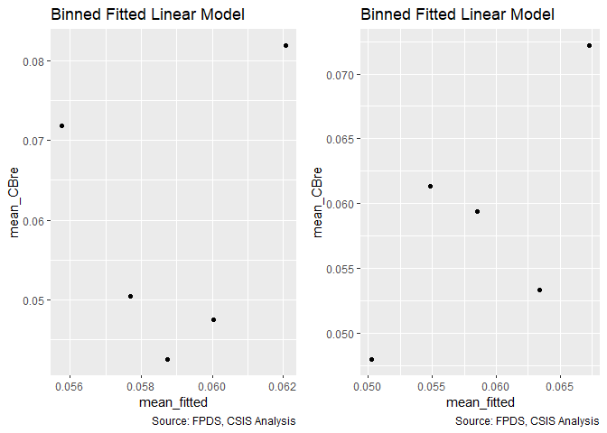<!-- -->

```
## debug: if (!"b_Term" %in% model_colnames(model1_old) & !"b_CBre" %in% 
##     model_colnames(model1_old)) gridExtra::grid.arrange(resid_plot(model1_old, 
##     sample = 25000), resid_plot(model1_new, sample = 25000), 
##     ncol = 2)
## debug: gridExtra::grid.arrange(residuals_binned(model1_old, bins = bins), 
##     residuals_binned(model1_new, bins = bins), ncol = 2)
```

```
## debug: output <- NULL
## debug: if (class(model1_new) == "glmerMod") {
##     m1t <- getME(model1_new, "theta")
##     m1l <- getME(model1_new, "lower")
##     output <- list(m1t[m1l == 0], model1_new@optinfo$conv$lme4$messages)
## } else if (class(model1_new) != "glmerMod" & class(model1_old) != 
##     "glmerMod") {
##     output <- list(rbind(deviance_stats(model1_old, "model1_old"), 
##         deviance_stats(model1_new, "model1_new")))
## }
```

```
## Warning in if (class(model1_new) == "glmerMod") {: the condition has length
## > 1 and only the first element will be used
```

```
## debug: if (class(model1_new) != "glmerMod" & class(model1_old) != "glmerMod") {
##     output <- list(rbind(deviance_stats(model1_old, "model1_old"), 
##         deviance_stats(model1_new, "model1_new")))
## }
```

```
## Warning in if (class(model1_new) != "glmerMod" & class(model1_old) !=
## "glmerMod") {: the condition has length > 1 and only the first element will
## be used
```

<!-- -->

```
## debug: output <- list(rbind(deviance_stats(model1_old, "model1_old"), 
##     deviance_stats(model1_new, "model1_new")))
## debug: output
## exiting from: summary_residual_compare(b_CBre09A, b_CBre10A, skip_vif = TRUE)
```

```
## [[1]]
##        model deviance null.deviance difference
## 1 model1_old 111887.6      111909.6    22.0174
## 2 model1_new 111728.2      111909.6   181.3762
```

Contrary to expectation on Ceiling breach and otions growth, in line with expectations on terminations.

Level 3 HHI seems to slightly out perform level 6.


#### Model 10B: Defense to Overall ratio
Ratio Def. obligatons : US revenue	cl_def3_ratio_lag1+		+	+	-


```r
#Frequency Plot for unlogged ceiling
summary_continuous_plot(serv_smp1m,metric="cbre","capped_def3_ratio_lag1")
```

```
## Warning in `[<-.factor`(`*tmp*`, ri, value = c(0, 0, 0, 0, 0, 0, 0, 0, 0, :
## invalid factor level, NA generated
```

<!-- -->

```r
summary_continuous_plot(serv_smp1m,metric="cbre","cl_def3_ratio_lag1")
```

```
## Warning in `[<-.factor`(`*tmp*`, ri, value = c(0, 0, 0, 0, 0, 0, 0, 0, 0, :
## invalid factor level, NA generated
```

<!-- -->

```r
#Scatter Plot
ggplot(serv_smp, aes(x=cl_def3_HHI_lag1, y=ln_CBre_OMB20_GDP18)) + geom_point(alpha = 0.1) + ggtitle('Ceiling Breach Growth') + theme(plot.title = element_text(hjust = 0.5))
```

<!-- -->

```r
#Model
b_CBre10B <- glm (data=serv_smp,
                 b_CBre ~ cl_def3_ratio_lag1, family=binomial(link="logit"))
display(b_CBre10B)
```

```
## glm(formula = b_CBre ~ cl_def3_ratio_lag1, family = binomial(link = "logit"), 
##     data = serv_smp)
##                    coef.est coef.se
## (Intercept)        -2.77     0.01  
## cl_def3_ratio_lag1  0.12     0.02  
## ---
##   n = 250000, k = 2
##   residual deviance = 111853.7, null deviance = 111909.6 (difference = 55.8)
```

```r
n_CBre10B <- glm(data=serv_breach,
                        ln_CBre_OMB20_GDP18 ~ cl_def3_ratio_lag1)

display(n_CBre10B)
```

```
## glm(formula = ln_CBre_OMB20_GDP18 ~ cl_def3_ratio_lag1, data = serv_breach)
##                    coef.est coef.se
## (Intercept)        9.31     0.01   
## cl_def3_ratio_lag1 0.17     0.02   
## ---
##   n = 61184, k = 2
##   residual deviance = 455840.0, null deviance = 456211.7 (difference = 371.8)
##   overdispersion parameter = 7.5
##   residual sd is sqrt(overdispersion) = 2.73
```

```r
#Plot residuals versus fitted
stargazer::stargazer(b_CBre09B,b_CBre10A,b_CBre10B,
                       
                       n_CBre09B,n_CBre10A,n_CBre10B,
                       type="text",
                       digits=2)
```

```
## 
## =======================================================================================
##                                            Dependent variable:                         
##                    --------------------------------------------------------------------
##                                 b_CBre                      ln_CBre_OMB20_GDP18        
##                                logistic                           normal               
##                       (1)        (2)        (3)         (4)         (5)         (6)    
## ---------------------------------------------------------------------------------------
## cl_def6_ratio_lag1    0.03                            0.18***                          
##                      (0.02)                           (0.03)                           
##                                                                                        
## cl_def3_HHI_lag1               -0.23***                          -1.56***              
##                                 (0.02)                            (0.02)               
##                                                                                        
## cl_def3_ratio_lag1                        0.12***                             0.17***  
##                                            (0.02)                             (0.02)   
##                                                                                        
## Constant            -2.77***   -2.78***   -2.77***    9.31***     9.21***     9.31***  
##                      (0.01)     (0.01)     (0.01)     (0.01)      (0.01)      (0.01)   
##                                                                                        
## ---------------------------------------------------------------------------------------
## Observations        250,000    250,000    250,000     61,184      61,184      61,184   
## Log Likelihood     -55,953.52 -55,864.11 -55,926.87 -148,255.70 -145,936.50 -148,253.90
## Akaike Inf. Crit.  111,911.00 111,732.20 111,857.70 296,515.50  291,877.00  296,511.80 
## =======================================================================================
## Note:                                                       *p<0.1; **p<0.05; ***p<0.01
```

```r
summary_residual_compare(b_CBre09B,b_CBre10B, skip_vif = TRUE)
```

```
## debugging in: summary_residual_compare(b_CBre09B, b_CBre10B, skip_vif = TRUE)
## debug: {
##     if (skip_vif == FALSE) 
##         warning("Deprecating VIF. Just use glmer_examine on the models")
##     if (!is.na(bins)) {
##         if ("cl_US6_avg_sal_lag1Const" %in% model_colnames(model1_old) & 
##             "cl_US6_avg_sal_lag1Const" %in% model_colnames(model1_new)) 
##             bins <- bins + 5
##         if ("cl_CFTE" %in% model_colnames(model1_old) & "cl_CFTE" %in% 
##             model_colnames(model1_new)) 
##             bins <- bins + 5
##         if ("c_pPBSC" %in% model_colnames(model1_old) & "c_pPBSC" %in% 
##             model_colnames(model1_new)) 
##             bins <- bins + 5
##         if ("c_pOffPSC" %in% model_colnames(model1_old) & "c_pOffPSC" %in% 
##             model_colnames(model1_new)) 
##             bins <- bins + 5
##         if ("cl_pairCA" %in% model_colnames(model1_old) & "cl_pairCA" %in% 
##             model_colnames(model1_new)) 
##             bins <- bins + 5
##         if ("c_OffCri" %in% model_colnames(model1_old) & "c_OffCri" %in% 
##             model_colnames(model1_new)) 
##             bins <- bins + 5
##         if (("cl_Ceil" %in% model_colnames(model1_old) & "cl_Ceil" %in% 
##             model_colnames(model1_new)) | ("cl_Ceil_Then_Year" %in% 
##             model_colnames(model1_old) & "cl_Ceil_Then_Year" %in% 
##             model_colnames(model1_new))) 
##             bins <- bins + 10
##         if ("cl_Days" %in% model_colnames(model1_old) & "cl_Days" %in% 
##             model_colnames(model1_new)) 
##             bins <- bins + 5
##     }
##     if (!is.null(model2_new)) {
##         gridExtra::grid.arrange(binned_fitted_versus_residuals(model1_old, 
##             bins = bins), binned_fitted_versus_residuals(model1_new, 
##             bins = bins), binned_fitted_versus_residuals(model2_old, 
##             bins = bins), binned_fitted_versus_residuals(model2_new, 
##             bins = bins), ncol = 2)
##         if (!"b_Term" %in% model_colnames(model1_old) & !"b_CBre" %in% 
##             model_colnames(model1_old)) 
##             gridExtra::grid.arrange(resid_plot(model1_old, sample = 25000), 
##                 resid_plot(model1_new, sample = 25000), resid_plot(model2_old, 
##                   sample = 25000), resid_plot(model2_new, sample = 25000), 
##                 ncol = 2)
##         if (!"b_Term" %in% colnames(model1_old) & !"b_CBre" %in% 
##             model_colnames(model1_old)) 
##             gridExtra::grid.arrange(residuals_binned(model1_old, 
##                 bins = bins), residuals_binned(model1_new, bins = bins), 
##                 residuals_binned(model2_old, bins = bins), residuals_binned(model2_new, 
##                   bins = bins), ncol = 2)
##         if ("cl_Ceil" %in% model_colnames(model1_new)) {
##             residual_compare(model1_old, model1_new, model2_old, 
##                 model2_new, "cl_Ceil", "Centered Log(Ceiling)", 
##                 20)
##         }
##         if ("cl_Days" %in% model_colnames(model1_new)) {
##             residual_compare(model1_old, model1_new, model2_old, 
##                 model2_new, "cl_Days", "Centered Log(Days)", 
##                 10)
##         }
##         output <- NULL
##         if (class(model1_new) == "glmerMod" & class(model2_new) == 
##             "glmerMod") {
##             m1t <- getME(model1_new, "theta")
##             m1l <- getME(model1_new, "lower")
##             m2t <- getME(model2_new, "theta")
##             m2l <- getME(model2_new, "lower")
##             output <- list(m1t[m1l == 0], m2t[m2l == 0], model1_new@optinfo$conv$lme4$messages, 
##                 model2_new@optinfo$conv$lme4$messages)
##         }
##         else if ((class(model1_new) != "glmerMod" & class(model2_new) != 
##             "glmerMod") & (class(model1_old) != "glmerMod" & 
##             class(model2_old) != "glmerMod")) {
##             output <- list(rbind(deviance_stats(model1_old, "model1_old"), 
##                 deviance_stats(model1_new, "model1_new"), deviance_stats(model2_old, 
##                   "model2_old"), deviance_stats(model2_new, "model2_new")))
##         }
##     }
##     else if (!is.null(model1_new)) {
##         gridExtra::grid.arrange(binned_fitted_versus_residuals(model1_old, 
##             bins = bins), binned_fitted_versus_residuals(model1_new, 
##             bins = bins), ncol = 2)
##         if (!"b_Term" %in% model_colnames(model1_old) & !"b_CBre" %in% 
##             model_colnames(model1_old)) 
##             gridExtra::grid.arrange(resid_plot(model1_old, sample = 25000), 
##                 resid_plot(model1_new, sample = 25000), ncol = 2)
##         gridExtra::grid.arrange(residuals_binned(model1_old, 
##             bins = bins), residuals_binned(model1_new, bins = bins), 
##             ncol = 2)
##         output <- NULL
##         if (class(model1_new) == "glmerMod") {
##             m1t <- getME(model1_new, "theta")
##             m1l <- getME(model1_new, "lower")
##             output <- list(m1t[m1l == 0], model1_new@optinfo$conv$lme4$messages)
##         }
##         else if (class(model1_new) != "glmerMod" & class(model1_old) != 
##             "glmerMod") {
##             output <- list(rbind(deviance_stats(model1_old, "model1_old"), 
##                 deviance_stats(model1_new, "model1_new")))
##         }
##     }
##     else {
##         if (!is.na(bins)) {
##             if ("cl_US6_avg_sal_lag1Const" %in% model_colnames(model1_old)) 
##                 bins <- bins + 5
##             if ("cl_CFTE" %in% model_colnames(model1_old)) 
##                 bins <- bins + 5
##             if ("c_pPBSC" %in% model_colnames(model1_old)) 
##                 bins <- bins + 5
##             if ("c_pOffPSC" %in% model_colnames(model1_old)) 
##                 bins <- bins + 5
##             if ("cl_pairCA" %in% model_colnames(model1_old)) 
##                 bins <- bins + 5
##             if ("c_OffCri" %in% model_colnames(model1_old)) 
##                 bins <- bins + 5
##             if (("cl_Ceil" %in% model_colnames(model1_old)) | 
##                 ("cl_Ceil_Then_Year" %in% model_colnames(model1_old))) 
##                 bins <- bins + 10
##             if ("cl_Days" %in% model_colnames(model1_old)) 
##                 bins <- bins + 5
##         }
##         if (!"b_Term" %in% model_colnames(model1_old) & !"b_CBre" %in% 
##             model_colnames(model1_old)) 
##             gridExtra::grid.arrange(binned_fitted_versus_residuals(model1_old, 
##                 bins = bins), residuals_binned(model1_old, bins = bins), 
##                 resid_plot(model1_old, sample = 25000))
##         else gridExtra::grid.arrange(binned_fitted_versus_residuals(model1_old, 
##             bins = bins), residuals_binned(model1_old, bins = bins))
##         output <- NULL
##         if (class(model1_old) == "glmerMod") {
##             m1t <- getME(model1_old, "theta")
##             m1l <- getME(model1_old, "lower")
##             output <- list(m1t[m1l == 0], model1_old@optinfo$conv$lme4$messages)
##         }
##         else if (class(model1_old) != "glmerMod" & class(model1_old) != 
##             "glmerMod") {
##             output <- list(deviance_stats(model1_old, "model1_old"))
##         }
##     }
##     output
## }
## debug: if (skip_vif == FALSE) warning("Deprecating VIF. Just use glmer_examine on the models")
## debug: if (!is.na(bins)) {
##     if ("cl_US6_avg_sal_lag1Const" %in% model_colnames(model1_old) & 
##         "cl_US6_avg_sal_lag1Const" %in% model_colnames(model1_new)) 
##         bins <- bins + 5
##     if ("cl_CFTE" %in% model_colnames(model1_old) & "cl_CFTE" %in% 
##         model_colnames(model1_new)) 
##         bins <- bins + 5
##     if ("c_pPBSC" %in% model_colnames(model1_old) & "c_pPBSC" %in% 
##         model_colnames(model1_new)) 
##         bins <- bins + 5
##     if ("c_pOffPSC" %in% model_colnames(model1_old) & "c_pOffPSC" %in% 
##         model_colnames(model1_new)) 
##         bins <- bins + 5
##     if ("cl_pairCA" %in% model_colnames(model1_old) & "cl_pairCA" %in% 
##         model_colnames(model1_new)) 
##         bins <- bins + 5
##     if ("c_OffCri" %in% model_colnames(model1_old) & "c_OffCri" %in% 
##         model_colnames(model1_new)) 
##         bins <- bins + 5
##     if (("cl_Ceil" %in% model_colnames(model1_old) & "cl_Ceil" %in% 
##         model_colnames(model1_new)) | ("cl_Ceil_Then_Year" %in% 
##         model_colnames(model1_old) & "cl_Ceil_Then_Year" %in% 
##         model_colnames(model1_new))) 
##         bins <- bins + 10
##     if ("cl_Days" %in% model_colnames(model1_old) & "cl_Days" %in% 
##         model_colnames(model1_new)) 
##         bins <- bins + 5
## }
## debug: if ("cl_US6_avg_sal_lag1Const" %in% model_colnames(model1_old) & 
##     "cl_US6_avg_sal_lag1Const" %in% model_colnames(model1_new)) bins <- bins + 
##     5
## debug: if ("cl_CFTE" %in% model_colnames(model1_old) & "cl_CFTE" %in% 
##     model_colnames(model1_new)) bins <- bins + 5
## debug: if ("c_pPBSC" %in% model_colnames(model1_old) & "c_pPBSC" %in% 
##     model_colnames(model1_new)) bins <- bins + 5
## debug: if ("c_pOffPSC" %in% model_colnames(model1_old) & "c_pOffPSC" %in% 
##     model_colnames(model1_new)) bins <- bins + 5
## debug: if ("cl_pairCA" %in% model_colnames(model1_old) & "cl_pairCA" %in% 
##     model_colnames(model1_new)) bins <- bins + 5
## debug: if ("c_OffCri" %in% model_colnames(model1_old) & "c_OffCri" %in% 
##     model_colnames(model1_new)) bins <- bins + 5
## debug: if (("cl_Ceil" %in% model_colnames(model1_old) & "cl_Ceil" %in% 
##     model_colnames(model1_new)) | ("cl_Ceil_Then_Year" %in% model_colnames(model1_old) & 
##     "cl_Ceil_Then_Year" %in% model_colnames(model1_new))) bins <- bins + 
##     10
## debug: if ("cl_Days" %in% model_colnames(model1_old) & "cl_Days" %in% 
##     model_colnames(model1_new)) bins <- bins + 5
## debug: if (!is.null(model2_new)) {
##     gridExtra::grid.arrange(binned_fitted_versus_residuals(model1_old, 
##         bins = bins), binned_fitted_versus_residuals(model1_new, 
##         bins = bins), binned_fitted_versus_residuals(model2_old, 
##         bins = bins), binned_fitted_versus_residuals(model2_new, 
##         bins = bins), ncol = 2)
##     if (!"b_Term" %in% model_colnames(model1_old) & !"b_CBre" %in% 
##         model_colnames(model1_old)) 
##         gridExtra::grid.arrange(resid_plot(model1_old, sample = 25000), 
##             resid_plot(model1_new, sample = 25000), resid_plot(model2_old, 
##                 sample = 25000), resid_plot(model2_new, sample = 25000), 
##             ncol = 2)
##     if (!"b_Term" %in% colnames(model1_old) & !"b_CBre" %in% 
##         model_colnames(model1_old)) 
##         gridExtra::grid.arrange(residuals_binned(model1_old, 
##             bins = bins), residuals_binned(model1_new, bins = bins), 
##             residuals_binned(model2_old, bins = bins), residuals_binned(model2_new, 
##                 bins = bins), ncol = 2)
##     if ("cl_Ceil" %in% model_colnames(model1_new)) {
##         residual_compare(model1_old, model1_new, model2_old, 
##             model2_new, "cl_Ceil", "Centered Log(Ceiling)", 20)
##     }
##     if ("cl_Days" %in% model_colnames(model1_new)) {
##         residual_compare(model1_old, model1_new, model2_old, 
##             model2_new, "cl_Days", "Centered Log(Days)", 10)
##     }
##     output <- NULL
##     if (class(model1_new) == "glmerMod" & class(model2_new) == 
##         "glmerMod") {
##         m1t <- getME(model1_new, "theta")
##         m1l <- getME(model1_new, "lower")
##         m2t <- getME(model2_new, "theta")
##         m2l <- getME(model2_new, "lower")
##         output <- list(m1t[m1l == 0], m2t[m2l == 0], model1_new@optinfo$conv$lme4$messages, 
##             model2_new@optinfo$conv$lme4$messages)
##     }
##     else if ((class(model1_new) != "glmerMod" & class(model2_new) != 
##         "glmerMod") & (class(model1_old) != "glmerMod" & class(model2_old) != 
##         "glmerMod")) {
##         output <- list(rbind(deviance_stats(model1_old, "model1_old"), 
##             deviance_stats(model1_new, "model1_new"), deviance_stats(model2_old, 
##                 "model2_old"), deviance_stats(model2_new, "model2_new")))
##     }
## } else if (!is.null(model1_new)) {
##     gridExtra::grid.arrange(binned_fitted_versus_residuals(model1_old, 
##         bins = bins), binned_fitted_versus_residuals(model1_new, 
##         bins = bins), ncol = 2)
##     if (!"b_Term" %in% model_colnames(model1_old) & !"b_CBre" %in% 
##         model_colnames(model1_old)) 
##         gridExtra::grid.arrange(resid_plot(model1_old, sample = 25000), 
##             resid_plot(model1_new, sample = 25000), ncol = 2)
##     gridExtra::grid.arrange(residuals_binned(model1_old, bins = bins), 
##         residuals_binned(model1_new, bins = bins), ncol = 2)
##     output <- NULL
##     if (class(model1_new) == "glmerMod") {
##         m1t <- getME(model1_new, "theta")
##         m1l <- getME(model1_new, "lower")
##         output <- list(m1t[m1l == 0], model1_new@optinfo$conv$lme4$messages)
##     }
##     else if (class(model1_new) != "glmerMod" & class(model1_old) != 
##         "glmerMod") {
##         output <- list(rbind(deviance_stats(model1_old, "model1_old"), 
##             deviance_stats(model1_new, "model1_new")))
##     }
## } else {
##     if (!is.na(bins)) {
##         if ("cl_US6_avg_sal_lag1Const" %in% model_colnames(model1_old)) 
##             bins <- bins + 5
##         if ("cl_CFTE" %in% model_colnames(model1_old)) 
##             bins <- bins + 5
##         if ("c_pPBSC" %in% model_colnames(model1_old)) 
##             bins <- bins + 5
##         if ("c_pOffPSC" %in% model_colnames(model1_old)) 
##             bins <- bins + 5
##         if ("cl_pairCA" %in% model_colnames(model1_old)) 
##             bins <- bins + 5
##         if ("c_OffCri" %in% model_colnames(model1_old)) 
##             bins <- bins + 5
##         if (("cl_Ceil" %in% model_colnames(model1_old)) | ("cl_Ceil_Then_Year" %in% 
##             model_colnames(model1_old))) 
##             bins <- bins + 10
##         if ("cl_Days" %in% model_colnames(model1_old)) 
##             bins <- bins + 5
##     }
##     if (!"b_Term" %in% model_colnames(model1_old) & !"b_CBre" %in% 
##         model_colnames(model1_old)) 
##         gridExtra::grid.arrange(binned_fitted_versus_residuals(model1_old, 
##             bins = bins), residuals_binned(model1_old, bins = bins), 
##             resid_plot(model1_old, sample = 25000))
##     else gridExtra::grid.arrange(binned_fitted_versus_residuals(model1_old, 
##         bins = bins), residuals_binned(model1_old, bins = bins))
##     output <- NULL
##     if (class(model1_old) == "glmerMod") {
##         m1t <- getME(model1_old, "theta")
##         m1l <- getME(model1_old, "lower")
##         output <- list(m1t[m1l == 0], model1_old@optinfo$conv$lme4$messages)
##     }
##     else if (class(model1_old) != "glmerMod" & class(model1_old) != 
##         "glmerMod") {
##         output <- list(deviance_stats(model1_old, "model1_old"))
##     }
## }
## debug: if (!is.null(model1_new)) {
##     gridExtra::grid.arrange(binned_fitted_versus_residuals(model1_old, 
##         bins = bins), binned_fitted_versus_residuals(model1_new, 
##         bins = bins), ncol = 2)
##     if (!"b_Term" %in% model_colnames(model1_old) & !"b_CBre" %in% 
##         model_colnames(model1_old)) 
##         gridExtra::grid.arrange(resid_plot(model1_old, sample = 25000), 
##             resid_plot(model1_new, sample = 25000), ncol = 2)
##     gridExtra::grid.arrange(residuals_binned(model1_old, bins = bins), 
##         residuals_binned(model1_new, bins = bins), ncol = 2)
##     output <- NULL
##     if (class(model1_new) == "glmerMod") {
##         m1t <- getME(model1_new, "theta")
##         m1l <- getME(model1_new, "lower")
##         output <- list(m1t[m1l == 0], model1_new@optinfo$conv$lme4$messages)
##     }
##     else if (class(model1_new) != "glmerMod" & class(model1_old) != 
##         "glmerMod") {
##         output <- list(rbind(deviance_stats(model1_old, "model1_old"), 
##             deviance_stats(model1_new, "model1_new")))
##     }
## } else {
##     if (!is.na(bins)) {
##         if ("cl_US6_avg_sal_lag1Const" %in% model_colnames(model1_old)) 
##             bins <- bins + 5
##         if ("cl_CFTE" %in% model_colnames(model1_old)) 
##             bins <- bins + 5
##         if ("c_pPBSC" %in% model_colnames(model1_old)) 
##             bins <- bins + 5
##         if ("c_pOffPSC" %in% model_colnames(model1_old)) 
##             bins <- bins + 5
##         if ("cl_pairCA" %in% model_colnames(model1_old)) 
##             bins <- bins + 5
##         if ("c_OffCri" %in% model_colnames(model1_old)) 
##             bins <- bins + 5
##         if (("cl_Ceil" %in% model_colnames(model1_old)) | ("cl_Ceil_Then_Year" %in% 
##             model_colnames(model1_old))) 
##             bins <- bins + 10
##         if ("cl_Days" %in% model_colnames(model1_old)) 
##             bins <- bins + 5
##     }
##     if (!"b_Term" %in% model_colnames(model1_old) & !"b_CBre" %in% 
##         model_colnames(model1_old)) 
##         gridExtra::grid.arrange(binned_fitted_versus_residuals(model1_old, 
##             bins = bins), residuals_binned(model1_old, bins = bins), 
##             resid_plot(model1_old, sample = 25000))
##     else gridExtra::grid.arrange(binned_fitted_versus_residuals(model1_old, 
##         bins = bins), residuals_binned(model1_old, bins = bins))
##     output <- NULL
##     if (class(model1_old) == "glmerMod") {
##         m1t <- getME(model1_old, "theta")
##         m1l <- getME(model1_old, "lower")
##         output <- list(m1t[m1l == 0], model1_old@optinfo$conv$lme4$messages)
##     }
##     else if (class(model1_old) != "glmerMod" & class(model1_old) != 
##         "glmerMod") {
##         output <- list(deviance_stats(model1_old, "model1_old"))
##     }
## }
## debug: gridExtra::grid.arrange(binned_fitted_versus_residuals(model1_old, 
##     bins = bins), binned_fitted_versus_residuals(model1_new, 
##     bins = bins), ncol = 2)
```

<!-- -->

```
## debug: if (!"b_Term" %in% model_colnames(model1_old) & !"b_CBre" %in% 
##     model_colnames(model1_old)) gridExtra::grid.arrange(resid_plot(model1_old, 
##     sample = 25000), resid_plot(model1_new, sample = 25000), 
##     ncol = 2)
## debug: gridExtra::grid.arrange(residuals_binned(model1_old, bins = bins), 
##     residuals_binned(model1_new, bins = bins), ncol = 2)
```

```
## debug: output <- NULL
## debug: if (class(model1_new) == "glmerMod") {
##     m1t <- getME(model1_new, "theta")
##     m1l <- getME(model1_new, "lower")
##     output <- list(m1t[m1l == 0], model1_new@optinfo$conv$lme4$messages)
## } else if (class(model1_new) != "glmerMod" & class(model1_old) != 
##     "glmerMod") {
##     output <- list(rbind(deviance_stats(model1_old, "model1_old"), 
##         deviance_stats(model1_new, "model1_new")))
## }
```

```
## Warning in if (class(model1_new) == "glmerMod") {: the condition has length
## > 1 and only the first element will be used
```

```
## debug: if (class(model1_new) != "glmerMod" & class(model1_old) != "glmerMod") {
##     output <- list(rbind(deviance_stats(model1_old, "model1_old"), 
##         deviance_stats(model1_new, "model1_new")))
## }
```

```
## Warning in if (class(model1_new) != "glmerMod" & class(model1_old) !=
## "glmerMod") {: the condition has length > 1 and only the first element will
## be used
```

<!-- -->

```
## debug: output <- list(rbind(deviance_stats(model1_old, "model1_old"), 
##     deviance_stats(model1_new, "model1_new")))
## debug: output
## exiting from: summary_residual_compare(b_CBre09B, b_CBre10B, skip_vif = TRUE)
```

```
## [[1]]
##        model deviance null.deviance difference
## 1 model1_old 111907.0      111909.6   2.549209
## 2 model1_new 111853.7      111909.6  55.846002
```

Expectations were in lined with ceiling breaches and options, not with termination, and 


#### Model 10C: NAICS 6 and NAICS 3
Consolidation at lessa nd more granular levels may have different effects. Efficiencies are often used to describe sectors, like utilities, with high barriers to entry. Many of these aspects seem like they would already be captured at less granular NAICS levels, e.g. power plants, rather than more specific NAICS levels, like solar vs. coal. As a result, consolidation for more granular NAICS codes should estimate higher rates of ceiling breaches compared to less granular NAICS code.

We'll start by adding in everything from both models and seeing what violates VIF.

```r
#Frequency Plot for unlogged ceiling


#Model
b_CBre10C <- glm (data=serv_smp,
                 b_CBre ~ cl_def3_HHI_lag1+cl_def3_ratio_lag1, family=binomial(link="logit"))
glmer_examine(b_CBre10C)
```

```
##   cl_def3_HHI_lag1 cl_def3_ratio_lag1 
##           1.018295           1.018295
```

```r
n_CBre10C <- glm(data=serv_breach,
                        ln_CBre_OMB20_GDP18 ~ cl_def3_HHI_lag1+cl_def3_ratio_lag1)
glmer_examine(n_CBre10C)
```

```
##   cl_def3_HHI_lag1 cl_def3_ratio_lag1 
##           1.000418           1.000418
```

```r
#Plot residuals versus fitted
stargazer::stargazer(b_CBre09E,b_CBre10A,b_CBre10B,b_CBre10C,
                     
                     n_CBre09E,n_CBre10A,n_CBre10B,n_CBre10C,
                       type="text",
                       digits=2)
```

```
## 
## ==========================================================================================================================
##                                                                    Dependent variable:                                    
##                                -------------------------------------------------------------------------------------------
##                                                  b_CBre                                  ln_CBre_OMB20_GDP18              
##                                                 logistic                                       normal                     
##                                   (1)        (2)        (3)        (4)         (5)         (6)         (7)         (8)    
## --------------------------------------------------------------------------------------------------------------------------
## cl_US6_avg_sal_lag1Const         -0.01                                       0.23***                                      
##                                  (0.02)                                      (0.02)                                       
##                                                                                                                           
## cl_CFTE                         0.08***                                      0.23***                                      
##                                  (0.02)                                      (0.02)                                       
##                                                                                                                           
## c_pPBSC                         -0.12***                                    -0.34***                                      
##                                  (0.02)                                      (0.02)                                       
##                                                                                                                           
## c_pOffPSC                       1.04***                                     -0.45***                                      
##                                  (0.02)                                      (0.02)                                       
##                                                                                                                           
## c_pairHist                      -0.08***                                     0.10***                                      
##                                  (0.02)                                      (0.02)                                       
##                                                                                                                           
## cl_pairCA                        -0.04*                                     -0.17***                                      
##                                  (0.02)                                      (0.02)                                       
##                                                                                                                           
## cl_Ceil                         1.03***                                      2.88***                                      
##                                  (0.02)                                      (0.02)                                       
##                                                                                                                           
## capped_cl_Days                  0.07***                                      0.15***                                      
##                                  (0.02)                                      (0.02)                                       
##                                                                                                                           
## Comp1or51 offer                 -0.14***                                      -0.03                                       
##                                  (0.03)                                      (0.03)                                       
##                                                                                                                           
## Comp1or52-4 offers              0.25***                                     -0.26***                                      
##                                  (0.02)                                      (0.02)                                       
##                                                                                                                           
## Comp1or55+ offers               0.35***                                     -0.19***                                      
##                                  (0.03)                                      (0.02)                                       
##                                                                                                                           
## VehS-IDC                        -0.19***                                     0.14***                                      
##                                  (0.02)                                      (0.02)                                       
##                                                                                                                           
## VehM-IDC                        -0.17***                                     0.08***                                      
##                                  (0.03)                                      (0.03)                                       
##                                                                                                                           
## VehFSS/GWAC                     -0.49***                                     0.27***                                      
##                                  (0.05)                                      (0.04)                                       
##                                                                                                                           
## VehBPA/BOA                      -0.42***                                      0.01                                        
##                                  (0.06)                                      (0.05)                                       
##                                                                                                                           
## PricingUCAOther FP              -0.67***                                    -0.46***                                      
##                                  (0.13)                                      (0.13)                                       
##                                                                                                                           
## PricingUCAT&M/LH/FPLOE          -0.58***                                     1.21***                                      
##                                  (0.07)                                      (0.06)                                       
##                                                                                                                           
## PricingUCAIncentive               0.01                                       0.98***                                      
##                                  (0.10)                                      (0.08)                                       
##                                                                                                                           
## PricingUCAOther CB              -1.16***                                     1.32***                                      
##                                  (0.05)                                      (0.04)                                       
##                                                                                                                           
## PricingUCAUCA                    -0.14*                                      0.64***                                      
##                                  (0.08)                                      (0.06)                                       
##                                                                                                                           
## PricingUCACombination or Other  -0.26***                                     0.67***                                      
##                                  (0.08)                                      (0.07)                                       
##                                                                                                                           
## CrisisARRA                      0.87***                                       -0.04                                       
##                                  (0.07)                                      (0.06)                                       
##                                                                                                                           
## CrisisDis                       0.70***                                      0.46***                                      
##                                  (0.16)                                      (0.13)                                       
##                                                                                                                           
## CrisisOCO                       -0.31***                                     0.46***                                      
##                                  (0.05)                                      (0.04)                                       
##                                                                                                                           
## cl_def6_HHI_lag1                 -0.03*                                       0.01                                        
##                                  (0.02)                                      (0.02)                                       
##                                                                                                                           
## cl_def6_ratio_lag1              -0.28***                                     0.34***                                      
##                                  (0.02)                                      (0.02)                                       
##                                                                                                                           
## cl_def3_HHI_lag1                           -0.23***              -0.22***               -1.56***                -1.56***  
##                                             (0.02)                (0.02)                 (0.02)                  (0.02)   
##                                                                                                                           
## cl_def3_ratio_lag1                                    0.12***    0.10***                             0.17***     0.20***  
##                                                        (0.02)     (0.02)                             (0.02)      (0.02)   
##                                                                                                                           
## Constant                        -2.90***   -2.78***   -2.77***   -2.78***    8.76***     9.21***     9.31***     9.20***  
##                                  (0.02)     (0.01)     (0.01)     (0.01)     (0.02)      (0.01)      (0.01)      (0.01)   
##                                                                                                                           
## --------------------------------------------------------------------------------------------------------------------------
## Observations                    250,000    250,000    250,000    250,000     61,184      61,184      61,184      61,184   
## Log Likelihood                 -51,907.07 -55,864.11 -55,926.87 -55,848.57 -121,977.00 -145,936.50 -148,253.90 -145,898.10
## Akaike Inf. Crit.              103,868.10 111,732.20 111,857.70 111,703.10 244,008.00  291,877.00  296,511.80  291,802.20 
## ==========================================================================================================================
## Note:                                                                                          *p<0.1; **p<0.05; ***p<0.01
```

```r
summary_residual_compare(b_CBre08B,b_CBre10C)
```

```
## debugging in: summary_residual_compare(b_CBre08B, b_CBre10C)
## debug: {
##     if (skip_vif == FALSE) 
##         warning("Deprecating VIF. Just use glmer_examine on the models")
##     if (!is.na(bins)) {
##         if ("cl_US6_avg_sal_lag1Const" %in% model_colnames(model1_old) & 
##             "cl_US6_avg_sal_lag1Const" %in% model_colnames(model1_new)) 
##             bins <- bins + 5
##         if ("cl_CFTE" %in% model_colnames(model1_old) & "cl_CFTE" %in% 
##             model_colnames(model1_new)) 
##             bins <- bins + 5
##         if ("c_pPBSC" %in% model_colnames(model1_old) & "c_pPBSC" %in% 
##             model_colnames(model1_new)) 
##             bins <- bins + 5
##         if ("c_pOffPSC" %in% model_colnames(model1_old) & "c_pOffPSC" %in% 
##             model_colnames(model1_new)) 
##             bins <- bins + 5
##         if ("cl_pairCA" %in% model_colnames(model1_old) & "cl_pairCA" %in% 
##             model_colnames(model1_new)) 
##             bins <- bins + 5
##         if ("c_OffCri" %in% model_colnames(model1_old) & "c_OffCri" %in% 
##             model_colnames(model1_new)) 
##             bins <- bins + 5
##         if (("cl_Ceil" %in% model_colnames(model1_old) & "cl_Ceil" %in% 
##             model_colnames(model1_new)) | ("cl_Ceil_Then_Year" %in% 
##             model_colnames(model1_old) & "cl_Ceil_Then_Year" %in% 
##             model_colnames(model1_new))) 
##             bins <- bins + 10
##         if ("cl_Days" %in% model_colnames(model1_old) & "cl_Days" %in% 
##             model_colnames(model1_new)) 
##             bins <- bins + 5
##     }
##     if (!is.null(model2_new)) {
##         gridExtra::grid.arrange(binned_fitted_versus_residuals(model1_old, 
##             bins = bins), binned_fitted_versus_residuals(model1_new, 
##             bins = bins), binned_fitted_versus_residuals(model2_old, 
##             bins = bins), binned_fitted_versus_residuals(model2_new, 
##             bins = bins), ncol = 2)
##         if (!"b_Term" %in% model_colnames(model1_old) & !"b_CBre" %in% 
##             model_colnames(model1_old)) 
##             gridExtra::grid.arrange(resid_plot(model1_old, sample = 25000), 
##                 resid_plot(model1_new, sample = 25000), resid_plot(model2_old, 
##                   sample = 25000), resid_plot(model2_new, sample = 25000), 
##                 ncol = 2)
##         if (!"b_Term" %in% colnames(model1_old) & !"b_CBre" %in% 
##             model_colnames(model1_old)) 
##             gridExtra::grid.arrange(residuals_binned(model1_old, 
##                 bins = bins), residuals_binned(model1_new, bins = bins), 
##                 residuals_binned(model2_old, bins = bins), residuals_binned(model2_new, 
##                   bins = bins), ncol = 2)
##         if ("cl_Ceil" %in% model_colnames(model1_new)) {
##             residual_compare(model1_old, model1_new, model2_old, 
##                 model2_new, "cl_Ceil", "Centered Log(Ceiling)", 
##                 20)
##         }
##         if ("cl_Days" %in% model_colnames(model1_new)) {
##             residual_compare(model1_old, model1_new, model2_old, 
##                 model2_new, "cl_Days", "Centered Log(Days)", 
##                 10)
##         }
##         output <- NULL
##         if (class(model1_new) == "glmerMod" & class(model2_new) == 
##             "glmerMod") {
##             m1t <- getME(model1_new, "theta")
##             m1l <- getME(model1_new, "lower")
##             m2t <- getME(model2_new, "theta")
##             m2l <- getME(model2_new, "lower")
##             output <- list(m1t[m1l == 0], m2t[m2l == 0], model1_new@optinfo$conv$lme4$messages, 
##                 model2_new@optinfo$conv$lme4$messages)
##         }
##         else if ((class(model1_new) != "glmerMod" & class(model2_new) != 
##             "glmerMod") & (class(model1_old) != "glmerMod" & 
##             class(model2_old) != "glmerMod")) {
##             output <- list(rbind(deviance_stats(model1_old, "model1_old"), 
##                 deviance_stats(model1_new, "model1_new"), deviance_stats(model2_old, 
##                   "model2_old"), deviance_stats(model2_new, "model2_new")))
##         }
##     }
##     else if (!is.null(model1_new)) {
##         gridExtra::grid.arrange(binned_fitted_versus_residuals(model1_old, 
##             bins = bins), binned_fitted_versus_residuals(model1_new, 
##             bins = bins), ncol = 2)
##         if (!"b_Term" %in% model_colnames(model1_old) & !"b_CBre" %in% 
##             model_colnames(model1_old)) 
##             gridExtra::grid.arrange(resid_plot(model1_old, sample = 25000), 
##                 resid_plot(model1_new, sample = 25000), ncol = 2)
##         gridExtra::grid.arrange(residuals_binned(model1_old, 
##             bins = bins), residuals_binned(model1_new, bins = bins), 
##             ncol = 2)
##         output <- NULL
##         if (class(model1_new) == "glmerMod") {
##             m1t <- getME(model1_new, "theta")
##             m1l <- getME(model1_new, "lower")
##             output <- list(m1t[m1l == 0], model1_new@optinfo$conv$lme4$messages)
##         }
##         else if (class(model1_new) != "glmerMod" & class(model1_old) != 
##             "glmerMod") {
##             output <- list(rbind(deviance_stats(model1_old, "model1_old"), 
##                 deviance_stats(model1_new, "model1_new")))
##         }
##     }
##     else {
##         if (!is.na(bins)) {
##             if ("cl_US6_avg_sal_lag1Const" %in% model_colnames(model1_old)) 
##                 bins <- bins + 5
##             if ("cl_CFTE" %in% model_colnames(model1_old)) 
##                 bins <- bins + 5
##             if ("c_pPBSC" %in% model_colnames(model1_old)) 
##                 bins <- bins + 5
##             if ("c_pOffPSC" %in% model_colnames(model1_old)) 
##                 bins <- bins + 5
##             if ("cl_pairCA" %in% model_colnames(model1_old)) 
##                 bins <- bins + 5
##             if ("c_OffCri" %in% model_colnames(model1_old)) 
##                 bins <- bins + 5
##             if (("cl_Ceil" %in% model_colnames(model1_old)) | 
##                 ("cl_Ceil_Then_Year" %in% model_colnames(model1_old))) 
##                 bins <- bins + 10
##             if ("cl_Days" %in% model_colnames(model1_old)) 
##                 bins <- bins + 5
##         }
##         if (!"b_Term" %in% model_colnames(model1_old) & !"b_CBre" %in% 
##             model_colnames(model1_old)) 
##             gridExtra::grid.arrange(binned_fitted_versus_residuals(model1_old, 
##                 bins = bins), residuals_binned(model1_old, bins = bins), 
##                 resid_plot(model1_old, sample = 25000))
##         else gridExtra::grid.arrange(binned_fitted_versus_residuals(model1_old, 
##             bins = bins), residuals_binned(model1_old, bins = bins))
##         output <- NULL
##         if (class(model1_old) == "glmerMod") {
##             m1t <- getME(model1_old, "theta")
##             m1l <- getME(model1_old, "lower")
##             output <- list(m1t[m1l == 0], model1_old@optinfo$conv$lme4$messages)
##         }
##         else if (class(model1_old) != "glmerMod" & class(model1_old) != 
##             "glmerMod") {
##             output <- list(deviance_stats(model1_old, "model1_old"))
##         }
##     }
##     output
## }
## debug: if (skip_vif == FALSE) warning("Deprecating VIF. Just use glmer_examine on the models")
## debug: if (!is.na(bins)) {
##     if ("cl_US6_avg_sal_lag1Const" %in% model_colnames(model1_old) & 
##         "cl_US6_avg_sal_lag1Const" %in% model_colnames(model1_new)) 
##         bins <- bins + 5
##     if ("cl_CFTE" %in% model_colnames(model1_old) & "cl_CFTE" %in% 
##         model_colnames(model1_new)) 
##         bins <- bins + 5
##     if ("c_pPBSC" %in% model_colnames(model1_old) & "c_pPBSC" %in% 
##         model_colnames(model1_new)) 
##         bins <- bins + 5
##     if ("c_pOffPSC" %in% model_colnames(model1_old) & "c_pOffPSC" %in% 
##         model_colnames(model1_new)) 
##         bins <- bins + 5
##     if ("cl_pairCA" %in% model_colnames(model1_old) & "cl_pairCA" %in% 
##         model_colnames(model1_new)) 
##         bins <- bins + 5
##     if ("c_OffCri" %in% model_colnames(model1_old) & "c_OffCri" %in% 
##         model_colnames(model1_new)) 
##         bins <- bins + 5
##     if (("cl_Ceil" %in% model_colnames(model1_old) & "cl_Ceil" %in% 
##         model_colnames(model1_new)) | ("cl_Ceil_Then_Year" %in% 
##         model_colnames(model1_old) & "cl_Ceil_Then_Year" %in% 
##         model_colnames(model1_new))) 
##         bins <- bins + 10
##     if ("cl_Days" %in% model_colnames(model1_old) & "cl_Days" %in% 
##         model_colnames(model1_new)) 
##         bins <- bins + 5
## }
## debug: if ("cl_US6_avg_sal_lag1Const" %in% model_colnames(model1_old) & 
##     "cl_US6_avg_sal_lag1Const" %in% model_colnames(model1_new)) bins <- bins + 
##     5
## debug: if ("cl_CFTE" %in% model_colnames(model1_old) & "cl_CFTE" %in% 
##     model_colnames(model1_new)) bins <- bins + 5
## debug: if ("c_pPBSC" %in% model_colnames(model1_old) & "c_pPBSC" %in% 
##     model_colnames(model1_new)) bins <- bins + 5
## debug: if ("c_pOffPSC" %in% model_colnames(model1_old) & "c_pOffPSC" %in% 
##     model_colnames(model1_new)) bins <- bins + 5
## debug: if ("cl_pairCA" %in% model_colnames(model1_old) & "cl_pairCA" %in% 
##     model_colnames(model1_new)) bins <- bins + 5
## debug: if ("c_OffCri" %in% model_colnames(model1_old) & "c_OffCri" %in% 
##     model_colnames(model1_new)) bins <- bins + 5
## debug: if (("cl_Ceil" %in% model_colnames(model1_old) & "cl_Ceil" %in% 
##     model_colnames(model1_new)) | ("cl_Ceil_Then_Year" %in% model_colnames(model1_old) & 
##     "cl_Ceil_Then_Year" %in% model_colnames(model1_new))) bins <- bins + 
##     10
## debug: if ("cl_Days" %in% model_colnames(model1_old) & "cl_Days" %in% 
##     model_colnames(model1_new)) bins <- bins + 5
## debug: if (!is.null(model2_new)) {
##     gridExtra::grid.arrange(binned_fitted_versus_residuals(model1_old, 
##         bins = bins), binned_fitted_versus_residuals(model1_new, 
##         bins = bins), binned_fitted_versus_residuals(model2_old, 
##         bins = bins), binned_fitted_versus_residuals(model2_new, 
##         bins = bins), ncol = 2)
##     if (!"b_Term" %in% model_colnames(model1_old) & !"b_CBre" %in% 
##         model_colnames(model1_old)) 
##         gridExtra::grid.arrange(resid_plot(model1_old, sample = 25000), 
##             resid_plot(model1_new, sample = 25000), resid_plot(model2_old, 
##                 sample = 25000), resid_plot(model2_new, sample = 25000), 
##             ncol = 2)
##     if (!"b_Term" %in% colnames(model1_old) & !"b_CBre" %in% 
##         model_colnames(model1_old)) 
##         gridExtra::grid.arrange(residuals_binned(model1_old, 
##             bins = bins), residuals_binned(model1_new, bins = bins), 
##             residuals_binned(model2_old, bins = bins), residuals_binned(model2_new, 
##                 bins = bins), ncol = 2)
##     if ("cl_Ceil" %in% model_colnames(model1_new)) {
##         residual_compare(model1_old, model1_new, model2_old, 
##             model2_new, "cl_Ceil", "Centered Log(Ceiling)", 20)
##     }
##     if ("cl_Days" %in% model_colnames(model1_new)) {
##         residual_compare(model1_old, model1_new, model2_old, 
##             model2_new, "cl_Days", "Centered Log(Days)", 10)
##     }
##     output <- NULL
##     if (class(model1_new) == "glmerMod" & class(model2_new) == 
##         "glmerMod") {
##         m1t <- getME(model1_new, "theta")
##         m1l <- getME(model1_new, "lower")
##         m2t <- getME(model2_new, "theta")
##         m2l <- getME(model2_new, "lower")
##         output <- list(m1t[m1l == 0], m2t[m2l == 0], model1_new@optinfo$conv$lme4$messages, 
##             model2_new@optinfo$conv$lme4$messages)
##     }
##     else if ((class(model1_new) != "glmerMod" & class(model2_new) != 
##         "glmerMod") & (class(model1_old) != "glmerMod" & class(model2_old) != 
##         "glmerMod")) {
##         output <- list(rbind(deviance_stats(model1_old, "model1_old"), 
##             deviance_stats(model1_new, "model1_new"), deviance_stats(model2_old, 
##                 "model2_old"), deviance_stats(model2_new, "model2_new")))
##     }
## } else if (!is.null(model1_new)) {
##     gridExtra::grid.arrange(binned_fitted_versus_residuals(model1_old, 
##         bins = bins), binned_fitted_versus_residuals(model1_new, 
##         bins = bins), ncol = 2)
##     if (!"b_Term" %in% model_colnames(model1_old) & !"b_CBre" %in% 
##         model_colnames(model1_old)) 
##         gridExtra::grid.arrange(resid_plot(model1_old, sample = 25000), 
##             resid_plot(model1_new, sample = 25000), ncol = 2)
##     gridExtra::grid.arrange(residuals_binned(model1_old, bins = bins), 
##         residuals_binned(model1_new, bins = bins), ncol = 2)
##     output <- NULL
##     if (class(model1_new) == "glmerMod") {
##         m1t <- getME(model1_new, "theta")
##         m1l <- getME(model1_new, "lower")
##         output <- list(m1t[m1l == 0], model1_new@optinfo$conv$lme4$messages)
##     }
##     else if (class(model1_new) != "glmerMod" & class(model1_old) != 
##         "glmerMod") {
##         output <- list(rbind(deviance_stats(model1_old, "model1_old"), 
##             deviance_stats(model1_new, "model1_new")))
##     }
## } else {
##     if (!is.na(bins)) {
##         if ("cl_US6_avg_sal_lag1Const" %in% model_colnames(model1_old)) 
##             bins <- bins + 5
##         if ("cl_CFTE" %in% model_colnames(model1_old)) 
##             bins <- bins + 5
##         if ("c_pPBSC" %in% model_colnames(model1_old)) 
##             bins <- bins + 5
##         if ("c_pOffPSC" %in% model_colnames(model1_old)) 
##             bins <- bins + 5
##         if ("cl_pairCA" %in% model_colnames(model1_old)) 
##             bins <- bins + 5
##         if ("c_OffCri" %in% model_colnames(model1_old)) 
##             bins <- bins + 5
##         if (("cl_Ceil" %in% model_colnames(model1_old)) | ("cl_Ceil_Then_Year" %in% 
##             model_colnames(model1_old))) 
##             bins <- bins + 10
##         if ("cl_Days" %in% model_colnames(model1_old)) 
##             bins <- bins + 5
##     }
##     if (!"b_Term" %in% model_colnames(model1_old) & !"b_CBre" %in% 
##         model_colnames(model1_old)) 
##         gridExtra::grid.arrange(binned_fitted_versus_residuals(model1_old, 
##             bins = bins), residuals_binned(model1_old, bins = bins), 
##             resid_plot(model1_old, sample = 25000))
##     else gridExtra::grid.arrange(binned_fitted_versus_residuals(model1_old, 
##         bins = bins), residuals_binned(model1_old, bins = bins))
##     output <- NULL
##     if (class(model1_old) == "glmerMod") {
##         m1t <- getME(model1_old, "theta")
##         m1l <- getME(model1_old, "lower")
##         output <- list(m1t[m1l == 0], model1_old@optinfo$conv$lme4$messages)
##     }
##     else if (class(model1_old) != "glmerMod" & class(model1_old) != 
##         "glmerMod") {
##         output <- list(deviance_stats(model1_old, "model1_old"))
##     }
## }
## debug: if (!is.null(model1_new)) {
##     gridExtra::grid.arrange(binned_fitted_versus_residuals(model1_old, 
##         bins = bins), binned_fitted_versus_residuals(model1_new, 
##         bins = bins), ncol = 2)
##     if (!"b_Term" %in% model_colnames(model1_old) & !"b_CBre" %in% 
##         model_colnames(model1_old)) 
##         gridExtra::grid.arrange(resid_plot(model1_old, sample = 25000), 
##             resid_plot(model1_new, sample = 25000), ncol = 2)
##     gridExtra::grid.arrange(residuals_binned(model1_old, bins = bins), 
##         residuals_binned(model1_new, bins = bins), ncol = 2)
##     output <- NULL
##     if (class(model1_new) == "glmerMod") {
##         m1t <- getME(model1_new, "theta")
##         m1l <- getME(model1_new, "lower")
##         output <- list(m1t[m1l == 0], model1_new@optinfo$conv$lme4$messages)
##     }
##     else if (class(model1_new) != "glmerMod" & class(model1_old) != 
##         "glmerMod") {
##         output <- list(rbind(deviance_stats(model1_old, "model1_old"), 
##             deviance_stats(model1_new, "model1_new")))
##     }
## } else {
##     if (!is.na(bins)) {
##         if ("cl_US6_avg_sal_lag1Const" %in% model_colnames(model1_old)) 
##             bins <- bins + 5
##         if ("cl_CFTE" %in% model_colnames(model1_old)) 
##             bins <- bins + 5
##         if ("c_pPBSC" %in% model_colnames(model1_old)) 
##             bins <- bins + 5
##         if ("c_pOffPSC" %in% model_colnames(model1_old)) 
##             bins <- bins + 5
##         if ("cl_pairCA" %in% model_colnames(model1_old)) 
##             bins <- bins + 5
##         if ("c_OffCri" %in% model_colnames(model1_old)) 
##             bins <- bins + 5
##         if (("cl_Ceil" %in% model_colnames(model1_old)) | ("cl_Ceil_Then_Year" %in% 
##             model_colnames(model1_old))) 
##             bins <- bins + 10
##         if ("cl_Days" %in% model_colnames(model1_old)) 
##             bins <- bins + 5
##     }
##     if (!"b_Term" %in% model_colnames(model1_old) & !"b_CBre" %in% 
##         model_colnames(model1_old)) 
##         gridExtra::grid.arrange(binned_fitted_versus_residuals(model1_old, 
##             bins = bins), residuals_binned(model1_old, bins = bins), 
##             resid_plot(model1_old, sample = 25000))
##     else gridExtra::grid.arrange(binned_fitted_versus_residuals(model1_old, 
##         bins = bins), residuals_binned(model1_old, bins = bins))
##     output <- NULL
##     if (class(model1_old) == "glmerMod") {
##         m1t <- getME(model1_old, "theta")
##         m1l <- getME(model1_old, "lower")
##         output <- list(m1t[m1l == 0], model1_old@optinfo$conv$lme4$messages)
##     }
##     else if (class(model1_old) != "glmerMod" & class(model1_old) != 
##         "glmerMod") {
##         output <- list(deviance_stats(model1_old, "model1_old"))
##     }
## }
## debug: gridExtra::grid.arrange(binned_fitted_versus_residuals(model1_old, 
##     bins = bins), binned_fitted_versus_residuals(model1_new, 
##     bins = bins), ncol = 2)
```

<!-- -->

```
## debug: if (!"b_Term" %in% model_colnames(model1_old) & !"b_CBre" %in% 
##     model_colnames(model1_old)) gridExtra::grid.arrange(resid_plot(model1_old, 
##     sample = 25000), resid_plot(model1_new, sample = 25000), 
##     ncol = 2)
## debug: gridExtra::grid.arrange(residuals_binned(model1_old, bins = bins), 
##     residuals_binned(model1_new, bins = bins), ncol = 2)
```

```
## debug: output <- NULL
## debug: if (class(model1_new) == "glmerMod") {
##     m1t <- getME(model1_new, "theta")
##     m1l <- getME(model1_new, "lower")
##     output <- list(m1t[m1l == 0], model1_new@optinfo$conv$lme4$messages)
## } else if (class(model1_new) != "glmerMod" & class(model1_old) != 
##     "glmerMod") {
##     output <- list(rbind(deviance_stats(model1_old, "model1_old"), 
##         deviance_stats(model1_new, "model1_new")))
## }
```

```
## Warning in if (class(model1_new) == "glmerMod") {: the condition has length
## > 1 and only the first element will be used
```

```
## debug: if (class(model1_new) != "glmerMod" & class(model1_old) != "glmerMod") {
##     output <- list(rbind(deviance_stats(model1_old, "model1_old"), 
##         deviance_stats(model1_new, "model1_new")))
## }
```

```
## Warning in if (class(model1_new) != "glmerMod" & class(model1_old) !=
## "glmerMod") {: the condition has length > 1 and only the first element will
## be used
```

<!-- -->

```
## debug: output <- list(rbind(deviance_stats(model1_old, "model1_old"), 
##     deviance_stats(model1_new, "model1_new")))
## debug: output
## exiting from: summary_residual_compare(b_CBre08B, b_CBre10C)
```

```
## [[1]]
##        model deviance null.deviance difference
## 1 model1_old 103974.8      111909.6  7934.7483
## 2 model1_new 111697.1      111909.6   212.4504
```

NAICS Subsector (Level 3)					
HHI (logged, + means more consolidation)	cl_def3_HHI_lag1+		+	++	-
Ratio Def. obligatons : US revenue	cl_def3_ratio_lag1+		+	+	-

Expectations matched for def3_HHI, not matched for ceiling  breach or options
ratio expectations for ceiling breach and options but not terminations.


#### Model 10D: Cumulative Model
.

```r
#Frequency Plot for unlogged ceiling


#Model
b_CBre10D <- glm (data=serv_smp,
                 b_CBre ~  cl_US6_avg_sal_lag1Const + 
                   cl_CFTE+ c_pPBSC+c_pOffPSC+
                 c_pairHist+cl_pairCA +
                   cl_Ceil + capped_cl_Days+
                   Comp1or5+
                   Veh+
                   PricingUCA+
                   Crisis+
                   cl_def6_HHI_lag1+cl_def6_ratio_lag1+
                   cl_def3_HHI_lag1+cl_def3_ratio_lag1, family=binomial(link="logit"))
glmer_examine(b_CBre10D)
```

```
##                              GVIF Df GVIF^(1/(2*Df))
## cl_US6_avg_sal_lag1Const 1.663287  1        1.289685
## cl_CFTE                  1.302681  1        1.141351
## c_pPBSC                  1.411295  1        1.187979
## c_pOffPSC                1.898025  1        1.377688
## c_pairHist               1.300604  1        1.140440
## cl_pairCA                2.155087  1        1.468022
## cl_Ceil                  1.490383  1        1.220813
## capped_cl_Days           1.409651  1        1.187287
## Comp1or5                 1.254633  3        1.038531
## Veh                      1.827709  4        1.078297
## PricingUCA               1.218456  6        1.016602
## Crisis                   1.334416  3        1.049257
## cl_def6_HHI_lag1         2.074336  1        1.440256
## cl_def6_ratio_lag1       1.761661  1        1.327276
## cl_def3_HHI_lag1         1.921428  1        1.386156
## cl_def3_ratio_lag1       2.216244  1        1.488705
```

```r
n_CBre10D <- glm(data=serv_breach,
                        ln_CBre_OMB20_GDP18 ~  cl_US6_avg_sal_lag1Const + 
                   cl_CFTE+ c_pPBSC+c_pOffPSC+
                 c_pairHist+cl_pairCA+
                 cl_Ceil + capped_cl_Days+
                 Comp1or5+
                   Veh+
                   PricingUCA+
                   Crisis+
                 cl_def6_HHI_lag1+cl_def6_ratio_lag1+
                 cl_def3_HHI_lag1+cl_def3_ratio_lag1)
glmer_examine(n_CBre10D)
```

```
##                              GVIF Df GVIF^(1/(2*Df))
## cl_US6_avg_sal_lag1Const 1.675695  1        1.294486
## cl_CFTE                  1.360695  1        1.166488
## c_pPBSC                  2.257620  1        1.502538
## c_pOffPSC                3.259420  1        1.805386
## c_pairHist               1.360321  1        1.166328
## cl_pairCA                2.612249  1        1.616245
## cl_Ceil                  1.963029  1        1.401081
## capped_cl_Days           1.613651  1        1.270295
## Comp1or5                 1.298661  3        1.044518
## Veh                      2.108234  4        1.097716
## PricingUCA               1.256429  6        1.019205
## Crisis                   1.238550  3        1.036300
## cl_def6_HHI_lag1         2.957212  1        1.719655
## cl_def6_ratio_lag1       1.511221  1        1.229317
## cl_def3_HHI_lag1         2.149884  1        1.466248
## cl_def3_ratio_lag1       1.963932  1        1.401403
```

```r
#Plot residuals versus fitted
stargazer::stargazer(b_CBre09E,b_CBre10C,b_CBre10D,
                     
                     n_CBre09E,n_CBre10C,n_CBre10D,
                       type="text",
                       digits=2)
```

```
## 
## ===================================================================================================
##                                                        Dependent variable:                         
##                                --------------------------------------------------------------------
##                                             b_CBre                      ln_CBre_OMB20_GDP18        
##                                            logistic                           normal               
##                                   (1)        (2)        (3)         (4)         (5)         (6)    
## ---------------------------------------------------------------------------------------------------
## cl_US6_avg_sal_lag1Const         -0.01                -0.08***    0.23***                 0.09***  
##                                  (0.02)                (0.02)     (0.02)                  (0.02)   
##                                                                                                    
## cl_CFTE                         0.08***               0.05***     0.23***                 0.22***  
##                                  (0.02)                (0.02)     (0.02)                  (0.02)   
##                                                                                                    
## c_pPBSC                         -0.12***              -0.13***   -0.34***                -0.32***  
##                                  (0.02)                (0.02)     (0.02)                  (0.02)   
##                                                                                                    
## c_pOffPSC                       1.04***               1.06***    -0.45***                -0.49***  
##                                  (0.02)                (0.02)     (0.02)                  (0.02)   
##                                                                                                    
## c_pairHist                      -0.08***              -0.07***    0.10***                 0.09***  
##                                  (0.02)                (0.02)     (0.02)                  (0.02)   
##                                                                                                    
## cl_pairCA                        -0.04*                -0.03     -0.17***                -0.11***  
##                                  (0.02)                (0.03)     (0.02)                  (0.02)   
##                                                                                                    
## cl_Ceil                         1.03***               1.03***     2.88***                 2.89***  
##                                  (0.02)                (0.02)     (0.02)                  (0.02)   
##                                                                                                    
## capped_cl_Days                  0.07***               0.07***     0.15***                 0.17***  
##                                  (0.02)                (0.02)     (0.02)                  (0.02)   
##                                                                                                    
## Comp1or51 offer                 -0.14***              -0.13***     -0.03                  -0.05*   
##                                  (0.03)                (0.03)     (0.03)                  (0.03)   
##                                                                                                    
## Comp1or52-4 offers              0.25***               0.24***    -0.26***                -0.26***  
##                                  (0.02)                (0.02)     (0.02)                  (0.02)   
##                                                                                                    
## Comp1or55+ offers               0.35***               0.35***    -0.19***                -0.20***  
##                                  (0.03)                (0.03)     (0.02)                  (0.02)   
##                                                                                                    
## VehS-IDC                        -0.19***              -0.21***    0.14***                 0.09***  
##                                  (0.02)                (0.02)     (0.02)                  (0.02)   
##                                                                                                    
## VehM-IDC                        -0.17***              -0.15***    0.08***                  0.04*   
##                                  (0.03)                (0.03)     (0.03)                  (0.03)   
##                                                                                                    
## VehFSS/GWAC                     -0.49***              -0.51***    0.27***                 0.19***  
##                                  (0.05)                (0.05)     (0.04)                  (0.04)   
##                                                                                                    
## VehBPA/BOA                      -0.42***              -0.44***     0.01                    -0.02   
##                                  (0.06)                (0.06)     (0.05)                  (0.05)   
##                                                                                                    
## PricingUCAOther FP              -0.67***              -0.62***   -0.46***                -0.42***  
##                                  (0.13)                (0.13)     (0.13)                  (0.13)   
##                                                                                                    
## PricingUCAT&M/LH/FPLOE          -0.58***              -0.59***    1.21***                 1.13***  
##                                  (0.07)                (0.07)     (0.06)                  (0.06)   
##                                                                                                    
## PricingUCAIncentive               0.01                 -0.01      0.98***                 0.84***  
##                                  (0.10)                (0.10)     (0.08)                  (0.08)   
##                                                                                                    
## PricingUCAOther CB              -1.16***              -1.18***    1.32***                 1.22***  
##                                  (0.05)                (0.05)     (0.04)                  (0.04)   
##                                                                                                    
## PricingUCAUCA                    -0.14*                -0.14*     0.64***                 0.60***  
##                                  (0.08)                (0.08)     (0.06)                  (0.06)   
##                                                                                                    
## PricingUCACombination or Other  -0.26***              -0.27***    0.67***                 0.59***  
##                                  (0.08)                (0.08)     (0.07)                  (0.07)   
##                                                                                                    
## CrisisARRA                      0.87***               0.91***      -0.04                   0.003   
##                                  (0.07)                (0.07)     (0.06)                  (0.06)   
##                                                                                                    
## CrisisDis                       0.70***               0.69***     0.46***                 0.49***  
##                                  (0.16)                (0.16)     (0.13)                  (0.13)   
##                                                                                                    
## CrisisOCO                       -0.31***              -0.31***    0.46***                 0.42***  
##                                  (0.05)                (0.05)     (0.04)                  (0.04)   
##                                                                                                    
## cl_def6_HHI_lag1                 -0.03*               0.23***      0.01                    -0.02   
##                                  (0.02)                (0.02)     (0.02)                  (0.02)   
##                                                                                                    
## cl_def6_ratio_lag1              -0.28***              -0.13***    0.34***                 0.15***  
##                                  (0.02)                (0.03)     (0.02)                  (0.02)   
##                                                                                                    
## cl_def3_HHI_lag1                           -0.22***   -0.45***               -1.56***     -0.001   
##                                             (0.02)     (0.02)                 (0.02)      (0.02)   
##                                                                                                    
## cl_def3_ratio_lag1                         0.10***    -0.17***                0.20***     0.41***  
##                                             (0.02)     (0.03)                 (0.02)      (0.02)   
##                                                                                                    
## Constant                        -2.90***   -2.78***   -2.91***    8.76***     9.20***     8.80***  
##                                  (0.02)     (0.01)     (0.02)     (0.02)      (0.01)      (0.02)   
##                                                                                                    
## ---------------------------------------------------------------------------------------------------
## Observations                    250,000    250,000    250,000     61,184      61,184      61,184   
## Log Likelihood                 -51,907.07 -55,848.57 -51,731.95 -121,977.00 -145,898.10 -121,799.80
## Akaike Inf. Crit.              103,868.10 111,703.10 103,521.90 244,008.00  291,802.20  243,657.60 
## ===================================================================================================
## Note:                                                                   *p<0.1; **p<0.05; ***p<0.01
```

```r
summary_residual_compare(b_CBre09D2,b_CBre10D)
```

```
## debugging in: summary_residual_compare(b_CBre09D2, b_CBre10D)
## debug: {
##     if (skip_vif == FALSE) 
##         warning("Deprecating VIF. Just use glmer_examine on the models")
##     if (!is.na(bins)) {
##         if ("cl_US6_avg_sal_lag1Const" %in% model_colnames(model1_old) & 
##             "cl_US6_avg_sal_lag1Const" %in% model_colnames(model1_new)) 
##             bins <- bins + 5
##         if ("cl_CFTE" %in% model_colnames(model1_old) & "cl_CFTE" %in% 
##             model_colnames(model1_new)) 
##             bins <- bins + 5
##         if ("c_pPBSC" %in% model_colnames(model1_old) & "c_pPBSC" %in% 
##             model_colnames(model1_new)) 
##             bins <- bins + 5
##         if ("c_pOffPSC" %in% model_colnames(model1_old) & "c_pOffPSC" %in% 
##             model_colnames(model1_new)) 
##             bins <- bins + 5
##         if ("cl_pairCA" %in% model_colnames(model1_old) & "cl_pairCA" %in% 
##             model_colnames(model1_new)) 
##             bins <- bins + 5
##         if ("c_OffCri" %in% model_colnames(model1_old) & "c_OffCri" %in% 
##             model_colnames(model1_new)) 
##             bins <- bins + 5
##         if (("cl_Ceil" %in% model_colnames(model1_old) & "cl_Ceil" %in% 
##             model_colnames(model1_new)) | ("cl_Ceil_Then_Year" %in% 
##             model_colnames(model1_old) & "cl_Ceil_Then_Year" %in% 
##             model_colnames(model1_new))) 
##             bins <- bins + 10
##         if ("cl_Days" %in% model_colnames(model1_old) & "cl_Days" %in% 
##             model_colnames(model1_new)) 
##             bins <- bins + 5
##     }
##     if (!is.null(model2_new)) {
##         gridExtra::grid.arrange(binned_fitted_versus_residuals(model1_old, 
##             bins = bins), binned_fitted_versus_residuals(model1_new, 
##             bins = bins), binned_fitted_versus_residuals(model2_old, 
##             bins = bins), binned_fitted_versus_residuals(model2_new, 
##             bins = bins), ncol = 2)
##         if (!"b_Term" %in% model_colnames(model1_old) & !"b_CBre" %in% 
##             model_colnames(model1_old)) 
##             gridExtra::grid.arrange(resid_plot(model1_old, sample = 25000), 
##                 resid_plot(model1_new, sample = 25000), resid_plot(model2_old, 
##                   sample = 25000), resid_plot(model2_new, sample = 25000), 
##                 ncol = 2)
##         if (!"b_Term" %in% colnames(model1_old) & !"b_CBre" %in% 
##             model_colnames(model1_old)) 
##             gridExtra::grid.arrange(residuals_binned(model1_old, 
##                 bins = bins), residuals_binned(model1_new, bins = bins), 
##                 residuals_binned(model2_old, bins = bins), residuals_binned(model2_new, 
##                   bins = bins), ncol = 2)
##         if ("cl_Ceil" %in% model_colnames(model1_new)) {
##             residual_compare(model1_old, model1_new, model2_old, 
##                 model2_new, "cl_Ceil", "Centered Log(Ceiling)", 
##                 20)
##         }
##         if ("cl_Days" %in% model_colnames(model1_new)) {
##             residual_compare(model1_old, model1_new, model2_old, 
##                 model2_new, "cl_Days", "Centered Log(Days)", 
##                 10)
##         }
##         output <- NULL
##         if (class(model1_new) == "glmerMod" & class(model2_new) == 
##             "glmerMod") {
##             m1t <- getME(model1_new, "theta")
##             m1l <- getME(model1_new, "lower")
##             m2t <- getME(model2_new, "theta")
##             m2l <- getME(model2_new, "lower")
##             output <- list(m1t[m1l == 0], m2t[m2l == 0], model1_new@optinfo$conv$lme4$messages, 
##                 model2_new@optinfo$conv$lme4$messages)
##         }
##         else if ((class(model1_new) != "glmerMod" & class(model2_new) != 
##             "glmerMod") & (class(model1_old) != "glmerMod" & 
##             class(model2_old) != "glmerMod")) {
##             output <- list(rbind(deviance_stats(model1_old, "model1_old"), 
##                 deviance_stats(model1_new, "model1_new"), deviance_stats(model2_old, 
##                   "model2_old"), deviance_stats(model2_new, "model2_new")))
##         }
##     }
##     else if (!is.null(model1_new)) {
##         gridExtra::grid.arrange(binned_fitted_versus_residuals(model1_old, 
##             bins = bins), binned_fitted_versus_residuals(model1_new, 
##             bins = bins), ncol = 2)
##         if (!"b_Term" %in% model_colnames(model1_old) & !"b_CBre" %in% 
##             model_colnames(model1_old)) 
##             gridExtra::grid.arrange(resid_plot(model1_old, sample = 25000), 
##                 resid_plot(model1_new, sample = 25000), ncol = 2)
##         gridExtra::grid.arrange(residuals_binned(model1_old, 
##             bins = bins), residuals_binned(model1_new, bins = bins), 
##             ncol = 2)
##         output <- NULL
##         if (class(model1_new) == "glmerMod") {
##             m1t <- getME(model1_new, "theta")
##             m1l <- getME(model1_new, "lower")
##             output <- list(m1t[m1l == 0], model1_new@optinfo$conv$lme4$messages)
##         }
##         else if (class(model1_new) != "glmerMod" & class(model1_old) != 
##             "glmerMod") {
##             output <- list(rbind(deviance_stats(model1_old, "model1_old"), 
##                 deviance_stats(model1_new, "model1_new")))
##         }
##     }
##     else {
##         if (!is.na(bins)) {
##             if ("cl_US6_avg_sal_lag1Const" %in% model_colnames(model1_old)) 
##                 bins <- bins + 5
##             if ("cl_CFTE" %in% model_colnames(model1_old)) 
##                 bins <- bins + 5
##             if ("c_pPBSC" %in% model_colnames(model1_old)) 
##                 bins <- bins + 5
##             if ("c_pOffPSC" %in% model_colnames(model1_old)) 
##                 bins <- bins + 5
##             if ("cl_pairCA" %in% model_colnames(model1_old)) 
##                 bins <- bins + 5
##             if ("c_OffCri" %in% model_colnames(model1_old)) 
##                 bins <- bins + 5
##             if (("cl_Ceil" %in% model_colnames(model1_old)) | 
##                 ("cl_Ceil_Then_Year" %in% model_colnames(model1_old))) 
##                 bins <- bins + 10
##             if ("cl_Days" %in% model_colnames(model1_old)) 
##                 bins <- bins + 5
##         }
##         if (!"b_Term" %in% model_colnames(model1_old) & !"b_CBre" %in% 
##             model_colnames(model1_old)) 
##             gridExtra::grid.arrange(binned_fitted_versus_residuals(model1_old, 
##                 bins = bins), residuals_binned(model1_old, bins = bins), 
##                 resid_plot(model1_old, sample = 25000))
##         else gridExtra::grid.arrange(binned_fitted_versus_residuals(model1_old, 
##             bins = bins), residuals_binned(model1_old, bins = bins))
##         output <- NULL
##         if (class(model1_old) == "glmerMod") {
##             m1t <- getME(model1_old, "theta")
##             m1l <- getME(model1_old, "lower")
##             output <- list(m1t[m1l == 0], model1_old@optinfo$conv$lme4$messages)
##         }
##         else if (class(model1_old) != "glmerMod" & class(model1_old) != 
##             "glmerMod") {
##             output <- list(deviance_stats(model1_old, "model1_old"))
##         }
##     }
##     output
## }
## debug: if (skip_vif == FALSE) warning("Deprecating VIF. Just use glmer_examine on the models")
## debug: if (!is.na(bins)) {
##     if ("cl_US6_avg_sal_lag1Const" %in% model_colnames(model1_old) & 
##         "cl_US6_avg_sal_lag1Const" %in% model_colnames(model1_new)) 
##         bins <- bins + 5
##     if ("cl_CFTE" %in% model_colnames(model1_old) & "cl_CFTE" %in% 
##         model_colnames(model1_new)) 
##         bins <- bins + 5
##     if ("c_pPBSC" %in% model_colnames(model1_old) & "c_pPBSC" %in% 
##         model_colnames(model1_new)) 
##         bins <- bins + 5
##     if ("c_pOffPSC" %in% model_colnames(model1_old) & "c_pOffPSC" %in% 
##         model_colnames(model1_new)) 
##         bins <- bins + 5
##     if ("cl_pairCA" %in% model_colnames(model1_old) & "cl_pairCA" %in% 
##         model_colnames(model1_new)) 
##         bins <- bins + 5
##     if ("c_OffCri" %in% model_colnames(model1_old) & "c_OffCri" %in% 
##         model_colnames(model1_new)) 
##         bins <- bins + 5
##     if (("cl_Ceil" %in% model_colnames(model1_old) & "cl_Ceil" %in% 
##         model_colnames(model1_new)) | ("cl_Ceil_Then_Year" %in% 
##         model_colnames(model1_old) & "cl_Ceil_Then_Year" %in% 
##         model_colnames(model1_new))) 
##         bins <- bins + 10
##     if ("cl_Days" %in% model_colnames(model1_old) & "cl_Days" %in% 
##         model_colnames(model1_new)) 
##         bins <- bins + 5
## }
## debug: if ("cl_US6_avg_sal_lag1Const" %in% model_colnames(model1_old) & 
##     "cl_US6_avg_sal_lag1Const" %in% model_colnames(model1_new)) bins <- bins + 
##     5
## debug: if ("cl_CFTE" %in% model_colnames(model1_old) & "cl_CFTE" %in% 
##     model_colnames(model1_new)) bins <- bins + 5
## debug: if ("c_pPBSC" %in% model_colnames(model1_old) & "c_pPBSC" %in% 
##     model_colnames(model1_new)) bins <- bins + 5
## debug: if ("c_pOffPSC" %in% model_colnames(model1_old) & "c_pOffPSC" %in% 
##     model_colnames(model1_new)) bins <- bins + 5
## debug: if ("cl_pairCA" %in% model_colnames(model1_old) & "cl_pairCA" %in% 
##     model_colnames(model1_new)) bins <- bins + 5
## debug: if ("c_OffCri" %in% model_colnames(model1_old) & "c_OffCri" %in% 
##     model_colnames(model1_new)) bins <- bins + 5
## debug: if (("cl_Ceil" %in% model_colnames(model1_old) & "cl_Ceil" %in% 
##     model_colnames(model1_new)) | ("cl_Ceil_Then_Year" %in% model_colnames(model1_old) & 
##     "cl_Ceil_Then_Year" %in% model_colnames(model1_new))) bins <- bins + 
##     10
## debug: if ("cl_Days" %in% model_colnames(model1_old) & "cl_Days" %in% 
##     model_colnames(model1_new)) bins <- bins + 5
## debug: if (!is.null(model2_new)) {
##     gridExtra::grid.arrange(binned_fitted_versus_residuals(model1_old, 
##         bins = bins), binned_fitted_versus_residuals(model1_new, 
##         bins = bins), binned_fitted_versus_residuals(model2_old, 
##         bins = bins), binned_fitted_versus_residuals(model2_new, 
##         bins = bins), ncol = 2)
##     if (!"b_Term" %in% model_colnames(model1_old) & !"b_CBre" %in% 
##         model_colnames(model1_old)) 
##         gridExtra::grid.arrange(resid_plot(model1_old, sample = 25000), 
##             resid_plot(model1_new, sample = 25000), resid_plot(model2_old, 
##                 sample = 25000), resid_plot(model2_new, sample = 25000), 
##             ncol = 2)
##     if (!"b_Term" %in% colnames(model1_old) & !"b_CBre" %in% 
##         model_colnames(model1_old)) 
##         gridExtra::grid.arrange(residuals_binned(model1_old, 
##             bins = bins), residuals_binned(model1_new, bins = bins), 
##             residuals_binned(model2_old, bins = bins), residuals_binned(model2_new, 
##                 bins = bins), ncol = 2)
##     if ("cl_Ceil" %in% model_colnames(model1_new)) {
##         residual_compare(model1_old, model1_new, model2_old, 
##             model2_new, "cl_Ceil", "Centered Log(Ceiling)", 20)
##     }
##     if ("cl_Days" %in% model_colnames(model1_new)) {
##         residual_compare(model1_old, model1_new, model2_old, 
##             model2_new, "cl_Days", "Centered Log(Days)", 10)
##     }
##     output <- NULL
##     if (class(model1_new) == "glmerMod" & class(model2_new) == 
##         "glmerMod") {
##         m1t <- getME(model1_new, "theta")
##         m1l <- getME(model1_new, "lower")
##         m2t <- getME(model2_new, "theta")
##         m2l <- getME(model2_new, "lower")
##         output <- list(m1t[m1l == 0], m2t[m2l == 0], model1_new@optinfo$conv$lme4$messages, 
##             model2_new@optinfo$conv$lme4$messages)
##     }
##     else if ((class(model1_new) != "glmerMod" & class(model2_new) != 
##         "glmerMod") & (class(model1_old) != "glmerMod" & class(model2_old) != 
##         "glmerMod")) {
##         output <- list(rbind(deviance_stats(model1_old, "model1_old"), 
##             deviance_stats(model1_new, "model1_new"), deviance_stats(model2_old, 
##                 "model2_old"), deviance_stats(model2_new, "model2_new")))
##     }
## } else if (!is.null(model1_new)) {
##     gridExtra::grid.arrange(binned_fitted_versus_residuals(model1_old, 
##         bins = bins), binned_fitted_versus_residuals(model1_new, 
##         bins = bins), ncol = 2)
##     if (!"b_Term" %in% model_colnames(model1_old) & !"b_CBre" %in% 
##         model_colnames(model1_old)) 
##         gridExtra::grid.arrange(resid_plot(model1_old, sample = 25000), 
##             resid_plot(model1_new, sample = 25000), ncol = 2)
##     gridExtra::grid.arrange(residuals_binned(model1_old, bins = bins), 
##         residuals_binned(model1_new, bins = bins), ncol = 2)
##     output <- NULL
##     if (class(model1_new) == "glmerMod") {
##         m1t <- getME(model1_new, "theta")
##         m1l <- getME(model1_new, "lower")
##         output <- list(m1t[m1l == 0], model1_new@optinfo$conv$lme4$messages)
##     }
##     else if (class(model1_new) != "glmerMod" & class(model1_old) != 
##         "glmerMod") {
##         output <- list(rbind(deviance_stats(model1_old, "model1_old"), 
##             deviance_stats(model1_new, "model1_new")))
##     }
## } else {
##     if (!is.na(bins)) {
##         if ("cl_US6_avg_sal_lag1Const" %in% model_colnames(model1_old)) 
##             bins <- bins + 5
##         if ("cl_CFTE" %in% model_colnames(model1_old)) 
##             bins <- bins + 5
##         if ("c_pPBSC" %in% model_colnames(model1_old)) 
##             bins <- bins + 5
##         if ("c_pOffPSC" %in% model_colnames(model1_old)) 
##             bins <- bins + 5
##         if ("cl_pairCA" %in% model_colnames(model1_old)) 
##             bins <- bins + 5
##         if ("c_OffCri" %in% model_colnames(model1_old)) 
##             bins <- bins + 5
##         if (("cl_Ceil" %in% model_colnames(model1_old)) | ("cl_Ceil_Then_Year" %in% 
##             model_colnames(model1_old))) 
##             bins <- bins + 10
##         if ("cl_Days" %in% model_colnames(model1_old)) 
##             bins <- bins + 5
##     }
##     if (!"b_Term" %in% model_colnames(model1_old) & !"b_CBre" %in% 
##         model_colnames(model1_old)) 
##         gridExtra::grid.arrange(binned_fitted_versus_residuals(model1_old, 
##             bins = bins), residuals_binned(model1_old, bins = bins), 
##             resid_plot(model1_old, sample = 25000))
##     else gridExtra::grid.arrange(binned_fitted_versus_residuals(model1_old, 
##         bins = bins), residuals_binned(model1_old, bins = bins))
##     output <- NULL
##     if (class(model1_old) == "glmerMod") {
##         m1t <- getME(model1_old, "theta")
##         m1l <- getME(model1_old, "lower")
##         output <- list(m1t[m1l == 0], model1_old@optinfo$conv$lme4$messages)
##     }
##     else if (class(model1_old) != "glmerMod" & class(model1_old) != 
##         "glmerMod") {
##         output <- list(deviance_stats(model1_old, "model1_old"))
##     }
## }
## debug: if (!is.null(model1_new)) {
##     gridExtra::grid.arrange(binned_fitted_versus_residuals(model1_old, 
##         bins = bins), binned_fitted_versus_residuals(model1_new, 
##         bins = bins), ncol = 2)
##     if (!"b_Term" %in% model_colnames(model1_old) & !"b_CBre" %in% 
##         model_colnames(model1_old)) 
##         gridExtra::grid.arrange(resid_plot(model1_old, sample = 25000), 
##             resid_plot(model1_new, sample = 25000), ncol = 2)
##     gridExtra::grid.arrange(residuals_binned(model1_old, bins = bins), 
##         residuals_binned(model1_new, bins = bins), ncol = 2)
##     output <- NULL
##     if (class(model1_new) == "glmerMod") {
##         m1t <- getME(model1_new, "theta")
##         m1l <- getME(model1_new, "lower")
##         output <- list(m1t[m1l == 0], model1_new@optinfo$conv$lme4$messages)
##     }
##     else if (class(model1_new) != "glmerMod" & class(model1_old) != 
##         "glmerMod") {
##         output <- list(rbind(deviance_stats(model1_old, "model1_old"), 
##             deviance_stats(model1_new, "model1_new")))
##     }
## } else {
##     if (!is.na(bins)) {
##         if ("cl_US6_avg_sal_lag1Const" %in% model_colnames(model1_old)) 
##             bins <- bins + 5
##         if ("cl_CFTE" %in% model_colnames(model1_old)) 
##             bins <- bins + 5
##         if ("c_pPBSC" %in% model_colnames(model1_old)) 
##             bins <- bins + 5
##         if ("c_pOffPSC" %in% model_colnames(model1_old)) 
##             bins <- bins + 5
##         if ("cl_pairCA" %in% model_colnames(model1_old)) 
##             bins <- bins + 5
##         if ("c_OffCri" %in% model_colnames(model1_old)) 
##             bins <- bins + 5
##         if (("cl_Ceil" %in% model_colnames(model1_old)) | ("cl_Ceil_Then_Year" %in% 
##             model_colnames(model1_old))) 
##             bins <- bins + 10
##         if ("cl_Days" %in% model_colnames(model1_old)) 
##             bins <- bins + 5
##     }
##     if (!"b_Term" %in% model_colnames(model1_old) & !"b_CBre" %in% 
##         model_colnames(model1_old)) 
##         gridExtra::grid.arrange(binned_fitted_versus_residuals(model1_old, 
##             bins = bins), residuals_binned(model1_old, bins = bins), 
##             resid_plot(model1_old, sample = 25000))
##     else gridExtra::grid.arrange(binned_fitted_versus_residuals(model1_old, 
##         bins = bins), residuals_binned(model1_old, bins = bins))
##     output <- NULL
##     if (class(model1_old) == "glmerMod") {
##         m1t <- getME(model1_old, "theta")
##         m1l <- getME(model1_old, "lower")
##         output <- list(m1t[m1l == 0], model1_old@optinfo$conv$lme4$messages)
##     }
##     else if (class(model1_old) != "glmerMod" & class(model1_old) != 
##         "glmerMod") {
##         output <- list(deviance_stats(model1_old, "model1_old"))
##     }
## }
## debug: gridExtra::grid.arrange(binned_fitted_versus_residuals(model1_old, 
##     bins = bins), binned_fitted_versus_residuals(model1_new, 
##     bins = bins), ncol = 2)
```

<!-- -->

```
## debug: if (!"b_Term" %in% model_colnames(model1_old) & !"b_CBre" %in% 
##     model_colnames(model1_old)) gridExtra::grid.arrange(resid_plot(model1_old, 
##     sample = 25000), resid_plot(model1_new, sample = 25000), 
##     ncol = 2)
## debug: gridExtra::grid.arrange(residuals_binned(model1_old, bins = bins), 
##     residuals_binned(model1_new, bins = bins), ncol = 2)
```

```
## debug: output <- NULL
## debug: if (class(model1_new) == "glmerMod") {
##     m1t <- getME(model1_new, "theta")
##     m1l <- getME(model1_new, "lower")
##     output <- list(m1t[m1l == 0], model1_new@optinfo$conv$lme4$messages)
## } else if (class(model1_new) != "glmerMod" & class(model1_old) != 
##     "glmerMod") {
##     output <- list(rbind(deviance_stats(model1_old, "model1_old"), 
##         deviance_stats(model1_new, "model1_new")))
## }
```

```
## Warning in if (class(model1_new) == "glmerMod") {: the condition has length
## > 1 and only the first element will be used
```

```
## debug: if (class(model1_new) != "glmerMod" & class(model1_old) != "glmerMod") {
##     output <- list(rbind(deviance_stats(model1_old, "model1_old"), 
##         deviance_stats(model1_new, "model1_new")))
## }
```

```
## Warning in if (class(model1_new) != "glmerMod" & class(model1_old) !=
## "glmerMod") {: the condition has length > 1 and only the first element will
## be used
```

<!-- -->

```
## debug: output <- list(rbind(deviance_stats(model1_old, "model1_old"), 
##     deviance_stats(model1_new, "model1_new")))
## debug: output
## exiting from: summary_residual_compare(b_CBre09D2, b_CBre10D)
```

```
## [[1]]
##        model deviance null.deviance difference
## 1 model1_old 111887.2      111909.6   22.38692
## 2 model1_new 103463.9      111909.6 8445.69000
```

```r
summary_residual_compare(b_CBre08B,b_CBre10D)
```

```
## debugging in: summary_residual_compare(b_CBre08B, b_CBre10D)
## debug: {
##     if (skip_vif == FALSE) 
##         warning("Deprecating VIF. Just use glmer_examine on the models")
##     if (!is.na(bins)) {
##         if ("cl_US6_avg_sal_lag1Const" %in% model_colnames(model1_old) & 
##             "cl_US6_avg_sal_lag1Const" %in% model_colnames(model1_new)) 
##             bins <- bins + 5
##         if ("cl_CFTE" %in% model_colnames(model1_old) & "cl_CFTE" %in% 
##             model_colnames(model1_new)) 
##             bins <- bins + 5
##         if ("c_pPBSC" %in% model_colnames(model1_old) & "c_pPBSC" %in% 
##             model_colnames(model1_new)) 
##             bins <- bins + 5
##         if ("c_pOffPSC" %in% model_colnames(model1_old) & "c_pOffPSC" %in% 
##             model_colnames(model1_new)) 
##             bins <- bins + 5
##         if ("cl_pairCA" %in% model_colnames(model1_old) & "cl_pairCA" %in% 
##             model_colnames(model1_new)) 
##             bins <- bins + 5
##         if ("c_OffCri" %in% model_colnames(model1_old) & "c_OffCri" %in% 
##             model_colnames(model1_new)) 
##             bins <- bins + 5
##         if (("cl_Ceil" %in% model_colnames(model1_old) & "cl_Ceil" %in% 
##             model_colnames(model1_new)) | ("cl_Ceil_Then_Year" %in% 
##             model_colnames(model1_old) & "cl_Ceil_Then_Year" %in% 
##             model_colnames(model1_new))) 
##             bins <- bins + 10
##         if ("cl_Days" %in% model_colnames(model1_old) & "cl_Days" %in% 
##             model_colnames(model1_new)) 
##             bins <- bins + 5
##     }
##     if (!is.null(model2_new)) {
##         gridExtra::grid.arrange(binned_fitted_versus_residuals(model1_old, 
##             bins = bins), binned_fitted_versus_residuals(model1_new, 
##             bins = bins), binned_fitted_versus_residuals(model2_old, 
##             bins = bins), binned_fitted_versus_residuals(model2_new, 
##             bins = bins), ncol = 2)
##         if (!"b_Term" %in% model_colnames(model1_old) & !"b_CBre" %in% 
##             model_colnames(model1_old)) 
##             gridExtra::grid.arrange(resid_plot(model1_old, sample = 25000), 
##                 resid_plot(model1_new, sample = 25000), resid_plot(model2_old, 
##                   sample = 25000), resid_plot(model2_new, sample = 25000), 
##                 ncol = 2)
##         if (!"b_Term" %in% colnames(model1_old) & !"b_CBre" %in% 
##             model_colnames(model1_old)) 
##             gridExtra::grid.arrange(residuals_binned(model1_old, 
##                 bins = bins), residuals_binned(model1_new, bins = bins), 
##                 residuals_binned(model2_old, bins = bins), residuals_binned(model2_new, 
##                   bins = bins), ncol = 2)
##         if ("cl_Ceil" %in% model_colnames(model1_new)) {
##             residual_compare(model1_old, model1_new, model2_old, 
##                 model2_new, "cl_Ceil", "Centered Log(Ceiling)", 
##                 20)
##         }
##         if ("cl_Days" %in% model_colnames(model1_new)) {
##             residual_compare(model1_old, model1_new, model2_old, 
##                 model2_new, "cl_Days", "Centered Log(Days)", 
##                 10)
##         }
##         output <- NULL
##         if (class(model1_new) == "glmerMod" & class(model2_new) == 
##             "glmerMod") {
##             m1t <- getME(model1_new, "theta")
##             m1l <- getME(model1_new, "lower")
##             m2t <- getME(model2_new, "theta")
##             m2l <- getME(model2_new, "lower")
##             output <- list(m1t[m1l == 0], m2t[m2l == 0], model1_new@optinfo$conv$lme4$messages, 
##                 model2_new@optinfo$conv$lme4$messages)
##         }
##         else if ((class(model1_new) != "glmerMod" & class(model2_new) != 
##             "glmerMod") & (class(model1_old) != "glmerMod" & 
##             class(model2_old) != "glmerMod")) {
##             output <- list(rbind(deviance_stats(model1_old, "model1_old"), 
##                 deviance_stats(model1_new, "model1_new"), deviance_stats(model2_old, 
##                   "model2_old"), deviance_stats(model2_new, "model2_new")))
##         }
##     }
##     else if (!is.null(model1_new)) {
##         gridExtra::grid.arrange(binned_fitted_versus_residuals(model1_old, 
##             bins = bins), binned_fitted_versus_residuals(model1_new, 
##             bins = bins), ncol = 2)
##         if (!"b_Term" %in% model_colnames(model1_old) & !"b_CBre" %in% 
##             model_colnames(model1_old)) 
##             gridExtra::grid.arrange(resid_plot(model1_old, sample = 25000), 
##                 resid_plot(model1_new, sample = 25000), ncol = 2)
##         gridExtra::grid.arrange(residuals_binned(model1_old, 
##             bins = bins), residuals_binned(model1_new, bins = bins), 
##             ncol = 2)
##         output <- NULL
##         if (class(model1_new) == "glmerMod") {
##             m1t <- getME(model1_new, "theta")
##             m1l <- getME(model1_new, "lower")
##             output <- list(m1t[m1l == 0], model1_new@optinfo$conv$lme4$messages)
##         }
##         else if (class(model1_new) != "glmerMod" & class(model1_old) != 
##             "glmerMod") {
##             output <- list(rbind(deviance_stats(model1_old, "model1_old"), 
##                 deviance_stats(model1_new, "model1_new")))
##         }
##     }
##     else {
##         if (!is.na(bins)) {
##             if ("cl_US6_avg_sal_lag1Const" %in% model_colnames(model1_old)) 
##                 bins <- bins + 5
##             if ("cl_CFTE" %in% model_colnames(model1_old)) 
##                 bins <- bins + 5
##             if ("c_pPBSC" %in% model_colnames(model1_old)) 
##                 bins <- bins + 5
##             if ("c_pOffPSC" %in% model_colnames(model1_old)) 
##                 bins <- bins + 5
##             if ("cl_pairCA" %in% model_colnames(model1_old)) 
##                 bins <- bins + 5
##             if ("c_OffCri" %in% model_colnames(model1_old)) 
##                 bins <- bins + 5
##             if (("cl_Ceil" %in% model_colnames(model1_old)) | 
##                 ("cl_Ceil_Then_Year" %in% model_colnames(model1_old))) 
##                 bins <- bins + 10
##             if ("cl_Days" %in% model_colnames(model1_old)) 
##                 bins <- bins + 5
##         }
##         if (!"b_Term" %in% model_colnames(model1_old) & !"b_CBre" %in% 
##             model_colnames(model1_old)) 
##             gridExtra::grid.arrange(binned_fitted_versus_residuals(model1_old, 
##                 bins = bins), residuals_binned(model1_old, bins = bins), 
##                 resid_plot(model1_old, sample = 25000))
##         else gridExtra::grid.arrange(binned_fitted_versus_residuals(model1_old, 
##             bins = bins), residuals_binned(model1_old, bins = bins))
##         output <- NULL
##         if (class(model1_old) == "glmerMod") {
##             m1t <- getME(model1_old, "theta")
##             m1l <- getME(model1_old, "lower")
##             output <- list(m1t[m1l == 0], model1_old@optinfo$conv$lme4$messages)
##         }
##         else if (class(model1_old) != "glmerMod" & class(model1_old) != 
##             "glmerMod") {
##             output <- list(deviance_stats(model1_old, "model1_old"))
##         }
##     }
##     output
## }
## debug: if (skip_vif == FALSE) warning("Deprecating VIF. Just use glmer_examine on the models")
## debug: if (!is.na(bins)) {
##     if ("cl_US6_avg_sal_lag1Const" %in% model_colnames(model1_old) & 
##         "cl_US6_avg_sal_lag1Const" %in% model_colnames(model1_new)) 
##         bins <- bins + 5
##     if ("cl_CFTE" %in% model_colnames(model1_old) & "cl_CFTE" %in% 
##         model_colnames(model1_new)) 
##         bins <- bins + 5
##     if ("c_pPBSC" %in% model_colnames(model1_old) & "c_pPBSC" %in% 
##         model_colnames(model1_new)) 
##         bins <- bins + 5
##     if ("c_pOffPSC" %in% model_colnames(model1_old) & "c_pOffPSC" %in% 
##         model_colnames(model1_new)) 
##         bins <- bins + 5
##     if ("cl_pairCA" %in% model_colnames(model1_old) & "cl_pairCA" %in% 
##         model_colnames(model1_new)) 
##         bins <- bins + 5
##     if ("c_OffCri" %in% model_colnames(model1_old) & "c_OffCri" %in% 
##         model_colnames(model1_new)) 
##         bins <- bins + 5
##     if (("cl_Ceil" %in% model_colnames(model1_old) & "cl_Ceil" %in% 
##         model_colnames(model1_new)) | ("cl_Ceil_Then_Year" %in% 
##         model_colnames(model1_old) & "cl_Ceil_Then_Year" %in% 
##         model_colnames(model1_new))) 
##         bins <- bins + 10
##     if ("cl_Days" %in% model_colnames(model1_old) & "cl_Days" %in% 
##         model_colnames(model1_new)) 
##         bins <- bins + 5
## }
## debug: if ("cl_US6_avg_sal_lag1Const" %in% model_colnames(model1_old) & 
##     "cl_US6_avg_sal_lag1Const" %in% model_colnames(model1_new)) bins <- bins + 
##     5
## debug: bins <- bins + 5
## debug: if ("cl_CFTE" %in% model_colnames(model1_old) & "cl_CFTE" %in% 
##     model_colnames(model1_new)) bins <- bins + 5
## debug: bins <- bins + 5
## debug: if ("c_pPBSC" %in% model_colnames(model1_old) & "c_pPBSC" %in% 
##     model_colnames(model1_new)) bins <- bins + 5
## debug: bins <- bins + 5
## debug: if ("c_pOffPSC" %in% model_colnames(model1_old) & "c_pOffPSC" %in% 
##     model_colnames(model1_new)) bins <- bins + 5
## debug: bins <- bins + 5
## debug: if ("cl_pairCA" %in% model_colnames(model1_old) & "cl_pairCA" %in% 
##     model_colnames(model1_new)) bins <- bins + 5
## debug: bins <- bins + 5
## debug: if ("c_OffCri" %in% model_colnames(model1_old) & "c_OffCri" %in% 
##     model_colnames(model1_new)) bins <- bins + 5
## debug: if (("cl_Ceil" %in% model_colnames(model1_old) & "cl_Ceil" %in% 
##     model_colnames(model1_new)) | ("cl_Ceil_Then_Year" %in% model_colnames(model1_old) & 
##     "cl_Ceil_Then_Year" %in% model_colnames(model1_new))) bins <- bins + 
##     10
## debug: bins <- bins + 10
## debug: if ("cl_Days" %in% model_colnames(model1_old) & "cl_Days" %in% 
##     model_colnames(model1_new)) bins <- bins + 5
## debug: if (!is.null(model2_new)) {
##     gridExtra::grid.arrange(binned_fitted_versus_residuals(model1_old, 
##         bins = bins), binned_fitted_versus_residuals(model1_new, 
##         bins = bins), binned_fitted_versus_residuals(model2_old, 
##         bins = bins), binned_fitted_versus_residuals(model2_new, 
##         bins = bins), ncol = 2)
##     if (!"b_Term" %in% model_colnames(model1_old) & !"b_CBre" %in% 
##         model_colnames(model1_old)) 
##         gridExtra::grid.arrange(resid_plot(model1_old, sample = 25000), 
##             resid_plot(model1_new, sample = 25000), resid_plot(model2_old, 
##                 sample = 25000), resid_plot(model2_new, sample = 25000), 
##             ncol = 2)
##     if (!"b_Term" %in% colnames(model1_old) & !"b_CBre" %in% 
##         model_colnames(model1_old)) 
##         gridExtra::grid.arrange(residuals_binned(model1_old, 
##             bins = bins), residuals_binned(model1_new, bins = bins), 
##             residuals_binned(model2_old, bins = bins), residuals_binned(model2_new, 
##                 bins = bins), ncol = 2)
##     if ("cl_Ceil" %in% model_colnames(model1_new)) {
##         residual_compare(model1_old, model1_new, model2_old, 
##             model2_new, "cl_Ceil", "Centered Log(Ceiling)", 20)
##     }
##     if ("cl_Days" %in% model_colnames(model1_new)) {
##         residual_compare(model1_old, model1_new, model2_old, 
##             model2_new, "cl_Days", "Centered Log(Days)", 10)
##     }
##     output <- NULL
##     if (class(model1_new) == "glmerMod" & class(model2_new) == 
##         "glmerMod") {
##         m1t <- getME(model1_new, "theta")
##         m1l <- getME(model1_new, "lower")
##         m2t <- getME(model2_new, "theta")
##         m2l <- getME(model2_new, "lower")
##         output <- list(m1t[m1l == 0], m2t[m2l == 0], model1_new@optinfo$conv$lme4$messages, 
##             model2_new@optinfo$conv$lme4$messages)
##     }
##     else if ((class(model1_new) != "glmerMod" & class(model2_new) != 
##         "glmerMod") & (class(model1_old) != "glmerMod" & class(model2_old) != 
##         "glmerMod")) {
##         output <- list(rbind(deviance_stats(model1_old, "model1_old"), 
##             deviance_stats(model1_new, "model1_new"), deviance_stats(model2_old, 
##                 "model2_old"), deviance_stats(model2_new, "model2_new")))
##     }
## } else if (!is.null(model1_new)) {
##     gridExtra::grid.arrange(binned_fitted_versus_residuals(model1_old, 
##         bins = bins), binned_fitted_versus_residuals(model1_new, 
##         bins = bins), ncol = 2)
##     if (!"b_Term" %in% model_colnames(model1_old) & !"b_CBre" %in% 
##         model_colnames(model1_old)) 
##         gridExtra::grid.arrange(resid_plot(model1_old, sample = 25000), 
##             resid_plot(model1_new, sample = 25000), ncol = 2)
##     gridExtra::grid.arrange(residuals_binned(model1_old, bins = bins), 
##         residuals_binned(model1_new, bins = bins), ncol = 2)
##     output <- NULL
##     if (class(model1_new) == "glmerMod") {
##         m1t <- getME(model1_new, "theta")
##         m1l <- getME(model1_new, "lower")
##         output <- list(m1t[m1l == 0], model1_new@optinfo$conv$lme4$messages)
##     }
##     else if (class(model1_new) != "glmerMod" & class(model1_old) != 
##         "glmerMod") {
##         output <- list(rbind(deviance_stats(model1_old, "model1_old"), 
##             deviance_stats(model1_new, "model1_new")))
##     }
## } else {
##     if (!is.na(bins)) {
##         if ("cl_US6_avg_sal_lag1Const" %in% model_colnames(model1_old)) 
##             bins <- bins + 5
##         if ("cl_CFTE" %in% model_colnames(model1_old)) 
##             bins <- bins + 5
##         if ("c_pPBSC" %in% model_colnames(model1_old)) 
##             bins <- bins + 5
##         if ("c_pOffPSC" %in% model_colnames(model1_old)) 
##             bins <- bins + 5
##         if ("cl_pairCA" %in% model_colnames(model1_old)) 
##             bins <- bins + 5
##         if ("c_OffCri" %in% model_colnames(model1_old)) 
##             bins <- bins + 5
##         if (("cl_Ceil" %in% model_colnames(model1_old)) | ("cl_Ceil_Then_Year" %in% 
##             model_colnames(model1_old))) 
##             bins <- bins + 10
##         if ("cl_Days" %in% model_colnames(model1_old)) 
##             bins <- bins + 5
##     }
##     if (!"b_Term" %in% model_colnames(model1_old) & !"b_CBre" %in% 
##         model_colnames(model1_old)) 
##         gridExtra::grid.arrange(binned_fitted_versus_residuals(model1_old, 
##             bins = bins), residuals_binned(model1_old, bins = bins), 
##             resid_plot(model1_old, sample = 25000))
##     else gridExtra::grid.arrange(binned_fitted_versus_residuals(model1_old, 
##         bins = bins), residuals_binned(model1_old, bins = bins))
##     output <- NULL
##     if (class(model1_old) == "glmerMod") {
##         m1t <- getME(model1_old, "theta")
##         m1l <- getME(model1_old, "lower")
##         output <- list(m1t[m1l == 0], model1_old@optinfo$conv$lme4$messages)
##     }
##     else if (class(model1_old) != "glmerMod" & class(model1_old) != 
##         "glmerMod") {
##         output <- list(deviance_stats(model1_old, "model1_old"))
##     }
## }
## debug: if (!is.null(model1_new)) {
##     gridExtra::grid.arrange(binned_fitted_versus_residuals(model1_old, 
##         bins = bins), binned_fitted_versus_residuals(model1_new, 
##         bins = bins), ncol = 2)
##     if (!"b_Term" %in% model_colnames(model1_old) & !"b_CBre" %in% 
##         model_colnames(model1_old)) 
##         gridExtra::grid.arrange(resid_plot(model1_old, sample = 25000), 
##             resid_plot(model1_new, sample = 25000), ncol = 2)
##     gridExtra::grid.arrange(residuals_binned(model1_old, bins = bins), 
##         residuals_binned(model1_new, bins = bins), ncol = 2)
##     output <- NULL
##     if (class(model1_new) == "glmerMod") {
##         m1t <- getME(model1_new, "theta")
##         m1l <- getME(model1_new, "lower")
##         output <- list(m1t[m1l == 0], model1_new@optinfo$conv$lme4$messages)
##     }
##     else if (class(model1_new) != "glmerMod" & class(model1_old) != 
##         "glmerMod") {
##         output <- list(rbind(deviance_stats(model1_old, "model1_old"), 
##             deviance_stats(model1_new, "model1_new")))
##     }
## } else {
##     if (!is.na(bins)) {
##         if ("cl_US6_avg_sal_lag1Const" %in% model_colnames(model1_old)) 
##             bins <- bins + 5
##         if ("cl_CFTE" %in% model_colnames(model1_old)) 
##             bins <- bins + 5
##         if ("c_pPBSC" %in% model_colnames(model1_old)) 
##             bins <- bins + 5
##         if ("c_pOffPSC" %in% model_colnames(model1_old)) 
##             bins <- bins + 5
##         if ("cl_pairCA" %in% model_colnames(model1_old)) 
##             bins <- bins + 5
##         if ("c_OffCri" %in% model_colnames(model1_old)) 
##             bins <- bins + 5
##         if (("cl_Ceil" %in% model_colnames(model1_old)) | ("cl_Ceil_Then_Year" %in% 
##             model_colnames(model1_old))) 
##             bins <- bins + 10
##         if ("cl_Days" %in% model_colnames(model1_old)) 
##             bins <- bins + 5
##     }
##     if (!"b_Term" %in% model_colnames(model1_old) & !"b_CBre" %in% 
##         model_colnames(model1_old)) 
##         gridExtra::grid.arrange(binned_fitted_versus_residuals(model1_old, 
##             bins = bins), residuals_binned(model1_old, bins = bins), 
##             resid_plot(model1_old, sample = 25000))
##     else gridExtra::grid.arrange(binned_fitted_versus_residuals(model1_old, 
##         bins = bins), residuals_binned(model1_old, bins = bins))
##     output <- NULL
##     if (class(model1_old) == "glmerMod") {
##         m1t <- getME(model1_old, "theta")
##         m1l <- getME(model1_old, "lower")
##         output <- list(m1t[m1l == 0], model1_old@optinfo$conv$lme4$messages)
##     }
##     else if (class(model1_old) != "glmerMod" & class(model1_old) != 
##         "glmerMod") {
##         output <- list(deviance_stats(model1_old, "model1_old"))
##     }
## }
## debug: gridExtra::grid.arrange(binned_fitted_versus_residuals(model1_old, 
##     bins = bins), binned_fitted_versus_residuals(model1_new, 
##     bins = bins), ncol = 2)
```

<!-- -->

```
## debug: if (!"b_Term" %in% model_colnames(model1_old) & !"b_CBre" %in% 
##     model_colnames(model1_old)) gridExtra::grid.arrange(resid_plot(model1_old, 
##     sample = 25000), resid_plot(model1_new, sample = 25000), 
##     ncol = 2)
## debug: gridExtra::grid.arrange(residuals_binned(model1_old, bins = bins), 
##     residuals_binned(model1_new, bins = bins), ncol = 2)
```

```
## debug: output <- NULL
## debug: if (class(model1_new) == "glmerMod") {
##     m1t <- getME(model1_new, "theta")
##     m1l <- getME(model1_new, "lower")
##     output <- list(m1t[m1l == 0], model1_new@optinfo$conv$lme4$messages)
## } else if (class(model1_new) != "glmerMod" & class(model1_old) != 
##     "glmerMod") {
##     output <- list(rbind(deviance_stats(model1_old, "model1_old"), 
##         deviance_stats(model1_new, "model1_new")))
## }
```

```
## Warning in if (class(model1_new) == "glmerMod") {: the condition has length
## > 1 and only the first element will be used
```

```
## debug: if (class(model1_new) != "glmerMod" & class(model1_old) != "glmerMod") {
##     output <- list(rbind(deviance_stats(model1_old, "model1_old"), 
##         deviance_stats(model1_new, "model1_new")))
## }
```

```
## Warning in if (class(model1_new) != "glmerMod" & class(model1_old) !=
## "glmerMod") {: the condition has length > 1 and only the first element will
## be used
```

<!-- -->

```
## debug: output <- list(rbind(deviance_stats(model1_old, "model1_old"), 
##     deviance_stats(model1_new, "model1_new")))
## debug: output
## exiting from: summary_residual_compare(b_CBre08B, b_CBre10D)
```

```
## [[1]]
##        model deviance null.deviance difference
## 1 model1_old 103974.8      111909.6   7934.748
## 2 model1_new 103463.9      111909.6   8445.690
```
HHI6 for ceiling breach now matches expectations but HHI6 for term went in the opposite direction. s

## Office 
### Office and Vendor-Office Pair

#### Model 11A: Vendor Market Share
Expectation: Contracts of offices partnered with vendors who have larger market shares would be more likely to experience cost ceiling breaches and exercised options, but less likely to have terminations.
Market Share Vendor for that Office	c_pMarket		++	-	+


```r
summary_continuous_plot(serv_smp1m,metric="cbre","c_pMarket")
```

```
## Warning in `[<-.factor`(`*tmp*`, ri, value = c(0, 0, 0, 0, 0, 0, 0, 0, 0, :
## invalid factor level, NA generated
```

<!-- -->

```r
#Scatter Plot
ggplot(serv_smp, aes(x=c_pMarket, y=ln_CBre_OMB20_GDP18)) + geom_point(alpha = 0.1) + ggtitle('Ceiling Breach Growth') + theme(plot.title = element_text(hjust = 0.5))
```

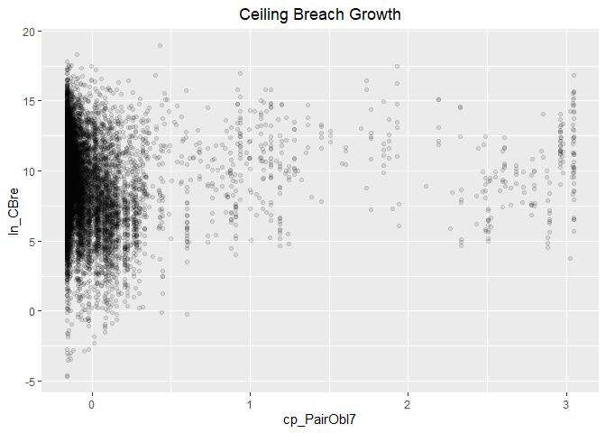<!-- -->

```r
#Model
b_CBre11A <- glm (data=serv_smp,
                 b_CBre ~ c_pMarket, family=binomial(link="logit"))
display(b_CBre11A)
```

```
## glm(formula = b_CBre ~ c_pMarket, family = binomial(link = "logit"), 
##     data = serv_smp)
##             coef.est coef.se
## (Intercept) -2.78     0.01  
## c_pMarket   -0.18     0.02  
## ---
##   n = 250000, k = 2
##   residual deviance = 111818.0, null deviance = 111909.6 (difference = 91.6)
```

```r
n_CBre11A <- glm(data=serv_breach,
                        ln_CBre_OMB20_GDP18 ~ c_pMarket)

display(n_CBre11A)
```

```
## glm(formula = ln_CBre_OMB20_GDP18 ~ c_pMarket, data = serv_breach)
##             coef.est coef.se
## (Intercept)  9.31     0.01  
## c_pMarket   -0.08     0.03  
## ---
##   n = 61184, k = 2
##   residual deviance = 456163.5, null deviance = 456211.7 (difference = 48.2)
##   overdispersion parameter = 7.5
##   residual sd is sqrt(overdispersion) = 2.73
```

```r
#Plot residuals versus fitted
stargazer::stargazer(b_CBre11A,
                      
                       n_CBre11A,
                       type="text",
                       digits=2)
```

```
## 
## ================================================
##                        Dependent variable:      
##                   ------------------------------
##                     b_CBre   ln_CBre_OMB20_GDP18
##                    logistic        normal       
##                      (1)             (2)        
## ------------------------------------------------
## c_pMarket          -0.18***        -0.08**      
##                     (0.02)         (0.03)       
##                                                 
## Constant           -2.78***        9.31***      
##                     (0.01)         (0.01)       
##                                                 
## ------------------------------------------------
## Observations       250,000         61,184       
## Log Likelihood    -55,908.99     -148,275.60    
## Akaike Inf. Crit. 111,822.00     296,555.20     
## ================================================
## Note:                *p<0.1; **p<0.05; ***p<0.01
```

Aligns with expectations on terminatio, but not for ceiling  breach or for options.


#### Model 11B: Cumulative Model


```r
#Frequency Plot for unlogged ceiling


#Model
b_CBre11B <- glm (data=serv_smp,
                 b_CBre ~  cl_US6_avg_sal_lag1Const + 
                   cl_CFTE+ c_pPBSC+c_pOffPSC+
                 c_pairHist+cl_pairCA +
                   cl_Ceil + capped_cl_Days+
                   Comp1or5+
                   Veh+
                   PricingUCA+
                   Crisis+
                   cl_def6_HHI_lag1+cl_def6_ratio_lag1+
                   cl_def3_HHI_lag1+cl_def3_ratio_lag1+
                   c_pMarket, family=binomial(link="logit"))
glmer_examine(b_CBre11B)
```

```
##                              GVIF Df GVIF^(1/(2*Df))
## cl_US6_avg_sal_lag1Const 1.681103  1        1.296574
## cl_CFTE                  1.318682  1        1.148339
## c_pPBSC                  1.471037  1        1.212863
## c_pOffPSC                1.982786  1        1.408114
## c_pairHist               1.301641  1        1.140895
## cl_pairCA                2.287639  1        1.512494
## cl_Ceil                  1.515286  1        1.230969
## capped_cl_Days           1.412036  1        1.188291
## Comp1or5                 1.267394  3        1.040284
## Veh                      1.832234  4        1.078630
## PricingUCA               1.227585  6        1.017234
## Crisis                   1.333518  3        1.049139
## cl_def6_HHI_lag1         2.088018  1        1.444997
## cl_def6_ratio_lag1       1.829121  1        1.352450
## cl_def3_HHI_lag1         1.936565  1        1.391605
## cl_def3_ratio_lag1       2.283034  1        1.510971
## c_pMarket                1.274026  1        1.128727
```

```r
n_CBre11B <- glm(data=serv_breach,
                        ln_CBre_OMB20_GDP18 ~  cl_US6_avg_sal_lag1Const + 
                   cl_CFTE+ c_pPBSC+c_pOffPSC+
                 c_pairHist+cl_pairCA+
                 cl_Ceil + capped_cl_Days+
                 Comp1or5+
                   Veh+
                   PricingUCA+
                   Crisis+
                 cl_def6_HHI_lag1+cl_def6_ratio_lag1+
                 cl_def3_HHI_lag1+cl_def3_ratio_lag1+
                 c_pMarket)

glmer_examine(n_CBre11B)
```

```
##                              GVIF Df GVIF^(1/(2*Df))
## cl_US6_avg_sal_lag1Const 1.680792  1        1.296454
## cl_CFTE                  1.363855  1        1.167842
## c_pPBSC                  2.292966  1        1.514254
## c_pOffPSC                3.305801  1        1.818186
## c_pairHist               1.363091  1        1.167515
## cl_pairCA                2.845822  1        1.686957
## cl_Ceil                  1.975390  1        1.405486
## capped_cl_Days           1.613777  1        1.270345
## Comp1or5                 1.308091  3        1.045778
## Veh                      2.145253  4        1.100107
## PricingUCA               1.308808  6        1.022680
## Crisis                   1.275464  3        1.041385
## cl_def6_HHI_lag1         2.957400  1        1.719709
## cl_def6_ratio_lag1       1.515008  1        1.230857
## cl_def3_HHI_lag1         2.150182  1        1.466350
## cl_def3_ratio_lag1       1.964457  1        1.401591
## c_pMarket                1.338627  1        1.156990
```

```r
#Plot residuals versus fitted
stargazer::stargazer(b_CBre10D,b_CBre11A,b_CBre11B,
                     
                     n_CBre10D,n_CBre11A,n_CBre11B,
                       type="text",
                       digits=2)
```

```
## 
## ===================================================================================================
##                                                        Dependent variable:                         
##                                --------------------------------------------------------------------
##                                             b_CBre                      ln_CBre_OMB20_GDP18        
##                                            logistic                           normal               
##                                   (1)        (2)        (3)         (4)         (5)         (6)    
## ---------------------------------------------------------------------------------------------------
## cl_US6_avg_sal_lag1Const        -0.08***              -0.11***    0.09***                 0.10***  
##                                  (0.02)                (0.02)     (0.02)                  (0.02)   
##                                                                                                    
## cl_CFTE                         0.05***               0.07***     0.22***                 0.21***  
##                                  (0.02)                (0.02)     (0.02)                  (0.02)   
##                                                                                                    
## c_pPBSC                         -0.13***              -0.18***   -0.32***                -0.30***  
##                                  (0.02)                (0.02)     (0.02)                  (0.02)   
##                                                                                                    
## c_pOffPSC                       1.06***               1.12***    -0.49***                -0.51***  
##                                  (0.02)                (0.02)     (0.02)                  (0.02)   
##                                                                                                    
## c_pairHist                      -0.07***              -0.07***    0.09***                 0.08***  
##                                  (0.02)                (0.02)     (0.02)                  (0.02)   
##                                                                                                    
## cl_pairCA                        -0.03                0.10***    -0.11***                -0.18***  
##                                  (0.03)                (0.03)     (0.02)                  (0.03)   
##                                                                                                    
## cl_Ceil                         1.03***               1.07***     2.89***                 2.88***  
##                                  (0.02)                (0.02)     (0.02)                  (0.02)   
##                                                                                                    
## capped_cl_Days                  0.07***                0.05**     0.17***                 0.17***  
##                                  (0.02)                (0.02)     (0.02)                  (0.02)   
##                                                                                                    
## Comp1or51 offer                 -0.13***              -0.09***    -0.05*                  -0.06**  
##                                  (0.03)                (0.03)     (0.03)                  (0.03)   
##                                                                                                    
## Comp1or52-4 offers              0.24***               0.23***    -0.26***                -0.25***  
##                                  (0.02)                (0.02)     (0.02)                  (0.02)   
##                                                                                                    
## Comp1or55+ offers               0.35***               0.31***    -0.20***                -0.18***  
##                                  (0.03)                (0.03)     (0.02)                  (0.02)   
##                                                                                                    
## VehS-IDC                        -0.21***              -0.24***    0.09***                 0.11***  
##                                  (0.02)                (0.02)     (0.02)                  (0.02)   
##                                                                                                    
## VehM-IDC                        -0.15***              -0.19***     0.04*                  0.07***  
##                                  (0.03)                (0.03)     (0.03)                  (0.03)   
##                                                                                                    
## VehFSS/GWAC                     -0.51***              -0.53***    0.19***                 0.20***  
##                                  (0.05)                (0.05)     (0.04)                  (0.04)   
##                                                                                                    
## VehBPA/BOA                      -0.44***              -0.39***     -0.02                  -0.002   
##                                  (0.06)                (0.06)     (0.05)                  (0.05)   
##                                                                                                    
## PricingUCAOther FP              -0.62***              -0.59***   -0.42***                -0.50***  
##                                  (0.13)                (0.13)     (0.13)                  (0.13)   
##                                                                                                    
## PricingUCAT&M/LH/FPLOE          -0.59***              -0.58***    1.13***                 1.11***  
##                                  (0.07)                (0.07)     (0.06)                  (0.06)   
##                                                                                                    
## PricingUCAIncentive              -0.01                 -0.03      0.84***                 0.85***  
##                                  (0.10)                (0.10)     (0.08)                  (0.08)   
##                                                                                                    
## PricingUCAOther CB              -1.18***              -1.12***    1.22***                 1.14***  
##                                  (0.05)                (0.05)     (0.04)                  (0.04)   
##                                                                                                    
## PricingUCAUCA                    -0.14*                -0.09      0.60***                 0.59***  
##                                  (0.08)                (0.08)     (0.06)                  (0.06)   
##                                                                                                    
## PricingUCACombination or Other  -0.27***              -0.25***    0.59***                 0.59***  
##                                  (0.08)                (0.08)     (0.07)                  (0.07)   
##                                                                                                    
## CrisisARRA                      0.91***               0.90***      0.003                   0.004   
##                                  (0.07)                (0.07)     (0.06)                  (0.06)   
##                                                                                                    
## CrisisDis                       0.69***               0.71***     0.49***                 0.49***  
##                                  (0.16)                (0.16)     (0.13)                  (0.13)   
##                                                                                                    
## CrisisOCO                       -0.31***              -0.11**     0.42***                 0.36***  
##                                  (0.05)                (0.05)     (0.04)                  (0.04)   
##                                                                                                    
## cl_def6_HHI_lag1                0.23***               0.24***      -0.02                   -0.02   
##                                  (0.02)                (0.02)     (0.02)                  (0.02)   
##                                                                                                    
## cl_def6_ratio_lag1              -0.13***              -0.16***    0.15***                 0.16***  
##                                  (0.03)                (0.03)     (0.02)                  (0.02)   
##                                                                                                    
## cl_def3_HHI_lag1                -0.45***              -0.47***    -0.001                   0.002   
##                                  (0.02)                (0.02)     (0.02)                  (0.02)   
##                                                                                                    
## cl_def3_ratio_lag1              -0.17***              -0.17***    0.41***                 0.41***  
##                                  (0.03)                (0.03)     (0.02)                  (0.02)   
##                                                                                                    
## c_pMarket                                  -0.18***   -0.46***                -0.08**     0.22***  
##                                             (0.02)     (0.03)                 (0.03)      (0.02)   
##                                                                                                    
## Constant                        -2.91***   -2.78***   -2.92***    8.80***     9.31***     8.80***  
##                                  (0.02)     (0.01)     (0.02)     (0.02)      (0.01)      (0.02)   
##                                                                                                    
## ---------------------------------------------------------------------------------------------------
## Observations                    250,000    250,000    250,000     61,184      61,184      61,184   
## Log Likelihood                 -51,731.95 -55,908.99 -51,565.50 -121,799.80 -148,275.60 -121,752.70
## Akaike Inf. Crit.              103,521.90 111,822.00 103,191.00 243,657.60  296,555.20  243,565.40 
## ===================================================================================================
## Note:                                                                   *p<0.1; **p<0.05; ***p<0.01
```

```r
#summary_residual_compare(b_CBre10D,b_CBre11B)
#summary_residual_compare(b_CBre11A,b_CBre11B)
```
Note that the VIF is getting high on pair_CA.

### Other Office Characteristics
#### 12A: Past Office Volume (dollars)

Expectation: Contracting offices previously had more contract volume in dollars would have more experience managing cost and preventing cost-ceiling breaches, therefore larger past office volume would lower the likelihood of cost-ceiling breaches but no substantial relationships with likelihood of terminations or exercised options.

Past Office Volume $s	cl_OffVol		-	+	+
From looking at data, terminations, easier for big, less dependent. - less dependenct


```r
summary_continuous_plot(serv_smp1m,metric="cbre","cl_OffVol")
```

```
## Warning in `[<-.factor`(`*tmp*`, ri, value = c(0, 0, 0, 0, 0, 0, 0, 0, 0, :
## invalid factor level, NA generated
```

<!-- -->

```r
#Scatter Plot
ggplot(serv_smp, aes(x=cl_OffVol, y=ln_CBre_OMB20_GDP18)) + geom_point(alpha = 0.1) + ggtitle('Ceiling Breach Growth') + theme(plot.title = element_text(hjust = 0.5))
```

<!-- -->

```r
#Model
b_CBre12A <- glm (data=serv_smp,
                 b_CBre ~ cl_OffVol, family=binomial(link="logit"))
display(b_CBre12A)
```

```
## glm(formula = b_CBre ~ cl_OffVol, family = binomial(link = "logit"), 
##     data = serv_smp)
##             coef.est coef.se
## (Intercept) -2.78     0.01  
## cl_OffVol   -0.18     0.01  
## ---
##   n = 250000, k = 2
##   residual deviance = 111775.1, null deviance = 111909.6 (difference = 134.5)
```

```r
n_CBre12A <- glm(data=serv_breach,
                        ln_CBre_OMB20_GDP18 ~ cl_OffVol)

display(n_CBre12A)
```

```
## glm(formula = ln_CBre_OMB20_GDP18 ~ cl_OffVol, data = serv_breach)
##             coef.est coef.se
## (Intercept) 9.38     0.01   
## cl_OffVol   1.40     0.02   
## ---
##   n = 61184, k = 2
##   residual deviance = 424836.3, null deviance = 456211.7 (difference = 31375.4)
##   overdispersion parameter = 6.9
##   residual sd is sqrt(overdispersion) = 2.64
```

```r
#Plot residuals versus fitted
stargazer::stargazer(b_CBre12A,
                       
                       n_CBre12A,
                       type="text",
                       digits=2)
```

```
## 
## ================================================
##                        Dependent variable:      
##                   ------------------------------
##                     b_CBre   ln_CBre_OMB20_GDP18
##                    logistic        normal       
##                      (1)             (2)        
## ------------------------------------------------
## cl_OffVol          -0.18***        1.40***      
##                     (0.01)         (0.02)       
##                                                 
## Constant           -2.78***        9.38***      
##                     (0.01)         (0.01)       
##                                                 
## ------------------------------------------------
## Observations       250,000         61,184       
## Log Likelihood    -55,887.53     -146,099.10    
## Akaike Inf. Crit. 111,779.10     292,202.10     
## ================================================
## Note:                *p<0.1; **p<0.05; ***p<0.01
```

```r
summary_residual_compare(b_CBre11A,b_CBre12A, skip_vif = TRUE)
```

```
## debugging in: summary_residual_compare(b_CBre11A, b_CBre12A, skip_vif = TRUE)
## debug: {
##     if (skip_vif == FALSE) 
##         warning("Deprecating VIF. Just use glmer_examine on the models")
##     if (!is.na(bins)) {
##         if ("cl_US6_avg_sal_lag1Const" %in% model_colnames(model1_old) & 
##             "cl_US6_avg_sal_lag1Const" %in% model_colnames(model1_new)) 
##             bins <- bins + 5
##         if ("cl_CFTE" %in% model_colnames(model1_old) & "cl_CFTE" %in% 
##             model_colnames(model1_new)) 
##             bins <- bins + 5
##         if ("c_pPBSC" %in% model_colnames(model1_old) & "c_pPBSC" %in% 
##             model_colnames(model1_new)) 
##             bins <- bins + 5
##         if ("c_pOffPSC" %in% model_colnames(model1_old) & "c_pOffPSC" %in% 
##             model_colnames(model1_new)) 
##             bins <- bins + 5
##         if ("cl_pairCA" %in% model_colnames(model1_old) & "cl_pairCA" %in% 
##             model_colnames(model1_new)) 
##             bins <- bins + 5
##         if ("c_OffCri" %in% model_colnames(model1_old) & "c_OffCri" %in% 
##             model_colnames(model1_new)) 
##             bins <- bins + 5
##         if (("cl_Ceil" %in% model_colnames(model1_old) & "cl_Ceil" %in% 
##             model_colnames(model1_new)) | ("cl_Ceil_Then_Year" %in% 
##             model_colnames(model1_old) & "cl_Ceil_Then_Year" %in% 
##             model_colnames(model1_new))) 
##             bins <- bins + 10
##         if ("cl_Days" %in% model_colnames(model1_old) & "cl_Days" %in% 
##             model_colnames(model1_new)) 
##             bins <- bins + 5
##     }
##     if (!is.null(model2_new)) {
##         gridExtra::grid.arrange(binned_fitted_versus_residuals(model1_old, 
##             bins = bins), binned_fitted_versus_residuals(model1_new, 
##             bins = bins), binned_fitted_versus_residuals(model2_old, 
##             bins = bins), binned_fitted_versus_residuals(model2_new, 
##             bins = bins), ncol = 2)
##         if (!"b_Term" %in% model_colnames(model1_old) & !"b_CBre" %in% 
##             model_colnames(model1_old)) 
##             gridExtra::grid.arrange(resid_plot(model1_old, sample = 25000), 
##                 resid_plot(model1_new, sample = 25000), resid_plot(model2_old, 
##                   sample = 25000), resid_plot(model2_new, sample = 25000), 
##                 ncol = 2)
##         if (!"b_Term" %in% colnames(model1_old) & !"b_CBre" %in% 
##             model_colnames(model1_old)) 
##             gridExtra::grid.arrange(residuals_binned(model1_old, 
##                 bins = bins), residuals_binned(model1_new, bins = bins), 
##                 residuals_binned(model2_old, bins = bins), residuals_binned(model2_new, 
##                   bins = bins), ncol = 2)
##         if ("cl_Ceil" %in% model_colnames(model1_new)) {
##             residual_compare(model1_old, model1_new, model2_old, 
##                 model2_new, "cl_Ceil", "Centered Log(Ceiling)", 
##                 20)
##         }
##         if ("cl_Days" %in% model_colnames(model1_new)) {
##             residual_compare(model1_old, model1_new, model2_old, 
##                 model2_new, "cl_Days", "Centered Log(Days)", 
##                 10)
##         }
##         output <- NULL
##         if (class(model1_new) == "glmerMod" & class(model2_new) == 
##             "glmerMod") {
##             m1t <- getME(model1_new, "theta")
##             m1l <- getME(model1_new, "lower")
##             m2t <- getME(model2_new, "theta")
##             m2l <- getME(model2_new, "lower")
##             output <- list(m1t[m1l == 0], m2t[m2l == 0], model1_new@optinfo$conv$lme4$messages, 
##                 model2_new@optinfo$conv$lme4$messages)
##         }
##         else if ((class(model1_new) != "glmerMod" & class(model2_new) != 
##             "glmerMod") & (class(model1_old) != "glmerMod" & 
##             class(model2_old) != "glmerMod")) {
##             output <- list(rbind(deviance_stats(model1_old, "model1_old"), 
##                 deviance_stats(model1_new, "model1_new"), deviance_stats(model2_old, 
##                   "model2_old"), deviance_stats(model2_new, "model2_new")))
##         }
##     }
##     else if (!is.null(model1_new)) {
##         gridExtra::grid.arrange(binned_fitted_versus_residuals(model1_old, 
##             bins = bins), binned_fitted_versus_residuals(model1_new, 
##             bins = bins), ncol = 2)
##         if (!"b_Term" %in% model_colnames(model1_old) & !"b_CBre" %in% 
##             model_colnames(model1_old)) 
##             gridExtra::grid.arrange(resid_plot(model1_old, sample = 25000), 
##                 resid_plot(model1_new, sample = 25000), ncol = 2)
##         gridExtra::grid.arrange(residuals_binned(model1_old, 
##             bins = bins), residuals_binned(model1_new, bins = bins), 
##             ncol = 2)
##         output <- NULL
##         if (class(model1_new) == "glmerMod") {
##             m1t <- getME(model1_new, "theta")
##             m1l <- getME(model1_new, "lower")
##             output <- list(m1t[m1l == 0], model1_new@optinfo$conv$lme4$messages)
##         }
##         else if (class(model1_new) != "glmerMod" & class(model1_old) != 
##             "glmerMod") {
##             output <- list(rbind(deviance_stats(model1_old, "model1_old"), 
##                 deviance_stats(model1_new, "model1_new")))
##         }
##     }
##     else {
##         if (!is.na(bins)) {
##             if ("cl_US6_avg_sal_lag1Const" %in% model_colnames(model1_old)) 
##                 bins <- bins + 5
##             if ("cl_CFTE" %in% model_colnames(model1_old)) 
##                 bins <- bins + 5
##             if ("c_pPBSC" %in% model_colnames(model1_old)) 
##                 bins <- bins + 5
##             if ("c_pOffPSC" %in% model_colnames(model1_old)) 
##                 bins <- bins + 5
##             if ("cl_pairCA" %in% model_colnames(model1_old)) 
##                 bins <- bins + 5
##             if ("c_OffCri" %in% model_colnames(model1_old)) 
##                 bins <- bins + 5
##             if (("cl_Ceil" %in% model_colnames(model1_old)) | 
##                 ("cl_Ceil_Then_Year" %in% model_colnames(model1_old))) 
##                 bins <- bins + 10
##             if ("cl_Days" %in% model_colnames(model1_old)) 
##                 bins <- bins + 5
##         }
##         if (!"b_Term" %in% model_colnames(model1_old) & !"b_CBre" %in% 
##             model_colnames(model1_old)) 
##             gridExtra::grid.arrange(binned_fitted_versus_residuals(model1_old, 
##                 bins = bins), residuals_binned(model1_old, bins = bins), 
##                 resid_plot(model1_old, sample = 25000))
##         else gridExtra::grid.arrange(binned_fitted_versus_residuals(model1_old, 
##             bins = bins), residuals_binned(model1_old, bins = bins))
##         output <- NULL
##         if (class(model1_old) == "glmerMod") {
##             m1t <- getME(model1_old, "theta")
##             m1l <- getME(model1_old, "lower")
##             output <- list(m1t[m1l == 0], model1_old@optinfo$conv$lme4$messages)
##         }
##         else if (class(model1_old) != "glmerMod" & class(model1_old) != 
##             "glmerMod") {
##             output <- list(deviance_stats(model1_old, "model1_old"))
##         }
##     }
##     output
## }
## debug: if (skip_vif == FALSE) warning("Deprecating VIF. Just use glmer_examine on the models")
## debug: if (!is.na(bins)) {
##     if ("cl_US6_avg_sal_lag1Const" %in% model_colnames(model1_old) & 
##         "cl_US6_avg_sal_lag1Const" %in% model_colnames(model1_new)) 
##         bins <- bins + 5
##     if ("cl_CFTE" %in% model_colnames(model1_old) & "cl_CFTE" %in% 
##         model_colnames(model1_new)) 
##         bins <- bins + 5
##     if ("c_pPBSC" %in% model_colnames(model1_old) & "c_pPBSC" %in% 
##         model_colnames(model1_new)) 
##         bins <- bins + 5
##     if ("c_pOffPSC" %in% model_colnames(model1_old) & "c_pOffPSC" %in% 
##         model_colnames(model1_new)) 
##         bins <- bins + 5
##     if ("cl_pairCA" %in% model_colnames(model1_old) & "cl_pairCA" %in% 
##         model_colnames(model1_new)) 
##         bins <- bins + 5
##     if ("c_OffCri" %in% model_colnames(model1_old) & "c_OffCri" %in% 
##         model_colnames(model1_new)) 
##         bins <- bins + 5
##     if (("cl_Ceil" %in% model_colnames(model1_old) & "cl_Ceil" %in% 
##         model_colnames(model1_new)) | ("cl_Ceil_Then_Year" %in% 
##         model_colnames(model1_old) & "cl_Ceil_Then_Year" %in% 
##         model_colnames(model1_new))) 
##         bins <- bins + 10
##     if ("cl_Days" %in% model_colnames(model1_old) & "cl_Days" %in% 
##         model_colnames(model1_new)) 
##         bins <- bins + 5
## }
## debug: if ("cl_US6_avg_sal_lag1Const" %in% model_colnames(model1_old) & 
##     "cl_US6_avg_sal_lag1Const" %in% model_colnames(model1_new)) bins <- bins + 
##     5
## debug: if ("cl_CFTE" %in% model_colnames(model1_old) & "cl_CFTE" %in% 
##     model_colnames(model1_new)) bins <- bins + 5
## debug: if ("c_pPBSC" %in% model_colnames(model1_old) & "c_pPBSC" %in% 
##     model_colnames(model1_new)) bins <- bins + 5
## debug: if ("c_pOffPSC" %in% model_colnames(model1_old) & "c_pOffPSC" %in% 
##     model_colnames(model1_new)) bins <- bins + 5
## debug: if ("cl_pairCA" %in% model_colnames(model1_old) & "cl_pairCA" %in% 
##     model_colnames(model1_new)) bins <- bins + 5
## debug: if ("c_OffCri" %in% model_colnames(model1_old) & "c_OffCri" %in% 
##     model_colnames(model1_new)) bins <- bins + 5
## debug: if (("cl_Ceil" %in% model_colnames(model1_old) & "cl_Ceil" %in% 
##     model_colnames(model1_new)) | ("cl_Ceil_Then_Year" %in% model_colnames(model1_old) & 
##     "cl_Ceil_Then_Year" %in% model_colnames(model1_new))) bins <- bins + 
##     10
## debug: if ("cl_Days" %in% model_colnames(model1_old) & "cl_Days" %in% 
##     model_colnames(model1_new)) bins <- bins + 5
## debug: if (!is.null(model2_new)) {
##     gridExtra::grid.arrange(binned_fitted_versus_residuals(model1_old, 
##         bins = bins), binned_fitted_versus_residuals(model1_new, 
##         bins = bins), binned_fitted_versus_residuals(model2_old, 
##         bins = bins), binned_fitted_versus_residuals(model2_new, 
##         bins = bins), ncol = 2)
##     if (!"b_Term" %in% model_colnames(model1_old) & !"b_CBre" %in% 
##         model_colnames(model1_old)) 
##         gridExtra::grid.arrange(resid_plot(model1_old, sample = 25000), 
##             resid_plot(model1_new, sample = 25000), resid_plot(model2_old, 
##                 sample = 25000), resid_plot(model2_new, sample = 25000), 
##             ncol = 2)
##     if (!"b_Term" %in% colnames(model1_old) & !"b_CBre" %in% 
##         model_colnames(model1_old)) 
##         gridExtra::grid.arrange(residuals_binned(model1_old, 
##             bins = bins), residuals_binned(model1_new, bins = bins), 
##             residuals_binned(model2_old, bins = bins), residuals_binned(model2_new, 
##                 bins = bins), ncol = 2)
##     if ("cl_Ceil" %in% model_colnames(model1_new)) {
##         residual_compare(model1_old, model1_new, model2_old, 
##             model2_new, "cl_Ceil", "Centered Log(Ceiling)", 20)
##     }
##     if ("cl_Days" %in% model_colnames(model1_new)) {
##         residual_compare(model1_old, model1_new, model2_old, 
##             model2_new, "cl_Days", "Centered Log(Days)", 10)
##     }
##     output <- NULL
##     if (class(model1_new) == "glmerMod" & class(model2_new) == 
##         "glmerMod") {
##         m1t <- getME(model1_new, "theta")
##         m1l <- getME(model1_new, "lower")
##         m2t <- getME(model2_new, "theta")
##         m2l <- getME(model2_new, "lower")
##         output <- list(m1t[m1l == 0], m2t[m2l == 0], model1_new@optinfo$conv$lme4$messages, 
##             model2_new@optinfo$conv$lme4$messages)
##     }
##     else if ((class(model1_new) != "glmerMod" & class(model2_new) != 
##         "glmerMod") & (class(model1_old) != "glmerMod" & class(model2_old) != 
##         "glmerMod")) {
##         output <- list(rbind(deviance_stats(model1_old, "model1_old"), 
##             deviance_stats(model1_new, "model1_new"), deviance_stats(model2_old, 
##                 "model2_old"), deviance_stats(model2_new, "model2_new")))
##     }
## } else if (!is.null(model1_new)) {
##     gridExtra::grid.arrange(binned_fitted_versus_residuals(model1_old, 
##         bins = bins), binned_fitted_versus_residuals(model1_new, 
##         bins = bins), ncol = 2)
##     if (!"b_Term" %in% model_colnames(model1_old) & !"b_CBre" %in% 
##         model_colnames(model1_old)) 
##         gridExtra::grid.arrange(resid_plot(model1_old, sample = 25000), 
##             resid_plot(model1_new, sample = 25000), ncol = 2)
##     gridExtra::grid.arrange(residuals_binned(model1_old, bins = bins), 
##         residuals_binned(model1_new, bins = bins), ncol = 2)
##     output <- NULL
##     if (class(model1_new) == "glmerMod") {
##         m1t <- getME(model1_new, "theta")
##         m1l <- getME(model1_new, "lower")
##         output <- list(m1t[m1l == 0], model1_new@optinfo$conv$lme4$messages)
##     }
##     else if (class(model1_new) != "glmerMod" & class(model1_old) != 
##         "glmerMod") {
##         output <- list(rbind(deviance_stats(model1_old, "model1_old"), 
##             deviance_stats(model1_new, "model1_new")))
##     }
## } else {
##     if (!is.na(bins)) {
##         if ("cl_US6_avg_sal_lag1Const" %in% model_colnames(model1_old)) 
##             bins <- bins + 5
##         if ("cl_CFTE" %in% model_colnames(model1_old)) 
##             bins <- bins + 5
##         if ("c_pPBSC" %in% model_colnames(model1_old)) 
##             bins <- bins + 5
##         if ("c_pOffPSC" %in% model_colnames(model1_old)) 
##             bins <- bins + 5
##         if ("cl_pairCA" %in% model_colnames(model1_old)) 
##             bins <- bins + 5
##         if ("c_OffCri" %in% model_colnames(model1_old)) 
##             bins <- bins + 5
##         if (("cl_Ceil" %in% model_colnames(model1_old)) | ("cl_Ceil_Then_Year" %in% 
##             model_colnames(model1_old))) 
##             bins <- bins + 10
##         if ("cl_Days" %in% model_colnames(model1_old)) 
##             bins <- bins + 5
##     }
##     if (!"b_Term" %in% model_colnames(model1_old) & !"b_CBre" %in% 
##         model_colnames(model1_old)) 
##         gridExtra::grid.arrange(binned_fitted_versus_residuals(model1_old, 
##             bins = bins), residuals_binned(model1_old, bins = bins), 
##             resid_plot(model1_old, sample = 25000))
##     else gridExtra::grid.arrange(binned_fitted_versus_residuals(model1_old, 
##         bins = bins), residuals_binned(model1_old, bins = bins))
##     output <- NULL
##     if (class(model1_old) == "glmerMod") {
##         m1t <- getME(model1_old, "theta")
##         m1l <- getME(model1_old, "lower")
##         output <- list(m1t[m1l == 0], model1_old@optinfo$conv$lme4$messages)
##     }
##     else if (class(model1_old) != "glmerMod" & class(model1_old) != 
##         "glmerMod") {
##         output <- list(deviance_stats(model1_old, "model1_old"))
##     }
## }
## debug: if (!is.null(model1_new)) {
##     gridExtra::grid.arrange(binned_fitted_versus_residuals(model1_old, 
##         bins = bins), binned_fitted_versus_residuals(model1_new, 
##         bins = bins), ncol = 2)
##     if (!"b_Term" %in% model_colnames(model1_old) & !"b_CBre" %in% 
##         model_colnames(model1_old)) 
##         gridExtra::grid.arrange(resid_plot(model1_old, sample = 25000), 
##             resid_plot(model1_new, sample = 25000), ncol = 2)
##     gridExtra::grid.arrange(residuals_binned(model1_old, bins = bins), 
##         residuals_binned(model1_new, bins = bins), ncol = 2)
##     output <- NULL
##     if (class(model1_new) == "glmerMod") {
##         m1t <- getME(model1_new, "theta")
##         m1l <- getME(model1_new, "lower")
##         output <- list(m1t[m1l == 0], model1_new@optinfo$conv$lme4$messages)
##     }
##     else if (class(model1_new) != "glmerMod" & class(model1_old) != 
##         "glmerMod") {
##         output <- list(rbind(deviance_stats(model1_old, "model1_old"), 
##             deviance_stats(model1_new, "model1_new")))
##     }
## } else {
##     if (!is.na(bins)) {
##         if ("cl_US6_avg_sal_lag1Const" %in% model_colnames(model1_old)) 
##             bins <- bins + 5
##         if ("cl_CFTE" %in% model_colnames(model1_old)) 
##             bins <- bins + 5
##         if ("c_pPBSC" %in% model_colnames(model1_old)) 
##             bins <- bins + 5
##         if ("c_pOffPSC" %in% model_colnames(model1_old)) 
##             bins <- bins + 5
##         if ("cl_pairCA" %in% model_colnames(model1_old)) 
##             bins <- bins + 5
##         if ("c_OffCri" %in% model_colnames(model1_old)) 
##             bins <- bins + 5
##         if (("cl_Ceil" %in% model_colnames(model1_old)) | ("cl_Ceil_Then_Year" %in% 
##             model_colnames(model1_old))) 
##             bins <- bins + 10
##         if ("cl_Days" %in% model_colnames(model1_old)) 
##             bins <- bins + 5
##     }
##     if (!"b_Term" %in% model_colnames(model1_old) & !"b_CBre" %in% 
##         model_colnames(model1_old)) 
##         gridExtra::grid.arrange(binned_fitted_versus_residuals(model1_old, 
##             bins = bins), residuals_binned(model1_old, bins = bins), 
##             resid_plot(model1_old, sample = 25000))
##     else gridExtra::grid.arrange(binned_fitted_versus_residuals(model1_old, 
##         bins = bins), residuals_binned(model1_old, bins = bins))
##     output <- NULL
##     if (class(model1_old) == "glmerMod") {
##         m1t <- getME(model1_old, "theta")
##         m1l <- getME(model1_old, "lower")
##         output <- list(m1t[m1l == 0], model1_old@optinfo$conv$lme4$messages)
##     }
##     else if (class(model1_old) != "glmerMod" & class(model1_old) != 
##         "glmerMod") {
##         output <- list(deviance_stats(model1_old, "model1_old"))
##     }
## }
## debug: gridExtra::grid.arrange(binned_fitted_versus_residuals(model1_old, 
##     bins = bins), binned_fitted_versus_residuals(model1_new, 
##     bins = bins), ncol = 2)
```

<!-- -->

```
## debug: if (!"b_Term" %in% model_colnames(model1_old) & !"b_CBre" %in% 
##     model_colnames(model1_old)) gridExtra::grid.arrange(resid_plot(model1_old, 
##     sample = 25000), resid_plot(model1_new, sample = 25000), 
##     ncol = 2)
## debug: gridExtra::grid.arrange(residuals_binned(model1_old, bins = bins), 
##     residuals_binned(model1_new, bins = bins), ncol = 2)
```

```
## debug: output <- NULL
## debug: if (class(model1_new) == "glmerMod") {
##     m1t <- getME(model1_new, "theta")
##     m1l <- getME(model1_new, "lower")
##     output <- list(m1t[m1l == 0], model1_new@optinfo$conv$lme4$messages)
## } else if (class(model1_new) != "glmerMod" & class(model1_old) != 
##     "glmerMod") {
##     output <- list(rbind(deviance_stats(model1_old, "model1_old"), 
##         deviance_stats(model1_new, "model1_new")))
## }
```

```
## Warning in if (class(model1_new) == "glmerMod") {: the condition has length
## > 1 and only the first element will be used
```

```
## debug: if (class(model1_new) != "glmerMod" & class(model1_old) != "glmerMod") {
##     output <- list(rbind(deviance_stats(model1_old, "model1_old"), 
##         deviance_stats(model1_new, "model1_new")))
## }
```

```
## Warning in if (class(model1_new) != "glmerMod" & class(model1_old) !=
## "glmerMod") {: the condition has length > 1 and only the first element will
## be used
```

<!-- -->

```
## debug: output <- list(rbind(deviance_stats(model1_old, "model1_old"), 
##     deviance_stats(model1_new, "model1_new")))
## debug: output
## exiting from: summary_residual_compare(b_CBre11A, b_CBre12A, skip_vif = TRUE)
```

```
## [[1]]
##        model deviance null.deviance difference
## 1 model1_old 111818.0      111909.6   91.61363
## 2 model1_new 111775.1      111909.6  134.53467
```

```r
summary_residual_compare(b_CBre03D,b_CBre12A, skip_vif = TRUE)
```

```
## debugging in: summary_residual_compare(b_CBre03D, b_CBre12A, skip_vif = TRUE)
## debug: {
##     if (skip_vif == FALSE) 
##         warning("Deprecating VIF. Just use glmer_examine on the models")
##     if (!is.na(bins)) {
##         if ("cl_US6_avg_sal_lag1Const" %in% model_colnames(model1_old) & 
##             "cl_US6_avg_sal_lag1Const" %in% model_colnames(model1_new)) 
##             bins <- bins + 5
##         if ("cl_CFTE" %in% model_colnames(model1_old) & "cl_CFTE" %in% 
##             model_colnames(model1_new)) 
##             bins <- bins + 5
##         if ("c_pPBSC" %in% model_colnames(model1_old) & "c_pPBSC" %in% 
##             model_colnames(model1_new)) 
##             bins <- bins + 5
##         if ("c_pOffPSC" %in% model_colnames(model1_old) & "c_pOffPSC" %in% 
##             model_colnames(model1_new)) 
##             bins <- bins + 5
##         if ("cl_pairCA" %in% model_colnames(model1_old) & "cl_pairCA" %in% 
##             model_colnames(model1_new)) 
##             bins <- bins + 5
##         if ("c_OffCri" %in% model_colnames(model1_old) & "c_OffCri" %in% 
##             model_colnames(model1_new)) 
##             bins <- bins + 5
##         if (("cl_Ceil" %in% model_colnames(model1_old) & "cl_Ceil" %in% 
##             model_colnames(model1_new)) | ("cl_Ceil_Then_Year" %in% 
##             model_colnames(model1_old) & "cl_Ceil_Then_Year" %in% 
##             model_colnames(model1_new))) 
##             bins <- bins + 10
##         if ("cl_Days" %in% model_colnames(model1_old) & "cl_Days" %in% 
##             model_colnames(model1_new)) 
##             bins <- bins + 5
##     }
##     if (!is.null(model2_new)) {
##         gridExtra::grid.arrange(binned_fitted_versus_residuals(model1_old, 
##             bins = bins), binned_fitted_versus_residuals(model1_new, 
##             bins = bins), binned_fitted_versus_residuals(model2_old, 
##             bins = bins), binned_fitted_versus_residuals(model2_new, 
##             bins = bins), ncol = 2)
##         if (!"b_Term" %in% model_colnames(model1_old) & !"b_CBre" %in% 
##             model_colnames(model1_old)) 
##             gridExtra::grid.arrange(resid_plot(model1_old, sample = 25000), 
##                 resid_plot(model1_new, sample = 25000), resid_plot(model2_old, 
##                   sample = 25000), resid_plot(model2_new, sample = 25000), 
##                 ncol = 2)
##         if (!"b_Term" %in% colnames(model1_old) & !"b_CBre" %in% 
##             model_colnames(model1_old)) 
##             gridExtra::grid.arrange(residuals_binned(model1_old, 
##                 bins = bins), residuals_binned(model1_new, bins = bins), 
##                 residuals_binned(model2_old, bins = bins), residuals_binned(model2_new, 
##                   bins = bins), ncol = 2)
##         if ("cl_Ceil" %in% model_colnames(model1_new)) {
##             residual_compare(model1_old, model1_new, model2_old, 
##                 model2_new, "cl_Ceil", "Centered Log(Ceiling)", 
##                 20)
##         }
##         if ("cl_Days" %in% model_colnames(model1_new)) {
##             residual_compare(model1_old, model1_new, model2_old, 
##                 model2_new, "cl_Days", "Centered Log(Days)", 
##                 10)
##         }
##         output <- NULL
##         if (class(model1_new) == "glmerMod" & class(model2_new) == 
##             "glmerMod") {
##             m1t <- getME(model1_new, "theta")
##             m1l <- getME(model1_new, "lower")
##             m2t <- getME(model2_new, "theta")
##             m2l <- getME(model2_new, "lower")
##             output <- list(m1t[m1l == 0], m2t[m2l == 0], model1_new@optinfo$conv$lme4$messages, 
##                 model2_new@optinfo$conv$lme4$messages)
##         }
##         else if ((class(model1_new) != "glmerMod" & class(model2_new) != 
##             "glmerMod") & (class(model1_old) != "glmerMod" & 
##             class(model2_old) != "glmerMod")) {
##             output <- list(rbind(deviance_stats(model1_old, "model1_old"), 
##                 deviance_stats(model1_new, "model1_new"), deviance_stats(model2_old, 
##                   "model2_old"), deviance_stats(model2_new, "model2_new")))
##         }
##     }
##     else if (!is.null(model1_new)) {
##         gridExtra::grid.arrange(binned_fitted_versus_residuals(model1_old, 
##             bins = bins), binned_fitted_versus_residuals(model1_new, 
##             bins = bins), ncol = 2)
##         if (!"b_Term" %in% model_colnames(model1_old) & !"b_CBre" %in% 
##             model_colnames(model1_old)) 
##             gridExtra::grid.arrange(resid_plot(model1_old, sample = 25000), 
##                 resid_plot(model1_new, sample = 25000), ncol = 2)
##         gridExtra::grid.arrange(residuals_binned(model1_old, 
##             bins = bins), residuals_binned(model1_new, bins = bins), 
##             ncol = 2)
##         output <- NULL
##         if (class(model1_new) == "glmerMod") {
##             m1t <- getME(model1_new, "theta")
##             m1l <- getME(model1_new, "lower")
##             output <- list(m1t[m1l == 0], model1_new@optinfo$conv$lme4$messages)
##         }
##         else if (class(model1_new) != "glmerMod" & class(model1_old) != 
##             "glmerMod") {
##             output <- list(rbind(deviance_stats(model1_old, "model1_old"), 
##                 deviance_stats(model1_new, "model1_new")))
##         }
##     }
##     else {
##         if (!is.na(bins)) {
##             if ("cl_US6_avg_sal_lag1Const" %in% model_colnames(model1_old)) 
##                 bins <- bins + 5
##             if ("cl_CFTE" %in% model_colnames(model1_old)) 
##                 bins <- bins + 5
##             if ("c_pPBSC" %in% model_colnames(model1_old)) 
##                 bins <- bins + 5
##             if ("c_pOffPSC" %in% model_colnames(model1_old)) 
##                 bins <- bins + 5
##             if ("cl_pairCA" %in% model_colnames(model1_old)) 
##                 bins <- bins + 5
##             if ("c_OffCri" %in% model_colnames(model1_old)) 
##                 bins <- bins + 5
##             if (("cl_Ceil" %in% model_colnames(model1_old)) | 
##                 ("cl_Ceil_Then_Year" %in% model_colnames(model1_old))) 
##                 bins <- bins + 10
##             if ("cl_Days" %in% model_colnames(model1_old)) 
##                 bins <- bins + 5
##         }
##         if (!"b_Term" %in% model_colnames(model1_old) & !"b_CBre" %in% 
##             model_colnames(model1_old)) 
##             gridExtra::grid.arrange(binned_fitted_versus_residuals(model1_old, 
##                 bins = bins), residuals_binned(model1_old, bins = bins), 
##                 resid_plot(model1_old, sample = 25000))
##         else gridExtra::grid.arrange(binned_fitted_versus_residuals(model1_old, 
##             bins = bins), residuals_binned(model1_old, bins = bins))
##         output <- NULL
##         if (class(model1_old) == "glmerMod") {
##             m1t <- getME(model1_old, "theta")
##             m1l <- getME(model1_old, "lower")
##             output <- list(m1t[m1l == 0], model1_old@optinfo$conv$lme4$messages)
##         }
##         else if (class(model1_old) != "glmerMod" & class(model1_old) != 
##             "glmerMod") {
##             output <- list(deviance_stats(model1_old, "model1_old"))
##         }
##     }
##     output
## }
## debug: if (skip_vif == FALSE) warning("Deprecating VIF. Just use glmer_examine on the models")
## debug: if (!is.na(bins)) {
##     if ("cl_US6_avg_sal_lag1Const" %in% model_colnames(model1_old) & 
##         "cl_US6_avg_sal_lag1Const" %in% model_colnames(model1_new)) 
##         bins <- bins + 5
##     if ("cl_CFTE" %in% model_colnames(model1_old) & "cl_CFTE" %in% 
##         model_colnames(model1_new)) 
##         bins <- bins + 5
##     if ("c_pPBSC" %in% model_colnames(model1_old) & "c_pPBSC" %in% 
##         model_colnames(model1_new)) 
##         bins <- bins + 5
##     if ("c_pOffPSC" %in% model_colnames(model1_old) & "c_pOffPSC" %in% 
##         model_colnames(model1_new)) 
##         bins <- bins + 5
##     if ("cl_pairCA" %in% model_colnames(model1_old) & "cl_pairCA" %in% 
##         model_colnames(model1_new)) 
##         bins <- bins + 5
##     if ("c_OffCri" %in% model_colnames(model1_old) & "c_OffCri" %in% 
##         model_colnames(model1_new)) 
##         bins <- bins + 5
##     if (("cl_Ceil" %in% model_colnames(model1_old) & "cl_Ceil" %in% 
##         model_colnames(model1_new)) | ("cl_Ceil_Then_Year" %in% 
##         model_colnames(model1_old) & "cl_Ceil_Then_Year" %in% 
##         model_colnames(model1_new))) 
##         bins <- bins + 10
##     if ("cl_Days" %in% model_colnames(model1_old) & "cl_Days" %in% 
##         model_colnames(model1_new)) 
##         bins <- bins + 5
## }
## debug: if ("cl_US6_avg_sal_lag1Const" %in% model_colnames(model1_old) & 
##     "cl_US6_avg_sal_lag1Const" %in% model_colnames(model1_new)) bins <- bins + 
##     5
## debug: if ("cl_CFTE" %in% model_colnames(model1_old) & "cl_CFTE" %in% 
##     model_colnames(model1_new)) bins <- bins + 5
## debug: if ("c_pPBSC" %in% model_colnames(model1_old) & "c_pPBSC" %in% 
##     model_colnames(model1_new)) bins <- bins + 5
## debug: if ("c_pOffPSC" %in% model_colnames(model1_old) & "c_pOffPSC" %in% 
##     model_colnames(model1_new)) bins <- bins + 5
## debug: if ("cl_pairCA" %in% model_colnames(model1_old) & "cl_pairCA" %in% 
##     model_colnames(model1_new)) bins <- bins + 5
## debug: if ("c_OffCri" %in% model_colnames(model1_old) & "c_OffCri" %in% 
##     model_colnames(model1_new)) bins <- bins + 5
## debug: if (("cl_Ceil" %in% model_colnames(model1_old) & "cl_Ceil" %in% 
##     model_colnames(model1_new)) | ("cl_Ceil_Then_Year" %in% model_colnames(model1_old) & 
##     "cl_Ceil_Then_Year" %in% model_colnames(model1_new))) bins <- bins + 
##     10
## debug: if ("cl_Days" %in% model_colnames(model1_old) & "cl_Days" %in% 
##     model_colnames(model1_new)) bins <- bins + 5
## debug: if (!is.null(model2_new)) {
##     gridExtra::grid.arrange(binned_fitted_versus_residuals(model1_old, 
##         bins = bins), binned_fitted_versus_residuals(model1_new, 
##         bins = bins), binned_fitted_versus_residuals(model2_old, 
##         bins = bins), binned_fitted_versus_residuals(model2_new, 
##         bins = bins), ncol = 2)
##     if (!"b_Term" %in% model_colnames(model1_old) & !"b_CBre" %in% 
##         model_colnames(model1_old)) 
##         gridExtra::grid.arrange(resid_plot(model1_old, sample = 25000), 
##             resid_plot(model1_new, sample = 25000), resid_plot(model2_old, 
##                 sample = 25000), resid_plot(model2_new, sample = 25000), 
##             ncol = 2)
##     if (!"b_Term" %in% colnames(model1_old) & !"b_CBre" %in% 
##         model_colnames(model1_old)) 
##         gridExtra::grid.arrange(residuals_binned(model1_old, 
##             bins = bins), residuals_binned(model1_new, bins = bins), 
##             residuals_binned(model2_old, bins = bins), residuals_binned(model2_new, 
##                 bins = bins), ncol = 2)
##     if ("cl_Ceil" %in% model_colnames(model1_new)) {
##         residual_compare(model1_old, model1_new, model2_old, 
##             model2_new, "cl_Ceil", "Centered Log(Ceiling)", 20)
##     }
##     if ("cl_Days" %in% model_colnames(model1_new)) {
##         residual_compare(model1_old, model1_new, model2_old, 
##             model2_new, "cl_Days", "Centered Log(Days)", 10)
##     }
##     output <- NULL
##     if (class(model1_new) == "glmerMod" & class(model2_new) == 
##         "glmerMod") {
##         m1t <- getME(model1_new, "theta")
##         m1l <- getME(model1_new, "lower")
##         m2t <- getME(model2_new, "theta")
##         m2l <- getME(model2_new, "lower")
##         output <- list(m1t[m1l == 0], m2t[m2l == 0], model1_new@optinfo$conv$lme4$messages, 
##             model2_new@optinfo$conv$lme4$messages)
##     }
##     else if ((class(model1_new) != "glmerMod" & class(model2_new) != 
##         "glmerMod") & (class(model1_old) != "glmerMod" & class(model2_old) != 
##         "glmerMod")) {
##         output <- list(rbind(deviance_stats(model1_old, "model1_old"), 
##             deviance_stats(model1_new, "model1_new"), deviance_stats(model2_old, 
##                 "model2_old"), deviance_stats(model2_new, "model2_new")))
##     }
## } else if (!is.null(model1_new)) {
##     gridExtra::grid.arrange(binned_fitted_versus_residuals(model1_old, 
##         bins = bins), binned_fitted_versus_residuals(model1_new, 
##         bins = bins), ncol = 2)
##     if (!"b_Term" %in% model_colnames(model1_old) & !"b_CBre" %in% 
##         model_colnames(model1_old)) 
##         gridExtra::grid.arrange(resid_plot(model1_old, sample = 25000), 
##             resid_plot(model1_new, sample = 25000), ncol = 2)
##     gridExtra::grid.arrange(residuals_binned(model1_old, bins = bins), 
##         residuals_binned(model1_new, bins = bins), ncol = 2)
##     output <- NULL
##     if (class(model1_new) == "glmerMod") {
##         m1t <- getME(model1_new, "theta")
##         m1l <- getME(model1_new, "lower")
##         output <- list(m1t[m1l == 0], model1_new@optinfo$conv$lme4$messages)
##     }
##     else if (class(model1_new) != "glmerMod" & class(model1_old) != 
##         "glmerMod") {
##         output <- list(rbind(deviance_stats(model1_old, "model1_old"), 
##             deviance_stats(model1_new, "model1_new")))
##     }
## } else {
##     if (!is.na(bins)) {
##         if ("cl_US6_avg_sal_lag1Const" %in% model_colnames(model1_old)) 
##             bins <- bins + 5
##         if ("cl_CFTE" %in% model_colnames(model1_old)) 
##             bins <- bins + 5
##         if ("c_pPBSC" %in% model_colnames(model1_old)) 
##             bins <- bins + 5
##         if ("c_pOffPSC" %in% model_colnames(model1_old)) 
##             bins <- bins + 5
##         if ("cl_pairCA" %in% model_colnames(model1_old)) 
##             bins <- bins + 5
##         if ("c_OffCri" %in% model_colnames(model1_old)) 
##             bins <- bins + 5
##         if (("cl_Ceil" %in% model_colnames(model1_old)) | ("cl_Ceil_Then_Year" %in% 
##             model_colnames(model1_old))) 
##             bins <- bins + 10
##         if ("cl_Days" %in% model_colnames(model1_old)) 
##             bins <- bins + 5
##     }
##     if (!"b_Term" %in% model_colnames(model1_old) & !"b_CBre" %in% 
##         model_colnames(model1_old)) 
##         gridExtra::grid.arrange(binned_fitted_versus_residuals(model1_old, 
##             bins = bins), residuals_binned(model1_old, bins = bins), 
##             resid_plot(model1_old, sample = 25000))
##     else gridExtra::grid.arrange(binned_fitted_versus_residuals(model1_old, 
##         bins = bins), residuals_binned(model1_old, bins = bins))
##     output <- NULL
##     if (class(model1_old) == "glmerMod") {
##         m1t <- getME(model1_old, "theta")
##         m1l <- getME(model1_old, "lower")
##         output <- list(m1t[m1l == 0], model1_old@optinfo$conv$lme4$messages)
##     }
##     else if (class(model1_old) != "glmerMod" & class(model1_old) != 
##         "glmerMod") {
##         output <- list(deviance_stats(model1_old, "model1_old"))
##     }
## }
## debug: if (!is.null(model1_new)) {
##     gridExtra::grid.arrange(binned_fitted_versus_residuals(model1_old, 
##         bins = bins), binned_fitted_versus_residuals(model1_new, 
##         bins = bins), ncol = 2)
##     if (!"b_Term" %in% model_colnames(model1_old) & !"b_CBre" %in% 
##         model_colnames(model1_old)) 
##         gridExtra::grid.arrange(resid_plot(model1_old, sample = 25000), 
##             resid_plot(model1_new, sample = 25000), ncol = 2)
##     gridExtra::grid.arrange(residuals_binned(model1_old, bins = bins), 
##         residuals_binned(model1_new, bins = bins), ncol = 2)
##     output <- NULL
##     if (class(model1_new) == "glmerMod") {
##         m1t <- getME(model1_new, "theta")
##         m1l <- getME(model1_new, "lower")
##         output <- list(m1t[m1l == 0], model1_new@optinfo$conv$lme4$messages)
##     }
##     else if (class(model1_new) != "glmerMod" & class(model1_old) != 
##         "glmerMod") {
##         output <- list(rbind(deviance_stats(model1_old, "model1_old"), 
##             deviance_stats(model1_new, "model1_new")))
##     }
## } else {
##     if (!is.na(bins)) {
##         if ("cl_US6_avg_sal_lag1Const" %in% model_colnames(model1_old)) 
##             bins <- bins + 5
##         if ("cl_CFTE" %in% model_colnames(model1_old)) 
##             bins <- bins + 5
##         if ("c_pPBSC" %in% model_colnames(model1_old)) 
##             bins <- bins + 5
##         if ("c_pOffPSC" %in% model_colnames(model1_old)) 
##             bins <- bins + 5
##         if ("cl_pairCA" %in% model_colnames(model1_old)) 
##             bins <- bins + 5
##         if ("c_OffCri" %in% model_colnames(model1_old)) 
##             bins <- bins + 5
##         if (("cl_Ceil" %in% model_colnames(model1_old)) | ("cl_Ceil_Then_Year" %in% 
##             model_colnames(model1_old))) 
##             bins <- bins + 10
##         if ("cl_Days" %in% model_colnames(model1_old)) 
##             bins <- bins + 5
##     }
##     if (!"b_Term" %in% model_colnames(model1_old) & !"b_CBre" %in% 
##         model_colnames(model1_old)) 
##         gridExtra::grid.arrange(binned_fitted_versus_residuals(model1_old, 
##             bins = bins), residuals_binned(model1_old, bins = bins), 
##             resid_plot(model1_old, sample = 25000))
##     else gridExtra::grid.arrange(binned_fitted_versus_residuals(model1_old, 
##         bins = bins), residuals_binned(model1_old, bins = bins))
##     output <- NULL
##     if (class(model1_old) == "glmerMod") {
##         m1t <- getME(model1_old, "theta")
##         m1l <- getME(model1_old, "lower")
##         output <- list(m1t[m1l == 0], model1_old@optinfo$conv$lme4$messages)
##     }
##     else if (class(model1_old) != "glmerMod" & class(model1_old) != 
##         "glmerMod") {
##         output <- list(deviance_stats(model1_old, "model1_old"))
##     }
## }
## debug: gridExtra::grid.arrange(binned_fitted_versus_residuals(model1_old, 
##     bins = bins), binned_fitted_versus_residuals(model1_new, 
##     bins = bins), ncol = 2)
```

<!-- -->

```
## debug: if (!"b_Term" %in% model_colnames(model1_old) & !"b_CBre" %in% 
##     model_colnames(model1_old)) gridExtra::grid.arrange(resid_plot(model1_old, 
##     sample = 25000), resid_plot(model1_new, sample = 25000), 
##     ncol = 2)
## debug: gridExtra::grid.arrange(residuals_binned(model1_old, bins = bins), 
##     residuals_binned(model1_new, bins = bins), ncol = 2)
```

```
## debug: output <- NULL
## debug: if (class(model1_new) == "glmerMod") {
##     m1t <- getME(model1_new, "theta")
##     m1l <- getME(model1_new, "lower")
##     output <- list(m1t[m1l == 0], model1_new@optinfo$conv$lme4$messages)
## } else if (class(model1_new) != "glmerMod" & class(model1_old) != 
##     "glmerMod") {
##     output <- list(rbind(deviance_stats(model1_old, "model1_old"), 
##         deviance_stats(model1_new, "model1_new")))
## }
```

```
## Warning in if (class(model1_new) == "glmerMod") {: the condition has length
## > 1 and only the first element will be used
```

```
## debug: if (class(model1_new) != "glmerMod" & class(model1_old) != "glmerMod") {
##     output <- list(rbind(deviance_stats(model1_old, "model1_old"), 
##         deviance_stats(model1_new, "model1_new")))
## }
```

```
## Warning in if (class(model1_new) != "glmerMod" & class(model1_old) !=
## "glmerMod") {: the condition has length > 1 and only the first element will
## be used
```

<!-- -->

```
## debug: output <- list(rbind(deviance_stats(model1_old, "model1_old"), 
##     deviance_stats(model1_new, "model1_new")))
## debug: output
## exiting from: summary_residual_compare(b_CBre03D, b_CBre12A, skip_vif = TRUE)
```

```
## [[1]]
##        model deviance null.deviance difference
## 1 model1_old 108695.4      111909.6  3214.1497
## 2 model1_new 111775.1      111909.6   134.5347
```
Fully 
When considering past office volume alone, the relationship was as expected with cost-ceiling breaches. Out of our expectation, the results also showed increasing post office volume would reduce the possibility of exercised options but increase likelihood of having terminations.


#### 12B: Detailed Industry Diveristy

Expectation: More diverse industries of contracts contracting offices handle, the higher complexity they deal with, which would increase the likelihood of having cost ceiling breaches and terminations, and decreasing the likelihood of having options exercised.


```r
summary_continuous_plot(serv_smp1m,metric="cbre","cl_office_naics_hhi_k")
```

```
## Warning in `[<-.factor`(`*tmp*`, ri, value = c(0, 0, 0, 0, 0, 0, 0, 0, 0, :
## invalid factor level, NA generated
```

<!-- -->

```r
#Scatter Plot
ggplot(serv_smp, aes(x=cl_office_naics_hhi_k, y=ln_CBre_OMB20_GDP18)) + geom_point(alpha = 0.1) + ggtitle('Ceiling Breach Growth') + theme(plot.title = element_text(hjust = 0.5))
```

<!-- -->

```r
#Model
b_CBre12B <- glm (data=serv_smp,
                 b_CBre ~ cl_office_naics_hhi_k, family=binomial(link="logit"))
display(b_CBre12B)
```

```
## glm(formula = b_CBre ~ cl_office_naics_hhi_k, family = binomial(link = "logit"), 
##     data = serv_smp)
##                       coef.est coef.se
## (Intercept)           -2.79     0.01  
## cl_office_naics_hhi_k  0.47     0.02  
## ---
##   n = 250000, k = 2
##   residual deviance = 111108.6, null deviance = 111909.6 (difference = 801.0)
```

```r
n_CBre12B <- glm(data=serv_breach,
                        ln_CBre_OMB20_GDP18 ~ cl_office_naics_hhi_k)

display(n_CBre12B)
```

```
## glm(formula = ln_CBre_OMB20_GDP18 ~ cl_office_naics_hhi_k, data = serv_breach)
##                       coef.est coef.se
## (Intercept)            9.49     0.01  
## cl_office_naics_hhi_k -1.67     0.02  
## ---
##   n = 61184, k = 2
##   residual deviance = 402115.2, null deviance = 456211.7 (difference = 54096.6)
##   overdispersion parameter = 6.6
##   residual sd is sqrt(overdispersion) = 2.56
```

```r
#Plot residuals versus fitted
stargazer::stargazer(b_CBre12B,
                       
                       n_CBre12B,
                       type="text",
                       digits=2)
```

```
## 
## ====================================================
##                            Dependent variable:      
##                       ------------------------------
##                         b_CBre   ln_CBre_OMB20_GDP18
##                        logistic        normal       
##                          (1)             (2)        
## ----------------------------------------------------
## cl_office_naics_hhi_k  0.47***        -1.67***      
##                         (0.02)         (0.02)       
##                                                     
## Constant               -2.79***        9.49***      
##                         (0.01)         (0.01)       
##                                                     
## ----------------------------------------------------
## Observations           250,000         61,184       
## Log Likelihood        -55,554.31     -144,417.60    
## Akaike Inf. Crit.     111,112.60     288,839.10     
## ====================================================
## Note:                    *p<0.1; **p<0.05; ***p<0.01
```

```r
# summary_residual_compare(b_CBre11A,b_CBre12B, skip_vif = TRUE)
# summary_residual_compare(b_CBre03D,b_CBre12B, skip_vif = TRUE)
```

When using hhi calculated based on contracting office obligation: considering hhi alone, expectation for Temrination was not met.
When using hhi calculated based on contracting office number of contarcts: considering hhi alone, all expectation were met.

#### 12C: Cumulative Model


```r
#Frequency Plot for unlogged ceiling


#Model
b_CBre12C <- glm (data=serv_smp,
                 b_CBre ~  cl_US6_avg_sal_lag1Const + 
                   cl_CFTE+ c_pPBSC+c_pOffPSC+
                 c_pairHist+cl_pairCA +
                   cl_Ceil + capped_cl_Days+
                   Comp1or5+
                   Veh+
                   PricingUCA+
                   Crisis+
                   cl_def6_HHI_lag1+cl_def6_ratio_lag1+
                   cl_def3_HHI_lag1+cl_def3_ratio_lag1+
                   c_pMarket+
                   cl_OffVol+cl_office_naics_hhi_k , family=binomial(link="logit"))
glmer_examine(b_CBre12C)
```

```
##                              GVIF Df GVIF^(1/(2*Df))
## cl_US6_avg_sal_lag1Const 1.690706  1        1.300271
## cl_CFTE                  1.316934  1        1.147577
## c_pPBSC                  1.510930  1        1.229199
## c_pOffPSC                2.817660  1        1.678589
## c_pairHist               1.377674  1        1.173744
## cl_pairCA                2.329873  1        1.526392
## cl_Ceil                  1.526191  1        1.235391
## capped_cl_Days           1.423135  1        1.192952
## Comp1or5                 1.277371  3        1.041645
## Veh                      1.856449  4        1.080402
## PricingUCA               1.235608  6        1.017787
## Crisis                   1.336167  3        1.049486
## cl_def6_HHI_lag1         2.116609  1        1.454857
## cl_def6_ratio_lag1       1.809029  1        1.345002
## cl_def3_HHI_lag1         1.945035  1        1.394645
## cl_def3_ratio_lag1       2.256567  1        1.502187
## c_pMarket                1.267192  1        1.125696
## cl_OffVol                1.267107  1        1.125659
## cl_office_naics_hhi_k    2.429898  1        1.558813
```

```r
n_CBre12C <- glm(data=serv_breach,
                        ln_CBre_OMB20_GDP18 ~  cl_US6_avg_sal_lag1Const + 
                   cl_CFTE+ c_pPBSC+c_pOffPSC+
                 c_pairHist+cl_pairCA+
                 cl_Ceil + capped_cl_Days+
                 Comp1or5+
                   Veh+
                   PricingUCA+
                   Crisis+
                 cl_def6_HHI_lag1+cl_def6_ratio_lag1+
                 cl_def3_HHI_lag1+cl_def3_ratio_lag1+
                 c_pMarket+
                   cl_OffVol+cl_office_naics_hhi_k)

glmer_examine(n_CBre12C)
```

```
##                              GVIF Df GVIF^(1/(2*Df))
## cl_US6_avg_sal_lag1Const 1.687630  1        1.299088
## cl_CFTE                  1.369821  1        1.170393
## c_pPBSC                  2.336885  1        1.528687
## c_pOffPSC                4.525917  1        2.127420
## c_pairHist               1.415510  1        1.189752
## cl_pairCA                2.950592  1        1.717729
## cl_Ceil                  1.995834  1        1.412740
## capped_cl_Days           1.637168  1        1.279519
## Comp1or5                 1.322869  3        1.047738
## Veh                      2.169094  4        1.101628
## PricingUCA               1.336608  6        1.024473
## Crisis                   1.284883  3        1.042663
## cl_def6_HHI_lag1         3.004996  1        1.733492
## cl_def6_ratio_lag1       1.520204  1        1.232966
## cl_def3_HHI_lag1         2.152067  1        1.466993
## cl_def3_ratio_lag1       1.969859  1        1.403517
## c_pMarket                1.342663  1        1.158733
## cl_OffVol                1.285476  1        1.133788
## cl_office_naics_hhi_k    3.153193  1        1.775723
```

```r
#Plot residuals versus fitted
stargazer::stargazer(b_CBre11B,b_CBre12A,b_CBre12C,
                     
                     n_CBre11B,n_CBre12A,n_CBre12C,
                       type="text",
                       digits=2)
```

```
## 
## ===================================================================================================
##                                                        Dependent variable:                         
##                                --------------------------------------------------------------------
##                                             b_CBre                      ln_CBre_OMB20_GDP18        
##                                            logistic                           normal               
##                                   (1)        (2)        (3)         (4)         (5)         (6)    
## ---------------------------------------------------------------------------------------------------
## cl_US6_avg_sal_lag1Const        -0.11***              -0.08***    0.10***                 0.10***  
##                                  (0.02)                (0.02)     (0.02)                  (0.02)   
##                                                                                                    
## cl_CFTE                         0.07***               0.09***     0.21***                 0.19***  
##                                  (0.02)                (0.02)     (0.02)                  (0.02)   
##                                                                                                    
## c_pPBSC                         -0.18***              -0.14***   -0.30***                -0.34***  
##                                  (0.02)                (0.02)     (0.02)                  (0.02)   
##                                                                                                    
## c_pOffPSC                       1.12***               1.17***    -0.51***                -0.45***  
##                                  (0.02)                (0.02)     (0.02)                  (0.02)   
##                                                                                                    
## c_pairHist                      -0.07***               -0.002     0.08***                 -0.001   
##                                  (0.02)                (0.02)     (0.02)                  (0.02)   
##                                                                                                    
## cl_pairCA                       0.10***               0.15***    -0.18***                -0.13***  
##                                  (0.03)                (0.03)     (0.03)                  (0.03)   
##                                                                                                    
## cl_Ceil                         1.07***               1.09***     2.88***                 2.85***  
##                                  (0.02)                (0.02)     (0.02)                  (0.02)   
##                                                                                                    
## capped_cl_Days                   0.05**               0.09***     0.17***                 0.12***  
##                                  (0.02)                (0.02)     (0.02)                  (0.02)   
##                                                                                                    
## Comp1or51 offer                 -0.09***              -0.12***    -0.06**                 -0.05*   
##                                  (0.03)                (0.03)     (0.03)                  (0.03)   
##                                                                                                    
## Comp1or52-4 offers              0.23***               0.21***    -0.25***                -0.21***  
##                                  (0.02)                (0.02)     (0.02)                  (0.02)   
##                                                                                                    
## Comp1or55+ offers               0.31***               0.31***    -0.18***                -0.17***  
##                                  (0.03)                (0.03)     (0.02)                  (0.02)   
##                                                                                                    
## VehS-IDC                        -0.24***              -0.24***    0.11***                 0.13***  
##                                  (0.02)                (0.02)     (0.02)                  (0.02)   
##                                                                                                    
## VehM-IDC                        -0.19***              -0.18***    0.07***                 0.08***  
##                                  (0.03)                (0.03)     (0.03)                  (0.03)   
##                                                                                                    
## VehFSS/GWAC                     -0.53***              -0.55***    0.20***                 0.21***  
##                                  (0.05)                (0.05)     (0.04)                  (0.04)   
##                                                                                                    
## VehBPA/BOA                      -0.39***              -0.43***    -0.002                   -0.03   
##                                  (0.06)                (0.06)     (0.05)                  (0.05)   
##                                                                                                    
## PricingUCAOther FP              -0.59***              -0.60***   -0.50***                -0.52***  
##                                  (0.13)                (0.13)     (0.13)                  (0.13)   
##                                                                                                    
## PricingUCAT&M/LH/FPLOE          -0.58***              -0.60***    1.11***                 1.04***  
##                                  (0.07)                (0.07)     (0.06)                  (0.06)   
##                                                                                                    
## PricingUCAIncentive              -0.03                  0.01      0.85***                 0.74***  
##                                  (0.10)                (0.10)     (0.08)                  (0.08)   
##                                                                                                    
## PricingUCAOther CB              -1.12***              -1.09***    1.14***                 1.07***  
##                                  (0.05)                (0.05)     (0.04)                  (0.04)   
##                                                                                                    
## PricingUCAUCA                    -0.09                 -0.07      0.59***                 0.56***  
##                                  (0.08)                (0.08)     (0.06)                  (0.06)   
##                                                                                                    
## PricingUCACombination or Other  -0.25***              -0.27***    0.59***                 0.51***  
##                                  (0.08)                (0.08)     (0.07)                  (0.07)   
##                                                                                                    
## CrisisARRA                      0.90***               0.89***      0.004                   -0.03   
##                                  (0.07)                (0.07)     (0.06)                  (0.06)   
##                                                                                                    
## CrisisDis                       0.71***               0.73***     0.49***                 0.47***  
##                                  (0.16)                (0.16)     (0.13)                  (0.13)   
##                                                                                                    
## CrisisOCO                       -0.11**               -0.11**     0.36***                 0.41***  
##                                  (0.05)                (0.05)     (0.04)                  (0.04)   
##                                                                                                    
## cl_def6_HHI_lag1                0.24***               0.21***      -0.02                   0.04*   
##                                  (0.02)                (0.02)     (0.02)                  (0.02)   
##                                                                                                    
## cl_def6_ratio_lag1              -0.16***              -0.13***    0.16***                 0.13***  
##                                  (0.03)                (0.03)     (0.02)                  (0.02)   
##                                                                                                    
## cl_def3_HHI_lag1                -0.47***              -0.44***     0.002                   -0.01   
##                                  (0.02)                (0.02)     (0.02)                  (0.02)   
##                                                                                                    
## cl_def3_ratio_lag1              -0.17***              -0.18***    0.41***                 0.43***  
##                                  (0.03)                (0.03)     (0.02)                  (0.02)   
##                                                                                                    
## c_pMarket                       -0.46***              -0.49***    0.22***                 0.25***  
##                                  (0.03)                (0.03)     (0.02)                  (0.02)   
##                                                                                                    
## cl_OffVol                                  -0.18***   -0.28***                1.40***     0.35***  
##                                             (0.01)     (0.02)                 (0.02)      (0.02)   
##                                                                                                    
## cl_office_naics_hhi_k                                 -0.17***                           -0.10***  
##                                                        (0.03)                             (0.02)   
##                                                                                                    
## Constant                        -2.92***   -2.78***   -2.91***    8.80***     9.38***     8.79***  
##                                  (0.02)     (0.01)     (0.02)     (0.02)      (0.01)      (0.02)   
##                                                                                                    
## ---------------------------------------------------------------------------------------------------
## Observations                    250,000    250,000    250,000     61,184      61,184      61,184   
## Log Likelihood                 -51,565.50 -55,887.53 -51,432.88 -121,752.70 -146,099.10 -121,475.40
## Akaike Inf. Crit.              103,191.00 111,779.10 102,929.80 243,565.40  292,202.10  243,014.90 
## ===================================================================================================
## Note:                                                                   *p<0.1; **p<0.05; ***p<0.01
```

```r
summary_residual_compare(b_CBre10D,b_CBre12C)
```

```
## debugging in: summary_residual_compare(b_CBre10D, b_CBre12C)
## debug: {
##     if (skip_vif == FALSE) 
##         warning("Deprecating VIF. Just use glmer_examine on the models")
##     if (!is.na(bins)) {
##         if ("cl_US6_avg_sal_lag1Const" %in% model_colnames(model1_old) & 
##             "cl_US6_avg_sal_lag1Const" %in% model_colnames(model1_new)) 
##             bins <- bins + 5
##         if ("cl_CFTE" %in% model_colnames(model1_old) & "cl_CFTE" %in% 
##             model_colnames(model1_new)) 
##             bins <- bins + 5
##         if ("c_pPBSC" %in% model_colnames(model1_old) & "c_pPBSC" %in% 
##             model_colnames(model1_new)) 
##             bins <- bins + 5
##         if ("c_pOffPSC" %in% model_colnames(model1_old) & "c_pOffPSC" %in% 
##             model_colnames(model1_new)) 
##             bins <- bins + 5
##         if ("cl_pairCA" %in% model_colnames(model1_old) & "cl_pairCA" %in% 
##             model_colnames(model1_new)) 
##             bins <- bins + 5
##         if ("c_OffCri" %in% model_colnames(model1_old) & "c_OffCri" %in% 
##             model_colnames(model1_new)) 
##             bins <- bins + 5
##         if (("cl_Ceil" %in% model_colnames(model1_old) & "cl_Ceil" %in% 
##             model_colnames(model1_new)) | ("cl_Ceil_Then_Year" %in% 
##             model_colnames(model1_old) & "cl_Ceil_Then_Year" %in% 
##             model_colnames(model1_new))) 
##             bins <- bins + 10
##         if ("cl_Days" %in% model_colnames(model1_old) & "cl_Days" %in% 
##             model_colnames(model1_new)) 
##             bins <- bins + 5
##     }
##     if (!is.null(model2_new)) {
##         gridExtra::grid.arrange(binned_fitted_versus_residuals(model1_old, 
##             bins = bins), binned_fitted_versus_residuals(model1_new, 
##             bins = bins), binned_fitted_versus_residuals(model2_old, 
##             bins = bins), binned_fitted_versus_residuals(model2_new, 
##             bins = bins), ncol = 2)
##         if (!"b_Term" %in% model_colnames(model1_old) & !"b_CBre" %in% 
##             model_colnames(model1_old)) 
##             gridExtra::grid.arrange(resid_plot(model1_old, sample = 25000), 
##                 resid_plot(model1_new, sample = 25000), resid_plot(model2_old, 
##                   sample = 25000), resid_plot(model2_new, sample = 25000), 
##                 ncol = 2)
##         if (!"b_Term" %in% colnames(model1_old) & !"b_CBre" %in% 
##             model_colnames(model1_old)) 
##             gridExtra::grid.arrange(residuals_binned(model1_old, 
##                 bins = bins), residuals_binned(model1_new, bins = bins), 
##                 residuals_binned(model2_old, bins = bins), residuals_binned(model2_new, 
##                   bins = bins), ncol = 2)
##         if ("cl_Ceil" %in% model_colnames(model1_new)) {
##             residual_compare(model1_old, model1_new, model2_old, 
##                 model2_new, "cl_Ceil", "Centered Log(Ceiling)", 
##                 20)
##         }
##         if ("cl_Days" %in% model_colnames(model1_new)) {
##             residual_compare(model1_old, model1_new, model2_old, 
##                 model2_new, "cl_Days", "Centered Log(Days)", 
##                 10)
##         }
##         output <- NULL
##         if (class(model1_new) == "glmerMod" & class(model2_new) == 
##             "glmerMod") {
##             m1t <- getME(model1_new, "theta")
##             m1l <- getME(model1_new, "lower")
##             m2t <- getME(model2_new, "theta")
##             m2l <- getME(model2_new, "lower")
##             output <- list(m1t[m1l == 0], m2t[m2l == 0], model1_new@optinfo$conv$lme4$messages, 
##                 model2_new@optinfo$conv$lme4$messages)
##         }
##         else if ((class(model1_new) != "glmerMod" & class(model2_new) != 
##             "glmerMod") & (class(model1_old) != "glmerMod" & 
##             class(model2_old) != "glmerMod")) {
##             output <- list(rbind(deviance_stats(model1_old, "model1_old"), 
##                 deviance_stats(model1_new, "model1_new"), deviance_stats(model2_old, 
##                   "model2_old"), deviance_stats(model2_new, "model2_new")))
##         }
##     }
##     else if (!is.null(model1_new)) {
##         gridExtra::grid.arrange(binned_fitted_versus_residuals(model1_old, 
##             bins = bins), binned_fitted_versus_residuals(model1_new, 
##             bins = bins), ncol = 2)
##         if (!"b_Term" %in% model_colnames(model1_old) & !"b_CBre" %in% 
##             model_colnames(model1_old)) 
##             gridExtra::grid.arrange(resid_plot(model1_old, sample = 25000), 
##                 resid_plot(model1_new, sample = 25000), ncol = 2)
##         gridExtra::grid.arrange(residuals_binned(model1_old, 
##             bins = bins), residuals_binned(model1_new, bins = bins), 
##             ncol = 2)
##         output <- NULL
##         if (class(model1_new) == "glmerMod") {
##             m1t <- getME(model1_new, "theta")
##             m1l <- getME(model1_new, "lower")
##             output <- list(m1t[m1l == 0], model1_new@optinfo$conv$lme4$messages)
##         }
##         else if (class(model1_new) != "glmerMod" & class(model1_old) != 
##             "glmerMod") {
##             output <- list(rbind(deviance_stats(model1_old, "model1_old"), 
##                 deviance_stats(model1_new, "model1_new")))
##         }
##     }
##     else {
##         if (!is.na(bins)) {
##             if ("cl_US6_avg_sal_lag1Const" %in% model_colnames(model1_old)) 
##                 bins <- bins + 5
##             if ("cl_CFTE" %in% model_colnames(model1_old)) 
##                 bins <- bins + 5
##             if ("c_pPBSC" %in% model_colnames(model1_old)) 
##                 bins <- bins + 5
##             if ("c_pOffPSC" %in% model_colnames(model1_old)) 
##                 bins <- bins + 5
##             if ("cl_pairCA" %in% model_colnames(model1_old)) 
##                 bins <- bins + 5
##             if ("c_OffCri" %in% model_colnames(model1_old)) 
##                 bins <- bins + 5
##             if (("cl_Ceil" %in% model_colnames(model1_old)) | 
##                 ("cl_Ceil_Then_Year" %in% model_colnames(model1_old))) 
##                 bins <- bins + 10
##             if ("cl_Days" %in% model_colnames(model1_old)) 
##                 bins <- bins + 5
##         }
##         if (!"b_Term" %in% model_colnames(model1_old) & !"b_CBre" %in% 
##             model_colnames(model1_old)) 
##             gridExtra::grid.arrange(binned_fitted_versus_residuals(model1_old, 
##                 bins = bins), residuals_binned(model1_old, bins = bins), 
##                 resid_plot(model1_old, sample = 25000))
##         else gridExtra::grid.arrange(binned_fitted_versus_residuals(model1_old, 
##             bins = bins), residuals_binned(model1_old, bins = bins))
##         output <- NULL
##         if (class(model1_old) == "glmerMod") {
##             m1t <- getME(model1_old, "theta")
##             m1l <- getME(model1_old, "lower")
##             output <- list(m1t[m1l == 0], model1_old@optinfo$conv$lme4$messages)
##         }
##         else if (class(model1_old) != "glmerMod" & class(model1_old) != 
##             "glmerMod") {
##             output <- list(deviance_stats(model1_old, "model1_old"))
##         }
##     }
##     output
## }
## debug: if (skip_vif == FALSE) warning("Deprecating VIF. Just use glmer_examine on the models")
## debug: if (!is.na(bins)) {
##     if ("cl_US6_avg_sal_lag1Const" %in% model_colnames(model1_old) & 
##         "cl_US6_avg_sal_lag1Const" %in% model_colnames(model1_new)) 
##         bins <- bins + 5
##     if ("cl_CFTE" %in% model_colnames(model1_old) & "cl_CFTE" %in% 
##         model_colnames(model1_new)) 
##         bins <- bins + 5
##     if ("c_pPBSC" %in% model_colnames(model1_old) & "c_pPBSC" %in% 
##         model_colnames(model1_new)) 
##         bins <- bins + 5
##     if ("c_pOffPSC" %in% model_colnames(model1_old) & "c_pOffPSC" %in% 
##         model_colnames(model1_new)) 
##         bins <- bins + 5
##     if ("cl_pairCA" %in% model_colnames(model1_old) & "cl_pairCA" %in% 
##         model_colnames(model1_new)) 
##         bins <- bins + 5
##     if ("c_OffCri" %in% model_colnames(model1_old) & "c_OffCri" %in% 
##         model_colnames(model1_new)) 
##         bins <- bins + 5
##     if (("cl_Ceil" %in% model_colnames(model1_old) & "cl_Ceil" %in% 
##         model_colnames(model1_new)) | ("cl_Ceil_Then_Year" %in% 
##         model_colnames(model1_old) & "cl_Ceil_Then_Year" %in% 
##         model_colnames(model1_new))) 
##         bins <- bins + 10
##     if ("cl_Days" %in% model_colnames(model1_old) & "cl_Days" %in% 
##         model_colnames(model1_new)) 
##         bins <- bins + 5
## }
## debug: if ("cl_US6_avg_sal_lag1Const" %in% model_colnames(model1_old) & 
##     "cl_US6_avg_sal_lag1Const" %in% model_colnames(model1_new)) bins <- bins + 
##     5
## debug: bins <- bins + 5
## debug: if ("cl_CFTE" %in% model_colnames(model1_old) & "cl_CFTE" %in% 
##     model_colnames(model1_new)) bins <- bins + 5
## debug: bins <- bins + 5
## debug: if ("c_pPBSC" %in% model_colnames(model1_old) & "c_pPBSC" %in% 
##     model_colnames(model1_new)) bins <- bins + 5
## debug: bins <- bins + 5
## debug: if ("c_pOffPSC" %in% model_colnames(model1_old) & "c_pOffPSC" %in% 
##     model_colnames(model1_new)) bins <- bins + 5
## debug: bins <- bins + 5
## debug: if ("cl_pairCA" %in% model_colnames(model1_old) & "cl_pairCA" %in% 
##     model_colnames(model1_new)) bins <- bins + 5
## debug: bins <- bins + 5
## debug: if ("c_OffCri" %in% model_colnames(model1_old) & "c_OffCri" %in% 
##     model_colnames(model1_new)) bins <- bins + 5
## debug: if (("cl_Ceil" %in% model_colnames(model1_old) & "cl_Ceil" %in% 
##     model_colnames(model1_new)) | ("cl_Ceil_Then_Year" %in% model_colnames(model1_old) & 
##     "cl_Ceil_Then_Year" %in% model_colnames(model1_new))) bins <- bins + 
##     10
## debug: bins <- bins + 10
## debug: if ("cl_Days" %in% model_colnames(model1_old) & "cl_Days" %in% 
##     model_colnames(model1_new)) bins <- bins + 5
## debug: if (!is.null(model2_new)) {
##     gridExtra::grid.arrange(binned_fitted_versus_residuals(model1_old, 
##         bins = bins), binned_fitted_versus_residuals(model1_new, 
##         bins = bins), binned_fitted_versus_residuals(model2_old, 
##         bins = bins), binned_fitted_versus_residuals(model2_new, 
##         bins = bins), ncol = 2)
##     if (!"b_Term" %in% model_colnames(model1_old) & !"b_CBre" %in% 
##         model_colnames(model1_old)) 
##         gridExtra::grid.arrange(resid_plot(model1_old, sample = 25000), 
##             resid_plot(model1_new, sample = 25000), resid_plot(model2_old, 
##                 sample = 25000), resid_plot(model2_new, sample = 25000), 
##             ncol = 2)
##     if (!"b_Term" %in% colnames(model1_old) & !"b_CBre" %in% 
##         model_colnames(model1_old)) 
##         gridExtra::grid.arrange(residuals_binned(model1_old, 
##             bins = bins), residuals_binned(model1_new, bins = bins), 
##             residuals_binned(model2_old, bins = bins), residuals_binned(model2_new, 
##                 bins = bins), ncol = 2)
##     if ("cl_Ceil" %in% model_colnames(model1_new)) {
##         residual_compare(model1_old, model1_new, model2_old, 
##             model2_new, "cl_Ceil", "Centered Log(Ceiling)", 20)
##     }
##     if ("cl_Days" %in% model_colnames(model1_new)) {
##         residual_compare(model1_old, model1_new, model2_old, 
##             model2_new, "cl_Days", "Centered Log(Days)", 10)
##     }
##     output <- NULL
##     if (class(model1_new) == "glmerMod" & class(model2_new) == 
##         "glmerMod") {
##         m1t <- getME(model1_new, "theta")
##         m1l <- getME(model1_new, "lower")
##         m2t <- getME(model2_new, "theta")
##         m2l <- getME(model2_new, "lower")
##         output <- list(m1t[m1l == 0], m2t[m2l == 0], model1_new@optinfo$conv$lme4$messages, 
##             model2_new@optinfo$conv$lme4$messages)
##     }
##     else if ((class(model1_new) != "glmerMod" & class(model2_new) != 
##         "glmerMod") & (class(model1_old) != "glmerMod" & class(model2_old) != 
##         "glmerMod")) {
##         output <- list(rbind(deviance_stats(model1_old, "model1_old"), 
##             deviance_stats(model1_new, "model1_new"), deviance_stats(model2_old, 
##                 "model2_old"), deviance_stats(model2_new, "model2_new")))
##     }
## } else if (!is.null(model1_new)) {
##     gridExtra::grid.arrange(binned_fitted_versus_residuals(model1_old, 
##         bins = bins), binned_fitted_versus_residuals(model1_new, 
##         bins = bins), ncol = 2)
##     if (!"b_Term" %in% model_colnames(model1_old) & !"b_CBre" %in% 
##         model_colnames(model1_old)) 
##         gridExtra::grid.arrange(resid_plot(model1_old, sample = 25000), 
##             resid_plot(model1_new, sample = 25000), ncol = 2)
##     gridExtra::grid.arrange(residuals_binned(model1_old, bins = bins), 
##         residuals_binned(model1_new, bins = bins), ncol = 2)
##     output <- NULL
##     if (class(model1_new) == "glmerMod") {
##         m1t <- getME(model1_new, "theta")
##         m1l <- getME(model1_new, "lower")
##         output <- list(m1t[m1l == 0], model1_new@optinfo$conv$lme4$messages)
##     }
##     else if (class(model1_new) != "glmerMod" & class(model1_old) != 
##         "glmerMod") {
##         output <- list(rbind(deviance_stats(model1_old, "model1_old"), 
##             deviance_stats(model1_new, "model1_new")))
##     }
## } else {
##     if (!is.na(bins)) {
##         if ("cl_US6_avg_sal_lag1Const" %in% model_colnames(model1_old)) 
##             bins <- bins + 5
##         if ("cl_CFTE" %in% model_colnames(model1_old)) 
##             bins <- bins + 5
##         if ("c_pPBSC" %in% model_colnames(model1_old)) 
##             bins <- bins + 5
##         if ("c_pOffPSC" %in% model_colnames(model1_old)) 
##             bins <- bins + 5
##         if ("cl_pairCA" %in% model_colnames(model1_old)) 
##             bins <- bins + 5
##         if ("c_OffCri" %in% model_colnames(model1_old)) 
##             bins <- bins + 5
##         if (("cl_Ceil" %in% model_colnames(model1_old)) | ("cl_Ceil_Then_Year" %in% 
##             model_colnames(model1_old))) 
##             bins <- bins + 10
##         if ("cl_Days" %in% model_colnames(model1_old)) 
##             bins <- bins + 5
##     }
##     if (!"b_Term" %in% model_colnames(model1_old) & !"b_CBre" %in% 
##         model_colnames(model1_old)) 
##         gridExtra::grid.arrange(binned_fitted_versus_residuals(model1_old, 
##             bins = bins), residuals_binned(model1_old, bins = bins), 
##             resid_plot(model1_old, sample = 25000))
##     else gridExtra::grid.arrange(binned_fitted_versus_residuals(model1_old, 
##         bins = bins), residuals_binned(model1_old, bins = bins))
##     output <- NULL
##     if (class(model1_old) == "glmerMod") {
##         m1t <- getME(model1_old, "theta")
##         m1l <- getME(model1_old, "lower")
##         output <- list(m1t[m1l == 0], model1_old@optinfo$conv$lme4$messages)
##     }
##     else if (class(model1_old) != "glmerMod" & class(model1_old) != 
##         "glmerMod") {
##         output <- list(deviance_stats(model1_old, "model1_old"))
##     }
## }
## debug: if (!is.null(model1_new)) {
##     gridExtra::grid.arrange(binned_fitted_versus_residuals(model1_old, 
##         bins = bins), binned_fitted_versus_residuals(model1_new, 
##         bins = bins), ncol = 2)
##     if (!"b_Term" %in% model_colnames(model1_old) & !"b_CBre" %in% 
##         model_colnames(model1_old)) 
##         gridExtra::grid.arrange(resid_plot(model1_old, sample = 25000), 
##             resid_plot(model1_new, sample = 25000), ncol = 2)
##     gridExtra::grid.arrange(residuals_binned(model1_old, bins = bins), 
##         residuals_binned(model1_new, bins = bins), ncol = 2)
##     output <- NULL
##     if (class(model1_new) == "glmerMod") {
##         m1t <- getME(model1_new, "theta")
##         m1l <- getME(model1_new, "lower")
##         output <- list(m1t[m1l == 0], model1_new@optinfo$conv$lme4$messages)
##     }
##     else if (class(model1_new) != "glmerMod" & class(model1_old) != 
##         "glmerMod") {
##         output <- list(rbind(deviance_stats(model1_old, "model1_old"), 
##             deviance_stats(model1_new, "model1_new")))
##     }
## } else {
##     if (!is.na(bins)) {
##         if ("cl_US6_avg_sal_lag1Const" %in% model_colnames(model1_old)) 
##             bins <- bins + 5
##         if ("cl_CFTE" %in% model_colnames(model1_old)) 
##             bins <- bins + 5
##         if ("c_pPBSC" %in% model_colnames(model1_old)) 
##             bins <- bins + 5
##         if ("c_pOffPSC" %in% model_colnames(model1_old)) 
##             bins <- bins + 5
##         if ("cl_pairCA" %in% model_colnames(model1_old)) 
##             bins <- bins + 5
##         if ("c_OffCri" %in% model_colnames(model1_old)) 
##             bins <- bins + 5
##         if (("cl_Ceil" %in% model_colnames(model1_old)) | ("cl_Ceil_Then_Year" %in% 
##             model_colnames(model1_old))) 
##             bins <- bins + 10
##         if ("cl_Days" %in% model_colnames(model1_old)) 
##             bins <- bins + 5
##     }
##     if (!"b_Term" %in% model_colnames(model1_old) & !"b_CBre" %in% 
##         model_colnames(model1_old)) 
##         gridExtra::grid.arrange(binned_fitted_versus_residuals(model1_old, 
##             bins = bins), residuals_binned(model1_old, bins = bins), 
##             resid_plot(model1_old, sample = 25000))
##     else gridExtra::grid.arrange(binned_fitted_versus_residuals(model1_old, 
##         bins = bins), residuals_binned(model1_old, bins = bins))
##     output <- NULL
##     if (class(model1_old) == "glmerMod") {
##         m1t <- getME(model1_old, "theta")
##         m1l <- getME(model1_old, "lower")
##         output <- list(m1t[m1l == 0], model1_old@optinfo$conv$lme4$messages)
##     }
##     else if (class(model1_old) != "glmerMod" & class(model1_old) != 
##         "glmerMod") {
##         output <- list(deviance_stats(model1_old, "model1_old"))
##     }
## }
## debug: gridExtra::grid.arrange(binned_fitted_versus_residuals(model1_old, 
##     bins = bins), binned_fitted_versus_residuals(model1_new, 
##     bins = bins), ncol = 2)
```

<!-- -->

```
## debug: if (!"b_Term" %in% model_colnames(model1_old) & !"b_CBre" %in% 
##     model_colnames(model1_old)) gridExtra::grid.arrange(resid_plot(model1_old, 
##     sample = 25000), resid_plot(model1_new, sample = 25000), 
##     ncol = 2)
## debug: gridExtra::grid.arrange(residuals_binned(model1_old, bins = bins), 
##     residuals_binned(model1_new, bins = bins), ncol = 2)
```

```
## debug: output <- NULL
## debug: if (class(model1_new) == "glmerMod") {
##     m1t <- getME(model1_new, "theta")
##     m1l <- getME(model1_new, "lower")
##     output <- list(m1t[m1l == 0], model1_new@optinfo$conv$lme4$messages)
## } else if (class(model1_new) != "glmerMod" & class(model1_old) != 
##     "glmerMod") {
##     output <- list(rbind(deviance_stats(model1_old, "model1_old"), 
##         deviance_stats(model1_new, "model1_new")))
## }
```

```
## Warning in if (class(model1_new) == "glmerMod") {: the condition has length
## > 1 and only the first element will be used
```

```
## debug: if (class(model1_new) != "glmerMod" & class(model1_old) != "glmerMod") {
##     output <- list(rbind(deviance_stats(model1_old, "model1_old"), 
##         deviance_stats(model1_new, "model1_new")))
## }
```

```
## Warning in if (class(model1_new) != "glmerMod" & class(model1_old) !=
## "glmerMod") {: the condition has length > 1 and only the first element will
## be used
```

<!-- -->

```
## debug: output <- list(rbind(deviance_stats(model1_old, "model1_old"), 
##     deviance_stats(model1_new, "model1_new")))
## debug: output
## exiting from: summary_residual_compare(b_CBre10D, b_CBre12C)
```

```
## [[1]]
##        model deviance null.deviance difference
## 1 model1_old 103463.9      111909.6   8445.690
## 2 model1_new 102865.8      111909.6   9043.832
```

```r
summary_residual_compare(b_CBre11A,b_CBre12C)
```

```
## debugging in: summary_residual_compare(b_CBre11A, b_CBre12C)
## debug: {
##     if (skip_vif == FALSE) 
##         warning("Deprecating VIF. Just use glmer_examine on the models")
##     if (!is.na(bins)) {
##         if ("cl_US6_avg_sal_lag1Const" %in% model_colnames(model1_old) & 
##             "cl_US6_avg_sal_lag1Const" %in% model_colnames(model1_new)) 
##             bins <- bins + 5
##         if ("cl_CFTE" %in% model_colnames(model1_old) & "cl_CFTE" %in% 
##             model_colnames(model1_new)) 
##             bins <- bins + 5
##         if ("c_pPBSC" %in% model_colnames(model1_old) & "c_pPBSC" %in% 
##             model_colnames(model1_new)) 
##             bins <- bins + 5
##         if ("c_pOffPSC" %in% model_colnames(model1_old) & "c_pOffPSC" %in% 
##             model_colnames(model1_new)) 
##             bins <- bins + 5
##         if ("cl_pairCA" %in% model_colnames(model1_old) & "cl_pairCA" %in% 
##             model_colnames(model1_new)) 
##             bins <- bins + 5
##         if ("c_OffCri" %in% model_colnames(model1_old) & "c_OffCri" %in% 
##             model_colnames(model1_new)) 
##             bins <- bins + 5
##         if (("cl_Ceil" %in% model_colnames(model1_old) & "cl_Ceil" %in% 
##             model_colnames(model1_new)) | ("cl_Ceil_Then_Year" %in% 
##             model_colnames(model1_old) & "cl_Ceil_Then_Year" %in% 
##             model_colnames(model1_new))) 
##             bins <- bins + 10
##         if ("cl_Days" %in% model_colnames(model1_old) & "cl_Days" %in% 
##             model_colnames(model1_new)) 
##             bins <- bins + 5
##     }
##     if (!is.null(model2_new)) {
##         gridExtra::grid.arrange(binned_fitted_versus_residuals(model1_old, 
##             bins = bins), binned_fitted_versus_residuals(model1_new, 
##             bins = bins), binned_fitted_versus_residuals(model2_old, 
##             bins = bins), binned_fitted_versus_residuals(model2_new, 
##             bins = bins), ncol = 2)
##         if (!"b_Term" %in% model_colnames(model1_old) & !"b_CBre" %in% 
##             model_colnames(model1_old)) 
##             gridExtra::grid.arrange(resid_plot(model1_old, sample = 25000), 
##                 resid_plot(model1_new, sample = 25000), resid_plot(model2_old, 
##                   sample = 25000), resid_plot(model2_new, sample = 25000), 
##                 ncol = 2)
##         if (!"b_Term" %in% colnames(model1_old) & !"b_CBre" %in% 
##             model_colnames(model1_old)) 
##             gridExtra::grid.arrange(residuals_binned(model1_old, 
##                 bins = bins), residuals_binned(model1_new, bins = bins), 
##                 residuals_binned(model2_old, bins = bins), residuals_binned(model2_new, 
##                   bins = bins), ncol = 2)
##         if ("cl_Ceil" %in% model_colnames(model1_new)) {
##             residual_compare(model1_old, model1_new, model2_old, 
##                 model2_new, "cl_Ceil", "Centered Log(Ceiling)", 
##                 20)
##         }
##         if ("cl_Days" %in% model_colnames(model1_new)) {
##             residual_compare(model1_old, model1_new, model2_old, 
##                 model2_new, "cl_Days", "Centered Log(Days)", 
##                 10)
##         }
##         output <- NULL
##         if (class(model1_new) == "glmerMod" & class(model2_new) == 
##             "glmerMod") {
##             m1t <- getME(model1_new, "theta")
##             m1l <- getME(model1_new, "lower")
##             m2t <- getME(model2_new, "theta")
##             m2l <- getME(model2_new, "lower")
##             output <- list(m1t[m1l == 0], m2t[m2l == 0], model1_new@optinfo$conv$lme4$messages, 
##                 model2_new@optinfo$conv$lme4$messages)
##         }
##         else if ((class(model1_new) != "glmerMod" & class(model2_new) != 
##             "glmerMod") & (class(model1_old) != "glmerMod" & 
##             class(model2_old) != "glmerMod")) {
##             output <- list(rbind(deviance_stats(model1_old, "model1_old"), 
##                 deviance_stats(model1_new, "model1_new"), deviance_stats(model2_old, 
##                   "model2_old"), deviance_stats(model2_new, "model2_new")))
##         }
##     }
##     else if (!is.null(model1_new)) {
##         gridExtra::grid.arrange(binned_fitted_versus_residuals(model1_old, 
##             bins = bins), binned_fitted_versus_residuals(model1_new, 
##             bins = bins), ncol = 2)
##         if (!"b_Term" %in% model_colnames(model1_old) & !"b_CBre" %in% 
##             model_colnames(model1_old)) 
##             gridExtra::grid.arrange(resid_plot(model1_old, sample = 25000), 
##                 resid_plot(model1_new, sample = 25000), ncol = 2)
##         gridExtra::grid.arrange(residuals_binned(model1_old, 
##             bins = bins), residuals_binned(model1_new, bins = bins), 
##             ncol = 2)
##         output <- NULL
##         if (class(model1_new) == "glmerMod") {
##             m1t <- getME(model1_new, "theta")
##             m1l <- getME(model1_new, "lower")
##             output <- list(m1t[m1l == 0], model1_new@optinfo$conv$lme4$messages)
##         }
##         else if (class(model1_new) != "glmerMod" & class(model1_old) != 
##             "glmerMod") {
##             output <- list(rbind(deviance_stats(model1_old, "model1_old"), 
##                 deviance_stats(model1_new, "model1_new")))
##         }
##     }
##     else {
##         if (!is.na(bins)) {
##             if ("cl_US6_avg_sal_lag1Const" %in% model_colnames(model1_old)) 
##                 bins <- bins + 5
##             if ("cl_CFTE" %in% model_colnames(model1_old)) 
##                 bins <- bins + 5
##             if ("c_pPBSC" %in% model_colnames(model1_old)) 
##                 bins <- bins + 5
##             if ("c_pOffPSC" %in% model_colnames(model1_old)) 
##                 bins <- bins + 5
##             if ("cl_pairCA" %in% model_colnames(model1_old)) 
##                 bins <- bins + 5
##             if ("c_OffCri" %in% model_colnames(model1_old)) 
##                 bins <- bins + 5
##             if (("cl_Ceil" %in% model_colnames(model1_old)) | 
##                 ("cl_Ceil_Then_Year" %in% model_colnames(model1_old))) 
##                 bins <- bins + 10
##             if ("cl_Days" %in% model_colnames(model1_old)) 
##                 bins <- bins + 5
##         }
##         if (!"b_Term" %in% model_colnames(model1_old) & !"b_CBre" %in% 
##             model_colnames(model1_old)) 
##             gridExtra::grid.arrange(binned_fitted_versus_residuals(model1_old, 
##                 bins = bins), residuals_binned(model1_old, bins = bins), 
##                 resid_plot(model1_old, sample = 25000))
##         else gridExtra::grid.arrange(binned_fitted_versus_residuals(model1_old, 
##             bins = bins), residuals_binned(model1_old, bins = bins))
##         output <- NULL
##         if (class(model1_old) == "glmerMod") {
##             m1t <- getME(model1_old, "theta")
##             m1l <- getME(model1_old, "lower")
##             output <- list(m1t[m1l == 0], model1_old@optinfo$conv$lme4$messages)
##         }
##         else if (class(model1_old) != "glmerMod" & class(model1_old) != 
##             "glmerMod") {
##             output <- list(deviance_stats(model1_old, "model1_old"))
##         }
##     }
##     output
## }
## debug: if (skip_vif == FALSE) warning("Deprecating VIF. Just use glmer_examine on the models")
## debug: if (!is.na(bins)) {
##     if ("cl_US6_avg_sal_lag1Const" %in% model_colnames(model1_old) & 
##         "cl_US6_avg_sal_lag1Const" %in% model_colnames(model1_new)) 
##         bins <- bins + 5
##     if ("cl_CFTE" %in% model_colnames(model1_old) & "cl_CFTE" %in% 
##         model_colnames(model1_new)) 
##         bins <- bins + 5
##     if ("c_pPBSC" %in% model_colnames(model1_old) & "c_pPBSC" %in% 
##         model_colnames(model1_new)) 
##         bins <- bins + 5
##     if ("c_pOffPSC" %in% model_colnames(model1_old) & "c_pOffPSC" %in% 
##         model_colnames(model1_new)) 
##         bins <- bins + 5
##     if ("cl_pairCA" %in% model_colnames(model1_old) & "cl_pairCA" %in% 
##         model_colnames(model1_new)) 
##         bins <- bins + 5
##     if ("c_OffCri" %in% model_colnames(model1_old) & "c_OffCri" %in% 
##         model_colnames(model1_new)) 
##         bins <- bins + 5
##     if (("cl_Ceil" %in% model_colnames(model1_old) & "cl_Ceil" %in% 
##         model_colnames(model1_new)) | ("cl_Ceil_Then_Year" %in% 
##         model_colnames(model1_old) & "cl_Ceil_Then_Year" %in% 
##         model_colnames(model1_new))) 
##         bins <- bins + 10
##     if ("cl_Days" %in% model_colnames(model1_old) & "cl_Days" %in% 
##         model_colnames(model1_new)) 
##         bins <- bins + 5
## }
## debug: if ("cl_US6_avg_sal_lag1Const" %in% model_colnames(model1_old) & 
##     "cl_US6_avg_sal_lag1Const" %in% model_colnames(model1_new)) bins <- bins + 
##     5
## debug: if ("cl_CFTE" %in% model_colnames(model1_old) & "cl_CFTE" %in% 
##     model_colnames(model1_new)) bins <- bins + 5
## debug: if ("c_pPBSC" %in% model_colnames(model1_old) & "c_pPBSC" %in% 
##     model_colnames(model1_new)) bins <- bins + 5
## debug: if ("c_pOffPSC" %in% model_colnames(model1_old) & "c_pOffPSC" %in% 
##     model_colnames(model1_new)) bins <- bins + 5
## debug: if ("cl_pairCA" %in% model_colnames(model1_old) & "cl_pairCA" %in% 
##     model_colnames(model1_new)) bins <- bins + 5
## debug: if ("c_OffCri" %in% model_colnames(model1_old) & "c_OffCri" %in% 
##     model_colnames(model1_new)) bins <- bins + 5
## debug: if (("cl_Ceil" %in% model_colnames(model1_old) & "cl_Ceil" %in% 
##     model_colnames(model1_new)) | ("cl_Ceil_Then_Year" %in% model_colnames(model1_old) & 
##     "cl_Ceil_Then_Year" %in% model_colnames(model1_new))) bins <- bins + 
##     10
## debug: if ("cl_Days" %in% model_colnames(model1_old) & "cl_Days" %in% 
##     model_colnames(model1_new)) bins <- bins + 5
## debug: if (!is.null(model2_new)) {
##     gridExtra::grid.arrange(binned_fitted_versus_residuals(model1_old, 
##         bins = bins), binned_fitted_versus_residuals(model1_new, 
##         bins = bins), binned_fitted_versus_residuals(model2_old, 
##         bins = bins), binned_fitted_versus_residuals(model2_new, 
##         bins = bins), ncol = 2)
##     if (!"b_Term" %in% model_colnames(model1_old) & !"b_CBre" %in% 
##         model_colnames(model1_old)) 
##         gridExtra::grid.arrange(resid_plot(model1_old, sample = 25000), 
##             resid_plot(model1_new, sample = 25000), resid_plot(model2_old, 
##                 sample = 25000), resid_plot(model2_new, sample = 25000), 
##             ncol = 2)
##     if (!"b_Term" %in% colnames(model1_old) & !"b_CBre" %in% 
##         model_colnames(model1_old)) 
##         gridExtra::grid.arrange(residuals_binned(model1_old, 
##             bins = bins), residuals_binned(model1_new, bins = bins), 
##             residuals_binned(model2_old, bins = bins), residuals_binned(model2_new, 
##                 bins = bins), ncol = 2)
##     if ("cl_Ceil" %in% model_colnames(model1_new)) {
##         residual_compare(model1_old, model1_new, model2_old, 
##             model2_new, "cl_Ceil", "Centered Log(Ceiling)", 20)
##     }
##     if ("cl_Days" %in% model_colnames(model1_new)) {
##         residual_compare(model1_old, model1_new, model2_old, 
##             model2_new, "cl_Days", "Centered Log(Days)", 10)
##     }
##     output <- NULL
##     if (class(model1_new) == "glmerMod" & class(model2_new) == 
##         "glmerMod") {
##         m1t <- getME(model1_new, "theta")
##         m1l <- getME(model1_new, "lower")
##         m2t <- getME(model2_new, "theta")
##         m2l <- getME(model2_new, "lower")
##         output <- list(m1t[m1l == 0], m2t[m2l == 0], model1_new@optinfo$conv$lme4$messages, 
##             model2_new@optinfo$conv$lme4$messages)
##     }
##     else if ((class(model1_new) != "glmerMod" & class(model2_new) != 
##         "glmerMod") & (class(model1_old) != "glmerMod" & class(model2_old) != 
##         "glmerMod")) {
##         output <- list(rbind(deviance_stats(model1_old, "model1_old"), 
##             deviance_stats(model1_new, "model1_new"), deviance_stats(model2_old, 
##                 "model2_old"), deviance_stats(model2_new, "model2_new")))
##     }
## } else if (!is.null(model1_new)) {
##     gridExtra::grid.arrange(binned_fitted_versus_residuals(model1_old, 
##         bins = bins), binned_fitted_versus_residuals(model1_new, 
##         bins = bins), ncol = 2)
##     if (!"b_Term" %in% model_colnames(model1_old) & !"b_CBre" %in% 
##         model_colnames(model1_old)) 
##         gridExtra::grid.arrange(resid_plot(model1_old, sample = 25000), 
##             resid_plot(model1_new, sample = 25000), ncol = 2)
##     gridExtra::grid.arrange(residuals_binned(model1_old, bins = bins), 
##         residuals_binned(model1_new, bins = bins), ncol = 2)
##     output <- NULL
##     if (class(model1_new) == "glmerMod") {
##         m1t <- getME(model1_new, "theta")
##         m1l <- getME(model1_new, "lower")
##         output <- list(m1t[m1l == 0], model1_new@optinfo$conv$lme4$messages)
##     }
##     else if (class(model1_new) != "glmerMod" & class(model1_old) != 
##         "glmerMod") {
##         output <- list(rbind(deviance_stats(model1_old, "model1_old"), 
##             deviance_stats(model1_new, "model1_new")))
##     }
## } else {
##     if (!is.na(bins)) {
##         if ("cl_US6_avg_sal_lag1Const" %in% model_colnames(model1_old)) 
##             bins <- bins + 5
##         if ("cl_CFTE" %in% model_colnames(model1_old)) 
##             bins <- bins + 5
##         if ("c_pPBSC" %in% model_colnames(model1_old)) 
##             bins <- bins + 5
##         if ("c_pOffPSC" %in% model_colnames(model1_old)) 
##             bins <- bins + 5
##         if ("cl_pairCA" %in% model_colnames(model1_old)) 
##             bins <- bins + 5
##         if ("c_OffCri" %in% model_colnames(model1_old)) 
##             bins <- bins + 5
##         if (("cl_Ceil" %in% model_colnames(model1_old)) | ("cl_Ceil_Then_Year" %in% 
##             model_colnames(model1_old))) 
##             bins <- bins + 10
##         if ("cl_Days" %in% model_colnames(model1_old)) 
##             bins <- bins + 5
##     }
##     if (!"b_Term" %in% model_colnames(model1_old) & !"b_CBre" %in% 
##         model_colnames(model1_old)) 
##         gridExtra::grid.arrange(binned_fitted_versus_residuals(model1_old, 
##             bins = bins), residuals_binned(model1_old, bins = bins), 
##             resid_plot(model1_old, sample = 25000))
##     else gridExtra::grid.arrange(binned_fitted_versus_residuals(model1_old, 
##         bins = bins), residuals_binned(model1_old, bins = bins))
##     output <- NULL
##     if (class(model1_old) == "glmerMod") {
##         m1t <- getME(model1_old, "theta")
##         m1l <- getME(model1_old, "lower")
##         output <- list(m1t[m1l == 0], model1_old@optinfo$conv$lme4$messages)
##     }
##     else if (class(model1_old) != "glmerMod" & class(model1_old) != 
##         "glmerMod") {
##         output <- list(deviance_stats(model1_old, "model1_old"))
##     }
## }
## debug: if (!is.null(model1_new)) {
##     gridExtra::grid.arrange(binned_fitted_versus_residuals(model1_old, 
##         bins = bins), binned_fitted_versus_residuals(model1_new, 
##         bins = bins), ncol = 2)
##     if (!"b_Term" %in% model_colnames(model1_old) & !"b_CBre" %in% 
##         model_colnames(model1_old)) 
##         gridExtra::grid.arrange(resid_plot(model1_old, sample = 25000), 
##             resid_plot(model1_new, sample = 25000), ncol = 2)
##     gridExtra::grid.arrange(residuals_binned(model1_old, bins = bins), 
##         residuals_binned(model1_new, bins = bins), ncol = 2)
##     output <- NULL
##     if (class(model1_new) == "glmerMod") {
##         m1t <- getME(model1_new, "theta")
##         m1l <- getME(model1_new, "lower")
##         output <- list(m1t[m1l == 0], model1_new@optinfo$conv$lme4$messages)
##     }
##     else if (class(model1_new) != "glmerMod" & class(model1_old) != 
##         "glmerMod") {
##         output <- list(rbind(deviance_stats(model1_old, "model1_old"), 
##             deviance_stats(model1_new, "model1_new")))
##     }
## } else {
##     if (!is.na(bins)) {
##         if ("cl_US6_avg_sal_lag1Const" %in% model_colnames(model1_old)) 
##             bins <- bins + 5
##         if ("cl_CFTE" %in% model_colnames(model1_old)) 
##             bins <- bins + 5
##         if ("c_pPBSC" %in% model_colnames(model1_old)) 
##             bins <- bins + 5
##         if ("c_pOffPSC" %in% model_colnames(model1_old)) 
##             bins <- bins + 5
##         if ("cl_pairCA" %in% model_colnames(model1_old)) 
##             bins <- bins + 5
##         if ("c_OffCri" %in% model_colnames(model1_old)) 
##             bins <- bins + 5
##         if (("cl_Ceil" %in% model_colnames(model1_old)) | ("cl_Ceil_Then_Year" %in% 
##             model_colnames(model1_old))) 
##             bins <- bins + 10
##         if ("cl_Days" %in% model_colnames(model1_old)) 
##             bins <- bins + 5
##     }
##     if (!"b_Term" %in% model_colnames(model1_old) & !"b_CBre" %in% 
##         model_colnames(model1_old)) 
##         gridExtra::grid.arrange(binned_fitted_versus_residuals(model1_old, 
##             bins = bins), residuals_binned(model1_old, bins = bins), 
##             resid_plot(model1_old, sample = 25000))
##     else gridExtra::grid.arrange(binned_fitted_versus_residuals(model1_old, 
##         bins = bins), residuals_binned(model1_old, bins = bins))
##     output <- NULL
##     if (class(model1_old) == "glmerMod") {
##         m1t <- getME(model1_old, "theta")
##         m1l <- getME(model1_old, "lower")
##         output <- list(m1t[m1l == 0], model1_old@optinfo$conv$lme4$messages)
##     }
##     else if (class(model1_old) != "glmerMod" & class(model1_old) != 
##         "glmerMod") {
##         output <- list(deviance_stats(model1_old, "model1_old"))
##     }
## }
## debug: gridExtra::grid.arrange(binned_fitted_versus_residuals(model1_old, 
##     bins = bins), binned_fitted_versus_residuals(model1_new, 
##     bins = bins), ncol = 2)
```

<!-- -->

```
## debug: if (!"b_Term" %in% model_colnames(model1_old) & !"b_CBre" %in% 
##     model_colnames(model1_old)) gridExtra::grid.arrange(resid_plot(model1_old, 
##     sample = 25000), resid_plot(model1_new, sample = 25000), 
##     ncol = 2)
## debug: gridExtra::grid.arrange(residuals_binned(model1_old, bins = bins), 
##     residuals_binned(model1_new, bins = bins), ncol = 2)
```

```
## debug: output <- NULL
## debug: if (class(model1_new) == "glmerMod") {
##     m1t <- getME(model1_new, "theta")
##     m1l <- getME(model1_new, "lower")
##     output <- list(m1t[m1l == 0], model1_new@optinfo$conv$lme4$messages)
## } else if (class(model1_new) != "glmerMod" & class(model1_old) != 
##     "glmerMod") {
##     output <- list(rbind(deviance_stats(model1_old, "model1_old"), 
##         deviance_stats(model1_new, "model1_new")))
## }
```

```
## Warning in if (class(model1_new) == "glmerMod") {: the condition has length
## > 1 and only the first element will be used
```

```
## debug: if (class(model1_new) != "glmerMod" & class(model1_old) != "glmerMod") {
##     output <- list(rbind(deviance_stats(model1_old, "model1_old"), 
##         deviance_stats(model1_new, "model1_new")))
## }
```

```
## Warning in if (class(model1_new) != "glmerMod" & class(model1_old) !=
## "glmerMod") {: the condition has length > 1 and only the first element will
## be used
```

<!-- -->

```
## debug: output <- list(rbind(deviance_stats(model1_old, "model1_old"), 
##     deviance_stats(model1_new, "model1_new")))
## debug: output
## exiting from: summary_residual_compare(b_CBre11A, b_CBre12C)
```

```
## [[1]]
##        model deviance null.deviance difference
## 1 model1_old 111818.0      111909.6   91.61363
## 2 model1_new 102865.8      111909.6 9043.83215
```

####13A: Ratio Initial Base : Ceiling Ratio (Logged)

```r
summary_continuous_plot(serv_smp1m,metric="cbre", "cl_Base2Ceil")
```

```
## Warning in `[<-.factor`(`*tmp*`, ri, value = c(0, 0, 0, 0, 0, 0, 0, 0, 0, :
## invalid factor level, NA generated
```

<!-- -->

```r
#Scatter Plot
ggplot(serv_smp, aes(x=cl_Base2Ceil, y=ln_CBre_OMB20_GDP18)) + geom_point(alpha = 0.1) + ggtitle("Terminations and Ratio Initial Base:Ceiling Ratio (Logged") + theme(plot.title = element_text(hjust = 0.5))
```

<!-- -->

```r
#Model
n_CBre13A <- glm(data=serv_breach, ln_CBre_OMB20_GDP18 ~ cl_Base2Ceil)
display(n_CBre13A)
```

```
## glm(formula = ln_CBre_OMB20_GDP18 ~ cl_Base2Ceil, data = serv_breach)
##              coef.est coef.se
## (Intercept)  9.30     0.01   
## cl_Base2Ceil 0.53     0.02   
## ---
##   n = 61184, k = 2
##   residual deviance = 452188.5, null deviance = 456211.7 (difference = 4023.3)
##   overdispersion parameter = 7.4
##   residual sd is sqrt(overdispersion) = 2.72
```

```r
#Plot Residuals vs. Fitted
stargazer::stargazer(n_CBre12C, n_CBre13A, type="text", digits=2)
```

```
## 
## ===========================================================
##                                    Dependent variable:     
##                                ----------------------------
##                                    ln_CBre_OMB20_GDP18     
##                                     (1)            (2)     
## -----------------------------------------------------------
## cl_US6_avg_sal_lag1Const          0.10***                  
##                                    (0.02)                  
##                                                            
## cl_CFTE                           0.19***                  
##                                    (0.02)                  
##                                                            
## c_pPBSC                           -0.34***                 
##                                    (0.02)                  
##                                                            
## c_pOffPSC                         -0.45***                 
##                                    (0.02)                  
##                                                            
## c_pairHist                         -0.001                  
##                                    (0.02)                  
##                                                            
## cl_pairCA                         -0.13***                 
##                                    (0.03)                  
##                                                            
## cl_Ceil                           2.85***                  
##                                    (0.02)                  
##                                                            
## capped_cl_Days                    0.12***                  
##                                    (0.02)                  
##                                                            
## Comp1or51 offer                    -0.05*                  
##                                    (0.03)                  
##                                                            
## Comp1or52-4 offers                -0.21***                 
##                                    (0.02)                  
##                                                            
## Comp1or55+ offers                 -0.17***                 
##                                    (0.02)                  
##                                                            
## VehS-IDC                          0.13***                  
##                                    (0.02)                  
##                                                            
## VehM-IDC                          0.08***                  
##                                    (0.03)                  
##                                                            
## VehFSS/GWAC                       0.21***                  
##                                    (0.04)                  
##                                                            
## VehBPA/BOA                         -0.03                   
##                                    (0.05)                  
##                                                            
## PricingUCAOther FP                -0.52***                 
##                                    (0.13)                  
##                                                            
## PricingUCAIncentive               0.74***                  
##                                    (0.08)                  
##                                                            
## PricingUCACombination or Other    0.51***                  
##                                    (0.07)                  
##                                                            
## PricingUCAOther CB                1.07***                  
##                                    (0.04)                  
##                                                            
## PricingUCAT&M/LH/FPLOE            1.04***                  
##                                    (0.06)                  
##                                                            
## PricingUCAUCA                     0.56***                  
##                                    (0.06)                  
##                                                            
## CrisisARRA                         -0.03                   
##                                    (0.06)                  
##                                                            
## CrisisDis                         0.47***                  
##                                    (0.13)                  
##                                                            
## CrisisOCO                         0.41***                  
##                                    (0.04)                  
##                                                            
## cl_def6_HHI_lag1                   0.04*                   
##                                    (0.02)                  
##                                                            
## cl_def6_ratio_lag1                0.13***                  
##                                    (0.02)                  
##                                                            
## cl_def3_HHI_lag1                   -0.01                   
##                                    (0.02)                  
##                                                            
## cl_def3_ratio_lag1                0.43***                  
##                                    (0.02)                  
##                                                            
## c_pMarket                         0.25***                  
##                                    (0.02)                  
##                                                            
## cl_OffVol                         0.35***                  
##                                    (0.02)                  
##                                                            
## cl_office_naics_hhi_k             -0.10***                 
##                                    (0.02)                  
##                                                            
## cl_Base2Ceil                                     0.53***   
##                                                  (0.02)    
##                                                            
## Constant                          8.79***        9.30***   
##                                    (0.02)        (0.01)    
##                                                            
## -----------------------------------------------------------
## Observations                       61,184        61,184    
## Log Likelihood                  -121,475.40    -148,007.90 
## Akaike Inf. Crit.                243,014.90    296,019.70  
## ===========================================================
## Note:                           *p<0.1; **p<0.05; ***p<0.01
```

#### 13B: Cumulative Model

```r
#Model
n_CBre13B <- glm(data=serv_smp,
                 ln_CBre_OMB20_GDP18 ~  cl_US6_avg_sal_lag1Const + 
                   cl_CFTE+ c_pPBSC+c_pOffPSC+
                 c_pairHist+cl_pairCA +
                   cl_Ceil + capped_cl_Days+
                   Comp1or5+
                   Veh+
                   PricingUCA+
                   Crisis+
                   cl_def6_HHI_lag1+cl_def6_ratio_lag1+
                   cl_def3_HHI_lag1+cl_def3_ratio_lag1+
                   c_pMarket+
                   cl_OffVol+cl_office_naics_hhi_k + cl_Base2Ceil)
glmer_examine(n_CBre13B)
```

```
##                              GVIF Df GVIF^(1/(2*Df))
## cl_US6_avg_sal_lag1Const 1.658042  1        1.287650
## cl_CFTE                  1.321653  1        1.149632
## c_pPBSC                  1.300159  1        1.140245
## c_pOffPSC                1.923440  1        1.386881
## c_pairHist               1.351903  1        1.162714
## cl_pairCA                2.316942  1        1.522150
## cl_Ceil                  1.454893  1        1.206189
## capped_cl_Days           1.409337  1        1.187155
## Comp1or5                 1.284539  3        1.042616
## Veh                      1.851788  4        1.080063
## PricingUCA               1.319117  6        1.023349
## Crisis                   1.588071  3        1.080136
## cl_def6_HHI_lag1         1.813176  1        1.346542
## cl_def6_ratio_lag1       1.376400  1        1.173201
## cl_def3_HHI_lag1         1.799387  1        1.341412
## cl_def3_ratio_lag1       1.793376  1        1.339170
## c_pMarket                1.623663  1        1.274231
## cl_OffVol                1.209287  1        1.099676
## cl_office_naics_hhi_k    1.762413  1        1.327559
## cl_Base2Ceil             1.099395  1        1.048520
```

```r
#Plot residuals versus fitted
stargazer::stargazer(n_CBre12C, n_CBre13A, n_CBre13B)
```

```
## 
## % Table created by stargazer v.5.2.2 by Marek Hlavac, Harvard University. E-mail: hlavac at fas.harvard.edu
## % Date and time: Wed, Aug 14, 2019 - 6:19:31 AM
## \begin{table}[!htbp] \centering 
##   \caption{} 
##   \label{} 
## \begin{tabular}{@{\extracolsep{5pt}}lccc} 
## \\[-1.8ex]\hline 
## \hline \\[-1.8ex] 
##  & \multicolumn{3}{c}{\textit{Dependent variable:}} \\ 
## \cline{2-4} 
## \\[-1.8ex] & \multicolumn{3}{c}{ln\_CBre\_OMB20\_GDP18} \\ 
## \\[-1.8ex] & (1) & (2) & (3)\\ 
## \hline \\[-1.8ex] 
##  cl\_US6\_avg\_sal\_lag1Const & 0.100$^{***}$ &  & 0.002 \\ 
##   & (0.023) &  & (0.012) \\ 
##   & & & \\ 
##  cl\_CFTE & 0.189$^{***}$ &  & 0.073$^{***}$ \\ 
##   & (0.018) &  & (0.010) \\ 
##   & & & \\ 
##  c\_pPBSC & $-$0.345$^{***}$ &  & $-$0.206$^{***}$ \\ 
##   & (0.019) &  & (0.010) \\ 
##   & & & \\ 
##  c\_pOffPSC & $-$0.447$^{***}$ &  & 0.600$^{***}$ \\ 
##   & (0.021) &  & (0.013) \\ 
##   & & & \\ 
##  c\_pairHist & $-$0.001 &  & $-$0.015 \\ 
##   & (0.017) &  & (0.010) \\ 
##   & & & \\ 
##  cl\_pairCA & $-$0.132$^{***}$ &  & 0.033$^{**}$ \\ 
##   & (0.026) &  & (0.014) \\ 
##   & & & \\ 
##  cl\_Ceil & 2.850$^{***}$ &  & 0.811$^{***}$ \\ 
##   & (0.018) &  & (0.011) \\ 
##   & & & \\ 
##  capped\_cl\_Days & 0.123$^{***}$ &  & 0.015 \\ 
##   & (0.021) &  & (0.011) \\ 
##   & & & \\ 
##  Comp1or51 offer & $-$0.051$^{*}$ &  & $-$0.030$^{**}$ \\ 
##   & (0.027) &  & (0.014) \\ 
##   & & & \\ 
##  Comp1or52-4 offers & $-$0.211$^{***}$ &  & 0.088$^{***}$ \\ 
##   & (0.020) &  & (0.012) \\ 
##   & & & \\ 
##  Comp1or55+ offers & $-$0.165$^{***}$ &  & 0.181$^{***}$ \\ 
##   & (0.021) &  & (0.014) \\ 
##   & & & \\ 
##  VehS-IDC & 0.126$^{***}$ &  & $-$0.171$^{***}$ \\ 
##   & (0.021) &  & (0.013) \\ 
##   & & & \\ 
##  VehM-IDC & 0.084$^{***}$ &  & $-$0.104$^{***}$ \\ 
##   & (0.025) &  & (0.017) \\ 
##   & & & \\ 
##  VehFSS/GWAC & 0.211$^{***}$ &  & $-$0.228$^{***}$ \\ 
##   & (0.044) &  & (0.023) \\ 
##   & & & \\ 
##  VehBPA/BOA & $-$0.034 &  & $-$0.121$^{***}$ \\ 
##   & (0.050) &  & (0.024) \\ 
##   & & & \\ 
##  PricingUCAOther FP & $-$0.520$^{***}$ &  & $-$0.204$^{***}$ \\ 
##   & (0.132) &  & (0.056) \\ 
##   & & & \\ 
##  PricingUCAIncentive & 0.736$^{***}$ &  & 0.275$^{***}$ \\ 
##   & (0.083) &  & (0.071) \\ 
##   & & & \\ 
##  PricingUCACombination or Other & 0.505$^{***}$ &  & $-$0.026 \\ 
##   & (0.068) &  & (0.046) \\ 
##   & & & \\ 
##  PricingUCAOther CB & 1.070$^{***}$ &  & $-$0.437$^{***}$ \\ 
##   & (0.043) &  & (0.021) \\ 
##   & & & \\ 
##  PricingUCAT&M/LH/FPLOE & 1.039$^{***}$ &  & $-$0.231$^{***}$ \\ 
##   & (0.062) &  & (0.033) \\ 
##   & & & \\ 
##  PricingUCAUCA & 0.559$^{***}$ &  & 0.036 \\ 
##   & (0.063) &  & (0.043) \\ 
##   & & & \\ 
##  CrisisARRA & $-$0.027 &  & 1.031$^{***}$ \\ 
##   & (0.056) &  & (0.059) \\ 
##   & & & \\ 
##  CrisisDis & 0.466$^{***}$ &  & 0.653$^{***}$ \\ 
##   & (0.128) &  & (0.111) \\ 
##   & & & \\ 
##  CrisisOCO & 0.408$^{***}$ &  & 0.003 \\ 
##   & (0.038) &  & (0.024) \\ 
##   & & & \\ 
##  cl\_def6\_HHI\_lag1 & 0.038$^{*}$ &  & 0.012 \\ 
##   & (0.021) &  & (0.012) \\ 
##   & & & \\ 
##  cl\_def6\_ratio\_lag1 & 0.131$^{***}$ &  & $-$0.026$^{**}$ \\ 
##   & (0.021) &  & (0.011) \\ 
##   & & & \\ 
##  cl\_def3\_HHI\_lag1 & $-$0.013 &  & $-$0.130$^{***}$ \\ 
##   & (0.022) &  & (0.012) \\ 
##   & & & \\ 
##  cl\_def3\_ratio\_lag1 & 0.432$^{***}$ &  & $-$0.105$^{***}$ \\ 
##   & (0.022) &  & (0.012) \\ 
##   & & & \\ 
##  c\_pMarket & 0.249$^{***}$ &  & $-$0.155$^{***}$ \\ 
##   & (0.023) &  & (0.011) \\ 
##   & & & \\ 
##  cl\_OffVol & 0.348$^{***}$ &  & $-$0.098$^{***}$ \\ 
##   & (0.016) &  & (0.010) \\ 
##   & & & \\ 
##  cl\_office\_naics\_hhi\_k & $-$0.097$^{***}$ &  & $-$0.107$^{***}$ \\ 
##   & (0.022) &  & (0.012) \\ 
##   & & & \\ 
##  cl\_Base2Ceil &  & 0.534$^{***}$ & $-$0.117$^{***}$ \\ 
##   &  & (0.023) & (0.010) \\ 
##   & & & \\ 
##  Constant & 8.793$^{***}$ & 9.303$^{***}$ & 0.624$^{***}$ \\ 
##   & (0.020) & (0.011) & (0.011) \\ 
##   & & & \\ 
## \hline \\[-1.8ex] 
## Observations & 61,184 & 61,184 & 250,000 \\ 
## Log Likelihood & $-$121,475.400 & $-$148,007.900 & $-$555,994.100 \\ 
## Akaike Inf. Crit. & 243,014.900 & 296,019.700 & 1,112,054.000 \\ 
## \hline 
## \hline \\[-1.8ex] 
## \textit{Note:}  & \multicolumn{3}{r}{$^{*}$p$<$0.1; $^{**}$p$<$0.05; $^{***}$p$<$0.01} \\ 
## \end{tabular} 
## \end{table}
```

## Pre-Multilevel Model Summary


```r
#Binary Ceiling Breaches
  stargazer::stargazer(b_CBre01A,b_CBre01B,b_CBre02A,b_CBre02B,b_CBre03A,b_CBre03B,b_CBre03D,b_CBre12C,
                       type="text",
                       digits=2)
```

```
## 
## ======================================================================================================================
##                                                                  Dependent variable:                                  
##                                ---------------------------------------------------------------------------------------
##                                                                        b_CBre                                         
##                                   (1)        (2)        (3)        (4)        (5)        (6)        (7)        (8)    
## ----------------------------------------------------------------------------------------------------------------------
## cl_US6_avg_sal_lag1Const        0.22***                                                           0.08***    -0.08*** 
##                                  (0.02)                                                            (0.02)     (0.02)  
##                                                                                                                       
## cl_CFTE                                    0.21***                                                0.17***    0.09***  
##                                             (0.02)                                                 (0.02)     (0.02)  
##                                                                                                                       
## c_pPBSC                                               0.23***                                     -0.13***   -0.14*** 
##                                                        (0.02)                                      (0.02)     (0.02)  
##                                                                                                                       
## c_pOffPSC                                                        0.75***                          0.85***    1.17***  
##                                                                   (0.01)                           (0.02)     (0.02)  
##                                                                                                                       
## c_pairHist                                                                  -0.09***              -0.16***    -0.002  
##                                                                              (0.02)                (0.02)     (0.02)  
##                                                                                                                       
## cl_pairCA                                                                              0.18***    -0.14***   0.15***  
##                                                                                         (0.02)     (0.02)     (0.03)  
##                                                                                                                       
## cl_Ceil                                                                                                      1.09***  
##                                                                                                               (0.02)  
##                                                                                                                       
## capped_cl_Days                                                                                               0.09***  
##                                                                                                               (0.02)  
##                                                                                                                       
## Comp1or51 offer                                                                                              -0.12*** 
##                                                                                                               (0.03)  
##                                                                                                                       
## Comp1or52-4 offers                                                                                           0.21***  
##                                                                                                               (0.02)  
##                                                                                                                       
## Comp1or55+ offers                                                                                            0.31***  
##                                                                                                               (0.03)  
##                                                                                                                       
## VehS-IDC                                                                                                     -0.24*** 
##                                                                                                               (0.02)  
##                                                                                                                       
## VehM-IDC                                                                                                     -0.18*** 
##                                                                                                               (0.03)  
##                                                                                                                       
## VehFSS/GWAC                                                                                                  -0.55*** 
##                                                                                                               (0.05)  
##                                                                                                                       
## VehBPA/BOA                                                                                                   -0.43*** 
##                                                                                                               (0.06)  
##                                                                                                                       
## PricingUCAOther FP                                                                                           -0.60*** 
##                                                                                                               (0.13)  
##                                                                                                                       
## PricingUCAT&M/LH/FPLOE                                                                                       -0.60*** 
##                                                                                                               (0.07)  
##                                                                                                                       
## PricingUCAIncentive                                                                                            0.01   
##                                                                                                               (0.10)  
##                                                                                                                       
## PricingUCAOther CB                                                                                           -1.09*** 
##                                                                                                               (0.05)  
##                                                                                                                       
## PricingUCAUCA                                                                                                 -0.07   
##                                                                                                               (0.08)  
##                                                                                                                       
## PricingUCACombination or Other                                                                               -0.27*** 
##                                                                                                               (0.08)  
##                                                                                                                       
## CrisisARRA                                                                                                   0.89***  
##                                                                                                               (0.07)  
##                                                                                                                       
## CrisisDis                                                                                                    0.73***  
##                                                                                                               (0.16)  
##                                                                                                                       
## CrisisOCO                                                                                                    -0.11**  
##                                                                                                               (0.05)  
##                                                                                                                       
## cl_def6_HHI_lag1                                                                                             0.21***  
##                                                                                                               (0.02)  
##                                                                                                                       
## cl_def6_ratio_lag1                                                                                           -0.13*** 
##                                                                                                               (0.03)  
##                                                                                                                       
## cl_def3_HHI_lag1                                                                                             -0.44*** 
##                                                                                                               (0.02)  
##                                                                                                                       
## cl_def3_ratio_lag1                                                                                           -0.18*** 
##                                                                                                               (0.03)  
##                                                                                                                       
## c_pMarket                                                                                                    -0.49*** 
##                                                                                                               (0.03)  
##                                                                                                                       
## cl_OffVol                                                                                                    -0.28*** 
##                                                                                                               (0.02)  
##                                                                                                                       
## cl_office_naics_hhi_k                                                                                        -0.17*** 
##                                                                                                               (0.03)  
##                                                                                                                       
## Constant                        -2.78***   -2.78***   -2.78***   -2.83***   -2.77***   -2.77***   -2.85***   -2.91*** 
##                                  (0.01)     (0.01)     (0.01)     (0.01)     (0.01)     (0.01)     (0.01)     (0.02)  
##                                                                                                                       
## ----------------------------------------------------------------------------------------------------------------------
## Observations                    250,000    250,000    250,000    250,000    250,000    250,000    250,000    250,000  
## Log Likelihood                 -55,877.03 -55,881.77 -55,858.92 -54,538.89 -55,941.52 -55,895.24 -54,347.72 -51,432.88
## Akaike Inf. Crit.              111,758.10 111,767.60 111,721.80 109,081.80 111,887.00 111,794.50 108,709.40 102,929.80
## ======================================================================================================================
## Note:                                                                                      *p<0.1; **p<0.05; ***p<0.01
```

```r
texreg::htmlreg(list(b_CBre01A,b_CBre01B,b_CBre02A,b_CBre02B,b_CBre03A,b_CBre03B,b_CBre03D,b_CBre12C),file="..//Output//b_CBremodel_lvl1.html",
                single.row = TRUE,
                # custom.model.name=c("Ceiling Breaches"),
                stars=c(0.1,0.05,0.01,0.001),
                groups = list(
                              "Services Complexity" = 2:3,
                              "Office Capacity" =4:5,
                              "Past Relationship"=6:7
                              ),
                custom.coef.map=study_coef_list,
                bold=0.05,
                custom.note="%stars. Numerical inputs are rescaled.",
                caption="Table 6: Logit Bivariate Look at Study Variables and Ceiling Breaches",
                caption.above=TRUE)
```

```
## The table was written to the file '..//Output//b_CBremodel_lvl1.html'.
```

```r
#Absolute Size Ceiling Breaches
stargazer::stargazer(n_CBre01A,n_CBre01B,n_CBre02A,n_CBre02B,n_CBre03A,n_CBre03B,n_CBre03D,n_CBre12C,
                       type="text",
                       digits=2)
```

```
## 
## ==============================================================================================================================
##                                                                      Dependent variable:                                      
##                                -----------------------------------------------------------------------------------------------
##                                                                      ln_CBre_OMB20_GDP18                                      
##                                    (1)         (2)         (3)         (4)         (5)         (6)         (7)         (8)    
## ------------------------------------------------------------------------------------------------------------------------------
## cl_US6_avg_sal_lag1Const         0.87***                                                                 1.28***     0.10***  
##                                  (0.03)                                                                  (0.03)      (0.02)   
##                                                                                                                               
## cl_CFTE                                      1.20***                                                     0.46***     0.19***  
##                                              (0.02)                                                      (0.02)      (0.02)   
##                                                                                                                               
## c_pPBSC                                                 -1.85***                                        -0.87***    -0.34***  
##                                                          (0.02)                                          (0.02)      (0.02)   
##                                                                                                                               
## c_pOffPSC                                                           -1.57***                            -0.96***    -0.45***  
##                                                                      (0.01)                              (0.02)      (0.02)   
##                                                                                                                               
## c_pairHist                                                                      -0.53***                 0.10***     -0.001   
##                                                                                  (0.02)                  (0.02)      (0.02)   
##                                                                                                                               
## cl_pairCA                                                                                   -1.89***    -0.55***    -0.13***  
##                                                                                              (0.02)      (0.03)      (0.03)   
##                                                                                                                               
## cl_Ceil                                                                                                              2.85***  
##                                                                                                                      (0.02)   
##                                                                                                                               
## capped_cl_Days                                                                                                       0.12***  
##                                                                                                                      (0.02)   
##                                                                                                                               
## Comp1or51 offer                                                                                                      -0.05*   
##                                                                                                                      (0.03)   
##                                                                                                                               
## Comp1or52-4 offers                                                                                                  -0.21***  
##                                                                                                                      (0.02)   
##                                                                                                                               
## Comp1or55+ offers                                                                                                   -0.17***  
##                                                                                                                      (0.02)   
##                                                                                                                               
## VehS-IDC                                                                                                             0.13***  
##                                                                                                                      (0.02)   
##                                                                                                                               
## VehM-IDC                                                                                                             0.08***  
##                                                                                                                      (0.03)   
##                                                                                                                               
## VehFSS/GWAC                                                                                                          0.21***  
##                                                                                                                      (0.04)   
##                                                                                                                               
## VehBPA/BOA                                                                                                            -0.03   
##                                                                                                                      (0.05)   
##                                                                                                                               
## PricingUCAOther FP                                                                                                  -0.52***  
##                                                                                                                      (0.13)   
##                                                                                                                               
## PricingUCAIncentive                                                                                                  0.74***  
##                                                                                                                      (0.08)   
##                                                                                                                               
## PricingUCACombination or Other                                                                                       0.51***  
##                                                                                                                      (0.07)   
##                                                                                                                               
## PricingUCAOther CB                                                                                                   1.07***  
##                                                                                                                      (0.04)   
##                                                                                                                               
## PricingUCAT&M/LH/FPLOE                                                                                               1.04***  
##                                                                                                                      (0.06)   
##                                                                                                                               
## PricingUCAUCA                                                                                                        0.56***  
##                                                                                                                      (0.06)   
##                                                                                                                               
## CrisisARRA                                                                                                            -0.03   
##                                                                                                                      (0.06)   
##                                                                                                                               
## CrisisDis                                                                                                            0.47***  
##                                                                                                                      (0.13)   
##                                                                                                                               
## CrisisOCO                                                                                                            0.41***  
##                                                                                                                      (0.04)   
##                                                                                                                               
## cl_def6_HHI_lag1                                                                                                      0.04*   
##                                                                                                                      (0.02)   
##                                                                                                                               
## cl_def6_ratio_lag1                                                                                                   0.13***  
##                                                                                                                      (0.02)   
##                                                                                                                               
## cl_def3_HHI_lag1                                                                                                      -0.01   
##                                                                                                                      (0.02)   
##                                                                                                                               
## cl_def3_ratio_lag1                                                                                                   0.43***  
##                                                                                                                      (0.02)   
##                                                                                                                               
## c_pMarket                                                                                                            0.25***  
##                                                                                                                      (0.02)   
##                                                                                                                               
## cl_OffVol                                                                                                            0.35***  
##                                                                                                                      (0.02)   
##                                                                                                                               
## cl_office_naics_hhi_k                                                                                               -0.10***  
##                                                                                                                      (0.02)   
##                                                                                                                               
## Constant                         9.26***     9.25***     9.40***     9.66***     9.29***     9.38***     9.49***     8.79***  
##                                  (0.01)      (0.01)      (0.01)      (0.01)      (0.01)      (0.01)      (0.01)      (0.02)   
##                                                                                                                               
## ------------------------------------------------------------------------------------------------------------------------------
## Observations                     61,184      61,184      61,184      61,184      61,184      61,184      61,184      61,184   
## Log Likelihood                 -147,768.20 -146,959.50 -143,010.30 -142,219.20 -148,005.10 -144,915.00 -139,332.10 -121,475.40
## Akaike Inf. Crit.              295,540.40  293,923.10  286,024.60  284,442.40  296,014.20  289,834.00  278,678.30  243,014.90 
## ==============================================================================================================================
## Note:                                                                                              *p<0.1; **p<0.05; ***p<0.01
```

```r
texreg::htmlreg(list(n_CBre01A,n_CBre01B,n_CBre02A,n_CBre02B,n_CBre03A,n_CBre03B,n_CBre03D,n_CBre12C),file="..//Output//n_CBremodel_lvl1.html",
                single.row = TRUE,
                # custom.model.name=c("Ceiling Breaches"),
                stars=c(0.1,0.05,0.01,0.001),
                groups = list(
                              "Services Complexity" = 2:3,
                              "Office Capacity" =4:5,
                              "Past Relationship"=6:7
                              ),
                custom.coef.map=study_coef_list,
                bold=0.05,
                custom.note="%stars. Numerical inputs are rescaled.",
                caption="Table 8: Regression Bivariate Look at Study Variables and Log(Options Growth)",
                caption.above=TRUE)
```

```
## The table was written to the file '..//Output//n_CBremodel_lvl1.html'.
```


####15A: Average U.S. Salaries (logged):Contract Pricing

```r
#Create the models
n_cbre_salary_pricing_15A_no_interact <- glm(data=serv_breach, ln_CBre_OMB20_GDP18 ~ PricingUCA + cl_US6_avg_sal_lag1)
glmer_examine(n_cbre_salary_pricing_15A_no_interact)
```

```
##                         GVIF Df GVIF^(1/(2*Df))
## PricingUCA          1.030925  6        1.002541
## cl_US6_avg_sal_lag1 1.030925  1        1.015345
```

```r
n_cbre_salary_pricing_15A <- glm(data=serv_breach, ln_CBre_OMB20_GDP18 ~ PricingUCA + cl_US6_avg_sal_lag1 + PricingUCA:cl_US6_avg_sal_lag1)
glmer_examine(n_cbre_salary_pricing_15A)
```

```
##                                     GVIF Df GVIF^(1/(2*Df))
## PricingUCA                     23.925854  6        1.302884
## cl_US6_avg_sal_lag1             1.117774  1        1.057248
## PricingUCA:cl_US6_avg_sal_lag1 25.932022  6        1.311655
```

```r
#compare the models

stargazer::stargazer(n_cbre_salary_pricing_15A_no_interact, n_cbre_salary_pricing_15A, type="text", digits=2)
```

```
## 
## ===============================================================================
##                                                        Dependent variable:     
##                                                    ----------------------------
##                                                        ln_CBre_OMB20_GDP18     
##                                                         (1)            (2)     
## -------------------------------------------------------------------------------
## PricingUCAOther FP                                     0.37*         0.51**    
##                                                        (0.20)        (0.20)    
##                                                                                
## PricingUCAIncentive                                   1.39***        2.79***   
##                                                        (0.12)        (0.33)    
##                                                                                
## PricingUCACombination or Other                        2.14***        2.22***   
##                                                        (0.10)        (0.11)    
##                                                                                
## PricingUCAOther CB                                    2.68***        2.92***   
##                                                        (0.06)        (0.08)    
##                                                                                
## PricingUCAT&M/LH/FPLOE                                2.49***        2.34***   
##                                                        (0.09)        (0.10)    
##                                                                                
## PricingUCAUCA                                         1.53***        1.46***   
##                                                        (0.09)        (0.10)    
##                                                                                
## cl_US6_avg_sal_lag1                                   0.52***        0.53***   
##                                                        (0.03)        (0.03)    
##                                                                                
## PricingUCAOther FP:cl_US6_avg_sal_lag1                               1.31***   
##                                                                      (0.45)    
##                                                                                
## PricingUCAIncentive:cl_US6_avg_sal_lag1                             -2.99***   
##                                                                      (0.66)    
##                                                                                
## PricingUCACombination or Other:cl_US6_avg_sal_lag1                    -0.35    
##                                                                      (0.22)    
##                                                                                
## PricingUCAOther CB:cl_US6_avg_sal_lag1                              -0.78***   
##                                                                      (0.16)    
##                                                                                
## PricingUCAT&M/LH/FPLOE:cl_US6_avg_sal_lag1                           0.57***   
##                                                                      (0.19)    
##                                                                                
## PricingUCAUCA:cl_US6_avg_sal_lag1                                    0.61**    
##                                                                      (0.26)    
##                                                                                
## Constant                                              9.11***        9.11***   
##                                                        (0.01)        (0.01)    
##                                                                                
## -------------------------------------------------------------------------------
## Observations                                           61,184        61,184    
## Log Likelihood                                      -146,268.80    -146,234.00 
## Akaike Inf. Crit.                                    292,553.50    292,496.00  
## ===============================================================================
## Note:                                               *p<0.1; **p<0.05; ***p<0.01
```

```r
summary_residual_compare(n_cbre_salary_pricing_15A_no_interact, n_cbre_salary_pricing_15A, bins=5)
```

```
## debugging in: summary_residual_compare(n_cbre_salary_pricing_15A_no_interact, 
##     n_cbre_salary_pricing_15A, bins = 5)
## debug: {
##     if (skip_vif == FALSE) 
##         warning("Deprecating VIF. Just use glmer_examine on the models")
##     if (!is.na(bins)) {
##         if ("cl_US6_avg_sal_lag1Const" %in% model_colnames(model1_old) & 
##             "cl_US6_avg_sal_lag1Const" %in% model_colnames(model1_new)) 
##             bins <- bins + 5
##         if ("cl_CFTE" %in% model_colnames(model1_old) & "cl_CFTE" %in% 
##             model_colnames(model1_new)) 
##             bins <- bins + 5
##         if ("c_pPBSC" %in% model_colnames(model1_old) & "c_pPBSC" %in% 
##             model_colnames(model1_new)) 
##             bins <- bins + 5
##         if ("c_pOffPSC" %in% model_colnames(model1_old) & "c_pOffPSC" %in% 
##             model_colnames(model1_new)) 
##             bins <- bins + 5
##         if ("cl_pairCA" %in% model_colnames(model1_old) & "cl_pairCA" %in% 
##             model_colnames(model1_new)) 
##             bins <- bins + 5
##         if ("c_OffCri" %in% model_colnames(model1_old) & "c_OffCri" %in% 
##             model_colnames(model1_new)) 
##             bins <- bins + 5
##         if (("cl_Ceil" %in% model_colnames(model1_old) & "cl_Ceil" %in% 
##             model_colnames(model1_new)) | ("cl_Ceil_Then_Year" %in% 
##             model_colnames(model1_old) & "cl_Ceil_Then_Year" %in% 
##             model_colnames(model1_new))) 
##             bins <- bins + 10
##         if ("cl_Days" %in% model_colnames(model1_old) & "cl_Days" %in% 
##             model_colnames(model1_new)) 
##             bins <- bins + 5
##     }
##     if (!is.null(model2_new)) {
##         gridExtra::grid.arrange(binned_fitted_versus_residuals(model1_old, 
##             bins = bins), binned_fitted_versus_residuals(model1_new, 
##             bins = bins), binned_fitted_versus_residuals(model2_old, 
##             bins = bins), binned_fitted_versus_residuals(model2_new, 
##             bins = bins), ncol = 2)
##         if (!"b_Term" %in% model_colnames(model1_old) & !"b_CBre" %in% 
##             model_colnames(model1_old)) 
##             gridExtra::grid.arrange(resid_plot(model1_old, sample = 25000), 
##                 resid_plot(model1_new, sample = 25000), resid_plot(model2_old, 
##                   sample = 25000), resid_plot(model2_new, sample = 25000), 
##                 ncol = 2)
##         if (!"b_Term" %in% colnames(model1_old) & !"b_CBre" %in% 
##             model_colnames(model1_old)) 
##             gridExtra::grid.arrange(residuals_binned(model1_old, 
##                 bins = bins), residuals_binned(model1_new, bins = bins), 
##                 residuals_binned(model2_old, bins = bins), residuals_binned(model2_new, 
##                   bins = bins), ncol = 2)
##         if ("cl_Ceil" %in% model_colnames(model1_new)) {
##             residual_compare(model1_old, model1_new, model2_old, 
##                 model2_new, "cl_Ceil", "Centered Log(Ceiling)", 
##                 20)
##         }
##         if ("cl_Days" %in% model_colnames(model1_new)) {
##             residual_compare(model1_old, model1_new, model2_old, 
##                 model2_new, "cl_Days", "Centered Log(Days)", 
##                 10)
##         }
##         output <- NULL
##         if (class(model1_new) == "glmerMod" & class(model2_new) == 
##             "glmerMod") {
##             m1t <- getME(model1_new, "theta")
##             m1l <- getME(model1_new, "lower")
##             m2t <- getME(model2_new, "theta")
##             m2l <- getME(model2_new, "lower")
##             output <- list(m1t[m1l == 0], m2t[m2l == 0], model1_new@optinfo$conv$lme4$messages, 
##                 model2_new@optinfo$conv$lme4$messages)
##         }
##         else if ((class(model1_new) != "glmerMod" & class(model2_new) != 
##             "glmerMod") & (class(model1_old) != "glmerMod" & 
##             class(model2_old) != "glmerMod")) {
##             output <- list(rbind(deviance_stats(model1_old, "model1_old"), 
##                 deviance_stats(model1_new, "model1_new"), deviance_stats(model2_old, 
##                   "model2_old"), deviance_stats(model2_new, "model2_new")))
##         }
##     }
##     else if (!is.null(model1_new)) {
##         gridExtra::grid.arrange(binned_fitted_versus_residuals(model1_old, 
##             bins = bins), binned_fitted_versus_residuals(model1_new, 
##             bins = bins), ncol = 2)
##         if (!"b_Term" %in% model_colnames(model1_old) & !"b_CBre" %in% 
##             model_colnames(model1_old)) 
##             gridExtra::grid.arrange(resid_plot(model1_old, sample = 25000), 
##                 resid_plot(model1_new, sample = 25000), ncol = 2)
##         gridExtra::grid.arrange(residuals_binned(model1_old, 
##             bins = bins), residuals_binned(model1_new, bins = bins), 
##             ncol = 2)
##         output <- NULL
##         if (class(model1_new) == "glmerMod") {
##             m1t <- getME(model1_new, "theta")
##             m1l <- getME(model1_new, "lower")
##             output <- list(m1t[m1l == 0], model1_new@optinfo$conv$lme4$messages)
##         }
##         else if (class(model1_new) != "glmerMod" & class(model1_old) != 
##             "glmerMod") {
##             output <- list(rbind(deviance_stats(model1_old, "model1_old"), 
##                 deviance_stats(model1_new, "model1_new")))
##         }
##     }
##     else {
##         if (!is.na(bins)) {
##             if ("cl_US6_avg_sal_lag1Const" %in% model_colnames(model1_old)) 
##                 bins <- bins + 5
##             if ("cl_CFTE" %in% model_colnames(model1_old)) 
##                 bins <- bins + 5
##             if ("c_pPBSC" %in% model_colnames(model1_old)) 
##                 bins <- bins + 5
##             if ("c_pOffPSC" %in% model_colnames(model1_old)) 
##                 bins <- bins + 5
##             if ("cl_pairCA" %in% model_colnames(model1_old)) 
##                 bins <- bins + 5
##             if ("c_OffCri" %in% model_colnames(model1_old)) 
##                 bins <- bins + 5
##             if (("cl_Ceil" %in% model_colnames(model1_old)) | 
##                 ("cl_Ceil_Then_Year" %in% model_colnames(model1_old))) 
##                 bins <- bins + 10
##             if ("cl_Days" %in% model_colnames(model1_old)) 
##                 bins <- bins + 5
##         }
##         if (!"b_Term" %in% model_colnames(model1_old) & !"b_CBre" %in% 
##             model_colnames(model1_old)) 
##             gridExtra::grid.arrange(binned_fitted_versus_residuals(model1_old, 
##                 bins = bins), residuals_binned(model1_old, bins = bins), 
##                 resid_plot(model1_old, sample = 25000))
##         else gridExtra::grid.arrange(binned_fitted_versus_residuals(model1_old, 
##             bins = bins), residuals_binned(model1_old, bins = bins))
##         output <- NULL
##         if (class(model1_old) == "glmerMod") {
##             m1t <- getME(model1_old, "theta")
##             m1l <- getME(model1_old, "lower")
##             output <- list(m1t[m1l == 0], model1_old@optinfo$conv$lme4$messages)
##         }
##         else if (class(model1_old) != "glmerMod" & class(model1_old) != 
##             "glmerMod") {
##             output <- list(deviance_stats(model1_old, "model1_old"))
##         }
##     }
##     output
## }
## debug: if (skip_vif == FALSE) warning("Deprecating VIF. Just use glmer_examine on the models")
## debug: if (!is.na(bins)) {
##     if ("cl_US6_avg_sal_lag1Const" %in% model_colnames(model1_old) & 
##         "cl_US6_avg_sal_lag1Const" %in% model_colnames(model1_new)) 
##         bins <- bins + 5
##     if ("cl_CFTE" %in% model_colnames(model1_old) & "cl_CFTE" %in% 
##         model_colnames(model1_new)) 
##         bins <- bins + 5
##     if ("c_pPBSC" %in% model_colnames(model1_old) & "c_pPBSC" %in% 
##         model_colnames(model1_new)) 
##         bins <- bins + 5
##     if ("c_pOffPSC" %in% model_colnames(model1_old) & "c_pOffPSC" %in% 
##         model_colnames(model1_new)) 
##         bins <- bins + 5
##     if ("cl_pairCA" %in% model_colnames(model1_old) & "cl_pairCA" %in% 
##         model_colnames(model1_new)) 
##         bins <- bins + 5
##     if ("c_OffCri" %in% model_colnames(model1_old) & "c_OffCri" %in% 
##         model_colnames(model1_new)) 
##         bins <- bins + 5
##     if (("cl_Ceil" %in% model_colnames(model1_old) & "cl_Ceil" %in% 
##         model_colnames(model1_new)) | ("cl_Ceil_Then_Year" %in% 
##         model_colnames(model1_old) & "cl_Ceil_Then_Year" %in% 
##         model_colnames(model1_new))) 
##         bins <- bins + 10
##     if ("cl_Days" %in% model_colnames(model1_old) & "cl_Days" %in% 
##         model_colnames(model1_new)) 
##         bins <- bins + 5
## }
## debug: if ("cl_US6_avg_sal_lag1Const" %in% model_colnames(model1_old) & 
##     "cl_US6_avg_sal_lag1Const" %in% model_colnames(model1_new)) bins <- bins + 
##     5
## debug: if ("cl_CFTE" %in% model_colnames(model1_old) & "cl_CFTE" %in% 
##     model_colnames(model1_new)) bins <- bins + 5
## debug: if ("c_pPBSC" %in% model_colnames(model1_old) & "c_pPBSC" %in% 
##     model_colnames(model1_new)) bins <- bins + 5
## debug: if ("c_pOffPSC" %in% model_colnames(model1_old) & "c_pOffPSC" %in% 
##     model_colnames(model1_new)) bins <- bins + 5
## debug: if ("cl_pairCA" %in% model_colnames(model1_old) & "cl_pairCA" %in% 
##     model_colnames(model1_new)) bins <- bins + 5
## debug: if ("c_OffCri" %in% model_colnames(model1_old) & "c_OffCri" %in% 
##     model_colnames(model1_new)) bins <- bins + 5
## debug: if (("cl_Ceil" %in% model_colnames(model1_old) & "cl_Ceil" %in% 
##     model_colnames(model1_new)) | ("cl_Ceil_Then_Year" %in% model_colnames(model1_old) & 
##     "cl_Ceil_Then_Year" %in% model_colnames(model1_new))) bins <- bins + 
##     10
## debug: if ("cl_Days" %in% model_colnames(model1_old) & "cl_Days" %in% 
##     model_colnames(model1_new)) bins <- bins + 5
## debug: if (!is.null(model2_new)) {
##     gridExtra::grid.arrange(binned_fitted_versus_residuals(model1_old, 
##         bins = bins), binned_fitted_versus_residuals(model1_new, 
##         bins = bins), binned_fitted_versus_residuals(model2_old, 
##         bins = bins), binned_fitted_versus_residuals(model2_new, 
##         bins = bins), ncol = 2)
##     if (!"b_Term" %in% model_colnames(model1_old) & !"b_CBre" %in% 
##         model_colnames(model1_old)) 
##         gridExtra::grid.arrange(resid_plot(model1_old, sample = 25000), 
##             resid_plot(model1_new, sample = 25000), resid_plot(model2_old, 
##                 sample = 25000), resid_plot(model2_new, sample = 25000), 
##             ncol = 2)
##     if (!"b_Term" %in% colnames(model1_old) & !"b_CBre" %in% 
##         model_colnames(model1_old)) 
##         gridExtra::grid.arrange(residuals_binned(model1_old, 
##             bins = bins), residuals_binned(model1_new, bins = bins), 
##             residuals_binned(model2_old, bins = bins), residuals_binned(model2_new, 
##                 bins = bins), ncol = 2)
##     if ("cl_Ceil" %in% model_colnames(model1_new)) {
##         residual_compare(model1_old, model1_new, model2_old, 
##             model2_new, "cl_Ceil", "Centered Log(Ceiling)", 20)
##     }
##     if ("cl_Days" %in% model_colnames(model1_new)) {
##         residual_compare(model1_old, model1_new, model2_old, 
##             model2_new, "cl_Days", "Centered Log(Days)", 10)
##     }
##     output <- NULL
##     if (class(model1_new) == "glmerMod" & class(model2_new) == 
##         "glmerMod") {
##         m1t <- getME(model1_new, "theta")
##         m1l <- getME(model1_new, "lower")
##         m2t <- getME(model2_new, "theta")
##         m2l <- getME(model2_new, "lower")
##         output <- list(m1t[m1l == 0], m2t[m2l == 0], model1_new@optinfo$conv$lme4$messages, 
##             model2_new@optinfo$conv$lme4$messages)
##     }
##     else if ((class(model1_new) != "glmerMod" & class(model2_new) != 
##         "glmerMod") & (class(model1_old) != "glmerMod" & class(model2_old) != 
##         "glmerMod")) {
##         output <- list(rbind(deviance_stats(model1_old, "model1_old"), 
##             deviance_stats(model1_new, "model1_new"), deviance_stats(model2_old, 
##                 "model2_old"), deviance_stats(model2_new, "model2_new")))
##     }
## } else if (!is.null(model1_new)) {
##     gridExtra::grid.arrange(binned_fitted_versus_residuals(model1_old, 
##         bins = bins), binned_fitted_versus_residuals(model1_new, 
##         bins = bins), ncol = 2)
##     if (!"b_Term" %in% model_colnames(model1_old) & !"b_CBre" %in% 
##         model_colnames(model1_old)) 
##         gridExtra::grid.arrange(resid_plot(model1_old, sample = 25000), 
##             resid_plot(model1_new, sample = 25000), ncol = 2)
##     gridExtra::grid.arrange(residuals_binned(model1_old, bins = bins), 
##         residuals_binned(model1_new, bins = bins), ncol = 2)
##     output <- NULL
##     if (class(model1_new) == "glmerMod") {
##         m1t <- getME(model1_new, "theta")
##         m1l <- getME(model1_new, "lower")
##         output <- list(m1t[m1l == 0], model1_new@optinfo$conv$lme4$messages)
##     }
##     else if (class(model1_new) != "glmerMod" & class(model1_old) != 
##         "glmerMod") {
##         output <- list(rbind(deviance_stats(model1_old, "model1_old"), 
##             deviance_stats(model1_new, "model1_new")))
##     }
## } else {
##     if (!is.na(bins)) {
##         if ("cl_US6_avg_sal_lag1Const" %in% model_colnames(model1_old)) 
##             bins <- bins + 5
##         if ("cl_CFTE" %in% model_colnames(model1_old)) 
##             bins <- bins + 5
##         if ("c_pPBSC" %in% model_colnames(model1_old)) 
##             bins <- bins + 5
##         if ("c_pOffPSC" %in% model_colnames(model1_old)) 
##             bins <- bins + 5
##         if ("cl_pairCA" %in% model_colnames(model1_old)) 
##             bins <- bins + 5
##         if ("c_OffCri" %in% model_colnames(model1_old)) 
##             bins <- bins + 5
##         if (("cl_Ceil" %in% model_colnames(model1_old)) | ("cl_Ceil_Then_Year" %in% 
##             model_colnames(model1_old))) 
##             bins <- bins + 10
##         if ("cl_Days" %in% model_colnames(model1_old)) 
##             bins <- bins + 5
##     }
##     if (!"b_Term" %in% model_colnames(model1_old) & !"b_CBre" %in% 
##         model_colnames(model1_old)) 
##         gridExtra::grid.arrange(binned_fitted_versus_residuals(model1_old, 
##             bins = bins), residuals_binned(model1_old, bins = bins), 
##             resid_plot(model1_old, sample = 25000))
##     else gridExtra::grid.arrange(binned_fitted_versus_residuals(model1_old, 
##         bins = bins), residuals_binned(model1_old, bins = bins))
##     output <- NULL
##     if (class(model1_old) == "glmerMod") {
##         m1t <- getME(model1_old, "theta")
##         m1l <- getME(model1_old, "lower")
##         output <- list(m1t[m1l == 0], model1_old@optinfo$conv$lme4$messages)
##     }
##     else if (class(model1_old) != "glmerMod" & class(model1_old) != 
##         "glmerMod") {
##         output <- list(deviance_stats(model1_old, "model1_old"))
##     }
## }
## debug: if (!is.null(model1_new)) {
##     gridExtra::grid.arrange(binned_fitted_versus_residuals(model1_old, 
##         bins = bins), binned_fitted_versus_residuals(model1_new, 
##         bins = bins), ncol = 2)
##     if (!"b_Term" %in% model_colnames(model1_old) & !"b_CBre" %in% 
##         model_colnames(model1_old)) 
##         gridExtra::grid.arrange(resid_plot(model1_old, sample = 25000), 
##             resid_plot(model1_new, sample = 25000), ncol = 2)
##     gridExtra::grid.arrange(residuals_binned(model1_old, bins = bins), 
##         residuals_binned(model1_new, bins = bins), ncol = 2)
##     output <- NULL
##     if (class(model1_new) == "glmerMod") {
##         m1t <- getME(model1_new, "theta")
##         m1l <- getME(model1_new, "lower")
##         output <- list(m1t[m1l == 0], model1_new@optinfo$conv$lme4$messages)
##     }
##     else if (class(model1_new) != "glmerMod" & class(model1_old) != 
##         "glmerMod") {
##         output <- list(rbind(deviance_stats(model1_old, "model1_old"), 
##             deviance_stats(model1_new, "model1_new")))
##     }
## } else {
##     if (!is.na(bins)) {
##         if ("cl_US6_avg_sal_lag1Const" %in% model_colnames(model1_old)) 
##             bins <- bins + 5
##         if ("cl_CFTE" %in% model_colnames(model1_old)) 
##             bins <- bins + 5
##         if ("c_pPBSC" %in% model_colnames(model1_old)) 
##             bins <- bins + 5
##         if ("c_pOffPSC" %in% model_colnames(model1_old)) 
##             bins <- bins + 5
##         if ("cl_pairCA" %in% model_colnames(model1_old)) 
##             bins <- bins + 5
##         if ("c_OffCri" %in% model_colnames(model1_old)) 
##             bins <- bins + 5
##         if (("cl_Ceil" %in% model_colnames(model1_old)) | ("cl_Ceil_Then_Year" %in% 
##             model_colnames(model1_old))) 
##             bins <- bins + 10
##         if ("cl_Days" %in% model_colnames(model1_old)) 
##             bins <- bins + 5
##     }
##     if (!"b_Term" %in% model_colnames(model1_old) & !"b_CBre" %in% 
##         model_colnames(model1_old)) 
##         gridExtra::grid.arrange(binned_fitted_versus_residuals(model1_old, 
##             bins = bins), residuals_binned(model1_old, bins = bins), 
##             resid_plot(model1_old, sample = 25000))
##     else gridExtra::grid.arrange(binned_fitted_versus_residuals(model1_old, 
##         bins = bins), residuals_binned(model1_old, bins = bins))
##     output <- NULL
##     if (class(model1_old) == "glmerMod") {
##         m1t <- getME(model1_old, "theta")
##         m1l <- getME(model1_old, "lower")
##         output <- list(m1t[m1l == 0], model1_old@optinfo$conv$lme4$messages)
##     }
##     else if (class(model1_old) != "glmerMod" & class(model1_old) != 
##         "glmerMod") {
##         output <- list(deviance_stats(model1_old, "model1_old"))
##     }
## }
## debug: gridExtra::grid.arrange(binned_fitted_versus_residuals(model1_old, 
##     bins = bins), binned_fitted_versus_residuals(model1_new, 
##     bins = bins), ncol = 2)
```

<!-- -->

```
## debug: if (!"b_Term" %in% model_colnames(model1_old) & !"b_CBre" %in% 
##     model_colnames(model1_old)) gridExtra::grid.arrange(resid_plot(model1_old, 
##     sample = 25000), resid_plot(model1_new, sample = 25000), 
##     ncol = 2)
## debug: gridExtra::grid.arrange(resid_plot(model1_old, sample = 25000), 
##     resid_plot(model1_new, sample = 25000), ncol = 2)
```

<!-- -->

```
## debug: gridExtra::grid.arrange(residuals_binned(model1_old, bins = bins), 
##     residuals_binned(model1_new, bins = bins), ncol = 2)
```

```
## debug: output <- NULL
## debug: if (class(model1_new) == "glmerMod") {
##     m1t <- getME(model1_new, "theta")
##     m1l <- getME(model1_new, "lower")
##     output <- list(m1t[m1l == 0], model1_new@optinfo$conv$lme4$messages)
## } else if (class(model1_new) != "glmerMod" & class(model1_old) != 
##     "glmerMod") {
##     output <- list(rbind(deviance_stats(model1_old, "model1_old"), 
##         deviance_stats(model1_new, "model1_new")))
## }
```

```
## Warning in if (class(model1_new) == "glmerMod") {: the condition has length
## > 1 and only the first element will be used
```

```
## debug: if (class(model1_new) != "glmerMod" & class(model1_old) != "glmerMod") {
##     output <- list(rbind(deviance_stats(model1_old, "model1_old"), 
##         deviance_stats(model1_new, "model1_new")))
## }
```

```
## Warning in if (class(model1_new) != "glmerMod" & class(model1_old) !=
## "glmerMod") {: the condition has length > 1 and only the first element will
## be used
```

<!-- -->

```
## debug: output <- list(rbind(deviance_stats(model1_old, "model1_old"), 
##     deviance_stats(model1_new, "model1_new")))
## debug: output
## exiting from: summary_residual_compare(n_cbre_salary_pricing_15A_no_interact, 
##     n_cbre_salary_pricing_15A, bins = 5)
```

```
## [[1]]
##        model deviance null.deviance difference
## 1 model1_old 427199.4      456211.7   29012.39
## 2 model1_new 426714.2      456211.7   29497.58
```

####15B: Cumulative

```r
#Create the model
n_cbre_salary_pricing_15B <- glm(data=serv_breach, ln_CBre_OMB20_GDP18 ~ cl_US6_avg_sal_lag1Const + 
                   cl_CFTE+ c_pPBSC+c_pOffPSC+
                 c_pairHist+cl_pairCA +
                   cl_Ceil + capped_cl_Days+
                   Comp1or5+
                   Veh+
                   PricingUCA+
                   Crisis+
                   cl_def6_HHI_lag1+cl_def6_ratio_lag1+
                   cl_def3_HHI_lag1+cl_def3_ratio_lag1+
                   c_pMarket+
                   cl_OffVol+cl_office_naics_hhi_k + PricingUCA:cl_US6_avg_sal_lag1)

#Compare the models
stargazer::stargazer(n_cbre_salary_pricing_15B, n_CBre13B, type="text", digits=2)
```

```
## 
## ===============================================================================
##                                                        Dependent variable:     
##                                                    ----------------------------
##                                                        ln_CBre_OMB20_GDP18     
##                                                         (1)            (2)     
## -------------------------------------------------------------------------------
## cl_US6_avg_sal_lag1Const                              1.19***         0.002    
##                                                        (0.20)        (0.01)    
##                                                                                
## cl_CFTE                                               0.19***        0.07***   
##                                                        (0.02)        (0.01)    
##                                                                                
## c_pPBSC                                               -0.31***      -0.21***   
##                                                        (0.02)        (0.01)    
##                                                                                
## c_pOffPSC                                             -0.46***       0.60***   
##                                                        (0.02)        (0.01)    
##                                                                                
## c_pairHist                                              0.02          -0.01    
##                                                        (0.02)        (0.01)    
##                                                                                
## cl_pairCA                                             -0.15***       0.03**    
##                                                        (0.03)        (0.01)    
##                                                                                
## cl_Ceil                                               2.84***        0.81***   
##                                                        (0.02)        (0.01)    
##                                                                                
## capped_cl_Days                                        0.12***         0.02     
##                                                        (0.02)        (0.01)    
##                                                                                
## Comp1or51 offer                                       -0.06**        -0.03**   
##                                                        (0.03)        (0.01)    
##                                                                                
## Comp1or52-4 offers                                    -0.22***       0.09***   
##                                                        (0.02)        (0.01)    
##                                                                                
## Comp1or55+ offers                                     -0.17***       0.18***   
##                                                        (0.02)        (0.01)    
##                                                                                
## VehS-IDC                                              0.12***       -0.17***   
##                                                        (0.02)        (0.01)    
##                                                                                
## VehM-IDC                                              0.08***       -0.10***   
##                                                        (0.03)        (0.02)    
##                                                                                
## VehFSS/GWAC                                           0.17***       -0.23***   
##                                                        (0.04)        (0.02)    
##                                                                                
## VehBPA/BOA                                             -0.005       -0.12***   
##                                                        (0.05)        (0.02)    
##                                                                                
## PricingUCAOther FP                                    -0.49***      -0.20***   
##                                                        (0.14)        (0.06)    
##                                                                                
## PricingUCAIncentive                                   1.26***        0.27***   
##                                                        (0.22)        (0.07)    
##                                                                                
## PricingUCACombination or Other                        0.65***         -0.03    
##                                                        (0.08)        (0.05)    
##                                                                                
## PricingUCAOther CB                                    1.35***       -0.44***   
##                                                        (0.05)        (0.02)    
##                                                                                
## PricingUCAT&M/LH/FPLOE                                1.19***       -0.23***   
##                                                        (0.07)        (0.03)    
##                                                                                
## PricingUCAUCA                                         0.59***         0.04     
##                                                        (0.07)        (0.04)    
##                                                                                
## CrisisARRA                                             -0.04         1.03***   
##                                                        (0.06)        (0.06)    
##                                                                                
## CrisisDis                                             0.47***        0.65***   
##                                                        (0.13)        (0.11)    
##                                                                                
## CrisisOCO                                             0.41***         0.003    
##                                                        (0.04)        (0.02)    
##                                                                                
## cl_def6_HHI_lag1                                        0.03          0.01     
##                                                        (0.02)        (0.01)    
##                                                                                
## cl_def6_ratio_lag1                                    0.13***        -0.03**   
##                                                        (0.02)        (0.01)    
##                                                                                
## cl_def3_HHI_lag1                                       -0.03        -0.13***   
##                                                        (0.02)        (0.01)    
##                                                                                
## cl_def3_ratio_lag1                                    0.44***       -0.11***   
##                                                        (0.02)        (0.01)    
##                                                                                
## c_pMarket                                             0.25***       -0.15***   
##                                                        (0.02)        (0.01)    
##                                                                                
## cl_OffVol                                             0.35***       -0.10***   
##                                                        (0.02)        (0.01)    
##                                                                                
## cl_office_naics_hhi_k                                 -0.09***      -0.11***   
##                                                        (0.02)        (0.01)    
##                                                                                
## PricingUCAFFP:cl_US6_avg_sal_lag1                     -1.04***                 
##                                                        (0.20)                  
##                                                                                
## PricingUCAOther FP:cl_US6_avg_sal_lag1                -0.89**                  
##                                                        (0.36)                  
##                                                                                
## PricingUCAIncentive:cl_US6_avg_sal_lag1               -2.25***                 
##                                                        (0.48)                  
##                                                                                
## PricingUCACombination or Other:cl_US6_avg_sal_lag1    -1.80***                 
##                                                        (0.25)                  
##                                                                                
## PricingUCAOther CB:cl_US6_avg_sal_lag1                -2.02***                 
##                                                        (0.22)                  
##                                                                                
## PricingUCAT&M/LH/FPLOE:cl_US6_avg_sal_lag1            -1.69***                 
##                                                        (0.24)                  
##                                                                                
## PricingUCAUCA:cl_US6_avg_sal_lag1                     -1.34***                 
##                                                        (0.26)                  
##                                                                                
## cl_Base2Ceil                                                        -0.12***   
##                                                                      (0.01)    
##                                                                                
## Constant                                              8.80***        0.62***   
##                                                        (0.02)        (0.01)    
##                                                                                
## -------------------------------------------------------------------------------
## Observations                                           61,184        250,000   
## Log Likelihood                                      -121,392.60    -555,994.10 
## Akaike Inf. Crit.                                    242,863.10   1,112,054.00 
## ===============================================================================
## Note:                                               *p<0.1; **p<0.05; ***p<0.01
```

```r
summary_residual_compare(n_cbre_salary_pricing_15B, n_CBre13B, bins=5)
```

```
## debugging in: summary_residual_compare(n_cbre_salary_pricing_15B, n_CBre13B, 
##     bins = 5)
## debug: {
##     if (skip_vif == FALSE) 
##         warning("Deprecating VIF. Just use glmer_examine on the models")
##     if (!is.na(bins)) {
##         if ("cl_US6_avg_sal_lag1Const" %in% model_colnames(model1_old) & 
##             "cl_US6_avg_sal_lag1Const" %in% model_colnames(model1_new)) 
##             bins <- bins + 5
##         if ("cl_CFTE" %in% model_colnames(model1_old) & "cl_CFTE" %in% 
##             model_colnames(model1_new)) 
##             bins <- bins + 5
##         if ("c_pPBSC" %in% model_colnames(model1_old) & "c_pPBSC" %in% 
##             model_colnames(model1_new)) 
##             bins <- bins + 5
##         if ("c_pOffPSC" %in% model_colnames(model1_old) & "c_pOffPSC" %in% 
##             model_colnames(model1_new)) 
##             bins <- bins + 5
##         if ("cl_pairCA" %in% model_colnames(model1_old) & "cl_pairCA" %in% 
##             model_colnames(model1_new)) 
##             bins <- bins + 5
##         if ("c_OffCri" %in% model_colnames(model1_old) & "c_OffCri" %in% 
##             model_colnames(model1_new)) 
##             bins <- bins + 5
##         if (("cl_Ceil" %in% model_colnames(model1_old) & "cl_Ceil" %in% 
##             model_colnames(model1_new)) | ("cl_Ceil_Then_Year" %in% 
##             model_colnames(model1_old) & "cl_Ceil_Then_Year" %in% 
##             model_colnames(model1_new))) 
##             bins <- bins + 10
##         if ("cl_Days" %in% model_colnames(model1_old) & "cl_Days" %in% 
##             model_colnames(model1_new)) 
##             bins <- bins + 5
##     }
##     if (!is.null(model2_new)) {
##         gridExtra::grid.arrange(binned_fitted_versus_residuals(model1_old, 
##             bins = bins), binned_fitted_versus_residuals(model1_new, 
##             bins = bins), binned_fitted_versus_residuals(model2_old, 
##             bins = bins), binned_fitted_versus_residuals(model2_new, 
##             bins = bins), ncol = 2)
##         if (!"b_Term" %in% model_colnames(model1_old) & !"b_CBre" %in% 
##             model_colnames(model1_old)) 
##             gridExtra::grid.arrange(resid_plot(model1_old, sample = 25000), 
##                 resid_plot(model1_new, sample = 25000), resid_plot(model2_old, 
##                   sample = 25000), resid_plot(model2_new, sample = 25000), 
##                 ncol = 2)
##         if (!"b_Term" %in% colnames(model1_old) & !"b_CBre" %in% 
##             model_colnames(model1_old)) 
##             gridExtra::grid.arrange(residuals_binned(model1_old, 
##                 bins = bins), residuals_binned(model1_new, bins = bins), 
##                 residuals_binned(model2_old, bins = bins), residuals_binned(model2_new, 
##                   bins = bins), ncol = 2)
##         if ("cl_Ceil" %in% model_colnames(model1_new)) {
##             residual_compare(model1_old, model1_new, model2_old, 
##                 model2_new, "cl_Ceil", "Centered Log(Ceiling)", 
##                 20)
##         }
##         if ("cl_Days" %in% model_colnames(model1_new)) {
##             residual_compare(model1_old, model1_new, model2_old, 
##                 model2_new, "cl_Days", "Centered Log(Days)", 
##                 10)
##         }
##         output <- NULL
##         if (class(model1_new) == "glmerMod" & class(model2_new) == 
##             "glmerMod") {
##             m1t <- getME(model1_new, "theta")
##             m1l <- getME(model1_new, "lower")
##             m2t <- getME(model2_new, "theta")
##             m2l <- getME(model2_new, "lower")
##             output <- list(m1t[m1l == 0], m2t[m2l == 0], model1_new@optinfo$conv$lme4$messages, 
##                 model2_new@optinfo$conv$lme4$messages)
##         }
##         else if ((class(model1_new) != "glmerMod" & class(model2_new) != 
##             "glmerMod") & (class(model1_old) != "glmerMod" & 
##             class(model2_old) != "glmerMod")) {
##             output <- list(rbind(deviance_stats(model1_old, "model1_old"), 
##                 deviance_stats(model1_new, "model1_new"), deviance_stats(model2_old, 
##                   "model2_old"), deviance_stats(model2_new, "model2_new")))
##         }
##     }
##     else if (!is.null(model1_new)) {
##         gridExtra::grid.arrange(binned_fitted_versus_residuals(model1_old, 
##             bins = bins), binned_fitted_versus_residuals(model1_new, 
##             bins = bins), ncol = 2)
##         if (!"b_Term" %in% model_colnames(model1_old) & !"b_CBre" %in% 
##             model_colnames(model1_old)) 
##             gridExtra::grid.arrange(resid_plot(model1_old, sample = 25000), 
##                 resid_plot(model1_new, sample = 25000), ncol = 2)
##         gridExtra::grid.arrange(residuals_binned(model1_old, 
##             bins = bins), residuals_binned(model1_new, bins = bins), 
##             ncol = 2)
##         output <- NULL
##         if (class(model1_new) == "glmerMod") {
##             m1t <- getME(model1_new, "theta")
##             m1l <- getME(model1_new, "lower")
##             output <- list(m1t[m1l == 0], model1_new@optinfo$conv$lme4$messages)
##         }
##         else if (class(model1_new) != "glmerMod" & class(model1_old) != 
##             "glmerMod") {
##             output <- list(rbind(deviance_stats(model1_old, "model1_old"), 
##                 deviance_stats(model1_new, "model1_new")))
##         }
##     }
##     else {
##         if (!is.na(bins)) {
##             if ("cl_US6_avg_sal_lag1Const" %in% model_colnames(model1_old)) 
##                 bins <- bins + 5
##             if ("cl_CFTE" %in% model_colnames(model1_old)) 
##                 bins <- bins + 5
##             if ("c_pPBSC" %in% model_colnames(model1_old)) 
##                 bins <- bins + 5
##             if ("c_pOffPSC" %in% model_colnames(model1_old)) 
##                 bins <- bins + 5
##             if ("cl_pairCA" %in% model_colnames(model1_old)) 
##                 bins <- bins + 5
##             if ("c_OffCri" %in% model_colnames(model1_old)) 
##                 bins <- bins + 5
##             if (("cl_Ceil" %in% model_colnames(model1_old)) | 
##                 ("cl_Ceil_Then_Year" %in% model_colnames(model1_old))) 
##                 bins <- bins + 10
##             if ("cl_Days" %in% model_colnames(model1_old)) 
##                 bins <- bins + 5
##         }
##         if (!"b_Term" %in% model_colnames(model1_old) & !"b_CBre" %in% 
##             model_colnames(model1_old)) 
##             gridExtra::grid.arrange(binned_fitted_versus_residuals(model1_old, 
##                 bins = bins), residuals_binned(model1_old, bins = bins), 
##                 resid_plot(model1_old, sample = 25000))
##         else gridExtra::grid.arrange(binned_fitted_versus_residuals(model1_old, 
##             bins = bins), residuals_binned(model1_old, bins = bins))
##         output <- NULL
##         if (class(model1_old) == "glmerMod") {
##             m1t <- getME(model1_old, "theta")
##             m1l <- getME(model1_old, "lower")
##             output <- list(m1t[m1l == 0], model1_old@optinfo$conv$lme4$messages)
##         }
##         else if (class(model1_old) != "glmerMod" & class(model1_old) != 
##             "glmerMod") {
##             output <- list(deviance_stats(model1_old, "model1_old"))
##         }
##     }
##     output
## }
## debug: if (skip_vif == FALSE) warning("Deprecating VIF. Just use glmer_examine on the models")
## debug: if (!is.na(bins)) {
##     if ("cl_US6_avg_sal_lag1Const" %in% model_colnames(model1_old) & 
##         "cl_US6_avg_sal_lag1Const" %in% model_colnames(model1_new)) 
##         bins <- bins + 5
##     if ("cl_CFTE" %in% model_colnames(model1_old) & "cl_CFTE" %in% 
##         model_colnames(model1_new)) 
##         bins <- bins + 5
##     if ("c_pPBSC" %in% model_colnames(model1_old) & "c_pPBSC" %in% 
##         model_colnames(model1_new)) 
##         bins <- bins + 5
##     if ("c_pOffPSC" %in% model_colnames(model1_old) & "c_pOffPSC" %in% 
##         model_colnames(model1_new)) 
##         bins <- bins + 5
##     if ("cl_pairCA" %in% model_colnames(model1_old) & "cl_pairCA" %in% 
##         model_colnames(model1_new)) 
##         bins <- bins + 5
##     if ("c_OffCri" %in% model_colnames(model1_old) & "c_OffCri" %in% 
##         model_colnames(model1_new)) 
##         bins <- bins + 5
##     if (("cl_Ceil" %in% model_colnames(model1_old) & "cl_Ceil" %in% 
##         model_colnames(model1_new)) | ("cl_Ceil_Then_Year" %in% 
##         model_colnames(model1_old) & "cl_Ceil_Then_Year" %in% 
##         model_colnames(model1_new))) 
##         bins <- bins + 10
##     if ("cl_Days" %in% model_colnames(model1_old) & "cl_Days" %in% 
##         model_colnames(model1_new)) 
##         bins <- bins + 5
## }
## debug: if ("cl_US6_avg_sal_lag1Const" %in% model_colnames(model1_old) & 
##     "cl_US6_avg_sal_lag1Const" %in% model_colnames(model1_new)) bins <- bins + 
##     5
## debug: bins <- bins + 5
## debug: if ("cl_CFTE" %in% model_colnames(model1_old) & "cl_CFTE" %in% 
##     model_colnames(model1_new)) bins <- bins + 5
## debug: bins <- bins + 5
## debug: if ("c_pPBSC" %in% model_colnames(model1_old) & "c_pPBSC" %in% 
##     model_colnames(model1_new)) bins <- bins + 5
## debug: bins <- bins + 5
## debug: if ("c_pOffPSC" %in% model_colnames(model1_old) & "c_pOffPSC" %in% 
##     model_colnames(model1_new)) bins <- bins + 5
## debug: bins <- bins + 5
## debug: if ("cl_pairCA" %in% model_colnames(model1_old) & "cl_pairCA" %in% 
##     model_colnames(model1_new)) bins <- bins + 5
## debug: bins <- bins + 5
## debug: if ("c_OffCri" %in% model_colnames(model1_old) & "c_OffCri" %in% 
##     model_colnames(model1_new)) bins <- bins + 5
## debug: if (("cl_Ceil" %in% model_colnames(model1_old) & "cl_Ceil" %in% 
##     model_colnames(model1_new)) | ("cl_Ceil_Then_Year" %in% model_colnames(model1_old) & 
##     "cl_Ceil_Then_Year" %in% model_colnames(model1_new))) bins <- bins + 
##     10
## debug: bins <- bins + 10
## debug: if ("cl_Days" %in% model_colnames(model1_old) & "cl_Days" %in% 
##     model_colnames(model1_new)) bins <- bins + 5
## debug: if (!is.null(model2_new)) {
##     gridExtra::grid.arrange(binned_fitted_versus_residuals(model1_old, 
##         bins = bins), binned_fitted_versus_residuals(model1_new, 
##         bins = bins), binned_fitted_versus_residuals(model2_old, 
##         bins = bins), binned_fitted_versus_residuals(model2_new, 
##         bins = bins), ncol = 2)
##     if (!"b_Term" %in% model_colnames(model1_old) & !"b_CBre" %in% 
##         model_colnames(model1_old)) 
##         gridExtra::grid.arrange(resid_plot(model1_old, sample = 25000), 
##             resid_plot(model1_new, sample = 25000), resid_plot(model2_old, 
##                 sample = 25000), resid_plot(model2_new, sample = 25000), 
##             ncol = 2)
##     if (!"b_Term" %in% colnames(model1_old) & !"b_CBre" %in% 
##         model_colnames(model1_old)) 
##         gridExtra::grid.arrange(residuals_binned(model1_old, 
##             bins = bins), residuals_binned(model1_new, bins = bins), 
##             residuals_binned(model2_old, bins = bins), residuals_binned(model2_new, 
##                 bins = bins), ncol = 2)
##     if ("cl_Ceil" %in% model_colnames(model1_new)) {
##         residual_compare(model1_old, model1_new, model2_old, 
##             model2_new, "cl_Ceil", "Centered Log(Ceiling)", 20)
##     }
##     if ("cl_Days" %in% model_colnames(model1_new)) {
##         residual_compare(model1_old, model1_new, model2_old, 
##             model2_new, "cl_Days", "Centered Log(Days)", 10)
##     }
##     output <- NULL
##     if (class(model1_new) == "glmerMod" & class(model2_new) == 
##         "glmerMod") {
##         m1t <- getME(model1_new, "theta")
##         m1l <- getME(model1_new, "lower")
##         m2t <- getME(model2_new, "theta")
##         m2l <- getME(model2_new, "lower")
##         output <- list(m1t[m1l == 0], m2t[m2l == 0], model1_new@optinfo$conv$lme4$messages, 
##             model2_new@optinfo$conv$lme4$messages)
##     }
##     else if ((class(model1_new) != "glmerMod" & class(model2_new) != 
##         "glmerMod") & (class(model1_old) != "glmerMod" & class(model2_old) != 
##         "glmerMod")) {
##         output <- list(rbind(deviance_stats(model1_old, "model1_old"), 
##             deviance_stats(model1_new, "model1_new"), deviance_stats(model2_old, 
##                 "model2_old"), deviance_stats(model2_new, "model2_new")))
##     }
## } else if (!is.null(model1_new)) {
##     gridExtra::grid.arrange(binned_fitted_versus_residuals(model1_old, 
##         bins = bins), binned_fitted_versus_residuals(model1_new, 
##         bins = bins), ncol = 2)
##     if (!"b_Term" %in% model_colnames(model1_old) & !"b_CBre" %in% 
##         model_colnames(model1_old)) 
##         gridExtra::grid.arrange(resid_plot(model1_old, sample = 25000), 
##             resid_plot(model1_new, sample = 25000), ncol = 2)
##     gridExtra::grid.arrange(residuals_binned(model1_old, bins = bins), 
##         residuals_binned(model1_new, bins = bins), ncol = 2)
##     output <- NULL
##     if (class(model1_new) == "glmerMod") {
##         m1t <- getME(model1_new, "theta")
##         m1l <- getME(model1_new, "lower")
##         output <- list(m1t[m1l == 0], model1_new@optinfo$conv$lme4$messages)
##     }
##     else if (class(model1_new) != "glmerMod" & class(model1_old) != 
##         "glmerMod") {
##         output <- list(rbind(deviance_stats(model1_old, "model1_old"), 
##             deviance_stats(model1_new, "model1_new")))
##     }
## } else {
##     if (!is.na(bins)) {
##         if ("cl_US6_avg_sal_lag1Const" %in% model_colnames(model1_old)) 
##             bins <- bins + 5
##         if ("cl_CFTE" %in% model_colnames(model1_old)) 
##             bins <- bins + 5
##         if ("c_pPBSC" %in% model_colnames(model1_old)) 
##             bins <- bins + 5
##         if ("c_pOffPSC" %in% model_colnames(model1_old)) 
##             bins <- bins + 5
##         if ("cl_pairCA" %in% model_colnames(model1_old)) 
##             bins <- bins + 5
##         if ("c_OffCri" %in% model_colnames(model1_old)) 
##             bins <- bins + 5
##         if (("cl_Ceil" %in% model_colnames(model1_old)) | ("cl_Ceil_Then_Year" %in% 
##             model_colnames(model1_old))) 
##             bins <- bins + 10
##         if ("cl_Days" %in% model_colnames(model1_old)) 
##             bins <- bins + 5
##     }
##     if (!"b_Term" %in% model_colnames(model1_old) & !"b_CBre" %in% 
##         model_colnames(model1_old)) 
##         gridExtra::grid.arrange(binned_fitted_versus_residuals(model1_old, 
##             bins = bins), residuals_binned(model1_old, bins = bins), 
##             resid_plot(model1_old, sample = 25000))
##     else gridExtra::grid.arrange(binned_fitted_versus_residuals(model1_old, 
##         bins = bins), residuals_binned(model1_old, bins = bins))
##     output <- NULL
##     if (class(model1_old) == "glmerMod") {
##         m1t <- getME(model1_old, "theta")
##         m1l <- getME(model1_old, "lower")
##         output <- list(m1t[m1l == 0], model1_old@optinfo$conv$lme4$messages)
##     }
##     else if (class(model1_old) != "glmerMod" & class(model1_old) != 
##         "glmerMod") {
##         output <- list(deviance_stats(model1_old, "model1_old"))
##     }
## }
## debug: if (!is.null(model1_new)) {
##     gridExtra::grid.arrange(binned_fitted_versus_residuals(model1_old, 
##         bins = bins), binned_fitted_versus_residuals(model1_new, 
##         bins = bins), ncol = 2)
##     if (!"b_Term" %in% model_colnames(model1_old) & !"b_CBre" %in% 
##         model_colnames(model1_old)) 
##         gridExtra::grid.arrange(resid_plot(model1_old, sample = 25000), 
##             resid_plot(model1_new, sample = 25000), ncol = 2)
##     gridExtra::grid.arrange(residuals_binned(model1_old, bins = bins), 
##         residuals_binned(model1_new, bins = bins), ncol = 2)
##     output <- NULL
##     if (class(model1_new) == "glmerMod") {
##         m1t <- getME(model1_new, "theta")
##         m1l <- getME(model1_new, "lower")
##         output <- list(m1t[m1l == 0], model1_new@optinfo$conv$lme4$messages)
##     }
##     else if (class(model1_new) != "glmerMod" & class(model1_old) != 
##         "glmerMod") {
##         output <- list(rbind(deviance_stats(model1_old, "model1_old"), 
##             deviance_stats(model1_new, "model1_new")))
##     }
## } else {
##     if (!is.na(bins)) {
##         if ("cl_US6_avg_sal_lag1Const" %in% model_colnames(model1_old)) 
##             bins <- bins + 5
##         if ("cl_CFTE" %in% model_colnames(model1_old)) 
##             bins <- bins + 5
##         if ("c_pPBSC" %in% model_colnames(model1_old)) 
##             bins <- bins + 5
##         if ("c_pOffPSC" %in% model_colnames(model1_old)) 
##             bins <- bins + 5
##         if ("cl_pairCA" %in% model_colnames(model1_old)) 
##             bins <- bins + 5
##         if ("c_OffCri" %in% model_colnames(model1_old)) 
##             bins <- bins + 5
##         if (("cl_Ceil" %in% model_colnames(model1_old)) | ("cl_Ceil_Then_Year" %in% 
##             model_colnames(model1_old))) 
##             bins <- bins + 10
##         if ("cl_Days" %in% model_colnames(model1_old)) 
##             bins <- bins + 5
##     }
##     if (!"b_Term" %in% model_colnames(model1_old) & !"b_CBre" %in% 
##         model_colnames(model1_old)) 
##         gridExtra::grid.arrange(binned_fitted_versus_residuals(model1_old, 
##             bins = bins), residuals_binned(model1_old, bins = bins), 
##             resid_plot(model1_old, sample = 25000))
##     else gridExtra::grid.arrange(binned_fitted_versus_residuals(model1_old, 
##         bins = bins), residuals_binned(model1_old, bins = bins))
##     output <- NULL
##     if (class(model1_old) == "glmerMod") {
##         m1t <- getME(model1_old, "theta")
##         m1l <- getME(model1_old, "lower")
##         output <- list(m1t[m1l == 0], model1_old@optinfo$conv$lme4$messages)
##     }
##     else if (class(model1_old) != "glmerMod" & class(model1_old) != 
##         "glmerMod") {
##         output <- list(deviance_stats(model1_old, "model1_old"))
##     }
## }
## debug: gridExtra::grid.arrange(binned_fitted_versus_residuals(model1_old, 
##     bins = bins), binned_fitted_versus_residuals(model1_new, 
##     bins = bins), ncol = 2)
```

<!-- -->

```
## debug: if (!"b_Term" %in% model_colnames(model1_old) & !"b_CBre" %in% 
##     model_colnames(model1_old)) gridExtra::grid.arrange(resid_plot(model1_old, 
##     sample = 25000), resid_plot(model1_new, sample = 25000), 
##     ncol = 2)
## debug: gridExtra::grid.arrange(resid_plot(model1_old, sample = 25000), 
##     resid_plot(model1_new, sample = 25000), ncol = 2)
```

<!-- -->

```
## debug: gridExtra::grid.arrange(residuals_binned(model1_old, bins = bins), 
##     residuals_binned(model1_new, bins = bins), ncol = 2)
```

```
## debug: output <- NULL
## debug: if (class(model1_new) == "glmerMod") {
##     m1t <- getME(model1_new, "theta")
##     m1l <- getME(model1_new, "lower")
##     output <- list(m1t[m1l == 0], model1_new@optinfo$conv$lme4$messages)
## } else if (class(model1_new) != "glmerMod" & class(model1_old) != 
##     "glmerMod") {
##     output <- list(rbind(deviance_stats(model1_old, "model1_old"), 
##         deviance_stats(model1_new, "model1_new")))
## }
```

```
## Warning in if (class(model1_new) == "glmerMod") {: the condition has length
## > 1 and only the first element will be used
```

```
## debug: if (class(model1_new) != "glmerMod" & class(model1_old) != "glmerMod") {
##     output <- list(rbind(deviance_stats(model1_old, "model1_old"), 
##         deviance_stats(model1_new, "model1_new")))
## }
```

```
## Warning in if (class(model1_new) != "glmerMod" & class(model1_old) !=
## "glmerMod") {: the condition has length > 1 and only the first element will
## be used
```

<!-- -->

```
## debug: output <- list(rbind(deviance_stats(model1_old, "model1_old"), 
##     deviance_stats(model1_new, "model1_new")))
## debug: output
## exiting from: summary_residual_compare(n_cbre_salary_pricing_15B, n_CBre13B, 
##     bins = 5)
```

```
## [[1]]
##        model  deviance null.deviance difference
## 1 model1_old  189443.5      456211.7   266768.3
## 2 model1_new 1250787.1     1307041.4    56254.3
```

####16A: Office Partnership:Actions

```r
#Create the models
n_cbre_partnership_actions_16A_no_interact <- glm(data=serv_breach, ln_CBre_OMB20_GDP18 ~ c_pPBSC + cl_pairCA)
glmer_examine(n_cbre_partnership_actions_16A_no_interact)
```

```
##   c_pPBSC cl_pairCA 
##  1.379942  1.379942
```

```r
n_cbre_partnership_actions_16A <- glm(data=serv_breach, ln_CBre_OMB20_GDP18 ~ c_pPBSC + cl_pairCA + c_pPBSC:cl_pairCA)
glmer_examine(n_cbre_partnership_actions_16A)
```

```
##           c_pPBSC         cl_pairCA c_pPBSC:cl_pairCA 
##          1.714241          1.442750          1.549173
```

```r
#compare the models

stargazer::stargazer(n_cbre_partnership_actions_16A_no_interact, n_cbre_partnership_actions_16A, type="text", digits=2)
```

```
## 
## ==============================================
##                       Dependent variable:     
##                   ----------------------------
##                       ln_CBre_OMB20_GDP18     
##                        (1)            (2)     
## ----------------------------------------------
## c_pPBSC              -1.47***      -1.10***   
##                       (0.02)        (0.02)    
##                                               
## cl_pairCA            -0.92***      -0.72***   
##                       (0.03)        (0.03)    
##                                               
## c_pPBSC:cl_pairCA                  -1.48***   
##                                     (0.04)    
##                                               
## Constant             9.41***        9.60***   
##                       (0.01)        (0.01)    
##                                               
## ----------------------------------------------
## Observations          61,184        61,184    
## Log Likelihood     -142,351.80    -141,660.80 
## Akaike Inf. Crit.   284,709.50    283,329.60  
## ==============================================
## Note:              *p<0.1; **p<0.05; ***p<0.01
```

```r
summary_residual_compare(n_cbre_partnership_actions_16A_no_interact, n_cbre_partnership_actions_16A, bins=5)
```

```
## debugging in: summary_residual_compare(n_cbre_partnership_actions_16A_no_interact, 
##     n_cbre_partnership_actions_16A, bins = 5)
## debug: {
##     if (skip_vif == FALSE) 
##         warning("Deprecating VIF. Just use glmer_examine on the models")
##     if (!is.na(bins)) {
##         if ("cl_US6_avg_sal_lag1Const" %in% model_colnames(model1_old) & 
##             "cl_US6_avg_sal_lag1Const" %in% model_colnames(model1_new)) 
##             bins <- bins + 5
##         if ("cl_CFTE" %in% model_colnames(model1_old) & "cl_CFTE" %in% 
##             model_colnames(model1_new)) 
##             bins <- bins + 5
##         if ("c_pPBSC" %in% model_colnames(model1_old) & "c_pPBSC" %in% 
##             model_colnames(model1_new)) 
##             bins <- bins + 5
##         if ("c_pOffPSC" %in% model_colnames(model1_old) & "c_pOffPSC" %in% 
##             model_colnames(model1_new)) 
##             bins <- bins + 5
##         if ("cl_pairCA" %in% model_colnames(model1_old) & "cl_pairCA" %in% 
##             model_colnames(model1_new)) 
##             bins <- bins + 5
##         if ("c_OffCri" %in% model_colnames(model1_old) & "c_OffCri" %in% 
##             model_colnames(model1_new)) 
##             bins <- bins + 5
##         if (("cl_Ceil" %in% model_colnames(model1_old) & "cl_Ceil" %in% 
##             model_colnames(model1_new)) | ("cl_Ceil_Then_Year" %in% 
##             model_colnames(model1_old) & "cl_Ceil_Then_Year" %in% 
##             model_colnames(model1_new))) 
##             bins <- bins + 10
##         if ("cl_Days" %in% model_colnames(model1_old) & "cl_Days" %in% 
##             model_colnames(model1_new)) 
##             bins <- bins + 5
##     }
##     if (!is.null(model2_new)) {
##         gridExtra::grid.arrange(binned_fitted_versus_residuals(model1_old, 
##             bins = bins), binned_fitted_versus_residuals(model1_new, 
##             bins = bins), binned_fitted_versus_residuals(model2_old, 
##             bins = bins), binned_fitted_versus_residuals(model2_new, 
##             bins = bins), ncol = 2)
##         if (!"b_Term" %in% model_colnames(model1_old) & !"b_CBre" %in% 
##             model_colnames(model1_old)) 
##             gridExtra::grid.arrange(resid_plot(model1_old, sample = 25000), 
##                 resid_plot(model1_new, sample = 25000), resid_plot(model2_old, 
##                   sample = 25000), resid_plot(model2_new, sample = 25000), 
##                 ncol = 2)
##         if (!"b_Term" %in% colnames(model1_old) & !"b_CBre" %in% 
##             model_colnames(model1_old)) 
##             gridExtra::grid.arrange(residuals_binned(model1_old, 
##                 bins = bins), residuals_binned(model1_new, bins = bins), 
##                 residuals_binned(model2_old, bins = bins), residuals_binned(model2_new, 
##                   bins = bins), ncol = 2)
##         if ("cl_Ceil" %in% model_colnames(model1_new)) {
##             residual_compare(model1_old, model1_new, model2_old, 
##                 model2_new, "cl_Ceil", "Centered Log(Ceiling)", 
##                 20)
##         }
##         if ("cl_Days" %in% model_colnames(model1_new)) {
##             residual_compare(model1_old, model1_new, model2_old, 
##                 model2_new, "cl_Days", "Centered Log(Days)", 
##                 10)
##         }
##         output <- NULL
##         if (class(model1_new) == "glmerMod" & class(model2_new) == 
##             "glmerMod") {
##             m1t <- getME(model1_new, "theta")
##             m1l <- getME(model1_new, "lower")
##             m2t <- getME(model2_new, "theta")
##             m2l <- getME(model2_new, "lower")
##             output <- list(m1t[m1l == 0], m2t[m2l == 0], model1_new@optinfo$conv$lme4$messages, 
##                 model2_new@optinfo$conv$lme4$messages)
##         }
##         else if ((class(model1_new) != "glmerMod" & class(model2_new) != 
##             "glmerMod") & (class(model1_old) != "glmerMod" & 
##             class(model2_old) != "glmerMod")) {
##             output <- list(rbind(deviance_stats(model1_old, "model1_old"), 
##                 deviance_stats(model1_new, "model1_new"), deviance_stats(model2_old, 
##                   "model2_old"), deviance_stats(model2_new, "model2_new")))
##         }
##     }
##     else if (!is.null(model1_new)) {
##         gridExtra::grid.arrange(binned_fitted_versus_residuals(model1_old, 
##             bins = bins), binned_fitted_versus_residuals(model1_new, 
##             bins = bins), ncol = 2)
##         if (!"b_Term" %in% model_colnames(model1_old) & !"b_CBre" %in% 
##             model_colnames(model1_old)) 
##             gridExtra::grid.arrange(resid_plot(model1_old, sample = 25000), 
##                 resid_plot(model1_new, sample = 25000), ncol = 2)
##         gridExtra::grid.arrange(residuals_binned(model1_old, 
##             bins = bins), residuals_binned(model1_new, bins = bins), 
##             ncol = 2)
##         output <- NULL
##         if (class(model1_new) == "glmerMod") {
##             m1t <- getME(model1_new, "theta")
##             m1l <- getME(model1_new, "lower")
##             output <- list(m1t[m1l == 0], model1_new@optinfo$conv$lme4$messages)
##         }
##         else if (class(model1_new) != "glmerMod" & class(model1_old) != 
##             "glmerMod") {
##             output <- list(rbind(deviance_stats(model1_old, "model1_old"), 
##                 deviance_stats(model1_new, "model1_new")))
##         }
##     }
##     else {
##         if (!is.na(bins)) {
##             if ("cl_US6_avg_sal_lag1Const" %in% model_colnames(model1_old)) 
##                 bins <- bins + 5
##             if ("cl_CFTE" %in% model_colnames(model1_old)) 
##                 bins <- bins + 5
##             if ("c_pPBSC" %in% model_colnames(model1_old)) 
##                 bins <- bins + 5
##             if ("c_pOffPSC" %in% model_colnames(model1_old)) 
##                 bins <- bins + 5
##             if ("cl_pairCA" %in% model_colnames(model1_old)) 
##                 bins <- bins + 5
##             if ("c_OffCri" %in% model_colnames(model1_old)) 
##                 bins <- bins + 5
##             if (("cl_Ceil" %in% model_colnames(model1_old)) | 
##                 ("cl_Ceil_Then_Year" %in% model_colnames(model1_old))) 
##                 bins <- bins + 10
##             if ("cl_Days" %in% model_colnames(model1_old)) 
##                 bins <- bins + 5
##         }
##         if (!"b_Term" %in% model_colnames(model1_old) & !"b_CBre" %in% 
##             model_colnames(model1_old)) 
##             gridExtra::grid.arrange(binned_fitted_versus_residuals(model1_old, 
##                 bins = bins), residuals_binned(model1_old, bins = bins), 
##                 resid_plot(model1_old, sample = 25000))
##         else gridExtra::grid.arrange(binned_fitted_versus_residuals(model1_old, 
##             bins = bins), residuals_binned(model1_old, bins = bins))
##         output <- NULL
##         if (class(model1_old) == "glmerMod") {
##             m1t <- getME(model1_old, "theta")
##             m1l <- getME(model1_old, "lower")
##             output <- list(m1t[m1l == 0], model1_old@optinfo$conv$lme4$messages)
##         }
##         else if (class(model1_old) != "glmerMod" & class(model1_old) != 
##             "glmerMod") {
##             output <- list(deviance_stats(model1_old, "model1_old"))
##         }
##     }
##     output
## }
## debug: if (skip_vif == FALSE) warning("Deprecating VIF. Just use glmer_examine on the models")
## debug: if (!is.na(bins)) {
##     if ("cl_US6_avg_sal_lag1Const" %in% model_colnames(model1_old) & 
##         "cl_US6_avg_sal_lag1Const" %in% model_colnames(model1_new)) 
##         bins <- bins + 5
##     if ("cl_CFTE" %in% model_colnames(model1_old) & "cl_CFTE" %in% 
##         model_colnames(model1_new)) 
##         bins <- bins + 5
##     if ("c_pPBSC" %in% model_colnames(model1_old) & "c_pPBSC" %in% 
##         model_colnames(model1_new)) 
##         bins <- bins + 5
##     if ("c_pOffPSC" %in% model_colnames(model1_old) & "c_pOffPSC" %in% 
##         model_colnames(model1_new)) 
##         bins <- bins + 5
##     if ("cl_pairCA" %in% model_colnames(model1_old) & "cl_pairCA" %in% 
##         model_colnames(model1_new)) 
##         bins <- bins + 5
##     if ("c_OffCri" %in% model_colnames(model1_old) & "c_OffCri" %in% 
##         model_colnames(model1_new)) 
##         bins <- bins + 5
##     if (("cl_Ceil" %in% model_colnames(model1_old) & "cl_Ceil" %in% 
##         model_colnames(model1_new)) | ("cl_Ceil_Then_Year" %in% 
##         model_colnames(model1_old) & "cl_Ceil_Then_Year" %in% 
##         model_colnames(model1_new))) 
##         bins <- bins + 10
##     if ("cl_Days" %in% model_colnames(model1_old) & "cl_Days" %in% 
##         model_colnames(model1_new)) 
##         bins <- bins + 5
## }
## debug: if ("cl_US6_avg_sal_lag1Const" %in% model_colnames(model1_old) & 
##     "cl_US6_avg_sal_lag1Const" %in% model_colnames(model1_new)) bins <- bins + 
##     5
## debug: if ("cl_CFTE" %in% model_colnames(model1_old) & "cl_CFTE" %in% 
##     model_colnames(model1_new)) bins <- bins + 5
## debug: if ("c_pPBSC" %in% model_colnames(model1_old) & "c_pPBSC" %in% 
##     model_colnames(model1_new)) bins <- bins + 5
## debug: bins <- bins + 5
## debug: if ("c_pOffPSC" %in% model_colnames(model1_old) & "c_pOffPSC" %in% 
##     model_colnames(model1_new)) bins <- bins + 5
## debug: if ("cl_pairCA" %in% model_colnames(model1_old) & "cl_pairCA" %in% 
##     model_colnames(model1_new)) bins <- bins + 5
## debug: bins <- bins + 5
## debug: if ("c_OffCri" %in% model_colnames(model1_old) & "c_OffCri" %in% 
##     model_colnames(model1_new)) bins <- bins + 5
## debug: if (("cl_Ceil" %in% model_colnames(model1_old) & "cl_Ceil" %in% 
##     model_colnames(model1_new)) | ("cl_Ceil_Then_Year" %in% model_colnames(model1_old) & 
##     "cl_Ceil_Then_Year" %in% model_colnames(model1_new))) bins <- bins + 
##     10
## debug: if ("cl_Days" %in% model_colnames(model1_old) & "cl_Days" %in% 
##     model_colnames(model1_new)) bins <- bins + 5
## debug: if (!is.null(model2_new)) {
##     gridExtra::grid.arrange(binned_fitted_versus_residuals(model1_old, 
##         bins = bins), binned_fitted_versus_residuals(model1_new, 
##         bins = bins), binned_fitted_versus_residuals(model2_old, 
##         bins = bins), binned_fitted_versus_residuals(model2_new, 
##         bins = bins), ncol = 2)
##     if (!"b_Term" %in% model_colnames(model1_old) & !"b_CBre" %in% 
##         model_colnames(model1_old)) 
##         gridExtra::grid.arrange(resid_plot(model1_old, sample = 25000), 
##             resid_plot(model1_new, sample = 25000), resid_plot(model2_old, 
##                 sample = 25000), resid_plot(model2_new, sample = 25000), 
##             ncol = 2)
##     if (!"b_Term" %in% colnames(model1_old) & !"b_CBre" %in% 
##         model_colnames(model1_old)) 
##         gridExtra::grid.arrange(residuals_binned(model1_old, 
##             bins = bins), residuals_binned(model1_new, bins = bins), 
##             residuals_binned(model2_old, bins = bins), residuals_binned(model2_new, 
##                 bins = bins), ncol = 2)
##     if ("cl_Ceil" %in% model_colnames(model1_new)) {
##         residual_compare(model1_old, model1_new, model2_old, 
##             model2_new, "cl_Ceil", "Centered Log(Ceiling)", 20)
##     }
##     if ("cl_Days" %in% model_colnames(model1_new)) {
##         residual_compare(model1_old, model1_new, model2_old, 
##             model2_new, "cl_Days", "Centered Log(Days)", 10)
##     }
##     output <- NULL
##     if (class(model1_new) == "glmerMod" & class(model2_new) == 
##         "glmerMod") {
##         m1t <- getME(model1_new, "theta")
##         m1l <- getME(model1_new, "lower")
##         m2t <- getME(model2_new, "theta")
##         m2l <- getME(model2_new, "lower")
##         output <- list(m1t[m1l == 0], m2t[m2l == 0], model1_new@optinfo$conv$lme4$messages, 
##             model2_new@optinfo$conv$lme4$messages)
##     }
##     else if ((class(model1_new) != "glmerMod" & class(model2_new) != 
##         "glmerMod") & (class(model1_old) != "glmerMod" & class(model2_old) != 
##         "glmerMod")) {
##         output <- list(rbind(deviance_stats(model1_old, "model1_old"), 
##             deviance_stats(model1_new, "model1_new"), deviance_stats(model2_old, 
##                 "model2_old"), deviance_stats(model2_new, "model2_new")))
##     }
## } else if (!is.null(model1_new)) {
##     gridExtra::grid.arrange(binned_fitted_versus_residuals(model1_old, 
##         bins = bins), binned_fitted_versus_residuals(model1_new, 
##         bins = bins), ncol = 2)
##     if (!"b_Term" %in% model_colnames(model1_old) & !"b_CBre" %in% 
##         model_colnames(model1_old)) 
##         gridExtra::grid.arrange(resid_plot(model1_old, sample = 25000), 
##             resid_plot(model1_new, sample = 25000), ncol = 2)
##     gridExtra::grid.arrange(residuals_binned(model1_old, bins = bins), 
##         residuals_binned(model1_new, bins = bins), ncol = 2)
##     output <- NULL
##     if (class(model1_new) == "glmerMod") {
##         m1t <- getME(model1_new, "theta")
##         m1l <- getME(model1_new, "lower")
##         output <- list(m1t[m1l == 0], model1_new@optinfo$conv$lme4$messages)
##     }
##     else if (class(model1_new) != "glmerMod" & class(model1_old) != 
##         "glmerMod") {
##         output <- list(rbind(deviance_stats(model1_old, "model1_old"), 
##             deviance_stats(model1_new, "model1_new")))
##     }
## } else {
##     if (!is.na(bins)) {
##         if ("cl_US6_avg_sal_lag1Const" %in% model_colnames(model1_old)) 
##             bins <- bins + 5
##         if ("cl_CFTE" %in% model_colnames(model1_old)) 
##             bins <- bins + 5
##         if ("c_pPBSC" %in% model_colnames(model1_old)) 
##             bins <- bins + 5
##         if ("c_pOffPSC" %in% model_colnames(model1_old)) 
##             bins <- bins + 5
##         if ("cl_pairCA" %in% model_colnames(model1_old)) 
##             bins <- bins + 5
##         if ("c_OffCri" %in% model_colnames(model1_old)) 
##             bins <- bins + 5
##         if (("cl_Ceil" %in% model_colnames(model1_old)) | ("cl_Ceil_Then_Year" %in% 
##             model_colnames(model1_old))) 
##             bins <- bins + 10
##         if ("cl_Days" %in% model_colnames(model1_old)) 
##             bins <- bins + 5
##     }
##     if (!"b_Term" %in% model_colnames(model1_old) & !"b_CBre" %in% 
##         model_colnames(model1_old)) 
##         gridExtra::grid.arrange(binned_fitted_versus_residuals(model1_old, 
##             bins = bins), residuals_binned(model1_old, bins = bins), 
##             resid_plot(model1_old, sample = 25000))
##     else gridExtra::grid.arrange(binned_fitted_versus_residuals(model1_old, 
##         bins = bins), residuals_binned(model1_old, bins = bins))
##     output <- NULL
##     if (class(model1_old) == "glmerMod") {
##         m1t <- getME(model1_old, "theta")
##         m1l <- getME(model1_old, "lower")
##         output <- list(m1t[m1l == 0], model1_old@optinfo$conv$lme4$messages)
##     }
##     else if (class(model1_old) != "glmerMod" & class(model1_old) != 
##         "glmerMod") {
##         output <- list(deviance_stats(model1_old, "model1_old"))
##     }
## }
## debug: if (!is.null(model1_new)) {
##     gridExtra::grid.arrange(binned_fitted_versus_residuals(model1_old, 
##         bins = bins), binned_fitted_versus_residuals(model1_new, 
##         bins = bins), ncol = 2)
##     if (!"b_Term" %in% model_colnames(model1_old) & !"b_CBre" %in% 
##         model_colnames(model1_old)) 
##         gridExtra::grid.arrange(resid_plot(model1_old, sample = 25000), 
##             resid_plot(model1_new, sample = 25000), ncol = 2)
##     gridExtra::grid.arrange(residuals_binned(model1_old, bins = bins), 
##         residuals_binned(model1_new, bins = bins), ncol = 2)
##     output <- NULL
##     if (class(model1_new) == "glmerMod") {
##         m1t <- getME(model1_new, "theta")
##         m1l <- getME(model1_new, "lower")
##         output <- list(m1t[m1l == 0], model1_new@optinfo$conv$lme4$messages)
##     }
##     else if (class(model1_new) != "glmerMod" & class(model1_old) != 
##         "glmerMod") {
##         output <- list(rbind(deviance_stats(model1_old, "model1_old"), 
##             deviance_stats(model1_new, "model1_new")))
##     }
## } else {
##     if (!is.na(bins)) {
##         if ("cl_US6_avg_sal_lag1Const" %in% model_colnames(model1_old)) 
##             bins <- bins + 5
##         if ("cl_CFTE" %in% model_colnames(model1_old)) 
##             bins <- bins + 5
##         if ("c_pPBSC" %in% model_colnames(model1_old)) 
##             bins <- bins + 5
##         if ("c_pOffPSC" %in% model_colnames(model1_old)) 
##             bins <- bins + 5
##         if ("cl_pairCA" %in% model_colnames(model1_old)) 
##             bins <- bins + 5
##         if ("c_OffCri" %in% model_colnames(model1_old)) 
##             bins <- bins + 5
##         if (("cl_Ceil" %in% model_colnames(model1_old)) | ("cl_Ceil_Then_Year" %in% 
##             model_colnames(model1_old))) 
##             bins <- bins + 10
##         if ("cl_Days" %in% model_colnames(model1_old)) 
##             bins <- bins + 5
##     }
##     if (!"b_Term" %in% model_colnames(model1_old) & !"b_CBre" %in% 
##         model_colnames(model1_old)) 
##         gridExtra::grid.arrange(binned_fitted_versus_residuals(model1_old, 
##             bins = bins), residuals_binned(model1_old, bins = bins), 
##             resid_plot(model1_old, sample = 25000))
##     else gridExtra::grid.arrange(binned_fitted_versus_residuals(model1_old, 
##         bins = bins), residuals_binned(model1_old, bins = bins))
##     output <- NULL
##     if (class(model1_old) == "glmerMod") {
##         m1t <- getME(model1_old, "theta")
##         m1l <- getME(model1_old, "lower")
##         output <- list(m1t[m1l == 0], model1_old@optinfo$conv$lme4$messages)
##     }
##     else if (class(model1_old) != "glmerMod" & class(model1_old) != 
##         "glmerMod") {
##         output <- list(deviance_stats(model1_old, "model1_old"))
##     }
## }
## debug: gridExtra::grid.arrange(binned_fitted_versus_residuals(model1_old, 
##     bins = bins), binned_fitted_versus_residuals(model1_new, 
##     bins = bins), ncol = 2)
```

<!-- -->

```
## debug: if (!"b_Term" %in% model_colnames(model1_old) & !"b_CBre" %in% 
##     model_colnames(model1_old)) gridExtra::grid.arrange(resid_plot(model1_old, 
##     sample = 25000), resid_plot(model1_new, sample = 25000), 
##     ncol = 2)
## debug: gridExtra::grid.arrange(resid_plot(model1_old, sample = 25000), 
##     resid_plot(model1_new, sample = 25000), ncol = 2)
```

<!-- -->

```
## debug: gridExtra::grid.arrange(residuals_binned(model1_old, bins = bins), 
##     residuals_binned(model1_new, bins = bins), ncol = 2)
```

```
## debug: output <- NULL
## debug: if (class(model1_new) == "glmerMod") {
##     m1t <- getME(model1_new, "theta")
##     m1l <- getME(model1_new, "lower")
##     output <- list(m1t[m1l == 0], model1_new@optinfo$conv$lme4$messages)
## } else if (class(model1_new) != "glmerMod" & class(model1_old) != 
##     "glmerMod") {
##     output <- list(rbind(deviance_stats(model1_old, "model1_old"), 
##         deviance_stats(model1_new, "model1_new")))
## }
```

```
## Warning in if (class(model1_new) == "glmerMod") {: the condition has length
## > 1 and only the first element will be used
```

```
## debug: if (class(model1_new) != "glmerMod" & class(model1_old) != "glmerMod") {
##     output <- list(rbind(deviance_stats(model1_old, "model1_old"), 
##         deviance_stats(model1_new, "model1_new")))
## }
```

```
## Warning in if (class(model1_new) != "glmerMod" & class(model1_old) !=
## "glmerMod") {: the condition has length > 1 and only the first element will
## be used
```

<!-- -->

```
## debug: output <- list(rbind(deviance_stats(model1_old, "model1_old"), 
##     deviance_stats(model1_new, "model1_new")))
## debug: output
## exiting from: summary_residual_compare(n_cbre_partnership_actions_16A_no_interact, 
##     n_cbre_partnership_actions_16A, bins = 5)
```

```
## [[1]]
##        model deviance null.deviance difference
## 1 model1_old 375857.6      456211.7   80354.10
## 2 model1_new 367463.5      456211.7   88748.22
```

####16B: Cumulative

```r
#Create the model
n_cbre_partnership_actions_16B <- glm(data=serv_breach, ln_CBre_OMB20_GDP18 ~ cl_US6_avg_sal_lag1Const + 
                   cl_CFTE+ c_pPBSC+c_pOffPSC+
                 c_pairHist+cl_pairCA +
                   cl_Ceil + capped_cl_Days+
                   Comp1or5+
                   Veh+
                   PricingUCA+
                   Crisis+
                   cl_def6_HHI_lag1+cl_def6_ratio_lag1+
                   cl_def3_HHI_lag1+cl_def3_ratio_lag1+
                   c_pMarket+
                   cl_OffVol+cl_office_naics_hhi_k + c_pPBSC:cl_pairCA)

#Compare the models
stargazer::stargazer(n_cbre_partnership_actions_16B, n_CBre13B, type="text", digits=2)
```

```
## 
## ===========================================================
##                                    Dependent variable:     
##                                ----------------------------
##                                    ln_CBre_OMB20_GDP18     
##                                     (1)            (2)     
## -----------------------------------------------------------
## cl_US6_avg_sal_lag1Const          0.11***         0.002    
##                                    (0.02)        (0.01)    
##                                                            
## cl_CFTE                           0.19***        0.07***   
##                                    (0.02)        (0.01)    
##                                                            
## c_pPBSC                           -0.32***      -0.21***   
##                                    (0.02)        (0.01)    
##                                                            
## c_pOffPSC                         -0.37***       0.60***   
##                                    (0.02)        (0.01)    
##                                                            
## c_pairHist                         -0.01          -0.01    
##                                    (0.02)        (0.01)    
##                                                            
## cl_pairCA                         -0.12***       0.03**    
##                                    (0.03)        (0.01)    
##                                                            
## cl_Ceil                           2.84***        0.81***   
##                                    (0.02)        (0.01)    
##                                                            
## capped_cl_Days                    0.13***         0.02     
##                                    (0.02)        (0.01)    
##                                                            
## Comp1or51 offer                    -0.05*        -0.03**   
##                                    (0.03)        (0.01)    
##                                                            
## Comp1or52-4 offers                -0.20***       0.09***   
##                                    (0.02)        (0.01)    
##                                                            
## Comp1or55+ offers                 -0.15***       0.18***   
##                                    (0.02)        (0.01)    
##                                                            
## VehS-IDC                          0.11***       -0.17***   
##                                    (0.02)        (0.01)    
##                                                            
## VehM-IDC                           0.06**       -0.10***   
##                                    (0.03)        (0.02)    
##                                                            
## VehFSS/GWAC                       0.21***       -0.23***   
##                                    (0.04)        (0.02)    
##                                                            
## VehBPA/BOA                         -0.06        -0.12***   
##                                    (0.05)        (0.02)    
##                                                            
## PricingUCAOther FP                -0.53***      -0.20***   
##                                    (0.13)        (0.06)    
##                                                            
## PricingUCAIncentive               0.74***        0.27***   
##                                    (0.08)        (0.07)    
##                                                            
## PricingUCACombination or Other    0.50***         -0.03    
##                                    (0.07)        (0.05)    
##                                                            
## PricingUCAOther CB                1.07***       -0.44***   
##                                    (0.04)        (0.02)    
##                                                            
## PricingUCAT&M/LH/FPLOE            1.03***       -0.23***   
##                                    (0.06)        (0.03)    
##                                                            
## PricingUCAUCA                     0.56***         0.04     
##                                    (0.06)        (0.04)    
##                                                            
## CrisisARRA                         -0.01         1.03***   
##                                    (0.06)        (0.06)    
##                                                            
## CrisisDis                         0.48***        0.65***   
##                                    (0.13)        (0.11)    
##                                                            
## CrisisOCO                         0.39***         0.003    
##                                    (0.04)        (0.02)    
##                                                            
## cl_def6_HHI_lag1                   0.05**         0.01     
##                                    (0.02)        (0.01)    
##                                                            
## cl_def6_ratio_lag1                0.13***        -0.03**   
##                                    (0.02)        (0.01)    
##                                                            
## cl_def3_HHI_lag1                   -0.01        -0.13***   
##                                    (0.02)        (0.01)    
##                                                            
## cl_def3_ratio_lag1                0.41***       -0.11***   
##                                    (0.02)        (0.01)    
##                                                            
## c_pMarket                         0.22***       -0.15***   
##                                    (0.02)        (0.01)    
##                                                            
## cl_OffVol                         0.36***       -0.10***   
##                                    (0.02)        (0.01)    
##                                                            
## cl_office_naics_hhi_k             -0.07***      -0.11***   
##                                    (0.02)        (0.01)    
##                                                            
## c_pPBSC:cl_pairCA                 -0.34***                 
##                                    (0.03)                  
##                                                            
## cl_Base2Ceil                                    -0.12***   
##                                                  (0.01)    
##                                                            
## Constant                          8.83***        0.62***   
##                                    (0.02)        (0.01)    
##                                                            
## -----------------------------------------------------------
## Observations                       61,184        250,000   
## Log Likelihood                  -121,423.10    -555,994.10 
## Akaike Inf. Crit.                242,912.10   1,112,054.00 
## ===========================================================
## Note:                           *p<0.1; **p<0.05; ***p<0.01
```

```r
summary_residual_compare(n_cbre_partnership_actions_16B, n_CBre13B, bins=5)
```

```
## debugging in: summary_residual_compare(n_cbre_partnership_actions_16B, n_CBre13B, 
##     bins = 5)
## debug: {
##     if (skip_vif == FALSE) 
##         warning("Deprecating VIF. Just use glmer_examine on the models")
##     if (!is.na(bins)) {
##         if ("cl_US6_avg_sal_lag1Const" %in% model_colnames(model1_old) & 
##             "cl_US6_avg_sal_lag1Const" %in% model_colnames(model1_new)) 
##             bins <- bins + 5
##         if ("cl_CFTE" %in% model_colnames(model1_old) & "cl_CFTE" %in% 
##             model_colnames(model1_new)) 
##             bins <- bins + 5
##         if ("c_pPBSC" %in% model_colnames(model1_old) & "c_pPBSC" %in% 
##             model_colnames(model1_new)) 
##             bins <- bins + 5
##         if ("c_pOffPSC" %in% model_colnames(model1_old) & "c_pOffPSC" %in% 
##             model_colnames(model1_new)) 
##             bins <- bins + 5
##         if ("cl_pairCA" %in% model_colnames(model1_old) & "cl_pairCA" %in% 
##             model_colnames(model1_new)) 
##             bins <- bins + 5
##         if ("c_OffCri" %in% model_colnames(model1_old) & "c_OffCri" %in% 
##             model_colnames(model1_new)) 
##             bins <- bins + 5
##         if (("cl_Ceil" %in% model_colnames(model1_old) & "cl_Ceil" %in% 
##             model_colnames(model1_new)) | ("cl_Ceil_Then_Year" %in% 
##             model_colnames(model1_old) & "cl_Ceil_Then_Year" %in% 
##             model_colnames(model1_new))) 
##             bins <- bins + 10
##         if ("cl_Days" %in% model_colnames(model1_old) & "cl_Days" %in% 
##             model_colnames(model1_new)) 
##             bins <- bins + 5
##     }
##     if (!is.null(model2_new)) {
##         gridExtra::grid.arrange(binned_fitted_versus_residuals(model1_old, 
##             bins = bins), binned_fitted_versus_residuals(model1_new, 
##             bins = bins), binned_fitted_versus_residuals(model2_old, 
##             bins = bins), binned_fitted_versus_residuals(model2_new, 
##             bins = bins), ncol = 2)
##         if (!"b_Term" %in% model_colnames(model1_old) & !"b_CBre" %in% 
##             model_colnames(model1_old)) 
##             gridExtra::grid.arrange(resid_plot(model1_old, sample = 25000), 
##                 resid_plot(model1_new, sample = 25000), resid_plot(model2_old, 
##                   sample = 25000), resid_plot(model2_new, sample = 25000), 
##                 ncol = 2)
##         if (!"b_Term" %in% colnames(model1_old) & !"b_CBre" %in% 
##             model_colnames(model1_old)) 
##             gridExtra::grid.arrange(residuals_binned(model1_old, 
##                 bins = bins), residuals_binned(model1_new, bins = bins), 
##                 residuals_binned(model2_old, bins = bins), residuals_binned(model2_new, 
##                   bins = bins), ncol = 2)
##         if ("cl_Ceil" %in% model_colnames(model1_new)) {
##             residual_compare(model1_old, model1_new, model2_old, 
##                 model2_new, "cl_Ceil", "Centered Log(Ceiling)", 
##                 20)
##         }
##         if ("cl_Days" %in% model_colnames(model1_new)) {
##             residual_compare(model1_old, model1_new, model2_old, 
##                 model2_new, "cl_Days", "Centered Log(Days)", 
##                 10)
##         }
##         output <- NULL
##         if (class(model1_new) == "glmerMod" & class(model2_new) == 
##             "glmerMod") {
##             m1t <- getME(model1_new, "theta")
##             m1l <- getME(model1_new, "lower")
##             m2t <- getME(model2_new, "theta")
##             m2l <- getME(model2_new, "lower")
##             output <- list(m1t[m1l == 0], m2t[m2l == 0], model1_new@optinfo$conv$lme4$messages, 
##                 model2_new@optinfo$conv$lme4$messages)
##         }
##         else if ((class(model1_new) != "glmerMod" & class(model2_new) != 
##             "glmerMod") & (class(model1_old) != "glmerMod" & 
##             class(model2_old) != "glmerMod")) {
##             output <- list(rbind(deviance_stats(model1_old, "model1_old"), 
##                 deviance_stats(model1_new, "model1_new"), deviance_stats(model2_old, 
##                   "model2_old"), deviance_stats(model2_new, "model2_new")))
##         }
##     }
##     else if (!is.null(model1_new)) {
##         gridExtra::grid.arrange(binned_fitted_versus_residuals(model1_old, 
##             bins = bins), binned_fitted_versus_residuals(model1_new, 
##             bins = bins), ncol = 2)
##         if (!"b_Term" %in% model_colnames(model1_old) & !"b_CBre" %in% 
##             model_colnames(model1_old)) 
##             gridExtra::grid.arrange(resid_plot(model1_old, sample = 25000), 
##                 resid_plot(model1_new, sample = 25000), ncol = 2)
##         gridExtra::grid.arrange(residuals_binned(model1_old, 
##             bins = bins), residuals_binned(model1_new, bins = bins), 
##             ncol = 2)
##         output <- NULL
##         if (class(model1_new) == "glmerMod") {
##             m1t <- getME(model1_new, "theta")
##             m1l <- getME(model1_new, "lower")
##             output <- list(m1t[m1l == 0], model1_new@optinfo$conv$lme4$messages)
##         }
##         else if (class(model1_new) != "glmerMod" & class(model1_old) != 
##             "glmerMod") {
##             output <- list(rbind(deviance_stats(model1_old, "model1_old"), 
##                 deviance_stats(model1_new, "model1_new")))
##         }
##     }
##     else {
##         if (!is.na(bins)) {
##             if ("cl_US6_avg_sal_lag1Const" %in% model_colnames(model1_old)) 
##                 bins <- bins + 5
##             if ("cl_CFTE" %in% model_colnames(model1_old)) 
##                 bins <- bins + 5
##             if ("c_pPBSC" %in% model_colnames(model1_old)) 
##                 bins <- bins + 5
##             if ("c_pOffPSC" %in% model_colnames(model1_old)) 
##                 bins <- bins + 5
##             if ("cl_pairCA" %in% model_colnames(model1_old)) 
##                 bins <- bins + 5
##             if ("c_OffCri" %in% model_colnames(model1_old)) 
##                 bins <- bins + 5
##             if (("cl_Ceil" %in% model_colnames(model1_old)) | 
##                 ("cl_Ceil_Then_Year" %in% model_colnames(model1_old))) 
##                 bins <- bins + 10
##             if ("cl_Days" %in% model_colnames(model1_old)) 
##                 bins <- bins + 5
##         }
##         if (!"b_Term" %in% model_colnames(model1_old) & !"b_CBre" %in% 
##             model_colnames(model1_old)) 
##             gridExtra::grid.arrange(binned_fitted_versus_residuals(model1_old, 
##                 bins = bins), residuals_binned(model1_old, bins = bins), 
##                 resid_plot(model1_old, sample = 25000))
##         else gridExtra::grid.arrange(binned_fitted_versus_residuals(model1_old, 
##             bins = bins), residuals_binned(model1_old, bins = bins))
##         output <- NULL
##         if (class(model1_old) == "glmerMod") {
##             m1t <- getME(model1_old, "theta")
##             m1l <- getME(model1_old, "lower")
##             output <- list(m1t[m1l == 0], model1_old@optinfo$conv$lme4$messages)
##         }
##         else if (class(model1_old) != "glmerMod" & class(model1_old) != 
##             "glmerMod") {
##             output <- list(deviance_stats(model1_old, "model1_old"))
##         }
##     }
##     output
## }
## debug: if (skip_vif == FALSE) warning("Deprecating VIF. Just use glmer_examine on the models")
## debug: if (!is.na(bins)) {
##     if ("cl_US6_avg_sal_lag1Const" %in% model_colnames(model1_old) & 
##         "cl_US6_avg_sal_lag1Const" %in% model_colnames(model1_new)) 
##         bins <- bins + 5
##     if ("cl_CFTE" %in% model_colnames(model1_old) & "cl_CFTE" %in% 
##         model_colnames(model1_new)) 
##         bins <- bins + 5
##     if ("c_pPBSC" %in% model_colnames(model1_old) & "c_pPBSC" %in% 
##         model_colnames(model1_new)) 
##         bins <- bins + 5
##     if ("c_pOffPSC" %in% model_colnames(model1_old) & "c_pOffPSC" %in% 
##         model_colnames(model1_new)) 
##         bins <- bins + 5
##     if ("cl_pairCA" %in% model_colnames(model1_old) & "cl_pairCA" %in% 
##         model_colnames(model1_new)) 
##         bins <- bins + 5
##     if ("c_OffCri" %in% model_colnames(model1_old) & "c_OffCri" %in% 
##         model_colnames(model1_new)) 
##         bins <- bins + 5
##     if (("cl_Ceil" %in% model_colnames(model1_old) & "cl_Ceil" %in% 
##         model_colnames(model1_new)) | ("cl_Ceil_Then_Year" %in% 
##         model_colnames(model1_old) & "cl_Ceil_Then_Year" %in% 
##         model_colnames(model1_new))) 
##         bins <- bins + 10
##     if ("cl_Days" %in% model_colnames(model1_old) & "cl_Days" %in% 
##         model_colnames(model1_new)) 
##         bins <- bins + 5
## }
## debug: if ("cl_US6_avg_sal_lag1Const" %in% model_colnames(model1_old) & 
##     "cl_US6_avg_sal_lag1Const" %in% model_colnames(model1_new)) bins <- bins + 
##     5
## debug: bins <- bins + 5
## debug: if ("cl_CFTE" %in% model_colnames(model1_old) & "cl_CFTE" %in% 
##     model_colnames(model1_new)) bins <- bins + 5
## debug: bins <- bins + 5
## debug: if ("c_pPBSC" %in% model_colnames(model1_old) & "c_pPBSC" %in% 
##     model_colnames(model1_new)) bins <- bins + 5
## debug: bins <- bins + 5
## debug: if ("c_pOffPSC" %in% model_colnames(model1_old) & "c_pOffPSC" %in% 
##     model_colnames(model1_new)) bins <- bins + 5
## debug: bins <- bins + 5
## debug: if ("cl_pairCA" %in% model_colnames(model1_old) & "cl_pairCA" %in% 
##     model_colnames(model1_new)) bins <- bins + 5
## debug: bins <- bins + 5
## debug: if ("c_OffCri" %in% model_colnames(model1_old) & "c_OffCri" %in% 
##     model_colnames(model1_new)) bins <- bins + 5
## debug: if (("cl_Ceil" %in% model_colnames(model1_old) & "cl_Ceil" %in% 
##     model_colnames(model1_new)) | ("cl_Ceil_Then_Year" %in% model_colnames(model1_old) & 
##     "cl_Ceil_Then_Year" %in% model_colnames(model1_new))) bins <- bins + 
##     10
## debug: bins <- bins + 10
## debug: if ("cl_Days" %in% model_colnames(model1_old) & "cl_Days" %in% 
##     model_colnames(model1_new)) bins <- bins + 5
## debug: if (!is.null(model2_new)) {
##     gridExtra::grid.arrange(binned_fitted_versus_residuals(model1_old, 
##         bins = bins), binned_fitted_versus_residuals(model1_new, 
##         bins = bins), binned_fitted_versus_residuals(model2_old, 
##         bins = bins), binned_fitted_versus_residuals(model2_new, 
##         bins = bins), ncol = 2)
##     if (!"b_Term" %in% model_colnames(model1_old) & !"b_CBre" %in% 
##         model_colnames(model1_old)) 
##         gridExtra::grid.arrange(resid_plot(model1_old, sample = 25000), 
##             resid_plot(model1_new, sample = 25000), resid_plot(model2_old, 
##                 sample = 25000), resid_plot(model2_new, sample = 25000), 
##             ncol = 2)
##     if (!"b_Term" %in% colnames(model1_old) & !"b_CBre" %in% 
##         model_colnames(model1_old)) 
##         gridExtra::grid.arrange(residuals_binned(model1_old, 
##             bins = bins), residuals_binned(model1_new, bins = bins), 
##             residuals_binned(model2_old, bins = bins), residuals_binned(model2_new, 
##                 bins = bins), ncol = 2)
##     if ("cl_Ceil" %in% model_colnames(model1_new)) {
##         residual_compare(model1_old, model1_new, model2_old, 
##             model2_new, "cl_Ceil", "Centered Log(Ceiling)", 20)
##     }
##     if ("cl_Days" %in% model_colnames(model1_new)) {
##         residual_compare(model1_old, model1_new, model2_old, 
##             model2_new, "cl_Days", "Centered Log(Days)", 10)
##     }
##     output <- NULL
##     if (class(model1_new) == "glmerMod" & class(model2_new) == 
##         "glmerMod") {
##         m1t <- getME(model1_new, "theta")
##         m1l <- getME(model1_new, "lower")
##         m2t <- getME(model2_new, "theta")
##         m2l <- getME(model2_new, "lower")
##         output <- list(m1t[m1l == 0], m2t[m2l == 0], model1_new@optinfo$conv$lme4$messages, 
##             model2_new@optinfo$conv$lme4$messages)
##     }
##     else if ((class(model1_new) != "glmerMod" & class(model2_new) != 
##         "glmerMod") & (class(model1_old) != "glmerMod" & class(model2_old) != 
##         "glmerMod")) {
##         output <- list(rbind(deviance_stats(model1_old, "model1_old"), 
##             deviance_stats(model1_new, "model1_new"), deviance_stats(model2_old, 
##                 "model2_old"), deviance_stats(model2_new, "model2_new")))
##     }
## } else if (!is.null(model1_new)) {
##     gridExtra::grid.arrange(binned_fitted_versus_residuals(model1_old, 
##         bins = bins), binned_fitted_versus_residuals(model1_new, 
##         bins = bins), ncol = 2)
##     if (!"b_Term" %in% model_colnames(model1_old) & !"b_CBre" %in% 
##         model_colnames(model1_old)) 
##         gridExtra::grid.arrange(resid_plot(model1_old, sample = 25000), 
##             resid_plot(model1_new, sample = 25000), ncol = 2)
##     gridExtra::grid.arrange(residuals_binned(model1_old, bins = bins), 
##         residuals_binned(model1_new, bins = bins), ncol = 2)
##     output <- NULL
##     if (class(model1_new) == "glmerMod") {
##         m1t <- getME(model1_new, "theta")
##         m1l <- getME(model1_new, "lower")
##         output <- list(m1t[m1l == 0], model1_new@optinfo$conv$lme4$messages)
##     }
##     else if (class(model1_new) != "glmerMod" & class(model1_old) != 
##         "glmerMod") {
##         output <- list(rbind(deviance_stats(model1_old, "model1_old"), 
##             deviance_stats(model1_new, "model1_new")))
##     }
## } else {
##     if (!is.na(bins)) {
##         if ("cl_US6_avg_sal_lag1Const" %in% model_colnames(model1_old)) 
##             bins <- bins + 5
##         if ("cl_CFTE" %in% model_colnames(model1_old)) 
##             bins <- bins + 5
##         if ("c_pPBSC" %in% model_colnames(model1_old)) 
##             bins <- bins + 5
##         if ("c_pOffPSC" %in% model_colnames(model1_old)) 
##             bins <- bins + 5
##         if ("cl_pairCA" %in% model_colnames(model1_old)) 
##             bins <- bins + 5
##         if ("c_OffCri" %in% model_colnames(model1_old)) 
##             bins <- bins + 5
##         if (("cl_Ceil" %in% model_colnames(model1_old)) | ("cl_Ceil_Then_Year" %in% 
##             model_colnames(model1_old))) 
##             bins <- bins + 10
##         if ("cl_Days" %in% model_colnames(model1_old)) 
##             bins <- bins + 5
##     }
##     if (!"b_Term" %in% model_colnames(model1_old) & !"b_CBre" %in% 
##         model_colnames(model1_old)) 
##         gridExtra::grid.arrange(binned_fitted_versus_residuals(model1_old, 
##             bins = bins), residuals_binned(model1_old, bins = bins), 
##             resid_plot(model1_old, sample = 25000))
##     else gridExtra::grid.arrange(binned_fitted_versus_residuals(model1_old, 
##         bins = bins), residuals_binned(model1_old, bins = bins))
##     output <- NULL
##     if (class(model1_old) == "glmerMod") {
##         m1t <- getME(model1_old, "theta")
##         m1l <- getME(model1_old, "lower")
##         output <- list(m1t[m1l == 0], model1_old@optinfo$conv$lme4$messages)
##     }
##     else if (class(model1_old) != "glmerMod" & class(model1_old) != 
##         "glmerMod") {
##         output <- list(deviance_stats(model1_old, "model1_old"))
##     }
## }
## debug: if (!is.null(model1_new)) {
##     gridExtra::grid.arrange(binned_fitted_versus_residuals(model1_old, 
##         bins = bins), binned_fitted_versus_residuals(model1_new, 
##         bins = bins), ncol = 2)
##     if (!"b_Term" %in% model_colnames(model1_old) & !"b_CBre" %in% 
##         model_colnames(model1_old)) 
##         gridExtra::grid.arrange(resid_plot(model1_old, sample = 25000), 
##             resid_plot(model1_new, sample = 25000), ncol = 2)
##     gridExtra::grid.arrange(residuals_binned(model1_old, bins = bins), 
##         residuals_binned(model1_new, bins = bins), ncol = 2)
##     output <- NULL
##     if (class(model1_new) == "glmerMod") {
##         m1t <- getME(model1_new, "theta")
##         m1l <- getME(model1_new, "lower")
##         output <- list(m1t[m1l == 0], model1_new@optinfo$conv$lme4$messages)
##     }
##     else if (class(model1_new) != "glmerMod" & class(model1_old) != 
##         "glmerMod") {
##         output <- list(rbind(deviance_stats(model1_old, "model1_old"), 
##             deviance_stats(model1_new, "model1_new")))
##     }
## } else {
##     if (!is.na(bins)) {
##         if ("cl_US6_avg_sal_lag1Const" %in% model_colnames(model1_old)) 
##             bins <- bins + 5
##         if ("cl_CFTE" %in% model_colnames(model1_old)) 
##             bins <- bins + 5
##         if ("c_pPBSC" %in% model_colnames(model1_old)) 
##             bins <- bins + 5
##         if ("c_pOffPSC" %in% model_colnames(model1_old)) 
##             bins <- bins + 5
##         if ("cl_pairCA" %in% model_colnames(model1_old)) 
##             bins <- bins + 5
##         if ("c_OffCri" %in% model_colnames(model1_old)) 
##             bins <- bins + 5
##         if (("cl_Ceil" %in% model_colnames(model1_old)) | ("cl_Ceil_Then_Year" %in% 
##             model_colnames(model1_old))) 
##             bins <- bins + 10
##         if ("cl_Days" %in% model_colnames(model1_old)) 
##             bins <- bins + 5
##     }
##     if (!"b_Term" %in% model_colnames(model1_old) & !"b_CBre" %in% 
##         model_colnames(model1_old)) 
##         gridExtra::grid.arrange(binned_fitted_versus_residuals(model1_old, 
##             bins = bins), residuals_binned(model1_old, bins = bins), 
##             resid_plot(model1_old, sample = 25000))
##     else gridExtra::grid.arrange(binned_fitted_versus_residuals(model1_old, 
##         bins = bins), residuals_binned(model1_old, bins = bins))
##     output <- NULL
##     if (class(model1_old) == "glmerMod") {
##         m1t <- getME(model1_old, "theta")
##         m1l <- getME(model1_old, "lower")
##         output <- list(m1t[m1l == 0], model1_old@optinfo$conv$lme4$messages)
##     }
##     else if (class(model1_old) != "glmerMod" & class(model1_old) != 
##         "glmerMod") {
##         output <- list(deviance_stats(model1_old, "model1_old"))
##     }
## }
## debug: gridExtra::grid.arrange(binned_fitted_versus_residuals(model1_old, 
##     bins = bins), binned_fitted_versus_residuals(model1_new, 
##     bins = bins), ncol = 2)
```

<!-- -->

```
## debug: if (!"b_Term" %in% model_colnames(model1_old) & !"b_CBre" %in% 
##     model_colnames(model1_old)) gridExtra::grid.arrange(resid_plot(model1_old, 
##     sample = 25000), resid_plot(model1_new, sample = 25000), 
##     ncol = 2)
## debug: gridExtra::grid.arrange(resid_plot(model1_old, sample = 25000), 
##     resid_plot(model1_new, sample = 25000), ncol = 2)
```

<!-- -->

```
## debug: gridExtra::grid.arrange(residuals_binned(model1_old, bins = bins), 
##     residuals_binned(model1_new, bins = bins), ncol = 2)
```

```
## debug: output <- NULL
## debug: if (class(model1_new) == "glmerMod") {
##     m1t <- getME(model1_new, "theta")
##     m1l <- getME(model1_new, "lower")
##     output <- list(m1t[m1l == 0], model1_new@optinfo$conv$lme4$messages)
## } else if (class(model1_new) != "glmerMod" & class(model1_old) != 
##     "glmerMod") {
##     output <- list(rbind(deviance_stats(model1_old, "model1_old"), 
##         deviance_stats(model1_new, "model1_new")))
## }
```

```
## Warning in if (class(model1_new) == "glmerMod") {: the condition has length
## > 1 and only the first element will be used
```

```
## debug: if (class(model1_new) != "glmerMod" & class(model1_old) != "glmerMod") {
##     output <- list(rbind(deviance_stats(model1_old, "model1_old"), 
##         deviance_stats(model1_new, "model1_new")))
## }
```

```
## Warning in if (class(model1_new) != "glmerMod" & class(model1_old) !=
## "glmerMod") {: the condition has length > 1 and only the first element will
## be used
```

<!-- -->

```
## debug: output <- list(rbind(deviance_stats(model1_old, "model1_old"), 
##     deviance_stats(model1_new, "model1_new")))
## debug: output
## exiting from: summary_residual_compare(n_cbre_partnership_actions_16B, n_CBre13B, 
##     bins = 5)
```

```
## [[1]]
##        model  deviance null.deviance difference
## 1 model1_old  189632.4      456211.7   266579.4
## 2 model1_new 1250787.1     1307041.4    56254.3
```

####17A: Office Partnership:Market Vendor Share for that Office

```r
#Define the models
n_cbre_partnership_share_17A_no_interact <- glm(data=serv_breach, ln_CBre_OMB20_GDP18 ~ c_pPBSC + c_pMarket)
glmer_examine(n_cbre_partnership_share_17A_no_interact)
```

```
##   c_pPBSC c_pMarket 
##  1.011055  1.011055
```

```r
n_cbre_partnership_share_17A <- glm(data=serv_breach, ln_CBre_OMB20_GDP18 ~ c_pPBSC + c_pMarket + c_pPBSC:c_pMarket)
glmer_examine(n_cbre_partnership_share_17A)
```

```
##           c_pPBSC         c_pMarket c_pPBSC:c_pMarket 
##          1.012772          1.020777          1.010585
```

```r
#Compare the models
stargazer::stargazer(n_cbre_partnership_share_17A_no_interact, n_cbre_partnership_share_17A, type="text", digits=2)
```

```
## 
## ==============================================
##                       Dependent variable:     
##                   ----------------------------
##                       ln_CBre_OMB20_GDP18     
##                        (1)            (2)     
## ----------------------------------------------
## c_pPBSC              -1.87***      -1.87***   
##                       (0.02)        (0.02)    
##                                               
## c_pMarket            0.24***        0.24***   
##                       (0.03)        (0.03)    
##                                               
## c_pPBSC:c_pMarket                   0.11**    
##                                     (0.05)    
##                                               
## Constant             9.41***        9.41***   
##                       (0.01)        (0.01)    
##                                               
## ----------------------------------------------
## Observations          61,184        61,184    
## Log Likelihood     -142,974.30    -142,971.80 
## Akaike Inf. Crit.   285,954.50    285,951.60  
## ==============================================
## Note:              *p<0.1; **p<0.05; ***p<0.01
```

```r
summary_residual_compare(n_cbre_partnership_share_17A_no_interact, n_cbre_partnership_share_17A, bins=5)
```

```
## debugging in: summary_residual_compare(n_cbre_partnership_share_17A_no_interact, 
##     n_cbre_partnership_share_17A, bins = 5)
## debug: {
##     if (skip_vif == FALSE) 
##         warning("Deprecating VIF. Just use glmer_examine on the models")
##     if (!is.na(bins)) {
##         if ("cl_US6_avg_sal_lag1Const" %in% model_colnames(model1_old) & 
##             "cl_US6_avg_sal_lag1Const" %in% model_colnames(model1_new)) 
##             bins <- bins + 5
##         if ("cl_CFTE" %in% model_colnames(model1_old) & "cl_CFTE" %in% 
##             model_colnames(model1_new)) 
##             bins <- bins + 5
##         if ("c_pPBSC" %in% model_colnames(model1_old) & "c_pPBSC" %in% 
##             model_colnames(model1_new)) 
##             bins <- bins + 5
##         if ("c_pOffPSC" %in% model_colnames(model1_old) & "c_pOffPSC" %in% 
##             model_colnames(model1_new)) 
##             bins <- bins + 5
##         if ("cl_pairCA" %in% model_colnames(model1_old) & "cl_pairCA" %in% 
##             model_colnames(model1_new)) 
##             bins <- bins + 5
##         if ("c_OffCri" %in% model_colnames(model1_old) & "c_OffCri" %in% 
##             model_colnames(model1_new)) 
##             bins <- bins + 5
##         if (("cl_Ceil" %in% model_colnames(model1_old) & "cl_Ceil" %in% 
##             model_colnames(model1_new)) | ("cl_Ceil_Then_Year" %in% 
##             model_colnames(model1_old) & "cl_Ceil_Then_Year" %in% 
##             model_colnames(model1_new))) 
##             bins <- bins + 10
##         if ("cl_Days" %in% model_colnames(model1_old) & "cl_Days" %in% 
##             model_colnames(model1_new)) 
##             bins <- bins + 5
##     }
##     if (!is.null(model2_new)) {
##         gridExtra::grid.arrange(binned_fitted_versus_residuals(model1_old, 
##             bins = bins), binned_fitted_versus_residuals(model1_new, 
##             bins = bins), binned_fitted_versus_residuals(model2_old, 
##             bins = bins), binned_fitted_versus_residuals(model2_new, 
##             bins = bins), ncol = 2)
##         if (!"b_Term" %in% model_colnames(model1_old) & !"b_CBre" %in% 
##             model_colnames(model1_old)) 
##             gridExtra::grid.arrange(resid_plot(model1_old, sample = 25000), 
##                 resid_plot(model1_new, sample = 25000), resid_plot(model2_old, 
##                   sample = 25000), resid_plot(model2_new, sample = 25000), 
##                 ncol = 2)
##         if (!"b_Term" %in% colnames(model1_old) & !"b_CBre" %in% 
##             model_colnames(model1_old)) 
##             gridExtra::grid.arrange(residuals_binned(model1_old, 
##                 bins = bins), residuals_binned(model1_new, bins = bins), 
##                 residuals_binned(model2_old, bins = bins), residuals_binned(model2_new, 
##                   bins = bins), ncol = 2)
##         if ("cl_Ceil" %in% model_colnames(model1_new)) {
##             residual_compare(model1_old, model1_new, model2_old, 
##                 model2_new, "cl_Ceil", "Centered Log(Ceiling)", 
##                 20)
##         }
##         if ("cl_Days" %in% model_colnames(model1_new)) {
##             residual_compare(model1_old, model1_new, model2_old, 
##                 model2_new, "cl_Days", "Centered Log(Days)", 
##                 10)
##         }
##         output <- NULL
##         if (class(model1_new) == "glmerMod" & class(model2_new) == 
##             "glmerMod") {
##             m1t <- getME(model1_new, "theta")
##             m1l <- getME(model1_new, "lower")
##             m2t <- getME(model2_new, "theta")
##             m2l <- getME(model2_new, "lower")
##             output <- list(m1t[m1l == 0], m2t[m2l == 0], model1_new@optinfo$conv$lme4$messages, 
##                 model2_new@optinfo$conv$lme4$messages)
##         }
##         else if ((class(model1_new) != "glmerMod" & class(model2_new) != 
##             "glmerMod") & (class(model1_old) != "glmerMod" & 
##             class(model2_old) != "glmerMod")) {
##             output <- list(rbind(deviance_stats(model1_old, "model1_old"), 
##                 deviance_stats(model1_new, "model1_new"), deviance_stats(model2_old, 
##                   "model2_old"), deviance_stats(model2_new, "model2_new")))
##         }
##     }
##     else if (!is.null(model1_new)) {
##         gridExtra::grid.arrange(binned_fitted_versus_residuals(model1_old, 
##             bins = bins), binned_fitted_versus_residuals(model1_new, 
##             bins = bins), ncol = 2)
##         if (!"b_Term" %in% model_colnames(model1_old) & !"b_CBre" %in% 
##             model_colnames(model1_old)) 
##             gridExtra::grid.arrange(resid_plot(model1_old, sample = 25000), 
##                 resid_plot(model1_new, sample = 25000), ncol = 2)
##         gridExtra::grid.arrange(residuals_binned(model1_old, 
##             bins = bins), residuals_binned(model1_new, bins = bins), 
##             ncol = 2)
##         output <- NULL
##         if (class(model1_new) == "glmerMod") {
##             m1t <- getME(model1_new, "theta")
##             m1l <- getME(model1_new, "lower")
##             output <- list(m1t[m1l == 0], model1_new@optinfo$conv$lme4$messages)
##         }
##         else if (class(model1_new) != "glmerMod" & class(model1_old) != 
##             "glmerMod") {
##             output <- list(rbind(deviance_stats(model1_old, "model1_old"), 
##                 deviance_stats(model1_new, "model1_new")))
##         }
##     }
##     else {
##         if (!is.na(bins)) {
##             if ("cl_US6_avg_sal_lag1Const" %in% model_colnames(model1_old)) 
##                 bins <- bins + 5
##             if ("cl_CFTE" %in% model_colnames(model1_old)) 
##                 bins <- bins + 5
##             if ("c_pPBSC" %in% model_colnames(model1_old)) 
##                 bins <- bins + 5
##             if ("c_pOffPSC" %in% model_colnames(model1_old)) 
##                 bins <- bins + 5
##             if ("cl_pairCA" %in% model_colnames(model1_old)) 
##                 bins <- bins + 5
##             if ("c_OffCri" %in% model_colnames(model1_old)) 
##                 bins <- bins + 5
##             if (("cl_Ceil" %in% model_colnames(model1_old)) | 
##                 ("cl_Ceil_Then_Year" %in% model_colnames(model1_old))) 
##                 bins <- bins + 10
##             if ("cl_Days" %in% model_colnames(model1_old)) 
##                 bins <- bins + 5
##         }
##         if (!"b_Term" %in% model_colnames(model1_old) & !"b_CBre" %in% 
##             model_colnames(model1_old)) 
##             gridExtra::grid.arrange(binned_fitted_versus_residuals(model1_old, 
##                 bins = bins), residuals_binned(model1_old, bins = bins), 
##                 resid_plot(model1_old, sample = 25000))
##         else gridExtra::grid.arrange(binned_fitted_versus_residuals(model1_old, 
##             bins = bins), residuals_binned(model1_old, bins = bins))
##         output <- NULL
##         if (class(model1_old) == "glmerMod") {
##             m1t <- getME(model1_old, "theta")
##             m1l <- getME(model1_old, "lower")
##             output <- list(m1t[m1l == 0], model1_old@optinfo$conv$lme4$messages)
##         }
##         else if (class(model1_old) != "glmerMod" & class(model1_old) != 
##             "glmerMod") {
##             output <- list(deviance_stats(model1_old, "model1_old"))
##         }
##     }
##     output
## }
## debug: if (skip_vif == FALSE) warning("Deprecating VIF. Just use glmer_examine on the models")
## debug: if (!is.na(bins)) {
##     if ("cl_US6_avg_sal_lag1Const" %in% model_colnames(model1_old) & 
##         "cl_US6_avg_sal_lag1Const" %in% model_colnames(model1_new)) 
##         bins <- bins + 5
##     if ("cl_CFTE" %in% model_colnames(model1_old) & "cl_CFTE" %in% 
##         model_colnames(model1_new)) 
##         bins <- bins + 5
##     if ("c_pPBSC" %in% model_colnames(model1_old) & "c_pPBSC" %in% 
##         model_colnames(model1_new)) 
##         bins <- bins + 5
##     if ("c_pOffPSC" %in% model_colnames(model1_old) & "c_pOffPSC" %in% 
##         model_colnames(model1_new)) 
##         bins <- bins + 5
##     if ("cl_pairCA" %in% model_colnames(model1_old) & "cl_pairCA" %in% 
##         model_colnames(model1_new)) 
##         bins <- bins + 5
##     if ("c_OffCri" %in% model_colnames(model1_old) & "c_OffCri" %in% 
##         model_colnames(model1_new)) 
##         bins <- bins + 5
##     if (("cl_Ceil" %in% model_colnames(model1_old) & "cl_Ceil" %in% 
##         model_colnames(model1_new)) | ("cl_Ceil_Then_Year" %in% 
##         model_colnames(model1_old) & "cl_Ceil_Then_Year" %in% 
##         model_colnames(model1_new))) 
##         bins <- bins + 10
##     if ("cl_Days" %in% model_colnames(model1_old) & "cl_Days" %in% 
##         model_colnames(model1_new)) 
##         bins <- bins + 5
## }
## debug: if ("cl_US6_avg_sal_lag1Const" %in% model_colnames(model1_old) & 
##     "cl_US6_avg_sal_lag1Const" %in% model_colnames(model1_new)) bins <- bins + 
##     5
## debug: if ("cl_CFTE" %in% model_colnames(model1_old) & "cl_CFTE" %in% 
##     model_colnames(model1_new)) bins <- bins + 5
## debug: if ("c_pPBSC" %in% model_colnames(model1_old) & "c_pPBSC" %in% 
##     model_colnames(model1_new)) bins <- bins + 5
## debug: bins <- bins + 5
## debug: if ("c_pOffPSC" %in% model_colnames(model1_old) & "c_pOffPSC" %in% 
##     model_colnames(model1_new)) bins <- bins + 5
## debug: if ("cl_pairCA" %in% model_colnames(model1_old) & "cl_pairCA" %in% 
##     model_colnames(model1_new)) bins <- bins + 5
## debug: if ("c_OffCri" %in% model_colnames(model1_old) & "c_OffCri" %in% 
##     model_colnames(model1_new)) bins <- bins + 5
## debug: if (("cl_Ceil" %in% model_colnames(model1_old) & "cl_Ceil" %in% 
##     model_colnames(model1_new)) | ("cl_Ceil_Then_Year" %in% model_colnames(model1_old) & 
##     "cl_Ceil_Then_Year" %in% model_colnames(model1_new))) bins <- bins + 
##     10
## debug: if ("cl_Days" %in% model_colnames(model1_old) & "cl_Days" %in% 
##     model_colnames(model1_new)) bins <- bins + 5
## debug: if (!is.null(model2_new)) {
##     gridExtra::grid.arrange(binned_fitted_versus_residuals(model1_old, 
##         bins = bins), binned_fitted_versus_residuals(model1_new, 
##         bins = bins), binned_fitted_versus_residuals(model2_old, 
##         bins = bins), binned_fitted_versus_residuals(model2_new, 
##         bins = bins), ncol = 2)
##     if (!"b_Term" %in% model_colnames(model1_old) & !"b_CBre" %in% 
##         model_colnames(model1_old)) 
##         gridExtra::grid.arrange(resid_plot(model1_old, sample = 25000), 
##             resid_plot(model1_new, sample = 25000), resid_plot(model2_old, 
##                 sample = 25000), resid_plot(model2_new, sample = 25000), 
##             ncol = 2)
##     if (!"b_Term" %in% colnames(model1_old) & !"b_CBre" %in% 
##         model_colnames(model1_old)) 
##         gridExtra::grid.arrange(residuals_binned(model1_old, 
##             bins = bins), residuals_binned(model1_new, bins = bins), 
##             residuals_binned(model2_old, bins = bins), residuals_binned(model2_new, 
##                 bins = bins), ncol = 2)
##     if ("cl_Ceil" %in% model_colnames(model1_new)) {
##         residual_compare(model1_old, model1_new, model2_old, 
##             model2_new, "cl_Ceil", "Centered Log(Ceiling)", 20)
##     }
##     if ("cl_Days" %in% model_colnames(model1_new)) {
##         residual_compare(model1_old, model1_new, model2_old, 
##             model2_new, "cl_Days", "Centered Log(Days)", 10)
##     }
##     output <- NULL
##     if (class(model1_new) == "glmerMod" & class(model2_new) == 
##         "glmerMod") {
##         m1t <- getME(model1_new, "theta")
##         m1l <- getME(model1_new, "lower")
##         m2t <- getME(model2_new, "theta")
##         m2l <- getME(model2_new, "lower")
##         output <- list(m1t[m1l == 0], m2t[m2l == 0], model1_new@optinfo$conv$lme4$messages, 
##             model2_new@optinfo$conv$lme4$messages)
##     }
##     else if ((class(model1_new) != "glmerMod" & class(model2_new) != 
##         "glmerMod") & (class(model1_old) != "glmerMod" & class(model2_old) != 
##         "glmerMod")) {
##         output <- list(rbind(deviance_stats(model1_old, "model1_old"), 
##             deviance_stats(model1_new, "model1_new"), deviance_stats(model2_old, 
##                 "model2_old"), deviance_stats(model2_new, "model2_new")))
##     }
## } else if (!is.null(model1_new)) {
##     gridExtra::grid.arrange(binned_fitted_versus_residuals(model1_old, 
##         bins = bins), binned_fitted_versus_residuals(model1_new, 
##         bins = bins), ncol = 2)
##     if (!"b_Term" %in% model_colnames(model1_old) & !"b_CBre" %in% 
##         model_colnames(model1_old)) 
##         gridExtra::grid.arrange(resid_plot(model1_old, sample = 25000), 
##             resid_plot(model1_new, sample = 25000), ncol = 2)
##     gridExtra::grid.arrange(residuals_binned(model1_old, bins = bins), 
##         residuals_binned(model1_new, bins = bins), ncol = 2)
##     output <- NULL
##     if (class(model1_new) == "glmerMod") {
##         m1t <- getME(model1_new, "theta")
##         m1l <- getME(model1_new, "lower")
##         output <- list(m1t[m1l == 0], model1_new@optinfo$conv$lme4$messages)
##     }
##     else if (class(model1_new) != "glmerMod" & class(model1_old) != 
##         "glmerMod") {
##         output <- list(rbind(deviance_stats(model1_old, "model1_old"), 
##             deviance_stats(model1_new, "model1_new")))
##     }
## } else {
##     if (!is.na(bins)) {
##         if ("cl_US6_avg_sal_lag1Const" %in% model_colnames(model1_old)) 
##             bins <- bins + 5
##         if ("cl_CFTE" %in% model_colnames(model1_old)) 
##             bins <- bins + 5
##         if ("c_pPBSC" %in% model_colnames(model1_old)) 
##             bins <- bins + 5
##         if ("c_pOffPSC" %in% model_colnames(model1_old)) 
##             bins <- bins + 5
##         if ("cl_pairCA" %in% model_colnames(model1_old)) 
##             bins <- bins + 5
##         if ("c_OffCri" %in% model_colnames(model1_old)) 
##             bins <- bins + 5
##         if (("cl_Ceil" %in% model_colnames(model1_old)) | ("cl_Ceil_Then_Year" %in% 
##             model_colnames(model1_old))) 
##             bins <- bins + 10
##         if ("cl_Days" %in% model_colnames(model1_old)) 
##             bins <- bins + 5
##     }
##     if (!"b_Term" %in% model_colnames(model1_old) & !"b_CBre" %in% 
##         model_colnames(model1_old)) 
##         gridExtra::grid.arrange(binned_fitted_versus_residuals(model1_old, 
##             bins = bins), residuals_binned(model1_old, bins = bins), 
##             resid_plot(model1_old, sample = 25000))
##     else gridExtra::grid.arrange(binned_fitted_versus_residuals(model1_old, 
##         bins = bins), residuals_binned(model1_old, bins = bins))
##     output <- NULL
##     if (class(model1_old) == "glmerMod") {
##         m1t <- getME(model1_old, "theta")
##         m1l <- getME(model1_old, "lower")
##         output <- list(m1t[m1l == 0], model1_old@optinfo$conv$lme4$messages)
##     }
##     else if (class(model1_old) != "glmerMod" & class(model1_old) != 
##         "glmerMod") {
##         output <- list(deviance_stats(model1_old, "model1_old"))
##     }
## }
## debug: if (!is.null(model1_new)) {
##     gridExtra::grid.arrange(binned_fitted_versus_residuals(model1_old, 
##         bins = bins), binned_fitted_versus_residuals(model1_new, 
##         bins = bins), ncol = 2)
##     if (!"b_Term" %in% model_colnames(model1_old) & !"b_CBre" %in% 
##         model_colnames(model1_old)) 
##         gridExtra::grid.arrange(resid_plot(model1_old, sample = 25000), 
##             resid_plot(model1_new, sample = 25000), ncol = 2)
##     gridExtra::grid.arrange(residuals_binned(model1_old, bins = bins), 
##         residuals_binned(model1_new, bins = bins), ncol = 2)
##     output <- NULL
##     if (class(model1_new) == "glmerMod") {
##         m1t <- getME(model1_new, "theta")
##         m1l <- getME(model1_new, "lower")
##         output <- list(m1t[m1l == 0], model1_new@optinfo$conv$lme4$messages)
##     }
##     else if (class(model1_new) != "glmerMod" & class(model1_old) != 
##         "glmerMod") {
##         output <- list(rbind(deviance_stats(model1_old, "model1_old"), 
##             deviance_stats(model1_new, "model1_new")))
##     }
## } else {
##     if (!is.na(bins)) {
##         if ("cl_US6_avg_sal_lag1Const" %in% model_colnames(model1_old)) 
##             bins <- bins + 5
##         if ("cl_CFTE" %in% model_colnames(model1_old)) 
##             bins <- bins + 5
##         if ("c_pPBSC" %in% model_colnames(model1_old)) 
##             bins <- bins + 5
##         if ("c_pOffPSC" %in% model_colnames(model1_old)) 
##             bins <- bins + 5
##         if ("cl_pairCA" %in% model_colnames(model1_old)) 
##             bins <- bins + 5
##         if ("c_OffCri" %in% model_colnames(model1_old)) 
##             bins <- bins + 5
##         if (("cl_Ceil" %in% model_colnames(model1_old)) | ("cl_Ceil_Then_Year" %in% 
##             model_colnames(model1_old))) 
##             bins <- bins + 10
##         if ("cl_Days" %in% model_colnames(model1_old)) 
##             bins <- bins + 5
##     }
##     if (!"b_Term" %in% model_colnames(model1_old) & !"b_CBre" %in% 
##         model_colnames(model1_old)) 
##         gridExtra::grid.arrange(binned_fitted_versus_residuals(model1_old, 
##             bins = bins), residuals_binned(model1_old, bins = bins), 
##             resid_plot(model1_old, sample = 25000))
##     else gridExtra::grid.arrange(binned_fitted_versus_residuals(model1_old, 
##         bins = bins), residuals_binned(model1_old, bins = bins))
##     output <- NULL
##     if (class(model1_old) == "glmerMod") {
##         m1t <- getME(model1_old, "theta")
##         m1l <- getME(model1_old, "lower")
##         output <- list(m1t[m1l == 0], model1_old@optinfo$conv$lme4$messages)
##     }
##     else if (class(model1_old) != "glmerMod" & class(model1_old) != 
##         "glmerMod") {
##         output <- list(deviance_stats(model1_old, "model1_old"))
##     }
## }
## debug: gridExtra::grid.arrange(binned_fitted_versus_residuals(model1_old, 
##     bins = bins), binned_fitted_versus_residuals(model1_new, 
##     bins = bins), ncol = 2)
```

<!-- -->

```
## debug: if (!"b_Term" %in% model_colnames(model1_old) & !"b_CBre" %in% 
##     model_colnames(model1_old)) gridExtra::grid.arrange(resid_plot(model1_old, 
##     sample = 25000), resid_plot(model1_new, sample = 25000), 
##     ncol = 2)
## debug: gridExtra::grid.arrange(resid_plot(model1_old, sample = 25000), 
##     resid_plot(model1_new, sample = 25000), ncol = 2)
```

<!-- -->

```
## debug: gridExtra::grid.arrange(residuals_binned(model1_old, bins = bins), 
##     residuals_binned(model1_new, bins = bins), ncol = 2)
```

```
## debug: output <- NULL
## debug: if (class(model1_new) == "glmerMod") {
##     m1t <- getME(model1_new, "theta")
##     m1l <- getME(model1_new, "lower")
##     output <- list(m1t[m1l == 0], model1_new@optinfo$conv$lme4$messages)
## } else if (class(model1_new) != "glmerMod" & class(model1_old) != 
##     "glmerMod") {
##     output <- list(rbind(deviance_stats(model1_old, "model1_old"), 
##         deviance_stats(model1_new, "model1_new")))
## }
```

```
## Warning in if (class(model1_new) == "glmerMod") {: the condition has length
## > 1 and only the first element will be used
```

```
## debug: if (class(model1_new) != "glmerMod" & class(model1_old) != "glmerMod") {
##     output <- list(rbind(deviance_stats(model1_old, "model1_old"), 
##         deviance_stats(model1_new, "model1_new")))
## }
```

```
## Warning in if (class(model1_new) != "glmerMod" & class(model1_old) !=
## "glmerMod") {: the condition has length > 1 and only the first element will
## be used
```

<!-- -->

```
## debug: output <- list(rbind(deviance_stats(model1_old, "model1_old"), 
##     deviance_stats(model1_new, "model1_new")))
## debug: output
## exiting from: summary_residual_compare(n_cbre_partnership_share_17A_no_interact, 
##     n_cbre_partnership_share_17A, bins = 5)
```

```
## [[1]]
##        model deviance null.deviance difference
## 1 model1_old 383584.3      456211.7   72627.45
## 2 model1_new 383553.4      456211.7   72658.38
```

####17B: Cumulative

```r
#Create the model
n_cbre_partnership_share_17B <- glm(data=serv_breach, ln_CBre_OMB20_GDP18 ~ cl_US6_avg_sal_lag1Const + 
                   cl_CFTE+ c_pPBSC+c_pOffPSC+
                 c_pairHist+cl_pairCA +
                   cl_Ceil + capped_cl_Days+
                   Comp1or5+
                   Veh+
                   PricingUCA+
                   Crisis+
                   cl_def6_HHI_lag1+cl_def6_ratio_lag1+
                   cl_def3_HHI_lag1+cl_def3_ratio_lag1+
                   c_pMarket+
                   cl_OffVol+cl_office_naics_hhi_k + c_pPBSC:c_pMarket)

#Compare the models
stargazer::stargazer(n_cbre_partnership_share_17B, n_CBre13B, type="text", digits=2)
```

```
## 
## ===========================================================
##                                    Dependent variable:     
##                                ----------------------------
##                                    ln_CBre_OMB20_GDP18     
##                                     (1)            (2)     
## -----------------------------------------------------------
## cl_US6_avg_sal_lag1Const          0.10***         0.002    
##                                    (0.02)        (0.01)    
##                                                            
## cl_CFTE                           0.19***        0.07***   
##                                    (0.02)        (0.01)    
##                                                            
## c_pPBSC                           -0.34***      -0.21***   
##                                    (0.02)        (0.01)    
##                                                            
## c_pOffPSC                         -0.45***       0.60***   
##                                    (0.02)        (0.01)    
##                                                            
## c_pairHist                         -0.004         -0.01    
##                                    (0.02)        (0.01)    
##                                                            
## cl_pairCA                         -0.13***       0.03**    
##                                    (0.03)        (0.01)    
##                                                            
## cl_Ceil                           2.85***        0.81***   
##                                    (0.02)        (0.01)    
##                                                            
## capped_cl_Days                    0.12***         0.02     
##                                    (0.02)        (0.01)    
##                                                            
## Comp1or51 offer                    -0.05*        -0.03**   
##                                    (0.03)        (0.01)    
##                                                            
## Comp1or52-4 offers                -0.21***       0.09***   
##                                    (0.02)        (0.01)    
##                                                            
## Comp1or55+ offers                 -0.16***       0.18***   
##                                    (0.02)        (0.01)    
##                                                            
## VehS-IDC                          0.12***       -0.17***   
##                                    (0.02)        (0.01)    
##                                                            
## VehM-IDC                          0.08***       -0.10***   
##                                    (0.03)        (0.02)    
##                                                            
## VehFSS/GWAC                       0.21***       -0.23***   
##                                    (0.04)        (0.02)    
##                                                            
## VehBPA/BOA                         -0.03        -0.12***   
##                                    (0.05)        (0.02)    
##                                                            
## PricingUCAOther FP                -0.52***      -0.20***   
##                                    (0.13)        (0.06)    
##                                                            
## PricingUCAIncentive               0.74***        0.27***   
##                                    (0.08)        (0.07)    
##                                                            
## PricingUCACombination or Other    0.51***         -0.03    
##                                    (0.07)        (0.05)    
##                                                            
## PricingUCAOther CB                1.06***       -0.44***   
##                                    (0.04)        (0.02)    
##                                                            
## PricingUCAT&M/LH/FPLOE            1.04***       -0.23***   
##                                    (0.06)        (0.03)    
##                                                            
## PricingUCAUCA                     0.55***         0.04     
##                                    (0.06)        (0.04)    
##                                                            
## CrisisARRA                         -0.03         1.03***   
##                                    (0.06)        (0.06)    
##                                                            
## CrisisDis                         0.46***        0.65***   
##                                    (0.13)        (0.11)    
##                                                            
## CrisisOCO                         0.43***         0.003    
##                                    (0.04)        (0.02)    
##                                                            
## cl_def6_HHI_lag1                   0.04*          0.01     
##                                    (0.02)        (0.01)    
##                                                            
## cl_def6_ratio_lag1                0.13***        -0.03**   
##                                    (0.02)        (0.01)    
##                                                            
## cl_def3_HHI_lag1                   -0.01        -0.13***   
##                                    (0.02)        (0.01)    
##                                                            
## cl_def3_ratio_lag1                0.43***       -0.11***   
##                                    (0.02)        (0.01)    
##                                                            
## c_pMarket                         0.26***       -0.15***   
##                                    (0.02)        (0.01)    
##                                                            
## cl_OffVol                         0.35***       -0.10***   
##                                    (0.02)        (0.01)    
##                                                            
## cl_office_naics_hhi_k             -0.10***      -0.11***   
##                                    (0.02)        (0.01)    
##                                                            
## c_pPBSC:c_pMarket                 0.17***                  
##                                    (0.04)                  
##                                                            
## cl_Base2Ceil                                    -0.12***   
##                                                  (0.01)    
##                                                            
## Constant                          8.79***        0.62***   
##                                    (0.02)        (0.01)    
##                                                            
## -----------------------------------------------------------
## Observations                       61,184        250,000   
## Log Likelihood                  -121,464.00    -555,994.10 
## Akaike Inf. Crit.                242,994.00   1,112,054.00 
## ===========================================================
## Note:                           *p<0.1; **p<0.05; ***p<0.01
```

```r
summary_residual_compare(n_cbre_partnership_share_17B, n_CBre13B, bins=5)
```

```
## debugging in: summary_residual_compare(n_cbre_partnership_share_17B, n_CBre13B, 
##     bins = 5)
## debug: {
##     if (skip_vif == FALSE) 
##         warning("Deprecating VIF. Just use glmer_examine on the models")
##     if (!is.na(bins)) {
##         if ("cl_US6_avg_sal_lag1Const" %in% model_colnames(model1_old) & 
##             "cl_US6_avg_sal_lag1Const" %in% model_colnames(model1_new)) 
##             bins <- bins + 5
##         if ("cl_CFTE" %in% model_colnames(model1_old) & "cl_CFTE" %in% 
##             model_colnames(model1_new)) 
##             bins <- bins + 5
##         if ("c_pPBSC" %in% model_colnames(model1_old) & "c_pPBSC" %in% 
##             model_colnames(model1_new)) 
##             bins <- bins + 5
##         if ("c_pOffPSC" %in% model_colnames(model1_old) & "c_pOffPSC" %in% 
##             model_colnames(model1_new)) 
##             bins <- bins + 5
##         if ("cl_pairCA" %in% model_colnames(model1_old) & "cl_pairCA" %in% 
##             model_colnames(model1_new)) 
##             bins <- bins + 5
##         if ("c_OffCri" %in% model_colnames(model1_old) & "c_OffCri" %in% 
##             model_colnames(model1_new)) 
##             bins <- bins + 5
##         if (("cl_Ceil" %in% model_colnames(model1_old) & "cl_Ceil" %in% 
##             model_colnames(model1_new)) | ("cl_Ceil_Then_Year" %in% 
##             model_colnames(model1_old) & "cl_Ceil_Then_Year" %in% 
##             model_colnames(model1_new))) 
##             bins <- bins + 10
##         if ("cl_Days" %in% model_colnames(model1_old) & "cl_Days" %in% 
##             model_colnames(model1_new)) 
##             bins <- bins + 5
##     }
##     if (!is.null(model2_new)) {
##         gridExtra::grid.arrange(binned_fitted_versus_residuals(model1_old, 
##             bins = bins), binned_fitted_versus_residuals(model1_new, 
##             bins = bins), binned_fitted_versus_residuals(model2_old, 
##             bins = bins), binned_fitted_versus_residuals(model2_new, 
##             bins = bins), ncol = 2)
##         if (!"b_Term" %in% model_colnames(model1_old) & !"b_CBre" %in% 
##             model_colnames(model1_old)) 
##             gridExtra::grid.arrange(resid_plot(model1_old, sample = 25000), 
##                 resid_plot(model1_new, sample = 25000), resid_plot(model2_old, 
##                   sample = 25000), resid_plot(model2_new, sample = 25000), 
##                 ncol = 2)
##         if (!"b_Term" %in% colnames(model1_old) & !"b_CBre" %in% 
##             model_colnames(model1_old)) 
##             gridExtra::grid.arrange(residuals_binned(model1_old, 
##                 bins = bins), residuals_binned(model1_new, bins = bins), 
##                 residuals_binned(model2_old, bins = bins), residuals_binned(model2_new, 
##                   bins = bins), ncol = 2)
##         if ("cl_Ceil" %in% model_colnames(model1_new)) {
##             residual_compare(model1_old, model1_new, model2_old, 
##                 model2_new, "cl_Ceil", "Centered Log(Ceiling)", 
##                 20)
##         }
##         if ("cl_Days" %in% model_colnames(model1_new)) {
##             residual_compare(model1_old, model1_new, model2_old, 
##                 model2_new, "cl_Days", "Centered Log(Days)", 
##                 10)
##         }
##         output <- NULL
##         if (class(model1_new) == "glmerMod" & class(model2_new) == 
##             "glmerMod") {
##             m1t <- getME(model1_new, "theta")
##             m1l <- getME(model1_new, "lower")
##             m2t <- getME(model2_new, "theta")
##             m2l <- getME(model2_new, "lower")
##             output <- list(m1t[m1l == 0], m2t[m2l == 0], model1_new@optinfo$conv$lme4$messages, 
##                 model2_new@optinfo$conv$lme4$messages)
##         }
##         else if ((class(model1_new) != "glmerMod" & class(model2_new) != 
##             "glmerMod") & (class(model1_old) != "glmerMod" & 
##             class(model2_old) != "glmerMod")) {
##             output <- list(rbind(deviance_stats(model1_old, "model1_old"), 
##                 deviance_stats(model1_new, "model1_new"), deviance_stats(model2_old, 
##                   "model2_old"), deviance_stats(model2_new, "model2_new")))
##         }
##     }
##     else if (!is.null(model1_new)) {
##         gridExtra::grid.arrange(binned_fitted_versus_residuals(model1_old, 
##             bins = bins), binned_fitted_versus_residuals(model1_new, 
##             bins = bins), ncol = 2)
##         if (!"b_Term" %in% model_colnames(model1_old) & !"b_CBre" %in% 
##             model_colnames(model1_old)) 
##             gridExtra::grid.arrange(resid_plot(model1_old, sample = 25000), 
##                 resid_plot(model1_new, sample = 25000), ncol = 2)
##         gridExtra::grid.arrange(residuals_binned(model1_old, 
##             bins = bins), residuals_binned(model1_new, bins = bins), 
##             ncol = 2)
##         output <- NULL
##         if (class(model1_new) == "glmerMod") {
##             m1t <- getME(model1_new, "theta")
##             m1l <- getME(model1_new, "lower")
##             output <- list(m1t[m1l == 0], model1_new@optinfo$conv$lme4$messages)
##         }
##         else if (class(model1_new) != "glmerMod" & class(model1_old) != 
##             "glmerMod") {
##             output <- list(rbind(deviance_stats(model1_old, "model1_old"), 
##                 deviance_stats(model1_new, "model1_new")))
##         }
##     }
##     else {
##         if (!is.na(bins)) {
##             if ("cl_US6_avg_sal_lag1Const" %in% model_colnames(model1_old)) 
##                 bins <- bins + 5
##             if ("cl_CFTE" %in% model_colnames(model1_old)) 
##                 bins <- bins + 5
##             if ("c_pPBSC" %in% model_colnames(model1_old)) 
##                 bins <- bins + 5
##             if ("c_pOffPSC" %in% model_colnames(model1_old)) 
##                 bins <- bins + 5
##             if ("cl_pairCA" %in% model_colnames(model1_old)) 
##                 bins <- bins + 5
##             if ("c_OffCri" %in% model_colnames(model1_old)) 
##                 bins <- bins + 5
##             if (("cl_Ceil" %in% model_colnames(model1_old)) | 
##                 ("cl_Ceil_Then_Year" %in% model_colnames(model1_old))) 
##                 bins <- bins + 10
##             if ("cl_Days" %in% model_colnames(model1_old)) 
##                 bins <- bins + 5
##         }
##         if (!"b_Term" %in% model_colnames(model1_old) & !"b_CBre" %in% 
##             model_colnames(model1_old)) 
##             gridExtra::grid.arrange(binned_fitted_versus_residuals(model1_old, 
##                 bins = bins), residuals_binned(model1_old, bins = bins), 
##                 resid_plot(model1_old, sample = 25000))
##         else gridExtra::grid.arrange(binned_fitted_versus_residuals(model1_old, 
##             bins = bins), residuals_binned(model1_old, bins = bins))
##         output <- NULL
##         if (class(model1_old) == "glmerMod") {
##             m1t <- getME(model1_old, "theta")
##             m1l <- getME(model1_old, "lower")
##             output <- list(m1t[m1l == 0], model1_old@optinfo$conv$lme4$messages)
##         }
##         else if (class(model1_old) != "glmerMod" & class(model1_old) != 
##             "glmerMod") {
##             output <- list(deviance_stats(model1_old, "model1_old"))
##         }
##     }
##     output
## }
## debug: if (skip_vif == FALSE) warning("Deprecating VIF. Just use glmer_examine on the models")
## debug: if (!is.na(bins)) {
##     if ("cl_US6_avg_sal_lag1Const" %in% model_colnames(model1_old) & 
##         "cl_US6_avg_sal_lag1Const" %in% model_colnames(model1_new)) 
##         bins <- bins + 5
##     if ("cl_CFTE" %in% model_colnames(model1_old) & "cl_CFTE" %in% 
##         model_colnames(model1_new)) 
##         bins <- bins + 5
##     if ("c_pPBSC" %in% model_colnames(model1_old) & "c_pPBSC" %in% 
##         model_colnames(model1_new)) 
##         bins <- bins + 5
##     if ("c_pOffPSC" %in% model_colnames(model1_old) & "c_pOffPSC" %in% 
##         model_colnames(model1_new)) 
##         bins <- bins + 5
##     if ("cl_pairCA" %in% model_colnames(model1_old) & "cl_pairCA" %in% 
##         model_colnames(model1_new)) 
##         bins <- bins + 5
##     if ("c_OffCri" %in% model_colnames(model1_old) & "c_OffCri" %in% 
##         model_colnames(model1_new)) 
##         bins <- bins + 5
##     if (("cl_Ceil" %in% model_colnames(model1_old) & "cl_Ceil" %in% 
##         model_colnames(model1_new)) | ("cl_Ceil_Then_Year" %in% 
##         model_colnames(model1_old) & "cl_Ceil_Then_Year" %in% 
##         model_colnames(model1_new))) 
##         bins <- bins + 10
##     if ("cl_Days" %in% model_colnames(model1_old) & "cl_Days" %in% 
##         model_colnames(model1_new)) 
##         bins <- bins + 5
## }
## debug: if ("cl_US6_avg_sal_lag1Const" %in% model_colnames(model1_old) & 
##     "cl_US6_avg_sal_lag1Const" %in% model_colnames(model1_new)) bins <- bins + 
##     5
## debug: bins <- bins + 5
## debug: if ("cl_CFTE" %in% model_colnames(model1_old) & "cl_CFTE" %in% 
##     model_colnames(model1_new)) bins <- bins + 5
## debug: bins <- bins + 5
## debug: if ("c_pPBSC" %in% model_colnames(model1_old) & "c_pPBSC" %in% 
##     model_colnames(model1_new)) bins <- bins + 5
## debug: bins <- bins + 5
## debug: if ("c_pOffPSC" %in% model_colnames(model1_old) & "c_pOffPSC" %in% 
##     model_colnames(model1_new)) bins <- bins + 5
## debug: bins <- bins + 5
## debug: if ("cl_pairCA" %in% model_colnames(model1_old) & "cl_pairCA" %in% 
##     model_colnames(model1_new)) bins <- bins + 5
## debug: bins <- bins + 5
## debug: if ("c_OffCri" %in% model_colnames(model1_old) & "c_OffCri" %in% 
##     model_colnames(model1_new)) bins <- bins + 5
## debug: if (("cl_Ceil" %in% model_colnames(model1_old) & "cl_Ceil" %in% 
##     model_colnames(model1_new)) | ("cl_Ceil_Then_Year" %in% model_colnames(model1_old) & 
##     "cl_Ceil_Then_Year" %in% model_colnames(model1_new))) bins <- bins + 
##     10
## debug: bins <- bins + 10
## debug: if ("cl_Days" %in% model_colnames(model1_old) & "cl_Days" %in% 
##     model_colnames(model1_new)) bins <- bins + 5
## debug: if (!is.null(model2_new)) {
##     gridExtra::grid.arrange(binned_fitted_versus_residuals(model1_old, 
##         bins = bins), binned_fitted_versus_residuals(model1_new, 
##         bins = bins), binned_fitted_versus_residuals(model2_old, 
##         bins = bins), binned_fitted_versus_residuals(model2_new, 
##         bins = bins), ncol = 2)
##     if (!"b_Term" %in% model_colnames(model1_old) & !"b_CBre" %in% 
##         model_colnames(model1_old)) 
##         gridExtra::grid.arrange(resid_plot(model1_old, sample = 25000), 
##             resid_plot(model1_new, sample = 25000), resid_plot(model2_old, 
##                 sample = 25000), resid_plot(model2_new, sample = 25000), 
##             ncol = 2)
##     if (!"b_Term" %in% colnames(model1_old) & !"b_CBre" %in% 
##         model_colnames(model1_old)) 
##         gridExtra::grid.arrange(residuals_binned(model1_old, 
##             bins = bins), residuals_binned(model1_new, bins = bins), 
##             residuals_binned(model2_old, bins = bins), residuals_binned(model2_new, 
##                 bins = bins), ncol = 2)
##     if ("cl_Ceil" %in% model_colnames(model1_new)) {
##         residual_compare(model1_old, model1_new, model2_old, 
##             model2_new, "cl_Ceil", "Centered Log(Ceiling)", 20)
##     }
##     if ("cl_Days" %in% model_colnames(model1_new)) {
##         residual_compare(model1_old, model1_new, model2_old, 
##             model2_new, "cl_Days", "Centered Log(Days)", 10)
##     }
##     output <- NULL
##     if (class(model1_new) == "glmerMod" & class(model2_new) == 
##         "glmerMod") {
##         m1t <- getME(model1_new, "theta")
##         m1l <- getME(model1_new, "lower")
##         m2t <- getME(model2_new, "theta")
##         m2l <- getME(model2_new, "lower")
##         output <- list(m1t[m1l == 0], m2t[m2l == 0], model1_new@optinfo$conv$lme4$messages, 
##             model2_new@optinfo$conv$lme4$messages)
##     }
##     else if ((class(model1_new) != "glmerMod" & class(model2_new) != 
##         "glmerMod") & (class(model1_old) != "glmerMod" & class(model2_old) != 
##         "glmerMod")) {
##         output <- list(rbind(deviance_stats(model1_old, "model1_old"), 
##             deviance_stats(model1_new, "model1_new"), deviance_stats(model2_old, 
##                 "model2_old"), deviance_stats(model2_new, "model2_new")))
##     }
## } else if (!is.null(model1_new)) {
##     gridExtra::grid.arrange(binned_fitted_versus_residuals(model1_old, 
##         bins = bins), binned_fitted_versus_residuals(model1_new, 
##         bins = bins), ncol = 2)
##     if (!"b_Term" %in% model_colnames(model1_old) & !"b_CBre" %in% 
##         model_colnames(model1_old)) 
##         gridExtra::grid.arrange(resid_plot(model1_old, sample = 25000), 
##             resid_plot(model1_new, sample = 25000), ncol = 2)
##     gridExtra::grid.arrange(residuals_binned(model1_old, bins = bins), 
##         residuals_binned(model1_new, bins = bins), ncol = 2)
##     output <- NULL
##     if (class(model1_new) == "glmerMod") {
##         m1t <- getME(model1_new, "theta")
##         m1l <- getME(model1_new, "lower")
##         output <- list(m1t[m1l == 0], model1_new@optinfo$conv$lme4$messages)
##     }
##     else if (class(model1_new) != "glmerMod" & class(model1_old) != 
##         "glmerMod") {
##         output <- list(rbind(deviance_stats(model1_old, "model1_old"), 
##             deviance_stats(model1_new, "model1_new")))
##     }
## } else {
##     if (!is.na(bins)) {
##         if ("cl_US6_avg_sal_lag1Const" %in% model_colnames(model1_old)) 
##             bins <- bins + 5
##         if ("cl_CFTE" %in% model_colnames(model1_old)) 
##             bins <- bins + 5
##         if ("c_pPBSC" %in% model_colnames(model1_old)) 
##             bins <- bins + 5
##         if ("c_pOffPSC" %in% model_colnames(model1_old)) 
##             bins <- bins + 5
##         if ("cl_pairCA" %in% model_colnames(model1_old)) 
##             bins <- bins + 5
##         if ("c_OffCri" %in% model_colnames(model1_old)) 
##             bins <- bins + 5
##         if (("cl_Ceil" %in% model_colnames(model1_old)) | ("cl_Ceil_Then_Year" %in% 
##             model_colnames(model1_old))) 
##             bins <- bins + 10
##         if ("cl_Days" %in% model_colnames(model1_old)) 
##             bins <- bins + 5
##     }
##     if (!"b_Term" %in% model_colnames(model1_old) & !"b_CBre" %in% 
##         model_colnames(model1_old)) 
##         gridExtra::grid.arrange(binned_fitted_versus_residuals(model1_old, 
##             bins = bins), residuals_binned(model1_old, bins = bins), 
##             resid_plot(model1_old, sample = 25000))
##     else gridExtra::grid.arrange(binned_fitted_versus_residuals(model1_old, 
##         bins = bins), residuals_binned(model1_old, bins = bins))
##     output <- NULL
##     if (class(model1_old) == "glmerMod") {
##         m1t <- getME(model1_old, "theta")
##         m1l <- getME(model1_old, "lower")
##         output <- list(m1t[m1l == 0], model1_old@optinfo$conv$lme4$messages)
##     }
##     else if (class(model1_old) != "glmerMod" & class(model1_old) != 
##         "glmerMod") {
##         output <- list(deviance_stats(model1_old, "model1_old"))
##     }
## }
## debug: if (!is.null(model1_new)) {
##     gridExtra::grid.arrange(binned_fitted_versus_residuals(model1_old, 
##         bins = bins), binned_fitted_versus_residuals(model1_new, 
##         bins = bins), ncol = 2)
##     if (!"b_Term" %in% model_colnames(model1_old) & !"b_CBre" %in% 
##         model_colnames(model1_old)) 
##         gridExtra::grid.arrange(resid_plot(model1_old, sample = 25000), 
##             resid_plot(model1_new, sample = 25000), ncol = 2)
##     gridExtra::grid.arrange(residuals_binned(model1_old, bins = bins), 
##         residuals_binned(model1_new, bins = bins), ncol = 2)
##     output <- NULL
##     if (class(model1_new) == "glmerMod") {
##         m1t <- getME(model1_new, "theta")
##         m1l <- getME(model1_new, "lower")
##         output <- list(m1t[m1l == 0], model1_new@optinfo$conv$lme4$messages)
##     }
##     else if (class(model1_new) != "glmerMod" & class(model1_old) != 
##         "glmerMod") {
##         output <- list(rbind(deviance_stats(model1_old, "model1_old"), 
##             deviance_stats(model1_new, "model1_new")))
##     }
## } else {
##     if (!is.na(bins)) {
##         if ("cl_US6_avg_sal_lag1Const" %in% model_colnames(model1_old)) 
##             bins <- bins + 5
##         if ("cl_CFTE" %in% model_colnames(model1_old)) 
##             bins <- bins + 5
##         if ("c_pPBSC" %in% model_colnames(model1_old)) 
##             bins <- bins + 5
##         if ("c_pOffPSC" %in% model_colnames(model1_old)) 
##             bins <- bins + 5
##         if ("cl_pairCA" %in% model_colnames(model1_old)) 
##             bins <- bins + 5
##         if ("c_OffCri" %in% model_colnames(model1_old)) 
##             bins <- bins + 5
##         if (("cl_Ceil" %in% model_colnames(model1_old)) | ("cl_Ceil_Then_Year" %in% 
##             model_colnames(model1_old))) 
##             bins <- bins + 10
##         if ("cl_Days" %in% model_colnames(model1_old)) 
##             bins <- bins + 5
##     }
##     if (!"b_Term" %in% model_colnames(model1_old) & !"b_CBre" %in% 
##         model_colnames(model1_old)) 
##         gridExtra::grid.arrange(binned_fitted_versus_residuals(model1_old, 
##             bins = bins), residuals_binned(model1_old, bins = bins), 
##             resid_plot(model1_old, sample = 25000))
##     else gridExtra::grid.arrange(binned_fitted_versus_residuals(model1_old, 
##         bins = bins), residuals_binned(model1_old, bins = bins))
##     output <- NULL
##     if (class(model1_old) == "glmerMod") {
##         m1t <- getME(model1_old, "theta")
##         m1l <- getME(model1_old, "lower")
##         output <- list(m1t[m1l == 0], model1_old@optinfo$conv$lme4$messages)
##     }
##     else if (class(model1_old) != "glmerMod" & class(model1_old) != 
##         "glmerMod") {
##         output <- list(deviance_stats(model1_old, "model1_old"))
##     }
## }
## debug: gridExtra::grid.arrange(binned_fitted_versus_residuals(model1_old, 
##     bins = bins), binned_fitted_versus_residuals(model1_new, 
##     bins = bins), ncol = 2)
```

<!-- -->

```
## debug: if (!"b_Term" %in% model_colnames(model1_old) & !"b_CBre" %in% 
##     model_colnames(model1_old)) gridExtra::grid.arrange(resid_plot(model1_old, 
##     sample = 25000), resid_plot(model1_new, sample = 25000), 
##     ncol = 2)
## debug: gridExtra::grid.arrange(resid_plot(model1_old, sample = 25000), 
##     resid_plot(model1_new, sample = 25000), ncol = 2)
```

<!-- -->

```
## debug: gridExtra::grid.arrange(residuals_binned(model1_old, bins = bins), 
##     residuals_binned(model1_new, bins = bins), ncol = 2)
```

```
## debug: output <- NULL
## debug: if (class(model1_new) == "glmerMod") {
##     m1t <- getME(model1_new, "theta")
##     m1l <- getME(model1_new, "lower")
##     output <- list(m1t[m1l == 0], model1_new@optinfo$conv$lme4$messages)
## } else if (class(model1_new) != "glmerMod" & class(model1_old) != 
##     "glmerMod") {
##     output <- list(rbind(deviance_stats(model1_old, "model1_old"), 
##         deviance_stats(model1_new, "model1_new")))
## }
```

```
## Warning in if (class(model1_new) == "glmerMod") {: the condition has length
## > 1 and only the first element will be used
```

```
## debug: if (class(model1_new) != "glmerMod" & class(model1_old) != "glmerMod") {
##     output <- list(rbind(deviance_stats(model1_old, "model1_old"), 
##         deviance_stats(model1_new, "model1_new")))
## }
```

```
## Warning in if (class(model1_new) != "glmerMod" & class(model1_old) !=
## "glmerMod") {: the condition has length > 1 and only the first element will
## be used
```

<!-- -->

```
## debug: output <- list(rbind(deviance_stats(model1_old, "model1_old"), 
##     deviance_stats(model1_new, "model1_new")))
## debug: output
## exiting from: summary_residual_compare(n_cbre_partnership_share_17B, n_CBre13B, 
##     bins = 5)
```

```
## [[1]]
##        model  deviance null.deviance difference
## 1 model1_old  189886.5      456211.7   266325.2
## 2 model1_new 1250787.1     1307041.4    56254.3
```

####18A: Office Partnership:Initial Contract Duration (logged)

```r
#Create the Model
n_cbre_partnership_duration_18A_no_interact <- glm(data=serv_smp , ln_CBre_OMB20_GDP18 ~ c_pPBSC + capped_cl_Days)
glmer_examine(n_cbre_partnership_duration_18A_no_interact)
```

```
##        c_pPBSC capped_cl_Days 
##       1.000192       1.000192
```

```r
n_cbre_partnership_duration_18A <- glm(data=serv_breach, ln_CBre_OMB20_GDP18 ~ c_pPBSC + capped_cl_Days + c_pPBSC: capped_cl_Days)
glmer_examine(n_cbre_partnership_duration_18A)
```

```
##                c_pPBSC         capped_cl_Days c_pPBSC:capped_cl_Days 
##               1.087288               1.075351               1.027486
```

```r
#Compare the models
stargazer::stargazer(n_cbre_partnership_duration_18A_no_interact, n_cbre_partnership_duration_18A, type="text", digits=2)
```

```
## 
## ===================================================
##                            Dependent variable:     
##                        ----------------------------
##                            ln_CBre_OMB20_GDP18     
##                             (1)            (2)     
## ---------------------------------------------------
## c_pPBSC                   -0.06***      -1.41***   
##                            (0.01)        (0.02)    
##                                                    
## capped_cl_Days            0.30***        2.45***   
##                            (0.01)        (0.02)    
##                                                    
## c_pPBSC:capped_cl_Days                  -0.15***   
##                                          (0.04)    
##                                                    
## Constant                  0.56***        9.19***   
##                           (0.005)        (0.01)    
##                                                    
## ---------------------------------------------------
## Observations              250,000        61,184    
## Log Likelihood          -560,944.30    -137,603.30 
## Akaike Inf. Crit.       1,121,895.00   275,214.70  
## ===================================================
## Note:                   *p<0.1; **p<0.05; ***p<0.01
```

```r
summary_residual_compare(n_cbre_partnership_duration_18A_no_interact, n_cbre_partnership_duration_18A, bins=5)
```

```
## debugging in: summary_residual_compare(n_cbre_partnership_duration_18A_no_interact, 
##     n_cbre_partnership_duration_18A, bins = 5)
## debug: {
##     if (skip_vif == FALSE) 
##         warning("Deprecating VIF. Just use glmer_examine on the models")
##     if (!is.na(bins)) {
##         if ("cl_US6_avg_sal_lag1Const" %in% model_colnames(model1_old) & 
##             "cl_US6_avg_sal_lag1Const" %in% model_colnames(model1_new)) 
##             bins <- bins + 5
##         if ("cl_CFTE" %in% model_colnames(model1_old) & "cl_CFTE" %in% 
##             model_colnames(model1_new)) 
##             bins <- bins + 5
##         if ("c_pPBSC" %in% model_colnames(model1_old) & "c_pPBSC" %in% 
##             model_colnames(model1_new)) 
##             bins <- bins + 5
##         if ("c_pOffPSC" %in% model_colnames(model1_old) & "c_pOffPSC" %in% 
##             model_colnames(model1_new)) 
##             bins <- bins + 5
##         if ("cl_pairCA" %in% model_colnames(model1_old) & "cl_pairCA" %in% 
##             model_colnames(model1_new)) 
##             bins <- bins + 5
##         if ("c_OffCri" %in% model_colnames(model1_old) & "c_OffCri" %in% 
##             model_colnames(model1_new)) 
##             bins <- bins + 5
##         if (("cl_Ceil" %in% model_colnames(model1_old) & "cl_Ceil" %in% 
##             model_colnames(model1_new)) | ("cl_Ceil_Then_Year" %in% 
##             model_colnames(model1_old) & "cl_Ceil_Then_Year" %in% 
##             model_colnames(model1_new))) 
##             bins <- bins + 10
##         if ("cl_Days" %in% model_colnames(model1_old) & "cl_Days" %in% 
##             model_colnames(model1_new)) 
##             bins <- bins + 5
##     }
##     if (!is.null(model2_new)) {
##         gridExtra::grid.arrange(binned_fitted_versus_residuals(model1_old, 
##             bins = bins), binned_fitted_versus_residuals(model1_new, 
##             bins = bins), binned_fitted_versus_residuals(model2_old, 
##             bins = bins), binned_fitted_versus_residuals(model2_new, 
##             bins = bins), ncol = 2)
##         if (!"b_Term" %in% model_colnames(model1_old) & !"b_CBre" %in% 
##             model_colnames(model1_old)) 
##             gridExtra::grid.arrange(resid_plot(model1_old, sample = 25000), 
##                 resid_plot(model1_new, sample = 25000), resid_plot(model2_old, 
##                   sample = 25000), resid_plot(model2_new, sample = 25000), 
##                 ncol = 2)
##         if (!"b_Term" %in% colnames(model1_old) & !"b_CBre" %in% 
##             model_colnames(model1_old)) 
##             gridExtra::grid.arrange(residuals_binned(model1_old, 
##                 bins = bins), residuals_binned(model1_new, bins = bins), 
##                 residuals_binned(model2_old, bins = bins), residuals_binned(model2_new, 
##                   bins = bins), ncol = 2)
##         if ("cl_Ceil" %in% model_colnames(model1_new)) {
##             residual_compare(model1_old, model1_new, model2_old, 
##                 model2_new, "cl_Ceil", "Centered Log(Ceiling)", 
##                 20)
##         }
##         if ("cl_Days" %in% model_colnames(model1_new)) {
##             residual_compare(model1_old, model1_new, model2_old, 
##                 model2_new, "cl_Days", "Centered Log(Days)", 
##                 10)
##         }
##         output <- NULL
##         if (class(model1_new) == "glmerMod" & class(model2_new) == 
##             "glmerMod") {
##             m1t <- getME(model1_new, "theta")
##             m1l <- getME(model1_new, "lower")
##             m2t <- getME(model2_new, "theta")
##             m2l <- getME(model2_new, "lower")
##             output <- list(m1t[m1l == 0], m2t[m2l == 0], model1_new@optinfo$conv$lme4$messages, 
##                 model2_new@optinfo$conv$lme4$messages)
##         }
##         else if ((class(model1_new) != "glmerMod" & class(model2_new) != 
##             "glmerMod") & (class(model1_old) != "glmerMod" & 
##             class(model2_old) != "glmerMod")) {
##             output <- list(rbind(deviance_stats(model1_old, "model1_old"), 
##                 deviance_stats(model1_new, "model1_new"), deviance_stats(model2_old, 
##                   "model2_old"), deviance_stats(model2_new, "model2_new")))
##         }
##     }
##     else if (!is.null(model1_new)) {
##         gridExtra::grid.arrange(binned_fitted_versus_residuals(model1_old, 
##             bins = bins), binned_fitted_versus_residuals(model1_new, 
##             bins = bins), ncol = 2)
##         if (!"b_Term" %in% model_colnames(model1_old) & !"b_CBre" %in% 
##             model_colnames(model1_old)) 
##             gridExtra::grid.arrange(resid_plot(model1_old, sample = 25000), 
##                 resid_plot(model1_new, sample = 25000), ncol = 2)
##         gridExtra::grid.arrange(residuals_binned(model1_old, 
##             bins = bins), residuals_binned(model1_new, bins = bins), 
##             ncol = 2)
##         output <- NULL
##         if (class(model1_new) == "glmerMod") {
##             m1t <- getME(model1_new, "theta")
##             m1l <- getME(model1_new, "lower")
##             output <- list(m1t[m1l == 0], model1_new@optinfo$conv$lme4$messages)
##         }
##         else if (class(model1_new) != "glmerMod" & class(model1_old) != 
##             "glmerMod") {
##             output <- list(rbind(deviance_stats(model1_old, "model1_old"), 
##                 deviance_stats(model1_new, "model1_new")))
##         }
##     }
##     else {
##         if (!is.na(bins)) {
##             if ("cl_US6_avg_sal_lag1Const" %in% model_colnames(model1_old)) 
##                 bins <- bins + 5
##             if ("cl_CFTE" %in% model_colnames(model1_old)) 
##                 bins <- bins + 5
##             if ("c_pPBSC" %in% model_colnames(model1_old)) 
##                 bins <- bins + 5
##             if ("c_pOffPSC" %in% model_colnames(model1_old)) 
##                 bins <- bins + 5
##             if ("cl_pairCA" %in% model_colnames(model1_old)) 
##                 bins <- bins + 5
##             if ("c_OffCri" %in% model_colnames(model1_old)) 
##                 bins <- bins + 5
##             if (("cl_Ceil" %in% model_colnames(model1_old)) | 
##                 ("cl_Ceil_Then_Year" %in% model_colnames(model1_old))) 
##                 bins <- bins + 10
##             if ("cl_Days" %in% model_colnames(model1_old)) 
##                 bins <- bins + 5
##         }
##         if (!"b_Term" %in% model_colnames(model1_old) & !"b_CBre" %in% 
##             model_colnames(model1_old)) 
##             gridExtra::grid.arrange(binned_fitted_versus_residuals(model1_old, 
##                 bins = bins), residuals_binned(model1_old, bins = bins), 
##                 resid_plot(model1_old, sample = 25000))
##         else gridExtra::grid.arrange(binned_fitted_versus_residuals(model1_old, 
##             bins = bins), residuals_binned(model1_old, bins = bins))
##         output <- NULL
##         if (class(model1_old) == "glmerMod") {
##             m1t <- getME(model1_old, "theta")
##             m1l <- getME(model1_old, "lower")
##             output <- list(m1t[m1l == 0], model1_old@optinfo$conv$lme4$messages)
##         }
##         else if (class(model1_old) != "glmerMod" & class(model1_old) != 
##             "glmerMod") {
##             output <- list(deviance_stats(model1_old, "model1_old"))
##         }
##     }
##     output
## }
## debug: if (skip_vif == FALSE) warning("Deprecating VIF. Just use glmer_examine on the models")
## debug: if (!is.na(bins)) {
##     if ("cl_US6_avg_sal_lag1Const" %in% model_colnames(model1_old) & 
##         "cl_US6_avg_sal_lag1Const" %in% model_colnames(model1_new)) 
##         bins <- bins + 5
##     if ("cl_CFTE" %in% model_colnames(model1_old) & "cl_CFTE" %in% 
##         model_colnames(model1_new)) 
##         bins <- bins + 5
##     if ("c_pPBSC" %in% model_colnames(model1_old) & "c_pPBSC" %in% 
##         model_colnames(model1_new)) 
##         bins <- bins + 5
##     if ("c_pOffPSC" %in% model_colnames(model1_old) & "c_pOffPSC" %in% 
##         model_colnames(model1_new)) 
##         bins <- bins + 5
##     if ("cl_pairCA" %in% model_colnames(model1_old) & "cl_pairCA" %in% 
##         model_colnames(model1_new)) 
##         bins <- bins + 5
##     if ("c_OffCri" %in% model_colnames(model1_old) & "c_OffCri" %in% 
##         model_colnames(model1_new)) 
##         bins <- bins + 5
##     if (("cl_Ceil" %in% model_colnames(model1_old) & "cl_Ceil" %in% 
##         model_colnames(model1_new)) | ("cl_Ceil_Then_Year" %in% 
##         model_colnames(model1_old) & "cl_Ceil_Then_Year" %in% 
##         model_colnames(model1_new))) 
##         bins <- bins + 10
##     if ("cl_Days" %in% model_colnames(model1_old) & "cl_Days" %in% 
##         model_colnames(model1_new)) 
##         bins <- bins + 5
## }
## debug: if ("cl_US6_avg_sal_lag1Const" %in% model_colnames(model1_old) & 
##     "cl_US6_avg_sal_lag1Const" %in% model_colnames(model1_new)) bins <- bins + 
##     5
## debug: if ("cl_CFTE" %in% model_colnames(model1_old) & "cl_CFTE" %in% 
##     model_colnames(model1_new)) bins <- bins + 5
## debug: if ("c_pPBSC" %in% model_colnames(model1_old) & "c_pPBSC" %in% 
##     model_colnames(model1_new)) bins <- bins + 5
## debug: bins <- bins + 5
## debug: if ("c_pOffPSC" %in% model_colnames(model1_old) & "c_pOffPSC" %in% 
##     model_colnames(model1_new)) bins <- bins + 5
## debug: if ("cl_pairCA" %in% model_colnames(model1_old) & "cl_pairCA" %in% 
##     model_colnames(model1_new)) bins <- bins + 5
## debug: if ("c_OffCri" %in% model_colnames(model1_old) & "c_OffCri" %in% 
##     model_colnames(model1_new)) bins <- bins + 5
## debug: if (("cl_Ceil" %in% model_colnames(model1_old) & "cl_Ceil" %in% 
##     model_colnames(model1_new)) | ("cl_Ceil_Then_Year" %in% model_colnames(model1_old) & 
##     "cl_Ceil_Then_Year" %in% model_colnames(model1_new))) bins <- bins + 
##     10
## debug: if ("cl_Days" %in% model_colnames(model1_old) & "cl_Days" %in% 
##     model_colnames(model1_new)) bins <- bins + 5
## debug: if (!is.null(model2_new)) {
##     gridExtra::grid.arrange(binned_fitted_versus_residuals(model1_old, 
##         bins = bins), binned_fitted_versus_residuals(model1_new, 
##         bins = bins), binned_fitted_versus_residuals(model2_old, 
##         bins = bins), binned_fitted_versus_residuals(model2_new, 
##         bins = bins), ncol = 2)
##     if (!"b_Term" %in% model_colnames(model1_old) & !"b_CBre" %in% 
##         model_colnames(model1_old)) 
##         gridExtra::grid.arrange(resid_plot(model1_old, sample = 25000), 
##             resid_plot(model1_new, sample = 25000), resid_plot(model2_old, 
##                 sample = 25000), resid_plot(model2_new, sample = 25000), 
##             ncol = 2)
##     if (!"b_Term" %in% colnames(model1_old) & !"b_CBre" %in% 
##         model_colnames(model1_old)) 
##         gridExtra::grid.arrange(residuals_binned(model1_old, 
##             bins = bins), residuals_binned(model1_new, bins = bins), 
##             residuals_binned(model2_old, bins = bins), residuals_binned(model2_new, 
##                 bins = bins), ncol = 2)
##     if ("cl_Ceil" %in% model_colnames(model1_new)) {
##         residual_compare(model1_old, model1_new, model2_old, 
##             model2_new, "cl_Ceil", "Centered Log(Ceiling)", 20)
##     }
##     if ("cl_Days" %in% model_colnames(model1_new)) {
##         residual_compare(model1_old, model1_new, model2_old, 
##             model2_new, "cl_Days", "Centered Log(Days)", 10)
##     }
##     output <- NULL
##     if (class(model1_new) == "glmerMod" & class(model2_new) == 
##         "glmerMod") {
##         m1t <- getME(model1_new, "theta")
##         m1l <- getME(model1_new, "lower")
##         m2t <- getME(model2_new, "theta")
##         m2l <- getME(model2_new, "lower")
##         output <- list(m1t[m1l == 0], m2t[m2l == 0], model1_new@optinfo$conv$lme4$messages, 
##             model2_new@optinfo$conv$lme4$messages)
##     }
##     else if ((class(model1_new) != "glmerMod" & class(model2_new) != 
##         "glmerMod") & (class(model1_old) != "glmerMod" & class(model2_old) != 
##         "glmerMod")) {
##         output <- list(rbind(deviance_stats(model1_old, "model1_old"), 
##             deviance_stats(model1_new, "model1_new"), deviance_stats(model2_old, 
##                 "model2_old"), deviance_stats(model2_new, "model2_new")))
##     }
## } else if (!is.null(model1_new)) {
##     gridExtra::grid.arrange(binned_fitted_versus_residuals(model1_old, 
##         bins = bins), binned_fitted_versus_residuals(model1_new, 
##         bins = bins), ncol = 2)
##     if (!"b_Term" %in% model_colnames(model1_old) & !"b_CBre" %in% 
##         model_colnames(model1_old)) 
##         gridExtra::grid.arrange(resid_plot(model1_old, sample = 25000), 
##             resid_plot(model1_new, sample = 25000), ncol = 2)
##     gridExtra::grid.arrange(residuals_binned(model1_old, bins = bins), 
##         residuals_binned(model1_new, bins = bins), ncol = 2)
##     output <- NULL
##     if (class(model1_new) == "glmerMod") {
##         m1t <- getME(model1_new, "theta")
##         m1l <- getME(model1_new, "lower")
##         output <- list(m1t[m1l == 0], model1_new@optinfo$conv$lme4$messages)
##     }
##     else if (class(model1_new) != "glmerMod" & class(model1_old) != 
##         "glmerMod") {
##         output <- list(rbind(deviance_stats(model1_old, "model1_old"), 
##             deviance_stats(model1_new, "model1_new")))
##     }
## } else {
##     if (!is.na(bins)) {
##         if ("cl_US6_avg_sal_lag1Const" %in% model_colnames(model1_old)) 
##             bins <- bins + 5
##         if ("cl_CFTE" %in% model_colnames(model1_old)) 
##             bins <- bins + 5
##         if ("c_pPBSC" %in% model_colnames(model1_old)) 
##             bins <- bins + 5
##         if ("c_pOffPSC" %in% model_colnames(model1_old)) 
##             bins <- bins + 5
##         if ("cl_pairCA" %in% model_colnames(model1_old)) 
##             bins <- bins + 5
##         if ("c_OffCri" %in% model_colnames(model1_old)) 
##             bins <- bins + 5
##         if (("cl_Ceil" %in% model_colnames(model1_old)) | ("cl_Ceil_Then_Year" %in% 
##             model_colnames(model1_old))) 
##             bins <- bins + 10
##         if ("cl_Days" %in% model_colnames(model1_old)) 
##             bins <- bins + 5
##     }
##     if (!"b_Term" %in% model_colnames(model1_old) & !"b_CBre" %in% 
##         model_colnames(model1_old)) 
##         gridExtra::grid.arrange(binned_fitted_versus_residuals(model1_old, 
##             bins = bins), residuals_binned(model1_old, bins = bins), 
##             resid_plot(model1_old, sample = 25000))
##     else gridExtra::grid.arrange(binned_fitted_versus_residuals(model1_old, 
##         bins = bins), residuals_binned(model1_old, bins = bins))
##     output <- NULL
##     if (class(model1_old) == "glmerMod") {
##         m1t <- getME(model1_old, "theta")
##         m1l <- getME(model1_old, "lower")
##         output <- list(m1t[m1l == 0], model1_old@optinfo$conv$lme4$messages)
##     }
##     else if (class(model1_old) != "glmerMod" & class(model1_old) != 
##         "glmerMod") {
##         output <- list(deviance_stats(model1_old, "model1_old"))
##     }
## }
## debug: if (!is.null(model1_new)) {
##     gridExtra::grid.arrange(binned_fitted_versus_residuals(model1_old, 
##         bins = bins), binned_fitted_versus_residuals(model1_new, 
##         bins = bins), ncol = 2)
##     if (!"b_Term" %in% model_colnames(model1_old) & !"b_CBre" %in% 
##         model_colnames(model1_old)) 
##         gridExtra::grid.arrange(resid_plot(model1_old, sample = 25000), 
##             resid_plot(model1_new, sample = 25000), ncol = 2)
##     gridExtra::grid.arrange(residuals_binned(model1_old, bins = bins), 
##         residuals_binned(model1_new, bins = bins), ncol = 2)
##     output <- NULL
##     if (class(model1_new) == "glmerMod") {
##         m1t <- getME(model1_new, "theta")
##         m1l <- getME(model1_new, "lower")
##         output <- list(m1t[m1l == 0], model1_new@optinfo$conv$lme4$messages)
##     }
##     else if (class(model1_new) != "glmerMod" & class(model1_old) != 
##         "glmerMod") {
##         output <- list(rbind(deviance_stats(model1_old, "model1_old"), 
##             deviance_stats(model1_new, "model1_new")))
##     }
## } else {
##     if (!is.na(bins)) {
##         if ("cl_US6_avg_sal_lag1Const" %in% model_colnames(model1_old)) 
##             bins <- bins + 5
##         if ("cl_CFTE" %in% model_colnames(model1_old)) 
##             bins <- bins + 5
##         if ("c_pPBSC" %in% model_colnames(model1_old)) 
##             bins <- bins + 5
##         if ("c_pOffPSC" %in% model_colnames(model1_old)) 
##             bins <- bins + 5
##         if ("cl_pairCA" %in% model_colnames(model1_old)) 
##             bins <- bins + 5
##         if ("c_OffCri" %in% model_colnames(model1_old)) 
##             bins <- bins + 5
##         if (("cl_Ceil" %in% model_colnames(model1_old)) | ("cl_Ceil_Then_Year" %in% 
##             model_colnames(model1_old))) 
##             bins <- bins + 10
##         if ("cl_Days" %in% model_colnames(model1_old)) 
##             bins <- bins + 5
##     }
##     if (!"b_Term" %in% model_colnames(model1_old) & !"b_CBre" %in% 
##         model_colnames(model1_old)) 
##         gridExtra::grid.arrange(binned_fitted_versus_residuals(model1_old, 
##             bins = bins), residuals_binned(model1_old, bins = bins), 
##             resid_plot(model1_old, sample = 25000))
##     else gridExtra::grid.arrange(binned_fitted_versus_residuals(model1_old, 
##         bins = bins), residuals_binned(model1_old, bins = bins))
##     output <- NULL
##     if (class(model1_old) == "glmerMod") {
##         m1t <- getME(model1_old, "theta")
##         m1l <- getME(model1_old, "lower")
##         output <- list(m1t[m1l == 0], model1_old@optinfo$conv$lme4$messages)
##     }
##     else if (class(model1_old) != "glmerMod" & class(model1_old) != 
##         "glmerMod") {
##         output <- list(deviance_stats(model1_old, "model1_old"))
##     }
## }
## debug: gridExtra::grid.arrange(binned_fitted_versus_residuals(model1_old, 
##     bins = bins), binned_fitted_versus_residuals(model1_new, 
##     bins = bins), ncol = 2)
```

<!-- -->

```
## debug: if (!"b_Term" %in% model_colnames(model1_old) & !"b_CBre" %in% 
##     model_colnames(model1_old)) gridExtra::grid.arrange(resid_plot(model1_old, 
##     sample = 25000), resid_plot(model1_new, sample = 25000), 
##     ncol = 2)
## debug: gridExtra::grid.arrange(resid_plot(model1_old, sample = 25000), 
##     resid_plot(model1_new, sample = 25000), ncol = 2)
```

<!-- -->

```
## debug: gridExtra::grid.arrange(residuals_binned(model1_old, bins = bins), 
##     residuals_binned(model1_new, bins = bins), ncol = 2)
```

```
## debug: output <- NULL
## debug: if (class(model1_new) == "glmerMod") {
##     m1t <- getME(model1_new, "theta")
##     m1l <- getME(model1_new, "lower")
##     output <- list(m1t[m1l == 0], model1_new@optinfo$conv$lme4$messages)
## } else if (class(model1_new) != "glmerMod" & class(model1_old) != 
##     "glmerMod") {
##     output <- list(rbind(deviance_stats(model1_old, "model1_old"), 
##         deviance_stats(model1_new, "model1_new")))
## }
```

```
## Warning in if (class(model1_new) == "glmerMod") {: the condition has length
## > 1 and only the first element will be used
```

```
## debug: if (class(model1_new) != "glmerMod" & class(model1_old) != "glmerMod") {
##     output <- list(rbind(deviance_stats(model1_old, "model1_old"), 
##         deviance_stats(model1_new, "model1_new")))
## }
```

```
## Warning in if (class(model1_new) != "glmerMod" & class(model1_old) !=
## "glmerMod") {: the condition has length > 1 and only the first element will
## be used
```

<!-- -->

```
## debug: output <- list(rbind(deviance_stats(model1_old, "model1_old"), 
##     deviance_stats(model1_new, "model1_new")))
## debug: output
## exiting from: summary_residual_compare(n_cbre_partnership_duration_18A_no_interact, 
##     n_cbre_partnership_duration_18A, bins = 5)
```

```
## [[1]]
##        model  deviance null.deviance difference
## 1 model1_old 1301314.1     1307041.4   5727.277
## 2 model1_new  321820.2      456211.7 134391.586
```

####18B: Cumulative

```r
#Create the model
n_cbre_partnership_duration_18B <- glm(data=serv_breach, ln_CBre_OMB20_GDP18 ~ cl_US6_avg_sal_lag1Const + 
                   cl_CFTE+ c_pPBSC+c_pOffPSC+
                 c_pairHist+cl_pairCA +
                   cl_Ceil + capped_cl_Days+
                   Comp1or5+
                   Veh+
                   PricingUCA+
                   Crisis+
                   cl_def6_HHI_lag1+cl_def6_ratio_lag1+
                   cl_def3_HHI_lag1+cl_def3_ratio_lag1+
                   c_pMarket+
                   cl_OffVol+cl_office_naics_hhi_k + c_pPBSC:capped_cl_Days)

#Compare the models
stargazer::stargazer(n_cbre_partnership_duration_18B, n_CBre13B, type="text", digits=2)
```

```
## 
## ===========================================================
##                                    Dependent variable:     
##                                ----------------------------
##                                    ln_CBre_OMB20_GDP18     
##                                     (1)            (2)     
## -----------------------------------------------------------
## cl_US6_avg_sal_lag1Const          0.10***         0.002    
##                                    (0.02)        (0.01)    
##                                                            
## cl_CFTE                           0.19***        0.07***   
##                                    (0.02)        (0.01)    
##                                                            
## c_pPBSC                           -0.34***      -0.21***   
##                                    (0.02)        (0.01)    
##                                                            
## c_pOffPSC                         -0.46***       0.60***   
##                                    (0.02)        (0.01)    
##                                                            
## c_pairHist                         0.0001         -0.01    
##                                    (0.02)        (0.01)    
##                                                            
## cl_pairCA                         -0.13***       0.03**    
##                                    (0.03)        (0.01)    
##                                                            
## cl_Ceil                           2.84***        0.81***   
##                                    (0.02)        (0.01)    
##                                                            
## capped_cl_Days                    0.13***         0.02     
##                                    (0.02)        (0.01)    
##                                                            
## Comp1or51 offer                    -0.05*        -0.03**   
##                                    (0.03)        (0.01)    
##                                                            
## Comp1or52-4 offers                -0.21***       0.09***   
##                                    (0.02)        (0.01)    
##                                                            
## Comp1or55+ offers                 -0.17***       0.18***   
##                                    (0.02)        (0.01)    
##                                                            
## VehS-IDC                          0.13***       -0.17***   
##                                    (0.02)        (0.01)    
##                                                            
## VehM-IDC                          0.09***       -0.10***   
##                                    (0.03)        (0.02)    
##                                                            
## VehFSS/GWAC                       0.21***       -0.23***   
##                                    (0.04)        (0.02)    
##                                                            
## VehBPA/BOA                         -0.04        -0.12***   
##                                    (0.05)        (0.02)    
##                                                            
## PricingUCAOther FP                -0.52***      -0.20***   
##                                    (0.13)        (0.06)    
##                                                            
## PricingUCAIncentive               0.75***        0.27***   
##                                    (0.08)        (0.07)    
##                                                            
## PricingUCACombination or Other    0.51***         -0.03    
##                                    (0.07)        (0.05)    
##                                                            
## PricingUCAOther CB                1.08***       -0.44***   
##                                    (0.04)        (0.02)    
##                                                            
## PricingUCAT&M/LH/FPLOE            1.04***       -0.23***   
##                                    (0.06)        (0.03)    
##                                                            
## PricingUCAUCA                     0.56***         0.04     
##                                    (0.06)        (0.04)    
##                                                            
## CrisisARRA                         -0.03         1.03***   
##                                    (0.06)        (0.06)    
##                                                            
## CrisisDis                         0.47***        0.65***   
##                                    (0.13)        (0.11)    
##                                                            
## CrisisOCO                         0.41***         0.003    
##                                    (0.04)        (0.02)    
##                                                            
## cl_def6_HHI_lag1                   0.04*          0.01     
##                                    (0.02)        (0.01)    
##                                                            
## cl_def6_ratio_lag1                0.13***        -0.03**   
##                                    (0.02)        (0.01)    
##                                                            
## cl_def3_HHI_lag1                   -0.01        -0.13***   
##                                    (0.02)        (0.01)    
##                                                            
## cl_def3_ratio_lag1                0.43***       -0.11***   
##                                    (0.02)        (0.01)    
##                                                            
## c_pMarket                         0.25***       -0.15***   
##                                    (0.02)        (0.01)    
##                                                            
## cl_OffVol                         0.35***       -0.10***   
##                                    (0.02)        (0.01)    
##                                                            
## cl_office_naics_hhi_k             -0.10***      -0.11***   
##                                    (0.02)        (0.01)    
##                                                            
## c_pPBSC:capped_cl_Days            -0.07**                  
##                                    (0.03)                  
##                                                            
## cl_Base2Ceil                                    -0.12***   
##                                                  (0.01)    
##                                                            
## Constant                          8.79***        0.62***   
##                                    (0.02)        (0.01)    
##                                                            
## -----------------------------------------------------------
## Observations                       61,184        250,000   
## Log Likelihood                  -121,472.70    -555,994.10 
## Akaike Inf. Crit.                243,011.40   1,112,054.00 
## ===========================================================
## Note:                           *p<0.1; **p<0.05; ***p<0.01
```

```r
summary_residual_compare(n_cbre_partnership_duration_18B, n_CBre13B, bins=5)
```

```
## debugging in: summary_residual_compare(n_cbre_partnership_duration_18B, n_CBre13B, 
##     bins = 5)
## debug: {
##     if (skip_vif == FALSE) 
##         warning("Deprecating VIF. Just use glmer_examine on the models")
##     if (!is.na(bins)) {
##         if ("cl_US6_avg_sal_lag1Const" %in% model_colnames(model1_old) & 
##             "cl_US6_avg_sal_lag1Const" %in% model_colnames(model1_new)) 
##             bins <- bins + 5
##         if ("cl_CFTE" %in% model_colnames(model1_old) & "cl_CFTE" %in% 
##             model_colnames(model1_new)) 
##             bins <- bins + 5
##         if ("c_pPBSC" %in% model_colnames(model1_old) & "c_pPBSC" %in% 
##             model_colnames(model1_new)) 
##             bins <- bins + 5
##         if ("c_pOffPSC" %in% model_colnames(model1_old) & "c_pOffPSC" %in% 
##             model_colnames(model1_new)) 
##             bins <- bins + 5
##         if ("cl_pairCA" %in% model_colnames(model1_old) & "cl_pairCA" %in% 
##             model_colnames(model1_new)) 
##             bins <- bins + 5
##         if ("c_OffCri" %in% model_colnames(model1_old) & "c_OffCri" %in% 
##             model_colnames(model1_new)) 
##             bins <- bins + 5
##         if (("cl_Ceil" %in% model_colnames(model1_old) & "cl_Ceil" %in% 
##             model_colnames(model1_new)) | ("cl_Ceil_Then_Year" %in% 
##             model_colnames(model1_old) & "cl_Ceil_Then_Year" %in% 
##             model_colnames(model1_new))) 
##             bins <- bins + 10
##         if ("cl_Days" %in% model_colnames(model1_old) & "cl_Days" %in% 
##             model_colnames(model1_new)) 
##             bins <- bins + 5
##     }
##     if (!is.null(model2_new)) {
##         gridExtra::grid.arrange(binned_fitted_versus_residuals(model1_old, 
##             bins = bins), binned_fitted_versus_residuals(model1_new, 
##             bins = bins), binned_fitted_versus_residuals(model2_old, 
##             bins = bins), binned_fitted_versus_residuals(model2_new, 
##             bins = bins), ncol = 2)
##         if (!"b_Term" %in% model_colnames(model1_old) & !"b_CBre" %in% 
##             model_colnames(model1_old)) 
##             gridExtra::grid.arrange(resid_plot(model1_old, sample = 25000), 
##                 resid_plot(model1_new, sample = 25000), resid_plot(model2_old, 
##                   sample = 25000), resid_plot(model2_new, sample = 25000), 
##                 ncol = 2)
##         if (!"b_Term" %in% colnames(model1_old) & !"b_CBre" %in% 
##             model_colnames(model1_old)) 
##             gridExtra::grid.arrange(residuals_binned(model1_old, 
##                 bins = bins), residuals_binned(model1_new, bins = bins), 
##                 residuals_binned(model2_old, bins = bins), residuals_binned(model2_new, 
##                   bins = bins), ncol = 2)
##         if ("cl_Ceil" %in% model_colnames(model1_new)) {
##             residual_compare(model1_old, model1_new, model2_old, 
##                 model2_new, "cl_Ceil", "Centered Log(Ceiling)", 
##                 20)
##         }
##         if ("cl_Days" %in% model_colnames(model1_new)) {
##             residual_compare(model1_old, model1_new, model2_old, 
##                 model2_new, "cl_Days", "Centered Log(Days)", 
##                 10)
##         }
##         output <- NULL
##         if (class(model1_new) == "glmerMod" & class(model2_new) == 
##             "glmerMod") {
##             m1t <- getME(model1_new, "theta")
##             m1l <- getME(model1_new, "lower")
##             m2t <- getME(model2_new, "theta")
##             m2l <- getME(model2_new, "lower")
##             output <- list(m1t[m1l == 0], m2t[m2l == 0], model1_new@optinfo$conv$lme4$messages, 
##                 model2_new@optinfo$conv$lme4$messages)
##         }
##         else if ((class(model1_new) != "glmerMod" & class(model2_new) != 
##             "glmerMod") & (class(model1_old) != "glmerMod" & 
##             class(model2_old) != "glmerMod")) {
##             output <- list(rbind(deviance_stats(model1_old, "model1_old"), 
##                 deviance_stats(model1_new, "model1_new"), deviance_stats(model2_old, 
##                   "model2_old"), deviance_stats(model2_new, "model2_new")))
##         }
##     }
##     else if (!is.null(model1_new)) {
##         gridExtra::grid.arrange(binned_fitted_versus_residuals(model1_old, 
##             bins = bins), binned_fitted_versus_residuals(model1_new, 
##             bins = bins), ncol = 2)
##         if (!"b_Term" %in% model_colnames(model1_old) & !"b_CBre" %in% 
##             model_colnames(model1_old)) 
##             gridExtra::grid.arrange(resid_plot(model1_old, sample = 25000), 
##                 resid_plot(model1_new, sample = 25000), ncol = 2)
##         gridExtra::grid.arrange(residuals_binned(model1_old, 
##             bins = bins), residuals_binned(model1_new, bins = bins), 
##             ncol = 2)
##         output <- NULL
##         if (class(model1_new) == "glmerMod") {
##             m1t <- getME(model1_new, "theta")
##             m1l <- getME(model1_new, "lower")
##             output <- list(m1t[m1l == 0], model1_new@optinfo$conv$lme4$messages)
##         }
##         else if (class(model1_new) != "glmerMod" & class(model1_old) != 
##             "glmerMod") {
##             output <- list(rbind(deviance_stats(model1_old, "model1_old"), 
##                 deviance_stats(model1_new, "model1_new")))
##         }
##     }
##     else {
##         if (!is.na(bins)) {
##             if ("cl_US6_avg_sal_lag1Const" %in% model_colnames(model1_old)) 
##                 bins <- bins + 5
##             if ("cl_CFTE" %in% model_colnames(model1_old)) 
##                 bins <- bins + 5
##             if ("c_pPBSC" %in% model_colnames(model1_old)) 
##                 bins <- bins + 5
##             if ("c_pOffPSC" %in% model_colnames(model1_old)) 
##                 bins <- bins + 5
##             if ("cl_pairCA" %in% model_colnames(model1_old)) 
##                 bins <- bins + 5
##             if ("c_OffCri" %in% model_colnames(model1_old)) 
##                 bins <- bins + 5
##             if (("cl_Ceil" %in% model_colnames(model1_old)) | 
##                 ("cl_Ceil_Then_Year" %in% model_colnames(model1_old))) 
##                 bins <- bins + 10
##             if ("cl_Days" %in% model_colnames(model1_old)) 
##                 bins <- bins + 5
##         }
##         if (!"b_Term" %in% model_colnames(model1_old) & !"b_CBre" %in% 
##             model_colnames(model1_old)) 
##             gridExtra::grid.arrange(binned_fitted_versus_residuals(model1_old, 
##                 bins = bins), residuals_binned(model1_old, bins = bins), 
##                 resid_plot(model1_old, sample = 25000))
##         else gridExtra::grid.arrange(binned_fitted_versus_residuals(model1_old, 
##             bins = bins), residuals_binned(model1_old, bins = bins))
##         output <- NULL
##         if (class(model1_old) == "glmerMod") {
##             m1t <- getME(model1_old, "theta")
##             m1l <- getME(model1_old, "lower")
##             output <- list(m1t[m1l == 0], model1_old@optinfo$conv$lme4$messages)
##         }
##         else if (class(model1_old) != "glmerMod" & class(model1_old) != 
##             "glmerMod") {
##             output <- list(deviance_stats(model1_old, "model1_old"))
##         }
##     }
##     output
## }
## debug: if (skip_vif == FALSE) warning("Deprecating VIF. Just use glmer_examine on the models")
## debug: if (!is.na(bins)) {
##     if ("cl_US6_avg_sal_lag1Const" %in% model_colnames(model1_old) & 
##         "cl_US6_avg_sal_lag1Const" %in% model_colnames(model1_new)) 
##         bins <- bins + 5
##     if ("cl_CFTE" %in% model_colnames(model1_old) & "cl_CFTE" %in% 
##         model_colnames(model1_new)) 
##         bins <- bins + 5
##     if ("c_pPBSC" %in% model_colnames(model1_old) & "c_pPBSC" %in% 
##         model_colnames(model1_new)) 
##         bins <- bins + 5
##     if ("c_pOffPSC" %in% model_colnames(model1_old) & "c_pOffPSC" %in% 
##         model_colnames(model1_new)) 
##         bins <- bins + 5
##     if ("cl_pairCA" %in% model_colnames(model1_old) & "cl_pairCA" %in% 
##         model_colnames(model1_new)) 
##         bins <- bins + 5
##     if ("c_OffCri" %in% model_colnames(model1_old) & "c_OffCri" %in% 
##         model_colnames(model1_new)) 
##         bins <- bins + 5
##     if (("cl_Ceil" %in% model_colnames(model1_old) & "cl_Ceil" %in% 
##         model_colnames(model1_new)) | ("cl_Ceil_Then_Year" %in% 
##         model_colnames(model1_old) & "cl_Ceil_Then_Year" %in% 
##         model_colnames(model1_new))) 
##         bins <- bins + 10
##     if ("cl_Days" %in% model_colnames(model1_old) & "cl_Days" %in% 
##         model_colnames(model1_new)) 
##         bins <- bins + 5
## }
## debug: if ("cl_US6_avg_sal_lag1Const" %in% model_colnames(model1_old) & 
##     "cl_US6_avg_sal_lag1Const" %in% model_colnames(model1_new)) bins <- bins + 
##     5
## debug: bins <- bins + 5
## debug: if ("cl_CFTE" %in% model_colnames(model1_old) & "cl_CFTE" %in% 
##     model_colnames(model1_new)) bins <- bins + 5
## debug: bins <- bins + 5
## debug: if ("c_pPBSC" %in% model_colnames(model1_old) & "c_pPBSC" %in% 
##     model_colnames(model1_new)) bins <- bins + 5
## debug: bins <- bins + 5
## debug: if ("c_pOffPSC" %in% model_colnames(model1_old) & "c_pOffPSC" %in% 
##     model_colnames(model1_new)) bins <- bins + 5
## debug: bins <- bins + 5
## debug: if ("cl_pairCA" %in% model_colnames(model1_old) & "cl_pairCA" %in% 
##     model_colnames(model1_new)) bins <- bins + 5
## debug: bins <- bins + 5
## debug: if ("c_OffCri" %in% model_colnames(model1_old) & "c_OffCri" %in% 
##     model_colnames(model1_new)) bins <- bins + 5
## debug: if (("cl_Ceil" %in% model_colnames(model1_old) & "cl_Ceil" %in% 
##     model_colnames(model1_new)) | ("cl_Ceil_Then_Year" %in% model_colnames(model1_old) & 
##     "cl_Ceil_Then_Year" %in% model_colnames(model1_new))) bins <- bins + 
##     10
## debug: bins <- bins + 10
## debug: if ("cl_Days" %in% model_colnames(model1_old) & "cl_Days" %in% 
##     model_colnames(model1_new)) bins <- bins + 5
## debug: if (!is.null(model2_new)) {
##     gridExtra::grid.arrange(binned_fitted_versus_residuals(model1_old, 
##         bins = bins), binned_fitted_versus_residuals(model1_new, 
##         bins = bins), binned_fitted_versus_residuals(model2_old, 
##         bins = bins), binned_fitted_versus_residuals(model2_new, 
##         bins = bins), ncol = 2)
##     if (!"b_Term" %in% model_colnames(model1_old) & !"b_CBre" %in% 
##         model_colnames(model1_old)) 
##         gridExtra::grid.arrange(resid_plot(model1_old, sample = 25000), 
##             resid_plot(model1_new, sample = 25000), resid_plot(model2_old, 
##                 sample = 25000), resid_plot(model2_new, sample = 25000), 
##             ncol = 2)
##     if (!"b_Term" %in% colnames(model1_old) & !"b_CBre" %in% 
##         model_colnames(model1_old)) 
##         gridExtra::grid.arrange(residuals_binned(model1_old, 
##             bins = bins), residuals_binned(model1_new, bins = bins), 
##             residuals_binned(model2_old, bins = bins), residuals_binned(model2_new, 
##                 bins = bins), ncol = 2)
##     if ("cl_Ceil" %in% model_colnames(model1_new)) {
##         residual_compare(model1_old, model1_new, model2_old, 
##             model2_new, "cl_Ceil", "Centered Log(Ceiling)", 20)
##     }
##     if ("cl_Days" %in% model_colnames(model1_new)) {
##         residual_compare(model1_old, model1_new, model2_old, 
##             model2_new, "cl_Days", "Centered Log(Days)", 10)
##     }
##     output <- NULL
##     if (class(model1_new) == "glmerMod" & class(model2_new) == 
##         "glmerMod") {
##         m1t <- getME(model1_new, "theta")
##         m1l <- getME(model1_new, "lower")
##         m2t <- getME(model2_new, "theta")
##         m2l <- getME(model2_new, "lower")
##         output <- list(m1t[m1l == 0], m2t[m2l == 0], model1_new@optinfo$conv$lme4$messages, 
##             model2_new@optinfo$conv$lme4$messages)
##     }
##     else if ((class(model1_new) != "glmerMod" & class(model2_new) != 
##         "glmerMod") & (class(model1_old) != "glmerMod" & class(model2_old) != 
##         "glmerMod")) {
##         output <- list(rbind(deviance_stats(model1_old, "model1_old"), 
##             deviance_stats(model1_new, "model1_new"), deviance_stats(model2_old, 
##                 "model2_old"), deviance_stats(model2_new, "model2_new")))
##     }
## } else if (!is.null(model1_new)) {
##     gridExtra::grid.arrange(binned_fitted_versus_residuals(model1_old, 
##         bins = bins), binned_fitted_versus_residuals(model1_new, 
##         bins = bins), ncol = 2)
##     if (!"b_Term" %in% model_colnames(model1_old) & !"b_CBre" %in% 
##         model_colnames(model1_old)) 
##         gridExtra::grid.arrange(resid_plot(model1_old, sample = 25000), 
##             resid_plot(model1_new, sample = 25000), ncol = 2)
##     gridExtra::grid.arrange(residuals_binned(model1_old, bins = bins), 
##         residuals_binned(model1_new, bins = bins), ncol = 2)
##     output <- NULL
##     if (class(model1_new) == "glmerMod") {
##         m1t <- getME(model1_new, "theta")
##         m1l <- getME(model1_new, "lower")
##         output <- list(m1t[m1l == 0], model1_new@optinfo$conv$lme4$messages)
##     }
##     else if (class(model1_new) != "glmerMod" & class(model1_old) != 
##         "glmerMod") {
##         output <- list(rbind(deviance_stats(model1_old, "model1_old"), 
##             deviance_stats(model1_new, "model1_new")))
##     }
## } else {
##     if (!is.na(bins)) {
##         if ("cl_US6_avg_sal_lag1Const" %in% model_colnames(model1_old)) 
##             bins <- bins + 5
##         if ("cl_CFTE" %in% model_colnames(model1_old)) 
##             bins <- bins + 5
##         if ("c_pPBSC" %in% model_colnames(model1_old)) 
##             bins <- bins + 5
##         if ("c_pOffPSC" %in% model_colnames(model1_old)) 
##             bins <- bins + 5
##         if ("cl_pairCA" %in% model_colnames(model1_old)) 
##             bins <- bins + 5
##         if ("c_OffCri" %in% model_colnames(model1_old)) 
##             bins <- bins + 5
##         if (("cl_Ceil" %in% model_colnames(model1_old)) | ("cl_Ceil_Then_Year" %in% 
##             model_colnames(model1_old))) 
##             bins <- bins + 10
##         if ("cl_Days" %in% model_colnames(model1_old)) 
##             bins <- bins + 5
##     }
##     if (!"b_Term" %in% model_colnames(model1_old) & !"b_CBre" %in% 
##         model_colnames(model1_old)) 
##         gridExtra::grid.arrange(binned_fitted_versus_residuals(model1_old, 
##             bins = bins), residuals_binned(model1_old, bins = bins), 
##             resid_plot(model1_old, sample = 25000))
##     else gridExtra::grid.arrange(binned_fitted_versus_residuals(model1_old, 
##         bins = bins), residuals_binned(model1_old, bins = bins))
##     output <- NULL
##     if (class(model1_old) == "glmerMod") {
##         m1t <- getME(model1_old, "theta")
##         m1l <- getME(model1_old, "lower")
##         output <- list(m1t[m1l == 0], model1_old@optinfo$conv$lme4$messages)
##     }
##     else if (class(model1_old) != "glmerMod" & class(model1_old) != 
##         "glmerMod") {
##         output <- list(deviance_stats(model1_old, "model1_old"))
##     }
## }
## debug: if (!is.null(model1_new)) {
##     gridExtra::grid.arrange(binned_fitted_versus_residuals(model1_old, 
##         bins = bins), binned_fitted_versus_residuals(model1_new, 
##         bins = bins), ncol = 2)
##     if (!"b_Term" %in% model_colnames(model1_old) & !"b_CBre" %in% 
##         model_colnames(model1_old)) 
##         gridExtra::grid.arrange(resid_plot(model1_old, sample = 25000), 
##             resid_plot(model1_new, sample = 25000), ncol = 2)
##     gridExtra::grid.arrange(residuals_binned(model1_old, bins = bins), 
##         residuals_binned(model1_new, bins = bins), ncol = 2)
##     output <- NULL
##     if (class(model1_new) == "glmerMod") {
##         m1t <- getME(model1_new, "theta")
##         m1l <- getME(model1_new, "lower")
##         output <- list(m1t[m1l == 0], model1_new@optinfo$conv$lme4$messages)
##     }
##     else if (class(model1_new) != "glmerMod" & class(model1_old) != 
##         "glmerMod") {
##         output <- list(rbind(deviance_stats(model1_old, "model1_old"), 
##             deviance_stats(model1_new, "model1_new")))
##     }
## } else {
##     if (!is.na(bins)) {
##         if ("cl_US6_avg_sal_lag1Const" %in% model_colnames(model1_old)) 
##             bins <- bins + 5
##         if ("cl_CFTE" %in% model_colnames(model1_old)) 
##             bins <- bins + 5
##         if ("c_pPBSC" %in% model_colnames(model1_old)) 
##             bins <- bins + 5
##         if ("c_pOffPSC" %in% model_colnames(model1_old)) 
##             bins <- bins + 5
##         if ("cl_pairCA" %in% model_colnames(model1_old)) 
##             bins <- bins + 5
##         if ("c_OffCri" %in% model_colnames(model1_old)) 
##             bins <- bins + 5
##         if (("cl_Ceil" %in% model_colnames(model1_old)) | ("cl_Ceil_Then_Year" %in% 
##             model_colnames(model1_old))) 
##             bins <- bins + 10
##         if ("cl_Days" %in% model_colnames(model1_old)) 
##             bins <- bins + 5
##     }
##     if (!"b_Term" %in% model_colnames(model1_old) & !"b_CBre" %in% 
##         model_colnames(model1_old)) 
##         gridExtra::grid.arrange(binned_fitted_versus_residuals(model1_old, 
##             bins = bins), residuals_binned(model1_old, bins = bins), 
##             resid_plot(model1_old, sample = 25000))
##     else gridExtra::grid.arrange(binned_fitted_versus_residuals(model1_old, 
##         bins = bins), residuals_binned(model1_old, bins = bins))
##     output <- NULL
##     if (class(model1_old) == "glmerMod") {
##         m1t <- getME(model1_old, "theta")
##         m1l <- getME(model1_old, "lower")
##         output <- list(m1t[m1l == 0], model1_old@optinfo$conv$lme4$messages)
##     }
##     else if (class(model1_old) != "glmerMod" & class(model1_old) != 
##         "glmerMod") {
##         output <- list(deviance_stats(model1_old, "model1_old"))
##     }
## }
## debug: gridExtra::grid.arrange(binned_fitted_versus_residuals(model1_old, 
##     bins = bins), binned_fitted_versus_residuals(model1_new, 
##     bins = bins), ncol = 2)
```

<!-- -->

```
## debug: if (!"b_Term" %in% model_colnames(model1_old) & !"b_CBre" %in% 
##     model_colnames(model1_old)) gridExtra::grid.arrange(resid_plot(model1_old, 
##     sample = 25000), resid_plot(model1_new, sample = 25000), 
##     ncol = 2)
## debug: gridExtra::grid.arrange(resid_plot(model1_old, sample = 25000), 
##     resid_plot(model1_new, sample = 25000), ncol = 2)
```

```
## Warning: Computation failed in `stat_smooth()`:
## 'Calloc' could not allocate memory (937768800 of 8 bytes)
```

<!-- -->

```
## debug: gridExtra::grid.arrange(residuals_binned(model1_old, bins = bins), 
##     residuals_binned(model1_new, bins = bins), ncol = 2)
```

```
## debug: output <- NULL
## debug: if (class(model1_new) == "glmerMod") {
##     m1t <- getME(model1_new, "theta")
##     m1l <- getME(model1_new, "lower")
##     output <- list(m1t[m1l == 0], model1_new@optinfo$conv$lme4$messages)
## } else if (class(model1_new) != "glmerMod" & class(model1_old) != 
##     "glmerMod") {
##     output <- list(rbind(deviance_stats(model1_old, "model1_old"), 
##         deviance_stats(model1_new, "model1_new")))
## }
```

```
## Warning in if (class(model1_new) == "glmerMod") {: the condition has length
## > 1 and only the first element will be used
```

```
## debug: if (class(model1_new) != "glmerMod" & class(model1_old) != "glmerMod") {
##     output <- list(rbind(deviance_stats(model1_old, "model1_old"), 
##         deviance_stats(model1_new, "model1_new")))
## }
```

```
## Warning in if (class(model1_new) != "glmerMod" & class(model1_old) !=
## "glmerMod") {: the condition has length > 1 and only the first element will
## be used
```

<!-- -->

```
## debug: output <- list(rbind(deviance_stats(model1_old, "model1_old"), 
##     deviance_stats(model1_new, "model1_new")))
## debug: output
## exiting from: summary_residual_compare(n_cbre_partnership_duration_18B, n_CBre13B, 
##     bins = 5)
```

```
## [[1]]
##        model  deviance null.deviance difference
## 1 model1_old  189940.5      456211.7   266271.3
## 2 model1_new 1250787.1     1307041.4    56254.3
```

####19A: Past Years:Contract Pricing

```r
#Create the models
n_cbre_history_pricing_19A_no_interact <- glm(data=serv_breach, ln_CBre_OMB20_GDP18 ~ c_pairHist + PricingUCA)
glmer_examine(n_cbre_history_pricing_19A_no_interact)
```

```
##                GVIF Df GVIF^(1/(2*Df))
## c_pairHist 1.019705  1        1.009805
## PricingUCA 1.019705  6        1.001627
```

```r
n_cbre_history_pricing_19A <- glm(data=serv_breach, ln_CBre_OMB20_GDP18 ~ c_pairHist + PricingUCA + c_pairHist:PricingUCA)
glmer_examine(n_cbre_history_pricing_19A)
```

```
##                           GVIF Df GVIF^(1/(2*Df))
## c_pairHist            1.097858  1        1.047787
## PricingUCA            6.482755  6        1.168548
## c_pairHist:PricingUCA 6.974741  6        1.175693
```

```r
#Compare the models
stargazer::stargazer(n_cbre_history_pricing_19A_no_interact, n_cbre_history_pricing_19A, type="text", digits=2)
```

```
## 
## ======================================================================
##                                               Dependent variable:     
##                                           ----------------------------
##                                               ln_CBre_OMB20_GDP18     
##                                                (1)            (2)     
## ----------------------------------------------------------------------
## c_pairHist                                   -0.65***      -0.70***   
##                                               (0.02)        (0.02)    
##                                                                       
## PricingUCAOther FP                             0.31          0.29     
##                                               (0.20)        (0.20)    
##                                                                       
## PricingUCAIncentive                          2.03***        1.97***   
##                                               (0.12)        (0.27)    
##                                                                       
## PricingUCACombination or Other               2.18***        2.24***   
##                                               (0.10)        (0.10)    
##                                                                       
## PricingUCAOther CB                           2.95***        2.84***   
##                                               (0.06)        (0.06)    
##                                                                       
## PricingUCAT&M/LH/FPLOE                       2.71***        2.58***   
##                                               (0.09)        (0.09)    
##                                                                       
## PricingUCAUCA                                1.59***        1.59***   
##                                               (0.09)        (0.09)    
##                                                                       
## c_pairHist:PricingUCAOther FP                                -0.70    
##                                                             (0.44)    
##                                                                       
## c_pairHist:PricingUCAIncentive                               0.16     
##                                                             (0.41)    
##                                                                       
## c_pairHist:PricingUCACombination or Other                    0.44*    
##                                                             (0.25)    
##                                                                       
## c_pairHist:PricingUCAOther CB                               0.87***   
##                                                             (0.13)    
##                                                                       
## c_pairHist:PricingUCAT&M/LH/FPLOE                           1.40***   
##                                                             (0.18)    
##                                                                       
## c_pairHist:PricingUCAUCA                                     -0.11    
##                                                             (0.20)    
##                                                                       
## Constant                                     9.09***        9.09***   
##                                               (0.01)        (0.01)    
##                                                                       
## ----------------------------------------------------------------------
## Observations                                  61,184        61,184    
## Log Likelihood                             -146,019.80    -145,966.00 
## Akaike Inf. Crit.                           292,055.60    291,960.00  
## ======================================================================
## Note:                                      *p<0.1; **p<0.05; ***p<0.01
```

```r
summary_residual_compare(n_cbre_history_pricing_19A_no_interact, n_cbre_history_pricing_19A, bins=5)
```

```
## debugging in: summary_residual_compare(n_cbre_history_pricing_19A_no_interact, 
##     n_cbre_history_pricing_19A, bins = 5)
## debug: {
##     if (skip_vif == FALSE) 
##         warning("Deprecating VIF. Just use glmer_examine on the models")
##     if (!is.na(bins)) {
##         if ("cl_US6_avg_sal_lag1Const" %in% model_colnames(model1_old) & 
##             "cl_US6_avg_sal_lag1Const" %in% model_colnames(model1_new)) 
##             bins <- bins + 5
##         if ("cl_CFTE" %in% model_colnames(model1_old) & "cl_CFTE" %in% 
##             model_colnames(model1_new)) 
##             bins <- bins + 5
##         if ("c_pPBSC" %in% model_colnames(model1_old) & "c_pPBSC" %in% 
##             model_colnames(model1_new)) 
##             bins <- bins + 5
##         if ("c_pOffPSC" %in% model_colnames(model1_old) & "c_pOffPSC" %in% 
##             model_colnames(model1_new)) 
##             bins <- bins + 5
##         if ("cl_pairCA" %in% model_colnames(model1_old) & "cl_pairCA" %in% 
##             model_colnames(model1_new)) 
##             bins <- bins + 5
##         if ("c_OffCri" %in% model_colnames(model1_old) & "c_OffCri" %in% 
##             model_colnames(model1_new)) 
##             bins <- bins + 5
##         if (("cl_Ceil" %in% model_colnames(model1_old) & "cl_Ceil" %in% 
##             model_colnames(model1_new)) | ("cl_Ceil_Then_Year" %in% 
##             model_colnames(model1_old) & "cl_Ceil_Then_Year" %in% 
##             model_colnames(model1_new))) 
##             bins <- bins + 10
##         if ("cl_Days" %in% model_colnames(model1_old) & "cl_Days" %in% 
##             model_colnames(model1_new)) 
##             bins <- bins + 5
##     }
##     if (!is.null(model2_new)) {
##         gridExtra::grid.arrange(binned_fitted_versus_residuals(model1_old, 
##             bins = bins), binned_fitted_versus_residuals(model1_new, 
##             bins = bins), binned_fitted_versus_residuals(model2_old, 
##             bins = bins), binned_fitted_versus_residuals(model2_new, 
##             bins = bins), ncol = 2)
##         if (!"b_Term" %in% model_colnames(model1_old) & !"b_CBre" %in% 
##             model_colnames(model1_old)) 
##             gridExtra::grid.arrange(resid_plot(model1_old, sample = 25000), 
##                 resid_plot(model1_new, sample = 25000), resid_plot(model2_old, 
##                   sample = 25000), resid_plot(model2_new, sample = 25000), 
##                 ncol = 2)
##         if (!"b_Term" %in% colnames(model1_old) & !"b_CBre" %in% 
##             model_colnames(model1_old)) 
##             gridExtra::grid.arrange(residuals_binned(model1_old, 
##                 bins = bins), residuals_binned(model1_new, bins = bins), 
##                 residuals_binned(model2_old, bins = bins), residuals_binned(model2_new, 
##                   bins = bins), ncol = 2)
##         if ("cl_Ceil" %in% model_colnames(model1_new)) {
##             residual_compare(model1_old, model1_new, model2_old, 
##                 model2_new, "cl_Ceil", "Centered Log(Ceiling)", 
##                 20)
##         }
##         if ("cl_Days" %in% model_colnames(model1_new)) {
##             residual_compare(model1_old, model1_new, model2_old, 
##                 model2_new, "cl_Days", "Centered Log(Days)", 
##                 10)
##         }
##         output <- NULL
##         if (class(model1_new) == "glmerMod" & class(model2_new) == 
##             "glmerMod") {
##             m1t <- getME(model1_new, "theta")
##             m1l <- getME(model1_new, "lower")
##             m2t <- getME(model2_new, "theta")
##             m2l <- getME(model2_new, "lower")
##             output <- list(m1t[m1l == 0], m2t[m2l == 0], model1_new@optinfo$conv$lme4$messages, 
##                 model2_new@optinfo$conv$lme4$messages)
##         }
##         else if ((class(model1_new) != "glmerMod" & class(model2_new) != 
##             "glmerMod") & (class(model1_old) != "glmerMod" & 
##             class(model2_old) != "glmerMod")) {
##             output <- list(rbind(deviance_stats(model1_old, "model1_old"), 
##                 deviance_stats(model1_new, "model1_new"), deviance_stats(model2_old, 
##                   "model2_old"), deviance_stats(model2_new, "model2_new")))
##         }
##     }
##     else if (!is.null(model1_new)) {
##         gridExtra::grid.arrange(binned_fitted_versus_residuals(model1_old, 
##             bins = bins), binned_fitted_versus_residuals(model1_new, 
##             bins = bins), ncol = 2)
##         if (!"b_Term" %in% model_colnames(model1_old) & !"b_CBre" %in% 
##             model_colnames(model1_old)) 
##             gridExtra::grid.arrange(resid_plot(model1_old, sample = 25000), 
##                 resid_plot(model1_new, sample = 25000), ncol = 2)
##         gridExtra::grid.arrange(residuals_binned(model1_old, 
##             bins = bins), residuals_binned(model1_new, bins = bins), 
##             ncol = 2)
##         output <- NULL
##         if (class(model1_new) == "glmerMod") {
##             m1t <- getME(model1_new, "theta")
##             m1l <- getME(model1_new, "lower")
##             output <- list(m1t[m1l == 0], model1_new@optinfo$conv$lme4$messages)
##         }
##         else if (class(model1_new) != "glmerMod" & class(model1_old) != 
##             "glmerMod") {
##             output <- list(rbind(deviance_stats(model1_old, "model1_old"), 
##                 deviance_stats(model1_new, "model1_new")))
##         }
##     }
##     else {
##         if (!is.na(bins)) {
##             if ("cl_US6_avg_sal_lag1Const" %in% model_colnames(model1_old)) 
##                 bins <- bins + 5
##             if ("cl_CFTE" %in% model_colnames(model1_old)) 
##                 bins <- bins + 5
##             if ("c_pPBSC" %in% model_colnames(model1_old)) 
##                 bins <- bins + 5
##             if ("c_pOffPSC" %in% model_colnames(model1_old)) 
##                 bins <- bins + 5
##             if ("cl_pairCA" %in% model_colnames(model1_old)) 
##                 bins <- bins + 5
##             if ("c_OffCri" %in% model_colnames(model1_old)) 
##                 bins <- bins + 5
##             if (("cl_Ceil" %in% model_colnames(model1_old)) | 
##                 ("cl_Ceil_Then_Year" %in% model_colnames(model1_old))) 
##                 bins <- bins + 10
##             if ("cl_Days" %in% model_colnames(model1_old)) 
##                 bins <- bins + 5
##         }
##         if (!"b_Term" %in% model_colnames(model1_old) & !"b_CBre" %in% 
##             model_colnames(model1_old)) 
##             gridExtra::grid.arrange(binned_fitted_versus_residuals(model1_old, 
##                 bins = bins), residuals_binned(model1_old, bins = bins), 
##                 resid_plot(model1_old, sample = 25000))
##         else gridExtra::grid.arrange(binned_fitted_versus_residuals(model1_old, 
##             bins = bins), residuals_binned(model1_old, bins = bins))
##         output <- NULL
##         if (class(model1_old) == "glmerMod") {
##             m1t <- getME(model1_old, "theta")
##             m1l <- getME(model1_old, "lower")
##             output <- list(m1t[m1l == 0], model1_old@optinfo$conv$lme4$messages)
##         }
##         else if (class(model1_old) != "glmerMod" & class(model1_old) != 
##             "glmerMod") {
##             output <- list(deviance_stats(model1_old, "model1_old"))
##         }
##     }
##     output
## }
## debug: if (skip_vif == FALSE) warning("Deprecating VIF. Just use glmer_examine on the models")
## debug: if (!is.na(bins)) {
##     if ("cl_US6_avg_sal_lag1Const" %in% model_colnames(model1_old) & 
##         "cl_US6_avg_sal_lag1Const" %in% model_colnames(model1_new)) 
##         bins <- bins + 5
##     if ("cl_CFTE" %in% model_colnames(model1_old) & "cl_CFTE" %in% 
##         model_colnames(model1_new)) 
##         bins <- bins + 5
##     if ("c_pPBSC" %in% model_colnames(model1_old) & "c_pPBSC" %in% 
##         model_colnames(model1_new)) 
##         bins <- bins + 5
##     if ("c_pOffPSC" %in% model_colnames(model1_old) & "c_pOffPSC" %in% 
##         model_colnames(model1_new)) 
##         bins <- bins + 5
##     if ("cl_pairCA" %in% model_colnames(model1_old) & "cl_pairCA" %in% 
##         model_colnames(model1_new)) 
##         bins <- bins + 5
##     if ("c_OffCri" %in% model_colnames(model1_old) & "c_OffCri" %in% 
##         model_colnames(model1_new)) 
##         bins <- bins + 5
##     if (("cl_Ceil" %in% model_colnames(model1_old) & "cl_Ceil" %in% 
##         model_colnames(model1_new)) | ("cl_Ceil_Then_Year" %in% 
##         model_colnames(model1_old) & "cl_Ceil_Then_Year" %in% 
##         model_colnames(model1_new))) 
##         bins <- bins + 10
##     if ("cl_Days" %in% model_colnames(model1_old) & "cl_Days" %in% 
##         model_colnames(model1_new)) 
##         bins <- bins + 5
## }
## debug: if ("cl_US6_avg_sal_lag1Const" %in% model_colnames(model1_old) & 
##     "cl_US6_avg_sal_lag1Const" %in% model_colnames(model1_new)) bins <- bins + 
##     5
## debug: if ("cl_CFTE" %in% model_colnames(model1_old) & "cl_CFTE" %in% 
##     model_colnames(model1_new)) bins <- bins + 5
## debug: if ("c_pPBSC" %in% model_colnames(model1_old) & "c_pPBSC" %in% 
##     model_colnames(model1_new)) bins <- bins + 5
## debug: if ("c_pOffPSC" %in% model_colnames(model1_old) & "c_pOffPSC" %in% 
##     model_colnames(model1_new)) bins <- bins + 5
## debug: if ("cl_pairCA" %in% model_colnames(model1_old) & "cl_pairCA" %in% 
##     model_colnames(model1_new)) bins <- bins + 5
## debug: if ("c_OffCri" %in% model_colnames(model1_old) & "c_OffCri" %in% 
##     model_colnames(model1_new)) bins <- bins + 5
## debug: if (("cl_Ceil" %in% model_colnames(model1_old) & "cl_Ceil" %in% 
##     model_colnames(model1_new)) | ("cl_Ceil_Then_Year" %in% model_colnames(model1_old) & 
##     "cl_Ceil_Then_Year" %in% model_colnames(model1_new))) bins <- bins + 
##     10
## debug: if ("cl_Days" %in% model_colnames(model1_old) & "cl_Days" %in% 
##     model_colnames(model1_new)) bins <- bins + 5
## debug: if (!is.null(model2_new)) {
##     gridExtra::grid.arrange(binned_fitted_versus_residuals(model1_old, 
##         bins = bins), binned_fitted_versus_residuals(model1_new, 
##         bins = bins), binned_fitted_versus_residuals(model2_old, 
##         bins = bins), binned_fitted_versus_residuals(model2_new, 
##         bins = bins), ncol = 2)
##     if (!"b_Term" %in% model_colnames(model1_old) & !"b_CBre" %in% 
##         model_colnames(model1_old)) 
##         gridExtra::grid.arrange(resid_plot(model1_old, sample = 25000), 
##             resid_plot(model1_new, sample = 25000), resid_plot(model2_old, 
##                 sample = 25000), resid_plot(model2_new, sample = 25000), 
##             ncol = 2)
##     if (!"b_Term" %in% colnames(model1_old) & !"b_CBre" %in% 
##         model_colnames(model1_old)) 
##         gridExtra::grid.arrange(residuals_binned(model1_old, 
##             bins = bins), residuals_binned(model1_new, bins = bins), 
##             residuals_binned(model2_old, bins = bins), residuals_binned(model2_new, 
##                 bins = bins), ncol = 2)
##     if ("cl_Ceil" %in% model_colnames(model1_new)) {
##         residual_compare(model1_old, model1_new, model2_old, 
##             model2_new, "cl_Ceil", "Centered Log(Ceiling)", 20)
##     }
##     if ("cl_Days" %in% model_colnames(model1_new)) {
##         residual_compare(model1_old, model1_new, model2_old, 
##             model2_new, "cl_Days", "Centered Log(Days)", 10)
##     }
##     output <- NULL
##     if (class(model1_new) == "glmerMod" & class(model2_new) == 
##         "glmerMod") {
##         m1t <- getME(model1_new, "theta")
##         m1l <- getME(model1_new, "lower")
##         m2t <- getME(model2_new, "theta")
##         m2l <- getME(model2_new, "lower")
##         output <- list(m1t[m1l == 0], m2t[m2l == 0], model1_new@optinfo$conv$lme4$messages, 
##             model2_new@optinfo$conv$lme4$messages)
##     }
##     else if ((class(model1_new) != "glmerMod" & class(model2_new) != 
##         "glmerMod") & (class(model1_old) != "glmerMod" & class(model2_old) != 
##         "glmerMod")) {
##         output <- list(rbind(deviance_stats(model1_old, "model1_old"), 
##             deviance_stats(model1_new, "model1_new"), deviance_stats(model2_old, 
##                 "model2_old"), deviance_stats(model2_new, "model2_new")))
##     }
## } else if (!is.null(model1_new)) {
##     gridExtra::grid.arrange(binned_fitted_versus_residuals(model1_old, 
##         bins = bins), binned_fitted_versus_residuals(model1_new, 
##         bins = bins), ncol = 2)
##     if (!"b_Term" %in% model_colnames(model1_old) & !"b_CBre" %in% 
##         model_colnames(model1_old)) 
##         gridExtra::grid.arrange(resid_plot(model1_old, sample = 25000), 
##             resid_plot(model1_new, sample = 25000), ncol = 2)
##     gridExtra::grid.arrange(residuals_binned(model1_old, bins = bins), 
##         residuals_binned(model1_new, bins = bins), ncol = 2)
##     output <- NULL
##     if (class(model1_new) == "glmerMod") {
##         m1t <- getME(model1_new, "theta")
##         m1l <- getME(model1_new, "lower")
##         output <- list(m1t[m1l == 0], model1_new@optinfo$conv$lme4$messages)
##     }
##     else if (class(model1_new) != "glmerMod" & class(model1_old) != 
##         "glmerMod") {
##         output <- list(rbind(deviance_stats(model1_old, "model1_old"), 
##             deviance_stats(model1_new, "model1_new")))
##     }
## } else {
##     if (!is.na(bins)) {
##         if ("cl_US6_avg_sal_lag1Const" %in% model_colnames(model1_old)) 
##             bins <- bins + 5
##         if ("cl_CFTE" %in% model_colnames(model1_old)) 
##             bins <- bins + 5
##         if ("c_pPBSC" %in% model_colnames(model1_old)) 
##             bins <- bins + 5
##         if ("c_pOffPSC" %in% model_colnames(model1_old)) 
##             bins <- bins + 5
##         if ("cl_pairCA" %in% model_colnames(model1_old)) 
##             bins <- bins + 5
##         if ("c_OffCri" %in% model_colnames(model1_old)) 
##             bins <- bins + 5
##         if (("cl_Ceil" %in% model_colnames(model1_old)) | ("cl_Ceil_Then_Year" %in% 
##             model_colnames(model1_old))) 
##             bins <- bins + 10
##         if ("cl_Days" %in% model_colnames(model1_old)) 
##             bins <- bins + 5
##     }
##     if (!"b_Term" %in% model_colnames(model1_old) & !"b_CBre" %in% 
##         model_colnames(model1_old)) 
##         gridExtra::grid.arrange(binned_fitted_versus_residuals(model1_old, 
##             bins = bins), residuals_binned(model1_old, bins = bins), 
##             resid_plot(model1_old, sample = 25000))
##     else gridExtra::grid.arrange(binned_fitted_versus_residuals(model1_old, 
##         bins = bins), residuals_binned(model1_old, bins = bins))
##     output <- NULL
##     if (class(model1_old) == "glmerMod") {
##         m1t <- getME(model1_old, "theta")
##         m1l <- getME(model1_old, "lower")
##         output <- list(m1t[m1l == 0], model1_old@optinfo$conv$lme4$messages)
##     }
##     else if (class(model1_old) != "glmerMod" & class(model1_old) != 
##         "glmerMod") {
##         output <- list(deviance_stats(model1_old, "model1_old"))
##     }
## }
## debug: if (!is.null(model1_new)) {
##     gridExtra::grid.arrange(binned_fitted_versus_residuals(model1_old, 
##         bins = bins), binned_fitted_versus_residuals(model1_new, 
##         bins = bins), ncol = 2)
##     if (!"b_Term" %in% model_colnames(model1_old) & !"b_CBre" %in% 
##         model_colnames(model1_old)) 
##         gridExtra::grid.arrange(resid_plot(model1_old, sample = 25000), 
##             resid_plot(model1_new, sample = 25000), ncol = 2)
##     gridExtra::grid.arrange(residuals_binned(model1_old, bins = bins), 
##         residuals_binned(model1_new, bins = bins), ncol = 2)
##     output <- NULL
##     if (class(model1_new) == "glmerMod") {
##         m1t <- getME(model1_new, "theta")
##         m1l <- getME(model1_new, "lower")
##         output <- list(m1t[m1l == 0], model1_new@optinfo$conv$lme4$messages)
##     }
##     else if (class(model1_new) != "glmerMod" & class(model1_old) != 
##         "glmerMod") {
##         output <- list(rbind(deviance_stats(model1_old, "model1_old"), 
##             deviance_stats(model1_new, "model1_new")))
##     }
## } else {
##     if (!is.na(bins)) {
##         if ("cl_US6_avg_sal_lag1Const" %in% model_colnames(model1_old)) 
##             bins <- bins + 5
##         if ("cl_CFTE" %in% model_colnames(model1_old)) 
##             bins <- bins + 5
##         if ("c_pPBSC" %in% model_colnames(model1_old)) 
##             bins <- bins + 5
##         if ("c_pOffPSC" %in% model_colnames(model1_old)) 
##             bins <- bins + 5
##         if ("cl_pairCA" %in% model_colnames(model1_old)) 
##             bins <- bins + 5
##         if ("c_OffCri" %in% model_colnames(model1_old)) 
##             bins <- bins + 5
##         if (("cl_Ceil" %in% model_colnames(model1_old)) | ("cl_Ceil_Then_Year" %in% 
##             model_colnames(model1_old))) 
##             bins <- bins + 10
##         if ("cl_Days" %in% model_colnames(model1_old)) 
##             bins <- bins + 5
##     }
##     if (!"b_Term" %in% model_colnames(model1_old) & !"b_CBre" %in% 
##         model_colnames(model1_old)) 
##         gridExtra::grid.arrange(binned_fitted_versus_residuals(model1_old, 
##             bins = bins), residuals_binned(model1_old, bins = bins), 
##             resid_plot(model1_old, sample = 25000))
##     else gridExtra::grid.arrange(binned_fitted_versus_residuals(model1_old, 
##         bins = bins), residuals_binned(model1_old, bins = bins))
##     output <- NULL
##     if (class(model1_old) == "glmerMod") {
##         m1t <- getME(model1_old, "theta")
##         m1l <- getME(model1_old, "lower")
##         output <- list(m1t[m1l == 0], model1_old@optinfo$conv$lme4$messages)
##     }
##     else if (class(model1_old) != "glmerMod" & class(model1_old) != 
##         "glmerMod") {
##         output <- list(deviance_stats(model1_old, "model1_old"))
##     }
## }
## debug: gridExtra::grid.arrange(binned_fitted_versus_residuals(model1_old, 
##     bins = bins), binned_fitted_versus_residuals(model1_new, 
##     bins = bins), ncol = 2)
```

<!-- -->

```
## debug: if (!"b_Term" %in% model_colnames(model1_old) & !"b_CBre" %in% 
##     model_colnames(model1_old)) gridExtra::grid.arrange(resid_plot(model1_old, 
##     sample = 25000), resid_plot(model1_new, sample = 25000), 
##     ncol = 2)
## debug: gridExtra::grid.arrange(resid_plot(model1_old, sample = 25000), 
##     resid_plot(model1_new, sample = 25000), ncol = 2)
```

```
## Warning: Computation failed in `stat_smooth()`:
## 'Calloc' could not allocate memory (937768800 of 8 bytes)

## Warning: Computation failed in `stat_smooth()`:
## 'Calloc' could not allocate memory (937768800 of 8 bytes)
```

<!-- -->

```
## debug: gridExtra::grid.arrange(residuals_binned(model1_old, bins = bins), 
##     residuals_binned(model1_new, bins = bins), ncol = 2)
```

```
## debug: output <- NULL
## debug: if (class(model1_new) == "glmerMod") {
##     m1t <- getME(model1_new, "theta")
##     m1l <- getME(model1_new, "lower")
##     output <- list(m1t[m1l == 0], model1_new@optinfo$conv$lme4$messages)
## } else if (class(model1_new) != "glmerMod" & class(model1_old) != 
##     "glmerMod") {
##     output <- list(rbind(deviance_stats(model1_old, "model1_old"), 
##         deviance_stats(model1_new, "model1_new")))
## }
```

```
## Warning in if (class(model1_new) == "glmerMod") {: the condition has length
## > 1 and only the first element will be used
```

```
## debug: if (class(model1_new) != "glmerMod" & class(model1_old) != "glmerMod") {
##     output <- list(rbind(deviance_stats(model1_old, "model1_old"), 
##         deviance_stats(model1_new, "model1_new")))
## }
```

```
## Warning in if (class(model1_new) != "glmerMod" & class(model1_old) !=
## "glmerMod") {: the condition has length > 1 and only the first element will
## be used
```

<!-- -->

```
## debug: output <- list(rbind(deviance_stats(model1_old, "model1_old"), 
##     deviance_stats(model1_new, "model1_new")))
## debug: output
## exiting from: summary_residual_compare(n_cbre_history_pricing_19A_no_interact, 
##     n_cbre_history_pricing_19A, bins = 5)
```

```
## [[1]]
##        model deviance null.deviance difference
## 1 model1_old 423736.7      456211.7   32475.09
## 2 model1_new 422992.0      456211.7   33219.71
```

####19B: Cumulative

```r
#Create the model
n_cbre_history_pricing_19B <- glm(data=serv_breach, ln_CBre_OMB20_GDP18 ~ cl_US6_avg_sal_lag1Const + 
                   cl_CFTE+ c_pPBSC+c_pOffPSC+
                 c_pairHist+cl_pairCA +
                   cl_Ceil + capped_cl_Days+
                   Comp1or5+
                   Veh+
                   PricingUCA+
                   Crisis+
                   cl_def6_HHI_lag1+cl_def6_ratio_lag1+
                   cl_def3_HHI_lag1+cl_def3_ratio_lag1+
                   c_pMarket+
                   cl_OffVol+cl_office_naics_hhi_k + c_pairHist:PricingUCA)

#Compare the models
stargazer::stargazer(n_cbre_history_pricing_19B, n_CBre13B, type="text", digits=2)
```

```
## 
## ======================================================================
##                                               Dependent variable:     
##                                           ----------------------------
##                                               ln_CBre_OMB20_GDP18     
##                                                (1)            (2)     
## ----------------------------------------------------------------------
## cl_US6_avg_sal_lag1Const                     0.10***         0.002    
##                                               (0.02)        (0.01)    
##                                                                       
## cl_CFTE                                      0.19***        0.07***   
##                                               (0.02)        (0.01)    
##                                                                       
## c_pPBSC                                      -0.34***      -0.21***   
##                                               (0.02)        (0.01)    
##                                                                       
## c_pOffPSC                                    -0.45***       0.60***   
##                                               (0.02)        (0.01)    
##                                                                       
## c_pairHist                                     0.01          -0.01    
##                                               (0.02)        (0.01)    
##                                                                       
## cl_pairCA                                    -0.13***       0.03**    
##                                               (0.03)        (0.01)    
##                                                                       
## cl_Ceil                                      2.85***        0.81***   
##                                               (0.02)        (0.01)    
##                                                                       
## capped_cl_Days                               0.12***         0.02     
##                                               (0.02)        (0.01)    
##                                                                       
## Comp1or51 offer                               -0.05*        -0.03**   
##                                               (0.03)        (0.01)    
##                                                                       
## Comp1or52-4 offers                           -0.21***       0.09***   
##                                               (0.02)        (0.01)    
##                                                                       
## Comp1or55+ offers                            -0.17***       0.18***   
##                                               (0.02)        (0.01)    
##                                                                       
## VehS-IDC                                     0.12***       -0.17***   
##                                               (0.02)        (0.01)    
##                                                                       
## VehM-IDC                                     0.08***       -0.10***   
##                                               (0.03)        (0.02)    
##                                                                       
## VehFSS/GWAC                                  0.21***       -0.23***   
##                                               (0.04)        (0.02)    
##                                                                       
## VehBPA/BOA                                    -0.04        -0.12***   
##                                               (0.05)        (0.02)    
##                                                                       
## PricingUCAOther FP                           -0.53***      -0.20***   
##                                               (0.13)        (0.06)    
##                                                                       
## PricingUCAIncentive                          0.76***        0.27***   
##                                               (0.18)        (0.07)    
##                                                                       
## PricingUCACombination or Other               0.48***         -0.03    
##                                               (0.07)        (0.05)    
##                                                                       
## PricingUCAOther CB                           1.12***       -0.44***   
##                                               (0.04)        (0.02)    
##                                                                       
## PricingUCAT&M/LH/FPLOE                       1.00***       -0.23***   
##                                               (0.06)        (0.03)    
##                                                                       
## PricingUCAUCA                                0.55***         0.04     
##                                               (0.06)        (0.04)    
##                                                                       
## CrisisARRA                                    -0.03         1.03***   
##                                               (0.06)        (0.06)    
##                                                                       
## CrisisDis                                    0.46***        0.65***   
##                                               (0.13)        (0.11)    
##                                                                       
## CrisisOCO                                    0.41***         0.003    
##                                               (0.04)        (0.02)    
##                                                                       
## cl_def6_HHI_lag1                              0.04*          0.01     
##                                               (0.02)        (0.01)    
##                                                                       
## cl_def6_ratio_lag1                           0.13***        -0.03**   
##                                               (0.02)        (0.01)    
##                                                                       
## cl_def3_HHI_lag1                              -0.01        -0.13***   
##                                               (0.02)        (0.01)    
##                                                                       
## cl_def3_ratio_lag1                           0.43***       -0.11***   
##                                               (0.02)        (0.01)    
##                                                                       
## c_pMarket                                    0.24***       -0.15***   
##                                               (0.02)        (0.01)    
##                                                                       
## cl_OffVol                                    0.35***       -0.10***   
##                                               (0.02)        (0.01)    
##                                                                       
## cl_office_naics_hhi_k                        -0.10***      -0.11***   
##                                               (0.02)        (0.01)    
##                                                                       
## c_pairHist:PricingUCAOther FP                 -0.28                   
##                                               (0.29)                  
##                                                                       
## c_pairHist:PricingUCAIncentive                -0.05                   
##                                               (0.28)                  
##                                                                       
## c_pairHist:PricingUCACombination or Other     -0.17                   
##                                               (0.17)                  
##                                                                       
## c_pairHist:PricingUCAOther CB                -0.36***                 
##                                               (0.09)                  
##                                                                       
## c_pairHist:PricingUCAT&M/LH/FPLOE            0.38***                  
##                                               (0.12)                  
##                                                                       
## c_pairHist:PricingUCAUCA                     -0.31**                  
##                                               (0.13)                  
##                                                                       
## cl_Base2Ceil                                               -0.12***   
##                                                             (0.01)    
##                                                                       
## Constant                                     8.80***        0.62***   
##                                               (0.02)        (0.01)    
##                                                                       
## ----------------------------------------------------------------------
## Observations                                  61,184        250,000   
## Log Likelihood                             -121,458.40    -555,994.10 
## Akaike Inf. Crit.                           242,992.90   1,112,054.00 
## ======================================================================
## Note:                                      *p<0.1; **p<0.05; ***p<0.01
```

```r
summary_residual_compare(n_cbre_history_pricing_19B, n_CBre13B, bins=5)
```

```
## debugging in: summary_residual_compare(n_cbre_history_pricing_19B, n_CBre13B, 
##     bins = 5)
## debug: {
##     if (skip_vif == FALSE) 
##         warning("Deprecating VIF. Just use glmer_examine on the models")
##     if (!is.na(bins)) {
##         if ("cl_US6_avg_sal_lag1Const" %in% model_colnames(model1_old) & 
##             "cl_US6_avg_sal_lag1Const" %in% model_colnames(model1_new)) 
##             bins <- bins + 5
##         if ("cl_CFTE" %in% model_colnames(model1_old) & "cl_CFTE" %in% 
##             model_colnames(model1_new)) 
##             bins <- bins + 5
##         if ("c_pPBSC" %in% model_colnames(model1_old) & "c_pPBSC" %in% 
##             model_colnames(model1_new)) 
##             bins <- bins + 5
##         if ("c_pOffPSC" %in% model_colnames(model1_old) & "c_pOffPSC" %in% 
##             model_colnames(model1_new)) 
##             bins <- bins + 5
##         if ("cl_pairCA" %in% model_colnames(model1_old) & "cl_pairCA" %in% 
##             model_colnames(model1_new)) 
##             bins <- bins + 5
##         if ("c_OffCri" %in% model_colnames(model1_old) & "c_OffCri" %in% 
##             model_colnames(model1_new)) 
##             bins <- bins + 5
##         if (("cl_Ceil" %in% model_colnames(model1_old) & "cl_Ceil" %in% 
##             model_colnames(model1_new)) | ("cl_Ceil_Then_Year" %in% 
##             model_colnames(model1_old) & "cl_Ceil_Then_Year" %in% 
##             model_colnames(model1_new))) 
##             bins <- bins + 10
##         if ("cl_Days" %in% model_colnames(model1_old) & "cl_Days" %in% 
##             model_colnames(model1_new)) 
##             bins <- bins + 5
##     }
##     if (!is.null(model2_new)) {
##         gridExtra::grid.arrange(binned_fitted_versus_residuals(model1_old, 
##             bins = bins), binned_fitted_versus_residuals(model1_new, 
##             bins = bins), binned_fitted_versus_residuals(model2_old, 
##             bins = bins), binned_fitted_versus_residuals(model2_new, 
##             bins = bins), ncol = 2)
##         if (!"b_Term" %in% model_colnames(model1_old) & !"b_CBre" %in% 
##             model_colnames(model1_old)) 
##             gridExtra::grid.arrange(resid_plot(model1_old, sample = 25000), 
##                 resid_plot(model1_new, sample = 25000), resid_plot(model2_old, 
##                   sample = 25000), resid_plot(model2_new, sample = 25000), 
##                 ncol = 2)
##         if (!"b_Term" %in% colnames(model1_old) & !"b_CBre" %in% 
##             model_colnames(model1_old)) 
##             gridExtra::grid.arrange(residuals_binned(model1_old, 
##                 bins = bins), residuals_binned(model1_new, bins = bins), 
##                 residuals_binned(model2_old, bins = bins), residuals_binned(model2_new, 
##                   bins = bins), ncol = 2)
##         if ("cl_Ceil" %in% model_colnames(model1_new)) {
##             residual_compare(model1_old, model1_new, model2_old, 
##                 model2_new, "cl_Ceil", "Centered Log(Ceiling)", 
##                 20)
##         }
##         if ("cl_Days" %in% model_colnames(model1_new)) {
##             residual_compare(model1_old, model1_new, model2_old, 
##                 model2_new, "cl_Days", "Centered Log(Days)", 
##                 10)
##         }
##         output <- NULL
##         if (class(model1_new) == "glmerMod" & class(model2_new) == 
##             "glmerMod") {
##             m1t <- getME(model1_new, "theta")
##             m1l <- getME(model1_new, "lower")
##             m2t <- getME(model2_new, "theta")
##             m2l <- getME(model2_new, "lower")
##             output <- list(m1t[m1l == 0], m2t[m2l == 0], model1_new@optinfo$conv$lme4$messages, 
##                 model2_new@optinfo$conv$lme4$messages)
##         }
##         else if ((class(model1_new) != "glmerMod" & class(model2_new) != 
##             "glmerMod") & (class(model1_old) != "glmerMod" & 
##             class(model2_old) != "glmerMod")) {
##             output <- list(rbind(deviance_stats(model1_old, "model1_old"), 
##                 deviance_stats(model1_new, "model1_new"), deviance_stats(model2_old, 
##                   "model2_old"), deviance_stats(model2_new, "model2_new")))
##         }
##     }
##     else if (!is.null(model1_new)) {
##         gridExtra::grid.arrange(binned_fitted_versus_residuals(model1_old, 
##             bins = bins), binned_fitted_versus_residuals(model1_new, 
##             bins = bins), ncol = 2)
##         if (!"b_Term" %in% model_colnames(model1_old) & !"b_CBre" %in% 
##             model_colnames(model1_old)) 
##             gridExtra::grid.arrange(resid_plot(model1_old, sample = 25000), 
##                 resid_plot(model1_new, sample = 25000), ncol = 2)
##         gridExtra::grid.arrange(residuals_binned(model1_old, 
##             bins = bins), residuals_binned(model1_new, bins = bins), 
##             ncol = 2)
##         output <- NULL
##         if (class(model1_new) == "glmerMod") {
##             m1t <- getME(model1_new, "theta")
##             m1l <- getME(model1_new, "lower")
##             output <- list(m1t[m1l == 0], model1_new@optinfo$conv$lme4$messages)
##         }
##         else if (class(model1_new) != "glmerMod" & class(model1_old) != 
##             "glmerMod") {
##             output <- list(rbind(deviance_stats(model1_old, "model1_old"), 
##                 deviance_stats(model1_new, "model1_new")))
##         }
##     }
##     else {
##         if (!is.na(bins)) {
##             if ("cl_US6_avg_sal_lag1Const" %in% model_colnames(model1_old)) 
##                 bins <- bins + 5
##             if ("cl_CFTE" %in% model_colnames(model1_old)) 
##                 bins <- bins + 5
##             if ("c_pPBSC" %in% model_colnames(model1_old)) 
##                 bins <- bins + 5
##             if ("c_pOffPSC" %in% model_colnames(model1_old)) 
##                 bins <- bins + 5
##             if ("cl_pairCA" %in% model_colnames(model1_old)) 
##                 bins <- bins + 5
##             if ("c_OffCri" %in% model_colnames(model1_old)) 
##                 bins <- bins + 5
##             if (("cl_Ceil" %in% model_colnames(model1_old)) | 
##                 ("cl_Ceil_Then_Year" %in% model_colnames(model1_old))) 
##                 bins <- bins + 10
##             if ("cl_Days" %in% model_colnames(model1_old)) 
##                 bins <- bins + 5
##         }
##         if (!"b_Term" %in% model_colnames(model1_old) & !"b_CBre" %in% 
##             model_colnames(model1_old)) 
##             gridExtra::grid.arrange(binned_fitted_versus_residuals(model1_old, 
##                 bins = bins), residuals_binned(model1_old, bins = bins), 
##                 resid_plot(model1_old, sample = 25000))
##         else gridExtra::grid.arrange(binned_fitted_versus_residuals(model1_old, 
##             bins = bins), residuals_binned(model1_old, bins = bins))
##         output <- NULL
##         if (class(model1_old) == "glmerMod") {
##             m1t <- getME(model1_old, "theta")
##             m1l <- getME(model1_old, "lower")
##             output <- list(m1t[m1l == 0], model1_old@optinfo$conv$lme4$messages)
##         }
##         else if (class(model1_old) != "glmerMod" & class(model1_old) != 
##             "glmerMod") {
##             output <- list(deviance_stats(model1_old, "model1_old"))
##         }
##     }
##     output
## }
## debug: if (skip_vif == FALSE) warning("Deprecating VIF. Just use glmer_examine on the models")
## debug: if (!is.na(bins)) {
##     if ("cl_US6_avg_sal_lag1Const" %in% model_colnames(model1_old) & 
##         "cl_US6_avg_sal_lag1Const" %in% model_colnames(model1_new)) 
##         bins <- bins + 5
##     if ("cl_CFTE" %in% model_colnames(model1_old) & "cl_CFTE" %in% 
##         model_colnames(model1_new)) 
##         bins <- bins + 5
##     if ("c_pPBSC" %in% model_colnames(model1_old) & "c_pPBSC" %in% 
##         model_colnames(model1_new)) 
##         bins <- bins + 5
##     if ("c_pOffPSC" %in% model_colnames(model1_old) & "c_pOffPSC" %in% 
##         model_colnames(model1_new)) 
##         bins <- bins + 5
##     if ("cl_pairCA" %in% model_colnames(model1_old) & "cl_pairCA" %in% 
##         model_colnames(model1_new)) 
##         bins <- bins + 5
##     if ("c_OffCri" %in% model_colnames(model1_old) & "c_OffCri" %in% 
##         model_colnames(model1_new)) 
##         bins <- bins + 5
##     if (("cl_Ceil" %in% model_colnames(model1_old) & "cl_Ceil" %in% 
##         model_colnames(model1_new)) | ("cl_Ceil_Then_Year" %in% 
##         model_colnames(model1_old) & "cl_Ceil_Then_Year" %in% 
##         model_colnames(model1_new))) 
##         bins <- bins + 10
##     if ("cl_Days" %in% model_colnames(model1_old) & "cl_Days" %in% 
##         model_colnames(model1_new)) 
##         bins <- bins + 5
## }
## debug: if ("cl_US6_avg_sal_lag1Const" %in% model_colnames(model1_old) & 
##     "cl_US6_avg_sal_lag1Const" %in% model_colnames(model1_new)) bins <- bins + 
##     5
## debug: bins <- bins + 5
## debug: if ("cl_CFTE" %in% model_colnames(model1_old) & "cl_CFTE" %in% 
##     model_colnames(model1_new)) bins <- bins + 5
## debug: bins <- bins + 5
## debug: if ("c_pPBSC" %in% model_colnames(model1_old) & "c_pPBSC" %in% 
##     model_colnames(model1_new)) bins <- bins + 5
## debug: bins <- bins + 5
## debug: if ("c_pOffPSC" %in% model_colnames(model1_old) & "c_pOffPSC" %in% 
##     model_colnames(model1_new)) bins <- bins + 5
## debug: bins <- bins + 5
## debug: if ("cl_pairCA" %in% model_colnames(model1_old) & "cl_pairCA" %in% 
##     model_colnames(model1_new)) bins <- bins + 5
## debug: bins <- bins + 5
## debug: if ("c_OffCri" %in% model_colnames(model1_old) & "c_OffCri" %in% 
##     model_colnames(model1_new)) bins <- bins + 5
## debug: if (("cl_Ceil" %in% model_colnames(model1_old) & "cl_Ceil" %in% 
##     model_colnames(model1_new)) | ("cl_Ceil_Then_Year" %in% model_colnames(model1_old) & 
##     "cl_Ceil_Then_Year" %in% model_colnames(model1_new))) bins <- bins + 
##     10
## debug: bins <- bins + 10
## debug: if ("cl_Days" %in% model_colnames(model1_old) & "cl_Days" %in% 
##     model_colnames(model1_new)) bins <- bins + 5
## debug: if (!is.null(model2_new)) {
##     gridExtra::grid.arrange(binned_fitted_versus_residuals(model1_old, 
##         bins = bins), binned_fitted_versus_residuals(model1_new, 
##         bins = bins), binned_fitted_versus_residuals(model2_old, 
##         bins = bins), binned_fitted_versus_residuals(model2_new, 
##         bins = bins), ncol = 2)
##     if (!"b_Term" %in% model_colnames(model1_old) & !"b_CBre" %in% 
##         model_colnames(model1_old)) 
##         gridExtra::grid.arrange(resid_plot(model1_old, sample = 25000), 
##             resid_plot(model1_new, sample = 25000), resid_plot(model2_old, 
##                 sample = 25000), resid_plot(model2_new, sample = 25000), 
##             ncol = 2)
##     if (!"b_Term" %in% colnames(model1_old) & !"b_CBre" %in% 
##         model_colnames(model1_old)) 
##         gridExtra::grid.arrange(residuals_binned(model1_old, 
##             bins = bins), residuals_binned(model1_new, bins = bins), 
##             residuals_binned(model2_old, bins = bins), residuals_binned(model2_new, 
##                 bins = bins), ncol = 2)
##     if ("cl_Ceil" %in% model_colnames(model1_new)) {
##         residual_compare(model1_old, model1_new, model2_old, 
##             model2_new, "cl_Ceil", "Centered Log(Ceiling)", 20)
##     }
##     if ("cl_Days" %in% model_colnames(model1_new)) {
##         residual_compare(model1_old, model1_new, model2_old, 
##             model2_new, "cl_Days", "Centered Log(Days)", 10)
##     }
##     output <- NULL
##     if (class(model1_new) == "glmerMod" & class(model2_new) == 
##         "glmerMod") {
##         m1t <- getME(model1_new, "theta")
##         m1l <- getME(model1_new, "lower")
##         m2t <- getME(model2_new, "theta")
##         m2l <- getME(model2_new, "lower")
##         output <- list(m1t[m1l == 0], m2t[m2l == 0], model1_new@optinfo$conv$lme4$messages, 
##             model2_new@optinfo$conv$lme4$messages)
##     }
##     else if ((class(model1_new) != "glmerMod" & class(model2_new) != 
##         "glmerMod") & (class(model1_old) != "glmerMod" & class(model2_old) != 
##         "glmerMod")) {
##         output <- list(rbind(deviance_stats(model1_old, "model1_old"), 
##             deviance_stats(model1_new, "model1_new"), deviance_stats(model2_old, 
##                 "model2_old"), deviance_stats(model2_new, "model2_new")))
##     }
## } else if (!is.null(model1_new)) {
##     gridExtra::grid.arrange(binned_fitted_versus_residuals(model1_old, 
##         bins = bins), binned_fitted_versus_residuals(model1_new, 
##         bins = bins), ncol = 2)
##     if (!"b_Term" %in% model_colnames(model1_old) & !"b_CBre" %in% 
##         model_colnames(model1_old)) 
##         gridExtra::grid.arrange(resid_plot(model1_old, sample = 25000), 
##             resid_plot(model1_new, sample = 25000), ncol = 2)
##     gridExtra::grid.arrange(residuals_binned(model1_old, bins = bins), 
##         residuals_binned(model1_new, bins = bins), ncol = 2)
##     output <- NULL
##     if (class(model1_new) == "glmerMod") {
##         m1t <- getME(model1_new, "theta")
##         m1l <- getME(model1_new, "lower")
##         output <- list(m1t[m1l == 0], model1_new@optinfo$conv$lme4$messages)
##     }
##     else if (class(model1_new) != "glmerMod" & class(model1_old) != 
##         "glmerMod") {
##         output <- list(rbind(deviance_stats(model1_old, "model1_old"), 
##             deviance_stats(model1_new, "model1_new")))
##     }
## } else {
##     if (!is.na(bins)) {
##         if ("cl_US6_avg_sal_lag1Const" %in% model_colnames(model1_old)) 
##             bins <- bins + 5
##         if ("cl_CFTE" %in% model_colnames(model1_old)) 
##             bins <- bins + 5
##         if ("c_pPBSC" %in% model_colnames(model1_old)) 
##             bins <- bins + 5
##         if ("c_pOffPSC" %in% model_colnames(model1_old)) 
##             bins <- bins + 5
##         if ("cl_pairCA" %in% model_colnames(model1_old)) 
##             bins <- bins + 5
##         if ("c_OffCri" %in% model_colnames(model1_old)) 
##             bins <- bins + 5
##         if (("cl_Ceil" %in% model_colnames(model1_old)) | ("cl_Ceil_Then_Year" %in% 
##             model_colnames(model1_old))) 
##             bins <- bins + 10
##         if ("cl_Days" %in% model_colnames(model1_old)) 
##             bins <- bins + 5
##     }
##     if (!"b_Term" %in% model_colnames(model1_old) & !"b_CBre" %in% 
##         model_colnames(model1_old)) 
##         gridExtra::grid.arrange(binned_fitted_versus_residuals(model1_old, 
##             bins = bins), residuals_binned(model1_old, bins = bins), 
##             resid_plot(model1_old, sample = 25000))
##     else gridExtra::grid.arrange(binned_fitted_versus_residuals(model1_old, 
##         bins = bins), residuals_binned(model1_old, bins = bins))
##     output <- NULL
##     if (class(model1_old) == "glmerMod") {
##         m1t <- getME(model1_old, "theta")
##         m1l <- getME(model1_old, "lower")
##         output <- list(m1t[m1l == 0], model1_old@optinfo$conv$lme4$messages)
##     }
##     else if (class(model1_old) != "glmerMod" & class(model1_old) != 
##         "glmerMod") {
##         output <- list(deviance_stats(model1_old, "model1_old"))
##     }
## }
## debug: if (!is.null(model1_new)) {
##     gridExtra::grid.arrange(binned_fitted_versus_residuals(model1_old, 
##         bins = bins), binned_fitted_versus_residuals(model1_new, 
##         bins = bins), ncol = 2)
##     if (!"b_Term" %in% model_colnames(model1_old) & !"b_CBre" %in% 
##         model_colnames(model1_old)) 
##         gridExtra::grid.arrange(resid_plot(model1_old, sample = 25000), 
##             resid_plot(model1_new, sample = 25000), ncol = 2)
##     gridExtra::grid.arrange(residuals_binned(model1_old, bins = bins), 
##         residuals_binned(model1_new, bins = bins), ncol = 2)
##     output <- NULL
##     if (class(model1_new) == "glmerMod") {
##         m1t <- getME(model1_new, "theta")
##         m1l <- getME(model1_new, "lower")
##         output <- list(m1t[m1l == 0], model1_new@optinfo$conv$lme4$messages)
##     }
##     else if (class(model1_new) != "glmerMod" & class(model1_old) != 
##         "glmerMod") {
##         output <- list(rbind(deviance_stats(model1_old, "model1_old"), 
##             deviance_stats(model1_new, "model1_new")))
##     }
## } else {
##     if (!is.na(bins)) {
##         if ("cl_US6_avg_sal_lag1Const" %in% model_colnames(model1_old)) 
##             bins <- bins + 5
##         if ("cl_CFTE" %in% model_colnames(model1_old)) 
##             bins <- bins + 5
##         if ("c_pPBSC" %in% model_colnames(model1_old)) 
##             bins <- bins + 5
##         if ("c_pOffPSC" %in% model_colnames(model1_old)) 
##             bins <- bins + 5
##         if ("cl_pairCA" %in% model_colnames(model1_old)) 
##             bins <- bins + 5
##         if ("c_OffCri" %in% model_colnames(model1_old)) 
##             bins <- bins + 5
##         if (("cl_Ceil" %in% model_colnames(model1_old)) | ("cl_Ceil_Then_Year" %in% 
##             model_colnames(model1_old))) 
##             bins <- bins + 10
##         if ("cl_Days" %in% model_colnames(model1_old)) 
##             bins <- bins + 5
##     }
##     if (!"b_Term" %in% model_colnames(model1_old) & !"b_CBre" %in% 
##         model_colnames(model1_old)) 
##         gridExtra::grid.arrange(binned_fitted_versus_residuals(model1_old, 
##             bins = bins), residuals_binned(model1_old, bins = bins), 
##             resid_plot(model1_old, sample = 25000))
##     else gridExtra::grid.arrange(binned_fitted_versus_residuals(model1_old, 
##         bins = bins), residuals_binned(model1_old, bins = bins))
##     output <- NULL
##     if (class(model1_old) == "glmerMod") {
##         m1t <- getME(model1_old, "theta")
##         m1l <- getME(model1_old, "lower")
##         output <- list(m1t[m1l == 0], model1_old@optinfo$conv$lme4$messages)
##     }
##     else if (class(model1_old) != "glmerMod" & class(model1_old) != 
##         "glmerMod") {
##         output <- list(deviance_stats(model1_old, "model1_old"))
##     }
## }
## debug: gridExtra::grid.arrange(binned_fitted_versus_residuals(model1_old, 
##     bins = bins), binned_fitted_versus_residuals(model1_new, 
##     bins = bins), ncol = 2)
```

<!-- -->

```
## debug: if (!"b_Term" %in% model_colnames(model1_old) & !"b_CBre" %in% 
##     model_colnames(model1_old)) gridExtra::grid.arrange(resid_plot(model1_old, 
##     sample = 25000), resid_plot(model1_new, sample = 25000), 
##     ncol = 2)
## debug: gridExtra::grid.arrange(resid_plot(model1_old, sample = 25000), 
##     resid_plot(model1_new, sample = 25000), ncol = 2)
```

```
## Warning: Computation failed in `stat_smooth()`:
## 'Calloc' could not allocate memory (937768800 of 8 bytes)

## Warning: Computation failed in `stat_smooth()`:
## 'Calloc' could not allocate memory (937768800 of 8 bytes)
```

<!-- -->

```
## debug: gridExtra::grid.arrange(residuals_binned(model1_old, bins = bins), 
##     residuals_binned(model1_new, bins = bins), ncol = 2)
```

```
## debug: output <- NULL
## debug: if (class(model1_new) == "glmerMod") {
##     m1t <- getME(model1_new, "theta")
##     m1l <- getME(model1_new, "lower")
##     output <- list(m1t[m1l == 0], model1_new@optinfo$conv$lme4$messages)
## } else if (class(model1_new) != "glmerMod" & class(model1_old) != 
##     "glmerMod") {
##     output <- list(rbind(deviance_stats(model1_old, "model1_old"), 
##         deviance_stats(model1_new, "model1_new")))
## }
```

```
## Warning in if (class(model1_new) == "glmerMod") {: the condition has length
## > 1 and only the first element will be used
```

```
## debug: if (class(model1_new) != "glmerMod" & class(model1_old) != "glmerMod") {
##     output <- list(rbind(deviance_stats(model1_old, "model1_old"), 
##         deviance_stats(model1_new, "model1_new")))
## }
```

```
## Warning in if (class(model1_new) != "glmerMod" & class(model1_old) !=
## "glmerMod") {: the condition has length > 1 and only the first element will
## be used
```

<!-- -->

```
## debug: output <- list(rbind(deviance_stats(model1_old, "model1_old"), 
##     deviance_stats(model1_new, "model1_new")))
## debug: output
## exiting from: summary_residual_compare(n_cbre_history_pricing_19B, n_CBre13B, 
##     bins = 5)
```

```
## [[1]]
##        model  deviance null.deviance difference
## 1 model1_old  189851.8      456211.7   266359.9
## 2 model1_new 1250787.1     1307041.4    56254.3
```

####20A: Competition:NAICS Detailed Industry (Level 6)

```r
#Create the models
n_cbre_competition_naics_20A_no_interact <- glm(data=serv_breach, ln_CBre_OMB20_GDP18 ~ Comp1or5 + cl_def6_HHI_lag1)
glmer_examine(n_cbre_competition_naics_20A_no_interact)
```

```
##                      GVIF Df GVIF^(1/(2*Df))
## Comp1or5         1.029222  3        1.004812
## cl_def6_HHI_lag1 1.029222  1        1.014506
```

```r
n_cbre_competition_naics_20A <- glm(data=serv_breach, ln_CBre_OMB20_GDP18 ~ Comp1or5 + cl_def6_HHI_lag1 + Comp1or5:cl_def6_HHI_lag1)
glmer_examine(n_cbre_competition_naics_20A)
```

```
##                               GVIF Df GVIF^(1/(2*Df))
## Comp1or5                  1.084451  3        1.013604
## cl_def6_HHI_lag1          5.567405  1        2.359535
## Comp1or5:cl_def6_HHI_lag1 5.676753  3        1.335621
```

```r
#Compare the models
stargazer::stargazer(n_cbre_competition_naics_20A_no_interact, n_cbre_competition_naics_20A, type="text", digits=2)
```

```
## 
## ================================================================
##                                         Dependent variable:     
##                                     ----------------------------
##                                         ln_CBre_OMB20_GDP18     
##                                          (1)            (2)     
## ----------------------------------------------------------------
## Comp1or51 offer                        -0.10**       -0.28***   
##                                         (0.04)        (0.04)    
##                                                                 
## Comp1or52-4 offers                     -0.70***      -0.76***   
##                                         (0.03)        (0.03)    
##                                                                 
## Comp1or55+ offers                      -0.27***      -0.40***   
##                                         (0.03)        (0.03)    
##                                                                 
## cl_def6_HHI_lag1                       -1.69***      -0.72***   
##                                         (0.02)        (0.04)    
##                                                                 
## Comp1or51 offer:cl_def6_HHI_lag1                      0.29***   
##                                                       (0.08)    
##                                                                 
## Comp1or52-4 offers:cl_def6_HHI_lag1                  -1.31***   
##                                                       (0.05)    
##                                                                 
## Comp1or55+ offers:cl_def6_HHI_lag1                   -1.31***   
##                                                       (0.05)    
##                                                                 
## Constant                               9.70***        9.80***   
##                                         (0.02)        (0.02)    
##                                                                 
## ----------------------------------------------------------------
## Observations                            61,184        61,184    
## Log Likelihood                       -143,193.10    -142,591.80 
## Akaike Inf. Crit.                     286,396.10    285,199.60  
## ================================================================
## Note:                                *p<0.1; **p<0.05; ***p<0.01
```

```r
summary_residual_compare(n_cbre_competition_naics_20A_no_interact, n_cbre_competition_naics_20A, bins=5)
```

```
## debugging in: summary_residual_compare(n_cbre_competition_naics_20A_no_interact, 
##     n_cbre_competition_naics_20A, bins = 5)
## debug: {
##     if (skip_vif == FALSE) 
##         warning("Deprecating VIF. Just use glmer_examine on the models")
##     if (!is.na(bins)) {
##         if ("cl_US6_avg_sal_lag1Const" %in% model_colnames(model1_old) & 
##             "cl_US6_avg_sal_lag1Const" %in% model_colnames(model1_new)) 
##             bins <- bins + 5
##         if ("cl_CFTE" %in% model_colnames(model1_old) & "cl_CFTE" %in% 
##             model_colnames(model1_new)) 
##             bins <- bins + 5
##         if ("c_pPBSC" %in% model_colnames(model1_old) & "c_pPBSC" %in% 
##             model_colnames(model1_new)) 
##             bins <- bins + 5
##         if ("c_pOffPSC" %in% model_colnames(model1_old) & "c_pOffPSC" %in% 
##             model_colnames(model1_new)) 
##             bins <- bins + 5
##         if ("cl_pairCA" %in% model_colnames(model1_old) & "cl_pairCA" %in% 
##             model_colnames(model1_new)) 
##             bins <- bins + 5
##         if ("c_OffCri" %in% model_colnames(model1_old) & "c_OffCri" %in% 
##             model_colnames(model1_new)) 
##             bins <- bins + 5
##         if (("cl_Ceil" %in% model_colnames(model1_old) & "cl_Ceil" %in% 
##             model_colnames(model1_new)) | ("cl_Ceil_Then_Year" %in% 
##             model_colnames(model1_old) & "cl_Ceil_Then_Year" %in% 
##             model_colnames(model1_new))) 
##             bins <- bins + 10
##         if ("cl_Days" %in% model_colnames(model1_old) & "cl_Days" %in% 
##             model_colnames(model1_new)) 
##             bins <- bins + 5
##     }
##     if (!is.null(model2_new)) {
##         gridExtra::grid.arrange(binned_fitted_versus_residuals(model1_old, 
##             bins = bins), binned_fitted_versus_residuals(model1_new, 
##             bins = bins), binned_fitted_versus_residuals(model2_old, 
##             bins = bins), binned_fitted_versus_residuals(model2_new, 
##             bins = bins), ncol = 2)
##         if (!"b_Term" %in% model_colnames(model1_old) & !"b_CBre" %in% 
##             model_colnames(model1_old)) 
##             gridExtra::grid.arrange(resid_plot(model1_old, sample = 25000), 
##                 resid_plot(model1_new, sample = 25000), resid_plot(model2_old, 
##                   sample = 25000), resid_plot(model2_new, sample = 25000), 
##                 ncol = 2)
##         if (!"b_Term" %in% colnames(model1_old) & !"b_CBre" %in% 
##             model_colnames(model1_old)) 
##             gridExtra::grid.arrange(residuals_binned(model1_old, 
##                 bins = bins), residuals_binned(model1_new, bins = bins), 
##                 residuals_binned(model2_old, bins = bins), residuals_binned(model2_new, 
##                   bins = bins), ncol = 2)
##         if ("cl_Ceil" %in% model_colnames(model1_new)) {
##             residual_compare(model1_old, model1_new, model2_old, 
##                 model2_new, "cl_Ceil", "Centered Log(Ceiling)", 
##                 20)
##         }
##         if ("cl_Days" %in% model_colnames(model1_new)) {
##             residual_compare(model1_old, model1_new, model2_old, 
##                 model2_new, "cl_Days", "Centered Log(Days)", 
##                 10)
##         }
##         output <- NULL
##         if (class(model1_new) == "glmerMod" & class(model2_new) == 
##             "glmerMod") {
##             m1t <- getME(model1_new, "theta")
##             m1l <- getME(model1_new, "lower")
##             m2t <- getME(model2_new, "theta")
##             m2l <- getME(model2_new, "lower")
##             output <- list(m1t[m1l == 0], m2t[m2l == 0], model1_new@optinfo$conv$lme4$messages, 
##                 model2_new@optinfo$conv$lme4$messages)
##         }
##         else if ((class(model1_new) != "glmerMod" & class(model2_new) != 
##             "glmerMod") & (class(model1_old) != "glmerMod" & 
##             class(model2_old) != "glmerMod")) {
##             output <- list(rbind(deviance_stats(model1_old, "model1_old"), 
##                 deviance_stats(model1_new, "model1_new"), deviance_stats(model2_old, 
##                   "model2_old"), deviance_stats(model2_new, "model2_new")))
##         }
##     }
##     else if (!is.null(model1_new)) {
##         gridExtra::grid.arrange(binned_fitted_versus_residuals(model1_old, 
##             bins = bins), binned_fitted_versus_residuals(model1_new, 
##             bins = bins), ncol = 2)
##         if (!"b_Term" %in% model_colnames(model1_old) & !"b_CBre" %in% 
##             model_colnames(model1_old)) 
##             gridExtra::grid.arrange(resid_plot(model1_old, sample = 25000), 
##                 resid_plot(model1_new, sample = 25000), ncol = 2)
##         gridExtra::grid.arrange(residuals_binned(model1_old, 
##             bins = bins), residuals_binned(model1_new, bins = bins), 
##             ncol = 2)
##         output <- NULL
##         if (class(model1_new) == "glmerMod") {
##             m1t <- getME(model1_new, "theta")
##             m1l <- getME(model1_new, "lower")
##             output <- list(m1t[m1l == 0], model1_new@optinfo$conv$lme4$messages)
##         }
##         else if (class(model1_new) != "glmerMod" & class(model1_old) != 
##             "glmerMod") {
##             output <- list(rbind(deviance_stats(model1_old, "model1_old"), 
##                 deviance_stats(model1_new, "model1_new")))
##         }
##     }
##     else {
##         if (!is.na(bins)) {
##             if ("cl_US6_avg_sal_lag1Const" %in% model_colnames(model1_old)) 
##                 bins <- bins + 5
##             if ("cl_CFTE" %in% model_colnames(model1_old)) 
##                 bins <- bins + 5
##             if ("c_pPBSC" %in% model_colnames(model1_old)) 
##                 bins <- bins + 5
##             if ("c_pOffPSC" %in% model_colnames(model1_old)) 
##                 bins <- bins + 5
##             if ("cl_pairCA" %in% model_colnames(model1_old)) 
##                 bins <- bins + 5
##             if ("c_OffCri" %in% model_colnames(model1_old)) 
##                 bins <- bins + 5
##             if (("cl_Ceil" %in% model_colnames(model1_old)) | 
##                 ("cl_Ceil_Then_Year" %in% model_colnames(model1_old))) 
##                 bins <- bins + 10
##             if ("cl_Days" %in% model_colnames(model1_old)) 
##                 bins <- bins + 5
##         }
##         if (!"b_Term" %in% model_colnames(model1_old) & !"b_CBre" %in% 
##             model_colnames(model1_old)) 
##             gridExtra::grid.arrange(binned_fitted_versus_residuals(model1_old, 
##                 bins = bins), residuals_binned(model1_old, bins = bins), 
##                 resid_plot(model1_old, sample = 25000))
##         else gridExtra::grid.arrange(binned_fitted_versus_residuals(model1_old, 
##             bins = bins), residuals_binned(model1_old, bins = bins))
##         output <- NULL
##         if (class(model1_old) == "glmerMod") {
##             m1t <- getME(model1_old, "theta")
##             m1l <- getME(model1_old, "lower")
##             output <- list(m1t[m1l == 0], model1_old@optinfo$conv$lme4$messages)
##         }
##         else if (class(model1_old) != "glmerMod" & class(model1_old) != 
##             "glmerMod") {
##             output <- list(deviance_stats(model1_old, "model1_old"))
##         }
##     }
##     output
## }
## debug: if (skip_vif == FALSE) warning("Deprecating VIF. Just use glmer_examine on the models")
## debug: if (!is.na(bins)) {
##     if ("cl_US6_avg_sal_lag1Const" %in% model_colnames(model1_old) & 
##         "cl_US6_avg_sal_lag1Const" %in% model_colnames(model1_new)) 
##         bins <- bins + 5
##     if ("cl_CFTE" %in% model_colnames(model1_old) & "cl_CFTE" %in% 
##         model_colnames(model1_new)) 
##         bins <- bins + 5
##     if ("c_pPBSC" %in% model_colnames(model1_old) & "c_pPBSC" %in% 
##         model_colnames(model1_new)) 
##         bins <- bins + 5
##     if ("c_pOffPSC" %in% model_colnames(model1_old) & "c_pOffPSC" %in% 
##         model_colnames(model1_new)) 
##         bins <- bins + 5
##     if ("cl_pairCA" %in% model_colnames(model1_old) & "cl_pairCA" %in% 
##         model_colnames(model1_new)) 
##         bins <- bins + 5
##     if ("c_OffCri" %in% model_colnames(model1_old) & "c_OffCri" %in% 
##         model_colnames(model1_new)) 
##         bins <- bins + 5
##     if (("cl_Ceil" %in% model_colnames(model1_old) & "cl_Ceil" %in% 
##         model_colnames(model1_new)) | ("cl_Ceil_Then_Year" %in% 
##         model_colnames(model1_old) & "cl_Ceil_Then_Year" %in% 
##         model_colnames(model1_new))) 
##         bins <- bins + 10
##     if ("cl_Days" %in% model_colnames(model1_old) & "cl_Days" %in% 
##         model_colnames(model1_new)) 
##         bins <- bins + 5
## }
## debug: if ("cl_US6_avg_sal_lag1Const" %in% model_colnames(model1_old) & 
##     "cl_US6_avg_sal_lag1Const" %in% model_colnames(model1_new)) bins <- bins + 
##     5
## debug: if ("cl_CFTE" %in% model_colnames(model1_old) & "cl_CFTE" %in% 
##     model_colnames(model1_new)) bins <- bins + 5
## debug: if ("c_pPBSC" %in% model_colnames(model1_old) & "c_pPBSC" %in% 
##     model_colnames(model1_new)) bins <- bins + 5
## debug: if ("c_pOffPSC" %in% model_colnames(model1_old) & "c_pOffPSC" %in% 
##     model_colnames(model1_new)) bins <- bins + 5
## debug: if ("cl_pairCA" %in% model_colnames(model1_old) & "cl_pairCA" %in% 
##     model_colnames(model1_new)) bins <- bins + 5
## debug: if ("c_OffCri" %in% model_colnames(model1_old) & "c_OffCri" %in% 
##     model_colnames(model1_new)) bins <- bins + 5
## debug: if (("cl_Ceil" %in% model_colnames(model1_old) & "cl_Ceil" %in% 
##     model_colnames(model1_new)) | ("cl_Ceil_Then_Year" %in% model_colnames(model1_old) & 
##     "cl_Ceil_Then_Year" %in% model_colnames(model1_new))) bins <- bins + 
##     10
## debug: if ("cl_Days" %in% model_colnames(model1_old) & "cl_Days" %in% 
##     model_colnames(model1_new)) bins <- bins + 5
## debug: if (!is.null(model2_new)) {
##     gridExtra::grid.arrange(binned_fitted_versus_residuals(model1_old, 
##         bins = bins), binned_fitted_versus_residuals(model1_new, 
##         bins = bins), binned_fitted_versus_residuals(model2_old, 
##         bins = bins), binned_fitted_versus_residuals(model2_new, 
##         bins = bins), ncol = 2)
##     if (!"b_Term" %in% model_colnames(model1_old) & !"b_CBre" %in% 
##         model_colnames(model1_old)) 
##         gridExtra::grid.arrange(resid_plot(model1_old, sample = 25000), 
##             resid_plot(model1_new, sample = 25000), resid_plot(model2_old, 
##                 sample = 25000), resid_plot(model2_new, sample = 25000), 
##             ncol = 2)
##     if (!"b_Term" %in% colnames(model1_old) & !"b_CBre" %in% 
##         model_colnames(model1_old)) 
##         gridExtra::grid.arrange(residuals_binned(model1_old, 
##             bins = bins), residuals_binned(model1_new, bins = bins), 
##             residuals_binned(model2_old, bins = bins), residuals_binned(model2_new, 
##                 bins = bins), ncol = 2)
##     if ("cl_Ceil" %in% model_colnames(model1_new)) {
##         residual_compare(model1_old, model1_new, model2_old, 
##             model2_new, "cl_Ceil", "Centered Log(Ceiling)", 20)
##     }
##     if ("cl_Days" %in% model_colnames(model1_new)) {
##         residual_compare(model1_old, model1_new, model2_old, 
##             model2_new, "cl_Days", "Centered Log(Days)", 10)
##     }
##     output <- NULL
##     if (class(model1_new) == "glmerMod" & class(model2_new) == 
##         "glmerMod") {
##         m1t <- getME(model1_new, "theta")
##         m1l <- getME(model1_new, "lower")
##         m2t <- getME(model2_new, "theta")
##         m2l <- getME(model2_new, "lower")
##         output <- list(m1t[m1l == 0], m2t[m2l == 0], model1_new@optinfo$conv$lme4$messages, 
##             model2_new@optinfo$conv$lme4$messages)
##     }
##     else if ((class(model1_new) != "glmerMod" & class(model2_new) != 
##         "glmerMod") & (class(model1_old) != "glmerMod" & class(model2_old) != 
##         "glmerMod")) {
##         output <- list(rbind(deviance_stats(model1_old, "model1_old"), 
##             deviance_stats(model1_new, "model1_new"), deviance_stats(model2_old, 
##                 "model2_old"), deviance_stats(model2_new, "model2_new")))
##     }
## } else if (!is.null(model1_new)) {
##     gridExtra::grid.arrange(binned_fitted_versus_residuals(model1_old, 
##         bins = bins), binned_fitted_versus_residuals(model1_new, 
##         bins = bins), ncol = 2)
##     if (!"b_Term" %in% model_colnames(model1_old) & !"b_CBre" %in% 
##         model_colnames(model1_old)) 
##         gridExtra::grid.arrange(resid_plot(model1_old, sample = 25000), 
##             resid_plot(model1_new, sample = 25000), ncol = 2)
##     gridExtra::grid.arrange(residuals_binned(model1_old, bins = bins), 
##         residuals_binned(model1_new, bins = bins), ncol = 2)
##     output <- NULL
##     if (class(model1_new) == "glmerMod") {
##         m1t <- getME(model1_new, "theta")
##         m1l <- getME(model1_new, "lower")
##         output <- list(m1t[m1l == 0], model1_new@optinfo$conv$lme4$messages)
##     }
##     else if (class(model1_new) != "glmerMod" & class(model1_old) != 
##         "glmerMod") {
##         output <- list(rbind(deviance_stats(model1_old, "model1_old"), 
##             deviance_stats(model1_new, "model1_new")))
##     }
## } else {
##     if (!is.na(bins)) {
##         if ("cl_US6_avg_sal_lag1Const" %in% model_colnames(model1_old)) 
##             bins <- bins + 5
##         if ("cl_CFTE" %in% model_colnames(model1_old)) 
##             bins <- bins + 5
##         if ("c_pPBSC" %in% model_colnames(model1_old)) 
##             bins <- bins + 5
##         if ("c_pOffPSC" %in% model_colnames(model1_old)) 
##             bins <- bins + 5
##         if ("cl_pairCA" %in% model_colnames(model1_old)) 
##             bins <- bins + 5
##         if ("c_OffCri" %in% model_colnames(model1_old)) 
##             bins <- bins + 5
##         if (("cl_Ceil" %in% model_colnames(model1_old)) | ("cl_Ceil_Then_Year" %in% 
##             model_colnames(model1_old))) 
##             bins <- bins + 10
##         if ("cl_Days" %in% model_colnames(model1_old)) 
##             bins <- bins + 5
##     }
##     if (!"b_Term" %in% model_colnames(model1_old) & !"b_CBre" %in% 
##         model_colnames(model1_old)) 
##         gridExtra::grid.arrange(binned_fitted_versus_residuals(model1_old, 
##             bins = bins), residuals_binned(model1_old, bins = bins), 
##             resid_plot(model1_old, sample = 25000))
##     else gridExtra::grid.arrange(binned_fitted_versus_residuals(model1_old, 
##         bins = bins), residuals_binned(model1_old, bins = bins))
##     output <- NULL
##     if (class(model1_old) == "glmerMod") {
##         m1t <- getME(model1_old, "theta")
##         m1l <- getME(model1_old, "lower")
##         output <- list(m1t[m1l == 0], model1_old@optinfo$conv$lme4$messages)
##     }
##     else if (class(model1_old) != "glmerMod" & class(model1_old) != 
##         "glmerMod") {
##         output <- list(deviance_stats(model1_old, "model1_old"))
##     }
## }
## debug: if (!is.null(model1_new)) {
##     gridExtra::grid.arrange(binned_fitted_versus_residuals(model1_old, 
##         bins = bins), binned_fitted_versus_residuals(model1_new, 
##         bins = bins), ncol = 2)
##     if (!"b_Term" %in% model_colnames(model1_old) & !"b_CBre" %in% 
##         model_colnames(model1_old)) 
##         gridExtra::grid.arrange(resid_plot(model1_old, sample = 25000), 
##             resid_plot(model1_new, sample = 25000), ncol = 2)
##     gridExtra::grid.arrange(residuals_binned(model1_old, bins = bins), 
##         residuals_binned(model1_new, bins = bins), ncol = 2)
##     output <- NULL
##     if (class(model1_new) == "glmerMod") {
##         m1t <- getME(model1_new, "theta")
##         m1l <- getME(model1_new, "lower")
##         output <- list(m1t[m1l == 0], model1_new@optinfo$conv$lme4$messages)
##     }
##     else if (class(model1_new) != "glmerMod" & class(model1_old) != 
##         "glmerMod") {
##         output <- list(rbind(deviance_stats(model1_old, "model1_old"), 
##             deviance_stats(model1_new, "model1_new")))
##     }
## } else {
##     if (!is.na(bins)) {
##         if ("cl_US6_avg_sal_lag1Const" %in% model_colnames(model1_old)) 
##             bins <- bins + 5
##         if ("cl_CFTE" %in% model_colnames(model1_old)) 
##             bins <- bins + 5
##         if ("c_pPBSC" %in% model_colnames(model1_old)) 
##             bins <- bins + 5
##         if ("c_pOffPSC" %in% model_colnames(model1_old)) 
##             bins <- bins + 5
##         if ("cl_pairCA" %in% model_colnames(model1_old)) 
##             bins <- bins + 5
##         if ("c_OffCri" %in% model_colnames(model1_old)) 
##             bins <- bins + 5
##         if (("cl_Ceil" %in% model_colnames(model1_old)) | ("cl_Ceil_Then_Year" %in% 
##             model_colnames(model1_old))) 
##             bins <- bins + 10
##         if ("cl_Days" %in% model_colnames(model1_old)) 
##             bins <- bins + 5
##     }
##     if (!"b_Term" %in% model_colnames(model1_old) & !"b_CBre" %in% 
##         model_colnames(model1_old)) 
##         gridExtra::grid.arrange(binned_fitted_versus_residuals(model1_old, 
##             bins = bins), residuals_binned(model1_old, bins = bins), 
##             resid_plot(model1_old, sample = 25000))
##     else gridExtra::grid.arrange(binned_fitted_versus_residuals(model1_old, 
##         bins = bins), residuals_binned(model1_old, bins = bins))
##     output <- NULL
##     if (class(model1_old) == "glmerMod") {
##         m1t <- getME(model1_old, "theta")
##         m1l <- getME(model1_old, "lower")
##         output <- list(m1t[m1l == 0], model1_old@optinfo$conv$lme4$messages)
##     }
##     else if (class(model1_old) != "glmerMod" & class(model1_old) != 
##         "glmerMod") {
##         output <- list(deviance_stats(model1_old, "model1_old"))
##     }
## }
## debug: gridExtra::grid.arrange(binned_fitted_versus_residuals(model1_old, 
##     bins = bins), binned_fitted_versus_residuals(model1_new, 
##     bins = bins), ncol = 2)
```

<!-- -->

```
## debug: if (!"b_Term" %in% model_colnames(model1_old) & !"b_CBre" %in% 
##     model_colnames(model1_old)) gridExtra::grid.arrange(resid_plot(model1_old, 
##     sample = 25000), resid_plot(model1_new, sample = 25000), 
##     ncol = 2)
## debug: gridExtra::grid.arrange(resid_plot(model1_old, sample = 25000), 
##     resid_plot(model1_new, sample = 25000), ncol = 2)
```

```
## Warning: Computation failed in `stat_smooth()`:
## 'Calloc' could not allocate memory (468950050 of 4 bytes)

## Warning: Computation failed in `stat_smooth()`:
## 'Calloc' could not allocate memory (468950050 of 4 bytes)
```

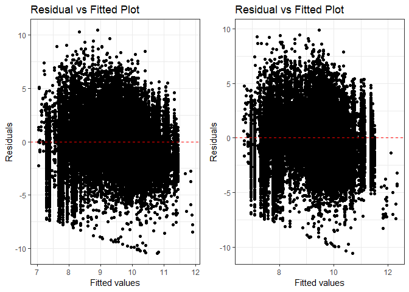<!-- -->

```
## debug: gridExtra::grid.arrange(residuals_binned(model1_old, bins = bins), 
##     residuals_binned(model1_new, bins = bins), ncol = 2)
```

```
## debug: output <- NULL
## debug: if (class(model1_new) == "glmerMod") {
##     m1t <- getME(model1_new, "theta")
##     m1l <- getME(model1_new, "lower")
##     output <- list(m1t[m1l == 0], model1_new@optinfo$conv$lme4$messages)
## } else if (class(model1_new) != "glmerMod" & class(model1_old) != 
##     "glmerMod") {
##     output <- list(rbind(deviance_stats(model1_old, "model1_old"), 
##         deviance_stats(model1_new, "model1_new")))
## }
```

```
## Warning in if (class(model1_new) == "glmerMod") {: the condition has length
## > 1 and only the first element will be used
```

```
## debug: if (class(model1_new) != "glmerMod" & class(model1_old) != "glmerMod") {
##     output <- list(rbind(deviance_stats(model1_old, "model1_old"), 
##         deviance_stats(model1_new, "model1_new")))
## }
```

```
## Warning in if (class(model1_new) != "glmerMod" & class(model1_old) !=
## "glmerMod") {: the condition has length > 1 and only the first element will
## be used
```

<!-- -->

```
## debug: output <- list(rbind(deviance_stats(model1_old, "model1_old"), 
##     deviance_stats(model1_new, "model1_new")))
## debug: output
## exiting from: summary_residual_compare(n_cbre_competition_naics_20A_no_interact, 
##     n_cbre_competition_naics_20A, bins = 5)
```

```
## [[1]]
##        model deviance null.deviance difference
## 1 model1_old 386337.6      456211.7   69874.14
## 2 model1_new 378818.3      456211.7   77393.46
```

####20B: Cumulative

```r
#Create the model
n_cbre_competition_naics_20B <- glm(data=serv_breach, ln_CBre_OMB20_GDP18 ~ cl_US6_avg_sal_lag1Const + 
                   cl_CFTE+ c_pPBSC+c_pOffPSC+
                 c_pairHist+cl_pairCA +
                   cl_Ceil + capped_cl_Days+
                   Comp1or5+
                   Veh+
                   PricingUCA+
                   Crisis+
                   cl_def6_HHI_lag1+cl_def6_ratio_lag1+
                   cl_def3_HHI_lag1+cl_def3_ratio_lag1+
                   c_pMarket+
                   cl_OffVol+cl_office_naics_hhi_k + Comp1or5:cl_def6_HHI_lag1)

#Compare the models
stargazer::stargazer(n_cbre_competition_naics_20B, n_CBre13B, type="text", digits=2)
```

```
## 
## ================================================================
##                                         Dependent variable:     
##                                     ----------------------------
##                                         ln_CBre_OMB20_GDP18     
##                                          (1)            (2)     
## ----------------------------------------------------------------
## cl_US6_avg_sal_lag1Const               0.10***         0.002    
##                                         (0.02)        (0.01)    
##                                                                 
## cl_CFTE                                0.19***        0.07***   
##                                         (0.02)        (0.01)    
##                                                                 
## c_pPBSC                                -0.34***      -0.21***   
##                                         (0.02)        (0.01)    
##                                                                 
## c_pOffPSC                              -0.44***       0.60***   
##                                         (0.02)        (0.01)    
##                                                                 
## c_pairHist                              -0.01          -0.01    
##                                         (0.02)        (0.01)    
##                                                                 
## cl_pairCA                              -0.12***       0.03**    
##                                         (0.03)        (0.01)    
##                                                                 
## cl_Ceil                                2.85***        0.81***   
##                                         (0.02)        (0.01)    
##                                                                 
## capped_cl_Days                         0.12***         0.02     
##                                         (0.02)        (0.01)    
##                                                                 
## Comp1or51 offer                        -0.07**        -0.03**   
##                                         (0.03)        (0.01)    
##                                                                 
## Comp1or52-4 offers                     -0.23***       0.09***   
##                                         (0.02)        (0.01)    
##                                                                 
## Comp1or55+ offers                      -0.20***       0.18***   
##                                         (0.02)        (0.01)    
##                                                                 
## VehS-IDC                               0.13***       -0.17***   
##                                         (0.02)        (0.01)    
##                                                                 
## VehM-IDC                               0.07***       -0.10***   
##                                         (0.03)        (0.02)    
##                                                                 
## VehFSS/GWAC                            0.20***       -0.23***   
##                                         (0.04)        (0.02)    
##                                                                 
## VehBPA/BOA                              -0.04        -0.12***   
##                                         (0.05)        (0.02)    
##                                                                 
## PricingUCAOther FP                     -0.55***      -0.20***   
##                                         (0.13)        (0.06)    
##                                                                 
## PricingUCAIncentive                    0.71***        0.27***   
##                                         (0.08)        (0.07)    
##                                                                 
## PricingUCACombination or Other         0.50***         -0.03    
##                                         (0.07)        (0.05)    
##                                                                 
## PricingUCAOther CB                     1.06***       -0.44***   
##                                         (0.04)        (0.02)    
##                                                                 
## PricingUCAT&M/LH/FPLOE                 1.03***       -0.23***   
##                                         (0.06)        (0.03)    
##                                                                 
## PricingUCAUCA                          0.54***         0.04     
##                                         (0.06)        (0.04)    
##                                                                 
## CrisisARRA                              -0.02         1.03***   
##                                         (0.06)        (0.06)    
##                                                                 
## CrisisDis                              0.46***        0.65***   
##                                         (0.13)        (0.11)    
##                                                                 
## CrisisOCO                              0.40***         0.003    
##                                         (0.04)        (0.02)    
##                                                                 
## cl_def6_HHI_lag1                       0.20***         0.01     
##                                         (0.03)        (0.01)    
##                                                                 
## cl_def6_ratio_lag1                     0.13***        -0.03**   
##                                         (0.02)        (0.01)    
##                                                                 
## cl_def3_HHI_lag1                        -0.01        -0.13***   
##                                         (0.02)        (0.01)    
##                                                                 
## cl_def3_ratio_lag1                     0.43***       -0.11***   
##                                         (0.02)        (0.01)    
##                                                                 
## c_pMarket                              0.24***       -0.15***   
##                                         (0.02)        (0.01)    
##                                                                 
## cl_OffVol                              0.35***       -0.10***   
##                                         (0.02)        (0.01)    
##                                                                 
## cl_office_naics_hhi_k                  -0.09***      -0.11***   
##                                         (0.02)        (0.01)    
##                                                                 
## Comp1or51 offer:cl_def6_HHI_lag1        -0.11*                  
##                                         (0.06)                  
##                                                                 
## Comp1or52-4 offers:cl_def6_HHI_lag1    -0.25***                 
##                                         (0.04)                  
##                                                                 
## Comp1or55+ offers:cl_def6_HHI_lag1     -0.22***                 
##                                         (0.04)                  
##                                                                 
## cl_Base2Ceil                                         -0.12***   
##                                                       (0.01)    
##                                                                 
## Constant                               8.81***        0.62***   
##                                         (0.02)        (0.01)    
##                                                                 
## ----------------------------------------------------------------
## Observations                            61,184        250,000   
## Log Likelihood                       -121,449.40    -555,994.10 
## Akaike Inf. Crit.                     242,968.70   1,112,054.00 
## ================================================================
## Note:                                *p<0.1; **p<0.05; ***p<0.01
```

```r
summary_residual_compare(n_cbre_competition_naics_20B, n_CBre13B, bins=5)
```

```
## debugging in: summary_residual_compare(n_cbre_competition_naics_20B, n_CBre13B, 
##     bins = 5)
## debug: {
##     if (skip_vif == FALSE) 
##         warning("Deprecating VIF. Just use glmer_examine on the models")
##     if (!is.na(bins)) {
##         if ("cl_US6_avg_sal_lag1Const" %in% model_colnames(model1_old) & 
##             "cl_US6_avg_sal_lag1Const" %in% model_colnames(model1_new)) 
##             bins <- bins + 5
##         if ("cl_CFTE" %in% model_colnames(model1_old) & "cl_CFTE" %in% 
##             model_colnames(model1_new)) 
##             bins <- bins + 5
##         if ("c_pPBSC" %in% model_colnames(model1_old) & "c_pPBSC" %in% 
##             model_colnames(model1_new)) 
##             bins <- bins + 5
##         if ("c_pOffPSC" %in% model_colnames(model1_old) & "c_pOffPSC" %in% 
##             model_colnames(model1_new)) 
##             bins <- bins + 5
##         if ("cl_pairCA" %in% model_colnames(model1_old) & "cl_pairCA" %in% 
##             model_colnames(model1_new)) 
##             bins <- bins + 5
##         if ("c_OffCri" %in% model_colnames(model1_old) & "c_OffCri" %in% 
##             model_colnames(model1_new)) 
##             bins <- bins + 5
##         if (("cl_Ceil" %in% model_colnames(model1_old) & "cl_Ceil" %in% 
##             model_colnames(model1_new)) | ("cl_Ceil_Then_Year" %in% 
##             model_colnames(model1_old) & "cl_Ceil_Then_Year" %in% 
##             model_colnames(model1_new))) 
##             bins <- bins + 10
##         if ("cl_Days" %in% model_colnames(model1_old) & "cl_Days" %in% 
##             model_colnames(model1_new)) 
##             bins <- bins + 5
##     }
##     if (!is.null(model2_new)) {
##         gridExtra::grid.arrange(binned_fitted_versus_residuals(model1_old, 
##             bins = bins), binned_fitted_versus_residuals(model1_new, 
##             bins = bins), binned_fitted_versus_residuals(model2_old, 
##             bins = bins), binned_fitted_versus_residuals(model2_new, 
##             bins = bins), ncol = 2)
##         if (!"b_Term" %in% model_colnames(model1_old) & !"b_CBre" %in% 
##             model_colnames(model1_old)) 
##             gridExtra::grid.arrange(resid_plot(model1_old, sample = 25000), 
##                 resid_plot(model1_new, sample = 25000), resid_plot(model2_old, 
##                   sample = 25000), resid_plot(model2_new, sample = 25000), 
##                 ncol = 2)
##         if (!"b_Term" %in% colnames(model1_old) & !"b_CBre" %in% 
##             model_colnames(model1_old)) 
##             gridExtra::grid.arrange(residuals_binned(model1_old, 
##                 bins = bins), residuals_binned(model1_new, bins = bins), 
##                 residuals_binned(model2_old, bins = bins), residuals_binned(model2_new, 
##                   bins = bins), ncol = 2)
##         if ("cl_Ceil" %in% model_colnames(model1_new)) {
##             residual_compare(model1_old, model1_new, model2_old, 
##                 model2_new, "cl_Ceil", "Centered Log(Ceiling)", 
##                 20)
##         }
##         if ("cl_Days" %in% model_colnames(model1_new)) {
##             residual_compare(model1_old, model1_new, model2_old, 
##                 model2_new, "cl_Days", "Centered Log(Days)", 
##                 10)
##         }
##         output <- NULL
##         if (class(model1_new) == "glmerMod" & class(model2_new) == 
##             "glmerMod") {
##             m1t <- getME(model1_new, "theta")
##             m1l <- getME(model1_new, "lower")
##             m2t <- getME(model2_new, "theta")
##             m2l <- getME(model2_new, "lower")
##             output <- list(m1t[m1l == 0], m2t[m2l == 0], model1_new@optinfo$conv$lme4$messages, 
##                 model2_new@optinfo$conv$lme4$messages)
##         }
##         else if ((class(model1_new) != "glmerMod" & class(model2_new) != 
##             "glmerMod") & (class(model1_old) != "glmerMod" & 
##             class(model2_old) != "glmerMod")) {
##             output <- list(rbind(deviance_stats(model1_old, "model1_old"), 
##                 deviance_stats(model1_new, "model1_new"), deviance_stats(model2_old, 
##                   "model2_old"), deviance_stats(model2_new, "model2_new")))
##         }
##     }
##     else if (!is.null(model1_new)) {
##         gridExtra::grid.arrange(binned_fitted_versus_residuals(model1_old, 
##             bins = bins), binned_fitted_versus_residuals(model1_new, 
##             bins = bins), ncol = 2)
##         if (!"b_Term" %in% model_colnames(model1_old) & !"b_CBre" %in% 
##             model_colnames(model1_old)) 
##             gridExtra::grid.arrange(resid_plot(model1_old, sample = 25000), 
##                 resid_plot(model1_new, sample = 25000), ncol = 2)
##         gridExtra::grid.arrange(residuals_binned(model1_old, 
##             bins = bins), residuals_binned(model1_new, bins = bins), 
##             ncol = 2)
##         output <- NULL
##         if (class(model1_new) == "glmerMod") {
##             m1t <- getME(model1_new, "theta")
##             m1l <- getME(model1_new, "lower")
##             output <- list(m1t[m1l == 0], model1_new@optinfo$conv$lme4$messages)
##         }
##         else if (class(model1_new) != "glmerMod" & class(model1_old) != 
##             "glmerMod") {
##             output <- list(rbind(deviance_stats(model1_old, "model1_old"), 
##                 deviance_stats(model1_new, "model1_new")))
##         }
##     }
##     else {
##         if (!is.na(bins)) {
##             if ("cl_US6_avg_sal_lag1Const" %in% model_colnames(model1_old)) 
##                 bins <- bins + 5
##             if ("cl_CFTE" %in% model_colnames(model1_old)) 
##                 bins <- bins + 5
##             if ("c_pPBSC" %in% model_colnames(model1_old)) 
##                 bins <- bins + 5
##             if ("c_pOffPSC" %in% model_colnames(model1_old)) 
##                 bins <- bins + 5
##             if ("cl_pairCA" %in% model_colnames(model1_old)) 
##                 bins <- bins + 5
##             if ("c_OffCri" %in% model_colnames(model1_old)) 
##                 bins <- bins + 5
##             if (("cl_Ceil" %in% model_colnames(model1_old)) | 
##                 ("cl_Ceil_Then_Year" %in% model_colnames(model1_old))) 
##                 bins <- bins + 10
##             if ("cl_Days" %in% model_colnames(model1_old)) 
##                 bins <- bins + 5
##         }
##         if (!"b_Term" %in% model_colnames(model1_old) & !"b_CBre" %in% 
##             model_colnames(model1_old)) 
##             gridExtra::grid.arrange(binned_fitted_versus_residuals(model1_old, 
##                 bins = bins), residuals_binned(model1_old, bins = bins), 
##                 resid_plot(model1_old, sample = 25000))
##         else gridExtra::grid.arrange(binned_fitted_versus_residuals(model1_old, 
##             bins = bins), residuals_binned(model1_old, bins = bins))
##         output <- NULL
##         if (class(model1_old) == "glmerMod") {
##             m1t <- getME(model1_old, "theta")
##             m1l <- getME(model1_old, "lower")
##             output <- list(m1t[m1l == 0], model1_old@optinfo$conv$lme4$messages)
##         }
##         else if (class(model1_old) != "glmerMod" & class(model1_old) != 
##             "glmerMod") {
##             output <- list(deviance_stats(model1_old, "model1_old"))
##         }
##     }
##     output
## }
## debug: if (skip_vif == FALSE) warning("Deprecating VIF. Just use glmer_examine on the models")
## debug: if (!is.na(bins)) {
##     if ("cl_US6_avg_sal_lag1Const" %in% model_colnames(model1_old) & 
##         "cl_US6_avg_sal_lag1Const" %in% model_colnames(model1_new)) 
##         bins <- bins + 5
##     if ("cl_CFTE" %in% model_colnames(model1_old) & "cl_CFTE" %in% 
##         model_colnames(model1_new)) 
##         bins <- bins + 5
##     if ("c_pPBSC" %in% model_colnames(model1_old) & "c_pPBSC" %in% 
##         model_colnames(model1_new)) 
##         bins <- bins + 5
##     if ("c_pOffPSC" %in% model_colnames(model1_old) & "c_pOffPSC" %in% 
##         model_colnames(model1_new)) 
##         bins <- bins + 5
##     if ("cl_pairCA" %in% model_colnames(model1_old) & "cl_pairCA" %in% 
##         model_colnames(model1_new)) 
##         bins <- bins + 5
##     if ("c_OffCri" %in% model_colnames(model1_old) & "c_OffCri" %in% 
##         model_colnames(model1_new)) 
##         bins <- bins + 5
##     if (("cl_Ceil" %in% model_colnames(model1_old) & "cl_Ceil" %in% 
##         model_colnames(model1_new)) | ("cl_Ceil_Then_Year" %in% 
##         model_colnames(model1_old) & "cl_Ceil_Then_Year" %in% 
##         model_colnames(model1_new))) 
##         bins <- bins + 10
##     if ("cl_Days" %in% model_colnames(model1_old) & "cl_Days" %in% 
##         model_colnames(model1_new)) 
##         bins <- bins + 5
## }
## debug: if ("cl_US6_avg_sal_lag1Const" %in% model_colnames(model1_old) & 
##     "cl_US6_avg_sal_lag1Const" %in% model_colnames(model1_new)) bins <- bins + 
##     5
## debug: bins <- bins + 5
## debug: if ("cl_CFTE" %in% model_colnames(model1_old) & "cl_CFTE" %in% 
##     model_colnames(model1_new)) bins <- bins + 5
## debug: bins <- bins + 5
## debug: if ("c_pPBSC" %in% model_colnames(model1_old) & "c_pPBSC" %in% 
##     model_colnames(model1_new)) bins <- bins + 5
## debug: bins <- bins + 5
## debug: if ("c_pOffPSC" %in% model_colnames(model1_old) & "c_pOffPSC" %in% 
##     model_colnames(model1_new)) bins <- bins + 5
## debug: bins <- bins + 5
## debug: if ("cl_pairCA" %in% model_colnames(model1_old) & "cl_pairCA" %in% 
##     model_colnames(model1_new)) bins <- bins + 5
## debug: bins <- bins + 5
## debug: if ("c_OffCri" %in% model_colnames(model1_old) & "c_OffCri" %in% 
##     model_colnames(model1_new)) bins <- bins + 5
## debug: if (("cl_Ceil" %in% model_colnames(model1_old) & "cl_Ceil" %in% 
##     model_colnames(model1_new)) | ("cl_Ceil_Then_Year" %in% model_colnames(model1_old) & 
##     "cl_Ceil_Then_Year" %in% model_colnames(model1_new))) bins <- bins + 
##     10
## debug: bins <- bins + 10
## debug: if ("cl_Days" %in% model_colnames(model1_old) & "cl_Days" %in% 
##     model_colnames(model1_new)) bins <- bins + 5
## debug: if (!is.null(model2_new)) {
##     gridExtra::grid.arrange(binned_fitted_versus_residuals(model1_old, 
##         bins = bins), binned_fitted_versus_residuals(model1_new, 
##         bins = bins), binned_fitted_versus_residuals(model2_old, 
##         bins = bins), binned_fitted_versus_residuals(model2_new, 
##         bins = bins), ncol = 2)
##     if (!"b_Term" %in% model_colnames(model1_old) & !"b_CBre" %in% 
##         model_colnames(model1_old)) 
##         gridExtra::grid.arrange(resid_plot(model1_old, sample = 25000), 
##             resid_plot(model1_new, sample = 25000), resid_plot(model2_old, 
##                 sample = 25000), resid_plot(model2_new, sample = 25000), 
##             ncol = 2)
##     if (!"b_Term" %in% colnames(model1_old) & !"b_CBre" %in% 
##         model_colnames(model1_old)) 
##         gridExtra::grid.arrange(residuals_binned(model1_old, 
##             bins = bins), residuals_binned(model1_new, bins = bins), 
##             residuals_binned(model2_old, bins = bins), residuals_binned(model2_new, 
##                 bins = bins), ncol = 2)
##     if ("cl_Ceil" %in% model_colnames(model1_new)) {
##         residual_compare(model1_old, model1_new, model2_old, 
##             model2_new, "cl_Ceil", "Centered Log(Ceiling)", 20)
##     }
##     if ("cl_Days" %in% model_colnames(model1_new)) {
##         residual_compare(model1_old, model1_new, model2_old, 
##             model2_new, "cl_Days", "Centered Log(Days)", 10)
##     }
##     output <- NULL
##     if (class(model1_new) == "glmerMod" & class(model2_new) == 
##         "glmerMod") {
##         m1t <- getME(model1_new, "theta")
##         m1l <- getME(model1_new, "lower")
##         m2t <- getME(model2_new, "theta")
##         m2l <- getME(model2_new, "lower")
##         output <- list(m1t[m1l == 0], m2t[m2l == 0], model1_new@optinfo$conv$lme4$messages, 
##             model2_new@optinfo$conv$lme4$messages)
##     }
##     else if ((class(model1_new) != "glmerMod" & class(model2_new) != 
##         "glmerMod") & (class(model1_old) != "glmerMod" & class(model2_old) != 
##         "glmerMod")) {
##         output <- list(rbind(deviance_stats(model1_old, "model1_old"), 
##             deviance_stats(model1_new, "model1_new"), deviance_stats(model2_old, 
##                 "model2_old"), deviance_stats(model2_new, "model2_new")))
##     }
## } else if (!is.null(model1_new)) {
##     gridExtra::grid.arrange(binned_fitted_versus_residuals(model1_old, 
##         bins = bins), binned_fitted_versus_residuals(model1_new, 
##         bins = bins), ncol = 2)
##     if (!"b_Term" %in% model_colnames(model1_old) & !"b_CBre" %in% 
##         model_colnames(model1_old)) 
##         gridExtra::grid.arrange(resid_plot(model1_old, sample = 25000), 
##             resid_plot(model1_new, sample = 25000), ncol = 2)
##     gridExtra::grid.arrange(residuals_binned(model1_old, bins = bins), 
##         residuals_binned(model1_new, bins = bins), ncol = 2)
##     output <- NULL
##     if (class(model1_new) == "glmerMod") {
##         m1t <- getME(model1_new, "theta")
##         m1l <- getME(model1_new, "lower")
##         output <- list(m1t[m1l == 0], model1_new@optinfo$conv$lme4$messages)
##     }
##     else if (class(model1_new) != "glmerMod" & class(model1_old) != 
##         "glmerMod") {
##         output <- list(rbind(deviance_stats(model1_old, "model1_old"), 
##             deviance_stats(model1_new, "model1_new")))
##     }
## } else {
##     if (!is.na(bins)) {
##         if ("cl_US6_avg_sal_lag1Const" %in% model_colnames(model1_old)) 
##             bins <- bins + 5
##         if ("cl_CFTE" %in% model_colnames(model1_old)) 
##             bins <- bins + 5
##         if ("c_pPBSC" %in% model_colnames(model1_old)) 
##             bins <- bins + 5
##         if ("c_pOffPSC" %in% model_colnames(model1_old)) 
##             bins <- bins + 5
##         if ("cl_pairCA" %in% model_colnames(model1_old)) 
##             bins <- bins + 5
##         if ("c_OffCri" %in% model_colnames(model1_old)) 
##             bins <- bins + 5
##         if (("cl_Ceil" %in% model_colnames(model1_old)) | ("cl_Ceil_Then_Year" %in% 
##             model_colnames(model1_old))) 
##             bins <- bins + 10
##         if ("cl_Days" %in% model_colnames(model1_old)) 
##             bins <- bins + 5
##     }
##     if (!"b_Term" %in% model_colnames(model1_old) & !"b_CBre" %in% 
##         model_colnames(model1_old)) 
##         gridExtra::grid.arrange(binned_fitted_versus_residuals(model1_old, 
##             bins = bins), residuals_binned(model1_old, bins = bins), 
##             resid_plot(model1_old, sample = 25000))
##     else gridExtra::grid.arrange(binned_fitted_versus_residuals(model1_old, 
##         bins = bins), residuals_binned(model1_old, bins = bins))
##     output <- NULL
##     if (class(model1_old) == "glmerMod") {
##         m1t <- getME(model1_old, "theta")
##         m1l <- getME(model1_old, "lower")
##         output <- list(m1t[m1l == 0], model1_old@optinfo$conv$lme4$messages)
##     }
##     else if (class(model1_old) != "glmerMod" & class(model1_old) != 
##         "glmerMod") {
##         output <- list(deviance_stats(model1_old, "model1_old"))
##     }
## }
## debug: if (!is.null(model1_new)) {
##     gridExtra::grid.arrange(binned_fitted_versus_residuals(model1_old, 
##         bins = bins), binned_fitted_versus_residuals(model1_new, 
##         bins = bins), ncol = 2)
##     if (!"b_Term" %in% model_colnames(model1_old) & !"b_CBre" %in% 
##         model_colnames(model1_old)) 
##         gridExtra::grid.arrange(resid_plot(model1_old, sample = 25000), 
##             resid_plot(model1_new, sample = 25000), ncol = 2)
##     gridExtra::grid.arrange(residuals_binned(model1_old, bins = bins), 
##         residuals_binned(model1_new, bins = bins), ncol = 2)
##     output <- NULL
##     if (class(model1_new) == "glmerMod") {
##         m1t <- getME(model1_new, "theta")
##         m1l <- getME(model1_new, "lower")
##         output <- list(m1t[m1l == 0], model1_new@optinfo$conv$lme4$messages)
##     }
##     else if (class(model1_new) != "glmerMod" & class(model1_old) != 
##         "glmerMod") {
##         output <- list(rbind(deviance_stats(model1_old, "model1_old"), 
##             deviance_stats(model1_new, "model1_new")))
##     }
## } else {
##     if (!is.na(bins)) {
##         if ("cl_US6_avg_sal_lag1Const" %in% model_colnames(model1_old)) 
##             bins <- bins + 5
##         if ("cl_CFTE" %in% model_colnames(model1_old)) 
##             bins <- bins + 5
##         if ("c_pPBSC" %in% model_colnames(model1_old)) 
##             bins <- bins + 5
##         if ("c_pOffPSC" %in% model_colnames(model1_old)) 
##             bins <- bins + 5
##         if ("cl_pairCA" %in% model_colnames(model1_old)) 
##             bins <- bins + 5
##         if ("c_OffCri" %in% model_colnames(model1_old)) 
##             bins <- bins + 5
##         if (("cl_Ceil" %in% model_colnames(model1_old)) | ("cl_Ceil_Then_Year" %in% 
##             model_colnames(model1_old))) 
##             bins <- bins + 10
##         if ("cl_Days" %in% model_colnames(model1_old)) 
##             bins <- bins + 5
##     }
##     if (!"b_Term" %in% model_colnames(model1_old) & !"b_CBre" %in% 
##         model_colnames(model1_old)) 
##         gridExtra::grid.arrange(binned_fitted_versus_residuals(model1_old, 
##             bins = bins), residuals_binned(model1_old, bins = bins), 
##             resid_plot(model1_old, sample = 25000))
##     else gridExtra::grid.arrange(binned_fitted_versus_residuals(model1_old, 
##         bins = bins), residuals_binned(model1_old, bins = bins))
##     output <- NULL
##     if (class(model1_old) == "glmerMod") {
##         m1t <- getME(model1_old, "theta")
##         m1l <- getME(model1_old, "lower")
##         output <- list(m1t[m1l == 0], model1_old@optinfo$conv$lme4$messages)
##     }
##     else if (class(model1_old) != "glmerMod" & class(model1_old) != 
##         "glmerMod") {
##         output <- list(deviance_stats(model1_old, "model1_old"))
##     }
## }
## debug: gridExtra::grid.arrange(binned_fitted_versus_residuals(model1_old, 
##     bins = bins), binned_fitted_versus_residuals(model1_new, 
##     bins = bins), ncol = 2)
```

<!-- -->

```
## debug: if (!"b_Term" %in% model_colnames(model1_old) & !"b_CBre" %in% 
##     model_colnames(model1_old)) gridExtra::grid.arrange(resid_plot(model1_old, 
##     sample = 25000), resid_plot(model1_new, sample = 25000), 
##     ncol = 2)
## debug: gridExtra::grid.arrange(resid_plot(model1_old, sample = 25000), 
##     resid_plot(model1_new, sample = 25000), ncol = 2)
```

```
## Warning: Computation failed in `stat_smooth()`:
## 'Calloc' could not allocate memory (468950050 of 4 bytes)

## Warning: Computation failed in `stat_smooth()`:
## 'Calloc' could not allocate memory (468950050 of 4 bytes)
```

<!-- -->

```
## debug: gridExtra::grid.arrange(residuals_binned(model1_old, bins = bins), 
##     residuals_binned(model1_new, bins = bins), ncol = 2)
```

```
## debug: output <- NULL
## debug: if (class(model1_new) == "glmerMod") {
##     m1t <- getME(model1_new, "theta")
##     m1l <- getME(model1_new, "lower")
##     output <- list(m1t[m1l == 0], model1_new@optinfo$conv$lme4$messages)
## } else if (class(model1_new) != "glmerMod" & class(model1_old) != 
##     "glmerMod") {
##     output <- list(rbind(deviance_stats(model1_old, "model1_old"), 
##         deviance_stats(model1_new, "model1_new")))
## }
```

```
## Warning in if (class(model1_new) == "glmerMod") {: the condition has length
## > 1 and only the first element will be used
```

```
## debug: if (class(model1_new) != "glmerMod" & class(model1_old) != "glmerMod") {
##     output <- list(rbind(deviance_stats(model1_old, "model1_old"), 
##         deviance_stats(model1_new, "model1_new")))
## }
```

```
## Warning in if (class(model1_new) != "glmerMod" & class(model1_old) !=
## "glmerMod") {: the condition has length > 1 and only the first element will
## be used
```

<!-- -->

```
## debug: output <- list(rbind(deviance_stats(model1_old, "model1_old"), 
##     deviance_stats(model1_new, "model1_new")))
## debug: output
## exiting from: summary_residual_compare(n_cbre_competition_naics_20B, n_CBre13B, 
##     bins = 5)
```

```
## [[1]]
##        model  deviance null.deviance difference
## 1 model1_old  189795.5      456211.7   266416.2
## 2 model1_new 1250787.1     1307041.4    56254.3
```

####21A: Ratio Initial Base to Ceiling Ratio (logged):Initial Contract Ceiling (logged)

```r
#Create the models
n_CBre_base2ceil_ceiling_21A_no_interact <- glm(data=serv_breach, ln_CBre_OMB20_GDP18 ~ cl_Base2Ceil + cl_Ceil)
glmer_examine(n_CBre_base2ceil_ceiling_21A_no_interact)
```

```
## cl_Base2Ceil      cl_Ceil 
##     1.038038     1.038038
```

```r
n_CBre_base2ceil_ceiling_21A <- glm(data=serv_breach, ln_CBre_OMB20_GDP18 ~ cl_Base2Ceil + cl_Ceil + cl_Base2Ceil:cl_Ceil)
glmer_examine(n_CBre_base2ceil_ceiling_21A)
```

```
##         cl_Base2Ceil              cl_Ceil cl_Base2Ceil:cl_Ceil 
##             2.266669             1.038130             2.232799
```

```r
#Compare the Models
stargazer::stargazer(n_CBre_base2ceil_ceiling_21A_no_interact, n_CBre_base2ceil_ceiling_21A, type="text", digits=2)
```

```
## 
## =================================================
##                          Dependent variable:     
##                      ----------------------------
##                          ln_CBre_OMB20_GDP18     
##                           (1)            (2)     
## -------------------------------------------------
## cl_Base2Ceil            -0.27***      -0.31***   
##                          (0.02)        (0.02)    
##                                                  
## cl_Ceil                 3.53***        3.53***   
##                          (0.01)        (0.01)    
##                                                  
## cl_Base2Ceil:cl_Ceil                   0.06**    
##                                        (0.03)    
##                                                  
## Constant                8.58***        8.57***   
##                          (0.01)        (0.01)    
##                                                  
## -------------------------------------------------
## Observations             61,184        61,184    
## Log Likelihood        -125,261.10    -125,258.50 
## Akaike Inf. Crit.      250,528.30    250,525.00  
## =================================================
## Note:                 *p<0.1; **p<0.05; ***p<0.01
```

```r
summary_residual_compare(n_CBre_base2ceil_ceiling_21A_no_interact, n_CBre_base2ceil_ceiling_21A, bins=5)
```

```
## debugging in: summary_residual_compare(n_CBre_base2ceil_ceiling_21A_no_interact, 
##     n_CBre_base2ceil_ceiling_21A, bins = 5)
## debug: {
##     if (skip_vif == FALSE) 
##         warning("Deprecating VIF. Just use glmer_examine on the models")
##     if (!is.na(bins)) {
##         if ("cl_US6_avg_sal_lag1Const" %in% model_colnames(model1_old) & 
##             "cl_US6_avg_sal_lag1Const" %in% model_colnames(model1_new)) 
##             bins <- bins + 5
##         if ("cl_CFTE" %in% model_colnames(model1_old) & "cl_CFTE" %in% 
##             model_colnames(model1_new)) 
##             bins <- bins + 5
##         if ("c_pPBSC" %in% model_colnames(model1_old) & "c_pPBSC" %in% 
##             model_colnames(model1_new)) 
##             bins <- bins + 5
##         if ("c_pOffPSC" %in% model_colnames(model1_old) & "c_pOffPSC" %in% 
##             model_colnames(model1_new)) 
##             bins <- bins + 5
##         if ("cl_pairCA" %in% model_colnames(model1_old) & "cl_pairCA" %in% 
##             model_colnames(model1_new)) 
##             bins <- bins + 5
##         if ("c_OffCri" %in% model_colnames(model1_old) & "c_OffCri" %in% 
##             model_colnames(model1_new)) 
##             bins <- bins + 5
##         if (("cl_Ceil" %in% model_colnames(model1_old) & "cl_Ceil" %in% 
##             model_colnames(model1_new)) | ("cl_Ceil_Then_Year" %in% 
##             model_colnames(model1_old) & "cl_Ceil_Then_Year" %in% 
##             model_colnames(model1_new))) 
##             bins <- bins + 10
##         if ("cl_Days" %in% model_colnames(model1_old) & "cl_Days" %in% 
##             model_colnames(model1_new)) 
##             bins <- bins + 5
##     }
##     if (!is.null(model2_new)) {
##         gridExtra::grid.arrange(binned_fitted_versus_residuals(model1_old, 
##             bins = bins), binned_fitted_versus_residuals(model1_new, 
##             bins = bins), binned_fitted_versus_residuals(model2_old, 
##             bins = bins), binned_fitted_versus_residuals(model2_new, 
##             bins = bins), ncol = 2)
##         if (!"b_Term" %in% model_colnames(model1_old) & !"b_CBre" %in% 
##             model_colnames(model1_old)) 
##             gridExtra::grid.arrange(resid_plot(model1_old, sample = 25000), 
##                 resid_plot(model1_new, sample = 25000), resid_plot(model2_old, 
##                   sample = 25000), resid_plot(model2_new, sample = 25000), 
##                 ncol = 2)
##         if (!"b_Term" %in% colnames(model1_old) & !"b_CBre" %in% 
##             model_colnames(model1_old)) 
##             gridExtra::grid.arrange(residuals_binned(model1_old, 
##                 bins = bins), residuals_binned(model1_new, bins = bins), 
##                 residuals_binned(model2_old, bins = bins), residuals_binned(model2_new, 
##                   bins = bins), ncol = 2)
##         if ("cl_Ceil" %in% model_colnames(model1_new)) {
##             residual_compare(model1_old, model1_new, model2_old, 
##                 model2_new, "cl_Ceil", "Centered Log(Ceiling)", 
##                 20)
##         }
##         if ("cl_Days" %in% model_colnames(model1_new)) {
##             residual_compare(model1_old, model1_new, model2_old, 
##                 model2_new, "cl_Days", "Centered Log(Days)", 
##                 10)
##         }
##         output <- NULL
##         if (class(model1_new) == "glmerMod" & class(model2_new) == 
##             "glmerMod") {
##             m1t <- getME(model1_new, "theta")
##             m1l <- getME(model1_new, "lower")
##             m2t <- getME(model2_new, "theta")
##             m2l <- getME(model2_new, "lower")
##             output <- list(m1t[m1l == 0], m2t[m2l == 0], model1_new@optinfo$conv$lme4$messages, 
##                 model2_new@optinfo$conv$lme4$messages)
##         }
##         else if ((class(model1_new) != "glmerMod" & class(model2_new) != 
##             "glmerMod") & (class(model1_old) != "glmerMod" & 
##             class(model2_old) != "glmerMod")) {
##             output <- list(rbind(deviance_stats(model1_old, "model1_old"), 
##                 deviance_stats(model1_new, "model1_new"), deviance_stats(model2_old, 
##                   "model2_old"), deviance_stats(model2_new, "model2_new")))
##         }
##     }
##     else if (!is.null(model1_new)) {
##         gridExtra::grid.arrange(binned_fitted_versus_residuals(model1_old, 
##             bins = bins), binned_fitted_versus_residuals(model1_new, 
##             bins = bins), ncol = 2)
##         if (!"b_Term" %in% model_colnames(model1_old) & !"b_CBre" %in% 
##             model_colnames(model1_old)) 
##             gridExtra::grid.arrange(resid_plot(model1_old, sample = 25000), 
##                 resid_plot(model1_new, sample = 25000), ncol = 2)
##         gridExtra::grid.arrange(residuals_binned(model1_old, 
##             bins = bins), residuals_binned(model1_new, bins = bins), 
##             ncol = 2)
##         output <- NULL
##         if (class(model1_new) == "glmerMod") {
##             m1t <- getME(model1_new, "theta")
##             m1l <- getME(model1_new, "lower")
##             output <- list(m1t[m1l == 0], model1_new@optinfo$conv$lme4$messages)
##         }
##         else if (class(model1_new) != "glmerMod" & class(model1_old) != 
##             "glmerMod") {
##             output <- list(rbind(deviance_stats(model1_old, "model1_old"), 
##                 deviance_stats(model1_new, "model1_new")))
##         }
##     }
##     else {
##         if (!is.na(bins)) {
##             if ("cl_US6_avg_sal_lag1Const" %in% model_colnames(model1_old)) 
##                 bins <- bins + 5
##             if ("cl_CFTE" %in% model_colnames(model1_old)) 
##                 bins <- bins + 5
##             if ("c_pPBSC" %in% model_colnames(model1_old)) 
##                 bins <- bins + 5
##             if ("c_pOffPSC" %in% model_colnames(model1_old)) 
##                 bins <- bins + 5
##             if ("cl_pairCA" %in% model_colnames(model1_old)) 
##                 bins <- bins + 5
##             if ("c_OffCri" %in% model_colnames(model1_old)) 
##                 bins <- bins + 5
##             if (("cl_Ceil" %in% model_colnames(model1_old)) | 
##                 ("cl_Ceil_Then_Year" %in% model_colnames(model1_old))) 
##                 bins <- bins + 10
##             if ("cl_Days" %in% model_colnames(model1_old)) 
##                 bins <- bins + 5
##         }
##         if (!"b_Term" %in% model_colnames(model1_old) & !"b_CBre" %in% 
##             model_colnames(model1_old)) 
##             gridExtra::grid.arrange(binned_fitted_versus_residuals(model1_old, 
##                 bins = bins), residuals_binned(model1_old, bins = bins), 
##                 resid_plot(model1_old, sample = 25000))
##         else gridExtra::grid.arrange(binned_fitted_versus_residuals(model1_old, 
##             bins = bins), residuals_binned(model1_old, bins = bins))
##         output <- NULL
##         if (class(model1_old) == "glmerMod") {
##             m1t <- getME(model1_old, "theta")
##             m1l <- getME(model1_old, "lower")
##             output <- list(m1t[m1l == 0], model1_old@optinfo$conv$lme4$messages)
##         }
##         else if (class(model1_old) != "glmerMod" & class(model1_old) != 
##             "glmerMod") {
##             output <- list(deviance_stats(model1_old, "model1_old"))
##         }
##     }
##     output
## }
## debug: if (skip_vif == FALSE) warning("Deprecating VIF. Just use glmer_examine on the models")
## debug: if (!is.na(bins)) {
##     if ("cl_US6_avg_sal_lag1Const" %in% model_colnames(model1_old) & 
##         "cl_US6_avg_sal_lag1Const" %in% model_colnames(model1_new)) 
##         bins <- bins + 5
##     if ("cl_CFTE" %in% model_colnames(model1_old) & "cl_CFTE" %in% 
##         model_colnames(model1_new)) 
##         bins <- bins + 5
##     if ("c_pPBSC" %in% model_colnames(model1_old) & "c_pPBSC" %in% 
##         model_colnames(model1_new)) 
##         bins <- bins + 5
##     if ("c_pOffPSC" %in% model_colnames(model1_old) & "c_pOffPSC" %in% 
##         model_colnames(model1_new)) 
##         bins <- bins + 5
##     if ("cl_pairCA" %in% model_colnames(model1_old) & "cl_pairCA" %in% 
##         model_colnames(model1_new)) 
##         bins <- bins + 5
##     if ("c_OffCri" %in% model_colnames(model1_old) & "c_OffCri" %in% 
##         model_colnames(model1_new)) 
##         bins <- bins + 5
##     if (("cl_Ceil" %in% model_colnames(model1_old) & "cl_Ceil" %in% 
##         model_colnames(model1_new)) | ("cl_Ceil_Then_Year" %in% 
##         model_colnames(model1_old) & "cl_Ceil_Then_Year" %in% 
##         model_colnames(model1_new))) 
##         bins <- bins + 10
##     if ("cl_Days" %in% model_colnames(model1_old) & "cl_Days" %in% 
##         model_colnames(model1_new)) 
##         bins <- bins + 5
## }
## debug: if ("cl_US6_avg_sal_lag1Const" %in% model_colnames(model1_old) & 
##     "cl_US6_avg_sal_lag1Const" %in% model_colnames(model1_new)) bins <- bins + 
##     5
## debug: if ("cl_CFTE" %in% model_colnames(model1_old) & "cl_CFTE" %in% 
##     model_colnames(model1_new)) bins <- bins + 5
## debug: if ("c_pPBSC" %in% model_colnames(model1_old) & "c_pPBSC" %in% 
##     model_colnames(model1_new)) bins <- bins + 5
## debug: if ("c_pOffPSC" %in% model_colnames(model1_old) & "c_pOffPSC" %in% 
##     model_colnames(model1_new)) bins <- bins + 5
## debug: if ("cl_pairCA" %in% model_colnames(model1_old) & "cl_pairCA" %in% 
##     model_colnames(model1_new)) bins <- bins + 5
## debug: if ("c_OffCri" %in% model_colnames(model1_old) & "c_OffCri" %in% 
##     model_colnames(model1_new)) bins <- bins + 5
## debug: if (("cl_Ceil" %in% model_colnames(model1_old) & "cl_Ceil" %in% 
##     model_colnames(model1_new)) | ("cl_Ceil_Then_Year" %in% model_colnames(model1_old) & 
##     "cl_Ceil_Then_Year" %in% model_colnames(model1_new))) bins <- bins + 
##     10
## debug: bins <- bins + 10
## debug: if ("cl_Days" %in% model_colnames(model1_old) & "cl_Days" %in% 
##     model_colnames(model1_new)) bins <- bins + 5
## debug: if (!is.null(model2_new)) {
##     gridExtra::grid.arrange(binned_fitted_versus_residuals(model1_old, 
##         bins = bins), binned_fitted_versus_residuals(model1_new, 
##         bins = bins), binned_fitted_versus_residuals(model2_old, 
##         bins = bins), binned_fitted_versus_residuals(model2_new, 
##         bins = bins), ncol = 2)
##     if (!"b_Term" %in% model_colnames(model1_old) & !"b_CBre" %in% 
##         model_colnames(model1_old)) 
##         gridExtra::grid.arrange(resid_plot(model1_old, sample = 25000), 
##             resid_plot(model1_new, sample = 25000), resid_plot(model2_old, 
##                 sample = 25000), resid_plot(model2_new, sample = 25000), 
##             ncol = 2)
##     if (!"b_Term" %in% colnames(model1_old) & !"b_CBre" %in% 
##         model_colnames(model1_old)) 
##         gridExtra::grid.arrange(residuals_binned(model1_old, 
##             bins = bins), residuals_binned(model1_new, bins = bins), 
##             residuals_binned(model2_old, bins = bins), residuals_binned(model2_new, 
##                 bins = bins), ncol = 2)
##     if ("cl_Ceil" %in% model_colnames(model1_new)) {
##         residual_compare(model1_old, model1_new, model2_old, 
##             model2_new, "cl_Ceil", "Centered Log(Ceiling)", 20)
##     }
##     if ("cl_Days" %in% model_colnames(model1_new)) {
##         residual_compare(model1_old, model1_new, model2_old, 
##             model2_new, "cl_Days", "Centered Log(Days)", 10)
##     }
##     output <- NULL
##     if (class(model1_new) == "glmerMod" & class(model2_new) == 
##         "glmerMod") {
##         m1t <- getME(model1_new, "theta")
##         m1l <- getME(model1_new, "lower")
##         m2t <- getME(model2_new, "theta")
##         m2l <- getME(model2_new, "lower")
##         output <- list(m1t[m1l == 0], m2t[m2l == 0], model1_new@optinfo$conv$lme4$messages, 
##             model2_new@optinfo$conv$lme4$messages)
##     }
##     else if ((class(model1_new) != "glmerMod" & class(model2_new) != 
##         "glmerMod") & (class(model1_old) != "glmerMod" & class(model2_old) != 
##         "glmerMod")) {
##         output <- list(rbind(deviance_stats(model1_old, "model1_old"), 
##             deviance_stats(model1_new, "model1_new"), deviance_stats(model2_old, 
##                 "model2_old"), deviance_stats(model2_new, "model2_new")))
##     }
## } else if (!is.null(model1_new)) {
##     gridExtra::grid.arrange(binned_fitted_versus_residuals(model1_old, 
##         bins = bins), binned_fitted_versus_residuals(model1_new, 
##         bins = bins), ncol = 2)
##     if (!"b_Term" %in% model_colnames(model1_old) & !"b_CBre" %in% 
##         model_colnames(model1_old)) 
##         gridExtra::grid.arrange(resid_plot(model1_old, sample = 25000), 
##             resid_plot(model1_new, sample = 25000), ncol = 2)
##     gridExtra::grid.arrange(residuals_binned(model1_old, bins = bins), 
##         residuals_binned(model1_new, bins = bins), ncol = 2)
##     output <- NULL
##     if (class(model1_new) == "glmerMod") {
##         m1t <- getME(model1_new, "theta")
##         m1l <- getME(model1_new, "lower")
##         output <- list(m1t[m1l == 0], model1_new@optinfo$conv$lme4$messages)
##     }
##     else if (class(model1_new) != "glmerMod" & class(model1_old) != 
##         "glmerMod") {
##         output <- list(rbind(deviance_stats(model1_old, "model1_old"), 
##             deviance_stats(model1_new, "model1_new")))
##     }
## } else {
##     if (!is.na(bins)) {
##         if ("cl_US6_avg_sal_lag1Const" %in% model_colnames(model1_old)) 
##             bins <- bins + 5
##         if ("cl_CFTE" %in% model_colnames(model1_old)) 
##             bins <- bins + 5
##         if ("c_pPBSC" %in% model_colnames(model1_old)) 
##             bins <- bins + 5
##         if ("c_pOffPSC" %in% model_colnames(model1_old)) 
##             bins <- bins + 5
##         if ("cl_pairCA" %in% model_colnames(model1_old)) 
##             bins <- bins + 5
##         if ("c_OffCri" %in% model_colnames(model1_old)) 
##             bins <- bins + 5
##         if (("cl_Ceil" %in% model_colnames(model1_old)) | ("cl_Ceil_Then_Year" %in% 
##             model_colnames(model1_old))) 
##             bins <- bins + 10
##         if ("cl_Days" %in% model_colnames(model1_old)) 
##             bins <- bins + 5
##     }
##     if (!"b_Term" %in% model_colnames(model1_old) & !"b_CBre" %in% 
##         model_colnames(model1_old)) 
##         gridExtra::grid.arrange(binned_fitted_versus_residuals(model1_old, 
##             bins = bins), residuals_binned(model1_old, bins = bins), 
##             resid_plot(model1_old, sample = 25000))
##     else gridExtra::grid.arrange(binned_fitted_versus_residuals(model1_old, 
##         bins = bins), residuals_binned(model1_old, bins = bins))
##     output <- NULL
##     if (class(model1_old) == "glmerMod") {
##         m1t <- getME(model1_old, "theta")
##         m1l <- getME(model1_old, "lower")
##         output <- list(m1t[m1l == 0], model1_old@optinfo$conv$lme4$messages)
##     }
##     else if (class(model1_old) != "glmerMod" & class(model1_old) != 
##         "glmerMod") {
##         output <- list(deviance_stats(model1_old, "model1_old"))
##     }
## }
## debug: if (!is.null(model1_new)) {
##     gridExtra::grid.arrange(binned_fitted_versus_residuals(model1_old, 
##         bins = bins), binned_fitted_versus_residuals(model1_new, 
##         bins = bins), ncol = 2)
##     if (!"b_Term" %in% model_colnames(model1_old) & !"b_CBre" %in% 
##         model_colnames(model1_old)) 
##         gridExtra::grid.arrange(resid_plot(model1_old, sample = 25000), 
##             resid_plot(model1_new, sample = 25000), ncol = 2)
##     gridExtra::grid.arrange(residuals_binned(model1_old, bins = bins), 
##         residuals_binned(model1_new, bins = bins), ncol = 2)
##     output <- NULL
##     if (class(model1_new) == "glmerMod") {
##         m1t <- getME(model1_new, "theta")
##         m1l <- getME(model1_new, "lower")
##         output <- list(m1t[m1l == 0], model1_new@optinfo$conv$lme4$messages)
##     }
##     else if (class(model1_new) != "glmerMod" & class(model1_old) != 
##         "glmerMod") {
##         output <- list(rbind(deviance_stats(model1_old, "model1_old"), 
##             deviance_stats(model1_new, "model1_new")))
##     }
## } else {
##     if (!is.na(bins)) {
##         if ("cl_US6_avg_sal_lag1Const" %in% model_colnames(model1_old)) 
##             bins <- bins + 5
##         if ("cl_CFTE" %in% model_colnames(model1_old)) 
##             bins <- bins + 5
##         if ("c_pPBSC" %in% model_colnames(model1_old)) 
##             bins <- bins + 5
##         if ("c_pOffPSC" %in% model_colnames(model1_old)) 
##             bins <- bins + 5
##         if ("cl_pairCA" %in% model_colnames(model1_old)) 
##             bins <- bins + 5
##         if ("c_OffCri" %in% model_colnames(model1_old)) 
##             bins <- bins + 5
##         if (("cl_Ceil" %in% model_colnames(model1_old)) | ("cl_Ceil_Then_Year" %in% 
##             model_colnames(model1_old))) 
##             bins <- bins + 10
##         if ("cl_Days" %in% model_colnames(model1_old)) 
##             bins <- bins + 5
##     }
##     if (!"b_Term" %in% model_colnames(model1_old) & !"b_CBre" %in% 
##         model_colnames(model1_old)) 
##         gridExtra::grid.arrange(binned_fitted_versus_residuals(model1_old, 
##             bins = bins), residuals_binned(model1_old, bins = bins), 
##             resid_plot(model1_old, sample = 25000))
##     else gridExtra::grid.arrange(binned_fitted_versus_residuals(model1_old, 
##         bins = bins), residuals_binned(model1_old, bins = bins))
##     output <- NULL
##     if (class(model1_old) == "glmerMod") {
##         m1t <- getME(model1_old, "theta")
##         m1l <- getME(model1_old, "lower")
##         output <- list(m1t[m1l == 0], model1_old@optinfo$conv$lme4$messages)
##     }
##     else if (class(model1_old) != "glmerMod" & class(model1_old) != 
##         "glmerMod") {
##         output <- list(deviance_stats(model1_old, "model1_old"))
##     }
## }
## debug: gridExtra::grid.arrange(binned_fitted_versus_residuals(model1_old, 
##     bins = bins), binned_fitted_versus_residuals(model1_new, 
##     bins = bins), ncol = 2)
```

<!-- -->

```
## debug: if (!"b_Term" %in% model_colnames(model1_old) & !"b_CBre" %in% 
##     model_colnames(model1_old)) gridExtra::grid.arrange(resid_plot(model1_old, 
##     sample = 25000), resid_plot(model1_new, sample = 25000), 
##     ncol = 2)
## debug: gridExtra::grid.arrange(resid_plot(model1_old, sample = 25000), 
##     resid_plot(model1_new, sample = 25000), ncol = 2)
```

```
## Warning: Computation failed in `stat_smooth()`:
## 'Calloc' could not allocate memory (468950050 of 4 bytes)

## Warning: Computation failed in `stat_smooth()`:
## 'Calloc' could not allocate memory (468950050 of 4 bytes)
```

<!-- -->

```
## debug: gridExtra::grid.arrange(residuals_binned(model1_old, bins = bins), 
##     residuals_binned(model1_new, bins = bins), ncol = 2)
```

```
## debug: output <- NULL
## debug: if (class(model1_new) == "glmerMod") {
##     m1t <- getME(model1_new, "theta")
##     m1l <- getME(model1_new, "lower")
##     output <- list(m1t[m1l == 0], model1_new@optinfo$conv$lme4$messages)
## } else if (class(model1_new) != "glmerMod" & class(model1_old) != 
##     "glmerMod") {
##     output <- list(rbind(deviance_stats(model1_old, "model1_old"), 
##         deviance_stats(model1_new, "model1_new")))
## }
```

```
## Warning in if (class(model1_new) == "glmerMod") {: the condition has length
## > 1 and only the first element will be used
```

```
## debug: if (class(model1_new) != "glmerMod" & class(model1_old) != "glmerMod") {
##     output <- list(rbind(deviance_stats(model1_old, "model1_old"), 
##         deviance_stats(model1_new, "model1_new")))
## }
```

```
## Warning in if (class(model1_new) != "glmerMod" & class(model1_old) !=
## "glmerMod") {: the condition has length > 1 and only the first element will
## be used
```

<!-- -->

```
## debug: output <- list(rbind(deviance_stats(model1_old, "model1_old"), 
##     deviance_stats(model1_new, "model1_new")))
## debug: output
## exiting from: summary_residual_compare(n_CBre_base2ceil_ceiling_21A_no_interact, 
##     n_CBre_base2ceil_ceiling_21A, bins = 5)
```

```
## [[1]]
##        model deviance null.deviance difference
## 1 model1_old 214980.6      456211.7   241231.2
## 2 model1_new 214962.0      456211.7   241249.7
```

####21B: Cumulative

```r
#Create the model
n_CBre_base2ceil_ceiling_21B <- glm(data=serv_breach, ln_CBre_OMB20_GDP18 ~ cl_US6_avg_sal_lag1Const + 
                   cl_CFTE+ c_pPBSC+c_pOffPSC+
                 c_pairHist+cl_pairCA +
                   cl_Ceil + capped_cl_Days+
                   Comp1or5+
                   Veh+
                   PricingUCA+
                   Crisis+
                   cl_def6_HHI_lag1+cl_def6_ratio_lag1+
                   cl_def3_HHI_lag1+cl_def3_ratio_lag1+
                   c_pMarket+
                   cl_OffVol+cl_office_naics_hhi_k + cl_Base2Ceil:cl_Ceil)

#Compare the models
stargazer::stargazer(n_CBre_base2ceil_ceiling_21B, n_CBre13B, type="text", digits=2)
```

```
## 
## ===========================================================
##                                    Dependent variable:     
##                                ----------------------------
##                                    ln_CBre_OMB20_GDP18     
##                                     (1)            (2)     
## -----------------------------------------------------------
## cl_US6_avg_sal_lag1Const          0.10***         0.002    
##                                    (0.02)        (0.01)    
##                                                            
## cl_CFTE                           0.18***        0.07***   
##                                    (0.02)        (0.01)    
##                                                            
## c_pPBSC                           -0.34***      -0.21***   
##                                    (0.02)        (0.01)    
##                                                            
## c_pOffPSC                         -0.45***       0.60***   
##                                    (0.02)        (0.01)    
##                                                            
## c_pairHist                        -0.0001         -0.01    
##                                    (0.02)        (0.01)    
##                                                            
## cl_pairCA                         -0.13***       0.03**    
##                                    (0.03)        (0.01)    
##                                                            
## cl_Ceil                           2.87***        0.81***   
##                                    (0.02)        (0.01)    
##                                                            
## capped_cl_Days                    0.12***         0.02     
##                                    (0.02)        (0.01)    
##                                                            
## Comp1or51 offer                    -0.05*        -0.03**   
##                                    (0.03)        (0.01)    
##                                                            
## Comp1or52-4 offers                -0.21***       0.09***   
##                                    (0.02)        (0.01)    
##                                                            
## Comp1or55+ offers                 -0.16***       0.18***   
##                                    (0.02)        (0.01)    
##                                                            
## VehS-IDC                          0.11***       -0.17***   
##                                    (0.02)        (0.01)    
##                                                            
## VehM-IDC                          0.08***       -0.10***   
##                                    (0.03)        (0.02)    
##                                                            
## VehFSS/GWAC                       0.23***       -0.23***   
##                                    (0.04)        (0.02)    
##                                                            
## VehBPA/BOA                         -0.05        -0.12***   
##                                    (0.05)        (0.02)    
##                                                            
## PricingUCAOther FP                -0.52***      -0.20***   
##                                    (0.13)        (0.06)    
##                                                            
## PricingUCAIncentive               0.74***        0.27***   
##                                    (0.08)        (0.07)    
##                                                            
## PricingUCACombination or Other    0.53***         -0.03    
##                                    (0.07)        (0.05)    
##                                                            
## PricingUCAOther CB                1.08***       -0.44***   
##                                    (0.04)        (0.02)    
##                                                            
## PricingUCAT&M/LH/FPLOE            1.06***       -0.23***   
##                                    (0.06)        (0.03)    
##                                                            
## PricingUCAUCA                     0.55***         0.04     
##                                    (0.06)        (0.04)    
##                                                            
## CrisisARRA                         -0.05         1.03***   
##                                    (0.06)        (0.06)    
##                                                            
## CrisisDis                         0.45***        0.65***   
##                                    (0.13)        (0.11)    
##                                                            
## CrisisOCO                         0.40***         0.003    
##                                    (0.04)        (0.02)    
##                                                            
## cl_def6_HHI_lag1                   0.05**         0.01     
##                                    (0.02)        (0.01)    
##                                                            
## cl_def6_ratio_lag1                0.13***        -0.03**   
##                                    (0.02)        (0.01)    
##                                                            
## cl_def3_HHI_lag1                   -0.01        -0.13***   
##                                    (0.02)        (0.01)    
##                                                            
## cl_def3_ratio_lag1                0.44***       -0.11***   
##                                    (0.02)        (0.01)    
##                                                            
## c_pMarket                         0.24***       -0.15***   
##                                    (0.02)        (0.01)    
##                                                            
## cl_OffVol                         0.34***       -0.10***   
##                                    (0.02)        (0.01)    
##                                                            
## cl_office_naics_hhi_k             -0.10***      -0.11***   
##                                    (0.02)        (0.01)    
##                                                            
## cl_Ceil:cl_Base2Ceil              -0.13***                 
##                                    (0.02)                  
##                                                            
## cl_Base2Ceil                                    -0.12***   
##                                                  (0.01)    
##                                                            
## Constant                          8.80***        0.62***   
##                                    (0.02)        (0.01)    
##                                                            
## -----------------------------------------------------------
## Observations                       61,184        250,000   
## Log Likelihood                  -121,447.10    -555,994.10 
## Akaike Inf. Crit.                242,960.10   1,112,054.00 
## ===========================================================
## Note:                           *p<0.1; **p<0.05; ***p<0.01
```

```r
summary_residual_compare(n_CBre_base2ceil_ceiling_21B, n_CBre13B, bins=5)
```

```
## debugging in: summary_residual_compare(n_CBre_base2ceil_ceiling_21B, n_CBre13B, 
##     bins = 5)
## debug: {
##     if (skip_vif == FALSE) 
##         warning("Deprecating VIF. Just use glmer_examine on the models")
##     if (!is.na(bins)) {
##         if ("cl_US6_avg_sal_lag1Const" %in% model_colnames(model1_old) & 
##             "cl_US6_avg_sal_lag1Const" %in% model_colnames(model1_new)) 
##             bins <- bins + 5
##         if ("cl_CFTE" %in% model_colnames(model1_old) & "cl_CFTE" %in% 
##             model_colnames(model1_new)) 
##             bins <- bins + 5
##         if ("c_pPBSC" %in% model_colnames(model1_old) & "c_pPBSC" %in% 
##             model_colnames(model1_new)) 
##             bins <- bins + 5
##         if ("c_pOffPSC" %in% model_colnames(model1_old) & "c_pOffPSC" %in% 
##             model_colnames(model1_new)) 
##             bins <- bins + 5
##         if ("cl_pairCA" %in% model_colnames(model1_old) & "cl_pairCA" %in% 
##             model_colnames(model1_new)) 
##             bins <- bins + 5
##         if ("c_OffCri" %in% model_colnames(model1_old) & "c_OffCri" %in% 
##             model_colnames(model1_new)) 
##             bins <- bins + 5
##         if (("cl_Ceil" %in% model_colnames(model1_old) & "cl_Ceil" %in% 
##             model_colnames(model1_new)) | ("cl_Ceil_Then_Year" %in% 
##             model_colnames(model1_old) & "cl_Ceil_Then_Year" %in% 
##             model_colnames(model1_new))) 
##             bins <- bins + 10
##         if ("cl_Days" %in% model_colnames(model1_old) & "cl_Days" %in% 
##             model_colnames(model1_new)) 
##             bins <- bins + 5
##     }
##     if (!is.null(model2_new)) {
##         gridExtra::grid.arrange(binned_fitted_versus_residuals(model1_old, 
##             bins = bins), binned_fitted_versus_residuals(model1_new, 
##             bins = bins), binned_fitted_versus_residuals(model2_old, 
##             bins = bins), binned_fitted_versus_residuals(model2_new, 
##             bins = bins), ncol = 2)
##         if (!"b_Term" %in% model_colnames(model1_old) & !"b_CBre" %in% 
##             model_colnames(model1_old)) 
##             gridExtra::grid.arrange(resid_plot(model1_old, sample = 25000), 
##                 resid_plot(model1_new, sample = 25000), resid_plot(model2_old, 
##                   sample = 25000), resid_plot(model2_new, sample = 25000), 
##                 ncol = 2)
##         if (!"b_Term" %in% colnames(model1_old) & !"b_CBre" %in% 
##             model_colnames(model1_old)) 
##             gridExtra::grid.arrange(residuals_binned(model1_old, 
##                 bins = bins), residuals_binned(model1_new, bins = bins), 
##                 residuals_binned(model2_old, bins = bins), residuals_binned(model2_new, 
##                   bins = bins), ncol = 2)
##         if ("cl_Ceil" %in% model_colnames(model1_new)) {
##             residual_compare(model1_old, model1_new, model2_old, 
##                 model2_new, "cl_Ceil", "Centered Log(Ceiling)", 
##                 20)
##         }
##         if ("cl_Days" %in% model_colnames(model1_new)) {
##             residual_compare(model1_old, model1_new, model2_old, 
##                 model2_new, "cl_Days", "Centered Log(Days)", 
##                 10)
##         }
##         output <- NULL
##         if (class(model1_new) == "glmerMod" & class(model2_new) == 
##             "glmerMod") {
##             m1t <- getME(model1_new, "theta")
##             m1l <- getME(model1_new, "lower")
##             m2t <- getME(model2_new, "theta")
##             m2l <- getME(model2_new, "lower")
##             output <- list(m1t[m1l == 0], m2t[m2l == 0], model1_new@optinfo$conv$lme4$messages, 
##                 model2_new@optinfo$conv$lme4$messages)
##         }
##         else if ((class(model1_new) != "glmerMod" & class(model2_new) != 
##             "glmerMod") & (class(model1_old) != "glmerMod" & 
##             class(model2_old) != "glmerMod")) {
##             output <- list(rbind(deviance_stats(model1_old, "model1_old"), 
##                 deviance_stats(model1_new, "model1_new"), deviance_stats(model2_old, 
##                   "model2_old"), deviance_stats(model2_new, "model2_new")))
##         }
##     }
##     else if (!is.null(model1_new)) {
##         gridExtra::grid.arrange(binned_fitted_versus_residuals(model1_old, 
##             bins = bins), binned_fitted_versus_residuals(model1_new, 
##             bins = bins), ncol = 2)
##         if (!"b_Term" %in% model_colnames(model1_old) & !"b_CBre" %in% 
##             model_colnames(model1_old)) 
##             gridExtra::grid.arrange(resid_plot(model1_old, sample = 25000), 
##                 resid_plot(model1_new, sample = 25000), ncol = 2)
##         gridExtra::grid.arrange(residuals_binned(model1_old, 
##             bins = bins), residuals_binned(model1_new, bins = bins), 
##             ncol = 2)
##         output <- NULL
##         if (class(model1_new) == "glmerMod") {
##             m1t <- getME(model1_new, "theta")
##             m1l <- getME(model1_new, "lower")
##             output <- list(m1t[m1l == 0], model1_new@optinfo$conv$lme4$messages)
##         }
##         else if (class(model1_new) != "glmerMod" & class(model1_old) != 
##             "glmerMod") {
##             output <- list(rbind(deviance_stats(model1_old, "model1_old"), 
##                 deviance_stats(model1_new, "model1_new")))
##         }
##     }
##     else {
##         if (!is.na(bins)) {
##             if ("cl_US6_avg_sal_lag1Const" %in% model_colnames(model1_old)) 
##                 bins <- bins + 5
##             if ("cl_CFTE" %in% model_colnames(model1_old)) 
##                 bins <- bins + 5
##             if ("c_pPBSC" %in% model_colnames(model1_old)) 
##                 bins <- bins + 5
##             if ("c_pOffPSC" %in% model_colnames(model1_old)) 
##                 bins <- bins + 5
##             if ("cl_pairCA" %in% model_colnames(model1_old)) 
##                 bins <- bins + 5
##             if ("c_OffCri" %in% model_colnames(model1_old)) 
##                 bins <- bins + 5
##             if (("cl_Ceil" %in% model_colnames(model1_old)) | 
##                 ("cl_Ceil_Then_Year" %in% model_colnames(model1_old))) 
##                 bins <- bins + 10
##             if ("cl_Days" %in% model_colnames(model1_old)) 
##                 bins <- bins + 5
##         }
##         if (!"b_Term" %in% model_colnames(model1_old) & !"b_CBre" %in% 
##             model_colnames(model1_old)) 
##             gridExtra::grid.arrange(binned_fitted_versus_residuals(model1_old, 
##                 bins = bins), residuals_binned(model1_old, bins = bins), 
##                 resid_plot(model1_old, sample = 25000))
##         else gridExtra::grid.arrange(binned_fitted_versus_residuals(model1_old, 
##             bins = bins), residuals_binned(model1_old, bins = bins))
##         output <- NULL
##         if (class(model1_old) == "glmerMod") {
##             m1t <- getME(model1_old, "theta")
##             m1l <- getME(model1_old, "lower")
##             output <- list(m1t[m1l == 0], model1_old@optinfo$conv$lme4$messages)
##         }
##         else if (class(model1_old) != "glmerMod" & class(model1_old) != 
##             "glmerMod") {
##             output <- list(deviance_stats(model1_old, "model1_old"))
##         }
##     }
##     output
## }
## debug: if (skip_vif == FALSE) warning("Deprecating VIF. Just use glmer_examine on the models")
## debug: if (!is.na(bins)) {
##     if ("cl_US6_avg_sal_lag1Const" %in% model_colnames(model1_old) & 
##         "cl_US6_avg_sal_lag1Const" %in% model_colnames(model1_new)) 
##         bins <- bins + 5
##     if ("cl_CFTE" %in% model_colnames(model1_old) & "cl_CFTE" %in% 
##         model_colnames(model1_new)) 
##         bins <- bins + 5
##     if ("c_pPBSC" %in% model_colnames(model1_old) & "c_pPBSC" %in% 
##         model_colnames(model1_new)) 
##         bins <- bins + 5
##     if ("c_pOffPSC" %in% model_colnames(model1_old) & "c_pOffPSC" %in% 
##         model_colnames(model1_new)) 
##         bins <- bins + 5
##     if ("cl_pairCA" %in% model_colnames(model1_old) & "cl_pairCA" %in% 
##         model_colnames(model1_new)) 
##         bins <- bins + 5
##     if ("c_OffCri" %in% model_colnames(model1_old) & "c_OffCri" %in% 
##         model_colnames(model1_new)) 
##         bins <- bins + 5
##     if (("cl_Ceil" %in% model_colnames(model1_old) & "cl_Ceil" %in% 
##         model_colnames(model1_new)) | ("cl_Ceil_Then_Year" %in% 
##         model_colnames(model1_old) & "cl_Ceil_Then_Year" %in% 
##         model_colnames(model1_new))) 
##         bins <- bins + 10
##     if ("cl_Days" %in% model_colnames(model1_old) & "cl_Days" %in% 
##         model_colnames(model1_new)) 
##         bins <- bins + 5
## }
## debug: if ("cl_US6_avg_sal_lag1Const" %in% model_colnames(model1_old) & 
##     "cl_US6_avg_sal_lag1Const" %in% model_colnames(model1_new)) bins <- bins + 
##     5
## debug: bins <- bins + 5
## debug: if ("cl_CFTE" %in% model_colnames(model1_old) & "cl_CFTE" %in% 
##     model_colnames(model1_new)) bins <- bins + 5
## debug: bins <- bins + 5
## debug: if ("c_pPBSC" %in% model_colnames(model1_old) & "c_pPBSC" %in% 
##     model_colnames(model1_new)) bins <- bins + 5
## debug: bins <- bins + 5
## debug: if ("c_pOffPSC" %in% model_colnames(model1_old) & "c_pOffPSC" %in% 
##     model_colnames(model1_new)) bins <- bins + 5
## debug: bins <- bins + 5
## debug: if ("cl_pairCA" %in% model_colnames(model1_old) & "cl_pairCA" %in% 
##     model_colnames(model1_new)) bins <- bins + 5
## debug: bins <- bins + 5
## debug: if ("c_OffCri" %in% model_colnames(model1_old) & "c_OffCri" %in% 
##     model_colnames(model1_new)) bins <- bins + 5
## debug: if (("cl_Ceil" %in% model_colnames(model1_old) & "cl_Ceil" %in% 
##     model_colnames(model1_new)) | ("cl_Ceil_Then_Year" %in% model_colnames(model1_old) & 
##     "cl_Ceil_Then_Year" %in% model_colnames(model1_new))) bins <- bins + 
##     10
## debug: bins <- bins + 10
## debug: if ("cl_Days" %in% model_colnames(model1_old) & "cl_Days" %in% 
##     model_colnames(model1_new)) bins <- bins + 5
## debug: if (!is.null(model2_new)) {
##     gridExtra::grid.arrange(binned_fitted_versus_residuals(model1_old, 
##         bins = bins), binned_fitted_versus_residuals(model1_new, 
##         bins = bins), binned_fitted_versus_residuals(model2_old, 
##         bins = bins), binned_fitted_versus_residuals(model2_new, 
##         bins = bins), ncol = 2)
##     if (!"b_Term" %in% model_colnames(model1_old) & !"b_CBre" %in% 
##         model_colnames(model1_old)) 
##         gridExtra::grid.arrange(resid_plot(model1_old, sample = 25000), 
##             resid_plot(model1_new, sample = 25000), resid_plot(model2_old, 
##                 sample = 25000), resid_plot(model2_new, sample = 25000), 
##             ncol = 2)
##     if (!"b_Term" %in% colnames(model1_old) & !"b_CBre" %in% 
##         model_colnames(model1_old)) 
##         gridExtra::grid.arrange(residuals_binned(model1_old, 
##             bins = bins), residuals_binned(model1_new, bins = bins), 
##             residuals_binned(model2_old, bins = bins), residuals_binned(model2_new, 
##                 bins = bins), ncol = 2)
##     if ("cl_Ceil" %in% model_colnames(model1_new)) {
##         residual_compare(model1_old, model1_new, model2_old, 
##             model2_new, "cl_Ceil", "Centered Log(Ceiling)", 20)
##     }
##     if ("cl_Days" %in% model_colnames(model1_new)) {
##         residual_compare(model1_old, model1_new, model2_old, 
##             model2_new, "cl_Days", "Centered Log(Days)", 10)
##     }
##     output <- NULL
##     if (class(model1_new) == "glmerMod" & class(model2_new) == 
##         "glmerMod") {
##         m1t <- getME(model1_new, "theta")
##         m1l <- getME(model1_new, "lower")
##         m2t <- getME(model2_new, "theta")
##         m2l <- getME(model2_new, "lower")
##         output <- list(m1t[m1l == 0], m2t[m2l == 0], model1_new@optinfo$conv$lme4$messages, 
##             model2_new@optinfo$conv$lme4$messages)
##     }
##     else if ((class(model1_new) != "glmerMod" & class(model2_new) != 
##         "glmerMod") & (class(model1_old) != "glmerMod" & class(model2_old) != 
##         "glmerMod")) {
##         output <- list(rbind(deviance_stats(model1_old, "model1_old"), 
##             deviance_stats(model1_new, "model1_new"), deviance_stats(model2_old, 
##                 "model2_old"), deviance_stats(model2_new, "model2_new")))
##     }
## } else if (!is.null(model1_new)) {
##     gridExtra::grid.arrange(binned_fitted_versus_residuals(model1_old, 
##         bins = bins), binned_fitted_versus_residuals(model1_new, 
##         bins = bins), ncol = 2)
##     if (!"b_Term" %in% model_colnames(model1_old) & !"b_CBre" %in% 
##         model_colnames(model1_old)) 
##         gridExtra::grid.arrange(resid_plot(model1_old, sample = 25000), 
##             resid_plot(model1_new, sample = 25000), ncol = 2)
##     gridExtra::grid.arrange(residuals_binned(model1_old, bins = bins), 
##         residuals_binned(model1_new, bins = bins), ncol = 2)
##     output <- NULL
##     if (class(model1_new) == "glmerMod") {
##         m1t <- getME(model1_new, "theta")
##         m1l <- getME(model1_new, "lower")
##         output <- list(m1t[m1l == 0], model1_new@optinfo$conv$lme4$messages)
##     }
##     else if (class(model1_new) != "glmerMod" & class(model1_old) != 
##         "glmerMod") {
##         output <- list(rbind(deviance_stats(model1_old, "model1_old"), 
##             deviance_stats(model1_new, "model1_new")))
##     }
## } else {
##     if (!is.na(bins)) {
##         if ("cl_US6_avg_sal_lag1Const" %in% model_colnames(model1_old)) 
##             bins <- bins + 5
##         if ("cl_CFTE" %in% model_colnames(model1_old)) 
##             bins <- bins + 5
##         if ("c_pPBSC" %in% model_colnames(model1_old)) 
##             bins <- bins + 5
##         if ("c_pOffPSC" %in% model_colnames(model1_old)) 
##             bins <- bins + 5
##         if ("cl_pairCA" %in% model_colnames(model1_old)) 
##             bins <- bins + 5
##         if ("c_OffCri" %in% model_colnames(model1_old)) 
##             bins <- bins + 5
##         if (("cl_Ceil" %in% model_colnames(model1_old)) | ("cl_Ceil_Then_Year" %in% 
##             model_colnames(model1_old))) 
##             bins <- bins + 10
##         if ("cl_Days" %in% model_colnames(model1_old)) 
##             bins <- bins + 5
##     }
##     if (!"b_Term" %in% model_colnames(model1_old) & !"b_CBre" %in% 
##         model_colnames(model1_old)) 
##         gridExtra::grid.arrange(binned_fitted_versus_residuals(model1_old, 
##             bins = bins), residuals_binned(model1_old, bins = bins), 
##             resid_plot(model1_old, sample = 25000))
##     else gridExtra::grid.arrange(binned_fitted_versus_residuals(model1_old, 
##         bins = bins), residuals_binned(model1_old, bins = bins))
##     output <- NULL
##     if (class(model1_old) == "glmerMod") {
##         m1t <- getME(model1_old, "theta")
##         m1l <- getME(model1_old, "lower")
##         output <- list(m1t[m1l == 0], model1_old@optinfo$conv$lme4$messages)
##     }
##     else if (class(model1_old) != "glmerMod" & class(model1_old) != 
##         "glmerMod") {
##         output <- list(deviance_stats(model1_old, "model1_old"))
##     }
## }
## debug: if (!is.null(model1_new)) {
##     gridExtra::grid.arrange(binned_fitted_versus_residuals(model1_old, 
##         bins = bins), binned_fitted_versus_residuals(model1_new, 
##         bins = bins), ncol = 2)
##     if (!"b_Term" %in% model_colnames(model1_old) & !"b_CBre" %in% 
##         model_colnames(model1_old)) 
##         gridExtra::grid.arrange(resid_plot(model1_old, sample = 25000), 
##             resid_plot(model1_new, sample = 25000), ncol = 2)
##     gridExtra::grid.arrange(residuals_binned(model1_old, bins = bins), 
##         residuals_binned(model1_new, bins = bins), ncol = 2)
##     output <- NULL
##     if (class(model1_new) == "glmerMod") {
##         m1t <- getME(model1_new, "theta")
##         m1l <- getME(model1_new, "lower")
##         output <- list(m1t[m1l == 0], model1_new@optinfo$conv$lme4$messages)
##     }
##     else if (class(model1_new) != "glmerMod" & class(model1_old) != 
##         "glmerMod") {
##         output <- list(rbind(deviance_stats(model1_old, "model1_old"), 
##             deviance_stats(model1_new, "model1_new")))
##     }
## } else {
##     if (!is.na(bins)) {
##         if ("cl_US6_avg_sal_lag1Const" %in% model_colnames(model1_old)) 
##             bins <- bins + 5
##         if ("cl_CFTE" %in% model_colnames(model1_old)) 
##             bins <- bins + 5
##         if ("c_pPBSC" %in% model_colnames(model1_old)) 
##             bins <- bins + 5
##         if ("c_pOffPSC" %in% model_colnames(model1_old)) 
##             bins <- bins + 5
##         if ("cl_pairCA" %in% model_colnames(model1_old)) 
##             bins <- bins + 5
##         if ("c_OffCri" %in% model_colnames(model1_old)) 
##             bins <- bins + 5
##         if (("cl_Ceil" %in% model_colnames(model1_old)) | ("cl_Ceil_Then_Year" %in% 
##             model_colnames(model1_old))) 
##             bins <- bins + 10
##         if ("cl_Days" %in% model_colnames(model1_old)) 
##             bins <- bins + 5
##     }
##     if (!"b_Term" %in% model_colnames(model1_old) & !"b_CBre" %in% 
##         model_colnames(model1_old)) 
##         gridExtra::grid.arrange(binned_fitted_versus_residuals(model1_old, 
##             bins = bins), residuals_binned(model1_old, bins = bins), 
##             resid_plot(model1_old, sample = 25000))
##     else gridExtra::grid.arrange(binned_fitted_versus_residuals(model1_old, 
##         bins = bins), residuals_binned(model1_old, bins = bins))
##     output <- NULL
##     if (class(model1_old) == "glmerMod") {
##         m1t <- getME(model1_old, "theta")
##         m1l <- getME(model1_old, "lower")
##         output <- list(m1t[m1l == 0], model1_old@optinfo$conv$lme4$messages)
##     }
##     else if (class(model1_old) != "glmerMod" & class(model1_old) != 
##         "glmerMod") {
##         output <- list(deviance_stats(model1_old, "model1_old"))
##     }
## }
## debug: gridExtra::grid.arrange(binned_fitted_versus_residuals(model1_old, 
##     bins = bins), binned_fitted_versus_residuals(model1_new, 
##     bins = bins), ncol = 2)
```

<!-- -->

```
## debug: if (!"b_Term" %in% model_colnames(model1_old) & !"b_CBre" %in% 
##     model_colnames(model1_old)) gridExtra::grid.arrange(resid_plot(model1_old, 
##     sample = 25000), resid_plot(model1_new, sample = 25000), 
##     ncol = 2)
## debug: gridExtra::grid.arrange(resid_plot(model1_old, sample = 25000), 
##     resid_plot(model1_new, sample = 25000), ncol = 2)
```

```
## Warning: Computation failed in `stat_smooth()`:
## 'Calloc' could not allocate memory (468950050 of 4 bytes)

## Warning: Computation failed in `stat_smooth()`:
## 'Calloc' could not allocate memory (468950050 of 4 bytes)
```

<!-- -->

```
## debug: gridExtra::grid.arrange(residuals_binned(model1_old, bins = bins), 
##     residuals_binned(model1_new, bins = bins), ncol = 2)
```

```
## debug: output <- NULL
## debug: if (class(model1_new) == "glmerMod") {
##     m1t <- getME(model1_new, "theta")
##     m1l <- getME(model1_new, "lower")
##     output <- list(m1t[m1l == 0], model1_new@optinfo$conv$lme4$messages)
## } else if (class(model1_new) != "glmerMod" & class(model1_old) != 
##     "glmerMod") {
##     output <- list(rbind(deviance_stats(model1_old, "model1_old"), 
##         deviance_stats(model1_new, "model1_new")))
## }
```

```
## Warning in if (class(model1_new) == "glmerMod") {: the condition has length
## > 1 and only the first element will be used
```

```
## debug: if (class(model1_new) != "glmerMod" & class(model1_old) != "glmerMod") {
##     output <- list(rbind(deviance_stats(model1_old, "model1_old"), 
##         deviance_stats(model1_new, "model1_new")))
## }
```

```
## Warning in if (class(model1_new) != "glmerMod" & class(model1_old) !=
## "glmerMod") {: the condition has length > 1 and only the first element will
## be used
```

<!-- -->

```
## debug: output <- list(rbind(deviance_stats(model1_old, "model1_old"), 
##     deviance_stats(model1_new, "model1_new")))
## debug: output
## exiting from: summary_residual_compare(n_CBre_base2ceil_ceiling_21B, n_CBre13B, 
##     bins = 5)
```

```
## [[1]]
##        model  deviance null.deviance difference
## 1 model1_old  189781.3      456211.7   266430.5
## 2 model1_new 1250787.1     1307041.4    56254.3
```

####22A: Available Options:Initial Contract Duration (logged)

```r
n_CBre_base2ceil_duration_22A_no_interact <- glm(data=serv_breach, ln_CBre_OMB20_GDP18 ~ cl_Base2Ceil + capped_cl_Days)
glmer_examine(n_CBre_base2ceil_duration_22A_no_interact)
```

```
##   cl_Base2Ceil capped_cl_Days 
##       1.033332       1.033332
```

```r
n_CBre_base2ceil_duration_22A <- glm(data=serv_breach, ln_CBre_OMB20_GDP18 ~ cl_Base2Ceil + capped_cl_Days + cl_Base2Ceil:capped_cl_Days)
glmer_examine(n_CBre_base2ceil_duration_22A)
```

```
##                cl_Base2Ceil              capped_cl_Days 
##                    2.433458                    1.054577 
## cl_Base2Ceil:capped_cl_Days 
##                    2.359420
```

```r
#Compare the Models
stargazer::stargazer(n_CBre_base2ceil_duration_22A_no_interact, n_CBre_base2ceil_duration_22A, type="text", digits=2)
```

```
## 
## ========================================================
##                                 Dependent variable:     
##                             ----------------------------
##                                 ln_CBre_OMB20_GDP18     
##                                  (1)            (2)     
## --------------------------------------------------------
## cl_Base2Ceil                   0.07***        0.31***   
##                                 (0.02)        (0.03)    
##                                                         
## capped_cl_Days                 2.92***        2.89***   
##                                 (0.02)        (0.02)    
##                                                         
## cl_Base2Ceil:capped_cl_Days                  -0.67***   
##                                               (0.07)    
##                                                         
## Constant                       9.10***        9.12***   
##                                 (0.01)        (0.01)    
##                                                         
## --------------------------------------------------------
## Observations                    61,184        61,184    
## Log Likelihood               -141,053.30    -141,004.70 
## Akaike Inf. Crit.             282,112.60    282,017.50  
## ========================================================
## Note:                        *p<0.1; **p<0.05; ***p<0.01
```

```r
summary_residual_compare(n_CBre_base2ceil_duration_22A_no_interact, n_CBre_base2ceil_duration_22A, bins=5)
```

```
## debugging in: summary_residual_compare(n_CBre_base2ceil_duration_22A_no_interact, 
##     n_CBre_base2ceil_duration_22A, bins = 5)
## debug: {
##     if (skip_vif == FALSE) 
##         warning("Deprecating VIF. Just use glmer_examine on the models")
##     if (!is.na(bins)) {
##         if ("cl_US6_avg_sal_lag1Const" %in% model_colnames(model1_old) & 
##             "cl_US6_avg_sal_lag1Const" %in% model_colnames(model1_new)) 
##             bins <- bins + 5
##         if ("cl_CFTE" %in% model_colnames(model1_old) & "cl_CFTE" %in% 
##             model_colnames(model1_new)) 
##             bins <- bins + 5
##         if ("c_pPBSC" %in% model_colnames(model1_old) & "c_pPBSC" %in% 
##             model_colnames(model1_new)) 
##             bins <- bins + 5
##         if ("c_pOffPSC" %in% model_colnames(model1_old) & "c_pOffPSC" %in% 
##             model_colnames(model1_new)) 
##             bins <- bins + 5
##         if ("cl_pairCA" %in% model_colnames(model1_old) & "cl_pairCA" %in% 
##             model_colnames(model1_new)) 
##             bins <- bins + 5
##         if ("c_OffCri" %in% model_colnames(model1_old) & "c_OffCri" %in% 
##             model_colnames(model1_new)) 
##             bins <- bins + 5
##         if (("cl_Ceil" %in% model_colnames(model1_old) & "cl_Ceil" %in% 
##             model_colnames(model1_new)) | ("cl_Ceil_Then_Year" %in% 
##             model_colnames(model1_old) & "cl_Ceil_Then_Year" %in% 
##             model_colnames(model1_new))) 
##             bins <- bins + 10
##         if ("cl_Days" %in% model_colnames(model1_old) & "cl_Days" %in% 
##             model_colnames(model1_new)) 
##             bins <- bins + 5
##     }
##     if (!is.null(model2_new)) {
##         gridExtra::grid.arrange(binned_fitted_versus_residuals(model1_old, 
##             bins = bins), binned_fitted_versus_residuals(model1_new, 
##             bins = bins), binned_fitted_versus_residuals(model2_old, 
##             bins = bins), binned_fitted_versus_residuals(model2_new, 
##             bins = bins), ncol = 2)
##         if (!"b_Term" %in% model_colnames(model1_old) & !"b_CBre" %in% 
##             model_colnames(model1_old)) 
##             gridExtra::grid.arrange(resid_plot(model1_old, sample = 25000), 
##                 resid_plot(model1_new, sample = 25000), resid_plot(model2_old, 
##                   sample = 25000), resid_plot(model2_new, sample = 25000), 
##                 ncol = 2)
##         if (!"b_Term" %in% colnames(model1_old) & !"b_CBre" %in% 
##             model_colnames(model1_old)) 
##             gridExtra::grid.arrange(residuals_binned(model1_old, 
##                 bins = bins), residuals_binned(model1_new, bins = bins), 
##                 residuals_binned(model2_old, bins = bins), residuals_binned(model2_new, 
##                   bins = bins), ncol = 2)
##         if ("cl_Ceil" %in% model_colnames(model1_new)) {
##             residual_compare(model1_old, model1_new, model2_old, 
##                 model2_new, "cl_Ceil", "Centered Log(Ceiling)", 
##                 20)
##         }
##         if ("cl_Days" %in% model_colnames(model1_new)) {
##             residual_compare(model1_old, model1_new, model2_old, 
##                 model2_new, "cl_Days", "Centered Log(Days)", 
##                 10)
##         }
##         output <- NULL
##         if (class(model1_new) == "glmerMod" & class(model2_new) == 
##             "glmerMod") {
##             m1t <- getME(model1_new, "theta")
##             m1l <- getME(model1_new, "lower")
##             m2t <- getME(model2_new, "theta")
##             m2l <- getME(model2_new, "lower")
##             output <- list(m1t[m1l == 0], m2t[m2l == 0], model1_new@optinfo$conv$lme4$messages, 
##                 model2_new@optinfo$conv$lme4$messages)
##         }
##         else if ((class(model1_new) != "glmerMod" & class(model2_new) != 
##             "glmerMod") & (class(model1_old) != "glmerMod" & 
##             class(model2_old) != "glmerMod")) {
##             output <- list(rbind(deviance_stats(model1_old, "model1_old"), 
##                 deviance_stats(model1_new, "model1_new"), deviance_stats(model2_old, 
##                   "model2_old"), deviance_stats(model2_new, "model2_new")))
##         }
##     }
##     else if (!is.null(model1_new)) {
##         gridExtra::grid.arrange(binned_fitted_versus_residuals(model1_old, 
##             bins = bins), binned_fitted_versus_residuals(model1_new, 
##             bins = bins), ncol = 2)
##         if (!"b_Term" %in% model_colnames(model1_old) & !"b_CBre" %in% 
##             model_colnames(model1_old)) 
##             gridExtra::grid.arrange(resid_plot(model1_old, sample = 25000), 
##                 resid_plot(model1_new, sample = 25000), ncol = 2)
##         gridExtra::grid.arrange(residuals_binned(model1_old, 
##             bins = bins), residuals_binned(model1_new, bins = bins), 
##             ncol = 2)
##         output <- NULL
##         if (class(model1_new) == "glmerMod") {
##             m1t <- getME(model1_new, "theta")
##             m1l <- getME(model1_new, "lower")
##             output <- list(m1t[m1l == 0], model1_new@optinfo$conv$lme4$messages)
##         }
##         else if (class(model1_new) != "glmerMod" & class(model1_old) != 
##             "glmerMod") {
##             output <- list(rbind(deviance_stats(model1_old, "model1_old"), 
##                 deviance_stats(model1_new, "model1_new")))
##         }
##     }
##     else {
##         if (!is.na(bins)) {
##             if ("cl_US6_avg_sal_lag1Const" %in% model_colnames(model1_old)) 
##                 bins <- bins + 5
##             if ("cl_CFTE" %in% model_colnames(model1_old)) 
##                 bins <- bins + 5
##             if ("c_pPBSC" %in% model_colnames(model1_old)) 
##                 bins <- bins + 5
##             if ("c_pOffPSC" %in% model_colnames(model1_old)) 
##                 bins <- bins + 5
##             if ("cl_pairCA" %in% model_colnames(model1_old)) 
##                 bins <- bins + 5
##             if ("c_OffCri" %in% model_colnames(model1_old)) 
##                 bins <- bins + 5
##             if (("cl_Ceil" %in% model_colnames(model1_old)) | 
##                 ("cl_Ceil_Then_Year" %in% model_colnames(model1_old))) 
##                 bins <- bins + 10
##             if ("cl_Days" %in% model_colnames(model1_old)) 
##                 bins <- bins + 5
##         }
##         if (!"b_Term" %in% model_colnames(model1_old) & !"b_CBre" %in% 
##             model_colnames(model1_old)) 
##             gridExtra::grid.arrange(binned_fitted_versus_residuals(model1_old, 
##                 bins = bins), residuals_binned(model1_old, bins = bins), 
##                 resid_plot(model1_old, sample = 25000))
##         else gridExtra::grid.arrange(binned_fitted_versus_residuals(model1_old, 
##             bins = bins), residuals_binned(model1_old, bins = bins))
##         output <- NULL
##         if (class(model1_old) == "glmerMod") {
##             m1t <- getME(model1_old, "theta")
##             m1l <- getME(model1_old, "lower")
##             output <- list(m1t[m1l == 0], model1_old@optinfo$conv$lme4$messages)
##         }
##         else if (class(model1_old) != "glmerMod" & class(model1_old) != 
##             "glmerMod") {
##             output <- list(deviance_stats(model1_old, "model1_old"))
##         }
##     }
##     output
## }
## debug: if (skip_vif == FALSE) warning("Deprecating VIF. Just use glmer_examine on the models")
## debug: if (!is.na(bins)) {
##     if ("cl_US6_avg_sal_lag1Const" %in% model_colnames(model1_old) & 
##         "cl_US6_avg_sal_lag1Const" %in% model_colnames(model1_new)) 
##         bins <- bins + 5
##     if ("cl_CFTE" %in% model_colnames(model1_old) & "cl_CFTE" %in% 
##         model_colnames(model1_new)) 
##         bins <- bins + 5
##     if ("c_pPBSC" %in% model_colnames(model1_old) & "c_pPBSC" %in% 
##         model_colnames(model1_new)) 
##         bins <- bins + 5
##     if ("c_pOffPSC" %in% model_colnames(model1_old) & "c_pOffPSC" %in% 
##         model_colnames(model1_new)) 
##         bins <- bins + 5
##     if ("cl_pairCA" %in% model_colnames(model1_old) & "cl_pairCA" %in% 
##         model_colnames(model1_new)) 
##         bins <- bins + 5
##     if ("c_OffCri" %in% model_colnames(model1_old) & "c_OffCri" %in% 
##         model_colnames(model1_new)) 
##         bins <- bins + 5
##     if (("cl_Ceil" %in% model_colnames(model1_old) & "cl_Ceil" %in% 
##         model_colnames(model1_new)) | ("cl_Ceil_Then_Year" %in% 
##         model_colnames(model1_old) & "cl_Ceil_Then_Year" %in% 
##         model_colnames(model1_new))) 
##         bins <- bins + 10
##     if ("cl_Days" %in% model_colnames(model1_old) & "cl_Days" %in% 
##         model_colnames(model1_new)) 
##         bins <- bins + 5
## }
## debug: if ("cl_US6_avg_sal_lag1Const" %in% model_colnames(model1_old) & 
##     "cl_US6_avg_sal_lag1Const" %in% model_colnames(model1_new)) bins <- bins + 
##     5
## debug: if ("cl_CFTE" %in% model_colnames(model1_old) & "cl_CFTE" %in% 
##     model_colnames(model1_new)) bins <- bins + 5
## debug: if ("c_pPBSC" %in% model_colnames(model1_old) & "c_pPBSC" %in% 
##     model_colnames(model1_new)) bins <- bins + 5
## debug: if ("c_pOffPSC" %in% model_colnames(model1_old) & "c_pOffPSC" %in% 
##     model_colnames(model1_new)) bins <- bins + 5
## debug: if ("cl_pairCA" %in% model_colnames(model1_old) & "cl_pairCA" %in% 
##     model_colnames(model1_new)) bins <- bins + 5
## debug: if ("c_OffCri" %in% model_colnames(model1_old) & "c_OffCri" %in% 
##     model_colnames(model1_new)) bins <- bins + 5
## debug: if (("cl_Ceil" %in% model_colnames(model1_old) & "cl_Ceil" %in% 
##     model_colnames(model1_new)) | ("cl_Ceil_Then_Year" %in% model_colnames(model1_old) & 
##     "cl_Ceil_Then_Year" %in% model_colnames(model1_new))) bins <- bins + 
##     10
## debug: if ("cl_Days" %in% model_colnames(model1_old) & "cl_Days" %in% 
##     model_colnames(model1_new)) bins <- bins + 5
## debug: if (!is.null(model2_new)) {
##     gridExtra::grid.arrange(binned_fitted_versus_residuals(model1_old, 
##         bins = bins), binned_fitted_versus_residuals(model1_new, 
##         bins = bins), binned_fitted_versus_residuals(model2_old, 
##         bins = bins), binned_fitted_versus_residuals(model2_new, 
##         bins = bins), ncol = 2)
##     if (!"b_Term" %in% model_colnames(model1_old) & !"b_CBre" %in% 
##         model_colnames(model1_old)) 
##         gridExtra::grid.arrange(resid_plot(model1_old, sample = 25000), 
##             resid_plot(model1_new, sample = 25000), resid_plot(model2_old, 
##                 sample = 25000), resid_plot(model2_new, sample = 25000), 
##             ncol = 2)
##     if (!"b_Term" %in% colnames(model1_old) & !"b_CBre" %in% 
##         model_colnames(model1_old)) 
##         gridExtra::grid.arrange(residuals_binned(model1_old, 
##             bins = bins), residuals_binned(model1_new, bins = bins), 
##             residuals_binned(model2_old, bins = bins), residuals_binned(model2_new, 
##                 bins = bins), ncol = 2)
##     if ("cl_Ceil" %in% model_colnames(model1_new)) {
##         residual_compare(model1_old, model1_new, model2_old, 
##             model2_new, "cl_Ceil", "Centered Log(Ceiling)", 20)
##     }
##     if ("cl_Days" %in% model_colnames(model1_new)) {
##         residual_compare(model1_old, model1_new, model2_old, 
##             model2_new, "cl_Days", "Centered Log(Days)", 10)
##     }
##     output <- NULL
##     if (class(model1_new) == "glmerMod" & class(model2_new) == 
##         "glmerMod") {
##         m1t <- getME(model1_new, "theta")
##         m1l <- getME(model1_new, "lower")
##         m2t <- getME(model2_new, "theta")
##         m2l <- getME(model2_new, "lower")
##         output <- list(m1t[m1l == 0], m2t[m2l == 0], model1_new@optinfo$conv$lme4$messages, 
##             model2_new@optinfo$conv$lme4$messages)
##     }
##     else if ((class(model1_new) != "glmerMod" & class(model2_new) != 
##         "glmerMod") & (class(model1_old) != "glmerMod" & class(model2_old) != 
##         "glmerMod")) {
##         output <- list(rbind(deviance_stats(model1_old, "model1_old"), 
##             deviance_stats(model1_new, "model1_new"), deviance_stats(model2_old, 
##                 "model2_old"), deviance_stats(model2_new, "model2_new")))
##     }
## } else if (!is.null(model1_new)) {
##     gridExtra::grid.arrange(binned_fitted_versus_residuals(model1_old, 
##         bins = bins), binned_fitted_versus_residuals(model1_new, 
##         bins = bins), ncol = 2)
##     if (!"b_Term" %in% model_colnames(model1_old) & !"b_CBre" %in% 
##         model_colnames(model1_old)) 
##         gridExtra::grid.arrange(resid_plot(model1_old, sample = 25000), 
##             resid_plot(model1_new, sample = 25000), ncol = 2)
##     gridExtra::grid.arrange(residuals_binned(model1_old, bins = bins), 
##         residuals_binned(model1_new, bins = bins), ncol = 2)
##     output <- NULL
##     if (class(model1_new) == "glmerMod") {
##         m1t <- getME(model1_new, "theta")
##         m1l <- getME(model1_new, "lower")
##         output <- list(m1t[m1l == 0], model1_new@optinfo$conv$lme4$messages)
##     }
##     else if (class(model1_new) != "glmerMod" & class(model1_old) != 
##         "glmerMod") {
##         output <- list(rbind(deviance_stats(model1_old, "model1_old"), 
##             deviance_stats(model1_new, "model1_new")))
##     }
## } else {
##     if (!is.na(bins)) {
##         if ("cl_US6_avg_sal_lag1Const" %in% model_colnames(model1_old)) 
##             bins <- bins + 5
##         if ("cl_CFTE" %in% model_colnames(model1_old)) 
##             bins <- bins + 5
##         if ("c_pPBSC" %in% model_colnames(model1_old)) 
##             bins <- bins + 5
##         if ("c_pOffPSC" %in% model_colnames(model1_old)) 
##             bins <- bins + 5
##         if ("cl_pairCA" %in% model_colnames(model1_old)) 
##             bins <- bins + 5
##         if ("c_OffCri" %in% model_colnames(model1_old)) 
##             bins <- bins + 5
##         if (("cl_Ceil" %in% model_colnames(model1_old)) | ("cl_Ceil_Then_Year" %in% 
##             model_colnames(model1_old))) 
##             bins <- bins + 10
##         if ("cl_Days" %in% model_colnames(model1_old)) 
##             bins <- bins + 5
##     }
##     if (!"b_Term" %in% model_colnames(model1_old) & !"b_CBre" %in% 
##         model_colnames(model1_old)) 
##         gridExtra::grid.arrange(binned_fitted_versus_residuals(model1_old, 
##             bins = bins), residuals_binned(model1_old, bins = bins), 
##             resid_plot(model1_old, sample = 25000))
##     else gridExtra::grid.arrange(binned_fitted_versus_residuals(model1_old, 
##         bins = bins), residuals_binned(model1_old, bins = bins))
##     output <- NULL
##     if (class(model1_old) == "glmerMod") {
##         m1t <- getME(model1_old, "theta")
##         m1l <- getME(model1_old, "lower")
##         output <- list(m1t[m1l == 0], model1_old@optinfo$conv$lme4$messages)
##     }
##     else if (class(model1_old) != "glmerMod" & class(model1_old) != 
##         "glmerMod") {
##         output <- list(deviance_stats(model1_old, "model1_old"))
##     }
## }
## debug: if (!is.null(model1_new)) {
##     gridExtra::grid.arrange(binned_fitted_versus_residuals(model1_old, 
##         bins = bins), binned_fitted_versus_residuals(model1_new, 
##         bins = bins), ncol = 2)
##     if (!"b_Term" %in% model_colnames(model1_old) & !"b_CBre" %in% 
##         model_colnames(model1_old)) 
##         gridExtra::grid.arrange(resid_plot(model1_old, sample = 25000), 
##             resid_plot(model1_new, sample = 25000), ncol = 2)
##     gridExtra::grid.arrange(residuals_binned(model1_old, bins = bins), 
##         residuals_binned(model1_new, bins = bins), ncol = 2)
##     output <- NULL
##     if (class(model1_new) == "glmerMod") {
##         m1t <- getME(model1_new, "theta")
##         m1l <- getME(model1_new, "lower")
##         output <- list(m1t[m1l == 0], model1_new@optinfo$conv$lme4$messages)
##     }
##     else if (class(model1_new) != "glmerMod" & class(model1_old) != 
##         "glmerMod") {
##         output <- list(rbind(deviance_stats(model1_old, "model1_old"), 
##             deviance_stats(model1_new, "model1_new")))
##     }
## } else {
##     if (!is.na(bins)) {
##         if ("cl_US6_avg_sal_lag1Const" %in% model_colnames(model1_old)) 
##             bins <- bins + 5
##         if ("cl_CFTE" %in% model_colnames(model1_old)) 
##             bins <- bins + 5
##         if ("c_pPBSC" %in% model_colnames(model1_old)) 
##             bins <- bins + 5
##         if ("c_pOffPSC" %in% model_colnames(model1_old)) 
##             bins <- bins + 5
##         if ("cl_pairCA" %in% model_colnames(model1_old)) 
##             bins <- bins + 5
##         if ("c_OffCri" %in% model_colnames(model1_old)) 
##             bins <- bins + 5
##         if (("cl_Ceil" %in% model_colnames(model1_old)) | ("cl_Ceil_Then_Year" %in% 
##             model_colnames(model1_old))) 
##             bins <- bins + 10
##         if ("cl_Days" %in% model_colnames(model1_old)) 
##             bins <- bins + 5
##     }
##     if (!"b_Term" %in% model_colnames(model1_old) & !"b_CBre" %in% 
##         model_colnames(model1_old)) 
##         gridExtra::grid.arrange(binned_fitted_versus_residuals(model1_old, 
##             bins = bins), residuals_binned(model1_old, bins = bins), 
##             resid_plot(model1_old, sample = 25000))
##     else gridExtra::grid.arrange(binned_fitted_versus_residuals(model1_old, 
##         bins = bins), residuals_binned(model1_old, bins = bins))
##     output <- NULL
##     if (class(model1_old) == "glmerMod") {
##         m1t <- getME(model1_old, "theta")
##         m1l <- getME(model1_old, "lower")
##         output <- list(m1t[m1l == 0], model1_old@optinfo$conv$lme4$messages)
##     }
##     else if (class(model1_old) != "glmerMod" & class(model1_old) != 
##         "glmerMod") {
##         output <- list(deviance_stats(model1_old, "model1_old"))
##     }
## }
## debug: gridExtra::grid.arrange(binned_fitted_versus_residuals(model1_old, 
##     bins = bins), binned_fitted_versus_residuals(model1_new, 
##     bins = bins), ncol = 2)
```

<!-- -->

```
## debug: if (!"b_Term" %in% model_colnames(model1_old) & !"b_CBre" %in% 
##     model_colnames(model1_old)) gridExtra::grid.arrange(resid_plot(model1_old, 
##     sample = 25000), resid_plot(model1_new, sample = 25000), 
##     ncol = 2)
## debug: gridExtra::grid.arrange(resid_plot(model1_old, sample = 25000), 
##     resid_plot(model1_new, sample = 25000), ncol = 2)
```

```
## Warning: Computation failed in `stat_smooth()`:
## 'Calloc' could not allocate memory (468950050 of 4 bytes)

## Warning: Computation failed in `stat_smooth()`:
## 'Calloc' could not allocate memory (468950050 of 4 bytes)
```

<!-- -->

```
## debug: gridExtra::grid.arrange(residuals_binned(model1_old, bins = bins), 
##     residuals_binned(model1_new, bins = bins), ncol = 2)
```

```
## debug: output <- NULL
## debug: if (class(model1_new) == "glmerMod") {
##     m1t <- getME(model1_new, "theta")
##     m1l <- getME(model1_new, "lower")
##     output <- list(m1t[m1l == 0], model1_new@optinfo$conv$lme4$messages)
## } else if (class(model1_new) != "glmerMod" & class(model1_old) != 
##     "glmerMod") {
##     output <- list(rbind(deviance_stats(model1_old, "model1_old"), 
##         deviance_stats(model1_new, "model1_new")))
## }
```

```
## Warning in if (class(model1_new) == "glmerMod") {: the condition has length
## > 1 and only the first element will be used
```

```
## debug: if (class(model1_new) != "glmerMod" & class(model1_old) != "glmerMod") {
##     output <- list(rbind(deviance_stats(model1_old, "model1_old"), 
##         deviance_stats(model1_new, "model1_new")))
## }
```

```
## Warning in if (class(model1_new) != "glmerMod" & class(model1_old) !=
## "glmerMod") {: the condition has length > 1 and only the first element will
## be used
```

<!-- -->

```
## debug: output <- list(rbind(deviance_stats(model1_old, "model1_old"), 
##     deviance_stats(model1_new, "model1_new")))
## debug: output
## exiting from: summary_residual_compare(n_CBre_base2ceil_duration_22A_no_interact, 
##     n_CBre_base2ceil_duration_22A, bins = 5)
```

```
## [[1]]
##        model deviance null.deviance difference
## 1 model1_old 360238.7      456211.7   95973.01
## 2 model1_new 359667.1      456211.7   96544.67
```

####22B: Cumulative

```r
#Create the model
n_CBre_base2ceil_duration_22B <- glm(data=serv_breach, ln_CBre_OMB20_GDP18 ~ cl_US6_avg_sal_lag1Const + 
                   cl_CFTE+ c_pPBSC+c_pOffPSC+
                 c_pairHist+cl_pairCA +
                   cl_Ceil + capped_cl_Days+
                   Comp1or5+
                   Veh+
                   PricingUCA+
                   Crisis+
                   cl_def6_HHI_lag1+cl_def6_ratio_lag1+
                   cl_def3_HHI_lag1+cl_def3_ratio_lag1+
                   c_pMarket+
                   cl_OffVol+cl_office_naics_hhi_k + cl_Base2Ceil:capped_cl_Days)

#Compare the models
stargazer::stargazer(n_CBre_base2ceil_duration_22B, n_CBre13B, type="text", digits=2)
```

```
## 
## ===========================================================
##                                    Dependent variable:     
##                                ----------------------------
##                                    ln_CBre_OMB20_GDP18     
##                                     (1)            (2)     
## -----------------------------------------------------------
## cl_US6_avg_sal_lag1Const          0.10***         0.002    
##                                    (0.02)        (0.01)    
##                                                            
## cl_CFTE                           0.18***        0.07***   
##                                    (0.02)        (0.01)    
##                                                            
## c_pPBSC                           -0.34***      -0.21***   
##                                    (0.02)        (0.01)    
##                                                            
## c_pOffPSC                         -0.45***       0.60***   
##                                    (0.02)        (0.01)    
##                                                            
## c_pairHist                         0.001          -0.01    
##                                    (0.02)        (0.01)    
##                                                            
## cl_pairCA                         -0.11***       0.03**    
##                                    (0.03)        (0.01)    
##                                                            
## cl_Ceil                           2.87***        0.81***   
##                                    (0.02)        (0.01)    
##                                                            
## capped_cl_Days                    0.13***         0.02     
##                                    (0.02)        (0.01)    
##                                                            
## Comp1or51 offer                    -0.04         -0.03**   
##                                    (0.03)        (0.01)    
##                                                            
## Comp1or52-4 offers                -0.21***       0.09***   
##                                    (0.02)        (0.01)    
##                                                            
## Comp1or55+ offers                 -0.16***       0.18***   
##                                    (0.02)        (0.01)    
##                                                            
## VehS-IDC                          0.10***       -0.17***   
##                                    (0.02)        (0.01)    
##                                                            
## VehM-IDC                           0.06**       -0.10***   
##                                    (0.03)        (0.02)    
##                                                            
## VehFSS/GWAC                       0.23***       -0.23***   
##                                    (0.04)        (0.02)    
##                                                            
## VehBPA/BOA                         -0.04        -0.12***   
##                                    (0.05)        (0.02)    
##                                                            
## PricingUCAOther FP                -0.52***      -0.20***   
##                                    (0.13)        (0.06)    
##                                                            
## PricingUCAIncentive               0.73***        0.27***   
##                                    (0.08)        (0.07)    
##                                                            
## PricingUCACombination or Other    0.53***         -0.03    
##                                    (0.07)        (0.05)    
##                                                            
## PricingUCAOther CB                1.08***       -0.44***   
##                                    (0.04)        (0.02)    
##                                                            
## PricingUCAT&M/LH/FPLOE            1.05***       -0.23***   
##                                    (0.06)        (0.03)    
##                                                            
## PricingUCAUCA                     0.55***         0.04     
##                                    (0.06)        (0.04)    
##                                                            
## CrisisARRA                         -0.05         1.03***   
##                                    (0.06)        (0.06)    
##                                                            
## CrisisDis                         0.45***        0.65***   
##                                    (0.13)        (0.11)    
##                                                            
## CrisisOCO                         0.39***         0.003    
##                                    (0.04)        (0.02)    
##                                                            
## cl_def6_HHI_lag1                   0.04*          0.01     
##                                    (0.02)        (0.01)    
##                                                            
## cl_def6_ratio_lag1                0.12***        -0.03**   
##                                    (0.02)        (0.01)    
##                                                            
## cl_def3_HHI_lag1                   0.003        -0.13***   
##                                    (0.02)        (0.01)    
##                                                            
## cl_def3_ratio_lag1                0.43***       -0.11***   
##                                    (0.02)        (0.01)    
##                                                            
## c_pMarket                         0.24***       -0.15***   
##                                    (0.02)        (0.01)    
##                                                            
## cl_OffVol                         0.35***       -0.10***   
##                                    (0.02)        (0.01)    
##                                                            
## cl_office_naics_hhi_k             -0.09***      -0.11***   
##                                    (0.02)        (0.01)    
##                                                            
## capped_cl_Days:cl_Base2Ceil       -0.36***                 
##                                    (0.03)                  
##                                                            
## cl_Base2Ceil                                    -0.12***   
##                                                  (0.01)    
##                                                            
## Constant                          8.82***        0.62***   
##                                    (0.02)        (0.01)    
##                                                            
## -----------------------------------------------------------
## Observations                       61,184        250,000   
## Log Likelihood                  -121,414.30    -555,994.10 
## Akaike Inf. Crit.                242,894.60   1,112,054.00 
## ===========================================================
## Note:                           *p<0.1; **p<0.05; ***p<0.01
```

```r
summary_residual_compare(n_CBre_base2ceil_duration_22B, n_CBre13B, bins=5)
```

```
## debugging in: summary_residual_compare(n_CBre_base2ceil_duration_22B, n_CBre13B, 
##     bins = 5)
## debug: {
##     if (skip_vif == FALSE) 
##         warning("Deprecating VIF. Just use glmer_examine on the models")
##     if (!is.na(bins)) {
##         if ("cl_US6_avg_sal_lag1Const" %in% model_colnames(model1_old) & 
##             "cl_US6_avg_sal_lag1Const" %in% model_colnames(model1_new)) 
##             bins <- bins + 5
##         if ("cl_CFTE" %in% model_colnames(model1_old) & "cl_CFTE" %in% 
##             model_colnames(model1_new)) 
##             bins <- bins + 5
##         if ("c_pPBSC" %in% model_colnames(model1_old) & "c_pPBSC" %in% 
##             model_colnames(model1_new)) 
##             bins <- bins + 5
##         if ("c_pOffPSC" %in% model_colnames(model1_old) & "c_pOffPSC" %in% 
##             model_colnames(model1_new)) 
##             bins <- bins + 5
##         if ("cl_pairCA" %in% model_colnames(model1_old) & "cl_pairCA" %in% 
##             model_colnames(model1_new)) 
##             bins <- bins + 5
##         if ("c_OffCri" %in% model_colnames(model1_old) & "c_OffCri" %in% 
##             model_colnames(model1_new)) 
##             bins <- bins + 5
##         if (("cl_Ceil" %in% model_colnames(model1_old) & "cl_Ceil" %in% 
##             model_colnames(model1_new)) | ("cl_Ceil_Then_Year" %in% 
##             model_colnames(model1_old) & "cl_Ceil_Then_Year" %in% 
##             model_colnames(model1_new))) 
##             bins <- bins + 10
##         if ("cl_Days" %in% model_colnames(model1_old) & "cl_Days" %in% 
##             model_colnames(model1_new)) 
##             bins <- bins + 5
##     }
##     if (!is.null(model2_new)) {
##         gridExtra::grid.arrange(binned_fitted_versus_residuals(model1_old, 
##             bins = bins), binned_fitted_versus_residuals(model1_new, 
##             bins = bins), binned_fitted_versus_residuals(model2_old, 
##             bins = bins), binned_fitted_versus_residuals(model2_new, 
##             bins = bins), ncol = 2)
##         if (!"b_Term" %in% model_colnames(model1_old) & !"b_CBre" %in% 
##             model_colnames(model1_old)) 
##             gridExtra::grid.arrange(resid_plot(model1_old, sample = 25000), 
##                 resid_plot(model1_new, sample = 25000), resid_plot(model2_old, 
##                   sample = 25000), resid_plot(model2_new, sample = 25000), 
##                 ncol = 2)
##         if (!"b_Term" %in% colnames(model1_old) & !"b_CBre" %in% 
##             model_colnames(model1_old)) 
##             gridExtra::grid.arrange(residuals_binned(model1_old, 
##                 bins = bins), residuals_binned(model1_new, bins = bins), 
##                 residuals_binned(model2_old, bins = bins), residuals_binned(model2_new, 
##                   bins = bins), ncol = 2)
##         if ("cl_Ceil" %in% model_colnames(model1_new)) {
##             residual_compare(model1_old, model1_new, model2_old, 
##                 model2_new, "cl_Ceil", "Centered Log(Ceiling)", 
##                 20)
##         }
##         if ("cl_Days" %in% model_colnames(model1_new)) {
##             residual_compare(model1_old, model1_new, model2_old, 
##                 model2_new, "cl_Days", "Centered Log(Days)", 
##                 10)
##         }
##         output <- NULL
##         if (class(model1_new) == "glmerMod" & class(model2_new) == 
##             "glmerMod") {
##             m1t <- getME(model1_new, "theta")
##             m1l <- getME(model1_new, "lower")
##             m2t <- getME(model2_new, "theta")
##             m2l <- getME(model2_new, "lower")
##             output <- list(m1t[m1l == 0], m2t[m2l == 0], model1_new@optinfo$conv$lme4$messages, 
##                 model2_new@optinfo$conv$lme4$messages)
##         }
##         else if ((class(model1_new) != "glmerMod" & class(model2_new) != 
##             "glmerMod") & (class(model1_old) != "glmerMod" & 
##             class(model2_old) != "glmerMod")) {
##             output <- list(rbind(deviance_stats(model1_old, "model1_old"), 
##                 deviance_stats(model1_new, "model1_new"), deviance_stats(model2_old, 
##                   "model2_old"), deviance_stats(model2_new, "model2_new")))
##         }
##     }
##     else if (!is.null(model1_new)) {
##         gridExtra::grid.arrange(binned_fitted_versus_residuals(model1_old, 
##             bins = bins), binned_fitted_versus_residuals(model1_new, 
##             bins = bins), ncol = 2)
##         if (!"b_Term" %in% model_colnames(model1_old) & !"b_CBre" %in% 
##             model_colnames(model1_old)) 
##             gridExtra::grid.arrange(resid_plot(model1_old, sample = 25000), 
##                 resid_plot(model1_new, sample = 25000), ncol = 2)
##         gridExtra::grid.arrange(residuals_binned(model1_old, 
##             bins = bins), residuals_binned(model1_new, bins = bins), 
##             ncol = 2)
##         output <- NULL
##         if (class(model1_new) == "glmerMod") {
##             m1t <- getME(model1_new, "theta")
##             m1l <- getME(model1_new, "lower")
##             output <- list(m1t[m1l == 0], model1_new@optinfo$conv$lme4$messages)
##         }
##         else if (class(model1_new) != "glmerMod" & class(model1_old) != 
##             "glmerMod") {
##             output <- list(rbind(deviance_stats(model1_old, "model1_old"), 
##                 deviance_stats(model1_new, "model1_new")))
##         }
##     }
##     else {
##         if (!is.na(bins)) {
##             if ("cl_US6_avg_sal_lag1Const" %in% model_colnames(model1_old)) 
##                 bins <- bins + 5
##             if ("cl_CFTE" %in% model_colnames(model1_old)) 
##                 bins <- bins + 5
##             if ("c_pPBSC" %in% model_colnames(model1_old)) 
##                 bins <- bins + 5
##             if ("c_pOffPSC" %in% model_colnames(model1_old)) 
##                 bins <- bins + 5
##             if ("cl_pairCA" %in% model_colnames(model1_old)) 
##                 bins <- bins + 5
##             if ("c_OffCri" %in% model_colnames(model1_old)) 
##                 bins <- bins + 5
##             if (("cl_Ceil" %in% model_colnames(model1_old)) | 
##                 ("cl_Ceil_Then_Year" %in% model_colnames(model1_old))) 
##                 bins <- bins + 10
##             if ("cl_Days" %in% model_colnames(model1_old)) 
##                 bins <- bins + 5
##         }
##         if (!"b_Term" %in% model_colnames(model1_old) & !"b_CBre" %in% 
##             model_colnames(model1_old)) 
##             gridExtra::grid.arrange(binned_fitted_versus_residuals(model1_old, 
##                 bins = bins), residuals_binned(model1_old, bins = bins), 
##                 resid_plot(model1_old, sample = 25000))
##         else gridExtra::grid.arrange(binned_fitted_versus_residuals(model1_old, 
##             bins = bins), residuals_binned(model1_old, bins = bins))
##         output <- NULL
##         if (class(model1_old) == "glmerMod") {
##             m1t <- getME(model1_old, "theta")
##             m1l <- getME(model1_old, "lower")
##             output <- list(m1t[m1l == 0], model1_old@optinfo$conv$lme4$messages)
##         }
##         else if (class(model1_old) != "glmerMod" & class(model1_old) != 
##             "glmerMod") {
##             output <- list(deviance_stats(model1_old, "model1_old"))
##         }
##     }
##     output
## }
## debug: if (skip_vif == FALSE) warning("Deprecating VIF. Just use glmer_examine on the models")
## debug: if (!is.na(bins)) {
##     if ("cl_US6_avg_sal_lag1Const" %in% model_colnames(model1_old) & 
##         "cl_US6_avg_sal_lag1Const" %in% model_colnames(model1_new)) 
##         bins <- bins + 5
##     if ("cl_CFTE" %in% model_colnames(model1_old) & "cl_CFTE" %in% 
##         model_colnames(model1_new)) 
##         bins <- bins + 5
##     if ("c_pPBSC" %in% model_colnames(model1_old) & "c_pPBSC" %in% 
##         model_colnames(model1_new)) 
##         bins <- bins + 5
##     if ("c_pOffPSC" %in% model_colnames(model1_old) & "c_pOffPSC" %in% 
##         model_colnames(model1_new)) 
##         bins <- bins + 5
##     if ("cl_pairCA" %in% model_colnames(model1_old) & "cl_pairCA" %in% 
##         model_colnames(model1_new)) 
##         bins <- bins + 5
##     if ("c_OffCri" %in% model_colnames(model1_old) & "c_OffCri" %in% 
##         model_colnames(model1_new)) 
##         bins <- bins + 5
##     if (("cl_Ceil" %in% model_colnames(model1_old) & "cl_Ceil" %in% 
##         model_colnames(model1_new)) | ("cl_Ceil_Then_Year" %in% 
##         model_colnames(model1_old) & "cl_Ceil_Then_Year" %in% 
##         model_colnames(model1_new))) 
##         bins <- bins + 10
##     if ("cl_Days" %in% model_colnames(model1_old) & "cl_Days" %in% 
##         model_colnames(model1_new)) 
##         bins <- bins + 5
## }
## debug: if ("cl_US6_avg_sal_lag1Const" %in% model_colnames(model1_old) & 
##     "cl_US6_avg_sal_lag1Const" %in% model_colnames(model1_new)) bins <- bins + 
##     5
## debug: bins <- bins + 5
## debug: if ("cl_CFTE" %in% model_colnames(model1_old) & "cl_CFTE" %in% 
##     model_colnames(model1_new)) bins <- bins + 5
## debug: bins <- bins + 5
## debug: if ("c_pPBSC" %in% model_colnames(model1_old) & "c_pPBSC" %in% 
##     model_colnames(model1_new)) bins <- bins + 5
## debug: bins <- bins + 5
## debug: if ("c_pOffPSC" %in% model_colnames(model1_old) & "c_pOffPSC" %in% 
##     model_colnames(model1_new)) bins <- bins + 5
## debug: bins <- bins + 5
## debug: if ("cl_pairCA" %in% model_colnames(model1_old) & "cl_pairCA" %in% 
##     model_colnames(model1_new)) bins <- bins + 5
## debug: bins <- bins + 5
## debug: if ("c_OffCri" %in% model_colnames(model1_old) & "c_OffCri" %in% 
##     model_colnames(model1_new)) bins <- bins + 5
## debug: if (("cl_Ceil" %in% model_colnames(model1_old) & "cl_Ceil" %in% 
##     model_colnames(model1_new)) | ("cl_Ceil_Then_Year" %in% model_colnames(model1_old) & 
##     "cl_Ceil_Then_Year" %in% model_colnames(model1_new))) bins <- bins + 
##     10
## debug: bins <- bins + 10
## debug: if ("cl_Days" %in% model_colnames(model1_old) & "cl_Days" %in% 
##     model_colnames(model1_new)) bins <- bins + 5
## debug: if (!is.null(model2_new)) {
##     gridExtra::grid.arrange(binned_fitted_versus_residuals(model1_old, 
##         bins = bins), binned_fitted_versus_residuals(model1_new, 
##         bins = bins), binned_fitted_versus_residuals(model2_old, 
##         bins = bins), binned_fitted_versus_residuals(model2_new, 
##         bins = bins), ncol = 2)
##     if (!"b_Term" %in% model_colnames(model1_old) & !"b_CBre" %in% 
##         model_colnames(model1_old)) 
##         gridExtra::grid.arrange(resid_plot(model1_old, sample = 25000), 
##             resid_plot(model1_new, sample = 25000), resid_plot(model2_old, 
##                 sample = 25000), resid_plot(model2_new, sample = 25000), 
##             ncol = 2)
##     if (!"b_Term" %in% colnames(model1_old) & !"b_CBre" %in% 
##         model_colnames(model1_old)) 
##         gridExtra::grid.arrange(residuals_binned(model1_old, 
##             bins = bins), residuals_binned(model1_new, bins = bins), 
##             residuals_binned(model2_old, bins = bins), residuals_binned(model2_new, 
##                 bins = bins), ncol = 2)
##     if ("cl_Ceil" %in% model_colnames(model1_new)) {
##         residual_compare(model1_old, model1_new, model2_old, 
##             model2_new, "cl_Ceil", "Centered Log(Ceiling)", 20)
##     }
##     if ("cl_Days" %in% model_colnames(model1_new)) {
##         residual_compare(model1_old, model1_new, model2_old, 
##             model2_new, "cl_Days", "Centered Log(Days)", 10)
##     }
##     output <- NULL
##     if (class(model1_new) == "glmerMod" & class(model2_new) == 
##         "glmerMod") {
##         m1t <- getME(model1_new, "theta")
##         m1l <- getME(model1_new, "lower")
##         m2t <- getME(model2_new, "theta")
##         m2l <- getME(model2_new, "lower")
##         output <- list(m1t[m1l == 0], m2t[m2l == 0], model1_new@optinfo$conv$lme4$messages, 
##             model2_new@optinfo$conv$lme4$messages)
##     }
##     else if ((class(model1_new) != "glmerMod" & class(model2_new) != 
##         "glmerMod") & (class(model1_old) != "glmerMod" & class(model2_old) != 
##         "glmerMod")) {
##         output <- list(rbind(deviance_stats(model1_old, "model1_old"), 
##             deviance_stats(model1_new, "model1_new"), deviance_stats(model2_old, 
##                 "model2_old"), deviance_stats(model2_new, "model2_new")))
##     }
## } else if (!is.null(model1_new)) {
##     gridExtra::grid.arrange(binned_fitted_versus_residuals(model1_old, 
##         bins = bins), binned_fitted_versus_residuals(model1_new, 
##         bins = bins), ncol = 2)
##     if (!"b_Term" %in% model_colnames(model1_old) & !"b_CBre" %in% 
##         model_colnames(model1_old)) 
##         gridExtra::grid.arrange(resid_plot(model1_old, sample = 25000), 
##             resid_plot(model1_new, sample = 25000), ncol = 2)
##     gridExtra::grid.arrange(residuals_binned(model1_old, bins = bins), 
##         residuals_binned(model1_new, bins = bins), ncol = 2)
##     output <- NULL
##     if (class(model1_new) == "glmerMod") {
##         m1t <- getME(model1_new, "theta")
##         m1l <- getME(model1_new, "lower")
##         output <- list(m1t[m1l == 0], model1_new@optinfo$conv$lme4$messages)
##     }
##     else if (class(model1_new) != "glmerMod" & class(model1_old) != 
##         "glmerMod") {
##         output <- list(rbind(deviance_stats(model1_old, "model1_old"), 
##             deviance_stats(model1_new, "model1_new")))
##     }
## } else {
##     if (!is.na(bins)) {
##         if ("cl_US6_avg_sal_lag1Const" %in% model_colnames(model1_old)) 
##             bins <- bins + 5
##         if ("cl_CFTE" %in% model_colnames(model1_old)) 
##             bins <- bins + 5
##         if ("c_pPBSC" %in% model_colnames(model1_old)) 
##             bins <- bins + 5
##         if ("c_pOffPSC" %in% model_colnames(model1_old)) 
##             bins <- bins + 5
##         if ("cl_pairCA" %in% model_colnames(model1_old)) 
##             bins <- bins + 5
##         if ("c_OffCri" %in% model_colnames(model1_old)) 
##             bins <- bins + 5
##         if (("cl_Ceil" %in% model_colnames(model1_old)) | ("cl_Ceil_Then_Year" %in% 
##             model_colnames(model1_old))) 
##             bins <- bins + 10
##         if ("cl_Days" %in% model_colnames(model1_old)) 
##             bins <- bins + 5
##     }
##     if (!"b_Term" %in% model_colnames(model1_old) & !"b_CBre" %in% 
##         model_colnames(model1_old)) 
##         gridExtra::grid.arrange(binned_fitted_versus_residuals(model1_old, 
##             bins = bins), residuals_binned(model1_old, bins = bins), 
##             resid_plot(model1_old, sample = 25000))
##     else gridExtra::grid.arrange(binned_fitted_versus_residuals(model1_old, 
##         bins = bins), residuals_binned(model1_old, bins = bins))
##     output <- NULL
##     if (class(model1_old) == "glmerMod") {
##         m1t <- getME(model1_old, "theta")
##         m1l <- getME(model1_old, "lower")
##         output <- list(m1t[m1l == 0], model1_old@optinfo$conv$lme4$messages)
##     }
##     else if (class(model1_old) != "glmerMod" & class(model1_old) != 
##         "glmerMod") {
##         output <- list(deviance_stats(model1_old, "model1_old"))
##     }
## }
## debug: if (!is.null(model1_new)) {
##     gridExtra::grid.arrange(binned_fitted_versus_residuals(model1_old, 
##         bins = bins), binned_fitted_versus_residuals(model1_new, 
##         bins = bins), ncol = 2)
##     if (!"b_Term" %in% model_colnames(model1_old) & !"b_CBre" %in% 
##         model_colnames(model1_old)) 
##         gridExtra::grid.arrange(resid_plot(model1_old, sample = 25000), 
##             resid_plot(model1_new, sample = 25000), ncol = 2)
##     gridExtra::grid.arrange(residuals_binned(model1_old, bins = bins), 
##         residuals_binned(model1_new, bins = bins), ncol = 2)
##     output <- NULL
##     if (class(model1_new) == "glmerMod") {
##         m1t <- getME(model1_new, "theta")
##         m1l <- getME(model1_new, "lower")
##         output <- list(m1t[m1l == 0], model1_new@optinfo$conv$lme4$messages)
##     }
##     else if (class(model1_new) != "glmerMod" & class(model1_old) != 
##         "glmerMod") {
##         output <- list(rbind(deviance_stats(model1_old, "model1_old"), 
##             deviance_stats(model1_new, "model1_new")))
##     }
## } else {
##     if (!is.na(bins)) {
##         if ("cl_US6_avg_sal_lag1Const" %in% model_colnames(model1_old)) 
##             bins <- bins + 5
##         if ("cl_CFTE" %in% model_colnames(model1_old)) 
##             bins <- bins + 5
##         if ("c_pPBSC" %in% model_colnames(model1_old)) 
##             bins <- bins + 5
##         if ("c_pOffPSC" %in% model_colnames(model1_old)) 
##             bins <- bins + 5
##         if ("cl_pairCA" %in% model_colnames(model1_old)) 
##             bins <- bins + 5
##         if ("c_OffCri" %in% model_colnames(model1_old)) 
##             bins <- bins + 5
##         if (("cl_Ceil" %in% model_colnames(model1_old)) | ("cl_Ceil_Then_Year" %in% 
##             model_colnames(model1_old))) 
##             bins <- bins + 10
##         if ("cl_Days" %in% model_colnames(model1_old)) 
##             bins <- bins + 5
##     }
##     if (!"b_Term" %in% model_colnames(model1_old) & !"b_CBre" %in% 
##         model_colnames(model1_old)) 
##         gridExtra::grid.arrange(binned_fitted_versus_residuals(model1_old, 
##             bins = bins), residuals_binned(model1_old, bins = bins), 
##             resid_plot(model1_old, sample = 25000))
##     else gridExtra::grid.arrange(binned_fitted_versus_residuals(model1_old, 
##         bins = bins), residuals_binned(model1_old, bins = bins))
##     output <- NULL
##     if (class(model1_old) == "glmerMod") {
##         m1t <- getME(model1_old, "theta")
##         m1l <- getME(model1_old, "lower")
##         output <- list(m1t[m1l == 0], model1_old@optinfo$conv$lme4$messages)
##     }
##     else if (class(model1_old) != "glmerMod" & class(model1_old) != 
##         "glmerMod") {
##         output <- list(deviance_stats(model1_old, "model1_old"))
##     }
## }
## debug: gridExtra::grid.arrange(binned_fitted_versus_residuals(model1_old, 
##     bins = bins), binned_fitted_versus_residuals(model1_new, 
##     bins = bins), ncol = 2)
```

<!-- -->

```
## debug: if (!"b_Term" %in% model_colnames(model1_old) & !"b_CBre" %in% 
##     model_colnames(model1_old)) gridExtra::grid.arrange(resid_plot(model1_old, 
##     sample = 25000), resid_plot(model1_new, sample = 25000), 
##     ncol = 2)
## debug: gridExtra::grid.arrange(resid_plot(model1_old, sample = 25000), 
##     resid_plot(model1_new, sample = 25000), ncol = 2)
```

```
## Warning: Computation failed in `stat_smooth()`:
## 'Calloc' could not allocate memory (468950050 of 4 bytes)

## Warning: Computation failed in `stat_smooth()`:
## 'Calloc' could not allocate memory (468950050 of 4 bytes)
```

<!-- -->

```
## debug: gridExtra::grid.arrange(residuals_binned(model1_old, bins = bins), 
##     residuals_binned(model1_new, bins = bins), ncol = 2)
```

```
## debug: output <- NULL
## debug: if (class(model1_new) == "glmerMod") {
##     m1t <- getME(model1_new, "theta")
##     m1l <- getME(model1_new, "lower")
##     output <- list(m1t[m1l == 0], model1_new@optinfo$conv$lme4$messages)
## } else if (class(model1_new) != "glmerMod" & class(model1_old) != 
##     "glmerMod") {
##     output <- list(rbind(deviance_stats(model1_old, "model1_old"), 
##         deviance_stats(model1_new, "model1_new")))
## }
```

```
## Warning in if (class(model1_new) == "glmerMod") {: the condition has length
## > 1 and only the first element will be used
```

```
## debug: if (class(model1_new) != "glmerMod" & class(model1_old) != "glmerMod") {
##     output <- list(rbind(deviance_stats(model1_old, "model1_old"), 
##         deviance_stats(model1_new, "model1_new")))
## }
```

```
## Warning in if (class(model1_new) != "glmerMod" & class(model1_old) !=
## "glmerMod") {: the condition has length > 1 and only the first element will
## be used
```

<!-- -->

```
## debug: output <- list(rbind(deviance_stats(model1_old, "model1_old"), 
##     deviance_stats(model1_new, "model1_new")))
## debug: output
## exiting from: summary_residual_compare(n_CBre_base2ceil_duration_22B, n_CBre13B, 
##     bins = 5)
```

```
## [[1]]
##        model deviance null.deviance difference
## 1 model1_old   189578      456211.7   266633.7
## 2 model1_new  1250787     1307041.4    56254.3
```
