---
title: "Defense Services Ceiling Breaches "
author: "Greg Sanders, Justin Graham"
date: "Friday July 13, 2019"
output:
  html_document:
    keep_md: yes
--- 

Modeling Likelihood or size of Ceiling Breach
============================================================================

#Setup and  Load Data
First we load the data. The dataset used is a U.S. Defense Contracting dataset derived from FPDS.


The sample is created by including the entirity of the ARRA and Disaster datasets, as well as 100,000 records each from the OCO datase and another 100,000 from all remaining records.

Two models are employed throughout, one looking at the probability of a ceiling breach occurring, and the other looking at the magnitude of ceiling breaches.  To avoid clustering at zero problems, the magnitude-based model is calculated only using transactions where a breach occurs, while the probabiliyt-based model is calculated on the full dataset.

#Study Variables

##Services Complexity
Expectation: Higher service complexity would make work more demanding and thus raises the risks of negative contracting outcomes, namely the likelihood of cost ceiling breaches and terminations increases and the likelihood exercised options decreases.

### 01A NAICS6 Salary
Expectation: Given the fact that one source for higher salaries is the difficulty of the work and the experience and education required, as average NAICS6 salary increases (decreases), the likelihood of cost ceiling breaches increases (decreases). We also then expect that higher average NAICS6 salaries (lower) will be correlated with ceiling breaches larger (smaller) in absolute size.


```r
summary_continuous_plot(serv_smp1m,metric="cbre","cln_US6sal")
```

```
## Warning: summarise_() is deprecated. 
## Please use summarise() instead
## 
## The 'programming' vignette or the tidyeval book can help you
## to program with summarise() : https://tidyeval.tidyverse.org
## This warning is displayed once per session.
```

```
## Warning in `[<-.factor`(`*tmp*`, ri, value = c(0, 0, 0, 0, 0, 0, 0, 0, 0, :
## invalid factor level, NA generated
```

<!-- -->

```r
#Scatter Plot of n_CBre01A
ggplot(serv_smp, aes(x=cln_US6sal, y=ln_CBre)) + geom_point(alpha = 0.1) + ggtitle('Ceiling Breach Growth') + theme(plot.title = element_text(hjust = 0.5))
```

```
## Warning: Removed 235285 rows containing missing values (geom_point).
```

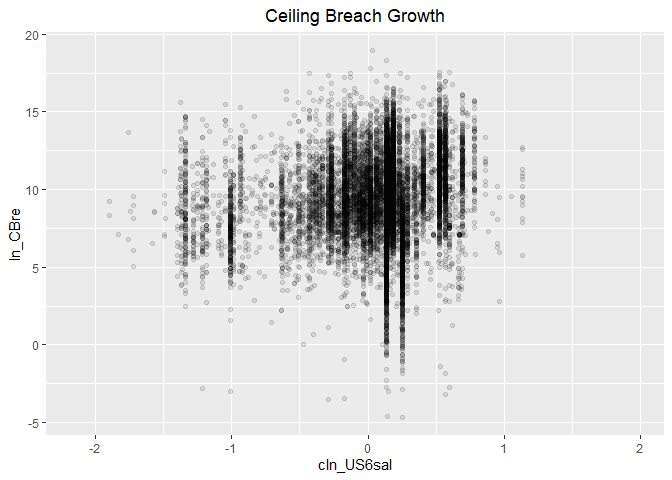<!-- -->

```r
#Model
b_CBre01A <- glm (data=serv_smp,
                 b_CBre ~ cln_US6sal, family=binomial(link="logit"))


n_CBre01A <- glm(data=serv_breach,
                        ln_CBre ~ cln_US6sal)


#Plot residuals versus fitted
stargazer::stargazer(b_CBre01A,n_CBre01A,type="text",
                       digits=2)
```

```
## 
## ==============================================
##                       Dependent variable:     
##                   ----------------------------
##                       b_CBre        ln_CBre   
##                      logistic       normal    
##                        (1)            (2)     
## ----------------------------------------------
## cln_US6sal           0.22***        0.87***   
##                       (0.02)        (0.03)    
##                                               
## Constant             -2.78***       9.26***   
##                       (0.01)        (0.01)    
##                                               
## ----------------------------------------------
## Observations         250,000        61,184    
## Log Likelihood      -55,877.03    -148,414.20 
## Akaike Inf. Crit.   111,758.10    296,832.40  
## ==============================================
## Note:              *p<0.1; **p<0.05; ***p<0.01
```

Individually, expectations are matched for ceiing breaches, as higher average salaries estimate a higher risk of ceiling breaches.  In our model based on ceiling breach size, we find an analogous relationship to our logit model, with higher salaries correlated with ceiling breaches of larger magnitudes.  However, a plot of the residuals of the logit model does reveal some irregularities, namely a deep valley at around 6% estimated probability, that then rises in a concave curve as estimated probability increases.

### 01B Invoice Rate
Expectation: The invoice rate approximates how much the government is charged annually for each comparable full-time employee who is supporting the service contracts. A higher invoice rate indicates a more complex service. As invoice rate increases (decreases), the likelihood of cost ceiling breaches increases (decreases).  Likewise, we expect a higher invoice rate (lower) to be associated with ceiling breaches larger (smaller) in absolute magnitude.


```r
summary_continuous_plot(serv_smp1m,metric="cbre","cln_PSCrate")
```

```
## Warning in `[<-.factor`(`*tmp*`, ri, value = c(0, 0, 0, 0, 0, 0, 0, 0, 0, :
## invalid factor level, NA generated
```

<!-- -->

```r
#Scatter Plot 
ggplot(serv_smp, aes(x=cln_PSCrate, y=ln_CBre)) + geom_point(alpha = 0.1) + ggtitle('Ceiling Breach Growth') + theme(plot.title = element_text(hjust = 0.5))
```

```
## Warning: Removed 235285 rows containing missing values (geom_point).
```

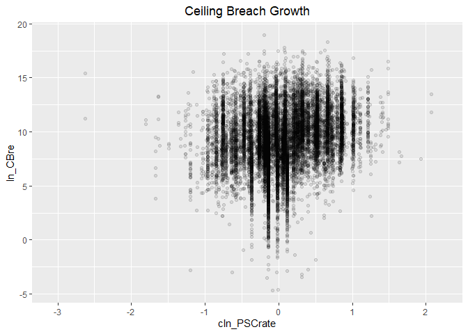<!-- -->

```r
#Model
b_CBre01B <- glm (data=serv_smp,
                 b_CBre ~ cln_PSCrate, family=binomial(link="logit"))

n_CBre01B <- glm(data=serv_breach,
                        ln_CBre ~ cln_PSCrate)


#Plot residuals versus fitted
  stargazer::stargazer(b_CBre01A,b_CBre01B,
                       n_CBre01A,n_CBre01B,
                       type="text",
                       digits=2)
```

```
## 
## ===============================================================
##                                Dependent variable:             
##                   ---------------------------------------------
##                          b_CBre                 ln_CBre        
##                         logistic                normal         
##                      (1)        (2)         (3)         (4)    
## ---------------------------------------------------------------
## cln_US6sal         0.22***                0.87***              
##                     (0.02)                (0.03)               
##                                                                
## cln_PSCrate                   0.21***                 1.21***  
##                                (0.02)                 (0.02)   
##                                                                
## Constant           -2.78***   -2.78***    9.26***     9.24***  
##                     (0.01)     (0.01)     (0.01)      (0.01)   
##                                                                
## ---------------------------------------------------------------
## Observations       250,000    250,000     61,184      61,184   
## Log Likelihood    -55,877.03 -55,881.77 -148,414.20 -147,611.10
## Akaike Inf. Crit. 111,758.10 111,767.60 296,832.40  295,226.20 
## ===============================================================
## Note:                               *p<0.1; **p<0.05; ***p<0.01
```

When considered alone, expectations are matched for ceiling breaches, as higher invoice rate estimates a higher risk of ceiling breaches. Similarly, higher invoice rates are correlated with larger ceiling breaches, matching our expectations.


### 01C Service Complexity
Expectation: Collectively, the higher average salary and invoice rate (more complexity is indicated), the higher risk of ceiling breaches. Also, we expect the result of combined model would be the same as individual models. Again, we expect higher levels of complexity to be correlated with larger ceiling breaches.

 

```r
#Model
b_CBre01C <- glm (data=serv_smp,
                 b_CBre ~ cln_US6sal + cln_PSCrate, family=binomial(link="logit"))
glmer_examine(b_CBre01C)
```

```
##  cln_US6sal cln_PSCrate 
##    1.141702    1.141702
```

```r
n_CBre01C <- glm(data=serv_breach,
                        ln_CBre ~ cln_US6sal +  cln_PSCrate)

glmer_examine(n_CBre01C)
```

```
##  cln_US6sal cln_PSCrate 
##     1.15206     1.15206
```

```r
#Plot residuals versus fitted
stargazer::stargazer(b_CBre01A,b_CBre01B,b_CBre01C,
                       
                       n_CBre01A,n_CBre01B,n_CBre01C,
                       type="text",
                       digits=2)
```

```
## 
## ======================================================================================
##                                           Dependent variable:                         
##                   --------------------------------------------------------------------
##                                b_CBre                            ln_CBre              
##                               logistic                           normal               
##                      (1)        (2)        (3)         (4)         (5)         (6)    
## --------------------------------------------------------------------------------------
## cln_US6sal         0.22***               0.16***     0.87***                 0.42***  
##                     (0.02)                (0.02)     (0.03)                  (0.03)   
##                                                                                       
## cln_PSCrate                   0.21***    0.15***                 1.21***     1.08***  
##                                (0.02)     (0.02)                 (0.02)      (0.03)   
##                                                                                       
## Constant           -2.78***   -2.78***   -2.78***    9.26***     9.24***     9.23***  
##                     (0.01)     (0.01)     (0.01)     (0.01)      (0.01)      (0.01)   
##                                                                                       
## --------------------------------------------------------------------------------------
## Observations       250,000    250,000    250,000     61,184      61,184      61,184   
## Log Likelihood    -55,877.03 -55,881.77 -55,844.23 -148,414.20 -147,611.10 -147,507.80
## Akaike Inf. Crit. 111,758.10 111,767.60 111,694.50 296,832.40  295,226.20  295,021.50 
## ======================================================================================
## Note:                                                      *p<0.1; **p<0.05; ***p<0.01
```

```r
summary_residual_compare(b_CBre01A,b_CBre01C,b_CBre01B,b_CBre01C)
```

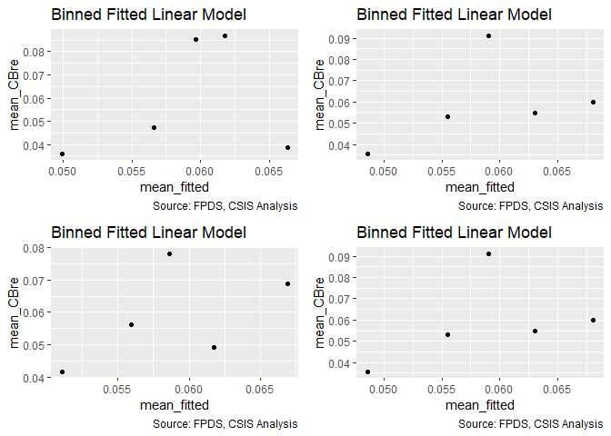<!-- -->

```
## Warning in residuals_binned(model1_old, bins = bins): Always uses Xlb
## Estimated Pr(Termination), should update.
```

```
## Warning in residuals_binned(model1_new, bins = bins): Always uses Xlb
## Estimated Pr(Termination), should update.
```

```
## Warning in residuals_binned(model2_old, bins = bins): Always uses Xlb
## Estimated Pr(Termination), should update.
```

```
## Warning in residuals_binned(model2_new, bins = bins): Always uses Xlb
## Estimated Pr(Termination), should update.
```

```
## Warning in if (class(model1_new) %in% c("glmerMod", "lme4", "lmerMod") & :
## the condition has length > 1 and only the first element will be used
```

```
## Warning in if ((!class(model1_new) %in% c("glmerMod", "lme4", "lmerMod")
## & : the condition has length > 1 and only the first element will be used
```

<!-- -->

```
## [[1]]
##        model deviance null.deviance difference
## 1 model1_old 111754.1      111909.6   155.5390
## 2 model1_new 111688.5      111909.6   221.1330
## 3 model2_old 111763.5      111909.6   146.0458
## 4 model2_new 111688.5      111909.6   221.1330
```

```r
summary_residual_compare(n_CBre01A,n_CBre01C,n_CBre01B,n_CBre01C,bins=3)
```

<!-- -->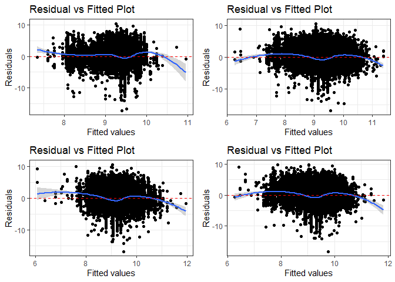<!-- -->

```
## Warning in residuals_binned(model1_old, bins = bins): Always uses Xlb
## Estimated Pr(Termination), should update.
```

```
## Warning in residuals_binned(model1_new, bins = bins): Always uses Xlb
## Estimated Pr(Termination), should update.
```

```
## Warning in residuals_binned(model2_old, bins = bins): Always uses Xlb
## Estimated Pr(Termination), should update.
```

```
## Warning in residuals_binned(model2_new, bins = bins): Always uses Xlb
## Estimated Pr(Termination), should update.
```

```
## Warning in if (class(model1_new) %in% c("glmerMod", "lme4", "lmerMod") & :
## the condition has length > 1 and only the first element will be used
```

```
## Warning in if ((!class(model1_new) %in% c("glmerMod", "lme4", "lmerMod")
## & : the condition has length > 1 and only the first element will be used
```

<!-- -->

```
## [[1]]
##        model deviance null.deviance difference
## 1 model1_old 458234.7        465759   7524.261
## 2 model1_new 444856.5        465759  20902.520
## 3 model2_old 446361.4        465759  19397.537
## 4 model2_new 444856.5        465759  20902.520
```

Both average salary and invoiced rate have a not inconsiderable VIF but one well within bounds, suggesting that the variance of the estimated coefficients is not evidently inflated and none of them are highly correlated with each other. 

Both individually and pair-wise, higher average salary and invoiced rate estimate higher probability of cost ceiling breaches.  Likewise, both individually and pair-wise, higher average salary and invoiced rate are correlated with larger ceiling breaches.  The residuals for the pair-wise model are moderately irregular, and approach sinusoidal behavior.


## Office Capacity

### 02A: Performance Based Services
Expectation: Performance-based services contracting ties a portion of a contractor's payment, contract extensions, or contract renewals to the achievement of specific, measurable performance standards and requirements, which encourages better contracting results. PBSC has the potential to reduce ceiling breaches, and the size of the breaches that do occur.


```r
summary_continuous_plot(serv_smp1m,metric="cbre","pPBSC")
```

```
## Warning in `[<-.factor`(`*tmp*`, ri, value = c(0, 0, 0, 0, 0, 0, 0, 0, 0, :
## invalid factor level, NA generated
```

<!-- -->

```r
#Scatter Plot 
ggplot(serv_smp, aes(x=cp_OffPerf7, y=ln_CBre)) + geom_point(alpha = 0.1) + ggtitle('Ceiling Breach Growth') + theme(plot.title = element_text(hjust = 0.5))
```

```
## Warning: Removed 235285 rows containing missing values (geom_point).
```

<!-- -->

```r
#Model
b_CBre02A <- glm (data=serv_smp,
                 b_CBre ~ cp_OffPerf7, family=binomial(link="logit"))

n_CBre02A <- glm(data=serv_breach,
                        ln_CBre ~ cp_OffPerf7)


#Plot residuals versus fitted
stargazer::stargazer(b_CBre01C,b_CBre02A,
                       n_CBre01C,n_CBre02A,
                       type="text",
                       digits=2)
```

```
## 
## ===============================================================
##                                Dependent variable:             
##                   ---------------------------------------------
##                          b_CBre                 ln_CBre        
##                         logistic                normal         
##                      (1)        (2)         (3)         (4)    
## ---------------------------------------------------------------
## cln_US6sal         0.16***                0.42***              
##                     (0.02)                (0.03)               
##                                                                
## cln_PSCrate        0.15***                1.08***              
##                     (0.02)                (0.03)               
##                                                                
## cp_OffPerf7                   0.23***                -1.86***  
##                                (0.02)                 (0.02)   
##                                                                
## Constant           -2.78***   -2.78***    9.23***     9.39***  
##                     (0.01)     (0.01)     (0.01)      (0.01)   
##                                                                
## ---------------------------------------------------------------
## Observations       250,000    250,000     61,184      61,184   
## Log Likelihood    -55,844.23 -55,858.92 -147,507.80 -143,682.00
## Akaike Inf. Crit. 111,694.50 111,721.80 295,021.50  287,367.90 
## ===============================================================
## Note:                               *p<0.1; **p<0.05; ***p<0.01
```

When considering PBSC alone, our logit model finds the opposite of our expected relationship: higher levels of performance-based services contracting is associated with a higher likelihood of a ceiling breach occurring. However, our ceiling breach size-based model demonstrates that higher levels of performance-based contracting are correlated with smaller ceiling breaches (meeting our expectation).  Given that the study team has more confidence in modelling ceiling breaches in dollar terms, it may be wise to disregard the logit result.


### 02B: No.Office PSC History
Expectation: The increasing share of contracting office obligations for a given service indicates high capcaity in that area, lower likelihood of cost ceiling breaches are expected to be observed. Similarly, we expect the overall magnitude of ceiling breaches to be decreasing as the share of contracting office oglibations for a given service increases.


```r
summary_continuous_plot(serv_smp1m,metric="cbre","cp_OffPSC7")
```

```
## Warning in `[<-.factor`(`*tmp*`, ri, value = c(0, 0, 0, 0, 0, 0, 0, 0, 0, :
## invalid factor level, NA generated
```

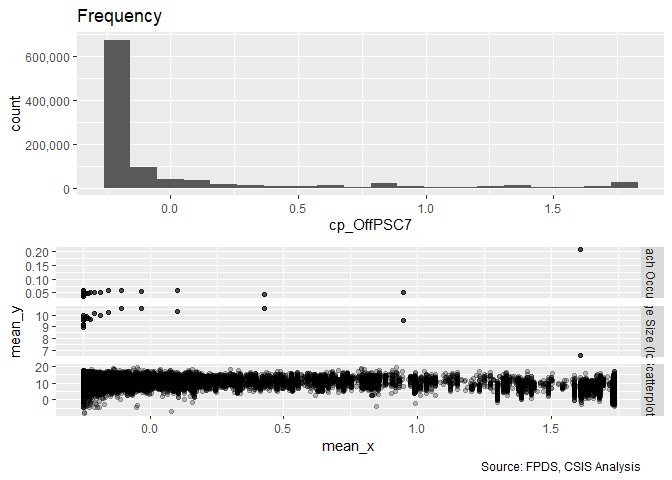<!-- -->

```r
#Scatter Plot 
ggplot(serv_smp, aes(x=cp_OffPSC7, y=ln_CBre)) + geom_point(alpha = 0.1) + ggtitle('Ceiling Breach Growth') + theme(plot.title = element_text(hjust = 0.5))
```

```
## Warning: Removed 235285 rows containing missing values (geom_point).
```

<!-- -->

```r
#Model
b_CBre02B <- glm (data=serv_smp,
                 b_CBre ~ cp_OffPSC7, family=binomial(link="logit"))

n_CBre02B <- glm(data=serv_breach,
                        ln_CBre ~ cp_OffPSC7)

#Plot residuals versus fitted
stargazer::stargazer(b_CBre01C,b_CBre02A,b_CBre02B,
                       n_CBre01C,n_CBre02A,n_CBre02B,
                       type="text",
                       digits=2)
```

```
## 
## ======================================================================================
##                                           Dependent variable:                         
##                   --------------------------------------------------------------------
##                                b_CBre                            ln_CBre              
##                               logistic                           normal               
##                      (1)        (2)        (3)         (4)         (5)         (6)    
## --------------------------------------------------------------------------------------
## cln_US6sal         0.16***                           0.42***                          
##                     (0.02)                           (0.03)                           
##                                                                                       
## cln_PSCrate        0.15***                           1.08***                          
##                     (0.02)                           (0.03)                           
##                                                                                       
## cp_OffPerf7                   0.23***                           -1.86***              
##                                (0.02)                            (0.02)               
##                                                                                       
## cp_OffPSC7                               0.75***                            -1.58***  
##                                           (0.01)                             (0.01)   
##                                                                                       
## Constant           -2.78***   -2.78***   -2.83***    9.23***     9.39***     9.65***  
##                     (0.01)     (0.01)     (0.01)     (0.01)      (0.01)      (0.01)   
##                                                                                       
## --------------------------------------------------------------------------------------
## Observations       250,000    250,000    250,000     61,184      61,184      61,184   
## Log Likelihood    -55,844.23 -55,858.92 -54,538.89 -147,507.80 -143,682.00 -142,893.70
## Akaike Inf. Crit. 111,694.50 111,721.80 109,081.80 295,021.50  287,367.90  285,791.30 
## ======================================================================================
## Note:                                                      *p<0.1; **p<0.05; ***p<0.01
```

When considering number of contracting office obligations for a given service alone, we find a positive relationship between size of share of contracting office obligations for a service and the likelihood of a ceiling breach, the opposite of what was expected.  However, a negative relationship is found, as expected, between the size of the share of contracting office obligations for a service and the overall magnitude of ceiling breaches.


### 02C: Office Capacity
Expectation: Collectively, the larger share of PBSC and contracting office obligations for a given service, the less risk of ceiling breaches there would be. Also we expect the results of combined model would be the same as two individual models above. Similarly, we expect that, as the collective share of PBSC and contracting office obligations for a given service increase jointly, the magnitude of associated ceiling breaches declines.


```r
#Model
b_CBre02C <- glm (data=serv_smp,
                 b_CBre ~ cp_OffPerf7+cp_OffPSC7, family=binomial(link="logit"))
glmer_examine(b_CBre02C)
```

```
## cp_OffPerf7  cp_OffPSC7 
##    1.247524    1.247524
```

```r
n_CBre02C <- glm(data=serv_breach,
                        ln_CBre ~ cp_OffPerf7+cp_OffPSC7)

glmer_examine(n_CBre02C)
```

```
## cp_OffPerf7  cp_OffPSC7 
##    2.057338    2.057338
```

```r
#Plot residuals versus fitted
stargazer::stargazer(b_CBre01C,b_CBre02A,b_CBre02B,b_CBre02C,
                       
                       n_CBre01C,n_CBre02A,n_CBre02B,
                       type="text",
                       digits=2)
```

```
## 
## =================================================================================================
##                                                 Dependent variable:                              
##                   -------------------------------------------------------------------------------
##                                     b_CBre                                  ln_CBre              
##                                    logistic                                 normal               
##                      (1)        (2)        (3)        (4)         (5)         (6)         (7)    
## -------------------------------------------------------------------------------------------------
## cln_US6sal         0.16***                                      0.42***                          
##                     (0.02)                                      (0.03)                           
##                                                                                                  
## cln_PSCrate        0.15***                                      1.08***                          
##                     (0.02)                                      (0.03)                           
##                                                                                                  
## cp_OffPerf7                   0.23***               -0.15***               -1.86***              
##                                (0.02)                (0.02)                 (0.02)               
##                                                                                                  
## cp_OffPSC7                               0.75***    0.81***                            -1.58***  
##                                           (0.01)     (0.01)                             (0.01)   
##                                                                                                  
## Constant           -2.78***   -2.78***   -2.83***   -2.83***    9.23***     9.39***     9.65***  
##                     (0.01)     (0.01)     (0.01)     (0.01)     (0.01)      (0.01)      (0.01)   
##                                                                                                  
## -------------------------------------------------------------------------------------------------
## Observations       250,000    250,000    250,000    250,000     61,184      61,184      61,184   
## Log Likelihood    -55,844.23 -55,858.92 -54,538.89 -54,503.45 -147,507.80 -143,682.00 -142,893.70
## Akaike Inf. Crit. 111,694.50 111,721.80 109,081.80 109,012.90 295,021.50  287,367.90  285,791.30 
## =================================================================================================
## Note:                                                                 *p<0.1; **p<0.05; ***p<0.01
```

```r
summary_residual_compare(b_CBre02A,b_CBre02C)
```

<!-- -->

```
## Warning in residuals_binned(model1_old, bins = bins): Always uses Xlb
## Estimated Pr(Termination), should update.
```

```
## Warning in residuals_binned(model1_new, bins = bins): Always uses Xlb
## Estimated Pr(Termination), should update.
```

```
## Warning in if (class(model1_new) %in% c("glmerMod", "lme4", "lmerMod")) {:
## the condition has length > 1 and only the first element will be used
```

```
## Warning in if (!class(model1_new) %in% c("glmerMod", "lme4", "lmerMod") & :
## the condition has length > 1 and only the first element will be used
```

<!-- -->

```
## [[1]]
##        model deviance null.deviance difference
## 1 model1_old 111717.8      111909.6   191.7574
## 2 model1_new 109006.9      111909.6  2902.6885
```

```r
summary_residual_compare(b_CBre02A,n_CBre02B)
```

<!-- -->

```
## Warning in residuals_binned(model1_old, bins = bins): Always uses Xlb
## Estimated Pr(Termination), should update.
```

```
## Warning in residuals_binned(model1_new, bins = bins): Always uses Xlb
## Estimated Pr(Termination), should update.
```

```
## Warning in if (class(model1_new) %in% c("glmerMod", "lme4", "lmerMod")) {:
## the condition has length > 1 and only the first element will be used
```

```
## Warning in if (!class(model1_new) %in% c("glmerMod", "lme4", "lmerMod") & :
## the condition has length > 1 and only the first element will be used
```

<!-- -->

```
## [[1]]
##        model deviance null.deviance difference
## 1 model1_old 111717.8      111909.6   191.7574
## 2 model1_new 382575.0      465759.0 83183.9427
```

For likelihood, no high correlation is observed between PBSC and Contract Office Obligations for likelihood PSC based on the vif score. For size, VIF is a problem and Office PSC appears to be the better predictor, so using that.

After combining PBSC and Contract office obligations for PSC, PBSC had a flipped relationship with ceiling breach probability that matches with expectation. The rest of results continued to fail to meet expectations.

The binned residual plot for the logit model for PBSC shows a near-linear upward trend, and is thus highly abnormal.


### 02D: Cumulative  Model
Expectation: When all the four variables are combined into one model, same expectations are applied as individual ones. Per service complexity indicator increase, higher risk of ceiling breaches expected. Per office capacity indicator increase, lower risk of ceiling breaches expected.  Again, per service complexity indicator increase, larger ceiling breaches in size expected; per office capacity indicator increase, smaller ceiling breaches in size expected.


```r
#Model
b_CBre02D <- glm (data=serv_smp,
                 b_CBre ~ cln_US6sal + cln_PSCrate+ cp_OffPerf7+cp_OffPSC7, family=binomial(link="logit"))
glmer_examine(b_CBre02D)
```

```
##  cln_US6sal cln_PSCrate cp_OffPerf7  cp_OffPSC7 
##    1.193072    1.155001    1.261503    1.255696
```

```r
n_CBre02D <- glm(data=serv_breach,
                        ln_CBre ~ cln_US6sal + cln_PSCrate+ cp_OffPSC7)

glmer_examine(n_CBre02D)
```

```
##  cln_US6sal cln_PSCrate  cp_OffPSC7 
##    1.228439    1.203222    1.082119
```

```r
#Plot residuals versus fitted
stargazer::stargazer(b_CBre01C,b_CBre02C,b_CBre02D,
                       
                       n_CBre01C,n_CBre02C,n_CBre02D,
                       type="text",
                       digits=2)
```

```
## 
## ======================================================================================
##                                           Dependent variable:                         
##                   --------------------------------------------------------------------
##                                b_CBre                            ln_CBre              
##                               logistic                           normal               
##                      (1)        (2)        (3)         (4)         (5)         (6)    
## --------------------------------------------------------------------------------------
## cln_US6sal         0.16***                 0.03      0.42***                 1.23***  
##                     (0.02)                (0.02)     (0.03)                  (0.03)   
##                                                                                       
## cln_PSCrate        0.15***               0.19***     1.08***                 0.50***  
##                     (0.02)                (0.02)     (0.03)                  (0.02)   
##                                                                                       
## cp_OffPerf7                   -0.15***   -0.16***               -0.90***              
##                                (0.02)     (0.02)                 (0.02)               
##                                                                                       
## cp_OffPSC7                    0.81***    0.81***                -1.07***    -1.67***  
##                                (0.01)     (0.01)                 (0.02)      (0.01)   
##                                                                                       
## Constant           -2.78***   -2.83***   -2.84***    9.23***     9.58***     9.58***  
##                     (0.01)     (0.01)     (0.01)     (0.01)      (0.01)      (0.01)   
##                                                                                       
## --------------------------------------------------------------------------------------
## Observations       250,000    250,000    250,000     61,184      61,184      61,184   
## Log Likelihood    -55,844.23 -54,503.45 -54,437.65 -147,507.80 -142,216.90 -140,973.80
## Akaike Inf. Crit. 111,694.50 109,012.90 108,885.30 295,021.50  284,439.70  281,955.50 
## ======================================================================================
## Note:                                                      *p<0.1; **p<0.05; ***p<0.01
```

```r
summary_residual_compare(b_CBre02C,b_CBre02D)
```

<!-- -->

```
## Warning in residuals_binned(model1_old, bins = bins): Always uses Xlb
## Estimated Pr(Termination), should update.
```

```
## Warning in residuals_binned(model1_new, bins = bins): Always uses Xlb
## Estimated Pr(Termination), should update.
```

```
## Warning in if (class(model1_new) %in% c("glmerMod", "lme4", "lmerMod")) {:
## the condition has length > 1 and only the first element will be used
```

```
## Warning in if (!class(model1_new) %in% c("glmerMod", "lme4", "lmerMod") & :
## the condition has length > 1 and only the first element will be used
```

<!-- -->

```
## [[1]]
##        model deviance null.deviance difference
## 1 model1_old 109006.9      111909.6   2902.688
## 2 model1_new 108875.3      111909.6   3034.290
```

```r
summary_residual_compare(b_CBre01C,b_CBre02D)
```

<!-- -->

```
## Warning in residuals_binned(model1_old, bins = bins): Always uses Xlb
## Estimated Pr(Termination), should update.
```

```
## Warning in residuals_binned(model1_new, bins = bins): Always uses Xlb
## Estimated Pr(Termination), should update.
```

```
## Warning in if (class(model1_new) %in% c("glmerMod", "lme4", "lmerMod")) {:
## the condition has length > 1 and only the first element will be used
```

```
## Warning in if (!class(model1_new) %in% c("glmerMod", "lme4", "lmerMod") & :
## the condition has length > 1 and only the first element will be used
```

<!-- -->

```
## [[1]]
##        model deviance null.deviance difference
## 1 model1_old 111688.5      111909.6    221.133
## 2 model1_new 108875.3      111909.6   3034.290
```

No high correlation is observed among all of the 4 predictors (average salary, invoiced rate, PBSC and Contract Office Obligations for PSC) so far based on the vif score. When all measures for sevice complexity and office capacity are combined:

Ceiling Breaches: All variables remain the same within each subgroup (Services Complexity and Office Capacity). Except for Contract office obligations for PSC, the results of other varibles matched with the expectation for ceiling breaches so far. For the model specified in terms of size of ceiling breach, again, all variables remain the same within each subgroup.  All variable results match with expectation for ceiling breaches so far.


## Office-Vendor Relationship

### 03A: Pair History
Expactation: As the number of past years of the relationship between the contracting office or the contractors with a single transaction in a given fiscal year enough to qualify, namely, pair history increases (decreases), the likelihood of cost ceiling breaches for that partnership decreases (increases).  Similarly, as the length of the pair history increases (decreases). the size of cost ceiling breaches is expected to decrease (increase).


```r
summary_discrete_plot(serv_smp1m,metric="cbre","cn_PairHist7")
```

```
## Warning: Ignoring unknown parameters: binwidth, bins, pad
```

```
## Warning: group_by_() is deprecated. 
## Please use group_by() instead
## 
## The 'programming' vignette or the tidyeval book can help you
## to program with group_by() : https://tidyeval.tidyverse.org
## This warning is displayed once per session.
```

<!-- -->

```
## [[1]]
## 
## -0.727574636460554 -0.519998477795702  -0.31242231913085 
##             155623             122002             113614 
## -0.104846160465998  0.102729998198854  0.310306156863706 
##             118101             131531             109387 
##  0.517882315528558   0.72545847419341 
##              86538             163204 
## 
## [[2]]
##                     
##                        None Ceiling Breach
##   -0.727574636460554 146181           9442
##   -0.519998477795702 114982           7020
##   -0.31242231913085  106910           6704
##   -0.104846160465998 110938           7163
##   0.102729998198854  123406           8125
##   0.310306156863706  102690           6697
##   0.517882315528558   81508           5030
##   0.72545847419341   155134           8070
## 
## [[3]]
##                     
##                           0      1
##   -0.727574636460554 151409   4214
##   -0.519998477795702 120240   1762
##   -0.31242231913085  112157   1457
##   -0.104846160465998 116734   1367
##   0.102729998198854  129311   2220
##   0.310306156863706  106592   2795
##   0.517882315528558   84540   1998
##   0.72545847419341   160340   2864
```

```r
#Scatter Plot
ggplot(serv_smp, aes(x=cn_PairHist7, y=ln_CBre)) + geom_point(alpha = 0.1) + ggtitle('Ceiling Breach Growth') + theme(plot.title = element_text(hjust = 0.5))
```

```
## Warning: Removed 235285 rows containing missing values (geom_point).
```

<!-- -->

```r
#Model
b_CBre03A <- glm (data=serv_smp,
                 b_CBre ~ cn_PairHist7, family=binomial(link="logit"))


n_CBre03A <- glm(data=serv_breach,
                        ln_CBre ~ cn_PairHist7)


#Plot residuals versus fitted
  stargazer::stargazer(b_CBre02D,b_CBre03A,
                       
                       n_CBre02D,n_CBre03A,
                       type="text",
                       digits=2)
```

```
## 
## ===============================================================
##                                Dependent variable:             
##                   ---------------------------------------------
##                          b_CBre                 ln_CBre        
##                         logistic                normal         
##                      (1)        (2)         (3)         (4)    
## ---------------------------------------------------------------
## cln_US6sal           0.03                 1.23***              
##                     (0.02)                (0.03)               
##                                                                
## cln_PSCrate        0.19***                0.50***              
##                     (0.02)                (0.02)               
##                                                                
## cp_OffPerf7        -0.16***                                    
##                     (0.02)                                     
##                                                                
## cp_OffPSC7         0.81***               -1.67***              
##                     (0.01)                (0.01)               
##                                                                
## cn_PairHist7                  -0.09***               -0.53***  
##                                (0.02)                 (0.02)   
##                                                                
## Constant           -2.84***   -2.77***    9.58***     9.28***  
##                     (0.01)     (0.01)     (0.01)      (0.01)   
##                                                                
## ---------------------------------------------------------------
## Observations       250,000    250,000     61,184      61,184   
## Log Likelihood    -54,437.65 -55,941.52 -140,973.80 -148,641.30
## Akaike Inf. Crit. 108,885.30 111,887.00 281,955.50  297,286.50 
## ===============================================================
## Note:                               *p<0.1; **p<0.05; ***p<0.01
```

When considering pair history alone, expectations were met for ceiling breaches, both in probability of a breach and the size of the breach.


### 03B: Interaction
Expectation: As the number of contract actions a vendor has performed for an office in the past year increases (decreases), the likelihood of cost ceiling breaches and terminations decreases (increases) for that partnership.  Similarly, as the number of contract actions a vendor has performed for an office in the past year increases (decreases), the size of cost ceiling breaches should decrease (increase).


```r
summary_continuous_plot(serv_smp1m,metric="cbre","cln_PairCA")
```

```
## Warning in `[<-.factor`(`*tmp*`, ri, value = c(0, 0, 0, 0, 0, 0, 0, 0, 0, :
## invalid factor level, NA generated
```

<!-- -->

```r
#Scatter Plot
ggplot(serv_smp, aes(x=cln_PairCA, y=ln_CBre)) + geom_point(alpha = 0.1) + ggtitle('Ceiling Breach Growth') + theme(plot.title = element_text(hjust = 0.5))
```

```
## Warning: Removed 235285 rows containing missing values (geom_point).
```

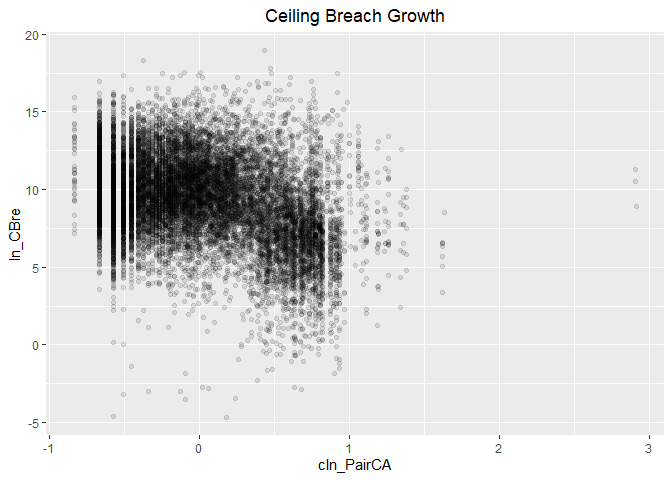<!-- -->

```r
#Model
b_CBre03B <- glm (data=serv_smp,
                 b_CBre ~ cln_PairCA, family=binomial(link="logit"))


n_CBre03B <- glm(data=serv_breach,
                        ln_CBre ~ cln_PairCA)


#Plot residuals versus fitted
stargazer::stargazer(b_CBre02D,b_CBre03A,b_CBre03B,
                       
                       n_CBre02D,n_CBre03A,n_CBre03B,
                       type="text",
                       digits=2)
```

```
## 
## ======================================================================================
##                                           Dependent variable:                         
##                   --------------------------------------------------------------------
##                                b_CBre                            ln_CBre              
##                               logistic                           normal               
##                      (1)        (2)        (3)         (4)         (5)         (6)    
## --------------------------------------------------------------------------------------
## cln_US6sal           0.03                            1.23***                          
##                     (0.02)                           (0.03)                           
##                                                                                       
## cln_PSCrate        0.19***                           0.50***                          
##                     (0.02)                           (0.02)                           
##                                                                                       
## cp_OffPerf7        -0.16***                                                           
##                     (0.02)                                                            
##                                                                                       
## cp_OffPSC7         0.81***                          -1.67***                          
##                     (0.01)                           (0.01)                           
##                                                                                       
## cn_PairHist7                  -0.09***                          -0.53***              
##                                (0.02)                            (0.02)               
##                                                                                       
## cln_PairCA                               0.18***                            -1.90***  
##                                           (0.02)                             (0.02)   
##                                                                                       
## Constant           -2.84***   -2.77***   -2.77***    9.58***     9.28***     9.37***  
##                     (0.01)     (0.01)     (0.01)     (0.01)      (0.01)      (0.01)   
##                                                                                       
## --------------------------------------------------------------------------------------
## Observations       250,000    250,000    250,000     61,184      61,184      61,184   
## Log Likelihood    -54,437.65 -55,941.52 -55,895.24 -140,973.80 -148,641.30 -145,574.80
## Akaike Inf. Crit. 108,885.30 111,887.00 111,794.50 281,955.50  297,286.50  291,153.60 
## ======================================================================================
## Note:                                                      *p<0.1; **p<0.05; ***p<0.01
```

When considering contract actions alone, no expectations were met in the logit model. The patterns in the plots are complex, ceiling breaches has a sinusoidal or perhaps exponential relationship.  However, when switching to modeling ceiling breach size, a strong negative relationship is found, as expected.

### 03C: Office-Vendor Relationship
Expectation: 
The importance of partnership, trust, and handling difficult problems and uncertainty together naturally lead into the last characteristic: the relationship between the contractor and buyer. The higher level of interaction provides the more opportunity to build a deeper relationship, the likelihood of a cost ceiling breach increases as pair history and pair contract actions rises. Moreover, a higher level of interaction should decrease the size of associated ceiling breaches. Also we expect the result of combined model would be the same as individual models above.


```r
#Model
b_CBre03C <- glm (data=serv_smp,
                 b_CBre ~ cn_PairHist7+cln_PairCA, family=binomial(link="logit"))
glmer_examine(b_CBre03C)
```

```
## cn_PairHist7   cln_PairCA 
##     1.204154     1.204154
```

```r
n_CBre03C <- glm(data=serv_breach,
                        ln_CBre ~ cn_PairHist7+cln_PairCA)

glmer_examine(n_CBre03C)
```

```
## cn_PairHist7   cln_PairCA 
##     1.243717     1.243717
```

```r
#Plot residuals versus fitted
  stargazer::stargazer(b_CBre03A,b_CBre03B,b_CBre03C,
                       
                       n_CBre03A,n_CBre03B,n_CBre03C,
                       type="text",
                       digits=2)
```

```
## 
## ======================================================================================
##                                           Dependent variable:                         
##                   --------------------------------------------------------------------
##                                b_CBre                            ln_CBre              
##                               logistic                           normal               
##                      (1)        (2)        (3)         (4)         (5)         (6)    
## --------------------------------------------------------------------------------------
## cn_PairHist7       -0.09***              -0.20***   -0.53***                 0.34***  
##                     (0.02)                (0.02)     (0.02)                  (0.02)   
##                                                                                       
## cln_PairCA                    0.18***    0.26***                -1.90***    -2.06***  
##                                (0.02)     (0.02)                 (0.02)      (0.03)   
##                                                                                       
## Constant           -2.77***   -2.77***   -2.78***    9.28***     9.37***     9.38***  
##                     (0.01)     (0.01)     (0.01)     (0.01)      (0.01)      (0.01)   
##                                                                                       
## --------------------------------------------------------------------------------------
## Observations       250,000    250,000    250,000     61,184      61,184      61,184   
## Log Likelihood    -55,941.52 -55,895.24 -55,839.86 -148,641.30 -145,574.80 -145,475.30
## Akaike Inf. Crit. 111,887.00 111,794.50 111,685.70 297,286.50  291,153.60  290,956.70 
## ======================================================================================
## Note:                                                      *p<0.1; **p<0.05; ***p<0.01
```

```r
summary_residual_compare(b_CBre03A,b_CBre03C,b_CBre03B,b_CBre03C)
```

<!-- -->

```
## Warning in residuals_binned(model1_old, bins = bins): Always uses Xlb
## Estimated Pr(Termination), should update.
```

```
## Warning in residuals_binned(model1_new, bins = bins): Always uses Xlb
## Estimated Pr(Termination), should update.
```

```
## Warning in residuals_binned(model2_old, bins = bins): Always uses Xlb
## Estimated Pr(Termination), should update.
```

```
## Warning in residuals_binned(model2_new, bins = bins): Always uses Xlb
## Estimated Pr(Termination), should update.
```

```
## Warning in if (class(model1_new) %in% c("glmerMod", "lme4", "lmerMod") & :
## the condition has length > 1 and only the first element will be used
```

```
## Warning in if ((!class(model1_new) %in% c("glmerMod", "lme4", "lmerMod")
## & : the condition has length > 1 and only the first element will be used
```

<!-- -->

```
## [[1]]
##        model deviance null.deviance difference
## 1 model1_old 111883.0      111909.6   26.55349
## 2 model1_new 111679.7      111909.6  229.86655
## 3 model2_old 111790.5      111909.6  119.12038
## 4 model2_new 111679.7      111909.6  229.86655
```

```r
summary_residual_compare(n_CBre03A,n_CBre03C,n_CBre03B,n_CBre03C)
```

<!-- --><!-- -->

```
## Warning in residuals_binned(model1_old, bins = bins): Always uses Xlb
## Estimated Pr(Termination), should update.
```

```
## Warning in residuals_binned(model1_new, bins = bins): Always uses Xlb
## Estimated Pr(Termination), should update.
```

```
## Warning in residuals_binned(model2_old, bins = bins): Always uses Xlb
## Estimated Pr(Termination), should update.
```

```
## Warning in residuals_binned(model2_new, bins = bins): Always uses Xlb
## Estimated Pr(Termination), should update.
```

```
## Warning in if (class(model1_new) %in% c("glmerMod", "lme4", "lmerMod") & :
## the condition has length > 1 and only the first element will be used
```

```
## Warning in if ((!class(model1_new) %in% c("glmerMod", "lme4", "lmerMod")
## & : the condition has length > 1 and only the first element will be used
```

<!-- -->

```
## [[1]]
##        model deviance null.deviance difference
## 1 model1_old 461648.6        465759   4110.359
## 2 model1_new 416262.0        465759  49497.020
## 3 model2_old 417617.6        465759  48141.363
## 4 model2_new 416262.0        465759  49497.020
```

When combining pair history and contract actions, magnitude of relationships with dependent variables incraesed.  However, the results of the combined model were the same as previous individual models: i.e. the contract options relationship expectation (more contract actions in the past, lower probability of breach) was not met, but again, the expectation for pair history (longer pair history, lower probability of breach) was met.  However, when specifying the model in terms of ceiling breach size, the results of the combined model are quite different. Again, as above, we actually do find the strong negative relationship that we expected for past contract actions, which actually increases in magnitude in the combined model.  Moreover, in the combined magnitude-based model, pair history also displays a statistically significant negative relationship with the size of correlated ceiling breaches, as expected, and as above.


### 03D: Cumulative  Model

Expectation: Under each subgroup, the predictors are expected to have similar impacts on dependent variables individually and cumulatively:
1. Higher Services Complexity: Higher likelihood of cost ceiling breaches
2. Larger Office Capacity: Lower likelihood of cost ceiling breaches
3. Deeper Office-Vendor Relationship: Lower likelihood of cost ceiling breaches


```r
#Model
b_CBre03D <- glm (data=serv_smp,
                 b_CBre ~  cln_US6sal + 
                   cln_PSCrate+ cp_OffPerf7+cp_OffPSC7+
                 cn_PairHist7+cln_PairCA, family=binomial(link="logit"))
glmer_examine(b_CBre03D)
```

```
##   cln_US6sal  cln_PSCrate  cp_OffPerf7   cp_OffPSC7 cn_PairHist7 
##     1.225863     1.164539     1.282652     1.463663     1.246915 
##   cln_PairCA 
##     1.561561
```

```r
n_CBre03D <- glm(data=serv_breach,
                        ln_CBre ~  cln_US6sal + 
                   cln_PSCrate+ cp_OffPSC7+
                 cn_PairHist7+cln_PairCA)

glmer_examine(n_CBre03D)
```

```
##   cln_US6sal  cln_PSCrate   cp_OffPSC7 cn_PairHist7   cln_PairCA 
##     1.243611     1.211540     1.759282     1.274378     2.077734
```

```r
#Plot residuals versus fitted   

stargazer::stargazer(b_CBre02D,b_CBre03C,b_CBre03D,
                       n_CBre02D,n_CBre03C,n_CBre03D,
                       type="text",
                       digits=2)
```

```
## 
## ======================================================================================
##                                           Dependent variable:                         
##                   --------------------------------------------------------------------
##                                b_CBre                            ln_CBre              
##                               logistic                           normal               
##                      (1)        (2)        (3)         (4)         (5)         (6)    
## --------------------------------------------------------------------------------------
## cln_US6sal           0.03                0.08***     1.23***                 1.29***  
##                     (0.02)                (0.02)     (0.03)                  (0.03)   
##                                                                                       
## cln_PSCrate        0.19***               0.17***     0.50***                 0.47***  
##                     (0.02)                (0.02)     (0.02)                  (0.02)   
##                                                                                       
## cp_OffPerf7        -0.16***              -0.13***                                     
##                     (0.02)                (0.02)                                      
##                                                                                       
## cp_OffPSC7         0.81***               0.85***    -1.67***                -1.43***  
##                     (0.01)                (0.02)     (0.01)                  (0.02)   
##                                                                                       
## cn_PairHist7                  -0.20***   -0.16***                0.34***      -0.01   
##                                (0.02)     (0.02)                 (0.02)      (0.02)   
##                                                                                       
## cln_PairCA                    0.26***    -0.14***               -2.06***    -0.62***  
##                                (0.02)     (0.02)                 (0.03)      (0.03)   
##                                                                                       
## Constant           -2.84***   -2.78***   -2.85***    9.58***     9.38***     9.54***  
##                     (0.01)     (0.01)     (0.01)     (0.01)      (0.01)      (0.01)   
##                                                                                       
## --------------------------------------------------------------------------------------
## Observations       250,000    250,000    250,000     61,184      61,184      61,184   
## Log Likelihood    -54,437.65 -55,839.86 -54,347.72 -140,973.80 -145,475.30 -140,717.70
## Akaike Inf. Crit. 108,885.30 111,685.70 108,709.40 281,955.50  290,956.70  281,447.40 
## ======================================================================================
## Note:                                                      *p<0.1; **p<0.05; ***p<0.01
```

```r
summary_residual_compare(b_CBre03C,b_CBre03D,b_CBre02D,b_CBre03D)
```

<!-- -->

```
## Warning in residuals_binned(model1_old, bins = bins): Always uses Xlb
## Estimated Pr(Termination), should update.
```

```
## Warning in residuals_binned(model1_new, bins = bins): Always uses Xlb
## Estimated Pr(Termination), should update.
```

```
## Warning in residuals_binned(model2_old, bins = bins): Always uses Xlb
## Estimated Pr(Termination), should update.
```

```
## Warning in residuals_binned(model2_new, bins = bins): Always uses Xlb
## Estimated Pr(Termination), should update.
```

```
## Warning in if (class(model1_new) %in% c("glmerMod", "lme4", "lmerMod") & :
## the condition has length > 1 and only the first element will be used
```

```
## Warning in if ((!class(model1_new) %in% c("glmerMod", "lme4", "lmerMod")
## & : the condition has length > 1 and only the first element will be used
```

<!-- -->

```
## [[1]]
##        model deviance null.deviance difference
## 1 model1_old 111679.7      111909.6   229.8666
## 2 model1_new 108695.4      111909.6  3214.1497
## 3 model2_old 108875.3      111909.6  3034.2904
## 4 model2_new 108695.4      111909.6  3214.1497
```

```r
summary_residual_compare(n_CBre03C,n_CBre03D,n_CBre02D,n_CBre03D)
```

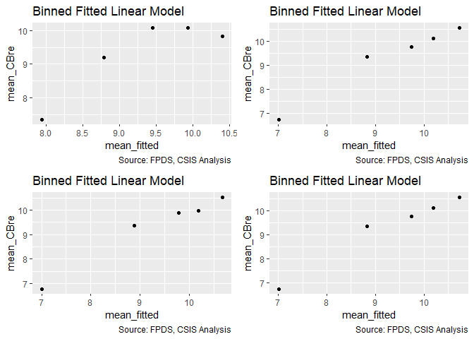<!-- --><!-- -->

```
## Warning in residuals_binned(model1_old, bins = bins): Always uses Xlb
## Estimated Pr(Termination), should update.
```

```
## Warning in residuals_binned(model1_new, bins = bins): Always uses Xlb
## Estimated Pr(Termination), should update.
```

```
## Warning in residuals_binned(model2_old, bins = bins): Always uses Xlb
## Estimated Pr(Termination), should update.
```

```
## Warning in residuals_binned(model2_new, bins = bins): Always uses Xlb
## Estimated Pr(Termination), should update.
```

```
## Warning in if (class(model1_new) %in% c("glmerMod", "lme4", "lmerMod") & :
## the condition has length > 1 and only the first element will be used
```

```
## Warning in if ((!class(model1_new) %in% c("glmerMod", "lme4", "lmerMod")
## & : the condition has length > 1 and only the first element will be used
```

<!-- -->

```
## [[1]]
##        model deviance null.deviance difference
## 1 model1_old 416262.0        465759   49497.02
## 2 model1_new 356308.3        465759  109450.69
## 3 model2_old 359302.9        465759  106456.03
## 4 model2_new 356308.3        465759  109450.69
```
None of the predictors has high level of correlation (vif over 1.7) with each other. 

Significance and sign are unchanged for the  service complexity and office capacity variales. For office-vendor relationship pairCA now estimates a lower frequence of ceiling breaches. For the breach size model, the magnitude of the relationship for pair history and pair CA both dropped but remained significant, though for pair history the result is still contrary to expectations.

The residuals show that 

In the cumulative model, per dependent variable and independent variable:

1. Ceiling breaches:
   A. Service Complexity:
      The relationship with average salary gained significance in line with expectation.
      The result for both average salary and invoice rate matched with expectation.
      
   B. Office Capacity: 
      The relationship with PBSC matched with expectation but with less magnitude.
      The result for office obligations did not match with expectation.
     
   C. Office-Vendor Relationship:
      The result for pair history matched with expectation 
      The relationship with contract actions reverse and now align with expectations.

## Study Variables Alone


```r
 study_coef_list<-get_coef_list(limit="services")

all_coef_list<-get_coef_list()

 
 
 
 
 


#Ceiling Breaches Binary
  stargazer::stargazer(b_CBre01A,b_CBre01B,b_CBre02A,b_CBre02B,b_CBre03A,b_CBre03B,b_CBre03D,
                       type="text",
                       digits=2)
```

```
## 
## ==============================================================================================
##                                               Dependent variable:                             
##                   ----------------------------------------------------------------------------
##                                                      b_CBre                                   
##                      (1)        (2)        (3)        (4)        (5)        (6)        (7)    
## ----------------------------------------------------------------------------------------------
## cln_US6sal         0.22***                                                           0.08***  
##                     (0.02)                                                            (0.02)  
##                                                                                               
## cln_PSCrate                   0.21***                                                0.17***  
##                                (0.02)                                                 (0.02)  
##                                                                                               
## cp_OffPerf7                              0.23***                                     -0.13*** 
##                                           (0.02)                                      (0.02)  
##                                                                                               
## cp_OffPSC7                                          0.75***                          0.85***  
##                                                      (0.01)                           (0.02)  
##                                                                                               
## cn_PairHist7                                                   -0.09***              -0.16*** 
##                                                                 (0.02)                (0.02)  
##                                                                                               
## cln_PairCA                                                                0.18***    -0.14*** 
##                                                                            (0.02)     (0.02)  
##                                                                                               
## Constant           -2.78***   -2.78***   -2.78***   -2.83***   -2.77***   -2.77***   -2.85*** 
##                     (0.01)     (0.01)     (0.01)     (0.01)     (0.01)     (0.01)     (0.01)  
##                                                                                               
## ----------------------------------------------------------------------------------------------
## Observations       250,000    250,000    250,000    250,000    250,000    250,000    250,000  
## Log Likelihood    -55,877.03 -55,881.77 -55,858.92 -54,538.89 -55,941.52 -55,895.24 -54,347.72
## Akaike Inf. Crit. 111,758.10 111,767.60 111,721.80 109,081.80 111,887.00 111,794.50 108,709.40
## ==============================================================================================
## Note:                                                              *p<0.1; **p<0.05; ***p<0.01
```

```r
texreg::htmlreg(list(b_CBre01A,b_CBre01B,b_CBre02A,b_CBre02B,b_CBre03A,b_CBre03B,b_CBre03D),file="..//Output//b_CBreModel.html",
                single.row = TRUE,
                # custom.model.name=c("Ceiling Breaches"),
                stars=c(0.1,0.05,0.01,0.001),
                groups = list(
                              "Services Complexity" = 2:3,
                              "Office Capacity" =4:5,
                              "Past Relationship"=6:7
                              ),
                custom.coef.map=all_coef_list,
                bold=0.05,
                custom.note="%stars. Numerical inputs are rescaled.",
                caption="Table 6: Logit Bivariate Look at Study Variables and Ceiling Breaches",
                caption.above=TRUE)
```

```
## The table was written to the file '..//Output//b_CBreModel.html'.
```

```r
#Ceiling Breach Absolute
stargazer::stargazer(n_CBre01A,n_CBre01B,n_CBre02A,n_CBre02B,n_CBre03A,n_CBre03B,n_CBre03D,
                       type="text",
                       digits=2)
```

```
## 
## =====================================================================================================
##                                                   Dependent variable:                                
##                   -----------------------------------------------------------------------------------
##                                                         ln_CBre                                      
##                       (1)         (2)         (3)         (4)         (5)         (6)         (7)    
## -----------------------------------------------------------------------------------------------------
## cln_US6sal          0.87***                                                                 1.29***  
##                     (0.03)                                                                  (0.03)   
##                                                                                                      
## cln_PSCrate                     1.21***                                                     0.47***  
##                                 (0.02)                                                      (0.02)   
##                                                                                                      
## cp_OffPerf7                                -1.86***                                                  
##                                             (0.02)                                                   
##                                                                                                      
## cp_OffPSC7                                             -1.58***                            -1.43***  
##                                                         (0.01)                              (0.02)   
##                                                                                                      
## cn_PairHist7                                                       -0.53***                  -0.01   
##                                                                     (0.02)                  (0.02)   
##                                                                                                      
## cln_PairCA                                                                     -1.90***    -0.62***  
##                                                                                 (0.02)      (0.03)   
##                                                                                                      
## Constant            9.26***     9.24***     9.39***     9.65***     9.28***     9.37***     9.54***  
##                     (0.01)      (0.01)      (0.01)      (0.01)      (0.01)      (0.01)      (0.01)   
##                                                                                                      
## -----------------------------------------------------------------------------------------------------
## Observations        61,184      61,184      61,184      61,184      61,184      61,184      61,184   
## Log Likelihood    -148,414.20 -147,611.10 -143,682.00 -142,893.70 -148,641.30 -145,574.80 -140,717.70
## Akaike Inf. Crit. 296,832.40  295,226.20  287,367.90  285,791.30  297,286.50  291,153.60  281,447.40 
## =====================================================================================================
## Note:                                                                     *p<0.1; **p<0.05; ***p<0.01
```

```r
texreg::htmlreg(list(n_CBre01A,n_CBre01B,n_CBre02A,n_CBre02B,n_CBre03A,n_CBre03B,n_CBre03D),file="..//Output//n_CBreModel.html",
                single.row = TRUE,
                # custom.model.name=c("Ceiling Breaches"),
                stars=c(0.1,0.05,0.01,0.001),
                groups = list(
                              "Services Complexity" = 2:3,
                              "Office Capacity" =4:5,
                              "Past Relationship"=6:7
                              ),
                custom.coef.map=all_coef_list,
                bold=0.05,
                custom.note="%stars. Numerical inputs are rescaled.",
                caption="Table 8: Regression Bivariate Look at Study Variables and Log(Options Growth)",
                caption.above=TRUE)
```

```
## The table was written to the file '..//Output//n_CBreModel.html'.
```

# Controls

##Contract-Level Controls
###Scope Variables
#### 04A: Cost Ceiling

Expectation: Initial Ceiling size positively estimates increasing probability of ceiling breaches and terminations and negatively estimates the option growth. Terminations and ceiling breaches simply comes down to large being associated with higher risk, while for option growth size imply makes it harder to grow proportionally.


```r
#Likelihood Plot for unlogged ceiling
summary_continuous_plot(serv_smp1m,metric="cbre","UnmodifiedCeiling_OMB20_GDP18",bins=1000)
```

```
## Warning in `[<-.factor`(`*tmp*`, ri, value = c(0, 0, 0, 0, 0, 0, 0, 0, 0, :
## invalid factor level, NA generated
```

<!-- -->

```r
summary_continuous_plot(serv_smp1m,metric="cbre","UnmodifiedCeiling_OMB20_GDP18",bins=50,log=TRUE)
```

```
## Warning in `[<-.factor`(`*tmp*`, ri, value = c(0, 0, 0, 0, 0, 0, 0, 0, 0, :
## invalid factor level, NA generated
```

<!-- -->

```r
#Scatter Plot
ggplot(serv_smp, aes(x=cl_Ceil, y=ln_CBre)) + geom_point(alpha = 0.1) + ggtitle('Ceiling Breach Growth') + theme(plot.title = element_text(hjust = 0.5))
```

```
## Warning: Removed 235285 rows containing missing values (geom_point).
```

<!-- -->

```r
#Model
b_CBre04A <- glm (data=serv_smp,
                 b_CBre ~ cl_Ceil, family=binomial(link="logit"))

n_CBre04A <- glm(data=serv_breach,
                        ln_CBre ~ cl_Ceil)

#Plot residuals versus fitted
stargazer::stargazer(b_CBre03D,b_CBre04A,
                       
                       n_CBre03D,n_CBre04A,
                       type="text",
                       digits=2)
```

```
## 
## ===============================================================
##                                Dependent variable:             
##                   ---------------------------------------------
##                          b_CBre                 ln_CBre        
##                         logistic                normal         
##                      (1)        (2)         (3)         (4)    
## ---------------------------------------------------------------
## cln_US6sal         0.08***                1.29***              
##                     (0.02)                (0.03)               
##                                                                
## cln_PSCrate        0.17***                0.47***              
##                     (0.02)                (0.02)               
##                                                                
## cp_OffPerf7        -0.13***                                    
##                     (0.02)                                     
##                                                                
## cp_OffPSC7         0.85***               -1.43***              
##                     (0.02)                (0.02)               
##                                                                
## cn_PairHist7       -0.16***                -0.01               
##                     (0.02)                (0.02)               
##                                                                
## cln_PairCA         -0.14***              -0.62***              
##                     (0.02)                (0.03)               
##                                                                
## cl_Ceil                       0.87***                 3.50***  
##                                (0.02)                 (0.01)   
##                                                                
## Constant           -2.85***   -2.86***    9.54***     8.57***  
##                     (0.01)     (0.01)     (0.01)      (0.01)   
##                                                                
## ---------------------------------------------------------------
## Observations       250,000    250,000     61,184      61,184   
## Log Likelihood    -54,347.72 -54,667.37 -140,717.70 -126,463.40
## Akaike Inf. Crit. 108,709.40 109,338.70 281,447.40  252,930.90 
## ===============================================================
## Note:                               *p<0.1; **p<0.05; ***p<0.01
```

Contract ceiling has a significant relationship with ceiling breach likelihood and size, though the residuals show a possible non-linear patterns. The relationship is strong in both cases but remarkably for breach size the AIC is lower than for all of the prior variales together. Both likelihood and size show some sign of sinusoidal patterns. 


#### 04B: Maximum Duration

Expectation: Greater maximum duration will positively estimate the probability ceiling of  breaches and terminations. Greater growth for options is also expected, because year-on-year options may be more of a default, though the scatter plot seems to go the other way.


```r
#Likelihood Plot for max duration
freq_continuous_cbre_plot(serv_smp,"UnmodifiedDays",
               bins=1000)
```

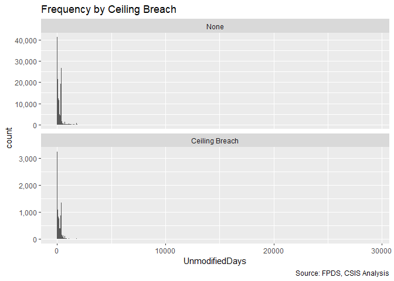<!-- -->

```r
summary_continuous_plot(serv_smp1m,metric="cbre","cln_Days")
```

```
## Warning in `[<-.factor`(`*tmp*`, ri, value = c(0, 0, 0, 0, 0, 0, 0, 0, 0, :
## invalid factor level, NA generated
```

<!-- -->

```r
#Scatter Plot
ggplot(serv_smp, aes(x=cln_Days, y=ln_CBre)) + geom_point(alpha = 0.1) + ggtitle('Ceiling Breach Growth') + theme(plot.title = element_text(hjust = 0.5))
```

```
## Warning: Removed 235285 rows containing missing values (geom_point).
```

<!-- -->

```r
#Model
b_CBre04B <- glm (data=serv_smp,
                 b_CBre ~ cln_Days, family=binomial(link="logit"))

n_CBre04B <- glm(data=serv_breach,
                        ln_CBre ~ cln_Days)


#Plot residuals versus fitted
stargazer::stargazer(b_CBre03D,b_CBre04A,b_CBre04B,
                       
                       n_CBre03D,n_CBre04A,n_CBre04B,
                       type="text",
                       digits=2)
```

```
## 
## ======================================================================================
##                                           Dependent variable:                         
##                   --------------------------------------------------------------------
##                                b_CBre                            ln_CBre              
##                               logistic                           normal               
##                      (1)        (2)        (3)         (4)         (5)         (6)    
## --------------------------------------------------------------------------------------
## cln_US6sal         0.08***                           1.29***                          
##                     (0.02)                           (0.03)                           
##                                                                                       
## cln_PSCrate        0.17***                           0.47***                          
##                     (0.02)                           (0.02)                           
##                                                                                       
## cp_OffPerf7        -0.13***                                                           
##                     (0.02)                                                            
##                                                                                       
## cp_OffPSC7         0.85***                          -1.43***                          
##                     (0.02)                           (0.02)                           
##                                                                                       
## cn_PairHist7       -0.16***                           -0.01                           
##                     (0.02)                           (0.02)                           
##                                                                                       
## cln_PairCA         -0.14***                         -0.62***                          
##                     (0.02)                           (0.03)                           
##                                                                                       
## cl_Ceil                       0.87***                            3.50***              
##                                (0.02)                            (0.01)               
##                                                                                       
## cln_Days                                 0.36***                             2.94***  
##                                           (0.02)                             (0.02)   
##                                                                                       
## Constant           -2.85***   -2.86***   -2.78***    9.54***     8.57***     9.09***  
##                     (0.01)     (0.01)     (0.01)     (0.01)      (0.01)      (0.01)   
##                                                                                       
## --------------------------------------------------------------------------------------
## Observations       250,000    250,000    250,000     61,184      61,184      61,184   
## Log Likelihood    -54,347.72 -54,667.37 -55,754.06 -140,717.70 -126,463.40 -141,808.30
## Akaike Inf. Crit. 108,709.40 109,338.70 111,512.10 281,447.40  252,930.90  283,620.70 
## ======================================================================================
## Note:                                                      *p<0.1; **p<0.05; ***p<0.01
```

All expections were upheld and although the relationship is not as strong as it is for contract ceiling. The regressions are scattered but do not show as clear indications of any patterns.

####04C: Ratio Initial Base : Ceiling Ratio (Logged)


Expectation, in combination with ceiling, a high ratio means that the contract has more room for adjustment and incentives without radical steps. So higher ratio of total ceiling to base are expected to be associated with a lower likelihood of termination, lower likelihood and size of ceiling breach. For exercised options, a higher ratio would is expected to make it more likely that some options are exercised but less likely that all options are exercised.


(Ex post facto) Expectation, in combination with base, a higher ratio means a contract with greater scope, just as the ceiling variable includes base and all exercised options. In this case, the expected sign for terminations and ceiling breach likelihood and size. The expectations for options are the same whetehr combined with ceiling or ratio.


```r
summary_continuous_plot(serv_smp1m,metric="cbre", "clr_Ceil2Base")
```

```
## Warning in `[<-.factor`(`*tmp*`, ri, value = c(0, 0, 0, 0, 0, 0, 0, 0, 0, :
## invalid factor level, NA generated
```

<!-- -->

```r
#Scatter Plot
ggplot(serv_smp, aes(x=clr_Ceil2Base, y=ln_CBre)) + geom_point(alpha = 0.1) + ggtitle("Terminations and Ratio Initial Base:Ceiling Ratio (Logged") + theme(plot.title = element_text(hjust = 0.5))
```

```
## Warning: Removed 235285 rows containing missing values (geom_point).
```

<!-- -->

```r
#Model


#Model
b_CBre04C <- glm(data=serv_smp, b_CBre ~ clr_Ceil2Base,family=binomial(link="logit"))

n_CBre04C <- glm(data=serv_breach, ln_CBre ~ clr_Ceil2Base)


#Plot Residuals vs. Fitted
stargazer::stargazer(b_CBre04A,b_CBre04B,b_CBre04C,
                     n_CBre04A,n_CBre04B,n_CBre04C, type="text", digits=2)
```

```
## 
## ======================================================================================
##                                           Dependent variable:                         
##                   --------------------------------------------------------------------
##                                b_CBre                            ln_CBre              
##                               logistic                           normal               
##                      (1)        (2)        (3)         (4)         (5)         (6)    
## --------------------------------------------------------------------------------------
## cl_Ceil            0.87***                           3.50***                          
##                     (0.02)                           (0.01)                           
##                                                                                       
## cln_Days                      0.36***                            2.94***              
##                                (0.02)                            (0.02)               
##                                                                                       
## clr_Ceil2Base                            0.08***                             0.53***  
##                                           (0.02)                             (0.02)   
##                                                                                       
## Constant           -2.86***   -2.78***   -2.77***    8.57***     9.09***     9.29***  
##                     (0.01)     (0.01)     (0.01)     (0.01)      (0.01)      (0.01)   
##                                                                                       
## --------------------------------------------------------------------------------------
## Observations       250,000    250,000    250,000     61,184      61,184      61,184   
## Log Likelihood    -54,667.37 -55,754.06 -55,944.91 -126,463.40 -141,808.30 -148,646.00
## Akaike Inf. Crit. 109,338.70 111,512.10 111,893.80 252,930.90  283,620.70  297,296.00 
## ======================================================================================
## Note:                                                      *p<0.1; **p<0.05; ***p<0.01
```
Expectations are not upheld as high ratios are significantly associated with both more frequent and largely ceiling breaches. Though in both cases, the magnitude is notably lower than the magnitude for the other inputs.

#### 04D: Ceiling-Days-Ratio


```r
#Model
b_CBre04D <- glm (data=serv_smp,
                 b_CBre ~ cl_Ceil + cln_Days + clr_Ceil2Base, family=binomial(link="logit"))
glmer_examine(b_CBre04D)
```

```
##       cl_Ceil      cln_Days clr_Ceil2Base 
##      1.280424      1.251625      1.046893
```

```r
n_CBre04D <- glm(data=serv_breach,
                        ln_CBre ~cl_Ceil + cln_Days + clr_Ceil2Base)

glmer_examine(n_CBre04D)
```

```
##       cl_Ceil      cln_Days clr_Ceil2Base 
##      1.505197      1.498341      1.045948
```

```r
#Plot residuals versus fitted
stargazer::stargazer(b_CBre04A,b_CBre04B,b_CBre04C,b_CBre04D,
                       type="text",
                       digits=2)
```

```
## 
## =============================================================
##                               Dependent variable:            
##                   -------------------------------------------
##                                     b_CBre                   
##                      (1)        (2)        (3)        (4)    
## -------------------------------------------------------------
## cl_Ceil            0.87***                          0.91***  
##                     (0.02)                           (0.02)  
##                                                              
## cln_Days                      0.36***               -0.05**  
##                                (0.02)                (0.02)  
##                                                              
## clr_Ceil2Base                            0.08***    -0.10*** 
##                                           (0.02)     (0.02)  
##                                                              
## Constant           -2.86***   -2.78***   -2.77***   -2.87*** 
##                     (0.01)     (0.01)     (0.01)     (0.01)  
##                                                              
## -------------------------------------------------------------
## Observations       250,000    250,000    250,000    250,000  
## Log Likelihood    -54,667.37 -55,754.06 -55,944.91 -54,648.54
## Akaike Inf. Crit. 109,338.70 111,512.10 111,893.80 109,305.10
## =============================================================
## Note:                             *p<0.1; **p<0.05; ***p<0.01
```

```r
stargazer::stargazer(n_CBre04A,n_CBre04B,n_CBre04C,n_CBre04D,
                       type="text",
                       digits=2)
```

```
## 
## =================================================================
##                                 Dependent variable:              
##                   -----------------------------------------------
##                                       ln_CBre                    
##                       (1)         (2)         (3)         (4)    
## -----------------------------------------------------------------
## cl_Ceil             3.50***                             3.36***  
##                     (0.01)                              (0.02)   
##                                                                  
## cln_Days                        2.94***                 0.44***  
##                                 (0.02)                  (0.02)   
##                                                                  
## clr_Ceil2Base                               0.53***    -0.30***  
##                                             (0.02)      (0.02)   
##                                                                  
## Constant            8.57***     9.09***     9.29***     8.57***  
##                     (0.01)      (0.01)      (0.01)      (0.01)   
##                                                                  
## -----------------------------------------------------------------
## Observations        61,184      61,184      61,184      61,184   
## Log Likelihood    -126,463.40 -141,808.30 -148,646.00 -126,127.60
## Akaike Inf. Crit. 252,930.90  283,620.70  297,296.00  252,263.20 
## =================================================================
## Note:                                 *p<0.1; **p<0.05; ***p<0.01
```

```r
summary_residual_compare(b_CBre04A,b_CBre04D,b_CBre04B,b_CBre04D)
```

<!-- -->

```
## Warning in residuals_binned(model1_old, bins = bins): Always uses Xlb
## Estimated Pr(Termination), should update.
```

```
## Warning in residuals_binned(model1_new, bins = bins): Always uses Xlb
## Estimated Pr(Termination), should update.
```

```
## Warning in residuals_binned(model2_old, bins = bins): Always uses Xlb
## Estimated Pr(Termination), should update.
```

```
## Warning in residuals_binned(model2_new, bins = bins): Always uses Xlb
## Estimated Pr(Termination), should update.
```

<!-- -->

```
## Warning in if (class(model1_new) %in% c("glmerMod", "lme4", "lmerMod") & :
## the condition has length > 1 and only the first element will be used
```

```
## Warning in if ((!class(model1_new) %in% c("glmerMod", "lme4", "lmerMod")
## & : the condition has length > 1 and only the first element will be used
```

<!-- -->

```
## [[1]]
##        model deviance null.deviance difference
## 1 model1_old 109334.7      111909.6  2574.8575
## 2 model1_new 109297.1      111909.6  2612.5012
## 3 model2_old 111508.1      111909.6   401.4795
## 4 model2_new 109297.1      111909.6  2612.5012
```

```r
summary_residual_compare(n_CBre04A,n_CBre04D,n_CBre04B,n_CBre04D)
```

<!-- --><!-- -->

```
## Warning in residuals_binned(model1_old, bins = bins): Always uses Xlb
## Estimated Pr(Termination), should update.
```

```
## Warning in residuals_binned(model1_new, bins = bins): Always uses Xlb
## Estimated Pr(Termination), should update.
```

```
## Warning in residuals_binned(model2_old, bins = bins): Always uses Xlb
## Estimated Pr(Termination), should update.
```

```
## Warning in residuals_binned(model2_new, bins = bins): Always uses Xlb
## Estimated Pr(Termination), should update.
```

<!-- -->

```
## Warning in if (class(model1_new) %in% c("glmerMod", "lme4", "lmerMod") & :
## the condition has length > 1 and only the first element will be used
```

```
## Warning in if ((!class(model1_new) %in% c("glmerMod", "lme4", "lmerMod")
## & : the condition has length > 1 and only the first element will be used
```

<!-- -->

```
## [[1]]
##        model deviance null.deviance difference
## 1 model1_old 223597.9        465759  242161.12
## 2 model1_new 221156.7        465759  244602.25
## 3 model2_old 369240.0        465759   96518.95
## 4 model2_new 221156.7        465759  244602.25
```
Days reduces in  significance and changes in sign  for  likelihood, no longer aligning with expectations, and reduces in magnitude for size. For both frequence and size, ratio of base to ceiling swaps signs and now aligns with expectations.

#### 04E: Base


```r
#Likelihood Plot for unlogged ceiling
summary_continuous_plot(serv_smp1m,metric="cbre","UnmodifiedBase_OMB20_GDP18",bins=1000)
```

```
## Warning in `[<-.factor`(`*tmp*`, ri, value = c(0, 0, 0, 0, 0, 0, 0, 0, 0, :
## invalid factor level, NA generated
```

<!-- -->

```r
summary_continuous_plot(serv_smp1m,metric="cbre","UnmodifiedBase_OMB20_GDP18",bins=50,log=TRUE)
```

```
## Warning in `[<-.factor`(`*tmp*`, ri, value = c(0, 0, 0, 0, 0, 0, 0, 0, 0, :
## invalid factor level, NA generated
```

<!-- -->

```r
#Scatter Plot
ggplot(serv_smp, aes(x=cln_Base, y=ln_CBre)) + geom_point(alpha = 0.1) + ggtitle('Ceiling Breach Growth') + theme(plot.title = element_text(hjust = 0.5))
```

```
## Warning: Removed 235285 rows containing missing values (geom_point).
```

<!-- -->

```r
#Model
b_CBre04E <- glm (data=serv_smp,
                 b_CBre ~ cln_Base, family=binomial(link="logit"))

n_CBre04E <- glm(data=serv_breach,
                        ln_CBre ~ cln_Base)

#Plot residuals versus fitted
stargazer::stargazer(b_CBre03D,b_CBre04A,b_CBre04E,
                       n_CBre03D,n_CBre04A,n_CBre04E,
                       type="text",
                       digits=2)
```

```
## 
## ======================================================================================
##                                           Dependent variable:                         
##                   --------------------------------------------------------------------
##                                b_CBre                            ln_CBre              
##                               logistic                           normal               
##                      (1)        (2)        (3)         (4)         (5)         (6)    
## --------------------------------------------------------------------------------------
## cln_US6sal         0.08***                           1.29***                          
##                     (0.02)                           (0.03)                           
##                                                                                       
## cln_PSCrate        0.17***                           0.47***                          
##                     (0.02)                           (0.02)                           
##                                                                                       
## cp_OffPerf7        -0.13***                                                           
##                     (0.02)                                                            
##                                                                                       
## cp_OffPSC7         0.85***                          -1.43***                          
##                     (0.02)                           (0.02)                           
##                                                                                       
## cn_PairHist7       -0.16***                           -0.01                           
##                     (0.02)                           (0.02)                           
##                                                                                       
## cln_PairCA         -0.14***                         -0.62***                          
##                     (0.02)                           (0.03)                           
##                                                                                       
## cl_Ceil                       0.87***                            3.50***              
##                                (0.02)                            (0.01)               
##                                                                                       
## cln_Base                                 0.86***                             3.43***  
##                                           (0.02)                             (0.01)   
##                                                                                       
## Constant           -2.85***   -2.86***   -2.87***    9.54***     8.57***     8.56***  
##                     (0.01)     (0.01)     (0.01)     (0.01)      (0.01)      (0.01)   
##                                                                                       
## --------------------------------------------------------------------------------------
## Observations       250,000    250,000    250,000     61,184      61,184      61,184   
## Log Likelihood    -54,347.72 -54,667.37 -54,658.91 -140,717.70 -126,463.40 -126,672.80
## Akaike Inf. Crit. 108,709.40 109,338.70 109,321.80 281,447.40  252,930.90  253,349.60 
## ======================================================================================
## Note:                                                      *p<0.1; **p<0.05; ***p<0.01
```

```r
#Including residual compare for base and counterpart ceiling
summary_residual_compare(b_CBre04A,b_CBre04E)
```

<!-- -->

```
## Warning in residuals_binned(model1_old, bins = bins): Always uses Xlb
## Estimated Pr(Termination), should update.
```

```
## Warning in residuals_binned(model1_new, bins = bins): Always uses Xlb
## Estimated Pr(Termination), should update.
```

```
## Warning in if (class(model1_new) %in% c("glmerMod", "lme4", "lmerMod")) {:
## the condition has length > 1 and only the first element will be used
```

```
## Warning in if (!class(model1_new) %in% c("glmerMod", "lme4", "lmerMod") & :
## the condition has length > 1 and only the first element will be used
```

<!-- -->

```
## [[1]]
##        model deviance null.deviance difference
## 1 model1_old 109334.7      111909.6   2574.857
## 2 model1_new 109317.8      111909.6   2591.776
```

```r
summary_residual_compare(n_CBre04A,n_CBre04E)
```

<!-- --><!-- -->

```
## Warning in residuals_binned(model1_old, bins = bins): Always uses Xlb
## Estimated Pr(Termination), should update.
```

```
## Warning in residuals_binned(model1_new, bins = bins): Always uses Xlb
## Estimated Pr(Termination), should update.
```

```
## Warning in if (class(model1_new) %in% c("glmerMod", "lme4", "lmerMod")) {:
## the condition has length > 1 and only the first element will be used
```

```
## Warning in if (!class(model1_new) %in% c("glmerMod", "lme4", "lmerMod") & :
## the condition has length > 1 and only the first element will be used
```

<!-- -->

```
## [[1]]
##        model deviance null.deviance difference
## 1 model1_old 223597.9        465759   242161.1
## 2 model1_new 225133.3        465759   240625.7
```
Base has the expected positive relationship with both the frequeny and size of ceiling reach. In both cases the coefficient is significat, has a high magnitude, and is comparable with ceiling. According to AIC, for likelihood, base is a slightly bebtter estimator but for size, ceiling is the etter predictor.

#### 04F: Base-Days-Ratio


```r
#Model
b_CBre04F <- glm (data=serv_smp,
                 b_CBre ~ cln_Base+ cln_Days + clr_Ceil2Base, family=binomial(link="logit"))


n_CBre04F <- glm(data=serv_breach,
                        ln_CBre ~cln_Base + cln_Days  + clr_Ceil2Base)


#Plot residuals versus fitted
stargazer::stargazer(b_CBre04D,b_CBre04E,b_CBre04F,
                       
                       n_CBre04D,n_CBre04E,n_CBre04F,
                       type="text",
                       digits=2)
```

```
## 
## ======================================================================================
##                                           Dependent variable:                         
##                   --------------------------------------------------------------------
##                                b_CBre                            ln_CBre              
##                               logistic                           normal               
##                      (1)        (2)        (3)         (4)         (5)         (6)    
## --------------------------------------------------------------------------------------
## cl_Ceil            0.91***                           3.36***                          
##                     (0.02)                           (0.02)                           
##                                                                                       
## cln_Days           -0.05**               -0.05**     0.44***                 0.44***  
##                     (0.02)                (0.02)     (0.02)                  (0.02)   
##                                                                                       
## clr_Ceil2Base      -0.10***              0.08***    -0.30***                 0.36***  
##                     (0.02)                (0.02)     (0.02)                  (0.02)   
##                                                                                       
## cln_Base                      0.86***    0.88***                 3.43***     3.24***  
##                                (0.02)     (0.02)                 (0.01)      (0.02)   
##                                                                                       
## Constant           -2.87***   -2.87***   -2.87***    8.57***     8.56***     8.57***  
##                     (0.01)     (0.01)     (0.01)     (0.01)      (0.01)      (0.01)   
##                                                                                       
## --------------------------------------------------------------------------------------
## Observations       250,000    250,000    250,000     61,184      61,184      61,184   
## Log Likelihood    -54,648.54 -54,658.91 -54,648.54 -126,127.60 -126,672.80 -126,127.60
## Akaike Inf. Crit. 109,305.10 109,321.80 109,305.10 252,263.20  253,349.60  252,263.20 
## ======================================================================================
## Note:                                                      *p<0.1; **p<0.05; ***p<0.01
```

```r
summary_residual_compare(b_CBre04A,b_CBre04F,b_CBre04B,b_CBre04F)
```

<!-- -->

```
## Warning in residuals_binned(model1_old, bins = bins): Always uses Xlb
## Estimated Pr(Termination), should update.
```

```
## Warning in residuals_binned(model1_new, bins = bins): Always uses Xlb
## Estimated Pr(Termination), should update.
```

```
## Warning in residuals_binned(model2_old, bins = bins): Always uses Xlb
## Estimated Pr(Termination), should update.
```

```
## Warning in residuals_binned(model2_new, bins = bins): Always uses Xlb
## Estimated Pr(Termination), should update.
```

```
## Warning in if (class(model1_new) %in% c("glmerMod", "lme4", "lmerMod") & :
## the condition has length > 1 and only the first element will be used
```

```
## Warning in if ((!class(model1_new) %in% c("glmerMod", "lme4", "lmerMod")
## & : the condition has length > 1 and only the first element will be used
```

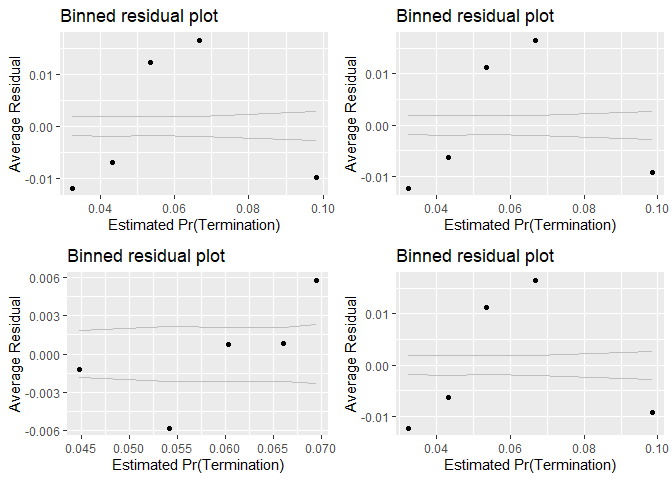<!-- -->

```
## [[1]]
##        model deviance null.deviance difference
## 1 model1_old 109334.7      111909.6  2574.8575
## 2 model1_new 109297.1      111909.6  2612.5012
## 3 model2_old 111508.1      111909.6   401.4795
## 4 model2_new 109297.1      111909.6  2612.5012
```

```r
summary_residual_compare(n_CBre04A,n_CBre04F,n_CBre04B,n_CBre04F)
```

<!-- --><!-- -->

```
## Warning in residuals_binned(model1_old, bins = bins): Always uses Xlb
## Estimated Pr(Termination), should update.
```

```
## Warning in residuals_binned(model1_new, bins = bins): Always uses Xlb
## Estimated Pr(Termination), should update.
```

```
## Warning in residuals_binned(model2_old, bins = bins): Always uses Xlb
## Estimated Pr(Termination), should update.
```

```
## Warning in residuals_binned(model2_new, bins = bins): Always uses Xlb
## Estimated Pr(Termination), should update.
```

```
## Warning in if (class(model1_new) %in% c("glmerMod", "lme4", "lmerMod") & :
## the condition has length > 1 and only the first element will be used
```

```
## Warning in if ((!class(model1_new) %in% c("glmerMod", "lme4", "lmerMod")
## & : the condition has length > 1 and only the first element will be used
```

<!-- -->

```
## [[1]]
##        model deviance null.deviance difference
## 1 model1_old 223597.9        465759  242161.12
## 2 model1_new 221156.7        465759  244602.25
## 3 model2_old 369240.0        465759   96518.95
## 4 model2_new 221156.7        465759  244602.25
```
DaysChanges in a s imilar manner as the combination  with ceiling. For base to ceiling, the  sign is different based onw whether base or ceiling are included, which in retrospect makes sense with expectations updated accordingly. (This is not ideal, but ultimately the original ceiling expectation being positive is comparable to thinking that that the combination of base and ratio should also be positive. When combined with ceiling, we already are account for the total size of the ceiling, so ratio just tells us what proportion are options. Ultimately base plus ratio seems more straightforward to explain so using that.)


#### 04G: Cumulative  Model


```r
#Model
b_CBre04G <- glm (data=serv_smp,
                 b_CBre ~  cln_US6sal + 
                   cln_PSCrate+ cp_OffPerf7+cp_OffPSC7+
                 cn_PairHist7+cln_PairCA +
                   cln_Base + clr_Ceil2Base + cln_Days, family=binomial(link="logit"))
glmer_examine(b_CBre04G)
```

```
##    cln_US6sal   cln_PSCrate   cp_OffPerf7    cp_OffPSC7  cn_PairHist7 
##      1.345374      1.192179      1.256273      1.455130      1.238860 
##    cln_PairCA      cln_Base clr_Ceil2Base      cln_Days 
##      1.529643      1.309076      1.027237      1.334645
```

```r
n_CBre04G <- glm(data=serv_breach,
                        ln_CBre ~  cln_US6sal + 
                   cln_PSCrate+ cp_OffPSC7+
                 cn_PairHist7+cln_PairCA+
                 cln_Base + clr_Ceil2Base + cln_Days)

glmer_examine(n_CBre04G)
```

```
##    cln_US6sal   cln_PSCrate    cp_OffPSC7  cn_PairHist7    cln_PairCA 
##      1.321364      1.224817      1.906112      1.283962      2.119609 
##      cln_Base clr_Ceil2Base      cln_Days 
##      1.641177      1.043779      1.578907
```

```r
#Plot residuals versus fitted   

stargazer::stargazer(b_CBre03D,b_CBre04F,b_CBre04G,
                       
                       n_CBre03D,n_CBre04F,n_CBre04G,
                       type="text",
                       digits=2)
```

```
## 
## ======================================================================================
##                                           Dependent variable:                         
##                   --------------------------------------------------------------------
##                                b_CBre                            ln_CBre              
##                               logistic                           normal               
##                      (1)        (2)        (3)         (4)         (5)         (6)    
## --------------------------------------------------------------------------------------
## cln_US6sal         0.08***               -0.18***    1.29***                 0.37***  
##                     (0.02)                (0.02)     (0.03)                  (0.02)   
##                                                                                       
## cln_PSCrate        0.17***               0.10***     0.47***                 0.15***  
##                     (0.02)                (0.02)     (0.02)                  (0.02)   
##                                                                                       
## cp_OffPerf7        -0.13***              -0.09***                                     
##                     (0.02)                (0.02)                                      
##                                                                                       
## cp_OffPSC7         0.85***               0.99***    -1.43***                -0.68***  
##                     (0.02)                (0.02)     (0.02)                  (0.01)   
##                                                                                       
## cn_PairHist7       -0.16***              -0.16***     -0.01                  0.10***  
##                     (0.02)                (0.02)     (0.02)                  (0.02)   
##                                                                                       
## cln_PairCA         -0.14***              -0.16***   -0.62***                  0.04*   
##                     (0.02)                (0.02)     (0.03)                  (0.02)   
##                                                                                       
## cln_Base                      0.88***    0.96***                 3.24***     2.97***  
##                                (0.02)     (0.02)                 (0.02)      (0.02)   
##                                                                                       
## cln_Days                      -0.05**    0.06***                 0.44***     0.20***  
##                                (0.02)     (0.02)                 (0.02)      (0.02)   
##                                                                                       
## clr_Ceil2Base                 0.08***    0.05***                 0.36***     0.34***  
##                                (0.02)     (0.02)                 (0.02)      (0.02)   
##                                                                                       
## Constant           -2.85***   -2.87***   -2.96***    9.54***     8.57***     8.77***  
##                     (0.01)     (0.01)     (0.01)     (0.01)      (0.01)      (0.01)   
##                                                                                       
## --------------------------------------------------------------------------------------
## Observations       250,000    250,000    250,000     61,184      61,184      61,184   
## Log Likelihood    -54,347.72 -54,648.54 -52,810.70 -140,717.70 -126,127.60 -124,404.60
## Akaike Inf. Crit. 108,709.40 109,305.10 105,641.40 281,447.40  252,263.20  248,827.10 
## ======================================================================================
## Note:                                                      *p<0.1; **p<0.05; ***p<0.01
```

```r
summary_residual_compare(b_CBre03D,b_CBre04G)
```

<!-- -->

```
## Warning in residuals_binned(model1_old, bins = bins): Always uses Xlb
## Estimated Pr(Termination), should update.
```

```
## Warning in residuals_binned(model1_new, bins = bins): Always uses Xlb
## Estimated Pr(Termination), should update.
```

```
## Warning in if (class(model1_new) %in% c("glmerMod", "lme4", "lmerMod")) {:
## the condition has length > 1 and only the first element will be used
```

```
## Warning in if (!class(model1_new) %in% c("glmerMod", "lme4", "lmerMod") & :
## the condition has length > 1 and only the first element will be used
```

<!-- -->

```
## [[1]]
##        model deviance null.deviance difference
## 1 model1_old 108695.4      111909.6   3214.150
## 2 model1_new 105621.4      111909.6   6288.198
```

```r
summary_residual_compare(b_CBre03D,b_CBre04G)
```

<!-- -->

```
## Warning in residuals_binned(model1_old, bins = bins): Always uses Xlb
## Estimated Pr(Termination), should update.
```

```
## Warning in residuals_binned(model1_new, bins = bins): Always uses Xlb
## Estimated Pr(Termination), should update.
```

```
## Warning in if (class(model1_new) %in% c("glmerMod", "lme4", "lmerMod")) {:
## the condition has length > 1 and only the first element will be used
```

```
## Warning in if (!class(model1_new) %in% c("glmerMod", "lme4", "lmerMod") & :
## the condition has length > 1 and only the first element will be used
```

<!-- -->

```
## [[1]]
##        model deviance null.deviance difference
## 1 model1_old 108695.4      111909.6   3214.150
## 2 model1_new 105621.4      111909.6   6288.198
```
Salary no longer matches expectations for ceiling breach likelihood. Pair history becomes significant for size, but contrary to expectations estimates larger breaches. Likewise pair contract actions changes signs contrary to expectation though only achieves significance at the 0.1 level.

For the frequenc model, days switches back and is again significant and in line with expectation.


### Competition
#### 05A: No Competition / 1 / 2-4 / 5+ Offers
No competition (baseline) and single offer competition  is expected to reduce willingness to terminate and increase likelihood and size of terminations
all due to the absence of alternatives. For options, there is a weak expectation of fewer options exercised. 

Multioffer competition is expected to lead to more terminations, fewer and smaller ceiling breaches, abd  more options exercised for 2-4 options but fewer for 5+ as the diversity of competitors available may raise the appeal of going with a new contract rather than more options, especially if performance is below the desired level.


```r
summary_discrete_plot(serv_smp1m,metric="cbre","Comp")
```

```
## Warning: Ignoring unknown parameters: binwidth, bins, pad
```

<!-- -->

```
## [[1]]
## 
## No Competition        1 offer     2-4 offers      5+ offers 
##         276175         171282         335859         216684 
## 
## [[2]]
##                 
##                    None Ceiling Breach
##   No Competition 263437          12738
##   1 offer        165170           6112
##   2-4 offers     313642          22217
##   5+ offers      199500          17184
## 
## [[3]]
##                 
##                       0      1
##   No Competition 272818   3357
##   1 offer        168674   2608
##   2-4 offers     330839   5020
##   5+ offers      208992   7692
```

```r
#Scatter Plot
ggplot(serv_smp, aes(x=Comp, y=ln_CBre)) + geom_point(alpha = 0.1) + ggtitle('Ceiling Breach Growth') + theme(plot.title = element_text(hjust = 0.5))
```

```
## Warning: Removed 235285 rows containing missing values (geom_point).
```

<!-- -->

```r
#Model
b_CBre05A <- glm (data=serv_smp,
                 b_CBre ~ Comp, family=binomial(link="logit"))


n_CBre05A <- glm(data=serv_breach,
                        ln_CBre ~ Comp)


#Plot residuals versus fitted
stargazer::stargazer(b_CBre04G,b_CBre05A,
                       
                       n_CBre04G,n_CBre05A,
                       type="text",
                       digits=2)
```

```
## 
## ===============================================================
##                                Dependent variable:             
##                   ---------------------------------------------
##                          b_CBre                 ln_CBre        
##                         logistic                normal         
##                      (1)        (2)         (3)         (4)    
## ---------------------------------------------------------------
## cln_US6sal         -0.18***               0.37***              
##                     (0.02)                (0.02)               
##                                                                
## cln_PSCrate        0.10***                0.15***              
##                     (0.02)                (0.02)               
##                                                                
## cp_OffPerf7        -0.09***                                    
##                     (0.02)                                     
##                                                                
## cp_OffPSC7         0.99***               -0.68***              
##                     (0.02)                (0.01)               
##                                                                
## cn_PairHist7       -0.16***               0.10***              
##                     (0.02)                (0.02)               
##                                                                
## cln_PairCA         -0.16***                0.04*               
##                     (0.02)                (0.02)               
##                                                                
## cln_Base           0.96***                2.97***              
##                     (0.02)                (0.02)               
##                                                                
## clr_Ceil2Base      0.05***                0.34***              
##                     (0.02)                (0.02)               
##                                                                
## cln_Days           0.06***                0.20***              
##                     (0.02)                (0.02)               
##                                                                
## Comp1 offer                   -0.27***               -0.39***  
##                                (0.03)                 (0.04)   
##                                                                
## Comp2-4 offers                0.33***                -1.11***  
##                                (0.02)                 (0.03)   
##                                                                
## Comp5+ offers                 0.56***                -0.38***  
##                                (0.02)                 (0.03)   
##                                                                
## Constant           -2.96***   -2.99***    8.77***     9.88***  
##                     (0.01)     (0.02)     (0.01)      (0.02)   
##                                                                
## ---------------------------------------------------------------
## Observations       250,000    250,000     61,184      61,184   
## Log Likelihood    -52,810.70 -55,422.56 -124,404.60 -148,115.80
## Akaike Inf. Crit. 105,641.40 110,853.10 248,827.10  296,239.50 
## ===============================================================
## Note:                               *p<0.1; **p<0.05; ***p<0.01
```
Expectations were completely unmet for ceiling breach likelihood, as while the results are all significant, only single offer competition is associated with a lower likelihood of ceiling breaches and as the number of offers in the categories grows, so to  does the likelihood of ceiling breaches. Thus is not true for ceilinng breach size. Multi-offer and single  offer competition both estimate smaller ceiling breaches, with competition with 2-4 offers having the most notable affect. 

. For terminations, expectations were met for 2-4 offers and 5+ offers, but not for 1 offer. For ceiling breaches expectations were met for 1 offer, but not for 2-4 or 5+.

#### 05B: Cumulative  Model


```r
#Model
b_CBre05B <- glm (data=serv_smp,
                 b_CBre ~  cln_US6sal + 
                   cln_PSCrate+ cp_OffPerf7+cp_OffPSC7+
                 cn_PairHist7+cln_PairCA +
                   cln_Base + clr_Ceil2Base + cln_Days+
                   Comp, family=binomial(link="logit"))
glmer_examine(b_CBre05B)
```

```
##                   GVIF Df GVIF^(1/(2*Df))
## cln_US6sal    1.365778  1        1.168665
## cln_PSCrate   1.200015  1        1.095452
## cp_OffPerf7   1.291483  1        1.136434
## cp_OffPSC7    1.502253  1        1.225664
## cn_PairHist7  1.240418  1        1.113741
## cln_PairCA    1.570208  1        1.253079
## cln_Base      1.324211  1        1.150744
## clr_Ceil2Base 1.035425  1        1.017558
## cln_Days      1.350854  1        1.162262
## Comp          1.090626  3        1.014564
```

```r
#Is it safe to add pPBSC back in?

n_CBre05B <- glm(data=serv_breach,
                        ln_CBre ~  cln_US6sal + 
                   cln_PSCrate+ cp_OffPerf7+cp_OffPSC7+
                 cn_PairHist7+cln_PairCA+
                 cln_Base + clr_Ceil2Base + cln_Days+
                 Comp)

glmer_examine(n_CBre05B)
```

```
##                   GVIF Df GVIF^(1/(2*Df))
## cln_US6sal    1.328928  1        1.152791
## cln_PSCrate   1.228238  1        1.108259
## cp_OffPerf7   2.187358  1        1.478972
## cp_OffPSC7    2.800365  1        1.673429
## cn_PairHist7  1.318082  1        1.148077
## cln_PairCA    2.143303  1        1.464002
## cln_Base      1.694013  1        1.301543
## clr_Ceil2Base 1.045848  1        1.022667
## cln_Days      1.589748  1        1.260852
## Comp          1.133773  3        1.021146
```

```r
#Plot residuals versus fitted   

stargazer::stargazer(b_CBre04G,b_CBre05A,b_CBre05B,
                       
                       n_CBre04G,n_CBre05A,n_CBre05B,
                       type="text",
                       digits=2)
```

```
## 
## ======================================================================================
##                                           Dependent variable:                         
##                   --------------------------------------------------------------------
##                                b_CBre                            ln_CBre              
##                               logistic                           normal               
##                      (1)        (2)        (3)         (4)         (5)         (6)    
## --------------------------------------------------------------------------------------
## cln_US6sal         -0.18***              -0.14***    0.37***                 0.36***  
##                     (0.02)                (0.02)     (0.02)                  (0.02)   
##                                                                                       
## cln_PSCrate        0.10***               0.09***     0.15***                 0.16***  
##                     (0.02)                (0.02)     (0.02)                  (0.02)   
##                                                                                       
## cp_OffPerf7        -0.09***              -0.13***                           -0.34***  
##                     (0.02)                (0.02)                             (0.02)   
##                                                                                       
## cp_OffPSC7         0.99***               0.98***    -0.68***                -0.48***  
##                     (0.02)                (0.02)     (0.01)                  (0.02)   
##                                                                                       
## cn_PairHist7       -0.16***              -0.13***    0.10***                 0.13***  
##                     (0.02)                (0.02)     (0.02)                  (0.02)   
##                                                                                       
## cln_PairCA         -0.16***              -0.21***     0.04*                  0.09***  
##                     (0.02)                (0.02)     (0.02)                  (0.02)   
##                                                                                       
## cln_Base           0.96***               0.93***     2.97***                 2.95***  
##                     (0.02)                (0.02)     (0.02)                  (0.02)   
##                                                                                       
## clr_Ceil2Base      0.05***                0.03*      0.34***                 0.35***  
##                     (0.02)                (0.02)     (0.02)                  (0.02)   
##                                                                                       
## cln_Days           0.06***                 0.04      0.20***                 0.20***  
##                     (0.02)                (0.02)     (0.02)                  (0.02)   
##                                                                                       
## Comp1 offer                   -0.27***   -0.22***               -0.39***     0.08***  
##                                (0.03)     (0.03)                 (0.04)      (0.03)   
##                                                                                       
## Comp2-4 offers                0.33***    0.24***                -1.11***    -0.24***  
##                                (0.02)     (0.02)                 (0.03)      (0.02)   
##                                                                                       
## Comp5+ offers                 0.56***    0.42***                -0.38***    -0.24***  
##                                (0.02)     (0.02)                 (0.03)      (0.02)   
##                                                                                       
## Constant           -2.96***   -2.99***   -3.12***    8.77***     9.88***     8.90***  
##                     (0.01)     (0.02)     (0.02)     (0.01)      (0.02)      (0.02)   
##                                                                                       
## --------------------------------------------------------------------------------------
## Observations       250,000    250,000    250,000     61,184      61,184      61,184   
## Log Likelihood    -52,810.70 -55,422.56 -52,522.47 -124,404.60 -148,115.80 -124,092.60
## Akaike Inf. Crit. 105,641.40 110,853.10 105,070.90 248,827.10  296,239.50  248,211.20 
## ======================================================================================
## Note:                                                      *p<0.1; **p<0.05; ***p<0.01
```

```r
summary_residual_compare(b_CBre04G,b_CBre05B)
```

<!-- -->

```
## Warning in residuals_binned(model1_old, bins = bins): Always uses Xlb
## Estimated Pr(Termination), should update.
```

```
## Warning in residuals_binned(model1_new, bins = bins): Always uses Xlb
## Estimated Pr(Termination), should update.
```

```
## Warning in if (class(model1_new) %in% c("glmerMod", "lme4", "lmerMod")) {:
## the condition has length > 1 and only the first element will be used
```

```
## Warning in if (!class(model1_new) %in% c("glmerMod", "lme4", "lmerMod") & :
## the condition has length > 1 and only the first element will be used
```

<!-- -->

```
## [[1]]
##        model deviance null.deviance difference
## 1 model1_old 105621.4      111909.6   6288.198
## 2 model1_new 105044.9      111909.6   6864.644
```

```r
summary_residual_compare(n_CBre04G,n_CBre05B)
```

<!-- --><!-- -->

```
## Warning in residuals_binned(model1_old, bins = bins): Always uses Xlb
## Estimated Pr(Termination), should update.
```

```
## Warning in residuals_binned(model1_new, bins = bins): Always uses Xlb
## Estimated Pr(Termination), should update.
```

```
## Warning in if (class(model1_new) %in% c("glmerMod", "lme4", "lmerMod")) {:
## the condition has length > 1 and only the first element will be used
```

```
## Warning in if (!class(model1_new) %in% c("glmerMod", "lme4", "lmerMod") & :
## the condition has length > 1 and only the first element will be used
```

<!-- -->

```
## [[1]]
##        model deviance null.deviance difference
## 1 model1_old 209044.6        465759   256714.4
## 2 model1_new 206923.7        465759   258835.2
```
Double checked if it was now safe to add pPBSC back in, and it is. Minimal effect on study variables otherwise, though pair CA is now significant for contract size, but in the opposite direction as expected.

The ceiling  breach likelihood model largely follows the competition a lone model, but for ceiling breach size, the magnitude of the results decrease for multioffer competition buut the results for single offer competition now are significantly positive and  in line with expectation.

For the likelihood model, ratio of base to ceiling is no longer significant at the  0.05 level, though it remains significant for breach size.

### Contract Vehicle

#### 06A: Def/Pur; S-IDC; M-IDC; FSS-GWAC; BPA-BOA.

Expectation: Indefinite delivery vehicles, means that the government has an existing relationship with the vendor and administration is easier. The downside is that the government may be locked into the vendor, although exit does not necessarily require outright termination, instead the government may simply cease to use a vehicle. Taken together, across the board the four categories of vehicles are expected to  negatively estimate the probability of termination. 

Ceiling breaches and excerised options are both less straightforward, are a more complex topic though the study expects a negative relationship as all forms of IDVs make it easier to use a new task order and thus may both reduce the need to exercise options and may allow new work to flow into a different contract rather than prompting a breach.


```r
summary_discrete_plot(serv_smp1m,metric="cbre","Veh")
```

```
## Warning: Ignoring unknown parameters: binwidth, bins, pad
```

<!-- -->

```
## [[1]]
## 
##  Def/Pur    S-IDC    M-IDC FSS/GWAC  BPA/BOA 
##   304598   487553   119080    45850    42919 
## 
## [[2]]
##           
##              None Ceiling Breach
##   Def/Pur  287933          16665
##   S-IDC    457840          29713
##   M-IDC    110379           8701
##   FSS/GWAC  44106           1744
##   BPA/BOA   41491           1428
## 
## [[3]]
##           
##                 0      1
##   Def/Pur  297406   7192
##   S-IDC    480278   7275
##   M-IDC    116234   2846
##   FSS/GWAC  44887    963
##   BPA/BOA   42518    401
```

```r
#Scatter Plot
ggplot(serv_smp, aes(x=Veh, y=ln_CBre)) + geom_point(alpha = 0.1) + ggtitle('Ceiling Breach Growth') + theme(plot.title = element_text(hjust = 0.5))
```

```
## Warning: Removed 235285 rows containing missing values (geom_point).
```

<!-- -->

```r
#Model
b_CBre06A <- glm (data=serv_smp,
                 b_CBre ~ Veh, family=binomial(link="logit"))


n_CBre06A <- glm(data=serv_breach,
                        ln_CBre ~ Veh)


#Plot residuals versus fitted
stargazer::stargazer(b_CBre05B,b_CBre06A,
                       
                       n_CBre05B,n_CBre06A,
                       type="text",
                       digits=2)
```

```
## 
## ===============================================================
##                                Dependent variable:             
##                   ---------------------------------------------
##                          b_CBre                 ln_CBre        
##                         logistic                normal         
##                      (1)        (2)         (3)         (4)    
## ---------------------------------------------------------------
## cln_US6sal         -0.14***               0.36***              
##                     (0.02)                (0.02)               
##                                                                
## cln_PSCrate        0.09***                0.16***              
##                     (0.02)                (0.02)               
##                                                                
## cp_OffPerf7        -0.13***              -0.34***              
##                     (0.02)                (0.02)               
##                                                                
## cp_OffPSC7         0.98***               -0.48***              
##                     (0.02)                (0.02)               
##                                                                
## cn_PairHist7       -0.13***               0.13***              
##                     (0.02)                (0.02)               
##                                                                
## cln_PairCA         -0.21***               0.09***              
##                     (0.02)                (0.02)               
##                                                                
## cln_Base           0.93***                2.95***              
##                     (0.02)                (0.02)               
##                                                                
## clr_Ceil2Base       0.03*                 0.35***              
##                     (0.02)                (0.02)               
##                                                                
## cln_Days             0.04                 0.20***              
##                     (0.02)                (0.02)               
##                                                                
## Comp1 offer        -0.22***               0.08***              
##                     (0.03)                (0.03)               
##                                                                
## Comp2-4 offers     0.24***               -0.24***              
##                     (0.02)                (0.02)               
##                                                                
## Comp5+ offers      0.42***               -0.24***              
##                     (0.02)                (0.02)               
##                                                                
## VehS-IDC                      0.11***                -1.08***  
##                                (0.02)                 (0.03)   
##                                                                
## VehM-IDC                      0.31***                 0.82***  
##                                (0.03)                 (0.03)   
##                                                                
## VehFSS/GWAC                   -0.37***                0.28***  
##                                (0.05)                 (0.07)   
##                                                                
## VehBPA/BOA                    -0.48***               -1.60***  
##                                (0.06)                 (0.07)   
##                                                                
## Constant           -3.12***   -2.84***    8.90***     9.76***  
##                     (0.02)     (0.02)     (0.02)      (0.02)   
##                                                                
## ---------------------------------------------------------------
## Observations       250,000    250,000     61,184      61,184   
## Log Likelihood    -52,522.47 -55,773.23 -124,092.60 -146,611.90
## Akaike Inf. Crit. 105,070.90 111,556.50 248,211.20  293,233.70 
## ===============================================================
## Note:                               *p<0.1; **p<0.05; ***p<0.01
```
For ceiling breaches, IDCs, particularly multiaward IDCs, had a greater likelihood of  ceiling breaches contrary to expecations. For size the results were similarly mixed, with single award IDCS and BPA/BOAs estimating smaller  breaches in line with expetations and Mutiple Award and FSS/GWAC estimated larger breaches, contrary to expectation.


#### 06B: Cumulative  Model


```r
#Model
b_CBre06B <- glm (data=serv_smp,
                 b_CBre ~  cln_US6sal + 
                   cln_PSCrate+ cp_OffPerf7+cp_OffPSC7+
                 cn_PairHist7+cln_PairCA +
                   cln_Base + clr_Ceil2Base + cln_Days+
                   Comp+
                   Veh, family=binomial(link="logit"))
glmer_examine(b_CBre06B)
```

```
##                   GVIF Df GVIF^(1/(2*Df))
## cln_US6sal    1.390946  1        1.179384
## cln_PSCrate   1.198146  1        1.094599
## cp_OffPerf7   1.308712  1        1.143990
## cp_OffPSC7    1.539216  1        1.240651
## cn_PairHist7  1.272062  1        1.127857
## cln_PairCA    1.765676  1        1.328787
## cln_Base      1.365010  1        1.168337
## clr_Ceil2Base 1.062646  1        1.030847
## cln_Days      1.371715  1        1.171202
## Comp          1.179979  3        1.027967
## Veh           1.603596  4        1.060808
```

```r
n_CBre06B <- glm(data=serv_breach,
                        ln_CBre ~  cln_US6sal + 
                   cln_PSCrate+ cp_OffPerf7+cp_OffPSC7+
                 cn_PairHist7+cln_PairCA+
                 cln_Base + clr_Ceil2Base + cln_Days+
                 Comp+
                   Veh)

glmer_examine(n_CBre06B)
```

```
##                   GVIF Df GVIF^(1/(2*Df))
## cln_US6sal    1.377262  1        1.173568
## cln_PSCrate   1.230705  1        1.109371
## cp_OffPerf7   2.200567  1        1.483431
## cp_OffPSC7    2.867042  1        1.693234
## cn_PairHist7  1.343798  1        1.159223
## cln_PairCA    2.431650  1        1.559375
## cln_Base      1.760591  1        1.326873
## clr_Ceil2Base 1.082898  1        1.040624
## cln_Days      1.599704  1        1.264794
## Comp          1.241295  3        1.036683
## Veh           1.936111  4        1.086091
```

```r
#Plot residuals versus fitted   

stargazer::stargazer(b_CBre05B,b_CBre06A,b_CBre06B,
                       n_CBre05B,n_CBre06A,n_CBre06B,
                       type="text",
                       digits=2)
```

```
## 
## ======================================================================================
##                                           Dependent variable:                         
##                   --------------------------------------------------------------------
##                                b_CBre                            ln_CBre              
##                               logistic                           normal               
##                      (1)        (2)        (3)         (4)         (5)         (6)    
## --------------------------------------------------------------------------------------
## cln_US6sal         -0.14***              -0.12***    0.36***                 0.34***  
##                     (0.02)                (0.02)     (0.02)                  (0.02)   
##                                                                                       
## cln_PSCrate        0.09***               0.09***     0.16***                 0.16***  
##                     (0.02)                (0.02)     (0.02)                  (0.02)   
##                                                                                       
## cp_OffPerf7        -0.13***              -0.15***   -0.34***                -0.34***  
##                     (0.02)                (0.02)     (0.02)                  (0.02)   
##                                                                                       
## cp_OffPSC7         0.98***               1.00***    -0.48***                -0.48***  
##                     (0.02)                (0.02)     (0.02)                  (0.02)   
##                                                                                       
## cn_PairHist7       -0.13***              -0.10***    0.13***                 0.12***  
##                     (0.02)                (0.02)     (0.02)                  (0.02)   
##                                                                                       
## cln_PairCA         -0.21***              -0.16***    0.09***                 0.06***  
##                     (0.02)                (0.02)     (0.02)                  (0.02)   
##                                                                                       
## cln_Base           0.93***               0.92***     2.95***                 2.96***  
##                     (0.02)                (0.02)     (0.02)                  (0.02)   
##                                                                                       
## clr_Ceil2Base       0.03*                  0.01      0.35***                 0.35***  
##                     (0.02)                (0.02)     (0.02)                  (0.02)   
##                                                                                       
## cln_Days             0.04                0.07***     0.20***                 0.19***  
##                     (0.02)                (0.02)     (0.02)                  (0.02)   
##                                                                                       
## Comp1 offer        -0.22***              -0.20***    0.08***                 0.07**   
##                     (0.03)                (0.03)     (0.03)                  (0.03)   
##                                                                                       
## Comp2-4 offers     0.24***               0.27***    -0.24***                -0.25***  
##                     (0.02)                (0.02)     (0.02)                  (0.02)   
##                                                                                       
## Comp5+ offers      0.42***               0.46***    -0.24***                -0.25***  
##                     (0.02)                (0.03)     (0.02)                  (0.02)   
##                                                                                       
## VehS-IDC                      0.11***    -0.24***               -1.08***     0.10***  
##                                (0.02)     (0.02)                 (0.03)      (0.02)   
##                                                                                       
## VehM-IDC                      0.31***    -0.21***                0.82***     0.08***  
##                                (0.03)     (0.03)                 (0.03)      (0.03)   
##                                                                                       
## VehFSS/GWAC                   -0.37***   -0.44***                0.28***     0.34***  
##                                (0.05)     (0.05)                 (0.07)      (0.05)   
##                                                                                       
## VehBPA/BOA                    -0.48***   -0.46***               -1.60***     0.12**   
##                                (0.06)     (0.06)                 (0.07)      (0.05)   
##                                                                                       
## Constant           -3.12***   -2.84***   -2.96***    8.90***     9.76***     8.83***  
##                     (0.02)     (0.02)     (0.02)     (0.02)      (0.02)      (0.02)   
##                                                                                       
## --------------------------------------------------------------------------------------
## Observations       250,000    250,000    250,000     61,184      61,184      61,184   
## Log Likelihood    -52,522.47 -55,773.23 -52,434.45 -124,092.60 -146,611.90 -124,059.60
## Akaike Inf. Crit. 105,070.90 111,556.50 104,902.90 248,211.20  293,233.70  248,153.30 
## ======================================================================================
## Note:                                                      *p<0.1; **p<0.05; ***p<0.01
```

```r
summary_residual_compare(b_CBre05B,b_CBre06B)
```

<!-- -->

```
## Warning in residuals_binned(model1_old, bins = bins): Always uses Xlb
## Estimated Pr(Termination), should update.
```

```
## Warning in residuals_binned(model1_new, bins = bins): Always uses Xlb
## Estimated Pr(Termination), should update.
```

```
## Warning in if (class(model1_new) %in% c("glmerMod", "lme4", "lmerMod")) {:
## the condition has length > 1 and only the first element will be used
```

```
## Warning in if (!class(model1_new) %in% c("glmerMod", "lme4", "lmerMod") & :
## the condition has length > 1 and only the first element will be used
```

<!-- -->

```
## [[1]]
##        model deviance null.deviance difference
## 1 model1_old 105044.9      111909.6   6864.644
## 2 model1_new 104868.9      111909.6   7040.698
```

```r
summary_residual_compare(n_CBre05B,n_CBre06B)
```

<!-- --><!-- -->

```
## Warning in residuals_binned(model1_old, bins = bins): Always uses Xlb
## Estimated Pr(Termination), should update.
```

```
## Warning in residuals_binned(model1_new, bins = bins): Always uses Xlb
## Estimated Pr(Termination), should update.
```

```
## Warning in if (class(model1_new) %in% c("glmerMod", "lme4", "lmerMod")) {:
## the condition has length > 1 and only the first element will be used
```

```
## Warning in if (!class(model1_new) %in% c("glmerMod", "lme4", "lmerMod") & :
## the condition has length > 1 and only the first element will be used
```

<!-- -->

```
## [[1]]
##        model deviance null.deviance difference
## 1 model1_old 206923.7        465759   258835.2
## 2 model1_new 206700.9        465759   259058.1
```
Expectations for vehicle are now upheld for both ceiling breaches likelihood, but the results are now acrsoss theboard contrary to expectations for breach size. Ceilng breaches appear to be  less common for all types of indefinite vehicles butwhen they do occur the breach size is larger. 

Fitted versus actual seems to get off course with fitted values  above 0.1. For size the results look more as expected  in the scatter plot but do show a sinusodial pattern in the binend residuals.

For controls, the relationship between days and likelihood gains significance in the expected direction. Single offer competition reduces its significance with breach size.

### Type of Contract

The next step adds a measure for whether the contract was cost-based or fixed-price. 

Expectation Prior CSIS research has found that fixed-price contracts estimate a higher probability of terminations but did not find a notable relationship for ceiling breaches.

#### 07A: FFP / Other FP / Incentive / T&M/FP:LOE;LH / Other CB / Combination

Firm-fixed price contracting is expected to be associated with a high rate of options exercised, more ceiling breaches, and a strong expectation of greater levels of termination.

(Options, breach, termination)
Firm-Fixed Price (base)				+	+	++
Other Fixed Price				-	-	-
Time & Materials / Labor Hours / FP: LoE				-	+	-
Incentive Fee (both FPIF or CBIF)				+	-	-
Other Cost Based				-	-	-
Undefinitized Contract Award				--	++	++
Combination				-	+	+


```r
serv_smp$Pricing<-factor(serv_smp$Pricing,
                            levels=c( "FFP","Other FP","T&M/LH/FPLOE","Incentive","Other CB","UCA" ,"Combination or Other" ))
serv_smp$Pricing<-factor(serv_smp$Pricing,
                            levels=c( "FFP","Other FP","T&M/LH/FPLOE","Incentive","Other CB","UCA" ,"Combination or Other" ))
  summary_discrete_plot(serv_smp1m,metric="cbre","Pricing")
```

```
## Warning: Ignoring unknown parameters: binwidth, bins, pad
```

<!-- -->

```
## [[1]]
## 
##                  FFP             Other FP            Incentive 
##               891476                 6446                 4001 
## Combination or Other             Other CB         T&M/LH/FPLOE 
##                 9985                58015                18934 
##                  UCA 
##                11143 
## 
## [[2]]
##                       
##                          None Ceiling Breach
##   FFP                  837990          53486
##   Other FP               6272            174
##   Incentive              3544            457
##   Combination or Other   9318            667
##   Other CB              56145           1870
##   T&M/LH/FPLOE          18116            818
##   UCA                   10364            779
## 
## [[3]]
##                       
##                             0      1
##   FFP                  873612  17864
##   Other FP               6261    185
##   Incentive              3993      8
##   Combination or Other   9863    122
##   Other CB              57732    283
##   T&M/LH/FPLOE          18773    161
##   UCA                   11089     54
```

```r
#Scatter Plot
ggplot(serv_smp, aes(x=Pricing, y=ln_CBre)) + geom_point(alpha = 0.1) + ggtitle('Ceiling Breach Growth') + theme(plot.title = element_text(hjust = 0.5))
```

```
## Warning: Removed 235285 rows containing missing values (geom_point).
```

<!-- -->

```r
#Model
b_CBre07A <- glm (data=serv_smp,
                 b_CBre ~ Pricing, family=binomial(link="logit"))


n_CBre07A <- glm(data=serv_breach,
                        ln_CBre ~ Pricing)


#Plot residuals versus fitted
stargazer::stargazer(b_CBre06B,b_CBre07A,
                       
                       n_CBre06B,n_CBre07A,
                       type="text",
                       digits=2)
```

```
## 
## =========================================================================
##                                          Dependent variable:             
##                             ---------------------------------------------
##                                    b_CBre                 ln_CBre        
##                                   logistic                normal         
##                                (1)        (2)         (3)         (4)    
## -------------------------------------------------------------------------
## cln_US6sal                   -0.12***               0.34***              
##                               (0.02)                (0.02)               
##                                                                          
## cln_PSCrate                  0.09***                0.16***              
##                               (0.02)                (0.02)               
##                                                                          
## cp_OffPerf7                  -0.15***              -0.34***              
##                               (0.02)                (0.02)               
##                                                                          
## cp_OffPSC7                   1.00***               -0.48***              
##                               (0.02)                (0.02)               
##                                                                          
## cn_PairHist7                 -0.10***               0.12***              
##                               (0.02)                (0.02)               
##                                                                          
## cln_PairCA                   -0.16***               0.06***              
##                               (0.02)                (0.02)               
##                                                                          
## cln_Base                     0.92***                2.96***              
##                               (0.02)                (0.02)               
##                                                                          
## clr_Ceil2Base                  0.01                 0.35***              
##                               (0.02)                (0.02)               
##                                                                          
## cln_Days                     0.07***                0.19***              
##                               (0.02)                (0.02)               
##                                                                          
## Comp1 offer                  -0.20***               0.07**               
##                               (0.03)                (0.03)               
##                                                                          
## Comp2-4 offers               0.27***               -0.25***              
##                               (0.02)                (0.02)               
##                                                                          
## Comp5+ offers                0.46***               -0.25***              
##                               (0.03)                (0.02)               
##                                                                          
## VehS-IDC                     -0.24***               0.10***              
##                               (0.02)                (0.02)               
##                                                                          
## VehM-IDC                     -0.21***               0.08***              
##                               (0.03)                (0.03)               
##                                                                          
## VehFSS/GWAC                  -0.44***               0.34***              
##                               (0.05)                (0.05)               
##                                                                          
## VehBPA/BOA                   -0.46***               0.12**               
##                               (0.06)                (0.05)               
##                                                                          
## PricingOther FP                         -0.47***                 0.31    
##                                          (0.13)                 (0.20)   
##                                                                          
## PricingT&M/LH/FPLOE                     -0.34***                2.62***  
##                                          (0.07)                 (0.09)   
##                                                                          
## PricingIncentive                        0.71***                 1.62***  
##                                          (0.10)                 (0.12)   
##                                                                          
## PricingOther CB                         -0.63***                2.83***  
##                                          (0.05)                 (0.06)   
##                                                                          
## PricingUCA                                0.10                  1.58***  
##                                          (0.08)                 (0.09)   
##                                                                          
## PricingCombination or Other             0.24***                 2.25***  
##                                          (0.08)                 (0.10)   
##                                                                          
## Constant                     -2.96***   -2.74***    8.83***     9.11***  
##                               (0.02)     (0.01)     (0.02)      (0.01)   
##                                                                          
## -------------------------------------------------------------------------
## Observations                 250,000    250,000     61,184      61,184   
## Log Likelihood              -52,434.45 -55,799.00 -124,059.60 -147,117.20
## Akaike Inf. Crit.           104,902.90 111,612.00 248,153.30  294,248.50 
## =========================================================================
## Note:                                         *p<0.1; **p<0.05; ***p<0.01
```

For likelihood, other fixed price, other cost based and aligned with expecations that they would reduce likelihood. Combination and other is significant and aligned with expectations that it would increase likelihood. 

For contract size, the  baseline of  FFP unexpectedly is not associated with larger  breaches, tough this may be explained by the prevelance of small FFP contracts. T&M/LH/FFLOE, UCA, and  Combination and  other are all significant and in line with expectations of larger breaches. The remainig vriables are significant but contrary to expectations.

#### 07B: Cumulative  Model


```r
#Model
b_CBre07B <- glm (data=serv_smp,
                 b_CBre ~  cln_US6sal + 
                   cln_PSCrate+ cp_OffPerf7+cp_OffPSC7+
                 cn_PairHist7+cln_PairCA +
                   cln_Base + clr_Ceil2Base + cln_Days+
                   Comp+
                   Veh+
                   Pricing, family=binomial(link="logit"))
glmer_examine(b_CBre07B)
```

```
##                   GVIF Df GVIF^(1/(2*Df))
## cln_US6sal    1.361680  1        1.166910
## cln_PSCrate   1.191759  1        1.091677
## cp_OffPerf7   1.330823  1        1.153613
## cp_OffPSC7    1.562096  1        1.249839
## cn_PairHist7  1.255271  1        1.120389
## cln_PairCA    1.753128  1        1.324057
## cln_Base      1.385887  1        1.177237
## clr_Ceil2Base 1.067760  1        1.033325
## cln_Days      1.371633  1        1.171168
## Comp          1.224788  3        1.034372
## Veh           1.610656  4        1.061391
## Pricing       1.159820  6        1.012432
```

```r
n_CBre07B <- glm(data=serv_breach,
                        ln_CBre ~  cln_US6sal + 
                   cln_PSCrate+ cp_OffPerf7+cp_OffPSC7+
                 cn_PairHist7+cln_PairCA+
                 cln_Base + clr_Ceil2Base + cln_Days+
                 Comp+
                   Veh+
                   Pricing)

glmer_examine(n_CBre07B)
```

```
##                   GVIF Df GVIF^(1/(2*Df))
## cln_US6sal    1.387041  1        1.177727
## cln_PSCrate   1.234629  1        1.111138
## cp_OffPerf7   2.209390  1        1.486402
## cp_OffPSC7    2.886521  1        1.698976
## cn_PairHist7  1.351965  1        1.162740
## cln_PairCA    2.491615  1        1.578485
## cln_Base      1.806791  1        1.344169
## clr_Ceil2Base 1.088405  1        1.043267
## cln_Days      1.607344  1        1.267811
## Comp          1.272154  3        1.040934
## Veh           1.979281  4        1.089089
## Pricing       1.191920  6        1.014738
```

```r
#Plot residuals versus fitted   

stargazer::stargazer(b_CBre06B,b_CBre07A,b_CBre07B,
                       
                       n_CBre06B,n_CBre07A,n_CBre07B,
                       type="text",
                       digits=2)
```

```
## 
## ================================================================================================
##                                                     Dependent variable:                         
##                             --------------------------------------------------------------------
##                                          b_CBre                            ln_CBre              
##                                         logistic                           normal               
##                                (1)        (2)        (3)         (4)         (5)         (6)    
## ------------------------------------------------------------------------------------------------
## cln_US6sal                   -0.12***              -0.07***    0.34***                 0.27***  
##                               (0.02)                (0.02)     (0.02)                  (0.02)   
##                                                                                                 
## cln_PSCrate                  0.09***               0.12***     0.16***                 0.14***  
##                               (0.02)                (0.02)     (0.02)                  (0.02)   
##                                                                                                 
## cp_OffPerf7                  -0.15***              -0.13***   -0.34***                -0.37***  
##                               (0.02)                (0.02)     (0.02)                  (0.02)   
##                                                                                                 
## cp_OffPSC7                   1.00***               1.01***    -0.48***                -0.43***  
##                               (0.02)                (0.02)     (0.02)                  (0.02)   
##                                                                                                 
## cn_PairHist7                 -0.10***              -0.08***    0.12***                 0.12***  
##                               (0.02)                (0.02)     (0.02)                  (0.02)   
##                                                                                                 
## cln_PairCA                   -0.16***              -0.11***    0.06***                -0.08***  
##                               (0.02)                (0.02)     (0.02)                  (0.02)   
##                                                                                                 
## cln_Base                     0.92***               1.00***     2.96***                 2.86***  
##                               (0.02)                (0.02)     (0.02)                  (0.02)   
##                                                                                                 
## clr_Ceil2Base                  0.01                  0.02      0.35***                 0.32***  
##                               (0.02)                (0.02)     (0.02)                  (0.02)   
##                                                                                                 
## cln_Days                     0.07***               0.13***     0.19***                 0.13***  
##                               (0.02)                (0.02)     (0.02)                  (0.02)   
##                                                                                                 
## Comp1 offer                  -0.20***              -0.17***    0.07**                   0.02    
##                               (0.03)                (0.03)     (0.03)                  (0.03)   
##                                                                                                 
## Comp2-4 offers               0.27***               0.25***    -0.25***                -0.24***  
##                               (0.02)                (0.02)     (0.02)                  (0.02)   
##                                                                                                 
## Comp5+ offers                0.46***               0.37***    -0.25***                -0.17***  
##                               (0.03)                (0.03)     (0.02)                  (0.02)   
##                                                                                                 
## VehS-IDC                     -0.24***              -0.18***    0.10***                 0.06***  
##                               (0.02)                (0.02)     (0.02)                  (0.02)   
##                                                                                                 
## VehM-IDC                     -0.21***              -0.21***    0.08***                  0.04*   
##                               (0.03)                (0.03)     (0.03)                  (0.03)   
##                                                                                                 
## VehFSS/GWAC                  -0.44***              -0.47***    0.34***                 0.29***  
##                               (0.05)                (0.05)     (0.05)                  (0.05)   
##                                                                                                 
## VehBPA/BOA                   -0.46***              -0.46***    0.12**                  0.12**   
##                               (0.06)                (0.06)     (0.05)                  (0.05)   
##                                                                                                 
## PricingOther FP                         -0.47***   -0.64***                 0.31      -0.39***  
##                                          (0.13)     (0.13)                 (0.20)      (0.14)   
##                                                                                                 
## PricingT&M/LH/FPLOE                     -0.34***   -0.59***                2.62***     1.25***  
##                                          (0.07)     (0.07)                 (0.09)      (0.06)   
##                                                                                                 
## PricingIncentive                        0.71***      0.01                  1.62***     1.01***  
##                                          (0.10)     (0.10)                 (0.12)      (0.09)   
##                                                                                                 
## PricingOther CB                         -0.63***   -1.17***                2.83***     1.37***  
##                                          (0.05)     (0.05)                 (0.06)      (0.04)   
##                                                                                                 
## PricingUCA                                0.10      -0.14*                 1.58***     0.63***  
##                                          (0.08)     (0.08)                 (0.09)      (0.06)   
##                                                                                                 
## PricingCombination or Other             0.24***    -0.27***                2.25***     0.74***  
##                                          (0.08)     (0.08)                 (0.10)      (0.07)   
##                                                                                                 
## Constant                     -2.96***   -2.74***   -2.91***    8.83***     9.11***     8.78***  
##                               (0.02)     (0.01)     (0.02)     (0.02)      (0.01)      (0.02)   
##                                                                                                 
## ------------------------------------------------------------------------------------------------
## Observations                 250,000    250,000    250,000     61,184      61,184      61,184   
## Log Likelihood              -52,434.45 -55,799.00 -52,034.41 -124,059.60 -147,117.20 -123,279.20
## Akaike Inf. Crit.           104,902.90 111,612.00 104,114.80 248,153.30  294,248.50  246,604.40 
## ================================================================================================
## Note:                                                                *p<0.1; **p<0.05; ***p<0.01
```

```r
summary_residual_compare(b_CBre06B,b_CBre07B)
```

<!-- -->

```
## Warning in residuals_binned(model1_old, bins = bins): Always uses Xlb
## Estimated Pr(Termination), should update.
```

```
## Warning in residuals_binned(model1_new, bins = bins): Always uses Xlb
## Estimated Pr(Termination), should update.
```

```
## Warning in if (class(model1_new) %in% c("glmerMod", "lme4", "lmerMod")) {:
## the condition has length > 1 and only the first element will be used
```

```
## Warning in if (!class(model1_new) %in% c("glmerMod", "lme4", "lmerMod") & :
## the condition has length > 1 and only the first element will be used
```

<!-- -->

```
## [[1]]
##        model deviance null.deviance difference
## 1 model1_old 104868.9      111909.6   7040.698
## 2 model1_new 104068.8      111909.6   7840.765
```

```r
summary_residual_compare(n_CBre06B,n_CBre07B,bins=3)
```

<!-- --><!-- -->

```
## Warning in residuals_binned(model1_old, bins = bins): Always uses Xlb
## Estimated Pr(Termination), should update.
```

```
## Warning in residuals_binned(model1_new, bins = bins): Always uses Xlb
## Estimated Pr(Termination), should update.
```

```
## Warning in if (class(model1_new) %in% c("glmerMod", "lme4", "lmerMod")) {:
## the condition has length > 1 and only the first element will be used
```

```
## Warning in if (!class(model1_new) %in% c("glmerMod", "lme4", "lmerMod") & :
## the condition has length > 1 and only the first element will be used
```

<!-- -->

```
## [[1]]
##        model deviance null.deviance difference
## 1 model1_old 206700.9        465759   259058.1
## 2 model1_new 201494.3        465759   264264.7
```

Incentive contracts are no longer significantly associated with a greater likelihood of ceiling breaches, though they are still associated with a greater size. Other fixed price is now assoicated with smaller ceiling breaches. Surprisingly UCA and Combination and  Other  are now associated with less frequent ceiling breaches,  though only with a p-value of <=0.1 in the case of UCA. Both are still associated with larger breaches.

The binned residuals remain od for the likelihood plot but show less of pattern for likelihood size.


### Crisis Dataset
Expectation: Service Contract replying on crisis funds would have more likelihood of cost-ceiling breaches and exercised options but fewer terminations.  

#### 08A: Crisis Funding

```r
summary_discrete_plot(serv_smp1m,metric="cbre","Crisis")
```

```
## Warning: Ignoring unknown parameters: binwidth, bins, pad
```

<!-- -->

```
## [[1]]
## 
##  Other   ARRA    Dis    OCO 
## 934213   5937   1616  58234 
## 
## [[2]]
##        
##           None Ceiling Breach
##   Other 879813          54400
##   ARRA    4935           1002
##   Dis     1436            180
##   OCO    55565           2669
## 
## [[3]]
##        
##              0      1
##   Other 916552  17661
##   ARRA    5871     66
##   Dis     1586     30
##   OCO    57314    920
```

```r
#Scatter Plot
ggplot(serv_smp, aes(x=Crisis, y=ln_CBre)) + geom_point(alpha = 0.1) + ggtitle('Ceiling Breach Growth') + theme(plot.title = element_text(hjust = 0.5))
```

```
## Warning: Removed 235285 rows containing missing values (geom_point).
```

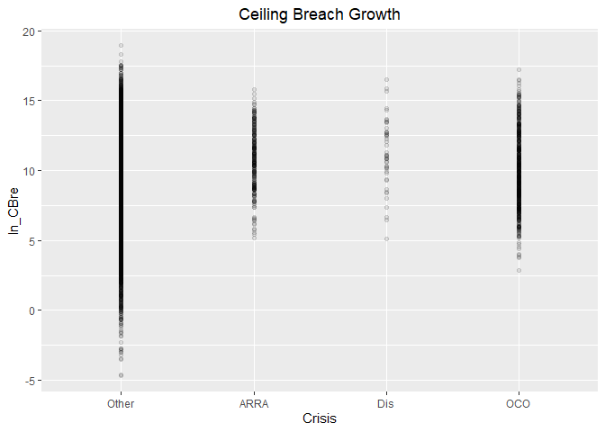<!-- -->

```r
#Model
b_CBre08A <- glm (data=serv_smp,
                 b_CBre ~ Crisis, family=binomial(link="logit"))


n_CBre08A <- glm(data=serv_breach,
                        ln_CBre ~ Crisis)


#Plot residuals versus fitted
stargazer::stargazer(b_CBre07B,b_CBre08A,
                       
                       n_CBre07B,n_CBre08A,
                       type="text",
                       digits=2)
```

```
## 
## =========================================================================
##                                          Dependent variable:             
##                             ---------------------------------------------
##                                    b_CBre                 ln_CBre        
##                                   logistic                normal         
##                                (1)        (2)         (3)         (4)    
## -------------------------------------------------------------------------
## cln_US6sal                   -0.07***               0.27***              
##                               (0.02)                (0.02)               
##                                                                          
## cln_PSCrate                  0.12***                0.14***              
##                               (0.02)                (0.02)               
##                                                                          
## cp_OffPerf7                  -0.13***              -0.37***              
##                               (0.02)                (0.02)               
##                                                                          
## cp_OffPSC7                   1.01***               -0.43***              
##                               (0.02)                (0.02)               
##                                                                          
## cn_PairHist7                 -0.08***               0.12***              
##                               (0.02)                (0.02)               
##                                                                          
## cln_PairCA                   -0.11***              -0.08***              
##                               (0.02)                (0.02)               
##                                                                          
## cln_Base                     1.00***                2.86***              
##                               (0.02)                (0.02)               
##                                                                          
## clr_Ceil2Base                  0.02                 0.32***              
##                               (0.02)                (0.02)               
##                                                                          
## cln_Days                     0.13***                0.13***              
##                               (0.02)                (0.02)               
##                                                                          
## Comp1 offer                  -0.17***                0.02                
##                               (0.03)                (0.03)               
##                                                                          
## Comp2-4 offers               0.25***               -0.24***              
##                               (0.02)                (0.02)               
##                                                                          
## Comp5+ offers                0.37***               -0.17***              
##                               (0.03)                (0.02)               
##                                                                          
## VehS-IDC                     -0.18***               0.06***              
##                               (0.02)                (0.02)               
##                                                                          
## VehM-IDC                     -0.21***                0.04*               
##                               (0.03)                (0.03)               
##                                                                          
## VehFSS/GWAC                  -0.47***               0.29***              
##                               (0.05)                (0.05)               
##                                                                          
## VehBPA/BOA                   -0.46***               0.12**               
##                               (0.06)                (0.05)               
##                                                                          
## PricingOther FP              -0.64***              -0.39***              
##                               (0.13)                (0.14)               
##                                                                          
## PricingT&M/LH/FPLOE          -0.59***               1.25***              
##                               (0.07)                (0.06)               
##                                                                          
## PricingIncentive               0.01                 1.01***              
##                               (0.10)                (0.09)               
##                                                                          
## PricingOther CB              -1.17***               1.37***              
##                               (0.05)                (0.04)               
##                                                                          
## PricingUCA                    -0.14*                0.63***              
##                               (0.08)                (0.06)               
##                                                                          
## PricingCombination or Other  -0.27***               0.74***              
##                               (0.08)                (0.07)               
##                                                                          
## CrisisARRA                              1.26***                 1.66***  
##                                          (0.07)                 (0.09)   
##                                                                          
## CrisisDis                               0.73***                 1.71***  
##                                          (0.16)                 (0.20)   
##                                                                          
## CrisisOCO                               -0.34***                0.61***  
##                                          (0.04)                 (0.05)   
##                                                                          
## Constant                     -2.91***   -2.77***    8.78***     9.24***  
##                               (0.02)     (0.01)     (0.02)      (0.01)   
##                                                                          
## -------------------------------------------------------------------------
## Observations                 250,000    250,000     61,184      61,184   
## Log Likelihood              -52,034.41 -55,776.82 -123,279.20 -148,631.40
## Akaike Inf. Crit.           104,114.80 111,561.60 246,604.40  297,270.90 
## =========================================================================
## Note:                                         *p<0.1; **p<0.05; ***p<0.01
```

For ceiling breach likelihood ARRA and Disaster results were in keeping with expcetations but OCO results were not. For ceiling breach size, al results are significant and in line with expectation that crisis contracts face a risk of larger ceiling breaches, though the magnitude is greater for ARRA and Disaster in line with the likelihood results.


#### 08B: Cumulative  Model


```r
#Model
b_CBre08B <- glm (data=serv_smp,
                 b_CBre ~  cln_US6sal + 
                   cln_PSCrate+ cp_OffPerf7+cp_OffPSC7+
                 cn_PairHist7+cln_PairCA +
                   cln_Base + clr_Ceil2Base + cln_Days+
                   Comp+
                   Veh+
                   Pricing+
                   Crisis, family=binomial(link="logit"))
glmer_examine(b_CBre08B)
```

```
##                   GVIF Df GVIF^(1/(2*Df))
## cln_US6sal    1.398666  1        1.182652
## cln_PSCrate   1.313626  1        1.146135
## cp_OffPerf7   1.340034  1        1.157598
## cp_OffPSC7    1.601172  1        1.265374
## cn_PairHist7  1.259534  1        1.122290
## cln_PairCA    1.963219  1        1.401149
## cln_Base      1.437242  1        1.198850
## clr_Ceil2Base 1.071589  1        1.035176
## cln_Days      1.408887  1        1.186966
## Comp          1.241208  3        1.036671
## Veh           1.742786  4        1.071903
## Pricing       1.166904  6        1.012946
## Crisis        1.353909  3        1.051796
```

```r
n_CBre08B <- glm(data=serv_breach,
                        ln_CBre ~  cln_US6sal + 
                   cln_PSCrate+ cp_OffPerf7+cp_OffPSC7+
                 cn_PairHist7+cln_PairCA+
                 cln_Base + clr_Ceil2Base + cln_Days+
                 Comp+
                   Veh+
                   Pricing+
                   Crisis)
glmer_examine(n_CBre08B)
```

```
##                   GVIF Df GVIF^(1/(2*Df))
## cln_US6sal    1.397928  1        1.182340
## cln_PSCrate   1.343901  1        1.159268
## cp_OffPerf7   2.231780  1        1.493914
## cp_OffPSC7    2.896205  1        1.701824
## cn_PairHist7  1.352677  1        1.163047
## cln_PairCA    2.556949  1        1.599046
## cln_Base      1.830469  1        1.352948
## clr_Ceil2Base 1.091782  1        1.044884
## cln_Days      1.616599  1        1.271455
## Comp          1.277304  3        1.041635
## Veh           2.073071  4        1.095410
## Pricing       1.197325  6        1.015121
## Crisis        1.218878  3        1.033539
```

```r
#Plot residuals versus fitted   


stargazer::stargazer(b_CBre07B,b_CBre08A,b_CBre08B,
                       
                       n_CBre07B,n_CBre08A,n_CBre08B,
                       type="text",
                       digits=2)
```

```
## 
## ================================================================================================
##                                                     Dependent variable:                         
##                             --------------------------------------------------------------------
##                                          b_CBre                            ln_CBre              
##                                         logistic                           normal               
##                                (1)        (2)        (3)         (4)         (5)         (6)    
## ------------------------------------------------------------------------------------------------
## cln_US6sal                   -0.07***              -0.05**     0.27***                 0.25***  
##                               (0.02)                (0.02)     (0.02)                  (0.02)   
##                                                                                                 
## cln_PSCrate                  0.12***               0.07***     0.14***                 0.21***  
##                               (0.02)                (0.02)     (0.02)                  (0.02)   
##                                                                                                 
## cp_OffPerf7                  -0.13***              -0.12***   -0.37***                -0.36***  
##                               (0.02)                (0.02)     (0.02)                  (0.02)   
##                                                                                                 
## cp_OffPSC7                   1.01***               0.99***    -0.43***                -0.42***  
##                               (0.02)                (0.02)     (0.02)                  (0.02)   
##                                                                                                 
## cn_PairHist7                 -0.08***              -0.08***    0.12***                 0.12***  
##                               (0.02)                (0.02)     (0.02)                  (0.02)   
##                                                                                                 
## cln_PairCA                   -0.11***               -0.04*    -0.08***                -0.13***  
##                               (0.02)                (0.02)     (0.02)                  (0.03)   
##                                                                                                 
## cln_Base                     1.00***               1.01***     2.86***                 2.84***  
##                               (0.02)                (0.02)     (0.02)                  (0.02)   
##                                                                                                 
## clr_Ceil2Base                  0.02                  0.01      0.32***                 0.33***  
##                               (0.02)                (0.02)     (0.02)                  (0.02)   
##                                                                                                 
## cln_Days                     0.13***               0.10***     0.13***                 0.16***  
##                               (0.02)                (0.02)     (0.02)                  (0.02)   
##                                                                                                 
## Comp1 offer                  -0.17***              -0.14***     0.02                    0.01    
##                               (0.03)                (0.03)     (0.03)                  (0.03)   
##                                                                                                 
## Comp2-4 offers               0.25***               0.25***    -0.24***                -0.26***  
##                               (0.02)                (0.02)     (0.02)                  (0.02)   
##                                                                                                 
## Comp5+ offers                0.37***               0.38***    -0.17***                -0.19***  
##                               (0.03)                (0.03)     (0.02)                  (0.02)   
##                                                                                                 
## VehS-IDC                     -0.18***              -0.23***    0.06***                 0.10***  
##                               (0.02)                (0.02)     (0.02)                  (0.02)   
##                                                                                                 
## VehM-IDC                     -0.21***              -0.24***     0.04*                  0.05**   
##                               (0.03)                (0.03)     (0.03)                  (0.03)   
##                                                                                                 
## VehFSS/GWAC                  -0.47***              -0.49***    0.29***                 0.32***  
##                               (0.05)                (0.05)     (0.05)                  (0.05)   
##                                                                                                 
## VehBPA/BOA                   -0.46***              -0.46***    0.12**                   0.07    
##                               (0.06)                (0.06)     (0.05)                  (0.05)   
##                                                                                                 
## PricingOther FP              -0.64***              -0.67***   -0.39***                -0.36***  
##                               (0.13)                (0.13)     (0.14)                  (0.14)   
##                                                                                                 
## PricingT&M/LH/FPLOE          -0.59***              -0.59***    1.25***                 1.27***  
##                               (0.07)                (0.07)     (0.06)                  (0.06)   
##                                                                                                 
## PricingIncentive               0.01                 0.003      1.01***                 1.02***  
##                               (0.10)                (0.10)     (0.09)                  (0.09)   
##                                                                                                 
## PricingOther CB              -1.17***              -1.17***    1.37***                 1.38***  
##                               (0.05)                (0.05)     (0.04)                  (0.04)   
##                                                                                                 
## PricingUCA                    -0.14*                -0.14*     0.63***                 0.65***  
##                               (0.08)                (0.08)     (0.06)                  (0.06)   
##                                                                                                 
## PricingCombination or Other  -0.27***              -0.27***    0.74***                 0.76***  
##                               (0.08)                (0.08)     (0.07)                  (0.07)   
##                                                                                                 
## CrisisARRA                              1.26***    0.85***                 1.66***      -0.08   
##                                          (0.07)     (0.07)                 (0.09)      (0.06)   
##                                                                                                 
## CrisisDis                               0.73***    0.67***                 1.71***     0.44***  
##                                          (0.16)     (0.16)                 (0.20)      (0.13)   
##                                                                                                 
## CrisisOCO                               -0.34***   -0.39***                0.61***     0.51***  
##                                          (0.04)     (0.05)                 (0.05)      (0.04)   
##                                                                                                 
## Constant                     -2.91***   -2.77***   -2.88***    8.78***     9.24***     8.74***  
##                               (0.02)     (0.01)     (0.02)     (0.02)      (0.01)      (0.02)   
##                                                                                                 
## ------------------------------------------------------------------------------------------------
## Observations                 250,000    250,000    250,000     61,184      61,184      61,184   
## Log Likelihood              -52,034.41 -55,776.82 -51,930.86 -123,279.20 -148,631.40 -123,184.80
## Akaike Inf. Crit.           104,114.80 111,561.60 103,913.70 246,604.40  297,270.90  246,421.60 
## ================================================================================================
## Note:                                                                *p<0.1; **p<0.05; ***p<0.01
```

```r
summary_residual_compare(b_CBre07B,b_CBre08B)
```

<!-- -->

```
## Warning in residuals_binned(model1_old, bins = bins): Always uses Xlb
## Estimated Pr(Termination), should update.
```

```
## Warning in residuals_binned(model1_new, bins = bins): Always uses Xlb
## Estimated Pr(Termination), should update.
```

```
## Warning in if (class(model1_new) %in% c("glmerMod", "lme4", "lmerMod")) {:
## the condition has length > 1 and only the first element will be used
```

```
## Warning in if (!class(model1_new) %in% c("glmerMod", "lme4", "lmerMod") & :
## the condition has length > 1 and only the first element will be used
```

<!-- -->

```
## [[1]]
##        model deviance null.deviance difference
## 1 model1_old 104068.8      111909.6   7840.765
## 2 model1_new 103861.7      111909.6   8047.869
```

```r
summary_residual_compare(n_CBre07B,n_CBre08B)
```

<!-- --><!-- -->

```
## Warning in residuals_binned(model1_old, bins = bins): Always uses Xlb
## Estimated Pr(Termination), should update.
```

```
## Warning in residuals_binned(model1_new, bins = bins): Always uses Xlb
## Estimated Pr(Termination), should update.
```

```
## Warning in if (class(model1_new) %in% c("glmerMod", "lme4", "lmerMod")) {:
## the condition has length > 1 and only the first element will be used
```

```
## Warning in if (!class(model1_new) %in% c("glmerMod", "lme4", "lmerMod") & :
## the condition has length > 1 and only the first element will be used
```

<!-- -->

```
## [[1]]
##        model deviance null.deviance difference
## 1 model1_old 201494.3        465759   264264.7
## 2 model1_new 200873.7        465759   264885.2
```

After inclusion of crisis, llittle changes for study variables. ARRA is no longer associated with larger breaches, thouh Disasters and OCO still are. Likelihood coefficients for crisis are unchanged. There are some changes in vehicle coefficients for size, with BPA/BOA losing significance and M-IDC gaining it.

The residuals grew more extreme and patterned.

## Industrial Sector

### Level 6

#### Model 09A: cln_Def6HHI
(Options, breach, termination)
HHI (logged, + means more consolidation)	cln_Def6HHI+	-	+	-


Expectations are  unchanged.

```r
#Likelihood Plot for unlogged ceiling
summary_continuous_plot(serv_smp1m,metric="cbre","def6_HHI_lag1")
```

```
## Warning in `[<-.factor`(`*tmp*`, ri, value = c(0, 0, 0, 0, 0, 0, 0, 0, 0, :
## invalid factor level, NA generated
```

<!-- -->

```r
summary_continuous_plot(serv_smp1m,metric="cbre","cln_Def6HHI")
```

```
## Warning in `[<-.factor`(`*tmp*`, ri, value = c(0, 0, 0, 0, 0, 0, 0, 0, 0, :
## invalid factor level, NA generated
```

<!-- -->

```r
summary_continuous_plot(serv_smp1m,metric="cbre","cln_Def3HHI")
```

```
## Warning in `[<-.factor`(`*tmp*`, ri, value = c(0, 0, 0, 0, 0, 0, 0, 0, 0, :
## invalid factor level, NA generated
```

<!-- -->

```r
#Model
b_CBre09A <- glm (data=serv_smp,
                 b_CBre ~ cln_Def6HHI, family=binomial(link="logit"))


n_CBre09A <- glm(data=serv_breach,
                        ln_CBre ~ cln_Def6HHI)


#Plot residuals versus fitted
stargazer::stargazer(b_CBre08B,b_CBre09A,
                       
                       n_CBre08B,n_CBre09A,
                       type="text",
                       digits=2)
```

```
## 
## =========================================================================
##                                          Dependent variable:             
##                             ---------------------------------------------
##                                    b_CBre                 ln_CBre        
##                                   logistic                normal         
##                                (1)        (2)         (3)         (4)    
## -------------------------------------------------------------------------
## cln_US6sal                   -0.05**                0.25***              
##                               (0.02)                (0.02)               
##                                                                          
## cln_PSCrate                  0.07***                0.21***              
##                               (0.02)                (0.02)               
##                                                                          
## cp_OffPerf7                  -0.12***              -0.36***              
##                               (0.02)                (0.02)               
##                                                                          
## cp_OffPSC7                   0.99***               -0.42***              
##                               (0.02)                (0.02)               
##                                                                          
## cn_PairHist7                 -0.08***               0.12***              
##                               (0.02)                (0.02)               
##                                                                          
## cln_PairCA                    -0.04*               -0.13***              
##                               (0.02)                (0.03)               
##                                                                          
## cln_Base                     1.01***                2.84***              
##                               (0.02)                (0.02)               
##                                                                          
## clr_Ceil2Base                  0.01                 0.33***              
##                               (0.02)                (0.02)               
##                                                                          
## cln_Days                     0.10***                0.16***              
##                               (0.02)                (0.02)               
##                                                                          
## Comp1 offer                  -0.14***                0.01                
##                               (0.03)                (0.03)               
##                                                                          
## Comp2-4 offers               0.25***               -0.26***              
##                               (0.02)                (0.02)               
##                                                                          
## Comp5+ offers                0.38***               -0.19***              
##                               (0.03)                (0.02)               
##                                                                          
## VehS-IDC                     -0.23***               0.10***              
##                               (0.02)                (0.02)               
##                                                                          
## VehM-IDC                     -0.24***               0.05**               
##                               (0.03)                (0.03)               
##                                                                          
## VehFSS/GWAC                  -0.49***               0.32***              
##                               (0.05)                (0.05)               
##                                                                          
## VehBPA/BOA                   -0.46***                0.07                
##                               (0.06)                (0.05)               
##                                                                          
## PricingOther FP              -0.67***              -0.36***              
##                               (0.13)                (0.14)               
##                                                                          
## PricingT&M/LH/FPLOE          -0.59***               1.27***              
##                               (0.07)                (0.06)               
##                                                                          
## PricingIncentive              0.003                 1.02***              
##                               (0.10)                (0.09)               
##                                                                          
## PricingOther CB              -1.17***               1.38***              
##                               (0.05)                (0.04)               
##                                                                          
## PricingUCA                    -0.14*                0.65***              
##                               (0.08)                (0.06)               
##                                                                          
## PricingCombination or Other  -0.27***               0.76***              
##                               (0.08)                (0.07)               
##                                                                          
## CrisisARRA                   0.85***                 -0.08               
##                               (0.07)                (0.06)               
##                                                                          
## CrisisDis                    0.67***                0.44***              
##                               (0.16)                (0.13)               
##                                                                          
## CrisisOCO                    -0.39***               0.51***              
##                               (0.05)                (0.04)               
##                                                                          
## cln_Def6HHI                             0.08***                -1.77***  
##                                          (0.02)                 (0.02)   
##                                                                          
## Constant                     -2.88***   -2.77***    8.74***     9.33***  
##                               (0.02)     (0.01)     (0.02)      (0.01)   
##                                                                          
## -------------------------------------------------------------------------
## Observations                 250,000    250,000     61,184      61,184   
## Log Likelihood              -51,930.86 -55,943.79 -123,184.80 -144,249.20
## Akaike Inf. Crit.           103,913.70 111,891.60 246,421.60  288,502.40 
## =========================================================================
## Note:                                         *p<0.1; **p<0.05; ***p<0.01
```

Expected direction for ceiling breach fequency but not magnitude.

#### Model 09B: Defense to Overall ratio
The higher the ratio of defense obligations to reciepts in the overall economy, the DoD holds a monosopy over a sector. Given the challenges of monosopy, the a higher ratio estimates a greater  risk of ceiling breaches.

(Options, breach, termination)
Ratio Def. obligatons : US revenue	cln_Def6Obl+		+	-	-


```r
#Likelihood Plot for unlogged ceiling
      summary_continuous_plot(serv_smp1m,metric="cbre","def6_ratio_lag1")
```

```
## Warning in `[<-.factor`(`*tmp*`, ri, value = c(0, 0, 0, 0, 0, 0, 0, 0, 0, :
## invalid factor level, NA generated
```

<!-- -->

```r
      summary_continuous_plot(serv_smp1m,metric="cbre","clr_Def6toUS")
```

```
## Warning in `[<-.factor`(`*tmp*`, ri, value = c(0, 0, 0, 0, 0, 0, 0, 0, 0, :
## invalid factor level, NA generated
```

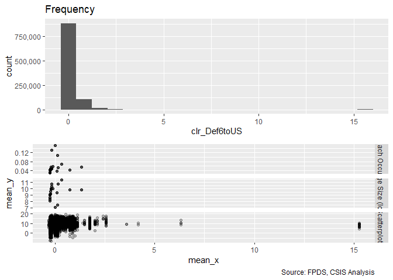<!-- -->

```r
#Scatter Plot
ggplot(serv_smp, aes(x=clr_Def6toUS, y=ln_CBre)) + geom_point(alpha = 0.1) + ggtitle('Ceiling Breach Growth') + theme(plot.title = element_text(hjust = 0.5))
```

```
## Warning: Removed 235285 rows containing missing values (geom_point).
```

<!-- -->

```r
#Model
b_CBre09B <- glm (data=serv_smp,
                 b_CBre ~ clr_Def6toUS, family=binomial(link="logit"))


n_CBre09B <- glm(data=serv_breach,
                        ln_CBre ~ clr_Def6toUS)


#Plot residuals versus fitted
stargazer::stargazer(b_CBre08B,b_CBre09A,b_CBre09B,
                       
                       n_CBre08B,n_CBre09A,n_CBre09B,
                       type="text",
                       digits=2)
```

```
## 
## ================================================================================================
##                                                     Dependent variable:                         
##                             --------------------------------------------------------------------
##                                          b_CBre                            ln_CBre              
##                                         logistic                           normal               
##                                (1)        (2)        (3)         (4)         (5)         (6)    
## ------------------------------------------------------------------------------------------------
## cln_US6sal                   -0.05**                           0.25***                          
##                               (0.02)                           (0.02)                           
##                                                                                                 
## cln_PSCrate                  0.07***                           0.21***                          
##                               (0.02)                           (0.02)                           
##                                                                                                 
## cp_OffPerf7                  -0.12***                         -0.36***                          
##                               (0.02)                           (0.02)                           
##                                                                                                 
## cp_OffPSC7                   0.99***                          -0.42***                          
##                               (0.02)                           (0.02)                           
##                                                                                                 
## cn_PairHist7                 -0.08***                          0.12***                          
##                               (0.02)                           (0.02)                           
##                                                                                                 
## cln_PairCA                    -0.04*                          -0.13***                          
##                               (0.02)                           (0.03)                           
##                                                                                                 
## cln_Base                     1.01***                           2.84***                          
##                               (0.02)                           (0.02)                           
##                                                                                                 
## clr_Ceil2Base                  0.01                            0.33***                          
##                               (0.02)                           (0.02)                           
##                                                                                                 
## cln_Days                     0.10***                           0.16***                          
##                               (0.02)                           (0.02)                           
##                                                                                                 
## Comp1 offer                  -0.14***                           0.01                            
##                               (0.03)                           (0.03)                           
##                                                                                                 
## Comp2-4 offers               0.25***                          -0.26***                          
##                               (0.02)                           (0.02)                           
##                                                                                                 
## Comp5+ offers                0.38***                          -0.19***                          
##                               (0.03)                           (0.02)                           
##                                                                                                 
## VehS-IDC                     -0.23***                          0.10***                          
##                               (0.02)                           (0.02)                           
##                                                                                                 
## VehM-IDC                     -0.24***                          0.05**                           
##                               (0.03)                           (0.03)                           
##                                                                                                 
## VehFSS/GWAC                  -0.49***                          0.32***                          
##                               (0.05)                           (0.05)                           
##                                                                                                 
## VehBPA/BOA                   -0.46***                           0.07                            
##                               (0.06)                           (0.05)                           
##                                                                                                 
## PricingOther FP              -0.67***                         -0.36***                          
##                               (0.13)                           (0.14)                           
##                                                                                                 
## PricingT&M/LH/FPLOE          -0.59***                          1.27***                          
##                               (0.07)                           (0.06)                           
##                                                                                                 
## PricingIncentive              0.003                            1.02***                          
##                               (0.10)                           (0.09)                           
##                                                                                                 
## PricingOther CB              -1.17***                          1.38***                          
##                               (0.05)                           (0.04)                           
##                                                                                                 
## PricingUCA                    -0.14*                           0.65***                          
##                               (0.08)                           (0.06)                           
##                                                                                                 
## PricingCombination or Other  -0.27***                          0.76***                          
##                               (0.08)                           (0.07)                           
##                                                                                                 
## CrisisARRA                   0.85***                            -0.08                           
##                               (0.07)                           (0.06)                           
##                                                                                                 
## CrisisDis                    0.67***                           0.44***                          
##                               (0.16)                           (0.13)                           
##                                                                                                 
## CrisisOCO                    -0.39***                          0.51***                          
##                               (0.05)                           (0.04)                           
##                                                                                                 
## cln_Def6HHI                             0.08***                           -1.77***              
##                                          (0.02)                            (0.02)               
##                                                                                                 
## clr_Def6toUS                                         0.03                              0.18***  
##                                                     (0.02)                             (0.03)   
##                                                                                                 
## Constant                     -2.88***   -2.77***   -2.77***    8.74***     9.33***     9.30***  
##                               (0.02)     (0.01)     (0.01)     (0.02)      (0.01)      (0.01)   
##                                                                                                 
## ------------------------------------------------------------------------------------------------
## Observations                 250,000    250,000    250,000     61,184      61,184      61,184   
## Log Likelihood              -51,930.86 -55,943.79 -55,953.52 -123,184.80 -144,249.20 -148,889.80
## Akaike Inf. Crit.           103,913.70 111,891.60 111,911.00 246,421.60  288,502.40  297,783.60 
## ================================================================================================
## Note:                                                                *p<0.1; **p<0.05; ***p<0.01
```
Breach size results were significant and a higher ratio was associated with an increase is size as expected. For breach likelihood the results were not significant and had a small magnitude.

#### Model 09C: Defense Obligations
(Options, breach, termination)
Defense obligations (logged)	clr_Def6toUS+		-	-	+


```r
#Likelihood Plot for unlogged ceiling
      summary_continuous_plot(serv_smp1m,metric="cbre","def6_obl_lag1Const")
```

```
## Warning in `[<-.factor`(`*tmp*`, ri, value = c(0, 0, 0, 0, 0, 0, 0, 0, 0, :
## invalid factor level, NA generated
```

<!-- -->

```r
      summary_continuous_plot(serv_smp1m,metric="cbre","cln_Def6Obl")
```

```
## Warning in `[<-.factor`(`*tmp*`, ri, value = c(0, 0, 0, 0, 0, 0, 0, 0, 0, :
## invalid factor level, NA generated
```

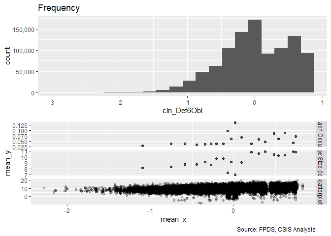<!-- -->

```r
#Scatter Plot
ggplot(serv_smp, aes(x=cln_Def6Obl, y=ln_CBre)) + geom_point(alpha = 0.1) + ggtitle('Ceiling Breach Growth') + theme(plot.title = element_text(hjust = 0.5))
```

```
## Warning: Removed 235285 rows containing missing values (geom_point).
```

<!-- -->

```r
#Model
b_CBre09C <- glm (data=serv_smp,
                 b_CBre ~ cln_Def6Obl, family=binomial(link="logit"))


n_CBre09C <- glm(data=serv_breach,
                        ln_CBre ~ cln_Def6Obl)


#Plot residuals versus fitted
stargazer::stargazer(b_CBre09A,b_CBre09B,b_CBre09C,
                       
                       n_CBre09A,n_CBre09B,n_CBre09C,
                       type="text",
                       digits=2)
```

```
## 
## ======================================================================================
##                                           Dependent variable:                         
##                   --------------------------------------------------------------------
##                                b_CBre                            ln_CBre              
##                               logistic                           normal               
##                      (1)        (2)        (3)         (4)         (5)         (6)    
## --------------------------------------------------------------------------------------
## cln_Def6HHI        0.08***                          -1.77***                          
##                     (0.02)                           (0.02)                           
##                                                                                       
## clr_Def6toUS                    0.03                             0.18***              
##                                (0.02)                            (0.03)               
##                                                                                       
## cln_Def6Obl                              0.46***                             1.96***  
##                                           (0.02)                             (0.02)   
##                                                                                       
## Constant           -2.77***   -2.77***   -2.80***    9.33***     9.30***     9.09***  
##                     (0.01)     (0.01)     (0.01)     (0.01)      (0.01)      (0.01)   
##                                                                                       
## --------------------------------------------------------------------------------------
## Observations       250,000    250,000    250,000     61,184      61,184      61,184   
## Log Likelihood    -55,943.79 -55,953.52 -55,622.63 -144,249.20 -148,889.80 -145,767.20
## Akaike Inf. Crit. 111,891.60 111,911.00 111,249.30 288,502.40  297,783.60  291,538.30 
## ======================================================================================
## Note:                                                      *p<0.1; **p<0.05; ***p<0.01
```

Contrary to expectation. for ceiling breach frequecny and size.

#### Model 09D: NAICS6 6 Combined
Consolidation at less and more granular levels may have different effects. Efficiencies are often used to describe sectors, like utilities, with high barriers to entry. Many of these aspects seem like they would already be captured at less granular NAICS6 levels, e.g. power plants, rather than more specific NAICS6 levels, like solar vs. coal. As a result, consolidation for more granular NAICS6 codes should estimate higher rates of ceiling breaches compared to less granular NAICS6 code.

We'll start by adding in everything from both models and seeing what violates VIF.

```r
#Likelihood Plot for unlogged ceiling


#Model
b_CBre09D <- glm (data=serv_smp,
                 b_CBre ~ cln_Def6HHI+clr_Def6toUS+cln_Def6Obl
                 , family=binomial(link="logit"))
glmer_examine(b_CBre09D)
```

```
##  cln_Def6HHI clr_Def6toUS  cln_Def6Obl 
##     1.247500     1.524434     1.519237
```

```r
n_CBre09D <- glm(data=serv_breach,
                        ln_CBre ~ cln_Def6HHI+clr_Def6toUS+cln_Def6Obl)

glmer_examine(n_CBre09D)
```

```
##  cln_Def6HHI clr_Def6toUS  cln_Def6Obl 
##     1.247942     1.264936     1.305147
```

```r
summary_residual_compare(b_CBre09D, bins=10)
```

```
## Warning in residuals_binned(model1_old, bins = bins): Always uses Xlb
## Estimated Pr(Termination), should update.
```

```
## Warning in if (class(model1_old) %in% c("glmerMod", "lme4", "lmerMod")) {:
## the condition has length > 1 and only the first element will be used
```

```
## Warning in if (!class(model1_old) %in% c("glmerMod", "lme4", "lmerMod") & :
## the condition has length > 1 and only the first element will be used
```

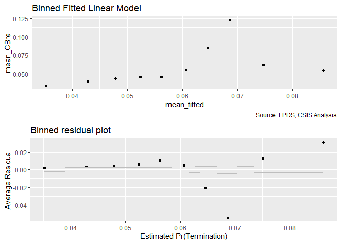<!-- -->

```
## [[1]]
##        model deviance null.deviance difference
## 1 model1_old 110899.2      111909.6   1010.345
```

```r
summary_residual_compare(n_CBre09D,bins=10)
```

```
## Warning in residuals_binned(model1_old, bins = bins): Always uses Xlb
## Estimated Pr(Termination), should update.
```

```
## Warning in if (class(model1_old) %in% c("glmerMod", "lme4", "lmerMod")) {:
## the condition has length > 1 and only the first element will be used
```

```
## Warning in if (!class(model1_old) %in% c("glmerMod", "lme4", "lmerMod") & :
## the condition has length > 1 and only the first element will be used
```

<!-- -->

```
## [[1]]
##        model deviance null.deviance difference
## 1 model1_old 378210.3        465759   87548.64
```
The hypothesis is upheld. Deviance is a little lower and residuals a little higher than the prior forms of consolidation for the level 3 model.  For the level 6 model, deviance is reduced some in both cases.

Ratio at either level is no longer in line with expectations for ceiling breaches.

#### Model 09E: Cumulative Model
Consolidation at less and more granular levels may have different effects. Efficiencies are often used to describe sectors, like utilities, with high barriers to entry. Many of these aspects seem like they would already be captured at less granular NAICS6 levels, e.g. power plants, rather than more specific NAICS6 levels, like solar vs. coal. As a result, consolidation for more granular NAICS6 codes should estimate higher rates of ceiling breaches compared to less granular NAICS6 code.

We'll start by adding in everything from both models and seeing what violates VIF.

```r
#Model
b_CBre09E <- glm (data=serv_smp,
                 b_CBre ~  cln_US6sal + 
                   cln_PSCrate+ cp_OffPerf7+cp_OffPSC7+
                 cn_PairHist7+cln_PairCA +
                   cln_Base + clr_Ceil2Base + cln_Days+
                   Comp+
                   Veh+
                   Pricing+
                   Crisis+
                   cln_Def6HHI+clr_Def6toUS+cln_Def6Obl, family=binomial(link="logit"))
glmer_examine(b_CBre09E)
```

```
##                   GVIF Df GVIF^(1/(2*Df))
## cln_US6sal    1.901997  1        1.379129
## cln_PSCrate   1.329107  1        1.152869
## cp_OffPerf7   1.401914  1        1.184025
## cp_OffPSC7    1.815068  1        1.347245
## cn_PairHist7  1.281807  1        1.132169
## cln_PairCA    2.006441  1        1.416489
## cln_Base      1.489163  1        1.220313
## clr_Ceil2Base 1.080392  1        1.039419
## cln_Days      1.421793  1        1.192389
## Comp          1.273580  3        1.041129
## Veh           1.818497  4        1.077616
## Pricing       1.202661  6        1.015497
## Crisis        1.353163  3        1.051700
## cln_Def6HHI   1.757850  1        1.325839
## clr_Def6toUS  1.667873  1        1.291461
## cln_Def6Obl   2.477502  1        1.574008
```

```r
n_CBre09E <- glm(data=serv_breach,
                        ln_CBre ~  cln_US6sal + 
                   cln_PSCrate+ cp_OffPerf7+cp_OffPSC7+
                 cn_PairHist7+cln_PairCA+
                 cln_Base + clr_Ceil2Base + cln_Days+
                 Comp+
                   Veh+
                   Pricing+
                   Crisis+
                 cln_Def6HHI+clr_Def6toUS+cln_Def6Obl)

glmer_examine(n_CBre09E)
```

```
##                   GVIF Df GVIF^(1/(2*Df))
## cln_US6sal    1.820575  1        1.349287
## cln_PSCrate   1.347206  1        1.160692
## cp_OffPerf7   2.267240  1        1.505736
## cp_OffPSC7    3.237351  1        1.799264
## cn_PairHist7  1.357192  1        1.164986
## cln_PairCA    2.582548  1        1.607031
## cln_Base      2.003086  1        1.415304
## clr_Ceil2Base 1.092270  1        1.045117
## cln_Days      1.618881  1        1.272352
## Comp          1.307634  3        1.045717
## Veh           2.192103  4        1.103082
## Pricing       1.220850  6        1.016768
## Crisis        1.239236  3        1.036396
## cln_Def6HHI   2.135888  1        1.461468
## clr_Def6toUS  1.365045  1        1.168352
## cln_Def6Obl   2.251216  1        1.500405
```

```r
#Plot residuals versus fitted
stargazer::stargazer(b_CBre08B,b_CBre09D,b_CBre09E,
                     
                     n_CBre08B,n_CBre09D,n_CBre09E,
                       type="text",
                       digits=2)
```

```
## 
## ================================================================================================
##                                                     Dependent variable:                         
##                             --------------------------------------------------------------------
##                                          b_CBre                            ln_CBre              
##                                         logistic                           normal               
##                                (1)        (2)        (3)         (4)         (5)         (6)    
## ------------------------------------------------------------------------------------------------
## cln_US6sal                   -0.05**               -0.19***    0.25***                 0.16***  
##                               (0.02)                (0.03)     (0.02)                  (0.02)   
##                                                                                                 
## cln_PSCrate                  0.07***               0.05***     0.21***                 0.22***  
##                               (0.02)                (0.02)     (0.02)                  (0.02)   
##                                                                                                 
## cp_OffPerf7                  -0.12***              -0.11***   -0.36***                -0.32***  
##                               (0.02)                (0.02)     (0.02)                  (0.02)   
##                                                                                                 
## cp_OffPSC7                   0.99***               1.02***    -0.42***                -0.47***  
##                               (0.02)                (0.02)     (0.02)                  (0.02)   
##                                                                                                 
## cn_PairHist7                 -0.08***              -0.08***    0.12***                 0.11***  
##                               (0.02)                (0.02)     (0.02)                  (0.02)   
##                                                                                                 
## cln_PairCA                    -0.04*                -0.04     -0.13***                -0.15***  
##                               (0.02)                (0.02)     (0.03)                  (0.03)   
##                                                                                                 
## cln_Base                     1.01***               0.99***     2.84***                 2.81***  
##                               (0.02)                (0.02)     (0.02)                  (0.02)   
##                                                                                                 
## clr_Ceil2Base                  0.01                 -0.01      0.33***                 0.34***  
##                               (0.02)                (0.02)     (0.02)                  (0.02)   
##                                                                                                 
## cln_Days                     0.10***               0.09***     0.16***                 0.17***  
##                               (0.02)                (0.02)     (0.02)                  (0.02)   
##                                                                                                 
## Comp1 offer                  -0.14***              -0.11***     0.01                    -0.01   
##                               (0.03)                (0.03)     (0.03)                  (0.03)   
##                                                                                                 
## Comp2-4 offers               0.25***               0.26***    -0.26***                -0.26***  
##                               (0.02)                (0.02)     (0.02)                  (0.02)   
##                                                                                                 
## Comp5+ offers                0.38***               0.35***    -0.19***                -0.18***  
##                               (0.03)                (0.03)     (0.02)                  (0.02)   
##                                                                                                 
## VehS-IDC                     -0.23***              -0.27***    0.10***                 0.08***  
##                               (0.02)                (0.02)     (0.02)                  (0.02)   
##                                                                                                 
## VehM-IDC                     -0.24***              -0.24***    0.05**                   0.04    
##                               (0.03)                (0.03)     (0.03)                  (0.03)   
##                                                                                                 
## VehFSS/GWAC                  -0.49***              -0.47***    0.32***                 0.31***  
##                               (0.05)                (0.05)     (0.05)                  (0.05)   
##                                                                                                 
## VehBPA/BOA                   -0.46***              -0.41***     0.07                    0.02    
##                               (0.06)                (0.06)     (0.05)                  (0.05)   
##                                                                                                 
## PricingOther FP              -0.67***              -0.78***   -0.36***                -0.48***  
##                               (0.13)                (0.13)     (0.14)                  (0.14)   
##                                                                                                 
## PricingT&M/LH/FPLOE          -0.59***              -0.59***    1.27***                 1.23***  
##                               (0.07)                (0.07)     (0.06)                  (0.06)   
##                                                                                                 
## PricingIncentive              0.003                 -0.10      1.02***                 0.95***  
##                               (0.10)                (0.10)     (0.09)                  (0.09)   
##                                                                                                 
## PricingOther CB              -1.17***              -1.23***    1.38***                 1.33***  
##                               (0.05)                (0.05)     (0.04)                  (0.04)   
##                                                                                                 
## PricingUCA                    -0.14*               -0.20**     0.65***                 0.61***  
##                               (0.08)                (0.08)     (0.06)                  (0.06)   
##                                                                                                 
## PricingCombination or Other  -0.27***              -0.28***    0.76***                 0.71***  
##                               (0.08)                (0.08)     (0.07)                  (0.07)   
##                                                                                                 
## CrisisARRA                   0.85***               0.76***      -0.08                  -0.10*   
##                               (0.07)                (0.07)     (0.06)                  (0.06)   
##                                                                                                 
## CrisisDis                    0.67***               0.70***     0.44***                 0.43***  
##                               (0.16)                (0.16)     (0.13)                  (0.13)   
##                                                                                                 
## CrisisOCO                    -0.39***              -0.36***    0.51***                 0.43***  
##                               (0.05)                (0.05)     (0.04)                  (0.04)   
##                                                                                                 
## cln_Def6HHI                             0.30***    0.12***                -1.53***     0.07***  
##                                          (0.02)     (0.02)                 (0.02)      (0.02)   
##                                                                                                 
## clr_Def6toUS                            -0.42***   -0.53***                0.25***     0.28***  
##                                          (0.03)     (0.03)                 (0.03)      (0.02)   
##                                                                                                 
## cln_Def6Obl                             0.68***    0.43***                 1.30***     0.15***  
##                                          (0.02)     (0.03)                 (0.03)      (0.02)   
##                                                                                                 
## Constant                     -2.88***   -2.81***   -2.88***    8.74***     9.19***     8.77***  
##                               (0.02)     (0.01)     (0.02)     (0.02)      (0.01)      (0.02)   
##                                                                                                 
## ------------------------------------------------------------------------------------------------
## Observations                 250,000    250,000    250,000     61,184      61,184      61,184   
## Log Likelihood              -51,930.86 -55,449.62 -51,731.07 -123,184.80 -142,542.60 -122,981.60
## Akaike Inf. Crit.           103,913.70 110,907.20 103,520.10 246,421.60  285,093.30  246,021.30 
## ================================================================================================
## Note:                                                                *p<0.1; **p<0.05; ***p<0.01
```

```r
summary_residual_compare(b_CBre08B,b_CBre09E)
```

<!-- -->

```
## Warning in residuals_binned(model1_old, bins = bins): Always uses Xlb
## Estimated Pr(Termination), should update.
```

```
## Warning in residuals_binned(model1_new, bins = bins): Always uses Xlb
## Estimated Pr(Termination), should update.
```

```
## Warning in if (class(model1_new) %in% c("glmerMod", "lme4", "lmerMod")) {:
## the condition has length > 1 and only the first element will be used
```

```
## Warning in if (!class(model1_new) %in% c("glmerMod", "lme4", "lmerMod") & :
## the condition has length > 1 and only the first element will be used
```

<!-- -->

```
## [[1]]
##        model deviance null.deviance difference
## 1 model1_old 103861.7      111909.6   8047.869
## 2 model1_new 103462.1      111909.6   8447.459
```

```r
summary_residual_compare(b_CBre08B,b_CBre09E)
```

<!-- -->

```
## Warning in residuals_binned(model1_old, bins = bins): Always uses Xlb
## Estimated Pr(Termination), should update.
```

```
## Warning in residuals_binned(model1_new, bins = bins): Always uses Xlb
## Estimated Pr(Termination), should update.
```

```
## Warning in if (class(model1_new) %in% c("glmerMod", "lme4", "lmerMod")) {:
## the condition has length > 1 and only the first element will be used
```

```
## Warning in if (!class(model1_new) %in% c("glmerMod", "lme4", "lmerMod") & :
## the condition has length > 1 and only the first element will be used
```

<!-- -->

```
## [[1]]
##        model deviance null.deviance difference
## 1 model1_old 103861.7      111909.6   8047.869
## 2 model1_new 103462.1      111909.6   8447.459
```

Detailed Industry HHI is no longer significant for likelihood or size. Detailed Industry Ratio is now significant but now is associated with less frequent breaches, contrary to expectation. Detailed Industry Ratio remains in  ine with expectation tough with a smaller magnitude.

### Level 3
#### Model 10A: cln_Def3HHI
(Options, breaches, and terminations)
HHI (logged, + means more consolidation)	cln_Def3HHI		TRUE	-	+	++


```r
#Likelihood Plot for unlogged ceiling
summary_continuous_plot(serv_smp1m,metric="cbre","cln_Def3HHI")
```

```
## Warning in `[<-.factor`(`*tmp*`, ri, value = c(0, 0, 0, 0, 0, 0, 0, 0, 0, :
## invalid factor level, NA generated
```

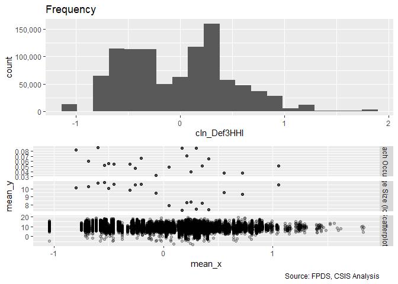<!-- -->

```r
#Scatter Plot
ggplot(serv_smp, aes(x=cln_Def3HHI, y=ln_CBre)) + geom_point(alpha = 0.1) + ggtitle('Ceiling Breach Growth') + theme(plot.title = element_text(hjust = 0.5))
```

```
## Warning: Removed 235285 rows containing missing values (geom_point).
```

<!-- -->

```r
#Model
b_CBre10A <- glm (data=serv_smp,
                 b_CBre ~ cln_Def3HHI, family=binomial(link="logit"))


n_CBre10A <- glm(data=serv_breach,
                        ln_CBre ~ cln_Def3HHI)


#Plot residuals versus fitted
stargazer::stargazer(b_CBre09A,b_CBre10A,
                       
                       n_CBre09A,n_CBre10A,
                       type="text",
                       digits=2)
```

```
## 
## ===============================================================
##                                Dependent variable:             
##                   ---------------------------------------------
##                          b_CBre                 ln_CBre        
##                         logistic                normal         
##                      (1)        (2)         (3)         (4)    
## ---------------------------------------------------------------
## cln_Def6HHI        0.08***               -1.77***              
##                     (0.02)                (0.02)               
##                                                                
## cln_Def3HHI                   -0.23***               -1.57***  
##                                (0.02)                 (0.02)   
##                                                                
## Constant           -2.77***   -2.78***    9.33***     9.20***  
##                     (0.01)     (0.01)     (0.01)      (0.01)   
##                                                                
## ---------------------------------------------------------------
## Observations       250,000    250,000     61,184      61,184   
## Log Likelihood    -55,943.79 -55,864.11 -144,249.20 -146,590.40
## Akaike Inf. Crit. 111,891.60 111,732.20 288,502.40  293,184.70 
## ===============================================================
## Note:                               *p<0.1; **p<0.05; ***p<0.01
```

```r
#Summary Residual Compare include for NAICS66 counterparts
summary_residual_compare(b_CBre09A,b_CBre10A, skip_vif =  TRUE)
```

<!-- -->

```
## Warning in residuals_binned(model1_old, bins = bins): Always uses Xlb
## Estimated Pr(Termination), should update.
```

```
## Warning in residuals_binned(model1_new, bins = bins): Always uses Xlb
## Estimated Pr(Termination), should update.
```

```
## Warning in if (class(model1_new) %in% c("glmerMod", "lme4", "lmerMod")) {:
## the condition has length > 1 and only the first element will be used
```

```
## Warning in if (!class(model1_new) %in% c("glmerMod", "lme4", "lmerMod") & :
## the condition has length > 1 and only the first element will be used
```

<!-- -->

```
## [[1]]
##        model deviance null.deviance difference
## 1 model1_old 111887.6      111909.6    22.0174
## 2 model1_new 111728.2      111909.6   181.3762
```

```r
summary_residual_compare(n_CBre09A,n_CBre10A, skip_vif =  TRUE)
```

<!-- --><!-- -->

```
## Warning in residuals_binned(model1_old, bins = bins): Always uses Xlb
## Estimated Pr(Termination), should update.
```

```
## Warning in residuals_binned(model1_new, bins = bins): Always uses Xlb
## Estimated Pr(Termination), should update.
```

```
## Warning in if (class(model1_new) %in% c("glmerMod", "lme4", "lmerMod")) {:
## the condition has length > 1 and only the first element will be used
```

```
## Warning in if (!class(model1_new) %in% c("glmerMod", "lme4", "lmerMod") & :
## the condition has length > 1 and only the first element will be used
```

<!-- -->

```
## [[1]]
##        model deviance null.deviance difference
## 1 model1_old 399908.1        465759   65850.88
## 2 model1_new 431714.1        465759   34044.87
```

The results for subsector HHI is contrary to expectation on Ceiling breach likelihood and size.

Level 3 HHI seems to slightly out perform level 6.


#### Model 10B: Defense to Overall ratio
(Options, breaches, and terminations)
Ratio Def. obligatons : US revenue	clr_Def3toUS+		-	+	+


```r
#Likelihood Plot for unlogged ceiling
summary_continuous_plot(serv_smp1m,metric="cbre","capped_def3_ratio_lag1")
```

```
## Warning in `[<-.factor`(`*tmp*`, ri, value = c(0, 0, 0, 0, 0, 0, 0, 0, 0, :
## invalid factor level, NA generated
```

<!-- -->

```r
summary_continuous_plot(serv_smp1m,metric="cbre","clr_Def3toUS")
```

```
## Warning in `[<-.factor`(`*tmp*`, ri, value = c(0, 0, 0, 0, 0, 0, 0, 0, 0, :
## invalid factor level, NA generated
```

<!-- -->

```r
#Scatter Plot
ggplot(serv_smp, aes(x=cln_Def3HHI, y=ln_CBre)) + geom_point(alpha = 0.1) + ggtitle('Ceiling Breach Growth') + theme(plot.title = element_text(hjust = 0.5))
```

```
## Warning: Removed 235285 rows containing missing values (geom_point).
```

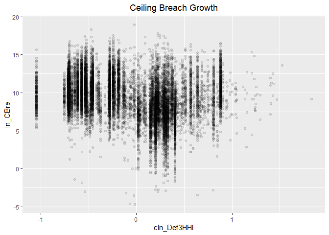<!-- -->

```r
#Model
b_CBre10B <- glm (data=serv_smp,
                 b_CBre ~ clr_Def3toUS, family=binomial(link="logit"))


n_CBre10B <- glm(data=serv_breach,
                        ln_CBre ~ clr_Def3toUS)


#Plot residuals versus fitted
stargazer::stargazer(b_CBre09B,b_CBre10A,b_CBre10B,
                       
                       n_CBre09B,n_CBre10A,n_CBre10B,
                       type="text",
                       digits=2)
```

```
## 
## ======================================================================================
##                                           Dependent variable:                         
##                   --------------------------------------------------------------------
##                                b_CBre                            ln_CBre              
##                               logistic                           normal               
##                      (1)        (2)        (3)         (4)         (5)         (6)    
## --------------------------------------------------------------------------------------
## clr_Def6toUS         0.03                            0.18***                          
##                     (0.02)                           (0.03)                           
##                                                                                       
## cln_Def3HHI                   -0.23***                          -1.57***              
##                                (0.02)                            (0.02)               
##                                                                                       
## clr_Def3toUS                             0.12***                             0.17***  
##                                           (0.02)                             (0.02)   
##                                                                                       
## Constant           -2.77***   -2.78***   -2.77***    9.30***     9.20***     9.30***  
##                     (0.01)     (0.01)     (0.01)     (0.01)      (0.01)      (0.01)   
##                                                                                       
## --------------------------------------------------------------------------------------
## Observations       250,000    250,000    250,000     61,184      61,184      61,184   
## Log Likelihood    -55,953.52 -55,864.11 -55,926.87 -148,889.80 -146,590.40 -148,888.40
## Akaike Inf. Crit. 111,911.00 111,732.20 111,857.70 297,783.60  293,184.70  297,780.70 
## ======================================================================================
## Note:                                                      *p<0.1; **p<0.05; ***p<0.01
```

```r
#Summary Residual Compare include for NAICS66 counterparts
summary_residual_compare(b_CBre09B,b_CBre10B)
```

<!-- -->

```
## Warning in residuals_binned(model1_old, bins = bins): Always uses Xlb
## Estimated Pr(Termination), should update.
```

```
## Warning in residuals_binned(model1_new, bins = bins): Always uses Xlb
## Estimated Pr(Termination), should update.
```

```
## Warning in if (class(model1_new) %in% c("glmerMod", "lme4", "lmerMod")) {:
## the condition has length > 1 and only the first element will be used
```

```
## Warning in if (!class(model1_new) %in% c("glmerMod", "lme4", "lmerMod") & :
## the condition has length > 1 and only the first element will be used
```

<!-- -->

```
## [[1]]
##        model deviance null.deviance difference
## 1 model1_old 111907.0      111909.6   2.549209
## 2 model1_new 111853.7      111909.6  55.846002
```

```r
summary_residual_compare(n_CBre09B,n_CBre10B)
```

<!-- --><!-- -->

```
## Warning in residuals_binned(model1_old, bins = bins): Always uses Xlb
## Estimated Pr(Termination), should update.
```

```
## Warning in residuals_binned(model1_new, bins = bins): Always uses Xlb
## Estimated Pr(Termination), should update.
```

```
## Warning in if (class(model1_new) %in% c("glmerMod", "lme4", "lmerMod")) {:
## the condition has length > 1 and only the first element will be used
```

```
## Warning in if (!class(model1_new) %in% c("glmerMod", "lme4", "lmerMod") & :
## the condition has length > 1 and only the first element will be used
```

<!-- -->

```
## [[1]]
##        model deviance null.deviance difference
## 1 model1_old 465414.4        465759   344.6067
## 2 model1_new 465392.6        465759   366.3786
```

Expectations were in lined with ceiling breach likelihood and size.


#### Model 10C: NAICS6 6 and NAICS6 3
Consolidation at lessa nd more granular levels may have different effects. Efficiencies are often used to describe sectors, like utilities, with high barriers to entry. Many of these aspects seem like they would already be captured at less granular NAICS6 levels, e.g. power plants, rather than more specific NAICS6 levels, like solar vs. coal. As a result, consolidation for more granular NAICS6 codes should estimate higher rates of ceiling breaches compared to less granular NAICS6 code.

We'll start by adding in everything from both models and seeing what violates VIF.

```r
#Model
b_CBre10C <- glm (data=serv_smp,
                 b_CBre ~ cln_Def6HHI+clr_Def6toUS+cln_Def6Obl+
                   cln_Def3HHI+clr_Def3toUS, family=binomial(link="logit"))
glmer_examine(b_CBre10C)
```

```
##  cln_Def6HHI clr_Def6toUS  cln_Def6Obl  cln_Def3HHI clr_Def3toUS 
##     1.963424     1.786342     1.760832     1.817543     1.912246
```

```r
n_CBre10C <- glm(data=serv_breach,
                        ln_CBre ~ cln_Def6HHI+clr_Def6toUS+cln_Def6Obl+
                   cln_Def3HHI+clr_Def3toUS)
glmer_examine(n_CBre10C)
```

```
##  cln_Def6HHI clr_Def6toUS  cln_Def6Obl  cln_Def3HHI clr_Def3toUS 
##     2.397780     1.499965     1.530280     1.904338     1.843054
```

```r
#No obl
b_CBre10C2 <- glm (data=serv_smp,
                 b_CBre ~ cln_Def6HHI+clr_Def6toUS+
                   cln_Def3HHI+clr_Def3toUS, family=binomial(link="logit"))
glmer_examine(b_CBre10C2)
```

```
##  cln_Def6HHI clr_Def6toUS  cln_Def3HHI clr_Def3toUS 
##     1.569469     1.329983     1.601943     1.406899
```

```r
n_CBre10C2 <- glm(data=serv_breach,
                        ln_CBre ~ cln_Def6HHI+clr_Def6toUS+
                   cln_Def3HHI+clr_Def3toUS)
glmer_examine(n_CBre10C2)
```

```
##  cln_Def6HHI clr_Def6toUS  cln_Def3HHI clr_Def3toUS 
##     2.038270     1.442805     1.901196     1.579119
```

```r
#No HHI6

b_CBre10C3 <- glm (data=serv_smp,
                 b_CBre ~ clr_Def6toUS+cln_Def6Obl+
                   cln_Def3HHI+clr_Def3toUS, family=binomial(link="logit"))
glmer_examine(b_CBre10C3)
```

```
## clr_Def6toUS  cln_Def6Obl  cln_Def3HHI clr_Def3toUS 
##     1.752707     1.538199     1.214030     1.689270
```

```r
n_CBre10C3 <- glm(data=serv_breach,
                        ln_CBre ~ clr_Def6toUS+cln_Def6Obl+
                   cln_Def3HHI+clr_Def3toUS)
glmer_examine(n_CBre10C3)
```

```
## clr_Def6toUS  cln_Def6Obl  cln_Def3HHI clr_Def3toUS 
##     1.495479     1.300838     1.124573     1.508935
```

```r
#Model no ratio 3
b_CBre10C4 <- glm (data=serv_smp,
                 b_CBre ~ cln_Def6HHI+clr_Def6toUS+cln_Def6Obl+
                   cln_Def3HHI, family=binomial(link="logit"))
glmer_examine(b_CBre10C4)
```

```
##  cln_Def6HHI clr_Def6toUS  cln_Def6Obl  cln_Def3HHI 
##     1.723832     1.542819     1.586693     1.556021
```

```r
n_CBre10C4 <- glm(data=serv_breach,
                        ln_CBre ~ cln_Def6HHI+clr_Def6toUS+cln_Def6Obl+
                   cln_Def3HHI)
glmer_examine(n_CBre10C4)
```

```
##  cln_Def6HHI clr_Def6toUS  cln_Def6Obl  cln_Def3HHI 
##     1.963097     1.265645     1.311136     1.768907
```

```r
#No Obl or subsector ratio
b_CBre10C5 <- glm (data=serv_smp,
                 b_CBre ~ cln_Def6HHI+clr_Def6toUS+
                   cln_Def3HHI, family=binomial(link="logit"))
glmer_examine(b_CBre10C5)
```

```
##  cln_Def6HHI clr_Def6toUS  cln_Def3HHI 
##     1.489702     1.042826     1.450067
```

```r
n_CBre10C5 <- glm(data=serv_breach,
                        ln_CBre ~ cln_Def6HHI+clr_Def6toUS+
                   cln_Def3HHI)
glmer_examine(n_CBre10C5)
```

```
##  cln_Def6HHI clr_Def6toUS  cln_Def3HHI 
##     1.820045     1.057534     1.760827
```

```r
#No Obl or defense ratio
b_CBre10C6 <- glm (data=serv_smp,
                 b_CBre ~ cln_Def6HHI+clr_Def6toUS+
                   clr_Def3toUS, family=binomial(link="logit"))
glmer_examine(b_CBre10C6)
```

```
##  cln_Def6HHI clr_Def6toUS clr_Def3toUS 
##     1.057431     1.430426     1.383218
```

```r
n_CBre10C6 <- glm(data=serv_breach,
                        ln_CBre ~ cln_Def6HHI+clr_Def6toUS+
                   clr_Def3toUS)
glmer_examine(n_CBre10C6)
```

```
##  cln_Def6HHI clr_Def6toUS clr_Def3toUS 
##     1.102586     1.415713     1.462529
```

```r
#Plot residuals versus fitted
stargazer::stargazer(b_CBre09D,b_CBre10A,b_CBre10B,b_CBre10C3,b_CBre10C4,b_CBre10C5,b_CBre10C6,
                       type="text",
                       digits=2)
```

```
## 
## ==============================================================================================
##                                               Dependent variable:                             
##                   ----------------------------------------------------------------------------
##                                                      b_CBre                                   
##                      (1)        (2)        (3)        (4)        (5)        (6)        (7)    
## ----------------------------------------------------------------------------------------------
## cln_Def6HHI        0.30***                                     0.47***    0.30***    0.07***  
##                     (0.02)                                      (0.02)     (0.02)     (0.02)  
##                                                                                               
## clr_Def6toUS       -0.42***                         -0.16***   -0.40***     0.01     -0.06*** 
##                     (0.03)                           (0.03)     (0.03)     (0.02)     (0.02)  
##                                                                                               
## cln_Def6Obl        0.68***                          0.53***    0.64***                        
##                     (0.02)                           (0.02)     (0.02)                        
##                                                                                               
## cln_Def3HHI                   -0.23***              -0.09***   -0.31***   -0.41***            
##                                (0.02)                (0.02)     (0.02)     (0.02)             
##                                                                                               
## clr_Def3toUS                             0.12***    -0.07***                         0.14***  
##                                           (0.02)     (0.02)                           (0.02)  
##                                                                                               
## Constant           -2.81***   -2.78***   -2.77***   -2.80***   -2.82***   -2.79***   -2.77*** 
##                     (0.01)     (0.01)     (0.01)     (0.01)     (0.01)     (0.01)     (0.01)  
##                                                                                               
## ----------------------------------------------------------------------------------------------
## Observations       250,000    250,000    250,000    250,000    250,000    250,000    250,000  
## Log Likelihood    -55,449.62 -55,864.11 -55,926.87 -55,560.27 -55,344.69 -55,754.18 -55,916.10
## Akaike Inf. Crit. 110,907.20 111,732.20 111,857.70 111,130.50 110,699.40 111,516.40 111,840.20
## ==============================================================================================
## Note:                                                              *p<0.1; **p<0.05; ***p<0.01
```

```r
stargazer::stargazer(n_CBre09D,n_CBre10A,n_CBre10B,n_CBre10C3,n_CBre10C4,n_CBre10C5,n_CBre10C6,
                       type="text",
                       digits=2)
```

```
## 
## =====================================================================================================
##                                                   Dependent variable:                                
##                   -----------------------------------------------------------------------------------
##                                                         ln_CBre                                      
##                       (1)         (2)         (3)         (4)         (5)         (6)         (7)    
## -----------------------------------------------------------------------------------------------------
## cln_Def6HHI        -1.53***                                        -1.46***    -1.78***    -2.00***  
##                     (0.02)                                          (0.02)      (0.02)      (0.02)   
##                                                                                                      
## clr_Def6toUS        0.25***                             0.08***     0.26***     0.78***     0.41***  
##                     (0.03)                              (0.03)      (0.03)      (0.02)      (0.03)   
##                                                                                                      
## cln_Def6Obl         1.30***                             1.85***     1.29***                          
##                     (0.03)                              (0.03)      (0.03)                           
##                                                                                                      
## cln_Def3HHI                    -1.57***                -1.17***    -0.14***    -0.23***              
##                                 (0.02)                  (0.02)      (0.03)      (0.03)               
##                                                                                                      
## clr_Def3toUS                                0.17***    -0.52***                             0.71***  
##                                             (0.02)      (0.03)                              (0.03)   
##                                                                                                      
## Constant            9.19***     9.20***     9.30***     9.05***     9.18***     9.31***     9.30***  
##                     (0.01)      (0.01)      (0.01)      (0.01)      (0.01)      (0.01)      (0.01)   
##                                                                                                      
## -----------------------------------------------------------------------------------------------------
## Observations        61,184      61,184      61,184      61,184      61,184      61,184      61,184   
## Log Likelihood    -142,542.60 -146,590.40 -148,888.40 -144,150.00 -142,530.20 -143,714.50 -143,401.80
## Akaike Inf. Crit. 285,093.30  293,184.70  297,780.70  288,310.00  285,070.50  287,437.00  286,811.50 
## =====================================================================================================
## Note:                                                                     *p<0.1; **p<0.05; ***p<0.01
```

```r
summary_residual_compare(b_CBre10C3,b_CBre10C4,b_CBre10C5,b_CBre10C6,bins=10)
```

<!-- -->

```
## Warning in residuals_binned(model1_old, bins = bins): Always uses Xlb
## Estimated Pr(Termination), should update.
```

```
## Warning in residuals_binned(model1_new, bins = bins): Always uses Xlb
## Estimated Pr(Termination), should update.
```

```
## Warning in residuals_binned(model2_old, bins = bins): Always uses Xlb
## Estimated Pr(Termination), should update.
```

```
## Warning in residuals_binned(model2_new, bins = bins): Always uses Xlb
## Estimated Pr(Termination), should update.
```

```
## Warning in if (class(model1_new) %in% c("glmerMod", "lme4", "lmerMod") & :
## the condition has length > 1 and only the first element will be used
```

```
## Warning in if ((!class(model1_new) %in% c("glmerMod", "lme4", "lmerMod")
## & : the condition has length > 1 and only the first element will be used
```

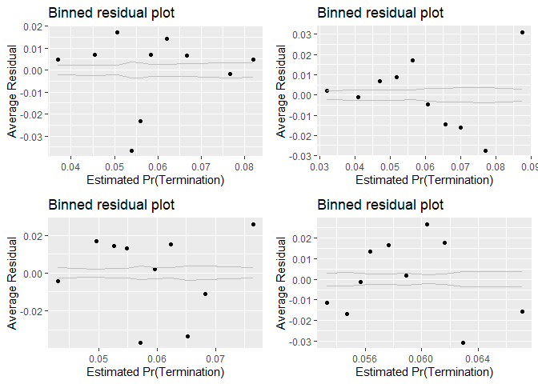<!-- -->

```
## [[1]]
##        model deviance null.deviance difference
## 1 model1_old 111120.5      111909.6  789.06068
## 2 model1_new 110689.4      111909.6 1220.21846
## 3 model2_old 111508.4      111909.6  401.22793
## 4 model2_new 111832.2      111909.6   77.39502
```

```r
summary_residual_compare(n_CBre10C3,n_CBre10C4,n_CBre10C5,n_CBre10C6,bins=10)
```

<!-- --><!-- -->

```
## Warning in residuals_binned(model1_old, bins = bins): Always uses Xlb
## Estimated Pr(Termination), should update.
```

```
## Warning in residuals_binned(model1_new, bins = bins): Always uses Xlb
## Estimated Pr(Termination), should update.
```

```
## Warning in residuals_binned(model2_old, bins = bins): Always uses Xlb
## Estimated Pr(Termination), should update.
```

```
## Warning in residuals_binned(model2_new, bins = bins): Always uses Xlb
## Estimated Pr(Termination), should update.
```

```
## Warning in if (class(model1_new) %in% c("glmerMod", "lme4", "lmerMod") & :
## the condition has length > 1 and only the first element will be used
```

```
## Warning in if ((!class(model1_new) %in% c("glmerMod", "lme4", "lmerMod")
## & : the condition has length > 1 and only the first element will be used
```

<!-- -->

```
## [[1]]
##        model deviance null.deviance difference
## 1 model1_old 398613.6        465759   67145.40
## 2 model1_new 378057.2        465759   87701.81
## 3 model2_old 392978.8        465759   72780.17
## 4 model2_new 388982.1        465759   76776.89
```

VIF is becoming a problem, prompting removal of detailed industry oligations, which is captured  in part by detailed industry ratio and the more on point measure of DoD experience, office volume. Unfortunately, this was not sufficient to lower VIFs below two, so defense ratio 3 was also removed.

Continuing with no detailed industry defense obligtions or subsector HHI for the time being.


#### Model 10D: Cumulative Model
.

```r
#Likelihood Plot for unlogged ceiling


#Model
b_CBre10D <- glm (data=serv_smp,
                 b_CBre ~  cln_US6sal + 
                   cln_PSCrate+ cp_OffPerf7+cp_OffPSC7+
                 cn_PairHist7+cln_PairCA +
                   cln_Base + clr_Ceil2Base + cln_Days +
                   Comp+
                   Veh+
                   Pricing+
                   Crisis+
                   cln_Def6HHI+clr_Def6toUS+cln_Def3HHI+
                   clr_Def3toUS, family=binomial(link="logit"))
glmer_examine(b_CBre10D)
```

```
##                   GVIF Df GVIF^(1/(2*Df))
## cln_US6sal    1.660419  1        1.288573
## cln_PSCrate   1.305489  1        1.142580
## cp_OffPerf7   1.417699  1        1.190672
## cp_OffPSC7    1.905773  1        1.380497
## cn_PairHist7  1.294196  1        1.137627
## cln_PairCA    2.147415  1        1.465406
## cln_Base      1.478645  1        1.215995
## clr_Ceil2Base 1.083566  1        1.040945
## cln_Days      1.422415  1        1.192650
## Comp          1.264278  3        1.039857
## Veh           1.877887  4        1.081954
## Pricing       1.223021  6        1.016919
## Crisis        1.352552  3        1.051620
## cln_Def6HHI   2.101813  1        1.449763
## clr_Def6toUS  1.789797  1        1.337833
## cln_Def3HHI   1.948728  1        1.395968
## clr_Def3toUS  2.233514  1        1.494494
```

```r
n_CBre10D <- glm(data=serv_breach,
                        ln_CBre ~  cln_US6sal + 
                   cln_PSCrate+ cp_OffPerf7+cp_OffPSC7+
                 cn_PairHist7+cln_PairCA+
                 cln_Base + clr_Ceil2Base + cln_Days +
                 Comp+
                   Veh+
                   Pricing+
                   Crisis+
                 cln_Def6HHI+clr_Def6toUS+cln_Def3HHI+
                   clr_Def3toUS)
glmer_examine(n_CBre10D)
```

```
##                   GVIF Df GVIF^(1/(2*Df))
## cln_US6sal    1.676226  1        1.294691
## cln_PSCrate   1.363965  1        1.167889
## cp_OffPerf7   2.263988  1        1.504656
## cp_OffPSC7    3.261542  1        1.805974
## cn_PairHist7  1.360511  1        1.166409
## cln_PairCA    2.626355  1        1.620603
## cln_Base      1.932319  1        1.390079
## clr_Ceil2Base 1.100684  1        1.049135
## cln_Days      1.625346  1        1.274890
## Comp          1.303331  3        1.045143
## Veh           2.180625  4        1.102358
## Pricing       1.259235  6        1.019394
## Crisis        1.246362  3        1.037387
## cln_Def6HHI   2.957299  1        1.719680
## clr_Def6toUS  1.513073  1        1.230070
## cln_Def3HHI   2.166434  1        1.471881
## clr_Def3toUS  1.963963  1        1.401414
```

```r
#Model
b_CBre10D2 <- glm (data=serv_smp,
                 b_CBre ~  cln_US6sal + 
                   cln_PSCrate+ cp_OffPerf7+cp_OffPSC7+
                 cn_PairHist7+cln_PairCA +
                   cln_Base + clr_Ceil2Base + cln_Days +
                   Comp+
                   Veh+
                   Pricing+
                   Crisis+
                   cln_Def6HHI+clr_Def6toUS+#cln_Def3HHI+
                   clr_Def3toUS, family=binomial(link="logit"))
glmer_examine(b_CBre10D2)
```

```
##                   GVIF Df GVIF^(1/(2*Df))
## cln_US6sal    1.578024  1        1.256194
## cln_PSCrate   1.311914  1        1.145388
## cp_OffPerf7   1.412982  1        1.188689
## cp_OffPSC7    1.894714  1        1.376486
## cn_PairHist7  1.289660  1        1.135632
## cln_PairCA    2.134247  1        1.460906
## cln_Base      1.470872  1        1.212795
## clr_Ceil2Base 1.080698  1        1.039566
## cln_Days      1.414020  1        1.189126
## Comp          1.258451  3        1.039057
## Veh           1.846387  4        1.079668
## Pricing       1.216270  6        1.016450
## Crisis        1.351278  3        1.051455
## cln_Def6HHI   1.405464  1        1.185523
## clr_Def6toUS  1.793407  1        1.339181
## clr_Def3toUS  2.141035  1        1.463228
```

```r
n_CBre10D2 <- glm(data=serv_breach,
                        ln_CBre ~  cln_US6sal + 
                   cln_PSCrate+ cp_OffPerf7+cp_OffPSC7+
                 cn_PairHist7+cln_PairCA+
                 cln_Base + clr_Ceil2Base + cln_Days +
                 Comp+
                   Veh+
                   Pricing+
                   Crisis+
                 cln_Def6HHI+clr_Def6toUS+#cln_Def3HHI+
                   clr_Def3toUS)
glmer_examine(n_CBre10D2)
```

```
##                   GVIF Df GVIF^(1/(2*Df))
## cln_US6sal    1.585500  1        1.259166
## cln_PSCrate   1.347439  1        1.160793
## cp_OffPerf7   2.250272  1        1.500091
## cp_OffPSC7    3.260978  1        1.805818
## cn_PairHist7  1.360343  1        1.166338
## cln_PairCA    2.621294  1        1.619041
## cln_Base      1.932275  1        1.390063
## clr_Ceil2Base 1.092358  1        1.045160
## cln_Days      1.623456  1        1.274149
## Comp          1.302185  3        1.044990
## Veh           2.171979  4        1.101811
## Pricing       1.254453  6        1.019071
## Crisis        1.242983  3        1.036918
## cln_Def6HHI   1.850776  1        1.360432
## clr_Def6toUS  1.504341  1        1.226516
## clr_Def3toUS  1.937574  1        1.391968
```

```r
#Plot residuals versus fitted
stargazer::stargazer(b_CBre09E,b_CBre10C6,b_CBre10D,b_CBre10D2,
                       type="text",
                       digits=2)
```

```
## 
## =======================================================================
##                                         Dependent variable:            
##                             -------------------------------------------
##                                               b_CBre                   
##                                (1)        (2)        (3)        (4)    
## -----------------------------------------------------------------------
## cln_US6sal                   -0.19***              -0.07***     0.01   
##                               (0.03)                (0.02)     (0.02)  
##                                                                        
## cln_PSCrate                  0.05***                0.05**    0.07***  
##                               (0.02)                (0.02)     (0.02)  
##                                                                        
## cp_OffPerf7                  -0.11***              -0.13***   -0.13*** 
##                               (0.02)                (0.02)     (0.02)  
##                                                                        
## cp_OffPSC7                   1.02***               1.07***    1.07***  
##                               (0.02)                (0.02)     (0.02)  
##                                                                        
## cn_PairHist7                 -0.08***              -0.07***   -0.07*** 
##                               (0.02)                (0.02)     (0.02)  
##                                                                        
## cln_PairCA                    -0.04                 -0.01      -0.04   
##                               (0.02)                (0.03)     (0.03)  
##                                                                        
## cln_Base                     0.99***               1.03***    1.03***  
##                               (0.02)                (0.02)     (0.02)  
##                                                                        
## clr_Ceil2Base                 -0.01                  0.02      -0.01   
##                               (0.02)                (0.02)     (0.02)  
##                                                                        
## cln_Days                     0.09***               0.09***    0.09***  
##                               (0.02)                (0.02)     (0.02)  
##                                                                        
## Comp1 offer                  -0.11***              -0.12***   -0.13*** 
##                               (0.03)                (0.03)     (0.03)  
##                                                                        
## Comp2-4 offers               0.26***               0.25***    0.25***  
##                               (0.02)                (0.02)     (0.02)  
##                                                                        
## Comp5+ offers                0.35***               0.38***    0.37***  
##                               (0.03)                (0.03)     (0.03)  
##                                                                        
## VehS-IDC                     -0.27***              -0.25***   -0.23*** 
##                               (0.02)                (0.02)     (0.02)  
##                                                                        
## VehM-IDC                     -0.24***              -0.18***   -0.20*** 
##                               (0.03)                (0.03)     (0.03)  
##                                                                        
## VehFSS/GWAC                  -0.47***              -0.49***   -0.46*** 
##                               (0.05)                (0.05)     (0.05)  
##                                                                        
## VehBPA/BOA                   -0.41***              -0.44***   -0.42*** 
##                               (0.06)                (0.06)     (0.06)  
##                                                                        
## PricingOther FP              -0.78***              -0.65***   -0.73*** 
##                               (0.13)                (0.13)     (0.13)  
##                                                                        
## PricingT&M/LH/FPLOE          -0.59***              -0.59***   -0.56*** 
##                               (0.07)                (0.07)     (0.07)  
##                                                                        
## PricingIncentive              -0.10                 -0.03      -0.001  
##                               (0.10)                (0.10)     (0.10)  
##                                                                        
## PricingOther CB              -1.23***              -1.19***   -1.15*** 
##                               (0.05)                (0.05)     (0.05)  
##                                                                        
## PricingUCA                   -0.20**               -0.16**    -0.16**  
##                               (0.08)                (0.08)     (0.08)  
##                                                                        
## PricingCombination or Other  -0.28***              -0.25***   -0.23*** 
##                               (0.08)                (0.08)     (0.08)  
##                                                                        
## CrisisARRA                   0.76***               0.87***    0.82***  
##                               (0.07)                (0.07)     (0.07)  
##                                                                        
## CrisisDis                    0.70***               0.67***    0.67***  
##                               (0.16)                (0.16)     (0.16)  
##                                                                        
## CrisisOCO                    -0.36***              -0.36***   -0.37*** 
##                               (0.05)                (0.05)     (0.05)  
##                                                                        
## cln_Def6HHI                  0.12***    0.07***    0.22***     -0.03   
##                               (0.02)     (0.02)     (0.02)     (0.02)  
##                                                                        
## clr_Def6toUS                 -0.53***   -0.06***   -0.15***   -0.25*** 
##                               (0.03)     (0.02)     (0.03)     (0.03)  
##                                                                        
## cln_Def6Obl                  0.43***                                   
##                               (0.03)                                   
##                                                                        
## cln_Def3HHI                                        -0.43***            
##                                                     (0.02)             
##                                                                        
## clr_Def3toUS                            0.14***    -0.18***   -0.09*** 
##                                          (0.02)     (0.03)     (0.03)  
##                                                                        
## Constant                     -2.88***   -2.77***   -2.90***   -2.90*** 
##                               (0.02)     (0.01)     (0.02)     (0.02)  
##                                                                        
## -----------------------------------------------------------------------
## Observations                 250,000    250,000    250,000    250,000  
## Log Likelihood              -51,731.07 -55,916.10 -51,675.37 -51,829.64
## Akaike Inf. Crit.           103,520.10 111,840.20 103,410.70 103,717.30
## =======================================================================
## Note:                                       *p<0.1; **p<0.05; ***p<0.01
```

```r
stargazer::stargazer(n_CBre09E,n_CBre10C6,n_CBre10D,n_CBre10D2,
                       type="text",
                       digits=2)
```

```
## 
## ===========================================================================
##                                           Dependent variable:              
##                             -----------------------------------------------
##                                                 ln_CBre                    
##                                 (1)         (2)         (3)         (4)    
## ---------------------------------------------------------------------------
## cln_US6sal                    0.16***                 0.09***     0.08***  
##                               (0.02)                  (0.02)      (0.02)   
##                                                                            
## cln_PSCrate                   0.22***                 0.21***     0.20***  
##                               (0.02)                  (0.02)      (0.02)   
##                                                                            
## cp_OffPerf7                  -0.32***                -0.31***    -0.31***  
##                               (0.02)                  (0.02)      (0.02)   
##                                                                            
## cp_OffPSC7                   -0.47***                -0.51***    -0.51***  
##                               (0.02)                  (0.02)      (0.02)   
##                                                                            
## cn_PairHist7                  0.11***                 0.09***     0.09***  
##                               (0.02)                  (0.02)      (0.02)   
##                                                                            
## cln_PairCA                   -0.15***                -0.08***    -0.08***  
##                               (0.03)                  (0.03)      (0.03)   
##                                                                            
## cln_Base                      2.81***                 2.84***     2.84***  
##                               (0.02)                  (0.02)      (0.02)   
##                                                                            
## clr_Ceil2Base                 0.34***                 0.34***     0.34***  
##                               (0.02)                  (0.02)      (0.02)   
##                                                                            
## cln_Days                      0.17***                 0.19***     0.19***  
##                               (0.02)                  (0.02)      (0.02)   
##                                                                            
## Comp1 offer                    -0.01                   -0.05       -0.04   
##                               (0.03)                  (0.03)      (0.03)   
##                                                                            
## Comp2-4 offers               -0.26***                -0.26***    -0.26***  
##                               (0.02)                  (0.02)      (0.02)   
##                                                                            
## Comp5+ offers                -0.18***                -0.18***    -0.18***  
##                               (0.02)                  (0.02)      (0.02)   
##                                                                            
## VehS-IDC                      0.08***                 0.04**      0.04**   
##                               (0.02)                  (0.02)      (0.02)   
##                                                                            
## VehM-IDC                       0.04                    0.01        0.02    
##                               (0.03)                  (0.03)      (0.03)   
##                                                                            
## VehFSS/GWAC                   0.31***                 0.23***     0.23***  
##                               (0.05)                  (0.05)      (0.05)   
##                                                                            
## VehBPA/BOA                     0.02                    -0.02       -0.01   
##                               (0.05)                  (0.05)      (0.05)   
##                                                                            
## PricingOther FP              -0.48***                -0.43***    -0.42***  
##                               (0.14)                  (0.13)      (0.13)   
##                                                                            
## PricingIncentive              0.95***                 0.84***     0.84***  
##                               (0.09)                  (0.09)      (0.09)   
##                                                                            
## PricingCombination or Other   0.71***                 0.63***     0.63***  
##                               (0.07)                  (0.07)      (0.07)   
##                                                                            
## PricingOther CB               1.33***                 1.23***     1.23***  
##                               (0.04)                  (0.04)      (0.04)   
##                                                                            
## PricingT&M/LH/FPLOE           1.23***                 1.14***     1.14***  
##                               (0.06)                  (0.06)      (0.06)   
##                                                                            
## PricingUCA                    0.61***                 0.59***     0.59***  
##                               (0.06)                  (0.06)      (0.06)   
##                                                                            
## CrisisARRA                    -0.10*                   -0.04       -0.03   
##                               (0.06)                  (0.06)      (0.06)   
##                                                                            
## CrisisDis                     0.43***                 0.46***     0.46***  
##                               (0.13)                  (0.13)      (0.13)   
##                                                                            
## CrisisOCO                     0.43***                 0.39***     0.39***  
##                               (0.04)                  (0.04)      (0.04)   
##                                                                            
## cln_Def6HHI                   0.07***    -2.00***      -0.03       -0.01   
##                               (0.02)      (0.02)      (0.02)      (0.02)   
##                                                                            
## clr_Def6toUS                  0.28***     0.41***     0.14***     0.14***  
##                               (0.02)      (0.03)      (0.02)      (0.02)   
##                                                                            
## cln_Def6Obl                   0.15***                                      
##                               (0.02)                                       
##                                                                            
## cln_Def3HHI                                            0.03                
##                                                       (0.02)               
##                                                                            
## clr_Def3toUS                              0.71***     0.42***     0.41***  
##                                           (0.03)      (0.02)      (0.02)   
##                                                                            
## Constant                      8.77***     9.30***     8.80***     8.80***  
##                               (0.02)      (0.01)      (0.02)      (0.02)   
##                                                                            
## ---------------------------------------------------------------------------
## Observations                  61,184      61,184      61,184      61,184   
## Log Likelihood              -122,981.60 -143,401.80 -122,826.00 -122,826.60
## Akaike Inf. Crit.           246,021.30  286,811.50  245,711.90  245,711.20 
## ===========================================================================
## Note:                                           *p<0.1; **p<0.05; ***p<0.01
```

```r
summary_residual_compare(b_CBre09E,b_CBre10D)
```

<!-- -->

```
## Warning in residuals_binned(model1_old, bins = bins): Always uses Xlb
## Estimated Pr(Termination), should update.
```

```
## Warning in residuals_binned(model1_new, bins = bins): Always uses Xlb
## Estimated Pr(Termination), should update.
```

```
## Warning in if (class(model1_new) %in% c("glmerMod", "lme4", "lmerMod")) {:
## the condition has length > 1 and only the first element will be used
```

```
## Warning in if (!class(model1_new) %in% c("glmerMod", "lme4", "lmerMod") & :
## the condition has length > 1 and only the first element will be used
```

<!-- -->

```
## [[1]]
##        model deviance null.deviance difference
## 1 model1_old 103462.1      111909.6   8447.459
## 2 model1_new 103350.7      111909.6   8558.855
```

```r
summary_residual_compare(b_CBre09E,b_CBre10D)
```

<!-- -->

```
## Warning in residuals_binned(model1_old, bins = bins): Always uses Xlb
## Estimated Pr(Termination), should update.
```

```
## Warning in residuals_binned(model1_new, bins = bins): Always uses Xlb
## Estimated Pr(Termination), should update.
```

```
## Warning in if (class(model1_new) %in% c("glmerMod", "lme4", "lmerMod")) {:
## the condition has length > 1 and only the first element will be used
```

```
## Warning in if (!class(model1_new) %in% c("glmerMod", "lme4", "lmerMod") & :
## the condition has length > 1 and only the first element will be used
```

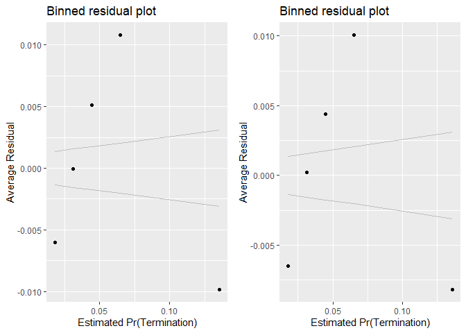<!-- -->

```
## [[1]]
##        model deviance null.deviance difference
## 1 model1_old 103462.1      111909.6   8447.459
## 2 model1_new 103350.7      111909.6   8558.855
```
For the breach size model, not adding HHI6 helps keep VIF below the 1.8 mark, with the exception of officePSC and also has a lower  AIC than the model that includid obligations const but not ratio. 


For likelihood, both ratio variables are contrary to expectation, but signifiant. Detailed industry HHI is not significant.
For size, Detailed  industry HHI has lost significance, bubt  both ratio variables retain it. 

## Office 
### Office and Vendor-Office Pair

#### Model 11A: Vendor Market Share
Expectation: Contracts of offices partnered with vendors who have larger market shares would be more likely to experience cost ceiling (++) breaches and exercised options, but less likely to have terminations.


```r
summary_continuous_plot(serv_smp1m,metric="cbre","cp_PairObl7")
```

```
## Warning in `[<-.factor`(`*tmp*`, ri, value = c(0, 0, 0, 0, 0, 0, 0, 0, 0, :
## invalid factor level, NA generated
```

<!-- -->

```r
#Scatter Plot
ggplot(serv_smp, aes(x=cp_PairObl7, y=ln_CBre)) + geom_point(alpha = 0.1) + ggtitle('Ceiling Breach Growth') + theme(plot.title = element_text(hjust = 0.5))
```

```
## Warning: Removed 235285 rows containing missing values (geom_point).
```

<!-- -->

```r
#Model
b_CBre11A <- glm (data=serv_smp,
                 b_CBre ~ cp_PairObl7, family=binomial(link="logit"))


n_CBre11A <- glm(data=serv_breach,
                        ln_CBre ~ cp_PairObl7)


#Plot residuals versus fitted
stargazer::stargazer(b_CBre11A,
                       n_CBre11A,
                       type="text",
                       digits=2)
```

```
## 
## ==============================================
##                       Dependent variable:     
##                   ----------------------------
##                       b_CBre        ln_CBre   
##                      logistic       normal    
##                        (1)            (2)     
## ----------------------------------------------
## cp_PairObl7          -0.18***       -0.08**   
##                       (0.02)        (0.03)    
##                                               
## Constant             -2.78***       9.30***   
##                       (0.01)        (0.01)    
##                                               
## ----------------------------------------------
## Observations         250,000        61,184    
## Log Likelihood      -55,908.99    -148,909.10 
## Akaike Inf. Crit.   111,822.00    297,822.30  
## ==============================================
## Note:              *p<0.1; **p<0.05; ***p<0.01
```

Contrary to expetations for both likelihood and size.

#### Model 11B: Cumulative Model


```r
#Likelihood Plot for unlogged ceiling


#Model
b_CBre11B <- glm (data=serv_smp,
                 b_CBre ~  cln_US6sal + 
                   cln_PSCrate+ cp_OffPerf7+cp_OffPSC7+
                 cn_PairHist7+cln_PairCA +
                   cln_Base + clr_Ceil2Base + cln_Days +
                   Comp+
                   Veh+
                   Pricing+
                   Crisis+
                   cln_Def6HHI+clr_Def6toUS+
                   #cln_Def3HHI+
                     clr_Def3toUS+
                   cp_PairObl7, family=binomial(link="logit"))
glmer_examine(b_CBre11B)
```

```
##                   GVIF Df GVIF^(1/(2*Df))
## cln_US6sal    1.591370  1        1.261495
## cln_PSCrate   1.328298  1        1.152518
## cp_OffPerf7   1.478587  1        1.215972
## cp_OffPSC7    1.989207  1        1.410392
## cn_PairHist7  1.289370  1        1.135504
## cln_PairCA    2.261633  1        1.503873
## cln_Base      1.498850  1        1.224275
## clr_Ceil2Base 1.086874  1        1.042532
## cln_Days      1.416768  1        1.190281
## Comp          1.271895  3        1.040899
## Veh           1.849042  4        1.079862
## Pricing       1.224783  6        1.017041
## Crisis        1.348892  3        1.051146
## cln_Def6HHI   1.416471  1        1.190156
## clr_Def6toUS  1.860015  1        1.363824
## clr_Def3toUS  2.207164  1        1.485653
## cp_PairObl7   1.280658  1        1.131662
```

```r
n_CBre11B <- glm(data=serv_breach,
                        ln_CBre ~  cln_US6sal + 
                   cln_PSCrate+ cp_OffPerf7+cp_OffPSC7+
                 cn_PairHist7+cln_PairCA+
                 cln_Base + clr_Ceil2Base + cln_Days +
                 Comp+
                   Veh+
                   Pricing+
                   Crisis+
                 cln_Def6HHI+clr_Def6toUS+
                 #cln_Def3HHI+
                   clr_Def3toUS+
                 cp_PairObl7)

glmer_examine(n_CBre11B)
```

```
##                   GVIF Df GVIF^(1/(2*Df))
## cln_US6sal    1.590148  1        1.261011
## cln_PSCrate   1.350336  1        1.162040
## cp_OffPerf7   2.283718  1        1.511198
## cp_OffPSC7    3.306430  1        1.818359
## cn_PairHist7  1.363203  1        1.167563
## cln_PairCA    2.861961  1        1.691733
## cln_Base      1.946935  1        1.395326
## clr_Ceil2Base 1.094129  1        1.046006
## cln_Days      1.623483  1        1.274160
## Comp          1.311290  3        1.046204
## Veh           2.214328  4        1.104473
## Pricing       1.307216  6        1.022576
## Crisis        1.278719  3        1.041828
## cln_Def6HHI   1.850814  1        1.360446
## clr_Def6toUS  1.508537  1        1.228225
## clr_Def3toUS  1.938169  1        1.392181
## cp_PairObl7   1.343137  1        1.158938
```

```r
#Plot residuals versus fitted
stargazer::stargazer(b_CBre10D2,b_CBre11A,b_CBre11B,
                     
                     n_CBre10D2,n_CBre11A,n_CBre11B,
                       type="text",
                       digits=2)
```

```
## 
## ================================================================================================
##                                                     Dependent variable:                         
##                             --------------------------------------------------------------------
##                                          b_CBre                            ln_CBre              
##                                         logistic                           normal               
##                                (1)        (2)        (3)         (4)         (5)         (6)    
## ------------------------------------------------------------------------------------------------
## cln_US6sal                     0.01                 -0.02      0.08***                 0.10***  
##                               (0.02)                (0.02)     (0.02)                  (0.02)   
##                                                                                                 
## cln_PSCrate                  0.07***               0.09***     0.20***                 0.20***  
##                               (0.02)                (0.02)     (0.02)                  (0.02)   
##                                                                                                 
## cp_OffPerf7                  -0.13***              -0.19***   -0.31***                -0.29***  
##                               (0.02)                (0.02)     (0.02)                  (0.02)   
##                                                                                                 
## cp_OffPSC7                   1.07***               1.14***    -0.51***                -0.52***  
##                               (0.02)                (0.02)     (0.02)                  (0.02)   
##                                                                                                 
## cn_PairHist7                 -0.07***              -0.06***    0.09***                 0.08***  
##                               (0.02)                (0.02)     (0.02)                  (0.02)   
##                                                                                                 
## cln_PairCA                    -0.04                0.09***    -0.08***                -0.15***  
##                               (0.03)                (0.03)     (0.03)                  (0.03)   
##                                                                                                 
## cln_Base                     1.03***               1.07***     2.84***                 2.82***  
##                               (0.02)                (0.02)     (0.02)                  (0.02)   
##                                                                                                 
## clr_Ceil2Base                 -0.01                 -0.03      0.34***                 0.34***  
##                               (0.02)                (0.02)     (0.02)                  (0.02)   
##                                                                                                 
## cln_Days                     0.09***               0.08***     0.19***                 0.19***  
##                               (0.02)                (0.02)     (0.02)                  (0.02)   
##                                                                                                 
## Comp1 offer                  -0.13***              -0.09***     -0.04                  -0.05*   
##                               (0.03)                (0.03)     (0.03)                  (0.03)   
##                                                                                                 
## Comp2-4 offers               0.25***               0.24***    -0.26***                -0.25***  
##                               (0.02)                (0.02)     (0.02)                  (0.02)   
##                                                                                                 
## Comp5+ offers                0.37***               0.34***    -0.18***                -0.17***  
##                               (0.03)                (0.03)     (0.02)                  (0.02)   
##                                                                                                 
## VehS-IDC                     -0.23***              -0.25***    0.04**                  0.07***  
##                               (0.02)                (0.02)     (0.02)                  (0.02)   
##                                                                                                 
## VehM-IDC                     -0.20***              -0.24***     0.02                    0.04*   
##                               (0.03)                (0.03)     (0.03)                  (0.03)   
##                                                                                                 
## VehFSS/GWAC                  -0.46***              -0.47***    0.23***                 0.24***  
##                               (0.05)                (0.05)     (0.05)                  (0.05)   
##                                                                                                 
## VehBPA/BOA                   -0.42***              -0.37***     -0.01                  0.0000   
##                               (0.06)                (0.06)     (0.05)                  (0.05)   
##                                                                                                 
## PricingOther FP              -0.73***              -0.71***   -0.42***                -0.49***  
##                               (0.13)                (0.13)     (0.13)                  (0.13)   
##                                                                                                 
## PricingT&M/LH/FPLOE          -0.56***              -0.55***    1.14***                 1.12***  
##                               (0.07)                (0.07)     (0.06)                  (0.06)   
##                                                                                                 
## PricingIncentive              -0.001                -0.03      0.84***                 0.84***  
##                               (0.10)                (0.10)     (0.09)                  (0.09)   
##                                                                                                 
## PricingOther CB              -1.15***              -1.09***    1.23***                 1.15***  
##                               (0.05)                (0.05)     (0.04)                  (0.04)   
##                                                                                                 
## PricingUCA                   -0.16**                -0.10      0.59***                 0.58***  
##                               (0.08)                (0.08)     (0.06)                  (0.06)   
##                                                                                                 
## PricingCombination or Other  -0.23***              -0.21***    0.63***                 0.62***  
##                               (0.08)                (0.08)     (0.07)                  (0.07)   
##                                                                                                 
## CrisisARRA                   0.82***               0.81***      -0.03                   -0.03   
##                               (0.07)                (0.07)     (0.06)                  (0.06)   
##                                                                                                 
## CrisisDis                    0.67***               0.68***     0.46***                 0.46***  
##                               (0.16)                (0.16)     (0.13)                  (0.13)   
##                                                                                                 
## CrisisOCO                    -0.37***              -0.17***    0.39***                 0.33***  
##                               (0.05)                (0.05)     (0.04)                  (0.04)   
##                                                                                                 
## cln_Def6HHI                   -0.03                 -0.03       -0.01                   -0.01   
##                               (0.02)                (0.02)     (0.02)                  (0.02)   
##                                                                                                 
## clr_Def6toUS                 -0.25***              -0.28***    0.14***                 0.15***  
##                               (0.03)                (0.03)     (0.02)                  (0.02)   
##                                                                                                 
## clr_Def3toUS                 -0.09***              -0.09***    0.41***                 0.41***  
##                               (0.03)                (0.03)     (0.02)                  (0.02)   
##                                                                                                 
## cp_PairObl7                             -0.18***   -0.47***                -0.08**     0.21***  
##                                          (0.02)     (0.03)                 (0.03)      (0.02)   
##                                                                                                 
## Constant                     -2.90***   -2.78***   -2.90***    8.80***     9.30***     8.80***  
##                               (0.02)     (0.01)     (0.02)     (0.02)      (0.01)      (0.02)   
##                                                                                                 
## ------------------------------------------------------------------------------------------------
## Observations                 250,000    250,000    250,000     61,184      61,184      61,184   
## Log Likelihood              -51,829.64 -55,908.99 -51,657.78 -122,826.60 -148,909.10 -122,787.80
## Akaike Inf. Crit.           103,717.30 111,822.00 103,375.60 245,711.20  297,822.30  245,635.50 
## ================================================================================================
## Note:                                                                *p<0.1; **p<0.05; ***p<0.01
```

```r
summary_residual_compare(b_CBre10D2,b_CBre11B)
```

<!-- -->

```
## Warning in residuals_binned(model1_old, bins = bins): Always uses Xlb
## Estimated Pr(Termination), should update.
```

```
## Warning in residuals_binned(model1_new, bins = bins): Always uses Xlb
## Estimated Pr(Termination), should update.
```

```
## Warning in if (class(model1_new) %in% c("glmerMod", "lme4", "lmerMod")) {:
## the condition has length > 1 and only the first element will be used
```

```
## Warning in if (!class(model1_new) %in% c("glmerMod", "lme4", "lmerMod") & :
## the condition has length > 1 and only the first element will be used
```

<!-- -->

```
## [[1]]
##        model deviance null.deviance difference
## 1 model1_old 103659.3      111909.6   8250.310
## 2 model1_new 103315.6      111909.6   8594.032
```

```r
summary_residual_compare(n_CBre10D2,n_CBre11B)
```

<!-- --><!-- -->

```
## Warning in residuals_binned(model1_old, bins = bins): Always uses Xlb
## Estimated Pr(Termination), should update.
```

```
## Warning in residuals_binned(model1_new, bins = bins): Always uses Xlb
## Estimated Pr(Termination), should update.
```

```
## Warning in if (class(model1_new) %in% c("glmerMod", "lme4", "lmerMod")) {:
## the condition has length > 1 and only the first element will be used
```

```
## Warning in if (!class(model1_new) %in% c("glmerMod", "lme4", "lmerMod") & :
## the condition has length > 1 and only the first element will be used
```

<!-- -->

```
## [[1]]
##        model deviance null.deviance difference
## 1 model1_old 198535.4        465759   267223.5
## 2 model1_new 198283.5        465759   267475.5
```
Expectations are now upheld with market estimating larger ceiling breaches, although for likelihood, the magnitude increased in the opposite of the  expected direction.
### Other Office Characteristics
#### 12A: Past Office Volume (dollars)

Expectation: Contracting offices previously had more contract volume in dollars would have more experience managing cost and preventing cost-ceiling breaches, therefore larger past office volume would lower the likelihood of cost-ceiling breaches but no substantial relationships with likelihood of terminations or exercised options.
(Option, Breach, Termination)
Past Office Volume $s	cln_OffObl7		+	-	+
From looking at data, terminations, easier for big, less dependent. - less dependenct


```r
summary_continuous_plot(serv_smp1m,metric="cbre","cln_OffObl7")
```

```
## Warning in `[<-.factor`(`*tmp*`, ri, value = c(0, 0, 0, 0, 0, 0, 0, 0, 0, :
## invalid factor level, NA generated
```

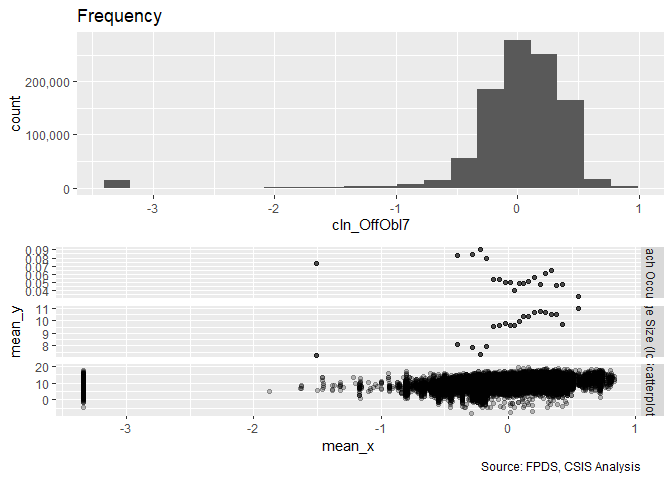<!-- -->

```r
#Scatter Plot
ggplot(serv_smp, aes(x=cln_OffObl7, y=ln_CBre)) + geom_point(alpha = 0.1) + ggtitle('Ceiling Breach Growth') + theme(plot.title = element_text(hjust = 0.5))
```

```
## Warning: Removed 235285 rows containing missing values (geom_point).
```

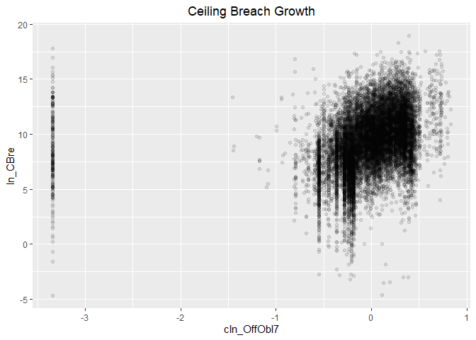<!-- -->

```r
#Model
b_CBre12A <- glm (data=serv_smp,
                 b_CBre ~ cln_OffObl7, family=binomial(link="logit"))


n_CBre12A <- glm(data=serv_breach,
                        ln_CBre ~ cln_OffObl7)


#Plot residuals versus fitted
stargazer::stargazer(b_CBre12A,
                       
                       n_CBre12A,
                       type="text",
                       digits=2)
```

```
## 
## ==============================================
##                       Dependent variable:     
##                   ----------------------------
##                       b_CBre        ln_CBre   
##                      logistic       normal    
##                        (1)            (2)     
## ----------------------------------------------
## cln_OffObl7          -0.18***       1.41***   
##                       (0.01)        (0.02)    
##                                               
## Constant             -2.78***       9.37***   
##                       (0.01)        (0.01)    
##                                               
## ----------------------------------------------
## Observations         250,000        61,184    
## Log Likelihood      -55,887.53    -146,747.80 
## Akaike Inf. Crit.   111,779.10    293,499.70  
## ==============================================
## Note:              *p<0.1; **p<0.05; ***p<0.01
```
When considering past office volume alone, the relationship was as expected with cost-ceiling breaches likelihood but contrary to expectation for breach size.


#### 12B: Detailed Industry Focus

Expectation: If a office is focused on a smaller number of industries than it has a less complex set of responsibilities which would decrease the likelihood of having cost ceiling breaches and terminations, and increase the likelihood of having options exercised.


```r
summary_continuous_plot(serv_smp1m,metric="cbre","cln_OffFocus")
```

```
## Warning in `[<-.factor`(`*tmp*`, ri, value = c(0, 0, 0, 0, 0, 0, 0, 0, 0, :
## invalid factor level, NA generated
```

<!-- -->

```r
#Scatter Plot
ggplot(serv_smp, aes(x=cln_OffFocus, y=ln_CBre)) + geom_point(alpha = 0.1) + ggtitle('Ceiling Breach Growth') + theme(plot.title = element_text(hjust = 0.5))
```

```
## Warning: Removed 235285 rows containing missing values (geom_point).
```

<!-- -->

```r
#Model
b_CBre12B <- glm (data=serv_smp,
                 b_CBre ~ cln_OffFocus, family=binomial(link="logit"))

n_CBre12B <- glm(data=serv_breach,
                        ln_CBre ~ cln_OffFocus)


#Plot residuals versus fitted
stargazer::stargazer(b_CBre12B,
                       
                       n_CBre12B,
                       type="text",
                       digits=2)
```

```
## 
## ==============================================
##                       Dependent variable:     
##                   ----------------------------
##                       b_CBre        ln_CBre   
##                      logistic       normal    
##                        (1)            (2)     
## ----------------------------------------------
## cln_OffFocus         0.47***       -1.68***   
##                       (0.02)        (0.02)    
##                                               
## Constant             -2.79***       9.49***   
##                       (0.01)        (0.01)    
##                                               
## ----------------------------------------------
## Observations         250,000        61,184    
## Log Likelihood      -55,554.31    -145,072.80 
## Akaike Inf. Crit.   111,112.60    290,149.60  
## ==============================================
## Note:              *p<0.1; **p<0.05; ***p<0.01
```

When using hhi calculated based on contracting office number of contarcts: results were contrary to expectations for likelihood but in line with expectations for size to expectations for size.

#### 12C: Cumulative Model


```r
#Likelihood Plot for unlogged ceiling


#Model
b_CBre12C <- glm (data=serv_smp,
                 b_CBre ~  cln_US6sal + 
                   cln_PSCrate+ cp_OffPerf7+cp_OffPSC7+
                 cn_PairHist7+cln_PairCA +
                   cln_Base + clr_Ceil2Base + cln_Days+
                   Comp+
                   Veh+
                   Pricing+
                   Crisis+
                   cln_Def6HHI+clr_Def6toUS+
                   #cln_Def3HHI+
                     clr_Def3toUS+
                   cp_PairObl7+
                   cln_OffObl7+cln_OffFocus , family=binomial(link="logit"))
glmer_examine(b_CBre12C)
```

```
##                   GVIF Df GVIF^(1/(2*Df))
## cln_US6sal    1.595796  1        1.263248
## cln_PSCrate   1.323886  1        1.150603
## cp_OffPerf7   1.517605  1        1.231911
## cp_OffPSC7    2.826326  1        1.681168
## cn_PairHist7  1.365224  1        1.168428
## cln_PairCA    2.318134  1        1.522542
## cln_Base      1.508430  1        1.228182
## clr_Ceil2Base 1.084779  1        1.041527
## cln_Days      1.427307  1        1.194700
## Comp          1.280896  3        1.042123
## Veh           1.874435  4        1.081705
## Pricing       1.233356  6        1.017632
## Crisis        1.350315  3        1.051330
## cln_Def6HHI   1.424460  1        1.193507
## clr_Def6toUS  1.861406  1        1.364333
## clr_Def3toUS  2.196978  1        1.482220
## cp_PairObl7   1.276819  1        1.129964
## cln_OffObl7   1.259020  1        1.122061
## cln_OffFocus  2.408488  1        1.551931
```

```r
n_CBre12C <- glm(data=serv_breach,
                        ln_CBre ~  cln_US6sal + 
                   cln_PSCrate+ cp_OffPerf7+cp_OffPSC7+
                 cn_PairHist7+cln_PairCA+
                 cln_Base + clr_Ceil2Base + cln_Days+
                 Comp+
                   Veh+
                   Pricing+
                   Crisis+
                 cln_Def6HHI+clr_Def6toUS+
                 #cln_Def3HHI+
                   clr_Def3toUS+
                 cp_PairObl7+
                   cln_OffObl7+cln_OffFocus)

glmer_examine(n_CBre12C)
```

```
##                   GVIF Df GVIF^(1/(2*Df))
## cln_US6sal    1.597657  1        1.263985
## cln_PSCrate   1.356202  1        1.164561
## cp_OffPerf7   2.326686  1        1.525348
## cp_OffPSC7    4.529343  1        2.128225
## cn_PairHist7  1.415766  1        1.189860
## cln_PairCA    2.963561  1        1.721500
## cln_Base      1.965689  1        1.402030
## clr_Ceil2Base 1.096017  1        1.046908
## cln_Days      1.646610  1        1.283203
## Comp          1.326308  3        1.048192
## Veh           2.239985  4        1.106065
## Pricing       1.335046  6        1.024373
## Crisis        1.288513  3        1.043153
## cln_Def6HHI   1.886822  1        1.373616
## clr_Def6toUS  1.514067  1        1.230474
## clr_Def3toUS  1.944073  1        1.394300
## cp_PairObl7   1.347132  1        1.160660
## cln_OffObl7   1.285009  1        1.133582
## cln_OffFocus  3.153815  1        1.775898
```

```r
#Model
b_CBre12C2<- glm (data=serv_smp,
                 b_CBre ~  cln_US6sal + 
                   cln_PSCrate+ cp_OffPerf7+#cp_OffPSC7+
                 cn_PairHist7+cln_PairCA +
                   cln_Base + clr_Ceil2Base + cln_Days+
                   Comp+
                   Veh+
                   Pricing+
                   Crisis+
                   cln_Def6HHI+clr_Def6toUS+
                   #cln_Def3HHI+
                     clr_Def3toUS+
                   cp_PairObl7+
                   cln_OffObl7+cln_OffFocus , family=binomial(link="logit"))
glmer_examine(b_CBre12C2)
```

```
##                   GVIF Df GVIF^(1/(2*Df))
## cln_US6sal    1.592524  1        1.261953
## cln_PSCrate   1.328813  1        1.152741
## cp_OffPerf7   1.299552  1        1.139979
## cn_PairHist7  1.359836  1        1.166120
## cln_PairCA    2.255409  1        1.501802
## cln_Base      1.476924  1        1.215288
## clr_Ceil2Base 1.070872  1        1.034829
## cln_Days      1.418446  1        1.190985
## Comp          1.249727  3        1.037853
## Veh           1.804675  4        1.076589
## Pricing       1.218594  6        1.016611
## Crisis        1.415861  3        1.059669
## cln_Def6HHI   1.303245  1        1.141598
## clr_Def6toUS  1.660015  1        1.288416
## clr_Def3toUS  1.924945  1        1.387424
## cp_PairObl7   1.301709  1        1.140925
## cln_OffObl7   1.272177  1        1.127908
## cln_OffFocus  1.556304  1        1.247519
```

```r
n_CBre12C2 <- glm(data=serv_breach,
                        ln_CBre ~  cln_US6sal + 
                   cln_PSCrate+ cp_OffPerf7+#cp_OffPSC7+
                 cn_PairHist7+cln_PairCA+
                 cln_Base + clr_Ceil2Base + cln_Days+
                 Comp+
                   Veh+
                   Pricing+
                   Crisis+
                 cln_Def6HHI+clr_Def6toUS+
                 #cln_Def3HHI+
                   clr_Def3toUS+
                 cp_PairObl7+
                   cln_OffObl7+cln_OffFocus)

glmer_examine(n_CBre12C2)
```

```
##                   GVIF Df GVIF^(1/(2*Df))
## cln_US6sal    1.594824  1        1.262864
## cln_PSCrate   1.346037  1        1.160188
## cp_OffPerf7   1.940694  1        1.393088
## cn_PairHist7  1.402491  1        1.184268
## cln_PairCA    2.893115  1        1.700916
## cln_Base      1.964874  1        1.401740
## clr_Ceil2Base 1.094871  1        1.046361
## cln_Days      1.631969  1        1.277486
## Comp          1.314364  3        1.046613
## Veh           2.206573  4        1.103989
## Pricing       1.323624  6        1.023640
## Crisis        1.271443  3        1.040837
## cln_Def6HHI   1.802403  1        1.342536
## clr_Def6toUS  1.514018  1        1.230454
## clr_Def3toUS  1.915809  1        1.384127
## cp_PairObl7   1.332968  1        1.154542
## cln_OffObl7   1.281270  1        1.131932
## cln_OffFocus  2.308092  1        1.519241
```

```r
#Model
b_CBre12C3<- glm (data=serv_smp,
                 b_CBre ~  cln_US6sal + 
                   cln_PSCrate+ cp_OffPerf7+cp_OffPSC7+
                 cn_PairHist7+cln_PairCA +
                   cln_Base + clr_Ceil2Base + cln_Days+
                   Comp+
                   Veh+
                   Pricing+
                   Crisis+
                   cln_Def6HHI+clr_Def6toUS+
                   #cln_Def3HHI+
                     clr_Def3toUS+
                   cp_PairObl7+
                   cln_OffObl7#+cln_OffFocus 
                 , family=binomial(link="logit"))
glmer_examine(b_CBre12C3)
```

```
##                   GVIF Df GVIF^(1/(2*Df))
## cln_US6sal    1.596276  1        1.263438
## cln_PSCrate   1.324862  1        1.151027
## cp_OffPerf7   1.523105  1        1.234141
## cp_OffPSC7    2.006887  1        1.416646
## cn_PairHist7  1.365776  1        1.168664
## cln_PairCA    2.215692  1        1.488520
## cln_Base      1.514510  1        1.230654
## clr_Ceil2Base 1.083899  1        1.041105
## cln_Days      1.426254  1        1.194259
## Comp          1.276276  3        1.041496
## Veh           1.865242  4        1.081040
## Pricing       1.227642  6        1.017238
## Crisis        1.341746  3        1.050215
## cln_Def6HHI   1.428943  1        1.195384
## clr_Def6toUS  1.856749  1        1.362626
## clr_Def3toUS  2.196333  1        1.482003
## cp_PairObl7   1.272371  1        1.127994
## cln_OffObl7   1.224227  1        1.106448
```

```r
n_CBre12C3 <- glm(data=serv_breach,
                        ln_CBre ~  cln_US6sal + 
                   cln_PSCrate+ cp_OffPerf7+cp_OffPSC7+
                 cn_PairHist7+cln_PairCA+
                 cln_Base + clr_Ceil2Base + cln_Days+
                 Comp+
                   Veh+
                   Pricing+
                   Crisis+
                 cln_Def6HHI+clr_Def6toUS+
                 #cln_Def3HHI+
                   clr_Def3toUS+
                 cp_PairObl7+
                   cln_OffObl7#+cln_OffFocus
                   )

glmer_examine(n_CBre12C3)
```

```
##                   GVIF Df GVIF^(1/(2*Df))
## cln_US6sal    1.590212  1        1.261036
## cln_PSCrate   1.354405  1        1.163789
## cp_OffPerf7   2.314114  1        1.521221
## cp_OffPSC7    3.314760  1        1.820648
## cn_PairHist7  1.413756  1        1.189015
## cln_PairCA    2.866869  1        1.693183
## cln_Base      1.958642  1        1.399515
## clr_Ceil2Base 1.094673  1        1.046266
## cln_Days      1.641337  1        1.281147
## Comp          1.321460  3        1.047552
## Veh           2.219407  4        1.104790
## Pricing       1.318893  6        1.023334
## Crisis        1.281820  3        1.042248
## cln_Def6HHI   1.886330  1        1.373437
## clr_Def6toUS  1.512217  1        1.229722
## clr_Def3toUS  1.943886  1        1.394233
## cp_PairObl7   1.347015  1        1.160610
## cln_OffObl7   1.240773  1        1.113900
```

```r
#Plot residuals versus fitted
stargazer::stargazer(b_CBre11B,b_CBre12A,b_CBre12B,b_CBre12C2,b_CBre12C3,
                       type="text",
                       digits=2)
```

```
## 
## ==================================================================================
##                                              Dependent variable:                  
##                             ------------------------------------------------------
##                                                     b_CBre                        
##                                (1)        (2)        (3)        (4)        (5)    
## ----------------------------------------------------------------------------------
## cln_US6sal                    -0.02                            -0.01       0.01   
##                               (0.02)                           (0.02)     (0.02)  
##                                                                                   
## cln_PSCrate                  0.09***                           0.03*     0.10***  
##                               (0.02)                           (0.02)     (0.02)  
##                                                                                   
## cp_OffPerf7                  -0.19***                         0.17***    -0.15*** 
##                               (0.02)                           (0.02)     (0.02)  
##                                                                                   
## cp_OffPSC7                   1.14***                                     1.11***  
##                               (0.02)                                      (0.02)  
##                                                                                   
## cn_PairHist7                 -0.06***                         -0.05**     0.005   
##                               (0.02)                           (0.02)     (0.02)  
##                                                                                   
## cln_PairCA                   0.09***                          0.27***    0.10***  
##                               (0.03)                           (0.03)     (0.03)  
##                                                                                   
## cln_Base                     1.07***                          1.03***    1.10***  
##                               (0.02)                           (0.02)     (0.02)  
##                                                                                   
## clr_Ceil2Base                 -0.03                            0.04**     -0.02   
##                               (0.02)                           (0.02)     (0.02)  
##                                                                                   
## cln_Days                     0.08***                            0.01     0.10***  
##                               (0.02)                           (0.02)     (0.02)  
##                                                                                   
## Comp1 offer                  -0.09***                         -0.09***   -0.11*** 
##                               (0.03)                           (0.03)     (0.03)  
##                                                                                   
## Comp2-4 offers               0.24***                          0.32***    0.22***  
##                               (0.02)                           (0.02)     (0.02)  
##                                                                                   
## Comp5+ offers                0.34***                          0.40***    0.34***  
##                               (0.03)                           (0.03)     (0.03)  
##                                                                                   
## VehS-IDC                     -0.25***                         -0.23***   -0.27*** 
##                               (0.02)                           (0.02)     (0.02)  
##                                                                                   
## VehM-IDC                     -0.24***                         -0.26***   -0.25*** 
##                               (0.03)                           (0.03)     (0.03)  
##                                                                                   
## VehFSS/GWAC                  -0.47***                         -0.51***   -0.49*** 
##                               (0.05)                           (0.05)     (0.05)  
##                                                                                   
## VehBPA/BOA                   -0.37***                         -0.37***   -0.43*** 
##                               (0.06)                           (0.06)     (0.06)  
##                                                                                   
## PricingOther FP              -0.71***                         -0.78***   -0.72*** 
##                               (0.13)                           (0.13)     (0.13)  
##                                                                                   
## PricingT&M/LH/FPLOE          -0.55***                         -0.64***   -0.55*** 
##                               (0.07)                           (0.07)     (0.07)  
##                                                                                   
## PricingIncentive              -0.03                             0.11       0.01   
##                               (0.10)                           (0.10)     (0.10)  
##                                                                                   
## PricingOther CB              -1.09***                         -1.11***   -1.06*** 
##                               (0.05)                           (0.05)     (0.05)  
##                                                                                   
## PricingUCA                    -0.10                            -0.07      -0.10   
##                               (0.08)                           (0.08)     (0.08)  
##                                                                                   
## PricingCombination or Other  -0.21***                         -0.25***   -0.20**  
##                               (0.08)                           (0.08)     (0.08)  
##                                                                                   
## CrisisARRA                   0.81***                          0.92***    0.82***  
##                               (0.07)                           (0.07)     (0.07)  
##                                                                                   
## CrisisDis                    0.68***                          0.66***    0.70***  
##                               (0.16)                           (0.16)     (0.16)  
##                                                                                   
## CrisisOCO                    -0.17***                         -0.57***   -0.19*** 
##                               (0.05)                           (0.05)     (0.05)  
##                                                                                   
## cln_Def6HHI                   -0.03                           0.11***    -0.05**  
##                               (0.02)                           (0.02)     (0.02)  
##                                                                                   
## clr_Def6toUS                 -0.28***                         -0.25***   -0.25*** 
##                               (0.03)                           (0.03)     (0.03)  
##                                                                                   
## clr_Def3toUS                 -0.09***                         0.14***    -0.11*** 
##                               (0.03)                           (0.02)     (0.03)  
##                                                                                   
## cp_PairObl7                  -0.47***                         -0.29***   -0.50*** 
##                               (0.03)                           (0.03)     (0.03)  
##                                                                                   
## cln_OffObl7                             -0.18***              -0.26***   -0.26*** 
##                                          (0.01)                (0.01)     (0.02)  
##                                                                                   
## cln_OffFocus                                       0.47***    0.42***             
##                                                     (0.02)     (0.02)             
##                                                                                   
## Constant                     -2.90***   -2.78***   -2.79***   -2.87***   -2.89*** 
##                               (0.02)     (0.01)     (0.01)     (0.02)     (0.02)  
##                                                                                   
## ----------------------------------------------------------------------------------
## Observations                 250,000    250,000    250,000    250,000    250,000  
## Log Likelihood              -51,657.78 -55,887.53 -55,554.31 -52,946.32 -51,541.98
## Akaike Inf. Crit.           103,375.60 111,779.10 111,112.60 105,954.60 103,146.00
## ==================================================================================
## Note:                                                  *p<0.1; **p<0.05; ***p<0.01
```

```r
stargazer::stargazer(n_CBre11B,n_CBre12A,n_CBre12B,n_CBre12C2,n_CBre12C3,
                       type="text",
                       digits=2)
```

```
## 
## =======================================================================================
##                                                 Dependent variable:                    
##                             -----------------------------------------------------------
##                                                       ln_CBre                          
##                                 (1)         (2)         (3)         (4)         (5)    
## ---------------------------------------------------------------------------------------
## cln_US6sal                    0.10***                             0.08***     0.09***  
##                               (0.02)                              (0.02)      (0.02)   
##                                                                                        
## cln_PSCrate                   0.20***                             0.21***     0.17***  
##                               (0.02)                              (0.02)      (0.02)   
##                                                                                        
## cp_OffPerf7                  -0.29***                            -0.51***    -0.34***  
##                               (0.02)                              (0.02)      (0.02)   
##                                                                                        
## cp_OffPSC7                   -0.52***                                        -0.50***  
##                               (0.02)                                          (0.02)   
##                                                                                        
## cn_PairHist7                  0.08***                             0.04**       0.01    
##                               (0.02)                              (0.02)      (0.02)   
##                                                                                        
## cln_PairCA                   -0.15***                            -0.19***    -0.12***  
##                               (0.03)                              (0.03)      (0.03)   
##                                                                                        
## cln_Base                      2.82***                             2.80***     2.79***  
##                               (0.02)                              (0.02)      (0.02)   
##                                                                                        
## clr_Ceil2Base                 0.34***                             0.35***     0.34***  
##                               (0.02)                              (0.02)      (0.02)   
##                                                                                        
## cln_Days                      0.19***                             0.19***     0.14***  
##                               (0.02)                              (0.02)      (0.02)   
##                                                                                        
## Comp1 offer                   -0.05*                              -0.05*       -0.03   
##                               (0.03)                              (0.03)      (0.03)   
##                                                                                        
## Comp2-4 offers               -0.25***                            -0.25***    -0.21***  
##                               (0.02)                              (0.02)      (0.02)   
##                                                                                        
## Comp5+ offers                -0.17***                            -0.19***    -0.15***  
##                               (0.02)                              (0.02)      (0.02)   
##                                                                                        
## VehS-IDC                      0.07***                             0.09***     0.07***  
##                               (0.02)                              (0.02)      (0.02)   
##                                                                                        
## VehM-IDC                       0.04*                              0.06**      0.05**   
##                               (0.03)                              (0.03)      (0.03)   
##                                                                                        
## VehFSS/GWAC                   0.24***                             0.29***     0.25***  
##                               (0.05)                              (0.05)      (0.05)   
##                                                                                        
## VehBPA/BOA                    0.0000                               0.10*       -0.04   
##                               (0.05)                              (0.05)      (0.05)   
##                                                                                        
## PricingOther FP              -0.49***                            -0.47***    -0.50***  
##                               (0.13)                              (0.13)      (0.13)   
##                                                                                        
## PricingIncentive              0.84***                             0.72***     0.73***  
##                               (0.09)                              (0.09)      (0.08)   
##                                                                                        
## PricingCombination or Other   0.62***                             0.53***     0.57***  
##                               (0.07)                              (0.07)      (0.07)   
##                                                                                        
## PricingOther CB               1.15***                             1.13***     1.09***  
##                               (0.04)                              (0.04)      (0.04)   
##                                                                                        
## PricingT&M/LH/FPLOE           1.12***                             1.14***     1.06***  
##                               (0.06)                              (0.06)      (0.06)   
##                                                                                        
## PricingUCA                    0.58***                             0.62***     0.54***  
##                               (0.06)                              (0.06)      (0.06)   
##                                                                                        
## CrisisARRA                     -0.03                              -0.10*       -0.06   
##                               (0.06)                              (0.06)      (0.06)   
##                                                                                        
## CrisisDis                     0.46***                             0.43***     0.44***  
##                               (0.13)                              (0.13)      (0.13)   
##                                                                                        
## CrisisOCO                     0.33***                             0.48***     0.37***  
##                               (0.04)                              (0.04)      (0.04)   
##                                                                                        
## cln_Def6HHI                    -0.01                              -0.04**     0.04**   
##                               (0.02)                              (0.02)      (0.02)   
##                                                                                        
## clr_Def6toUS                  0.15***                             0.12***     0.12***  
##                               (0.02)                              (0.02)      (0.02)   
##                                                                                        
## clr_Def3toUS                  0.41***                             0.38***     0.44***  
##                               (0.02)                              (0.02)      (0.02)   
##                                                                                        
## cp_PairObl7                   0.21***                             0.18***     0.23***  
##                               (0.02)                              (0.02)      (0.02)   
##                                                                                        
## cln_OffObl7                               1.41***                 0.34***     0.37***  
##                                           (0.02)                  (0.02)      (0.02)   
##                                                                                        
## cln_OffFocus                                         -1.68***    -0.35***              
##                                                       (0.02)      (0.02)               
##                                                                                        
## Constant                      8.80***     9.37***     9.49***     8.74***     8.80***  
##                               (0.02)      (0.01)      (0.01)      (0.02)      (0.02)   
##                                                                                        
## ---------------------------------------------------------------------------------------
## Observations                  61,184      61,184      61,184      61,184      61,184   
## Log Likelihood              -122,787.80 -146,747.80 -145,072.80 -122,751.00 -122,518.60
## Akaike Inf. Crit.           245,635.50  293,499.70  290,149.60  245,564.00  245,099.20 
## =======================================================================================
## Note:                                                       *p<0.1; **p<0.05; ***p<0.01
```

```r
summary_residual_compare(b_CBre11B,b_CBre12C)
```

<!-- -->

```
## Warning in residuals_binned(model1_old, bins = bins): Always uses Xlb
## Estimated Pr(Termination), should update.
```

```
## Warning in residuals_binned(model1_new, bins = bins): Always uses Xlb
## Estimated Pr(Termination), should update.
```

```
## Warning in if (class(model1_new) %in% c("glmerMod", "lme4", "lmerMod")) {:
## the condition has length > 1 and only the first element will be used
```

```
## Warning in if (!class(model1_new) %in% c("glmerMod", "lme4", "lmerMod") & :
## the condition has length > 1 and only the first element will be used
```

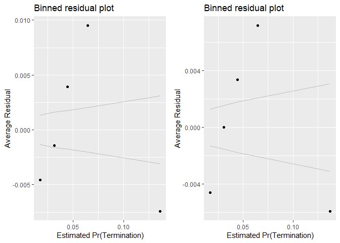<!-- -->

```
## [[1]]
##        model deviance null.deviance difference
## 1 model1_old 103315.6      111909.6   8594.032
## 2 model1_new 103011.1      111909.6   8898.467
```

```r
summary_residual_compare(n_CBre11B,n_CBre12C)
```

<!-- --><!-- -->

```
## Warning in residuals_binned(model1_old, bins = bins): Always uses Xlb
## Estimated Pr(Termination), should update.
```

```
## Warning in residuals_binned(model1_new, bins = bins): Always uses Xlb
## Estimated Pr(Termination), should update.
```

```
## Warning in if (class(model1_new) %in% c("glmerMod", "lme4", "lmerMod")) {:
## the condition has length > 1 and only the first element will be used
```

```
## Warning in if (!class(model1_new) %in% c("glmerMod", "lme4", "lmerMod") & :
## the condition has length > 1 and only the first element will be used
```

<!-- -->

```
## [[1]]
##        model deviance null.deviance difference
## 1 model1_old 198283.5        465759   267475.5
## 2 model1_new 196496.2        465759   269262.8
```
Detailed Industry Focus unfortunately runs into VIF problems with office PBSC for the breach size model. Keeping office focus in the breach size model  does not always align with expectations, but is  significant, is a study variable and has a lower AIC, so keeping it.

Office Volumne keeps its same significance and sign though pair history becomes insignificant, perhaps because offices with a great deal of volume had more history with momre vendors.

## Pre-Multilevel Model Summary


```r
#Binary Ceiling Breaches
  stargazer::stargazer(b_CBre01A,b_CBre01B,b_CBre02A,b_CBre02B,b_CBre03A,b_CBre03B,b_CBre03D,b_CBre12C,
                       type="text",
                       digits=2)
```

```
## 
## ===================================================================================================================
##                                                               Dependent variable:                                  
##                             ---------------------------------------------------------------------------------------
##                                                                     b_CBre                                         
##                                (1)        (2)        (3)        (4)        (5)        (6)        (7)        (8)    
## -------------------------------------------------------------------------------------------------------------------
## cln_US6sal                   0.22***                                                           0.08***      0.02   
##                               (0.02)                                                            (0.02)     (0.02)  
##                                                                                                                    
## cln_PSCrate                             0.21***                                                0.17***    0.11***  
##                                          (0.02)                                                 (0.02)     (0.02)  
##                                                                                                                    
## cp_OffPerf7                                        0.23***                                     -0.13***   -0.14*** 
##                                                     (0.02)                                      (0.02)     (0.02)  
##                                                                                                                    
## cp_OffPSC7                                                    0.75***                          0.85***    1.21***  
##                                                                (0.01)                           (0.02)     (0.02)  
##                                                                                                                    
## cn_PairHist7                                                             -0.09***              -0.16***   -0.0003  
##                                                                           (0.02)                (0.02)     (0.02)  
##                                                                                                                    
## cln_PairCA                                                                          0.18***    -0.14***   0.15***  
##                                                                                      (0.02)     (0.02)     (0.03)  
##                                                                                                                    
## cln_Base                                                                                                  1.10***  
##                                                                                                            (0.02)  
##                                                                                                                    
## clr_Ceil2Base                                                                                              -0.02   
##                                                                                                            (0.02)  
##                                                                                                                    
## cln_Days                                                                                                  0.11***  
##                                                                                                            (0.02)  
##                                                                                                                    
## Comp1 offer                                                                                               -0.12*** 
##                                                                                                            (0.03)  
##                                                                                                                    
## Comp2-4 offers                                                                                            0.21***  
##                                                                                                            (0.02)  
##                                                                                                                    
## Comp5+ offers                                                                                             0.33***  
##                                                                                                            (0.03)  
##                                                                                                                    
## VehS-IDC                                                                                                  -0.26*** 
##                                                                                                            (0.02)  
##                                                                                                                    
## VehM-IDC                                                                                                  -0.23*** 
##                                                                                                            (0.03)  
##                                                                                                                    
## VehFSS/GWAC                                                                                               -0.50*** 
##                                                                                                            (0.05)  
##                                                                                                                    
## VehBPA/BOA                                                                                                -0.40*** 
##                                                                                                            (0.06)  
##                                                                                                                    
## PricingOther FP                                                                                           -0.71*** 
##                                                                                                            (0.13)  
##                                                                                                                    
## PricingT&M/LH/FPLOE                                                                                       -0.57*** 
##                                                                                                            (0.07)  
##                                                                                                                    
## PricingIncentive                                                                                            0.01   
##                                                                                                            (0.10)  
##                                                                                                                    
## PricingOther CB                                                                                           -1.07*** 
##                                                                                                            (0.05)  
##                                                                                                                    
## PricingUCA                                                                                                 -0.08   
##                                                                                                            (0.08)  
##                                                                                                                    
## PricingCombination or Other                                                                               -0.23*** 
##                                                                                                            (0.08)  
##                                                                                                                    
## CrisisARRA                                                                                                0.80***  
##                                                                                                            (0.07)  
##                                                                                                                    
## CrisisDis                                                                                                 0.71***  
##                                                                                                            (0.16)  
##                                                                                                                    
## CrisisOCO                                                                                                 -0.16*** 
##                                                                                                            (0.05)  
##                                                                                                                    
## cln_Def6HHI                                                                                               -0.04**  
##                                                                                                            (0.02)  
##                                                                                                                    
## clr_Def6toUS                                                                                              -0.24*** 
##                                                                                                            (0.03)  
##                                                                                                                    
## clr_Def3toUS                                                                                              -0.10*** 
##                                                                                                            (0.03)  
##                                                                                                                    
## cp_PairObl7                                                                                               -0.51*** 
##                                                                                                            (0.03)  
##                                                                                                                    
## cln_OffObl7                                                                                               -0.29*** 
##                                                                                                            (0.02)  
##                                                                                                                    
## cln_OffFocus                                                                                              -0.21*** 
##                                                                                                            (0.03)  
##                                                                                                                    
## Constant                     -2.78***   -2.78***   -2.78***   -2.83***   -2.77***   -2.77***   -2.85***   -2.90*** 
##                               (0.01)     (0.01)     (0.01)     (0.01)     (0.01)     (0.01)     (0.01)     (0.02)  
##                                                                                                                    
## -------------------------------------------------------------------------------------------------------------------
## Observations                 250,000    250,000    250,000    250,000    250,000    250,000    250,000    250,000  
## Log Likelihood              -55,877.03 -55,881.77 -55,858.92 -54,538.89 -55,941.52 -55,895.24 -54,347.72 -51,505.56
## Akaike Inf. Crit.           111,758.10 111,767.60 111,721.80 109,081.80 111,887.00 111,794.50 108,709.40 103,075.10
## ===================================================================================================================
## Note:                                                                                   *p<0.1; **p<0.05; ***p<0.01
```

```r
texreg::htmlreg(list(b_CBre01A,b_CBre01B,b_CBre02A,b_CBre02B,b_CBre03A,b_CBre03B,b_CBre03D,b_CBre12C3),file="..//Output//b_CBremodel_lvl1.html",
                single.row = TRUE,
                # custom.model.name=c("Ceiling Breaches"),
                stars=c(0.1,0.05,0.01,0.001),
                groups = list(
                              "Services Complexity" = 2:3,
                              "Office Capacity" =4:5,
                              "Past Relationship"=6:7
                              ),
                custom.coef.map=study_coef_list,
                bold=0.05,
                custom.note="%stars. Numerical inputs are rescaled.",
                caption="Table 6: Logit Bivariate Look at Study Variables and Ceiling Breaches",
                caption.above=TRUE)
```

```
## The table was written to the file '..//Output//b_CBremodel_lvl1.html'.
```

```r
#Absolute Size Ceiling Breaches
stargazer::stargazer(n_CBre01A,n_CBre01B,n_CBre02A,n_CBre02B,n_CBre03A,n_CBre03B,n_CBre03D,n_CBre12C3,
                       type="text",
                       digits=2)
```

```
## 
## ===========================================================================================================================
##                                                                   Dependent variable:                                      
##                             -----------------------------------------------------------------------------------------------
##                                                                         ln_CBre                                            
##                                 (1)         (2)         (3)         (4)         (5)         (6)         (7)         (8)    
## ---------------------------------------------------------------------------------------------------------------------------
## cln_US6sal                    0.87***                                                                 1.29***     0.09***  
##                               (0.03)                                                                  (0.03)      (0.02)   
##                                                                                                                            
## cln_PSCrate                               1.21***                                                     0.47***     0.17***  
##                                           (0.02)                                                      (0.02)      (0.02)   
##                                                                                                                            
## cp_OffPerf7                                          -1.86***                                                    -0.34***  
##                                                       (0.02)                                                      (0.02)   
##                                                                                                                            
## cp_OffPSC7                                                       -1.58***                            -1.43***    -0.50***  
##                                                                   (0.01)                              (0.02)      (0.02)   
##                                                                                                                            
## cn_PairHist7                                                                 -0.53***                  -0.01       0.01    
##                                                                               (0.02)                  (0.02)      (0.02)   
##                                                                                                                            
## cln_PairCA                                                                               -1.90***    -0.62***    -0.12***  
##                                                                                           (0.02)      (0.03)      (0.03)   
##                                                                                                                            
## cln_Base                                                                                                          2.79***  
##                                                                                                                   (0.02)   
##                                                                                                                            
## clr_Ceil2Base                                                                                                     0.34***  
##                                                                                                                   (0.02)   
##                                                                                                                            
## cln_Days                                                                                                          0.14***  
##                                                                                                                   (0.02)   
##                                                                                                                            
## Comp1 offer                                                                                                        -0.03   
##                                                                                                                   (0.03)   
##                                                                                                                            
## Comp2-4 offers                                                                                                   -0.21***  
##                                                                                                                   (0.02)   
##                                                                                                                            
## Comp5+ offers                                                                                                    -0.15***  
##                                                                                                                   (0.02)   
##                                                                                                                            
## VehS-IDC                                                                                                          0.07***  
##                                                                                                                   (0.02)   
##                                                                                                                            
## VehM-IDC                                                                                                          0.05**   
##                                                                                                                   (0.03)   
##                                                                                                                            
## VehFSS/GWAC                                                                                                       0.25***  
##                                                                                                                   (0.05)   
##                                                                                                                            
## VehBPA/BOA                                                                                                         -0.04   
##                                                                                                                   (0.05)   
##                                                                                                                            
## PricingOther FP                                                                                                  -0.50***  
##                                                                                                                   (0.13)   
##                                                                                                                            
## PricingIncentive                                                                                                  0.73***  
##                                                                                                                   (0.08)   
##                                                                                                                            
## PricingCombination or Other                                                                                       0.57***  
##                                                                                                                   (0.07)   
##                                                                                                                            
## PricingOther CB                                                                                                   1.09***  
##                                                                                                                   (0.04)   
##                                                                                                                            
## PricingT&M/LH/FPLOE                                                                                               1.06***  
##                                                                                                                   (0.06)   
##                                                                                                                            
## PricingUCA                                                                                                        0.54***  
##                                                                                                                   (0.06)   
##                                                                                                                            
## CrisisARRA                                                                                                         -0.06   
##                                                                                                                   (0.06)   
##                                                                                                                            
## CrisisDis                                                                                                         0.44***  
##                                                                                                                   (0.13)   
##                                                                                                                            
## CrisisOCO                                                                                                         0.37***  
##                                                                                                                   (0.04)   
##                                                                                                                            
## cln_Def6HHI                                                                                                       0.04**   
##                                                                                                                   (0.02)   
##                                                                                                                            
## clr_Def6toUS                                                                                                      0.12***  
##                                                                                                                   (0.02)   
##                                                                                                                            
## clr_Def3toUS                                                                                                      0.44***  
##                                                                                                                   (0.02)   
##                                                                                                                            
## cp_PairObl7                                                                                                       0.23***  
##                                                                                                                   (0.02)   
##                                                                                                                            
## cln_OffObl7                                                                                                       0.37***  
##                                                                                                                   (0.02)   
##                                                                                                                            
## Constant                      9.26***     9.24***     9.39***     9.65***     9.28***     9.37***     9.54***     8.80***  
##                               (0.01)      (0.01)      (0.01)      (0.01)      (0.01)      (0.01)      (0.01)      (0.02)   
##                                                                                                                            
## ---------------------------------------------------------------------------------------------------------------------------
## Observations                  61,184      61,184      61,184      61,184      61,184      61,184      61,184      61,184   
## Log Likelihood              -148,414.20 -147,611.10 -143,682.00 -142,893.70 -148,641.30 -145,574.80 -140,717.70 -122,518.60
## Akaike Inf. Crit.           296,832.40  295,226.20  287,367.90  285,791.30  297,286.50  291,153.60  281,447.40  245,099.20 
## ===========================================================================================================================
## Note:                                                                                           *p<0.1; **p<0.05; ***p<0.01
```

```r
texreg::htmlreg(list(n_CBre01A,n_CBre01B,n_CBre02A,n_CBre02B,n_CBre03A,n_CBre03B,n_CBre03D,n_CBre12C3),file="..//Output//n_CBremodel_lvl1.html",
                single.row = TRUE,
                # custom.model.name=c("Ceiling Breaches"),
                stars=c(0.1,0.05,0.01,0.001),
                groups = list(
                              "Services Complexity" = 2:3,
                              "Office Capacity" =4:5,
                              "Past Relationship"=6:7
                              ),
                custom.coef.map=study_coef_list,
                bold=0.05,
                custom.note="%stars. Numerical inputs are rescaled.",
                caption="Table 8: Regression Bivariate Look at Study Variables and Log(Options Growth)",
                caption.above=TRUE)
```

```
## The table was written to the file '..//Output//n_CBremodel_lvl1.html'.
```


####15A: Average U.S. Salaries (logged):Contract Pricing
Cost-based and incentive contract types may do a  better job at handling complex contracts.


```r
#Create the models
b_cbre_salary_pricing_15A_no_interact <- glm(data=serv_smp, b_CBre ~ Pricing + cl_US6_avg_sal_lag1, 
                                             family=binomial(link="logit"))
glmer_examine(b_cbre_salary_pricing_15A_no_interact)
```

```
##                         GVIF Df GVIF^(1/(2*Df))
## Pricing             1.036663  6        1.003005
## cl_US6_avg_sal_lag1 1.036663  1        1.018167
```

```r
b_cbre_salary_pricing_15A <- glm(data=serv_smp, b_CBre ~ Pricing + cl_US6_avg_sal_lag1 + Pricing:cl_US6_avg_sal_lag1,
                                 family=binomial(link="logit"))
glmer_examine(b_cbre_salary_pricing_15A)
```

```
##                                  GVIF Df GVIF^(1/(2*Df))
## Pricing                     21.792712  6        1.292784
## cl_US6_avg_sal_lag1          1.095412  1        1.046619
## Pricing:cl_US6_avg_sal_lag1 23.287416  6        1.299950
```

```r
n_cbre_salary_pricing_15A_no_interact <- glm(data=serv_breach, ln_CBre ~ Pricing + cl_US6_avg_sal_lag1)
glmer_examine(n_cbre_salary_pricing_15A_no_interact)
```

```
##                         GVIF Df GVIF^(1/(2*Df))
## Pricing             1.030925  6        1.002541
## cl_US6_avg_sal_lag1 1.030925  1        1.015345
```

```r
n_cbre_salary_pricing_15A <- glm(data=serv_breach, ln_CBre ~ Pricing + cl_US6_avg_sal_lag1 + Pricing:cl_US6_avg_sal_lag1)
glmer_examine(n_cbre_salary_pricing_15A)
```

```
##                                  GVIF Df GVIF^(1/(2*Df))
## Pricing                     23.925854  6        1.302884
## cl_US6_avg_sal_lag1          1.117774  1        1.057248
## Pricing:cl_US6_avg_sal_lag1 25.932022  6        1.311655
```

```r
#compare the models

stargazer::stargazer(b_cbre_salary_pricing_15A_no_interact, b_cbre_salary_pricing_15A, 
                     n_cbre_salary_pricing_15A_no_interact, n_cbre_salary_pricing_15A, type="text", digits=2)
```

```
## 
## =============================================================================================
##                                                              Dependent variable:             
##                                                 ---------------------------------------------
##                                                        b_CBre                 ln_CBre        
##                                                       logistic                normal         
##                                                    (1)        (2)         (3)         (4)    
## ---------------------------------------------------------------------------------------------
## PricingOther FP                                  -0.50***   -0.46***     0.38*      0.52**   
##                                                   (0.13)     (0.13)     (0.20)      (0.20)   
##                                                                                              
## PricingT&M/LH/FPLOE                              -0.42***   -0.29***    2.50***     2.35***  
##                                                   (0.07)     (0.08)     (0.09)      (0.10)   
##                                                                                              
## PricingIncentive                                 0.59***     0.50*      1.40***     2.80***  
##                                                   (0.10)     (0.26)     (0.12)      (0.34)   
##                                                                                              
## PricingOther CB                                  -0.74***   -0.49***    2.69***     2.93***  
##                                                   (0.05)     (0.07)     (0.06)      (0.08)   
##                                                                                              
## PricingUCA                                         0.10       0.09      1.54***     1.47***  
##                                                   (0.08)     (0.08)     (0.09)      (0.10)   
##                                                                                              
## PricingCombination or Other                       0.16**    0.37***     2.15***     2.23***  
##                                                   (0.08)     (0.08)     (0.10)      (0.11)   
##                                                                                              
## cl_US6_avg_sal_lag1                              0.26***    0.29***     0.51***     0.52***  
##                                                   (0.02)     (0.02)     (0.03)      (0.03)   
##                                                                                              
## PricingOther FP:cl_US6_avg_sal_lag1                         -0.92***                1.32***  
##                                                              (0.21)                 (0.45)   
##                                                                                              
## PricingT&M/LH/FPLOE:cl_US6_avg_sal_lag1                     -0.44***                0.57***  
##                                                              (0.17)                 (0.19)   
##                                                                                              
## PricingIncentive:cl_US6_avg_sal_lag1                          0.17                 -2.99***  
##                                                              (0.51)                 (0.67)   
##                                                                                              
## PricingOther CB:cl_US6_avg_sal_lag1                         -0.68***               -0.78***  
##                                                              (0.14)                 (0.16)   
##                                                                                              
## PricingUCA:cl_US6_avg_sal_lag1                                0.25                  0.61**   
##                                                              (0.16)                 (0.26)   
##                                                                                              
## PricingCombination or Other:cl_US6_avg_sal_lag1             -0.87***                 -0.35   
##                                                              (0.16)                 (0.23)   
##                                                                                              
## Constant                                         -2.74***   -2.74***    9.10***     9.10***  
##                                                   (0.01)     (0.01)     (0.01)      (0.01)   
##                                                                                              
## ---------------------------------------------------------------------------------------------
## Observations                                     250,000    250,000     61,184      61,184   
## Log Likelihood                                  -55,693.13 -55,657.24 -146,936.70 -146,902.60
## Akaike Inf. Crit.                               111,402.30 111,342.50 293,889.30  293,833.20 
## =============================================================================================
## Note:                                                             *p<0.1; **p<0.05; ***p<0.01
```

```r
summary_residual_compare(b_cbre_salary_pricing_15A_no_interact, b_cbre_salary_pricing_15A, bins=5)
```

<!-- -->

```
## Warning in residuals_binned(model1_old, bins = bins): Always uses Xlb
## Estimated Pr(Termination), should update.
```

```
## Warning in residuals_binned(model1_new, bins = bins): Always uses Xlb
## Estimated Pr(Termination), should update.
```

```
## Warning in if (class(model1_new) %in% c("glmerMod", "lme4", "lmerMod")) {:
## the condition has length > 1 and only the first element will be used
```

```
## Warning in if (!class(model1_new) %in% c("glmerMod", "lme4", "lmerMod") & :
## the condition has length > 1 and only the first element will be used
```

<!-- -->

```
## [[1]]
##        model deviance null.deviance difference
## 1 model1_old 111386.3      111909.6   523.3298
## 2 model1_new 111314.5      111909.6   595.1082
```

```r
summary_residual_compare(n_cbre_salary_pricing_15A_no_interact, n_cbre_salary_pricing_15A, bins=5)
```

<!-- --><!-- -->

```
## Warning in residuals_binned(model1_old, bins = bins): Always uses Xlb
## Estimated Pr(Termination), should update.
```

```
## Warning in residuals_binned(model1_new, bins = bins): Always uses Xlb
## Estimated Pr(Termination), should update.
```

```
## Warning in if (class(model1_new) %in% c("glmerMod", "lme4", "lmerMod")) {:
## the condition has length > 1 and only the first element will be used
```

```
## Warning in if (!class(model1_new) %in% c("glmerMod", "lme4", "lmerMod") & :
## the condition has length > 1 and only the first element will be used
```

<!-- -->

```
## [[1]]
##        model deviance null.deviance difference
## 1 model1_old 436628.8        465759   29130.21
## 2 model1_new 436143.0        465759   29615.97
```
For likelihood expectations are only partially hold, predominately for other cost based and combination or other. For size, expectations are widely upheld, except UCA contracts which are a special case of cost absed. 
####15B: Cumulative

```r
#Create the model
b_cbre_salary_pricing_15B <- glm(data=serv_smp,
                        b_CBre ~  cln_US6sal + 
                   cln_PSCrate+ cp_OffPerf7+cp_OffPSC7+
                 cn_PairHist7+cln_PairCA+
                 cln_Base + clr_Ceil2Base + cln_Days+
                 Comp+
                   Veh+
                   Pricing+
                   Crisis+
                 cln_Def6HHI+clr_Def6toUS+
                 #cln_Def3HHI+
                   clr_Def3toUS+
                 cp_PairObl7+
                   cln_OffObl7+ 
                 #cln_OffFocus+ 
                 Pricing:cl_US6_avg_sal_lag1, family=binomial(link="logit"))
glmer_examine(b_cbre_salary_pricing_15B)
```

```
##                                    GVIF Df GVIF^(1/(2*Df))
## cln_US6sal                   139.066386  1       11.792641
## cln_PSCrate                    1.330236  1        1.153359
## cp_OffPerf7                    1.684201  1        1.297768
## cp_OffPSC7                     2.043981  1        1.429679
## cn_PairHist7                   1.387776  1        1.178039
## cln_PairCA                     2.249118  1        1.499706
## cln_Base                       1.522479  1        1.233888
## clr_Ceil2Base                  1.087138  1        1.042659
## cln_Days                       1.433232  1        1.197177
## Comp                           1.285346  3        1.042726
## Veh                            1.911743  4        1.084373
## Pricing                       30.853133  6        1.330786
## Crisis                         1.345880  3        1.050754
## cln_Def6HHI                    1.451590  1        1.204820
## clr_Def6toUS                   1.869604  1        1.367335
## clr_Def3toUS                   2.207798  1        1.485866
## cp_PairObl7                    1.280842  1        1.131743
## cln_OffObl7                    1.228031  1        1.108165
## Pricing:cl_US6_avg_sal_lag1 3980.960723  7        1.807765
```

```r
n_cbre_salary_pricing_15B <- glm(data=serv_breach, ln_CBre ~ cln_US6sal + 
                   cln_PSCrate+ cp_OffPerf7+cp_OffPSC7+
                 cn_PairHist7+cln_PairCA+
                 cln_Base + clr_Ceil2Base + cln_Days+
                 Comp+
                   Veh+
                   Pricing+
                   Crisis+
                 cln_Def6HHI+clr_Def6toUS+
                 #cln_Def3HHI+
                   clr_Def3toUS+
                 cp_PairObl7+
                   cln_OffObl7+ 
                 #cln_OffFocus+
                   Pricing:cl_US6_avg_sal_lag1)
glmer_examine(n_cbre_salary_pricing_15B)
```

```
##                                    GVIF Df GVIF^(1/(2*Df))
## cln_US6sal                   123.668448  1       11.120632
## cln_PSCrate                    1.374155  1        1.172243
## cp_OffPerf7                    2.714870  1        1.647686
## cp_OffPSC7                     3.369020  1        1.835489
## cn_PairHist7                   1.430745  1        1.196138
## cln_PairCA                     2.884741  1        1.698453
## cln_Base                       1.976526  1        1.405890
## clr_Ceil2Base                  1.104132  1        1.050777
## cln_Days                       1.671627  1        1.292914
## Comp                           1.329211  3        1.048574
## Veh                            2.307504  4        1.110178
## Pricing                       28.731676  6        1.322909
## Crisis                         1.286535  3        1.042886
## cln_Def6HHI                    1.897666  1        1.377558
## clr_Def6toUS                   1.521375  1        1.233440
## clr_Def3toUS                   1.951063  1        1.396804
## cp_PairObl7                    1.356843  1        1.164836
## cln_OffObl7                    1.242169  1        1.114527
## Pricing:cl_US6_avg_sal_lag1 3089.092204  7        1.775308
```
Maximum VIF greatly exceeds 2 in both cases.


####16A: Office Partnership:Actions
Performance based contracting should  encourage higher communication interactions and allow for more flexability, potentially increasing the benefits of regular interaction.
(Options, Breach, Terminations)
Interact: Actions	cp_OffPerf7:cln_PairCA			+	-	-


```r
#Create the models

b_cbre_partnership_actions_16A_no_interact <- glm(data=serv_smp, b_CBre ~ cp_OffPerf7 + cln_PairCA, family=binomial(link="logit"))
glmer_examine(b_cbre_partnership_actions_16A_no_interact)
```

```
## cp_OffPerf7  cln_PairCA 
##    1.055746    1.055746
```

```r
b_cbre_partnership_actions_16A <- glm(data=serv_smp, b_CBre ~ cp_OffPerf7 + cln_PairCA + cp_OffPerf7:cln_PairCA, family=binomial(link="logit"))
glmer_examine(b_cbre_partnership_actions_16A)
```

```
##            cp_OffPerf7             cln_PairCA cp_OffPerf7:cln_PairCA 
##               1.273636               1.569152               1.542792
```

```r
#compare the models

n_cbre_partnership_actions_16A_no_interact <- glm(data=serv_breach, ln_CBre ~ cp_OffPerf7 + cln_PairCA)
glmer_examine(n_cbre_partnership_actions_16A_no_interact)
```

```
## cp_OffPerf7  cln_PairCA 
##    1.379942    1.379942
```

```r
n_cbre_partnership_actions_16A <- glm(data=serv_breach, ln_CBre ~ cp_OffPerf7 + cln_PairCA + cp_OffPerf7:cln_PairCA)
glmer_examine(n_cbre_partnership_actions_16A)
```

```
##            cp_OffPerf7             cln_PairCA cp_OffPerf7:cln_PairCA 
##               1.714241               1.442750               1.549173
```

```r
stargazer::stargazer(b_cbre_partnership_actions_16A_no_interact, b_cbre_partnership_actions_16A, 
                     n_cbre_partnership_actions_16A_no_interact, n_cbre_partnership_actions_16A, type="text", digits=2)
```

```
## 
## ====================================================================
##                                     Dependent variable:             
##                        ---------------------------------------------
##                               b_CBre                 ln_CBre        
##                              logistic                normal         
##                           (1)        (2)         (3)         (4)    
## --------------------------------------------------------------------
## cp_OffPerf7             0.20***    0.05***    -1.48***    -1.11***  
##                          (0.02)     (0.02)     (0.02)      (0.02)   
##                                                                     
## cln_PairCA              0.14***    -0.10***   -0.93***    -0.73***  
##                          (0.02)     (0.02)     (0.03)      (0.03)   
##                                                                     
## cp_OffPerf7:cln_PairCA             0.83***                -1.49***  
##                                     (0.03)                 (0.04)   
##                                                                     
## Constant                -2.78***   -2.84***    9.41***     9.60***  
##                          (0.01)     (0.01)     (0.01)      (0.01)   
##                                                                     
## --------------------------------------------------------------------
## Observations            250,000    250,000     61,184      61,184   
## Log Likelihood         -55,825.55 -55,306.93 -143,030.00 -142,343.20
## Akaike Inf. Crit.      111,657.10 110,621.90 286,066.00  284,694.40 
## ====================================================================
## Note:                                    *p<0.1; **p<0.05; ***p<0.01
```

```r
summary_residual_compare(b_cbre_partnership_actions_16A_no_interact, b_cbre_partnership_actions_16A, bins=3)
```

<!-- -->

```
## Warning in residuals_binned(model1_old, bins = bins): Always uses Xlb
## Estimated Pr(Termination), should update.
```

```
## Warning in residuals_binned(model1_new, bins = bins): Always uses Xlb
## Estimated Pr(Termination), should update.
```

```
## Warning in if (class(model1_new) %in% c("glmerMod", "lme4", "lmerMod")) {:
## the condition has length > 1 and only the first element will be used
```

```
## Warning in if (!class(model1_new) %in% c("glmerMod", "lme4", "lmerMod") & :
## the condition has length > 1 and only the first element will be used
```

<!-- -->

```
## [[1]]
##        model deviance null.deviance difference
## 1 model1_old 111651.1      111909.6   258.4957
## 2 model1_new 110613.9      111909.6  1295.7401
```

```r
summary_residual_compare(n_cbre_partnership_actions_16A_no_interact, n_cbre_partnership_actions_16A, bins=3)
```

<!-- --><!-- -->

```
## Warning in residuals_binned(model1_old, bins = bins): Always uses Xlb
## Estimated Pr(Termination), should update.
```

```
## Warning in residuals_binned(model1_new, bins = bins): Always uses Xlb
## Estimated Pr(Termination), should update.
```

```
## Warning in if (class(model1_new) %in% c("glmerMod", "lme4", "lmerMod")) {:
## the condition has length > 1 and only the first element will be used
```

```
## Warning in if (!class(model1_new) %in% c("glmerMod", "lme4", "lmerMod") & :
## the condition has length > 1 and only the first element will be used
```

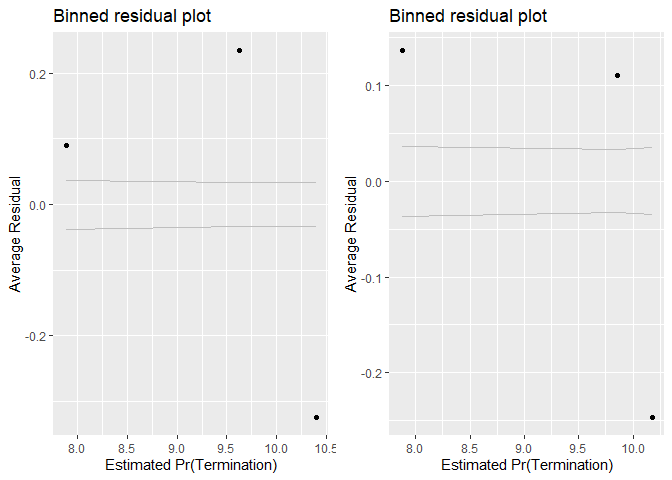<!-- -->

```
## [[1]]
##        model deviance null.deviance difference
## 1 model1_old 384284.1        465759   81474.89
## 2 model1_new 375752.4        465759   90006.60
```
The interaction was signiicant in both cases but positive and contrary to expectations for likelihood and negative and in keeping with expectations for breach size. That said for likelihood  the introduction of the interaction does result in pairCA switching to a negative sign which is in keeping with expectations. Seems worth considering adding in both cases.
####16B: Cumulative

```r
#Create the model
b_cbre_partnership_actions_16B <- glm(data=serv_smp,
                        b_CBre ~  cln_US6sal + 
                   cln_PSCrate+ cp_OffPerf7+cp_OffPSC7+
                 cn_PairHist7+cln_PairCA+
                 cln_Base + clr_Ceil2Base + cln_Days+
                 Comp+
                   Veh+
                   Pricing+
                   Crisis+
                 cln_Def6HHI+clr_Def6toUS+
                 #cln_Def3HHI+
                   clr_Def3toUS+
                 cp_PairObl7+
                   cln_OffObl7+ 
                 #cln_OffFocus+ 

                 cp_OffPerf7:cln_PairCA, family=binomial(link="logit"))


n_cbre_partnership_actions_16B <- glm(data=serv_breach, ln_CBre ~ cln_US6sal + 
                   cln_PSCrate+ cp_OffPerf7+cp_OffPSC7+
                 cn_PairHist7+cln_PairCA+
                 cln_Base + clr_Ceil2Base + cln_Days+
                 Comp+
                   Veh+
                   Pricing+
                   Crisis+
                 cln_Def6HHI+clr_Def6toUS+
                 #cln_Def3HHI+
                   clr_Def3toUS+
                 cp_PairObl7+
                   cln_OffObl7+ 
                 #cl_office_NAICS6_hhi_kc+
                   cp_OffPerf7:cln_PairCA)


#Compare the models
stargazer::stargazer(b_CBre12C3, b_cbre_partnership_actions_16B, 
                     n_CBre12C3, n_cbre_partnership_actions_16B, type="text", digits=2)
```

```
## 
## =========================================================================
##                                          Dependent variable:             
##                             ---------------------------------------------
##                                    b_CBre                 ln_CBre        
##                                   logistic                normal         
##                                (1)        (2)         (3)         (4)    
## -------------------------------------------------------------------------
## cln_US6sal                     0.01      -0.02      0.09***     0.10***  
##                               (0.02)     (0.02)     (0.02)      (0.02)   
##                                                                          
## cln_PSCrate                  0.10***    0.09***     0.17***     0.18***  
##                               (0.02)     (0.02)     (0.02)      (0.02)   
##                                                                          
## cp_OffPerf7                  -0.15***   -0.22***   -0.34***    -0.32***  
##                               (0.02)     (0.02)     (0.02)      (0.02)   
##                                                                          
## cp_OffPSC7                   1.11***    1.05***    -0.50***    -0.42***  
##                               (0.02)     (0.02)     (0.02)      (0.02)   
##                                                                          
## cn_PairHist7                  0.005       0.03       0.01       -0.001   
##                               (0.02)     (0.02)     (0.02)      (0.02)   
##                                                                          
## cln_PairCA                   0.10***     -0.05*    -0.12***    -0.10***  
##                               (0.03)     (0.03)     (0.03)      (0.03)   
##                                                                          
## cln_Base                     1.10***    1.11***     2.79***     2.78***  
##                               (0.02)     (0.02)     (0.02)      (0.02)   
##                                                                          
## clr_Ceil2Base                 -0.02      -0.01      0.34***     0.34***  
##                               (0.02)     (0.02)     (0.02)      (0.02)   
##                                                                          
## cln_Days                     0.10***    0.10***     0.14***     0.15***  
##                               (0.02)     (0.02)     (0.02)      (0.02)   
##                                                                          
## Comp1 offer                  -0.11***   -0.10***     -0.03       -0.03   
##                               (0.03)     (0.03)     (0.03)      (0.03)   
##                                                                          
## Comp2-4 offers               0.22***    0.21***    -0.21***    -0.20***  
##                               (0.02)     (0.02)     (0.02)      (0.02)   
##                                                                          
## Comp5+ offers                0.34***    0.31***    -0.15***    -0.13***  
##                               (0.03)     (0.03)     (0.02)      (0.02)   
##                                                                          
## VehS-IDC                     -0.27***   -0.21***    0.07***     0.05**   
##                               (0.02)     (0.03)     (0.02)      (0.02)   
##                                                                          
## VehM-IDC                     -0.25***   -0.23***    0.05**       0.03    
##                               (0.03)     (0.03)     (0.03)      (0.03)   
##                                                                          
## VehFSS/GWAC                  -0.49***   -0.48***    0.25***     0.25***  
##                               (0.05)     (0.05)     (0.05)      (0.05)   
##                                                                          
## VehBPA/BOA                   -0.43***   -0.34***     -0.04       -0.07   
##                               (0.06)     (0.06)     (0.05)      (0.05)   
##                                                                          
## PricingOther FP              -0.72***   -0.69***   -0.50***    -0.52***  
##                               (0.13)     (0.13)     (0.13)      (0.13)   
##                                                                          
## PricingT&M/LH/FPLOE          -0.55***   -0.49***    1.06***     1.05***  
##                               (0.07)     (0.07)     (0.06)      (0.06)   
##                                                                          
## PricingIncentive               0.01       0.03      0.73***     0.73***  
##                               (0.10)     (0.10)     (0.08)      (0.08)   
##                                                                          
## PricingOther CB              -1.06***   -1.04***    1.09***     1.09***  
##                               (0.05)     (0.05)     (0.04)      (0.04)   
##                                                                          
## PricingUCA                    -0.10      -0.09      0.54***     0.54***  
##                               (0.08)     (0.08)     (0.06)      (0.06)   
##                                                                          
## PricingCombination or Other  -0.20**    -0.19**     0.57***     0.56***  
##                               (0.08)     (0.08)     (0.07)      (0.07)   
##                                                                          
## CrisisARRA                   0.82***    0.78***      -0.06       -0.04   
##                               (0.07)     (0.07)     (0.06)      (0.06)   
##                                                                          
## CrisisDis                    0.70***    0.66***     0.44***     0.45***  
##                               (0.16)     (0.16)     (0.13)      (0.13)   
##                                                                          
## CrisisOCO                    -0.19***   -0.27***    0.37***     0.36***  
##                               (0.05)     (0.05)     (0.04)      (0.04)   
##                                                                          
## cln_Def6HHI                  -0.05**    -0.06***    0.04**      0.05***  
##                               (0.02)     (0.02)     (0.02)      (0.02)   
##                                                                          
## clr_Def6toUS                 -0.25***   -0.31***    0.12***     0.12***  
##                               (0.03)     (0.03)     (0.02)      (0.02)   
##                                                                          
## clr_Def3toUS                 -0.11***    -0.04      0.44***     0.41***  
##                               (0.03)     (0.03)     (0.02)      (0.02)   
##                                                                          
## cp_PairObl7                  -0.50***   -0.45***    0.23***     0.20***  
##                               (0.03)     (0.03)     (0.02)      (0.02)   
##                                                                          
## cln_OffObl7                  -0.26***   -0.26***    0.37***     0.37***  
##                               (0.02)     (0.02)     (0.02)      (0.02)   
##                                                                          
## cp_OffPerf7:cln_PairCA                  0.57***                -0.35***  
##                                          (0.03)                 (0.03)   
##                                                                          
## Constant                     -2.89***   -2.97***    8.80***     8.84***  
##                               (0.02)     (0.02)     (0.02)      (0.02)   
##                                                                          
## -------------------------------------------------------------------------
## Observations                 250,000    250,000     61,184      61,184   
## Log Likelihood              -51,541.98 -51,363.67 -122,518.60 -122,465.00
## Akaike Inf. Crit.           103,146.00 102,791.30 245,099.20  244,994.00 
## =========================================================================
## Note:                                         *p<0.1; **p<0.05; ***p<0.01
```

```r
summary_residual_compare(b_CBre12C3, b_cbre_partnership_actions_16B)
```

<!-- -->

```
## Warning in residuals_binned(model1_old, bins = bins): Always uses Xlb
## Estimated Pr(Termination), should update.
```

```
## Warning in residuals_binned(model1_new, bins = bins): Always uses Xlb
## Estimated Pr(Termination), should update.
```

```
## Warning in if (class(model1_new) %in% c("glmerMod", "lme4", "lmerMod")) {:
## the condition has length > 1 and only the first element will be used
```

```
## Warning in if (!class(model1_new) %in% c("glmerMod", "lme4", "lmerMod") & :
## the condition has length > 1 and only the first element will be used
```

<!-- -->

```
## [[1]]
##        model deviance null.deviance difference
## 1 model1_old 103084.0      111909.6   8825.631
## 2 model1_new 102727.3      111909.6   9182.258
```

```r
summary_residual_compare(n_CBre12C3, n_cbre_partnership_actions_16B)
```

<!-- --><!-- -->

```
## Warning in residuals_binned(model1_old, bins = bins): Always uses Xlb
## Estimated Pr(Termination), should update.
```

```
## Warning in residuals_binned(model1_new, bins = bins): Always uses Xlb
## Estimated Pr(Termination), should update.
```

```
## Warning in if (class(model1_new) %in% c("glmerMod", "lme4", "lmerMod")) {:
## the condition has length > 1 and only the first element will be used
```

```
## Warning in if (!class(model1_new) %in% c("glmerMod", "lme4", "lmerMod") & :
## the condition has length > 1 and only the first element will be used
```

<!-- -->

```
## [[1]]
##        model deviance null.deviance difference
## 1 model1_old 196546.4        465759   269212.6
## 2 model1_new 196202.4        465759   269556.5
```

The results were similar to those of the isolated models. Doesn't seem to worsen residuals and greatly helps AIC. Adding in both cases, despite being positive contrary to expectations for b_CBre.

Current cumulative b_CBre model: b_cbre_partnership_actions_16B
Current cumulative n_Cbre model: n_cbre_partnership_actions_16B

####17A: Office Partnership:Market Vendor Share for that Office
Performance based contracting is thought to mitigte some of the risks of vendor  lock.
(option,breach,termination)
Interact: Market Share Vendor for that Office	cp_OffPerf7: cp_PairObl7			++	--	--


```r
#Define the models

b_cbre_partnership_share_17A_no_interact <- glm(data=serv_smp, b_CBre ~ cp_OffPerf7 + cp_PairObl7, family=binomial(link="logit"))
glmer_examine(b_cbre_partnership_share_17A_no_interact)
```

```
## cp_OffPerf7 cp_PairObl7 
##      1.0007      1.0007
```

```r
b_cbre_partnership_share_17A <- glm(data=serv_smp, b_CBre ~ cp_OffPerf7 + cp_PairObl7 + cp_OffPerf7:cp_PairObl7, family=binomial(link="logit"))
glmer_examine(b_cbre_partnership_share_17A)
```

```
##             cp_OffPerf7             cp_PairObl7 cp_OffPerf7:cp_PairObl7 
##                1.016452                1.019874                1.019697
```

```r
n_cbre_partnership_share_17A_no_interact <- glm(data=serv_breach, ln_CBre ~ cp_OffPerf7 + cp_PairObl7)
glmer_examine(n_cbre_partnership_share_17A_no_interact)
```

```
## cp_OffPerf7 cp_PairObl7 
##    1.011055    1.011055
```

```r
n_cbre_partnership_share_17A <- glm(data=serv_breach, ln_CBre ~ cp_OffPerf7 + cp_PairObl7 + cp_OffPerf7:cp_PairObl7)
glmer_examine(n_cbre_partnership_share_17A)
```

```
##             cp_OffPerf7             cp_PairObl7 cp_OffPerf7:cp_PairObl7 
##                1.012772                1.020777                1.010585
```

```r
#Compare the models
stargazer::stargazer(b_cbre_partnership_share_17A_no_interact, b_cbre_partnership_share_17A, 
                     n_cbre_partnership_share_17A_no_interact, n_cbre_partnership_share_17A, type="text", digits=2)
```

```
## 
## =====================================================================
##                                      Dependent variable:             
##                         ---------------------------------------------
##                                b_CBre                 ln_CBre        
##                               logistic                normal         
##                            (1)        (2)         (3)         (4)    
## ---------------------------------------------------------------------
## cp_OffPerf7              0.23***    0.21***    -1.88***    -1.88***  
##                           (0.02)     (0.02)     (0.02)      (0.02)   
##                                                                      
## cp_PairObl7              -0.17***   -0.13***    0.24***     0.25***  
##                           (0.02)     (0.02)     (0.03)      (0.03)   
##                                                                      
## cp_OffPerf7:cp_PairObl7             0.49***                 0.11**   
##                                      (0.03)                 (0.05)   
##                                                                      
## Constant                 -2.78***   -2.78***    9.40***     9.40***  
##                           (0.01)     (0.01)     (0.01)      (0.01)   
##                                                                      
## ---------------------------------------------------------------------
## Observations             250,000    250,000     61,184      61,184   
## Log Likelihood          -55,819.60 -55,720.69 -143,646.50 -143,644.10
## Akaike Inf. Crit.       111,645.20 111,449.40 287,298.90  287,296.10 
## =====================================================================
## Note:                                     *p<0.1; **p<0.05; ***p<0.01
```

```r
summary_residual_compare(b_cbre_partnership_share_17A_no_interact, b_cbre_partnership_share_17A)
```

<!-- -->

```
## Warning in residuals_binned(model1_old, bins = bins): Always uses Xlb
## Estimated Pr(Termination), should update.
```

```
## Warning in residuals_binned(model1_new, bins = bins): Always uses Xlb
## Estimated Pr(Termination), should update.
```

```
## Warning in if (class(model1_new) %in% c("glmerMod", "lme4", "lmerMod")) {:
## the condition has length > 1 and only the first element will be used
```

```
## Warning in if (!class(model1_new) %in% c("glmerMod", "lme4", "lmerMod") & :
## the condition has length > 1 and only the first element will be used
```

<!-- -->

```
## [[1]]
##        model deviance null.deviance difference
## 1 model1_old 111639.2      111909.6   270.3900
## 2 model1_new 111441.4      111909.6   468.2187
```

```r
summary_residual_compare(n_cbre_partnership_share_17A_no_interact, n_cbre_partnership_share_17A)
```

<!-- --><!-- -->

```
## Warning in residuals_binned(model1_old, bins = bins): Always uses Xlb
## Estimated Pr(Termination), should update.
```

```
## Warning in residuals_binned(model1_new, bins = bins): Always uses Xlb
## Estimated Pr(Termination), should update.
```

```
## Warning in if (class(model1_new) %in% c("glmerMod", "lme4", "lmerMod")) {:
## the condition has length > 1 and only the first element will be used
```

```
## Warning in if (!class(model1_new) %in% c("glmerMod", "lme4", "lmerMod") & :
## the condition has length > 1 and only the first element will be used
```

<!-- -->

```
## [[1]]
##        model deviance null.deviance difference
## 1 model1_old 392106.1        465759   73652.83
## 2 model1_new 392075.3        465759   73683.72
```
Positive, contrary to expectation in both cases. No clear benefit in the residuals.
####17B: Cumulative

```r
#Create the model
b_cbre_partnership_share_17B <- glm(data=serv_smp,
                        b_CBre ~  cln_US6sal + 
                   cln_PSCrate+ cp_OffPerf7+cp_OffPSC7+
                 cn_PairHist7+cln_PairCA+
                 cln_Base + clr_Ceil2Base + cln_Days+
                 Comp+
                   Veh+
                   Pricing+
                   Crisis+
                 cln_Def6HHI+clr_Def6toUS+
                 #cln_Def3HHI+
                   clr_Def3toUS+
                 cp_PairObl7+
                   cln_OffObl7+ 
                 #cln_OffFocus+ 
                 cp_OffPerf7:cln_PairCA+cp_OffPerf7:cp_PairObl7, family=binomial(link="logit"))
glmer_examine(b_cbre_partnership_share_17B)
```

```
##                             GVIF Df GVIF^(1/(2*Df))
## cln_US6sal              1.628353  1        1.276069
## cln_PSCrate             1.343070  1        1.158909
## cp_OffPerf7             1.706188  1        1.306211
## cp_OffPSC7              2.107476  1        1.451715
## cn_PairHist7            1.398438  1        1.182556
## cln_PairCA              2.787131  1        1.669470
## cln_Base                1.539976  1        1.240958
## clr_Ceil2Base           1.083709  1        1.041013
## cln_Days                1.427822  1        1.194915
## Comp                    1.280580  3        1.042080
## Veh                     1.965842  4        1.088162
## Pricing                 1.231212  6        1.017484
## Crisis                  1.453579  3        1.064322
## cln_Def6HHI             1.451304  1        1.204701
## clr_Def6toUS            1.870533  1        1.367674
## clr_Def3toUS            2.166358  1        1.471855
## cp_PairObl7             1.320148  1        1.148977
## cln_OffObl7             1.233106  1        1.110453
## cp_OffPerf7:cln_PairCA  2.065094  1        1.437043
## cp_OffPerf7:cp_PairObl7 1.282319  1        1.132395
```

```r
b_cbre_partnership_share_17B2 <- glm(data=serv_smp,
                        b_CBre ~  cln_US6sal + 
                   cln_PSCrate+ cp_OffPerf7+cp_OffPSC7+
                 cn_PairHist7+cln_PairCA+
                 cln_Base + clr_Ceil2Base + cln_Days+
                 Comp+
                   Veh+
                   Pricing+
                   Crisis+
                 cln_Def6HHI+clr_Def6toUS+
                 #cln_Def3HHI+
                   clr_Def3toUS+
                 cp_PairObl7+
                   cln_OffObl7+ 
                 #cln_OffFocus+ 
                 #cp_OffPerf7:cln_PairCA+
                   cp_OffPerf7:cp_PairObl7, family=binomial(link="logit"))
glmer_examine(b_cbre_partnership_share_17B2)
```

```
##                             GVIF Df GVIF^(1/(2*Df))
## cln_US6sal              1.597010  1        1.263729
## cln_PSCrate             1.326195  1        1.151605
## cp_OffPerf7             1.531964  1        1.237725
## cp_OffPSC7              2.014075  1        1.419181
## cn_PairHist7            1.367311  1        1.169321
## cln_PairCA              2.221676  1        1.490529
## cln_Base                1.520066  1        1.232910
## clr_Ceil2Base           1.084623  1        1.041452
## cln_Days                1.429651  1        1.195680
## Comp                    1.278168  3        1.041753
## Veh                     1.881260  4        1.082196
## Pricing                 1.229149  6        1.017342
## Crisis                  1.346827  3        1.050877
## cln_Def6HHI             1.430454  1        1.196016
## clr_Def6toUS            1.872057  1        1.368231
## clr_Def3toUS            2.200211  1        1.483311
## cp_PairObl7             1.264481  1        1.124491
## cln_OffObl7             1.228675  1        1.108456
## cp_OffPerf7:cp_PairObl7 1.053049  1        1.026182
```

```r
n_cbre_partnership_share_17B <- glm(data=serv_breach, ln_CBre ~ cln_US6sal + 
                   cln_PSCrate+ cp_OffPerf7+cp_OffPSC7+
                 cn_PairHist7+cln_PairCA+
                 cln_Base + clr_Ceil2Base + cln_Days+
                 Comp+
                   Veh+
                   Pricing+
                   Crisis+
                 cln_Def6HHI+clr_Def6toUS+
                 #cln_Def3HHI+
                   clr_Def3toUS+
                 cp_PairObl7+
                   cln_OffObl7+ 
                 #cln_OffFocus+
                   cp_OffPerf7:cln_PairCA+cp_OffPerf7:cp_PairObl7)
glmer_examine(n_cbre_partnership_share_17B)
```

```
##                             GVIF Df GVIF^(1/(2*Df))
## cln_US6sal              1.596817  1        1.263652
## cln_PSCrate             1.354881  1        1.163993
## cp_OffPerf7             2.364281  1        1.537622
## cp_OffPSC7              4.040636  1        2.010133
## cn_PairHist7            1.420315  1        1.191770
## cln_PairCA              2.895997  1        1.701763
## cln_Base                1.967992  1        1.402851
## clr_Ceil2Base           1.094807  1        1.046330
## cln_Days                1.643488  1        1.281986
## Comp                    1.336654  3        1.049550
## Veh                     2.254797  4        1.106977
## Pricing                 1.329095  6        1.023991
## Crisis                  1.296919  3        1.044284
## cln_Def6HHI             1.893671  1        1.376107
## clr_Def6toUS            1.513259  1        1.230146
## clr_Def3toUS            1.968599  1        1.403068
## cp_PairObl7             1.373430  1        1.171934
## cln_OffObl7             1.251596  1        1.118747
## cp_OffPerf7:cln_PairCA  2.353716  1        1.534182
## cp_OffPerf7:cp_PairObl7 1.188446  1        1.090158
```

```r
n_cbre_partnership_share_17B2 <- glm(data=serv_breach, ln_CBre ~ cln_US6sal + 
                   cln_PSCrate+ cp_OffPerf7+cp_OffPSC7+
                 cn_PairHist7+cln_PairCA+
                 cln_Base + clr_Ceil2Base + cln_Days+
                 Comp+
                   Veh+
                   Pricing+
                   Crisis+
                 cln_Def6HHI+clr_Def6toUS+
                 #cln_Def3HHI+
                   clr_Def3toUS+
                 cp_PairObl7+
                   cln_OffObl7+ 
                 #cln_OffFocus+
                   cp_OffPerf7:cp_PairObl7)
glmer_examine(n_cbre_partnership_share_17B2)
```

```
##                             GVIF Df GVIF^(1/(2*Df))
## cln_US6sal              1.590966  1        1.261335
## cln_PSCrate             1.354679  1        1.163907
## cp_OffPerf7             2.318441  1        1.522643
## cp_OffPSC7              3.349558  1        1.830180
## cn_PairHist7            1.416428  1        1.190138
## cln_PairCA              2.870668  1        1.694305
## cln_Base                1.961041  1        1.400372
## clr_Ceil2Base           1.094745  1        1.046301
## cln_Days                1.641356  1        1.281154
## Comp                    1.325174  3        1.048042
## Veh                     2.224087  4        1.105081
## Pricing                 1.326203  6        1.023806
## Crisis                  1.296084  3        1.044172
## cln_Def6HHI             1.886901  1        1.373645
## clr_Def6toUS            1.512739  1        1.229935
## clr_Def3toUS            1.945512  1        1.394816
## cp_PairObl7             1.360777  1        1.166523
## cln_OffObl7             1.245840  1        1.116172
## cp_OffPerf7:cp_PairObl7 1.056413  1        1.027819
```

```r
#Compare the models
stargazer::stargazer(b_cbre_partnership_actions_16B, b_cbre_partnership_share_17B, b_cbre_partnership_share_17B2,
                     n_cbre_partnership_actions_16B, n_cbre_partnership_share_17B2, type="text", digits=2)
```

```
## 
## ====================================================================================
##                                               Dependent variable:                   
##                             --------------------------------------------------------
##                                          b_CBre                      ln_CBre        
##                                         logistic                     normal         
##                                (1)        (2)        (3)         (4)         (5)    
## ------------------------------------------------------------------------------------
## cln_US6sal                    -0.02      -0.02       0.01      0.10***     0.09***  
##                               (0.02)     (0.02)     (0.02)     (0.02)      (0.02)   
##                                                                                     
## cln_PSCrate                  0.09***    0.09***    0.10***     0.18***     0.17***  
##                               (0.02)     (0.02)     (0.02)     (0.02)      (0.02)   
##                                                                                     
## cp_OffPerf7                  -0.22***   -0.22***   -0.16***   -0.32***    -0.34***  
##                               (0.02)     (0.02)     (0.02)     (0.02)      (0.02)   
##                                                                                     
## cp_OffPSC7                   1.05***    1.04***    1.11***    -0.42***    -0.51***  
##                               (0.02)     (0.02)     (0.02)     (0.02)      (0.02)   
##                                                                                     
## cn_PairHist7                   0.03       0.03       0.01      -0.001       0.002   
##                               (0.02)     (0.02)     (0.02)     (0.02)      (0.02)   
##                                                                                     
## cln_PairCA                    -0.05*    -0.06**    0.10***    -0.10***    -0.12***  
##                               (0.03)     (0.03)     (0.03)     (0.03)      (0.03)   
##                                                                                     
## cln_Base                     1.11***    1.11***    1.09***     2.78***     2.79***  
##                               (0.02)     (0.02)     (0.02)     (0.02)      (0.02)   
##                                                                                     
## clr_Ceil2Base                 -0.01      -0.01      -0.01      0.34***     0.34***  
##                               (0.02)     (0.02)     (0.02)     (0.02)      (0.02)   
##                                                                                     
## cln_Days                     0.10***    0.11***    0.10***     0.15***     0.14***  
##                               (0.02)     (0.02)     (0.02)     (0.02)      (0.02)   
##                                                                                     
## Comp1 offer                  -0.10***   -0.10***   -0.10***     -0.03       -0.04   
##                               (0.03)     (0.03)     (0.03)     (0.03)      (0.03)   
##                                                                                     
## Comp2-4 offers               0.21***    0.21***    0.22***    -0.20***    -0.21***  
##                               (0.02)     (0.02)     (0.02)     (0.02)      (0.02)   
##                                                                                     
## Comp5+ offers                0.31***    0.31***    0.34***    -0.13***    -0.15***  
##                               (0.03)     (0.03)     (0.03)     (0.02)      (0.02)   
##                                                                                     
## VehS-IDC                     -0.21***   -0.20***   -0.27***    0.05**      0.07***  
##                               (0.03)     (0.03)     (0.02)     (0.02)      (0.02)   
##                                                                                     
## VehM-IDC                     -0.23***   -0.22***   -0.26***     0.03       0.05**   
##                               (0.03)     (0.03)     (0.03)     (0.03)      (0.03)   
##                                                                                     
## VehFSS/GWAC                  -0.48***   -0.48***   -0.49***    0.25***     0.25***  
##                               (0.05)     (0.05)     (0.05)     (0.05)      (0.05)   
##                                                                                     
## VehBPA/BOA                   -0.34***   -0.35***   -0.42***     -0.07       -0.04   
##                               (0.06)     (0.06)     (0.06)     (0.05)      (0.05)   
##                                                                                     
## PricingOther FP              -0.69***   -0.69***   -0.72***   -0.52***    -0.50***  
##                               (0.13)     (0.13)     (0.13)     (0.13)      (0.13)   
##                                                                                     
## PricingT&M/LH/FPLOE          -0.49***   -0.49***   -0.54***    1.05***     1.06***  
##                               (0.07)     (0.07)     (0.07)     (0.06)      (0.06)   
##                                                                                     
## PricingIncentive               0.03       0.03       0.01      0.73***     0.74***  
##                               (0.10)     (0.10)     (0.10)     (0.08)      (0.08)   
##                                                                                     
## PricingOther CB              -1.04***   -1.04***   -1.06***    1.09***     1.08***  
##                               (0.05)     (0.05)     (0.05)     (0.04)      (0.04)   
##                                                                                     
## PricingUCA                    -0.09      -0.09      -0.10      0.54***     0.53***  
##                               (0.08)     (0.08)     (0.08)     (0.06)      (0.06)   
##                                                                                     
## PricingCombination or Other  -0.19**    -0.19**    -0.20**     0.56***     0.57***  
##                               (0.08)     (0.08)     (0.08)     (0.07)      (0.07)   
##                                                                                     
## CrisisARRA                   0.78***    0.78***    0.82***      -0.04       -0.06   
##                               (0.07)     (0.07)     (0.07)     (0.06)      (0.06)   
##                                                                                     
## CrisisDis                    0.66***    0.66***    0.70***     0.45***     0.44***  
##                               (0.16)     (0.16)     (0.16)     (0.13)      (0.13)   
##                                                                                     
## CrisisOCO                    -0.27***   -0.30***   -0.17***    0.36***     0.39***  
##                               (0.05)     (0.05)     (0.05)     (0.04)      (0.04)   
##                                                                                     
## cln_Def6HHI                  -0.06***   -0.06***   -0.05**     0.05***     0.04**   
##                               (0.02)     (0.02)     (0.02)     (0.02)      (0.02)   
##                                                                                     
## clr_Def6toUS                 -0.31***   -0.30***   -0.26***    0.12***     0.12***  
##                               (0.03)     (0.03)     (0.03)     (0.02)      (0.02)   
##                                                                                     
## clr_Def3toUS                  -0.04      -0.04     -0.10***    0.41***     0.44***  
##                               (0.03)     (0.03)     (0.03)     (0.02)      (0.02)   
##                                                                                     
## cp_PairObl7                  -0.45***   -0.45***   -0.50***    0.20***     0.24***  
##                               (0.03)     (0.03)     (0.03)     (0.02)      (0.02)   
##                                                                                     
## cln_OffObl7                  -0.26***   -0.27***   -0.26***    0.37***     0.37***  
##                               (0.02)     (0.02)     (0.02)     (0.02)      (0.02)   
##                                                                                     
## cp_OffPerf7:cln_PairCA       0.57***    0.62***               -0.35***              
##                               (0.03)     (0.03)                (0.03)               
##                                                                                     
## cp_OffPerf7:cp_PairObl7                 -0.15***   0.16***                 0.16***  
##                                          (0.05)     (0.04)                 (0.04)   
##                                                                                     
## Constant                     -2.97***   -2.97***   -2.89***    8.84***     8.80***  
##                               (0.02)     (0.02)     (0.02)     (0.02)      (0.02)   
##                                                                                     
## ------------------------------------------------------------------------------------
## Observations                 250,000    250,000    250,000     61,184      61,184   
## Log Likelihood              -51,363.67 -51,358.14 -51,534.37 -122,465.00 -122,508.40
## Akaike Inf. Crit.           102,791.30 102,782.30 103,132.70 244,994.00  245,080.90 
## ====================================================================================
## Note:                                                    *p<0.1; **p<0.05; ***p<0.01
```

```r
summary_residual_compare(b_cbre_partnership_actions_16B, b_cbre_partnership_share_17B)
```

<!-- -->

```
## Warning in residuals_binned(model1_old, bins = bins): Always uses Xlb
## Estimated Pr(Termination), should update.
```

```
## Warning in residuals_binned(model1_new, bins = bins): Always uses Xlb
## Estimated Pr(Termination), should update.
```

```
## Warning in if (class(model1_new) %in% c("glmerMod", "lme4", "lmerMod")) {:
## the condition has length > 1 and only the first element will be used
```

```
## Warning in if (!class(model1_new) %in% c("glmerMod", "lme4", "lmerMod") & :
## the condition has length > 1 and only the first element will be used
```

<!-- -->

```
## [[1]]
##        model deviance null.deviance difference
## 1 model1_old 102727.3      111909.6   9182.258
## 2 model1_new 102716.3      111909.6   9193.315
```

```r
summary_residual_compare(n_cbre_partnership_actions_16B, n_cbre_partnership_share_17B2)
```

<!-- --><!-- -->

```
## Warning in residuals_binned(model1_old, bins = bins): Always uses Xlb
## Estimated Pr(Termination), should update.
```

```
## Warning in residuals_binned(model1_new, bins = bins): Always uses Xlb
## Estimated Pr(Termination), should update.
```

```
## Warning in if (class(model1_new) %in% c("glmerMod", "lme4", "lmerMod")) {:
## the condition has length > 1 and only the first element will be used
```

```
## Warning in if (!class(model1_new) %in% c("glmerMod", "lme4", "lmerMod") & :
## the condition has length > 1 and only the first element will be used
```

<!-- -->

```
## [[1]]
##        model deviance null.deviance difference
## 1 model1_old 196202.4        465759   269556.5
## 2 model1_new 196481.3        465759   269277.7
```
For likelihood, it negative in alignment with expectations, does prompt a small reduction in AIC and thus seems worth adding.

For size, VIF violations preclude allowing both PBSC:pairCA and PBSC and p_Mark for likelihood. PBSC:pairCA is in line with expectations and has a lower AIC, so is clearly the one to keep.


Current cumulative b_CBre model: b_cbre_partnership_share_17B
Current cumulative n_Cbre model: n_cbre_partnership_actions_16B


####17C: Office Volume:Market Vendor Share for that Office
A small office heavily reliant on a single vendor may just be practical consolidation of contract. For a large office, said primacy is more noteworthy and may indicate vendor lock-in. In keeping with p_Market as a whole this may mean more options exercised and fewer terminations  given the absence of other choices. However, a greater likelihood of ceiling breaches and a greater size of ceiling breaches is the expected donside.

(option,breach,termination)
Interact: Office Volume cln_OffObl7: cp_PairObl7		+	+	-


```r
#Define the models


b_cbre17C_no_interact <- glm(data=serv_smp, b_CBre ~ cln_OffObl7 + cp_PairObl7, family=binomial(link="logit"))
glmer_examine(b_cbre17C_no_interact)
```

```
## cln_OffObl7 cp_PairObl7 
##    1.002157    1.002157
```

```r
b_cbre17C <- glm(data=serv_smp, b_CBre ~ cln_OffObl7 + cp_PairObl7 + cln_OffObl7:cp_PairObl7, family=binomial(link="logit"))
glmer_examine(b_cbre17C)
```

```
##             cln_OffObl7             cp_PairObl7 cln_OffObl7:cp_PairObl7 
##                1.095898                1.376216                1.438024
```

```r
n_cbre17C_no_interact <- glm(data=serv_breach, ln_CBre ~ cln_OffObl7 + cp_PairObl7)
glmer_examine(n_cbre17C_no_interact)
```

```
## cln_OffObl7 cp_PairObl7 
##    1.007251    1.007251
```

```r
n_cbre17C <- glm(data=serv_breach, ln_CBre ~ cln_OffObl7 + cp_PairObl7 + cln_OffObl7:cp_PairObl7)
glmer_examine(n_cbre17C)
```

```
##             cln_OffObl7             cp_PairObl7 cln_OffObl7:cp_PairObl7 
##                1.239192                1.553474                1.717762
```

```r
#Compare the models
stargazer::stargazer(b_cbre17C_no_interact, b_cbre17C, 
                     n_cbre17C_no_interact, n_cbre17C, type="text", digits=2)
```

```
## 
## =====================================================================
##                                      Dependent variable:             
##                         ---------------------------------------------
##                                b_CBre                 ln_CBre        
##                               logistic                normal         
##                            (1)        (2)         (3)         (4)    
## ---------------------------------------------------------------------
## cln_OffObl7              -0.18***   -0.20***    1.42***     1.70***  
##                           (0.01)     (0.01)     (0.02)      (0.02)   
##                                                                      
## cp_PairObl7              -0.20***   -0.24***    0.09***     0.70***  
##                           (0.02)     (0.02)     (0.03)      (0.04)   
##                                                                      
## cln_OffObl7:cp_PairObl7             -0.18***                2.49***  
##                                      (0.05)                 (0.09)   
##                                                                      
## Constant                 -2.78***   -2.78***    9.38***     9.45***  
##                           (0.01)     (0.01)     (0.01)      (0.01)   
##                                                                      
## ---------------------------------------------------------------------
## Observations             250,000    250,000     61,184      61,184   
## Log Likelihood          -55,834.15 -55,826.67 -146,743.20 -146,352.60
## Akaike Inf. Crit.       111,674.30 111,661.30 293,492.40  292,713.20 
## =====================================================================
## Note:                                     *p<0.1; **p<0.05; ***p<0.01
```

```r
summary_residual_compare(b_cbre17C_no_interact, b_cbre17C)
```

<!-- -->

```
## Warning in residuals_binned(model1_old, bins = bins): Always uses Xlb
## Estimated Pr(Termination), should update.
```

```
## Warning in residuals_binned(model1_new, bins = bins): Always uses Xlb
## Estimated Pr(Termination), should update.
```

```
## Warning in if (class(model1_new) %in% c("glmerMod", "lme4", "lmerMod")) {:
## the condition has length > 1 and only the first element will be used
```

```
## Warning in if (!class(model1_new) %in% c("glmerMod", "lme4", "lmerMod") & :
## the condition has length > 1 and only the first element will be used
```

<!-- -->

```
## [[1]]
##        model deviance null.deviance difference
## 1 model1_old 111668.3      111909.6   241.3008
## 2 model1_new 111653.3      111909.6   256.2560
```

```r
summary_residual_compare(n_cbre17C_no_interact, n_cbre17C)
```

<!-- --><!-- -->

```
## Warning in residuals_binned(model1_old, bins = bins): Always uses Xlb
## Estimated Pr(Termination), should update.
```

```
## Warning in residuals_binned(model1_new, bins = bins): Always uses Xlb
## Estimated Pr(Termination), should update.
```

```
## Warning in if (class(model1_new) %in% c("glmerMod", "lme4", "lmerMod")) {:
## the condition has length > 1 and only the first element will be used
```

```
## Warning in if (!class(model1_new) %in% c("glmerMod", "lme4", "lmerMod") & :
## the condition has length > 1 and only the first element will be used
```

<!-- -->

```
## [[1]]
##        model deviance null.deviance difference
## 1 model1_old 433876.5        465759   31882.47
## 2 model1_new 428372.0        465759   37386.94
```
The interaction significantly estimated a lower likelihood of ceiling breaches, contrary to expectation. However for size the interaction estimated significantly larger breaches with 
####17D: Cumulative

```r
#Create the model
b_cbre17D <- glm(data=serv_smp,
                        b_CBre ~  cln_US6sal + 
                   cln_PSCrate+ cp_OffPerf7+cp_OffPSC7+
                 cn_PairHist7+cln_PairCA+
                 cln_Base + clr_Ceil2Base + cln_Days+
                 Comp+
                   Veh+
                   Pricing+
                   Crisis+
                 cln_Def6HHI+clr_Def6toUS+
                 cln_Def3HHI+
                   clr_Def3toUS+
                 cp_PairObl7+
                   cln_OffObl7+ 
                 cln_OffFocus+
                 cp_OffPerf7:cln_PairCA+
                   cp_OffPerf7:cp_PairObl7+cln_OffObl7:cp_PairObl7, family=binomial(link="logit"))
glmer_examine(b_cbre17D)
```

```
##                             GVIF Df GVIF^(1/(2*Df))
## cln_US6sal              1.733452  1        1.316606
## cln_PSCrate             1.339563  1        1.157395
## cp_OffPerf7             1.706588  1        1.306364
## cp_OffPSC7              3.047457  1        1.745697
## cn_PairHist7            1.401261  1        1.183749
## cln_PairCA              3.053185  1        1.747337
## cln_Base                1.560485  1        1.249194
## clr_Ceil2Base           1.088346  1        1.043238
## cln_Days                1.436984  1        1.198743
## Comp                    1.289072  3        1.043229
## Veh                     2.046116  4        1.093620
## Pricing                 1.245679  6        1.018475
## Crisis                  1.461153  3        1.065244
## cln_Def6HHI             2.160287  1        1.469791
## clr_Def6toUS            1.888942  1        1.374388
## cln_Def3HHI             1.989042  1        1.410334
## clr_Def3toUS            2.278761  1        1.509557
## cp_PairObl7             2.018019  1        1.420570
## cln_OffObl7             1.447973  1        1.203318
## cln_OffFocus            2.508279  1        1.583755
## cp_OffPerf7:cln_PairCA  2.083435  1        1.443411
## cp_OffPerf7:cp_PairObl7 1.367835  1        1.169545
## cp_PairObl7:cln_OffObl7 2.016569  1        1.420060
```

```r
n_cbre17D <- glm(data=serv_breach, ln_CBre ~ cln_US6sal + 
                   cln_PSCrate+ cp_OffPerf7+cp_OffPSC7+
                 cn_PairHist7+cln_PairCA+
                 cln_Base + clr_Ceil2Base + cln_Days+
                 Comp+
                   Veh+
                   Pricing+
                   Crisis+
                 cln_Def6HHI+clr_Def6toUS+
                 #cln_Def3HHI+
                   clr_Def3toUS+
                 cp_PairObl7+
                   cln_OffObl7+ 
                 #cln_OffFocus+
                   cp_OffPerf7:cln_PairCA+
                   cln_OffObl7:cp_PairObl7)
glmer_examine(n_cbre17D)
```

```
##                             GVIF Df GVIF^(1/(2*Df))
## cln_US6sal              1.594948  1        1.262912
## cln_PSCrate             1.356463  1        1.164673
## cp_OffPerf7             2.347168  1        1.532047
## cp_OffPSC7              4.058371  1        2.014540
## cn_PairHist7            1.421049  1        1.192078
## cln_PairCA              2.931461  1        1.712151
## cln_Base                1.979881  1        1.407082
## clr_Ceil2Base           1.094754  1        1.046305
## cln_Days                1.644459  1        1.282365
## Comp                    1.330059  3        1.048685
## Veh                     2.247859  4        1.106550
## Pricing                 1.335483  6        1.024401
## Crisis                  1.287457  3        1.043011
## cln_Def6HHI             1.891198  1        1.375208
## clr_Def6toUS            1.513088  1        1.230076
## clr_Def3toUS            1.971622  1        1.404145
## cp_PairObl7             2.110882  1        1.452887
## cln_OffObl7             1.559485  1        1.248793
## cp_OffPerf7:cln_PairCA  2.096739  1        1.448012
## cp_PairObl7:cln_OffObl7 1.863495  1        1.365099
```

```r
n_cbre17D2 <- glm(data=serv_breach, ln_CBre ~ cln_US6sal + 
                   cln_PSCrate+ cp_OffPerf7+cp_OffPSC7+
                 cn_PairHist7+cln_PairCA+
                 cln_Base + clr_Ceil2Base + cln_Days+
                 Comp+
                   Veh+
                   Pricing+
                   Crisis+
                 cln_Def6HHI+clr_Def6toUS+
                 #cln_Def3HHI+
                   clr_Def3toUS+
                 cp_PairObl7+
                   cln_OffObl7+ 
                 #cln_OffFocus+
                   # cp_OffPerf7:cln_PairCA+
                   cln_OffObl7:cp_PairObl7)
glmer_examine(n_cbre17D2)
```

```
##                             GVIF Df GVIF^(1/(2*Df))
## cln_US6sal              1.591153  1        1.261409
## cln_PSCrate             1.356031  1        1.164487
## cp_OffPerf7             2.314426  1        1.521324
## cp_OffPSC7              3.331102  1        1.825131
## cn_PairHist7            1.419027  1        1.191229
## cln_PairCA              2.917248  1        1.707995
## cln_Base                1.975213  1        1.405423
## clr_Ceil2Base           1.094730  1        1.046293
## cln_Days                1.642574  1        1.281629
## Comp                    1.322493  3        1.047689
## Veh                     2.226432  4        1.105226
## Pricing                 1.333881  6        1.024298
## Crisis                  1.283720  3        1.042506
## cln_Def6HHI             1.886391  1        1.373460
## clr_Def6toUS            1.512860  1        1.229984
## clr_Def3toUS            1.946295  1        1.395097
## cp_PairObl7             2.099855  1        1.449088
## cln_OffObl7             1.554030  1        1.246607
## cp_PairObl7:cln_OffObl7 1.859483  1        1.363629
```

```r
#Compare the models
stargazer::stargazer(b_cbre_partnership_share_17B2, b_cbre17D, b_cbre17D,
                     n_cbre_partnership_actions_16B, n_cbre17D2, type="text", digits=2)
```

```
## 
## ====================================================================================
##                                               Dependent variable:                   
##                             --------------------------------------------------------
##                                          b_CBre                      ln_CBre        
##                                         logistic                     normal         
##                                (1)        (2)        (3)         (4)         (5)    
## ------------------------------------------------------------------------------------
## cln_US6sal                     0.01     -0.09***   -0.09***    0.10***     0.09***  
##                               (0.02)     (0.03)     (0.03)     (0.02)      (0.02)   
##                                                                                     
## cln_PSCrate                  0.10***    0.08***    0.08***     0.18***     0.18***  
##                               (0.02)     (0.02)     (0.02)     (0.02)      (0.02)   
##                                                                                     
## cp_OffPerf7                  -0.16***   -0.21***   -0.21***   -0.32***    -0.34***  
##                               (0.02)     (0.02)     (0.02)     (0.02)      (0.02)   
##                                                                                     
## cp_OffPSC7                   1.11***    1.13***    1.13***    -0.42***    -0.50***  
##                               (0.02)     (0.02)     (0.02)     (0.02)      (0.02)   
##                                                                                     
## cn_PairHist7                   0.01       0.03       0.03      -0.001       0.001   
##                               (0.02)     (0.02)     (0.02)     (0.02)      (0.02)   
##                                                                                     
## cln_PairCA                   0.10***      0.04       0.04     -0.10***    -0.14***  
##                               (0.03)     (0.03)     (0.03)     (0.03)      (0.03)   
##                                                                                     
## cln_Base                     1.09***    1.12***    1.12***     2.78***     2.78***  
##                               (0.02)     (0.02)     (0.02)     (0.02)      (0.02)   
##                                                                                     
## clr_Ceil2Base                 -0.01       0.01       0.01      0.34***     0.34***  
##                               (0.02)     (0.02)     (0.02)     (0.02)      (0.02)   
##                                                                                     
## cln_Days                     0.10***    0.12***    0.12***     0.15***     0.14***  
##                               (0.02)     (0.02)     (0.02)     (0.02)      (0.02)   
##                                                                                     
## Comp1 offer                  -0.10***   -0.10***   -0.10***     -0.03       -0.03   
##                               (0.03)     (0.03)     (0.03)     (0.03)      (0.03)   
##                                                                                     
## Comp2-4 offers               0.22***    0.20***    0.20***    -0.20***    -0.21***  
##                               (0.02)     (0.02)     (0.02)     (0.02)      (0.02)   
##                                                                                     
## Comp5+ offers                0.34***    0.31***    0.31***    -0.13***    -0.15***  
##                               (0.03)     (0.03)     (0.03)     (0.02)      (0.02)   
##                                                                                     
## VehS-IDC                     -0.27***   -0.23***   -0.23***    0.05**      0.08***  
##                               (0.02)     (0.03)     (0.03)     (0.02)      (0.02)   
##                                                                                     
## VehM-IDC                     -0.26***   -0.19***   -0.19***     0.03       0.06**   
##                               (0.03)     (0.03)     (0.03)     (0.03)      (0.03)   
##                                                                                     
## VehFSS/GWAC                  -0.49***   -0.53***   -0.53***    0.25***     0.25***  
##                               (0.05)     (0.05)     (0.05)     (0.05)      (0.05)   
##                                                                                     
## VehBPA/BOA                   -0.42***   -0.37***   -0.37***     -0.07       -0.04   
##                               (0.06)     (0.06)     (0.06)     (0.05)      (0.05)   
##                                                                                     
## PricingOther FP              -0.72***   -0.60***   -0.60***   -0.52***    -0.51***  
##                               (0.13)     (0.13)     (0.13)     (0.13)      (0.13)   
##                                                                                     
## PricingT&M/LH/FPLOE          -0.54***   -0.54***   -0.54***    1.05***     1.04***  
##                               (0.07)     (0.07)     (0.07)     (0.06)      (0.06)   
##                                                                                     
## PricingIncentive               0.01      0.001      0.001      0.73***     0.71***  
##                               (0.10)     (0.10)     (0.10)     (0.08)      (0.08)   
##                                                                                     
## PricingOther CB              -1.06***   -1.07***   -1.07***    1.09***     1.08***  
##                               (0.05)     (0.05)     (0.05)     (0.04)      (0.04)   
##                                                                                     
## PricingUCA                    -0.10      -0.08      -0.08      0.54***     0.53***  
##                               (0.08)     (0.08)     (0.08)     (0.06)      (0.06)   
##                                                                                     
## PricingCombination or Other  -0.20**    -0.24***   -0.24***    0.56***     0.56***  
##                               (0.08)     (0.08)     (0.08)     (0.07)      (0.07)   
##                                                                                     
## CrisisARRA                   0.82***    0.80***    0.80***      -0.04       -0.06   
##                               (0.07)     (0.07)     (0.07)     (0.06)      (0.06)   
##                                                                                     
## CrisisDis                    0.70***    0.66***    0.66***     0.45***     0.44***  
##                               (0.16)     (0.16)     (0.16)     (0.13)      (0.13)   
##                                                                                     
## CrisisOCO                    -0.17***   -0.24***   -0.24***    0.36***     0.37***  
##                               (0.05)     (0.05)     (0.05)     (0.04)      (0.04)   
##                                                                                     
## cln_Def6HHI                  -0.05**    0.19***    0.19***     0.05***     0.04**   
##                               (0.02)     (0.02)     (0.02)     (0.02)      (0.02)   
##                                                                                     
## clr_Def6toUS                 -0.26***   -0.21***   -0.21***    0.12***     0.12***  
##                               (0.03)     (0.03)     (0.03)     (0.02)      (0.02)   
##                                                                                     
## cln_Def3HHI                             -0.42***   -0.42***                         
##                                          (0.02)     (0.02)                          
##                                                                                     
## clr_Def3toUS                 -0.10***   -0.10***   -0.10***    0.41***     0.43***  
##                               (0.03)     (0.03)     (0.03)     (0.02)      (0.02)   
##                                                                                     
## cp_PairObl7                  -0.50***   -0.54***   -0.54***    0.20***     0.31***  
##                               (0.03)     (0.04)     (0.04)     (0.02)      (0.03)   
##                                                                                     
## cln_OffObl7                  -0.26***   -0.31***   -0.31***    0.37***     0.40***  
##                               (0.02)     (0.02)     (0.02)     (0.02)      (0.02)   
##                                                                                     
## cln_OffFocus                            -0.21***   -0.21***                         
##                                          (0.03)     (0.03)                          
##                                                                                     
## cp_OffPerf7:cln_PairCA                  0.63***    0.63***    -0.35***              
##                                          (0.03)     (0.03)     (0.03)               
##                                                                                     
## cp_OffPerf7:cp_PairObl7      0.16***    -0.10**    -0.10**                          
##                               (0.04)     (0.05)     (0.05)                          
##                                                                                     
## cp_PairObl7:cln_OffObl7                 -0.21***   -0.21***                0.26***  
##                                          (0.05)     (0.05)                 (0.06)   
##                                                                                     
## Constant                     -2.89***   -2.98***   -2.98***    8.84***     8.81***  
##                               (0.02)     (0.02)     (0.02)     (0.02)      (0.02)   
##                                                                                     
## ------------------------------------------------------------------------------------
## Observations                 250,000    250,000    250,000     61,184      61,184   
## Log Likelihood              -51,534.37 -51,159.70 -51,159.70 -122,465.00 -122,509.60
## Akaike Inf. Crit.           103,132.70 102,391.40 102,391.40 244,994.00  245,083.30 
## ====================================================================================
## Note:                                                    *p<0.1; **p<0.05; ***p<0.01
```

```r
stargazer::stargazer(b_cbre_partnership_actions_16B, b_cbre_partnership_share_17B, b_cbre_partnership_share_17B2,
                     n_cbre_partnership_actions_16B, n_cbre_partnership_share_17B2, type="text", digits=2)
```

```
## 
## ====================================================================================
##                                               Dependent variable:                   
##                             --------------------------------------------------------
##                                          b_CBre                      ln_CBre        
##                                         logistic                     normal         
##                                (1)        (2)        (3)         (4)         (5)    
## ------------------------------------------------------------------------------------
## cln_US6sal                    -0.02      -0.02       0.01      0.10***     0.09***  
##                               (0.02)     (0.02)     (0.02)     (0.02)      (0.02)   
##                                                                                     
## cln_PSCrate                  0.09***    0.09***    0.10***     0.18***     0.17***  
##                               (0.02)     (0.02)     (0.02)     (0.02)      (0.02)   
##                                                                                     
## cp_OffPerf7                  -0.22***   -0.22***   -0.16***   -0.32***    -0.34***  
##                               (0.02)     (0.02)     (0.02)     (0.02)      (0.02)   
##                                                                                     
## cp_OffPSC7                   1.05***    1.04***    1.11***    -0.42***    -0.51***  
##                               (0.02)     (0.02)     (0.02)     (0.02)      (0.02)   
##                                                                                     
## cn_PairHist7                   0.03       0.03       0.01      -0.001       0.002   
##                               (0.02)     (0.02)     (0.02)     (0.02)      (0.02)   
##                                                                                     
## cln_PairCA                    -0.05*    -0.06**    0.10***    -0.10***    -0.12***  
##                               (0.03)     (0.03)     (0.03)     (0.03)      (0.03)   
##                                                                                     
## cln_Base                     1.11***    1.11***    1.09***     2.78***     2.79***  
##                               (0.02)     (0.02)     (0.02)     (0.02)      (0.02)   
##                                                                                     
## clr_Ceil2Base                 -0.01      -0.01      -0.01      0.34***     0.34***  
##                               (0.02)     (0.02)     (0.02)     (0.02)      (0.02)   
##                                                                                     
## cln_Days                     0.10***    0.11***    0.10***     0.15***     0.14***  
##                               (0.02)     (0.02)     (0.02)     (0.02)      (0.02)   
##                                                                                     
## Comp1 offer                  -0.10***   -0.10***   -0.10***     -0.03       -0.04   
##                               (0.03)     (0.03)     (0.03)     (0.03)      (0.03)   
##                                                                                     
## Comp2-4 offers               0.21***    0.21***    0.22***    -0.20***    -0.21***  
##                               (0.02)     (0.02)     (0.02)     (0.02)      (0.02)   
##                                                                                     
## Comp5+ offers                0.31***    0.31***    0.34***    -0.13***    -0.15***  
##                               (0.03)     (0.03)     (0.03)     (0.02)      (0.02)   
##                                                                                     
## VehS-IDC                     -0.21***   -0.20***   -0.27***    0.05**      0.07***  
##                               (0.03)     (0.03)     (0.02)     (0.02)      (0.02)   
##                                                                                     
## VehM-IDC                     -0.23***   -0.22***   -0.26***     0.03       0.05**   
##                               (0.03)     (0.03)     (0.03)     (0.03)      (0.03)   
##                                                                                     
## VehFSS/GWAC                  -0.48***   -0.48***   -0.49***    0.25***     0.25***  
##                               (0.05)     (0.05)     (0.05)     (0.05)      (0.05)   
##                                                                                     
## VehBPA/BOA                   -0.34***   -0.35***   -0.42***     -0.07       -0.04   
##                               (0.06)     (0.06)     (0.06)     (0.05)      (0.05)   
##                                                                                     
## PricingOther FP              -0.69***   -0.69***   -0.72***   -0.52***    -0.50***  
##                               (0.13)     (0.13)     (0.13)     (0.13)      (0.13)   
##                                                                                     
## PricingT&M/LH/FPLOE          -0.49***   -0.49***   -0.54***    1.05***     1.06***  
##                               (0.07)     (0.07)     (0.07)     (0.06)      (0.06)   
##                                                                                     
## PricingIncentive               0.03       0.03       0.01      0.73***     0.74***  
##                               (0.10)     (0.10)     (0.10)     (0.08)      (0.08)   
##                                                                                     
## PricingOther CB              -1.04***   -1.04***   -1.06***    1.09***     1.08***  
##                               (0.05)     (0.05)     (0.05)     (0.04)      (0.04)   
##                                                                                     
## PricingUCA                    -0.09      -0.09      -0.10      0.54***     0.53***  
##                               (0.08)     (0.08)     (0.08)     (0.06)      (0.06)   
##                                                                                     
## PricingCombination or Other  -0.19**    -0.19**    -0.20**     0.56***     0.57***  
##                               (0.08)     (0.08)     (0.08)     (0.07)      (0.07)   
##                                                                                     
## CrisisARRA                   0.78***    0.78***    0.82***      -0.04       -0.06   
##                               (0.07)     (0.07)     (0.07)     (0.06)      (0.06)   
##                                                                                     
## CrisisDis                    0.66***    0.66***    0.70***     0.45***     0.44***  
##                               (0.16)     (0.16)     (0.16)     (0.13)      (0.13)   
##                                                                                     
## CrisisOCO                    -0.27***   -0.30***   -0.17***    0.36***     0.39***  
##                               (0.05)     (0.05)     (0.05)     (0.04)      (0.04)   
##                                                                                     
## cln_Def6HHI                  -0.06***   -0.06***   -0.05**     0.05***     0.04**   
##                               (0.02)     (0.02)     (0.02)     (0.02)      (0.02)   
##                                                                                     
## clr_Def6toUS                 -0.31***   -0.30***   -0.26***    0.12***     0.12***  
##                               (0.03)     (0.03)     (0.03)     (0.02)      (0.02)   
##                                                                                     
## clr_Def3toUS                  -0.04      -0.04     -0.10***    0.41***     0.44***  
##                               (0.03)     (0.03)     (0.03)     (0.02)      (0.02)   
##                                                                                     
## cp_PairObl7                  -0.45***   -0.45***   -0.50***    0.20***     0.24***  
##                               (0.03)     (0.03)     (0.03)     (0.02)      (0.02)   
##                                                                                     
## cln_OffObl7                  -0.26***   -0.27***   -0.26***    0.37***     0.37***  
##                               (0.02)     (0.02)     (0.02)     (0.02)      (0.02)   
##                                                                                     
## cp_OffPerf7:cln_PairCA       0.57***    0.62***               -0.35***              
##                               (0.03)     (0.03)                (0.03)               
##                                                                                     
## cp_OffPerf7:cp_PairObl7                 -0.15***   0.16***                 0.16***  
##                                          (0.05)     (0.04)                 (0.04)   
##                                                                                     
## Constant                     -2.97***   -2.97***   -2.89***    8.84***     8.80***  
##                               (0.02)     (0.02)     (0.02)     (0.02)      (0.02)   
##                                                                                     
## ------------------------------------------------------------------------------------
## Observations                 250,000    250,000    250,000     61,184      61,184   
## Log Likelihood              -51,363.67 -51,358.14 -51,534.37 -122,465.00 -122,508.40
## Akaike Inf. Crit.           102,791.30 102,782.30 103,132.70 244,994.00  245,080.90 
## ====================================================================================
## Note:                                                    *p<0.1; **p<0.05; ***p<0.01
```

```r
summary_residual_compare(b_cbre_partnership_actions_16B, b_cbre17D)
```

<!-- -->

```
## Warning in residuals_binned(model1_old, bins = bins): Always uses Xlb
## Estimated Pr(Termination), should update.
```

```
## Warning in residuals_binned(model1_new, bins = bins): Always uses Xlb
## Estimated Pr(Termination), should update.
```

```
## Warning in if (class(model1_new) %in% c("glmerMod", "lme4", "lmerMod")) {:
## the condition has length > 1 and only the first element will be used
```

```
## Warning in if (!class(model1_new) %in% c("glmerMod", "lme4", "lmerMod") & :
## the condition has length > 1 and only the first element will be used
```

<!-- -->

```
## [[1]]
##        model deviance null.deviance difference
## 1 model1_old 102727.3      111909.6   9182.258
## 2 model1_new 102319.4      111909.6   9590.197
```

```r
summary_residual_compare(n_cbre_partnership_actions_16B, n_cbre17D2)
```

<!-- --><!-- -->

```
## Warning in residuals_binned(model1_old, bins = bins): Always uses Xlb
## Estimated Pr(Termination), should update.
```

```
## Warning in residuals_binned(model1_new, bins = bins): Always uses Xlb
## Estimated Pr(Termination), should update.
```

```
## Warning in if (class(model1_new) %in% c("glmerMod", "lme4", "lmerMod")) {:
## the condition has length > 1 and only the first element will be used
```

```
## Warning in if (!class(model1_new) %in% c("glmerMod", "lme4", "lmerMod") & :
## the condition has length > 1 and only the first element will be used
```

<!-- -->

```
## [[1]]
##        model deviance null.deviance difference
## 1 model1_old 196202.4        465759   269556.5
## 2 model1_new 196488.9        465759   269270.1
```

Significant negative estimate of likelihood is contrary to expectation. Significant positive estimate of breach size is in line with expectations but to avoid multicollinearity requires removing cp_OffPerf7:cln_PairCA. However, the model with cp_OffPerf7:cln_PairCA has a lower AIC and is relevant  to  a study variable. Leaving this interaction out.

Current cumulative b_CBre model: b_cbre_partnership_share_17B
Current cumulative n_Cbre model: n_cbre_partnership_actions_16B


####18A: Office Partnership:Initial Contract Duration (logged)
Performance  based contracting is thought to mitigate the risks of longer time horizons and may even work  better with  them by incentivizing vendor investments.
(option, breach, term)
Interact: Initial Contract Duration (logged)	cp_OffPerf7: capped_cln_Days			++	--	--


```r
#Create the Model
b_cbre_partnership_duration_18A_no_interact <- glm(data=serv_smp , b_CBre ~ cp_OffPerf7 + cln_Days, family=binomial(link="logit"))
glmer_examine(b_cbre_partnership_duration_18A_no_interact)
```

```
## cp_OffPerf7    cln_Days 
##    1.000181    1.000181
```

```r
b_cbre_partnership_duration_18A <- glm(data=serv_smp, b_CBre ~ cp_OffPerf7 + cln_Days + cp_OffPerf7: cln_Days, family=binomial(link="logit"))
glmer_examine(b_cbre_partnership_duration_18A)
```

```
##          cp_OffPerf7             cln_Days cp_OffPerf7:cln_Days 
##             1.071994             1.120927             1.064070
```

```r
n_cbre_partnership_duration_18A_no_interact <- glm(data=serv_breach , ln_CBre ~ cp_OffPerf7 + cln_Days)
glmer_examine(n_cbre_partnership_duration_18A_no_interact)
```

```
## cp_OffPerf7    cln_Days 
##     1.07002     1.07002
```

```r
n_cbre_partnership_duration_18A <- glm(data=serv_breach, ln_CBre ~ cp_OffPerf7 + cln_Days + cp_OffPerf7: cln_Days)
glmer_examine(n_cbre_partnership_duration_18A)
```

```
##          cp_OffPerf7             cln_Days cp_OffPerf7:cln_Days 
##             1.087311             1.075309             1.027472
```

```r
#Compare the models
stargazer::stargazer(b_cbre_partnership_duration_18A_no_interact, b_cbre_partnership_duration_18A, 
                     n_cbre_partnership_duration_18A_no_interact, n_cbre_partnership_duration_18A,
                     type="text", digits=2)
```

```
## 
## ==================================================================
##                                   Dependent variable:             
##                      ---------------------------------------------
##                             b_CBre                 ln_CBre        
##                            logistic                normal         
##                         (1)        (2)         (3)         (4)    
## ------------------------------------------------------------------
## cp_OffPerf7           0.23***    0.22***    -1.41***    -1.42***  
##                        (0.02)     (0.02)     (0.02)      (0.02)   
##                                                                   
## cln_Days              0.36***    0.43***     2.45***     2.45***  
##                        (0.02)     (0.02)     (0.02)      (0.02)   
##                                                                   
## cp_OffPerf7:cln_Days             -1.03***               -0.15***  
##                                   (0.03)                 (0.04)   
##                                                                   
## Constant              -2.79***   -2.82***    9.19***     9.18***  
##                        (0.01)     (0.01)     (0.01)      (0.01)   
##                                                                   
## ------------------------------------------------------------------
## Observations          250,000    250,000     61,184      61,184   
## Log Likelihood       -55,658.31 -55,180.06 -138,387.20 -138,379.70
## Akaike Inf. Crit.    111,322.60 110,368.10 276,780.40  276,767.50 
## ==================================================================
## Note:                                  *p<0.1; **p<0.05; ***p<0.01
```

```r
summary_residual_compare(b_cbre_partnership_duration_18A_no_interact, b_cbre_partnership_duration_18A)
```

<!-- -->

```
## Warning in residuals_binned(model1_old, bins = bins): Always uses Xlb
## Estimated Pr(Termination), should update.
```

```
## Warning in residuals_binned(model1_new, bins = bins): Always uses Xlb
## Estimated Pr(Termination), should update.
```

```
## Warning in if (class(model1_new) %in% c("glmerMod", "lme4", "lmerMod")) {:
## the condition has length > 1 and only the first element will be used
```

```
## Warning in if (!class(model1_new) %in% c("glmerMod", "lme4", "lmerMod") & :
## the condition has length > 1 and only the first element will be used
```

<!-- -->

```
## [[1]]
##        model deviance null.deviance difference
## 1 model1_old 111316.6      111909.6   592.9793
## 2 model1_new 110360.1      111909.6  1549.4700
```

```r
summary_residual_compare(n_cbre_partnership_duration_18A_no_interact, n_cbre_partnership_duration_18A)
```

<!-- --><!-- -->

```
## Warning in residuals_binned(model1_old, bins = bins): Always uses Xlb
## Estimated Pr(Termination), should update.
```

```
## Warning in residuals_binned(model1_new, bins = bins): Always uses Xlb
## Estimated Pr(Termination), should update.
```

```
## Warning in if (class(model1_new) %in% c("glmerMod", "lme4", "lmerMod")) {:
## the condition has length > 1 and only the first element will be used
```

```
## Warning in if (!class(model1_new) %in% c("glmerMod", "lme4", "lmerMod") & :
## the condition has length > 1 and only the first element will be used
```

<!-- -->

```
## [[1]]
##        model deviance null.deviance difference
## 1 model1_old 330172.9        465759   135586.0
## 2 model1_new 330092.2        465759   135666.8
```
The results are siginificant, negative, and align with expectations in both cases.  The maginitude of the coeefficient and reduction in AIC is notably larger for likelihood than for size, but both seem worth considering.
####18B: Cumulative

```r
#Create the model
b_cbre_partnership_duration_18B <- glm(data=serv_smp,
                        b_CBre ~  cln_US6sal + 
                   cln_PSCrate+ cp_OffPerf7+cp_OffPSC7+
                 cn_PairHist7+cln_PairCA+
                 cln_Base + clr_Ceil2Base + cln_Days+
                 Comp+
                   Veh+
                   Pricing+
                   Crisis+
                 cln_Def6HHI+clr_Def6toUS+
                 #cln_Def3HHI+
                   clr_Def3toUS+
                 cp_PairObl7+
                   cln_OffObl7+ 
                 #cln_OffFocus+
                 cp_OffPerf7:cln_PairCA+cp_OffPerf7:cp_PairObl7+
                 cp_OffPerf7:cln_Days, family=binomial(link="logit"))
glmer_examine(b_cbre_partnership_duration_18B)
```

```
##                             GVIF Df GVIF^(1/(2*Df))
## cln_US6sal              1.629546  1        1.276537
## cln_PSCrate             1.349704  1        1.161767
## cp_OffPerf7             1.755096  1        1.324800
## cp_OffPSC7              2.168991  1        1.472750
## cn_PairHist7            1.393261  1        1.180365
## cln_PairCA              2.743720  1        1.656418
## cln_Base                1.548441  1        1.244364
## clr_Ceil2Base           1.084180  1        1.041240
## cln_Days                1.464630  1        1.210219
## Comp                    1.280828  3        1.042114
## Veh                     1.967634  4        1.088286
## Pricing                 1.247309  6        1.018586
## Crisis                  1.447493  3        1.063578
## cln_Def6HHI             1.472022  1        1.213269
## clr_Def6toUS            1.872334  1        1.368333
## clr_Def3toUS            2.166174  1        1.471793
## cp_PairObl7             1.323304  1        1.150350
## cln_OffObl7             1.229897  1        1.109007
## cp_OffPerf7:cln_PairCA  2.017385  1        1.420347
## cp_OffPerf7:cp_PairObl7 1.254031  1        1.119835
## cp_OffPerf7:cln_Days    1.119716  1        1.058166
```

```r
n_cbre_partnership_duration_18B <- glm(data=serv_breach, ln_CBre ~ cln_US6sal + 
                   cln_PSCrate+ cp_OffPerf7+cp_OffPSC7+
                 cn_PairHist7+cln_PairCA+
                 cln_Base + clr_Ceil2Base + cln_Days+
                 Comp+
                   Veh+
                   Pricing+
                   Crisis+
                 cln_Def6HHI+clr_Def6toUS+
                 #cln_Def3HHI+
                   clr_Def3toUS+
                 cp_PairObl7+
                   cln_OffObl7+ 
                 #cln_OffFocus+
                   cp_OffPerf7:cln_PairCA+
                   cp_OffPerf7:cln_Days)
glmer_examine(n_cbre_partnership_duration_18B)
```

```
##                            GVIF Df GVIF^(1/(2*Df))
## cln_US6sal             1.596487  1        1.263521
## cln_PSCrate            1.360907  1        1.166579
## cp_OffPerf7            2.369783  1        1.539410
## cp_OffPSC7             4.209409  1        2.051684
## cn_PairHist7           1.415996  1        1.189956
## cln_PairCA             2.886323  1        1.698918
## cln_Base               2.010714  1        1.417997
## clr_Ceil2Base          1.095311  1        1.046571
## cln_Days               1.652975  1        1.285681
## Comp                   1.329963  3        1.048673
## Veh                    2.245851  4        1.106427
## Pricing                1.339982  6        1.024688
## Crisis                 1.287228  3        1.042980
## cln_Def6HHI            1.891268  1        1.375234
## clr_Def6toUS           1.515572  1        1.231086
## clr_Def3toUS           1.969225  1        1.403291
## cp_PairObl7            1.369069  1        1.170072
## cln_OffObl7            1.243260  1        1.115016
## cp_OffPerf7:cln_PairCA 2.115164  1        1.454360
## cp_OffPerf7:cln_Days   1.210100  1        1.100045
```

```r
n_cbre_partnership_duration_18B2 <- glm(data=serv_breach, ln_CBre ~ cln_US6sal + 
                   cln_PSCrate+ cp_OffPerf7+cp_OffPSC7+
                 cn_PairHist7+cln_PairCA+
                 cln_Base + clr_Ceil2Base + cln_Days+
                 Comp+
                   Veh+
                   Pricing+
                   Crisis+
                 cln_Def6HHI+clr_Def6toUS+
                 #cln_Def3HHI+
                   clr_Def3toUS+
                 cp_PairObl7+
                   cln_OffObl7+ 
                 #cln_OffFocus+
                   # cp_OffPerf7:cln_PairCA+
                   cp_OffPerf7:cln_Days)
glmer_examine(n_cbre_partnership_duration_18B2)
```

```
##                          GVIF Df GVIF^(1/(2*Df))
## cln_US6sal           1.593167  1        1.262207
## cln_PSCrate          1.360179  1        1.166267
## cp_OffPerf7          2.331816  1        1.527028
## cp_OffPSC7           3.573738  1        1.890433
## cn_PairHist7         1.414477  1        1.189318
## cln_PairCA           2.868315  1        1.693610
## cln_Base             2.003524  1        1.415459
## clr_Ceil2Base        1.095259  1        1.046546
## cln_Days             1.649953  1        1.284505
## Comp                 1.322804  3        1.047730
## Veh                  2.223357  4        1.105035
## Pricing              1.338982  6        1.024624
## Crisis               1.284167  3        1.042566
## cln_Def6HHI          1.886335  1        1.373439
## clr_Def6toUS         1.515509  1        1.231060
## clr_Def3toUS         1.944020  1        1.394281
## cp_PairObl7          1.349159  1        1.161533
## cln_OffObl7          1.241137  1        1.114063
## cp_OffPerf7:cln_Days 1.196976  1        1.094064
```

```r
#Compare the models
stargazer::stargazer(b_cbre_partnership_share_17B, b_cbre_partnership_duration_18B, 
                     n_cbre_partnership_actions_16B, n_cbre_partnership_duration_18B2, type="text", digits=2)
```

```
## 
## =========================================================================
##                                          Dependent variable:             
##                             ---------------------------------------------
##                                    b_CBre                 ln_CBre        
##                                   logistic                normal         
##                                (1)        (2)         (3)         (4)    
## -------------------------------------------------------------------------
## cln_US6sal                    -0.02      -0.04      0.10***     0.09***  
##                               (0.02)     (0.02)     (0.02)      (0.02)   
##                                                                          
## cln_PSCrate                  0.09***    0.10***     0.18***     0.17***  
##                               (0.02)     (0.02)     (0.02)      (0.02)   
##                                                                          
## cp_OffPerf7                  -0.22***   -0.22***   -0.32***    -0.34***  
##                               (0.02)     (0.02)     (0.02)      (0.02)   
##                                                                          
## cp_OffPSC7                   1.04***    1.01***    -0.42***    -0.51***  
##                               (0.02)     (0.02)     (0.02)      (0.02)   
##                                                                          
## cn_PairHist7                   0.03      0.04*      -0.001       0.01    
##                               (0.02)     (0.02)     (0.02)      (0.02)   
##                                                                          
## cln_PairCA                   -0.06**    -0.07**    -0.10***    -0.12***  
##                               (0.03)     (0.03)     (0.03)      (0.03)   
##                                                                          
## cln_Base                     1.11***    1.09***     2.78***     2.79***  
##                               (0.02)     (0.02)     (0.02)      (0.02)   
##                                                                          
## clr_Ceil2Base                 -0.01      0.004      0.34***     0.34***  
##                               (0.02)     (0.02)     (0.02)      (0.02)   
##                                                                          
## cln_Days                     0.11***    0.12***     0.15***     0.14***  
##                               (0.02)     (0.02)     (0.02)      (0.02)   
##                                                                          
## Comp1 offer                  -0.10***   -0.09***     -0.03       -0.03   
##                               (0.03)     (0.03)     (0.03)      (0.03)   
##                                                                          
## Comp2-4 offers               0.21***    0.21***    -0.20***    -0.21***  
##                               (0.02)     (0.02)     (0.02)      (0.02)   
##                                                                          
## Comp5+ offers                0.31***    0.29***    -0.13***    -0.15***  
##                               (0.03)     (0.03)     (0.02)      (0.02)   
##                                                                          
## VehS-IDC                     -0.20***   -0.19***    0.05**      0.07***  
##                               (0.03)     (0.03)     (0.02)      (0.02)   
##                                                                          
## VehM-IDC                     -0.22***   -0.19***     0.03       0.05**   
##                               (0.03)     (0.03)     (0.03)      (0.03)   
##                                                                          
## VehFSS/GWAC                  -0.48***   -0.47***    0.25***     0.25***  
##                               (0.05)     (0.05)     (0.05)      (0.05)   
##                                                                          
## VehBPA/BOA                   -0.35***   -0.33***     -0.07       -0.05   
##                               (0.06)     (0.06)     (0.05)      (0.05)   
##                                                                          
## PricingOther FP              -0.69***   -0.60***   -0.52***    -0.50***  
##                               (0.13)     (0.13)     (0.13)      (0.13)   
##                                                                          
## PricingT&M/LH/FPLOE          -0.49***   -0.48***    1.05***     1.06***  
##                               (0.07)     (0.07)     (0.06)      (0.06)   
##                                                                          
## PricingIncentive               0.03       0.12      0.73***     0.74***  
##                               (0.10)     (0.10)     (0.08)      (0.09)   
##                                                                          
## PricingOther CB              -1.04***   -0.97***    1.09***     1.10***  
##                               (0.05)     (0.05)     (0.04)      (0.04)   
##                                                                          
## PricingUCA                    -0.09      -0.10      0.54***     0.54***  
##                               (0.08)     (0.08)     (0.06)      (0.06)   
##                                                                          
## PricingCombination or Other  -0.19**    -0.18**     0.56***     0.57***  
##                               (0.08)     (0.08)     (0.07)      (0.07)   
##                                                                          
## CrisisARRA                   0.78***    0.76***      -0.04       -0.06   
##                               (0.07)     (0.07)     (0.06)      (0.06)   
##                                                                          
## CrisisDis                    0.66***    0.68***     0.45***     0.44***  
##                               (0.16)     (0.16)     (0.13)      (0.13)   
##                                                                          
## CrisisOCO                    -0.30***   -0.29***    0.36***     0.37***  
##                               (0.05)     (0.05)     (0.04)      (0.04)   
##                                                                          
## cln_Def6HHI                  -0.06***   -0.08***    0.05***     0.04**   
##                               (0.02)     (0.02)     (0.02)      (0.02)   
##                                                                          
## clr_Def6toUS                 -0.30***   -0.26***    0.12***     0.13***  
##                               (0.03)     (0.03)     (0.02)      (0.02)   
##                                                                          
## clr_Def3toUS                  -0.04      -0.04*     0.41***     0.44***  
##                               (0.03)     (0.03)     (0.02)      (0.02)   
##                                                                          
## cp_PairObl7                  -0.45***   -0.41***    0.20***     0.24***  
##                               (0.03)     (0.03)     (0.02)      (0.02)   
##                                                                          
## cln_OffObl7                  -0.27***   -0.27***    0.37***     0.37***  
##                               (0.02)     (0.02)     (0.02)      (0.02)   
##                                                                          
## cp_OffPerf7:cln_PairCA       0.62***    0.59***    -0.35***              
##                               (0.03)     (0.03)     (0.03)               
##                                                                          
## cp_OffPerf7:cp_PairObl7      -0.15***   -0.12***                         
##                               (0.05)     (0.05)                          
##                                                                          
## cp_OffPerf7:cln_Days                    -0.50***                 -0.04   
##                                          (0.03)                 (0.03)   
##                                                                          
## Constant                     -2.97***   -2.99***    8.84***     8.80***  
##                               (0.02)     (0.02)     (0.02)      (0.02)   
##                                                                          
## -------------------------------------------------------------------------
## Observations                 250,000    250,000     61,184      61,184   
## Log Likelihood              -51,358.14 -51,251.14 -122,465.00 -122,517.90
## Akaike Inf. Crit.           102,782.30 102,570.30 244,994.00  245,099.80 
## =========================================================================
## Note:                                         *p<0.1; **p<0.05; ***p<0.01
```

```r
summary_residual_compare(b_cbre_partnership_share_17B, b_cbre_partnership_duration_18B)
```

<!-- -->

```
## Warning in residuals_binned(model1_old, bins = bins): Always uses Xlb
## Estimated Pr(Termination), should update.
```

```
## Warning in residuals_binned(model1_new, bins = bins): Always uses Xlb
## Estimated Pr(Termination), should update.
```

```
## Warning in if (class(model1_new) %in% c("glmerMod", "lme4", "lmerMod")) {:
## the condition has length > 1 and only the first element will be used
```

```
## Warning in if (!class(model1_new) %in% c("glmerMod", "lme4", "lmerMod") & :
## the condition has length > 1 and only the first element will be used
```

<!-- -->

```
## [[1]]
##        model deviance null.deviance difference
## 1 model1_old 102716.3      111909.6   9193.315
## 2 model1_new 102502.3      111909.6   9407.303
```

```r
summary_residual_compare(n_cbre_partnership_actions_16B, n_cbre_partnership_duration_18B2)
```

<!-- --><!-- -->

```
## Warning in residuals_binned(model1_old, bins = bins): Always uses Xlb
## Estimated Pr(Termination), should update.
```

```
## Warning in residuals_binned(model1_new, bins = bins): Always uses Xlb
## Estimated Pr(Termination), should update.
```

```
## Warning in if (class(model1_new) %in% c("glmerMod", "lme4", "lmerMod")) {:
## the condition has length > 1 and only the first element will be used
```

```
## Warning in if (!class(model1_new) %in% c("glmerMod", "lme4", "lmerMod") & :
## the condition has length > 1 and only the first element will be used
```

<!-- -->

```
## [[1]]
##        model deviance null.deviance difference
## 1 model1_old 196202.4        465759   269556.5
## 2 model1_new 196542.1        465759   269216.9
```
For frequeny, the results are significant andin  line with expectations. For sign the results violate VIF requiring the removal of cp_OffPerf7:cln_PairCA to procede. The coeficient for the cp_OffPerf7:cln_Days in the resulting model is not significant and has a AIC notably than for the prior model. The interaction will be added for likelihood but not size.

Current cumulative b_CBre model: b_cbre_partnership_duration_18B
Current cumulative n_Cbre model: n_cbre_partnership_actions_16B


####19A: Past Years:Contract Pricing
Positive prior relationships increase the effectiveness of cost-based contracts. T&M / LH / FP: LoE are in the middle here, so leaving  them out.

(Option, Breach,Term)
Firm-Fixed Price (base)				-	+	+
Other Fixed Price				-	+	+
Time & Materials / Labor Hours / FP: LoE						
Incentive Fee (both FPIF or CBIF)				++	--	--
Other Cost Based				+	-	-
Undefinitized Contract Award				+	-	-
Combination				+	-	-

```r
#Create the models
b_cbre_history_pricing_19A_no_interact <- glm(data=serv_smp, b_CBre ~ cn_PairHist7 + Pricing, family=binomial(link="logit"))
glmer_examine(b_cbre_history_pricing_19A_no_interact)
```

```
##                  GVIF Df GVIF^(1/(2*Df))
## cn_PairHist7 1.019957  1        1.009929
## Pricing      1.019957  6        1.001648
```

```r
b_cbre_history_pricing_19A <- glm(data=serv_smp, b_CBre ~ cn_PairHist7 + Pricing + cn_PairHist7:Pricing, family=binomial(link="logit"))
glmer_examine(b_cbre_history_pricing_19A)
```

```
##                           GVIF Df GVIF^(1/(2*Df))
## cn_PairHist7          1.092609  1        1.045279
## Pricing               9.861381  6        1.210119
## cn_PairHist7:Pricing 10.569758  6        1.217135
```

```r
n_cbre_history_pricing_19A_no_interact <- glm(data=serv_breach, ln_CBre ~ cn_PairHist7 + Pricing)
glmer_examine(n_cbre_history_pricing_19A_no_interact)
```

```
##                  GVIF Df GVIF^(1/(2*Df))
## cn_PairHist7 1.019705  1        1.009805
## Pricing      1.019705  6        1.001627
```

```r
n_cbre_history_pricing_19A <- glm(data=serv_breach, ln_CBre ~ cn_PairHist7 + Pricing + cn_PairHist7:Pricing)
glmer_examine(n_cbre_history_pricing_19A)
```

```
##                          GVIF Df GVIF^(1/(2*Df))
## cn_PairHist7         1.097858  1        1.047787
## Pricing              6.482755  6        1.168548
## cn_PairHist7:Pricing 6.974741  6        1.175693
```

```r
#Compare the models
stargazer::stargazer(b_cbre_history_pricing_19A_no_interact, b_cbre_history_pricing_19A,
                     n_cbre_history_pricing_19A_no_interact, n_cbre_history_pricing_19A,
                     type="text", digits=2)
```

```
## 
## ======================================================================================
##                                                       Dependent variable:             
##                                          ---------------------------------------------
##                                                 b_CBre                 ln_CBre        
##                                                logistic                normal         
##                                             (1)        (2)         (3)         (4)    
## --------------------------------------------------------------------------------------
## cn_PairHist7                              -0.06***   -0.04**    -0.66***    -0.70***  
##                                            (0.02)     (0.02)     (0.02)      (0.02)   
##                                                                                       
## PricingOther FP                           -0.45***   -0.34***     0.32        0.30    
##                                            (0.13)     (0.13)     (0.20)      (0.20)   
##                                                                                       
## PricingT&M/LH/FPLOE                       -0.33***   -0.35***    2.71***     2.58***  
##                                            (0.07)     (0.07)     (0.09)      (0.09)   
##                                                                                       
## PricingIncentive                          0.73***    -0.59**     2.04***     1.98***  
##                                            (0.10)     (0.28)     (0.12)      (0.28)   
##                                                                                       
## PricingOther CB                           -0.62***   -0.52***    2.96***     2.84***  
##                                            (0.05)     (0.05)     (0.06)      (0.06)   
##                                                                                       
## PricingUCA                                  0.10       0.10      1.60***     1.60***  
##                                            (0.08)     (0.08)     (0.09)      (0.09)   
##                                                                                       
## PricingCombination or Other               0.24***     0.19**     2.19***     2.25***  
##                                            (0.08)     (0.08)     (0.10)      (0.11)   
##                                                                                       
## cn_PairHist7:PricingOther FP                         -1.29***                 -0.69   
##                                                       (0.27)                 (0.44)   
##                                                                                       
## cn_PairHist7:PricingT&M/LH/FPLOE                       0.17                  1.40***  
##                                                       (0.16)                 (0.19)   
##                                                                                       
## cn_PairHist7:PricingIncentive                        2.59***                  0.16    
##                                                       (0.44)                 (0.42)   
##                                                                                       
## cn_PairHist7:PricingOther CB                         -0.50***                0.87***  
##                                                       (0.10)                 (0.13)   
##                                                                                       
## cn_PairHist7:PricingUCA                                0.07                   -0.11   
##                                                       (0.16)                 (0.20)   
##                                                                                       
## cn_PairHist7:PricingCombination or Other             -0.47**                  0.44*   
##                                                       (0.19)                 (0.25)   
##                                                                                       
## Constant                                  -2.75***   -2.74***    9.08***     9.08***  
##                                            (0.01)     (0.01)     (0.01)      (0.01)   
##                                                                                       
## --------------------------------------------------------------------------------------
## Observations                              250,000    250,000     61,184      61,184   
## Log Likelihood                           -55,793.21 -55,740.68 -146,686.30 -146,633.90
## Akaike Inf. Crit.                        111,602.40 111,509.40 293,388.70  293,295.70 
## ======================================================================================
## Note:                                                      *p<0.1; **p<0.05; ***p<0.01
```

```r
summary_residual_compare(b_cbre_history_pricing_19A_no_interact, b_cbre_history_pricing_19A)
```

<!-- -->

```
## Warning in residuals_binned(model1_old, bins = bins): Always uses Xlb
## Estimated Pr(Termination), should update.
```

```
## Warning in residuals_binned(model1_new, bins = bins): Always uses Xlb
## Estimated Pr(Termination), should update.
```

```
## Warning in if (class(model1_new) %in% c("glmerMod", "lme4", "lmerMod")) {:
## the condition has length > 1 and only the first element will be used
```

```
## Warning in if (!class(model1_new) %in% c("glmerMod", "lme4", "lmerMod") & :
## the condition has length > 1 and only the first element will be used
```

<!-- -->

```
## [[1]]
##        model deviance null.deviance difference
## 1 model1_old 111586.4      111909.6   323.1704
## 2 model1_new 111481.4      111909.6   428.2299
```

```r
summary_residual_compare(n_cbre_history_pricing_19A_no_interact, n_cbre_history_pricing_19A)
```

<!-- --><!-- -->

```
## Warning in residuals_binned(model1_old, bins = bins): Always uses Xlb
## Estimated Pr(Termination), should update.
```

```
## Warning in residuals_binned(model1_new, bins = bins): Always uses Xlb
## Estimated Pr(Termination), should update.
```

```
## Warning in if (class(model1_new) %in% c("glmerMod", "lme4", "lmerMod")) {:
## the condition has length > 1 and only the first element will be used
```

```
## Warning in if (!class(model1_new) %in% c("glmerMod", "lme4", "lmerMod") & :
## the condition has length > 1 and only the first element will be used
```

<!-- -->

```
## [[1]]
##        model deviance null.deviance difference
## 1 model1_old 433070.6        465759   32688.38
## 2 model1_new 432328.3        465759   33430.68
```
For likelihood the results are negative in line with expectations hold for other CA and combination or other but not for incentive. For size the results are largely out of line with expectations at all.
####19B: Cumulative

```r
#Create the model
b_cbre_history_pricing_19B <- glm(data=serv_smp,
                                  b_CBre ~  cln_US6sal + 
                                    cln_PSCrate+ cp_OffPerf7+cp_OffPSC7+
                                    cn_PairHist7+cln_PairCA+
                                    cln_Base + clr_Ceil2Base + cln_Days+
                                    Comp+
                                    Veh+
                                    Pricing+
                                    Crisis+
                                    cln_Def6HHI+clr_Def6toUS+
                                    #cln_Def3HHI+
                                    clr_Def3toUS+
                                    cp_PairObl7+
                                    cln_OffObl7+ 
                                    #cln_OffFocus+ 
                                    cp_OffPerf7:cln_PairCA+cp_OffPerf7:cp_PairObl7+
                                    cp_OffPerf7:cln_Days+
                                    cn_PairHist7:Pricing, family=binomial(link="logit"))
glmer_examine(b_cbre_history_pricing_19B)
```

```
##                              GVIF Df GVIF^(1/(2*Df))
## cln_US6sal               1.628914  1        1.276289
## cln_PSCrate              1.349136  1        1.161523
## cp_OffPerf7              1.753428  1        1.324171
## cp_OffPSC7               2.177221  1        1.475541
## cn_PairHist7             1.464012  1        1.209963
## cln_PairCA               2.745426  1        1.656933
## cln_Base                 1.549110  1        1.244632
## clr_Ceil2Base            1.086510  1        1.042358
## cln_Days                 1.465287  1        1.210490
## Comp                     1.283107  3        1.042423
## Veh                      1.977911  4        1.088995
## Pricing                 10.612913  6        1.217548
## Crisis                   1.446927  3        1.063509
## cln_Def6HHI              1.475995  1        1.214905
## clr_Def6toUS             1.874226  1        1.369024
## clr_Def3toUS             2.168853  1        1.472703
## cp_PairObl7              1.327910  1        1.152350
## cln_OffObl7              1.230014  1        1.109060
## cp_OffPerf7:cln_PairCA   2.024858  1        1.422975
## cp_OffPerf7:cp_PairObl7  1.254940  1        1.120241
## cp_OffPerf7:cln_Days     1.121276  1        1.058903
## cn_PairHist7:Pricing    10.009315  6        1.211622
```

```r
n_cbre_history_pricing_19B <- glm(data=serv_breach, ln_CBre ~ cln_US6sal + 
                   cln_PSCrate+ cp_OffPerf7+cp_OffPSC7+
                 cn_PairHist7+cln_PairCA+
                 cln_Base + clr_Ceil2Base + cln_Days+
                 Comp+
                   Veh+
                   Pricing+
                   Crisis+
                 cln_Def6HHI+clr_Def6toUS+
                 #cln_Def3HHI+
                   clr_Def3toUS+
                 cp_PairObl7+
                   cln_OffObl7+ 
                 #cln_OffFocus+
                   cp_OffPerf7:cln_PairCA+
                   cn_PairHist7:Pricing)
glmer_examine(n_cbre_history_pricing_19B)
```

```
##                            GVIF Df GVIF^(1/(2*Df))
## cln_US6sal             1.595184  1        1.263006
## cln_PSCrate            1.355553  1        1.164282
## cp_OffPerf7            2.351539  1        1.533473
## cp_OffPSC7             4.050145  1        2.012497
## cn_PairHist7           1.502205  1        1.225645
## cln_PairCA             2.892968  1        1.700873
## cln_Base               1.966234  1        1.402225
## clr_Ceil2Base          1.097595  1        1.047662
## cln_Days               1.645767  1        1.282874
## Comp                   1.334255  3        1.049236
## Veh                    2.258051  4        1.107176
## Pricing                8.085032  6        1.190255
## Crisis                 1.285870  3        1.042796
## cln_Def6HHI            1.896068  1        1.376978
## clr_Def6toUS           1.512709  1        1.229922
## clr_Def3toUS           1.971496  1        1.404100
## cp_PairObl7            1.382451  1        1.175777
## cln_OffObl7            1.244241  1        1.115456
## cp_OffPerf7:cln_PairCA 2.098637  1        1.448667
## cn_PairHist7:Pricing   7.326159  6        1.180519
```

```r
n_cbre_history_pricing_19B2 <- glm(data=serv_breach, ln_CBre ~ cln_US6sal + 
                   cln_PSCrate+ cp_OffPerf7+cp_OffPSC7+
                 cn_PairHist7+cln_PairCA+
                 cln_Base + clr_Ceil2Base + cln_Days+
                 Comp+
                   Veh+
                   Pricing+
                   Crisis+
                 cln_Def6HHI+clr_Def6toUS+
                 #cln_Def3HHI+
                   clr_Def3toUS+
                 cp_PairObl7+
                   cln_OffObl7+ 
                 #cln_OffFocus+
                   # cp_OffPerf7:cln_PairCA+
                   cn_PairHist7:Pricing)
glmer_examine(n_cbre_history_pricing_19B2)
```

```
##                          GVIF Df GVIF^(1/(2*Df))
## cln_US6sal           1.591271  1        1.261456
## cln_PSCrate          1.355183  1        1.164123
## cp_OffPerf7          2.320083  1        1.523182
## cp_OffPSC7           3.324840  1        1.823414
## cn_PairHist7         1.499353  1        1.224481
## cln_PairCA           2.877329  1        1.696269
## cln_Base             1.962224  1        1.400794
## clr_Ceil2Base        1.097551  1        1.047641
## cln_Days             1.643659  1        1.282053
## Comp                 1.326470  3        1.048213
## Veh                  2.237002  4        1.105881
## Pricing              8.070865  6        1.190081
## Crisis               1.282370  3        1.042323
## cln_Def6HHI          1.890983  1        1.375130
## clr_Def6toUS         1.512532  1        1.229850
## clr_Def3toUS         1.946414  1        1.395140
## cp_PairObl7          1.362065  1        1.167075
## cln_OffObl7          1.242084  1        1.114488
## cn_PairHist7:Pricing 7.303776  6        1.180218
```

```r
#Compare the models
stargazer::stargazer(b_cbre_partnership_duration_18B, b_cbre_history_pricing_19B,
                     n_cbre_partnership_actions_16B, n_cbre_history_pricing_19B2, type="text", digits=2)
```

```
## 
## ======================================================================================
##                                                       Dependent variable:             
##                                          ---------------------------------------------
##                                                 b_CBre                 ln_CBre        
##                                                logistic                normal         
##                                             (1)        (2)         (3)         (4)    
## --------------------------------------------------------------------------------------
## cln_US6sal                                 -0.04      -0.04      0.10***     0.09***  
##                                            (0.02)     (0.02)     (0.02)      (0.02)   
##                                                                                       
## cln_PSCrate                               0.10***    0.10***     0.18***     0.17***  
##                                            (0.02)     (0.02)     (0.02)      (0.02)   
##                                                                                       
## cp_OffPerf7                               -0.22***   -0.22***   -0.32***    -0.34***  
##                                            (0.02)     (0.02)     (0.02)      (0.02)   
##                                                                                       
## cp_OffPSC7                                1.01***    1.01***    -0.42***    -0.51***  
##                                            (0.02)     (0.02)     (0.02)      (0.02)   
##                                                                                       
## cn_PairHist7                               0.04*      0.04**     -0.001       0.02    
##                                            (0.02)     (0.02)     (0.02)      (0.02)   
##                                                                                       
## cln_PairCA                                -0.07**    -0.07**    -0.10***    -0.12***  
##                                            (0.03)     (0.03)     (0.03)      (0.03)   
##                                                                                       
## cln_Base                                  1.09***    1.09***     2.78***     2.79***  
##                                            (0.02)     (0.02)     (0.02)      (0.02)   
##                                                                                       
## clr_Ceil2Base                              0.004      0.001      0.34***     0.33***  
##                                            (0.02)     (0.02)     (0.02)      (0.02)   
##                                                                                       
## cln_Days                                  0.12***    0.12***     0.15***     0.14***  
##                                            (0.02)     (0.02)     (0.02)      (0.02)   
##                                                                                       
## Comp1 offer                               -0.09***   -0.08***     -0.03       -0.04   
##                                            (0.03)     (0.03)     (0.03)      (0.03)   
##                                                                                       
## Comp2-4 offers                            0.21***    0.21***    -0.20***    -0.21***  
##                                            (0.02)     (0.02)     (0.02)      (0.02)   
##                                                                                       
## Comp5+ offers                             0.29***    0.29***    -0.13***    -0.15***  
##                                            (0.03)     (0.03)     (0.02)      (0.02)   
##                                                                                       
## VehS-IDC                                  -0.19***   -0.19***    0.05**      0.07***  
##                                            (0.03)     (0.03)     (0.02)      (0.02)   
##                                                                                       
## VehM-IDC                                  -0.19***   -0.20***     0.03        0.05*   
##                                            (0.03)     (0.03)     (0.03)      (0.03)   
##                                                                                       
## VehFSS/GWAC                               -0.47***   -0.47***    0.25***     0.25***  
##                                            (0.05)     (0.05)     (0.05)      (0.05)   
##                                                                                       
## VehBPA/BOA                                -0.33***   -0.33***     -0.07       -0.05   
##                                            (0.06)     (0.06)     (0.05)      (0.05)   
##                                                                                       
## PricingOther FP                           -0.60***   -0.53***   -0.52***    -0.51***  
##                                            (0.13)     (0.13)     (0.13)      (0.13)   
##                                                                                       
## PricingT&M/LH/FPLOE                       -0.48***   -0.51***    1.05***     1.03***  
##                                            (0.07)     (0.07)     (0.06)      (0.06)   
##                                                                                       
## PricingIncentive                            0.12     -1.09***    0.73***     0.78***  
##                                            (0.10)     (0.28)     (0.08)      (0.19)   
##                                                                                       
## PricingOther CB                           -0.97***   -0.87***    1.09***     1.15***  
##                                            (0.05)     (0.05)     (0.04)      (0.05)   
##                                                                                       
## PricingUCA                                 -0.10      -0.09      0.54***     0.53***  
##                                            (0.08)     (0.08)     (0.06)      (0.06)   
##                                                                                       
## PricingCombination or Other               -0.18**    -0.21**     0.56***     0.53***  
##                                            (0.08)     (0.08)     (0.07)      (0.07)   
##                                                                                       
## CrisisARRA                                0.76***    0.76***      -0.04       -0.06   
##                                            (0.07)     (0.07)     (0.06)      (0.06)   
##                                                                                       
## CrisisDis                                 0.68***    0.68***     0.45***     0.44***  
##                                            (0.16)     (0.16)     (0.13)      (0.13)   
##                                                                                       
## CrisisOCO                                 -0.29***   -0.29***    0.36***     0.38***  
##                                            (0.05)     (0.05)     (0.04)      (0.04)   
##                                                                                       
## cln_Def6HHI                               -0.08***   -0.09***    0.05***     0.04**   
##                                            (0.02)     (0.02)     (0.02)      (0.02)   
##                                                                                       
## clr_Def6toUS                              -0.26***   -0.26***    0.12***     0.12***  
##                                            (0.03)     (0.03)     (0.02)      (0.02)   
##                                                                                       
## clr_Def3toUS                               -0.04*     -0.05*     0.41***     0.44***  
##                                            (0.03)     (0.03)     (0.02)      (0.02)   
##                                                                                       
## cp_PairObl7                               -0.41***   -0.41***    0.20***     0.22***  
##                                            (0.03)     (0.03)     (0.02)      (0.02)   
##                                                                                       
## cln_OffObl7                               -0.27***   -0.27***    0.37***     0.37***  
##                                            (0.02)     (0.02)     (0.02)      (0.02)   
##                                                                                       
## cp_OffPerf7:cln_PairCA                    0.59***    0.59***    -0.35***              
##                                            (0.03)     (0.03)     (0.03)               
##                                                                                       
## cp_OffPerf7:cp_PairObl7                   -0.12***   -0.12***                         
##                                            (0.05)     (0.05)                          
##                                                                                       
## cp_OffPerf7:cln_Days                      -0.50***   -0.49***                         
##                                            (0.03)     (0.03)                          
##                                                                                       
## cn_PairHist7:PricingOther FP                         -1.15***                 -0.33   
##                                                       (0.28)                 (0.30)   
##                                                                                       
## cn_PairHist7:PricingT&M/LH/FPLOE                      0.36**                 0.35***  
##                                                       (0.16)                 (0.13)   
##                                                                                       
## cn_PairHist7:PricingIncentive                        2.36***                  -0.10   
##                                                       (0.44)                 (0.28)   
##                                                                                       
## cn_PairHist7:PricingOther CB                         -0.51***               -0.37***  
##                                                       (0.10)                 (0.09)   
##                                                                                       
## cn_PairHist7:PricingUCA                               0.29*                  -0.34**  
##                                                       (0.17)                 (0.13)   
##                                                                                       
## cn_PairHist7:PricingCombination or Other              -0.37*                  -0.26   
##                                                       (0.19)                 (0.17)   
##                                                                                       
## Constant                                  -2.99***   -2.98***    8.84***     8.81***  
##                                            (0.02)     (0.02)     (0.02)      (0.02)   
##                                                                                       
## --------------------------------------------------------------------------------------
## Observations                              250,000    250,000     61,184      61,184   
## Log Likelihood                           -51,251.14 -51,203.16 -122,465.00 -122,500.80
## Akaike Inf. Crit.                        102,570.30 102,486.30 244,994.00  245,075.60 
## ======================================================================================
## Note:                                                      *p<0.1; **p<0.05; ***p<0.01
```

```r
summary_residual_compare(b_cbre_partnership_duration_18B, b_cbre_history_pricing_19B)
```

<!-- -->

```
## Warning in residuals_binned(model1_old, bins = bins): Always uses Xlb
## Estimated Pr(Termination), should update.
```

```
## Warning in residuals_binned(model1_new, bins = bins): Always uses Xlb
## Estimated Pr(Termination), should update.
```

```
## Warning in if (class(model1_new) %in% c("glmerMod", "lme4", "lmerMod")) {:
## the condition has length > 1 and only the first element will be used
```

```
## Warning in if (!class(model1_new) %in% c("glmerMod", "lme4", "lmerMod") & :
## the condition has length > 1 and only the first element will be used
```

<!-- -->

```
## [[1]]
##        model deviance null.deviance difference
## 1 model1_old 102502.3      111909.6   9407.303
## 2 model1_new 102406.3      111909.6   9503.270
```

```r
summary_residual_compare(n_cbre_partnership_actions_16B, n_cbre_history_pricing_19B2)
```

<!-- --><!-- -->

```
## Warning in residuals_binned(model1_old, bins = bins): Always uses Xlb
## Estimated Pr(Termination), should update.
```

```
## Warning in residuals_binned(model1_new, bins = bins): Always uses Xlb
## Estimated Pr(Termination), should update.
```

```
## Warning in if (class(model1_new) %in% c("glmerMod", "lme4", "lmerMod")) {:
## the condition has length > 1 and only the first element will be used
```

```
## Warning in if (!class(model1_new) %in% c("glmerMod", "lme4", "lmerMod") & :
## the condition has length > 1 and only the first element will be used
```

<!-- -->

```
## [[1]]
##        model deviance null.deviance difference
## 1 model1_old 196202.4        465759   269556.5
## 2 model1_new 196432.1        465759   269326.8
```
For likelihood the results are insignificant and in line with expectations for other cost based but are otherwise not significant at the 0.05 level or contrary to expectations. Leaving it out. For breach size, VIF exceeded 2 for the initial model requiring consideration without the other  interaction in place. c_PBSC and cln_PairCA has the advantage of having both base variables e significant and a lower AIC. The residuals are smaller for past years:pricing but show more of a sinusodial pattern. Leaving this out for size as well.

Current cumulative b_CBre model: b_cbre_partnership_duration_18B
Current cumulative n_Cbre model: n_cbre_partnership_actions_16B


####20A: Competition:NAICS6 Detailed Industry (Level 6)
If competition is an instrument for consolidation, than it should be most effective when consolidation is lower.

(Option, Breach,Term)
No Competition (Baseline)				-	++	-
1 Offer:				-	+	-
2-4 Offers				+	-	+
5+ Offers				-	-	+

```r
#Create the models
#NAICS66 Detailed Industry
b_cbre_competition_NAICS66_20A_no_interact <- glm(data=serv_smp, b_CBre ~ Comp + cln_Def6HHI, family=binomial(link="logit"))
glmer_examine(b_cbre_competition_NAICS66_20A_no_interact)
```

```
##                 GVIF Df GVIF^(1/(2*Df))
## Comp        1.014583  3        1.002416
## cln_Def6HHI 1.014583  1        1.007265
```

```r
b_cbre_competition_NAICS66_20A <- glm(data=serv_smp, b_CBre ~ Comp + cln_Def6HHI + Comp:cln_Def6HHI, family=binomial(link="logit"))
glmer_examine(b_cbre_competition_NAICS66_20A)
```

```
##                      GVIF Df GVIF^(1/(2*Df))
## Comp             1.102173  3        1.016346
## cln_Def6HHI      5.449228  1        2.334358
## Comp:cln_Def6HHI 5.523239  3        1.329533
```

```r
n_cbre_competition_NAICS66_20A_no_interact <- glm(data=serv_breach, ln_CBre ~ Comp + cln_Def6HHI)
glmer_examine(n_cbre_competition_NAICS66_20A_no_interact)
```

```
##                 GVIF Df GVIF^(1/(2*Df))
## Comp        1.029222  3        1.004812
## cln_Def6HHI 1.029222  1        1.014506
```

```r
n_cbre_competition_NAICS66_20A <- glm(data=serv_breach, ln_CBre ~ Comp + cln_Def6HHI + Comp:cln_Def6HHI)
glmer_examine(n_cbre_competition_NAICS66_20A)
```

```
##                      GVIF Df GVIF^(1/(2*Df))
## Comp             1.084451  3        1.013604
## cln_Def6HHI      5.567405  1        2.359535
## Comp:cln_Def6HHI 5.676753  3        1.335621
```

```r
#NAICS3 Subsector
b_cbre_competition_NAICS66_20A_no_interact <- glm(data=serv_smp, b_CBre ~ Comp + cln_Def3HHI, family=binomial(link="logit"))
glmer_examine(b_cbre_competition_NAICS66_20A_no_interact)
```

```
##                 GVIF Df GVIF^(1/(2*Df))
## Comp        1.010327  3        1.001714
## cln_Def3HHI 1.010327  1        1.005150
```

```r
b_cbre_competition_NAICS66_20A <- glm(data=serv_smp, b_CBre ~ Comp + cln_Def3HHI + Comp:cln_Def3HHI, family=binomial(link="logit"))
glmer_examine(b_cbre_competition_NAICS66_20A)
```

```
##                      GVIF Df GVIF^(1/(2*Df))
## Comp             1.101809  3        1.016290
## cln_Def3HHI      4.870957  1        2.207024
## Comp:cln_Def3HHI 5.003978  3        1.307834
```

```r
n_cbre_competition_NAICS66_20A_no_interact <- glm(data=serv_breach, ln_CBre ~ Comp + cln_Def3HHI)
glmer_examine(n_cbre_competition_NAICS66_20A_no_interact)
```

```
##                 GVIF Df GVIF^(1/(2*Df))
## Comp        1.019289  3        1.003189
## cln_Def3HHI 1.019289  1        1.009598
```

```r
n_cbre_competition_NAICS66_20A <- glm(data=serv_breach, ln_CBre ~ Comp + cln_Def3HHI + Comp:cln_Def3HHI)
glmer_examine(n_cbre_competition_NAICS66_20A)
```

```
##                      GVIF Df GVIF^(1/(2*Df))
## Comp             1.107325  3        1.017136
## cln_Def3HHI      4.185068  1        2.045744
## Comp:cln_Def3HHI 4.328542  3        1.276606
```
The interaction models consistently exceed VIF with both NAICS66 and NAICS3 HHI
####20B: Cumulative

```r
#Create the model
#NAICS66 Detailed Industry
b_cbre_competition_NAICS66_20B <- glm(data=serv_smp,
                        b_CBre ~  cln_US6sal + 
                   cln_PSCrate+ cp_OffPerf7+cp_OffPSC7+
                 cn_PairHist7+cln_PairCA+
                 cln_Base + clr_Ceil2Base + cln_Days+
                 Comp+
                   Veh+
                   Pricing+
                   Crisis+
                 cln_Def6HHI+clr_Def6toUS+
                 #cln_Def3HHI+
                   clr_Def3toUS+
                 cp_PairObl7+
                   cln_OffObl7+ 
                 #cln_OffFocus+ 
                                  cp_OffPerf7:cln_PairCA+cp_OffPerf7:cp_PairObl7+
                 cp_OffPerf7:cln_Days+
                   Comp:cln_Def6HHI, family=binomial(link="logit"))
glmer_examine(b_cbre_competition_NAICS66_20B)
```

```
##                             GVIF Df GVIF^(1/(2*Df))
## cln_US6sal              1.624164  1        1.274427
## cln_PSCrate             1.352061  1        1.162782
## cp_OffPerf7             1.771717  1        1.331059
## cp_OffPSC7              2.195740  1        1.481803
## cn_PairHist7            1.396569  1        1.181765
## cln_PairCA              2.753149  1        1.659261
## cln_Base                1.550427  1        1.245162
## clr_Ceil2Base           1.084460  1        1.041374
## cln_Days                1.466787  1        1.211110
## Comp                    1.388645  3        1.056246
## Veh                     1.976846  4        1.088922
## Pricing                 1.263281  6        1.019667
## Crisis                  1.450239  3        1.063914
## cln_Def6HHI             5.972544  1        2.443879
## clr_Def6toUS            1.888793  1        1.374334
## clr_Def3toUS            2.172683  1        1.474002
## cp_PairObl7             1.333675  1        1.154849
## cln_OffObl7             1.229580  1        1.108864
## cp_OffPerf7:cln_PairCA  2.034673  1        1.426420
## cp_OffPerf7:cp_PairObl7 1.265693  1        1.125030
## cp_OffPerf7:cln_Days    1.121713  1        1.059110
## Comp:cln_Def6HHI        6.543713  3        1.367637
```

```r
b_cbre_competition_NAICS66_20B2 <- glm(data=serv_smp,
                        b_CBre ~  cln_US6sal + 
                   cln_PSCrate+ cp_OffPerf7+cp_OffPSC7+
                 cn_PairHist7+cln_PairCA+
                 cln_Base + clr_Ceil2Base + cln_Days+
                 Comp+
                   Veh+
                   Pricing+
                   Crisis+
                 cln_Def6HHI+clr_Def6toUS+
                 #cln_Def3HHI+
                   clr_Def3toUS+
                 cp_PairObl7+
                   cln_OffObl7+ 
                 #cln_OffFocus+ 
                                  # cp_OffPerf7:cln_PairCA+cp_OffPerf7:cp_PairObl7+
                 # cp_OffPerf7:cln_Days+
                   Comp:cln_Def6HHI, family=binomial(link="logit"))
glmer_examine(b_cbre_competition_NAICS66_20B2)
```

```
##                      GVIF Df GVIF^(1/(2*Df))
## cln_US6sal       1.592189  1        1.261820
## cln_PSCrate      1.327846  1        1.152322
## cp_OffPerf7      1.543700  1        1.242457
## cp_OffPSC7       2.033823  1        1.426122
## cn_PairHist7     1.369183  1        1.170121
## cln_PairCA       2.229887  1        1.493281
## cln_Base         1.516548  1        1.231482
## clr_Ceil2Base    1.084210  1        1.041254
## cln_Days         1.429193  1        1.195488
## Comp             1.379635  3        1.055101
## Veh              1.876285  4        1.081838
## Pricing          1.244055  6        1.018365
## Crisis           1.343409  3        1.050432
## cln_Def6HHI      5.913925  1        2.431856
## clr_Def6toUS     1.868414  1        1.366900
## clr_Def3toUS     2.202751  1        1.484167
## cp_PairObl7      1.279278  1        1.131052
## cln_OffObl7      1.224092  1        1.106387
## Comp:cln_Def6HHI 6.392405  3        1.362314
```

```r
n_cbre_competition_NAICS66_20B <- glm(data=serv_breach, ln_CBre ~ cln_US6sal + 
                   cln_PSCrate+ cp_OffPerf7+cp_OffPSC7+
                 cn_PairHist7+cln_PairCA+
                 cln_Base + clr_Ceil2Base + cln_Days+
                 Comp+
                   Veh+
                   Pricing+
                   Crisis+
                 cln_Def6HHI+clr_Def6toUS+
                 #cln_Def3HHI+
                   clr_Def3toUS+
                 cp_PairObl7+
                   cln_OffObl7+ 
                 #cln_OffFocus+
                   cp_OffPerf7:cln_PairCA+
                   Comp:cln_Def6HHI)
glmer_examine(n_cbre_competition_NAICS66_20B)
```

```
##                            GVIF Df GVIF^(1/(2*Df))
## cln_US6sal             1.596775  1        1.263635
## cln_PSCrate            1.355657  1        1.164327
## cp_OffPerf7            2.352859  1        1.533903
## cp_OffPSC7             4.049144  1        2.012248
## cn_PairHist7           1.418513  1        1.191013
## cln_PairCA             2.898126  1        1.702388
## cln_Base               1.964552  1        1.401625
## clr_Ceil2Base          1.094716  1        1.046287
## cln_Days               1.643636  1        1.282044
## Comp                   1.414568  3        1.059507
## Veh                    2.291015  4        1.109184
## Pricing                1.338348  6        1.024584
## Crisis                 1.286497  3        1.042881
## cln_Def6HHI            5.978834  1        2.445166
## clr_Def6toUS           1.515903  1        1.231220
## clr_Def3toUS           1.969514  1        1.403394
## cp_PairObl7            1.383574  1        1.176254
## cln_OffObl7            1.246650  1        1.116535
## cp_OffPerf7:cln_PairCA 2.111499  1        1.453100
## Comp:cln_Def6HHI       6.555130  3        1.368034
```

```r
n_cbre_competition_NAICS66_20B2 <- glm(data=serv_breach, ln_CBre ~ cln_US6sal + 
                   cln_PSCrate+ cp_OffPerf7+cp_OffPSC7+
                 cn_PairHist7+cln_PairCA+
                 cln_Base + clr_Ceil2Base + cln_Days+
                 Comp+
                   Veh+
                   Pricing+
                   Crisis+
                 cln_Def6HHI+clr_Def6toUS+
                 #cln_Def3HHI+
                   clr_Def3toUS+
                 cp_PairObl7+
                   cln_OffObl7+ 
                 #cln_OffFocus+
                   # cp_OffPerf7:cln_PairCA+
                   Comp:cln_Def6HHI)
glmer_examine(n_cbre_competition_NAICS66_20B2)
```

```
##                      GVIF Df GVIF^(1/(2*Df))
## cln_US6sal       1.592574  1        1.261972
## cln_PSCrate      1.355201  1        1.164131
## cp_OffPerf7      2.322962  1        1.524127
## cp_OffPSC7       3.350206  1        1.830357
## cn_PairHist7     1.417104  1        1.190422
## cln_PairCA       2.883527  1        1.698095
## cln_Base         1.961068  1        1.400381
## clr_Ceil2Base    1.094693  1        1.046276
## cln_Days         1.641485  1        1.281204
## Comp             1.404736  3        1.058276
## Veh              2.269051  4        1.107849
## Pricing          1.336783  6        1.024484
## Crisis           1.283259  3        1.042443
## cln_Def6HHI      5.978830  1        2.445165
## clr_Def6toUS     1.515819  1        1.231186
## clr_Def3toUS     1.945372  1        1.394766
## cp_PairObl7      1.365776  1        1.168664
## cln_OffObl7      1.244345  1        1.115502
## Comp:cln_Def6HHI 6.495294  3        1.365945
```

```r
#NAICS3 Subsector
b_cbre_competition_naincs3_20B <- glm(data=serv_smp,
                        b_CBre ~  cln_US6sal + 
                   cln_PSCrate+ cp_OffPerf7+cp_OffPSC7+
                 cn_PairHist7+cln_PairCA+
                 cln_Base + clr_Ceil2Base + cln_Days+
                 Comp+
                   Veh+
                   Pricing+
                   Crisis+
                 cln_Def6HHI+clr_Def6toUS+
                 #cln_Def3HHI+
                   clr_Def3toUS+
                 cp_PairObl7+
                   cln_OffObl7+ 
                 #cln_OffFocus+ 
                                  cp_OffPerf7:cln_PairCA+cp_OffPerf7:cp_PairObl7+
                 cp_OffPerf7:cln_Days+
                   Comp:cln_Def6HHI, family=binomial(link="logit"))
glmer_examine(b_cbre_competition_naincs3_20B)
```

```
##                             GVIF Df GVIF^(1/(2*Df))
## cln_US6sal              1.624164  1        1.274427
## cln_PSCrate             1.352061  1        1.162782
## cp_OffPerf7             1.771717  1        1.331059
## cp_OffPSC7              2.195740  1        1.481803
## cn_PairHist7            1.396569  1        1.181765
## cln_PairCA              2.753149  1        1.659261
## cln_Base                1.550427  1        1.245162
## clr_Ceil2Base           1.084460  1        1.041374
## cln_Days                1.466787  1        1.211110
## Comp                    1.388645  3        1.056246
## Veh                     1.976846  4        1.088922
## Pricing                 1.263281  6        1.019667
## Crisis                  1.450239  3        1.063914
## cln_Def6HHI             5.972544  1        2.443879
## clr_Def6toUS            1.888793  1        1.374334
## clr_Def3toUS            2.172683  1        1.474002
## cp_PairObl7             1.333675  1        1.154849
## cln_OffObl7             1.229580  1        1.108864
## cp_OffPerf7:cln_PairCA  2.034673  1        1.426420
## cp_OffPerf7:cp_PairObl7 1.265693  1        1.125030
## cp_OffPerf7:cln_Days    1.121713  1        1.059110
## Comp:cln_Def6HHI        6.543713  3        1.367637
```

```r
b_cbre_competition_naincs3_20B2 <- glm(data=serv_smp,
                        b_CBre ~  cln_US6sal + 
                   cln_PSCrate+ cp_OffPerf7+cp_OffPSC7+
                 cn_PairHist7+cln_PairCA+
                 cln_Base + clr_Ceil2Base + cln_Days+
                 Comp+
                   Veh+
                   Pricing+
                   Crisis+
                 cln_Def6HHI+clr_Def6toUS+
                 #cln_Def3HHI+
                   clr_Def3toUS+
                 cp_PairObl7+
                   cln_OffObl7+ 
                 #cln_OffFocus+ 
                                  # cp_OffPerf7:cln_PairCA+cp_OffPerf7:cp_PairObl7+
                 # cp_OffPerf7:cln_Days+
                   Comp:cln_Def6HHI, family=binomial(link="logit"))
glmer_examine(b_cbre_competition_naincs3_20B2)
```

```
##                      GVIF Df GVIF^(1/(2*Df))
## cln_US6sal       1.592189  1        1.261820
## cln_PSCrate      1.327846  1        1.152322
## cp_OffPerf7      1.543700  1        1.242457
## cp_OffPSC7       2.033823  1        1.426122
## cn_PairHist7     1.369183  1        1.170121
## cln_PairCA       2.229887  1        1.493281
## cln_Base         1.516548  1        1.231482
## clr_Ceil2Base    1.084210  1        1.041254
## cln_Days         1.429193  1        1.195488
## Comp             1.379635  3        1.055101
## Veh              1.876285  4        1.081838
## Pricing          1.244055  6        1.018365
## Crisis           1.343409  3        1.050432
## cln_Def6HHI      5.913925  1        2.431856
## clr_Def6toUS     1.868414  1        1.366900
## clr_Def3toUS     2.202751  1        1.484167
## cp_PairObl7      1.279278  1        1.131052
## cln_OffObl7      1.224092  1        1.106387
## Comp:cln_Def6HHI 6.392405  3        1.362314
```

```r
n_cbre_competition_naincs3_20B <- glm(data=serv_breach, ln_CBre ~ cln_US6sal + 
                   cln_PSCrate+ cp_OffPerf7+cp_OffPSC7+
                 cn_PairHist7+cln_PairCA+
                 cln_Base + clr_Ceil2Base + cln_Days+
                 Comp+
                   Veh+
                   Pricing+
                   Crisis+
                 cln_Def6HHI+clr_Def6toUS+
                 #cln_Def3HHI+
                   clr_Def3toUS+
                 cp_PairObl7+
                   cln_OffObl7+ 
                 #cln_OffFocus+
                   cp_OffPerf7:cln_PairCA+
                   Comp:cln_Def6HHI)
glmer_examine(n_cbre_competition_naincs3_20B)
```

```
##                            GVIF Df GVIF^(1/(2*Df))
## cln_US6sal             1.596775  1        1.263635
## cln_PSCrate            1.355657  1        1.164327
## cp_OffPerf7            2.352859  1        1.533903
## cp_OffPSC7             4.049144  1        2.012248
## cn_PairHist7           1.418513  1        1.191013
## cln_PairCA             2.898126  1        1.702388
## cln_Base               1.964552  1        1.401625
## clr_Ceil2Base          1.094716  1        1.046287
## cln_Days               1.643636  1        1.282044
## Comp                   1.414568  3        1.059507
## Veh                    2.291015  4        1.109184
## Pricing                1.338348  6        1.024584
## Crisis                 1.286497  3        1.042881
## cln_Def6HHI            5.978834  1        2.445166
## clr_Def6toUS           1.515903  1        1.231220
## clr_Def3toUS           1.969514  1        1.403394
## cp_PairObl7            1.383574  1        1.176254
## cln_OffObl7            1.246650  1        1.116535
## cp_OffPerf7:cln_PairCA 2.111499  1        1.453100
## Comp:cln_Def6HHI       6.555130  3        1.368034
```

```r
n_cbre_competition_naincs3_20B2 <- glm(data=serv_breach, ln_CBre ~ cln_US6sal + 
                   cln_PSCrate+ cp_OffPerf7+cp_OffPSC7+
                 cn_PairHist7+cln_PairCA+
                 cln_Base + clr_Ceil2Base + cln_Days+
                 Comp+
                   Veh+
                   Pricing+
                   Crisis+
                 cln_Def6HHI+clr_Def6toUS+
                 #cln_Def3HHI+
                   clr_Def3toUS+
                 cp_PairObl7+
                   cln_OffObl7+ 
                 #cln_OffFocus+
                   # cp_OffPerf7:cln_PairCA+
                   Comp:cln_Def6HHI)
glmer_examine(n_cbre_competition_naincs3_20B2)
```

```
##                      GVIF Df GVIF^(1/(2*Df))
## cln_US6sal       1.592574  1        1.261972
## cln_PSCrate      1.355201  1        1.164131
## cp_OffPerf7      2.322962  1        1.524127
## cp_OffPSC7       3.350206  1        1.830357
## cn_PairHist7     1.417104  1        1.190422
## cln_PairCA       2.883527  1        1.698095
## cln_Base         1.961068  1        1.400381
## clr_Ceil2Base    1.094693  1        1.046276
## cln_Days         1.641485  1        1.281204
## Comp             1.404736  3        1.058276
## Veh              2.269051  4        1.107849
## Pricing          1.336783  6        1.024484
## Crisis           1.283259  3        1.042443
## cln_Def6HHI      5.978830  1        2.445165
## clr_Def6toUS     1.515819  1        1.231186
## clr_Def3toUS     1.945372  1        1.394766
## cp_PairObl7      1.365776  1        1.168664
## cln_OffObl7      1.244345  1        1.115502
## Comp:cln_Def6HHI 6.495294  3        1.365945
```
For all HHI6 and HHI3 models, VIF is exceeded even with removal of other interaction terms.

####21A: Ratio Initial Base to Ceiling Ratio (logged):Initial Contract Ceiling (logged)
This interaction approximates has a role similar to that of contract ceiling, although due to centering and logging it isn't equivalent. Thus in essence it covers the dollars rather than merely the proportion available for options. More option  space gives more flexibility to the government and may lessen the need for ceiling breaches and terminations. Likewise, this interaction provides something like the dollar size of available  options, so naturally it can be associated with a greater spending.
(Options, Breach, Terminations)
Initial Contract Ceiling (logged)	clr_Ceil2Base:cln_Base		TRUE	++	-	-


```r
#Create the models
b_CBre_base2ceil_ceiling_21A_no_interact <- glm(data=serv_smp,b_CBre ~ clr_Ceil2Base + cln_Base, family=binomial(link="logit"))
glmer_examine(b_CBre_base2ceil_ceiling_21A_no_interact)
```

```
## clr_Ceil2Base      cln_Base 
##      1.000354      1.000354
```

```r
b_CBre_base2ceil_ceiling_21A <- glm(data=serv_smp, b_CBre ~ clr_Ceil2Base + cln_Base + clr_Ceil2Base:cln_Base, family=binomial(link="logit"))
glmer_examine(b_CBre_base2ceil_ceiling_21A)
```

```
##          clr_Ceil2Base               cln_Base clr_Ceil2Base:cln_Base 
##               1.048195               1.008716               1.056542
```

```r
n_CBre_base2ceil_ceiling_21A_no_interact <- glm(data=serv_breach, ln_CBre ~ clr_Ceil2Base + cln_Base)

glmer_examine(n_CBre_base2ceil_ceiling_21A_no_interact)
```

```
## clr_Ceil2Base      cln_Base 
##      1.000754      1.000754
```

```r
n_CBre_base2ceil_ceiling_21A <- glm(data=serv_breach, ln_CBre ~ clr_Ceil2Base + cln_Base + clr_Ceil2Base:cln_Base)
glmer_examine(n_CBre_base2ceil_ceiling_21A)
```

```
##          clr_Ceil2Base               cln_Base clr_Ceil2Base:cln_Base 
##               1.072777               1.003214               1.075214
```

```r
#Compare the Models
stargazer::stargazer(b_CBre_base2ceil_ceiling_21A_no_interact, b_CBre_base2ceil_ceiling_21A, 
                     n_CBre_base2ceil_ceiling_21A_no_interact, n_CBre_base2ceil_ceiling_21A, type="text", digits=2)
```

```
## 
## ====================================================================
##                                     Dependent variable:             
##                        ---------------------------------------------
##                               b_CBre                 ln_CBre        
##                              logistic                normal         
##                           (1)        (2)         (3)         (4)    
## --------------------------------------------------------------------
## clr_Ceil2Base           0.07***    0.07***     0.42***     0.42***  
##                          (0.02)     (0.02)     (0.02)      (0.02)   
##                                                                     
## cln_Base                0.86***    0.86***     3.42***     3.42***  
##                          (0.02)     (0.02)     (0.01)      (0.01)   
##                                                                     
## clr_Ceil2Base:cln_Base               0.03                   0.03    
##                                     (0.03)                 (0.03)   
##                                                                     
## Constant                -2.87***   -2.87***    8.56***     8.56***  
##                          (0.01)     (0.01)     (0.01)      (0.01)   
##                                                                     
## --------------------------------------------------------------------
## Observations            250,000    250,000     61,184      61,184   
## Log Likelihood         -54,651.23 -54,650.81 -126,329.80 -126,329.30
## Akaike Inf. Crit.      109,308.40 109,309.60 252,665.50  252,666.60 
## ====================================================================
## Note:                                    *p<0.1; **p<0.05; ***p<0.01
```

```r
summary_residual_compare(b_CBre_base2ceil_ceiling_21A_no_interact, b_CBre_base2ceil_ceiling_21A)
```

<!-- -->

```
## Warning in residuals_binned(model1_old, bins = bins): Always uses Xlb
## Estimated Pr(Termination), should update.
```

```
## Warning in residuals_binned(model1_new, bins = bins): Always uses Xlb
## Estimated Pr(Termination), should update.
```

```
## Warning in if (class(model1_new) %in% c("glmerMod", "lme4", "lmerMod")) {:
## the condition has length > 1 and only the first element will be used
```

```
## Warning in if (!class(model1_new) %in% c("glmerMod", "lme4", "lmerMod") & :
## the condition has length > 1 and only the first element will be used
```

<!-- -->

```
## [[1]]
##        model deviance null.deviance difference
## 1 model1_old 109302.5      111909.6   2607.141
## 2 model1_new 109301.6      111909.6   2607.973
```

```r
summary_residual_compare(n_CBre_base2ceil_ceiling_21A_no_interact, n_CBre_base2ceil_ceiling_21A)
```

<!-- --><!-- -->

```
## Warning in residuals_binned(model1_old, bins = bins): Always uses Xlb
## Estimated Pr(Termination), should update.
```

```
## Warning in residuals_binned(model1_new, bins = bins): Always uses Xlb
## Estimated Pr(Termination), should update.
```

```
## Warning in if (class(model1_new) %in% c("glmerMod", "lme4", "lmerMod")) {:
## the condition has length > 1 and only the first element will be used
```

```
## Warning in if (!class(model1_new) %in% c("glmerMod", "lme4", "lmerMod") & :
## the condition has length > 1 and only the first element will be used
```

<!-- -->

```
## [[1]]
##        model deviance null.deviance difference
## 1 model1_old 222622.9        465759   243136.1
## 2 model1_new 222619.6        465759   243139.4
```
THe results are not significant and worsen the AIC. This seems unlikely to be included.
####21B: Cumulative

```r
#Create the model
b_CBre_base2ceil_ceiling_21B <- glm(data=serv_smp,
                        b_CBre ~  cln_US6sal + 
                   cln_PSCrate+ cp_OffPerf7+cp_OffPSC7+
                 cn_PairHist7+cln_PairCA+
                 cln_Base + clr_Ceil2Base + cln_Days+
                 Comp+
                   Veh+
                   Pricing+
                   Crisis+
                 cln_Def6HHI+clr_Def6toUS+
                 #cln_Def3HHI+
                   clr_Def3toUS+
                 cp_PairObl7+
                   cln_OffObl7+ 
                 #cln_OffFocus+ 
                                  cp_OffPerf7:cln_PairCA+cp_OffPerf7:cp_PairObl7+
                 cp_OffPerf7:cln_Days+
                   clr_Ceil2Base:cln_Base, family=binomial(link="logit"))
glmer_examine(b_CBre_base2ceil_ceiling_21B)
```

```
##                             GVIF Df GVIF^(1/(2*Df))
## cln_US6sal              1.630829  1        1.277039
## cln_PSCrate             1.352842  1        1.163117
## cp_OffPerf7             1.757784  1        1.325815
## cp_OffPSC7              2.171575  1        1.473626
## cn_PairHist7            1.392258  1        1.179940
## cln_PairCA              2.754970  1        1.659810
## cln_Base                1.562742  1        1.250097
## clr_Ceil2Base           1.157157  1        1.075712
## cln_Days                1.473712  1        1.213966
## Comp                    1.282739  3        1.042373
## Veh                     1.980820  4        1.089195
## Pricing                 1.253282  6        1.018992
## Crisis                  1.448765  3        1.063734
## cln_Def6HHI             1.478181  1        1.215805
## clr_Def6toUS            1.870876  1        1.367800
## clr_Def3toUS            2.171070  1        1.473455
## cp_PairObl7             1.325426  1        1.151272
## cln_OffObl7             1.233319  1        1.110549
## cp_OffPerf7:cln_PairCA  2.022311  1        1.422080
## cp_OffPerf7:cp_PairObl7 1.255608  1        1.120539
## cp_OffPerf7:cln_Days    1.121147  1        1.058842
## cln_Base:clr_Ceil2Base  1.129074  1        1.062579
```

```r
n_CBre_base2ceil_ceiling_21B <- glm(data=serv_breach, ln_CBre ~ cln_US6sal + 
                   cln_PSCrate+ cp_OffPerf7+cp_OffPSC7+
                 cn_PairHist7+cln_PairCA+
                 cln_Base + clr_Ceil2Base + cln_Days+
                 Comp+
                   Veh+
                   Pricing+
                   Crisis+
                   cln_Def6HHI+clr_Def6toUS+
                   #cln_Def3HHI+
                   clr_Def3toUS+
                   cp_PairObl7+
                   cln_OffObl7+
                   # cln_OffFocus+
                   cp_OffPerf7:cln_PairCA + 
                   clr_Ceil2Base:cln_Base)
glmer_examine(n_CBre_base2ceil_ceiling_21B)
```

```
##                            GVIF Df GVIF^(1/(2*Df))
## cln_US6sal             1.594179  1        1.262608
## cln_PSCrate            1.356953  1        1.164883
## cp_OffPerf7            2.352771  1        1.533874
## cp_OffPSC7             4.030801  1        2.007685
## cn_PairHist7           1.415568  1        1.189777
## cln_PairCA             2.894009  1        1.701179
## cln_Base               1.984149  1        1.408598
## clr_Ceil2Base          1.176851  1        1.084827
## cln_Days               1.653187  1        1.285763
## Comp                   1.333614  3        1.049152
## Veh                    2.255194  4        1.107001
## Pricing                1.327100  6        1.023863
## Crisis                 1.286366  3        1.042863
## cln_Def6HHI            1.906113  1        1.380621
## clr_Def6toUS           1.512481  1        1.229830
## clr_Def3toUS           1.971961  1        1.404265
## cp_PairObl7            1.368204  1        1.169702
## cln_OffObl7            1.246019  1        1.116252
## cp_OffPerf7:cln_PairCA 2.097168  1        1.448160
## cln_Base:clr_Ceil2Base 1.142203  1        1.068739
```

```r
n_CBre_base2ceil_ceiling_21B2 <- glm(data=serv_breach, ln_CBre ~ cln_US6sal + 
                   cln_PSCrate+ cp_OffPerf7+cp_OffPSC7+
                 cn_PairHist7+cln_PairCA+
                 cln_Base + clr_Ceil2Base + cln_Days+
                 Comp+
                   Veh+
                   Pricing+
                   Crisis+
                   cln_Def6HHI+clr_Def6toUS+
                   #cln_Def3HHI+
                   clr_Def3toUS+
                   cp_PairObl7+
                   cln_OffObl7+
                   # cln_OffFocus+
                   # cp_OffPerf7:cln_PairCA + 
                   clr_Ceil2Base:cln_Base)
glmer_examine(n_CBre_base2ceil_ceiling_21B2)
```

```
##                            GVIF Df GVIF^(1/(2*Df))
## cln_US6sal             1.590234  1        1.261045
## cln_PSCrate            1.356677  1        1.164765
## cp_OffPerf7            2.319073  1        1.522850
## cp_OffPSC7             3.315196  1        1.820768
## cn_PairHist7           1.413808  1        1.189037
## cln_PairCA             2.878532  1        1.696624
## cln_Base               1.981117  1        1.407522
## clr_Ceil2Base          1.176508  1        1.084670
## cln_Days               1.651575  1        1.285136
## Comp                   1.326336  3        1.048195
## Veh                    2.232397  4        1.105596
## Pricing                1.326098  6        1.023799
## Crisis                 1.282883  3        1.042392
## cln_Def6HHI            1.900418  1        1.378556
## clr_Def6toUS           1.512277  1        1.229747
## clr_Def3toUS           1.948359  1        1.395836
## cp_PairObl7            1.347030  1        1.160616
## cln_OffObl7            1.243984  1        1.115341
## cln_Base:clr_Ceil2Base 1.139511  1        1.067479
```

```r
#Compare the models
stargazer::stargazer(b_cbre_partnership_duration_18B, b_CBre_base2ceil_ceiling_21B, 
                     n_cbre_partnership_actions_16B, n_CBre_base2ceil_ceiling_21B2,  type="text", digits=2)
```

```
## 
## =========================================================================
##                                          Dependent variable:             
##                             ---------------------------------------------
##                                    b_CBre                 ln_CBre        
##                                   logistic                normal         
##                                (1)        (2)         (3)         (4)    
## -------------------------------------------------------------------------
## cln_US6sal                    -0.04      -0.03      0.10***     0.09***  
##                               (0.02)     (0.02)     (0.02)      (0.02)   
##                                                                          
## cln_PSCrate                  0.10***    0.10***     0.18***     0.17***  
##                               (0.02)     (0.02)     (0.02)      (0.02)   
##                                                                          
## cp_OffPerf7                  -0.22***   -0.22***   -0.32***    -0.35***  
##                               (0.02)     (0.02)     (0.02)      (0.02)   
##                                                                          
## cp_OffPSC7                   1.01***    1.01***    -0.42***    -0.50***  
##                               (0.02)     (0.02)     (0.02)      (0.02)   
##                                                                          
## cn_PairHist7                  0.04*      0.04*      -0.001       0.01    
##                               (0.02)     (0.02)     (0.02)      (0.02)   
##                                                                          
## cln_PairCA                   -0.07**    -0.06**    -0.10***    -0.12***  
##                               (0.03)     (0.03)     (0.03)      (0.03)   
##                                                                          
## cln_Base                     1.09***    1.08***     2.78***     2.79***  
##                               (0.02)     (0.02)     (0.02)      (0.02)   
##                                                                          
## clr_Ceil2Base                 0.004      -0.01      0.34***     0.33***  
##                               (0.02)     (0.02)     (0.02)      (0.02)   
##                                                                          
## cln_Days                     0.12***    0.13***     0.15***     0.14***  
##                               (0.02)     (0.02)     (0.02)      (0.02)   
##                                                                          
## Comp1 offer                  -0.09***   -0.09***     -0.03       -0.04   
##                               (0.03)     (0.03)     (0.03)      (0.03)   
##                                                                          
## Comp2-4 offers               0.21***    0.21***    -0.20***    -0.21***  
##                               (0.02)     (0.02)     (0.02)      (0.02)   
##                                                                          
## Comp5+ offers                0.29***    0.30***    -0.13***    -0.15***  
##                               (0.03)     (0.03)     (0.02)      (0.02)   
##                                                                          
## VehS-IDC                     -0.19***   -0.19***    0.05**      0.07***  
##                               (0.03)     (0.03)     (0.02)      (0.02)   
##                                                                          
## VehM-IDC                     -0.19***   -0.20***     0.03       0.05**   
##                               (0.03)     (0.03)     (0.03)      (0.03)   
##                                                                          
## VehFSS/GWAC                  -0.47***   -0.48***    0.25***     0.25***  
##                               (0.05)     (0.05)     (0.05)      (0.05)   
##                                                                          
## VehBPA/BOA                   -0.33***   -0.33***     -0.07       -0.04   
##                               (0.06)     (0.06)     (0.05)      (0.05)   
##                                                                          
## PricingOther FP              -0.60***   -0.61***   -0.52***    -0.50***  
##                               (0.13)     (0.13)     (0.13)      (0.13)   
##                                                                          
## PricingT&M/LH/FPLOE          -0.48***   -0.49***    1.05***     1.06***  
##                               (0.07)     (0.07)     (0.06)      (0.06)   
##                                                                          
## PricingIncentive               0.12       0.11      0.73***     0.73***  
##                               (0.10)     (0.10)     (0.08)      (0.08)   
##                                                                          
## PricingOther CB              -0.97***   -0.98***    1.09***     1.09***  
##                               (0.05)     (0.05)     (0.04)      (0.04)   
##                                                                          
## PricingUCA                    -0.10      -0.10      0.54***     0.54***  
##                               (0.08)     (0.08)     (0.06)      (0.06)   
##                                                                          
## PricingCombination or Other  -0.18**    -0.19**     0.56***     0.56***  
##                               (0.08)     (0.08)     (0.07)      (0.07)   
##                                                                          
## CrisisARRA                   0.76***    0.76***      -0.04       -0.05   
##                               (0.07)     (0.07)     (0.06)      (0.06)   
##                                                                          
## CrisisDis                    0.68***    0.68***     0.45***     0.44***  
##                               (0.16)     (0.16)     (0.13)      (0.13)   
##                                                                          
## CrisisOCO                    -0.29***   -0.28***    0.36***     0.37***  
##                               (0.05)     (0.05)     (0.04)      (0.04)   
##                                                                          
## cln_Def6HHI                  -0.08***   -0.09***    0.05***     0.04**   
##                               (0.02)     (0.02)     (0.02)      (0.02)   
##                                                                          
## clr_Def6toUS                 -0.26***   -0.26***    0.12***     0.12***  
##                               (0.03)     (0.03)     (0.02)      (0.02)   
##                                                                          
## clr_Def3toUS                  -0.04*     -0.05*     0.41***     0.44***  
##                               (0.03)     (0.03)     (0.02)      (0.02)   
##                                                                          
## cp_PairObl7                  -0.41***   -0.41***    0.20***     0.23***  
##                               (0.03)     (0.03)     (0.02)      (0.02)   
##                                                                          
## cln_OffObl7                  -0.27***   -0.27***    0.37***     0.37***  
##                               (0.02)     (0.02)     (0.02)      (0.02)   
##                                                                          
## cp_OffPerf7:cln_PairCA       0.59***    0.59***    -0.35***              
##                               (0.03)     (0.03)     (0.03)               
##                                                                          
## cp_OffPerf7:cp_PairObl7      -0.12***   -0.13***                         
##                               (0.05)     (0.05)                          
##                                                                          
## cp_OffPerf7:cln_Days         -0.50***   -0.49***                         
##                               (0.03)     (0.03)                          
##                                                                          
## cln_Base:clr_Ceil2Base                  0.14***                  0.05*   
##                                          (0.03)                 (0.03)   
##                                                                          
## Constant                     -2.99***   -2.99***    8.84***     8.80***  
##                               (0.02)     (0.02)     (0.02)      (0.02)   
##                                                                          
## -------------------------------------------------------------------------
## Observations                 250,000    250,000     61,184      61,184   
## Log Likelihood              -51,251.14 -51,242.88 -122,465.00 -122,516.70
## Akaike Inf. Crit.           102,570.30 102,555.80 244,994.00  245,097.40 
## =========================================================================
## Note:                                         *p<0.1; **p<0.05; ***p<0.01
```

```r
summary_residual_compare(b_cbre_partnership_duration_18B, b_CBre_base2ceil_ceiling_21B)
```

<!-- -->

```
## Warning in residuals_binned(model1_old, bins = bins): Always uses Xlb
## Estimated Pr(Termination), should update.
```

```
## Warning in residuals_binned(model1_new, bins = bins): Always uses Xlb
## Estimated Pr(Termination), should update.
```

```
## Warning in if (class(model1_new) %in% c("glmerMod", "lme4", "lmerMod")) {:
## the condition has length > 1 and only the first element will be used
```

```
## Warning in if (!class(model1_new) %in% c("glmerMod", "lme4", "lmerMod") & :
## the condition has length > 1 and only the first element will be used
```

<!-- -->

```
## [[1]]
##        model deviance null.deviance difference
## 1 model1_old 102502.3      111909.6   9407.303
## 2 model1_new 102485.8      111909.6   9423.840
```

```r
summary_residual_compare(n_cbre_partnership_actions_16B, n_CBre_base2ceil_ceiling_21B2)
```

<!-- --><!-- -->

```
## Warning in residuals_binned(model1_old, bins = bins): Always uses Xlb
## Estimated Pr(Termination), should update.
```

```
## Warning in residuals_binned(model1_new, bins = bins): Always uses Xlb
## Estimated Pr(Termination), should update.
```

```
## Warning in if (class(model1_new) %in% c("glmerMod", "lme4", "lmerMod")) {:
## the condition has length > 1 and only the first element will be used
```

```
## Warning in if (!class(model1_new) %in% c("glmerMod", "lme4", "lmerMod") & :
## the condition has length > 1 and only the first element will be used
```

<!-- -->

```
## [[1]]
##        model deviance null.deviance difference
## 1 model1_old 196202.4        465759   269556.5
## 2 model1_new 196534.1        465759   269224.9
```
The results are significant and positive, in line with expectations, in both cases. For breach size the residuals are perhaps lower magnitude residuals for the new model, although the significance and magnitude of the interaction coeffficient coefficient as well as the AIC are all better for the _pPBSC:cln_PairCA model. 

Adding for likelihood but leaving out for size, though it's a borderline judgment.

Current cumulative b_CBre model: b_CBre_base2ceil_ceiling_21B
Current cumulative n_Cbre model: n_cbre_partnership_actions_16B

####21C: Available Options:Initial Contract Duration (logged)
increase the extend of options exercised as it means continuing a contract rather than including additional features. Option years may also provide more options for cost controls. and reduce ceiling breaches.
(Options, Ceiling Breach, Terminations)
++	-	-

```r
b_CBre_base2ceil_duration_21C_no_interact <- glm(data=serv_smp, b_CBre ~ clr_Ceil2Base + cln_Days, family=binomial(link="logit"))
glmer_examine(b_CBre_base2ceil_duration_21C_no_interact)
```

```
## clr_Ceil2Base      cln_Days 
##      1.022781      1.022781
```

```r
b_CBre_base2ceil_duration_21C <- glm(data=serv_smp, b_CBre ~ clr_Ceil2Base + cln_Days + clr_Ceil2Base:cln_Days, family=binomial(link="logit"))
glmer_examine(b_CBre_base2ceil_duration_21C)
```

```
##          clr_Ceil2Base               cln_Days clr_Ceil2Base:cln_Days 
##               2.259388               1.057420               2.202356
```

```r
n_CBre_base2ceil_duration_21C_no_interact <- glm(data=serv_breach, ln_CBre ~ clr_Ceil2Base + cln_Days)
glmer_examine(n_CBre_base2ceil_duration_21C_no_interact)
```

```
## clr_Ceil2Base      cln_Days 
##       1.03331       1.03331
```

```r
n_CBre_base2ceil_duration_21C <- glm(data=serv_breach, ln_CBre ~ clr_Ceil2Base + cln_Days + clr_Ceil2Base:cln_Days)
glmer_examine(n_CBre_base2ceil_duration_21C)
```

```
##          clr_Ceil2Base               cln_Days clr_Ceil2Base:cln_Days 
##               2.433085               1.054582               2.359084
```
VIF exceeds 2 for both models.

####21D: Cumulative

```r
#Create the model
b_CBre_base2ceil_duration_21D <- glm(data=serv_smp,
                        b_CBre ~  cln_US6sal + 
                   cln_PSCrate+ cp_OffPerf7+cp_OffPSC7+
                 cn_PairHist7+cln_PairCA+
                 cln_Base + clr_Ceil2Base + cln_Days+
                 Comp+
                   Veh+
                   Pricing+
                   Crisis+
                 cln_Def6HHI+clr_Def6toUS+
                 #cln_Def3HHI+
                   clr_Def3toUS+
                 cp_PairObl7+
                   cln_OffObl7+ 
                 #cln_OffFocus+ 
                                  cp_OffPerf7:cln_PairCA+cp_OffPerf7:cp_PairObl7+
                 cp_OffPerf7:cln_Days+
                   clr_Ceil2Base:cln_Days+
                   clr_Ceil2Base:cln_Base, family=binomial(link="logit"))
glmer_examine(b_CBre_base2ceil_duration_21D)
```

```
##                             GVIF Df GVIF^(1/(2*Df))
## cln_US6sal              1.631241  1        1.277200
## cln_PSCrate             1.352944  1        1.163161
## cp_OffPerf7             1.757959  1        1.325881
## cp_OffPSC7              2.171506  1        1.473603
## cn_PairHist7            1.392322  1        1.179967
## cln_PairCA              2.755064  1        1.659838
## cln_Base                1.567295  1        1.251916
## clr_Ceil2Base           2.313690  1        1.521082
## cln_Days                1.489625  1        1.220502
## Comp                    1.283457  3        1.042470
## Veh                     1.984511  4        1.089448
## Pricing                 1.253356  6        1.018997
## Crisis                  1.448937  3        1.063755
## cln_Def6HHI             1.478265  1        1.215839
## clr_Def6toUS            1.871015  1        1.367850
## clr_Def3toUS            2.171030  1        1.473441
## cp_PairObl7             1.325421  1        1.151269
## cln_OffObl7             1.233318  1        1.110549
## cp_OffPerf7:cln_PairCA  2.022098  1        1.422005
## cp_OffPerf7:cp_PairObl7 1.255650  1        1.120558
## cp_OffPerf7:cln_Days    1.122028  1        1.059258
## clr_Ceil2Base:cln_Days  2.352877  1        1.533909
## cln_Base:clr_Ceil2Base  1.195655  1        1.093460
```

```r
n_CBre_base2ceil_duration_21D <- glm(data=serv_breach, ln_CBre ~ cln_US6sal + 
                   cln_PSCrate+ cp_OffPerf7+cp_OffPSC7+
                 cn_PairHist7+cln_PairCA+
                 cln_Base + clr_Ceil2Base + cln_Days+
                 Comp+
                   Veh+
                   Pricing+
                   Crisis+
                 cln_Def6HHI+clr_Def6toUS+
                 #cln_Def3HHI+
                   clr_Def3toUS+
                 cp_PairObl7+
                   cln_OffObl7+ 
                 #cln_OffFocus+
                   cp_OffPerf7:cln_PairCA+
                   clr_Ceil2Base:cln_Days)
glmer_examine(n_CBre_base2ceil_duration_21D)
```

```
##                            GVIF Df GVIF^(1/(2*Df))
## cln_US6sal             1.594932  1        1.262906
## cln_PSCrate            1.354985  1        1.164038
## cp_OffPerf7            2.346623  1        1.531869
## cp_OffPSC7             4.031206  1        2.007786
## cn_PairHist7           1.415494  1        1.189745
## cln_PairCA             2.883647  1        1.698131
## cln_Base               1.963498  1        1.401249
## clr_Ceil2Base          2.488499  1        1.577498
## cln_Days               1.651963  1        1.285287
## Comp                   1.329752  3        1.048645
## Veh                    2.242778  4        1.106237
## Pricing                1.320277  6        1.023424
## Crisis                 1.285488  3        1.042745
## cln_Def6HHI            1.891998  1        1.375499
## clr_Def6toUS           1.512430  1        1.229809
## clr_Def3toUS           1.968514  1        1.403037
## cp_PairObl7            1.368085  1        1.169652
## cln_OffObl7            1.243776  1        1.115247
## cp_OffPerf7:cln_PairCA 2.092282  1        1.446472
## clr_Ceil2Base:cln_Days 2.376797  1        1.541686
```

```r
n_CBre_base2ceil_duration_21D2 <- glm(data=serv_breach, ln_CBre ~ cln_US6sal + 
                   cln_PSCrate+ cp_OffPerf7+cp_OffPSC7+
                 cn_PairHist7+cln_PairCA+
                 cln_Base + clr_Ceil2Base + cln_Days+
                 Comp+
                   Veh+
                   Pricing+
                   Crisis+
                 cln_Def6HHI+clr_Def6toUS+
                 #cln_Def3HHI+
                   clr_Def3toUS+
                 cp_PairObl7+
                   cln_OffObl7+ 
                 #cln_OffFocus+
                   # cp_OffPerf7:cln_PairCA+
                   clr_Ceil2Base:cln_Days)
glmer_examine(n_CBre_base2ceil_duration_21D2)
```

```
##                            GVIF Df GVIF^(1/(2*Df))
## cln_US6sal             1.590986  1        1.261343
## cln_PSCrate            1.354630  1        1.163886
## cp_OffPerf7            2.314226  1        1.521258
## cp_OffPSC7             3.315341  1        1.820808
## cn_PairHist7           1.413766  1        1.189019
## cln_PairCA             2.866873  1        1.693184
## cln_Base               1.959600  1        1.399857
## clr_Ceil2Base          2.488383  1        1.577461
## cln_Days               1.649981  1        1.284516
## Comp                   1.322048  3        1.047630
## Veh                    2.220328  4        1.104847
## Pricing                1.319020  6        1.023342
## Crisis                 1.281991  3        1.042271
## cln_Def6HHI            1.887130  1        1.373729
## clr_Def6toUS           1.512236  1        1.229730
## clr_Def3toUS           1.943975  1        1.394265
## cp_PairObl7            1.347016  1        1.160610
## cln_OffObl7            1.241503  1        1.114228
## clr_Ceil2Base:cln_Days 2.376732  1        1.541665
```

```r
#Compare the models
stargazer::stargazer(b_CBre_base2ceil_ceiling_21B, b_CBre_base2ceil_duration_21D, 
                     n_cbre_partnership_actions_16B, n_CBre_base2ceil_duration_21D2, type="text", digits=2)
```

```
## 
## =========================================================================
##                                          Dependent variable:             
##                             ---------------------------------------------
##                                    b_CBre                 ln_CBre        
##                                   logistic                normal         
##                                (1)        (2)         (3)         (4)    
## -------------------------------------------------------------------------
## cln_US6sal                    -0.03      -0.03      0.10***     0.09***  
##                               (0.02)     (0.02)     (0.02)      (0.02)   
##                                                                          
## cln_PSCrate                  0.10***    0.10***     0.18***     0.17***  
##                               (0.02)     (0.02)     (0.02)      (0.02)   
##                                                                          
## cp_OffPerf7                  -0.22***   -0.22***   -0.32***    -0.34***  
##                               (0.02)     (0.02)     (0.02)      (0.02)   
##                                                                          
## cp_OffPSC7                   1.01***    1.01***    -0.42***    -0.50***  
##                               (0.02)     (0.02)     (0.02)      (0.02)   
##                                                                          
## cn_PairHist7                  0.04*      0.04*      -0.001       0.01    
##                               (0.02)     (0.02)     (0.02)      (0.02)   
##                                                                          
## cln_PairCA                   -0.06**    -0.06**    -0.10***    -0.12***  
##                               (0.03)     (0.03)     (0.03)      (0.03)   
##                                                                          
## cln_Base                     1.08***    1.08***     2.78***     2.79***  
##                               (0.02)     (0.02)     (0.02)      (0.02)   
##                                                                          
## clr_Ceil2Base                 -0.01      -0.02      0.34***     0.35***  
##                               (0.02)     (0.03)     (0.02)      (0.02)   
##                                                                          
## cln_Days                     0.13***    0.13***     0.15***     0.14***  
##                               (0.02)     (0.02)     (0.02)      (0.02)   
##                                                                          
## Comp1 offer                  -0.09***   -0.09***     -0.03       -0.03   
##                               (0.03)     (0.03)     (0.03)      (0.03)   
##                                                                          
## Comp2-4 offers               0.21***    0.20***    -0.20***    -0.21***  
##                               (0.02)     (0.02)     (0.02)      (0.02)   
##                                                                          
## Comp5+ offers                0.30***    0.30***    -0.13***    -0.15***  
##                               (0.03)     (0.03)     (0.02)      (0.02)   
##                                                                          
## VehS-IDC                     -0.19***   -0.19***    0.05**      0.07***  
##                               (0.03)     (0.03)     (0.02)      (0.02)   
##                                                                          
## VehM-IDC                     -0.20***   -0.19***     0.03       0.05**   
##                               (0.03)     (0.03)     (0.03)      (0.03)   
##                                                                          
## VehFSS/GWAC                  -0.48***   -0.48***    0.25***     0.25***  
##                               (0.05)     (0.05)     (0.05)      (0.05)   
##                                                                          
## VehBPA/BOA                   -0.33***   -0.32***     -0.07       -0.04   
##                               (0.06)     (0.06)     (0.05)      (0.05)   
##                                                                          
## PricingOther FP              -0.61***   -0.61***   -0.52***    -0.50***  
##                               (0.13)     (0.13)     (0.13)      (0.13)   
##                                                                          
## PricingT&M/LH/FPLOE          -0.49***   -0.49***    1.05***     1.06***  
##                               (0.07)     (0.07)     (0.06)      (0.06)   
##                                                                          
## PricingIncentive               0.11       0.11      0.73***     0.73***  
##                               (0.10)     (0.10)     (0.08)      (0.08)   
##                                                                          
## PricingOther CB              -0.98***   -0.98***    1.09***     1.09***  
##                               (0.05)     (0.05)     (0.04)      (0.04)   
##                                                                          
## PricingUCA                    -0.10      -0.10      0.54***     0.54***  
##                               (0.08)     (0.08)     (0.06)      (0.06)   
##                                                                          
## PricingCombination or Other  -0.19**    -0.19**     0.56***     0.57***  
##                               (0.08)     (0.08)     (0.07)      (0.07)   
##                                                                          
## CrisisARRA                   0.76***    0.76***      -0.04       -0.06   
##                               (0.07)     (0.07)     (0.06)      (0.06)   
##                                                                          
## CrisisDis                    0.68***    0.68***     0.45***     0.44***  
##                               (0.16)     (0.16)     (0.13)      (0.13)   
##                                                                          
## CrisisOCO                    -0.28***   -0.28***    0.36***     0.37***  
##                               (0.05)     (0.05)     (0.04)      (0.04)   
##                                                                          
## cln_Def6HHI                  -0.09***   -0.09***    0.05***     0.04**   
##                               (0.02)     (0.02)     (0.02)      (0.02)   
##                                                                          
## clr_Def6toUS                 -0.26***   -0.26***    0.12***     0.12***  
##                               (0.03)     (0.03)     (0.02)      (0.02)   
##                                                                          
## clr_Def3toUS                  -0.05*     -0.05*     0.41***     0.44***  
##                               (0.03)     (0.03)     (0.02)      (0.02)   
##                                                                          
## cp_PairObl7                  -0.41***   -0.41***    0.20***     0.23***  
##                               (0.03)     (0.03)     (0.02)      (0.02)   
##                                                                          
## cln_OffObl7                  -0.27***   -0.27***    0.37***     0.37***  
##                               (0.02)     (0.02)     (0.02)      (0.02)   
##                                                                          
## cp_OffPerf7:cln_PairCA       0.59***    0.59***    -0.35***              
##                               (0.03)     (0.03)     (0.03)               
##                                                                          
## cp_OffPerf7:cp_PairObl7      -0.13***   -0.13***                         
##                               (0.05)     (0.05)                          
##                                                                          
## cp_OffPerf7:cln_Days         -0.49***   -0.49***                         
##                               (0.03)     (0.03)                          
##                                                                          
## clr_Ceil2Base:cln_Days                    0.04                   -0.03   
##                                          (0.06)                 (0.05)   
##                                                                          
## cln_Base:clr_Ceil2Base       0.14***    0.13***                          
##                               (0.03)     (0.04)                          
##                                                                          
## Constant                     -2.99***   -2.99***    8.84***     8.80***  
##                               (0.02)     (0.02)     (0.02)      (0.02)   
##                                                                          
## -------------------------------------------------------------------------
## Observations                 250,000    250,000     61,184      61,184   
## Log Likelihood              -51,242.88 -51,242.67 -122,465.00 -122,518.40
## Akaike Inf. Crit.           102,555.80 102,557.40 244,994.00  245,100.90 
## =========================================================================
## Note:                                         *p<0.1; **p<0.05; ***p<0.01
```

```r
summary_residual_compare(b_CBre_base2ceil_ceiling_21B, b_CBre_base2ceil_duration_21D)
```

<!-- -->

```
## Warning in residuals_binned(model1_old, bins = bins): Always uses Xlb
## Estimated Pr(Termination), should update.
```

```
## Warning in residuals_binned(model1_new, bins = bins): Always uses Xlb
## Estimated Pr(Termination), should update.
```

```
## Warning in if (class(model1_new) %in% c("glmerMod", "lme4", "lmerMod")) {:
## the condition has length > 1 and only the first element will be used
```

```
## Warning in if (!class(model1_new) %in% c("glmerMod", "lme4", "lmerMod") & :
## the condition has length > 1 and only the first element will be used
```

<!-- -->

```
## [[1]]
##        model deviance null.deviance difference
## 1 model1_old 102485.8      111909.6   9423.840
## 2 model1_new 102485.3      111909.6   9424.245
```

```r
summary_residual_compare(n_cbre_partnership_actions_16B, n_CBre_base2ceil_duration_21D2)
```

<!-- --><!-- -->

```
## Warning in residuals_binned(model1_old, bins = bins): Always uses Xlb
## Estimated Pr(Termination), should update.
```

```
## Warning in residuals_binned(model1_new, bins = bins): Always uses Xlb
## Estimated Pr(Termination), should update.
```

```
## Warning in if (class(model1_new) %in% c("glmerMod", "lme4", "lmerMod")) {:
## the condition has length > 1 and only the first element will be used
```

```
## Warning in if (!class(model1_new) %in% c("glmerMod", "lme4", "lmerMod") & :
## the condition has length > 1 and only the first element will be used
```

<!-- -->

```
## [[1]]
##        model deviance null.deviance difference
## 1 model1_old 196202.4        465759   269556.5
## 2 model1_new 196545.4        465759   269213.6
```
In neither case is the new variable significant nor does it reduce VIF. Leaving it out.

Current cumulative b_CBre model: b_CBre_base2ceil_ceiling_21B
Current cumulative n_Cbre model: n_cbre_partnership_actions_16B


####22A: CFTE (logged):Contract Pricing
Cost-based and incentive contract types may do a  better job at handling complex contracts.


```r
#Create the models
b_cbre_CFTE_pricing_22A_no_interact <- glm(data=serv_smp, b_CBre ~ Pricing + cln_PSCrate, 
                                             family=binomial(link="logit"))
glmer_examine(b_cbre_CFTE_pricing_22A_no_interact)
```

```
##                 GVIF Df GVIF^(1/(2*Df))
## Pricing     1.009015  6        1.000748
## cln_PSCrate 1.009015  1        1.004498
```

```r
b_cbre_CFTE_pricing_22A <- glm(data=serv_smp, b_CBre ~ Pricing + cln_PSCrate + Pricing:cln_PSCrate,
                                 family=binomial(link="logit"))
glmer_examine(b_cbre_CFTE_pricing_22A)
```

```
##                          GVIF Df GVIF^(1/(2*Df))
## Pricing             15.970681  6        1.259728
## cln_PSCrate          1.056923  1        1.028067
## Pricing:cln_PSCrate 16.688389  6        1.264352
```

```r
n_cbre_CFTE_pricing_22A_no_interact <- glm(data=serv_breach, ln_CBre ~ Pricing + cln_PSCrate)
glmer_examine(n_cbre_CFTE_pricing_22A_no_interact)
```

```
##                 GVIF Df GVIF^(1/(2*Df))
## Pricing     1.012178  6        1.001009
## cln_PSCrate 1.012178  1        1.006071
```

```r
n_cbre_CFTE_pricing_22A <- glm(data=serv_breach, ln_CBre ~ Pricing + cln_PSCrate + Pricing:cln_PSCrate)
glmer_examine(n_cbre_CFTE_pricing_22A)
```

```
##                          GVIF Df GVIF^(1/(2*Df))
## Pricing             11.756443  6        1.227975
## cln_PSCrate          1.073668  1        1.036179
## Pricing:cln_PSCrate 12.465342  6        1.233982
```

```r
#compare the models

stargazer::stargazer(b_cbre_CFTE_pricing_22A_no_interact, b_cbre_CFTE_pricing_22A, 
                     b_cbre_salary_pricing_15A_no_interact, b_cbre_salary_pricing_15A, 
                     type="text", digits=2)
```

```
## 
## ===========================================================================================
##                                                             Dependent variable:            
##                                                 -------------------------------------------
##                                                                   b_CBre                   
##                                                    (1)        (2)        (3)        (4)    
## -------------------------------------------------------------------------------------------
## PricingOther FP                                  -0.49***   -0.46***   -0.50***   -0.46*** 
##                                                   (0.13)     (0.13)     (0.13)     (0.13)  
##                                                                                            
## PricingT&M/LH/FPLOE                              -0.36***   -0.42***   -0.42***   -0.29*** 
##                                                   (0.07)     (0.08)     (0.07)     (0.08)  
##                                                                                            
## PricingIncentive                                 0.64***    -0.54**    0.59***     0.50*   
##                                                   (0.10)     (0.25)     (0.10)     (0.26)  
##                                                                                            
## PricingOther CB                                  -0.68***   -0.69***   -0.74***   -0.49*** 
##                                                   (0.05)     (0.06)     (0.05)     (0.07)  
##                                                                                            
## PricingUCA                                         0.07       0.06       0.10       0.09   
##                                                   (0.08)     (0.08)     (0.08)     (0.08)  
##                                                                                            
## PricingCombination or Other                      0.20***    0.26***     0.16**    0.37***  
##                                                   (0.08)     (0.08)     (0.08)     (0.08)  
##                                                                                            
## cln_PSCrate                                      0.23***    0.22***                        
##                                                   (0.02)     (0.02)                        
##                                                                                            
## PricingOther FP:cln_PSCrate                                 -0.93***                       
##                                                              (0.24)                        
##                                                                                            
## PricingT&M/LH/FPLOE:cln_PSCrate                              0.39*                         
##                                                              (0.22)                        
##                                                                                            
## PricingIncentive:cln_PSCrate                                3.24***                        
##                                                              (0.58)                        
##                                                                                            
## PricingOther CB:cln_PSCrate                                   0.06                         
##                                                              (0.14)                        
##                                                                                            
## PricingUCA:cln_PSCrate                                        0.04                         
##                                                              (0.15)                        
##                                                                                            
## PricingCombination or Other:cln_PSCrate                      -0.41*                        
##                                                              (0.24)                        
##                                                                                            
## cl_US6_avg_sal_lag1                                                    0.26***    0.29***  
##                                                                         (0.02)     (0.02)  
##                                                                                            
## PricingOther FP:cl_US6_avg_sal_lag1                                               -0.92*** 
##                                                                                    (0.21)  
##                                                                                            
## PricingT&M/LH/FPLOE:cl_US6_avg_sal_lag1                                           -0.44*** 
##                                                                                    (0.17)  
##                                                                                            
## PricingIncentive:cl_US6_avg_sal_lag1                                                0.17   
##                                                                                    (0.51)  
##                                                                                            
## PricingOther CB:cl_US6_avg_sal_lag1                                               -0.68*** 
##                                                                                    (0.14)  
##                                                                                            
## PricingUCA:cl_US6_avg_sal_lag1                                                      0.25   
##                                                                                    (0.16)  
##                                                                                            
## PricingCombination or Other:cl_US6_avg_sal_lag1                                   -0.87*** 
##                                                                                    (0.16)  
##                                                                                            
## Constant                                         -2.75***   -2.75***   -2.74***   -2.74*** 
##                                                   (0.01)     (0.01)     (0.01)     (0.01)  
##                                                                                            
## -------------------------------------------------------------------------------------------
## Observations                                     250,000    250,000    250,000    250,000  
## Log Likelihood                                  -55,710.63 -55,681.11 -55,693.13 -55,657.24
## Akaike Inf. Crit.                               111,437.30 111,390.20 111,402.30 111,342.50
## ===========================================================================================
## Note:                                                           *p<0.1; **p<0.05; ***p<0.01
```

```r
stargazer::stargazer(n_cbre_salary_pricing_15A_no_interact, n_cbre_salary_pricing_15A, 
                     n_cbre_CFTE_pricing_22A_no_interact, n_cbre_CFTE_pricing_22A, type="text", digits=2)
```

```
## 
## ===============================================================================================
##                                                               Dependent variable:              
##                                                 -----------------------------------------------
##                                                                     ln_CBre                    
##                                                     (1)         (2)         (3)         (4)    
## -----------------------------------------------------------------------------------------------
## PricingOther FP                                    0.38*      0.52**      0.47**      0.42**   
##                                                   (0.20)      (0.20)      (0.20)      (0.20)   
##                                                                                                
## PricingIncentive                                  1.40***     2.80***     1.20***     1.96***  
##                                                   (0.12)      (0.34)      (0.12)      (0.29)   
##                                                                                                
## PricingCombination or Other                       2.15***     2.23***     2.16***     2.30***  
##                                                   (0.10)      (0.11)      (0.10)      (0.10)   
##                                                                                                
## PricingOther CB                                   2.69***     2.93***     2.63***     2.83***  
##                                                   (0.06)      (0.08)      (0.06)      (0.07)   
##                                                                                                
## PricingT&M/LH/FPLOE                               2.50***     2.35***     2.51***     2.56***  
##                                                   (0.09)      (0.10)      (0.09)      (0.10)   
##                                                                                                
## PricingUCA                                        1.54***     1.47***     1.43***     1.47***  
##                                                   (0.09)      (0.10)      (0.09)      (0.10)   
##                                                                                                
## cl_US6_avg_sal_lag1                               0.51***     0.52***                          
##                                                   (0.03)      (0.03)                           
##                                                                                                
## PricingOther FP:cl_US6_avg_sal_lag1                           1.32***                          
##                                                               (0.45)                           
##                                                                                                
## PricingIncentive:cl_US6_avg_sal_lag1                         -2.99***                          
##                                                               (0.67)                           
##                                                                                                
## PricingCombination or Other:cl_US6_avg_sal_lag1                -0.35                           
##                                                               (0.23)                           
##                                                                                                
## PricingOther CB:cl_US6_avg_sal_lag1                          -0.78***                          
##                                                               (0.16)                           
##                                                                                                
## PricingT&M/LH/FPLOE:cl_US6_avg_sal_lag1                       0.57***                          
##                                                               (0.19)                           
##                                                                                                
## PricingUCA:cl_US6_avg_sal_lag1                                0.61**                           
##                                                               (0.26)                           
##                                                                                                
## cln_PSCrate                                                               1.09***     1.13***  
##                                                                           (0.02)      (0.02)   
##                                                                                                
## PricingOther FP:cln_PSCrate                                                            -0.54   
##                                                                                       (0.49)   
##                                                                                                
## PricingIncentive:cln_PSCrate                                                         -1.84***  
##                                                                                       (0.63)   
##                                                                                                
## PricingCombination or Other:cln_PSCrate                                              -1.18***  
##                                                                                       (0.28)   
##                                                                                                
## PricingOther CB:cln_PSCrate                                                          -0.92***  
##                                                                                       (0.16)   
##                                                                                                
## PricingT&M/LH/FPLOE:cln_PSCrate                                                       -0.41*   
##                                                                                       (0.24)   
##                                                                                                
## PricingUCA:cln_PSCrate                                                                 -0.25   
##                                                                                       (0.18)   
##                                                                                                
## Constant                                          9.10***     9.10***     9.07***     9.07***  
##                                                   (0.01)      (0.01)      (0.01)      (0.01)   
##                                                                                                
## -----------------------------------------------------------------------------------------------
## Observations                                      61,184      61,184      61,184      61,184   
## Log Likelihood                                  -146,936.70 -146,902.60 -146,004.10 -145,972.60
## Akaike Inf. Crit.                               293,889.30  293,833.20  292,024.20  291,973.30 
## ===============================================================================================
## Note:                                                               *p<0.1; **p<0.05; ***p<0.01
```

```r
summary_residual_compare(b_cbre_CFTE_pricing_22A_no_interact, b_cbre_CFTE_pricing_22A, bins=5)
```

<!-- -->

```
## Warning in residuals_binned(model1_old, bins = bins): Always uses Xlb
## Estimated Pr(Termination), should update.
```

```
## Warning in residuals_binned(model1_new, bins = bins): Always uses Xlb
## Estimated Pr(Termination), should update.
```

```
## Warning in if (class(model1_new) %in% c("glmerMod", "lme4", "lmerMod")) {:
## the condition has length > 1 and only the first element will be used
```

```
## Warning in if (!class(model1_new) %in% c("glmerMod", "lme4", "lmerMod") & :
## the condition has length > 1 and only the first element will be used
```

<!-- -->

```
## [[1]]
##        model deviance null.deviance difference
## 1 model1_old 111421.3      111909.6   488.3324
## 2 model1_new 111362.2      111909.6   547.3712
```

```r
summary_residual_compare(n_cbre_CFTE_pricing_22A_no_interact, n_cbre_CFTE_pricing_22A, bins=3)
```

<!-- --><!-- -->

```
## Warning in residuals_binned(model1_old, bins = bins): Always uses Xlb
## Estimated Pr(Termination), should update.
```

```
## Warning in residuals_binned(model1_new, bins = bins): Always uses Xlb
## Estimated Pr(Termination), should update.
```

```
## Warning in if (class(model1_new) %in% c("glmerMod", "lme4", "lmerMod")) {:
## the condition has length > 1 and only the first element will be used
```

```
## Warning in if (!class(model1_new) %in% c("glmerMod", "lme4", "lmerMod") & :
## the condition has length > 1 and only the first element will be used
```

<!-- -->

```
## [[1]]
##        model deviance null.deviance difference
## 1 model1_old 423519.8        465759   42239.18
## 2 model1_new 423084.2        465759   42674.76
```

####22B: Cumulative

```r
#Create the model
b_cbre_CFTE_pricing_22B <- glm(data=serv_smp,
                        b_CBre ~  cln_US6sal + 
                   cln_PSCrate+ cp_OffPerf7+cp_OffPSC7+
                 cn_PairHist7+cln_PairCA+
                 cln_Base + clr_Ceil2Base + cln_Days+
                 Comp+
                   Veh+
                   Pricing+
                   Crisis+
                 cln_Def6HHI+clr_Def6toUS+
                 #cln_Def3HHI+
                   clr_Def3toUS+
                 cp_PairObl7+
                   cln_OffObl7+ 
                 #cln_OffFocus+ 
                                     cp_OffPerf7:cln_PairCA+
                   cp_OffPerf7:cp_PairObl7+
                 cp_OffPerf7:cln_Days+
                   clr_Ceil2Base:cln_Base+
                 Pricing:cln_PSCrate, family=binomial(link="logit"))
glmer_examine(b_cbre_CFTE_pricing_22B)
```

```
##                              GVIF Df GVIF^(1/(2*Df))
## cln_US6sal               1.631380  1        1.277255
## cln_PSCrate              1.399426  1        1.182973
## cp_OffPerf7              1.757720  1        1.325791
## cp_OffPSC7               2.182860  1        1.477451
## cn_PairHist7             1.393233  1        1.180353
## cln_PairCA               2.762172  1        1.661978
## cln_Base                 1.563370  1        1.250348
## clr_Ceil2Base            1.158647  1        1.076405
## cln_Days                 1.474881  1        1.214447
## Comp                     1.289256  3        1.043254
## Veh                      1.993923  4        1.090093
## Pricing                 20.673724  6        1.287118
## Crisis                   1.450499  3        1.063946
## cln_Def6HHI              1.486026  1        1.219027
## clr_Def6toUS             1.874520  1        1.369131
## clr_Def3toUS             2.171974  1        1.473762
## cp_PairObl7              1.329250  1        1.152931
## cln_OffObl7              1.233640  1        1.110693
## cp_OffPerf7:cln_PairCA   2.025433  1        1.423177
## cp_OffPerf7:cp_PairObl7  1.257581  1        1.121419
## cp_OffPerf7:cln_Days     1.123298  1        1.059857
## cln_Base:clr_Ceil2Base   1.129890  1        1.062963
## cln_PSCrate:Pricing     19.555324  6        1.281166
```

```r
n_cbre_CFTE_pricing_22B <- glm(data=serv_breach, ln_CBre ~ cln_US6sal + 
                   cln_PSCrate+ cp_OffPerf7+cp_OffPSC7+
                 cn_PairHist7+cln_PairCA+
                 cln_Base + clr_Ceil2Base + cln_Days+
                 Comp+
                   Veh+
                   Pricing+
                   Crisis+
                 cln_Def6HHI+clr_Def6toUS+
                 #cln_Def3HHI+
                   clr_Def3toUS+
                 cp_PairObl7+
                   cln_OffObl7+ 
                   cp_OffPerf7:cln_PairCA+
                 #cln_OffFocus+
                   Pricing:cln_PSCrate)
glmer_examine(n_cbre_CFTE_pricing_22B)
```

```
##                             GVIF Df GVIF^(1/(2*Df))
## cln_US6sal              1.597443  1        1.263900
## cln_PSCrate             1.421918  1        1.192442
## cp_OffPerf7             2.348436  1        1.532461
## cp_OffPSC7              4.032287  1        2.008055
## cn_PairHist7            1.417033  1        1.190392
## cln_PairCA              2.889237  1        1.699776
## cln_Base                1.964393  1        1.401568
## clr_Ceil2Base           1.096727  1        1.047247
## cln_Days                1.644422  1        1.282350
## Comp                    1.334580  3        1.049279
## Veh                     2.269141  4        1.107854
## Pricing                14.140499  6        1.247016
## Crisis                  1.287668  3        1.043039
## cln_Def6HHI             1.894320  1        1.376343
## clr_Def6toUS            1.513436  1        1.230218
## clr_Def3toUS            1.969052  1        1.403229
## cp_PairObl7             1.371937  1        1.171297
## cln_OffObl7             1.243893  1        1.115299
## cp_OffPerf7:cln_PairCA  2.092970  1        1.446710
## cln_PSCrate:Pricing    12.942558  6        1.237851
```

```r
n_cbre_CFTE_pricing_22B2 <- glm(data=serv_breach, ln_CBre ~ cln_US6sal + 
                   cln_PSCrate+ cp_OffPerf7+cp_OffPSC7+
                 cn_PairHist7+cln_PairCA+
                 cln_Base + clr_Ceil2Base + cln_Days+
                 Comp+
                   Veh+
                   Pricing+
                   Crisis+
                 cln_Def6HHI+clr_Def6toUS+
                 #cln_Def3HHI+
                   clr_Def3toUS+
                 cp_PairObl7+
                   cln_OffObl7+ 
                   # cp_OffPerf7:cln_PairCA+
                 #cln_OffFocus+
                   Pricing:cln_PSCrate)
glmer_examine(n_cbre_CFTE_pricing_22B2)
```

```
##                          GVIF Df GVIF^(1/(2*Df))
## cln_US6sal           1.593395  1        1.262297
## cln_PSCrate          1.421678  1        1.192341
## cp_OffPerf7          2.316164  1        1.521895
## cp_OffPSC7           3.316645  1        1.821166
## cn_PairHist7         1.415352  1        1.189686
## cln_PairCA           2.872749  1        1.694919
## cln_Base             1.960531  1        1.400190
## clr_Ceil2Base        1.096705  1        1.047237
## cln_Days             1.642418  1        1.281569
## Comp                 1.326779  3        1.048254
## Veh                  2.246567  4        1.106471
## Pricing             14.128846  6        1.246930
## Crisis               1.284177  3        1.042567
## cln_Def6HHI          1.889433  1        1.374567
## clr_Def6toUS         1.513245  1        1.230140
## clr_Def3toUS         1.944485  1        1.394448
## cp_PairObl7          1.350662  1        1.162180
## cln_OffObl7          1.241563  1        1.114255
## cln_PSCrate:Pricing 12.937948  6        1.237814
```

```r
#Compare the models
  stargazer::stargazer(b_CBre_base2ceil_ceiling_21B, b_cbre_CFTE_pricing_22B, 
                       n_cbre_partnership_actions_16B, n_cbre_CFTE_pricing_22B2, type="text", digits=2)
```

```
## 
## =====================================================================================
##                                                      Dependent variable:             
##                                         ---------------------------------------------
##                                                b_CBre                 ln_CBre        
##                                               logistic                normal         
##                                            (1)        (2)         (3)         (4)    
## -------------------------------------------------------------------------------------
## cln_US6sal                                -0.03      -0.03      0.10***     0.10***  
##                                           (0.02)     (0.02)     (0.02)      (0.02)   
##                                                                                      
## cln_PSCrate                              0.10***    0.11***     0.18***     0.17***  
##                                           (0.02)     (0.02)     (0.02)      (0.02)   
##                                                                                      
## cp_OffPerf7                              -0.22***   -0.22***   -0.32***    -0.34***  
##                                           (0.02)     (0.02)     (0.02)      (0.02)   
##                                                                                      
## cp_OffPSC7                               1.01***    1.01***    -0.42***    -0.50***  
##                                           (0.02)     (0.02)     (0.02)      (0.02)   
##                                                                                      
## cn_PairHist7                              0.04*      0.04*      -0.001       0.01    
##                                           (0.02)     (0.02)     (0.02)      (0.02)   
##                                                                                      
## cln_PairCA                               -0.06**    -0.06**    -0.10***    -0.12***  
##                                           (0.03)     (0.03)     (0.03)      (0.03)   
##                                                                                      
## cln_Base                                 1.08***    1.08***     2.78***     2.79***  
##                                           (0.02)     (0.02)     (0.02)      (0.02)   
##                                                                                      
## clr_Ceil2Base                             -0.01      -0.01      0.34***     0.34***  
##                                           (0.02)     (0.02)     (0.02)      (0.02)   
##                                                                                      
## cln_Days                                 0.13***    0.13***     0.15***     0.14***  
##                                           (0.02)     (0.02)     (0.02)      (0.02)   
##                                                                                      
## Comp1 offer                              -0.09***   -0.08***     -0.03       -0.04   
##                                           (0.03)     (0.03)     (0.03)      (0.03)   
##                                                                                      
## Comp2-4 offers                           0.21***    0.21***    -0.20***    -0.21***  
##                                           (0.02)     (0.02)     (0.02)      (0.02)   
##                                                                                      
## Comp5+ offers                            0.30***    0.30***    -0.13***    -0.15***  
##                                           (0.03)     (0.03)     (0.02)      (0.02)   
##                                                                                      
## VehS-IDC                                 -0.19***   -0.19***    0.05**      0.07***  
##                                           (0.03)     (0.03)     (0.02)      (0.02)   
##                                                                                      
## VehM-IDC                                 -0.20***   -0.20***     0.03       0.06**   
##                                           (0.03)     (0.03)     (0.03)      (0.03)   
##                                                                                      
## VehFSS/GWAC                              -0.48***   -0.48***    0.25***     0.23***  
##                                           (0.05)     (0.05)     (0.05)      (0.05)   
##                                                                                      
## VehBPA/BOA                               -0.33***   -0.33***     -0.07       -0.05   
##                                           (0.06)     (0.06)     (0.05)      (0.05)   
##                                                                                      
## PricingOther FP                          -0.61***   -0.59***   -0.52***    -0.52***  
##                                           (0.13)     (0.13)     (0.13)      (0.14)   
##                                                                                      
## PricingT&M/LH/FPLOE                      -0.49***   -0.49***    1.05***     1.18***  
##                                           (0.07)     (0.08)     (0.06)      (0.07)   
##                                                                                      
## PricingIncentive                           0.11     -1.08***    0.73***     1.01***  
##                                           (0.10)     (0.28)     (0.08)      (0.20)   
##                                                                                      
## PricingOther CB                          -0.98***   -0.90***    1.09***     1.04***  
##                                           (0.05)     (0.06)     (0.04)      (0.05)   
##                                                                                      
## PricingUCA                                -0.10      -0.09      0.54***     0.49***  
##                                           (0.08)     (0.08)     (0.06)      (0.07)   
##                                                                                      
## PricingCombination or Other              -0.19**     -0.09      0.56***     0.62***  
##                                           (0.08)     (0.09)     (0.07)      (0.07)   
##                                                                                      
## CrisisARRA                               0.76***    0.77***      -0.04       -0.06   
##                                           (0.07)     (0.07)     (0.06)      (0.06)   
##                                                                                      
## CrisisDis                                0.68***    0.68***     0.45***     0.44***  
##                                           (0.16)     (0.16)     (0.13)      (0.13)   
##                                                                                      
## CrisisOCO                                -0.28***   -0.28***    0.36***     0.38***  
##                                           (0.05)     (0.05)     (0.04)      (0.04)   
##                                                                                      
## cln_Def6HHI                              -0.09***   -0.09***    0.05***     0.04**   
##                                           (0.02)     (0.02)     (0.02)      (0.02)   
##                                                                                      
## clr_Def6toUS                             -0.26***   -0.26***    0.12***     0.12***  
##                                           (0.03)     (0.03)     (0.02)      (0.02)   
##                                                                                      
## clr_Def3toUS                              -0.05*     -0.05*     0.41***     0.44***  
##                                           (0.03)     (0.03)     (0.02)      (0.02)   
##                                                                                      
## cp_PairObl7                              -0.41***   -0.41***    0.20***     0.23***  
##                                           (0.03)     (0.03)     (0.02)      (0.02)   
##                                                                                      
## cln_OffObl7                              -0.27***   -0.27***    0.37***     0.37***  
##                                           (0.02)     (0.02)     (0.02)      (0.02)   
##                                                                                      
## cp_OffPerf7:cln_PairCA                   0.59***    0.59***    -0.35***              
##                                           (0.03)     (0.03)     (0.03)               
##                                                                                      
## cp_OffPerf7:cp_PairObl7                  -0.13***   -0.12***                         
##                                           (0.05)     (0.05)                          
##                                                                                      
## cp_OffPerf7:cln_Days                     -0.49***   -0.49***                         
##                                           (0.03)     (0.03)                          
##                                                                                      
## cln_Base:clr_Ceil2Base                   0.14***    0.14***                          
##                                           (0.03)     (0.03)                          
##                                                                                      
## cln_PSCrate:PricingOther FP                         -1.02***                 -0.14   
##                                                      (0.26)                 (0.33)   
##                                                                                      
## cln_PSCrate:PricingT&M/LH/FPLOE                       0.02                 -0.84***  
##                                                      (0.23)                 (0.16)   
##                                                                                      
## cln_PSCrate:PricingIncentive                        3.13***                  -0.67   
##                                                      (0.62)                 (0.43)   
##                                                                                      
## cln_PSCrate:PricingOther CB                         -0.32**                 0.22**   
##                                                      (0.15)                 (0.11)   
##                                                                                      
## cln_PSCrate:PricingUCA                               -0.04                  0.27**   
##                                                      (0.16)                 (0.12)   
##                                                                                      
## cln_PSCrate:PricingCombination or Other             -0.67***                -0.43**  
##                                                      (0.24)                 (0.19)   
##                                                                                      
## Constant                                 -2.99***   -2.98***    8.84***     8.80***  
##                                           (0.02)     (0.02)     (0.02)      (0.02)   
##                                                                                      
## -------------------------------------------------------------------------------------
## Observations                             250,000    250,000     61,184      61,184   
## Log Likelihood                          -51,242.88 -51,215.03 -122,465.00 -122,497.20
## Akaike Inf. Crit.                       102,555.80 102,512.10 244,994.00  245,068.40 
## =====================================================================================
## Note:                                                     *p<0.1; **p<0.05; ***p<0.01
```

```r
summary_residual_compare(b_CBre12C3, b_cbre_CFTE_pricing_22B)
```

<!-- -->

```
## Warning in residuals_binned(model1_old, bins = bins): Always uses Xlb
## Estimated Pr(Termination), should update.
```

```
## Warning in residuals_binned(model1_new, bins = bins): Always uses Xlb
## Estimated Pr(Termination), should update.
```

```
## Warning in if (class(model1_new) %in% c("glmerMod", "lme4", "lmerMod")) {:
## the condition has length > 1 and only the first element will be used
```

```
## Warning in if (!class(model1_new) %in% c("glmerMod", "lme4", "lmerMod") & :
## the condition has length > 1 and only the first element will be used
```

<!-- -->

```
## [[1]]
##        model deviance null.deviance difference
## 1 model1_old 103084.0      111909.6   8825.631
## 2 model1_new 102430.1      111909.6   9479.535
```

```r
summary_residual_compare(n_cbre_partnership_actions_16B, n_cbre_CFTE_pricing_22B)
```

<!-- --><!-- -->

```
## Warning in residuals_binned(model1_old, bins = bins): Always uses Xlb
## Estimated Pr(Termination), should update.
```

```
## Warning in residuals_binned(model1_new, bins = bins): Always uses Xlb
## Estimated Pr(Termination), should update.
```

```
## Warning in if (class(model1_new) %in% c("glmerMod", "lme4", "lmerMod")) {:
## the condition has length > 1 and only the first element will be used
```

```
## Warning in if (!class(model1_new) %in% c("glmerMod", "lme4", "lmerMod") & :
## the condition has length > 1 and only the first element will be used
```

<!-- -->

```
## [[1]]
##        model deviance null.deviance difference
## 1 model1_old 196202.4        465759   269556.5
## 2 model1_new 196059.8        465759   269699.1
```
For likelihood, the coefficient for other cost-base and combination or other are negative and significant as expected. The coefficient for Incentive is significant quite large and positive while the coefficient for other fixed price is significantly positive and substantial, in both cases contrary to expectation

For size, VIF again precludes multiple interactions. c_PBSC:cp_PairObl7 more closely aligns with expectations and has a lower AIC, making keeping it an easy choice.

Current cumulative b_CBre model: b_CBre_base2ceil_ceiling_22B
Current cumulative n_Cbre model: n_cbre_partnership_actions_16B

####23A: Office Serv. Code Exp:Office Obligations
A large office may be able to more effectively divide its attention, limiting the downsizes of a small experience share.  The estimated outcomes are negative for options and positive for ceiling breaches and terminations because this would be expected to enhance the better performance outcomes expected for the input of cp_PSC7

(Options, Ceiling, Termination)
Interact: Office Obligations	cp_PSC7:cln_OffObl7			-	+	+


```r
summary_double_continuous(serv_opt,"cp_OffPSC7","cln_OffObl7")#,metric="opt"
```

<!-- --><!-- --><!-- -->

```r
#Create the models
b_cbre23A_no_interact <- glm(data=serv_smp, b_CBre ~ cp_OffPSC7 + cln_OffObl7, 
                                             family=binomial(link="logit"))
glmer_examine(b_cbre23A_no_interact)
```

```
##  cp_OffPSC7 cln_OffObl7 
##    1.015612    1.015612
```

```r
b_cbre23A <- glm(data=serv_smp, b_CBre ~ cp_OffPSC7 + cln_OffObl7 + cp_OffPSC7:cln_OffObl7,
                                 family=binomial(link="logit"))
glmer_examine(b_cbre23A)
```

```
##             cp_OffPSC7            cln_OffObl7 cp_OffPSC7:cln_OffObl7 
##               1.389952               1.044420               1.383738
```

```r
n_cbre23A_no_interact <- glm(data=serv_breach, ln_CBre ~ cp_OffPSC7 + cln_OffObl7)
glmer_examine(n_cbre23A_no_interact)
```

```
##  cp_OffPSC7 cln_OffObl7 
##    1.040856    1.040856
```

```r
n_cbre23A <- glm(data=serv_breach, ln_CBre ~ cp_OffPSC7 + cln_OffObl7 + cp_OffPSC7:cln_OffObl7)
glmer_examine(n_cbre23A)
```

```
##             cp_OffPSC7            cln_OffObl7 cp_OffPSC7:cln_OffObl7 
##               2.159141               1.156498               2.091433
```

```r
#compare the models

stargazer::stargazer(b_cbre23A_no_interact, 
                     b_cbre23A, n_cbre23A_no_interact, n_cbre23A, 
                     type="text", digits=2)
```

```
## 
## ====================================================================
##                                     Dependent variable:             
##                        ---------------------------------------------
##                               b_CBre                 ln_CBre        
##                              logistic                normal         
##                           (1)        (2)         (3)         (4)    
## --------------------------------------------------------------------
## cp_OffPSC7              0.74***    0.66***    -1.45***    -1.03***  
##                          (0.01)     (0.02)     (0.01)      (0.02)   
##                                                                     
## cln_OffObl7             -0.12***   -0.11***    1.00***     1.19***  
##                          (0.02)     (0.02)     (0.02)      (0.02)   
##                                                                     
## cp_OffPSC7:cln_OffObl7             -0.30***                1.49***  
##                                     (0.03)                 (0.05)   
##                                                                     
## Constant                -2.83***   -2.83***    9.67***     9.72***  
##                          (0.01)     (0.01)     (0.01)      (0.01)   
##                                                                     
## --------------------------------------------------------------------
## Observations            250,000    250,000     61,184      61,184   
## Log Likelihood         -54,513.52 -54,457.49 -141,645.30 -141,207.60
## Akaike Inf. Crit.      109,033.10 108,923.00 283,296.60  282,423.10 
## ====================================================================
## Note:                                    *p<0.1; **p<0.05; ***p<0.01
```

```r
summary_residual_compare(b_cbre23A_no_interact, b_cbre23A, bins=5)
```

<!-- -->

```
## Warning in residuals_binned(model1_old, bins = bins): Always uses Xlb
## Estimated Pr(Termination), should update.
```

```
## Warning in residuals_binned(model1_new, bins = bins): Always uses Xlb
## Estimated Pr(Termination), should update.
```

```
## Warning in if (class(model1_new) %in% c("glmerMod", "lme4", "lmerMod")) {:
## the condition has length > 1 and only the first element will be used
```

```
## Warning in if (!class(model1_new) %in% c("glmerMod", "lme4", "lmerMod") & :
## the condition has length > 1 and only the first element will be used
```

<!-- -->

```
## [[1]]
##        model deviance null.deviance difference
## 1 model1_old   109027      111909.6   2882.542
## 2 model1_new   108915      111909.6   2994.616
```

```r
summary_residual_compare(n_cbre23A_no_interact, n_cbre23A, bins=3)
```

<!-- --><!-- -->

```
## Warning in residuals_binned(model1_old, bins = bins): Always uses Xlb
## Estimated Pr(Termination), should update.
```

```
## Warning in residuals_binned(model1_new, bins = bins): Always uses Xlb
## Estimated Pr(Termination), should update.
```

```
## Warning in if (class(model1_new) %in% c("glmerMod", "lme4", "lmerMod")) {:
## the condition has length > 1 and only the first element will be used
```

```
## Warning in if (!class(model1_new) %in% c("glmerMod", "lme4", "lmerMod") & :
## the condition has length > 1 and only the first element will be used
```

<!-- -->

```
## [[1]]
##        model deviance null.deviance difference
## 1 model1_old 367277.4        465759   98481.52
## 2 model1_new 362059.7        465759  103699.25
```
Results were significant and negative, counter to expectations for breach likelihood. For size the results were significant and positive, in line with expectations, and did make a greater reduction in AIC>
####23B: Cumulative

```r
#Create the model
b_cbre23B <- glm(data=serv_smp,
                        b_CBre ~  cln_US6sal + 
                   cln_PSCrate+ cp_OffPerf7+cp_OffPSC7+
                 cn_PairHist7+cln_PairCA+
                 cln_Base + clr_Ceil2Base + cln_Days+
                 Comp+
                   Veh+
                   Pricing+
                   Crisis+
                 cln_Def6HHI+clr_Def6toUS+
                 #cln_Def3HHI+
                   clr_Def3toUS+
                 cp_PairObl7+
                   cln_OffObl7+ 
                 #cln_OffFocus+ 
                                     cp_OffPerf7:cln_PairCA+
                   cp_OffPerf7:cp_PairObl7+
                 cp_OffPerf7:cln_Days+
                   clr_Ceil2Base:cln_Base+
                 Pricing:cln_PSCrate+
                   cp_OffPSC7:cln_OffObl7, family=binomial(link="logit"))
glmer_examine(b_cbre23B)
```

```
##                              GVIF Df GVIF^(1/(2*Df))
## cln_US6sal               1.645221  1        1.282662
## cln_PSCrate              1.392735  1        1.180142
## cp_OffPerf7              1.737793  1        1.318254
## cp_OffPSC7               2.956740  1        1.719517
## cn_PairHist7             1.374629  1        1.172446
## cln_PairCA               2.853802  1        1.689320
## cln_Base                 1.599882  1        1.264864
## clr_Ceil2Base            1.171250  1        1.082243
## cln_Days                 1.474894  1        1.214452
## Comp                     1.292570  3        1.043700
## Veh                      2.208348  4        1.104100
## Pricing                 20.443110  6        1.285915
## Crisis                   1.446294  3        1.063431
## cln_Def6HHI              1.497830  1        1.223858
## clr_Def6toUS             1.830232  1        1.352861
## clr_Def3toUS             2.108955  1        1.452224
## cp_PairObl7              1.456215  1        1.206737
## cln_OffObl7              1.331568  1        1.153936
## cp_OffPerf7:cln_PairCA   2.025710  1        1.423275
## cp_OffPerf7:cp_PairObl7  1.225926  1        1.107215
## cp_OffPerf7:cln_Days     1.124882  1        1.060605
## cln_Base:clr_Ceil2Base   1.133757  1        1.064780
## cln_PSCrate:Pricing     19.204474  6        1.279235
## cp_OffPSC7:cln_OffObl7   2.080351  1        1.442342
```

```r
n_cbre23B <- glm(data=serv_breach, ln_CBre ~ cln_US6sal + 
                   cln_PSCrate+ cp_OffPerf7+cp_OffPSC7+
                 cn_PairHist7+cln_PairCA+
                 cln_Base + clr_Ceil2Base + cln_Days+
                 Comp+
                   Veh+
                   Pricing+
                   Crisis+
                 cln_Def6HHI+clr_Def6toUS+
                 #cln_Def3HHI+
                   clr_Def3toUS+
                 cp_PairObl7+
                   cln_OffObl7+ 
                   cp_OffPerf7:cln_PairCA+
                 #cln_OffFocus+
                   cp_OffPSC7:cln_OffObl7)
glmer_examine(n_cbre23B)
```

```
##                            GVIF Df GVIF^(1/(2*Df))
## cln_US6sal             1.595816  1        1.263256
## cln_PSCrate            1.355536  1        1.164275
## cp_OffPerf7            2.406680  1        1.551348
## cp_OffPSC7             5.166835  1        2.273067
## cn_PairHist7           1.426218  1        1.194244
## cln_PairCA             2.947396  1        1.716798
## cln_Base               1.962633  1        1.400940
## clr_Ceil2Base          1.116705  1        1.056742
## cln_Days               1.659303  1        1.288139
## Comp                   1.339582  3        1.049933
## Veh                    2.258154  4        1.107182
## Pricing                1.425237  6        1.029968
## Crisis                 1.295908  3        1.044149
## cln_Def6HHI            1.894079  1        1.376256
## clr_Def6toUS           1.515559  1        1.231081
## clr_Def3toUS           1.970733  1        1.403828
## cp_PairObl7            1.391476  1        1.179609
## cln_OffObl7            1.466682  1        1.211066
## cp_OffPerf7:cln_PairCA 2.093156  1        1.446774
## cp_OffPSC7:cln_OffObl7 2.616310  1        1.617501
```

```r
n_cbre23B2 <- glm(data=serv_breach, ln_CBre ~ cln_US6sal + 
                   cln_PSCrate+ cp_OffPerf7+cp_OffPSC7+
                 cn_PairHist7+cln_PairCA+
                 cln_Base + clr_Ceil2Base + cln_Days+
                 Comp+
                   Veh+
                   Pricing+
                   Crisis+
                 cln_Def6HHI+clr_Def6toUS+
                 #cln_Def3HHI+
                   clr_Def3toUS+
                 cp_PairObl7+
                   cln_OffObl7+ 
                   # cp_OffPerf7:cln_PairCA+
                 #cln_OffFocus+
                   cp_OffPSC7:cln_OffObl7)
glmer_examine(n_cbre23B2)
```

```
##                            GVIF Df GVIF^(1/(2*Df))
## cln_US6sal             1.591960  1        1.261729
## cln_PSCrate            1.355201  1        1.164131
## cp_OffPerf7            2.372429  1        1.540269
## cp_OffPSC7             4.412975  1        2.100708
## cn_PairHist7           1.424305  1        1.193443
## cln_PairCA             2.931984  1        1.712304
## cln_Base               1.958729  1        1.399546
## clr_Ceil2Base          1.116702  1        1.056741
## cln_Days               1.657511  1        1.287443
## Comp                   1.332120  3        1.048956
## Veh                    2.236243  4        1.105834
## Pricing                1.423702  6        1.029876
## Crisis                 1.292170  3        1.043646
## cln_Def6HHI            1.889075  1        1.374436
## clr_Def6toUS           1.515332  1        1.230988
## clr_Def3toUS           1.946506  1        1.395172
## cp_PairObl7            1.371342  1        1.171043
## cln_OffObl7            1.463344  1        1.209688
## cp_OffPSC7:cln_OffObl7 2.615145  1        1.617141
```

```r
#Compare the models
  stargazer::stargazer(b_cbre_CFTE_pricing_22B, b_cbre23B, 
                       n_cbre_partnership_actions_16B, n_cbre23B2, type="text", digits=2)
```

```
## 
## =====================================================================================
##                                                      Dependent variable:             
##                                         ---------------------------------------------
##                                                b_CBre                 ln_CBre        
##                                               logistic                normal         
##                                            (1)        (2)         (3)         (4)    
## -------------------------------------------------------------------------------------
## cln_US6sal                                -0.03       0.01      0.10***     0.09***  
##                                           (0.02)     (0.02)     (0.02)      (0.02)   
##                                                                                      
## cln_PSCrate                              0.11***    0.13***     0.18***     0.17***  
##                                           (0.02)     (0.02)     (0.02)      (0.02)   
##                                                                                      
## cp_OffPerf7                              -0.22***   -0.22***   -0.32***    -0.34***  
##                                           (0.02)     (0.02)     (0.02)      (0.02)   
##                                                                                      
## cp_OffPSC7                               1.01***    0.79***    -0.42***    -0.47***  
##                                           (0.02)     (0.02)     (0.02)      (0.02)   
##                                                                                      
## cn_PairHist7                              0.04*     0.06***     -0.001       0.001   
##                                           (0.02)     (0.02)     (0.02)      (0.02)   
##                                                                                      
## cln_PairCA                               -0.06**    0.07***    -0.10***    -0.13***  
##                                           (0.03)     (0.03)     (0.03)      (0.03)   
##                                                                                      
## cln_Base                                 1.08***    1.13***     2.78***     2.79***  
##                                           (0.02)     (0.02)     (0.02)      (0.02)   
##                                                                                      
## clr_Ceil2Base                             -0.01     0.05***     0.34***     0.33***  
##                                           (0.02)     (0.02)     (0.02)      (0.02)   
##                                                                                      
## cln_Days                                 0.13***    0.13***     0.15***     0.13***  
##                                           (0.02)     (0.02)     (0.02)      (0.02)   
##                                                                                      
## Comp1 offer                              -0.08***   -0.09***     -0.03       -0.03   
##                                           (0.03)     (0.03)     (0.03)      (0.03)   
##                                                                                      
## Comp2-4 offers                           0.21***    0.21***    -0.20***    -0.21***  
##                                           (0.02)     (0.02)     (0.02)      (0.02)   
##                                                                                      
## Comp5+ offers                            0.30***    0.31***    -0.13***    -0.15***  
##                                           (0.03)     (0.03)     (0.02)      (0.02)   
##                                                                                      
## VehS-IDC                                 -0.19***   -0.27***    0.05**      0.08***  
##                                           (0.03)     (0.03)     (0.02)      (0.02)   
##                                                                                      
## VehM-IDC                                 -0.20***   -0.25***     0.03       0.06**   
##                                           (0.03)     (0.03)     (0.03)      (0.03)   
##                                                                                      
## VehFSS/GWAC                              -0.48***   -0.51***    0.25***     0.25***  
##                                           (0.05)     (0.05)     (0.05)      (0.05)   
##                                                                                      
## VehBPA/BOA                               -0.33***   -0.63***     -0.07       -0.04   
##                                           (0.06)     (0.06)     (0.05)      (0.05)   
##                                                                                      
## PricingOther FP                          -0.59***   -0.59***   -0.52***    -0.51***  
##                                           (0.13)     (0.13)     (0.13)      (0.13)   
##                                                                                      
## PricingT&M/LH/FPLOE                      -0.49***   -0.50***    1.05***     1.06***  
##                                           (0.08)     (0.08)     (0.06)      (0.06)   
##                                                                                      
## PricingIncentive                         -1.08***   -0.95***    0.73***     0.66***  
##                                           (0.28)     (0.27)     (0.08)      (0.09)   
##                                                                                      
## PricingOther CB                          -0.90***   -0.84***    1.09***     1.08***  
##                                           (0.06)     (0.06)     (0.04)      (0.04)   
##                                                                                      
## PricingUCA                                -0.09     -0.21**     0.54***     0.53***  
##                                           (0.08)     (0.08)     (0.06)      (0.06)   
##                                                                                      
## PricingCombination or Other               -0.09      -0.07      0.56***     0.56***  
##                                           (0.09)     (0.09)     (0.07)      (0.07)   
##                                                                                      
## CrisisARRA                               0.77***    0.74***      -0.04       -0.06   
##                                           (0.07)     (0.07)     (0.06)      (0.06)   
##                                                                                      
## CrisisDis                                0.68***    0.68***     0.45***     0.44***  
##                                           (0.16)     (0.16)     (0.13)      (0.13)   
##                                                                                      
## CrisisOCO                                -0.28***   -0.18***    0.36***     0.36***  
##                                           (0.05)     (0.05)     (0.04)      (0.04)   
##                                                                                      
## cln_Def6HHI                              -0.09***   -0.07***    0.05***     0.04***  
##                                           (0.02)     (0.02)     (0.02)      (0.02)   
##                                                                                      
## clr_Def6toUS                             -0.26***   -0.21***    0.12***     0.12***  
##                                           (0.03)     (0.03)     (0.02)      (0.02)   
##                                                                                      
## clr_Def3toUS                              -0.05*     -0.03      0.41***     0.44***  
##                                           (0.03)     (0.03)     (0.02)      (0.02)   
##                                                                                      
## cp_PairObl7                              -0.41***   -0.59***    0.20***     0.24***  
##                                           (0.03)     (0.03)     (0.02)      (0.02)   
##                                                                                      
## cln_OffObl7                              -0.27***   -0.35***    0.37***     0.39***  
##                                           (0.02)     (0.02)     (0.02)      (0.02)   
##                                                                                      
## cp_OffPerf7:cln_PairCA                   0.59***    0.58***    -0.35***              
##                                           (0.03)     (0.03)     (0.03)               
##                                                                                      
## cp_OffPerf7:cp_PairObl7                  -0.12***    -0.08*                          
##                                           (0.05)     (0.05)                          
##                                                                                      
## cp_OffPerf7:cln_Days                     -0.49***   -0.43***                         
##                                           (0.03)     (0.03)                          
##                                                                                      
## cln_Base:clr_Ceil2Base                   0.14***     0.06*                           
##                                           (0.03)     (0.03)                          
##                                                                                      
## cln_PSCrate:PricingOther FP              -1.02***   -1.03***                         
##                                           (0.26)     (0.26)                          
##                                                                                      
## cln_PSCrate:PricingT&M/LH/FPLOE            0.02       0.07                           
##                                           (0.23)     (0.23)                          
##                                                                                      
## cln_PSCrate:PricingIncentive             3.13***    3.39***                          
##                                           (0.62)     (0.61)                          
##                                                                                      
## cln_PSCrate:PricingOther CB              -0.32**     -0.14                           
##                                           (0.15)     (0.15)                          
##                                                                                      
## cln_PSCrate:PricingUCA                    -0.04       0.20                           
##                                           (0.16)     (0.17)                          
##                                                                                      
## cln_PSCrate:PricingCombination or Other  -0.67***   -0.59**                          
##                                           (0.24)     (0.24)                          
##                                                                                      
## cp_OffPSC7:cln_OffObl7                              -0.76***                0.13***  
##                                                      (0.04)                 (0.04)   
##                                                                                      
## Constant                                 -2.98***   -2.97***    8.84***     8.81***  
##                                           (0.02)     (0.02)     (0.02)      (0.02)   
##                                                                                      
## -------------------------------------------------------------------------------------
## Observations                             250,000    250,000     61,184      61,184   
## Log Likelihood                          -51,215.03 -50,987.89 -122,465.00 -122,514.00
## Akaike Inf. Crit.                       102,512.10 102,059.80 244,994.00  245,092.00 
## =====================================================================================
## Note:                                                     *p<0.1; **p<0.05; ***p<0.01
```

```r
summary_residual_compare(b_cbre_CFTE_pricing_22B, b_cbre23B)
```

<!-- -->

```
## Warning in residuals_binned(model1_old, bins = bins): Always uses Xlb
## Estimated Pr(Termination), should update.
```

```
## Warning in residuals_binned(model1_new, bins = bins): Always uses Xlb
## Estimated Pr(Termination), should update.
```

```
## Warning in if (class(model1_new) %in% c("glmerMod", "lme4", "lmerMod")) {:
## the condition has length > 1 and only the first element will be used
```

```
## Warning in if (!class(model1_new) %in% c("glmerMod", "lme4", "lmerMod") & :
## the condition has length > 1 and only the first element will be used
```

<!-- -->

```
## [[1]]
##        model deviance null.deviance difference
## 1 model1_old 102430.1      111909.6   9479.535
## 2 model1_new 101975.8      111909.6   9933.805
```

```r
summary_residual_compare(n_cbre_partnership_actions_16B, n_cbre23B2)
```

<!-- --><!-- -->

```
## Warning in residuals_binned(model1_old, bins = bins): Always uses Xlb
## Estimated Pr(Termination), should update.
```

```
## Warning in residuals_binned(model1_new, bins = bins): Always uses Xlb
## Estimated Pr(Termination), should update.
```

```
## Warning in if (class(model1_new) %in% c("glmerMod", "lme4", "lmerMod")) {:
## the condition has length > 1 and only the first element will be used
```

```
## Warning in if (!class(model1_new) %in% c("glmerMod", "lme4", "lmerMod") & :
## the condition has length > 1 and only the first element will be used
```

<!-- -->

```
## [[1]]
##        model deviance null.deviance difference
## 1 model1_old 196202.4        465759   269556.5
## 2 model1_new 196516.9        465759   269242.1
```
Remains negative and contrary to expectation for likelihood. Positive and in line with expectation for ceiling breach size, but would require removing a prior interaction to avoid multicollienarity and c_pPSC:cl:PairCAis associated with a lower AIC. Leaving it out.

Current cumulative b_CBre model: b_CBre_base2ceil_ceiling_22B
Current cumulative n_Cbre model: n_cbre_partnership_actions_16B


####24A: Restoring cln_Def3HHI and cln_OffFocus

```r
#Create the model
b_cbre24A <- b_cbre_CFTE_pricing_22B <- glm(data=serv_smp,
                        b_CBre ~  cln_US6sal + 
                   cln_PSCrate+ cp_OffPerf7+cp_OffPSC7+
                 cn_PairHist7+cln_PairCA+
                 cln_Base + clr_Ceil2Base + cln_Days+
                 Comp+
                   Veh+
                   Pricing+
                   Crisis+
                 cln_Def6HHI+clr_Def6toUS+
                 cln_Def3HHI+
                   clr_Def3toUS+
                 cp_PairObl7+
                   cln_OffObl7+ 
                 cln_OffFocus+
                                     cp_OffPerf7:cln_PairCA+
                   cp_OffPerf7:cp_PairObl7+
                 cp_OffPerf7:cln_Days+
                   clr_Ceil2Base:cln_Base+
                 Pricing:cln_PSCrate
  , family=binomial(link="logit"))
glmer_examine(b_cbre24A)
```

```
##                              GVIF Df GVIF^(1/(2*Df))
## cln_US6sal               1.735847  1        1.317516
## cln_PSCrate              1.392853  1        1.180192
## cp_OffPerf7              1.759962  1        1.326636
## cp_OffPSC7               3.054735  1        1.747780
## cn_PairHist7             1.397174  1        1.182021
## cln_PairCA               2.881012  1        1.697354
## cln_Base                 1.568061  1        1.252222
## clr_Ceil2Base            1.157421  1        1.075835
## cln_Days                 1.484755  1        1.218505
## Comp                     1.298177  3        1.044453
## Veh                      2.038999  4        1.093143
## Pricing                 21.669610  6        1.292174
## Crisis                   1.457883  3        1.064847
## cln_Def6HHI              2.200233  1        1.483318
## clr_Def6toUS             1.877322  1        1.370154
## cln_Def3HHI              2.011700  1        1.418344
## clr_Def3toUS             2.263357  1        1.504446
## cp_PairObl7              1.333671  1        1.154847
## cln_OffObl7              1.263921  1        1.124242
## cln_OffFocus             2.561119  1        1.600350
## cp_OffPerf7:cln_PairCA   2.076721  1        1.441083
## cp_OffPerf7:cp_PairObl7  1.258973  1        1.122039
## cp_OffPerf7:cln_Days     1.146294  1        1.070651
## cln_Base:clr_Ceil2Base   1.125426  1        1.060861
## cln_PSCrate:Pricing     20.367281  6        1.285517
```

```r
#Compare the models
  stargazer::stargazer(b_cbre_CFTE_pricing_22B, b_cbre24A, type="text", digits=2)
```

```
## 
## ====================================================================
##                                             Dependent variable:     
##                                         ----------------------------
##                                                    b_CBre           
##                                              (1)            (2)     
## --------------------------------------------------------------------
## cln_US6sal                                 -0.11***      -0.11***   
##                                             (0.03)        (0.03)    
##                                                                     
## cln_PSCrate                                0.09***        0.09***   
##                                             (0.02)        (0.02)    
##                                                                     
## cp_OffPerf7                                -0.21***      -0.21***   
##                                             (0.02)        (0.02)    
##                                                                     
## cp_OffPSC7                                 1.13***        1.13***   
##                                             (0.02)        (0.02)    
##                                                                     
## cn_PairHist7                                 0.03          0.03     
##                                             (0.02)        (0.02)    
##                                                                     
## cln_PairCA                                   0.02          0.02     
##                                             (0.03)        (0.03)    
##                                                                     
## cln_Base                                   1.08***        1.08***   
##                                             (0.02)        (0.02)    
##                                                                     
## clr_Ceil2Base                                0.02          0.02     
##                                             (0.02)        (0.02)    
##                                                                     
## cln_Days                                   0.14***        0.14***   
##                                             (0.02)        (0.02)    
##                                                                     
## Comp1 offer                                -0.08**        -0.08**   
##                                             (0.03)        (0.03)    
##                                                                     
## Comp2-4 offers                             0.19***        0.19***   
##                                             (0.02)        (0.02)    
##                                                                     
## Comp5+ offers                              0.29***        0.29***   
##                                             (0.03)        (0.03)    
##                                                                     
## VehS-IDC                                   -0.21***      -0.21***   
##                                             (0.03)        (0.03)    
##                                                                     
## VehM-IDC                                   -0.16***      -0.16***   
##                                             (0.03)        (0.03)    
##                                                                     
## VehFSS/GWAC                                -0.53***      -0.53***   
##                                             (0.05)        (0.05)    
##                                                                     
## VehBPA/BOA                                 -0.32***      -0.32***   
##                                             (0.06)        (0.06)    
##                                                                     
## PricingOther FP                            -0.51***      -0.51***   
##                                             (0.13)        (0.13)    
##                                                                     
## PricingT&M/LH/FPLOE                        -0.55***      -0.55***   
##                                             (0.08)        (0.08)    
##                                                                     
## PricingIncentive                           -1.09***      -1.09***   
##                                             (0.28)        (0.28)    
##                                                                     
## PricingOther CB                            -0.93***      -0.93***   
##                                             (0.06)        (0.06)    
##                                                                     
## PricingUCA                                  -0.09          -0.09    
##                                             (0.08)        (0.08)    
##                                                                     
## PricingCombination or Other                 -0.14          -0.14    
##                                             (0.09)        (0.09)    
##                                                                     
## CrisisARRA                                 0.78***        0.78***   
##                                             (0.07)        (0.07)    
##                                                                     
## CrisisDis                                  0.69***        0.69***   
##                                             (0.16)        (0.16)    
##                                                                     
## CrisisOCO                                  -0.23***      -0.23***   
##                                             (0.05)        (0.05)    
##                                                                     
## cln_Def6HHI                                0.16***        0.16***   
##                                             (0.02)        (0.02)    
##                                                                     
## clr_Def6toUS                               -0.17***      -0.17***   
##                                             (0.03)        (0.03)    
##                                                                     
## cln_Def3HHI                                -0.45***      -0.45***   
##                                             (0.03)        (0.03)    
##                                                                     
## clr_Def3toUS                               -0.12***      -0.12***   
##                                             (0.03)        (0.03)    
##                                                                     
## cp_PairObl7                                -0.42***      -0.42***   
##                                             (0.03)        (0.03)    
##                                                                     
## cln_OffObl7                                -0.29***      -0.29***   
##                                             (0.02)        (0.02)    
##                                                                     
## cln_OffFocus                               -0.24***      -0.24***   
##                                             (0.03)        (0.03)    
##                                                                     
## cp_OffPerf7:cln_PairCA                     0.61***        0.61***   
##                                             (0.03)        (0.03)    
##                                                                     
## cp_OffPerf7:cp_PairObl7                    -0.13***      -0.13***   
##                                             (0.05)        (0.05)    
##                                                                     
## cp_OffPerf7:cln_Days                       -0.58***      -0.58***   
##                                             (0.04)        (0.04)    
##                                                                     
## cln_Base:clr_Ceil2Base                     0.10***        0.10***   
##                                             (0.03)        (0.03)    
##                                                                     
## cln_PSCrate:PricingOther FP                -0.89***      -0.89***   
##                                             (0.26)        (0.26)    
##                                                                     
## cln_PSCrate:PricingT&M/LH/FPLOE              0.12          0.12     
##                                             (0.23)        (0.23)    
##                                                                     
## cln_PSCrate:PricingIncentive               3.12***        3.12***   
##                                             (0.62)        (0.62)    
##                                                                     
## cln_PSCrate:PricingOther CB                -0.32**        -0.32**   
##                                             (0.15)        (0.15)    
##                                                                     
## cln_PSCrate:PricingUCA                       0.01          0.01     
##                                             (0.16)        (0.16)    
##                                                                     
## cln_PSCrate:PricingCombination or Other    -0.68***      -0.68***   
##                                             (0.25)        (0.25)    
##                                                                     
## Constant                                   -3.00***      -3.00***   
##                                             (0.02)        (0.02)    
##                                                                     
## --------------------------------------------------------------------
## Observations                               250,000        250,000   
## Log Likelihood                            -50,996.01    -50,996.01  
## Akaike Inf. Crit.                         102,078.00    102,078.00  
## ====================================================================
## Note:                                    *p<0.1; **p<0.05; ***p<0.01
```

```r
summary_residual_compare(b_cbre_CFTE_pricing_22B, b_cbre24A)
```

<!-- -->

```
## Warning in residuals_binned(model1_old, bins = bins): Always uses Xlb
## Estimated Pr(Termination), should update.
```

```
## Warning in residuals_binned(model1_new, bins = bins): Always uses Xlb
## Estimated Pr(Termination), should update.
```

```
## Warning in if (class(model1_new) %in% c("glmerMod", "lme4", "lmerMod")) {:
## the condition has length > 1 and only the first element will be used
```

```
## Warning in if (!class(model1_new) %in% c("glmerMod", "lme4", "lmerMod") & :
## the condition has length > 1 and only the first element will be used
```

<!-- -->

```
## [[1]]
##        model deviance null.deviance difference
## 1 model1_old   101992      111909.6    9917.57
## 2 model1_new   101992      111909.6    9917.57
```

####24B: Office Serv. Code Exp:Office Focus
A large office may be able to more effectively divide its attention, limiting the downsizes of a small experience share.  The estimated outcomes are negative for options and positive for ceiling breaches and terminations because this would be expected to enhance the better performance outcomes expected for the input of cp_PSC7

(Options, Ceiling, Termination)
Interact: Office Obligations	cp_PSC7:cln_OffObl7			-	+	+


```r
#Create the models
b_cbre24B_no_interact <- glm(data=serv_smp, b_CBre ~ cp_OffPSC7 + cln_OffFocus, 
                                             family=binomial(link="logit"))
glmer_examine(b_cbre24B_no_interact)
```

```
##   cp_OffPSC7 cln_OffFocus 
##     2.151352     2.151352
```

```r
b_cbre24B <- glm(data=serv_smp, b_CBre ~ cp_OffPSC7 + cln_OffFocus + cp_OffPSC7:cln_OffFocus,
                                 family=binomial(link="logit"))
glmer_examine(b_cbre24B)
```

```
##              cp_OffPSC7            cln_OffFocus cp_OffPSC7:cln_OffFocus 
##               10.742056                2.570509                8.001165
```
VIF measures indicate multicolinearity.

####24C: Cumulative

```r
#Create the model
b_cbre24C <- glm(data=serv_smp,
                        b_CBre ~  cln_US6sal + 
                   cln_PSCrate+ cp_OffPerf7+cp_OffPSC7+
                 cn_PairHist7+cln_PairCA+
                 cln_Base + clr_Ceil2Base + cln_Days+
                 Comp+
                   Veh+
                   Pricing+
                   Crisis+
                 cln_Def6HHI+clr_Def6toUS+
                 cln_Def3HHI+
                   clr_Def3toUS+
                 cp_PairObl7+
                   cln_OffObl7+ 
                 cln_OffFocus+
                                     cp_OffPerf7:cln_PairCA+
                   cp_OffPerf7:cp_PairObl7+
                 cp_OffPerf7:cln_Days+
                   clr_Ceil2Base:cln_Base+
                 Pricing:cln_PSCrate+
                   cp_OffPSC7:cln_OffFocus, family=binomial(link="logit"))
glmer_examine(b_cbre24C)
```

```
##                              GVIF Df GVIF^(1/(2*Df))
## cln_US6sal               1.728943  1        1.314893
## cln_PSCrate              1.374374  1        1.172337
## cp_OffPerf7              1.892300  1        1.375609
## cp_OffPSC7              12.769675  1        3.573468
## cn_PairHist7             1.376542  1        1.173261
## cln_PairCA               2.815710  1        1.678008
## cln_Base                 1.657050  1        1.287265
## clr_Ceil2Base            1.156308  1        1.075318
## cln_Days                 1.468512  1        1.211822
## Comp                     1.317834  3        1.047073
## Veh                      2.090087  4        1.096530
## Pricing                 19.700790  6        1.281958
## Crisis                   1.450984  3        1.064005
## cln_Def6HHI              2.347475  1        1.532147
## clr_Def6toUS             1.790536  1        1.338109
## cln_Def3HHI              2.020719  1        1.421520
## clr_Def3toUS             2.231689  1        1.493884
## cp_PairObl7              1.369293  1        1.170168
## cln_OffObl7              1.281460  1        1.132016
## cln_OffFocus             3.034961  1        1.742114
## cp_OffPerf7:cln_PairCA   2.111937  1        1.453250
## cp_OffPerf7:cp_PairObl7  1.259927  1        1.122465
## cp_OffPerf7:cln_Days     1.154552  1        1.074501
## cln_Base:clr_Ceil2Base   1.119330  1        1.057984
## cln_PSCrate:Pricing     18.140975  6        1.273176
## cp_OffPSC7:cln_OffFocus 11.650213  1        3.413241
```

```r
b_cbre24C2 <- glm(data=serv_smp,
                        b_CBre ~  cln_US6sal + 
                   cln_PSCrate+ cp_OffPerf7+cp_OffPSC7+
                 cn_PairHist7+cln_PairCA+
                 cln_Base + clr_Ceil2Base + cln_Days+
                 Comp+
                   Veh+
                   Pricing+
                   Crisis+
                 cln_Def6HHI+clr_Def6toUS+
                 cln_Def3HHI+
                   clr_Def3toUS+
                 cp_PairObl7+
                   cln_OffObl7+ 
                 cln_OffFocus+
                                     cp_OffPerf7:cln_PairCA+
                   # cp_OffPerf7:cp_PairObl7+
                 cp_OffPerf7:cln_Days+
                   clr_Ceil2Base:cln_Base+
                 Pricing:cln_PSCrate+
                   cp_OffPSC7:cln_OffFocus, family=binomial(link="logit"))
glmer_examine(b_cbre24C2)
```

```
##                              GVIF Df GVIF^(1/(2*Df))
## cln_US6sal               1.728703  1        1.314802
## cln_PSCrate              1.373314  1        1.171885
## cp_OffPerf7              1.893642  1        1.376097
## cp_OffPSC7              12.716741  1        3.566054
## cn_PairHist7             1.376574  1        1.173275
## cln_PairCA               2.810509  1        1.676457
## cln_Base                 1.654307  1        1.286198
## clr_Ceil2Base            1.155072  1        1.074743
## cln_Days                 1.465654  1        1.210642
## Comp                     1.313271  3        1.046467
## Veh                      2.075226  4        1.095552
## Pricing                 19.731191  6        1.282122
## Crisis                   1.427754  3        1.061147
## cln_Def6HHI              2.346814  1        1.531931
## clr_Def6toUS             1.785218  1        1.336120
## cln_Def3HHI              2.019723  1        1.421170
## clr_Def3toUS             2.229732  1        1.493229
## cp_PairObl7              1.369472  1        1.170245
## cln_OffObl7              1.276486  1        1.129817
## cln_OffFocus             3.031872  1        1.741227
## cp_OffPerf7:cln_PairCA   1.794834  1        1.339714
## cp_OffPerf7:cln_Days     1.155056  1        1.074735
## cln_Base:clr_Ceil2Base   1.119384  1        1.058009
## cln_PSCrate:Pricing     18.185287  6        1.273435
## cp_OffPSC7:cln_OffFocus 11.495865  1        3.390555
```

```r
b_cbre24C3 <- glm(data=serv_smp,
                        b_CBre ~  cln_US6sal + 
                   cln_PSCrate+ cp_OffPerf7+cp_OffPSC7+
                 cn_PairHist7+cln_PairCA+
                 cln_Base + clr_Ceil2Base + cln_Days+
                 Comp+
                   Veh+
                   Pricing+
                   Crisis+
                 cln_Def6HHI+clr_Def6toUS+
                 cln_Def3HHI+
                   clr_Def3toUS+
                 cp_PairObl7+
                   cln_OffObl7+ 
                 cln_OffFocus+
                                     # cp_OffPerf7:cln_PairCA+
                   # cp_OffPerf7:cp_PairObl7+
                 cp_OffPerf7:cln_Days+
                   clr_Ceil2Base:cln_Base+
                 Pricing:cln_PSCrate+
                   cp_OffPSC7:cln_OffFocus, family=binomial(link="logit"))
glmer_examine(b_cbre24C3)
```

```
##                              GVIF Df GVIF^(1/(2*Df))
## cln_US6sal               1.694918  1        1.301890
## cln_PSCrate              1.359911  1        1.166152
## cp_OffPerf7              1.784409  1        1.335818
## cp_OffPSC7              12.651802  1        3.556937
## cn_PairHist7             1.358261  1        1.165445
## cln_PairCA               2.416934  1        1.554649
## cln_Base                 1.641519  1        1.281218
## clr_Ceil2Base            1.154794  1        1.074613
## cln_Days                 1.466552  1        1.211013
## Comp                     1.311968  3        1.046294
## Veh                      2.003260  4        1.090730
## Pricing                 19.737882  6        1.282158
## Crisis                   1.370539  3        1.053938
## cln_Def6HHI              2.344848  1        1.531290
## clr_Def6toUS             1.678757  1        1.295668
## cln_Def3HHI              2.003021  1        1.415281
## clr_Def3toUS             2.155281  1        1.468088
## cp_PairObl7              1.343739  1        1.159198
## cln_OffObl7              1.273904  1        1.128673
## cln_OffFocus             3.012577  1        1.735678
## cp_OffPerf7:cln_Days     1.154938  1        1.074680
## cln_Base:clr_Ceil2Base   1.117821  1        1.057270
## cln_PSCrate:Pricing     18.214072  6        1.273603
## cp_OffPSC7:cln_OffFocus 11.198497  1        3.346415
```

```r
b_cbre24C4 <- glm(data=serv_smp,
                        b_CBre ~  cln_US6sal + 
                   cln_PSCrate+ cp_OffPerf7+cp_OffPSC7+
                 cn_PairHist7+cln_PairCA+
                 cln_Base + clr_Ceil2Base + cln_Days+
                 Comp+
                   Veh+
                   Pricing+
                   Crisis+
                 cln_Def6HHI+clr_Def6toUS+
                 cln_Def3HHI+
                   clr_Def3toUS+
                 cp_PairObl7+
                   cln_OffObl7+ 
                 cln_OffFocus+
                                     # cp_OffPerf7:cln_PairCA+
                   # cp_OffPerf7:cp_PairObl7+
                 # cp_OffPerf7:cln_Days+
                   clr_Ceil2Base:cln_Base+
                 Pricing:cln_PSCrate+
                   cp_OffPSC7:cln_OffFocus, family=binomial(link="logit"))
glmer_examine(b_cbre24C4)
```

```
##                              GVIF Df GVIF^(1/(2*Df))
## cln_US6sal               1.685146  1        1.298132
## cln_PSCrate              1.357065  1        1.164931
## cp_OffPerf7              1.749142  1        1.322551
## cp_OffPSC7              12.645473  1        3.556047
## cn_PairHist7             1.359495  1        1.165974
## cln_PairCA               2.416064  1        1.554369
## cln_Base                 1.631792  1        1.277416
## clr_Ceil2Base            1.156075  1        1.075209
## cln_Days                 1.446904  1        1.202873
## Comp                     1.310117  3        1.046048
## Veh                      1.999939  4        1.090504
## Pricing                 19.839865  6        1.282709
## Crisis                   1.373898  3        1.054368
## cln_Def6HHI              2.337076  1        1.528750
## clr_Def6toUS             1.735447  1        1.317364
## cln_Def3HHI              1.995203  1        1.412516
## clr_Def3toUS             2.204549  1        1.484772
## cp_PairObl7              1.327202  1        1.152042
## cln_OffObl7              1.277394  1        1.130219
## cln_OffFocus             2.973576  1        1.724406
## cln_Base:clr_Ceil2Base   1.121890  1        1.059193
## cln_PSCrate:Pricing     18.358241  6        1.274440
## cp_OffPSC7:cln_OffFocus 11.054169  1        3.324781
```
VIF precludes inclusion


####24D: Office Obligations:Office Focus
A large office may be able to more effectively divide its attention, limiting the upsides of focus. The estimated outcomes are negative for options and positive for ceiling breaches and terminations because this would be expected to enhance the better performance outcomes expected for the input of cp_PSC7

(Options, Ceiling, Termination)
Interact: Office Obligations	cp_PSC7:cln_OffObl7			-	+	+


```r
#Create the models
b_cbre24D_no_interact <- glm(data=serv_smp, b_CBre ~ cln_OffObl7 + cln_OffFocus, 
                                             family=binomial(link="logit"))
glmer_examine(b_cbre24D_no_interact)
```

```
##  cln_OffObl7 cln_OffFocus 
##     1.022809     1.022809
```

```r
b_cbre24D <- glm(data=serv_smp, b_CBre ~ cln_OffObl7 + cln_OffFocus + cln_OffObl7:cln_OffFocus,
                                 family=binomial(link="logit"))
glmer_examine(b_cbre24D)
```

```
##              cln_OffObl7             cln_OffFocus cln_OffObl7:cln_OffFocus 
##                 2.859312                 1.085647                 2.970535
```
VIF measures indicate multicolinearity.

####24E: Cumulative

```r
#Create the model
b_cbre24E <- glm(data=serv_smp,
                        b_CBre ~  cln_US6sal + 
                   cln_PSCrate+ cp_OffPerf7+cp_OffPSC7+
                 cn_PairHist7+cln_PairCA+
                 cln_Base + clr_Ceil2Base + cln_Days+
                 Comp+
                   Veh+
                   Pricing+
                   Crisis+
                 cln_Def6HHI+clr_Def6toUS+
                 cln_Def3HHI+
                   clr_Def3toUS+
                 cp_PairObl7+
                   cln_OffObl7+ 
                 cln_OffFocus+
                                     cp_OffPerf7:cln_PairCA+
                   cp_OffPerf7:cp_PairObl7+
                 cp_OffPerf7:cln_Days+
                   clr_Ceil2Base:cln_Base+
                 Pricing:cln_PSCrate+
                   cln_OffObl7:cln_OffFocus, family=binomial(link="logit"))
glmer_examine(b_cbre24E)
```

```
##                               GVIF Df GVIF^(1/(2*Df))
## cln_US6sal                1.740133  1        1.319141
## cln_PSCrate               1.393267  1        1.180368
## cp_OffPerf7               1.760827  1        1.326961
## cp_OffPSC7                3.036766  1        1.742632
## cn_PairHist7              1.391737  1        1.179719
## cln_PairCA                2.877108  1        1.696204
## cln_Base                  1.577466  1        1.255972
## clr_Ceil2Base             1.156196  1        1.075265
## cln_Days                  1.486324  1        1.219149
## Comp                      1.301670  3        1.044921
## Veh                       2.100038  4        1.097181
## Pricing                  21.668381  6        1.292168
## Crisis                    1.464713  3        1.065677
## cln_Def6HHI               2.219782  1        1.489893
## clr_Def6toUS              1.855924  1        1.362323
## cln_Def3HHI               2.016282  1        1.419959
## clr_Def3toUS              2.234281  1        1.494751
## cp_PairObl7               1.337399  1        1.156460
## cln_OffObl7               2.650959  1        1.628176
## cln_OffFocus              2.702647  1        1.643973
## cp_OffPerf7:cln_PairCA    2.124378  1        1.457525
## cp_OffPerf7:cp_PairObl7   1.259411  1        1.122235
## cp_OffPerf7:cln_Days      1.144516  1        1.069821
## cln_Base:clr_Ceil2Base    1.126026  1        1.061144
## cln_PSCrate:Pricing      20.263600  6        1.284970
## cln_OffObl7:cln_OffFocus  2.659097  1        1.630674
```

```r
#Compare the models
  stargazer::stargazer(b_cbre24A, b_cbre24E, type="text", digits=2)
```

```
## 
## ====================================================================
##                                             Dependent variable:     
##                                         ----------------------------
##                                                    b_CBre           
##                                              (1)            (2)     
## --------------------------------------------------------------------
## cln_US6sal                                 -0.11***      -0.11***   
##                                             (0.03)        (0.03)    
##                                                                     
## cln_PSCrate                                0.09***        0.11***   
##                                             (0.02)        (0.02)    
##                                                                     
## cp_OffPerf7                                -0.21***      -0.22***   
##                                             (0.02)        (0.02)    
##                                                                     
## cp_OffPSC7                                 1.13***        1.13***   
##                                             (0.02)        (0.02)    
##                                                                     
## cn_PairHist7                                 0.03          0.04*    
##                                             (0.02)        (0.02)    
##                                                                     
## cln_PairCA                                   0.02          0.01     
##                                             (0.03)        (0.03)    
##                                                                     
## cln_Base                                   1.08***        1.08***   
##                                             (0.02)        (0.02)    
##                                                                     
## clr_Ceil2Base                                0.02          0.03     
##                                             (0.02)        (0.02)    
##                                                                     
## cln_Days                                   0.14***        0.14***   
##                                             (0.02)        (0.02)    
##                                                                     
## Comp1 offer                                -0.08**        -0.08**   
##                                             (0.03)        (0.03)    
##                                                                     
## Comp2-4 offers                             0.19***        0.20***   
##                                             (0.02)        (0.02)    
##                                                                     
## Comp5+ offers                              0.29***        0.30***   
##                                             (0.03)        (0.03)    
##                                                                     
## VehS-IDC                                   -0.21***      -0.24***   
##                                             (0.03)        (0.03)    
##                                                                     
## VehM-IDC                                   -0.16***      -0.17***   
##                                             (0.03)        (0.03)    
##                                                                     
## VehFSS/GWAC                                -0.53***      -0.52***   
##                                             (0.05)        (0.05)    
##                                                                     
## VehBPA/BOA                                 -0.32***      -0.41***   
##                                             (0.06)        (0.06)    
##                                                                     
## PricingOther FP                            -0.51***      -0.46***   
##                                             (0.13)        (0.13)    
##                                                                     
## PricingT&M/LH/FPLOE                        -0.55***      -0.57***   
##                                             (0.08)        (0.08)    
##                                                                     
## PricingIncentive                           -1.09***      -1.02***   
##                                             (0.28)        (0.28)    
##                                                                     
## PricingOther CB                            -0.93***      -0.92***   
##                                             (0.06)        (0.06)    
##                                                                     
## PricingUCA                                  -0.09         -0.14*    
##                                             (0.08)        (0.08)    
##                                                                     
## PricingCombination or Other                 -0.14         -0.14*    
##                                             (0.09)        (0.09)    
##                                                                     
## CrisisARRA                                 0.78***        0.76***   
##                                             (0.07)        (0.07)    
##                                                                     
## CrisisDis                                  0.69***        0.70***   
##                                             (0.16)        (0.16)    
##                                                                     
## CrisisOCO                                  -0.23***      -0.21***   
##                                             (0.05)        (0.05)    
##                                                                     
## cln_Def6HHI                                0.16***        0.14***   
##                                             (0.02)        (0.02)    
##                                                                     
## clr_Def6toUS                               -0.17***      -0.15***   
##                                             (0.03)        (0.03)    
##                                                                     
## cln_Def3HHI                                -0.45***      -0.42***   
##                                             (0.03)        (0.03)    
##                                                                     
## clr_Def3toUS                               -0.12***      -0.13***   
##                                             (0.03)        (0.03)    
##                                                                     
## cp_PairObl7                                -0.42***      -0.42***   
##                                             (0.03)        (0.03)    
##                                                                     
## cln_OffObl7                                -0.29***      -0.07***   
##                                             (0.02)        (0.02)    
##                                                                     
## cln_OffFocus                               -0.24***      -0.32***   
##                                             (0.03)        (0.03)    
##                                                                     
## cp_OffPerf7:cln_PairCA                     0.61***        0.67***   
##                                             (0.03)        (0.03)    
##                                                                     
## cp_OffPerf7:cp_PairObl7                    -0.13***      -0.15***   
##                                             (0.05)        (0.05)    
##                                                                     
## cp_OffPerf7:cln_Days                       -0.58***      -0.59***   
##                                             (0.04)        (0.04)    
##                                                                     
## cln_Base:clr_Ceil2Base                     0.10***        0.07**    
##                                             (0.03)        (0.03)    
##                                                                     
## cln_PSCrate:PricingOther FP                -0.89***      -0.90***   
##                                             (0.26)        (0.26)    
##                                                                     
## cln_PSCrate:PricingT&M/LH/FPLOE              0.12          0.14     
##                                             (0.23)        (0.23)    
##                                                                     
## cln_PSCrate:PricingIncentive               3.12***        3.09***   
##                                             (0.62)        (0.62)    
##                                                                     
## cln_PSCrate:PricingOther CB                -0.32**        -0.29*    
##                                             (0.15)        (0.15)    
##                                                                     
## cln_PSCrate:PricingUCA                       0.01          0.04     
##                                             (0.16)        (0.16)    
##                                                                     
## cln_PSCrate:PricingCombination or Other    -0.68***      -0.69***   
##                                             (0.25)        (0.25)    
##                                                                     
## cln_OffObl7:cln_OffFocus                                 -0.51***   
##                                                           (0.03)    
##                                                                     
## Constant                                   -3.00***      -3.01***   
##                                             (0.02)        (0.02)    
##                                                                     
## --------------------------------------------------------------------
## Observations                               250,000        250,000   
## Log Likelihood                            -50,996.01    -50,880.01  
## Akaike Inf. Crit.                         102,078.00    101,848.00  
## ====================================================================
## Note:                                    *p<0.1; **p<0.05; ***p<0.01
```

```r
summary_residual_compare(b_cbre24A, b_cbre24E)
```

<!-- -->

```
## Warning in residuals_binned(model1_old, bins = bins): Always uses Xlb
## Estimated Pr(Termination), should update.
```

```
## Warning in residuals_binned(model1_new, bins = bins): Always uses Xlb
## Estimated Pr(Termination), should update.
```

```
## Warning in if (class(model1_new) %in% c("glmerMod", "lme4", "lmerMod")) {:
## the condition has length > 1 and only the first element will be used
```

```
## Warning in if (!class(model1_new) %in% c("glmerMod", "lme4", "lmerMod") & :
## the condition has length > 1 and only the first element will be used
```

<!-- -->

```
## [[1]]
##        model deviance null.deviance difference
## 1 model1_old   101992      111909.6    9917.57
## 2 model1_new   101760      111909.6   10149.58
```
Significant and nagative, contrary to expectation, leaving out.
# Multilevel Model
####25A: 2019-08-20 First run, original multilevel.
This was created while we were still using ceiling instead of base.

Current cumulative b_CBre model: b_CBre_base2ceil_ceiling_21B
Current cumulative n_Cbre model: n_cbre_partnership_actions_16B


```r
if(file.exists("..//Output//CBre25A.rda")) load("..//Output//CBre25A.rda")

if(!exists("b_CBre25A")){
#Create the model
  b_CBre25A <- glmer(data=serv_smp, b_CBre ~  cln_US6sal + 
                       cln_PSCrate+ cp_OffPerf7+cp_OffPSC7+
                       cn_PairHist7+cln_PairCA+
                       cln_Base + clr_Ceil2Base + cln_Days+
                       Comp+
                       Veh+
                       Pricing+
                       Crisis+
                       cln_Def6HHI+clr_Def6toUS+
                       #cln_Def3HHI+
                       clr_Def3toUS+
                       cp_PairObl7+
                       cln_OffObl7+ 
                       #cln_OffFocus+ 
                       cp_OffPerf7:cln_PairCA+cp_OffPerf7:cp_PairObl7+
                       cp_OffPerf7:cln_Days+
                       clr_Ceil2Base:cln_Base+
                       (1 | NAICS3/NAICS6/ServArea)+  
                       (1 | Agency/Office) +
                       (1 | Place)+ 
                       (1 | StartFY),
                     family=binomial(link="logit"),
                     verbose=TRUE)

  
  
  n_CBre25A <- lmer(data=serv_breach, ln_CBre ~ cln_US6sal + 
                      cln_PSCrate+ cp_OffPerf7+cp_OffPSC7+
                      cn_PairHist7+cln_PairCA+
                      cln_Base + clr_Ceil2Base + cln_Days+
                      Comp+
                      Veh+
                      Pricing+
                      Crisis+
                      cln_Def6HHI+clr_Def6toUS+
                      #cln_Def3HHI+
                      clr_Def3toUS+
                      cp_PairObl7+
                      cln_OffObl7+ 
                      #cl_office_NAICS6_hhi_kc+
                      cp_OffPerf7:cln_PairCA+
                      (1 | NAICS3/NAICS6/ServArea)+  
                      (1 | Agency/Office) +
                      (1 | Place)+ 
                      (1 | StartFY),
                    verbose=TRUE)
  
  save(b_CBre25A,n_CBre25A,file="..\\output\\CBre25A.rda")
}

#Compare the models
  glmer_examine(b_CBre25A,display = TRUE)
```

```
## glmer(formula = b_CBre ~ cl_US6_avg_sal_lag1Const + cl_CFTE + 
##     c_pPBSC + c_pOffPSC + c_pairHist + cl_pairCA + cl_Base + 
##     cl_Base2Ceil + cl_Days + Comp1or5 + Veh + PricingUCA + Crisis + 
##     cl_def6_HHI_lag1 + cl_def6_ratio_lag1 + cl_def3_ratio_lag1 + 
##     c_pMarket + cl_OffVol + c_pPBSC:cl_pairCA + c_pPBSC:c_pMarket + 
##     c_pPBSC:cl_Days + cl_Base2Ceil:cl_Base + (1 | NAICS3/NAICS/CrisisProductOrServiceArea) + 
##     (1 | Agency/Office) + (1 | PlaceCountryISO3) + (1 | StartFY), 
##     data = serv_smp, family = binomial(link = "logit"), verbose = TRUE)
##                                coef.est coef.se
## (Intercept)                    -4.29     0.21  
## cl_US6_avg_sal_lag1Const       -0.14     0.08  
## cl_CFTE                         0.04     0.03  
## c_pPBSC                         0.08     0.05  
## c_pOffPSC                       0.15     0.04  
## c_pairHist                     -0.06     0.02  
## cl_pairCA                       0.45     0.04  
## cl_Base                         1.33     0.03  
## cl_Base2Ceil                    0.27     0.02  
## cl_Days                         0.30     0.03  
## Comp1or51 offer                -0.03     0.04  
## Comp1or52-4 offers              0.06     0.03  
## Comp1or55+ offers               0.15     0.03  
## VehS-IDC                       -0.50     0.03  
## VehM-IDC                       -0.19     0.04  
## VehFSS/GWAC                     0.04     0.06  
## VehBPA/BOA                     -0.21     0.06  
## PricingUCAOther FP             -0.10     0.15  
## PricingUCAT&M/LH/FPLOE          0.08     0.08  
## PricingUCAIncentive             2.25     0.14  
## PricingUCAOther CB             -0.08     0.06  
## PricingUCAUCA                  -0.02     0.09  
## PricingUCACombination or Other  0.36     0.09  
## CrisisARRA                      0.20     0.08  
## CrisisDis                       0.26     0.18  
## CrisisOCO                      -0.23     0.10  
## cl_def6_HHI_lag1               -0.05     0.04  
## cl_def6_ratio_lag1              0.00     0.04  
## cl_def3_ratio_lag1             -0.37     0.12  
## c_pMarket                      -0.25     0.05  
## cl_OffVol                       0.07     0.03  
## c_pPBSC:cl_pairCA               0.44     0.05  
## c_pPBSC:c_pMarket              -0.05     0.06  
## c_pPBSC:cl_Days                -0.15     0.05  
## cl_Base:cl_Base2Ceil           -0.03     0.03  
## 
## Error terms:
##  Groups                                    Name        Std.Dev.
##  CrisisProductOrServiceArea:(NAICS:NAICS3) (Intercept) 0.42    
##  Office:Agency                             (Intercept) 1.14    
##  NAICS:NAICS3                              (Intercept) 0.38    
##  PlaceCountryISO3                          (Intercept) 0.36    
##  NAICS3                                    (Intercept) 0.47    
##  Agency                                    (Intercept) 0.46    
##  StartFY                                   (Intercept) 0.15    
##  Residual                                              1.00    
## ---
## number of obs: 250000, groups: CrisisProductOrServiceArea:(NAICS:NAICS3), 2422; Office:Agency, 1009; NAICS:NAICS3, 794; PlaceCountryISO3, 168; NAICS3, 81; Agency, 26; StartFY, 9
## AIC = 88447.6, DIC = 82138.7
## deviance = 85251.2
```

```
## Warning: 'icc' is deprecated.
## Use 'performance::icc()' instead.
## See help("Deprecated")
```

```
## [[1]]
##                              GVIF Df GVIF^(1/(2*Df))
## cl_US6_avg_sal_lag1Const 1.027351  1        1.013583
## cl_CFTE                  1.042276  1        1.020919
## c_pPBSC                  1.297145  1        1.138923
## c_pOffPSC                1.588650  1        1.260417
## c_pairHist               1.272038  1        1.127846
## cl_pairCA                1.573207  1        1.254275
## cl_Base                  1.189610  1        1.090693
## cl_Base2Ceil             1.057520  1        1.028358
## cl_Days                  1.164329  1        1.079041
## Comp1or5                 1.125955  3        1.019969
## Veh                      1.439903  4        1.046626
## PricingUCA               1.076854  6        1.006189
## Crisis                   1.051152  3        1.008349
## cl_def6_HHI_lag1         1.025358  1        1.012599
## cl_def6_ratio_lag1       1.116952  1        1.056859
## cl_def3_ratio_lag1       1.123045  1        1.059738
## c_pMarket                1.240538  1        1.113795
## cl_OffVol                1.644763  1        1.282483
## c_pPBSC:cl_pairCA        1.321921  1        1.149748
## c_pPBSC:c_pMarket        1.177654  1        1.085198
## c_pPBSC:cl_Days          1.059107  1        1.029129
## cl_Base:cl_Base2Ceil     1.023991  1        1.011924
## 
## [[2]]
## # Intraclass Correlation Coefficient
## 
##      Adjusted ICC: 0.402
##   Conditional ICC: 0.357
## 
## [[3]]
## [1] "Model failed to converge with max|grad| = 0.339314 (tol = 0.001, component 1)"
## 
## [[4]]
## CrisisProductOrServiceArea:(NAICS:NAICS3).(Intercept) 
##                                             0.4198652 
##                             Office:Agency.(Intercept) 
##                                             1.1414334 
##                              NAICS:NAICS3.(Intercept) 
##                                             0.3778205 
##                          PlaceCountryISO3.(Intercept) 
##                                             0.3602262 
##                                    NAICS3.(Intercept) 
##                                             0.4711827 
##                                    Agency.(Intercept) 
##                                             0.4640363 
##                                   StartFY.(Intercept) 
##                                             0.1543429
```

```r
glmer_examine(n_CBre25A,display = TRUE)
```

```
## lmer(formula = ln_CBre ~ cln_US6sal + cln_PSCrate + cp_OffPerf7 + 
##     cp_OffPSC7 + cn_PairHist7 + cln_PairCA + cln_Base + clr_Ceil2Base + 
##     cln_Days + Comp + Veh + Pricing + Crisis + cln_Def6HHI + 
##     clr_Def6toUS + clr_Def3toUS + cp_PairObl7 + cln_OffObl7 + 
##     cp_OffPerf7:cln_PairCA + (1 | NAICS3/NAICS6/ServArea) + (1 | 
##     Agency/Office) + (1 | Place) + (1 | StartFY), data = serv_breach, 
##     verbose = TRUE)
##                             coef.est coef.se
## (Intercept)                  8.82     0.13  
## cln_US6sal                  -0.02     0.06  
## cln_PSCrate                  0.09     0.02  
## cp_OffPerf7                 -0.06     0.04  
## cp_OffPSC7                   0.13     0.03  
## cn_PairHist7                 0.03     0.02  
## cln_PairCA                  -0.01     0.03  
## cln_Base                     2.65     0.02  
## clr_Ceil2Base                0.25     0.02  
## cln_Days                     0.05     0.02  
## Comp1 offer                 -0.05     0.03  
## Comp2-4 offers              -0.11     0.02  
## Comp5+ offers               -0.07     0.02  
## VehS-IDC                    -0.01     0.02  
## VehM-IDC                    -0.02     0.03  
## VehFSS/GWAC                  0.12     0.05  
## VehBPA/BOA                  -0.13     0.06  
## PricingOther FP             -0.36     0.14  
## PricingIncentive             0.81     0.12  
## PricingCombination or Other  0.43     0.07  
## PricingOther CB              0.81     0.05  
## PricingT&M/LH/FPLOE          0.66     0.07  
## PricingUCA                   0.37     0.07  
## CrisisARRA                  -0.06     0.06  
## CrisisDis                    0.39     0.13  
## CrisisOCO                    0.08     0.08  
## cln_Def6HHI                  0.06     0.03  
## clr_Def6toUS                 0.01     0.03  
## clr_Def3toUS                 0.29     0.08  
## cp_PairObl7                  0.01     0.04  
## cln_OffObl7                  0.06     0.02  
## cp_OffPerf7:cln_PairCA      -0.20     0.04  
## 
## Error terms:
##  Groups                   Name        Std.Dev.
##  ServArea:(NAICS6:NAICS3) (Intercept) 0.38    
##  Office:Agency            (Intercept) 0.38    
##  NAICS6:NAICS3            (Intercept) 0.20    
##  Place                    (Intercept) 0.33    
##  NAICS3                   (Intercept) 0.26    
##  Agency                   (Intercept) 0.24    
##  StartFY                  (Intercept) 0.09    
##  Residual                             1.73    
## ---
## number of obs: 61184, groups: ServArea:(NAICS6:NAICS3), 1292; Office:Agency, 656; NAICS6:NAICS3, 557; Place, 123; NAICS3, 75; Agency, 24; StartFY, 9
## AIC = 242104, DIC = 241730.8
## deviance = 241877.4
```

```
## Warning: 'icc' is deprecated.
## Use 'performance::icc()' instead.
## See help("Deprecated")
```

```
## [[1]]
##                            GVIF Df GVIF^(1/(2*Df))
## cln_US6sal             1.043359  1        1.021450
## cln_PSCrate            1.047556  1        1.023502
## cp_OffPerf7            1.297150  1        1.138925
## cp_OffPSC7             1.552161  1        1.245857
## cn_PairHist7           1.258603  1        1.121875
## cln_PairCA             1.567469  1        1.251986
## cln_Base               1.203104  1        1.096861
## clr_Ceil2Base          1.056344  1        1.027786
## cln_Days               1.195631  1        1.093449
## Comp                   1.112113  3        1.017868
## Veh                    1.410407  4        1.043922
## Pricing                1.071976  6        1.005809
## Crisis                 1.053055  3        1.008653
## cln_Def6HHI            1.028841  1        1.014318
## clr_Def6toUS           1.098625  1        1.048153
## clr_Def3toUS           1.112190  1        1.054604
## cp_PairObl7            1.258396  1        1.121782
## cln_OffObl7            1.528491  1        1.236321
## cp_OffPerf7:cln_PairCA 1.159844  1        1.076960
## 
## [[2]]
## # Intraclass Correlation Coefficient
## 
##      Adjusted ICC: 0.160
##   Conditional ICC: 0.092
## 
## [[3]]
## [1] "Model failed to converge with max|grad| = 0.00219991 (tol = 0.002, component 1)"
## 
## [[4]]
## ServArea:(NAICS6:NAICS3).(Intercept)            Office:Agency.(Intercept) 
##                           0.21764855                           0.22259707 
##            NAICS6:NAICS3.(Intercept)                    Place.(Intercept) 
##                           0.11722286                           0.18983714 
##                   NAICS3.(Intercept)                   Agency.(Intercept) 
##                           0.14869246                           0.13630345 
##                  StartFY.(Intercept) 
##                           0.04961028
```

```r
stargazer::stargazer(b_CBre_base2ceil_ceiling_21B, b_CBre25A, 
                     n_cbre_partnership_actions_16B, n_CBre25A, type="text", digits=2)
```

```
## 
## ======================================================================================
##                                                  Dependent variable:                  
##                                -------------------------------------------------------
##                                           b_CBre                      ln_CBre         
##                                 logistic  generalized linear   normal       linear    
##                                             mixed-effects                mixed-effects
##                                   (1)            (2)             (3)          (4)     
## --------------------------------------------------------------------------------------
## cln_US6sal                       -0.03                         0.10***       -0.02    
##                                  (0.02)                        (0.02)       (0.06)    
##                                                                                       
## cln_PSCrate                     0.10***                        0.18***      0.09***   
##                                  (0.02)                        (0.02)       (0.02)    
##                                                                                       
## cp_OffPerf7                     -0.22***                      -0.32***       -0.06    
##                                  (0.02)                        (0.02)       (0.04)    
##                                                                                       
## cp_OffPSC7                      1.01***                       -0.42***      0.13***   
##                                  (0.02)                        (0.02)       (0.03)    
##                                                                                       
## cn_PairHist7                     0.04*                         -0.001        0.03     
##                                  (0.02)                        (0.02)       (0.02)    
##                                                                                       
## cln_PairCA                      -0.06**                       -0.10***       -0.01    
##                                  (0.03)                        (0.03)       (0.03)    
##                                                                                       
## cln_Base                        1.08***                        2.78***      2.65***   
##                                  (0.02)                        (0.02)       (0.02)    
##                                                                                       
## clr_Ceil2Base                    -0.01                         0.34***      0.25***   
##                                  (0.02)                        (0.02)       (0.02)    
##                                                                                       
## cln_Days                        0.13***                        0.15***      0.05**    
##                                  (0.02)                        (0.02)       (0.02)    
##                                                                                       
## Comp1 offer                     -0.09***                        -0.03       -0.05*    
##                                  (0.03)                        (0.03)       (0.03)    
##                                                                                       
## Comp2-4 offers                  0.21***                       -0.20***     -0.11***   
##                                  (0.02)                        (0.02)       (0.02)    
##                                                                                       
## Comp5+ offers                   0.30***                       -0.13***     -0.07***   
##                                  (0.03)                        (0.02)       (0.02)    
##                                                                                       
## cl_US6_avg_sal_lag1Const                        -0.14*                                
##                                                 (0.08)                                
##                                                                                       
## cl_CFTE                                          0.04                                 
##                                                 (0.03)                                
##                                                                                       
## c_pPBSC                                          0.08                                 
##                                                 (0.05)                                
##                                                                                       
## c_pOffPSC                                      0.15***                                
##                                                 (0.04)                                
##                                                                                       
## c_pairHist                                     -0.06**                                
##                                                 (0.02)                                
##                                                                                       
## cl_pairCA                                      0.45***                                
##                                                 (0.04)                                
##                                                                                       
## cl_Base                                        1.33***                                
##                                                 (0.03)                                
##                                                                                       
## cl_Base2Ceil                                   0.27***                                
##                                                 (0.02)                                
##                                                                                       
## cl_Days                                        0.30***                                
##                                                 (0.03)                                
##                                                                                       
## Comp1or51 offer                                 -0.03                                 
##                                                 (0.04)                                
##                                                                                       
## Comp1or52-4 offers                              0.06**                                
##                                                 (0.03)                                
##                                                                                       
## Comp1or55+ offers                              0.15***                                
##                                                 (0.03)                                
##                                                                                       
## VehS-IDC                        -0.19***       -0.50***        0.05**        -0.01    
##                                  (0.03)         (0.03)         (0.02)       (0.02)    
##                                                                                       
## VehM-IDC                        -0.20***       -0.19***         0.03         -0.02    
##                                  (0.03)         (0.04)         (0.03)       (0.03)    
##                                                                                       
## VehFSS/GWAC                     -0.48***         0.04          0.25***      0.12**    
##                                  (0.05)         (0.06)         (0.05)       (0.05)    
##                                                                                       
## VehBPA/BOA                      -0.33***       -0.21***         -0.07       -0.13**   
##                                  (0.06)         (0.06)         (0.05)       (0.06)    
##                                                                                       
## PricingOther FP                 -0.61***                      -0.52***      -0.36**   
##                                  (0.13)                        (0.13)       (0.14)    
##                                                                                       
## PricingT&M/LH/FPLOE             -0.49***                       1.05***      0.66***   
##                                  (0.07)                        (0.06)       (0.07)    
##                                                                                       
## PricingIncentive                  0.11                         0.73***      0.81***   
##                                  (0.10)                        (0.08)       (0.12)    
##                                                                                       
## PricingOther CB                 -0.98***                       1.09***      0.81***   
##                                  (0.05)                        (0.04)       (0.05)    
##                                                                                       
## PricingUCA                       -0.10                         0.54***      0.37***   
##                                  (0.08)                        (0.06)       (0.07)    
##                                                                                       
## PricingCombination or Other     -0.19**                        0.56***      0.43***   
##                                  (0.08)                        (0.07)       (0.07)    
##                                                                                       
## PricingUCAOther FP                              -0.10                                 
##                                                 (0.15)                                
##                                                                                       
## PricingUCAT&M/LH/FPLOE                           0.08                                 
##                                                 (0.08)                                
##                                                                                       
## PricingUCAIncentive                            2.25***                                
##                                                 (0.14)                                
##                                                                                       
## PricingUCAOther CB                              -0.08                                 
##                                                 (0.06)                                
##                                                                                       
## PricingUCAUCA                                   -0.02                                 
##                                                 (0.09)                                
##                                                                                       
## PricingUCACombination or Other                 0.36***                                
##                                                 (0.09)                                
##                                                                                       
## CrisisARRA                      0.76***         0.20**          -0.04        -0.06    
##                                  (0.07)         (0.08)         (0.06)       (0.06)    
##                                                                                       
## CrisisDis                       0.68***          0.26          0.45***      0.39***   
##                                  (0.16)         (0.18)         (0.13)       (0.13)    
##                                                                                       
## CrisisOCO                       -0.28***       -0.23**         0.36***       0.08     
##                                  (0.05)         (0.10)         (0.04)       (0.08)    
##                                                                                       
## cln_Def6HHI                     -0.09***                       0.05***      0.06**    
##                                  (0.02)                        (0.02)       (0.03)    
##                                                                                       
## clr_Def6toUS                    -0.26***                       0.12***       0.01     
##                                  (0.03)                        (0.02)       (0.03)    
##                                                                                       
## clr_Def3toUS                     -0.05*                        0.41***      0.29***   
##                                  (0.03)                        (0.02)       (0.08)    
##                                                                                       
## cp_PairObl7                     -0.41***                       0.20***       0.01     
##                                  (0.03)                        (0.02)       (0.04)    
##                                                                                       
## cln_OffObl7                     -0.27***                       0.37***      0.06**    
##                                  (0.02)                        (0.02)       (0.02)    
##                                                                                       
## cp_OffPerf7:cln_PairCA          0.59***                       -0.35***     -0.20***   
##                                  (0.03)                        (0.03)       (0.04)    
##                                                                                       
## cp_OffPerf7:cp_PairObl7         -0.13***                                              
##                                  (0.05)                                               
##                                                                                       
## cp_OffPerf7:cln_Days            -0.49***                                              
##                                  (0.03)                                               
##                                                                                       
## cln_Base:clr_Ceil2Base          0.14***                                               
##                                  (0.03)                                               
##                                                                                       
## cl_def6_HHI_lag1                                -0.05                                 
##                                                 (0.04)                                
##                                                                                       
## cl_def6_ratio_lag1                              -0.003                                
##                                                 (0.04)                                
##                                                                                       
## cl_def3_ratio_lag1                             -0.37***                               
##                                                 (0.12)                                
##                                                                                       
## c_pMarket                                      -0.25***                               
##                                                 (0.05)                                
##                                                                                       
## cl_OffVol                                       0.07**                                
##                                                 (0.03)                                
##                                                                                       
## c_pPBSC:cl_pairCA                              0.44***                                
##                                                 (0.05)                                
##                                                                                       
## c_pPBSC:c_pMarket                               -0.05                                 
##                                                 (0.06)                                
##                                                                                       
## c_pPBSC:cl_Days                                -0.15***                               
##                                                 (0.05)                                
##                                                                                       
## cl_Base:cl_Base2Ceil                            -0.03                                 
##                                                 (0.03)                                
##                                                                                       
## Constant                        -2.99***       -4.29***        8.84***      8.82***   
##                                  (0.02)         (0.21)         (0.02)       (0.13)    
##                                                                                       
## --------------------------------------------------------------------------------------
## Observations                    250,000        250,000         61,184       61,184    
## Log Likelihood                 -51,242.88     -44,181.82     -122,465.00  -121,011.90 
## Akaike Inf. Crit.              102,555.80     88,447.64      244,994.00   242,103.90  
## Bayesian Inf. Crit.                           88,885.66                   242,464.80  
## ======================================================================================
## Note:                                                      *p<0.1; **p<0.05; ***p<0.01
```

```r
summary_residual_compare( b_CBre_base2ceil_ceiling_21B, b_CBre25A,bins=100)
```

<!-- -->

```
## Warning in residuals_binned(model1_old, bins = bins): Always uses Xlb
## Estimated Pr(Termination), should update.
```

```
## Warning in residuals_binned(model1_new, bins = bins): Always uses Xlb
## Estimated Pr(Termination), should update.
```

<!-- -->

```
## [[1]]
## CrisisProductOrServiceArea:(NAICS:NAICS3).(Intercept) 
##                                             0.4198652 
##                             Office:Agency.(Intercept) 
##                                             1.1414334 
##                              NAICS:NAICS3.(Intercept) 
##                                             0.3778205 
##                          PlaceCountryISO3.(Intercept) 
##                                             0.3602262 
##                                    NAICS3.(Intercept) 
##                                             0.4711827 
##                                    Agency.(Intercept) 
##                                             0.4640363 
##                                   StartFY.(Intercept) 
##                                             0.1543429 
## 
## [[2]]
## [1] "Model failed to converge with max|grad| = 0.339314 (tol = 0.001, component 1)"
```

```r
summary_residual_compare( n_cbre_partnership_actions_16B, n_CBre25A,bins=100)
```

<!-- --><!-- -->

```
## Warning in residuals_binned(model1_old, bins = bins): Always uses Xlb
## Estimated Pr(Termination), should update.

## Warning in residuals_binned(model1_old, bins = bins): Always uses Xlb
## Estimated Pr(Termination), should update.
```

<!-- -->

```
## [[1]]
## ServArea:(NAICS6:NAICS3).(Intercept)            Office:Agency.(Intercept) 
##                           0.21764855                           0.22259707 
##            NAICS6:NAICS3.(Intercept)                    Place.(Intercept) 
##                           0.11722286                           0.18983714 
##                   NAICS3.(Intercept)                   Agency.(Intercept) 
##                           0.14869246                           0.13630345 
##                  StartFY.(Intercept) 
##                           0.04961028 
## 
## [[2]]
## [1] "Model failed to converge with max|grad| = 0.00219991 (tol = 0.002, component 1)"
```
Both models  failed to converge after a 100000 evaluations but the boolean model took a lot longer which, combined with multiple interactions and study variables losing significance, suggests that perhaps the  interactions should  be trimmed back.


Current cumulative b_CBre model: b_CBre_base2ceil_ceiling_21B
Current cumulative n_Cbre model: n_cbre_partnership_actions_16B

####26A: 2019-08-21 For size, swapping from p_PBSC to PairCA and base:basetoceiling ratio

Dropping PBSC:pairCA for both models. For likelihood it's contrary to expectation and for size the base variables are no longer significant. 

Current cumulative b_CBre model: b_CBre_base2ceil_ceiling_21B; b_CBre25A
Current cumulative n_Cbre model: n_cbre_partnership_actions_16B; n_CBre25A


```r
if(file.exists("..//Output//n_CBre26A.rda")) load("..//Output//n_CBre26A.rda")

if(!exists("n_CBre26A")){
  #Create the model
  n_CBre26A <- lmer(data=serv_breach, ln_CBre ~ cln_US6sal + 
                      cln_PSCrate+ cp_OffPerf7+cp_OffPSC7+
                      cn_PairHist7+cln_PairCA+
                      cln_Base + clr_Ceil2Base + cln_Days+
                      Comp+
                      Veh+
                      Pricing+
                      Crisis+
                      cln_Def6HHI+clr_Def6toUS+
                      #cln_Def3HHI+
                      clr_Def3toUS+
                      cp_PairObl7+
                      cln_OffObl7+ 
                      #cl_office_NAICS6_hhi_kc+
                      # cp_OffPerf7:cln_PairCA+
                      clr_Ceil2Base:cln_Base+
                      (1 | NAICS3/NAICS6/ServArea)+  
                      (1 | Agency/Office) +
                      (1 | Place)+ 
                      (1 | StartFY),
                    verbose=TRUE)
  save(n_CBre26A,file="..\\output\\n_CBre26A.rda")
}
#Compare the models
glmer_examine(n_CBre26A,display = TRUE)
```

```
## lmer(formula = ln_CBre_OMB20_GDP18 ~ cl_US6_avg_sal_lag1Const + 
##     cl_CFTE + c_pPBSC + c_pOffPSC + c_pairHist + cl_pairCA + 
##     cl_Base + cl_Base2Ceil + cl_Days + Comp1or5 + Veh + PricingUCA + 
##     Crisis + cl_def6_HHI_lag1 + cl_def6_ratio_lag1 + cl_def3_ratio_lag1 + 
##     c_pMarket + cl_OffVol + cl_Base2Ceil:cl_Base + (1 | NAICS3/NAICS/CrisisProductOrServiceArea) + 
##     (1 | Agency/Office) + (1 | PlaceCountryISO3) + (1 | StartFY), 
##     data = serv_breach, verbose = TRUE)
##                                coef.est coef.se
## (Intercept)                     8.82     0.12  
## cl_US6_avg_sal_lag1Const       -0.02     0.06  
## cl_CFTE                         0.09     0.02  
## c_pPBSC                        -0.05     0.04  
## c_pOffPSC                       0.09     0.03  
## c_pairHist                      0.03     0.02  
## cl_pairCA                      -0.01     0.03  
## cl_Base                         2.64     0.02  
## cl_Base2Ceil                    0.23     0.02  
## cl_Days                         0.05     0.02  
## Comp1or51 offer                -0.05     0.03  
## Comp1or52-4 offers             -0.11     0.02  
## Comp1or55+ offers              -0.07     0.02  
## VehS-IDC                        0.00     0.02  
## VehM-IDC                       -0.01     0.03  
## VehFSS/GWAC                     0.12     0.05  
## VehBPA/BOA                     -0.12     0.05  
## PricingUCAOther FP             -0.36     0.14  
## PricingUCAIncentive             0.80     0.12  
## PricingUCACombination or Other  0.42     0.07  
## PricingUCAOther CB              0.81     0.05  
## PricingUCAT&M/LH/FPLOE          0.66     0.07  
## PricingUCAUCA                   0.36     0.06  
## CrisisARRA                     -0.07     0.06  
## CrisisDis                       0.39     0.13  
## CrisisOCO                       0.07     0.07  
## cl_def6_HHI_lag1                0.06     0.03  
## cl_def6_ratio_lag1              0.00     0.03  
## cl_def3_ratio_lag1              0.28     0.08  
## c_pMarket                       0.01     0.04  
## cl_OffVol                       0.04     0.02  
## cl_Base:cl_Base2Ceil            0.08     0.03  
## 
## Error terms:
##  Groups                                    Name        Std.Dev.
##  CrisisProductOrServiceArea:(NAICS:NAICS3) (Intercept) 0.36    
##  Office:Agency                             (Intercept) 0.38    
##  NAICS:NAICS3                              (Intercept) 0.21    
##  PlaceCountryISO3                          (Intercept) 0.32    
##  NAICS3                                    (Intercept) 0.26    
##  Agency                                    (Intercept) 0.23    
##  StartFY                                   (Intercept) 0.09    
##  Residual                                              1.69    
## ---
## number of obs: 61184, groups: CrisisProductOrServiceArea:(NAICS:NAICS3), 1292; Office:Agency, 656; NAICS:NAICS3, 557; PlaceCountryISO3, 123; NAICS3, 75; Agency, 24; StartFY, 9
## AIC = 239758, DIC = 239380.8
## deviance = 239529.2
```

```
## Warning: 'icc' is deprecated.
## Use 'performance::icc()' instead.
## See help("Deprecated")
```

```
## [[1]]
##                              GVIF Df GVIF^(1/(2*Df))
## cl_US6_avg_sal_lag1Const 1.042614  1        1.021084
## cl_CFTE                  1.047123  1        1.023291
## c_pPBSC                  1.296287  1        1.138546
## c_pOffPSC                1.491308  1        1.221191
## c_pairHist               1.258514  1        1.121835
## cl_pairCA                1.567748  1        1.252097
## cl_Base                  1.210586  1        1.100267
## cl_Base2Ceil             1.203250  1        1.096928
## cl_Days                  1.198545  1        1.094781
## Comp1or5                 1.111343  3        1.017751
## Veh                      1.398677  4        1.042833
## PricingUCA               1.071981  6        1.005809
## Crisis                   1.052246  3        1.008524
## cl_def6_HHI_lag1         1.027350  1        1.013583
## cl_def6_ratio_lag1       1.098154  1        1.047929
## cl_def3_ratio_lag1       1.111235  1        1.054151
## c_pMarket                1.258632  1        1.121888
## cl_OffVol                1.490701  1        1.220943
## cl_Base:cl_Base2Ceil     1.161444  1        1.077703
## 
## [[2]]
## # Intraclass Correlation Coefficient
## 
##      Adjusted ICC: 0.162
##   Conditional ICC: 0.093
## 
## [[3]]
## [1] "Model failed to converge with max|grad| = 0.00509054 (tol = 0.002, component 1)"
## 
## [[4]]
## CrisisProductOrServiceArea:(NAICS:NAICS3).(Intercept) 
##                                            0.21331811 
##                             Office:Agency.(Intercept) 
##                                            0.22674249 
##                              NAICS:NAICS3.(Intercept) 
##                                            0.12363482 
##                          PlaceCountryISO3.(Intercept) 
##                                            0.19111028 
##                                    NAICS3.(Intercept) 
##                                            0.15328473 
##                                    Agency.(Intercept) 
##                                            0.13348729 
##                                   StartFY.(Intercept) 
##                                            0.05142825
```

```r
stargazer::stargazer(n_cbre_partnership_actions_16B, n_CBre25A,n_CBre26A, type="text", digits=2)
```

```
## 
## ============================================================================
##                                             Dependent variable:             
##                                ---------------------------------------------
##                                         ln_CBre          ln_CBre_OMB20_GDP18
##                                  normal       linear           linear       
##                                            mixed-effects    mixed-effects   
##                                    (1)          (2)              (3)        
## ----------------------------------------------------------------------------
## cln_US6sal                       0.10***       -0.02                        
##                                  (0.02)       (0.06)                        
##                                                                             
## cln_PSCrate                      0.18***      0.09***                       
##                                  (0.02)       (0.02)                        
##                                                                             
## cp_OffPerf7                     -0.32***       -0.06                        
##                                  (0.02)       (0.04)                        
##                                                                             
## cp_OffPSC7                      -0.42***      0.13***                       
##                                  (0.02)       (0.03)                        
##                                                                             
## cn_PairHist7                     -0.001        0.03                         
##                                  (0.02)       (0.02)                        
##                                                                             
## cln_PairCA                      -0.10***       -0.01                        
##                                  (0.03)       (0.03)                        
##                                                                             
## cln_Base                         2.78***      2.65***                       
##                                  (0.02)       (0.02)                        
##                                                                             
## clr_Ceil2Base                    0.34***      0.25***                       
##                                  (0.02)       (0.02)                        
##                                                                             
## cln_Days                         0.15***      0.05**                        
##                                  (0.02)       (0.02)                        
##                                                                             
## Comp1 offer                       -0.03       -0.05*                        
##                                  (0.03)       (0.03)                        
##                                                                             
## Comp2-4 offers                  -0.20***     -0.11***                       
##                                  (0.02)       (0.02)                        
##                                                                             
## Comp5+ offers                   -0.13***     -0.07***                       
##                                  (0.02)       (0.02)                        
##                                                                             
## cl_US6_avg_sal_lag1Const                                        -0.02       
##                                                                (0.06)       
##                                                                             
## cl_CFTE                                                        0.09***      
##                                                                (0.02)       
##                                                                             
## c_pPBSC                                                         -0.05       
##                                                                (0.04)       
##                                                                             
## c_pOffPSC                                                      0.09***      
##                                                                (0.03)       
##                                                                             
## c_pairHist                                                      0.03        
##                                                                (0.02)       
##                                                                             
## cl_pairCA                                                       -0.01       
##                                                                (0.03)       
##                                                                             
## cl_Base                                                        2.64***      
##                                                                (0.02)       
##                                                                             
## cl_Base2Ceil                                                   0.23***      
##                                                                (0.02)       
##                                                                             
## cl_Days                                                        0.05**       
##                                                                (0.02)       
##                                                                             
## Comp1or51 offer                                                -0.05*       
##                                                                (0.03)       
##                                                                             
## Comp1or52-4 offers                                            -0.11***      
##                                                                (0.02)       
##                                                                             
## Comp1or55+ offers                                             -0.07***      
##                                                                (0.02)       
##                                                                             
## VehS-IDC                         0.05**        -0.01            0.003       
##                                  (0.02)       (0.02)           (0.02)       
##                                                                             
## VehM-IDC                          0.03         -0.02            -0.01       
##                                  (0.03)       (0.03)           (0.03)       
##                                                                             
## VehFSS/GWAC                      0.25***      0.12**           0.12**       
##                                  (0.05)       (0.05)           (0.05)       
##                                                                             
## VehBPA/BOA                        -0.07       -0.13**          -0.12**      
##                                  (0.05)       (0.06)           (0.05)       
##                                                                             
## PricingOther FP                 -0.52***      -0.36**                       
##                                  (0.13)       (0.14)                        
##                                                                             
## PricingIncentive                 0.73***      0.81***                       
##                                  (0.08)       (0.12)                        
##                                                                             
## PricingCombination or Other      0.56***      0.43***                       
##                                  (0.07)       (0.07)                        
##                                                                             
## PricingOther CB                  1.09***      0.81***                       
##                                  (0.04)       (0.05)                        
##                                                                             
## PricingT&M/LH/FPLOE              1.05***      0.66***                       
##                                  (0.06)       (0.07)                        
##                                                                             
## PricingUCA                       0.54***      0.37***                       
##                                  (0.06)       (0.07)                        
##                                                                             
## PricingUCAOther FP                                             -0.36**      
##                                                                (0.14)       
##                                                                             
## PricingUCAIncentive                                            0.80***      
##                                                                (0.12)       
##                                                                             
## PricingUCACombination or Other                                 0.42***      
##                                                                (0.07)       
##                                                                             
## PricingUCAOther CB                                             0.81***      
##                                                                (0.05)       
##                                                                             
## PricingUCAT&M/LH/FPLOE                                         0.66***      
##                                                                (0.07)       
##                                                                             
## PricingUCAUCA                                                  0.36***      
##                                                                (0.06)       
##                                                                             
## CrisisARRA                        -0.04        -0.06            -0.07       
##                                  (0.06)       (0.06)           (0.06)       
##                                                                             
## CrisisDis                        0.45***      0.39***          0.39***      
##                                  (0.13)       (0.13)           (0.13)       
##                                                                             
## CrisisOCO                        0.36***       0.08             0.07        
##                                  (0.04)       (0.08)           (0.07)       
##                                                                             
## cln_Def6HHI                      0.05***      0.06**                        
##                                  (0.02)       (0.03)                        
##                                                                             
## clr_Def6toUS                     0.12***       0.01                         
##                                  (0.02)       (0.03)                        
##                                                                             
## clr_Def3toUS                     0.41***      0.29***                       
##                                  (0.02)       (0.08)                        
##                                                                             
## cp_PairObl7                      0.20***       0.01                         
##                                  (0.02)       (0.04)                        
##                                                                             
## cln_OffObl7                      0.37***      0.06**                        
##                                  (0.02)       (0.02)                        
##                                                                             
## cp_OffPerf7:cln_PairCA          -0.35***     -0.20***                       
##                                  (0.03)       (0.04)                        
##                                                                             
## cl_def6_HHI_lag1                                               0.06**       
##                                                                (0.03)       
##                                                                             
## cl_def6_ratio_lag1                                              0.004       
##                                                                (0.03)       
##                                                                             
## cl_def3_ratio_lag1                                             0.28***      
##                                                                (0.08)       
##                                                                             
## c_pMarket                                                       0.01        
##                                                                (0.04)       
##                                                                             
## cl_OffVol                                                       0.04        
##                                                                (0.02)       
##                                                                             
## cl_Base:cl_Base2Ceil                                           0.08***      
##                                                                (0.03)       
##                                                                             
## Constant                         8.84***      8.82***          8.82***      
##                                  (0.02)       (0.13)           (0.12)       
##                                                                             
## ----------------------------------------------------------------------------
## Observations                     61,184       61,184           61,184       
## Log Likelihood                 -122,465.00  -121,011.90      -119,838.80    
## Akaike Inf. Crit.              244,994.00   242,103.90       239,757.60     
## Bayesian Inf. Crit.                         242,464.80       240,118.50     
## ============================================================================
## Note:                                            *p<0.1; **p<0.05; ***p<0.01
```

```r
summary_residual_compare( n_cbre_partnership_actions_16B, n_CBre26A,
                          n_CBre25A,n_CBre26A,bins=100)
```

<!-- --><!-- -->

```
## Warning in residuals_binned(model1_old, bins = bins): Always uses Xlb
## Estimated Pr(Termination), should update.
```

```
## Warning in residuals_binned(model1_new, bins = bins): Always uses Xlb
## Estimated Pr(Termination), should update.
```

```
## Warning in residuals_binned(model2_old, bins = bins): Always uses Xlb
## Estimated Pr(Termination), should update.
```

```
## Warning in residuals_binned(model2_new, bins = bins): Always uses Xlb
## Estimated Pr(Termination), should update.
```

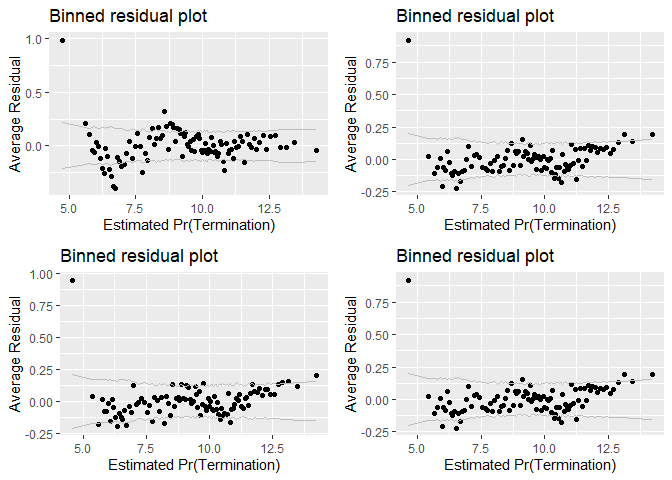<!-- --><!-- -->

```
## [[1]]
## CrisisProductOrServiceArea:(NAICS:NAICS3).(Intercept) 
##                                            0.21331811 
##                             Office:Agency.(Intercept) 
##                                            0.22674249 
##                              NAICS:NAICS3.(Intercept) 
##                                            0.12363482 
##                          PlaceCountryISO3.(Intercept) 
##                                            0.19111028 
##                                    NAICS3.(Intercept) 
##                                            0.15328473 
##                                    Agency.(Intercept) 
##                                            0.13348729 
##                                   StartFY.(Intercept) 
##                                            0.05142825 
## 
## [[2]]
## CrisisProductOrServiceArea:(NAICS:NAICS3).(Intercept) 
##                                            0.21331811 
##                             Office:Agency.(Intercept) 
##                                            0.22674249 
##                              NAICS:NAICS3.(Intercept) 
##                                            0.12363482 
##                          PlaceCountryISO3.(Intercept) 
##                                            0.19111028 
##                                    NAICS3.(Intercept) 
##                                            0.15328473 
##                                    Agency.(Intercept) 
##                                            0.13348729 
##                                   StartFY.(Intercept) 
##                                            0.05142825 
## 
## [[3]]
## [1] "Model failed to converge with max|grad| = 0.00509054 (tol = 0.002, component 1)"
## 
## [[4]]
## [1] "Model failed to converge with max|grad| = 0.00509054 (tol = 0.002, component 1)"
```
The n_CBre25A model has a lower AIC and BIC and removing the interaction did not restore the significance to the p_PBSC or cl_Pair. Sticking wih 25A.

####27A: 2019-08-22 CFTE:Pricing
Dropping cp_OffPerf7:cp_PairObl7 and cp_OffPerf7:cp_PairObl7 as they were not significant in 2A. Adding Pricing:cln_PSCrate as a realized that it is another way to consider Pricing:AverageSalary that turns out to avoid VIF problems in the likelihood of breach model. 

Current cumulative b_CBre model: b_cbre_CFTE_pricing_22B, b_CBre25A
Current cumulative n_Cbre model: n_cbre_partnership_actions_16B, n_CBre25A


```r
if(file.exists("..//Output//b_CBre27A.rda")) load("..//Output//b_CBre27A.rda")

if(!exists("b_CBre27A")){
  #Create the model
  b_CBre27A <- glmer(data=serv_smp, b_CBre ~  cln_US6sal + 
                       cln_PSCrate+ cp_OffPerf7+cp_OffPSC7+
                       cn_PairHist7+cln_PairCA+
                       cln_Base + clr_Ceil2Base + cln_Days+
                       Comp+
                       Veh+
                       Pricing+
                       Crisis+
                       cln_Def6HHI+clr_Def6toUS+
                       #cln_Def3HHI+
                       clr_Def3toUS+
                       cp_PairObl7+
                       cln_OffObl7+ 
                       #cln_OffFocus+ 
                       cp_OffPerf7:cln_PairCA+#cp_OffPerf7:cp_PairObl7+
                       cp_OffPerf7:cln_Days+
                       Pricing:cln_PSCrate+
                       #clr_Ceil2Base:cln_Base+
                       
                       (1 | NAICS3/NAICS6/ServArea)+  
                       (1 | Agency/Office) +
                       (1 | Place)+ 
                       (1 | StartFY),
                     family=binomial(link="logit"),
                     verbose=TRUE)
  save(b_CBre27A,file="..\\output\\b_CBre27A.rda")
}

glmer_examine(b_CBre27A,display = TRUE)
```

```
## glmer(formula = b_CBre ~ cl_US6_avg_sal_lag1Const + cl_CFTE + 
##     c_pPBSC + c_pOffPSC + c_pairHist + cl_pairCA + cl_Base + 
##     cl_Base2Ceil + cl_Days + Comp1or5 + Veh + PricingUCA + Crisis + 
##     cl_def6_HHI_lag1 + cl_def6_ratio_lag1 + cl_def3_ratio_lag1 + 
##     c_pMarket + cl_OffVol + c_pPBSC:cl_pairCA + c_pPBSC:cl_Days + 
##     PricingUCA:cl_CFTE + (1 | NAICS3/NAICS/CrisisProductOrServiceArea) + 
##     (1 | Agency/Office) + (1 | PlaceCountryISO3) + (1 | StartFY), 
##     data = serv_smp, family = binomial(link = "logit"), verbose = TRUE)
##                                        coef.est coef.se
## (Intercept)                            -4.28     0.21  
## cl_US6_avg_sal_lag1Const               -0.14     0.08  
## cl_CFTE                                 0.03     0.03  
## c_pPBSC                                 0.08     0.05  
## c_pOffPSC                               0.14     0.04  
## c_pairHist                             -0.07     0.02  
## cl_pairCA                               0.45     0.04  
## cl_Base                                 1.32     0.03  
## cl_Base2Ceil                            0.26     0.02  
## cl_Days                                 0.30     0.03  
## Comp1or51 offer                        -0.04     0.04  
## Comp1or52-4 offers                      0.05     0.03  
## Comp1or55+ offers                       0.15     0.03  
## VehS-IDC                               -0.50     0.03  
## VehM-IDC                               -0.19     0.04  
## VehFSS/GWAC                             0.04     0.06  
## VehBPA/BOA                             -0.22     0.06  
## PricingUCAOther FP                     -0.11     0.15  
## PricingUCAT&M/LH/FPLOE                  0.04     0.09  
## PricingUCAIncentive                     1.10     0.28  
## PricingUCAOther CB                     -0.14     0.07  
## PricingUCAUCA                           0.02     0.09  
## PricingUCACombination or Other          0.35     0.09  
## CrisisARRA                              0.19     0.08  
## CrisisDis                               0.24     0.18  
## CrisisOCO                              -0.23     0.10  
## cl_def6_HHI_lag1                       -0.05     0.04  
## cl_def6_ratio_lag1                      0.00     0.04  
## cl_def3_ratio_lag1                     -0.35     0.12  
## c_pMarket                              -0.26     0.05  
## cl_OffVol                               0.07     0.03  
## c_pPBSC:cl_pairCA                       0.41     0.05  
## c_pPBSC:cl_Days                        -0.16     0.05  
## cl_CFTE:PricingUCAOther FP             -0.20     0.27  
## cl_CFTE:PricingUCAT&M/LH/FPLOE          0.28     0.25  
## cl_CFTE:PricingUCAIncentive             3.31     0.60  
## cl_CFTE:PricingUCAOther CB              0.30     0.16  
## cl_CFTE:PricingUCAUCA                  -0.16     0.16  
## cl_CFTE:PricingUCACombination or Other  0.06     0.25  
## 
## Error terms:
##  Groups                                    Name        Std.Dev.
##  CrisisProductOrServiceArea:(NAICS:NAICS3) (Intercept) 0.42    
##  Office:Agency                             (Intercept) 1.13    
##  NAICS:NAICS3                              (Intercept) 0.38    
##  PlaceCountryISO3                          (Intercept) 0.36    
##  NAICS3                                    (Intercept) 0.47    
##  Agency                                    (Intercept) 0.46    
##  StartFY                                   (Intercept) 0.16    
##  Residual                                              1.00    
## ---
## number of obs: 250000, groups: CrisisProductOrServiceArea:(NAICS:NAICS3), 2422; Office:Agency, 1009; NAICS:NAICS3, 794; PlaceCountryISO3, 168; NAICS3, 81; Agency, 26; StartFY, 9
## AIC = 88415.8, DIC = 82102.6
## deviance = 85213.2
```

```
## Warning: 'icc' is deprecated.
## Use 'performance::icc()' instead.
## See help("Deprecated")
```

```
## [[1]]
##                              GVIF Df GVIF^(1/(2*Df))
## cl_US6_avg_sal_lag1Const 1.027294  1        1.013555
## cl_CFTE                  1.075101  1        1.036871
## c_pPBSC                  1.294576  1        1.137794
## c_pOffPSC                1.594632  1        1.262787
## c_pairHist               1.261284  1        1.123069
## cl_pairCA                1.573671  1        1.254461
## cl_Base                  1.179058  1        1.085844
## cl_Base2Ceil             1.052802  1        1.026061
## cl_Days                  1.163412  1        1.078616
## Comp1or5                 1.127594  3        1.020216
## Veh                      1.434479  4        1.046133
## PricingUCA               8.276421  6        1.192578
## Crisis                   1.051467  3        1.008399
## cl_def6_HHI_lag1         1.025246  1        1.012544
## cl_def6_ratio_lag1       1.117320  1        1.057033
## cl_def3_ratio_lag1       1.124752  1        1.060543
## c_pMarket                1.234612  1        1.111131
## cl_OffVol                1.615549  1        1.271043
## c_pPBSC:cl_pairCA        1.154904  1        1.074665
## c_pPBSC:cl_Days          1.058702  1        1.028932
## cl_CFTE:PricingUCA       8.149194  6        1.191040
## 
## [[2]]
## # Intraclass Correlation Coefficient
## 
##      Adjusted ICC: 0.399
##   Conditional ICC: 0.354
## 
## [[3]]
## [1] "Model failed to converge with max|grad| = 0.0366972 (tol = 0.001, component 1)"
## 
## [[4]]
## CrisisProductOrServiceArea:(NAICS:NAICS3).(Intercept) 
##                                             0.4228388 
##                             Office:Agency.(Intercept) 
##                                             1.1338535 
##                              NAICS:NAICS3.(Intercept) 
##                                             0.3782417 
##                          PlaceCountryISO3.(Intercept) 
##                                             0.3611897 
##                                    NAICS3.(Intercept) 
##                                             0.4650322 
##                                    Agency.(Intercept) 
##                                             0.4553840 
##                                   StartFY.(Intercept) 
##                                             0.1554400
```

```r
stargazer::stargazer(b_cbre_CFTE_pricing_22B, b_CBre25A, b_CBre27A, type="text", digits=2)
```

```
## 
## ========================================================================
##                                               Dependent variable:       
##                                         --------------------------------
##                                                      b_CBre             
##                                          logistic   generalized linear  
##                                                        mixed-effects    
##                                            (1)        (2)        (3)    
## ------------------------------------------------------------------------
## cln_US6sal                               -0.11***                       
##                                           (0.03)                        
##                                                                         
## cln_PSCrate                              0.09***                        
##                                           (0.02)                        
##                                                                         
## cp_OffPerf7                              -0.21***                       
##                                           (0.02)                        
##                                                                         
## cp_OffPSC7                               1.13***                        
##                                           (0.02)                        
##                                                                         
## cn_PairHist7                               0.03                         
##                                           (0.02)                        
##                                                                         
## cln_PairCA                                 0.02                         
##                                           (0.03)                        
##                                                                         
## cln_Base                                 1.08***                        
##                                           (0.02)                        
##                                                                         
## clr_Ceil2Base                              0.02                         
##                                           (0.02)                        
##                                                                         
## cln_Days                                 0.14***                        
##                                           (0.02)                        
##                                                                         
## Comp1 offer                              -0.08**                        
##                                           (0.03)                        
##                                                                         
## Comp2-4 offers                           0.19***                        
##                                           (0.02)                        
##                                                                         
## Comp5+ offers                            0.29***                        
##                                           (0.03)                        
##                                                                         
## cl_US6_avg_sal_lag1Const                             -0.14*     -0.14*  
##                                                      (0.08)     (0.08)  
##                                                                         
## cl_CFTE                                               0.04       0.03   
##                                                      (0.03)     (0.03)  
##                                                                         
## c_pPBSC                                               0.08       0.08   
##                                                      (0.05)     (0.05)  
##                                                                         
## c_pOffPSC                                           0.15***    0.14***  
##                                                      (0.04)     (0.04)  
##                                                                         
## c_pairHist                                          -0.06**    -0.07*** 
##                                                      (0.02)     (0.02)  
##                                                                         
## cl_pairCA                                           0.45***    0.45***  
##                                                      (0.04)     (0.04)  
##                                                                         
## cl_Base                                             1.33***    1.32***  
##                                                      (0.03)     (0.03)  
##                                                                         
## cl_Base2Ceil                                        0.27***    0.26***  
##                                                      (0.02)     (0.02)  
##                                                                         
## cl_Days                                             0.30***    0.30***  
##                                                      (0.03)     (0.03)  
##                                                                         
## Comp1or51 offer                                      -0.03      -0.04   
##                                                      (0.04)     (0.04)  
##                                                                         
## Comp1or52-4 offers                                   0.06**     0.05*   
##                                                      (0.03)     (0.03)  
##                                                                         
## Comp1or55+ offers                                   0.15***    0.15***  
##                                                      (0.03)     (0.03)  
##                                                                         
## VehS-IDC                                 -0.21***   -0.50***   -0.50*** 
##                                           (0.03)     (0.03)     (0.03)  
##                                                                         
## VehM-IDC                                 -0.16***   -0.19***   -0.19*** 
##                                           (0.03)     (0.04)     (0.04)  
##                                                                         
## VehFSS/GWAC                              -0.53***     0.04       0.04   
##                                           (0.05)     (0.06)     (0.06)  
##                                                                         
## VehBPA/BOA                               -0.32***   -0.21***   -0.22*** 
##                                           (0.06)     (0.06)     (0.06)  
##                                                                         
## PricingOther FP                          -0.51***                       
##                                           (0.13)                        
##                                                                         
## PricingT&M/LH/FPLOE                      -0.55***                       
##                                           (0.08)                        
##                                                                         
## PricingIncentive                         -1.09***                       
##                                           (0.28)                        
##                                                                         
## PricingOther CB                          -0.93***                       
##                                           (0.06)                        
##                                                                         
## PricingUCA                                -0.09                         
##                                           (0.08)                        
##                                                                         
## PricingCombination or Other               -0.14                         
##                                           (0.09)                        
##                                                                         
## PricingUCAOther FP                                   -0.10      -0.11   
##                                                      (0.15)     (0.15)  
##                                                                         
## PricingUCAT&M/LH/FPLOE                                0.08       0.04   
##                                                      (0.08)     (0.09)  
##                                                                         
## PricingUCAIncentive                                 2.25***    1.10***  
##                                                      (0.14)     (0.28)  
##                                                                         
## PricingUCAOther CB                                   -0.08      -0.14*  
##                                                      (0.06)     (0.07)  
##                                                                         
## PricingUCAUCA                                        -0.02       0.02   
##                                                      (0.09)     (0.09)  
##                                                                         
## PricingUCACombination or Other                      0.36***    0.35***  
##                                                      (0.09)     (0.09)  
##                                                                         
## CrisisARRA                               0.78***     0.20**     0.19**  
##                                           (0.07)     (0.08)     (0.08)  
##                                                                         
## CrisisDis                                0.69***      0.26       0.24   
##                                           (0.16)     (0.18)     (0.18)  
##                                                                         
## CrisisOCO                                -0.23***   -0.23**    -0.23**  
##                                           (0.05)     (0.10)     (0.10)  
##                                                                         
## cln_Def6HHI                              0.16***                        
##                                           (0.02)                        
##                                                                         
## clr_Def6toUS                             -0.17***                       
##                                           (0.03)                        
##                                                                         
## cln_Def3HHI                              -0.45***                       
##                                           (0.03)                        
##                                                                         
## clr_Def3toUS                             -0.12***                       
##                                           (0.03)                        
##                                                                         
## cp_PairObl7                              -0.42***                       
##                                           (0.03)                        
##                                                                         
## cln_OffObl7                              -0.29***                       
##                                           (0.02)                        
##                                                                         
## cln_OffFocus                             -0.24***                       
##                                           (0.03)                        
##                                                                         
## cp_OffPerf7:cln_PairCA                   0.61***                        
##                                           (0.03)                        
##                                                                         
## cp_OffPerf7:cp_PairObl7                  -0.13***                       
##                                           (0.05)                        
##                                                                         
## cp_OffPerf7:cln_Days                     -0.58***                       
##                                           (0.04)                        
##                                                                         
## cln_Base:clr_Ceil2Base                   0.10***                        
##                                           (0.03)                        
##                                                                         
## cln_PSCrate:PricingOther FP              -0.89***                       
##                                           (0.26)                        
##                                                                         
## cln_PSCrate:PricingT&M/LH/FPLOE            0.12                         
##                                           (0.23)                        
##                                                                         
## cln_PSCrate:PricingIncentive             3.12***                        
##                                           (0.62)                        
##                                                                         
## cln_PSCrate:PricingOther CB              -0.32**                        
##                                           (0.15)                        
##                                                                         
## cln_PSCrate:PricingUCA                     0.01                         
##                                           (0.16)                        
##                                                                         
## cln_PSCrate:PricingCombination or Other  -0.68***                       
##                                           (0.25)                        
##                                                                         
## cl_def6_HHI_lag1                                     -0.05      -0.05   
##                                                      (0.04)     (0.04)  
##                                                                         
## cl_def6_ratio_lag1                                   -0.003     -0.004  
##                                                      (0.04)     (0.04)  
##                                                                         
## cl_def3_ratio_lag1                                  -0.37***   -0.35*** 
##                                                      (0.12)     (0.12)  
##                                                                         
## c_pMarket                                           -0.25***   -0.26*** 
##                                                      (0.05)     (0.05)  
##                                                                         
## cl_OffVol                                            0.07**     0.07**  
##                                                      (0.03)     (0.03)  
##                                                                         
## c_pPBSC:cl_pairCA                                   0.44***    0.41***  
##                                                      (0.05)     (0.05)  
##                                                                         
## c_pPBSC:c_pMarket                                    -0.05              
##                                                      (0.06)             
##                                                                         
## c_pPBSC:cl_Days                                     -0.15***   -0.16*** 
##                                                      (0.05)     (0.05)  
##                                                                         
## cl_Base:cl_Base2Ceil                                 -0.03              
##                                                      (0.03)             
##                                                                         
## cl_CFTE:PricingUCAOther FP                                      -0.20   
##                                                                 (0.27)  
##                                                                         
## cl_CFTE:PricingUCAT&M/LH/FPLOE                                   0.28   
##                                                                 (0.25)  
##                                                                         
## cl_CFTE:PricingUCAIncentive                                    3.31***  
##                                                                 (0.60)  
##                                                                         
## cl_CFTE:PricingUCAOther CB                                      0.30*   
##                                                                 (0.16)  
##                                                                         
## cl_CFTE:PricingUCAUCA                                           -0.16   
##                                                                 (0.16)  
##                                                                         
## cl_CFTE:PricingUCACombination or Other                           0.06   
##                                                                 (0.25)  
##                                                                         
## Constant                                 -3.00***   -4.29***   -4.28*** 
##                                           (0.02)     (0.21)     (0.21)  
##                                                                         
## ------------------------------------------------------------------------
## Observations                             250,000    250,000    250,000  
## Log Likelihood                          -50,996.01 -44,181.82 -44,161.92
## Akaike Inf. Crit.                       102,078.00 88,447.64  88,415.84 
## Bayesian Inf. Crit.                                88,885.66  88,895.58 
## ========================================================================
## Note:                                        *p<0.1; **p<0.05; ***p<0.01
```

```r
summary_residual_compare(b_cbre_CFTE_pricing_22B, b_CBre27A, b_CBre25A, b_CBre27A,bins=100)
```

<!-- -->

```
## Warning in residuals_binned(model1_old, bins = bins): Always uses Xlb
## Estimated Pr(Termination), should update.
```

```
## Warning in residuals_binned(model1_new, bins = bins): Always uses Xlb
## Estimated Pr(Termination), should update.
```

```
## Warning in residuals_binned(model2_old, bins = bins): Always uses Xlb
## Estimated Pr(Termination), should update.
```

```
## Warning in residuals_binned(model2_new, bins = bins): Always uses Xlb
## Estimated Pr(Termination), should update.
```

<!-- --><!-- -->

```
## [[1]]
## CrisisProductOrServiceArea:(NAICS:NAICS3).(Intercept) 
##                                             0.4228388 
##                             Office:Agency.(Intercept) 
##                                             1.1338535 
##                              NAICS:NAICS3.(Intercept) 
##                                             0.3782417 
##                          PlaceCountryISO3.(Intercept) 
##                                             0.3611897 
##                                    NAICS3.(Intercept) 
##                                             0.4650322 
##                                    Agency.(Intercept) 
##                                             0.4553840 
##                                   StartFY.(Intercept) 
##                                             0.1554400 
## 
## [[2]]
## CrisisProductOrServiceArea:(NAICS:NAICS3).(Intercept) 
##                                             0.4228388 
##                             Office:Agency.(Intercept) 
##                                             1.1338535 
##                              NAICS:NAICS3.(Intercept) 
##                                             0.3782417 
##                          PlaceCountryISO3.(Intercept) 
##                                             0.3611897 
##                                    NAICS3.(Intercept) 
##                                             0.4650322 
##                                    Agency.(Intercept) 
##                                             0.4553840 
##                                   StartFY.(Intercept) 
##                                             0.1554400 
## 
## [[3]]
## [1] "Model failed to converge with max|grad| = 0.0366972 (tol = 0.001, component 1)"
## 
## [[4]]
## [1] "Model failed to converge with max|grad| = 0.0366972 (tol = 0.001, component 1)"
```
AIC is a  bit lower but the results, when significant, are not in line with expectation. Leaving out CFTE:PPricing.


####28A and 28B: 2019-08-22 Just PBSC and pairCA/Days

Trimming down to interactions that are present in n_CBRre (pPBSC:cln_PairCA) or significant and in line with expectations (pPBSC:Days)


Dropping PBSC:pairCA for both models. For frequency it's contrary to expectation and for size the base variables are no longer significant. Also dropping  cp_OffPerf7:c_pMarketand for frequency, which is not siginifcant. Keeping base:ratio despite lack of significance because of switching to it for size.
This was created while we were still using ceiling instead of base.

Current cumulative b_CBre model: b_CBre_base2ceil_ceiling_21B; b_CBre25A
Current cumulative n_Cbre model: n_cbre_partnership_actions_16B; n_CBre25A


```r
if(file.exists("..//Output//b_CBre28AB.rda")) load("..//Output//b_CBre28AB.rda")

if(!exists("b_CBre28B")){
  #Create the model
  b_CBre28A <- glmer(data=serv_smp, b_CBre ~  cln_US6sal +
                       cln_PSCrate+ cp_OffPerf7+cp_OffPSC7+
                       cn_PairHist7+cln_PairCA+
                       cln_Base + clr_Ceil2Base + cln_Days+
                       Comp+
                       Veh+
                       Pricing+
                       Crisis+
                       cln_Def6HHI+clr_Def6toUS+
                       #cln_Def3HHI+
                       clr_Def3toUS+
                       cp_PairObl7+
                       cln_OffObl7+
                       #cln_OffFocus+
                       cp_OffPerf7:cln_PairCA+
                       #cp_OffPerf7:cp_PairObl7+
                       cp_OffPerf7:cln_Days+
                       # clr_Ceil2Base:cln_Base+
                       (1 | NAICS3/NAICS6/ServArea)+
                       (1 | Agency/Office) +
                       (1 | Place)+
                       (1 | StartFY),
                     family=binomial(link="logit"),
                     verbose=TRUE)
  
  b_CBre28B <- glmer(data=serv_smp1m, b_CBre ~  cln_US6sal +
                       cln_PSCrate+ cp_OffPerf7+cp_OffPSC7+
                       cn_PairHist7+cln_PairCA+
                       cln_Base + clr_Ceil2Base + cln_Days+
                       Comp+
                       Veh+
                       Pricing+
                       Crisis+
                       cln_Def6HHI+clr_Def6toUS+
                       #cln_Def3HHI+
                       clr_Def3toUS+
                       cp_PairObl7+
                       cln_OffObl7+
                       #cln_OffFocus+
                       cp_OffPerf7:cln_PairCA+
                       #cp_OffPerf7:cp_PairObl7+
                       cp_OffPerf7:cln_Days+
                       # clr_Ceil2Base:cln_Base+
                       (1 | NAICS3/NAICS6/ServArea)+
                       (1 | Agency/Office) +
                       (1 | Place)+
                       (1 | StartFY),
                     family=binomial(link="logit"),
                     verbose=TRUE)
  save(b_CBre28A,b_CBre28B,file="..\\output\\b_CBre28AB.rda")
}

#Compare the models
glmer_examine(b_CBre28B,display = TRUE)
```

```
## glmer(formula = b_CBre ~ cl_US6_avg_sal_lag1Const + cl_CFTE + 
##     c_pPBSC + c_pOffPSC + c_pairHist + cl_pairCA + cl_Base + 
##     cl_Base2Ceil + cl_Days + Comp1or5 + Veh + PricingUCA + Crisis + 
##     cl_def6_HHI_lag1 + cl_def6_ratio_lag1 + cl_def3_ratio_lag1 + 
##     c_pMarket + cl_OffVol + c_pPBSC:cl_pairCA + c_pPBSC:cl_Days + 
##     (1 | NAICS3/NAICS/CrisisProductOrServiceArea) + (1 | Agency/Office) + 
##     (1 | PlaceCountryISO3) + (1 | StartFY), data = serv_smp1m, 
##     family = binomial(link = "logit"), verbose = TRUE)
##                                coef.est coef.se
## (Intercept)                    -4.62     0.18  
## cl_US6_avg_sal_lag1Const        0.00     0.06  
## cl_CFTE                         0.06     0.01  
## c_pPBSC                         0.07     0.03  
## c_pOffPSC                       0.17     0.02  
## c_pairHist                     -0.08     0.01  
## cl_pairCA                       0.44     0.02  
## cl_Base                         1.35     0.01  
## cl_Base2Ceil                    0.25     0.01  
## cl_Days                         0.28     0.01  
## Comp1or51 offer                -0.03     0.02  
## Comp1or52-4 offers              0.11     0.01  
## Comp1or55+ offers               0.18     0.01  
## VehS-IDC                       -0.49     0.02  
## VehM-IDC                       -0.18     0.02  
## VehFSS/GWAC                    -0.01     0.03  
## VehBPA/BOA                     -0.30     0.03  
## PricingUCAOther FP             -0.40     0.08  
## PricingUCAIncentive             2.39     0.07  
## PricingUCACombination or Other  0.25     0.05  
## PricingUCAOther CB             -0.09     0.03  
## PricingUCAT&M/LH/FPLOE          0.11     0.04  
## PricingUCAUCA                   0.07     0.04  
## CrisisARRA                      0.13     0.04  
## CrisisDis                       0.06     0.09  
## CrisisOCO                      -0.09     0.05  
## cl_def6_HHI_lag1               -0.02     0.02  
## cl_def6_ratio_lag1              0.06     0.03  
## cl_def3_ratio_lag1             -0.50     0.07  
## c_pMarket                      -0.25     0.03  
## cl_OffVol                       0.07     0.02  
## c_pPBSC:cl_pairCA               0.37     0.03  
## c_pPBSC:cl_Days                -0.12     0.02  
## 
## Error terms:
##  Groups                                    Name        Std.Dev.
##  CrisisProductOrServiceArea:(NAICS:NAICS3) (Intercept) 0.46    
##  Office:Agency                             (Intercept) 1.27    
##  NAICS:NAICS3                              (Intercept) 0.38    
##  PlaceCountryISO3                          (Intercept) 0.44    
##  NAICS3                                    (Intercept) 0.45    
##  Agency                                    (Intercept) 0.41    
##  StartFY                                   (Intercept) 0.16    
##  Residual                                              1.00    
## ---
## number of obs: 1000000, groups: CrisisProductOrServiceArea:(NAICS:NAICS3), 3242; Office:Agency, 1092; NAICS:NAICS3, 878; PlaceCountryISO3, 186; NAICS3, 82; Agency, 26; StartFY, 9
## AIC = 347751, DIC = 336787.2
## deviance = 342229.2
```

```
## Warning: 'icc' is deprecated.
## Use 'performance::icc()' instead.
## See help("Deprecated")
```

```
## [[1]]
##                              GVIF Df GVIF^(1/(2*Df))
## cl_US6_avg_sal_lag1Const 1.031175  1        1.015468
## cl_CFTE                  1.041007  1        1.020297
## c_pPBSC                  1.324680  1        1.150947
## c_pOffPSC                1.675218  1        1.294302
## c_pairHist               1.265508  1        1.124948
## cl_pairCA                1.553935  1        1.246569
## cl_Base                  1.178220  1        1.085458
## cl_Base2Ceil             1.054318  1        1.026800
## cl_Days                  1.167139  1        1.080342
## Comp1or5                 1.120681  3        1.019171
## Veh                      1.424709  4        1.045239
## PricingUCA               1.065826  6        1.005327
## Crisis                   1.045652  3        1.007468
## cl_def6_HHI_lag1         1.030395  1        1.015084
## cl_def6_ratio_lag1       1.178209  1        1.085453
## cl_def3_ratio_lag1       1.189484  1        1.090635
## c_pMarket                1.229222  1        1.108703
## cl_OffVol                1.737031  1        1.317965
## c_pPBSC:cl_pairCA        1.163269  1        1.078550
## c_pPBSC:cl_Days          1.064318  1        1.031658
## 
## [[2]]
## # Intraclass Correlation Coefficient
## 
##      Adjusted ICC: 0.437
##   Conditional ICC: 0.389
## 
## [[3]]
## [1] "Model failed to converge with max|grad| = 0.00658322 (tol = 0.001, component 1)"
## 
## [[4]]
## CrisisProductOrServiceArea:(NAICS:NAICS3).(Intercept) 
##                                             0.4607293 
##                             Office:Agency.(Intercept) 
##                                             1.2665447 
##                              NAICS:NAICS3.(Intercept) 
##                                             0.3823634 
##                          PlaceCountryISO3.(Intercept) 
##                                             0.4414528 
##                                    NAICS3.(Intercept) 
##                                             0.4490300 
##                                    Agency.(Intercept) 
##                                             0.4127089 
##                                   StartFY.(Intercept) 
##                                             0.1551961
```

```r
stargazer::stargazer(b_CBre25A, b_CBre28A, b_CBre28B, type="text", digits=2)
```

```
## 
## ================================================================
##                                       Dependent variable:       
##                                ---------------------------------
##                                             b_CBre              
##                                   (1)        (2)         (3)    
## ----------------------------------------------------------------
## cl_US6_avg_sal_lag1Const         -0.14*     -0.14*     -0.005   
##                                  (0.08)     (0.08)     (0.06)   
##                                                                 
## cl_CFTE                           0.04       0.04      0.06***  
##                                  (0.03)     (0.03)     (0.01)   
##                                                                 
## c_pPBSC                           0.08       0.08      0.07**   
##                                  (0.05)     (0.05)     (0.03)   
##                                                                 
## c_pOffPSC                       0.15***    0.15***     0.17***  
##                                  (0.04)     (0.04)     (0.02)   
##                                                                 
## c_pairHist                      -0.06**    -0.07***   -0.08***  
##                                  (0.02)     (0.02)     (0.01)   
##                                                                 
## cl_pairCA                       0.45***    0.45***     0.44***  
##                                  (0.04)     (0.04)     (0.02)   
##                                                                 
## cl_Base                         1.33***    1.32***     1.35***  
##                                  (0.03)     (0.03)     (0.01)   
##                                                                 
## cl_Base2Ceil                    0.27***    0.26***     0.25***  
##                                  (0.02)     (0.02)     (0.01)   
##                                                                 
## cl_Days                         0.30***    0.30***     0.28***  
##                                  (0.03)     (0.03)     (0.01)   
##                                                                 
## Comp1or51 offer                  -0.03      -0.04      -0.03*   
##                                  (0.04)     (0.04)     (0.02)   
##                                                                 
## Comp1or52-4 offers               0.06**     0.05**     0.11***  
##                                  (0.03)     (0.03)     (0.01)   
##                                                                 
## Comp1or55+ offers               0.15***    0.15***     0.18***  
##                                  (0.03)     (0.03)     (0.01)   
##                                                                 
## VehS-IDC                        -0.50***   -0.50***   -0.49***  
##                                  (0.03)     (0.03)     (0.02)   
##                                                                 
## VehM-IDC                        -0.19***   -0.19***   -0.18***  
##                                  (0.04)     (0.04)     (0.02)   
##                                                                 
## VehFSS/GWAC                       0.04       0.04       -0.01   
##                                  (0.06)     (0.06)     (0.03)   
##                                                                 
## VehBPA/BOA                      -0.21***   -0.21***   -0.30***  
##                                  (0.06)     (0.06)     (0.03)   
##                                                                 
## PricingUCAOther FP               -0.10      -0.09     -0.40***  
##                                  (0.15)     (0.15)     (0.08)   
##                                                                 
## PricingUCAT&M/LH/FPLOE            0.08       0.08      0.11**   
##                                  (0.08)     (0.08)     (0.04)   
##                                                                 
## PricingUCAIncentive             2.25***    2.25***     2.39***  
##                                  (0.14)     (0.14)     (0.07)   
##                                                                 
## PricingUCAOther CB               -0.08      -0.09     -0.09***  
##                                  (0.06)     (0.06)     (0.03)   
##                                                                 
## PricingUCAUCA                    -0.02      -0.01       0.07*   
##                                  (0.09)     (0.09)     (0.04)   
##                                                                 
## PricingUCACombination or Other  0.36***    0.35***     0.25***  
##                                  (0.09)     (0.09)     (0.05)   
##                                                                 
## CrisisARRA                       0.20**     0.19**     0.13***  
##                                  (0.08)     (0.08)     (0.04)   
##                                                                 
## CrisisDis                         0.26       0.25       0.06    
##                                  (0.18)     (0.18)     (0.09)   
##                                                                 
## CrisisOCO                       -0.23**    -0.22**     -0.09*   
##                                  (0.10)     (0.10)     (0.05)   
##                                                                 
## cl_def6_HHI_lag1                 -0.05      -0.05       -0.02   
##                                  (0.04)     (0.04)     (0.02)   
##                                                                 
## cl_def6_ratio_lag1               -0.003    -0.0003     0.06**   
##                                  (0.04)     (0.04)     (0.03)   
##                                                                 
## cl_def3_ratio_lag1              -0.37***   -0.37***   -0.50***  
##                                  (0.12)     (0.12)     (0.07)   
##                                                                 
## c_pMarket                       -0.25***   -0.26***   -0.25***  
##                                  (0.05)     (0.05)     (0.03)   
##                                                                 
## cl_OffVol                        0.07**     0.07**     0.07***  
##                                  (0.03)     (0.03)     (0.02)   
##                                                                 
## c_pPBSC:cl_pairCA               0.44***    0.42***     0.37***  
##                                  (0.05)     (0.05)     (0.03)   
##                                                                 
## c_pPBSC:c_pMarket                -0.05                          
##                                  (0.06)                         
##                                                                 
## c_pPBSC:cl_Days                 -0.15***   -0.16***   -0.12***  
##                                  (0.05)     (0.05)     (0.02)   
##                                                                 
## cl_Base:cl_Base2Ceil             -0.03                          
##                                  (0.03)                         
##                                                                 
## Constant                        -4.29***   -4.28***   -4.62***  
##                                  (0.21)     (0.21)     (0.18)   
##                                                                 
## ----------------------------------------------------------------
## Observations                    250,000    250,000    1,000,000 
## Log Likelihood                 -44,181.82 -44,182.28 -173,835.60
## Akaike Inf. Crit.              88,447.64  88,444.56  347,751.20 
## Bayesian Inf. Crit.            88,885.66  88,861.73  348,223.80 
## ================================================================
## Note:                                *p<0.1; **p<0.05; ***p<0.01
```

```r
summary_residual_compare( b_CBre25A, b_CBre28A,b_CBre25A,b_CBre28B,bins=100)
```

<!-- -->

```
## Warning in residuals_binned(model1_old, bins = bins): Always uses Xlb
## Estimated Pr(Termination), should update.
```

```
## Warning in residuals_binned(model1_new, bins = bins): Always uses Xlb
## Estimated Pr(Termination), should update.
```

```
## Warning in residuals_binned(model2_old, bins = bins): Always uses Xlb
## Estimated Pr(Termination), should update.
```

```
## Warning in residuals_binned(model2_new, bins = bins): Always uses Xlb
## Estimated Pr(Termination), should update.
```

<!-- --><!-- -->

```
## [[1]]
## CrisisProductOrServiceArea:(NAICS:NAICS3).(Intercept) 
##                                             0.4216702 
##                             Office:Agency.(Intercept) 
##                                             1.1409696 
##                              NAICS:NAICS3.(Intercept) 
##                                             0.3770954 
##                          PlaceCountryISO3.(Intercept) 
##                                             0.3539374 
##                                    NAICS3.(Intercept) 
##                                             0.4654908 
##                                    Agency.(Intercept) 
##                                             0.4553944 
##                                   StartFY.(Intercept) 
##                                             0.1538218 
## 
## [[2]]
## CrisisProductOrServiceArea:(NAICS:NAICS3).(Intercept) 
##                                             0.4607293 
##                             Office:Agency.(Intercept) 
##                                             1.2665447 
##                              NAICS:NAICS3.(Intercept) 
##                                             0.3823634 
##                          PlaceCountryISO3.(Intercept) 
##                                             0.4414528 
##                                    NAICS3.(Intercept) 
##                                             0.4490300 
##                                    Agency.(Intercept) 
##                                             0.4127089 
##                                   StartFY.(Intercept) 
##                                             0.1551961 
## 
## [[3]]
## [1] "Model failed to converge with max|grad| = 0.138617 (tol = 0.001, component 1)"
## 
## [[4]]
## [1] "Model failed to converge with max|grad| = 0.00658322 (tol = 0.001, component 1)"
```

####29A and 29B: 2019-08-22 Restoring cln_Def3HHI and cln_OffFocus


```r
if(file.exists("..//Output//b_CBre29AB.rda")) load("..//Output//b_CBre29AB.rda")

if(!exists("b_CBre29B")){
  #Create the model
  b_CBre29A <- glmer(data=serv_smp, b_CBre ~  cln_US6sal +
                       cln_PSCrate+ cp_OffPerf7+cp_OffPSC7+
                       cn_PairHist7+cln_PairCA+
                       cln_Base + clr_Ceil2Base + cln_Days+
                       Comp+
                       Veh+
                       Pricing+
                       Crisis+
                       cln_Def6HHI+clr_Def6toUS+
                       cln_Def3HHI+
                       clr_Def3toUS+
                       cp_PairObl7+
                       cln_OffObl7+
                       cln_OffFocus+
                       cp_OffPerf7:cln_PairCA+
                       #cp_OffPerf7:cp_PairObl7+
                       cp_OffPerf7:cln_Days+
                       # clr_Ceil2Base:cln_Base+
                       (1 | NAICS3/NAICS6/ServArea)+
                       (1 | Agency/Office) +
                       (1 | Place)+
                       (1 | StartFY),
                     family=binomial(link="logit"),
                     verbose=TRUE)
  save(b_CBre29A,file="..\\output\\b_CBre29A.rda")
  
  b_CBre29B <- glmer(data=serv_smp1m, b_CBre ~  cln_US6sal +
                       cln_PSCrate+ cp_OffPerf7+cp_OffPSC7+
                       cn_PairHist7+cln_PairCA+
                       cln_Base + clr_Ceil2Base + cln_Days+
                       Comp+
                       Veh+
                       Pricing+
                       Crisis+
                       cln_Def6HHI+clr_Def6toUS+
                       #cln_Def3HHI+
                       clr_Def3toUS+
                       cp_PairObl7+
                       cln_OffObl7+
                       cln_OffFocus+
                       cp_OffPerf7:cln_PairCA+
                       #cp_OffPerf7:cp_PairObl7+
                       cp_OffPerf7:cln_Days+
                       # clr_Ceil2Base:cln_Base+
                       (1 | NAICS3/NAICS6/ServArea)+
                       (1 | Agency/Office) +
                       (1 | Place)+
                       (1 | StartFY),
                     family=binomial(link="logit"),
                     verbose=TRUE)
  save(b_CBre29A,b_CBre29B,file="..\\output\\b_CBre29AB.rda")
}

#Compare the models
glmer_examine(b_CBre29B,display = TRUE)
```

```
## glmer(formula = b_CBre ~ cln_US6sal + cln_PSCrate + cp_OffPerf7 + 
##     cp_OffPSC7 + cn_PairHist7 + cln_PairCA + cln_Base + clr_Ceil2Base + 
##     cln_Days + Comp + Veh + Pricing + Crisis + cln_Def6HHI + 
##     clr_Def6toUS + clr_Def3toUS + cp_PairObl7 + cln_OffObl7 + 
##     cln_OffFocus + cp_OffPerf7:cln_PairCA + cp_OffPerf7:cln_Days + 
##     (1 | NAICS3/NAICS6/ServArea) + (1 | Agency/Office) + (1 | 
##     Place) + (1 | StartFY), data = serv_smp1m, family = binomial(link = "logit"), 
##     verbose = TRUE)
##                             coef.est coef.se
## (Intercept)                 -4.55     0.18  
## cln_US6sal                   0.00     0.06  
## cln_PSCrate                  0.06     0.01  
## cp_OffPerf7                  0.07     0.03  
## cp_OffPSC7                   0.19     0.02  
## cn_PairHist7                -0.08     0.01  
## cln_PairCA                   0.44     0.02  
## cln_Base                     1.35     0.01  
## clr_Ceil2Base                0.25     0.01  
## cln_Days                     0.28     0.01  
## Comp1 offer                 -0.03     0.02  
## Comp2-4 offers               0.11     0.01  
## Comp5+ offers                0.18     0.01  
## VehS-IDC                    -0.48     0.02  
## VehM-IDC                    -0.18     0.02  
## VehFSS/GWAC                 -0.01     0.03  
## VehBPA/BOA                  -0.29     0.03  
## PricingOther FP             -0.40     0.09  
## PricingIncentive             2.39     0.07  
## PricingCombination or Other  0.26     0.05  
## PricingOther CB             -0.09     0.03  
## PricingT&M/LH/FPLOE          0.11     0.04  
## PricingUCA                   0.07     0.04  
## CrisisARRA                   0.12     0.04  
## CrisisDis                    0.07     0.09  
## CrisisOCO                   -0.10     0.05  
## cln_Def6HHI                 -0.02     0.02  
## clr_Def6toUS                 0.07     0.03  
## clr_Def3toUS                -0.46     0.07  
## cp_PairObl7                 -0.24     0.03  
## cln_OffObl7                  0.04     0.02  
## cln_OffFocus                -0.36     0.04  
## cp_OffPerf7:cln_PairCA       0.38     0.03  
## cp_OffPerf7:cln_Days        -0.12     0.02  
## 
## Error terms:
##  Groups                   Name        Std.Dev.
##  ServArea:(NAICS6:NAICS3) (Intercept) 0.46    
##  Office:Agency            (Intercept) 1.24    
##  NAICS6:NAICS3            (Intercept) 0.38    
##  Place                    (Intercept) 0.44    
##  NAICS3                   (Intercept) 0.44    
##  Agency                   (Intercept) 0.40    
##  StartFY                  (Intercept) 0.14    
##  Residual                             1.00    
## ---
## number of obs: 1000000, groups: ServArea:(NAICS6:NAICS3), 3242; Office:Agency, 1092; NAICS6:NAICS3, 878; Place, 186; NAICS3, 82; Agency, 26; StartFY, 9
## AIC = 347679, DIC = 336795.5
## deviance = 342196.4
```

```
## Warning: 'icc' is deprecated.
## Use 'performance::icc()' instead.
## See help("Deprecated")
```

```
## [[1]]
##                            GVIF Df GVIF^(1/(2*Df))
## cln_US6sal             1.031540  1        1.015647
## cln_PSCrate            1.040981  1        1.020285
## cp_OffPerf7            1.327036  1        1.151971
## cp_OffPSC7             1.694827  1        1.301855
## cn_PairHist7           1.266040  1        1.125184
## cln_PairCA             1.556359  1        1.247541
## cln_Base               1.178172  1        1.085436
## clr_Ceil2Base          1.054316  1        1.026799
## cln_Days               1.167189  1        1.080365
## Comp                   1.121085  3        1.019232
## Veh                    1.430197  4        1.045742
## Pricing                1.067455  6        1.005455
## Crisis                 1.046224  3        1.007560
## cln_Def6HHI            1.030654  1        1.015211
## clr_Def6toUS           1.180614  1        1.086561
## clr_Def3toUS           1.194564  1        1.092961
## cp_PairObl7            1.233907  1        1.110814
## cln_OffObl7            1.811823  1        1.346040
## cln_OffFocus           1.061505  1        1.030293
## cp_OffPerf7:cln_PairCA 1.166241  1        1.079926
## cp_OffPerf7:cln_Days   1.064677  1        1.031832
## 
## [[2]]
## # Intraclass Correlation Coefficient
## 
##      Adjusted ICC: 0.428
##   Conditional ICC: 0.381
## 
## [[3]]
## [1] "Model failed to converge with max|grad| = 0.0670472 (tol = 0.001, component 1)"
## 
## [[4]]
## ServArea:(NAICS6:NAICS3).(Intercept)            Office:Agency.(Intercept) 
##                            0.4607491                            1.2414533 
##            NAICS6:NAICS3.(Intercept)                    Place.(Intercept) 
##                            0.3823538                            0.4392544 
##                   NAICS3.(Intercept)                   Agency.(Intercept) 
##                            0.4442963                            0.3961069 
##                  StartFY.(Intercept) 
##                            0.1391915
```

```r
stargazer::stargazer(b_CBre28A, b_CBre29A, b_CBre28B, b_CBre29B, type="text", digits=2)
```

```
## 
## ============================================================================
##                                             Dependent variable:             
##                                ---------------------------------------------
##                                                   b_CBre                    
##                                   (1)        (2)         (3)         (4)    
## ----------------------------------------------------------------------------
## cl_US6_avg_sal_lag1Const         -0.14*     -0.14*     -0.005               
##                                  (0.08)     (0.08)     (0.06)               
##                                                                             
## cl_CFTE                           0.04       0.04      0.06***              
##                                  (0.03)     (0.03)     (0.01)               
##                                                                             
## c_pPBSC                           0.08      0.08*      0.07**               
##                                  (0.05)     (0.05)     (0.03)               
##                                                                             
## c_pOffPSC                       0.15***    0.18***     0.17***              
##                                  (0.04)     (0.05)     (0.02)               
##                                                                             
## c_pairHist                      -0.07***   -0.07***   -0.08***              
##                                  (0.02)     (0.02)     (0.01)               
##                                                                             
## cl_pairCA                       0.45***    0.45***     0.44***              
##                                  (0.04)     (0.04)     (0.02)               
##                                                                             
## cl_Base                         1.32***    1.32***     1.35***              
##                                  (0.03)     (0.03)     (0.01)               
##                                                                             
## cl_Base2Ceil                    0.26***    0.26***     0.25***              
##                                  (0.02)     (0.02)     (0.01)               
##                                                                             
## cl_Days                         0.30***    0.30***     0.28***              
##                                  (0.03)     (0.03)     (0.01)               
##                                                                             
## Comp1or51 offer                  -0.04      -0.04      -0.03*               
##                                  (0.04)     (0.04)     (0.02)               
##                                                                             
## Comp1or52-4 offers               0.05**     0.05*      0.11***              
##                                  (0.03)     (0.03)     (0.01)               
##                                                                             
## Comp1or55+ offers               0.15***    0.15***     0.18***              
##                                  (0.03)     (0.03)     (0.01)               
##                                                                             
## cln_US6sal                                                         -0.003   
##                                                                    (0.06)   
##                                                                             
## cln_PSCrate                                                        0.06***  
##                                                                    (0.01)   
##                                                                             
## cp_OffPerf7                                                        0.07***  
##                                                                    (0.03)   
##                                                                             
## cp_OffPSC7                                                         0.19***  
##                                                                    (0.02)   
##                                                                             
## cn_PairHist7                                                      -0.08***  
##                                                                    (0.01)   
##                                                                             
## cln_PairCA                                                         0.44***  
##                                                                    (0.02)   
##                                                                             
## cln_Base                                                           1.35***  
##                                                                    (0.01)   
##                                                                             
## clr_Ceil2Base                                                      0.25***  
##                                                                    (0.01)   
##                                                                             
## cln_Days                                                           0.28***  
##                                                                    (0.01)   
##                                                                             
## Comp1 offer                                                        -0.03*   
##                                                                    (0.02)   
##                                                                             
## Comp2-4 offers                                                     0.11***  
##                                                                    (0.01)   
##                                                                             
## Comp5+ offers                                                      0.18***  
##                                                                    (0.01)   
##                                                                             
## VehS-IDC                        -0.50***   -0.50***   -0.49***    -0.48***  
##                                  (0.03)     (0.03)     (0.02)      (0.02)   
##                                                                             
## VehM-IDC                        -0.19***   -0.19***   -0.18***    -0.18***  
##                                  (0.04)     (0.04)     (0.02)      (0.02)   
##                                                                             
## VehFSS/GWAC                       0.04       0.05       -0.01       -0.01   
##                                  (0.06)     (0.06)     (0.03)      (0.03)   
##                                                                             
## VehBPA/BOA                      -0.21***   -0.20***   -0.30***    -0.29***  
##                                  (0.06)     (0.06)     (0.03)      (0.03)   
##                                                                             
## PricingUCAOther FP               -0.09      -0.09     -0.40***              
##                                  (0.15)     (0.15)     (0.08)               
##                                                                             
## PricingUCAT&M/LH/FPLOE            0.08       0.09      0.11**               
##                                  (0.08)     (0.08)     (0.04)               
##                                                                             
## PricingUCAIncentive             2.25***    2.25***     2.39***              
##                                  (0.14)     (0.14)     (0.07)               
##                                                                             
## PricingUCAOther CB               -0.09      -0.08     -0.09***              
##                                  (0.06)     (0.06)     (0.03)               
##                                                                             
## PricingUCAUCA                    -0.01      -0.003      0.07*               
##                                  (0.09)     (0.09)     (0.04)               
##                                                                             
## PricingUCACombination or Other  0.35***    0.38***     0.25***              
##                                  (0.09)     (0.09)     (0.05)               
##                                                                             
## PricingOther FP                                                   -0.40***  
##                                                                    (0.09)   
##                                                                             
## PricingIncentive                                                   2.39***  
##                                                                    (0.07)   
##                                                                             
## PricingCombination or Other                                        0.26***  
##                                                                    (0.05)   
##                                                                             
## PricingOther CB                                                   -0.09***  
##                                                                    (0.03)   
##                                                                             
## PricingT&M/LH/FPLOE                                                0.11**   
##                                                                    (0.04)   
##                                                                             
## PricingUCA                                                          0.07*   
##                                                                    (0.04)   
##                                                                             
## CrisisARRA                       0.19**     0.19**     0.13***     0.12***  
##                                  (0.08)     (0.08)     (0.04)      (0.04)   
##                                                                             
## CrisisDis                         0.25       0.25       0.06        0.07    
##                                  (0.18)     (0.18)     (0.09)      (0.09)   
##                                                                             
## CrisisOCO                       -0.22**    -0.23**     -0.09*      -0.10**  
##                                  (0.10)     (0.10)     (0.05)      (0.05)   
##                                                                             
## cl_def6_HHI_lag1                 -0.05     -0.10**      -0.02               
##                                  (0.04)     (0.05)     (0.02)               
##                                                                             
## cl_def6_ratio_lag1              -0.0003     -0.001     0.06**               
##                                  (0.04)     (0.04)     (0.03)               
##                                                                             
## cl_def3_HHI_lag1                             0.07                           
##                                             (0.05)                          
##                                                                             
## cl_def3_ratio_lag1              -0.37***   -0.34***   -0.50***              
##                                  (0.12)     (0.12)     (0.07)               
##                                                                             
## c_pMarket                       -0.26***   -0.23***   -0.25***              
##                                  (0.05)     (0.05)     (0.03)               
##                                                                             
## cl_OffVol                        0.07**      0.03      0.07***              
##                                  (0.03)     (0.03)     (0.02)               
##                                                                             
## cl_office_naics_hhi_k                      -0.41***                         
##                                             (0.07)                          
##                                                                             
## c_pPBSC:cl_pairCA               0.42***    0.43***     0.37***              
##                                  (0.05)     (0.05)     (0.03)               
##                                                                             
## c_pPBSC:cl_Days                 -0.16***   -0.16***   -0.12***              
##                                  (0.05)     (0.05)     (0.02)               
##                                                                             
## cln_Def6HHI                                                         -0.02   
##                                                                    (0.02)   
##                                                                             
## clr_Def6toUS                                                       0.07**   
##                                                                    (0.03)   
##                                                                             
## clr_Def3toUS                                                      -0.46***  
##                                                                    (0.07)   
##                                                                             
## cp_PairObl7                                                       -0.24***  
##                                                                    (0.03)   
##                                                                             
## cln_OffObl7                                                        0.04**   
##                                                                    (0.02)   
##                                                                             
## cln_OffFocus                                                      -0.36***  
##                                                                    (0.04)   
##                                                                             
## cp_OffPerf7:cln_PairCA                                             0.38***  
##                                                                    (0.03)   
##                                                                             
## cp_OffPerf7:cln_Days                                              -0.12***  
##                                                                    (0.02)   
##                                                                             
## Constant                        -4.28***   -4.24***   -4.62***    -4.55***  
##                                  (0.21)     (0.21)     (0.18)      (0.18)   
##                                                                             
## ----------------------------------------------------------------------------
## Observations                    250,000    250,000    1,000,000   1,000,000 
## Log Likelihood                 -44,182.28 -44,164.38 -173,835.60 -173,798.70
## Akaike Inf. Crit.              88,444.56  88,412.75  347,751.20  347,679.30 
## Bayesian Inf. Crit.            88,861.73  88,850.78  348,223.80  348,163.80 
## ============================================================================
## Note:                                            *p<0.1; **p<0.05; ***p<0.01
```

```r
summary_residual_compare( b_CBre28A, b_CBre29A,bins=100)
```

<!-- -->

```
## Warning in residuals_binned(model1_old, bins = bins): Always uses Xlb
## Estimated Pr(Termination), should update.
```

```
## Warning in residuals_binned(model1_new, bins = bins): Always uses Xlb
## Estimated Pr(Termination), should update.
```

<!-- -->

```
## [[1]]
## CrisisProductOrServiceArea:(NAICS:NAICS3).(Intercept) 
##                                             0.4189351 
##                             Office:Agency.(Intercept) 
##                                             1.1274423 
##                              NAICS:NAICS3.(Intercept) 
##                                             0.3817844 
##                          PlaceCountryISO3.(Intercept) 
##                                             0.3517281 
##                                    NAICS3.(Intercept) 
##                                             0.4750368 
##                                    Agency.(Intercept) 
##                                             0.4494679 
##                                   StartFY.(Intercept) 
##                                             0.1298307 
## 
## [[2]]
## [1] "Model failed to converge with max|grad| = 0.202532 (tol = 0.001, component 1)"
```

```r
summary_residual_compare( b_CBre28B,b_CBre29B,bins=100)
```

<!-- -->

```
## Warning in residuals_binned(model1_old, bins = bins): Always uses Xlb
## Estimated Pr(Termination), should update.

## Warning in residuals_binned(model1_old, bins = bins): Always uses Xlb
## Estimated Pr(Termination), should update.
```

<!-- -->

```
## [[1]]
## ServArea:(NAICS6:NAICS3).(Intercept)            Office:Agency.(Intercept) 
##                            0.4607491                            1.2414533 
##            NAICS6:NAICS3.(Intercept)                    Place.(Intercept) 
##                            0.3823538                            0.4392544 
##                   NAICS3.(Intercept)                   Agency.(Intercept) 
##                            0.4442963                            0.3961069 
##                  StartFY.(Intercept) 
##                            0.1391915 
## 
## [[2]]
## [1] "Model failed to converge with max|grad| = 0.0670472 (tol = 0.001, component 1)"
```

Adding off focus is significant in its own right in the expected direction and lowers AIC and BIC.
