---
title: "Defense Services Ceiling Breaches "
author: "Greg Sanders"
date: "Friday July 13, 2019"
output:
  html_document:
    keep_md: yes
--- 

Modeling Likelihood or size of Ceiling Breach
============================================================================

#Setup

```
## Warning: replacing previous import 'Hmisc::summarize' by 'dplyr::summarize'
## when loading 'csis360'
```

```
## Warning: replacing previous import 'Hmisc::src' by 'dplyr::src' when
## loading 'csis360'
```

```
## Warning: replacing previous import 'dplyr::intersect' by
## 'lubridate::intersect' when loading 'csis360'
```

```
## Warning: replacing previous import 'dplyr::union' by 'lubridate::union'
## when loading 'csis360'
```

```
## Warning: replacing previous import 'dplyr::setdiff' by 'lubridate::setdiff'
## when loading 'csis360'
```

```
## Loading required package: MASS
```

```
## Loading required package: Matrix
```

```
## Loading required package: lme4
```

```
## 
## arm (Version 1.10-1, built: 2018-4-12)
```

```
## Working directory is C:/Users/gsand/Repositories/Services/analysis
```

```
## Loading required package: coda
```

```
## 
## Attaching package: 'coda'
```

```
## The following object is masked from 'package:arm':
## 
##     traceplot
```

```
## Loading required package: boot
```

```
## 
## Attaching package: 'boot'
```

```
## The following object is masked from 'package:arm':
## 
##     logit
```

```
## 
## Attaching package: 'dplyr'
```

```
## The following object is masked from 'package:MASS':
## 
##     select
```

```
## The following objects are masked from 'package:stats':
## 
##     filter, lag
```

```
## The following objects are masked from 'package:base':
## 
##     intersect, setdiff, setequal, union
```

```
## Loading required package: lattice
```

```
## 
## Attaching package: 'lattice'
```

```
## The following object is masked from 'package:boot':
## 
##     melanoma
```

```
## Loading required package: survival
```

```
## 
## Attaching package: 'survival'
```

```
## The following object is masked from 'package:boot':
## 
##     aml
```

```
## Loading required package: Formula
```

```
## 
## Attaching package: 'Hmisc'
```

```
## The following objects are masked from 'package:dplyr':
## 
##     src, summarize
```

```
## The following objects are masked from 'package:base':
## 
##     format.pval, units
```

```
## 
## Please cite as:
```

```
##  Hlavac, Marek (2018). stargazer: Well-Formatted Regression and Summary Statistics Tables.
```

```
##  R package version 5.2.2. https://CRAN.R-project.org/package=stargazer
```

```
## dummies-1.5.6 provided by Decision Patterns
```

```
## 
## Attaching package: 'dummies'
```

```
## The following object is masked from 'package:lme4':
## 
##     dummy
```

```
## 
## Attaching package: 'sjstats'
```

```
## The following object is masked from 'package:Hmisc':
## 
##     deff
```

```
## Loading required package: carData
```

```
## 
## Attaching package: 'car'
```

```
## The following object is masked from 'package:dplyr':
## 
##     recode
```

```
## The following object is masked from 'package:boot':
## 
##     logit
```

```
## The following object is masked from 'package:arm':
## 
##     logit
```

```
## 
## Attaching package: 'scales'
```

```
## The following object is masked from 'package:arm':
## 
##     rescale
```


##Load Data
First we load the data. The dataset used is a U.S. Defense Contracting dataset derived from FPDS.


```r
load(file="..//data//clean//def_sample.Rdata")
```


The sample is created by including the entirity of the ARRA and Disaster datasets, as well as 100,000 records each from the OCO datase and another 100,000 from all remaining records.

#Study Variables

##Services Complexity
Expectation: Higher service complexity would make work more demanding and thus raises the risks of negative contracting outcomes, namely the likelihood of cost ceiling breaches and terminations increases and the likelihood exercised options decraeses.

### 01A NAICS Salary
Expectation: Given the fact that one source for higher salaries is the difficulty of the work and the experience and education required, as average NAICS salary increases (decreases), the likelihood of cost ceiling breaches and terminations increases (decreases) and exercised options decreases (increases).


```r
 # !is.na(def_serv$cl_US6_avg_sal_lag1)&
 #  !is.na(def_serv$cl_CFTE)&
 #  !is.na(def_serv$c_pPBSC)&
 #  !is.na(def_serv$c_pOffPSC)&
 #  !is.na(def_serv$c_pairHist)&
 #  !is.na(def_serv$cl_pairCA)&

summary_continuous_plot(serv_smp,"cl_US6_avg_sal_lag1Const")
```

```
## Warning: summarise_() is deprecated. 
## Please use summarise() instead
## 
## The 'programming' vignette or the tidyeval book can help you
## to program with summarise() : https://tidyeval.tidyverse.org
## This warning is displayed once per session.
```

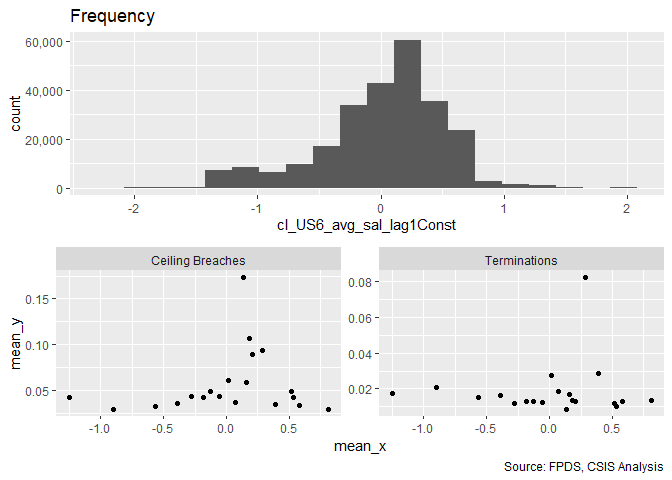<!-- -->

```r
#Scatter Plot of n_CBre01A
ggplot(serv_smp, aes(x=cl_US6_avg_sal_lag1Const, y=ln_CBre)) + geom_point(alpha = 0.1) + ggtitle('Ceiling Breach Growth') + theme(plot.title = element_text(hjust = 0.5))
```

```
## Warning: Removed 234982 rows containing missing values (geom_point).
```

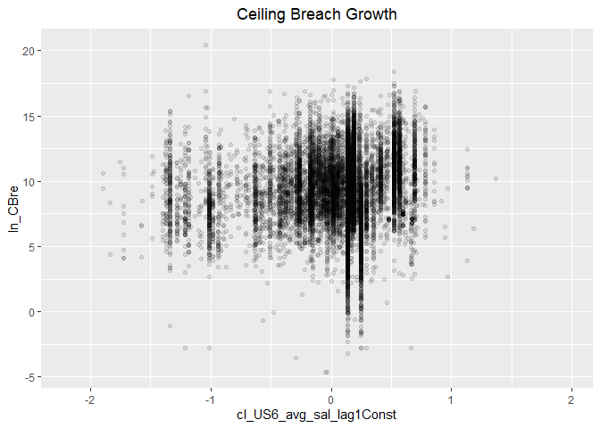<!-- -->

```r
#Model
b_CBre01A <- glm (data=serv_smp,
                 b_CBre ~ cl_US6_avg_sal_lag1Const, family=binomial(link="logit"))
display(b_CBre01A)
```

```
## glm(formula = b_CBre ~ cl_US6_avg_sal_lag1Const, family = binomial(link = "logit"), 
##     data = serv_smp)
##                          coef.est coef.se
## (Intercept)              -2.82     0.01  
## cl_US6_avg_sal_lag1Const  0.21     0.02  
## ---
##   n = 250000, k = 2
##   residual deviance = 108224.2, null deviance = 108365.4 (difference = 141.1)
```

```r
n_CBre01A <- glm(data=serv_smp,
                        ln_CBre ~ cl_US6_avg_sal_lag1Const)


#Plot residuals versus fitted
stargazer::stargazer(b_CBre01A,n_CBre01A,type="text",
                       digits=2)
```

```
## 
## =====================================================
##                              Dependent variable:     
##                          ----------------------------
##                              b_CBre        ln_CBre   
##                             logistic       normal    
##                               (1)            (2)     
## -----------------------------------------------------
## cl_US6_avg_sal_lag1Const    0.21***        0.78***   
##                              (0.02)        (0.06)    
##                                                      
## Constant                    -2.82***       9.21***   
##                              (0.01)        (0.02)    
##                                                      
## -----------------------------------------------------
## Observations                250,000        15,018    
## Log Likelihood             -54,112.11    -36,467.62  
## Akaike Inf. Crit.          108,228.20     72,939.24  
## =====================================================
## Note:                     *p<0.1; **p<0.05; ***p<0.01
```

Individually, except for terminations (which is not significant), expectations are matched for ceiing breaches and exercised options, as higher average salaries estimate a higher risk of ceiling breaches and lower possibility of exercised options. 


### 01B Invoice Rate
Expectation: The invoice rate approximates how much the government is charged annually for each comparable full-time employees who are supporting the service contracts. A higher invoice rate indicates a more complex service. As invoice rate increases (decreases), the likelihood of cost ceiling breaches and terminations increases (decreases), and exercised options decrease (increase).


```r
 # !is.na(def_serv$cl_US6_avg_sal_lag1)&
 #  !is.na(def_serv$cl_CFTE)&
 #  !is.na(def_serv$c_pPBSC)&
 #  !is.na(def_serv$c_pOffPSC)&
 #  !is.na(def_serv$c_pairHist)&
 #  !is.na(def_serv$cl_pairCA)&

summary_continuous_plot(serv_smp,"cl_CFTE")
```

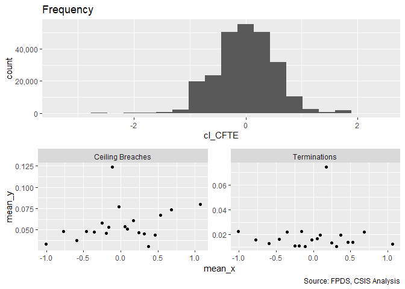<!-- -->

```r
#Scatter Plot 
ggplot(serv_smp, aes(x=cl_CFTE, y=ln_CBre)) + geom_point(alpha = 0.1) + ggtitle('Ceiling Breach Growth') + theme(plot.title = element_text(hjust = 0.5))
```

```
## Warning: Removed 234982 rows containing missing values (geom_point).
```

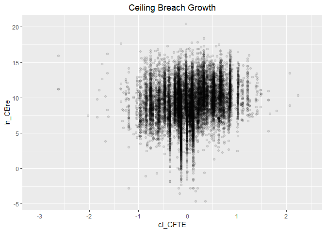<!-- -->

```r
#Model
b_CBre01B <- glm (data=serv_smp,
                 b_CBre ~ cl_CFTE, family=binomial(link="logit"))
display(b_CBre01B)
```

```
## glm(formula = b_CBre ~ cl_CFTE, family = binomial(link = "logit"), 
##     data = serv_smp)
##             coef.est coef.se
## (Intercept) -2.82     0.01  
## cl_CFTE      0.19     0.02  
## ---
##   n = 250000, k = 2
##   residual deviance = 108244.1, null deviance = 108365.4 (difference = 121.2)
```

```r
n_CBre01B <- glm(data=serv_smp,
                        ln_CBre ~ cl_CFTE)


#Plot residuals versus fitted
  stargazer::stargazer(b_CBre01A,b_CBre01B,
                       
                       n_CBre01A,n_CBre01B,
                       type="text",
                       digits=2)
```

```
## 
## ====================================================================
##                                      Dependent variable:            
##                          -------------------------------------------
##                                 b_CBre                ln_CBre       
##                                logistic               normal        
##                             (1)        (2)        (3)        (4)    
## --------------------------------------------------------------------
## cl_US6_avg_sal_lag1Const  0.21***               0.78***             
##                            (0.02)                (0.06)             
##                                                                     
## cl_CFTE                              0.19***               1.20***  
##                                       (0.02)                (0.05)  
##                                                                     
## Constant                  -2.82***   -2.82***   9.21***    9.20***  
##                            (0.01)     (0.01)     (0.02)     (0.02)  
##                                                                     
## --------------------------------------------------------------------
## Observations              250,000    250,000     15,018     15,018  
## Log Likelihood           -54,112.11 -54,122.07 -36,467.62 -36,251.56
## Akaike Inf. Crit.        108,228.20 108,248.10 72,939.24  72,507.12 
## ====================================================================
## Note:                                    *p<0.1; **p<0.05; ***p<0.01
```

```r
summary_residual_compare(b_CBre01A,b_CBre01B, skip_vif = TRUE)
```

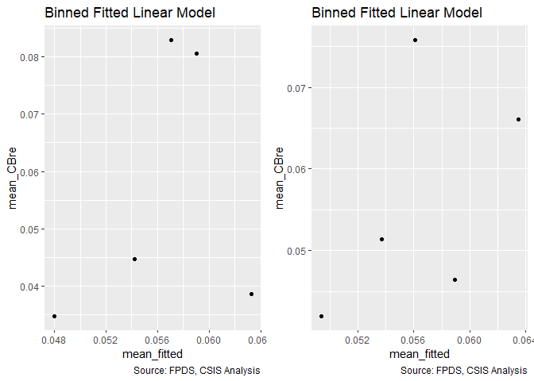<!-- -->

```
## Warning in if (class(model1_new) == "glmerMod") {: the condition has length
## > 1 and only the first element will be used
```

```
## Warning in if (class(model1_new) != "glmerMod" & class(model1_old) !=
## "glmerMod" & : the condition has length > 1 and only the first element will
## be used
```

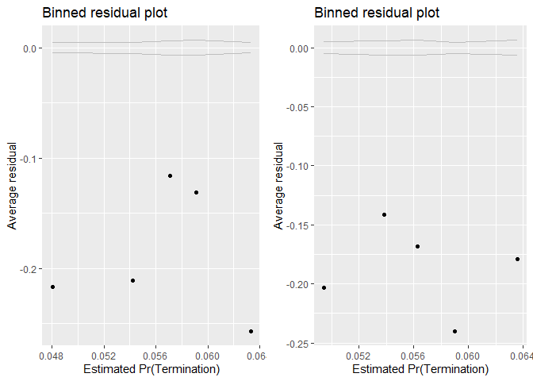<!-- -->

```
## NULL
```

When considered alone, expectations are matched for ceiling breaches and exercised options, as higher invoice rate estimates a higher risk of ceiling breaches and lower possibility of exercised options. No significant relationship between invoice rate and terminations.


### 01C Service Complexity
Expectation: Collectively, the higher average salary and invoice rate (more complexity is indicated), the higher risk of ceiling breaches and terminations and the less exercised options there would be. Also we expect the result of combined model would be the same as individual models.

 

```r
 #  !is.na(def_serv$c_pPBSC)&
 #  !is.na(def_serv$c_pOffPSC)&
 #  !is.na(def_serv$c_pairHist)&
 #  !is.na(def_serv$cl_pairCA)&


#Model
b_CBre01C <- glm (data=serv_smp,
                 b_CBre ~ cl_US6_avg_sal_lag1Const + cl_CFTE, family=binomial(link="logit"))
glmer_examine(b_CBre01C)
```

```
## cl_US6_avg_sal_lag1Const                  cl_CFTE 
##                 1.144204                 1.144204
```

```r
n_CBre01C <- glm(data=serv_smp,
                        ln_CBre ~ cl_US6_avg_sal_lag1Const +  cl_CFTE)

glmer_examine(n_CBre01C)
```

```
## cl_US6_avg_sal_lag1Const                  cl_CFTE 
##                 1.170288                 1.170288
```

```r
#Plot residuals versus fitted
stargazer::stargazer(b_CBre01A,b_CBre01B,b_CBre01C,
                       
                       n_CBre01A,n_CBre01B,n_CBre01C,
                       type="text",
                       digits=2)
```

```
## 
## ==========================================================================================
##                                                 Dependent variable:                       
##                          -----------------------------------------------------------------
##                                       b_CBre                          ln_CBre             
##                                      logistic                          normal             
##                             (1)        (2)        (3)        (4)        (5)        (6)    
## ------------------------------------------------------------------------------------------
## cl_US6_avg_sal_lag1Const  0.21***               0.16***    0.78***               0.30***  
##                            (0.02)                (0.02)     (0.06)                (0.06)  
##                                                                                           
## cl_CFTE                              0.19***    0.13***               1.20***    1.10***  
##                                       (0.02)     (0.02)                (0.05)     (0.05)  
##                                                                                           
## Constant                  -2.82***   -2.82***   -2.83***   9.21***    9.20***    9.19***  
##                            (0.01)     (0.01)     (0.01)     (0.02)     (0.02)     (0.02)  
##                                                                                           
## ------------------------------------------------------------------------------------------
## Observations              250,000    250,000    250,000     15,018     15,018     15,018  
## Log Likelihood           -54,112.11 -54,122.07 -54,086.50 -36,467.62 -36,251.56 -36,238.38
## Akaike Inf. Crit.        108,228.20 108,248.10 108,179.00 72,939.24  72,507.12  72,482.76 
## ==========================================================================================
## Note:                                                          *p<0.1; **p<0.05; ***p<0.01
```

```r
  summary_residual_compare(b_CBre01A,b_CBre01C)
```

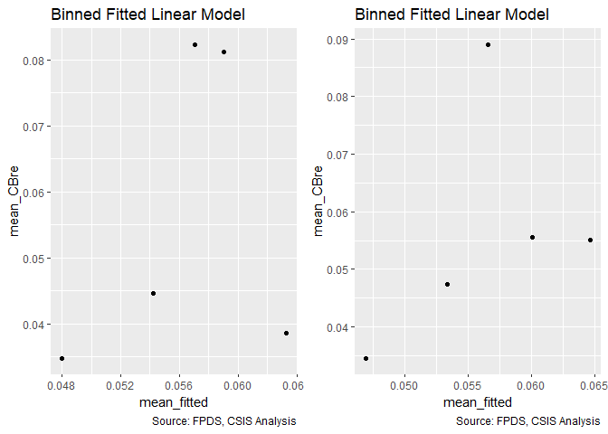<!-- -->

```
## Warning in if (class(model1_new) == "glmerMod") {: the condition has length
## > 1 and only the first element will be used
```

```
## Warning in if (class(model1_new) != "glmerMod" & class(model1_old) !=
## "glmerMod" & : the condition has length > 1 and only the first element will
## be used
```

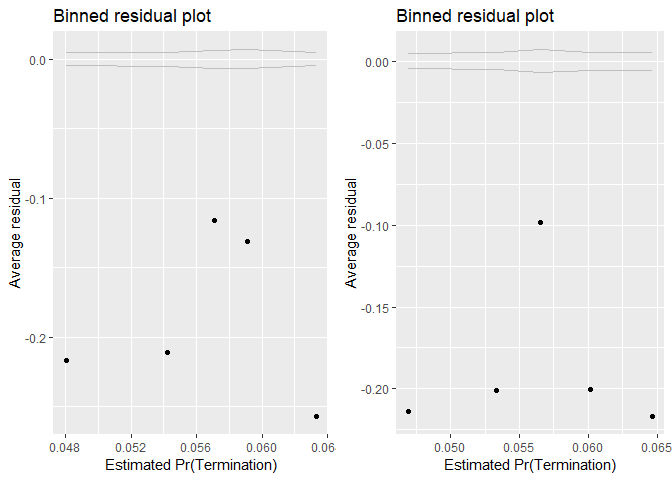<!-- -->

```
## [[1]]
##        model deviance null.deviance difference
## 1 model1_old 108224.2      108365.4   141.1360
## 2 model1_new 108173.0      108365.4   192.3502
## 
## [[2]]
## cl_US6_avg_sal_lag1Const                  cl_CFTE 
##                 1.144204                 1.144204
```

```r
  summary_residual_compare(b_CBre01B,b_CBre01C)
```

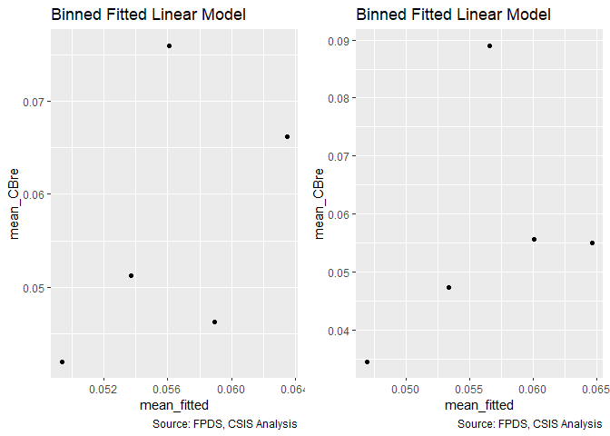<!-- -->

```
## Warning in if (class(model1_new) == "glmerMod") {: the condition has length
## > 1 and only the first element will be used

## Warning in if (class(model1_new) == "glmerMod") {: the condition has length
## > 1 and only the first element will be used
```

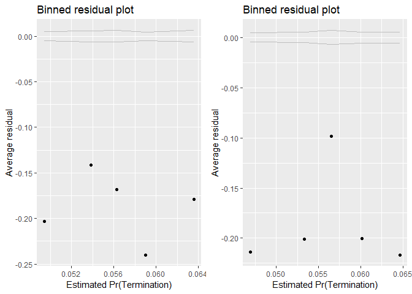<!-- -->

```
## [[1]]
##        model deviance null.deviance difference
## 1 model1_old 108244.1      108365.4   121.2284
## 2 model1_new 108173.0      108365.4   192.3502
## 
## [[2]]
## cl_US6_avg_sal_lag1Const                  cl_CFTE 
##                 1.144204                 1.144204
```

Both average salary and invoiced rate have a not inconsiderable VIF but one well within bounds, suggesting that the variance of the estimated coefficients is not evidently inflated and none of them are highly correlated with each other. 

Both individually and pair-wise, higher average salary and invoiced rate estimate higher possibility of cost ceiling breaches and lower likelihood of exercised options as expected. But the termination expectation is not supported or not significant for two measures of service complexity resepctively.


## Office Capacity

### 02A: Performance Based Services
Expectation: Performance-based services contracting ties a portion of a contractor's payment, contract extensions, or contract renewals to the achievement of specific, measurable performance standards and requirements, which encourages better contracting results. PBSC has the potential to reduce terminations and ceiling breaches and bring more possibility of exercised options.


```r
summary_continuous_plot(serv_smp,"pPBSC")
```

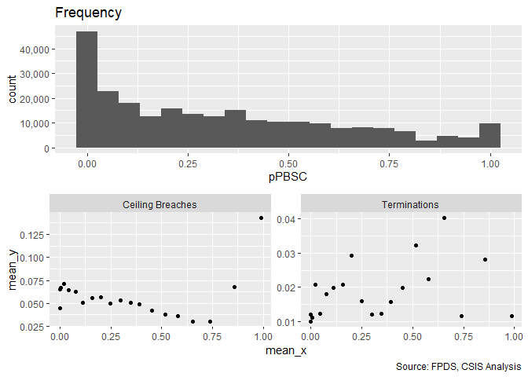<!-- -->

```r
#Scatter Plot 
ggplot(serv_smp, aes(x=c_pPBSC, y=ln_CBre)) + geom_point(alpha = 0.1) + ggtitle('Ceiling Breach Growth') + theme(plot.title = element_text(hjust = 0.5))
```

```
## Warning: Removed 234982 rows containing missing values (geom_point).
```

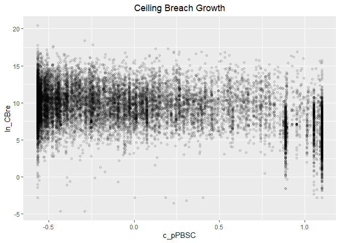<!-- -->

```r
#Model
b_CBre02A <- glm (data=serv_smp,
                 b_CBre ~ c_pPBSC, family=binomial(link="logit"))
display(b_CBre02A)
```

```
## glm(formula = b_CBre ~ c_pPBSC, family = binomial(link = "logit"), 
##     data = serv_smp)
##             coef.est coef.se
## (Intercept) -2.82     0.01  
## c_pPBSC      0.15     0.02  
## ---
##   n = 250000, k = 2
##   residual deviance = 108284.8, null deviance = 108365.4 (difference = 80.6)
```

```r
n_CBre02A <- glm(data=serv_smp,
                        ln_CBre ~ c_pPBSC)

display(n_CBre02A)
```

```
## glm(formula = ln_CBre ~ c_pPBSC, data = serv_smp)
##             coef.est coef.se
## (Intercept)  9.33     0.02  
## c_pPBSC     -1.90     0.04  
## ---
##   n = 15018, k = 2
##   residual deviance = 96041.7, null deviance = 114568.9 (difference = 18527.2)
##   overdispersion parameter = 6.4
##   residual sd is sqrt(overdispersion) = 2.53
```

```r
#Plot residuals versus fitted
stargazer::stargazer(b_CBre01C,b_CBre02A,
                       n_CBre01C,n_CBre02A,
                       type="text",
                       digits=2)
```

```
## 
## ====================================================================
##                                      Dependent variable:            
##                          -------------------------------------------
##                                 b_CBre                ln_CBre       
##                                logistic               normal        
##                             (1)        (2)        (3)        (4)    
## --------------------------------------------------------------------
## cl_US6_avg_sal_lag1Const  0.16***               0.30***             
##                            (0.02)                (0.06)             
##                                                                     
## cl_CFTE                   0.13***               1.10***             
##                            (0.02)                (0.05)             
##                                                                     
## c_pPBSC                              0.15***               -1.90*** 
##                                       (0.02)                (0.04)  
##                                                                     
## Constant                  -2.83***   -2.82***   9.19***    9.33***  
##                            (0.01)     (0.01)     (0.02)     (0.02)  
##                                                                     
## --------------------------------------------------------------------
## Observations              250,000    250,000     15,018     15,018  
## Log Likelihood           -54,086.50 -54,142.39 -36,238.38 -35,243.81
## Akaike Inf. Crit.        108,179.00 108,288.80 72,482.76  70,491.63 
## ====================================================================
## Note:                                    *p<0.1; **p<0.05; ***p<0.01
```

When considering PBSC alone, none of the expected sign was found in ceiling breaches, terminations or exercised options.


### 02B: No.Office PSC History
Expectation: The increasing share of contracting office obligations for a given service indicates high capcaity in that area, lower likelihood of cost ceiling breaches and termination and higher likelihood of exercised options are expected to be observed.


```r
 # !is.na(def_serv$cl_US6_avg_sal_lag1)&
 #  !is.na(def_serv$cl_CFTE)&
 #  !is.na(def_serv$c_pPBSC)&
 #  !is.na(def_serv$c_pOffPSC)&
 #  !is.na(def_serv$c_pairHist)&
 #  !is.na(def_serv$cl_pairCA)&

summary_continuous_plot(serv_smp,"c_pOffPSC")
```

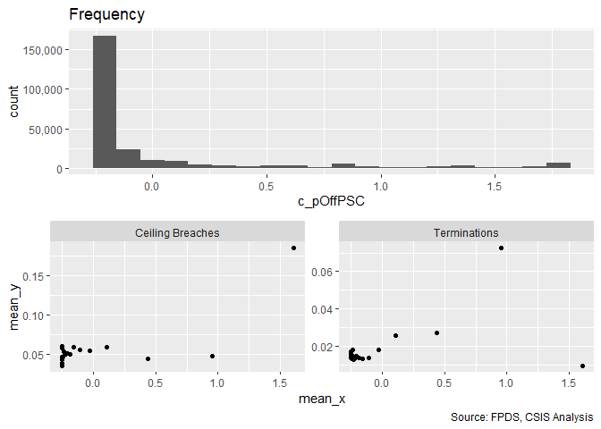<!-- -->

```r
#Scatter Plot 
ggplot(serv_smp, aes(x=c_pOffPSC, y=ln_CBre)) + geom_point(alpha = 0.1) + ggtitle('Ceiling Breach Growth') + theme(plot.title = element_text(hjust = 0.5))
```

```
## Warning: Removed 234982 rows containing missing values (geom_point).
```

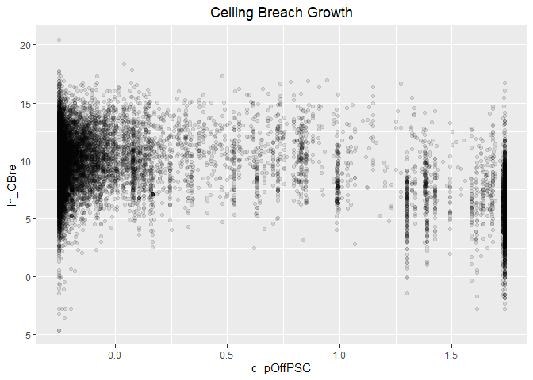<!-- -->

```r
#Model
b_CBre02B <- glm (data=serv_smp,
                 b_CBre ~ c_pOffPSC, family=binomial(link="logit"))
display(b_CBre02B)
```

```
## glm(formula = b_CBre ~ c_pOffPSC, family = binomial(link = "logit"), 
##     data = serv_smp)
##             coef.est coef.se
## (Intercept) -2.87     0.01  
## c_pOffPSC    0.69     0.01  
## ---
##   n = 250000, k = 2
##   residual deviance = 106149.5, null deviance = 108365.4 (difference = 2215.9)
```

```r
n_CBre02B <- glm(data=serv_smp,
                        ln_CBre ~ c_pOffPSC)

display(n_CBre02B)
```

```
## glm(formula = ln_CBre ~ c_pOffPSC, data = serv_smp)
##             coef.est coef.se
## (Intercept)  9.60     0.02  
## c_pOffPSC   -1.62     0.03  
## ---
##   n = 15018, k = 2
##   residual deviance = 93313.1, null deviance = 114568.9 (difference = 21255.8)
##   overdispersion parameter = 6.2
##   residual sd is sqrt(overdispersion) = 2.49
```

```r
#Plot residuals versus fitted
stargazer::stargazer(b_CBre01C,b_CBre02A,b_CBre02B,
                       n_CBre01C,n_CBre02A,n_CBre02B,
                       type="text",
                       digits=2)
```

```
## 
## ==========================================================================================
##                                                 Dependent variable:                       
##                          -----------------------------------------------------------------
##                                       b_CBre                          ln_CBre             
##                                      logistic                          normal             
##                             (1)        (2)        (3)        (4)        (5)        (6)    
## ------------------------------------------------------------------------------------------
## cl_US6_avg_sal_lag1Const  0.16***                          0.30***                        
##                            (0.02)                           (0.06)                        
##                                                                                           
## cl_CFTE                   0.13***                          1.10***                        
##                            (0.02)                           (0.05)                        
##                                                                                           
## c_pPBSC                              0.15***                          -1.90***            
##                                       (0.02)                           (0.04)             
##                                                                                           
## c_pOffPSC                                       0.69***                          -1.62*** 
##                                                  (0.01)                           (0.03)  
##                                                                                           
## Constant                  -2.83***   -2.82***   -2.87***   9.19***    9.33***    9.60***  
##                            (0.01)     (0.01)     (0.01)     (0.02)     (0.02)     (0.02)  
##                                                                                           
## ------------------------------------------------------------------------------------------
## Observations              250,000    250,000    250,000     15,018     15,018     15,018  
## Log Likelihood           -54,086.50 -54,142.39 -53,074.74 -36,238.38 -35,243.81 -35,027.39
## Akaike Inf. Crit.        108,179.00 108,288.80 106,153.50 72,482.76  70,491.63  70,058.78 
## ==========================================================================================
## Note:                                                          *p<0.1; **p<0.05; ***p<0.01
```

```r
summary_residual_compare(b_CBre02A,b_CBre02B, skip_vif = TRUE)
```

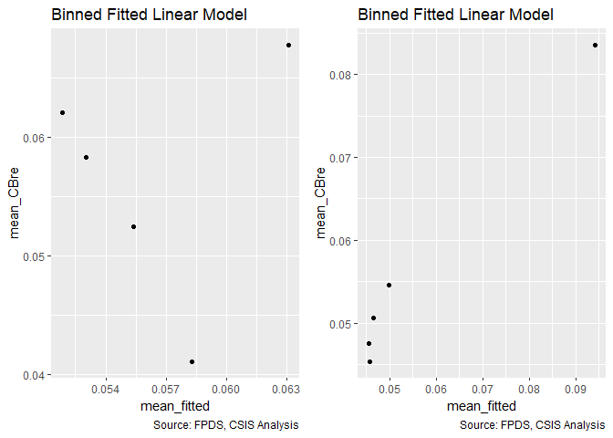<!-- -->

```
## Warning in if (class(model1_new) == "glmerMod") {: the condition has length
## > 1 and only the first element will be used
```

```
## Warning in if (class(model1_new) != "glmerMod" & class(model1_old) !=
## "glmerMod" & : the condition has length > 1 and only the first element will
## be used
```

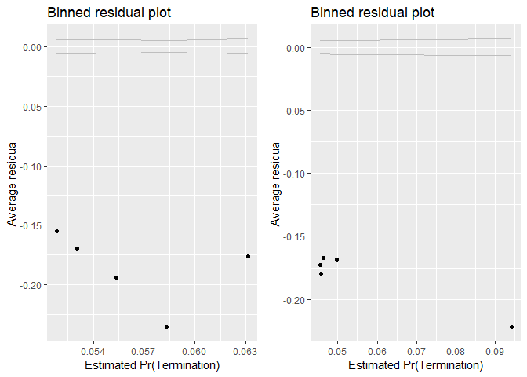<!-- -->

```
## NULL
```

When considering number of contracting office obligations for a given service alone, expectation was only fulfilled for options growth.


### 02C: Office Capacity
Expectation: Collaberactively, the larger share of PBSC and contracting office obligations for a given service, the less risk of ceiling breaches and terminations and the more exercised options there would be. Also we expect the results of combined model would be the same as two individual models above. 


```r
#Model
b_CBre02C <- glm (data=serv_smp,
                 b_CBre ~ c_pPBSC+c_pOffPSC, family=binomial(link="logit"))
glmer_examine(b_CBre02C)
```

```
##   c_pPBSC c_pOffPSC 
##  1.239622  1.239622
```

```r
n_CBre02C <- glm(data=serv_smp,
                        ln_CBre ~ c_pPBSC+c_pOffPSC)

glmer_examine(n_CBre02C)
```

```
##   c_pPBSC c_pOffPSC 
##  2.124457  2.124457
```

```r
#Plot residuals versus fitted
stargazer::stargazer(b_CBre01C,b_CBre02A,b_CBre02B,b_CBre02C,
                       
                       n_CBre01C,n_CBre02A,n_CBre02B,n_CBre02C,
                       type="text",
                       digits=2)
```

```
## 
## ================================================================================================================
##                                                            Dependent variable:                                  
##                          ---------------------------------------------------------------------------------------
##                                            b_CBre                                      ln_CBre                  
##                                           logistic                                     normal                   
##                             (1)        (2)        (3)        (4)        (5)        (6)        (7)        (8)    
## ----------------------------------------------------------------------------------------------------------------
## cl_US6_avg_sal_lag1Const  0.16***                                     0.30***                                   
##                            (0.02)                                      (0.06)                                   
##                                                                                                                 
## cl_CFTE                   0.13***                                     1.10***                                   
##                            (0.02)                                      (0.05)                                   
##                                                                                                                 
## c_pPBSC                              0.15***               -0.20***              -1.90***              -0.89*** 
##                                       (0.02)                (0.02)                (0.04)                (0.05)  
##                                                                                                                 
## c_pOffPSC                                       0.69***    0.76***                          -1.62***   -1.11*** 
##                                                  (0.01)     (0.02)                           (0.03)     (0.04)  
##                                                                                                                 
## Constant                  -2.83***   -2.82***   -2.87***   -2.87***   9.19***    9.33***    9.60***    9.53***  
##                            (0.01)     (0.01)     (0.01)     (0.01)     (0.02)     (0.02)     (0.02)     (0.02)  
##                                                                                                                 
## ----------------------------------------------------------------------------------------------------------------
## Observations              250,000    250,000    250,000    250,000     15,018     15,018     15,018     15,018  
## Log Likelihood           -54,086.50 -54,142.39 -53,074.74 -53,015.30 -36,238.38 -35,243.81 -35,027.39 -34,871.45
## Akaike Inf. Crit.        108,179.00 108,288.80 106,153.50 106,036.60 72,482.76  70,491.63  70,058.78  69,748.89 
## ================================================================================================================
## Note:                                                                                *p<0.1; **p<0.05; ***p<0.01
```

```r
summary_residual_compare(b_CBre02A,b_CBre02C)
```

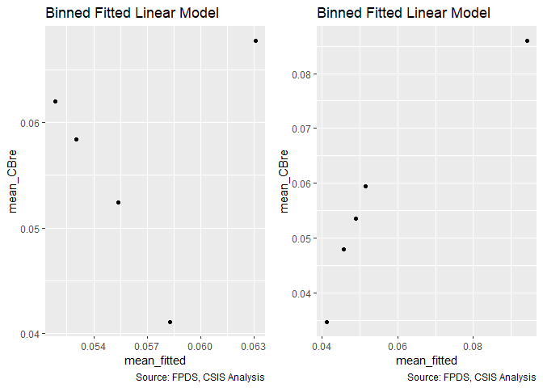<!-- -->

```
## Warning in if (class(model1_new) == "glmerMod") {: the condition has length
## > 1 and only the first element will be used
```

```
## Warning in if (class(model1_new) != "glmerMod" & class(model1_old) !=
## "glmerMod" & : the condition has length > 1 and only the first element will
## be used
```

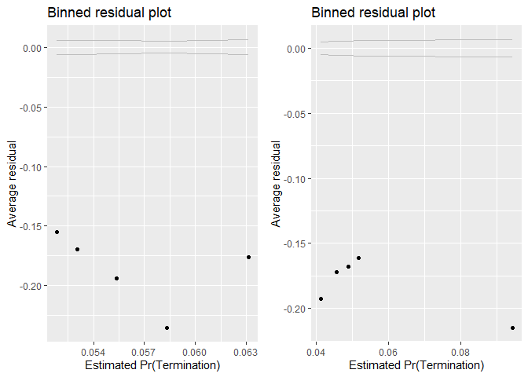<!-- -->

```
## [[1]]
##        model deviance null.deviance difference
## 1 model1_old 108284.8      108365.4   80.58542
## 2 model1_new 106030.6      108365.4 2334.76041
## 
## [[2]]
##   c_pPBSC c_pOffPSC 
##  1.239622  1.239622
```

```r
summary_residual_compare(b_CBre02B,b_CBre02C)
```

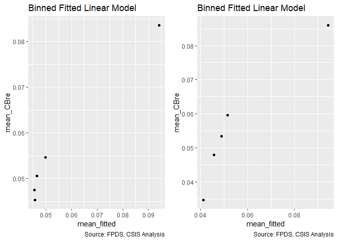<!-- -->

```
## Warning in if (class(model1_new) == "glmerMod") {: the condition has length
## > 1 and only the first element will be used

## Warning in if (class(model1_new) == "glmerMod") {: the condition has length
## > 1 and only the first element will be used
```

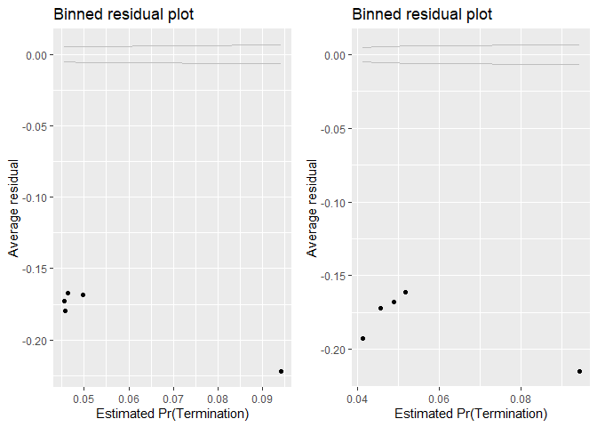<!-- -->

```
## [[1]]
##        model deviance null.deviance difference
## 1 model1_old 106149.5      108365.4   2215.881
## 2 model1_new 106030.6      108365.4   2334.760
## 
## [[2]]
##   c_pPBSC c_pOffPSC 
##  1.239622  1.239622
```

No high correlation is observed between PBSC and Contract Office Obligations for PSC based on the vif score.

After combining PBSC and Contract office obligations for PSC, PBSC had a flipped relationship with ceiling breaches that matches with expectation (A look at summary statistics for Performance-Based experience did find that as the percent of performance-based service went from 0 percent to 75 percent, the ceiling breach rate declined. Above 75 percent, it rose dramatically, suggesting an additional variable may influence that relationship.) but lost significance with terminations. Contract office obligations for PSC is associate with more exercised options. The rest of results remained unmatching with expectations.


### 02D: Cumulative  Model
Expectation: When all the four variables are combined into one model, same expectations are applied as individual ones. Per service complexity indicator increases, higher risk of ceiling breaches and terminations and less exercised options expected. Per office capacity indicator increases, lower risk of ceiling breaches and terminations and more exercised options expected.


```r
#Model
b_CBre02D <- glm (data=serv_smp,
                 b_CBre ~ cl_US6_avg_sal_lag1Const + cl_CFTE+ c_pPBSC+c_pOffPSC, family=binomial(link="logit"))
glmer_examine(b_CBre02D)
```

```
## cl_US6_avg_sal_lag1Const                  cl_CFTE                  c_pPBSC 
##                 1.192884                 1.157327                 1.253342 
##                c_pOffPSC 
##                 1.248722
```

```r
n_CBre02D <- glm(data=serv_smp,
                        ln_CBre ~ cl_US6_avg_sal_lag1Const + cl_CFTE+ c_pPBSC+c_pOffPSC)

glmer_examine(n_CBre02D)
```

```
## cl_US6_avg_sal_lag1Const                  cl_CFTE                  c_pPBSC 
##                 1.249966                 1.222432                 2.124621 
##                c_pOffPSC 
##                 2.202235
```

```r
#Plot residuals versus fitted
stargazer::stargazer(b_CBre01C,b_CBre02C,b_CBre02D,
                       
                       n_CBre01C,n_CBre02C,n_CBre02D,
                       type="text",
                       digits=2)
```

```
## 
## ==========================================================================================
##                                                 Dependent variable:                       
##                          -----------------------------------------------------------------
##                                       b_CBre                          ln_CBre             
##                                      logistic                          normal             
##                             (1)        (2)        (3)        (4)        (5)        (6)    
## ------------------------------------------------------------------------------------------
## cl_US6_avg_sal_lag1Const  0.16***                0.05**    0.30***               1.14***  
##                            (0.02)                (0.02)     (0.06)                (0.05)  
##                                                                                           
## cl_CFTE                   0.13***               0.17***    1.10***               0.51***  
##                            (0.02)                (0.02)     (0.05)                (0.05)  
##                                                                                           
## c_pPBSC                              -0.20***   -0.21***              -0.89***   -0.90*** 
##                                       (0.02)     (0.02)                (0.05)     (0.05)  
##                                                                                           
## c_pOffPSC                            0.76***    0.76***               -1.11***   -1.18*** 
##                                       (0.02)     (0.02)                (0.04)     (0.04)  
##                                                                                           
## Constant                  -2.83***   -2.87***   -2.88***   9.19***    9.53***    9.46***  
##                            (0.01)     (0.01)     (0.01)     (0.02)     (0.02)     (0.02)  
##                                                                                           
## ------------------------------------------------------------------------------------------
## Observations              250,000    250,000    250,000     15,018     15,018     15,018  
## Log Likelihood           -54,086.50 -53,015.30 -52,956.57 -36,238.38 -34,871.45 -34,421.06
## Akaike Inf. Crit.        108,179.00 106,036.60 105,923.10 72,482.76  69,748.89  68,852.12 
## ==========================================================================================
## Note:                                                          *p<0.1; **p<0.05; ***p<0.01
```

```r
summary_residual_compare(b_CBre02C,b_CBre02D)
```

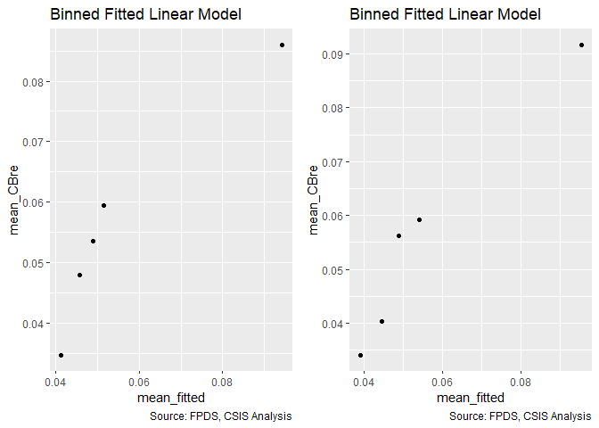<!-- -->

```
## Warning in if (class(model1_new) == "glmerMod") {: the condition has length
## > 1 and only the first element will be used
```

```
## Warning in if (class(model1_new) != "glmerMod" & class(model1_old) !=
## "glmerMod" & : the condition has length > 1 and only the first element will
## be used
```

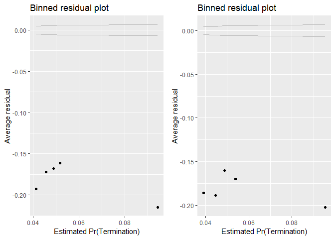<!-- -->

```
## [[1]]
##        model deviance null.deviance difference
## 1 model1_old 106030.6      108365.4   2334.760
## 2 model1_new 105913.1      108365.4   2452.226
## 
## [[2]]
## cl_US6_avg_sal_lag1Const                  cl_CFTE                  c_pPBSC 
##                 1.192884                 1.157327                 1.253342 
##                c_pOffPSC 
##                 1.248722
```

```r
summary_residual_compare(b_CBre01C,b_CBre02D)
```

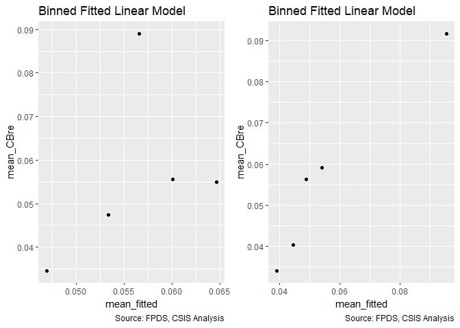<!-- -->

```
## Warning in if (class(model1_new) == "glmerMod") {: the condition has length
## > 1 and only the first element will be used

## Warning in if (class(model1_new) == "glmerMod") {: the condition has length
## > 1 and only the first element will be used
```

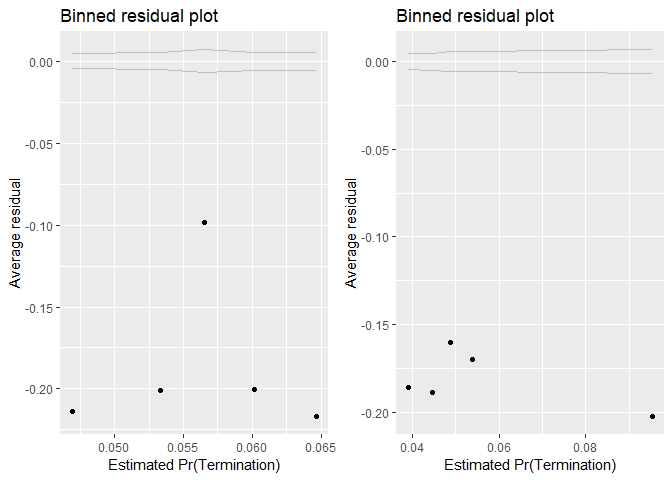<!-- -->

```
## [[1]]
##        model deviance null.deviance difference
## 1 model1_old 108173.0      108365.4   192.3502
## 2 model1_new 105913.1      108365.4  2452.2259
## 
## [[2]]
## cl_US6_avg_sal_lag1Const                  cl_CFTE                  c_pPBSC 
##                 1.192884                 1.157327                 1.253342 
##                c_pOffPSC 
##                 1.248722
```

No high correlation is observed among all of the 4 predictors (average salary, invoiced rate, PBSC and Contract Office Obligations for PSC) so far based on the vif score. When all measures for sevice complexity and office capacity are combined, per dependent variable:

1. Ceiling Breaches: All variables remain the same within each subgroup (Services Complexity and Office Capacity). Except for Contract office obligations for PSC, the results of other varibles matched with the expectation for ceiling breaches so far. 

2. Terminations: Except for Contract office obligations for PSC, the rest of variables didn't show significant relationships with Termination. The only significant relationship between Contract office obligations for PSC and Temrination didn't match the expectation.

3. Exercised Options: Except for PBSC, all other three variables are associated with exercised options as expected.


## Office-Vendor Relationship

### 03A: Pair History
Expactation: The number of past years of the relationship between the contracting office or the contractors with a single transaction in a given fiscal year enough to qualify, namely, pair history increases (decreases), the likelihood of cost ceiling breaches and terminations decreases (increases) and the exercised options increase (decrease) for that partnership.


```r
 # !is.na(def_serv$cl_US6_avg_sal_lag1)&
 #  !is.na(def_serv$cl_CFTE)&
 #  !is.na(def_serv$c_pPBSC)&
 #  !is.na(def_serv$c_pOffPSC)&
 #  !is.na(def_serv$c_pairHist)&
 #  !is.na(def_serv$cl_pairCA)&

summary_discrete_plot(serv_smp,"c_pairHist")
```

```
## Warning: Ignoring unknown parameters: binwidth, bins, pad
```

```
## Warning: group_by_() is deprecated. 
## Please use group_by() instead
## 
## The 'programming' vignette or the tidyeval book can help you
## to program with group_by() : https://tidyeval.tidyverse.org
## This warning is displayed once per session.
```

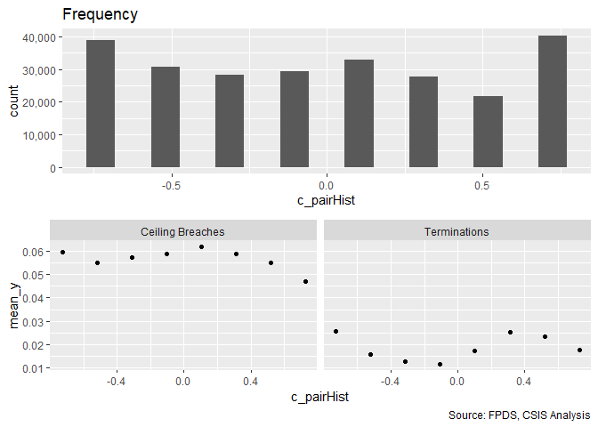<!-- -->

```
## [[1]]
## 
## -0.727331277356926 -0.519773791968938  -0.31221630658095 
##              38828              30765              28278 
## -0.104658821192962  0.102898664195026  0.310456149583014 
##              29388              33009              27626 
##  0.518013634971002   0.72557112035899 
##              21649              40457 
## 
## [[2]]
##                     
##                       None Ceiling Breach
##   -0.727331277356926 36516           2312
##   -0.519773791968938 29081           1684
##   -0.31221630658095  26660           1618
##   -0.104658821192962 27666           1722
##   0.102898664195026  30972           2037
##   0.310456149583014  26001           1625
##   0.518013634971002  20460           1189
##   0.72557112035899   38563           1894
## 
## [[3]]
##                     
##                          0     1
##   -0.727331277356926 37822  1006
##   -0.519773791968938 30282   483
##   -0.31221630658095  27913   365
##   -0.104658821192962 29045   343
##   0.102898664195026  32433   576
##   0.310456149583014  26922   704
##   0.518013634971002  21142   507
##   0.72557112035899   39736   721
```

```r
#Scatter Plot
ggplot(serv_smp, aes(x=c_pairHist, y=ln_CBre)) + geom_point(alpha = 0.1) + ggtitle('Ceiling Breach Growth') + theme(plot.title = element_text(hjust = 0.5))
```

```
## Warning: Removed 234982 rows containing missing values (geom_point).
```

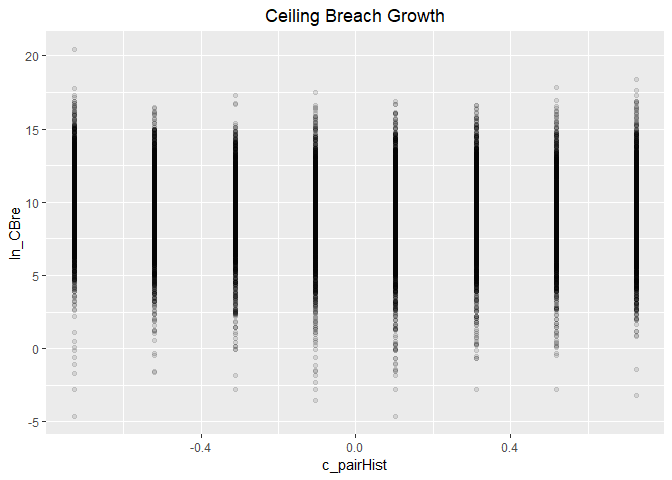<!-- -->

```r
#Model
b_CBre03A <- glm (data=serv_smp,
                 b_CBre ~ c_pairHist, family=binomial(link="logit"))
display(b_CBre03A)
```

```
## glm(formula = b_CBre ~ c_pairHist, family = binomial(link = "logit"), 
##     data = serv_smp)
##             coef.est coef.se
## (Intercept) -2.82     0.01  
## c_pairHist  -0.10     0.02  
## ---
##   n = 250000, k = 2
##   residual deviance = 108331.1, null deviance = 108365.4 (difference = 34.2)
```

```r
n_CBre03A <- glm(data=serv_smp,
                        ln_CBre ~ c_pairHist)

display(n_CBre03A)
```

```
## glm(formula = ln_CBre ~ c_pairHist, data = serv_smp)
##             coef.est coef.se
## (Intercept)  9.23     0.02  
## c_pairHist  -0.59     0.05  
## ---
##   n = 15018, k = 2
##   residual deviance = 113349.6, null deviance = 114568.9 (difference = 1219.3)
##   overdispersion parameter = 7.5
##   residual sd is sqrt(overdispersion) = 2.75
```

```r
#Plot residuals versus fitted
  stargazer::stargazer(b_CBre02D,b_CBre03A,
                       
                       n_CBre02D,n_CBre03A,
                       type="text",
                       digits=2)
```

```
## 
## ====================================================================
##                                      Dependent variable:            
##                          -------------------------------------------
##                                 b_CBre                ln_CBre       
##                                logistic               normal        
##                             (1)        (2)        (3)        (4)    
## --------------------------------------------------------------------
## cl_US6_avg_sal_lag1Const   0.05**               1.14***             
##                            (0.02)                (0.05)             
##                                                                     
## cl_CFTE                   0.17***               0.51***             
##                            (0.02)                (0.05)             
##                                                                     
## c_pPBSC                   -0.21***              -0.90***            
##                            (0.02)                (0.05)             
##                                                                     
## c_pOffPSC                 0.76***               -1.18***            
##                            (0.02)                (0.04)             
##                                                                     
## c_pairHist                           -0.10***              -0.59*** 
##                                       (0.02)                (0.05)  
##                                                                     
## Constant                  -2.88***   -2.82***   9.46***    9.23***  
##                            (0.01)     (0.01)     (0.02)     (0.02)  
##                                                                     
## --------------------------------------------------------------------
## Observations              250,000    250,000     15,018     15,018  
## Log Likelihood           -52,956.57 -54,165.57 -34,421.06 -36,488.01
## Akaike Inf. Crit.        105,923.10 108,335.10 68,852.12  72,980.03 
## ====================================================================
## Note:                                    *p<0.1; **p<0.05; ***p<0.01
```

```r
summary_residual_compare(b_CBre02D,b_CBre03A, skip_vif = TRUE)
```

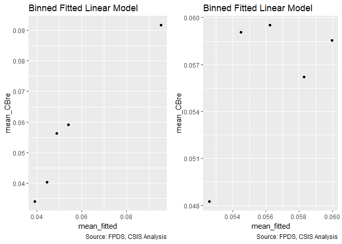<!-- -->

```
## Warning in if (class(model1_new) == "glmerMod") {: the condition has length
## > 1 and only the first element will be used
```

```
## Warning in if (class(model1_new) != "glmerMod" & class(model1_old) !=
## "glmerMod" & : the condition has length > 1 and only the first element will
## be used
```

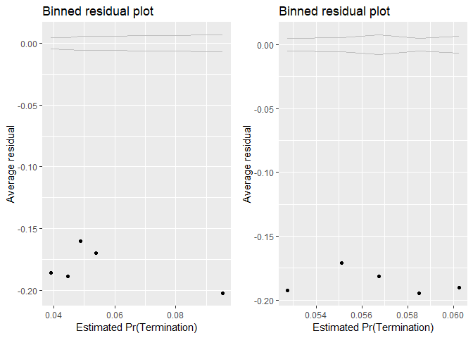<!-- -->

```
## NULL
```

When considering pair history alone, expectations were met for ceiling breaches and terminations, but not for exercised options. 


### 03B: Interaction
Expectation: As the number of contract actions a vendor has performed for an office in the past year increases (decreases), the likelihood of cost ceiling breaches and terminations decreases (increases) and that of exercised options increases (decreases) for that partnership.


```r
 # !is.na(def_serv$cl_US6_avg_sal_lag1)&
 #  !is.na(def_serv$cl_CFTE)&
 #  !is.na(def_serv$c_pPBSC)&
 #  !is.na(def_serv$c_pOffPSC)&
 #  !is.na(def_serv$c_pairHist)&
 #  !is.na(def_serv$cl_pairCA)&

summary_continuous_plot(serv_smp,"cl_pairCA")
```

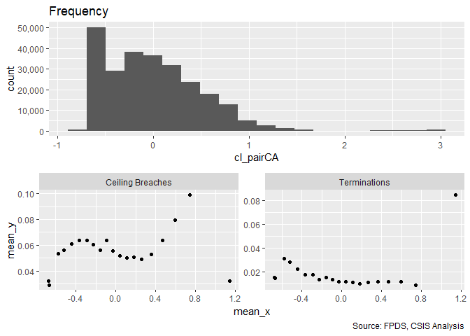<!-- -->

```r
#Scatter Plot
ggplot(serv_smp, aes(x=cl_pairCA, y=ln_CBre)) + geom_point(alpha = 0.1) + ggtitle('Ceiling Breach Growth') + theme(plot.title = element_text(hjust = 0.5))
```

```
## Warning: Removed 234982 rows containing missing values (geom_point).
```

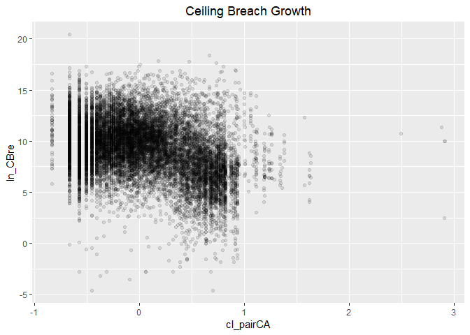<!-- -->

```r
#Model
b_CBre03B <- glm (data=serv_smp,
                 b_CBre ~ cl_pairCA, family=binomial(link="logit"))
display(b_CBre03B)
```

```
## glm(formula = b_CBre ~ cl_pairCA, family = binomial(link = "logit"), 
##     data = serv_smp)
##             coef.est coef.se
## (Intercept) -2.82     0.01  
## cl_pairCA    0.15     0.02  
## ---
##   n = 250000, k = 2
##   residual deviance = 108291.8, null deviance = 108365.4 (difference = 73.6)
```

```r
n_CBre03B <- glm(data=serv_smp,
                        ln_CBre ~ cl_pairCA)

display(n_CBre03B)
```

```
## glm(formula = ln_CBre ~ cl_pairCA, data = serv_smp)
##             coef.est coef.se
## (Intercept)  9.33     0.02  
## cl_pairCA   -1.97     0.05  
## ---
##   n = 15018, k = 2
##   residual deviance = 102081.9, null deviance = 114568.9 (difference = 12486.9)
##   overdispersion parameter = 6.8
##   residual sd is sqrt(overdispersion) = 2.61
```

```r
#Plot residuals versus fitted
stargazer::stargazer(b_CBre02D,b_CBre03A,b_CBre03B,
                       
                       n_CBre02D,n_CBre03A,n_CBre03B,
                       type="text",
                       digits=2)
```

```
## 
## ==========================================================================================
##                                                 Dependent variable:                       
##                          -----------------------------------------------------------------
##                                       b_CBre                          ln_CBre             
##                                      logistic                          normal             
##                             (1)        (2)        (3)        (4)        (5)        (6)    
## ------------------------------------------------------------------------------------------
## cl_US6_avg_sal_lag1Const   0.05**                          1.14***                        
##                            (0.02)                           (0.05)                        
##                                                                                           
## cl_CFTE                   0.17***                          0.51***                        
##                            (0.02)                           (0.05)                        
##                                                                                           
## c_pPBSC                   -0.21***                         -0.90***                       
##                            (0.02)                           (0.05)                        
##                                                                                           
## c_pOffPSC                 0.76***                          -1.18***                       
##                            (0.02)                           (0.04)                        
##                                                                                           
## c_pairHist                           -0.10***                         -0.59***            
##                                       (0.02)                           (0.05)             
##                                                                                           
## cl_pairCA                                       0.15***                          -1.97*** 
##                                                  (0.02)                           (0.05)  
##                                                                                           
## Constant                  -2.88***   -2.82***   -2.82***   9.46***    9.23***    9.33***  
##                            (0.01)     (0.01)     (0.01)     (0.02)     (0.02)     (0.02)  
##                                                                                           
## ------------------------------------------------------------------------------------------
## Observations              250,000    250,000    250,000     15,018     15,018     15,018  
## Log Likelihood           -52,956.57 -54,165.57 -54,145.89 -34,421.06 -36,488.01 -35,701.81
## Akaike Inf. Crit.        105,923.10 108,335.10 108,295.80 68,852.12  72,980.03  71,407.63 
## ==========================================================================================
## Note:                                                          *p<0.1; **p<0.05; ***p<0.01
```

```r
summary_residual_compare(b_CBre03A,b_CBre03B, skip_vif = TRUE)
```

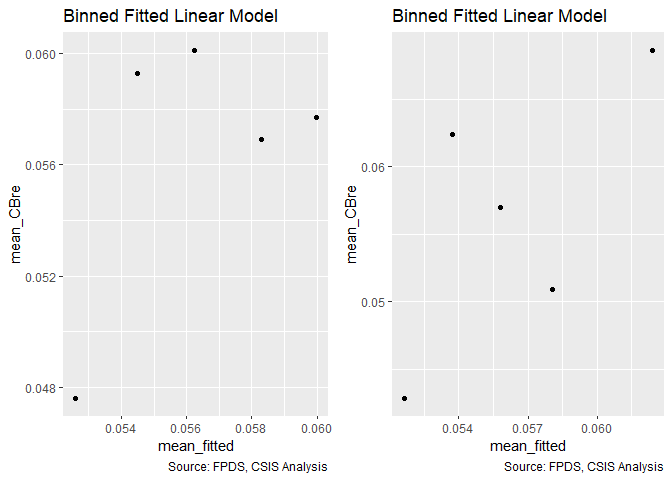<!-- -->

```
## Warning in if (class(model1_new) == "glmerMod") {: the condition has length
## > 1 and only the first element will be used
```

```
## Warning in if (class(model1_new) != "glmerMod" & class(model1_old) !=
## "glmerMod" & : the condition has length > 1 and only the first element will
## be used
```

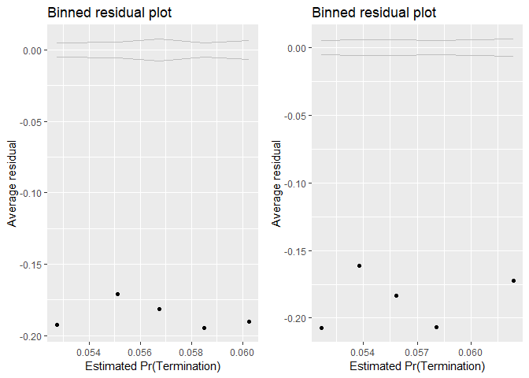<!-- -->

```
## NULL
```

```r
summary_residual_compare(b_CBre02D,b_CBre03B, skip_vif = TRUE)
```

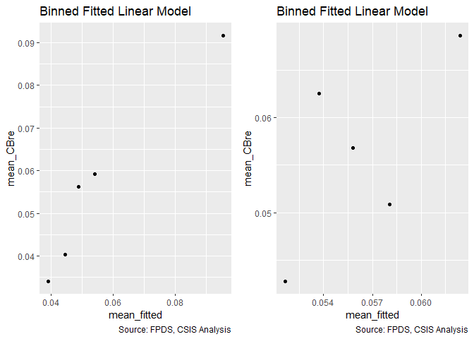<!-- -->

```
## Warning in if (class(model1_new) == "glmerMod") {: the condition has length
## > 1 and only the first element will be used

## Warning in if (class(model1_new) == "glmerMod") {: the condition has length
## > 1 and only the first element will be used
```

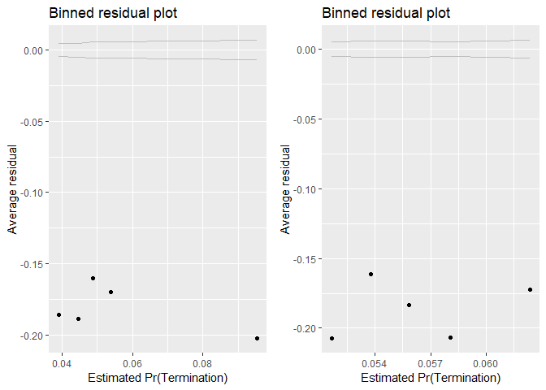<!-- -->

```
## NULL
```

When considering contract actions alone, no expectation were met. The patterns in the plots are complex, ceiling breaches has a sinusoidal or perhaps exponential relationship while terminations has an neative relationship, until the number of ations grows extreme at which point the risk jumps up.

### 03C: Office-Vendor Relationship
Expectation: 
The importance of partnership, trust, and handling difficult problems and uncertainty together naturally lead into the last characteristic: the relationship between the contractor and buyer. The higher level of interaction provides the more opportunity to build a deeper relationship, the likelihood of cost ceiling breaches and terminations decreases and the exercised options increase for that partnership. Also we expect the result of combined model would be the same as individual models above.


```r
 # !is.na(def_serv$cl_US6_avg_sal_lag1)&
 #  !is.na(def_serv$cl_CFTE)&
 #  !is.na(def_serv$c_pPBSC)&
 #  !is.na(def_serv$c_pOffPSC)&
 #  !is.na(def_serv$c_pairHist)&
 #  !is.na(def_serv$cl_pairCA)&

#Model
b_CBre03C <- glm (data=serv_smp,
                 b_CBre ~ c_pairHist+cl_pairCA, family=binomial(link="logit"))
glmer_examine(b_CBre03C)
```

```
## c_pairHist  cl_pairCA 
##   1.204205   1.204205
```

```r
n_CBre03C <- glm(data=serv_smp,
                        ln_CBre ~ c_pairHist+cl_pairCA)

glmer_examine(n_CBre03C)
```

```
## c_pairHist  cl_pairCA 
##   1.256669   1.256669
```

```r
#Plot residuals versus fitted
  stargazer::stargazer(b_CBre02D,b_CBre03A,b_CBre03B,b_CBre03C,
                       
                       n_CBre02D,n_CBre03A,n_CBre03B,n_CBre03C,
                       type="text",
                       digits=2)
```

```
## 
## ================================================================================================================
##                                                            Dependent variable:                                  
##                          ---------------------------------------------------------------------------------------
##                                            b_CBre                                      ln_CBre                  
##                                           logistic                                     normal                   
##                             (1)        (2)        (3)        (4)        (5)        (6)        (7)        (8)    
## ----------------------------------------------------------------------------------------------------------------
## cl_US6_avg_sal_lag1Const   0.05**                                     1.14***                                   
##                            (0.02)                                      (0.05)                                   
##                                                                                                                 
## cl_CFTE                   0.17***                                     0.51***                                   
##                            (0.02)                                      (0.05)                                   
##                                                                                                                 
## c_pPBSC                   -0.21***                                    -0.90***                                  
##                            (0.02)                                      (0.05)                                   
##                                                                                                                 
## c_pOffPSC                 0.76***                                     -1.18***                                  
##                            (0.02)                                      (0.04)                                   
##                                                                                                                 
## c_pairHist                           -0.10***              -0.20***              -0.59***              0.33***  
##                                       (0.02)                (0.02)                (0.05)                (0.05)  
##                                                                                                                 
## cl_pairCA                                       0.15***    0.23***                          -1.97***   -2.12*** 
##                                                  (0.02)     (0.02)                           (0.05)     (0.05)  
##                                                                                                                 
## Constant                  -2.88***   -2.82***   -2.82***   -2.83***   9.46***    9.23***    9.33***    9.35***  
##                            (0.01)     (0.01)     (0.01)     (0.01)     (0.02)     (0.02)     (0.02)     (0.02)  
##                                                                                                                 
## ----------------------------------------------------------------------------------------------------------------
## Observations              250,000    250,000    250,000    250,000     15,018     15,018     15,018     15,018  
## Log Likelihood           -52,956.57 -54,165.57 -54,145.89 -54,093.45 -34,421.06 -36,488.01 -35,701.81 -35,679.33
## Akaike Inf. Crit.        105,923.10 108,335.10 108,295.80 108,192.90 68,852.12  72,980.03  71,407.63  71,364.67 
## ================================================================================================================
## Note:                                                                                *p<0.1; **p<0.05; ***p<0.01
```

```r
summary_residual_compare(b_CBre03A,b_CBre03C)
```

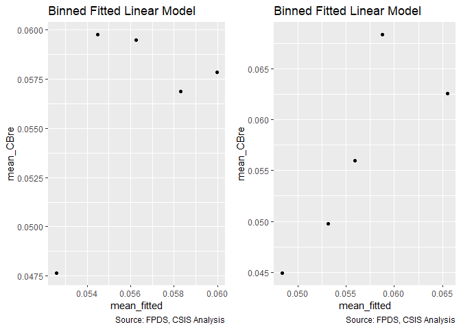<!-- -->

```
## Warning in if (class(model1_new) == "glmerMod") {: the condition has length
## > 1 and only the first element will be used
```

```
## Warning in if (class(model1_new) != "glmerMod" & class(model1_old) !=
## "glmerMod" & : the condition has length > 1 and only the first element will
## be used
```

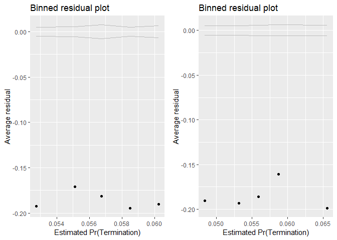<!-- -->

```
## [[1]]
##        model deviance null.deviance difference
## 1 model1_old 108331.1      108365.4   34.21701
## 2 model1_new 108186.9      108365.4  178.46786
## 
## [[2]]
## c_pairHist  cl_pairCA 
##   1.204205   1.204205
```

```r
summary_residual_compare(b_CBre03B,b_CBre03C)
```

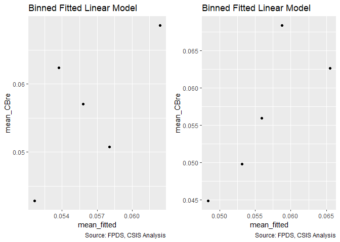<!-- -->

```
## Warning in if (class(model1_new) == "glmerMod") {: the condition has length
## > 1 and only the first element will be used

## Warning in if (class(model1_new) == "glmerMod") {: the condition has length
## > 1 and only the first element will be used
```

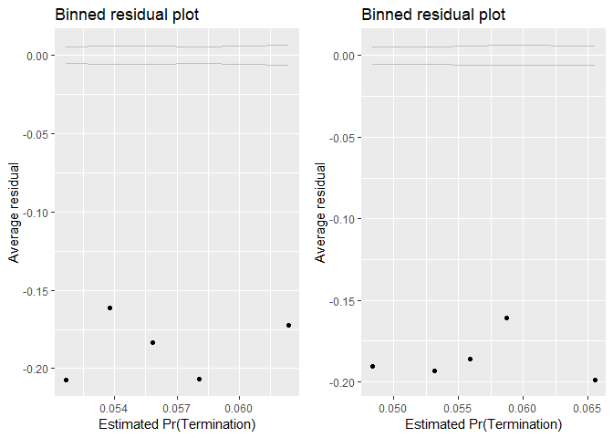<!-- -->

```
## [[1]]
##        model deviance null.deviance difference
## 1 model1_old 108291.8      108365.4   73.58101
## 2 model1_new 108186.9      108365.4  178.46786
## 
## [[2]]
## c_pairHist  cl_pairCA 
##   1.204205   1.204205
```

```r
summary_residual_compare(b_CBre02D,b_CBre03C)
```

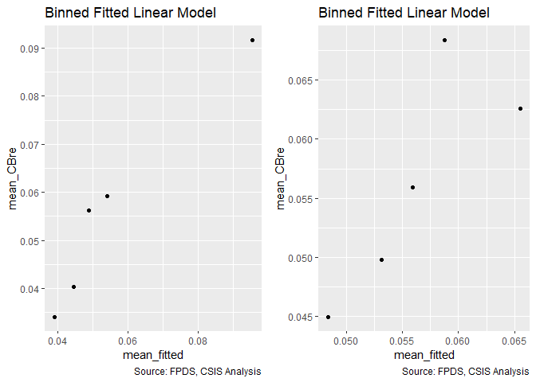<!-- -->

```
## Warning in if (class(model1_new) == "glmerMod") {: the condition has length
## > 1 and only the first element will be used

## Warning in if (class(model1_new) == "glmerMod") {: the condition has length
## > 1 and only the first element will be used
```

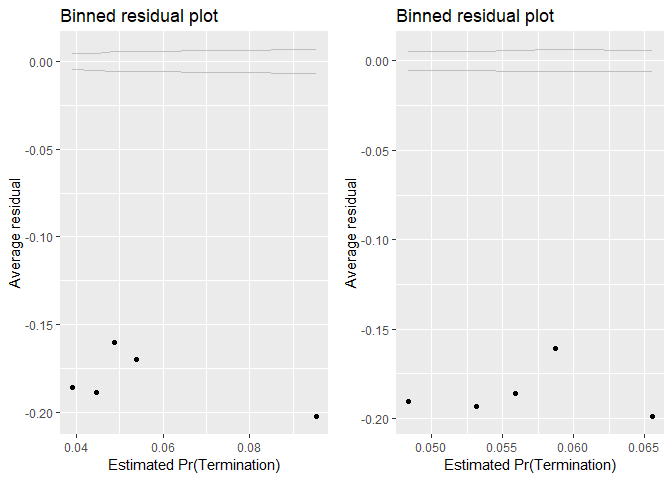<!-- -->

```
## [[1]]
##        model deviance null.deviance difference
## 1 model1_old 105913.1      108365.4  2452.2259
## 2 model1_new 108186.9      108365.4   178.4679
## 
## [[2]]
## c_pairHist  cl_pairCA 
##   1.204205   1.204205
```

When combining pair history and contract actions, magnitude of relationships with dependent variables incraesed, but the agreement with expectations splited in the same way as individually.  


### 03D: Cumulative  Model

Expectation: Under each subgroup, the predictors are expected to have similar impacts on dependent variables individually and cumulatively:
1. Higher Services Complexity: Higher likelihood of cost ceiling breaches and terminations; Less exercised options
2. Larger Office Capacity: Lower likelihood of cost ceiling breaches and terminations; More exercised options
3. Deeper Office-Vendor Relationship: Lower likelihood of cost ceiling breaches and terminations; More exercised options


```r
#Model
b_CBre03D <- glm (data=serv_smp,
                 b_CBre ~  cl_US6_avg_sal_lag1Const + 
                   cl_CFTE+ c_pPBSC+c_pOffPSC+
                 c_pairHist+cl_pairCA, family=binomial(link="logit"))
glmer_examine(b_CBre03D)
```

```
## cl_US6_avg_sal_lag1Const                  cl_CFTE                  c_pPBSC 
##                 1.224892                 1.167672                 1.274248 
##                c_pOffPSC               c_pairHist                cl_pairCA 
##                 1.448092                 1.244916                 1.540912
```

```r
n_CBre03D <- glm(data=serv_smp,
                        ln_CBre ~  cl_US6_avg_sal_lag1Const + 
                   cl_CFTE+ c_pPBSC+c_pOffPSC+
                 c_pairHist+cl_pairCA)

glmer_examine(n_CBre03D)
```

```
## cl_US6_avg_sal_lag1Const                  cl_CFTE                  c_pPBSC 
##                 1.263030                 1.228679                 2.196997 
##                c_pOffPSC               c_pairHist                cl_pairCA 
##                 2.748796                 1.311458                 2.089061
```

```r
#Plot residuals versus fitted   

stargazer::stargazer(b_CBre02D,b_CBre03C,b_CBre03D,
                       
                       n_CBre02D,n_CBre03C,n_CBre03D,
                       type="text",
                       digits=2)
```

```
## 
## ==========================================================================================
##                                                 Dependent variable:                       
##                          -----------------------------------------------------------------
##                                       b_CBre                          ln_CBre             
##                                      logistic                          normal             
##                             (1)        (2)        (3)        (4)        (5)        (6)    
## ------------------------------------------------------------------------------------------
## cl_US6_avg_sal_lag1Const   0.05**               0.09***    1.14***               1.20***  
##                            (0.02)                (0.02)     (0.05)                (0.05)  
##                                                                                           
## cl_CFTE                   0.17***               0.16***    0.51***               0.48***  
##                            (0.02)                (0.02)     (0.05)                (0.05)  
##                                                                                           
## c_pPBSC                   -0.21***              -0.18***   -0.90***              -0.85*** 
##                            (0.02)                (0.02)     (0.05)                (0.05)  
##                                                                                           
## c_pOffPSC                 0.76***               0.81***    -1.18***              -0.98*** 
##                            (0.02)                (0.02)     (0.04)                (0.04)  
##                                                                                           
## c_pairHist                           -0.20***   -0.16***              0.33***     0.09**  
##                                       (0.02)     (0.02)                (0.05)     (0.05)  
##                                                                                           
## cl_pairCA                            0.23***    -0.13***              -2.12***   -0.62*** 
##                                       (0.02)     (0.02)                (0.05)     (0.06)  
##                                                                                           
## Constant                  -2.88***   -2.83***   -2.88***   9.46***    9.35***    9.44***  
##                            (0.01)     (0.01)     (0.01)     (0.02)     (0.02)     (0.02)  
##                                                                                           
## ------------------------------------------------------------------------------------------
## Observations              250,000    250,000    250,000     15,018     15,018     15,018  
## Log Likelihood           -52,956.57 -54,093.45 -52,872.69 -34,421.06 -35,679.33 -34,366.59
## Akaike Inf. Crit.        105,923.10 108,192.90 105,759.40 68,852.12  71,364.67  68,747.18 
## ==========================================================================================
## Note:                                                          *p<0.1; **p<0.05; ***p<0.01
```

```r
summary_residual_compare(b_CBre03C,b_CBre03D)
```

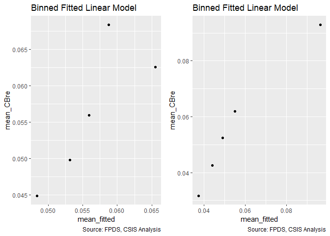<!-- -->

```
## Warning in if (class(model1_new) == "glmerMod") {: the condition has length
## > 1 and only the first element will be used
```

```
## Warning in if (class(model1_new) != "glmerMod" & class(model1_old) !=
## "glmerMod" & : the condition has length > 1 and only the first element will
## be used
```

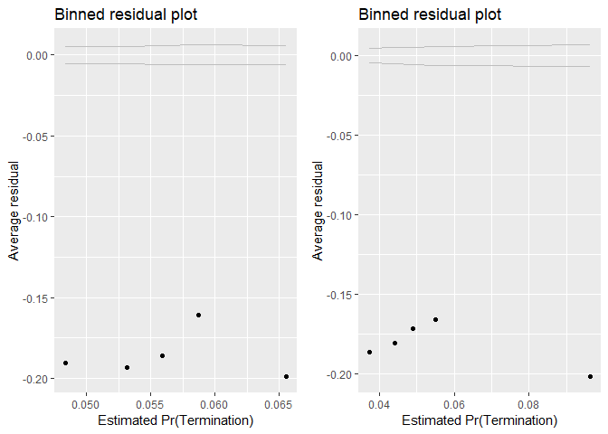<!-- -->

```
## [[1]]
##        model deviance null.deviance difference
## 1 model1_old 108186.9      108365.4   178.4679
## 2 model1_new 105745.4      108365.4  2619.9862
## 
## [[2]]
## cl_US6_avg_sal_lag1Const                  cl_CFTE                  c_pPBSC 
##                 1.224892                 1.167672                 1.274248 
##                c_pOffPSC               c_pairHist                cl_pairCA 
##                 1.448092                 1.244916                 1.540912
```

```r
summary_residual_compare(b_CBre02D,b_CBre03D)
```

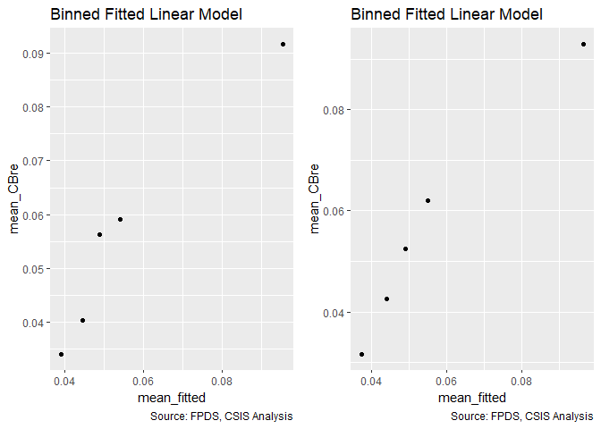<!-- -->

```
## Warning in if (class(model1_new) == "glmerMod") {: the condition has length
## > 1 and only the first element will be used

## Warning in if (class(model1_new) == "glmerMod") {: the condition has length
## > 1 and only the first element will be used
```

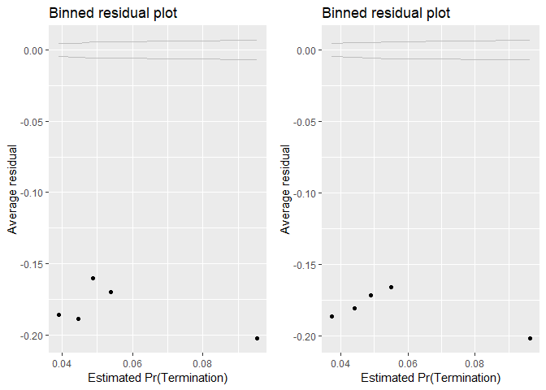<!-- -->

```
## [[1]]
##        model deviance null.deviance difference
## 1 model1_old 105913.1      108365.4   2452.226
## 2 model1_new 105745.4      108365.4   2619.986
## 
## [[2]]
## cl_US6_avg_sal_lag1Const                  cl_CFTE                  c_pPBSC 
##                 1.224892                 1.167672                 1.274248 
##                c_pOffPSC               c_pairHist                cl_pairCA 
##                 1.448092                 1.244916                 1.540912
```

None of the predictors has high level of correlation (vif over 1.7) with each other. 
In the cumulative model, per dependent variable and independent variable:

1. Ceiling breaches:
   A. Service Complexity:
      The relationship with average salary gained significance in line with expectation.
      The result for both average salary and invoice rate matched with expectation.
      
   B. Office Capacity: 
      The relationship with PBSC matched with expectation but with less magnitude.
      The result for office obligations did not match with expectation.
     
   C. Office-Vendor Relationship:
      The result for pair history matched with expectation 
      The relationship with contract actions reverse and now align with expectations.

2. Terminations:
   A. Service Complexity:
      The reult for average salary did not match with expectation.
      The result for invoice rate did matach with expectation, only significant (for p-value <0.5), which is still sufficient.
      
   B. Office Capacity: 
      The relationship with PBSC was not significant.
      The result for office obligations did not match with expectation.
     
   C. Office-Vendor Relationship:
      The result for pair history matched with expectation once all variables included.
      The result for contract actions did not match with expectation.

3. Exercised Options:
  A. Service Complexity:
      The result for both average salary and invoice rate matached with expectation but with less magnitude.
      
   B. Office Capacity: 
      The result for PBSC didn't match with expectation.
      The result for office obligations matched with expectation.
     
   C. Office-Vendor Relationship:
      The result for pair history lost significance and didn't match with expectations.
      The result for contract actions didn't match with expectation.


## Study Variables Alone


```r
 # !is.na(def_serv$cl_US6_avg_sal_lag1)&
 #  !is.na(def_serv$cl_CFTE)&
 #  !is.na(def_serv$c_pPBSC)&
 #  !is.na(def_serv$c_pOffPSC)&
 #  !is.na(def_serv$c_pairHist)&
 #  !is.na(def_serv$cl_pairCA)&


study_coef_list<-list("(Intercept)"="(Intercept)",
                      "cl_US6_avg_sal_lag1Const"="Log(Det. Ind. Salary)",
                      "cl_CFTE"="Log(Service Invoice Rate)",
                      "c_pPBSC"="Office Perf.-Based %",
                      "c_pOffPSC"="Office Service Exp. %",
                      "c_pairHist"="Paired Years",
                      "cl_pairCA"="Log(Paired Actions)"
)

all_coef_list<-list("(Intercept)"="(Intercept)",
                    "cl_US6_avg_sal_lag1Const"="Log(Det. Ind. Salary)",
                    "cl_CFTE"="Log(Service Invoice Rate)",
                    "c_pPBSC"="Office Perf.-Based %",
                    "c_pOffPSC"="Office Service Exp. %",
                    "c_pairHist"="Paired Years",
                    "cl_pairCA"="Log(Paired Actions)",
                    
                    #Contract Controls
                    
                    "Comp1or51 offer"="Comp=1 offer",
                    "Comp1or52-4 offers"="Comp=2-4 offers",
                    "Comp1or55+ offers"="Comp=5+ offers",
                    
                    "CompOffr1 offer"="Comp=1 offer",
                    "CompOffr2 offers"="Comp=2 offers",
                    "CompOffr3-4 offers"="Comp=3-4 offers",
                    "CompOffr5+ offers"="Comp=5+ offers",
                    
                    "cl_Ceil"="Log(Init. Ceiling)",
                    "capped_cl_Days"="Log(Init. Days)",
                    "VehS-IDC"="Vehicle=S-IDC",
                    "VehM-IDC"="Vehicle=M-IDC",
                    "VehFSS/GWAC"="Vehicle=FSS/GWAC",
                    "VehBPA/BOA"="Vehicle=BPA/BOA",
                    "PricingUCAFFP"="Pricing=FFP",
                    "PricingUCAOther FP"="Pricing=Other FP",
                    "PricingUCAIncentive"="Pricing=Incentive Fee",
                    "PricingUCACombination or Other"="Pricing=Combination or Other",
                    "PricingUCAOther CB"="Pricing=Other CB",
                    "PricingUCAT&M/LH/FPLOE"="Pricing=T&M/LH/FP:LoE",
                    "PricingUCAUCA"="Pricing=UCA",
                    
                    "PricingFeeOther FP"="Pricing=Other FP",
                    "PricingFeeIncentive"="Pricing=Incentive Fee",
                    "PricingFeeCombination or Other"="Pricing=Combination or Other",
                    "PricingFeeOther CB"="Pricing=Other CB",
                    "PricingFeeT&M/LH/FPLOE"="Pricing=T&M/LH/FP:LoE",
                    "b_UCA"="UCA",
                    "CrisisARRA"="Crisis=ARRA",
                    "CrisisDis"="Crisis=Disaster",
                    "CrisisOCO"="Crisis=OCO",
                    "b_Intl"="Performed Abroad",

                    #NAICS
                    "cl_def3_HHI_lag1"="Log(Subsector HHI)",
                    "cl_def6_HHI_lag1"="Log(Det. Ind. HHI)",
                    "cl_def3_ratio_lag1"="Log(Subsector Ratio)",
                    "cl_def6_obl_lag1"="Log(Det. Ind. DoD Obl.)",
                    "cl_def6_ratio_lag1"="Log(Det. Ind. Ratio)",
                    #Office
                    "c_pMarket"="Percent Market",
                    "cl_OffVol"="Office Volume",
                    "cl_office_naics_hhi_k"="Office Concentration",
                    
                    
                    #interations
                    # # "cl_def6_HHI_lag1:capped_cl_Days"="Log(Det. Ind. HHI):Log(Init. Days)",
                    # "cl_def6_HHI_lag1:cl_def6_obl_lag1"="Log(Det. Ind. HHI):Log(Det. Ind. DoD Obl.)",
                    # # "cl_def3_HHI_lag1:cl_def3_ratio_lag1"="Log(Subsector HHI):Log(Subsector Ratio)"),
                    "cl_def6_HHI_lag1:b_UCA"="Log(Det. Ind. HHI):UCA",
                    # "cl_Ceil:b_UCA"="Log(Init. Ceiling):UCA",
                    # "CompOffr1 offer:b_UCA"="Comp=1 offer:UCA",
                    # "CompOffr2 offers:b_UCA"="Comp=2 offers:UCA",
                    # "CompOffr3-4 offers:b_UCA"="Comp=3-4 offers:UCA",
                    # "CompOffr5+ offers:b_UCA"="Comp=5+ offers:UCA"
                    "VehS-IDC:b_Intl"="Vehicle=S-IDC:Performed Abroad",
                    "VehM-IDC:b_Intl"="Vehicle=M-IDC:Performed Abroad",
                    "VehFSS/GWAC:b_Intl"="Vehicle=FSS/GWAC:Performed Abroad",
                    "VehBPA/BOA:b_Intl"="Vehicle=BPA/BOA:Performed Abroad",
                    "cl_US6_avg_sal_lag1:PricingFeeOther FP"="Pricing=Other FP:Log(Det. Ind. U.S. Avg. Salary)",
                    "cl_US6_avg_sal_lag1:PricingFeeIncentive"="Pricing=Incentive Fee:Log(Det. Ind. U.S. Avg. Salary)",
                    "cl_US6_avg_sal_lag1:PricingFeeCombination or Other"="Pricing=Comb./or Other:Log(Det. Ind. U.S. Avg. Salary)",
                    "cl_US6_avg_sal_lag1:PricingFeeOther CB"="Pricing=Other CB:Log(Det. Ind. U.S. Avg. Salary)",
                    "cl_US6_avg_sal_lag1:PricingFeeT&M/LH/FPLOE"="Pricing=T&M/LH/FP:LoE:Log(Det. Ind. U.S. Avg. Salary)"
)


#Ceiling Breaches Binary
  stargazer::stargazer(b_CBre01A,b_CBre01B,b_CBre02A,b_CBre02B,b_CBre03A,b_CBre03B,b_CBre03D,
                       type="text",
                       digits=2)
```

```
## 
## =====================================================================================================
##                                                      Dependent variable:                             
##                          ----------------------------------------------------------------------------
##                                                             b_CBre                                   
##                             (1)        (2)        (3)        (4)        (5)        (6)        (7)    
## -----------------------------------------------------------------------------------------------------
## cl_US6_avg_sal_lag1Const  0.21***                                                           0.09***  
##                            (0.02)                                                            (0.02)  
##                                                                                                      
## cl_CFTE                              0.19***                                                0.16***  
##                                       (0.02)                                                 (0.02)  
##                                                                                                      
## c_pPBSC                                         0.15***                                     -0.18*** 
##                                                  (0.02)                                      (0.02)  
##                                                                                                      
## c_pOffPSC                                                  0.69***                          0.81***  
##                                                             (0.01)                           (0.02)  
##                                                                                                      
## c_pairHist                                                            -0.10***              -0.16*** 
##                                                                        (0.02)                (0.02)  
##                                                                                                      
## cl_pairCA                                                                        0.15***    -0.13*** 
##                                                                                   (0.02)     (0.02)  
##                                                                                                      
## Constant                  -2.82***   -2.82***   -2.82***   -2.87***   -2.82***   -2.82***   -2.88*** 
##                            (0.01)     (0.01)     (0.01)     (0.01)     (0.01)     (0.01)     (0.01)  
##                                                                                                      
## -----------------------------------------------------------------------------------------------------
## Observations              250,000    250,000    250,000    250,000    250,000    250,000    250,000  
## Log Likelihood           -54,112.11 -54,122.07 -54,142.39 -53,074.74 -54,165.57 -54,145.89 -52,872.69
## Akaike Inf. Crit.        108,228.20 108,248.10 108,288.80 106,153.50 108,335.10 108,295.80 105,759.40
## =====================================================================================================
## Note:                                                                     *p<0.1; **p<0.05; ***p<0.01
```

```r
texreg::htmlreg(list(b_CBre01A,b_CBre01B,b_CBre02A,b_CBre02B,b_CBre03A,b_CBre03B,b_CBre03D),file="..//Output//b_CBreModel.html",
                single.row = TRUE,
                # custom.model.name=c("Ceiling Breaches"),
                stars=c(0.1,0.05,0.01,0.001),
                groups = list(
                              "Services Complexity" = 2:3,
                              "Office Capacity" =4:5,
                              "Past Relationship"=6:7
                              ),
                custom.coef.map=all_coef_list,
                bold=0.05,
                custom.note="%stars. Numerical inputs are rescaled.",
                caption="Table 6: Logit Bivariate Look at Study Variables and Ceiling Breaches",
                caption.above=TRUE)
```

```
## The table was written to the file '..//Output//b_CBreModel.html'.
```

```r
#Ceiling Breach Absolute
stargazer::stargazer(n_CBre01A,n_CBre01B,n_CBre02A,n_CBre02B,n_CBre03A,n_CBre03B,n_CBre03D,
                       type="text",
                       digits=2)
```

```
## 
## =====================================================================================================
##                                                      Dependent variable:                             
##                          ----------------------------------------------------------------------------
##                                                            ln_CBre                                   
##                             (1)        (2)        (3)        (4)        (5)        (6)        (7)    
## -----------------------------------------------------------------------------------------------------
## cl_US6_avg_sal_lag1Const  0.78***                                                           1.20***  
##                            (0.06)                                                            (0.05)  
##                                                                                                      
## cl_CFTE                              1.20***                                                0.48***  
##                                       (0.05)                                                 (0.05)  
##                                                                                                      
## c_pPBSC                                         -1.90***                                    -0.85*** 
##                                                  (0.04)                                      (0.05)  
##                                                                                                      
## c_pOffPSC                                                  -1.62***                         -0.98*** 
##                                                             (0.03)                           (0.04)  
##                                                                                                      
## c_pairHist                                                            -0.59***               0.09**  
##                                                                        (0.05)                (0.05)  
##                                                                                                      
## cl_pairCA                                                                        -1.97***   -0.62*** 
##                                                                                   (0.05)     (0.06)  
##                                                                                                      
## Constant                  9.21***    9.20***    9.33***    9.60***    9.23***    9.33***    9.44***  
##                            (0.02)     (0.02)     (0.02)     (0.02)     (0.02)     (0.02)     (0.02)  
##                                                                                                      
## -----------------------------------------------------------------------------------------------------
## Observations               15,018     15,018     15,018     15,018     15,018     15,018     15,018  
## Log Likelihood           -36,467.62 -36,251.56 -35,243.81 -35,027.39 -36,488.01 -35,701.81 -34,366.59
## Akaike Inf. Crit.        72,939.24  72,507.12  70,491.63  70,058.78  72,980.03  71,407.63  68,747.18 
## =====================================================================================================
## Note:                                                                     *p<0.1; **p<0.05; ***p<0.01
```

```r
texreg::htmlreg(list(n_CBre01A,n_CBre01B,n_CBre02A,n_CBre02B,n_CBre03A,n_CBre03B,n_CBre03D),file="..//Output//n_CBreModel.html",
                single.row = TRUE,
                # custom.model.name=c("Ceiling Breaches"),
                stars=c(0.1,0.05,0.01,0.001),
                groups = list(
                              "Services Complexity" = 2:3,
                              "Office Capacity" =4:5,
                              "Past Relationship"=6:7
                              ),
                custom.coef.map=all_coef_list,
                bold=0.05,
                custom.note="%stars. Numerical inputs are rescaled.",
                caption="Table 8: Regression Bivariate Look at Study Variables and Log(Options Growth)",
                caption.above=TRUE)
```

```
## The table was written to the file '..//Output//n_CBreModel.html'.
```

# Controls

##Contract-Level Controls
###Scope Variables
#### 04A: Cost Ceiling

Expectation: Initial Ceiling size positively estimates increasing probability of ceiling breaches and terminations and negatively estimates the option growth. Terminations and ceiling breaches simply comes down to large being associated with higher risk, while for option growth size imply makes it harder to grow proportionally.


```r
#Frequency Plot for unlogged ceiling
freq_continuous_cbre_plot(serv_smp,"UnmodifiedContractBaseAndAllOptionsValue.OMB20_GDP18",
               bins=1000)
```

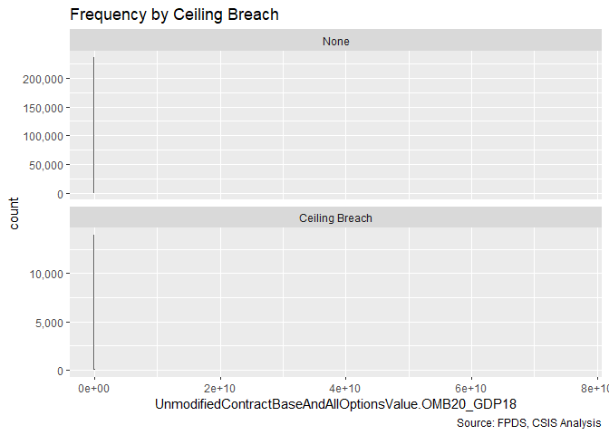<!-- -->

```r
freq_continuous_cbre_plot(subset(serv_smp,UnmodifiedContractBaseAndAllOptionsValue.OMB20_GDP18<100000000),
               "UnmodifiedContractBaseAndAllOptionsValue.OMB20_GDP18",
               bins=1000)
```

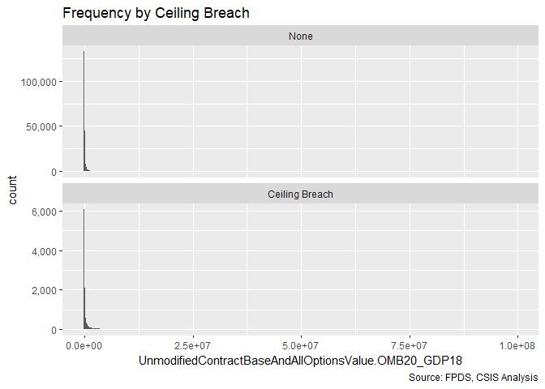<!-- -->

```r
summary_continuous_plot(serv_smp,"cl_Ceil",bins=50)
```

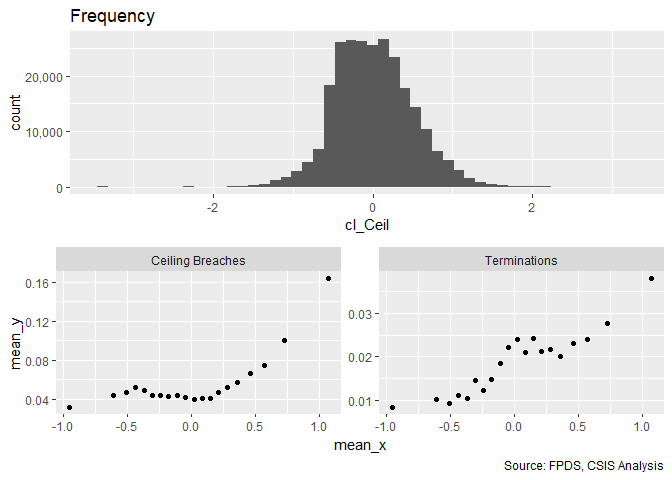<!-- -->

```r
summary(serv_smp$cl_Ceil)
```

```
##     Min.  1st Qu.   Median     Mean  3rd Qu.     Max. 
## -3.39507 -0.33658 -0.01169  0.01033  0.31835  3.24200
```

```r
str(serv_smp)
```

```
## Classes 'grouped_df', 'tbl_df', 'tbl' and 'data.frame':	250000 obs. of  255 variables:
##  $ CSIScontractID                                      : num  19015001 19101209 24640201 26380332 27836378 ...
##  $ Action_Obligation.Then.Year                         : num  34772 32784 1172796 290276 51362 ...
##  $ IsClosed                                            : num  0 0 0 0 0 0 0 0 1 0 ...
##  $ Term                                                : num  0 0 0 0 0 0 0 0 1 0 ...
##  $ LastCurrentCompletionDate                           : Date, format: "2012-11-02" "2008-08-22" ...
##  $ MinOfSignedDate                                     : Date, format: "2012-05-24" "2008-05-23" ...
##  $ MaxBoostDate                                        : Date, format: "2012-05-24" "2008-05-23" ...
##  $ StartFY                                             : num  2012 2008 2010 2013 2014 ...
##  $ Agency                                              : Factor w/ 38 levels "*ODD","1450",..: 3 3 4 4 3 4 25 3 4 4 ...
##  $ Office                                              : chr  "N40080" "N69450" "W911S2" "W912BU" ...
##  $ ProdServ                                            : Factor w/ 3088 levels "","1000","1005",..: 3066 2913 2769 2414 2513 2872 1429 1979 3088 2549 ...
##  $ NAICS                                               : num  237310 237310 236220 541620 488310 ...
##  $ UnmodifiedDays                                      : num  163 92 366 431 4 ...
##  $ qDuration                                           : Ord.factor w/ 5 levels "[0 months,~2 months)"<..: 2 2 4 4 1 1 2 1 4 1 ...
##  $ UnmodifiedContractBaseAndAllOptionsValue.Then.Year  : num  34772 32784 1174805 290276 27900 ...
##  $ UnmodifiedCurrentCompletionDate                     : Date, format: "2012-11-02" "2008-08-22" ...
##  $ SumOfisChangeOrder                                  : int  0 0 1 0 0 0 0 0 0 0 ...
##  $ ChangeOrderBaseAndAllOptionsValue                   : num  0 0 -2009 0 0 ...
##  $ qNChg                                               : Factor w/ 4 levels "   0","   1",..: 1 1 2 1 1 1 1 1 1 1 ...
##  $ CBre                                                : Ord.factor w/ 2 levels "None"<"Ceiling Breach": 1 1 1 1 1 1 1 1 1 1 ...
##  $ Where                                               : Factor w/ 204 levels "AFG","AGO","ALB",..: 192 192 192 78 192 192 192 19 121 1 ...
##  $ Intl                                                : Factor w/ 2 levels "Just U.S.","Any Intl.": 1 1 1 2 1 1 1 2 2 2 ...
##  $ PSR                                                 : Factor w/ 3 levels "Products","R&D",..: 3 3 3 3 3 3 3 3 3 3 ...
##  $ UnmodifiedNumberOfOffersReceived                    : num  7 3 2 1 9 15 8 1 4 1 ...
##  $ Offr                                                : Ord.factor w/ 4 levels "1"<"2"<"3-4"<..: 4 3 2 1 4 4 4 1 3 1 ...
##  $ Comp                                                : Factor w/ 2 levels "No Comp.","Comp.": 2 2 1 1 2 2 2 1 2 2 ...
##  $ EffComp                                             : Factor w/ 3 levels "No Comp.","1 Offer",..: 3 3 1 1 3 3 3 1 3 2 ...
##  $ Urg                                                 : Factor w/ 2 levels "Not Urgency",..: 1 1 1 1 1 1 1 1 1 1 ...
##  $ Veh                                                 : Factor w/ 5 levels "Def/Pur","S-IDC",..: 2 2 2 4 2 2 5 2 1 1 ...
##  $ FxCb                                                : Factor w/ 3 levels "Fixed","Combo/Other",..: 1 1 1 1 1 1 1 1 1 1 ...
##  $ Fee                                                 : Ord.factor w/ 6 levels "Incentive"<"Fixed Fee"<..: 4 4 4 4 4 4 4 4 4 4 ...
##  $ UCA                                                 : Factor w/ 2 levels "Not UCA","UCA": 1 1 1 1 1 1 1 1 1 1 ...
##  $ EntityID                                            : num  31937 427894 60938 683522 316618 ...
##  $ UnmodifiedEntityID                                  : num  31937 427894 60938 683522 316618 ...
##  $ PlaceCountryISO3                                    : chr  "USA" "USA" "USA" "HND" ...
##  $ Crisis                                              : Factor w/ 4 levels "Other","ARRA",..: 1 1 1 1 1 1 1 4 1 4 ...
##  $ b_Term                                              : num  0 0 0 0 0 0 0 0 1 0 ...
##  $ j_Term                                              : num  0.0436 0.02902 0.01707 0.01272 0.00879 ...
##  $ b_CBre                                              : num  0 0 0 0 0 0 0 0 0 0 ...
##  $ j_CBre                                              : num  0.0136 0.0198 0.0348 0.026 0.0233 ...
##  $ pChangeOrderBaseAndAllOptionsValue                  : num  0 0 -0.00171 0 0 ...
##  $ pChange3Sig                                         : num  0 0 -0.002 0 0 0 0 0 0 0 ...
##  $ qCrai                                               : Factor w/ 4 levels "[  -Inf,-0.001)",..: 2 2 1 2 2 2 2 2 2 2 ...
##  $ Action_Obligation.OMB20_GDP18                       : num  34772 34762 1218869 285031 49477 ...
##  $ UnmodifiedContractBaseAndAllOptionsValue.OMB20_GDP18: num  34772 34762 1220957 285031 26876 ...
##  $ qHighCeiling                                        : chr  "[1.50e+04,1.00e+05)" "[1.50e+04,1.00e+05)" "[1.00e+06,1.00e+07)" "[1.00e+05,1.00e+06)" ...
##  $ ceil.median.wt                                      : num  38655 38655 2120594 246578 38655 ...
##  $ capped_UnmodifiedDays                               : num  163 92 366 431 4 ...
##  $ cl_Days                                             : num  0.2192 0.0475 0.4621 0.5112 -0.8939 ...
##  $ capped_cl_Days                                      : num  0.2193 0.0476 0.4622 0.5114 -0.8941 ...
##  $ UnmodifiedYearsFloat                                : num  0.446 0.252 1.002 1.18 0.011 ...
##  $ UnmodifiedYearsCat                                  : num  0 0 1 1 0 0 0 0 1 0 ...
##  $ Dur.Simple                                          : Ord.factor w/ 3 levels "<~1 year"<"(~1 year,~2 years]"<..: 1 1 2 2 1 1 1 1 2 1 ...
##  $ n_Fixed                                             : num  1 1 1 1 1 1 1 1 1 1 ...
##  $ n_Incent                                            : num  0 0 0 0 0 0 0 0 0 0 ...
##  $ n_NoFee                                             : num  1 1 1 1 1 1 1 1 1 1 ...
##  $ Pricing                                             : Factor w/ 5 levels "FFP","Other FP",..: 1 1 1 1 1 1 1 1 1 1 ...
##  $ PricingFee                                          : Factor w/ 6 levels "FFP","Other FP",..: 1 1 1 1 1 1 1 1 1 1 ...
##  $ PricingUCA                                          : Factor w/ 7 levels "Combination or Other",..: 2 2 2 2 2 2 2 2 2 2 ...
##  $ b_Comp                                              : int  1 1 0 0 1 1 1 0 1 1 ...
##  $ n_Comp                                              : Factor w/ 3 levels "0","0.5","1": 3 3 1 1 3 3 3 1 3 2 ...
##  $ q_Offr                                              : Factor w/ 4 levels "1","2","3-4",..: 4 3 2 1 4 4 4 1 3 1 ...
##  $ nq_Offr                                             : num  4 3 0 0 4 4 4 0 3 1 ...
##  $ CompOffr                                            : Factor w/ 5 levels "No Competition",..: 5 4 1 1 5 5 5 1 4 2 ...
##  $ cb_Comp                                             : num  0.271 0.271 -0.729 -0.729 0.271 ...
##  $ cn_Comp                                             : num  0.416 0.416 -0.739 -0.739 0.416 ...
##  $ cn_Offr                                             : num  0.678 0.351 -0.628 -0.628 0.678 ...
##  $ cl_Offr                                             : num  0.5955 0.142 -0.0751 -0.4461 0.73 ...
##  $ b_Urg                                               : num  0 0 0 0 0 0 0 0 0 0 ...
##  $ NoComp                                              : Factor w/ 3 levels "Any Comp.","Other No",..: 1 1 2 2 1 1 1 2 1 1 ...
##  $ NoCompOffr                                          : Factor w/ 5 levels "Other No","Urgency",..: 5 4 1 1 5 5 5 1 4 3 ...
##  $ Comp1or5                                            : Factor w/ 4 levels "No Competition",..: 4 3 1 1 4 4 4 1 3 2 ...
##  $ b_Intl                                              : int  0 0 0 1 0 0 0 1 1 1 ...
##  $ b_UCA                                               : int  0 0 0 0 0 0 0 0 0 0 ...
##  $ SIDV                                                : int  1 1 1 0 1 1 0 1 0 0 ...
##  $ MIDV                                                : int  0 0 0 0 0 0 0 0 0 0 ...
##  $ FSSGWAC                                             : int  0 0 0 1 0 0 0 0 0 0 ...
##  $ BPABOA                                              : int  0 0 0 0 0 0 1 0 0 0 ...
##  $ StartCY                                             : num  2012 2008 2010 2013 2014 ...
##  $ NAICS5                                              : int  23731 23731 23622 54162 48831 23622 51741 33661 23899 53211 ...
##  $ NAICS4                                              : int  2373 2373 2362 5416 4883 2362 5174 3366 2389 5321 ...
##  $ NAICS3                                              : int  237 237 236 541 488 236 517 336 238 532 ...
##  $ NAICS2                                              : chr  "23" "23" "23" "54" ...
##  $ def6_HHI_lag1                                       : num  188.3 528.9 87.5 209.7 2372.4 ...
##  $ def6_obl_lag1                                       : num  1.24e+09 1.53e+09 9.07e+09 3.67e+08 4.00e+07 ...
##  $ def6_ratio_lag1                                     : num  0.0144 0.0144 0.0329 0.0273 0.0175 ...
##  $ US6_avg_sal_lag1                                    : num  50785 50785 56201 61043 53326 ...
##  $ def5_HHI_lag1                                       : num  188.3 528.9 87.5 209.7 2372.4 ...
##  $ def5_obl_lag1                                       : num  1.24e+09 1.53e+09 9.07e+09 3.67e+08 4.00e+07 ...
##  $ def5_ratio_lag1                                     : num  0.0144 0.0144 0.0329 0.0273 0.0175 ...
##  $ US5_avg_sal_lag1                                    : num  50785 50785 56201 61043 53326 ...
##  $ def4_HHI_lag1                                       : num  188.3 528.9 76.4 435.9 544 ...
##  $ def4_obl_lag1                                       : num  1.24e+09 1.53e+09 1.08e+10 8.98e+09 2.69e+08 ...
##  $ def4_ratio_lag1                                     : num  0.0144 0.0144 0.0361 0.0433 0.0147 ...
##  $ US4_avg_sal_lag1                                    : num  50785 50785 56024 76717 59582 ...
##  $ def3_HHI_lag1                                       : num  149.9 90.3 73.2 74.5 979.6 ...
##  $ def3_obl_lag1                                       : num  6.94e+09 5.99e+09 1.19e+10 8.77e+10 4.80e+09 ...
##  $ def3_ratio_lag1                                     : num  0.023 0.023 0.0202 0.0593 0.0553 ...
##  $ US3_avg_sal_lag1                                    : num  51890 51890 50708 70871 46037 ...
##   [list output truncated]
##  - attr(*, "groups")=Classes 'tbl_df', 'tbl' and 'data.frame':	11 obs. of  2 variables:
##   ..$ qHighCeiling: chr  "[0,15k)" "[0.00e+00,1.50e+04)" "[1.00e+05,1.00e+06)" "[1.00e+06,1.00e+07)" ...
##   ..$ .rows       :List of 11
##   .. ..$ : int  249484 249487 249494 249496 249499 249500 249501 249502 249505 249509 ...
##   .. ..$ : int  7 14 16 18 21 26 28 32 35 36 ...
##   .. ..$ : int  4 9 10 11 15 17 19 22 25 41 ...
##   .. ..$ : int  3 6 13 20 40 51 86 94 98 109 ...
##   .. ..$ : int  74 114 119 133 1233 1306 1446 1516 1537 1549 ...
##   .. ..$ : int  1 2 5 8 12 23 24 27 29 30 ...
##   .. ..$ : int  249485 249486 249488 249491 249492 249498 249504 249506 249508 249512 ...
##   .. ..$ : int  249636 249638 249778 249850 249872 249879 249900 249957
##   .. ..$ : int  249489 249490 249493 249495 249497 249507 249510 249513 249518 249519 ...
##   .. ..$ : int  249503 249517 249530 249543 249554 249588 249597 249605 249644 249647 ...
##   .. ..$ : int  352 933 1881 2002 2019 2656 3030 5828 7091 7097 ...
##   ..- attr(*, ".drop")= logi TRUE
```

```r
#Scatter Plot
ggplot(serv_smp, aes(x=cl_Ceil, y=ln_CBre)) + geom_point(alpha = 0.1) + ggtitle('Ceiling Breach Growth') + theme(plot.title = element_text(hjust = 0.5))
```

```
## Warning: Removed 234982 rows containing missing values (geom_point).
```

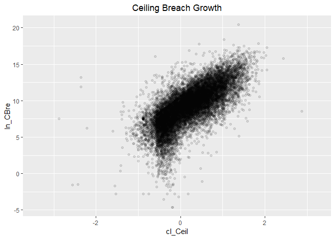<!-- -->

```r
#Model
b_CBre04A <- glm (data=serv_smp,
                 b_CBre ~ cl_Ceil, family=binomial(link="logit"))
display(b_CBre04A)
```

```
## glm(formula = b_CBre ~ cl_Ceil, family = binomial(link = "logit"), 
##     data = serv_smp)
##             coef.est coef.se
## (Intercept) -2.90     0.01  
## cl_Ceil      0.85     0.02  
## ---
##   n = 250000, k = 2
##   residual deviance = 106032.9, null deviance = 108365.4 (difference = 2332.5)
```

```r
n_CBre04A <- glm(data=serv_smp,
                        ln_CBre ~ cl_Ceil)

display(n_CBre04A)
```

```
## glm(formula = ln_CBre ~ cl_Ceil, data = serv_smp)
##             coef.est coef.se
## (Intercept) 8.54     0.02   
## cl_Ceil     3.51     0.03   
## ---
##   n = 15018, k = 2
##   residual deviance = 54941.0, null deviance = 114568.9 (difference = 59627.8)
##   overdispersion parameter = 3.7
##   residual sd is sqrt(overdispersion) = 1.91
```

```r
#Plot residuals versus fitted
stargazer::stargazer(b_CBre03D,b_CBre04A,
                       
                       n_CBre03D,n_CBre04A,
                       type="text",
                       digits=2)
```

```
## 
## ====================================================================
##                                      Dependent variable:            
##                          -------------------------------------------
##                                 b_CBre                ln_CBre       
##                                logistic               normal        
##                             (1)        (2)        (3)        (4)    
## --------------------------------------------------------------------
## cl_US6_avg_sal_lag1Const  0.09***               1.20***             
##                            (0.02)                (0.05)             
##                                                                     
## cl_CFTE                   0.16***               0.48***             
##                            (0.02)                (0.05)             
##                                                                     
## c_pPBSC                   -0.18***              -0.85***            
##                            (0.02)                (0.05)             
##                                                                     
## c_pOffPSC                 0.81***               -0.98***            
##                            (0.02)                (0.04)             
##                                                                     
## c_pairHist                -0.16***               0.09**             
##                            (0.02)                (0.05)             
##                                                                     
## cl_pairCA                 -0.13***              -0.62***            
##                            (0.02)                (0.06)             
##                                                                     
## cl_Ceil                              0.85***               3.51***  
##                                       (0.02)                (0.03)  
##                                                                     
## Constant                  -2.88***   -2.90***   9.44***    8.54***  
##                            (0.01)     (0.01)     (0.02)     (0.02)  
##                                                                     
## --------------------------------------------------------------------
## Observations              250,000    250,000     15,018     15,018  
## Log Likelihood           -52,872.69 -53,016.45 -34,366.59 -31,049.87
## Akaike Inf. Crit.        105,759.40 106,036.90 68,747.18  62,103.75 
## ====================================================================
## Note:                                    *p<0.1; **p<0.05; ***p<0.01
```

```r
#summary_residual_compare(b_CBre03D,b_CBre04A, skip_vif = TRUE)
```

Contract ceiling has a significant relationship, though the residuals show a possible non-linear patterns. This is most remarkable in the positive centered values between 0 and 1. This may be driven  by a missing value and is worth watching.
Expectations upheld for ceiling breaches and terminations. Weak expectations for options growth were countered.

#### 04B: Maximum Duration

Expectation: Greater maximum duration will positively estimate the probability ceiling of  breaches and terminations. Greater growth for options is also expected, because year-on-year options may be more of a default, though the scatter plot seems to go the other way.


```r
#Frequency Plot for max duration
freq_continuous_cbre_plot(serv_smp,"UnmodifiedDays",
               bins=1000)
```

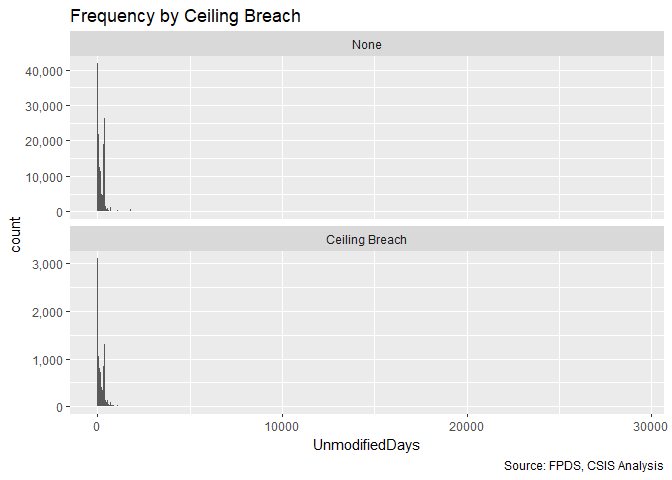<!-- -->

```r
summary_continuous_plot(serv_smp,"capped_cl_Days")
```

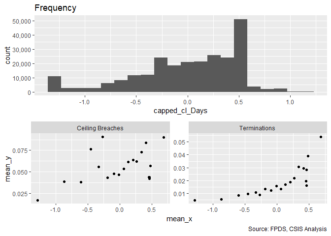<!-- -->

```r
#Scatter Plot
ggplot(serv_smp, aes(x=capped_cl_Days, y=ln_CBre)) + geom_point(alpha = 0.1) + ggtitle('Ceiling Breach Growth') + theme(plot.title = element_text(hjust = 0.5))
```

```
## Warning: Removed 234982 rows containing missing values (geom_point).
```

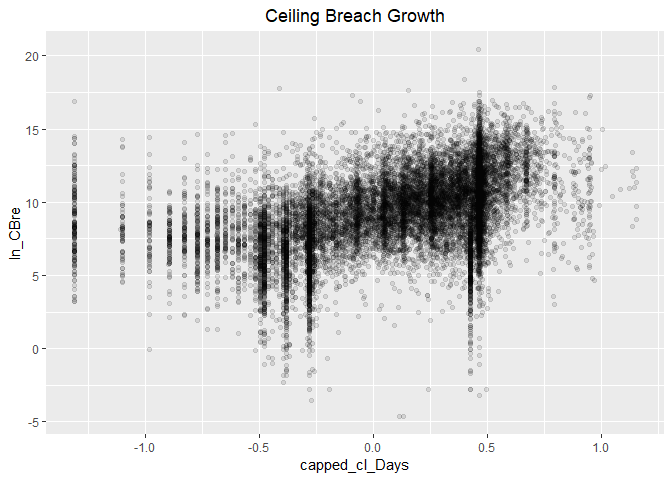<!-- -->

```r
#Model
b_CBre04B <- glm (data=serv_smp,
                 b_CBre ~ capped_cl_Days, family=binomial(link="logit"))
display(b_CBre04B)
```

```
## glm(formula = b_CBre ~ capped_cl_Days, family = binomial(link = "logit"), 
##     data = serv_smp)
##                coef.est coef.se
## (Intercept)    -2.83     0.01  
## capped_cl_Days  0.34     0.02  
## ---
##   n = 250000, k = 2
##   residual deviance = 108010.3, null deviance = 108365.4 (difference = 355.1)
```

```r
n_CBre04B <- glm(data=serv_smp,
                        ln_CBre ~ capped_cl_Days)

display(n_CBre04B)
```

```
## glm(formula = ln_CBre ~ capped_cl_Days, data = serv_smp)
##                coef.est coef.se
## (Intercept)    9.05     0.02   
## capped_cl_Days 2.91     0.05   
## ---
##   n = 15018, k = 2
##   residual deviance = 91284.8, null deviance = 114568.9 (difference = 23284.1)
##   overdispersion parameter = 6.1
##   residual sd is sqrt(overdispersion) = 2.47
```

```r
#Plot residuals versus fitted
stargazer::stargazer(b_CBre03D,b_CBre04A,b_CBre04B,
                       
                       n_CBre03D,n_CBre04A,n_CBre04B,
                       type="text",
                       digits=2)
```

```
## 
## ==========================================================================================
##                                                 Dependent variable:                       
##                          -----------------------------------------------------------------
##                                       b_CBre                          ln_CBre             
##                                      logistic                          normal             
##                             (1)        (2)        (3)        (4)        (5)        (6)    
## ------------------------------------------------------------------------------------------
## cl_US6_avg_sal_lag1Const  0.09***                          1.20***                        
##                            (0.02)                           (0.05)                        
##                                                                                           
## cl_CFTE                   0.16***                          0.48***                        
##                            (0.02)                           (0.05)                        
##                                                                                           
## c_pPBSC                   -0.18***                         -0.85***                       
##                            (0.02)                           (0.05)                        
##                                                                                           
## c_pOffPSC                 0.81***                          -0.98***                       
##                            (0.02)                           (0.04)                        
##                                                                                           
## c_pairHist                -0.16***                          0.09**                        
##                            (0.02)                           (0.05)                        
##                                                                                           
## cl_pairCA                 -0.13***                         -0.62***                       
##                            (0.02)                           (0.06)                        
##                                                                                           
## cl_Ceil                              0.85***                          3.51***             
##                                       (0.02)                           (0.03)             
##                                                                                           
## capped_cl_Days                                  0.34***                          2.91***  
##                                                  (0.02)                           (0.05)  
##                                                                                           
## Constant                  -2.88***   -2.90***   -2.83***   9.44***    8.54***    9.05***  
##                            (0.01)     (0.01)     (0.01)     (0.02)     (0.02)     (0.02)  
##                                                                                           
## ------------------------------------------------------------------------------------------
## Observations              250,000    250,000    250,000     15,018     15,018     15,018  
## Log Likelihood           -52,872.69 -53,016.45 -54,005.13 -34,366.59 -31,049.87 -34,862.37
## Akaike Inf. Crit.        105,759.40 106,036.90 108,014.30 68,747.18  62,103.75  69,728.74 
## ==========================================================================================
## Note:                                                          *p<0.1; **p<0.05; ***p<0.01
```

```r
summary_residual_compare(b_CBre03D,b_CBre04B, skip_vif = TRUE)
```

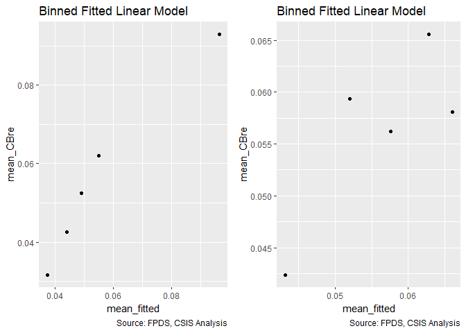<!-- -->

```
## Warning in if (class(model1_new) == "glmerMod") {: the condition has length
## > 1 and only the first element will be used
```

```
## Warning in if (class(model1_new) != "glmerMod" & class(model1_old) !=
## "glmerMod" & : the condition has length > 1 and only the first element will
## be used
```

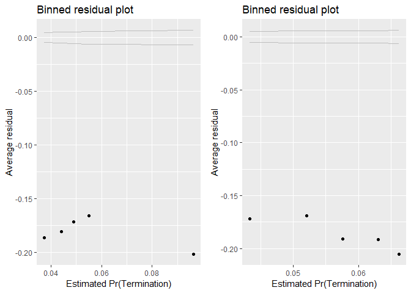<!-- -->

```
## NULL
```

```r
summary_residual_compare(b_CBre04A,b_CBre04B, skip_vif = TRUE)
```

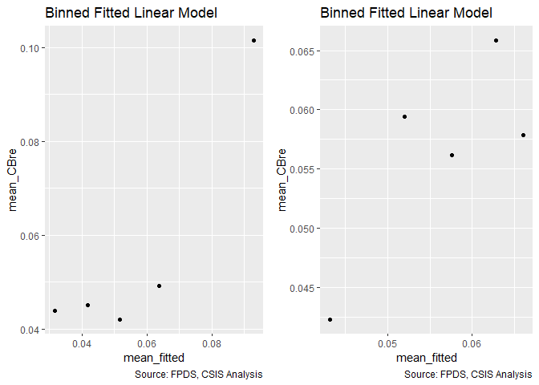<!-- -->

```
## Warning in if (class(model1_new) == "glmerMod") {: the condition has length
## > 1 and only the first element will be used

## Warning in if (class(model1_new) == "glmerMod") {: the condition has length
## > 1 and only the first element will be used
```

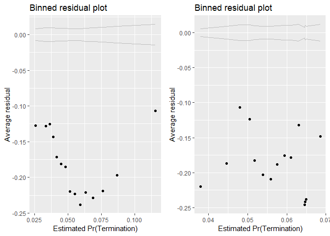<!-- -->

```
## NULL
```

All expections were upheld.

#### 04C: Both Scope variables


```r
#Model
b_CBre04C <- glm (data=serv_smp,
                 b_CBre ~ cl_Ceil + capped_cl_Days, family=binomial(link="logit"))
display(b_CBre04C)
```

```
## glm(formula = b_CBre ~ cl_Ceil + capped_cl_Days, family = binomial(link = "logit"), 
##     data = serv_smp)
##                coef.est coef.se
## (Intercept)    -2.90     0.01  
## cl_Ceil         0.88     0.02  
## capped_cl_Days -0.06     0.02  
## ---
##   n = 250000, k = 3
##   residual deviance = 106024.5, null deviance = 108365.4 (difference = 2340.8)
```

```r
n_CBre04C <- glm(data=serv_smp,
                        ln_CBre ~cl_Ceil + capped_cl_Days)

display(n_CBre04C)
```

```
## glm(formula = ln_CBre ~ cl_Ceil + capped_cl_Days, data = serv_smp)
##                coef.est coef.se
## (Intercept)    8.54     0.02   
## cl_Ceil        3.35     0.03   
## capped_cl_Days 0.37     0.04   
## ---
##   n = 15018, k = 3
##   residual deviance = 54689.5, null deviance = 114568.9 (difference = 59879.4)
##   overdispersion parameter = 3.6
##   residual sd is sqrt(overdispersion) = 1.91
```

```r
#Plot residuals versus fitted
stargazer::stargazer(b_CBre03D,b_CBre04A,b_CBre04B,b_CBre04C,
                       
                       n_CBre03D,n_CBre04A,n_CBre04B,n_CBre04C,
                       type="text",
                       digits=2)
```

```
## 
## ================================================================================================================
##                                                            Dependent variable:                                  
##                          ---------------------------------------------------------------------------------------
##                                            b_CBre                                      ln_CBre                  
##                                           logistic                                     normal                   
##                             (1)        (2)        (3)        (4)        (5)        (6)        (7)        (8)    
## ----------------------------------------------------------------------------------------------------------------
## cl_US6_avg_sal_lag1Const  0.09***                                     1.20***                                   
##                            (0.02)                                      (0.05)                                   
##                                                                                                                 
## cl_CFTE                   0.16***                                     0.48***                                   
##                            (0.02)                                      (0.05)                                   
##                                                                                                                 
## c_pPBSC                   -0.18***                                    -0.85***                                  
##                            (0.02)                                      (0.05)                                   
##                                                                                                                 
## c_pOffPSC                 0.81***                                     -0.98***                                  
##                            (0.02)                                      (0.04)                                   
##                                                                                                                 
## c_pairHist                -0.16***                                     0.09**                                   
##                            (0.02)                                      (0.05)                                   
##                                                                                                                 
## cl_pairCA                 -0.13***                                    -0.62***                                  
##                            (0.02)                                      (0.06)                                   
##                                                                                                                 
## cl_Ceil                              0.85***               0.88***               3.51***               3.35***  
##                                       (0.02)                (0.02)                (0.03)                (0.03)  
##                                                                                                                 
## capped_cl_Days                                  0.34***    -0.06***                         2.91***    0.37***  
##                                                  (0.02)     (0.02)                           (0.05)     (0.04)  
##                                                                                                                 
## Constant                  -2.88***   -2.90***   -2.83***   -2.90***   9.44***    8.54***    9.05***    8.54***  
##                            (0.01)     (0.01)     (0.01)     (0.01)     (0.02)     (0.02)     (0.02)     (0.02)  
##                                                                                                                 
## ----------------------------------------------------------------------------------------------------------------
## Observations              250,000    250,000    250,000    250,000     15,018     15,018     15,018     15,018  
## Log Likelihood           -52,872.69 -53,016.45 -54,005.13 -53,012.26 -34,366.59 -31,049.87 -34,862.37 -31,015.42
## Akaike Inf. Crit.        105,759.40 106,036.90 108,014.30 106,030.50 68,747.18  62,103.75  69,728.74  62,036.83 
## ================================================================================================================
## Note:                                                                                *p<0.1; **p<0.05; ***p<0.01
```

```r
#summary_residual_compare(b_CBre03D,b_CBre04C)
#summary_residual_compare(b_CBre04A,b_CBre04C)
#summary_residual_compare(b_CBre04B,b_CBre04C)
```
Days loses significance for ceiling breaches. Ceiling has a smaller coefficient for terminations. Otherwise largely unchanged.

#### 04D: Cumulative  Model


```r
#Model
b_CBre04D <- glm (data=serv_smp,
                 b_CBre ~  cl_US6_avg_sal_lag1Const + 
                   cl_CFTE+ c_pPBSC+c_pOffPSC+
                 c_pairHist+cl_pairCA +
                   cl_Ceil + capped_cl_Days, family=binomial(link="logit"))
glmer_examine(b_CBre04D)
```

```
## cl_US6_avg_sal_lag1Const                  cl_CFTE                  c_pPBSC 
##                 1.341846                 1.192448                 1.248130 
##                c_pOffPSC               c_pairHist                cl_pairCA 
##                 1.437180                 1.241285                 1.522493 
##                  cl_Ceil           capped_cl_Days 
##                 1.324091                 1.323638
```

```r
n_CBre04D <- glm(data=serv_smp,
                        ln_CBre ~  cl_US6_avg_sal_lag1Const + 
                   cl_CFTE+ c_pPBSC+c_pOffPSC+
                 c_pairHist+cl_pairCA+
                 cl_Ceil + capped_cl_Days)

glmer_examine(n_CBre04D)
```

```
## cl_US6_avg_sal_lag1Const                  cl_CFTE                  c_pPBSC 
##                 1.327450                 1.237693                 2.239705 
##                c_pOffPSC               c_pairHist                cl_pairCA 
##                 2.818763                 1.323617                 2.134338 
##                  cl_Ceil           capped_cl_Days 
##                 1.701527                 1.565840
```

```r
#Plot residuals versus fitted   

stargazer::stargazer(b_CBre03D,b_CBre04C,b_CBre04D,
                       
                       n_CBre03D,n_CBre04C,n_CBre04D,
                       type="text",
                       digits=2)
```

```
## 
## ==========================================================================================
##                                                 Dependent variable:                       
##                          -----------------------------------------------------------------
##                                       b_CBre                          ln_CBre             
##                                      logistic                          normal             
##                             (1)        (2)        (3)        (4)        (5)        (6)    
## ------------------------------------------------------------------------------------------
## cl_US6_avg_sal_lag1Const  0.09***               -0.14***   1.20***               0.40***  
##                            (0.02)                (0.02)     (0.05)                (0.04)  
##                                                                                           
## cl_CFTE                   0.16***               0.09***    0.48***               0.21***  
##                            (0.02)                (0.02)     (0.05)                (0.04)  
##                                                                                           
## c_pPBSC                   -0.18***              -0.15***   -0.85***              -0.32*** 
##                            (0.02)                (0.02)     (0.05)                (0.04)  
##                                                                                           
## c_pOffPSC                 0.81***               0.92***    -0.98***              -0.57*** 
##                            (0.02)                (0.02)     (0.04)                (0.03)  
##                                                                                           
## c_pairHist                -0.16***              -0.15***    0.09**               0.13***  
##                            (0.02)                (0.02)     (0.05)                (0.04)  
##                                                                                           
## cl_pairCA                 -0.13***              -0.16***   -0.62***                0.06   
##                            (0.02)                (0.02)     (0.06)                (0.05)  
##                                                                                           
## cl_Ceil                              0.88***    0.93***               3.35***    3.02***  
##                                       (0.02)     (0.02)                (0.03)     (0.03)  
##                                                                                           
## capped_cl_Days                       -0.06***     0.02                0.37***     0.11**  
##                                       (0.02)     (0.02)                (0.04)     (0.04)  
##                                                                                           
## Constant                  -2.88***   -2.90***   -2.98***   9.44***    8.54***    8.74***  
##                            (0.01)     (0.01)     (0.01)     (0.02)     (0.02)     (0.02)  
##                                                                                           
## ------------------------------------------------------------------------------------------
## Observations              250,000    250,000    250,000     15,018     15,018     15,018  
## Log Likelihood           -52,872.69 -53,012.26 -51,550.71 -34,366.59 -31,015.42 -30,485.79
## Akaike Inf. Crit.        105,759.40 106,030.50 103,119.40 68,747.18  62,036.83  60,989.58 
## ==========================================================================================
## Note:                                                          *p<0.1; **p<0.05; ***p<0.01
```

```r
#summary_residual_compare(b_CBre03D,b_CBre04D)
#summary_residual_compare(b_CBre04C,b_CBre04D)
```
Salary no longer matches expectations for ceiling breaches. Invoice rate is no longer significant for terminations. 


### Competition
#### 05A: No Competition / 1 / 2-4 / 5+ Offers
Expectations
No Competition (Baseline)			+	-	-
1 Offer			+	-	-
2-4 Offers			-	+	+
5+ Offers			-	+	-


```r
summary_discrete_plot(serv_smp,"Comp1or5")
```

```
## Warning: Ignoring unknown parameters: binwidth, bins, pad
```

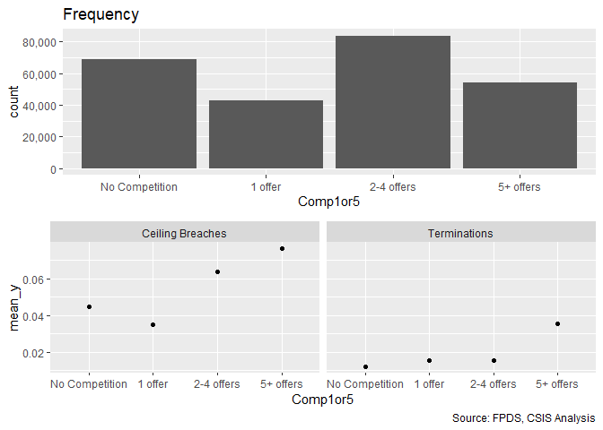<!-- -->

```
## [[1]]
## 
## No Competition        1 offer     2-4 offers      5+ offers 
##          69125          42676          83959          54240 
## 
## [[2]]
##                 
##                   None Ceiling Breach
##   No Competition 66030           3095
##   1 offer        41186           1490
##   2-4 offers     78614           5345
##   5+ offers      50089           4151
## 
## [[3]]
##                 
##                      0     1
##   No Competition 68288   837
##   1 offer        42018   658
##   2-4 offers     82672  1287
##   5+ offers      52317  1923
```

```r
#Scatter Plot
ggplot(serv_smp, aes(x=Comp1or5, y=ln_CBre)) + geom_point(alpha = 0.1) + ggtitle('Ceiling Breach Growth') + theme(plot.title = element_text(hjust = 0.5))
```

```
## Warning: Removed 234982 rows containing missing values (geom_point).
```

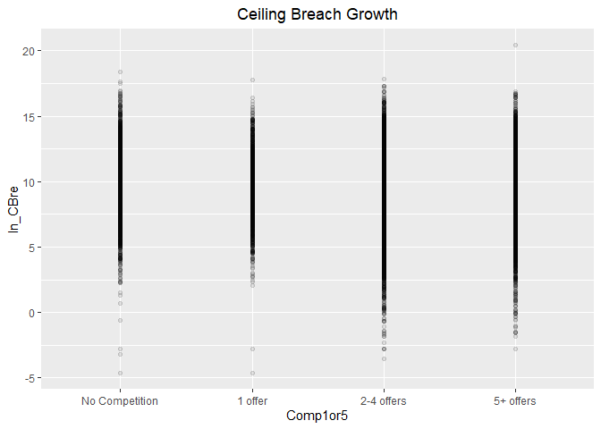<!-- -->

```r
#Model
b_CBre05A <- glm (data=serv_smp,
                 b_CBre ~ Comp1or5, family=binomial(link="logit"))
display(b_CBre05A)
```

```
## glm(formula = b_CBre ~ Comp1or5, family = binomial(link = "logit"), 
##     data = serv_smp)
##                    coef.est coef.se
## (Intercept)        -3.06     0.02  
## Comp1or51 offer    -0.26     0.03  
## Comp1or52-4 offers  0.37     0.02  
## Comp1or55+ offers   0.57     0.02  
## ---
##   n = 250000, k = 4
##   residual deviance = 107298.0, null deviance = 108365.4 (difference = 1067.3)
```

```r
n_CBre05A <- glm(data=serv_smp,
                        ln_CBre ~ Comp1or5)

display(n_CBre05A)
```

```
## glm(formula = ln_CBre ~ Comp1or5, data = serv_smp)
##                    coef.est coef.se
## (Intercept)         9.84     0.05  
## Comp1or51 offer    -0.35     0.08  
## Comp1or52-4 offers -1.14     0.06  
## Comp1or55+ offers  -0.36     0.06  
## ---
##   n = 15018, k = 4
##   residual deviance = 111360.8, null deviance = 114568.9 (difference = 3208.1)
##   overdispersion parameter = 7.4
##   residual sd is sqrt(overdispersion) = 2.72
```

```r
#Plot residuals versus fitted
stargazer::stargazer(b_CBre04D,b_CBre05A,
                       
                       n_CBre04D,n_CBre05A,
                       type="text",
                       digits=2)
```

```
## 
## ====================================================================
##                                      Dependent variable:            
##                          -------------------------------------------
##                                 b_CBre                ln_CBre       
##                                logistic               normal        
##                             (1)        (2)        (3)        (4)    
## --------------------------------------------------------------------
## cl_US6_avg_sal_lag1Const  -0.14***              0.40***             
##                            (0.02)                (0.04)             
##                                                                     
## cl_CFTE                   0.09***               0.21***             
##                            (0.02)                (0.04)             
##                                                                     
## c_pPBSC                   -0.15***              -0.32***            
##                            (0.02)                (0.04)             
##                                                                     
## c_pOffPSC                 0.92***               -0.57***            
##                            (0.02)                (0.03)             
##                                                                     
## c_pairHist                -0.15***              0.13***             
##                            (0.02)                (0.04)             
##                                                                     
## cl_pairCA                 -0.16***                0.06              
##                            (0.02)                (0.05)             
##                                                                     
## cl_Ceil                   0.93***               3.02***             
##                            (0.02)                (0.03)             
##                                                                     
## capped_cl_Days              0.02                 0.11**             
##                            (0.02)                (0.04)             
##                                                                     
## Comp1or51 offer                      -0.26***              -0.35*** 
##                                       (0.03)                (0.08)  
##                                                                     
## Comp1or52-4 offers                   0.37***               -1.14*** 
##                                       (0.02)                (0.06)  
##                                                                     
## Comp1or55+ offers                    0.57***               -0.36*** 
##                                       (0.02)                (0.06)  
##                                                                     
## Constant                  -2.98***   -3.06***   8.74***    9.84***  
##                            (0.01)     (0.02)     (0.02)     (0.05)  
##                                                                     
## --------------------------------------------------------------------
## Observations              250,000    250,000     15,018     15,018  
## Log Likelihood           -51,550.71 -53,649.01 -30,485.79 -36,355.09
## Akaike Inf. Crit.        103,119.40 107,306.00 60,989.58  72,718.18 
## ====================================================================
## Note:                                    *p<0.1; **p<0.05; ***p<0.01
```
Expectations were completely unmet for ceiling breaches. For terminations, expectations were met for 2-4 offers and 5+ offers, but not for 1 offer. For ceiling breaches expectations were met for 1 offer, but not for 2-4 or 5+.

#### 05B: Cumulative  Model


```r
#Model
b_CBre05B <- glm (data=serv_smp,
                 b_CBre ~  cl_US6_avg_sal_lag1Const + 
                   cl_CFTE+ c_pPBSC+c_pOffPSC+
                 c_pairHist+cl_pairCA +
                   cl_Ceil + capped_cl_Days+
                   Comp1or5, family=binomial(link="logit"))
glmer_examine(b_CBre05B)
```

```
##                              GVIF Df GVIF^(1/(2*Df))
## cl_US6_avg_sal_lag1Const 1.364082  1        1.167939
## cl_CFTE                  1.199378  1        1.095161
## c_pPBSC                  1.283178  1        1.132774
## c_pOffPSC                1.482601  1        1.217621
## c_pairHist               1.244528  1        1.115584
## cl_pairCA                1.566989  1        1.251794
## cl_Ceil                  1.343350  1        1.159030
## capped_cl_Days           1.340681  1        1.157878
## Comp1or5                 1.086522  3        1.013926
```

```r
n_CBre05B <- glm(data=serv_smp,
                        ln_CBre ~  cl_US6_avg_sal_lag1Const + 
                   cl_CFTE+ c_pPBSC+c_pOffPSC+
                 c_pairHist+cl_pairCA+
                 cl_Ceil + capped_cl_Days+
                 Comp1or5)

glmer_examine(n_CBre05B)
```

```
##                              GVIF Df GVIF^(1/(2*Df))
## cl_US6_avg_sal_lag1Const 1.332757  1        1.154451
## cl_CFTE                  1.240907  1        1.113960
## c_pPBSC                  2.251506  1        1.500502
## c_pOffPSC                2.852183  1        1.688841
## c_pairHist               1.338107  1        1.156766
## cl_pairCA                2.153209  1        1.467382
## cl_Ceil                  1.724301  1        1.313126
## capped_cl_Days           1.582261  1        1.257880
## Comp1or5                 1.141575  3        1.022314
```

```r
#Plot residuals versus fitted   

stargazer::stargazer(b_CBre04D,b_CBre05A,b_CBre05B,
                       
                       n_CBre04D,n_CBre05A,n_CBre05B,
                       type="text",
                       digits=2)
```

```
## 
## ==========================================================================================
##                                                 Dependent variable:                       
##                          -----------------------------------------------------------------
##                                       b_CBre                          ln_CBre             
##                                      logistic                          normal             
##                             (1)        (2)        (3)        (4)        (5)        (6)    
## ------------------------------------------------------------------------------------------
## cl_US6_avg_sal_lag1Const  -0.14***              -0.10***   0.40***               0.39***  
##                            (0.02)                (0.02)     (0.04)                (0.04)  
##                                                                                           
## cl_CFTE                   0.09***               0.08***    0.21***               0.21***  
##                            (0.02)                (0.02)     (0.04)                (0.04)  
##                                                                                           
## c_pPBSC                   -0.15***              -0.20***   -0.32***              -0.30*** 
##                            (0.02)                (0.02)     (0.04)                (0.04)  
##                                                                                           
## c_pOffPSC                 0.92***               0.91***    -0.57***              -0.54*** 
##                            (0.02)                (0.02)     (0.03)                (0.03)  
##                                                                                           
## c_pairHist                -0.15***              -0.11***   0.13***               0.11***  
##                            (0.02)                (0.02)     (0.04)                (0.04)  
##                                                                                           
## cl_pairCA                 -0.16***              -0.21***     0.06                 0.08*   
##                            (0.02)                (0.02)     (0.05)                (0.05)  
##                                                                                           
## cl_Ceil                   0.93***               0.91***    3.02***               3.04***  
##                            (0.02)                (0.02)     (0.03)                (0.03)  
##                                                                                           
## capped_cl_Days              0.02                 -0.004     0.11**                0.09**  
##                            (0.02)                (0.02)     (0.04)                (0.04)  
##                                                                                           
## Comp1or51 offer                      -0.26***   -0.22***              -0.35***    0.10*   
##                                       (0.03)     (0.03)                (0.08)     (0.06)  
##                                                                                           
## Comp1or52-4 offers                   0.37***    0.30***               -1.14***   -0.21*** 
##                                       (0.02)     (0.02)                (0.06)     (0.04)  
##                                                                                           
## Comp1or55+ offers                    0.57***    0.43***               -0.36***   -0.19*** 
##                                       (0.02)     (0.03)                (0.06)     (0.04)  
##                                                                                           
## Constant                  -2.98***   -3.06***   -3.16***   8.74***    9.84***    8.85***  
##                            (0.01)     (0.02)     (0.02)     (0.02)     (0.05)     (0.03)  
##                                                                                           
## ------------------------------------------------------------------------------------------
## Observations              250,000    250,000    250,000     15,018     15,018     15,018  
## Log Likelihood           -51,550.71 -53,649.01 -51,238.46 -30,485.79 -36,355.09 -30,459.45
## Akaike Inf. Crit.        103,119.40 107,306.00 102,500.90 60,989.58  72,718.18  60,942.90 
## ==========================================================================================
## Note:                                                          *p<0.1; **p<0.05; ***p<0.01
```

```r
#summary_residual_compare(b_CBre04D,b_CBre05B)
```
Minimal effect on study variables. 2-4 offers for terminations is not  longer significant, it's really 5+ that boosts the risks. But for exercised options, 5+ leads to more options while fewer having negative relationship with 2-4 offers, but only significant with p-value < 0.1 

### Contract Vehicle

#### 06A: Def/Pur; S-IDC; M-IDC; FSS-GWAC; BPA-BOA.

Old text:
Expectation: Indefinite delivery vehicles, means that the government has an existing relationship with the vendor and administration is easier. The downside is that the government may be locked into the vendor, although exit does not necessarily require outright termination, instead the government may simply cease to use a vehicle. Taken together, across the board the four categories of vehicles are expected to  negatively estimate the probability of termination. Ceiling breaches are a more complex topic and the study team does not have immediate expecations aside from likely significance.
Definitive Contract (base)			+	+	+
Single-Award IDC			-	-	-
Multi-Award IDC			-	-	-
FSS/GWAC			-	-	-
BPA/BOA			-	-	-


```r
summary_discrete_plot(serv_smp,"Veh")
```

```
## Warning: Ignoring unknown parameters: binwidth, bins, pad
```

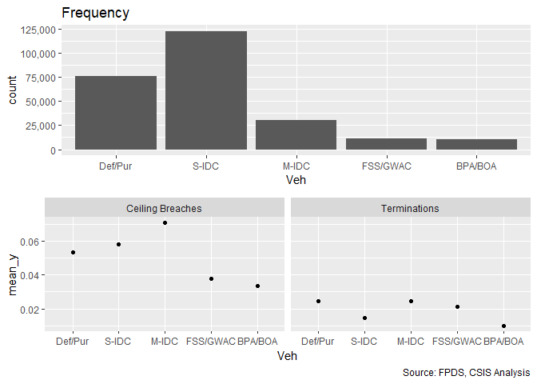<!-- -->

```
## [[1]]
## 
##  Def/Pur    S-IDC    M-IDC FSS/GWAC  BPA/BOA 
##    75940   122509    29867    11018    10666 
## 
## [[2]]
##           
##              None Ceiling Breach
##   Def/Pur   71876           4064
##   S-IDC    115390           7119
##   M-IDC     27746           2121
##   FSS/GWAC  10600            418
##   BPA/BOA   10307            359
## 
## [[3]]
##           
##                 0      1
##   Def/Pur   74089   1851
##   S-IDC    120719   1790
##   M-IDC     29140    727
##   FSS/GWAC  10785    233
##   BPA/BOA   10562    104
```

```r
#Scatter Plot
ggplot(serv_smp, aes(x=Veh, y=ln_CBre)) + geom_point(alpha = 0.1) + ggtitle('Ceiling Breach Growth') + theme(plot.title = element_text(hjust = 0.5))
```

```
## Warning: Removed 234982 rows containing missing values (geom_point).
```

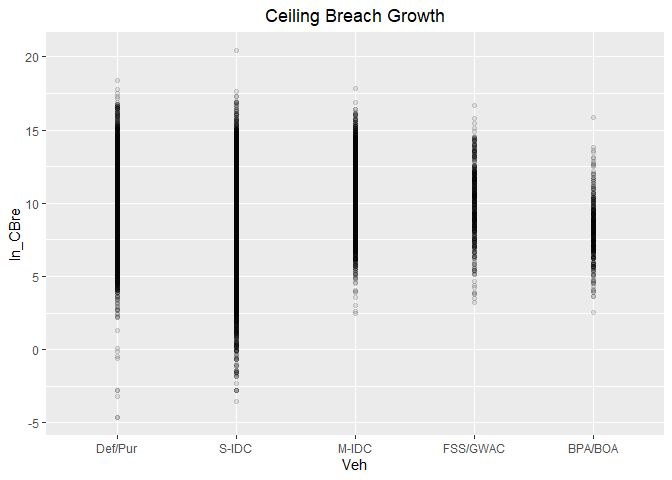<!-- -->

```r
#Model
b_CBre06A <- glm (data=serv_smp,
                 b_CBre ~ Veh, family=binomial(link="logit"))
display(b_CBre06A)
```

```
## glm(formula = b_CBre ~ Veh, family = binomial(link = "logit"), 
##     data = serv_smp)
##             coef.est coef.se
## (Intercept) -2.87     0.02  
## VehS-IDC     0.09     0.02  
## VehM-IDC     0.30     0.03  
## VehFSS/GWAC -0.36     0.05  
## VehBPA/BOA  -0.48     0.06  
## ---
##   n = 250000, k = 5
##   residual deviance = 108035.8, null deviance = 108365.4 (difference = 329.5)
```

```r
n_CBre06A <- glm(data=serv_smp,
                        ln_CBre ~ Veh)

display(n_CBre06A)
```

```
## glm(formula = ln_CBre ~ Veh, data = serv_smp)
##             coef.est coef.se
## (Intercept)  9.74     0.04  
## VehS-IDC    -1.12     0.05  
## VehM-IDC     0.77     0.07  
## VehFSS/GWAC  0.30     0.13  
## VehBPA/BOA  -1.55     0.14  
## ---
##   n = 15018, k = 5
##   residual deviance = 106205.9, null deviance = 114568.9 (difference = 8363.0)
##   overdispersion parameter = 7.1
##   residual sd is sqrt(overdispersion) = 2.66
```

```r
#Plot residuals versus fitted
stargazer::stargazer(b_CBre05B,b_CBre06A,
                       
                       n_CBre05B,n_CBre06A,
                       type="text",
                       digits=2)
```

```
## 
## ====================================================================
##                                      Dependent variable:            
##                          -------------------------------------------
##                                 b_CBre                ln_CBre       
##                                logistic               normal        
##                             (1)        (2)        (3)        (4)    
## --------------------------------------------------------------------
## cl_US6_avg_sal_lag1Const  -0.10***              0.39***             
##                            (0.02)                (0.04)             
##                                                                     
## cl_CFTE                   0.08***               0.21***             
##                            (0.02)                (0.04)             
##                                                                     
## c_pPBSC                   -0.20***              -0.30***            
##                            (0.02)                (0.04)             
##                                                                     
## c_pOffPSC                 0.91***               -0.54***            
##                            (0.02)                (0.03)             
##                                                                     
## c_pairHist                -0.11***              0.11***             
##                            (0.02)                (0.04)             
##                                                                     
## cl_pairCA                 -0.21***               0.08*              
##                            (0.02)                (0.05)             
##                                                                     
## cl_Ceil                   0.91***               3.04***             
##                            (0.02)                (0.03)             
##                                                                     
## capped_cl_Days             -0.004                0.09**             
##                            (0.02)                (0.04)             
##                                                                     
## Comp1or51 offer           -0.22***               0.10*              
##                            (0.03)                (0.06)             
##                                                                     
## Comp1or52-4 offers        0.30***               -0.21***            
##                            (0.02)                (0.04)             
##                                                                     
## Comp1or55+ offers         0.43***               -0.19***            
##                            (0.03)                (0.04)             
##                                                                     
## VehS-IDC                             0.09***               -1.12*** 
##                                       (0.02)                (0.05)  
##                                                                     
## VehM-IDC                             0.30***               0.77***  
##                                       (0.03)                (0.07)  
##                                                                     
## VehFSS/GWAC                          -0.36***               0.30**  
##                                       (0.05)                (0.13)  
##                                                                     
## VehBPA/BOA                           -0.48***              -1.55*** 
##                                       (0.06)                (0.14)  
##                                                                     
## Constant                  -3.16***   -2.87***   8.85***    9.74***  
##                            (0.02)     (0.02)     (0.03)     (0.04)  
##                                                                     
## --------------------------------------------------------------------
## Observations              250,000    250,000     15,018     15,018  
## Log Likelihood           -51,238.46 -54,017.92 -30,459.45 -35,999.20
## Akaike Inf. Crit.        102,500.90 108,045.80 60,942.90  72,008.40 
## ====================================================================
## Note:                                    *p<0.1; **p<0.05; ***p<0.01
```

```r
#summary_residual_compare(b_CBre05D,b_CBre06A)
```
For ceiling breaches, IDCs, particularly multiaward IDCs, were more likely to have breaches contrary to expecatitions.

For terminations expectation were upheld or S-IDCs and BPA/BOA. They were not upheld for multi-award, which is significantly more likely to be terminated.

Expectations were largely upheld for options exercised, with the exception of FSS/GWAC.


#### 06B: Cumulative  Model


```r
#Model
b_CBre06B <- glm (data=serv_smp,
                 b_CBre ~  cl_US6_avg_sal_lag1Const + 
                   cl_CFTE+ c_pPBSC+c_pOffPSC+
                 c_pairHist+cl_pairCA +
                   cl_Ceil + capped_cl_Days+
                   Comp1or5+
                   Veh, family=binomial(link="logit"))
glmer_examine(b_CBre06B)
```

```
##                              GVIF Df GVIF^(1/(2*Df))
## cl_US6_avg_sal_lag1Const 1.390386  1        1.179146
## cl_CFTE                  1.197924  1        1.094497
## c_pPBSC                  1.299089  1        1.139776
## c_pOffPSC                1.513126  1        1.230092
## c_pairHist               1.275647  1        1.129445
## cl_pairCA                1.758946  1        1.326253
## cl_Ceil                  1.389636  1        1.178828
## capped_cl_Days           1.355289  1        1.164169
## Comp1or5                 1.171527  3        1.026736
## Veh                      1.558929  4        1.057069
```

```r
n_CBre06B <- glm(data=serv_smp,
                        ln_CBre ~  cl_US6_avg_sal_lag1Const + 
                   cl_CFTE+ c_pPBSC+c_pOffPSC+
                 c_pairHist+cl_pairCA+
                 cl_Ceil + capped_cl_Days+
                 Comp1or5+
                   Veh)

glmer_examine(n_CBre06B)
```

```
##                              GVIF Df GVIF^(1/(2*Df))
## cl_US6_avg_sal_lag1Const 1.382770  1        1.175913
## cl_CFTE                  1.242780  1        1.114801
## c_pPBSC                  2.269828  1        1.506595
## c_pOffPSC                2.927657  1        1.711040
## c_pairHist               1.362077  1        1.167081
## cl_pairCA                2.418552  1        1.555170
## cl_Ceil                  1.786836  1        1.336726
## capped_cl_Days           1.591750  1        1.261646
## Comp1or5                 1.243760  3        1.037025
## Veh                      1.847665  4        1.079762
```

```r
#Plot residuals versus fitted   

stargazer::stargazer(b_CBre05B,b_CBre06A,b_CBre06B,
                       
                       n_CBre05B,n_CBre06A,n_CBre06B,
                       type="text",
                       digits=2)
```

```
## 
## ==========================================================================================
##                                                 Dependent variable:                       
##                          -----------------------------------------------------------------
##                                       b_CBre                          ln_CBre             
##                                      logistic                          normal             
##                             (1)        (2)        (3)        (4)        (5)        (6)    
## ------------------------------------------------------------------------------------------
## cl_US6_avg_sal_lag1Const  -0.10***              -0.08***   0.39***               0.35***  
##                            (0.02)                (0.02)     (0.04)                (0.04)  
##                                                                                           
## cl_CFTE                   0.08***               0.08***    0.21***               0.21***  
##                            (0.02)                (0.02)     (0.04)                (0.04)  
##                                                                                           
## c_pPBSC                   -0.20***              -0.21***   -0.30***              -0.31*** 
##                            (0.02)                (0.02)     (0.04)                (0.04)  
##                                                                                           
## c_pOffPSC                 0.91***               0.93***    -0.54***              -0.53*** 
##                            (0.02)                (0.02)     (0.03)                (0.04)  
##                                                                                           
## c_pairHist                -0.11***              -0.09***   0.11***               0.10***  
##                            (0.02)                (0.02)     (0.04)                (0.04)  
##                                                                                           
## cl_pairCA                 -0.21***              -0.17***    0.08*                  0.02   
##                            (0.02)                (0.02)     (0.05)                (0.05)  
##                                                                                           
## cl_Ceil                   0.91***               0.89***    3.04***               3.05***  
##                            (0.02)                (0.02)     (0.03)                (0.04)  
##                                                                                           
## capped_cl_Days             -0.004                 0.02      0.09**                0.09*   
##                            (0.02)                (0.02)     (0.04)                (0.04)  
##                                                                                           
## Comp1or51 offer           -0.22***              -0.20***    0.10*                  0.09   
##                            (0.03)                (0.03)     (0.06)                (0.06)  
##                                                                                           
## Comp1or52-4 offers        0.30***               0.33***    -0.21***              -0.22*** 
##                            (0.02)                (0.02)     (0.04)                (0.04)  
##                                                                                           
## Comp1or55+ offers         0.43***               0.46***    -0.19***              -0.22*** 
##                            (0.03)                (0.03)     (0.04)                (0.04)  
##                                                                                           
## VehS-IDC                             0.09***    -0.21***              -1.12***   0.17***  
##                                       (0.02)     (0.02)                (0.05)     (0.04)  
##                                                                                           
## VehM-IDC                             0.30***    -0.17***              0.77***    0.17***  
##                                       (0.03)     (0.03)                (0.07)     (0.05)  
##                                                                                           
## VehFSS/GWAC                          -0.36***   -0.45***               0.30**    0.29***  
##                                       (0.05)     (0.05)                (0.13)     (0.09)  
##                                                                                           
## VehBPA/BOA                           -0.48***   -0.44***              -1.55***    0.22**  
##                                       (0.06)     (0.06)                (0.14)     (0.10)  
##                                                                                           
## Constant                  -3.16***   -2.87***   -3.03***   8.85***    9.74***    8.74***  
##                            (0.02)     (0.02)     (0.02)     (0.03)     (0.04)     (0.04)  
##                                                                                           
## ------------------------------------------------------------------------------------------
## Observations              250,000    250,000    250,000     15,018     15,018     15,018  
## Log Likelihood           -51,238.46 -54,017.92 -51,163.12 -30,459.45 -35,999.20 -30,447.40
## Akaike Inf. Crit.        102,500.90 108,045.80 102,358.20 60,942.90  72,008.40  60,926.80 
## ==========================================================================================
## Note:                                                          *p<0.1; **p<0.05; ***p<0.01
```

```r
#summary_residual_compare(b_CBre05B,b_CBre06B)
```
Expectations for vehicle are now upheld for both ceiling breaches and terminations. For other variables the addition of vehicle proved less pivotal, though coefficients were often decreased.

### Type of Contract

The next step adds a measure for whether the contract was cost-based or fixed-price. 

Expectation Prior CSIS research has found that fixed-price contracts estimate a higher probability of terminations but did not find a notable relationship for ceiling breaches.

#### 07A: FFP / Other FP / Incentive / T&M/FP:LOE;LH / Other CB / Combination

Firm-Fixed Price (base)			+	++	+
Other Fixed Price			-	-	-
Time & Materials / Labor Hours / FP: LoE			+	-	-
Incentive Fee (both FPIF or CBIF)			-	-	+
Other Cost Based			-	-	-
Undefinitized Contract Award			++	++	--
Combination			+	+	-


```r
serv_smp$PricingUCA<-factor(serv_smp$PricingUCA,
                            levels=c( "FFP","Other FP","T&M/LH/FPLOE","Incentive","Other CB","UCA" ,"Combination or Other" ))
serv_smp$PricingUCA<-factor(serv_smp$PricingUCA,
                            levels=c( "FFP","Other FP","T&M/LH/FPLOE","Incentive","Other CB","UCA" ,"Combination or Other" ))
  summary_discrete_plot(serv_smp,"PricingUCA")
```

```
## Warning: Ignoring unknown parameters: binwidth, bins, pad
```

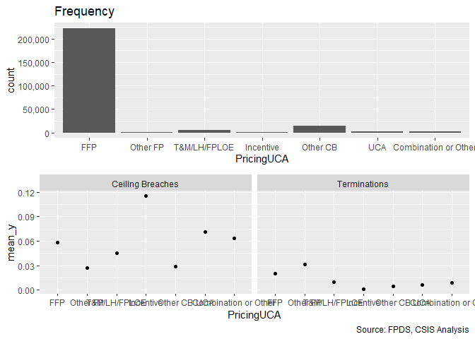<!-- -->

```
## [[1]]
## 
##                  FFP             Other FP         T&M/LH/FPLOE 
##               222855                 1581                 4696 
##            Incentive             Other CB                  UCA 
##                  998                14501                 2858 
## Combination or Other 
##                 2511 
## 
## [[2]]
##                       
##                          None Ceiling Breach
##   FFP                  209928          12927
##   Other FP               1538             43
##   T&M/LH/FPLOE           4483            213
##   Incentive               883            115
##   Other CB              14081            420
##   UCA                    2654            204
##   Combination or Other   2352            159
## 
## [[3]]
##                       
##                             0      1
##   FFP                  218357   4498
##   Other FP               1532     49
##   T&M/LH/FPLOE           4650     46
##   Incentive               997      1
##   Other CB              14431     70
##   UCA                    2839     19
##   Combination or Other   2489     22
```

```r
#Scatter Plot
ggplot(serv_smp, aes(x=PricingUCA, y=ln_CBre)) + geom_point(alpha = 0.1) + ggtitle('Ceiling Breach Growth') + theme(plot.title = element_text(hjust = 0.5))
```

```
## Warning: Removed 234982 rows containing missing values (geom_point).
```

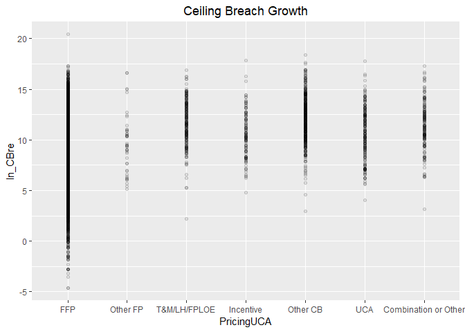<!-- -->

```r
#Model
b_CBre07A <- glm (data=serv_smp,
                 b_CBre ~ PricingUCA, family=binomial(link="logit"))
display(b_CBre07A)
```

```
## glm(formula = b_CBre ~ PricingUCA, family = binomial(link = "logit"), 
##     data = serv_smp)
##                                coef.est coef.se
## (Intercept)                    -2.79     0.01  
## PricingUCAOther FP             -0.79     0.15  
## PricingUCAT&M/LH/FPLOE         -0.26     0.07  
## PricingUCAIncentive             0.75     0.10  
## PricingUCAOther CB             -0.72     0.05  
## PricingUCAUCA                   0.22     0.07  
## PricingUCACombination or Other  0.09     0.08  
## ---
##   n = 250000, k = 7
##   residual deviance = 108000.8, null deviance = 108365.4 (difference = 364.6)
```

```r
n_CBre07A <- glm(data=serv_smp,
                        ln_CBre ~ PricingUCA)
display(n_CBre07A)
```

```
## glm(formula = ln_CBre ~ PricingUCA, data = serv_smp)
##                                coef.est coef.se
## (Intercept)                    9.07     0.02   
## PricingUCAOther FP             0.63     0.40   
## PricingUCAT&M/LH/FPLOE         2.64     0.18   
## PricingUCAIncentive            1.53     0.24   
## PricingUCAOther CB             3.01     0.13   
## PricingUCAUCA                  1.61     0.19   
## PricingUCACombination or Other 2.37     0.21   
## ---
##   n = 15018, k = 7
##   residual deviance = 107833.9, null deviance = 114568.9 (difference = 6735.0)
##   overdispersion parameter = 7.2
##   residual sd is sqrt(overdispersion) = 2.68
```

```r
#Plot residuals versus fitted
stargazer::stargazer(b_CBre06B,b_CBre07A,
                       
                       n_CBre06B,n_CBre07A,
                       type="text",
                       digits=2)
```

```
## 
## ==========================================================================
##                                            Dependent variable:            
##                                -------------------------------------------
##                                       b_CBre                ln_CBre       
##                                      logistic               normal        
##                                   (1)        (2)        (3)        (4)    
## --------------------------------------------------------------------------
## cl_US6_avg_sal_lag1Const        -0.08***              0.35***             
##                                  (0.02)                (0.04)             
##                                                                           
## cl_CFTE                         0.08***               0.21***             
##                                  (0.02)                (0.04)             
##                                                                           
## c_pPBSC                         -0.21***              -0.31***            
##                                  (0.02)                (0.04)             
##                                                                           
## c_pOffPSC                       0.93***               -0.53***            
##                                  (0.02)                (0.04)             
##                                                                           
## c_pairHist                      -0.09***              0.10***             
##                                  (0.02)                (0.04)             
##                                                                           
## cl_pairCA                       -0.17***                0.02              
##                                  (0.02)                (0.05)             
##                                                                           
## cl_Ceil                         0.89***               3.05***             
##                                  (0.02)                (0.04)             
##                                                                           
## capped_cl_Days                    0.02                 0.09*              
##                                  (0.02)                (0.04)             
##                                                                           
## Comp1or51 offer                 -0.20***                0.09              
##                                  (0.03)                (0.06)             
##                                                                           
## Comp1or52-4 offers              0.33***               -0.22***            
##                                  (0.02)                (0.04)             
##                                                                           
## Comp1or55+ offers               0.46***               -0.22***            
##                                  (0.03)                (0.04)             
##                                                                           
## VehS-IDC                        -0.21***              0.17***             
##                                  (0.02)                (0.04)             
##                                                                           
## VehM-IDC                        -0.17***              0.17***             
##                                  (0.03)                (0.05)             
##                                                                           
## VehFSS/GWAC                     -0.45***              0.29***             
##                                  (0.05)                (0.09)             
##                                                                           
## VehBPA/BOA                      -0.44***               0.22**             
##                                  (0.06)                (0.10)             
##                                                                           
## PricingUCAOther FP                         -0.79***                0.63   
##                                             (0.15)                (0.40)  
##                                                                           
## PricingUCAT&M/LH/FPLOE                     -0.26***              2.64***  
##                                             (0.07)                (0.18)  
##                                                                           
## PricingUCAIncentive                        0.75***               1.53***  
##                                             (0.10)                (0.24)  
##                                                                           
## PricingUCAOther CB                         -0.72***              3.01***  
##                                             (0.05)                (0.13)  
##                                                                           
## PricingUCAUCA                              0.22***               1.61***  
##                                             (0.07)                (0.19)  
##                                                                           
## PricingUCACombination or Other               0.09                2.37***  
##                                             (0.08)                (0.21)  
##                                                                           
## Constant                        -3.03***   -2.79***   8.74***    9.07***  
##                                  (0.02)     (0.01)     (0.04)     (0.02)  
##                                                                           
## --------------------------------------------------------------------------
## Observations                    250,000    250,000     15,018     15,018  
## Log Likelihood                 -51,163.12 -54,000.40 -30,447.40 -36,113.43
## Akaike Inf. Crit.              102,358.20 108,014.80 60,926.80  72,240.86 
## ==========================================================================
## Note:                                          *p<0.1; **p<0.05; ***p<0.01
```

```r
#summary_residual_compare(b_CBre06B,b_CBre07A,30)
```

Other fixed price and other cost based aligned with expecations for ceiling breaches.
For terminations, other fixed price, incentive, cost-based, were line with expectations. 
For options exercied Other fixed-price, incentive, and UCA were in line with expectations

#### 07B: Cumulative  Model


```r
#Model
b_CBre07B <- glm (data=serv_smp,
                 b_CBre ~  cl_US6_avg_sal_lag1Const + 
                   cl_CFTE+ c_pPBSC+c_pOffPSC+
                 c_pairHist+cl_pairCA +
                   cl_Ceil + capped_cl_Days+
                   Comp1or5+
                   Veh+
                   PricingUCA, family=binomial(link="logit"))
glmer_examine(b_CBre07B)
```

```
##                              GVIF Df GVIF^(1/(2*Df))
## cl_US6_avg_sal_lag1Const 1.360105  1        1.166235
## cl_CFTE                  1.189973  1        1.090859
## c_pPBSC                  1.321147  1        1.149412
## c_pOffPSC                1.535437  1        1.239127
## c_pairHist               1.260898  1        1.122897
## cl_pairCA                1.745244  1        1.321077
## cl_Ceil                  1.408770  1        1.186916
## capped_cl_Days           1.351091  1        1.162364
## Comp1or5                 1.215664  3        1.033084
## Veh                      1.566437  4        1.057704
## PricingUCA               1.147597  6        1.011539
```

```r
n_CBre07B <- glm(data=serv_smp,
                        ln_CBre ~  cl_US6_avg_sal_lag1Const + 
                   cl_CFTE+ c_pPBSC+c_pOffPSC+
                 c_pairHist+cl_pairCA+
                 cl_Ceil + capped_cl_Days+
                 Comp1or5+
                   Veh+
                   PricingUCA)

glmer_examine(n_CBre07B)
```

```
##                              GVIF Df GVIF^(1/(2*Df))
## cl_US6_avg_sal_lag1Const 1.391434  1        1.179591
## cl_CFTE                  1.247020  1        1.116701
## c_pPBSC                  2.278101  1        1.509338
## c_pOffPSC                2.943244  1        1.715589
## c_pairHist               1.370470  1        1.170671
## cl_pairCA                2.466143  1        1.570396
## cl_Ceil                  1.844320  1        1.358058
## capped_cl_Days           1.600166  1        1.264977
## Comp1or5                 1.275476  3        1.041387
## Veh                      1.889030  4        1.082754
## PricingUCA               1.187003  6        1.014389
```

```r
#Plot residuals versus fitted   

stargazer::stargazer(b_CBre06B,b_CBre07A,b_CBre07B,
                       
                       n_CBre06B,n_CBre07A,n_CBre07B,
                       type="text",
                       digits=2)
```

```
## 
## ================================================================================================
##                                                       Dependent variable:                       
##                                -----------------------------------------------------------------
##                                             b_CBre                          ln_CBre             
##                                            logistic                          normal             
##                                   (1)        (2)        (3)        (4)        (5)        (6)    
## ------------------------------------------------------------------------------------------------
## cl_US6_avg_sal_lag1Const        -0.08***               -0.03     0.35***               0.29***  
##                                  (0.02)                (0.02)     (0.04)                (0.04)  
##                                                                                                 
## cl_CFTE                         0.08***               0.11***    0.21***               0.20***  
##                                  (0.02)                (0.02)     (0.04)                (0.04)  
##                                                                                                 
## c_pPBSC                         -0.21***              -0.19***   -0.31***              -0.34*** 
##                                  (0.02)                (0.02)     (0.04)                (0.04)  
##                                                                                                 
## c_pOffPSC                       0.93***               0.94***    -0.53***              -0.50*** 
##                                  (0.02)                (0.02)     (0.04)                (0.03)  
##                                                                                                 
## c_pairHist                      -0.09***              -0.07***   0.10***               0.09***  
##                                  (0.02)                (0.02)     (0.04)                (0.04)  
##                                                                                                 
## cl_pairCA                       -0.17***              -0.12***     0.02                 -0.10*  
##                                  (0.02)                (0.02)     (0.05)                (0.05)  
##                                                                                                 
## cl_Ceil                         0.89***               0.97***    3.05***               2.94***  
##                                  (0.02)                (0.02)     (0.04)                (0.04)  
##                                                                                                 
## capped_cl_Days                    0.02                0.08***     0.09*                  0.03   
##                                  (0.02)                (0.02)     (0.04)                (0.04)  
##                                                                                                 
## Comp1or51 offer                 -0.20***              -0.18***     0.09                  0.05   
##                                  (0.03)                (0.03)     (0.06)                (0.06)  
##                                                                                                 
## Comp1or52-4 offers              0.33***               0.31***    -0.22***              -0.22*** 
##                                  (0.02)                (0.02)     (0.04)                (0.04)  
##                                                                                                 
## Comp1or55+ offers               0.46***               0.37***    -0.22***              -0.14*** 
##                                  (0.03)                (0.03)     (0.04)                (0.04)  
##                                                                                                 
## VehS-IDC                        -0.21***              -0.14***   0.17***               0.13***  
##                                  (0.02)                (0.02)     (0.04)                (0.04)  
##                                                                                                 
## VehM-IDC                        -0.17***              -0.17***   0.17***               0.13***  
##                                  (0.03)                (0.03)     (0.05)                (0.05)  
##                                                                                                 
## VehFSS/GWAC                     -0.45***              -0.48***   0.29***               0.24***  
##                                  (0.05)                (0.05)     (0.09)                (0.09)  
##                                                                                                 
## VehBPA/BOA                      -0.44***              -0.44***    0.22**                0.21**  
##                                  (0.06)                (0.06)     (0.10)                (0.10)  
##                                                                                                 
## PricingUCAOther FP                         -0.79***   -0.87***                0.63      -0.36   
##                                             (0.15)     (0.16)                (0.40)     (0.27)  
##                                                                                                 
## PricingUCAT&M/LH/FPLOE                     -0.26***   -0.49***              2.64***    1.19***  
##                                             (0.07)     (0.07)                (0.18)     (0.12)  
##                                                                                                 
## PricingUCAIncentive                        0.75***      0.08                1.53***    0.81***  
##                                             (0.10)     (0.10)                (0.24)     (0.17)  
##                                                                                                 
## PricingUCAOther CB                         -0.72***   -1.21***              3.01***    1.42***  
##                                             (0.05)     (0.05)                (0.13)     (0.09)  
##                                                                                                 
## PricingUCAUCA                              0.22***      0.01                1.61***    0.59***  
##                                             (0.07)     (0.08)                (0.19)     (0.13)  
##                                                                                                 
## PricingUCACombination or Other               0.09     -0.41***              2.37***    0.76***  
##                                             (0.08)     (0.08)                (0.21)     (0.14)  
##                                                                                                 
## Constant                        -3.03***   -2.79***   -2.97***   8.74***    9.07***    8.69***  
##                                  (0.02)     (0.01)     (0.02)     (0.04)     (0.02)     (0.04)  
##                                                                                                 
## ------------------------------------------------------------------------------------------------
## Observations                    250,000    250,000    250,000     15,018     15,018     15,018  
## Log Likelihood                 -51,163.12 -54,000.40 -50,769.53 -30,447.40 -36,113.43 -30,266.56
## Akaike Inf. Crit.              102,358.20 108,014.80 101,583.10 60,926.80  72,240.86  60,577.13 
## ================================================================================================
## Note:                                                                *p<0.1; **p<0.05; ***p<0.01
```

```r
#summary_residual_compare(b_CBre06B,b_CBre07B)
#summary_residual_compare(b_CBre07A,b_CBre07B,bins=3)
```

Incentive contracts are no longer significantly associated with a greater risk of ceiling breaches, though they have also lost significance in options. Suprirsingly, UCA and Combination or Other have both become significant in for lower risk of ceiling breaches.


### Crisis Dataset
Expectation: Service Contract replying on crisis funds would have more likelihood of cost-ceiling breaches and exercised options but less terminations.  

#### 08A: Crisis Funding

```r
summary_discrete_plot(serv_smp,"Crisis")
```

```
## Warning: Ignoring unknown parameters: binwidth, bins, pad
```

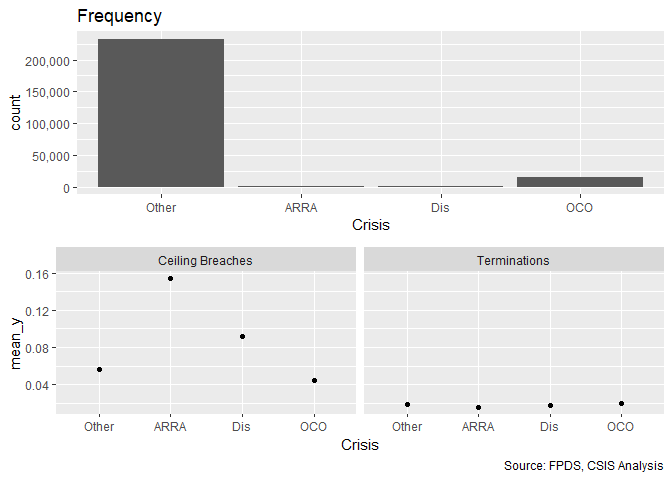<!-- -->

```
## [[1]]
## 
##  Other   ARRA    Dis    OCO 
## 233251   1504    404  14841 
## 
## [[2]]
##        
##           None Ceiling Breach
##   Other 220097          13154
##   ARRA    1272            232
##   Dis      367             37
##   OCO    14183            658
## 
## [[3]]
##        
##              0      1
##   Other 228867   4384
##   ARRA    1481     23
##   Dis      397      7
##   OCO    14550    291
```

```r
#Scatter Plot
ggplot(serv_smp, aes(x=Crisis, y=ln_CBre)) + geom_point(alpha = 0.1) + ggtitle('Ceiling Breach Growth') + theme(plot.title = element_text(hjust = 0.5))
```

```
## Warning: Removed 234982 rows containing missing values (geom_point).
```

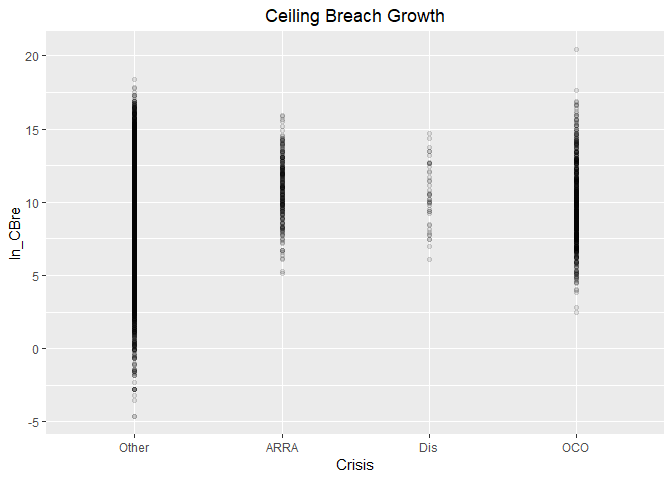<!-- -->

```r
#Model
b_CBre08A <- glm (data=serv_smp,
                 b_CBre ~ Crisis, family=binomial(link="logit"))
display(b_CBre08A)
```

```
## glm(formula = b_CBre ~ Crisis, family = binomial(link = "logit"), 
##     data = serv_smp)
##             coef.est coef.se
## (Intercept) -2.82     0.01  
## CrisisARRA   1.12     0.07  
## CrisisDis    0.52     0.17  
## CrisisOCO   -0.25     0.04  
## ---
##   n = 250000, k = 4
##   residual deviance = 108125.4, null deviance = 108365.4 (difference = 239.9)
```

```r
n_CBre08A <- glm(data=serv_smp,
                        ln_CBre ~ Crisis)

display(n_CBre08A)
```

```
## glm(formula = ln_CBre ~ Crisis, data = serv_smp)
##             coef.est coef.se
## (Intercept) 9.20     0.02   
## CrisisARRA  1.77     0.18   
## CrisisDis   1.34     0.42   
## CrisisOCO   0.57     0.11   
## ---
##   n = 15018, k = 4
##   residual deviance = 113551.4, null deviance = 114568.9 (difference = 1017.4)
##   overdispersion parameter = 7.6
##   residual sd is sqrt(overdispersion) = 2.75
```

```r
#Plot residuals versus fitted
stargazer::stargazer(b_CBre07B,b_CBre08A,
                       
                       n_CBre07B,n_CBre08A,
                       type="text",
                       digits=2)
```

```
## 
## ==========================================================================
##                                            Dependent variable:            
##                                -------------------------------------------
##                                       b_CBre                ln_CBre       
##                                      logistic               normal        
##                                   (1)        (2)        (3)        (4)    
## --------------------------------------------------------------------------
## cl_US6_avg_sal_lag1Const         -0.03                0.29***             
##                                  (0.02)                (0.04)             
##                                                                           
## cl_CFTE                         0.11***               0.20***             
##                                  (0.02)                (0.04)             
##                                                                           
## c_pPBSC                         -0.19***              -0.34***            
##                                  (0.02)                (0.04)             
##                                                                           
## c_pOffPSC                       0.94***               -0.50***            
##                                  (0.02)                (0.03)             
##                                                                           
## c_pairHist                      -0.07***              0.09***             
##                                  (0.02)                (0.04)             
##                                                                           
## cl_pairCA                       -0.12***               -0.10*             
##                                  (0.02)                (0.05)             
##                                                                           
## cl_Ceil                         0.97***               2.94***             
##                                  (0.02)                (0.04)             
##                                                                           
## capped_cl_Days                  0.08***                 0.03              
##                                  (0.02)                (0.04)             
##                                                                           
## Comp1or51 offer                 -0.18***                0.05              
##                                  (0.03)                (0.06)             
##                                                                           
## Comp1or52-4 offers              0.31***               -0.22***            
##                                  (0.02)                (0.04)             
##                                                                           
## Comp1or55+ offers               0.37***               -0.14***            
##                                  (0.03)                (0.04)             
##                                                                           
## VehS-IDC                        -0.14***              0.13***             
##                                  (0.02)                (0.04)             
##                                                                           
## VehM-IDC                        -0.17***              0.13***             
##                                  (0.03)                (0.05)             
##                                                                           
## VehFSS/GWAC                     -0.48***              0.24***             
##                                  (0.05)                (0.09)             
##                                                                           
## VehBPA/BOA                      -0.44***               0.21**             
##                                  (0.06)                (0.10)             
##                                                                           
## PricingUCAOther FP              -0.87***               -0.36              
##                                  (0.16)                (0.27)             
##                                                                           
## PricingUCAT&M/LH/FPLOE          -0.49***              1.19***             
##                                  (0.07)                (0.12)             
##                                                                           
## PricingUCAIncentive               0.08                0.81***             
##                                  (0.10)                (0.17)             
##                                                                           
## PricingUCAOther CB              -1.21***              1.42***             
##                                  (0.05)                (0.09)             
##                                                                           
## PricingUCAUCA                     0.01                0.59***             
##                                  (0.08)                (0.13)             
##                                                                           
## PricingUCACombination or Other  -0.41***              0.76***             
##                                  (0.08)                (0.14)             
##                                                                           
## CrisisARRA                                 1.12***               1.77***  
##                                             (0.07)                (0.18)  
##                                                                           
## CrisisDis                                  0.52***               1.34***  
##                                             (0.17)                (0.42)  
##                                                                           
## CrisisOCO                                  -0.25***              0.57***  
##                                             (0.04)                (0.11)  
##                                                                           
## Constant                        -2.97***   -2.82***   8.69***    9.20***  
##                                  (0.02)     (0.01)     (0.04)     (0.02)  
##                                                                           
## --------------------------------------------------------------------------
## Observations                    250,000    250,000     15,018     15,018  
## Log Likelihood                 -50,769.53 -54,062.72 -30,266.56 -36,501.38
## Akaike Inf. Crit.              101,583.10 108,133.40 60,577.13  73,010.75 
## ==========================================================================
## Note:                                          *p<0.1; **p<0.05; ***p<0.01
```

```r
# summary_residual_compare(b_CBre07B,b_CBre08A,30)
```

For ceiling breaches ARRA and Disaster results were in keeping with expcetations but OCO results were not. There were no significant results for terminations. For options, contrary to exepectation, all forms of crisis funding have a lower rate of usage.


#### 08B: Cumulative  Model


```r
#Model
b_CBre08B <- glm (data=serv_smp,
                 b_CBre ~  cl_US6_avg_sal_lag1Const + 
                   cl_CFTE+ c_pPBSC+c_pOffPSC+
                 c_pairHist+cl_pairCA +
                   cl_Ceil + capped_cl_Days+
                   Comp1or5+
                   Veh+
                   PricingUCA+
                   Crisis, family=binomial(link="logit"))
glmer_examine(b_CBre08B)
```

```
##                              GVIF Df GVIF^(1/(2*Df))
## cl_US6_avg_sal_lag1Const 1.395808  1        1.181443
## cl_CFTE                  1.312641  1        1.145705
## c_pPBSC                  1.330137  1        1.153316
## c_pOffPSC                1.573596  1        1.254431
## c_pairHist               1.264214  1        1.124373
## cl_pairCA                1.934959  1        1.391028
## cl_Ceil                  1.450743  1        1.204468
## capped_cl_Days           1.391141  1        1.179466
## Comp1or5                 1.229120  3        1.034981
## Veh                      1.679690  4        1.066974
## PricingUCA               1.153694  6        1.011985
## Crisis                   1.347664  3        1.050986
```

```r
n_CBre08B <- glm(data=serv_smp,
                        ln_CBre ~  cl_US6_avg_sal_lag1Const + 
                   cl_CFTE+ c_pPBSC+c_pOffPSC+
                 c_pairHist+cl_pairCA+
                 cl_Ceil + capped_cl_Days+
                 Comp1or5+
                   Veh+
                   PricingUCA+
                   Crisis)
glmer_examine(n_CBre08B)
```

```
##                              GVIF Df GVIF^(1/(2*Df))
## cl_US6_avg_sal_lag1Const 1.404644  1        1.185177
## cl_CFTE                  1.362846  1        1.167410
## c_pPBSC                  2.298956  1        1.516231
## c_pOffPSC                2.951405  1        1.717965
## c_pairHist               1.371021  1        1.170906
## cl_pairCA                2.511014  1        1.584618
## cl_Ceil                  1.862581  1        1.364764
## capped_cl_Days           1.612362  1        1.269788
## Comp1or5                 1.280984  3        1.042135
## Veh                      1.976792  4        1.088918
## PricingUCA               1.192715  6        1.014794
## Crisis                   1.206807  3        1.031826
```

```r
#Plot residuals versus fitted   

stargazer::stargazer(b_CBre07B,b_CBre08A,b_CBre08B,
                       
                       n_CBre07B,n_CBre08A,n_CBre08B,
                       type="text",
                       digits=2)
```

```
## 
## ================================================================================================
##                                                       Dependent variable:                       
##                                -----------------------------------------------------------------
##                                             b_CBre                          ln_CBre             
##                                            logistic                          normal             
##                                   (1)        (2)        (3)        (4)        (5)        (6)    
## ------------------------------------------------------------------------------------------------
## cl_US6_avg_sal_lag1Const         -0.03                 -0.01     0.29***               0.26***  
##                                  (0.02)                (0.02)     (0.04)                (0.04)  
##                                                                                                 
## cl_CFTE                         0.11***               0.07***    0.20***               0.28***  
##                                  (0.02)                (0.02)     (0.04)                (0.04)  
##                                                                                                 
## c_pPBSC                         -0.19***              -0.18***   -0.34***              -0.32*** 
##                                  (0.02)                (0.02)     (0.04)                (0.04)  
##                                                                                                 
## c_pOffPSC                       0.94***               0.92***    -0.50***              -0.49*** 
##                                  (0.02)                (0.02)     (0.03)                (0.03)  
##                                                                                                 
## c_pairHist                      -0.07***              -0.07***   0.09***               0.10***  
##                                  (0.02)                (0.02)     (0.04)                (0.04)  
##                                                                                                 
## cl_pairCA                       -0.12***              -0.08***    -0.10*               -0.15*** 
##                                  (0.02)                (0.02)     (0.05)                (0.05)  
##                                                                                                 
## cl_Ceil                         0.97***               0.97***    2.94***               2.92***  
##                                  (0.02)                (0.02)     (0.04)                (0.04)  
##                                                                                                 
## capped_cl_Days                  0.08***                0.06**      0.03                  0.06   
##                                  (0.02)                (0.02)     (0.04)                (0.04)  
##                                                                                                 
## Comp1or51 offer                 -0.18***              -0.16***     0.05                  0.04   
##                                  (0.03)                (0.03)     (0.06)                (0.06)  
##                                                                                                 
## Comp1or52-4 offers              0.31***               0.31***    -0.22***              -0.24*** 
##                                  (0.02)                (0.02)     (0.04)                (0.04)  
##                                                                                                 
## Comp1or55+ offers               0.37***               0.38***    -0.14***              -0.15*** 
##                                  (0.03)                (0.03)     (0.04)                (0.04)  
##                                                                                                 
## VehS-IDC                        -0.14***              -0.17***   0.13***               0.18***  
##                                  (0.02)                (0.02)     (0.04)                (0.04)  
##                                                                                                 
## VehM-IDC                        -0.17***              -0.19***   0.13***               0.14***  
##                                  (0.03)                (0.03)     (0.05)                (0.05)  
##                                                                                                 
## VehFSS/GWAC                     -0.48***              -0.49***   0.24***               0.28***  
##                                  (0.05)                (0.05)     (0.09)                (0.09)  
##                                                                                                 
## VehBPA/BOA                      -0.44***              -0.44***    0.21**                 0.16   
##                                  (0.06)                (0.06)     (0.10)                (0.10)  
##                                                                                                 
## PricingUCAOther FP              -0.87***              -0.89***    -0.36                 -0.35   
##                                  (0.16)                (0.16)     (0.27)                (0.27)  
##                                                                                                 
## PricingUCAT&M/LH/FPLOE          -0.49***              -0.49***   1.19***               1.21***  
##                                  (0.07)                (0.07)     (0.12)                (0.12)  
##                                                                                                 
## PricingUCAIncentive               0.08                  0.08     0.81***               0.81***  
##                                  (0.10)                (0.10)     (0.17)                (0.17)  
##                                                                                                 
## PricingUCAOther CB              -1.21***              -1.21***   1.42***               1.42***  
##                                  (0.05)                (0.05)     (0.09)                (0.09)  
##                                                                                                 
## PricingUCAUCA                     0.01                  0.01     0.59***               0.61***  
##                                  (0.08)                (0.08)     (0.13)                (0.13)  
##                                                                                                 
## PricingUCACombination or Other  -0.41***              -0.40***   0.76***               0.78***  
##                                  (0.08)                (0.08)     (0.14)                (0.14)  
##                                                                                                 
## CrisisARRA                                 1.12***    0.70***               1.77***     -0.03   
##                                             (0.07)     (0.07)                (0.18)     (0.12)  
##                                                                                                 
## CrisisDis                                  0.52***     0.40**               1.34***      0.37   
##                                             (0.17)     (0.18)                (0.42)     (0.28)  
##                                                                                                 
## CrisisOCO                                  -0.25***   -0.25***              0.57***    0.57***  
##                                             (0.04)     (0.05)                (0.11)     (0.08)  
##                                                                                                 
## Constant                        -2.97***   -2.82***   -2.95***   8.69***    9.20***    8.65***  
##                                  (0.02)     (0.01)     (0.02)     (0.04)     (0.02)     (0.04)  
##                                                                                                 
## ------------------------------------------------------------------------------------------------
## Observations                    250,000    250,000    250,000     15,018     15,018     15,018  
## Log Likelihood                 -50,769.53 -54,062.72 -50,713.94 -30,266.56 -36,501.38 -30,237.41
## Akaike Inf. Crit.              101,583.10 108,133.40 101,477.90 60,577.13  73,010.75  60,524.83 
## ================================================================================================
## Note:                                                                *p<0.1; **p<0.05; ***p<0.01
```

```r
#summary_residual_compare(b_CBre07B,b_CBre08B)
```

Terminatins for OCO and ARRA are now significant in the expected direction.


## Industrial Sector

### Level 6

#### Model 09A: l_def6_HHI_lag1
HHI (logged, + means more consolidation)	cl_def6_HHI_lag1+		+	-	-

Expectations are  unchanged.

```r
#Frequency Plot for unlogged ceiling
summary_continuous_plot(serv_smp,"def6_HHI_lag1")
```

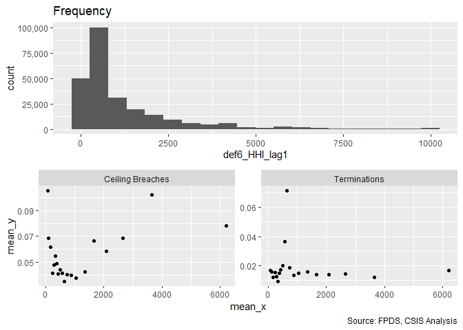<!-- -->

```r
summary_continuous_plot(serv_smp,"cl_def6_HHI_lag1")
```

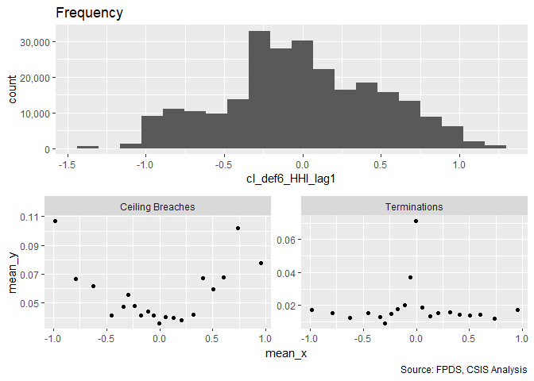<!-- -->

```r
summary_continuous_plot(serv_smp,"cl_def3_HHI_lag1")
```

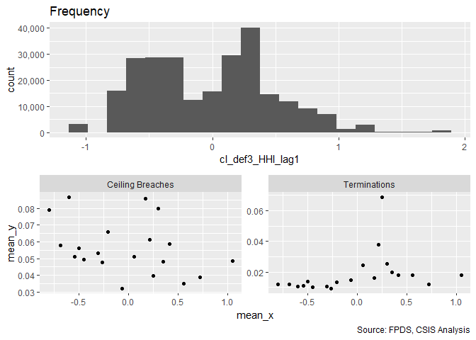<!-- -->

```r
#Scatter Plot
ggplot(serv_smp, aes(x=cl_def6_HHI_lag1, y=ln_CBre)) + geom_point(alpha = 0.1) + ggtitle('Ceiling Breach Growth') + theme(plot.title = element_text(hjust = 0.5))
```

```
## Warning: Removed 234982 rows containing missing values (geom_point).
```

<!-- -->

```r
#Model
b_CBre09A <- glm (data=serv_smp,
                 b_CBre ~ cl_def6_HHI_lag1, family=binomial(link="logit"))
display(b_CBre09A)
```

```
## glm(formula = b_CBre ~ cl_def6_HHI_lag1, family = binomial(link = "logit"), 
##     data = serv_smp)
##                  coef.est coef.se
## (Intercept)      -2.82     0.01  
## cl_def6_HHI_lag1  0.05     0.02  
## ---
##   n = 250000, k = 2
##   residual deviance = 108356.8, null deviance = 108365.4 (difference = 8.6)
```

```r
n_CBre09A <- glm(data=serv_smp,
                        ln_CBre ~ cl_def6_HHI_lag1)

display(n_CBre09A)
```

```
## glm(formula = ln_CBre ~ cl_def6_HHI_lag1, data = serv_smp)
##                  coef.est coef.se
## (Intercept)       9.28     0.02  
## cl_def6_HHI_lag1 -1.80     0.04  
## ---
##   n = 15018, k = 2
##   residual deviance = 98081.9, null deviance = 114568.9 (difference = 16486.9)
##   overdispersion parameter = 6.5
##   residual sd is sqrt(overdispersion) = 2.56
```

```r
#Plot residuals versus fitted
stargazer::stargazer(b_CBre08B,b_CBre09A,
                       
                       n_CBre08B,n_CBre09A,
                       type="text",
                       digits=2)
```

```
## 
## ==========================================================================
##                                            Dependent variable:            
##                                -------------------------------------------
##                                       b_CBre                ln_CBre       
##                                      logistic               normal        
##                                   (1)        (2)        (3)        (4)    
## --------------------------------------------------------------------------
## cl_US6_avg_sal_lag1Const         -0.01                0.26***             
##                                  (0.02)                (0.04)             
##                                                                           
## cl_CFTE                         0.07***               0.28***             
##                                  (0.02)                (0.04)             
##                                                                           
## c_pPBSC                         -0.18***              -0.32***            
##                                  (0.02)                (0.04)             
##                                                                           
## c_pOffPSC                       0.92***               -0.49***            
##                                  (0.02)                (0.03)             
##                                                                           
## c_pairHist                      -0.07***              0.10***             
##                                  (0.02)                (0.04)             
##                                                                           
## cl_pairCA                       -0.08***              -0.15***            
##                                  (0.02)                (0.05)             
##                                                                           
## cl_Ceil                         0.97***               2.92***             
##                                  (0.02)                (0.04)             
##                                                                           
## capped_cl_Days                   0.06**                 0.06              
##                                  (0.02)                (0.04)             
##                                                                           
## Comp1or51 offer                 -0.16***                0.04              
##                                  (0.03)                (0.06)             
##                                                                           
## Comp1or52-4 offers              0.31***               -0.24***            
##                                  (0.02)                (0.04)             
##                                                                           
## Comp1or55+ offers               0.38***               -0.15***            
##                                  (0.03)                (0.04)             
##                                                                           
## VehS-IDC                        -0.17***              0.18***             
##                                  (0.02)                (0.04)             
##                                                                           
## VehM-IDC                        -0.19***              0.14***             
##                                  (0.03)                (0.05)             
##                                                                           
## VehFSS/GWAC                     -0.49***              0.28***             
##                                  (0.05)                (0.09)             
##                                                                           
## VehBPA/BOA                      -0.44***                0.16              
##                                  (0.06)                (0.10)             
##                                                                           
## PricingUCAOther FP              -0.89***               -0.35              
##                                  (0.16)                (0.27)             
##                                                                           
## PricingUCAT&M/LH/FPLOE          -0.49***              1.21***             
##                                  (0.07)                (0.12)             
##                                                                           
## PricingUCAIncentive               0.08                0.81***             
##                                  (0.10)                (0.17)             
##                                                                           
## PricingUCAOther CB              -1.21***              1.42***             
##                                  (0.05)                (0.09)             
##                                                                           
## PricingUCAUCA                     0.01                0.61***             
##                                  (0.08)                (0.13)             
##                                                                           
## PricingUCACombination or Other  -0.40***              0.78***             
##                                  (0.08)                (0.14)             
##                                                                           
## CrisisARRA                      0.70***                -0.03              
##                                  (0.07)                (0.12)             
##                                                                           
## CrisisDis                        0.40**                 0.37              
##                                  (0.18)                (0.28)             
##                                                                           
## CrisisOCO                       -0.25***              0.57***             
##                                  (0.05)                (0.08)             
##                                                                           
## cl_def6_HHI_lag1                           0.05***               -1.80*** 
##                                             (0.02)                (0.04)  
##                                                                           
## Constant                        -2.95***   -2.82***   8.65***    9.28***  
##                                  (0.02)     (0.01)     (0.04)     (0.02)  
##                                                                           
## --------------------------------------------------------------------------
## Observations                    250,000    250,000     15,018     15,018  
## Log Likelihood                 -50,713.94 -54,178.40 -30,237.41 -35,401.66
## Akaike Inf. Crit.              101,477.90 108,360.80 60,524.83  70,807.32 
## ==========================================================================
## Note:                                          *p<0.1; **p<0.05; ***p<0.01
```

```r
summary_residual_compare(b_CBre08B,b_CBre09A, skip_vif = TRUE)
```

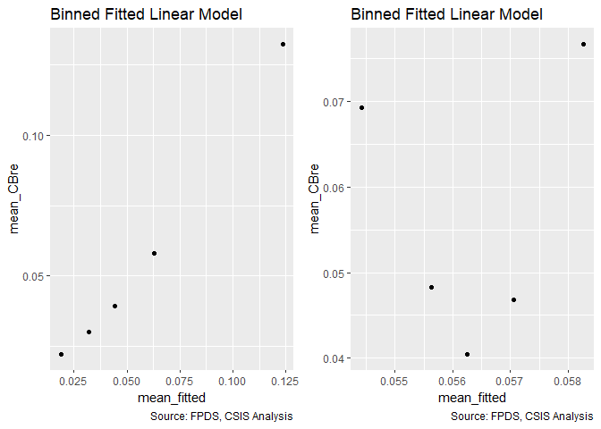<!-- -->

```
## Warning in if (class(model1_new) == "glmerMod") {: the condition has length
## > 1 and only the first element will be used
```

```
## Warning in if (class(model1_new) != "glmerMod" & class(model1_old) !=
## "glmerMod" & : the condition has length > 1 and only the first element will
## be used
```

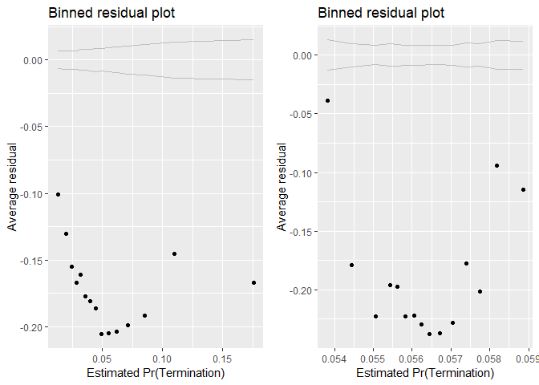<!-- -->

```
## NULL
```

Expected direction for ceiling breach and termination, but no real results on options.

#### Model 09B: Defense to Overall ratio
The higher the ratio of defense obligations to reciepts in the overall economy, the DoD holds a monosopy over a sector. Given the challenges of monosopy, the a higher ratio estimates a greater  risk of ceiling breaches.

Ratio Def. obligatons : US revenue	cl_def6_obl_lag1+		+	-	-


```r
#Frequency Plot for unlogged ceiling
      summary_continuous_plot(serv_smp,"def6_ratio_lag1")
```

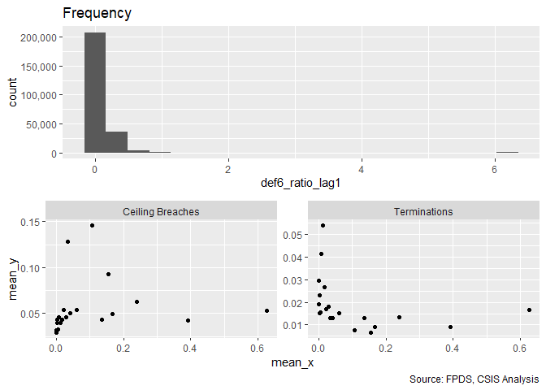<!-- -->

```r
      summary_continuous_plot(serv_smp,"cl_def6_ratio_lag1")
```

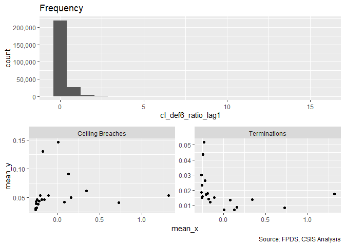<!-- -->

```r
#Scatter Plot
ggplot(serv_smp, aes(x=cl_def6_ratio_lag1, y=ln_CBre)) + geom_point(alpha = 0.1) + ggtitle('Ceiling Breach Growth') + theme(plot.title = element_text(hjust = 0.5))
```

```
## Warning: Removed 234982 rows containing missing values (geom_point).
```

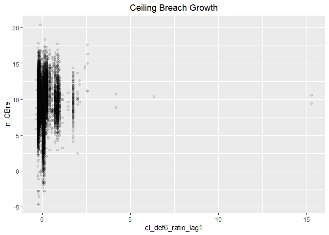<!-- -->

```r
#Model
b_CBre09B <- glm (data=serv_smp,
                 b_CBre ~ cl_def6_ratio_lag1, family=binomial(link="logit"))
display(b_CBre09B)
```

```
## glm(formula = b_CBre ~ cl_def6_ratio_lag1, family = binomial(link = "logit"), 
##     data = serv_smp)
##                    coef.est coef.se
## (Intercept)        -2.82     0.01  
## cl_def6_ratio_lag1  0.03     0.02  
## ---
##   n = 250000, k = 2
##   residual deviance = 108362.8, null deviance = 108365.4 (difference = 2.5)
```

```r
n_CBre09B <- glm(data=serv_smp,
                        ln_CBre ~ cl_def6_ratio_lag1)

display(n_CBre09B)
```

```
## glm(formula = ln_CBre ~ cl_def6_ratio_lag1, data = serv_smp)
##                    coef.est coef.se
## (Intercept)        9.25     0.02   
## cl_def6_ratio_lag1 0.26     0.06   
## ---
##   n = 15018, k = 2
##   residual deviance = 114410.7, null deviance = 114568.9 (difference = 158.2)
##   overdispersion parameter = 7.6
##   residual sd is sqrt(overdispersion) = 2.76
```

```r
#Plot residuals versus fitted
stargazer::stargazer(b_CBre08B,b_CBre09A,b_CBre09B,
                       
                       n_CBre08B,n_CBre09A,n_CBre09B,
                       type="text",
                       digits=2)
```

```
## 
## ================================================================================================
##                                                       Dependent variable:                       
##                                -----------------------------------------------------------------
##                                             b_CBre                          ln_CBre             
##                                            logistic                          normal             
##                                   (1)        (2)        (3)        (4)        (5)        (6)    
## ------------------------------------------------------------------------------------------------
## cl_US6_avg_sal_lag1Const         -0.01                           0.26***                        
##                                  (0.02)                           (0.04)                        
##                                                                                                 
## cl_CFTE                         0.07***                          0.28***                        
##                                  (0.02)                           (0.04)                        
##                                                                                                 
## c_pPBSC                         -0.18***                         -0.32***                       
##                                  (0.02)                           (0.04)                        
##                                                                                                 
## c_pOffPSC                       0.92***                          -0.49***                       
##                                  (0.02)                           (0.03)                        
##                                                                                                 
## c_pairHist                      -0.07***                         0.10***                        
##                                  (0.02)                           (0.04)                        
##                                                                                                 
## cl_pairCA                       -0.08***                         -0.15***                       
##                                  (0.02)                           (0.05)                        
##                                                                                                 
## cl_Ceil                         0.97***                          2.92***                        
##                                  (0.02)                           (0.04)                        
##                                                                                                 
## capped_cl_Days                   0.06**                            0.06                         
##                                  (0.02)                           (0.04)                        
##                                                                                                 
## Comp1or51 offer                 -0.16***                           0.04                         
##                                  (0.03)                           (0.06)                        
##                                                                                                 
## Comp1or52-4 offers              0.31***                          -0.24***                       
##                                  (0.02)                           (0.04)                        
##                                                                                                 
## Comp1or55+ offers               0.38***                          -0.15***                       
##                                  (0.03)                           (0.04)                        
##                                                                                                 
## VehS-IDC                        -0.17***                         0.18***                        
##                                  (0.02)                           (0.04)                        
##                                                                                                 
## VehM-IDC                        -0.19***                         0.14***                        
##                                  (0.03)                           (0.05)                        
##                                                                                                 
## VehFSS/GWAC                     -0.49***                         0.28***                        
##                                  (0.05)                           (0.09)                        
##                                                                                                 
## VehBPA/BOA                      -0.44***                           0.16                         
##                                  (0.06)                           (0.10)                        
##                                                                                                 
## PricingUCAOther FP              -0.89***                          -0.35                         
##                                  (0.16)                           (0.27)                        
##                                                                                                 
## PricingUCAT&M/LH/FPLOE          -0.49***                         1.21***                        
##                                  (0.07)                           (0.12)                        
##                                                                                                 
## PricingUCAIncentive               0.08                           0.81***                        
##                                  (0.10)                           (0.17)                        
##                                                                                                 
## PricingUCAOther CB              -1.21***                         1.42***                        
##                                  (0.05)                           (0.09)                        
##                                                                                                 
## PricingUCAUCA                     0.01                           0.61***                        
##                                  (0.08)                           (0.13)                        
##                                                                                                 
## PricingUCACombination or Other  -0.40***                         0.78***                        
##                                  (0.08)                           (0.14)                        
##                                                                                                 
## CrisisARRA                      0.70***                           -0.03                         
##                                  (0.07)                           (0.12)                        
##                                                                                                 
## CrisisDis                        0.40**                            0.37                         
##                                  (0.18)                           (0.28)                        
##                                                                                                 
## CrisisOCO                       -0.25***                         0.57***                        
##                                  (0.05)                           (0.08)                        
##                                                                                                 
## cl_def6_HHI_lag1                           0.05***                          -1.80***            
##                                             (0.02)                           (0.04)             
##                                                                                                 
## cl_def6_ratio_lag1                                      0.03                           0.26***  
##                                                        (0.02)                           (0.06)  
##                                                                                                 
## Constant                        -2.95***   -2.82***   -2.82***   8.65***    9.28***    9.25***  
##                                  (0.02)     (0.01)     (0.01)     (0.04)     (0.02)     (0.02)  
##                                                                                                 
## ------------------------------------------------------------------------------------------------
## Observations                    250,000    250,000    250,000     15,018     15,018     15,018  
## Log Likelihood                 -50,713.94 -54,178.40 -54,181.42 -30,237.41 -35,401.66 -36,557.98
## Akaike Inf. Crit.              101,477.90 108,360.80 108,366.80 60,524.83  70,807.32  73,119.97 
## ================================================================================================
## Note:                                                                *p<0.1; **p<0.05; ***p<0.01
```

```r
#summary_residual_compare(b_CBre08B,b_CBre09B)
#summary_residual_compare(b_CBre09A,b_CBre09B)
```


#### Model 09C: Defense Obligations
Defense obligations (logged)	cl_def6_ratio_lag1+		-	-	+


```r
#Frequency Plot for unlogged ceiling
      summary_continuous_plot(serv_smp,"def6_obl_lag1Const")
```

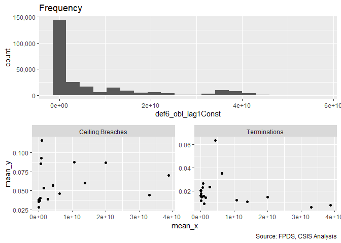<!-- -->

```r
      summary_continuous_plot(serv_smp,"cl_def6_obl_lag1Const")
```

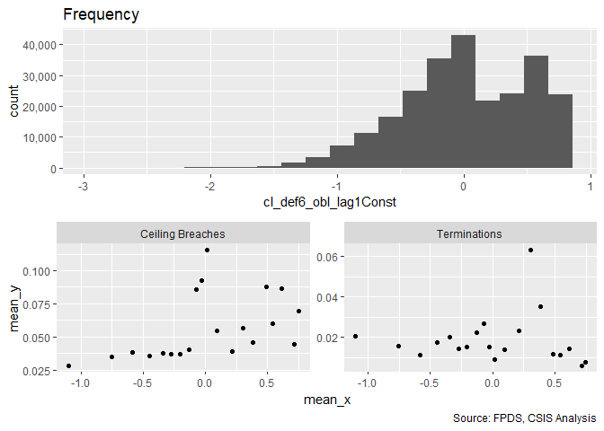<!-- -->

```r
#Scatter Plot
ggplot(serv_smp, aes(x=cl_def6_obl_lag1Const, y=ln_CBre)) + geom_point(alpha = 0.1) + ggtitle('Ceiling Breach Growth') + theme(plot.title = element_text(hjust = 0.5))
```

```
## Warning: Removed 234982 rows containing missing values (geom_point).
```

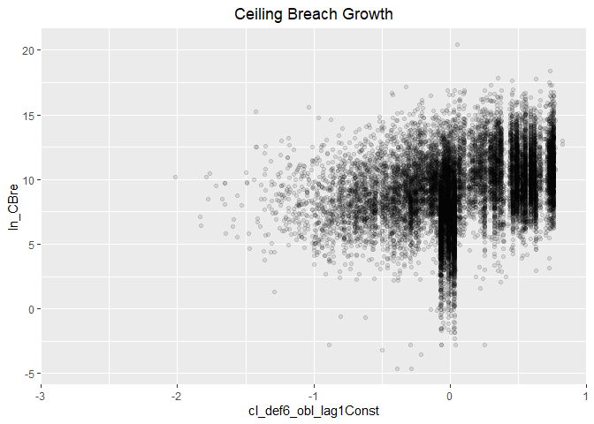<!-- -->

```r
#Model
b_CBre09C <- glm (data=serv_smp,
                 b_CBre ~ cl_def6_obl_lag1Const, family=binomial(link="logit"))
display(b_CBre09C)
```

```
## glm(formula = b_CBre ~ cl_def6_obl_lag1Const, family = binomial(link = "logit"), 
##     data = serv_smp)
##                       coef.est coef.se
## (Intercept)           -2.84     0.01  
## cl_def6_obl_lag1Const  0.45     0.02  
## ---
##   n = 250000, k = 2
##   residual deviance = 107741.4, null deviance = 108365.4 (difference = 624.0)
```

```r
n_CBre09C <- glm(data=serv_smp,
                        ln_CBre ~ cl_def6_obl_lag1Const)

display(n_CBre09C)
```

```
## glm(formula = ln_CBre ~ cl_def6_obl_lag1Const, data = serv_smp)
##                       coef.est coef.se
## (Intercept)           9.05     0.02   
## cl_def6_obl_lag1Const 2.00     0.05   
## ---
##   n = 15018, k = 2
##   residual deviance = 103002.7, null deviance = 114568.9 (difference = 11566.2)
##   overdispersion parameter = 6.9
##   residual sd is sqrt(overdispersion) = 2.62
```

```r
#Plot residuals versus fitted
stargazer::stargazer(b_CBre09A,b_CBre09B,b_CBre09C,
                       
                       n_CBre09A,n_CBre09B,n_CBre09C,
                       type="text",
                       digits=2)
```

```
## 
## =======================================================================================
##                                              Dependent variable:                       
##                       -----------------------------------------------------------------
##                                    b_CBre                          ln_CBre             
##                                   logistic                          normal             
##                          (1)        (2)        (3)        (4)        (5)        (6)    
## ---------------------------------------------------------------------------------------
## cl_def6_HHI_lag1       0.05***                          -1.80***                       
##                         (0.02)                           (0.04)                        
##                                                                                        
## cl_def6_ratio_lag1                  0.03                           0.26***             
##                                    (0.02)                           (0.06)             
##                                                                                        
## cl_def6_obl_lag1Const                        0.45***                          2.00***  
##                                               (0.02)                           (0.05)  
##                                                                                        
## Constant               -2.82***   -2.82***   -2.84***   9.28***    9.25***    9.05***  
##                         (0.01)     (0.01)     (0.01)     (0.02)     (0.02)     (0.02)  
##                                                                                        
## ---------------------------------------------------------------------------------------
## Observations           250,000    250,000    250,000     15,018     15,018     15,018  
## Log Likelihood        -54,178.40 -54,181.42 -53,870.68 -35,401.66 -36,557.98 -35,769.24
## Akaike Inf. Crit.     108,360.80 108,366.80 107,745.40 70,807.32  73,119.97  71,542.48 
## =======================================================================================
## Note:                                                       *p<0.1; **p<0.05; ***p<0.01
```

```r
#summary_residual_compare(b_CBre08B,b_CBre09C)
#summary_residual_compare(b_CBre09A,b_CBre09C)
#summary_residual_compare(b_CBre09B,b_CBre09C)
```

Contrary to expectation. for termination and options.

#### Model 09D: NAICS 6 Combined
Consolidation at lessa nd more granular levels may have different effects. Efficiencies are often used to describe sectors, like utilities, with high barriers to entry. Many of these aspects seem like they would already be captured at less granular NAICS levels, e.g. power plants, rather than more specific NAICS levels, like solar vs. coal. As a result, consolidation for more granular NAICS codes should estimate higher rates of ceiling breaches compared to less granular NAICS code.

We'll start by adding in everything from both models and seeing what violates VIF.

```r
#Frequency Plot for unlogged ceiling


#Model
b_CBre09D <- glm (data=serv_smp,
                 b_CBre ~ cl_def6_HHI_lag1+cl_def6_ratio_lag1+cl_def6_obl_lag1Const
                 , family=binomial(link="logit"))
glmer_examine(b_CBre09D)
```

```
##      cl_def6_HHI_lag1    cl_def6_ratio_lag1 cl_def6_obl_lag1Const 
##              1.246031              1.523134              1.510329
```

```r
n_CBre09D <- glm(data=serv_smp,
                        ln_CBre ~ cl_def6_HHI_lag1+cl_def6_ratio_lag1)

glmer_examine(n_CBre09D)
```

```
##   cl_def6_HHI_lag1 cl_def6_ratio_lag1 
##           1.065104           1.065104
```

```r
b_CBre09D2 <- glm (data=serv_smp,
                 b_CBre ~ cl_def6_HHI_lag1+cl_def6_ratio_lag1
                 , family=binomial(link="logit"))
glmer_examine(b_CBre09D2)
```

```
##   cl_def6_HHI_lag1 cl_def6_ratio_lag1 
##           1.049186           1.049186
```

```r
n_CBre09D2 <- glm(data=serv_smp,
                        ln_CBre ~ cl_def6_HHI_lag1+cl_def6_ratio_lag1)

glmer_examine(n_CBre09D2)
```

```
##   cl_def6_HHI_lag1 cl_def6_ratio_lag1 
##           1.065104           1.065104
```

```r
#Plot residuals versus fitted
stargazer::stargazer(b_CBre09D,b_CBre09D2,
                     
                     n_CBre09D,n_CBre09D2,
                       type="text",
                       digits=2)
```

```
## 
## =================================================================
##                                   Dependent variable:            
##                       -------------------------------------------
##                              b_CBre                ln_CBre       
##                             logistic               normal        
##                          (1)        (2)        (3)        (4)    
## -----------------------------------------------------------------
## cl_def6_HHI_lag1       0.26***    0.05***    -1.96***   -1.96*** 
##                         (0.02)     (0.02)     (0.04)     (0.04)  
##                                                                  
## cl_def6_ratio_lag1     -0.39***     0.02     0.98***    0.98***  
##                         (0.03)     (0.02)     (0.05)     (0.05)  
##                                                                  
## cl_def6_obl_lag1Const  0.66***                                   
##                         (0.02)                                   
##                                                                  
## Constant               -2.86***   -2.82***   9.28***    9.28***  
##                         (0.01)     (0.01)     (0.02)     (0.02)  
##                                                                  
## -----------------------------------------------------------------
## Observations           250,000    250,000     15,018     15,018  
## Log Likelihood        -53,735.81 -54,177.93 -35,239.75 -35,239.75
## Akaike Inf. Crit.     107,479.60 108,361.90 70,485.50  70,485.50 
## =================================================================
## Note:                                 *p<0.1; **p<0.05; ***p<0.01
```

```r
summary_residual_compare(b_CBre09D,b_CBre09D2)
```

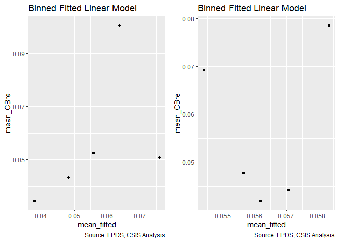<!-- -->

```
## Warning in if (class(model1_new) == "glmerMod") {: the condition has length
## > 1 and only the first element will be used
```

```
## Warning in if (class(model1_new) != "glmerMod" & class(model1_old) !=
## "glmerMod" & : the condition has length > 1 and only the first element will
## be used
```

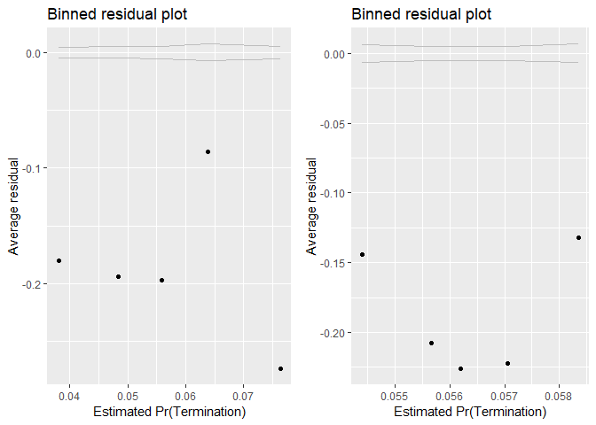<!-- -->

```
## [[1]]
##        model deviance null.deviance difference
## 1 model1_old 107471.6      108365.4 893.729735
## 2 model1_new 108355.9      108365.4   9.509405
## 
## [[2]]
##   cl_def6_HHI_lag1 cl_def6_ratio_lag1 
##           1.049186           1.049186
```
The hypothesis is upheld. Deviance is a little lower and residuals a little higher than the prior forms of consolidation for the level 3 model.  For the level 6 model, deviance is reduced some in both cases.

NAICS Subsector (Level 3)					
HHI (logged, + means more consolidation)	cl_def3_HHI_lag1+		+	++	-
Ratio Def. obligatons : US revenue	cl_def3_ratio_lag1+		+	+	-

Ratio at either level is no longer in line with expectations for ceiling breaches.


#### Model 09E: Cumulative Model
Consolidation at lessa nd more granular levels may have different effects. Efficiencies are often used to describe sectors, like utilities, with high barriers to entry. Many of these aspects seem like they would already be captured at less granular NAICS levels, e.g. power plants, rather than more specific NAICS levels, like solar vs. coal. As a result, consolidation for more granular NAICS codes should estimate higher rates of ceiling breaches compared to less granular NAICS code.

We'll start by adding in everything from both models and seeing what violates VIF.

```r
#Frequency Plot for unlogged ceiling


#Model
b_CBre09E <- glm (data=serv_smp,
                 b_CBre ~  cl_US6_avg_sal_lag1Const + 
                   cl_CFTE+ c_pPBSC+c_pOffPSC+
                 c_pairHist+cl_pairCA +
                   cl_Ceil + capped_cl_Days+
                   Comp1or5+
                   Veh+
                   PricingUCA+
                   Crisis+
                   cl_def6_HHI_lag1+cl_def6_ratio_lag1, family=binomial(link="logit"))
glmer_examine(b_CBre09E)
```

```
##                              GVIF Df GVIF^(1/(2*Df))
## cl_US6_avg_sal_lag1Const 1.428685  1        1.195276
## cl_CFTE                  1.309429  1        1.144303
## c_pPBSC                  1.368699  1        1.169914
## c_pOffPSC                1.728981  1        1.314907
## c_pairHist               1.277382  1        1.130213
## cl_pairCA                1.969033  1        1.403222
## cl_Ceil                  1.474374  1        1.214238
## capped_cl_Days           1.397938  1        1.182344
## Comp1or5                 1.246220  3        1.037367
## Veh                      1.737766  4        1.071517
## PricingUCA               1.171549  6        1.013281
## Crisis                   1.346992  3        1.050899
## cl_def6_HHI_lag1         1.380633  1        1.175003
## cl_def6_ratio_lag1       1.220476  1        1.104751
```

```r
n_CBre09E <- glm(data=serv_smp,
                        ln_CBre ~  cl_US6_avg_sal_lag1Const + 
                   cl_CFTE+ c_pPBSC+c_pOffPSC+
                 c_pairHist+cl_pairCA+
                 cl_Ceil + capped_cl_Days+
                 Comp1or5+
                   Veh+
                   PricingUCA+
                   Crisis+
                 cl_def6_HHI_lag1+cl_def6_ratio_lag1)

glmer_examine(n_CBre09E)
```

```
##                              GVIF Df GVIF^(1/(2*Df))
## cl_US6_avg_sal_lag1Const 1.416379  1        1.190117
## cl_CFTE                  1.365589  1        1.168584
## c_pPBSC                  2.311410  1        1.520332
## c_pOffPSC                3.238787  1        1.799663
## c_pairHist               1.373715  1        1.172056
## cl_pairCA                2.534274  1        1.591940
## cl_Ceil                  1.956864  1        1.398880
## capped_cl_Days           1.615798  1        1.271140
## Comp1or5                 1.304361  3        1.045281
## Veh                      2.034452  4        1.092838
## PricingUCA               1.214249  6        1.016309
## Crisis                   1.220162  3        1.033720
## cl_def6_HHI_lag1         1.806462  1        1.344047
## cl_def6_ratio_lag1       1.129554  1        1.062805
```

```r
#Plot residuals versus fitted
stargazer::stargazer(b_CBre08B,b_CBre09D2,b_CBre09E,
                     
                     n_CBre08B,n_CBre09D2,n_CBre09E,
                       type="text",
                       digits=2)
```

```
## 
## ================================================================================================
##                                                       Dependent variable:                       
##                                -----------------------------------------------------------------
##                                             b_CBre                          ln_CBre             
##                                            logistic                          normal             
##                                   (1)        (2)        (3)        (4)        (5)        (6)    
## ------------------------------------------------------------------------------------------------
## cl_US6_avg_sal_lag1Const         -0.01                  0.02     0.26***               0.23***  
##                                  (0.02)                (0.02)     (0.04)                (0.04)  
##                                                                                                 
## cl_CFTE                         0.07***               0.07***    0.28***               0.29***  
##                                  (0.02)                (0.02)     (0.04)                (0.04)  
##                                                                                                 
## c_pPBSC                         -0.18***              -0.18***   -0.32***              -0.29*** 
##                                  (0.02)                (0.02)     (0.04)                (0.04)  
##                                                                                                 
## c_pOffPSC                       0.92***               0.97***    -0.49***              -0.51*** 
##                                  (0.02)                (0.02)     (0.03)                (0.04)  
##                                                                                                 
## c_pairHist                      -0.07***              -0.07***   0.10***                0.09**  
##                                  (0.02)                (0.02)     (0.04)                (0.04)  
##                                                                                                 
## cl_pairCA                       -0.08***              -0.06**    -0.15***              -0.15*** 
##                                  (0.02)                (0.02)     (0.05)                (0.05)  
##                                                                                                 
## cl_Ceil                         0.97***               0.99***    2.92***               2.89***  
##                                  (0.02)                (0.02)     (0.04)                (0.04)  
##                                                                                                 
## capped_cl_Days                   0.06**                0.05**      0.06                 0.08*   
##                                  (0.02)                (0.02)     (0.04)                (0.04)  
##                                                                                                 
## Comp1or51 offer                 -0.16***              -0.15***     0.04                  0.01   
##                                  (0.03)                (0.03)     (0.06)                (0.06)  
##                                                                                                 
## Comp1or52-4 offers              0.31***               0.31***    -0.24***              -0.23*** 
##                                  (0.02)                (0.02)     (0.04)                (0.04)  
##                                                                                                 
## Comp1or55+ offers               0.38***               0.37***    -0.15***              -0.15*** 
##                                  (0.03)                (0.03)     (0.04)                (0.04)  
##                                                                                                 
## VehS-IDC                        -0.17***              -0.18***   0.18***               0.16***  
##                                  (0.02)                (0.02)     (0.04)                (0.04)  
##                                                                                                 
## VehM-IDC                        -0.19***              -0.16***   0.14***                0.13**  
##                                  (0.03)                (0.03)     (0.05)                (0.05)  
##                                                                                                 
## VehFSS/GWAC                     -0.49***              -0.48***   0.28***               0.28***  
##                                  (0.05)                (0.05)     (0.09)                (0.09)  
##                                                                                                 
## VehBPA/BOA                      -0.44***              -0.42***     0.16                  0.10   
##                                  (0.06)                (0.06)     (0.10)                (0.10)  
##                                                                                                 
## PricingUCAOther FP              -0.89***              -0.91***    -0.35                 -0.46*  
##                                  (0.16)                (0.16)     (0.27)                (0.27)  
##                                                                                                 
## PricingUCAT&M/LH/FPLOE          -0.49***              -0.48***   1.21***               1.18***  
##                                  (0.07)                (0.07)     (0.12)                (0.12)  
##                                                                                                 
## PricingUCAIncentive               0.08                  0.06     0.81***               0.73***  
##                                  (0.10)                (0.10)     (0.17)                (0.17)  
##                                                                                                 
## PricingUCAOther CB              -1.21***              -1.21***   1.42***               1.37***  
##                                  (0.05)                (0.05)     (0.09)                (0.09)  
##                                                                                                 
## PricingUCAUCA                     0.01                 -0.004    0.61***               0.61***  
##                                  (0.08)                (0.08)     (0.13)                (0.13)  
##                                                                                                 
## PricingUCACombination or Other  -0.40***              -0.38***   0.78***               0.73***  
##                                  (0.08)                (0.08)     (0.14)                (0.14)  
##                                                                                                 
## CrisisARRA                      0.70***               0.68***     -0.03                 -0.02   
##                                  (0.07)                (0.07)     (0.12)                (0.12)  
##                                                                                                 
## CrisisDis                        0.40**                0.41**      0.37                  0.38   
##                                  (0.18)                (0.18)     (0.28)                (0.28)  
##                                                                                                 
## CrisisOCO                       -0.25***              -0.23***   0.57***               0.50***  
##                                  (0.05)                (0.05)     (0.08)                (0.08)  
##                                                                                                 
## cl_def6_HHI_lag1                           0.05***     -0.03*               -1.96***    -0.05   
##                                             (0.02)     (0.02)                (0.04)     (0.03)  
##                                                                                                 
## cl_def6_ratio_lag1                           0.02     -0.24***              0.98***    0.42***  
##                                             (0.02)     (0.02)                (0.05)     (0.04)  
##                                                                                                 
## Constant                        -2.95***   -2.82***   -2.96***   8.65***    9.28***    8.68***  
##                                  (0.02)     (0.01)     (0.02)     (0.04)     (0.02)     (0.04)  
##                                                                                                 
## ------------------------------------------------------------------------------------------------
## Observations                    250,000    250,000    250,000     15,018     15,018     15,018  
## Log Likelihood                 -50,713.94 -54,177.93 -50,652.78 -30,237.41 -35,239.75 -30,183.41
## Akaike Inf. Crit.              101,477.90 108,361.90 101,359.60 60,524.83  70,485.50  60,420.83 
## ================================================================================================
## Note:                                                                *p<0.1; **p<0.05; ***p<0.01
```

```r
#summary_residual_compare(b_CBre09D2,b_CBre09E)
#summary_residual_compare(b_CBre08B,b_CBre09E)
```

Expectations are not upheld.

### Level 3
#### Model 10A: cl_def3_HHI
HHI (logged, + means more consolidation)	cl_def3_HHI_lag1+		+	++	-


```r
#Frequency Plot for unlogged ceiling
summary_continuous_plot(serv_smp,"cl_def3_HHI_lag1")
```

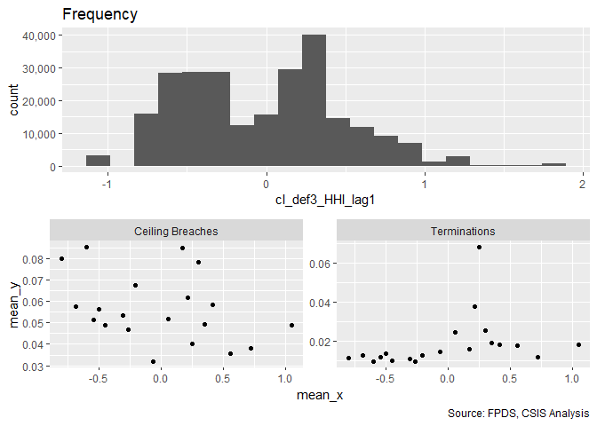<!-- -->

```r
#Scatter Plot
ggplot(serv_smp, aes(x=cl_def3_HHI_lag1, y=ln_CBre)) + geom_point(alpha = 0.1) + ggtitle('Ceiling Breach Growth') + theme(plot.title = element_text(hjust = 0.5))
```

```
## Warning: Removed 234982 rows containing missing values (geom_point).
```

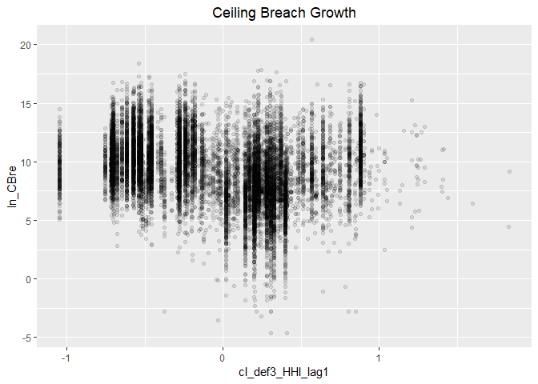<!-- -->

```r
#Model
b_CBre10A <- glm (data=serv_smp,
                 b_CBre ~ cl_def3_HHI_lag1, family=binomial(link="logit"))
display(b_CBre10A)
```

```
## glm(formula = b_CBre ~ cl_def3_HHI_lag1, family = binomial(link = "logit"), 
##     data = serv_smp)
##                  coef.est coef.se
## (Intercept)      -2.83     0.01  
## cl_def3_HHI_lag1 -0.24     0.02  
## ---
##   n = 250000, k = 2
##   residual deviance = 108185.2, null deviance = 108365.4 (difference = 180.2)
```

```r
n_CBre10A <- glm(data=serv_smp,
                        ln_CBre ~ cl_def3_HHI_lag1)

display(n_CBre10A)
```

```
## glm(formula = ln_CBre ~ cl_def3_HHI_lag1, data = serv_smp)
##                  coef.est coef.se
## (Intercept)       9.16     0.02  
## cl_def3_HHI_lag1 -1.58     0.05  
## ---
##   n = 15018, k = 2
##   residual deviance = 106193.7, null deviance = 114568.9 (difference = 8375.2)
##   overdispersion parameter = 7.1
##   residual sd is sqrt(overdispersion) = 2.66
```

```r
#Plot residuals versus fitted
stargazer::stargazer(b_CBre09A,b_CBre10A,
                       
                       n_CBre09A,n_CBre10A,
                       type="text",
                       digits=2)
```

```
## 
## =============================================================
##                               Dependent variable:            
##                   -------------------------------------------
##                          b_CBre                ln_CBre       
##                         logistic               normal        
##                      (1)        (2)        (3)        (4)    
## -------------------------------------------------------------
## cl_def6_HHI_lag1   0.05***               -1.80***            
##                     (0.02)                (0.04)             
##                                                              
## cl_def3_HHI_lag1              -0.24***              -1.58*** 
##                                (0.02)                (0.05)  
##                                                              
## Constant           -2.82***   -2.83***   9.28***    9.16***  
##                     (0.01)     (0.01)     (0.02)     (0.02)  
##                                                              
## -------------------------------------------------------------
## Observations       250,000    250,000     15,018     15,018  
## Log Likelihood    -54,178.40 -54,092.59 -35,401.66 -35,998.34
## Akaike Inf. Crit. 108,360.80 108,189.20 70,807.32  72,000.67 
## =============================================================
## Note:                             *p<0.1; **p<0.05; ***p<0.01
```

```r
summary_residual_compare(b_CBre09A,b_CBre10A, skip_vif =  TRUE)
```

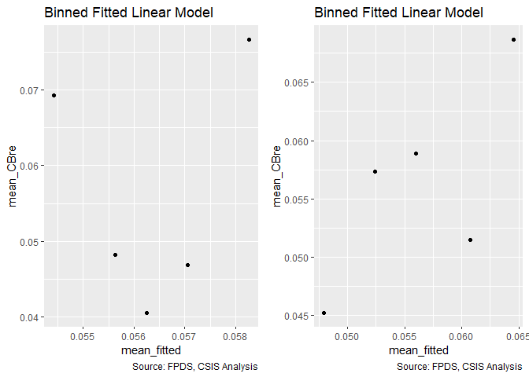<!-- -->

```
## Warning in if (class(model1_new) == "glmerMod") {: the condition has length
## > 1 and only the first element will be used
```

```
## Warning in if (class(model1_new) != "glmerMod" & class(model1_old) !=
## "glmerMod" & : the condition has length > 1 and only the first element will
## be used
```

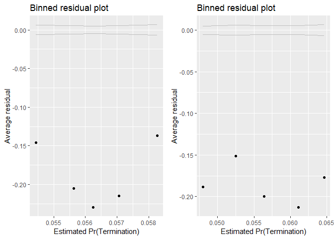<!-- -->

```
## NULL
```

Contrary to expectation on Ceiling breach and otions growth, in line with expectations on terminations.

Level 3 HHI seems to slightly out perform level 6.


#### Model 10B: Defense to Overall ratio
Ratio Def. obligatons : US revenue	cl_def3_ratio_lag1+		+	+	-


```r
#Frequency Plot for unlogged ceiling
summary_continuous_plot(serv_smp,"capped_def3_ratio_lag1")
```

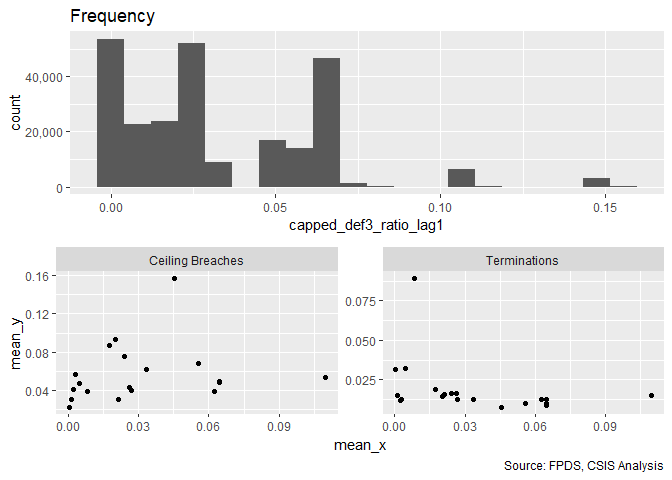<!-- -->

```r
summary_continuous_plot(serv_smp,"cl_def3_ratio_lag1")
```

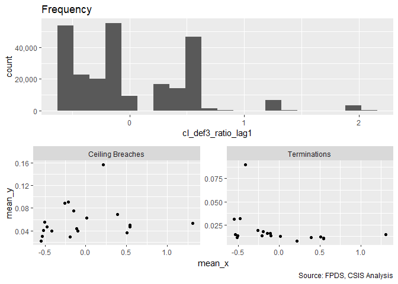<!-- -->

```r
#Scatter Plot
ggplot(serv_smp, aes(x=cl_def3_HHI_lag1, y=ln_CBre)) + geom_point(alpha = 0.1) + ggtitle('Ceiling Breach Growth') + theme(plot.title = element_text(hjust = 0.5))
```

```
## Warning: Removed 234982 rows containing missing values (geom_point).
```

<!-- -->

```r
#Model
b_CBre10B <- glm (data=serv_smp,
                 b_CBre ~ cl_def3_ratio_lag1, family=binomial(link="logit"))
display(b_CBre10B)
```

```
## glm(formula = b_CBre ~ cl_def3_ratio_lag1, family = binomial(link = "logit"), 
##     data = serv_smp)
##                    coef.est coef.se
## (Intercept)        -2.82     0.01  
## cl_def3_ratio_lag1  0.15     0.02  
## ---
##   n = 250000, k = 2
##   residual deviance = 108283.3, null deviance = 108365.4 (difference = 82.1)
```

```r
n_CBre10B <- glm(data=serv_smp,
                        ln_CBre ~ cl_def3_ratio_lag1)

display(n_CBre10B)
```

```
## glm(formula = ln_CBre ~ cl_def3_ratio_lag1, data = serv_smp)
##                    coef.est coef.se
## (Intercept)        9.25     0.02   
## cl_def3_ratio_lag1 0.16     0.05   
## ---
##   n = 15018, k = 2
##   residual deviance = 114488.3, null deviance = 114568.9 (difference = 80.5)
##   overdispersion parameter = 7.6
##   residual sd is sqrt(overdispersion) = 2.76
```

```r
#Plot residuals versus fitted
stargazer::stargazer(b_CBre09B,b_CBre10A,b_CBre10B,
                       
                       n_CBre09B,n_CBre10A,n_CBre10B,
                       type="text",
                       digits=2)
```

```
## 
## ====================================================================================
##                                           Dependent variable:                       
##                    -----------------------------------------------------------------
##                                 b_CBre                          ln_CBre             
##                                logistic                          normal             
##                       (1)        (2)        (3)        (4)        (5)        (6)    
## ------------------------------------------------------------------------------------
## cl_def6_ratio_lag1    0.03                           0.26***                        
##                      (0.02)                           (0.06)                        
##                                                                                     
## cl_def3_HHI_lag1               -0.24***                         -1.58***            
##                                 (0.02)                           (0.05)             
##                                                                                     
## cl_def3_ratio_lag1                        0.15***                          0.16***  
##                                            (0.02)                           (0.05)  
##                                                                                     
## Constant            -2.82***   -2.83***   -2.82***   9.25***    9.16***    9.25***  
##                      (0.01)     (0.01)     (0.01)     (0.02)     (0.02)     (0.02)  
##                                                                                     
## ------------------------------------------------------------------------------------
## Observations        250,000    250,000    250,000     15,018     15,018     15,018  
## Log Likelihood     -54,181.42 -54,092.59 -54,141.64 -36,557.98 -35,998.34 -36,563.08
## Akaike Inf. Crit.  108,366.80 108,189.20 108,287.30 73,119.97  72,000.67  73,130.15 
## ====================================================================================
## Note:                                                    *p<0.1; **p<0.05; ***p<0.01
```

```r
summary_residual_compare(b_CBre09B,b_CBre10B, skip_vif = TRUE)
```

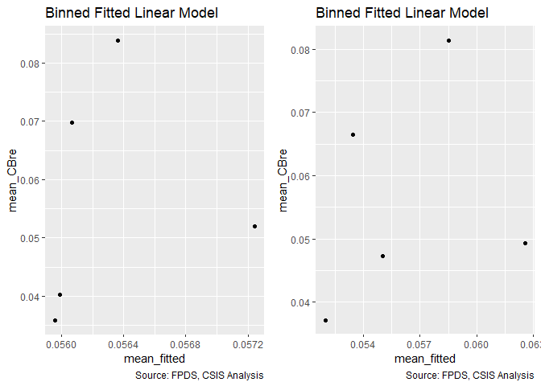<!-- -->

```
## Warning in if (class(model1_new) == "glmerMod") {: the condition has length
## > 1 and only the first element will be used
```

```
## Warning in if (class(model1_new) != "glmerMod" & class(model1_old) !=
## "glmerMod" & : the condition has length > 1 and only the first element will
## be used
```

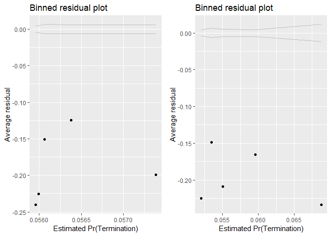<!-- -->

```
## NULL
```

Expectations were in lined with ceiling breaches and options, not with termination, and 


#### Model 10C: NAICS 6 and NAICS 3
Consolidation at lessa nd more granular levels may have different effects. Efficiencies are often used to describe sectors, like utilities, with high barriers to entry. Many of these aspects seem like they would already be captured at less granular NAICS levels, e.g. power plants, rather than more specific NAICS levels, like solar vs. coal. As a result, consolidation for more granular NAICS codes should estimate higher rates of ceiling breaches compared to less granular NAICS code.

We'll start by adding in everything from both models and seeing what violates VIF.

```r
#Frequency Plot for unlogged ceiling


#Model
b_CBre10C <- glm (data=serv_smp,
                 b_CBre ~ cl_def3_HHI_lag1+cl_def3_ratio_lag1, family=binomial(link="logit"))
glmer_examine(b_CBre10C)
```

```
##   cl_def3_HHI_lag1 cl_def3_ratio_lag1 
##           1.017251           1.017251
```

```r
n_CBre10C <- glm(data=serv_smp,
                        ln_CBre ~ cl_def3_HHI_lag1+cl_def3_ratio_lag1)
glmer_examine(n_CBre10C)
```

```
##   cl_def3_HHI_lag1 cl_def3_ratio_lag1 
##           1.000182           1.000182
```

```r
#Plot residuals versus fitted
stargazer::stargazer(b_CBre09E,b_CBre10A,b_CBre10B,b_CBre10C,
                     
                     n_CBre09E,n_CBre10A,n_CBre10B,n_CBre10C,
                       type="text",
                       digits=2)
```

```
## 
## ======================================================================================================================
##                                                                  Dependent variable:                                  
##                                ---------------------------------------------------------------------------------------
##                                                  b_CBre                                      ln_CBre                  
##                                                 logistic                                     normal                   
##                                   (1)        (2)        (3)        (4)        (5)        (6)        (7)        (8)    
## ----------------------------------------------------------------------------------------------------------------------
## cl_US6_avg_sal_lag1Const          0.02                                      0.23***                                   
##                                  (0.02)                                      (0.04)                                   
##                                                                                                                       
## cl_CFTE                         0.07***                                     0.29***                                   
##                                  (0.02)                                      (0.04)                                   
##                                                                                                                       
## c_pPBSC                         -0.18***                                    -0.29***                                  
##                                  (0.02)                                      (0.04)                                   
##                                                                                                                       
## c_pOffPSC                       0.97***                                     -0.51***                                  
##                                  (0.02)                                      (0.04)                                   
##                                                                                                                       
## c_pairHist                      -0.07***                                     0.09**                                   
##                                  (0.02)                                      (0.04)                                   
##                                                                                                                       
## cl_pairCA                       -0.06**                                     -0.15***                                  
##                                  (0.02)                                      (0.05)                                   
##                                                                                                                       
## cl_Ceil                         0.99***                                     2.89***                                   
##                                  (0.02)                                      (0.04)                                   
##                                                                                                                       
## capped_cl_Days                   0.05**                                      0.08*                                    
##                                  (0.02)                                      (0.04)                                   
##                                                                                                                       
## Comp1or51 offer                 -0.15***                                      0.01                                    
##                                  (0.03)                                      (0.06)                                   
##                                                                                                                       
## Comp1or52-4 offers              0.31***                                     -0.23***                                  
##                                  (0.02)                                      (0.04)                                   
##                                                                                                                       
## Comp1or55+ offers               0.37***                                     -0.15***                                  
##                                  (0.03)                                      (0.04)                                   
##                                                                                                                       
## VehS-IDC                        -0.18***                                    0.16***                                   
##                                  (0.02)                                      (0.04)                                   
##                                                                                                                       
## VehM-IDC                        -0.16***                                     0.13**                                   
##                                  (0.03)                                      (0.05)                                   
##                                                                                                                       
## VehFSS/GWAC                     -0.48***                                    0.28***                                   
##                                  (0.05)                                      (0.09)                                   
##                                                                                                                       
## VehBPA/BOA                      -0.42***                                      0.10                                    
##                                  (0.06)                                      (0.10)                                   
##                                                                                                                       
## PricingUCAOther FP              -0.91***                                     -0.46*                                   
##                                  (0.16)                                      (0.27)                                   
##                                                                                                                       
## PricingUCAT&M/LH/FPLOE          -0.48***                                    1.18***                                   
##                                  (0.07)                                      (0.12)                                   
##                                                                                                                       
## PricingUCAIncentive               0.06                                      0.73***                                   
##                                  (0.10)                                      (0.17)                                   
##                                                                                                                       
## PricingUCAOther CB              -1.21***                                    1.37***                                   
##                                  (0.05)                                      (0.09)                                   
##                                                                                                                       
## PricingUCAUCA                    -0.004                                     0.61***                                   
##                                  (0.08)                                      (0.13)                                   
##                                                                                                                       
## PricingUCACombination or Other  -0.38***                                    0.73***                                   
##                                  (0.08)                                      (0.14)                                   
##                                                                                                                       
## CrisisARRA                      0.68***                                      -0.02                                    
##                                  (0.07)                                      (0.12)                                   
##                                                                                                                       
## CrisisDis                        0.41**                                       0.38                                    
##                                  (0.18)                                      (0.28)                                   
##                                                                                                                       
## CrisisOCO                       -0.23***                                    0.50***                                   
##                                  (0.05)                                      (0.08)                                   
##                                                                                                                       
## cl_def6_HHI_lag1                 -0.03*                                      -0.05                                    
##                                  (0.02)                                      (0.03)                                   
##                                                                                                                       
## cl_def6_ratio_lag1              -0.24***                                    0.42***                                   
##                                  (0.02)                                      (0.04)                                   
##                                                                                                                       
## cl_def3_HHI_lag1                           -0.24***              -0.22***              -1.58***              -1.58*** 
##                                             (0.02)                (0.02)                (0.05)                (0.05)  
##                                                                                                                       
## cl_def3_ratio_lag1                                    0.15***    0.13***                          0.16***    0.18***  
##                                                        (0.02)     (0.02)                           (0.05)     (0.05)  
##                                                                                                                       
## Constant                        -2.96***   -2.83***   -2.82***   -2.83***   8.68***    9.16***    9.25***    9.15***  
##                                  (0.02)     (0.01)     (0.01)     (0.01)     (0.04)     (0.02)     (0.02)     (0.02)  
##                                                                                                                       
## ----------------------------------------------------------------------------------------------------------------------
## Observations                    250,000    250,000    250,000    250,000     15,018     15,018     15,018     15,018  
## Log Likelihood                 -50,652.78 -54,092.59 -54,141.64 -54,066.60 -30,183.41 -35,998.34 -36,563.08 -35,990.96
## Akaike Inf. Crit.              101,359.60 108,189.20 108,287.30 108,139.20 60,420.83  72,000.67  73,130.15  71,987.93 
## ======================================================================================================================
## Note:                                                                                      *p<0.1; **p<0.05; ***p<0.01
```

```r
summary_residual_compare(b_CBre08B,b_CBre10C)
```

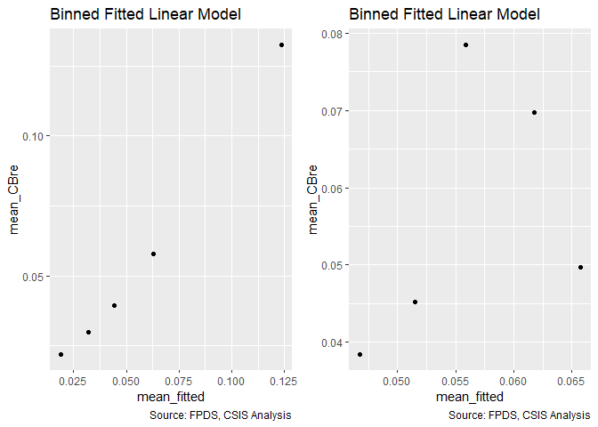<!-- -->

```
## Warning in if (class(model1_new) == "glmerMod") {: the condition has length
## > 1 and only the first element will be used
```

```
## Warning in if (class(model1_new) != "glmerMod" & class(model1_old) !=
## "glmerMod" & : the condition has length > 1 and only the first element will
## be used
```

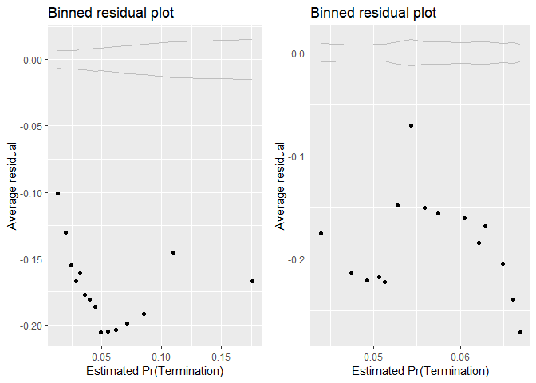<!-- -->

```
## [[1]]
##        model deviance null.deviance difference
## 1 model1_old 101427.9      108365.4  6937.4745
## 2 model1_new 108133.2      108365.4   232.1545
## 
## [[2]]
##   cl_def3_HHI_lag1 cl_def3_ratio_lag1 
##           1.017251           1.017251
```

NAICS Subsector (Level 3)					
HHI (logged, + means more consolidation)	cl_def3_HHI_lag1+		+	++	-
Ratio Def. obligatons : US revenue	cl_def3_ratio_lag1+		+	+	-

Expectations matched for def3_HHI, not matched for ceiling  breach or options
ratio expectations for ceiling breach and options but not terminations.


#### Model 10D: Cumulative Model
.

```r
#Frequency Plot for unlogged ceiling


#Model
b_CBre10D <- glm (data=serv_smp,
                 b_CBre ~  cl_US6_avg_sal_lag1Const + 
                   cl_CFTE+ c_pPBSC+c_pOffPSC+
                 c_pairHist+cl_pairCA +
                   cl_Ceil + capped_cl_Days+
                   Comp1or5+
                   Veh+
                   PricingUCA+
                   Crisis+
                   cl_def6_HHI_lag1+cl_def6_ratio_lag1+
                   cl_def3_HHI_lag1+cl_def3_ratio_lag1, family=binomial(link="logit"))
glmer_examine(b_CBre10D)
```

```
##                              GVIF Df GVIF^(1/(2*Df))
## cl_US6_avg_sal_lag1Const 1.661642  1        1.289047
## cl_CFTE                  1.315467  1        1.146938
## c_pPBSC                  1.395188  1        1.181181
## c_pOffPSC                1.849510  1        1.359967
## c_pairHist               1.299333  1        1.139883
## cl_pairCA                2.121995  1        1.456707
## cl_Ceil                  1.483606  1        1.218033
## capped_cl_Days           1.408622  1        1.186854
## Comp1or5                 1.254976  3        1.038578
## Veh                      1.809599  4        1.076956
## PricingUCA               1.206494  6        1.015766
## Crisis                   1.350487  3        1.051353
## cl_def6_HHI_lag1         2.052565  1        1.432677
## cl_def6_ratio_lag1       1.791530  1        1.338480
## cl_def3_HHI_lag1         1.917958  1        1.384904
## cl_def3_ratio_lag1       2.233038  1        1.494335
```

```r
n_CBre10D <- glm(data=serv_smp,
                        ln_CBre ~  cl_US6_avg_sal_lag1Const + 
                   cl_CFTE+ c_pPBSC+c_pOffPSC+
                 c_pairHist+cl_pairCA+
                 cl_Ceil + capped_cl_Days+
                 Comp1or5+
                   Veh+
                   PricingUCA+
                   Crisis+
                 cl_def6_HHI_lag1+cl_def6_ratio_lag1+
                 cl_def3_HHI_lag1+cl_def3_ratio_lag1)
glmer_examine(n_CBre10D)
```

```
##                              GVIF Df GVIF^(1/(2*Df))
## cl_US6_avg_sal_lag1Const 1.664981  1        1.290341
## cl_CFTE                  1.392238  1        1.179931
## c_pPBSC                  2.327849  1        1.525729
## c_pOffPSC                3.308943  1        1.819050
## c_pairHist               1.378183  1        1.173960
## cl_pairCA                2.592555  1        1.610141
## cl_Ceil                  1.957761  1        1.399200
## capped_cl_Days           1.624962  1        1.274740
## Comp1or5                 1.310092  3        1.046045
## Veh                      2.085772  4        1.096247
## PricingUCA               1.253552  6        1.019010
## Crisis                   1.229290  3        1.035005
## cl_def6_HHI_lag1         2.880389  1        1.697171
## cl_def6_ratio_lag1       1.642496  1        1.281599
## cl_def3_HHI_lag1         2.125832  1        1.458023
## cl_def3_ratio_lag1       2.073427  1        1.439940
```

```r
#Plot residuals versus fitted
stargazer::stargazer(b_CBre09E,b_CBre10C,b_CBre10D,
                     
                     n_CBre09E,n_CBre10C,n_CBre10D,
                       type="text",
                       digits=2)
```

```
## 
## ================================================================================================
##                                                       Dependent variable:                       
##                                -----------------------------------------------------------------
##                                             b_CBre                          ln_CBre             
##                                            logistic                          normal             
##                                   (1)        (2)        (3)        (4)        (5)        (6)    
## ------------------------------------------------------------------------------------------------
## cl_US6_avg_sal_lag1Const          0.02                -0.07***   0.23***                0.10**  
##                                  (0.02)                (0.02)     (0.04)                (0.05)  
##                                                                                                 
## cl_CFTE                         0.07***                0.05**    0.29***               0.27***  
##                                  (0.02)                (0.02)     (0.04)                (0.04)  
##                                                                                                 
## c_pPBSC                         -0.18***              -0.18***   -0.29***              -0.27*** 
##                                  (0.02)                (0.02)     (0.04)                (0.04)  
##                                                                                                 
## c_pOffPSC                       0.97***               0.97***    -0.51***              -0.55*** 
##                                  (0.02)                (0.02)     (0.04)                (0.04)  
##                                                                                                 
## c_pairHist                      -0.07***              -0.07***    0.09**                0.07**  
##                                  (0.02)                (0.02)     (0.04)                (0.04)  
##                                                                                                 
## cl_pairCA                       -0.06**                -0.02     -0.15***               -0.09*  
##                                  (0.02)                (0.03)     (0.05)                (0.05)  
##                                                                                                 
## cl_Ceil                         0.99***               0.99***    2.89***               2.90***  
##                                  (0.02)                (0.02)     (0.04)                (0.04)  
##                                                                                                 
## capped_cl_Days                   0.05**                0.05**     0.08*                 0.10**  
##                                  (0.02)                (0.02)     (0.04)                (0.04)  
##                                                                                                 
## Comp1or51 offer                 -0.15***              -0.14***     0.01                 -0.01   
##                                  (0.03)                (0.03)     (0.06)                (0.06)  
##                                                                                                 
## Comp1or52-4 offers              0.31***               0.31***    -0.23***              -0.23*** 
##                                  (0.02)                (0.02)     (0.04)                (0.04)  
##                                                                                                 
## Comp1or55+ offers               0.37***               0.37***    -0.15***              -0.15*** 
##                                  (0.03)                (0.03)     (0.04)                (0.04)  
##                                                                                                 
## VehS-IDC                        -0.18***              -0.20***   0.16***               0.11***  
##                                  (0.02)                (0.03)     (0.04)                (0.04)  
##                                                                                                 
## VehM-IDC                        -0.16***              -0.14***    0.13**                0.10*   
##                                  (0.03)                (0.03)     (0.05)                (0.05)  
##                                                                                                 
## VehFSS/GWAC                     -0.48***              -0.51***   0.28***                0.21**  
##                                  (0.05)                (0.05)     (0.09)                (0.09)  
##                                                                                                 
## VehBPA/BOA                      -0.42***              -0.44***     0.10                  0.10   
##                                  (0.06)                (0.06)     (0.10)                (0.10)  
##                                                                                                 
## PricingUCAOther FP              -0.91***              -0.86***    -0.46*                -0.43   
##                                  (0.16)                (0.16)     (0.27)                (0.27)  
##                                                                                                 
## PricingUCAT&M/LH/FPLOE          -0.48***              -0.51***   1.18***               1.10***  
##                                  (0.07)                (0.07)     (0.12)                (0.12)  
##                                                                                                 
## PricingUCAIncentive               0.06                  0.01     0.73***               0.62***  
##                                  (0.10)                (0.10)     (0.17)                (0.17)  
##                                                                                                 
## PricingUCAOther CB              -1.21***              -1.25***   1.37***               1.28***  
##                                  (0.05)                (0.05)     (0.09)                (0.09)  
##                                                                                                 
## PricingUCAUCA                    -0.004                -0.01     0.61***               0.59***  
##                                  (0.08)                (0.08)     (0.13)                (0.13)  
##                                                                                                 
## PricingUCACombination or Other  -0.38***              -0.41***   0.73***               0.66***  
##                                  (0.08)                (0.08)     (0.14)                (0.14)  
##                                                                                                 
## CrisisARRA                      0.68***               0.72***     -0.02                  0.02   
##                                  (0.07)                (0.07)     (0.12)                (0.12)  
##                                                                                                 
## CrisisDis                        0.41**                0.42**      0.38                  0.40   
##                                  (0.18)                (0.18)     (0.28)                (0.28)  
##                                                                                                 
## CrisisOCO                       -0.23***              -0.22***   0.50***               0.47***  
##                                  (0.05)                (0.05)     (0.08)                (0.08)  
##                                                                                                 
## cl_def6_HHI_lag1                 -0.03*               0.20***     -0.05                 -0.07   
##                                  (0.02)                (0.02)     (0.03)                (0.04)  
##                                                                                                 
## cl_def6_ratio_lag1              -0.24***              -0.17***   0.42***               0.20***  
##                                  (0.02)                (0.03)     (0.04)                (0.05)  
##                                                                                                 
## cl_def3_HHI_lag1                           -0.22***   -0.41***              -1.58***    -0.02   
##                                             (0.02)     (0.02)                (0.05)     (0.05)  
##                                                                                                 
## cl_def3_ratio_lag1                         0.13***    -0.07***              0.18***    0.37***  
##                                             (0.02)     (0.03)                (0.05)     (0.05)  
##                                                                                                 
## Constant                        -2.96***   -2.83***   -2.96***   8.68***    9.15***    8.72***  
##                                  (0.02)     (0.01)     (0.02)     (0.04)     (0.02)     (0.04)  
##                                                                                                 
## ------------------------------------------------------------------------------------------------
## Observations                    250,000    250,000    250,000     15,018     15,018     15,018  
## Log Likelihood                 -50,652.78 -54,066.60 -50,513.99 -30,183.41 -35,990.96 -30,150.06
## Akaike Inf. Crit.              101,359.60 108,139.20 101,086.00 60,420.83  71,987.93  60,358.12 
## ================================================================================================
## Note:                                                                *p<0.1; **p<0.05; ***p<0.01
```

```r
summary_residual_compare(b_CBre09D2,b_CBre10D)
```

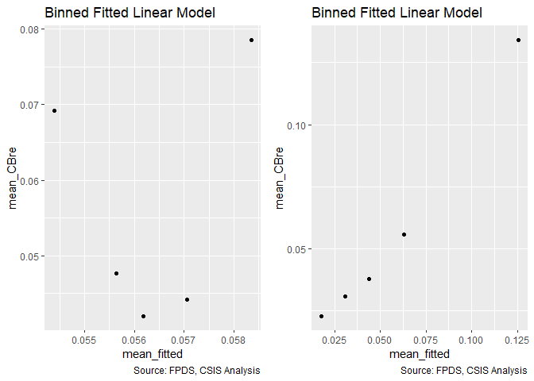<!-- -->

```
## Warning in if (class(model1_new) == "glmerMod") {: the condition has length
## > 1 and only the first element will be used
```

```
## Warning in if (class(model1_new) != "glmerMod" & class(model1_old) !=
## "glmerMod" & : the condition has length > 1 and only the first element will
## be used
```

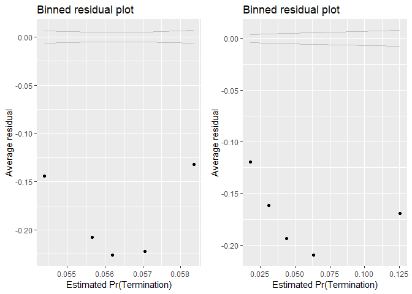<!-- -->

```
## [[1]]
##        model deviance null.deviance  difference
## 1 model1_old 108355.9      108365.4    9.509405
## 2 model1_new 101028.0      108365.4 7337.378561
## 
## [[2]]
##                              GVIF Df GVIF^(1/(2*Df))
## cl_US6_avg_sal_lag1Const 1.661642  1        1.289047
## cl_CFTE                  1.315467  1        1.146938
## c_pPBSC                  1.395188  1        1.181181
## c_pOffPSC                1.849510  1        1.359967
## c_pairHist               1.299333  1        1.139883
## cl_pairCA                2.121995  1        1.456707
## cl_Ceil                  1.483606  1        1.218033
## capped_cl_Days           1.408622  1        1.186854
## Comp1or5                 1.254976  3        1.038578
## Veh                      1.809599  4        1.076956
## PricingUCA               1.206494  6        1.015766
## Crisis                   1.350487  3        1.051353
## cl_def6_HHI_lag1         2.052565  1        1.432677
## cl_def6_ratio_lag1       1.791530  1        1.338480
## cl_def3_HHI_lag1         1.917958  1        1.384904
## cl_def3_ratio_lag1       2.233038  1        1.494335
```

```r
summary_residual_compare(b_CBre08B,b_CBre10D)
```

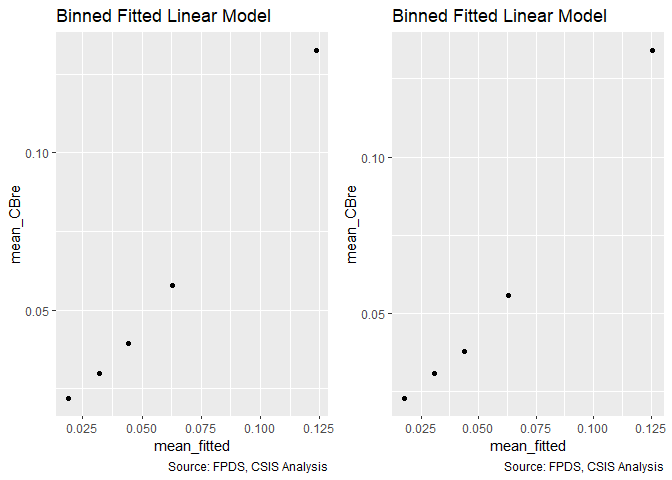<!-- -->

```
## Warning in if (class(model1_new) == "glmerMod") {: the condition has length
## > 1 and only the first element will be used

## Warning in if (class(model1_new) == "glmerMod") {: the condition has length
## > 1 and only the first element will be used
```

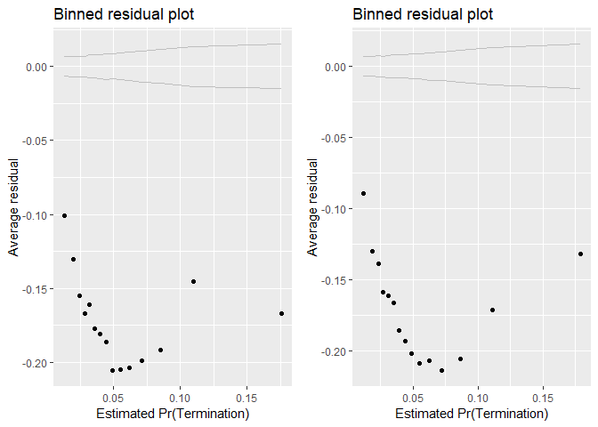<!-- -->

```
## [[1]]
##        model deviance null.deviance difference
## 1 model1_old 101427.9      108365.4   6937.475
## 2 model1_new 101028.0      108365.4   7337.379
## 
## [[2]]
##                              GVIF Df GVIF^(1/(2*Df))
## cl_US6_avg_sal_lag1Const 1.661642  1        1.289047
## cl_CFTE                  1.315467  1        1.146938
## c_pPBSC                  1.395188  1        1.181181
## c_pOffPSC                1.849510  1        1.359967
## c_pairHist               1.299333  1        1.139883
## cl_pairCA                2.121995  1        1.456707
## cl_Ceil                  1.483606  1        1.218033
## capped_cl_Days           1.408622  1        1.186854
## Comp1or5                 1.254976  3        1.038578
## Veh                      1.809599  4        1.076956
## PricingUCA               1.206494  6        1.015766
## Crisis                   1.350487  3        1.051353
## cl_def6_HHI_lag1         2.052565  1        1.432677
## cl_def6_ratio_lag1       1.791530  1        1.338480
## cl_def3_HHI_lag1         1.917958  1        1.384904
## cl_def3_ratio_lag1       2.233038  1        1.494335
```
HHI6 for ceiling breach now matches expectations but HHI6 for term went in the opposite direction. s

## Office 
### Office and Vendor-Office Pair

#### Model 11A: Vendor Market Share
Expectation: Contracts of offices partnered with vendors who have larger market shares would be more likely to experience cost ceiling breaches and exercised options, but less likely to have terminations.
Market Share Vendor for that Office	c_pMarket		++	-	+


```r
summary_continuous_plot(serv_smp,"c_pMarket")
```

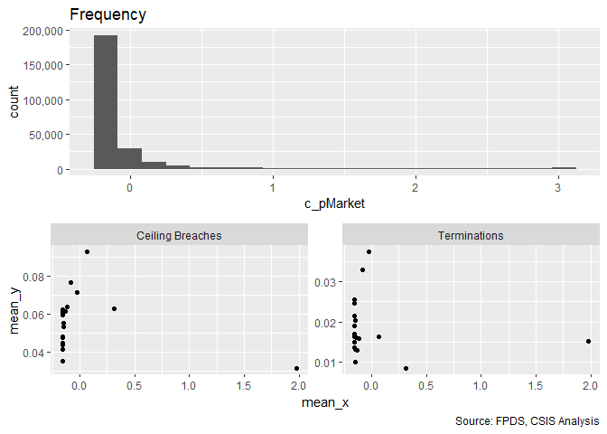<!-- -->

```r
#Scatter Plot
ggplot(serv_smp, aes(x=c_pMarket, y=ln_CBre)) + geom_point(alpha = 0.1) + ggtitle('Ceiling Breach Growth') + theme(plot.title = element_text(hjust = 0.5))
```

```
## Warning: Removed 234982 rows containing missing values (geom_point).
```

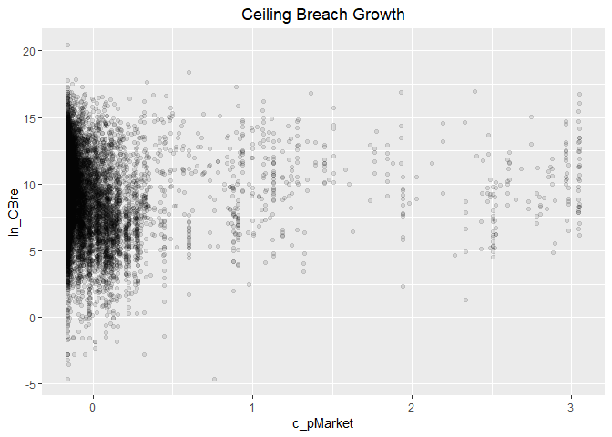<!-- -->

```r
#Model
b_CBre11A <- glm (data=serv_smp,
                 b_CBre ~ c_pMarket, family=binomial(link="logit"))
display(b_CBre11A)
```

```
## glm(formula = b_CBre ~ c_pMarket, family = binomial(link = "logit"), 
##     data = serv_smp)
##             coef.est coef.se
## (Intercept) -2.82     0.01  
## c_pMarket   -0.24     0.02  
## ---
##   n = 250000, k = 2
##   residual deviance = 108228.0, null deviance = 108365.4 (difference = 137.3)
```

```r
n_CBre11A <- glm(data=serv_smp,
                        ln_CBre ~ c_pMarket)

display(n_CBre11A)
```

```
## glm(formula = ln_CBre ~ c_pMarket, data = serv_smp)
##             coef.est coef.se
## (Intercept)  9.25     0.02  
## c_pMarket   -0.19     0.07  
## ---
##   n = 15018, k = 2
##   residual deviance = 114504.9, null deviance = 114568.9 (difference = 64.0)
##   overdispersion parameter = 7.6
##   residual sd is sqrt(overdispersion) = 2.76
```

```r
#Plot residuals versus fitted
stargazer::stargazer(b_CBre11A,
                      
                       n_CBre11A,
                       type="text",
                       digits=2)
```

```
## 
## ==============================================
##                       Dependent variable:     
##                   ----------------------------
##                       b_CBre        ln_CBre   
##                      logistic       normal    
##                        (1)            (2)     
## ----------------------------------------------
## c_pMarket            -0.24***      -0.19***   
##                       (0.02)        (0.07)    
##                                               
## Constant             -2.82***       9.25***   
##                       (0.01)        (0.02)    
##                                               
## ----------------------------------------------
## Observations         250,000        15,018    
## Log Likelihood      -54,114.01    -36,564.16  
## Akaike Inf. Crit.   108,232.00     73,132.32  
## ==============================================
## Note:              *p<0.1; **p<0.05; ***p<0.01
```

Aligns with expectations on terminatio, but not for ceiling  breach or for options.


#### Model 11B: Cumulative Model


```r
#Frequency Plot for unlogged ceiling


#Model
b_CBre11B <- glm (data=serv_smp,
                 b_CBre ~  cl_US6_avg_sal_lag1Const + 
                   cl_CFTE+ c_pPBSC+c_pOffPSC+
                 c_pairHist+cl_pairCA +
                   cl_Ceil + capped_cl_Days+
                   Comp1or5+
                   Veh+
                   PricingUCA+
                   Crisis+
                   cl_def6_HHI_lag1+cl_def6_ratio_lag1+
                   cl_def3_HHI_lag1+cl_def3_ratio_lag1+
                   c_pMarket, family=binomial(link="logit"))
glmer_examine(b_CBre11B)
```

```
##                              GVIF Df GVIF^(1/(2*Df))
## cl_US6_avg_sal_lag1Const 1.678529  1        1.295580
## cl_CFTE                  1.333478  1        1.154763
## c_pPBSC                  1.457100  1        1.207104
## c_pOffPSC                1.928739  1        1.388790
## c_pairHist               1.300134  1        1.140234
## cl_pairCA                2.264217  1        1.504731
## cl_Ceil                  1.509531  1        1.228630
## capped_cl_Days           1.411587  1        1.188102
## Comp1or5                 1.265587  3        1.040037
## Veh                      1.817847  4        1.077568
## PricingUCA               1.214642  6        1.016336
## Crisis                   1.342269  3        1.050284
## cl_def6_HHI_lag1         2.066067  1        1.437382
## cl_def6_ratio_lag1       1.867027  1        1.366392
## cl_def3_HHI_lag1         1.934690  1        1.390931
## cl_def3_ratio_lag1       2.307431  1        1.519023
## c_pMarket                1.270242  1        1.127050
```

```r
n_CBre11B <- glm(data=serv_smp,
                        ln_CBre ~  cl_US6_avg_sal_lag1Const + 
                   cl_CFTE+ c_pPBSC+c_pOffPSC+
                 c_pairHist+cl_pairCA+
                 cl_Ceil + capped_cl_Days+
                 Comp1or5+
                   Veh+
                   PricingUCA+
                   Crisis+
                 cl_def6_HHI_lag1+cl_def6_ratio_lag1+
                 cl_def3_HHI_lag1+cl_def3_ratio_lag1+
                 c_pMarket)

glmer_examine(n_CBre11B)
```

```
##                              GVIF Df GVIF^(1/(2*Df))
## cl_US6_avg_sal_lag1Const 1.670829  1        1.292606
## cl_CFTE                  1.395725  1        1.181408
## c_pPBSC                  2.361696  1        1.536781
## c_pOffPSC                3.361654  1        1.833481
## c_pairHist               1.381271  1        1.175275
## cl_pairCA                2.807736  1        1.675630
## cl_Ceil                  1.967813  1        1.402788
## capped_cl_Days           1.625067  1        1.274781
## Comp1or5                 1.319198  3        1.047253
## Veh                      2.116268  4        1.098238
## PricingUCA               1.303780  6        1.022352
## Crisis                   1.257109  3        1.038872
## cl_def6_HHI_lag1         2.880586  1        1.697229
## cl_def6_ratio_lag1       1.646400  1        1.283121
## cl_def3_HHI_lag1         2.126115  1        1.458120
## cl_def3_ratio_lag1       2.076353  1        1.440956
## c_pMarket                1.320094  1        1.148954
```

```r
#Plot residuals versus fitted
stargazer::stargazer(b_CBre10D,b_CBre11A,b_CBre11B,
                     
                     n_CBre10D,n_CBre11A,n_CBre11B,
                       type="text",
                       digits=2)
```

```
## 
## ================================================================================================
##                                                       Dependent variable:                       
##                                -----------------------------------------------------------------
##                                             b_CBre                          ln_CBre             
##                                            logistic                          normal             
##                                   (1)        (2)        (3)        (4)        (5)        (6)    
## ------------------------------------------------------------------------------------------------
## cl_US6_avg_sal_lag1Const        -0.07***              -0.10***    0.10**                0.11**  
##                                  (0.02)                (0.03)     (0.05)                (0.05)  
##                                                                                                 
## cl_CFTE                          0.05**               0.07***    0.27***               0.26***  
##                                  (0.02)                (0.02)     (0.04)                (0.04)  
##                                                                                                 
## c_pPBSC                         -0.18***              -0.24***   -0.27***              -0.26*** 
##                                  (0.02)                (0.02)     (0.04)                (0.04)  
##                                                                                                 
## c_pOffPSC                       0.97***               1.04***    -0.55***              -0.56*** 
##                                  (0.02)                (0.02)     (0.04)                (0.04)  
##                                                                                                 
## c_pairHist                      -0.07***              -0.06***    0.07**                0.07*   
##                                  (0.02)                (0.02)     (0.04)                (0.04)  
##                                                                                                 
## cl_pairCA                        -0.02                0.13***     -0.09*               -0.14*** 
##                                  (0.03)                (0.03)     (0.05)                (0.05)  
##                                                                                                 
## cl_Ceil                         0.99***               1.03***    2.90***               2.89***  
##                                  (0.02)                (0.02)     (0.04)                (0.04)  
##                                                                                                 
## capped_cl_Days                   0.05**                 0.03      0.10**                0.10**  
##                                  (0.02)                (0.02)     (0.04)                (0.04)  
##                                                                                                 
## Comp1or51 offer                 -0.14***              -0.10***    -0.01                 -0.02   
##                                  (0.03)                (0.03)     (0.06)                (0.06)  
##                                                                                                 
## Comp1or52-4 offers              0.31***               0.29***    -0.23***              -0.23*** 
##                                  (0.02)                (0.02)     (0.04)                (0.04)  
##                                                                                                 
## Comp1or55+ offers               0.37***               0.33***    -0.15***              -0.14*** 
##                                  (0.03)                (0.03)     (0.04)                (0.04)  
##                                                                                                 
## VehS-IDC                        -0.20***              -0.24***   0.11***               0.13***  
##                                  (0.03)                (0.03)     (0.04)                (0.04)  
##                                                                                                 
## VehM-IDC                        -0.14***              -0.19***    0.10*                 0.11**  
##                                  (0.03)                (0.03)     (0.05)                (0.05)  
##                                                                                                 
## VehFSS/GWAC                     -0.51***              -0.53***    0.21**                0.22**  
##                                  (0.05)                (0.05)     (0.09)                (0.09)  
##                                                                                                 
## VehBPA/BOA                      -0.44***              -0.40***     0.10                  0.11   
##                                  (0.06)                (0.06)     (0.10)                (0.10)  
##                                                                                                 
## PricingUCAOther FP              -0.86***              -0.83***    -0.43                 -0.49*  
##                                  (0.16)                (0.16)     (0.27)                (0.27)  
##                                                                                                 
## PricingUCAT&M/LH/FPLOE          -0.51***              -0.50***   1.10***               1.09***  
##                                  (0.07)                (0.07)     (0.12)                (0.12)  
##                                                                                                 
## PricingUCAIncentive               0.01                 -0.02     0.62***               0.63***  
##                                  (0.10)                (0.10)     (0.17)                (0.17)  
##                                                                                                 
## PricingUCAOther CB              -1.25***              -1.19***   1.28***               1.23***  
##                                  (0.05)                (0.05)     (0.09)                (0.09)  
##                                                                                                 
## PricingUCAUCA                    -0.01                  0.05     0.59***               0.58***  
##                                  (0.08)                (0.08)     (0.13)                (0.13)  
##                                                                                                 
## PricingUCACombination or Other  -0.41***              -0.40***   0.66***               0.65***  
##                                  (0.08)                (0.08)     (0.14)                (0.14)  
##                                                                                                 
## CrisisARRA                      0.72***               0.70***      0.02                  0.02   
##                                  (0.07)                (0.07)     (0.12)                (0.12)  
##                                                                                                 
## CrisisDis                        0.42**                0.43**      0.40                  0.39   
##                                  (0.18)                (0.18)     (0.28)                (0.28)  
##                                                                                                 
## CrisisOCO                       -0.22***               -0.001    0.47***               0.43***  
##                                  (0.05)                (0.05)     (0.08)                (0.08)  
##                                                                                                 
## cl_def6_HHI_lag1                0.20***               0.22***     -0.07                 -0.07   
##                                  (0.02)                (0.02)     (0.04)                (0.04)  
##                                                                                                 
## cl_def6_ratio_lag1              -0.17***              -0.20***   0.20***               0.21***  
##                                  (0.03)                (0.03)     (0.05)                (0.05)  
##                                                                                                 
## cl_def3_HHI_lag1                -0.41***              -0.44***    -0.02                 -0.02   
##                                  (0.02)                (0.03)     (0.05)                (0.05)  
##                                                                                                 
## cl_def3_ratio_lag1              -0.07***              -0.07**    0.37***               0.37***  
##                                  (0.03)                (0.03)     (0.05)                (0.05)  
##                                                                                                 
## c_pMarket                                  -0.24***   -0.52***              -0.19***   0.15***  
##                                             (0.02)     (0.03)                (0.07)     (0.05)  
##                                                                                                 
## Constant                        -2.96***   -2.82***   -2.97***   8.72***    9.25***    8.72***  
##                                  (0.02)     (0.01)     (0.02)     (0.04)     (0.02)     (0.04)  
##                                                                                                 
## ------------------------------------------------------------------------------------------------
## Observations                    250,000    250,000    250,000     15,018     15,018     15,018  
## Log Likelihood                 -50,513.99 -54,114.01 -50,316.53 -30,150.06 -36,564.16 -30,145.37
## Akaike Inf. Crit.              101,086.00 108,232.00 100,693.10 60,358.12  73,132.32  60,350.75 
## ================================================================================================
## Note:                                                                *p<0.1; **p<0.05; ***p<0.01
```

```r
#summary_residual_compare(b_CBre10D,b_CBre11B)
#summary_residual_compare(b_CBre11A,b_CBre11B)
```
Note that the VIF is getting high on pair_CA.

### Other Office Characteristics
#### 12A: Past Office Volume (dollars)

Expectation: Contracting offices previously had more contract volume in dollars would have more experience managing cost and preventing cost-ceiling breaches, therefore larger past office volume would lower the likelihood of cost-ceiling breaches but no substantial relationships with likelihood of terminations or exercised options.

Past Office Volume $s	cl_OffVol		-	+	+
From looking at data, terminations, easier for big, less dependent. - less dependenct


```r
summary_continuous_plot(serv_smp,"cl_OffVol")
```

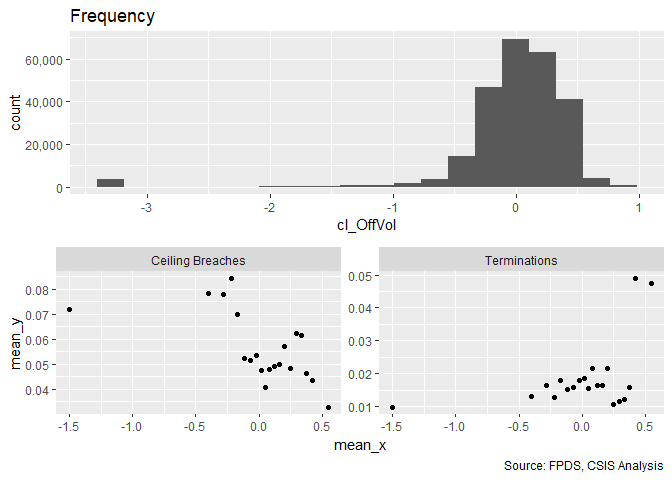<!-- -->

```r
#Scatter Plot
ggplot(serv_smp, aes(x=cl_OffVol, y=ln_CBre)) + geom_point(alpha = 0.1) + ggtitle('Ceiling Breach Growth') + theme(plot.title = element_text(hjust = 0.5))
```

```
## Warning: Removed 234982 rows containing missing values (geom_point).
```

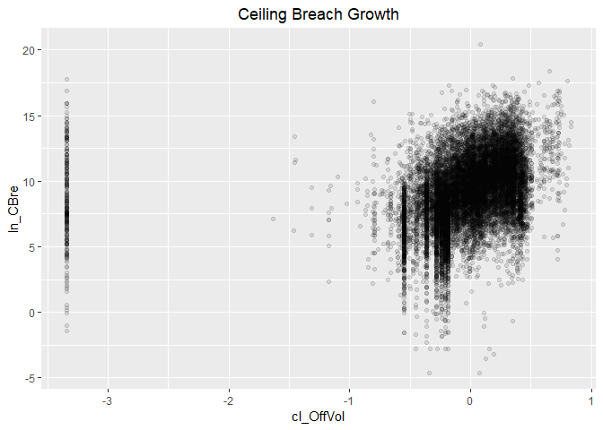<!-- -->

```r
#Model
b_CBre12A <- glm (data=serv_smp,
                 b_CBre ~ cl_OffVol, family=binomial(link="logit"))
display(b_CBre12A)
```

```
## glm(formula = b_CBre ~ cl_OffVol, family = binomial(link = "logit"), 
##     data = serv_smp)
##             coef.est coef.se
## (Intercept) -2.82     0.01  
## cl_OffVol   -0.19     0.01  
## ---
##   n = 250000, k = 2
##   residual deviance = 108214.9, null deviance = 108365.4 (difference = 150.4)
```

```r
n_CBre12A <- glm(data=serv_smp,
                        ln_CBre ~ cl_OffVol)

display(n_CBre12A)
```

```
## glm(formula = ln_CBre ~ cl_OffVol, data = serv_smp)
##             coef.est coef.se
## (Intercept) 9.33     0.02   
## cl_OffVol   1.30     0.04   
## ---
##   n = 15018, k = 2
##   residual deviance = 107472.4, null deviance = 114568.9 (difference = 7096.4)
##   overdispersion parameter = 7.2
##   residual sd is sqrt(overdispersion) = 2.68
```

```r
#Plot residuals versus fitted
stargazer::stargazer(b_CBre12A,
                       
                       n_CBre12A,
                       type="text",
                       digits=2)
```

```
## 
## ==============================================
##                       Dependent variable:     
##                   ----------------------------
##                       b_CBre        ln_CBre   
##                      logistic       normal    
##                        (1)            (2)     
## ----------------------------------------------
## cl_OffVol            -0.19***       1.30***   
##                       (0.01)        (0.04)    
##                                               
## Constant             -2.82***       9.33***   
##                       (0.01)        (0.02)    
##                                               
## ----------------------------------------------
## Observations         250,000        15,018    
## Log Likelihood      -54,107.46    -36,088.22  
## Akaike Inf. Crit.   108,218.90     72,180.43  
## ==============================================
## Note:              *p<0.1; **p<0.05; ***p<0.01
```

```r
summary_residual_compare(b_CBre11A,b_CBre12A, skip_vif = TRUE)
```

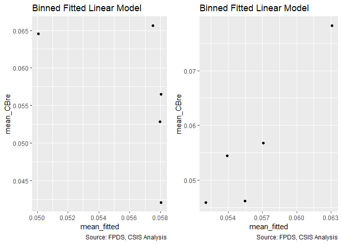<!-- -->

```
## Warning in if (class(model1_new) == "glmerMod") {: the condition has length
## > 1 and only the first element will be used
```

```
## Warning in if (class(model1_new) != "glmerMod" & class(model1_old) !=
## "glmerMod" & : the condition has length > 1 and only the first element will
## be used
```

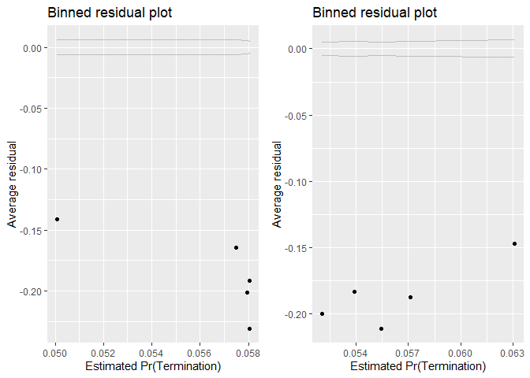<!-- -->

```
## NULL
```

```r
summary_residual_compare(b_CBre03D,b_CBre12A, skip_vif = TRUE)
```

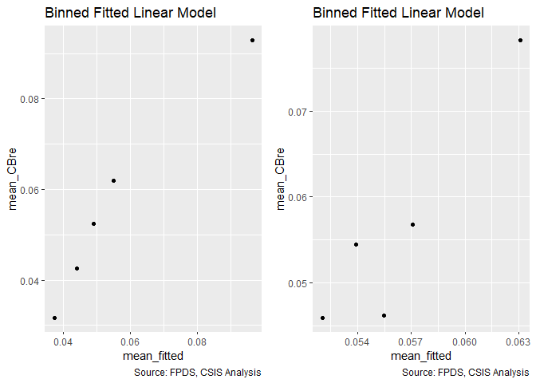<!-- -->

```
## Warning in if (class(model1_new) == "glmerMod") {: the condition has length
## > 1 and only the first element will be used

## Warning in if (class(model1_new) == "glmerMod") {: the condition has length
## > 1 and only the first element will be used
```

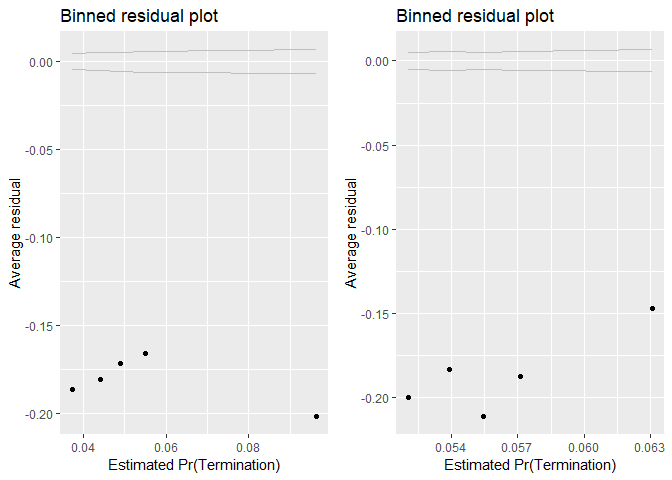<!-- -->

```
## NULL
```
Fully 
When considering past office volume alone, the relationship was as expected with cost-ceiling breaches. Out of our expectation, the results also showed increasing post office volume would reduce the possibility of exercised options but increase likelihood of having terminations.


#### 12B: Detailed Industry Diveristy

Expectation: More diverse industries of contracts contracting offices handle, the higher complexity they deal with, which would increase the likelihood of having cost ceiling breaches and terminations, and decreasing the likelihood of having options exercised.


```r
summary_continuous_plot(serv_smp,"cl_office_naics_hhi_k")
```

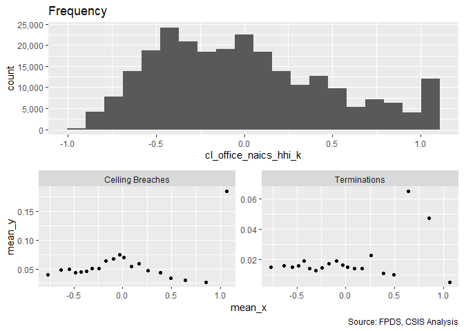<!-- -->

```r
#Scatter Plot
ggplot(serv_smp, aes(x=cl_office_naics_hhi_k, y=ln_CBre)) + geom_point(alpha = 0.1) + ggtitle('Ceiling Breach Growth') + theme(plot.title = element_text(hjust = 0.5))
```

```
## Warning: Removed 234982 rows containing missing values (geom_point).
```

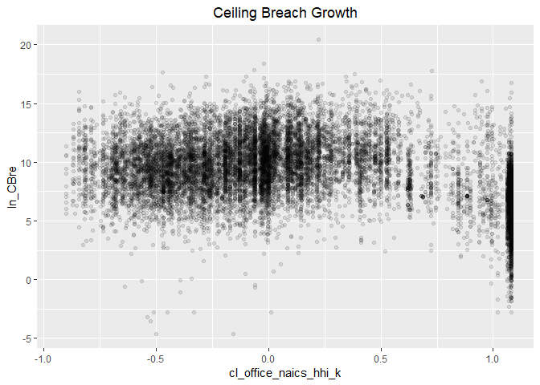<!-- -->

```r
#Model
b_CBre12B <- glm (data=serv_smp,
                 b_CBre ~ cl_office_naics_hhi_k, family=binomial(link="logit"))
display(b_CBre12B)
```

```
## glm(formula = b_CBre ~ cl_office_naics_hhi_k, family = binomial(link = "logit"), 
##     data = serv_smp)
##                       coef.est coef.se
## (Intercept)           -2.84     0.01  
## cl_office_naics_hhi_k  0.43     0.02  
## ---
##   n = 250000, k = 2
##   residual deviance = 107743.7, null deviance = 108365.4 (difference = 621.7)
```

```r
n_CBre12B <- glm(data=serv_smp,
                        ln_CBre ~ cl_office_naics_hhi_k)

display(n_CBre12B)
```

```
## glm(formula = ln_CBre ~ cl_office_naics_hhi_k, data = serv_smp)
##                       coef.est coef.se
## (Intercept)            9.44     0.02  
## cl_office_naics_hhi_k -1.71     0.04  
## ---
##   n = 15018, k = 2
##   residual deviance = 100625.8, null deviance = 114568.9 (difference = 13943.0)
##   overdispersion parameter = 6.7
##   residual sd is sqrt(overdispersion) = 2.59
```

```r
#Plot residuals versus fitted
stargazer::stargazer(b_CBre12B,
                       
                       n_CBre12B,
                       type="text",
                       digits=2)
```

```
## 
## ==================================================
##                           Dependent variable:     
##                       ----------------------------
##                           b_CBre        ln_CBre   
##                          logistic       normal    
##                            (1)            (2)     
## --------------------------------------------------
## cl_office_naics_hhi_k    0.43***       -1.71***   
##                           (0.02)        (0.04)    
##                                                   
## Constant                 -2.84***       9.44***   
##                           (0.01)        (0.02)    
##                                                   
## --------------------------------------------------
## Observations             250,000        15,018    
## Log Likelihood          -53,871.84    -35,593.94  
## Akaike Inf. Crit.       107,747.70     71,191.87  
## ==================================================
## Note:                  *p<0.1; **p<0.05; ***p<0.01
```

```r
# summary_residual_compare(b_CBre11A,b_CBre12B, skip_vif = TRUE)
# summary_residual_compare(b_CBre03D,b_CBre12B, skip_vif = TRUE)
```

When using hhi calculated based on contracting office obligation: considering hhi alone, expectation for Temrination was not met.
When using hhi calculated based on contracting office number of contarcts: considering hhi alone, all expectation were met.

#### 12C: Cumulative Model


```r
#Frequency Plot for unlogged ceiling


#Model
b_CBre12C <- glm (data=serv_smp,
                 b_CBre ~  cl_US6_avg_sal_lag1Const + 
                   cl_CFTE+ c_pPBSC+c_pOffPSC+
                 c_pairHist+cl_pairCA +
                   cl_Ceil + capped_cl_Days+
                   Comp1or5+
                   Veh+
                   PricingUCA+
                   Crisis+
                   cl_def6_HHI_lag1+cl_def6_ratio_lag1+
                   cl_def3_HHI_lag1+cl_def3_ratio_lag1+
                   c_pMarket+
                   cl_OffVol+cl_office_naics_hhi_k , family=binomial(link="logit"))
glmer_examine(b_CBre12C)
```

```
##                              GVIF Df GVIF^(1/(2*Df))
## cl_US6_avg_sal_lag1Const 1.687530  1        1.299050
## cl_CFTE                  1.332134  1        1.154181
## c_pPBSC                  1.499162  1        1.224403
## c_pOffPSC                2.702780  1        1.644013
## c_pairHist               1.380565  1        1.174974
## cl_pairCA                2.303935  1        1.517872
## cl_Ceil                  1.520395  1        1.233043
## capped_cl_Days           1.423689  1        1.193184
## Comp1or5                 1.273862  3        1.041167
## Veh                      1.842504  4        1.079384
## PricingUCA               1.223019  6        1.016918
## Crisis                   1.343221  3        1.050408
## cl_def6_HHI_lag1         2.095171  1        1.447471
## cl_def6_ratio_lag1       1.857510  1        1.362905
## cl_def3_HHI_lag1         1.944070  1        1.394299
## cl_def3_ratio_lag1       2.291367  1        1.513726
## c_pMarket                1.262464  1        1.123594
## cl_OffVol                1.261818  1        1.123307
## cl_office_naics_hhi_k    2.354932  1        1.534579
```

```r
n_CBre12C <- glm(data=serv_smp,
                        ln_CBre ~  cl_US6_avg_sal_lag1Const + 
                   cl_CFTE+ c_pPBSC+c_pOffPSC+
                 c_pairHist+cl_pairCA+
                 cl_Ceil + capped_cl_Days+
                 Comp1or5+
                   Veh+
                   PricingUCA+
                   Crisis+
                 cl_def6_HHI_lag1+cl_def6_ratio_lag1+
                 cl_def3_HHI_lag1+cl_def3_ratio_lag1+
                 c_pMarket+
                   cl_OffVol+cl_office_naics_hhi_k)

glmer_examine(n_CBre12C)
```

```
##                              GVIF Df GVIF^(1/(2*Df))
## cl_US6_avg_sal_lag1Const 1.677553  1        1.295204
## cl_CFTE                  1.402218  1        1.184153
## c_pPBSC                  2.403754  1        1.550405
## c_pOffPSC                4.572992  1        2.138456
## c_pairHist               1.436100  1        1.198374
## cl_pairCA                2.915731  1        1.707551
## cl_Ceil                  1.988039  1        1.409979
## capped_cl_Days           1.646363  1        1.283107
## Comp1or5                 1.335003  3        1.049334
## Veh                      2.144287  4        1.100045
## PricingUCA               1.329562  6        1.024021
## Crisis                   1.267360  3        1.040279
## cl_def6_HHI_lag1         2.938676  1        1.714257
## cl_def6_ratio_lag1       1.654931  1        1.286441
## cl_def3_HHI_lag1         2.127966  1        1.458755
## cl_def3_ratio_lag1       2.086393  1        1.444435
## c_pMarket                1.325622  1        1.151357
## cl_OffVol                1.281805  1        1.132168
## cl_office_naics_hhi_k    3.133715  1        1.770230
```

```r
#Plot residuals versus fitted
stargazer::stargazer(b_CBre11B,b_CBre12A,b_CBre12C,
                     
                     n_CBre11B,n_CBre12A,n_CBre12C,
                       type="text",
                       digits=2)
```

```
## 
## ================================================================================================
##                                                       Dependent variable:                       
##                                -----------------------------------------------------------------
##                                             b_CBre                          ln_CBre             
##                                            logistic                          normal             
##                                   (1)        (2)        (3)        (4)        (5)        (6)    
## ------------------------------------------------------------------------------------------------
## cl_US6_avg_sal_lag1Const        -0.10***              -0.07***    0.11**                0.11**  
##                                  (0.03)                (0.03)     (0.05)                (0.05)  
##                                                                                                 
## cl_CFTE                         0.07***               0.08***    0.26***               0.24***  
##                                  (0.02)                (0.02)     (0.04)                (0.04)  
##                                                                                                 
## c_pPBSC                         -0.24***              -0.19***   -0.26***              -0.30*** 
##                                  (0.02)                (0.02)     (0.04)                (0.04)  
##                                                                                                 
## c_pOffPSC                       1.04***               1.08***    -0.56***              -0.51*** 
##                                  (0.02)                (0.02)     (0.04)                (0.04)  
##                                                                                                 
## c_pairHist                      -0.06***                0.01      0.07*                 -0.02   
##                                  (0.02)                (0.02)     (0.04)                (0.04)  
##                                                                                                 
## cl_pairCA                       0.13***               0.17***    -0.14***               -0.10*  
##                                  (0.03)                (0.03)     (0.05)                (0.05)  
##                                                                                                 
## cl_Ceil                         1.03***               1.06***    2.89***               2.87***  
##                                  (0.02)                (0.02)     (0.04)                (0.04)  
##                                                                                                 
## capped_cl_Days                    0.03                0.06***     0.10**                 0.06   
##                                  (0.02)                (0.02)     (0.04)                (0.04)  
##                                                                                                 
## Comp1or51 offer                 -0.10***              -0.12***    -0.02                 -0.01   
##                                  (0.03)                (0.03)     (0.06)                (0.06)  
##                                                                                                 
## Comp1or52-4 offers              0.29***               0.27***    -0.23***              -0.19*** 
##                                  (0.02)                (0.02)     (0.04)                (0.04)  
##                                                                                                 
## Comp1or55+ offers               0.33***               0.33***    -0.14***              -0.13*** 
##                                  (0.03)                (0.03)     (0.04)                (0.04)  
##                                                                                                 
## VehS-IDC                        -0.24***              -0.24***   0.13***               0.14***  
##                                  (0.03)                (0.03)     (0.04)                (0.04)  
##                                                                                                 
## VehM-IDC                        -0.19***              -0.19***    0.11**                0.13**  
##                                  (0.03)                (0.03)     (0.05)                (0.05)  
##                                                                                                 
## VehFSS/GWAC                     -0.53***              -0.56***    0.22**                0.22**  
##                                  (0.05)                (0.05)     (0.09)                (0.09)  
##                                                                                                 
## VehBPA/BOA                      -0.40***              -0.44***     0.11                  0.08   
##                                  (0.06)                (0.06)     (0.10)                (0.10)  
##                                                                                                 
## PricingUCAOther FP              -0.83***              -0.83***    -0.49*                -0.53*  
##                                  (0.16)                (0.16)     (0.27)                (0.27)  
##                                                                                                 
## PricingUCAT&M/LH/FPLOE          -0.50***              -0.51***   1.09***               1.04***  
##                                  (0.07)                (0.07)     (0.12)                (0.12)  
##                                                                                                 
## PricingUCAIncentive              -0.02                  0.02     0.63***               0.52***  
##                                  (0.10)                (0.10)     (0.17)                (0.17)  
##                                                                                                 
## PricingUCAOther CB              -1.19***              -1.17***   1.23***               1.16***  
##                                  (0.05)                (0.05)     (0.09)                (0.09)  
##                                                                                                 
## PricingUCAUCA                     0.05                  0.07     0.58***               0.54***  
##                                  (0.08)                (0.08)     (0.13)                (0.13)  
##                                                                                                 
## PricingUCACombination or Other  -0.40***              -0.41***   0.65***               0.57***  
##                                  (0.08)                (0.09)     (0.14)                (0.14)  
##                                                                                                 
## CrisisARRA                      0.70***               0.70***      0.02                 -0.01   
##                                  (0.07)                (0.07)     (0.12)                (0.12)  
##                                                                                                 
## CrisisDis                        0.43**                0.45**      0.39                  0.36   
##                                  (0.18)                (0.18)     (0.28)                (0.27)  
##                                                                                                 
## CrisisOCO                        -0.001                0.005     0.43***               0.48***  
##                                  (0.05)                (0.05)     (0.08)                (0.08)  
##                                                                                                 
## cl_def6_HHI_lag1                0.22***               0.19***     -0.07                -0.0000  
##                                  (0.02)                (0.02)     (0.04)                (0.04)  
##                                                                                                 
## cl_def6_ratio_lag1              -0.20***              -0.17***   0.21***               0.17***  
##                                  (0.03)                (0.03)     (0.05)                (0.05)  
##                                                                                                 
## cl_def3_HHI_lag1                -0.44***              -0.41***    -0.02                 -0.03   
##                                  (0.03)                (0.03)     (0.05)                (0.05)  
##                                                                                                 
## cl_def3_ratio_lag1              -0.07**               -0.07***   0.37***               0.40***  
##                                  (0.03)                (0.03)     (0.05)                (0.05)  
##                                                                                                 
## c_pMarket                       -0.52***              -0.56***   0.15***               0.18***  
##                                  (0.03)                (0.03)     (0.05)                (0.05)  
##                                                                                                 
## cl_OffVol                                  -0.19***   -0.28***              1.30***    0.34***  
##                                             (0.01)     (0.02)                (0.04)     (0.03)  
##                                                                                                 
## cl_office_naics_hhi_k                                 -0.16***                          -0.09*  
##                                                        (0.03)                           (0.05)  
##                                                                                                 
## Constant                        -2.97***   -2.82***   -2.96***   8.72***    9.33***    8.71***  
##                                  (0.02)     (0.01)     (0.02)     (0.04)     (0.02)     (0.04)  
##                                                                                                 
## ------------------------------------------------------------------------------------------------
## Observations                    250,000    250,000    250,000     15,018     15,018     15,018  
## Log Likelihood                 -50,316.53 -54,107.46 -50,181.98 -30,145.37 -36,088.22 -30,079.98
## Akaike Inf. Crit.              100,693.10 108,218.90 100,427.90 60,350.75  72,180.43  60,223.97 
## ================================================================================================
## Note:                                                                *p<0.1; **p<0.05; ***p<0.01
```

```r
summary_residual_compare(b_CBre10D,b_CBre12C)
```

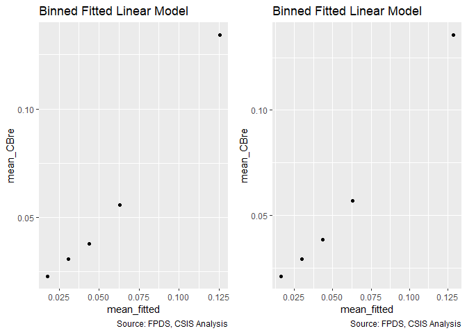<!-- -->

```
## Warning in if (class(model1_new) == "glmerMod") {: the condition has length
## > 1 and only the first element will be used
```

```
## Warning in if (class(model1_new) != "glmerMod" & class(model1_old) !=
## "glmerMod" & : the condition has length > 1 and only the first element will
## be used
```

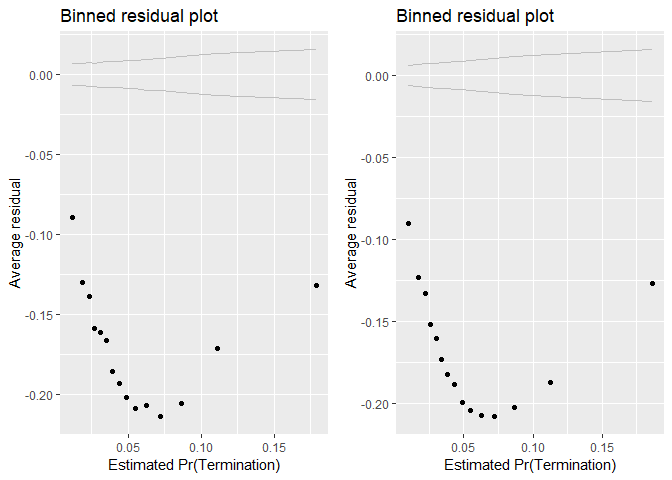<!-- -->

```
## [[1]]
##        model deviance null.deviance difference
## 1 model1_old   101028      108365.4   7337.379
## 2 model1_new   100364      108365.4   8001.405
## 
## [[2]]
##                              GVIF Df GVIF^(1/(2*Df))
## cl_US6_avg_sal_lag1Const 1.687530  1        1.299050
## cl_CFTE                  1.332134  1        1.154181
## c_pPBSC                  1.499162  1        1.224403
## c_pOffPSC                2.702780  1        1.644013
## c_pairHist               1.380565  1        1.174974
## cl_pairCA                2.303935  1        1.517872
## cl_Ceil                  1.520395  1        1.233043
## capped_cl_Days           1.423689  1        1.193184
## Comp1or5                 1.273862  3        1.041167
## Veh                      1.842504  4        1.079384
## PricingUCA               1.223019  6        1.016918
## Crisis                   1.343221  3        1.050408
## cl_def6_HHI_lag1         2.095171  1        1.447471
## cl_def6_ratio_lag1       1.857510  1        1.362905
## cl_def3_HHI_lag1         1.944070  1        1.394299
## cl_def3_ratio_lag1       2.291367  1        1.513726
## c_pMarket                1.262464  1        1.123594
## cl_OffVol                1.261818  1        1.123307
## cl_office_naics_hhi_k    2.354932  1        1.534579
```

```r
summary_residual_compare(b_CBre11A,b_CBre12C)
```

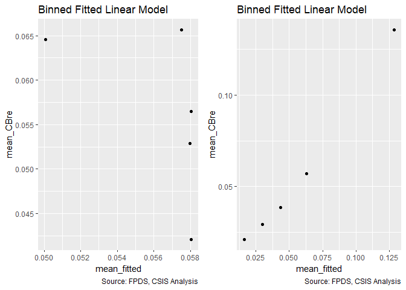<!-- -->

```
## Warning in if (class(model1_new) == "glmerMod") {: the condition has length
## > 1 and only the first element will be used

## Warning in if (class(model1_new) == "glmerMod") {: the condition has length
## > 1 and only the first element will be used
```

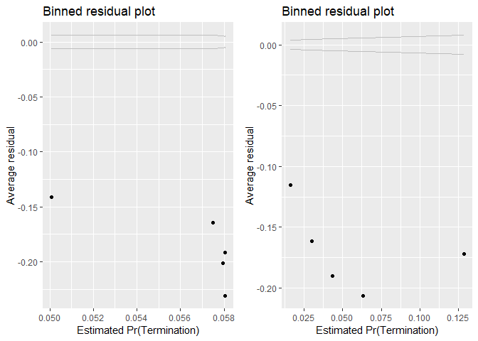<!-- -->

```
## [[1]]
##        model deviance null.deviance difference
## 1 model1_old   108228      108365.4    137.344
## 2 model1_new   100364      108365.4   8001.405
## 
## [[2]]
##                              GVIF Df GVIF^(1/(2*Df))
## cl_US6_avg_sal_lag1Const 1.687530  1        1.299050
## cl_CFTE                  1.332134  1        1.154181
## c_pPBSC                  1.499162  1        1.224403
## c_pOffPSC                2.702780  1        1.644013
## c_pairHist               1.380565  1        1.174974
## cl_pairCA                2.303935  1        1.517872
## cl_Ceil                  1.520395  1        1.233043
## capped_cl_Days           1.423689  1        1.193184
## Comp1or5                 1.273862  3        1.041167
## Veh                      1.842504  4        1.079384
## PricingUCA               1.223019  6        1.016918
## Crisis                   1.343221  3        1.050408
## cl_def6_HHI_lag1         2.095171  1        1.447471
## cl_def6_ratio_lag1       1.857510  1        1.362905
## cl_def3_HHI_lag1         1.944070  1        1.394299
## cl_def3_ratio_lag1       2.291367  1        1.513726
## c_pMarket                1.262464  1        1.123594
## cl_OffVol                1.261818  1        1.123307
## cl_office_naics_hhi_k    2.354932  1        1.534579
```


## Pre-Multilevel Model Summary


```r
 # !is.na(def_serv$cl_US6_avg_sal_lag1)&
 #  !is.na(def_serv$cl_CFTE)&
 #  !is.na(def_serv$c_pPBSC)&
 #  !is.na(def_serv$c_pOffPSC)&
 #  !is.na(def_serv$c_pairHist)&
 #  !is.na(def_serv$cl_pairCA)&


#Binary Ceiling Breaches
  stargazer::stargazer(b_CBre01A,b_CBre01B,b_CBre02A,b_CBre02B,b_CBre03A,b_CBre03B,b_CBre03D,b_CBre12C,
                       type="text",
                       digits=2)
```

```
## 
## ======================================================================================================================
##                                                                  Dependent variable:                                  
##                                ---------------------------------------------------------------------------------------
##                                                                        b_CBre                                         
##                                   (1)        (2)        (3)        (4)        (5)        (6)        (7)        (8)    
## ----------------------------------------------------------------------------------------------------------------------
## cl_US6_avg_sal_lag1Const        0.21***                                                           0.09***    -0.07*** 
##                                  (0.02)                                                            (0.02)     (0.03)  
##                                                                                                                       
## cl_CFTE                                    0.19***                                                0.16***    0.08***  
##                                             (0.02)                                                 (0.02)     (0.02)  
##                                                                                                                       
## c_pPBSC                                               0.15***                                     -0.18***   -0.19*** 
##                                                        (0.02)                                      (0.02)     (0.02)  
##                                                                                                                       
## c_pOffPSC                                                        0.69***                          0.81***    1.08***  
##                                                                   (0.01)                           (0.02)     (0.02)  
##                                                                                                                       
## c_pairHist                                                                  -0.10***              -0.16***     0.01   
##                                                                              (0.02)                (0.02)     (0.02)  
##                                                                                                                       
## cl_pairCA                                                                              0.15***    -0.13***   0.17***  
##                                                                                         (0.02)     (0.02)     (0.03)  
##                                                                                                                       
## cl_Ceil                                                                                                      1.06***  
##                                                                                                               (0.02)  
##                                                                                                                       
## capped_cl_Days                                                                                               0.06***  
##                                                                                                               (0.02)  
##                                                                                                                       
## Comp1or51 offer                                                                                              -0.12*** 
##                                                                                                               (0.03)  
##                                                                                                                       
## Comp1or52-4 offers                                                                                           0.27***  
##                                                                                                               (0.02)  
##                                                                                                                       
## Comp1or55+ offers                                                                                            0.33***  
##                                                                                                               (0.03)  
##                                                                                                                       
## VehS-IDC                                                                                                     -0.24*** 
##                                                                                                               (0.03)  
##                                                                                                                       
## VehM-IDC                                                                                                     -0.19*** 
##                                                                                                               (0.03)  
##                                                                                                                       
## VehFSS/GWAC                                                                                                  -0.56*** 
##                                                                                                               (0.05)  
##                                                                                                                       
## VehBPA/BOA                                                                                                   -0.44*** 
##                                                                                                               (0.06)  
##                                                                                                                       
## PricingUCAOther FP                                                                                           -0.83*** 
##                                                                                                               (0.16)  
##                                                                                                                       
## PricingUCAT&M/LH/FPLOE                                                                                       -0.51*** 
##                                                                                                               (0.07)  
##                                                                                                                       
## PricingUCAIncentive                                                                                            0.02   
##                                                                                                               (0.10)  
##                                                                                                                       
## PricingUCAOther CB                                                                                           -1.17*** 
##                                                                                                               (0.05)  
##                                                                                                                       
## PricingUCAUCA                                                                                                  0.07   
##                                                                                                               (0.08)  
##                                                                                                                       
## PricingUCACombination or Other                                                                               -0.41*** 
##                                                                                                               (0.09)  
##                                                                                                                       
## CrisisARRA                                                                                                   0.70***  
##                                                                                                               (0.07)  
##                                                                                                                       
## CrisisDis                                                                                                     0.45**  
##                                                                                                               (0.18)  
##                                                                                                                       
## CrisisOCO                                                                                                     0.005   
##                                                                                                               (0.05)  
##                                                                                                                       
## cl_def6_HHI_lag1                                                                                             0.19***  
##                                                                                                               (0.02)  
##                                                                                                                       
## cl_def6_ratio_lag1                                                                                           -0.17*** 
##                                                                                                               (0.03)  
##                                                                                                                       
## cl_def3_HHI_lag1                                                                                             -0.41*** 
##                                                                                                               (0.03)  
##                                                                                                                       
## cl_def3_ratio_lag1                                                                                           -0.07*** 
##                                                                                                               (0.03)  
##                                                                                                                       
## c_pMarket                                                                                                    -0.56*** 
##                                                                                                               (0.03)  
##                                                                                                                       
## cl_OffVol                                                                                                    -0.28*** 
##                                                                                                               (0.02)  
##                                                                                                                       
## cl_office_naics_hhi_k                                                                                        -0.16*** 
##                                                                                                               (0.03)  
##                                                                                                                       
## Constant                        -2.82***   -2.82***   -2.82***   -2.87***   -2.82***   -2.82***   -2.88***   -2.96*** 
##                                  (0.01)     (0.01)     (0.01)     (0.01)     (0.01)     (0.01)     (0.01)     (0.02)  
##                                                                                                                       
## ----------------------------------------------------------------------------------------------------------------------
## Observations                    250,000    250,000    250,000    250,000    250,000    250,000    250,000    250,000  
## Log Likelihood                 -54,112.11 -54,122.07 -54,142.39 -53,074.74 -54,165.57 -54,145.89 -52,872.69 -50,181.98
## Akaike Inf. Crit.              108,228.20 108,248.10 108,288.80 106,153.50 108,335.10 108,295.80 105,759.40 100,427.90
## ======================================================================================================================
## Note:                                                                                      *p<0.1; **p<0.05; ***p<0.01
```

```r
texreg::htmlreg(list(b_CBre01A,b_CBre01B,b_CBre02A,b_CBre02B,b_CBre03A,b_CBre03B,b_CBre03D,b_CBre12C),file="..//Output//b_CBremodel_lvl1.html",
                single.row = TRUE,
                # custom.model.name=c("Ceiling Breaches"),
                stars=c(0.1,0.05,0.01,0.001),
                groups = list(
                              "Services Complexity" = 2:3,
                              "Office Capacity" =4:5,
                              "Past Relationship"=6:7
                              ),
                custom.coef.map=study_coef_list,
                bold=0.05,
                custom.note="%stars. Numerical inputs are rescaled.",
                caption="Table 6: Logit Bivariate Look at Study Variables and Ceiling Breaches",
                caption.above=TRUE)
```

```
## The table was written to the file '..//Output//b_CBremodel_lvl1.html'.
```

```r
#Absolute Size Ceiling Breaches
stargazer::stargazer(n_CBre01A,n_CBre01B,n_CBre02A,n_CBre02B,n_CBre03A,n_CBre03B,n_CBre03D,n_CBre12C,
                       type="text",
                       digits=2)
```

```
## 
## ======================================================================================================================
##                                                                  Dependent variable:                                  
##                                ---------------------------------------------------------------------------------------
##                                                                        ln_CBre                                        
##                                   (1)        (2)        (3)        (4)        (5)        (6)        (7)        (8)    
## ----------------------------------------------------------------------------------------------------------------------
## cl_US6_avg_sal_lag1Const        0.78***                                                           1.20***     0.11**  
##                                  (0.06)                                                            (0.05)     (0.05)  
##                                                                                                                       
## cl_CFTE                                    1.20***                                                0.48***    0.24***  
##                                             (0.05)                                                 (0.05)     (0.04)  
##                                                                                                                       
## c_pPBSC                                               -1.90***                                    -0.85***   -0.30*** 
##                                                        (0.04)                                      (0.05)     (0.04)  
##                                                                                                                       
## c_pOffPSC                                                        -1.62***                         -0.98***   -0.51*** 
##                                                                   (0.03)                           (0.04)     (0.04)  
##                                                                                                                       
## c_pairHist                                                                  -0.59***               0.09**     -0.02   
##                                                                              (0.05)                (0.05)     (0.04)  
##                                                                                                                       
## cl_pairCA                                                                              -1.97***   -0.62***    -0.10*  
##                                                                                         (0.05)     (0.06)     (0.05)  
##                                                                                                                       
## cl_Ceil                                                                                                      2.87***  
##                                                                                                               (0.04)  
##                                                                                                                       
## capped_cl_Days                                                                                                 0.06   
##                                                                                                               (0.04)  
##                                                                                                                       
## Comp1or51 offer                                                                                               -0.01   
##                                                                                                               (0.06)  
##                                                                                                                       
## Comp1or52-4 offers                                                                                           -0.19*** 
##                                                                                                               (0.04)  
##                                                                                                                       
## Comp1or55+ offers                                                                                            -0.13*** 
##                                                                                                               (0.04)  
##                                                                                                                       
## VehS-IDC                                                                                                     0.14***  
##                                                                                                               (0.04)  
##                                                                                                                       
## VehM-IDC                                                                                                      0.13**  
##                                                                                                               (0.05)  
##                                                                                                                       
## VehFSS/GWAC                                                                                                   0.22**  
##                                                                                                               (0.09)  
##                                                                                                                       
## VehBPA/BOA                                                                                                     0.08   
##                                                                                                               (0.10)  
##                                                                                                                       
## PricingUCAOther FP                                                                                            -0.53*  
##                                                                                                               (0.27)  
##                                                                                                                       
## PricingUCAT&M/LH/FPLOE                                                                                       1.04***  
##                                                                                                               (0.12)  
##                                                                                                                       
## PricingUCAIncentive                                                                                          0.52***  
##                                                                                                               (0.17)  
##                                                                                                                       
## PricingUCAOther CB                                                                                           1.16***  
##                                                                                                               (0.09)  
##                                                                                                                       
## PricingUCAUCA                                                                                                0.54***  
##                                                                                                               (0.13)  
##                                                                                                                       
## PricingUCACombination or Other                                                                               0.57***  
##                                                                                                               (0.14)  
##                                                                                                                       
## CrisisARRA                                                                                                    -0.01   
##                                                                                                               (0.12)  
##                                                                                                                       
## CrisisDis                                                                                                      0.36   
##                                                                                                               (0.27)  
##                                                                                                                       
## CrisisOCO                                                                                                    0.48***  
##                                                                                                               (0.08)  
##                                                                                                                       
## cl_def6_HHI_lag1                                                                                             -0.0000  
##                                                                                                               (0.04)  
##                                                                                                                       
## cl_def6_ratio_lag1                                                                                           0.17***  
##                                                                                                               (0.05)  
##                                                                                                                       
## cl_def3_HHI_lag1                                                                                              -0.03   
##                                                                                                               (0.05)  
##                                                                                                                       
## cl_def3_ratio_lag1                                                                                           0.40***  
##                                                                                                               (0.05)  
##                                                                                                                       
## c_pMarket                                                                                                    0.18***  
##                                                                                                               (0.05)  
##                                                                                                                       
## cl_OffVol                                                                                                    0.34***  
##                                                                                                               (0.03)  
##                                                                                                                       
## cl_office_naics_hhi_k                                                                                         -0.09*  
##                                                                                                               (0.05)  
##                                                                                                                       
## Constant                        9.21***    9.20***    9.33***    9.60***    9.23***    9.33***    9.44***    8.71***  
##                                  (0.02)     (0.02)     (0.02)     (0.02)     (0.02)     (0.02)     (0.02)     (0.04)  
##                                                                                                                       
## ----------------------------------------------------------------------------------------------------------------------
## Observations                     15,018     15,018     15,018     15,018     15,018     15,018     15,018     15,018  
## Log Likelihood                 -36,467.62 -36,251.56 -35,243.81 -35,027.39 -36,488.01 -35,701.81 -34,366.59 -30,079.98
## Akaike Inf. Crit.              72,939.24  72,507.12  70,491.63  70,058.78  72,980.03  71,407.63  68,747.18  60,223.97 
## ======================================================================================================================
## Note:                                                                                      *p<0.1; **p<0.05; ***p<0.01
```

```r
texreg::htmlreg(list(n_CBre01A,n_CBre01B,n_CBre02A,n_CBre02B,n_CBre03A,n_CBre03B,n_CBre03D,n_CBre12C),file="..//Output//n_CBremodel_lvl1.html",
                single.row = TRUE,
                # custom.model.name=c("Ceiling Breaches"),
                stars=c(0.1,0.05,0.01,0.001),
                groups = list(
                              "Services Complexity" = 2:3,
                              "Office Capacity" =4:5,
                              "Past Relationship"=6:7
                              ),
                custom.coef.map=study_coef_list,
                bold=0.05,
                custom.note="%stars. Numerical inputs are rescaled.",
                caption="Table 8: Regression Bivariate Look at Study Variables and Log(Options Growth)",
                caption.above=TRUE)
```

```
## The table was written to the file '..//Output//n_CBremodel_lvl1.html'.
```
