---
title: "Contract Exercised Options "
author: "Greg Sanders"
date: "Friday, July 14, 2019"
output:
  html_document:
    keep_md: yes
--- 

Modeling Likelihood of Contract Termination, Ceiling Breach, or Exercised Option
============================================================================

#Setup

```
## Warning: replacing previous import 'Hmisc::summarize' by 'dplyr::summarize'
## when loading 'csis360'
```

```
## Warning: replacing previous import 'Hmisc::src' by 'dplyr::src' when
## loading 'csis360'
```

```
## Warning: replacing previous import 'dplyr::intersect' by
## 'lubridate::intersect' when loading 'csis360'
```

```
## Warning: replacing previous import 'dplyr::union' by 'lubridate::union'
## when loading 'csis360'
```

```
## Warning: replacing previous import 'dplyr::setdiff' by 'lubridate::setdiff'
## when loading 'csis360'
```

```
## Loading required package: MASS
```

```
## Loading required package: Matrix
```

```
## Loading required package: lme4
```

```
## 
## arm (Version 1.10-1, built: 2018-4-12)
```

```
## Working directory is C:/Users/gsand/Repositories/Services/analysis
```

```
## Loading required package: coda
```

```
## 
## Attaching package: 'coda'
```

```
## The following object is masked from 'package:arm':
## 
##     traceplot
```

```
## Loading required package: boot
```

```
## 
## Attaching package: 'boot'
```

```
## The following object is masked from 'package:arm':
## 
##     logit
```

```
## 
## Attaching package: 'dplyr'
```

```
## The following object is masked from 'package:MASS':
## 
##     select
```

```
## The following objects are masked from 'package:stats':
## 
##     filter, lag
```

```
## The following objects are masked from 'package:base':
## 
##     intersect, setdiff, setequal, union
```

```
## Loading required package: lattice
```

```
## 
## Attaching package: 'lattice'
```

```
## The following object is masked from 'package:boot':
## 
##     melanoma
```

```
## Loading required package: survival
```

```
## 
## Attaching package: 'survival'
```

```
## The following object is masked from 'package:boot':
## 
##     aml
```

```
## Loading required package: Formula
```

```
## 
## Attaching package: 'Hmisc'
```

```
## The following objects are masked from 'package:dplyr':
## 
##     src, summarize
```

```
## The following objects are masked from 'package:base':
## 
##     format.pval, units
```

```
## 
## Please cite as:
```

```
##  Hlavac, Marek (2018). stargazer: Well-Formatted Regression and Summary Statistics Tables.
```

```
##  R package version 5.2.2. https://CRAN.R-project.org/package=stargazer
```

```
## dummies-1.5.6 provided by Decision Patterns
```

```
## 
## Attaching package: 'dummies'
```

```
## The following object is masked from 'package:lme4':
## 
##     dummy
```

```
## 
## Attaching package: 'sjstats'
```

```
## The following object is masked from 'package:Hmisc':
## 
##     deff
```

```
## Loading required package: carData
```

```
## 
## Attaching package: 'car'
```

```
## The following object is masked from 'package:dplyr':
## 
##     recode
```

```
## The following object is masked from 'package:boot':
## 
##     logit
```

```
## The following object is masked from 'package:arm':
## 
##     logit
```

```
## 
## Attaching package: 'scales'
```

```
## The following object is masked from 'package:arm':
## 
##     rescale
```


##Load Data
First we load the data. The dataset used is a U.S. Defense Contracting dataset derived from FPDS.


```r
load(file="..//data//clean//def_sample.Rdata")
```


The sample is created by including the entirity of the ARRA and Disaster datasets, as well as 100,000 records each from the OCO datase and another 100,000 from all remaining records.

#Study Variables

##Services Complexity
Expectation: Higher service complexity would make work more demanding and thus raises the risks of negative contracting outcomes, namely the likelihood of cost ceiling breaches and terminations increases and the likelihood exercised options decraeses.

### 01A NAICS Salary
Expectation: Given the fact that one source for higher salaries is the difficulty of the work and the experience and education required, as average NAICS salary increases (decreases), the likelihood of cost ceiling breaches and terminations increases (decreases) and exercised options decreases (increases).


```r
 # !is.na(def_serv$cl_US6_avg_sal_lag1)&
 #  !is.na(def_serv$cl_CFTE)&
 #  !is.na(def_serv$c_pPBSC)&
 #  !is.na(def_serv$c_pOffPSC)&
 #  !is.na(def_serv$c_pairHist)&
 #  !is.na(def_serv$cl_pairCA)&

summary_continuous_plot(serv_opt,"cl_US6_avg_sal_lag1Const")
```

```
## Warning: summarise_() is deprecated. 
## Please use summarise() instead
## 
## The 'programming' vignette or the tidyeval book can help you
## to program with summarise() : https://tidyeval.tidyverse.org
## This warning is displayed once per session.
```

<!-- -->

```r
#Scatter Plot of p_Opt_01A
ggplot(serv_opt, aes(x=cl_US6_avg_sal_lag1Const, y=lp_OptGrowth)) + geom_point(alpha = 0.1) + ggtitle('Exercised Options') + theme(plot.title = element_text(hjust = 0.5))
```

<!-- -->

```r
#Model
n_Opt_01A <- glm (data=serv_opt,
                 ln_OptGrowth ~ cl_US6_avg_sal_lag1Const)
display(n_Opt_01A)
```

```
## glm(formula = ln_OptGrowth ~ cl_US6_avg_sal_lag1Const, data = serv_opt)
##                          coef.est coef.se
## (Intercept)              7.23     0.02   
## cl_US6_avg_sal_lag1Const 0.19     0.04   
## ---
##   n = 74162, k = 2
##   residual deviance = 2585000.9, null deviance = 2585789.3 (difference = 788.4)
##   overdispersion parameter = 34.9
##   residual sd is sqrt(overdispersion) = 5.90
```

```r
p_Opt_01A <- glm(data=serv_opt,
                        lp_OptGrowth ~ cl_US6_avg_sal_lag1Const)


#Plot residuals versus fitted
stargazer::stargazer(n_Opt_01A,p_Opt_01A,type="text",
                       digits=2)
```

```
## 
## =====================================================
##                              Dependent variable:     
##                          ----------------------------
##                           ln_OptGrowth  lp_OptGrowth 
##                               (1)            (2)     
## -----------------------------------------------------
## cl_US6_avg_sal_lag1Const    0.19***       -0.07***   
##                              (0.04)        (0.005)   
##                                                      
## Constant                    7.23***        0.65***   
##                              (0.02)        (0.003)   
##                                                      
## -----------------------------------------------------
## Observations                 74,162        74,162    
## Log Likelihood            -236,915.50    -77,199.78  
## Akaike Inf. Crit.          473,834.90    154,403.60  
## =====================================================
## Note:                     *p<0.1; **p<0.05; ***p<0.01
```

Individually, except for terminations (which is not significant), expectations are matched for ceiing breaches and exercised options, as higher average salaries estimate a higher risk of ceiling breaches and lower possibility of exercised options. 


### 01B Invoice Rate
Expectation: The invoice rate approximates how much the government is charged annually for each comparable full-time employees who are supporting the service contracts. A higher invoice rate indicates a more complex service. As invoice rate increases (decreases), the likelihood of cost ceiling breaches and terminations increases (decreases), and exercised options decrease (increase).


```r
 # !is.na(def_serv$cl_US6_avg_sal_lag1)&
 #  !is.na(def_serv$cl_CFTE)&
 #  !is.na(def_serv$c_pPBSC)&
 #  !is.na(def_serv$c_pOffPSC)&
 #  !is.na(def_serv$c_pairHist)&
 #  !is.na(def_serv$cl_pairCA)&

summary_continuous_plot(serv_opt,"cl_CFTE")
```

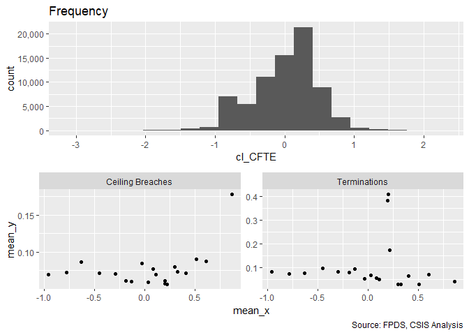<!-- -->

```r
#Scatter Plot 
ggplot(serv_opt, aes(x=cl_CFTE, y=lp_OptGrowth)) + geom_point(alpha = 0.1) + ggtitle('Exercised Options') + theme(plot.title = element_text(hjust = 0.5))
```

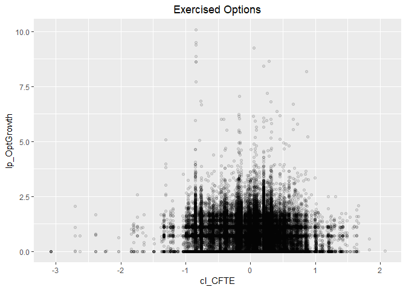<!-- -->

```r
#Model
n_Opt_01B <- glm (data=serv_opt,
                 ln_OptGrowth ~ cl_CFTE)
display(n_Opt_01B)
```

```
## glm(formula = ln_OptGrowth ~ cl_CFTE, data = serv_opt)
##             coef.est coef.se
## (Intercept)  7.25     0.02  
## cl_CFTE     -0.52     0.05  
## ---
##   n = 74162, k = 2
##   residual deviance = 2581554.0, null deviance = 2585789.3 (difference = 4235.2)
##   overdispersion parameter = 34.8
##   residual sd is sqrt(overdispersion) = 5.90
```

```r
p_Opt_01B <- glm(data=serv_opt,
                        lp_OptGrowth ~ cl_CFTE)


#Plot residuals versus fitted
  stargazer::stargazer(n_Opt_01A,n_Opt_01B,
                       
                       p_Opt_01A,p_Opt_01B,
                       type="text",
                       digits=2)
```

```
## 
## ======================================================================
##                                       Dependent variable:             
##                          ---------------------------------------------
##                               ln_OptGrowth           lp_OptGrowth     
##                              (1)         (2)        (3)        (4)    
## ----------------------------------------------------------------------
## cl_US6_avg_sal_lag1Const   0.19***                -0.07***            
##                            (0.04)                 (0.005)             
##                                                                       
## cl_CFTE                               -0.52***               -0.14*** 
##                                        (0.05)                 (0.01)  
##                                                                       
## Constant                   7.23***     7.25***    0.65***    0.65***  
##                            (0.02)      (0.02)     (0.003)    (0.003)  
##                                                                       
## ----------------------------------------------------------------------
## Observations               74,162      74,162      74,162     74,162  
## Log Likelihood           -236,915.50 -236,866.00 -77,199.78 -77,007.63
## Akaike Inf. Crit.        473,834.90  473,736.00  154,403.60 154,019.30
## ======================================================================
## Note:                                      *p<0.1; **p<0.05; ***p<0.01
```

```r
summary_residual_compare(n_Opt_01A,n_Opt_01B, skip_vif = TRUE)
```

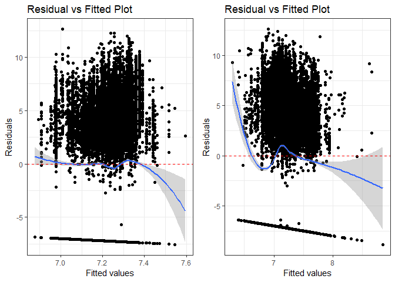<!-- -->

```
## Warning in if (class(model1_new) == "glmerMod") {: the condition has length
## > 1 and only the first element will be used
```

```
## Warning in if (class(model1_new) != "glmerMod" & class(model1_old) !=
## "glmerMod" & : the condition has length > 1 and only the first element will
## be used
```

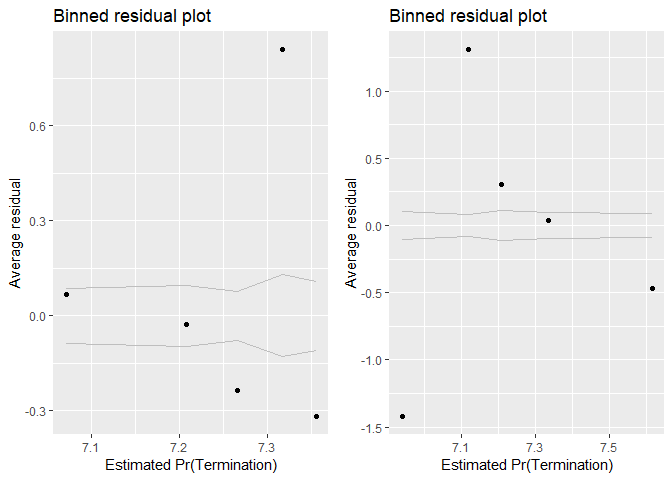<!-- -->

```
## NULL
```

When considered alone, expectations are matched for ceiling breaches and exercised options, as higher invoice rate estimates a higher risk of ceiling breaches and lower possibility of exercised options. No significant relationship between invoice rate and terminations.


### 01C Service Complexity
Expectation: Collectively, the higher average salary and invoice rate (more complexity is indicated), the higher risk of ceiling breaches and terminations and the less exercised options there would be. Also we expect the result of combined model would be the same as individual models.

 

```r
 #  !is.na(def_serv$c_pPBSC)&
 #  !is.na(def_serv$c_pOffPSC)&
 #  !is.na(def_serv$c_pairHist)&
 #  !is.na(def_serv$cl_pairCA)&


#Model
n_Opt_01C <- glm (data=serv_opt,
                 ln_OptGrowth ~ cl_US6_avg_sal_lag1Const + cl_CFTE)
glmer_examine(n_Opt_01C)
```

```
## cl_US6_avg_sal_lag1Const                  cl_CFTE 
##                 1.432874                 1.432874
```

```r
p_Opt_01C <- glm(data=serv_opt,
                        lp_OptGrowth ~ cl_US6_avg_sal_lag1Const +  cl_CFTE)

glmer_examine(p_Opt_01C)
```

```
## cl_US6_avg_sal_lag1Const                  cl_CFTE 
##                 1.432874                 1.432874
```

```r
#Plot residuals versus fitted
stargazer::stargazer(n_Opt_01A,n_Opt_01B,n_Opt_01C,
                       
                       p_Opt_01A,p_Opt_01B,p_Opt_01C,
                       type="text",
                       digits=2)
```

```
## 
## =============================================================================================
##                                                  Dependent variable:                         
##                          --------------------------------------------------------------------
##                                     ln_OptGrowth                       lp_OptGrowth          
##                              (1)         (2)         (3)        (4)        (5)        (6)    
## ---------------------------------------------------------------------------------------------
## cl_US6_avg_sal_lag1Const   0.19***                 0.61***    -0.07***              -0.01*** 
##                            (0.04)                  (0.05)     (0.005)                (0.01)  
##                                                                                              
## cl_CFTE                               -0.52***    -0.92***               -0.14***   -0.13*** 
##                                        (0.05)      (0.06)                 (0.01)     (0.01)  
##                                                                                              
## Constant                   7.23***     7.25***     7.22***    0.65***    0.65***    0.65***  
##                            (0.02)      (0.02)      (0.02)     (0.003)    (0.003)    (0.003)  
##                                                                                              
## ---------------------------------------------------------------------------------------------
## Observations               74,162      74,162      74,162      74,162     74,162     74,162  
## Log Likelihood           -236,915.50 -236,866.00 -236,782.00 -77,199.78 -77,007.63 -77,004.24
## Akaike Inf. Crit.        473,834.90  473,736.00  473,570.00  154,403.60 154,019.30 154,014.50
## =============================================================================================
## Note:                                                             *p<0.1; **p<0.05; ***p<0.01
```

```r
  summary_residual_compare(n_Opt_01A,n_Opt_01C)
```

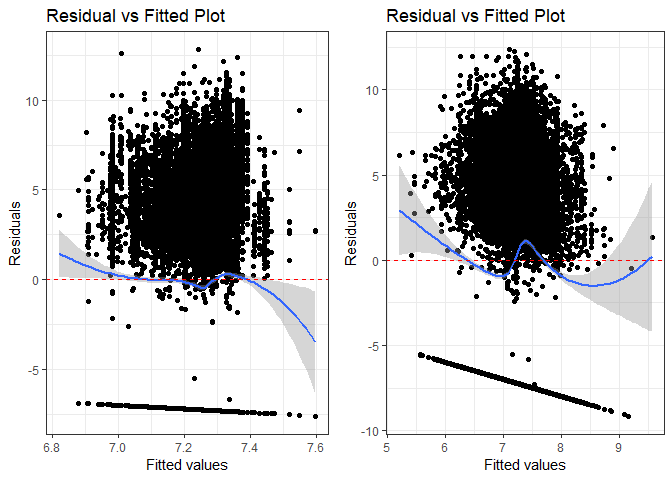<!-- -->

```
## Warning in if (class(model1_new) == "glmerMod") {: the condition has length
## > 1 and only the first element will be used
```

```
## Warning in if (class(model1_new) != "glmerMod" & class(model1_old) !=
## "glmerMod" & : the condition has length > 1 and only the first element will
## be used
```

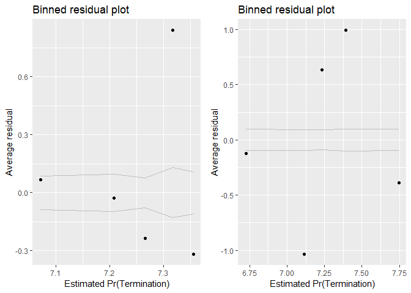<!-- -->

```
## [[1]]
##        model deviance null.deviance difference
## 1 model1_old  2585001       2585789    788.404
## 2 model1_new  2575713       2585789  10076.505
## 
## [[2]]
## cl_US6_avg_sal_lag1Const                  cl_CFTE 
##                 1.432874                 1.432874
```

```r
  summary_residual_compare(n_Opt_01B,n_Opt_01C)
```

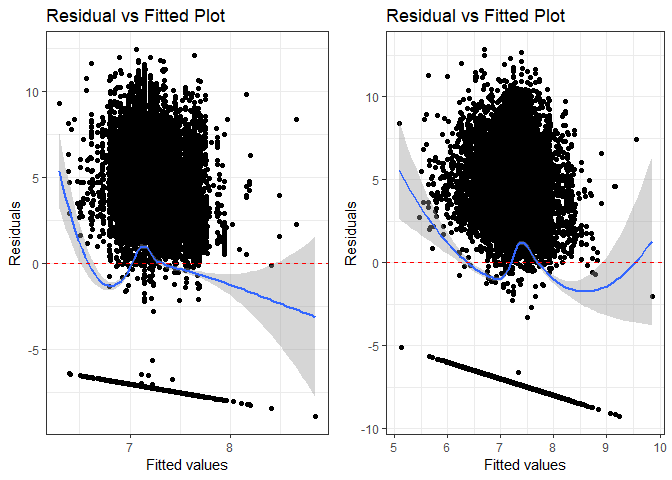<!-- -->

```
## Warning in if (class(model1_new) == "glmerMod") {: the condition has length
## > 1 and only the first element will be used

## Warning in if (class(model1_new) == "glmerMod") {: the condition has length
## > 1 and only the first element will be used
```

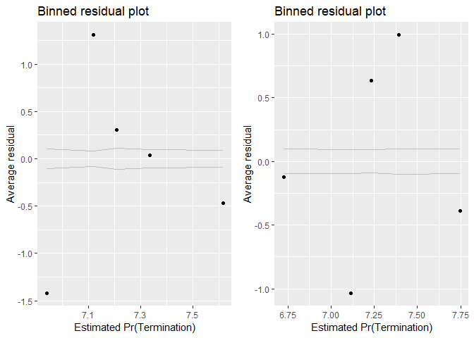<!-- -->

```
## [[1]]
##        model deviance null.deviance difference
## 1 model1_old  2581554       2585789   4235.246
## 2 model1_new  2575713       2585789  10076.505
## 
## [[2]]
## cl_US6_avg_sal_lag1Const                  cl_CFTE 
##                 1.432874                 1.432874
```

Both average salary and invoiced rate have a not inconsiderable VIF but one well within bounds, suggesting that the variance of the estimated coefficients is not evidently inflated and none of them are highly correlated with each other. 

Both individually and pair-wise, higher average salary and invoiced rate estimate higher possibility of cost ceiling breaches and lower likelihood of exercised options as expected. But the termination expectation is not supported or not significant for two measures of service complexity resepctively.


## Office Capacity

### 02A: Performance Based Services
Expectation: Performance-based services contracting ties a portion of a contractor's payment, contract extensions, or contract renewals to the achievement of specific, measurable performance standards and requirements, which encourages better contracting results. PBSC has the potential to reduce terminations and ceiling breaches and bring more possibility of exercised options.


```r
summary_continuous_plot(serv_opt,"pPBSC")
```

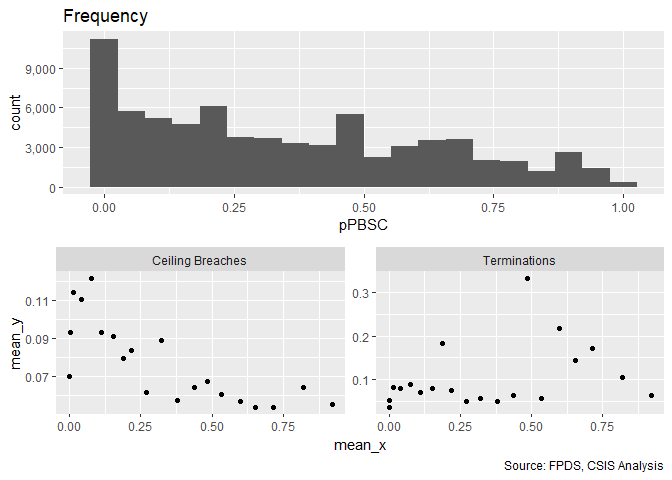<!-- -->

```r
#Scatter Plot 
ggplot(serv_opt, aes(x=c_pPBSC, y=lp_OptGrowth)) + geom_point(alpha = 0.1) + ggtitle('Exercised Options') + theme(plot.title = element_text(hjust = 0.5))
```

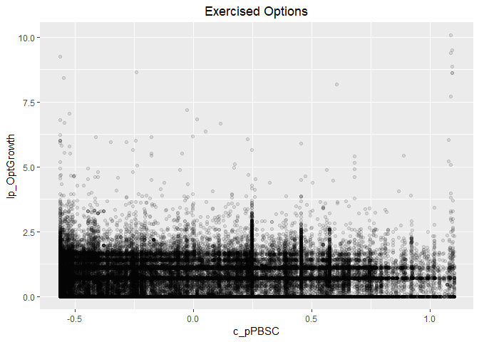<!-- -->

```r
#Model
n_Opt_02A <- glm (data=serv_opt,
                 ln_OptGrowth ~ c_pPBSC)
display(n_Opt_02A)
```

```
## glm(formula = ln_OptGrowth ~ c_pPBSC, data = serv_opt)
##             coef.est coef.se
## (Intercept)  7.25     0.02  
## c_pPBSC     -0.57     0.05  
## ---
##   n = 74162, k = 2
##   residual deviance = 2580627.9, null deviance = 2585789.3 (difference = 5161.4)
##   overdispersion parameter = 34.8
##   residual sd is sqrt(overdispersion) = 5.90
```

```r
p_Opt_02A <- glm(data=serv_opt,
                        lp_OptGrowth ~ c_pPBSC)

display(p_Opt_02A)
```

```
## glm(formula = lp_OptGrowth ~ c_pPBSC, data = serv_opt)
##             coef.est coef.se
## (Intercept)  0.65     0.00  
## c_pPBSC     -0.05     0.01  
## ---
##   n = 74162, k = 2
##   residual deviance = 34911.7, null deviance = 34944.5 (difference = 32.8)
##   overdispersion parameter = 0.5
##   residual sd is sqrt(overdispersion) = 0.69
```

```r
#Plot residuals versus fitted
stargazer::stargazer(n_Opt_01C,n_Opt_02A,
                       
                       p_Opt_01C,p_Opt_02A,
                       type="text",
                       digits=2)
```

```
## 
## ======================================================================
##                                       Dependent variable:             
##                          ---------------------------------------------
##                               ln_OptGrowth           lp_OptGrowth     
##                              (1)         (2)        (3)        (4)    
## ----------------------------------------------------------------------
## cl_US6_avg_sal_lag1Const   0.61***                -0.01***            
##                            (0.05)                  (0.01)             
##                                                                       
## cl_CFTE                   -0.92***                -0.13***            
##                            (0.06)                  (0.01)             
##                                                                       
## c_pPBSC                               -0.57***               -0.05*** 
##                                        (0.05)                 (0.01)  
##                                                                       
## Constant                   7.22***     7.25***    0.65***    0.65***  
##                            (0.02)      (0.02)     (0.003)    (0.003)  
##                                                                       
## ----------------------------------------------------------------------
## Observations               74,162      74,162      74,162     74,162  
## Log Likelihood           -236,782.00 -236,852.70 -77,004.24 -77,294.40
## Akaike Inf. Crit.        473,570.00  473,709.30  154,014.50 154,592.80
## ======================================================================
## Note:                                      *p<0.1; **p<0.05; ***p<0.01
```

When considering PBSC alone, none of the expected sign was found in ceiling breaches, terminations or exercised options.


### 02B: No.Office PSC History
Expectation: The increasing share of contracting office obligations for a given service indicates high capcaity in that area, lower likelihood of cost ceiling breaches and termination and higher likelihood of exercised options are expected to be observed.


```r
 # !is.na(def_serv$cl_US6_avg_sal_lag1)&
 #  !is.na(def_serv$cl_CFTE)&
 #  !is.na(def_serv$c_pPBSC)&
 #  !is.na(def_serv$c_pOffPSC)&
 #  !is.na(def_serv$c_pairHist)&
 #  !is.na(def_serv$cl_pairCA)&

summary_continuous_plot(serv_opt,"c_pOffPSC")
```

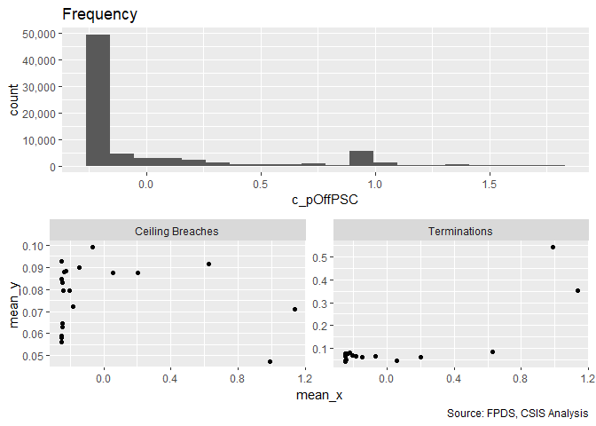<!-- -->

```r
#Scatter Plot 
ggplot(serv_opt, aes(x=c_pOffPSC, y=lp_OptGrowth)) + geom_point(alpha = 0.1) + ggtitle('Exercised Options') + theme(plot.title = element_text(hjust = 0.5))
```

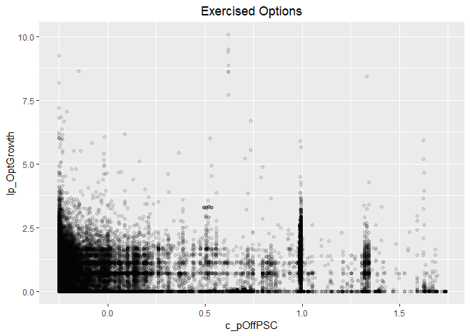<!-- -->

```r
#Model
n_Opt_02B <- glm (data=serv_opt,
                 ln_OptGrowth ~ c_pOffPSC)
display(n_Opt_02B)
```

```
## glm(formula = ln_OptGrowth ~ c_pOffPSC, data = serv_opt)
##             coef.est coef.se
## (Intercept)  7.23     0.02  
## c_pOffPSC   -0.36     0.05  
## ---
##   n = 74162, k = 2
##   residual deviance = 2584052.8, null deviance = 2585789.3 (difference = 1736.5)
##   overdispersion parameter = 34.8
##   residual sd is sqrt(overdispersion) = 5.90
```

```r
p_Opt_02B <- glm(data=serv_opt,
                        lp_OptGrowth ~ c_pOffPSC)

display(p_Opt_02B)
```

```
## glm(formula = lp_OptGrowth ~ c_pOffPSC, data = serv_opt)
##             coef.est coef.se
## (Intercept) 0.65     0.00   
## c_pOffPSC   0.12     0.01   
## ---
##   n = 74162, k = 2
##   residual deviance = 34757.8, null deviance = 34944.5 (difference = 186.7)
##   overdispersion parameter = 0.5
##   residual sd is sqrt(overdispersion) = 0.68
```

```r
#Plot residuals versus fitted
stargazer::stargazer(n_Opt_01C,n_Opt_02A,n_Opt_02B,
                       
                       p_Opt_01C,p_Opt_02A,p_Opt_02B,
                       type="text",
                       digits=2)
```

```
## 
## =============================================================================================
##                                                  Dependent variable:                         
##                          --------------------------------------------------------------------
##                                     ln_OptGrowth                       lp_OptGrowth          
##                              (1)         (2)         (3)        (4)        (5)        (6)    
## ---------------------------------------------------------------------------------------------
## cl_US6_avg_sal_lag1Const   0.61***                            -0.01***                       
##                            (0.05)                              (0.01)                        
##                                                                                              
## cl_CFTE                   -0.92***                            -0.13***                       
##                            (0.06)                              (0.01)                        
##                                                                                              
## c_pPBSC                               -0.57***                           -0.05***            
##                                        (0.05)                             (0.01)             
##                                                                                              
## c_pOffPSC                                         -0.36***                          0.12***  
##                                                    (0.05)                            (0.01)  
##                                                                                              
## Constant                   7.22***     7.25***     7.23***    0.65***    0.65***    0.65***  
##                            (0.02)      (0.02)      (0.02)     (0.003)    (0.003)    (0.003)  
##                                                                                              
## ---------------------------------------------------------------------------------------------
## Observations               74,162      74,162      74,162      74,162     74,162     74,162  
## Log Likelihood           -236,782.00 -236,852.70 -236,901.90 -77,004.24 -77,294.40 -77,130.56
## Akaike Inf. Crit.        473,570.00  473,709.30  473,807.70  154,014.50 154,592.80 154,265.10
## =============================================================================================
## Note:                                                             *p<0.1; **p<0.05; ***p<0.01
```

```r
summary_residual_compare(n_Opt_02A,n_Opt_02B, skip_vif = TRUE)
```

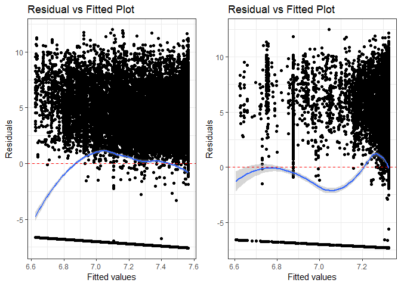<!-- -->

```
## Warning in if (class(model1_new) == "glmerMod") {: the condition has length
## > 1 and only the first element will be used
```

```
## Warning in if (class(model1_new) != "glmerMod" & class(model1_old) !=
## "glmerMod" & : the condition has length > 1 and only the first element will
## be used
```

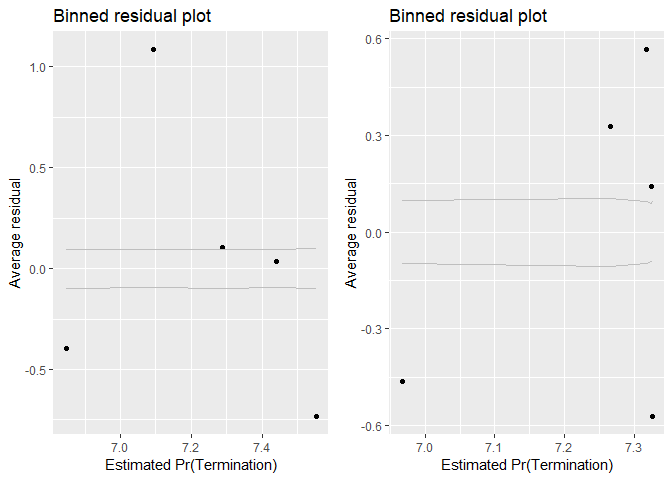<!-- -->

```
## NULL
```

When considering number of contracting office obligations for a given service alone, expectation was only fulfilled for options growth.


### 02C: Office Capacity
Expectation: Collaberactively, the larger share of PBSC and contracting office obligations for a given service, the less risk of ceiling breaches and terminations and the more exercised options there would be. Also we expect the results of combined model would be the same as two individual models above. 


```r
#Model
n_Opt_02C <- glm (data=serv_opt,
                 ln_OptGrowth ~ c_pPBSC+c_pOffPSC)
glmer_examine(n_Opt_02C)
```

```
##   c_pPBSC c_pOffPSC 
##  1.072831  1.072831
```

```r
p_Opt_02C <- glm(data=serv_opt,
                        lp_OptGrowth ~ c_pPBSC+c_pOffPSC)

glmer_examine(p_Opt_02C)
```

```
##   c_pPBSC c_pOffPSC 
##  1.072831  1.072831
```

```r
#Plot residuals versus fitted
stargazer::stargazer(n_Opt_01C,n_Opt_02A,n_Opt_02B,n_Opt_02C,
                       
                       p_Opt_01C,p_Opt_02A,p_Opt_02B,p_Opt_02C,
                       type="text",
                       digits=2)
```

```
## 
## ====================================================================================================================
##                                                              Dependent variable:                                    
##                          -------------------------------------------------------------------------------------------
##                                           ln_OptGrowth                                  lp_OptGrowth                
##                              (1)         (2)         (3)         (4)        (5)        (6)        (7)        (8)    
## --------------------------------------------------------------------------------------------------------------------
## cl_US6_avg_sal_lag1Const   0.61***                                        -0.01***                                  
##                            (0.05)                                          (0.01)                                   
##                                                                                                                     
## cl_CFTE                   -0.92***                                        -0.13***                                  
##                            (0.06)                                          (0.01)                                   
##                                                                                                                     
## c_pPBSC                               -0.57***                -0.51***               -0.05***              -0.08*** 
##                                        (0.05)                  (0.05)                 (0.01)                (0.01)  
##                                                                                                                     
## c_pOffPSC                                         -0.36***    -0.21***                          0.12***    0.14***  
##                                                    (0.05)      (0.05)                            (0.01)     (0.01)  
##                                                                                                                     
## Constant                   7.22***     7.25***     7.23***     7.24***    0.65***    0.65***    0.65***    0.65***  
##                            (0.02)      (0.02)      (0.02)      (0.02)     (0.003)    (0.003)    (0.003)    (0.003)  
##                                                                                                                     
## --------------------------------------------------------------------------------------------------------------------
## Observations               74,162      74,162      74,162      74,162      74,162     74,162     74,162     74,162  
## Log Likelihood           -236,782.00 -236,852.70 -236,901.90 -236,844.50 -77,004.24 -77,294.40 -77,130.56 -77,031.69
## Akaike Inf. Crit.        473,570.00  473,709.30  473,807.70  473,695.10  154,014.50 154,592.80 154,265.10 154,069.40
## ====================================================================================================================
## Note:                                                                                    *p<0.1; **p<0.05; ***p<0.01
```

```r
summary_residual_compare(n_Opt_02A,n_Opt_02C)
```

<!-- -->

```
## Warning in if (class(model1_new) == "glmerMod") {: the condition has length
## > 1 and only the first element will be used
```

```
## Warning in if (class(model1_new) != "glmerMod" & class(model1_old) !=
## "glmerMod" & : the condition has length > 1 and only the first element will
## be used
```

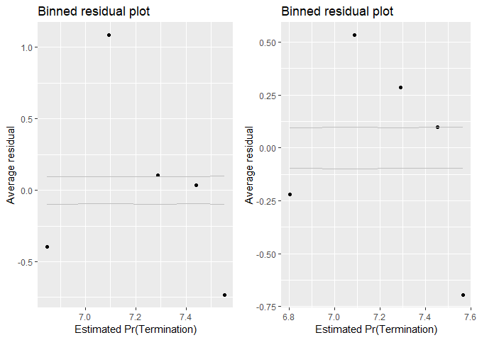<!-- -->

```
## [[1]]
##        model deviance null.deviance difference
## 1 model1_old  2580628       2585789   5161.424
## 2 model1_new  2580063       2585789   5726.600
## 
## [[2]]
##   c_pPBSC c_pOffPSC 
##  1.072831  1.072831
```

```r
summary_residual_compare(n_Opt_02B,n_Opt_02C)
```

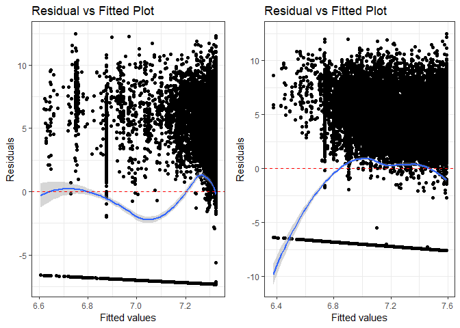<!-- -->

```
## Warning in if (class(model1_new) == "glmerMod") {: the condition has length
## > 1 and only the first element will be used

## Warning in if (class(model1_new) == "glmerMod") {: the condition has length
## > 1 and only the first element will be used
```

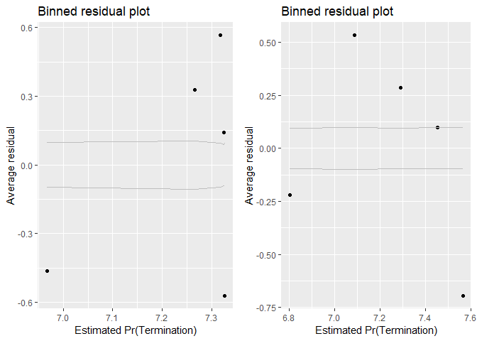<!-- -->

```
## [[1]]
##        model deviance null.deviance difference
## 1 model1_old  2584053       2585789   1736.477
## 2 model1_new  2580063       2585789   5726.600
## 
## [[2]]
##   c_pPBSC c_pOffPSC 
##  1.072831  1.072831
```

No high correlation is observed between PBSC and Contract Office Obligations for PSC based on the vif score.

After combining PBSC and Contract office obligations for PSC, PBSC had a flipped relationship with ceiling breaches that matches with expectation (A look at summary statistics for Performance-Based experience did find that as the percent of performance-based service went from 0 percent to 75 percent, the ceiling breach rate declined. Above 75 percent, it rose dramatically, suggesting an additional variable may influence that relationship.) but lost significance with terminations. Contract office obligations for PSC is associate with more exercised options. The rest of results remained unmatching with expectations.


### 02D: Cumulative  Model
Expectation: When all the four variables are combined into one model, same expectations are applied as individual ones. Per service complexity indicator increases, higher risk of ceiling breaches and terminations and less exercised options expected. Per office capacity indicator increases, lower risk of ceiling breaches and terminations and more exercised options expected.


```r
#Model
n_Opt_02D <- glm (data=serv_opt,
                 ln_OptGrowth ~ cl_US6_avg_sal_lag1Const + cl_CFTE+ c_pPBSC+c_pOffPSC)
glmer_examine(n_Opt_02D)
```

```
## cl_US6_avg_sal_lag1Const                  cl_CFTE                  c_pPBSC 
##                 1.479918                 1.459804                 1.114917 
##                c_pOffPSC 
##                 1.120164
```

```r
p_Opt_02D <- glm(data=serv_opt,
                        lp_OptGrowth ~ cl_US6_avg_sal_lag1Const + cl_CFTE+ c_pPBSC+c_pOffPSC)

glmer_examine(p_Opt_02D)
```

```
## cl_US6_avg_sal_lag1Const                  cl_CFTE                  c_pPBSC 
##                 1.479918                 1.459804                 1.114917 
##                c_pOffPSC 
##                 1.120164
```

```r
#Plot residuals versus fitted
stargazer::stargazer(n_Opt_01C,n_Opt_02C,n_Opt_02D,
                       
                       p_Opt_01C,p_Opt_02C,p_Opt_02D,
                       type="text",
                       digits=2)
```

```
## 
## =============================================================================================
##                                                  Dependent variable:                         
##                          --------------------------------------------------------------------
##                                     ln_OptGrowth                       lp_OptGrowth          
##                              (1)         (2)         (3)        (4)        (5)        (6)    
## ---------------------------------------------------------------------------------------------
## cl_US6_avg_sal_lag1Const   0.61***                 0.71***    -0.01***              -0.03*** 
##                            (0.05)                  (0.05)      (0.01)                (0.01)  
##                                                                                              
## cl_CFTE                   -0.92***                -0.82***    -0.13***              -0.14*** 
##                            (0.06)                  (0.06)      (0.01)                (0.01)  
##                                                                                              
## c_pPBSC                               -0.51***    -0.52***               -0.08***   -0.05*** 
##                                        (0.05)      (0.05)                 (0.01)     (0.01)  
##                                                                                              
## c_pOffPSC                             -0.21***    -0.24***               0.14***    0.17***  
##                                        (0.05)      (0.05)                 (0.01)     (0.01)  
##                                                                                              
## Constant                   7.22***     7.24***     7.22***    0.65***    0.65***    0.65***  
##                            (0.02)      (0.02)      (0.02)     (0.003)    (0.003)    (0.003)  
##                                                                                              
## ---------------------------------------------------------------------------------------------
## Observations               74,162      74,162      74,162      74,162     74,162     74,162  
## Log Likelihood           -236,782.00 -236,844.50 -236,701.90 -77,004.24 -77,031.69 -76,611.39
## Akaike Inf. Crit.        473,570.00  473,695.10  473,413.90  154,014.50 154,069.40 153,232.80
## =============================================================================================
## Note:                                                             *p<0.1; **p<0.05; ***p<0.01
```

```r
summary_residual_compare(n_Opt_02C,n_Opt_02D)
```

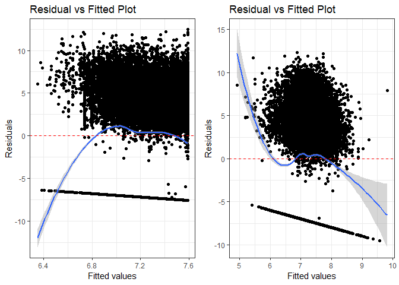<!-- -->

```
## Warning in if (class(model1_new) == "glmerMod") {: the condition has length
## > 1 and only the first element will be used
```

```
## Warning in if (class(model1_new) != "glmerMod" & class(model1_old) !=
## "glmerMod" & : the condition has length > 1 and only the first element will
## be used
```

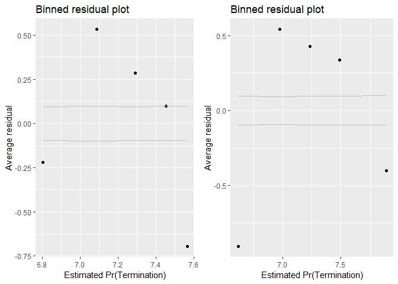<!-- -->

```
## [[1]]
##        model deviance null.deviance difference
## 1 model1_old  2580063       2585789    5726.60
## 2 model1_new  2570160       2585789   15629.63
## 
## [[2]]
## cl_US6_avg_sal_lag1Const                  cl_CFTE                  c_pPBSC 
##                 1.479918                 1.459804                 1.114917 
##                c_pOffPSC 
##                 1.120164
```

```r
summary_residual_compare(n_Opt_01C,n_Opt_02D)
```

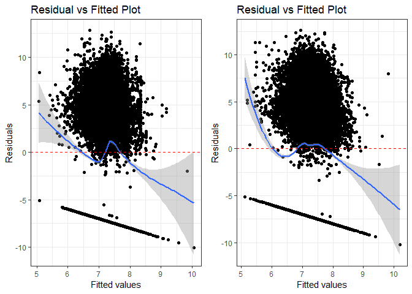<!-- -->

```
## Warning in if (class(model1_new) == "glmerMod") {: the condition has length
## > 1 and only the first element will be used

## Warning in if (class(model1_new) == "glmerMod") {: the condition has length
## > 1 and only the first element will be used
```

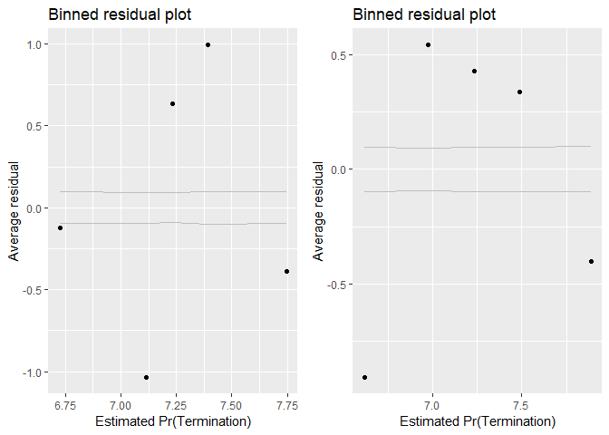<!-- -->

```
## [[1]]
##        model deviance null.deviance difference
## 1 model1_old  2575713       2585789   10076.50
## 2 model1_new  2570160       2585789   15629.63
## 
## [[2]]
## cl_US6_avg_sal_lag1Const                  cl_CFTE                  c_pPBSC 
##                 1.479918                 1.459804                 1.114917 
##                c_pOffPSC 
##                 1.120164
```

No high correlation is observed among all of the 4 predictors (average salary, invoiced rate, PBSC and Contract Office Obligations for PSC) so far based on the vif score. When all measures for sevice complexity and office capacity are combined, per dependent variable:

1. Ceiling Breaches: All variables remain the same within each subgroup (Services Complexity and Office Capacity). Except for Contract office obligations for PSC, the results of other varibles matched with the expectation for ceiling breaches so far. 

2. Terminations: Except for Contract office obligations for PSC, the rest of variables didn't show significant relationships with Termination. The only significant relationship between Contract office obligations for PSC and Temrination didn't match the expectation.

3. Exercised Options: Except for PBSC, all other three variables are associated with exercised options as expected.


## Office-Vendor Relationship

### 03A: Pair History
Expactation: The number of past years of the relationship between the contracting office or the contractors with a single transaction in a given fiscal year enough to qualify, namely, pair history increases (decreases), the likelihood of cost ceiling breaches and terminations decreases (increases) and the exercised options increase (decrease) for that partnership.


```r
 # !is.na(def_serv$cl_US6_avg_sal_lag1)&
 #  !is.na(def_serv$cl_CFTE)&
 #  !is.na(def_serv$c_pPBSC)&
 #  !is.na(def_serv$c_pOffPSC)&
 #  !is.na(def_serv$c_pairHist)&
 #  !is.na(def_serv$cl_pairCA)&

summary_discrete_plot(serv_opt,"c_pairHist")
```

```
## Warning: Ignoring unknown parameters: binwidth, bins, pad
```

```
## Warning: group_by_() is deprecated. 
## Please use group_by() instead
## 
## The 'programming' vignette or the tidyeval book can help you
## to program with group_by() : https://tidyeval.tidyverse.org
## This warning is displayed once per session.
```

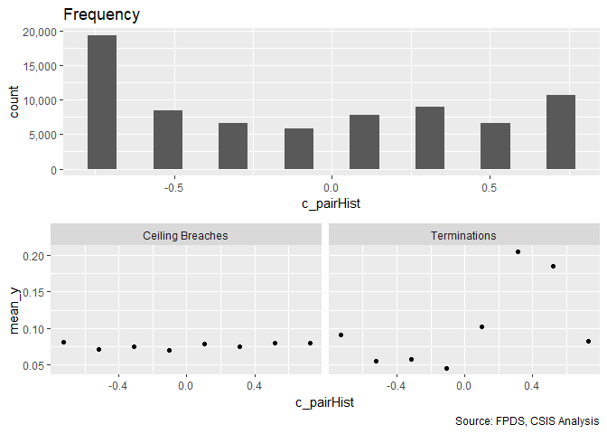<!-- -->

```
## [[1]]
## 
## -0.727331277356926 -0.519773791968938  -0.31221630658095 
##              19364               8401               6643 
## -0.104658821192962  0.102898664195026  0.310456149583014 
##               5767               7792               8954 
##  0.518013634971002   0.72557112035899 
##               6584              10657 
## 
## [[2]]
##                     
##                       None Ceiling Breach
##   -0.727331277356926 17798           1566
##   -0.519773791968938  7806            595
##   -0.31221630658095   6144            499
##   -0.104658821192962  5363            404
##   0.102898664195026   7178            614
##   0.310456149583014   8283            671
##   0.518013634971002   6060            524
##   0.72557112035899    9811            846
## 
## [[3]]
##                     
##                          0     1
##   -0.727331277356926 17609  1755
##   -0.519773791968938  7935   466
##   -0.31221630658095   6259   384
##   -0.104658821192962  5509   258
##   0.102898664195026   6992   800
##   0.310456149583014   7116  1838
##   0.518013634971002   5365  1219
##   0.72557112035899    9777   880
```

```r
#Scatter Plot
ggplot(serv_opt, aes(x=c_pairHist, y=lp_OptGrowth)) + geom_point(alpha = 0.1) + ggtitle('Exercised Options') + theme(plot.title = element_text(hjust = 0.5))
```

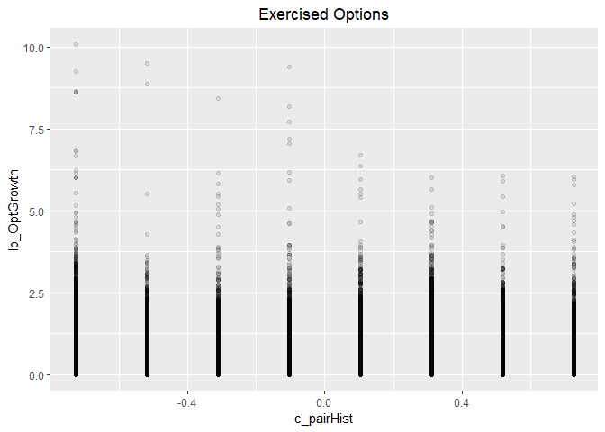<!-- -->

```r
#Model
n_Opt_03A <- glm (data=serv_opt,
                 ln_OptGrowth ~ c_pairHist)
display(n_Opt_03A)
```

```
## glm(formula = ln_OptGrowth ~ c_pairHist, data = serv_opt)
##             coef.est coef.se
## (Intercept)  7.19     0.02  
## c_pairHist  -0.61     0.04  
## ---
##   n = 74162, k = 2
##   residual deviance = 2578099.2, null deviance = 2585789.3 (difference = 7690.0)
##   overdispersion parameter = 34.8
##   residual sd is sqrt(overdispersion) = 5.90
```

```r
p_Opt_03A <- glm(data=serv_opt,
                        lp_OptGrowth ~ c_pairHist)

display(p_Opt_03A)
```

```
## glm(formula = lp_OptGrowth ~ c_pairHist, data = serv_opt)
##             coef.est coef.se
## (Intercept)  0.64     0.00  
## c_pairHist  -0.04     0.00  
## ---
##   n = 74162, k = 2
##   residual deviance = 34906.2, null deviance = 34944.5 (difference = 38.3)
##   overdispersion parameter = 0.5
##   residual sd is sqrt(overdispersion) = 0.69
```

```r
#Plot residuals versus fitted
  stargazer::stargazer(n_Opt_02D,n_Opt_03A,
                       
                       p_Opt_02D,p_Opt_03A,
                       type="text",
                       digits=2)
```

```
## 
## ======================================================================
##                                       Dependent variable:             
##                          ---------------------------------------------
##                               ln_OptGrowth           lp_OptGrowth     
##                              (1)         (2)        (3)        (4)    
## ----------------------------------------------------------------------
## cl_US6_avg_sal_lag1Const   0.71***                -0.03***            
##                            (0.05)                  (0.01)             
##                                                                       
## cl_CFTE                   -0.82***                -0.14***            
##                            (0.06)                  (0.01)             
##                                                                       
## c_pPBSC                   -0.52***                -0.05***            
##                            (0.05)                  (0.01)             
##                                                                       
## c_pOffPSC                 -0.24***                0.17***             
##                            (0.05)                  (0.01)             
##                                                                       
## c_pairHist                            -0.61***               -0.04*** 
##                                        (0.04)                (0.005)  
##                                                                       
## Constant                   7.22***     7.19***    0.65***    0.64***  
##                            (0.02)      (0.02)     (0.003)    (0.003)  
##                                                                       
## ----------------------------------------------------------------------
## Observations               74,162      74,162      74,162     74,162  
## Log Likelihood           -236,701.90 -236,816.30 -76,611.39 -77,288.54
## Akaike Inf. Crit.        473,413.90  473,636.60  153,232.80 154,581.10
## ======================================================================
## Note:                                      *p<0.1; **p<0.05; ***p<0.01
```

```r
summary_residual_compare(n_Opt_02D,n_Opt_03A, skip_vif = TRUE)
```

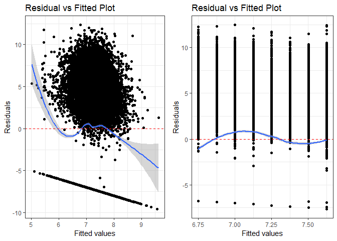<!-- -->

```
## Warning in min(x): no non-missing arguments to min; returning Inf
```

```
## Warning in max(x): no non-missing arguments to max; returning -Inf
```

```
## Warning: Removed 1 rows containing missing values (geom_point).
```

```
## Warning: Removed 1 rows containing missing values (geom_path).

## Warning: Removed 1 rows containing missing values (geom_path).
```

```
## Warning in if (class(model1_new) == "glmerMod") {: the condition has length
## > 1 and only the first element will be used
```

```
## Warning in if (class(model1_new) != "glmerMod" & class(model1_old) !=
## "glmerMod" & : the condition has length > 1 and only the first element will
## be used
```

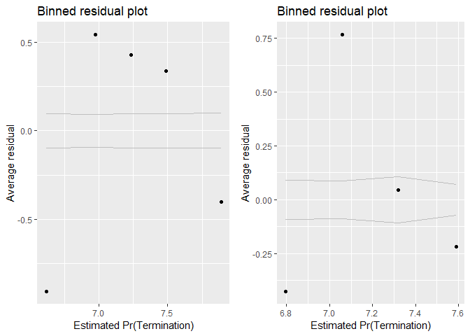<!-- -->

```
## NULL
```

When considering pair history alone, expectations were met for ceiling breaches and terminations, but not for exercised options. 


### 03B: Interaction
Expectation: As the number of contract actions a vendor has performed for an office in the past year increases (decreases), the likelihood of cost ceiling breaches and terminations decreases (increases) and that of exercised options increases (decreases) for that partnership.


```r
 # !is.na(def_serv$cl_US6_avg_sal_lag1)&
 #  !is.na(def_serv$cl_CFTE)&
 #  !is.na(def_serv$c_pPBSC)&
 #  !is.na(def_serv$c_pOffPSC)&
 #  !is.na(def_serv$c_pairHist)&
 #  !is.na(def_serv$cl_pairCA)&

summary_continuous_plot(serv_opt,"cl_pairCA")
```

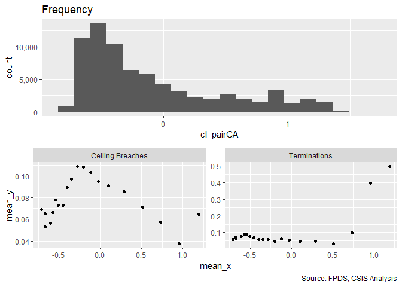<!-- -->

```r
#Scatter Plot
ggplot(serv_opt, aes(x=cl_pairCA, y=lp_OptGrowth)) + geom_point(alpha = 0.1) + ggtitle('Exercised Options') + theme(plot.title = element_text(hjust = 0.5))
```

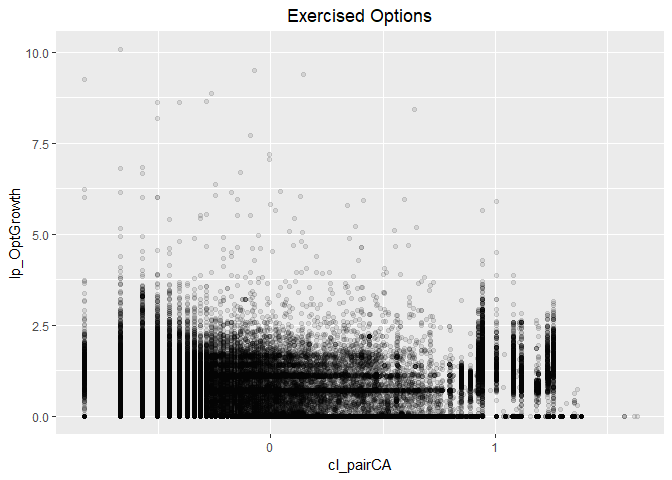<!-- -->

```r
#Model
n_Opt_03B <- glm (data=serv_opt,
                 ln_OptGrowth ~ cl_pairCA)
display(n_Opt_03B)
```

```
## glm(formula = ln_OptGrowth ~ cl_pairCA, data = serv_opt)
##             coef.est coef.se
## (Intercept)  7.08     0.02  
## cl_pairCA   -1.35     0.04  
## ---
##   n = 74162, k = 2
##   residual deviance = 2543508.0, null deviance = 2585789.3 (difference = 42281.2)
##   overdispersion parameter = 34.3
##   residual sd is sqrt(overdispersion) = 5.86
```

```r
p_Opt_03B <- glm(data=serv_opt,
                        lp_OptGrowth ~ cl_pairCA)

display(p_Opt_03B)
```

```
## glm(formula = lp_OptGrowth ~ cl_pairCA, data = serv_opt)
##             coef.est coef.se
## (Intercept)  0.64     0.00  
## cl_pairCA   -0.04     0.00  
## ---
##   n = 74162, k = 2
##   residual deviance = 34911.5, null deviance = 34944.5 (difference = 33.0)
##   overdispersion parameter = 0.5
##   residual sd is sqrt(overdispersion) = 0.69
```

```r
#Plot residuals versus fitted
stargazer::stargazer(n_Opt_02D,n_Opt_03A,n_Opt_03B,
                       
                       p_Opt_02D,p_Opt_03A,p_Opt_03B,
                       type="text",
                       digits=2)
```

```
## 
## =============================================================================================
##                                                  Dependent variable:                         
##                          --------------------------------------------------------------------
##                                     ln_OptGrowth                       lp_OptGrowth          
##                              (1)         (2)         (3)        (4)        (5)        (6)    
## ---------------------------------------------------------------------------------------------
## cl_US6_avg_sal_lag1Const   0.71***                            -0.03***                       
##                            (0.05)                              (0.01)                        
##                                                                                              
## cl_CFTE                   -0.82***                            -0.14***                       
##                            (0.06)                              (0.01)                        
##                                                                                              
## c_pPBSC                   -0.52***                            -0.05***                       
##                            (0.05)                              (0.01)                        
##                                                                                              
## c_pOffPSC                 -0.24***                            0.17***                        
##                            (0.05)                              (0.01)                        
##                                                                                              
## c_pairHist                            -0.61***                           -0.04***            
##                                        (0.04)                            (0.005)             
##                                                                                              
## cl_pairCA                                         -1.35***                          -0.04*** 
##                                                    (0.04)                           (0.005)  
##                                                                                              
## Constant                   7.22***     7.19***     7.08***    0.65***    0.64***    0.64***  
##                            (0.02)      (0.02)      (0.02)     (0.003)    (0.003)    (0.003)  
##                                                                                              
## ---------------------------------------------------------------------------------------------
## Observations               74,162      74,162      74,162      74,162     74,162     74,162  
## Log Likelihood           -236,701.90 -236,816.30 -236,315.40 -76,611.39 -77,288.54 -77,294.15
## Akaike Inf. Crit.        473,413.90  473,636.60  472,634.80  153,232.80 154,581.10 154,592.30
## =============================================================================================
## Note:                                                             *p<0.1; **p<0.05; ***p<0.01
```

```r
summary_residual_compare(n_Opt_03A,n_Opt_03B, skip_vif = TRUE)
```

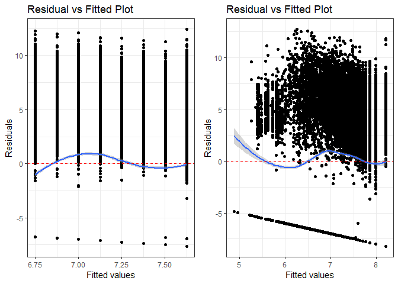<!-- -->

```
## Warning in min(x): no non-missing arguments to min; returning Inf
```

```
## Warning in max(x): no non-missing arguments to max; returning -Inf
```

```
## Warning: Removed 1 rows containing missing values (geom_point).
```

```
## Warning: Removed 1 rows containing missing values (geom_path).

## Warning: Removed 1 rows containing missing values (geom_path).
```

```
## Warning in if (class(model1_new) == "glmerMod") {: the condition has length
## > 1 and only the first element will be used
```

```
## Warning in if (class(model1_new) != "glmerMod" & class(model1_old) !=
## "glmerMod" & : the condition has length > 1 and only the first element will
## be used
```

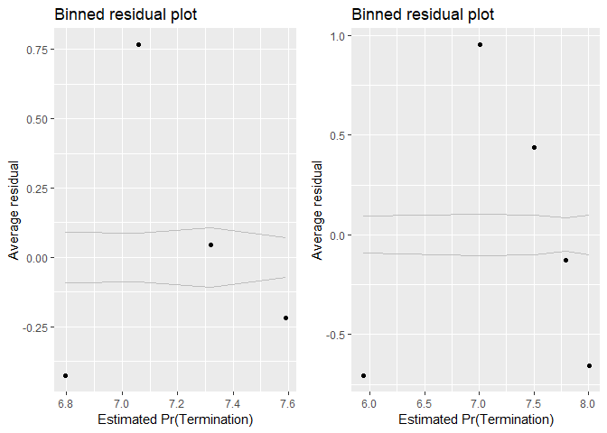<!-- -->

```
## NULL
```

```r
summary_residual_compare(n_Opt_02D,n_Opt_03B, skip_vif = TRUE)
```

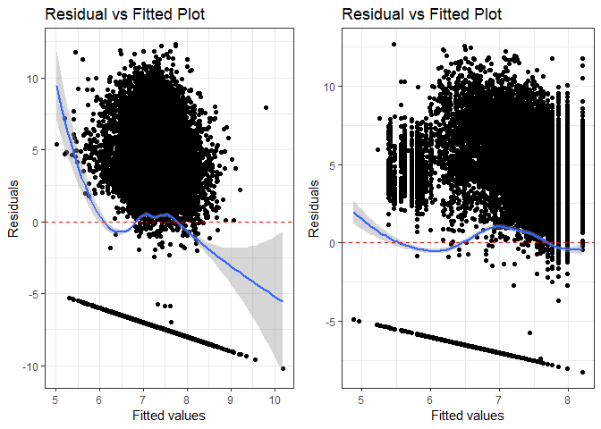<!-- -->

```
## Warning in if (class(model1_new) == "glmerMod") {: the condition has length
## > 1 and only the first element will be used

## Warning in if (class(model1_new) == "glmerMod") {: the condition has length
## > 1 and only the first element will be used
```

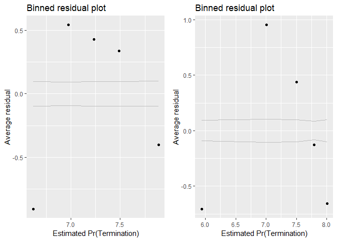<!-- -->

```
## NULL
```

When considering contract actions alone, no expectation were met. The patterns in the plots are complex, ceiling breaches has a sinusoidal or perhaps exponential relationship while terminations has an neative relationship, until the number of ations grows extreme at which point the risk jumps up.

### 03C: Office-Vendor Relationship
Expectation: 
The importance of partnership, trust, and handling difficult problems and uncertainty together naturally lead into the last characteristic: the relationship between the contractor and buyer. The higher level of interaction provides the more opportunity to build a deeper relationship, the likelihood of cost ceiling breaches and terminations decreases and the exercised options increase for that partnership. Also we expect the result of combined model would be the same as individual models above.


```r
 # !is.na(def_serv$cl_US6_avg_sal_lag1)&
 #  !is.na(def_serv$cl_CFTE)&
 #  !is.na(def_serv$c_pPBSC)&
 #  !is.na(def_serv$c_pOffPSC)&
 #  !is.na(def_serv$c_pairHist)&
 #  !is.na(def_serv$cl_pairCA)&

#Model
n_Opt_03C <- glm (data=serv_opt,
                 ln_OptGrowth ~ c_pairHist+cl_pairCA)
glmer_examine(n_Opt_03C)
```

```
## c_pairHist  cl_pairCA 
##   1.417674   1.417674
```

```r
p_Opt_03C <- glm(data=serv_opt,
                        lp_OptGrowth ~ c_pairHist+cl_pairCA)

glmer_examine(p_Opt_03C)
```

```
## c_pairHist  cl_pairCA 
##   1.417674   1.417674
```

```r
#Plot residuals versus fitted
  stargazer::stargazer(n_Opt_02D,n_Opt_03A,n_Opt_03B,n_Opt_03C,
                       
                       p_Opt_02D,p_Opt_03A,p_Opt_03B,p_Opt_03C,
                       type="text",
                       digits=2)
```

```
## 
## ====================================================================================================================
##                                                              Dependent variable:                                    
##                          -------------------------------------------------------------------------------------------
##                                           ln_OptGrowth                                  lp_OptGrowth                
##                              (1)         (2)         (3)         (4)        (5)        (6)        (7)        (8)    
## --------------------------------------------------------------------------------------------------------------------
## cl_US6_avg_sal_lag1Const   0.71***                                        -0.03***                                  
##                            (0.05)                                          (0.01)                                   
##                                                                                                                     
## cl_CFTE                   -0.82***                                        -0.14***                                  
##                            (0.06)                                          (0.01)                                   
##                                                                                                                     
## c_pPBSC                   -0.52***                                        -0.05***                                  
##                            (0.05)                                          (0.01)                                   
##                                                                                                                     
## c_pOffPSC                 -0.24***                                        0.17***                                   
##                            (0.05)                                          (0.01)                                   
##                                                                                                                     
## c_pairHist                            -0.61***                 0.23***               -0.04***              -0.03*** 
##                                        (0.04)                  (0.05)                (0.005)                (0.01)  
##                                                                                                                     
## cl_pairCA                                         -1.35***    -1.47***                          -0.04***   -0.02*** 
##                                                    (0.04)      (0.05)                           (0.005)     (0.01)  
##                                                                                                                     
## Constant                   7.22***     7.19***     7.08***     7.09***    0.65***    0.64***    0.64***    0.64***  
##                            (0.02)      (0.02)      (0.02)      (0.02)     (0.003)    (0.003)    (0.003)    (0.003)  
##                                                                                                                     
## --------------------------------------------------------------------------------------------------------------------
## Observations               74,162      74,162      74,162      74,162      74,162     74,162     74,162     74,162  
## Log Likelihood           -236,701.90 -236,816.30 -236,315.40 -236,303.60 -76,611.39 -77,288.54 -77,294.15 -77,279.95
## Akaike Inf. Crit.        473,413.90  473,636.60  472,634.80  472,613.20  153,232.80 154,581.10 154,592.30 154,565.90
## ====================================================================================================================
## Note:                                                                                    *p<0.1; **p<0.05; ***p<0.01
```

```r
summary_residual_compare(n_Opt_03A,n_Opt_03C)
```

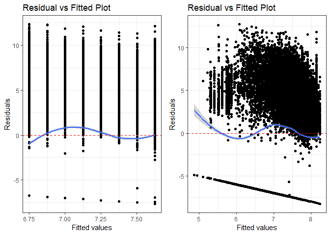<!-- -->

```
## Warning in min(x): no non-missing arguments to min; returning Inf
```

```
## Warning in max(x): no non-missing arguments to max; returning -Inf
```

```
## Warning: Removed 1 rows containing missing values (geom_point).
```

```
## Warning: Removed 1 rows containing missing values (geom_path).

## Warning: Removed 1 rows containing missing values (geom_path).
```

```
## Warning in if (class(model1_new) == "glmerMod") {: the condition has length
## > 1 and only the first element will be used
```

```
## Warning in if (class(model1_new) != "glmerMod" & class(model1_old) !=
## "glmerMod" & : the condition has length > 1 and only the first element will
## be used
```

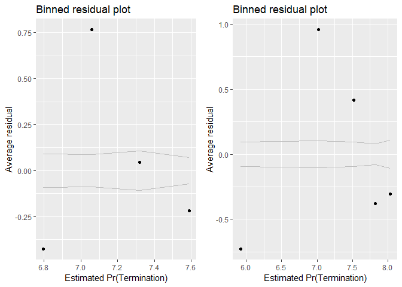<!-- -->

```
## [[1]]
##        model deviance null.deviance difference
## 1 model1_old  2578099       2585789   7690.044
## 2 model1_new  2542697       2585789  43092.210
## 
## [[2]]
## c_pairHist  cl_pairCA 
##   1.417674   1.417674
```

```r
summary_residual_compare(n_Opt_03B,n_Opt_03C)
```

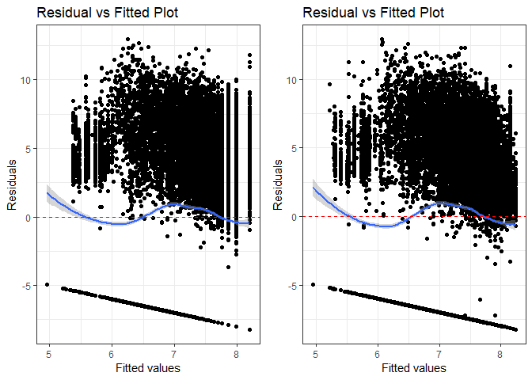<!-- -->

```
## Warning in if (class(model1_new) == "glmerMod") {: the condition has length
## > 1 and only the first element will be used

## Warning in if (class(model1_new) == "glmerMod") {: the condition has length
## > 1 and only the first element will be used
```

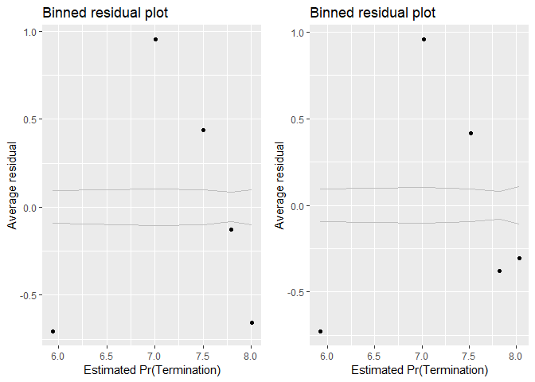<!-- -->

```
## [[1]]
##        model deviance null.deviance difference
## 1 model1_old  2543508       2585789   42281.24
## 2 model1_new  2542697       2585789   43092.21
## 
## [[2]]
## c_pairHist  cl_pairCA 
##   1.417674   1.417674
```

```r
summary_residual_compare(n_Opt_02D,n_Opt_03C)
```

<!-- -->

```
## Warning in if (class(model1_new) == "glmerMod") {: the condition has length
## > 1 and only the first element will be used

## Warning in if (class(model1_new) == "glmerMod") {: the condition has length
## > 1 and only the first element will be used
```

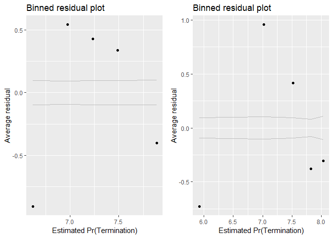<!-- -->

```
## [[1]]
##        model deviance null.deviance difference
## 1 model1_old  2570160       2585789   15629.63
## 2 model1_new  2542697       2585789   43092.21
## 
## [[2]]
## c_pairHist  cl_pairCA 
##   1.417674   1.417674
```

When combining pair history and contract actions, magnitude of relationships with dependent variables incraesed, but the agreement with expectations splited in the same way as individually.  


### 03D: Cumulative  Model

Expectation: Under each subgroup, the predictors are expected to have similar impacts on dependent variables individually and cumulatively:
1. Higher Services Complexity: Higher likelihood of cost ceiling breaches and terminations; Less exercised options
2. Larger Office Capacity: Lower likelihood of cost ceiling breaches and terminations; More exercised options
3. Deeper Office-Vendor Relationship: Lower likelihood of cost ceiling breaches and terminations; More exercised options


```r
#Model
n_Opt_03D <- glm (data=serv_opt,
                 ln_OptGrowth ~  cl_US6_avg_sal_lag1Const + 
                   cl_CFTE+ c_pPBSC+c_pOffPSC+
                 c_pairHist+cl_pairCA)
glmer_examine(n_Opt_03D)
```

```
## cl_US6_avg_sal_lag1Const                  cl_CFTE                  c_pPBSC 
##                 1.485861                 1.470224                 1.135510 
##                c_pOffPSC               c_pairHist                cl_pairCA 
##                 1.719197                 1.445773                 2.175117
```

```r
p_Opt_03D <- glm(data=serv_opt,
                        lp_OptGrowth ~  cl_US6_avg_sal_lag1Const + 
                   cl_CFTE+ c_pPBSC+c_pOffPSC+
                 c_pairHist+cl_pairCA)

glmer_examine(p_Opt_03D)
```

```
## cl_US6_avg_sal_lag1Const                  cl_CFTE                  c_pPBSC 
##                 1.485861                 1.470224                 1.135510 
##                c_pOffPSC               c_pairHist                cl_pairCA 
##                 1.719197                 1.445773                 2.175117
```

```r
#Plot residuals versus fitted   

stargazer::stargazer(n_Opt_02D,n_Opt_03C,n_Opt_03D,
                       
                       p_Opt_02D,p_Opt_03C,p_Opt_03D,
                       type="text",
                       digits=2)
```

```
## 
## =============================================================================================
##                                                  Dependent variable:                         
##                          --------------------------------------------------------------------
##                                     ln_OptGrowth                       lp_OptGrowth          
##                              (1)         (2)         (3)        (4)        (5)        (6)    
## ---------------------------------------------------------------------------------------------
## cl_US6_avg_sal_lag1Const   0.71***                 0.82***    -0.03***              -0.02*** 
##                            (0.05)                  (0.05)      (0.01)                (0.01)  
##                                                                                              
## cl_CFTE                   -0.82***                -0.73***    -0.14***              -0.13*** 
##                            (0.06)                  (0.06)      (0.01)                (0.01)  
##                                                                                              
## c_pPBSC                   -0.52***                -0.35***    -0.05***              -0.03*** 
##                            (0.05)                  (0.05)      (0.01)                (0.01)  
##                                                                                              
## c_pOffPSC                 -0.24***                 1.31***    0.17***               0.28***  
##                            (0.05)                  (0.07)      (0.01)                (0.01)  
##                                                                                              
## c_pairHist                             0.23***     0.34***               -0.03***    -0.001  
##                                        (0.05)      (0.05)                 (0.01)     (0.01)  
##                                                                                              
## cl_pairCA                             -1.47***    -2.14***               -0.02***   -0.13*** 
##                                        (0.05)      (0.06)                 (0.01)     (0.01)  
##                                                                                              
## Constant                   7.22***     7.09***     7.01***    0.65***    0.64***    0.64***  
##                            (0.02)      (0.02)      (0.02)     (0.003)    (0.003)    (0.003)  
##                                                                                              
## ---------------------------------------------------------------------------------------------
## Observations               74,162      74,162      74,162      74,162     74,162     74,162  
## Log Likelihood           -236,701.90 -236,303.60 -235,924.90 -76,611.39 -77,279.95 -76,354.49
## Akaike Inf. Crit.        473,413.90  472,613.20  471,863.80  153,232.80 154,565.90 152,723.00
## =============================================================================================
## Note:                                                             *p<0.1; **p<0.05; ***p<0.01
```

```r
summary_residual_compare(n_Opt_03C,n_Opt_03D)
```

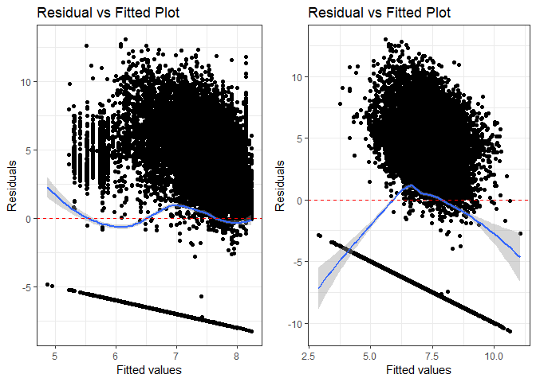<!-- -->

```
## Warning in if (class(model1_new) == "glmerMod") {: the condition has length
## > 1 and only the first element will be used
```

```
## Warning in if (class(model1_new) != "glmerMod" & class(model1_old) !=
## "glmerMod" & : the condition has length > 1 and only the first element will
## be used
```

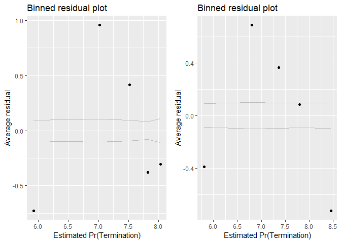<!-- -->

```
## [[1]]
##        model deviance null.deviance difference
## 1 model1_old  2542697       2585789   43092.21
## 2 model1_new  2516861       2585789   68927.87
## 
## [[2]]
## cl_US6_avg_sal_lag1Const                  cl_CFTE                  c_pPBSC 
##                 1.485861                 1.470224                 1.135510 
##                c_pOffPSC               c_pairHist                cl_pairCA 
##                 1.719197                 1.445773                 2.175117
```

```r
summary_residual_compare(n_Opt_02D,n_Opt_03D)
```

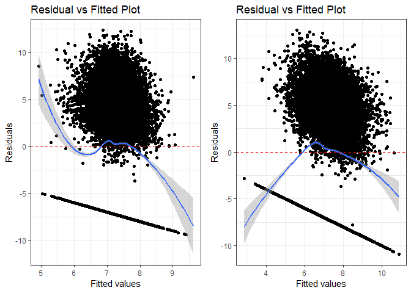<!-- -->

```
## Warning in if (class(model1_new) == "glmerMod") {: the condition has length
## > 1 and only the first element will be used

## Warning in if (class(model1_new) == "glmerMod") {: the condition has length
## > 1 and only the first element will be used
```

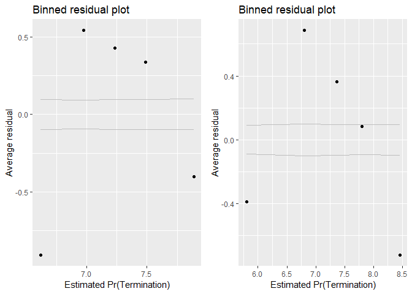<!-- -->

```
## [[1]]
##        model deviance null.deviance difference
## 1 model1_old  2570160       2585789   15629.63
## 2 model1_new  2516861       2585789   68927.87
## 
## [[2]]
## cl_US6_avg_sal_lag1Const                  cl_CFTE                  c_pPBSC 
##                 1.485861                 1.470224                 1.135510 
##                c_pOffPSC               c_pairHist                cl_pairCA 
##                 1.719197                 1.445773                 2.175117
```

None of the predictors has high level of correlation (vif over 1.7) with each other. 
In the cumulative model, per dependent variable and independent variable:

1. Ceiling breaches:
   A. Service Complexity:
      The relationship with average salary gained significance in line with expectation.
      The result for both average salary and invoice rate matched with expectation.
      
   B. Office Capacity: 
      The relationship with PBSC matched with expectation but with less magnitude.
      The result for office obligations did not match with expectation.
     
   C. Office-Vendor Relationship:
      The result for pair history matched with expectation 
      The relationship with contract actions reverse and now align with expectations.

2. Terminations:
   A. Service Complexity:
      The reult for average salary did not match with expectation.
      The result for invoice rate did matach with expectation, only significant (for p-value <0.5), which is still sufficient.
      
   B. Office Capacity: 
      The relationship with PBSC was not significant.
      The result for office obligations did not match with expectation.
     
   C. Office-Vendor Relationship:
      The result for pair history matched with expectation once all variables included.
      The result for contract actions did not match with expectation.

3. Exercised Options:
  A. Service Complexity:
      The result for both average salary and invoice rate matached with expectation but with less magnitude.
      
   B. Office Capacity: 
      The result for PBSC didn't match with expectation.
      The result for office obligations matched with expectation.
     
   C. Office-Vendor Relationship:
      The result for pair history lost significance and didn't match with expectations.
      The result for contract actions didn't match with expectation.


## Study Variables Alone


```r
 # !is.na(def_serv$cl_US6_avg_sal_lag1)&
 #  !is.na(def_serv$cl_CFTE)&
 #  !is.na(def_serv$c_pPBSC)&
 #  !is.na(def_serv$c_pOffPSC)&
 #  !is.na(def_serv$c_pairHist)&
 #  !is.na(def_serv$cl_pairCA)&


study_coef_list<-list("(Intercept)"="(Intercept)",
                      "cl_US6_avg_sal_lag1Const"="Log(Det. Ind. Salary)",
                      "cl_CFTE"="Log(Service Invoice Rate)",
                      "c_pPBSC"="Office Perf.-Based %",
                      "c_pOffPSC"="Office Service Exp. %",
                      "c_pairHist"="Paired Years",
                      "cl_pairCA"="Log(Paired Actions)"
)

all_coef_list<-list("(Intercept)"="(Intercept)",
                    "cl_US6_avg_sal_lag1Const"="Log(Det. Ind. Salary)",
                    "cl_CFTE"="Log(Service Invoice Rate)",
                    "c_pPBSC"="Office Perf.-Based %",
                    "c_pOffPSC"="Office Service Exp. %",
                    "c_pairHist"="Paired Years",
                    "cl_pairCA"="Log(Paired Actions)",
                    
                    #Contract Controls
                    
                    "Comp1or51 offer"="Comp=1 offer",
                    "Comp1or52-4 offers"="Comp=2-4 offers",
                    "Comp1or55+ offers"="Comp=5+ offers",
                    
                    "CompOffr1 offer"="Comp=1 offer",
                    "CompOffr2 offers"="Comp=2 offers",
                    "CompOffr3-4 offers"="Comp=3-4 offers",
                    "CompOffr5+ offers"="Comp=5+ offers",
                    
                    "cl_Ceil"="Log(Init. Ceiling)",
                    "capped_cl_Days"="Log(Init. Days)",
                    "VehS-IDC"="Vehicle=S-IDC",
                    "VehM-IDC"="Vehicle=M-IDC",
                    "VehFSS/GWAC"="Vehicle=FSS/GWAC",
                    "VehBPA/BOA"="Vehicle=BPA/BOA",
                    "PricingUCAFFP"="Pricing=FFP",
                    "PricingUCAOther FP"="Pricing=Other FP",
                    "PricingUCAIncentive"="Pricing=Incentive Fee",
                    "PricingUCACombination or Other"="Pricing=Combination or Other",
                    "PricingUCAOther CB"="Pricing=Other CB",
                    "PricingUCAT&M/LH/FPLOE"="Pricing=T&M/LH/FP:LoE",
                    "PricingUCAUCA"="Pricing=UCA",
                    
                    "PricingFeeOther FP"="Pricing=Other FP",
                    "PricingFeeIncentive"="Pricing=Incentive Fee",
                    "PricingFeeCombination or Other"="Pricing=Combination or Other",
                    "PricingFeeOther CB"="Pricing=Other CB",
                    "PricingFeeT&M/LH/FPLOE"="Pricing=T&M/LH/FP:LoE",
                    "b_UCA"="UCA",
                    "CrisisARRA"="Crisis=ARRA",
                    "CrisisDis"="Crisis=Disaster",
                    "CrisisOCO"="Crisis=OCO",
                    "b_Intl"="Performed Abroad",

                    #NAICS
                    "cl_def3_HHI_lag1"="Log(Subsector HHI)",
                    "cl_def6_HHI_lag1"="Log(Det. Ind. HHI)",
                    "cl_def3_ratio_lag1"="Log(Subsector Ratio)",
                    "cl_def6_obl_lag1"="Log(Det. Ind. DoD Obl.)",
                    "cl_def6_ratio_lag1"="Log(Det. Ind. Ratio)",
                    #Office
                    "c_pMarket"="Percent Market",
                    "cl_OffVol"="Office Volume",
                    "cl_office_naics_hhi_k"="Office Concentration",
                    
                    
                    #interations
                    # # "cl_def6_HHI_lag1:capped_cl_Days"="Log(Det. Ind. HHI):Log(Init. Days)",
                    # "cl_def6_HHI_lag1:cl_def6_obl_lag1"="Log(Det. Ind. HHI):Log(Det. Ind. DoD Obl.)",
                    # # "cl_def3_HHI_lag1:cl_def3_ratio_lag1"="Log(Subsector HHI):Log(Subsector Ratio)"),
                    "cl_def6_HHI_lag1:b_UCA"="Log(Det. Ind. HHI):UCA",
                    # "cl_Ceil:b_UCA"="Log(Init. Ceiling):UCA",
                    # "CompOffr1 offer:b_UCA"="Comp=1 offer:UCA",
                    # "CompOffr2 offers:b_UCA"="Comp=2 offers:UCA",
                    # "CompOffr3-4 offers:b_UCA"="Comp=3-4 offers:UCA",
                    # "CompOffr5+ offers:b_UCA"="Comp=5+ offers:UCA"
                    "VehS-IDC:b_Intl"="Vehicle=S-IDC:Performed Abroad",
                    "VehM-IDC:b_Intl"="Vehicle=M-IDC:Performed Abroad",
                    "VehFSS/GWAC:b_Intl"="Vehicle=FSS/GWAC:Performed Abroad",
                    "VehBPA/BOA:b_Intl"="Vehicle=BPA/BOA:Performed Abroad",
                    "cl_US6_avg_sal_lag1:PricingFeeOther FP"="Pricing=Other FP:Log(Det. Ind. U.S. Avg. Salary)",
                    "cl_US6_avg_sal_lag1:PricingFeeIncentive"="Pricing=Incentive Fee:Log(Det. Ind. U.S. Avg. Salary)",
                    "cl_US6_avg_sal_lag1:PricingFeeCombination or Other"="Pricing=Comb./or Other:Log(Det. Ind. U.S. Avg. Salary)",
                    "cl_US6_avg_sal_lag1:PricingFeeOther CB"="Pricing=Other CB:Log(Det. Ind. U.S. Avg. Salary)",
                    "cl_US6_avg_sal_lag1:PricingFeeT&M/LH/FPLOE"="Pricing=T&M/LH/FP:LoE:Log(Det. Ind. U.S. Avg. Salary)"
)


#Exercised Options Absolute
  stargazer::stargazer(n_Opt_01A,n_Opt_01B,n_Opt_02A,n_Opt_02B,n_Opt_03A,n_Opt_03B,n_Opt_03D,
                       type="text",
                       digits=2)
```

```
## 
## ============================================================================================================
##                                                          Dependent variable:                                
##                          -----------------------------------------------------------------------------------
##                                                             ln_OptGrowth                                    
##                              (1)         (2)         (3)         (4)         (5)         (6)         (7)    
## ------------------------------------------------------------------------------------------------------------
## cl_US6_avg_sal_lag1Const   0.19***                                                                 0.82***  
##                            (0.04)                                                                  (0.05)   
##                                                                                                             
## cl_CFTE                               -0.52***                                                    -0.73***  
##                                        (0.05)                                                      (0.06)   
##                                                                                                             
## c_pPBSC                                           -0.57***                                        -0.35***  
##                                                    (0.05)                                          (0.05)   
##                                                                                                             
## c_pOffPSC                                                     -0.36***                             1.31***  
##                                                                (0.05)                              (0.07)   
##                                                                                                             
## c_pairHist                                                                -0.61***                 0.34***  
##                                                                            (0.04)                  (0.05)   
##                                                                                                             
## cl_pairCA                                                                             -1.35***    -2.14***  
##                                                                                        (0.04)      (0.06)   
##                                                                                                             
## Constant                   7.23***     7.25***     7.25***     7.23***     7.19***     7.08***     7.01***  
##                            (0.02)      (0.02)      (0.02)      (0.02)      (0.02)      (0.02)      (0.02)   
##                                                                                                             
## ------------------------------------------------------------------------------------------------------------
## Observations               74,162      74,162      74,162      74,162      74,162      74,162      74,162   
## Log Likelihood           -236,915.50 -236,866.00 -236,852.70 -236,901.90 -236,816.30 -236,315.40 -235,924.90
## Akaike Inf. Crit.        473,834.90  473,736.00  473,709.30  473,807.70  473,636.60  472,634.80  471,863.80 
## ============================================================================================================
## Note:                                                                            *p<0.1; **p<0.05; ***p<0.01
```

```r
texreg::htmlreg(list(n_Opt_01A,n_Opt_01B,n_Opt_02A,n_Opt_02B,n_Opt_03A,n_Opt_03B,n_Opt_03D),file="..//Output//n_Opt_Model.html",
                single.row = TRUE,
                # custom.model.name=c("Ceiling Breaches"),
                stars=c(0.1,0.05,0.01,0.001),
                groups = list(
                              "Services Complexity" = 2:3,
                              "Office Capacity" =4:5,
                              "Past Relationship"=6:7
                              ),
                custom.coef.map=all_coef_list,
                bold=0.05,
                custom.note="%stars. Numerical inputs are rescaled.",
                caption="Table 6: Logit Bivariate Look at Study Variables and Ceiling Breaches",
                caption.above=TRUE)
```

```
## The table was written to the file '..//Output//n_Opt_Model.html'.
```

```r
#Exercised Options Percentage
stargazer::stargazer(p_Opt_01A,p_Opt_01B,p_Opt_02A,p_Opt_02B,p_Opt_03A,p_Opt_03B,p_Opt_03D,
                       type="text",
                       digits=2)
```

```
## 
## =====================================================================================================
##                                                      Dependent variable:                             
##                          ----------------------------------------------------------------------------
##                                                          lp_OptGrowth                                
##                             (1)        (2)        (3)        (4)        (5)        (6)        (7)    
## -----------------------------------------------------------------------------------------------------
## cl_US6_avg_sal_lag1Const  -0.07***                                                          -0.02*** 
##                           (0.005)                                                            (0.01)  
##                                                                                                      
## cl_CFTE                              -0.14***                                               -0.13*** 
##                                       (0.01)                                                 (0.01)  
##                                                                                                      
## c_pPBSC                                         -0.05***                                    -0.03*** 
##                                                  (0.01)                                      (0.01)  
##                                                                                                      
## c_pOffPSC                                                  0.12***                          0.28***  
##                                                             (0.01)                           (0.01)  
##                                                                                                      
## c_pairHist                                                            -0.04***               -0.001  
##                                                                       (0.005)                (0.01)  
##                                                                                                      
## cl_pairCA                                                                        -0.04***   -0.13*** 
##                                                                                  (0.005)     (0.01)  
##                                                                                                      
## Constant                  0.65***    0.65***    0.65***    0.65***    0.64***    0.64***    0.64***  
##                           (0.003)    (0.003)    (0.003)    (0.003)    (0.003)    (0.003)    (0.003)  
##                                                                                                      
## -----------------------------------------------------------------------------------------------------
## Observations               74,162     74,162     74,162     74,162     74,162     74,162     74,162  
## Log Likelihood           -77,199.78 -77,007.63 -77,294.40 -77,130.56 -77,288.54 -77,294.15 -76,354.49
## Akaike Inf. Crit.        154,403.60 154,019.30 154,592.80 154,265.10 154,581.10 154,592.30 152,723.00
## =====================================================================================================
## Note:                                                                     *p<0.1; **p<0.05; ***p<0.01
```

```r
texreg::htmlreg(list(p_Opt_01A,p_Opt_01B,p_Opt_02A,p_Opt_02B,p_Opt_03A,p_Opt_03B,p_Opt_03D),file="..//Output//p_Opt_Model.html",
                single.row = TRUE,
                # custom.model.name=c("Ceiling Breaches"),
                stars=c(0.1,0.05,0.01,0.001),
                groups = list(
                              "Services Complexity" = 2:3,
                              "Office Capacity" =4:5,
                              "Past Relationship"=6:7
                              ),
                custom.coef.map=all_coef_list,
                bold=0.05,
                custom.note="%stars. Numerical inputs are rescaled.",
                caption="Table 8: Regression Bivariate Look at Study Variables and Log(Options Growth)",
                caption.above=TRUE)
```

```
## The table was written to the file '..//Output//p_Opt_Model.html'.
```

# Controls

##Contract-Level Controls
###Scope Variables
#### 04A: Cost Ceiling

Expectation: Initial Ceiling size positively estimates increasing probability of ceiling breaches and terminations and negatively estimates the option growth. Terminations and ceiling breaches simply comes down to large being associated with higher risk, while for option growth size imply makes it harder to grow proportionally.


```r
#Frequency Plot for unlogged ceiling
# freq_continuous_cbre_plot(serv_opt,"UnmodifiedContractBaseAndAllOptionsValue.OMB20_GDP18",
#                bins=1000)
# freq_continuous_cbre_plot(subset(serv_opt,UnmodifiedContractBaseAndAllOptionsValue.OMB20_GDP18<100000000),
#                "UnmodifiedContractBaseAndAllOptionsValue.OMB20_GDP18",
#                bins=1000)

summary_continuous_plot(serv_opt,"cl_Ceil",bins=50)
```

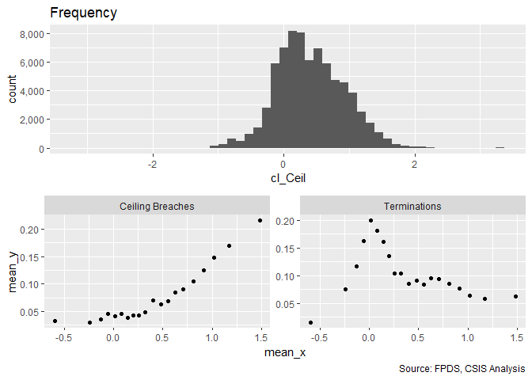<!-- -->

```r
summary(serv_opt$cl_Ceil)
```

```
##     Min.  1st Qu.   Median     Mean  3rd Qu.     Max. 
## -3.23331  0.05014  0.36269  0.40879  0.75467  3.24200
```

```r
str(serv_opt)
```

```
## Classes 'grouped_df', 'tbl_df', 'tbl' and 'data.frame':	74162 obs. of  249 variables:
##  $ CSIScontractID                                      : num  9132210 16604713 18188469 1398030 8685316 ...
##  $ Action_Obligation.Then.Year                         : num  18228438 645297 53326 99216 34340 ...
##  $ IsClosed                                            : num  0 1 0 0 0 0 0 0 0 0 ...
##  $ Term                                                : num  0 0 0 0 0 0 0 0 0 0 ...
##  $ LastCurrentCompletionDate                           : Date, format: "2010-04-30" "2015-01-16" ...
##  $ MinOfSignedDate                                     : Date, format: "2008-02-27" "2012-01-16" ...
##  $ MaxBoostDate                                        : Date, format: "2009-08-11" "2013-12-20" ...
##  $ StartFY                                             : num  2008 2012 2009 2009 2011 ...
##  $ Agency                                              : Factor w/ 38 levels "*ODD","1450",..: 4 4 25 8 4 4 3 3 8 4 ...
##  $ Office                                              : chr  "W15P7T" "W911QY" "HC1013" "FA8501" ...
##  $ ProdServ                                            : Factor w/ 3088 levels "","1000","1005",..: 2395 2405 1450 2582 1950 1429 1945 2422 2382 2422 ...
##  $ NAICS                                               : num  541330 541330 517110 517110 811219 ...
##  $ UnmodifiedDays                                      : num  84 367 394 364 369 ...
##  $ qDuration                                           : Ord.factor w/ 5 levels "[0 months,~2 months)"<..: 2 4 4 3 4 4 4 1 3 2 ...
##  $ Ceil                                                : Ord.factor w/ 6 levels "[0,15k)"<"[15k,100k)"<..: 5 3 3 2 2 2 2 2 3 3 ...
##  $ UnmodifiedContractBaseAndAllOptionsValue.Then.Year  : num  11158629 640051 106189 91800 34340 ...
##  $ UnmodifiedCurrentCompletionDate                     : Date, format: "2008-05-20" "2013-01-16" ...
##  $ SumOfisChangeOrder                                  : int  4 0 0 0 0 0 0 0 0 0 ...
##  $ ChangeOrderBaseAndAllOptionsValue                   : num  320611 0 0 0 0 ...
##  $ qNChg                                               : Factor w/ 4 levels "   0","   1",..: 4 1 1 1 1 1 1 1 1 1 ...
##  $ CBre                                                : Ord.factor w/ 2 levels "None"<"Ceiling Breach": 2 1 1 1 1 1 1 1 1 1 ...
##  $ qCRais                                              : Factor w/ 4 levels "[  -Inf,-0.001)",..: 3 2 2 2 2 2 2 2 2 2 ...
##  $ Where                                               : Factor w/ 204 levels "AFG","AGO","ALB",..: 192 192 192 192 192 192 192 93 192 1 ...
##  $ Intl                                                : Factor w/ 2 levels "Just U.S.","Any Intl.": 1 1 1 1 1 1 1 2 1 2 ...
##  $ PSR                                                 : Factor w/ 3 levels "Products","R&D",..: 3 3 3 3 3 3 3 3 3 3 ...
##  $ UnmodifiedNumberOfOffersReceived                    : num  1 2 7 1 1 3 1 4 19 2 ...
##  $ Offr                                                : Ord.factor w/ 4 levels "1"<"2"<"3-4"<..: 1 2 4 1 1 3 1 3 4 2 ...
##  $ Comp                                                : Factor w/ 2 levels "No Comp.","Comp.": 2 2 2 1 2 2 2 2 2 2 ...
##  $ EffComp                                             : Factor w/ 3 levels "No Comp.","1 Offer",..: 2 3 3 1 2 3 2 3 3 3 ...
##  $ Urg                                                 : Factor w/ 2 levels "Not Urgency",..: 1 1 1 1 1 1 1 1 1 1 ...
##  $ Veh                                                 : Factor w/ 5 levels "Def/Pur","S-IDC",..: 3 4 2 1 1 5 4 2 3 1 ...
##  $ FxCb                                                : Factor w/ 3 levels "Fixed","Combo/Other",..: 3 1 1 1 1 1 1 1 1 1 ...
##  $ Fee                                                 : Ord.factor w/ 6 levels "Incentive"<"Fixed Fee"<..: 5 4 4 4 4 4 4 4 5 4 ...
##  $ UCA                                                 : Factor w/ 2 levels "Not UCA","UCA": 1 1 1 1 1 1 1 1 1 1 ...
##  $ EntityID                                            : num  685101 669996 684214 683496 150270 ...
##  $ UnmodifiedEntityID                                  : num  685101 669996 684214 683496 150270 ...
##  $ PlaceCountryISO3                                    : Factor w/ 225 levels "*MF","*MU","AFG",..: 211 211 211 211 211 211 211 105 211 3 ...
##  $ Crisis                                              : Factor w/ 4 levels "Other","ARRA",..: 1 1 1 1 1 1 1 1 1 4 ...
##  $ b_Term                                              : num  0 0 0 0 0 0 0 0 0 0 ...
##  $ j_Term                                              : num  0.0251 0.0449 0.027 0.0422 0.0198 ...
##  $ b_CBre                                              : num  1 0 0 0 0 0 0 0 0 0 ...
##  $ j_CBre                                              : num  0.96055 0.02455 0.00139 0.03622 0.01871 ...
##  $ pChangeOrderBaseAndAllOptionsValue                  : num  0.0287 0 0 0 0 ...
##  $ pChange3Sig                                         : num  0.029 0 0 0 0 0 0 0 0 0 ...
##  $ qCrai                                               : Factor w/ 4 levels "[  -Inf,-0.001)",..: 3 2 2 2 2 2 2 2 2 2 ...
##  $ Action_Obligation.OMB20_GDP18                       : num  19328214 645297 55897 104000 34991 ...
##  $ UnmodifiedContractBaseAndAllOptionsValue.OMB20_GDP18: num  11831862 640051 111309 96226 34991 ...
##  $ qHighCeiling                                        : Factor w/ 6 levels "[0.00e+00,1.50e+04)",..: 5 3 3 2 2 2 2 2 3 3 ...
##  $ ceil.median.wt                                      : num  17478311 246578 246578 38655 38655 ...
##  $ capped_UnmodifiedDays                               : num  84 367 394 364 369 ...
##  $ cl_Days                                             : num  0.02 0.463 0.484 0.46 0.465 ...
##  $ capped_cl_Days                                      : num  0.0201 0.4631 0.4844 0.4606 0.4647 ...
##  $ UnmodifiedYearsFloat                                : num  0.23 1.005 1.079 0.997 1.01 ...
##  $ UnmodifiedYearsCat                                  : num  0 1 1 0 1 1 1 0 0 0 ...
##  $ Dur.Simple                                          : Ord.factor w/ 3 levels "<~1 year"<"(~1 year,~2 years]"<..: 1 2 2 1 2 2 2 1 1 1 ...
##  $ n_Fixed                                             : num  0 1 1 1 1 1 1 1 1 1 ...
##  $ n_Incent                                            : num  0 0 0 0 0 0 0 0 0 0 ...
##  $ n_NoFee                                             : num  0 1 1 1 1 1 1 1 0 1 ...
##  $ Pricing                                             : Factor w/ 5 levels "FFP","Other FP",..: 5 1 1 1 1 1 1 1 2 1 ...
##  $ PricingFee                                          : Factor w/ 6 levels "FFP","Other FP",..: 6 1 1 1 1 1 1 1 2 1 ...
##  $ PricingUCA                                          : Factor w/ 7 levels "Combination or Other",..: 6 2 2 2 2 2 2 2 5 2 ...
##  $ b_Comp                                              : int  1 1 1 0 1 1 1 1 1 1 ...
##  $ n_Comp                                              : Factor w/ 3 levels "0","0.5","1": 2 3 3 1 2 3 2 3 3 3 ...
##  $ q_Offr                                              : Factor w/ 4 levels "1","2","3-4",..: 1 2 4 1 1 3 1 3 4 2 ...
##  $ nq_Offr                                             : num  1 2 4 0 1 3 1 3 4 2 ...
##  $ CompOffr                                            : Factor w/ 5 levels "No Competition",..: 2 3 5 1 2 4 2 4 5 3 ...
##  $ cb_Comp                                             : num  0.271 0.271 0.271 -0.729 0.271 ...
##  $ cn_Comp                                             : num  -0.162 0.416 0.416 -0.739 -0.162 ...
##  $ cn_Offr                                             : num  -0.301 0.025 0.678 -0.628 -0.301 ...
##  $ cl_Offr                                             : num  -0.4461 -0.0751 0.5955 -0.4461 -0.4461 ...
##  $ b_Urg                                               : num  0 0 0 0 0 0 0 0 0 0 ...
##  $ NoComp                                              : Factor w/ 3 levels "Any Comp.","Other No",..: 1 1 1 2 1 1 1 1 1 1 ...
##  $ NoCompOffr                                          : Factor w/ 5 levels "Other No","Urgency",..: 3 4 5 1 3 4 3 4 5 4 ...
##  $ Comp1or5                                            : Factor w/ 4 levels "No Competition",..: 2 3 4 1 2 3 2 3 4 3 ...
##  $ b_Intl                                              : int  0 0 0 0 0 0 0 1 0 1 ...
##  $ b_UCA                                               : int  0 0 0 0 0 0 0 0 0 0 ...
##  $ SIDV                                                : int  0 0 1 0 0 0 0 1 0 0 ...
##  $ MIDV                                                : int  1 0 0 0 0 0 0 0 1 0 ...
##  $ FSSGWAC                                             : int  0 1 0 0 0 0 1 0 0 0 ...
##  $ BPABOA                                              : int  0 0 0 0 0 1 0 0 0 0 ...
##  $ StartCY                                             : num  2008 2012 2008 2008 2010 ...
##  $ NAICS5                                              : int  54133 54133 51711 51711 81121 51721 33429 54193 62211 54193 ...
##  $ NAICS4                                              : int  5413 5413 5171 5171 8112 5172 3342 5419 6221 5419 ...
##  $ NAICS3                                              : int  541 541 517 517 811 517 334 541 622 541 ...
##  $ NAICS2                                              : chr  "54" "54" "51" "51" ...
##  $ def6_HHI_lag1                                       : num  495 329 600 600 1140 ...
##  $ def6_obl_lag1                                       : num  2.92e+10 3.22e+10 2.83e+09 2.83e+09 5.71e+08 ...
##  $ def6_ratio_lag1                                     : num  0.15578 0.15578 0.00974 0.00974 0.06889 ...
##  $ US6_avg_sal_lag1                                    : num  73475 73475 61204 61204 54377 ...
##  $ def5_HHI_lag1                                       : num  495 329 600 600 705 ...
##  $ def5_obl_lag1                                       : num  2.92e+10 3.22e+10 2.83e+09 2.83e+09 1.45e+09 ...
##  $ def5_ratio_lag1                                     : num  0.15578 0.15578 0.00974 0.00974 0.02075 ...
##  $ US5_avg_sal_lag1                                    : num  73475 73475 61204 61204 31774 ...
##  $ def4_HHI_lag1                                       : num  462 307 600 600 705 ...
##  $ def4_obl_lag1                                       : num  3.03e+10 3.34e+10 2.83e+09 2.83e+09 1.45e+09 ...
##  $ def4_ratio_lag1                                     : num  0.1191 0.1191 0.00974 0.00974 0.02075 ...
##  $ US4_avg_sal_lag1                                    : num  68118 68118 61204 61204 31774 ...
##  $ def3_HHI_lag1                                       : num  145.4 78.7 367.4 367.4 410.4 ...
##  $ def3_obl_lag1                                       : num  8.09e+10 8.62e+10 3.75e+09 3.75e+09 3.01e+09 ...
##   [list output truncated]
##  - attr(*, "groups")=Classes 'tbl_df', 'tbl' and 'data.frame':	6 obs. of  2 variables:
##   ..$ qHighCeiling: Factor w/ 6 levels "[0.00e+00,1.50e+04)",..: 1 2 3 4 5 6
##   ..$ .rows       :List of 6
##   .. ..$ : int  29 31 32 35 78 80 93 96 101 103 ...
##   .. ..$ : int  4 5 6 7 8 13 14 17 23 24 ...
##   .. ..$ : int  2 3 9 10 16 18 21 22 28 34 ...
##   .. ..$ : int  11 15 19 27 38 43 45 50 51 52 ...
##   .. ..$ : int  1 12 20 25 26 47 56 62 86 99 ...
##   .. ..$ : int  168 518 644 918 1057 1405 1492 1528 1924 2145 ...
##   ..- attr(*, ".drop")= logi TRUE
```

```r
#Scatter Plot
ggplot(serv_opt, aes(x=cl_Ceil, y=lp_OptGrowth)) + geom_point(alpha = 0.1) + ggtitle('Exercised Options') + theme(plot.title = element_text(hjust = 0.5))
```

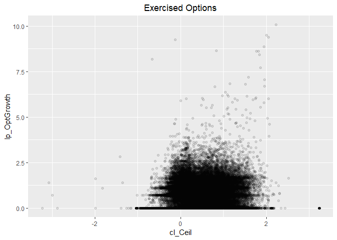<!-- -->

```r
#Model
n_Opt_04A <- glm (data=serv_opt,
                 ln_OptGrowth ~ cl_Ceil)
display(n_Opt_04A)
```

```
## glm(formula = ln_OptGrowth ~ cl_Ceil, data = serv_opt)
##             coef.est coef.se
## (Intercept) 5.69     0.03   
## cl_Ceil     3.80     0.04   
## ---
##   n = 74162, k = 2
##   residual deviance = 2310775.1, null deviance = 2585789.3 (difference = 275014.2)
##   overdispersion parameter = 31.2
##   residual sd is sqrt(overdispersion) = 5.58
```

```r
p_Opt_04A <- glm(data=serv_opt,
                        lp_OptGrowth ~ cl_Ceil)

display(p_Opt_04A)
```

```
## glm(formula = lp_OptGrowth ~ cl_Ceil, data = serv_opt)
##             coef.est coef.se
## (Intercept) 0.59     0.00   
## cl_Ceil     0.13     0.00   
## ---
##   n = 74162, k = 2
##   residual deviance = 34617.0, null deviance = 34944.5 (difference = 327.5)
##   overdispersion parameter = 0.5
##   residual sd is sqrt(overdispersion) = 0.68
```

```r
#Plot residuals versus fitted
stargazer::stargazer(n_Opt_03D,n_Opt_04A,
                       
                       p_Opt_03D,p_Opt_04A,
                       type="text",
                       digits=2)
```

```
## 
## ======================================================================
##                                       Dependent variable:             
##                          ---------------------------------------------
##                               ln_OptGrowth           lp_OptGrowth     
##                              (1)         (2)        (3)        (4)    
## ----------------------------------------------------------------------
## cl_US6_avg_sal_lag1Const   0.82***                -0.02***            
##                            (0.05)                  (0.01)             
##                                                                       
## cl_CFTE                   -0.73***                -0.13***            
##                            (0.06)                  (0.01)             
##                                                                       
## c_pPBSC                   -0.35***                -0.03***            
##                            (0.05)                  (0.01)             
##                                                                       
## c_pOffPSC                  1.31***                0.28***             
##                            (0.07)                  (0.01)             
##                                                                       
## c_pairHist                 0.34***                 -0.001             
##                            (0.05)                  (0.01)             
##                                                                       
## cl_pairCA                 -2.14***                -0.13***            
##                            (0.06)                  (0.01)             
##                                                                       
## cl_Ceil                                3.80***               0.13***  
##                                        (0.04)                (0.005)  
##                                                                       
## Constant                   7.01***     5.69***    0.64***    0.59***  
##                            (0.02)      (0.03)     (0.003)    (0.003)  
##                                                                       
## ----------------------------------------------------------------------
## Observations               74,162      74,162      74,162     74,162  
## Log Likelihood           -235,924.90 -232,757.10 -76,354.49 -76,980.03
## Akaike Inf. Crit.        471,863.80  465,518.20  152,723.00 153,964.10
## ======================================================================
## Note:                                      *p<0.1; **p<0.05; ***p<0.01
```

```r
#summary_residual_compare(n_Opt_03D,n_Opt_04A, skip_vif = TRUE)
```

Contract ceiling has a significant relationship, though the residuals show a possible non-linear patterns. This is most remarkable in the positive centered values between 0 and 1. This may be driven  by a missing value and is worth watching.
Expectations upheld for ceiling breaches and terminations. Weak expectations for options growth were countered.

#### 04B: Maximum Duration

Expectation: Greater maximum duration will positively estimate the probability ceiling of  breaches and terminations. Greater growth for options is also expected, because year-on-year options may be more of a default, though the scatter plot seems to go the other way.


```r
#Frequency Plot for max duration
# freq_continuous_cbre_plot(serv_opt,"UnmodifiedDays",
#                bins=1000)

summary_continuous_plot(serv_opt,"capped_cl_Days")
```

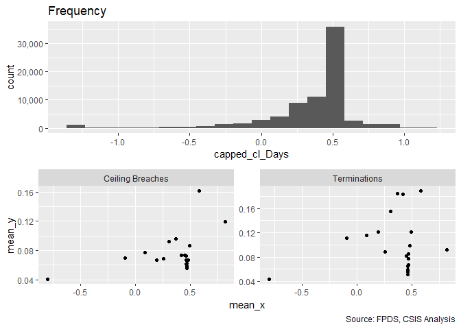<!-- -->

```r
#Scatter Plot
ggplot(serv_opt, aes(x=capped_cl_Days, y=lp_OptGrowth)) + geom_point(alpha = 0.1) + ggtitle('Exercised Options') + theme(plot.title = element_text(hjust = 0.5))
```

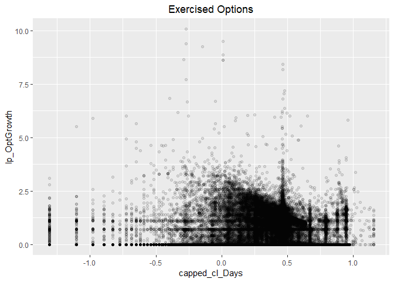<!-- -->

```r
#Model
n_Opt_04B <- glm (data=serv_opt,
                 ln_OptGrowth ~ capped_cl_Days)
display(n_Opt_04B)
```

```
## glm(formula = ln_OptGrowth ~ capped_cl_Days, data = serv_opt)
##                coef.est coef.se
## (Intercept)    6.08     0.03   
## capped_cl_Days 3.42     0.06   
## ---
##   n = 74162, k = 2
##   residual deviance = 2488923.5, null deviance = 2585789.3 (difference = 96865.8)
##   overdispersion parameter = 33.6
##   residual sd is sqrt(overdispersion) = 5.79
```

```r
p_Opt_04B <- glm(data=serv_opt,
                        lp_OptGrowth ~ capped_cl_Days)

display(p_Opt_04B)
```

```
## glm(formula = lp_OptGrowth ~ capped_cl_Days, data = serv_opt)
##                coef.est coef.se
## (Intercept)    0.59     0.00   
## capped_cl_Days 0.17     0.01   
## ---
##   n = 74162, k = 2
##   residual deviance = 34709.6, null deviance = 34944.5 (difference = 234.9)
##   overdispersion parameter = 0.5
##   residual sd is sqrt(overdispersion) = 0.68
```

```r
#Plot residuals versus fitted
stargazer::stargazer(n_Opt_03D,n_Opt_04A,n_Opt_04B,
                       
                       p_Opt_03D,p_Opt_04A,p_Opt_04B,
                       type="text",
                       digits=2)
```

```
## 
## =============================================================================================
##                                                  Dependent variable:                         
##                          --------------------------------------------------------------------
##                                     ln_OptGrowth                       lp_OptGrowth          
##                              (1)         (2)         (3)        (4)        (5)        (6)    
## ---------------------------------------------------------------------------------------------
## cl_US6_avg_sal_lag1Const   0.82***                            -0.02***                       
##                            (0.05)                              (0.01)                        
##                                                                                              
## cl_CFTE                   -0.73***                            -0.13***                       
##                            (0.06)                              (0.01)                        
##                                                                                              
## c_pPBSC                   -0.35***                            -0.03***                       
##                            (0.05)                              (0.01)                        
##                                                                                              
## c_pOffPSC                  1.31***                            0.28***                        
##                            (0.07)                              (0.01)                        
##                                                                                              
## c_pairHist                 0.34***                             -0.001                        
##                            (0.05)                              (0.01)                        
##                                                                                              
## cl_pairCA                 -2.14***                            -0.13***                       
##                            (0.06)                              (0.01)                        
##                                                                                              
## cl_Ceil                                3.80***                           0.13***             
##                                        (0.04)                            (0.005)             
##                                                                                              
## capped_cl_Days                                     3.42***                          0.17***  
##                                                    (0.06)                            (0.01)  
##                                                                                              
## Constant                   7.01***     5.69***     6.08***    0.64***    0.59***    0.59***  
##                            (0.02)      (0.03)      (0.03)     (0.003)    (0.003)    (0.004)  
##                                                                                              
## ---------------------------------------------------------------------------------------------
## Observations               74,162      74,162      74,162      74,162     74,162     74,162  
## Log Likelihood           -235,924.90 -232,757.10 -235,511.00 -76,354.49 -76,980.03 -77,079.10
## Akaike Inf. Crit.        471,863.80  465,518.20  471,026.00  152,723.00 153,964.10 154,162.20
## =============================================================================================
## Note:                                                             *p<0.1; **p<0.05; ***p<0.01
```

```r
summary_residual_compare(n_Opt_03D,n_Opt_04B, skip_vif = TRUE)
```

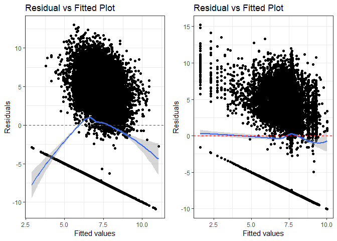<!-- -->

```
## Warning in if (class(model1_new) == "glmerMod") {: the condition has length
## > 1 and only the first element will be used
```

```
## Warning in if (class(model1_new) != "glmerMod" & class(model1_old) !=
## "glmerMod" & : the condition has length > 1 and only the first element will
## be used
```

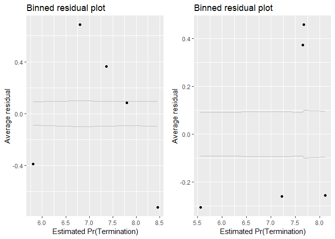<!-- -->

```
## NULL
```

```r
summary_residual_compare(n_Opt_04A,n_Opt_04B, skip_vif = TRUE)
```

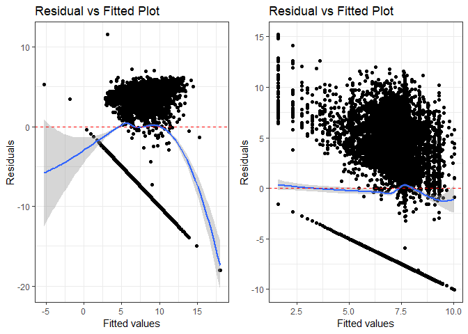<!-- -->

```
## Warning in if (class(model1_new) == "glmerMod") {: the condition has length
## > 1 and only the first element will be used

## Warning in if (class(model1_new) == "glmerMod") {: the condition has length
## > 1 and only the first element will be used
```

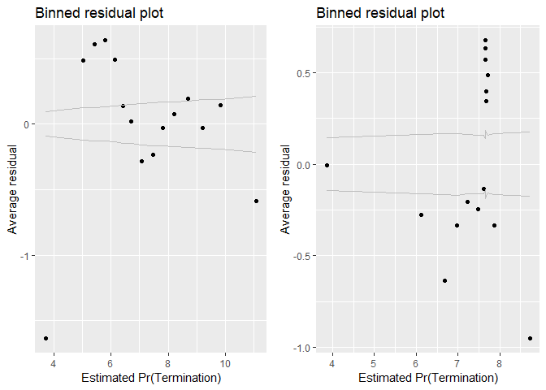<!-- -->

```
## NULL
```

All expections were upheld.

#### 04C: Both Scope variables


```r
#Model
n_Opt_04C <- glm (data=serv_opt,
                 ln_OptGrowth ~ cl_Ceil + capped_cl_Days)
display(n_Opt_04C)
```

```
## glm(formula = ln_OptGrowth ~ cl_Ceil + capped_cl_Days, data = serv_opt)
##                coef.est coef.se
## (Intercept)    4.88     0.03   
## cl_Ceil        3.55     0.04   
## capped_cl_Days 2.67     0.06   
## ---
##   n = 74162, k = 3
##   residual deviance = 2253067.0, null deviance = 2585789.3 (difference = 332722.3)
##   overdispersion parameter = 30.4
##   residual sd is sqrt(overdispersion) = 5.51
```

```r
p_Opt_04C <- glm(data=serv_opt,
                        lp_OptGrowth ~cl_Ceil + capped_cl_Days)

display(p_Opt_04C)
```

```
## glm(formula = lp_OptGrowth ~ cl_Ceil + capped_cl_Days, data = serv_opt)
##                coef.est coef.se
## (Intercept)    0.55     0.00   
## cl_Ceil        0.12     0.00   
## capped_cl_Days 0.14     0.01   
## ---
##   n = 74162, k = 3
##   residual deviance = 34450.0, null deviance = 34944.5 (difference = 494.5)
##   overdispersion parameter = 0.5
##   residual sd is sqrt(overdispersion) = 0.68
```

```r
#Plot residuals versus fitted
stargazer::stargazer(n_Opt_03D,n_Opt_04A,n_Opt_04B,n_Opt_04C,
                       
                       p_Opt_03D,p_Opt_04A,p_Opt_04B,p_Opt_04C,
                       type="text",
                       digits=2)
```

```
## 
## ====================================================================================================================
##                                                              Dependent variable:                                    
##                          -------------------------------------------------------------------------------------------
##                                           ln_OptGrowth                                  lp_OptGrowth                
##                              (1)         (2)         (3)         (4)        (5)        (6)        (7)        (8)    
## --------------------------------------------------------------------------------------------------------------------
## cl_US6_avg_sal_lag1Const   0.82***                                        -0.02***                                  
##                            (0.05)                                          (0.01)                                   
##                                                                                                                     
## cl_CFTE                   -0.73***                                        -0.13***                                  
##                            (0.06)                                          (0.01)                                   
##                                                                                                                     
## c_pPBSC                   -0.35***                                        -0.03***                                  
##                            (0.05)                                          (0.01)                                   
##                                                                                                                     
## c_pOffPSC                  1.31***                                        0.28***                                   
##                            (0.07)                                          (0.01)                                   
##                                                                                                                     
## c_pairHist                 0.34***                                         -0.001                                   
##                            (0.05)                                          (0.01)                                   
##                                                                                                                     
## cl_pairCA                 -2.14***                                        -0.13***                                  
##                            (0.06)                                          (0.01)                                   
##                                                                                                                     
## cl_Ceil                                3.80***                 3.55***               0.13***               0.12***  
##                                        (0.04)                  (0.04)                (0.005)               (0.005)  
##                                                                                                                     
## capped_cl_Days                                     3.42***     2.67***                          0.17***    0.14***  
##                                                    (0.06)      (0.06)                            (0.01)     (0.01)  
##                                                                                                                     
## Constant                   7.01***     5.69***     6.08***     4.88***    0.64***    0.59***    0.59***    0.55***  
##                            (0.02)      (0.03)      (0.03)      (0.03)     (0.003)    (0.003)    (0.004)    (0.004)  
##                                                                                                                     
## --------------------------------------------------------------------------------------------------------------------
## Observations               74,162      74,162      74,162      74,162      74,162     74,162     74,162     74,162  
## Log Likelihood           -235,924.90 -232,757.10 -235,511.00 -231,819.30 -76,354.49 -76,980.03 -77,079.10 -76,800.73
## Akaike Inf. Crit.        471,863.80  465,518.20  471,026.00  463,644.60  152,723.00 153,964.10 154,162.20 153,607.50
## ====================================================================================================================
## Note:                                                                                    *p<0.1; **p<0.05; ***p<0.01
```

```r
#summary_residual_compare(n_Opt_03D,n_Opt_04C)
#summary_residual_compare(n_Opt_04A,n_Opt_04C)
#summary_residual_compare(n_Opt_04B,n_Opt_04C)
```
Days loses significance for ceiling breaches. Ceiling has a smaller coefficient for terminations. Otherwise largely unchanged.

#### 04D: Cumulative  Model


```r
#Model
n_Opt_04D <- glm (data=serv_opt,
                 ln_OptGrowth ~  cl_US6_avg_sal_lag1Const + 
                   cl_CFTE+ c_pPBSC+c_pOffPSC+
                 c_pairHist+cl_pairCA +
                   cl_Ceil + capped_cl_Days)
glmer_examine(n_Opt_04D)
```

```
## cl_US6_avg_sal_lag1Const                  cl_CFTE                  c_pPBSC 
##                 1.547595                 1.470315                 1.175353 
##                c_pOffPSC               c_pairHist                cl_pairCA 
##                 1.720683                 1.451477                 2.259309 
##                  cl_Ceil           capped_cl_Days 
##                 1.101473                 1.066936
```

```r
p_Opt_04D <- glm(data=serv_opt,
                        lp_OptGrowth ~  cl_US6_avg_sal_lag1Const + 
                   cl_CFTE+ c_pPBSC+c_pOffPSC+
                 c_pairHist+cl_pairCA+
                 cl_Ceil + capped_cl_Days)

glmer_examine(p_Opt_04D)
```

```
## cl_US6_avg_sal_lag1Const                  cl_CFTE                  c_pPBSC 
##                 1.547595                 1.470315                 1.175353 
##                c_pOffPSC               c_pairHist                cl_pairCA 
##                 1.720683                 1.451477                 2.259309 
##                  cl_Ceil           capped_cl_Days 
##                 1.101473                 1.066936
```

```r
#Plot residuals versus fitted   

stargazer::stargazer(n_Opt_03D,n_Opt_04C,n_Opt_04D,
                       
                       p_Opt_03D,p_Opt_04C,p_Opt_04D,
                       type="text",
                       digits=2)
```

```
## 
## =============================================================================================
##                                                  Dependent variable:                         
##                          --------------------------------------------------------------------
##                                     ln_OptGrowth                       lp_OptGrowth          
##                              (1)         (2)         (3)        (4)        (5)        (6)    
## ---------------------------------------------------------------------------------------------
## cl_US6_avg_sal_lag1Const   0.82***                  -0.06     -0.02***              -0.06*** 
##                            (0.05)                  (0.05)      (0.01)                (0.01)  
##                                                                                              
## cl_CFTE                   -0.73***                -0.77***    -0.13***              -0.13*** 
##                            (0.06)                  (0.05)      (0.01)                (0.01)  
##                                                                                              
## c_pPBSC                   -0.35***                 0.21***    -0.03***              -0.02*** 
##                            (0.05)                  (0.05)      (0.01)                (0.01)  
##                                                                                              
## c_pOffPSC                  1.31***                 1.13***    0.28***               0.27***  
##                            (0.07)                  (0.06)      (0.01)                (0.01)  
##                                                                                              
## c_pairHist                 0.34***                 0.25***     -0.001                -0.01   
##                            (0.05)                  (0.05)      (0.01)                (0.01)  
##                                                                                              
## cl_pairCA                 -2.14***                -1.34***    -0.13***              -0.09*** 
##                            (0.06)                  (0.05)      (0.01)                (0.01)  
##                                                                                              
## cl_Ceil                                3.55***     3.58***               0.12***    0.13***  
##                                        (0.04)      (0.04)                (0.005)     (0.01)  
##                                                                                              
## capped_cl_Days                         2.67***     2.42***               0.14***    0.15***  
##                                        (0.06)      (0.06)                 (0.01)     (0.01)  
##                                                                                              
## Constant                   7.01***     4.88***     4.86***    0.64***    0.55***    0.54***  
##                            (0.02)      (0.03)      (0.03)     (0.003)    (0.004)    (0.004)  
##                                                                                              
## ---------------------------------------------------------------------------------------------
## Observations               74,162      74,162      74,162      74,162     74,162     74,162  
## Log Likelihood           -235,924.90 -231,819.30 -231,287.00 -76,354.49 -76,800.73 -75,747.51
## Akaike Inf. Crit.        471,863.80  463,644.60  462,592.00  152,723.00 153,607.50 151,513.00
## =============================================================================================
## Note:                                                             *p<0.1; **p<0.05; ***p<0.01
```

```r
#summary_residual_compare(n_Opt_03D,n_Opt_04D)
#summary_residual_compare(n_Opt_04C,n_Opt_04D)
```
Salary no longer matches expectations for ceiling breaches. Invoice rate is no longer significant for terminations. 


### Competition
#### 05A: No Competition / 1 / 2-4 / 5+ Offers
Expectations
No Competition (Baseline)			+	-	-
1 Offer			+	-	-
2-4 Offers			-	+	+
5+ Offers			-	+	-


```r
summary_discrete_plot(serv_opt,"Comp1or5")
```

```
## Warning: Ignoring unknown parameters: binwidth, bins, pad
```

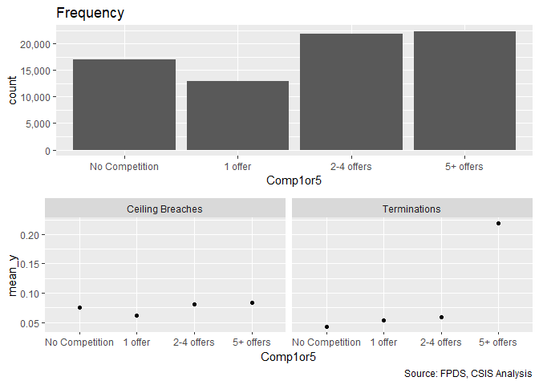<!-- -->

```
## [[1]]
## 
## No Competition        1 offer     2-4 offers      5+ offers 
##          17031          12887          21862          22382 
## 
## [[2]]
##                 
##                   None Ceiling Breach
##   No Competition 15737           1294
##   1 offer        12092            795
##   2-4 offers     20099           1763
##   5+ offers      20515           1867
## 
## [[3]]
##                 
##                      0     1
##   No Competition 16307   724
##   1 offer        12193   694
##   2-4 offers     20582  1280
##   5+ offers      17480  4902
```

```r
#Scatter Plot
ggplot(serv_opt, aes(x=Comp1or5, y=lp_OptGrowth)) + geom_point(alpha = 0.1) + ggtitle('Exercised Options') + theme(plot.title = element_text(hjust = 0.5))
```

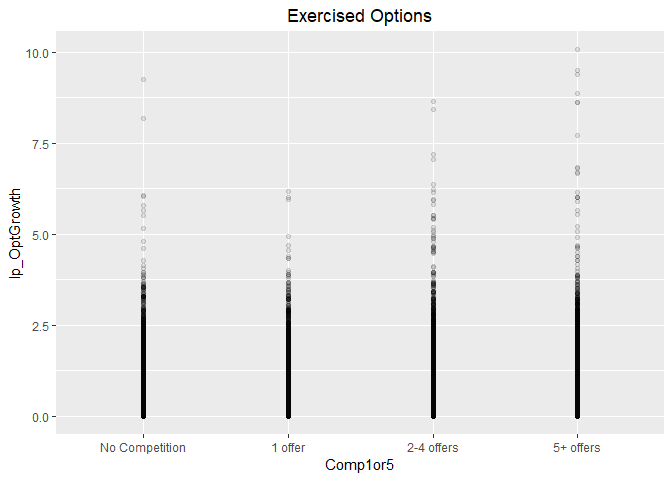<!-- -->

```r
#Model
n_Opt_05A <- glm (data=serv_opt,
                 ln_OptGrowth ~ Comp1or5)
display(n_Opt_05A)
```

```
## glm(formula = ln_OptGrowth ~ Comp1or5, data = serv_opt)
##                    coef.est coef.se
## (Intercept)         7.83     0.05  
## Comp1or51 offer    -1.14     0.07  
## Comp1or52-4 offers -0.38     0.06  
## Comp1or55+ offers  -0.92     0.06  
## ---
##   n = 74162, k = 4
##   residual deviance = 2572500.8, null deviance = 2585789.3 (difference = 13288.5)
##   overdispersion parameter = 34.7
##   residual sd is sqrt(overdispersion) = 5.89
```

```r
p_Opt_05A <- glm(data=serv_opt,
                        lp_OptGrowth ~ Comp1or5)

display(p_Opt_05A)
```

```
## glm(formula = lp_OptGrowth ~ Comp1or5, data = serv_opt)
##                    coef.est coef.se
## (Intercept)         0.64     0.01  
## Comp1or51 offer    -0.03     0.01  
## Comp1or52-4 offers  0.00     0.01  
## Comp1or55+ offers   0.04     0.01  
## ---
##   n = 74162, k = 4
##   residual deviance = 34900.9, null deviance = 34944.5 (difference = 43.6)
##   overdispersion parameter = 0.5
##   residual sd is sqrt(overdispersion) = 0.69
```

```r
#Plot residuals versus fitted
stargazer::stargazer(n_Opt_04D,n_Opt_05A,
                       
                       p_Opt_04D,p_Opt_05A,
                       type="text",
                       digits=2)
```

```
## 
## ======================================================================
##                                       Dependent variable:             
##                          ---------------------------------------------
##                               ln_OptGrowth           lp_OptGrowth     
##                              (1)         (2)        (3)        (4)    
## ----------------------------------------------------------------------
## cl_US6_avg_sal_lag1Const    -0.06                 -0.06***            
##                            (0.05)                  (0.01)             
##                                                                       
## cl_CFTE                   -0.77***                -0.13***            
##                            (0.05)                  (0.01)             
##                                                                       
## c_pPBSC                    0.21***                -0.02***            
##                            (0.05)                  (0.01)             
##                                                                       
## c_pOffPSC                  1.13***                0.27***             
##                            (0.06)                  (0.01)             
##                                                                       
## c_pairHist                 0.25***                 -0.01              
##                            (0.05)                  (0.01)             
##                                                                       
## cl_pairCA                 -1.34***                -0.09***            
##                            (0.05)                  (0.01)             
##                                                                       
## cl_Ceil                    3.58***                0.13***             
##                            (0.04)                  (0.01)             
##                                                                       
## capped_cl_Days             2.42***                0.15***             
##                            (0.06)                  (0.01)             
##                                                                       
## Comp1or51 offer                       -1.14***               -0.03*** 
##                                        (0.07)                 (0.01)  
##                                                                       
## Comp1or52-4 offers                    -0.38***                0.002   
##                                        (0.06)                 (0.01)  
##                                                                       
## Comp1or55+ offers                     -0.92***               0.04***  
##                                        (0.06)                 (0.01)  
##                                                                       
## Constant                   4.86***     7.83***    0.54***    0.64***  
##                            (0.03)      (0.05)     (0.004)     (0.01)  
##                                                                       
## ----------------------------------------------------------------------
## Observations               74,162      74,162      74,162     74,162  
## Log Likelihood           -231,287.00 -236,735.70 -75,747.51 -77,282.92
## Akaike Inf. Crit.        462,592.00  473,479.40  151,513.00 154,573.90
## ======================================================================
## Note:                                      *p<0.1; **p<0.05; ***p<0.01
```
Expectations were completely unmet for ceiling breaches. For terminations, expectations were met for 2-4 offers and 5+ offers, but not for 1 offer. For ceiling breaches expectations were met for 1 offer, but not for 2-4 or 5+.

#### 05B: Cumulative  Model


```r
#Model
n_Opt_05B <- glm (data=serv_opt,
                 ln_OptGrowth ~  cl_US6_avg_sal_lag1Const + 
                   cl_CFTE+ c_pPBSC+c_pOffPSC+
                 c_pairHist+cl_pairCA +
                   cl_Ceil + capped_cl_Days+
                   Comp1or5)
glmer_examine(n_Opt_05B)
```

```
##                              GVIF Df GVIF^(1/(2*Df))
## cl_US6_avg_sal_lag1Const 1.553771  1        1.246504
## cl_CFTE                  1.472521  1        1.213475
## c_pPBSC                  1.196281  1        1.093746
## c_pOffPSC                1.757626  1        1.325755
## c_pairHist               1.494454  1        1.222479
## cl_pairCA                2.405111  1        1.550842
## cl_Ceil                  1.111130  1        1.054102
## capped_cl_Days           1.094821  1        1.046337
## Comp1or5                 1.288884  3        1.043203
```

```r
p_Opt_05B <- glm(data=serv_opt,
                        lp_OptGrowth ~  cl_US6_avg_sal_lag1Const + 
                   cl_CFTE+ c_pPBSC+c_pOffPSC+
                 c_pairHist+cl_pairCA+
                 cl_Ceil + capped_cl_Days+
                 Comp1or5)

glmer_examine(p_Opt_05B)
```

```
##                              GVIF Df GVIF^(1/(2*Df))
## cl_US6_avg_sal_lag1Const 1.553771  1        1.246504
## cl_CFTE                  1.472521  1        1.213475
## c_pPBSC                  1.196281  1        1.093746
## c_pOffPSC                1.757626  1        1.325755
## c_pairHist               1.494454  1        1.222479
## cl_pairCA                2.405111  1        1.550842
## cl_Ceil                  1.111130  1        1.054102
## capped_cl_Days           1.094821  1        1.046337
## Comp1or5                 1.288884  3        1.043203
```

```r
#Plot residuals versus fitted   

stargazer::stargazer(n_Opt_04D,n_Opt_05A,n_Opt_05B,
                       
                       p_Opt_04D,p_Opt_05A,p_Opt_05B,
                       type="text",
                       digits=2)
```

```
## 
## =============================================================================================
##                                                  Dependent variable:                         
##                          --------------------------------------------------------------------
##                                     ln_OptGrowth                       lp_OptGrowth          
##                              (1)         (2)         (3)        (4)        (5)        (6)    
## ---------------------------------------------------------------------------------------------
## cl_US6_avg_sal_lag1Const    -0.06                   -0.07     -0.06***              -0.06*** 
##                            (0.05)                  (0.05)      (0.01)                (0.01)  
##                                                                                              
## cl_CFTE                   -0.77***                -0.78***    -0.13***              -0.14*** 
##                            (0.05)                  (0.05)      (0.01)                (0.01)  
##                                                                                              
## c_pPBSC                    0.21***                 0.18***    -0.02***              -0.02*** 
##                            (0.05)                  (0.05)      (0.01)                (0.01)  
##                                                                                              
## c_pOffPSC                  1.13***                 1.12***    0.27***               0.26***  
##                            (0.06)                  (0.06)      (0.01)                (0.01)  
##                                                                                              
## c_pairHist                 0.25***                 0.27***     -0.01                -0.0001  
##                            (0.05)                  (0.05)      (0.01)                (0.01)  
##                                                                                              
## cl_pairCA                 -1.34***                -1.34***    -0.09***              -0.10*** 
##                            (0.05)                  (0.06)      (0.01)                (0.01)  
##                                                                                              
## cl_Ceil                    3.58***                 3.57***    0.13***               0.14***  
##                            (0.04)                  (0.04)      (0.01)                (0.01)  
##                                                                                              
## capped_cl_Days             2.42***                 2.39***    0.15***               0.14***  
##                            (0.06)                  (0.06)      (0.01)                (0.01)  
##                                                                                              
## Comp1or51 offer                       -1.14***    -0.36***               -0.03***    -0.01   
##                                        (0.07)      (0.06)                 (0.01)     (0.01)  
##                                                                                              
## Comp1or52-4 offers                    -0.38***    -0.22***                0.002      -0.01*  
##                                        (0.06)      (0.06)                 (0.01)     (0.01)  
##                                                                                              
## Comp1or55+ offers                     -0.92***     -0.12**               0.04***    0.04***  
##                                        (0.06)      (0.06)                 (0.01)     (0.01)  
##                                                                                              
## Constant                   4.86***     7.83***     5.04***    0.54***    0.64***    0.53***  
##                            (0.03)      (0.05)      (0.05)     (0.004)     (0.01)     (0.01)  
##                                                                                              
## ---------------------------------------------------------------------------------------------
## Observations               74,162      74,162      74,162      74,162     74,162     74,162  
## Log Likelihood           -231,287.00 -236,735.70 -231,270.20 -75,747.51 -77,282.92 -75,715.88
## Akaike Inf. Crit.        462,592.00  473,479.40  462,564.30  151,513.00 154,573.90 151,455.80
## =============================================================================================
## Note:                                                             *p<0.1; **p<0.05; ***p<0.01
```

```r
#summary_residual_compare(n_Opt_04D,n_Opt_05B)
```
Minimal effect on study variables. 2-4 offers for terminations is not  longer significant, it's really 5+ that boosts the risks. But for exercised options, 5+ leads to more options while fewer having negative relationship with 2-4 offers, but only significant with p-value < 0.1 

### Contract Vehicle

#### 06A: Def/Pur; S-IDC; M-IDC; FSS-GWAC; BPA-BOA.

Old text:
Expectation: Indefinite delivery vehicles, means that the government has an existing relationship with the vendor and administration is easier. The downside is that the government may be locked into the vendor, although exit does not necessarily require outright termination, instead the government may simply cease to use a vehicle. Taken together, across the board the four categories of vehicles are expected to  negatively estimate the probability of termination. Ceiling breaches are a more complex topic and the study team does not have immediate expecations aside from likely significance.
Definitive Contract (base)			+	+	+
Single-Award IDC			-	-	-
Multi-Award IDC			-	-	-
FSS/GWAC			-	-	-
BPA/BOA			-	-	-


```r
summary_discrete_plot(serv_opt,"Veh")
```

```
## Warning: Ignoring unknown parameters: binwidth, bins, pad
```

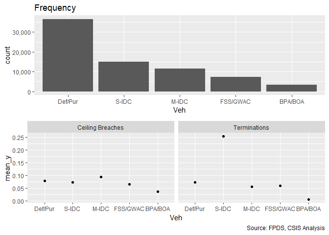<!-- -->

```
## [[1]]
## 
##  Def/Pur    S-IDC    M-IDC FSS/GWAC  BPA/BOA 
##    36654    15060    11591     7403     3454 
## 
## [[2]]
##           
##             None Ceiling Breach
##   Def/Pur  33742           2912
##   S-IDC    13958           1102
##   M-IDC    10504           1087
##   FSS/GWAC  6911            492
##   BPA/BOA   3328            126
## 
## [[3]]
##           
##                0     1
##   Def/Pur  33985  2669
##   S-IDC    11237  3823
##   M-IDC    10945   646
##   FSS/GWAC  6961   442
##   BPA/BOA   3434    20
```

```r
#Scatter Plot
ggplot(serv_opt, aes(x=Veh, y=lp_OptGrowth)) + geom_point(alpha = 0.1) + ggtitle('Exercised Options') + theme(plot.title = element_text(hjust = 0.5))
```

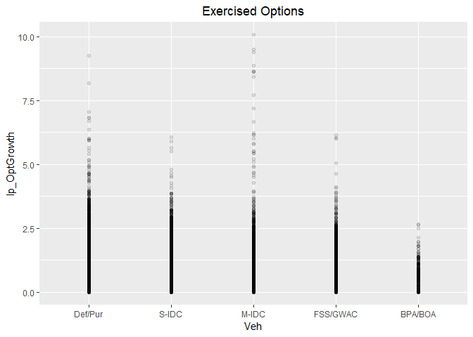<!-- -->

```r
#Model
n_Opt_06A <- glm (data=serv_opt,
                 ln_OptGrowth ~ Veh)
display(n_Opt_06A)
```

```
## glm(formula = ln_OptGrowth ~ Veh, data = serv_opt)
##             coef.est coef.se
## (Intercept)  7.41     0.03  
## VehS-IDC    -1.16     0.06  
## VehM-IDC     1.47     0.06  
## VehFSS/GWAC  1.14     0.07  
## VehBPA/BOA  -6.08     0.10  
## ---
##   n = 74162, k = 5
##   residual deviance = 2405319.9, null deviance = 2585789.3 (difference = 180469.3)
##   overdispersion parameter = 32.4
##   residual sd is sqrt(overdispersion) = 5.70
```

```r
p_Opt_06A <- glm(data=serv_opt,
                        lp_OptGrowth ~ Veh)

display(p_Opt_06A)
```

```
## glm(formula = lp_OptGrowth ~ Veh, data = serv_opt)
##             coef.est coef.se
## (Intercept)  0.68     0.00  
## VehS-IDC    -0.05     0.01  
## VehM-IDC    -0.01     0.01  
## VehFSS/GWAC  0.03     0.01  
## VehBPA/BOA  -0.60     0.01  
## ---
##   n = 74162, k = 5
##   residual deviance = 33753.1, null deviance = 34944.5 (difference = 1191.5)
##   overdispersion parameter = 0.5
##   residual sd is sqrt(overdispersion) = 0.67
```

```r
#Plot residuals versus fitted
stargazer::stargazer(n_Opt_05B,n_Opt_06A,
                       
                       p_Opt_05B,p_Opt_06A,
                       type="text",
                       digits=2)
```

```
## 
## ======================================================================
##                                       Dependent variable:             
##                          ---------------------------------------------
##                               ln_OptGrowth           lp_OptGrowth     
##                              (1)         (2)        (3)        (4)    
## ----------------------------------------------------------------------
## cl_US6_avg_sal_lag1Const    -0.07                 -0.06***            
##                            (0.05)                  (0.01)             
##                                                                       
## cl_CFTE                   -0.78***                -0.14***            
##                            (0.05)                  (0.01)             
##                                                                       
## c_pPBSC                    0.18***                -0.02***            
##                            (0.05)                  (0.01)             
##                                                                       
## c_pOffPSC                  1.12***                0.26***             
##                            (0.06)                  (0.01)             
##                                                                       
## c_pairHist                 0.27***                -0.0001             
##                            (0.05)                  (0.01)             
##                                                                       
## cl_pairCA                 -1.34***                -0.10***            
##                            (0.06)                  (0.01)             
##                                                                       
## cl_Ceil                    3.57***                0.14***             
##                            (0.04)                  (0.01)             
##                                                                       
## capped_cl_Days             2.39***                0.14***             
##                            (0.06)                  (0.01)             
##                                                                       
## Comp1or51 offer           -0.36***                 -0.01              
##                            (0.06)                  (0.01)             
##                                                                       
## Comp1or52-4 offers        -0.22***                 -0.01*             
##                            (0.06)                  (0.01)             
##                                                                       
## Comp1or55+ offers          -0.12**                0.04***             
##                            (0.06)                  (0.01)             
##                                                                       
## VehS-IDC                              -1.16***               -0.05*** 
##                                        (0.06)                 (0.01)  
##                                                                       
## VehM-IDC                               1.47***               -0.01**  
##                                        (0.06)                 (0.01)  
##                                                                       
## VehFSS/GWAC                            1.14***               0.03***  
##                                        (0.07)                 (0.01)  
##                                                                       
## VehBPA/BOA                            -6.08***               -0.60*** 
##                                        (0.10)                 (0.01)  
##                                                                       
## Constant                   5.04***     7.41***    0.53***    0.68***  
##                            (0.05)      (0.03)      (0.01)    (0.004)  
##                                                                       
## ----------------------------------------------------------------------
## Observations               74,162      74,162      74,162     74,162  
## Log Likelihood           -231,270.20 -234,244.00 -75,715.88 -76,042.86
## Akaike Inf. Crit.        462,564.30  468,498.00  151,455.80 152,095.70
## ======================================================================
## Note:                                      *p<0.1; **p<0.05; ***p<0.01
```

```r
#summary_residual_compare(n_Opt_05D,n_Opt_06A)
```
For ceiling breaches, IDCs, particularly multiaward IDCs, were more likely to have breaches contrary to expecatitions.

For terminations expectation were upheld or S-IDCs and BPA/BOA. They were not upheld for multi-award, which is significantly more likely to be terminated.

Expectations were largely upheld for options exercised, with the exception of FSS/GWAC.


#### 06B: Cumulative  Model


```r
#Model
n_Opt_06B <- glm (data=serv_opt,
                 ln_OptGrowth ~  cl_US6_avg_sal_lag1Const + 
                   cl_CFTE+ c_pPBSC+c_pOffPSC+
                 c_pairHist+cl_pairCA +
                   cl_Ceil + capped_cl_Days+
                   Comp1or5+
                   Veh)
glmer_examine(n_Opt_06B)
```

```
##                              GVIF Df GVIF^(1/(2*Df))
## cl_US6_avg_sal_lag1Const 1.645123  1        1.282624
## cl_CFTE                  1.507873  1        1.227955
## c_pPBSC                  1.287458  1        1.134662
## c_pOffPSC                1.890568  1        1.374979
## c_pairHist               1.506326  1        1.227325
## cl_pairCA                2.711533  1        1.646673
## cl_Ceil                  1.337140  1        1.156348
## capped_cl_Days           1.103826  1        1.050631
## Comp1or5                 1.478597  3        1.067354
## Veh                      3.330809  4        1.162301
```

```r
p_Opt_06B <- glm(data=serv_opt,
                        lp_OptGrowth ~  cl_US6_avg_sal_lag1Const + 
                   cl_CFTE+ c_pPBSC+c_pOffPSC+
                 c_pairHist+cl_pairCA+
                 cl_Ceil + capped_cl_Days+
                 Comp1or5+
                   Veh)

glmer_examine(p_Opt_06B)
```

```
##                              GVIF Df GVIF^(1/(2*Df))
## cl_US6_avg_sal_lag1Const 1.645123  1        1.282624
## cl_CFTE                  1.507873  1        1.227955
## c_pPBSC                  1.287458  1        1.134662
## c_pOffPSC                1.890568  1        1.374979
## c_pairHist               1.506326  1        1.227325
## cl_pairCA                2.711533  1        1.646673
## cl_Ceil                  1.337140  1        1.156348
## capped_cl_Days           1.103826  1        1.050631
## Comp1or5                 1.478597  3        1.067354
## Veh                      3.330809  4        1.162301
```

```r
#Plot residuals versus fitted   

stargazer::stargazer(n_Opt_05B,n_Opt_06A,n_Opt_06B,
                       
                       p_Opt_05B,p_Opt_06A,p_Opt_06B,
                       type="text",
                       digits=2)
```

```
## 
## =============================================================================================
##                                                  Dependent variable:                         
##                          --------------------------------------------------------------------
##                                     ln_OptGrowth                       lp_OptGrowth          
##                              (1)         (2)         (3)        (4)        (5)        (6)    
## ---------------------------------------------------------------------------------------------
## cl_US6_avg_sal_lag1Const    -0.07                  0.12***    -0.06***              -0.02*** 
##                            (0.05)                  (0.05)      (0.01)                (0.01)  
##                                                                                              
## cl_CFTE                   -0.78***                -0.51***    -0.14***              -0.10*** 
##                            (0.05)                  (0.05)      (0.01)                (0.01)  
##                                                                                              
## c_pPBSC                    0.18***                 0.44***    -0.02***              0.03***  
##                            (0.05)                  (0.05)      (0.01)                (0.01)  
##                                                                                              
## c_pOffPSC                  1.12***                 1.31***    0.26***               0.27***  
##                            (0.06)                  (0.06)      (0.01)                (0.01)  
##                                                                                              
## c_pairHist                 0.27***                 0.32***    -0.0001                0.002   
##                            (0.05)                  (0.05)      (0.01)                (0.01)  
##                                                                                              
## cl_pairCA                 -1.34***                -0.75***    -0.10***              -0.02*** 
##                            (0.06)                  (0.06)      (0.01)                (0.01)  
##                                                                                              
## cl_Ceil                    3.57***                 3.11***    0.14***               0.08***  
##                            (0.04)                  (0.05)      (0.01)                (0.01)  
##                                                                                              
## capped_cl_Days             2.39***                 2.20***    0.14***               0.12***  
##                            (0.06)                  (0.06)      (0.01)                (0.01)  
##                                                                                              
## Comp1or51 offer           -0.36***                -0.40***     -0.01                 -0.001  
##                            (0.06)                  (0.06)      (0.01)                (0.01)  
##                                                                                              
## Comp1or52-4 offers        -0.22***                -0.17***     -0.01*                 0.01   
##                            (0.06)                  (0.06)      (0.01)                (0.01)  
##                                                                                              
## Comp1or55+ offers          -0.12**                 0.31***    0.04***               0.10***  
##                            (0.06)                  (0.06)      (0.01)                (0.01)  
##                                                                                              
## VehS-IDC                              -1.16***    -1.69***               -0.05***   -0.20*** 
##                                        (0.06)      (0.07)                 (0.01)     (0.01)  
##                                                                                              
## VehM-IDC                               1.47***      -0.08                -0.01**    -0.08*** 
##                                        (0.06)      (0.07)                 (0.01)     (0.01)  
##                                                                                              
## VehFSS/GWAC                            1.14***     0.50***               0.03***    0.02***  
##                                        (0.07)      (0.07)                 (0.01)     (0.01)  
##                                                                                              
## VehBPA/BOA                            -6.08***    -4.06***               -0.60***   -0.61*** 
##                                        (0.10)      (0.12)                 (0.01)     (0.01)  
##                                                                                              
## Constant                   5.04***     7.41***     5.70***    0.53***    0.68***    0.62***  
##                            (0.05)      (0.03)      (0.05)      (0.01)    (0.004)     (0.01)  
##                                                                                              
## ---------------------------------------------------------------------------------------------
## Observations               74,162      74,162      74,162      74,162     74,162     74,162  
## Log Likelihood           -231,270.20 -234,244.00 -230,483.80 -75,715.88 -76,042.86 -74,742.38
## Akaike Inf. Crit.        462,564.30  468,498.00  460,999.50  151,455.80 152,095.70 149,516.80
## =============================================================================================
## Note:                                                             *p<0.1; **p<0.05; ***p<0.01
```

```r
#summary_residual_compare(n_Opt_05B,n_Opt_06B)
```
Expectations for vehicle are now upheld for both ceiling breaches and terminations. For other variables the addition of vehicle proved less pivotal, though coefficients were often decreased.

### Type of Contract

The next step adds a measure for whether the contract was cost-based or fixed-price. 

Expectation Prior CSIS research has found that fixed-price contracts estimate a higher probability of terminations but did not find a notable relationship for ceiling breaches.

#### 07A: FFP / Other FP / Incentive / T&M/FP:LOE;LH / Other CB / Combination

Firm-Fixed Price (base)			+	++	+
Other Fixed Price			-	-	-
Time & Materials / Labor Hours / FP: LoE			+	-	-
Incentive Fee (both FPIF or CBIF)			-	-	+
Other Cost Based			-	-	-
Undefinitized Contract Award			++	++	--
Combination			+	+	-


```r
serv_opt$PricingUCA<-factor(serv_opt$PricingUCA,
                            levels=c( "FFP","Other FP","T&M/LH/FPLOE","Incentive","Other CB","UCA" ,"Combination or Other" ))
serv_opt$PricingUCA<-factor(serv_opt$PricingUCA,
                            levels=c( "FFP","Other FP","T&M/LH/FPLOE","Incentive","Other CB","UCA" ,"Combination or Other" ))
  summary_discrete_plot(serv_opt,"PricingUCA")
```

```
## Warning: Ignoring unknown parameters: binwidth, bins, pad
```

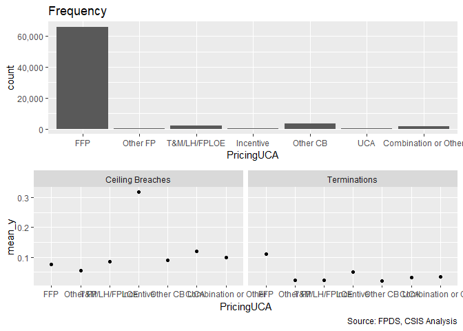<!-- -->

```
## [[1]]
## 
##                  FFP             Other FP         T&M/LH/FPLOE 
##                66114                  301                 1998 
##            Incentive             Other CB                  UCA 
##                  116                 3514                  462 
## Combination or Other 
##                 1657 
## 
## [[2]]
##                       
##                         None Ceiling Breach
##   FFP                  61152           4962
##   Other FP               284             17
##   T&M/LH/FPLOE          1829            169
##   Incentive               79             37
##   Other CB              3201            313
##   UCA                    407             55
##   Combination or Other  1491            166
## 
## [[3]]
##                       
##                            0     1
##   FFP                  58717  7397
##   Other FP               294     7
##   T&M/LH/FPLOE          1950    48
##   Incentive              110     6
##   Other CB              3443    71
##   UCA                    447    15
##   Combination or Other  1601    56
```

```r
#Scatter Plot
ggplot(serv_opt, aes(x=PricingUCA, y=lp_OptGrowth)) + geom_point(alpha = 0.1) + ggtitle('Exercised Options') + theme(plot.title = element_text(hjust = 0.5))
```

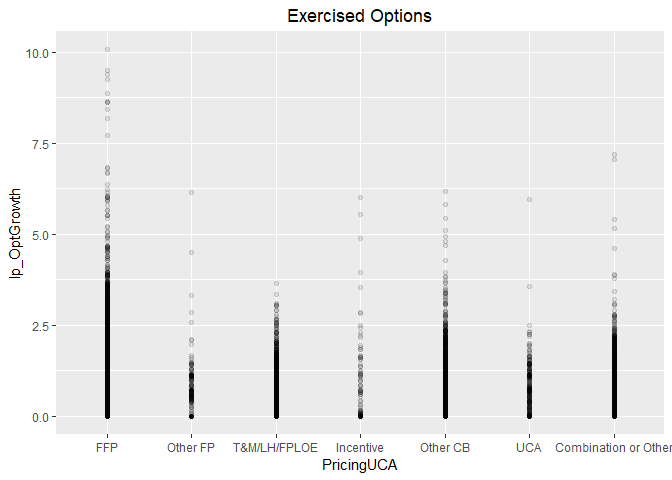<!-- -->

```r
#Model
n_Opt_07A <- glm (data=serv_opt,
                 ln_OptGrowth ~ PricingUCA)
display(n_Opt_07A)
```

```
## glm(formula = ln_OptGrowth ~ PricingUCA, data = serv_opt)
##                                coef.est coef.se
## (Intercept)                    6.93     0.02   
## PricingUCAOther FP             0.41     0.34   
## PricingUCAT&M/LH/FPLOE         1.93     0.13   
## PricingUCAIncentive            2.92     0.54   
## PricingUCAOther CB             3.60     0.10   
## PricingUCAUCA                  0.37     0.27   
## PricingUCACombination or Other 3.37     0.14   
## ---
##   n = 74162, k = 7
##   residual deviance = 2519799.9, null deviance = 2585789.3 (difference = 65989.4)
##   overdispersion parameter = 34.0
##   residual sd is sqrt(overdispersion) = 5.83
```

```r
p_Opt_07A <- glm(data=serv_opt,
                        lp_OptGrowth ~ PricingUCA)

display(p_Opt_07A)
```

```
## glm(formula = lp_OptGrowth ~ PricingUCA, data = serv_opt)
##                                coef.est coef.se
## (Intercept)                     0.64     0.00  
## PricingUCAOther FP             -0.12     0.04  
## PricingUCAT&M/LH/FPLOE         -0.02     0.02  
## PricingUCAIncentive             0.14     0.06  
## PricingUCAOther CB              0.11     0.01  
## PricingUCAUCA                  -0.14     0.03  
## PricingUCACombination or Other  0.17     0.02  
## ---
##   n = 74162, k = 7
##   residual deviance = 34842.9, null deviance = 34944.5 (difference = 101.6)
##   overdispersion parameter = 0.5
##   residual sd is sqrt(overdispersion) = 0.69
```

```r
#Plot residuals versus fitted
stargazer::stargazer(n_Opt_06B,n_Opt_07A,
                       
                       p_Opt_06B,p_Opt_07A,
                       type="text",
                       digits=2)
```

```
## 
## ============================================================================
##                                             Dependent variable:             
##                                ---------------------------------------------
##                                     ln_OptGrowth           lp_OptGrowth     
##                                    (1)         (2)        (3)        (4)    
## ----------------------------------------------------------------------------
## cl_US6_avg_sal_lag1Const         0.12***                -0.02***            
##                                  (0.05)                  (0.01)             
##                                                                             
## cl_CFTE                         -0.51***                -0.10***            
##                                  (0.05)                  (0.01)             
##                                                                             
## c_pPBSC                          0.44***                0.03***             
##                                  (0.05)                  (0.01)             
##                                                                             
## c_pOffPSC                        1.31***                0.27***             
##                                  (0.06)                  (0.01)             
##                                                                             
## c_pairHist                       0.32***                 0.002              
##                                  (0.05)                  (0.01)             
##                                                                             
## cl_pairCA                       -0.75***                -0.02***            
##                                  (0.06)                  (0.01)             
##                                                                             
## cl_Ceil                          3.11***                0.08***             
##                                  (0.05)                  (0.01)             
##                                                                             
## capped_cl_Days                   2.20***                0.12***             
##                                  (0.06)                  (0.01)             
##                                                                             
## Comp1or51 offer                 -0.40***                 -0.001             
##                                  (0.06)                  (0.01)             
##                                                                             
## Comp1or52-4 offers              -0.17***                  0.01              
##                                  (0.06)                  (0.01)             
##                                                                             
## Comp1or55+ offers                0.31***                0.10***             
##                                  (0.06)                  (0.01)             
##                                                                             
## VehS-IDC                        -1.69***                -0.20***            
##                                  (0.07)                  (0.01)             
##                                                                             
## VehM-IDC                          -0.08                 -0.08***            
##                                  (0.07)                  (0.01)             
##                                                                             
## VehFSS/GWAC                      0.50***                0.02***             
##                                  (0.07)                  (0.01)             
##                                                                             
## VehBPA/BOA                      -4.06***                -0.61***            
##                                  (0.12)                  (0.01)             
##                                                                             
## PricingUCAOther FP                            0.41                 -0.12*** 
##                                              (0.34)                 (0.04)  
##                                                                             
## PricingUCAT&M/LH/FPLOE                       1.93***                -0.02   
##                                              (0.13)                 (0.02)  
##                                                                             
## PricingUCAIncentive                          2.92***                0.14**  
##                                              (0.54)                 (0.06)  
##                                                                             
## PricingUCAOther CB                           3.60***               0.11***  
##                                              (0.10)                 (0.01)  
##                                                                             
## PricingUCAUCA                                 0.37                 -0.14*** 
##                                              (0.27)                 (0.03)  
##                                                                             
## PricingUCACombination or Other               3.37***               0.17***  
##                                              (0.14)                 (0.02)  
##                                                                             
## Constant                         5.70***     6.93***    0.62***    0.64***  
##                                  (0.05)      (0.02)      (0.01)    (0.003)  
##                                                                             
## ----------------------------------------------------------------------------
## Observations                     74,162      74,162      74,162     74,162  
## Log Likelihood                 -230,483.80 -235,968.20 -74,742.38 -77,221.23
## Akaike Inf. Crit.              460,999.50  471,950.30  149,516.80 154,456.50
## ============================================================================
## Note:                                            *p<0.1; **p<0.05; ***p<0.01
```

```r
#summary_residual_compare(n_Opt_06B,n_Opt_07A,30)
```

Other fixed price and other cost based aligned with expecations for ceiling breaches.
For terminations, other fixed price, incentive, cost-based, were line with expectations. 
For options exercied Other fixed-price, incentive, and UCA were in line with expectations

#### 07B: Cumulative  Model


```r
#Model
n_Opt_07B <- glm (data=serv_opt,
                 ln_OptGrowth ~  cl_US6_avg_sal_lag1Const + 
                   cl_CFTE+ c_pPBSC+c_pOffPSC+
                 c_pairHist+cl_pairCA +
                   cl_Ceil + capped_cl_Days+
                   Comp1or5+
                   Veh+
                   PricingUCA)
glmer_examine(n_Opt_07B)
```

```
##                              GVIF Df GVIF^(1/(2*Df))
## cl_US6_avg_sal_lag1Const 1.663464  1        1.289754
## cl_CFTE                  1.510955  1        1.229209
## c_pPBSC                  1.295574  1        1.138233
## c_pOffPSC                1.901164  1        1.378827
## c_pairHist               1.516754  1        1.231566
## cl_pairCA                2.728989  1        1.651965
## cl_Ceil                  1.440073  1        1.200030
## capped_cl_Days           1.106597  1        1.051949
## Comp1or5                 1.506657  3        1.070703
## Veh                      3.525892  4        1.170600
## PricingUCA               1.317745  6        1.023260
```

```r
p_Opt_07B <- glm(data=serv_opt,
                        lp_OptGrowth ~  cl_US6_avg_sal_lag1Const + 
                   cl_CFTE+ c_pPBSC+c_pOffPSC+
                 c_pairHist+cl_pairCA+
                 cl_Ceil + capped_cl_Days+
                 Comp1or5+
                   Veh+
                   PricingUCA)

glmer_examine(p_Opt_07B)
```

```
##                              GVIF Df GVIF^(1/(2*Df))
## cl_US6_avg_sal_lag1Const 1.663464  1        1.289754
## cl_CFTE                  1.510955  1        1.229209
## c_pPBSC                  1.295574  1        1.138233
## c_pOffPSC                1.901164  1        1.378827
## c_pairHist               1.516754  1        1.231566
## cl_pairCA                2.728989  1        1.651965
## cl_Ceil                  1.440073  1        1.200030
## capped_cl_Days           1.106597  1        1.051949
## Comp1or5                 1.506657  3        1.070703
## Veh                      3.525892  4        1.170600
## PricingUCA               1.317745  6        1.023260
```

```r
#Plot residuals versus fitted   

stargazer::stargazer(n_Opt_06B,n_Opt_07A,n_Opt_07B,
                       
                       p_Opt_06B,p_Opt_07A,p_Opt_07B,
                       type="text",
                       digits=2)
```

```
## 
## ===================================================================================================
##                                                        Dependent variable:                         
##                                --------------------------------------------------------------------
##                                           ln_OptGrowth                       lp_OptGrowth          
##                                    (1)         (2)         (3)        (4)        (5)        (6)    
## ---------------------------------------------------------------------------------------------------
## cl_US6_avg_sal_lag1Const         0.12***                  0.04      -0.02***              -0.03*** 
##                                  (0.05)                  (0.05)      (0.01)                (0.01)  
##                                                                                                    
## cl_CFTE                         -0.51***                -0.51***    -0.10***              -0.10*** 
##                                  (0.05)                  (0.05)      (0.01)                (0.01)  
##                                                                                                    
## c_pPBSC                          0.44***                 0.39***    0.03***               0.03***  
##                                  (0.05)                  (0.05)      (0.01)                (0.01)  
##                                                                                                    
## c_pOffPSC                        1.31***                 1.37***    0.27***               0.27***  
##                                  (0.06)                  (0.06)      (0.01)                (0.01)  
##                                                                                                    
## c_pairHist                       0.32***                 0.31***     0.002                 0.003   
##                                  (0.05)                  (0.05)      (0.01)                (0.01)  
##                                                                                                    
## cl_pairCA                       -0.75***                -0.83***    -0.02***              -0.03*** 
##                                  (0.06)                  (0.06)      (0.01)                (0.01)  
##                                                                                                    
## cl_Ceil                          3.11***                 2.90***    0.08***               0.07***  
##                                  (0.05)                  (0.05)      (0.01)                (0.01)  
##                                                                                                    
## capped_cl_Days                   2.20***                 2.15***    0.12***               0.12***  
##                                  (0.06)                  (0.06)      (0.01)                (0.01)  
##                                                                                                    
## Comp1or51 offer                 -0.40***                -0.44***     -0.001                -0.004  
##                                  (0.06)                  (0.06)      (0.01)                (0.01)  
##                                                                                                    
## Comp1or52-4 offers              -0.17***                -0.20***      0.01                  0.01   
##                                  (0.06)                  (0.06)      (0.01)                (0.01)  
##                                                                                                    
## Comp1or55+ offers                0.31***                 0.39***    0.10***               0.11***  
##                                  (0.06)                  (0.06)      (0.01)                (0.01)  
##                                                                                                    
## VehS-IDC                        -1.69***                -1.70***    -0.20***              -0.20*** 
##                                  (0.07)                  (0.07)      (0.01)                (0.01)  
##                                                                                                    
## VehM-IDC                          -0.08                 -0.26***    -0.08***              -0.09*** 
##                                  (0.07)                  (0.07)      (0.01)                (0.01)  
##                                                                                                    
## VehFSS/GWAC                      0.50***                 0.54***    0.02***               0.03***  
##                                  (0.07)                  (0.07)      (0.01)                (0.01)  
##                                                                                                    
## VehBPA/BOA                      -4.06***                -4.06***    -0.61***              -0.61*** 
##                                  (0.12)                  (0.12)      (0.01)                (0.01)  
##                                                                                                    
## PricingUCAOther FP                            0.41      -0.85***               -0.12***   -0.10*** 
##                                              (0.34)      (0.31)                 (0.04)     (0.04)  
##                                                                                                    
## PricingUCAT&M/LH/FPLOE                       1.93***     0.64***                -0.02      -0.001  
##                                              (0.13)      (0.13)                 (0.02)     (0.02)  
##                                                                                                    
## PricingUCAIncentive                          2.92***      0.17                  0.14**      0.06   
##                                              (0.54)      (0.50)                 (0.06)     (0.06)  
##                                                                                                    
## PricingUCAOther CB                           3.60***     1.54***               0.11***    0.11***  
##                                              (0.10)      (0.10)                 (0.01)     (0.01)  
##                                                                                                    
## PricingUCAUCA                                 0.37        -0.14                -0.14***   -0.09*** 
##                                              (0.27)      (0.25)                 (0.03)     (0.03)  
##                                                                                                    
## PricingUCACombination or Other               3.37***     1.70***               0.17***    0.15***  
##                                              (0.14)      (0.14)                 (0.02)     (0.02)  
##                                                                                                    
## Constant                         5.70***     6.93***     5.70***    0.62***    0.64***    0.62***  
##                                  (0.05)      (0.02)      (0.05)      (0.01)    (0.003)     (0.01)  
##                                                                                                    
## ---------------------------------------------------------------------------------------------------
## Observations                     74,162      74,162      74,162      74,162     74,162     74,162  
## Log Likelihood                 -230,483.80 -235,968.20 -230,299.60 -74,742.38 -77,221.23 -74,660.29
## Akaike Inf. Crit.              460,999.50  471,950.30  460,643.10  149,516.80 154,456.50 149,364.60
## ===================================================================================================
## Note:                                                                   *p<0.1; **p<0.05; ***p<0.01
```

```r
#summary_residual_compare(n_Opt_06B,n_Opt_07B)
#summary_residual_compare(n_Opt_07A,n_Opt_07B,bins=3)
```

Incentive contracts are no longer significantly associated with a greater risk of ceiling breaches, though they have also lost significance in options. Suprirsingly, UCA and Combination or Other have both become significant in for lower risk of ceiling breaches.


### Crisis Dataset
Expectation: Service Contract replying on crisis funds would have more likelihood of cost-ceiling breaches and exercised options but less terminations.  

#### 08A: Crisis Funding

```r
summary_discrete_plot(serv_opt,"Crisis")
```

```
## Warning: Ignoring unknown parameters: binwidth, bins, pad
```

<!-- -->

```
## [[1]]
## 
## Other  ARRA   Dis   OCO 
## 70759   189    52  3162 
## 
## [[2]]
##        
##          None Ceiling Breach
##   Other 65378           5381
##   ARRA    129             60
##   Dis      45              7
##   OCO    2891            271
## 
## [[3]]
##        
##             0     1
##   Other 63355  7404
##   ARRA    186     3
##   Dis      50     2
##   OCO    2971   191
```

```r
#Scatter Plot
ggplot(serv_opt, aes(x=Crisis, y=lp_OptGrowth)) + geom_point(alpha = 0.1) + ggtitle('Exercised Options') + theme(plot.title = element_text(hjust = 0.5))
```

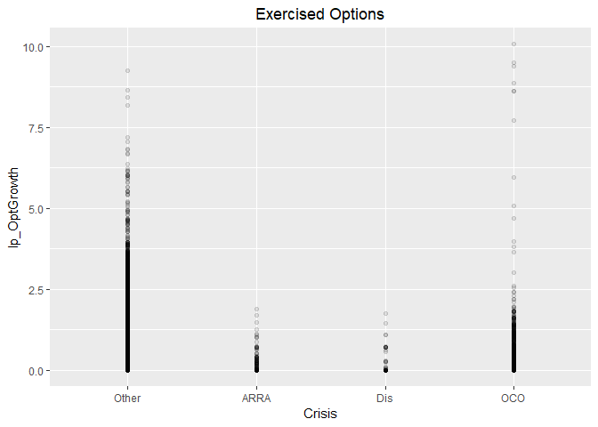<!-- -->

```r
#Model
n_Opt_08A <- glm (data=serv_opt,
                 ln_OptGrowth ~ Crisis)
display(n_Opt_08A)
```

```
## glm(formula = ln_OptGrowth ~ Crisis, data = serv_opt)
##             coef.est coef.se
## (Intercept)  7.45     0.02  
## CrisisARRA  -1.61     0.42  
## CrisisDis   -2.11     0.81  
## CrisisOCO   -4.72     0.11  
## ---
##   n = 74162, k = 4
##   residual deviance = 2517833.8, null deviance = 2585789.3 (difference = 67955.5)
##   overdispersion parameter = 34.0
##   residual sd is sqrt(overdispersion) = 5.83
```

```r
p_Opt_08A <- glm(data=serv_opt,
                        lp_OptGrowth ~ Crisis)

display(p_Opt_08A)
```

```
## glm(formula = lp_OptGrowth ~ Crisis, data = serv_opt)
##             coef.est coef.se
## (Intercept)  0.67     0.00  
## CrisisARRA  -0.49     0.05  
## CrisisDis   -0.40     0.09  
## CrisisOCO   -0.48     0.01  
## ---
##   n = 74162, k = 4
##   residual deviance = 34188.5, null deviance = 34944.5 (difference = 756.1)
##   overdispersion parameter = 0.5
##   residual sd is sqrt(overdispersion) = 0.68
```

```r
#Plot residuals versus fitted
stargazer::stargazer(n_Opt_07B,n_Opt_08A,
                       
                       p_Opt_07B,p_Opt_08A,
                       type="text",
                       digits=2)
```

```
## 
## ============================================================================
##                                             Dependent variable:             
##                                ---------------------------------------------
##                                     ln_OptGrowth           lp_OptGrowth     
##                                    (1)         (2)        (3)        (4)    
## ----------------------------------------------------------------------------
## cl_US6_avg_sal_lag1Const          0.04                  -0.03***            
##                                  (0.05)                  (0.01)             
##                                                                             
## cl_CFTE                         -0.51***                -0.10***            
##                                  (0.05)                  (0.01)             
##                                                                             
## c_pPBSC                          0.39***                0.03***             
##                                  (0.05)                  (0.01)             
##                                                                             
## c_pOffPSC                        1.37***                0.27***             
##                                  (0.06)                  (0.01)             
##                                                                             
## c_pairHist                       0.31***                 0.003              
##                                  (0.05)                  (0.01)             
##                                                                             
## cl_pairCA                       -0.83***                -0.03***            
##                                  (0.06)                  (0.01)             
##                                                                             
## cl_Ceil                          2.90***                0.07***             
##                                  (0.05)                  (0.01)             
##                                                                             
## capped_cl_Days                   2.15***                0.12***             
##                                  (0.06)                  (0.01)             
##                                                                             
## Comp1or51 offer                 -0.44***                 -0.004             
##                                  (0.06)                  (0.01)             
##                                                                             
## Comp1or52-4 offers              -0.20***                  0.01              
##                                  (0.06)                  (0.01)             
##                                                                             
## Comp1or55+ offers                0.39***                0.11***             
##                                  (0.06)                  (0.01)             
##                                                                             
## VehS-IDC                        -1.70***                -0.20***            
##                                  (0.07)                  (0.01)             
##                                                                             
## VehM-IDC                        -0.26***                -0.09***            
##                                  (0.07)                  (0.01)             
##                                                                             
## VehFSS/GWAC                      0.54***                0.03***             
##                                  (0.07)                  (0.01)             
##                                                                             
## VehBPA/BOA                      -4.06***                -0.61***            
##                                  (0.12)                  (0.01)             
##                                                                             
## PricingUCAOther FP              -0.85***                -0.10***            
##                                  (0.31)                  (0.04)             
##                                                                             
## PricingUCAT&M/LH/FPLOE           0.64***                 -0.001             
##                                  (0.13)                  (0.02)             
##                                                                             
## PricingUCAIncentive               0.17                    0.06              
##                                  (0.50)                  (0.06)             
##                                                                             
## PricingUCAOther CB               1.54***                0.11***             
##                                  (0.10)                  (0.01)             
##                                                                             
## PricingUCAUCA                     -0.14                 -0.09***            
##                                  (0.25)                  (0.03)             
##                                                                             
## PricingUCACombination or Other   1.70***                0.15***             
##                                  (0.14)                  (0.02)             
##                                                                             
## CrisisARRA                                  -1.61***               -0.49*** 
##                                              (0.42)                 (0.05)  
##                                                                             
## CrisisDis                                   -2.11***               -0.40*** 
##                                              (0.81)                 (0.09)  
##                                                                             
## CrisisOCO                                   -4.72***               -0.48*** 
##                                              (0.11)                 (0.01)  
##                                                                             
## Constant                         5.70***     7.45***    0.62***    0.67***  
##                                  (0.05)      (0.02)      (0.01)    (0.003)  
##                                                                             
## ----------------------------------------------------------------------------
## Observations                     74,162      74,162      74,162     74,162  
## Log Likelihood                 -230,299.60 -235,939.20 -74,660.29 -76,518.14
## Akaike Inf. Crit.              460,643.10  471,886.50  149,364.60 153,044.30
## ============================================================================
## Note:                                            *p<0.1; **p<0.05; ***p<0.01
```

```r
# summary_residual_compare(n_Opt_07B,n_Opt_08A,30)
```

For ceiling breaches ARRA and Disaster results were in keeping with expcetations but OCO results were not. There were no significant results for terminations. For options, contrary to exepectation, all forms of crisis funding have a lower rate of usage.


#### 08B: Cumulative  Model


```r
#Model
n_Opt_08B <- glm (data=serv_opt,
                 ln_OptGrowth ~  cl_US6_avg_sal_lag1Const + 
                   cl_CFTE+ c_pPBSC+c_pOffPSC+
                 c_pairHist+cl_pairCA +
                   cl_Ceil + capped_cl_Days+
                   Comp1or5+
                   Veh+
                   PricingUCA+
                   Crisis)
glmer_examine(n_Opt_08B)
```

```
##                              GVIF Df GVIF^(1/(2*Df))
## cl_US6_avg_sal_lag1Const 1.668936  1        1.291873
## cl_CFTE                  1.540381  1        1.241121
## c_pPBSC                  1.311735  1        1.145310
## c_pOffPSC                1.972074  1        1.404305
## c_pairHist               1.538851  1        1.240504
## cl_pairCA                3.182145  1        1.783857
## cl_Ceil                  1.466749  1        1.211094
## capped_cl_Days           1.159788  1        1.076935
## Comp1or5                 1.529970  3        1.073447
## Veh                      3.718660  4        1.178415
## PricingUCA               1.325984  6        1.023792
## Crisis                   1.375439  3        1.054566
```

```r
p_Opt_08B <- glm(data=serv_opt,
                        lp_OptGrowth ~  cl_US6_avg_sal_lag1Const + 
                   cl_CFTE+ c_pPBSC+c_pOffPSC+
                 c_pairHist+cl_pairCA+
                 cl_Ceil + capped_cl_Days+
                 Comp1or5+
                   Veh+
                   PricingUCA+
                   Crisis)

glmer_examine(p_Opt_08B)
```

```
##                              GVIF Df GVIF^(1/(2*Df))
## cl_US6_avg_sal_lag1Const 1.668936  1        1.291873
## cl_CFTE                  1.540381  1        1.241121
## c_pPBSC                  1.311735  1        1.145310
## c_pOffPSC                1.972074  1        1.404305
## c_pairHist               1.538851  1        1.240504
## cl_pairCA                3.182145  1        1.783857
## cl_Ceil                  1.466749  1        1.211094
## capped_cl_Days           1.159788  1        1.076935
## Comp1or5                 1.529970  3        1.073447
## Veh                      3.718660  4        1.178415
## PricingUCA               1.325984  6        1.023792
## Crisis                   1.375439  3        1.054566
```

```r
#Plot residuals versus fitted   

stargazer::stargazer(n_Opt_07B,n_Opt_08A,n_Opt_08B,
                       
                       p_Opt_07B,p_Opt_08A,p_Opt_08B,
                       type="text",
                       digits=2)
```

```
## 
## ===================================================================================================
##                                                        Dependent variable:                         
##                                --------------------------------------------------------------------
##                                           ln_OptGrowth                       lp_OptGrowth          
##                                    (1)         (2)         (3)        (4)        (5)        (6)    
## ---------------------------------------------------------------------------------------------------
## cl_US6_avg_sal_lag1Const          0.04                   0.15***    -0.03***              -0.02*** 
##                                  (0.05)                  (0.05)      (0.01)                (0.01)  
##                                                                                                    
## cl_CFTE                         -0.51***                -0.80***    -0.10***              -0.13*** 
##                                  (0.05)                  (0.05)      (0.01)                (0.01)  
##                                                                                                    
## c_pPBSC                          0.39***                 0.17***    0.03***                -0.002  
##                                  (0.05)                  (0.05)      (0.01)                (0.01)  
##                                                                                                    
## c_pOffPSC                        1.37***                 0.85***    0.27***               0.20***  
##                                  (0.06)                  (0.07)      (0.01)                (0.01)  
##                                                                                                    
## c_pairHist                       0.31***                  0.09*      0.003                -0.03*** 
##                                  (0.05)                  (0.05)      (0.01)                (0.01)  
##                                                                                                    
## cl_pairCA                       -0.83***                 0.15**     -0.03***              0.10***  
##                                  (0.06)                  (0.06)      (0.01)                (0.01)  
##                                                                                                    
## cl_Ceil                          2.90***                 3.16***    0.07***               0.10***  
##                                  (0.05)                  (0.05)      (0.01)                (0.01)  
##                                                                                                    
## capped_cl_Days                   2.15***                 1.59***    0.12***               0.05***  
##                                  (0.06)                  (0.06)      (0.01)                (0.01)  
##                                                                                                    
## Comp1or51 offer                 -0.44***                 -0.13*      -0.004               0.04***  
##                                  (0.06)                  (0.06)      (0.01)                (0.01)  
##                                                                                                    
## Comp1or52-4 offers              -0.20***                  -0.05       0.01                0.03***  
##                                  (0.06)                  (0.06)      (0.01)                (0.01)  
##                                                                                                    
## Comp1or55+ offers                0.39***                 0.49***    0.11***               0.12***  
##                                  (0.06)                  (0.06)      (0.01)                (0.01)  
##                                                                                                    
## VehS-IDC                        -1.70***                -2.36***    -0.20***              -0.28*** 
##                                  (0.07)                  (0.07)      (0.01)                (0.01)  
##                                                                                                    
## VehM-IDC                        -0.26***                -0.68***    -0.09***              -0.14*** 
##                                  (0.07)                  (0.07)      (0.01)                (0.01)  
##                                                                                                    
## VehFSS/GWAC                      0.54***                 0.23***    0.03***                -0.01   
##                                  (0.07)                  (0.07)      (0.01)                (0.01)  
##                                                                                                    
## VehBPA/BOA                      -4.06***                -4.42***    -0.61***              -0.66*** 
##                                  (0.12)                  (0.12)      (0.01)                (0.01)  
##                                                                                                    
## PricingUCAOther FP              -0.85***                -1.13***    -0.10***              -0.14*** 
##                                  (0.31)                  (0.31)      (0.04)                (0.04)  
##                                                                                                    
## PricingUCAT&M/LH/FPLOE           0.64***                 0.39***     -0.001               -0.03**  
##                                  (0.13)                  (0.12)      (0.02)                (0.02)  
##                                                                                                    
## PricingUCAIncentive               0.17                    0.02        0.06                  0.04   
##                                  (0.50)                  (0.50)      (0.06)                (0.06)  
##                                                                                                    
## PricingUCAOther CB               1.54***                 1.33***    0.11***               0.08***  
##                                  (0.10)                  (0.10)      (0.01)                (0.01)  
##                                                                                                    
## PricingUCAUCA                     -0.14                   -0.12     -0.09***              -0.08*** 
##                                  (0.25)                  (0.25)      (0.03)                (0.03)  
##                                                                                                    
## PricingUCACombination or Other   1.70***                 1.48***    0.15***               0.12***  
##                                  (0.14)                  (0.14)      (0.02)                (0.02)  
##                                                                                                    
## CrisisARRA                                  -1.61***    -2.43***               -0.49***   -0.47*** 
##                                              (0.42)      (0.39)                 (0.05)     (0.05)  
##                                                                                                    
## CrisisDis                                   -2.11***    -2.25***               -0.40***   -0.42*** 
##                                              (0.81)      (0.74)                 (0.09)     (0.09)  
##                                                                                                    
## CrisisOCO                                   -4.72***    -4.70***               -0.48***   -0.60*** 
##                                              (0.11)      (0.11)                 (0.01)     (0.01)  
##                                                                                                    
## Constant                         5.70***     7.45***     6.21***    0.62***    0.67***    0.69***  
##                                  (0.05)      (0.02)      (0.06)      (0.01)    (0.003)     (0.01)  
##                                                                                                    
## ---------------------------------------------------------------------------------------------------
## Observations                     74,162      74,162      74,162      74,162     74,162     74,162  
## Log Likelihood                 -230,299.60 -235,939.20 -229,432.50 -74,660.29 -76,518.14 -73,679.81
## Akaike Inf. Crit.              460,643.10  471,886.50  458,915.00  149,364.60 153,044.30 147,409.60
## ===================================================================================================
## Note:                                                                   *p<0.1; **p<0.05; ***p<0.01
```

```r
#summary_residual_compare(n_Opt_07B,n_Opt_08B)
```

Terminatins for OCO and ARRA are now significant in the expected direction.


## Industrial Sector

### Level 6

#### Model 09A: l_def6_HHI_lag1
HHI (logged, + means more consolidation)	cl_def6_HHI_lag1+		+	-	-

Expectations are  unchanged.

```r
#Frequency Plot for unlogged ceiling
summary_continuous_plot(serv_opt,"def6_HHI_lag1")
```

<!-- -->

```r
summary_continuous_plot(serv_opt,"cl_def6_HHI_lag1")
```

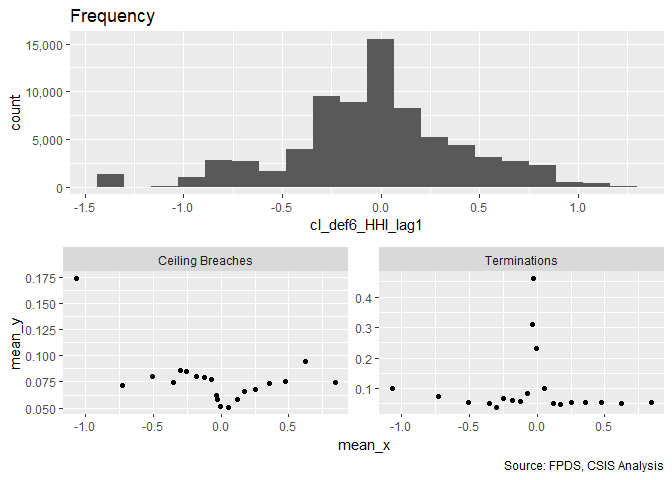<!-- -->

```r
summary_continuous_plot(serv_opt,"cl_def3_HHI_lag1")
```

<!-- -->

```r
#Scatter Plot
ggplot(serv_opt, aes(x=cl_def6_HHI_lag1, y=lp_OptGrowth)) + geom_point(alpha = 0.1) + ggtitle('Exercised Options') + theme(plot.title = element_text(hjust = 0.5))
```

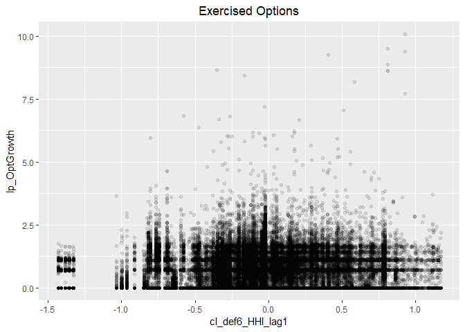<!-- -->

```r
#Model
n_Opt_09A <- glm (data=serv_opt,
                 ln_OptGrowth ~ cl_def6_HHI_lag1)
display(n_Opt_09A)
```

```
## glm(formula = ln_OptGrowth ~ cl_def6_HHI_lag1, data = serv_opt)
##                  coef.est coef.se
## (Intercept)       7.23     0.02  
## cl_def6_HHI_lag1 -0.27     0.05  
## ---
##   n = 74162, k = 2
##   residual deviance = 2584746.4, null deviance = 2585789.3 (difference = 1042.8)
##   overdispersion parameter = 34.9
##   residual sd is sqrt(overdispersion) = 5.90
```

```r
p_Opt_09A <- glm(data=serv_opt,
                        lp_OptGrowth ~ cl_def6_HHI_lag1)

display(p_Opt_09A)
```

```
## glm(formula = lp_OptGrowth ~ cl_def6_HHI_lag1, data = serv_opt)
##                  coef.est coef.se
## (Intercept)      0.65     0.00   
## cl_def6_HHI_lag1 0.00     0.01   
## ---
##   n = 74162, k = 2
##   residual deviance = 34944.5, null deviance = 34944.5 (difference = 0.0)
##   overdispersion parameter = 0.5
##   residual sd is sqrt(overdispersion) = 0.69
```

```r
#Plot residuals versus fitted
stargazer::stargazer(n_Opt_08B,n_Opt_09A,
                       
                       p_Opt_08B,p_Opt_09A,
                       type="text",
                       digits=2)
```

```
## 
## ============================================================================
##                                             Dependent variable:             
##                                ---------------------------------------------
##                                     ln_OptGrowth           lp_OptGrowth     
##                                    (1)         (2)        (3)        (4)    
## ----------------------------------------------------------------------------
## cl_US6_avg_sal_lag1Const         0.15***                -0.02***            
##                                  (0.05)                  (0.01)             
##                                                                             
## cl_CFTE                         -0.80***                -0.13***            
##                                  (0.05)                  (0.01)             
##                                                                             
## c_pPBSC                          0.17***                 -0.002             
##                                  (0.05)                  (0.01)             
##                                                                             
## c_pOffPSC                        0.85***                0.20***             
##                                  (0.07)                  (0.01)             
##                                                                             
## c_pairHist                        0.09*                 -0.03***            
##                                  (0.05)                  (0.01)             
##                                                                             
## cl_pairCA                        0.15**                 0.10***             
##                                  (0.06)                  (0.01)             
##                                                                             
## cl_Ceil                          3.16***                0.10***             
##                                  (0.05)                  (0.01)             
##                                                                             
## capped_cl_Days                   1.59***                0.05***             
##                                  (0.06)                  (0.01)             
##                                                                             
## Comp1or51 offer                  -0.13*                 0.04***             
##                                  (0.06)                  (0.01)             
##                                                                             
## Comp1or52-4 offers                -0.05                 0.03***             
##                                  (0.06)                  (0.01)             
##                                                                             
## Comp1or55+ offers                0.49***                0.12***             
##                                  (0.06)                  (0.01)             
##                                                                             
## VehS-IDC                        -2.36***                -0.28***            
##                                  (0.07)                  (0.01)             
##                                                                             
## VehM-IDC                        -0.68***                -0.14***            
##                                  (0.07)                  (0.01)             
##                                                                             
## VehFSS/GWAC                      0.23***                 -0.01              
##                                  (0.07)                  (0.01)             
##                                                                             
## VehBPA/BOA                      -4.42***                -0.66***            
##                                  (0.12)                  (0.01)             
##                                                                             
## PricingUCAOther FP              -1.13***                -0.14***            
##                                  (0.31)                  (0.04)             
##                                                                             
## PricingUCAT&M/LH/FPLOE           0.39***                -0.03**             
##                                  (0.12)                  (0.02)             
##                                                                             
## PricingUCAIncentive               0.02                    0.04              
##                                  (0.50)                  (0.06)             
##                                                                             
## PricingUCAOther CB               1.33***                0.08***             
##                                  (0.10)                  (0.01)             
##                                                                             
## PricingUCAUCA                     -0.12                 -0.08***            
##                                  (0.25)                  (0.03)             
##                                                                             
## PricingUCACombination or Other   1.48***                0.12***             
##                                  (0.14)                  (0.02)             
##                                                                             
## CrisisARRA                      -2.43***                -0.47***            
##                                  (0.39)                  (0.05)             
##                                                                             
## CrisisDis                       -2.25***                -0.42***            
##                                  (0.74)                  (0.09)             
##                                                                             
## CrisisOCO                       -4.70***                -0.60***            
##                                  (0.11)                  (0.01)             
##                                                                             
## cl_def6_HHI_lag1                            -0.27***               -0.0003  
##                                              (0.05)                 (0.01)  
##                                                                             
## Constant                         6.21***     7.23***    0.69***    0.65***  
##                                  (0.06)      (0.02)      (0.01)    (0.003)  
##                                                                             
## ----------------------------------------------------------------------------
## Observations                     74,162      74,162      74,162     74,162  
## Log Likelihood                 -229,432.50 -236,911.80 -73,679.81 -77,329.23
## Akaike Inf. Crit.              458,915.00  473,827.60  147,409.60 154,662.50
## ============================================================================
## Note:                                            *p<0.1; **p<0.05; ***p<0.01
```

```r
summary_residual_compare(n_Opt_08B,n_Opt_09A, skip_vif = TRUE)
```

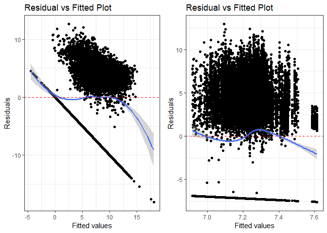<!-- -->

```
## Warning in if (class(model1_new) == "glmerMod") {: the condition has length
## > 1 and only the first element will be used
```

```
## Warning in if (class(model1_new) != "glmerMod" & class(model1_old) !=
## "glmerMod" & : the condition has length > 1 and only the first element will
## be used
```

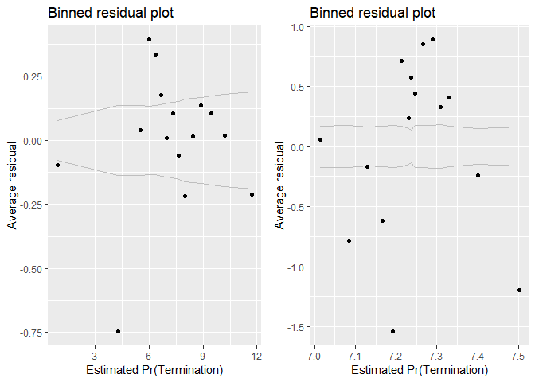<!-- -->

```
## NULL
```

Expected direction for ceiling breach and termination, but no real results on options.

#### Model 09B: Defense to Overall ratio
The higher the ratio of defense obligations to reciepts in the overall economy, the DoD holds a monosopy over a sector. Given the challenges of monosopy, the a higher ratio estimates a greater  risk of ceiling breaches.

Ratio Def. obligatons : US revenue	cl_def6_obl_lag1+		+	-	-


```r
#Frequency Plot for unlogged ceiling
      summary_continuous_plot(serv_opt,"def6_ratio_lag1")
```

<!-- -->

```r
      summary_continuous_plot(serv_opt,"cl_def6_ratio_lag1")
```

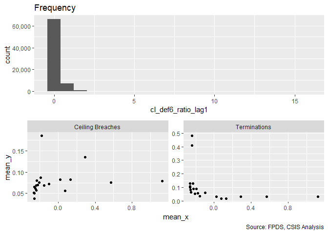<!-- -->

```r
#Scatter Plot
ggplot(serv_opt, aes(x=cl_def6_ratio_lag1, y=lp_OptGrowth)) + geom_point(alpha = 0.1) + ggtitle('Exercised Options') + theme(plot.title = element_text(hjust = 0.5))
```

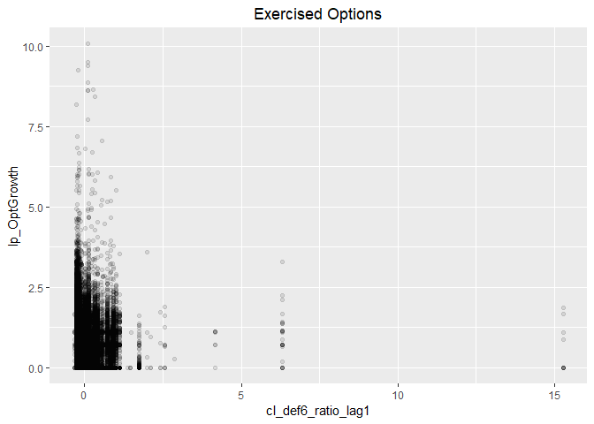<!-- -->

```r
#Model
n_Opt_09B <- glm (data=serv_opt,
                 ln_OptGrowth ~ cl_def6_ratio_lag1)
display(n_Opt_09B)
```

```
## glm(formula = ln_OptGrowth ~ cl_def6_ratio_lag1, data = serv_opt)
##                    coef.est coef.se
## (Intercept)         7.22     0.02  
## cl_def6_ratio_lag1 -0.45     0.05  
## ---
##   n = 74162, k = 2
##   residual deviance = 2583292.3, null deviance = 2585789.3 (difference = 2497.0)
##   overdispersion parameter = 34.8
##   residual sd is sqrt(overdispersion) = 5.90
```

```r
p_Opt_09B <- glm(data=serv_opt,
                        lp_OptGrowth ~ cl_def6_ratio_lag1)

display(p_Opt_09B)
```

```
## glm(formula = lp_OptGrowth ~ cl_def6_ratio_lag1, data = serv_opt)
##                    coef.est coef.se
## (Intercept)         0.64     0.00  
## cl_def6_ratio_lag1 -0.17     0.01  
## ---
##   n = 74162, k = 2
##   residual deviance = 34590.9, null deviance = 34944.5 (difference = 353.6)
##   overdispersion parameter = 0.5
##   residual sd is sqrt(overdispersion) = 0.68
```

```r
#Plot residuals versus fitted
stargazer::stargazer(n_Opt_08B,n_Opt_09A,n_Opt_09B,
                       
                       p_Opt_08B,p_Opt_09A,p_Opt_09B,
                       type="text",
                       digits=2)
```

```
## 
## ===================================================================================================
##                                                        Dependent variable:                         
##                                --------------------------------------------------------------------
##                                           ln_OptGrowth                       lp_OptGrowth          
##                                    (1)         (2)         (3)        (4)        (5)        (6)    
## ---------------------------------------------------------------------------------------------------
## cl_US6_avg_sal_lag1Const         0.15***                            -0.02***                       
##                                  (0.05)                              (0.01)                        
##                                                                                                    
## cl_CFTE                         -0.80***                            -0.13***                       
##                                  (0.05)                              (0.01)                        
##                                                                                                    
## c_pPBSC                          0.17***                             -0.002                        
##                                  (0.05)                              (0.01)                        
##                                                                                                    
## c_pOffPSC                        0.85***                            0.20***                        
##                                  (0.07)                              (0.01)                        
##                                                                                                    
## c_pairHist                        0.09*                             -0.03***                       
##                                  (0.05)                              (0.01)                        
##                                                                                                    
## cl_pairCA                        0.15**                             0.10***                        
##                                  (0.06)                              (0.01)                        
##                                                                                                    
## cl_Ceil                          3.16***                            0.10***                        
##                                  (0.05)                              (0.01)                        
##                                                                                                    
## capped_cl_Days                   1.59***                            0.05***                        
##                                  (0.06)                              (0.01)                        
##                                                                                                    
## Comp1or51 offer                  -0.13*                             0.04***                        
##                                  (0.06)                              (0.01)                        
##                                                                                                    
## Comp1or52-4 offers                -0.05                             0.03***                        
##                                  (0.06)                              (0.01)                        
##                                                                                                    
## Comp1or55+ offers                0.49***                            0.12***                        
##                                  (0.06)                              (0.01)                        
##                                                                                                    
## VehS-IDC                        -2.36***                            -0.28***                       
##                                  (0.07)                              (0.01)                        
##                                                                                                    
## VehM-IDC                        -0.68***                            -0.14***                       
##                                  (0.07)                              (0.01)                        
##                                                                                                    
## VehFSS/GWAC                      0.23***                             -0.01                         
##                                  (0.07)                              (0.01)                        
##                                                                                                    
## VehBPA/BOA                      -4.42***                            -0.66***                       
##                                  (0.12)                              (0.01)                        
##                                                                                                    
## PricingUCAOther FP              -1.13***                            -0.14***                       
##                                  (0.31)                              (0.04)                        
##                                                                                                    
## PricingUCAT&M/LH/FPLOE           0.39***                            -0.03**                        
##                                  (0.12)                              (0.02)                        
##                                                                                                    
## PricingUCAIncentive               0.02                                0.04                         
##                                  (0.50)                              (0.06)                        
##                                                                                                    
## PricingUCAOther CB               1.33***                            0.08***                        
##                                  (0.10)                              (0.01)                        
##                                                                                                    
## PricingUCAUCA                     -0.12                             -0.08***                       
##                                  (0.25)                              (0.03)                        
##                                                                                                    
## PricingUCACombination or Other   1.48***                            0.12***                        
##                                  (0.14)                              (0.02)                        
##                                                                                                    
## CrisisARRA                      -2.43***                            -0.47***                       
##                                  (0.39)                              (0.05)                        
##                                                                                                    
## CrisisDis                       -2.25***                            -0.42***                       
##                                  (0.74)                              (0.09)                        
##                                                                                                    
## CrisisOCO                       -4.70***                            -0.60***                       
##                                  (0.11)                              (0.01)                        
##                                                                                                    
## cl_def6_HHI_lag1                            -0.27***                           -0.0003             
##                                              (0.05)                             (0.01)             
##                                                                                                    
## cl_def6_ratio_lag1                                      -0.45***                          -0.17*** 
##                                                          (0.05)                            (0.01)  
##                                                                                                    
## Constant                         6.21***     7.23***     7.22***    0.69***    0.65***    0.64***  
##                                  (0.06)      (0.02)      (0.02)      (0.01)    (0.003)    (0.003)  
##                                                                                                    
## ---------------------------------------------------------------------------------------------------
## Observations                     74,162      74,162      74,162      74,162     74,162     74,162  
## Log Likelihood                 -229,432.50 -236,911.80 -236,890.90 -73,679.81 -77,329.23 -76,952.11
## Akaike Inf. Crit.              458,915.00  473,827.60  473,785.90  147,409.60 154,662.50 153,908.20
## ===================================================================================================
## Note:                                                                   *p<0.1; **p<0.05; ***p<0.01
```

```r
#summary_residual_compare(n_Opt_08B,n_Opt_09B)
#summary_residual_compare(n_Opt_09A,n_Opt_09B)
```


#### Model 09C: Defense Obligations
Defense obligations (logged)	cl_def6_ratio_lag1+		-	-	+


```r
#Frequency Plot for unlogged ceiling
      summary_continuous_plot(serv_opt,"def6_obl_lag1Const")
```

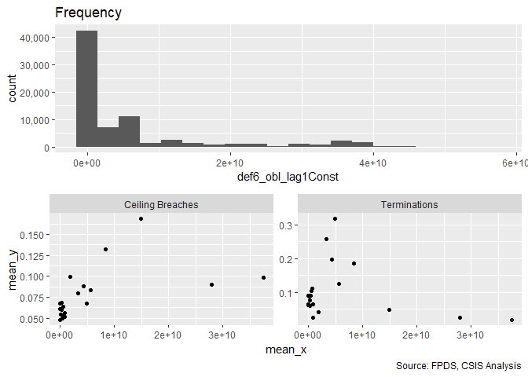<!-- -->

```r
      summary_continuous_plot(serv_opt,"cl_def6_obl_lag1Const")
```

<!-- -->

```r
#Scatter Plot
ggplot(serv_opt, aes(x=cl_def6_obl_lag1Const, y=lp_OptGrowth)) + geom_point(alpha = 0.1) + ggtitle('Exercised Options') + theme(plot.title = element_text(hjust = 0.5))
```

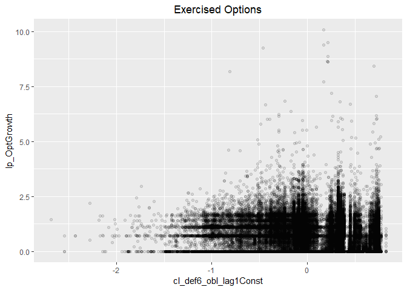<!-- -->

```r
#Model
n_Opt_09C <- glm (data=serv_opt,
                 ln_OptGrowth ~ cl_def6_obl_lag1Const)
display(n_Opt_09C)
```

```
## glm(formula = ln_OptGrowth ~ cl_def6_obl_lag1Const, data = serv_opt)
##                       coef.est coef.se
## (Intercept)           7.23     0.02   
## cl_def6_obl_lag1Const 0.64     0.05   
## ---
##   n = 74162, k = 2
##   residual deviance = 2579302.7, null deviance = 2585789.3 (difference = 6486.6)
##   overdispersion parameter = 34.8
##   residual sd is sqrt(overdispersion) = 5.90
```

```r
p_Opt_09C <- glm(data=serv_opt,
                        lp_OptGrowth ~ cl_def6_obl_lag1Const)

display(p_Opt_09C)
```

```
## glm(formula = lp_OptGrowth ~ cl_def6_obl_lag1Const, data = serv_opt)
##                       coef.est coef.se
## (Intercept)            0.65     0.00  
## cl_def6_obl_lag1Const -0.05     0.01  
## ---
##   n = 74162, k = 2
##   residual deviance = 34902.2, null deviance = 34944.5 (difference = 42.4)
##   overdispersion parameter = 0.5
##   residual sd is sqrt(overdispersion) = 0.69
```

```r
#Plot residuals versus fitted
stargazer::stargazer(n_Opt_09A,n_Opt_09B,n_Opt_09C,
                       
                       p_Opt_09A,p_Opt_09B,p_Opt_09C,
                       type="text",
                       digits=2)
```

```
## 
## ==========================================================================================
##                                               Dependent variable:                         
##                       --------------------------------------------------------------------
##                                  ln_OptGrowth                       lp_OptGrowth          
##                           (1)         (2)         (3)        (4)        (5)        (6)    
## ------------------------------------------------------------------------------------------
## cl_def6_HHI_lag1       -0.27***                            -0.0003                        
##                         (0.05)                              (0.01)                        
##                                                                                           
## cl_def6_ratio_lag1                 -0.45***                           -0.17***            
##                                     (0.05)                             (0.01)             
##                                                                                           
## cl_def6_obl_lag1Const                           0.64***                          -0.05*** 
##                                                 (0.05)                            (0.01)  
##                                                                                           
## Constant                7.23***     7.22***     7.23***    0.65***    0.64***    0.65***  
##                         (0.02)      (0.02)      (0.02)     (0.003)    (0.003)    (0.003)  
##                                                                                           
## ------------------------------------------------------------------------------------------
## Observations            74,162      74,162      74,162      74,162     74,162     74,162  
## Log Likelihood        -236,911.80 -236,890.90 -236,833.60 -77,329.23 -76,952.11 -77,284.26
## Akaike Inf. Crit.     473,827.60  473,785.90  473,671.20  154,662.50 153,908.20 154,572.50
## ==========================================================================================
## Note:                                                          *p<0.1; **p<0.05; ***p<0.01
```

```r
#summary_residual_compare(n_Opt_08B,n_Opt_09C)
#summary_residual_compare(n_Opt_09A,n_Opt_09C)
#summary_residual_compare(n_Opt_09B,n_Opt_09C)
```

Contrary to expectation. for termination and options.

#### Model 09D: NAICS 6 Combined
Consolidation at lessa nd more granular levels may have different effects. Efficiencies are often used to describe sectors, like utilities, with high barriers to entry. Many of these aspects seem like they would already be captured at less granular NAICS levels, e.g. power plants, rather than more specific NAICS levels, like solar vs. coal. As a result, consolidation for more granular NAICS codes should estimate higher rates of ceiling breaches compared to less granular NAICS code.

We'll start by adding in everything from both models and seeing what violates VIF.

```r
#Frequency Plot for unlogged ceiling


#Model
n_Opt_09D <- glm (data=serv_opt,
                 ln_OptGrowth ~ cl_def6_HHI_lag1+cl_def6_ratio_lag1+cl_def6_obl_lag1Const
                 )
glmer_examine(n_Opt_09D)
```

```
##      cl_def6_HHI_lag1    cl_def6_ratio_lag1 cl_def6_obl_lag1Const 
##              1.061931              1.269520              1.218054
```

```r
p_Opt_09D <- glm(data=serv_opt,
                        lp_OptGrowth ~ cl_def6_HHI_lag1+cl_def6_ratio_lag1)

glmer_examine(p_Opt_09D)
```

```
##   cl_def6_HHI_lag1 cl_def6_ratio_lag1 
##           1.043527           1.043527
```

```r
n_Opt_09D2 <- glm (data=serv_opt,
                 ln_OptGrowth ~ cl_def6_HHI_lag1+cl_def6_ratio_lag1
                 )
glmer_examine(n_Opt_09D2)
```

```
##   cl_def6_HHI_lag1 cl_def6_ratio_lag1 
##           1.043527           1.043527
```

```r
p_Opt_09D2 <- glm(data=serv_opt,
                        lp_OptGrowth ~ cl_def6_HHI_lag1+cl_def6_ratio_lag1)

glmer_examine(p_Opt_09D2)
```

```
##   cl_def6_HHI_lag1 cl_def6_ratio_lag1 
##           1.043527           1.043527
```

```r
#Plot residuals versus fitted
stargazer::stargazer(n_Opt_09D,n_Opt_09D2,
                     
                     p_Opt_09D,p_Opt_09D2,
                       type="text",
                       digits=2)
```

```
## 
## ===================================================================
##                                    Dependent variable:             
##                       ---------------------------------------------
##                            ln_OptGrowth           lp_OptGrowth     
##                           (1)         (2)        (3)        (4)    
## -------------------------------------------------------------------
## cl_def6_HHI_lag1         -0.07     -0.19***    0.03***    0.03***  
##                         (0.05)      (0.05)      (0.01)     (0.01)  
##                                                                    
## cl_def6_ratio_lag1     -0.88***    -0.41***    -0.18***   -0.18*** 
##                         (0.06)      (0.05)      (0.01)     (0.01)  
##                                                                    
## cl_def6_obl_lag1Const   0.95***                                    
##                         (0.05)                                     
##                                                                    
## Constant                7.19***     7.22***    0.64***    0.64***  
##                         (0.02)      (0.02)     (0.003)    (0.003)  
##                                                                    
## -------------------------------------------------------------------
## Observations            74,162      74,162      74,162     74,162  
## Log Likelihood        -236,715.00 -236,883.60 -76,935.97 -76,935.97
## Akaike Inf. Crit.     473,437.90  473,773.20  153,877.90 153,877.90
## ===================================================================
## Note:                                   *p<0.1; **p<0.05; ***p<0.01
```

```r
summary_residual_compare(n_Opt_09D,n_Opt_09D2)
```

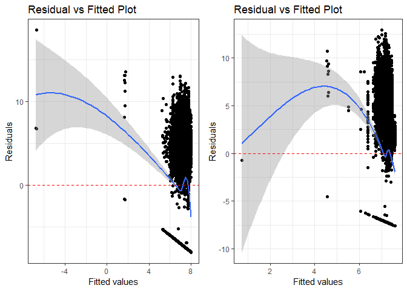<!-- -->

```
## Warning in if (class(model1_new) == "glmerMod") {: the condition has length
## > 1 and only the first element will be used
```

```
## Warning in if (class(model1_new) != "glmerMod" & class(model1_old) !=
## "glmerMod" & : the condition has length > 1 and only the first element will
## be used
```

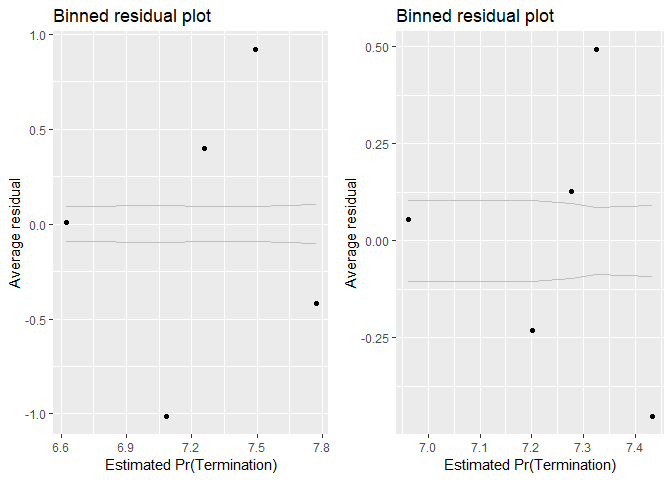<!-- -->

```
## [[1]]
##        model deviance null.deviance difference
## 1 model1_old  2571063       2585789  14726.683
## 2 model1_new  2582783       2585789   3006.091
## 
## [[2]]
##   cl_def6_HHI_lag1 cl_def6_ratio_lag1 
##           1.043527           1.043527
```
The hypothesis is upheld. Deviance is a little lower and residuals a little higher than the prior forms of consolidation for the level 3 model.  For the level 6 model, deviance is reduced some in both cases.

NAICS Subsector (Level 3)					
HHI (logged, + means more consolidation)	cl_def3_HHI_lag1+		+	++	-
Ratio Def. obligatons : US revenue	cl_def3_ratio_lag1+		+	+	-

Ratio at either level is no longer in line with expectations for ceiling breaches.


#### Model 09E: Cumulative Model
Consolidation at lessa nd more granular levels may have different effects. Efficiencies are often used to describe sectors, like utilities, with high barriers to entry. Many of these aspects seem like they would already be captured at less granular NAICS levels, e.g. power plants, rather than more specific NAICS levels, like solar vs. coal. As a result, consolidation for more granular NAICS codes should estimate higher rates of ceiling breaches compared to less granular NAICS code.

We'll start by adding in everything from both models and seeing what violates VIF.

```r
#Frequency Plot for unlogged ceiling


#Model
n_Opt_09E <- glm (data=serv_opt,
                 ln_OptGrowth ~  cl_US6_avg_sal_lag1Const + 
                   cl_CFTE+ c_pPBSC+c_pOffPSC+
                 c_pairHist+cl_pairCA +
                   cl_Ceil + capped_cl_Days+
                   Comp1or5+
                   Veh+
                   PricingUCA+
                   Crisis+
                   cl_def6_HHI_lag1+cl_def6_ratio_lag1)
glmer_examine(n_Opt_09E)
```

```
##                              GVIF Df GVIF^(1/(2*Df))
## cl_US6_avg_sal_lag1Const 1.734475  1        1.316995
## cl_CFTE                  1.546206  1        1.243465
## c_pPBSC                  1.314607  1        1.146563
## c_pOffPSC                1.987170  1        1.409670
## c_pairHist               1.547834  1        1.244120
## cl_pairCA                3.205601  1        1.790419
## cl_Ceil                  1.491165  1        1.221133
## capped_cl_Days           1.164772  1        1.079246
## Comp1or5                 1.584884  3        1.079774
## Veh                      3.858606  4        1.183869
## PricingUCA               1.354937  6        1.025636
## Crisis                   1.378950  3        1.055014
## cl_def6_HHI_lag1         1.177332  1        1.085049
## cl_def6_ratio_lag1       1.145491  1        1.070276
```

```r
p_Opt_09E <- glm(data=serv_opt,
                        lp_OptGrowth ~  cl_US6_avg_sal_lag1Const + 
                   cl_CFTE+ c_pPBSC+c_pOffPSC+
                 c_pairHist+cl_pairCA+
                 cl_Ceil + capped_cl_Days+
                 Comp1or5+
                   Veh+
                   PricingUCA+
                   Crisis+
                 cl_def6_HHI_lag1+cl_def6_ratio_lag1)

glmer_examine(p_Opt_09E)
```

```
##                              GVIF Df GVIF^(1/(2*Df))
## cl_US6_avg_sal_lag1Const 1.734475  1        1.316995
## cl_CFTE                  1.546206  1        1.243465
## c_pPBSC                  1.314607  1        1.146563
## c_pOffPSC                1.987170  1        1.409670
## c_pairHist               1.547834  1        1.244120
## cl_pairCA                3.205601  1        1.790419
## cl_Ceil                  1.491165  1        1.221133
## capped_cl_Days           1.164772  1        1.079246
## Comp1or5                 1.584884  3        1.079774
## Veh                      3.858606  4        1.183869
## PricingUCA               1.354937  6        1.025636
## Crisis                   1.378950  3        1.055014
## cl_def6_HHI_lag1         1.177332  1        1.085049
## cl_def6_ratio_lag1       1.145491  1        1.070276
```

```r
#Plot residuals versus fitted
stargazer::stargazer(n_Opt_08B,n_Opt_09D2,n_Opt_09E,
                     
                     p_Opt_08B,p_Opt_09D2,p_Opt_09E,
                       type="text",
                       digits=2)
```

```
## 
## ===================================================================================================
##                                                        Dependent variable:                         
##                                --------------------------------------------------------------------
##                                           ln_OptGrowth                       lp_OptGrowth          
##                                    (1)         (2)         (3)        (4)        (5)        (6)    
## ---------------------------------------------------------------------------------------------------
## cl_US6_avg_sal_lag1Const         0.15***                 0.10**     -0.02***              -0.03*** 
##                                  (0.05)                  (0.05)      (0.01)                (0.01)  
##                                                                                                    
## cl_CFTE                         -0.80***                -0.80***    -0.13***              -0.14*** 
##                                  (0.05)                  (0.05)      (0.01)                (0.01)  
##                                                                                                    
## c_pPBSC                          0.17***                 0.14***     -0.002                -0.01   
##                                  (0.05)                  (0.05)      (0.01)                (0.01)  
##                                                                                                    
## c_pOffPSC                        0.85***                 0.92***    0.20***               0.22***  
##                                  (0.07)                  (0.07)      (0.01)                (0.01)  
##                                                                                                    
## c_pairHist                        0.09*                  0.14***    -0.03***              -0.01*** 
##                                  (0.05)                  (0.05)      (0.01)                (0.01)  
##                                                                                                    
## cl_pairCA                        0.15**                   0.06      0.10***               0.08***  
##                                  (0.06)                  (0.06)      (0.01)                (0.01)  
##                                                                                                    
## cl_Ceil                          3.16***                 3.25***    0.10***               0.12***  
##                                  (0.05)                  (0.05)      (0.01)                (0.01)  
##                                                                                                    
## capped_cl_Days                   1.59***                 1.55***    0.05***               0.04***  
##                                  (0.06)                  (0.06)      (0.01)                (0.01)  
##                                                                                                    
## Comp1or51 offer                  -0.13*                   -0.10     0.04***               0.04***  
##                                  (0.06)                  (0.06)      (0.01)                (0.01)  
##                                                                                                    
## Comp1or52-4 offers                -0.05                   -0.05     0.03***               0.03***  
##                                  (0.06)                  (0.06)      (0.01)                (0.01)  
##                                                                                                    
## Comp1or55+ offers                0.49***                 0.47***    0.12***               0.12***  
##                                  (0.06)                  (0.06)      (0.01)                (0.01)  
##                                                                                                    
## VehS-IDC                        -2.36***                -2.31***    -0.28***              -0.27*** 
##                                  (0.07)                  (0.07)      (0.01)                (0.01)  
##                                                                                                    
## VehM-IDC                        -0.68***                -0.62***    -0.14***              -0.13*** 
##                                  (0.07)                  (0.07)      (0.01)                (0.01)  
##                                                                                                    
## VehFSS/GWAC                      0.23***                 0.23***     -0.01                 -0.01   
##                                  (0.07)                  (0.07)      (0.01)                (0.01)  
##                                                                                                    
## VehBPA/BOA                      -4.42***                -4.16***    -0.66***              -0.61*** 
##                                  (0.12)                  (0.12)      (0.01)                (0.01)  
##                                                                                                    
## PricingUCAOther FP              -1.13***                -1.27***    -0.14***              -0.17*** 
##                                  (0.31)                  (0.31)      (0.04)                (0.04)  
##                                                                                                    
## PricingUCAT&M/LH/FPLOE           0.39***                 0.45***    -0.03**                -0.02   
##                                  (0.12)                  (0.12)      (0.02)                (0.02)  
##                                                                                                    
## PricingUCAIncentive               0.02                    0.10        0.04                  0.06   
##                                  (0.50)                  (0.50)      (0.06)                (0.06)  
##                                                                                                    
## PricingUCAOther CB               1.33***                 1.49***    0.08***               0.12***  
##                                  (0.10)                  (0.10)      (0.01)                (0.01)  
##                                                                                                    
## PricingUCAUCA                     -0.12                   -0.05     -0.08***              -0.06**  
##                                  (0.25)                  (0.25)      (0.03)                (0.03)  
##                                                                                                    
## PricingUCACombination or Other   1.48***                 1.49***    0.12***               0.12***  
##                                  (0.14)                  (0.14)      (0.02)                (0.02)  
##                                                                                                    
## CrisisARRA                      -2.43***                -2.37***    -0.47***              -0.46*** 
##                                  (0.39)                  (0.39)      (0.05)                (0.05)  
##                                                                                                    
## CrisisDis                       -2.25***                -2.17***    -0.42***              -0.40*** 
##                                  (0.74)                  (0.74)      (0.09)                (0.09)  
##                                                                                                    
## CrisisOCO                       -4.70***                -4.68***    -0.60***              -0.60*** 
##                                  (0.11)                  (0.11)      (0.01)                (0.01)  
##                                                                                                    
## cl_def6_HHI_lag1                            -0.19***     0.39***               0.03***    0.10***  
##                                              (0.05)      (0.05)                 (0.01)     (0.01)  
##                                                                                                    
## cl_def6_ratio_lag1                          -0.41***    -0.74***               -0.18***   -0.15*** 
##                                              (0.05)      (0.05)                 (0.01)     (0.01)  
##                                                                                                    
## Constant                         6.21***     7.22***     6.13***    0.69***    0.64***    0.67***  
##                                  (0.06)      (0.02)      (0.06)      (0.01)    (0.003)     (0.01)  
##                                                                                                    
## ---------------------------------------------------------------------------------------------------
## Observations                     74,162      74,162      74,162      74,162     74,162     74,162  
## Log Likelihood                 -229,432.50 -236,883.60 -229,315.30 -73,679.81 -76,935.97 -73,313.05
## Akaike Inf. Crit.              458,915.00  473,773.20  458,684.70  147,409.60 153,877.90 146,680.10
## ===================================================================================================
## Note:                                                                   *p<0.1; **p<0.05; ***p<0.01
```

```r
#summary_residual_compare(n_Opt_09D2,n_Opt_09E)
#summary_residual_compare(n_Opt_08B,n_Opt_09E)
```

Expectations are not upheld.

### Level 3
#### Model 10A: cl_def3_HHI
HHI (logged, + means more consolidation)	cl_def3_HHI_lag1+		+	++	-


```r
#Frequency Plot for unlogged ceiling
summary_continuous_plot(serv_opt,"cl_def3_HHI_lag1")
```

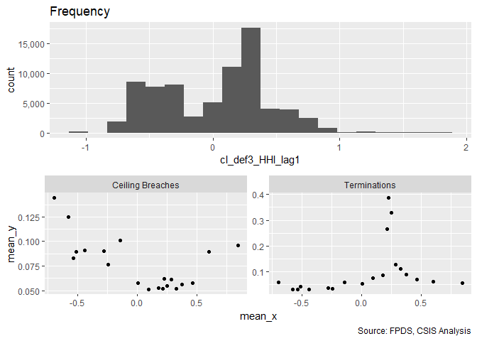<!-- -->

```r
#Scatter Plot
ggplot(serv_opt, aes(x=cl_def3_HHI_lag1, y=lp_OptGrowth)) + geom_point(alpha = 0.1) + ggtitle('Exercised Options') + theme(plot.title = element_text(hjust = 0.5))
```

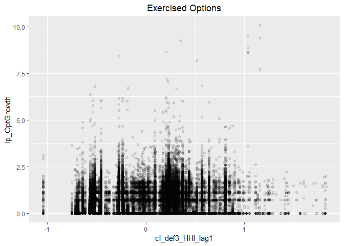<!-- -->

```r
#Model
n_Opt_10A <- glm (data=serv_opt,
                 ln_OptGrowth ~ cl_def3_HHI_lag1)
display(n_Opt_10A)
```

```
## glm(formula = ln_OptGrowth ~ cl_def3_HHI_lag1, data = serv_opt)
##                  coef.est coef.se
## (Intercept)       7.25     0.02  
## cl_def3_HHI_lag1 -0.61     0.05  
## ---
##   n = 74162, k = 2
##   residual deviance = 2580903.8, null deviance = 2585789.3 (difference = 4885.4)
##   overdispersion parameter = 34.8
##   residual sd is sqrt(overdispersion) = 5.90
```

```r
p_Opt_10A <- glm(data=serv_opt,
                        lp_OptGrowth ~ cl_def3_HHI_lag1)

display(p_Opt_10A)
```

```
## glm(formula = lp_OptGrowth ~ cl_def3_HHI_lag1, data = serv_opt)
##                  coef.est coef.se
## (Intercept)      0.64     0.00   
## cl_def3_HHI_lag1 0.17     0.01   
## ---
##   n = 74162, k = 2
##   residual deviance = 34564.2, null deviance = 34944.5 (difference = 380.4)
##   overdispersion parameter = 0.5
##   residual sd is sqrt(overdispersion) = 0.68
```

```r
#Plot residuals versus fitted
stargazer::stargazer(n_Opt_09A,n_Opt_10A,
                       
                       p_Opt_09A,p_Opt_10A,
                       type="text",
                       digits=2)
```

```
## 
## ===============================================================
##                                Dependent variable:             
##                   ---------------------------------------------
##                        ln_OptGrowth           lp_OptGrowth     
##                       (1)         (2)        (3)        (4)    
## ---------------------------------------------------------------
## cl_def6_HHI_lag1   -0.27***                -0.0003             
##                     (0.05)                  (0.01)             
##                                                                
## cl_def3_HHI_lag1               -0.61***               0.17***  
##                                 (0.05)                 (0.01)  
##                                                                
## Constant            7.23***     7.25***    0.65***    0.64***  
##                     (0.02)      (0.02)     (0.003)    (0.003)  
##                                                                
## ---------------------------------------------------------------
## Observations        74,162      74,162      74,162     74,162  
## Log Likelihood    -236,911.80 -236,856.60 -77,329.23 -76,923.40
## Akaike Inf. Crit. 473,827.60  473,717.30  154,662.50 153,850.80
## ===============================================================
## Note:                               *p<0.1; **p<0.05; ***p<0.01
```

```r
summary_residual_compare(n_Opt_09A,n_Opt_10A, skip_vif =  TRUE)
```

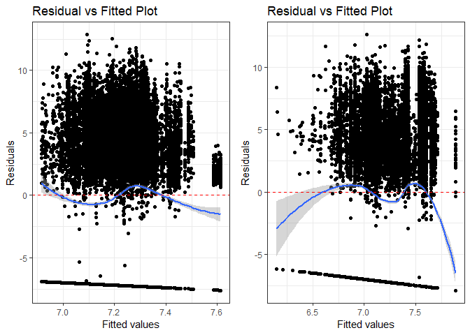<!-- -->

```
## Warning in if (class(model1_new) == "glmerMod") {: the condition has length
## > 1 and only the first element will be used
```

```
## Warning in if (class(model1_new) != "glmerMod" & class(model1_old) !=
## "glmerMod" & : the condition has length > 1 and only the first element will
## be used
```

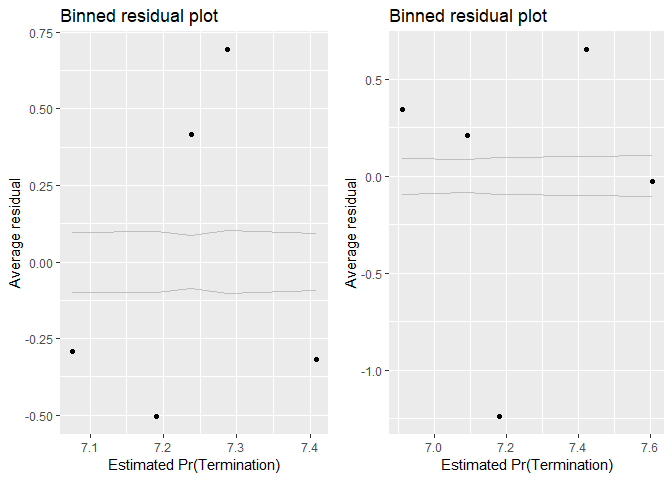<!-- -->

```
## NULL
```

Contrary to expectation on Ceiling breach and otions growth, in line with expectations on terminations.

Level 3 HHI seems to slightly out perform level 6.


#### Model 10B: Defense to Overall ratio
Ratio Def. obligatons : US revenue	cl_def3_ratio_lag1+		+	+	-


```r
#Frequency Plot for unlogged ceiling
summary_continuous_plot(serv_opt,"capped_def3_ratio_lag1")
```

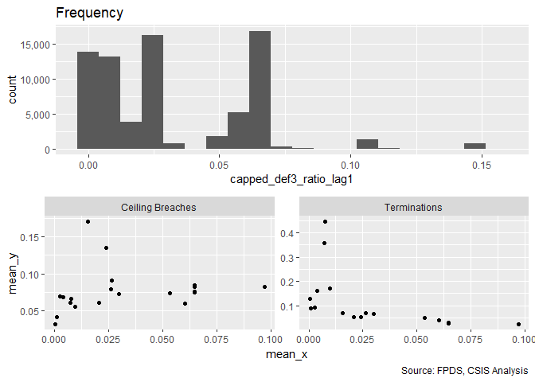<!-- -->

```r
summary_continuous_plot(serv_opt,"cl_def3_ratio_lag1")
```

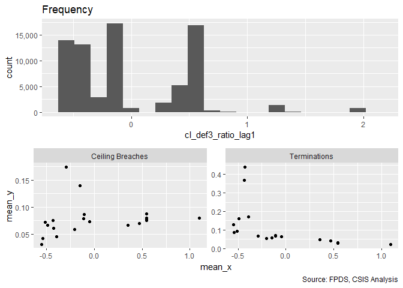<!-- -->

```r
#Scatter Plot
ggplot(serv_opt, aes(x=cl_def3_HHI_lag1, y=lp_OptGrowth)) + geom_point(alpha = 0.1) + ggtitle('Exercised Options') + theme(plot.title = element_text(hjust = 0.5))
```

<!-- -->

```r
#Model
n_Opt_10B <- glm (data=serv_opt,
                 ln_OptGrowth ~ cl_def3_ratio_lag1)
display(n_Opt_10B)
```

```
## glm(formula = ln_OptGrowth ~ cl_def3_ratio_lag1, data = serv_opt)
##                    coef.est coef.se
## (Intercept)        7.24     0.02   
## cl_def3_ratio_lag1 0.52     0.04   
## ---
##   n = 74162, k = 2
##   residual deviance = 2581045.9, null deviance = 2585789.3 (difference = 4743.4)
##   overdispersion parameter = 34.8
##   residual sd is sqrt(overdispersion) = 5.90
```

```r
p_Opt_10B <- glm(data=serv_opt,
                        lp_OptGrowth ~ cl_def3_ratio_lag1)

display(p_Opt_10B)
```

```
## glm(formula = lp_OptGrowth ~ cl_def3_ratio_lag1, data = serv_opt)
##                    coef.est coef.se
## (Intercept)         0.65     0.00  
## cl_def3_ratio_lag1 -0.12     0.01  
## ---
##   n = 74162, k = 2
##   residual deviance = 34671.4, null deviance = 34944.5 (difference = 273.1)
##   overdispersion parameter = 0.5
##   residual sd is sqrt(overdispersion) = 0.68
```

```r
#Plot residuals versus fitted
stargazer::stargazer(n_Opt_09B,n_Opt_10A,n_Opt_10B,
                       
                       p_Opt_09B,p_Opt_10A,p_Opt_10B,
                       type="text",
                       digits=2)
```

```
## 
## =======================================================================================
##                                            Dependent variable:                         
##                    --------------------------------------------------------------------
##                               ln_OptGrowth                       lp_OptGrowth          
##                        (1)         (2)         (3)        (4)        (5)        (6)    
## ---------------------------------------------------------------------------------------
## cl_def6_ratio_lag1  -0.45***                            -0.17***                       
##                      (0.05)                              (0.01)                        
##                                                                                        
## cl_def3_HHI_lag1                -0.61***                           0.17***             
##                                  (0.05)                             (0.01)             
##                                                                                        
## cl_def3_ratio_lag1                           0.52***                          -0.12*** 
##                                              (0.04)                            (0.01)  
##                                                                                        
## Constant             7.22***     7.25***     7.24***    0.64***    0.64***    0.65***  
##                      (0.02)      (0.02)      (0.02)     (0.003)    (0.003)    (0.003)  
##                                                                                        
## ---------------------------------------------------------------------------------------
## Observations         74,162      74,162      74,162      74,162     74,162     74,162  
## Log Likelihood     -236,890.90 -236,856.60 -236,858.70 -76,952.11 -76,923.40 -77,038.24
## Akaike Inf. Crit.  473,785.90  473,717.30  473,721.30  153,908.20 153,850.80 154,080.50
## =======================================================================================
## Note:                                                       *p<0.1; **p<0.05; ***p<0.01
```

```r
summary_residual_compare(n_Opt_09B,n_Opt_10B, skip_vif = TRUE)
```

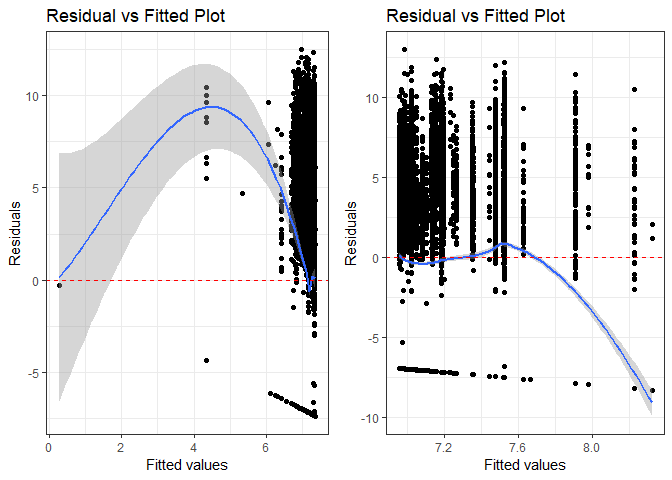<!-- -->

```
## Warning in if (class(model1_new) == "glmerMod") {: the condition has length
## > 1 and only the first element will be used
```

```
## Warning in if (class(model1_new) != "glmerMod" & class(model1_old) !=
## "glmerMod" & : the condition has length > 1 and only the first element will
## be used
```

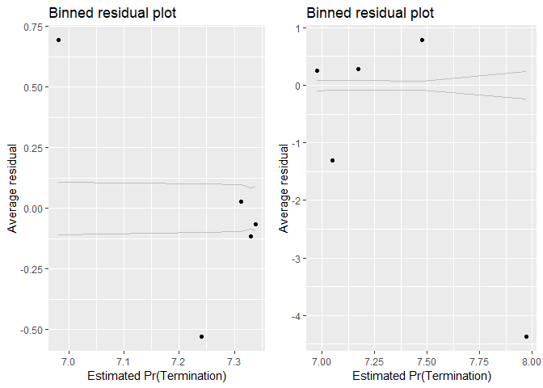<!-- -->

```
## NULL
```

Expectations were in lined with ceiling breaches and options, not with termination, and 


#### Model 10C: NAICS 6 and NAICS 3
Consolidation at lessa nd more granular levels may have different effects. Efficiencies are often used to describe sectors, like utilities, with high barriers to entry. Many of these aspects seem like they would already be captured at less granular NAICS levels, e.g. power plants, rather than more specific NAICS levels, like solar vs. coal. As a result, consolidation for more granular NAICS codes should estimate higher rates of ceiling breaches compared to less granular NAICS code.

We'll start by adding in everything from both models and seeing what violates VIF.

```r
#Frequency Plot for unlogged ceiling


#Model
n_Opt_10C <- glm (data=serv_opt,
                 ln_OptGrowth ~ cl_def3_HHI_lag1+cl_def3_ratio_lag1)
glmer_examine(n_Opt_10C)
```

```
##   cl_def3_HHI_lag1 cl_def3_ratio_lag1 
##           1.220506           1.220506
```

```r
p_Opt_10C <- glm(data=serv_opt,
                        lp_OptGrowth ~ cl_def3_HHI_lag1+cl_def3_ratio_lag1)

glmer_examine(p_Opt_10C)
```

```
##   cl_def3_HHI_lag1 cl_def3_ratio_lag1 
##           1.220506           1.220506
```

```r
#Plot residuals versus fitted
stargazer::stargazer(n_Opt_09E,n_Opt_10A,n_Opt_10B,n_Opt_10C,
                     
                     p_Opt_09E,p_Opt_10A,p_Opt_10B,p_Opt_10C,
                       type="text",
                       digits=2)
```

```
## 
## ==========================================================================================================================
##                                                                    Dependent variable:                                    
##                                -------------------------------------------------------------------------------------------
##                                                 ln_OptGrowth                                  lp_OptGrowth                
##                                    (1)         (2)         (3)         (4)        (5)        (6)        (7)        (8)    
## --------------------------------------------------------------------------------------------------------------------------
## cl_US6_avg_sal_lag1Const         0.10**                                         -0.03***                                  
##                                  (0.05)                                          (0.01)                                   
##                                                                                                                           
## cl_CFTE                         -0.80***                                        -0.14***                                  
##                                  (0.05)                                          (0.01)                                   
##                                                                                                                           
## c_pPBSC                          0.14***                                         -0.01                                    
##                                  (0.05)                                          (0.01)                                   
##                                                                                                                           
## c_pOffPSC                        0.92***                                        0.22***                                   
##                                  (0.07)                                          (0.01)                                   
##                                                                                                                           
## c_pairHist                       0.14***                                        -0.01***                                  
##                                  (0.05)                                          (0.01)                                   
##                                                                                                                           
## cl_pairCA                         0.06                                          0.08***                                   
##                                  (0.06)                                          (0.01)                                   
##                                                                                                                           
## cl_Ceil                          3.25***                                        0.12***                                   
##                                  (0.05)                                          (0.01)                                   
##                                                                                                                           
## capped_cl_Days                   1.55***                                        0.04***                                   
##                                  (0.06)                                          (0.01)                                   
##                                                                                                                           
## Comp1or51 offer                   -0.10                                         0.04***                                   
##                                  (0.06)                                          (0.01)                                   
##                                                                                                                           
## Comp1or52-4 offers                -0.05                                         0.03***                                   
##                                  (0.06)                                          (0.01)                                   
##                                                                                                                           
## Comp1or55+ offers                0.47***                                        0.12***                                   
##                                  (0.06)                                          (0.01)                                   
##                                                                                                                           
## VehS-IDC                        -2.31***                                        -0.27***                                  
##                                  (0.07)                                          (0.01)                                   
##                                                                                                                           
## VehM-IDC                        -0.62***                                        -0.13***                                  
##                                  (0.07)                                          (0.01)                                   
##                                                                                                                           
## VehFSS/GWAC                      0.23***                                         -0.01                                    
##                                  (0.07)                                          (0.01)                                   
##                                                                                                                           
## VehBPA/BOA                      -4.16***                                        -0.61***                                  
##                                  (0.12)                                          (0.01)                                   
##                                                                                                                           
## PricingUCAOther FP              -1.27***                                        -0.17***                                  
##                                  (0.31)                                          (0.04)                                   
##                                                                                                                           
## PricingUCAT&M/LH/FPLOE           0.45***                                         -0.02                                    
##                                  (0.12)                                          (0.02)                                   
##                                                                                                                           
## PricingUCAIncentive               0.10                                            0.06                                    
##                                  (0.50)                                          (0.06)                                   
##                                                                                                                           
## PricingUCAOther CB               1.49***                                        0.12***                                   
##                                  (0.10)                                          (0.01)                                   
##                                                                                                                           
## PricingUCAUCA                     -0.05                                         -0.06**                                   
##                                  (0.25)                                          (0.03)                                   
##                                                                                                                           
## PricingUCACombination or Other   1.49***                                        0.12***                                   
##                                  (0.14)                                          (0.02)                                   
##                                                                                                                           
## CrisisARRA                      -2.37***                                        -0.46***                                  
##                                  (0.39)                                          (0.05)                                   
##                                                                                                                           
## CrisisDis                       -2.17***                                        -0.40***                                  
##                                  (0.74)                                          (0.09)                                   
##                                                                                                                           
## CrisisOCO                       -4.68***                                        -0.60***                                  
##                                  (0.11)                                          (0.01)                                   
##                                                                                                                           
## cl_def6_HHI_lag1                 0.39***                                        0.10***                                   
##                                  (0.05)                                          (0.01)                                   
##                                                                                                                           
## cl_def6_ratio_lag1              -0.74***                                        -0.15***                                  
##                                  (0.05)                                          (0.01)                                   
##                                                                                                                           
## cl_def3_HHI_lag1                            -0.61***                -0.43***               0.17***               0.13***  
##                                              (0.05)                  (0.06)                 (0.01)                (0.01)  
##                                                                                                                           
## cl_def3_ratio_lag1                                       0.52***     0.36***                          -0.12***   -0.08*** 
##                                                          (0.04)      (0.05)                            (0.01)     (0.01)  
##                                                                                                                           
## Constant                         6.13***     7.25***     7.24***     7.25***    0.67***    0.64***    0.65***    0.64***  
##                                  (0.06)      (0.02)      (0.02)      (0.02)      (0.01)    (0.003)    (0.003)    (0.003)  
##                                                                                                                           
## --------------------------------------------------------------------------------------------------------------------------
## Observations                     74,162      74,162      74,162      74,162      74,162     74,162     74,162     74,162  
## Log Likelihood                 -229,315.30 -236,856.60 -236,858.70 -236,829.70 -73,313.05 -76,923.40 -77,038.24 -76,834.45
## Akaike Inf. Crit.              458,684.70  473,717.30  473,721.30  473,665.50  146,680.10 153,850.80 154,080.50 153,674.90
## ==========================================================================================================================
## Note:                                                                                          *p<0.1; **p<0.05; ***p<0.01
```

```r
summary_residual_compare(n_Opt_08B,n_Opt_10C)
```

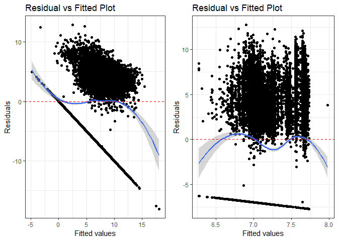<!-- -->

```
## Warning in if (class(model1_new) == "glmerMod") {: the condition has length
## > 1 and only the first element will be used
```

```
## Warning in if (class(model1_new) != "glmerMod" & class(model1_old) !=
## "glmerMod" & : the condition has length > 1 and only the first element will
## be used
```

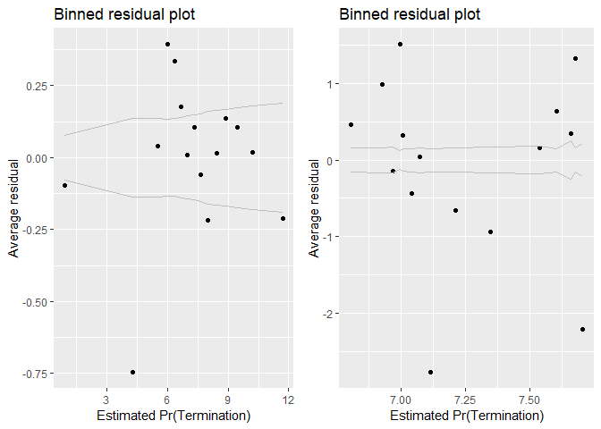<!-- -->

```
## [[1]]
##        model deviance null.deviance difference
## 1 model1_old  2112612       2585789 473177.505
## 2 model1_new  2579032       2585789   6757.384
## 
## [[2]]
##   cl_def3_HHI_lag1 cl_def3_ratio_lag1 
##           1.220506           1.220506
```

NAICS Subsector (Level 3)					
HHI (logged, + means more consolidation)	cl_def3_HHI_lag1+		+	++	-
Ratio Def. obligatons : US revenue	cl_def3_ratio_lag1+		+	+	-

Expectations matched for def3_HHI, not matched for ceiling  breach or options
ratio expectations for ceiling breach and options but not terminations.


#### Model 10D: Cumulative Model
.

```r
#Frequency Plot for unlogged ceiling


#Model
n_Opt_10D <- glm (data=serv_opt,
                 ln_OptGrowth ~  cl_US6_avg_sal_lag1Const + 
                   cl_CFTE+ c_pPBSC+c_pOffPSC+
                 c_pairHist+cl_pairCA +
                   cl_Ceil + capped_cl_Days+
                   Comp1or5+
                   Veh+
                   PricingUCA+
                   Crisis+
                   cl_def6_HHI_lag1+cl_def6_ratio_lag1+
                   cl_def3_HHI_lag1+cl_def3_ratio_lag1)
glmer_examine(n_Opt_10D)
```

```
##                              GVIF Df GVIF^(1/(2*Df))
## cl_US6_avg_sal_lag1Const 2.112168  1        1.453330
## cl_CFTE                  1.585528  1        1.259177
## c_pPBSC                  1.331019  1        1.153698
## c_pOffPSC                2.011937  1        1.418428
## c_pairHist               1.557875  1        1.248149
## cl_pairCA                3.262776  1        1.806316
## cl_Ceil                  1.517856  1        1.232013
## capped_cl_Days           1.167574  1        1.080543
## Comp1or5                 1.621610  3        1.083905
## Veh                      3.976009  4        1.188313
## PricingUCA               1.404224  6        1.028694
## Crisis                   1.385758  3        1.055880
## cl_def6_HHI_lag1         1.500778  1        1.225062
## cl_def6_ratio_lag1       1.556282  1        1.247510
## cl_def3_HHI_lag1         1.953989  1        1.397852
## cl_def3_ratio_lag1       2.038070  1        1.427610
```

```r
p_Opt_10D <- glm(data=serv_opt,
                        lp_OptGrowth ~  cl_US6_avg_sal_lag1Const + 
                   cl_CFTE+ c_pPBSC+c_pOffPSC+
                 c_pairHist+cl_pairCA+
                 cl_Ceil + capped_cl_Days+
                 Comp1or5+
                   Veh+
                   PricingUCA+
                   Crisis+
                 cl_def6_HHI_lag1+cl_def6_ratio_lag1+
                 cl_def3_HHI_lag1+cl_def3_ratio_lag1)

glmer_examine(p_Opt_10D)
```

```
##                              GVIF Df GVIF^(1/(2*Df))
## cl_US6_avg_sal_lag1Const 2.112168  1        1.453330
## cl_CFTE                  1.585528  1        1.259177
## c_pPBSC                  1.331019  1        1.153698
## c_pOffPSC                2.011937  1        1.418428
## c_pairHist               1.557875  1        1.248149
## cl_pairCA                3.262776  1        1.806316
## cl_Ceil                  1.517856  1        1.232013
## capped_cl_Days           1.167574  1        1.080543
## Comp1or5                 1.621610  3        1.083905
## Veh                      3.976009  4        1.188313
## PricingUCA               1.404224  6        1.028694
## Crisis                   1.385758  3        1.055880
## cl_def6_HHI_lag1         1.500778  1        1.225062
## cl_def6_ratio_lag1       1.556282  1        1.247510
## cl_def3_HHI_lag1         1.953989  1        1.397852
## cl_def3_ratio_lag1       2.038070  1        1.427610
```

```r
#Plot residuals versus fitted
stargazer::stargazer(n_Opt_09E,n_Opt_10C,n_Opt_10D,
                     
                     p_Opt_09E,p_Opt_10C,p_Opt_10D,
                       type="text",
                       digits=2)
```

```
## 
## ===================================================================================================
##                                                        Dependent variable:                         
##                                --------------------------------------------------------------------
##                                           ln_OptGrowth                       lp_OptGrowth          
##                                    (1)         (2)         (3)        (4)        (5)        (6)    
## ---------------------------------------------------------------------------------------------------
## cl_US6_avg_sal_lag1Const         0.10**                  0.33***    -0.03***              0.04***  
##                                  (0.05)                  (0.05)      (0.01)                (0.01)  
##                                                                                                    
## cl_CFTE                         -0.80***                -0.74***    -0.14***              -0.12*** 
##                                  (0.05)                  (0.05)      (0.01)                (0.01)  
##                                                                                                    
## c_pPBSC                          0.14***                 0.12**      -0.01                 -0.01*  
##                                  (0.05)                  (0.05)      (0.01)                (0.01)  
##                                                                                                    
## c_pOffPSC                        0.92***                 0.88***    0.22***               0.20***  
##                                  (0.07)                  (0.07)      (0.01)                (0.01)  
##                                                                                                    
## c_pairHist                       0.14***                 0.18***    -0.01***               -0.01   
##                                  (0.05)                  (0.05)      (0.01)                (0.01)  
##                                                                                                    
## cl_pairCA                         0.06                    -0.04     0.08***               0.05***  
##                                  (0.06)                  (0.06)      (0.01)                (0.01)  
##                                                                                                    
## cl_Ceil                          3.25***                 3.32***    0.12***               0.14***  
##                                  (0.05)                  (0.05)      (0.01)                (0.01)  
##                                                                                                    
## capped_cl_Days                   1.55***                 1.52***    0.04***               0.03***  
##                                  (0.06)                  (0.06)      (0.01)                (0.01)  
##                                                                                                    
## Comp1or51 offer                   -0.10                   -0.10     0.04***               0.04***  
##                                  (0.06)                  (0.06)      (0.01)                (0.01)  
##                                                                                                    
## Comp1or52-4 offers                -0.05                   -0.04     0.03***               0.03***  
##                                  (0.06)                  (0.06)      (0.01)                (0.01)  
##                                                                                                    
## Comp1or55+ offers                0.47***                 0.40***    0.12***               0.11***  
##                                  (0.06)                  (0.06)      (0.01)                (0.01)  
##                                                                                                    
## VehS-IDC                        -2.31***                -2.25***    -0.27***              -0.26*** 
##                                  (0.07)                  (0.07)      (0.01)                (0.01)  
##                                                                                                    
## VehM-IDC                        -0.62***                -0.62***    -0.13***              -0.13*** 
##                                  (0.07)                  (0.07)      (0.01)                (0.01)  
##                                                                                                    
## VehFSS/GWAC                      0.23***                 0.35***     -0.01                 0.02**  
##                                  (0.07)                  (0.07)      (0.01)                (0.01)  
##                                                                                                    
## VehBPA/BOA                      -4.16***                -4.18***    -0.61***              -0.61*** 
##                                  (0.12)                  (0.12)      (0.01)                (0.01)  
##                                                                                                    
## PricingUCAOther FP              -1.27***                -1.52***    -0.17***              -0.24*** 
##                                  (0.31)                  (0.31)      (0.04)                (0.04)  
##                                                                                                    
## PricingUCAT&M/LH/FPLOE           0.45***                 0.57***     -0.02                  0.01   
##                                  (0.12)                  (0.12)      (0.02)                (0.02)  
##                                                                                                    
## PricingUCAIncentive               0.10                    0.24        0.06                  0.09   
##                                  (0.50)                  (0.50)      (0.06)                (0.06)  
##                                                                                                    
## PricingUCAOther CB               1.49***                 1.67***    0.12***               0.16***  
##                                  (0.10)                  (0.10)      (0.01)                (0.01)  
##                                                                                                    
## PricingUCAUCA                     -0.05                   0.06      -0.06**                -0.03   
##                                  (0.25)                  (0.25)      (0.03)                (0.03)  
##                                                                                                    
## PricingUCACombination or Other   1.49***                 1.60***    0.12***               0.15***  
##                                  (0.14)                  (0.14)      (0.02)                (0.02)  
##                                                                                                    
## CrisisARRA                      -2.37***                -2.39***    -0.46***              -0.46*** 
##                                  (0.39)                  (0.39)      (0.05)                (0.05)  
##                                                                                                    
## CrisisDis                       -2.17***                -2.22***    -0.40***              -0.40*** 
##                                  (0.74)                  (0.74)      (0.09)                (0.09)  
##                                                                                                    
## CrisisOCO                       -4.68***                -4.69***    -0.60***              -0.60*** 
##                                  (0.11)                  (0.11)      (0.01)                (0.01)  
##                                                                                                    
## cl_def6_HHI_lag1                 0.39***                 0.20***    0.10***               0.04***  
##                                  (0.05)                  (0.05)      (0.01)                (0.01)  
##                                                                                                    
## cl_def6_ratio_lag1              -0.74***                -0.44***    -0.15***              -0.09*** 
##                                  (0.05)                  (0.06)      (0.01)                (0.01)  
##                                                                                                    
## cl_def3_HHI_lag1                            -0.43***     0.40***               0.13***    0.14***  
##                                              (0.06)      (0.06)                 (0.01)     (0.01)  
##                                                                                                    
## cl_def3_ratio_lag1                           0.36***    -0.45***               -0.08***   -0.09*** 
##                                              (0.05)      (0.06)                 (0.01)     (0.01)  
##                                                                                                    
## Constant                         6.13***     7.25***     6.06***    0.67***    0.64***    0.65***  
##                                  (0.06)      (0.02)      (0.06)      (0.01)    (0.003)     (0.01)  
##                                                                                                    
## ---------------------------------------------------------------------------------------------------
## Observations                     74,162      74,162      74,162      74,162     74,162     74,162  
## Log Likelihood                 -229,315.30 -236,829.70 -229,244.00 -73,313.05 -76,834.45 -72,973.98
## Akaike Inf. Crit.              458,684.70  473,665.50  458,546.00  146,680.10 153,674.90 146,006.00
## ===================================================================================================
## Note:                                                                   *p<0.1; **p<0.05; ***p<0.01
```

```r
summary_residual_compare(n_Opt_09D2,n_Opt_10D)
```

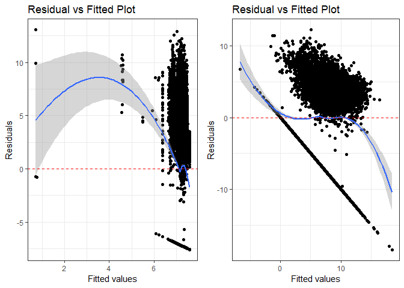<!-- -->

```
## Warning in if (class(model1_new) == "glmerMod") {: the condition has length
## > 1 and only the first element will be used
```

```
## Warning in if (class(model1_new) != "glmerMod" & class(model1_old) !=
## "glmerMod" & : the condition has length > 1 and only the first element will
## be used
```

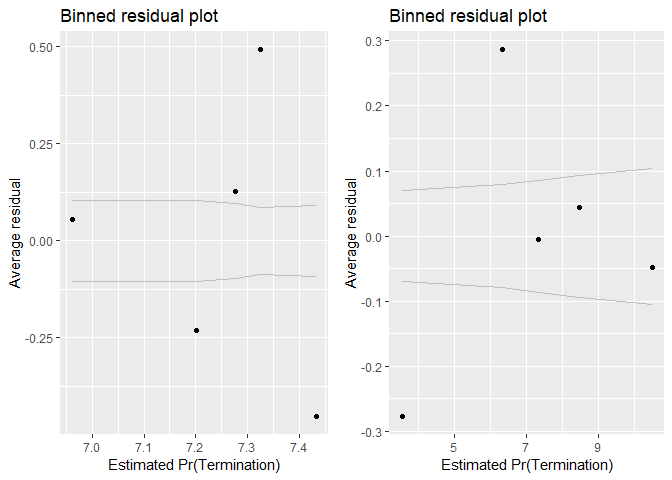<!-- -->

```
## [[1]]
##        model deviance null.deviance difference
## 1 model1_old  2582783       2585789   3006.091
## 2 model1_new  2101902       2585789 483887.678
## 
## [[2]]
##                              GVIF Df GVIF^(1/(2*Df))
## cl_US6_avg_sal_lag1Const 2.112168  1        1.453330
## cl_CFTE                  1.585528  1        1.259177
## c_pPBSC                  1.331019  1        1.153698
## c_pOffPSC                2.011937  1        1.418428
## c_pairHist               1.557875  1        1.248149
## cl_pairCA                3.262776  1        1.806316
## cl_Ceil                  1.517856  1        1.232013
## capped_cl_Days           1.167574  1        1.080543
## Comp1or5                 1.621610  3        1.083905
## Veh                      3.976009  4        1.188313
## PricingUCA               1.404224  6        1.028694
## Crisis                   1.385758  3        1.055880
## cl_def6_HHI_lag1         1.500778  1        1.225062
## cl_def6_ratio_lag1       1.556282  1        1.247510
## cl_def3_HHI_lag1         1.953989  1        1.397852
## cl_def3_ratio_lag1       2.038070  1        1.427610
```

```r
summary_residual_compare(n_Opt_08B,n_Opt_10D)
```

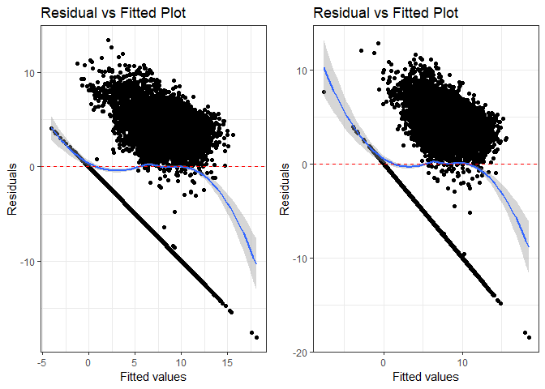<!-- -->

```
## Warning in if (class(model1_new) == "glmerMod") {: the condition has length
## > 1 and only the first element will be used

## Warning in if (class(model1_new) == "glmerMod") {: the condition has length
## > 1 and only the first element will be used
```

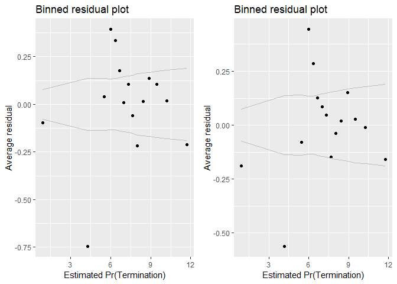<!-- -->

```
## [[1]]
##        model deviance null.deviance difference
## 1 model1_old  2112612       2585789   473177.5
## 2 model1_new  2101902       2585789   483887.7
## 
## [[2]]
##                              GVIF Df GVIF^(1/(2*Df))
## cl_US6_avg_sal_lag1Const 2.112168  1        1.453330
## cl_CFTE                  1.585528  1        1.259177
## c_pPBSC                  1.331019  1        1.153698
## c_pOffPSC                2.011937  1        1.418428
## c_pairHist               1.557875  1        1.248149
## cl_pairCA                3.262776  1        1.806316
## cl_Ceil                  1.517856  1        1.232013
## capped_cl_Days           1.167574  1        1.080543
## Comp1or5                 1.621610  3        1.083905
## Veh                      3.976009  4        1.188313
## PricingUCA               1.404224  6        1.028694
## Crisis                   1.385758  3        1.055880
## cl_def6_HHI_lag1         1.500778  1        1.225062
## cl_def6_ratio_lag1       1.556282  1        1.247510
## cl_def3_HHI_lag1         1.953989  1        1.397852
## cl_def3_ratio_lag1       2.038070  1        1.427610
```
HHI6 for ceiling breach now matches expectations but HHI6 for term went in the opposite direction. s

## Office 
### Office and Vendor-Office Pair

#### Model 11A: Vendor Market Share
Expectation: Contracts of offices partnered with vendors who have larger market shares would be more likely to experience cost ceiling breaches and exercised options, but less likely to have terminations.
Market Share Vendor for that Office	c_pMarket		++	-	+


```r
summary_continuous_plot(serv_opt,"c_pMarket")
```

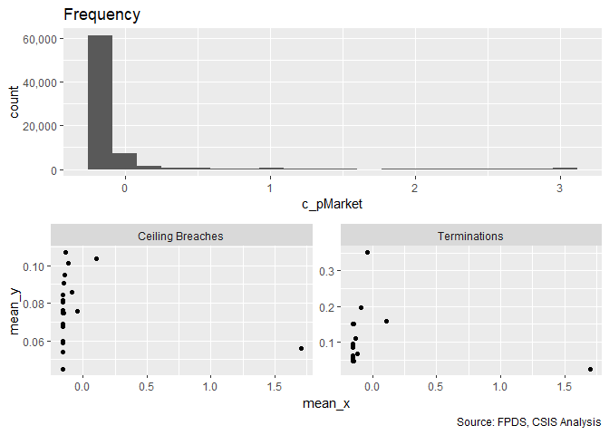<!-- -->

```r
#Scatter Plot
ggplot(serv_opt, aes(x=c_pMarket, y=lp_OptGrowth)) + geom_point(alpha = 0.1) + ggtitle('Exercised Options') + theme(plot.title = element_text(hjust = 0.5))
```

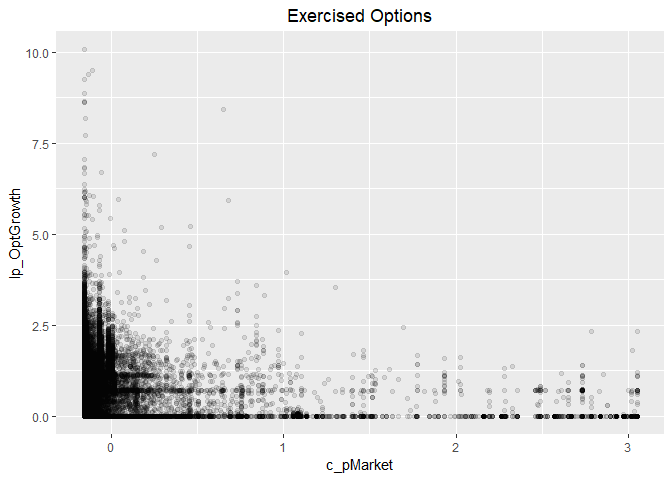<!-- -->

```r
#Model
n_Opt_11A <- glm (data=serv_opt,
                 ln_OptGrowth ~ c_pMarket)
display(n_Opt_11A)
```

```
## glm(formula = ln_OptGrowth ~ c_pMarket, data = serv_opt)
##             coef.est coef.se
## (Intercept)  7.15     0.02  
## c_pMarket   -2.40     0.05  
## ---
##   n = 74162, k = 2
##   residual deviance = 2495827.5, null deviance = 2585789.3 (difference = 89961.8)
##   overdispersion parameter = 33.7
##   residual sd is sqrt(overdispersion) = 5.80
```

```r
p_Opt_11A <- glm(data=serv_opt,
                        lp_OptGrowth ~ c_pMarket)

display(p_Opt_11A)
```

```
## glm(formula = lp_OptGrowth ~ c_pMarket, data = serv_opt)
##             coef.est coef.se
## (Intercept)  0.64     0.00  
## c_pMarket   -0.24     0.01  
## ---
##   n = 74162, k = 2
##   residual deviance = 34074.9, null deviance = 34944.5 (difference = 869.6)
##   overdispersion parameter = 0.5
##   residual sd is sqrt(overdispersion) = 0.68
```

```r
#Plot residuals versus fitted
stargazer::stargazer(n_Opt_11A,
                      
                       p_Opt_11A,
                       type="text",
                       digits=2)
```

```
## 
## ==============================================
##                       Dependent variable:     
##                   ----------------------------
##                    ln_OptGrowth  lp_OptGrowth 
##                        (1)            (2)     
## ----------------------------------------------
## c_pMarket            -2.40***      -0.24***   
##                       (0.05)        (0.01)    
##                                               
## Constant             7.15***        0.64***   
##                       (0.02)        (0.002)   
##                                               
## ----------------------------------------------
## Observations          74,162        74,162    
## Log Likelihood     -235,613.70    -76,394.74  
## Akaike Inf. Crit.   471,231.40    152,793.50  
## ==============================================
## Note:              *p<0.1; **p<0.05; ***p<0.01
```

Aligns with expectations on terminatio, but not for ceiling  breach or for options.


#### Model 11B: Cumulative Model


```r
#Frequency Plot for unlogged ceiling


#Model
n_Opt_11B <- glm (data=serv_opt,
                 ln_OptGrowth ~  cl_US6_avg_sal_lag1Const + 
                   cl_CFTE+ c_pPBSC+c_pOffPSC+
                 c_pairHist+cl_pairCA +
                   cl_Ceil + capped_cl_Days+
                   Comp1or5+
                   Veh+
                   PricingUCA+
                   Crisis+
                   cl_def6_HHI_lag1+cl_def6_ratio_lag1+
                   cl_def3_HHI_lag1+cl_def3_ratio_lag1+
                   c_pMarket)
glmer_examine(n_Opt_11B)
```

```
##                              GVIF Df GVIF^(1/(2*Df))
## cl_US6_avg_sal_lag1Const 2.123524  1        1.457232
## cl_CFTE                  1.585951  1        1.259345
## c_pPBSC                  1.343786  1        1.159218
## c_pOffPSC                2.021151  1        1.421672
## c_pairHist               1.558115  1        1.248245
## cl_pairCA                3.695001  1        1.922239
## cl_Ceil                  1.519123  1        1.232527
## capped_cl_Days           1.191396  1        1.091511
## Comp1or5                 1.655631  3        1.087662
## Veh                      4.036247  4        1.190549
## PricingUCA               1.406303  6        1.028821
## Crisis                   1.747371  3        1.097482
## cl_def6_HHI_lag1         1.502498  1        1.225764
## cl_def6_ratio_lag1       1.557323  1        1.247927
## cl_def3_HHI_lag1         1.958297  1        1.399392
## cl_def3_ratio_lag1       2.086319  1        1.444409
## c_pMarket                2.008805  1        1.417323
```

```r
p_Opt_11B <- glm(data=serv_opt,
                        lp_OptGrowth ~  cl_US6_avg_sal_lag1Const + 
                   cl_CFTE+ c_pPBSC+c_pOffPSC+
                 c_pairHist+cl_pairCA+
                 cl_Ceil + capped_cl_Days+
                 Comp1or5+
                   Veh+
                   PricingUCA+
                   Crisis+
                 cl_def6_HHI_lag1+cl_def6_ratio_lag1+
                 cl_def3_HHI_lag1+cl_def3_ratio_lag1+
                 c_pMarket)

glmer_examine(p_Opt_11B)
```

```
##                              GVIF Df GVIF^(1/(2*Df))
## cl_US6_avg_sal_lag1Const 2.123524  1        1.457232
## cl_CFTE                  1.585951  1        1.259345
## c_pPBSC                  1.343786  1        1.159218
## c_pOffPSC                2.021151  1        1.421672
## c_pairHist               1.558115  1        1.248245
## cl_pairCA                3.695001  1        1.922239
## cl_Ceil                  1.519123  1        1.232527
## capped_cl_Days           1.191396  1        1.091511
## Comp1or5                 1.655631  3        1.087662
## Veh                      4.036247  4        1.190549
## PricingUCA               1.406303  6        1.028821
## Crisis                   1.747371  3        1.097482
## cl_def6_HHI_lag1         1.502498  1        1.225764
## cl_def6_ratio_lag1       1.557323  1        1.247927
## cl_def3_HHI_lag1         1.958297  1        1.399392
## cl_def3_ratio_lag1       2.086319  1        1.444409
## c_pMarket                2.008805  1        1.417323
```

```r
#Plot residuals versus fitted
stargazer::stargazer(n_Opt_10D,n_Opt_11A,n_Opt_11B,
                     
                     p_Opt_10D,p_Opt_11A,p_Opt_11B,
                       type="text",
                       digits=2)
```

```
## 
## ===================================================================================================
##                                                        Dependent variable:                         
##                                --------------------------------------------------------------------
##                                           ln_OptGrowth                       lp_OptGrowth          
##                                    (1)         (2)         (3)        (4)        (5)        (6)    
## ---------------------------------------------------------------------------------------------------
## cl_US6_avg_sal_lag1Const         0.33***                 0.23***    0.04***               0.02***  
##                                  (0.05)                  (0.05)      (0.01)                (0.01)  
##                                                                                                    
## cl_CFTE                         -0.74***                -0.72***    -0.12***              -0.11*** 
##                                  (0.05)                  (0.05)      (0.01)                (0.01)  
##                                                                                                    
## c_pPBSC                          0.12**                   -0.01      -0.01*               -0.03*** 
##                                  (0.05)                  (0.05)      (0.01)                (0.01)  
##                                                                                                    
## c_pOffPSC                        0.88***                 0.75***    0.20***               0.18***  
##                                  (0.07)                  (0.07)      (0.01)                (0.01)  
##                                                                                                    
## c_pairHist                       0.18***                 0.16***     -0.01                 -0.01   
##                                  (0.05)                  (0.05)      (0.01)                (0.01)  
##                                                                                                    
## cl_pairCA                         -0.04                  0.60***    0.05***               0.14***  
##                                  (0.06)                  (0.07)      (0.01)                (0.01)  
##                                                                                                    
## cl_Ceil                          3.32***                 3.36***    0.14***               0.14***  
##                                  (0.05)                  (0.05)      (0.01)                (0.01)  
##                                                                                                    
## capped_cl_Days                   1.52***                 1.27***    0.03***               -0.0004  
##                                  (0.06)                  (0.06)      (0.01)                (0.01)  
##                                                                                                    
## Comp1or51 offer                   -0.10                   0.08      0.04***               0.06***  
##                                  (0.06)                  (0.06)      (0.01)                (0.01)  
##                                                                                                    
## Comp1or52-4 offers                -0.04                   -0.04     0.03***               0.03***  
##                                  (0.06)                  (0.06)      (0.01)                (0.01)  
##                                                                                                    
## Comp1or55+ offers                0.40***                 0.32***    0.11***               0.10***  
##                                  (0.06)                  (0.06)      (0.01)                (0.01)  
##                                                                                                    
## VehS-IDC                        -2.25***                -2.49***    -0.26***              -0.29*** 
##                                  (0.07)                  (0.08)      (0.01)                (0.01)  
##                                                                                                    
## VehM-IDC                        -0.62***                -0.74***    -0.13***              -0.15*** 
##                                  (0.07)                  (0.07)      (0.01)                (0.01)  
##                                                                                                    
## VehFSS/GWAC                      0.35***                 0.24***     0.02**                0.005   
##                                  (0.07)                  (0.07)      (0.01)                (0.01)  
##                                                                                                    
## VehBPA/BOA                      -4.18***                -4.43***    -0.61***              -0.65*** 
##                                  (0.12)                  (0.12)      (0.01)                (0.01)  
##                                                                                                    
## PricingUCAOther FP              -1.52***                -1.27***    -0.24***              -0.20*** 
##                                  (0.31)                  (0.31)      (0.04)                (0.04)  
##                                                                                                    
## PricingUCAT&M/LH/FPLOE           0.57***                 0.51***      0.01                 0.0002  
##                                  (0.12)                  (0.12)      (0.02)                (0.02)  
##                                                                                                    
## PricingUCAIncentive               0.24                    0.37        0.09                 0.11*   
##                                  (0.50)                  (0.49)      (0.06)                (0.06)  
##                                                                                                    
## PricingUCAOther CB               1.67***                 1.64***    0.16***               0.16***  
##                                  (0.10)                  (0.10)      (0.01)                (0.01)  
##                                                                                                    
## PricingUCAUCA                     0.06                    0.11       -0.03                 -0.03   
##                                  (0.25)                  (0.25)      (0.03)                (0.03)  
##                                                                                                    
## PricingUCACombination or Other   1.60***                 1.57***    0.15***               0.14***  
##                                  (0.14)                  (0.14)      (0.02)                (0.02)  
##                                                                                                    
## CrisisARRA                      -2.39***                -2.39***    -0.46***              -0.46*** 
##                                  (0.39)                  (0.39)      (0.05)                (0.05)  
##                                                                                                    
## CrisisDis                       -2.22***                -2.19***    -0.40***              -0.40*** 
##                                  (0.74)                  (0.74)      (0.09)                (0.09)  
##                                                                                                    
## CrisisOCO                       -4.69***                -3.08***    -0.60***              -0.39*** 
##                                  (0.11)                  (0.13)      (0.01)                (0.02)  
##                                                                                                    
## cl_def6_HHI_lag1                 0.20***                 0.25***    0.04***               0.04***  
##                                  (0.05)                  (0.05)      (0.01)                (0.01)  
##                                                                                                    
## cl_def6_ratio_lag1              -0.44***                -0.39***    -0.09***              -0.08*** 
##                                  (0.06)                  (0.06)      (0.01)                (0.01)  
##                                                                                                    
## cl_def3_HHI_lag1                 0.40***                 0.49***    0.14***               0.15***  
##                                  (0.06)                  (0.06)      (0.01)                (0.01)  
##                                                                                                    
## cl_def3_ratio_lag1              -0.45***                -0.20***    -0.09***              -0.06*** 
##                                  (0.06)                  (0.06)      (0.01)                (0.01)  
##                                                                                                    
## c_pMarket                                   -2.40***    -1.68***               -0.24***   -0.22*** 
##                                              (0.05)      (0.06)                 (0.01)     (0.01)  
##                                                                                                    
## Constant                         6.06***     7.15***     6.17***    0.65***    0.64***    0.66***  
##                                  (0.06)      (0.02)      (0.06)      (0.01)    (0.002)     (0.01)  
##                                                                                                    
## ---------------------------------------------------------------------------------------------------
## Observations                     74,162      74,162      74,162      74,162     74,162     74,162  
## Log Likelihood                 -229,244.00 -235,613.70 -228,855.20 -72,973.98 -76,394.74 -72,517.08
## Akaike Inf. Crit.              458,546.00  471,231.40  457,770.40  146,006.00 152,793.50 145,094.20
## ===================================================================================================
## Note:                                                                   *p<0.1; **p<0.05; ***p<0.01
```

```r
#summary_residual_compare(n_Opt_10D,n_Opt_11B)
#summary_residual_compare(n_Opt_11A,n_Opt_11B)
```
Note that the VIF is getting high on pair_CA.

### Other Office Characteristics
#### 12A: Past Office Volume (dollars)

Expectation: Contracting offices previously had more contract volume in dollars would have more experience managing cost and preventing cost-ceiling breaches, therefore larger past office volume would lower the likelihood of cost-ceiling breaches but no substantial relationships with likelihood of terminations or exercised options.

Past Office Volume $s	cl_OffVol		-	+	+
From looking at data, terminations, easier for big, less dependent. - less dependenct


```r
summary_continuous_plot(serv_opt,"cl_OffVol")
```

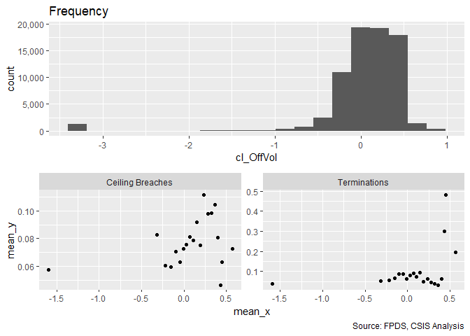<!-- -->

```r
#Scatter Plot
ggplot(serv_opt, aes(x=cl_OffVol, y=lp_OptGrowth)) + geom_point(alpha = 0.1) + ggtitle('Exercised Options') + theme(plot.title = element_text(hjust = 0.5))
```

<!-- -->

```r
#Model
n_Opt_12A <- glm (data=serv_opt,
                 ln_OptGrowth ~ cl_OffVol)
display(n_Opt_12A)
```

```
## glm(formula = ln_OptGrowth ~ cl_OffVol, data = serv_opt)
##             coef.est coef.se
## (Intercept) 7.23     0.02   
## cl_OffVol   0.25     0.04   
## ---
##   n = 74162, k = 2
##   residual deviance = 2584452.2, null deviance = 2585789.3 (difference = 1337.1)
##   overdispersion parameter = 34.8
##   residual sd is sqrt(overdispersion) = 5.90
```

```r
p_Opt_12A <- glm(data=serv_opt,
                        lp_OptGrowth ~ cl_OffVol)

display(p_Opt_12A)
```

```
## glm(formula = lp_OptGrowth ~ cl_OffVol, data = serv_opt)
##             coef.est coef.se
## (Intercept) 0.65     0.00   
## cl_OffVol   0.01     0.00   
## ---
##   n = 74162, k = 2
##   residual deviance = 34940.3, null deviance = 34944.5 (difference = 4.2)
##   overdispersion parameter = 0.5
##   residual sd is sqrt(overdispersion) = 0.69
```

```r
#Plot residuals versus fitted
stargazer::stargazer(n_Opt_12A,
                       
                       p_Opt_12A,
                       type="text",
                       digits=2)
```

```
## 
## ==============================================
##                       Dependent variable:     
##                   ----------------------------
##                    ln_OptGrowth  lp_OptGrowth 
##                        (1)            (2)     
## ----------------------------------------------
## cl_OffVol            0.25***        0.01***   
##                       (0.04)        (0.005)   
##                                               
## Constant             7.23***        0.65***   
##                       (0.02)        (0.003)   
##                                               
## ----------------------------------------------
## Observations          74,162        74,162    
## Log Likelihood     -236,907.60    -77,324.78  
## Akaike Inf. Crit.   473,819.20    154,653.60  
## ==============================================
## Note:              *p<0.1; **p<0.05; ***p<0.01
```

```r
summary_residual_compare(n_Opt_11A,n_Opt_12A, skip_vif = TRUE)
```

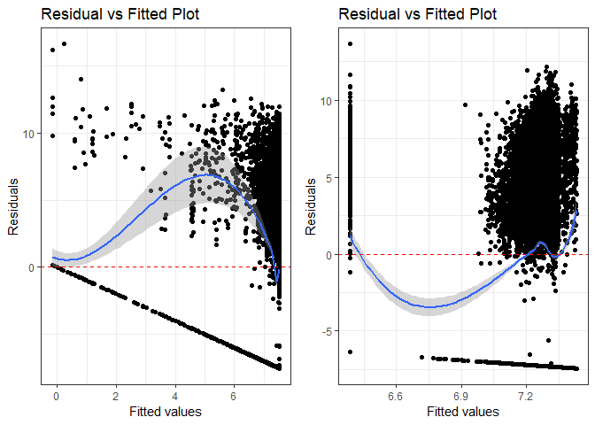<!-- -->

```
## Warning in min(x): no non-missing arguments to min; returning Inf
```

```
## Warning in max(x): no non-missing arguments to max; returning -Inf
```

```
## Warning: Removed 1 rows containing missing values (geom_point).
```

```
## Warning: Removed 1 rows containing missing values (geom_path).

## Warning: Removed 1 rows containing missing values (geom_path).
```

```
## Warning in if (class(model1_new) == "glmerMod") {: the condition has length
## > 1 and only the first element will be used
```

```
## Warning in if (class(model1_new) != "glmerMod" & class(model1_old) !=
## "glmerMod" & : the condition has length > 1 and only the first element will
## be used
```

<!-- -->

```
## NULL
```

```r
summary_residual_compare(n_Opt_03D,n_Opt_12A, skip_vif = TRUE)
```

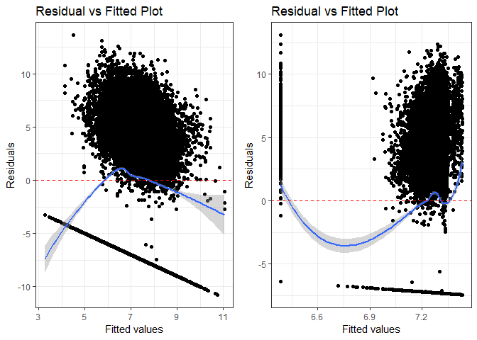<!-- -->

```
## Warning in if (class(model1_new) == "glmerMod") {: the condition has length
## > 1 and only the first element will be used

## Warning in if (class(model1_new) == "glmerMod") {: the condition has length
## > 1 and only the first element will be used
```

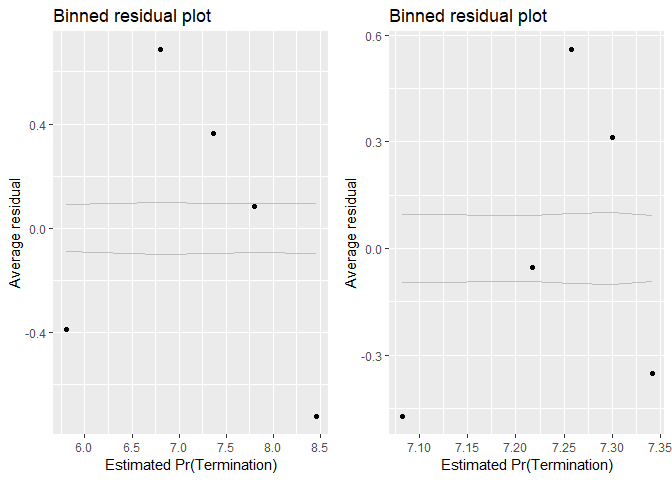<!-- -->

```
## NULL
```
Fully 
When considering past office volume alone, the relationship was as expected with cost-ceiling breaches. Out of our expectation, the results also showed increasing post office volume would reduce the possibility of exercised options but increase likelihood of having terminations.


#### 12B: Detailed Industry Diveristy

Expectation: More diverse industries of contracts contracting offices handle, the higher complexity they deal with, which would increase the likelihood of having cost ceiling breaches and terminations, and decreasing the likelihood of having options exercised.


```r
summary_continuous_plot(serv_opt,"cl_office_naics_hhi_k")
```

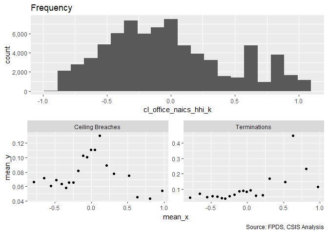<!-- -->

```r
#Scatter Plot
ggplot(serv_opt, aes(x=cl_office_naics_hhi_k, y=lp_OptGrowth)) + geom_point(alpha = 0.1) + ggtitle('Exercised Options') + theme(plot.title = element_text(hjust = 0.5))
```

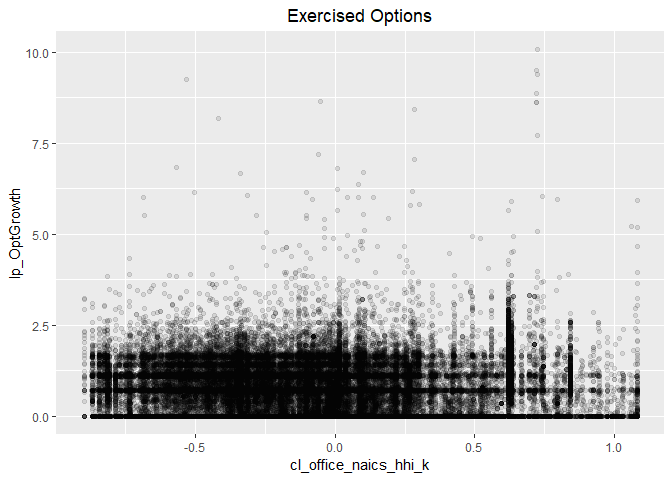<!-- -->

```r
#Model
n_Opt_12B <- glm (data=serv_opt,
                 ln_OptGrowth ~ cl_office_naics_hhi_k)
display(n_Opt_12B)
```

```
## glm(formula = ln_OptGrowth ~ cl_office_naics_hhi_k, data = serv_opt)
##                       coef.est coef.se
## (Intercept)            7.19     0.02  
## cl_office_naics_hhi_k -1.78     0.05  
## ---
##   n = 74162, k = 2
##   residual deviance = 2532468.1, null deviance = 2585789.3 (difference = 53321.2)
##   overdispersion parameter = 34.1
##   residual sd is sqrt(overdispersion) = 5.84
```

```r
p_Opt_12B <- glm(data=serv_opt,
                        lp_OptGrowth ~ cl_office_naics_hhi_k)

display(p_Opt_12B)
```

```
## glm(formula = lp_OptGrowth ~ cl_office_naics_hhi_k, data = serv_opt)
##                       coef.est coef.se
## (Intercept)            0.64     0.00  
## cl_office_naics_hhi_k -0.09     0.01  
## ---
##   n = 74162, k = 2
##   residual deviance = 34815.7, null deviance = 34944.5 (difference = 128.9)
##   overdispersion parameter = 0.5
##   residual sd is sqrt(overdispersion) = 0.69
```

```r
#Plot residuals versus fitted
stargazer::stargazer(n_Opt_12B,
                       
                       p_Opt_12B,
                       type="text",
                       digits=2)
```

```
## 
## ==================================================
##                           Dependent variable:     
##                       ----------------------------
##                        ln_OptGrowth  lp_OptGrowth 
##                            (1)            (2)     
## --------------------------------------------------
## cl_office_naics_hhi_k    -1.78***      -0.09***   
##                           (0.05)        (0.01)    
##                                                   
## Constant                 7.19***        0.64***   
##                           (0.02)        (0.003)   
##                                                   
## --------------------------------------------------
## Observations              74,162        74,162    
## Log Likelihood         -236,154.10    -77,192.24  
## Akaike Inf. Crit.       472,312.20    154,388.50  
## ==================================================
## Note:                  *p<0.1; **p<0.05; ***p<0.01
```

```r
# summary_residual_compare(n_Opt_11A,n_Opt_12B, skip_vif = TRUE)
# summary_residual_compare(n_Opt_03D,n_Opt_12B, skip_vif = TRUE)
```

When using hhi calculated based on contracting office obligation: considering hhi alone, expectation for Temrination was not met.
When using hhi calculated based on contracting office number of contarcts: considering hhi alone, all expectation were met.

#### 12C: Cumulative Model


```r
#Frequency Plot for unlogged ceiling


#Model
n_Opt_12C <- glm (data=serv_opt,
                 ln_OptGrowth ~  cl_US6_avg_sal_lag1Const + 
                   cl_CFTE+ c_pPBSC+c_pOffPSC+
                 c_pairHist+cl_pairCA +
                   cl_Ceil + capped_cl_Days+
                   Comp1or5+
                   Veh+
                   PricingUCA+
                   Crisis+
                   cl_def6_HHI_lag1+cl_def6_ratio_lag1+
                   cl_def3_HHI_lag1+cl_def3_ratio_lag1+
                   c_pMarket+
                   cl_OffVol+cl_office_naics_hhi_k )
glmer_examine(n_Opt_12C)
```

```
##                              GVIF Df GVIF^(1/(2*Df))
## cl_US6_avg_sal_lag1Const 2.149929  1        1.466263
## cl_CFTE                  1.589205  1        1.260637
## c_pPBSC                  1.381322  1        1.175297
## c_pOffPSC                2.152681  1        1.467202
## c_pairHist               1.606883  1        1.267629
## cl_pairCA                3.846476  1        1.961243
## cl_Ceil                  1.519653  1        1.232742
## capped_cl_Days           1.197813  1        1.094447
## Comp1or5                 1.690071  3        1.091400
## Veh                      4.179752  4        1.195759
## PricingUCA               1.414772  6        1.029336
## Crisis                   1.778660  3        1.100733
## cl_def6_HHI_lag1         1.544219  1        1.242666
## cl_def6_ratio_lag1       1.558364  1        1.248345
## cl_def3_HHI_lag1         1.960960  1        1.400343
## cl_def3_ratio_lag1       2.102066  1        1.449850
## c_pMarket                2.009293  1        1.417495
## cl_OffVol                1.235965  1        1.111740
## cl_office_naics_hhi_k    1.707522  1        1.306722
```

```r
p_Opt_12C <- glm(data=serv_opt,
                        lp_OptGrowth ~  cl_US6_avg_sal_lag1Const + 
                   cl_CFTE+ c_pPBSC+c_pOffPSC+
                 c_pairHist+cl_pairCA+
                 cl_Ceil + capped_cl_Days+
                 Comp1or5+
                   Veh+
                   PricingUCA+
                   Crisis+
                 cl_def6_HHI_lag1+cl_def6_ratio_lag1+
                 cl_def3_HHI_lag1+cl_def3_ratio_lag1+
                 c_pMarket+
                   cl_OffVol+cl_office_naics_hhi_k)

glmer_examine(p_Opt_12C)
```

```
##                              GVIF Df GVIF^(1/(2*Df))
## cl_US6_avg_sal_lag1Const 2.149929  1        1.466263
## cl_CFTE                  1.589205  1        1.260637
## c_pPBSC                  1.381322  1        1.175297
## c_pOffPSC                2.152681  1        1.467202
## c_pairHist               1.606883  1        1.267629
## cl_pairCA                3.846476  1        1.961243
## cl_Ceil                  1.519653  1        1.232742
## capped_cl_Days           1.197813  1        1.094447
## Comp1or5                 1.690071  3        1.091400
## Veh                      4.179752  4        1.195759
## PricingUCA               1.414772  6        1.029336
## Crisis                   1.778660  3        1.100733
## cl_def6_HHI_lag1         1.544219  1        1.242666
## cl_def6_ratio_lag1       1.558364  1        1.248345
## cl_def3_HHI_lag1         1.960960  1        1.400343
## cl_def3_ratio_lag1       2.102066  1        1.449850
## c_pMarket                2.009293  1        1.417495
## cl_OffVol                1.235965  1        1.111740
## cl_office_naics_hhi_k    1.707522  1        1.306722
```

```r
#Plot residuals versus fitted
stargazer::stargazer(n_Opt_11B,n_Opt_12A,n_Opt_12C,
                     
                     p_Opt_11B,p_Opt_12A,p_Opt_12C,
                       type="text",
                       digits=2)
```

```
## 
## ===================================================================================================
##                                                        Dependent variable:                         
##                                --------------------------------------------------------------------
##                                           ln_OptGrowth                       lp_OptGrowth          
##                                    (1)         (2)         (3)        (4)        (5)        (6)    
## ---------------------------------------------------------------------------------------------------
## cl_US6_avg_sal_lag1Const         0.23***                 0.32***    0.02***               0.03***  
##                                  (0.05)                  (0.05)      (0.01)                (0.01)  
##                                                                                                    
## cl_CFTE                         -0.72***                -0.68***    -0.11***              -0.11*** 
##                                  (0.05)                  (0.05)      (0.01)                (0.01)  
##                                                                                                    
## c_pPBSC                           -0.01                   -0.03     -0.03***              -0.03*** 
##                                  (0.05)                  (0.05)      (0.01)                (0.01)  
##                                                                                                    
## c_pOffPSC                        0.75***                 1.05***    0.18***               0.21***  
##                                  (0.07)                  (0.07)      (0.01)                (0.01)  
##                                                                                                    
## c_pairHist                       0.16***                 0.09**      -0.01                 -0.01*  
##                                  (0.05)                  (0.05)      (0.01)                (0.01)  
##                                                                                                    
## cl_pairCA                        0.60***                 0.80***    0.14***               0.15***  
##                                  (0.07)                  (0.07)      (0.01)                (0.01)  
##                                                                                                    
## cl_Ceil                          3.36***                 3.35***    0.14***               0.14***  
##                                  (0.05)                  (0.05)      (0.01)                (0.01)  
##                                                                                                    
## capped_cl_Days                   1.27***                 1.22***    -0.0004                -0.002  
##                                  (0.06)                  (0.06)      (0.01)                (0.01)  
##                                                                                                    
## Comp1or51 offer                   0.08                    0.004     0.06***               0.06***  
##                                  (0.06)                  (0.06)      (0.01)                (0.01)  
##                                                                                                    
## Comp1or52-4 offers                -0.04                   -0.05     0.03***               0.03***  
##                                  (0.06)                  (0.06)      (0.01)                (0.01)  
##                                                                                                    
## Comp1or55+ offers                0.32***                 0.35***    0.10***               0.10***  
##                                  (0.06)                  (0.06)      (0.01)                (0.01)  
##                                                                                                    
## VehS-IDC                        -2.49***                -2.45***    -0.29***              -0.29*** 
##                                  (0.08)                  (0.07)      (0.01)                (0.01)  
##                                                                                                    
## VehM-IDC                        -0.74***                -0.76***    -0.15***              -0.15*** 
##                                  (0.07)                  (0.07)      (0.01)                (0.01)  
##                                                                                                    
## VehFSS/GWAC                      0.24***                 0.23***     0.005                 0.003   
##                                  (0.07)                  (0.07)      (0.01)                (0.01)  
##                                                                                                    
## VehBPA/BOA                      -4.43***                -4.07***    -0.65***              -0.62*** 
##                                  (0.12)                  (0.12)      (0.01)                (0.01)  
##                                                                                                    
## PricingUCAOther FP              -1.27***                -1.42***    -0.20***              -0.22*** 
##                                  (0.31)                  (0.31)      (0.04)                (0.04)  
##                                                                                                    
## PricingUCAT&M/LH/FPLOE           0.51***                 0.50***     0.0002                0.0001  
##                                  (0.12)                  (0.12)      (0.02)                (0.02)  
##                                                                                                    
## PricingUCAIncentive               0.37                    0.58       0.11*                 0.13**  
##                                  (0.49)                  (0.49)      (0.06)                (0.06)  
##                                                                                                    
## PricingUCAOther CB               1.64***                 1.74***    0.16***               0.17***  
##                                  (0.10)                  (0.10)      (0.01)                (0.01)  
##                                                                                                    
## PricingUCAUCA                     0.11                    0.17       -0.03                 -0.02   
##                                  (0.25)                  (0.25)      (0.03)                (0.03)  
##                                                                                                    
## PricingUCACombination or Other   1.57***                 1.63***    0.14***               0.14***  
##                                  (0.14)                  (0.14)      (0.02)                (0.02)  
##                                                                                                    
## CrisisARRA                      -2.39***                -2.40***    -0.46***              -0.45*** 
##                                  (0.39)                  (0.39)      (0.05)                (0.05)  
##                                                                                                    
## CrisisDis                       -2.19***                -2.19***    -0.40***              -0.40*** 
##                                  (0.74)                  (0.73)      (0.09)                (0.09)  
##                                                                                                    
## CrisisOCO                       -3.08***                -2.82***    -0.39***              -0.37*** 
##                                  (0.13)                  (0.13)      (0.02)                (0.02)  
##                                                                                                    
## cl_def6_HHI_lag1                 0.25***                 0.11**     0.04***               0.03***  
##                                  (0.05)                  (0.05)      (0.01)                (0.01)  
##                                                                                                    
## cl_def6_ratio_lag1              -0.39***                -0.37***    -0.08***              -0.08*** 
##                                  (0.06)                  (0.06)      (0.01)                (0.01)  
##                                                                                                    
## cl_def3_HHI_lag1                 0.49***                 0.52***    0.15***               0.15***  
##                                  (0.06)                  (0.06)      (0.01)                (0.01)  
##                                                                                                    
## cl_def3_ratio_lag1              -0.20***                -0.29***    -0.06***              -0.06*** 
##                                  (0.06)                  (0.06)      (0.01)                (0.01)  
##                                                                                                    
## c_pMarket                       -1.68***                -1.68***    -0.22***              -0.22*** 
##                                  (0.06)                  (0.06)      (0.01)                (0.01)  
##                                                                                                    
## cl_OffVol                                    0.25***      0.07*                0.01***    -0.01**  
##                                              (0.04)      (0.04)                (0.005)    (0.005)  
##                                                                                                    
## cl_office_naics_hhi_k                                   -0.94***                          -0.08*** 
##                                                          (0.05)                            (0.01)  
##                                                                                                    
## Constant                         6.17***     7.23***     6.14***    0.66***    0.65***    0.66***  
##                                  (0.06)      (0.02)      (0.06)      (0.01)    (0.003)     (0.01)  
##                                                                                                    
## ---------------------------------------------------------------------------------------------------
## Observations                     74,162      74,162      74,162      74,162     74,162     74,162  
## Log Likelihood                 -228,855.20 -236,907.60 -228,694.20 -72,517.08 -77,324.78 -72,448.33
## Akaike Inf. Crit.              457,770.40  473,819.20  457,452.50  145,094.20 154,653.60 144,960.70
## ===================================================================================================
## Note:                                                                   *p<0.1; **p<0.05; ***p<0.01
```

```r
summary_residual_compare(n_Opt_10D,n_Opt_12C)
```

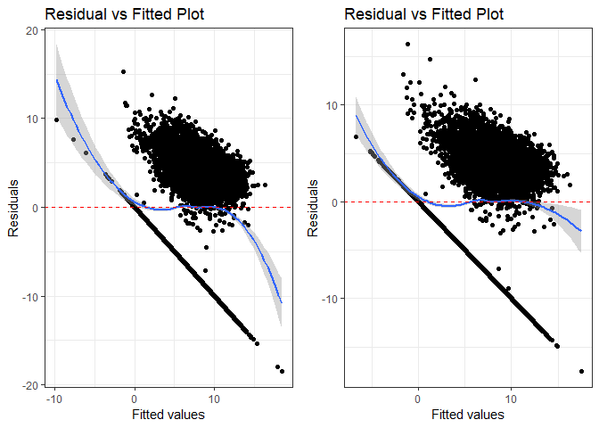<!-- -->

```
## Warning in if (class(model1_new) == "glmerMod") {: the condition has length
## > 1 and only the first element will be used
```

```
## Warning in if (class(model1_new) != "glmerMod" & class(model1_old) !=
## "glmerMod" & : the condition has length > 1 and only the first element will
## be used
```

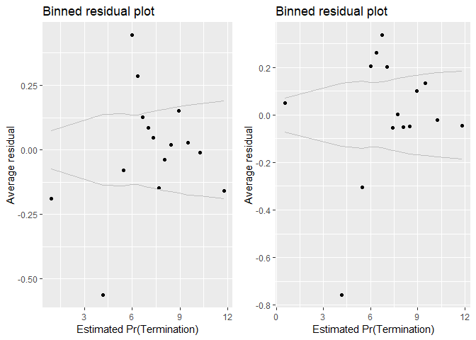<!-- -->

```
## [[1]]
##        model deviance null.deviance difference
## 1 model1_old  2101902       2585789   483887.7
## 2 model1_new  2070969       2585789   514820.6
## 
## [[2]]
##                              GVIF Df GVIF^(1/(2*Df))
## cl_US6_avg_sal_lag1Const 2.149929  1        1.466263
## cl_CFTE                  1.589205  1        1.260637
## c_pPBSC                  1.381322  1        1.175297
## c_pOffPSC                2.152681  1        1.467202
## c_pairHist               1.606883  1        1.267629
## cl_pairCA                3.846476  1        1.961243
## cl_Ceil                  1.519653  1        1.232742
## capped_cl_Days           1.197813  1        1.094447
## Comp1or5                 1.690071  3        1.091400
## Veh                      4.179752  4        1.195759
## PricingUCA               1.414772  6        1.029336
## Crisis                   1.778660  3        1.100733
## cl_def6_HHI_lag1         1.544219  1        1.242666
## cl_def6_ratio_lag1       1.558364  1        1.248345
## cl_def3_HHI_lag1         1.960960  1        1.400343
## cl_def3_ratio_lag1       2.102066  1        1.449850
## c_pMarket                2.009293  1        1.417495
## cl_OffVol                1.235965  1        1.111740
## cl_office_naics_hhi_k    1.707522  1        1.306722
```

```r
summary_residual_compare(n_Opt_11A,n_Opt_12C)
```

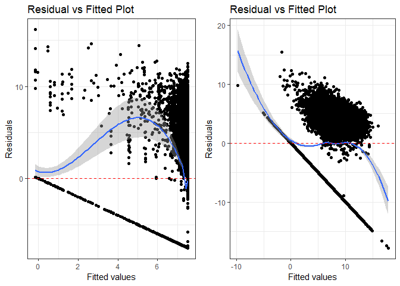<!-- -->

```
## Warning in min(x): no non-missing arguments to min; returning Inf
```

```
## Warning in max(x): no non-missing arguments to max; returning -Inf
```

```
## Warning: Removed 1 rows containing missing values (geom_point).
```

```
## Warning: Removed 1 rows containing missing values (geom_path).

## Warning: Removed 1 rows containing missing values (geom_path).
```

```
## Warning in if (class(model1_new) == "glmerMod") {: the condition has length
## > 1 and only the first element will be used
```

```
## Warning in if (class(model1_new) != "glmerMod" & class(model1_old) !=
## "glmerMod" & : the condition has length > 1 and only the first element will
## be used
```

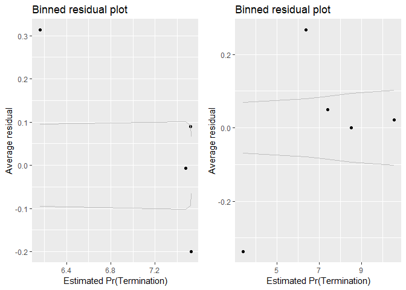<!-- -->

```
## [[1]]
##        model deviance null.deviance difference
## 1 model1_old  2495828       2585789   89961.76
## 2 model1_new  2070969       2585789  514820.58
## 
## [[2]]
##                              GVIF Df GVIF^(1/(2*Df))
## cl_US6_avg_sal_lag1Const 2.149929  1        1.466263
## cl_CFTE                  1.589205  1        1.260637
## c_pPBSC                  1.381322  1        1.175297
## c_pOffPSC                2.152681  1        1.467202
## c_pairHist               1.606883  1        1.267629
## cl_pairCA                3.846476  1        1.961243
## cl_Ceil                  1.519653  1        1.232742
## capped_cl_Days           1.197813  1        1.094447
## Comp1or5                 1.690071  3        1.091400
## Veh                      4.179752  4        1.195759
## PricingUCA               1.414772  6        1.029336
## Crisis                   1.778660  3        1.100733
## cl_def6_HHI_lag1         1.544219  1        1.242666
## cl_def6_ratio_lag1       1.558364  1        1.248345
## cl_def3_HHI_lag1         1.960960  1        1.400343
## cl_def3_ratio_lag1       2.102066  1        1.449850
## c_pMarket                2.009293  1        1.417495
## cl_OffVol                1.235965  1        1.111740
## cl_office_naics_hhi_k    1.707522  1        1.306722
```


## Pre-Multilevel Model Summary


```r
 # !is.na(def_serv$cl_US6_avg_sal_lag1)&
 #  !is.na(def_serv$cl_CFTE)&
 #  !is.na(def_serv$c_pPBSC)&
 #  !is.na(def_serv$c_pOffPSC)&
 #  !is.na(def_serv$c_pairHist)&
 #  !is.na(def_serv$cl_pairCA)&


#Absolute Exercised Options
  stargazer::stargazer(n_Opt_01A,n_Opt_01B,n_Opt_02A,n_Opt_02B,n_Opt_03A,n_Opt_03B,n_Opt_03D,n_Opt_12C,
                       type="text",
                       digits=2)
```

```
## 
## ==============================================================================================================================
##                                                                      Dependent variable:                                      
##                                -----------------------------------------------------------------------------------------------
##                                                                         ln_OptGrowth                                          
##                                    (1)         (2)         (3)         (4)         (5)         (6)         (7)         (8)    
## ------------------------------------------------------------------------------------------------------------------------------
## cl_US6_avg_sal_lag1Const         0.19***                                                                 0.82***     0.32***  
##                                  (0.04)                                                                  (0.05)      (0.05)   
##                                                                                                                               
## cl_CFTE                                     -0.52***                                                    -0.73***    -0.68***  
##                                              (0.05)                                                      (0.06)      (0.05)   
##                                                                                                                               
## c_pPBSC                                                 -0.57***                                        -0.35***      -0.03   
##                                                          (0.05)                                          (0.05)      (0.05)   
##                                                                                                                               
## c_pOffPSC                                                           -0.36***                             1.31***     1.05***  
##                                                                      (0.05)                              (0.07)      (0.07)   
##                                                                                                                               
## c_pairHist                                                                      -0.61***                 0.34***     0.09**   
##                                                                                  (0.04)                  (0.05)      (0.05)   
##                                                                                                                               
## cl_pairCA                                                                                   -1.35***    -2.14***     0.80***  
##                                                                                              (0.04)      (0.06)      (0.07)   
##                                                                                                                               
## cl_Ceil                                                                                                              3.35***  
##                                                                                                                      (0.05)   
##                                                                                                                               
## capped_cl_Days                                                                                                       1.22***  
##                                                                                                                      (0.06)   
##                                                                                                                               
## Comp1or51 offer                                                                                                       0.004   
##                                                                                                                      (0.06)   
##                                                                                                                               
## Comp1or52-4 offers                                                                                                    -0.05   
##                                                                                                                      (0.06)   
##                                                                                                                               
## Comp1or55+ offers                                                                                                    0.35***  
##                                                                                                                      (0.06)   
##                                                                                                                               
## VehS-IDC                                                                                                            -2.45***  
##                                                                                                                      (0.07)   
##                                                                                                                               
## VehM-IDC                                                                                                            -0.76***  
##                                                                                                                      (0.07)   
##                                                                                                                               
## VehFSS/GWAC                                                                                                          0.23***  
##                                                                                                                      (0.07)   
##                                                                                                                               
## VehBPA/BOA                                                                                                          -4.07***  
##                                                                                                                      (0.12)   
##                                                                                                                               
## PricingUCAOther FP                                                                                                  -1.42***  
##                                                                                                                      (0.31)   
##                                                                                                                               
## PricingUCAT&M/LH/FPLOE                                                                                               0.50***  
##                                                                                                                      (0.12)   
##                                                                                                                               
## PricingUCAIncentive                                                                                                   0.58    
##                                                                                                                      (0.49)   
##                                                                                                                               
## PricingUCAOther CB                                                                                                   1.74***  
##                                                                                                                      (0.10)   
##                                                                                                                               
## PricingUCAUCA                                                                                                         0.17    
##                                                                                                                      (0.25)   
##                                                                                                                               
## PricingUCACombination or Other                                                                                       1.63***  
##                                                                                                                      (0.14)   
##                                                                                                                               
## CrisisARRA                                                                                                          -2.40***  
##                                                                                                                      (0.39)   
##                                                                                                                               
## CrisisDis                                                                                                           -2.19***  
##                                                                                                                      (0.73)   
##                                                                                                                               
## CrisisOCO                                                                                                           -2.82***  
##                                                                                                                      (0.13)   
##                                                                                                                               
## cl_def6_HHI_lag1                                                                                                     0.11**   
##                                                                                                                      (0.05)   
##                                                                                                                               
## cl_def6_ratio_lag1                                                                                                  -0.37***  
##                                                                                                                      (0.06)   
##                                                                                                                               
## cl_def3_HHI_lag1                                                                                                     0.52***  
##                                                                                                                      (0.06)   
##                                                                                                                               
## cl_def3_ratio_lag1                                                                                                  -0.29***  
##                                                                                                                      (0.06)   
##                                                                                                                               
## c_pMarket                                                                                                           -1.68***  
##                                                                                                                      (0.06)   
##                                                                                                                               
## cl_OffVol                                                                                                             0.07*   
##                                                                                                                      (0.04)   
##                                                                                                                               
## cl_office_naics_hhi_k                                                                                               -0.94***  
##                                                                                                                      (0.05)   
##                                                                                                                               
## Constant                         7.23***     7.25***     7.25***     7.23***     7.19***     7.08***     7.01***     6.14***  
##                                  (0.02)      (0.02)      (0.02)      (0.02)      (0.02)      (0.02)      (0.02)      (0.06)   
##                                                                                                                               
## ------------------------------------------------------------------------------------------------------------------------------
## Observations                     74,162      74,162      74,162      74,162      74,162      74,162      74,162      74,162   
## Log Likelihood                 -236,915.50 -236,866.00 -236,852.70 -236,901.90 -236,816.30 -236,315.40 -235,924.90 -228,694.20
## Akaike Inf. Crit.              473,834.90  473,736.00  473,709.30  473,807.70  473,636.60  472,634.80  471,863.80  457,452.50 
## ==============================================================================================================================
## Note:                                                                                              *p<0.1; **p<0.05; ***p<0.01
```

```r
texreg::htmlreg(list(n_Opt_01A,n_Opt_01B,n_Opt_02A,n_Opt_02B,n_Opt_03A,n_Opt_03B,n_Opt_03D,n_Opt_12C),file="..//Output//n_Opt_model_lvl1.html",
                single.row = TRUE,
                # custom.model.name=c("Ceiling Breaches"),
                stars=c(0.1,0.05,0.01,0.001),
                groups = list(
                              "Services Complexity" = 2:3,
                              "Office Capacity" =4:5,
                              "Past Relationship"=6:7
                              ),
                custom.coef.map=study_coef_list,
                bold=0.05,
                custom.note="%stars. Numerical inputs are rescaled.",
                caption="Table 6: Logit Bivariate Look at Study Variables and Ceiling Breaches",
                caption.above=TRUE)
```

```
## The table was written to the file '..//Output//n_Opt_model_lvl1.html'.
```

```r
#Percent Exercised Options
stargazer::stargazer(p_Opt_01A,p_Opt_01B,p_Opt_02A,p_Opt_02B,p_Opt_03A,p_Opt_03B,p_Opt_03D,p_Opt_12C,
                       type="text",
                       digits=2)
```

```
## 
## ======================================================================================================================
##                                                                  Dependent variable:                                  
##                                ---------------------------------------------------------------------------------------
##                                                                     lp_OptGrowth                                      
##                                   (1)        (2)        (3)        (4)        (5)        (6)        (7)        (8)    
## ----------------------------------------------------------------------------------------------------------------------
## cl_US6_avg_sal_lag1Const        -0.07***                                                          -0.02***   0.03***  
##                                 (0.005)                                                            (0.01)     (0.01)  
##                                                                                                                       
## cl_CFTE                                    -0.14***                                               -0.13***   -0.11*** 
##                                             (0.01)                                                 (0.01)     (0.01)  
##                                                                                                                       
## c_pPBSC                                               -0.05***                                    -0.03***   -0.03*** 
##                                                        (0.01)                                      (0.01)     (0.01)  
##                                                                                                                       
## c_pOffPSC                                                        0.12***                          0.28***    0.21***  
##                                                                   (0.01)                           (0.01)     (0.01)  
##                                                                                                                       
## c_pairHist                                                                  -0.04***               -0.001     -0.01*  
##                                                                             (0.005)                (0.01)     (0.01)  
##                                                                                                                       
## cl_pairCA                                                                              -0.04***   -0.13***   0.15***  
##                                                                                        (0.005)     (0.01)     (0.01)  
##                                                                                                                       
## cl_Ceil                                                                                                      0.14***  
##                                                                                                               (0.01)  
##                                                                                                                       
## capped_cl_Days                                                                                                -0.002  
##                                                                                                               (0.01)  
##                                                                                                                       
## Comp1or51 offer                                                                                              0.06***  
##                                                                                                               (0.01)  
##                                                                                                                       
## Comp1or52-4 offers                                                                                           0.03***  
##                                                                                                               (0.01)  
##                                                                                                                       
## Comp1or55+ offers                                                                                            0.10***  
##                                                                                                               (0.01)  
##                                                                                                                       
## VehS-IDC                                                                                                     -0.29*** 
##                                                                                                               (0.01)  
##                                                                                                                       
## VehM-IDC                                                                                                     -0.15*** 
##                                                                                                               (0.01)  
##                                                                                                                       
## VehFSS/GWAC                                                                                                   0.003   
##                                                                                                               (0.01)  
##                                                                                                                       
## VehBPA/BOA                                                                                                   -0.62*** 
##                                                                                                               (0.01)  
##                                                                                                                       
## PricingUCAOther FP                                                                                           -0.22*** 
##                                                                                                               (0.04)  
##                                                                                                                       
## PricingUCAT&M/LH/FPLOE                                                                                        0.0001  
##                                                                                                               (0.02)  
##                                                                                                                       
## PricingUCAIncentive                                                                                           0.13**  
##                                                                                                               (0.06)  
##                                                                                                                       
## PricingUCAOther CB                                                                                           0.17***  
##                                                                                                               (0.01)  
##                                                                                                                       
## PricingUCAUCA                                                                                                 -0.02   
##                                                                                                               (0.03)  
##                                                                                                                       
## PricingUCACombination or Other                                                                               0.14***  
##                                                                                                               (0.02)  
##                                                                                                                       
## CrisisARRA                                                                                                   -0.45*** 
##                                                                                                               (0.05)  
##                                                                                                                       
## CrisisDis                                                                                                    -0.40*** 
##                                                                                                               (0.09)  
##                                                                                                                       
## CrisisOCO                                                                                                    -0.37*** 
##                                                                                                               (0.02)  
##                                                                                                                       
## cl_def6_HHI_lag1                                                                                             0.03***  
##                                                                                                               (0.01)  
##                                                                                                                       
## cl_def6_ratio_lag1                                                                                           -0.08*** 
##                                                                                                               (0.01)  
##                                                                                                                       
## cl_def3_HHI_lag1                                                                                             0.15***  
##                                                                                                               (0.01)  
##                                                                                                                       
## cl_def3_ratio_lag1                                                                                           -0.06*** 
##                                                                                                               (0.01)  
##                                                                                                                       
## c_pMarket                                                                                                    -0.22*** 
##                                                                                                               (0.01)  
##                                                                                                                       
## cl_OffVol                                                                                                    -0.01**  
##                                                                                                              (0.005)  
##                                                                                                                       
## cl_office_naics_hhi_k                                                                                        -0.08*** 
##                                                                                                               (0.01)  
##                                                                                                                       
## Constant                        0.65***    0.65***    0.65***    0.65***    0.64***    0.64***    0.64***    0.66***  
##                                 (0.003)    (0.003)    (0.003)    (0.003)    (0.003)    (0.003)    (0.003)     (0.01)  
##                                                                                                                       
## ----------------------------------------------------------------------------------------------------------------------
## Observations                     74,162     74,162     74,162     74,162     74,162     74,162     74,162     74,162  
## Log Likelihood                 -77,199.78 -77,007.63 -77,294.40 -77,130.56 -77,288.54 -77,294.15 -76,354.49 -72,448.33
## Akaike Inf. Crit.              154,403.60 154,019.30 154,592.80 154,265.10 154,581.10 154,592.30 152,723.00 144,960.70
## ======================================================================================================================
## Note:                                                                                      *p<0.1; **p<0.05; ***p<0.01
```

```r
texreg::htmlreg(list(p_Opt_01A,p_Opt_01B,p_Opt_02A,p_Opt_02B,p_Opt_03A,p_Opt_03B,p_Opt_03D,p_Opt_12C),file="..//Output//p_Opt_model_lvl1.html",
                single.row = TRUE,
                # custom.model.name=c("Ceiling Breaches"),
                stars=c(0.1,0.05,0.01,0.001),
                groups = list(
                              "Services Complexity" = 2:3,
                              "Office Capacity" =4:5,
                              "Past Relationship"=6:7
                              ),
                custom.coef.map=study_coef_list,
                bold=0.05,
                custom.note="%stars. Numerical inputs are rescaled.",
                caption="Table 8: Regression Bivariate Look at Study Variables and Log(Options Growth)",
                caption.above=TRUE)
```

```
## The table was written to the file '..//Output//p_Opt_model_lvl1.html'.
```
