---
title: "Defense Services Exercised Options"
author: "Greg Sanders, Justin Graham"
date: "Friday July 13, 2019"
output:
  html_document:
    keep_md: yes
--- 

Modeling Likelihood of Some or All Options being Exercised
============================================================================

#Setup and  Load Data
First we load the data. The dataset used is a U.S. Defense Contracting dataset derived from FPDS.


Two models are employed throughout, one looking at the probability of some options being exercised  and the other looking at all (or at least 95%) options being exercised in dollar terms.  This approach was taken to avoid clustering at zero and one problems. The second model only includes as a sample those contracts with some options exercised, while the first model is calculated on the full dataset.

#Study Variables

##Services Complexity
Expectation: Higher service complexity would make work more demanding and thus raises the risks of negative contracting outcomes, namely the likelihood exercised options decreases.

### 01A NAICS6 Salary
Expectation: Given the fact that one source for higher salaries is the difficulty of the work and the experience and education required, as average NAICS6 salary increases, we expect likelihood of both some options being exercised and all options being exercised to decrease.


```r
summary_continuous_plot(serv_opt,metric="opt","cln_US6sal")
```

```
## Warning: summarise_() is deprecated. 
## Please use summarise() instead
## 
## The 'programming' vignette or the tidyeval book can help you
## to program with summarise() : https://tidyeval.tidyverse.org
## This warning is displayed once per session.
```

<!-- -->

```r
#Model
b_SomeOpt01A <- glm (data=serv_opt,
                 b_SomeOpt ~ cln_US6sal, family=binomial(link="logit"))


b_AllOpt01A <- glm(data=serv_exeropt, family=binomial(link="logit"),
                        b_AllOpt ~ cln_US6sal)


#Plot residuals versus fitted
stargazer::stargazer(b_SomeOpt01A,b_AllOpt01A,type="text",
                       digits=2)
```

```
## 
## ==============================================
##                       Dependent variable:     
##                   ----------------------------
##                     b_SomeOpt      b_AllOpt   
##                        (1)            (2)     
## ----------------------------------------------
## cln_US6sal           -0.16***      -0.13***   
##                       (0.01)        (0.02)    
##                                               
## Constant             0.82***        -0.02*    
##                       (0.01)        (0.01)    
##                                               
## ----------------------------------------------
## Observations          74,274        51,357    
## Log Likelihood      -45,836.64    -35,563.04  
## Akaike Inf. Crit.   91,677.29      71,130.09  
## ==============================================
## Note:              *p<0.1; **p<0.05; ***p<0.01
```
Expectations are met.


### 01B Invoice Rate
Expectation: The invoice rate approximates how much the government is charged annually for each comparable full-time employee who is supporting the service contracts. A higher invoice rate indicates a more complex service. As invoice rate increases, we expect likelihood of both some options being exercised and all options being exercised to decrease.


```r
summary_continuous_plot(serv_opt,metric="opt","cln_PSCrate")
```

<!-- -->

```r
#Model
b_SomeOpt01B <- glm (data=serv_opt,
                 b_SomeOpt ~ cln_PSCrate, family=binomial(link="logit"))

b_AllOpt01B <- glm(data=serv_exeropt, family=binomial(link="logit"),
                        b_AllOpt ~ cln_PSCrate)


#Plot residuals versus fitted
  stargazer::stargazer(b_SomeOpt01A,b_SomeOpt01B,
                       b_AllOpt01A,b_AllOpt01B,
                       type="text",
                       digits=2)
```

```
## 
## =============================================================
##                               Dependent variable:            
##                   -------------------------------------------
##                         b_SomeOpt             b_AllOpt       
##                      (1)        (2)        (3)        (4)    
## -------------------------------------------------------------
## cln_US6sal         -0.16***              -0.13***            
##                     (0.01)                (0.02)             
##                                                              
## cln_PSCrate                   -0.32***              -0.16*** 
##                                (0.02)                (0.02)  
##                                                              
## Constant           0.82***    0.82***     -0.02*    -0.02**  
##                     (0.01)     (0.01)     (0.01)     (0.01)  
##                                                              
## -------------------------------------------------------------
## Observations        74,274     74,274     51,357     51,357  
## Log Likelihood    -45,836.64 -45,725.17 -35,563.04 -35,561.03
## Akaike Inf. Crit. 91,677.29  91,454.35  71,130.09  71,126.05 
## =============================================================
## Note:                             *p<0.1; **p<0.05; ***p<0.01
```

Expectations met.

### 01C Service Complexity
Expectation: Collectively, the higher average salary and invoice rate (more complexity is indicated), we expect the likelihood of both some options being exercised and all options being exercised to decrease.

 

```r
#Model
b_SomeOpt01C <- glm (data=serv_opt,
                 b_SomeOpt ~ cln_US6sal + cln_PSCrate, family=binomial(link="logit"))
glmer_examine(b_SomeOpt01C)
```

```
##  cln_US6sal cln_PSCrate 
##    1.399949    1.399949
```

```r
b_AllOpt01C <- glm(data=serv_exeropt, family=binomial(link="logit"),
                        b_AllOpt ~ cln_US6sal +  cln_PSCrate)

glmer_examine(b_AllOpt01C)
```

```
##  cln_US6sal cln_PSCrate 
##    1.416978    1.416978
```

```r
#Plot residuals versus fitted
stargazer::stargazer(b_SomeOpt01A,b_SomeOpt01B,b_SomeOpt01C,
                       
                       b_AllOpt01A,b_AllOpt01B,b_AllOpt01C,
                       type="text",
                       digits=2)
```

```
## 
## ===================================================================================
##                                          Dependent variable:                       
##                   -----------------------------------------------------------------
##                              b_SomeOpt                         b_AllOpt            
##                      (1)        (2)        (3)        (4)        (5)        (6)    
## -----------------------------------------------------------------------------------
## cln_US6sal         -0.16***               -0.02     -0.13***              -0.08*** 
##                     (0.01)                (0.02)     (0.02)                (0.02)  
##                                                                                    
## cln_PSCrate                   -0.32***   -0.31***              -0.16***   -0.11*** 
##                                (0.02)     (0.02)                (0.02)     (0.02)  
##                                                                                    
## Constant           0.82***    0.82***    0.82***     -0.02*    -0.02**    -0.02**  
##                     (0.01)     (0.01)     (0.01)     (0.01)     (0.01)     (0.01)  
##                                                                                    
## -----------------------------------------------------------------------------------
## Observations        74,274     74,274     74,274     51,357     51,357     51,357  
## Log Likelihood    -45,836.64 -45,725.17 -45,724.59 -35,563.04 -35,561.03 -35,552.24
## Akaike Inf. Crit. 91,677.29  91,454.35  91,455.19  71,130.09  71,126.05  71,110.47 
## ===================================================================================
## Note:                                                   *p<0.1; **p<0.05; ***p<0.01
```

```r
undebug(summary_residual_compare)
```

```
## Warning in undebug(summary_residual_compare): argument is not being
## debugged
```

```r
summary_residual_compare(b_SomeOpt01A,b_SomeOpt01C,b_SomeOpt01B, bins=3)
```

<!-- -->

```
## Warning in residuals_binned(model1_old, bins = bins): Always uses Xlb
## Estimated Pr(Termination), should update.
```

```
## Warning in residuals_binned(model1_new, bins = bins): Always uses Xlb
## Estimated Pr(Termination), should update.
```

```
## Warning in if (class(model1_new) %in% c("glmerMod", "lme4")) {: the
## condition has length > 1 and only the first element will be used
```

```
## Warning in if (!class(model1_new) %in% c("glmerMod", "lme4") & !
## class(model1_old) %in% : the condition has length > 1 and only the first
## element will be used
```

<!-- -->

```
## [[1]]
##        model deviance null.deviance difference
## 1 model1_old 91673.29       91792.7   119.4166
## 2 model1_new 91449.19       91792.7   343.5147
```

```r
summary_residual_compare(b_AllOpt01A, b_AllOpt01C, b_AllOpt01B, bins=3)
```

<!-- -->

```
## Warning in residuals_binned(model1_old, bins = bins): Always uses Xlb
## Estimated Pr(Termination), should update.
```

```
## Warning in residuals_binned(model1_new, bins = bins): Always uses Xlb
## Estimated Pr(Termination), should update.
```

```
## Warning in if (class(model1_new) %in% c("glmerMod", "lme4")) {: the
## condition has length > 1 and only the first element will be used
```

```
## Warning in if (!class(model1_new) %in% c("glmerMod", "lme4") & !
## class(model1_old) %in% : the condition has length > 1 and only the first
## element will be used
```

<!-- -->

```
## [[1]]
##        model deviance null.deviance difference
## 1 model1_old 71126.09      71190.14   64.05018
## 2 model1_new 71104.47      71190.14   85.66357
```

Expectations are met for all variables, except for average salary in the model of some options being exercised, which is no longer statistically significant.

## Office Capacity

### 02A: Performance Based Services
Expectation: Performance-based services contracting ties a portion of a contractor's payment, contract extensions, or contract renewals to the achievement of specific, measurable performance standards and requirements, which encourages better contracting results. As percent PBSC increases, we expect likelihood of both some options being exercised and all options being exercised to increase.


```r
summary_continuous_plot(serv_opt,metric="opt","pPBSC")
```

<!-- -->

```r
#Model
b_SomeOpt02A <- glm (data=serv_opt,
                 b_SomeOpt ~ cp_OffPerf7, family=binomial(link="logit"))

b_AllOpt02A <- glm(data=serv_exeropt, family=binomial(link="logit"),
                        b_AllOpt ~ cp_OffPerf7)


#Plot residuals versus fitted
stargazer::stargazer(b_SomeOpt01C,b_SomeOpt02A,
                       b_AllOpt01C,b_AllOpt02A,
                       type="text",
                       digits=2)
```

```
## 
## =============================================================
##                               Dependent variable:            
##                   -------------------------------------------
##                         b_SomeOpt             b_AllOpt       
##                      (1)        (2)        (3)        (4)    
## -------------------------------------------------------------
## cln_US6sal          -0.02                -0.08***            
##                     (0.02)                (0.02)             
##                                                              
## cln_PSCrate        -0.31***              -0.11***            
##                     (0.02)                (0.02)             
##                                                              
## cp_OffPerf7                   -0.29***              -0.29*** 
##                                (0.02)                (0.02)  
##                                                              
## Constant           0.82***    0.82***    -0.02**    -0.02**  
##                     (0.01)     (0.01)     (0.01)     (0.01)  
##                                                              
## -------------------------------------------------------------
## Observations        74,274     74,274     51,357     51,357  
## Log Likelihood    -45,724.59 -45,753.72 -35,552.24 -35,492.57
## Akaike Inf. Crit. 91,455.19  91,511.44  71,110.47  70,989.15 
## =============================================================
## Note:                             *p<0.1; **p<0.05; ***p<0.01
```

Expectations are not met - percent PBSC has a statistically significant, strongly negative, effect in both models.


### 02B: No.Office PSC History
Expectation: The increasing share of contracting office obligations for a given service indicates high capcaity in that area, so we expect the likelihood of both some options being exercised and all options being exercised to increase.


```r
summary_continuous_plot(serv_opt,metric="opt","office_psc_obligatedamount_7year",bins=100)
```

<!-- -->

```r
summary_continuous_plot(serv_opt,metric="opt","office_psc_obligatedamount_7year",bins=100,log=TRUE)
```

```
## Warning: Transformation introduced infinite values in continuous x-axis
```

```
## Warning: Removed 7433 rows containing non-finite values (stat_bin).
```

```
## Warning: Transformation introduced infinite values in continuous x-axis
```

<!-- -->

```r
#Model
b_SomeOpt02B <- glm (data=serv_opt,
                 b_SomeOpt ~ cp_OffPSC7, family=binomial(link="logit"))

b_AllOpt02B <- glm(data=serv_exeropt, family=binomial(link="logit"),
                        b_AllOpt ~ cp_OffPSC7)

#Plot residuals versus fitted
stargazer::stargazer(b_SomeOpt01C,b_SomeOpt02A,b_SomeOpt02B,
                       b_AllOpt01C,b_AllOpt02A,b_AllOpt02B,
                       type="text",
                       digits=2)
```

```
## 
## ===================================================================================
##                                          Dependent variable:                       
##                   -----------------------------------------------------------------
##                              b_SomeOpt                         b_AllOpt            
##                      (1)        (2)        (3)        (4)        (5)        (6)    
## -----------------------------------------------------------------------------------
## cln_US6sal          -0.02                           -0.08***                       
##                     (0.02)                           (0.02)                        
##                                                                                    
## cln_PSCrate        -0.31***                         -0.11***                       
##                     (0.02)                           (0.02)                        
##                                                                                    
## cp_OffPerf7                   -0.29***                         -0.29***            
##                                (0.02)                           (0.02)             
##                                                                                    
## cp_OffPSC7                                -0.004                          -1.26*** 
##                                           (0.02)                           (0.02)  
##                                                                                    
## Constant           0.82***    0.82***    0.81***    -0.02**    -0.02**    -0.07*** 
##                     (0.01)     (0.01)     (0.01)     (0.01)     (0.01)     (0.01)  
##                                                                                    
## -----------------------------------------------------------------------------------
## Observations        74,274     74,274     74,274     51,357     51,357     51,357  
## Log Likelihood    -45,724.59 -45,753.72 -45,896.33 -35,552.24 -35,492.57 -34,016.42
## Akaike Inf. Crit. 91,455.19  91,511.44  91,796.65  71,110.47  70,989.15  68,036.84 
## ===================================================================================
## Note:                                                   *p<0.1; **p<0.05; ***p<0.01
```

Expectations are not met.  In the SomeOpt model, cp_OffPSC7 has a non-statistically negative effect, while in the AllOpt model, it has a very strong negative, statistically significant, effect.


### 02C: Office Capacity
Expectation: Collectively, the larger share of PBSC and contracting office obligations for a given service, we expect the likelihood of both some options being exercised and all options being exercised to increase.


```r
#Model
b_SomeOpt02C <- glm (data=serv_opt, family=binomial(link="logit"),
                 b_SomeOpt ~ cp_OffPerf7+cp_OffPSC7)
glmer_examine(b_SomeOpt02C)
```

```
## cp_OffPerf7  cp_OffPSC7 
##     1.06988     1.06988
```

```r
b_AllOpt02C <- glm(data=serv_exeropt, family=binomial(link="logit"),
                        b_AllOpt ~ cp_OffPerf7+cp_OffPSC7)

glmer_examine(b_AllOpt02C)
```

```
## cp_OffPerf7  cp_OffPSC7 
##    1.050573    1.050573
```

```r
#Plot residuals versus fitted
stargazer::stargazer(b_SomeOpt01C,b_SomeOpt02A,b_SomeOpt02B,b_SomeOpt02C,
                       type="text",
                       digits=2)
```

```
## 
## =============================================================
##                               Dependent variable:            
##                   -------------------------------------------
##                                    b_SomeOpt                 
##                      (1)        (2)        (3)        (4)    
## -------------------------------------------------------------
## cln_US6sal          -0.02                                    
##                     (0.02)                                   
##                                                              
## cln_PSCrate        -0.31***                                  
##                     (0.02)                                   
##                                                              
## cp_OffPerf7                   -0.29***              -0.30*** 
##                                (0.02)                (0.02)  
##                                                              
## cp_OffPSC7                                -0.004    0.08***  
##                                           (0.02)     (0.02)  
##                                                              
## Constant           0.82***    0.82***    0.81***    0.82***  
##                     (0.01)     (0.01)     (0.01)     (0.01)  
##                                                              
## -------------------------------------------------------------
## Observations        74,274     74,274     74,274     74,274  
## Log Likelihood    -45,724.59 -45,753.72 -45,896.33 -45,744.85
## Akaike Inf. Crit. 91,455.19  91,511.44  91,796.65  91,495.69 
## =============================================================
## Note:                             *p<0.1; **p<0.05; ***p<0.01
```

```r
stargazer::stargazer(b_AllOpt01C,b_AllOpt02A,b_AllOpt02B,b_AllOpt02C,
                       type="text",
                       digits=2)
```

```
## 
## =============================================================
##                               Dependent variable:            
##                   -------------------------------------------
##                                    b_AllOpt                  
##                      (1)        (2)        (3)        (4)    
## -------------------------------------------------------------
## cln_US6sal         -0.08***                                  
##                     (0.02)                                   
##                                                              
## cln_PSCrate        -0.11***                                  
##                     (0.02)                                   
##                                                              
## cp_OffPerf7                   -0.29***               -0.02   
##                                (0.02)                (0.02)  
##                                                              
## cp_OffPSC7                               -1.26***   -1.26*** 
##                                           (0.02)     (0.03)  
##                                                              
## Constant           -0.02**    -0.02**    -0.07***   -0.07*** 
##                     (0.01)     (0.01)     (0.01)     (0.01)  
##                                                              
## -------------------------------------------------------------
## Observations        51,357     51,357     51,357     51,357  
## Log Likelihood    -35,552.24 -35,492.57 -34,016.42 -34,015.88
## Akaike Inf. Crit. 71,110.47  70,989.15  68,036.84  68,037.76 
## =============================================================
## Note:                             *p<0.1; **p<0.05; ***p<0.01
```

```r
summary_residual_compare(b_SomeOpt02A,b_SomeOpt02C,b_SomeOpt02A,b_AllOpt02B)
```

<!-- -->

```
## Warning in residuals_binned(model1_old, bins = bins): Always uses Xlb
## Estimated Pr(Termination), should update.
```

```
## Warning in residuals_binned(model1_new, bins = bins): Always uses Xlb
## Estimated Pr(Termination), should update.
```

```
## Warning in residuals_binned(model2_old, bins = bins): Always uses Xlb
## Estimated Pr(Termination), should update.
```

```
## Warning in residuals_binned(model2_new, bins = bins): Always uses Xlb
## Estimated Pr(Termination), should update.
```

```
## Warning in if (class(model1_new) %in% c("glmerMod", "lme4") &
## class(model2_new) %in% : the condition has length > 1 and only the first
## element will be used
```

```
## Warning in if ((!class(model1_new) %in% c("glmerMod", "lme4") & !
## class(model2_new) %in% : the condition has length > 1 and only the first
## element will be used
```

<!-- -->

```
## [[1]]
##        model deviance null.deviance difference
## 1 model1_old 91507.44      91792.70   285.2621
## 2 model1_new 91489.69      91792.70   303.0078
## 3 model2_old 91507.44      91792.70   285.2621
## 4 model2_new 68032.84      71190.14  3157.2978
```
For the SomeOpt model, the residual plot is wonky (smooth downward concave curve), so we may want to show some concern about the validity of the given result.  For the SomeOpt model, some expectations are now met when these variables are specified together - percent PBSC still has a statistically significant negative effect, but cp_OffPSC7 now flips to statistically significant and positive, as initially expected.

For the AllOpt model, expectations are uniformly violated, though percent PBSC is no longer statistically significant (still negative though), and cp_OffPSC7 remains statistically significant and strongly negative.


### 02D: Cumulative  Model
Expectation: When all the four variables are combined into one model, same expectations are applied as individual ones. Per service complexity indicator increase, we expect the likelihood of both some options being exercised and all options being exercised to decrease. Per office capacity indicator increase, we expect the likelihood of both some options being exercised and all options being exercised to increase.


```r
#Model
b_SomeOpt02D <- glm (data=serv_opt,
                 b_SomeOpt ~ cln_US6sal + cln_PSCrate+ cp_OffPerf7+cp_OffPSC7, family=binomial(link="logit"))
glmer_examine(b_SomeOpt02D)
```

```
##  cln_US6sal cln_PSCrate cp_OffPerf7  cp_OffPSC7 
##    1.453076    1.423485    1.112636    1.114115
```

```r
b_AllOpt02D <- glm(data=serv_exeropt, family=binomial(link="logit"),
                        b_AllOpt ~ cln_US6sal + cln_PSCrate+ cp_OffPerf7+cp_OffPSC7)

glmer_examine(b_AllOpt02D)
```

```
##  cln_US6sal cln_PSCrate cp_OffPerf7  cp_OffPSC7 
##    1.453678    1.429693    1.068518    1.099666
```

```r
#Plot residuals versus fitted
stargazer::stargazer(b_SomeOpt01C,b_SomeOpt02C,b_SomeOpt02D,
                       
                       b_AllOpt01C,b_AllOpt02C,b_AllOpt02D,
                       type="text",
                       digits=2)
```

```
## 
## ===================================================================================
##                                          Dependent variable:                       
##                   -----------------------------------------------------------------
##                              b_SomeOpt                         b_AllOpt            
##                      (1)        (2)        (3)        (4)        (5)        (6)    
## -----------------------------------------------------------------------------------
## cln_US6sal          -0.02                 -0.002    -0.08***              0.09***  
##                     (0.02)                (0.02)     (0.02)                (0.02)  
##                                                                                    
## cln_PSCrate        -0.31***              -0.29***   -0.11***                0.03   
##                     (0.02)                (0.02)     (0.02)                (0.02)  
##                                                                                    
## cp_OffPerf7                   -0.30***   -0.26***               -0.02      -0.04*  
##                                (0.02)     (0.02)                (0.02)     (0.02)  
##                                                                                    
## cp_OffPSC7                    0.08***    0.13***               -1.26***   -1.29*** 
##                                (0.02)     (0.02)                (0.03)     (0.03)  
##                                                                                    
## Constant           0.82***    0.82***    0.83***    -0.02**    -0.07***   -0.07*** 
##                     (0.01)     (0.01)     (0.01)     (0.01)     (0.01)     (0.01)  
##                                                                                    
## -----------------------------------------------------------------------------------
## Observations        74,274     74,274     74,274     51,357     51,357     51,357  
## Log Likelihood    -45,724.59 -45,744.85 -45,614.38 -35,552.24 -34,015.88 -33,997.21
## Akaike Inf. Crit. 91,455.19  91,495.69  91,238.76  71,110.47  68,037.76  68,004.43 
## ===================================================================================
## Note:                                                   *p<0.1; **p<0.05; ***p<0.01
```

```r
summary_residual_compare(b_SomeOpt02C,b_SomeOpt02D,
                         b_AllOpt02C,b_AllOpt02D)
```

<!-- -->

```
## Warning in residuals_binned(model1_old, bins = bins): Always uses Xlb
## Estimated Pr(Termination), should update.
```

```
## Warning in residuals_binned(model1_new, bins = bins): Always uses Xlb
## Estimated Pr(Termination), should update.
```

```
## Warning in residuals_binned(model2_old, bins = bins): Always uses Xlb
## Estimated Pr(Termination), should update.
```

```
## Warning in residuals_binned(model2_new, bins = bins): Always uses Xlb
## Estimated Pr(Termination), should update.
```

```
## Warning in if (class(model1_new) %in% c("glmerMod", "lme4") &
## class(model2_new) %in% : the condition has length > 1 and only the first
## element will be used
```

```
## Warning in if ((!class(model1_new) %in% c("glmerMod", "lme4") & !
## class(model2_new) %in% : the condition has length > 1 and only the first
## element will be used
```

<!-- -->

```
## [[1]]
##        model deviance null.deviance difference
## 1 model1_old 91489.69      91792.70   303.0078
## 2 model1_new 91228.76      91792.70   563.9455
## 3 model2_old 68031.76      71190.14  3158.3788
## 4 model2_new 67994.43      71190.14  3195.7066
```
In the SomeOpt model, all expectations are violated except for cp_OffPSC7, which is positive and statistically significant, as expected.  All other variables display negative relationships, though only the invoice rate and percent PBSC are statistically significant as well.

In the AllOpt model, all expecatations are violated except for average salary, which now displays a positive and statistically significant relationship, as originally expected.  All other variables display negative relationships, though the invoice rate's effect is no longer statistically significant.  The effect of cp_OffPSC7 is particularly strong in magnitude (and is negative + stat. sig.).


## Office-Vendor Relationship

### 03A: Pair History
Expactation: As the number of past years of the relationship between the contracting office or the contractors with a single transaction in a given fiscal year enough to qualify, namely, pair history increases, we expect the likelihood of both some options being exercised and all options being exercised to increase.


```r
summary_discrete_plot(serv_opt,metric="opt","cn_PairHist7")
```

```
## Warning: Ignoring unknown parameters: binwidth, bins, pad
```

```
## Warning: group_by_() is deprecated. 
## Please use group_by() instead
## 
## The 'programming' vignette or the tidyeval book can help you
## to program with group_by() : https://tidyeval.tidyverse.org
## This warning is displayed once per session.
```

<!-- -->

```
## [[1]]
## 
## -0.727574636460554 -0.519998477795702  -0.31242231913085 
##              19359               8396               6677 
## -0.104846160465998  0.102729998198854  0.310306156863706 
##               5761               7720               8874 
##  0.517882315528558   0.72545847419341 
##               6548              10939 
## 
## [[2]]
##                     
##                          0     1
##   -0.727574636460554  5679 13680
##   -0.519998477795702  3070  5326
##   -0.31242231913085   2219  4458
##   -0.104846160465998  1637  4124
##   0.102729998198854   2178  5542
##   0.310306156863706   2092  6782
##   0.517882315528558   1585  4963
##   0.72545847419341    4457  6482
## 
## [[3]]
##                     
##                          0     1
##   -0.727574636460554 12265  7094
##   -0.519998477795702  5497  2899
##   -0.31242231913085   4318  2359
##   -0.104846160465998  3488  2273
##   0.102729998198854   5071  2649
##   0.310306156863706   6384  2490
##   0.517882315528558   4468  2080
##   0.72545847419341    7377  3562
```

```r
#Model
b_SomeOpt03A <- glm (data=serv_opt,
                 b_SomeOpt ~ cn_PairHist7, family=binomial(link="logit"))


b_AllOpt03A <- glm(data=serv_exeropt, family=binomial(link="logit"),
                        b_AllOpt ~ cn_PairHist7)


#Plot residuals versus fitted
  stargazer::stargazer(b_SomeOpt02D,b_SomeOpt03A,
                       
                       b_AllOpt02D,b_AllOpt03A,
                       type="text",
                       digits=2)
```

```
## 
## =============================================================
##                               Dependent variable:            
##                   -------------------------------------------
##                         b_SomeOpt             b_AllOpt       
##                      (1)        (2)        (3)        (4)    
## -------------------------------------------------------------
## cln_US6sal          -0.002               0.09***             
##                     (0.02)                (0.02)             
##                                                              
## cln_PSCrate        -0.29***                0.03              
##                     (0.02)                (0.02)             
##                                                              
## cp_OffPerf7        -0.26***               -0.04*             
##                     (0.02)                (0.02)             
##                                                              
## cp_OffPSC7         0.13***               -1.29***            
##                     (0.02)                (0.03)             
##                                                              
## cn_PairHist7                  -0.06***              -0.19*** 
##                                (0.01)                (0.02)  
##                                                              
## Constant           0.83***    0.80***    -0.07***   -0.04*** 
##                     (0.01)     (0.01)     (0.01)     (0.01)  
##                                                              
## -------------------------------------------------------------
## Observations        74,274     74,274     51,357     51,357  
## Log Likelihood    -45,614.38 -45,888.41 -33,997.21 -35,533.34
## Akaike Inf. Crit. 91,238.76  91,780.83  68,004.43  71,070.68 
## =============================================================
## Note:                             *p<0.1; **p<0.05; ***p<0.01
```
Expectations are violated in both models.


### 03B: Paired Actions
Expectation: As the number of contract actions a vendor has performed for an office in the past year increases (decreases), we expect the likelihood of both some options being exercised and all options being exercised to increase.


```r
summary_continuous_plot(serv_opt,metric="opt","cln_PairCA")
```

<!-- -->

```r
#Model
b_SomeOpt03B <- glm (data=serv_opt,
                 b_SomeOpt ~ cln_PairCA, family=binomial(link="logit"))


b_AllOpt03B <- glm(data=serv_exeropt, family=binomial(link="logit"),
                        b_AllOpt ~ cln_PairCA)


#Plot residuals versus fitted
stargazer::stargazer(b_SomeOpt02D,b_SomeOpt03A,b_SomeOpt03B,
                       
                       b_AllOpt02D,b_AllOpt03A,b_AllOpt03B,
                       type="text",
                       digits=2)
```

```
## 
## ===================================================================================
##                                          Dependent variable:                       
##                   -----------------------------------------------------------------
##                              b_SomeOpt                         b_AllOpt            
##                      (1)        (2)        (3)        (4)        (5)        (6)    
## -----------------------------------------------------------------------------------
## cln_US6sal          -0.002                          0.09***                        
##                     (0.02)                           (0.02)                        
##                                                                                    
## cln_PSCrate        -0.29***                           0.03                         
##                     (0.02)                           (0.02)                        
##                                                                                    
## cp_OffPerf7        -0.26***                          -0.04*                        
##                     (0.02)                           (0.02)                        
##                                                                                    
## cp_OffPSC7         0.13***                          -1.29***                       
##                     (0.02)                           (0.03)                        
##                                                                                    
## cn_PairHist7                  -0.06***                         -0.19***            
##                                (0.01)                           (0.02)             
##                                                                                    
## cln_PairCA                               -0.40***                         -0.99*** 
##                                           (0.01)                           (0.02)  
##                                                                                    
## Constant           0.83***    0.80***    0.77***    -0.07***   -0.04***   -0.19*** 
##                     (0.01)     (0.01)     (0.01)     (0.01)     (0.01)     (0.01)  
##                                                                                    
## -----------------------------------------------------------------------------------
## Observations        74,274     74,274     74,274     51,357     51,357     51,357  
## Log Likelihood    -45,614.38 -45,888.41 -45,492.88 -33,997.21 -35,533.34 -33,974.81
## Akaike Inf. Crit. 91,238.76  91,780.83  90,989.75  68,004.43  71,070.68  67,953.63 
## ===================================================================================
## Note:                                                   *p<0.1; **p<0.05; ***p<0.01
```

Expectations are violated in both models.  Moreover, redisual plot for AllOpt model is questioanble (downward sloping straight line), and so we might want to question the validity of the result for this model.

### 03C: Office-Vendor Relationship
Expectation: 
The importance of partnership, trust, and handling difficult problems and uncertainty together naturally lead into the last characteristic: the relationship between the contractor and buyer. The higher level of interaction provides the more opportunity to build a deeper relationship, we expect the likelihood of both some options being exercised and all options being exercised to increase.


```r
#Model
b_SomeOpt03C <- glm (data=serv_opt,
                 b_SomeOpt ~ cn_PairHist7+cln_PairCA, family=binomial(link="logit"))
glmer_examine(b_SomeOpt03C)
```

```
## cn_PairHist7   cln_PairCA 
##     1.458101     1.458101
```

```r
b_AllOpt03C <- glm(data=serv_exeropt, family=binomial(link="logit"),
                        b_AllOpt ~ cn_PairHist7+cln_PairCA)

glmer_examine(b_AllOpt03C)
```

```
## cn_PairHist7   cln_PairCA 
##     1.417169     1.417169
```

```r
#Plot residuals versus fitted
  stargazer::stargazer(b_SomeOpt03A,b_SomeOpt03B,b_SomeOpt03C,
                       
                       b_AllOpt03A,b_AllOpt03B,b_AllOpt03C,
                       type="text",
                       digits=2)
```

```
## 
## ===================================================================================
##                                          Dependent variable:                       
##                   -----------------------------------------------------------------
##                              b_SomeOpt                         b_AllOpt            
##                      (1)        (2)        (3)        (4)        (5)        (6)    
## -----------------------------------------------------------------------------------
## cn_PairHist7       -0.06***              0.25***    -0.19***              0.48***  
##                     (0.01)                (0.02)     (0.02)                (0.02)  
##                                                                                    
## cln_PairCA                    -0.40***   -0.52***              -0.99***   -1.26*** 
##                                (0.01)     (0.02)                (0.02)     (0.02)  
##                                                                                    
## Constant           0.80***    0.77***    0.78***    -0.04***   -0.19***   -0.19*** 
##                     (0.01)     (0.01)     (0.01)     (0.01)     (0.01)     (0.01)  
##                                                                                    
## -----------------------------------------------------------------------------------
## Observations        74,274     74,274     74,274     51,357     51,357     51,357  
## Log Likelihood    -45,888.41 -45,492.88 -45,398.68 -35,533.34 -33,974.81 -33,697.90
## Akaike Inf. Crit. 91,780.83  90,989.75  90,803.36  71,070.68  67,953.63  67,401.81 
## ===================================================================================
## Note:                                                   *p<0.1; **p<0.05; ***p<0.01
```

```r
summary_residual_compare(b_SomeOpt03A,b_SomeOpt03C,b_SomeOpt03B,b_SomeOpt03C)
```

<!-- -->

```
## Warning in min(x): no non-missing arguments to min; returning Inf
```

```
## Warning in max(x): no non-missing arguments to max; returning -Inf
```

```
## Warning in residuals_binned(model1_old, bins = bins): Always uses Xlb
## Estimated Pr(Termination), should update.
```

```
## Warning in residuals_binned(model1_new, bins = bins): Always uses Xlb
## Estimated Pr(Termination), should update.
```

```
## Warning in residuals_binned(model2_old, bins = bins): Always uses Xlb
## Estimated Pr(Termination), should update.
```

```
## Warning in residuals_binned(model2_new, bins = bins): Always uses Xlb
## Estimated Pr(Termination), should update.
```

```
## Warning: Removed 1 rows containing missing values (geom_point).
```

```
## Warning: Removed 1 rows containing missing values (geom_path).

## Warning: Removed 1 rows containing missing values (geom_path).
```

```
## Warning in if (class(model1_new) %in% c("glmerMod", "lme4") &
## class(model2_new) %in% : the condition has length > 1 and only the first
## element will be used
```

```
## Warning in if ((!class(model1_new) %in% c("glmerMod", "lme4") & !
## class(model2_new) %in% : the condition has length > 1 and only the first
## element will be used
```

<!-- -->

```
## [[1]]
##        model deviance null.deviance difference
## 1 model1_old 91776.83       91792.7   15.87375
## 2 model1_new 90797.36       91792.7  995.34306
## 3 model2_old 90985.75       91792.7  806.95081
## 4 model2_new 90797.36       91792.7  995.34306
```

```r
summary_residual_compare(b_AllOpt03A,b_AllOpt03C,b_AllOpt03B,b_AllOpt03C)
```

<!-- -->

```
## Warning in min(x): no non-missing arguments to min; returning Inf
```

```
## Warning in max(x): no non-missing arguments to max; returning -Inf
```

```
## Warning in residuals_binned(model1_old, bins = bins): Always uses Xlb
## Estimated Pr(Termination), should update.
```

```
## Warning in residuals_binned(model1_new, bins = bins): Always uses Xlb
## Estimated Pr(Termination), should update.
```

```
## Warning in residuals_binned(model2_old, bins = bins): Always uses Xlb
## Estimated Pr(Termination), should update.
```

```
## Warning in residuals_binned(model2_new, bins = bins): Always uses Xlb
## Estimated Pr(Termination), should update.
```

```
## Warning: Removed 1 rows containing missing values (geom_point).
```

```
## Warning: Removed 1 rows containing missing values (geom_path).

## Warning: Removed 1 rows containing missing values (geom_path).
```

```
## Warning in if (class(model1_new) %in% c("glmerMod", "lme4") &
## class(model2_new) %in% : the condition has length > 1 and only the first
## element will be used
```

```
## Warning in if ((!class(model1_new) %in% c("glmerMod", "lme4") & !
## class(model2_new) %in% : the condition has length > 1 and only the first
## element will be used
```

<!-- -->

```
## [[1]]
##        model deviance null.deviance difference
## 1 model1_old 71066.68      71190.14   123.4564
## 2 model1_new 67395.81      71190.14  3794.3297
## 3 model2_old 67949.63      71190.14  3240.5093
## 4 model2_new 67395.81      71190.14  3794.3297
```

Expectations are now partially me tin both models.  In both the SomeOpt and AllOpt model, pair history flips to displaying a positive, stat. sig. effect.  However, contract actions pair history remains negative and statistically significant.  In the AllOpt model case, it is very strongly negative.


### 03D: Cumulative  Model

Expectation: Under each subgroup, the predictors are expected to have similar impacts on dependent variables individually and cumulatively:
1. Higher Services Complexity: we expect the likelihood of both some options being exercised and all options being exercised to decrease
2. Larger Office Capacity: we expect the likelihood of both some options being exercised and all options being exercised to increase
3. Deeper Office-Vendor Relationship: we expect the likelihood of both some options being exercised and all options being exercised to increase


```r
#Model
b_SomeOpt03D <- glm (data=serv_opt,
                 b_SomeOpt ~  cln_US6sal + 
                   cln_PSCrate+ cp_OffPerf7+cp_OffPSC7+
                 cn_PairHist7+cln_PairCA, family=binomial(link="logit"))
b_SomeOpt03Dv2 <- glm (data=serv_opt,
                 b_SomeOpt ~  cln_US6sal + 
                   cln_PSCrate+ cp_OffPerf7+
                 cn_PairHist7+cln_PairCA, family=binomial(link="logit"))
b_SomeOpt03Dv3 <- glm (data=serv_opt,
                 b_SomeOpt ~  cln_US6sal + 
                   cln_PSCrate+ cp_OffPerf7+cp_OffPSC7+
                 cn_PairHist7, family=binomial(link="logit"))
glmer_examine(b_SomeOpt03D)
```

```
##   cln_US6sal  cln_PSCrate  cp_OffPerf7   cp_OffPSC7 cn_PairHist7 
##     1.469044     1.444115     1.145003     1.825421     1.492312 
##   cln_PairCA 
##     2.308676
```

```r
glmer_examine(b_SomeOpt03Dv2)
```

```
##   cln_US6sal  cln_PSCrate  cp_OffPerf7 cn_PairHist7   cln_PairCA 
##     1.472609     1.451161     1.128205     1.486570     1.543862
```

```r
glmer_examine(b_SomeOpt03Dv3)
```

```
##   cln_US6sal  cln_PSCrate  cp_OffPerf7   cp_OffPSC7 cn_PairHist7 
##     1.455298     1.433449     1.128845     1.179722     1.140412
```

```r
stargazer::stargazer(b_SomeOpt03Dv2, b_SomeOpt03Dv3, type = "text", digits = 2)
```

```
## 
## ==============================================
##                       Dependent variable:     
##                   ----------------------------
##                            b_SomeOpt          
##                        (1)            (2)     
## ----------------------------------------------
## cln_US6sal           0.06***        -0.003    
##                       (0.02)        (0.02)    
##                                               
## cln_PSCrate          -0.26***      -0.29***   
##                       (0.02)        (0.02)    
##                                               
## cp_OffPerf7          -0.16***      -0.26***   
##                       (0.02)        (0.02)    
##                                               
## cp_OffPSC7                          0.13***   
##                                     (0.02)    
##                                               
## cn_PairHist7         0.28***         0.01     
##                       (0.02)        (0.02)    
##                                               
## cln_PairCA           -0.47***                 
##                       (0.02)                  
##                                               
## Constant             0.79***        0.83***   
##                       (0.01)        (0.01)    
##                                               
## ----------------------------------------------
## Observations          74,274        74,274    
## Log Likelihood      -45,256.20    -45,614.32  
## Akaike Inf. Crit.   90,524.39      91,240.63  
## ==============================================
## Note:              *p<0.1; **p<0.05; ***p<0.01
```

```r
b_AllOpt03D <- glm(data=serv_exeropt, family=binomial(link="logit"),
                        b_AllOpt ~  cln_US6sal + 
                   cln_PSCrate+ cp_OffPerf7 + cp_OffPSC7+
                 cn_PairHist7+cln_PairCA)
b_AllOpt03Dv2 <- glm(data=serv_exeropt, family=binomial(link="logit"),
                        b_AllOpt ~  cln_US6sal + 
                   cln_PSCrate+ cp_OffPerf7 + 
                 cn_PairHist7+cln_PairCA)
b_AllOpt03Dv3 <- glm(data=serv_exeropt, family=binomial(link="logit"),
                        b_AllOpt ~  cln_US6sal + 
                   cln_PSCrate+ cp_OffPerf7 + cp_OffPSC7+
                 cn_PairHist7)

glmer_examine(b_AllOpt03D)
```

```
##   cln_US6sal  cln_PSCrate  cp_OffPerf7   cp_OffPSC7 cn_PairHist7 
##     1.462320     1.435412     1.072671     1.705640     1.437685 
##   cln_PairCA 
##     2.183836
```

```r
glmer_examine(b_AllOpt03Dv2)
```

```
##   cln_US6sal  cln_PSCrate  cp_OffPerf7 cn_PairHist7   cln_PairCA 
##     1.457701     1.434325     1.061645     1.427063     1.483810
```

```r
glmer_examine(b_AllOpt03Dv3)
```

```
##   cln_US6sal  cln_PSCrate  cp_OffPerf7   cp_OffPSC7 cn_PairHist7 
##     1.454712     1.436599     1.080812     1.161605     1.113709
```

```r
stargazer::stargazer(b_AllOpt03Dv2, b_AllOpt03Dv3, type = "text", digits = 2)
```

```
## 
## ==============================================
##                       Dependent variable:     
##                   ----------------------------
##                             b_AllOpt          
##                        (1)            (2)     
## ----------------------------------------------
## cln_US6sal           0.10***        0.08***   
##                       (0.02)        (0.02)    
##                                               
## cln_PSCrate            0.01          0.02     
##                       (0.02)        (0.02)    
##                                               
## cp_OffPerf7          -0.10***       -0.05**   
##                       (0.02)        (0.02)    
##                                               
## cp_OffPSC7                         -1.33***   
##                                     (0.03)    
##                                               
## cn_PairHist7         0.49***        0.10***   
##                       (0.02)        (0.02)    
##                                               
## cln_PairCA           -1.27***                 
##                       (0.02)                  
##                                               
## Constant             -0.20***      -0.06***   
##                       (0.01)        (0.01)    
##                                               
## ----------------------------------------------
## Observations          51,357        51,357    
## Log Likelihood      -33,671.78    -33,980.72  
## Akaike Inf. Crit.   67,355.56      67,973.44  
## ==============================================
## Note:              *p<0.1; **p<0.05; ***p<0.01
```

```r
#Plot residuals versus fitted   

stargazer::stargazer(b_SomeOpt02D,b_SomeOpt03C,b_SomeOpt03D,
                       b_AllOpt02D,b_AllOpt03C,b_AllOpt03D,
                       type="text",
                       digits=2)
```

```
## 
## ===================================================================================
##                                          Dependent variable:                       
##                   -----------------------------------------------------------------
##                              b_SomeOpt                         b_AllOpt            
##                      (1)        (2)        (3)        (4)        (5)        (6)    
## -----------------------------------------------------------------------------------
## cln_US6sal          -0.002                0.03*     0.09***               0.12***  
##                     (0.02)                (0.02)     (0.02)                (0.02)  
##                                                                                    
## cln_PSCrate        -0.29***              -0.28***     0.03                  0.03   
##                     (0.02)                (0.02)     (0.02)                (0.02)  
##                                                                                    
## cp_OffPerf7        -0.26***              -0.22***    -0.04*               -0.05**  
##                     (0.02)                (0.02)     (0.02)                (0.02)  
##                                                                                    
## cp_OffPSC7         0.13***               0.69***    -1.29***              -0.68*** 
##                     (0.02)                (0.03)     (0.03)                (0.03)  
##                                                                                    
## cn_PairHist7                  0.25***    0.32***               0.48***    0.43***  
##                                (0.02)     (0.02)                (0.02)     (0.02)  
##                                                                                    
## cln_PairCA                    -0.52***   -0.80***              -1.26***   -0.91*** 
##                                (0.02)     (0.02)                (0.02)     (0.03)  
##                                                                                    
## Constant           0.83***    0.78***    0.78***    -0.07***   -0.19***   -0.17*** 
##                     (0.01)     (0.01)     (0.01)     (0.01)     (0.01)     (0.01)  
##                                                                                    
## -----------------------------------------------------------------------------------
## Observations        74,274     74,274     74,274     51,357     51,357     51,357  
## Log Likelihood    -45,614.38 -45,398.68 -44,897.82 -33,997.21 -33,697.90 -33,448.16
## Akaike Inf. Crit. 91,238.76  90,803.36  89,809.65  68,004.43  67,401.81  66,910.31 
## ===================================================================================
## Note:                                                   *p<0.1; **p<0.05; ***p<0.01
```

```r
summary_residual_compare(b_SomeOpt03C,b_SomeOpt03D,b_SomeOpt02D,b_SomeOpt03D)
```

<!-- -->

```
## Warning in residuals_binned(model1_old, bins = bins): Always uses Xlb
## Estimated Pr(Termination), should update.
```

```
## Warning in residuals_binned(model1_new, bins = bins): Always uses Xlb
## Estimated Pr(Termination), should update.
```

```
## Warning in residuals_binned(model2_old, bins = bins): Always uses Xlb
## Estimated Pr(Termination), should update.
```

```
## Warning in residuals_binned(model2_new, bins = bins): Always uses Xlb
## Estimated Pr(Termination), should update.
```

```
## Warning in if (class(model1_new) %in% c("glmerMod", "lme4") &
## class(model2_new) %in% : the condition has length > 1 and only the first
## element will be used
```

```
## Warning in if ((!class(model1_new) %in% c("glmerMod", "lme4") & !
## class(model2_new) %in% : the condition has length > 1 and only the first
## element will be used
```

<!-- -->

```
## [[1]]
##        model deviance null.deviance difference
## 1 model1_old 90797.36       91792.7   995.3431
## 2 model1_new 89795.65       91792.7  1997.0550
## 3 model2_old 91228.76       91792.7   563.9455
## 4 model2_new 89795.65       91792.7  1997.0550
```

```r
summary_residual_compare(b_AllOpt03C,b_AllOpt03D,b_AllOpt02D,b_AllOpt03D)
```

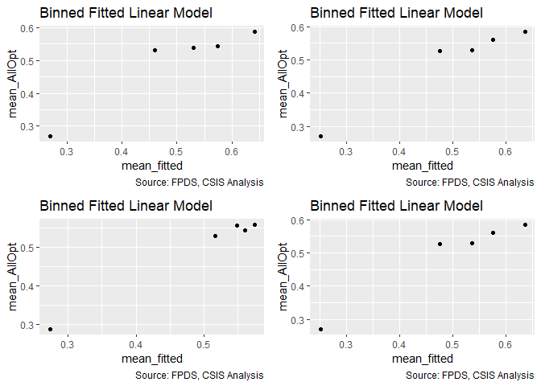<!-- -->

```
## Warning in residuals_binned(model1_old, bins = bins): Always uses Xlb
## Estimated Pr(Termination), should update.
```

```
## Warning in residuals_binned(model1_new, bins = bins): Always uses Xlb
## Estimated Pr(Termination), should update.
```

```
## Warning in residuals_binned(model2_old, bins = bins): Always uses Xlb
## Estimated Pr(Termination), should update.
```

```
## Warning in residuals_binned(model2_new, bins = bins): Always uses Xlb
## Estimated Pr(Termination), should update.
```

```
## Warning in if (class(model1_new) %in% c("glmerMod", "lme4") &
## class(model2_new) %in% : the condition has length > 1 and only the first
## element will be used
```

```
## Warning in if ((!class(model1_new) %in% c("glmerMod", "lme4") & !
## class(model2_new) %in% : the condition has length > 1 and only the first
## element will be used
```

<!-- -->

```
## [[1]]
##        model deviance null.deviance difference
## 1 model1_old 67395.81      71190.14   3794.330
## 2 model1_new 66896.31      71190.14   4293.825
## 3 model2_old 67994.43      71190.14   3195.707
## 4 model2_new 66896.31      71190.14   4293.825
```
In both models, cln_PairCA (contract actions pair history) has an unacceptably high VIF: 2.31 in the SomeOpt model, and 2.18 in the AllOpt model.

For SomeOpt, we then create a new model including cln_PairCA, but dropping the variable with the second highest VIF score in the initial b_SomeOpt03D model, cp_OffPSC7.  In this model, b_SomeOpt03Dv2, all VIF scores are acceptable.  Similarly, we create another model, b_SomeOpt03Dv3, which includes all varibles except cln_PairCA, which again features acceptable VIF scores.  However, the AIC score of b_SomeOpt03Dv2 is lower than that of the model which does not include cln_PairCA, so we select b_SomeOpt03Dv2 as our operative model, and discuss the results here (i.e. we drop cp_OffPSC7 to avoid multicollinearity).  Results:
  (1) Higher service complexity variables - only invoice rate matches expectations, while average salary displays a positive and statistically significant effect.
  (2) Office capacity variables - percent PBSC does not meet expectations, as it shows a statistically significant, negative relationship.
  (3) Deeper office-vendor relationship variables - only pair history meets expectations, as contract actions pair history displays a statistically significant, strongly negative relationship.

A similar procedure is adopted for AllOpt, where again cp_OffPSC7 is dropped in model v2, whereas model v3 is a full specification not including cln_PairCA.  In both models, VIF scores are acceptable following drops, and again, model v2 displays a lower AIC score than model v3, and is so retained for our analysis.  Results:
  (1) Higher service complexity variables - no expectations met.  Average salary demonstrates a positive, stat. sig. effect.
  (2) Office capacity variables - percent PBSC does not meet expectations, as it shows a statistically significant, negative relationship.
  (3) Deeper office-vendor relationship variables - only pair history meets expectations, as contract actions pair history displays a statistically significant, negative relationship.

## Study Variables Alone


```r
 study_coef_list<-get_coef_list(limit="services")

all_coef_list<-get_coef_list()

 
 
 
 
 


#Ceiling Breaches Binary
  stargazer::stargazer(b_SomeOpt01A,b_SomeOpt01B,b_SomeOpt02A,b_SomeOpt02B,b_SomeOpt03A,b_SomeOpt03B,b_SomeOpt03D,
                       type="text",
                       digits=2)
```

```
## 
## ==============================================================================================
##                                               Dependent variable:                             
##                   ----------------------------------------------------------------------------
##                                                    b_SomeOpt                                  
##                      (1)        (2)        (3)        (4)        (5)        (6)        (7)    
## ----------------------------------------------------------------------------------------------
## cln_US6sal         -0.16***                                                           0.03*   
##                     (0.01)                                                            (0.02)  
##                                                                                               
## cln_PSCrate                   -0.32***                                               -0.28*** 
##                                (0.02)                                                 (0.02)  
##                                                                                               
## cp_OffPerf7                              -0.29***                                    -0.22*** 
##                                           (0.02)                                      (0.02)  
##                                                                                               
## cp_OffPSC7                                           -0.004                          0.69***  
##                                                      (0.02)                           (0.03)  
##                                                                                               
## cn_PairHist7                                                   -0.06***              0.32***  
##                                                                 (0.01)                (0.02)  
##                                                                                               
## cln_PairCA                                                                -0.40***   -0.80*** 
##                                                                            (0.01)     (0.02)  
##                                                                                               
## Constant           0.82***    0.82***    0.82***    0.81***    0.80***    0.77***    0.78***  
##                     (0.01)     (0.01)     (0.01)     (0.01)     (0.01)     (0.01)     (0.01)  
##                                                                                               
## ----------------------------------------------------------------------------------------------
## Observations        74,274     74,274     74,274     74,274     74,274     74,274     74,274  
## Log Likelihood    -45,836.64 -45,725.17 -45,753.72 -45,896.33 -45,888.41 -45,492.88 -44,897.82
## Akaike Inf. Crit. 91,677.29  91,454.35  91,511.44  91,796.65  91,780.83  90,989.75  89,809.65 
## ==============================================================================================
## Note:                                                              *p<0.1; **p<0.05; ***p<0.01
```

```r
texreg::htmlreg(list(b_SomeOpt01A,b_SomeOpt01B,b_SomeOpt02A,b_SomeOpt02B,b_SomeOpt03A,b_SomeOpt03B,b_SomeOpt03D),file="..//Output//b_SomeOptModel.html",
                single.row = TRUE,
                # custom.model.name=c("Ceiling Breaches"),
                stars=c(0.1,0.05,0.01,0.001),
                #groups = list(
                #              "Services Complexity" = 2:3,
                #              "Office Capacity" =4:5,
                #              "Past Relationship"=6:7
                #              ),
                custom.coef.map=all_coef_list,
                bold=0.05,
                custom.note="%stars. Numerical inputs are rescaled.",
                caption="Table 6: Logit Bivariate Look at Study Variables and Ceiling Breaches",
                caption.above=TRUE)
```

```
## The table was written to the file '..//Output//b_SomeOptModel.html'.
```

```r
#Ceiling Breach Absolute
stargazer::stargazer(b_AllOpt01A,b_AllOpt01B,b_AllOpt02A,b_AllOpt02B,b_AllOpt03A,b_AllOpt03B,b_AllOpt03D,
                       type="text",
                       digits=2)
```

```
## 
## ==============================================================================================
##                                               Dependent variable:                             
##                   ----------------------------------------------------------------------------
##                                                     b_AllOpt                                  
##                      (1)        (2)        (3)        (4)        (5)        (6)        (7)    
## ----------------------------------------------------------------------------------------------
## cln_US6sal         -0.13***                                                          0.12***  
##                     (0.02)                                                            (0.02)  
##                                                                                               
## cln_PSCrate                   -0.16***                                                 0.03   
##                                (0.02)                                                 (0.02)  
##                                                                                               
## cp_OffPerf7                              -0.29***                                    -0.05**  
##                                           (0.02)                                      (0.02)  
##                                                                                               
## cp_OffPSC7                                          -1.26***                         -0.68*** 
##                                                      (0.02)                           (0.03)  
##                                                                                               
## cn_PairHist7                                                   -0.19***              0.43***  
##                                                                 (0.02)                (0.02)  
##                                                                                               
## cln_PairCA                                                                -0.99***   -0.91*** 
##                                                                            (0.02)     (0.03)  
##                                                                                               
## Constant            -0.02*    -0.02**    -0.02**    -0.07***   -0.04***   -0.19***   -0.17*** 
##                     (0.01)     (0.01)     (0.01)     (0.01)     (0.01)     (0.01)     (0.01)  
##                                                                                               
## ----------------------------------------------------------------------------------------------
## Observations        51,357     51,357     51,357     51,357     51,357     51,357     51,357  
## Log Likelihood    -35,563.04 -35,561.03 -35,492.57 -34,016.42 -35,533.34 -33,974.81 -33,448.16
## Akaike Inf. Crit. 71,130.09  71,126.05  70,989.15  68,036.84  71,070.68  67,953.63  66,910.31 
## ==============================================================================================
## Note:                                                              *p<0.1; **p<0.05; ***p<0.01
```

```r
texreg::htmlreg(list(b_AllOpt01A,b_AllOpt01B,b_AllOpt02A,b_AllOpt02B,b_AllOpt03A,b_AllOpt03B,b_AllOpt03D),file="..//Output//b_AllOptModel.html",
                single.row = TRUE,
                # custom.model.name=c("Ceiling Breaches"),
                stars=c(0.1,0.05,0.01,0.001),
                #groups = list(
                #              "Services Complexity" = 2:3,
                #              "Office Capacity" =4:5,
                #              "Past Relationship"=6:7
                #              ),
                custom.coef.map=all_coef_list,
                bold=0.05,
                custom.note="%stars. Numerical inputs are rescaled.",
                caption="Table 8: Regression Bivariate Look at Study Variables and Log(Options Growth)",
                caption.above=TRUE)
```

```
## The table was written to the file '..//Output//b_AllOptModel.html'.
```

# Controls

##Contract-Level Controls
###Scope Variables
#### 04A: Cost Ceiling

Expectation: Initial Ceiling size positively estimates the probability of some options being exercised, while it should negatively estimate all otpions exercised.  Reasoning for this is straightforward: a higher initical ceiling indicates more options to be exercised/anticipated at contract start, which provides some indication that at least one option will be exercised, but equally means it is less likely for them all to be exercised purely for size reasons. 


```r
#Likelihood Plot for unlogged ceiling
summary_continuous_plot(serv_opt,metric="opt","UnmodifiedCeiling_OMB20_GDP18",bins=1000)
```

<!-- -->

```r
summary_continuous_plot(serv_opt,metric="opt","UnmodifiedCeiling_OMB20_GDP18",bins=50,log=TRUE)
```

<!-- -->

```r
#Model
b_SomeOpt04A <- glm (data=serv_opt,
                 b_SomeOpt ~ cl_Ceil, family=binomial(link="logit"))

b_AllOpt04A <- glm(data=serv_exeropt, family=binomial(link="logit"),
                        b_AllOpt ~ cl_Ceil)

#Plot residuals versus fitted
stargazer::stargazer(b_SomeOpt03D,b_SomeOpt04A,
                       
                       b_AllOpt03D,b_AllOpt04A,
                       type="text",
                       digits=2)
```

```
## 
## =============================================================
##                               Dependent variable:            
##                   -------------------------------------------
##                         b_SomeOpt             b_AllOpt       
##                      (1)        (2)        (3)        (4)    
## -------------------------------------------------------------
## cln_US6sal          0.03*                0.12***             
##                     (0.02)                (0.02)             
##                                                              
## cln_PSCrate        -0.28***                0.03              
##                     (0.02)                (0.02)             
##                                                              
## cp_OffPerf7        -0.22***              -0.05**             
##                     (0.02)                (0.02)             
##                                                              
## cp_OffPSC7         0.69***               -0.68***            
##                     (0.03)                (0.03)             
##                                                              
## cn_PairHist7       0.32***               0.43***             
##                     (0.02)                (0.02)             
##                                                              
## cln_PairCA         -0.80***              -0.91***            
##                     (0.02)                (0.03)             
##                                                              
## cl_Ceil                       0.70***               0.07***  
##                                (0.02)                (0.02)  
##                                                              
## Constant           0.78***    0.54***    -0.17***   -0.05*** 
##                     (0.01)     (0.01)     (0.01)     (0.01)  
##                                                              
## -------------------------------------------------------------
## Observations        74,274     74,274     51,357     51,357  
## Log Likelihood    -44,897.82 -44,943.23 -33,448.16 -35,588.81
## Akaike Inf. Crit. 89,809.65  89,890.45  66,910.31  71,181.62 
## =============================================================
## Note:                             *p<0.1; **p<0.05; ***p<0.01
```
Expectations are met only for the SomeOpt model, as initial ceiling size displays a stat. sig., positive relationship in both models (violated expectations for the AllOpt model).  However, residual plot is wonky for AllOpt model (it appears quasi-sinusoidal), indicating we should be concerned about the validity of the AllOpt result.


#### 04B: Maximum Duration

Expectation: greater maximum duration is expected to positively estimate both b_SomeOpt and b_AllOpt.


```r
#Likelihood Plot for max duration
freq_continuous_cbre_plot(serv_opt,"UnmodifiedDays",
               bins=1000)
```

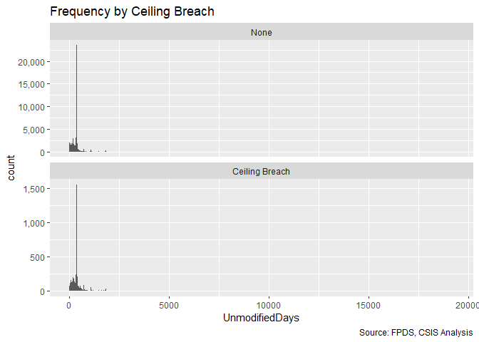<!-- -->

```r
summary_continuous_plot(serv_opt,metric="opt","cln_Days")
```

<!-- -->

```r
#Model
b_SomeOpt04B <- glm (data=serv_opt,
                 b_SomeOpt ~ cln_Days, family=binomial(link="logit"))

b_AllOpt04B <- glm(data=serv_exeropt, family=binomial(link="logit"),
                        b_AllOpt ~ cln_Days)


#Plot residuals versus fitted
stargazer::stargazer(b_SomeOpt03D,b_SomeOpt04A,b_SomeOpt04B,
                       
                       b_AllOpt03D,b_AllOpt04A,b_AllOpt04B,
                       type="text",
                       digits=2)
```

```
## 
## ===================================================================================
##                                          Dependent variable:                       
##                   -----------------------------------------------------------------
##                              b_SomeOpt                         b_AllOpt            
##                      (1)        (2)        (3)        (4)        (5)        (6)    
## -----------------------------------------------------------------------------------
## cln_US6sal          0.03*                           0.12***                        
##                     (0.02)                           (0.02)                        
##                                                                                    
## cln_PSCrate        -0.28***                           0.03                         
##                     (0.02)                           (0.02)                        
##                                                                                    
## cp_OffPerf7        -0.22***                         -0.05**                        
##                     (0.02)                           (0.02)                        
##                                                                                    
## cp_OffPSC7         0.69***                          -0.68***                       
##                     (0.03)                           (0.03)                        
##                                                                                    
## cn_PairHist7       0.32***                          0.43***                        
##                     (0.02)                           (0.02)                        
##                                                                                    
## cln_PairCA         -0.80***                         -0.91***                       
##                     (0.02)                           (0.03)                        
##                                                                                    
## cl_Ceil                       0.70***                          0.07***             
##                                (0.02)                           (0.02)             
##                                                                                    
## cln_Days                                 1.07***                           -0.02   
##                                           (0.02)                           (0.03)  
##                                                                                    
## Constant           0.78***    0.54***    0.46***    -0.17***   -0.05***    -0.02   
##                     (0.01)     (0.01)     (0.01)     (0.01)     (0.01)     (0.02)  
##                                                                                    
## -----------------------------------------------------------------------------------
## Observations        74,274     74,274     74,274     51,357     51,357     51,357  
## Log Likelihood    -44,897.82 -44,943.23 -44,829.22 -33,448.16 -35,588.81 -35,594.96
## Akaike Inf. Crit. 89,809.65  89,890.45  89,662.44  66,910.31  71,181.62  71,193.93 
## ===================================================================================
## Note:                                                   *p<0.1; **p<0.05; ***p<0.01
```

Expectations only met for SomeOpt model.  AllOpt model displays a very slightly negative relationship, but it is not statistically significant.

####04C: Ratio Initial Ceiling : Base Ratio (Logged)


Expectation, in combination with ceiling, a high ratio means that the contract has more room for adjustment and incentives without radical steps. For exercised options, a higher ratio is expected to make it more likely that some options are exercised but less likely that all options are exercised.

```r
summary_continuous_plot(serv_opt,metric="opt", "clr_Ceil2Base")
```

<!-- -->

```r
#Model


#Model
b_SomeOpt04C <- glm(data=serv_opt, b_SomeOpt ~ clr_Ceil2Base,family=binomial(link="logit"))

b_AllOpt04C <- glm(data=serv_exeropt, family=binomial(link="logit"), b_AllOpt ~ clr_Ceil2Base)


#Plot Residuals vs. Fitted
stargazer::stargazer(b_SomeOpt04A,b_SomeOpt04B,b_SomeOpt04C,
                     b_AllOpt04A,b_AllOpt04B,b_AllOpt04C, type="text", digits=2)
```

```
## 
## ===================================================================================
##                                          Dependent variable:                       
##                   -----------------------------------------------------------------
##                              b_SomeOpt                         b_AllOpt            
##                      (1)        (2)        (3)        (4)        (5)        (6)    
## -----------------------------------------------------------------------------------
## cl_Ceil            0.70***                          0.07***                        
##                     (0.02)                           (0.02)                        
##                                                                                    
## cln_Days                      1.07***                           -0.02              
##                                (0.02)                           (0.03)             
##                                                                                    
## clr_Ceil2Base                            0.26***                          -0.96*** 
##                                           (0.01)                           (0.01)  
##                                                                                    
## Constant           0.54***    0.46***    0.47***    -0.05***    -0.02     1.31***  
##                     (0.01)     (0.01)     (0.01)     (0.01)     (0.02)     (0.02)  
##                                                                                    
## -----------------------------------------------------------------------------------
## Observations        74,274     74,274     74,274     51,357     51,357     51,357  
## Log Likelihood    -44,943.23 -44,829.22 -45,502.99 -35,588.81 -35,594.96 -32,523.31
## Akaike Inf. Crit. 89,890.45  89,662.44  91,009.97  71,181.62  71,193.93  65,050.62 
## ===================================================================================
## Note:                                                   *p<0.1; **p<0.05; ***p<0.01
```
Expectations are met.

#### 04D: Ceiling-Days-Ratio


```r
#Model
b_SomeOpt04D <- glm (data=serv_opt,
                 b_SomeOpt ~ cl_Ceil + cln_Days + clr_Ceil2Base, family=binomial(link="logit"))
glmer_examine(b_SomeOpt04D)
```

```
##       cl_Ceil      cln_Days clr_Ceil2Base 
##      1.028134      1.011519      1.018556
```

```r
b_AllOpt04D <- glm(data=serv_exeropt, family=binomial(link="logit"),
                        b_AllOpt ~cl_Ceil + cln_Days + clr_Ceil2Base)

glmer_examine(b_AllOpt04D)
```

```
##       cl_Ceil      cln_Days clr_Ceil2Base 
##      1.016941      1.017492      1.001823
```

```r
#Plot residuals versus fitted
stargazer::stargazer(b_SomeOpt04A,b_SomeOpt04B,b_SomeOpt04C,b_SomeOpt04D,
                       type="text",
                       digits=2)
```

```
## 
## =============================================================
##                               Dependent variable:            
##                   -------------------------------------------
##                                    b_SomeOpt                 
##                      (1)        (2)        (3)        (4)    
## -------------------------------------------------------------
## cl_Ceil            0.70***                          0.67***  
##                     (0.02)                           (0.02)  
##                                                              
## cln_Days                      1.07***               0.98***  
##                                (0.02)                (0.02)  
##                                                              
## clr_Ceil2Base                            0.26***    0.31***  
##                                           (0.01)     (0.01)  
##                                                              
## Constant           0.54***    0.46***    0.47***    -0.17*** 
##                     (0.01)     (0.01)     (0.01)     (0.02)  
##                                                              
## -------------------------------------------------------------
## Observations        74,274     74,274     74,274     74,274  
## Log Likelihood    -44,943.23 -44,829.22 -45,502.99 -43,588.24
## Akaike Inf. Crit. 89,890.45  89,662.44  91,009.97  87,184.48 
## =============================================================
## Note:                             *p<0.1; **p<0.05; ***p<0.01
```

```r
stargazer::stargazer(b_AllOpt04A,b_AllOpt04B,b_AllOpt04C,b_AllOpt04D,
                       type="text",
                       digits=2)
```

```
## 
## =============================================================
##                               Dependent variable:            
##                   -------------------------------------------
##                                    b_AllOpt                  
##                      (1)        (2)        (3)        (4)    
## -------------------------------------------------------------
## cl_Ceil            0.07***                           0.04*   
##                     (0.02)                           (0.02)  
##                                                              
## cln_Days                       -0.02                -0.22*** 
##                                (0.03)                (0.04)  
##                                                              
## clr_Ceil2Base                            -0.96***   -0.96*** 
##                                           (0.01)     (0.01)  
##                                                              
## Constant           -0.05***    -0.02     1.31***    1.38***  
##                     (0.01)     (0.02)     (0.02)     (0.03)  
##                                                              
## -------------------------------------------------------------
## Observations        51,357     51,357     51,357     51,357  
## Log Likelihood    -35,588.81 -35,594.96 -32,523.31 -32,505.62
## Akaike Inf. Crit. 71,181.62  71,193.93  65,050.62  65,019.25 
## =============================================================
## Note:                             *p<0.1; **p<0.05; ***p<0.01
```

```r
summary_residual_compare(b_SomeOpt04A,b_SomeOpt04D,b_SomeOpt04B,b_SomeOpt04D)
```

<!-- -->

```
## Warning in residuals_binned(model1_old, bins = bins): Always uses Xlb
## Estimated Pr(Termination), should update.
```

```
## Warning in residuals_binned(model1_new, bins = bins): Always uses Xlb
## Estimated Pr(Termination), should update.
```

```
## Warning in residuals_binned(model2_old, bins = bins): Always uses Xlb
## Estimated Pr(Termination), should update.
```

```
## Warning in residuals_binned(model2_new, bins = bins): Always uses Xlb
## Estimated Pr(Termination), should update.
```

<!-- -->

```
## Warning in if (class(model1_new) %in% c("glmerMod", "lme4") &
## class(model2_new) %in% : the condition has length > 1 and only the first
## element will be used
```

```
## Warning in if ((!class(model1_new) %in% c("glmerMod", "lme4") & !
## class(model2_new) %in% : the condition has length > 1 and only the first
## element will be used
```

<!-- -->

```
## [[1]]
##        model deviance null.deviance difference
## 1 model1_old 89886.45       91792.7   1906.250
## 2 model1_new 87176.48       91792.7   4616.225
## 3 model2_old 89658.44       91792.7   2134.266
## 4 model2_new 87176.48       91792.7   4616.225
```

```r
summary_residual_compare(b_AllOpt04A,b_AllOpt04D,b_AllOpt04B,b_AllOpt04D)
```

<!-- -->

```
## Warning in residuals_binned(model1_old, bins = bins): Always uses Xlb
## Estimated Pr(Termination), should update.
```

```
## Warning in residuals_binned(model1_new, bins = bins): Always uses Xlb
## Estimated Pr(Termination), should update.
```

```
## Warning in residuals_binned(model2_old, bins = bins): Always uses Xlb
## Estimated Pr(Termination), should update.
```

```
## Warning in residuals_binned(model2_new, bins = bins): Always uses Xlb
## Estimated Pr(Termination), should update.
```

<!-- -->

```
## Warning in if (class(model1_new) %in% c("glmerMod", "lme4") &
## class(model2_new) %in% : the condition has length > 1 and only the first
## element will be used
```

```
## Warning in if ((!class(model1_new) %in% c("glmerMod", "lme4") & !
## class(model2_new) %in% : the condition has length > 1 and only the first
## element will be used
```

<!-- -->

```
## [[1]]
##        model deviance null.deviance   difference
## 1 model1_old 71177.62      71190.14   12.5187247
## 2 model1_new 65011.25      71190.14 6178.8864594
## 3 model2_old 71189.93      71190.14    0.2095315
## 4 model2_new 65011.25      71190.14 6178.8864594
```
SomeOpt: Expectations met.
AllOpt: Some expectations met.  Ceiling to base ratio displays the expected negative, stat. significant, relationship.  However, initial ceiling size displays a postive, statistically significant effect (though only at the 10% level), and maximum contract length displays a statistically significant negative effect, both of which violate expectations.

#### 04E: Base
Expectation: higher base estimates a higher probability of b_SomeOpt, as larger projects have more momentum.
We weakly expect a higher base to estimate a lower probability of b_AllOpt.

```r
#Likelihood Plot for unlogged ceiling
summary_continuous_plot(serv_opt,metric="opt","UnmodifiedBase_OMB20_GDP18",bins=1000)
```

<!-- -->

```r
summary_continuous_plot(serv_opt,metric="opt","UnmodifiedBase_OMB20_GDP18",bins=50,log=TRUE)
```

<!-- -->

```r
#Model
b_SomeOpt04E <- glm (data=serv_opt,
                 b_SomeOpt ~ cln_Base, family=binomial(link="logit"))

b_AllOpt04E <- glm(data=serv_exeropt, family=binomial(link="logit"),
                        b_AllOpt ~ cln_Base)

#Plot residuals versus fitted
stargazer::stargazer(b_SomeOpt03D,b_SomeOpt04A,b_SomeOpt04E,
                       b_AllOpt03D,b_AllOpt04A,b_AllOpt04E,
                       type="text",
                       digits=2)
```

```
## 
## ===================================================================================
##                                          Dependent variable:                       
##                   -----------------------------------------------------------------
##                              b_SomeOpt                         b_AllOpt            
##                      (1)        (2)        (3)        (4)        (5)        (6)    
## -----------------------------------------------------------------------------------
## cln_US6sal          0.03*                           0.12***                        
##                     (0.02)                           (0.02)                        
##                                                                                    
## cln_PSCrate        -0.28***                           0.03                         
##                     (0.02)                           (0.02)                        
##                                                                                    
## cp_OffPerf7        -0.22***                         -0.05**                        
##                     (0.02)                           (0.02)                        
##                                                                                    
## cp_OffPSC7         0.69***                          -0.68***                       
##                     (0.03)                           (0.03)                        
##                                                                                    
## cn_PairHist7       0.32***                          0.43***                        
##                     (0.02)                           (0.02)                        
##                                                                                    
## cln_PairCA         -0.80***                         -0.91***                       
##                     (0.02)                           (0.03)                        
##                                                                                    
## cl_Ceil                       0.70***                          0.07***             
##                                (0.02)                           (0.02)             
##                                                                                    
## cln_Base                                 0.45***                          0.46***  
##                                           (0.01)                           (0.02)  
##                                                                                    
## Constant           0.78***    0.54***    0.75***    -0.17***   -0.05***   -0.11*** 
##                     (0.01)     (0.01)     (0.01)     (0.01)     (0.01)     (0.01)  
##                                                                                    
## -----------------------------------------------------------------------------------
## Observations        74,274     74,274     74,274     51,357     51,357     51,357  
## Log Likelihood    -44,897.82 -44,943.23 -45,400.30 -33,448.16 -35,588.81 -35,220.41
## Akaike Inf. Crit. 89,809.65  89,890.45  90,804.61  66,910.31  71,181.62  70,444.82 
## ===================================================================================
## Note:                                                   *p<0.1; **p<0.05; ***p<0.01
```

```r
#Including residual compare for base and counterpart ceiling
summary_residual_compare(b_SomeOpt04A,b_SomeOpt04E)
```

<!-- -->

```
## Warning in residuals_binned(model1_old, bins = bins): Always uses Xlb
## Estimated Pr(Termination), should update.
```

```
## Warning in residuals_binned(model1_new, bins = bins): Always uses Xlb
## Estimated Pr(Termination), should update.
```

```
## Warning in if (class(model1_new) %in% c("glmerMod", "lme4")) {: the
## condition has length > 1 and only the first element will be used
```

```
## Warning in if (!class(model1_new) %in% c("glmerMod", "lme4") & !
## class(model1_old) %in% : the condition has length > 1 and only the first
## element will be used
```

<!-- -->

```
## [[1]]
##        model deviance null.deviance difference
## 1 model1_old 89886.45       91792.7  1906.2496
## 2 model1_new 90800.61       91792.7   992.0961
```

```r
summary_residual_compare(b_AllOpt04A,b_AllOpt04E)
```

<!-- -->

```
## Warning in residuals_binned(model1_old, bins = bins): Always uses Xlb
## Estimated Pr(Termination), should update.
```

```
## Warning in residuals_binned(model1_new, bins = bins): Always uses Xlb
## Estimated Pr(Termination), should update.
```

```
## Warning in if (class(model1_new) %in% c("glmerMod", "lme4")) {: the
## condition has length > 1 and only the first element will be used
```

```
## Warning in if (!class(model1_new) %in% c("glmerMod", "lme4") & !
## class(model1_old) %in% : the condition has length > 1 and only the first
## element will be used
```

<!-- -->

```
## [[1]]
##        model deviance null.deviance difference
## 1 model1_old 71177.62      71190.14   12.51872
## 2 model1_new 70440.82      71190.14  749.31427
```
Expectations are met for b_SomeOpt, but not for b_AllOpt.

#### 04F: Base-Days-Ratio


```r
#Model
b_SomeOpt04F <- glm (data=serv_opt,
                 b_SomeOpt ~ cln_Base+ cln_Days + clr_Ceil2Base, family=binomial(link="logit"))


b_AllOpt04F <- glm(data=serv_exeropt, family=binomial(link="logit"),
                        b_AllOpt ~cln_Base + cln_Days  + clr_Ceil2Base)


#Plot residuals versus fitted
stargazer::stargazer(b_SomeOpt04D,b_SomeOpt04E,b_SomeOpt04F,
                       
                       b_AllOpt04D,b_AllOpt04E,b_AllOpt04F,
                       type="text",
                       digits=2)
```

```
## 
## ===================================================================================
##                                          Dependent variable:                       
##                   -----------------------------------------------------------------
##                              b_SomeOpt                         b_AllOpt            
##                      (1)        (2)        (3)        (4)        (5)        (6)    
## -----------------------------------------------------------------------------------
## cl_Ceil            0.67***                           0.04*                         
##                     (0.02)                           (0.02)                        
##                                                                                    
## cln_Days           0.98***               0.98***    -0.22***              -0.22*** 
##                     (0.02)                (0.02)     (0.04)                (0.04)  
##                                                                                    
## clr_Ceil2Base      0.31***               0.44***    -0.96***              -0.96*** 
##                     (0.01)                (0.01)     (0.01)                (0.01)  
##                                                                                    
## cln_Base                      0.45***    0.65***               0.46***     0.04*   
##                                (0.01)     (0.02)                (0.02)     (0.02)  
##                                                                                    
## Constant           -0.17***   0.75***    -0.17***   1.38***    -0.11***   1.38***  
##                     (0.02)     (0.01)     (0.02)     (0.03)     (0.01)     (0.03)  
##                                                                                    
## -----------------------------------------------------------------------------------
## Observations        74,274     74,274     74,274     51,357     51,357     51,357  
## Log Likelihood    -43,588.24 -45,400.30 -43,588.24 -32,505.62 -35,220.41 -32,505.62
## Akaike Inf. Crit. 87,184.48  90,804.61  87,184.48  65,019.25  70,444.82  65,019.25 
## ===================================================================================
## Note:                                                   *p<0.1; **p<0.05; ***p<0.01
```

```r
summary_residual_compare(b_SomeOpt04A,b_SomeOpt04F,b_SomeOpt04B,b_SomeOpt04F)
```

<!-- -->

```
## Warning in residuals_binned(model1_old, bins = bins): Always uses Xlb
## Estimated Pr(Termination), should update.
```

```
## Warning in residuals_binned(model1_new, bins = bins): Always uses Xlb
## Estimated Pr(Termination), should update.
```

```
## Warning in residuals_binned(model2_old, bins = bins): Always uses Xlb
## Estimated Pr(Termination), should update.
```

```
## Warning in residuals_binned(model2_new, bins = bins): Always uses Xlb
## Estimated Pr(Termination), should update.
```

```
## Warning in if (class(model1_new) %in% c("glmerMod", "lme4") &
## class(model2_new) %in% : the condition has length > 1 and only the first
## element will be used
```

```
## Warning in if ((!class(model1_new) %in% c("glmerMod", "lme4") & !
## class(model2_new) %in% : the condition has length > 1 and only the first
## element will be used
```

<!-- -->

```
## [[1]]
##        model deviance null.deviance difference
## 1 model1_old 89886.45       91792.7   1906.250
## 2 model1_new 87176.48       91792.7   4616.225
## 3 model2_old 89658.44       91792.7   2134.266
## 4 model2_new 87176.48       91792.7   4616.225
```

```r
summary_residual_compare(b_AllOpt04A,b_AllOpt04F,b_AllOpt04B,b_AllOpt04F)
```

<!-- -->

```
## Warning in residuals_binned(model1_old, bins = bins): Always uses Xlb
## Estimated Pr(Termination), should update.
```

```
## Warning in residuals_binned(model1_new, bins = bins): Always uses Xlb
## Estimated Pr(Termination), should update.
```

```
## Warning in residuals_binned(model2_old, bins = bins): Always uses Xlb
## Estimated Pr(Termination), should update.
```

```
## Warning in residuals_binned(model2_new, bins = bins): Always uses Xlb
## Estimated Pr(Termination), should update.
```

```
## Warning in if (class(model1_new) %in% c("glmerMod", "lme4") &
## class(model2_new) %in% : the condition has length > 1 and only the first
## element will be used
```

```
## Warning in if ((!class(model1_new) %in% c("glmerMod", "lme4") & !
## class(model2_new) %in% : the condition has length > 1 and only the first
## element will be used
```

<!-- -->

```
## [[1]]
##        model deviance null.deviance   difference
## 1 model1_old 71177.62      71190.14   12.5187247
## 2 model1_new 65011.25      71190.14 6178.8864594
## 3 model2_old 71189.93      71190.14    0.2095315
## 4 model2_new 65011.25      71190.14 6178.8864594
```
SomeOpt: Expectations met for days, ceiling to base ratio, and base itself.
AllOpt: Expectations not met for all variables.

#### 04G: Cumulative  Model


```r
#Model
b_SomeOpt04G <- glm (data=serv_opt,
                 b_SomeOpt ~  cln_US6sal + 
                   cln_PSCrate+ cp_OffPerf7+cp_OffPSC7+
                 cn_PairHist7+cln_PairCA +
                   cln_Base + clr_Ceil2Base + cln_Days, family=binomial(link="logit"))
b_SomeOpt04Gv2 <- glm (data=serv_opt,
                 b_SomeOpt ~  cln_US6sal + 
                   cln_PSCrate+ cp_OffPerf7+
                 cn_PairHist7+cln_PairCA +
                   cln_Base + clr_Ceil2Base + cln_Days, family=binomial(link="logit"))
b_SomeOpt04Gv3 <- glm (data=serv_opt,
                 b_SomeOpt ~  cln_US6sal + 
                   cln_PSCrate+ cp_OffPerf7+cp_OffPSC7+
                 cn_PairHist7 +
                   cln_Base + clr_Ceil2Base + cln_Days, family=binomial(link="logit"))
glmer_examine(b_SomeOpt04G)
```

```
##    cln_US6sal   cln_PSCrate   cp_OffPerf7    cp_OffPSC7  cn_PairHist7 
##      1.516181      1.446497      1.209684      1.810187      1.520372 
##    cln_PairCA      cln_Base clr_Ceil2Base      cln_Days 
##      2.414198      1.331190      1.395022      1.050673
```

```r
glmer_examine(b_SomeOpt04Gv2)
```

```
##    cln_US6sal   cln_PSCrate   cp_OffPerf7  cn_PairHist7    cln_PairCA 
##      1.518770      1.450568      1.207938      1.518893      1.781822 
##      cln_Base clr_Ceil2Base      cln_Days 
##      1.339739      1.392728      1.054815
```

```r
glmer_examine(b_SomeOpt04Gv3)
```

```
##    cln_US6sal   cln_PSCrate   cp_OffPerf7    cp_OffPSC7  cn_PairHist7 
##      1.501373      1.440984      1.207158      1.281233      1.153207 
##      cln_Base clr_Ceil2Base      cln_Days 
##      1.314577      1.330192      1.037134
```

```r
stargazer::stargazer(b_SomeOpt04Gv2, b_SomeOpt04Gv3, type = "text", digits = 2)
```

```
## 
## ==============================================
##                       Dependent variable:     
##                   ----------------------------
##                            b_SomeOpt          
##                        (1)            (2)     
## ----------------------------------------------
## cln_US6sal           -0.09***      -0.16***   
##                       (0.02)        (0.02)    
##                                               
## cln_PSCrate          -0.23***      -0.26***   
##                       (0.02)        (0.02)    
##                                               
## cp_OffPerf7          -0.22***      -0.27***   
##                       (0.02)        (0.02)    
##                                               
## cp_OffPSC7                          0.07***   
##                                     (0.02)    
##                                               
## cn_PairHist7         0.35***        0.08***   
##                       (0.02)        (0.02)    
##                                               
## cln_PairCA           -0.51***                 
##                       (0.02)                  
##                                               
## cln_Base             0.64***        0.66***   
##                       (0.02)        (0.02)    
##                                               
## clr_Ceil2Base        0.56***        0.46***   
##                       (0.01)        (0.01)    
##                                               
## cln_Days             0.89***        1.03***   
##                       (0.03)        (0.02)    
##                                               
## Constant             -0.29***      -0.19***   
##                       (0.02)        (0.02)    
##                                               
## ----------------------------------------------
## Observations          74,274        74,274    
## Log Likelihood      -42,832.50    -43,178.41  
## Akaike Inf. Crit.   85,682.99      86,374.82  
## ==============================================
## Note:              *p<0.1; **p<0.05; ***p<0.01
```

```r
b_AllOpt04G <- glm(data=serv_exeropt, family=binomial(link="logit"),
                        b_AllOpt ~  cln_US6sal + 
                   cln_PSCrate+ cp_OffPerf7 + cp_OffPSC7+
                 cn_PairHist7+cln_PairCA+
                 cln_Base + clr_Ceil2Base + cln_Days)

glmer_examine(b_AllOpt04G)
```

```
##    cln_US6sal   cln_PSCrate   cp_OffPerf7    cp_OffPSC7  cn_PairHist7 
##      1.554195      1.443094      1.059083      1.507948      1.416058 
##    cln_PairCA      cln_Base clr_Ceil2Base      cln_Days 
##      1.933373      1.232586      1.099805      1.030792
```

```r
#Plot residuals versus fitted   

stargazer::stargazer(b_SomeOpt03D,b_SomeOpt04F,b_SomeOpt04G,
                       
                       b_AllOpt03D,b_AllOpt04F,b_AllOpt04G,
                       type="text",
                       digits=2)
```

```
## 
## ===================================================================================
##                                          Dependent variable:                       
##                   -----------------------------------------------------------------
##                              b_SomeOpt                         b_AllOpt            
##                      (1)        (2)        (3)        (4)        (5)        (6)    
## -----------------------------------------------------------------------------------
## cln_US6sal          0.03*                -0.11***   0.12***                0.05**  
##                     (0.02)                (0.02)     (0.02)                (0.02)  
##                                                                                    
## cln_PSCrate        -0.28***              -0.25***     0.03                -0.11*** 
##                     (0.02)                (0.02)     (0.02)                (0.02)  
##                                                                                    
## cp_OffPerf7        -0.22***              -0.25***   -0.05**                -0.03   
##                     (0.02)                (0.02)     (0.02)                (0.02)  
##                                                                                    
## cp_OffPSC7         0.69***               0.52***    -0.68***              -0.45*** 
##                     (0.03)                (0.03)     (0.03)                (0.03)  
##                                                                                    
## cn_PairHist7       0.32***               0.37***    0.43***               0.32***  
##                     (0.02)                (0.02)     (0.02)                (0.02)  
##                                                                                    
## cln_PairCA         -0.80***              -0.74***   -0.91***              -0.78*** 
##                     (0.02)                (0.02)     (0.03)                (0.03)  
##                                                                                    
## cln_Base                      0.65***    0.63***                0.04*     0.13***  
##                                (0.02)     (0.02)                (0.02)     (0.02)  
##                                                                                    
## cln_Days                      0.98***    0.91***               -0.22***   -0.39*** 
##                                (0.02)     (0.03)                (0.04)     (0.04)  
##                                                                                    
## clr_Ceil2Base                 0.44***    0.52***               -0.96***   -0.80*** 
##                                (0.01)     (0.01)                (0.01)     (0.01)  
##                                                                                    
## Constant           0.78***    -0.17***   -0.27***   -0.17***   1.38***    1.05***  
##                     (0.01)     (0.02)     (0.02)     (0.01)     (0.03)     (0.03)  
##                                                                                    
## -----------------------------------------------------------------------------------
## Observations        74,274     74,274     74,274     51,357     51,357     51,357  
## Log Likelihood    -44,897.82 -43,588.24 -42,639.89 -33,448.16 -32,505.62 -31,475.18
## Akaike Inf. Crit. 89,809.65  87,184.48  85,299.79  66,910.31  65,019.25  62,970.37 
## ===================================================================================
## Note:                                                   *p<0.1; **p<0.05; ***p<0.01
```

```r
summary_residual_compare(b_SomeOpt03D,b_SomeOpt04G)
```

<!-- -->

```
## Warning in residuals_binned(model1_old, bins = bins): Always uses Xlb
## Estimated Pr(Termination), should update.
```

```
## Warning in residuals_binned(model1_new, bins = bins): Always uses Xlb
## Estimated Pr(Termination), should update.
```

```
## Warning in if (class(model1_new) %in% c("glmerMod", "lme4")) {: the
## condition has length > 1 and only the first element will be used
```

```
## Warning in if (!class(model1_new) %in% c("glmerMod", "lme4") & !
## class(model1_old) %in% : the condition has length > 1 and only the first
## element will be used
```

<!-- -->

```
## [[1]]
##        model deviance null.deviance difference
## 1 model1_old 89795.65       91792.7   1997.055
## 2 model1_new 85279.79       91792.7   6512.913
```

```r
summary_residual_compare(b_AllOpt03D,b_AllOpt04G)
```

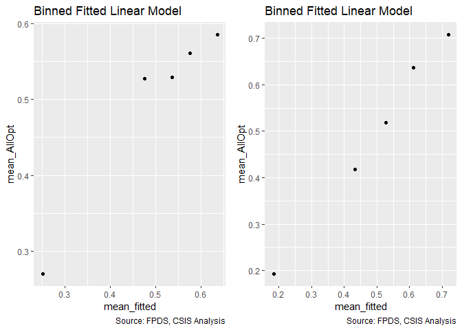<!-- -->

```
## Warning in residuals_binned(model1_old, bins = bins): Always uses Xlb
## Estimated Pr(Termination), should update.
```

```
## Warning in residuals_binned(model1_new, bins = bins): Always uses Xlb
## Estimated Pr(Termination), should update.
```

```
## Warning in if (class(model1_new) %in% c("glmerMod", "lme4")) {: the
## condition has length > 1 and only the first element will be used
```

```
## Warning in if (!class(model1_new) %in% c("glmerMod", "lme4") & !
## class(model1_old) %in% : the condition has length > 1 and only the first
## element will be used
```

<!-- -->

```
## [[1]]
##        model deviance null.deviance difference
## 1 model1_old 66896.31      71190.14   4293.825
## 2 model1_new 62950.37      71190.14   8239.767
```
AllOpt: VIF score and residual plot acceptable.  Results:
  (1) Higher service complexity variables - invoice rate displays a negative, stat. sig., relationship, meeting expectations..  Average salary demonstrates a positive, stat. sig. effect.
  (2) Office capacity variables - neither variable meets expectations (though percent PBSC's negative effect is now no longer statistically significant).
  (3) Deeper office-vendor relationship variables - only pair history meets expectations, as contract actions pair history displays a statistically significant, negative relationship.
  (4) Control variables - No variables meet expectations
  
SomeOpt: VIF score of cln_PairCA unnaceptably high.  Two alternative models are created, b_SomeOpt04Gv2 and v3.  Model v2 drops cp_OffPSC7, the IV with the second highest VIF in model b_SomeOpt04.  Model v3 is a full specification without cln_PairCA.  VIF levels are acceptable for all variables in both model v2 and model v3.  AIC is lower for model v2, and so is selected for our analysis (i.e. we do our analysis with a model that drops cp_OffPSC7 and retains cln_PairCA).  Results:
  (1) Higher service complexity variables - expectations met for both variables
  (2) Office capacity variables - Percent PBSC does not meet expectations, as it displays a statiscally significant, negative relationship.
  (3) Deeper office-vendor relationship variables - only pair history meets expectations, as contract actions pair history displays a statistically significant, negative relationship.
  (4) Control variables - All variables meet expectations.


### Competition
#### 05A: No Competition / 1 / 2-4 / 5+ Offers
No competition (baseline) and single offer competition  is expected to estimate lower probabilities for both b_SomeOpt and b_AllOpt.

Multioffer competition is expected to lead to a higher probability of both b_SomeOpt and b_AllOpt for 2-4 options, but the opposite (i.e. lower probabilities for both) for 5+ as the diversity of competitors available may raise the appeal of going with a new contract rather than more options, especially if performance is below the desired level.


```r
summary_discrete_plot(serv_opt,metric="opt","Comp")
```

```
## Warning: Ignoring unknown parameters: binwidth, bins, pad
```

<!-- -->

```
## [[1]]
## 
## No Competition        1 offer     2-4 offers      5+ offers 
##          17208          12898          21881          22287 
## 
## [[2]]
##                 
##                      0     1
##   No Competition  4746 12462
##   1 offer         4223  8675
##   2-4 offers      6458 15423
##   5+ offers       7490 14797
## 
## [[3]]
##                 
##                      0     1
##   No Competition 10073  7135
##   1 offer         8048  4850
##   2-4 offers     13542  8339
##   5+ offers      17205  5082
```

```r
#Model
b_SomeOpt05A <- glm (data=serv_opt,
                 b_SomeOpt ~ Comp, family=binomial(link="logit"))


b_AllOpt05A <- glm(data=serv_exeropt, family=binomial(link="logit"),
                        b_AllOpt ~ Comp)


#Plot residuals versus fitted
stargazer::stargazer(b_SomeOpt04G,b_SomeOpt05A,
                       
                       b_AllOpt04G,b_AllOpt05A,
                       type="text",
                       digits=2)
```

```
## 
## =============================================================
##                               Dependent variable:            
##                   -------------------------------------------
##                         b_SomeOpt             b_AllOpt       
##                      (1)        (2)        (3)        (4)    
## -------------------------------------------------------------
## cln_US6sal         -0.11***               0.05**             
##                     (0.02)                (0.02)             
##                                                              
## cln_PSCrate        -0.25***              -0.11***            
##                     (0.02)                (0.02)             
##                                                              
## cp_OffPerf7        -0.25***               -0.03              
##                     (0.02)                (0.02)             
##                                                              
## cp_OffPSC7         0.52***               -0.45***            
##                     (0.03)                (0.03)             
##                                                              
## cn_PairHist7       0.37***               0.32***             
##                     (0.02)                (0.02)             
##                                                              
## cln_PairCA         -0.74***              -0.78***            
##                     (0.02)                (0.03)             
##                                                              
## cln_Base           0.63***               0.13***             
##                     (0.02)                (0.02)             
##                                                              
## clr_Ceil2Base      0.52***               -0.80***            
##                     (0.01)                (0.01)             
##                                                              
## cln_Days           0.91***               -0.39***            
##                     (0.03)                (0.04)             
##                                                              
## Comp1 offer                   -0.25***               -0.05*  
##                                (0.03)                (0.03)  
##                                                              
## Comp2-4 offers                -0.09***              -0.13*** 
##                                (0.02)                (0.02)  
##                                                              
## Comp5+ offers                 -0.28***              -0.94*** 
##                                (0.02)                (0.03)  
##                                                              
## Constant           -0.27***   0.97***    1.05***    0.29***  
##                     (0.02)     (0.02)     (0.03)     (0.02)  
##                                                              
## -------------------------------------------------------------
## Observations        74,274     74,274     51,357     51,357  
## Log Likelihood    -42,639.89 -45,793.31 -31,475.18 -34,616.88
## Akaike Inf. Crit. 85,299.79  91,594.61  62,970.37  69,241.76 
## =============================================================
## Note:                             *p<0.1; **p<0.05; ***p<0.01
```
Expectations met for 1 offer binary.
Expectations not met for 2-4 offer binary - displays a statistically significant, negative relationship in both models.
Expectations met for 5+ offer binary (displays a stat. significant, negative relationship in both models).

#### 05B: Cumulative  Model


```r
#Model
b_SomeOpt05B <- glm (data=serv_opt,
                 b_SomeOpt ~  cln_US6sal + 
                   cln_PSCrate+ cp_OffPerf7+cp_OffPSC7+
                 cn_PairHist7+cln_PairCA +
                   cln_Base + clr_Ceil2Base + cln_Days+
                   Comp, family=binomial(link="logit"))
b_SomeOpt05Bv2 <- glm (data=serv_opt,
                 b_SomeOpt ~  cln_US6sal + 
                   cln_PSCrate+ cp_OffPerf7+
                 cn_PairHist7+cln_PairCA +
                   cln_Base + clr_Ceil2Base + cln_Days+
                   Comp, family=binomial(link="logit"))
b_SomeOpt05Bv3 <- glm (data=serv_opt,
                 b_SomeOpt ~  cln_US6sal + 
                   cln_PSCrate+ cp_OffPerf7+cp_OffPSC7+
                 cn_PairHist7 +
                   cln_Base + clr_Ceil2Base + cln_Days+
                   Comp, family=binomial(link="logit"))
glmer_examine(b_SomeOpt05B)
```

```
##                   GVIF Df GVIF^(1/(2*Df))
## cln_US6sal    1.528131  1        1.236176
## cln_PSCrate   1.453558  1        1.205636
## cp_OffPerf7   1.229548  1        1.108850
## cp_OffPSC7    1.862665  1        1.364795
## cn_PairHist7  1.557873  1        1.248148
## cln_PairCA    2.531707  1        1.591134
## cln_Base      1.343755  1        1.159205
## clr_Ceil2Base 1.416633  1        1.190224
## cln_Days      1.075857  1        1.037235
## Comp          1.314229  3        1.046595
```

```r
glmer_examine(b_SomeOpt05Bv2)
```

```
##                   GVIF Df GVIF^(1/(2*Df))
## cln_US6sal    1.529831  1        1.236863
## cln_PSCrate   1.457660  1        1.207336
## cp_OffPerf7   1.228559  1        1.108404
## cn_PairHist7  1.558133  1        1.248252
## cln_PairCA    1.991936  1        1.411360
## cln_Base      1.352028  1        1.162767
## clr_Ceil2Base 1.419738  1        1.191527
## cln_Days      1.083005  1        1.040675
## Comp          1.310509  3        1.046100
```

```r
glmer_examine(b_SomeOpt05Bv3)
```

```
##                   GVIF Df GVIF^(1/(2*Df))
## cln_US6sal    1.516478  1        1.231454
## cln_PSCrate   1.450960  1        1.204558
## cp_OffPerf7   1.229033  1        1.108618
## cp_OffPSC7    1.391514  1        1.179625
## cn_PairHist7  1.166211  1        1.079913
## cln_Base      1.330833  1        1.153617
## clr_Ceil2Base 1.366859  1        1.169128
## cln_Days      1.060731  1        1.029918
## Comp          1.246753  3        1.037441
```

```r
stargazer::stargazer(b_SomeOpt05Bv2, b_SomeOpt05Bv3, type = "text", digits = 2)
```

```
## 
## ==============================================
##                       Dependent variable:     
##                   ----------------------------
##                            b_SomeOpt          
##                        (1)            (2)     
## ----------------------------------------------
## cln_US6sal           -0.09***      -0.17***   
##                       (0.02)        (0.02)    
##                                               
## cln_PSCrate          -0.23***      -0.25***   
##                       (0.02)        (0.02)    
##                                               
## cp_OffPerf7          -0.22***      -0.26***   
##                       (0.02)        (0.02)    
##                                               
## cp_OffPSC7                          0.17***   
##                                     (0.02)    
##                                               
## cn_PairHist7         0.34***        0.07***   
##                       (0.02)        (0.02)    
##                                               
## cln_PairCA           -0.47***                 
##                       (0.02)                  
##                                               
## cln_Base             0.64***        0.64***   
##                       (0.02)        (0.02)    
##                                               
## clr_Ceil2Base        0.56***        0.49***   
##                       (0.01)        (0.01)    
##                                               
## cln_Days             0.91***        1.06***   
##                       (0.03)        (0.03)    
##                                               
## Comp1 offer          -0.07***      -0.12***   
##                       (0.03)        (0.03)    
##                                               
## Comp2-4 offers       -0.09***      -0.14***   
##                       (0.02)        (0.02)    
##                                               
## Comp5+ offers        -0.16***      -0.37***   
##                       (0.02)        (0.02)    
##                                               
## Constant             -0.22***       -0.04*    
##                       (0.03)        (0.02)    
##                                               
## ----------------------------------------------
## Observations          74,274        74,274    
## Log Likelihood      -42,811.66    -43,052.77  
## Akaike Inf. Crit.   85,647.32      86,129.55  
## ==============================================
## Note:              *p<0.1; **p<0.05; ***p<0.01
```

```r
#Is it safe to add pPBSC back in?

b_AllOpt05B <- glm(data=serv_exeropt, family=binomial(link="logit"),
                        b_AllOpt ~  cln_US6sal + 
                   cln_PSCrate+ cp_OffPerf7+cp_OffPSC7+
                 cn_PairHist7+cln_PairCA+
                 cln_Base + clr_Ceil2Base + cln_Days+
                 Comp)

glmer_examine(b_AllOpt05B)
```

```
##                   GVIF Df GVIF^(1/(2*Df))
## cln_US6sal    1.562444  1        1.249978
## cln_PSCrate   1.443502  1        1.201458
## cp_OffPerf7   1.066347  1        1.032641
## cp_OffPSC7    1.481625  1        1.217220
## cn_PairHist7  1.451236  1        1.204673
## cln_PairCA    1.971801  1        1.404208
## cln_Base      1.243624  1        1.115179
## clr_Ceil2Base 1.097126  1        1.047438
## cln_Days      1.034164  1        1.016938
## Comp          1.120853  3        1.019197
```

```r
#Plot residuals versus fitted   

stargazer::stargazer(b_SomeOpt04G,b_SomeOpt05A,b_SomeOpt05B,
                       
                       b_AllOpt04G,b_AllOpt05A,b_AllOpt05B,
                       type="text",
                       digits=2)
```

```
## 
## ===================================================================================
##                                          Dependent variable:                       
##                   -----------------------------------------------------------------
##                              b_SomeOpt                         b_AllOpt            
##                      (1)        (2)        (3)        (4)        (5)        (6)    
## -----------------------------------------------------------------------------------
## cln_US6sal         -0.11***              -0.12***    0.05**                 0.03   
##                     (0.02)                (0.02)     (0.02)                (0.02)  
##                                                                                    
## cln_PSCrate        -0.25***              -0.24***   -0.11***              -0.11*** 
##                     (0.02)                (0.02)     (0.02)                (0.02)  
##                                                                                    
## cp_OffPerf7        -0.25***              -0.25***    -0.03                 -0.02   
##                     (0.02)                (0.02)     (0.02)                (0.02)  
##                                                                                    
## cp_OffPSC7         0.52***               0.55***    -0.45***              -0.42*** 
##                     (0.03)                (0.03)     (0.03)                (0.03)  
##                                                                                    
## cn_PairHist7       0.37***               0.35***    0.32***               0.27***  
##                     (0.02)                (0.02)     (0.02)                (0.02)  
##                                                                                    
## cln_PairCA         -0.74***              -0.70***   -0.78***              -0.69*** 
##                     (0.02)                (0.02)     (0.03)                (0.03)  
##                                                                                    
## cln_Base           0.63***               0.62***    0.13***               0.14***  
##                     (0.02)                (0.02)     (0.02)                (0.02)  
##                                                                                    
## clr_Ceil2Base      0.52***               0.53***    -0.80***              -0.79*** 
##                     (0.01)                (0.01)     (0.01)                (0.01)  
##                                                                                    
## cln_Days           0.91***               0.93***    -0.39***              -0.37*** 
##                     (0.03)                (0.03)     (0.04)                (0.04)  
##                                                                                    
## Comp1 offer                   -0.25***   -0.09***               -0.05*      0.02   
##                                (0.03)     (0.03)                (0.03)     (0.03)  
##                                                                                    
## Comp2-4 offers                -0.09***   -0.10***              -0.13***    -0.03   
##                                (0.02)     (0.02)                (0.02)     (0.03)  
##                                                                                    
## Comp5+ offers                 -0.28***   -0.23***              -0.94***   -0.34*** 
##                                (0.02)     (0.03)                (0.03)     (0.03)  
##                                                                                    
## Constant           -0.27***   0.97***    -0.17***   1.05***    0.29***    1.14***  
##                     (0.02)     (0.02)     (0.03)     (0.03)     (0.02)     (0.03)  
##                                                                                    
## -----------------------------------------------------------------------------------
## Observations        74,274     74,274     74,274     51,357     51,357     51,357  
## Log Likelihood    -42,639.89 -45,793.31 -42,597.99 -31,475.18 -34,616.88 -31,372.12
## Akaike Inf. Crit. 85,299.79  91,594.61  85,221.98  62,970.37  69,241.76  62,770.23 
## ===================================================================================
## Note:                                                   *p<0.1; **p<0.05; ***p<0.01
```

```r
summary_residual_compare(b_SomeOpt04G,b_SomeOpt05B)
```

<!-- -->

```
## Warning in residuals_binned(model1_old, bins = bins): Always uses Xlb
## Estimated Pr(Termination), should update.
```

```
## Warning in residuals_binned(model1_new, bins = bins): Always uses Xlb
## Estimated Pr(Termination), should update.
```

```
## Warning in if (class(model1_new) %in% c("glmerMod", "lme4")) {: the
## condition has length > 1 and only the first element will be used
```

```
## Warning in if (!class(model1_new) %in% c("glmerMod", "lme4") & !
## class(model1_old) %in% : the condition has length > 1 and only the first
## element will be used
```

<!-- -->

```
## [[1]]
##        model deviance null.deviance difference
## 1 model1_old 85279.79       91792.7   6512.913
## 2 model1_new 85195.98       91792.7   6596.721
```

```r
summary_residual_compare(b_AllOpt04G,b_AllOpt05B)
```

<!-- -->

```
## Warning in residuals_binned(model1_old, bins = bins): Always uses Xlb
## Estimated Pr(Termination), should update.
```

```
## Warning in residuals_binned(model1_new, bins = bins): Always uses Xlb
## Estimated Pr(Termination), should update.
```

```
## Warning in if (class(model1_new) %in% c("glmerMod", "lme4")) {: the
## condition has length > 1 and only the first element will be used
```

```
## Warning in if (!class(model1_new) %in% c("glmerMod", "lme4") & !
## class(model1_old) %in% : the condition has length > 1 and only the first
## element will be used
```

<!-- -->

```
## [[1]]
##        model deviance null.deviance difference
## 1 model1_old 62950.37      71190.14   8239.767
## 2 model1_new 62744.23      71190.14   8445.906
```
AllOpt: VIF acceptable, residual plots acceptable.  Results:
  (1) Higher service complexity variables - invoice rate displays a negative, stat. sig., relationship, meeting expectations.  Average salary does not meet expectations.
  (2) Office capacity variables - neither variable meets expectations (though percent PBSC's negative effect is still not statistically significant).
  (3) Deeper office-vendor relationship variables - only pair history meets expectations, as contract actions pair history displays a statistically significant, negative relationship.
  (4) Control variables (base, ceiling to base ratio, maximum contract length) - No variables meet expectations
  (5) Number of offers variables - only Comp5+ offers meets expectations, the two other competition binaries do not have statistically significant effects.
  
SomeOpt: VIF of cln_PairCA unnaceptable.  Two alternative models are created, b_SomeOpt04Gv2 and v3.  Model v2 drops cp_OffPSC7, the IV with the second highest VIF in model b_SomeOpt04.  Model v3 is a full specification without cln_PairCA.  VIF levels are acceptable for all variables in both model v2 and model v3.  AIC is lower for model v2, and so is selected for our analysis.  Results:
  (1) Higher service complexity variables - expectations met for both variables
  (2) Office capacity variables - Percent PBSC does not meet expectations, as it displays a statiscally significant, negative relationship.
  (3) Deeper office-vendor relationship variables - only pair history meets expectations, as contract actions pair history displays a statistically significant, negative relationship.
  (4) Control variables (base, ceiling to base ratio, maximum contract length) - All variables meet expectations.
  (5) Number of offers variables - Comp1 offer and Comp5+ offer meet expectations.  Comp2-4 offers does not, as it displays a statistically significant, negative relationship.


### Contract Vehicle

#### 06A: Def/Pur; S-IDC; M-IDC; FSS-GWAC; BPA-BOA.

Expectation: Indefinite delivery vehicles, means that the government has an existing relationship with the vendor and administration is easier. The downside is that the government may be locked into the vendor. Excerised options not straightforward to puzzle through, but we expect a negative relationship as all forms of IDVs make it easier to use a new task order and thus may both reduce the need to exercise options and may allow new work to flow into a different contract rather than prompting a breach.


```r
summary_discrete_plot(serv_opt,metric="opt","Veh")
```

```
## Warning: Ignoring unknown parameters: binwidth, bins, pad
```

<!-- -->

```
## [[1]]
## 
##  Def/Pur    S-IDC    M-IDC FSS/GWAC  BPA/BOA 
##    36661    14928    11622     7474     3589 
## 
## [[2]]
##           
##                0     1
##   Def/Pur  10214 26447
##   S-IDC     5196  9732
##   M-IDC     2916  8706
##   FSS/GWAC  1757  5717
##   BPA/BOA   2834   755
## 
## [[3]]
##           
##                0     1
##   Def/Pur  21970 14691
##   S-IDC    12252  2676
##   M-IDC     7180  4442
##   FSS/GWAC  4262  3212
##   BPA/BOA   3204   385
```

```r
#Model
b_SomeOpt06A <- glm (data=serv_opt,
                 b_SomeOpt ~ Veh, family=binomial(link="logit"))


b_AllOpt06A <- glm(data=serv_exeropt, family=binomial(link="logit"),
                        b_AllOpt ~ Veh)


#Plot residuals versus fitted
stargazer::stargazer(b_SomeOpt05B,b_SomeOpt06A,
                       
                       b_AllOpt05B,b_AllOpt06A,
                       type="text",
                       digits=2)
```

```
## 
## =============================================================
##                               Dependent variable:            
##                   -------------------------------------------
##                         b_SomeOpt             b_AllOpt       
##                      (1)        (2)        (3)        (4)    
## -------------------------------------------------------------
## cln_US6sal         -0.12***                0.03              
##                     (0.02)                (0.02)             
##                                                              
## cln_PSCrate        -0.24***              -0.11***            
##                     (0.02)                (0.02)             
##                                                              
## cp_OffPerf7        -0.25***               -0.02              
##                     (0.02)                (0.02)             
##                                                              
## cp_OffPSC7         0.55***               -0.42***            
##                     (0.03)                (0.03)             
##                                                              
## cn_PairHist7       0.35***               0.27***             
##                     (0.02)                (0.02)             
##                                                              
## cln_PairCA         -0.70***              -0.69***            
##                     (0.02)                (0.03)             
##                                                              
## cln_Base           0.62***               0.14***             
##                     (0.02)                (0.02)             
##                                                              
## clr_Ceil2Base      0.53***               -0.79***            
##                     (0.01)                (0.01)             
##                                                              
## cln_Days           0.93***               -0.37***            
##                     (0.03)                (0.04)             
##                                                              
## Comp1 offer        -0.09***                0.02              
##                     (0.03)                (0.03)             
##                                                              
## Comp2-4 offers     -0.10***               -0.03              
##                     (0.02)                (0.03)             
##                                                              
## Comp5+ offers      -0.23***              -0.34***            
##                     (0.03)                (0.03)             
##                                                              
## VehS-IDC                      -0.32***              -1.19*** 
##                                (0.02)                (0.03)  
##                                                              
## VehM-IDC                      0.14***               -0.18*** 
##                                (0.02)                (0.02)  
##                                                              
## VehFSS/GWAC                   0.23***                 0.03   
##                                (0.03)                (0.03)  
##                                                              
## VehBPA/BOA                    -2.27***              -0.18**  
##                                (0.04)                (0.07)  
##                                                              
## Constant           -0.17***   0.95***    1.14***    0.22***  
##                     (0.03)     (0.01)     (0.03)     (0.01)  
##                                                              
## -------------------------------------------------------------
## Observations        74,274     74,274     51,357     51,357  
## Log Likelihood    -42,597.99 -43,806.17 -31,372.12 -34,367.03
## Akaike Inf. Crit. 85,221.98  87,622.34  62,770.23  68,744.06 
## =============================================================
## Note:                             *p<0.1; **p<0.05; ***p<0.01
```
For ceiling breaches, IDCs, particularly multiaward IDCs, had a greater likelihood of  ceiling breaches contrary to expecations. For size the results were similarly mixed, with single award IDCS and BPA/BOAs estimating smaller  breaches in line with expetations and Mutiple Award and FSS/GWAC estimated larger breaches, contrary to expectation.

SomeOpt: VehS-IDC and VehBPA/BOA meet expectations.  Multiple award IDCs and FSS/GWAC vehicles both violate expectations, demonstrating statistically significant, positive relationships.

AllOpt: VehS-IDC, VehM-IDC, and VehBPA/BOA meet expectations.  FSS/GWAC vehicles do not meet expectations, but the positive effect they display is not statistically significant.


#### 06B: Cumulative  Model


```r
#Model
b_SomeOpt06B <- glm (data=serv_opt,
                 b_SomeOpt ~  cln_US6sal + 
                   cln_PSCrate+ cp_OffPerf7+cp_OffPSC7+
                 cn_PairHist7+cln_PairCA +
                   cln_Base + clr_Ceil2Base + cln_Days+
                   Comp+
                   Veh, family=binomial(link="logit"))
b_SomeOpt06Bv2 <- glm (data=serv_opt,
                 b_SomeOpt ~ 
                   cln_PSCrate+ cp_OffPerf7+
                 cn_PairHist7 + clr_Ceil2Base + cln_Days+
                   Comp+
                   Veh, family=binomial(link="logit"))
glmer_examine(b_SomeOpt06B)
```

```
##                   GVIF Df GVIF^(1/(2*Df))
## cln_US6sal    1.615895  1        1.271178
## cln_PSCrate   1.487016  1        1.219433
## cp_OffPerf7   1.275775  1        1.129502
## cp_OffPSC7    1.963495  1        1.401248
## cn_PairHist7  1.571150  1        1.253455
## cln_PairCA    2.700723  1        1.643388
## cln_Base      1.532938  1        1.238119
## clr_Ceil2Base 1.381919  1        1.175550
## cln_Days      1.090235  1        1.044143
## Comp          1.471278  3        1.066471
## Veh           3.069601  4        1.150496
```

```r
glmer_examine(b_SomeOpt06Bv2)
```

```
##                   GVIF Df GVIF^(1/(2*Df))
## cln_PSCrate   1.196505  1        1.093849
## cp_OffPerf7   1.246024  1        1.116254
## cn_PairHist7  1.226801  1        1.107610
## clr_Ceil2Base 1.118331  1        1.057512
## cln_Days      1.054587  1        1.026931
## Comp          1.397243  3        1.057334
## Veh           1.896188  4        1.083266
```

```r
b_AllOpt06B <- glm(data=serv_exeropt, family=binomial(link="logit"),
                        b_AllOpt ~  cln_US6sal + 
                   cln_PSCrate+ cp_OffPerf7+cp_OffPSC7+
                 cn_PairHist7+cln_PairCA+
                 cln_Base + clr_Ceil2Base + cln_Days+
                 Comp+
                   Veh)
b_AllOpt06Bv2 <- glm(data=serv_exeropt, family=binomial(link="logit"),
                        b_AllOpt ~   
                   cln_PSCrate+ cp_OffPerf7+cp_OffPSC7+
                 cn_PairHist7+
                 cln_Base + clr_Ceil2Base + cln_Days+
                 Comp+
                   Veh)
glmer_examine(b_AllOpt06B)
```

```
##                   GVIF Df GVIF^(1/(2*Df))
## cln_US6sal    1.647818  1        1.283674
## cln_PSCrate   1.461610  1        1.208971
## cp_OffPerf7   1.097986  1        1.047848
## cp_OffPSC7    1.490525  1        1.220870
## cn_PairHist7  1.456031  1        1.206661
## cln_PairCA    2.300745  1        1.516821
## cln_Base      1.355126  1        1.164099
## clr_Ceil2Base 1.113642  1        1.055292
## cln_Days      1.040366  1        1.019983
## Comp          1.312362  3        1.046347
## Veh           2.385094  4        1.114777
```

```r
glmer_examine(b_AllOpt06Bv2) #Fine with cln_US6sal and cln_PairCA dropped
```

```
##                   GVIF Df GVIF^(1/(2*Df))
## cln_PSCrate   1.188927  1        1.090379
## cp_OffPerf7   1.096556  1        1.047166
## cp_OffPSC7    1.303530  1        1.141722
## cn_PairHist7  1.152595  1        1.073590
## cln_Base      1.301264  1        1.140729
## clr_Ceil2Base 1.108571  1        1.052887
## cln_Days      1.034255  1        1.016983
## Comp          1.301540  3        1.044904
## Veh           1.959451  4        1.087719
```

```r
#Plot residuals versus fitted   

stargazer::stargazer(b_SomeOpt05B,b_SomeOpt06A,b_SomeOpt06B,
                       b_AllOpt05B,b_AllOpt06A,b_AllOpt06B,
                       type="text",
                       digits=2)
```

```
## 
## ===================================================================================
##                                          Dependent variable:                       
##                   -----------------------------------------------------------------
##                              b_SomeOpt                         b_AllOpt            
##                      (1)        (2)        (3)        (4)        (5)        (6)    
## -----------------------------------------------------------------------------------
## cln_US6sal         -0.12***               -0.01       0.03                 0.05**  
##                     (0.02)                (0.02)     (0.02)                (0.02)  
##                                                                                    
## cln_PSCrate        -0.24***              -0.13***   -0.11***              -0.09*** 
##                     (0.02)                (0.02)     (0.02)                (0.03)  
##                                                                                    
## cp_OffPerf7        -0.25***              -0.08***    -0.02                 -0.04   
##                     (0.02)                (0.02)     (0.02)                (0.02)  
##                                                                                    
## cp_OffPSC7         0.55***               0.55***    -0.42***              -0.36*** 
##                     (0.03)                (0.03)     (0.03)                (0.03)  
##                                                                                    
## cn_PairHist7       0.35***               0.37***    0.27***               0.28***  
##                     (0.02)                (0.02)     (0.02)                (0.02)  
##                                                                                    
## cln_PairCA         -0.70***              -0.49***   -0.69***              -0.58*** 
##                     (0.02)                (0.02)     (0.03)                (0.03)  
##                                                                                    
## cln_Base           0.62***               0.39***    0.14***               0.11***  
##                     (0.02)                (0.02)     (0.02)                (0.02)  
##                                                                                    
## clr_Ceil2Base      0.53***               0.48***    -0.79***              -0.81*** 
##                     (0.01)                (0.01)     (0.01)                (0.02)  
##                                                                                    
## cln_Days           0.93***               0.85***    -0.37***              -0.39*** 
##                     (0.03)                (0.03)     (0.04)                (0.04)  
##                                                                                    
## Comp1 offer        -0.09***              -0.09***     0.02                  0.01   
##                     (0.03)                (0.03)     (0.03)                (0.03)  
##                                                                                    
## Comp2-4 offers     -0.10***              -0.07***    -0.03                 -0.04*  
##                     (0.02)                (0.02)     (0.03)                (0.03)  
##                                                                                    
## Comp5+ offers      -0.23***              -0.08***   -0.34***              -0.28*** 
##                     (0.03)                (0.03)     (0.03)                (0.03)  
##                                                                                    
## VehS-IDC                      -0.32***   -0.42***              -1.19***   -0.41*** 
##                                (0.02)     (0.03)                (0.03)     (0.04)  
##                                                                                    
## VehM-IDC                      0.14***      0.03                -0.18***    0.005   
##                                (0.02)     (0.03)                (0.02)     (0.03)  
##                                                                                    
## VehFSS/GWAC                   0.23***    0.13***                 0.03     0.10***  
##                                (0.03)     (0.03)                (0.03)     (0.03)  
##                                                                                    
## VehBPA/BOA                    -2.27***   -1.99***              -0.18**     -0.16*  
##                                (0.04)     (0.05)                (0.07)     (0.08)  
##                                                                                    
## Constant           -0.17***   0.95***    0.08***    1.14***    0.22***    1.25***  
##                     (0.03)     (0.01)     (0.03)     (0.03)     (0.01)     (0.03)  
##                                                                                    
## -----------------------------------------------------------------------------------
## Observations        74,274     74,274     74,274     51,357     51,357     51,357  
## Log Likelihood    -42,597.99 -43,806.17 -41,661.00 -31,372.12 -34,367.03 -31,292.00
## Akaike Inf. Crit. 85,221.98  87,622.34  83,356.00  62,770.23  68,744.06  62,618.00 
## ===================================================================================
## Note:                                                   *p<0.1; **p<0.05; ***p<0.01
```

```r
summary_residual_compare(b_SomeOpt05B,b_SomeOpt06B,bins=50)
```

<!-- -->

```
## Warning in residuals_binned(model1_old, bins = bins): Always uses Xlb
## Estimated Pr(Termination), should update.
```

```
## Warning in residuals_binned(model1_new, bins = bins): Always uses Xlb
## Estimated Pr(Termination), should update.
```

```
## Warning in if (class(model1_new) %in% c("glmerMod", "lme4")) {: the
## condition has length > 1 and only the first element will be used
```

```
## Warning in if (!class(model1_new) %in% c("glmerMod", "lme4") & !
## class(model1_old) %in% : the condition has length > 1 and only the first
## element will be used
```

<!-- -->

```
## [[1]]
##        model deviance null.deviance difference
## 1 model1_old 85195.98       91792.7   6596.721
## 2 model1_new 83322.00       91792.7   8470.704
```

```r
summary_residual_compare(b_AllOpt05B,b_AllOpt06B,bins=50)
```

<!-- -->

```
## Warning in residuals_binned(model1_old, bins = bins): Always uses Xlb
## Estimated Pr(Termination), should update.
```

```
## Warning in residuals_binned(model1_new, bins = bins): Always uses Xlb
## Estimated Pr(Termination), should update.
```

```
## Warning in if (class(model1_new) %in% c("glmerMod", "lme4")) {: the
## condition has length > 1 and only the first element will be used
```

```
## Warning in if (!class(model1_new) %in% c("glmerMod", "lme4") & !
## class(model1_old) %in% : the condition has length > 1 and only the first
## element will be used
```

<!-- -->

```
## [[1]]
##        model deviance null.deviance difference
## 1 model1_old 62744.23      71190.14   8445.906
## 2 model1_new 62584.00      71190.14   8606.134
```
[Deprecated] VIF score of vehicle in both models is unnaceptably large.  In order to reduce this to an acceptable level, a number of study variables would have to be dropped from the model, which the team found to be unacceptable.  Thus, vehicle is not included as a control in our cumulative model. [/Deprecated]

The above was a mistake - rescaled GVIF is acceptable, and vehicle will be included as a control in our model - though at some points in the next several sections, it will not be, as a holdover from its prior removal.

### Type of Contract

The next step adds a measure for whether the contract was cost-based or fixed-price. 

Expectation - prior CSIS research has found that fixed-price contracts estimate a higher probability of terminations but did not find a notable relationship for ceiling breaches.

#### 07A: FFP / Other FP / Incentive / T&M/FP:LOE;LH / Other CB / Combination

Firm-fixed price contracting is expected to be associated with a higher rate of options exercised, under both model specifications.

(Options, breach, termination)
Firm-Fixed Price (base)				+	+	++
Other Fixed Price				-	-	-
Time & Materials / Labor Hours / FP: LoE				-	+	-
Incentive Fee (both FPIF or CBIF)				+	-	-
Other Cost Based				-	-	-
Undefinitized Contract Award				--	++	++
Combination				-	+	+


```r
serv_opt$Pricing<-factor(serv_opt$Pricing,
                            levels=c( "FFP","Other FP","T&M/LH/FPLOE","Incentive","Other CB","UCA" ,"Combination or Other" ))
serv_opt$Pricing<-factor(serv_opt$Pricing,
                            levels=c( "FFP","Other FP","T&M/LH/FPLOE","Incentive","Other CB","UCA" ,"Combination or Other" ))
  summary_discrete_plot(serv_opt,metric="opt","Pricing")
```

```
## Warning: Ignoring unknown parameters: binwidth, bins, pad
```

<!-- -->

```
## [[1]]
## 
##                  FFP             Other FP         T&M/LH/FPLOE 
##                66307                  290                 1953 
##            Incentive             Other CB                  UCA 
##                  115                 3518                  461 
## Combination or Other 
##                 1630 
## 
## [[2]]
##                       
##                            0     1
##   FFP                  21152 45155
##   Other FP               112   178
##   T&M/LH/FPLOE           483  1470
##   Incentive               24    91
##   Other CB               718  2800
##   UCA                    158   303
##   Combination or Other   270  1360
## 
## [[3]]
##                       
##                            0     1
##   FFP                  44452 21855
##   Other FP               242    48
##   T&M/LH/FPLOE          1178   775
##   Incentive               56    59
##   Other CB              1695  1823
##   UCA                    277   184
##   Combination or Other   968   662
```

```r
#Model
b_SomeOpt07A <- glm (data=serv_opt,
                 b_SomeOpt ~ Pricing, family=binomial(link="logit"))


b_AllOpt07A <- glm(data=serv_exeropt, family=binomial(link="logit"),
                        b_AllOpt ~ Pricing)


#Plot residuals versus fitted
stargazer::stargazer(b_SomeOpt06B,b_SomeOpt07A,
                       
                       b_AllOpt06B,b_AllOpt07A,
                       type="text",
                       digits=2)
```

```
## 
## =======================================================================
##                                         Dependent variable:            
##                             -------------------------------------------
##                                   b_SomeOpt             b_AllOpt       
##                                (1)        (2)        (3)        (4)    
## -----------------------------------------------------------------------
## cln_US6sal                    -0.01                 0.05**             
##                               (0.02)                (0.02)             
##                                                                        
## cln_PSCrate                  -0.13***              -0.09***            
##                               (0.02)                (0.03)             
##                                                                        
## cp_OffPerf7                  -0.08***               -0.04              
##                               (0.02)                (0.02)             
##                                                                        
## cp_OffPSC7                   0.55***               -0.36***            
##                               (0.03)                (0.03)             
##                                                                        
## cn_PairHist7                 0.37***               0.28***             
##                               (0.02)                (0.02)             
##                                                                        
## cln_PairCA                   -0.49***              -0.58***            
##                               (0.02)                (0.03)             
##                                                                        
## cln_Base                     0.39***               0.11***             
##                               (0.02)                (0.02)             
##                                                                        
## clr_Ceil2Base                0.48***               -0.81***            
##                               (0.01)                (0.02)             
##                                                                        
## cln_Days                     0.85***               -0.39***            
##                               (0.03)                (0.04)             
##                                                                        
## Comp1 offer                  -0.09***                0.01              
##                               (0.03)                (0.03)             
##                                                                        
## Comp2-4 offers               -0.07***               -0.04*             
##                               (0.02)                (0.03)             
##                                                                        
## Comp5+ offers                -0.08***              -0.28***            
##                               (0.03)                (0.03)             
##                                                                        
## VehS-IDC                     -0.42***              -0.41***            
##                               (0.03)                (0.04)             
##                                                                        
## VehM-IDC                       0.03                 0.005              
##                               (0.03)                (0.03)             
##                                                                        
## VehFSS/GWAC                  0.13***               0.10***             
##                               (0.03)                (0.03)             
##                                                                        
## VehBPA/BOA                   -1.99***               -0.16*             
##                               (0.05)                (0.08)             
##                                                                        
## PricingOther FP                         -0.30**               -0.93*** 
##                                          (0.12)                (0.17)  
##                                                                        
## PricingT&M/LH/FPLOE                     0.35***               0.17***  
##                                          (0.05)                (0.05)  
##                                                                        
## PricingIncentive                         0.57**               0.68***  
##                                          (0.23)                (0.22)  
##                                                                        
## PricingOther CB                         0.60***               0.69***  
##                                          (0.04)                (0.04)  
##                                                                        
## PricingUCA                               -0.11                0.50***  
##                                          (0.10)                (0.12)  
##                                                                        
## PricingCombination or Other             0.86***                 0.01   
##                                          (0.07)                (0.06)  
##                                                                        
## Constant                     0.08***    0.76***    1.25***    -0.06*** 
##                               (0.03)     (0.01)     (0.03)     (0.01)  
##                                                                        
## -----------------------------------------------------------------------
## Observations                  74,274     74,274     51,357     51,357  
## Log Likelihood              -41,661.00 -45,668.79 -31,292.00 -35,411.64
## Akaike Inf. Crit.           83,356.00  91,351.59  62,618.00  70,837.28 
## =======================================================================
## Note:                                       *p<0.1; **p<0.05; ***p<0.01
```
For firm-fixed priced contracts, expectations are not met for both models (statistically significant negative relationship, where a positive relationship was expected).

For time and materials/labour hours/FP:LoE, expectations are not met (statistically significant positive relationship displayed) for both models.

For incentive-based contracts, expectations are met for both models.

For other cost-based pricing, expectations are not met for both models.

For undefinitized contract award-pricing, expectations are not met for both models, though a non-statistically significant negative relationship is displayed for the AllOpt model.

For combination-based pricing, expectations are not met for both models.


#### 07B: Cumulative  Model


```r
#Model
b_SomeOpt07B <- glm (data=serv_opt,
                 b_SomeOpt ~  cln_US6sal + 
                   cln_PSCrate+ cp_OffPerf7+cp_OffPSC7+
                 cn_PairHist7+cln_PairCA +
                   cln_Base + clr_Ceil2Base + cln_Days+
                   Comp+
                   Pricing, family=binomial(link="logit"))
b_SomeOpt07Bv2 <- glm (data=serv_opt,
                 b_SomeOpt ~  cln_US6sal + 
                   cln_PSCrate+ cp_OffPerf7+
                 cn_PairHist7+cln_PairCA +
                   cln_Base + clr_Ceil2Base + cln_Days+
                   Comp+
                   Pricing, family=binomial(link="logit"))
b_SomeOpt07Bv3 <- glm (data=serv_opt,
                 b_SomeOpt ~  cln_US6sal + 
                   cln_PSCrate+ cp_OffPerf7+cp_OffPSC7+
                 cn_PairHist7+
                   cln_Base + clr_Ceil2Base + cln_Days+
                   Comp+
                   Pricing, family=binomial(link="logit"))
glmer_examine(b_SomeOpt07B)
```

```
##                   GVIF Df GVIF^(1/(2*Df))
## cln_US6sal    1.538930  1        1.240536
## cln_PSCrate   1.450820  1        1.204500
## cp_OffPerf7   1.242127  1        1.114508
## cp_OffPSC7    1.893192  1        1.375933
## cn_PairHist7  1.564754  1        1.250901
## cln_PairCA    2.581147  1        1.606595
## cln_Base      1.478094  1        1.215769
## clr_Ceil2Base 1.429550  1        1.195638
## cln_Days      1.077886  1        1.038213
## Comp          1.342936  3        1.050371
## Pricing       1.203840  6        1.015580
```

```r
glmer_examine(b_SomeOpt07Bv2)
```

```
##                   GVIF Df GVIF^(1/(2*Df))
## cln_US6sal    1.539972  1        1.240956
## cln_PSCrate   1.455558  1        1.206465
## cp_OffPerf7   1.240460  1        1.113759
## cn_PairHist7  1.565183  1        1.251073
## cln_PairCA    2.009799  1        1.417674
## cln_Base      1.485146  1        1.218666
## clr_Ceil2Base 1.430305  1        1.195954
## cln_Days      1.086018  1        1.042122
## Comp          1.342074  3        1.050258
## Pricing       1.194216  6        1.014901
```

```r
glmer_examine(b_SomeOpt07Bv3)
```

```
##                   GVIF Df GVIF^(1/(2*Df))
## cln_US6sal    1.532688  1        1.238018
## cln_PSCrate   1.449484  1        1.203945
## cp_OffPerf7   1.241565  1        1.114255
## cp_OffPSC7    1.397647  1        1.182221
## cn_PairHist7  1.178716  1        1.085687
## cln_Base      1.461606  1        1.208969
## clr_Ceil2Base 1.381268  1        1.175274
## cln_Days      1.062282  1        1.030671
## Comp          1.266769  3        1.040198
## Pricing       1.186498  6        1.014353
```

```r
b_AllOpt07B <- glm(data=serv_exeropt, family=binomial(link="logit"),
                        b_AllOpt ~  cln_US6sal + 
                   cln_PSCrate+ cp_OffPerf7+cp_OffPSC7+
                 cn_PairHist7+cln_PairCA+
                 cln_Base + clr_Ceil2Base + cln_Days+
                 Comp+
                   Pricing)

glmer_examine(b_AllOpt07B)
```

```
##                   GVIF Df GVIF^(1/(2*Df))
## cln_US6sal    1.572978  1        1.254184
## cln_PSCrate   1.443929  1        1.201636
## cp_OffPerf7   1.072348  1        1.035543
## cp_OffPSC7    1.476973  1        1.215308
## cn_PairHist7  1.456941  1        1.207038
## cln_PairCA    1.988213  1        1.410040
## cln_Base      1.391296  1        1.179532
## clr_Ceil2Base 1.110844  1        1.053966
## cln_Days      1.035789  1        1.017737
## Comp          1.142044  3        1.022383
## Pricing       1.280571  6        1.020823
```

```r
#Plot residuals versus fitted   

stargazer::stargazer(b_SomeOpt06B,b_SomeOpt07A,b_SomeOpt07Bv3,
                       
                       b_AllOpt06B,b_AllOpt07A,b_AllOpt07B,
                       type="text",
                       digits=2)
```

```
## 
## =============================================================================================
##                                                    Dependent variable:                       
##                             -----------------------------------------------------------------
##                                        b_SomeOpt                         b_AllOpt            
##                                (1)        (2)        (3)        (4)        (5)        (6)    
## ---------------------------------------------------------------------------------------------
## cln_US6sal                    -0.01                -0.18***    0.05**                 0.01   
##                               (0.02)                (0.02)     (0.02)                (0.02)  
##                                                                                              
## cln_PSCrate                  -0.13***              -0.25***   -0.09***              -0.12*** 
##                               (0.02)                (0.02)     (0.03)                (0.03)  
##                                                                                              
## cp_OffPerf7                  -0.08***              -0.27***    -0.04                -0.06**  
##                               (0.02)                (0.02)     (0.02)                (0.02)  
##                                                                                              
## cp_OffPSC7                   0.55***               0.17***    -0.36***              -0.40*** 
##                               (0.03)                (0.02)     (0.03)                (0.03)  
##                                                                                              
## cn_PairHist7                 0.37***               0.07***    0.28***               0.25***  
##                               (0.02)                (0.02)     (0.02)                (0.02)  
##                                                                                              
## cln_PairCA                   -0.49***                         -0.58***              -0.74*** 
##                               (0.02)                           (0.03)                (0.03)  
##                                                                                              
## cln_Base                     0.39***               0.60***    0.11***                 0.02   
##                               (0.02)                (0.02)     (0.02)                (0.02)  
##                                                                                              
## clr_Ceil2Base                0.48***               0.48***    -0.81***              -0.81*** 
##                               (0.01)                (0.01)     (0.02)                (0.02)  
##                                                                                              
## cln_Days                     0.85***               1.05***    -0.39***              -0.39*** 
##                               (0.03)                (0.03)     (0.04)                (0.04)  
##                                                                                              
## Comp1 offer                  -0.09***              -0.13***     0.01                 -0.02   
##                               (0.03)                (0.03)     (0.03)                (0.03)  
##                                                                                              
## Comp2-4 offers               -0.07***              -0.15***    -0.04*               -0.07*** 
##                               (0.02)                (0.02)     (0.03)                (0.03)  
##                                                                                              
## Comp5+ offers                -0.08***              -0.37***   -0.28***              -0.33*** 
##                               (0.03)                (0.02)     (0.03)                (0.03)  
##                                                                                              
## VehS-IDC                     -0.42***                         -0.41***                       
##                               (0.03)                           (0.04)                        
##                                                                                              
## VehM-IDC                       0.03                            0.005                         
##                               (0.03)                           (0.03)                        
##                                                                                              
## VehFSS/GWAC                  0.13***                          0.10***                        
##                               (0.03)                           (0.03)                        
##                                                                                              
## VehBPA/BOA                   -1.99***                          -0.16*                        
##                               (0.05)                           (0.08)                        
##                                                                                              
## PricingOther FP                         -0.30**    -0.69***              -0.93***   -1.00*** 
##                                          (0.12)     (0.13)                (0.17)     (0.17)  
##                                                                                              
## PricingT&M/LH/FPLOE                     0.35***     0.11**               0.17***    0.16***  
##                                          (0.05)     (0.06)                (0.05)     (0.06)  
##                                                                                              
## PricingIncentive                         0.57**      0.13                0.68***    1.00***  
##                                          (0.23)     (0.24)                (0.22)     (0.24)  
##                                                                                              
## PricingOther CB                         0.60***    0.25***               0.69***    0.83***  
##                                          (0.04)     (0.05)                (0.04)     (0.05)  
##                                                                                              
## PricingUCA                               -0.11      -0.14                0.50***    0.34***  
##                                          (0.10)     (0.10)                (0.12)     (0.12)  
##                                                                                              
## PricingCombination or Other             0.86***    0.51***                 0.01      0.14**  
##                                          (0.07)     (0.07)                (0.06)     (0.06)  
##                                                                                              
## Constant                     0.08***    0.76***     -0.04     1.25***    -0.06***   1.15***  
##                               (0.03)     (0.01)     (0.02)     (0.03)     (0.01)     (0.03)  
##                                                                                              
## ---------------------------------------------------------------------------------------------
## Observations                  74,274     74,274     74,274     51,357     51,357     51,357  
## Log Likelihood              -41,661.00 -45,668.79 -42,991.60 -31,292.00 -35,411.64 -31,175.02
## Akaike Inf. Crit.           83,356.00  91,351.59  86,019.20  62,618.00  70,837.28  62,388.05 
## =============================================================================================
## Note:                                                             *p<0.1; **p<0.05; ***p<0.01
```

```r
summary_residual_compare(b_SomeOpt06B,b_SomeOpt07Bv3,bins=50)
```

<!-- -->

```
## Warning in residuals_binned(model1_old, bins = bins): Always uses Xlb
## Estimated Pr(Termination), should update.
```

```
## Warning in residuals_binned(model1_new, bins = bins): Always uses Xlb
## Estimated Pr(Termination), should update.
```

```
## Warning in if (class(model1_new) %in% c("glmerMod", "lme4")) {: the
## condition has length > 1 and only the first element will be used
```

```
## Warning in if (!class(model1_new) %in% c("glmerMod", "lme4") & !
## class(model1_old) %in% : the condition has length > 1 and only the first
## element will be used
```

<!-- -->

```
## [[1]]
##        model deviance null.deviance difference
## 1 model1_old  83322.0       91792.7   8470.704
## 2 model1_new  85983.2       91792.7   5809.504
```

```r
summary_residual_compare(b_AllOpt06B,b_AllOpt07B,bins=50)
```

<!-- -->

```
## Warning in residuals_binned(model1_old, bins = bins): Always uses Xlb
## Estimated Pr(Termination), should update.
```

```
## Warning in residuals_binned(model1_new, bins = bins): Always uses Xlb
## Estimated Pr(Termination), should update.
```

```
## Warning in if (class(model1_new) %in% c("glmerMod", "lme4")) {: the
## condition has length > 1 and only the first element will be used
```

```
## Warning in if (!class(model1_new) %in% c("glmerMod", "lme4") & !
## class(model1_old) %in% : the condition has length > 1 and only the first
## element will be used
```

<!-- -->

```
## [[1]]
##        model deviance null.deviance difference
## 1 model1_old 62584.00      71190.14   8606.134
## 2 model1_new 62350.05      71190.14   8840.089
```

AllOpt: VIF scores acceptable, residual plots within tolerance.  Results:
  (1) Higher service complexity variables - invoice rate displays a negative, stat. sig., relationship, meeting expectations.  Average salary does not meet expectations.
  (2) Office capacity variables - neither variable meets expectations (though percent PBSC's negative effect is only significant at the 5% level).
  (3) Deeper office-vendor relationship variables - only pair history meets expectations, as contract actions pair history displays a statistically significant, negative relationship.
  (4) Control variables (base, ceiling to base ratio, maximum contract length) - No variables meet expectations (and cln_Ceil2Base and cln_Days display statistically significant negative effects)
  (5) Number of offers variables - only Comp5+ offers meets expectations, while comp2-4 offers displays a statistically significant negative effect, the opposite of what was expected.
  (6) Pricing - For incentive-based contracts, expectations were met. They were not met for any other pricing variable - i.e.: For firm-fixed priced contracts, expectations were not met.  For time and materials/labour hours/FP:LoE, expectations are not met. For other cost-based pricing, expectations were not met.  For undefinitized contract award-pricing, expectations were not met.

SomeOpt: VIF score for cln_PairCA unacceptable.  Given that vehicle cannot be included as a control in this model, this document will assume that cln_PairCA is always going to have a multi-collinearity problem.  Following from the results of the analysis done when this problem has occurred in previous sections, we drop cp_OffPSC7 in b_SomeOpt07Bv2.  However, the VIF of cln_PairCA is still unacceptable.  In order to bring it within tolerance, we would have to drop a second study variable from our model, which, given that cln_PairCA violates our expectations and we were borderline between keeping it and retaining it when we only had to drop one explanatory variable, indicates that we should instead drop cln_PairCA.  This is done in b_SomeOptBv3, and will be done for the rest of the cumulative model specifications in this document for the b_SomeOpt models.  VIF is thus fine, residauls are slightly wonky, but tolerable, and so results:
  (1) Higher service complexity variables - expectations met for both variables
  (2) Office capacity variables - Only cp_OffPSC7 meets expectations.
  (3) Deeper office-vendor relationship variables -  pair history meets expectations (only variable in this category now)
  (4) Control variables (base, ceiling to base ratio, maximum contract length) - All variables meet expectations.
  (5) Number of offers variables - Comp1 offer and Comp5+ offer meet expectations.  Comp2-4 offers does not, as it displays a statistically significant, negative relationship.
  (6) Pricing - For incentive-based contracts, expectations were met. They were not met for any other pricing variable - i.e.: For firm-fixed priced contracts, expectations were not met.  For time and materials/labour hours/FP:LoE, expectations are not met. For other cost-based pricing, expectations were not met.  For undefinitized contract award-pricing, expectations were not met.


### Crisis Dataset
Expectation: Service Contract replying on crisis funds would have more likelihood of b_SomeOpt, but a lower likelihood of b_AllOpt.
#### 08A: Crisis Funding

```r
summary_discrete_plot(serv_opt,metric="opt","Crisis")
```

```
## Warning: Ignoring unknown parameters: binwidth, bins, pad
```

<!-- -->

```
## [[1]]
## 
## Other  ARRA   Dis   OCO 
## 71025   179    51  3019 
## 
## [[2]]
##        
##             0     1
##   Other 20768 50257
##   ARRA     77   102
##   Dis      21    30
##   OCO    2051   968
## 
## [[3]]
##        
##             0     1
##   Other 46107 24918
##   ARRA    119    60
##   Dis      41    10
##   OCO    2601   418
```

```r
#Model
b_SomeOpt08A <- glm (data=serv_opt,
                 b_SomeOpt ~ Crisis, family=binomial(link="logit"))


b_AllOpt08A <- glm(data=serv_exeropt, family=binomial(link="logit"),
                        b_AllOpt ~ Crisis)


#Plot residuals versus fitted
#stargazer::stargazer(b_SomeOpt07B,b_SomeOpt08A,b_AllOpt07B,b_AllOpt08A,type="text",digits=2)
stargazer::stargazer(b_SomeOpt08A, b_AllOpt08A, type = "text", digits = 2)
```

```
## 
## ==============================================
##                       Dependent variable:     
##                   ----------------------------
##                     b_SomeOpt      b_AllOpt   
##                        (1)            (2)     
## ----------------------------------------------
## CrisisARRA           -0.60***        0.37*    
##                       (0.15)        (0.20)    
##                                               
## CrisisDis             -0.53*        -0.68*    
##                       (0.28)        (0.39)    
##                                               
## CrisisOCO            -1.63***      -0.26***   
##                       (0.04)        (0.07)    
##                                               
## Constant             0.88***        -0.02*    
##                       (0.01)        (0.01)    
##                                               
## ----------------------------------------------
## Observations          74,274        51,357    
## Log Likelihood      -44,970.55    -35,583.87  
## Akaike Inf. Crit.   89,949.10      71,175.75  
## ==============================================
## Note:              *p<0.1; **p<0.05; ***p<0.01
```
SomeOpt: No expectations met
AllOpt: CrsisiDis and CrisisOCO both meet expectations, though CrisisDIS is only statistically significant at the 10% level.


#### 08B: Cumulative  Model


```r
#Model
b_SomeOpt08B <- glm (data=serv_opt,
                 b_SomeOpt ~  cln_US6sal + 
                   cln_PSCrate+ cp_OffPerf7+cp_OffPSC7+
                 cn_PairHist7 +
                   cln_Base + clr_Ceil2Base + cln_Days+
                   Comp+
                   Pricing+
                   Crisis, family=binomial(link="logit"))
glmer_examine(b_SomeOpt08B)
```

```
##                   GVIF Df GVIF^(1/(2*Df))
## cln_US6sal    1.521443  1        1.233468
## cln_PSCrate   1.479844  1        1.216488
## cp_OffPerf7   1.247232  1        1.116796
## cp_OffPSC7    1.406229  1        1.185845
## cn_PairHist7  1.183224  1        1.087761
## cln_Base      1.486022  1        1.219025
## clr_Ceil2Base 1.396244  1        1.181628
## cln_Days      1.080679  1        1.039557
## Comp          1.273029  3        1.041053
## Pricing       1.192483  6        1.014778
## Crisis        1.127677  3        1.020228
```

```r
b_AllOpt08B <- glm(data=serv_exeropt, family=binomial(link="logit"),
                        b_AllOpt ~  cln_US6sal + 
                   cln_PSCrate+ cp_OffPerf7+cp_OffPSC7+
                 cn_PairHist7+cln_PairCA+
                 cln_Base + clr_Ceil2Base + cln_Days+
                 Comp+
                   Pricing+
                   Crisis)
b_AllOpt08Bv2 <- glm(data=serv_exeropt, family=binomial(link="logit"),
                        b_AllOpt ~  cln_US6sal + 
                   cln_PSCrate+ cp_OffPerf7+cp_OffPSC7+
                 cn_PairHist7+
                 cln_Base + clr_Ceil2Base + cln_Days+
                 Comp+
                   Pricing+
                   Crisis)
glmer_examine(b_AllOpt08B)
```

```
##                   GVIF Df GVIF^(1/(2*Df))
## cln_US6sal    1.573064  1        1.254218
## cln_PSCrate   1.464322  1        1.210092
## cp_OffPerf7   1.076668  1        1.037626
## cp_OffPSC7    1.490029  1        1.220668
## cn_PairHist7  1.464422  1        1.210133
## cln_PairCA    2.045394  1        1.430173
## cln_Base      1.402204  1        1.184147
## clr_Ceil2Base 1.120154  1        1.058373
## cln_Days      1.045539  1        1.022516
## Comp          1.145526  3        1.022902
## Pricing       1.286470  6        1.021214
## Crisis        1.078708  3        1.012707
```

```r
glmer_examine(b_AllOpt08Bv2)
```

```
##                   GVIF Df GVIF^(1/(2*Df))
## cln_US6sal    1.574390  1        1.254747
## cln_PSCrate   1.469316  1        1.212153
## cp_OffPerf7   1.082430  1        1.040399
## cp_OffPSC7    1.206576  1        1.098443
## cn_PairHist7  1.112889  1        1.054936
## cln_Base      1.405009  1        1.185331
## clr_Ceil2Base 1.127874  1        1.062014
## cln_Days      1.038374  1        1.019007
## Comp          1.108931  3        1.017382
## Pricing       1.261879  6        1.019573
## Crisis        1.053396  3        1.008708
```

```r
#Plot residuals versus fitted   


stargazer::stargazer(b_SomeOpt07B,b_SomeOpt08A,b_SomeOpt08B,
                       
                       b_AllOpt07B,b_AllOpt08A,b_AllOpt08Bv2,
                       type="text",
                       digits=2)
```

```
## 
## =============================================================================================
##                                                    Dependent variable:                       
##                             -----------------------------------------------------------------
##                                        b_SomeOpt                         b_AllOpt            
##                                (1)        (2)        (3)        (4)        (5)        (6)    
## ---------------------------------------------------------------------------------------------
## cln_US6sal                   -0.14***              -0.16***     0.01                 -0.01   
##                               (0.02)                (0.02)     (0.02)                (0.02)  
##                                                                                              
## cln_PSCrate                  -0.24***              -0.38***   -0.12***              -0.16*** 
##                               (0.02)                (0.02)     (0.03)                (0.03)  
##                                                                                              
## cp_OffPerf7                  -0.26***              -0.34***   -0.06**               -0.07*** 
##                               (0.02)                (0.02)     (0.02)                (0.02)  
##                                                                                              
## cp_OffPSC7                   0.57***               0.13***    -0.40***              -0.79*** 
##                               (0.03)                (0.02)     (0.03)                (0.03)  
##                                                                                              
## cn_PairHist7                 0.35***               0.09***    0.25***                -0.01   
##                               (0.02)                (0.02)     (0.02)                (0.02)  
##                                                                                              
## cln_PairCA                   -0.72***                         -0.74***                       
##                               (0.02)                           (0.03)                        
##                                                                                              
## cln_Base                     0.56***               0.66***      0.02                  0.02   
##                               (0.02)                (0.02)     (0.02)                (0.02)  
##                                                                                              
## clr_Ceil2Base                0.52***               0.46***    -0.81***              -0.85*** 
##                               (0.01)                (0.01)     (0.02)                (0.02)  
##                                                                                              
## cln_Days                     0.92***               0.85***    -0.39***              -0.36*** 
##                               (0.03)                (0.03)     (0.04)                (0.04)  
##                                                                                              
## Comp1 offer                  -0.10***               -0.02      -0.02                 -0.01   
##                               (0.03)                (0.03)     (0.03)                (0.03)  
##                                                                                              
## Comp2-4 offers               -0.12***              -0.11***   -0.07***              -0.11*** 
##                               (0.02)                (0.02)     (0.03)                (0.03)  
##                                                                                              
## Comp5+ offers                -0.21***              -0.30***   -0.33***              -0.46*** 
##                               (0.03)                (0.02)     (0.03)                (0.03)  
##                                                                                              
## PricingOther FP              -0.60***              -0.81***   -1.00***              -1.13*** 
##                               (0.13)                (0.13)     (0.17)                (0.18)  
##                                                                                              
## PricingT&M/LH/FPLOE          0.21***                 0.04     0.16***                 0.03   
##                               (0.06)                (0.06)     (0.06)                (0.06)  
##                                                                                              
## PricingIncentive               0.20                  0.12     1.00***               0.93***  
##                               (0.24)                (0.24)     (0.24)                (0.24)  
##                                                                                              
## PricingOther CB              0.38***               0.21***    0.83***               0.72***  
##                               (0.05)                (0.05)     (0.05)                (0.05)  
##                                                                                              
## PricingUCA                    -0.13                 -0.18*    0.34***                0.29**  
##                               (0.10)                (0.10)     (0.12)                (0.12)  
##                                                                                              
## PricingCombination or Other  0.62***               0.47***     0.14**                 0.03   
##                               (0.07)                (0.07)     (0.06)                (0.06)  
##                                                                                              
## CrisisARRA                              -0.60***   -0.62***               0.37*     -0.46**  
##                                          (0.15)     (0.16)                (0.20)     (0.21)  
##                                                                                              
## CrisisDis                                -0.53*     -0.32                 -0.68*    -1.37*** 
##                                          (0.28)     (0.30)                (0.39)     (0.41)  
##                                                                                              
## CrisisOCO                               -1.63***   -1.65***              -0.26***   -0.80*** 
##                                          (0.04)     (0.04)                (0.07)     (0.07)  
##                                                                                              
## Constant                     -0.17***   0.88***    0.08***    1.15***     -0.02*    1.37***  
##                               (0.03)     (0.01)     (0.03)     (0.03)     (0.01)     (0.03)  
##                                                                                              
## ---------------------------------------------------------------------------------------------
## Observations                  74,274     74,274     74,274     51,357     51,357     51,357  
## Log Likelihood              -42,506.40 -44,970.55 -42,271.50 -31,175.02 -35,583.87 -31,400.95
## Akaike Inf. Crit.           85,050.81  89,949.10  84,585.01  62,388.05  71,175.75  62,843.89 
## =============================================================================================
## Note:                                                             *p<0.1; **p<0.05; ***p<0.01
```

```r
summary_residual_compare(b_SomeOpt07B,b_SomeOpt08B,bins=50)
```

<!-- -->

```
## Warning in residuals_binned(model1_old, bins = bins): Always uses Xlb
## Estimated Pr(Termination), should update.
```

```
## Warning in residuals_binned(model1_new, bins = bins): Always uses Xlb
## Estimated Pr(Termination), should update.
```

```
## Warning in if (class(model1_new) %in% c("glmerMod", "lme4")) {: the
## condition has length > 1 and only the first element will be used
```

```
## Warning in if (!class(model1_new) %in% c("glmerMod", "lme4") & !
## class(model1_old) %in% : the condition has length > 1 and only the first
## element will be used
```

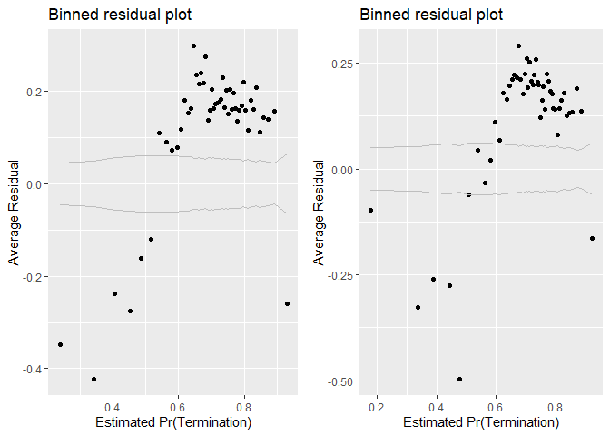<!-- -->

```
## [[1]]
##        model deviance null.deviance difference
## 1 model1_old 85012.81       91792.7   6779.896
## 2 model1_new 84543.01       91792.7   7249.694
```

```r
summary_residual_compare(b_AllOpt07B,b_AllOpt08B,bins=50)
```

<!-- -->

```
## Warning in residuals_binned(model1_old, bins = bins): Always uses Xlb
## Estimated Pr(Termination), should update.
```

```
## Warning in residuals_binned(model1_new, bins = bins): Always uses Xlb
## Estimated Pr(Termination), should update.
```

```
## Warning in if (class(model1_new) %in% c("glmerMod", "lme4")) {: the
## condition has length > 1 and only the first element will be used
```

```
## Warning in if (!class(model1_new) %in% c("glmerMod", "lme4") & !
## class(model1_old) %in% : the condition has length > 1 and only the first
## element will be used
```

<!-- -->

```
## [[1]]
##        model deviance null.deviance difference
## 1 model1_old 62350.05      71190.14   8840.089
## 2 model1_new 62277.65      71190.14   8912.485
```
AllOpt - at this point, cln_PairCA has an unacceptably high VIF.  Given the borderline nature of deciding to drop cln_PairCA vs cp_OffPSC7, I decide to drop cln_PairCA to stay in sync with the SomeOpt model.  This will be done for all future model specifications of the AllOpt model, and is done here as b_AllOpt08Bv2.  Residuals are acceptable, as are the VIF scores of this new model.  Results:
  (1) Higher service complexity variables - invoice rate displays a negative, stat. sig., relationship, meeting expectations.  Average salary does not meet expectations.
  (2) Office capacity variables - neither variable meets expectations (though percent PBSC's negative effect is only significant at the 5% level).
  (3) Deeper office-vendor relationship variables - pair history does not meet expectations.
  (4) Control variables (base, ceiling to base ratio, maximum contract length) - No variables meet expectations (and cln_Ceil2Base and cln_Days display statistically significant negative effects)
  (5) Number of offers variables - only Comp5+ offers meets expectations, while comp2-4 offers displays a statistically significant negative effect, the opposite of what was expected.
  (6) Pricing - For incentive-based contracts, expectations were met. They were not met for any other pricing variable - i.e.: For firm-fixed priced contracts, expectations were not met.  For time and materials/labour hours/FP:LoE, expectations are not met. For other cost-based pricing, expectations were not met.  For undefinitized contract award-pricing, expectations were not met.
  (7) Crisis funding -  CrsisiDis and CrisisOCO both meet expectations, though CrisisDIS is only statistically significant at the 10% level. 

SomeOpt - Residuals are borderline, but acceptable.  VIF scores are well within tolerance.  Results:
  (1) Higher service complexity variables - expectations met for both variables
  (2) Office capacity variables - Only cp_OffPSC7 meets expectations.
  (3) Deeper office-vendor relationship variables -  pair history meets expectations (only variable in this category now)
  (4) Control variables (base, ceiling to base ratio, maximum contract length) - All variables meet expectations.
  (5) Number of offers variables - Only Comp5+ meets expectations.  Comp2-4 displays a statistically significant, negative relationship, opposite of expectations.
  (6) Pricing - Expectations only met for PricingUCA, and effect only statistically significant at the 10% level.  Expectations not met for any other pricing variable.

## Industrial Sector

### Level 6

#### Model 09A: cln_Def6HHI
(Options, breach, termination)
HHI (logged, + means more consolidation)	cln_Def6HHI+	-	+	-


Expectation: higher HHI means more consolidation, and thus is more likely to be associated with bad contracting outcomes.  In turn, higher HHI should be associated with lower b_SomeOpt and b_AllOpt.

```r
#Likelihood Plot for unlogged ceiling
summary_continuous_plot(serv_opt,metric="opt","def6_HHI_lag1")
```

<!-- -->

```r
summary_continuous_plot(serv_opt,metric="opt","cln_Def6HHI")
```

<!-- -->

```r
summary_continuous_plot(serv_opt,metric="opt","cln_Def3HHI")
```

<!-- -->

```r
#Model
b_SomeOpt09A <- glm (data=serv_opt,
                 b_SomeOpt ~ cln_Def6HHI, family=binomial(link="logit"))


b_AllOpt09A <- glm(data=serv_exeropt, family=binomial(link="logit"),
                        b_AllOpt ~ cln_Def6HHI)


#Plot residuals versus fitted
#stargazer::stargazer(b_SomeOpt08B,b_SomeOpt09A,b_AllOpt08B,b_AllOpt09A,type="text",digits=2)
stargazer::stargazer(b_SomeOpt09A,b_AllOpt09A,type="text",digits=2)
```

```
## 
## ==============================================
##                       Dependent variable:     
##                   ----------------------------
##                     b_SomeOpt      b_AllOpt   
##                        (1)            (2)     
## ----------------------------------------------
## cln_Def6HHI          -0.09***      -0.16***   
##                       (0.02)        (0.02)    
##                                               
## Constant             0.80***       -0.03***   
##                       (0.01)        (0.01)    
##                                               
## ----------------------------------------------
## Observations          74,274        51,357    
## Log Likelihood      -45,883.95    -35,564.48  
## Akaike Inf. Crit.   91,771.90      71,132.95  
## ==============================================
## Note:              *p<0.1; **p<0.05; ***p<0.01
```

Expectations met.

#### Model 09B: Defense to Overall ratio
The higher the ratio of defense obligations to reciepts in the overall economy, the DoD holds a greater degree of monosopy over a sector. Given the challenges of monosopy, the a higher ratio estimates a higher probability of b_SomeOpt and b_AllOpt.

(Options, breach, termination)
Ratio Def. obligatons : US revenue	cln_Def6Obl+		+	-	-


```r
#Likelihood Plot for unlogged ceiling
      summary_continuous_plot(serv_opt,metric="opt","def6_ratio_lag1")
```

<!-- -->

```r
      summary_continuous_plot(serv_opt,metric="opt","clr_Def6toUS")
```

<!-- -->

```r
#Model
b_SomeOpt09B <- glm (data=serv_opt,
                 b_SomeOpt ~ clr_Def6toUS, family=binomial(link="logit"))


b_AllOpt09B <- glm(data=serv_exeropt, family=binomial(link="logit"),
                        b_AllOpt ~ clr_Def6toUS)


#Plot residuals versus fitted
#stargazer::stargazer(b_SomeOpt08B,b_SomeOpt09A,b_SomeOpt09B,b_AllOpt08B,b_AllOpt09A,b_AllOpt09B,type="text", digits=2)
stargazer::stargazer(b_SomeOpt09A,b_SomeOpt09B,b_AllOpt09A,b_AllOpt09B,type="text", digits=2)
```

```
## 
## =============================================================
##                               Dependent variable:            
##                   -------------------------------------------
##                         b_SomeOpt             b_AllOpt       
##                      (1)        (2)        (3)        (4)    
## -------------------------------------------------------------
## cln_Def6HHI        -0.09***              -0.16***            
##                     (0.02)                (0.02)             
##                                                              
## clr_Def6toUS                  -0.21***              0.51***  
##                                (0.02)                (0.03)  
##                                                              
## Constant           0.80***    0.80***    -0.03***     0.01   
##                     (0.01)     (0.01)     (0.01)     (0.01)  
##                                                              
## -------------------------------------------------------------
## Observations        74,274     74,274     51,357     51,357  
## Log Likelihood    -45,883.95 -45,841.15 -35,564.48 -35,398.83
## Akaike Inf. Crit. 91,771.90  91,686.31  71,132.95  70,801.66 
## =============================================================
## Note:                             *p<0.1; **p<0.05; ***p<0.01
```
Expectations met for AllOpt, but not for SomeOpt, where clr_Def6toUS has a statistically significant, negative effect.

#### Model 09C: Defense Obligations
(Options, breach, termination)
Defense obligations (logged)	clr_Def6toUS+		-	-	+
Expectation: Higher logged defense obligations estimates lower probabilities for both b_SomeOpt and b_AllOpt.

```r
#Likelihood Plot for unlogged ceiling
      summary_continuous_plot(serv_opt,metric="opt","def6_obl_lag1Const")
```

<!-- -->

```r
      summary_continuous_plot(serv_opt,metric="opt","cln_Def6Obl")
```

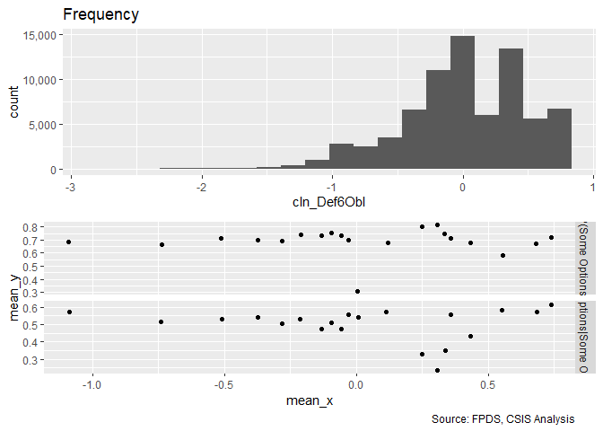<!-- -->

```r
#Model
b_SomeOpt09C <- glm (data=serv_opt,
                 b_SomeOpt ~ cln_Def6Obl, family=binomial(link="logit"))


b_AllOpt09C <- glm(data=serv_exeropt, family=binomial(link="logit"),
                        b_AllOpt ~ cln_Def6Obl)


#Plot residuals versus fitted

stargazer::stargazer(b_SomeOpt09A,b_SomeOpt09B,b_SomeOpt09C, b_AllOpt09A,b_AllOpt09B,b_AllOpt09C,type="text",digits=2)
```

```
## 
## ===================================================================================
##                                          Dependent variable:                       
##                   -----------------------------------------------------------------
##                              b_SomeOpt                         b_AllOpt            
##                      (1)        (2)        (3)        (4)        (5)        (6)    
## -----------------------------------------------------------------------------------
## cln_Def6HHI        -0.09***                         -0.16***                       
##                     (0.02)                           (0.02)                        
##                                                                                    
## clr_Def6toUS                  -0.21***                         0.51***             
##                                (0.02)                           (0.03)             
##                                                                                    
## cln_Def6Obl                                0.03                           -0.13*** 
##                                           (0.02)                           (0.02)  
##                                                                                    
## Constant           0.80***    0.80***    0.81***    -0.03***     0.01     -0.02**  
##                     (0.01)     (0.01)     (0.01)     (0.01)     (0.01)     (0.01)  
##                                                                                    
## -----------------------------------------------------------------------------------
## Observations        74,274     74,274     74,274     51,357     51,357     51,357  
## Log Likelihood    -45,883.95 -45,841.15 -45,895.27 -35,564.48 -35,398.83 -35,570.62
## Akaike Inf. Crit. 91,771.90  91,686.31  91,794.54  71,132.95  70,801.66  71,145.24 
## ===================================================================================
## Note:                                                   *p<0.1; **p<0.05; ***p<0.01
```

Expectations upheld for all options but not some.

#### Model 09D: NAICS6 6 Combined
Consolidation at less and more granular levels may have different effects. Efficiencies are often used to describe sectors, like utilities, with high barriers to entry. Many of these aspects seem like they would already be captured at less granular NAICS6 levels, e.g. power plants, rather than more specific NAICS6 levels, like solar vs. coal. As a result, consolidation for more granular NAICS6 codes should estimate higher rates of ceiling breaches compared to less granular NAICS6 code.

We'll start by adding in everything from both models and seeing what violates VIF.

```r
#Likelihood Plot for unlogged ceiling


#Model
b_SomeOpt09D <- glm (data=serv_opt,
                 b_SomeOpt ~ cln_Def6HHI+clr_Def6toUS+cln_Def6Obl
                 , family=binomial(link="logit"))
glmer_examine(b_SomeOpt09D)
```

```
##  cln_Def6HHI clr_Def6toUS  cln_Def6Obl 
##     1.076323     1.359621     1.297592
```

```r
b_AllOpt09D <- glm(data=serv_exeropt, family=binomial(link="logit"),
                        b_AllOpt ~ cln_Def6HHI+clr_Def6toUS+cln_Def6Obl)


glmer_examine(b_AllOpt09D)
```

```
##  cln_Def6HHI clr_Def6toUS  cln_Def6Obl 
##     1.069767     1.418017     1.370372
```

```r
stargazer::stargazer(b_SomeOpt09A,b_SomeOpt09B,b_SomeOpt09C,b_SomeOpt09D,
                     type="text",digits=2)
```

```
## 
## =============================================================
##                               Dependent variable:            
##                   -------------------------------------------
##                                    b_SomeOpt                 
##                      (1)        (2)        (3)        (4)    
## -------------------------------------------------------------
## cln_Def6HHI        -0.09***                          -0.03*  
##                     (0.02)                           (0.02)  
##                                                              
## clr_Def6toUS                  -0.21***              -0.26*** 
##                                (0.02)                (0.02)  
##                                                              
## cln_Def6Obl                                0.03     0.12***  
##                                           (0.02)     (0.02)  
##                                                              
## Constant           0.80***    0.80***    0.81***    0.79***  
##                     (0.01)     (0.01)     (0.01)     (0.01)  
##                                                              
## -------------------------------------------------------------
## Observations        74,274     74,274     74,274     74,274  
## Log Likelihood    -45,883.95 -45,841.15 -45,895.27 -45,817.99
## Akaike Inf. Crit. 91,771.90  91,686.31  91,794.54  91,643.97 
## =============================================================
## Note:                             *p<0.1; **p<0.05; ***p<0.01
```

```r
stargazer::stargazer(b_AllOpt09A,b_AllOpt09B,b_AllOpt09C,b_AllOpt09D,
                                                                type="text",digits=2)
```

```
## 
## =============================================================
##                               Dependent variable:            
##                   -------------------------------------------
##                                    b_AllOpt                  
##                      (1)        (2)        (3)        (4)    
## -------------------------------------------------------------
## cln_Def6HHI        -0.16***                         -0.32*** 
##                     (0.02)                           (0.02)  
##                                                              
## clr_Def6toUS                  0.51***               0.93***  
##                                (0.03)                (0.03)  
##                                                              
## cln_Def6Obl                              -0.13***   -0.47*** 
##                                           (0.02)     (0.02)  
##                                                              
## Constant           -0.03***     0.01     -0.02**    0.02***  
##                     (0.01)     (0.01)     (0.01)     (0.01)  
##                                                              
## -------------------------------------------------------------
## Observations        51,357     51,357     51,357     51,357  
## Log Likelihood    -35,564.48 -35,398.83 -35,570.62 -35,109.41
## Akaike Inf. Crit. 71,132.95  70,801.66  71,145.24  70,226.82 
## =============================================================
## Note:                             *p<0.1; **p<0.05; ***p<0.01
```

```r
summary_residual_compare(b_SomeOpt09D, bins=10)
```

```
## Warning in residuals_binned(model1_old, bins = bins): Always uses Xlb
## Estimated Pr(Termination), should update.
```

```
## Warning in if (class(model1_old) %in% c("glmerMod", "lme4")) {: the
## condition has length > 1 and only the first element will be used
```

```
## Warning in if (!class(model1_old) %in% c("glmerMod", "lme4") & !
## class(model1_old) %in% : the condition has length > 1 and only the first
## element will be used
```

<!-- -->

```
## [[1]]
##        model deviance null.deviance difference
## 1 model1_old 91635.97       91792.7   156.7317
```

```r
summary_residual_compare(b_AllOpt09D,bins=10)
```

```
## Warning in residuals_binned(model1_old, bins = bins): Always uses Xlb
## Estimated Pr(Termination), should update.
```

```
## Warning in if (class(model1_old) %in% c("glmerMod", "lme4")) {: the
## condition has length > 1 and only the first element will be used
```

```
## Warning in if (!class(model1_old) %in% c("glmerMod", "lme4") & !
## class(model1_old) %in% : the condition has length > 1 and only the first
## element will be used
```

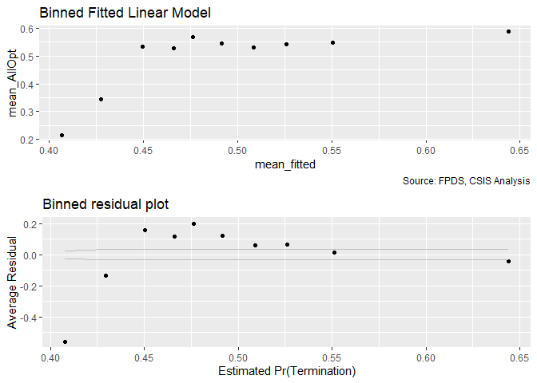<!-- -->

```
## [[1]]
##        model deviance null.deviance difference
## 1 model1_old 70218.82      71190.14   971.3159
```

For some options, HHI6 and Def6toUS expectations are upheld, but def6obl are not
For all options, HHI6 and def6 obl expectations are upheld, but def6tous are not.

#### Model 09E: Cumulative Model
Consolidation at less and more granular levels may have different effects. Efficiencies are often used to describe sectors, like utilities, with high barriers to entry. Many of these aspects seem like they would already be captured at less granular NAICS6 levels, e.g. power plants, rather than more specific NAICS6 levels, like solar vs. coal. As a result, consolidation for more granular NAICS6 codes should estimate higher rates of ceiling breaches compared to less granular NAICS6 code.

We'll start by adding in everything from both models and seeing what violates VIF.

```r
#Model
b_SomeOpt09E <- glm (data=serv_opt,
                 b_SomeOpt ~  cln_US6sal + 
                   cln_PSCrate+ cp_OffPerf7+cp_OffPSC7+
                 cn_PairHist7+cln_PairCA +
                   cln_Base + clr_Ceil2Base + cln_Days+
                   Comp+
                   Veh+
                   Pricing+
                   Crisis+
                   cln_Def6HHI+clr_Def6toUS+cln_Def6Obl, family=binomial(link="logit"))
glmer_examine(b_SomeOpt09E)
```

```
##                   GVIF Df GVIF^(1/(2*Df))
## cln_US6sal    2.043633  1        1.429557
## cln_PSCrate   1.523621  1        1.234350
## cp_OffPerf7   1.295161  1        1.138051
## cp_OffPSC7    2.071860  1        1.439396
## cn_PairHist7  1.603515  1        1.266300
## cln_PairCA    3.363086  1        1.833872
## cln_Base      1.757984  1        1.325890
## clr_Ceil2Base 1.442596  1        1.201081
## cln_Days      1.110182  1        1.053652
## Comp          1.597114  3        1.081158
## Veh           3.637537  4        1.175171
## Pricing       1.296396  6        1.021868
## Crisis        1.389275  3        1.056326
## cln_Def6HHI   1.294988  1        1.137975
## clr_Def6toUS  1.485836  1        1.218949
## cln_Def6Obl   2.223856  1        1.491260
```

```r
b_AllOpt09E <- glm(data=serv_exeropt, family=binomial(link="logit"),
                        b_AllOpt ~  cln_US6sal + 
                   cln_PSCrate+ cp_OffPerf7+cp_OffPSC7+
                 cn_PairHist7+cln_PairCA+
                 cln_Base + clr_Ceil2Base + cln_Days+
                 Comp+
                   Veh+
                   Pricing+
                   Crisis+
                 cln_Def6HHI+clr_Def6toUS+cln_Def6Obl)

glmer_examine(b_AllOpt09E)
```

```
##                   GVIF Df GVIF^(1/(2*Df))
## cln_US6sal    2.055934  1        1.433853
## cln_PSCrate   1.490643  1        1.220919
## cp_OffPerf7   1.107099  1        1.052188
## cp_OffPSC7    1.516305  1        1.231383
## cn_PairHist7  1.473819  1        1.214010
## cln_PairCA    2.416571  1        1.554533
## cln_Base      1.566801  1        1.251719
## clr_Ceil2Base 1.158856  1        1.076502
## cln_Days      1.058961  1        1.029058
## Comp          1.386778  3        1.056010
## Veh           2.647715  4        1.129429
## Pricing       1.409829  6        1.029036
## Crisis        1.104031  3        1.016632
## cln_Def6HHI   1.288513  1        1.135127
## clr_Def6toUS  1.500850  1        1.225092
## cln_Def6Obl   2.259934  1        1.503308
```

```r
#Plot residuals versus fitted
stargazer::stargazer(b_SomeOpt08B,b_SomeOpt09D,b_SomeOpt09E,
                     
                     b_AllOpt08B,b_AllOpt09D,b_AllOpt09E,
                       type="text",
                       digits=2)
```

```
## 
## =============================================================================================
##                                                    Dependent variable:                       
##                             -----------------------------------------------------------------
##                                        b_SomeOpt                         b_AllOpt            
##                                (1)        (2)        (3)        (4)        (5)        (6)    
## ---------------------------------------------------------------------------------------------
## cln_US6sal                   -0.16***              -0.04**      0.01                 0.0004  
##                               (0.02)                (0.02)     (0.02)                (0.02)  
##                                                                                              
## cln_PSCrate                  -0.38***              -0.24***   -0.14***              -0.12*** 
##                               (0.02)                (0.02)     (0.03)                (0.03)  
##                                                                                              
## cp_OffPerf7                  -0.34***              -0.16***   -0.07***              -0.07*** 
##                               (0.02)                (0.02)     (0.02)                (0.02)  
##                                                                                              
## cp_OffPSC7                   0.13***               0.38***    -0.42***              -0.41*** 
##                               (0.02)                (0.03)     (0.03)                (0.03)  
##                                                                                              
## cn_PairHist7                 0.09***               0.29***    0.24***               0.23***  
##                               (0.02)                (0.02)     (0.02)                (0.02)  
##                                                                                              
## cln_PairCA                                         -0.17***   -0.71***              -0.57*** 
##                                                     (0.03)     (0.03)                (0.03)  
##                                                                                              
## cln_Base                     0.66***               0.43***      0.03                 -0.02   
##                               (0.02)                (0.02)     (0.02)                (0.02)  
##                                                                                              
## clr_Ceil2Base                0.46***               0.43***    -0.82***              -0.83*** 
##                               (0.01)                (0.01)     (0.02)                (0.02)  
##                                                                                              
## cln_Days                     0.85***               0.70***    -0.42***              -0.43*** 
##                               (0.03)                (0.03)     (0.04)                (0.04)  
##                                                                                              
## Comp1 offer                   -0.02                  0.01      -0.01                 -0.01   
##                               (0.03)                (0.03)     (0.03)                (0.03)  
##                                                                                              
## Comp2-4 offers               -0.11***               -0.02     -0.07***               -0.05*  
##                               (0.02)                (0.02)     (0.03)                (0.03)  
##                                                                                              
## Comp5+ offers                -0.30***                0.02     -0.33***              -0.22*** 
##                               (0.02)                (0.03)     (0.03)                (0.03)  
##                                                                                              
## VehS-IDC                                           -0.67***                         -0.48*** 
##                                                     (0.03)                           (0.04)  
##                                                                                              
## VehM-IDC                                           -0.17***                         -0.14*** 
##                                                     (0.03)                           (0.03)  
##                                                                                              
## VehFSS/GWAC                                          0.01                           0.12***  
##                                                     (0.03)                           (0.03)  
##                                                                                              
## VehBPA/BOA                                         -2.13***                         -0.19**  
##                                                     (0.05)                           (0.08)  
##                                                                                              
## PricingOther FP              -0.81***              -0.63***   -1.02***              -0.92*** 
##                               (0.13)                (0.13)     (0.17)                (0.18)  
##                                                                                              
## PricingT&M/LH/FPLOE            0.04                 0.11*      0.14**                0.14**  
##                               (0.06)                (0.06)     (0.06)                (0.06)  
##                                                                                              
## PricingIncentive               0.12                  0.08     0.99***               0.94***  
##                               (0.24)                (0.24)     (0.24)                (0.25)  
##                                                                                              
## PricingOther CB              0.21***               0.26***    0.82***               0.80***  
##                               (0.05)                (0.05)     (0.05)                (0.05)  
##                                                                                              
## PricingUCA                    -0.18*                -0.003    0.34***               0.36***  
##                               (0.10)                (0.11)     (0.12)                (0.12)  
##                                                                                              
## PricingCombination or Other  0.47***               0.57***     0.13**                0.14**  
##                               (0.07)                (0.07)     (0.06)                (0.06)  
##                                                                                              
## CrisisARRA                   -0.62***              -0.49***   -0.41**                -0.39*  
##                               (0.16)                (0.16)     (0.21)                (0.21)  
##                                                                                              
## CrisisDis                     -0.32                 -0.40     -1.43***              -1.45*** 
##                               (0.30)                (0.30)     (0.41)                (0.41)  
##                                                                                              
## CrisisOCO                    -1.65***              -1.53***   -0.53***              -0.60*** 
##                               (0.04)                (0.05)     (0.07)                (0.07)  
##                                                                                              
## cln_Def6HHI                              -0.03*    0.12***               -0.32***    -0.04*  
##                                          (0.02)     (0.02)                (0.02)     (0.02)  
##                                                                                              
## clr_Def6toUS                            -0.26***    -0.02                0.93***    0.13***  
##                                          (0.02)     (0.03)                (0.03)     (0.03)  
##                                                                                              
## cln_Def6Obl                             0.12***      0.04                -0.47***   0.13***  
##                                          (0.02)     (0.03)                (0.02)     (0.03)  
##                                                                                              
## Constant                     0.08***    0.79***    0.32***    1.19***    0.02***    1.30***  
##                               (0.03)     (0.01)     (0.03)     (0.03)     (0.01)     (0.04)  
##                                                                                              
## ---------------------------------------------------------------------------------------------
## Observations                  74,274     74,274     74,274     51,357     51,357     51,357  
## Log Likelihood              -42,271.50 -45,817.99 -41,066.25 -31,138.83 -35,109.41 -31,013.45
## Akaike Inf. Crit.           84,585.01  91,643.97  82,190.51  62,321.65  70,226.82  62,084.91 
## =============================================================================================
## Note:                                                             *p<0.1; **p<0.05; ***p<0.01
```

```r
summary_residual_compare(b_SomeOpt08B,b_SomeOpt09E,bins=50)
```

<!-- -->

```
## Warning in residuals_binned(model1_old, bins = bins): Always uses Xlb
## Estimated Pr(Termination), should update.
```

```
## Warning in residuals_binned(model1_new, bins = bins): Always uses Xlb
## Estimated Pr(Termination), should update.
```

```
## Warning in if (class(model1_new) %in% c("glmerMod", "lme4")) {: the
## condition has length > 1 and only the first element will be used
```

```
## Warning in if (!class(model1_new) %in% c("glmerMod", "lme4") & !
## class(model1_old) %in% : the condition has length > 1 and only the first
## element will be used
```

<!-- -->

```
## [[1]]
##        model deviance null.deviance difference
## 1 model1_old 84543.01       91792.7   7249.694
## 2 model1_new 82132.51       91792.7   9660.196
```

```r
summary_residual_compare(b_SomeOpt08B,b_SomeOpt09E,bins=50)
```

<!-- -->

```
## Warning in residuals_binned(model1_old, bins = bins): Always uses Xlb
## Estimated Pr(Termination), should update.
```

```
## Warning in residuals_binned(model1_new, bins = bins): Always uses Xlb
## Estimated Pr(Termination), should update.
```

```
## Warning in if (class(model1_new) %in% c("glmerMod", "lme4")) {: the
## condition has length > 1 and only the first element will be used
```

```
## Warning in if (!class(model1_new) %in% c("glmerMod", "lme4") & !
## class(model1_old) %in% : the condition has length > 1 and only the first
## element will be used
```

<!-- -->

```
## [[1]]
##        model deviance null.deviance difference
## 1 model1_old 84543.01       91792.7   7249.694
## 2 model1_new 82132.51       91792.7   9660.196
```
N.B.: Vehicle is now included in model specification
SomeOpt:
Def6HHI - Swapped sign and is now more significant (at 5% level) - opposite of expectations.
Def6toUS - Lost significance
Def6Obl - Lost significance

AllOpt:
Def6HHI - Negative and significant (thought at 10% level), meets expectations
Def6toUS - Positive and significant - meets expectations
Def6Obl - Positive and significant - Opposite of expectations

### Level 3
#### Model 10A: cln_Def3HHI
(Options, breaches, and terminations)
HHI (logged, + means more consolidation)	cln_Def3HHI		TRUE	-	+	++


```r
#Likelihood Plot for unlogged ceiling
summary_continuous_plot(serv_opt,metric="opt","cln_Def3HHI")
```

<!-- -->

```r
#Model
b_SomeOpt10A <- glm (data=serv_opt,
                 b_SomeOpt ~ cln_Def3HHI, family=binomial(link="logit"))


b_AllOpt10A <- glm(data=serv_exeropt, family=binomial(link="logit"),
                        b_AllOpt ~ cln_Def3HHI)


#Plot residuals versus fitted
stargazer::stargazer(b_SomeOpt09A,b_SomeOpt10A,
                       
                       b_AllOpt09A,b_AllOpt10A,
                       type="text",
                       digits=2)
```

```
## 
## =============================================================
##                               Dependent variable:            
##                   -------------------------------------------
##                         b_SomeOpt             b_AllOpt       
##                      (1)        (2)        (3)        (4)    
## -------------------------------------------------------------
## cln_Def6HHI        -0.09***              -0.16***            
##                     (0.02)                (0.02)             
##                                                              
## cln_Def3HHI                   0.06***               -0.51*** 
##                                (0.02)                (0.02)  
##                                                              
## Constant           0.80***    0.81***    -0.03***    -0.01   
##                     (0.01)     (0.01)     (0.01)     (0.01)  
##                                                              
## -------------------------------------------------------------
## Observations        74,274     74,274     51,357     51,357  
## Log Likelihood    -45,883.95 -45,890.49 -35,564.48 -35,298.92
## Akaike Inf. Crit. 91,771.90  91,784.99  71,132.95  70,601.85 
## =============================================================
## Note:                             *p<0.1; **p<0.05; ***p<0.01
```

```r
#Summary Residual Compare include for NAICS66 counterparts
summary_residual_compare(b_SomeOpt09A,b_SomeOpt10A, skip_vif =  TRUE)
```

<!-- -->

```
## Warning in residuals_binned(model1_old, bins = bins): Always uses Xlb
## Estimated Pr(Termination), should update.
```

```
## Warning in residuals_binned(model1_new, bins = bins): Always uses Xlb
## Estimated Pr(Termination), should update.
```

```
## Warning in if (class(model1_new) %in% c("glmerMod", "lme4")) {: the
## condition has length > 1 and only the first element will be used
```

```
## Warning in if (!class(model1_new) %in% c("glmerMod", "lme4") & !
## class(model1_old) %in% : the condition has length > 1 and only the first
## element will be used
```

<!-- -->

```
## [[1]]
##        model deviance null.deviance difference
## 1 model1_old 91767.90       91792.7   24.80574
## 2 model1_new 91780.99       91792.7   11.71489
```

```r
summary_residual_compare(b_AllOpt09A,b_AllOpt10A, skip_vif =  TRUE)
```

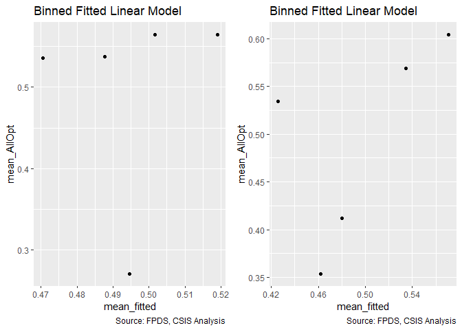<!-- -->

```
## Warning in residuals_binned(model1_old, bins = bins): Always uses Xlb
## Estimated Pr(Termination), should update.
```

```
## Warning in residuals_binned(model1_new, bins = bins): Always uses Xlb
## Estimated Pr(Termination), should update.
```

```
## Warning in if (class(model1_new) %in% c("glmerMod", "lme4")) {: the
## condition has length > 1 and only the first element will be used
```

```
## Warning in if (!class(model1_new) %in% c("glmerMod", "lme4") & !
## class(model1_old) %in% : the condition has length > 1 and only the first
## element will be used
```

<!-- -->

```
## [[1]]
##        model deviance null.deviance difference
## 1 model1_old 71128.95      71190.14   61.18239
## 2 model1_new 70597.85      71190.14  592.28830
```

The results for subsector HHI is contrary to expectation for some options but in line with expectations for all options.


#### Model 10B: Defense to Overall ratio
(Options, breaches, and terminations)
Ratio Def. obligatons : US revenue	clr_Def3toUS+		-	+	+


```r
#Likelihood Plot for unlogged ceiling
summary_continuous_plot(serv_opt,metric="opt","capped_def3_ratio_lag1")
```

<!-- -->

```r
summary_continuous_plot(serv_opt,metric="opt","clr_Def3toUS")
```

<!-- -->

```r
#Model
b_SomeOpt10B <- glm (data=serv_opt,
                 b_SomeOpt ~ clr_Def3toUS, family=binomial(link="logit"))


b_AllOpt10B <- glm(data=serv_exeropt, family=binomial(link="logit"),
                        b_AllOpt ~ clr_Def3toUS)


#Plot residuals versus fitted
stargazer::stargazer(b_SomeOpt09B,b_SomeOpt10A,b_SomeOpt10B,
                       
                       b_AllOpt09B,b_AllOpt10A,b_AllOpt10B,
                       type="text",
                       digits=2)
```

```
## 
## ===================================================================================
##                                          Dependent variable:                       
##                   -----------------------------------------------------------------
##                              b_SomeOpt                         b_AllOpt            
##                      (1)        (2)        (3)        (4)        (5)        (6)    
## -----------------------------------------------------------------------------------
## clr_Def6toUS       -0.21***                         0.51***                        
##                     (0.02)                           (0.03)                        
##                                                                                    
## cln_Def3HHI                   0.06***                          -0.51***            
##                                (0.02)                           (0.02)             
##                                                                                    
## clr_Def3toUS                             0.09***                          0.65***  
##                                           (0.02)                           (0.02)  
##                                                                                    
## Constant           0.80***    0.81***    0.81***      0.01      -0.01     -0.02**  
##                     (0.01)     (0.01)     (0.01)     (0.01)     (0.01)     (0.01)  
##                                                                                    
## -----------------------------------------------------------------------------------
## Observations        74,274     74,274     74,274     51,357     51,357     51,357  
## Log Likelihood    -45,841.15 -45,890.49 -45,880.12 -35,398.83 -35,298.92 -34,993.01
## Akaike Inf. Crit. 91,686.31  91,784.99  91,764.24  70,801.66  70,601.85  69,990.01 
## ===================================================================================
## Note:                                                   *p<0.1; **p<0.05; ***p<0.01
```

```r
#Summary Residual Compare include for NAICS66 counterparts
summary_residual_compare(b_SomeOpt09B,b_SomeOpt10B)
```

<!-- -->

```
## Warning in residuals_binned(model1_old, bins = bins): Always uses Xlb
## Estimated Pr(Termination), should update.
```

```
## Warning in residuals_binned(model1_new, bins = bins): Always uses Xlb
## Estimated Pr(Termination), should update.
```

```
## Warning in if (class(model1_new) %in% c("glmerMod", "lme4")) {: the
## condition has length > 1 and only the first element will be used
```

```
## Warning in if (!class(model1_new) %in% c("glmerMod", "lme4") & !
## class(model1_old) %in% : the condition has length > 1 and only the first
## element will be used
```

<!-- -->

```
## [[1]]
##        model deviance null.deviance difference
## 1 model1_old 91682.31       91792.7  110.39287
## 2 model1_new 91760.24       91792.7   32.46253
```

```r
summary_residual_compare(b_AllOpt09B,b_AllOpt10B)
```

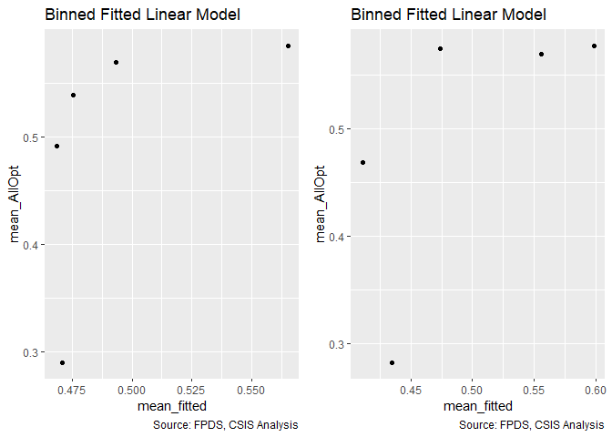<!-- -->

```
## Warning in residuals_binned(model1_old, bins = bins): Always uses Xlb
## Estimated Pr(Termination), should update.
```

```
## Warning in residuals_binned(model1_new, bins = bins): Always uses Xlb
## Estimated Pr(Termination), should update.
```

```
## Warning in if (class(model1_new) %in% c("glmerMod", "lme4")) {: the
## condition has length > 1 and only the first element will be used
```

```
## Warning in if (!class(model1_new) %in% c("glmerMod", "lme4") & !
## class(model1_old) %in% : the condition has length > 1 and only the first
## element will be used
```

<!-- -->

```
## [[1]]
##        model deviance null.deviance difference
## 1 model1_old 70797.66      71190.14   392.4787
## 2 model1_new 69986.01      71190.14  1204.1233
```

The results were significantly positive in both cases, though unfortunately contrary to expectations.


#### Model 10C: NAICS6 6 and NAICS6 3
Consolidation at lessa nd more granular levels may have different effects. Efficiencies are often used to describe sectors, like utilities, with high barriers to entry. Many of these aspects seem like they would already be captured at less granular NAICS6 levels, e.g. power plants, rather than more specific NAICS6 levels, like solar vs. coal. As a result, consolidation for more granular NAICS6 codes should estimate higher rates of ceiling breaches compared to less granular NAICS6 code.

We'll start by adding in everything from both models and seeing what violates VIF.

```r
#Model
b_SomeOpt10C <- glm (data=serv_opt,
                 b_SomeOpt ~ cln_Def6HHI+clr_Def6toUS+cln_Def6Obl+
                   cln_Def3HHI+clr_Def3toUS, family=binomial(link="logit"))
glmer_examine(b_SomeOpt10C)
```

```
##  cln_Def6HHI clr_Def6toUS  cln_Def6Obl  cln_Def3HHI clr_Def3toUS 
##     1.203163     1.849426     1.485177     1.456805     2.131496
```

```r
b_AllOpt10C <- glm(data=serv_exeropt, family=binomial(link="logit"),
                        b_AllOpt ~ cln_Def6HHI+clr_Def6toUS+cln_Def6Obl+
                   cln_Def3HHI+clr_Def3toUS)
glmer_examine(b_AllOpt10C)
```

```
##  cln_Def6HHI clr_Def6toUS  cln_Def6Obl  cln_Def3HHI clr_Def3toUS 
##     1.138739     1.760171     1.543445     1.530589     2.124918
```

```r
#No obl
b_SomeOpt10C2 <- glm (data=serv_opt,
                 b_SomeOpt ~ cln_Def6HHI+clr_Def6toUS+
                   cln_Def3HHI+clr_Def3toUS, family=binomial(link="logit"))
glmer_examine(b_SomeOpt10C2)
```

```
##  cln_Def6HHI clr_Def6toUS  cln_Def3HHI clr_Def3toUS 
##     1.188309     1.697242     1.430626     2.031383
```

```r
b_AllOpt10C2 <- glm(data=serv_exeropt, family=binomial(link="logit"),
                        b_AllOpt ~ cln_Def6HHI+clr_Def6toUS+
                   cln_Def3HHI+clr_Def3toUS)
glmer_examine(b_AllOpt10C2)
```

```
##  cln_Def6HHI clr_Def6toUS  cln_Def3HHI clr_Def3toUS 
##     1.125637     1.440405     1.480096     1.874039
```

```r
#No HHI6

b_SomeOpt10C3 <- glm (data=serv_opt,
                 b_SomeOpt ~ clr_Def6toUS+cln_Def6Obl+
                   cln_Def3HHI+clr_Def3toUS, family=binomial(link="logit"))
glmer_examine(b_SomeOpt10C3)
```

```
## clr_Def6toUS  cln_Def6Obl  cln_Def3HHI clr_Def3toUS 
##     1.809477     1.470491     1.301820     2.086579
```

```r
b_AllOpt10C3 <- glm(data=serv_exeropt, family=binomial(link="logit"),
                        b_AllOpt ~ clr_Def6toUS+cln_Def6Obl+
                   cln_Def3HHI+clr_Def3toUS)
glmer_examine(b_AllOpt10C3)
```

```
## clr_Def6toUS  cln_Def6Obl  cln_Def3HHI clr_Def3toUS 
##     1.687065     1.514381     1.425019     2.091395
```

```r
#Model no ratio 3
b_SomeOpt10C4 <- glm (data=serv_opt,
                 b_SomeOpt ~ cln_Def6HHI+clr_Def6toUS+cln_Def6Obl+
                   cln_Def3HHI, family=binomial(link="logit"))
glmer_examine(b_SomeOpt10C4)
```

```
##  cln_Def6HHI clr_Def6toUS  cln_Def6Obl  cln_Def3HHI 
##     1.163027     1.359015     1.399346     1.214639
```

```r
b_AllOpt10C4 <- glm(data=serv_exeropt, family=binomial(link="logit"),
                        b_AllOpt ~ cln_Def6HHI+clr_Def6toUS+cln_Def6Obl+
                   cln_Def3HHI)
glmer_examine(b_AllOpt10C4)
```

```
##  cln_Def6HHI clr_Def6toUS  cln_Def6Obl  cln_Def3HHI 
##     1.129881     1.441365     1.495086     1.218590
```

```r
#No Obl or subsector ratio
b_SomeOpt10C5 <- glm (data=serv_opt,
                 b_SomeOpt ~ cln_Def6HHI+clr_Def6toUS+
                   cln_Def3HHI, family=binomial(link="logit"))
glmer_examine(b_SomeOpt10C5)
```

```
##  cln_Def6HHI clr_Def6toUS  cln_Def3HHI 
##     1.153337     1.086941     1.119718
```

```r
b_AllOpt10C5 <- glm(data=serv_exeropt, family=binomial(link="logit"),
                        b_AllOpt ~ cln_Def6HHI+clr_Def6toUS+
                   cln_Def3HHI)
glmer_examine(b_AllOpt10C5)
```

```
##  cln_Def6HHI clr_Def6toUS  cln_Def3HHI 
##     1.117377     1.116051     1.119841
```

```r
#No Obl or detailed industry ratio
b_SomeOpt10C6 <- glm (data=serv_opt,
                 b_SomeOpt ~ cln_Def6HHI+clr_Def6toUS+
                   clr_Def3toUS, family=binomial(link="logit"))
glmer_examine(b_SomeOpt10C6)
```

```
##  cln_Def6HHI clr_Def6toUS clr_Def3toUS 
##     1.051448     1.702358     1.641290
```

```r
b_AllOpt10C6 <- glm(data=serv_exeropt, family=binomial(link="logit"),
                        b_AllOpt ~ cln_Def6HHI+clr_Def6toUS+
                   clr_Def3toUS)
glmer_examine(b_AllOpt10C6)
```

```
##  cln_Def6HHI clr_Def6toUS clr_Def3toUS 
##     1.033926     1.422249     1.387787
```

```r
#Plot residuals versus fitted
stargazer::stargazer(b_SomeOpt09D,b_SomeOpt10A,b_SomeOpt10B,b_SomeOpt10C4,b_SomeOpt10C5,b_SomeOpt10C6,
                       type="text",
                       digits=2)
```

```
## 
## ===================================================================================
##                                          Dependent variable:                       
##                   -----------------------------------------------------------------
##                                               b_SomeOpt                            
##                      (1)        (2)        (3)        (4)        (5)        (6)    
## -----------------------------------------------------------------------------------
## cln_Def6HHI         -0.03*                          -0.06***   -0.07***   -0.05**  
##                     (0.02)                           (0.02)     (0.02)     (0.02)  
##                                                                                    
## clr_Def6toUS       -0.26***                         -0.26***   -0.18***   -0.44*** 
##                     (0.02)                           (0.02)     (0.02)     (0.03)  
##                                                                                    
## cln_Def6Obl        0.12***                          0.15***                        
##                     (0.02)                           (0.02)                        
##                                                                                    
## cln_Def3HHI                   0.06***               0.11***    0.06***             
##                                (0.02)                (0.02)     (0.02)             
##                                                                                    
## clr_Def3toUS                             0.09***                          0.30***  
##                                           (0.02)                           (0.02)  
##                                                                                    
## Constant           0.79***    0.81***    0.81***    0.79***    0.80***    0.79***  
##                     (0.01)     (0.01)     (0.01)     (0.01)     (0.01)     (0.01)  
##                                                                                    
## -----------------------------------------------------------------------------------
## Observations        74,274     74,274     74,274     74,274     74,274     74,274  
## Log Likelihood    -45,817.99 -45,890.49 -45,880.12 -45,804.93 -45,831.94 -45,732.79
## Akaike Inf. Crit. 91,643.97  91,784.99  91,764.24  91,619.87  91,671.89  91,473.57 
## ===================================================================================
## Note:                                                   *p<0.1; **p<0.05; ***p<0.01
```

```r
stargazer::stargazer(b_AllOpt09D,#b_AllOpt10A,b_AllOpt10B,
                     b_AllOpt10C2,b_AllOpt10C3,b_AllOpt10C4,b_AllOpt10C5,b_AllOpt10C6,
                       type="text",
                       digits=2)
```

```
## 
## ===================================================================================
##                                          Dependent variable:                       
##                   -----------------------------------------------------------------
##                                               b_AllOpt                             
##                      (1)        (2)        (3)        (4)        (5)        (6)    
## -----------------------------------------------------------------------------------
## cln_Def6HHI        -0.32***   -0.21***              -0.20***   -0.15***   -0.24*** 
##                     (0.02)     (0.02)                (0.02)     (0.02)     (0.02)  
##                                                                                    
## clr_Def6toUS       0.93***     0.06**    0.28***    0.84***    0.44***     0.05*   
##                     (0.03)     (0.03)     (0.04)     (0.03)     (0.03)     (0.03)  
##                                                                                    
## cln_Def6Obl        -0.47***              -0.72***   -0.63***                       
##                     (0.02)                (0.02)     (0.02)                        
##                                                                                    
## cln_Def3HHI                   -0.13***   -0.33***   -0.58***   -0.41***            
##                                (0.03)     (0.03)     (0.02)     (0.02)             
##                                                                                    
## clr_Def3toUS                  0.58***    0.74***                          0.65***  
##                                (0.03)     (0.03)                           (0.02)  
##                                                                                    
## Constant           0.02***    -0.02***     0.01     0.04***      0.01     -0.03*** 
##                     (0.01)     (0.01)     (0.01)     (0.01)     (0.01)     (0.01)  
##                                                                                    
## -----------------------------------------------------------------------------------
## Observations        51,357     51,357     51,357     51,357     51,357     51,357  
## Log Likelihood    -35,109.41 -34,915.85 -34,491.29 -34,805.77 -35,160.50 -34,928.65
## Akaike Inf. Crit. 70,226.82  69,841.69  68,992.59  69,621.53  70,329.01  69,865.29 
## ===================================================================================
## Note:                                                   *p<0.1; **p<0.05; ***p<0.01
```

```r
summary_residual_compare(b_SomeOpt09D,b_SomeOpt10C4,b_SomeOpt10C5,b_SomeOpt10C6,bins=10)
```

<!-- -->

```
## Warning in residuals_binned(model1_old, bins = bins): Always uses Xlb
## Estimated Pr(Termination), should update.
```

```
## Warning in residuals_binned(model1_new, bins = bins): Always uses Xlb
## Estimated Pr(Termination), should update.
```

```
## Warning in residuals_binned(model2_old, bins = bins): Always uses Xlb
## Estimated Pr(Termination), should update.
```

```
## Warning in residuals_binned(model2_new, bins = bins): Always uses Xlb
## Estimated Pr(Termination), should update.
```

```
## Warning in if (class(model1_new) %in% c("glmerMod", "lme4") &
## class(model2_new) %in% : the condition has length > 1 and only the first
## element will be used
```

```
## Warning in if ((!class(model1_new) %in% c("glmerMod", "lme4") & !
## class(model2_new) %in% : the condition has length > 1 and only the first
## element will be used
```

<!-- -->

```
## [[1]]
##        model deviance null.deviance difference
## 1 model1_old 91635.97       91792.7   156.7317
## 2 model1_new 91609.87       91792.7   182.8328
## 3 model2_old 91663.89       91792.7   128.8164
## 4 model2_new 91465.57       91792.7   327.1278
```

```r
summary_residual_compare(b_AllOpt10C3,b_AllOpt10C4,b_AllOpt10C5,b_AllOpt10C6,bins=10)
```

<!-- -->

```
## Warning in residuals_binned(model1_old, bins = bins): Always uses Xlb
## Estimated Pr(Termination), should update.
```

```
## Warning in residuals_binned(model1_new, bins = bins): Always uses Xlb
## Estimated Pr(Termination), should update.
```

```
## Warning in residuals_binned(model2_old, bins = bins): Always uses Xlb
## Estimated Pr(Termination), should update.
```

```
## Warning in residuals_binned(model2_new, bins = bins): Always uses Xlb
## Estimated Pr(Termination), should update.
```

```
## Warning in if (class(model1_new) %in% c("glmerMod", "lme4") &
## class(model2_new) %in% : the condition has length > 1 and only the first
## element will be used
```

```
## Warning in if ((!class(model1_new) %in% c("glmerMod", "lme4") & !
## class(model2_new) %in% : the condition has length > 1 and only the first
## element will be used
```

<!-- -->

```
## [[1]]
##        model deviance null.deviance difference
## 1 model1_old 68982.59      71190.14  2207.5467
## 2 model1_new 69611.53      71190.14  1578.6056
## 3 model2_old 70321.01      71190.14   869.1293
## 4 model2_new 69857.29      71190.14  1332.8443
```

VIF is becoming a problem, prompting removal of detailed industry oligations for all options, which is captured in part by detailed industry ratio and the more on point measure of DoD experience, office volume. Unfortunately, For some options this was not sufficient to lower VIFs for all options, so defense ratio 3 was also removed.
b_SomeOpt10C5
b_AllOpt10C2

#### Model 10D: Cumulative Model
.

```r
#Likelihood Plot for unlogged ceiling


#Model
b_SomeOpt10D <- glm (data=serv_opt,
                 b_SomeOpt ~  cln_US6sal + 
                   cln_PSCrate+ cp_OffPerf7+cp_OffPSC7+
                 cn_PairHist7+cln_PairCA +
                   cln_Base + clr_Ceil2Base + cln_Days +
                   Comp+
                   Veh+
                   Pricing+
                   Crisis+
                   cln_Def6HHI+clr_Def6toUS+#clr_Def6Obl+
                   cln_Def3HHI,#+clr_Def3toUS, 
                 family=binomial(link="logit"))
glmer_examine(b_SomeOpt10D)
```

```
##                   GVIF Df GVIF^(1/(2*Df))
## cln_US6sal    2.027851  1        1.424026
## cln_PSCrate   1.554958  1        1.246980
## cp_OffPerf7   1.296336  1        1.138568
## cp_OffPSC7    2.077661  1        1.441409
## cn_PairHist7  1.604767  1        1.266794
## cln_PairCA    3.329959  1        1.824818
## cln_Base      1.721862  1        1.312197
## clr_Ceil2Base 1.449578  1        1.203984
## cln_Days      1.110937  1        1.054010
## Comp          1.590735  3        1.080438
## Veh           3.619425  4        1.174438
## Pricing       1.308491  6        1.022659
## Crisis        1.388595  3        1.056240
## cln_Def6HHI   1.508002  1        1.228007
## clr_Def6toUS  1.209053  1        1.099569
## cln_Def3HHI   1.806801  1        1.344173
```

```r
b_AllOpt10D <- glm(data=serv_exeropt, family=binomial(link="logit"),
                        b_AllOpt ~  cln_US6sal + 
                   cln_PSCrate+ cp_OffPerf7+cp_OffPSC7+
                 cn_PairHist7+cln_PairCA+
                 cln_Base + clr_Ceil2Base + cln_Days +
                 Comp+
                   Veh+
                   Pricing+
                   Crisis+
                 cln_Def6HHI+clr_Def6toUS+cln_Def3HHI+
                   clr_Def3toUS)
glmer_examine(b_AllOpt10D)
```

```
##                   GVIF Df GVIF^(1/(2*Df))
## cln_US6sal    2.147810  1        1.465541
## cln_PSCrate   1.517577  1        1.231900
## cp_OffPerf7   1.115409  1        1.056129
## cp_OffPSC7    1.484630  1        1.218454
## cn_PairHist7  1.469412  1        1.212193
## cln_PairCA    2.344087  1        1.531041
## cln_Base      1.536000  1        1.239355
## clr_Ceil2Base 1.162297  1        1.078099
## cln_Days      1.059690  1        1.029412
## Comp          1.377413  3        1.054818
## Veh           2.655663  4        1.129852
## Pricing       1.443402  6        1.031056
## Crisis        1.109233  3        1.017428
## cln_Def6HHI   1.457091  1        1.207100
## clr_Def6toUS  1.478038  1        1.215746
## cln_Def3HHI   2.042701  1        1.429231
## clr_Def3toUS  2.019679  1        1.421154
```

```r
#Plot residuals versus fitted
stargazer::stargazer(b_SomeOpt09E,b_SomeOpt10C5,b_SomeOpt10D,
                     b_AllOpt09E,b_AllOpt10C2,b_AllOpt10D,
                       type="text",
                       digits=2)
```

```
## 
## =============================================================================================
##                                                    Dependent variable:                       
##                             -----------------------------------------------------------------
##                                        b_SomeOpt                         b_AllOpt            
##                                (1)        (2)        (3)        (4)        (5)        (6)    
## ---------------------------------------------------------------------------------------------
## cln_US6sal                   -0.04**                0.003      0.0004               -0.07*** 
##                               (0.02)                (0.02)     (0.02)                (0.02)  
##                                                                                              
## cln_PSCrate                  -0.24***              -0.23***   -0.12***              -0.13*** 
##                               (0.02)                (0.02)     (0.03)                (0.03)  
##                                                                                              
## cp_OffPerf7                  -0.16***              -0.16***   -0.07***              -0.07*** 
##                               (0.02)                (0.02)     (0.02)                (0.02)  
##                                                                                              
## cp_OffPSC7                   0.38***               0.38***    -0.41***              -0.40*** 
##                               (0.03)                (0.03)     (0.03)                (0.04)  
##                                                                                              
## cn_PairHist7                 0.29***               0.29***    0.23***               0.22***  
##                               (0.02)                (0.02)     (0.02)                (0.02)  
##                                                                                              
## cln_PairCA                   -0.17***              -0.17***   -0.57***              -0.54*** 
##                               (0.03)                (0.03)     (0.03)                (0.03)  
##                                                                                              
## cln_Base                     0.43***               0.44***     -0.02                 -0.04*  
##                               (0.02)                (0.02)     (0.02)                (0.02)  
##                                                                                              
## clr_Ceil2Base                0.43***               0.43***    -0.83***              -0.81*** 
##                               (0.01)                (0.01)     (0.02)                (0.02)  
##                                                                                              
## cln_Days                     0.70***               0.70***    -0.43***              -0.40*** 
##                               (0.03)                (0.03)     (0.04)                (0.04)  
##                                                                                              
## Comp1 offer                    0.01                  0.01      -0.01                 -0.01   
##                               (0.03)                (0.03)     (0.03)                (0.03)  
##                                                                                              
## Comp2-4 offers                -0.02                 -0.02      -0.05*               -0.06**  
##                               (0.02)                (0.02)     (0.03)                (0.03)  
##                                                                                              
## Comp5+ offers                  0.02                  0.02     -0.22***              -0.19*** 
##                               (0.03)                (0.03)     (0.03)                (0.03)  
##                                                                                              
## VehS-IDC                     -0.67***              -0.66***   -0.48***              -0.49*** 
##                               (0.03)                (0.03)     (0.04)                (0.04)  
##                                                                                              
## VehM-IDC                     -0.17***              -0.17***   -0.14***              -0.10*** 
##                               (0.03)                (0.03)     (0.03)                (0.03)  
##                                                                                              
## VehFSS/GWAC                    0.01                  0.03     0.12***                0.06*   
##                               (0.03)                (0.03)     (0.03)                (0.03)  
##                                                                                              
## VehBPA/BOA                   -2.13***              -2.13***   -0.19**               -0.25*** 
##                               (0.05)                (0.05)     (0.08)                (0.08)  
##                                                                                              
## PricingOther FP              -0.63***              -0.65***   -0.92***              -0.82*** 
##                               (0.13)                (0.13)     (0.18)                (0.18)  
##                                                                                              
## PricingT&M/LH/FPLOE           0.11*                 0.12**     0.14**                 0.08   
##                               (0.06)                (0.06)     (0.06)                (0.06)  
##                                                                                              
## PricingIncentive               0.08                  0.10     0.94***               0.88***  
##                               (0.24)                (0.24)     (0.25)                (0.25)  
##                                                                                              
## PricingOther CB              0.26***               0.28***    0.80***               0.73***  
##                               (0.05)                (0.05)     (0.05)                (0.05)  
##                                                                                              
## PricingUCA                    -0.003                 0.01     0.36***               0.32***  
##                               (0.11)                (0.11)     (0.12)                (0.12)  
##                                                                                              
## PricingCombination or Other  0.57***               0.58***     0.14**                 0.08   
##                               (0.07)                (0.07)     (0.06)                (0.06)  
##                                                                                              
## CrisisARRA                   -0.49***              -0.48***    -0.39*                -0.32   
##                               (0.16)                (0.16)     (0.21)                (0.21)  
##                                                                                              
## CrisisDis                     -0.40                 -0.40     -1.45***              -1.40*** 
##                               (0.30)                (0.30)     (0.41)                (0.40)  
##                                                                                              
## CrisisOCO                    -1.53***              -1.53***   -0.60***              -0.55*** 
##                               (0.05)                (0.05)     (0.07)                (0.07)  
##                                                                                              
## cln_Def6HHI                  0.12***    -0.07***   0.08***     -0.04*    -0.21***    -0.002  
##                               (0.02)     (0.02)     (0.02)     (0.02)     (0.02)     (0.03)  
##                                                                                              
## clr_Def6toUS                  -0.02     -0.18***     0.01     0.13***     0.06**      0.01   
##                               (0.03)     (0.02)     (0.02)     (0.03)     (0.03)     (0.03)  
##                                                                                              
## cln_Def6Obl                    0.04                           0.13***                        
##                               (0.03)                           (0.03)                        
##                                                                                              
## cln_Def3HHI                             0.06***    0.10***               -0.13***   -0.11*** 
##                                          (0.02)     (0.03)                (0.03)     (0.03)  
##                                                                                              
## clr_Def3toUS                                                             0.58***    0.31***  
##                                                                           (0.03)     (0.03)  
##                                                                                              
## Constant                     0.32***    0.80***    0.31***    1.30***    -0.02***   1.27***  
##                               (0.03)     (0.01)     (0.03)     (0.04)     (0.01)     (0.04)  
##                                                                                              
## ---------------------------------------------------------------------------------------------
## Observations                  74,274     74,274     74,274     51,357     51,357     51,357  
## Log Likelihood              -41,066.25 -45,831.94 -41,061.16 -31,013.45 -34,915.85 -30,937.61
## Akaike Inf. Crit.           82,190.51  91,671.89  82,180.33  62,084.91  69,841.69  61,935.22 
## =============================================================================================
## Note:                                                             *p<0.1; **p<0.05; ***p<0.01
```

```r
summary_residual_compare(b_SomeOpt09E,b_SomeOpt10D,bins=50)
```

<!-- -->

```
## Warning in residuals_binned(model1_old, bins = bins): Always uses Xlb
## Estimated Pr(Termination), should update.
```

```
## Warning in residuals_binned(model1_new, bins = bins): Always uses Xlb
## Estimated Pr(Termination), should update.
```

```
## Warning in if (class(model1_new) %in% c("glmerMod", "lme4")) {: the
## condition has length > 1 and only the first element will be used
```

```
## Warning in if (!class(model1_new) %in% c("glmerMod", "lme4") & !
## class(model1_old) %in% : the condition has length > 1 and only the first
## element will be used
```

<!-- -->

```
## [[1]]
##        model deviance null.deviance difference
## 1 model1_old 82132.51       91792.7   9660.196
## 2 model1_new 82122.33       91792.7   9670.374
```

```r
summary_residual_compare(b_SomeOpt09E,b_SomeOpt10D,bins=50)
```

<!-- -->

```
## Warning in residuals_binned(model1_old, bins = bins): Always uses Xlb
## Estimated Pr(Termination), should update.
```

```
## Warning in residuals_binned(model1_new, bins = bins): Always uses Xlb
## Estimated Pr(Termination), should update.
```

```
## Warning in if (class(model1_new) %in% c("glmerMod", "lme4")) {: the
## condition has length > 1 and only the first element will be used
```

```
## Warning in if (!class(model1_new) %in% c("glmerMod", "lme4") & !
## class(model1_old) %in% : the condition has length > 1 and only the first
## element will be used
```

<!-- -->

```
## [[1]]
##        model deviance null.deviance difference
## 1 model1_old 82132.51       91792.7   9660.196
## 2 model1_new 82122.33       91792.7   9670.374
```
For some Def6flips signs though remains significant and Def3HHI remains positive, both contrary to exxpectation.

For optall def6HHI and def6toUS lose significance. Def3HHI remains negative, in line with expectaitons while def3toUS is still positive and significant.
## Office 
### Office and Vendor-Office Pair

#### Model 11A: Vendor Market Share
Expectation: Contracts of offices partnered with vendors who have larger market shares would be more likely to experience cost ceiling (++) breaches and some exercised options, but less likely to have terminations and all options. The lrelative lock on the market means that we expect some options will be exercised and there's more of a risk of some breach, but outright termination would be hard on the office. Nonetheless, while there are advantages to using the same contract for the office, a more locked vendor may be less likely to have the competitive drive win all options.

SomeOpt: +
AllOpt: -


```r
summary_continuous_plot(serv_opt,metric="opt","cp_PairObl7")
```

<!-- -->

```r
#Model
b_SomeOpt11A <- glm (data=serv_opt,
                 b_SomeOpt ~ cp_PairObl7, family=binomial(link="logit"))


b_AllOpt11A <- glm(data=serv_exeropt, family=binomial(link="logit"),
                        b_AllOpt ~ cp_PairObl7)


#Plot residuals versus fitted
stargazer::stargazer(b_SomeOpt11A,
                       b_AllOpt11A,
                       type="text",
                       digits=2)
```

```
## 
## ==============================================
##                       Dependent variable:     
##                   ----------------------------
##                     b_SomeOpt      b_AllOpt   
##                        (1)            (2)     
## ----------------------------------------------
## cp_PairObl7          -0.75***      -0.26***   
##                       (0.02)        (0.03)    
##                                               
## Constant             0.78***       -0.04***   
##                       (0.01)        (0.01)    
##                                               
## ----------------------------------------------
## Observations          74,274        51,357    
## Log Likelihood      -44,948.72    -35,562.50  
## Akaike Inf. Crit.   89,901.43      71,129.00  
## ==============================================
## Note:              *p<0.1; **p<0.05; ***p<0.01
```

Contrary to expectations for some options, but in line with expectations for all options.

#### Model 11B: Cumulative Model


```r
#Likelihood Plot for unlogged ceiling


#Model
b_SomeOpt11B <- glm (data=serv_opt,
                 b_SomeOpt ~  cln_US6sal + 
                   cln_PSCrate+ cp_OffPerf7+cp_OffPSC7+
                 cn_PairHist7+cln_PairCA +
                   cln_Base + clr_Ceil2Base + cln_Days +
                   Comp+
                   Veh+
                   Pricing+
                   Crisis+
                   cln_Def6HHI+clr_Def6toUS+#clr_Def6Obl+
                   cln_Def3HHI+#clr_Def3toUS, 
                   cp_PairObl7, family=binomial(link="logit"))
glmer_examine(b_SomeOpt11B)
```

```
##                   GVIF Df GVIF^(1/(2*Df))
## cln_US6sal    2.030151  1        1.424834
## cln_PSCrate   1.553870  1        1.246543
## cp_OffPerf7   1.301496  1        1.140831
## cp_OffPSC7    2.065106  1        1.437048
## cn_PairHist7  1.605629  1        1.267134
## cln_PairCA    3.745671  1        1.935374
## cln_Base      1.728369  1        1.314674
## clr_Ceil2Base 1.463595  1        1.209791
## cln_Days      1.111033  1        1.054056
## Comp          1.607121  3        1.082284
## Veh           3.663696  4        1.176224
## Pricing       1.305683  6        1.022476
## Crisis        1.530328  3        1.073489
## cln_Def6HHI   1.514958  1        1.230836
## clr_Def6toUS  1.227295  1        1.107833
## cln_Def3HHI   1.807912  1        1.344586
## cp_PairObl7   1.729820  1        1.315226
```

```r
b_AllOpt11B <- glm(data=serv_exeropt, family=binomial(link="logit"),
                        b_AllOpt ~  cln_US6sal + 
                   cln_PSCrate+ cp_OffPerf7+cp_OffPSC7+
                 cn_PairHist7+cln_PairCA+
                 cln_Base + clr_Ceil2Base + cln_Days +
                 Comp+
                   Veh+
                   Pricing+
                   Crisis+
                 cln_Def6HHI+clr_Def6toUS+cln_Def3HHI+
                   clr_Def3toUS+
                 cp_PairObl7)

glmer_examine(b_AllOpt11B)
```

```
##                   GVIF Df GVIF^(1/(2*Df))
## cln_US6sal    2.154538  1        1.467835
## cln_PSCrate   1.518379  1        1.232225
## cp_OffPerf7   1.116073  1        1.056444
## cp_OffPSC7    1.495871  1        1.223058
## cn_PairHist7  1.472128  1        1.213313
## cln_PairCA    2.607230  1        1.614692
## cln_Base      1.537721  1        1.240049
## clr_Ceil2Base 1.180815  1        1.086653
## cln_Days      1.069440  1        1.034137
## Comp          1.400362  3        1.057726
## Veh           2.689776  4        1.131656
## Pricing       1.444436  6        1.031118
## Crisis        1.235827  3        1.035920
## cln_Def6HHI   1.461197  1        1.208800
## clr_Def6toUS  1.487969  1        1.219823
## cln_Def3HHI   2.055665  1        1.433759
## clr_Def3toUS  2.065169  1        1.437070
## cp_PairObl7   1.515057  1        1.230877
```

```r
#Plot residuals versus fitted
stargazer::stargazer(b_SomeOpt10D,b_SomeOpt11A,b_SomeOpt11B,
                     
                     b_AllOpt10D,b_AllOpt11A,b_AllOpt11B,
                       type="text",
                       digits=2)
```

```
## 
## =============================================================================================
##                                                    Dependent variable:                       
##                             -----------------------------------------------------------------
##                                        b_SomeOpt                         b_AllOpt            
##                                (1)        (2)        (3)        (4)        (5)        (6)    
## ---------------------------------------------------------------------------------------------
## cln_US6sal                    0.003                 -0.02     -0.07***              -0.07*** 
##                               (0.02)                (0.02)     (0.02)                (0.02)  
##                                                                                              
## cln_PSCrate                  -0.23***              -0.23***   -0.13***              -0.13*** 
##                               (0.02)                (0.02)     (0.03)                (0.03)  
##                                                                                              
## cp_OffPerf7                  -0.16***              -0.19***   -0.07***              -0.07*** 
##                               (0.02)                (0.02)     (0.02)                (0.02)  
##                                                                                              
## cp_OffPSC7                   0.38***               0.36***    -0.40***              -0.40*** 
##                               (0.03)                (0.03)     (0.04)                (0.04)  
##                                                                                              
## cn_PairHist7                 0.29***               0.29***    0.22***               0.22***  
##                               (0.02)                (0.02)     (0.02)                (0.02)  
##                                                                                              
## cln_PairCA                   -0.17***                0.01     -0.54***              -0.50*** 
##                               (0.03)                (0.03)     (0.03)                (0.04)  
##                                                                                              
## cln_Base                     0.44***               0.46***     -0.04*                -0.04*  
##                               (0.02)                (0.02)     (0.02)                (0.02)  
##                                                                                              
## clr_Ceil2Base                0.43***               0.40***    -0.81***              -0.82*** 
##                               (0.01)                (0.01)     (0.02)                (0.02)  
##                                                                                              
## cln_Days                     0.70***               0.65***    -0.40***              -0.41*** 
##                               (0.03)                (0.03)     (0.04)                (0.04)  
##                                                                                              
## Comp1 offer                    0.01                 0.06*      -0.01                 -0.002  
##                               (0.03)                (0.03)     (0.03)                (0.03)  
##                                                                                              
## Comp2-4 offers                -0.02                 -0.02     -0.06**               -0.06**  
##                               (0.02)                (0.02)     (0.03)                (0.03)  
##                                                                                              
## Comp5+ offers                  0.02                 -0.01     -0.19***              -0.20*** 
##                               (0.03)                (0.03)     (0.03)                (0.03)  
##                                                                                              
## VehS-IDC                     -0.66***              -0.73***   -0.49***              -0.50*** 
##                               (0.03)                (0.03)     (0.04)                (0.04)  
##                                                                                              
## VehM-IDC                     -0.17***              -0.21***   -0.10***              -0.11*** 
##                               (0.03)                (0.03)     (0.03)                (0.03)  
##                                                                                              
## VehFSS/GWAC                    0.03                  0.01      0.06*                  0.05   
##                               (0.03)                (0.03)     (0.03)                (0.03)  
##                                                                                              
## VehBPA/BOA                   -2.13***              -2.18***   -0.25***              -0.25*** 
##                               (0.05)                (0.05)     (0.08)                (0.08)  
##                                                                                              
## PricingOther FP              -0.65***              -0.61***   -0.82***              -0.82*** 
##                               (0.13)                (0.13)     (0.18)                (0.18)  
##                                                                                              
## PricingT&M/LH/FPLOE           0.12**                0.11**      0.08                  0.08   
##                               (0.06)                (0.06)     (0.06)                (0.06)  
##                                                                                              
## PricingIncentive               0.10                  0.14     0.88***               0.88***  
##                               (0.24)                (0.24)     (0.25)                (0.25)  
##                                                                                              
## PricingOther CB              0.28***               0.29***    0.73***               0.73***  
##                               (0.05)                (0.05)     (0.05)                (0.05)  
##                                                                                              
## PricingUCA                     0.01                  0.03     0.32***                0.32**  
##                               (0.11)                (0.11)     (0.12)                (0.12)  
##                                                                                              
## PricingCombination or Other  0.58***               0.58***      0.08                  0.08   
##                               (0.07)                (0.07)     (0.06)                (0.06)  
##                                                                                              
## CrisisARRA                   -0.48***              -0.51***    -0.32                 -0.32   
##                               (0.16)                (0.16)     (0.21)                (0.21)  
##                                                                                              
## CrisisDis                     -0.40                 -0.42     -1.40***              -1.41*** 
##                               (0.30)                (0.30)     (0.40)                (0.40)  
##                                                                                              
## CrisisOCO                    -1.53***              -1.15***   -0.55***              -0.45*** 
##                               (0.05)                (0.05)     (0.07)                (0.08)  
##                                                                                              
## cln_Def6HHI                  0.08***               0.10***     -0.002                0.002   
##                               (0.02)                (0.02)     (0.03)                (0.03)  
##                                                                                              
## clr_Def6toUS                   0.01                 0.05**      0.01                  0.01   
##                               (0.02)                (0.02)     (0.03)                (0.03)  
##                                                                                              
## cln_Def3HHI                  0.10***               0.11***    -0.11***              -0.10*** 
##                               (0.03)                (0.03)     (0.03)                (0.03)  
##                                                                                              
## cp_PairObl7                             -0.75***   -0.46***              -0.26***   -0.17*** 
##                                          (0.02)     (0.03)                (0.03)     (0.04)  
##                                                                                              
## clr_Def3toUS                                                  0.31***               0.33***  
##                                                                (0.03)                (0.03)  
##                                                                                              
## Constant                     0.31***    0.78***    0.37***    1.27***    -0.04***   1.28***  
##                               (0.03)     (0.01)     (0.03)     (0.04)     (0.01)     (0.04)  
##                                                                                              
## ---------------------------------------------------------------------------------------------
## Observations                  74,274     74,274     74,274     51,357     51,357     51,357  
## Log Likelihood              -41,061.16 -44,948.72 -40,906.69 -30,937.61 -35,562.50 -30,929.85
## Akaike Inf. Crit.           82,180.33  89,901.43  81,873.37  61,935.22  71,129.00  61,921.71 
## =============================================================================================
## Note:                                                             *p<0.1; **p<0.05; ***p<0.01
```

```r
summary_residual_compare(b_SomeOpt10D,b_SomeOpt11B,bins=50)
```

<!-- -->

```
## Warning in residuals_binned(model1_old, bins = bins): Always uses Xlb
## Estimated Pr(Termination), should update.
```

```
## Warning in residuals_binned(model1_new, bins = bins): Always uses Xlb
## Estimated Pr(Termination), should update.
```

```
## Warning in if (class(model1_new) %in% c("glmerMod", "lme4")) {: the
## condition has length > 1 and only the first element will be used
```

```
## Warning in if (!class(model1_new) %in% c("glmerMod", "lme4") & !
## class(model1_old) %in% : the condition has length > 1 and only the first
## element will be used
```

<!-- -->

```
## [[1]]
##        model deviance null.deviance difference
## 1 model1_old 82122.33       91792.7   9670.374
## 2 model1_new 81813.37       91792.7   9979.329
```

```r
summary_residual_compare(b_AllOpt10D,b_AllOpt11B,bins=50)
```

<!-- -->

```
## Warning in residuals_binned(model1_old, bins = bins): Always uses Xlb
## Estimated Pr(Termination), should update.
```

```
## Warning in residuals_binned(model1_new, bins = bins): Always uses Xlb
## Estimated Pr(Termination), should update.
```

```
## Warning in if (class(model1_new) %in% c("glmerMod", "lme4")) {: the
## condition has length > 1 and only the first element will be used
```

```
## Warning in if (!class(model1_new) %in% c("glmerMod", "lme4") & !
## class(model1_old) %in% : the condition has length > 1 and only the first
## element will be used
```

<!-- -->

```
## [[1]]
##        model deviance null.deviance difference
## 1 model1_old 61875.22      71190.14   9314.917
## 2 model1_new 61859.71      71190.14   9330.429
```
Contrary to expectations for some exercised, but in line with expectation for all.

Note that pairCA vf is getting awfully high.

### Other Office Characteristics
#### 12A: Past Office Volume (dollars)

Expectation: Contracting offices previously had more contract volume in dollars would have more experience managing cost and preventing cost-ceiling breaches, therefore larger past office volume would lower the likelihood of cost-ceiling breaches but no substantial relationships with likelihood of terminations or exercised options.
(Option, Breach, Termination)
Past Office Volume $s	cln_OffObl7		+	-	+
From looking at data, terminations, easier for big, less dependent. - less dependenct
For options, easier for higher volume offices, though with a drop off for the largest offices.


```r
summary_continuous_plot(serv_opt,metric="opt","cln_OffObl7")
```

<!-- -->

```r
#Model
b_SomeOpt12A <- glm (data=serv_opt,
                 b_SomeOpt ~ cln_OffObl7, family=binomial(link="logit"))


b_AllOpt12A <- glm(data=serv_exeropt, family=binomial(link="logit"),
                        b_AllOpt ~ cln_OffObl7)


#Plot residuals versus fitted
stargazer::stargazer(b_SomeOpt12A,
                       
                       b_AllOpt12A,
                       type="text",
                       digits=2)
```

```
## 
## ==============================================
##                       Dependent variable:     
##                   ----------------------------
##                     b_SomeOpt      b_AllOpt   
##                        (1)            (2)     
## ----------------------------------------------
## cln_OffObl7          0.08***       -0.18***   
##                       (0.01)        (0.02)    
##                                               
## Constant             0.80***         -0.01    
##                       (0.01)        (0.01)    
##                                               
## ----------------------------------------------
## Observations          74,274        51,357    
## Log Likelihood      -45,882.27    -35,539.95  
## Akaike Inf. Crit.   91,768.54      71,083.91  
## ==============================================
## Note:              *p<0.1; **p<0.05; ***p<0.01
```
While expectations were not strong, for some, they were positive and significant and in line line with 


#### 12B: Detailed Industry Focus

Expectation: If a office is focused on a smaller number of industries than it has a less complex set of responsibilities which would decrease the likelihood of having cost ceiling breaches and terminations, and increase the likelihood of having options exercised.


```r
summary_continuous_plot(serv_opt,metric="opt","cln_OffFocus")
```

<!-- -->

```r
#Model
b_SomeOpt12B <- glm (data=serv_opt,
                 b_SomeOpt ~ cln_OffFocus, family=binomial(link="logit"))

b_AllOpt12B <- glm(data=serv_exeropt, family=binomial(link="logit"),
                        b_AllOpt ~ cln_OffFocus)


#Plot residuals versus fitted
stargazer::stargazer(b_SomeOpt12B,
                       
                       b_AllOpt12B,
                       type="text",
                       digits=2)
```

```
## 
## ==============================================
##                       Dependent variable:     
##                   ----------------------------
##                     b_SomeOpt      b_AllOpt   
##                        (1)            (2)     
## ----------------------------------------------
## cln_OffFocus         -0.72***      -0.90***   
##                       (0.02)        (0.02)    
##                                               
## Constant             0.81***       -0.09***   
##                       (0.01)        (0.01)    
##                                               
## ----------------------------------------------
## Observations          74,274        51,357    
## Log Likelihood      -44,962.84    -34,654.80  
## Akaike Inf. Crit.   89,929.69      69,313.59  
## ==============================================
## Note:              *p<0.1; **p<0.05; ***p<0.01
```
Contrary to expectations the result was negative and significant in both cases, though in alighnment with the scatter plots of the upper end of the date.

#### 12C: Cumulative Model


```r
#Likelihood Plot for unlogged ceiling


#Model
b_SomeOpt12C <- glm (data=serv_opt,
                 b_SomeOpt ~  cln_US6sal + 
                   cln_PSCrate+ cp_OffPerf7+cp_OffPSC7+
                 cn_PairHist7+cln_PairCA +
                   cln_Base + clr_Ceil2Base + cln_Days+
                   Comp+
                   Veh+
                   Pricing+
                   Crisis+
                   cln_Def6HHI+clr_Def6toUS+
                   cln_Def3HHI+
                     # clr_Def3toUS+
                   cp_PairObl7+
                   cln_OffObl7+cln_OffFocus , family=binomial(link="logit"))
glmer_examine(b_SomeOpt12C)
```

```
##                   GVIF Df GVIF^(1/(2*Df))
## cln_US6sal    2.056813  1        1.434159
## cln_PSCrate   1.563129  1        1.250251
## cp_OffPerf7   1.335187  1        1.155503
## cp_OffPSC7    2.177161  1        1.475520
## cn_PairHist7  1.654662  1        1.286337
## cln_PairCA    3.935443  1        1.983795
## cln_Base      1.714797  1        1.309503
## clr_Ceil2Base 1.471804  1        1.213179
## cln_Days      1.116955  1        1.056861
## Comp          1.641398  3        1.086098
## Veh           3.667282  4        1.176368
## Pricing       1.310497  6        1.022790
## Crisis        1.541459  3        1.074786
## cln_Def6HHI   1.564949  1        1.250979
## clr_Def6toUS  1.240957  1        1.113982
## cln_Def3HHI   1.812504  1        1.346293
## cp_PairObl7   1.741948  1        1.319829
## cln_OffObl7   1.234782  1        1.111207
## cln_OffFocus  1.610488  1        1.269050
```

```r
b_SomeOpt12C2 <- glm (data=serv_opt,
                 b_SomeOpt ~  cln_US6sal +
                   cln_PSCrate+ cp_OffPerf7+cp_OffPSC7+
                 cn_PairHist7+cln_PairCA +
                   cln_Base + clr_Ceil2Base + cln_Days+
                   Comp+
                   Veh+
                   Pricing+
                   Crisis+
                   cln_Def6HHI+clr_Def6toUS+
                   # cln_Def3HHI+
                     clr_Def3toUS+
                   cp_PairObl7+
                   cln_OffObl7+cln_OffFocus , family=binomial(link="logit"))
glmer_examine(b_SomeOpt12C2)
```

```
##                   GVIF Df GVIF^(1/(2*Df))
## cln_US6sal    1.819881  1        1.349030
## cln_PSCrate   1.525427  1        1.235082
## cp_OffPerf7   1.336660  1        1.156140
## cp_OffPSC7    2.178294  1        1.475905
## cn_PairHist7  1.659297  1        1.288137
## cln_PairCA    3.988449  1        1.997110
## cln_Base      1.710315  1        1.307790
## clr_Ceil2Base 1.491998  1        1.221474
## cln_Days      1.115200  1        1.056030
## Comp          1.651349  3        1.087193
## Veh           3.678642  4        1.176822
## Pricing       1.330006  6        1.024050
## Crisis        1.555790  3        1.076445
## cln_Def6HHI   1.241880  1        1.114396
## clr_Def6toUS  1.634101  1        1.278320
## clr_Def3toUS  2.017381  1        1.420345
## cp_PairObl7   1.767921  1        1.329632
## cln_OffObl7   1.233927  1        1.110823
## cln_OffFocus  1.620439  1        1.272965
```

```r
b_SomeOpt12C3 <- glm (data=serv_opt,
                 b_SomeOpt ~  cln_US6sal +
                   cln_PSCrate+ cp_OffPerf7+cp_OffPSC7+
                 cn_PairHist7+cln_PairCA +
                   cln_Base + clr_Ceil2Base + cln_Days+
                   Comp+
                   Veh+
                   Pricing+
                   Crisis+
                   cln_Def6HHI+clr_Def6toUS+
                   # cln_Def3HHI+
                     # clr_Def3toUS+
                   cp_PairObl7+
                   cln_OffObl7+cln_OffFocus , family=binomial(link="logit"))
glmer_examine(b_SomeOpt12C3)
```

```
##                   GVIF Df GVIF^(1/(2*Df))
## cln_US6sal    1.714997  1        1.309579
## cln_PSCrate   1.531479  1        1.237529
## cp_OffPerf7   1.332782  1        1.154462
## cp_OffPSC7    2.164396  1        1.471189
## cn_PairHist7  1.653728  1        1.285974
## cln_PairCA    3.926559  1        1.981555
## cln_Base      1.694061  1        1.301561
## clr_Ceil2Base 1.464401  1        1.210125
## cln_Days      1.114686  1        1.055787
## Comp          1.635695  3        1.085468
## Veh           3.607052  4        1.173935
## Pricing       1.290865  6        1.021504
## Crisis        1.541721  3        1.074816
## cln_Def6HHI   1.238945  1        1.113079
## clr_Def6toUS  1.224774  1        1.106695
## cp_PairObl7   1.742972  1        1.320217
## cln_OffObl7   1.233602  1        1.110676
## cln_OffFocus  1.608874  1        1.268414
```

```r
b_SomeOpt12C4 <- glm (data=serv_opt,
                 b_SomeOpt ~  cln_US6sal + 
                   cln_PSCrate+ cp_OffPerf7+cp_OffPSC7+
                 cn_PairHist7+cln_PairCA +
                   cln_Base + clr_Ceil2Base + cln_Days+
                   Comp+
                   Veh+
                   Pricing+
                   Crisis+
                   cln_Def6HHI+clr_Def6toUS+
                   cln_Def3HHI+
                     # clr_Def3toUS+
                   cp_PairObl7+
                   # cln_OffObl7+
                   cln_OffFocus , family=binomial(link="logit"))
glmer_examine(b_SomeOpt12C4)
```

```
##                   GVIF Df GVIF^(1/(2*Df))
## cln_US6sal    2.054774  1        1.433448
## cln_PSCrate   1.563122  1        1.250249
## cp_OffPerf7   1.295700  1        1.138288
## cp_OffPSC7    2.174927  1        1.474763
## cn_PairHist7  1.609750  1        1.268759
## cln_PairCA    3.902494  1        1.975473
## cln_Base      1.714692  1        1.309463
## clr_Ceil2Base 1.471082  1        1.212882
## cln_Days      1.111953  1        1.054492
## Comp          1.620718  3        1.083805
## Veh           3.650002  4        1.175673
## Pricing       1.308510  6        1.022660
## Crisis        1.530460  3        1.073504
## cln_Def6HHI   1.555289  1        1.247112
## clr_Def6toUS  1.240705  1        1.113869
## cln_Def3HHI   1.811309  1        1.345849
## cp_PairObl7   1.739576  1        1.318930
## cln_OffFocus  1.596028  1        1.263340
```

```r
b_SomeOpt12C4 <- glm (data=serv_opt,
                 b_SomeOpt ~  cln_US6sal + 
                   cln_PSCrate+ cp_OffPerf7+cp_OffPSC7+
                 cn_PairHist7+cln_PairCA +
                   cln_Base + clr_Ceil2Base + cln_Days+
                   Comp+
                   Veh+
                   Pricing+
                   Crisis+
                   cln_Def6HHI+clr_Def6toUS+
                   cln_Def3HHI+
                     # clr_Def3toUS+
                   cp_PairObl7+
                   # cln_OffObl7+
                   cln_OffFocus , family=binomial(link="logit"))
glmer_examine(b_SomeOpt12C4)
```

```
##                   GVIF Df GVIF^(1/(2*Df))
## cln_US6sal    2.054774  1        1.433448
## cln_PSCrate   1.563122  1        1.250249
## cp_OffPerf7   1.295700  1        1.138288
## cp_OffPSC7    2.174927  1        1.474763
## cn_PairHist7  1.609750  1        1.268759
## cln_PairCA    3.902494  1        1.975473
## cln_Base      1.714692  1        1.309463
## clr_Ceil2Base 1.471082  1        1.212882
## cln_Days      1.111953  1        1.054492
## Comp          1.620718  3        1.083805
## Veh           3.650002  4        1.175673
## Pricing       1.308510  6        1.022660
## Crisis        1.530460  3        1.073504
## cln_Def6HHI   1.555289  1        1.247112
## clr_Def6toUS  1.240705  1        1.113869
## cln_Def3HHI   1.811309  1        1.345849
## cp_PairObl7   1.739576  1        1.318930
## cln_OffFocus  1.596028  1        1.263340
```

```r
b_SomeOpt12C5 <- glm (data=serv_opt,
                 b_SomeOpt ~  cln_US6sal + 
                   cln_PSCrate+ cp_OffPerf7+cp_OffPSC7+
                 cn_PairHist7+cln_PairCA +
                   cln_Base + clr_Ceil2Base + cln_Days+
                   Comp+
                   Veh+
                   Pricing+
                   Crisis+
                   cln_Def6HHI+clr_Def6toUS+
                   cln_Def3HHI+
                     # clr_Def3toUS+
                   cp_PairObl7+
                    cln_OffObl7#+
                   #cln_OffFocus 
                   , family=binomial(link="logit"))
glmer_examine(b_SomeOpt12C5)
```

```
##                   GVIF Df GVIF^(1/(2*Df))
## cln_US6sal    2.030974  1        1.425122
## cln_PSCrate   1.553754  1        1.246497
## cp_OffPerf7   1.342435  1        1.158635
## cp_OffPSC7    2.065998  1        1.437358
## cn_PairHist7  1.652093  1        1.285338
## cln_PairCA    3.769631  1        1.941554
## cln_Base      1.728637  1        1.314776
## clr_Ceil2Base 1.464387  1        1.210119
## cln_Days      1.116669  1        1.056726
## Comp          1.624730  3        1.084252
## Veh           3.682359  4        1.176971
## Pricing       1.307092  6        1.022568
## Crisis        1.546473  3        1.075368
## cln_Def6HHI   1.520877  1        1.233238
## clr_Def6toUS  1.227528  1        1.107938
## cln_Def3HHI   1.809758  1        1.345273
## cp_PairObl7   1.738094  1        1.318368
## cln_OffObl7   1.226900  1        1.107655
```

```r
b_SomeOpt12C6 <- glm (data=serv_opt,
                 b_SomeOpt ~  cln_US6sal + 
                   cln_PSCrate+ cp_OffPerf7+cp_OffPSC7+
                 cn_PairHist7+#cln_PairCA +
                   cln_Base + clr_Ceil2Base + cln_Days+
                   Comp+
                   Veh+
                   Pricing+
                   Crisis+
                   cln_Def6HHI+clr_Def6toUS+
                   cln_Def3HHI+
                     # clr_Def3toUS+
                   cp_PairObl7+
                    cln_OffObl7+
                   cln_OffFocus
                   , family=binomial(link="logit"))
glmer_examine(b_SomeOpt12C6)
```

```
##                   GVIF Df GVIF^(1/(2*Df))
## cln_US6sal    2.057175  1        1.434286
## cln_PSCrate   1.560817  1        1.249327
## cp_OffPerf7   1.329756  1        1.153151
## cp_OffPSC7    1.945463  1        1.394799
## cn_PairHist7  1.396097  1        1.181566
## cln_Base      1.697624  1        1.302929
## clr_Ceil2Base 1.436630  1        1.198595
## cln_Days      1.115597  1        1.056218
## Comp          1.629776  3        1.084812
## Veh           3.126611  4        1.153146
## Pricing       1.301739  6        1.022218
## Crisis        1.491291  3        1.068875
## cln_Def6HHI   1.564679  1        1.250871
## clr_Def6toUS  1.234951  1        1.111283
## cln_Def3HHI   1.806841  1        1.344188
## cp_PairObl7   1.533016  1        1.238150
## cln_OffObl7   1.224298  1        1.106480
## cln_OffFocus  1.555496  1        1.247195
```

```r
b_AllOpt12C <- glm(data=serv_exeropt, family=binomial(link="logit"),
                        b_AllOpt ~  cln_US6sal + 
                   cln_PSCrate+ cp_OffPerf7+cp_OffPSC7+
                 cn_PairHist7+cln_PairCA+
                 cln_Base + clr_Ceil2Base + cln_Days+
                 Comp+
                   Veh+
                   Pricing+
                   Crisis+
                 cln_Def6HHI+clr_Def6toUS+
                 cln_Def3HHI+
                   clr_Def3toUS+
                 cp_PairObl7+
                   cln_OffObl7+cln_OffFocus
                 )

glmer_examine(b_AllOpt12C)
```

```
##                   GVIF Df GVIF^(1/(2*Df))
## cln_US6sal    2.169922  1        1.473066
## cln_PSCrate   1.520224  1        1.232974
## cp_OffPerf7   1.148179  1        1.071531
## cp_OffPSC7    1.589991  1        1.260948
## cn_PairHist7  1.504911  1        1.226748
## cln_PairCA    2.657264  1        1.630112
## cln_Base      1.540300  1        1.241088
## clr_Ceil2Base 1.181963  1        1.087181
## cln_Days      1.068440  1        1.033653
## Comp          1.408591  3        1.058760
## Veh           2.685116  4        1.131411
## Pricing       1.453202  6        1.031638
## Crisis        1.247903  3        1.037600
## cln_Def6HHI   1.498907  1        1.224298
## clr_Def6toUS  1.488378  1        1.219991
## cln_Def3HHI   2.056591  1        1.434082
## clr_Def3toUS  2.071025  1        1.439106
## cp_PairObl7   1.521183  1        1.233362
## cln_OffObl7   1.171751  1        1.082475
## cln_OffFocus  1.276972  1        1.130032
```

```r
#Plot residuals versus fitted
stargazer::stargazer(b_SomeOpt11B,b_SomeOpt12A,b_SomeOpt12B,b_SomeOpt12C5,b_SomeOpt12C6,
                       type="text",
                       digits=2)
```

```
## 
## ==================================================================================
##                                              Dependent variable:                  
##                             ------------------------------------------------------
##                                                   b_SomeOpt                       
##                                (1)        (2)        (3)        (4)        (5)    
## ----------------------------------------------------------------------------------
## cln_US6sal                    -0.02                            -0.02      0.04*   
##                               (0.02)                           (0.02)     (0.02)  
##                                                                                   
## cln_PSCrate                  -0.23***                         -0.23***   -0.20*** 
##                               (0.02)                           (0.02)     (0.02)  
##                                                                                   
## cp_OffPerf7                  -0.19***                         -0.20***   -0.19*** 
##                               (0.02)                           (0.02)     (0.02)  
##                                                                                   
## cp_OffPSC7                   0.36***                          0.36***    0.59***  
##                               (0.03)                           (0.03)     (0.03)  
##                                                                                   
## cn_PairHist7                 0.29***                          0.28***    0.29***  
##                               (0.02)                           (0.02)     (0.02)  
##                                                                                   
## cln_PairCA                     0.01                             0.01              
##                               (0.03)                           (0.03)             
##                                                                                   
## cln_Base                     0.46***                          0.46***    0.44***  
##                               (0.02)                           (0.02)     (0.02)  
##                                                                                   
## clr_Ceil2Base                0.40***                          0.40***    0.43***  
##                               (0.01)                           (0.01)     (0.01)  
##                                                                                   
## cln_Days                     0.65***                          0.64***    0.64***  
##                               (0.03)                           (0.03)     (0.03)  
##                                                                                   
## Comp1 offer                   0.06*                            0.06**     -0.01   
##                               (0.03)                           (0.03)     (0.03)  
##                                                                                   
## Comp2-4 offers                -0.02                            -0.02      -0.03   
##                               (0.02)                           (0.02)     (0.02)  
##                                                                                   
## Comp5+ offers                 -0.01                            -0.01       0.01   
##                               (0.03)                           (0.03)     (0.03)  
##                                                                                   
## VehS-IDC                     -0.73***                         -0.72***   -0.65*** 
##                               (0.03)                           (0.03)     (0.03)  
##                                                                                   
## VehM-IDC                     -0.21***                         -0.21***   -0.18*** 
##                               (0.03)                           (0.03)     (0.03)  
##                                                                                   
## VehFSS/GWAC                    0.01                             0.01       0.01   
##                               (0.03)                           (0.03)     (0.03)  
##                                                                                   
## VehBPA/BOA                   -2.18***                         -2.17***   -1.93*** 
##                               (0.05)                           (0.05)     (0.05)  
##                                                                                   
## PricingOther FP              -0.61***                         -0.60***   -0.69*** 
##                               (0.13)                           (0.13)     (0.13)  
##                                                                                   
## PricingT&M/LH/FPLOE           0.11**                           0.11*      0.11**  
##                               (0.06)                           (0.06)     (0.06)  
##                                                                                   
## PricingIncentive               0.14                             0.14       0.30   
##                               (0.24)                           (0.24)     (0.25)  
##                                                                                   
## PricingOther CB              0.29***                          0.29***    0.36***  
##                               (0.05)                           (0.05)     (0.05)  
##                                                                                   
## PricingUCA                     0.03                             0.03       0.05   
##                               (0.11)                           (0.11)     (0.11)  
##                                                                                   
## PricingCombination or Other  0.58***                          0.59***    0.64***  
##                               (0.07)                           (0.07)     (0.07)  
##                                                                                   
## CrisisARRA                   -0.51***                         -0.52***   -0.49*** 
##                               (0.16)                           (0.16)     (0.16)  
##                                                                                   
## CrisisDis                     -0.42                            -0.43      -0.39   
##                               (0.30)                           (0.30)     (0.30)  
##                                                                                   
## CrisisOCO                    -1.15***                         -1.13***   -0.94*** 
##                               (0.05)                           (0.05)     (0.05)  
##                                                                                   
## cln_Def6HHI                  0.10***                          0.10***      0.01   
##                               (0.02)                           (0.02)     (0.02)  
##                                                                                   
## clr_Def6toUS                  0.05**                           0.05**      0.04   
##                               (0.02)                           (0.02)     (0.02)  
##                                                                                   
## cln_Def3HHI                  0.11***                          0.11***    0.14***  
##                               (0.03)                           (0.03)     (0.03)  
##                                                                                   
## cp_PairObl7                  -0.46***                         -0.46***   -0.44*** 
##                               (0.03)                           (0.03)     (0.03)  
##                                                                                   
## cln_OffObl7                             0.08***                0.04**      0.01   
##                                          (0.01)                (0.02)     (0.02)  
##                                                                                   
## cln_OffFocus                                       -0.72***              -0.59*** 
##                                                     (0.02)                (0.02)  
##                                                                                   
## Constant                     0.37***    0.80***    0.81***    0.37***    0.29***  
##                               (0.03)     (0.01)     (0.01)     (0.03)     (0.03)  
##                                                                                   
## ----------------------------------------------------------------------------------
## Observations                  74,274     74,274     74,274     74,274     74,274  
## Log Likelihood              -40,906.69 -45,882.27 -44,962.84 -40,903.89 -40,575.48
## Akaike Inf. Crit.           81,873.37  91,768.54  89,929.69  81,869.78  81,212.96 
## ==================================================================================
## Note:                                                  *p<0.1; **p<0.05; ***p<0.01
```

```r
stargazer::stargazer(b_AllOpt11B,b_AllOpt12A,b_AllOpt12B,b_AllOpt12C,
                       type="text",
                       digits=2)
```

```
## 
## =======================================================================
##                                         Dependent variable:            
##                             -------------------------------------------
##                                              b_AllOpt                  
##                                (1)        (2)        (3)        (4)    
## -----------------------------------------------------------------------
## cln_US6sal                   -0.07***                         -0.06**  
##                               (0.02)                           (0.02)  
##                                                                        
## cln_PSCrate                  -0.13***                         -0.13*** 
##                               (0.03)                           (0.03)  
##                                                                        
## cp_OffPerf7                  -0.07***                         -0.09*** 
##                               (0.02)                           (0.02)  
##                                                                        
## cp_OffPSC7                   -0.40***                         -0.35*** 
##                               (0.04)                           (0.04)  
##                                                                        
## cn_PairHist7                 0.22***                          0.21***  
##                               (0.02)                           (0.02)  
##                                                                        
## cln_PairCA                   -0.50***                         -0.47*** 
##                               (0.04)                           (0.04)  
##                                                                        
## cln_Base                      -0.04*                           -0.04   
##                               (0.02)                           (0.02)  
##                                                                        
## clr_Ceil2Base                -0.82***                         -0.81*** 
##                               (0.02)                           (0.02)  
##                                                                        
## cln_Days                     -0.41***                         -0.41*** 
##                               (0.04)                           (0.04)  
##                                                                        
## Comp1 offer                   -0.002                           -0.01   
##                               (0.03)                           (0.03)  
##                                                                        
## Comp2-4 offers               -0.06**                          -0.06**  
##                               (0.03)                           (0.03)  
##                                                                        
## Comp5+ offers                -0.20***                         -0.20*** 
##                               (0.03)                           (0.03)  
##                                                                        
## VehS-IDC                     -0.50***                         -0.50*** 
##                               (0.04)                           (0.04)  
##                                                                        
## VehM-IDC                     -0.11***                         -0.11*** 
##                               (0.03)                           (0.03)  
##                                                                        
## VehFSS/GWAC                    0.05                             0.05   
##                               (0.03)                           (0.03)  
##                                                                        
## VehBPA/BOA                   -0.25***                         -0.23*** 
##                               (0.08)                           (0.08)  
##                                                                        
## PricingOther FP              -0.82***                         -0.84*** 
##                               (0.18)                           (0.18)  
##                                                                        
## PricingIncentive             0.88***                          0.92***  
##                               (0.25)                           (0.24)  
##                                                                        
## PricingCombination or Other    0.08                             0.09   
##                               (0.06)                           (0.06)  
##                                                                        
## PricingOther CB              0.73***                          0.74***  
##                               (0.05)                           (0.05)  
##                                                                        
## PricingT&M/LH/FPLOE            0.08                             0.07   
##                               (0.06)                           (0.06)  
##                                                                        
## PricingUCA                    0.32**                           0.32**  
##                               (0.12)                           (0.12)  
##                                                                        
## CrisisARRA                    -0.32                            -0.32   
##                               (0.21)                           (0.21)  
##                                                                        
## CrisisDis                    -1.41***                         -1.40*** 
##                               (0.40)                           (0.40)  
##                                                                        
## CrisisOCO                    -0.45***                         -0.40*** 
##                               (0.08)                           (0.08)  
##                                                                        
## cln_Def6HHI                   0.002                            -0.02   
##                               (0.03)                           (0.03)  
##                                                                        
## clr_Def6toUS                   0.01                             0.02   
##                               (0.03)                           (0.03)  
##                                                                        
## cln_Def3HHI                  -0.10***                         -0.10*** 
##                               (0.03)                           (0.03)  
##                                                                        
## clr_Def3toUS                 0.33***                          0.31***  
##                               (0.03)                           (0.03)  
##                                                                        
## cp_PairObl7                  -0.17***                         -0.16*** 
##                               (0.04)                           (0.04)  
##                                                                        
## cln_OffObl7                             -0.18***                0.02   
##                                          (0.02)                (0.02)  
##                                                                        
## cln_OffFocus                                       -0.90***   -0.17*** 
##                                                     (0.02)     (0.03)  
##                                                                        
## Constant                     1.28***     -0.01     -0.09***   1.25***  
##                               (0.04)     (0.01)     (0.01)     (0.04)  
##                                                                        
## -----------------------------------------------------------------------
## Observations                  51,357     51,357     51,357     51,357  
## Log Likelihood              -30,929.85 -35,539.95 -34,654.80 -30,908.71
## Akaike Inf. Crit.           61,921.71  71,083.91  69,313.59  61,883.42 
## =======================================================================
## Note:                                       *p<0.1; **p<0.05; ***p<0.01
```

```r
summary_residual_compare(b_SomeOpt11B,b_SomeOpt12C5,b_SomeOpt11B,b_SomeOpt12C6,bins=50)
```

<!-- -->

```
## Warning in residuals_binned(model1_old, bins = bins): Always uses Xlb
## Estimated Pr(Termination), should update.
```

```
## Warning in residuals_binned(model1_new, bins = bins): Always uses Xlb
## Estimated Pr(Termination), should update.
```

```
## Warning in residuals_binned(model2_old, bins = bins): Always uses Xlb
## Estimated Pr(Termination), should update.
```

```
## Warning in residuals_binned(model2_new, bins = bins): Always uses Xlb
## Estimated Pr(Termination), should update.
```

```
## Warning in if (class(model1_new) %in% c("glmerMod", "lme4") &
## class(model2_new) %in% : the condition has length > 1 and only the first
## element will be used
```

```
## Warning in if ((!class(model1_new) %in% c("glmerMod", "lme4") & !
## class(model2_new) %in% : the condition has length > 1 and only the first
## element will be used
```

<!-- -->

```
## [[1]]
##        model deviance null.deviance difference
## 1 model1_old 81813.37       91792.7   9979.329
## 2 model1_new 81807.78       91792.7   9984.921
## 3 model2_old 81813.37       91792.7   9979.329
## 4 model2_new 81150.96       91792.7  10641.739
```

```r
summary_residual_compare(b_AllOpt11B,b_AllOpt12C,bins=50)
```

<!-- -->

```
## Warning in residuals_binned(model1_old, bins = bins): Always uses Xlb
## Estimated Pr(Termination), should update.
```

```
## Warning in residuals_binned(model1_new, bins = bins): Always uses Xlb
## Estimated Pr(Termination), should update.
```

```
## Warning in if (class(model1_new) %in% c("glmerMod", "lme4")) {: the
## condition has length > 1 and only the first element will be used
```

```
## Warning in if (!class(model1_new) %in% c("glmerMod", "lme4") & !
## class(model1_old) %in% : the condition has length > 1 and only the first
## element will be used
```

<!-- -->

```
## [[1]]
##        model deviance null.deviance difference
## 1 model1_old 61859.71      71190.14   9330.429
## 2 model1_new 61817.42      71190.14   9372.713
```
Detailed Industry Focus unfortunately runs into VIF problems with office PBSC for the breach size model. Keeping office focus in the breach size model  does not always align with expectations, but is  significant, is a study variable and has a lower AIC, so keeping it.

Office Volume keeps its same significance and sign though pair history becomes insignificant, perhaps because offices with a great deal of volume had more history with more vendors.

##Double checking restoration of removed inputs
#### 13A: Cumulative Model
With PairCA removed, may be possible to bring back all of the Def3toUS


```r
#Likelihood Plot for unlogged ceiling


#Model
b_SomeOpt13A <- glm (data=serv_opt,
                 b_SomeOpt ~  cln_US6sal + 
                   cln_PSCrate+ cp_OffPerf7+cp_OffPSC7+
                 cn_PairHist7+#cln_PairCA +
                   cln_Base + clr_Ceil2Base + cln_Days+
                   Comp+
                   Veh+
                   Pricing+
                   Crisis+
                   cln_Def6HHI+clr_Def6toUS+
                   cln_Def3HHI+
                     clr_Def3toUS+
                   cp_PairObl7+
                   cln_OffObl7+cln_OffFocus , family=binomial(link="logit"))
glmer_examine(b_SomeOpt13A)
```

```
##                   GVIF Df GVIF^(1/(2*Df))
## cln_US6sal    2.070464  1        1.438911
## cln_PSCrate   1.554951  1        1.246977
## cp_OffPerf7   1.336665  1        1.156142
## cp_OffPSC7    1.957352  1        1.399054
## cn_PairHist7  1.397554  1        1.182182
## cln_Base      1.707666  1        1.306777
## clr_Ceil2Base 1.464582  1        1.210199
## cln_Days      1.114925  1        1.055900
## Comp          1.651345  3        1.087192
## Veh           3.157410  4        1.154560
## Pricing       1.327282  6        1.023875
## Crisis        1.513537  3        1.071516
## cln_Def6HHI   1.576854  1        1.255729
## clr_Def6toUS  1.642129  1        1.281456
## cln_Def3HHI   1.959261  1        1.399736
## clr_Def3toUS  2.184714  1        1.478078
## cp_PairObl7   1.547128  1        1.243836
## cln_OffObl7   1.225256  1        1.106913
## cln_OffFocus  1.570629  1        1.253248
```

```r
stargazer::stargazer(b_SomeOpt12C6,b_SomeOpt13A,
                       type="text",
                       digits=2)
```

```
## 
## ========================================================
##                                 Dependent variable:     
##                             ----------------------------
##                                      b_SomeOpt          
##                                  (1)            (2)     
## --------------------------------------------------------
## cln_US6sal                      0.04*          0.02     
##                                 (0.02)        (0.02)    
##                                                         
## cln_PSCrate                    -0.20***      -0.19***   
##                                 (0.02)        (0.02)    
##                                                         
## cp_OffPerf7                    -0.19***      -0.18***   
##                                 (0.02)        (0.02)    
##                                                         
## cp_OffPSC7                     0.59***        0.58***   
##                                 (0.03)        (0.03)    
##                                                         
## cn_PairHist7                   0.29***        0.29***   
##                                 (0.02)        (0.02)    
##                                                         
## cln_Base                       0.44***        0.43***   
##                                 (0.02)        (0.02)    
##                                                         
## clr_Ceil2Base                  0.43***        0.44***   
##                                 (0.01)        (0.01)    
##                                                         
## cln_Days                       0.64***        0.64***   
##                                 (0.03)        (0.03)    
##                                                         
## Comp1 offer                     -0.01          -0.02    
##                                 (0.03)        (0.03)    
##                                                         
## Comp2-4 offers                  -0.03          -0.03    
##                                 (0.02)        (0.02)    
##                                                         
## Comp5+ offers                    0.01          0.03     
##                                 (0.03)        (0.03)    
##                                                         
## VehS-IDC                       -0.65***      -0.65***   
##                                 (0.03)        (0.03)    
##                                                         
## VehM-IDC                       -0.18***      -0.18***   
##                                 (0.03)        (0.03)    
##                                                         
## VehFSS/GWAC                      0.01          -0.01    
##                                 (0.03)        (0.03)    
##                                                         
## VehBPA/BOA                     -1.93***      -1.93***   
##                                 (0.05)        (0.05)    
##                                                         
## PricingOther FP                -0.69***      -0.63***   
##                                 (0.13)        (0.13)    
##                                                         
## PricingT&M/LH/FPLOE             0.11**         0.09     
##                                 (0.06)        (0.06)    
##                                                         
## PricingIncentive                 0.30          0.28     
##                                 (0.25)        (0.25)    
##                                                         
## PricingOther CB                0.36***        0.33***   
##                                 (0.05)        (0.05)    
##                                                         
## PricingUCA                       0.05          0.04     
##                                 (0.11)        (0.11)    
##                                                         
## PricingCombination or Other    0.64***        0.61***   
##                                 (0.07)        (0.07)    
##                                                         
## CrisisARRA                     -0.49***      -0.47***   
##                                 (0.16)        (0.16)    
##                                                         
## CrisisDis                       -0.39          -0.36    
##                                 (0.30)        (0.30)    
##                                                         
## CrisisOCO                      -0.94***      -0.89***   
##                                 (0.05)        (0.05)    
##                                                         
## cln_Def6HHI                      0.01          -0.01    
##                                 (0.02)        (0.02)    
##                                                         
## clr_Def6toUS                     0.04         -0.05*    
##                                 (0.02)        (0.03)    
##                                                         
## cln_Def3HHI                    0.14***        0.20***   
##                                 (0.03)        (0.03)    
##                                                         
## clr_Def3toUS                                  0.17***   
##                                               (0.03)    
##                                                         
## cp_PairObl7                    -0.44***      -0.46***   
##                                 (0.03)        (0.03)    
##                                                         
## cln_OffObl7                      0.01          0.01     
##                                 (0.02)        (0.02)    
##                                                         
## cln_OffFocus                   -0.59***      -0.57***   
##                                 (0.02)        (0.02)    
##                                                         
## Constant                       0.29***        0.27***   
##                                 (0.03)        (0.03)    
##                                                         
## --------------------------------------------------------
## Observations                    74,274        74,274    
## Log Likelihood                -40,575.48    -40,554.40  
## Akaike Inf. Crit.             81,212.96      81,172.80  
## ========================================================
## Note:                        *p<0.1; **p<0.05; ***p<0.01
```

```r
summary_residual_compare(b_SomeOpt12C6,b_SomeOpt13A,bins=50)
```

<!-- -->

```
## Warning in residuals_binned(model1_old, bins = bins): Always uses Xlb
## Estimated Pr(Termination), should update.
```

```
## Warning in residuals_binned(model1_new, bins = bins): Always uses Xlb
## Estimated Pr(Termination), should update.
```

```
## Warning in if (class(model1_new) %in% c("glmerMod", "lme4")) {: the
## condition has length > 1 and only the first element will be used
```

```
## Warning in if (!class(model1_new) %in% c("glmerMod", "lme4") & !
## class(model1_old) %in% : the condition has length > 1 and only the first
## element will be used
```

<!-- -->

```
## [[1]]
##        model deviance null.deviance difference
## 1 model1_old 81150.96       91792.7   10641.74
## 2 model1_new 81108.80       91792.7   10683.90
```
Once PairCA has been removed there's no real reason to leave out clr_Def3toUS, so restoring it to the model.


## Pre-Multilevel Model Summary


```r
#Binary Ceiling Breaches
  stargazer::stargazer(b_SomeOpt01A,b_SomeOpt01B,b_SomeOpt02A,b_SomeOpt02B,b_SomeOpt03A,b_SomeOpt03B,b_SomeOpt03D,b_SomeOpt13A,
                       type="text",
                       digits=2)
```

```
## 
## ===================================================================================================================
##                                                               Dependent variable:                                  
##                             ---------------------------------------------------------------------------------------
##                                                                    b_SomeOpt                                       
##                                (1)        (2)        (3)        (4)        (5)        (6)        (7)        (8)    
## -------------------------------------------------------------------------------------------------------------------
## cln_US6sal                   -0.16***                                                           0.03*       0.02   
##                               (0.01)                                                            (0.02)     (0.02)  
##                                                                                                                    
## cln_PSCrate                             -0.32***                                               -0.28***   -0.19*** 
##                                          (0.02)                                                 (0.02)     (0.02)  
##                                                                                                                    
## cp_OffPerf7                                        -0.29***                                    -0.22***   -0.18*** 
##                                                     (0.02)                                      (0.02)     (0.02)  
##                                                                                                                    
## cp_OffPSC7                                                     -0.004                          0.69***    0.58***  
##                                                                (0.02)                           (0.03)     (0.03)  
##                                                                                                                    
## cn_PairHist7                                                             -0.06***              0.32***    0.29***  
##                                                                           (0.01)                (0.02)     (0.02)  
##                                                                                                                    
## cln_PairCA                                                                          -0.40***   -0.80***            
##                                                                                      (0.01)     (0.02)             
##                                                                                                                    
## cln_Base                                                                                                  0.43***  
##                                                                                                            (0.02)  
##                                                                                                                    
## clr_Ceil2Base                                                                                             0.44***  
##                                                                                                            (0.01)  
##                                                                                                                    
## cln_Days                                                                                                  0.64***  
##                                                                                                            (0.03)  
##                                                                                                                    
## Comp1 offer                                                                                                -0.02   
##                                                                                                            (0.03)  
##                                                                                                                    
## Comp2-4 offers                                                                                             -0.03   
##                                                                                                            (0.02)  
##                                                                                                                    
## Comp5+ offers                                                                                               0.03   
##                                                                                                            (0.03)  
##                                                                                                                    
## VehS-IDC                                                                                                  -0.65*** 
##                                                                                                            (0.03)  
##                                                                                                                    
## VehM-IDC                                                                                                  -0.18*** 
##                                                                                                            (0.03)  
##                                                                                                                    
## VehFSS/GWAC                                                                                                -0.01   
##                                                                                                            (0.03)  
##                                                                                                                    
## VehBPA/BOA                                                                                                -1.93*** 
##                                                                                                            (0.05)  
##                                                                                                                    
## PricingOther FP                                                                                           -0.63*** 
##                                                                                                            (0.13)  
##                                                                                                                    
## PricingT&M/LH/FPLOE                                                                                         0.09   
##                                                                                                            (0.06)  
##                                                                                                                    
## PricingIncentive                                                                                            0.28   
##                                                                                                            (0.25)  
##                                                                                                                    
## PricingOther CB                                                                                           0.33***  
##                                                                                                            (0.05)  
##                                                                                                                    
## PricingUCA                                                                                                  0.04   
##                                                                                                            (0.11)  
##                                                                                                                    
## PricingCombination or Other                                                                               0.61***  
##                                                                                                            (0.07)  
##                                                                                                                    
## CrisisARRA                                                                                                -0.47*** 
##                                                                                                            (0.16)  
##                                                                                                                    
## CrisisDis                                                                                                  -0.36   
##                                                                                                            (0.30)  
##                                                                                                                    
## CrisisOCO                                                                                                 -0.89*** 
##                                                                                                            (0.05)  
##                                                                                                                    
## cln_Def6HHI                                                                                                -0.01   
##                                                                                                            (0.02)  
##                                                                                                                    
## clr_Def6toUS                                                                                               -0.05*  
##                                                                                                            (0.03)  
##                                                                                                                    
## cln_Def3HHI                                                                                               0.20***  
##                                                                                                            (0.03)  
##                                                                                                                    
## clr_Def3toUS                                                                                              0.17***  
##                                                                                                            (0.03)  
##                                                                                                                    
## cp_PairObl7                                                                                               -0.46*** 
##                                                                                                            (0.03)  
##                                                                                                                    
## cln_OffObl7                                                                                                 0.01   
##                                                                                                            (0.02)  
##                                                                                                                    
## cln_OffFocus                                                                                              -0.57*** 
##                                                                                                            (0.02)  
##                                                                                                                    
## Constant                     0.82***    0.82***    0.82***    0.81***    0.80***    0.77***    0.78***    0.27***  
##                               (0.01)     (0.01)     (0.01)     (0.01)     (0.01)     (0.01)     (0.01)     (0.03)  
##                                                                                                                    
## -------------------------------------------------------------------------------------------------------------------
## Observations                  74,274     74,274     74,274     74,274     74,274     74,274     74,274     74,274  
## Log Likelihood              -45,836.64 -45,725.17 -45,753.72 -45,896.33 -45,888.41 -45,492.88 -44,897.82 -40,554.40
## Akaike Inf. Crit.           91,677.29  91,454.35  91,511.44  91,796.65  91,780.83  90,989.75  89,809.65  81,172.80 
## ===================================================================================================================
## Note:                                                                                   *p<0.1; **p<0.05; ***p<0.01
```

```r
texreg::htmlreg(list(b_SomeOpt01A,b_SomeOpt01B,b_SomeOpt02A,b_SomeOpt02B,b_SomeOpt03A,b_SomeOpt03B,b_SomeOpt03D,b_SomeOpt13A),file="..//Output//b_SomeOptmodel_lvl1.html",
                single.row = TRUE,
                # custom.model.name=c("Ceiling Breaches"),
                stars=c(0.1,0.05,0.01,0.001),
                # groups = list(
                #               "Services Complexity" = 2:3,
                #               "Office Capacity" =4:5,
                #               "Past Relationship"=6:7
                #               ),
                custom.coef.map=study_coef_list,
                bold=0.05,
                custom.note="%stars. Numerical inputs are rescaled.",
                caption="Table 6: Logit Bivariate Look at Study Variables and Ceiling Breaches",
                caption.above=TRUE)
```

```
## The table was written to the file '..//Output//b_SomeOptmodel_lvl1.html'.
```

```r
#Absolute Size Ceiling Breaches
stargazer::stargazer(b_AllOpt01A,b_AllOpt01B,b_AllOpt02A,b_AllOpt02B,b_AllOpt03A,b_AllOpt03B,b_AllOpt03D,b_AllOpt12C,
                       type="text",
                       digits=2)
```

```
## 
## ===================================================================================================================
##                                                               Dependent variable:                                  
##                             ---------------------------------------------------------------------------------------
##                                                                    b_AllOpt                                        
##                                (1)        (2)        (3)        (4)        (5)        (6)        (7)        (8)    
## -------------------------------------------------------------------------------------------------------------------
## cln_US6sal                   -0.13***                                                          0.12***    -0.06**  
##                               (0.02)                                                            (0.02)     (0.02)  
##                                                                                                                    
## cln_PSCrate                             -0.16***                                                 0.03     -0.13*** 
##                                          (0.02)                                                 (0.02)     (0.03)  
##                                                                                                                    
## cp_OffPerf7                                        -0.29***                                    -0.05**    -0.09*** 
##                                                     (0.02)                                      (0.02)     (0.02)  
##                                                                                                                    
## cp_OffPSC7                                                    -1.26***                         -0.68***   -0.35*** 
##                                                                (0.02)                           (0.03)     (0.04)  
##                                                                                                                    
## cn_PairHist7                                                             -0.19***              0.43***    0.21***  
##                                                                           (0.02)                (0.02)     (0.02)  
##                                                                                                                    
## cln_PairCA                                                                          -0.99***   -0.91***   -0.47*** 
##                                                                                      (0.02)     (0.03)     (0.04)  
##                                                                                                                    
## cln_Base                                                                                                   -0.04   
##                                                                                                            (0.02)  
##                                                                                                                    
## clr_Ceil2Base                                                                                             -0.81*** 
##                                                                                                            (0.02)  
##                                                                                                                    
## cln_Days                                                                                                  -0.41*** 
##                                                                                                            (0.04)  
##                                                                                                                    
## Comp1 offer                                                                                                -0.01   
##                                                                                                            (0.03)  
##                                                                                                                    
## Comp2-4 offers                                                                                            -0.06**  
##                                                                                                            (0.03)  
##                                                                                                                    
## Comp5+ offers                                                                                             -0.20*** 
##                                                                                                            (0.03)  
##                                                                                                                    
## VehS-IDC                                                                                                  -0.50*** 
##                                                                                                            (0.04)  
##                                                                                                                    
## VehM-IDC                                                                                                  -0.11*** 
##                                                                                                            (0.03)  
##                                                                                                                    
## VehFSS/GWAC                                                                                                 0.05   
##                                                                                                            (0.03)  
##                                                                                                                    
## VehBPA/BOA                                                                                                -0.23*** 
##                                                                                                            (0.08)  
##                                                                                                                    
## PricingOther FP                                                                                           -0.84*** 
##                                                                                                            (0.18)  
##                                                                                                                    
## PricingIncentive                                                                                          0.92***  
##                                                                                                            (0.24)  
##                                                                                                                    
## PricingCombination or Other                                                                                 0.09   
##                                                                                                            (0.06)  
##                                                                                                                    
## PricingOther CB                                                                                           0.74***  
##                                                                                                            (0.05)  
##                                                                                                                    
## PricingT&M/LH/FPLOE                                                                                         0.07   
##                                                                                                            (0.06)  
##                                                                                                                    
## PricingUCA                                                                                                 0.32**  
##                                                                                                            (0.12)  
##                                                                                                                    
## CrisisARRA                                                                                                 -0.32   
##                                                                                                            (0.21)  
##                                                                                                                    
## CrisisDis                                                                                                 -1.40*** 
##                                                                                                            (0.40)  
##                                                                                                                    
## CrisisOCO                                                                                                 -0.40*** 
##                                                                                                            (0.08)  
##                                                                                                                    
## cln_Def6HHI                                                                                                -0.02   
##                                                                                                            (0.03)  
##                                                                                                                    
## clr_Def6toUS                                                                                                0.02   
##                                                                                                            (0.03)  
##                                                                                                                    
## cln_Def3HHI                                                                                               -0.10*** 
##                                                                                                            (0.03)  
##                                                                                                                    
## clr_Def3toUS                                                                                              0.31***  
##                                                                                                            (0.03)  
##                                                                                                                    
## cp_PairObl7                                                                                               -0.16*** 
##                                                                                                            (0.04)  
##                                                                                                                    
## cln_OffObl7                                                                                                 0.02   
##                                                                                                            (0.02)  
##                                                                                                                    
## cln_OffFocus                                                                                              -0.17*** 
##                                                                                                            (0.03)  
##                                                                                                                    
## Constant                      -0.02*    -0.02**    -0.02**    -0.07***   -0.04***   -0.19***   -0.17***   1.25***  
##                               (0.01)     (0.01)     (0.01)     (0.01)     (0.01)     (0.01)     (0.01)     (0.04)  
##                                                                                                                    
## -------------------------------------------------------------------------------------------------------------------
## Observations                  51,357     51,357     51,357     51,357     51,357     51,357     51,357     51,357  
## Log Likelihood              -35,563.04 -35,561.03 -35,492.57 -34,016.42 -35,533.34 -33,974.81 -33,448.16 -30,908.71
## Akaike Inf. Crit.           71,130.09  71,126.05  70,989.15  68,036.84  71,070.68  67,953.63  66,910.31  61,883.42 
## ===================================================================================================================
## Note:                                                                                   *p<0.1; **p<0.05; ***p<0.01
```

```r
texreg::htmlreg(list(b_AllOpt01A,b_AllOpt01B,b_AllOpt02A,b_AllOpt02B,b_AllOpt03A,b_AllOpt03B,b_AllOpt03D,b_AllOpt12C),file="..//Output//b_AllOptmodel_lvl1.html",
                single.row = TRUE,
                # custom.model.name=c("Ceiling Breaches"),
                stars=c(0.1,0.05,0.01,0.001),
                #groups = list(
                #              "Services Complexity" = 2:3,
                #              "Office Capacity" =4:5,
                #              "Past Relationship"=6:7
                #              ),
                custom.coef.map=study_coef_list,
                bold=0.05,
                custom.note="%stars. Numerical inputs are rescaled.",
                caption="Table 8: Regression Bivariate Look at Study Variables and Log(Options Growth)",
                caption.above=TRUE)
```

```
## The table was written to the file '..//Output//b_AllOptmodel_lvl1.html'.
```
As a brief summary for study variables:
AllOpt:
  (1) Higher service complexity variables - Both variables meet expectations, though average salary is only statistically significant at the 5% level
  (2) Office capacity variables - Only percent office PBSC is in the model - negative, statistically significant relationship, the opposite of expectations
  (3) Deeper office-vendor relationship variables - Only paired years meets expectations; paired year contract actions does not, displaying a negative, statistically significant relationship
  
SomeOpt:
  (1) Higher service complexity variables - Only invoice rate meets expectations
  (2) Office capacity variables - Only percent office PBSC is in the model - negative, statistically significant relationship, the opposite of expectations
  (3) Deeper office-vendor relationship variables - Only paired years included in model, meets expectations
  
So, to be clear, at this point:
In AllOpt model, cp_OffPSC7 has been dropped from the model (later added back).  In SomeOpt model, both cp_OffPSC7 and cln_PairCA have been dropped.

####15A: Average U.S. Salaries (logged):Contract Pricing
Cost-based and incentive contract types may do a  better job at handling complex contracts.


```r
#Create the models
b_SomeOpt_salary_pricing_15A_no_interact <- glm(data=serv_opt, b_SomeOpt ~ Pricing + cl_US6_avg_sal_lag1, 
                                             family=binomial(link="logit"))
glmer_examine(b_SomeOpt_salary_pricing_15A_no_interact)
```

```
##                         GVIF Df GVIF^(1/(2*Df))
## Pricing             1.034418  6        1.002824
## cl_US6_avg_sal_lag1 1.034418  1        1.017064
```

```r
b_SomeOpt_salary_pricing_15A <- glm(data=serv_opt, b_SomeOpt ~ Pricing + cl_US6_avg_sal_lag1 + Pricing:cl_US6_avg_sal_lag1,
                                 family=binomial(link="logit"))
glmer_examine(b_SomeOpt_salary_pricing_15A)
```

```
##                                  GVIF Df GVIF^(1/(2*Df))
## Pricing                     22.273858  6        1.295139
## cl_US6_avg_sal_lag1          1.077129  1        1.037848
## Pricing:cl_US6_avg_sal_lag1 23.228850  6        1.299678
```

```r
b_AllOpt_salary_pricing_15A_no_interact <- glm(data=serv_exeropt, family=binomial(link="logit"), b_AllOpt ~ Pricing + cl_US6_avg_sal_lag1)
glmer_examine(b_AllOpt_salary_pricing_15A_no_interact)
```

```
##                         GVIF Df GVIF^(1/(2*Df))
## Pricing             1.057182  6        1.004645
## cl_US6_avg_sal_lag1 1.057182  1        1.028193
```

```r
b_AllOpt_salary_pricing_15A <- glm(data=serv_exeropt, family=binomial(link="logit"), b_AllOpt ~ Pricing + cl_US6_avg_sal_lag1 + Pricing:cl_US6_avg_sal_lag1)
glmer_examine(b_AllOpt_salary_pricing_15A)
```

```
##                                  GVIF Df GVIF^(1/(2*Df))
## Pricing                     62.729735  6        1.411853
## cl_US6_avg_sal_lag1          1.113011  1        1.054993
## Pricing:cl_US6_avg_sal_lag1 66.035758  6        1.417909
```

```r
#compare the models

stargazer::stargazer(b_SomeOpt_salary_pricing_15A_no_interact, b_SomeOpt_salary_pricing_15A, 
                     b_AllOpt_salary_pricing_15A_no_interact, b_AllOpt_salary_pricing_15A, type="text", digits=2)
```

```
## 
## ===========================================================================================
##                                                             Dependent variable:            
##                                                 -------------------------------------------
##                                                       b_SomeOpt             b_AllOpt       
##                                                    (1)        (2)        (3)        (4)    
## -------------------------------------------------------------------------------------------
## PricingOther FP                                  -0.26**    -0.42***   -0.89***   -0.86*** 
##                                                   (0.12)     (0.13)     (0.17)     (0.19)  
##                                                                                            
## PricingT&M/LH/FPLOE                              0.44***    0.26***    0.24***      0.12   
##                                                   (0.05)     (0.07)     (0.05)     (0.07)  
##                                                                                            
## PricingIncentive                                 0.69***      0.03     0.77***      0.72   
##                                                   (0.23)     (0.31)     (0.22)     (0.46)  
##                                                                                            
## PricingOther CB                                  0.72***    0.86***    0.77***    0.81***  
##                                                   (0.04)     (0.09)     (0.04)     (0.07)  
##                                                                                            
## PricingUCA                                        -0.07     -0.21**    0.55***     0.25*   
##                                                   (0.10)     (0.10)     (0.12)     (0.14)  
##                                                                                            
## PricingCombination or Other                      0.94***    0.85***      0.07       0.08   
##                                                   (0.07)     (0.08)     (0.06)     (0.07)  
##                                                                                            
## cl_US6_avg_sal_lag1                              -0.28***   -0.29***   -0.18***   -0.19*** 
##                                                   (0.01)     (0.02)     (0.02)     (0.02)  
##                                                                                            
## PricingOther FP:cl_US6_avg_sal_lag1                         1.00***                -0.16   
##                                                              (0.35)                (0.44)  
##                                                                                            
## PricingT&M/LH/FPLOE:cl_US6_avg_sal_lag1                     0.58***                0.36**  
##                                                              (0.14)                (0.14)  
##                                                                                            
## PricingIncentive:cl_US6_avg_sal_lag1                        1.68***                 0.11   
##                                                              (0.57)                (0.83)  
##                                                                                            
## PricingOther CB:cl_US6_avg_sal_lag1                          -0.26*                -0.07   
##                                                              (0.15)                (0.13)  
##                                                                                            
## PricingUCA:cl_US6_avg_sal_lag1                              1.02***               1.30***  
##                                                              (0.17)                (0.27)  
##                                                                                            
## PricingCombination or Other:cl_US6_avg_sal_lag1              0.30*                 -0.03   
##                                                              (0.16)                (0.13)  
##                                                                                            
## Constant                                         0.77***    0.77***    -0.07***   -0.07*** 
##                                                   (0.01)     (0.01)     (0.01)     (0.01)  
##                                                                                            
## -------------------------------------------------------------------------------------------
## Observations                                      74,274     74,274     51,357     51,357  
## Log Likelihood                                  -45,493.86 -45,455.68 -35,351.32 -35,334.06
## Akaike Inf. Crit.                               91,003.72  90,939.36  70,718.64  70,696.12 
## ===========================================================================================
## Note:                                                           *p<0.1; **p<0.05; ***p<0.01
```

```r
summary_residual_compare(b_SomeOpt_salary_pricing_15A_no_interact, b_SomeOpt_salary_pricing_15A, bins=10)
```

<!-- -->

```
## Warning in residuals_binned(model1_old, bins = bins): Always uses Xlb
## Estimated Pr(Termination), should update.
```

```
## Warning in residuals_binned(model1_new, bins = bins): Always uses Xlb
## Estimated Pr(Termination), should update.
```

```
## Warning in if (class(model1_new) %in% c("glmerMod", "lme4")) {: the
## condition has length > 1 and only the first element will be used
```

```
## Warning in if (!class(model1_new) %in% c("glmerMod", "lme4") & !
## class(model1_old) %in% : the condition has length > 1 and only the first
## element will be used
```

<!-- -->

```
## [[1]]
##        model deviance null.deviance difference
## 1 model1_old 90987.72       91792.7   804.9812
## 2 model1_new 90911.36       91792.7   881.3436
```

```r
summary_residual_compare(b_AllOpt_salary_pricing_15A_no_interact, b_AllOpt_salary_pricing_15A, bins=10)
```

<!-- -->

```
## Warning in residuals_binned(model1_old, bins = bins): Always uses Xlb
## Estimated Pr(Termination), should update.
```

```
## Warning in residuals_binned(model1_new, bins = bins): Always uses Xlb
## Estimated Pr(Termination), should update.
```

```
## Warning in if (class(model1_new) %in% c("glmerMod", "lme4")) {: the
## condition has length > 1 and only the first element will be used
```

```
## Warning in if (!class(model1_new) %in% c("glmerMod", "lme4") & !
## class(model1_old) %in% : the condition has length > 1 and only the first
## element will be used
```

<!-- -->

```
## [[1]]
##        model deviance null.deviance difference
## 1 model1_old 70702.64      71190.14   487.4998
## 2 model1_new 70668.12      71190.14   522.0133
```
Expectations hold for incentive for some contracts, though not for other cost based. That said, for both models, incentive loses significance in the original input, and thus even with a large AIC reduction it may not be worth it.
####15B: Cumulative

```r
#Create the model
b_SomeOpt_salary_pricing_15B <- glm(data=serv_opt,
                        b_SomeOpt ~  cln_US6sal + 
                   cln_PSCrate+ cp_OffPerf7+cp_OffPSC7+
                 cn_PairHist7+#cln_PairCA+
                 cln_Base + clr_Ceil2Base + cln_Days+
                 Comp+
                   Veh+
                   Pricing+
                   Crisis+
                 cln_Def6HHI+clr_Def6toUS+
                 cln_Def3HHI+
                   clr_Def3toUS+
                 cp_PairObl7+
                   cln_OffObl7+ 
                 cln_OffFocus+
                 Pricing:cl_US6_avg_sal_lag1, family=binomial(link="logit"))
glmer_examine(b_SomeOpt_salary_pricing_15B)
```

```
##                                    GVIF Df GVIF^(1/(2*Df))
## cln_US6sal                   205.652352  1       14.340584
## cln_PSCrate                    1.574194  1        1.254669
## cp_OffPerf7                    1.514533  1        1.230664
## cp_OffPSC7                     1.994402  1        1.412233
## cn_PairHist7                   1.397112  1        1.181995
## cln_Base                       1.714203  1        1.309276
## clr_Ceil2Base                  1.505956  1        1.227174
## cln_Days                       1.118073  1        1.057390
## Comp                           1.659057  3        1.088037
## Veh                            3.297211  4        1.160829
## Pricing                       35.362663  6        1.346001
## Crisis                         1.532504  3        1.073743
## cln_Def6HHI                    1.588068  1        1.260186
## clr_Def6toUS                   1.642502  1        1.281601
## cln_Def3HHI                    1.963984  1        1.401422
## clr_Def3toUS                   2.186612  1        1.478720
## cp_PairObl7                    1.558610  1        1.248443
## cln_OffObl7                    1.228614  1        1.108429
## cln_OffFocus                   1.574849  1        1.254930
## Pricing:cl_US6_avg_sal_lag1 6668.098663  7        1.875612
```

```r
b_AllOpt_salary_pricing_15B <- glm(data=serv_exeropt, family=binomial(link="logit"), b_AllOpt ~ cln_US6sal + 
                   cln_PSCrate+ cp_OffPerf7+cp_OffPSC7+
                 cn_PairHist7+cln_PairCA+
                 cln_Base + clr_Ceil2Base + cln_Days+
                 Comp+
                   Veh+
                   Pricing+
                   Crisis+
                 cln_Def6HHI+clr_Def6toUS+
                 cln_Def3HHI+
                   clr_Def3toUS+
                 cp_PairObl7+
                   cln_OffObl7+ 
                 cln_OffFocus+
                   Pricing:cl_US6_avg_sal_lag1)
glmer_examine(b_AllOpt_salary_pricing_15B)
```

```
##                                     GVIF Df GVIF^(1/(2*Df))
## cln_US6sal                    258.038616  1       16.063580
## cln_PSCrate                     1.536481  1        1.239549
## cp_OffPerf7                     1.271288  1        1.127514
## cp_OffPSC7                      1.613090  1        1.270075
## cn_PairHist7                    1.510410  1        1.228987
## cln_PairCA                      2.679325  1        1.636865
## cln_Base                        1.551472  1        1.245581
## clr_Ceil2Base                   1.235997  1        1.111754
## cln_Days                        1.073214  1        1.035961
## Comp                            1.417689  3        1.059897
## Veh                             2.780749  4        1.136371
## Pricing                        84.476641  6        1.447309
## Crisis                          1.251564  3        1.038107
## cln_Def6HHI                     1.512878  1        1.229991
## clr_Def6toUS                    1.505022  1        1.226793
## cln_Def3HHI                     2.060929  1        1.435594
## clr_Def3toUS                    2.097172  1        1.448161
## cp_PairObl7                     1.528287  1        1.236239
## cln_OffObl7                     1.173830  1        1.083434
## cln_OffFocus                    1.296302  1        1.138552
## Pricing:cl_US6_avg_sal_lag1 18949.192723  7        2.020888
```
Maximum GVIF^(1/(2*Df)) greatly exceeds 2 in both cases.


####16A: Office Partnership:Actions
Performance based contracting should  encourage higher communication interactions and allow for more flexability, potentially increasing the benefits of regular interaction.
(Options, Breach, Terminations)
Interact: Actions	cp_OffPerf7:cln_PairCA			+	-	-


```r
#Create the models

b_SomeOpt_partnership_actions_16A_no_interact <- glm(data=serv_opt, b_SomeOpt ~ cp_OffPerf7 + cln_PairCA, family=binomial(link="logit"))
glmer_examine(b_SomeOpt_partnership_actions_16A_no_interact)
```

```
## cp_OffPerf7  cln_PairCA 
##    1.075968    1.075968
```

```r
b_SomeOpt_partnership_actions_16A <- glm(data=serv_opt, b_SomeOpt ~ cp_OffPerf7 + cln_PairCA + cp_OffPerf7:cln_PairCA, family=binomial(link="logit"))
glmer_examine(b_SomeOpt_partnership_actions_16A)
```

```
##            cp_OffPerf7             cln_PairCA cp_OffPerf7:cln_PairCA 
##               1.090599               1.213192               1.122509
```

```r
#compare the models

b_AllOpt_partnership_actions_16A_no_interact <- glm(data=serv_exeropt, family=binomial(link="logit"), b_AllOpt ~ cp_OffPerf7 + cln_PairCA)
glmer_examine(b_AllOpt_partnership_actions_16A_no_interact)
```

```
## cp_OffPerf7  cln_PairCA 
##     1.03731     1.03731
```

```r
b_AllOpt_partnership_actions_16A <- glm(data=serv_exeropt, family=binomial(link="logit"), b_AllOpt ~ cp_OffPerf7 + cln_PairCA + cp_OffPerf7:cln_PairCA)
glmer_examine(b_AllOpt_partnership_actions_16A)
```

```
##            cp_OffPerf7             cln_PairCA cp_OffPerf7:cln_PairCA 
##               1.227081               1.060880               1.211840
```

```r
stargazer::stargazer(b_SomeOpt_partnership_actions_16A_no_interact, b_SomeOpt_partnership_actions_16A, 
                     b_AllOpt_partnership_actions_16A_no_interact, b_AllOpt_partnership_actions_16A, type="text", digits=2)
```

```
## 
## ==================================================================
##                                    Dependent variable:            
##                        -------------------------------------------
##                              b_SomeOpt             b_AllOpt       
##                           (1)        (2)        (3)        (4)    
## ------------------------------------------------------------------
## cp_OffPerf7             -0.17***   -0.17***   -0.05**    -0.21*** 
##                          (0.02)     (0.02)     (0.02)     (0.02)  
##                                                                   
## cln_PairCA              -0.36***   -0.31***   -0.98***   -0.90*** 
##                          (0.01)     (0.02)     (0.02)     (0.02)  
##                                                                   
## cp_OffPerf7:cln_PairCA             -0.31***              -0.78*** 
##                                     (0.03)                (0.05)  
##                                                                   
## Constant                0.78***    0.80***    -0.19***   -0.14*** 
##                          (0.01)     (0.01)     (0.01)     (0.01)  
##                                                                   
## ------------------------------------------------------------------
## Observations             74,274     74,274     51,357     51,357  
## Log Likelihood         -45,445.66 -45,390.94 -33,972.52 -33,819.78
## Akaike Inf. Crit.      90,897.31  90,789.88  67,951.04  67,647.56 
## ==================================================================
## Note:                                  *p<0.1; **p<0.05; ***p<0.01
```

```r
summary_residual_compare(b_SomeOpt_partnership_actions_16A_no_interact, b_SomeOpt_partnership_actions_16A, bins=3)
```

<!-- -->

```
## Warning in residuals_binned(model1_old, bins = bins): Always uses Xlb
## Estimated Pr(Termination), should update.
```

```
## Warning in residuals_binned(model1_new, bins = bins): Always uses Xlb
## Estimated Pr(Termination), should update.
```

```
## Warning in if (class(model1_new) %in% c("glmerMod", "lme4")) {: the
## condition has length > 1 and only the first element will be used
```

```
## Warning in if (!class(model1_new) %in% c("glmerMod", "lme4") & !
## class(model1_old) %in% : the condition has length > 1 and only the first
## element will be used
```

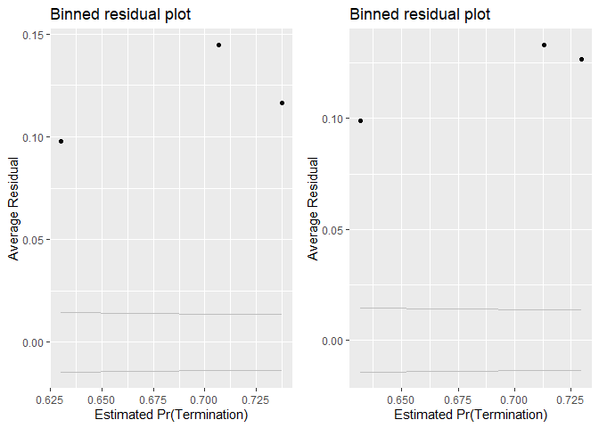<!-- -->

```
## [[1]]
##        model deviance null.deviance difference
## 1 model1_old 90891.31       91792.7   901.3916
## 2 model1_new 90781.88       91792.7  1010.8224
```

```r
summary_residual_compare(b_AllOpt_partnership_actions_16A_no_interact, b_AllOpt_partnership_actions_16A, bins=3)
```

<!-- -->

```
## Warning in residuals_binned(model1_old, bins = bins): Always uses Xlb
## Estimated Pr(Termination), should update.
```

```
## Warning in residuals_binned(model1_new, bins = bins): Always uses Xlb
## Estimated Pr(Termination), should update.
```

```
## Warning in if (class(model1_new) %in% c("glmerMod", "lme4")) {: the
## condition has length > 1 and only the first element will be used
```

```
## Warning in if (!class(model1_new) %in% c("glmerMod", "lme4") & !
## class(model1_old) %in% : the condition has length > 1 and only the first
## element will be used
```

<!-- -->

```
## [[1]]
##        model deviance null.deviance difference
## 1 model1_old 67945.04      71190.14   3245.100
## 2 model1_new 67639.56      71190.14   3550.576
```
The coefficients were negative and significant in both cases, contrary to expectations.

####16B: Cumulative

```r
#Create the model
b_SomeOpt_partnership_actions_16B <- glm(data=serv_opt,
                        b_SomeOpt ~  cln_US6sal + 
                   cln_PSCrate+ cp_OffPerf7+cp_OffPSC7+
                 cn_PairHist7+cln_PairCA+
                 cln_Base + clr_Ceil2Base + cln_Days+
                 Comp+
                   Veh+
                   Pricing+
                   Crisis+
                 cln_Def6HHI+clr_Def6toUS+
                 cln_Def3HHI+
                   clr_Def3toUS+
                 cp_PairObl7+
                   cln_OffObl7+ 
                 cln_OffFocus+

                 cp_OffPerf7:cln_PairCA, family=binomial(link="logit"))
glmer_examine(b_SomeOpt_partnership_actions_16B)
```

```
##                            GVIF Df GVIF^(1/(2*Df))
## cln_US6sal             2.074958  1        1.440472
## cln_PSCrate            1.558073  1        1.248228
## cp_OffPerf7            1.491637  1        1.221326
## cp_OffPSC7             2.218230  1        1.489372
## cn_PairHist7           1.678847  1        1.295703
## cln_PairCA             4.118133  1        2.029318
## cln_Base               1.745092  1        1.321019
## clr_Ceil2Base          1.505080  1        1.226817
## cln_Days               1.120113  1        1.058354
## Comp                   1.658005  3        1.087922
## Veh                    3.815651  4        1.182214
## Pricing                1.343908  6        1.024938
## Crisis                 1.589979  3        1.080352
## cln_Def6HHI            1.581950  1        1.257756
## clr_Def6toUS           1.642341  1        1.281538
## cln_Def3HHI            1.960542  1        1.400193
## clr_Def3toUS           2.220951  1        1.490285
## cp_PairObl7            1.938206  1        1.392195
## cln_OffObl7            1.238176  1        1.112734
## cln_OffFocus           1.724825  1        1.313326
## cp_OffPerf7:cln_PairCA 1.686027  1        1.298471
```

```r
b_AllOpt_partnership_actions_16B <- glm(data=serv_exeropt, family=binomial(link="logit"), b_AllOpt ~ cln_US6sal + 
                   cln_PSCrate+ cp_OffPerf7+cp_OffPSC7+
                 cn_PairHist7+cln_PairCA+
                 cln_Base + clr_Ceil2Base + cln_Days+
                 Comp+
                   Veh+
                   Pricing+
                   Crisis+
                 cln_Def6HHI+clr_Def6toUS+
                 cln_Def3HHI+
                   clr_Def3toUS+
                 cp_PairObl7+
                   cln_OffObl7+ 
                 cln_OffFocus+
                   cp_OffPerf7:cln_PairCA)
glmer_examine(b_AllOpt_partnership_actions_16B)
```

```
##                            GVIF Df GVIF^(1/(2*Df))
## cln_US6sal             2.171546  1        1.473616
## cln_PSCrate            1.520337  1        1.233019
## cp_OffPerf7            1.497578  1        1.223756
## cp_OffPSC7             1.598553  1        1.264339
## cn_PairHist7           1.511824  1        1.229563
## cln_PairCA             2.644208  1        1.626102
## cln_Base               1.553360  1        1.246339
## clr_Ceil2Base          1.184586  1        1.088387
## cln_Days               1.068065  1        1.033472
## Comp                   1.408365  3        1.058732
## Veh                    2.730517  4        1.133785
## Pricing                1.472371  6        1.032765
## Crisis                 1.256247  3        1.038754
## cln_Def6HHI            1.501068  1        1.225181
## clr_Def6toUS           1.491460  1        1.221254
## cln_Def3HHI            2.056865  1        1.434177
## clr_Def3toUS           2.084133  1        1.443653
## cp_PairObl7            1.556158  1        1.247461
## cln_OffObl7            1.184663  1        1.088422
## cln_OffFocus           1.304823  1        1.142288
## cp_OffPerf7:cln_PairCA 1.496982  1        1.223512
```

```r
#Compare the models
stargazer::stargazer(b_AllOpt12C, b_AllOpt_partnership_actions_16B, type="text", digits=2)
```

```
## 
## ========================================================
##                                 Dependent variable:     
##                             ----------------------------
##                                       b_AllOpt          
##                                  (1)            (2)     
## --------------------------------------------------------
## cln_US6sal                     -0.06**        -0.06**   
##                                 (0.02)        (0.02)    
##                                                         
## cln_PSCrate                    -0.13***      -0.13***   
##                                 (0.03)        (0.03)    
##                                                         
## cp_OffPerf7                    -0.09***      -0.13***   
##                                 (0.02)        (0.03)    
##                                                         
## cp_OffPSC7                     -0.35***      -0.33***   
##                                 (0.04)        (0.04)    
##                                                         
## cn_PairHist7                   0.21***        0.21***   
##                                 (0.02)        (0.02)    
##                                                         
## cln_PairCA                     -0.47***      -0.47***   
##                                 (0.04)        (0.04)    
##                                                         
## cln_Base                        -0.04         -0.04*    
##                                 (0.02)        (0.02)    
##                                                         
## clr_Ceil2Base                  -0.81***      -0.81***   
##                                 (0.02)        (0.02)    
##                                                         
## cln_Days                       -0.41***      -0.41***   
##                                 (0.04)        (0.04)    
##                                                         
## Comp1 offer                     -0.01          -0.01    
##                                 (0.03)        (0.03)    
##                                                         
## Comp2-4 offers                 -0.06**        -0.05**   
##                                 (0.03)        (0.03)    
##                                                         
## Comp5+ offers                  -0.20***      -0.19***   
##                                 (0.03)        (0.03)    
##                                                         
## VehS-IDC                       -0.50***      -0.49***   
##                                 (0.04)        (0.04)    
##                                                         
## VehM-IDC                       -0.11***      -0.11***   
##                                 (0.03)        (0.03)    
##                                                         
## VehFSS/GWAC                      0.05          0.04     
##                                 (0.03)        (0.03)    
##                                                         
## VehBPA/BOA                     -0.23***       -0.19**   
##                                 (0.08)        (0.09)    
##                                                         
## PricingOther FP                -0.84***      -0.85***   
##                                 (0.18)        (0.18)    
##                                                         
## PricingIncentive               0.92***        0.95***   
##                                 (0.24)        (0.24)    
##                                                         
## PricingCombination or Other      0.09          0.10     
##                                 (0.06)        (0.06)    
##                                                         
## PricingOther CB                0.74***        0.76***   
##                                 (0.05)        (0.05)    
##                                                         
## PricingT&M/LH/FPLOE              0.07          0.08     
##                                 (0.06)        (0.06)    
##                                                         
## PricingUCA                      0.32**        0.31**    
##                                 (0.12)        (0.12)    
##                                                         
## CrisisARRA                      -0.32          -0.32    
##                                 (0.21)        (0.21)    
##                                                         
## CrisisDis                      -1.40***      -1.39***   
##                                 (0.40)        (0.40)    
##                                                         
## CrisisOCO                      -0.40***      -0.42***   
##                                 (0.08)        (0.08)    
##                                                         
## cln_Def6HHI                     -0.02          -0.02    
##                                 (0.03)        (0.03)    
##                                                         
## clr_Def6toUS                     0.02          0.02     
##                                 (0.03)        (0.03)    
##                                                         
## cln_Def3HHI                    -0.10***      -0.10***   
##                                 (0.03)        (0.03)    
##                                                         
## clr_Def3toUS                   0.31***        0.31***   
##                                 (0.03)        (0.03)    
##                                                         
## cp_PairObl7                    -0.16***      -0.19***   
##                                 (0.04)        (0.04)    
##                                                         
## cln_OffObl7                      0.02          0.01     
##                                 (0.02)        (0.02)    
##                                                         
## cln_OffFocus                   -0.17***      -0.15***   
##                                 (0.03)        (0.03)    
##                                                         
## cp_OffPerf7:cln_PairCA                       -0.20***   
##                                               (0.05)    
##                                                         
## Constant                       1.25***        1.25***   
##                                 (0.04)        (0.04)    
##                                                         
## --------------------------------------------------------
## Observations                    51,357        51,357    
## Log Likelihood                -30,908.71    -30,902.18  
## Akaike Inf. Crit.             61,883.42      61,872.35  
## ========================================================
## Note:                        *p<0.1; **p<0.05; ***p<0.01
```

```r
summary_residual_compare(b_AllOpt12C, b_AllOpt_partnership_actions_16B,bins=50)
```

<!-- -->

```
## Warning in residuals_binned(model1_old, bins = bins): Always uses Xlb
## Estimated Pr(Termination), should update.
```

```
## Warning in residuals_binned(model1_new, bins = bins): Always uses Xlb
## Estimated Pr(Termination), should update.
```

```
## Warning in if (class(model1_new) %in% c("glmerMod", "lme4")) {: the
## condition has length > 1 and only the first element will be used
```

```
## Warning in if (!class(model1_new) %in% c("glmerMod", "lme4") & !
## class(model1_old) %in% : the condition has length > 1 and only the first
## element will be used
```

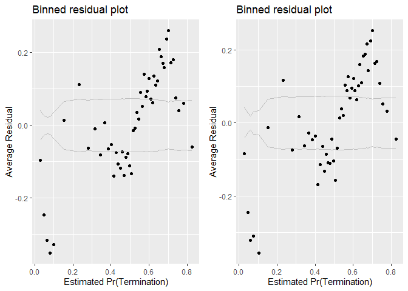<!-- -->

```
## [[1]]
##        model deviance null.deviance difference
## 1 model1_old 61817.42      71190.14   9372.713
## 2 model1_new 61804.35      71190.14   9385.784
```
For Some options the results violate the GVIF threshold and woudl require removing an input variable to address.

For all options rhe results remain contrary to expectations and do little for residuals. 
Leaving it out.

Current cumulative b_SomeOpt model: b_SomeOpt13A
Current cumulative b_AllOpt model: b_AllOpt12C

####17A: Office Partnership:Market Vendor Share for that Office
Performance based contracting is thought to mitigte some of the risks of vendor  lock.
(option,breach,termination)
Interact: Market Share Vendor for that Office	cp_OffPerf7: cp_PairObl7			++	--	--


```r
#Define the models

b_SomeOpt_partnership_share_17A_no_interact <- glm(data=serv_opt, b_SomeOpt ~ cp_OffPerf7 + cp_PairObl7, family=binomial(link="logit"))
glmer_examine(b_SomeOpt_partnership_share_17A_no_interact)
```

```
## cp_OffPerf7 cp_PairObl7 
##     1.01747     1.01747
```

```r
b_SomeOpt_partnership_share_17A <- glm(data=serv_opt, b_SomeOpt ~ cp_OffPerf7 + cp_PairObl7 + cp_OffPerf7:cp_PairObl7, family=binomial(link="logit"))
glmer_examine(b_SomeOpt_partnership_share_17A)
```

```
##             cp_OffPerf7             cp_PairObl7 cp_OffPerf7:cp_PairObl7 
##                1.042539                1.709006                1.694903
```

```r
b_AllOpt_partnership_share_17A_no_interact <- glm(data=serv_exeropt, family=binomial(link="logit"), b_AllOpt ~ cp_OffPerf7 + cp_PairObl7)
glmer_examine(b_AllOpt_partnership_share_17A_no_interact)
```

```
## cp_OffPerf7 cp_PairObl7 
##    1.000234    1.000234
```

```r
b_AllOpt_partnership_share_17A <- glm(data=serv_exeropt, family=binomial(link="logit"), b_AllOpt ~ cp_OffPerf7 + cp_PairObl7 + cp_OffPerf7:cp_PairObl7)
glmer_examine(b_AllOpt_partnership_share_17A)
```

```
##             cp_OffPerf7             cp_PairObl7 cp_OffPerf7:cp_PairObl7 
##                1.067483                1.220304                1.284940
```

```r
#Compare the models
stargazer::stargazer(b_SomeOpt_partnership_share_17A_no_interact, b_SomeOpt_partnership_share_17A, 
                     b_AllOpt_partnership_share_17A_no_interact, b_AllOpt_partnership_share_17A, type="text", digits=2)
```

```
## 
## ===================================================================
##                                     Dependent variable:            
##                         -------------------------------------------
##                               b_SomeOpt             b_AllOpt       
##                            (1)        (2)        (3)        (4)    
## -------------------------------------------------------------------
## cp_OffPerf7              -0.40***   -0.37***   -0.29***   -0.28*** 
##                           (0.02)     (0.02)     (0.02)     (0.02)  
##                                                                    
## cp_PairObl7              -0.80***   -0.57***   -0.27***   -0.24*** 
##                           (0.02)     (0.03)     (0.03)     (0.04)  
##                                                                    
## cp_OffPerf7:cp_PairObl7             0.65***                0.12*   
##                                      (0.05)                (0.07)  
##                                                                    
## Constant                 0.80***    0.82***    -0.05***   -0.04*** 
##                           (0.01)     (0.01)     (0.01)     (0.01)  
##                                                                    
## -------------------------------------------------------------------
## Observations              74,274     74,274     51,357     51,357  
## Log Likelihood          -44,675.09 -44,585.93 -35,458.18 -35,456.77
## Akaike Inf. Crit.       89,356.19  89,179.86  70,922.36  70,921.55 
## ===================================================================
## Note:                                   *p<0.1; **p<0.05; ***p<0.01
```

```r
summary_residual_compare(b_SomeOpt_partnership_share_17A_no_interact, b_SomeOpt_partnership_share_17A,
                         b_AllOpt_partnership_share_17A_no_interact, b_AllOpt_partnership_share_17A,bins=50)
```

<!-- -->

```
## Warning in min(x): no non-missing arguments to min; returning Inf
```

```
## Warning in max(x): no non-missing arguments to max; returning -Inf
```

```
## Warning in residuals_binned(model1_old, bins = bins): Always uses Xlb
## Estimated Pr(Termination), should update.
```

```
## Warning in min(x): no non-missing arguments to min; returning Inf
```

```
## Warning in max(x): no non-missing arguments to max; returning -Inf
```

```
## Warning in residuals_binned(model1_new, bins = bins): Always uses Xlb
## Estimated Pr(Termination), should update.
```

```
## Warning in min(x): no non-missing arguments to min; returning Inf
```

```
## Warning in max(x): no non-missing arguments to max; returning -Inf
```

```
## Warning in residuals_binned(model2_old, bins = bins): Always uses Xlb
## Estimated Pr(Termination), should update.
```

```
## Warning in min(x): no non-missing arguments to min; returning Inf
```

```
## Warning in max(x): no non-missing arguments to max; returning -Inf
```

```
## Warning in residuals_binned(model2_new, bins = bins): Always uses Xlb
## Estimated Pr(Termination), should update.
```

```
## Warning: Removed 1 rows containing missing values (geom_point).
```

```
## Warning: Removed 1 rows containing missing values (geom_path).

## Warning: Removed 1 rows containing missing values (geom_path).
```

```
## Warning: Removed 1 rows containing missing values (geom_point).
```

```
## Warning: Removed 1 rows containing missing values (geom_path).

## Warning: Removed 1 rows containing missing values (geom_path).
```

```
## Warning: Removed 1 rows containing missing values (geom_point).
```

```
## Warning: Removed 1 rows containing missing values (geom_path).

## Warning: Removed 1 rows containing missing values (geom_path).
```

```
## Warning: Removed 1 rows containing missing values (geom_point).
```

```
## Warning: Removed 1 rows containing missing values (geom_path).

## Warning: Removed 1 rows containing missing values (geom_path).
```

```
## Warning in if (class(model1_new) %in% c("glmerMod", "lme4") &
## class(model2_new) %in% : the condition has length > 1 and only the first
## element will be used
```

```
## Warning in if ((!class(model1_new) %in% c("glmerMod", "lme4") & !
## class(model2_new) %in% : the condition has length > 1 and only the first
## element will be used
```

<!-- -->

```
## [[1]]
##        model deviance null.deviance difference
## 1 model1_old 89350.19      91792.70  2442.5138
## 2 model1_new 89171.86      91792.70  2620.8464
## 3 model2_old 70916.36      71190.14   273.7769
## 4 model2_new 70913.55      71190.14   276.5871
```
Positive, in line with expectations although only significant at the p<0.05 level for some options.

####17B: Cumulative

```r
#Create the model
b_SomeOpt_partnership_share_17B <- glm(data=serv_opt,
                        b_SomeOpt ~  cln_US6sal + 
                   cln_PSCrate+ cp_OffPerf7+cp_OffPSC7+
                 cn_PairHist7+#cln_PairCA+
                 cln_Base + clr_Ceil2Base + cln_Days+
                 Comp+
                   Veh+
                   Pricing+
                   Crisis+
                 cln_Def6HHI+clr_Def6toUS+
                 cln_Def3HHI+
                   clr_Def3toUS+
                 cp_PairObl7+
                   cln_OffObl7+ 
                 cln_OffFocus+
                 cp_OffPerf7:cp_PairObl7, family=binomial(link="logit"))
glmer_examine(b_SomeOpt_partnership_share_17B)
```

```
##                             GVIF Df GVIF^(1/(2*Df))
## cln_US6sal              2.072371  1        1.439573
## cln_PSCrate             1.555488  1        1.247192
## cp_OffPerf7             1.372406  1        1.171497
## cp_OffPSC7              1.978195  1        1.406483
## cn_PairHist7            1.403960  1        1.184888
## cln_Base                1.711721  1        1.308328
## clr_Ceil2Base           1.472093  1        1.213298
## cln_Days                1.118093  1        1.057399
## Comp                    1.662662  3        1.088430
## Veh                     3.163754  4        1.154849
## Pricing                 1.331067  6        1.024118
## Crisis                  1.535495  3        1.074092
## cln_Def6HHI             1.576587  1        1.255622
## clr_Def6toUS            1.644863  1        1.282522
## cln_Def3HHI             1.960890  1        1.400318
## clr_Def3toUS            2.190559  1        1.480054
## cp_PairObl7             2.258942  1        1.502978
## cln_OffObl7             1.238813  1        1.113020
## cln_OffFocus            1.571589  1        1.253630
## cp_OffPerf7:cp_PairObl7 1.901789  1        1.379054
```

```r
b_AllOpt_partnership_share_17B <- glm(data=serv_exeropt, family=binomial(link="logit"), b_AllOpt ~ cln_US6sal + 
                   cln_PSCrate+ cp_OffPerf7+cp_OffPSC7+
                 cn_PairHist7+cln_PairCA+
                 cln_Base + clr_Ceil2Base + cln_Days+
                 Comp+
                   Veh+
                   Pricing+
                   Crisis+
                 cln_Def6HHI+clr_Def6toUS+
                 cln_Def3HHI+
                   clr_Def3toUS+
                 cp_PairObl7+
                   cln_OffObl7+ 
                 cln_OffFocus+
                   cp_OffPerf7:cp_PairObl7)
glmer_examine(b_AllOpt_partnership_share_17B)
```

```
##                             GVIF Df GVIF^(1/(2*Df))
## cln_US6sal              2.170311  1        1.473198
## cln_PSCrate             1.521628  1        1.233543
## cp_OffPerf7             1.239617  1        1.113381
## cp_OffPSC7              1.605394  1        1.267042
## cn_PairHist7            1.512435  1        1.229811
## cln_PairCA              2.654898  1        1.629386
## cln_Base                1.541443  1        1.241549
## clr_Ceil2Base           1.182140  1        1.087263
## cln_Days                1.069569  1        1.034200
## Comp                    1.411694  3        1.059148
## Veh                     2.695659  4        1.131965
## Pricing                 1.456719  6        1.031845
## Crisis                  1.270303  3        1.040682
## cln_Def6HHI             1.498203  1        1.224011
## clr_Def6toUS            1.486952  1        1.219407
## cln_Def3HHI             2.057682  1        1.434462
## clr_Def3toUS            2.069462  1        1.438562
## cp_PairObl7             1.698677  1        1.303333
## cln_OffObl7             1.177930  1        1.085325
## cln_OffFocus            1.280657  1        1.131661
## cp_OffPerf7:cp_PairObl7 1.360603  1        1.166449
```

```r
#Compare the models
stargazer::stargazer(b_SomeOpt13A, b_SomeOpt_partnership_share_17B, 
                     b_AllOpt12C, b_AllOpt_partnership_share_17B, type="text", digits=2)
```

```
## 
## =======================================================================
##                                         Dependent variable:            
##                             -------------------------------------------
##                                   b_SomeOpt             b_AllOpt       
##                                (1)        (2)        (3)        (4)    
## -----------------------------------------------------------------------
## cln_US6sal                     0.02       0.03     -0.06**    -0.06**  
##                               (0.02)     (0.02)     (0.02)     (0.02)  
##                                                                        
## cln_PSCrate                  -0.19***   -0.19***   -0.13***   -0.13*** 
##                               (0.02)     (0.02)     (0.03)     (0.03)  
##                                                                        
## cp_OffPerf7                  -0.18***   -0.16***   -0.09***   -0.07*** 
##                               (0.02)     (0.02)     (0.02)     (0.02)  
##                                                                        
## cp_OffPSC7                   0.58***    0.56***    -0.35***   -0.35*** 
##                               (0.03)     (0.03)     (0.04)     (0.04)  
##                                                                        
## cn_PairHist7                 0.29***    0.28***    0.21***    0.20***  
##                               (0.02)     (0.02)     (0.02)     (0.02)  
##                                                                        
## cln_PairCA                                         -0.47***   -0.47*** 
##                                                     (0.04)     (0.04)  
##                                                                        
## cln_Base                     0.43***    0.42***     -0.04      -0.04   
##                               (0.02)     (0.02)     (0.02)     (0.02)  
##                                                                        
## clr_Ceil2Base                0.44***    0.44***    -0.81***   -0.81*** 
##                               (0.01)     (0.01)     (0.02)     (0.02)  
##                                                                        
## cln_Days                     0.64***    0.63***    -0.41***   -0.41*** 
##                               (0.03)     (0.03)     (0.04)     (0.04)  
##                                                                        
## Comp1 offer                   -0.02      -0.02      -0.01      -0.01   
##                               (0.03)     (0.03)     (0.03)     (0.03)  
##                                                                        
## Comp2-4 offers                -0.03      -0.03     -0.06**    -0.06**  
##                               (0.02)     (0.02)     (0.03)     (0.03)  
##                                                                        
## Comp5+ offers                  0.03       0.03     -0.20***   -0.19*** 
##                               (0.03)     (0.03)     (0.03)     (0.03)  
##                                                                        
## VehS-IDC                     -0.65***   -0.66***   -0.50***   -0.50*** 
##                               (0.03)     (0.03)     (0.04)     (0.04)  
##                                                                        
## VehM-IDC                     -0.18***   -0.18***   -0.11***   -0.11*** 
##                               (0.03)     (0.03)     (0.03)     (0.03)  
##                                                                        
## VehFSS/GWAC                   -0.01      -0.01       0.05       0.05   
##                               (0.03)     (0.03)     (0.03)     (0.03)  
##                                                                        
## VehBPA/BOA                   -1.93***   -1.94***   -0.23***   -0.24*** 
##                               (0.05)     (0.05)     (0.08)     (0.08)  
##                                                                        
## PricingOther FP              -0.63***   -0.64***   -0.84***   -0.84*** 
##                               (0.13)     (0.13)     (0.18)     (0.18)  
##                                                                        
## PricingT&M/LH/FPLOE            0.09       0.09       0.07       0.07   
##                               (0.06)     (0.06)     (0.06)     (0.06)  
##                                                                        
## PricingIncentive               0.28       0.26     0.92***    0.91***  
##                               (0.25)     (0.25)     (0.24)     (0.24)  
##                                                                        
## PricingOther CB              0.33***    0.32***    0.74***    0.74***  
##                               (0.05)     (0.05)     (0.05)     (0.05)  
##                                                                        
## PricingUCA                     0.04       0.04      0.32**    0.32***  
##                               (0.11)     (0.11)     (0.12)     (0.12)  
##                                                                        
## PricingCombination or Other  0.61***    0.61***      0.09       0.09   
##                               (0.07)     (0.07)     (0.06)     (0.06)  
##                                                                        
## CrisisARRA                   -0.47***   -0.47***    -0.32      -0.33   
##                               (0.16)     (0.16)     (0.21)     (0.21)  
##                                                                        
## CrisisDis                     -0.36      -0.36     -1.40***   -1.40*** 
##                               (0.30)     (0.30)     (0.40)     (0.40)  
##                                                                        
## CrisisOCO                    -0.89***   -0.84***   -0.40***   -0.37*** 
##                               (0.05)     (0.06)     (0.08)     (0.08)  
##                                                                        
## cln_Def6HHI                   -0.01      -0.01      -0.02      -0.02   
##                               (0.02)     (0.02)     (0.03)     (0.03)  
##                                                                        
## clr_Def6toUS                  -0.05*    -0.06**      0.02       0.02   
##                               (0.03)     (0.03)     (0.03)     (0.03)  
##                                                                        
## cln_Def3HHI                  0.20***    0.19***    -0.10***   -0.10*** 
##                               (0.03)     (0.03)     (0.03)     (0.03)  
##                                                                        
## clr_Def3toUS                 0.17***    0.16***    0.31***    0.31***  
##                               (0.03)     (0.03)     (0.03)     (0.03)  
##                                                                        
## cp_PairObl7                  -0.46***   -0.37***   -0.16***   -0.12*** 
##                               (0.03)     (0.03)     (0.04)     (0.05)  
##                                                                        
## cln_OffObl7                    0.01       0.02       0.02       0.02   
##                               (0.02)     (0.02)     (0.02)     (0.02)  
##                                                                        
## cln_OffFocus                 -0.57***   -0.58***   -0.17***   -0.17*** 
##                               (0.02)     (0.02)     (0.03)     (0.03)  
##                                                                        
## cp_OffPerf7:cp_PairObl7                 0.28***                0.18**  
##                                          (0.06)                (0.08)  
##                                                                        
## Constant                     0.27***    0.28***    1.25***    1.25***  
##                               (0.03)     (0.03)     (0.04)     (0.04)  
##                                                                        
## -----------------------------------------------------------------------
## Observations                  74,274     74,274     51,357     51,357  
## Log Likelihood              -40,554.40 -40,541.30 -30,908.71 -30,905.93
## Akaike Inf. Crit.           81,172.80  81,148.61  61,883.42  61,879.85 
## =======================================================================
## Note:                                       *p<0.1; **p<0.05; ***p<0.01
```

```r
summary_residual_compare(b_SomeOpt13A, b_SomeOpt_partnership_share_17B,
                         b_AllOpt12C, b_AllOpt_partnership_share_17B,bins=50)
```

<!-- -->

```
## Warning in residuals_binned(model1_old, bins = bins): Always uses Xlb
## Estimated Pr(Termination), should update.
```

```
## Warning in residuals_binned(model1_new, bins = bins): Always uses Xlb
## Estimated Pr(Termination), should update.
```

```
## Warning in residuals_binned(model2_old, bins = bins): Always uses Xlb
## Estimated Pr(Termination), should update.
```

```
## Warning in residuals_binned(model2_new, bins = bins): Always uses Xlb
## Estimated Pr(Termination), should update.
```

```
## Warning in if (class(model1_new) %in% c("glmerMod", "lme4") &
## class(model2_new) %in% : the condition has length > 1 and only the first
## element will be used
```

```
## Warning in if ((!class(model1_new) %in% c("glmerMod", "lme4") & !
## class(model2_new) %in% : the condition has length > 1 and only the first
## element will be used
```

<!-- -->

```
## [[1]]
##        model deviance null.deviance difference
## 1 model1_old 81108.80      91792.70  10683.904
## 2 model1_new 81082.61      91792.70  10710.096
## 3 model2_old 61817.42      71190.14   9372.713
## 4 model2_new 61811.85      71190.14   9378.284
```
Only a small improvement in AIC but significant in both cases and in line with expectation, doesn't make VIF worse. Keeping.

Current cumulative b_SomeOpt model: b_SomeOpt_partnership_share_17B
Current cumulative b_AllOpt model: b_AllOpt_partnership_share_17B


####17C: Office Volume:Market Vendor Share for that Office
A small office heavily reliant on a single vendor may just be practical consolidation of contract. For a large office, said primacy is more noteworthy and may indicate vendor lock-in. In keeping with p_Market as a whole this may mean more options exercised both in the SomeOpt and AllOpt models for lock-in reasons.  cp_OffObl7 is expected to have a positive relationship with both SomeOpt and AllOpt, while cp_PairObl7 is expected to have a positive relationship with SomeOpt and a negative relationship with AllOpt.

(option,breach,termination)
Interact: Office Volume cln_OffObl7: cp_PairObl7		+	+	-


```r
#Define the models


b_SomeOpt17C_no_interact <- glm(data=serv_opt, b_SomeOpt ~ cln_OffObl7 + cp_PairObl7, family=binomial(link="logit"))
glmer_examine(b_SomeOpt17C_no_interact)
```

```
## cln_OffObl7 cp_PairObl7 
##    1.003016    1.003016
```

```r
b_SomeOpt17C <- glm(data=serv_opt, b_SomeOpt ~ cln_OffObl7 + cp_PairObl7 + cln_OffObl7:cp_PairObl7, family=binomial(link="logit"))
glmer_examine(b_SomeOpt17C)
```

```
##             cln_OffObl7             cp_PairObl7 cln_OffObl7:cp_PairObl7 
##                1.276006                1.178250                1.429390
```

```r
b_AllOpt17C_no_interact <- glm(data=serv_exeropt, family=binomial(link="logit"), b_AllOpt ~ cln_OffObl7 + cp_PairObl7)
glmer_examine(b_AllOpt17C_no_interact)
```

```
## cln_OffObl7 cp_PairObl7 
##    1.000357    1.000357
```

```r
b_AllOpt17C <- glm(data=serv_exeropt, family=binomial(link="logit"), b_AllOpt ~ cln_OffObl7 + cp_PairObl7 + cln_OffObl7:cp_PairObl7)
glmer_examine(b_AllOpt17C)
```

```
##             cln_OffObl7             cp_PairObl7 cln_OffObl7:cp_PairObl7 
##                1.715896                1.283570                1.978446
```

```r
#Compare the models
stargazer::stargazer(b_SomeOpt17C_no_interact, b_SomeOpt17C, 
                     b_AllOpt17C_no_interact, b_AllOpt17C, type="text", digits=2)
```

```
## 
## ===================================================================
##                                     Dependent variable:            
##                         -------------------------------------------
##                               b_SomeOpt             b_AllOpt       
##                            (1)        (2)        (3)        (4)    
## -------------------------------------------------------------------
## cln_OffObl7               0.04**    0.07***    -0.18***   -0.24*** 
##                           (0.01)     (0.02)     (0.02)     (0.02)  
##                                                                    
## cp_PairObl7              -0.74***   -0.71***   -0.27***   -0.33*** 
##                           (0.02)     (0.02)     (0.03)     (0.04)  
##                                                                    
## cln_OffObl7:cp_PairObl7             0.27***               -0.43*** 
##                                      (0.07)                (0.11)  
##                                                                    
## Constant                 0.78***    0.79***    -0.03***   -0.04*** 
##                           (0.01)     (0.01)     (0.01)     (0.01)  
##                                                                    
## -------------------------------------------------------------------
## Observations              74,274     74,274     51,357     51,357  
## Log Likelihood          -44,945.54 -44,936.43 -35,505.76 -35,498.27
## Akaike Inf. Crit.       89,897.08  89,880.86  71,017.53  71,004.53 
## ===================================================================
## Note:                                   *p<0.1; **p<0.05; ***p<0.01
```

```r
summary_residual_compare(b_SomeOpt17C_no_interact, b_SomeOpt17C)
```

<!-- -->

```
## Warning in residuals_binned(model1_old, bins = bins): Always uses Xlb
## Estimated Pr(Termination), should update.
```

```
## Warning in residuals_binned(model1_new, bins = bins): Always uses Xlb
## Estimated Pr(Termination), should update.
```

```
## Warning in if (class(model1_new) %in% c("glmerMod", "lme4")) {: the
## condition has length > 1 and only the first element will be used
```

```
## Warning in if (!class(model1_new) %in% c("glmerMod", "lme4") & !
## class(model1_old) %in% : the condition has length > 1 and only the first
## element will be used
```

<!-- -->

```
## [[1]]
##        model deviance null.deviance difference
## 1 model1_old 89891.08       91792.7   1901.622
## 2 model1_new 89872.86       91792.7   1919.842
```

```r
summary_residual_compare(b_AllOpt17C_no_interact, b_AllOpt17C, bins = 50)
```

<!-- -->

```
## Warning in residuals_binned(model1_old, bins = bins): Always uses Xlb
## Estimated Pr(Termination), should update.
```

```
## Warning in residuals_binned(model1_new, bins = bins): Always uses Xlb
## Estimated Pr(Termination), should update.
```

```
## Warning in if (class(model1_new) %in% c("glmerMod", "lme4")) {: the
## condition has length > 1 and only the first element will be used
```

```
## Warning in if (!class(model1_new) %in% c("glmerMod", "lme4") & !
## class(model1_old) %in% : the condition has length > 1 and only the first
## element will be used
```

<!-- -->

```
## [[1]]
##        model deviance null.deviance difference
## 1 model1_old 71011.53      71190.14   178.6072
## 2 model1_new 70996.53      71190.14   193.6037
```
SomeOpt:
In model w/ no interactions, only cln_OffObl7 meets expectations.  In model with interactions, both cln_OffObl7 and the interaction term meet expectations.
AllOpt: cp_PairObl7 meets expectations in model with and without interactions.  No other variable meets expectations in either model.


####17D: Cumulative

```r
#Create the model
b_SomeOpt17D <- glm(data=serv_opt,
                        b_SomeOpt ~  cln_US6sal + 
                   cln_PSCrate+ cp_OffPerf7+cp_OffPSC7+
                 cn_PairHist7+#cln_PairCA+
                 cln_Base + clr_Ceil2Base + cln_Days+
                 Comp+
                   Veh+
                   Pricing+
                   Crisis+
                 cln_Def6HHI+clr_Def6toUS+
                 cln_Def3HHI+
                   clr_Def3toUS+
                 cp_PairObl7+
                   cln_OffObl7+ 
                 cln_OffFocus+
                 
                   cp_OffPerf7:cp_PairObl7+cln_OffObl7:cp_PairObl7, family=binomial(link="logit"))
glmer_examine(b_SomeOpt17D)
```

```
##                             GVIF Df GVIF^(1/(2*Df))
## cln_US6sal              2.073625  1        1.440009
## cln_PSCrate             1.555798  1        1.247316
## cp_OffPerf7             1.373039  1        1.171767
## cp_OffPSC7              1.979439  1        1.406925
## cn_PairHist7            1.419077  1        1.191250
## cln_Base                1.712280  1        1.308541
## clr_Ceil2Base           1.471955  1        1.213241
## cln_Days                1.119268  1        1.057955
## Comp                    1.668466  3        1.089063
## Veh                     3.165140  4        1.154913
## Pricing                 1.332764  6        1.024227
## Crisis                  1.553182  3        1.076144
## cln_Def6HHI             1.577219  1        1.255874
## clr_Def6toUS            1.650386  1        1.284673
## cln_Def3HHI             1.970296  1        1.403672
## clr_Def3toUS            2.202859  1        1.484203
## cp_PairObl7             2.516744  1        1.586425
## cln_OffObl7             1.569821  1        1.252925
## cln_OffFocus            1.570825  1        1.253325
## cp_OffPerf7:cp_PairObl7 1.920787  1        1.385925
## cp_PairObl7:cln_OffObl7 1.540334  1        1.241102
```

```r
b_AllOpt17D <- glm(data=serv_exeropt, family=binomial(link="logit"), b_AllOpt ~ cln_US6sal + 
                   cln_PSCrate+ cp_OffPerf7+cp_OffPSC7+
                 cn_PairHist7+cln_PairCA+
                 cln_Base + clr_Ceil2Base + cln_Days+
                 Comp+
                   Veh+
                   Pricing+
                   Crisis+
                 cln_Def6HHI+clr_Def6toUS+
                 cln_Def3HHI+
                   clr_Def3toUS+
                 cp_PairObl7+
                   cln_OffObl7+ 
                 cln_OffFocus+
                 cp_OffPerf7:cp_PairObl7+
                   
                   cln_OffObl7:cp_PairObl7)
glmer_examine(b_AllOpt17D)
```

```
##                             GVIF Df GVIF^(1/(2*Df))
## cln_US6sal              2.170397  1        1.473227
## cln_PSCrate             1.521612  1        1.233536
## cp_OffPerf7             1.242674  1        1.114753
## cp_OffPSC7              1.605552  1        1.267104
## cn_PairHist7            1.517531  1        1.231881
## cln_PairCA              2.674885  1        1.635508
## cln_Base                1.548152  1        1.244248
## clr_Ceil2Base           1.183072  1        1.087691
## cln_Days                1.069735  1        1.034280
## Comp                    1.413844  3        1.059417
## Veh                     2.702593  4        1.132329
## Pricing                 1.459594  6        1.032015
## Crisis                  1.271748  3        1.040879
## cln_Def6HHI             1.499312  1        1.224464
## clr_Def6toUS            1.487496  1        1.219629
## cln_Def3HHI             2.068092  1        1.438086
## clr_Def3toUS            2.076427  1        1.440981
## cp_PairObl7             1.961178  1        1.400421
## cln_OffObl7             2.261621  1        1.503869
## cln_OffFocus            1.281008  1        1.131816
## cp_OffPerf7:cp_PairObl7 1.395494  1        1.181310
## cp_PairObl7:cln_OffObl7 2.278915  1        1.509607
```

```r
b_AllOpt17D2 <- glm(data=serv_exeropt, family=binomial(link="logit"), b_AllOpt ~ cln_US6sal + 
                   cln_PSCrate+ cp_OffPerf7+cp_OffPSC7+
                 cn_PairHist7+cln_PairCA+
                 cln_Base + clr_Ceil2Base + cln_Days+
                 Comp+
                   Veh+
                   Pricing+
                   Crisis+
                 cln_Def6HHI+clr_Def6toUS+
                 cln_Def3HHI+
                   clr_Def3toUS+
                 cp_PairObl7+
                   cln_OffObl7+ 
                 cln_OffFocus+
                 cp_OffPerf7:cp_PairObl7+
                   # 
                   cln_OffObl7:cp_PairObl7)
glmer_examine(b_AllOpt17D2)
```

```
##                             GVIF Df GVIF^(1/(2*Df))
## cln_US6sal              2.170397  1        1.473227
## cln_PSCrate             1.521612  1        1.233536
## cp_OffPerf7             1.242674  1        1.114753
## cp_OffPSC7              1.605552  1        1.267104
## cn_PairHist7            1.517531  1        1.231881
## cln_PairCA              2.674885  1        1.635508
## cln_Base                1.548152  1        1.244248
## clr_Ceil2Base           1.183072  1        1.087691
## cln_Days                1.069735  1        1.034280
## Comp                    1.413844  3        1.059417
## Veh                     2.702593  4        1.132329
## Pricing                 1.459594  6        1.032015
## Crisis                  1.271748  3        1.040879
## cln_Def6HHI             1.499312  1        1.224464
## clr_Def6toUS            1.487496  1        1.219629
## cln_Def3HHI             2.068092  1        1.438086
## clr_Def3toUS            2.076427  1        1.440981
## cp_PairObl7             1.961178  1        1.400421
## cln_OffObl7             2.261621  1        1.503869
## cln_OffFocus            1.281008  1        1.131816
## cp_OffPerf7:cp_PairObl7 1.395494  1        1.181310
## cp_PairObl7:cln_OffObl7 2.278915  1        1.509607
```

```r
#Compare the models
stargazer::stargazer(b_SomeOpt_partnership_share_17B, b_SomeOpt17D,
                     b_AllOpt_partnership_share_17B, b_AllOpt17D, type="text", digits=2)
```

```
## 
## =======================================================================
##                                         Dependent variable:            
##                             -------------------------------------------
##                                   b_SomeOpt             b_AllOpt       
##                                (1)        (2)        (3)        (4)    
## -----------------------------------------------------------------------
## cln_US6sal                     0.03       0.03     -0.06**    -0.06**  
##                               (0.02)     (0.02)     (0.02)     (0.02)  
##                                                                        
## cln_PSCrate                  -0.19***   -0.19***   -0.13***   -0.13*** 
##                               (0.02)     (0.02)     (0.03)     (0.03)  
##                                                                        
## cp_OffPerf7                  -0.16***   -0.16***   -0.07***   -0.07*** 
##                               (0.02)     (0.02)     (0.02)     (0.02)  
##                                                                        
## cp_OffPSC7                   0.56***    0.57***    -0.35***   -0.35*** 
##                               (0.03)     (0.03)     (0.04)     (0.04)  
##                                                                        
## cn_PairHist7                 0.28***    0.28***    0.20***    0.20***  
##                               (0.02)     (0.02)     (0.02)     (0.02)  
##                                                                        
## cln_PairCA                                         -0.47***   -0.47*** 
##                                                     (0.04)     (0.04)  
##                                                                        
## cln_Base                     0.42***    0.42***     -0.04      -0.04   
##                               (0.02)     (0.02)     (0.02)     (0.02)  
##                                                                        
## clr_Ceil2Base                0.44***    0.44***    -0.81***   -0.81*** 
##                               (0.01)     (0.01)     (0.02)     (0.02)  
##                                                                        
## cln_Days                     0.63***    0.63***    -0.41***   -0.41*** 
##                               (0.03)     (0.03)     (0.04)     (0.04)  
##                                                                        
## Comp1 offer                   -0.02      -0.02      -0.01      -0.01   
##                               (0.03)     (0.03)     (0.03)     (0.03)  
##                                                                        
## Comp2-4 offers                -0.03      -0.03     -0.06**    -0.06**  
##                               (0.02)     (0.02)     (0.03)     (0.03)  
##                                                                        
## Comp5+ offers                  0.03       0.03     -0.19***   -0.19*** 
##                               (0.03)     (0.03)     (0.03)     (0.03)  
##                                                                        
## VehS-IDC                     -0.66***   -0.67***   -0.50***   -0.50*** 
##                               (0.03)     (0.03)     (0.04)     (0.04)  
##                                                                        
## VehM-IDC                     -0.18***   -0.18***   -0.11***   -0.11*** 
##                               (0.03)     (0.03)     (0.03)     (0.03)  
##                                                                        
## VehFSS/GWAC                   -0.01      -0.01       0.05       0.05   
##                               (0.03)     (0.03)     (0.03)     (0.03)  
##                                                                        
## VehBPA/BOA                   -1.94***   -1.94***   -0.24***   -0.24*** 
##                               (0.05)     (0.05)     (0.08)     (0.08)  
##                                                                        
## PricingOther FP              -0.64***   -0.65***   -0.84***   -0.84*** 
##                               (0.13)     (0.13)     (0.18)     (0.18)  
##                                                                        
## PricingT&M/LH/FPLOE            0.09       0.09       0.07       0.07   
##                               (0.06)     (0.06)     (0.06)     (0.06)  
##                                                                        
## PricingIncentive               0.26       0.25     0.91***    0.91***  
##                               (0.25)     (0.25)     (0.24)     (0.24)  
##                                                                        
## PricingOther CB              0.32***    0.32***    0.74***    0.74***  
##                               (0.05)     (0.05)     (0.05)     (0.05)  
##                                                                        
## PricingUCA                     0.04       0.04     0.32***    0.32***  
##                               (0.11)     (0.11)     (0.12)     (0.12)  
##                                                                        
## PricingCombination or Other  0.61***    0.60***      0.09       0.09   
##                               (0.07)     (0.07)     (0.06)     (0.06)  
##                                                                        
## CrisisARRA                   -0.47***   -0.47***    -0.33      -0.33   
##                               (0.16)     (0.16)     (0.21)     (0.21)  
##                                                                        
## CrisisDis                     -0.36      -0.36     -1.40***   -1.40*** 
##                               (0.30)     (0.30)     (0.40)     (0.40)  
##                                                                        
## CrisisOCO                    -0.84***   -0.85***   -0.37***   -0.37*** 
##                               (0.06)     (0.06)     (0.08)     (0.08)  
##                                                                        
## cln_Def6HHI                   -0.01      -0.01      -0.02      -0.02   
##                               (0.02)     (0.02)     (0.03)     (0.03)  
##                                                                        
## clr_Def6toUS                 -0.06**    -0.06**      0.02       0.02   
##                               (0.03)     (0.03)     (0.03)     (0.03)  
##                                                                        
## cln_Def3HHI                  0.19***    0.19***    -0.10***   -0.10*** 
##                               (0.03)     (0.03)     (0.03)     (0.03)  
##                                                                        
## clr_Def3toUS                 0.16***    0.15***    0.31***    0.31***  
##                               (0.03)     (0.03)     (0.03)     (0.03)  
##                                                                        
## cp_PairObl7                  -0.37***   -0.33***   -0.12***   -0.12**  
##                               (0.03)     (0.03)     (0.05)     (0.05)  
##                                                                        
## cln_OffObl7                    0.02      0.05**      0.02       0.03   
##                               (0.02)     (0.02)     (0.02)     (0.03)  
##                                                                        
## cln_OffFocus                 -0.58***   -0.58***   -0.17***   -0.17*** 
##                               (0.02)     (0.02)     (0.03)     (0.03)  
##                                                                        
## cp_OffPerf7:cp_PairObl7      0.28***    0.26***     0.18**     0.18**  
##                               (0.06)     (0.06)     (0.08)     (0.08)  
##                                                                        
## cp_PairObl7:cln_OffObl7                 0.25***                 0.03   
##                                          (0.07)                (0.13)  
##                                                                        
## Constant                     0.28***    0.29***    1.25***    1.25***  
##                               (0.03)     (0.03)     (0.04)     (0.04)  
##                                                                        
## -----------------------------------------------------------------------
## Observations                  74,274     74,274     51,357     51,357  
## Log Likelihood              -40,541.30 -40,534.79 -30,905.93 -30,905.90
## Akaike Inf. Crit.           81,148.61  81,137.59  61,879.85  61,881.80 
## =======================================================================
## Note:                                       *p<0.1; **p<0.05; ***p<0.01
```

```r
summary_residual_compare(b_SomeOpt_partnership_share_17B, b_SomeOpt17D, bins = 50)
```

<!-- -->

```
## Warning in residuals_binned(model1_old, bins = bins): Always uses Xlb
## Estimated Pr(Termination), should update.
```

```
## Warning in residuals_binned(model1_new, bins = bins): Always uses Xlb
## Estimated Pr(Termination), should update.
```

```
## Warning in if (class(model1_new) %in% c("glmerMod", "lme4")) {: the
## condition has length > 1 and only the first element will be used
```

```
## Warning in if (!class(model1_new) %in% c("glmerMod", "lme4") & !
## class(model1_old) %in% : the condition has length > 1 and only the first
## element will be used
```

<!-- -->

```
## [[1]]
##        model deviance null.deviance difference
## 1 model1_old 81082.61       91792.7   10710.10
## 2 model1_new 81069.59       91792.7   10723.11
```

```r
summary_residual_compare(b_AllOpt_partnership_share_17B, b_AllOpt17D2, bins = 50)
```

<!-- -->

```
## Warning in residuals_binned(model1_old, bins = bins): Always uses Xlb
## Estimated Pr(Termination), should update.
```

```
## Warning in residuals_binned(model1_new, bins = bins): Always uses Xlb
## Estimated Pr(Termination), should update.
```

```
## Warning in if (class(model1_new) %in% c("glmerMod", "lme4")) {: the
## condition has length > 1 and only the first element will be used
```

```
## Warning in if (!class(model1_new) %in% c("glmerMod", "lme4") & !
## class(model1_old) %in% : the condition has length > 1 and only the first
## element will be used
```

<!-- -->

```
## [[1]]
##        model deviance null.deviance difference
## 1 model1_old 61811.85      71190.14   9378.284
## 2 model1_new 61811.80      71190.14   9378.340
```
SomeOpt: cln_OffObl7, cln_OffFocus, cp_OffPerf7:cp_PairObl7, cp_PairObl7:cln_OffObl7 all meet expectations
AllOpt: cp_PairObl7, cln_OffFocus, and both interactions meet expectations. However, AIC increased and coefficient not significant. Leaving out.


Current cumulative b_SomeOpt model: b_SomeOpt17D
Current cumulative b_AllOpt model: b_AllOpt_partnership_share_17B


####18A: Office Partnership:Initial Contract Duration (logged)
Performance  based contracting is thought to mitigate the risks of longer time horizons and may even work  better with  them by incentivizing vendor investments.
(option, breach, term)
Interact: Initial Contract Duration (logged)	cp_OffPerf7: capped_cln_Days			++	--	--


```r
#Create the Model
b_SomeOpt_partnership_duration_18A_no_interact <- glm(data=serv_opt , b_SomeOpt ~ cp_OffPerf7 + cln_Days, family=binomial(link="logit"))
glmer_examine(b_SomeOpt_partnership_duration_18A_no_interact)
```

```
## cp_OffPerf7    cln_Days 
##     1.00367     1.00367
```

```r
b_SomeOpt_partnership_duration_18A <- glm(data=serv_opt, b_SomeOpt ~ cp_OffPerf7 + cln_Days + cp_OffPerf7: cln_Days, family=binomial(link="logit"))
glmer_examine(b_SomeOpt_partnership_duration_18A)
```

```
##          cp_OffPerf7             cln_Days cp_OffPerf7:cln_Days 
##             1.751508             1.079002             1.797227
```

```r
b_AllOpt_partnership_duration_18A_no_interact <- glm(data=serv_exeropt , b_AllOpt ~ cp_OffPerf7 + cln_Days)
glmer_examine(b_AllOpt_partnership_duration_18A_no_interact)
```

```
## cp_OffPerf7    cln_Days 
##    1.000244    1.000244
```

```r
b_AllOpt_partnership_duration_18A <- glm(data=serv_exeropt, family=binomial(link="logit"), b_AllOpt ~ cp_OffPerf7 + cln_Days + cp_OffPerf7: cln_Days)
glmer_examine(b_AllOpt_partnership_duration_18A)
```

```
##          cp_OffPerf7             cln_Days cp_OffPerf7:cln_Days 
##             3.327717             1.030708             3.365969
```

```r
#Compare the models
stargazer::stargazer(b_SomeOpt_partnership_duration_18A_no_interact, b_SomeOpt_partnership_duration_18A, 
                     b_AllOpt_partnership_duration_18A_no_interact, b_AllOpt_partnership_duration_18A,
                     type="text", digits=2)
```

```
## 
## ================================================================
##                                  Dependent variable:            
##                      -------------------------------------------
##                            b_SomeOpt             b_AllOpt       
##                            logistic          normal    logistic 
##                         (1)        (2)        (3)        (4)    
## ----------------------------------------------------------------
## cp_OffPerf7           -0.33***   -0.25***   -0.07***   -0.59*** 
##                        (0.02)     (0.02)     (0.01)     (0.04)  
##                                                                 
## cln_Days              1.09***    1.06***     -0.01       0.03   
##                        (0.02)     (0.02)     (0.01)     (0.03)  
##                                                                 
## cp_OffPerf7:cln_Days             -0.25***              0.78***  
##                                   (0.05)                (0.08)  
##                                                                 
## Constant              0.46***    0.48***    0.50***    -0.03**  
##                        (0.01)     (0.01)    (0.004)     (0.02)  
##                                                                 
## ----------------------------------------------------------------
## Observations           74,274     74,274     51,357     51,357  
## Log Likelihood       -44,645.88 -44,632.90 -37,169.80 -35,445.08
## Akaike Inf. Crit.    89,297.76  89,273.81  74,345.61  70,898.17 
## ================================================================
## Note:                                *p<0.1; **p<0.05; ***p<0.01
```

```r
summary_residual_compare(b_SomeOpt_partnership_duration_18A_no_interact, b_SomeOpt_partnership_duration_18A)
```

<!-- -->

```
## Warning in residuals_binned(model1_old, bins = bins): Always uses Xlb
## Estimated Pr(Termination), should update.
```

```
## Warning in residuals_binned(model1_new, bins = bins): Always uses Xlb
## Estimated Pr(Termination), should update.
```

```
## Warning in if (class(model1_new) %in% c("glmerMod", "lme4")) {: the
## condition has length > 1 and only the first element will be used
```

```
## Warning in if (!class(model1_new) %in% c("glmerMod", "lme4") & !
## class(model1_old) %in% : the condition has length > 1 and only the first
## element will be used
```

<!-- -->

```
## [[1]]
##        model deviance null.deviance difference
## 1 model1_old 89291.76       91792.7   2500.941
## 2 model1_new 89265.81       91792.7   2526.892
```

```r
summary_residual_compare(b_AllOpt_partnership_duration_18A_no_interact, b_AllOpt_partnership_duration_18A)
```

<!-- -->

```
## Warning in residuals_binned(model1_old, bins = bins): Always uses Xlb
## Estimated Pr(Termination), should update.
```

```
## Warning in residuals_binned(model1_new, bins = bins): Always uses Xlb
## Estimated Pr(Termination), should update.
```

```
## Warning in if (class(model1_new) %in% c("glmerMod", "lme4")) {: the
## condition has length > 1 and only the first element will be used
```

```
## Warning in if (!class(model1_new) %in% c("glmerMod", "lme4") & !
## class(model1_old) %in% : the condition has length > 1 and only the first
## element will be used
```

<!-- -->

```
## [[1]]
##        model deviance null.deviance difference
## 1 model1_old 12786.53      12837.80   51.27704
## 2 model1_new 70890.17      71190.14  299.97083
```
VIF for b_AllOpt_partnership_duration_18A is very elevated, but correct GVIF in the next section is acceptable, so will retain this interaction for now.

SomeOpt: Interaction is the opposite of expectations.
AllOpt: Interaction meets expectations

####18B: Cumulative

```r
#Create the model
b_SomeOpt_partnership_duration_18B <- glm(data=serv_opt,
                        b_SomeOpt ~  cln_US6sal + 
                   cln_PSCrate+ cp_OffPerf7+cp_OffPSC7+
                 cn_PairHist7+#cln_PairCA+
                 cln_Base + clr_Ceil2Base + cln_Days+
                 Comp+
                   Veh+
                   Pricing+
                   Crisis+
                 cln_Def6HHI+clr_Def6toUS+
                 cln_Def3HHI+
                   clr_Def3toUS+
                 cp_PairObl7+
                   cln_OffObl7+ 
                 cln_OffFocus+
                 cp_OffPerf7:cp_PairObl7+
                   cln_OffObl7:cp_PairObl7+
                 cp_OffPerf7:cln_Days, family=binomial(link="logit"))
glmer_examine(b_SomeOpt_partnership_duration_18B)
```

```
##                             GVIF Df GVIF^(1/(2*Df))
## cln_US6sal              2.073857  1        1.440089
## cln_PSCrate             1.556143  1        1.247455
## cp_OffPerf7             2.442450  1        1.562834
## cp_OffPSC7              1.983741  1        1.408454
## cn_PairHist7            1.420475  1        1.191837
## cln_Base                1.713373  1        1.308959
## clr_Ceil2Base           1.481400  1        1.217128
## cln_Days                1.157044  1        1.075660
## Comp                    1.677718  3        1.090067
## Veh                     3.177438  4        1.155473
## Pricing                 1.333219  6        1.024256
## Crisis                  1.555866  3        1.076454
## cln_Def6HHI             1.578347  1        1.256323
## clr_Def6toUS            1.650594  1        1.284754
## cln_Def3HHI             1.973467  1        1.404801
## clr_Def3toUS            2.203345  1        1.484367
## cp_PairObl7             2.519037  1        1.587147
## cln_OffObl7             1.573656  1        1.254455
## cln_OffFocus            1.572134  1        1.253848
## cp_OffPerf7:cp_PairObl7 1.919879  1        1.385597
## cp_PairObl7:cln_OffObl7 1.539926  1        1.240937
## cp_OffPerf7:cln_Days    2.004817  1        1.415915
```

```r
b_AllOpt_partnership_duration_18B <- glm(data=serv_exeropt, family=binomial(link="logit"), b_AllOpt ~ cln_US6sal + 
                   cln_PSCrate+ cp_OffPerf7+cp_OffPSC7+
                 cn_PairHist7+cln_PairCA+
                 cln_Base + clr_Ceil2Base + cln_Days+
                 Comp+
                   Veh+
                   Pricing+
                   Crisis+
                 cln_Def6HHI+clr_Def6toUS+
                 cln_Def3HHI+
                   clr_Def3toUS+
                 cp_PairObl7+
                   cln_OffObl7+ 
                 cln_OffFocus+
                 cp_OffPerf7:cp_PairObl7+
                   cp_OffPerf7:cln_Days)
glmer_examine(b_AllOpt_partnership_duration_18B)
```

```
##                             GVIF Df GVIF^(1/(2*Df))
## cln_US6sal              2.170464  1        1.473250
## cln_PSCrate             1.521568  1        1.233519
## cp_OffPerf7             3.873232  1        1.968053
## cp_OffPSC7              1.604976  1        1.266876
## cn_PairHist7            1.512431  1        1.229809
## cln_PairCA              2.657803  1        1.630277
## cln_Base                1.541580  1        1.241604
## clr_Ceil2Base           1.182602  1        1.087475
## cln_Days                1.124508  1        1.060428
## Comp                    1.414436  3        1.059491
## Veh                     2.698507  4        1.132115
## Pricing                 1.456837  6        1.031852
## Crisis                  1.271102  3        1.040791
## cln_Def6HHI             1.498380  1        1.224083
## clr_Def6toUS            1.487601  1        1.219673
## cln_Def3HHI             2.058841  1        1.434866
## clr_Def3toUS            2.070103  1        1.438785
## cp_PairObl7             1.704294  1        1.305486
## cln_OffObl7             1.177939  1        1.085329
## cln_OffFocus            1.280529  1        1.131604
## cp_OffPerf7:cp_PairObl7 1.365903  1        1.168718
## cp_OffPerf7:cln_Days    3.748981  1        1.936229
```

```r
b_AllOpt_partnership_duration_18B2 <- glm(data=serv_exeropt, family=binomial(link="logit"), b_AllOpt ~ cln_US6sal + 
                   cln_PSCrate+ cp_OffPerf7+cp_OffPSC7+
                 cn_PairHist7+cln_PairCA+
                 cln_Base + clr_Ceil2Base + cln_Days+
                 Comp+
                   Veh+
                   Pricing+
                   Crisis+
                 cln_Def6HHI+clr_Def6toUS+
                 cln_Def3HHI+
                   clr_Def3toUS+
                 cp_PairObl7+
                   cln_OffObl7+ 
                 cln_OffFocus+
                 # cp_OffPerf7:cp_PairObl7+
                   cp_OffPerf7:cln_Days)
glmer_examine(b_AllOpt_partnership_duration_18B2)
```

```
##                          GVIF Df GVIF^(1/(2*Df))
## cln_US6sal           2.170055  1        1.473111
## cln_PSCrate          1.520187  1        1.232959
## cp_OffPerf7          3.829951  1        1.957026
## cp_OffPSC7           1.589791  1        1.260869
## cn_PairHist7         1.504887  1        1.226738
## cln_PairCA           2.659934  1        1.630931
## cln_Base             1.540401  1        1.241129
## clr_Ceil2Base        1.182385  1        1.087375
## cln_Days             1.126075  1        1.061167
## Comp                 1.411099  3        1.059074
## Veh                  2.688497  4        1.131589
## Pricing              1.453350  6        1.031646
## Crisis               1.249642  3        1.037841
## cln_Def6HHI          1.499121  1        1.224386
## clr_Def6toUS         1.488929  1        1.220217
## cln_Def3HHI          2.057837  1        1.434516
## clr_Def3toUS         2.071621  1        1.439313
## cp_PairObl7          1.533271  1        1.238253
## cln_OffObl7          1.171861  1        1.082525
## cln_OffFocus         1.276920  1        1.130009
## cp_OffPerf7:cln_Days 3.725380  1        1.930124
```

```r
#Compare the models
stargazer::stargazer(b_SomeOpt_partnership_share_17B, b_SomeOpt_partnership_duration_18B, 
                     b_AllOpt_partnership_share_17B, b_AllOpt_partnership_duration_18B2, type="text", digits=2)
```

```
## 
## =======================================================================
##                                         Dependent variable:            
##                             -------------------------------------------
##                                   b_SomeOpt             b_AllOpt       
##                                (1)        (2)        (3)        (4)    
## -----------------------------------------------------------------------
## cln_US6sal                     0.03       0.02     -0.06**    -0.06**  
##                               (0.02)     (0.02)     (0.02)     (0.02)  
##                                                                        
## cln_PSCrate                  -0.19***   -0.19***   -0.13***   -0.13*** 
##                               (0.02)     (0.02)     (0.03)     (0.03)  
##                                                                        
## cp_OffPerf7                  -0.16***   -0.15***   -0.07***   -0.11**  
##                               (0.02)     (0.03)     (0.02)     (0.04)  
##                                                                        
## cp_OffPSC7                   0.56***    0.57***    -0.35***   -0.35*** 
##                               (0.03)     (0.03)     (0.04)     (0.04)  
##                                                                        
## cn_PairHist7                 0.28***    0.28***    0.20***    0.21***  
##                               (0.02)     (0.02)     (0.02)     (0.02)  
##                                                                        
## cln_PairCA                                         -0.47***   -0.47*** 
##                                                     (0.04)     (0.04)  
##                                                                        
## cln_Base                     0.42***    0.42***     -0.04      -0.04   
##                               (0.02)     (0.02)     (0.02)     (0.02)  
##                                                                        
## clr_Ceil2Base                0.44***    0.44***    -0.81***   -0.81*** 
##                               (0.01)     (0.01)     (0.02)     (0.02)  
##                                                                        
## cln_Days                     0.63***    0.62***    -0.41***   -0.40*** 
##                               (0.03)     (0.03)     (0.04)     (0.04)  
##                                                                        
## Comp1 offer                   -0.02      -0.02      -0.01      -0.01   
##                               (0.03)     (0.03)     (0.03)     (0.03)  
##                                                                        
## Comp2-4 offers                -0.03      -0.03     -0.06**    -0.06**  
##                               (0.02)     (0.02)     (0.03)     (0.03)  
##                                                                        
## Comp5+ offers                  0.03       0.03     -0.19***   -0.20*** 
##                               (0.03)     (0.03)     (0.03)     (0.03)  
##                                                                        
## VehS-IDC                     -0.66***   -0.67***   -0.50***   -0.50*** 
##                               (0.03)     (0.03)     (0.04)     (0.04)  
##                                                                        
## VehM-IDC                     -0.18***   -0.18***   -0.11***   -0.11*** 
##                               (0.03)     (0.03)     (0.03)     (0.03)  
##                                                                        
## VehFSS/GWAC                   -0.01      -0.01       0.05       0.05   
##                               (0.03)     (0.03)     (0.03)     (0.03)  
##                                                                        
## VehBPA/BOA                   -1.94***   -1.94***   -0.24***   -0.23*** 
##                               (0.05)     (0.05)     (0.08)     (0.08)  
##                                                                        
## PricingOther FP              -0.64***   -0.65***   -0.84***   -0.84*** 
##                               (0.13)     (0.13)     (0.18)     (0.18)  
##                                                                        
## PricingT&M/LH/FPLOE            0.09       0.09       0.07       0.08   
##                               (0.06)     (0.06)     (0.06)     (0.06)  
##                                                                        
## PricingIncentive               0.26       0.25     0.91***    0.92***  
##                               (0.25)     (0.25)     (0.24)     (0.24)  
##                                                                        
## PricingOther CB              0.32***    0.32***    0.74***    0.74***  
##                               (0.05)     (0.05)     (0.05)     (0.05)  
##                                                                        
## PricingUCA                     0.04       0.04     0.32***     0.32**  
##                               (0.11)     (0.11)     (0.12)     (0.12)  
##                                                                        
## PricingCombination or Other  0.61***    0.60***      0.09       0.09   
##                               (0.07)     (0.07)     (0.06)     (0.06)  
##                                                                        
## CrisisARRA                   -0.47***   -0.47***    -0.33      -0.32   
##                               (0.16)     (0.16)     (0.21)     (0.21)  
##                                                                        
## CrisisDis                     -0.36      -0.36     -1.40***   -1.41*** 
##                               (0.30)     (0.30)     (0.40)     (0.40)  
##                                                                        
## CrisisOCO                    -0.84***   -0.85***   -0.37***   -0.40*** 
##                               (0.06)     (0.06)     (0.08)     (0.08)  
##                                                                        
## cln_Def6HHI                   -0.01      -0.01      -0.02      -0.02   
##                               (0.02)     (0.02)     (0.03)     (0.03)  
##                                                                        
## clr_Def6toUS                 -0.06**    -0.06**      0.02       0.02   
##                               (0.03)     (0.03)     (0.03)     (0.03)  
##                                                                        
## cln_Def3HHI                  0.19***    0.19***    -0.10***   -0.10*** 
##                               (0.03)     (0.03)     (0.03)     (0.03)  
##                                                                        
## clr_Def3toUS                 0.16***    0.15***    0.31***    0.31***  
##                               (0.03)     (0.03)     (0.03)     (0.03)  
##                                                                        
## cp_PairObl7                  -0.37***   -0.33***   -0.12***   -0.17*** 
##                               (0.03)     (0.03)     (0.05)     (0.04)  
##                                                                        
## cln_OffObl7                    0.02      0.05**      0.02       0.02   
##                               (0.02)     (0.02)     (0.02)     (0.02)  
##                                                                        
## cln_OffFocus                 -0.58***   -0.58***   -0.17***   -0.17*** 
##                               (0.02)     (0.02)     (0.03)     (0.03)  
##                                                                        
## cp_OffPerf7:cp_PairObl7      0.28***    0.26***     0.18**             
##                               (0.06)     (0.06)     (0.08)             
##                                                                        
## cp_PairObl7:cln_OffObl7                 0.25***                        
##                                          (0.07)                        
##                                                                        
## cp_OffPerf7:cln_Days                     -0.03                  0.06   
##                                          (0.06)                (0.09)  
##                                                                        
## Constant                     0.28***    0.29***    1.25***    1.25***  
##                               (0.03)     (0.03)     (0.04)     (0.04)  
##                                                                        
## -----------------------------------------------------------------------
## Observations                  74,274     74,274     51,357     51,357  
## Log Likelihood              -40,541.30 -40,534.62 -30,905.93 -30,908.51
## Akaike Inf. Crit.           81,148.61  81,139.24  61,879.85  61,885.02 
## =======================================================================
## Note:                                       *p<0.1; **p<0.05; ***p<0.01
```

```r
summary_residual_compare(b_SomeOpt_partnership_share_17B, b_SomeOpt_partnership_duration_18B,
                         b_AllOpt_partnership_share_17B, b_AllOpt_partnership_duration_18B2, bins = 50)
```

<!-- -->

```
## Warning in residuals_binned(model1_old, bins = bins): Always uses Xlb
## Estimated Pr(Termination), should update.
```

```
## Warning in residuals_binned(model1_new, bins = bins): Always uses Xlb
## Estimated Pr(Termination), should update.
```

```
## Warning in residuals_binned(model2_old, bins = bins): Always uses Xlb
## Estimated Pr(Termination), should update.
```

```
## Warning in residuals_binned(model2_new, bins = bins): Always uses Xlb
## Estimated Pr(Termination), should update.
```

```
## Warning in if (class(model1_new) %in% c("glmerMod", "lme4") &
## class(model2_new) %in% : the condition has length > 1 and only the first
## element will be used
```

```
## Warning in if ((!class(model1_new) %in% c("glmerMod", "lme4") & !
## class(model2_new) %in% : the condition has length > 1 and only the first
## element will be used
```

<!-- -->

```
## [[1]]
##        model deviance null.deviance difference
## 1 model1_old 81082.61      91792.70  10710.096
## 2 model1_new 81069.24      91792.70  10723.467
## 3 model2_old 61811.85      71190.14   9378.284
## 4 model2_new 61817.02      71190.14   9373.113
```
In both models, interaction terms lose their significance.  Residuals for b_AllOpt model are edgng towards intolerable even after removing related variables, and since the interaction isn't significant in either model specification and AIC goes up, dropping it.


Current cumulative b_SomeOpt model: b_SomeOpt17D
Current cumulative b_AllOpt model: b_AllOpt_partnership_share_17B

####19A: Past Years:Contract Pricing
Positive prior relationships increase the effectiveness of cost-based contracts. T&M / LH / FP: LoE are in the middle here, so leaving  them out.

(Option, Breach,Term)
Firm-Fixed Price (base)				-	+	+
Other Fixed Price				-	+	+
Time & Materials / Labor Hours / FP: LoE						
Incentive Fee (both FPIF or CBIF)				++	--	--
Other Cost Based				+	-	-
Undefinitized Contract Award				+	-	-
Combination				+	-	-

```r
#Create the models
b_SomeOpt_history_pricing_19A_no_interact <- glm(data=serv_opt, b_SomeOpt ~ cn_PairHist7 + Pricing, family=binomial(link="logit"))
glmer_examine(b_SomeOpt_history_pricing_19A_no_interact)
```

```
##                  GVIF Df GVIF^(1/(2*Df))
## cn_PairHist7 1.011367  1        1.005668
## Pricing      1.011367  6        1.000942
```

```r
b_SomeOpt_history_pricing_19A <- glm(data=serv_opt, b_SomeOpt ~ cn_PairHist7 + Pricing + cn_PairHist7:Pricing, family=binomial(link="logit"))
glmer_examine(b_SomeOpt_history_pricing_19A)
```

```
##                          GVIF Df GVIF^(1/(2*Df))
## cn_PairHist7         1.086864  1        1.042527
## Pricing              1.940646  6        1.056807
## cn_PairHist7:Pricing 2.088178  6        1.063279
```

```r
b_AllOpt_history_pricing_19A_no_interact <- glm(data=serv_exeropt, family=binomial(link="logit"), b_AllOpt ~ cn_PairHist7 + Pricing)
glmer_examine(b_AllOpt_history_pricing_19A_no_interact)
```

```
##                  GVIF Df GVIF^(1/(2*Df))
## cn_PairHist7 1.020958  1        1.010425
## Pricing      1.020958  6        1.001730
```

```r
b_AllOpt_history_pricing_19A <- glm(data=serv_exeropt, family=binomial(link="logit"), b_AllOpt ~ cn_PairHist7 + Pricing + cn_PairHist7:Pricing)
glmer_examine(b_AllOpt_history_pricing_19A)
```

```
##                          GVIF Df GVIF^(1/(2*Df))
## cn_PairHist7         1.131052  1        1.063509
## Pricing              3.400065  6        1.107365
## cn_PairHist7:Pricing 3.762702  6        1.116756
```

```r
#Compare the models
stargazer::stargazer(b_SomeOpt_history_pricing_19A_no_interact, b_SomeOpt_history_pricing_19A,
                     b_AllOpt_history_pricing_19A_no_interact, b_AllOpt_history_pricing_19A,
                     type="text", digits=2)
```

```
## 
## ====================================================================================
##                                                      Dependent variable:            
##                                          -------------------------------------------
##                                                b_SomeOpt             b_AllOpt       
##                                             (1)        (2)        (3)        (4)    
## ------------------------------------------------------------------------------------
## cn_PairHist7                              -0.08***   -0.09***   -0.23***   -0.27*** 
##                                            (0.01)     (0.02)     (0.02)     (0.02)  
##                                                                                     
## PricingOther FP                           -0.30**    -0.34**    -0.96***   -0.77*** 
##                                            (0.12)     (0.14)     (0.17)     (0.19)  
##                                                                                     
## PricingT&M/LH/FPLOE                       0.36***    0.37***    0.20***    0.20***  
##                                            (0.05)     (0.05)     (0.05)     (0.05)  
##                                                                                     
## PricingIncentive                          0.61***      0.26     0.80***     0.68**  
##                                            (0.23)     (0.25)     (0.22)     (0.29)  
##                                                                                     
## PricingOther CB                           0.62***    0.59***    0.75***    0.69***  
##                                            (0.04)     (0.04)     (0.04)     (0.04)  
##                                                                                     
## PricingUCA                                 -0.10      -0.07     0.52***    0.55***  
##                                            (0.10)     (0.10)     (0.12)     (0.12)  
##                                                                                     
## PricingCombination or Other               0.85***    0.74***     -0.02     -0.0002  
##                                            (0.07)     (0.07)     (0.06)     (0.07)  
##                                                                                     
## cn_PairHist7:PricingOther FP                          -0.14                 0.91**  
##                                                       (0.34)                (0.46)  
##                                                                                     
## cn_PairHist7:PricingT&M/LH/FPLOE                     0.28***                0.21**  
##                                                       (0.10)                (0.10)  
##                                                                                     
## cn_PairHist7:PricingIncentive                        1.37***                 0.32   
##                                                       (0.45)                (0.47)  
##                                                                                     
## cn_PairHist7:PricingOther CB                          0.19**               0.41***  
##                                                       (0.08)                (0.08)  
##                                                                                     
## cn_PairHist7:PricingUCA                               0.48**               0.73***  
##                                                       (0.19)                (0.24)  
##                                                                                     
## cn_PairHist7:PricingCombination or Other             -0.53***                0.11   
##                                                       (0.16)                (0.14)  
##                                                                                     
## Constant                                  0.75***    0.75***    -0.09***   -0.09*** 
##                                            (0.01)     (0.01)     (0.01)     (0.01)  
##                                                                                     
## ------------------------------------------------------------------------------------
## Observations                               74,274     74,274     51,357     51,357  
## Log Likelihood                           -45,655.28 -45,635.63 -35,318.19 -35,296.91
## Akaike Inf. Crit.                        91,326.56  91,299.25  70,652.37  70,621.82 
## ====================================================================================
## Note:                                                    *p<0.1; **p<0.05; ***p<0.01
```

```r
summary_residual_compare(b_SomeOpt_history_pricing_19A_no_interact, b_SomeOpt_history_pricing_19A)
```

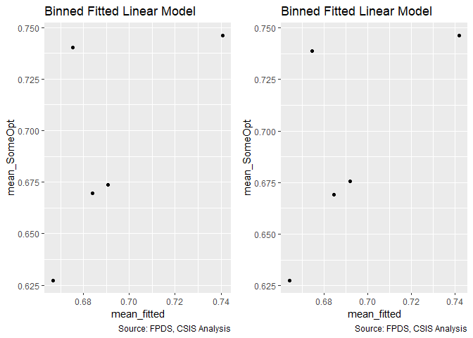<!-- -->

```
## Warning in residuals_binned(model1_old, bins = bins): Always uses Xlb
## Estimated Pr(Termination), should update.
```

```
## Warning in residuals_binned(model1_new, bins = bins): Always uses Xlb
## Estimated Pr(Termination), should update.
```

```
## Warning in if (class(model1_new) %in% c("glmerMod", "lme4")) {: the
## condition has length > 1 and only the first element will be used
```

```
## Warning in if (!class(model1_new) %in% c("glmerMod", "lme4") & !
## class(model1_old) %in% : the condition has length > 1 and only the first
## element will be used
```

<!-- -->

```
## [[1]]
##        model deviance null.deviance difference
## 1 model1_old 91310.56       91792.7   482.1428
## 2 model1_new 91271.25       91792.7   521.4469
```

```r
summary_residual_compare(b_AllOpt_history_pricing_19A_no_interact, b_AllOpt_history_pricing_19A)
```

<!-- -->

```
## Warning in residuals_binned(model1_old, bins = bins): Always uses Xlb
## Estimated Pr(Termination), should update.
```

```
## Warning in residuals_binned(model1_new, bins = bins): Always uses Xlb
## Estimated Pr(Termination), should update.
```

```
## Warning in if (class(model1_new) %in% c("glmerMod", "lme4")) {: the
## condition has length > 1 and only the first element will be used
```

```
## Warning in if (!class(model1_new) %in% c("glmerMod", "lme4") & !
## class(model1_old) %in% : the condition has length > 1 and only the first
## element will be used
```

<!-- -->

```
## [[1]]
##        model deviance null.deviance difference
## 1 model1_old 70636.37      71190.14   553.7643
## 2 model1_new 70593.82      71190.14   596.3160
```
Again, VIF scores elevated in AllOpt model, but fall into acceptable tolerances when considering scaled GVIFs in the next section, so are tolerated here.

SomeOpt: Expectations met for incentive-based cotnract, other cost-based contracts, and undefinitized contract awards.

AllOpt: Expectations met for Other cost-based contracts and undefinitized contract awards.


####19B: Cumulative

```r
#Create the model
b_SomeOpt_history_pricing_19B <- glm(data=serv_opt,
                                  b_SomeOpt ~  cln_US6sal + 
                                    cln_PSCrate+ cp_OffPerf7+cp_OffPSC7+
                                    cn_PairHist7+#cln_PairCA+
                                    cln_Base + clr_Ceil2Base + cln_Days+
                                    Comp+
                                    Veh+
                                    Pricing+
                                    Crisis+
                                    cln_Def6HHI+clr_Def6toUS+
                                    cln_Def3HHI+
                                    clr_Def3toUS+
                                    cp_PairObl7+
                                    cln_OffObl7+ 
                                    cln_OffFocus+ 
                                    cp_OffPerf7:cp_PairObl7+
                                    cln_OffObl7:cp_PairObl7+
                                    cp_OffPerf7:cln_Days+
                                    cn_PairHist7:Pricing, family=binomial(link="logit"))
glmer_examine(b_SomeOpt_history_pricing_19B)
```

```
##                             GVIF Df GVIF^(1/(2*Df))
## cln_US6sal              2.074070  1        1.440163
## cln_PSCrate             1.555794  1        1.247315
## cp_OffPerf7             2.444065  1        1.563350
## cp_OffPSC7              1.989532  1        1.410508
## cn_PairHist7            1.513639  1        1.230300
## cln_Base                1.718491  1        1.310912
## clr_Ceil2Base           1.482616  1        1.217627
## cln_Days                1.157255  1        1.075758
## Comp                    1.680638  3        1.090383
## Veh                     3.194232  4        1.156234
## Pricing                 2.689372  6        1.085936
## Crisis                  1.557316  3        1.076621
## cln_Def6HHI             1.579459  1        1.256765
## clr_Def6toUS            1.651316  1        1.285035
## cln_Def3HHI             1.974873  1        1.405302
## clr_Def3toUS            2.204775  1        1.484848
## cp_PairObl7             2.550131  1        1.596913
## cln_OffObl7             1.581336  1        1.257512
## cln_OffFocus            1.574474  1        1.254780
## cp_OffPerf7:cp_PairObl7 1.941351  1        1.393324
## cp_PairObl7:cln_OffObl7 1.544189  1        1.242654
## cp_OffPerf7:cln_Days    2.006592  1        1.416542
## cn_PairHist7:Pricing    2.363874  6        1.074324
```

```r
b_AllOpt_history_pricing_19B <- glm(data=serv_exeropt, family=binomial(link="logit"), b_AllOpt ~ cln_US6sal + 
                   cln_PSCrate+ cp_OffPerf7+cp_OffPSC7+
                 cn_PairHist7+cln_PairCA+
                 cln_Base + clr_Ceil2Base + cln_Days+
                 Comp+
                   Veh+
                   Pricing+
                   Crisis+
                 cln_Def6HHI+clr_Def6toUS+
                 cln_Def3HHI+
                   clr_Def3toUS+
                 cp_PairObl7+
                   cln_OffObl7+ 
                 cln_OffFocus+
                 cp_OffPerf7:cp_PairObl7+
                   
                   cn_PairHist7:Pricing)
glmer_examine(b_AllOpt_history_pricing_19B)
```

```
##                             GVIF Df GVIF^(1/(2*Df))
## cln_US6sal              2.171657  1        1.473654
## cln_PSCrate             1.522314  1        1.233821
## cp_OffPerf7             1.245270  1        1.115917
## cp_OffPSC7              1.612760  1        1.269945
## cn_PairHist7            1.609432  1        1.268634
## cln_PairCA              2.664997  1        1.632482
## cln_Base                1.543204  1        1.242258
## clr_Ceil2Base           1.183558  1        1.087914
## cln_Days                1.069717  1        1.034271
## Comp                    1.414549  3        1.059505
## Veh                     2.714800  4        1.132967
## Pricing                 5.153567  6        1.146416
## Crisis                  1.270955  3        1.040771
## cln_Def6HHI             1.499483  1        1.224534
## clr_Def6toUS            1.487101  1        1.219467
## cln_Def3HHI             2.060635  1        1.435491
## clr_Def3toUS            2.070464  1        1.438911
## cp_PairObl7             1.704476  1        1.305556
## cln_OffObl7             1.184630  1        1.088407
## cln_OffFocus            1.282342  1        1.132405
## cp_OffPerf7:cp_PairObl7 1.367643  1        1.169463
## cn_PairHist7:Pricing    4.341486  6        1.130151
```

```r
#Compare the models
stargazer::stargazer(b_SomeOpt_partnership_duration_18B, b_SomeOpt_history_pricing_19B,
                     b_AllOpt_partnership_share_17B, b_AllOpt_history_pricing_19B, type="text", digits=2)
```

```
## 
## ====================================================================================
##                                                      Dependent variable:            
##                                          -------------------------------------------
##                                                b_SomeOpt             b_AllOpt       
##                                             (1)        (2)        (3)        (4)    
## ------------------------------------------------------------------------------------
## cln_US6sal                                  0.02       0.02     -0.06**    -0.06**  
##                                            (0.02)     (0.02)     (0.02)     (0.02)  
##                                                                                     
## cln_PSCrate                               -0.19***   -0.19***   -0.13***   -0.13*** 
##                                            (0.02)     (0.02)     (0.03)     (0.03)  
##                                                                                     
## cp_OffPerf7                               -0.15***   -0.15***   -0.07***   -0.07*** 
##                                            (0.03)     (0.03)     (0.02)     (0.02)  
##                                                                                     
## cp_OffPSC7                                0.57***    0.57***    -0.35***   -0.36*** 
##                                            (0.03)     (0.03)     (0.04)     (0.04)  
##                                                                                     
## cn_PairHist7                              0.28***    0.27***    0.20***    0.20***  
##                                            (0.02)     (0.02)     (0.02)     (0.02)  
##                                                                                     
## cln_PairCA                                                      -0.47***   -0.47*** 
##                                                                  (0.04)     (0.04)  
##                                                                                     
## cln_Base                                  0.42***    0.43***     -0.04      -0.04   
##                                            (0.02)     (0.02)     (0.02)     (0.02)  
##                                                                                     
## clr_Ceil2Base                             0.44***    0.44***    -0.81***   -0.81*** 
##                                            (0.01)     (0.01)     (0.02)     (0.02)  
##                                                                                     
## cln_Days                                  0.62***    0.63***    -0.41***   -0.41*** 
##                                            (0.03)     (0.03)     (0.04)     (0.04)  
##                                                                                     
## Comp1 offer                                -0.02      -0.02      -0.01      -0.01   
##                                            (0.03)     (0.03)     (0.03)     (0.03)  
##                                                                                     
## Comp2-4 offers                             -0.03      -0.03     -0.06**    -0.06**  
##                                            (0.02)     (0.02)     (0.03)     (0.03)  
##                                                                                     
## Comp5+ offers                               0.03       0.03     -0.19***   -0.19*** 
##                                            (0.03)     (0.03)     (0.03)     (0.03)  
##                                                                                     
## VehS-IDC                                  -0.67***   -0.67***   -0.50***   -0.50*** 
##                                            (0.03)     (0.03)     (0.04)     (0.04)  
##                                                                                     
## VehM-IDC                                  -0.18***   -0.19***   -0.11***   -0.11*** 
##                                            (0.03)     (0.03)     (0.03)     (0.03)  
##                                                                                     
## VehFSS/GWAC                                -0.01      -0.01       0.05       0.05   
##                                            (0.03)     (0.03)     (0.03)     (0.03)  
##                                                                                     
## VehBPA/BOA                                -1.94***   -1.94***   -0.24***   -0.24*** 
##                                            (0.05)     (0.05)     (0.08)     (0.08)  
##                                                                                     
## PricingOther FP                           -0.65***   -0.72***   -0.84***   -0.77*** 
##                                            (0.13)     (0.15)     (0.18)     (0.20)  
##                                                                                     
## PricingT&M/LH/FPLOE                         0.09      0.10*       0.07       0.07   
##                                            (0.06)     (0.06)     (0.06)     (0.06)  
##                                                                                     
## PricingIncentive                            0.25      -0.17     0.91***    1.05***  
##                                            (0.25)     (0.28)     (0.24)     (0.34)  
##                                                                                     
## PricingOther CB                           0.32***    0.31***    0.74***    0.74***  
##                                            (0.05)     (0.05)     (0.05)     (0.05)  
##                                                                                     
## PricingUCA                                  0.04       0.05     0.32***    0.34***  
##                                            (0.11)     (0.11)     (0.12)     (0.13)  
##                                                                                     
## PricingCombination or Other               0.60***    0.47***      0.09       0.05   
##                                            (0.07)     (0.08)     (0.06)     (0.07)  
##                                                                                     
## CrisisARRA                                -0.47***   -0.47***    -0.33      -0.33   
##                                            (0.16)     (0.16)     (0.21)     (0.21)  
##                                                                                     
## CrisisDis                                  -0.36      -0.36     -1.40***   -1.40*** 
##                                            (0.30)     (0.30)     (0.40)     (0.40)  
##                                                                                     
## CrisisOCO                                 -0.85***   -0.85***   -0.37***   -0.37*** 
##                                            (0.06)     (0.06)     (0.08)     (0.08)  
##                                                                                     
## cln_Def6HHI                                -0.01      -0.004     -0.02      -0.02   
##                                            (0.02)     (0.02)     (0.03)     (0.03)  
##                                                                                     
## clr_Def6toUS                              -0.06**    -0.06**      0.02       0.02   
##                                            (0.03)     (0.03)     (0.03)     (0.03)  
##                                                                                     
## cln_Def3HHI                               0.19***    0.19***    -0.10***   -0.10*** 
##                                            (0.03)     (0.03)     (0.03)     (0.03)  
##                                                                                     
## clr_Def3toUS                              0.15***    0.15***    0.31***    0.31***  
##                                            (0.03)     (0.03)     (0.03)     (0.03)  
##                                                                                     
## cp_PairObl7                               -0.33***   -0.32***   -0.12***   -0.12*** 
##                                            (0.03)     (0.03)     (0.05)     (0.05)  
##                                                                                     
## cln_OffObl7                                0.05**     0.05**      0.02       0.03   
##                                            (0.02)     (0.02)     (0.02)     (0.02)  
##                                                                                     
## cln_OffFocus                              -0.58***   -0.58***   -0.17***   -0.17*** 
##                                            (0.02)     (0.02)     (0.03)     (0.03)  
##                                                                                     
## cp_OffPerf7:cp_PairObl7                   0.26***    0.27***     0.18**     0.19**  
##                                            (0.06)     (0.06)     (0.08)     (0.08)  
##                                                                                     
## cp_PairObl7:cln_OffObl7                   0.25***    0.25***                        
##                                            (0.07)     (0.07)                        
##                                                                                     
## cp_OffPerf7:cln_Days                       -0.03      -0.04                         
##                                            (0.06)     (0.06)                        
##                                                                                     
## cn_PairHist7:PricingOther FP                          -0.36                  0.32   
##                                                       (0.35)                (0.46)  
##                                                                                     
## cn_PairHist7:PricingT&M/LH/FPLOE                       0.16                 -0.06   
##                                                       (0.11)                (0.11)  
##                                                                                     
## cn_PairHist7:PricingIncentive                        1.42***                -0.37   
##                                                       (0.48)                (0.56)  
##                                                                                     
## cn_PairHist7:PricingOther CB                           0.06                 -0.01   
##                                                       (0.09)                (0.08)  
##                                                                                     
## cn_PairHist7:PricingUCA                                0.13                  0.37   
##                                                       (0.21)                (0.25)  
##                                                                                     
## cn_PairHist7:PricingCombination or Other             -0.60***               -0.14   
##                                                       (0.17)                (0.14)  
##                                                                                     
## Constant                                  0.29***    0.29***    1.25***    1.26***  
##                                            (0.03)     (0.03)     (0.04)     (0.04)  
##                                                                                     
## ------------------------------------------------------------------------------------
## Observations                               74,274     74,274     51,357     51,357  
## Log Likelihood                           -40,534.62 -40,521.64 -30,905.93 -30,903.73
## Akaike Inf. Crit.                        81,139.24  81,125.28  61,879.85  61,887.46 
## ====================================================================================
## Note:                                                    *p<0.1; **p<0.05; ***p<0.01
```

```r
summary_residual_compare(b_SomeOpt_partnership_duration_18B, b_SomeOpt_history_pricing_19B, 
                         b_AllOpt_partnership_share_17B, b_AllOpt_history_pricing_19B, bins = 50)
```

<!-- -->

```
## Warning in residuals_binned(model1_old, bins = bins): Always uses Xlb
## Estimated Pr(Termination), should update.
```

```
## Warning in residuals_binned(model1_new, bins = bins): Always uses Xlb
## Estimated Pr(Termination), should update.
```

```
## Warning in residuals_binned(model2_old, bins = bins): Always uses Xlb
## Estimated Pr(Termination), should update.
```

```
## Warning in residuals_binned(model2_new, bins = bins): Always uses Xlb
## Estimated Pr(Termination), should update.
```

```
## Warning in if (class(model1_new) %in% c("glmerMod", "lme4") &
## class(model2_new) %in% : the condition has length > 1 and only the first
## element will be used
```

```
## Warning in if ((!class(model1_new) %in% c("glmerMod", "lme4") & !
## class(model2_new) %in% : the condition has length > 1 and only the first
## element will be used
```

<!-- -->

```
## [[1]]
##        model deviance null.deviance difference
## 1 model1_old 81069.24      91792.70  10723.467
## 2 model1_new 81043.28      91792.70  10749.426
## 3 model2_old 61811.85      71190.14   9378.284
## 4 model2_new 61807.46      71190.14   9382.675
```
SomeOpt: Expectations met for incentive pricing interaction and combination pricing interaction
AllOpt: Expectations are not met for any interactions. No decrease in AIC, leaving it out.

Current cumulative b_SomeOpt model: b_SomeOpt_history_pricing_19B
Current cumulative b_AllOpt model: b_AllOpt_partnership_share_17B


####20A: Competition:NAICS6 Detailed Industry (Level 6)
If competition is an instrument for consolidation, than it should be most effective when consolidation is lower.

(Option, Breach,Term)
No Competition (Baseline)				-	++	-
1 Offer:				-	+	-
2-4 Offers				+	-	+
5+ Offers				-	-	+

```r
#Create the models
#NAICS66 Detailed Industry
b_SomeOpt_competition_NAICS66_20A_no_interact <- glm(data=serv_opt, b_SomeOpt ~ Comp + cln_Def6HHI, family=binomial(link="logit"))
glmer_examine(b_SomeOpt_competition_NAICS66_20A_no_interact)
```

```
##                 GVIF Df GVIF^(1/(2*Df))
## Comp        1.016529  3        1.002736
## cln_Def6HHI 1.016529  1        1.008231
```

```r
b_SomeOpt_competition_NAICS66_20A <- glm(data=serv_opt, b_SomeOpt ~ Comp + cln_Def6HHI + Comp:cln_Def6HHI, family=binomial(link="logit"))
glmer_examine(b_SomeOpt_competition_NAICS66_20A)
```

```
##                      GVIF Df GVIF^(1/(2*Df))
## Comp             1.067761  3        1.010987
## cln_Def6HHI      5.289303  1        2.299848
## Comp:cln_Def6HHI 5.543908  3        1.330360
```

```r
b_AllOpt_competition_NAICS66_20A_no_interact <- glm(data=serv_exeropt, family=binomial(link="logit"), b_AllOpt ~ Comp + cln_Def6HHI)
glmer_examine(b_AllOpt_competition_NAICS66_20A_no_interact)
```

```
##                 GVIF Df GVIF^(1/(2*Df))
## Comp        1.020105  3        1.003323
## cln_Def6HHI 1.020105  1        1.010003
```

```r
b_AllOpt_competition_NAICS66_20A <- glm(data=serv_exeropt, family=binomial(link="logit"), b_AllOpt ~ Comp + cln_Def6HHI + Comp:cln_Def6HHI)
glmer_examine(b_AllOpt_competition_NAICS66_20A)
```

```
##                      GVIF Df GVIF^(1/(2*Df))
## Comp             1.124158  3        1.019697
## cln_Def6HHI      4.608229  1        2.146679
## Comp:cln_Def6HHI 5.060325  3        1.310277
```

```r
#NAICS3 Subsector
b_SomeOpt_competition_NAICS66_20A_no_interact <- glm(data=serv_opt, b_SomeOpt ~ Comp + cln_Def3HHI, family=binomial(link="logit"))
glmer_examine(b_SomeOpt_competition_NAICS66_20A_no_interact)
```

```
##                 GVIF Df GVIF^(1/(2*Df))
## Comp        1.005863  3        1.000975
## cln_Def3HHI 1.005863  1        1.002927
```

```r
b_SomeOpt_competition_NAICS66_20A <- glm(data=serv_opt, b_SomeOpt ~ Comp + cln_Def3HHI + Comp:cln_Def3HHI, family=binomial(link="logit"))
glmer_examine(b_SomeOpt_competition_NAICS66_20A)
```

```
##                      GVIF Df GVIF^(1/(2*Df))
## Comp             1.042883  3        1.007023
## cln_Def3HHI      4.025102  1        2.006266
## Comp:cln_Def3HHI 4.154346  3        1.267896
```

```r
b_AllOpt_competition_NAICS66_20A_no_interact <- glm(data=serv_exeropt, family=binomial(link="logit"), b_AllOpt ~ Comp + cln_Def3HHI)
glmer_examine(b_AllOpt_competition_NAICS66_20A_no_interact)
```

```
##                GVIF Df GVIF^(1/(2*Df))
## Comp        1.00321  3        1.000534
## cln_Def3HHI 1.00321  1        1.001604
```

```r
b_AllOpt_competition_NAICS66_20A <- glm(data=serv_exeropt, family=binomial(link="logit"), b_AllOpt ~ Comp + cln_Def3HHI + Comp:cln_Def3HHI)
glmer_examine(b_AllOpt_competition_NAICS66_20A)
```

```
##                      GVIF Df GVIF^(1/(2*Df))
## Comp             1.014004  3        1.002321
## cln_Def3HHI      3.480506  1        1.865611
## Comp:cln_Def3HHI 3.521350  3        1.233441
```
The interaction models consistently exceed VIF with both NAICS66 and NAICS3 HHI
####20B: Cumulative

```r
#Create the model
#NAICS66 Detailed Industry
b_SomeOpt_competition_NAICS66_20B <- glm(data=serv_opt,
                        b_SomeOpt ~  cln_US6sal + 
                   cln_PSCrate+ cp_OffPerf7+cp_OffPSC7+
                 cn_PairHist7+#cln_PairCA+
                 cln_Base + clr_Ceil2Base + cln_Days+
                 Comp+
                   Veh+
                   Pricing+
                   Crisis+
                 cln_Def6HHI+clr_Def6toUS+
                 cln_Def3HHI+
                   clr_Def3toUS+
                 cp_PairObl7+
                   cln_OffObl7+ 
                 cln_OffFocus+ 
                                  cp_OffPerf7:cp_PairObl7+
                   cln_OffObl7:cp_PairObl7+
                 cp_OffPerf7:cln_Days+
                   Comp:cln_Def6HHI, family=binomial(link="logit"))
glmer_examine(b_SomeOpt_competition_NAICS66_20B)
```

```
##                             GVIF Df GVIF^(1/(2*Df))
## cln_US6sal              2.077847  1        1.441474
## cln_PSCrate             1.557069  1        1.247826
## cp_OffPerf7             2.444127  1        1.563370
## cp_OffPSC7              1.989858  1        1.410623
## cn_PairHist7            1.422315  1        1.192609
## cln_Base                1.715336  1        1.309709
## clr_Ceil2Base           1.496146  1        1.223170
## cln_Days                1.158928  1        1.076535
## Comp                    1.837434  3        1.106714
## Veh                     3.203646  4        1.156660
## Pricing                 1.339654  6        1.024667
## Crisis                  1.555878  3        1.076455
## cln_Def6HHI             5.685351  1        2.384397
## clr_Def6toUS            1.660086  1        1.288443
## cln_Def3HHI             1.983386  1        1.408327
## clr_Def3toUS            2.216480  1        1.488785
## cp_PairObl7             2.527140  1        1.589698
## cln_OffObl7             1.577240  1        1.255882
## cln_OffFocus            1.581692  1        1.257653
## cp_OffPerf7:cp_PairObl7 1.915005  1        1.383837
## cp_PairObl7:cln_OffObl7 1.544353  1        1.242720
## cp_OffPerf7:cln_Days    2.004670  1        1.415864
## Comp:cln_Def6HHI        6.328598  3        1.360039
```

```r
b_AllOpt_competition_NAICS66_20B <- glm(data=serv_exeropt, family=binomial(link="logit"), b_AllOpt ~ cln_US6sal + 
                   cln_PSCrate+ cp_OffPerf7+cp_OffPSC7+
                 cn_PairHist7+#cln_PairCA+
                 cln_Base + clr_Ceil2Base + cln_Days+
                 Comp+
                   Veh+
                   Pricing+
                   Crisis+
                 cln_Def6HHI+clr_Def6toUS+
                 cln_Def3HHI+
                   clr_Def3toUS+
                 cp_PairObl7+
                   cln_OffObl7+ 
                 cln_OffFocus+
                 cp_OffPerf7:cp_PairObl7+
                   
                   Comp:cln_Def6HHI)
glmer_examine(b_AllOpt_competition_NAICS66_20B)
```

```
##                             GVIF Df GVIF^(1/(2*Df))
## cln_US6sal              2.181978  1        1.477152
## cln_PSCrate             1.528277  1        1.236235
## cp_OffPerf7             1.245257  1        1.115911
## cp_OffPSC7              1.494084  1        1.222327
## cn_PairHist7            1.247615  1        1.116967
## cln_Base                1.551036  1        1.245406
## clr_Ceil2Base           1.181997  1        1.087197
## cln_Days                1.069816  1        1.034319
## Comp                    1.539055  3        1.074506
## Veh                     2.355964  4        1.113066
## Pricing                 1.447086  6        1.031275
## Crisis                  1.263128  3        1.039700
## cln_Def6HHI             5.081349  1        2.254185
## clr_Def6toUS            1.497618  1        1.223772
## cln_Def3HHI             2.068825  1        1.438341
## clr_Def3toUS            2.084978  1        1.443945
## cp_PairObl7             1.573464  1        1.254378
## cln_OffObl7             1.168056  1        1.080766
## cln_OffFocus            1.278030  1        1.130500
## cp_OffPerf7:cp_PairObl7 1.355408  1        1.164220
## Comp:cln_Def6HHI        5.427764  3        1.325674
```

```r
#NAICS3 Subsector
b_SomeOpt_competition_naincs3_20B <- glm(data=serv_opt,
                        b_SomeOpt ~  cln_US6sal + 
                   cln_PSCrate+ cp_OffPerf7+cp_OffPSC7+
                 cn_PairHist7+cln_PairCA+
                 cln_Base + clr_Ceil2Base + cln_Days+
                 Comp+
                   Veh+
                   Pricing+
                   Crisis+
                 cln_Def6HHI+clr_Def6toUS+
                 cln_Def3HHI+
                   clr_Def3toUS+
                 cp_PairObl7+
                   cln_OffObl7+ 
                 cln_OffFocus+ 
                                  cp_OffPerf7:cp_PairObl7+
                   cln_OffObl7:cp_PairObl7+
                 cp_OffPerf7:cln_Days+
                   Comp:cln_Def3HHI, family=binomial(link="logit"))
glmer_examine(b_SomeOpt_competition_naincs3_20B)
```

```
##                             GVIF Df GVIF^(1/(2*Df))
## cln_US6sal              2.070246  1        1.438835
## cln_PSCrate             1.562760  1        1.250104
## cp_OffPerf7             2.456265  1        1.567248
## cp_OffPSC7              2.292587  1        1.514129
## cn_PairHist7            1.683559  1        1.297520
## cln_PairCA              4.131010  1        2.032489
## cln_Base                1.732145  1        1.316110
## clr_Ceil2Base           1.521553  1        1.233512
## cln_Days                1.163346  1        1.078585
## Comp                    1.716779  3        1.094256
## Veh                     3.851227  4        1.183586
## Pricing                 1.352142  6        1.025460
## Crisis                  1.596053  3        1.081039
## cln_Def6HHI             1.581996  1        1.257774
## clr_Def6toUS            1.652953  1        1.285672
## cln_Def3HHI             4.788187  1        2.188193
## clr_Def3toUS            2.241674  1        1.497222
## cp_PairObl7             2.787796  1        1.669670
## cln_OffObl7             1.610046  1        1.268876
## cln_OffFocus            1.625132  1        1.274806
## cp_OffPerf7:cp_PairObl7 1.908992  1        1.381663
## cp_PairObl7:cln_OffObl7 1.586358  1        1.259507
## cp_OffPerf7:cln_Days    2.012215  1        1.418525
## Comp:cln_Def3HHI        4.751125  3        1.296580
```

```r
b_AllOpt_competition_naincs3_20B <- glm(data=serv_exeropt, family=binomial(link="logit"), b_AllOpt ~ cln_US6sal + 
                   cln_PSCrate+ cp_OffPerf7+cp_OffPSC7+
                 cn_PairHist7+cln_PairCA+
                 cln_Base + clr_Ceil2Base + cln_Days+
                 Comp+
                   Veh+
                   Pricing+
                   Crisis+
                 cln_Def6HHI+clr_Def6toUS+
                 cln_Def3HHI+
                   clr_Def3toUS+
                 cp_PairObl7+
                   cln_OffObl7+ 
                 cln_OffFocus+
                   
                   Comp:cln_Def3HHI)
glmer_examine(b_AllOpt_competition_naincs3_20B)
```

```
##                      GVIF Df GVIF^(1/(2*Df))
## cln_US6sal       2.172601  1        1.473974
## cln_PSCrate      1.525876  1        1.235263
## cp_OffPerf7      1.150021  1        1.072390
## cp_OffPSC7       1.595218  1        1.263019
## cn_PairHist7     1.511201  1        1.229309
## cln_PairCA       2.672971  1        1.634922
## cln_Base         1.545867  1        1.243329
## clr_Ceil2Base    1.188486  1        1.090177
## cln_Days         1.069406  1        1.034121
## Comp             1.421860  3        1.060416
## Veh              2.762522  4        1.135437
## Pricing          1.461096  6        1.032103
## Crisis           1.249672  3        1.037845
## cln_Def6HHI      1.497179  1        1.223593
## clr_Def6toUS     1.489838  1        1.220589
## cln_Def3HHI      4.624761  1        2.150526
## clr_Def3toUS     2.082277  1        1.443010
## cp_PairObl7      1.530149  1        1.236992
## cln_OffObl7      1.171894  1        1.082540
## cln_OffFocus     1.276338  1        1.129751
## Comp:cln_Def3HHI 3.991155  3        1.259456
```

```r
b_AllOpt_competition_naincs3_20B2 <- glm(data=serv_exeropt, family=binomial(link="logit"), b_AllOpt ~ cln_US6sal + 
                   cln_PSCrate+ cp_OffPerf7+cp_OffPSC7+
                 cn_PairHist7+cln_PairCA+
                 cln_Base + clr_Ceil2Base + cln_Days+
                 Comp+
                   Veh+
                   Pricing+
                   Crisis+
                 cln_Def6HHI+clr_Def6toUS+
                 cln_Def3HHI+
                   clr_Def3toUS+
                 cp_PairObl7+
                   cln_OffObl7+ 
                 cln_OffFocus+
                   # 
                   Comp:cln_Def6HHI)
glmer_examine(b_AllOpt_competition_naincs3_20B2)
```

```
##                      GVIF Df GVIF^(1/(2*Df))
## cln_US6sal       2.174834  1        1.474732
## cln_PSCrate      1.521361  1        1.233435
## cp_OffPerf7      1.151277  1        1.072976
## cp_OffPSC7       1.591004  1        1.261350
## cn_PairHist7     1.507527  1        1.227814
## cln_PairCA       2.659669  1        1.630849
## cln_Base         1.544903  1        1.242941
## clr_Ceil2Base    1.189844  1        1.090800
## cln_Days         1.069392  1        1.034114
## Comp             1.528472  3        1.073271
## Veh              2.701428  4        1.132268
## Pricing          1.458231  6        1.031935
## Crisis           1.249395  3        1.037807
## cln_Def6HHI      5.050068  1        2.247236
## clr_Def6toUS     1.492996  1        1.221882
## cln_Def3HHI      2.069714  1        1.438650
## clr_Def3toUS     2.085240  1        1.444036
## cp_PairObl7      1.531945  1        1.237717
## cln_OffObl7      1.172736  1        1.082930
## cln_OffFocus     1.277768  1        1.130384
## Comp:cln_Def6HHI 5.388682  3        1.324079
```
For all HHI6 and HHI3 models, scaled GVIF is exceeded even with removal of other interaction terms.  Thus, this interaction is not included in our model specification.

####21A: Ratio Initial Base to Ceiling Ratio (logged):Initial Contract Ceiling (logged)
This interaction approximates has a role similar to that of contract ceiling, although due to centering and logging it isn't equivalent. Thus in essence it covers the dollars rather than merely the proportion available for options. More option  space gives more flexibility to the government and may lessen the need for ceiling breaches and terminations. Likewise, this interaction provides something like the dollar size of available  options, so naturally it can be associated with greater spending.
(Options, Breach, Terminations)
Initial Contract Ceiling (logged)	clr_Ceil2Base:cln_Base		TRUE	++	-	-
Expectation - interaction is positively related to b_SomeOpt and negatively related to b_AllOpt.


```r
#Create the models
b_SomeOpt_base2ceil_ceiling_21A_no_interact <- glm(data=serv_opt,b_SomeOpt ~ clr_Ceil2Base + cln_Base, family=binomial(link="logit"))
glmer_examine(b_SomeOpt_base2ceil_ceiling_21A_no_interact)
```

```
## clr_Ceil2Base      cln_Base 
##      1.211798      1.211798
```

```r
b_SomeOpt_base2ceil_ceiling_21A <- glm(data=serv_opt, b_SomeOpt ~ clr_Ceil2Base + cln_Base + clr_Ceil2Base:cln_Base, family=binomial(link="logit"))
glmer_examine(b_SomeOpt_base2ceil_ceiling_21A)
```

```
##          clr_Ceil2Base               cln_Base clr_Ceil2Base:cln_Base 
##               1.371263               2.699473               2.745440
```

```r
b_AllOpt_base2ceil_ceiling_21A_no_interact <- glm(data=serv_exeropt, family=binomial(link="logit"), b_AllOpt ~ clr_Ceil2Base + cln_Base)

glmer_examine(b_AllOpt_base2ceil_ceiling_21A_no_interact)
```

```
## clr_Ceil2Base      cln_Base 
##      1.093703      1.093703
```

```r
b_AllOpt_base2ceil_ceiling_21A <- glm(data=serv_exeropt, family=binomial(link="logit"), b_AllOpt ~ clr_Ceil2Base + cln_Base + clr_Ceil2Base:cln_Base)
glmer_examine(b_AllOpt_base2ceil_ceiling_21A)
```

```
##          clr_Ceil2Base               cln_Base clr_Ceil2Base:cln_Base 
##               1.370001               4.294694               3.989503
```

```r
#Compare the Models
stargazer::stargazer(b_SomeOpt_base2ceil_ceiling_21A_no_interact, b_SomeOpt_base2ceil_ceiling_21A, 
                     b_AllOpt_base2ceil_ceiling_21A_no_interact, b_AllOpt_base2ceil_ceiling_21A, type="text", digits=2)
```

```
## 
## ==================================================================
##                                    Dependent variable:            
##                        -------------------------------------------
##                              b_SomeOpt             b_AllOpt       
##                           (1)        (2)        (3)        (4)    
## ------------------------------------------------------------------
## clr_Ceil2Base           0.46***    0.52***    -0.96***   -1.12*** 
##                          (0.01)     (0.01)     (0.01)     (0.02)  
##                                                                   
## cln_Base                0.73***     -0.03       0.02     -0.87*** 
##                          (0.02)     (0.02)     (0.02)     (0.04)  
##                                                                   
## clr_Ceil2Base:cln_Base             0.63***               0.69***  
##                                     (0.02)                (0.03)  
##                                                                   
## Constant                0.12***    0.17***    1.30***    1.58***  
##                          (0.02)     (0.02)     (0.02)     (0.03)  
##                                                                   
## ------------------------------------------------------------------
## Observations             74,274     74,274     51,357     51,357  
## Log Likelihood         -44,435.98 -43,559.23 -32,522.67 -32,144.44
## Akaike Inf. Crit.      88,877.97  87,126.45  65,051.34  64,296.89 
## ==================================================================
## Note:                                  *p<0.1; **p<0.05; ***p<0.01
```

```r
summary_residual_compare(b_SomeOpt_base2ceil_ceiling_21A_no_interact, b_SomeOpt_base2ceil_ceiling_21A, bins = 50)
```

<!-- -->

```
## Warning in residuals_binned(model1_old, bins = bins): Always uses Xlb
## Estimated Pr(Termination), should update.
```

```
## Warning in residuals_binned(model1_new, bins = bins): Always uses Xlb
## Estimated Pr(Termination), should update.
```

```
## Warning in if (class(model1_new) %in% c("glmerMod", "lme4")) {: the
## condition has length > 1 and only the first element will be used
```

```
## Warning in if (!class(model1_new) %in% c("glmerMod", "lme4") & !
## class(model1_old) %in% : the condition has length > 1 and only the first
## element will be used
```

<!-- -->

```
## [[1]]
##        model deviance null.deviance difference
## 1 model1_old 88871.97       91792.7   2920.734
## 2 model1_new 87118.45       91792.7   4674.248
```

```r
summary_residual_compare(b_AllOpt_base2ceil_ceiling_21A_no_interact, b_AllOpt_base2ceil_ceiling_21A, bins = 50)
```

<!-- -->

```
## Warning in residuals_binned(model1_old, bins = bins): Always uses Xlb
## Estimated Pr(Termination), should update.
```

```
## Warning in residuals_binned(model1_new, bins = bins): Always uses Xlb
## Estimated Pr(Termination), should update.
```

```
## Warning in if (class(model1_new) %in% c("glmerMod", "lme4")) {: the
## condition has length > 1 and only the first element will be used
```

```
## Warning in if (!class(model1_new) %in% c("glmerMod", "lme4") & !
## class(model1_old) %in% : the condition has length > 1 and only the first
## element will be used
```

<!-- -->

```
## [[1]]
##        model deviance null.deviance difference
## 1 model1_old 65045.34      71190.14   6144.795
## 2 model1_new 64288.89      71190.14   6901.249
```
SomeOpt: Expectation met
AllOpt: Expectation not met


####21B: Cumulative

```r
#Create the model
b_SomeOpt_base2ceil_ceiling_21B <- glm(data=serv_opt,
                        b_SomeOpt ~  cln_US6sal + 
                   cln_PSCrate+ cp_OffPerf7+cp_OffPSC7+
                 cn_PairHist7+#cln_PairCA+
                 cln_Base + clr_Ceil2Base + cln_Days+
                 Comp+
                   Veh+
                   Pricing+
                   Crisis+
                 cln_Def6HHI+clr_Def6toUS+
                 cln_Def3HHI+
                   clr_Def3toUS+
                 cp_PairObl7+
                   cln_OffObl7+ 
                 cln_OffFocus+ 
                cp_OffPerf7:cp_PairObl7+
                  cln_OffObl7:cp_PairObl7+
                 cp_OffPerf7:cln_Days+
                  cn_PairHist7:Pricing +
                   clr_Ceil2Base:cln_Base, family=binomial(link="logit"))
glmer_examine(b_SomeOpt_base2ceil_ceiling_21B)
```

```
##                             GVIF Df GVIF^(1/(2*Df))
## cln_US6sal              2.067381  1        1.437839
## cln_PSCrate             1.564838  1        1.250935
## cp_OffPerf7             2.436382  1        1.560891
## cp_OffPSC7              2.034005  1        1.426185
## cn_PairHist7            1.519442  1        1.232656
## cln_Base                3.196595  1        1.787902
## clr_Ceil2Base           1.530401  1        1.237094
## cln_Days                1.164838  1        1.079277
## Comp                    1.684490  3        1.090799
## Veh                     3.209179  4        1.156909
## Pricing                 2.808075  6        1.089852
## Crisis                  1.568158  3        1.077866
## cln_Def6HHI             1.587510  1        1.259964
## clr_Def6toUS            1.657846  1        1.287574
## cln_Def3HHI             1.971833  1        1.404220
## clr_Def3toUS            2.202261  1        1.484002
## cp_PairObl7             2.580880  1        1.606512
## cln_OffObl7             1.584704  1        1.258850
## cln_OffFocus            1.587071  1        1.259790
## cp_OffPerf7:cp_PairObl7 1.971932  1        1.404255
## cp_PairObl7:cln_OffObl7 1.538516  1        1.240369
## cp_OffPerf7:cln_Days    2.019556  1        1.421111
## cn_PairHist7:Pricing    2.477210  6        1.078525
## cln_Base:clr_Ceil2Base  3.011229  1        1.735289
```

```r
b_AllOpt_base2ceil_ceiling_21B <- glm(data=serv_exeropt, family=binomial(link="logit"), b_AllOpt ~ cln_US6sal + 
                   cln_PSCrate+ cp_OffPerf7+cp_OffPSC7+
                 cn_PairHist7+cln_PairCA+
                 cln_Base + clr_Ceil2Base + cln_Days+
                 Comp+
                   Veh+
                   Pricing+
                   Crisis+
                   cln_Def6HHI+clr_Def6toUS+
                   cln_Def3HHI+
                   clr_Def3toUS+
                   cp_PairObl7+
                   cln_OffObl7+
                   cln_OffFocus+
                 cp_OffPerf7:cp_PairObl7+
                   clr_Ceil2Base:cln_Base)
glmer_examine(b_AllOpt_base2ceil_ceiling_21B)
```

```
##                             GVIF Df GVIF^(1/(2*Df))
## cln_US6sal              2.165899  1        1.471699
## cln_PSCrate             1.524203  1        1.234586
## cp_OffPerf7             1.232958  1        1.110387
## cp_OffPSC7              1.586294  1        1.259482
## cn_PairHist7            1.511274  1        1.229339
## cln_PairCA              2.638226  1        1.624262
## cln_Base                4.795821  1        2.189936
## clr_Ceil2Base           1.507248  1        1.227700
## cln_Days                1.066901  1        1.032909
## Comp                    1.404698  3        1.058272
## Veh                     2.674794  4        1.130866
## Pricing                 1.467637  6        1.032488
## Crisis                  1.272703  3        1.041009
## cln_Def6HHI             1.500795  1        1.225069
## clr_Def6toUS            1.488154  1        1.219899
## cln_Def3HHI             2.069646  1        1.438627
## clr_Def3toUS            2.080360  1        1.442345
## cp_PairObl7             1.689505  1        1.299810
## cln_OffObl7             1.177777  1        1.085254
## cln_OffFocus            1.276741  1        1.129930
## cp_OffPerf7:cp_PairObl7 1.350403  1        1.162069
## cln_Base:clr_Ceil2Base  4.302664  1        2.074286
```

```r
#Compare the models
stargazer::stargazer(b_SomeOpt_history_pricing_19B, b_SomeOpt_base2ceil_ceiling_21B, 
                     type = "text", digits = 2)
```

```
## 
## =====================================================================
##                                              Dependent variable:     
##                                          ----------------------------
##                                                   b_SomeOpt          
##                                               (1)            (2)     
## ---------------------------------------------------------------------
## cln_US6sal                                    0.02          0.03     
##                                              (0.02)        (0.02)    
##                                                                      
## cln_PSCrate                                 -0.19***      -0.15***   
##                                              (0.02)        (0.02)    
##                                                                      
## cp_OffPerf7                                 -0.15***      -0.12***   
##                                              (0.03)        (0.03)    
##                                                                      
## cp_OffPSC7                                  0.57***        0.62***   
##                                              (0.03)        (0.03)    
##                                                                      
## cn_PairHist7                                0.27***        0.28***   
##                                              (0.02)        (0.02)    
##                                                                      
## cln_Base                                    0.43***         0.04     
##                                              (0.02)        (0.03)    
##                                                                      
## clr_Ceil2Base                               0.44***        0.45***   
##                                              (0.01)        (0.01)    
##                                                                      
## cln_Days                                    0.63***        0.57***   
##                                              (0.03)        (0.03)    
##                                                                      
## Comp1 offer                                  -0.02          -0.04    
##                                              (0.03)        (0.03)    
##                                                                      
## Comp2-4 offers                               -0.03          -0.04    
##                                              (0.02)        (0.02)    
##                                                                      
## Comp5+ offers                                 0.03          0.05*    
##                                              (0.03)        (0.03)    
##                                                                      
## VehS-IDC                                    -0.67***      -0.64***   
##                                              (0.03)        (0.03)    
##                                                                      
## VehM-IDC                                    -0.19***      -0.20***   
##                                              (0.03)        (0.03)    
##                                                                      
## VehFSS/GWAC                                  -0.01          -0.03    
##                                              (0.03)        (0.03)    
##                                                                      
## VehBPA/BOA                                  -1.94***      -1.79***   
##                                              (0.05)        (0.05)    
##                                                                      
## PricingOther FP                             -0.72***      -0.74***   
##                                              (0.15)        (0.15)    
##                                                                      
## PricingT&M/LH/FPLOE                          0.10*          0.07     
##                                              (0.06)        (0.06)    
##                                                                      
## PricingIncentive                             -0.17          -0.25    
##                                              (0.28)        (0.30)    
##                                                                      
## PricingOther CB                             0.31***        0.27***   
##                                              (0.05)        (0.05)    
##                                                                      
## PricingUCA                                    0.05          0.05     
##                                              (0.11)        (0.11)    
##                                                                      
## PricingCombination or Other                 0.47***        0.45***   
##                                              (0.08)        (0.08)    
##                                                                      
## CrisisARRA                                  -0.47***       -0.34**   
##                                              (0.16)        (0.16)    
##                                                                      
## CrisisDis                                    -0.36          -0.22    
##                                              (0.30)        (0.29)    
##                                                                      
## CrisisOCO                                   -0.85***      -0.80***   
##                                              (0.06)        (0.06)    
##                                                                      
## cln_Def6HHI                                  -0.004         -0.04    
##                                              (0.02)        (0.02)    
##                                                                      
## clr_Def6toUS                                -0.06**        -0.05*    
##                                              (0.03)        (0.03)    
##                                                                      
## cln_Def3HHI                                 0.19***        0.16***   
##                                              (0.03)        (0.03)    
##                                                                      
## clr_Def3toUS                                0.15***        0.12***   
##                                              (0.03)        (0.03)    
##                                                                      
## cp_PairObl7                                 -0.32***      -0.33***   
##                                              (0.03)        (0.03)    
##                                                                      
## cln_OffObl7                                  0.05**        0.06***   
##                                              (0.02)        (0.02)    
##                                                                      
## cln_OffFocus                                -0.58***      -0.54***   
##                                              (0.02)        (0.02)    
##                                                                      
## cp_OffPerf7:cp_PairObl7                     0.27***        0.27***   
##                                              (0.06)        (0.06)    
##                                                                      
## cp_PairObl7:cln_OffObl7                     0.25***        0.28***   
##                                              (0.07)        (0.07)    
##                                                                      
## cp_OffPerf7:cln_Days                         -0.04        -0.16***   
##                                              (0.06)        (0.06)    
##                                                                      
## cn_PairHist7:PricingOther FP                 -0.36          -0.33    
##                                              (0.35)        (0.35)    
##                                                                      
## cn_PairHist7:PricingT&M/LH/FPLOE              0.16          0.16     
##                                              (0.11)        (0.11)    
##                                                                      
## cn_PairHist7:PricingIncentive               1.42***        1.60***   
##                                              (0.48)        (0.50)    
##                                                                      
## cn_PairHist7:PricingOther CB                  0.06          0.10     
##                                              (0.09)        (0.09)    
##                                                                      
## cn_PairHist7:PricingUCA                       0.13          0.17     
##                                              (0.21)        (0.21)    
##                                                                      
## cn_PairHist7:PricingCombination or Other    -0.60***      -0.56***   
##                                              (0.17)        (0.17)    
##                                                                      
## cln_Base:clr_Ceil2Base                                     0.35***   
##                                                            (0.02)    
##                                                                      
## Constant                                    0.29***        0.36***   
##                                              (0.03)        (0.03)    
##                                                                      
## ---------------------------------------------------------------------
## Observations                                 74,274        74,274    
## Log Likelihood                             -40,521.64    -40,318.89  
## Akaike Inf. Crit.                          81,125.28      80,721.77  
## =====================================================================
## Note:                                     *p<0.1; **p<0.05; ***p<0.01
```

```r
summary_residual_compare(b_SomeOpt_partnership_duration_18B, b_SomeOpt_base2ceil_ceiling_21B, bins = 50)
```

<!-- -->

```
## Warning in residuals_binned(model1_old, bins = bins): Always uses Xlb
## Estimated Pr(Termination), should update.
```

```
## Warning in residuals_binned(model1_new, bins = bins): Always uses Xlb
## Estimated Pr(Termination), should update.
```

```
## Warning in if (class(model1_new) %in% c("glmerMod", "lme4")) {: the
## condition has length > 1 and only the first element will be used
```

```
## Warning in if (!class(model1_new) %in% c("glmerMod", "lme4") & !
## class(model1_old) %in% : the condition has length > 1 and only the first
## element will be used
```

<!-- -->

```
## [[1]]
##        model deviance null.deviance difference
## 1 model1_old 81069.24       91792.7   10723.47
## 2 model1_new 80637.77       91792.7   11154.93
```
SomeOpt: Expectation met, though residuals get a bit worse.
AllOpt: Scaled GVIF above threshold for cln_Base and cln_Base:clr_Ceil2Base. 

Current cumulative b_SomeOpt model: b_SomeOpt_base2ceil_ceiling_21B
Current cumulative b_AllOpt model: b_SomeOpt_history_pricing_19B

####21C: Available Options:Initial Contract Duration (logged)
increase the extend of options exercised as it means continuing a contract rather than including additional features. Option years may also provide more options for cost controls. and reduce ceiling breaches.
(Options, Ceiling Breach, Terminations)
++	-	-
Expectation: Pos. relationship with SomeOpt, negative relationship with AllOpt.

```r
b_SomeOpt_base2ceil_duration_21C_no_interact <- glm(data=serv_opt, b_SomeOpt ~ clr_Ceil2Base + cln_Days, family=binomial(link="logit"))
glmer_examine(b_SomeOpt_base2ceil_duration_21C_no_interact)
```

```
## clr_Ceil2Base      cln_Days 
##      1.001943      1.001943
```

```r
b_SomeOpt_base2ceil_duration_21C <- glm(data=serv_opt, b_SomeOpt ~ clr_Ceil2Base + cln_Days + clr_Ceil2Base:cln_Days, family=binomial(link="logit"))
glmer_examine(b_SomeOpt_base2ceil_duration_21C)
```

```
##          clr_Ceil2Base               cln_Days clr_Ceil2Base:cln_Days 
##               1.179747               2.488564               2.611427
```

```r
b_AllOpt_base2ceil_duration_21C_no_interact <- glm(data=serv_exeropt, family=binomial(link="logit"), b_AllOpt ~ clr_Ceil2Base + cln_Days)
glmer_examine(b_AllOpt_base2ceil_duration_21C_no_interact)
```

```
## clr_Ceil2Base      cln_Days 
##      1.001313      1.001313
```

```r
b_AllOpt_base2ceil_duration_21C <- glm(data=serv_exeropt, family=binomial(link="logit"), b_AllOpt ~ clr_Ceil2Base + cln_Days + clr_Ceil2Base:cln_Days)
glmer_examine(b_AllOpt_base2ceil_duration_21C)
```

```
##          clr_Ceil2Base               cln_Days clr_Ceil2Base:cln_Days 
##               1.682624               3.570396               4.117008
```

```r
stargazer::stargazer(b_SomeOpt_base2ceil_duration_21C_no_interact, b_SomeOpt_base2ceil_duration_21C, type = "text", digits = 2)
```

```
## 
## ===================================================
##                            Dependent variable:     
##                        ----------------------------
##                                 b_SomeOpt          
##                             (1)            (2)     
## ---------------------------------------------------
## clr_Ceil2Base             0.27***        0.24***   
##                            (0.01)        (0.01)    
##                                                    
## cln_Days                  1.10***        0.88***   
##                            (0.02)        (0.04)    
##                                                    
## clr_Ceil2Base:cln_Days                   0.18***   
##                                          (0.02)    
##                                                    
## Constant                  0.10***        0.13***   
##                            (0.02)        (0.02)    
##                                                    
## ---------------------------------------------------
## Observations               74,274        74,274    
## Log Likelihood           -44,404.52    -44,377.04  
## Akaike Inf. Crit.        88,815.03      88,762.09  
## ===================================================
## Note:                   *p<0.1; **p<0.05; ***p<0.01
```
VIF exceeds acceptable threshold for AllOpt.  Worryingly high for SomeOpt, but not above reject threshold since brought down to tolerable levels in cumulative model (>2 requires check in cumulative, >3 is an instant rejection).

Matches expectations in SomeOpt model.

####21D: Cumulative

```r
#Create the model
b_SomeOpt_base2ceil_duration_21D <- glm(data=serv_opt,
                        b_SomeOpt ~  cln_US6sal + 
                   cln_PSCrate+ cp_OffPerf7+cp_OffPSC7+
                 cn_PairHist7+#cln_PairCA+
                 cln_Base + clr_Ceil2Base + cln_Days+
                 Comp+
                   Veh+
                   Pricing+
                   Crisis+
                 cln_Def6HHI+clr_Def6toUS+
                 cln_Def3HHI+
                   clr_Def3toUS+
                 cp_PairObl7+
                   cln_OffObl7+ 
                 cln_OffFocus+ 
                   cp_OffPerf7:cp_PairObl7+
                   cln_OffObl7:cp_PairObl7+
                   cp_OffPerf7:cln_Days+ 
                   cn_PairHist7:Pricing +
                   clr_Ceil2Base:cln_Base+
                   clr_Ceil2Base:cln_Days, family=binomial(link="logit"))
glmer_examine(b_SomeOpt_base2ceil_duration_21D)
```

```
##                             GVIF Df GVIF^(1/(2*Df))
## cln_US6sal              2.067666  1        1.437938
## cln_PSCrate             1.564919  1        1.250967
## cp_OffPerf7             2.504439  1        1.582542
## cp_OffPSC7              2.086191  1        1.444365
## cn_PairHist7            1.520571  1        1.233114
## cln_Base                3.388797  1        1.840869
## clr_Ceil2Base           1.843204  1        1.357647
## cln_Days                3.077142  1        1.754178
## Comp                    1.688909  3        1.091275
## Veh                     3.220221  4        1.157406
## Pricing                 2.810522  6        1.089931
## Crisis                  1.569560  3        1.078027
## cln_Def6HHI             1.587231  1        1.259853
## clr_Def6toUS            1.659093  1        1.288058
## cln_Def3HHI             1.976316  1        1.405815
## clr_Def3toUS            2.203459  1        1.484405
## cp_PairObl7             2.583634  1        1.607369
## cln_OffObl7             1.585997  1        1.259364
## cln_OffFocus            1.589914  1        1.260918
## cp_OffPerf7:cp_PairObl7 1.974039  1        1.405005
## cp_PairObl7:cln_OffObl7 1.539930  1        1.240939
## cp_OffPerf7:cln_Days    2.113528  1        1.453798
## cn_PairHist7:Pricing    2.478637  6        1.078577
## cln_Base:clr_Ceil2Base  3.277778  1        1.810464
## clr_Ceil2Base:cln_Days  3.224389  1        1.795658
```

```r
b_AllOpt_base2ceil_duration_21D <- glm(data=serv_exeropt, family=binomial(link="logit"), b_AllOpt ~ cln_US6sal + 
                   cln_PSCrate+ cp_OffPerf7+cp_OffPSC7+
                 cn_PairHist7+cln_PairCA+
                 cln_Base + clr_Ceil2Base + cln_Days+
                 Comp+
                   Veh+
                   Pricing+
                   Crisis+
                 cln_Def6HHI+clr_Def6toUS+
                 cln_Def3HHI+
                   clr_Def3toUS+
                 cp_PairObl7+
                   cln_OffObl7+ 
                 cln_OffFocus+
                 cp_OffPerf7:cp_PairObl7+
                   clr_Ceil2Base:cln_Days)
glmer_examine(b_AllOpt_base2ceil_duration_21D)
```

```
##                             GVIF Df GVIF^(1/(2*Df))
## cln_US6sal              2.171066  1        1.473454
## cln_PSCrate             1.523402  1        1.234262
## cp_OffPerf7             1.240793  1        1.113909
## cp_OffPSC7              1.615496  1        1.271022
## cn_PairHist7            1.515037  1        1.230869
## cln_PairCA              2.665565  1        1.632656
## cln_Base                1.546455  1        1.243565
## clr_Ceil2Base           1.784232  1        1.335752
## cln_Days                3.441649  1        1.855168
## Comp                    1.414899  3        1.059549
## Veh                     2.707958  4        1.132610
## Pricing                 1.456728  6        1.031846
## Crisis                  1.277625  3        1.041679
## cln_Def6HHI             1.500117  1        1.224792
## clr_Def6toUS            1.496202  1        1.223194
## cln_Def3HHI             2.059255  1        1.435011
## clr_Def3toUS            2.084500  1        1.443780
## cp_PairObl7             1.723230  1        1.312718
## cln_OffObl7             1.178295  1        1.085493
## cln_OffFocus            1.284883  1        1.133527
## cp_OffPerf7:cp_PairObl7 1.373586  1        1.172001
## clr_Ceil2Base:cln_Days  3.871382  1        1.967583
```

```r
#Compare the models
stargazer::stargazer(b_SomeOpt_base2ceil_ceiling_21B, b_SomeOpt_base2ceil_duration_21D, 
                     b_AllOpt_partnership_share_17B, b_AllOpt_base2ceil_duration_21D, type="text", digits=2)
```

```
## 
## ====================================================================================
##                                                      Dependent variable:            
##                                          -------------------------------------------
##                                                b_SomeOpt             b_AllOpt       
##                                             (1)        (2)        (3)        (4)    
## ------------------------------------------------------------------------------------
## cln_US6sal                                  0.03       0.03     -0.06**    -0.06**  
##                                            (0.02)     (0.02)     (0.02)     (0.02)  
##                                                                                     
## cln_PSCrate                               -0.15***   -0.15***   -0.13***   -0.13*** 
##                                            (0.02)     (0.02)     (0.03)     (0.03)  
##                                                                                     
## cp_OffPerf7                               -0.12***   -0.13***   -0.07***   -0.08*** 
##                                            (0.03)     (0.03)     (0.02)     (0.02)  
##                                                                                     
## cp_OffPSC7                                0.62***    0.63***    -0.35***   -0.33*** 
##                                            (0.03)     (0.03)     (0.04)     (0.04)  
##                                                                                     
## cn_PairHist7                              0.28***    0.28***    0.20***    0.20***  
##                                            (0.02)     (0.02)     (0.02)     (0.02)  
##                                                                                     
## cln_PairCA                                                      -0.47***   -0.48*** 
##                                                                  (0.04)     (0.04)  
##                                                                                     
## cln_Base                                    0.04       0.02      -0.04     -0.05**  
##                                            (0.03)     (0.03)     (0.02)     (0.02)  
##                                                                                     
## clr_Ceil2Base                             0.45***    0.46***    -0.81***   -0.67*** 
##                                            (0.01)     (0.01)     (0.02)     (0.02)  
##                                                                                     
## cln_Days                                  0.57***    0.66***    -0.41***   0.25***  
##                                            (0.03)     (0.05)     (0.04)     (0.07)  
##                                                                                     
## Comp1 offer                                -0.04      -0.04      -0.01      -0.003  
##                                            (0.03)     (0.03)     (0.03)     (0.03)  
##                                                                                     
## Comp2-4 offers                             -0.04      -0.04     -0.06**    -0.06**  
##                                            (0.02)     (0.02)     (0.03)     (0.03)  
##                                                                                     
## Comp5+ offers                              0.05*      0.05*     -0.19***   -0.20*** 
##                                            (0.03)     (0.03)     (0.03)     (0.03)  
##                                                                                     
## VehS-IDC                                  -0.64***   -0.65***   -0.50***   -0.50*** 
##                                            (0.03)     (0.03)     (0.04)     (0.04)  
##                                                                                     
## VehM-IDC                                  -0.20***   -0.21***   -0.11***   -0.11*** 
##                                            (0.03)     (0.03)     (0.03)     (0.03)  
##                                                                                     
## VehFSS/GWAC                                -0.03      -0.03       0.05       0.05   
##                                            (0.03)     (0.03)     (0.03)     (0.03)  
##                                                                                     
## VehBPA/BOA                                -1.79***   -1.79***   -0.24***   -0.23*** 
##                                            (0.05)     (0.05)     (0.08)     (0.08)  
##                                                                                     
## PricingOther FP                           -0.74***   -0.74***   -0.84***   -0.84*** 
##                                            (0.15)     (0.15)     (0.18)     (0.18)  
##                                                                                     
## PricingT&M/LH/FPLOE                         0.07       0.07       0.07       0.07   
##                                            (0.06)     (0.06)     (0.06)     (0.06)  
##                                                                                     
## PricingIncentive                           -0.25      -0.25     0.91***    0.93***  
##                                            (0.30)     (0.30)     (0.24)     (0.25)  
##                                                                                     
## PricingOther CB                           0.27***    0.27***    0.74***    0.74***  
##                                            (0.05)     (0.05)     (0.05)     (0.05)  
##                                                                                     
## PricingUCA                                  0.05       0.05     0.32***     0.31**  
##                                            (0.11)     (0.11)     (0.12)     (0.12)  
##                                                                                     
## PricingCombination or Other               0.45***    0.45***      0.09       0.09   
##                                            (0.08)     (0.08)     (0.06)     (0.06)  
##                                                                                     
## CrisisARRA                                -0.34**    -0.34**     -0.33      -0.37*  
##                                            (0.16)     (0.16)     (0.21)     (0.21)  
##                                                                                     
## CrisisDis                                  -0.22      -0.22     -1.40***   -1.39*** 
##                                            (0.29)     (0.29)     (0.40)     (0.40)  
##                                                                                     
## CrisisOCO                                 -0.80***   -0.80***   -0.37***   -0.38*** 
##                                            (0.06)     (0.06)     (0.08)     (0.08)  
##                                                                                     
## cln_Def6HHI                                -0.04      -0.04      -0.02      -0.02   
##                                            (0.02)     (0.02)     (0.03)     (0.03)  
##                                                                                     
## clr_Def6toUS                               -0.05*     -0.04       0.02       0.02   
##                                            (0.03)     (0.03)     (0.03)     (0.03)  
##                                                                                     
## cln_Def3HHI                               0.16***    0.17***    -0.10***   -0.08*** 
##                                            (0.03)     (0.03)     (0.03)     (0.03)  
##                                                                                     
## clr_Def3toUS                              0.12***    0.12***    0.31***    0.34***  
##                                            (0.03)     (0.03)     (0.03)     (0.03)  
##                                                                                     
## cp_PairObl7                               -0.33***   -0.33***   -0.12***   -0.11**  
##                                            (0.03)     (0.03)     (0.05)     (0.05)  
##                                                                                     
## cln_OffObl7                               0.06***    0.06***      0.02       0.02   
##                                            (0.02)     (0.02)     (0.02)     (0.02)  
##                                                                                     
## cln_OffFocus                              -0.54***   -0.54***   -0.17***   -0.19*** 
##                                            (0.02)     (0.02)     (0.03)     (0.03)  
##                                                                                     
## cp_OffPerf7:cp_PairObl7                   0.27***    0.27***     0.18**     0.17**  
##                                            (0.06)     (0.06)     (0.08)     (0.08)  
##                                                                                     
## cp_PairObl7:cln_OffObl7                   0.28***    0.28***                        
##                                            (0.07)     (0.07)                        
##                                                                                     
## cp_OffPerf7:cln_Days                      -0.16***   -0.13**                        
##                                            (0.06)     (0.06)                        
##                                                                                     
## cn_PairHist7:PricingOther FP               -0.33      -0.33                         
##                                            (0.35)     (0.35)                        
##                                                                                     
## cn_PairHist7:PricingT&M/LH/FPLOE            0.16       0.16                         
##                                            (0.11)     (0.11)                        
##                                                                                     
## cn_PairHist7:PricingIncentive             1.60***    1.59***                        
##                                            (0.50)     (0.50)                        
##                                                                                     
## cn_PairHist7:PricingOther CB                0.10       0.10                         
##                                            (0.09)     (0.09)                        
##                                                                                     
## cn_PairHist7:PricingUCA                     0.17       0.17                         
##                                            (0.21)     (0.21)                        
##                                                                                     
## cn_PairHist7:PricingCombination or Other  -0.56***   -0.57***                       
##                                            (0.17)     (0.17)                        
##                                                                                     
## cln_Base:clr_Ceil2Base                    0.35***    0.36***                        
##                                            (0.02)     (0.02)                        
##                                                                                     
## clr_Ceil2Base:cln_Days                               -0.07**               -0.49*** 
##                                                       (0.03)                (0.04)  
##                                                                                     
## Constant                                  0.36***    0.35***    1.25***    1.07***  
##                                            (0.03)     (0.03)     (0.04)     (0.04)  
##                                                                                     
## ------------------------------------------------------------------------------------
## Observations                               74,274     74,274     51,357     51,357  
## Log Likelihood                           -40,318.89 -40,315.86 -30,905.93 -30,844.51
## Akaike Inf. Crit.                        80,721.77  80,717.72  61,879.85  61,759.02 
## ====================================================================================
## Note:                                                    *p<0.1; **p<0.05; ***p<0.01
```

```r
summary_residual_compare(b_SomeOpt_base2ceil_ceiling_21B, b_SomeOpt_base2ceil_duration_21D, bins = 50,
                         b_AllOpt_partnership_share_17B, b_AllOpt_base2ceil_duration_21D)
```

<!-- -->

```
## Warning in residuals_binned(model1_old, bins = bins): Always uses Xlb
## Estimated Pr(Termination), should update.
```

```
## Warning in residuals_binned(model1_new, bins = bins): Always uses Xlb
## Estimated Pr(Termination), should update.
```

```
## Warning in residuals_binned(model2_old, bins = bins): Always uses Xlb
## Estimated Pr(Termination), should update.
```

```
## Warning in residuals_binned(model2_new, bins = bins): Always uses Xlb
## Estimated Pr(Termination), should update.
```

```
## Warning in if (class(model1_new) %in% c("glmerMod", "lme4") &
## class(model2_new) %in% : the condition has length > 1 and only the first
## element will be used
```

```
## Warning in if ((!class(model1_new) %in% c("glmerMod", "lme4") & !
## class(model2_new) %in% : the condition has length > 1 and only the first
## element will be used
```

<!-- -->

```
## [[1]]
##        model deviance null.deviance difference
## 1 model1_old 80637.77      91792.70  11154.927
## 2 model1_new 80631.72      91792.70  11160.979
## 3 model2_old 61811.85      71190.14   9378.284
## 4 model2_new 61689.02      71190.14   9501.119
```
 Statistically significant but disagrees with expectations in SomeOpt model and little benefit on AIC on the some size.  
 For all options significant and small lowering of AIC, but raises GVIF near to around 1.8 threshold and contrary to expectation. For all, greater reduction in AIC but raises GVIF to around 1.97 Choose not to include. Not included in either model

Current cumulative b_SomeOpt model: b_SomeOpt_base2ceil_ceiling_21B
Current cumulative b_AllOpt model: b_AllOpt_partnership_share_17B

####22A: CFTE (logged):Contract Pricing
Cost-based and incentive contract types may do a better job at handling complex contracts.


```r
#Create the models
b_SomeOpt_CFTE_pricing_22A_no_interact <- glm(data=serv_opt, b_SomeOpt ~ Pricing + cln_PSCrate, 
                                             family=binomial(link="logit"))
glmer_examine(b_SomeOpt_CFTE_pricing_22A_no_interact)
```

```
##                 GVIF Df GVIF^(1/(2*Df))
## Pricing     1.012436  6        1.001031
## cln_PSCrate 1.012436  1        1.006199
```

```r
b_SomeOpt_CFTE_pricing_22A <- glm(data=serv_opt, b_SomeOpt ~ Pricing + cln_PSCrate + Pricing:cln_PSCrate,
                                 family=binomial(link="logit"))
glmer_examine(b_SomeOpt_CFTE_pricing_22A)
```

```
##                         GVIF Df GVIF^(1/(2*Df))
## Pricing             3.722999  6        1.115769
## cln_PSCrate         1.054645  1        1.026959
## Pricing:cln_PSCrate 3.887869  6        1.119806
```

```r
b_AllOpt_CFTE_pricing_22A_no_interact <- glm(data=serv_exeropt, family=binomial(link="logit"), b_AllOpt ~ Pricing + cln_PSCrate)
glmer_examine(b_AllOpt_CFTE_pricing_22A_no_interact)
```

```
##                 GVIF Df GVIF^(1/(2*Df))
## Pricing     1.024613  6        1.002028
## cln_PSCrate 1.024613  1        1.012232
```

```r
b_AllOpt_CFTE_pricing_22A <- glm(data=serv_exeropt, family=binomial(link="logit"), b_AllOpt ~ Pricing + cln_PSCrate + Pricing:cln_PSCrate)
glmer_examine(b_AllOpt_CFTE_pricing_22A)
```

```
##                         GVIF Df GVIF^(1/(2*Df))
## Pricing             5.453009  6        1.151825
## cln_PSCrate         1.084013  1        1.041159
## Pricing:cln_PSCrate 5.781720  6        1.157457
```

```r
#compare the models

stargazer::stargazer(b_SomeOpt_CFTE_pricing_22A_no_interact, b_SomeOpt_CFTE_pricing_22A, 
                     b_SomeOpt_salary_pricing_15A_no_interact, b_SomeOpt_salary_pricing_15A, 
                     type="text", digits=2)
```

```
## 
## ===========================================================================================
##                                                             Dependent variable:            
##                                                 -------------------------------------------
##                                                                  b_SomeOpt                 
##                                                    (1)        (2)        (3)        (4)    
## -------------------------------------------------------------------------------------------
## PricingOther FP                                  -0.35***   -0.52***   -0.26**    -0.42*** 
##                                                   (0.12)     (0.14)     (0.12)     (0.13)  
##                                                                                            
## PricingT&M/LH/FPLOE                              0.41***    0.33***    0.44***    0.26***  
##                                                   (0.05)     (0.06)     (0.05)     (0.07)  
##                                                                                            
## PricingIncentive                                 0.66***      0.32     0.69***      0.03   
##                                                   (0.23)     (0.25)     (0.23)     (0.31)  
##                                                                                            
## PricingOther CB                                  0.68***    0.59***    0.72***    0.86***  
##                                                   (0.04)     (0.05)     (0.04)     (0.09)  
##                                                                                            
## PricingUCA                                        -0.05      -0.16      -0.07     -0.21**  
##                                                   (0.10)     (0.11)     (0.10)     (0.10)  
##                                                                                            
## PricingCombination or Other                      0.90***    0.89***    0.94***    0.85***  
##                                                   (0.07)     (0.07)     (0.07)     (0.08)  
##                                                                                            
## cln_PSCrate                                      -0.37***   -0.38***                       
##                                                   (0.02)     (0.02)                        
##                                                                                            
## PricingOther FP:cln_PSCrate                                 -1.23***                       
##                                                              (0.46)                        
##                                                                                            
## PricingT&M/LH/FPLOE:cln_PSCrate                             0.47***                        
##                                                              (0.17)                        
##                                                                                            
## PricingIncentive:cln_PSCrate                                1.61***                        
##                                                              (0.58)                        
##                                                                                            
## PricingOther CB:cln_PSCrate                                 0.39***                        
##                                                              (0.13)                        
##                                                                                            
## PricingUCA:cln_PSCrate                                      0.67***                        
##                                                              (0.24)                        
##                                                                                            
## PricingCombination or Other:cln_PSCrate                       0.05                         
##                                                              (0.23)                        
##                                                                                            
## cl_US6_avg_sal_lag1                                                    -0.28***   -0.29*** 
##                                                                         (0.01)     (0.02)  
##                                                                                            
## PricingOther FP:cl_US6_avg_sal_lag1                                               1.00***  
##                                                                                    (0.35)  
##                                                                                            
## PricingT&M/LH/FPLOE:cl_US6_avg_sal_lag1                                           0.58***  
##                                                                                    (0.14)  
##                                                                                            
## PricingIncentive:cl_US6_avg_sal_lag1                                              1.68***  
##                                                                                    (0.57)  
##                                                                                            
## PricingOther CB:cl_US6_avg_sal_lag1                                                -0.26*  
##                                                                                    (0.15)  
##                                                                                            
## PricingUCA:cl_US6_avg_sal_lag1                                                    1.02***  
##                                                                                    (0.17)  
##                                                                                            
## PricingCombination or Other:cl_US6_avg_sal_lag1                                    0.30*   
##                                                                                    (0.16)  
##                                                                                            
## Constant                                         0.77***    0.77***    0.77***    0.77***  
##                                                   (0.01)     (0.01)     (0.01)     (0.01)  
##                                                                                            
## -------------------------------------------------------------------------------------------
## Observations                                      74,274     74,274     74,274     74,274  
## Log Likelihood                                  -45,451.05 -45,432.28 -45,493.86 -45,455.68
## Akaike Inf. Crit.                               90,918.10  90,892.56  91,003.72  90,939.36 
## ===========================================================================================
## Note:                                                           *p<0.1; **p<0.05; ***p<0.01
```

```r
stargazer::stargazer(b_AllOpt_salary_pricing_15A_no_interact, b_AllOpt_salary_pricing_15A, 
                     b_AllOpt_CFTE_pricing_22A_no_interact, b_AllOpt_CFTE_pricing_22A, type="text", digits=2)
```

```
## 
## ===========================================================================================
##                                                             Dependent variable:            
##                                                 -------------------------------------------
##                                                                  b_AllOpt                  
##                                                    (1)        (2)        (3)        (4)    
## -------------------------------------------------------------------------------------------
## PricingOther FP                                  -0.89***   -0.86***   -0.97***   -0.80*** 
##                                                   (0.17)     (0.19)     (0.17)     (0.20)  
##                                                                                            
## PricingIncentive                                 0.77***      0.72     0.74***     0.57**  
##                                                   (0.22)     (0.46)     (0.22)     (0.28)  
##                                                                                            
## PricingCombination or Other                        0.07       0.08       0.04      -0.02   
##                                                   (0.06)     (0.07)     (0.06)     (0.06)  
##                                                                                            
## PricingOther CB                                  0.77***    0.81***    0.74***    0.61***  
##                                                   (0.04)     (0.07)     (0.04)     (0.05)  
##                                                                                            
## PricingT&M/LH/FPLOE                              0.24***      0.12     0.22***    0.20***  
##                                                   (0.05)     (0.07)     (0.05)     (0.06)  
##                                                                                            
## PricingUCA                                       0.55***     0.25*     0.55***     0.25*   
##                                                   (0.12)     (0.14)     (0.12)     (0.13)  
##                                                                                            
## cl_US6_avg_sal_lag1                              -0.18***   -0.19***                       
##                                                   (0.02)     (0.02)                        
##                                                                                            
## PricingOther FP:cl_US6_avg_sal_lag1                          -0.16                         
##                                                              (0.44)                        
##                                                                                            
## PricingIncentive:cl_US6_avg_sal_lag1                          0.11                         
##                                                              (0.83)                        
##                                                                                            
## PricingCombination or Other:cl_US6_avg_sal_lag1              -0.03                         
##                                                              (0.13)                        
##                                                                                            
## PricingOther CB:cl_US6_avg_sal_lag1                          -0.07                         
##                                                              (0.13)                        
##                                                                                            
## PricingT&M/LH/FPLOE:cl_US6_avg_sal_lag1                      0.36**                        
##                                                              (0.14)                        
##                                                                                            
## PricingUCA:cl_US6_avg_sal_lag1                              1.30***                        
##                                                              (0.27)                        
##                                                                                            
## cln_PSCrate                                                            -0.22***   -0.26*** 
##                                                                         (0.02)     (0.02)  
##                                                                                            
## PricingOther FP:cln_PSCrate                                                        0.98*   
##                                                                                    (0.59)  
##                                                                                            
## PricingIncentive:cln_PSCrate                                                        0.67   
##                                                                                    (0.61)  
##                                                                                            
## PricingCombination or Other:cln_PSCrate                                           0.63***  
##                                                                                    (0.18)  
##                                                                                            
## PricingOther CB:cln_PSCrate                                                       0.62***  
##                                                                                    (0.12)  
##                                                                                            
## PricingT&M/LH/FPLOE:cln_PSCrate                                                     0.13   
##                                                                                    (0.18)  
##                                                                                            
## PricingUCA:cln_PSCrate                                                            1.79***  
##                                                                                    (0.34)  
##                                                                                            
## Constant                                         -0.07***   -0.07***   -0.07***   -0.07*** 
##                                                   (0.01)     (0.01)     (0.01)     (0.01)  
##                                                                                            
## -------------------------------------------------------------------------------------------
## Observations                                      51,357     51,357     51,357     51,357  
## Log Likelihood                                  -35,351.32 -35,334.06 -35,350.49 -35,315.63
## Akaike Inf. Crit.                               70,718.64  70,696.12  70,716.98  70,659.26 
## ===========================================================================================
## Note:                                                           *p<0.1; **p<0.05; ***p<0.01
```

```r
summary_residual_compare(b_SomeOpt_CFTE_pricing_22A_no_interact, b_SomeOpt_CFTE_pricing_22A, 
                         b_AllOpt_CFTE_pricing_22A_no_interact, b_AllOpt_CFTE_pricing_22A, bins=3)
```

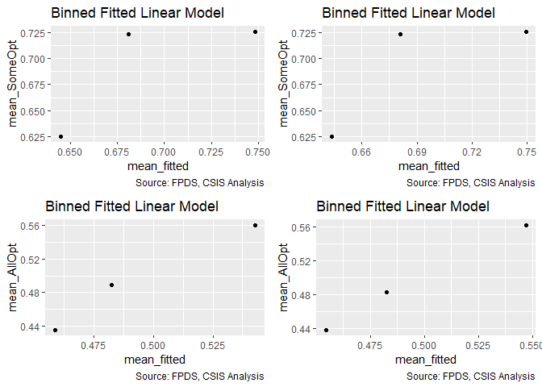<!-- -->

```
## Warning in residuals_binned(model1_old, bins = bins): Always uses Xlb
## Estimated Pr(Termination), should update.
```

```
## Warning in residuals_binned(model1_new, bins = bins): Always uses Xlb
## Estimated Pr(Termination), should update.
```

```
## Warning in residuals_binned(model2_old, bins = bins): Always uses Xlb
## Estimated Pr(Termination), should update.
```

```
## Warning in residuals_binned(model2_new, bins = bins): Always uses Xlb
## Estimated Pr(Termination), should update.
```

```
## Warning in if (class(model1_new) %in% c("glmerMod", "lme4") &
## class(model2_new) %in% : the condition has length > 1 and only the first
## element will be used
```

```
## Warning in if ((!class(model1_new) %in% c("glmerMod", "lme4") & !
## class(model2_new) %in% : the condition has length > 1 and only the first
## element will be used
```

<!-- -->

```
## [[1]]
##        model deviance null.deviance difference
## 1 model1_old 90902.10      91792.70   890.6018
## 2 model1_new 90864.56      91792.70   928.1434
## 3 model2_old 70700.98      71190.14   489.1515
## 4 model2_new 70631.26      71190.14   558.8747
```
GVIF above acceptable threshold in both models - will not include.

####22B: Cumulative

```r
#Create the model
b_SomeOpt_CFTE_pricing_22B <- glm(data=serv_opt,
                        b_SomeOpt ~  cln_US6sal + 
                   cln_PSCrate+ cp_OffPerf7+cp_OffPSC7+
                 cn_PairHist7+#cln_PairCA+
                 cln_Base + clr_Ceil2Base + cln_Days+
                 Comp+
                   Veh+
                   Pricing+
                   Crisis+
                 cln_Def6HHI+clr_Def6toUS+
                 cln_Def3HHI+
                   clr_Def3toUS+
                 cp_PairObl7+
                   cln_OffObl7+ 
                 cln_OffFocus+ 
                                     
                   cp_OffPerf7:cp_PairObl7+
                 cp_OffPerf7:cln_Days+
                   
                   cn_PairHist7:Pricing+
                   clr_Ceil2Base:cln_Base+
                 Pricing:cln_PSCrate, family=binomial(link="logit"))
glmer_examine(b_SomeOpt_CFTE_pricing_22B)
```

```
##                             GVIF Df GVIF^(1/(2*Df))
## cln_US6sal              2.071290  1        1.439198
## cln_PSCrate             1.644317  1        1.282309
## cp_OffPerf7             2.435754  1        1.560690
## cp_OffPSC7              2.038822  1        1.427873
## cn_PairHist7            1.509014  1        1.228419
## cln_Base                3.200542  1        1.789006
## clr_Ceil2Base           1.531764  1        1.237645
## cln_Days                1.163436  1        1.078627
## Comp                    1.682023  3        1.090533
## Veh                     3.241969  4        1.158380
## Pricing                 8.623835  6        1.196672
## Crisis                  1.551730  3        1.075976
## cln_Def6HHI             1.592568  1        1.261970
## clr_Def6toUS            1.653417  1        1.285852
## cln_Def3HHI             1.962418  1        1.400863
## clr_Def3toUS            2.193291  1        1.480977
## cp_PairObl7             2.325076  1        1.524820
## cln_OffObl7             1.250196  1        1.118122
## cln_OffFocus            1.590593  1        1.261187
## cp_OffPerf7:cp_PairObl7 1.954818  1        1.398148
## cp_OffPerf7:cln_Days    2.020059  1        1.421288
## cn_PairHist7:Pricing    3.269038  6        1.103744
## cln_Base:clr_Ceil2Base  3.014699  1        1.736289
## cln_PSCrate:Pricing     6.229988  6        1.164682
```

```r
b_SomeOpt_CFTE_pricing_22B2 <- glm(data=serv_opt,
                        b_SomeOpt ~  cln_US6sal + 
                   cln_PSCrate+ cp_OffPerf7+cp_OffPSC7+
                 cn_PairHist7+#cln_PairCA+
                 cln_Base + clr_Ceil2Base + cln_Days+
                 Comp+
                   Veh+
                   Pricing+
                   Crisis+
                 cln_Def6HHI+clr_Def6toUS+
                 cln_Def3HHI+
                   clr_Def3toUS+
                 cp_PairObl7+
                   cln_OffObl7+ 
                 cln_OffFocus+ 
                                     
                   cp_OffPerf7:cp_PairObl7+
                 cp_OffPerf7:cln_Days+
                   
                   # cn_PairHist7:Pricing+
                   clr_Ceil2Base:cln_Base+
                 Pricing:cln_PSCrate, family=binomial(link="logit"))
glmer_examine(b_SomeOpt_CFTE_pricing_22B2)
```

```
##                             GVIF Df GVIF^(1/(2*Df))
## cln_US6sal              2.071306  1        1.439203
## cln_PSCrate             1.642653  1        1.281660
## cp_OffPerf7             2.433820  1        1.560070
## cp_OffPSC7              2.033619  1        1.426050
## cn_PairHist7            1.413179  1        1.188772
## cln_Base                3.193529  1        1.787045
## clr_Ceil2Base           1.531138  1        1.237392
## cln_Days                1.163216  1        1.078525
## Comp                    1.679902  3        1.090303
## Veh                     3.229784  4        1.157835
## Pricing                 5.392179  6        1.150748
## Crisis                  1.550477  3        1.075831
## cln_Def6HHI             1.591995  1        1.261743
## clr_Def6toUS            1.652572  1        1.285524
## cln_Def3HHI             1.961545  1        1.400552
## clr_Def3toUS            2.191962  1        1.480527
## cp_PairObl7             2.300831  1        1.516849
## cln_OffObl7             1.244646  1        1.115637
## cln_OffFocus            1.587315  1        1.259887
## cp_OffPerf7:cp_PairObl7 1.934696  1        1.390933
## cp_OffPerf7:cln_Days    2.017754  1        1.420477
## cln_Base:clr_Ceil2Base  3.010703  1        1.735138
## cln_PSCrate:Pricing     4.801225  6        1.139671
```

```r
b_AllOpt_CFTE_pricing_22B <- glm(data=serv_exeropt, family=binomial(link="logit"), b_AllOpt ~ cln_US6sal + 
                   cln_PSCrate+ cp_OffPerf7+cp_OffPSC7+
                 cn_PairHist7+cln_PairCA+
                 cln_Base + clr_Ceil2Base + cln_Days+
                 Comp+
                   Veh+
                   Pricing+
                   Crisis+
                 cln_Def6HHI+clr_Def6toUS+
                 cln_Def3HHI+
                   clr_Def3toUS+
                 cp_PairObl7+
                   cln_OffObl7+ 
                   
                 cln_OffFocus+
                 cp_OffPerf7:cp_PairObl7+
                   
                   Pricing:cln_PSCrate)
glmer_examine(b_AllOpt_CFTE_pricing_22B)
```

```
##                             GVIF Df GVIF^(1/(2*Df))
## cln_US6sal              2.172989  1        1.474106
## cln_PSCrate             1.613169  1        1.270106
## cp_OffPerf7             1.239824  1        1.113474
## cp_OffPSC7              1.608345  1        1.268205
## cn_PairHist7            1.512283  1        1.229749
## cln_PairCA              2.653167  1        1.628854
## cln_Base                1.544245  1        1.242676
## clr_Ceil2Base           1.183507  1        1.087891
## cln_Days                1.069675  1        1.034251
## Comp                    1.413407  3        1.059362
## Veh                     2.716454  4        1.133053
## Pricing                 6.489363  6        1.168647
## Crisis                  1.270917  3        1.040765
## cln_Def6HHI             1.505392  1        1.226944
## clr_Def6toUS            1.489677  1        1.220523
## cln_Def3HHI             2.056078  1        1.433903
## clr_Def3toUS            2.075269  1        1.440579
## cp_PairObl7             1.702291  1        1.304719
## cln_OffObl7             1.179391  1        1.085997
## cln_OffFocus            1.280974  1        1.131801
## cp_OffPerf7:cp_PairObl7 1.363452  1        1.167670
## cln_PSCrate:Pricing     5.504910  6        1.152734
```

```r
#Compare the models
  stargazer::stargazer(b_SomeOpt_base2ceil_ceiling_21B, b_SomeOpt_CFTE_pricing_22B,
                       b_SomeOpt_CFTE_pricing_22B2,
                       b_AllOpt_partnership_share_17B, b_AllOpt_CFTE_pricing_22B, type="text", digits=2)
```

```
## 
## ===============================================================================================
##                                                           Dependent variable:                  
##                                          ------------------------------------------------------
##                                                     b_SomeOpt                   b_AllOpt       
##                                             (1)        (2)        (3)        (4)        (5)    
## -----------------------------------------------------------------------------------------------
## cln_US6sal                                  0.03       0.03       0.03     -0.06**    -0.05**  
##                                            (0.02)     (0.02)     (0.02)     (0.02)     (0.02)  
##                                                                                                
## cln_PSCrate                               -0.15***   -0.15***   -0.15***   -0.13***   -0.17*** 
##                                            (0.02)     (0.02)     (0.02)     (0.03)     (0.03)  
##                                                                                                
## cp_OffPerf7                               -0.12***   -0.11***   -0.11***   -0.07***   -0.07*** 
##                                            (0.03)     (0.03)     (0.03)     (0.02)     (0.02)  
##                                                                                                
## cp_OffPSC7                                0.62***    0.62***    0.62***    -0.35***   -0.36*** 
##                                            (0.03)     (0.03)     (0.03)     (0.04)     (0.04)  
##                                                                                                
## cn_PairHist7                              0.28***    0.29***    0.29***    0.20***    0.20***  
##                                            (0.02)     (0.02)     (0.02)     (0.02)     (0.02)  
##                                                                                                
## cln_PairCA                                                                 -0.47***   -0.47*** 
##                                                                             (0.04)     (0.04)  
##                                                                                                
## cln_Base                                    0.04       0.04       0.04      -0.04      -0.03   
##                                            (0.03)     (0.03)     (0.03)     (0.02)     (0.02)  
##                                                                                                
## clr_Ceil2Base                             0.45***    0.45***    0.44***    -0.81***   -0.81*** 
##                                            (0.01)     (0.01)     (0.01)     (0.02)     (0.02)  
##                                                                                                
## cln_Days                                  0.57***    0.58***    0.58***    -0.41***   -0.41*** 
##                                            (0.03)     (0.03)     (0.03)     (0.04)     (0.04)  
##                                                                                                
## Comp1 offer                                -0.04      -0.03      -0.03      -0.01      -0.01   
##                                            (0.03)     (0.03)     (0.03)     (0.03)     (0.03)  
##                                                                                                
## Comp2-4 offers                             -0.04      -0.04*     -0.04     -0.06**    -0.06**  
##                                            (0.02)     (0.02)     (0.02)     (0.03)     (0.03)  
##                                                                                                
## Comp5+ offers                              0.05*      0.05*      0.05*     -0.19***   -0.19*** 
##                                            (0.03)     (0.03)     (0.03)     (0.03)     (0.03)  
##                                                                                                
## VehS-IDC                                  -0.64***   -0.64***   -0.64***   -0.50***   -0.49*** 
##                                            (0.03)     (0.03)     (0.03)     (0.04)     (0.04)  
##                                                                                                
## VehM-IDC                                  -0.20***   -0.21***   -0.20***   -0.11***   -0.12*** 
##                                            (0.03)     (0.03)     (0.03)     (0.03)     (0.03)  
##                                                                                                
## VehFSS/GWAC                                -0.03      -0.03      -0.03       0.05       0.05   
##                                            (0.03)     (0.03)     (0.03)     (0.03)     (0.03)  
##                                                                                                
## VehBPA/BOA                                -1.79***   -1.79***   -1.79***   -0.24***   -0.23*** 
##                                            (0.05)     (0.05)     (0.05)     (0.08)     (0.08)  
##                                                                                                
## PricingOther FP                           -0.74***   -0.87***   -0.82***   -0.84***   -0.79*** 
##                                            (0.15)     (0.16)     (0.14)     (0.18)     (0.20)  
##                                                                                                
## PricingT&M/LH/FPLOE                         0.07       0.03       0.02       0.07       0.04   
##                                            (0.06)     (0.06)     (0.06)     (0.06)     (0.06)  
##                                                                                                
## PricingIncentive                           -0.25      -0.30      -0.05     0.91***    0.89***  
##                                            (0.30)     (0.30)     (0.29)     (0.24)     (0.30)  
##                                                                                                
## PricingOther CB                           0.27***    0.28***    0.29***    0.74***    0.62***  
##                                            (0.05)     (0.06)     (0.06)     (0.05)     (0.06)  
##                                                                                                
## PricingUCA                                  0.05      -0.01      -0.03     0.32***      0.04   
##                                            (0.11)     (0.12)     (0.12)     (0.12)     (0.14)  
##                                                                                                
## PricingCombination or Other               0.45***    0.50***    0.63***      0.09       0.02   
##                                            (0.08)     (0.09)     (0.08)     (0.06)     (0.06)  
##                                                                                                
## CrisisARRA                                -0.34**    -0.35**    -0.34**     -0.33      -0.34   
##                                            (0.16)     (0.16)     (0.16)     (0.21)     (0.21)  
##                                                                                                
## CrisisDis                                  -0.22      -0.22      -0.23     -1.40***   -1.39*** 
##                                            (0.29)     (0.29)     (0.29)     (0.40)     (0.40)  
##                                                                                                
## CrisisOCO                                 -0.80***   -0.79***   -0.79***   -0.37***   -0.37*** 
##                                            (0.06)     (0.06)     (0.06)     (0.08)     (0.08)  
##                                                                                                
## cln_Def6HHI                                -0.04      -0.04      -0.04*     -0.02      -0.01   
##                                            (0.02)     (0.02)     (0.02)     (0.03)     (0.03)  
##                                                                                                
## clr_Def6toUS                               -0.05*     -0.04      -0.04       0.02       0.02   
##                                            (0.03)     (0.03)     (0.03)     (0.03)     (0.03)  
##                                                                                                
## cln_Def3HHI                               0.16***    0.17***    0.17***    -0.10***   -0.10*** 
##                                            (0.03)     (0.03)     (0.03)     (0.03)     (0.03)  
##                                                                                                
## clr_Def3toUS                              0.12***    0.12***    0.12***    0.31***    0.30***  
##                                            (0.03)     (0.03)     (0.03)     (0.03)     (0.03)  
##                                                                                                
## cp_PairObl7                               -0.33***   -0.37***   -0.37***   -0.12***   -0.13*** 
##                                            (0.03)     (0.03)     (0.03)     (0.05)     (0.05)  
##                                                                                                
## cln_OffObl7                               0.06***      0.02       0.02       0.02       0.03   
##                                            (0.02)     (0.02)     (0.02)     (0.02)     (0.02)  
##                                                                                                
## cln_OffFocus                              -0.54***   -0.53***   -0.54***   -0.17***   -0.18*** 
##                                            (0.02)     (0.02)     (0.02)     (0.03)     (0.03)  
##                                                                                                
## cp_OffPerf7:cp_PairObl7                   0.27***    0.29***    0.29***     0.18**     0.18**  
##                                            (0.06)     (0.06)     (0.06)     (0.08)     (0.08)  
##                                                                                                
## cp_PairObl7:cln_OffObl7                   0.28***                                              
##                                            (0.07)                                              
##                                                                                                
## cp_OffPerf7:cln_Days                      -0.16***   -0.16***   -0.16***                       
##                                            (0.06)     (0.06)     (0.06)                        
##                                                                                                
## cn_PairHist7:PricingOther FP               -0.33      -0.27                                    
##                                            (0.35)     (0.36)                                   
##                                                                                                
## cn_PairHist7:PricingT&M/LH/FPLOE            0.16       0.14                                    
##                                            (0.11)     (0.11)                                   
##                                                                                                
## cn_PairHist7:PricingIncentive             1.60***    1.46***                                   
##                                            (0.50)     (0.56)                                   
##                                                                                                
## cn_PairHist7:PricingOther CB                0.10       0.12                                    
##                                            (0.09)     (0.09)                                   
##                                                                                                
## cn_PairHist7:PricingUCA                     0.17       0.15                                    
##                                            (0.21)     (0.21)                                   
##                                                                                                
## cn_PairHist7:PricingCombination or Other  -0.56***   -0.54***                                  
##                                            (0.17)     (0.17)                                   
##                                                                                                
## cln_Base:clr_Ceil2Base                    0.35***    0.35***    0.35***                        
##                                            (0.02)     (0.02)     (0.02)                        
##                                                                                                
## cln_PSCrate:PricingOther FP                          -1.08**    -1.11**                 0.32   
##                                                       (0.49)     (0.49)                (0.61)  
##                                                                                                
## cln_PSCrate:PricingT&M/LH/FPLOE                        0.25       0.29                  0.25   
##                                                       (0.18)     (0.18)                (0.19)  
##                                                                                                
## cln_PSCrate:PricingIncentive                           0.50      1.38**                 0.17   
##                                                       (0.73)     (0.66)                (0.65)  
##                                                                                                
## cln_PSCrate:PricingOther CB                           -0.003      0.01                0.59***  
##                                                       (0.13)     (0.13)                (0.13)  
##                                                                                                
## cln_PSCrate:PricingUCA                                 0.28       0.31                1.67***  
##                                                       (0.27)     (0.27)                (0.36)  
##                                                                                                
## cln_PSCrate:PricingCombination or Other               -0.32      -0.36                0.62***  
##                                                       (0.25)     (0.24)                (0.19)  
##                                                                                                
## Constant                                  0.36***    0.35***    0.36***    1.25***    1.25***  
##                                            (0.03)     (0.03)     (0.03)     (0.04)     (0.04)  
##                                                                                                
## -----------------------------------------------------------------------------------------------
## Observations                               74,274     74,274     74,274     51,357     51,357  
## Log Likelihood                           -40,318.89 -40,321.77 -40,332.70 -30,905.93 -30,878.37
## Akaike Inf. Crit.                        80,721.77  80,737.54  80,747.40  61,879.85  61,836.75 
## ===============================================================================================
## Note:                                                               *p<0.1; **p<0.05; ***p<0.01
```

```r
summary_residual_compare(b_SomeOpt_base2ceil_ceiling_21B, b_SomeOpt_CFTE_pricing_22B,
                         b_SomeOpt_CFTE_pricing_22B, b_SomeOpt_CFTE_pricing_22B2,bins=50)
```

<!-- -->

```
## Warning in residuals_binned(model1_old, bins = bins): Always uses Xlb
## Estimated Pr(Termination), should update.
```

```
## Warning in residuals_binned(model1_new, bins = bins): Always uses Xlb
## Estimated Pr(Termination), should update.
```

```
## Warning in residuals_binned(model2_old, bins = bins): Always uses Xlb
## Estimated Pr(Termination), should update.
```

```
## Warning in residuals_binned(model2_new, bins = bins): Always uses Xlb
## Estimated Pr(Termination), should update.
```

```
## Warning in if (class(model1_new) %in% c("glmerMod", "lme4") &
## class(model2_new) %in% : the condition has length > 1 and only the first
## element will be used
```

```
## Warning in if ((!class(model1_new) %in% c("glmerMod", "lme4") & !
## class(model2_new) %in% : the condition has length > 1 and only the first
## element will be used
```

<!-- -->

```
## [[1]]
##        model deviance null.deviance difference
## 1 model1_old 80637.77       91792.7   11154.93
## 2 model1_new 80643.54       91792.7   11149.16
## 3 model2_old 80643.54       91792.7   11149.16
## 4 model2_new 80665.40       91792.7   11127.30
```

```r
summary_residual_compare(b_AllOpt_partnership_share_17B, b_AllOpt_CFTE_pricing_22B)
```

<!-- -->

```
## Warning in residuals_binned(model1_old, bins = bins): Always uses Xlb
## Estimated Pr(Termination), should update.
```

```
## Warning in residuals_binned(model1_new, bins = bins): Always uses Xlb
## Estimated Pr(Termination), should update.
```

```
## Warning in if (class(model1_new) %in% c("glmerMod", "lme4")) {: the
## condition has length > 1 and only the first element will be used
```

```
## Warning in if (!class(model1_new) %in% c("glmerMod", "lme4") & !
## class(model1_old) %in% : the condition has length > 1 and only the first
## element will be used
```

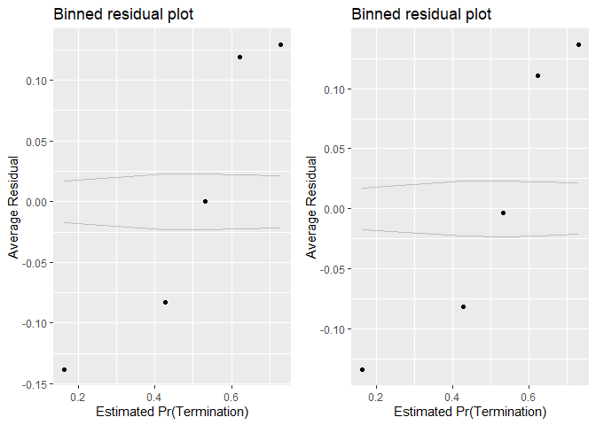<!-- -->

```
## [[1]]
##        model deviance null.deviance difference
## 1 model1_old 61811.85      71190.14   9378.284
## 2 model1_new 61756.75      71190.14   9433.387
```
Some is not significant in line with expectation and raises the AIC slightly. Swapping to use of just PSCrate:Pricing increases AIC, more though is more in line with expectations. Leaving out, though swapping for model alignment has some appeal.

Aligns with expectation and lowers AIC a bit for all options model, although incentive fee results are not significant. Tentatively adding. 

Current cumulative b_SomeOpt model: b_SomeOpt_base2ceil_ceiling_21B
Current cumulative b_AllOpt model: b_AllOpt_CFTE_pricing_22B

####23A: Office Serv. Code Exp:Office Obligations
A large office may be able to more effectively divide its attention, limiting the downsides of a small experience share.  The estimated outcomes are negative for options and positive for ceiling breaches and terminations because this would be expected to enhance the better performance outcomes expected for the input of cp_PSC7


(Options, Ceiling, Termination)
Interact: Office Obligations	cp_PSC7:cln_OffObl7			-	+	+


```r
summary_double_continuous(serv_opt,"cp_OffPSC7","cln_OffObl7",metric="opt")
```

<!-- --><!-- --><!-- -->

```r
#Create the models
b_SomeOpt23A_no_interact <- glm(data=serv_opt, b_SomeOpt ~ cp_OffPSC7 + cln_OffObl7, 
                                             family=binomial(link="logit"))
glmer_examine(b_SomeOpt23A_no_interact)
```

```
##  cp_OffPSC7 cln_OffObl7 
##    1.042877    1.042877
```

```r
b_SomeOpt23A <- glm(data=serv_opt, b_SomeOpt ~ cp_OffPSC7 + cln_OffObl7 + cp_OffPSC7:cln_OffObl7,
                                 family=binomial(link="logit"))
glmer_examine(b_SomeOpt23A)
```

```
##             cp_OffPSC7            cln_OffObl7 cp_OffPSC7:cln_OffObl7 
##               1.723177               1.699254               2.066388
```

```r
b_AllOpt23A_no_interact <- glm(data=serv_exeropt, family=binomial(link="logit"), b_AllOpt ~ cp_OffPSC7 + cln_OffObl7)
glmer_examine(b_AllOpt23A_no_interact)
```

```
##  cp_OffPSC7 cln_OffObl7 
##     1.04929     1.04929
```

```r
b_AllOpt23A <- glm(data=serv_exeropt, family=binomial(link="logit"), b_AllOpt ~ cp_OffPSC7 + cln_OffObl7 + cp_OffPSC7:cln_OffObl7)
glmer_examine(b_AllOpt23A)
```

```
##             cp_OffPSC7            cln_OffObl7 cp_OffPSC7:cln_OffObl7 
##               2.275058               3.021657               3.690468
```

```r
#compare the models

stargazer::stargazer(b_SomeOpt23A_no_interact, 
                     b_SomeOpt23A,
                     type="text", digits=2)
```

```
## 
## ===================================================
##                            Dependent variable:     
##                        ----------------------------
##                                 b_SomeOpt          
##                             (1)            (2)     
## ---------------------------------------------------
## cp_OffPSC7                 -0.03        -0.35***   
##                            (0.02)        (0.03)    
##                                                    
## cln_OffObl7               0.08***        0.33***   
##                            (0.01)        (0.02)    
##                                                    
## cp_OffPSC7:cln_OffObl7                   1.40***   
##                                          (0.06)    
##                                                    
## Constant                  0.80***        0.72***   
##                            (0.01)        (0.01)    
##                                                    
## ---------------------------------------------------
## Observations               74,274        74,274    
## Log Likelihood           -45,881.39    -45,557.94  
## Akaike Inf. Crit.        91,768.78      91,123.88  
## ===================================================
## Note:                   *p<0.1; **p<0.05; ***p<0.01
```

```r
summary_residual_compare(b_SomeOpt23A_no_interact, b_SomeOpt23A, bins=5)
```

<!-- -->

```
## Warning in residuals_binned(model1_old, bins = bins): Always uses Xlb
## Estimated Pr(Termination), should update.
```

```
## Warning in residuals_binned(model1_new, bins = bins): Always uses Xlb
## Estimated Pr(Termination), should update.
```

```
## Warning in if (class(model1_new) %in% c("glmerMod", "lme4")) {: the
## condition has length > 1 and only the first element will be used
```

```
## Warning in if (!class(model1_new) %in% c("glmerMod", "lme4") & !
## class(model1_old) %in% : the condition has length > 1 and only the first
## element will be used
```

<!-- -->

```
## [[1]]
##        model deviance null.deviance difference
## 1 model1_old 91762.78       91792.7   29.92523
## 2 model1_new 91115.88       91792.7  676.81973
```
GVIF for AllOpt model is above 2, triggering a review of the cumulative model.  Scaled GVIF in cumulative model is acceptable, so we retain the interaction here.  Interaction is strongly negative and statistically significant, as expected.

GVIF for SomeOpt model acceptable.  Interaction does not meet expectation.


####23B: Cumulative

```r
#Create the model
b_SomeOpt23B <- glm(data=serv_opt,
                        b_SomeOpt ~  cln_US6sal + 
                   cln_PSCrate+ cp_OffPerf7+cp_OffPSC7+
                 cn_PairHist7+#cln_PairCA+
                 cln_Base + clr_Ceil2Base + cln_Days+
                 Comp+
                   Veh+
                   Pricing+
                   Crisis+
                 cln_Def6HHI+clr_Def6toUS+
                 cln_Def3HHI+
                   clr_Def3toUS+
                 cp_PairObl7+
                   cln_OffObl7+ 
                 cln_OffFocus+ 
                   cp_OffPerf7:cp_PairObl7+
                   cln_OffObl7:cp_PairObl7+
                 cn_PairHist7:Pricing + 
                   clr_Ceil2Base:cln_Base+
                   cp_OffPSC7:cln_OffObl7, family=binomial(link="logit"))
glmer_examine(b_SomeOpt23B)
```

```
##                             GVIF Df GVIF^(1/(2*Df))
## cln_US6sal              2.070478  1        1.438916
## cln_PSCrate             1.559698  1        1.248879
## cp_OffPerf7             1.369406  1        1.170216
## cp_OffPSC7              2.840574  1        1.685400
## cn_PairHist7            1.508503  1        1.228211
## cln_Base                3.143322  1        1.772942
## clr_Ceil2Base           1.546137  1        1.243437
## cln_Days                1.138147  1        1.066840
## Comp                    1.681102  3        1.090433
## Veh                     3.213169  4        1.157089
## Pricing                 2.756467  6        1.088168
## Crisis                  1.643258  3        1.086303
## cln_Def6HHI             1.592812  1        1.262067
## clr_Def6toUS            1.667964  1        1.291497
## cln_Def3HHI             1.966716  1        1.402396
## clr_Def3toUS            2.273942  1        1.507959
## cp_PairObl7             2.864733  1        1.692552
## cln_OffObl7             3.086578  1        1.756866
## cln_OffFocus            1.532111  1        1.237785
## cp_OffPerf7:cp_PairObl7 2.137569  1        1.462043
## cp_PairObl7:cln_OffObl7 1.726364  1        1.313912
## cn_PairHist7:Pricing    2.422274  6        1.076511
## cln_Base:clr_Ceil2Base  2.929202  1        1.711491
## cp_OffPSC7:cln_OffObl7  3.814635  1        1.953109
```

```r
b_SomeOpt23B2 <- glm(data=serv_opt,
                        b_SomeOpt ~  cln_US6sal + 
                   cln_PSCrate+ cp_OffPerf7+cp_OffPSC7+
                 cn_PairHist7+#cln_PairCA+
                 cln_Base + clr_Ceil2Base + cln_Days+
                 Comp+
                   Veh+
                   Pricing+
                   Crisis+
                 cln_Def6HHI+clr_Def6toUS+
                 cln_Def3HHI+
                   clr_Def3toUS+
                 cp_PairObl7+
                   cln_OffObl7+ 
                 cln_OffFocus+ 
                   cp_OffPerf7:cp_PairObl7+
                 cn_PairHist7:Pricing + 
                   # clr_Ceil2Base:cln_Base+
                   cp_OffPSC7:cln_OffObl7, family=binomial(link="logit"))
glmer_examine(b_SomeOpt23B2)
```

```
##                             GVIF Df GVIF^(1/(2*Df))
## cln_US6sal              2.077312  1        1.441288
## cln_PSCrate             1.552138  1        1.245848
## cp_OffPerf7             1.369130  1        1.170098
## cp_OffPSC7              2.802976  1        1.674209
## cn_PairHist7            1.494708  1        1.222582
## cln_Base                1.717675  1        1.310601
## clr_Ceil2Base           1.497182  1        1.223594
## cln_Days                1.128277  1        1.062204
## Comp                    1.673388  3        1.089598
## Veh                     3.208683  4        1.156887
## Pricing                 2.653622  6        1.084726
## Crisis                  1.632605  3        1.085126
## cln_Def6HHI             1.584033  1        1.258584
## clr_Def6toUS            1.662701  1        1.289458
## cln_Def3HHI             1.959238  1        1.399728
## clr_Def3toUS            2.266140  1        1.505370
## cp_PairObl7             2.546329  1        1.595722
## cln_OffObl7             2.853897  1        1.689348
## cln_OffFocus            1.523153  1        1.234161
## cp_OffPerf7:cp_PairObl7 2.094001  1        1.447066
## cn_PairHist7:Pricing    2.320055  6        1.072650
## cp_OffPSC7:cln_OffObl7  3.703502  1        1.924449
```

```r
b_AllOpt23B <- glm(data=serv_exeropt, family=binomial(link="logit"), b_AllOpt ~ cln_US6sal + 
                   cln_PSCrate+ cp_OffPerf7+cp_OffPSC7+
                 cn_PairHist7+cln_PairCA+
                 cln_Base + clr_Ceil2Base + cln_Days+
                 Comp+
                   Veh+
                   Pricing+
                   Crisis+
                 cln_Def6HHI+clr_Def6toUS+
                 cln_Def3HHI+
                   clr_Def3toUS+
                 cp_PairObl7+
                   cln_OffObl7+ 
                 cln_OffFocus+
                   cp_OffPerf7:cp_PairObl7 +
                   
                   Pricing:cln_PSCrate+
                   
                   Pricing:cln_PSCrate + 
                   cp_OffPSC7:cln_OffObl7)
glmer_examine(b_AllOpt23B)
```

```
##                             GVIF Df GVIF^(1/(2*Df))
## cln_US6sal              2.181587  1        1.477020
## cln_PSCrate             1.613575  1        1.270266
## cp_OffPerf7             1.240755  1        1.113892
## cp_OffPSC7              2.423068  1        1.556621
## cn_PairHist7            1.508754  1        1.228313
## cln_PairCA              2.720681  1        1.649449
## cln_Base                1.550544  1        1.245208
## clr_Ceil2Base           1.193726  1        1.092578
## cln_Days                1.073841  1        1.036263
## Comp                    1.408921  3        1.058801
## Veh                     2.730737  4        1.133796
## Pricing                 6.517305  6        1.169066
## Crisis                  1.263413  3        1.039739
## cln_Def6HHI             1.506032  1        1.227205
## clr_Def6toUS            1.482855  1        1.217725
## cln_Def3HHI             2.054237  1        1.433261
## clr_Def3toUS            2.105926  1        1.451181
## cp_PairObl7             1.834210  1        1.354330
## cln_OffObl7             4.144551  1        2.035817
## cln_OffFocus            1.270119  1        1.126995
## cp_OffPerf7:cp_PairObl7 1.363152  1        1.167541
## cln_PSCrate:Pricing     5.529358  6        1.153160
## cp_OffPSC7:cln_OffObl7  4.608679  1        2.146783
```

```r
#Compare the models
  stargazer::stargazer(b_SomeOpt_base2ceil_ceiling_21B, b_SomeOpt23B, type="text", digits=2)
```

```
## 
## =====================================================================
##                                              Dependent variable:     
##                                          ----------------------------
##                                                   b_SomeOpt          
##                                               (1)            (2)     
## ---------------------------------------------------------------------
## cln_US6sal                                    0.03          -0.03    
##                                              (0.02)        (0.02)    
##                                                                      
## cln_PSCrate                                 -0.15***      -0.17***   
##                                              (0.02)        (0.02)    
##                                                                      
## cp_OffPerf7                                 -0.12***      -0.19***   
##                                              (0.03)        (0.02)    
##                                                                      
## cp_OffPSC7                                  0.62***        0.23***   
##                                              (0.03)        (0.04)    
##                                                                      
## cn_PairHist7                                0.28***        0.25***   
##                                              (0.02)        (0.02)    
##                                                                      
## cln_Base                                      0.04         0.09***   
##                                              (0.03)        (0.03)    
##                                                                      
## clr_Ceil2Base                               0.45***        0.39***   
##                                              (0.01)        (0.01)    
##                                                                      
## cln_Days                                    0.57***        0.49***   
##                                              (0.03)        (0.03)    
##                                                                      
## Comp1 offer                                  -0.04          -0.03    
##                                              (0.03)        (0.03)    
##                                                                      
## Comp2-4 offers                               -0.04          -0.03    
##                                              (0.02)        (0.02)    
##                                                                      
## Comp5+ offers                                0.05*          -0.02    
##                                              (0.03)        (0.03)    
##                                                                      
## VehS-IDC                                    -0.64***      -0.74***   
##                                              (0.03)        (0.03)    
##                                                                      
## VehM-IDC                                    -0.20***      -0.17***   
##                                              (0.03)        (0.03)    
##                                                                      
## VehFSS/GWAC                                  -0.03          -0.04    
##                                              (0.03)        (0.03)    
##                                                                      
## VehBPA/BOA                                  -1.79***      -1.67***   
##                                              (0.05)        (0.05)    
##                                                                      
## PricingOther FP                             -0.74***      -0.64***   
##                                              (0.15)        (0.15)    
##                                                                      
## PricingT&M/LH/FPLOE                           0.07          0.05     
##                                              (0.06)        (0.06)    
##                                                                      
## PricingIncentive                             -0.25          -0.43    
##                                              (0.30)        (0.29)    
##                                                                      
## PricingOther CB                             0.27***        0.23***   
##                                              (0.05)        (0.05)    
##                                                                      
## PricingUCA                                    0.05          0.10     
##                                              (0.11)        (0.11)    
##                                                                      
## PricingCombination or Other                 0.45***        0.47***   
##                                              (0.08)        (0.08)    
##                                                                      
## CrisisARRA                                  -0.34**        -0.36**   
##                                              (0.16)        (0.16)    
##                                                                      
## CrisisDis                                    -0.22          -0.26    
##                                              (0.29)        (0.30)    
##                                                                      
## CrisisOCO                                   -0.80***      -0.98***   
##                                              (0.06)        (0.06)    
##                                                                      
## cln_Def6HHI                                  -0.04          -0.02    
##                                              (0.02)        (0.02)    
##                                                                      
## clr_Def6toUS                                 -0.05*         -0.04    
##                                              (0.03)        (0.03)    
##                                                                      
## cln_Def3HHI                                 0.16***        0.17***   
##                                              (0.03)        (0.03)    
##                                                                      
## clr_Def3toUS                                0.12***        0.22***   
##                                              (0.03)        (0.03)    
##                                                                      
## cp_PairObl7                                 -0.33***      -0.24***   
##                                              (0.03)        (0.04)    
##                                                                      
## cln_OffObl7                                 0.06***        0.45***   
##                                              (0.02)        (0.03)    
##                                                                      
## cln_OffFocus                                -0.54***      -0.55***   
##                                              (0.02)        (0.02)    
##                                                                      
## cp_OffPerf7:cp_PairObl7                     0.27***        0.41***   
##                                              (0.06)        (0.06)    
##                                                                      
## cp_PairObl7:cln_OffObl7                     0.28***         -0.13    
##                                              (0.07)        (0.08)    
##                                                                      
## cp_OffPerf7:cln_Days                        -0.16***                 
##                                              (0.06)                  
##                                                                      
## cn_PairHist7:PricingOther FP                 -0.33          -0.22    
##                                              (0.35)        (0.36)    
##                                                                      
## cn_PairHist7:PricingT&M/LH/FPLOE              0.16          0.17     
##                                              (0.11)        (0.11)    
##                                                                      
## cn_PairHist7:PricingIncentive               1.60***        1.33***   
##                                              (0.50)        (0.51)    
##                                                                      
## cn_PairHist7:PricingOther CB                  0.10          0.07     
##                                              (0.09)        (0.09)    
##                                                                      
## cn_PairHist7:PricingUCA                       0.17          0.12     
##                                              (0.21)        (0.21)    
##                                                                      
## cn_PairHist7:PricingCombination or Other    -0.56***      -0.52***   
##                                              (0.17)        (0.17)    
##                                                                      
## cln_Base:clr_Ceil2Base                      0.35***        0.36***   
##                                              (0.02)        (0.02)    
##                                                                      
## cp_OffPSC7:cln_OffObl7                                     2.03***   
##                                                            (0.09)    
##                                                                      
## Constant                                    0.36***        0.38***   
##                                              (0.03)        (0.03)    
##                                                                      
## ---------------------------------------------------------------------
## Observations                                 74,274        74,274    
## Log Likelihood                             -40,318.89    -40,020.05  
## Akaike Inf. Crit.                          80,721.77      80,124.09  
## =====================================================================
## Note:                                     *p<0.1; **p<0.05; ***p<0.01
```

```r
summary_residual_compare(b_SomeOpt_base2ceil_ceiling_21B, b_SomeOpt23B, bins = 50)
```

<!-- -->

```
## Warning in residuals_binned(model1_old, bins = bins): Always uses Xlb
## Estimated Pr(Termination), should update.
```

```
## Warning in residuals_binned(model1_new, bins = bins): Always uses Xlb
## Estimated Pr(Termination), should update.
```

```
## Warning in if (class(model1_new) %in% c("glmerMod", "lme4")) {: the
## condition has length > 1 and only the first element will be used
```

```
## Warning in if (!class(model1_new) %in% c("glmerMod", "lme4") & !
## class(model1_old) %in% : the condition has length > 1 and only the first
## element will be used
```

<!-- -->

```
## [[1]]
##        model deviance null.deviance difference
## 1 model1_old 80637.77       91792.7   11154.93
## 2 model1_new 80040.09       91792.7   11752.61
```
For SomeOpt, interaction violates expectations and does raise GVIF near 2. Taking out clr_Ceil2Base:cln_Base does little to help.  For AllOpt, GVIF exceeds 2. Leaving out.

Current cumulative b_SomeOpt model: b_SomeOpt_base2ceil_ceiling_21B
Current cumulative b_AllOpt model: b_AllOpt_CFTE_pricing_22B


####24A:Restore cln_PairCA?

```r
#Create the model
b_SomeOpt24A <- glm(data=serv_opt,
                        b_SomeOpt ~  cln_US6sal + 
                   cln_PSCrate+ cp_OffPerf7+cp_OffPSC7+
                 cn_PairHist7+cln_PairCA+
                 cln_Base + clr_Ceil2Base + cln_Days+
                 Comp+
                   Veh+
                   Pricing+
                   Crisis+
                 cln_Def6HHI+clr_Def6toUS+
                 cln_Def3HHI+
                   clr_Def3toUS+
                 cp_PairObl7+
                   cln_OffObl7+ 
                 cln_OffFocus+ 
                   cp_OffPerf7:cp_PairObl7+
                 cn_PairHist7:Pricing + 
                   clr_Ceil2Base:cln_Base, family=binomial(link="logit"))
glmer_examine(b_SomeOpt24A)
```

```
##                             GVIF Df GVIF^(1/(2*Df))
## cln_US6sal              2.063526  1        1.436498
## cln_PSCrate             1.565388  1        1.251155
## cp_OffPerf7             1.381341  1        1.175305
## cp_OffPSC7              2.268256  1        1.506073
## cn_PairHist7            1.758420  1        1.326054
## cln_PairCA              4.039701  1        2.009901
## cln_Base                3.181698  1        1.783732
## clr_Ceil2Base           1.547019  1        1.243792
## cln_Days                1.129163  1        1.062621
## Comp                    1.678172  3        1.090116
## Veh                     3.751966  4        1.179729
## Pricing                 2.834040  6        1.090688
## Crisis                  1.588663  3        1.080203
## cln_Def6HHI             1.587612  1        1.260005
## clr_Def6toUS            1.652228  1        1.285390
## cln_Def3HHI             1.959155  1        1.399698
## clr_Def3toUS            2.203004  1        1.484252
## cp_PairObl7             2.503815  1        1.582345
## cln_OffObl7             1.254069  1        1.119852
## cln_OffFocus            1.636025  1        1.279072
## cp_OffPerf7:cp_PairObl7 1.951195  1        1.396852
## cn_PairHist7:Pricing    2.473709  6        1.078398
## cln_Base:clr_Ceil2Base  2.988892  1        1.728841
```

```r
b_SomeOpt24A2 <- glm(data=serv_opt,
                        b_SomeOpt ~  cln_US6sal + 
                   cln_PSCrate+ cp_OffPerf7+cp_OffPSC7+
                 cn_PairHist7+cln_PairCA+
                 cln_Base + clr_Ceil2Base + cln_Days+
                 Comp+
                   Veh+
                   Pricing+
                   Crisis+
                 cln_Def6HHI+clr_Def6toUS+
                 cln_Def3HHI+
                   clr_Def3toUS+
                 cp_PairObl7+
                   cln_OffObl7+ 
                 cln_OffFocus+ 
                   cp_OffPerf7:cp_PairObl7+
                   
                 cn_PairHist7:Pricing,
                   # cp_OffPSC7:cln_OffObl7+, 
                 # clr_Ceil2Base:cln_Base
                 family=binomial(link="logit"))
glmer_examine(b_SomeOpt24A2)
```

```
##                             GVIF Df GVIF^(1/(2*Df))
## cln_US6sal              2.071448  1        1.439253
## cln_PSCrate             1.556421  1        1.247566
## cp_OffPerf7             1.378038  1        1.173899
## cp_OffPSC7              2.236751  1        1.495577
## cn_PairHist7            1.754246  1        1.324480
## cln_PairCA              4.003473  1        2.000868
## cln_Base                1.730971  1        1.315664
## clr_Ceil2Base           1.502488  1        1.225760
## cln_Days                1.119516  1        1.058072
## Comp                    1.674768  3        1.089747
## Veh                     3.746610  4        1.179519
## Pricing                 2.710220  6        1.086635
## Crisis                  1.576913  3        1.078867
## cln_Def6HHI             1.578318  1        1.256311
## clr_Def6toUS            1.645896  1        1.282925
## cln_Def3HHI             1.963421  1        1.401221
## clr_Def3toUS            2.209312  1        1.486375
## cp_PairObl7             2.452364  1        1.566003
## cln_OffObl7             1.253395  1        1.119551
## cln_OffFocus            1.626705  1        1.275423
## cp_OffPerf7:cp_PairObl7 1.912083  1        1.382781
## cn_PairHist7:Pricing    2.360242  6        1.074187
```

```r
b_SomeOpt24A3 <- glm(data=serv_opt,
                        b_SomeOpt ~  cln_US6sal + 
                   cln_PSCrate+ cp_OffPerf7+cp_OffPSC7+
                 cn_PairHist7+cln_PairCA+
                 cln_Base + clr_Ceil2Base + cln_Days+
                 Comp+
                   Veh+
                   Pricing+
                   Crisis+
                 cln_Def6HHI+clr_Def6toUS+
                 cln_Def3HHI+
                   clr_Def3toUS+
                 cp_PairObl7+
                   cln_OffObl7+ 
                 cln_OffFocus+ 
                   cp_OffPerf7:cp_PairObl7,
                 # cn_PairHist7:Pricing ,#+ 
                   # clr_Ceil2Base:cln_Base,#+
                   # cp_OffPSC7:cln_OffObl7+, 
                 family=binomial(link="logit"))
glmer_examine(b_SomeOpt24A3)
```

```
##                             GVIF Df GVIF^(1/(2*Df))
## cln_US6sal              2.071068  1        1.439121
## cln_PSCrate             1.556713  1        1.247683
## cp_OffPerf7             1.375559  1        1.172842
## cp_OffPSC7              2.229185  1        1.493045
## cn_PairHist7            1.669367  1        1.292040
## cln_PairCA              3.993676  1        1.998418
## cln_Base                1.725480  1        1.313575
## clr_Ceil2Base           1.500929  1        1.225124
## cln_Days                1.119186  1        1.057916
## Comp                    1.671380  3        1.089379
## Veh                     3.724828  4        1.178659
## Pricing                 1.342485  6        1.024847
## Crisis                  1.574982  3        1.078647
## cln_Def6HHI             1.577175  1        1.255856
## clr_Def6toUS            1.645051  1        1.282595
## cln_Def3HHI             1.962081  1        1.400743
## clr_Def3toUS            2.208324  1        1.486043
## cp_PairObl7             2.427398  1        1.558011
## cln_OffObl7             1.248344  1        1.117293
## cln_OffFocus            1.623613  1        1.274211
## cp_OffPerf7:cp_PairObl7 1.890319  1        1.374889
```

```r
stargazer::stargazer(b_SomeOpt_base2ceil_ceiling_21B,b_SomeOpt24A3,type = "text", digits = 2)
```

```
## 
## =====================================================================
##                                              Dependent variable:     
##                                          ----------------------------
##                                                   b_SomeOpt          
##                                               (1)            (2)     
## ---------------------------------------------------------------------
## cln_US6sal                                    0.03          0.02     
##                                              (0.02)        (0.02)    
##                                                                      
## cln_PSCrate                                 -0.15***      -0.19***   
##                                              (0.02)        (0.02)    
##                                                                      
## cp_OffPerf7                                 -0.12***      -0.17***   
##                                              (0.03)        (0.02)    
##                                                                      
## cp_OffPSC7                                  0.62***        0.50***   
##                                              (0.03)        (0.03)    
##                                                                      
## cn_PairHist7                                0.28***        0.23***   
##                                              (0.02)        (0.02)    
##                                                                      
## cln_PairCA                                                 0.19***   
##                                                            (0.03)    
##                                                                      
## cln_Base                                      0.04         0.43***   
##                                              (0.03)        (0.02)    
##                                                                      
## clr_Ceil2Base                               0.45***        0.43***   
##                                              (0.01)        (0.01)    
##                                                                      
## cln_Days                                    0.57***        0.63***   
##                                              (0.03)        (0.03)    
##                                                                      
## Comp1 offer                                  -0.04          -0.01    
##                                              (0.03)        (0.03)    
##                                                                      
## Comp2-4 offers                               -0.04          -0.03    
##                                              (0.02)        (0.02)    
##                                                                      
## Comp5+ offers                                0.05*          0.03     
##                                              (0.03)        (0.03)    
##                                                                      
## VehS-IDC                                    -0.64***      -0.73***   
##                                              (0.03)        (0.03)    
##                                                                      
## VehM-IDC                                    -0.20***      -0.23***   
##                                              (0.03)        (0.03)    
##                                                                      
## VehFSS/GWAC                                  -0.03          -0.03    
##                                              (0.03)        (0.03)    
##                                                                      
## VehBPA/BOA                                  -1.79***      -2.00***   
##                                              (0.05)        (0.05)    
##                                                                      
## PricingOther FP                             -0.74***      -0.64***   
##                                              (0.15)        (0.13)    
##                                                                      
## PricingT&M/LH/FPLOE                           0.07          0.07     
##                                              (0.06)        (0.06)    
##                                                                      
## PricingIncentive                             -0.25          0.26     
##                                              (0.30)        (0.25)    
##                                                                      
## PricingOther CB                             0.27***        0.30***   
##                                              (0.05)        (0.05)    
##                                                                      
## PricingUCA                                    0.05          0.05     
##                                              (0.11)        (0.11)    
##                                                                      
## PricingCombination or Other                 0.45***        0.59***   
##                                              (0.08)        (0.07)    
##                                                                      
## CrisisARRA                                  -0.34**       -0.48***   
##                                              (0.16)        (0.16)    
##                                                                      
## CrisisDis                                    -0.22          -0.36    
##                                              (0.29)        (0.30)    
##                                                                      
## CrisisOCO                                   -0.80***      -0.89***   
##                                              (0.06)        (0.06)    
##                                                                      
## cln_Def6HHI                                  -0.04          -0.01    
##                                              (0.02)        (0.02)    
##                                                                      
## clr_Def6toUS                                 -0.05*        -0.06**   
##                                              (0.03)        (0.03)    
##                                                                      
## cln_Def3HHI                                 0.16***        0.19***   
##                                              (0.03)        (0.03)    
##                                                                      
## clr_Def3toUS                                0.12***        0.17***   
##                                              (0.03)        (0.03)    
##                                                                      
## cp_PairObl7                                 -0.33***      -0.42***   
##                                              (0.03)        (0.03)    
##                                                                      
## cln_OffObl7                                 0.06***         0.01     
##                                              (0.02)        (0.02)    
##                                                                      
## cln_OffFocus                                -0.54***      -0.60***   
##                                              (0.02)        (0.02)    
##                                                                      
## cp_OffPerf7:cp_PairObl7                     0.27***        0.29***   
##                                              (0.06)        (0.06)    
##                                                                      
## cp_PairObl7:cln_OffObl7                     0.28***                  
##                                              (0.07)                  
##                                                                      
## cp_OffPerf7:cln_Days                        -0.16***                 
##                                              (0.06)                  
##                                                                      
## cn_PairHist7:PricingOther FP                 -0.33                   
##                                              (0.35)                  
##                                                                      
## cn_PairHist7:PricingT&M/LH/FPLOE              0.16                   
##                                              (0.11)                  
##                                                                      
## cn_PairHist7:PricingIncentive               1.60***                  
##                                              (0.50)                  
##                                                                      
## cn_PairHist7:PricingOther CB                  0.10                   
##                                              (0.09)                  
##                                                                      
## cn_PairHist7:PricingUCA                       0.17                   
##                                              (0.21)                  
##                                                                      
## cn_PairHist7:PricingCombination or Other    -0.56***                 
##                                              (0.17)                  
##                                                                      
## cln_Base:clr_Ceil2Base                      0.35***                  
##                                              (0.02)                  
##                                                                      
## Constant                                    0.36***        0.34***   
##                                              (0.03)        (0.03)    
##                                                                      
## ---------------------------------------------------------------------
## Observations                                 74,274        74,274    
## Log Likelihood                             -40,318.89    -40,523.19  
## Akaike Inf. Crit.                          80,721.77      81,114.37  
## =====================================================================
## Note:                                     *p<0.1; **p<0.05; ***p<0.01
```
Still encounters VIF trouble.

####24B: Office Serv. Code Exp:Office Focus
A large office may be able to more effectively divide its attention, limiting the downsizes of a small experience share.  The estimated outcomes are negative for options and positive for ceiling breaches and terminations because this would be expected to enhance the better performance outcomes expected for the input of cp_PSC7

(Options, Ceiling, Termination)
Interact: Office Obligations	cp_PSC7:cln_OffObl7			-	+	+


```r
#Create the models
b_SomeOpt24B_no_interact <- glm(data=serv_opt, b_SomeOpt ~ cp_OffPSC7 + cln_OffFocus, 
                                             family=binomial(link="logit"))
glmer_examine(b_SomeOpt24B_no_interact)
```

```
##   cp_OffPSC7 cln_OffFocus 
##     1.338223     1.338223
```

```r
b_SomeOpt24B <- glm(data=serv_opt, b_SomeOpt ~ cp_OffPSC7 + cln_OffFocus + cp_OffPSC7:cln_OffFocus,
                                 family=binomial(link="logit"))
glmer_examine(b_SomeOpt24B)
```

```
##              cp_OffPSC7            cln_OffFocus cp_OffPSC7:cln_OffFocus 
##                2.944824                1.367572                2.412636
```

```r
b_AllOpt24B_no_interact <- glm(data=serv_exeropt, b_AllOpt ~ cp_OffPSC7 + cln_OffFocus, 
                                             family=binomial(link="logit"))
glmer_examine(b_AllOpt24B_no_interact)
```

```
##   cp_OffPSC7 cln_OffFocus 
##     1.264739     1.264739
```

```r
b_AllOpt24B <- glm(data=serv_exeropt, b_AllOpt ~ cp_OffPSC7 + cln_OffFocus + cp_OffPSC7:cln_OffFocus, family = binomial(link = "logit"))
glmer_examine(b_AllOpt24B)
```

```
##              cp_OffPSC7            cln_OffFocus cp_OffPSC7:cln_OffFocus 
##                1.779087                1.267770                1.517550
```

```r
stargazer::stargazer(b_AllOpt24B, type = "text", digits = 2)
```

```
## 
## ===================================================
##                             Dependent variable:    
##                         ---------------------------
##                                  b_AllOpt          
## ---------------------------------------------------
## cp_OffPSC7                       -0.36***          
##                                   (0.04)           
##                                                    
## cln_OffFocus                     -0.57***          
##                                   (0.03)           
##                                                    
## cp_OffPSC7:cln_OffFocus          -2.17***          
##                                   (0.07)           
##                                                    
## Constant                          0.09***          
##                                   (0.01)           
##                                                    
## ---------------------------------------------------
## Observations                      51,357           
## Log Likelihood                  -33,366.26         
## Akaike Inf. Crit.                66,740.53         
## ===================================================
## Note:                   *p<0.1; **p<0.05; ***p<0.01
```
VIF measures indicate multicolinearity for SomeOpt model, and so not included.  Requires checking of cumulative model specification for AllOpt, where it is accepted.  Expectations met for AllOpt model.


####24C: Cumulative

```r
#Create the model
b_SomeOpt24C <- glm(data=serv_opt,
                        b_SomeOpt ~  cln_US6sal + 
                   cln_PSCrate+ cp_OffPerf7+cp_OffPSC7+
                 cn_PairHist7+#cln_PairCA+
                 cln_Base + clr_Ceil2Base + cln_Days+
                 Comp+
                   Veh+
                   Pricing+
                   Crisis+
                 cln_Def6HHI+clr_Def6toUS+
                 cln_Def3HHI+
                   clr_Def3toUS+
                 cp_PairObl7+
                   cln_OffObl7+ 
                 cln_OffFocus+ 
                   cp_OffPerf7:cp_PairObl7+
                 cn_PairHist7:Pricing + 
                   clr_Ceil2Base:cln_Base+
                   cp_OffPSC7:cln_OffFocus, family=binomial(link="logit"))
glmer_examine(b_SomeOpt24C)
```

```
##                             GVIF Df GVIF^(1/(2*Df))
## cln_US6sal              2.066409  1        1.437501
## cln_PSCrate             1.563352  1        1.250341
## cp_OffPerf7             1.392230  1        1.179928
## cp_OffPSC7              3.622453  1        1.903274
## cn_PairHist7            1.507966  1        1.227993
## cln_Base                3.193214  1        1.786957
## clr_Ceil2Base           1.542281  1        1.241886
## cln_Days                1.127485  1        1.061831
## Comp                    1.696773  3        1.092121
## Veh                     3.281248  4        1.160125
## Pricing                 2.798292  6        1.089535
## Crisis                  1.548336  3        1.075584
## cln_Def6HHI             1.587127  1        1.259812
## clr_Def6toUS            1.667134  1        1.291176
## cln_Def3HHI             1.958357  1        1.399413
## clr_Def3toUS            2.237210  1        1.495731
## cp_PairObl7             2.306321  1        1.518658
## cln_OffObl7             1.247003  1        1.116693
## cln_OffFocus            1.622322  1        1.273704
## cp_OffPerf7:cp_PairObl7 1.924975  1        1.387435
## cn_PairHist7:Pricing    2.462571  6        1.077992
## cln_Base:clr_Ceil2Base  2.991319  1        1.729543
## cp_OffPSC7:cln_OffFocus 2.648291  1        1.627357
```

```r
b_SomeOpt24C2 <- glm(data=serv_opt,
                        b_SomeOpt ~  cln_US6sal + 
                   cln_PSCrate+ cp_OffPerf7+cp_OffPSC7+
                 cn_PairHist7+#cln_PairCA+
                 cln_Base + clr_Ceil2Base + cln_Days+
                 Comp+
                   Veh+
                   Pricing+
                   Crisis+
                 cln_Def6HHI+clr_Def6toUS+
                 cln_Def3HHI+
                   clr_Def3toUS+
                 cp_PairObl7+
                   cln_OffObl7+ 
                 cln_OffFocus+ 
                   cp_OffPerf7:cp_PairObl7+
                   
                   cn_PairHist7:Pricing + 
                   # clr_Ceil2Base:cln_Base
                   cp_OffPSC7:cln_OffFocus, family=binomial(link="logit"))
glmer_examine(b_SomeOpt24C2)
```

```
##                             GVIF Df GVIF^(1/(2*Df))
## cln_US6sal              2.073327  1        1.439905
## cln_PSCrate             1.553553  1        1.246416
## cp_OffPerf7             1.390496  1        1.179193
## cp_OffPSC7              3.585078  1        1.893430
## cn_PairHist7            1.501313  1        1.225281
## cln_Base                1.726538  1        1.313978
## clr_Ceil2Base           1.492685  1        1.221755
## cln_Days                1.118243  1        1.057470
## Comp                    1.690822  3        1.091481
## Veh                     3.257034  4        1.159052
## Pricing                 2.690863  6        1.085986
## Crisis                  1.535591  3        1.074103
## cln_Def6HHI             1.577762  1        1.256090
## clr_Def6toUS            1.662762  1        1.289481
## cln_Def3HHI             1.962287  1        1.400816
## clr_Def3toUS            2.241837  1        1.497276
## cp_PairObl7             2.252828  1        1.500942
## cln_OffObl7             1.245169  1        1.115871
## cln_OffFocus            1.609687  1        1.268734
## cp_OffPerf7:cp_PairObl7 1.881184  1        1.371563
## cn_PairHist7:Pricing    2.359594  6        1.074162
## cp_OffPSC7:cln_OffFocus 2.626024  1        1.620501
```

```r
#AllOpt
b_AllOpt24C <- glm(data=serv_exeropt, family=binomial(link="logit"), b_AllOpt ~ cln_US6sal + 
                   cln_PSCrate+ cp_OffPerf7+cp_OffPSC7+
                 cn_PairHist7+cln_PairCA+
                 cln_Base + clr_Ceil2Base + cln_Days+
                 Comp+
                   Veh+
                   Pricing+
                   Crisis+
                 cln_Def6HHI+clr_Def6toUS+
                 cln_Def3HHI+
                   clr_Def3toUS+
                 cp_PairObl7+
                   cln_OffObl7+ 
                 cln_OffFocus+
                   cp_OffPerf7:cp_PairObl7 + 
                   
                   Pricing:cln_PSCrate+ 
                   cp_OffPSC7:cln_OffFocus)
glmer_examine(b_AllOpt24C)
```

```
##                             GVIF Df GVIF^(1/(2*Df))
## cln_US6sal              2.172875  1        1.474067
## cln_PSCrate             1.612235  1        1.269738
## cp_OffPerf7             1.260286  1        1.122625
## cp_OffPSC7              2.125317  1        1.457847
## cn_PairHist7            1.504154  1        1.226440
## cln_PairCA              2.641185  1        1.625172
## cln_Base                1.558331  1        1.248331
## clr_Ceil2Base           1.182082  1        1.087236
## cln_Days                1.065078  1        1.032026
## Comp                    1.415371  3        1.059608
## Veh                     2.715961  4        1.133027
## Pricing                 6.487690  6        1.168622
## Crisis                  1.264785  3        1.039927
## cln_Def6HHI             1.501607  1        1.225401
## clr_Def6toUS            1.469613  1        1.212276
## cln_Def3HHI             2.058733  1        1.434829
## clr_Def3toUS            2.076907  1        1.441148
## cp_PairObl7             1.695626  1        1.302162
## cln_OffObl7             1.178608  1        1.085637
## cln_OffFocus            1.346814  1        1.160523
## cp_OffPerf7:cp_PairObl7 1.374406  1        1.172351
## cln_PSCrate:Pricing     5.503208  6        1.152705
## cp_OffPSC7:cln_OffFocus 1.668032  1        1.291523
```

```r
stargazer::stargazer(b_SomeOpt_base2ceil_ceiling_21B,b_SomeOpt24C2,
                     b_AllOpt_CFTE_pricing_22B, b_AllOpt24C, type = "text", digits = 2)
```

```
## 
## ====================================================================================
##                                                      Dependent variable:            
##                                          -------------------------------------------
##                                                b_SomeOpt             b_AllOpt       
##                                             (1)        (2)        (3)        (4)    
## ------------------------------------------------------------------------------------
## cln_US6sal                                  0.03       0.03     -0.05**     -0.05*  
##                                            (0.02)     (0.02)     (0.02)     (0.02)  
##                                                                                     
## cln_PSCrate                               -0.15***   -0.19***   -0.17***   -0.16*** 
##                                            (0.02)     (0.02)     (0.03)     (0.03)  
##                                                                                     
## cp_OffPerf7                               -0.12***   -0.14***   -0.07***    -0.04*  
##                                            (0.03)     (0.02)     (0.02)     (0.02)  
##                                                                                     
## cp_OffPSC7                                0.62***    0.76***    -0.36***   -0.16*** 
##                                            (0.03)     (0.04)     (0.04)     (0.04)  
##                                                                                     
## cn_PairHist7                              0.28***    0.28***    0.20***    0.19***  
##                                            (0.02)     (0.02)     (0.02)     (0.02)  
##                                                                                     
## cln_PairCA                                                      -0.47***   -0.43*** 
##                                                                  (0.04)     (0.04)  
##                                                                                     
## cln_Base                                    0.04     0.42***     -0.03     -0.06**  
##                                            (0.03)     (0.02)     (0.02)     (0.02)  
##                                                                                     
## clr_Ceil2Base                             0.45***    0.45***    -0.81***   -0.80*** 
##                                            (0.01)     (0.01)     (0.02)     (0.02)  
##                                                                                     
## cln_Days                                  0.57***    0.62***    -0.41***   -0.41*** 
##                                            (0.03)     (0.03)     (0.04)     (0.04)  
##                                                                                     
## Comp1 offer                                -0.04      -0.03      -0.01      -0.02   
##                                            (0.03)     (0.03)     (0.03)     (0.03)  
##                                                                                     
## Comp2-4 offers                             -0.04      -0.02     -0.06**     -0.05*  
##                                            (0.02)     (0.02)     (0.03)     (0.03)  
##                                                                                     
## Comp5+ offers                              0.05*       0.04     -0.19***   -0.18*** 
##                                            (0.03)     (0.03)     (0.03)     (0.03)  
##                                                                                     
## VehS-IDC                                  -0.64***   -0.68***   -0.49***   -0.53*** 
##                                            (0.03)     (0.03)     (0.04)     (0.04)  
##                                                                                     
## VehM-IDC                                  -0.20***   -0.20***   -0.12***   -0.15*** 
##                                            (0.03)     (0.03)     (0.03)     (0.03)  
##                                                                                     
## VehFSS/GWAC                                -0.03      -0.02       0.05       0.04   
##                                            (0.03)     (0.03)     (0.03)     (0.03)  
##                                                                                     
## VehBPA/BOA                                -1.79***   -2.00***   -0.23***   -0.30*** 
##                                            (0.05)     (0.05)     (0.08)     (0.09)  
##                                                                                     
## PricingOther FP                           -0.74***   -0.74***   -0.79***   -0.78*** 
##                                            (0.15)     (0.15)     (0.20)     (0.20)  
##                                                                                     
## PricingT&M/LH/FPLOE                         0.07      0.10*       0.04       0.03   
##                                            (0.06)     (0.06)     (0.06)     (0.06)  
##                                                                                     
## PricingIncentive                           -0.25      -0.17     0.89***    0.92***  
##                                            (0.30)     (0.28)     (0.30)     (0.29)  
##                                                                                     
## PricingOther CB                           0.27***    0.31***    0.62***    0.61***  
##                                            (0.05)     (0.05)     (0.06)     (0.06)  
##                                                                                     
## PricingUCA                                  0.05       0.06       0.04       0.05   
##                                            (0.11)     (0.11)     (0.14)     (0.14)  
##                                                                                     
## PricingCombination or Other               0.45***    0.48***      0.02       0.01   
##                                            (0.08)     (0.08)     (0.06)     (0.06)  
##                                                                                     
## CrisisARRA                                -0.34**    -0.46***    -0.34      -0.33   
##                                            (0.16)     (0.16)     (0.21)     (0.21)  
##                                                                                     
## CrisisDis                                  -0.22      -0.36     -1.39***   -1.39*** 
##                                            (0.29)     (0.30)     (0.40)     (0.41)  
##                                                                                     
## CrisisOCO                                 -0.80***   -0.83***   -0.37***   -0.35*** 
##                                            (0.06)     (0.06)     (0.08)     (0.08)  
##                                                                                     
## cln_Def6HHI                                -0.04      0.001      -0.01      -0.004  
##                                            (0.02)     (0.02)     (0.03)     (0.03)  
##                                                                                     
## clr_Def6toUS                               -0.05*    -0.08***     0.02       0.01   
##                                            (0.03)     (0.03)     (0.03)     (0.03)  
##                                                                                     
## cln_Def3HHI                               0.16***    0.19***    -0.10***   -0.10*** 
##                                            (0.03)     (0.03)     (0.03)     (0.03)  
##                                                                                     
## clr_Def3toUS                              0.12***    0.13***    0.30***    0.27***  
##                                            (0.03)     (0.03)     (0.03)     (0.03)  
##                                                                                     
## cp_PairObl7                               -0.33***   -0.39***   -0.13***   -0.17*** 
##                                            (0.03)     (0.03)     (0.05)     (0.05)  
##                                                                                     
## cln_OffObl7                               0.06***      0.02       0.03       0.03   
##                                            (0.02)     (0.02)     (0.02)     (0.02)  
##                                                                                     
## cln_OffFocus                              -0.54***   -0.59***   -0.18***   -0.24*** 
##                                            (0.02)     (0.02)     (0.03)     (0.03)  
##                                                                                     
## cp_OffPerf7:cp_PairObl7                   0.27***    0.28***     0.18**    0.24***  
##                                            (0.06)     (0.06)     (0.08)     (0.08)  
##                                                                                     
## cp_PairObl7:cln_OffObl7                   0.28***                                   
##                                            (0.07)                                   
##                                                                                     
## cp_OffPerf7:cln_Days                      -0.16***                                  
##                                            (0.06)                                   
##                                                                                     
## cn_PairHist7:PricingOther FP               -0.33      -0.40                         
##                                            (0.35)     (0.35)                        
##                                                                                     
## cn_PairHist7:PricingT&M/LH/FPLOE            0.16       0.17                         
##                                            (0.11)     (0.11)                        
##                                                                                     
## cn_PairHist7:PricingIncentive             1.60***    1.46***                        
##                                            (0.50)     (0.49)                        
##                                                                                     
## cn_PairHist7:PricingOther CB                0.10       0.09                         
##                                            (0.09)     (0.09)                        
##                                                                                     
## cn_PairHist7:PricingUCA                     0.17       0.14                         
##                                            (0.21)     (0.21)                        
##                                                                                     
## cn_PairHist7:PricingCombination or Other  -0.56***   -0.57***                       
##                                            (0.17)     (0.17)                        
##                                                                                     
## cln_Base:clr_Ceil2Base                    0.35***                                   
##                                            (0.02)                                   
##                                                                                     
## cp_OffPSC7:cln_OffFocus                              -0.45***              -0.70*** 
##                                                       (0.06)                (0.08)  
##                                                                                     
## cln_PSCrate:PricingOther FP                                       0.32       0.33   
##                                                                  (0.61)     (0.61)  
##                                                                                     
## cln_PSCrate:PricingIncentive                                      0.17       0.23   
##                                                                  (0.65)     (0.65)  
##                                                                                     
## cln_PSCrate:PricingCombination or Other                         0.62***    0.59***  
##                                                                  (0.19)     (0.19)  
##                                                                                     
## cln_PSCrate:PricingOther CB                                     0.59***    0.56***  
##                                                                  (0.13)     (0.13)  
##                                                                                     
## cln_PSCrate:PricingT&M/LH/FPLOE                                   0.25       0.21   
##                                                                  (0.19)     (0.19)  
##                                                                                     
## cln_PSCrate:PricingUCA                                          1.67***    1.66***  
##                                                                  (0.36)     (0.36)  
##                                                                                     
## Constant                                  0.36***    0.32***    1.25***    1.31***  
##                                            (0.03)     (0.03)     (0.04)     (0.04)  
##                                                                                     
## ------------------------------------------------------------------------------------
## Observations                               74,274     74,274     51,357     51,357  
## Log Likelihood                           -40,318.89 -40,496.06 -30,878.37 -30,835.09
## Akaike Inf. Crit.                        80,721.77  81,072.13  61,836.75  61,752.17 
## ====================================================================================
## Note:                                                    *p<0.1; **p<0.05; ***p<0.01
```

```r
summary_residual_compare(b_SomeOpt_base2ceil_ceiling_21B,b_SomeOpt24C2,
                         b_AllOpt_CFTE_pricing_22B, b_AllOpt24C, bins = 50)
```

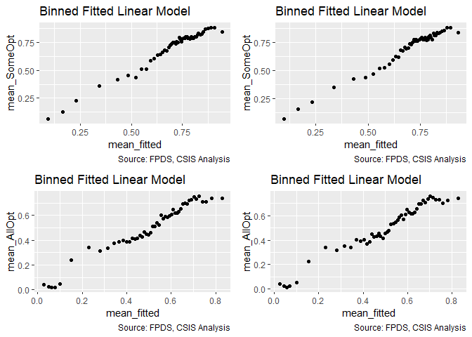<!-- -->

```
## Warning in residuals_binned(model1_old, bins = bins): Always uses Xlb
## Estimated Pr(Termination), should update.
```

```
## Warning in residuals_binned(model1_new, bins = bins): Always uses Xlb
## Estimated Pr(Termination), should update.
```

```
## Warning in residuals_binned(model2_old, bins = bins): Always uses Xlb
## Estimated Pr(Termination), should update.
```

```
## Warning in residuals_binned(model2_new, bins = bins): Always uses Xlb
## Estimated Pr(Termination), should update.
```

```
## Warning in if (class(model1_new) %in% c("glmerMod", "lme4") &
## class(model2_new) %in% : the condition has length > 1 and only the first
## element will be used
```

```
## Warning in if ((!class(model1_new) %in% c("glmerMod", "lme4") & !
## class(model2_new) %in% : the condition has length > 1 and only the first
## element will be used
```

<!-- -->

```
## [[1]]
##        model deviance null.deviance difference
## 1 model1_old 80637.77      91792.70  11154.927
## 2 model1_new 80992.13      91792.70  10800.572
## 3 model2_old 61756.75      71190.14   9433.387
## 4 model2_new 61670.17      71190.14   9519.966
```
GVIF precludes inclusion for SomeOp unless cp_OffPSC7:cln_OffObl7 and cln_Base:clr_Ceil2Base  are emoved. Moreover the GVIF is still at 1.89 for PSCrate in the resulting model. Leaving it out for SomeOtp.

Included for AllOpt - expectations met.

Current cumulative b_SomeOpt model: b_SomeOpt_base2ceil_ceiling_21B
Current cumulative b_AllOpt model: b_AllOpt24C

####24D: Office Obligations:Office Focus
A large office may be able to more effectively divide its attention, limiting the upsides of focus. The estimated outcomes are negative for options and positive for ceiling breaches and terminations because this would be expected to enhance the better performance outcomes expected for the input of cp_PSC7

(Options, Ceiling, Termination)
Interact: Office Obligations	cp_PSC7:cln_OffObl7			-	+	+


```r
#Create the models
b_SomeOpt24D_no_interact <- glm(data=serv_opt, b_SomeOpt ~ cln_OffObl7 + cln_OffFocus, 
                                             family=binomial(link="logit"))
glmer_examine(b_SomeOpt24D_no_interact)
```

```
##  cln_OffObl7 cln_OffFocus 
##     1.007989     1.007989
```

```r
b_SomeOpt24D <- glm(data=serv_opt, b_SomeOpt ~ cln_OffObl7 + cln_OffFocus + cln_OffObl7:cln_OffFocus,
                                 family=binomial(link="logit"))

b_AllOpt24D <- glm(data=serv_exeropt, b_AllOpt ~ cln_OffObl7 + cln_OffFocus + cln_OffObl7:cln_OffFocus, family=binomial(link="logit"))

glmer_examine(b_SomeOpt24D)
```

```
##              cln_OffObl7             cln_OffFocus cln_OffObl7:cln_OffFocus 
##                 1.294094                 1.033997                 1.327084
```

```r
glmer_examine(b_AllOpt24D)
```

```
##              cln_OffObl7             cln_OffFocus cln_OffObl7:cln_OffFocus 
##                 1.086392                 1.083153                 1.164034
```

```r
stargazer::stargazer(b_SomeOpt24D, b_AllOpt24D, type = "text", digits = 2)
```

```
## 
## =====================================================
##                              Dependent variable:     
##                          ----------------------------
##                            b_SomeOpt      b_AllOpt   
##                               (1)            (2)     
## -----------------------------------------------------
## cln_OffObl7                 0.15***         0.01     
##                              (0.02)        (0.02)    
##                                                      
## cln_OffFocus                -0.72***      -0.79***   
##                              (0.02)        (0.02)    
##                                                      
## cln_OffObl7:cln_OffFocus    -0.11***      -0.97***   
##                              (0.03)        (0.05)    
##                                                      
## Constant                    0.80***       -0.07***   
##                              (0.01)        (0.01)    
##                                                      
## -----------------------------------------------------
## Observations                 74,274        51,357    
## Log Likelihood             -44,918.36    -34,420.51  
## Akaike Inf. Crit.          89,844.72      68,849.01  
## =====================================================
## Note:                     *p<0.1; **p<0.05; ***p<0.01
```

```r
summary_residual_compare(b_SomeOpt_base2ceil_ceiling_21B, bins = 50)
```

```
## Warning in residuals_binned(model1_old, bins = bins): Always uses Xlb
## Estimated Pr(Termination), should update.
```

```
## Warning in if (class(model1_old) %in% c("glmerMod", "lme4")) {: the
## condition has length > 1 and only the first element will be used
```

```
## Warning in if (!class(model1_old) %in% c("glmerMod", "lme4") & !
## class(model1_old) %in% : the condition has length > 1 and only the first
## element will be used
```

<!-- -->

```
## [[1]]
##        model deviance null.deviance difference
## 1 model1_old 80637.77       91792.7   11154.93
```
Expectations met for both models.

####24E: Cumulative

```r
#Create the model
b_SomeOpt24E <- glm(data=serv_opt,
                        b_SomeOpt ~  cln_US6sal + 
                   cln_PSCrate+ cp_OffPerf7+cp_OffPSC7+
                 cn_PairHist7+#cln_PairCA+
                 cln_Base + clr_Ceil2Base + cln_Days+
                 Comp+
                   Veh+
                   Pricing+
                   Crisis+
                 cln_Def6HHI+clr_Def6toUS+
                 cln_Def3HHI+
                   clr_Def3toUS+
                 cp_PairObl7+
                   cln_OffObl7+ 
                 cln_OffFocus+ 
                   cp_OffPerf7:cp_PairObl7+
                   cp_OffPerf7:cln_Days+
                 cn_PairHist7:Pricing + 
                   clr_Ceil2Base:cln_Base+
                   # cp_OffPSC7:cln_OffObl7+
                   cln_OffObl7:cln_OffFocus, family=binomial(link="logit"))
glmer_examine(b_SomeOpt24E)
```

```
##                              GVIF Df GVIF^(1/(2*Df))
## cln_US6sal               2.067115  1        1.437747
## cln_PSCrate              1.565319  1        1.251127
## cp_OffPerf7              2.444103  1        1.563363
## cp_OffPSC7               2.038105  1        1.427622
## cn_PairHist7             1.508994  1        1.228411
## cln_Base                 3.198632  1        1.788472
## clr_Ceil2Base            1.533447  1        1.238324
## cln_Days                 1.164820  1        1.079268
## Comp                     1.685516  3        1.090910
## Veh                      3.213258  4        1.157093
## Pricing                  2.804556  6        1.089738
## Crisis                   1.553054  3        1.076129
## cln_Def6HHI              1.587281  1        1.259873
## clr_Def6toUS             1.653763  1        1.285987
## cln_Def3HHI              1.963170  1        1.401132
## clr_Def3toUS             2.200168  1        1.483296
## cp_PairObl7              2.330116  1        1.526472
## cln_OffObl7              1.463292  1        1.209666
## cln_OffFocus             1.590259  1        1.261055
## cp_OffPerf7:cp_PairObl7  1.953806  1        1.397786
## cp_OffPerf7:cln_Days     2.026708  1        1.423625
## cn_PairHist7:Pricing     2.470109  6        1.078267
## cln_Base:clr_Ceil2Base   3.014041  1        1.736099
## cln_OffObl7:cln_OffFocus 1.417437  1        1.190561
```

```r
b_AllOpt24E <- glm(data=serv_exeropt,
                         b_AllOpt ~  cln_US6sal + 
                   cln_PSCrate+ cp_OffPerf7+cp_OffPSC7+
                 cn_PairHist7+cln_PairCA+
                 cln_Base + clr_Ceil2Base + cln_Days+
                 Comp+
                   Veh+
                   Pricing+
                   Crisis+
                 cln_Def6HHI+clr_Def6toUS+
                 cln_Def3HHI+
                   clr_Def3toUS+
                 cp_PairObl7+
                   cln_OffObl7+ 
                 cln_OffFocus+
                   cp_OffPerf7:cp_PairObl7 + 
                  # cp_OffPerf7:cln_PairCA + 
                   cp_OffPSC7:cln_OffFocus+
                   
                   Pricing:cln_PSCrate+
                      # cp_OffPerf7:cln_Days+
                 # Pricing:cln_PSCrate+
                   cln_OffObl7:cln_OffFocus, family=binomial(link="logit"))
glmer_examine(b_AllOpt24E)
```

```
##                              GVIF Df GVIF^(1/(2*Df))
## cln_US6sal               2.173293  1        1.474209
## cln_PSCrate              1.612273  1        1.269753
## cp_OffPerf7              1.257772  1        1.121504
## cp_OffPSC7               2.122013  1        1.456713
## cn_PairHist7             1.502483  1        1.225758
## cln_PairCA               2.630308  1        1.621822
## cln_Base                 1.564683  1        1.250873
## clr_Ceil2Base            1.181435  1        1.086938
## cln_Days                 1.065405  1        1.032184
## Comp                     1.417510  3        1.059874
## Veh                      2.712703  4        1.132857
## Pricing                  6.532467  6        1.169292
## Crisis                   1.269497  3        1.040572
## cln_Def6HHI              1.502234  1        1.225657
## clr_Def6toUS             1.471851  1        1.213199
## cln_Def3HHI              2.060761  1        1.435535
## clr_Def3toUS             2.079839  1        1.442165
## cp_PairObl7              1.700319  1        1.303963
## cln_OffObl7              1.279428  1        1.131118
## cln_OffFocus             1.353044  1        1.163204
## cp_OffPerf7:cp_PairObl7  1.374105  1        1.172222
## cp_OffPSC7:cln_OffFocus  1.666297  1        1.290851
## cln_PSCrate:Pricing      5.533926  6        1.153239
## cln_OffObl7:cln_OffFocus 1.165720  1        1.079685
```

```r
#Compare the models
  stargazer::stargazer(b_SomeOpt_base2ceil_ceiling_21B, b_SomeOpt24E, 
                       b_AllOpt24C, b_AllOpt24E, type = "text", digits=2)
```

```
## 
## ====================================================================================
##                                                      Dependent variable:            
##                                          -------------------------------------------
##                                                b_SomeOpt             b_AllOpt       
##                                             (1)        (2)        (3)        (4)    
## ------------------------------------------------------------------------------------
## cln_US6sal                                  0.03       0.03      -0.05*     -0.05*  
##                                            (0.02)     (0.02)     (0.02)     (0.02)  
##                                                                                     
## cln_PSCrate                               -0.15***   -0.15***   -0.16***   -0.16*** 
##                                            (0.02)     (0.02)     (0.03)     (0.03)  
##                                                                                     
## cp_OffPerf7                               -0.12***   -0.11***    -0.04*     -0.05*  
##                                            (0.03)     (0.03)     (0.02)     (0.02)  
##                                                                                     
## cp_OffPSC7                                0.62***    0.62***    -0.16***   -0.15*** 
##                                            (0.03)     (0.03)     (0.04)     (0.04)  
##                                                                                     
## cn_PairHist7                              0.28***    0.29***    0.19***    0.19***  
##                                            (0.02)     (0.02)     (0.02)     (0.02)  
##                                                                                     
## cln_PairCA                                                      -0.43***   -0.43*** 
##                                                                  (0.04)     (0.04)  
##                                                                                     
## cln_Base                                    0.04       0.04     -0.06**    -0.07*** 
##                                            (0.03)     (0.03)     (0.02)     (0.02)  
##                                                                                     
## clr_Ceil2Base                             0.45***    0.45***    -0.80***   -0.80*** 
##                                            (0.01)     (0.01)     (0.02)     (0.02)  
##                                                                                     
## cln_Days                                  0.57***    0.58***    -0.41***   -0.41*** 
##                                            (0.03)     (0.03)     (0.04)     (0.04)  
##                                                                                     
## Comp1 offer                                -0.04      -0.03      -0.02      -0.02   
##                                            (0.03)     (0.03)     (0.03)     (0.03)  
##                                                                                     
## Comp2-4 offers                             -0.04      -0.04*     -0.05*     -0.05*  
##                                            (0.02)     (0.02)     (0.03)     (0.03)  
##                                                                                     
## Comp5+ offers                              0.05*      0.05*     -0.18***   -0.17*** 
##                                            (0.03)     (0.03)     (0.03)     (0.03)  
##                                                                                     
## VehS-IDC                                  -0.64***   -0.64***   -0.53***   -0.53*** 
##                                            (0.03)     (0.03)     (0.04)     (0.04)  
##                                                                                     
## VehM-IDC                                  -0.20***   -0.20***   -0.15***   -0.15*** 
##                                            (0.03)     (0.03)     (0.03)     (0.03)  
##                                                                                     
## VehFSS/GWAC                                -0.03      -0.03       0.04       0.04   
##                                            (0.03)     (0.03)     (0.03)     (0.03)  
##                                                                                     
## VehBPA/BOA                                -1.79***   -1.79***   -0.30***   -0.29*** 
##                                            (0.05)     (0.05)     (0.09)     (0.09)  
##                                                                                     
## PricingOther FP                           -0.74***   -0.74***   -0.78***   -0.78*** 
##                                            (0.15)     (0.15)     (0.20)     (0.20)  
##                                                                                     
## PricingT&M/LH/FPLOE                         0.07       0.07       0.03       0.03   
##                                            (0.06)     (0.06)     (0.06)     (0.06)  
##                                                                                     
## PricingIncentive                           -0.25      -0.23     0.92***    0.96***  
##                                            (0.30)     (0.29)     (0.29)     (0.29)  
##                                                                                     
## PricingOther CB                           0.27***    0.28***    0.61***    0.62***  
##                                            (0.05)     (0.05)     (0.06)     (0.06)  
##                                                                                     
## PricingUCA                                  0.05       0.04       0.05       0.04   
##                                            (0.11)     (0.11)     (0.14)     (0.14)  
##                                                                                     
## PricingCombination or Other               0.45***    0.45***      0.01      -0.01   
##                                            (0.08)     (0.08)     (0.06)     (0.06)  
##                                                                                     
## CrisisARRA                                -0.34**    -0.34**     -0.33      -0.33   
##                                            (0.16)     (0.16)     (0.21)     (0.21)  
##                                                                                     
## CrisisDis                                  -0.22      -0.22     -1.39***   -1.38*** 
##                                            (0.29)     (0.29)     (0.41)     (0.40)  
##                                                                                     
## CrisisOCO                                 -0.80***   -0.79***   -0.35***   -0.38*** 
##                                            (0.06)     (0.06)     (0.08)     (0.08)  
##                                                                                     
## cln_Def6HHI                                -0.04      -0.04      -0.004     -0.004  
##                                            (0.02)     (0.02)     (0.03)     (0.03)  
##                                                                                     
## clr_Def6toUS                               -0.05*     -0.04       0.01       0.01   
##                                            (0.03)     (0.03)     (0.03)     (0.03)  
##                                                                                     
## cln_Def3HHI                               0.16***    0.17***    -0.10***   -0.09*** 
##                                            (0.03)     (0.03)     (0.03)     (0.03)  
##                                                                                     
## clr_Def3toUS                              0.12***    0.12***    0.27***    0.27***  
##                                            (0.03)     (0.03)     (0.03)     (0.03)  
##                                                                                     
## cp_PairObl7                               -0.33***   -0.37***   -0.17***   -0.16*** 
##                                            (0.03)     (0.03)     (0.05)     (0.05)  
##                                                                                     
## cln_OffObl7                               0.06***     0.04*       0.03     0.06***  
##                                            (0.02)     (0.02)     (0.02)     (0.02)  
##                                                                                     
## cln_OffFocus                              -0.54***   -0.53***   -0.24***   -0.22*** 
##                                            (0.02)     (0.02)     (0.03)     (0.03)  
##                                                                                     
## cp_OffPerf7:cp_PairObl7                   0.27***    0.29***    0.24***    0.24***  
##                                            (0.06)     (0.06)     (0.08)     (0.08)  
##                                                                                     
## cp_PairObl7:cln_OffObl7                   0.28***                                   
##                                            (0.07)                                   
##                                                                                     
## cp_OffPerf7:cln_Days                      -0.16***   -0.17***                       
##                                            (0.06)     (0.06)                        
##                                                                                     
## cn_PairHist7:PricingOther FP               -0.33      -0.34                         
##                                            (0.35)     (0.35)                        
##                                                                                     
## cn_PairHist7:PricingT&M/LH/FPLOE            0.16       0.17                         
##                                            (0.11)     (0.11)                        
##                                                                                     
## cn_PairHist7:PricingIncentive             1.60***    1.62***                        
##                                            (0.50)     (0.50)                        
##                                                                                     
## cn_PairHist7:PricingOther CB                0.10       0.12                         
##                                            (0.09)     (0.09)                        
##                                                                                     
## cn_PairHist7:PricingUCA                     0.17       0.20                         
##                                            (0.21)     (0.21)                        
##                                                                                     
## cn_PairHist7:PricingCombination or Other  -0.56***   -0.55***                       
##                                            (0.17)     (0.17)                        
##                                                                                     
## cln_Base:clr_Ceil2Base                    0.35***    0.35***                        
##                                            (0.02)     (0.02)                        
##                                                                                     
## cln_OffObl7:cln_OffFocus                              -0.05                -0.30*** 
##                                                       (0.04)                (0.05)  
##                                                                                     
## cln_PSCrate:PricingOther FP                                       0.33       0.30   
##                                                                  (0.61)     (0.61)  
##                                                                                     
## cln_PSCrate:PricingIncentive                                      0.23       0.25   
##                                                                  (0.65)     (0.65)  
##                                                                                     
## cln_PSCrate:PricingCombination or Other                         0.59***    0.56***  
##                                                                  (0.19)     (0.19)  
##                                                                                     
## cln_PSCrate:PricingOther CB                                     0.56***    0.57***  
##                                                                  (0.13)     (0.13)  
##                                                                                     
## cln_PSCrate:PricingT&M/LH/FPLOE                                   0.21       0.21   
##                                                                  (0.19)     (0.19)  
##                                                                                     
## cln_PSCrate:PricingUCA                                          1.66***    1.66***  
##                                                                  (0.36)     (0.36)  
##                                                                                     
## cp_OffPSC7:cln_OffFocus                                         -0.70***   -0.66*** 
##                                                                  (0.08)     (0.08)  
##                                                                                     
## Constant                                  0.36***    0.35***    1.31***    1.32***  
##                                            (0.03)     (0.03)     (0.04)     (0.04)  
##                                                                                     
## ------------------------------------------------------------------------------------
## Observations                               74,274     74,274     51,357     51,357  
## Log Likelihood                           -40,318.89 -40,326.26 -30,835.09 -30,816.68
## Akaike Inf. Crit.                        80,721.77  80,736.51  61,752.17  61,717.35 
## ====================================================================================
## Note:                                                    *p<0.1; **p<0.05; ***p<0.01
```

```r
summary_residual_compare(b_SomeOpt_base2ceil_ceiling_21B, b_SomeOpt24E,
                         b_AllOpt24C, b_AllOpt24E,bins=50)
```

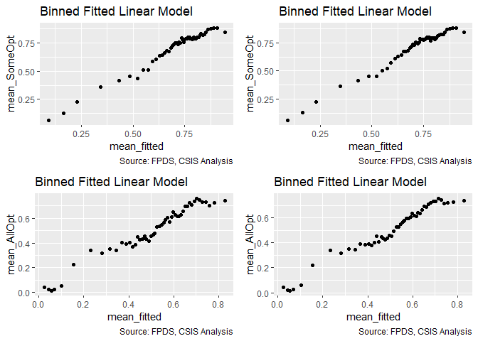<!-- -->

```
## Warning in residuals_binned(model1_old, bins = bins): Always uses Xlb
## Estimated Pr(Termination), should update.
```

```
## Warning in residuals_binned(model1_new, bins = bins): Always uses Xlb
## Estimated Pr(Termination), should update.
```

```
## Warning in residuals_binned(model2_old, bins = bins): Always uses Xlb
## Estimated Pr(Termination), should update.
```

```
## Warning in residuals_binned(model2_new, bins = bins): Always uses Xlb
## Estimated Pr(Termination), should update.
```

```
## Warning in if (class(model1_new) %in% c("glmerMod", "lme4") &
## class(model2_new) %in% : the condition has length > 1 and only the first
## element will be used
```

```
## Warning in if ((!class(model1_new) %in% c("glmerMod", "lme4") & !
## class(model2_new) %in% : the condition has length > 1 and only the first
## element will be used
```

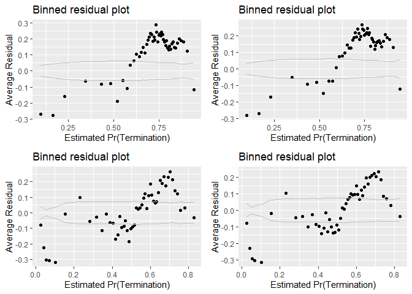<!-- -->

```
## [[1]]
##        model deviance null.deviance difference
## 1 model1_old 80637.77      91792.70  11154.927
## 2 model1_new 80652.51      91792.70  11140.188
## 3 model2_old 61670.17      71190.14   9519.966
## 4 model2_new 61633.35      71190.14   9556.784
```
SomeOpt - Aligns with expectations, but raises AIC.
AllOpt - Aligns with expectations and lowers AIC.

Final pre-multilevel run model selections are:
SomeOpt: b_SomeOpt_base2ceil_ceiling_21B
AllOpt: b_AllOpt24E

# Multilevel Model
####25A: 2019-08-20 First run, original multilevel.
This was created while we were still using ceiling instead of base.


```r
if(file.exists("..//Output//b_SomeOpt25A.rda")) load("..//Output//b_SomeOpt25A.rda")
if(file.exists("..//Output//b_AllOpt25A.rda")) load("..//Output//b_AllOpt25A.rda")

if(!exists("b_SomeOpt25A")){
#Create the model
  b_SomeOpt25A <- glmer(data=serv_opt, b_SomeOpt ~  cln_US6sal +
                       cln_PSCrate+ cp_OffPerf7+cp_OffPSC7+
                       cn_PairHist7+#cln_PairCA+
                       cln_Base + clr_Ceil2Base + cln_Days+
                       Comp+
                       Veh+
                       Pricing+
                       Crisis+
                       cln_Def6HHI+clr_Def6toUS+
                       cln_Def3HHI+
                       clr_Def3toUS+
                       cp_PairObl7+
                       cln_OffObl7+
                       cln_OffFocus+
                       cp_OffPerf7:cp_PairObl7+
                       cp_OffPerf7:cln_Days+
                       clr_Ceil2Base:cln_Base+
                       (1 | NAICS3/NAICS6/ServArea)+
                       (1 | Agency/Office) +
                       (1 | Place)+
                       (1 | StartFY),
                     family=binomial(link="logit"),
                     verbose=TRUE)
  
  b_AllOpt25A <- glmer(data=serv_exeropt, b_AllOpt ~ cln_US6sal + 
                      cln_PSCrate+ cp_OffPerf7+cp_OffPSC7+
                      cn_PairHist7+cln_PairCA+
                      cln_Base + clr_Ceil2Base + cln_Days+
                      Comp+
                      Veh+
                      Pricing+
                      Crisis+
                      cln_Def6HHI+clr_Def6toUS+
                      cln_Def3HHI+
                      clr_Def3toUS+
                      cp_PairObl7+
                      cln_OffObl7+ 
                      cln_OffFocus+
                      cp_OffPerf7:cp_PairObl7+
                      cp_OffPerf7:cln_PairCA +
                      cp_OffPSC7:cln_OffObl7 + 
                      cp_OffPSC7:cln_OffFocus + 
                      (1 | NAICS3/NAICS6/ServArea)+  
                      (1 | Agency/Office) +
                      (1 | Place)+ 
                      (1 | StartFY),
                      family=binomial(link="logit"),
                      verbose=TRUE)
  
  
  save(b_SomeOpt25A,b_AllOpt25A,file="..\\output\\Opt25A.rda")
}

#Compare the models
  glmer_examine(b_SomeOpt25A,display = TRUE)
```

```
## glmer(formula = b_SomeOpt ~ cln_US6sal + cln_PSCrate + cp_OffPerf7 + 
##     cp_OffPSC7 + cn_PairHist7 + cln_Base + clr_Ceil2Base + cln_Days + 
##     Comp + Veh + Pricing + Crisis + cln_Def6HHI + clr_Def6toUS + 
##     cln_Def3HHI + clr_Def3toUS + cp_PairObl7 + cln_OffObl7 + 
##     cln_OffFocus + cp_OffPerf7:cp_PairObl7 + cp_OffPerf7:cln_Days + 
##     clr_Ceil2Base:cln_Base + (1 | NAICS3/NAICS6/ServArea) + (1 | 
##     Agency/Office) + (1 | Place) + (1 | StartFY), data = serv_opt, 
##     family = binomial(link = "logit"), verbose = TRUE)
##                             coef.est coef.se
## (Intercept)                  0.06     0.21  
## cln_US6sal                   0.01     0.06  
## cln_PSCrate                 -0.05     0.03  
## cp_OffPerf7                 -0.06     0.05  
## cp_OffPSC7                  -0.03     0.05  
## cn_PairHist7                 0.25     0.02  
## cln_Base                     0.23     0.04  
## clr_Ceil2Base                0.30     0.01  
## cln_Days                     0.31     0.03  
## Comp1 offer                  0.02     0.03  
## Comp2-4 offers              -0.03     0.03  
## Comp5+ offers               -0.05     0.03  
## VehS-IDC                    -0.70     0.04  
## VehM-IDC                    -0.25     0.04  
## VehFSS/GWAC                 -0.16     0.04  
## VehBPA/BOA                  -0.37     0.08  
## PricingOther FP             -0.69     0.14  
## PricingIncentive             0.12     0.27  
## PricingCombination or Other  0.42     0.08  
## PricingOther CB              0.21     0.06  
## PricingT&M/LH/FPLOE          0.03     0.07  
## PricingUCA                  -0.11     0.12  
## CrisisARRA                  -0.41     0.16  
## CrisisDis                   -0.33     0.31  
## CrisisOCO                   -0.34     0.12  
## cln_Def6HHI                 -0.12     0.05  
## clr_Def6toUS                -0.01     0.04  
## cln_Def3HHI                 -0.03     0.06  
## clr_Def3toUS                 0.06     0.09  
## cp_PairObl7                 -0.12     0.05  
## cln_OffObl7                 -0.06     0.03  
## cln_OffFocus                -0.48     0.05  
## cp_OffPerf7:cp_PairObl7      0.35     0.08  
## cp_OffPerf7:cln_Days        -0.06     0.07  
## cln_Base:clr_Ceil2Base       0.27     0.02  
## 
## Error terms:
##  Groups                   Name        Std.Dev.
##  ServArea:(NAICS6:NAICS3) (Intercept) 0.39    
##  Office:Agency            (Intercept) 0.77    
##  NAICS6:NAICS3            (Intercept) 0.19    
##  Place                    (Intercept) 0.49    
##  NAICS3                   (Intercept) 0.18    
##  Agency                   (Intercept) 0.00    
##  StartFY                  (Intercept) 0.52    
##  Residual                             1.00    
## ---
## number of obs: 74274, groups: ServArea:(NAICS6:NAICS3), 1508; Office:Agency, 758; NAICS6:NAICS3, 624; Place, 121; NAICS3, 78; Agency, 25; StartFY, 9
## AIC = 75946.1, DIC = 70459.7
## deviance = 73160.9
```

```
## Warning: 'icc' is deprecated.
## Use 'performance::icc()' instead.
## See help("Deprecated")
```

```
## [[1]]
##                             GVIF Df GVIF^(1/(2*Df))
## cln_US6sal              1.044598  1        1.022056
## cln_PSCrate             1.024084  1        1.011971
## cp_OffPerf7             1.390788  1        1.179317
## cp_OffPSC7              1.065109  1        1.032041
## cn_PairHist7            1.108230  1        1.052725
## cln_Base                1.927406  1        1.388310
## clr_Ceil2Base           1.101333  1        1.049444
## cln_Days                1.071140  1        1.034959
## Comp                    1.133140  3        1.021051
## Veh                     1.273067  4        1.030639
## Pricing                 1.103772  6        1.008262
## Crisis                  1.016263  3        1.002692
## cln_Def6HHI             1.203997  1        1.097268
## clr_Def6toUS            1.154761  1        1.074598
## cln_Def3HHI             1.203708  1        1.097136
## clr_Def3toUS            1.185130  1        1.088637
## cp_PairObl7             1.457408  1        1.207231
## cln_OffObl7             1.126924  1        1.061567
## cln_OffFocus            1.063146  1        1.031090
## cp_OffPerf7:cp_PairObl7 1.386629  1        1.177552
## cp_OffPerf7:cln_Days    1.335364  1        1.155579
## cln_Base:clr_Ceil2Base  1.834136  1        1.354303
## 
## [[2]]
## # Intraclass Correlation Coefficient
## 
##      Adjusted ICC: 0.286
##   Conditional ICC: 0.260
## 
## [[3]]
## [1] "Model failed to converge with max|grad| = 0.079704 (tol = 0.001, component 1)"
## 
## [[4]]
## ServArea:(NAICS6:NAICS3).(Intercept)            Office:Agency.(Intercept) 
##                          0.388404224                          0.766052909 
##            NAICS6:NAICS3.(Intercept)                    Place.(Intercept) 
##                          0.185970695                          0.493083549 
##                   NAICS3.(Intercept)                   Agency.(Intercept) 
##                          0.184687542                          0.004058566 
##                  StartFY.(Intercept) 
##                          0.517497192
```

```r
glmer_examine(b_AllOpt25A,display = TRUE)
```

```
## glmer(formula = b_AllOpt ~ cln_US6sal + cln_PSCrate + cp_OffPerf7 + 
##     cp_OffPSC7 + cn_PairHist7 + cln_PairCA + cln_Base + clr_Ceil2Base + 
##     cln_Days + Comp + Veh + Pricing + Crisis + cln_Def6HHI + 
##     clr_Def6toUS + cln_Def3HHI + clr_Def3toUS + cp_PairObl7 + 
##     cln_OffObl7 + cln_OffFocus + cp_OffPerf7:cp_PairObl7 + cp_OffPerf7:cln_PairCA + 
##     pOffPSC:cln_OffObl7 + pOffPSC:cln_OffFocus + (1 | NAICS3/NAICS6/ServArea) + 
##     (1 | Agency/Office) + (1 | Place) + (1 | StartFY), data = serv_exeropt, 
##     family = binomial(link = "logit"), verbose = TRUE)
##                             coef.est coef.se
## (Intercept)                  1.16     0.15  
## cln_US6sal                   0.07     0.06  
## cln_PSCrate                 -0.03     0.03  
## cp_OffPerf7                  0.07     0.05  
## cp_OffPSC7                   0.21     0.07  
## cn_PairHist7                 0.14     0.03  
## cln_PairCA                  -0.20     0.05  
## cln_Base                    -0.14     0.03  
## clr_Ceil2Base               -0.80     0.02  
## cln_Days                    -0.44     0.04  
## Comp1 offer                  0.00     0.03  
## Comp2-4 offers              -0.05     0.03  
## Comp5+ offers               -0.08     0.03  
## VehS-IDC                    -0.21     0.05  
## VehM-IDC                    -0.13     0.04  
## VehFSS/GWAC                 -0.06     0.04  
## VehBPA/BOA                   0.22     0.10  
## PricingOther FP             -0.44     0.19  
## PricingIncentive             0.39     0.27  
## PricingCombination or Other -0.11     0.07  
## PricingOther CB              0.26     0.06  
## PricingT&M/LH/FPLOE         -0.02     0.06  
## PricingUCA                   0.14     0.13  
## CrisisARRA                  -0.22     0.22  
## CrisisDis                   -1.48     0.41  
## CrisisOCO                   -0.26     0.12  
## cln_Def6HHI                 -0.08     0.05  
## clr_Def6toUS                 0.04     0.05  
## cln_Def3HHI                 -0.04     0.06  
## clr_Def3toUS                -0.01     0.08  
## cp_PairObl7                 -0.08     0.06  
## cln_OffObl7                 -0.08     0.03  
## cln_OffFocus                -0.12     0.06  
## cp_OffPerf7:cp_PairObl7     -0.03     0.10  
## cp_OffPerf7:cln_PairCA       0.31     0.07  
## cln_OffObl7:pOffPSC         -0.15     0.37  
## cln_OffFocus:pOffPSC        -0.27     0.22  
## 
## Error terms:
##  Groups                   Name        Std.Dev.
##  ServArea:(NAICS6:NAICS3) (Intercept) 0.18    
##  Office:Agency            (Intercept) 0.48    
##  NAICS6:NAICS3            (Intercept) 0.31    
##  Place                    (Intercept) 0.27    
##  NAICS3                   (Intercept) 0.13    
##  Agency                   (Intercept) 0.25    
##  StartFY                  (Intercept) 0.17    
##  Residual                             1.00    
## ---
## number of obs: 51357, groups: ServArea:(NAICS6:NAICS3), 1327; Office:Agency, 676; NAICS6:NAICS3, 573; Place, 103; NAICS3, 73; Agency, 25; StartFY, 9
## AIC = 59427.7, DIC = 55942.9
## deviance = 57641.3
```

```
## Warning: 'icc' is deprecated.
## Use 'performance::icc()' instead.
## See help("Deprecated")
```

```
## [[1]]
##                             GVIF Df GVIF^(1/(2*Df))
## cln_US6sal              1.065166  1        1.032069
## cln_PSCrate             1.031179  1        1.015470
## cp_OffPerf7             1.252286  1        1.119056
## cp_OffPSC7              1.623003  1        1.273971
## cn_PairHist7            1.364281  1        1.168024
## cln_PairCA              1.800232  1        1.341727
## cln_Base                1.156838  1        1.075564
## clr_Ceil2Base           1.066112  1        1.032527
## cln_Days                1.042936  1        1.021242
## Comp                    1.160951  3        1.025185
## Veh                     1.462087  4        1.048628
## Pricing                 1.173393  6        1.013414
## Crisis                  1.028360  3        1.004672
## cln_Def6HHI             1.185353  1        1.088739
## clr_Def6toUS            1.180718  1        1.086608
## cln_Def3HHI             1.189363  1        1.090579
## clr_Def3toUS            1.230738  1        1.109386
## cp_PairObl7             1.389771  1        1.178885
## cln_OffObl7             1.143769  1        1.069471
## cln_OffFocus            1.152742  1        1.073658
## cp_OffPerf7:cp_PairObl7 1.418157  1        1.190864
## cp_OffPerf7:cln_PairCA  1.510357  1        1.228966
## cln_OffObl7:pOffPSC     1.305747  1        1.142693
## cln_OffFocus:pOffPSC    1.391948  1        1.179808
## 
## [[2]]
## # Intraclass Correlation Coefficient
## 
##      Adjusted ICC: 0.140
##   Conditional ICC: 0.123
## 
## [[3]]
## [1] "Model failed to converge with max|grad| = 0.00135328 (tol = 0.001, component 1)"
## 
## [[4]]
## ServArea:(NAICS6:NAICS3).(Intercept)            Office:Agency.(Intercept) 
##                            0.1801601                            0.4793190 
##            NAICS6:NAICS3.(Intercept)                    Place.(Intercept) 
##                            0.3064803                            0.2697230 
##                   NAICS3.(Intercept)                   Agency.(Intercept) 
##                            0.1287874                            0.2461951 
##                  StartFY.(Intercept) 
##                            0.1709505
```

```r
stargazer::stargazer(b_SomeOpt_base2ceil_ceiling_21B, b_SomeOpt25A, 
                     b_AllOpt24E, b_AllOpt25A, type="text", digits=2)
```

```
## 
## ====================================================================================================
##                                                              Dependent variable:                    
##                                          -----------------------------------------------------------
##                                                    b_SomeOpt                     b_AllOpt           
##                                           logistic  generalized linear  logistic  generalized linear
##                                                       mixed-effects                 mixed-effects   
##                                             (1)            (2)            (3)            (4)        
## ----------------------------------------------------------------------------------------------------
## cln_US6sal                                  0.03           0.01          -0.05*          0.07       
##                                            (0.02)         (0.06)         (0.02)         (0.06)      
##                                                                                                     
## cln_PSCrate                               -0.15***        -0.05*        -0.16***        -0.03       
##                                            (0.02)         (0.03)         (0.03)         (0.03)      
##                                                                                                     
## cp_OffPerf7                               -0.12***        -0.06          -0.05*          0.07       
##                                            (0.03)         (0.05)         (0.02)         (0.05)      
##                                                                                                     
## cp_OffPSC7                                0.62***         -0.03         -0.15***       0.21***      
##                                            (0.03)         (0.05)         (0.04)         (0.07)      
##                                                                                                     
## cn_PairHist7                              0.28***        0.25***        0.19***        0.14***      
##                                            (0.02)         (0.02)         (0.02)         (0.03)      
##                                                                                                     
## cln_PairCA                                                              -0.43***       -0.20***     
##                                                                          (0.04)         (0.05)      
##                                                                                                     
## cln_Base                                    0.04         0.23***        -0.07***       -0.14***     
##                                            (0.03)         (0.04)         (0.02)         (0.03)      
##                                                                                                     
## clr_Ceil2Base                             0.45***        0.30***        -0.80***       -0.80***     
##                                            (0.01)         (0.01)         (0.02)         (0.02)      
##                                                                                                     
## cln_Days                                  0.57***        0.31***        -0.41***       -0.44***     
##                                            (0.03)         (0.03)         (0.04)         (0.04)      
##                                                                                                     
## Comp1 offer                                -0.04           0.02          -0.02         -0.0004      
##                                            (0.03)         (0.03)         (0.03)         (0.03)      
##                                                                                                     
## Comp2-4 offers                             -0.04          -0.03          -0.05*         -0.05       
##                                            (0.02)         (0.03)         (0.03)         (0.03)      
##                                                                                                     
## Comp5+ offers                              0.05*          -0.05*        -0.17***       -0.08**      
##                                            (0.03)         (0.03)         (0.03)         (0.03)      
##                                                                                                     
## VehS-IDC                                  -0.64***       -0.70***       -0.53***       -0.21***     
##                                            (0.03)         (0.04)         (0.04)         (0.05)      
##                                                                                                     
## VehM-IDC                                  -0.20***       -0.25***       -0.15***       -0.13***     
##                                            (0.03)         (0.04)         (0.03)         (0.04)      
##                                                                                                     
## VehFSS/GWAC                                -0.03         -0.16***         0.04          -0.06       
##                                            (0.03)         (0.04)         (0.03)         (0.04)      
##                                                                                                     
## VehBPA/BOA                                -1.79***       -0.37***       -0.29***        0.22**      
##                                            (0.05)         (0.08)         (0.09)         (0.10)      
##                                                                                                     
## PricingOther FP                           -0.74***       -0.69***       -0.78***       -0.44**      
##                                            (0.15)         (0.14)         (0.20)         (0.19)      
##                                                                                                     
## PricingT&M/LH/FPLOE                         0.07           0.03           0.03          -0.02       
##                                            (0.06)         (0.07)         (0.06)         (0.06)      
##                                                                                                     
## PricingIncentive                           -0.25           0.12         0.96***          0.39       
##                                            (0.30)         (0.27)         (0.29)         (0.27)      
##                                                                                                     
## PricingOther CB                           0.27***        0.21***        0.62***        0.26***      
##                                            (0.05)         (0.06)         (0.06)         (0.06)      
##                                                                                                     
## PricingUCA                                  0.05          -0.11           0.04           0.14       
##                                            (0.11)         (0.12)         (0.14)         (0.13)      
##                                                                                                     
## PricingCombination or Other               0.45***        0.42***         -0.01          -0.11       
##                                            (0.08)         (0.08)         (0.06)         (0.07)      
##                                                                                                     
## CrisisARRA                                -0.34**        -0.41**         -0.33          -0.22       
##                                            (0.16)         (0.16)         (0.21)         (0.22)      
##                                                                                                     
## CrisisDis                                  -0.22          -0.33         -1.38***       -1.48***     
##                                            (0.29)         (0.31)         (0.40)         (0.41)      
##                                                                                                     
## CrisisOCO                                 -0.80***       -0.34***       -0.38***       -0.26**      
##                                            (0.06)         (0.12)         (0.08)         (0.12)      
##                                                                                                     
## cln_Def6HHI                                -0.04         -0.12***        -0.004         -0.08*      
##                                            (0.02)         (0.05)         (0.03)         (0.05)      
##                                                                                                     
## clr_Def6toUS                               -0.05*         -0.01           0.01           0.04       
##                                            (0.03)         (0.04)         (0.03)         (0.05)      
##                                                                                                     
## cln_Def3HHI                               0.16***         -0.03         -0.09***        -0.04       
##                                            (0.03)         (0.06)         (0.03)         (0.06)      
##                                                                                                     
## clr_Def3toUS                              0.12***          0.06         0.27***         -0.01       
##                                            (0.03)         (0.09)         (0.03)         (0.08)      
##                                                                                                     
## cp_PairObl7                               -0.33***       -0.12**        -0.16***        -0.08       
##                                            (0.03)         (0.05)         (0.05)         (0.06)      
##                                                                                                     
## cln_OffObl7                               0.06***        -0.06**        0.06***        -0.08***     
##                                            (0.02)         (0.03)         (0.02)         (0.03)      
##                                                                                                     
## cln_OffFocus                              -0.54***       -0.48***       -0.22***       -0.12**      
##                                            (0.02)         (0.05)         (0.03)         (0.06)      
##                                                                                                     
## cp_OffPerf7:cp_PairObl7                   0.27***        0.35***        0.24***         -0.03       
##                                            (0.06)         (0.08)         (0.08)         (0.10)      
##                                                                                                     
## cp_PairObl7:cln_OffObl7                   0.28***                                                   
##                                            (0.07)                                                   
##                                                                                                     
## cp_OffPerf7:cln_Days                      -0.16***        -0.06                                     
##                                            (0.06)         (0.07)                                    
##                                                                                                     
## cn_PairHist7:PricingOther FP               -0.33                                                    
##                                            (0.35)                                                   
##                                                                                                     
## cn_PairHist7:PricingT&M/LH/FPLOE            0.16                                                    
##                                            (0.11)                                                   
##                                                                                                     
## cn_PairHist7:PricingIncentive             1.60***                                                   
##                                            (0.50)                                                   
##                                                                                                     
## cn_PairHist7:PricingOther CB                0.10                                                    
##                                            (0.09)                                                   
##                                                                                                     
## cn_PairHist7:PricingUCA                     0.17                                                    
##                                            (0.21)                                                   
##                                                                                                     
## cn_PairHist7:PricingCombination or Other  -0.56***                                                  
##                                            (0.17)                                                   
##                                                                                                     
## cln_Base:clr_Ceil2Base                    0.35***        0.27***                                    
##                                            (0.02)         (0.02)                                    
##                                                                                                     
## cp_OffPSC7:cln_OffFocus                                                 -0.66***                    
##                                                                          (0.08)                     
##                                                                                                     
## cln_PSCrate:PricingOther FP                                               0.30                      
##                                                                          (0.61)                     
##                                                                                                     
## cln_PSCrate:PricingIncentive                                              0.25                      
##                                                                          (0.65)                     
##                                                                                                     
## cln_PSCrate:PricingCombination or Other                                 0.56***                     
##                                                                          (0.19)                     
##                                                                                                     
## cln_PSCrate:PricingOther CB                                             0.57***                     
##                                                                          (0.13)                     
##                                                                                                     
## cln_PSCrate:PricingT&M/LH/FPLOE                                           0.21                      
##                                                                          (0.19)                     
##                                                                                                     
## cln_PSCrate:PricingUCA                                                  1.66***                     
##                                                                          (0.36)                     
##                                                                                                     
## cln_OffObl7:cln_OffFocus                                                -0.30***                    
##                                                                          (0.05)                     
##                                                                                                     
## cp_OffPerf7:cln_PairCA                                                                 0.31***      
##                                                                                         (0.07)      
##                                                                                                     
## cln_OffObl7:pOffPSC                                                                     -0.15       
##                                                                                         (0.37)      
##                                                                                                     
## cln_OffFocus:pOffPSC                                                                    -0.27       
##                                                                                         (0.22)      
##                                                                                                     
## Constant                                  0.36***          0.06         1.32***        1.16***      
##                                            (0.03)         (0.21)         (0.04)         (0.15)      
##                                                                                                     
## ----------------------------------------------------------------------------------------------------
## Observations                               74,274         74,274         51,357         51,357      
## Log Likelihood                           -40,318.89     -37,931.06     -30,816.68     -29,669.86    
## Akaike Inf. Crit.                        80,721.77      75,946.12      61,717.35      59,427.72     
## Bayesian Inf. Crit.                                     76,333.17                     59,816.96     
## ====================================================================================================
## Note:                                                                    *p<0.1; **p<0.05; ***p<0.01
```

```r
stargazer::stargazer(b_AllOpt25A, type = "text", digits = 2)
```

```
## 
## =======================================================
##                                 Dependent variable:    
##                             ---------------------------
##                                      b_AllOpt          
## -------------------------------------------------------
## cln_US6sal                             0.07            
##                                       (0.06)           
##                                                        
## cln_PSCrate                            -0.03           
##                                       (0.03)           
##                                                        
## cp_OffPerf7                            0.07            
##                                       (0.05)           
##                                                        
## cp_OffPSC7                            0.21***          
##                                       (0.07)           
##                                                        
## cn_PairHist7                          0.14***          
##                                       (0.03)           
##                                                        
## cln_PairCA                           -0.20***          
##                                       (0.05)           
##                                                        
## cln_Base                             -0.14***          
##                                       (0.03)           
##                                                        
## clr_Ceil2Base                        -0.80***          
##                                       (0.02)           
##                                                        
## cln_Days                             -0.44***          
##                                       (0.04)           
##                                                        
## Comp1 offer                           -0.0004          
##                                       (0.03)           
##                                                        
## Comp2-4 offers                         -0.05           
##                                       (0.03)           
##                                                        
## Comp5+ offers                         -0.08**          
##                                       (0.03)           
##                                                        
## VehS-IDC                             -0.21***          
##                                       (0.05)           
##                                                        
## VehM-IDC                             -0.13***          
##                                       (0.04)           
##                                                        
## VehFSS/GWAC                            -0.06           
##                                       (0.04)           
##                                                        
## VehBPA/BOA                            0.22**           
##                                       (0.10)           
##                                                        
## PricingOther FP                       -0.44**          
##                                       (0.19)           
##                                                        
## PricingIncentive                       0.39            
##                                       (0.27)           
##                                                        
## PricingCombination or Other            -0.11           
##                                       (0.07)           
##                                                        
## PricingOther CB                       0.26***          
##                                       (0.06)           
##                                                        
## PricingT&M/LH/FPLOE                    -0.02           
##                                       (0.06)           
##                                                        
## PricingUCA                             0.14            
##                                       (0.13)           
##                                                        
## CrisisARRA                             -0.22           
##                                       (0.22)           
##                                                        
## CrisisDis                            -1.48***          
##                                       (0.41)           
##                                                        
## CrisisOCO                             -0.26**          
##                                       (0.12)           
##                                                        
## cln_Def6HHI                           -0.08*           
##                                       (0.05)           
##                                                        
## clr_Def6toUS                           0.04            
##                                       (0.05)           
##                                                        
## cln_Def3HHI                            -0.04           
##                                       (0.06)           
##                                                        
## clr_Def3toUS                           -0.01           
##                                       (0.08)           
##                                                        
## cp_PairObl7                            -0.08           
##                                       (0.06)           
##                                                        
## cln_OffObl7                          -0.08***          
##                                       (0.03)           
##                                                        
## cln_OffFocus                          -0.12**          
##                                       (0.06)           
##                                                        
## cp_OffPerf7:cp_PairObl7                -0.03           
##                                       (0.10)           
##                                                        
## cp_OffPerf7:cln_PairCA                0.31***          
##                                       (0.07)           
##                                                        
## cln_OffObl7:pOffPSC                    -0.15           
##                                       (0.37)           
##                                                        
## cln_OffFocus:pOffPSC                   -0.27           
##                                       (0.22)           
##                                                        
## Constant                              1.16***          
##                                       (0.15)           
##                                                        
## -------------------------------------------------------
## Observations                          51,357           
## Log Likelihood                      -29,669.86         
## Akaike Inf. Crit.                    59,427.72         
## Bayesian Inf. Crit.                  59,816.96         
## =======================================================
## Note:                       *p<0.1; **p<0.05; ***p<0.01
```

```r
stargazer::stargazer(b_SomeOpt25A, b_AllOpt25A, type = "text", digits = 2)
```

```
## 
## ========================================================
##                                 Dependent variable:     
##                             ----------------------------
##                               b_SomeOpt      b_AllOpt   
##                                  (1)            (2)     
## --------------------------------------------------------
## cln_US6sal                       0.01          0.07     
##                                 (0.06)        (0.06)    
##                                                         
## cln_PSCrate                     -0.05*         -0.03    
##                                 (0.03)        (0.03)    
##                                                         
## cp_OffPerf7                     -0.06          0.07     
##                                 (0.05)        (0.05)    
##                                                         
## cp_OffPSC7                      -0.03         0.21***   
##                                 (0.05)        (0.07)    
##                                                         
## cn_PairHist7                   0.25***        0.14***   
##                                 (0.02)        (0.03)    
##                                                         
## cln_PairCA                                   -0.20***   
##                                               (0.05)    
##                                                         
## cln_Base                       0.23***       -0.14***   
##                                 (0.04)        (0.03)    
##                                                         
## clr_Ceil2Base                  0.30***       -0.80***   
##                                 (0.01)        (0.02)    
##                                                         
## cln_Days                       0.31***       -0.44***   
##                                 (0.03)        (0.04)    
##                                                         
## Comp1 offer                      0.02         -0.0004   
##                                 (0.03)        (0.03)    
##                                                         
## Comp2-4 offers                  -0.03          -0.05    
##                                 (0.03)        (0.03)    
##                                                         
## Comp5+ offers                   -0.05*        -0.08**   
##                                 (0.03)        (0.03)    
##                                                         
## VehS-IDC                       -0.70***      -0.21***   
##                                 (0.04)        (0.05)    
##                                                         
## VehM-IDC                       -0.25***      -0.13***   
##                                 (0.04)        (0.04)    
##                                                         
## VehFSS/GWAC                    -0.16***        -0.06    
##                                 (0.04)        (0.04)    
##                                                         
## VehBPA/BOA                     -0.37***       0.22**    
##                                 (0.08)        (0.10)    
##                                                         
## PricingOther FP                -0.69***       -0.44**   
##                                 (0.14)        (0.19)    
##                                                         
## PricingIncentive                 0.12          0.39     
##                                 (0.27)        (0.27)    
##                                                         
## PricingCombination or Other    0.42***         -0.11    
##                                 (0.08)        (0.07)    
##                                                         
## PricingOther CB                0.21***        0.26***   
##                                 (0.06)        (0.06)    
##                                                         
## PricingT&M/LH/FPLOE              0.03          -0.02    
##                                 (0.07)        (0.06)    
##                                                         
## PricingUCA                      -0.11          0.14     
##                                 (0.12)        (0.13)    
##                                                         
## CrisisARRA                     -0.41**         -0.22    
##                                 (0.16)        (0.22)    
##                                                         
## CrisisDis                       -0.33        -1.48***   
##                                 (0.31)        (0.41)    
##                                                         
## CrisisOCO                      -0.34***       -0.26**   
##                                 (0.12)        (0.12)    
##                                                         
## cln_Def6HHI                    -0.12***       -0.08*    
##                                 (0.05)        (0.05)    
##                                                         
## clr_Def6toUS                    -0.01          0.04     
##                                 (0.04)        (0.05)    
##                                                         
## cln_Def3HHI                     -0.03          -0.04    
##                                 (0.06)        (0.06)    
##                                                         
## clr_Def3toUS                     0.06          -0.01    
##                                 (0.09)        (0.08)    
##                                                         
## cp_PairObl7                    -0.12**         -0.08    
##                                 (0.05)        (0.06)    
##                                                         
## cln_OffObl7                    -0.06**       -0.08***   
##                                 (0.03)        (0.03)    
##                                                         
## cln_OffFocus                   -0.48***       -0.12**   
##                                 (0.05)        (0.06)    
##                                                         
## cp_OffPerf7:cp_PairObl7        0.35***         -0.03    
##                                 (0.08)        (0.10)    
##                                                         
## cp_OffPerf7:cln_Days            -0.06                   
##                                 (0.07)                  
##                                                         
## cln_Base:clr_Ceil2Base         0.27***                  
##                                 (0.02)                  
##                                                         
## cp_OffPerf7:cln_PairCA                        0.31***   
##                                               (0.07)    
##                                                         
## cln_OffObl7:pOffPSC                            -0.15    
##                                               (0.37)    
##                                                         
## cln_OffFocus:pOffPSC                           -0.27    
##                                               (0.22)    
##                                                         
## Constant                         0.06         1.16***   
##                                 (0.21)        (0.15)    
##                                                         
## --------------------------------------------------------
## Observations                    74,274        51,357    
## Log Likelihood                -37,931.06    -29,669.86  
## Akaike Inf. Crit.             75,946.12      59,427.72  
## Bayesian Inf. Crit.           76,333.17      59,816.96  
## ========================================================
## Note:                        *p<0.1; **p<0.05; ***p<0.01
```

```r
summary_residual_compare(b_SomeOpt_base2ceil_ceiling_21B, b_SomeOpt25A, 
                     b_AllOpt_CFTE_pricing_22B, b_AllOpt25A, bins=100)
```

<!-- -->

```
## Warning in residuals_binned(model1_old, bins = bins): Always uses Xlb
## Estimated Pr(Termination), should update.
```

```
## Warning in residuals_binned(model1_new, bins = bins): Always uses Xlb
## Estimated Pr(Termination), should update.
```

```
## Warning in residuals_binned(model2_old, bins = bins): Always uses Xlb
## Estimated Pr(Termination), should update.
```

```
## Warning in residuals_binned(model2_new, bins = bins): Always uses Xlb
## Estimated Pr(Termination), should update.
```

<!-- -->

```
## [[1]]
## ServArea:(NAICS6:NAICS3).(Intercept)            Office:Agency.(Intercept) 
##                          0.388404224                          0.766052909 
##            NAICS6:NAICS3.(Intercept)                    Place.(Intercept) 
##                          0.185970695                          0.493083549 
##                   NAICS3.(Intercept)                   Agency.(Intercept) 
##                          0.184687542                          0.004058566 
##                  StartFY.(Intercept) 
##                          0.517497192 
## 
## [[2]]
## ServArea:(NAICS6:NAICS3).(Intercept)            Office:Agency.(Intercept) 
##                            0.1801601                            0.4793190 
##            NAICS6:NAICS3.(Intercept)                    Place.(Intercept) 
##                            0.3064803                            0.2697230 
##                   NAICS3.(Intercept)                   Agency.(Intercept) 
##                            0.1287874                            0.2461951 
##                  StartFY.(Intercept) 
##                            0.1709505 
## 
## [[3]]
## [1] "Model failed to converge with max|grad| = 0.079704 (tol = 0.001, component 1)"
## 
## [[4]]
## [1] "Model failed to converge with max|grad| = 0.00135328 (tol = 0.001, component 1)"
```

```r
# texreg::htmlreg(list(b_SomeOpt25A, b_AllOpt25A),file="..//Output//options_25A.html",
#                 single.row = TRUE,
#                 custom.model.name=c("Some Options Exercised", "All Options Exercised"),
#                 stars=c(0.1,0.05,0.01,0.001),
#                 groups = list(
#                                "Services Complexity" = 2:3,
#                                "Office Capacity" =4:5,
#                                "Past Relationship"=6:7,
#                                "Contract Characteristics"=8:26,
#                                "NAICS Characteristics" =27:30,
#                                "Office Characteristics" =31:33,
#                                "Interactions"=34:39
#                               ),
#                 custom.coef.map=all_coef_list,
#                 bold=0.05,
#                 custom.note="%stars. Numerical inputs are rescaled.",
#                 caption="Table 6: Exercised Options",
#                 caption.above=TRUE)
```

####25B: 2019-08-28 - Modified SomeOpt and AllOpt models for multilevel model run (attempting to leverage GVIF declines in multilevel model in 25A).


```r
if(file.exists("..//Output//Opt25B.rda")) load("..//Output//Opt25B.rda")
if(file.exists("..//Output//b_SomeOpt25B.rda")) load("..//Output//b_SomeOpt25B.rda")
if(file.exists("..//Output//b_AllOpt25B.rda")) load("..//Output//b_AllOpt25B.rda")

if(!exists("b_SomeOpt25B")){
  b_SomeOpt25B <- glmer(data=serv_opt, b_SomeOpt ~  cln_US6sal +
                          cln_PSCrate+ cp_OffPerf7+cp_OffPSC7+
                          cn_PairHist7+cln_PairCA+
                          cln_Base + clr_Ceil2Base + cln_Days+
                          Comp+
                          Veh+
                          Pricing+
                          Crisis+
                          cln_Def6HHI+clr_Def6toUS+
                          cln_Def3HHI+
                          clr_Def3toUS+
                          cp_PairObl7+
                          cln_OffObl7+
                          cln_OffFocus+
                          cp_OffPerf7:cp_PairObl7+
                          cp_OffPerf7:cln_Days+
                          clr_Ceil2Base:cln_Base+
                          Pricing:cln_PSCrate+
                          (1 | NAICS3/NAICS6/ServArea)+
                          (1 | Agency/Office) +
                          (1 | Place)+
                          (1 | StartFY),
                        family=binomial(link="logit"),
                        verbose=TRUE)
  
  
  b_AllOpt25B <- glmer(data=serv_exeropt, b_AllOpt ~ cln_US6sal + 
                         cln_PSCrate+ cp_OffPerf7+cp_OffPSC7+
                         cn_PairHist7+cln_PairCA+
                         cln_Base + clr_Ceil2Base + cln_Days+
                         Comp+
                         Veh+
                         Pricing+
                         Crisis+
                         cln_Def6HHI+clr_Def6toUS+
                         cln_Def3HHI+
                         clr_Def3toUS+
                         cp_PairObl7+
                         cln_OffObl7+ 
                         cln_OffFocus+
                         cp_OffPerf7:cp_PairObl7+
                         cp_OffPerf7:cln_PairCA +
                         cp_OffPSC7:cln_OffObl7 + 
                         cp_OffPSC7:cln_OffFocus + 
                         Pricing:cln_PSCrate+
                         (1 | NAICS3/NAICS6/ServArea)+  
                         (1 | Agency/Office) +
                         (1 | Place)+ 
                         (1 | StartFY),
                       family=binomial(link="logit"),
                       verbose=TRUE)
  save(b_SomeOpt25B, b_AllOpt25B, file="..//Output//Opt25B.rda")
}


#Load experimental Some+All Opt Models
glmer_examine(b_AllOpt25B)
```

```
## Warning: 'icc' is deprecated.
## Use 'performance::icc()' instead.
## See help("Deprecated")
```

```
## [[1]]
##                             GVIF Df GVIF^(1/(2*Df))
## cln_US6sal              1.064813  1        1.031898
## cln_PSCrate             1.099719  1        1.048675
## cp_OffPerf7             1.253982  1        1.119813
## cp_OffPSC7              1.630068  1        1.276741
## cn_PairHist7            1.364614  1        1.168167
## cln_PairCA              1.803878  1        1.343085
## cln_Base                1.159855  1        1.076966
## clr_Ceil2Base           1.066719  1        1.032821
## cln_Days                1.043065  1        1.021305
## Comp                    1.162050  3        1.025347
## Veh                     1.470557  4        1.049386
## Pricing                 4.204990  6        1.127147
## Crisis                  1.029054  3        1.004785
## cln_Def6HHI             1.186032  1        1.089051
## clr_Def6toUS            1.181267  1        1.086861
## cln_Def3HHI             1.189327  1        1.090563
## clr_Def3toUS            1.230304  1        1.109191
## cp_PairObl7             1.391143  1        1.179467
## cln_OffObl7             1.145606  1        1.070330
## cln_OffFocus            1.153489  1        1.074006
## cp_OffPerf7:cp_PairObl7 1.420074  1        1.191668
## cp_OffPerf7:cln_PairCA  1.512710  1        1.229923
## cln_OffObl7:pOffPSC     1.313778  1        1.146202
## cln_OffFocus:pOffPSC    1.395480  1        1.181304
## cln_PSCrate:Pricing     3.983342  6        1.122072
## 
## [[2]]
## # Intraclass Correlation Coefficient
## 
##      Adjusted ICC: 0.140
##   Conditional ICC: 0.122
## 
## [[3]]
## ServArea:(NAICS6:NAICS3).(Intercept)            Office:Agency.(Intercept) 
##                            0.1810506                            0.4769851 
##            NAICS6:NAICS3.(Intercept)                    Place.(Intercept) 
##                            0.3057979                            0.2713299 
##                   NAICS3.(Intercept)                   Agency.(Intercept) 
##                            0.1299007                            0.2454693 
##                  StartFY.(Intercept) 
##                            0.1702267
```

```r
stargazer::stargazer(b_SomeOpt25A, b_SomeOpt25B, 
                     b_AllOpt25A, b_AllOpt25B, type = "text", digits = 2)
```

```
## 
## ===================================================================================
##                                                     Dependent variable:            
##                                         -------------------------------------------
##                                               b_SomeOpt             b_AllOpt       
##                                            (1)        (2)        (3)        (4)    
## -----------------------------------------------------------------------------------
## cln_US6sal                                 0.01       0.01       0.07       0.08   
##                                           (0.06)     (0.06)     (0.06)     (0.06)  
##                                                                                    
## cln_PSCrate                               -0.05*     -0.05      -0.03     -0.06**  
##                                           (0.03)     (0.03)     (0.03)     (0.03)  
##                                                                                    
## cp_OffPerf7                               -0.06      -0.06       0.07       0.07   
##                                           (0.05)     (0.05)     (0.05)     (0.05)  
##                                                                                    
## cp_OffPSC7                                -0.03      -0.03     0.21***    0.20***  
##                                           (0.05)     (0.05)     (0.07)     (0.07)  
##                                                                                    
## cn_PairHist7                             0.25***    0.26***    0.14***    0.14***  
##                                           (0.02)     (0.02)     (0.03)     (0.03)  
##                                                                                    
## cln_PairCA                                           -0.05     -0.20***   -0.20*** 
##                                                      (0.04)     (0.05)     (0.05)  
##                                                                                    
## cln_Base                                 0.23***    0.23***    -0.14***   -0.13*** 
##                                           (0.04)     (0.04)     (0.03)     (0.03)  
##                                                                                    
## clr_Ceil2Base                            0.30***    0.29***    -0.80***   -0.80*** 
##                                           (0.01)     (0.01)     (0.02)     (0.02)  
##                                                                                    
## cln_Days                                 0.31***    0.30***    -0.44***   -0.44*** 
##                                           (0.03)     (0.03)     (0.04)     (0.04)  
##                                                                                    
## Comp1 offer                                0.02       0.02     -0.0004    -0.0005  
##                                           (0.03)     (0.03)     (0.03)     (0.03)  
##                                                                                    
## Comp2-4 offers                            -0.03      -0.03      -0.05      -0.05   
##                                           (0.03)     (0.03)     (0.03)     (0.03)  
##                                                                                    
## Comp5+ offers                             -0.05*     -0.06*    -0.08**    -0.08**  
##                                           (0.03)     (0.03)     (0.03)     (0.03)  
##                                                                                    
## VehS-IDC                                 -0.70***   -0.69***   -0.21***   -0.20*** 
##                                           (0.04)     (0.04)     (0.05)     (0.05)  
##                                                                                    
## VehM-IDC                                 -0.25***   -0.25***   -0.13***   -0.13*** 
##                                           (0.04)     (0.04)     (0.04)     (0.04)  
##                                                                                    
## VehFSS/GWAC                              -0.16***   -0.16***    -0.06      -0.06   
##                                           (0.04)     (0.04)     (0.04)     (0.04)  
##                                                                                    
## VehBPA/BOA                               -0.37***   -0.36***    0.22**     0.22**  
##                                           (0.08)     (0.08)     (0.10)     (0.10)  
##                                                                                    
## PricingOther FP                          -0.69***   -0.84***   -0.44**    -0.48**  
##                                           (0.14)     (0.16)     (0.19)     (0.22)  
##                                                                                    
## PricingIncentive                           0.12      -0.09       0.39      0.57*   
##                                           (0.27)     (0.31)     (0.27)     (0.31)  
##                                                                                    
## PricingCombination or Other              0.42***    0.50***     -0.11     -0.15**  
##                                           (0.08)     (0.09)     (0.07)     (0.07)  
##                                                                                    
## PricingOther CB                          0.21***    0.26***    0.26***    0.19***  
##                                           (0.06)     (0.07)     (0.06)     (0.06)  
##                                                                                    
## PricingT&M/LH/FPLOE                        0.03      -0.02      -0.02      -0.04   
##                                           (0.07)     (0.07)     (0.06)     (0.07)  
##                                                                                    
## PricingUCA                                -0.11      -0.13       0.14      -0.09   
##                                           (0.12)     (0.13)     (0.13)     (0.15)  
##                                                                                    
## CrisisARRA                               -0.41**    -0.41**     -0.22      -0.24   
##                                           (0.16)     (0.16)     (0.22)     (0.22)  
##                                                                                    
## CrisisDis                                 -0.33      -0.34     -1.48***   -1.47*** 
##                                           (0.31)     (0.31)     (0.41)     (0.42)  
##                                                                                    
## CrisisOCO                                -0.34***   -0.34***   -0.26**    -0.26**  
##                                           (0.12)     (0.12)     (0.12)     (0.12)  
##                                                                                    
## cln_Def6HHI                              -0.12***   -0.12***    -0.08*     -0.09*  
##                                           (0.05)     (0.05)     (0.05)     (0.05)  
##                                                                                    
## clr_Def6toUS                              -0.01      -0.01       0.04       0.04   
##                                           (0.04)     (0.04)     (0.05)     (0.05)  
##                                                                                    
## cln_Def3HHI                               -0.03      -0.03      -0.04      -0.04   
##                                           (0.06)     (0.06)     (0.06)     (0.06)  
##                                                                                    
## clr_Def3toUS                               0.06       0.06      -0.01      -0.01   
##                                           (0.09)     (0.08)     (0.08)     (0.08)  
##                                                                                    
## cp_PairObl7                              -0.12**     -0.10*     -0.08      -0.09   
##                                           (0.05)     (0.05)     (0.06)     (0.06)  
##                                                                                    
## cln_OffObl7                              -0.06**    -0.06**    -0.08***   -0.08*** 
##                                           (0.03)     (0.03)     (0.03)     (0.03)  
##                                                                                    
## cln_OffFocus                             -0.48***   -0.48***   -0.12**    -0.12**  
##                                           (0.05)     (0.05)     (0.06)     (0.06)  
##                                                                                    
## cp_OffPerf7:cp_PairObl7                  0.35***    0.36***     -0.03      -0.03   
##                                           (0.08)     (0.08)     (0.10)     (0.10)  
##                                                                                    
## cp_OffPerf7:cln_Days                      -0.06      -0.06                         
##                                           (0.07)     (0.07)                        
##                                                                                    
## cln_Base:clr_Ceil2Base                   0.27***    0.27***                        
##                                           (0.02)     (0.02)                        
##                                                                                    
## cln_PSCrate:PricingOther FP                         -1.25**                -0.22   
##                                                      (0.50)                (0.60)  
##                                                                                    
## cln_PSCrate:PricingIncentive                          0.98                 -0.66   
##                                                      (0.71)                (0.71)  
##                                                                                    
## cln_PSCrate:PricingCombination or Other             -0.53**                0.40**  
##                                                      (0.25)                (0.20)  
##                                                                                    
## cln_PSCrate:PricingOther CB                          -0.17                0.42***  
##                                                      (0.15)                (0.14)  
##                                                                                    
## cln_PSCrate:PricingT&M/LH/FPLOE                      0.45**                 0.16   
##                                                      (0.19)                (0.20)  
##                                                                                    
## cln_PSCrate:PricingUCA                                0.11                1.42***  
##                                                      (0.29)                (0.37)  
##                                                                                    
## cp_OffPerf7:cln_PairCA                                         0.31***    0.30***  
##                                                                 (0.07)     (0.07)  
##                                                                                    
## cln_OffObl7:pOffPSC                                             -0.15      -0.15   
##                                                                 (0.37)     (0.37)  
##                                                                                    
## cln_OffFocus:pOffPSC                                            -0.27      -0.26   
##                                                                 (0.22)     (0.22)  
##                                                                                    
## Constant                                   0.06       0.04     1.16***    1.16***  
##                                           (0.21)     (0.21)     (0.15)     (0.15)  
##                                                                                    
## -----------------------------------------------------------------------------------
## Observations                              74,274     74,274     51,357     51,357  
## Log Likelihood                          -37,931.06 -37,920.56 -29,669.86 -29,655.04
## Akaike Inf. Crit.                       75,946.12  75,939.11  59,427.72  59,410.07 
## Bayesian Inf. Crit.                     76,333.17  76,390.67  59,816.96  59,852.40 
## ===================================================================================
## Note:                                                   *p<0.1; **p<0.05; ***p<0.01
```

```r
# 
# texreg::htmlreg(list(b_AllOpt25A, b_AllOpt25B),file="..//Output//all_options_comp.html",
#                 single.row = TRUE,
#                 custom.model.name=c("AO 25A", "AO 25B"),
#                 stars=c(0.1,0.05,0.01,0.001),
#                 # groups = list(
#                 #                "Services Complexity" = 2:3,
#                 #                "Office Capacity" =4:5,
#                 #                "Past Relationship"=6:7,
#                 #                "Contract Characteristics"=8:26,
#                 #                "NAICS Characteristics" =27:30,
#                 #                "Office Characteristics" =31:33,
#                 #                "Interactions"=34:39
#                 #               ),
#                 # custom.coef.map=all_coef_list,
#                 bold=0.05,
#                 custom.note="%stars. Numerical inputs are rescaled.",
#                 caption="Table 6: Exercised Options",
#                 caption.above=TRUE)
summary_residual_compare(b_SomeOpt25A, b_SomeOpt25B, 
                     b_AllOpt25A, b_AllOpt25B, bins=100)
```

<!-- -->

```
## Warning in residuals_binned(model1_old, bins = bins): Always uses Xlb
## Estimated Pr(Termination), should update.
```

```
## Warning in residuals_binned(model1_new, bins = bins): Always uses Xlb
## Estimated Pr(Termination), should update.
```

```
## Warning in residuals_binned(model2_old, bins = bins): Always uses Xlb
## Estimated Pr(Termination), should update.
```

```
## Warning in residuals_binned(model2_new, bins = bins): Always uses Xlb
## Estimated Pr(Termination), should update.
```

<!-- -->

```
## [[1]]
## ServArea:(NAICS6:NAICS3).(Intercept)            Office:Agency.(Intercept) 
##                          0.387298109                          0.766541412 
##            NAICS6:NAICS3.(Intercept)                    Place.(Intercept) 
##                          0.190395163                          0.491520899 
##                   NAICS3.(Intercept)                   Agency.(Intercept) 
##                          0.181707341                          0.003337617 
##                  StartFY.(Intercept) 
##                          0.520016076 
## 
## [[2]]
## ServArea:(NAICS6:NAICS3).(Intercept)            Office:Agency.(Intercept) 
##                            0.1810506                            0.4769851 
##            NAICS6:NAICS3.(Intercept)                    Place.(Intercept) 
##                            0.3057979                            0.2713299 
##                   NAICS3.(Intercept)                   Agency.(Intercept) 
##                            0.1299007                            0.2454693 
##                  StartFY.(Intercept) 
##                            0.1702267 
## 
## [[3]]
## [1] "Model failed to converge with max|grad| = 0.0676814 (tol = 0.001, component 1)"
## 
## [[4]]
## NULL
```
BIC rises with the introduction  of the PSCrate / pricing variable. There is some support in the all options model, but the strange contradiction in  direction between incentive and cost-base contracts and the huge coefficient for pricing  UCA  suggests that something not well understood  is happening here. Residuals are also definitely showing more of a pattern for some options.

Leaving it out.

####25C: 2019-08-29 - Modified SomeOpt models to more accurately reflect variable trimming in prior sections.


```r
if(file.exists("..//Output//b_SomeOpt25C.rda")) load("..//Output//b_SomeOpt25C.rda")


#Note, does not include cln_Days
if(!exists("b_SomeOpt25C")){
  b_SomeOpt25C <- glmer(data=serv_opt, b_SomeOpt ~  cln_US6sal +
                          cln_PSCrate+ cp_OffPerf7+cp_OffPSC7+
                          cn_PairHist7+cln_PairCA+
                          cln_Base + clr_Ceil2Base + #cln_Days+
                          Comp+
                          Veh+
                          Pricing+
                          Crisis+
                          cln_Def6HHI+clr_Def6toUS+
                          cln_Def3HHI+
                          clr_Def3toUS+
                          cp_PairObl7+
                          cln_OffObl7+
                          cln_OffFocus+
                          cp_OffPerf7:cp_PairObl7 +
                          cln_OffObl7:cp_PairObl7 + 
                          cn_PairHist7:Pricing + 
                          clr_Ceil2Base:cln_Base + 
                          cp_OffPSC7:cln_OffObl7 + 
                          (1 | NAICS3/NAICS6/ServArea)+
                          (1 | Agency/Office) +
                          (1 | Place)+
                          (1 | StartFY),
                        family=binomial(link="logit"),
                        verbose=TRUE)
  save(b_SomeOpt25C, file="..\\Output\\b_SomeOpt25C.rda")
}

glmer_examine(b_SomeOpt25C)
```

```
## Warning: 'icc' is deprecated.
## Use 'performance::icc()' instead.
## See help("Deprecated")
```

```
## [[1]]
##                             GVIF Df GVIF^(1/(2*Df))
## cln_US6sal              1.043555  1        1.021546
## cln_PSCrate             1.023338  1        1.011602
## cp_OffPerf7             1.086744  1        1.042470
## cp_OffPSC7              1.225028  1        1.106810
## cn_PairHist7            1.397181  1        1.182024
## cln_PairCA              1.816209  1        1.347668
## cln_Base                1.899350  1        1.378169
## clr_Ceil2Base           1.102560  1        1.050029
## Comp                    1.126642  3        1.020072
## Veh                     1.418506  4        1.044669
## Pricing                 2.273006  6        1.070821
## Crisis                  1.018072  3        1.002990
## cln_Def6HHI             1.205265  1        1.097846
## clr_Def6toUS            1.156002  1        1.075175
## cln_Def3HHI             1.204759  1        1.097615
## clr_Def3toUS            1.186582  1        1.089304
## cp_PairObl7             1.793459  1        1.339201
## cln_OffObl7             1.586957  1        1.259745
## cln_OffFocus            1.076112  1        1.037358
## cp_OffPerf7:cp_PairObl7 1.428748  1        1.195302
## cp_PairObl7:cln_OffObl7 1.668949  1        1.291878
## cn_PairHist7:Pricing    2.289583  6        1.071469
## cln_Base:clr_Ceil2Base  1.822754  1        1.350094
## cln_OffObl7:pOffPSC     1.199846  1        1.095375
## 
## [[2]]
## # Intraclass Correlation Coefficient
## 
##      Adjusted ICC: 0.292
##   Conditional ICC: 0.268
## 
## [[3]]
## [1] "Model failed to converge with max|grad| = 0.0402761 (tol = 0.001, component 1)"
## 
## [[4]]
## ServArea:(NAICS6:NAICS3).(Intercept)            Office:Agency.(Intercept) 
##                          0.384535325                          0.751055230 
##            NAICS6:NAICS3.(Intercept)                    Place.(Intercept) 
##                          0.207876803                          0.525226706 
##                   NAICS3.(Intercept)                   Agency.(Intercept) 
##                          0.199920127                          0.003275141 
##                  StartFY.(Intercept) 
##                          0.531705508
```

```r
stargazer::stargazer(b_SomeOpt25A, b_SomeOpt25C, type = "text", digits = 2)
```

```
## 
## =====================================================================
##                                              Dependent variable:     
##                                          ----------------------------
##                                                   b_SomeOpt          
##                                               (1)            (2)     
## ---------------------------------------------------------------------
## cln_US6sal                                    0.01          0.01     
##                                              (0.06)        (0.06)    
##                                                                      
## cln_PSCrate                                  -0.05*        -0.06**   
##                                              (0.03)        (0.03)    
##                                                                      
## cp_OffPerf7                                  -0.06         -0.08*    
##                                              (0.05)        (0.05)    
##                                                                      
## cp_OffPSC7                                   -0.03        -0.16***   
##                                              (0.05)        (0.06)    
##                                                                      
## cn_PairHist7                                0.25***        0.26***   
##                                              (0.02)        (0.02)    
##                                                                      
## cln_PairCA                                                 -0.09*    
##                                                            (0.04)    
##                                                                      
## cln_Base                                    0.23***        0.26***   
##                                              (0.04)        (0.03)    
##                                                                      
## clr_Ceil2Base                               0.30***        0.29***   
##                                              (0.01)        (0.01)    
##                                                                      
## cln_Days                                    0.31***                  
##                                              (0.03)                  
##                                                                      
## Comp1 offer                                   0.02          0.01     
##                                              (0.03)        (0.03)    
##                                                                      
## Comp2-4 offers                               -0.03          -0.02    
##                                              (0.03)        (0.03)    
##                                                                      
## Comp5+ offers                                -0.05*         -0.04    
##                                              (0.03)        (0.03)    
##                                                                      
## VehS-IDC                                    -0.70***      -0.70***   
##                                              (0.04)        (0.04)    
##                                                                      
## VehM-IDC                                    -0.25***      -0.23***   
##                                              (0.04)        (0.04)    
##                                                                      
## VehFSS/GWAC                                 -0.16***      -0.16***   
##                                              (0.04)        (0.04)    
##                                                                      
## VehBPA/BOA                                  -0.37***      -0.33***   
##                                              (0.08)        (0.08)    
##                                                                      
## PricingOther FP                             -0.69***      -0.69***   
##                                              (0.14)        (0.17)    
##                                                                      
## PricingIncentive                              0.12          -0.36    
##                                              (0.27)        (0.31)    
##                                                                      
## PricingCombination or Other                 0.42***        0.35***   
##                                              (0.08)        (0.09)    
##                                                                      
## PricingOther CB                             0.21***        0.22***   
##                                              (0.06)        (0.06)    
##                                                                      
## PricingT&M/LH/FPLOE                           0.03          0.04     
##                                              (0.07)        (0.07)    
##                                                                      
## PricingUCA                                   -0.11          -0.07    
##                                              (0.12)        (0.12)    
##                                                                      
## CrisisARRA                                  -0.41**        -0.40**   
##                                              (0.16)        (0.16)    
##                                                                      
## CrisisDis                                    -0.33          -0.37    
##                                              (0.31)        (0.31)    
##                                                                      
## CrisisOCO                                   -0.34***      -0.35***   
##                                              (0.12)        (0.12)    
##                                                                      
## cln_Def6HHI                                 -0.12***      -0.13***   
##                                              (0.05)        (0.05)    
##                                                                      
## clr_Def6toUS                                 -0.01          -0.01    
##                                              (0.04)        (0.04)    
##                                                                      
## cln_Def3HHI                                  -0.03          -0.04    
##                                              (0.06)        (0.06)    
##                                                                      
## clr_Def3toUS                                  0.06          0.04     
##                                              (0.09)        (0.09)    
##                                                                      
## cp_PairObl7                                 -0.12**         -0.03    
##                                              (0.05)        (0.05)    
##                                                                      
## cln_OffObl7                                 -0.06**         -0.03    
##                                              (0.03)        (0.04)    
##                                                                      
## cln_OffFocus                                -0.48***      -0.44***   
##                                              (0.05)        (0.05)    
##                                                                      
## cp_OffPerf7:cp_PairObl7                     0.35***        0.38***   
##                                              (0.08)        (0.08)    
##                                                                      
## cp_OffPerf7:cln_Days                         -0.06                   
##                                              (0.07)                  
##                                                                      
## cp_PairObl7:cln_OffObl7                                     0.20*    
##                                                            (0.12)    
##                                                                      
## cn_PairHist7:PricingOther FP                                -0.05    
##                                                            (0.38)    
##                                                                      
## cn_PairHist7:PricingIncentive                              1.51***   
##                                                            (0.53)    
##                                                                      
## cn_PairHist7:PricingCombination or Other                   -0.43**   
##                                                            (0.18)    
##                                                                      
## cn_PairHist7:PricingOther CB                                0.13     
##                                                            (0.10)    
##                                                                      
## cn_PairHist7:PricingT&M/LH/FPLOE                            0.09     
##                                                            (0.12)    
##                                                                      
## cn_PairHist7:PricingUCA                                     0.14     
##                                                            (0.22)    
##                                                                      
## cln_Base:clr_Ceil2Base                      0.27***        0.28***   
##                                              (0.02)        (0.02)    
##                                                                      
## cln_OffObl7:pOffPSC                                        2.10***   
##                                                            (0.31)    
##                                                                      
## Constant                                      0.06          0.13     
##                                              (0.21)        (0.22)    
##                                                                      
## ---------------------------------------------------------------------
## Observations                                 74,274        74,274    
## Log Likelihood                             -37,931.06    -37,934.24  
## Akaike Inf. Crit.                          75,946.12      75,966.49  
## Bayesian Inf. Crit.                        76,333.17      76,418.05  
## =====================================================================
## Note:                                     *p<0.1; **p<0.05; ***p<0.01
```

```r
summary_residual_compare(b_SomeOpt25A, b_SomeOpt25C, bins=100)
```

<!-- -->

```
## Warning in residuals_binned(model1_old, bins = bins): Always uses Xlb
## Estimated Pr(Termination), should update.
```

```
## Warning in residuals_binned(model1_new, bins = bins): Always uses Xlb
## Estimated Pr(Termination), should update.
```

<!-- -->

```
## [[1]]
## ServArea:(NAICS6:NAICS3).(Intercept)            Office:Agency.(Intercept) 
##                          0.384535325                          0.751055230 
##            NAICS6:NAICS3.(Intercept)                    Place.(Intercept) 
##                          0.207876803                          0.525226706 
##                   NAICS3.(Intercept)                   Agency.(Intercept) 
##                          0.199920127                          0.003275141 
##                  StartFY.(Intercept) 
##                          0.531705508 
## 
## [[2]]
## [1] "Model failed to converge with max|grad| = 0.0402761 (tol = 0.001, component 1)"
```
AIC and BIC both rise, thoough residuals seem to be a bit more contracted in 25C. Dropping days appears to have been costly.

####25C2: 2019-08-29 - Modified SomeOpt models to more accurately reflect variable trimming in prior sections.


```r
if(file.exists("..//Output//b_SomeOpt25Cv2.rda")) load("..//Output//b_SomeOpt25Cv2.rda")


if(!exists("b_SomeOpt25Cv2")){
  b_SomeOpt25Cv2 <- glmer(data=serv_opt, b_SomeOpt ~  cln_US6sal +
                            cln_PSCrate+ cp_OffPerf7+cp_OffPSC7+
                            cn_PairHist7+cln_PairCA+
                            cln_Base + clr_Ceil2Base + cln_Days+
                            Comp+
                            Veh+
                            Pricing+
                            Crisis+
                            cln_Def6HHI+clr_Def6toUS+
                            cln_Def3HHI+
                            clr_Def3toUS+
                            cp_PairObl7+
                            cln_OffObl7+
                            cln_OffFocus+
                            cp_OffPerf7:cp_PairObl7 +
                            cln_OffObl7:cp_PairObl7 + 
                            cn_PairHist7:Pricing + 
                            clr_Ceil2Base:cln_Base + 
                            cp_OffPSC7:cln_OffObl7 + 
                            (1 | NAICS3/NAICS6/ServArea)+
                            (1 | Agency/Office) +
                            (1 | Place)+
                            (1 | StartFY),
                          family=binomial(link="logit"),
                          verbose=TRUE)
  save(b_SomeOpt25Bv2, file="..\\Output\\b_SomeOpt25Cv2.rda")
}

glmer_examine(b_SomeOpt25Cv2)
```

```
## Warning: 'icc' is deprecated.
## Use 'performance::icc()' instead.
## See help("Deprecated")
```

```
## [[1]]
##                             GVIF Df GVIF^(1/(2*Df))
## cln_US6sal              1.045893  1        1.022689
## cln_PSCrate             1.024429  1        1.012141
## cp_OffPerf7             1.087038  1        1.042611
## cp_OffPSC7              1.221730  1        1.105319
## cn_PairHist7            1.399443  1        1.182981
## cln_PairCA              1.823631  1        1.350419
## cln_Base                1.927833  1        1.388464
## clr_Ceil2Base           1.101590  1        1.049566
## cln_Days                1.055159  1        1.027209
## Comp                    1.134528  3        1.021259
## Veh                     1.423320  4        1.045112
## Pricing                 2.264346  6        1.070480
## Crisis                  1.018842  3        1.003116
## cln_Def6HHI             1.205295  1        1.097859
## clr_Def6toUS            1.157181  1        1.075724
## cln_Def3HHI             1.204277  1        1.097396
## clr_Def3toUS            1.187498  1        1.089724
## cp_PairObl7             1.792448  1        1.338823
## cln_OffObl7             3.176461  1        1.782263
## cln_OffFocus            1.076351  1        1.037473
## cp_OffPerf7:cp_PairObl7 1.424659  1        1.193591
## cp_PairObl7:cln_OffObl7 1.659506  1        1.288218
## cn_PairHist7:Pricing    2.278001  6        1.071017
## cln_Base:clr_Ceil2Base  1.827746  1        1.351942
## cp_OffPSC7:cln_OffObl7  2.949959  1        1.717545
## 
## [[2]]
## # Intraclass Correlation Coefficient
## 
##      Adjusted ICC: 0.280
##   Conditional ICC: 0.256
## 
## [[3]]
## [1] "Model failed to converge with max|grad| = 0.0175438 (tol = 0.001, component 1)"
## 
## [[4]]
## ServArea:(NAICS6:NAICS3).(Intercept)            Office:Agency.(Intercept) 
##                          0.379397467                          0.732607359 
##            NAICS6:NAICS3.(Intercept)                    Place.(Intercept) 
##                          0.199175994                          0.503098148 
##                   NAICS3.(Intercept)                   Agency.(Intercept) 
##                          0.180739227                          0.001261504 
##                  StartFY.(Intercept) 
##                          0.525418406
```

```r
stargazer::stargazer(b_SomeOpt25A, b_SomeOpt25Cv2, type = "text", digits = 2)
```

```
## 
## =====================================================================
##                                              Dependent variable:     
##                                          ----------------------------
##                                                   b_SomeOpt          
##                                               (1)            (2)     
## ---------------------------------------------------------------------
## cln_US6sal                                    0.01          0.01     
##                                              (0.06)        (0.06)    
##                                                                      
## cln_PSCrate                                  -0.05*        -0.06*    
##                                              (0.03)        (0.03)    
##                                                                      
## cp_OffPerf7                                  -0.06          -0.07    
##                                              (0.05)        (0.05)    
##                                                                      
## cp_OffPSC7                                   -0.03         -0.14**   
##                                              (0.05)        (0.06)    
##                                                                      
## cn_PairHist7                                0.25***        0.25***   
##                                              (0.02)        (0.02)    
##                                                                      
## cln_PairCA                                                  -0.06    
##                                                            (0.04)    
##                                                                      
## cln_Base                                    0.23***        0.23***   
##                                              (0.04)        (0.04)    
##                                                                      
## clr_Ceil2Base                               0.30***        0.30***   
##                                              (0.01)        (0.01)    
##                                                                      
## cln_Days                                    0.31***        0.30***   
##                                              (0.03)        (0.03)    
##                                                                      
## Comp1 offer                                   0.02          0.01     
##                                              (0.03)        (0.03)    
##                                                                      
## Comp2-4 offers                               -0.03          -0.03    
##                                              (0.03)        (0.03)    
##                                                                      
## Comp5+ offers                                -0.05*        -0.06*    
##                                              (0.03)        (0.03)    
##                                                                      
## VehS-IDC                                    -0.70***      -0.68***   
##                                              (0.04)        (0.04)    
##                                                                      
## VehM-IDC                                    -0.25***      -0.23***   
##                                              (0.04)        (0.04)    
##                                                                      
## VehFSS/GWAC                                 -0.16***      -0.16***   
##                                              (0.04)        (0.04)    
##                                                                      
## VehBPA/BOA                                  -0.37***      -0.32***   
##                                              (0.08)        (0.08)    
##                                                                      
## PricingOther FP                             -0.69***      -0.68***   
##                                              (0.14)        (0.17)    
##                                                                      
## PricingIncentive                              0.12          -0.38    
##                                              (0.27)        (0.31)    
##                                                                      
## PricingCombination or Other                 0.42***        0.34***   
##                                              (0.08)        (0.09)    
##                                                                      
## PricingOther CB                             0.21***        0.21***   
##                                              (0.06)        (0.06)    
##                                                                      
## PricingT&M/LH/FPLOE                           0.03          0.04     
##                                              (0.07)        (0.07)    
##                                                                      
## PricingUCA                                   -0.11          -0.08    
##                                              (0.12)        (0.12)    
##                                                                      
## CrisisARRA                                  -0.41**        -0.41**   
##                                              (0.16)        (0.16)    
##                                                                      
## CrisisDis                                    -0.33          -0.34    
##                                              (0.31)        (0.31)    
##                                                                      
## CrisisOCO                                   -0.34***      -0.34***   
##                                              (0.12)        (0.12)    
##                                                                      
## cln_Def6HHI                                 -0.12***      -0.13***   
##                                              (0.05)        (0.05)    
##                                                                      
## clr_Def6toUS                                 -0.01          -0.01    
##                                              (0.04)        (0.04)    
##                                                                      
## cln_Def3HHI                                  -0.03          -0.04    
##                                              (0.06)        (0.05)    
##                                                                      
## clr_Def3toUS                                  0.06          0.04     
##                                              (0.09)        (0.08)    
##                                                                      
## cp_PairObl7                                 -0.12**         -0.04    
##                                              (0.05)        (0.05)    
##                                                                      
## cln_OffObl7                                 -0.06**        0.22***   
##                                              (0.03)        (0.05)    
##                                                                      
## cln_OffFocus                                -0.48***      -0.43***   
##                                              (0.05)        (0.05)    
##                                                                      
## cp_OffPerf7:cp_PairObl7                     0.35***        0.36***   
##                                              (0.08)        (0.08)    
##                                                                      
## cp_OffPerf7:cln_Days                         -0.06                   
##                                              (0.07)                  
##                                                                      
## cp_PairObl7:cln_OffObl7                                     0.19     
##                                                            (0.12)    
##                                                                      
## cn_PairHist7:PricingOther FP                                -0.05    
##                                                            (0.38)    
##                                                                      
## cn_PairHist7:PricingIncentive                              1.49***   
##                                                            (0.52)    
##                                                                      
## cn_PairHist7:PricingCombination or Other                   -0.45**   
##                                                            (0.18)    
##                                                                      
## cn_PairHist7:PricingOther CB                                0.14     
##                                                            (0.10)    
##                                                                      
## cn_PairHist7:PricingT&M/LH/FPLOE                            0.09     
##                                                            (0.12)    
##                                                                      
## cn_PairHist7:PricingUCA                                     0.14     
##                                                            (0.22)    
##                                                                      
## cln_Base:clr_Ceil2Base                      0.27***        0.27***   
##                                              (0.02)        (0.02)    
##                                                                      
## cp_OffPSC7:cln_OffObl7                                     1.01***   
##                                                            (0.16)    
##                                                                      
## Constant                                      0.06          0.05     
##                                              (0.21)        (0.22)    
##                                                                      
## ---------------------------------------------------------------------
## Observations                                 74,274        74,274    
## Log Likelihood                             -37,931.06    -37,893.45  
## Akaike Inf. Crit.                          75,946.12      75,886.90  
## Bayesian Inf. Crit.                        76,333.17      76,347.67  
## =====================================================================
## Note:                                     *p<0.1; **p<0.05; ***p<0.01
```

```r
summary_residual_compare(b_SomeOpt25A, b_SomeOpt25Cv2, bins=100)
```

<!-- -->

```
## Warning in residuals_binned(model1_old, bins = bins): Always uses Xlb
## Estimated Pr(Termination), should update.
```

```
## Warning in residuals_binned(model1_new, bins = bins): Always uses Xlb
## Estimated Pr(Termination), should update.
```

<!-- -->

```
## [[1]]
## ServArea:(NAICS6:NAICS3).(Intercept)            Office:Agency.(Intercept) 
##                          0.379397467                          0.732607359 
##            NAICS6:NAICS3.(Intercept)                    Place.(Intercept) 
##                          0.199175994                          0.503098148 
##                   NAICS3.(Intercept)                   Agency.(Intercept) 
##                          0.180739227                          0.001261504 
##                  StartFY.(Intercept) 
##                          0.525418406 
## 
## [[2]]
## [1] "Model failed to converge with max|grad| = 0.0175438 (tol = 0.001, component 1)"
```
AIC lower, BIC higher, residuals comparable. 

####25C3: 2019-08-29 - Modified SomeOpt models to more accurately reflect variable trimming in prior sections.


```r
if(file.exists("..//Output//b_SomeOpt25Cv3.rda"))  load("..//Output//b_SomeOpt25Cv3.rda")

if(!exists("b_SomeOpt25Cv3")){
  b_SomeOpt25Cv3 <- glmer(data=serv_opt, b_SomeOpt ~  cln_US6sal +
                            cln_PSCrate+ cp_OffPerf7+cp_OffPSC7+
                            cn_PairHist7+cln_PairCA+
                            cln_Base + clr_Ceil2Base + cln_Days+
                            Comp+
                            Veh+
                            Pricing+
                            Crisis+
                            cln_Def6HHI+clr_Def6toUS+
                            cln_Def3HHI+
                            clr_Def3toUS+
                            cp_PairObl7+
                            cln_OffObl7+
                            cln_OffFocus+
                            cp_OffPerf7:cp_PairObl7 +
                            cln_OffObl7:cp_PairObl7 + 
                            cn_PairHist7:Pricing + 
                            cp_OffPerf7:cln_PairCA +
                            clr_Ceil2Base:cln_Base + 
                            cp_OffPSC7:cln_OffObl7 + 
                            (1 | NAICS3/NAICS6/ServArea)+
                            (1 | Agency/Office) +
                            (1 | Place)+
                            (1 | StartFY),
                          family=binomial(link="logit"),
                          verbose=TRUE)
  save(b_SomeOpt25Cv3, file="..\\Output\\b_SomeOpt25Cv3.rda")
  
}
  

# texreg::htmlreg(list(b_SomeOpt25A, b_SomeOpt25C, b_SomeOpt25Cv3),file="..//Output//some_options_comp.html",
#                 single.row = TRUE,
#                 custom.model.name=c("SO 25A", "SO 25C", "SO 25Cv2"),
#                 stars=c(0.1,0.05,0.01,0.001),
#                 # groups = list(
#                 #                "Services Complexity" = 2:3,
#                 #                "Office Capacity" =4:5,
#                 #                "Past Relationship"=6:7,
#                 #                "Contract Characteristics"=8:26,
#                 #                "NAICS Characteristics" =27:30,
#                 #                "Office Characteristics" =31:33,
#                 #                "Interactions"=34:39
#                 #               ),
#                 # custom.coef.map=all_coef_list,
#                 bold=0.05,
#                 custom.note="%stars. Numerical inputs are rescaled.",
#                 caption="Table 6: Exercised Options",
#                 caption.above=TRUE)
# 
# texreg::htmlreg(list(b_SomeOpt25A, b_SomeOpt25C, b_SomeOpt25Cv3, b_SomeOpt25Cv3),file="..//Output//some_options_comp.html",
#                 single.row = TRUE,
#                 custom.model.name=c("SO 25A", "SO 25C", "SO 25Cv2", "SO 25Cv3"),
#                 stars=c(0.1,0.05,0.01,0.001),
#                 bold=0.05,
#                 custom.note="%stars. Numerical inputs are rescaled.",
#                 caption="Table 6: Exercised Options",
#                 caption.above=TRUE)
# 

glmer_examine(b_SomeOpt25Cv3)
```

```
## Warning: 'icc' is deprecated.
## Use 'performance::icc()' instead.
## See help("Deprecated")
```

```
## [[1]]
##                             GVIF Df GVIF^(1/(2*Df))
## cln_US6sal              1.047479  1        1.023464
## cln_PSCrate             1.024780  1        1.012314
## cp_OffPerf7             1.136534  1        1.066084
## cp_OffPSC7              1.228139  1        1.108214
## cn_PairHist7            1.402637  1        1.184330
## cln_PairCA              1.829788  1        1.352697
## cln_Base                1.930475  1        1.389415
## clr_Ceil2Base           1.098552  1        1.048118
## cln_Days                1.054625  1        1.026949
## Comp                    1.134899  3        1.021315
## Veh                     1.430044  4        1.045728
## Pricing                 2.222059  6        1.068800
## Crisis                  1.018403  3        1.003044
## cln_Def6HHI             1.208464  1        1.099302
## clr_Def6toUS            1.158370  1        1.076276
## cln_Def3HHI             1.208161  1        1.099164
## clr_Def3toUS            1.188483  1        1.090176
## cp_PairObl7             1.813427  1        1.346636
## cln_OffObl7             3.171537  1        1.780881
## cln_OffFocus            1.098722  1        1.048199
## cp_OffPerf7:cp_PairObl7 1.642782  1        1.281711
## cp_PairObl7:cln_OffObl7 1.674192  1        1.293906
## cn_PairHist7:Pricing    2.234718  6        1.069306
## cp_OffPerf7:cln_PairCA  1.311745  1        1.145314
## cln_Base:clr_Ceil2Base  1.826092  1        1.351330
## cp_OffPSC7:cln_OffObl7  2.972175  1        1.724000
## 
## [[2]]
## # Intraclass Correlation Coefficient
## 
##      Adjusted ICC: 0.285
##   Conditional ICC: 0.257
## 
## [[3]]
## [1] "Model failed to converge with max|grad| = 0.00987252 (tol = 0.001, component 1)"
## 
## [[4]]
## ServArea:(NAICS6:NAICS3).(Intercept)            Office:Agency.(Intercept) 
##                           0.37036191                           0.73454189 
##            NAICS6:NAICS3.(Intercept)                    Place.(Intercept) 
##                           0.21098304                           0.52045517 
##                   NAICS3.(Intercept)                   Agency.(Intercept) 
##                           0.17013830                           0.03999664 
##                  StartFY.(Intercept) 
##                           0.53665792
```

```r
stargazer::stargazer(b_SomeOpt_base2ceil_ceiling_21B,b_SomeOpt25A, b_SomeOpt25Cv2,
                     b_SomeOpt25Cv3, type = "text", digits = 2)
```

```
## 
## ====================================================================================
##                                                      Dependent variable:            
##                                          -------------------------------------------
##                                                           b_SomeOpt                 
##                                           logistic         generalized linear       
##                                                              mixed-effects          
##                                             (1)        (2)        (3)        (4)    
## ------------------------------------------------------------------------------------
## cln_US6sal                                  0.03       0.01       0.01       0.01   
##                                            (0.02)     (0.06)     (0.06)     (0.06)  
##                                                                                     
## cln_PSCrate                               -0.15***    -0.05*     -0.06*     -0.06*  
##                                            (0.02)     (0.03)     (0.03)     (0.03)  
##                                                                                     
## cp_OffPerf7                               -0.12***    -0.06      -0.07     -0.16*** 
##                                            (0.03)     (0.05)     (0.05)     (0.05)  
##                                                                                     
## cp_OffPSC7                                0.62***     -0.03     -0.14**    -0.18*** 
##                                            (0.03)     (0.05)     (0.06)     (0.06)  
##                                                                                     
## cn_PairHist7                              0.28***    0.25***    0.25***    0.26***  
##                                            (0.02)     (0.02)     (0.02)     (0.02)  
##                                                                                     
## cln_PairCA                                                       -0.06      -0.07   
##                                                                  (0.04)     (0.04)  
##                                                                                     
## cln_Base                                    0.04     0.23***    0.23***    0.23***  
##                                            (0.03)     (0.04)     (0.04)     (0.04)  
##                                                                                     
## clr_Ceil2Base                             0.45***    0.30***    0.30***    0.30***  
##                                            (0.01)     (0.01)     (0.01)     (0.01)  
##                                                                                     
## cln_Days                                  0.57***    0.31***    0.30***    0.29***  
##                                            (0.03)     (0.03)     (0.03)     (0.03)  
##                                                                                     
## Comp1 offer                                -0.04       0.02       0.01       0.01   
##                                            (0.03)     (0.03)     (0.03)     (0.03)  
##                                                                                     
## Comp2-4 offers                             -0.04      -0.03      -0.03      -0.03   
##                                            (0.02)     (0.03)     (0.03)     (0.03)  
##                                                                                     
## Comp5+ offers                              0.05*      -0.05*     -0.06*    -0.07**  
##                                            (0.03)     (0.03)     (0.03)     (0.03)  
##                                                                                     
## VehS-IDC                                  -0.64***   -0.70***   -0.68***   -0.69*** 
##                                            (0.03)     (0.04)     (0.04)     (0.04)  
##                                                                                     
## VehM-IDC                                  -0.20***   -0.25***   -0.23***   -0.23*** 
##                                            (0.03)     (0.04)     (0.04)     (0.04)  
##                                                                                     
## VehFSS/GWAC                                -0.03     -0.16***   -0.16***   -0.17*** 
##                                            (0.03)     (0.04)     (0.04)     (0.04)  
##                                                                                     
## VehBPA/BOA                                -1.79***   -0.37***   -0.32***   -0.29*** 
##                                            (0.05)     (0.08)     (0.08)     (0.08)  
##                                                                                     
## PricingOther FP                           -0.74***   -0.69***   -0.68***   -0.70*** 
##                                            (0.15)     (0.14)     (0.17)     (0.17)  
##                                                                                     
## PricingT&M/LH/FPLOE                         0.07       0.03       0.04       0.06   
##                                            (0.06)     (0.07)     (0.07)     (0.07)  
##                                                                                     
## PricingIncentive                           -0.25       0.12      -0.38      -0.34   
##                                            (0.30)     (0.27)     (0.31)     (0.30)  
##                                                                                     
## PricingOther CB                           0.27***    0.21***    0.21***    0.25***  
##                                            (0.05)     (0.06)     (0.06)     (0.06)  
##                                                                                     
## PricingUCA                                  0.05      -0.11      -0.08      -0.09   
##                                            (0.11)     (0.12)     (0.12)     (0.12)  
##                                                                                     
## PricingCombination or Other               0.45***    0.42***    0.34***    0.36***  
##                                            (0.08)     (0.08)     (0.09)     (0.09)  
##                                                                                     
## CrisisARRA                                -0.34**    -0.41**    -0.41**    -0.42**  
##                                            (0.16)     (0.16)     (0.16)     (0.16)  
##                                                                                     
## CrisisDis                                  -0.22      -0.33      -0.34      -0.32   
##                                            (0.29)     (0.31)     (0.31)     (0.31)  
##                                                                                     
## CrisisOCO                                 -0.80***   -0.34***   -0.34***   -0.34*** 
##                                            (0.06)     (0.12)     (0.12)     (0.12)  
##                                                                                     
## cln_Def6HHI                                -0.04     -0.12***   -0.13***   -0.13*** 
##                                            (0.02)     (0.05)     (0.05)     (0.05)  
##                                                                                     
## clr_Def6toUS                               -0.05*     -0.01      -0.01      -0.01   
##                                            (0.03)     (0.04)     (0.04)     (0.04)  
##                                                                                     
## cln_Def3HHI                               0.16***     -0.03      -0.04      -0.02   
##                                            (0.03)     (0.06)     (0.05)     (0.05)  
##                                                                                     
## clr_Def3toUS                              0.12***      0.06       0.04       0.03   
##                                            (0.03)     (0.09)     (0.08)     (0.08)  
##                                                                                     
## cp_PairObl7                               -0.33***   -0.12**     -0.04      -0.02   
##                                            (0.03)     (0.05)     (0.05)     (0.05)  
##                                                                                     
## cln_OffObl7                               0.06***    -0.06**    0.22***    0.20***  
##                                            (0.02)     (0.03)     (0.05)     (0.05)  
##                                                                                     
## cln_OffFocus                              -0.54***   -0.48***   -0.43***   -0.32*** 
##                                            (0.02)     (0.05)     (0.05)     (0.06)  
##                                                                                     
## cp_OffPerf7:cp_PairObl7                   0.27***    0.35***    0.36***    0.69***  
##                                            (0.06)     (0.08)     (0.08)     (0.08)  
##                                                                                     
## cp_PairObl7:cln_OffObl7                   0.28***                 0.19       0.13   
##                                            (0.07)                (0.12)     (0.12)  
##                                                                                     
## cp_OffPerf7:cln_Days                      -0.16***    -0.06                         
##                                            (0.06)     (0.07)                        
##                                                                                     
## cn_PairHist7:PricingOther FP               -0.33                 -0.05      -0.09   
##                                            (0.35)                (0.38)     (0.37)  
##                                                                                     
## cn_PairHist7:PricingT&M/LH/FPLOE            0.16                  0.09       0.08   
##                                            (0.11)                (0.12)     (0.12)  
##                                                                                     
## cn_PairHist7:PricingIncentive             1.60***               1.49***    1.55***  
##                                            (0.50)                (0.52)     (0.51)  
##                                                                                     
## cn_PairHist7:PricingOther CB                0.10                  0.14      0.20**  
##                                            (0.09)                (0.10)     (0.10)  
##                                                                                     
## cn_PairHist7:PricingUCA                     0.17                  0.14       0.16   
##                                            (0.21)                (0.22)     (0.22)  
##                                                                                     
## cp_OffPerf7:cln_PairCA                                                     -0.61*** 
##                                                                             (0.06)  
##                                                                                     
## cn_PairHist7:PricingCombination or Other  -0.56***              -0.45**    -0.45**  
##                                            (0.17)                (0.18)     (0.18)  
##                                                                                     
## cln_Base:clr_Ceil2Base                    0.35***    0.27***    0.27***    0.26***  
##                                            (0.02)     (0.02)     (0.02)     (0.02)  
##                                                                                     
## cp_OffPSC7:cln_OffObl7                                          1.01***    1.03***  
##                                                                  (0.16)     (0.16)  
##                                                                                     
## Constant                                  0.36***      0.06       0.05       0.05   
##                                            (0.03)     (0.21)     (0.22)     (0.22)  
##                                                                                     
## ------------------------------------------------------------------------------------
## Observations                               74,274     74,274     74,274     74,274  
## Log Likelihood                           -40,318.89 -37,931.06 -37,893.45 -37,835.41
## Akaike Inf. Crit.                        80,721.77  75,946.12  75,886.90  75,772.83 
## Bayesian Inf. Crit.                                 76,333.17  76,347.67  76,242.82 
## ====================================================================================
## Note:                                                    *p<0.1; **p<0.05; ***p<0.01
```

```r
summary_residual_compare(b_SomeOpt25A, b_SomeOpt25Cv3,
                     b_SomeOpt25Cv2,b_SomeOpt25Cv3, bins=100)
```

<!-- -->

```
## Warning in residuals_binned(model1_old, bins = bins): Always uses Xlb
## Estimated Pr(Termination), should update.
```

```
## Warning in residuals_binned(model1_new, bins = bins): Always uses Xlb
## Estimated Pr(Termination), should update.
```

```
## Warning in residuals_binned(model2_old, bins = bins): Always uses Xlb
## Estimated Pr(Termination), should update.
```

```
## Warning in residuals_binned(model2_new, bins = bins): Always uses Xlb
## Estimated Pr(Termination), should update.
```

<!-- -->

```
## [[1]]
## ServArea:(NAICS6:NAICS3).(Intercept)            Office:Agency.(Intercept) 
##                           0.37036191                           0.73454189 
##            NAICS6:NAICS3.(Intercept)                    Place.(Intercept) 
##                           0.21098304                           0.52045517 
##                   NAICS3.(Intercept)                   Agency.(Intercept) 
##                           0.17013830                           0.03999664 
##                  StartFY.(Intercept) 
##                           0.53665792 
## 
## [[2]]
## ServArea:(NAICS6:NAICS3).(Intercept)            Office:Agency.(Intercept) 
##                           0.37036191                           0.73454189 
##            NAICS6:NAICS3.(Intercept)                    Place.(Intercept) 
##                           0.21098304                           0.52045517 
##                   NAICS3.(Intercept)                   Agency.(Intercept) 
##                           0.17013830                           0.03999664 
##                  StartFY.(Intercept) 
##                           0.53665792 
## 
## [[3]]
## [1] "Model failed to converge with max|grad| = 0.00987252 (tol = 0.001, component 1)"
## 
## [[4]]
## [1] "Model failed to converge with max|grad| = 0.00987252 (tol = 0.001, component 1)"
```


####26A: 2019-08-31 - Rerun with updated interactions after pOffPSC->clp_OffPSC fix


```r
if(file.exists("..//Output//b_SomeOpt26A.rda"))  load("..//Output//b_SomeOpt26A.rda")
if(file.exists("..//Output//b_AllOpt26A.rda"))  load("..//Output//b_AllOpt26A.rda")

if(!exists("b_SomeOpt26A")){
  b_SomeOpt26A <- glmer(data=serv_opt,
                        b_SomeOpt ~  cln_US6sal + 
                   cln_PSCrate+ cp_OffPerf7+cp_OffPSC7+
                 cn_PairHist7+#cln_PairCA+
                 cln_Base + clr_Ceil2Base + cln_Days+
                 Comp+
                   Veh+
                   Pricing+
                   Crisis+
                 cln_Def6HHI+clr_Def6toUS+
                 cln_Def3HHI+
                   clr_Def3toUS+
                 cp_PairObl7+
                   cln_OffObl7+ 
                 cln_OffFocus+ 
                cp_OffPerf7:cp_PairObl7+
                 cp_OffPerf7:cln_Days+
                  cn_PairHist7:Pricing +
                   clr_Ceil2Base:cln_Base+
                            (1 | NAICS3/NAICS6/ServArea)+
                            (1 | Agency/Office) +
                            (1 | Place)+
                            (1 | StartFY),
                          family=binomial(link="logit"),
                          verbose=TRUE)
  save(b_SomeOpt26A, file="..\\Output\\b_SomeOpt26A.rda")
  
  
  
  
  b_AllOpt26A <- glmer(data=serv_exeropt,
                       b_AllOpt ~  cln_US6sal + 
                   cln_PSCrate+ cp_OffPerf7+cp_OffPSC7+
                 cn_PairHist7+cln_PairCA+
                 cln_Base + clr_Ceil2Base + cln_Days+
                 Comp+
                   Veh+
                   Pricing+
                   Crisis+
                 cln_Def6HHI+clr_Def6toUS+
                 cln_Def3HHI+
                   clr_Def3toUS+
                 cp_PairObl7+
                   cln_OffObl7+ 
                 cln_OffFocus+
                   cp_OffPerf7:cp_PairObl7 + 
                  # cp_OffPerf7:cln_PairCA + 
                   cp_OffPSC7:cln_OffFocus+
                   
                   Pricing:cln_PSCrate+
                      # cp_OffPerf7:cln_Days+
                 # Pricing:cln_PSCrate+
                   cln_OffObl7:cln_OffFocus+
                      (1 | NAICS3/NAICS6/ServArea)+  
                      (1 | Agency/Office) +
                      (1 | Place)+ 
                      (1 | StartFY),
                      family=binomial(link="logit"),
                      verbose=TRUE)
  
  save(b_AllOpt26A,file="..\\output\\b_AllOpt26A.rda")
}
  

# texreg::htmlreg(list(b_SomeOpt25A, b_SomeOpt25C, b_SomeOpt26A),file="..//Output//some_options_comp.html",
#                 single.row = TRUE,
#                 custom.model.name=c("SO 25A", "SO 25C", "SO 25Cv2"),
#                 stars=c(0.1,0.05,0.01,0.001),
#                 # groups = list(
#                 #                "Services Complexity" = 2:3,
#                 #                "Office Capacity" =4:5,
#                 #                "Past Relationship"=6:7,
#                 #                "Contract Characteristics"=8:26,
#                 #                "NAICS Characteristics" =27:30,
#                 #                "Office Characteristics" =31:33,
#                 #                "Interactions"=34:39
#                 #               ),
#                 # custom.coef.map=all_coef_list,
#                 bold=0.05,
#                 custom.note="%stars. Numerical inputs are rescaled.",
#                 caption="Table 6: Exercised Options",
#                 caption.above=TRUE)
# 
# texreg::htmlreg(list(b_SomeOpt25A, b_SomeOpt25C, b_SomeOpt25Cv3, b_SomeOpt25Cv3),file="..//Output//some_options_comp.html",
#                 single.row = TRUE,
#                 custom.model.name=c("SO 25A", "SO 25C", "SO 25Cv2", "SO 25Cv3"),
#                 stars=c(0.1,0.05,0.01,0.001),
#                 bold=0.05,
#                 custom.note="%stars. Numerical inputs are rescaled.",
#                 caption="Table 6: Exercised Options",
#                 caption.above=TRUE)
# 

glmer_examine(b_AllOpt26A)
```

```
## Warning: 'icc' is deprecated.
## Use 'performance::icc()' instead.
## See help("Deprecated")
```

```
## [[1]]
##                              GVIF Df GVIF^(1/(2*Df))
## cln_US6sal               1.064923  1        1.031951
## cln_PSCrate              1.099503  1        1.048572
## cp_OffPerf7              1.109265  1        1.053216
## cp_OffPSC7               1.286291  1        1.134148
## cn_PairHist7             1.359993  1        1.166187
## cln_PairCA               1.787506  1        1.336976
## cln_Base                 1.159549  1        1.076823
## clr_Ceil2Base            1.066374  1        1.032654
## cln_Days                 1.042561  1        1.021059
## Comp                     1.161180  3        1.025219
## Veh                      1.459185  4        1.048368
## Pricing                  4.163678  6        1.126220
## Crisis                   1.028852  3        1.004752
## cln_Def6HHI              1.186484  1        1.089259
## clr_Def6toUS             1.181533  1        1.086983
## cln_Def3HHI              1.189430  1        1.090610
## clr_Def3toUS             1.230824  1        1.109425
## cp_PairObl7              1.371218  1        1.170990
## cln_OffObl7              1.363349  1        1.167626
## cln_OffFocus             1.117581  1        1.057157
## cp_OffPerf7:cp_PairObl7  1.167857  1        1.080674
## cp_OffPSC7:cln_OffFocus  1.266560  1        1.125415
## cln_PSCrate:Pricing      3.980569  6        1.122007
## cln_OffObl7:cln_OffFocus 1.298144  1        1.139361
## 
## [[2]]
## # Intraclass Correlation Coefficient
## 
##      Adjusted ICC: 0.137
##   Conditional ICC: 0.119
## 
## [[3]]
## [1] "Model failed to converge with max|grad| = 0.00364159 (tol = 0.001, component 1)"
## 
## [[4]]
## ServArea:(NAICS6:NAICS3).(Intercept)            Office:Agency.(Intercept) 
##                            0.1811424                            0.4707001 
##            NAICS6:NAICS3.(Intercept)                    Place.(Intercept) 
##                            0.3079215                            0.2689522 
##                   NAICS3.(Intercept)                   Agency.(Intercept) 
##                            0.1296557                            0.2352865 
##                  StartFY.(Intercept) 
##                            0.1714321
```

```r
stargazer::stargazer(b_SomeOpt_base2ceil_ceiling_21B,b_SomeOpt25A, 
                     b_SomeOpt25Cv3, b_SomeOpt26A,type = "text", digits = 2)
```

```
## 
## ====================================================================================
##                                                      Dependent variable:            
##                                          -------------------------------------------
##                                                           b_SomeOpt                 
##                                           logistic         generalized linear       
##                                                              mixed-effects          
##                                             (1)        (2)        (3)        (4)    
## ------------------------------------------------------------------------------------
## cln_US6sal                                  0.03       0.01       0.01       0.01   
##                                            (0.02)     (0.06)     (0.06)     (0.06)  
##                                                                                     
## cln_PSCrate                               -0.15***    -0.05*     -0.06*     -0.05*  
##                                            (0.02)     (0.03)     (0.03)     (0.03)  
##                                                                                     
## cp_OffPerf7                               -0.12***    -0.06     -0.16***    -0.06   
##                                            (0.03)     (0.05)     (0.05)     (0.05)  
##                                                                                     
## cp_OffPSC7                                0.62***     -0.03     -0.18***    -0.03   
##                                            (0.03)     (0.05)     (0.06)     (0.05)  
##                                                                                     
## cn_PairHist7                              0.28***    0.25***    0.26***    0.24***  
##                                            (0.02)     (0.02)     (0.02)     (0.02)  
##                                                                                     
## cln_PairCA                                                       -0.07              
##                                                                  (0.04)             
##                                                                                     
## cln_Base                                    0.04     0.23***    0.23***    0.23***  
##                                            (0.03)     (0.04)     (0.04)     (0.04)  
##                                                                                     
## clr_Ceil2Base                             0.45***    0.30***    0.30***    0.30***  
##                                            (0.01)     (0.01)     (0.01)     (0.01)  
##                                                                                     
## cln_Days                                  0.57***    0.31***    0.29***    0.31***  
##                                            (0.03)     (0.03)     (0.03)     (0.03)  
##                                                                                     
## Comp1 offer                                -0.04       0.02       0.01       0.02   
##                                            (0.03)     (0.03)     (0.03)     (0.03)  
##                                                                                     
## Comp2-4 offers                             -0.04      -0.03      -0.03      -0.03   
##                                            (0.02)     (0.03)     (0.03)     (0.03)  
##                                                                                     
## Comp5+ offers                              0.05*      -0.05*    -0.07**     -0.05*  
##                                            (0.03)     (0.03)     (0.03)     (0.03)  
##                                                                                     
## VehS-IDC                                  -0.64***   -0.70***   -0.69***   -0.70*** 
##                                            (0.03)     (0.04)     (0.04)     (0.04)  
##                                                                                     
## VehM-IDC                                  -0.20***   -0.25***   -0.23***   -0.25*** 
##                                            (0.03)     (0.04)     (0.04)     (0.04)  
##                                                                                     
## VehFSS/GWAC                                -0.03     -0.16***   -0.17***   -0.16*** 
##                                            (0.03)     (0.04)     (0.04)     (0.04)  
##                                                                                     
## VehBPA/BOA                                -1.79***   -0.37***   -0.29***   -0.36*** 
##                                            (0.05)     (0.08)     (0.08)     (0.08)  
##                                                                                     
## PricingOther FP                           -0.74***   -0.69***   -0.70***   -0.71*** 
##                                            (0.15)     (0.14)     (0.17)     (0.17)  
##                                                                                     
## PricingT&M/LH/FPLOE                         0.07       0.03       0.06       0.04   
##                                            (0.06)     (0.07)     (0.07)     (0.07)  
##                                                                                     
## PricingIncentive                           -0.25       0.12      -0.34      -0.33   
##                                            (0.30)     (0.27)     (0.30)     (0.31)  
##                                                                                     
## PricingOther CB                           0.27***    0.21***    0.25***    0.20***  
##                                            (0.05)     (0.06)     (0.06)     (0.06)  
##                                                                                     
## PricingUCA                                  0.05      -0.11      -0.09      -0.10   
##                                            (0.11)     (0.12)     (0.12)     (0.12)  
##                                                                                     
## PricingCombination or Other               0.45***    0.42***    0.36***    0.33***  
##                                            (0.08)     (0.08)     (0.09)     (0.09)  
##                                                                                     
## CrisisARRA                                -0.34**    -0.41**    -0.42**    -0.42**  
##                                            (0.16)     (0.16)     (0.16)     (0.16)  
##                                                                                     
## CrisisDis                                  -0.22      -0.33      -0.32      -0.33   
##                                            (0.29)     (0.31)     (0.31)     (0.31)  
##                                                                                     
## CrisisOCO                                 -0.80***   -0.34***   -0.34***   -0.34*** 
##                                            (0.06)     (0.12)     (0.12)     (0.12)  
##                                                                                     
## cln_Def6HHI                                -0.04     -0.12***   -0.13***   -0.12*** 
##                                            (0.02)     (0.05)     (0.05)     (0.05)  
##                                                                                     
## clr_Def6toUS                               -0.05*     -0.01      -0.01      -0.01   
##                                            (0.03)     (0.04)     (0.04)     (0.04)  
##                                                                                     
## cln_Def3HHI                               0.16***     -0.03      -0.02      -0.03   
##                                            (0.03)     (0.06)     (0.05)     (0.06)  
##                                                                                     
## clr_Def3toUS                              0.12***      0.06       0.03       0.06   
##                                            (0.03)     (0.09)     (0.08)     (0.09)  
##                                                                                     
## cp_PairObl7                               -0.33***   -0.12**     -0.02     -0.12**  
##                                            (0.03)     (0.05)     (0.05)     (0.05)  
##                                                                                     
## cln_OffObl7                               0.06***    -0.06**    0.20***    -0.06**  
##                                            (0.02)     (0.03)     (0.05)     (0.03)  
##                                                                                     
## cln_OffFocus                              -0.54***   -0.48***   -0.32***   -0.48*** 
##                                            (0.02)     (0.05)     (0.06)     (0.05)  
##                                                                                     
## cp_OffPerf7:cp_PairObl7                   0.27***    0.35***    0.69***    0.35***  
##                                            (0.06)     (0.08)     (0.08)     (0.08)  
##                                                                                     
## cp_PairObl7:cln_OffObl7                   0.28***                 0.13              
##                                            (0.07)                (0.12)             
##                                                                                     
## cp_OffPerf7:cln_Days                      -0.16***    -0.06                 -0.06   
##                                            (0.06)     (0.07)                (0.07)  
##                                                                                     
## cn_PairHist7:PricingOther FP               -0.33                 -0.09      -0.11   
##                                            (0.35)                (0.37)     (0.38)  
##                                                                                     
## cn_PairHist7:PricingT&M/LH/FPLOE            0.16                  0.08       0.10   
##                                            (0.11)                (0.12)     (0.12)  
##                                                                                     
## cn_PairHist7:PricingIncentive             1.60***               1.55***    1.59***  
##                                            (0.50)                (0.51)     (0.54)  
##                                                                                     
## cn_PairHist7:PricingOther CB                0.10                 0.20**      0.16   
##                                            (0.09)                (0.10)     (0.10)  
##                                                                                     
## cn_PairHist7:PricingUCA                     0.17                  0.16       0.19   
##                                            (0.21)                (0.22)     (0.22)  
##                                                                                     
## cp_OffPerf7:cln_PairCA                                          -0.61***            
##                                                                  (0.06)             
##                                                                                     
## cn_PairHist7:PricingCombination or Other  -0.56***              -0.45**    -0.41**  
##                                            (0.17)                (0.18)     (0.18)  
##                                                                                     
## cln_Base:clr_Ceil2Base                    0.35***    0.27***    0.26***    0.27***  
##                                            (0.02)     (0.02)     (0.02)     (0.02)  
##                                                                                     
## cp_OffPSC7:cln_OffObl7                                          1.03***             
##                                                                  (0.16)             
##                                                                                     
## Constant                                  0.36***      0.06       0.05       0.05   
##                                            (0.03)     (0.21)     (0.22)     (0.21)  
##                                                                                     
## ------------------------------------------------------------------------------------
## Observations                               74,274     74,274     74,274     74,274  
## Log Likelihood                           -40,318.89 -37,931.06 -37,835.41 -37,921.89
## Akaike Inf. Crit.                        80,721.77  75,946.12  75,772.83  75,939.78 
## Bayesian Inf. Crit.                                 76,333.17  76,242.82  76,382.12 
## ====================================================================================
## Note:                                                    *p<0.1; **p<0.05; ***p<0.01
```

```r
stargazer::stargazer(b_AllOpt25A,b_AllOpt25B,b_AllOpt26A, type = "text", digits = 2)
```

```
## 
## ========================================================================
##                                               Dependent variable:       
##                                         --------------------------------
##                                                     b_AllOpt            
##                                            (1)        (2)        (3)    
## ------------------------------------------------------------------------
## cln_US6sal                                 0.07       0.08       0.08   
##                                           (0.06)     (0.06)     (0.06)  
##                                                                         
## cln_PSCrate                               -0.03     -0.06**    -0.07**  
##                                           (0.03)     (0.03)     (0.03)  
##                                                                         
## cp_OffPerf7                                0.07       0.07      0.002   
##                                           (0.05)     (0.05)     (0.05)  
##                                                                         
## cp_OffPSC7                               0.21***    0.20***    0.18***  
##                                           (0.07)     (0.07)     (0.06)  
##                                                                         
## cn_PairHist7                             0.14***    0.14***    0.14***  
##                                           (0.03)     (0.03)     (0.03)  
##                                                                         
## cln_PairCA                               -0.20***   -0.20***   -0.22*** 
##                                           (0.05)     (0.05)     (0.05)  
##                                                                         
## cln_Base                                 -0.14***   -0.13***   -0.14*** 
##                                           (0.03)     (0.03)     (0.03)  
##                                                                         
## clr_Ceil2Base                            -0.80***   -0.80***   -0.80*** 
##                                           (0.02)     (0.02)     (0.02)  
##                                                                         
## cln_Days                                 -0.44***   -0.44***   -0.45*** 
##                                           (0.04)     (0.04)     (0.04)  
##                                                                         
## Comp1 offer                              -0.0004    -0.0005     0.002   
##                                           (0.03)     (0.03)     (0.03)  
##                                                                         
## Comp2-4 offers                            -0.05      -0.05      -0.04   
##                                           (0.03)     (0.03)     (0.03)  
##                                                                         
## Comp5+ offers                            -0.08**    -0.08**    -0.08**  
##                                           (0.03)     (0.03)     (0.03)  
##                                                                         
## VehS-IDC                                 -0.21***   -0.20***   -0.20*** 
##                                           (0.05)     (0.05)     (0.05)  
##                                                                         
## VehM-IDC                                 -0.13***   -0.13***   -0.13*** 
##                                           (0.04)     (0.04)     (0.04)  
##                                                                         
## VehFSS/GWAC                               -0.06      -0.06      -0.06   
##                                           (0.04)     (0.04)     (0.04)  
##                                                                         
## VehBPA/BOA                                0.22**     0.22**     0.25**  
##                                           (0.10)     (0.10)     (0.10)  
##                                                                         
## PricingOther FP                          -0.44**    -0.48**    -0.50**  
##                                           (0.19)     (0.22)     (0.22)  
##                                                                         
## PricingIncentive                           0.39      0.57*      0.58*   
##                                           (0.27)     (0.31)     (0.31)  
##                                                                         
## PricingCombination or Other               -0.11     -0.15**    -0.14**  
##                                           (0.07)     (0.07)     (0.07)  
##                                                                         
## PricingOther CB                          0.26***    0.19***    0.21***  
##                                           (0.06)     (0.06)     (0.06)  
##                                                                         
## PricingT&M/LH/FPLOE                       -0.02      -0.04      -0.03   
##                                           (0.06)     (0.07)     (0.07)  
##                                                                         
## PricingUCA                                 0.14      -0.09      -0.09   
##                                           (0.13)     (0.15)     (0.15)  
##                                                                         
## CrisisARRA                                -0.22      -0.24      -0.24   
##                                           (0.22)     (0.22)     (0.22)  
##                                                                         
## CrisisDis                                -1.48***   -1.47***   -1.46*** 
##                                           (0.41)     (0.42)     (0.42)  
##                                                                         
## CrisisOCO                                -0.26**    -0.26**    -0.26**  
##                                           (0.12)     (0.12)     (0.12)  
##                                                                         
## cln_Def6HHI                               -0.08*     -0.09*     -0.09*  
##                                           (0.05)     (0.05)     (0.05)  
##                                                                         
## clr_Def6toUS                               0.04       0.04       0.04   
##                                           (0.05)     (0.05)     (0.05)  
##                                                                         
## cln_Def3HHI                               -0.04      -0.04      -0.05   
##                                           (0.06)     (0.06)     (0.06)  
##                                                                         
## clr_Def3toUS                              -0.01      -0.01      -0.02   
##                                           (0.08)     (0.08)     (0.08)  
##                                                                         
## cp_PairObl7                               -0.08      -0.09      -0.07   
##                                           (0.06)     (0.06)     (0.06)  
##                                                                         
## cln_OffObl7                              -0.08***   -0.08***   -0.09*** 
##                                           (0.03)     (0.03)     (0.03)  
##                                                                         
## cln_OffFocus                             -0.12**    -0.12**    -0.13**  
##                                           (0.06)     (0.06)     (0.06)  
##                                                                         
## cp_OffPerf7:cp_PairObl7                   -0.03      -0.03       0.15   
##                                           (0.10)     (0.10)     (0.09)  
##                                                                         
## cp_OffPerf7:cln_PairCA                   0.31***    0.30***             
##                                           (0.07)     (0.07)             
##                                                                         
## cln_OffObl7:pOffPSC                       -0.15      -0.15              
##                                           (0.37)     (0.37)             
##                                                                         
## cln_OffFocus:pOffPSC                      -0.27      -0.26              
##                                           (0.22)     (0.22)             
##                                                                         
## cp_OffPSC7:cln_OffFocus                                         -0.10   
##                                                                 (0.11)  
##                                                                         
## cln_PSCrate:PricingOther FP                          -0.22      -0.23   
##                                                      (0.60)     (0.61)  
##                                                                         
## cln_PSCrate:PricingIncentive                         -0.66      -0.60   
##                                                      (0.71)     (0.70)  
##                                                                         
## cln_PSCrate:PricingCombination or Other              0.40**     0.40**  
##                                                      (0.20)     (0.20)  
##                                                                         
## cln_PSCrate:PricingOther CB                         0.42***    0.43***  
##                                                      (0.14)     (0.14)  
##                                                                         
## cln_PSCrate:PricingT&M/LH/FPLOE                       0.16       0.17   
##                                                      (0.20)     (0.20)  
##                                                                         
## cln_PSCrate:PricingUCA                              1.42***    1.42***  
##                                                      (0.37)     (0.37)  
##                                                                         
## cln_OffObl7:cln_OffFocus                                        -0.003  
##                                                                 (0.07)  
##                                                                         
## Constant                                 1.16***    1.16***    1.15***  
##                                           (0.15)     (0.15)     (0.15)  
##                                                                         
## ------------------------------------------------------------------------
## Observations                              51,357     51,357     51,357  
## Log Likelihood                          -29,669.86 -29,655.04 -29,663.31
## Akaike Inf. Crit.                       59,427.72  59,410.07  59,424.62 
## Bayesian Inf. Crit.                     59,816.96  59,852.40  59,858.10 
## ========================================================================
## Note:                                        *p<0.1; **p<0.05; ***p<0.01
```

```r
summary_residual_compare(b_AllOpt25B, b_AllOpt26A, bins=100)
```

<!-- -->

```
## Warning in residuals_binned(model1_old, bins = bins): Always uses Xlb
## Estimated Pr(Termination), should update.
```

```
## Warning in residuals_binned(model1_new, bins = bins): Always uses Xlb
## Estimated Pr(Termination), should update.
```

<!-- -->

```
## [[1]]
## ServArea:(NAICS6:NAICS3).(Intercept)            Office:Agency.(Intercept) 
##                            0.1811424                            0.4707001 
##            NAICS6:NAICS3.(Intercept)                    Place.(Intercept) 
##                            0.3079215                            0.2689522 
##                   NAICS3.(Intercept)                   Agency.(Intercept) 
##                            0.1296557                            0.2352865 
##                  StartFY.(Intercept) 
##                            0.1714321 
## 
## [[2]]
## [1] "Model failed to converge with max|grad| = 0.00364159 (tol = 0.001, component 1)"
```

```r
summary_residual_compare(b_SomeOpt25A, b_SomeOpt25Cv3,
                     b_SomeOpt25Cv3, b_SomeOpt26A, bins=100)
```

<!-- -->

```
## Warning in residuals_binned(model1_old, bins = bins): Always uses Xlb
## Estimated Pr(Termination), should update.

## Warning in residuals_binned(model1_old, bins = bins): Always uses Xlb
## Estimated Pr(Termination), should update.
```

```
## Warning in residuals_binned(model2_old, bins = bins): Always uses Xlb
## Estimated Pr(Termination), should update.
```

```
## Warning in residuals_binned(model2_new, bins = bins): Always uses Xlb
## Estimated Pr(Termination), should update.
```

<!-- -->

```
## [[1]]
## ServArea:(NAICS6:NAICS3).(Intercept)            Office:Agency.(Intercept) 
##                           0.37036191                           0.73454189 
##            NAICS6:NAICS3.(Intercept)                    Place.(Intercept) 
##                           0.21098304                           0.52045517 
##                   NAICS3.(Intercept)                   Agency.(Intercept) 
##                           0.17013830                           0.03999664 
##                  StartFY.(Intercept) 
##                           0.53665792 
## 
## [[2]]
## ServArea:(NAICS6:NAICS3).(Intercept)            Office:Agency.(Intercept) 
##                          0.387119910                          0.763888844 
##            NAICS6:NAICS3.(Intercept)                    Place.(Intercept) 
##                          0.187515382                          0.493851290 
##                   NAICS3.(Intercept)                   Agency.(Intercept) 
##                          0.186115010                          0.003843099 
##                  StartFY.(Intercept) 
##                          0.519577965 
## 
## [[3]]
## [1] "Model failed to converge with max|grad| = 0.00987252 (tol = 0.001, component 1)"
## 
## [[4]]
## [1] "Model failed to converge with max|grad| = 0.0764151 (tol = 0.001, component 1)"
```

```r
summary_residual_compare(b_AllOpt26A, bins=100)
```

```
## Warning in residuals_binned(model1_old, bins = bins): Always uses Xlb
## Estimated Pr(Termination), should update.
```

<!-- -->

```
## [[1]]
## ServArea:(NAICS6:NAICS3).(Intercept)            Office:Agency.(Intercept) 
##                            0.1811424                            0.4707001 
##            NAICS6:NAICS3.(Intercept)                    Place.(Intercept) 
##                            0.3079215                            0.2689522 
##                   NAICS3.(Intercept)                   Agency.(Intercept) 
##                            0.1296557                            0.2352865 
##                  StartFY.(Intercept) 
##                            0.1714321 
## 
## [[2]]
## [1] "Model failed to converge with max|grad| = 0.00364159 (tol = 0.001, component 1)"
```

####26B: 2019-08-31 - Adding pairCA

```r
if(file.exists("..//Output//b_SomeOpt26B.rda"))  load("..//Output//b_SomeOpt26B.rda")

if(!exists("b_SomeOpt26B")){
  b_SomeOpt26B <- glmer(data=serv_opt,
                        b_SomeOpt ~  cln_US6sal + 
                   cln_PSCrate+ cp_OffPerf7+cp_OffPSC7+
                 cn_PairHist7+cln_PairCA+
                 cln_Base + clr_Ceil2Base + cln_Days+
                 Comp+
                   Veh+
                   Pricing+
                   Crisis+
                 cln_Def6HHI+clr_Def6toUS+
                 cln_Def3HHI+
                   clr_Def3toUS+
                 cp_PairObl7+
                   cln_OffObl7+ 
                 cln_OffFocus+ 
                cp_OffPerf7:cp_PairObl7+
                  cln_OffObl7:cp_PairObl7 + 
                 cp_OffPerf7:cln_Days+
                  cn_PairHist7:Pricing +
                   clr_Ceil2Base:cln_Base+
                            (1 | NAICS3/NAICS6/ServArea)+
                            (1 | Agency/Office) +
                            (1 | Place)+
                            (1 | StartFY),
                          family=binomial(link="logit"),
                          verbose=TRUE)
  save(b_SomeOpt26B, file="..\\Output\\b_SomeOpt26B.rda")
  
  
  
  
}
  

# texreg::htmlreg(list(b_SomeOpt25A, b_SomeOpt25C, b_SomeOpt26A),file="..//Output//some_options_comp.html",
#                 single.row = TRUE,
#                 custom.model.name=c("SO 25A", "SO 25C", "SO 25Cv2"),
#                 stars=c(0.1,0.05,0.01,0.001),
#                 # groups = list(
#                 #                "Services Complexity" = 2:3,
#                 #                "Office Capacity" =4:5,
#                 #                "Past Relationship"=6:7,
#                 #                "Contract Characteristics"=8:26,
#                 #                "NAICS Characteristics" =27:30,
#                 #                "Office Characteristics" =31:33,
#                 #                "Interactions"=34:39
#                 #               ),
#                 # custom.coef.map=all_coef_list,
#                 bold=0.05,
#                 custom.note="%stars. Numerical inputs are rescaled.",
#                 caption="Table 6: Exercised Options",
#                 caption.above=TRUE)
# 
# texreg::htmlreg(list(b_SomeOpt25A, b_SomeOpt25C, b_SomeOpt25Cv3, b_SomeOpt25Cv3),file="..//Output//some_options_comp.html",
#                 single.row = TRUE,
#                 custom.model.name=c("SO 25A", "SO 25C", "SO 25Cv2", "SO 25Cv3"),
#                 stars=c(0.1,0.05,0.01,0.001),
#                 bold=0.05,
#                 custom.note="%stars. Numerical inputs are rescaled.",
#                 caption="Table 6: Exercised Options",
#                 caption.above=TRUE)
# 

glmer_examine(b_SomeOpt26B)
```

```
## Warning: 'icc' is deprecated.
## Use 'performance::icc()' instead.
## See help("Deprecated")
```

```
## [[1]]
##                             GVIF Df GVIF^(1/(2*Df))
## cln_US6sal              1.045289  1        1.022394
## cln_PSCrate             1.024211  1        1.012033
## cp_OffPerf7             1.396013  1        1.181530
## cp_OffPSC7              1.068634  1        1.033748
## cn_PairHist7            1.399686  1        1.183083
## cln_PairCA              1.823428  1        1.350344
## cln_Base                1.929317  1        1.388999
## clr_Ceil2Base           1.104529  1        1.050966
## cln_Days                1.075157  1        1.036898
## Comp                    1.136352  3        1.021532
## Veh                     1.421795  4        1.044972
## Pricing                 2.266733  6        1.070574
## Crisis                  1.018368  3        1.003038
## cln_Def6HHI             1.204893  1        1.097676
## clr_Def6toUS            1.154694  1        1.074567
## cln_Def3HHI             1.205084  1        1.097763
## clr_Def3toUS            1.185846  1        1.088965
## cp_PairObl7             1.777065  1        1.333066
## cln_OffObl7             1.528007  1        1.236126
## cln_OffFocus            1.071663  1        1.035212
## cp_OffPerf7:cp_PairObl7 1.405450  1        1.185517
## cp_PairObl7:cln_OffObl7 1.584040  1        1.258586
## cp_OffPerf7:cln_Days    1.338169  1        1.156793
## cn_PairHist7:Pricing    2.282314  6        1.071185
## cln_Base:clr_Ceil2Base  1.836023  1        1.354999
## 
## [[2]]
## # Intraclass Correlation Coefficient
## 
##      Adjusted ICC: 0.287
##   Conditional ICC: 0.260
## 
## [[3]]
## [1] "Model failed to converge with max|grad| = 0.058618 (tol = 0.001, component 1)"
## 
## [[4]]
## ServArea:(NAICS6:NAICS3).(Intercept)            Office:Agency.(Intercept) 
##                          0.386840934                          0.757935176 
##            NAICS6:NAICS3.(Intercept)                    Place.(Intercept) 
##                          0.188665339                          0.505179889 
##                   NAICS3.(Intercept)                   Agency.(Intercept) 
##                          0.184128278                          0.003240604 
##                  StartFY.(Intercept) 
##                          0.522540891
```

```r
stargazer::stargazer(b_SomeOpt_base2ceil_ceiling_21B,b_SomeOpt25A, 
                     b_SomeOpt25Cv3, b_SomeOpt26A,b_SomeOpt26B,type = "text", digits = 2)
```

```
## 
## ===============================================================================================
##                                                           Dependent variable:                  
##                                          ------------------------------------------------------
##                                                                b_SomeOpt                       
##                                           logistic              generalized linear             
##                                                                    mixed-effects               
##                                             (1)        (2)        (3)        (4)        (5)    
## -----------------------------------------------------------------------------------------------
## cln_US6sal                                  0.03       0.01       0.01       0.01       0.01   
##                                            (0.02)     (0.06)     (0.06)     (0.06)     (0.06)  
##                                                                                                
## cln_PSCrate                               -0.15***    -0.05*     -0.06*     -0.05*     -0.05*  
##                                            (0.02)     (0.03)     (0.03)     (0.03)     (0.03)  
##                                                                                                
## cp_OffPerf7                               -0.12***    -0.06     -0.16***    -0.06      -0.05   
##                                            (0.03)     (0.05)     (0.05)     (0.05)     (0.05)  
##                                                                                                
## cp_OffPSC7                                0.62***     -0.03     -0.18***    -0.03      -0.03   
##                                            (0.03)     (0.05)     (0.06)     (0.05)     (0.05)  
##                                                                                                
## cn_PairHist7                              0.28***    0.25***    0.26***    0.24***    0.25***  
##                                            (0.02)     (0.02)     (0.02)     (0.02)     (0.02)  
##                                                                                                
## cln_PairCA                                                       -0.07                 -0.07   
##                                                                  (0.04)                (0.04)  
##                                                                                                
## cln_Base                                    0.04     0.23***    0.23***    0.23***    0.23***  
##                                            (0.03)     (0.04)     (0.04)     (0.04)     (0.04)  
##                                                                                                
## clr_Ceil2Base                             0.45***    0.30***    0.30***    0.30***    0.30***  
##                                            (0.01)     (0.01)     (0.01)     (0.01)     (0.01)  
##                                                                                                
## cln_Days                                  0.57***    0.31***    0.29***    0.31***    0.30***  
##                                            (0.03)     (0.03)     (0.03)     (0.03)     (0.03)  
##                                                                                                
## Comp1 offer                                -0.04       0.02       0.01       0.02       0.01   
##                                            (0.03)     (0.03)     (0.03)     (0.03)     (0.03)  
##                                                                                                
## Comp2-4 offers                             -0.04      -0.03      -0.03      -0.03      -0.03   
##                                            (0.02)     (0.03)     (0.03)     (0.03)     (0.03)  
##                                                                                                
## Comp5+ offers                              0.05*      -0.05*    -0.07**     -0.05*     -0.06*  
##                                            (0.03)     (0.03)     (0.03)     (0.03)     (0.03)  
##                                                                                                
## VehS-IDC                                  -0.64***   -0.70***   -0.69***   -0.70***   -0.68*** 
##                                            (0.03)     (0.04)     (0.04)     (0.04)     (0.04)  
##                                                                                                
## VehM-IDC                                  -0.20***   -0.25***   -0.23***   -0.25***   -0.24*** 
##                                            (0.03)     (0.04)     (0.04)     (0.04)     (0.04)  
##                                                                                                
## VehFSS/GWAC                                -0.03     -0.16***   -0.17***   -0.16***   -0.16*** 
##                                            (0.03)     (0.04)     (0.04)     (0.04)     (0.04)  
##                                                                                                
## VehBPA/BOA                                -1.79***   -0.37***   -0.29***   -0.36***   -0.35*** 
##                                            (0.05)     (0.08)     (0.08)     (0.08)     (0.08)  
##                                                                                                
## PricingOther FP                           -0.74***   -0.69***   -0.70***   -0.71***   -0.70*** 
##                                            (0.15)     (0.14)     (0.17)     (0.17)     (0.17)  
##                                                                                                
## PricingT&M/LH/FPLOE                         0.07       0.03       0.06       0.04       0.04   
##                                            (0.06)     (0.07)     (0.07)     (0.07)     (0.07)  
##                                                                                                
## PricingIncentive                           -0.25       0.12      -0.34      -0.33      -0.33   
##                                            (0.30)     (0.27)     (0.30)     (0.31)     (0.30)  
##                                                                                                
## PricingOther CB                           0.27***    0.21***    0.25***    0.20***    0.20***  
##                                            (0.05)     (0.06)     (0.06)     (0.06)     (0.06)  
##                                                                                                
## PricingUCA                                  0.05      -0.11      -0.09      -0.10      -0.10   
##                                            (0.11)     (0.12)     (0.12)     (0.12)     (0.12)  
##                                                                                                
## PricingCombination or Other               0.45***    0.42***    0.36***    0.33***    0.33***  
##                                            (0.08)     (0.08)     (0.09)     (0.09)     (0.09)  
##                                                                                                
## CrisisARRA                                -0.34**    -0.41**    -0.42**    -0.42**    -0.41**  
##                                            (0.16)     (0.16)     (0.16)     (0.16)     (0.16)  
##                                                                                                
## CrisisDis                                  -0.22      -0.33      -0.32      -0.33      -0.33   
##                                            (0.29)     (0.31)     (0.31)     (0.31)     (0.31)  
##                                                                                                
## CrisisOCO                                 -0.80***   -0.34***   -0.34***   -0.34***   -0.33*** 
##                                            (0.06)     (0.12)     (0.12)     (0.12)     (0.12)  
##                                                                                                
## cln_Def6HHI                                -0.04     -0.12***   -0.13***   -0.12***   -0.12*** 
##                                            (0.02)     (0.05)     (0.05)     (0.05)     (0.05)  
##                                                                                                
## clr_Def6toUS                               -0.05*     -0.01      -0.01      -0.01      -0.01   
##                                            (0.03)     (0.04)     (0.04)     (0.04)     (0.04)  
##                                                                                                
## cln_Def3HHI                               0.16***     -0.03      -0.02      -0.03      -0.03   
##                                            (0.03)     (0.06)     (0.05)     (0.06)     (0.06)  
##                                                                                                
## clr_Def3toUS                              0.12***      0.06       0.03       0.06       0.06   
##                                            (0.03)     (0.09)     (0.08)     (0.09)     (0.08)  
##                                                                                                
## cp_PairObl7                               -0.33***   -0.12**     -0.02     -0.12**     -0.05   
##                                            (0.03)     (0.05)     (0.05)     (0.05)     (0.05)  
##                                                                                                
## cln_OffObl7                               0.06***    -0.06**    0.20***    -0.06**     -0.01   
##                                            (0.02)     (0.03)     (0.05)     (0.03)     (0.03)  
##                                                                                                
## cln_OffFocus                              -0.54***   -0.48***   -0.32***   -0.48***   -0.46*** 
##                                            (0.02)     (0.05)     (0.06)     (0.05)     (0.05)  
##                                                                                                
## cp_OffPerf7:cp_PairObl7                   0.27***    0.35***    0.69***    0.35***    0.33***  
##                                            (0.06)     (0.08)     (0.08)     (0.08)     (0.08)  
##                                                                                                
## cp_PairObl7:cln_OffObl7                   0.28***                 0.13                0.33***  
##                                            (0.07)                (0.12)                (0.11)  
##                                                                                                
## cp_OffPerf7:cln_Days                      -0.16***    -0.06                 -0.06      -0.07   
##                                            (0.06)     (0.07)                (0.07)     (0.07)  
##                                                                                                
## cn_PairHist7:PricingOther FP               -0.33                 -0.09      -0.11      -0.08   
##                                            (0.35)                (0.37)     (0.38)     (0.38)  
##                                                                                                
## cn_PairHist7:PricingT&M/LH/FPLOE            0.16                  0.08       0.10       0.09   
##                                            (0.11)                (0.12)     (0.12)     (0.12)  
##                                                                                                
## cn_PairHist7:PricingIncentive             1.60***               1.55***    1.59***    1.58***  
##                                            (0.50)                (0.51)     (0.54)     (0.53)  
##                                                                                                
## cn_PairHist7:PricingOther CB                0.10                 0.20**      0.16       0.15   
##                                            (0.09)                (0.10)     (0.10)     (0.10)  
##                                                                                                
## cn_PairHist7:PricingUCA                     0.17                  0.16       0.19       0.18   
##                                            (0.21)                (0.22)     (0.22)     (0.22)  
##                                                                                                
## cp_OffPerf7:cln_PairCA                                          -0.61***                       
##                                                                  (0.06)                        
##                                                                                                
## cn_PairHist7:PricingCombination or Other  -0.56***              -0.45**    -0.41**    -0.42**  
##                                            (0.17)                (0.18)     (0.18)     (0.18)  
##                                                                                                
## cln_Base:clr_Ceil2Base                    0.35***    0.27***    0.26***    0.27***    0.27***  
##                                            (0.02)     (0.02)     (0.02)     (0.02)     (0.02)  
##                                                                                                
## cp_OffPSC7:cln_OffObl7                                          1.03***                        
##                                                                  (0.16)                        
##                                                                                                
## Constant                                  0.36***      0.06       0.05       0.05       0.07   
##                                            (0.03)     (0.21)     (0.22)     (0.21)     (0.22)  
##                                                                                                
## -----------------------------------------------------------------------------------------------
## Observations                               74,274     74,274     74,274     74,274     74,274  
## Log Likelihood                           -40,318.89 -37,931.06 -37,835.41 -37,921.89 -37,916.74
## Akaike Inf. Crit.                        80,721.77  75,946.12  75,772.83  75,939.78  75,933.48 
## Bayesian Inf. Crit.                                 76,333.17  76,242.82  76,382.12  76,394.26 
## ===============================================================================================
## Note:                                                               *p<0.1; **p<0.05; ***p<0.01
```

```r
stargazer::stargazer(b_SomeOpt25Cv3,type = "text", digits = 2)
```

```
## 
## ====================================================================
##                                              Dependent variable:    
##                                          ---------------------------
##                                                   b_SomeOpt         
## --------------------------------------------------------------------
## cln_US6sal                                          0.01            
##                                                    (0.06)           
##                                                                     
## cln_PSCrate                                        -0.06*           
##                                                    (0.03)           
##                                                                     
## cp_OffPerf7                                       -0.16***          
##                                                    (0.05)           
##                                                                     
## cp_OffPSC7                                        -0.18***          
##                                                    (0.06)           
##                                                                     
## cn_PairHist7                                       0.26***          
##                                                    (0.02)           
##                                                                     
## cln_PairCA                                          -0.07           
##                                                    (0.04)           
##                                                                     
## cln_Base                                           0.23***          
##                                                    (0.04)           
##                                                                     
## clr_Ceil2Base                                      0.30***          
##                                                    (0.01)           
##                                                                     
## cln_Days                                           0.29***          
##                                                    (0.03)           
##                                                                     
## Comp1 offer                                         0.01            
##                                                    (0.03)           
##                                                                     
## Comp2-4 offers                                      -0.03           
##                                                    (0.03)           
##                                                                     
## Comp5+ offers                                      -0.07**          
##                                                    (0.03)           
##                                                                     
## VehS-IDC                                          -0.69***          
##                                                    (0.04)           
##                                                                     
## VehM-IDC                                          -0.23***          
##                                                    (0.04)           
##                                                                     
## VehFSS/GWAC                                       -0.17***          
##                                                    (0.04)           
##                                                                     
## VehBPA/BOA                                        -0.29***          
##                                                    (0.08)           
##                                                                     
## PricingOther FP                                   -0.70***          
##                                                    (0.17)           
##                                                                     
## PricingIncentive                                    -0.34           
##                                                    (0.30)           
##                                                                     
## PricingCombination or Other                        0.36***          
##                                                    (0.09)           
##                                                                     
## PricingOther CB                                    0.25***          
##                                                    (0.06)           
##                                                                     
## PricingT&M/LH/FPLOE                                 0.06            
##                                                    (0.07)           
##                                                                     
## PricingUCA                                          -0.09           
##                                                    (0.12)           
##                                                                     
## CrisisARRA                                         -0.42**          
##                                                    (0.16)           
##                                                                     
## CrisisDis                                           -0.32           
##                                                    (0.31)           
##                                                                     
## CrisisOCO                                         -0.34***          
##                                                    (0.12)           
##                                                                     
## cln_Def6HHI                                       -0.13***          
##                                                    (0.05)           
##                                                                     
## clr_Def6toUS                                        -0.01           
##                                                    (0.04)           
##                                                                     
## cln_Def3HHI                                         -0.02           
##                                                    (0.05)           
##                                                                     
## clr_Def3toUS                                        0.03            
##                                                    (0.08)           
##                                                                     
## cp_PairObl7                                         -0.02           
##                                                    (0.05)           
##                                                                     
## cln_OffObl7                                        0.20***          
##                                                    (0.05)           
##                                                                     
## cln_OffFocus                                      -0.32***          
##                                                    (0.06)           
##                                                                     
## cp_OffPerf7:cp_PairObl7                            0.69***          
##                                                    (0.08)           
##                                                                     
## cp_PairObl7:cln_OffObl7                             0.13            
##                                                    (0.12)           
##                                                                     
## cn_PairHist7:PricingOther FP                        -0.09           
##                                                    (0.37)           
##                                                                     
## cn_PairHist7:PricingIncentive                      1.55***          
##                                                    (0.51)           
##                                                                     
## cn_PairHist7:PricingCombination or Other           -0.45**          
##                                                    (0.18)           
##                                                                     
## cn_PairHist7:PricingOther CB                       0.20**           
##                                                    (0.10)           
##                                                                     
## cn_PairHist7:PricingT&M/LH/FPLOE                    0.08            
##                                                    (0.12)           
##                                                                     
## cn_PairHist7:PricingUCA                             0.16            
##                                                    (0.22)           
##                                                                     
## cp_OffPerf7:cln_PairCA                            -0.61***          
##                                                    (0.06)           
##                                                                     
## cln_Base:clr_Ceil2Base                             0.26***          
##                                                    (0.02)           
##                                                                     
## cp_OffPSC7:cln_OffObl7                             1.03***          
##                                                    (0.16)           
##                                                                     
## Constant                                            0.05            
##                                                    (0.22)           
##                                                                     
## --------------------------------------------------------------------
## Observations                                       74,274           
## Log Likelihood                                   -37,835.41         
## Akaike Inf. Crit.                                 75,772.83         
## Bayesian Inf. Crit.                               76,242.82         
## ====================================================================
## Note:                                    *p<0.1; **p<0.05; ***p<0.01
```

```r
# stargazer::stargazer(b_AllOpt25A,b_AllOpt26A,type = "text", digits = 2)

summary_residual_compare(b_SomeOpt25A,b_SomeOpt25Cv3, 
                         b_SomeOpt26A,b_SomeOpt26B,
                         # b_AllOpt25A,b_AllOpt26A,
                         bins=100)
```

<!-- -->

```
## Warning in residuals_binned(model1_old, bins = bins): Always uses Xlb
## Estimated Pr(Termination), should update.
```

```
## Warning in residuals_binned(model1_new, bins = bins): Always uses Xlb
## Estimated Pr(Termination), should update.
```

```
## Warning in residuals_binned(model2_old, bins = bins): Always uses Xlb
## Estimated Pr(Termination), should update.
```

```
## Warning in residuals_binned(model2_new, bins = bins): Always uses Xlb
## Estimated Pr(Termination), should update.
```

<!-- -->

```
## [[1]]
## ServArea:(NAICS6:NAICS3).(Intercept)            Office:Agency.(Intercept) 
##                           0.37036191                           0.73454189 
##            NAICS6:NAICS3.(Intercept)                    Place.(Intercept) 
##                           0.21098304                           0.52045517 
##                   NAICS3.(Intercept)                   Agency.(Intercept) 
##                           0.17013830                           0.03999664 
##                  StartFY.(Intercept) 
##                           0.53665792 
## 
## [[2]]
## ServArea:(NAICS6:NAICS3).(Intercept)            Office:Agency.(Intercept) 
##                          0.386840934                          0.757935176 
##            NAICS6:NAICS3.(Intercept)                    Place.(Intercept) 
##                          0.188665339                          0.505179889 
##                   NAICS3.(Intercept)                   Agency.(Intercept) 
##                          0.184128278                          0.003240604 
##                  StartFY.(Intercept) 
##                          0.522540891 
## 
## [[3]]
## [1] "Model failed to converge with max|grad| = 0.00987252 (tol = 0.001, component 1)"
## 
## [[4]]
## [1] "Model failed to converge with max|grad| = 0.058618 (tol = 0.001, component 1)"
```

25C3 appears to do better by AIC, BIC, and even slightly by residuals. Sticking with it.

Not sure whether it was adding the interaction or PairCA, but 26B doesn't manage to improve on AIC or BIC versus 26A either.
