---
title: "Defense Services Termination"
author: "Greg Sanders"
date: "Saturday, July 13, 2019"
output:
  html_document:
    keep_md: yes
--- 

Modeling Likelihood of Contract Termination, Ceiling Breach, or Exercised Option
============================================================================

#Setup

```
## Warning: replacing previous import 'Hmisc::summarize' by 'dplyr::summarize'
## when loading 'csis360'
```

```
## Warning: replacing previous import 'Hmisc::src' by 'dplyr::src' when
## loading 'csis360'
```

```
## Warning: replacing previous import 'dplyr::intersect' by
## 'lubridate::intersect' when loading 'csis360'
```

```
## Warning: replacing previous import 'dplyr::union' by 'lubridate::union'
## when loading 'csis360'
```

```
## Warning: replacing previous import 'dplyr::setdiff' by 'lubridate::setdiff'
## when loading 'csis360'
```

```
## Loading required package: MASS
```

```
## Loading required package: Matrix
```

```
## Loading required package: lme4
```

```
## 
## arm (Version 1.10-1, built: 2018-4-12)
```

```
## Working directory is C:/Users/gsand/Repositories/Services/analysis
```

```
## Loading required package: coda
```

```
## 
## Attaching package: 'coda'
```

```
## The following object is masked from 'package:arm':
## 
##     traceplot
```

```
## Loading required package: boot
```

```
## 
## Attaching package: 'boot'
```

```
## The following object is masked from 'package:arm':
## 
##     logit
```

```
## 
## Attaching package: 'dplyr'
```

```
## The following object is masked from 'package:MASS':
## 
##     select
```

```
## The following objects are masked from 'package:stats':
## 
##     filter, lag
```

```
## The following objects are masked from 'package:base':
## 
##     intersect, setdiff, setequal, union
```

```
## Loading required package: lattice
```

```
## 
## Attaching package: 'lattice'
```

```
## The following object is masked from 'package:boot':
## 
##     melanoma
```

```
## Loading required package: survival
```

```
## 
## Attaching package: 'survival'
```

```
## The following object is masked from 'package:boot':
## 
##     aml
```

```
## Loading required package: Formula
```

```
## 
## Attaching package: 'Hmisc'
```

```
## The following objects are masked from 'package:dplyr':
## 
##     src, summarize
```

```
## The following objects are masked from 'package:base':
## 
##     format.pval, units
```

```
## 
## Please cite as:
```

```
##  Hlavac, Marek (2018). stargazer: Well-Formatted Regression and Summary Statistics Tables.
```

```
##  R package version 5.2.2. https://CRAN.R-project.org/package=stargazer
```

```
## dummies-1.5.6 provided by Decision Patterns
```

```
## 
## Attaching package: 'dummies'
```

```
## The following object is masked from 'package:lme4':
## 
##     dummy
```

```
## 
## Attaching package: 'sjstats'
```

```
## The following object is masked from 'package:Hmisc':
## 
##     deff
```

```
## Loading required package: carData
```

```
## 
## Attaching package: 'car'
```

```
## The following object is masked from 'package:dplyr':
## 
##     recode
```

```
## The following object is masked from 'package:boot':
## 
##     logit
```

```
## The following object is masked from 'package:arm':
## 
##     logit
```

```
## 
## Attaching package: 'scales'
```

```
## The following object is masked from 'package:arm':
## 
##     rescale
```


##Load Data
First we load the data. The dataset used is a U.S. Defense Contracting dataset derived from FPDS.


```r
load(file="..//data//clean//def_sample.Rdata")
```


The sample is created by including the entirity of the ARRA and Disaster datasets, as well as 100,000 records each from the OCO datase and another 100,000 from all remaining records.

#Study Variables

##Services Complexity
Expectation: Higher service complexity would make work more demanding and thus raises the risks of negative contracting outcomes, namely the likelihood of cost ceiling breaches and terminations increases and the likelihood exercised options decraeses.

### 01A NAICS Salary
Expectation: Given the fact that one source for higher salaries is the difficulty of the work and the experience and education required, as average NAICS salary increases (decreases), the likelihood of terminations increases (decreases).


```r
summary_continuous_plot(serv_smp1m,"US6_avg_sal_lag1Const")
```

```
## Warning: summarise_() is deprecated. 
## Please use summarise() instead
## 
## The 'programming' vignette or the tidyeval book can help you
## to program with summarise() : https://tidyeval.tidyverse.org
## This warning is displayed once per session.
```

<!-- -->

```r
summary_continuous_plot(serv_smp1m,"US6_avg_sal_lag1Const",log=TRUE)
```

<!-- -->

```r
#Model
Term_01A <- glm (data=serv_smp,
                 b_Term ~ cl_US6_avg_sal_lag1Const, family=binomial(link="logit"))


stargazer::stargazer(Term_01A,type="text",
                       digits=2)
```

```
## 
## ====================================================
##                              Dependent variable:    
##                          ---------------------------
##                                    b_Term           
## ----------------------------------------------------
## cl_US6_avg_sal_lag1Const           0.08**           
##                                    (0.03)           
##                                                     
## Constant                          -3.96***          
##                                    (0.01)           
##                                                     
## ----------------------------------------------------
## Observations                       250,000          
## Log Likelihood                   -23,191.15         
## Akaike Inf. Crit.                 46,386.29         
## ====================================================
## Note:                    *p<0.1; **p<0.05; ***p<0.01
```

```r
summary_residual_compare(Term_01A,bins=2,skip_vif = TRUE)
```

```
## Warning in if (class(model1_old) == "glmerMod") {: the condition has length
## > 1 and only the first element will be used
```

```
## Warning in if (class(model1_old) != "glmerMod" & class(model1_old) !=
## "glmerMod") {: the condition has length > 1 and only the first element will
## be used
```

<!-- -->

```
## [[1]]
##        model deviance null.deviance difference
## 1 model1_old 46382.29      46388.62   6.323854
```

Expectations are matched  for terminations and the results are significant at the 0.05 level.

### 01B Invoice Rate
Expectation: The invoice rate approximates how much the government is charged annually for each comparable full-time employees who are supporting the service contracts. A higher invoice rate indicates a more complex service. As invoice rate increases (decreases), the likelihood terminations increases (decreases).


```r
summary_continuous_plot(serv_smp1m,"CFTE_Rate_1year",log=TRUE)
```

<!-- -->

```r
#Model
Term_01B <- glm (data=serv_smp,
                 b_Term ~ cl_CFTE, family=binomial(link="logit"))


  stargazer::stargazer(
                       Term_01A,Term_01B,
                       
                       type="text",
                       digits=2)
```

```
## 
## =====================================================
##                              Dependent variable:     
##                          ----------------------------
##                                     b_Term           
##                               (1)            (2)     
## -----------------------------------------------------
## cl_US6_avg_sal_lag1Const     0.08**                  
##                              (0.03)                  
##                                                      
## cl_CFTE                                    0.07**    
##                                            (0.03)    
##                                                      
## Constant                    -3.96***      -3.96***   
##                              (0.01)        (0.01)    
##                                                      
## -----------------------------------------------------
## Observations                250,000        250,000   
## Log Likelihood             -23,191.15    -23,191.65  
## Akaike Inf. Crit.          46,386.29      46,387.29  
## =====================================================
## Note:                     *p<0.1; **p<0.05; ***p<0.01
```

```r
summary_residual_compare(Term_01B, skip_vif = TRUE)
```

```
## Warning in if (class(model1_old) == "glmerMod") {: the condition has length
## > 1 and only the first element will be used
```

```
## Warning in if (class(model1_old) != "glmerMod" & class(model1_old) !=
## "glmerMod") {: the condition has length > 1 and only the first element will
## be used
```

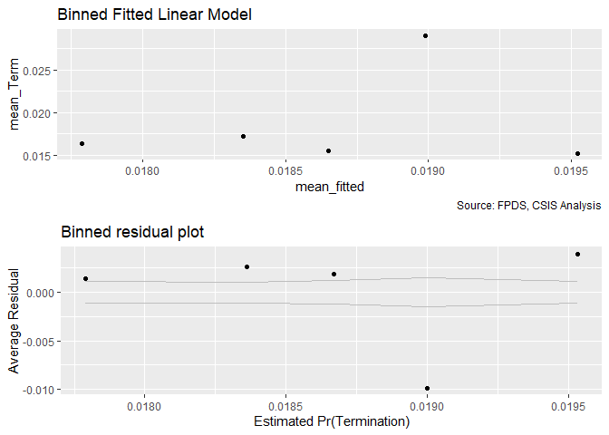<!-- -->

```
## [[1]]
##        model deviance null.deviance difference
## 1 model1_old 46383.29      46388.62   5.320864
```

When considered alone, expectations are matched for ceiling breaches and exercised options, as higher invoice rate estimates a higher risk of ceiling breaches and lower possibility of exercised options.


### 01C Services Complexity
Expectation: Collectively, the higher average salary and invoice rate (more complexity is indicated), the higher risk of ceiling breaches and terminations and the less exercised options there would be. Also we expect the result of combined model would be the same as individual models.

 

```r
#Model
Term_01C <- glm (data=serv_smp,
                 b_Term ~ cl_US6_avg_sal_lag1Const + cl_CFTE, family=binomial(link="logit"))

glmer_examine(Term_01C)
```

```
## cl_US6_avg_sal_lag1Const                  cl_CFTE 
##                 1.156917                 1.156917
```

```r
stargazer::stargazer(
                       Term_01A,Term_01B,Term_01C,
                       
                       type="text",
                       digits=2)
```

```
## 
## =========================================================
##                                Dependent variable:       
##                          --------------------------------
##                                       b_Term             
##                             (1)        (2)        (3)    
## ---------------------------------------------------------
## cl_US6_avg_sal_lag1Const   0.08**                0.06*   
##                            (0.03)                (0.03)  
##                                                          
## cl_CFTE                               0.07**      0.05   
##                                       (0.03)     (0.03)  
##                                                          
## Constant                  -3.96***   -3.96***   -3.96*** 
##                            (0.01)     (0.01)     (0.01)  
##                                                          
## ---------------------------------------------------------
## Observations              250,000    250,000    250,000  
## Log Likelihood           -23,191.15 -23,191.65 -23,190.06
## Akaike Inf. Crit.        46,386.29  46,387.29  46,386.11 
## =========================================================
## Note:                         *p<0.1; **p<0.05; ***p<0.01
```

```r
  summary_residual_compare(Term_01A,Term_01C,Term_01B,Term_01C)
```

<!-- -->

```
## Warning in if (class(model1_new) == "glmerMod" & class(model2_new) ==
## "glmerMod") {: the condition has length > 1 and only the first element will
## be used
```

```
## Warning in if ((class(model1_new) != "glmerMod" & class(model2_new) !
## = "glmerMod") & : the condition has length > 1 and only the first element
## will be used
```

<!-- -->

```
## [[1]]
##        model deviance null.deviance difference
## 1 model1_old 46382.29      46388.62   6.323854
## 2 model1_new 46380.11      46388.62   8.503541
## 3 model2_old 46383.29      46388.62   5.320864
## 4 model2_new 46380.11      46388.62   8.503541
## 
## [[2]]
## cl_US6_avg_sal_lag1Const                  cl_CFTE 
##                 1.156917                 1.156917 
## 
## [[3]]
## cl_US6_avg_sal_lag1Const                  cl_CFTE 
##                 1.156917                 1.156917
```

Both average salary and invoiced rate have a VI well within bounds, suggesting that the variance of the estimated coefficients is not evidently inflated and none of them are highly correlated with each other. 

Both individually and pair-wise, higher average salary and invoiced rate estimate higher possibility of cost ceiling breaches and lower likelihood of exercised options as expected. But the termination expectation is not not significant at the 0.05 level for either for two measures of service complexity resepctively when considered together.


## Office Capacity

### 02A: Performance Based Services
Expectation: Performance-based services contracting ties a portion of a contractor's payment, contract extensions, or contract renewals to the achievement of specific, measurable performance standards and requirements, which encourages better contracting results. PBSC has the potential to reduce terminations and ceiling breaches and bring more possibility of exercised options.


```r
summary_continuous_plot(serv_smp1m,"pPBSC")
```

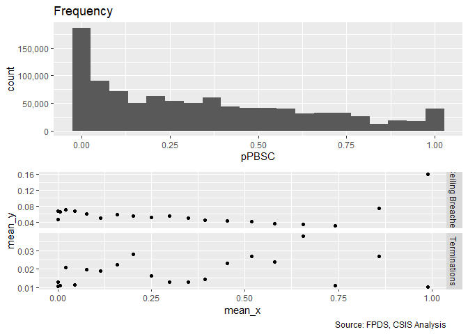<!-- -->

```r
summary_continuous_plot(serv_smp1m,"pPBSC",log=TRUE)
```

```
## Warning: Removed 63536 rows containing non-finite values (stat_bin).
```

<!-- -->

```r
#Model
Term_02A <- glm (data=serv_smp,
                 b_Term ~ c_pPBSC, family=binomial(link="logit"))


stargazer::stargazer(
                       Term_02A,
                       
                       type="text",
                       digits=2)
```

```
## 
## =============================================
##                       Dependent variable:    
##                   ---------------------------
##                             b_Term           
## ---------------------------------------------
## c_pPBSC                     0.20***          
##                             (0.03)           
##                                              
## Constant                   -3.97***          
##                             (0.01)           
##                                              
## ---------------------------------------------
## Observations                250,000          
## Log Likelihood            -23,171.58         
## Akaike Inf. Crit.          46,347.17         
## =============================================
## Note:             *p<0.1; **p<0.05; ***p<0.01
```

```r
  summary_residual_compare(Term_02A)
```

```
## Warning in if (class(model1_old) == "glmerMod") {: the condition has length
## > 1 and only the first element will be used
```

```
## Warning in if (class(model1_old) != "glmerMod" & class(model1_old) !=
## "glmerMod") {: the condition has length > 1 and only the first element will
## be used
```

<!-- -->

```
## [[1]]
##        model deviance null.deviance difference
## 1 model1_old 46343.17      46388.62   45.44842
```

When considering PBSC alone, the expected sign was not found in terminations.


### 02B: No.Office PSC History
Expectation: The increasing share of contracting office obligations for a given service indicates high capcaity in that area, lower likelihood of cost ceiling breaches and termination and higher likelihood of exercised options are expected to be observed.


```r
summary_continuous_plot(serv_smp1m,"pOffPSC")
```

<!-- -->

```r
summary_continuous_plot(serv_smp1m,"pOffPSC",log=TRUE)
```

```
## Warning: Removed 99679 rows containing non-finite values (stat_bin).
```

<!-- -->

```r
#Model
Term_02B <- glm (data=serv_smp,
                 b_Term ~ c_pOffPSC, family=binomial(link="logit"))

stargazer::stargazer(
                       Term_02A,Term_02B,
                       
                       type="text",
                       digits=2)
```

```
## 
## ==============================================
##                       Dependent variable:     
##                   ----------------------------
##                              b_Term           
##                        (1)            (2)     
## ----------------------------------------------
## c_pPBSC              0.20***                  
##                       (0.03)                  
##                                               
## c_pOffPSC                           0.45***   
##                                     (0.02)    
##                                               
## Constant             -3.97***      -3.98***   
##                       (0.01)        (0.02)    
##                                               
## ----------------------------------------------
## Observations         250,000        250,000   
## Log Likelihood      -23,171.58    -23,048.00  
## Akaike Inf. Crit.   46,347.17      46,100.00  
## ==============================================
## Note:              *p<0.1; **p<0.05; ***p<0.01
```

```r
summary_residual_compare(Term_02B, skip_vif = TRUE)
```

```
## Warning in if (class(model1_old) == "glmerMod") {: the condition has length
## > 1 and only the first element will be used
```

```
## Warning in if (class(model1_old) != "glmerMod" & class(model1_old) !=
## "glmerMod") {: the condition has length > 1 and only the first element will
## be used
```

<!-- -->

```
## [[1]]
##        model deviance null.deviance difference
## 1 model1_old    46096      46388.62   292.6137
```

Expections were not upheldfor terminations When considering number of contracting office obligations for a given service alone.


### 02C: Office Capacity
Expectation: Collaberactively, the larger share of PBSC and contracting office obligations for a given service, the less risk of ceiling breaches and terminations and the more exercised options there would be. Also we expect the results of combined model would be the same as two individual models above. 


```r
#Model
Term_02C <- glm (data=serv_smp,
                 b_Term ~ c_pPBSC+c_pOffPSC, family=binomial(link="logit"))

glmer_examine(Term_02C)
```

```
##   c_pPBSC c_pOffPSC 
##  1.230466  1.230466
```

```r
stargazer::stargazer(
                       Term_01C,Term_02A,Term_02B,Term_02C,
                       
                       type="text",
                       digits=2)
```

```
## 
## ====================================================================
##                                      Dependent variable:            
##                          -------------------------------------------
##                                            b_Term                   
##                             (1)        (2)        (3)        (4)    
## --------------------------------------------------------------------
## cl_US6_avg_sal_lag1Const   0.06*                                    
##                            (0.03)                                   
##                                                                     
## cl_CFTE                     0.05                                    
##                            (0.03)                                   
##                                                                     
## c_pPBSC                              0.20***                -0.002  
##                                       (0.03)                (0.03)  
##                                                                     
## c_pOffPSC                                       0.45***    0.45***  
##                                                  (0.02)     (0.03)  
##                                                                     
## Constant                  -3.96***   -3.97***   -3.98***   -3.98*** 
##                            (0.01)     (0.01)     (0.02)     (0.02)  
##                                                                     
## --------------------------------------------------------------------
## Observations              250,000    250,000    250,000    250,000  
## Log Likelihood           -23,190.06 -23,171.58 -23,048.00 -23,048.00
## Akaike Inf. Crit.        46,386.11  46,347.17  46,100.00  46,102.00 
## ====================================================================
## Note:                                    *p<0.1; **p<0.05; ***p<0.01
```

```r
summary_residual_compare(Term_02A,Term_02C,Term_02B,Term_02C)
```

<!-- -->

```
## Warning in if (class(model1_new) == "glmerMod" & class(model2_new) ==
## "glmerMod") {: the condition has length > 1 and only the first element will
## be used
```

```
## Warning in if ((class(model1_new) != "glmerMod" & class(model2_new) !
## = "glmerMod") & : the condition has length > 1 and only the first element
## will be used
```

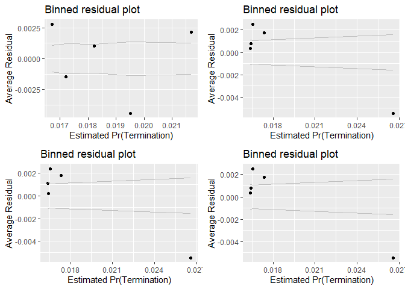<!-- -->

```
## [[1]]
##        model deviance null.deviance difference
## 1 model1_old 46343.17      46388.62   45.44842
## 2 model1_new 46096.00      46388.62  292.61777
## 3 model2_old 46096.00      46388.62  292.61371
## 4 model2_new 46096.00      46388.62  292.61777
## 
## [[2]]
##   c_pPBSC c_pOffPSC 
##  1.230466  1.230466 
## 
## [[3]]
##   c_pPBSC c_pOffPSC 
##  1.230466  1.230466
```

No high correlation is observed between PBSC and Contract Office Obligations for PSC based on the vif score.

After combining PBSC and Contract office obligations for PSC, PBSC lost significance for terminations. Contract office obligations for PSC is associate with more exercised options. PBSC is now has the expected sign but pOffPSC does not.


### 02D: Cumulative  Model
Expectation: When all the four variables are combined into one model, same expectations are applied as individual ones. Per service complexity indicator increases, higher risk of ceiling breaches and terminations and less exercised options expected. Per office capacity indicator increases, lower risk of ceiling breaches and terminations and more exercised options expected.


```r
#Model
Term_02D <- glm (data=serv_smp,
                 b_Term ~ cl_US6_avg_sal_lag1Const + cl_CFTE+c_pPBSC+c_pOffPSC, family=binomial(link="logit"))

glmer_examine(Term_02D)
```

```
## cl_US6_avg_sal_lag1Const                  cl_CFTE                  c_pPBSC 
##                 1.204996                 1.166322                 1.242300 
##                c_pOffPSC 
##                 1.244321
```

```r
stargazer::stargazer(
                       Term_01C,Term_02C,Term_02D,
                       
                       type="text",
                       digits=2)
```

```
## 
## =========================================================
##                                Dependent variable:       
##                          --------------------------------
##                                       b_Term             
##                             (1)        (2)        (3)    
## ---------------------------------------------------------
## cl_US6_avg_sal_lag1Const   0.06*                 -0.03   
##                            (0.03)                (0.03)  
##                                                          
## cl_CFTE                     0.05                 0.06*   
##                            (0.03)                (0.03)  
##                                                          
## c_pPBSC                               -0.002     -0.004  
##                                       (0.03)     (0.03)  
##                                                          
## c_pOffPSC                            0.45***    0.45***  
##                                       (0.03)     (0.03)  
##                                                          
## Constant                  -3.96***   -3.98***   -3.98*** 
##                            (0.01)     (0.02)     (0.02)  
##                                                          
## ---------------------------------------------------------
## Observations              250,000    250,000    250,000  
## Log Likelihood           -23,190.06 -23,048.00 -23,046.13
## Akaike Inf. Crit.        46,386.11  46,102.00  46,102.26 
## =========================================================
## Note:                         *p<0.1; **p<0.05; ***p<0.01
```

```r
summary_residual_compare(Term_01C,Term_02D)
```

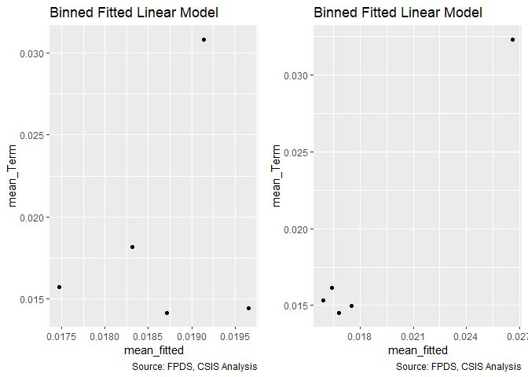<!-- -->

```
## Warning in if (class(model1_new) == "glmerMod") {: the condition has length
## > 1 and only the first element will be used
```

```
## Warning in if (class(model1_new) != "glmerMod" & class(model1_old) !=
## "glmerMod") {: the condition has length > 1 and only the first element will
## be used
```

<!-- -->

```
## [[1]]
##        model deviance null.deviance difference
## 1 model1_old 46380.11      46388.62   8.503541
## 2 model1_new 46092.26      46388.62 296.356786
## 
## [[2]]
## cl_US6_avg_sal_lag1Const                  cl_CFTE                  c_pPBSC 
##                 1.204996                 1.166322                 1.242300 
##                c_pOffPSC 
##                 1.244321
```

No high correlation is observed among all of the 4 predictors (average salary, invoiced rate, PBSC and Contract Office Obligations for PSC) so far based on the vif score. When all measures for sevice complexity and office capacity are combined, per dependent variable:

Terminations: Average Salary swaps signs, counter to expectations, and becomes less significant. CFTE becomes signifianct at the .10 level.  pPBSC and pOFfPSC are largely unchanged from the prior model.


## Office-Vendor Relationship

### 03A: Pair History
Expactation: The number of past years of the relationship between the contracting office or the contractors with a single transaction in a given fiscal year enough to qualify, namely, pair history increases (decreases), the likelihood of cost ceiling breaches and terminations decreases (increases) and the exercised options increase (decrease) for that partnership.


```r
summary_discrete_plot(serv_smp,"office_entity_paircount_7year")
```

```
## Warning: Ignoring unknown parameters: binwidth, bins, pad
```

```
## Warning: group_by_() is deprecated. 
## Please use group_by() instead
## 
## The 'programming' vignette or the tidyeval book can help you
## to program with group_by() : https://tidyeval.tidyverse.org
## This warning is displayed once per session.
```

<!-- -->

```
## [[1]]
## 
##     0     1     2     3     4     5     6     7 
## 39242 30467 28241 29493 32797 27439 21560 40761 
## 
## [[2]]
##    
##      None Ceiling Breach
##   0 36849           2393
##   1 28665           1802
##   2 26607           1634
##   3 27643           1850
##   4 30754           2043
##   5 25732           1707
##   6 20305           1255
##   7 38730           2031
## 
## [[3]]
##    
##         0     1
##   0 38153  1089
##   1 30053   414
##   2 27890   351
##   3 29134   359
##   4 32221   576
##   5 26736   703
##   6 21109   451
##   7 40039   722
```

```r
#Model
Term_03A <- glm (data=serv_smp,
                 b_Term ~ c_pairHist, family=binomial(link="logit"))


  stargazer::stargazer(Term_02D,
                       Term_03A,
                       
                       type="text",
                       digits=2)
```

```
## 
## =====================================================
##                              Dependent variable:     
##                          ----------------------------
##                                     b_Term           
##                               (1)            (2)     
## -----------------------------------------------------
## cl_US6_avg_sal_lag1Const     -0.03                   
##                              (0.03)                  
##                                                      
## cl_CFTE                      0.06*                   
##                              (0.03)                  
##                                                      
## c_pPBSC                      -0.004                  
##                              (0.03)                  
##                                                      
## c_pOffPSC                   0.45***                  
##                              (0.03)                  
##                                                      
## c_pairHist                                  -0.05    
##                                            (0.03)    
##                                                      
## Constant                    -3.98***      -3.96***   
##                              (0.02)        (0.01)    
##                                                      
## -----------------------------------------------------
## Observations                250,000        250,000   
## Log Likelihood             -23,046.13    -23,193.15  
## Akaike Inf. Crit.          46,102.26      46,390.30  
## =====================================================
## Note:                     *p<0.1; **p<0.05; ***p<0.01
```

```r
summary_residual_compare(Term_03A, skip_vif = TRUE)
```

```
## Warning in if (class(model1_old) == "glmerMod") {: the condition has length
## > 1 and only the first element will be used
```

```
## Warning in if (class(model1_old) != "glmerMod" & class(model1_old) !=
## "glmerMod") {: the condition has length > 1 and only the first element will
## be used
```

<!-- -->

```
## [[1]]
##        model deviance null.deviance difference
## 1 model1_old  46386.3      46388.62   2.317546
```

When considering pair history alone, expectations were met for terminations., though the results were not significant.

### 03B: Interaction
Expectation: As the number of contract actions a vendor has performed for an office in the past year increases (decreases), the likelihood of cost ceiling breaches and terminations decreases (increases) and that of exercised options increases (decreases) for that partnership.


```r
summary_continuous_plot(serv_smp1m,"office_entity_numberofactions_1year")
```

<!-- -->

```r
summary_continuous_plot(serv_smp1m,"office_entity_numberofactions_1year", log=TRUE)
```

```
## Warning: Removed 1559 rows containing non-finite values (stat_bin).
```

<!-- -->

```r
#Model
Term_03B <- glm (data=serv_smp,
                 b_Term ~ cl_pairCA, family=binomial(link="logit"))

stargazer::stargazer(                       Term_03A,Term_03B,
                       type="text",
                       digits=2)
```

```
## 
## ==============================================
##                       Dependent variable:     
##                   ----------------------------
##                              b_Term           
##                        (1)            (2)     
## ----------------------------------------------
## c_pairHist            -0.05                   
##                       (0.03)                  
##                                               
## cl_pairCA                           0.36***   
##                                     (0.03)    
##                                               
## Constant             -3.96***      -3.97***   
##                       (0.01)        (0.01)    
##                                               
## ----------------------------------------------
## Observations         250,000        250,000   
## Log Likelihood      -23,193.15    -23,112.98  
## Akaike Inf. Crit.   46,390.30      46,229.96  
## ==============================================
## Note:              *p<0.1; **p<0.05; ***p<0.01
```

```r
summary_residual_compare(Term_03B, skip_vif = TRUE)
```

```
## Warning in if (class(model1_old) == "glmerMod") {: the condition has length
## > 1 and only the first element will be used
```

```
## Warning in if (class(model1_old) != "glmerMod" & class(model1_old) !=
## "glmerMod") {: the condition has length > 1 and only the first element will
## be used
```

<!-- -->

```
## [[1]]
##        model deviance null.deviance difference
## 1 model1_old 46225.96      46388.62   162.6512
```

Expectation were not met, The patterns in the plots are complex, terminations has an negative relationship, until the number of ations grows extreme at which point the risk jumps up.

### 03C: Office-Vendor Relationship
Expectation: 
The importance of partnership, trust, and handling difficult problems and uncertainty together naturally lead into the last characteristic: the relationship between the contractor and buyer. The higher level of interaction provides the more opportunity to build a deeper relationship, the likelihood of cost ceiling breaches and terminations decreases and the exercised options increase for that partnership. Also we expect the result of combined model would be the same as individual models above.


```r
#Model
Term_03C <- glm (data=serv_smp,
                 b_Term ~ c_pairHist+cl_pairCA, family=binomial(link="logit"))

glmer_examine(Term_03C)
```

```
## c_pairHist  cl_pairCA 
##   1.196618   1.196618
```

```r
  stargazer::stargazer(
                       Term_03A,Term_03B,Term_03C,
                       
                       type="text",
                       digits=2)
```

```
## 
## ==================================================
##                         Dependent variable:       
##                   --------------------------------
##                                b_Term             
##                      (1)        (2)        (3)    
## --------------------------------------------------
## c_pairHist          -0.05                -0.24*** 
##                     (0.03)                (0.03)  
##                                                   
## cl_pairCA                     0.36***    0.45***  
##                                (0.03)     (0.03)  
##                                                   
## Constant           -3.96***   -3.97***   -3.98*** 
##                     (0.01)     (0.01)     (0.02)  
##                                                   
## --------------------------------------------------
## Observations       250,000    250,000    250,000  
## Log Likelihood    -23,193.15 -23,112.98 -23,086.75
## Akaike Inf. Crit. 46,390.30  46,229.96  46,179.51 
## ==================================================
## Note:                  *p<0.1; **p<0.05; ***p<0.01
```

```r
summary_residual_compare(Term_03A,Term_03C,Term_03B,Term_03C)
```

<!-- -->

```
## Warning in if (class(model1_new) == "glmerMod" & class(model2_new) ==
## "glmerMod") {: the condition has length > 1 and only the first element will
## be used
```

```
## Warning in if ((class(model1_new) != "glmerMod" & class(model2_new) !
## = "glmerMod") & : the condition has length > 1 and only the first element
## will be used
```

<!-- -->

```
## [[1]]
##        model deviance null.deviance difference
## 1 model1_old 46386.30      46388.62   2.317546
## 2 model1_new 46173.51      46388.62 215.106595
## 3 model2_old 46225.96      46388.62 162.651178
## 4 model2_new 46173.51      46388.62 215.106595
## 
## [[2]]
## c_pairHist  cl_pairCA 
##   1.196618   1.196618 
## 
## [[3]]
## c_pairHist  cl_pairCA 
##   1.196618   1.196618
```

When combining pair history and contract actions, magnitude of relationships with dependent variables incraesed and pairhistory is now significant in the expected direction while pair contract actions remains contrary to expectations.


### 03D: Cumulative  Model

Expectation: Under each subgroup, the predictors are expected to have similar impacts on dependent variables individually and cumulatively:
1. Higher Services Complexity: Higher likelihood of cost ceiling breaches and terminations; Less exercised options
2. Larger Office Capacity: Lower likelihood of cost ceiling breaches and terminations; More exercised options
3. Deeper Office-Vendor Relationship: Lower likelihood of cost ceiling breaches and terminations; More exercised options


```r
#Model
Term_03D <- glm (data=serv_smp,
                 b_Term ~ cl_US6_avg_sal_lag1Const + 
                   cl_CFTE+ c_pPBSC+c_pOffPSC+
                   c_pairHist+cl_pairCA, family=binomial(link="logit"))

glmer_examine(Term_03D)
```

```
## cl_US6_avg_sal_lag1Const                  cl_CFTE                  c_pPBSC 
##                 1.249462                 1.182577                 1.285489 
##                c_pOffPSC               c_pairHist                cl_pairCA 
##                 1.413705                 1.227524                 1.487997
```

```r
stargazer::stargazer(
                       Term_02D,Term_03C,Term_03D,
                       
                       type="text",
                       digits=2)
```

```
## 
## =========================================================
##                                Dependent variable:       
##                          --------------------------------
##                                       b_Term             
##                             (1)        (2)        (3)    
## ---------------------------------------------------------
## cl_US6_avg_sal_lag1Const   -0.03                 -0.06*  
##                            (0.03)                (0.03)  
##                                                          
## cl_CFTE                    0.06*                0.10***  
##                            (0.03)                (0.03)  
##                                                          
## c_pPBSC                    -0.004                -0.003  
##                            (0.03)                (0.03)  
##                                                          
## c_pOffPSC                 0.45***               0.37***  
##                            (0.03)                (0.03)  
##                                                          
## c_pairHist                           -0.24***   -0.23*** 
##                                       (0.03)     (0.03)  
##                                                          
## cl_pairCA                            0.45***    0.31***  
##                                       (0.03)     (0.03)  
##                                                          
## Constant                  -3.98***   -3.98***   -3.99*** 
##                            (0.02)     (0.02)     (0.02)  
##                                                          
## ---------------------------------------------------------
## Observations              250,000    250,000    250,000  
## Log Likelihood           -23,046.13 -23,086.75 -22,997.20
## Akaike Inf. Crit.        46,102.26  46,179.51  46,008.41 
## =========================================================
## Note:                         *p<0.1; **p<0.05; ***p<0.01
```

```r
summary_residual_compare(Term_02D,Term_03D)
```

<!-- -->

```
## Warning in if (class(model1_new) == "glmerMod") {: the condition has length
## > 1 and only the first element will be used
```

```
## Warning in if (class(model1_new) != "glmerMod" & class(model1_old) !=
## "glmerMod") {: the condition has length > 1 and only the first element will
## be used
```

<!-- -->

```
## [[1]]
##        model deviance null.deviance difference
## 1 model1_old 46092.26      46388.62   296.3568
## 2 model1_new 45994.41      46388.62   394.2094
## 
## [[2]]
## cl_US6_avg_sal_lag1Const                  cl_CFTE                  c_pPBSC 
##                 1.249462                 1.182577                 1.285489 
##                c_pOffPSC               c_pairHist                cl_pairCA 
##                 1.413705                 1.227524                 1.487997
```

None of the predictors has high level of correlation (vif over 1.7) with each other. 
In the cumulative model, per dependent variable and independent variable:

2. Terminations:
   A. Service Complexity:
      Average salary did not match with expectation, but gained signifiance at the 0.10 level
      The result for invoice rate did matach with expectation and is now significant at 0.01 level
      Otherwise magnitudes reduced but no changes of note.
      
      

## Study Variables Alone


```r
study_coef_list<-
  list("(Intercept)"="(Intercept)",
       "cl_US6_avg_sal_lag1Const"="Log(Det. Ind. Salary)",
       "cl_CFTE"="Log(Service Invoice Rate)",
       "c_pPBSC"="Office Perf.-Based %",
       "c_pOffPSC"="Office Service Exp. %",
       "c_pairHist"="Paired Years",
       "cl_pairCA"="Log(Paired Actions)"
  )


all_coef_list<-
  list("(Intercept)"="(Intercept)",
       "cl_US6_avg_sal_lag1Const"="Log(Det. Ind. Salary)",
       "cl_CFTE"="Log(Service Invoice Rate)",
       "c_pPBSC"="Office Perf.-Based %",
       "c_pOffPSC"="Office Service Exp. %",
       "c_pairHist"="Paired Years",
       "cl_pairCA"="Log(Paired Actions)",
       
       #Contract Controls
       
       "Comp1or51 offer"="Comp=1 offer",
       "Comp1or52-4 offers"="Comp=2-4 offers",
       "Comp1or55+ offers"="Comp=5+ offers",
       
       "CompOffr1 offer"="Comp=1 offer",
       "CompOffr2 offers"="Comp=2 offers",
       "CompOffr3-4 offers"="Comp=3-4 offers",
       "CompOffr5+ offers"="Comp=5+ offers",
       
       "cl_Ceil"="Log(Init. Ceiling)",
       "cl_Days"="Log(Init. Days)",
       "VehS-IDC"="Vehicle=S-IDC",
       "VehM-IDC"="Vehicle=M-IDC",
       "VehFSS/GWAC"="Vehicle=FSS/GWAC",
       "VehBPA/BOA"="Vehicle=BPA/BOA",
       "PricingUCAFFP"="Pricing=FFP",
       "PricingUCAOther FP"="Pricing=Other FP",
       "PricingUCAIncentive"="Pricing=Incentive Fee",
       "PricingUCACombination or Other"="Pricing=Combination or Other",
       "PricingUCAOther CB"="Pricing=Other CB",
       "PricingUCAT&M/LH/FPLOE"="Pricing=T&M/LH/FP:LoE",
       "PricingUCAUCA"="Pricing=UCA",
       
       "PricingFeeOther FP"="Pricing=Other FP",
       "PricingFeeIncentive"="Pricing=Incentive Fee",
       "PricingFeeCombination or Other"="Pricing=Combination or Other",
       "PricingFeeOther CB"="Pricing=Other CB",
       "PricingFeeT&M/LH/FPLOE"="Pricing=T&M/LH/FP:LoE",
       "b_UCA"="UCA",
       "CrisisARRA"="Crisis=ARRA",
       "CrisisDis"="Crisis=Disaster",
       "CrisisOCO"="Crisis=OCO",
       "b_Intl"="Performed Abroad",
       
       #NAICS
       "cl_def3_HHI_lag1"="Log(Subsector HHI)",
       "cl_def6_HHI_lag1"="Log(Det. Ind. HHI)",
       "cl_def3_ratio_lag1"="Log(Subsector Ratio)",
       "cl_def6_obl_lag1"="Log(Det. Ind. DoD Obl.)",
       "cl_def6_ratio_lag1"="Log(Det. Ind. Ratio)",
       #Office
       "c_pMarket"="Percent Market",
       "cl_OffVol"="Office Volume",
       "cl_office_naics_hhi_k"="Office Concentration",
       
       
       #interations
       # # "cl_def6_HHI_lag1:cl_Days"="Log(Det. Ind. HHI):Log(Init. Days)",
       # "cl_def6_HHI_lag1:cl_def6_obl_lag1"="Log(Det. Ind. HHI):Log(Det. Ind. DoD Obl.)",
       # # "cl_def3_HHI_lag1:cl_def3_ratio_lag1"="Log(Subsector HHI):Log(Subsector Ratio)"),
       "cl_def6_HHI_lag1:b_UCA"="Log(Det. Ind. HHI):UCA",
       # "cl_Ceil:b_UCA"="Log(Init. Ceiling):UCA",
       # "CompOffr1 offer:b_UCA"="Comp=1 offer:UCA",
       # "CompOffr2 offers:b_UCA"="Comp=2 offers:UCA",
       # "CompOffr3-4 offers:b_UCA"="Comp=3-4 offers:UCA",
       # "CompOffr5+ offers:b_UCA"="Comp=5+ offers:UCA"
       "VehS-IDC:b_Intl"="Vehicle=S-IDC:Performed Abroad",
       "VehM-IDC:b_Intl"="Vehicle=M-IDC:Performed Abroad",
       "VehFSS/GWAC:b_Intl"="Vehicle=FSS/GWAC:Performed Abroad",
       "VehBPA/BOA:b_Intl"="Vehicle=BPA/BOA:Performed Abroad",
       "cl_US6_avg_sal_lag1:PricingFeeOther FP"=
         "Pricing=Other FP:Log(Det. Ind. U.S. Avg. Salary)",
       "cl_US6_avg_sal_lag1:PricingFeeIncentive"=
         "Pricing=Incentive Fee:Log(Det. Ind. U.S. Avg. Salary)",
       "cl_US6_avg_sal_lag1:PricingFeeCombination or Other"=
         "Pricing=Comb./or Other:Log(Det. Ind. U.S. Avg. Salary)",
       "cl_US6_avg_sal_lag1:PricingFeeOther CB"="Pricing=Other CB:Log(Det. Ind. U.S. Avg. Salary)",
       "cl_US6_avg_sal_lag1:PricingFeeT&M/LH/FPLOE"="Pricing=T&M/LH/FP:LoE:Log(Det. Ind. U.S. Avg. Salary)"
  )


#Terminations
stargazer::stargazer(Term_01A,Term_01B,Term_02A,Term_02B,Term_03A,Term_03B,Term_03D,
                     type="text",
                     digits=2)
```

```
## 
## =====================================================================================================
##                                                      Dependent variable:                             
##                          ----------------------------------------------------------------------------
##                                                             b_Term                                   
##                             (1)        (2)        (3)        (4)        (5)        (6)        (7)    
## -----------------------------------------------------------------------------------------------------
## cl_US6_avg_sal_lag1Const   0.08**                                                            -0.06*  
##                            (0.03)                                                            (0.03)  
##                                                                                                      
## cl_CFTE                               0.07**                                                0.10***  
##                                       (0.03)                                                 (0.03)  
##                                                                                                      
## c_pPBSC                                         0.20***                                      -0.003  
##                                                  (0.03)                                      (0.03)  
##                                                                                                      
## c_pOffPSC                                                  0.45***                          0.37***  
##                                                             (0.02)                           (0.03)  
##                                                                                                      
## c_pairHist                                                             -0.05                -0.23*** 
##                                                                        (0.03)                (0.03)  
##                                                                                                      
## cl_pairCA                                                                        0.36***    0.31***  
##                                                                                   (0.03)     (0.03)  
##                                                                                                      
## Constant                  -3.96***   -3.96***   -3.97***   -3.98***   -3.96***   -3.97***   -3.99*** 
##                            (0.01)     (0.01)     (0.01)     (0.02)     (0.01)     (0.01)     (0.02)  
##                                                                                                      
## -----------------------------------------------------------------------------------------------------
## Observations              250,000    250,000    250,000    250,000    250,000    250,000    250,000  
## Log Likelihood           -23,191.15 -23,191.65 -23,171.58 -23,048.00 -23,193.15 -23,112.98 -22,997.20
## Akaike Inf. Crit.        46,386.29  46,387.29  46,347.17  46,100.00  46,390.30  46,229.96  46,008.41 
## =====================================================================================================
## Note:                                                                     *p<0.1; **p<0.05; ***p<0.01
```

```r
texreg::htmlreg(list(Term_01A,Term_01B,Term_02A,Term_02B,Term_03A,Term_03B,Term_03D),
                file="..//Output//Term_Model.html",
                single.row = TRUE,
                # custom.model.name=c("Ceiling Breaches"),
                stars=c(0.1,0.05,0.01,0.001),
                groups = list(
                  "Services Complexity" = 2:3,
                  "Office Capacity" =4:5,
                  "Past Relationship"=6:7
                ),
                custom.coef.map=all_coef_list,
                bold=0.05,
                custom.note="%stars. Numerical inputs are rescaled.",
                caption="Table 7: Logit Bivariate Look at Study Variables and Terminations",
                caption.above=TRUE)
```

```
## The table was written to the file '..//Output//Term_Model.html'.
```

# Controls

##Contract-Level Controls
###Scope Variables
#### 04A: Cost Ceiling

Expectation: Initial Ceiling size positively estimates increasing probability of ceiling breaches and terminations and negatively estimates the option growth. Terminations and ceiling breaches simply comes down to large being associated with higher risk, while for option growth size imply makes it harder to grow proportionally.


```r
#Frequency Plot for unlogged ceiling
summary_continuous_plot(serv_smp1m,"UnmodifiedCeiling_OMB20_GDP18",bins=1000)
```

<!-- -->

```r
summary_continuous_plot(serv_smp1m,"UnmodifiedCeiling_OMB20_GDP18",bins=50,log=TRUE)
```

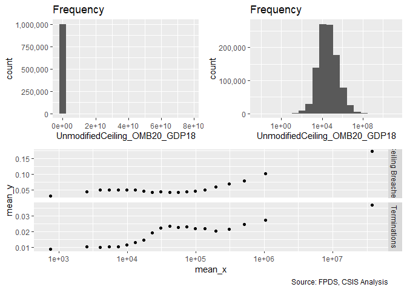<!-- -->

```r
#Model
Term_04A <- glm (data=serv_smp,
                 b_Term ~ cl_Ceil, family=binomial(link="logit"))

stargazer::stargazer(
                       Term_03D,Term_04A,
                       
                       type="text",
                       digits=2)
```

```
## 
## =====================================================
##                              Dependent variable:     
##                          ----------------------------
##                                     b_Term           
##                               (1)            (2)     
## -----------------------------------------------------
## cl_US6_avg_sal_lag1Const     -0.06*                  
##                              (0.03)                  
##                                                      
## cl_CFTE                     0.10***                  
##                              (0.03)                  
##                                                      
## c_pPBSC                      -0.003                  
##                              (0.03)                  
##                                                      
## c_pOffPSC                   0.37***                  
##                              (0.03)                  
##                                                      
## c_pairHist                  -0.23***                 
##                              (0.03)                  
##                                                      
## cl_pairCA                   0.31***                  
##                              (0.03)                  
##                                                      
## cl_Ceil                                    0.79***   
##                                            (0.03)    
##                                                      
## Constant                    -3.99***      -4.05***   
##                              (0.02)        (0.02)    
##                                                      
## -----------------------------------------------------
## Observations                250,000        250,000   
## Log Likelihood             -22,997.20    -22,839.67  
## Akaike Inf. Crit.          46,008.41      45,683.33  
## =====================================================
## Note:                     *p<0.1; **p<0.05; ***p<0.01
```

```r
summary_residual_compare(Term_04A, skip_vif = TRUE)
```

```
## Warning in if (class(model1_old) == "glmerMod") {: the condition has length
## > 1 and only the first element will be used
```

```
## Warning in if (class(model1_old) != "glmerMod" & class(model1_old) !=
## "glmerMod") {: the condition has length > 1 and only the first element will
## be used
```

<!-- -->

```
## [[1]]
##        model deviance null.deviance difference
## 1 model1_old 45679.33      46388.62   709.2819
```

Contract ceiling has a significant relationship, though the residuals show a possible non-linear patterns. This is most remarkable in the positive centered values between 0 and 1. This may be driven  by a missing value and is worth watching.
Expectations upheld for ceiling breaches and terminations. Weak expectations for options growth were countered.

#### 04B: Maximum Duration

Expectation: Greater maximum duration will positively estimate the probability ceiling of  breaches and terminations. Greater growth for options is also expected, because year-on-year options may be more of a default, though the scatter plot seems to go the other way.


```r
#Frequency Plot for max duration
summary_continuous_plot(serv_smp1m,"UnmodifiedDays")
```

<!-- -->

```r
summary_continuous_plot(serv_smp1m,"UnmodifiedDays",log=TRUE)
```

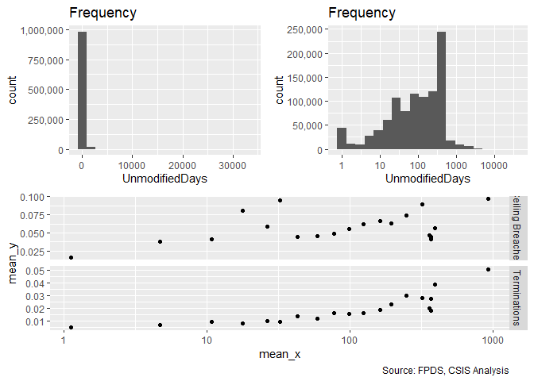<!-- -->

```r
#Model
Term_04B <- glm (data=serv_smp,
                 b_Term ~ cl_Days, family=binomial(link="logit"))

stargazer::stargazer(
                       Term_03D,Term_04A,Term_04B,
                       
                       type="text",
                       digits=2)
```

```
## 
## =========================================================
##                                Dependent variable:       
##                          --------------------------------
##                                       b_Term             
##                             (1)        (2)        (3)    
## ---------------------------------------------------------
## cl_US6_avg_sal_lag1Const   -0.06*                        
##                            (0.03)                        
##                                                          
## cl_CFTE                   0.10***                        
##                            (0.03)                        
##                                                          
## c_pPBSC                    -0.003                        
##                            (0.03)                        
##                                                          
## c_pOffPSC                 0.37***                        
##                            (0.03)                        
##                                                          
## c_pairHist                -0.23***                       
##                            (0.03)                        
##                                                          
## cl_pairCA                 0.31***                        
##                            (0.03)                        
##                                                          
## cl_Ceil                              0.79***             
##                                       (0.03)             
##                                                          
## cl_Days                                         1.35***  
##                                                  (0.04)  
##                                                          
## Constant                  -3.99***   -4.05***   -4.14*** 
##                            (0.02)     (0.02)     (0.02)  
##                                                          
## ---------------------------------------------------------
## Observations              250,000    250,000    250,000  
## Log Likelihood           -22,997.20 -22,839.67 -22,492.50
## Akaike Inf. Crit.        46,008.41  45,683.33  44,988.99 
## =========================================================
## Note:                         *p<0.1; **p<0.05; ***p<0.01
```

```r
summary_residual_compare(Term_04B, skip_vif = TRUE)
```

```
## Warning in if (class(model1_old) == "glmerMod") {: the condition has length
## > 1 and only the first element will be used
```

```
## Warning in if (class(model1_old) != "glmerMod" & class(model1_old) !=
## "glmerMod") {: the condition has length > 1 and only the first element will
## be used
```

<!-- -->

```
## [[1]]
##        model deviance null.deviance difference
## 1 model1_old 44984.99      46388.62   1403.621
```

All expections were upheld.

####04C: Ratio Initial Base : Ceiling Ratio (Logged)

```r
summary_continuous_plot(serv_smp1m, "Base2Ceil",bins=100)
```

<!-- -->

```r
summary_continuous_plot(serv_smp1m, "Base2Ceil",log=TRUE)
```

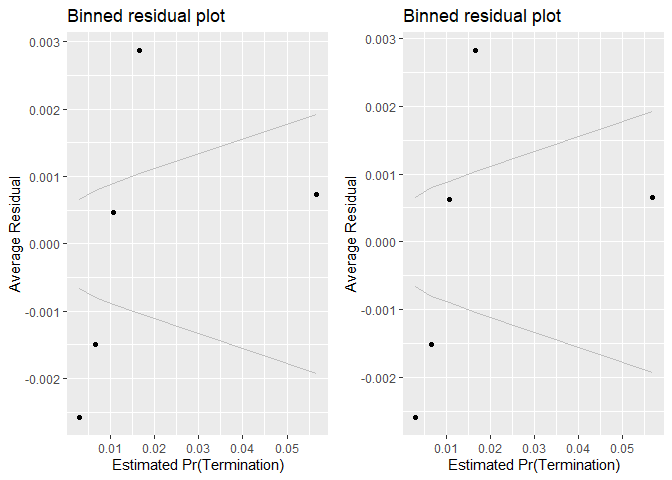<!-- -->

```r
#Model
Term_04C <- glm(data=serv_smp, b_Term ~ cl_Base2Ceil)


#Plot Residuals vs. Fitted
stargazer::stargazer(Term_04C, type="text", digits=2)
```

```
## 
## =============================================
##                       Dependent variable:    
##                   ---------------------------
##                             b_Term           
## ---------------------------------------------
## cl_Base2Ceil                0.06***          
##                             (0.001)          
##                                              
## Constant                    0.02***          
##                            (0.0003)          
##                                              
## ---------------------------------------------
## Observations                250,000          
## Log Likelihood            151,197.50         
## Akaike Inf. Crit.         -302,391.00        
## =============================================
## Note:             *p<0.1; **p<0.05; ***p<0.01
```


#### 04D: Both Scope variables


```r
#Model
Term_04D <- glm (data=serv_smp,
                 b_Term ~ cl_Ceil +cl_Days+cl_Base2Ceil, family=binomial(link="logit"))


stargazer::stargazer(
                       Term_03D,Term_04A,Term_04B,Term_04C,Term_04D,
                       
                       type="text",
                       digits=2)
```

```
## 
## ================================================================================
##                                            Dependent variable:                  
##                          -------------------------------------------------------
##                                                  b_Term                         
##                                      logistic               normal    logistic 
##                             (1)        (2)        (3)         (4)        (5)    
## --------------------------------------------------------------------------------
## cl_US6_avg_sal_lag1Const   -0.06*                                               
##                            (0.03)                                               
##                                                                                 
## cl_CFTE                   0.10***                                               
##                            (0.03)                                               
##                                                                                 
## c_pPBSC                    -0.003                                               
##                            (0.03)                                               
##                                                                                 
## c_pOffPSC                 0.37***                                               
##                            (0.03)                                               
##                                                                                 
## c_pairHist                -0.23***                                              
##                            (0.03)                                               
##                                                                                 
## cl_pairCA                 0.31***                                               
##                            (0.03)                                               
##                                                                                 
## cl_Ceil                              0.79***                             0.05   
##                                       (0.03)                            (0.03)  
##                                                                                 
## cl_Days                                         1.35***                1.03***  
##                                                  (0.04)                 (0.04)  
##                                                                                 
## cl_Base2Ceil                                                0.06***    0.99***  
##                                                             (0.001)     (0.02)  
##                                                                                 
## Constant                  -3.99***   -4.05***   -4.14***    0.02***    -4.31*** 
##                            (0.02)     (0.02)     (0.02)    (0.0003)     (0.02)  
##                                                                                 
## --------------------------------------------------------------------------------
## Observations              250,000    250,000    250,000     250,000    250,000  
## Log Likelihood           -22,997.20 -22,839.67 -22,492.50 151,197.50  -20,667.29
## Akaike Inf. Crit.        46,008.41  45,683.33  44,988.99  -302,391.00 41,342.58 
## ================================================================================
## Note:                                                *p<0.1; **p<0.05; ***p<0.01
```

```r
summary_residual_compare(Term_03D,Term_04D)
```

<!-- -->

```
## Warning in if (class(model1_new) == "glmerMod") {: the condition has length
## > 1 and only the first element will be used
```

```
## Warning in if (class(model1_new) != "glmerMod" & class(model1_old) !=
## "glmerMod") {: the condition has length > 1 and only the first element will
## be used
```

<!-- -->

```
## [[1]]
##        model deviance null.deviance difference
## 1 model1_old 45994.41      46388.62   394.2094
## 2 model1_new 41334.58      46388.62  5054.0321
## 
## [[2]]
##      cl_Ceil      cl_Days cl_Base2Ceil 
##     1.204619     1.164193     1.062942
```
Days loses significance for ceiling breaches. Ceiling has a smaller coefficient for terminations. Otherwise largely unchanged.


#### 04E: Cumulative  Model


```r
#Model
Term_04E <- glm (data=serv_smp,
                 b_Term ~ cl_US6_avg_sal_lag1Const + 
                   cl_CFTE+ c_pPBSC+c_pOffPSC+
                   c_pairHist+cl_pairCA+
                   cl_Ceil + cl_Days+cl_Base2Ceil, family=binomial(link="logit"))
glmer_examine(Term_04E)
```

```
## cl_US6_avg_sal_lag1Const                  cl_CFTE                  c_pPBSC 
##                 1.434391                 1.283411                 1.240918 
##                c_pOffPSC               c_pairHist                cl_pairCA 
##                 1.521724                 1.317852                 1.706935 
##                  cl_Ceil                  cl_Days             cl_Base2Ceil 
##                 1.248697                 1.189201                 1.098192
```

```r
stargazer::stargazer(
                       Term_03D,Term_04D,Term_04E,
                       
                       type="text",
                       digits=2)
```

```
## 
## =========================================================
##                                Dependent variable:       
##                          --------------------------------
##                                       b_Term             
##                             (1)        (2)        (3)    
## ---------------------------------------------------------
## cl_US6_avg_sal_lag1Const   -0.06*               -0.32*** 
##                            (0.03)                (0.04)  
##                                                          
## cl_CFTE                   0.10***                 0.04   
##                            (0.03)                (0.04)  
##                                                          
## c_pPBSC                    -0.003                -0.01   
##                            (0.03)                (0.03)  
##                                                          
## c_pOffPSC                 0.37***               0.40***  
##                            (0.03)                (0.03)  
##                                                          
## c_pairHist                -0.23***              -0.25*** 
##                            (0.03)                (0.03)  
##                                                          
## cl_pairCA                 0.31***               0.26***  
##                            (0.03)                (0.04)  
##                                                          
## cl_Ceil                                0.05     0.12***  
##                                       (0.03)     (0.03)  
##                                                          
## cl_Days                              1.03***    1.14***  
##                                       (0.04)     (0.04)  
##                                                          
## cl_Base2Ceil                         0.99***    0.94***  
##                                       (0.02)     (0.02)  
##                                                          
## Constant                  -3.99***   -4.31***   -4.34*** 
##                            (0.02)     (0.02)     (0.02)  
##                                                          
## ---------------------------------------------------------
## Observations              250,000    250,000    250,000  
## Log Likelihood           -22,997.20 -20,667.29 -20,486.67
## Akaike Inf. Crit.        46,008.41  41,342.58  40,993.35 
## =========================================================
## Note:                         *p<0.1; **p<0.05; ***p<0.01
```

```r
summary_residual_compare(Term_03D,Term_04D,Term_04D,Term_04E)
```

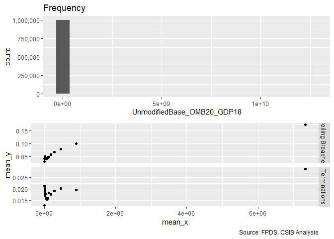<!-- --><!-- --><!-- -->

```
## Warning in if (class(model1_new) == "glmerMod" & class(model2_new) ==
## "glmerMod") {: the condition has length > 1 and only the first element will
## be used
```

```
## Warning in if ((class(model1_new) != "glmerMod" & class(model2_new) !
## = "glmerMod") & : the condition has length > 1 and only the first element
## will be used
```

<!-- -->

```
## [[1]]
##        model deviance null.deviance difference
## 1 model1_old 45994.41      46388.62   394.2094
## 2 model1_new 41334.58      46388.62  5054.0321
## 3 model2_old 41334.58      46388.62  5054.0321
## 4 model2_new 40973.35      46388.62  5415.2669
## 
## [[2]]
##      cl_Ceil      cl_Days cl_Base2Ceil 
##     1.204619     1.164193     1.062942 
## 
## [[3]]
## cl_US6_avg_sal_lag1Const                  cl_CFTE                  c_pPBSC 
##                 1.434391                 1.283411                 1.240918 
##                c_pOffPSC               c_pairHist                cl_pairCA 
##                 1.521724                 1.317852                 1.706935 
##                  cl_Ceil                  cl_Days             cl_Base2Ceil 
##                 1.248697                 1.189201                 1.098192
```
Salary no longer matches expectations for ceiling breaches. Invoice rate is no longer significant for terminations. 


### Competition
#### 05A: No Competition / 1 / 2-4 / 5+ Offers
Expectations
No Competition (Baseline)			+	-	-
1 Offer			+	-	-
2-4 Offers			-	+	+
5+ Offers			-	+	-


```r
summary_discrete_plot(serv_smp,"Comp1or5")
```

```
## Warning: Ignoring unknown parameters: binwidth, bins, pad
```

<!-- -->

```
## [[1]]
## 
## No Competition        1 offer     2-4 offers      5+ offers 
##          69373          42572          84137          53918 
## 
## [[2]]
##                 
##                   None Ceiling Breach
##   No Competition 66060           3313
##   1 offer        41002           1570
##   2-4 offers     78652           5485
##   5+ offers      49571           4347
## 
## [[3]]
##                 
##                      0     1
##   No Competition 68505   868
##   1 offer        41956   616
##   2-4 offers     82865  1272
##   5+ offers      52009  1909
```

```r
#Model
Term_05A <- glm (data=serv_smp,
                 b_Term ~ Comp1or5, family=binomial(link="logit"))


stargazer::stargazer(
                       Term_04E,Term_05A,
                       
                       type="text",
                       digits=2)
```

```
## 
## =====================================================
##                              Dependent variable:     
##                          ----------------------------
##                                     b_Term           
##                               (1)            (2)     
## -----------------------------------------------------
## cl_US6_avg_sal_lag1Const    -0.32***                 
##                              (0.04)                  
##                                                      
## cl_CFTE                       0.04                   
##                              (0.04)                  
##                                                      
## c_pPBSC                      -0.01                   
##                              (0.03)                  
##                                                      
## c_pOffPSC                   0.40***                  
##                              (0.03)                  
##                                                      
## c_pairHist                  -0.25***                 
##                              (0.03)                  
##                                                      
## cl_pairCA                   0.26***                  
##                              (0.04)                  
##                                                      
## cl_Ceil                     0.12***                  
##                              (0.03)                  
##                                                      
## cl_Days                     1.14***                  
##                              (0.04)                  
##                                                      
## cl_Base2Ceil                0.94***                  
##                              (0.02)                  
##                                                      
## Comp1or51 offer                            0.15***   
##                                            (0.05)    
##                                                      
## Comp1or52-4 offers                         0.19***   
##                                            (0.04)    
##                                                      
## Comp1or55+ offers                          1.06***   
##                                            (0.04)    
##                                                      
## Constant                    -4.34***      -4.37***   
##                              (0.02)        (0.03)    
##                                                      
## -----------------------------------------------------
## Observations                250,000        250,000   
## Log Likelihood             -20,486.67    -22,732.95  
## Akaike Inf. Crit.          40,993.35      45,473.90  
## =====================================================
## Note:                     *p<0.1; **p<0.05; ***p<0.01
```

```r
summary_residual_compare(Term_05A,bins=2)
```

```
## Warning in if (class(model1_old) == "glmerMod") {: the condition has length
## > 1 and only the first element will be used
```

```
## Warning in if (class(model1_old) != "glmerMod" & class(model1_old) !=
## "glmerMod") {: the condition has length > 1 and only the first element will
## be used
```

<!-- -->

```
## [[1]]
##        model deviance null.deviance difference
## 1 model1_old  45465.9      46388.62   922.7166
```
Expectations were completely unmet for ceiling breaches. For terminations, expectations were met for 2-4 offers and 5+ offers, but not for 1 offer. For ceiling breaches expectations were met for 1 offer, but not for 2-4 or 5+.

#### 05B: Cumulative  Model


```r
#Model
Term_05B <- glm (data=serv_smp,
                 b_Term ~ cl_US6_avg_sal_lag1Const + 
                   cl_CFTE+ c_pPBSC+c_pOffPSC+
                   c_pairHist+cl_pairCA+
                   cl_Ceil + cl_Days+cl_Base2Ceil+
                   Comp1or5, family=binomial(link="logit"))

glmer_examine(Term_05B)
```

```
##                              GVIF Df GVIF^(1/(2*Df))
## cl_US6_avg_sal_lag1Const 1.463687  1        1.209829
## cl_CFTE                  1.308511  1        1.143902
## c_pPBSC                  1.261118  1        1.122995
## c_pOffPSC                1.571061  1        1.253420
## c_pairHist               1.329317  1        1.152960
## cl_pairCA                1.811510  1        1.345923
## cl_Ceil                  1.248973  1        1.117575
## cl_Days                  1.195102  1        1.093207
## cl_Base2Ceil             1.133166  1        1.064503
## Comp1or5                 1.131369  3        1.020784
```

```r
stargazer::stargazer(
                       Term_04E,Term_05A,Term_05B,
                       
                       type="text",
                       digits=2)
```

```
## 
## =========================================================
##                                Dependent variable:       
##                          --------------------------------
##                                       b_Term             
##                             (1)        (2)        (3)    
## ---------------------------------------------------------
## cl_US6_avg_sal_lag1Const  -0.32***              -0.30*** 
##                            (0.04)                (0.04)  
##                                                          
## cl_CFTE                     0.04                 0.002   
##                            (0.04)                (0.04)  
##                                                          
## c_pPBSC                    -0.01                 -0.03   
##                            (0.03)                (0.03)  
##                                                          
## c_pOffPSC                 0.40***               0.39***  
##                            (0.03)                (0.04)  
##                                                          
## c_pairHist                -0.25***              -0.20*** 
##                            (0.03)                (0.04)  
##                                                          
## cl_pairCA                 0.26***               0.15***  
##                            (0.04)                (0.04)  
##                                                          
## cl_Ceil                   0.12***               0.11***  
##                            (0.03)                (0.03)  
##                                                          
## cl_Days                   1.14***               1.12***  
##                            (0.04)                (0.04)  
##                                                          
## cl_Base2Ceil              0.94***               0.89***  
##                            (0.02)                (0.02)  
##                                                          
## Comp1or51 offer                      0.15***    0.15***  
##                                       (0.05)     (0.05)  
##                                                          
## Comp1or52-4 offers                   0.19***    0.12***  
##                                       (0.04)     (0.05)  
##                                                          
## Comp1or55+ offers                    1.06***    0.67***  
##                                       (0.04)     (0.04)  
##                                                          
## Constant                  -4.34***   -4.37***   -4.58*** 
##                            (0.02)     (0.03)     (0.04)  
##                                                          
## ---------------------------------------------------------
## Observations              250,000    250,000    250,000  
## Log Likelihood           -20,486.67 -22,732.95 -20,334.23
## Akaike Inf. Crit.        40,993.35  45,473.90  40,694.46 
## =========================================================
## Note:                         *p<0.1; **p<0.05; ***p<0.01
```

```r
#Plot residuals versus fitted   
summary_residual_compare(Term_04E,Term_05B)
```

<!-- -->

```
## Warning in if (class(model1_new) == "glmerMod") {: the condition has length
## > 1 and only the first element will be used
```

```
## Warning in if (class(model1_new) != "glmerMod" & class(model1_old) !=
## "glmerMod") {: the condition has length > 1 and only the first element will
## be used
```

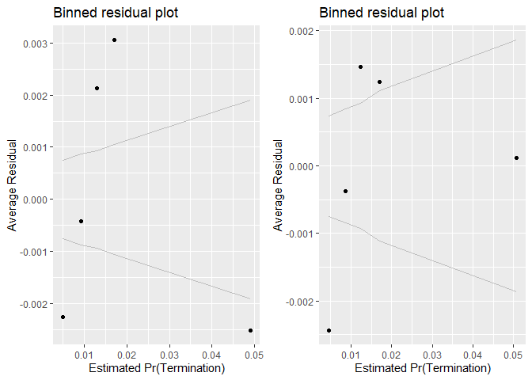<!-- -->

```
## [[1]]
##        model deviance null.deviance difference
## 1 model1_old 40973.35      46388.62   5415.267
## 2 model1_new 40668.46      46388.62   5720.157
## 
## [[2]]
##                              GVIF Df GVIF^(1/(2*Df))
## cl_US6_avg_sal_lag1Const 1.463687  1        1.209829
## cl_CFTE                  1.308511  1        1.143902
## c_pPBSC                  1.261118  1        1.122995
## c_pOffPSC                1.571061  1        1.253420
## c_pairHist               1.329317  1        1.152960
## cl_pairCA                1.811510  1        1.345923
## cl_Ceil                  1.248973  1        1.117575
## cl_Days                  1.195102  1        1.093207
## cl_Base2Ceil             1.133166  1        1.064503
## Comp1or5                 1.131369  3        1.020784
```
Minimal effect on study variables. 2-4 offers for terminations is not  longer significant, it's really 5+ that boosts the risks. But for exercised options, 5+ leads to more options while fewer having negative relationship with 2-4 offers, but only significant with p-value < 0.1 

### Contract Vehicle

#### 06A: Def/Pur; S-IDC; M-IDC; FSS-GWAC; BPA-BOA.

Old text:
Expectation: Indefinite delivery vehicles, means that the government has an existing relationship with the vendor and administration is easier. The downside is that the government may be locked into the vendor, although exit does not necessarily require outright termination, instead the government may simply cease to use a vehicle. Taken together, across the board the four categories of vehicles are expected to  negatively estimate the probability of termination. Ceiling breaches are a more complex topic and the study team does not have immediate expecations aside from likely significance.
Definitive Contract (base)			+	+	+
Single-Award IDC			-	-	-
Multi-Award IDC			-	-	-
FSS/GWAC			-	-	-
BPA/BOA			-	-	-


```r
summary_discrete_plot(serv_smp,"Veh")
```

```
## Warning: Ignoring unknown parameters: binwidth, bins, pad
```

<!-- -->

```
## [[1]]
## 
##  Def/Pur    S-IDC    M-IDC FSS/GWAC  BPA/BOA 
##    76624   121710    29874    11262    10530 
## 
## [[2]]
##           
##              None Ceiling Breach
##   Def/Pur   72393           4231
##   S-IDC    114242           7468
##   M-IDC     27665           2209
##   FSS/GWAC  10823            439
##   BPA/BOA   10162            368
## 
## [[3]]
##           
##                 0      1
##   Def/Pur   74799   1825
##   S-IDC    119920   1790
##   M-IDC     29150    724
##   FSS/GWAC  11029    233
##   BPA/BOA   10437     93
```

```r
#Model
Term_06A <- glm (data=serv_smp,
                 b_Term ~ Veh, family=binomial(link="logit"))


stargazer::stargazer(
                       Term_05B,Term_06A,
                       type="text",
                       digits=2)
```

```
## 
## =====================================================
##                              Dependent variable:     
##                          ----------------------------
##                                     b_Term           
##                               (1)            (2)     
## -----------------------------------------------------
## cl_US6_avg_sal_lag1Const    -0.30***                 
##                              (0.04)                  
##                                                      
## cl_CFTE                      0.002                   
##                              (0.04)                  
##                                                      
## c_pPBSC                      -0.03                   
##                              (0.03)                  
##                                                      
## c_pOffPSC                   0.39***                  
##                              (0.04)                  
##                                                      
## c_pairHist                  -0.20***                 
##                              (0.04)                  
##                                                      
## cl_pairCA                   0.15***                  
##                              (0.04)                  
##                                                      
## cl_Ceil                     0.11***                  
##                              (0.03)                  
##                                                      
## cl_Days                     1.12***                  
##                              (0.04)                  
##                                                      
## cl_Base2Ceil                0.89***                  
##                              (0.02)                  
##                                                      
## Comp1or51 offer             0.15***                  
##                              (0.05)                  
##                                                      
## Comp1or52-4 offers          0.12***                  
##                              (0.05)                  
##                                                      
## Comp1or55+ offers           0.67***                  
##                              (0.04)                  
##                                                      
## VehS-IDC                                  -0.49***   
##                                            (0.03)    
##                                                      
## VehM-IDC                                    0.02     
##                                            (0.04)    
##                                                      
## VehFSS/GWAC                                -0.14**   
##                                            (0.07)    
##                                                      
## VehBPA/BOA                                -1.01***   
##                                            (0.11)    
##                                                      
## Constant                    -4.58***      -3.71***   
##                              (0.04)        (0.02)    
##                                                      
## -----------------------------------------------------
## Observations                250,000        250,000   
## Log Likelihood             -20,334.23    -23,028.27  
## Akaike Inf. Crit.          40,694.46      46,066.53  
## =====================================================
## Note:                     *p<0.1; **p<0.05; ***p<0.01
```

```r
#Plot residuals versus fitted
summary_residual_compare(Term_04E,Term_05B)
```

<!-- -->

```
## Warning in if (class(model1_new) == "glmerMod") {: the condition has length
## > 1 and only the first element will be used
```

```
## Warning in if (class(model1_new) != "glmerMod" & class(model1_old) !=
## "glmerMod") {: the condition has length > 1 and only the first element will
## be used
```

<!-- -->

```
## [[1]]
##        model deviance null.deviance difference
## 1 model1_old 40973.35      46388.62   5415.267
## 2 model1_new 40668.46      46388.62   5720.157
## 
## [[2]]
##                              GVIF Df GVIF^(1/(2*Df))
## cl_US6_avg_sal_lag1Const 1.463687  1        1.209829
## cl_CFTE                  1.308511  1        1.143902
## c_pPBSC                  1.261118  1        1.122995
## c_pOffPSC                1.571061  1        1.253420
## c_pairHist               1.329317  1        1.152960
## cl_pairCA                1.811510  1        1.345923
## cl_Ceil                  1.248973  1        1.117575
## cl_Days                  1.195102  1        1.093207
## cl_Base2Ceil             1.133166  1        1.064503
## Comp1or5                 1.131369  3        1.020784
```
For ceiling breaches, IDCs, particularly multiaward IDCs, were more likely to have breaches contrary to expecatitions.

For terminations expectation were upheld or S-IDCs and BPA/BOA. They were not upheld for multi-award, which is significantly more likely to be terminated.

Expectations were largely upheld for options exercised, with the exception of FSS/GWAC.


#### 06B: Cumulative  Model


```r
#Model
Term_06B <- glm (data=serv_smp,
                 b_Term ~ cl_US6_avg_sal_lag1Const + 
                   cl_CFTE+ c_pPBSC+c_pOffPSC+
                   c_pairHist+cl_pairCA+
                   cl_Ceil + cl_Days+cl_Base2Ceil+
                   Comp1or5+
                   Veh, family=binomial(link="logit"))

glmer_examine(Term_06B)
```

```
##                              GVIF Df GVIF^(1/(2*Df))
## cl_US6_avg_sal_lag1Const 1.481260  1        1.217070
## cl_CFTE                  1.268246  1        1.126164
## c_pPBSC                  1.299530  1        1.139969
## c_pOffPSC                1.645100  1        1.282615
## c_pairHist               1.367169  1        1.169260
## cl_pairCA                2.011704  1        1.418346
## cl_Ceil                  1.360018  1        1.166198
## cl_Days                  1.190214  1        1.090969
## cl_Base2Ceil             1.201597  1        1.096174
## Comp1or5                 1.266498  3        1.040161
## Veh                      1.919112  4        1.084895
```

```r
stargazer::stargazer(
                       Term_05B,Term_06A,Term_06B,
                       
                       type="text",
                       digits=2)
```

```
## 
## =========================================================
##                                Dependent variable:       
##                          --------------------------------
##                                       b_Term             
##                             (1)        (2)        (3)    
## ---------------------------------------------------------
## cl_US6_avg_sal_lag1Const  -0.30***              -0.20*** 
##                            (0.04)                (0.04)  
##                                                          
## cl_CFTE                    0.002                  0.04   
##                            (0.04)                (0.03)  
##                                                          
## c_pPBSC                    -0.03                 -0.07*  
##                            (0.03)                (0.03)  
##                                                          
## c_pOffPSC                 0.39***               0.48***  
##                            (0.04)                (0.04)  
##                                                          
## c_pairHist                -0.20***              -0.12*** 
##                            (0.04)                (0.04)  
##                                                          
## cl_pairCA                 0.15***               0.39***  
##                            (0.04)                (0.04)  
##                                                          
## cl_Ceil                   0.11***                 0.04   
##                            (0.03)                (0.04)  
##                                                          
## cl_Days                   1.12***               1.10***  
##                            (0.04)                (0.04)  
##                                                          
## cl_Base2Ceil              0.89***               0.84***  
##                            (0.02)                (0.02)  
##                                                          
## Comp1or51 offer           0.15***                0.14**  
##                            (0.05)                (0.05)  
##                                                          
## Comp1or52-4 offers        0.12***               0.21***  
##                            (0.05)                (0.05)  
##                                                          
## Comp1or55+ offers         0.67***               0.89***  
##                            (0.04)                (0.05)  
##                                                          
## VehS-IDC                             -0.49***   -0.96*** 
##                                       (0.03)     (0.04)  
##                                                          
## VehM-IDC                               0.02     -0.50*** 
##                                       (0.04)     (0.05)  
##                                                          
## VehFSS/GWAC                          -0.14**    -0.39*** 
##                                       (0.07)     (0.07)  
##                                                          
## VehBPA/BOA                           -1.01***   -1.49*** 
##                                       (0.11)     (0.12)  
##                                                          
## Constant                  -4.58***   -3.71***   -4.12*** 
##                            (0.04)     (0.02)     (0.04)  
##                                                          
## ---------------------------------------------------------
## Observations              250,000    250,000    250,000  
## Log Likelihood           -20,334.23 -23,028.27 -20,044.32
## Akaike Inf. Crit.        40,694.46  46,066.53  40,122.64 
## =========================================================
## Note:                         *p<0.1; **p<0.05; ***p<0.01
```

```r
#Plot residuals versus fitted   
summary_residual_compare(Term_05B,Term_06B)
```

<!-- -->

```
## Warning in if (class(model1_new) == "glmerMod") {: the condition has length
## > 1 and only the first element will be used
```

```
## Warning in if (class(model1_new) != "glmerMod" & class(model1_old) !=
## "glmerMod") {: the condition has length > 1 and only the first element will
## be used
```

<!-- -->

```
## [[1]]
##        model deviance null.deviance difference
## 1 model1_old 40668.46      46388.62   5720.157
## 2 model1_new 40088.64      46388.62   6299.977
## 
## [[2]]
##                              GVIF Df GVIF^(1/(2*Df))
## cl_US6_avg_sal_lag1Const 1.481260  1        1.217070
## cl_CFTE                  1.268246  1        1.126164
## c_pPBSC                  1.299530  1        1.139969
## c_pOffPSC                1.645100  1        1.282615
## c_pairHist               1.367169  1        1.169260
## cl_pairCA                2.011704  1        1.418346
## cl_Ceil                  1.360018  1        1.166198
## cl_Days                  1.190214  1        1.090969
## cl_Base2Ceil             1.201597  1        1.096174
## Comp1or5                 1.266498  3        1.040161
## Veh                      1.919112  4        1.084895
```
Expectations for vehicle are now upheld for both ceiling breaches and terminations. For other variables the addition of vehicle proved less pivotal, though coefficients were often decreased.

### Type of Contract

The next step adds a measure for whether the contract was cost-based or fixed-price. 

Expectation Prior CSIS research has found that fixed-price contracts estimate a higher probability of terminations but did not find a notable relationship for ceiling breaches.

#### 07A: FFP / Other FP / Incentive / T&M/FP:LOE;LH / Other CB / Combination

Firm-Fixed Price (base)			+	++	+
Other Fixed Price			-	-	-
Time & Materials / Labor Hours / FP: LoE			+	-	-
Incentive Fee (both FPIF or CBIF)			-	-	+
Other Cost Based			-	-	-
Undefinitized Contract Award			++	++	--
Combination			+	+	-


```r
serv_smp$PricingUCA<-factor(serv_smp$PricingUCA,
                            levels=c( "FFP","Other FP","T&M/LH/FPLOE","Incentive","Other CB","UCA" ,"Combination or Other" ))
serv_opt$PricingUCA<-factor(serv_opt$PricingUCA,
                            levels=c( "FFP","Other FP","T&M/LH/FPLOE","Incentive","Other CB","UCA" ,"Combination or Other" ))
summary_discrete_plot(serv_smp,"PricingUCA")
```

```
## Warning: Ignoring unknown parameters: binwidth, bins, pad
```

<!-- -->

```
## [[1]]
## 
##                  FFP             Other FP         T&M/LH/FPLOE 
##               222749                 1623                 4812 
##            Incentive             Other CB                  UCA 
##                 1006                14582                 2816 
## Combination or Other 
##                 2412 
## 
## [[2]]
##                       
##                          None Ceiling Breach
##   FFP                  209275          13474
##   Other FP               1560             63
##   T&M/LH/FPLOE           4601            211
##   Incentive               890            116
##   Other CB              14100            482
##   UCA                    2629            187
##   Combination or Other   2230            182
## 
## [[3]]
##                       
##                             0      1
##   FFP                  218286   4463
##   Other FP               1567     56
##   T&M/LH/FPLOE           4771     41
##   Incentive              1004      2
##   Other CB              14515     67
##   UCA                    2803     13
##   Combination or Other   2389     23
```

```r
#Model
Term_07A <- glm (data=serv_smp,
                 b_Term ~ PricingUCA, family=binomial(link="logit"))


#Plot residuals versus fitted
stargazer::stargazer(
                       Term_06B,Term_07A,
                       
                       type="text",
                       digits=2)
```

```
## 
## ===========================================================
##                                    Dependent variable:     
##                                ----------------------------
##                                           b_Term           
##                                     (1)            (2)     
## -----------------------------------------------------------
## cl_US6_avg_sal_lag1Const          -0.20***                 
##                                    (0.04)                  
##                                                            
## cl_CFTE                             0.04                   
##                                    (0.03)                  
##                                                            
## c_pPBSC                            -0.07*                  
##                                    (0.03)                  
##                                                            
## c_pOffPSC                         0.48***                  
##                                    (0.04)                  
##                                                            
## c_pairHist                        -0.12***                 
##                                    (0.04)                  
##                                                            
## cl_pairCA                         0.39***                  
##                                    (0.04)                  
##                                                            
## cl_Ceil                             0.04                   
##                                    (0.04)                  
##                                                            
## cl_Days                           1.10***                  
##                                    (0.04)                  
##                                                            
## cl_Base2Ceil                      0.84***                  
##                                    (0.02)                  
##                                                            
## Comp1or51 offer                    0.14**                  
##                                    (0.05)                  
##                                                            
## Comp1or52-4 offers                0.21***                  
##                                    (0.05)                  
##                                                            
## Comp1or55+ offers                 0.89***                  
##                                    (0.05)                  
##                                                            
## VehS-IDC                          -0.96***                 
##                                    (0.04)                  
##                                                            
## VehM-IDC                          -0.50***                 
##                                    (0.05)                  
##                                                            
## VehFSS/GWAC                       -0.39***                 
##                                    (0.07)                  
##                                                            
## VehBPA/BOA                        -1.49***                 
##                                    (0.12)                  
##                                                            
## PricingUCAOther FP                               0.56***   
##                                                  (0.14)    
##                                                            
## PricingUCAT&M/LH/FPLOE                          -0.87***   
##                                                  (0.16)    
##                                                            
## PricingUCAIncentive                             -2.33***   
##                                                  (0.71)    
##                                                            
## PricingUCAOther CB                              -1.49***   
##                                                  (0.12)    
##                                                            
## PricingUCAUCA                                   -1.48***   
##                                                  (0.28)    
##                                                            
## PricingUCACombination or Other                  -0.75***   
##                                                  (0.21)    
##                                                            
## Constant                          -4.12***      -3.89***   
##                                    (0.04)        (0.02)    
##                                                            
## -----------------------------------------------------------
## Observations                      250,000        250,000   
## Log Likelihood                   -20,044.32    -23,003.80  
## Akaike Inf. Crit.                40,122.64      46,021.60  
## ===========================================================
## Note:                           *p<0.1; **p<0.05; ***p<0.01
```

```r
summary_residual_compare(Term_07A,bins=2)
```

```
## Warning in if (class(model1_old) == "glmerMod") {: the condition has length
## > 1 and only the first element will be used
```

```
## Warning in if (class(model1_old) != "glmerMod" & class(model1_old) !=
## "glmerMod") {: the condition has length > 1 and only the first element will
## be used
```

<!-- -->

```
## [[1]]
##        model deviance null.deviance difference
## 1 model1_old  46007.6      46388.62   381.0111
```

Other fixed price and other cost based aligned with expecations for ceiling breaches.
For terminations, other fixed price, incentive, cost-based, were line with expectations. 
For options exercied Other fixed-price, incentive, and UCA were in line with expectations

#### 07B: Cumulative  Model


```r
#Model
Term_07B <- glm (data=serv_smp,
                 b_Term ~ cl_US6_avg_sal_lag1Const + 
                   cl_CFTE+ c_pPBSC+c_pOffPSC+
                   c_pairHist+cl_pairCA+
                   cl_Ceil + cl_Days+cl_Base2Ceil+
                   Comp1or5+
                   Veh+
                   PricingUCA, family=binomial(link="logit"))

glmer_examine(Term_07B)
```

```
##                              GVIF Df GVIF^(1/(2*Df))
## cl_US6_avg_sal_lag1Const 1.439553  1        1.199814
## cl_CFTE                  1.251918  1        1.118891
## c_pPBSC                  1.310979  1        1.144980
## c_pOffPSC                1.647994  1        1.283742
## c_pairHist               1.343196  1        1.158964
## cl_pairCA                1.993159  1        1.411793
## cl_Ceil                  1.361585  1        1.166870
## cl_Days                  1.199754  1        1.095333
## cl_Base2Ceil             1.210157  1        1.100071
## Comp1or5                 1.318429  3        1.047151
## Veh                      1.913750  4        1.084515
## PricingUCA               1.117580  6        1.009307
```

```r
stargazer::stargazer(
                       Term_06B,Term_07A,Term_07B,
                       
                       type="text",
                       digits=2)
```

```
## 
## ===============================================================
##                                      Dependent variable:       
##                                --------------------------------
##                                             b_Term             
##                                   (1)        (2)        (3)    
## ---------------------------------------------------------------
## cl_US6_avg_sal_lag1Const        -0.20***              -0.16*** 
##                                  (0.04)                (0.04)  
##                                                                
## cl_CFTE                           0.04                 0.06*   
##                                  (0.03)                (0.03)  
##                                                                
## c_pPBSC                          -0.07*                -0.05   
##                                  (0.03)                (0.03)  
##                                                                
## c_pOffPSC                       0.48***               0.48***  
##                                  (0.04)                (0.04)  
##                                                                
## c_pairHist                      -0.12***              -0.10*** 
##                                  (0.04)                (0.04)  
##                                                                
## cl_pairCA                       0.39***               0.39***  
##                                  (0.04)                (0.04)  
##                                                                
## cl_Ceil                           0.04                0.17***  
##                                  (0.04)                (0.04)  
##                                                                
## cl_Days                         1.10***               1.13***  
##                                  (0.04)                (0.04)  
##                                                                
## cl_Base2Ceil                    0.84***               0.82***  
##                                  (0.02)                (0.02)  
##                                                                
## Comp1or51 offer                  0.14**               0.18***  
##                                  (0.05)                (0.05)  
##                                                                
## Comp1or52-4 offers              0.21***               0.21***  
##                                  (0.05)                (0.05)  
##                                                                
## Comp1or55+ offers               0.89***               0.81***  
##                                  (0.05)                (0.05)  
##                                                                
## VehS-IDC                        -0.96***              -0.83*** 
##                                  (0.04)                (0.04)  
##                                                                
## VehM-IDC                        -0.50***              -0.42*** 
##                                  (0.05)                (0.05)  
##                                                                
## VehFSS/GWAC                     -0.39***              -0.41*** 
##                                  (0.07)                (0.07)  
##                                                                
## VehBPA/BOA                      -1.49***              -1.42*** 
##                                  (0.12)                (0.12)  
##                                                                
## PricingUCAOther FP                         0.56***      0.15   
##                                             (0.14)     (0.14)  
##                                                                
## PricingUCAT&M/LH/FPLOE                     -0.87***   -1.03*** 
##                                             (0.16)     (0.16)  
##                                                                
## PricingUCAIncentive                        -2.33***   -2.54*** 
##                                             (0.71)     (0.71)  
##                                                                
## PricingUCAOther CB                         -1.49***   -1.68*** 
##                                             (0.12)     (0.13)  
##                                                                
## PricingUCAUCA                              -1.48***   -1.27*** 
##                                             (0.28)     (0.28)  
##                                                                
## PricingUCACombination or Other             -0.75***   -1.29*** 
##                                             (0.21)     (0.22)  
##                                                                
## Constant                        -4.12***   -3.89***   -4.09*** 
##                                  (0.04)     (0.02)     (0.04)  
##                                                                
## ---------------------------------------------------------------
## Observations                    250,000    250,000    250,000  
## Log Likelihood                 -20,044.32 -23,003.80 -19,840.15
## Akaike Inf. Crit.              40,122.64  46,021.60  39,726.30 
## ===============================================================
## Note:                               *p<0.1; **p<0.05; ***p<0.01
```

```r
#Plot residuals versus fitted   
summary_residual_compare(Term_06B,Term_07B)
```

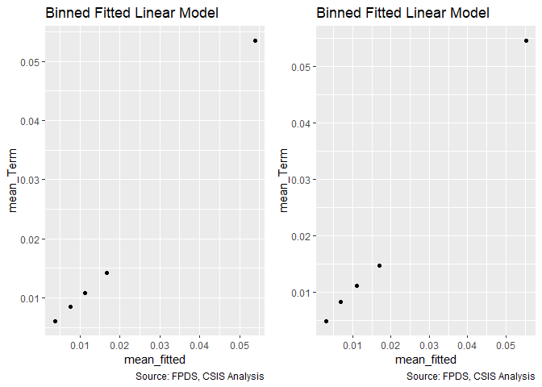<!-- -->

```
## Warning in if (class(model1_new) == "glmerMod") {: the condition has length
## > 1 and only the first element will be used
```

```
## Warning in if (class(model1_new) != "glmerMod" & class(model1_old) !=
## "glmerMod") {: the condition has length > 1 and only the first element will
## be used
```

<!-- -->

```
## [[1]]
##        model deviance null.deviance difference
## 1 model1_old 40088.64      46388.62   6299.977
## 2 model1_new 39680.30      46388.62   6708.314
## 
## [[2]]
##                              GVIF Df GVIF^(1/(2*Df))
## cl_US6_avg_sal_lag1Const 1.439553  1        1.199814
## cl_CFTE                  1.251918  1        1.118891
## c_pPBSC                  1.310979  1        1.144980
## c_pOffPSC                1.647994  1        1.283742
## c_pairHist               1.343196  1        1.158964
## cl_pairCA                1.993159  1        1.411793
## cl_Ceil                  1.361585  1        1.166870
## cl_Days                  1.199754  1        1.095333
## cl_Base2Ceil             1.210157  1        1.100071
## Comp1or5                 1.318429  3        1.047151
## Veh                      1.913750  4        1.084515
## PricingUCA               1.117580  6        1.009307
```

Incentive contracts are no longer significantly associated with a greater risk of ceiling breaches, though they have also lost significance in options. Suprirsingly, UCA and Combination or Other have both become significant in for lower risk of ceiling breaches.


### Crisis Dataset
Expectation: Service Contract replying on crisis funds would have more likelihood of cost-ceiling breaches and exercised options but less terminations.  

#### 08A: Crisis Funding

```r
summary_discrete_plot(serv_smp,"Crisis")
```

```
## Warning: Ignoring unknown parameters: binwidth, bins, pad
```

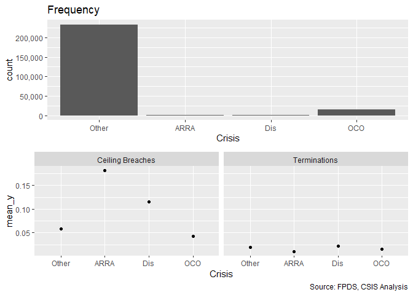<!-- -->

```
## [[1]]
## 
##  Other   ARRA    Dis    OCO 
## 233696   1455    408  14441 
## 
## [[2]]
##        
##           None Ceiling Breach
##   Other 219908          13788
##   ARRA    1191            264
##   Dis      361             47
##   OCO    13825            616
## 
## [[3]]
##        
##              0      1
##   Other 229272   4424
##   ARRA    1440     15
##   Dis      399      9
##   OCO    14224    217
```

```r
#Model
Term_08A <- glm (data=serv_smp,
                 b_Term ~ Crisis, family=binomial(link="logit"))


stargazer::stargazer(
                       Term_07B,Term_08A,
                       
                       type="text",
                       digits=2)
```

```
## 
## ===========================================================
##                                    Dependent variable:     
##                                ----------------------------
##                                           b_Term           
##                                     (1)            (2)     
## -----------------------------------------------------------
## cl_US6_avg_sal_lag1Const          -0.16***                 
##                                    (0.04)                  
##                                                            
## cl_CFTE                            0.06*                   
##                                    (0.03)                  
##                                                            
## c_pPBSC                            -0.05                   
##                                    (0.03)                  
##                                                            
## c_pOffPSC                         0.48***                  
##                                    (0.04)                  
##                                                            
## c_pairHist                        -0.10***                 
##                                    (0.04)                  
##                                                            
## cl_pairCA                         0.39***                  
##                                    (0.04)                  
##                                                            
## cl_Ceil                           0.17***                  
##                                    (0.04)                  
##                                                            
## cl_Days                           1.13***                  
##                                    (0.04)                  
##                                                            
## cl_Base2Ceil                      0.82***                  
##                                    (0.02)                  
##                                                            
## Comp1or51 offer                   0.18***                  
##                                    (0.05)                  
##                                                            
## Comp1or52-4 offers                0.21***                  
##                                    (0.05)                  
##                                                            
## Comp1or55+ offers                 0.81***                  
##                                    (0.05)                  
##                                                            
## VehS-IDC                          -0.83***                 
##                                    (0.04)                  
##                                                            
## VehM-IDC                          -0.42***                 
##                                    (0.05)                  
##                                                            
## VehFSS/GWAC                       -0.41***                 
##                                    (0.07)                  
##                                                            
## VehBPA/BOA                        -1.42***                 
##                                    (0.12)                  
##                                                            
## PricingUCAOther FP                  0.15                   
##                                    (0.14)                  
##                                                            
## PricingUCAT&M/LH/FPLOE            -1.03***                 
##                                    (0.16)                  
##                                                            
## PricingUCAIncentive               -2.54***                 
##                                    (0.71)                  
##                                                            
## PricingUCAOther CB                -1.68***                 
##                                    (0.13)                  
##                                                            
## PricingUCAUCA                     -1.27***                 
##                                    (0.28)                  
##                                                            
## PricingUCACombination or Other    -1.29***                 
##                                    (0.22)                  
##                                                            
## CrisisARRA                                       -0.62**   
##                                                  (0.26)    
##                                                            
## CrisisDis                                         0.16     
##                                                  (0.34)    
##                                                            
## CrisisOCO                                       -0.23***   
##                                                  (0.07)    
##                                                            
## Constant                          -4.09***      -3.95***   
##                                    (0.04)        (0.02)    
##                                                            
## -----------------------------------------------------------
## Observations                      250,000        250,000   
## Log Likelihood                   -19,840.15    -23,184.85  
## Akaike Inf. Crit.                39,726.30      46,377.69  
## ===========================================================
## Note:                           *p<0.1; **p<0.05; ***p<0.01
```

```r
#Plot residuals versus fitted
summary_residual_compare(Term_08A,bins=2)
```

```
## Warning in if (class(model1_old) == "glmerMod") {: the condition has length
## > 1 and only the first element will be used
```

```
## Warning in if (class(model1_old) != "glmerMod" & class(model1_old) !=
## "glmerMod") {: the condition has length > 1 and only the first element will
## be used
```

<!-- -->

```
## [[1]]
##        model deviance null.deviance difference
## 1 model1_old 46369.69      46388.62   18.92355
```

For ceiling breaches ARRA and Disaster results were in keeping with expcetations but OCO results were not. There were no significant results for terminations. For options, contrary to exepectation, all forms of crisis funding have a lower rate of usage.


#### 08B: Cumulative  Model


```r
#Model
Term_08B <- glm (data=serv_smp,
                 b_Term ~ cl_US6_avg_sal_lag1Const + 
                   cl_CFTE+ c_pPBSC+c_pOffPSC+
                   c_pairHist+cl_pairCA+
                   cl_Ceil + cl_Days+cl_Base2Ceil+
                   Comp1or5+
                   Veh+
                   PricingUCA+
                   Crisis, family=binomial(link="logit"))

glmer_examine(Term_08B)
```

```
##                              GVIF Df GVIF^(1/(2*Df))
## cl_US6_avg_sal_lag1Const 1.463480  1        1.209744
## cl_CFTE                  1.359972  1        1.166179
## c_pPBSC                  1.311392  1        1.145160
## c_pOffPSC                1.679329  1        1.295889
## c_pairHist               1.350433  1        1.162081
## cl_pairCA                2.437302  1        1.561186
## cl_Ceil                  1.406806  1        1.186089
## cl_Days                  1.229422  1        1.108793
## cl_Base2Ceil             1.250943  1        1.118456
## Comp1or5                 1.336790  3        1.049568
## Veh                      2.098985  4        1.097113
## PricingUCA               1.128046  6        1.010091
## Crisis                   1.448424  3        1.063692
```

```r
stargazer::stargazer(
                       Term_07B,Term_08A,Term_08B,
                       
                       type="text",
                       digits=2)
```

```
## 
## ===============================================================
##                                      Dependent variable:       
##                                --------------------------------
##                                             b_Term             
##                                   (1)        (2)        (3)    
## ---------------------------------------------------------------
## cl_US6_avg_sal_lag1Const        -0.16***              -0.14*** 
##                                  (0.04)                (0.04)  
##                                                                
## cl_CFTE                          0.06*                  0.03   
##                                  (0.03)                (0.04)  
##                                                                
## c_pPBSC                          -0.05                 -0.06*  
##                                  (0.03)                (0.03)  
##                                                                
## c_pOffPSC                       0.48***               0.47***  
##                                  (0.04)                (0.04)  
##                                                                
## c_pairHist                      -0.10***              -0.11*** 
##                                  (0.04)                (0.04)  
##                                                                
## cl_pairCA                       0.39***               0.46***  
##                                  (0.04)                (0.04)  
##                                                                
## cl_Ceil                         0.17***               0.20***  
##                                  (0.04)                (0.04)  
##                                                                
## cl_Days                         1.13***               1.11***  
##                                  (0.04)                (0.04)  
##                                                                
## cl_Base2Ceil                    0.82***               0.81***  
##                                  (0.02)                (0.02)  
##                                                                
## Comp1or51 offer                 0.18***               0.20***  
##                                  (0.05)                (0.05)  
##                                                                
## Comp1or52-4 offers              0.21***               0.22***  
##                                  (0.05)                (0.05)  
##                                                                
## Comp1or55+ offers               0.81***               0.82***  
##                                  (0.05)                (0.05)  
##                                                                
## VehS-IDC                        -0.83***              -0.88*** 
##                                  (0.04)                (0.04)  
##                                                                
## VehM-IDC                        -0.42***              -0.45*** 
##                                  (0.05)                (0.05)  
##                                                                
## VehFSS/GWAC                     -0.41***              -0.43*** 
##                                  (0.07)                (0.07)  
##                                                                
## VehBPA/BOA                      -1.42***              -1.43*** 
##                                  (0.12)                (0.12)  
##                                                                
## PricingUCAOther FP                0.15                  0.11   
##                                  (0.14)                (0.14)  
##                                                                
## PricingUCAT&M/LH/FPLOE          -1.03***              -1.05*** 
##                                  (0.16)                (0.16)  
##                                                                
## PricingUCAIncentive             -2.54***              -2.56*** 
##                                  (0.71)                (0.71)  
##                                                                
## PricingUCAOther CB              -1.68***              -1.70*** 
##                                  (0.13)                (0.13)  
##                                                                
## PricingUCAUCA                   -1.27***              -1.28*** 
##                                  (0.28)                (0.28)  
##                                                                
## PricingUCACombination or Other  -1.29***              -1.31*** 
##                                  (0.22)                (0.22)  
##                                                                
## CrisisARRA                                 -0.62**    -0.62**  
##                                             (0.26)     (0.26)  
##                                                                
## CrisisDis                                    0.16       0.46   
##                                             (0.34)     (0.34)  
##                                                                
## CrisisOCO                                  -0.23***   -0.32*** 
##                                             (0.07)     (0.09)  
##                                                                
## Constant                        -4.09***   -3.95***   -4.05*** 
##                                  (0.04)     (0.02)     (0.04)  
##                                                                
## ---------------------------------------------------------------
## Observations                    250,000    250,000    250,000  
## Log Likelihood                 -19,840.15 -23,184.85 -19,828.66
## Akaike Inf. Crit.              39,726.30  46,377.69  39,709.32 
## ===============================================================
## Note:                               *p<0.1; **p<0.05; ***p<0.01
```

```r
#Plot residuals versus fitted   
summary_residual_compare(Term_07B,Term_08B)
```

<!-- -->

```
## Warning in if (class(model1_new) == "glmerMod") {: the condition has length
## > 1 and only the first element will be used
```

```
## Warning in if (class(model1_new) != "glmerMod" & class(model1_old) !=
## "glmerMod") {: the condition has length > 1 and only the first element will
## be used
```

<!-- -->

```
## [[1]]
##        model deviance null.deviance difference
## 1 model1_old 39680.30      46388.62   6708.314
## 2 model1_new 39657.32      46388.62   6731.299
## 
## [[2]]
##                              GVIF Df GVIF^(1/(2*Df))
## cl_US6_avg_sal_lag1Const 1.463480  1        1.209744
## cl_CFTE                  1.359972  1        1.166179
## c_pPBSC                  1.311392  1        1.145160
## c_pOffPSC                1.679329  1        1.295889
## c_pairHist               1.350433  1        1.162081
## cl_pairCA                2.437302  1        1.561186
## cl_Ceil                  1.406806  1        1.186089
## cl_Days                  1.229422  1        1.108793
## cl_Base2Ceil             1.250943  1        1.118456
## Comp1or5                 1.336790  3        1.049568
## Veh                      2.098985  4        1.097113
## PricingUCA               1.128046  6        1.010091
## Crisis                   1.448424  3        1.063692
```

Terminatins for OCO and ARRA are now significant in the expected direction.


## Industrial Sector

### Level 6

#### Model 09A: l_def6_HHI_lag1
HHI (logged, + means more consolidation)	cl_def6_HHI_lag1+		+	-	-

Expectations are  unchanged.

```r
summary_continuous_plot(serv_smp1m,"def6_HHI_lag1")
```

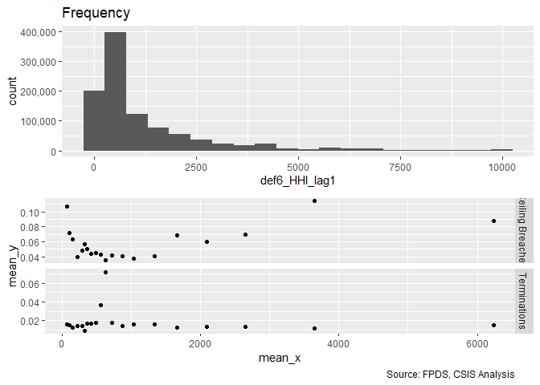<!-- -->

```r
summary_continuous_plot(serv_smp1m,"def6_HHI_lag1",log=TRUE)
```

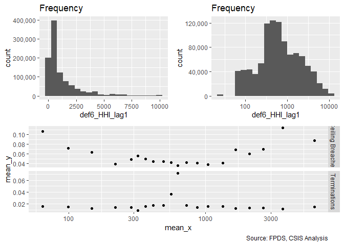<!-- -->

```r
#Model
Term_09A <- glm (data=serv_smp,
                 b_Term ~ cl_def6_HHI_lag1, family=binomial(link="logit"))


#Plot residuals versus fitted
stargazer::stargazer(
                       Term_08B,Term_09A,
                       
                       type="text",
                       digits=2)
```

```
## 
## ===========================================================
##                                    Dependent variable:     
##                                ----------------------------
##                                           b_Term           
##                                     (1)            (2)     
## -----------------------------------------------------------
## cl_US6_avg_sal_lag1Const          -0.14***                 
##                                    (0.04)                  
##                                                            
## cl_CFTE                             0.03                   
##                                    (0.04)                  
##                                                            
## c_pPBSC                            -0.06*                  
##                                    (0.03)                  
##                                                            
## c_pOffPSC                         0.47***                  
##                                    (0.04)                  
##                                                            
## c_pairHist                        -0.11***                 
##                                    (0.04)                  
##                                                            
## cl_pairCA                         0.46***                  
##                                    (0.04)                  
##                                                            
## cl_Ceil                           0.20***                  
##                                    (0.04)                  
##                                                            
## cl_Days                           1.11***                  
##                                    (0.04)                  
##                                                            
## cl_Base2Ceil                      0.81***                  
##                                    (0.02)                  
##                                                            
## Comp1or51 offer                   0.20***                  
##                                    (0.05)                  
##                                                            
## Comp1or52-4 offers                0.22***                  
##                                    (0.05)                  
##                                                            
## Comp1or55+ offers                 0.82***                  
##                                    (0.05)                  
##                                                            
## VehS-IDC                          -0.88***                 
##                                    (0.04)                  
##                                                            
## VehM-IDC                          -0.45***                 
##                                    (0.05)                  
##                                                            
## VehFSS/GWAC                       -0.43***                 
##                                    (0.07)                  
##                                                            
## VehBPA/BOA                        -1.43***                 
##                                    (0.12)                  
##                                                            
## PricingUCAOther FP                  0.11                   
##                                    (0.14)                  
##                                                            
## PricingUCAT&M/LH/FPLOE            -1.05***                 
##                                    (0.16)                  
##                                                            
## PricingUCAIncentive               -2.56***                 
##                                    (0.71)                  
##                                                            
## PricingUCAOther CB                -1.70***                 
##                                    (0.13)                  
##                                                            
## PricingUCAUCA                     -1.28***                 
##                                    (0.28)                  
##                                                            
## PricingUCACombination or Other    -1.31***                 
##                                    (0.22)                  
##                                                            
## CrisisARRA                        -0.62**                  
##                                    (0.26)                  
##                                                            
## CrisisDis                           0.46                   
##                                    (0.34)                  
##                                                            
## CrisisOCO                         -0.32***                 
##                                    (0.09)                  
##                                                            
## cl_def6_HHI_lag1                                  -0.04    
##                                                  (0.03)    
##                                                            
## Constant                          -4.05***      -3.96***   
##                                    (0.04)        (0.01)    
##                                                            
## -----------------------------------------------------------
## Observations                      250,000        250,000   
## Log Likelihood                   -19,828.66    -23,193.38  
## Akaike Inf. Crit.                39,709.32      46,390.77  
## ===========================================================
## Note:                           *p<0.1; **p<0.05; ***p<0.01
```

```r
summary_residual_compare(Term_09A, skip_vif = TRUE)
```

```
## Warning in if (class(model1_old) == "glmerMod") {: the condition has length
## > 1 and only the first element will be used
```

```
## Warning in if (class(model1_old) != "glmerMod" & class(model1_old) !=
## "glmerMod") {: the condition has length > 1 and only the first element will
## be used
```

<!-- -->

```
## [[1]]
##        model deviance null.deviance difference
## 1 model1_old 46386.77      46388.62   1.845905
```

Expected direction for ceiling breach and termination, but no real results on options.

#### Model 09B: Defense to Overall ratio
The higher the ratio of defense obligations to reciepts in the overall economy, the DoD holds a monosopy over a sector. Given the challenges of monosopy, the a higher ratio estimates a greater  risk of ceiling breaches.

Ratio Def. obligatons : US revenue	cl_def6_obl_lag1+		+	-	-


```r
summary_continuous_plot(serv_smp1m,"def6_ratio_lag1")
```

<!-- -->

```r
summary_continuous_plot(serv_smp1m,"def6_ratio_lag1",log=TRUE)
```

```
## Warning: Removed 658 rows containing non-finite values (stat_bin).
```

<!-- -->

```r
#Model
Term_09B <- glm (data=serv_smp,
                 b_Term ~ cl_def6_ratio_lag1, family=binomial(link="logit"))


#Plot residuals versus fitted
stargazer::stargazer(
                       Term_08B,Term_09A,Term_09B,
                       
                       type="text",
                       digits=2)
```

```
## 
## ===============================================================
##                                      Dependent variable:       
##                                --------------------------------
##                                             b_Term             
##                                   (1)        (2)        (3)    
## ---------------------------------------------------------------
## cl_US6_avg_sal_lag1Const        -0.14***                       
##                                  (0.04)                        
##                                                                
## cl_CFTE                           0.03                         
##                                  (0.04)                        
##                                                                
## c_pPBSC                          -0.06*                        
##                                  (0.03)                        
##                                                                
## c_pOffPSC                       0.47***                        
##                                  (0.04)                        
##                                                                
## c_pairHist                      -0.11***                       
##                                  (0.04)                        
##                                                                
## cl_pairCA                       0.46***                        
##                                  (0.04)                        
##                                                                
## cl_Ceil                         0.20***                        
##                                  (0.04)                        
##                                                                
## cl_Days                         1.11***                        
##                                  (0.04)                        
##                                                                
## cl_Base2Ceil                    0.81***                        
##                                  (0.02)                        
##                                                                
## Comp1or51 offer                 0.20***                        
##                                  (0.05)                        
##                                                                
## Comp1or52-4 offers              0.22***                        
##                                  (0.05)                        
##                                                                
## Comp1or55+ offers               0.82***                        
##                                  (0.05)                        
##                                                                
## VehS-IDC                        -0.88***                       
##                                  (0.04)                        
##                                                                
## VehM-IDC                        -0.45***                       
##                                  (0.05)                        
##                                                                
## VehFSS/GWAC                     -0.43***                       
##                                  (0.07)                        
##                                                                
## VehBPA/BOA                      -1.43***                       
##                                  (0.12)                        
##                                                                
## PricingUCAOther FP                0.11                         
##                                  (0.14)                        
##                                                                
## PricingUCAT&M/LH/FPLOE          -1.05***                       
##                                  (0.16)                        
##                                                                
## PricingUCAIncentive             -2.56***                       
##                                  (0.71)                        
##                                                                
## PricingUCAOther CB              -1.70***                       
##                                  (0.13)                        
##                                                                
## PricingUCAUCA                   -1.28***                       
##                                  (0.28)                        
##                                                                
## PricingUCACombination or Other  -1.31***                       
##                                  (0.22)                        
##                                                                
## CrisisARRA                      -0.62**                        
##                                  (0.26)                        
##                                                                
## CrisisDis                         0.46                         
##                                  (0.34)                        
##                                                                
## CrisisOCO                       -0.32***                       
##                                  (0.09)                        
##                                                                
## cl_def6_HHI_lag1                            -0.04              
##                                             (0.03)             
##                                                                
## cl_def6_ratio_lag1                                    -0.64*** 
##                                                        (0.05)  
##                                                                
## Constant                        -4.05***   -3.96***   -3.99*** 
##                                  (0.04)     (0.01)     (0.02)  
##                                                                
## ---------------------------------------------------------------
## Observations                    250,000    250,000    250,000  
## Log Likelihood                 -19,828.66 -23,193.38 -23,095.80
## Akaike Inf. Crit.              39,709.32  46,390.77  46,195.60 
## ===============================================================
## Note:                               *p<0.1; **p<0.05; ***p<0.01
```

```r
summary_residual_compare(Term_09B)
```

```
## Warning in if (class(model1_old) == "glmerMod") {: the condition has length
## > 1 and only the first element will be used
```

```
## Warning in if (class(model1_old) != "glmerMod" & class(model1_old) !=
## "glmerMod") {: the condition has length > 1 and only the first element will
## be used
```

<!-- -->

```
## [[1]]
##        model deviance null.deviance difference
## 1 model1_old  46191.6      46388.62   197.0126
```


#### Model 09C: Defense Obligations
Defense obligations (logged)	cl_def6_ratio_lag1+		-	-	+


```r
summary_continuous_plot(serv_smp1m,"def6_obl_lag1Const")
```

<!-- -->

```r
summary_continuous_plot(serv_smp1m,"def6_obl_lag1Const",log=TRUE)
```

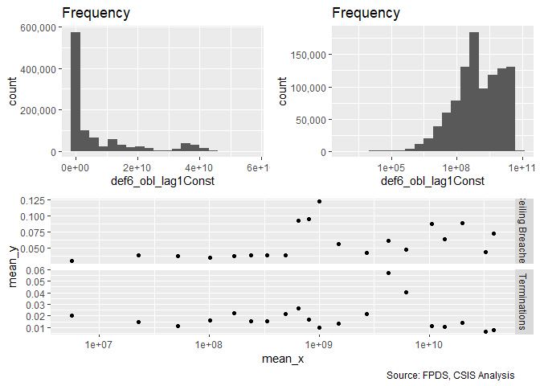<!-- -->

```r
#Model
Term_09C <- glm (data=serv_smp,
                 b_Term ~ cl_def6_obl_lag1Const, family=binomial(link="logit"))

stargazer::stargazer(Term_09A,Term_09B,Term_09C,
                       
                       type="text",
                       digits=2)
```

```
## 
## ======================================================
##                             Dependent variable:       
##                       --------------------------------
##                                    b_Term             
##                          (1)        (2)        (3)    
## ------------------------------------------------------
## cl_def6_HHI_lag1        -0.04                         
##                         (0.03)                        
##                                                       
## cl_def6_ratio_lag1                -0.64***            
##                                    (0.05)             
##                                                       
## cl_def6_obl_lag1Const                         0.004   
##                                               (0.03)  
##                                                       
## Constant               -3.96***   -3.99***   -3.96*** 
##                         (0.01)     (0.02)     (0.01)  
##                                                       
## ------------------------------------------------------
## Observations           250,000    250,000    250,000  
## Log Likelihood        -23,193.38 -23,095.80 -23,194.30
## Akaike Inf. Crit.     46,390.77  46,195.60  46,392.60 
## ======================================================
## Note:                      *p<0.1; **p<0.05; ***p<0.01
```

```r
summary_residual_compare(Term_09C)
```

```
## Warning in if (class(model1_old) == "glmerMod") {: the condition has length
## > 1 and only the first element will be used
```

```
## Warning in if (class(model1_old) != "glmerMod" & class(model1_old) !=
## "glmerMod") {: the condition has length > 1 and only the first element will
## be used
```

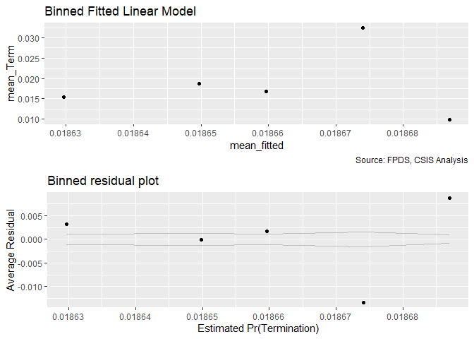<!-- -->

```
## [[1]]
##        model deviance null.deviance difference
## 1 model1_old  46388.6      46388.62  0.0204136
```

Contrary to expectation. for termination and options.

#### Model 09D: NAICS 6 Combined
Consolidation at lessa nd more granular levels may have different effects. Efficiencies are often used to describe sectors, like utilities, with high barriers to entry. Many of these aspects seem like they would already be captured at less granular NAICS levels, e.g. power plants, rather than more specific NAICS levels, like solar vs. coal. As a result, consolidation for more granular NAICS codes should estimate higher rates of ceiling breaches compared to less granular NAICS code.

We'll start by adding in everything from both models and seeing what violates VIF.

```r
#Model
Term_09D <- glm (data=serv_smp,
                 b_Term ~ cl_def6_HHI_lag1+cl_def6_ratio_lag1+cl_def6_obl_lag1Const
                 , family=binomial(link="logit"))

glmer_examine(Term_09D)
```

```
##      cl_def6_HHI_lag1    cl_def6_ratio_lag1 cl_def6_obl_lag1Const 
##              1.217699              1.510131              1.578797
```

```r
Term_09D2 <- glm (data=serv_smp,
                 b_Term ~ cl_def6_HHI_lag1+cl_def6_ratio_lag1
                 , family=binomial(link="logit"))

glmer_examine(Term_09D2)
```

```
##   cl_def6_HHI_lag1 cl_def6_ratio_lag1 
##           1.030932           1.030932
```

```r
stargazer::stargazer(Term_09D,Term_09D2,
                     
                       type="text",
                       digits=2)
```

```
## 
## ==================================================
##                           Dependent variable:     
##                       ----------------------------
##                                  b_Term           
##                            (1)            (2)     
## --------------------------------------------------
## cl_def6_HHI_lag1         0.19***         0.05*    
##                           (0.03)        (0.03)    
##                                                   
## cl_def6_ratio_lag1       -1.04***      -0.66***   
##                           (0.07)        (0.05)    
##                                                   
## cl_def6_obl_lag1Const    0.39***                  
##                           (0.04)                  
##                                                   
## Constant                 -4.02***      -3.99***   
##                           (0.02)        (0.02)    
##                                                   
## --------------------------------------------------
## Observations             250,000        250,000   
## Log Likelihood          -23,043.22    -23,094.15  
## Akaike Inf. Crit.       46,094.45      46,194.29  
## ==================================================
## Note:                  *p<0.1; **p<0.05; ***p<0.01
```

```r
summary_residual_compare(Term_09D,Term_09D2)
```

<!-- -->

```
## Warning in if (class(model1_new) == "glmerMod") {: the condition has length
## > 1 and only the first element will be used
```

```
## Warning in if (class(model1_new) != "glmerMod" & class(model1_old) !=
## "glmerMod") {: the condition has length > 1 and only the first element will
## be used
```

<!-- -->

```
## [[1]]
##        model deviance null.deviance difference
## 1 model1_old 46086.45      46388.62   302.1672
## 2 model1_new 46188.29      46388.62   200.3227
## 
## [[2]]
##   cl_def6_HHI_lag1 cl_def6_ratio_lag1 
##           1.030932           1.030932
```
The hypothesis is upheld. Deviance is a little lower and residuals a little higher than the prior forms of consolidation for the level 3 model.  For the level 6 model, deviance is reduced some in both cases.

NAICS Subsector (Level 3)					
HHI (logged, + means more consolidation)	cl_def3_HHI_lag1+		+	++	-
Ratio Def. obligatons : US revenue	cl_def3_ratio_lag1+		+	+	-

Ratio at either level is no longer in line with expectations for ceiling breaches.


#### Model 09E: Cumulative Model
Consolidation at lessa nd more granular levels may have different effects. Efficiencies are often used to describe sectors, like utilities, with high barriers to entry. Many of these aspects seem like they would already be captured at less granular NAICS levels, e.g. power plants, rather than more specific NAICS levels, like solar vs. coal. As a result, consolidation for more granular NAICS codes should estimate higher rates of ceiling breaches compared to less granular NAICS code.

We'll start by adding in everything from both models and seeing what violates VIF.

```r
#Model
Term_09E <- glm (data=serv_smp,
                 b_Term ~ cl_US6_avg_sal_lag1Const + 
                   cl_CFTE+ c_pPBSC+c_pOffPSC+
                   c_pairHist+cl_pairCA+
                   cl_Ceil + cl_Days+cl_Base2Ceil+
                   Comp1or5+
                   Veh+
                   PricingUCA+
                   Crisis+
                   cl_def6_HHI_lag1+cl_def6_ratio_lag1, family=binomial(link="logit"))
glmer_examine(Term_09E)
```

```
##                              GVIF Df GVIF^(1/(2*Df))
## cl_US6_avg_sal_lag1Const 1.492000  1        1.221475
## cl_CFTE                  1.347337  1        1.160749
## c_pPBSC                  1.346920  1        1.160569
## c_pOffPSC                1.810477  1        1.345540
## c_pairHist               1.375752  1        1.172924
## cl_pairCA                2.422277  1        1.556367
## cl_Ceil                  1.440138  1        1.200057
## cl_Days                  1.237429  1        1.112398
## cl_Base2Ceil             1.292671  1        1.136957
## Comp1or5                 1.374102  3        1.054395
## Veh                      2.140583  4        1.099807
## PricingUCA               1.144007  6        1.011274
## Crisis                   1.417322  3        1.059851
## cl_def6_HHI_lag1         1.252994  1        1.119372
## cl_def6_ratio_lag1       1.204310  1        1.097411
```

```r
stargazer::stargazer(Term_08B,Term_09D2,Term_09E,type="text",
                       digits=2)
```

```
## 
## ===============================================================
##                                      Dependent variable:       
##                                --------------------------------
##                                             b_Term             
##                                   (1)        (2)        (3)    
## ---------------------------------------------------------------
## cl_US6_avg_sal_lag1Const        -0.14***              -0.11*** 
##                                  (0.04)                (0.04)  
##                                                                
## cl_CFTE                           0.03                  0.01   
##                                  (0.04)                (0.04)  
##                                                                
## c_pPBSC                          -0.06*                -0.05   
##                                  (0.03)                (0.03)  
##                                                                
## c_pOffPSC                       0.47***               0.51***  
##                                  (0.04)                (0.04)  
##                                                                
## c_pairHist                      -0.11***              -0.11*** 
##                                  (0.04)                (0.04)  
##                                                                
## cl_pairCA                       0.46***               0.47***  
##                                  (0.04)                (0.04)  
##                                                                
## cl_Ceil                         0.20***               0.25***  
##                                  (0.04)                (0.04)  
##                                                                
## cl_Days                         1.11***               1.08***  
##                                  (0.04)                (0.04)  
##                                                                
## cl_Base2Ceil                    0.81***               0.78***  
##                                  (0.02)                (0.02)  
##                                                                
## Comp1or51 offer                 0.20***               0.21***  
##                                  (0.05)                (0.05)  
##                                                                
## Comp1or52-4 offers              0.22***               0.22***  
##                                  (0.05)                (0.05)  
##                                                                
## Comp1or55+ offers               0.82***               0.80***  
##                                  (0.05)                (0.05)  
##                                                                
## VehS-IDC                        -0.88***              -0.88*** 
##                                  (0.04)                (0.05)  
##                                                                
## VehM-IDC                        -0.45***              -0.39*** 
##                                  (0.05)                (0.05)  
##                                                                
## VehFSS/GWAC                     -0.43***              -0.41*** 
##                                  (0.07)                (0.07)  
##                                                                
## VehBPA/BOA                      -1.43***              -1.36*** 
##                                  (0.12)                (0.11)  
##                                                                
## PricingUCAOther FP                0.11                  0.03   
##                                  (0.14)                (0.14)  
##                                                                
## PricingUCAT&M/LH/FPLOE          -1.05***              -1.01*** 
##                                  (0.16)                (0.16)  
##                                                                
## PricingUCAIncentive             -2.56***              -2.53*** 
##                                  (0.71)                (0.71)  
##                                                                
## PricingUCAOther CB              -1.70***              -1.64*** 
##                                  (0.13)                (0.13)  
##                                                                
## PricingUCAUCA                   -1.28***              -1.28*** 
##                                  (0.28)                (0.28)  
##                                                                
## PricingUCACombination or Other  -1.31***              -1.25*** 
##                                  (0.22)                (0.22)  
##                                                                
## CrisisARRA                      -0.62**               -0.64**  
##                                  (0.26)                (0.26)  
##                                                                
## CrisisDis                         0.46                  0.48   
##                                  (0.34)                (0.34)  
##                                                                
## CrisisOCO                       -0.32***              -0.28*** 
##                                  (0.09)                (0.08)  
##                                                                
## cl_def6_HHI_lag1                            0.05*      0.06*   
##                                             (0.03)     (0.03)  
##                                                                
## cl_def6_ratio_lag1                         -0.66***   -0.48*** 
##                                             (0.05)     (0.05)  
##                                                                
## Constant                        -4.05***   -3.99***   -4.07*** 
##                                  (0.04)     (0.02)     (0.04)  
##                                                                
## ---------------------------------------------------------------
## Observations                    250,000    250,000    250,000  
## Log Likelihood                 -19,828.66 -23,094.15 -19,778.26
## Akaike Inf. Crit.              39,709.32  46,194.29  39,612.53 
## ===============================================================
## Note:                               *p<0.1; **p<0.05; ***p<0.01
```

```r
summary_residual_compare(Term_08B,Term_09E)
```

<!-- -->

```
## Warning in if (class(model1_new) == "glmerMod") {: the condition has length
## > 1 and only the first element will be used
```

```
## Warning in if (class(model1_new) != "glmerMod" & class(model1_old) !=
## "glmerMod") {: the condition has length > 1 and only the first element will
## be used
```

<!-- -->

```
## [[1]]
##        model deviance null.deviance difference
## 1 model1_old 39657.32      46388.62   6731.299
## 2 model1_new 39556.53      46388.62   6832.088
## 
## [[2]]
##                              GVIF Df GVIF^(1/(2*Df))
## cl_US6_avg_sal_lag1Const 1.492000  1        1.221475
## cl_CFTE                  1.347337  1        1.160749
## c_pPBSC                  1.346920  1        1.160569
## c_pOffPSC                1.810477  1        1.345540
## c_pairHist               1.375752  1        1.172924
## cl_pairCA                2.422277  1        1.556367
## cl_Ceil                  1.440138  1        1.200057
## cl_Days                  1.237429  1        1.112398
## cl_Base2Ceil             1.292671  1        1.136957
## Comp1or5                 1.374102  3        1.054395
## Veh                      2.140583  4        1.099807
## PricingUCA               1.144007  6        1.011274
## Crisis                   1.417322  3        1.059851
## cl_def6_HHI_lag1         1.252994  1        1.119372
## cl_def6_ratio_lag1       1.204310  1        1.097411
```

Expectations are not upheld.

### Level 3
#### Model 10A: cl_def3_HHI
HHI (logged, + means more consolidation)	cl_def3_HHI_lag1+		+	++	-


```r
summary_continuous_plot(serv_smp1m,"def3_HHI_lag1")
```

<!-- -->

```r
summary_continuous_plot(serv_smp1m,"def3_HHI_lag1",log=TRUE)
```

<!-- -->

```r
#Model
Term_10A <- glm (data=serv_smp,
                 b_Term ~ cl_def3_HHI_lag1, family=binomial(link="logit"))


stargazer::stargazer(
                       Term_09A,Term_10A,
                       
                       type="text",
                       digits=2)
```

```
## 
## ==============================================
##                       Dependent variable:     
##                   ----------------------------
##                              b_Term           
##                        (1)            (2)     
## ----------------------------------------------
## cl_def6_HHI_lag1      -0.04                   
##                       (0.03)                  
##                                               
## cl_def3_HHI_lag1                    0.41***   
##                                     (0.03)    
##                                               
## Constant             -3.96***      -3.98***   
##                       (0.01)        (0.01)    
##                                               
## ----------------------------------------------
## Observations         250,000        250,000   
## Log Likelihood      -23,193.38    -23,092.51  
## Akaike Inf. Crit.   46,390.77      46,189.02  
## ==============================================
## Note:              *p<0.1; **p<0.05; ***p<0.01
```

```r
summary_residual_compare(Term_10A, skip_vif =  TRUE)
```

```
## Warning in if (class(model1_old) == "glmerMod") {: the condition has length
## > 1 and only the first element will be used
```

```
## Warning in if (class(model1_old) != "glmerMod" & class(model1_old) !=
## "glmerMod") {: the condition has length > 1 and only the first element will
## be used
```

<!-- -->

```
## [[1]]
##        model deviance null.deviance difference
## 1 model1_old 46185.02      46388.62   203.5908
```

Contrary to expectation on Ceiling breach and otions growth, in line with expectations on terminations.

Level 3 HHI seems to slightly out perform level 6.


#### Model 10B: Defense to Overall ratio
Ratio Def. obligatons : US revenue	cl_def3_ratio_lag1+		+	+	-


```r
summary_continuous_plot(serv_smp1m,"capped_def3_ratio_lag1")
```

<!-- -->

```r
summary_continuous_plot(serv_smp1m,"capped_def3_ratio_lag1",log=TRUE)
```

<!-- -->

```r
#Model
Term_10B <- glm (data=serv_smp,
                 b_Term ~ cl_def3_ratio_lag1, family=binomial(link="logit"))


stargazer::stargazer(
                       Term_09B,Term_10A,Term_10B,
                       
                       type="text",
                       digits=2)
```

```
## 
## ===================================================
##                          Dependent variable:       
##                    --------------------------------
##                                 b_Term             
##                       (1)        (2)        (3)    
## ---------------------------------------------------
## cl_def6_ratio_lag1  -0.64***                       
##                      (0.05)                        
##                                                    
## cl_def3_HHI_lag1               0.41***             
##                                 (0.03)             
##                                                    
## cl_def3_ratio_lag1                        -0.80*** 
##                                            (0.04)  
##                                                    
## Constant            -3.99***   -3.98***   -4.03*** 
##                      (0.02)     (0.01)     (0.02)  
##                                                    
## ---------------------------------------------------
## Observations        250,000    250,000    250,000  
## Log Likelihood     -23,095.80 -23,092.51 -22,921.77
## Akaike Inf. Crit.  46,195.60  46,189.02  45,847.54 
## ===================================================
## Note:                   *p<0.1; **p<0.05; ***p<0.01
```

```r
summary_residual_compare(Term_10B, skip_vif = TRUE)
```

```
## Warning in if (class(model1_old) == "glmerMod") {: the condition has length
## > 1 and only the first element will be used
```

```
## Warning in if (class(model1_old) != "glmerMod" & class(model1_old) !=
## "glmerMod") {: the condition has length > 1 and only the first element will
## be used
```

<!-- -->

```
## [[1]]
##        model deviance null.deviance difference
## 1 model1_old 45843.54      46388.62   545.0714
```

Expectations were in lined with ceiling breaches and options, not with termination, and 


#### Model 10C: NAICS 6 and NAICS 3
Consolidation at lessa nd more granular levels may have different effects. Efficiencies are often used to describe sectors, like utilities, with high barriers to entry. Many of these aspects seem like they would already be captured at less granular NAICS levels, e.g. power plants, rather than more specific NAICS levels, like solar vs. coal. As a result, consolidation for more granular NAICS codes should estimate higher rates of ceiling breaches compared to less granular NAICS code.

We'll start by adding in everything from both models and seeing what violates VIF.

```r
#Model
Term_10C <- glm (data=serv_smp,
                 b_Term ~ cl_def3_HHI_lag1+cl_def3_ratio_lag1, family=binomial(link="logit"))
glmer_examine(Term_10C)
```

```
##   cl_def3_HHI_lag1 cl_def3_ratio_lag1 
##           1.041561           1.041561
```

```r
stargazer::stargazer(
                     Term_08B,Term_09E,Term_10A,Term_10B,Term_10C,
                     
                       type="text",
                       digits=2)
```

```
## 
## =====================================================================================
##                                                 Dependent variable:                  
##                                ------------------------------------------------------
##                                                        b_Term                        
##                                   (1)        (2)        (3)        (4)        (5)    
## -------------------------------------------------------------------------------------
## cl_US6_avg_sal_lag1Const        -0.14***   -0.11***                                  
##                                  (0.04)     (0.04)                                   
##                                                                                      
## cl_CFTE                           0.03       0.01                                    
##                                  (0.04)     (0.04)                                   
##                                                                                      
## c_pPBSC                          -0.06*     -0.05                                    
##                                  (0.03)     (0.03)                                   
##                                                                                      
## c_pOffPSC                       0.47***    0.51***                                   
##                                  (0.04)     (0.04)                                   
##                                                                                      
## c_pairHist                      -0.11***   -0.11***                                  
##                                  (0.04)     (0.04)                                   
##                                                                                      
## cl_pairCA                       0.46***    0.47***                                   
##                                  (0.04)     (0.04)                                   
##                                                                                      
## cl_Ceil                         0.20***    0.25***                                   
##                                  (0.04)     (0.04)                                   
##                                                                                      
## cl_Days                         1.11***    1.08***                                   
##                                  (0.04)     (0.04)                                   
##                                                                                      
## cl_Base2Ceil                    0.81***    0.78***                                   
##                                  (0.02)     (0.02)                                   
##                                                                                      
## Comp1or51 offer                 0.20***    0.21***                                   
##                                  (0.05)     (0.05)                                   
##                                                                                      
## Comp1or52-4 offers              0.22***    0.22***                                   
##                                  (0.05)     (0.05)                                   
##                                                                                      
## Comp1or55+ offers               0.82***    0.80***                                   
##                                  (0.05)     (0.05)                                   
##                                                                                      
## VehS-IDC                        -0.88***   -0.88***                                  
##                                  (0.04)     (0.05)                                   
##                                                                                      
## VehM-IDC                        -0.45***   -0.39***                                  
##                                  (0.05)     (0.05)                                   
##                                                                                      
## VehFSS/GWAC                     -0.43***   -0.41***                                  
##                                  (0.07)     (0.07)                                   
##                                                                                      
## VehBPA/BOA                      -1.43***   -1.36***                                  
##                                  (0.12)     (0.11)                                   
##                                                                                      
## PricingUCAOther FP                0.11       0.03                                    
##                                  (0.14)     (0.14)                                   
##                                                                                      
## PricingUCAT&M/LH/FPLOE          -1.05***   -1.01***                                  
##                                  (0.16)     (0.16)                                   
##                                                                                      
## PricingUCAIncentive             -2.56***   -2.53***                                  
##                                  (0.71)     (0.71)                                   
##                                                                                      
## PricingUCAOther CB              -1.70***   -1.64***                                  
##                                  (0.13)     (0.13)                                   
##                                                                                      
## PricingUCAUCA                   -1.28***   -1.28***                                  
##                                  (0.28)     (0.28)                                   
##                                                                                      
## PricingUCACombination or Other  -1.31***   -1.25***                                  
##                                  (0.22)     (0.22)                                   
##                                                                                      
## CrisisARRA                      -0.62**    -0.64**                                   
##                                  (0.26)     (0.26)                                   
##                                                                                      
## CrisisDis                         0.46       0.48                                    
##                                  (0.34)     (0.34)                                   
##                                                                                      
## CrisisOCO                       -0.32***   -0.28***                                  
##                                  (0.09)     (0.08)                                   
##                                                                                      
## cl_def6_HHI_lag1                            0.06*                                    
##                                             (0.03)                                   
##                                                                                      
## cl_def6_ratio_lag1                         -0.48***                                  
##                                             (0.05)                                   
##                                                                                      
## cl_def3_HHI_lag1                                      0.41***               0.29***  
##                                                        (0.03)                (0.03)  
##                                                                                      
## cl_def3_ratio_lag1                                               -0.80***   -0.73*** 
##                                                                   (0.04)     (0.04)  
##                                                                                      
## Constant                        -4.05***   -4.07***   -3.98***   -4.03***   -4.03*** 
##                                  (0.04)     (0.04)     (0.01)     (0.02)     (0.02)  
##                                                                                      
## -------------------------------------------------------------------------------------
## Observations                    250,000    250,000    250,000    250,000    250,000  
## Log Likelihood                 -19,828.66 -19,778.26 -23,092.51 -22,921.77 -22,872.89
## Akaike Inf. Crit.              39,709.32  39,612.53  46,189.02  45,847.54  45,751.78 
## =====================================================================================
## Note:                                                     *p<0.1; **p<0.05; ***p<0.01
```

```r
summary_residual_compare(Term_08B,Term_10C,Term_09E,Term_10C)
```

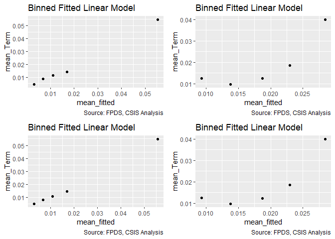<!-- -->

```
## Warning in if (class(model1_new) == "glmerMod" & class(model2_new) ==
## "glmerMod") {: the condition has length > 1 and only the first element will
## be used
```

```
## Warning in if ((class(model1_new) != "glmerMod" & class(model2_new) !
## = "glmerMod") & : the condition has length > 1 and only the first element
## will be used
```

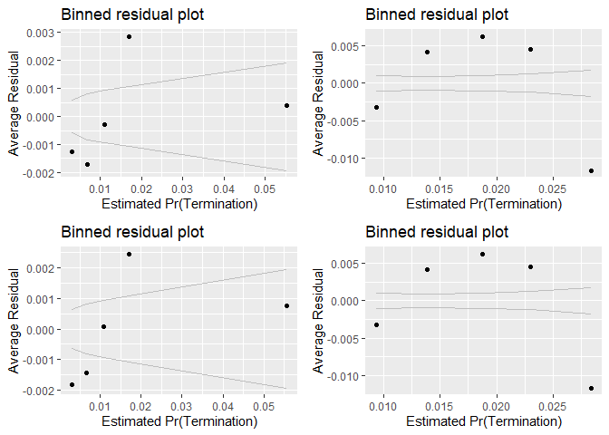<!-- -->

```
## [[1]]
##        model deviance null.deviance difference
## 1 model1_old 39657.32      46388.62  6731.2993
## 2 model1_new 45745.78      46388.62   642.8327
## 3 model2_old 39556.53      46388.62  6832.0882
## 4 model2_new 45745.78      46388.62   642.8327
## 
## [[2]]
##   cl_def3_HHI_lag1 cl_def3_ratio_lag1 
##           1.041561           1.041561 
## 
## [[3]]
##   cl_def3_HHI_lag1 cl_def3_ratio_lag1 
##           1.041561           1.041561
```

NAICS Subsector (Level 3)					
HHI (logged, + means more consolidation)	cl_def3_HHI_lag1+		+	++	-
Ratio Def. obligatons : US revenue	cl_def3_ratio_lag1+		+	+	-

Expectations matched for def3_HHI, not matched for ceiling  breach or options
ratio expectations for ceiling breach and options but not terminations.


#### Model 10D: Cumulative Model
.

```r
#Model
Term_10D <- glm (data=serv_smp,
                 b_Term ~ cl_US6_avg_sal_lag1Const + 
                   cl_CFTE+ c_pPBSC+c_pOffPSC+
                   c_pairHist+cl_pairCA+
                   cl_Ceil + cl_Days+cl_Base2Ceil+
                   Comp1or5+
                   Veh+
                   PricingUCA+
                   Crisis+
                   cl_def6_HHI_lag1+cl_def6_ratio_lag1+
                   cl_def3_HHI_lag1+cl_def3_ratio_lag1, family=binomial(link="logit"))

glmer_examine(Term_10D)
```

```
##                              GVIF Df GVIF^(1/(2*Df))
## cl_US6_avg_sal_lag1Const 1.604580  1        1.266720
## cl_CFTE                  1.351134  1        1.162383
## c_pPBSC                  1.376365  1        1.173186
## c_pOffPSC                1.825161  1        1.350985
## c_pairHist               1.379678  1        1.174597
## cl_pairCA                2.638424  1        1.624323
## cl_Ceil                  1.439565  1        1.199819
## cl_Days                  1.233730  1        1.110734
## cl_Base2Ceil             1.318980  1        1.148468
## Comp1or5                 1.379992  3        1.055146
## Veh                      2.236242  4        1.105834
## PricingUCA               1.168366  6        1.013052
## Crisis                   1.417750  3        1.059904
## cl_def6_HHI_lag1         1.882754  1        1.372135
## cl_def6_ratio_lag1       1.556736  1        1.247692
## cl_def3_HHI_lag1         1.893715  1        1.376123
## cl_def3_ratio_lag1       1.687794  1        1.299151
```

```r
stargazer::stargazer(Term_09E,Term_10C,Term_10D,
                     
                       type="text",
                       digits=2)
```

```
## 
## ===============================================================
##                                      Dependent variable:       
##                                --------------------------------
##                                             b_Term             
##                                   (1)        (2)        (3)    
## ---------------------------------------------------------------
## cl_US6_avg_sal_lag1Const        -0.11***                0.06   
##                                  (0.04)                (0.04)  
##                                                                
## cl_CFTE                           0.01                 0.06*   
##                                  (0.04)                (0.03)  
##                                                                
## c_pPBSC                          -0.05                -0.08**  
##                                  (0.03)                (0.04)  
##                                                                
## c_pOffPSC                       0.51***               0.58***  
##                                  (0.04)                (0.04)  
##                                                                
## c_pairHist                      -0.11***               -0.06*  
##                                  (0.04)                (0.04)  
##                                                                
## cl_pairCA                       0.47***               0.31***  
##                                  (0.04)                (0.04)  
##                                                                
## cl_Ceil                         0.25***               0.28***  
##                                  (0.04)                (0.04)  
##                                                                
## cl_Days                         1.08***               1.06***  
##                                  (0.04)                (0.04)  
##                                                                
## cl_Base2Ceil                    0.78***               0.75***  
##                                  (0.02)                (0.02)  
##                                                                
## Comp1or51 offer                 0.21***               0.20***  
##                                  (0.05)                (0.05)  
##                                                                
## Comp1or52-4 offers              0.22***               0.22***  
##                                  (0.05)                (0.05)  
##                                                                
## Comp1or55+ offers               0.80***               0.78***  
##                                  (0.05)                (0.05)  
##                                                                
## VehS-IDC                        -0.88***              -0.81*** 
##                                  (0.05)                (0.05)  
##                                                                
## VehM-IDC                        -0.39***              -0.39*** 
##                                  (0.05)                (0.05)  
##                                                                
## VehFSS/GWAC                     -0.41***              -0.28*** 
##                                  (0.07)                (0.07)  
##                                                                
## VehBPA/BOA                      -1.36***              -1.37*** 
##                                  (0.11)                (0.12)  
##                                                                
## PricingUCAOther FP                0.03                 -0.06   
##                                  (0.14)                (0.14)  
##                                                                
## PricingUCAT&M/LH/FPLOE          -1.01***              -0.82*** 
##                                  (0.16)                (0.16)  
##                                                                
## PricingUCAIncentive             -2.53***              -2.31*** 
##                                  (0.71)                (0.71)  
##                                                                
## PricingUCAOther CB              -1.64***              -1.44*** 
##                                  (0.13)                (0.13)  
##                                                                
## PricingUCAUCA                   -1.28***              -1.25*** 
##                                  (0.28)                (0.28)  
##                                                                
## PricingUCACombination or Other  -1.25***              -1.08*** 
##                                  (0.22)                (0.22)  
##                                                                
## CrisisARRA                      -0.64**               -0.72*** 
##                                  (0.26)                (0.26)  
##                                                                
## CrisisDis                         0.48                  0.44   
##                                  (0.34)                (0.34)  
##                                                                
## CrisisOCO                       -0.28***              -0.27*** 
##                                  (0.08)                (0.08)  
##                                                                
## cl_def6_HHI_lag1                 0.06*                -0.11**  
##                                  (0.03)                (0.04)  
##                                                                
## cl_def6_ratio_lag1              -0.48***              -0.18*** 
##                                  (0.05)                (0.05)  
##                                                                
## cl_def3_HHI_lag1                           0.29***    0.26***  
##                                             (0.03)     (0.04)  
##                                                                
## cl_def3_ratio_lag1                         -0.73***   -0.52*** 
##                                             (0.04)     (0.05)  
##                                                                
## Constant                        -4.07***   -4.03***   -4.14*** 
##                                  (0.04)     (0.02)     (0.04)  
##                                                                
## ---------------------------------------------------------------
## Observations                    250,000    250,000    250,000  
## Log Likelihood                 -19,778.26 -22,872.89 -19,680.44
## Akaike Inf. Crit.              39,612.53  45,751.78  39,420.87 
## ===============================================================
## Note:                               *p<0.1; **p<0.05; ***p<0.01
```

```r
summary_residual_compare(Term_09E,Term_10D)
```

<!-- -->

```
## Warning in if (class(model1_new) == "glmerMod") {: the condition has length
## > 1 and only the first element will be used
```

```
## Warning in if (class(model1_new) != "glmerMod" & class(model1_old) !=
## "glmerMod") {: the condition has length > 1 and only the first element will
## be used
```

<!-- -->

```
## [[1]]
##        model deviance null.deviance difference
## 1 model1_old 39556.53      46388.62   6832.088
## 2 model1_new 39360.87      46388.62   7027.743
## 
## [[2]]
##                              GVIF Df GVIF^(1/(2*Df))
## cl_US6_avg_sal_lag1Const 1.604580  1        1.266720
## cl_CFTE                  1.351134  1        1.162383
## c_pPBSC                  1.376365  1        1.173186
## c_pOffPSC                1.825161  1        1.350985
## c_pairHist               1.379678  1        1.174597
## cl_pairCA                2.638424  1        1.624323
## cl_Ceil                  1.439565  1        1.199819
## cl_Days                  1.233730  1        1.110734
## cl_Base2Ceil             1.318980  1        1.148468
## Comp1or5                 1.379992  3        1.055146
## Veh                      2.236242  4        1.105834
## PricingUCA               1.168366  6        1.013052
## Crisis                   1.417750  3        1.059904
## cl_def6_HHI_lag1         1.882754  1        1.372135
## cl_def6_ratio_lag1       1.556736  1        1.247692
## cl_def3_HHI_lag1         1.893715  1        1.376123
## cl_def3_ratio_lag1       1.687794  1        1.299151
```
HHI6 for ceiling breach now matches expectations but HHI6 for term went in the opposite direction. s

## Office 
### Office and Vendor-Office Pair

#### Model 11A: Vendor Market Share
Expectation: Contracts of offices partnered with vendors who have larger market shares would be more likely to experience cost ceiling breaches and exercised options, but less likely to have terminations.
Market Share Vendor for that Office	c_pMarket		++	-	+


```r
summary_continuous_plot(serv_smp1m,"pMarket")
```

<!-- -->

```r
#Model
Term_11A <- glm (data=serv_smp,
                 b_Term ~ c_pMarket, family=binomial(link="logit"))


stargazer::stargazer(
                      Term_11A,
                       
                       type="text",
                       digits=2)
```

```
## 
## =============================================
##                       Dependent variable:    
##                   ---------------------------
##                             b_Term           
## ---------------------------------------------
## c_pMarket                  -0.33***          
##                             (0.04)           
##                                              
## Constant                   -3.97***          
##                             (0.01)           
##                                              
## ---------------------------------------------
## Observations                250,000          
## Log Likelihood            -23,154.67         
## Akaike Inf. Crit.          46,313.35         
## =============================================
## Note:             *p<0.1; **p<0.05; ***p<0.01
```

```r
summary_residual_compare(Term_11A)
```

```
## Warning in if (class(model1_old) == "glmerMod") {: the condition has length
## > 1 and only the first element will be used
```

```
## Warning in if (class(model1_old) != "glmerMod" & class(model1_old) !=
## "glmerMod") {: the condition has length > 1 and only the first element will
## be used
```

<!-- -->

```
## [[1]]
##        model deviance null.deviance difference
## 1 model1_old 46309.35      46388.62   79.26859
```

Aligns with expectations on terminatio, but not for ceiling  breach or for options.


#### Model 11B: Cumulative Model


```r
#Model
Term_11B <- glm (data=serv_smp,
                 b_Term ~ cl_US6_avg_sal_lag1Const + 
                   cl_CFTE+ c_pPBSC+c_pOffPSC+
                   c_pairHist+cl_pairCA+
                   cl_Ceil + cl_Days+cl_Base2Ceil+
                   Comp1or5+
                   Veh+
                   PricingUCA+
                   Crisis+
                   cl_def6_HHI_lag1+cl_def6_ratio_lag1+
                   cl_def3_HHI_lag1+cl_def3_ratio_lag1+
                   c_pMarket, family=binomial(link="logit"))

glmer_examine(Term_11B)
```

```
##                              GVIF Df GVIF^(1/(2*Df))
## cl_US6_avg_sal_lag1Const 1.631163  1        1.277170
## cl_CFTE                  1.372030  1        1.171337
## c_pPBSC                  1.417165  1        1.190447
## c_pOffPSC                1.838303  1        1.355840
## c_pairHist               1.378230  1        1.173980
## cl_pairCA                2.818464  1        1.678828
## cl_Ceil                  1.452819  1        1.205329
## cl_Days                  1.238554  1        1.112903
## cl_Base2Ceil             1.339245  1        1.157258
## Comp1or5                 1.396807  3        1.057279
## Veh                      2.256186  4        1.107062
## PricingUCA               1.176727  6        1.013654
## Crisis                   1.517636  3        1.072000
## cl_def6_HHI_lag1         1.881620  1        1.371721
## cl_def6_ratio_lag1       1.589102  1        1.260596
## cl_def3_HHI_lag1         1.900180  1        1.378470
## cl_def3_ratio_lag1       1.707689  1        1.306786
## c_pMarket                1.385383  1        1.177023
```

```r
stargazer::stargazer(
                     Term_10D,Term_11A,Term_11B,
                     
                       type="text",
                       digits=2)
```

```
## 
## ===============================================================
##                                      Dependent variable:       
##                                --------------------------------
##                                             b_Term             
##                                   (1)        (2)        (3)    
## ---------------------------------------------------------------
## cl_US6_avg_sal_lag1Const          0.06                  0.03   
##                                  (0.04)                (0.04)  
##                                                                
## cl_CFTE                          0.06*                 0.08**  
##                                  (0.03)                (0.04)  
##                                                                
## c_pPBSC                         -0.08**               -0.12*** 
##                                  (0.04)                (0.04)  
##                                                                
## c_pOffPSC                       0.58***               0.61***  
##                                  (0.04)                (0.04)  
##                                                                
## c_pairHist                       -0.06*                -0.06*  
##                                  (0.04)                (0.04)  
##                                                                
## cl_pairCA                       0.31***               0.41***  
##                                  (0.04)                (0.04)  
##                                                                
## cl_Ceil                         0.28***               0.29***  
##                                  (0.04)                (0.04)  
##                                                                
## cl_Days                         1.06***               1.05***  
##                                  (0.04)                (0.04)  
##                                                                
## cl_Base2Ceil                    0.75***               0.74***  
##                                  (0.02)                (0.02)  
##                                                                
## Comp1or51 offer                 0.20***               0.23***  
##                                  (0.05)                (0.05)  
##                                                                
## Comp1or52-4 offers              0.22***               0.22***  
##                                  (0.05)                (0.05)  
##                                                                
## Comp1or55+ offers               0.78***               0.76***  
##                                  (0.05)                (0.05)  
##                                                                
## VehS-IDC                        -0.81***              -0.84*** 
##                                  (0.05)                (0.05)  
##                                                                
## VehM-IDC                        -0.39***              -0.42*** 
##                                  (0.05)                (0.05)  
##                                                                
## VehFSS/GWAC                     -0.28***              -0.29*** 
##                                  (0.07)                (0.07)  
##                                                                
## VehBPA/BOA                      -1.37***              -1.33*** 
##                                  (0.12)                (0.12)  
##                                                                
## PricingUCAOther FP               -0.06                 -0.09   
##                                  (0.14)                (0.14)  
##                                                                
## PricingUCAT&M/LH/FPLOE          -0.82***              -0.82*** 
##                                  (0.16)                (0.16)  
##                                                                
## PricingUCAIncentive             -2.31***              -2.30*** 
##                                  (0.71)                (0.71)  
##                                                                
## PricingUCAOther CB              -1.44***              -1.39*** 
##                                  (0.13)                (0.13)  
##                                                                
## PricingUCAUCA                   -1.25***              -1.19*** 
##                                  (0.28)                (0.28)  
##                                                                
## PricingUCACombination or Other  -1.08***              -1.06*** 
##                                  (0.22)                (0.22)  
##                                                                
## CrisisARRA                      -0.72***              -0.73*** 
##                                  (0.26)                (0.26)  
##                                                                
## CrisisDis                         0.44                  0.44   
##                                  (0.34)                (0.34)  
##                                                                
## CrisisOCO                       -0.27***               -0.02   
##                                  (0.08)                (0.09)  
##                                                                
## cl_def6_HHI_lag1                -0.11**               -0.10**  
##                                  (0.04)                (0.04)  
##                                                                
## cl_def6_ratio_lag1              -0.18***              -0.19*** 
##                                  (0.05)                (0.06)  
##                                                                
## cl_def3_HHI_lag1                0.26***               0.26***  
##                                  (0.04)                (0.04)  
##                                                                
## cl_def3_ratio_lag1              -0.52***              -0.50*** 
##                                  (0.05)                (0.05)  
##                                                                
## c_pMarket                                  -0.33***   -0.39*** 
##                                             (0.04)     (0.05)  
##                                                                
## Constant                        -4.14***   -3.97***   -4.15*** 
##                                  (0.04)     (0.01)     (0.04)  
##                                                                
## ---------------------------------------------------------------
## Observations                    250,000    250,000    250,000  
## Log Likelihood                 -19,680.44 -23,154.67 -19,649.47
## Akaike Inf. Crit.              39,420.87  46,313.35  39,360.93 
## ===============================================================
## Note:                               *p<0.1; **p<0.05; ***p<0.01
```

```r
summary_residual_compare(Term_10D,Term_11B)
```

<!-- -->

```
## Warning in if (class(model1_new) == "glmerMod") {: the condition has length
## > 1 and only the first element will be used
```

```
## Warning in if (class(model1_new) != "glmerMod" & class(model1_old) !=
## "glmerMod") {: the condition has length > 1 and only the first element will
## be used
```

<!-- -->

```
## [[1]]
##        model deviance null.deviance difference
## 1 model1_old 39360.87      46388.62   7027.743
## 2 model1_new 39298.93      46388.62   7089.681
## 
## [[2]]
##                              GVIF Df GVIF^(1/(2*Df))
## cl_US6_avg_sal_lag1Const 1.631163  1        1.277170
## cl_CFTE                  1.372030  1        1.171337
## c_pPBSC                  1.417165  1        1.190447
## c_pOffPSC                1.838303  1        1.355840
## c_pairHist               1.378230  1        1.173980
## cl_pairCA                2.818464  1        1.678828
## cl_Ceil                  1.452819  1        1.205329
## cl_Days                  1.238554  1        1.112903
## cl_Base2Ceil             1.339245  1        1.157258
## Comp1or5                 1.396807  3        1.057279
## Veh                      2.256186  4        1.107062
## PricingUCA               1.176727  6        1.013654
## Crisis                   1.517636  3        1.072000
## cl_def6_HHI_lag1         1.881620  1        1.371721
## cl_def6_ratio_lag1       1.589102  1        1.260596
## cl_def3_HHI_lag1         1.900180  1        1.378470
## cl_def3_ratio_lag1       1.707689  1        1.306786
## c_pMarket                1.385383  1        1.177023
```
Note that the VIF is getting high on pair_CA.

### Other Office Characteristics
#### 12A: Past Office Volume (dollars)

Expectation: Contracting offices previously had more contract volume in dollars would have more experience managing cost and preventing cost-ceiling breaches, therefore larger past office volume would lower the likelihood of cost-ceiling breaches but no substantial relationships with likelihood of terminations or exercised options.

Past Office Volume $s	cl_OffVol		-	+	+
From looking at data, terminations, easier for big, less dependent. - less dependenct


```r
summary_continuous_plot(serv_smp1m,"office_obligatedamount_7year")
```

<!-- -->

```r
summary_continuous_plot(serv_smp1m,"office_obligatedamount_7year",log=TRUE)
```

```
## Warning: Removed 14076 rows containing non-finite values (stat_bin).
```

<!-- -->

```r
#Model
Term_12A <- glm (data=serv_smp,
                 b_Term ~ cl_OffVol, family=binomial(link="logit"))


stargazer::stargazer(Term_11B,
                       Term_12A,
                       
                       type="text",
                       digits=2)
```

```
## 
## ===========================================================
##                                    Dependent variable:     
##                                ----------------------------
##                                           b_Term           
##                                     (1)            (2)     
## -----------------------------------------------------------
## cl_US6_avg_sal_lag1Const            0.03                   
##                                    (0.04)                  
##                                                            
## cl_CFTE                            0.08**                  
##                                    (0.04)                  
##                                                            
## c_pPBSC                           -0.12***                 
##                                    (0.04)                  
##                                                            
## c_pOffPSC                         0.61***                  
##                                    (0.04)                  
##                                                            
## c_pairHist                         -0.06*                  
##                                    (0.04)                  
##                                                            
## cl_pairCA                         0.41***                  
##                                    (0.04)                  
##                                                            
## cl_Ceil                           0.29***                  
##                                    (0.04)                  
##                                                            
## cl_Days                           1.05***                  
##                                    (0.04)                  
##                                                            
## cl_Base2Ceil                      0.74***                  
##                                    (0.02)                  
##                                                            
## Comp1or51 offer                   0.23***                  
##                                    (0.05)                  
##                                                            
## Comp1or52-4 offers                0.22***                  
##                                    (0.05)                  
##                                                            
## Comp1or55+ offers                 0.76***                  
##                                    (0.05)                  
##                                                            
## VehS-IDC                          -0.84***                 
##                                    (0.05)                  
##                                                            
## VehM-IDC                          -0.42***                 
##                                    (0.05)                  
##                                                            
## VehFSS/GWAC                       -0.29***                 
##                                    (0.07)                  
##                                                            
## VehBPA/BOA                        -1.33***                 
##                                    (0.12)                  
##                                                            
## PricingUCAOther FP                 -0.09                   
##                                    (0.14)                  
##                                                            
## PricingUCAT&M/LH/FPLOE            -0.82***                 
##                                    (0.16)                  
##                                                            
## PricingUCAIncentive               -2.30***                 
##                                    (0.71)                  
##                                                            
## PricingUCAOther CB                -1.39***                 
##                                    (0.13)                  
##                                                            
## PricingUCAUCA                     -1.19***                 
##                                    (0.28)                  
##                                                            
## PricingUCACombination or Other    -1.06***                 
##                                    (0.22)                  
##                                                            
## CrisisARRA                        -0.73***                 
##                                    (0.26)                  
##                                                            
## CrisisDis                           0.44                   
##                                    (0.34)                  
##                                                            
## CrisisOCO                          -0.02                   
##                                    (0.09)                  
##                                                            
## cl_def6_HHI_lag1                  -0.10**                  
##                                    (0.04)                  
##                                                            
## cl_def6_ratio_lag1                -0.19***                 
##                                    (0.06)                  
##                                                            
## cl_def3_HHI_lag1                  0.26***                  
##                                    (0.04)                  
##                                                            
## cl_def3_ratio_lag1                -0.50***                 
##                                    (0.05)                  
##                                                            
## c_pMarket                         -0.39***                 
##                                    (0.05)                  
##                                                            
## cl_OffVol                                        0.54***   
##                                                  (0.05)    
##                                                            
## Constant                          -4.15***      -3.99***   
##                                    (0.04)        (0.02)    
##                                                            
## -----------------------------------------------------------
## Observations                      250,000        250,000   
## Log Likelihood                   -19,649.47    -23,103.12  
## Akaike Inf. Crit.                39,360.93      46,210.23  
## ===========================================================
## Note:                           *p<0.1; **p<0.05; ***p<0.01
```

```r
summary_residual_compare(Term_12A, skip_vif = TRUE)
```

```
## Warning in if (class(model1_old) == "glmerMod") {: the condition has length
## > 1 and only the first element will be used
```

```
## Warning in if (class(model1_old) != "glmerMod" & class(model1_old) !=
## "glmerMod") {: the condition has length > 1 and only the first element will
## be used
```

<!-- -->

```
## [[1]]
##        model deviance null.deviance difference
## 1 model1_old 46206.23      46388.62   182.3838
```
Fully 
When considering past office volume alone, the relationship was as expected with cost-ceiling breaches. Out of our expectation, the results also showed increasing post office volume would reduce the possibility of exercised options but increase likelihood of having terminations.


#### 12B: Detailed Industry Diveristy

Expectation: More diverse industries of contracts contracting offices handle, the higher complexity they deal with, which would increase the likelihood of having cost ceiling breaches and terminations, and decreasing the likelihood of having options exercised.


```r
summary_continuous_plot(serv_smp1m,"cl_office_naics_hhi_k")
```

<!-- -->

```r
#Model
Term_12B <- glm (data=serv_smp,
                 b_Term ~ cl_office_naics_hhi_k, family=binomial(link="logit"))


stargazer::stargazer(Term_11B,
                     Term_12A,
                       Term_12B,
                       
                       type="text",
                       digits=2)
```

```
## 
## ===============================================================
##                                      Dependent variable:       
##                                --------------------------------
##                                             b_Term             
##                                   (1)        (2)        (3)    
## ---------------------------------------------------------------
## cl_US6_avg_sal_lag1Const          0.03                         
##                                  (0.04)                        
##                                                                
## cl_CFTE                          0.08**                        
##                                  (0.04)                        
##                                                                
## c_pPBSC                         -0.12***                       
##                                  (0.04)                        
##                                                                
## c_pOffPSC                       0.61***                        
##                                  (0.04)                        
##                                                                
## c_pairHist                       -0.06*                        
##                                  (0.04)                        
##                                                                
## cl_pairCA                       0.41***                        
##                                  (0.04)                        
##                                                                
## cl_Ceil                         0.29***                        
##                                  (0.04)                        
##                                                                
## cl_Days                         1.05***                        
##                                  (0.04)                        
##                                                                
## cl_Base2Ceil                    0.74***                        
##                                  (0.02)                        
##                                                                
## Comp1or51 offer                 0.23***                        
##                                  (0.05)                        
##                                                                
## Comp1or52-4 offers              0.22***                        
##                                  (0.05)                        
##                                                                
## Comp1or55+ offers               0.76***                        
##                                  (0.05)                        
##                                                                
## VehS-IDC                        -0.84***                       
##                                  (0.05)                        
##                                                                
## VehM-IDC                        -0.42***                       
##                                  (0.05)                        
##                                                                
## VehFSS/GWAC                     -0.29***                       
##                                  (0.07)                        
##                                                                
## VehBPA/BOA                      -1.33***                       
##                                  (0.12)                        
##                                                                
## PricingUCAOther FP               -0.09                         
##                                  (0.14)                        
##                                                                
## PricingUCAT&M/LH/FPLOE          -0.82***                       
##                                  (0.16)                        
##                                                                
## PricingUCAIncentive             -2.30***                       
##                                  (0.71)                        
##                                                                
## PricingUCAOther CB              -1.39***                       
##                                  (0.13)                        
##                                                                
## PricingUCAUCA                   -1.19***                       
##                                  (0.28)                        
##                                                                
## PricingUCACombination or Other  -1.06***                       
##                                  (0.22)                        
##                                                                
## CrisisARRA                      -0.73***                       
##                                  (0.26)                        
##                                                                
## CrisisDis                         0.44                         
##                                  (0.34)                        
##                                                                
## CrisisOCO                        -0.02                         
##                                  (0.09)                        
##                                                                
## cl_def6_HHI_lag1                -0.10**                        
##                                  (0.04)                        
##                                                                
## cl_def6_ratio_lag1              -0.19***                       
##                                  (0.06)                        
##                                                                
## cl_def3_HHI_lag1                0.26***                        
##                                  (0.04)                        
##                                                                
## cl_def3_ratio_lag1              -0.50***                       
##                                  (0.05)                        
##                                                                
## c_pMarket                       -0.39***                       
##                                  (0.05)                        
##                                                                
## cl_OffVol                                  0.54***             
##                                             (0.05)             
##                                                                
## cl_office_naics_hhi_k                                 0.44***  
##                                                        (0.03)  
##                                                                
## Constant                        -4.15***   -3.99***   -3.98*** 
##                                  (0.04)     (0.02)     (0.02)  
##                                                                
## ---------------------------------------------------------------
## Observations                    250,000    250,000    250,000  
## Log Likelihood                 -19,649.47 -23,103.12 -23,079.62
## Akaike Inf. Crit.              39,360.93  46,210.23  46,163.24 
## ===============================================================
## Note:                               *p<0.1; **p<0.05; ***p<0.01
```

```r
summary_residual_compare(Term_12B, skip_vif = TRUE)
```

```
## Warning in if (class(model1_old) == "glmerMod") {: the condition has length
## > 1 and only the first element will be used
```

```
## Warning in if (class(model1_old) != "glmerMod" & class(model1_old) !=
## "glmerMod") {: the condition has length > 1 and only the first element will
## be used
```

<!-- -->

```
## [[1]]
##        model deviance null.deviance difference
## 1 model1_old 46159.24      46388.62   229.3775
```

When using hhi calculated based on contracting office obligation: considering hhi alone, expectation for Temrination was not met.
When using hhi calculated based on contracting office number of contarcts: considering hhi alone, all expectation were met.

#### 12C: Cumulative Model


```r
#Model
Term_12C <- glm (data=serv_smp,
                 b_Term ~ cl_US6_avg_sal_lag1Const + 
                   cl_CFTE+ c_pPBSC+c_pOffPSC+
                   c_pairHist+cl_pairCA+
                   cl_Ceil + cl_Days+cl_Base2Ceil+
                   Comp1or5+
                   Veh+
                   PricingUCA+
                   Crisis+
                   cl_def6_HHI_lag1+cl_def6_ratio_lag1+
                   cl_def3_HHI_lag1+cl_def3_ratio_lag1+
                   c_pMarket+
                   cl_OffVol+cl_office_naics_hhi_k, family=binomial(link="logit"))

glmer_examine(Term_12C)
```

```
##                              GVIF Df GVIF^(1/(2*Df))
## cl_US6_avg_sal_lag1Const 1.660007  1        1.288412
## cl_CFTE                  1.384488  1        1.176642
## c_pPBSC                  1.453346  1        1.205548
## c_pOffPSC                2.298287  1        1.516010
## c_pairHist               1.426617  1        1.194411
## cl_pairCA                3.024030  1        1.738974
## cl_Ceil                  1.461617  1        1.208973
## cl_Days                  1.255878  1        1.120660
## cl_Base2Ceil             1.342976  1        1.158868
## Comp1or5                 1.404461  3        1.058242
## Veh                      2.311727  4        1.110432
## PricingUCA               1.186798  6        1.014374
## Crisis                   1.523721  3        1.072715
## cl_def6_HHI_lag1         1.908117  1        1.381346
## cl_def6_ratio_lag1       1.591000  1        1.261349
## cl_def3_HHI_lag1         1.919315  1        1.385394
## cl_def3_ratio_lag1       1.722658  1        1.312501
## c_pMarket                1.407394  1        1.186336
## cl_OffVol                1.230562  1        1.109307
## cl_office_naics_hhi_k    2.052344  1        1.432600
```

```r
stargazer::stargazer(
                     Term_11B,Term_12A,Term_12C,
                     
                       type="text",
                       digits=2)
```

```
## 
## ===============================================================
##                                      Dependent variable:       
##                                --------------------------------
##                                             b_Term             
##                                   (1)        (2)        (3)    
## ---------------------------------------------------------------
## cl_US6_avg_sal_lag1Const          0.03                  0.01   
##                                  (0.04)                (0.04)  
##                                                                
## cl_CFTE                          0.08**                0.08**  
##                                  (0.04)                (0.04)  
##                                                                
## c_pPBSC                         -0.12***              -0.14*** 
##                                  (0.04)                (0.04)  
##                                                                
## c_pOffPSC                       0.61***               0.54***  
##                                  (0.04)                (0.04)  
##                                                                
## c_pairHist                       -0.06*               -0.07**  
##                                  (0.04)                (0.04)  
##                                                                
## cl_pairCA                       0.41***               0.35***  
##                                  (0.04)                (0.04)  
##                                                                
## cl_Ceil                         0.29***               0.29***  
##                                  (0.04)                (0.04)  
##                                                                
## cl_Days                         1.05***               1.03***  
##                                  (0.04)                (0.04)  
##                                                                
## cl_Base2Ceil                    0.74***               0.74***  
##                                  (0.02)                (0.02)  
##                                                                
## Comp1or51 offer                 0.23***               0.24***  
##                                  (0.05)                (0.05)  
##                                                                
## Comp1or52-4 offers              0.22***               0.23***  
##                                  (0.05)                (0.05)  
##                                                                
## Comp1or55+ offers               0.76***               0.76***  
##                                  (0.05)                (0.05)  
##                                                                
## VehS-IDC                        -0.84***              -0.84*** 
##                                  (0.05)                (0.05)  
##                                                                
## VehM-IDC                        -0.42***              -0.43*** 
##                                  (0.05)                (0.05)  
##                                                                
## VehFSS/GWAC                     -0.29***              -0.28*** 
##                                  (0.07)                (0.07)  
##                                                                
## VehBPA/BOA                      -1.33***              -1.37*** 
##                                  (0.12)                (0.12)  
##                                                                
## PricingUCAOther FP               -0.09                 -0.12   
##                                  (0.14)                (0.14)  
##                                                                
## PricingUCAT&M/LH/FPLOE          -0.82***              -0.81*** 
##                                  (0.16)                (0.16)  
##                                                                
## PricingUCAIncentive             -2.30***              -2.30*** 
##                                  (0.71)                (0.71)  
##                                                                
## PricingUCAOther CB              -1.39***              -1.40*** 
##                                  (0.13)                (0.13)  
##                                                                
## PricingUCAUCA                   -1.19***              -1.20*** 
##                                  (0.28)                (0.28)  
##                                                                
## PricingUCACombination or Other  -1.06***              -1.04*** 
##                                  (0.22)                (0.22)  
##                                                                
## CrisisARRA                      -0.73***              -0.71*** 
##                                  (0.26)                (0.26)  
##                                                                
## CrisisDis                         0.44                  0.43   
##                                  (0.34)                (0.34)  
##                                                                
## CrisisOCO                        -0.02                 -0.04   
##                                  (0.09)                (0.09)  
##                                                                
## cl_def6_HHI_lag1                -0.10**                -0.07*  
##                                  (0.04)                (0.04)  
##                                                                
## cl_def6_ratio_lag1              -0.19***              -0.20*** 
##                                  (0.06)                (0.06)  
##                                                                
## cl_def3_HHI_lag1                0.26***               0.24***  
##                                  (0.04)                (0.04)  
##                                                                
## cl_def3_ratio_lag1              -0.50***              -0.51*** 
##                                  (0.05)                (0.05)  
##                                                                
## c_pMarket                       -0.39***              -0.38*** 
##                                  (0.05)                (0.05)  
##                                                                
## cl_OffVol                                  0.54***    0.11***  
##                                             (0.05)     (0.04)  
##                                                                
## cl_office_naics_hhi_k                                 0.17***  
##                                                        (0.04)  
##                                                                
## Constant                        -4.15***   -3.99***   -4.15*** 
##                                  (0.04)     (0.02)     (0.04)  
##                                                                
## ---------------------------------------------------------------
## Observations                    250,000    250,000    250,000  
## Log Likelihood                 -19,649.47 -23,103.12 -19,638.20
## Akaike Inf. Crit.              39,360.93  46,210.23  39,342.39 
## ===============================================================
## Note:                               *p<0.1; **p<0.05; ***p<0.01
```

```r
summary_residual_compare(Term_10D,Term_12C)
```

<!-- -->

```
## Warning in if (class(model1_new) == "glmerMod") {: the condition has length
## > 1 and only the first element will be used
```

```
## Warning in if (class(model1_new) != "glmerMod" & class(model1_old) !=
## "glmerMod") {: the condition has length > 1 and only the first element will
## be used
```

<!-- -->

```
## [[1]]
##        model deviance null.deviance difference
## 1 model1_old 39360.87      46388.62   7027.743
## 2 model1_new 39276.39      46388.62   7112.222
## 
## [[2]]
##                              GVIF Df GVIF^(1/(2*Df))
## cl_US6_avg_sal_lag1Const 1.660007  1        1.288412
## cl_CFTE                  1.384488  1        1.176642
## c_pPBSC                  1.453346  1        1.205548
## c_pOffPSC                2.298287  1        1.516010
## c_pairHist               1.426617  1        1.194411
## cl_pairCA                3.024030  1        1.738974
## cl_Ceil                  1.461617  1        1.208973
## cl_Days                  1.255878  1        1.120660
## cl_Base2Ceil             1.342976  1        1.158868
## Comp1or5                 1.404461  3        1.058242
## Veh                      2.311727  4        1.110432
## PricingUCA               1.186798  6        1.014374
## Crisis                   1.523721  3        1.072715
## cl_def6_HHI_lag1         1.908117  1        1.381346
## cl_def6_ratio_lag1       1.591000  1        1.261349
## cl_def3_HHI_lag1         1.919315  1        1.385394
## cl_def3_ratio_lag1       1.722658  1        1.312501
## c_pMarket                1.407394  1        1.186336
## cl_OffVol                1.230562  1        1.109307
## cl_office_naics_hhi_k    2.052344  1        1.432600
```

```r
summary_residual_compare(Term_11B,Term_12C)
```

<!-- -->

```
## Warning in if (class(model1_new) == "glmerMod") {: the condition has length
## > 1 and only the first element will be used

## Warning in if (class(model1_new) == "glmerMod") {: the condition has length
## > 1 and only the first element will be used
```

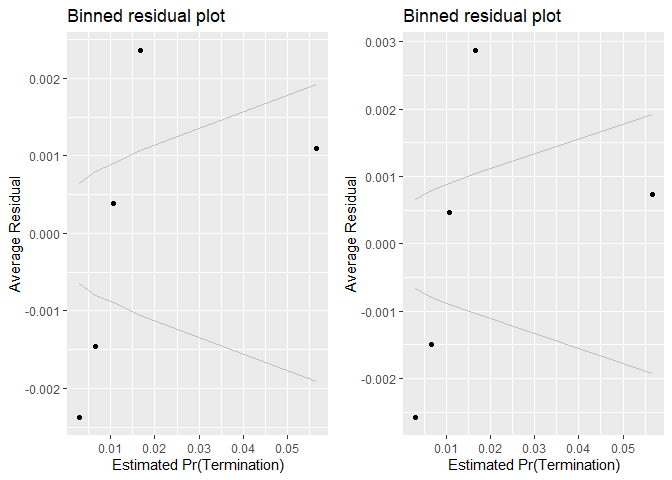<!-- -->

```
## [[1]]
##        model deviance null.deviance difference
## 1 model1_old 39298.93      46388.62   7089.681
## 2 model1_new 39276.39      46388.62   7112.222
## 
## [[2]]
##                              GVIF Df GVIF^(1/(2*Df))
## cl_US6_avg_sal_lag1Const 1.660007  1        1.288412
## cl_CFTE                  1.384488  1        1.176642
## c_pPBSC                  1.453346  1        1.205548
## c_pOffPSC                2.298287  1        1.516010
## c_pairHist               1.426617  1        1.194411
## cl_pairCA                3.024030  1        1.738974
## cl_Ceil                  1.461617  1        1.208973
## cl_Days                  1.255878  1        1.120660
## cl_Base2Ceil             1.342976  1        1.158868
## Comp1or5                 1.404461  3        1.058242
## Veh                      2.311727  4        1.110432
## PricingUCA               1.186798  6        1.014374
## Crisis                   1.523721  3        1.072715
## cl_def6_HHI_lag1         1.908117  1        1.381346
## cl_def6_ratio_lag1       1.591000  1        1.261349
## cl_def3_HHI_lag1         1.919315  1        1.385394
## cl_def3_ratio_lag1       1.722658  1        1.312501
## c_pMarket                1.407394  1        1.186336
## cl_OffVol                1.230562  1        1.109307
## cl_office_naics_hhi_k    2.052344  1        1.432600
```

# Interactions
####15A: Average U.S. Salaries (logged):Contract Pricing

```r
#Create the models
term_salary_pricing_15A_no_interact <- glm(data=serv_smp, b_Term ~ PricingUCA + cl_US6_avg_sal_lag1)
glmer_examine(term_salary_pricing_15A_no_interact)
```

```
##                        GVIF Df GVIF^(1/(2*Df))
## PricingUCA          1.05287  6        1.004303
## cl_US6_avg_sal_lag1 1.05287  1        1.026095
```

```r
term_salary_pricing_15A <- glm(data=serv_smp, b_Term ~ PricingUCA + cl_US6_avg_sal_lag1 + PricingUCA:cl_US6_avg_sal_lag1)
glmer_examine(term_salary_pricing_15A)
```

```
##                                     GVIF Df GVIF^(1/(2*Df))
## PricingUCA                     25.120085  6        1.308183
## cl_US6_avg_sal_lag1             1.127845  1        1.062001
## PricingUCA:cl_US6_avg_sal_lag1 26.902077  6        1.315676
```

```r
#compare the models

stargazer::stargazer(term_salary_pricing_15A_no_interact, term_salary_pricing_15A, type="text", digits=2)
```

```
## 
## ===============================================================================
##                                                        Dependent variable:     
##                                                    ----------------------------
##                                                               b_Term           
##                                                         (1)            (2)     
## -------------------------------------------------------------------------------
## PricingUCAOther FP                                    0.01***        0.01***   
##                                                       (0.003)        (0.003)   
##                                                                                
## PricingUCAT&M/LH/FPLOE                                -0.01***      -0.01***   
##                                                       (0.002)        (0.002)   
##                                                                                
## PricingUCAIncentive                                   -0.02***       -0.02**   
##                                                       (0.004)        (0.01)    
##                                                                                
## PricingUCAOther CB                                    -0.02***      -0.01***   
##                                                       (0.001)        (0.002)   
##                                                                                
## PricingUCAUCA                                         -0.02***      -0.02***   
##                                                       (0.003)        (0.003)   
##                                                                                
## PricingUCACombination or Other                        -0.01***      -0.01***   
##                                                       (0.003)        (0.003)   
##                                                                                
## cl_US6_avg_sal_lag1                                   0.003***      0.003***   
##                                                       (0.001)        (0.001)   
##                                                                                
## PricingUCAOther FP:cl_US6_avg_sal_lag1                               0.02***   
##                                                                      (0.01)    
##                                                                                
## PricingUCAT&M/LH/FPLOE:cl_US6_avg_sal_lag1                           -0.005    
##                                                                      (0.005)   
##                                                                                
## PricingUCAIncentive:cl_US6_avg_sal_lag1                              -0.001    
##                                                                      (0.02)    
##                                                                                
## PricingUCAOther CB:cl_US6_avg_sal_lag1                                -0.01    
##                                                                      (0.004)   
##                                                                                
## PricingUCAUCA:cl_US6_avg_sal_lag1                                     0.003    
##                                                                      (0.005)   
##                                                                                
## PricingUCACombination or Other:cl_US6_avg_sal_lag1                    0.002    
##                                                                      (0.01)    
##                                                                                
## Constant                                              0.02***        0.02***   
##                                                       (0.0003)      (0.0003)   
##                                                                                
## -------------------------------------------------------------------------------
## Observations                                          250,000        250,000   
## Log Likelihood                                       145,449.40    145,454.90  
## Akaike Inf. Crit.                                   -290,882.80    -290,881.90 
## ===============================================================================
## Note:                                               *p<0.1; **p<0.05; ***p<0.01
```

```r
summary_residual_compare(term_salary_pricing_15A_no_interact, term_salary_pricing_15A, bins=5)
```

<!-- -->

```
## Warning in if (class(model1_new) == "glmerMod") {: the condition has length
## > 1 and only the first element will be used
```

```
## Warning in if (class(model1_new) != "glmerMod" & class(model1_old) !=
## "glmerMod") {: the condition has length > 1 and only the first element will
## be used
```

<!-- -->

```
## [[1]]
##        model deviance null.deviance difference
## 1 model1_old 4572.137      4577.951   5.813998
## 2 model1_new 4571.934      4577.951   6.016857
## 
## [[2]]
##                                     GVIF Df GVIF^(1/(2*Df))
## PricingUCA                     25.120085  6        1.308183
## cl_US6_avg_sal_lag1             1.127845  1        1.062001
## PricingUCA:cl_US6_avg_sal_lag1 26.902077  6        1.315676
```

####15B: Cumulative

```r
#Create the model
term_salary_pricing_15B <- glm(data=serv_smp, b_Term ~ cl_US6_avg_sal_lag1Const + 
                   cl_CFTE+ c_pPBSC+c_pOffPSC+
                 c_pairHist+cl_pairCA +
                   cl_Ceil + capped_cl_Days+
                   Comp1or5+
                   Veh+
                   PricingUCA+
                   Crisis+
                   cl_def6_HHI_lag1+cl_def6_ratio_lag1+
                   cl_def3_HHI_lag1+cl_def3_ratio_lag1+
                   c_pMarket+
                   cl_OffVol+cl_office_naics_hhi_k + PricingUCA:cl_US6_avg_sal_lag1)

#Compare the models
stargazer::stargazer(term_salary_pricing_15B, Term_12C, type="text", digits=2)
```

```
## 
## ===============================================================================
##                                                        Dependent variable:     
##                                                    ----------------------------
##                                                               b_Term           
##                                                        normal       logistic   
##                                                         (1)            (2)     
## -------------------------------------------------------------------------------
## cl_US6_avg_sal_lag1Const                               0.003          0.01     
##                                                        (0.01)        (0.04)    
##                                                                                
## cl_CFTE                                                0.001         0.08**    
##                                                       (0.001)        (0.04)    
##                                                                                
## c_pPBSC                                              -0.005***      -0.14***   
##                                                       (0.001)        (0.04)    
##                                                                                
## c_pOffPSC                                             0.02***        0.54***   
##                                                       (0.001)        (0.04)    
##                                                                                
## c_pairHist                                            -0.001*        -0.07**   
##                                                       (0.001)        (0.04)    
##                                                                                
## cl_pairCA                                             0.02***        0.35***   
##                                                       (0.001)        (0.04)    
##                                                                                
## cl_Ceil                                               0.01***        0.29***   
##                                                       (0.001)        (0.04)    
##                                                                                
## capped_cl_Days                                        0.02***                  
##                                                       (0.001)                  
##                                                                                
## cl_Days                                                              1.03***   
##                                                                      (0.04)    
##                                                                                
## cl_Base2Ceil                                                         0.74***   
##                                                                      (0.02)    
##                                                                                
## Comp1or51 offer                                       0.01***        0.24***   
##                                                       (0.001)        (0.05)    
##                                                                                
## Comp1or52-4 offers                                    0.003***       0.23***   
##                                                       (0.001)        (0.05)    
##                                                                                
## Comp1or55+ offers                                     0.02***        0.76***   
##                                                       (0.001)        (0.05)    
##                                                                                
## VehS-IDC                                              -0.02***      -0.84***   
##                                                       (0.001)        (0.05)    
##                                                                                
## VehM-IDC                                              -0.02***      -0.43***   
##                                                       (0.001)        (0.05)    
##                                                                                
## VehFSS/GWAC                                          -0.004***      -0.28***   
##                                                       (0.001)        (0.07)    
##                                                                                
## VehBPA/BOA                                            -0.02***      -1.37***   
##                                                       (0.001)        (0.12)    
##                                                                                
## PricingUCAOther FP                                     -0.004         -0.12    
##                                                       (0.003)        (0.14)    
##                                                                                
## PricingUCAT&M/LH/FPLOE                                -0.01***      -0.81***   
##                                                       (0.002)        (0.16)    
##                                                                                
## PricingUCAIncentive                                   -0.03***      -2.30***   
##                                                        (0.01)        (0.71)    
##                                                                                
## PricingUCAOther CB                                    -0.02***      -1.40***   
##                                                       (0.002)        (0.13)    
##                                                                                
## PricingUCAUCA                                         -0.02***      -1.20***   
##                                                       (0.003)        (0.28)    
##                                                                                
## PricingUCACombination or Other                        -0.02***      -1.04***   
##                                                       (0.003)        (0.22)    
##                                                                                
## CrisisARRA                                            -0.02***      -0.71***   
##                                                       (0.004)        (0.26)    
##                                                                                
## CrisisDis                                              0.004          0.43     
##                                                        (0.01)        (0.34)    
##                                                                                
## CrisisOCO                                             -0.01***        -0.04    
##                                                       (0.001)        (0.09)    
##                                                                                
## cl_def6_HHI_lag1                                     -0.004***       -0.07*    
##                                                       (0.001)        (0.04)    
##                                                                                
## cl_def6_ratio_lag1                                   -0.004***      -0.20***   
##                                                       (0.001)        (0.06)    
##                                                                                
## cl_def3_HHI_lag1                                      0.01***        0.24***   
##                                                       (0.001)        (0.04)    
##                                                                                
## cl_def3_ratio_lag1                                    -0.01***      -0.51***   
##                                                       (0.001)        (0.05)    
##                                                                                
## c_pMarket                                             -0.01***      -0.38***   
##                                                       (0.001)        (0.05)    
##                                                                                
## cl_OffVol                                             0.004***       0.11***   
##                                                       (0.001)        (0.04)    
##                                                                                
## cl_office_naics_hhi_k                                 0.004***       0.17***   
##                                                       (0.001)        (0.04)    
##                                                                                
## PricingUCAFFP:cl_US6_avg_sal_lag1                      -0.001                  
##                                                        (0.01)                  
##                                                                                
## PricingUCAOther FP:cl_US6_avg_sal_lag1                 0.003                   
##                                                        (0.01)                  
##                                                                                
## PricingUCAT&M/LH/FPLOE:cl_US6_avg_sal_lag1             0.004                   
##                                                        (0.01)                  
##                                                                                
## PricingUCAIncentive:cl_US6_avg_sal_lag1                -0.01                   
##                                                        (0.02)                  
##                                                                                
## PricingUCAOther CB:cl_US6_avg_sal_lag1                 0.001                   
##                                                        (0.01)                  
##                                                                                
## PricingUCAUCA:cl_US6_avg_sal_lag1                     -0.0001                  
##                                                        (0.01)                  
##                                                                                
## PricingUCACombination or Other:cl_US6_avg_sal_lag1      0.01                   
##                                                        (0.01)                  
##                                                                                
## Constant                                              0.03***       -4.15***   
##                                                       (0.001)        (0.04)    
##                                                                                
## -------------------------------------------------------------------------------
## Observations                                          250,000        250,000   
## Log Likelihood                                       148,077.40    -19,638.20  
## Akaike Inf. Crit.                                   -296,076.80     39,342.39  
## ===============================================================================
## Note:                                               *p<0.1; **p<0.05; ***p<0.01
```

```r
summary_residual_compare(term_salary_pricing_15B, Term_12C, bins=5)
```

<!-- -->

```
## Warning in if (class(model1_new) == "glmerMod") {: the condition has length
## > 1 and only the first element will be used
```

```
## Warning in if (class(model1_new) != "glmerMod" & class(model1_old) !=
## "glmerMod") {: the condition has length > 1 and only the first element will
## be used
```

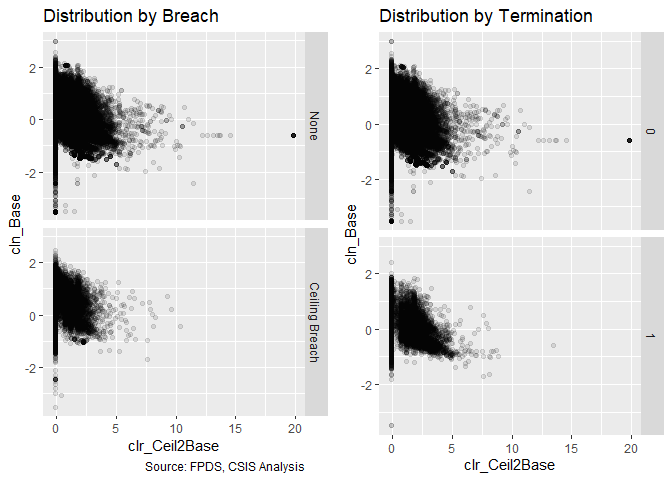<!-- -->

```
## [[1]]
##        model  deviance null.deviance difference
## 1 model1_old  4477.016      4577.951   100.9355
## 2 model1_new 39276.394     46388.615  7112.2219
## 
## [[2]]
##                              GVIF Df GVIF^(1/(2*Df))
## cl_US6_avg_sal_lag1Const 1.660007  1        1.288412
## cl_CFTE                  1.384488  1        1.176642
## c_pPBSC                  1.453346  1        1.205548
## c_pOffPSC                2.298287  1        1.516010
## c_pairHist               1.426617  1        1.194411
## cl_pairCA                3.024030  1        1.738974
## cl_Ceil                  1.461617  1        1.208973
## cl_Days                  1.255878  1        1.120660
## cl_Base2Ceil             1.342976  1        1.158868
## Comp1or5                 1.404461  3        1.058242
## Veh                      2.311727  4        1.110432
## PricingUCA               1.186798  6        1.014374
## Crisis                   1.523721  3        1.072715
## cl_def6_HHI_lag1         1.908117  1        1.381346
## cl_def6_ratio_lag1       1.591000  1        1.261349
## cl_def3_HHI_lag1         1.919315  1        1.385394
## cl_def3_ratio_lag1       1.722658  1        1.312501
## c_pMarket                1.407394  1        1.186336
## cl_OffVol                1.230562  1        1.109307
## cl_office_naics_hhi_k    2.052344  1        1.432600
```

####16A: Office Partnership:Actions

```r
#Create the models
term_partnership_actions_16A_no_interact <- glm(data=serv_smp, b_Term ~ c_pPBSC + cl_pairCA)
glmer_examine(term_partnership_actions_16A_no_interact)
```

```
##   c_pPBSC cl_pairCA 
##  1.038422  1.038422
```

```r
term_partnership_actions_16A <- glm(data=serv_smp, b_Term ~ c_pPBSC + cl_pairCA + c_pPBSC:cl_pairCA)
glmer_examine(term_partnership_actions_16A)
```

```
##           c_pPBSC         cl_pairCA c_pPBSC:cl_pairCA 
##          1.107669          1.086283          1.139255
```

```r
#compare the models

stargazer::stargazer(term_partnership_actions_16A_no_interact, term_partnership_actions_16A, type="text", digits=2)
```

```
## 
## ==============================================
##                       Dependent variable:     
##                   ----------------------------
##                              b_Term           
##                        (1)            (2)     
## ----------------------------------------------
## c_pPBSC              0.002***       0.0004    
##                      (0.001)        (0.001)   
##                                               
## cl_pairCA            0.01***        0.01***   
##                      (0.001)        (0.001)   
##                                               
## c_pPBSC:cl_pairCA                   0.01***   
##                                     (0.001)   
##                                               
## Constant             0.02***        0.02***   
##                      (0.0003)      (0.0003)   
##                                               
## ----------------------------------------------
## Observations         250,000        250,000   
## Log Likelihood      145,386.00    145,484.10  
## Akaike Inf. Crit.  -290,766.10    -290,960.20 
## ==============================================
## Note:              *p<0.1; **p<0.05; ***p<0.01
```

```r
summary_residual_compare(term_partnership_actions_16A_no_interact, term_partnership_actions_16A, bins=5)
```

<!-- -->

```
## Warning in if (class(model1_new) == "glmerMod") {: the condition has length
## > 1 and only the first element will be used
```

```
## Warning in if (class(model1_new) != "glmerMod" & class(model1_old) !=
## "glmerMod") {: the condition has length > 1 and only the first element will
## be used
```

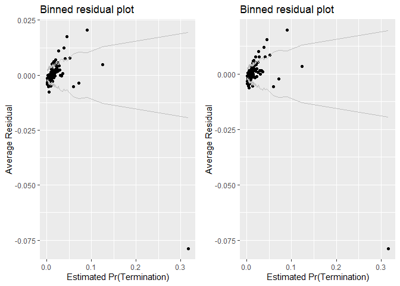<!-- -->

```
## [[1]]
##        model deviance null.deviance difference
## 1 model1_old 4574.455      4577.951   3.496028
## 2 model1_new 4570.867      4577.951   7.084267
## 
## [[2]]
##           c_pPBSC         cl_pairCA c_pPBSC:cl_pairCA 
##          1.107669          1.086283          1.139255
```

####16B: Cumulative

```r
#Create the model
term_partnership_actions_16B <- glm(data=serv_smp, b_Term ~ cl_US6_avg_sal_lag1Const + 
                   cl_CFTE+ c_pPBSC+c_pOffPSC+
                 c_pairHist+cl_pairCA +
                   cl_Ceil + capped_cl_Days+
                   Comp1or5+
                   Veh+
                   PricingUCA+
                   Crisis+
                   cl_def6_HHI_lag1+cl_def6_ratio_lag1+
                   cl_def3_HHI_lag1+cl_def3_ratio_lag1+
                   c_pMarket+
                   cl_OffVol+cl_office_naics_hhi_k + c_pPBSC:cl_pairCA)

#Compare the models
stargazer::stargazer(term_partnership_actions_16B, Term_12C, type="text", digits=2)
```

```
## 
## ===========================================================
##                                    Dependent variable:     
##                                ----------------------------
##                                           b_Term           
##                                    normal       logistic   
##                                     (1)            (2)     
## -----------------------------------------------------------
## cl_US6_avg_sal_lag1Const          0.002***        0.01     
##                                   (0.001)        (0.04)    
##                                                            
## cl_CFTE                            0.001         0.08**    
##                                   (0.001)        (0.04)    
##                                                            
## c_pPBSC                          -0.005***      -0.14***   
##                                   (0.001)        (0.04)    
##                                                            
## c_pOffPSC                         0.02***        0.54***   
##                                   (0.001)        (0.04)    
##                                                            
## c_pairHist                        -0.001*        -0.07**   
##                                   (0.001)        (0.04)    
##                                                            
## cl_pairCA                         0.02***        0.35***   
##                                   (0.001)        (0.04)    
##                                                            
## cl_Ceil                           0.01***        0.29***   
##                                   (0.001)        (0.04)    
##                                                            
## capped_cl_Days                    0.02***                  
##                                   (0.001)                  
##                                                            
## cl_Days                                          1.03***   
##                                                  (0.04)    
##                                                            
## cl_Base2Ceil                                     0.74***   
##                                                  (0.02)    
##                                                            
## Comp1or51 offer                   0.01***        0.24***   
##                                   (0.001)        (0.05)    
##                                                            
## Comp1or52-4 offers                0.003***       0.23***   
##                                   (0.001)        (0.05)    
##                                                            
## Comp1or55+ offers                 0.02***        0.76***   
##                                   (0.001)        (0.05)    
##                                                            
## VehS-IDC                          -0.02***      -0.84***   
##                                   (0.001)        (0.05)    
##                                                            
## VehM-IDC                          -0.02***      -0.43***   
##                                   (0.001)        (0.05)    
##                                                            
## VehFSS/GWAC                      -0.004***      -0.28***   
##                                   (0.001)        (0.07)    
##                                                            
## VehBPA/BOA                        -0.02***      -1.37***   
##                                   (0.001)        (0.12)    
##                                                            
## PricingUCAOther FP                 -0.004         -0.12    
##                                   (0.003)        (0.14)    
##                                                            
## PricingUCAT&M/LH/FPLOE            -0.01***      -0.81***   
##                                   (0.002)        (0.16)    
##                                                            
## PricingUCAIncentive               -0.03***      -2.30***   
##                                   (0.004)        (0.71)    
##                                                            
## PricingUCAOther CB                -0.02***      -1.40***   
##                                   (0.001)        (0.13)    
##                                                            
## PricingUCAUCA                     -0.02***      -1.20***   
##                                   (0.003)        (0.28)    
##                                                            
## PricingUCACombination or Other    -0.02***      -1.04***   
##                                   (0.003)        (0.22)    
##                                                            
## CrisisARRA                        -0.02***      -0.71***   
##                                   (0.004)        (0.26)    
##                                                            
## CrisisDis                          0.004          0.43     
##                                    (0.01)        (0.34)    
##                                                            
## CrisisOCO                         -0.01***        -0.04    
##                                   (0.001)        (0.09)    
##                                                            
## cl_def6_HHI_lag1                 -0.005***       -0.07*    
##                                   (0.001)        (0.04)    
##                                                            
## cl_def6_ratio_lag1               -0.004***      -0.20***   
##                                   (0.001)        (0.06)    
##                                                            
## cl_def3_HHI_lag1                  0.01***        0.24***   
##                                   (0.001)        (0.04)    
##                                                            
## cl_def3_ratio_lag1                -0.01***      -0.51***   
##                                   (0.001)        (0.05)    
##                                                            
## c_pMarket                         -0.01***      -0.38***   
##                                   (0.001)        (0.05)    
##                                                            
## cl_OffVol                         0.004***       0.11***   
##                                   (0.001)        (0.04)    
##                                                            
## cl_office_naics_hhi_k             0.004***       0.17***   
##                                   (0.001)        (0.04)    
##                                                            
## c_pPBSC:cl_pairCA                  -0.001                  
##                                   (0.001)                  
##                                                            
## Constant                          0.03***       -4.15***   
##                                   (0.001)        (0.04)    
##                                                            
## -----------------------------------------------------------
## Observations                      250,000        250,000   
## Log Likelihood                   148,076.90    -19,638.20  
## Akaike Inf. Crit.               -296,087.70     39,342.39  
## ===========================================================
## Note:                           *p<0.1; **p<0.05; ***p<0.01
```

```r
summary_residual_compare(term_partnership_actions_16B, Term_12C, bins=5)
```

<!-- -->

```
## Warning in if (class(model1_new) == "glmerMod") {: the condition has length
## > 1 and only the first element will be used
```

```
## Warning in if (class(model1_new) != "glmerMod" & class(model1_old) !=
## "glmerMod") {: the condition has length > 1 and only the first element will
## be used
```

<!-- -->

```
## [[1]]
##        model  deviance null.deviance difference
## 1 model1_old  4477.035      4577.951   100.9163
## 2 model1_new 39276.394     46388.615  7112.2219
## 
## [[2]]
##                              GVIF Df GVIF^(1/(2*Df))
## cl_US6_avg_sal_lag1Const 1.660007  1        1.288412
## cl_CFTE                  1.384488  1        1.176642
## c_pPBSC                  1.453346  1        1.205548
## c_pOffPSC                2.298287  1        1.516010
## c_pairHist               1.426617  1        1.194411
## cl_pairCA                3.024030  1        1.738974
## cl_Ceil                  1.461617  1        1.208973
## cl_Days                  1.255878  1        1.120660
## cl_Base2Ceil             1.342976  1        1.158868
## Comp1or5                 1.404461  3        1.058242
## Veh                      2.311727  4        1.110432
## PricingUCA               1.186798  6        1.014374
## Crisis                   1.523721  3        1.072715
## cl_def6_HHI_lag1         1.908117  1        1.381346
## cl_def6_ratio_lag1       1.591000  1        1.261349
## cl_def3_HHI_lag1         1.919315  1        1.385394
## cl_def3_ratio_lag1       1.722658  1        1.312501
## c_pMarket                1.407394  1        1.186336
## cl_OffVol                1.230562  1        1.109307
## cl_office_naics_hhi_k    2.052344  1        1.432600
```

####17A: Office Partnership:Market Vendor Share for that Office

```r
#Define the models
term_partnership_share_17A_no_interact <- glm(data=serv_smp, b_Term ~ c_pPBSC + c_pMarket)
glmer_examine(term_partnership_share_17A_no_interact)
```

```
##   c_pPBSC c_pMarket 
##  1.005515  1.005515
```

```r
term_partnership_share_17A <- glm(data=serv_smp, b_Term ~ c_pPBSC + c_pMarket + c_pPBSC:c_pMarket)
glmer_examine(term_partnership_share_17A)
```

```
##           c_pPBSC         c_pMarket c_pPBSC:c_pMarket 
##          1.013182          1.441134          1.451847
```

```r
#Compare the models
stargazer::stargazer(term_partnership_share_17A_no_interact, term_partnership_share_17A, type="text", digits=2)
```

```
## 
## ==============================================
##                       Dependent variable:     
##                   ----------------------------
##                              b_Term           
##                        (1)            (2)     
## ----------------------------------------------
## c_pPBSC              0.003***      0.003***   
##                      (0.001)        (0.001)   
##                                               
## c_pMarket           -0.004***      -0.004***  
##                      (0.001)        (0.001)   
##                                               
## c_pPBSC:c_pMarket                    0.001    
##                                     (0.001)   
##                                               
## Constant             0.02***        0.02***   
##                      (0.0003)      (0.0003)   
##                                               
## ----------------------------------------------
## Observations         250,000        250,000   
## Log Likelihood      145,341.80    145,342.60  
## Akaike Inf. Crit.  -290,677.70    -290,677.30 
## ==============================================
## Note:              *p<0.1; **p<0.05; ***p<0.01
```

```r
summary_residual_compare(term_partnership_share_17A_no_interact, term_partnership_share_17A, bins=5)
```

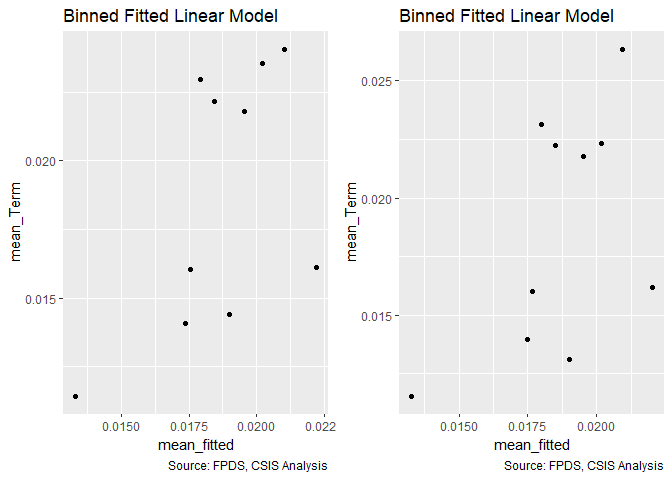<!-- -->

```
## Warning in if (class(model1_new) == "glmerMod") {: the condition has length
## > 1 and only the first element will be used
```

```
## Warning in if (class(model1_new) != "glmerMod" & class(model1_old) !=
## "glmerMod") {: the condition has length > 1 and only the first element will
## be used
```

<!-- -->

```
## [[1]]
##        model deviance null.deviance difference
## 1 model1_old 4576.073      4577.951   1.878585
## 2 model1_new 4576.043      4577.951   1.907934
## 
## [[2]]
##           c_pPBSC         c_pMarket c_pPBSC:c_pMarket 
##          1.013182          1.441134          1.451847
```

####17B: Cumulative

```r
#Create the model
term_partnership_share_17B <- glm(data=serv_smp, b_Term ~ cl_US6_avg_sal_lag1Const + 
                   cl_CFTE+ c_pPBSC+c_pOffPSC+
                 c_pairHist+cl_pairCA +
                   cl_Ceil + capped_cl_Days+
                   Comp1or5+
                   Veh+
                   PricingUCA+
                   Crisis+
                   cl_def6_HHI_lag1+cl_def6_ratio_lag1+
                   cl_def3_HHI_lag1+cl_def3_ratio_lag1+
                   c_pMarket+
                   cl_OffVol+cl_office_naics_hhi_k + c_pPBSC:c_pMarket)

#Compare the models
stargazer::stargazer(term_partnership_share_17B, Term_12C, type="text", digits=2)
```

```
## 
## ===========================================================
##                                    Dependent variable:     
##                                ----------------------------
##                                           b_Term           
##                                    normal       logistic   
##                                     (1)            (2)     
## -----------------------------------------------------------
## cl_US6_avg_sal_lag1Const          0.002***        0.01     
##                                   (0.001)        (0.04)    
##                                                            
## cl_CFTE                            0.001         0.08**    
##                                   (0.001)        (0.04)    
##                                                            
## c_pPBSC                          -0.005***      -0.14***   
##                                   (0.001)        (0.04)    
##                                                            
## c_pOffPSC                         0.02***        0.54***   
##                                   (0.001)        (0.04)    
##                                                            
## c_pairHist                        -0.001*        -0.07**   
##                                   (0.001)        (0.04)    
##                                                            
## cl_pairCA                         0.02***        0.35***   
##                                   (0.001)        (0.04)    
##                                                            
## cl_Ceil                           0.01***        0.29***   
##                                   (0.001)        (0.04)    
##                                                            
## capped_cl_Days                    0.02***                  
##                                   (0.001)                  
##                                                            
## cl_Days                                          1.03***   
##                                                  (0.04)    
##                                                            
## cl_Base2Ceil                                     0.74***   
##                                                  (0.02)    
##                                                            
## Comp1or51 offer                   0.01***        0.24***   
##                                   (0.001)        (0.05)    
##                                                            
## Comp1or52-4 offers                0.003***       0.23***   
##                                   (0.001)        (0.05)    
##                                                            
## Comp1or55+ offers                 0.02***        0.76***   
##                                   (0.001)        (0.05)    
##                                                            
## VehS-IDC                          -0.02***      -0.84***   
##                                   (0.001)        (0.05)    
##                                                            
## VehM-IDC                          -0.02***      -0.43***   
##                                   (0.001)        (0.05)    
##                                                            
## VehFSS/GWAC                      -0.004***      -0.28***   
##                                   (0.001)        (0.07)    
##                                                            
## VehBPA/BOA                        -0.02***      -1.37***   
##                                   (0.001)        (0.12)    
##                                                            
## PricingUCAOther FP                 -0.004         -0.12    
##                                   (0.003)        (0.14)    
##                                                            
## PricingUCAT&M/LH/FPLOE            -0.01***      -0.81***   
##                                   (0.002)        (0.16)    
##                                                            
## PricingUCAIncentive               -0.03***      -2.30***   
##                                   (0.004)        (0.71)    
##                                                            
## PricingUCAOther CB                -0.02***      -1.40***   
##                                   (0.001)        (0.13)    
##                                                            
## PricingUCAUCA                     -0.02***      -1.20***   
##                                   (0.003)        (0.28)    
##                                                            
## PricingUCACombination or Other    -0.02***      -1.04***   
##                                   (0.003)        (0.22)    
##                                                            
## CrisisARRA                        -0.02***      -0.71***   
##                                   (0.004)        (0.26)    
##                                                            
## CrisisDis                          0.004          0.43     
##                                    (0.01)        (0.34)    
##                                                            
## CrisisOCO                         -0.01***        -0.04    
##                                   (0.001)        (0.09)    
##                                                            
## cl_def6_HHI_lag1                 -0.005***       -0.07*    
##                                   (0.001)        (0.04)    
##                                                            
## cl_def6_ratio_lag1               -0.004***      -0.20***   
##                                   (0.001)        (0.06)    
##                                                            
## cl_def3_HHI_lag1                  0.01***        0.24***   
##                                   (0.001)        (0.04)    
##                                                            
## cl_def3_ratio_lag1                -0.01***      -0.51***   
##                                   (0.001)        (0.05)    
##                                                            
## c_pMarket                         -0.01***      -0.38***   
##                                   (0.001)        (0.05)    
##                                                            
## cl_OffVol                         0.004***       0.11***   
##                                   (0.001)        (0.04)    
##                                                            
## cl_office_naics_hhi_k             0.004***       0.17***   
##                                   (0.001)        (0.04)    
##                                                            
## c_pPBSC:c_pMarket                -0.004***                 
##                                   (0.001)                  
##                                                            
## Constant                          0.03***       -4.15***   
##                                   (0.001)        (0.04)    
##                                                            
## -----------------------------------------------------------
## Observations                      250,000        250,000   
## Log Likelihood                   148,081.60    -19,638.20  
## Akaike Inf. Crit.               -296,097.30     39,342.39  
## ===========================================================
## Note:                           *p<0.1; **p<0.05; ***p<0.01
```

```r
summary_residual_compare(term_partnership_share_17B, Term_12C, bins=5)
```

<!-- -->

```
## Warning in if (class(model1_new) == "glmerMod") {: the condition has length
## > 1 and only the first element will be used
```

```
## Warning in if (class(model1_new) != "glmerMod" & class(model1_old) !=
## "glmerMod") {: the condition has length > 1 and only the first element will
## be used
```

<!-- -->

```
## [[1]]
##        model  deviance null.deviance difference
## 1 model1_old  4476.864      4577.951   101.0873
## 2 model1_new 39276.394     46388.615  7112.2219
## 
## [[2]]
##                              GVIF Df GVIF^(1/(2*Df))
## cl_US6_avg_sal_lag1Const 1.660007  1        1.288412
## cl_CFTE                  1.384488  1        1.176642
## c_pPBSC                  1.453346  1        1.205548
## c_pOffPSC                2.298287  1        1.516010
## c_pairHist               1.426617  1        1.194411
## cl_pairCA                3.024030  1        1.738974
## cl_Ceil                  1.461617  1        1.208973
## cl_Days                  1.255878  1        1.120660
## cl_Base2Ceil             1.342976  1        1.158868
## Comp1or5                 1.404461  3        1.058242
## Veh                      2.311727  4        1.110432
## PricingUCA               1.186798  6        1.014374
## Crisis                   1.523721  3        1.072715
## cl_def6_HHI_lag1         1.908117  1        1.381346
## cl_def6_ratio_lag1       1.591000  1        1.261349
## cl_def3_HHI_lag1         1.919315  1        1.385394
## cl_def3_ratio_lag1       1.722658  1        1.312501
## c_pMarket                1.407394  1        1.186336
## cl_OffVol                1.230562  1        1.109307
## cl_office_naics_hhi_k    2.052344  1        1.432600
```

####18A: Office Partnership:Initial Contract Duration (logged)

```r
#Create the Model
term_partnership_duration_18A_no_interact <- glm(data=serv_smp , b_Term ~ c_pPBSC + capped_cl_Days)
glmer_examine(term_partnership_duration_18A_no_interact)
```

```
##        c_pPBSC capped_cl_Days 
##       1.000192       1.000192
```

```r
term_partnership_duration_18A <- glm(data=serv_smp, b_Term ~ c_pPBSC + capped_cl_Days + c_pPBSC: capped_cl_Days)
glmer_examine(term_partnership_duration_18A)
```

```
##                c_pPBSC         capped_cl_Days c_pPBSC:capped_cl_Days 
##               1.015853               1.009986               1.025798
```

```r
#Compare the models
stargazer::stargazer(term_partnership_duration_18A_no_interact, term_partnership_duration_18A, type="text", digits=2)
```

```
## 
## ===================================================
##                            Dependent variable:     
##                        ----------------------------
##                                   b_Term           
##                             (1)            (2)     
## ---------------------------------------------------
## c_pPBSC                   0.003***      0.004***   
##                           (0.001)        (0.001)   
##                                                    
## capped_cl_Days            0.02***        0.02***   
##                           (0.001)        (0.001)   
##                                                    
## c_pPBSC:capped_cl_Days                   0.01***   
##                                          (0.001)   
##                                                    
## Constant                  0.02***        0.02***   
##                           (0.0003)      (0.0003)   
##                                                    
## ---------------------------------------------------
## Observations              250,000        250,000   
## Log Likelihood           145,897.10    145,939.70  
## Akaike Inf. Crit.       -291,788.20    -291,871.50 
## ===================================================
## Note:                   *p<0.1; **p<0.05; ***p<0.01
```

```r
summary_residual_compare(term_partnership_duration_18A_no_interact, term_partnership_duration_18A, bins=5)
```

<!-- -->

```
## Warning in if (class(model1_new) == "glmerMod") {: the condition has length
## > 1 and only the first element will be used
```

```
## Warning in if (class(model1_new) != "glmerMod" & class(model1_old) !=
## "glmerMod") {: the condition has length > 1 and only the first element will
## be used
```

<!-- -->

```
## [[1]]
##        model deviance null.deviance difference
## 1 model1_old 4555.790      4577.951   22.16111
## 2 model1_new 4554.237      4577.951   23.71424
## 
## [[2]]
##                c_pPBSC         capped_cl_Days c_pPBSC:capped_cl_Days 
##               1.015853               1.009986               1.025798
```

####18B: Cumulative

```r
#Create the model
term_partnership_duration_18B <- glm(data=serv_smp, b_Term ~ cl_US6_avg_sal_lag1Const + 
                   cl_CFTE+ c_pPBSC+c_pOffPSC+
                 c_pairHist+cl_pairCA +
                   cl_Ceil + capped_cl_Days+
                   Comp1or5+
                   Veh+
                   PricingUCA+
                   Crisis+
                   cl_def6_HHI_lag1+cl_def6_ratio_lag1+
                   cl_def3_HHI_lag1+cl_def3_ratio_lag1+
                   c_pMarket+
                   cl_OffVol+cl_office_naics_hhi_k + c_pPBSC:capped_cl_Days)

#Compare the models
stargazer::stargazer(term_partnership_duration_18B, Term_12C, type="text", digits=2)
```

```
## 
## ===========================================================
##                                    Dependent variable:     
##                                ----------------------------
##                                           b_Term           
##                                    normal       logistic   
##                                     (1)            (2)     
## -----------------------------------------------------------
## cl_US6_avg_sal_lag1Const          0.002***        0.01     
##                                   (0.001)        (0.04)    
##                                                            
## cl_CFTE                            0.001         0.08**    
##                                   (0.001)        (0.04)    
##                                                            
## c_pPBSC                          -0.004***      -0.14***   
##                                   (0.001)        (0.04)    
##                                                            
## c_pOffPSC                         0.02***        0.54***   
##                                   (0.001)        (0.04)    
##                                                            
## c_pairHist                        -0.001**       -0.07**   
##                                   (0.001)        (0.04)    
##                                                            
## cl_pairCA                         0.02***        0.35***   
##                                   (0.001)        (0.04)    
##                                                            
## cl_Ceil                           0.01***        0.29***   
##                                   (0.001)        (0.04)    
##                                                            
## capped_cl_Days                    0.02***                  
##                                   (0.001)                  
##                                                            
## cl_Days                                          1.03***   
##                                                  (0.04)    
##                                                            
## cl_Base2Ceil                                     0.74***   
##                                                  (0.02)    
##                                                            
## Comp1or51 offer                   0.005***       0.24***   
##                                   (0.001)        (0.05)    
##                                                            
## Comp1or52-4 offers                0.003***       0.23***   
##                                   (0.001)        (0.05)    
##                                                            
## Comp1or55+ offers                 0.02***        0.76***   
##                                   (0.001)        (0.05)    
##                                                            
## VehS-IDC                          -0.02***      -0.84***   
##                                   (0.001)        (0.05)    
##                                                            
## VehM-IDC                          -0.02***      -0.43***   
##                                   (0.001)        (0.05)    
##                                                            
## VehFSS/GWAC                      -0.005***      -0.28***   
##                                   (0.001)        (0.07)    
##                                                            
## VehBPA/BOA                        -0.02***      -1.37***   
##                                   (0.001)        (0.12)    
##                                                            
## PricingUCAOther FP                -0.01**         -0.12    
##                                   (0.003)        (0.14)    
##                                                            
## PricingUCAT&M/LH/FPLOE            -0.01***      -0.81***   
##                                   (0.002)        (0.16)    
##                                                            
## PricingUCAIncentive               -0.03***      -2.30***   
##                                   (0.004)        (0.71)    
##                                                            
## PricingUCAOther CB                -0.02***      -1.40***   
##                                   (0.001)        (0.13)    
##                                                            
## PricingUCAUCA                     -0.02***      -1.20***   
##                                   (0.003)        (0.28)    
##                                                            
## PricingUCACombination or Other    -0.02***      -1.04***   
##                                   (0.003)        (0.22)    
##                                                            
## CrisisARRA                        -0.02***      -0.71***   
##                                   (0.004)        (0.26)    
##                                                            
## CrisisDis                          0.003          0.43     
##                                    (0.01)        (0.34)    
##                                                            
## CrisisOCO                         -0.01***        -0.04    
##                                   (0.001)        (0.09)    
##                                                            
## cl_def6_HHI_lag1                 -0.004***       -0.07*    
##                                   (0.001)        (0.04)    
##                                                            
## cl_def6_ratio_lag1               -0.005***      -0.20***   
##                                   (0.001)        (0.06)    
##                                                            
## cl_def3_HHI_lag1                  0.01***        0.24***   
##                                   (0.001)        (0.04)    
##                                                            
## cl_def3_ratio_lag1                -0.01***      -0.51***   
##                                   (0.001)        (0.05)    
##                                                            
## c_pMarket                         -0.01***      -0.38***   
##                                   (0.001)        (0.05)    
##                                                            
## cl_OffVol                         0.004***       0.11***   
##                                   (0.001)        (0.04)    
##                                                            
## cl_office_naics_hhi_k             0.004***       0.17***   
##                                   (0.001)        (0.04)    
##                                                            
## c_pPBSC:capped_cl_Days            0.02***                  
##                                   (0.001)                  
##                                                            
## Constant                          0.03***       -4.15***   
##                                   (0.001)        (0.04)    
##                                                            
## -----------------------------------------------------------
## Observations                      250,000        250,000   
## Log Likelihood                   148,239.50    -19,638.20  
## Akaike Inf. Crit.               -296,413.00     39,342.39  
## ===========================================================
## Note:                           *p<0.1; **p<0.05; ***p<0.01
```

```r
summary_residual_compare(term_partnership_duration_18B, Term_12C, bins=5)
```

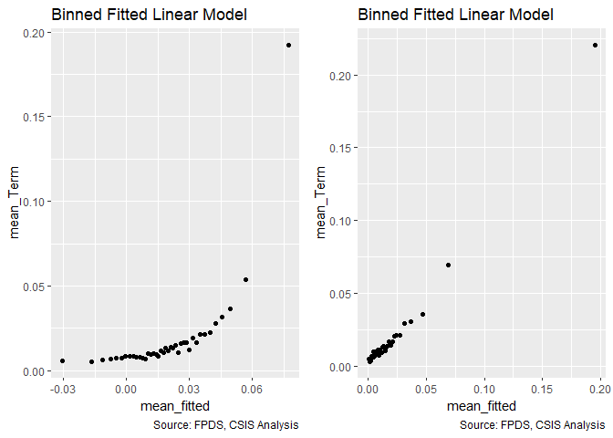<!-- -->

```
## Warning in if (class(model1_new) == "glmerMod") {: the condition has length
## > 1 and only the first element will be used
```

```
## Warning in if (class(model1_new) != "glmerMod" & class(model1_old) !=
## "glmerMod") {: the condition has length > 1 and only the first element will
## be used
```

<!-- -->

```
## [[1]]
##        model  deviance null.deviance difference
## 1 model1_old  4471.214      4577.951   106.7374
## 2 model1_new 39276.394     46388.615  7112.2219
## 
## [[2]]
##                              GVIF Df GVIF^(1/(2*Df))
## cl_US6_avg_sal_lag1Const 1.660007  1        1.288412
## cl_CFTE                  1.384488  1        1.176642
## c_pPBSC                  1.453346  1        1.205548
## c_pOffPSC                2.298287  1        1.516010
## c_pairHist               1.426617  1        1.194411
## cl_pairCA                3.024030  1        1.738974
## cl_Ceil                  1.461617  1        1.208973
## cl_Days                  1.255878  1        1.120660
## cl_Base2Ceil             1.342976  1        1.158868
## Comp1or5                 1.404461  3        1.058242
## Veh                      2.311727  4        1.110432
## PricingUCA               1.186798  6        1.014374
## Crisis                   1.523721  3        1.072715
## cl_def6_HHI_lag1         1.908117  1        1.381346
## cl_def6_ratio_lag1       1.591000  1        1.261349
## cl_def3_HHI_lag1         1.919315  1        1.385394
## cl_def3_ratio_lag1       1.722658  1        1.312501
## c_pMarket                1.407394  1        1.186336
## cl_OffVol                1.230562  1        1.109307
## cl_office_naics_hhi_k    2.052344  1        1.432600
```

####19A: Past Years:Contract Pricing

```r
#Create the models
term_history_pricing_19A_no_interact <- glm(data=serv_smp, b_Term ~ c_pairHist + PricingUCA)
glmer_examine(term_history_pricing_19A_no_interact)
```

```
##                GVIF Df GVIF^(1/(2*Df))
## c_pairHist 1.025717  1        1.012777
## PricingUCA 1.025717  6        1.002118
```

```r
term_history_pricing_19A <- glm(data=serv_smp, b_Term ~ c_pairHist + PricingUCA + c_pairHist:PricingUCA)
glmer_examine(term_history_pricing_19A)
```

```
##                           GVIF Df GVIF^(1/(2*Df))
## c_pairHist            1.124056  1        1.060215
## PricingUCA            3.926162  6        1.120721
## c_pairHist:PricingUCA 4.300240  6        1.129253
```

```r
#Compare the models
stargazer::stargazer(term_history_pricing_19A_no_interact, term_history_pricing_19A, type="text", digits=2)
```

```
## 
## ======================================================================
##                                               Dependent variable:     
##                                           ----------------------------
##                                                      b_Term           
##                                                (1)            (2)     
## ----------------------------------------------------------------------
## c_pairHist                                    0.0003         0.001    
##                                              (0.001)        (0.001)   
##                                                                       
## PricingUCAOther FP                           0.01***        0.01***   
##                                              (0.003)        (0.004)   
##                                                                       
## PricingUCAT&M/LH/FPLOE                       -0.01***      -0.01***   
##                                              (0.002)        (0.002)   
##                                                                       
## PricingUCAIncentive                          -0.02***       -0.02**   
##                                              (0.004)        (0.01)    
##                                                                       
## PricingUCAOther CB                           -0.02***      -0.02***   
##                                              (0.001)        (0.001)   
##                                                                       
## PricingUCAUCA                                -0.02***      -0.02***   
##                                              (0.003)        (0.003)   
##                                                                       
## PricingUCACombination or Other               -0.01***      -0.01***   
##                                              (0.003)        (0.003)   
##                                                                       
## c_pairHist:PricingUCAOther FP                               0.02**    
##                                                             (0.01)    
##                                                                       
## c_pairHist:PricingUCAT&M/LH/FPLOE                          -0.01***   
##                                                             (0.004)   
##                                                                       
## c_pairHist:PricingUCAIncentive                               -0.01    
##                                                             (0.01)    
##                                                                       
## c_pairHist:PricingUCAOther CB                               -0.002    
##                                                             (0.003)   
##                                                                       
## c_pairHist:PricingUCAUCA                                     0.001    
##                                                             (0.01)    
##                                                                       
## c_pairHist:PricingUCACombination or Other                   -0.02**   
##                                                             (0.01)    
##                                                                       
## Constant                                     0.02***        0.02***   
##                                              (0.0003)      (0.0003)   
##                                                                       
## ----------------------------------------------------------------------
## Observations                                 250,000        250,000   
## Log Likelihood                              145,434.00    145,444.30  
## Akaike Inf. Crit.                          -290,851.90    -290,860.60 
## ======================================================================
## Note:                                      *p<0.1; **p<0.05; ***p<0.01
```

```r
summary_residual_compare(term_history_pricing_19A_no_interact, term_history_pricing_19A, bins=5)
```

<!-- -->

```
## Warning in if (class(model1_new) == "glmerMod") {: the condition has length
## > 1 and only the first element will be used
```

```
## Warning in if (class(model1_new) != "glmerMod" & class(model1_old) !=
## "glmerMod") {: the condition has length > 1 and only the first element will
## be used
```

<!-- -->

```
## [[1]]
##        model deviance null.deviance difference
## 1 model1_old 4572.701      4577.951   5.249806
## 2 model1_new 4572.323      4577.951   5.627792
## 
## [[2]]
##                           GVIF Df GVIF^(1/(2*Df))
## c_pairHist            1.124056  1        1.060215
## PricingUCA            3.926162  6        1.120721
## c_pairHist:PricingUCA 4.300240  6        1.129253
```

####19B: Cumulative

```r
#Create the model
term_history_pricing_19B <- glm(data=serv_smp, b_Term ~ cl_US6_avg_sal_lag1Const + 
                   cl_CFTE+ c_pPBSC+c_pOffPSC+
                 c_pairHist+cl_pairCA +
                   cl_Ceil + capped_cl_Days+
                   Comp1or5+
                   Veh+
                   PricingUCA+
                   Crisis+
                   cl_def6_HHI_lag1+cl_def6_ratio_lag1+
                   cl_def3_HHI_lag1+cl_def3_ratio_lag1+
                   c_pMarket+
                   cl_OffVol+cl_office_naics_hhi_k + c_pairHist:PricingUCA)

#Compare the models
stargazer::stargazer(term_history_pricing_19B, Term_12C, type="text", digits=2)
```

```
## 
## ======================================================================
##                                               Dependent variable:     
##                                           ----------------------------
##                                                      b_Term           
##                                               normal       logistic   
##                                                (1)            (2)     
## ----------------------------------------------------------------------
## cl_US6_avg_sal_lag1Const                     0.002***        0.01     
##                                              (0.001)        (0.04)    
##                                                                       
## cl_CFTE                                       0.001         0.08**    
##                                              (0.001)        (0.04)    
##                                                                       
## c_pPBSC                                     -0.005***      -0.14***   
##                                              (0.001)        (0.04)    
##                                                                       
## c_pOffPSC                                    0.02***        0.54***   
##                                              (0.001)        (0.04)    
##                                                                       
## c_pairHist                                    -0.001        -0.07**   
##                                              (0.001)        (0.04)    
##                                                                       
## cl_pairCA                                    0.02***        0.35***   
##                                              (0.001)        (0.04)    
##                                                                       
## cl_Ceil                                      0.01***        0.29***   
##                                              (0.001)        (0.04)    
##                                                                       
## capped_cl_Days                               0.02***                  
##                                              (0.001)                  
##                                                                       
## cl_Days                                                     1.03***   
##                                                             (0.04)    
##                                                                       
## cl_Base2Ceil                                                0.74***   
##                                                             (0.02)    
##                                                                       
## Comp1or51 offer                              0.01***        0.24***   
##                                              (0.001)        (0.05)    
##                                                                       
## Comp1or52-4 offers                           0.003***       0.23***   
##                                              (0.001)        (0.05)    
##                                                                       
## Comp1or55+ offers                            0.02***        0.76***   
##                                              (0.001)        (0.05)    
##                                                                       
## VehS-IDC                                     -0.02***      -0.84***   
##                                              (0.001)        (0.05)    
##                                                                       
## VehM-IDC                                     -0.02***      -0.43***   
##                                              (0.001)        (0.05)    
##                                                                       
## VehFSS/GWAC                                 -0.004***      -0.28***   
##                                              (0.001)        (0.07)    
##                                                                       
## VehBPA/BOA                                   -0.02***      -1.37***   
##                                              (0.001)        (0.12)    
##                                                                       
## PricingUCAOther FP                            -0.005         -0.12    
##                                              (0.004)        (0.14)    
##                                                                       
## PricingUCAT&M/LH/FPLOE                       -0.01***      -0.81***   
##                                              (0.002)        (0.16)    
##                                                                       
## PricingUCAIncentive                          -0.02***      -2.30***   
##                                               (0.01)        (0.71)    
##                                                                       
## PricingUCAOther CB                           -0.02***      -1.40***   
##                                              (0.001)        (0.13)    
##                                                                       
## PricingUCAUCA                                -0.02***      -1.20***   
##                                              (0.003)        (0.28)    
##                                                                       
## PricingUCACombination or Other               -0.02***      -1.04***   
##                                              (0.003)        (0.22)    
##                                                                       
## CrisisARRA                                   -0.02***      -0.71***   
##                                              (0.004)        (0.26)    
##                                                                       
## CrisisDis                                     0.004          0.43     
##                                               (0.01)        (0.34)    
##                                                                       
## CrisisOCO                                    -0.01***        -0.04    
##                                              (0.001)        (0.09)    
##                                                                       
## cl_def6_HHI_lag1                            -0.005***       -0.07*    
##                                              (0.001)        (0.04)    
##                                                                       
## cl_def6_ratio_lag1                          -0.004***      -0.20***   
##                                              (0.001)        (0.06)    
##                                                                       
## cl_def3_HHI_lag1                             0.01***        0.24***   
##                                              (0.001)        (0.04)    
##                                                                       
## cl_def3_ratio_lag1                           -0.01***      -0.51***   
##                                              (0.001)        (0.05)    
##                                                                       
## c_pMarket                                    -0.01***      -0.38***   
##                                              (0.001)        (0.05)    
##                                                                       
## cl_OffVol                                    0.004***       0.11***   
##                                              (0.001)        (0.04)    
##                                                                       
## cl_office_naics_hhi_k                        0.004***       0.17***   
##                                              (0.001)        (0.04)    
##                                                                       
## c_pairHist:PricingUCAOther FP                 0.004                   
##                                               (0.01)                  
##                                                                       
## c_pairHist:PricingUCAT&M/LH/FPLOE            -0.01***                 
##                                              (0.004)                  
##                                                                       
## c_pairHist:PricingUCAIncentive                -0.01                   
##                                               (0.01)                  
##                                                                       
## c_pairHist:PricingUCAOther CB                 -0.002                  
##                                              (0.003)                  
##                                                                       
## c_pairHist:PricingUCAUCA                      -0.001                  
##                                               (0.01)                  
##                                                                       
## c_pairHist:PricingUCACombination or Other    -0.02***                 
##                                               (0.01)                  
##                                                                       
## Constant                                     0.03***       -4.15***   
##                                              (0.001)        (0.04)    
##                                                                       
## ----------------------------------------------------------------------
## Observations                                 250,000        250,000   
## Log Likelihood                              148,083.70    -19,638.20  
## Akaike Inf. Crit.                          -296,091.40     39,342.39  
## ======================================================================
## Note:                                      *p<0.1; **p<0.05; ***p<0.01
```

```r
summary_residual_compare(term_history_pricing_19B, Term_12C, bins=5)
```

<!-- -->

```
## Warning in if (class(model1_new) == "glmerMod") {: the condition has length
## > 1 and only the first element will be used
```

```
## Warning in if (class(model1_new) != "glmerMod" & class(model1_old) !=
## "glmerMod") {: the condition has length > 1 and only the first element will
## be used
```

<!-- -->

```
## [[1]]
##        model  deviance null.deviance difference
## 1 model1_old  4476.789      4577.951   101.1618
## 2 model1_new 39276.394     46388.615  7112.2219
## 
## [[2]]
##                              GVIF Df GVIF^(1/(2*Df))
## cl_US6_avg_sal_lag1Const 1.660007  1        1.288412
## cl_CFTE                  1.384488  1        1.176642
## c_pPBSC                  1.453346  1        1.205548
## c_pOffPSC                2.298287  1        1.516010
## c_pairHist               1.426617  1        1.194411
## cl_pairCA                3.024030  1        1.738974
## cl_Ceil                  1.461617  1        1.208973
## cl_Days                  1.255878  1        1.120660
## cl_Base2Ceil             1.342976  1        1.158868
## Comp1or5                 1.404461  3        1.058242
## Veh                      2.311727  4        1.110432
## PricingUCA               1.186798  6        1.014374
## Crisis                   1.523721  3        1.072715
## cl_def6_HHI_lag1         1.908117  1        1.381346
## cl_def6_ratio_lag1       1.591000  1        1.261349
## cl_def3_HHI_lag1         1.919315  1        1.385394
## cl_def3_ratio_lag1       1.722658  1        1.312501
## c_pMarket                1.407394  1        1.186336
## cl_OffVol                1.230562  1        1.109307
## cl_office_naics_hhi_k    2.052344  1        1.432600
```

####20A: Competition:NAICS Detailed Industry (Level 6)

```r
#Create the models
term_competition_naics_20A_no_interact <- glm(data=serv_smp, b_Term ~ Comp1or5 + cl_def6_HHI_lag1)
glmer_examine(term_competition_naics_20A_no_interact)
```

```
##                      GVIF Df GVIF^(1/(2*Df))
## Comp1or5         1.014217  3        1.002356
## cl_def6_HHI_lag1 1.014217  1        1.007084
```

```r
term_competition_naics_20A <- glm(data=serv_smp, b_Term ~ Comp1or5 + cl_def6_HHI_lag1 + Comp1or5:cl_def6_HHI_lag1)
glmer_examine(term_competition_naics_20A)
```

```
##                               GVIF Df GVIF^(1/(2*Df))
## Comp1or5                  1.050113  3        1.008183
## cl_def6_HHI_lag1          4.303564  1        2.074503
## Comp1or5:cl_def6_HHI_lag1 4.432155  3        1.281649
```

```r
#Compare the models
stargazer::stargazer(term_competition_naics_20A_no_interact, term_competition_naics_20A, type="text", digits=2)
```

```
## 
## ================================================================
##                                         Dependent variable:     
##                                     ----------------------------
##                                                b_Term           
##                                          (1)            (2)     
## ----------------------------------------------------------------
## Comp1or51 offer                        0.002**        0.002**   
##                                        (0.001)        (0.001)   
##                                                                 
## Comp1or52-4 offers                     0.003***      0.003***   
##                                        (0.001)        (0.001)   
##                                                                 
## Comp1or55+ offers                      0.02***        0.02***   
##                                        (0.001)        (0.001)   
##                                                                 
## cl_def6_HHI_lag1                        0.001         0.002*    
##                                        (0.001)        (0.001)   
##                                                                 
## Comp1or51 offer:cl_def6_HHI_lag1                      -0.0001   
##                                                       (0.002)   
##                                                                 
## Comp1or52-4 offers:cl_def6_HHI_lag1                  -0.003**   
##                                                       (0.001)   
##                                                                 
## Comp1or55+ offers:cl_def6_HHI_lag1                    0.0001    
##                                                       (0.002)   
##                                                                 
## Constant                               0.01***        0.01***   
##                                        (0.001)        (0.001)   
##                                                                 
## ----------------------------------------------------------------
## Observations                           250,000        250,000   
## Log Likelihood                        145,826.40    145,830.00  
## Akaike Inf. Crit.                    -291,642.80    -291,644.00 
## ================================================================
## Note:                                *p<0.1; **p<0.05; ***p<0.01
```

```r
summary_residual_compare(term_competition_naics_20A_no_interact, term_competition_naics_20A, bins=5)
```

<!-- -->

```
## Warning in if (class(model1_new) == "glmerMod") {: the condition has length
## > 1 and only the first element will be used
```

```
## Warning in if (class(model1_new) != "glmerMod" & class(model1_old) !=
## "glmerMod") {: the condition has length > 1 and only the first element will
## be used
```

<!-- -->

```
## [[1]]
##        model deviance null.deviance difference
## 1 model1_old 4558.368      4577.951   19.58285
## 2 model1_new 4558.237      4577.951   19.71372
## 
## [[2]]
##                               GVIF Df GVIF^(1/(2*Df))
## Comp1or5                  1.050113  3        1.008183
## cl_def6_HHI_lag1          4.303564  1        2.074503
## Comp1or5:cl_def6_HHI_lag1 4.432155  3        1.281649
```

####20B: Cumulative

```r
#Create the model
term_competition_naics_20B <- glm(data=serv_smp, b_Term ~ cl_US6_avg_sal_lag1Const + 
                   cl_CFTE+ c_pPBSC+c_pOffPSC+
                 c_pairHist+cl_pairCA +
                   cl_Ceil + capped_cl_Days+
                   Comp1or5+
                   Veh+
                   PricingUCA+
                   Crisis+
                   cl_def6_HHI_lag1+cl_def6_ratio_lag1+
                   cl_def3_HHI_lag1+cl_def3_ratio_lag1+
                   c_pMarket+
                   cl_OffVol+cl_office_naics_hhi_k + Comp1or5:cl_def6_HHI_lag1)

#Compare the models
stargazer::stargazer(term_competition_naics_20B, Term_12C, type="text", digits=2)
```

```
## 
## ================================================================
##                                         Dependent variable:     
##                                     ----------------------------
##                                                b_Term           
##                                         normal       logistic   
##                                          (1)            (2)     
## ----------------------------------------------------------------
## cl_US6_avg_sal_lag1Const               0.002***        0.01     
##                                        (0.001)        (0.04)    
##                                                                 
## cl_CFTE                                 0.001         0.08**    
##                                        (0.001)        (0.04)    
##                                                                 
## c_pPBSC                               -0.005***      -0.14***   
##                                        (0.001)        (0.04)    
##                                                                 
## c_pOffPSC                              0.02***        0.54***   
##                                        (0.001)        (0.04)    
##                                                                 
## c_pairHist                             -0.001**       -0.07**   
##                                        (0.001)        (0.04)    
##                                                                 
## cl_pairCA                              0.02***        0.35***   
##                                        (0.001)        (0.04)    
##                                                                 
## cl_Ceil                                0.01***        0.29***   
##                                        (0.001)        (0.04)    
##                                                                 
## capped_cl_Days                         0.02***                  
##                                        (0.001)                  
##                                                                 
## cl_Days                                               1.03***   
##                                                       (0.04)    
##                                                                 
## cl_Base2Ceil                                          0.74***   
##                                                       (0.02)    
##                                                                 
## Comp1or51 offer                        0.005***       0.24***   
##                                        (0.001)        (0.05)    
##                                                                 
## Comp1or52-4 offers                     0.003***       0.23***   
##                                        (0.001)        (0.05)    
##                                                                 
## Comp1or55+ offers                      0.02***        0.76***   
##                                        (0.001)        (0.05)    
##                                                                 
## VehS-IDC                               -0.02***      -0.84***   
##                                        (0.001)        (0.05)    
##                                                                 
## VehM-IDC                               -0.02***      -0.43***   
##                                        (0.001)        (0.05)    
##                                                                 
## VehFSS/GWAC                           -0.004***      -0.28***   
##                                        (0.001)        (0.07)    
##                                                                 
## VehBPA/BOA                             -0.02***      -1.37***   
##                                        (0.001)        (0.12)    
##                                                                 
## PricingUCAOther FP                      -0.004         -0.12    
##                                        (0.003)        (0.14)    
##                                                                 
## PricingUCAT&M/LH/FPLOE                 -0.01***      -0.81***   
##                                        (0.002)        (0.16)    
##                                                                 
## PricingUCAIncentive                    -0.03***      -2.30***   
##                                        (0.004)        (0.71)    
##                                                                 
## PricingUCAOther CB                     -0.02***      -1.40***   
##                                        (0.001)        (0.13)    
##                                                                 
## PricingUCAUCA                          -0.02***      -1.20***   
##                                        (0.003)        (0.28)    
##                                                                 
## PricingUCACombination or Other         -0.02***      -1.04***   
##                                        (0.003)        (0.22)    
##                                                                 
## CrisisARRA                             -0.02***      -0.71***   
##                                        (0.004)        (0.26)    
##                                                                 
## CrisisDis                               0.004          0.43     
##                                         (0.01)        (0.34)    
##                                                                 
## CrisisOCO                              -0.01***        -0.04    
##                                        (0.001)        (0.09)    
##                                                                 
## cl_def6_HHI_lag1                        0.001         -0.07*    
##                                        (0.001)        (0.04)    
##                                                                 
## cl_def6_ratio_lag1                    -0.004***      -0.20***   
##                                        (0.001)        (0.06)    
##                                                                 
## cl_def3_HHI_lag1                       0.01***        0.24***   
##                                        (0.001)        (0.04)    
##                                                                 
## cl_def3_ratio_lag1                     -0.01***      -0.51***   
##                                        (0.001)        (0.05)    
##                                                                 
## c_pMarket                              -0.01***      -0.38***   
##                                        (0.001)        (0.05)    
##                                                                 
## cl_OffVol                              0.004***       0.11***   
##                                        (0.001)        (0.04)    
##                                                                 
## cl_office_naics_hhi_k                  0.004***       0.17***   
##                                        (0.001)        (0.04)    
##                                                                 
## Comp1or51 offer:cl_def6_HHI_lag1        -0.001                  
##                                        (0.002)                  
##                                                                 
## Comp1or52-4 offers:cl_def6_HHI_lag1    -0.01***                 
##                                        (0.001)                  
##                                                                 
## Comp1or55+ offers:cl_def6_HHI_lag1     -0.01***                 
##                                        (0.002)                  
##                                                                 
## Constant                               0.03***       -4.15***   
##                                        (0.001)        (0.04)    
##                                                                 
## ----------------------------------------------------------------
## Observations                           250,000        250,000   
## Log Likelihood                        148,101.80    -19,638.20  
## Akaike Inf. Crit.                    -296,133.60     39,342.39  
## ================================================================
## Note:                                *p<0.1; **p<0.05; ***p<0.01
```

```r
summary_residual_compare(term_competition_naics_20B, Term_12C, bins=5)
```

<!-- -->

```
## Warning in if (class(model1_new) == "glmerMod") {: the condition has length
## > 1 and only the first element will be used
```

```
## Warning in if (class(model1_new) != "glmerMod" & class(model1_old) !=
## "glmerMod") {: the condition has length > 1 and only the first element will
## be used
```

<!-- -->

```
## [[1]]
##        model  deviance null.deviance difference
## 1 model1_old  4476.142      4577.951   101.8089
## 2 model1_new 39276.394     46388.615  7112.2219
## 
## [[2]]
##                              GVIF Df GVIF^(1/(2*Df))
## cl_US6_avg_sal_lag1Const 1.660007  1        1.288412
## cl_CFTE                  1.384488  1        1.176642
## c_pPBSC                  1.453346  1        1.205548
## c_pOffPSC                2.298287  1        1.516010
## c_pairHist               1.426617  1        1.194411
## cl_pairCA                3.024030  1        1.738974
## cl_Ceil                  1.461617  1        1.208973
## cl_Days                  1.255878  1        1.120660
## cl_Base2Ceil             1.342976  1        1.158868
## Comp1or5                 1.404461  3        1.058242
## Veh                      2.311727  4        1.110432
## PricingUCA               1.186798  6        1.014374
## Crisis                   1.523721  3        1.072715
## cl_def6_HHI_lag1         1.908117  1        1.381346
## cl_def6_ratio_lag1       1.591000  1        1.261349
## cl_def3_HHI_lag1         1.919315  1        1.385394
## cl_def3_ratio_lag1       1.722658  1        1.312501
## c_pMarket                1.407394  1        1.186336
## cl_OffVol                1.230562  1        1.109307
## cl_office_naics_hhi_k    2.052344  1        1.432600
```

####21A: Ratio Initial Base to Ceiling Ratio (logged):Initial Contract Ceiling (logged)

```r
#Create the models
term_base2ceil_ceiling_21A_no_interact <- glm(data=serv_smp, b_Term ~ cl_Base2Ceil + cl_Ceil)
glmer_examine(term_base2ceil_ceiling_21A_no_interact)
```

```
## cl_Base2Ceil      cl_Ceil 
##     1.033537     1.033537
```

```r
term_base2ceil_ceiling_21A <- glm(data=serv_smp, b_Term ~ cl_Base2Ceil + cl_Ceil + cl_Base2Ceil:cl_Ceil)
glmer_examine(term_base2ceil_ceiling_21A)
```

```
##         cl_Base2Ceil              cl_Ceil cl_Base2Ceil:cl_Ceil 
##             1.454030             1.033891             1.425245
```

```r
#Compare the Models
stargazer::stargazer(term_base2ceil_ceiling_21A_no_interact, term_base2ceil_ceiling_21A, type="text", digits=2)
```

```
## 
## =================================================
##                          Dependent variable:     
##                      ----------------------------
##                                 b_Term           
##                           (1)            (2)     
## -------------------------------------------------
## cl_Base2Ceil            0.06***        0.08***   
##                         (0.001)        (0.001)   
##                                                  
## cl_Ceil                 0.004***      0.005***   
##                         (0.001)        (0.001)   
##                                                  
## cl_Base2Ceil:cl_Ceil                  -0.02***   
##                                        (0.001)   
##                                                  
## Constant                0.02***        0.02***   
##                         (0.0003)      (0.0003)   
##                                                  
## -------------------------------------------------
## Observations            250,000        250,000   
## Log Likelihood         151,229.10    151,640.50  
## Akaike Inf. Crit.     -302,452.20    -303,273.10 
## =================================================
## Note:                 *p<0.1; **p<0.05; ***p<0.01
```

```r
summary_residual_compare(term_base2ceil_ceiling_21A_no_interact, term_base2ceil_ceiling_21A, bins=5)
```

<!-- -->

```
## Warning in if (class(model1_new) == "glmerMod") {: the condition has length
## > 1 and only the first element will be used
```

```
## Warning in if (class(model1_new) != "glmerMod" & class(model1_old) !=
## "glmerMod") {: the condition has length > 1 and only the first element will
## be used
```

<!-- -->

```
## [[1]]
##        model deviance null.deviance difference
## 1 model1_old 4365.545      4577.951   212.4064
## 2 model1_new 4351.199      4577.951   226.7516
## 
## [[2]]
##         cl_Base2Ceil              cl_Ceil cl_Base2Ceil:cl_Ceil 
##             1.454030             1.033891             1.425245
```

####21B: Cumulative

```r
#Create the model
term_base2ceil_ceiling_21B <- glm(data=serv_smp, b_Term ~ cl_US6_avg_sal_lag1Const + 
                   cl_CFTE+ c_pPBSC+c_pOffPSC+
                 c_pairHist+cl_pairCA +
                   cl_Ceil + capped_cl_Days+
                   Comp1or5+
                   Veh+
                   PricingUCA+
                   Crisis+
                   cl_def6_HHI_lag1+cl_def6_ratio_lag1+
                   cl_def3_HHI_lag1+cl_def3_ratio_lag1+
                   c_pMarket+
                   cl_OffVol+cl_office_naics_hhi_k + cl_Base2Ceil:cl_Ceil)

#Compare the models
stargazer::stargazer(term_base2ceil_ceiling_21B, Term_12C, type="text", digits=2)
```

```
## 
## ===========================================================
##                                    Dependent variable:     
##                                ----------------------------
##                                           b_Term           
##                                    normal       logistic   
##                                     (1)            (2)     
## -----------------------------------------------------------
## cl_US6_avg_sal_lag1Const          0.002***        0.01     
##                                   (0.001)        (0.04)    
##                                                            
## cl_CFTE                           0.001**        0.08**    
##                                   (0.001)        (0.04)    
##                                                            
## c_pPBSC                          -0.005***      -0.14***   
##                                   (0.001)        (0.04)    
##                                                            
## c_pOffPSC                         0.02***        0.54***   
##                                   (0.001)        (0.04)    
##                                                            
## c_pairHist                        -0.001*        -0.07**   
##                                   (0.001)        (0.04)    
##                                                            
## cl_pairCA                         0.02***        0.35***   
##                                   (0.001)        (0.04)    
##                                                            
## cl_Ceil                           0.01***        0.29***   
##                                   (0.001)        (0.04)    
##                                                            
## capped_cl_Days                    0.02***                  
##                                   (0.001)                  
##                                                            
## cl_Days                                          1.03***   
##                                                  (0.04)    
##                                                            
## cl_Base2Ceil                                     0.74***   
##                                                  (0.02)    
##                                                            
## Comp1or51 offer                   0.005***       0.24***   
##                                   (0.001)        (0.05)    
##                                                            
## Comp1or52-4 offers                0.003***       0.23***   
##                                   (0.001)        (0.05)    
##                                                            
## Comp1or55+ offers                 0.02***        0.76***   
##                                   (0.001)        (0.05)    
##                                                            
## VehS-IDC                          -0.02***      -0.84***   
##                                   (0.001)        (0.05)    
##                                                            
## VehM-IDC                          -0.02***      -0.43***   
##                                   (0.001)        (0.05)    
##                                                            
## VehFSS/GWAC                       -0.01***      -0.28***   
##                                   (0.001)        (0.07)    
##                                                            
## VehBPA/BOA                        -0.01***      -1.37***   
##                                   (0.001)        (0.12)    
##                                                            
## PricingUCAOther FP                 -0.004         -0.12    
##                                   (0.003)        (0.14)    
##                                                            
## PricingUCAT&M/LH/FPLOE            -0.01***      -0.81***   
##                                   (0.002)        (0.16)    
##                                                            
## PricingUCAIncentive               -0.03***      -2.30***   
##                                   (0.004)        (0.71)    
##                                                            
## PricingUCAOther CB                -0.02***      -1.40***   
##                                   (0.001)        (0.13)    
##                                                            
## PricingUCAUCA                     -0.02***      -1.20***   
##                                   (0.003)        (0.28)    
##                                                            
## PricingUCACombination or Other    -0.02***      -1.04***   
##                                   (0.003)        (0.22)    
##                                                            
## CrisisARRA                        -0.02***      -0.71***   
##                                   (0.004)        (0.26)    
##                                                            
## CrisisDis                           0.01          0.43     
##                                    (0.01)        (0.34)    
##                                                            
## CrisisOCO                         -0.01***        -0.04    
##                                   (0.001)        (0.09)    
##                                                            
## cl_def6_HHI_lag1                 -0.005***       -0.07*    
##                                   (0.001)        (0.04)    
##                                                            
## cl_def6_ratio_lag1               -0.004***      -0.20***   
##                                   (0.001)        (0.06)    
##                                                            
## cl_def3_HHI_lag1                  0.01***        0.24***   
##                                   (0.001)        (0.04)    
##                                                            
## cl_def3_ratio_lag1                -0.01***      -0.51***   
##                                   (0.001)        (0.05)    
##                                                            
## c_pMarket                         -0.01***      -0.38***   
##                                   (0.001)        (0.05)    
##                                                            
## cl_OffVol                         0.005***       0.11***   
##                                   (0.001)        (0.04)    
##                                                            
## cl_office_naics_hhi_k             0.004***       0.17***   
##                                   (0.001)        (0.04)    
##                                                            
## cl_Ceil:cl_Base2Ceil              0.02***                  
##                                   (0.001)                  
##                                                            
## Constant                          0.03***       -4.15***   
##                                   (0.001)        (0.04)    
##                                                            
## -----------------------------------------------------------
## Observations                      250,000        250,000   
## Log Likelihood                   148,597.70    -19,638.20  
## Akaike Inf. Crit.               -297,129.40     39,342.39  
## ===========================================================
## Note:                           *p<0.1; **p<0.05; ***p<0.01
```

```r
summary_residual_compare(term_base2ceil_ceiling_21B, Term_12C, bins=5)
```

<!-- -->

```
## Warning in if (class(model1_new) == "glmerMod") {: the condition has length
## > 1 and only the first element will be used
```

```
## Warning in if (class(model1_new) != "glmerMod" & class(model1_old) !=
## "glmerMod") {: the condition has length > 1 and only the first element will
## be used
```

<!-- -->

```
## [[1]]
##        model deviance null.deviance difference
## 1 model1_old  4458.42      4577.951   119.5313
## 2 model1_new 39276.39     46388.615  7112.2219
## 
## [[2]]
##                              GVIF Df GVIF^(1/(2*Df))
## cl_US6_avg_sal_lag1Const 1.660007  1        1.288412
## cl_CFTE                  1.384488  1        1.176642
## c_pPBSC                  1.453346  1        1.205548
## c_pOffPSC                2.298287  1        1.516010
## c_pairHist               1.426617  1        1.194411
## cl_pairCA                3.024030  1        1.738974
## cl_Ceil                  1.461617  1        1.208973
## cl_Days                  1.255878  1        1.120660
## cl_Base2Ceil             1.342976  1        1.158868
## Comp1or5                 1.404461  3        1.058242
## Veh                      2.311727  4        1.110432
## PricingUCA               1.186798  6        1.014374
## Crisis                   1.523721  3        1.072715
## cl_def6_HHI_lag1         1.908117  1        1.381346
## cl_def6_ratio_lag1       1.591000  1        1.261349
## cl_def3_HHI_lag1         1.919315  1        1.385394
## cl_def3_ratio_lag1       1.722658  1        1.312501
## c_pMarket                1.407394  1        1.186336
## cl_OffVol                1.230562  1        1.109307
## cl_office_naics_hhi_k    2.052344  1        1.432600
```

####22A: Available Options:Initial Contract Duration (logged)

```r
term_base2ceil_duration_22A_no_interact <- glm(data=serv_smp, b_Term ~ cl_Base2Ceil + capped_cl_Days)
glmer_examine(term_base2ceil_duration_22A_no_interact)
```

```
##   cl_Base2Ceil capped_cl_Days 
##       1.023297       1.023297
```

```r
term_base2ceil_duration_22A <- glm(data=serv_smp, b_Term ~ cl_Base2Ceil + capped_cl_Days + cl_Base2Ceil:capped_cl_Days)
glmer_examine(term_base2ceil_duration_22A)
```

```
##                cl_Base2Ceil              capped_cl_Days 
##                    1.619127                    1.048934 
## cl_Base2Ceil:capped_cl_Days 
##                    1.584170
```

```r
#Compare the Models
stargazer::stargazer(term_base2ceil_duration_22A_no_interact, term_base2ceil_duration_22A, type="text", digits=2)
```

```
## 
## ========================================================
##                                 Dependent variable:     
##                             ----------------------------
##                                        b_Term           
##                                  (1)            (2)     
## --------------------------------------------------------
## cl_Base2Ceil                   0.06***        0.06***   
##                                (0.001)        (0.001)   
##                                                         
## capped_cl_Days                 0.01***        0.01***   
##                                (0.001)        (0.001)   
##                                                         
## cl_Base2Ceil:capped_cl_Days                   0.02***   
##                                               (0.002)   
##                                                         
## Constant                       0.02***        0.02***   
##                                (0.0003)      (0.0003)   
##                                                         
## --------------------------------------------------------
## Observations                   250,000        250,000   
## Log Likelihood                151,371.40    151,439.80  
## Akaike Inf. Crit.            -302,736.70    -302,871.60 
## ========================================================
## Note:                        *p<0.1; **p<0.05; ***p<0.01
```

```r
summary_residual_compare(term_base2ceil_duration_22A_no_interact, term_base2ceil_duration_22A, bins=5)
```

<!-- -->

```
## Warning in if (class(model1_new) == "glmerMod") {: the condition has length
## > 1 and only the first element will be used
```

```
## Warning in if (class(model1_new) != "glmerMod" & class(model1_old) !=
## "glmerMod") {: the condition has length > 1 and only the first element will
## be used
```

<!-- -->

```
## [[1]]
##        model deviance null.deviance difference
## 1 model1_old 4360.580      4577.951   217.3713
## 2 model1_new 4358.193      4577.951   219.7583
## 
## [[2]]
##                cl_Base2Ceil              capped_cl_Days 
##                    1.619127                    1.048934 
## cl_Base2Ceil:capped_cl_Days 
##                    1.584170
```

####22B: Cumulative

```r
#Create the model
term_base2ceil_duration_22B <- glm(data=serv_smp, b_Term ~ cl_US6_avg_sal_lag1Const + 
                   cl_CFTE+ c_pPBSC+c_pOffPSC+
                 c_pairHist+cl_pairCA +
                   cl_Ceil + capped_cl_Days+
                   Comp1or5+
                   Veh+
                   PricingUCA+
                   Crisis+
                   cl_def6_HHI_lag1+cl_def6_ratio_lag1+
                   cl_def3_HHI_lag1+cl_def3_ratio_lag1+
                   c_pMarket+
                   cl_OffVol+cl_office_naics_hhi_k + cl_Base2Ceil:capped_cl_Days)

#Compare the models
stargazer::stargazer(term_base2ceil_duration_22B, Term_12C, type="text", digits=2)
```

```
## 
## ===========================================================
##                                    Dependent variable:     
##                                ----------------------------
##                                           b_Term           
##                                    normal       logistic   
##                                     (1)            (2)     
## -----------------------------------------------------------
## cl_US6_avg_sal_lag1Const          0.002***        0.01     
##                                   (0.001)        (0.04)    
##                                                            
## cl_CFTE                           0.002***       0.08**    
##                                   (0.001)        (0.04)    
##                                                            
## c_pPBSC                           -0.01***      -0.14***   
##                                   (0.001)        (0.04)    
##                                                            
## c_pOffPSC                         0.01***        0.54***   
##                                   (0.001)        (0.04)    
##                                                            
## c_pairHist                         -0.001        -0.07**   
##                                   (0.001)        (0.04)    
##                                                            
## cl_pairCA                         0.01***        0.35***   
##                                   (0.001)        (0.04)    
##                                                            
## cl_Ceil                           0.01***        0.29***   
##                                   (0.001)        (0.04)    
##                                                            
## capped_cl_Days                    0.02***                  
##                                   (0.001)                  
##                                                            
## cl_Days                                          1.03***   
##                                                  (0.04)    
##                                                            
## cl_Base2Ceil                                     0.74***   
##                                                  (0.02)    
##                                                            
## Comp1or51 offer                   0.004***       0.24***   
##                                   (0.001)        (0.05)    
##                                                            
## Comp1or52-4 offers                0.002**        0.23***   
##                                   (0.001)        (0.05)    
##                                                            
## Comp1or55+ offers                 0.02***        0.76***   
##                                   (0.001)        (0.05)    
##                                                            
## VehS-IDC                          -0.02***      -0.84***   
##                                   (0.001)        (0.05)    
##                                                            
## VehM-IDC                          -0.01***      -0.43***   
##                                   (0.001)        (0.05)    
##                                                            
## VehFSS/GWAC                      -0.004***      -0.28***   
##                                   (0.001)        (0.07)    
##                                                            
## VehBPA/BOA                        -0.01***      -1.37***   
##                                   (0.001)        (0.12)    
##                                                            
## PricingUCAOther FP                 0.0003         -0.12    
##                                   (0.003)        (0.14)    
##                                                            
## PricingUCAT&M/LH/FPLOE            -0.01***      -0.81***   
##                                   (0.002)        (0.16)    
##                                                            
## PricingUCAIncentive               -0.03***      -2.30***   
##                                   (0.004)        (0.71)    
##                                                            
## PricingUCAOther CB                -0.02***      -1.40***   
##                                   (0.001)        (0.13)    
##                                                            
## PricingUCAUCA                     -0.01***      -1.20***   
##                                   (0.003)        (0.28)    
##                                                            
## PricingUCACombination or Other    -0.02***      -1.04***   
##                                   (0.003)        (0.22)    
##                                                            
## CrisisARRA                        -0.01***      -0.71***   
##                                   (0.004)        (0.26)    
##                                                            
## CrisisDis                           0.01          0.43     
##                                    (0.01)        (0.34)    
##                                                            
## CrisisOCO                         -0.003**        -0.04    
##                                   (0.001)        (0.09)    
##                                                            
## cl_def6_HHI_lag1                 -0.004***       -0.07*    
##                                   (0.001)        (0.04)    
##                                                            
## cl_def6_ratio_lag1               -0.003***      -0.20***   
##                                   (0.001)        (0.06)    
##                                                            
## cl_def3_HHI_lag1                  0.01***        0.24***   
##                                   (0.001)        (0.04)    
##                                                            
## cl_def3_ratio_lag1                -0.01***      -0.51***   
##                                   (0.001)        (0.05)    
##                                                            
## c_pMarket                         -0.01***      -0.38***   
##                                   (0.001)        (0.05)    
##                                                            
## cl_OffVol                         0.004***       0.11***   
##                                   (0.001)        (0.04)    
##                                                            
## cl_office_naics_hhi_k             0.004***       0.17***   
##                                   (0.001)        (0.04)    
##                                                            
## capped_cl_Days:cl_Base2Ceil       0.09***                  
##                                   (0.001)                  
##                                                            
## Constant                          0.02***       -4.15***   
##                                   (0.001)        (0.04)    
##                                                            
## -----------------------------------------------------------
## Observations                      250,000        250,000   
## Log Likelihood                   150,174.30    -19,638.20  
## Akaike Inf. Crit.               -300,282.60     39,342.39  
## ===========================================================
## Note:                           *p<0.1; **p<0.05; ***p<0.01
```

```r
summary_residual_compare(term_base2ceil_duration_22B, Term_12C, bins=5)
```

<!-- -->

```
## Warning in if (class(model1_new) == "glmerMod") {: the condition has length
## > 1 and only the first element will be used
```

```
## Warning in if (class(model1_new) != "glmerMod" & class(model1_old) !=
## "glmerMod") {: the condition has length > 1 and only the first element will
## be used
```

<!-- -->

```
## [[1]]
##        model  deviance null.deviance difference
## 1 model1_old  4402.539      4577.951   175.4119
## 2 model1_new 39276.394     46388.615  7112.2219
## 
## [[2]]
##                              GVIF Df GVIF^(1/(2*Df))
## cl_US6_avg_sal_lag1Const 1.660007  1        1.288412
## cl_CFTE                  1.384488  1        1.176642
## c_pPBSC                  1.453346  1        1.205548
## c_pOffPSC                2.298287  1        1.516010
## c_pairHist               1.426617  1        1.194411
## cl_pairCA                3.024030  1        1.738974
## cl_Ceil                  1.461617  1        1.208973
## cl_Days                  1.255878  1        1.120660
## cl_Base2Ceil             1.342976  1        1.158868
## Comp1or5                 1.404461  3        1.058242
## Veh                      2.311727  4        1.110432
## PricingUCA               1.186798  6        1.014374
## Crisis                   1.523721  3        1.072715
## cl_def6_HHI_lag1         1.908117  1        1.381346
## cl_def6_ratio_lag1       1.591000  1        1.261349
## cl_def3_HHI_lag1         1.919315  1        1.385394
## cl_def3_ratio_lag1       1.722658  1        1.312501
## c_pMarket                1.407394  1        1.186336
## cl_OffVol                1.230562  1        1.109307
## cl_office_naics_hhi_k    2.052344  1        1.432600
```


## Pre-Multilevel Model Summary


```r
 # !is.na(def_serv$cl_US6_avg_sal_lag1)&
 #  !is.na(def_serv$cl_CFTE)&
 #  !is.na(def_serv$c_pPBSC)&
 #  !is.na(def_serv$c_pOffPSC)&
 #  !is.na(def_serv$c_pairHist)&
 #  !is.na(def_serv$cl_pairCA)&


#Terminations
stargazer::stargazer(Term_01A,Term_01B,Term_02A,Term_02B,Term_03A,Term_03B,Term_03D,Term_12C,
                       type="text",
                       digits=2)
```

```
## 
## ======================================================================================================================
##                                                                  Dependent variable:                                  
##                                ---------------------------------------------------------------------------------------
##                                                                        b_Term                                         
##                                   (1)        (2)        (3)        (4)        (5)        (6)        (7)        (8)    
## ----------------------------------------------------------------------------------------------------------------------
## cl_US6_avg_sal_lag1Const         0.08**                                                            -0.06*      0.01   
##                                  (0.03)                                                            (0.03)     (0.04)  
##                                                                                                                       
## cl_CFTE                                     0.07**                                                0.10***     0.08**  
##                                             (0.03)                                                 (0.03)     (0.04)  
##                                                                                                                       
## c_pPBSC                                               0.20***                                      -0.003    -0.14*** 
##                                                        (0.03)                                      (0.03)     (0.04)  
##                                                                                                                       
## c_pOffPSC                                                        0.45***                          0.37***    0.54***  
##                                                                   (0.02)                           (0.03)     (0.04)  
##                                                                                                                       
## c_pairHist                                                                   -0.05                -0.23***   -0.07**  
##                                                                              (0.03)                (0.03)     (0.04)  
##                                                                                                                       
## cl_pairCA                                                                              0.36***    0.31***    0.35***  
##                                                                                         (0.03)     (0.03)     (0.04)  
##                                                                                                                       
## cl_Ceil                                                                                                      0.29***  
##                                                                                                               (0.04)  
##                                                                                                                       
## cl_Days                                                                                                      1.03***  
##                                                                                                               (0.04)  
##                                                                                                                       
## cl_Base2Ceil                                                                                                 0.74***  
##                                                                                                               (0.02)  
##                                                                                                                       
## Comp1or51 offer                                                                                              0.24***  
##                                                                                                               (0.05)  
##                                                                                                                       
## Comp1or52-4 offers                                                                                           0.23***  
##                                                                                                               (0.05)  
##                                                                                                                       
## Comp1or55+ offers                                                                                            0.76***  
##                                                                                                               (0.05)  
##                                                                                                                       
## VehS-IDC                                                                                                     -0.84*** 
##                                                                                                               (0.05)  
##                                                                                                                       
## VehM-IDC                                                                                                     -0.43*** 
##                                                                                                               (0.05)  
##                                                                                                                       
## VehFSS/GWAC                                                                                                  -0.28*** 
##                                                                                                               (0.07)  
##                                                                                                                       
## VehBPA/BOA                                                                                                   -1.37*** 
##                                                                                                               (0.12)  
##                                                                                                                       
## PricingUCAOther FP                                                                                            -0.12   
##                                                                                                               (0.14)  
##                                                                                                                       
## PricingUCAT&M/LH/FPLOE                                                                                       -0.81*** 
##                                                                                                               (0.16)  
##                                                                                                                       
## PricingUCAIncentive                                                                                          -2.30*** 
##                                                                                                               (0.71)  
##                                                                                                                       
## PricingUCAOther CB                                                                                           -1.40*** 
##                                                                                                               (0.13)  
##                                                                                                                       
## PricingUCAUCA                                                                                                -1.20*** 
##                                                                                                               (0.28)  
##                                                                                                                       
## PricingUCACombination or Other                                                                               -1.04*** 
##                                                                                                               (0.22)  
##                                                                                                                       
## CrisisARRA                                                                                                   -0.71*** 
##                                                                                                               (0.26)  
##                                                                                                                       
## CrisisDis                                                                                                      0.43   
##                                                                                                               (0.34)  
##                                                                                                                       
## CrisisOCO                                                                                                     -0.04   
##                                                                                                               (0.09)  
##                                                                                                                       
## cl_def6_HHI_lag1                                                                                              -0.07*  
##                                                                                                               (0.04)  
##                                                                                                                       
## cl_def6_ratio_lag1                                                                                           -0.20*** 
##                                                                                                               (0.06)  
##                                                                                                                       
## cl_def3_HHI_lag1                                                                                             0.24***  
##                                                                                                               (0.04)  
##                                                                                                                       
## cl_def3_ratio_lag1                                                                                           -0.51*** 
##                                                                                                               (0.05)  
##                                                                                                                       
## c_pMarket                                                                                                    -0.38*** 
##                                                                                                               (0.05)  
##                                                                                                                       
## cl_OffVol                                                                                                    0.11***  
##                                                                                                               (0.04)  
##                                                                                                                       
## cl_office_naics_hhi_k                                                                                        0.17***  
##                                                                                                               (0.04)  
##                                                                                                                       
## Constant                        -3.96***   -3.96***   -3.97***   -3.98***   -3.96***   -3.97***   -3.99***   -4.15*** 
##                                  (0.01)     (0.01)     (0.01)     (0.02)     (0.01)     (0.01)     (0.02)     (0.04)  
##                                                                                                                       
## ----------------------------------------------------------------------------------------------------------------------
## Observations                    250,000    250,000    250,000    250,000    250,000    250,000    250,000    250,000  
## Log Likelihood                 -23,191.15 -23,191.65 -23,171.58 -23,048.00 -23,193.15 -23,112.98 -22,997.20 -19,638.20
## Akaike Inf. Crit.              46,386.29  46,387.29  46,347.17  46,100.00  46,390.30  46,229.96  46,008.41  39,342.39 
## ======================================================================================================================
## Note:                                                                                      *p<0.1; **p<0.05; ***p<0.01
```

```r
texreg::htmlreg(list(Term_01A,Term_01B,Term_02A,Term_02B,Term_03A,Term_03B,Term_03D,Term_12C),file="..//Output//Term_model_lvl1.html",
                single.row = TRUE,
                # custom.model.name=c("Ceiling Breaches"),
                stars=c(0.1,0.05,0.01,0.001),
                groups = list(
                              "Services Complexity" = 2:3,
                              "Office Capacity" =4:5,
                              "Past Relationship"=6:7
                              ),
                custom.coef.map=study_coef_list,
                bold=0.05,
                custom.note="%stars. Numerical inputs are rescaled.",
                caption="Table 7: Logit Bivariate Look at Study Variables and Terminations",
                caption.above=TRUE)
```

```
## The table was written to the file '..//Output//Term_model_lvl1.html'.
```
