---
title: "Defense Services Termination"
author: "Greg Sanders"
date: "Saturday, July 13, 2019"
output:
  html_document:
    keep_md: yes
    toc: yes
--- 

Modeling Likelihood of Contract Termination, Ceiling Breach, or Exercised Option
============================================================================

#Setup
##Load Data
First we load the data. The dataset used is a U.S. Defense Contracting dataset derived from FPDS.


```
## Warning: replacing previous import 'Hmisc::summarize' by 'dplyr::summarize'
## when loading 'csis360'
```

```
## Warning: replacing previous import 'Hmisc::src' by 'dplyr::src' when
## loading 'csis360'
```

```
## Warning: replacing previous import 'dplyr::intersect' by
## 'lubridate::intersect' when loading 'csis360'
```

```
## Warning: replacing previous import 'dplyr::union' by 'lubridate::union'
## when loading 'csis360'
```

```
## Warning: replacing previous import 'dplyr::setdiff' by 'lubridate::setdiff'
## when loading 'csis360'
```

```
## Loading required package: MASS
```

```
## Loading required package: Matrix
```

```
## Loading required package: lme4
```

```
## 
## arm (Version 1.10-1, built: 2018-4-12)
```

```
## Working directory is F:/Users/Greg/Repositories/Services/analysis
```

```
## Loading required package: coda
```

```
## 
## Attaching package: 'coda'
```

```
## The following object is masked from 'package:arm':
## 
##     traceplot
```

```
## Loading required package: boot
```

```
## 
## Attaching package: 'boot'
```

```
## The following object is masked from 'package:arm':
## 
##     logit
```

```
## 
## Attaching package: 'dplyr'
```

```
## The following object is masked from 'package:MASS':
## 
##     select
```

```
## The following objects are masked from 'package:stats':
## 
##     filter, lag
```

```
## The following objects are masked from 'package:base':
## 
##     intersect, setdiff, setequal, union
```

```
## Loading required package: lattice
```

```
## 
## Attaching package: 'lattice'
```

```
## The following object is masked from 'package:boot':
## 
##     melanoma
```

```
## Loading required package: survival
```

```
## 
## Attaching package: 'survival'
```

```
## The following object is masked from 'package:boot':
## 
##     aml
```

```
## Loading required package: Formula
```

```
## 
## Attaching package: 'Hmisc'
```

```
## The following objects are masked from 'package:dplyr':
## 
##     src, summarize
```

```
## The following objects are masked from 'package:base':
## 
##     format.pval, units
```

```
## 
## Please cite as:
```

```
##  Hlavac, Marek (2018). stargazer: Well-Formatted Regression and Summary Statistics Tables.
```

```
##  R package version 5.2.2. https://CRAN.R-project.org/package=stargazer
```

```
## 
## Attaching package: 'sjstats'
```

```
## The following object is masked from 'package:Hmisc':
## 
##     deff
```

```
## Loading required package: carData
```

```
## Registered S3 methods overwritten by 'car':
##   method                          from
##   influence.merMod                lme4
##   cooks.distance.influence.merMod lme4
##   dfbeta.influence.merMod         lme4
##   dfbetas.influence.merMod        lme4
```

```
## 
## Attaching package: 'car'
```

```
## The following object is masked from 'package:dplyr':
## 
##     recode
```

```
## The following object is masked from 'package:boot':
## 
##     logit
```

```
## The following object is masked from 'package:arm':
## 
##     logit
```

```
## 
## Attaching package: 'scales'
```

```
## The following object is masked from 'package:arm':
## 
##     rescale
```

```
## [1] 64000
```


The sample is created by including the entirity of the ARRA and Disaster datasets, as well as 100,000 records each from the OCO datase and another 100,000 from all remaining records.

#Study Variables

##Services Complexity
Expectation: Higher service complexity would make work more demanding and thus raises the risks of negative contracting outcomes, namely the likelihood of cost ceiling breaches and terminations increases and the likelihood exercised options decraeses.

### 01A NAICS6 Salary
Expectation: Given the fact that one source for higher salaries is the difficulty of the work and the experience and education required, as average NAICS6 salary increases (decreases), the likelihood of terminations increases (decreases).


```r
summary_continuous_plot(serv_smp1m,"US6_avg_sal_lag1Const")
```

```
## Warning: summarise_() is deprecated. 
## Please use summarise() instead
## 
## The 'programming' vignette or the tidyeval book can help you
## to program with summarise() : https://tidyeval.tidyverse.org
## This warning is displayed once per session.
```

<!-- -->

```r
summary_continuous_plot(serv_smp1m,"US6_avg_sal_lag1Const",log=TRUE)
```

<!-- -->

```r
#Model
Term_01A <- glm (data=serv_smp,
                 b_Term ~ cln_US6sal, family=binomial(link="logit"))


stargazer::stargazer(Term_01A,type="text",
                       digits=2)
```

```
## 
## =============================================
##                       Dependent variable:    
##                   ---------------------------
##                             b_Term           
## ---------------------------------------------
## cln_US6sal                  0.08**           
##                             (0.03)           
##                                              
## Constant                   -3.96***          
##                             (0.01)           
##                                              
## ---------------------------------------------
## Observations                250,000          
## Log Likelihood            -23,191.15         
## Akaike Inf. Crit.          46,386.29         
## =============================================
## Note:             *p<0.1; **p<0.05; ***p<0.01
```

```r
summary_residual_compare(Term_01A,skip_vif = TRUE)
```

```
## Warning in residuals_binned(model1_old, bins = bins): Always uses Xlb
## Estimated Pr(Termination), should update.
```

```
## Warning in if (class(model1_old) %in% c("glmerMod", "lme4", "lmerMod")) {:
## the condition has length > 1 and only the first element will be used
```

```
## Warning in if (!class(model1_old) %in% c("glmerMod", "lme4", "lmerMod") & :
## the condition has length > 1 and only the first element will be used
```

<!-- -->

```
## [[1]]
##        model deviance null.deviance difference
## 1 model1_old 46382.29      46388.62   6.323854
```

Expectations are matched  for terminations and the results are significant at the 0.05 level.

### 01B Invoice Rate
Expectation: The invoice rate approximates how much the government is charged annually for each comparable full-time employees who are supporting the service contracts. A higher invoice rate indicates a more complex service. As invoice rate increases (decreases), the likelihood terminations increases (decreases).


```r
summary_continuous_plot(serv_smp1m,"CFTE_Rate_1year",log=TRUE)
```

<!-- -->

```r
#Model
Term_01B <- glm (data=serv_smp,
                 b_Term ~ cln_PSCrate, family=binomial(link="logit"))


  stargazer::stargazer(
                       Term_01A,Term_01B,
                       
                       type="text",
                       digits=2)
```

```
## 
## ==============================================
##                       Dependent variable:     
##                   ----------------------------
##                              b_Term           
##                        (1)            (2)     
## ----------------------------------------------
## cln_US6sal            0.08**                  
##                       (0.03)                  
##                                               
## cln_PSCrate                         0.07**    
##                                     (0.03)    
##                                               
## Constant             -3.96***      -3.96***   
##                       (0.01)        (0.01)    
##                                               
## ----------------------------------------------
## Observations         250,000        250,000   
## Log Likelihood      -23,191.15    -23,191.65  
## Akaike Inf. Crit.   46,386.29      46,387.29  
## ==============================================
## Note:              *p<0.1; **p<0.05; ***p<0.01
```

```r
summary_residual_compare(Term_01B, skip_vif = TRUE)
```

```
## Warning in residuals_binned(model1_old, bins = bins): Always uses Xlb
## Estimated Pr(Termination), should update.
```

```
## Warning in if (class(model1_old) %in% c("glmerMod", "lme4", "lmerMod")) {:
## the condition has length > 1 and only the first element will be used
```

```
## Warning in if (!class(model1_old) %in% c("glmerMod", "lme4", "lmerMod") & :
## the condition has length > 1 and only the first element will be used
```

<!-- -->

```
## [[1]]
##        model deviance null.deviance difference
## 1 model1_old 46383.29      46388.62   5.320864
```

When considered alone, expectations are matched for ceiling breaches and exercised options, as higher invoice rate estimates a higher risk of ceiling breaches and lower possibility of exercised options.


### 01C Services Complexity
Expectation: Collectively, the higher average salary and invoice rate (more complexity is indicated), the higher risk of ceiling breaches and terminations and the less exercised options there would be. Also we expect the result of combined model would be the same as individual models.

 

```r
#Model
Term_01C <- glm (data=serv_smp,
                 b_Term ~ cln_US6sal + cln_PSCrate, family=binomial(link="logit"))

glmer_examine(Term_01C)
```

```
##  cln_US6sal cln_PSCrate 
##    1.156917    1.156917
```

```r
stargazer::stargazer(
                       Term_01A,Term_01B,Term_01C,
                       
                       type="text",
                       digits=2)
```

```
## 
## ==================================================
##                         Dependent variable:       
##                   --------------------------------
##                                b_Term             
##                      (1)        (2)        (3)    
## --------------------------------------------------
## cln_US6sal          0.08**                0.06*   
##                     (0.03)                (0.03)  
##                                                   
## cln_PSCrate                    0.07**      0.05   
##                                (0.03)     (0.03)  
##                                                   
## Constant           -3.96***   -3.96***   -3.96*** 
##                     (0.01)     (0.01)     (0.01)  
##                                                   
## --------------------------------------------------
## Observations       250,000    250,000    250,000  
## Log Likelihood    -23,191.15 -23,191.65 -23,190.06
## Akaike Inf. Crit. 46,386.29  46,387.29  46,386.11 
## ==================================================
## Note:                  *p<0.1; **p<0.05; ***p<0.01
```

```r
  summary_residual_compare(Term_01A,Term_01C,Term_01B,Term_01C)
```

<!-- -->

```
## Warning in residuals_binned(model1_old, bins = bins): Always uses Xlb
## Estimated Pr(Termination), should update.
```

```
## Warning in residuals_binned(model1_new, bins = bins): Always uses Xlb
## Estimated Pr(Termination), should update.
```

```
## Warning in residuals_binned(model2_old, bins = bins): Always uses Xlb
## Estimated Pr(Termination), should update.
```

```
## Warning in residuals_binned(model2_new, bins = bins): Always uses Xlb
## Estimated Pr(Termination), should update.
```

```
## Warning in if (class(model1_new) %in% c("glmerMod", "lme4", "lmerMod") & :
## the condition has length > 1 and only the first element will be used
```

```
## Warning in if ((!class(model1_new) %in% c("glmerMod", "lme4", "lmerMod")
## & : the condition has length > 1 and only the first element will be used
```

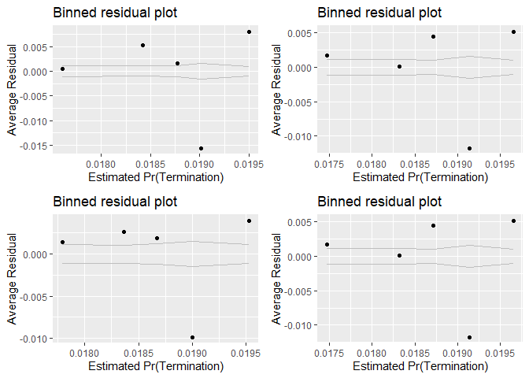<!-- -->

```
## [[1]]
##        model deviance null.deviance difference
## 1 model1_old 46382.29      46388.62   6.323854
## 2 model1_new 46380.11      46388.62   8.503541
## 3 model2_old 46383.29      46388.62   5.320864
## 4 model2_new 46380.11      46388.62   8.503541
```

Both average salary and invoiced rate have a VI well within bounds, suggesting that the variance of the estimated coefficients is not evidently inflated and none of them are highly correlated with each other. 

Both individually and pair-wise, higher average salary and invoiced rate estimate higher possibility of cost ceiling breaches and lower likelihood of exercised options as expected. But the termination expectation is not not significant at the 0.05 level for either for two measures of service complexity resepctively when considered together.


## Office Capacity

### 02A: Performance Based Services
Expectation: Performance-based services contracting ties a portion of a contractor's payment, contract extensions, or contract renewals to the achievement of specific, measurable performance standards and requirements, which encourages better contracting results. PBSC has the potential to reduce terminations and ceiling breaches and bring more possibility of exercised options.


```r
summary_continuous_plot(serv_smp1m,"pPBSC")
```

<!-- -->

```r
summary_continuous_plot(serv_smp1m,"pPBSC",log=TRUE)
```

```
## Warning: Transformation introduced infinite values in continuous x-axis
```

```
## Warning: Removed 63536 rows containing non-finite values (stat_bin).
```

```
## Warning: Transformation introduced infinite values in continuous x-axis
```

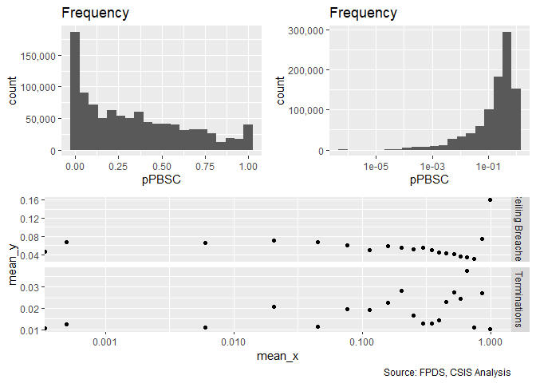<!-- -->

```r
#Model
Term_02A <- glm (data=serv_smp,
                 b_Term ~ cp_OffPerf7, family=binomial(link="logit"))

stargazer::stargazer(Term_01C,
                       Term_02A,
                       
                       type="text",
                       digits=2)
```

```
## 
## ==============================================
##                       Dependent variable:     
##                   ----------------------------
##                              b_Term           
##                        (1)            (2)     
## ----------------------------------------------
## cln_US6sal            0.06*                   
##                       (0.03)                  
##                                               
## cln_PSCrate            0.05                   
##                       (0.03)                  
##                                               
## cp_OffPerf7                         0.20***   
##                                     (0.03)    
##                                               
## Constant             -3.96***      -3.97***   
##                       (0.01)        (0.01)    
##                                               
## ----------------------------------------------
## Observations         250,000        250,000   
## Log Likelihood      -23,190.06    -23,171.58  
## Akaike Inf. Crit.   46,386.11      46,347.17  
## ==============================================
## Note:              *p<0.1; **p<0.05; ***p<0.01
```

```r
  summary_residual_compare(Term_02A,skip_vif=TRUE,bins=20)
```

```
## Warning in residuals_binned(model1_old, bins = bins): Always uses Xlb
## Estimated Pr(Termination), should update.
```

```
## Warning in if (class(model1_old) %in% c("glmerMod", "lme4", "lmerMod")) {:
## the condition has length > 1 and only the first element will be used
```

```
## Warning in if (!class(model1_old) %in% c("glmerMod", "lme4", "lmerMod") & :
## the condition has length > 1 and only the first element will be used
```

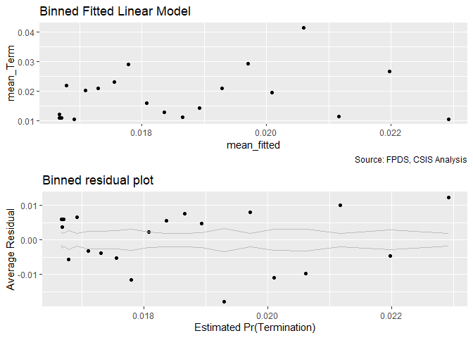<!-- -->

```
## [[1]]
##        model deviance null.deviance difference
## 1 model1_old 46343.17      46388.62   45.44842
```

When considering PBSC alone, the expected sign was not found in terminations.


### 02B: No.Office PSC History
Expectation: The increasing share of contracting office obligations for a given service indicates high capcaity in that area, lower likelihood of cost ceiling breaches and termination and higher likelihood of exercised options are expected to be observed.


```r
summary_continuous_plot(serv_smp1m,"pOffPSC")
```

<!-- -->

```r
summary_continuous_plot(serv_smp1m,"pOffPSC",log=TRUE)
```

```
## Warning: Transformation introduced infinite values in continuous x-axis
```

```
## Warning: Removed 99679 rows containing non-finite values (stat_bin).
```

```
## Warning: Transformation introduced infinite values in continuous x-axis
```

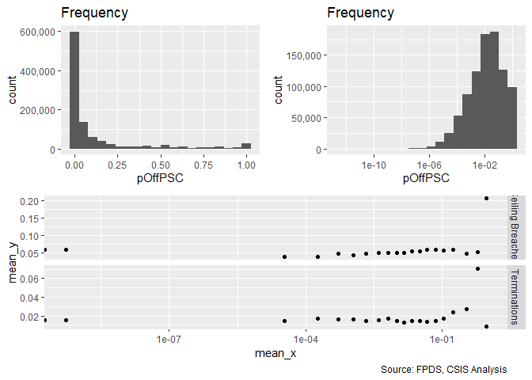<!-- -->

```r
#Model
Term_02B <- glm (data=serv_smp,
                 b_Term ~ cp_OffPSC7, family=binomial(link="logit"))

stargazer::stargazer(Term_01C,
                       Term_02A,Term_02B,
                       
                       type="text",
                       digits=2)
```

```
## 
## ==================================================
##                         Dependent variable:       
##                   --------------------------------
##                                b_Term             
##                      (1)        (2)        (3)    
## --------------------------------------------------
## cln_US6sal          0.06*                         
##                     (0.03)                        
##                                                   
## cln_PSCrate          0.05                         
##                     (0.03)                        
##                                                   
## cp_OffPerf7                   0.20***             
##                                (0.03)             
##                                                   
## cp_OffPSC7                               0.45***  
##                                           (0.02)  
##                                                   
## Constant           -3.96***   -3.97***   -3.98*** 
##                     (0.01)     (0.01)     (0.02)  
##                                                   
## --------------------------------------------------
## Observations       250,000    250,000    250,000  
## Log Likelihood    -23,190.06 -23,171.58 -23,048.00
## Akaike Inf. Crit. 46,386.11  46,347.17  46,100.00 
## ==================================================
## Note:                  *p<0.1; **p<0.05; ***p<0.01
```

```r
summary_residual_compare(Term_02B, skip_vif = TRUE)
```

```
## Warning in residuals_binned(model1_old, bins = bins): Always uses Xlb
## Estimated Pr(Termination), should update.
```

```
## Warning in if (class(model1_old) %in% c("glmerMod", "lme4", "lmerMod")) {:
## the condition has length > 1 and only the first element will be used
```

```
## Warning in if (!class(model1_old) %in% c("glmerMod", "lme4", "lmerMod") & :
## the condition has length > 1 and only the first element will be used
```

<!-- -->

```
## [[1]]
##        model deviance null.deviance difference
## 1 model1_old    46096      46388.62   292.6137
```

Expections were not upheldfor terminations When considering number of contracting office obligations for a given service alone.


### 02C: Office Capacity
Expectation: Collaberactively, the larger share of PBSC and contracting office obligations for a given service, the less risk of ceiling breaches and terminations and the more exercised options there would be. Also we expect the results of combined model would be the same as two individual models above. 


```r
#Model
Term_02C <- glm (data=serv_smp,
                 b_Term ~ cp_OffPerf7+cp_OffPSC7, family=binomial(link="logit"))

glmer_examine(Term_02C)
```

```
## cp_OffPerf7  cp_OffPSC7 
##    1.230466    1.230466
```

```r
stargazer::stargazer(
                       Term_01C,Term_02A,Term_02B,Term_02C,
                       
                       type="text",
                       digits=2)
```

```
## 
## =============================================================
##                               Dependent variable:            
##                   -------------------------------------------
##                                     b_Term                   
##                      (1)        (2)        (3)        (4)    
## -------------------------------------------------------------
## cln_US6sal          0.06*                                    
##                     (0.03)                                   
##                                                              
## cln_PSCrate          0.05                                    
##                     (0.03)                                   
##                                                              
## cp_OffPerf7                   0.20***                -0.002  
##                                (0.03)                (0.03)  
##                                                              
## cp_OffPSC7                               0.45***    0.45***  
##                                           (0.02)     (0.03)  
##                                                              
## Constant           -3.96***   -3.97***   -3.98***   -3.98*** 
##                     (0.01)     (0.01)     (0.02)     (0.02)  
##                                                              
## -------------------------------------------------------------
## Observations       250,000    250,000    250,000    250,000  
## Log Likelihood    -23,190.06 -23,171.58 -23,048.00 -23,048.00
## Akaike Inf. Crit. 46,386.11  46,347.17  46,100.00  46,102.00 
## =============================================================
## Note:                             *p<0.1; **p<0.05; ***p<0.01
```

```r
summary_residual_compare(Term_02A,Term_02C,Term_02B,Term_02C)
```

<!-- -->

```
## Warning in residuals_binned(model1_old, bins = bins): Always uses Xlb
## Estimated Pr(Termination), should update.
```

```
## Warning in residuals_binned(model1_new, bins = bins): Always uses Xlb
## Estimated Pr(Termination), should update.
```

```
## Warning in residuals_binned(model2_old, bins = bins): Always uses Xlb
## Estimated Pr(Termination), should update.
```

```
## Warning in residuals_binned(model2_new, bins = bins): Always uses Xlb
## Estimated Pr(Termination), should update.
```

```
## Warning in if (class(model1_new) %in% c("glmerMod", "lme4", "lmerMod") & :
## the condition has length > 1 and only the first element will be used
```

```
## Warning in if ((!class(model1_new) %in% c("glmerMod", "lme4", "lmerMod")
## & : the condition has length > 1 and only the first element will be used
```

<!-- -->

```
## [[1]]
##        model deviance null.deviance difference
## 1 model1_old 46343.17      46388.62   45.44842
## 2 model1_new 46096.00      46388.62  292.61777
## 3 model2_old 46096.00      46388.62  292.61371
## 4 model2_new 46096.00      46388.62  292.61777
```

No high correlation is observed between PBSC and Contract Office Obligations for PSC based on the vif score.

After combining PBSC and Contract office obligations for PSC, PBSC lost significance for terminations. Contract office obligations for PSC is associate with more exercised options. PBSC is now has the expected sign but pOffPSC does not.


### 02D: Cumulative  Model
Expectation: When all the four variables are combined into one model, same expectations are applied as individual ones. Per service complexity indicator increases, higher risk of ceiling breaches and terminations and less exercised options expected. Per office capacity indicator increases, lower risk of ceiling breaches and terminations and more exercised options expected.


```r
#Model
Term_02D <- glm (data=serv_smp,
                 b_Term ~ cln_US6sal + cln_PSCrate+cp_OffPerf7+cp_OffPSC7, family=binomial(link="logit"))

glmer_examine(Term_02D)
```

```
##  cln_US6sal cln_PSCrate cp_OffPerf7  cp_OffPSC7 
##    1.204996    1.166322    1.242300    1.244321
```

```r
stargazer::stargazer(
                       Term_01C,Term_02C,Term_02D,
                       
                       type="text",
                       digits=2)
```

```
## 
## ==================================================
##                         Dependent variable:       
##                   --------------------------------
##                                b_Term             
##                      (1)        (2)        (3)    
## --------------------------------------------------
## cln_US6sal          0.06*                 -0.03   
##                     (0.03)                (0.03)  
##                                                   
## cln_PSCrate          0.05                 0.06*   
##                     (0.03)                (0.03)  
##                                                   
## cp_OffPerf7                    -0.002     -0.004  
##                                (0.03)     (0.03)  
##                                                   
## cp_OffPSC7                    0.45***    0.45***  
##                                (0.03)     (0.03)  
##                                                   
## Constant           -3.96***   -3.98***   -3.98*** 
##                     (0.01)     (0.02)     (0.02)  
##                                                   
## --------------------------------------------------
## Observations       250,000    250,000    250,000  
## Log Likelihood    -23,190.06 -23,048.00 -23,046.13
## Akaike Inf. Crit. 46,386.11  46,102.00  46,102.26 
## ==================================================
## Note:                  *p<0.1; **p<0.05; ***p<0.01
```

```r
summary_residual_compare(Term_01C,Term_02D)
```

<!-- -->

```
## Warning in residuals_binned(model1_old, bins = bins): Always uses Xlb
## Estimated Pr(Termination), should update.
```

```
## Warning in residuals_binned(model1_new, bins = bins): Always uses Xlb
## Estimated Pr(Termination), should update.
```

```
## Warning in if (class(model1_new) %in% c("glmerMod", "lme4", "lmerMod")) {:
## the condition has length > 1 and only the first element will be used
```

```
## Warning in if (!class(model1_new) %in% c("glmerMod", "lme4", "lmerMod") & :
## the condition has length > 1 and only the first element will be used
```

<!-- -->

```
## [[1]]
##        model deviance null.deviance difference
## 1 model1_old 46380.11      46388.62   8.503541
## 2 model1_new 46092.26      46388.62 296.356786
```

No high correlation is observed among all of the 4 predictors (average salary, invoiced rate, PBSC and Contract Office Obligations for PSC) so far based on the vif score. When all measures for sevice complexity and office capacity are combined, per dependent variable:

Terminations: Average Salary swaps signs, counter to expectations, and becomes less significant. CFTE becomes signifianct at the .10 level.  pPBSC and pOFfPSC are largely unchanged from the prior model.


## Office-Vendor Relationship

### 03A: Pair History
Expactation: The number of past years of the relationship between the contracting office or the contractors with a single transaction in a given fiscal year enough to qualify, namely, pair history increases (decreases), the likelihood of cost ceiling breaches and terminations decreases (increases) and the exercised options increase (decrease) for that partnership.


```r
summary_discrete_plot(serv_smp,"office_entity_paircount_7year")
```

```
## Warning: Ignoring unknown parameters: binwidth, bins, pad
```

```
## Warning: group_by_() is deprecated. 
## Please use group_by() instead
## 
## The 'programming' vignette or the tidyeval book can help you
## to program with group_by() : https://tidyeval.tidyverse.org
## This warning is displayed once per session.
```

<!-- -->

```
## [[1]]
## 
##     0     1     2     3     4     5     6     7 
## 39242 30467 28241 29493 32797 27439 21560 40761 
## 
## [[2]]
##    
##      None Ceiling Breach
##   0 36849           2393
##   1 28665           1802
##   2 26607           1634
##   3 27643           1850
##   4 30754           2043
##   5 25732           1707
##   6 20305           1255
##   7 38730           2031
## 
## [[3]]
##    
##         0     1
##   0 38153  1089
##   1 30053   414
##   2 27890   351
##   3 29134   359
##   4 32221   576
##   5 26736   703
##   6 21109   451
##   7 40039   722
```

```r
#Model
Term_03A <- glm (data=serv_smp,
                 b_Term ~ cn_PairHist7, family=binomial(link="logit"))


  stargazer::stargazer(Term_02D,
                       Term_03A,
                       
                       type="text",
                       digits=2)
```

```
## 
## ==============================================
##                       Dependent variable:     
##                   ----------------------------
##                              b_Term           
##                        (1)            (2)     
## ----------------------------------------------
## cln_US6sal            -0.03                   
##                       (0.03)                  
##                                               
## cln_PSCrate           0.06*                   
##                       (0.03)                  
##                                               
## cp_OffPerf7           -0.004                  
##                       (0.03)                  
##                                               
## cp_OffPSC7           0.45***                  
##                       (0.03)                  
##                                               
## cn_PairHist7                         -0.05    
##                                     (0.03)    
##                                               
## Constant             -3.98***      -3.96***   
##                       (0.02)        (0.01)    
##                                               
## ----------------------------------------------
## Observations         250,000        250,000   
## Log Likelihood      -23,046.13    -23,193.15  
## Akaike Inf. Crit.   46,102.26      46,390.30  
## ==============================================
## Note:              *p<0.1; **p<0.05; ***p<0.01
```

```r
summary_residual_compare(Term_03A, skip_vif = TRUE)
```

```
## Warning in residuals_binned(model1_old, bins = bins): Always uses Xlb
## Estimated Pr(Termination), should update.
```

```
## Warning in if (class(model1_old) %in% c("glmerMod", "lme4", "lmerMod")) {:
## the condition has length > 1 and only the first element will be used
```

```
## Warning in if (!class(model1_old) %in% c("glmerMod", "lme4", "lmerMod") & :
## the condition has length > 1 and only the first element will be used
```

<!-- -->

```
## [[1]]
##        model deviance null.deviance difference
## 1 model1_old  46386.3      46388.62   2.317546
```

When considering pair history alone, expectations were met for terminations., though the results were not significant.

### 03B: Interaction
Expectation: As the number of contract actions a vendor has performed for an office in the past year increases (decreases), the likelihood of cost ceiling breaches and terminations decreases (increases) and that of exercised options increases (decreases) for that partnership.


```r
summary_continuous_plot(serv_smp1m,"office_entity_numberofactions_1year")
```

<!-- -->

```r
summary_continuous_plot(serv_smp1m,"office_entity_numberofactions_1year", log=TRUE)
```

```
## Warning: Transformation introduced infinite values in continuous x-axis
```

```
## Warning: Removed 1559 rows containing non-finite values (stat_bin).
```

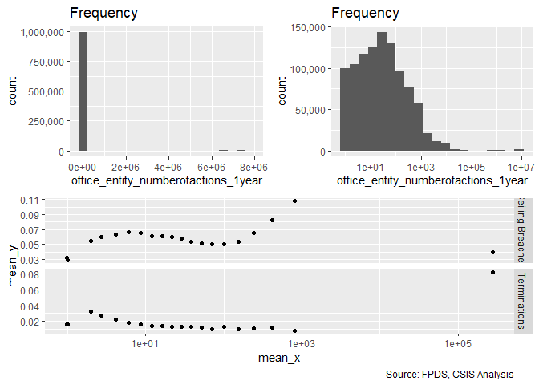<!-- -->

```r
#Model
Term_03B <- glm (data=serv_smp,
                 b_Term ~ cln_PairCA, family=binomial(link="logit"))

stargazer::stargazer(   Term_02D,Term_03A,Term_03B,
                       type="text",
                       digits=2)
```

```
## 
## ==================================================
##                         Dependent variable:       
##                   --------------------------------
##                                b_Term             
##                      (1)        (2)        (3)    
## --------------------------------------------------
## cln_US6sal          -0.03                         
##                     (0.03)                        
##                                                   
## cln_PSCrate         0.06*                         
##                     (0.03)                        
##                                                   
## cp_OffPerf7         -0.004                        
##                     (0.03)                        
##                                                   
## cp_OffPSC7         0.45***                        
##                     (0.03)                        
##                                                   
## cn_PairHist7                   -0.05              
##                                (0.03)             
##                                                   
## cln_PairCA                               0.36***  
##                                           (0.03)  
##                                                   
## Constant           -3.98***   -3.96***   -3.97*** 
##                     (0.02)     (0.01)     (0.01)  
##                                                   
## --------------------------------------------------
## Observations       250,000    250,000    250,000  
## Log Likelihood    -23,046.13 -23,193.15 -23,112.98
## Akaike Inf. Crit. 46,102.26  46,390.30  46,229.96 
## ==================================================
## Note:                  *p<0.1; **p<0.05; ***p<0.01
```

```r
summary_residual_compare(Term_03B, skip_vif = TRUE)
```

```
## Warning in residuals_binned(model1_old, bins = bins): Always uses Xlb
## Estimated Pr(Termination), should update.
```

```
## Warning in if (class(model1_old) %in% c("glmerMod", "lme4", "lmerMod")) {:
## the condition has length > 1 and only the first element will be used
```

```
## Warning in if (!class(model1_old) %in% c("glmerMod", "lme4", "lmerMod") & :
## the condition has length > 1 and only the first element will be used
```

<!-- -->

```
## [[1]]
##        model deviance null.deviance difference
## 1 model1_old 46225.96      46388.62   162.6512
```

Expectation were not met, The patterns in the plots are complex, terminations has an negative relationship, until the number of ations grows extreme at which point the risk jumps up.

### 03C: Office-Vendor Relationship
Expectation: 
The importance of partnership, trust, and handling difficult problems and uncertainty together naturally lead into the last characteristic: the relationship between the contractor and buyer. The higher level of interaction provides the more opportunity to build a deeper relationship, the likelihood of cost ceiling breaches and terminations decreases and the exercised options increase for that partnership. Also we expect the result of combined model would be the same as individual models above.


```r
#Model
Term_03C <- glm (data=serv_smp,
                 b_Term ~ cn_PairHist7+cln_PairCA, family=binomial(link="logit"))

glmer_examine(Term_03C)
```

```
## cn_PairHist7   cln_PairCA 
##     1.196618     1.196618
```

```r
  stargazer::stargazer(Term_02D,
                       Term_03A,Term_03B,Term_03C,
                       
                       type="text",
                       digits=2)
```

```
## 
## =============================================================
##                               Dependent variable:            
##                   -------------------------------------------
##                                     b_Term                   
##                      (1)        (2)        (3)        (4)    
## -------------------------------------------------------------
## cln_US6sal          -0.03                                    
##                     (0.03)                                   
##                                                              
## cln_PSCrate         0.06*                                    
##                     (0.03)                                   
##                                                              
## cp_OffPerf7         -0.004                                   
##                     (0.03)                                   
##                                                              
## cp_OffPSC7         0.45***                                   
##                     (0.03)                                   
##                                                              
## cn_PairHist7                   -0.05                -0.24*** 
##                                (0.03)                (0.03)  
##                                                              
## cln_PairCA                               0.36***    0.45***  
##                                           (0.03)     (0.03)  
##                                                              
## Constant           -3.98***   -3.96***   -3.97***   -3.98*** 
##                     (0.02)     (0.01)     (0.01)     (0.02)  
##                                                              
## -------------------------------------------------------------
## Observations       250,000    250,000    250,000    250,000  
## Log Likelihood    -23,046.13 -23,193.15 -23,112.98 -23,086.75
## Akaike Inf. Crit. 46,102.26  46,390.30  46,229.96  46,179.51 
## =============================================================
## Note:                             *p<0.1; **p<0.05; ***p<0.01
```

```r
summary_residual_compare(Term_03A,Term_03C,Term_03B,Term_03C)
```

<!-- -->

```
## Warning in residuals_binned(model1_old, bins = bins): Always uses Xlb
## Estimated Pr(Termination), should update.
```

```
## Warning in residuals_binned(model1_new, bins = bins): Always uses Xlb
## Estimated Pr(Termination), should update.
```

```
## Warning in residuals_binned(model2_old, bins = bins): Always uses Xlb
## Estimated Pr(Termination), should update.
```

```
## Warning in residuals_binned(model2_new, bins = bins): Always uses Xlb
## Estimated Pr(Termination), should update.
```

```
## Warning in if (class(model1_new) %in% c("glmerMod", "lme4", "lmerMod") & :
## the condition has length > 1 and only the first element will be used
```

```
## Warning in if ((!class(model1_new) %in% c("glmerMod", "lme4", "lmerMod")
## & : the condition has length > 1 and only the first element will be used
```

<!-- -->

```
## [[1]]
##        model deviance null.deviance difference
## 1 model1_old 46386.30      46388.62   2.317546
## 2 model1_new 46173.51      46388.62 215.106595
## 3 model2_old 46225.96      46388.62 162.651178
## 4 model2_new 46173.51      46388.62 215.106595
```

When combining pair history and contract actions, magnitude of relationships with dependent variables incraesed and pairhistory is now significant in the expected direction while pair contract actions remains contrary to expectations.


### 03D: Cumulative  Model

Expectation: Under each subgroup, the predictors are expected to have similar impacts on dependent variables individually and cumulatively:
1. Higher Services Complexity: Higher likelihood of cost ceiling breaches and terminations; Less exercised options
2. Larger Office Capacity: Lower likelihood of cost ceiling breaches and terminations; More exercised options
3. Deeper Office-Vendor Relationship: Lower likelihood of cost ceiling breaches and terminations; More exercised options


```r
#Model
Term_03D <- glm (data=serv_smp,
                 b_Term ~ cln_US6sal + 
                   cln_PSCrate+ cp_OffPerf7+cp_OffPSC7+
                   cn_PairHist7+cln_PairCA, family=binomial(link="logit"))

glmer_examine(Term_03D)
```

```
##   cln_US6sal  cln_PSCrate  cp_OffPerf7   cp_OffPSC7 cn_PairHist7 
##     1.249462     1.182577     1.285489     1.413705     1.227524 
##   cln_PairCA 
##     1.487997
```

```r
stargazer::stargazer(
                       Term_02D,Term_03C,Term_03D,
                       
                       type="text",
                       digits=2)
```

```
## 
## ==================================================
##                         Dependent variable:       
##                   --------------------------------
##                                b_Term             
##                      (1)        (2)        (3)    
## --------------------------------------------------
## cln_US6sal          -0.03                 -0.06*  
##                     (0.03)                (0.03)  
##                                                   
## cln_PSCrate         0.06*                0.10***  
##                     (0.03)                (0.03)  
##                                                   
## cp_OffPerf7         -0.004                -0.003  
##                     (0.03)                (0.03)  
##                                                   
## cp_OffPSC7         0.45***               0.37***  
##                     (0.03)                (0.03)  
##                                                   
## cn_PairHist7                  -0.24***   -0.23*** 
##                                (0.03)     (0.03)  
##                                                   
## cln_PairCA                    0.45***    0.31***  
##                                (0.03)     (0.03)  
##                                                   
## Constant           -3.98***   -3.98***   -3.99*** 
##                     (0.02)     (0.02)     (0.02)  
##                                                   
## --------------------------------------------------
## Observations       250,000    250,000    250,000  
## Log Likelihood    -23,046.13 -23,086.75 -22,997.20
## Akaike Inf. Crit. 46,102.26  46,179.51  46,008.41 
## ==================================================
## Note:                  *p<0.1; **p<0.05; ***p<0.01
```

```r
summary_residual_compare(Term_02D,Term_03D)
```

<!-- -->

```
## Warning in residuals_binned(model1_old, bins = bins): Always uses Xlb
## Estimated Pr(Termination), should update.
```

```
## Warning in residuals_binned(model1_new, bins = bins): Always uses Xlb
## Estimated Pr(Termination), should update.
```

```
## Warning in if (class(model1_new) %in% c("glmerMod", "lme4", "lmerMod")) {:
## the condition has length > 1 and only the first element will be used
```

```
## Warning in if (!class(model1_new) %in% c("glmerMod", "lme4", "lmerMod") & :
## the condition has length > 1 and only the first element will be used
```

<!-- -->

```
## [[1]]
##        model deviance null.deviance difference
## 1 model1_old 46092.26      46388.62   296.3568
## 2 model1_new 45994.41      46388.62   394.2094
```

None of the predictors has high level of correlation (vif over 1.7) with each other. 
In the cumulative model, per dependent variable and independent variable:

2. Terminations:
   A. Service Complexity:
      Average salary did not match with expectation, but gained signifiance at the 0.10 level
      The result for invoice rate did matach with expectation and is now significant at 0.01 level
      Otherwise magnitudes reduced but no changes of note.
      
      

## Study Variables Alone


```r
study_coef_list<-
  list("(Intercept)"="(Intercept)",
       "cln_US6sal"="Log(Det. Ind. Salary)",
       "cln_PSCrate"="Log(Service Invoice Rate)",
       "cp_OffPerf7"="Office Perf.-Based %",
       "cp_OffPSC7"="Office Service Exp. %",
       "cn_PairHist7"="Paired Years",
       "cln_PairCA"="Log(Paired Actions)"
  )


all_coef_list<-
  list("(Intercept)"="(Intercept)",
       "cln_US6sal"="Log(Det. Ind. Salary)",
       "cln_PSCrate"="Log(Service Invoice Rate)",
       "cp_OffPerf7"="Office Perf.-Based %",
       "cp_OffPSC7"="Office Service Exp. %",
       "cn_PairHist7"="Paired Years",
       "cln_PairCA"="Log(Paired Actions)",
       
       #Contract Controls
       
       "Comp1 offer"="Comp=1 offer",
       "Comp2-4 offers"="Comp=2-4 offers",
       "Comp5+ offers"="Comp=5+ offers",
       
       "CompOffr1 offer"="Comp=1 offer",
       "CompOffr2 offers"="Comp=2 offers",
       "CompOffr3-4 offers"="Comp=3-4 offers",
       "CompOffr5+ offers"="Comp=5+ offers",
       
       "cl_Ceil"="Log(Init. Ceiling)",
       "cln_Days"="Log(Init. Days)",
       "VehS-IDC"="Vehicle=S-IDC",
       "VehM-IDC"="Vehicle=M-IDC",
       "VehFSS/GWAC"="Vehicle=FSS/GWAC",
       "VehBPA/BOA"="Vehicle=BPA/BOA",
       "PricingFFP"="Pricing=FFP",
       "PricingOther FP"="Pricing=Other FP",
       "PricingIncentive"="Pricing=Incentive Fee",
       "PricingCombination or Other"="Pricing=Combination or Other",
       "PricingOther CB"="Pricing=Other CB",
       "PricingT&M/LH/FPLOE"="Pricing=T&M/LH/FP:LoE",
       "PricingUCA"="Pricing=UCA",
       
       "PricingFeeOther FP"="Pricing=Other FP",
       "PricingFeeIncentive"="Pricing=Incentive Fee",
       "PricingFeeCombination or Other"="Pricing=Combination or Other",
       "PricingFeeOther CB"="Pricing=Other CB",
       "PricingFeeT&M/LH/FPLOE"="Pricing=T&M/LH/FP:LoE",
       "b_UCA"="UCA",
       "CrisisARRA"="Crisis=ARRA",
       "CrisisDis"="Crisis=Disaster",
       "CrisisOCO"="Crisis=OCO",
       "b_Intl"="Performed Abroad",
       
       #NAICS6
       "cln_Def3HHI"="Log(Subsector HHI)",
       "cln_Def6HHI"="Log(Det. Ind. HHI)",
       "clr_Def3toUS"="Log(Subsector Ratio)",
       "cln_Def6Obl"="Log(Det. Ind. DoD Obl.)",
       "clr_Def6toUS"="Log(Det. Ind. Ratio)",
       #Office
       "cp_PairObl7"="Percent Market",
       "cln_OffObl7"="Office Volume",
       "cln_OffFocus"="Office Concentration",
       
       
       #interations
       # # "cln_Def6HHI:cln_Days"="Log(Det. Ind. HHI):Log(Init. Days)",
       # "cln_Def6HHI:cln_Def6Obl"="Log(Det. Ind. HHI):Log(Det. Ind. DoD Obl.)",
       # # "cln_Def3HHI:clr_Def3toUS"="Log(Subsector HHI):Log(Subsector Ratio)"),
       "cln_Def6HHI:b_UCA"="Log(Det. Ind. HHI):UCA",
       # "cl_Ceil:b_UCA"="Log(Init. Ceiling):UCA",
       # "CompOffr1 offer:b_UCA"="Comp=1 offer:UCA",
       # "CompOffr2 offers:b_UCA"="Comp=2 offers:UCA",
       # "CompOffr3-4 offers:b_UCA"="Comp=3-4 offers:UCA",
       # "CompOffr5+ offers:b_UCA"="Comp=5+ offers:UCA"
       "VehS-IDC:b_Intl"="Vehicle=S-IDC:Performed Abroad",
       "VehM-IDC:b_Intl"="Vehicle=M-IDC:Performed Abroad",
       "VehFSS/GWAC:b_Intl"="Vehicle=FSS/GWAC:Performed Abroad",
       "VehBPA/BOA:b_Intl"="Vehicle=BPA/BOA:Performed Abroad",
       "cl_US6_avg_sal_lag1:PricingFeeOther FP"=
         "Pricing=Other FP:Log(Det. Ind. U.S. Avg. Salary)",
       "cl_US6_avg_sal_lag1:PricingFeeIncentive"=
         "Pricing=Incentive Fee:Log(Det. Ind. U.S. Avg. Salary)",
       "cl_US6_avg_sal_lag1:PricingFeeCombination or Other"=
         "Pricing=Comb./or Other:Log(Det. Ind. U.S. Avg. Salary)",
       "cl_US6_avg_sal_lag1:PricingFeeOther CB"="Pricing=Other CB:Log(Det. Ind. U.S. Avg. Salary)",
       "cl_US6_avg_sal_lag1:PricingFeeT&M/LH/FPLOE"="Pricing=T&M/LH/FP:LoE:Log(Det. Ind. U.S. Avg. Salary)"
  )


#Terminations
stargazer::stargazer(Term_01A,Term_01B,Term_02A,Term_02B,Term_03A,Term_03B,Term_03D,
                     type="text",
                     digits=2)
```

```
## 
## ==============================================================================================
##                                               Dependent variable:                             
##                   ----------------------------------------------------------------------------
##                                                      b_Term                                   
##                      (1)        (2)        (3)        (4)        (5)        (6)        (7)    
## ----------------------------------------------------------------------------------------------
## cln_US6sal          0.08**                                                            -0.06*  
##                     (0.03)                                                            (0.03)  
##                                                                                               
## cln_PSCrate                    0.07**                                                0.10***  
##                                (0.03)                                                 (0.03)  
##                                                                                               
## cp_OffPerf7                              0.20***                                      -0.003  
##                                           (0.03)                                      (0.03)  
##                                                                                               
## cp_OffPSC7                                          0.45***                          0.37***  
##                                                      (0.02)                           (0.03)  
##                                                                                               
## cn_PairHist7                                                    -0.05                -0.23*** 
##                                                                 (0.03)                (0.03)  
##                                                                                               
## cln_PairCA                                                                0.36***    0.31***  
##                                                                            (0.03)     (0.03)  
##                                                                                               
## Constant           -3.96***   -3.96***   -3.97***   -3.98***   -3.96***   -3.97***   -3.99*** 
##                     (0.01)     (0.01)     (0.01)     (0.02)     (0.01)     (0.01)     (0.02)  
##                                                                                               
## ----------------------------------------------------------------------------------------------
## Observations       250,000    250,000    250,000    250,000    250,000    250,000    250,000  
## Log Likelihood    -23,191.15 -23,191.65 -23,171.58 -23,048.00 -23,193.15 -23,112.98 -22,997.20
## Akaike Inf. Crit. 46,386.29  46,387.29  46,347.17  46,100.00  46,390.30  46,229.96  46,008.41 
## ==============================================================================================
## Note:                                                              *p<0.1; **p<0.05; ***p<0.01
```

```r
texreg::htmlreg(list(Term_01A,Term_01B,Term_02A,Term_02B,Term_03A,Term_03B,Term_03D),
                file="..//Output//Term_Model.html",
                single.row = TRUE,
                # custom.model.name=c("Ceiling Breaches"),
                stars=c(0.1,0.05,0.01,0.001),
                groups = list(
                  "Services Complexity" = 2:3,
                  "Office Capacity" =4:5,
                  "Past Relationship"=6:7
                ),
                custom.coef.map=all_coef_list,
                bold=0.05,
                custom.note="%stars. Numerical inputs are rescaled.",
                caption="Table 7: Logit Bivariate Look at Study Variables and Terminations",
                caption.above=TRUE)
```

```
## The table was written to the file '..//Output//Term_Model.html'.
```

# Controls

##Contract-Level Controls
###Scope Variables
#### 04A: Cost Ceiling

Expectation: Initial Ceiling size positively estimates increasing probability of ceiling breaches and terminations and negatively estimates the option growth. Terminations and ceiling breaches simply comes down to large being associated with higher risk, while for option growth size imply makes it harder to grow proportionally.


```r
summary_continuous_plot(serv_smp1m,"UnmodifiedCeiling_OMB20_GDP18")
```

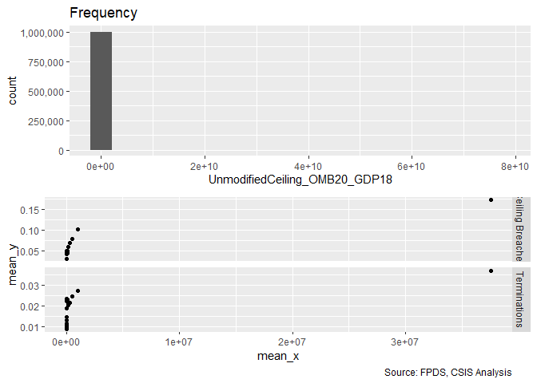<!-- -->

```r
summary_continuous_plot(serv_smp1m,"UnmodifiedCeiling_OMB20_GDP18", log=TRUE)
```

<!-- -->

```r
#Frequency Plot for unlogged ceiling
summary_continuous_plot(serv_smp1m,"UnmodifiedCeiling_OMB20_GDP18",bins=1000)
```

<!-- -->

```r
summary_continuous_plot(serv_smp1m,"UnmodifiedCeiling_OMB20_GDP18",bins=50,log=TRUE)
```

<!-- -->

```r
#Model
Term_04A <- glm (data=serv_smp,
                 b_Term ~ cl_Ceil, family=binomial(link="logit"))

stargazer::stargazer(
                       Term_03D,Term_04A,
                       type="text",
                       digits=2)
```

```
## 
## ==============================================
##                       Dependent variable:     
##                   ----------------------------
##                              b_Term           
##                        (1)            (2)     
## ----------------------------------------------
## cln_US6sal            -0.06*                  
##                       (0.03)                  
##                                               
## cln_PSCrate          0.10***                  
##                       (0.03)                  
##                                               
## cp_OffPerf7           -0.003                  
##                       (0.03)                  
##                                               
## cp_OffPSC7           0.37***                  
##                       (0.03)                  
##                                               
## cn_PairHist7         -0.23***                 
##                       (0.03)                  
##                                               
## cln_PairCA           0.31***                  
##                       (0.03)                  
##                                               
## cl_Ceil                             0.79***   
##                                     (0.03)    
##                                               
## Constant             -3.99***      -4.05***   
##                       (0.02)        (0.02)    
##                                               
## ----------------------------------------------
## Observations         250,000        250,000   
## Log Likelihood      -22,997.20    -22,839.67  
## Akaike Inf. Crit.   46,008.41      45,683.33  
## ==============================================
## Note:              *p<0.1; **p<0.05; ***p<0.01
```

```r
summary_residual_compare(Term_04A, skip_vif = TRUE)
```

```
## Warning in residuals_binned(model1_old, bins = bins): Always uses Xlb
## Estimated Pr(Termination), should update.
```

```
## Warning in if (class(model1_old) %in% c("glmerMod", "lme4", "lmerMod")) {:
## the condition has length > 1 and only the first element will be used
```

```
## Warning in if (!class(model1_old) %in% c("glmerMod", "lme4", "lmerMod") & :
## the condition has length > 1 and only the first element will be used
```

<!-- -->

```
## [[1]]
##        model deviance null.deviance difference
## 1 model1_old 45679.33      46388.62   709.2819
```

Contract ceiling has a significant relationship, high magnitude, in line with expectations, though with a bit of a sinsodial pattern in the residuals..

#### 04B: Maximum Duration

Expectation: Greater maximum duration will positively estimate the probability ceiling of  breaches and terminations. Greater growth for options is also expected, because year-on-year options may be more of a default, though the scatter plot seems to go the other way.


```r
#Frequency Plot for max duration
summary_continuous_plot(serv_smp1m,"UnmodifiedDays")
```

<!-- -->

```r
summary_continuous_plot(serv_smp1m,"UnmodifiedDays",log=TRUE)
```

<!-- -->

```r
#Model
Term_04B <- glm (data=serv_smp,
                 b_Term ~ cln_Days, family=binomial(link="logit"))

stargazer::stargazer(
                       Term_03D,Term_04A,Term_04B,
                       
                       type="text",
                       digits=2)
```

```
## 
## ==================================================
##                         Dependent variable:       
##                   --------------------------------
##                                b_Term             
##                      (1)        (2)        (3)    
## --------------------------------------------------
## cln_US6sal          -0.06*                        
##                     (0.03)                        
##                                                   
## cln_PSCrate        0.10***                        
##                     (0.03)                        
##                                                   
## cp_OffPerf7         -0.003                        
##                     (0.03)                        
##                                                   
## cp_OffPSC7         0.37***                        
##                     (0.03)                        
##                                                   
## cn_PairHist7       -0.23***                       
##                     (0.03)                        
##                                                   
## cln_PairCA         0.31***                        
##                     (0.03)                        
##                                                   
## cl_Ceil                       0.79***             
##                                (0.03)             
##                                                   
## cln_Days                                 1.35***  
##                                           (0.04)  
##                                                   
## Constant           -3.99***   -4.05***   -4.14*** 
##                     (0.02)     (0.02)     (0.02)  
##                                                   
## --------------------------------------------------
## Observations       250,000    250,000    250,000  
## Log Likelihood    -22,997.20 -22,839.67 -22,492.50
## Akaike Inf. Crit. 46,008.41  45,683.33  44,988.99 
## ==================================================
## Note:                  *p<0.1; **p<0.05; ***p<0.01
```

```r
summary_residual_compare(Term_04B, skip_vif = TRUE)
```

```
## Warning in residuals_binned(model1_old, bins = bins): Always uses Xlb
## Estimated Pr(Termination), should update.
```

```
## Warning in if (class(model1_old) %in% c("glmerMod", "lme4", "lmerMod")) {:
## the condition has length > 1 and only the first element will be used
```

```
## Warning in if (!class(model1_old) %in% c("glmerMod", "lme4", "lmerMod") & :
## the condition has length > 1 and only the first element will be used
```

<!-- -->

```
## [[1]]
##        model deviance null.deviance difference
## 1 model1_old 44984.99      46388.62   1403.621
```

All expections were upheld, even significant and greater magnitude than the ceiling.

####04C: Ratio Initial Base : Ceiling Ratio (Logged)

Expectation, a high ratio means that the contract has more room for adjustment and incentives without radical steps. So higher ratio of total ceiling to base are expected to be associated with a lower frequency of termination, lower frequency and size of ceiling breach. For exercised options, a higher ratio would is expected to make it more likely that some options are exercised but less likely that all options are exercised.


```r
summary_continuous_plot(serv_smp1m, "Base2Ceil",bins=100)
```

<!-- -->

```r
summary_continuous_plot(serv_smp1m, "Base2Ceil",log=TRUE)
```

<!-- -->

```r
#Model
Term_04C <- glm(data=serv_smp, b_Term ~ clr_Ceil2Base, family=binomial(link="logit"))


#Plot Residuals vs. Fitted
stargazer::stargazer(Term_03D,Term_04A,Term_04B,Term_04C, type="text", digits=2)
```

```
## 
## =============================================================
##                               Dependent variable:            
##                   -------------------------------------------
##                                     b_Term                   
##                      (1)        (2)        (3)        (4)    
## -------------------------------------------------------------
## cln_US6sal          -0.06*                                   
##                     (0.03)                                   
##                                                              
## cln_PSCrate        0.10***                                   
##                     (0.03)                                   
##                                                              
## cp_OffPerf7         -0.003                                   
##                     (0.03)                                   
##                                                              
## cp_OffPSC7         0.37***                                   
##                     (0.03)                                   
##                                                              
## cn_PairHist7       -0.23***                                  
##                     (0.03)                                   
##                                                              
## cln_PairCA         0.31***                                   
##                     (0.03)                                   
##                                                              
## cl_Ceil                       0.79***                        
##                                (0.03)                        
##                                                              
## cln_Days                                 1.35***             
##                                           (0.04)             
##                                                              
## clr_Ceil2Base                                       1.08***  
##                                                      (0.01)  
##                                                              
## Constant           -3.99***   -4.05***   -4.14***   -4.18*** 
##                     (0.02)     (0.02)     (0.02)     (0.02)  
##                                                              
## -------------------------------------------------------------
## Observations       250,000    250,000    250,000    250,000  
## Log Likelihood    -22,997.20 -22,839.67 -22,492.50 -21,051.43
## Akaike Inf. Crit. 46,008.41  45,683.33  44,988.99  42,106.85 
## =============================================================
## Note:                             *p<0.1; **p<0.05; ***p<0.01
```

```r
summary_residual_compare(Term_04C,bins=2)
```

```
## Warning in residuals_binned(model1_old, bins = bins): Always uses Xlb
## Estimated Pr(Termination), should update.
```

```
## Warning in if (class(model1_old) %in% c("glmerMod", "lme4", "lmerMod")) {:
## the condition has length > 1 and only the first element will be used
```

```
## Warning in if (!class(model1_old) %in% c("glmerMod", "lme4", "lmerMod") & :
## the condition has length > 1 and only the first element will be used
```

<!-- -->

```
## [[1]]
##        model deviance null.deviance difference
## 1 model1_old 42102.85      46388.62   4285.762
```
Contrary to expectation, a larger base to ceil is associated with a much higher termination rate, though this may be driven by contracts with options being larger contracts, typically. 


#### 04D: Cumulative Ceiling Scope


```r
#Model
Term_04D <- glm (data=serv_smp,
                 b_Term ~ cl_Ceil +cln_Days+clr_Ceil2Base, family=binomial(link="logit"))

glmer_examine(Term_04D)
```

```
##       cl_Ceil      cln_Days clr_Ceil2Base 
##      1.204619      1.164193      1.062942
```

```r
stargazer::stargazer(
                       Term_03D,Term_04A,Term_04B,Term_04C,Term_04D,
                       
                       type="text",
                       digits=2)
```

```
## 
## ========================================================================
##                                    Dependent variable:                  
##                   ------------------------------------------------------
##                                           b_Term                        
##                      (1)        (2)        (3)        (4)        (5)    
## ------------------------------------------------------------------------
## cln_US6sal          -0.06*                                              
##                     (0.03)                                              
##                                                                         
## cln_PSCrate        0.10***                                              
##                     (0.03)                                              
##                                                                         
## cp_OffPerf7         -0.003                                              
##                     (0.03)                                              
##                                                                         
## cp_OffPSC7         0.37***                                              
##                     (0.03)                                              
##                                                                         
## cn_PairHist7       -0.23***                                             
##                     (0.03)                                              
##                                                                         
## cln_PairCA         0.31***                                              
##                     (0.03)                                              
##                                                                         
## cl_Ceil                       0.79***                            0.05   
##                                (0.03)                           (0.03)  
##                                                                         
## cln_Days                                 1.35***               1.03***  
##                                           (0.04)                (0.04)  
##                                                                         
## clr_Ceil2Base                                       1.08***    0.99***  
##                                                      (0.01)     (0.02)  
##                                                                         
## Constant           -3.99***   -4.05***   -4.14***   -4.18***   -4.31*** 
##                     (0.02)     (0.02)     (0.02)     (0.02)     (0.02)  
##                                                                         
## ------------------------------------------------------------------------
## Observations       250,000    250,000    250,000    250,000    250,000  
## Log Likelihood    -22,997.20 -22,839.67 -22,492.50 -21,051.43 -20,667.29
## Akaike Inf. Crit. 46,008.41  45,683.33  44,988.99  42,106.85  41,342.58 
## ========================================================================
## Note:                                        *p<0.1; **p<0.05; ***p<0.01
```

```r
summary_residual_compare(Term_03D,Term_04D, bins=10)
```

<!-- -->

```
## Warning in residuals_binned(model1_old, bins = bins): Always uses Xlb
## Estimated Pr(Termination), should update.
```

```
## Warning in residuals_binned(model1_new, bins = bins): Always uses Xlb
## Estimated Pr(Termination), should update.
```

```
## Warning in if (class(model1_new) %in% c("glmerMod", "lme4", "lmerMod")) {:
## the condition has length > 1 and only the first element will be used
```

```
## Warning in if (!class(model1_new) %in% c("glmerMod", "lme4", "lmerMod") & :
## the condition has length > 1 and only the first element will be used
```

<!-- -->

```
## [[1]]
##        model deviance null.deviance difference
## 1 model1_old 45994.41      46388.62   394.2094
## 2 model1_new 41334.58      46388.62  5054.0321
```
Surprisingly ceiling loses significance but the base to ceiling ratio retains it. The expectations predicted the opposite. 

#### 04E: Base (Instead of Ceiling)
Expectation: As with initial ceiling, inital base estimates increasing probability of ceiling breaches and terminations and negatively estimates the option growth. Terminations and ceiling breaches simply comes down to large being associated with higher risk. For options growth, higher base is expected to make some options more likely, as project scale gives it more momentum, but likewise the scale is expected to make exercising all options less likely.


```r
summary_continuous_plot(serv_smp1m,"UnmodifiedBase_OMB20_GDP18")
```

<!-- -->

```r
summary_continuous_plot(serv_smp1m,"UnmodifiedBase_OMB20_GDP18", log=TRUE)
```

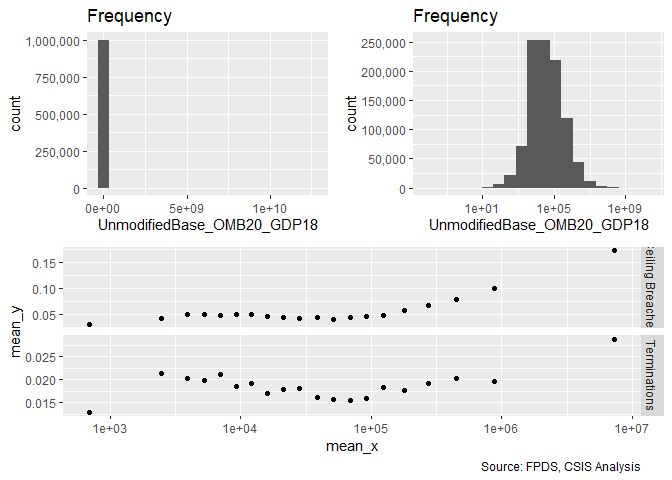<!-- -->

```r
#Model
Term_04E <- glm (data=serv_smp,
                 b_Term ~ cln_Base, family=binomial(link="logit"))


stargazer::stargazer(
                       Term_03D,Term_04A,Term_04E,
                       
                       type="text",
                       digits=2)
```

```
## 
## ==================================================
##                         Dependent variable:       
##                   --------------------------------
##                                b_Term             
##                      (1)        (2)        (3)    
## --------------------------------------------------
## cln_US6sal          -0.06*                        
##                     (0.03)                        
##                                                   
## cln_PSCrate        0.10***                        
##                     (0.03)                        
##                                                   
## cp_OffPerf7         -0.003                        
##                     (0.03)                        
##                                                   
## cp_OffPSC7         0.37***                        
##                     (0.03)                        
##                                                   
## cn_PairHist7       -0.23***                       
##                     (0.03)                        
##                                                   
## cln_PairCA         0.31***                        
##                     (0.03)                        
##                                                   
## cl_Ceil                       0.79***             
##                                (0.03)             
##                                                   
## cln_Base                                 0.23***  
##                                           (0.03)  
##                                                   
## Constant           -3.99***   -4.05***   -3.97*** 
##                     (0.02)     (0.02)     (0.01)  
##                                                   
## --------------------------------------------------
## Observations       250,000    250,000    250,000  
## Log Likelihood    -22,997.20 -22,839.67 -23,163.19
## Akaike Inf. Crit. 46,008.41  45,683.33  46,330.38 
## ==================================================
## Note:                  *p<0.1; **p<0.05; ***p<0.01
```

```r
summary_residual_compare(Term_04E, bins=10)
```

```
## Warning in residuals_binned(model1_old, bins = bins): Always uses Xlb
## Estimated Pr(Termination), should update.
```

```
## Warning in if (class(model1_old) %in% c("glmerMod", "lme4", "lmerMod")) {:
## the condition has length > 1 and only the first element will be used
```

```
## Warning in if (!class(model1_old) %in% c("glmerMod", "lme4", "lmerMod") & :
## the condition has length > 1 and only the first element will be used
```

<!-- -->

```
## [[1]]
##        model deviance null.deviance difference
## 1 model1_old 46326.38      46388.62   62.23303
```
The relationship between base and termination is more complex, with two peaks than it is for ceiling. LIkewise it has less explanatory value. That said, the results are significant and in line with expectations.

#### 04F: Cumulative Ceiling Scope
The next step is to look at ratio of base to ceiling and initial maximum duration combined with base instead of ceiling.

```r
#Model
Term_04F <- glm (data=serv_smp,
                 b_Term ~ cln_Base +cln_Days+clr_Ceil2Base, family=binomial(link="logit"))

glmer_examine(Term_04F)
```

```
##      cln_Base      cln_Days clr_Ceil2Base 
##      1.170428      1.164193      1.077363
```

```r
stargazer::stargazer(
                       Term_03D,Term_04A,Term_04B,Term_04C,Term_04D, Term_04E,Term_04F,
                       
                       type="text",
                       digits=2)
```

```
## 
## ==============================================================================================
##                                               Dependent variable:                             
##                   ----------------------------------------------------------------------------
##                                                      b_Term                                   
##                      (1)        (2)        (3)        (4)        (5)        (6)        (7)    
## ----------------------------------------------------------------------------------------------
## cln_US6sal          -0.06*                                                                    
##                     (0.03)                                                                    
##                                                                                               
## cln_PSCrate        0.10***                                                                    
##                     (0.03)                                                                    
##                                                                                               
## cp_OffPerf7         -0.003                                                                    
##                     (0.03)                                                                    
##                                                                                               
## cp_OffPSC7         0.37***                                                                    
##                     (0.03)                                                                    
##                                                                                               
## cn_PairHist7       -0.23***                                                                   
##                     (0.03)                                                                    
##                                                                                               
## cln_PairCA         0.31***                                                                    
##                     (0.03)                                                                    
##                                                                                               
## cl_Ceil                       0.79***                            0.05                         
##                                (0.03)                           (0.03)                        
##                                                                                               
## cln_Days                                 1.35***               1.03***               1.03***  
##                                           (0.04)                (0.04)                (0.04)  
##                                                                                               
## clr_Ceil2Base                                       1.08***    0.99***               1.00***  
##                                                      (0.01)     (0.02)                (0.02)  
##                                                                                               
## cln_Base                                                                  0.23***      0.04   
##                                                                            (0.03)     (0.03)  
##                                                                                               
## Constant           -3.99***   -4.05***   -4.14***   -4.18***   -4.31***   -3.97***   -4.31*** 
##                     (0.02)     (0.02)     (0.02)     (0.02)     (0.02)     (0.01)     (0.02)  
##                                                                                               
## ----------------------------------------------------------------------------------------------
## Observations       250,000    250,000    250,000    250,000    250,000    250,000    250,000  
## Log Likelihood    -22,997.20 -22,839.67 -22,492.50 -21,051.43 -20,667.29 -23,163.19 -20,667.29
## Akaike Inf. Crit. 46,008.41  45,683.33  44,988.99  42,106.85  41,342.58  46,330.38  41,342.58 
## ==============================================================================================
## Note:                                                              *p<0.1; **p<0.05; ***p<0.01
```

```r
summary_residual_compare(Term_03D,Term_04F,Term_04D,Term_04F, bins=10)
```

<!-- -->

```
## Warning in residuals_binned(model1_old, bins = bins): Always uses Xlb
## Estimated Pr(Termination), should update.
```

```
## Warning in residuals_binned(model1_new, bins = bins): Always uses Xlb
## Estimated Pr(Termination), should update.
```

```
## Warning in residuals_binned(model2_old, bins = bins): Always uses Xlb
## Estimated Pr(Termination), should update.
```

```
## Warning in residuals_binned(model2_new, bins = bins): Always uses Xlb
## Estimated Pr(Termination), should update.
```

```
## Warning in if (class(model1_new) %in% c("glmerMod", "lme4", "lmerMod") & :
## the condition has length > 1 and only the first element will be used
```

```
## Warning in if ((!class(model1_new) %in% c("glmerMod", "lme4", "lmerMod")
## & : the condition has length > 1 and only the first element will be used
```

<!-- -->

```
## [[1]]
##        model deviance null.deviance difference
## 1 model1_old 45994.41      46388.62   394.2094
## 2 model1_new 41334.58      46388.62  5054.0321
## 3 model2_old 41334.58      46388.62  5054.0321
## 4 model2_new 41334.58      46388.62  5054.0321
```
There's marginal difference between the two, but descriptively it's easier to explain and thus likely worth using instead.

#### 04G: Cumulative  Model


```r
#Model
Term_04G <- glm (data=serv_smp,
                 b_Term ~ cln_US6sal + 
                   cln_PSCrate+ cp_OffPerf7+cp_OffPSC7+
                   cn_PairHist7+cln_PairCA+
                   cln_Base + cln_Days+clr_Ceil2Base, family=binomial(link="logit"))
glmer_examine(Term_04G)
```

```
##    cln_US6sal   cln_PSCrate   cp_OffPerf7    cp_OffPSC7  cn_PairHist7 
##      1.434391      1.283411      1.240918      1.521724      1.317852 
##    cln_PairCA      cln_Base      cln_Days clr_Ceil2Base 
##      1.706935      1.224212      1.189201      1.108035
```

```r
stargazer::stargazer(
                       Term_03D,Term_04D,Term_04F,Term_04G,
                       
                       type="text",
                       digits=2)
```

```
## 
## =============================================================
##                               Dependent variable:            
##                   -------------------------------------------
##                                     b_Term                   
##                      (1)        (2)        (3)        (4)    
## -------------------------------------------------------------
## cln_US6sal          -0.06*                          -0.32*** 
##                     (0.03)                           (0.04)  
##                                                              
## cln_PSCrate        0.10***                            0.04   
##                     (0.03)                           (0.04)  
##                                                              
## cp_OffPerf7         -0.003                           -0.01   
##                     (0.03)                           (0.03)  
##                                                              
## cp_OffPSC7         0.37***                          0.40***  
##                     (0.03)                           (0.03)  
##                                                              
## cn_PairHist7       -0.23***                         -0.25*** 
##                     (0.03)                           (0.03)  
##                                                              
## cln_PairCA         0.31***                          0.26***  
##                     (0.03)                           (0.04)  
##                                                              
## cl_Ceil                         0.05                         
##                                (0.03)                        
##                                                              
## cln_Base                                   0.04     0.11***  
##                                           (0.03)     (0.03)  
##                                                              
## cln_Days                      1.03***    1.03***    1.14***  
##                                (0.04)     (0.04)     (0.04)  
##                                                              
## clr_Ceil2Base                 0.99***    1.00***    0.96***  
##                                (0.02)     (0.02)     (0.02)  
##                                                              
## Constant           -3.99***   -4.31***   -4.31***   -4.34*** 
##                     (0.02)     (0.02)     (0.02)     (0.02)  
##                                                              
## -------------------------------------------------------------
## Observations       250,000    250,000    250,000    250,000  
## Log Likelihood    -22,997.20 -20,667.29 -20,667.29 -20,486.67
## Akaike Inf. Crit. 46,008.41  41,342.58  41,342.58  40,993.35 
## =============================================================
## Note:                             *p<0.1; **p<0.05; ***p<0.01
```

```r
#
summary_residual_compare(Term_03D,Term_04G, bins=3)
```

<!-- -->

```
## Warning in residuals_binned(model1_old, bins = bins): Always uses Xlb
## Estimated Pr(Termination), should update.
```

```
## Warning in residuals_binned(model1_new, bins = bins): Always uses Xlb
## Estimated Pr(Termination), should update.
```

```
## Warning in if (class(model1_new) %in% c("glmerMod", "lme4", "lmerMod")) {:
## the condition has length > 1 and only the first element will be used
```

```
## Warning in if (!class(model1_new) %in% c("glmerMod", "lme4", "lmerMod") & :
## the condition has length > 1 and only the first element will be used
```

<!-- -->

```
## [[1]]
##        model deviance null.deviance difference
## 1 model1_old 45994.41      46388.62   394.2094
## 2 model1_new 40973.35      46388.62  5415.2669
```
Salary has increased in significance in the opposite direction as expection while CFTE has lost it. Ceiling/Base has regained signifiance, and other variables had small chains in magnitude. Per discussion in 04F, sticking with base as there seems to be no downside.


### Competition
#### 05A: No Competition / 1 / 2-4 / 5+ Offers
Expectations
No competition (baseline) and single offer competition  is expected to reduce willingness to terminate and increase frequency and size of terminations
all due to the absence of alternatives. For options, there is a weak expectation of fewer options exercised. 

Multioffer competition is expected to lead to more terminations, fewer and smaller ceiling breaches, abd  more options exercised for 2-4 options but fewer for 5+ as the diversity of competitors available may raise the appeal of going with a new contract rather than more options, especially if performance is below the desired level.


```r
summary_discrete_plot(serv_smp,"Comp")
```

```
## Warning: Ignoring unknown parameters: binwidth, bins, pad
```

<!-- -->

```
## [[1]]
## 
## No Competition        1 offer     2-4 offers      5+ offers 
##          69373          42572          84137          53918 
## 
## [[2]]
##                 
##                   None Ceiling Breach
##   No Competition 66060           3313
##   1 offer        41002           1570
##   2-4 offers     78652           5485
##   5+ offers      49571           4347
## 
## [[3]]
##                 
##                      0     1
##   No Competition 68505   868
##   1 offer        41956   616
##   2-4 offers     82865  1272
##   5+ offers      52009  1909
```

```r
#Model
Term_05A <- glm (data=serv_smp,
                 b_Term ~ Comp, family=binomial(link="logit"))


stargazer::stargazer(
                       Term_04G,Term_05A,
                       
                       type="text",
                       digits=2)
```

```
## 
## ==============================================
##                       Dependent variable:     
##                   ----------------------------
##                              b_Term           
##                        (1)            (2)     
## ----------------------------------------------
## cln_US6sal           -0.32***                 
##                       (0.04)                  
##                                               
## cln_PSCrate            0.04                   
##                       (0.04)                  
##                                               
## cp_OffPerf7           -0.01                   
##                       (0.03)                  
##                                               
## cp_OffPSC7           0.40***                  
##                       (0.03)                  
##                                               
## cn_PairHist7         -0.25***                 
##                       (0.03)                  
##                                               
## cln_PairCA           0.26***                  
##                       (0.04)                  
##                                               
## cln_Base             0.11***                  
##                       (0.03)                  
##                                               
## cln_Days             1.14***                  
##                       (0.04)                  
##                                               
## clr_Ceil2Base        0.96***                  
##                       (0.02)                  
##                                               
## Comp1 offer                         0.15***   
##                                     (0.05)    
##                                               
## Comp2-4 offers                      0.19***   
##                                     (0.04)    
##                                               
## Comp5+ offers                       1.06***   
##                                     (0.04)    
##                                               
## Constant             -4.34***      -4.37***   
##                       (0.02)        (0.03)    
##                                               
## ----------------------------------------------
## Observations         250,000        250,000   
## Log Likelihood      -20,486.67    -22,732.95  
## Akaike Inf. Crit.   40,993.35      45,473.90  
## ==============================================
## Note:              *p<0.1; **p<0.05; ***p<0.01
```

```r
summary_residual_compare(Term_05A,bins=2)
```

```
## Warning in residuals_binned(model1_old, bins = bins): Always uses Xlb
## Estimated Pr(Termination), should update.
```

```
## Warning in if (class(model1_old) %in% c("glmerMod", "lme4", "lmerMod")) {:
## the condition has length > 1 and only the first element will be used
```

```
## Warning in if (!class(model1_old) %in% c("glmerMod", "lme4", "lmerMod") & :
## the condition has length > 1 and only the first element will be used
```

<!-- -->

```
## [[1]]
##        model deviance null.deviance difference
## 1 model1_old  45465.9      46388.62   922.7166
```
For terminations, expectations were met for 2-4 offers and 5+ offers, but not for 1 offer. The magnitude of the relationship for 5+ offers is notable.

#### 05B: Cumulative  Model


```r
#Model
Term_05B <- glm (data=serv_smp,
                 b_Term ~ cln_US6sal + 
                   cln_PSCrate+ cp_OffPerf7+cp_OffPSC7+
                   cn_PairHist7+cln_PairCA+
                   cln_Base + cln_Days+clr_Ceil2Base+
                   Comp, family=binomial(link="logit"))

glmer_examine(Term_05B)
```

```
##                   GVIF Df GVIF^(1/(2*Df))
## cln_US6sal    1.463687  1        1.209829
## cln_PSCrate   1.308511  1        1.143902
## cp_OffPerf7   1.261118  1        1.122995
## cp_OffPSC7    1.571061  1        1.253420
## cn_PairHist7  1.329317  1        1.152960
## cln_PairCA    1.811510  1        1.345923
## cln_Base      1.243220  1        1.114998
## cln_Days      1.195102  1        1.093207
## clr_Ceil2Base 1.159937  1        1.077004
## Comp          1.131369  3        1.020784
```

```r
stargazer::stargazer(
                       Term_04G,Term_05A,Term_05B,
                       
                       type="text",
                       digits=2)
```

```
## 
## ==================================================
##                         Dependent variable:       
##                   --------------------------------
##                                b_Term             
##                      (1)        (2)        (3)    
## --------------------------------------------------
## cln_US6sal         -0.32***              -0.30*** 
##                     (0.04)                (0.04)  
##                                                   
## cln_PSCrate          0.04                 0.002   
##                     (0.04)                (0.04)  
##                                                   
## cp_OffPerf7         -0.01                 -0.03   
##                     (0.03)                (0.03)  
##                                                   
## cp_OffPSC7         0.40***               0.39***  
##                     (0.03)                (0.04)  
##                                                   
## cn_PairHist7       -0.25***              -0.20*** 
##                     (0.03)                (0.04)  
##                                                   
## cln_PairCA         0.26***               0.15***  
##                     (0.04)                (0.04)  
##                                                   
## cln_Base           0.11***               0.11***  
##                     (0.03)                (0.03)  
##                                                   
## cln_Days           1.14***               1.12***  
##                     (0.04)                (0.04)  
##                                                   
## clr_Ceil2Base      0.96***               0.91***  
##                     (0.02)                (0.02)  
##                                                   
## Comp1 offer                   0.15***    0.15***  
##                                (0.05)     (0.05)  
##                                                   
## Comp2-4 offers                0.19***    0.12***  
##                                (0.04)     (0.05)  
##                                                   
## Comp5+ offers                 1.06***    0.67***  
##                                (0.04)     (0.04)  
##                                                   
## Constant           -4.34***   -4.37***   -4.58*** 
##                     (0.02)     (0.03)     (0.04)  
##                                                   
## --------------------------------------------------
## Observations       250,000    250,000    250,000  
## Log Likelihood    -20,486.67 -22,732.95 -20,334.23
## Akaike Inf. Crit. 40,993.35  45,473.90  40,694.46 
## ==================================================
## Note:                  *p<0.1; **p<0.05; ***p<0.01
```

```r
#Plot residuals versus fitted   
summary_residual_compare(Term_04G,Term_05B)
```

<!-- -->

```
## Warning in residuals_binned(model1_old, bins = bins): Always uses Xlb
## Estimated Pr(Termination), should update.
```

```
## Warning in residuals_binned(model1_new, bins = bins): Always uses Xlb
## Estimated Pr(Termination), should update.
```

```
## Warning in if (class(model1_new) %in% c("glmerMod", "lme4", "lmerMod")) {:
## the condition has length > 1 and only the first element will be used
```

```
## Warning in if (!class(model1_new) %in% c("glmerMod", "lme4", "lmerMod") & :
## the condition has length > 1 and only the first element will be used
```

<!-- -->

```
## [[1]]
##        model deviance null.deviance difference
## 1 model1_old 40973.35      46388.62   5415.267
## 2 model1_new 40668.46      46388.62   5720.157
```
Minimal effect on study variables. Otherwise some changes in magnitude but no large shifts with the partial exception of the dropping coefficient for 2-4 offers.

### Contract Vehicle

#### 06A: Def/Pur; S-IDC; M-IDC; FSS-GWAC; BPA-BOA.


Expectation: Indefinite delivery vehicles, means that the government has an existing relationship with the vendor and administration is easier. The downside is that the government may be locked into the vendor, although exit does not necessarily require outright termination, instead the government may simply cease to use a vehicle. Taken together, across the board the four categories of vehicles are expected to  negatively estimate the probability of termination. 

Ceiling breaches and excerised options are both less straightforward, are a more complex topic though the study expects a negative relationship as all forms of IDVs make it easier to use a new task order and thus may both reduce the need to exercise options and may allow new work to flow into a different contract rather than prompting a breach.


```r
summary_discrete_plot(serv_smp,"Veh")
```

```
## Warning: Ignoring unknown parameters: binwidth, bins, pad
```

<!-- -->

```
## [[1]]
## 
##  Def/Pur    S-IDC    M-IDC FSS/GWAC  BPA/BOA 
##    76624   121710    29874    11262    10530 
## 
## [[2]]
##           
##              None Ceiling Breach
##   Def/Pur   72393           4231
##   S-IDC    114242           7468
##   M-IDC     27665           2209
##   FSS/GWAC  10823            439
##   BPA/BOA   10162            368
## 
## [[3]]
##           
##                 0      1
##   Def/Pur   74799   1825
##   S-IDC    119920   1790
##   M-IDC     29150    724
##   FSS/GWAC  11029    233
##   BPA/BOA   10437     93
```

```r
#Model
Term_06A <- glm (data=serv_smp,
                 b_Term ~ Veh, family=binomial(link="logit"))


stargazer::stargazer(
                       Term_05B,Term_06A,
                       type="text",
                       digits=2)
```

```
## 
## ==============================================
##                       Dependent variable:     
##                   ----------------------------
##                              b_Term           
##                        (1)            (2)     
## ----------------------------------------------
## cln_US6sal           -0.30***                 
##                       (0.04)                  
##                                               
## cln_PSCrate           0.002                   
##                       (0.04)                  
##                                               
## cp_OffPerf7           -0.03                   
##                       (0.03)                  
##                                               
## cp_OffPSC7           0.39***                  
##                       (0.04)                  
##                                               
## cn_PairHist7         -0.20***                 
##                       (0.04)                  
##                                               
## cln_PairCA           0.15***                  
##                       (0.04)                  
##                                               
## cln_Base             0.11***                  
##                       (0.03)                  
##                                               
## cln_Days             1.12***                  
##                       (0.04)                  
##                                               
## clr_Ceil2Base        0.91***                  
##                       (0.02)                  
##                                               
## Comp1 offer          0.15***                  
##                       (0.05)                  
##                                               
## Comp2-4 offers       0.12***                  
##                       (0.05)                  
##                                               
## Comp5+ offers        0.67***                  
##                       (0.04)                  
##                                               
## VehS-IDC                           -0.49***   
##                                     (0.03)    
##                                               
## VehM-IDC                             0.02     
##                                     (0.04)    
##                                               
## VehFSS/GWAC                         -0.14**   
##                                     (0.07)    
##                                               
## VehBPA/BOA                         -1.01***   
##                                     (0.11)    
##                                               
## Constant             -4.58***      -3.71***   
##                       (0.04)        (0.02)    
##                                               
## ----------------------------------------------
## Observations         250,000        250,000   
## Log Likelihood      -20,334.23    -23,028.27  
## Akaike Inf. Crit.   40,694.46      46,066.53  
## ==============================================
## Note:              *p<0.1; **p<0.05; ***p<0.01
```

```r
#Plot residuals versus fitted
summary_residual_compare(Term_04G,Term_05B)
```

<!-- -->

```
## Warning in residuals_binned(model1_old, bins = bins): Always uses Xlb
## Estimated Pr(Termination), should update.
```

```
## Warning in residuals_binned(model1_new, bins = bins): Always uses Xlb
## Estimated Pr(Termination), should update.
```

```
## Warning in if (class(model1_new) %in% c("glmerMod", "lme4", "lmerMod")) {:
## the condition has length > 1 and only the first element will be used
```

```
## Warning in if (!class(model1_new) %in% c("glmerMod", "lme4", "lmerMod") & :
## the condition has length > 1 and only the first element will be used
```

<!-- -->

```
## [[1]]
##        model deviance null.deviance difference
## 1 model1_old 40973.35      46388.62   5415.267
## 2 model1_new 40668.46      46388.62   5720.157
```

For terminations expectation were upheld or BPA/BOA and S-IDCs and to a lesser extent for FSS/GWAC contracts. They were not upheld for multi-award, which are not significant.


#### 06B: Cumulative  Model


```r
#Model
Term_06B <- glm (data=serv_smp,
                 b_Term ~ cln_US6sal + 
                   cln_PSCrate+ cp_OffPerf7+cp_OffPSC7+
                   cn_PairHist7+cln_PairCA+
                   cln_Base + cln_Days+clr_Ceil2Base+
                   Comp+
                   Veh, family=binomial(link="logit"))

glmer_examine(Term_06B)
```

```
##                   GVIF Df GVIF^(1/(2*Df))
## cln_US6sal    1.481260  1        1.217070
## cln_PSCrate   1.268246  1        1.126164
## cp_OffPerf7   1.299530  1        1.139969
## cp_OffPSC7    1.645100  1        1.282615
## cn_PairHist7  1.367169  1        1.169260
## cln_PairCA    2.011704  1        1.418346
## cln_Base      1.330661  1        1.153543
## cln_Days      1.190214  1        1.090969
## clr_Ceil2Base 1.182145  1        1.087265
## Comp          1.266498  3        1.040161
## Veh           1.919112  4        1.084895
```

```r
stargazer::stargazer(
                       Term_05B,Term_06A,Term_06B,
                       
                       type="text",
                       digits=2)
```

```
## 
## ==================================================
##                         Dependent variable:       
##                   --------------------------------
##                                b_Term             
##                      (1)        (2)        (3)    
## --------------------------------------------------
## cln_US6sal         -0.30***              -0.20*** 
##                     (0.04)                (0.04)  
##                                                   
## cln_PSCrate         0.002                  0.04   
##                     (0.04)                (0.03)  
##                                                   
## cp_OffPerf7         -0.03                 -0.07*  
##                     (0.03)                (0.03)  
##                                                   
## cp_OffPSC7         0.39***               0.48***  
##                     (0.04)                (0.04)  
##                                                   
## cn_PairHist7       -0.20***              -0.12*** 
##                     (0.04)                (0.04)  
##                                                   
## cln_PairCA         0.15***               0.39***  
##                     (0.04)                (0.04)  
##                                                   
## cln_Base           0.11***                 0.03   
##                     (0.03)                (0.03)  
##                                                   
## cln_Days           1.12***               1.10***  
##                     (0.04)                (0.04)  
##                                                   
## clr_Ceil2Base      0.91***               0.85***  
##                     (0.02)                (0.02)  
##                                                   
## Comp1 offer        0.15***                0.14**  
##                     (0.05)                (0.05)  
##                                                   
## Comp2-4 offers     0.12***               0.21***  
##                     (0.05)                (0.05)  
##                                                   
## Comp5+ offers      0.67***               0.89***  
##                     (0.04)                (0.05)  
##                                                   
## VehS-IDC                      -0.49***   -0.96*** 
##                                (0.03)     (0.04)  
##                                                   
## VehM-IDC                        0.02     -0.50*** 
##                                (0.04)     (0.05)  
##                                                   
## VehFSS/GWAC                   -0.14**    -0.39*** 
##                                (0.07)     (0.07)  
##                                                   
## VehBPA/BOA                    -1.01***   -1.49*** 
##                                (0.11)     (0.12)  
##                                                   
## Constant           -4.58***   -3.71***   -4.12*** 
##                     (0.04)     (0.02)     (0.04)  
##                                                   
## --------------------------------------------------
## Observations       250,000    250,000    250,000  
## Log Likelihood    -20,334.23 -23,028.27 -20,044.32
## Akaike Inf. Crit. 40,694.46  46,066.53  40,122.64 
## ==================================================
## Note:                  *p<0.1; **p<0.05; ***p<0.01
```

```r
#Plot residuals versus fitted   
summary_residual_compare(Term_05B,Term_06B)
```

<!-- -->

```
## Warning in residuals_binned(model1_old, bins = bins): Always uses Xlb
## Estimated Pr(Termination), should update.
```

```
## Warning in residuals_binned(model1_new, bins = bins): Always uses Xlb
## Estimated Pr(Termination), should update.
```

```
## Warning in if (class(model1_new) %in% c("glmerMod", "lme4", "lmerMod")) {:
## the condition has length > 1 and only the first element will be used
```

```
## Warning in if (!class(model1_new) %in% c("glmerMod", "lme4", "lmerMod") & :
## the condition has length > 1 and only the first element will be used
```

<!-- -->

```
## [[1]]
##        model deviance null.deviance difference
## 1 model1_old 40668.46      46388.62   5720.157
## 2 model1_new 40088.64      46388.62   6299.977
```
Expectations for vehicle are now upheld for both terminations. Ceiling lost significance, performance based contracting gained significance at the 0.1 level, and magnitude for other variables fluxuated.


### Type of Contract

The next step adds a measure for whether the contract was cost-based or fixed-price. 

Expectation Prior CSIS research has found that fixed-price contracts estimate a higher probability of terminations but did not find a notable relationship for ceiling breaches.

#### 07A: FFP / Other FP / Incentive / T&M/FP:LOE;LH / Other CB / Combination

Firm-fixed price contracting is expected to be associated with a high rate of options exercised, more ceiling breaches, and a strong expectation of greater levels of termination.

(Options, breach, termination)
Firm-Fixed Price (base)				+	+	++
Other Fixed Price				-	-	-
Time & Materials / Labor Hours / FP: LoE				-	+	-
Incentive Fee (both FPIF or CBIF)				+	-	-
Other Cost Based				-	-	-
Undefinitized Contract Award				--	++	++
Combination				-	+	+


```r
serv_smp$Pricing<-factor(serv_smp$Pricing,
                            levels=c( "FFP","Other FP","T&M/LH/FPLOE","Incentive","Other CB","UCA" ,"Combination or Other" ))
serv_opt$Pricing<-factor(serv_opt$Pricing,
                            levels=c( "FFP","Other FP","T&M/LH/FPLOE","Incentive","Other CB","UCA" ,"Combination or Other" ))
summary_discrete_plot(serv_smp,"Pricing")
```

```
## Warning: Ignoring unknown parameters: binwidth, bins, pad
```

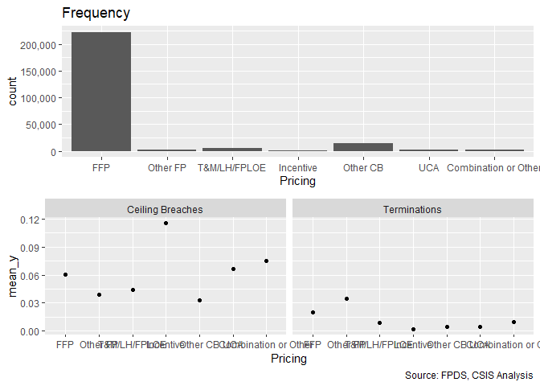<!-- -->

```
## [[1]]
## 
##                  FFP             Other FP         T&M/LH/FPLOE 
##               222749                 1623                 4812 
##            Incentive             Other CB                  UCA 
##                 1006                14582                 2816 
## Combination or Other 
##                 2412 
## 
## [[2]]
##                       
##                          None Ceiling Breach
##   FFP                  209275          13474
##   Other FP               1560             63
##   T&M/LH/FPLOE           4601            211
##   Incentive               890            116
##   Other CB              14100            482
##   UCA                    2629            187
##   Combination or Other   2230            182
## 
## [[3]]
##                       
##                             0      1
##   FFP                  218286   4463
##   Other FP               1567     56
##   T&M/LH/FPLOE           4771     41
##   Incentive              1004      2
##   Other CB              14515     67
##   UCA                    2803     13
##   Combination or Other   2389     23
```

```r
#Model
Term_07A <- glm (data=serv_smp,
                 b_Term ~ Pricing, family=binomial(link="logit"))


#Plot residuals versus fitted
stargazer::stargazer(
                       Term_06B,Term_07A,
                       
                       type="text",
                       digits=2)
```

```
## 
## ========================================================
##                                 Dependent variable:     
##                             ----------------------------
##                                        b_Term           
##                                  (1)            (2)     
## --------------------------------------------------------
## cln_US6sal                     -0.20***                 
##                                 (0.04)                  
##                                                         
## cln_PSCrate                      0.04                   
##                                 (0.03)                  
##                                                         
## cp_OffPerf7                     -0.07*                  
##                                 (0.03)                  
##                                                         
## cp_OffPSC7                     0.48***                  
##                                 (0.04)                  
##                                                         
## cn_PairHist7                   -0.12***                 
##                                 (0.04)                  
##                                                         
## cln_PairCA                     0.39***                  
##                                 (0.04)                  
##                                                         
## cln_Base                         0.03                   
##                                 (0.03)                  
##                                                         
## cln_Days                       1.10***                  
##                                 (0.04)                  
##                                                         
## clr_Ceil2Base                  0.85***                  
##                                 (0.02)                  
##                                                         
## Comp1 offer                     0.14**                  
##                                 (0.05)                  
##                                                         
## Comp2-4 offers                 0.21***                  
##                                 (0.05)                  
##                                                         
## Comp5+ offers                  0.89***                  
##                                 (0.05)                  
##                                                         
## VehS-IDC                       -0.96***                 
##                                 (0.04)                  
##                                                         
## VehM-IDC                       -0.50***                 
##                                 (0.05)                  
##                                                         
## VehFSS/GWAC                    -0.39***                 
##                                 (0.07)                  
##                                                         
## VehBPA/BOA                     -1.49***                 
##                                 (0.12)                  
##                                                         
## PricingOther FP                               0.56***   
##                                               (0.14)    
##                                                         
## PricingT&M/LH/FPLOE                          -0.87***   
##                                               (0.16)    
##                                                         
## PricingIncentive                             -2.33***   
##                                               (0.71)    
##                                                         
## PricingOther CB                              -1.49***   
##                                               (0.12)    
##                                                         
## PricingUCA                                   -1.48***   
##                                               (0.28)    
##                                                         
## PricingCombination or Other                  -0.75***   
##                                               (0.21)    
##                                                         
## Constant                       -4.12***      -3.89***   
##                                 (0.04)        (0.02)    
##                                                         
## --------------------------------------------------------
## Observations                   250,000        250,000   
## Log Likelihood                -20,044.32    -23,003.80  
## Akaike Inf. Crit.             40,122.64      46,021.60  
## ========================================================
## Note:                        *p<0.1; **p<0.05; ***p<0.01
```

```r
summary_residual_compare(Term_07A,bins=2)
```

```
## Warning in residuals_binned(model1_old, bins = bins): Always uses Xlb
## Estimated Pr(Termination), should update.
```

```
## Warning in if (class(model1_old) %in% c("glmerMod", "lme4", "lmerMod")) {:
## the condition has length > 1 and only the first element will be used
```

```
## Warning in if (!class(model1_old) %in% c("glmerMod", "lme4", "lmerMod") & :
## the condition has length > 1 and only the first element will be used
```

<!-- -->

```
## [[1]]
##        model deviance null.deviance difference
## 1 model1_old  46007.6      46388.62   381.0111
```

For terminations firm fixed price (baseline), incentive, cost-based, and combination or other were in line with expectations. Fixed price other defies expectations of being lower risk and UCA and combination defy expectations by being negative.


#### 07B: Cumulative  Model


```r
#Model
Term_07B <- glm (data=serv_smp,
                 b_Term ~ cln_US6sal + 
                   cln_PSCrate+ cp_OffPerf7+cp_OffPSC7+
                   cn_PairHist7+cln_PairCA+
                   cln_Base + cln_Days+clr_Ceil2Base+
                   Comp+
                   Veh+
                   Pricing, family=binomial(link="logit"))

glmer_examine(Term_07B)
```

```
##                   GVIF Df GVIF^(1/(2*Df))
## cln_US6sal    1.439553  1        1.199814
## cln_PSCrate   1.251918  1        1.118891
## cp_OffPerf7   1.310979  1        1.144980
## cp_OffPSC7    1.647994  1        1.283742
## cn_PairHist7  1.343196  1        1.158964
## cln_PairCA    1.993159  1        1.411793
## cln_Base      1.349706  1        1.161768
## cln_Days      1.199754  1        1.095333
## clr_Ceil2Base 1.210146  1        1.100067
## Comp          1.318429  3        1.047151
## Veh           1.913750  4        1.084515
## Pricing       1.117580  6        1.009307
```

```r
stargazer::stargazer(
                       Term_06B,Term_07A,Term_07B,
                       
                       type="text",
                       digits=2)
```

```
## 
## ============================================================
##                                   Dependent variable:       
##                             --------------------------------
##                                          b_Term             
##                                (1)        (2)        (3)    
## ------------------------------------------------------------
## cln_US6sal                   -0.20***              -0.16*** 
##                               (0.04)                (0.04)  
##                                                             
## cln_PSCrate                    0.04                 0.06*   
##                               (0.03)                (0.03)  
##                                                             
## cp_OffPerf7                   -0.07*                -0.05   
##                               (0.03)                (0.03)  
##                                                             
## cp_OffPSC7                   0.48***               0.48***  
##                               (0.04)                (0.04)  
##                                                             
## cn_PairHist7                 -0.12***              -0.10*** 
##                               (0.04)                (0.04)  
##                                                             
## cln_PairCA                   0.39***               0.39***  
##                               (0.04)                (0.04)  
##                                                             
## cln_Base                       0.03                0.17***  
##                               (0.03)                (0.03)  
##                                                             
## cln_Days                     1.10***               1.13***  
##                               (0.04)                (0.04)  
##                                                             
## clr_Ceil2Base                0.85***               0.86***  
##                               (0.02)                (0.02)  
##                                                             
## Comp1 offer                   0.14**               0.18***  
##                               (0.05)                (0.05)  
##                                                             
## Comp2-4 offers               0.21***               0.21***  
##                               (0.05)                (0.05)  
##                                                             
## Comp5+ offers                0.89***               0.81***  
##                               (0.05)                (0.05)  
##                                                             
## VehS-IDC                     -0.96***              -0.83*** 
##                               (0.04)                (0.04)  
##                                                             
## VehM-IDC                     -0.50***              -0.42*** 
##                               (0.05)                (0.05)  
##                                                             
## VehFSS/GWAC                  -0.39***              -0.41*** 
##                               (0.07)                (0.07)  
##                                                             
## VehBPA/BOA                   -1.49***              -1.42*** 
##                               (0.12)                (0.12)  
##                                                             
## PricingOther FP                         0.56***      0.15   
##                                          (0.14)     (0.14)  
##                                                             
## PricingT&M/LH/FPLOE                     -0.87***   -1.03*** 
##                                          (0.16)     (0.16)  
##                                                             
## PricingIncentive                        -2.33***   -2.54*** 
##                                          (0.71)     (0.71)  
##                                                             
## PricingOther CB                         -1.49***   -1.68*** 
##                                          (0.12)     (0.13)  
##                                                             
## PricingUCA                              -1.48***   -1.27*** 
##                                          (0.28)     (0.28)  
##                                                             
## PricingCombination or Other             -0.75***   -1.29*** 
##                                          (0.21)     (0.22)  
##                                                             
## Constant                     -4.12***   -3.89***   -4.09*** 
##                               (0.04)     (0.02)     (0.04)  
##                                                             
## ------------------------------------------------------------
## Observations                 250,000    250,000    250,000  
## Log Likelihood              -20,044.32 -23,003.80 -19,840.15
## Akaike Inf. Crit.           40,122.64  46,021.60  39,726.30 
## ============================================================
## Note:                            *p<0.1; **p<0.05; ***p<0.01
```

```r
#Plot residuals versus fitted   
summary_residual_compare(Term_06B,Term_07B)
```

<!-- -->

```
## Warning in residuals_binned(model1_old, bins = bins): Always uses Xlb
## Estimated Pr(Termination), should update.
```

```
## Warning in residuals_binned(model1_new, bins = bins): Always uses Xlb
## Estimated Pr(Termination), should update.
```

```
## Warning in if (class(model1_new) %in% c("glmerMod", "lme4", "lmerMod")) {:
## the condition has length > 1 and only the first element will be used
```

```
## Warning in if (!class(model1_new) %in% c("glmerMod", "lme4", "lmerMod") & :
## the condition has length > 1 and only the first element will be used
```

<!-- -->

```
## [[1]]
##        model deviance null.deviance difference
## 1 model1_old 40088.64      46388.62   6299.977
## 2 model1_new 39680.30      46388.62   6708.314
```

Other fixed price loses significance.
Performance based services loses significance. CFTE gains significance in line with expectations.
Ceiling regains significance.


### Crisis Dataset
Expectation: Service Contract replying on crisis funds would have more likelihood of cost-ceiling breaches and exercised options but fewer terminations.  

#### 08A: Crisis Funding

```r
summary_discrete_plot(serv_smp,"Crisis")
```

```
## Warning: Ignoring unknown parameters: binwidth, bins, pad
```

<!-- -->

```
## [[1]]
## 
##  Other   ARRA    Dis    OCO 
## 233696   1455    408  14441 
## 
## [[2]]
##        
##           None Ceiling Breach
##   Other 219908          13788
##   ARRA    1191            264
##   Dis      361             47
##   OCO    13825            616
## 
## [[3]]
##        
##              0      1
##   Other 229272   4424
##   ARRA    1440     15
##   Dis      399      9
##   OCO    14224    217
```

```r
#Model
Term_08A <- glm (data=serv_smp,
                 b_Term ~ Crisis, family=binomial(link="logit"))


stargazer::stargazer(
                       Term_07B,Term_08A,
                       
                       type="text",
                       digits=2)
```

```
## 
## ========================================================
##                                 Dependent variable:     
##                             ----------------------------
##                                        b_Term           
##                                  (1)            (2)     
## --------------------------------------------------------
## cln_US6sal                     -0.16***                 
##                                 (0.04)                  
##                                                         
## cln_PSCrate                     0.06*                   
##                                 (0.03)                  
##                                                         
## cp_OffPerf7                     -0.05                   
##                                 (0.03)                  
##                                                         
## cp_OffPSC7                     0.48***                  
##                                 (0.04)                  
##                                                         
## cn_PairHist7                   -0.10***                 
##                                 (0.04)                  
##                                                         
## cln_PairCA                     0.39***                  
##                                 (0.04)                  
##                                                         
## cln_Base                       0.17***                  
##                                 (0.03)                  
##                                                         
## cln_Days                       1.13***                  
##                                 (0.04)                  
##                                                         
## clr_Ceil2Base                  0.86***                  
##                                 (0.02)                  
##                                                         
## Comp1 offer                    0.18***                  
##                                 (0.05)                  
##                                                         
## Comp2-4 offers                 0.21***                  
##                                 (0.05)                  
##                                                         
## Comp5+ offers                  0.81***                  
##                                 (0.05)                  
##                                                         
## VehS-IDC                       -0.83***                 
##                                 (0.04)                  
##                                                         
## VehM-IDC                       -0.42***                 
##                                 (0.05)                  
##                                                         
## VehFSS/GWAC                    -0.41***                 
##                                 (0.07)                  
##                                                         
## VehBPA/BOA                     -1.42***                 
##                                 (0.12)                  
##                                                         
## PricingOther FP                  0.15                   
##                                 (0.14)                  
##                                                         
## PricingT&M/LH/FPLOE            -1.03***                 
##                                 (0.16)                  
##                                                         
## PricingIncentive               -2.54***                 
##                                 (0.71)                  
##                                                         
## PricingOther CB                -1.68***                 
##                                 (0.13)                  
##                                                         
## PricingUCA                     -1.27***                 
##                                 (0.28)                  
##                                                         
## PricingCombination or Other    -1.29***                 
##                                 (0.22)                  
##                                                         
## CrisisARRA                                    -0.62**   
##                                               (0.26)    
##                                                         
## CrisisDis                                      0.16     
##                                               (0.34)    
##                                                         
## CrisisOCO                                    -0.23***   
##                                               (0.07)    
##                                                         
## Constant                       -4.09***      -3.95***   
##                                 (0.04)        (0.02)    
##                                                         
## --------------------------------------------------------
## Observations                   250,000        250,000   
## Log Likelihood                -19,840.15    -23,184.85  
## Akaike Inf. Crit.             39,726.30      46,377.69  
## ========================================================
## Note:                        *p<0.1; **p<0.05; ***p<0.01
```

```r
#Plot residuals versus fitted
summary_residual_compare(Term_08A,bins=2)
```

```
## Warning in residuals_binned(model1_old, bins = bins): Always uses Xlb
## Estimated Pr(Termination), should update.
```

```
## Warning in if (class(model1_old) %in% c("glmerMod", "lme4", "lmerMod")) {:
## the condition has length > 1 and only the first element will be used
```

```
## Warning in if (!class(model1_old) %in% c("glmerMod", "lme4", "lmerMod") & :
## the condition has length > 1 and only the first element will be used
```

<!-- -->

```
## [[1]]
##        model deviance null.deviance difference
## 1 model1_old 46369.69      46388.62   18.92355
```

ARRA and OCO were significant in line with expectations. 


#### 08B: Cumulative  Model


```r
#Model
Term_08B <- glm (data=serv_smp,
                 b_Term ~ cln_US6sal + 
                   cln_PSCrate+ cp_OffPerf7+cp_OffPSC7+
                   cn_PairHist7+cln_PairCA+
                   cln_Base + cln_Days+clr_Ceil2Base+
                   Comp+
                   Veh+
                   Pricing+
                   Crisis, family=binomial(link="logit"))

glmer_examine(Term_08B)
```

```
##                   GVIF Df GVIF^(1/(2*Df))
## cln_US6sal    1.463480  1        1.209744
## cln_PSCrate   1.359972  1        1.166179
## cp_OffPerf7   1.311392  1        1.145160
## cp_OffPSC7    1.679329  1        1.295889
## cn_PairHist7  1.350433  1        1.162081
## cln_PairCA    2.437302  1        1.561186
## cln_Base      1.393362  1        1.180407
## cln_Days      1.229422  1        1.108793
## clr_Ceil2Base 1.223399  1        1.106074
## Comp          1.336790  3        1.049568
## Veh           2.098985  4        1.097113
## Pricing       1.128046  6        1.010091
## Crisis        1.448424  3        1.063692
```

```r
stargazer::stargazer(
                       Term_07B,Term_08A,Term_08B,
                       
                       type="text",
                       digits=2)
```

```
## 
## ============================================================
##                                   Dependent variable:       
##                             --------------------------------
##                                          b_Term             
##                                (1)        (2)        (3)    
## ------------------------------------------------------------
## cln_US6sal                   -0.16***              -0.14*** 
##                               (0.04)                (0.04)  
##                                                             
## cln_PSCrate                   0.06*                  0.03   
##                               (0.03)                (0.04)  
##                                                             
## cp_OffPerf7                   -0.05                 -0.06*  
##                               (0.03)                (0.03)  
##                                                             
## cp_OffPSC7                   0.48***               0.47***  
##                               (0.04)                (0.04)  
##                                                             
## cn_PairHist7                 -0.10***              -0.11*** 
##                               (0.04)                (0.04)  
##                                                             
## cln_PairCA                   0.39***               0.46***  
##                               (0.04)                (0.04)  
##                                                             
## cln_Base                     0.17***               0.19***  
##                               (0.03)                (0.04)  
##                                                             
## cln_Days                     1.13***               1.11***  
##                               (0.04)                (0.04)  
##                                                             
## clr_Ceil2Base                0.86***               0.85***  
##                               (0.02)                (0.02)  
##                                                             
## Comp1 offer                  0.18***               0.20***  
##                               (0.05)                (0.05)  
##                                                             
## Comp2-4 offers               0.21***               0.22***  
##                               (0.05)                (0.05)  
##                                                             
## Comp5+ offers                0.81***               0.82***  
##                               (0.05)                (0.05)  
##                                                             
## VehS-IDC                     -0.83***              -0.88*** 
##                               (0.04)                (0.04)  
##                                                             
## VehM-IDC                     -0.42***              -0.45*** 
##                               (0.05)                (0.05)  
##                                                             
## VehFSS/GWAC                  -0.41***              -0.43*** 
##                               (0.07)                (0.07)  
##                                                             
## VehBPA/BOA                   -1.42***              -1.43*** 
##                               (0.12)                (0.12)  
##                                                             
## PricingOther FP                0.15                  0.11   
##                               (0.14)                (0.14)  
##                                                             
## PricingT&M/LH/FPLOE          -1.03***              -1.05*** 
##                               (0.16)                (0.16)  
##                                                             
## PricingIncentive             -2.54***              -2.56*** 
##                               (0.71)                (0.71)  
##                                                             
## PricingOther CB              -1.68***              -1.70*** 
##                               (0.13)                (0.13)  
##                                                             
## PricingUCA                   -1.27***              -1.28*** 
##                               (0.28)                (0.28)  
##                                                             
## PricingCombination or Other  -1.29***              -1.31*** 
##                               (0.22)                (0.22)  
##                                                             
## CrisisARRA                              -0.62**    -0.62**  
##                                          (0.26)     (0.26)  
##                                                             
## CrisisDis                                 0.16       0.46   
##                                          (0.34)     (0.34)  
##                                                             
## CrisisOCO                               -0.23***   -0.32*** 
##                                          (0.07)     (0.09)  
##                                                             
## Constant                     -4.09***   -3.95***   -4.05*** 
##                               (0.04)     (0.02)     (0.04)  
##                                                             
## ------------------------------------------------------------
## Observations                 250,000    250,000    250,000  
## Log Likelihood              -19,840.15 -23,184.85 -19,828.66
## Akaike Inf. Crit.           39,726.30  46,377.69  39,709.32 
## ============================================================
## Note:                            *p<0.1; **p<0.05; ***p<0.01
```

```r
#Plot residuals versus fitted   
summary_residual_compare(Term_07B,Term_08B)
```

<!-- -->

```
## Warning in residuals_binned(model1_old, bins = bins): Always uses Xlb
## Estimated Pr(Termination), should update.
```

```
## Warning in residuals_binned(model1_new, bins = bins): Always uses Xlb
## Estimated Pr(Termination), should update.
```

```
## Warning in if (class(model1_new) %in% c("glmerMod", "lme4", "lmerMod")) {:
## the condition has length > 1 and only the first element will be used
```

```
## Warning in if (!class(model1_new) %in% c("glmerMod", "lme4", "lmerMod") & :
## the condition has length > 1 and only the first element will be used
```

<!-- -->

```
## [[1]]
##        model deviance null.deviance difference
## 1 model1_old 39680.30      46388.62   6708.314
## 2 model1_new 39657.32      46388.62   6731.299
```

Terminations for OCO and ARRA are now significant in the expected direction. Performance based and CFTE swap significance.


## Industrial Sector

### Level 6

#### Model 09A: l_def6_HHI_lag1
(Options, breach, termination)
HHI (logged, + means more consolidation)	cln_Def6HHI+	-	+	-

Expectations are  unchanged.

```r
summary_continuous_plot(serv_smp1m,"def6_HHI_lag1")
```

<!-- -->

```r
summary_continuous_plot(serv_smp1m,"def6_HHI_lag1",log=TRUE)
```

<!-- -->

```r
#Model
Term_09A <- glm (data=serv_smp,
                 b_Term ~ cln_Def6HHI, family=binomial(link="logit"))


#Plot residuals versus fitted
stargazer::stargazer(
                       Term_08B,Term_09A,
                       
                       type="text",
                       digits=2)
```

```
## 
## ========================================================
##                                 Dependent variable:     
##                             ----------------------------
##                                        b_Term           
##                                  (1)            (2)     
## --------------------------------------------------------
## cln_US6sal                     -0.14***                 
##                                 (0.04)                  
##                                                         
## cln_PSCrate                      0.03                   
##                                 (0.04)                  
##                                                         
## cp_OffPerf7                     -0.06*                  
##                                 (0.03)                  
##                                                         
## cp_OffPSC7                     0.47***                  
##                                 (0.04)                  
##                                                         
## cn_PairHist7                   -0.11***                 
##                                 (0.04)                  
##                                                         
## cln_PairCA                     0.46***                  
##                                 (0.04)                  
##                                                         
## cln_Base                       0.19***                  
##                                 (0.04)                  
##                                                         
## cln_Days                       1.11***                  
##                                 (0.04)                  
##                                                         
## clr_Ceil2Base                  0.85***                  
##                                 (0.02)                  
##                                                         
## Comp1 offer                    0.20***                  
##                                 (0.05)                  
##                                                         
## Comp2-4 offers                 0.22***                  
##                                 (0.05)                  
##                                                         
## Comp5+ offers                  0.82***                  
##                                 (0.05)                  
##                                                         
## VehS-IDC                       -0.88***                 
##                                 (0.04)                  
##                                                         
## VehM-IDC                       -0.45***                 
##                                 (0.05)                  
##                                                         
## VehFSS/GWAC                    -0.43***                 
##                                 (0.07)                  
##                                                         
## VehBPA/BOA                     -1.43***                 
##                                 (0.12)                  
##                                                         
## PricingOther FP                  0.11                   
##                                 (0.14)                  
##                                                         
## PricingT&M/LH/FPLOE            -1.05***                 
##                                 (0.16)                  
##                                                         
## PricingIncentive               -2.56***                 
##                                 (0.71)                  
##                                                         
## PricingOther CB                -1.70***                 
##                                 (0.13)                  
##                                                         
## PricingUCA                     -1.28***                 
##                                 (0.28)                  
##                                                         
## PricingCombination or Other    -1.31***                 
##                                 (0.22)                  
##                                                         
## CrisisARRA                     -0.62**                  
##                                 (0.26)                  
##                                                         
## CrisisDis                        0.46                   
##                                 (0.34)                  
##                                                         
## CrisisOCO                      -0.32***                 
##                                 (0.09)                  
##                                                         
## cln_Def6HHI                                    -0.04    
##                                               (0.03)    
##                                                         
## Constant                       -4.05***      -3.96***   
##                                 (0.04)        (0.01)    
##                                                         
## --------------------------------------------------------
## Observations                   250,000        250,000   
## Log Likelihood                -19,828.66    -23,193.38  
## Akaike Inf. Crit.             39,709.32      46,390.77  
## ========================================================
## Note:                        *p<0.1; **p<0.05; ***p<0.01
```

```r
summary_residual_compare(Term_09A, skip_vif = TRUE,bin=20)
```

```
## Warning in residuals_binned(model1_old, bins = bins): Always uses Xlb
## Estimated Pr(Termination), should update.
```

```
## Warning in if (class(model1_old) %in% c("glmerMod", "lme4", "lmerMod")) {:
## the condition has length > 1 and only the first element will be used
```

```
## Warning in if (!class(model1_old) %in% c("glmerMod", "lme4", "lmerMod") & :
## the condition has length > 1 and only the first element will be used
```

<!-- -->

```
## [[1]]
##        model deviance null.deviance difference
## 1 model1_old 46386.77      46388.62   1.845905
```

Not significant for terminations, though in expected direction.

#### Model 09B: Defense to Overall ratio
The higher the ratio of defense obligations to reciepts in the overall economy, the DoD holds a monosopy over a sector. Given the challenges of monosopy, the a higher ratio estimates a greater  risk of ceiling breaches.

(Options, breach, termination)
Ratio Def. obligatons : US revenue	cln_Def6Obl+		+	-	-


```r
summary_continuous_plot(serv_smp1m,"def6_ratio_lag1")
```

<!-- -->

```r
summary_continuous_plot(serv_smp1m,"def6_ratio_lag1",log=TRUE)
```

```
## Warning in self$trans$transform(x): NaNs produced
```

```
## Warning: Transformation introduced infinite values in continuous x-axis
```

```
## Warning: Removed 658 rows containing non-finite values (stat_bin).
```

```
## Warning in self$trans$transform(x): NaNs produced
```

```
## Warning: Transformation introduced infinite values in continuous x-axis
```

```
## Warning: Removed 2 rows containing missing values (geom_point).
```

<!-- -->

```r
#Model
Term_09B <- glm (data=serv_smp,
                 b_Term ~ clr_Def6toUS, family=binomial(link="logit"))


#Plot residuals versus fitted
stargazer::stargazer(
                       Term_08B,Term_09A,Term_09B,
                       
                       type="text",
                       digits=2)
```

```
## 
## ============================================================
##                                   Dependent variable:       
##                             --------------------------------
##                                          b_Term             
##                                (1)        (2)        (3)    
## ------------------------------------------------------------
## cln_US6sal                   -0.14***                       
##                               (0.04)                        
##                                                             
## cln_PSCrate                    0.03                         
##                               (0.04)                        
##                                                             
## cp_OffPerf7                   -0.06*                        
##                               (0.03)                        
##                                                             
## cp_OffPSC7                   0.47***                        
##                               (0.04)                        
##                                                             
## cn_PairHist7                 -0.11***                       
##                               (0.04)                        
##                                                             
## cln_PairCA                   0.46***                        
##                               (0.04)                        
##                                                             
## cln_Base                     0.19***                        
##                               (0.04)                        
##                                                             
## cln_Days                     1.11***                        
##                               (0.04)                        
##                                                             
## clr_Ceil2Base                0.85***                        
##                               (0.02)                        
##                                                             
## Comp1 offer                  0.20***                        
##                               (0.05)                        
##                                                             
## Comp2-4 offers               0.22***                        
##                               (0.05)                        
##                                                             
## Comp5+ offers                0.82***                        
##                               (0.05)                        
##                                                             
## VehS-IDC                     -0.88***                       
##                               (0.04)                        
##                                                             
## VehM-IDC                     -0.45***                       
##                               (0.05)                        
##                                                             
## VehFSS/GWAC                  -0.43***                       
##                               (0.07)                        
##                                                             
## VehBPA/BOA                   -1.43***                       
##                               (0.12)                        
##                                                             
## PricingOther FP                0.11                         
##                               (0.14)                        
##                                                             
## PricingT&M/LH/FPLOE          -1.05***                       
##                               (0.16)                        
##                                                             
## PricingIncentive             -2.56***                       
##                               (0.71)                        
##                                                             
## PricingOther CB              -1.70***                       
##                               (0.13)                        
##                                                             
## PricingUCA                   -1.28***                       
##                               (0.28)                        
##                                                             
## PricingCombination or Other  -1.31***                       
##                               (0.22)                        
##                                                             
## CrisisARRA                   -0.62**                        
##                               (0.26)                        
##                                                             
## CrisisDis                      0.46                         
##                               (0.34)                        
##                                                             
## CrisisOCO                    -0.32***                       
##                               (0.09)                        
##                                                             
## cln_Def6HHI                              -0.04              
##                                          (0.03)             
##                                                             
## clr_Def6toUS                                       -0.64*** 
##                                                     (0.05)  
##                                                             
## Constant                     -4.05***   -3.96***   -3.99*** 
##                               (0.04)     (0.01)     (0.02)  
##                                                             
## ------------------------------------------------------------
## Observations                 250,000    250,000    250,000  
## Log Likelihood              -19,828.66 -23,193.38 -23,095.80
## Akaike Inf. Crit.           39,709.32  46,390.77  46,195.60 
## ============================================================
## Note:                            *p<0.1; **p<0.05; ***p<0.01
```

```r
summary_residual_compare(Term_09B)
```

```
## Warning in residuals_binned(model1_old, bins = bins): Always uses Xlb
## Estimated Pr(Termination), should update.
```

```
## Warning in if (class(model1_old) %in% c("glmerMod", "lme4", "lmerMod")) {:
## the condition has length > 1 and only the first element will be used
```

```
## Warning in if (!class(model1_old) %in% c("glmerMod", "lme4", "lmerMod") & :
## the condition has length > 1 and only the first element will be used
```

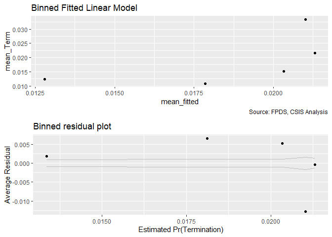<!-- -->

```
## [[1]]
##        model deviance null.deviance difference
## 1 model1_old  46191.6      46388.62   197.0126
```
Significant, in line with expectations, and higher magnitude.

#### Model 09C: Defense Obligations
(Options, breach, termination)
Defense obligations (logged)	clr_Def6toUS+		-	-	+


```r
summary_continuous_plot(serv_smp1m,"def6_obl_lag1Const")
```

<!-- -->

```r
summary_continuous_plot(serv_smp1m,"def6_obl_lag1Const",log=TRUE)
```

<!-- -->

```r
#Model
Term_09C <- glm (data=serv_smp,
                 b_Term ~ cln_Def6Obl, family=binomial(link="logit"))

stargazer::stargazer(Term_09A,Term_09B,Term_09C,
                       
                       type="text",
                       digits=2)
```

```
## 
## ==================================================
##                         Dependent variable:       
##                   --------------------------------
##                                b_Term             
##                      (1)        (2)        (3)    
## --------------------------------------------------
## cln_Def6HHI         -0.04                         
##                     (0.03)                        
##                                                   
## clr_Def6toUS                  -0.64***            
##                                (0.05)             
##                                                   
## cln_Def6Obl                               0.002   
##                                           (0.03)  
##                                                   
## Constant           -3.96***   -3.99***   -3.96*** 
##                     (0.01)     (0.02)     (0.01)  
##                                                   
## --------------------------------------------------
## Observations       250,000    250,000    250,000  
## Log Likelihood    -23,193.38 -23,095.80 -23,194.30
## Akaike Inf. Crit. 46,390.77  46,195.60  46,392.61 
## ==================================================
## Note:                  *p<0.1; **p<0.05; ***p<0.01
```

```r
summary_residual_compare(Term_09C)
```

```
## Warning in residuals_binned(model1_old, bins = bins): Always uses Xlb
## Estimated Pr(Termination), should update.
```

```
## Warning in if (class(model1_old) %in% c("glmerMod", "lme4", "lmerMod")) {:
## the condition has length > 1 and only the first element will be used
```

```
## Warning in if (!class(model1_old) %in% c("glmerMod", "lme4", "lmerMod") & :
## the condition has length > 1 and only the first element will be used
```

<!-- -->

```
## [[1]]
##        model deviance null.deviance  difference
## 1 model1_old 46388.61      46388.62 0.005776801
```

Not signicant and weakly contrary to expectation.

#### Model 09D: NAICS6 6 Combined
Consolidation at lessa nd more granular levels may have different effects. Efficiencies are often used to describe sectors, like utilities, with high barriers to entry. Many of these aspects seem like they would already be captured at less granular NAICS6 levels, e.g. power plants, rather than more specific NAICS6 levels, like solar vs. coal. As a result, consolidation for more granular NAICS6 codes should estimate higher rates of ceiling breaches compared to less granular NAICS6 code.


```r
#Model
Term_09D <- glm (data=serv_smp,
                 b_Term ~ cln_Def6HHI+clr_Def6toUS+cln_Def6Obl
                 , family=binomial(link="logit"))

glmer_examine(Term_09D)
```

```
##  cln_Def6HHI clr_Def6toUS  cln_Def6Obl 
##     1.220275     1.513280     1.583601
```

```r
Term_09D2 <- glm (data=serv_smp,
                 b_Term ~ cln_Def6HHI+clr_Def6toUS
                 , family=binomial(link="logit"))

glmer_examine(Term_09D2)
```

```
##  cln_Def6HHI clr_Def6toUS 
##     1.030932     1.030932
```

```r
stargazer::stargazer(Term_09A,Term_09B,Term_09C,Term_09D,Term_09D2,
                     
                       type="text",
                       digits=2)
```

```
## 
## ========================================================================
##                                    Dependent variable:                  
##                   ------------------------------------------------------
##                                           b_Term                        
##                      (1)        (2)        (3)        (4)        (5)    
## ------------------------------------------------------------------------
## cln_Def6HHI         -0.04                           0.19***     0.05*   
##                     (0.03)                           (0.03)     (0.03)  
##                                                                         
## clr_Def6toUS                  -0.64***              -1.04***   -0.66*** 
##                                (0.05)                (0.07)     (0.05)  
##                                                                         
## cln_Def6Obl                               0.002     0.38***             
##                                           (0.03)     (0.04)             
##                                                                         
## Constant           -3.96***   -3.99***   -3.96***   -4.02***   -3.99*** 
##                     (0.01)     (0.02)     (0.01)     (0.02)     (0.02)  
##                                                                         
## ------------------------------------------------------------------------
## Observations       250,000    250,000    250,000    250,000    250,000  
## Log Likelihood    -23,193.38 -23,095.80 -23,194.30 -23,043.75 -23,094.15
## Akaike Inf. Crit. 46,390.77  46,195.60  46,392.61  46,095.51  46,194.29 
## ========================================================================
## Note:                                        *p<0.1; **p<0.05; ***p<0.01
```

```r
summary_residual_compare(Term_09D,Term_09D2, bins=10)
```

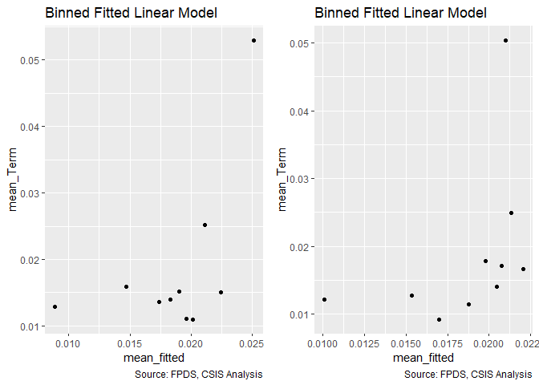<!-- -->

```
## Warning in residuals_binned(model1_old, bins = bins): Always uses Xlb
## Estimated Pr(Termination), should update.
```

```
## Warning in residuals_binned(model1_new, bins = bins): Always uses Xlb
## Estimated Pr(Termination), should update.
```

```
## Warning in if (class(model1_new) %in% c("glmerMod", "lme4", "lmerMod")) {:
## the condition has length > 1 and only the first element will be used
```

```
## Warning in if (!class(model1_new) %in% c("glmerMod", "lme4", "lmerMod") & :
## the condition has length > 1 and only the first element will be used
```

<!-- -->

```
## [[1]]
##        model deviance null.deviance difference
## 1 model1_old 46087.51      46388.62   301.1075
## 2 model1_new 46188.29      46388.62   200.3227
```
Obligations is contrary to expectations and ultimately covered by office veriables. 

HHI is significant at the 0.1 level and contrary to expectations. Ratio is significant and has a large coefficient and is line with expectations.


#### Model 09E: Cumulative Model
Consolidation at less and more granular levels may have different effects. Efficiencies are often used to describe sectors, like utilities, with high barriers to entry. Many of these aspects seem like they would already be captured at less granular NAICS6 levels, e.g. power plants, rather than more specific NAICS6 levels, like solar vs. coal. As a result, consolidation for more granular NAICS6 codes should estimate higher rates of ceiling breaches compared to less granular NAICS6 code.

We'll start by adding in everything from both models and seeing what violates VIF.

```r
#Model
Term_09E <- glm (data=serv_smp,
                 b_Term ~ cln_US6sal + 
                   cln_PSCrate+ cp_OffPerf7+cp_OffPSC7+
                   cn_PairHist7+cln_PairCA+
                   cln_Base + cln_Days+clr_Ceil2Base+
                   Comp+
                   Veh+
                   Pricing+
                   Crisis+
                   cln_Def6HHI+clr_Def6toUS, family=binomial(link="logit"))
glmer_examine(Term_09E)
```

```
##                   GVIF Df GVIF^(1/(2*Df))
## cln_US6sal    1.492000  1        1.221475
## cln_PSCrate   1.347337  1        1.160749
## cp_OffPerf7   1.346920  1        1.160569
## cp_OffPSC7    1.810477  1        1.345540
## cn_PairHist7  1.375752  1        1.172924
## cln_PairCA    2.422277  1        1.556367
## cln_Base      1.424848  1        1.193670
## cln_Days      1.237429  1        1.112398
## clr_Ceil2Base 1.247271  1        1.116813
## Comp          1.374102  3        1.054395
## Veh           2.140583  4        1.099807
## Pricing       1.144007  6        1.011274
## Crisis        1.417322  3        1.059851
## cln_Def6HHI   1.252994  1        1.119372
## clr_Def6toUS  1.204310  1        1.097411
```

```r
stargazer::stargazer(Term_08B,Term_09D2,Term_09E,type="text",
                       digits=2)
```

```
## 
## ============================================================
##                                   Dependent variable:       
##                             --------------------------------
##                                          b_Term             
##                                (1)        (2)        (3)    
## ------------------------------------------------------------
## cln_US6sal                   -0.14***              -0.11*** 
##                               (0.04)                (0.04)  
##                                                             
## cln_PSCrate                    0.03                  0.01   
##                               (0.04)                (0.04)  
##                                                             
## cp_OffPerf7                   -0.06*                -0.05   
##                               (0.03)                (0.03)  
##                                                             
## cp_OffPSC7                   0.47***               0.51***  
##                               (0.04)                (0.04)  
##                                                             
## cn_PairHist7                 -0.11***              -0.11*** 
##                               (0.04)                (0.04)  
##                                                             
## cln_PairCA                   0.46***               0.47***  
##                               (0.04)                (0.04)  
##                                                             
## cln_Base                     0.19***               0.24***  
##                               (0.04)                (0.04)  
##                                                             
## cln_Days                     1.11***               1.08***  
##                               (0.04)                (0.04)  
##                                                             
## clr_Ceil2Base                0.85***               0.83***  
##                               (0.02)                (0.02)  
##                                                             
## Comp1 offer                  0.20***               0.21***  
##                               (0.05)                (0.05)  
##                                                             
## Comp2-4 offers               0.22***               0.22***  
##                               (0.05)                (0.05)  
##                                                             
## Comp5+ offers                0.82***               0.80***  
##                               (0.05)                (0.05)  
##                                                             
## VehS-IDC                     -0.88***              -0.88*** 
##                               (0.04)                (0.05)  
##                                                             
## VehM-IDC                     -0.45***              -0.39*** 
##                               (0.05)                (0.05)  
##                                                             
## VehFSS/GWAC                  -0.43***              -0.41*** 
##                               (0.07)                (0.07)  
##                                                             
## VehBPA/BOA                   -1.43***              -1.36*** 
##                               (0.12)                (0.11)  
##                                                             
## PricingOther FP                0.11                  0.03   
##                               (0.14)                (0.14)  
##                                                             
## PricingT&M/LH/FPLOE          -1.05***              -1.01*** 
##                               (0.16)                (0.16)  
##                                                             
## PricingIncentive             -2.56***              -2.53*** 
##                               (0.71)                (0.71)  
##                                                             
## PricingOther CB              -1.70***              -1.64*** 
##                               (0.13)                (0.13)  
##                                                             
## PricingUCA                   -1.28***              -1.28*** 
##                               (0.28)                (0.28)  
##                                                             
## PricingCombination or Other  -1.31***              -1.25*** 
##                               (0.22)                (0.22)  
##                                                             
## CrisisARRA                   -0.62**               -0.64**  
##                               (0.26)                (0.26)  
##                                                             
## CrisisDis                      0.46                  0.48   
##                               (0.34)                (0.34)  
##                                                             
## CrisisOCO                    -0.32***              -0.28*** 
##                               (0.09)                (0.08)  
##                                                             
## cln_Def6HHI                              0.05*      0.06*   
##                                          (0.03)     (0.03)  
##                                                             
## clr_Def6toUS                            -0.66***   -0.48*** 
##                                          (0.05)     (0.05)  
##                                                             
## Constant                     -4.05***   -3.99***   -4.07*** 
##                               (0.04)     (0.02)     (0.04)  
##                                                             
## ------------------------------------------------------------
## Observations                 250,000    250,000    250,000  
## Log Likelihood              -19,828.66 -23,094.15 -19,778.26
## Akaike Inf. Crit.           39,709.32  46,194.29  39,612.53 
## ============================================================
## Note:                            *p<0.1; **p<0.05; ***p<0.01
```

```r
summary_residual_compare(Term_08B,Term_09E)
```

<!-- -->

```
## Warning in residuals_binned(model1_old, bins = bins): Always uses Xlb
## Estimated Pr(Termination), should update.
```

```
## Warning in residuals_binned(model1_new, bins = bins): Always uses Xlb
## Estimated Pr(Termination), should update.
```

```
## Warning in if (class(model1_new) %in% c("glmerMod", "lme4", "lmerMod")) {:
## the condition has length > 1 and only the first element will be used
```

```
## Warning in if (!class(model1_new) %in% c("glmerMod", "lme4", "lmerMod") & :
## the condition has length > 1 and only the first element will be used
```

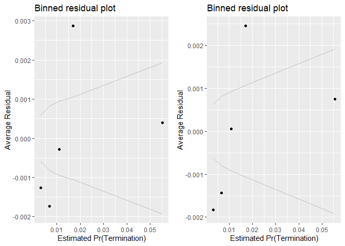<!-- -->

```
## [[1]]
##        model deviance null.deviance difference
## 1 model1_old 39657.32      46388.62   6731.299
## 2 model1_new 39556.53      46388.62   6832.088
```

No big changes from integration.


### Level 3
#### Model 10A: cl_def3_HHI
(Options, breaches, and terminations)
HHI (logged, + means more consolidation)	cln_Def3HHI		TRUE	-	+	++


```r
summary_continuous_plot(serv_smp1m,"def3_HHI_lag1")
```

<!-- -->

```r
summary_continuous_plot(serv_smp1m,"def3_HHI_lag1",log=TRUE)
```

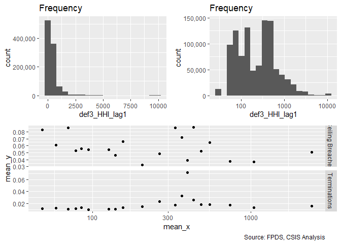<!-- -->

```r
#Model
Term_10A <- glm (data=serv_smp,
                 b_Term ~ cln_Def3HHI, family=binomial(link="logit"))


stargazer::stargazer(
                       Term_09A,Term_10A,
                       
                       type="text",
                       digits=2)
```

```
## 
## ==============================================
##                       Dependent variable:     
##                   ----------------------------
##                              b_Term           
##                        (1)            (2)     
## ----------------------------------------------
## cln_Def6HHI           -0.04                   
##                       (0.03)                  
##                                               
## cln_Def3HHI                         0.41***   
##                                     (0.03)    
##                                               
## Constant             -3.96***      -3.98***   
##                       (0.01)        (0.01)    
##                                               
## ----------------------------------------------
## Observations         250,000        250,000   
## Log Likelihood      -23,193.38    -23,092.51  
## Akaike Inf. Crit.   46,390.77      46,189.02  
## ==============================================
## Note:              *p<0.1; **p<0.05; ***p<0.01
```

```r
summary_residual_compare(Term_10A, skip_vif =  TRUE)
```

```
## Warning in residuals_binned(model1_old, bins = bins): Always uses Xlb
## Estimated Pr(Termination), should update.
```

```
## Warning in if (class(model1_old) %in% c("glmerMod", "lme4", "lmerMod")) {:
## the condition has length > 1 and only the first element will be used
```

```
## Warning in if (!class(model1_old) %in% c("glmerMod", "lme4", "lmerMod") & :
## the condition has length > 1 and only the first element will be used
```

<!-- -->

```
## [[1]]
##        model deviance null.deviance difference
## 1 model1_old 46185.02      46388.62   203.5908
```

Expectations are upheld with a signicant reasult with reasonable magnitude. Level 3 HHI seems to slightly out perform level 6.


#### Model 10B: Defense to Overall ratio
(Options, breaches, and terminations)
Ratio Def. obligatons : US revenue	clr_Def3toUS+		-	+	+


```r
summary_continuous_plot(serv_smp1m,"capped_def3_ratio_lag1")
```

<!-- -->

```r
summary_continuous_plot(serv_smp1m,"capped_def3_ratio_lag1",log=TRUE)
```

<!-- -->

```r
#Model
Term_10B <- glm (data=serv_smp,
                 b_Term ~ clr_Def3toUS, family=binomial(link="logit"))


stargazer::stargazer(
                       Term_09B,Term_10A,Term_10B,
                       
                       type="text",
                       digits=2)
```

```
## 
## ==================================================
##                         Dependent variable:       
##                   --------------------------------
##                                b_Term             
##                      (1)        (2)        (3)    
## --------------------------------------------------
## clr_Def6toUS       -0.64***                       
##                     (0.05)                        
##                                                   
## cln_Def3HHI                   0.41***             
##                                (0.03)             
##                                                   
## clr_Def3toUS                             -0.80*** 
##                                           (0.04)  
##                                                   
## Constant           -3.99***   -3.98***   -4.03*** 
##                     (0.02)     (0.01)     (0.02)  
##                                                   
## --------------------------------------------------
## Observations       250,000    250,000    250,000  
## Log Likelihood    -23,095.80 -23,092.51 -22,921.77
## Akaike Inf. Crit. 46,195.60  46,189.02  45,847.54 
## ==================================================
## Note:                  *p<0.1; **p<0.05; ***p<0.01
```

```r
summary_residual_compare(Term_10B, skip_vif = TRUE)
```

```
## Warning in residuals_binned(model1_old, bins = bins): Always uses Xlb
## Estimated Pr(Termination), should update.
```

```
## Warning in if (class(model1_old) %in% c("glmerMod", "lme4", "lmerMod")) {:
## the condition has length > 1 and only the first element will be used
```

```
## Warning in if (!class(model1_old) %in% c("glmerMod", "lme4", "lmerMod") & :
## the condition has length > 1 and only the first element will be used
```

<!-- -->

```
## [[1]]
##        model deviance null.deviance difference
## 1 model1_old 45843.54      46388.62   545.0714
```

Expectations were not upheld.


#### Model 10C: NAICS6 6 and NAICS6 3
Consolidation at lessa nd more granular levels may have different effects. Efficiencies are often used to describe sectors, like utilities, with high barriers to entry. Many of these aspects seem like they would already be captured at less granular NAICS6 levels, e.g. power plants, rather than more specific NAICS6 levels, like solar vs. coal. As a result, consolidation for more granular NAICS6 codes should estimate higher rates of ceiling breaches compared to less granular NAICS6 code.

We'll start by adding in everything from both models and seeing what violates VIF.

```r
#Model
Term_10C <- glm (data=serv_smp,
                 b_Term ~ cln_Def6HHI+clr_Def6toUS+
                   cln_Def3HHI+clr_Def3toUS, family=binomial(link="logit"))
glmer_examine(Term_10C)
```

```
##  cln_Def6HHI clr_Def6toUS  cln_Def3HHI clr_Def3toUS 
##     1.592042     1.355071     1.652577     1.414773
```

```r
stargazer::stargazer(
                     Term_08B,Term_09E,Term_10A,Term_10B,Term_10C,
                     
                       type="text",
                       digits=2)
```

```
## 
## ==================================================================================
##                                              Dependent variable:                  
##                             ------------------------------------------------------
##                                                     b_Term                        
##                                (1)        (2)        (3)        (4)        (5)    
## ----------------------------------------------------------------------------------
## cln_US6sal                   -0.14***   -0.11***                                  
##                               (0.04)     (0.04)                                   
##                                                                                   
## cln_PSCrate                    0.03       0.01                                    
##                               (0.04)     (0.04)                                   
##                                                                                   
## cp_OffPerf7                   -0.06*     -0.05                                    
##                               (0.03)     (0.03)                                   
##                                                                                   
## cp_OffPSC7                   0.47***    0.51***                                   
##                               (0.04)     (0.04)                                   
##                                                                                   
## cn_PairHist7                 -0.11***   -0.11***                                  
##                               (0.04)     (0.04)                                   
##                                                                                   
## cln_PairCA                   0.46***    0.47***                                   
##                               (0.04)     (0.04)                                   
##                                                                                   
## cln_Base                     0.19***    0.24***                                   
##                               (0.04)     (0.04)                                   
##                                                                                   
## cln_Days                     1.11***    1.08***                                   
##                               (0.04)     (0.04)                                   
##                                                                                   
## clr_Ceil2Base                0.85***    0.83***                                   
##                               (0.02)     (0.02)                                   
##                                                                                   
## Comp1 offer                  0.20***    0.21***                                   
##                               (0.05)     (0.05)                                   
##                                                                                   
## Comp2-4 offers               0.22***    0.22***                                   
##                               (0.05)     (0.05)                                   
##                                                                                   
## Comp5+ offers                0.82***    0.80***                                   
##                               (0.05)     (0.05)                                   
##                                                                                   
## VehS-IDC                     -0.88***   -0.88***                                  
##                               (0.04)     (0.05)                                   
##                                                                                   
## VehM-IDC                     -0.45***   -0.39***                                  
##                               (0.05)     (0.05)                                   
##                                                                                   
## VehFSS/GWAC                  -0.43***   -0.41***                                  
##                               (0.07)     (0.07)                                   
##                                                                                   
## VehBPA/BOA                   -1.43***   -1.36***                                  
##                               (0.12)     (0.11)                                   
##                                                                                   
## PricingOther FP                0.11       0.03                                    
##                               (0.14)     (0.14)                                   
##                                                                                   
## PricingT&M/LH/FPLOE          -1.05***   -1.01***                                  
##                               (0.16)     (0.16)                                   
##                                                                                   
## PricingIncentive             -2.56***   -2.53***                                  
##                               (0.71)     (0.71)                                   
##                                                                                   
## PricingOther CB              -1.70***   -1.64***                                  
##                               (0.13)     (0.13)                                   
##                                                                                   
## PricingUCA                   -1.28***   -1.28***                                  
##                               (0.28)     (0.28)                                   
##                                                                                   
## PricingCombination or Other  -1.31***   -1.25***                                  
##                               (0.22)     (0.22)                                   
##                                                                                   
## CrisisARRA                   -0.62**    -0.64**                                   
##                               (0.26)     (0.26)                                   
##                                                                                   
## CrisisDis                      0.46       0.48                                    
##                               (0.34)     (0.34)                                   
##                                                                                   
## CrisisOCO                    -0.32***   -0.28***                                  
##                               (0.09)     (0.08)                                   
##                                                                                   
## cln_Def6HHI                              0.06*                           -0.22*** 
##                                          (0.03)                           (0.04)  
##                                                                                   
## clr_Def6toUS                            -0.48***                         -0.16*** 
##                                          (0.05)                           (0.05)  
##                                                                                   
## cln_Def3HHI                                        0.41***               0.44***  
##                                                     (0.03)                (0.04)  
##                                                                                   
## clr_Def3toUS                                                  -0.80***   -0.61*** 
##                                                                (0.04)     (0.04)  
##                                                                                   
## Constant                     -4.05***   -4.07***   -3.98***   -4.03***   -4.04*** 
##                               (0.04)     (0.04)     (0.01)     (0.02)     (0.02)  
##                                                                                   
## ----------------------------------------------------------------------------------
## Observations                 250,000    250,000    250,000    250,000    250,000  
## Log Likelihood              -19,828.66 -19,778.26 -23,092.51 -22,921.77 -22,847.13
## Akaike Inf. Crit.           39,709.32  39,612.53  46,189.02  45,847.54  45,704.27 
## ==================================================================================
## Note:                                                  *p<0.1; **p<0.05; ***p<0.01
```

```r
summary_residual_compare(Term_08B,Term_10C,Term_09E,Term_10C)
```

<!-- -->

```
## Warning in residuals_binned(model1_old, bins = bins): Always uses Xlb
## Estimated Pr(Termination), should update.
```

```
## Warning in residuals_binned(model1_new, bins = bins): Always uses Xlb
## Estimated Pr(Termination), should update.
```

```
## Warning in residuals_binned(model2_old, bins = bins): Always uses Xlb
## Estimated Pr(Termination), should update.
```

```
## Warning in residuals_binned(model2_new, bins = bins): Always uses Xlb
## Estimated Pr(Termination), should update.
```

```
## Warning in if (class(model1_new) %in% c("glmerMod", "lme4", "lmerMod") & :
## the condition has length > 1 and only the first element will be used
```

```
## Warning in if ((!class(model1_new) %in% c("glmerMod", "lme4", "lmerMod")
## & : the condition has length > 1 and only the first element will be used
```

<!-- -->

```
## [[1]]
##        model deviance null.deviance difference
## 1 model1_old 39657.32      46388.62  6731.2993
## 2 model1_new 45694.27      46388.62   694.3463
## 3 model2_old 39556.53      46388.62  6832.0882
## 4 model2_new 45694.27      46388.62   694.3463
```

HHI6 is now in line with expectations and significant. Otherwise magnitudes fluctuated.

#### Model 10D: Cumulative Model
.

```r
#Model
Term_10D <- glm (data=serv_smp,
                 b_Term ~ cln_US6sal + 
                   cln_PSCrate+ cp_OffPerf7+cp_OffPSC7+
                   cn_PairHist7+cln_PairCA+
                   cln_Base + cln_Days+clr_Ceil2Base+
                   Comp+
                   Veh+
                   Pricing+
                   Crisis+
                   cln_Def6HHI+clr_Def6toUS+
                   cln_Def3HHI+clr_Def3toUS, family=binomial(link="logit"))

glmer_examine(Term_10D)
```

```
##                   GVIF Df GVIF^(1/(2*Df))
## cln_US6sal    1.604580  1        1.266720
## cln_PSCrate   1.351134  1        1.162383
## cp_OffPerf7   1.376365  1        1.173186
## cp_OffPSC7    1.825161  1        1.350985
## cn_PairHist7  1.379678  1        1.174597
## cln_PairCA    2.638424  1        1.624323
## cln_Base      1.436732  1        1.198637
## cln_Days      1.233730  1        1.110734
## clr_Ceil2Base 1.274326  1        1.128860
## Comp          1.379992  3        1.055146
## Veh           2.236242  4        1.105834
## Pricing       1.168366  6        1.013052
## Crisis        1.417750  3        1.059904
## cln_Def6HHI   1.882754  1        1.372135
## clr_Def6toUS  1.556736  1        1.247692
## cln_Def3HHI   1.893715  1        1.376123
## clr_Def3toUS  1.687794  1        1.299151
```

```r
stargazer::stargazer(Term_09E,Term_10C,Term_10D,
                     
                       type="text",
                       digits=2)
```

```
## 
## ============================================================
##                                   Dependent variable:       
##                             --------------------------------
##                                          b_Term             
##                                (1)        (2)        (3)    
## ------------------------------------------------------------
## cln_US6sal                   -0.11***                0.06   
##                               (0.04)                (0.04)  
##                                                             
## cln_PSCrate                    0.01                 0.06*   
##                               (0.04)                (0.03)  
##                                                             
## cp_OffPerf7                   -0.05                -0.08**  
##                               (0.03)                (0.04)  
##                                                             
## cp_OffPSC7                   0.51***               0.58***  
##                               (0.04)                (0.04)  
##                                                             
## cn_PairHist7                 -0.11***               -0.06*  
##                               (0.04)                (0.04)  
##                                                             
## cln_PairCA                   0.47***               0.31***  
##                               (0.04)                (0.04)  
##                                                             
## cln_Base                     0.24***               0.27***  
##                               (0.04)                (0.04)  
##                                                             
## cln_Days                     1.08***               1.06***  
##                               (0.04)                (0.04)  
##                                                             
## clr_Ceil2Base                0.83***               0.81***  
##                               (0.02)                (0.02)  
##                                                             
## Comp1 offer                  0.21***               0.20***  
##                               (0.05)                (0.05)  
##                                                             
## Comp2-4 offers               0.22***               0.22***  
##                               (0.05)                (0.05)  
##                                                             
## Comp5+ offers                0.80***               0.78***  
##                               (0.05)                (0.05)  
##                                                             
## VehS-IDC                     -0.88***              -0.81*** 
##                               (0.05)                (0.05)  
##                                                             
## VehM-IDC                     -0.39***              -0.39*** 
##                               (0.05)                (0.05)  
##                                                             
## VehFSS/GWAC                  -0.41***              -0.28*** 
##                               (0.07)                (0.07)  
##                                                             
## VehBPA/BOA                   -1.36***              -1.37*** 
##                               (0.11)                (0.12)  
##                                                             
## PricingOther FP                0.03                 -0.06   
##                               (0.14)                (0.14)  
##                                                             
## PricingT&M/LH/FPLOE          -1.01***              -0.82*** 
##                               (0.16)                (0.16)  
##                                                             
## PricingIncentive             -2.53***              -2.31*** 
##                               (0.71)                (0.71)  
##                                                             
## PricingOther CB              -1.64***              -1.44*** 
##                               (0.13)                (0.13)  
##                                                             
## PricingUCA                   -1.28***              -1.25*** 
##                               (0.28)                (0.28)  
##                                                             
## PricingCombination or Other  -1.25***              -1.08*** 
##                               (0.22)                (0.22)  
##                                                             
## CrisisARRA                   -0.64**               -0.72*** 
##                               (0.26)                (0.26)  
##                                                             
## CrisisDis                      0.48                  0.44   
##                               (0.34)                (0.34)  
##                                                             
## CrisisOCO                    -0.28***              -0.27*** 
##                               (0.08)                (0.08)  
##                                                             
## cln_Def6HHI                   0.06*     -0.22***   -0.11**  
##                               (0.03)     (0.04)     (0.04)  
##                                                             
## clr_Def6toUS                 -0.48***   -0.16***   -0.18*** 
##                               (0.05)     (0.05)     (0.05)  
##                                                             
## cln_Def3HHI                             0.44***    0.26***  
##                                          (0.04)     (0.04)  
##                                                             
## clr_Def3toUS                            -0.61***   -0.52*** 
##                                          (0.04)     (0.05)  
##                                                             
## Constant                     -4.07***   -4.04***   -4.14*** 
##                               (0.04)     (0.02)     (0.04)  
##                                                             
## ------------------------------------------------------------
## Observations                 250,000    250,000    250,000  
## Log Likelihood              -19,778.26 -22,847.13 -19,680.44
## Akaike Inf. Crit.           39,612.53  45,704.27  39,420.87 
## ============================================================
## Note:                            *p<0.1; **p<0.05; ***p<0.01
```

```r
summary_residual_compare(Term_09E,Term_10D)
```

<!-- -->

```
## Warning in residuals_binned(model1_old, bins = bins): Always uses Xlb
## Estimated Pr(Termination), should update.
```

```
## Warning in residuals_binned(model1_new, bins = bins): Always uses Xlb
## Estimated Pr(Termination), should update.
```

```
## Warning in if (class(model1_new) %in% c("glmerMod", "lme4", "lmerMod")) {:
## the condition has length > 1 and only the first element will be used
```

```
## Warning in if (!class(model1_new) %in% c("glmerMod", "lme4", "lmerMod") & :
## the condition has length > 1 and only the first element will be used
```

<!-- -->

```
## [[1]]
##        model deviance null.deviance difference
## 1 model1_old 39556.53      46388.62   6832.088
## 2 model1_new 39360.87      46388.62   7027.743
```

HHi6 becomes less significant, Salary loses significance and flips sign, performance based regains significance but pair history loses it. 
## Office 
### Office and Vendor-Office Pair

#### Model 11A: Vendor Market Share
Expectation: Contracts of offices partnered with vendors who have larger market shares would be more likely to experience cost ceiling (++) breaches and exercised options, but less likely to have terminations.


```r
summary_continuous_plot(serv_smp1m,"pMarket")
```

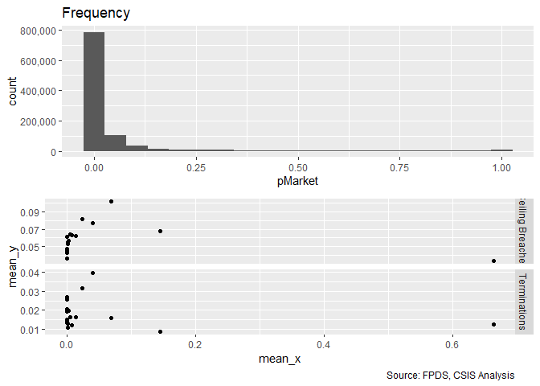<!-- -->

```r
summary_continuous_plot(serv_smp1m,"pMarket",log=TRUE)
```

```
## Warning: Transformation introduced infinite values in continuous x-axis
```

```
## Warning: Removed 170870 rows containing non-finite values (stat_bin).
```

```
## Warning: Transformation introduced infinite values in continuous x-axis
```

<!-- -->

```r
#Model
Term_11A <- glm (data=serv_smp,
                 b_Term ~ cp_PairObl7, family=binomial(link="logit"))


stargazer::stargazer(
                      Term_11A,
                       
                       type="text",
                       digits=2)
```

```
## 
## =============================================
##                       Dependent variable:    
##                   ---------------------------
##                             b_Term           
## ---------------------------------------------
## cp_PairObl7                -0.33***          
##                             (0.04)           
##                                              
## Constant                   -3.97***          
##                             (0.01)           
##                                              
## ---------------------------------------------
## Observations                250,000          
## Log Likelihood            -23,154.67         
## Akaike Inf. Crit.          46,313.35         
## =============================================
## Note:             *p<0.1; **p<0.05; ***p<0.01
```

```r
summary_residual_compare(Term_11A)
```

```
## Warning in residuals_binned(model1_old, bins = bins): Always uses Xlb
## Estimated Pr(Termination), should update.
```

```
## Warning in if (class(model1_old) %in% c("glmerMod", "lme4", "lmerMod")) {:
## the condition has length > 1 and only the first element will be used
```

```
## Warning in if (!class(model1_old) %in% c("glmerMod", "lme4", "lmerMod") & :
## the condition has length > 1 and only the first element will be used
```

<!-- -->

```
## [[1]]
##        model deviance null.deviance difference
## 1 model1_old 46309.35      46388.62   79.26859
```

Aligns with expectations on terminations.


#### Model 11B: Cumulative Model


```r
#Model
Term_11B <- glm (data=serv_smp,
                 b_Term ~ cln_US6sal + 
                   cln_PSCrate+ cp_OffPerf7+cp_OffPSC7+
                   cn_PairHist7+cln_PairCA+
                   cln_Base + cln_Days+clr_Ceil2Base+
                   Comp+
                   Veh+
                   Pricing+
                   Crisis+
                   cln_Def6HHI+clr_Def6toUS+
                   cln_Def3HHI+clr_Def3toUS+
                   cp_PairObl7, family=binomial(link="logit"))

glmer_examine(Term_11B)
```

```
##                   GVIF Df GVIF^(1/(2*Df))
## cln_US6sal    1.631163  1        1.277170
## cln_PSCrate   1.372030  1        1.171337
## cp_OffPerf7   1.417165  1        1.190447
## cp_OffPSC7    1.838303  1        1.355840
## cn_PairHist7  1.378230  1        1.173980
## cln_PairCA    2.818464  1        1.678828
## cln_Base      1.452418  1        1.205163
## cln_Days      1.238554  1        1.112903
## clr_Ceil2Base 1.287998  1        1.134900
## Comp          1.396807  3        1.057279
## Veh           2.256186  4        1.107062
## Pricing       1.176727  6        1.013654
## Crisis        1.517636  3        1.072000
## cln_Def6HHI   1.881620  1        1.371721
## clr_Def6toUS  1.589102  1        1.260596
## cln_Def3HHI   1.900180  1        1.378470
## clr_Def3toUS  1.707689  1        1.306786
## cp_PairObl7   1.385383  1        1.177023
```

```r
stargazer::stargazer(
                     Term_10D,Term_11A,Term_11B,
                     
                       type="text",
                       digits=2)
```

```
## 
## ============================================================
##                                   Dependent variable:       
##                             --------------------------------
##                                          b_Term             
##                                (1)        (2)        (3)    
## ------------------------------------------------------------
## cln_US6sal                     0.06                  0.03   
##                               (0.04)                (0.04)  
##                                                             
## cln_PSCrate                   0.06*                 0.08**  
##                               (0.03)                (0.04)  
##                                                             
## cp_OffPerf7                  -0.08**               -0.12*** 
##                               (0.04)                (0.04)  
##                                                             
## cp_OffPSC7                   0.58***               0.61***  
##                               (0.04)                (0.04)  
##                                                             
## cn_PairHist7                  -0.06*                -0.06*  
##                               (0.04)                (0.04)  
##                                                             
## cln_PairCA                   0.31***               0.41***  
##                               (0.04)                (0.04)  
##                                                             
## cln_Base                     0.27***               0.28***  
##                               (0.04)                (0.04)  
##                                                             
## cln_Days                     1.06***               1.05***  
##                               (0.04)                (0.04)  
##                                                             
## clr_Ceil2Base                0.81***               0.79***  
##                               (0.02)                (0.02)  
##                                                             
## Comp1 offer                  0.20***               0.23***  
##                               (0.05)                (0.05)  
##                                                             
## Comp2-4 offers               0.22***               0.22***  
##                               (0.05)                (0.05)  
##                                                             
## Comp5+ offers                0.78***               0.76***  
##                               (0.05)                (0.05)  
##                                                             
## VehS-IDC                     -0.81***              -0.84*** 
##                               (0.05)                (0.05)  
##                                                             
## VehM-IDC                     -0.39***              -0.42*** 
##                               (0.05)                (0.05)  
##                                                             
## VehFSS/GWAC                  -0.28***              -0.29*** 
##                               (0.07)                (0.07)  
##                                                             
## VehBPA/BOA                   -1.37***              -1.33*** 
##                               (0.12)                (0.12)  
##                                                             
## PricingOther FP               -0.06                 -0.09   
##                               (0.14)                (0.14)  
##                                                             
## PricingT&M/LH/FPLOE          -0.82***              -0.82*** 
##                               (0.16)                (0.16)  
##                                                             
## PricingIncentive             -2.31***              -2.30*** 
##                               (0.71)                (0.71)  
##                                                             
## PricingOther CB              -1.44***              -1.39*** 
##                               (0.13)                (0.13)  
##                                                             
## PricingUCA                   -1.25***              -1.19*** 
##                               (0.28)                (0.28)  
##                                                             
## PricingCombination or Other  -1.08***              -1.06*** 
##                               (0.22)                (0.22)  
##                                                             
## CrisisARRA                   -0.72***              -0.73*** 
##                               (0.26)                (0.26)  
##                                                             
## CrisisDis                      0.44                  0.44   
##                               (0.34)                (0.34)  
##                                                             
## CrisisOCO                    -0.27***               -0.02   
##                               (0.08)                (0.09)  
##                                                             
## cln_Def6HHI                  -0.11**               -0.10**  
##                               (0.04)                (0.04)  
##                                                             
## clr_Def6toUS                 -0.18***              -0.19*** 
##                               (0.05)                (0.06)  
##                                                             
## cln_Def3HHI                  0.26***               0.26***  
##                               (0.04)                (0.04)  
##                                                             
## clr_Def3toUS                 -0.52***              -0.50*** 
##                               (0.05)                (0.05)  
##                                                             
## cp_PairObl7                             -0.33***   -0.39*** 
##                                          (0.04)     (0.05)  
##                                                             
## Constant                     -4.14***   -3.97***   -4.15*** 
##                               (0.04)     (0.01)     (0.04)  
##                                                             
## ------------------------------------------------------------
## Observations                 250,000    250,000    250,000  
## Log Likelihood              -19,680.44 -23,154.67 -19,649.47
## Akaike Inf. Crit.           39,420.87  46,313.35  39,360.93 
## ============================================================
## Note:                            *p<0.1; **p<0.05; ***p<0.01
```

```r
summary_residual_compare(Term_10D,Term_11B)
```

<!-- -->

```
## Warning in residuals_binned(model1_old, bins = bins): Always uses Xlb
## Estimated Pr(Termination), should update.
```

```
## Warning in residuals_binned(model1_new, bins = bins): Always uses Xlb
## Estimated Pr(Termination), should update.
```

```
## Warning in if (class(model1_new) %in% c("glmerMod", "lme4", "lmerMod")) {:
## the condition has length > 1 and only the first element will be used
```

```
## Warning in if (!class(model1_new) %in% c("glmerMod", "lme4", "lmerMod") & :
## the condition has length > 1 and only the first element will be used
```

<!-- -->

```
## [[1]]
##        model deviance null.deviance difference
## 1 model1_old 39360.87      46388.62   7027.743
## 2 model1_new 39298.93      46388.62   7089.681
```
CFTE regains significance at the 0.05 level.  PMarket grows a little stronger.

OCO loses signifiance.

### Other Office Characteristics
#### 12A: Past Office Volume (dollars)

Expectation: Contracting offices previously had more contract volume in dollars would have more experience managing cost and preventing cost-ceiling breaches, therefore larger past office volume would lower the likelihood of cost-ceiling breaches but no substantial relationships with likelihood of terminations or exercised options.
(Option, Breach, Termination)
Past Office Volume $s	cln_OffObl7		+	-	+
From looking at data, terminations, easier for big, less dependent. - less dependenct


```r
summary_continuous_plot(serv_smp1m,"office_obligatedamount_7year")
```

<!-- -->

```r
summary_continuous_plot(serv_smp1m,"office_obligatedamount_7year",log=TRUE)
```

```
## Warning: Transformation introduced infinite values in continuous x-axis
```

```
## Warning: Removed 14076 rows containing non-finite values (stat_bin).
```

<!-- -->

```r
#Model
Term_12A <- glm (data=serv_smp,
                 b_Term ~ cln_OffObl7, family=binomial(link="logit"))


stargazer::stargazer(Term_11B,
                       Term_12A,
                       
                       type="text",
                       digits=2)
```

```
## 
## ========================================================
##                                 Dependent variable:     
##                             ----------------------------
##                                        b_Term           
##                                  (1)            (2)     
## --------------------------------------------------------
## cln_US6sal                       0.03                   
##                                 (0.04)                  
##                                                         
## cln_PSCrate                     0.08**                  
##                                 (0.04)                  
##                                                         
## cp_OffPerf7                    -0.12***                 
##                                 (0.04)                  
##                                                         
## cp_OffPSC7                     0.61***                  
##                                 (0.04)                  
##                                                         
## cn_PairHist7                    -0.06*                  
##                                 (0.04)                  
##                                                         
## cln_PairCA                     0.41***                  
##                                 (0.04)                  
##                                                         
## cln_Base                       0.28***                  
##                                 (0.04)                  
##                                                         
## cln_Days                       1.05***                  
##                                 (0.04)                  
##                                                         
## clr_Ceil2Base                  0.79***                  
##                                 (0.02)                  
##                                                         
## Comp1 offer                    0.23***                  
##                                 (0.05)                  
##                                                         
## Comp2-4 offers                 0.22***                  
##                                 (0.05)                  
##                                                         
## Comp5+ offers                  0.76***                  
##                                 (0.05)                  
##                                                         
## VehS-IDC                       -0.84***                 
##                                 (0.05)                  
##                                                         
## VehM-IDC                       -0.42***                 
##                                 (0.05)                  
##                                                         
## VehFSS/GWAC                    -0.29***                 
##                                 (0.07)                  
##                                                         
## VehBPA/BOA                     -1.33***                 
##                                 (0.12)                  
##                                                         
## PricingOther FP                 -0.09                   
##                                 (0.14)                  
##                                                         
## PricingT&M/LH/FPLOE            -0.82***                 
##                                 (0.16)                  
##                                                         
## PricingIncentive               -2.30***                 
##                                 (0.71)                  
##                                                         
## PricingOther CB                -1.39***                 
##                                 (0.13)                  
##                                                         
## PricingUCA                     -1.19***                 
##                                 (0.28)                  
##                                                         
## PricingCombination or Other    -1.06***                 
##                                 (0.22)                  
##                                                         
## CrisisARRA                     -0.73***                 
##                                 (0.26)                  
##                                                         
## CrisisDis                        0.44                   
##                                 (0.34)                  
##                                                         
## CrisisOCO                       -0.02                   
##                                 (0.09)                  
##                                                         
## cln_Def6HHI                    -0.10**                  
##                                 (0.04)                  
##                                                         
## clr_Def6toUS                   -0.19***                 
##                                 (0.06)                  
##                                                         
## cln_Def3HHI                    0.26***                  
##                                 (0.04)                  
##                                                         
## clr_Def3toUS                   -0.50***                 
##                                 (0.05)                  
##                                                         
## cp_PairObl7                    -0.39***                 
##                                 (0.05)                  
##                                                         
## cln_OffObl7                                   0.54***   
##                                               (0.05)    
##                                                         
## Constant                       -4.15***      -3.99***   
##                                 (0.04)        (0.02)    
##                                                         
## --------------------------------------------------------
## Observations                   250,000        250,000   
## Log Likelihood                -19,649.47    -23,103.12  
## Akaike Inf. Crit.             39,360.93      46,210.23  
## ========================================================
## Note:                        *p<0.1; **p<0.05; ***p<0.01
```

```r
summary_residual_compare(Term_12A, skip_vif = TRUE)
```

```
## Warning in residuals_binned(model1_old, bins = bins): Always uses Xlb
## Estimated Pr(Termination), should update.
```

```
## Warning in if (class(model1_old) %in% c("glmerMod", "lme4", "lmerMod")) {:
## the condition has length > 1 and only the first element will be used
```

```
## Warning in if (!class(model1_old) %in% c("glmerMod", "lme4", "lmerMod") & :
## the condition has length > 1 and only the first element will be used
```

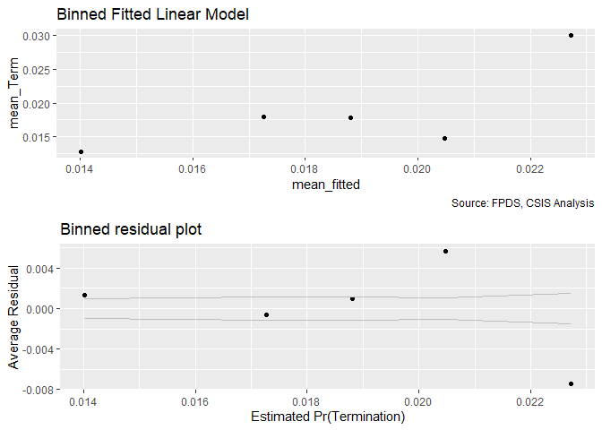<!-- -->

```
## [[1]]
##        model deviance null.deviance difference
## 1 model1_old 46206.23      46388.62   182.3838
```

Out of our expectation, the results also showed increasing past office volume would increase likelihood of having terminations.


#### 12B: Detailed Industry Focus

Expectation: If a office is focused on a smaller number of industries than it has a less complex set of responsibilities which would decrease the likelihood of having cost ceiling breaches and terminations, and increase the likelihood of having options exercised.


```r
summary_continuous_plot(serv_smp1m,"cln_OffFocus")
```

<!-- -->

```r
#Model
Term_12B <- glm (data=serv_smp,
                 b_Term ~ cln_OffFocus, family=binomial(link="logit"))


stargazer::stargazer(Term_11B,
                     Term_12A,
                       Term_12B,
                       
                       type="text",
                       digits=2)
```

```
## 
## ============================================================
##                                   Dependent variable:       
##                             --------------------------------
##                                          b_Term             
##                                (1)        (2)        (3)    
## ------------------------------------------------------------
## cln_US6sal                     0.03                         
##                               (0.04)                        
##                                                             
## cln_PSCrate                   0.08**                        
##                               (0.04)                        
##                                                             
## cp_OffPerf7                  -0.12***                       
##                               (0.04)                        
##                                                             
## cp_OffPSC7                   0.61***                        
##                               (0.04)                        
##                                                             
## cn_PairHist7                  -0.06*                        
##                               (0.04)                        
##                                                             
## cln_PairCA                   0.41***                        
##                               (0.04)                        
##                                                             
## cln_Base                     0.28***                        
##                               (0.04)                        
##                                                             
## cln_Days                     1.05***                        
##                               (0.04)                        
##                                                             
## clr_Ceil2Base                0.79***                        
##                               (0.02)                        
##                                                             
## Comp1 offer                  0.23***                        
##                               (0.05)                        
##                                                             
## Comp2-4 offers               0.22***                        
##                               (0.05)                        
##                                                             
## Comp5+ offers                0.76***                        
##                               (0.05)                        
##                                                             
## VehS-IDC                     -0.84***                       
##                               (0.05)                        
##                                                             
## VehM-IDC                     -0.42***                       
##                               (0.05)                        
##                                                             
## VehFSS/GWAC                  -0.29***                       
##                               (0.07)                        
##                                                             
## VehBPA/BOA                   -1.33***                       
##                               (0.12)                        
##                                                             
## PricingOther FP               -0.09                         
##                               (0.14)                        
##                                                             
## PricingT&M/LH/FPLOE          -0.82***                       
##                               (0.16)                        
##                                                             
## PricingIncentive             -2.30***                       
##                               (0.71)                        
##                                                             
## PricingOther CB              -1.39***                       
##                               (0.13)                        
##                                                             
## PricingUCA                   -1.19***                       
##                               (0.28)                        
##                                                             
## PricingCombination or Other  -1.06***                       
##                               (0.22)                        
##                                                             
## CrisisARRA                   -0.73***                       
##                               (0.26)                        
##                                                             
## CrisisDis                      0.44                         
##                               (0.34)                        
##                                                             
## CrisisOCO                     -0.02                         
##                               (0.09)                        
##                                                             
## cln_Def6HHI                  -0.10**                        
##                               (0.04)                        
##                                                             
## clr_Def6toUS                 -0.19***                       
##                               (0.06)                        
##                                                             
## cln_Def3HHI                  0.26***                        
##                               (0.04)                        
##                                                             
## clr_Def3toUS                 -0.50***                       
##                               (0.05)                        
##                                                             
## cp_PairObl7                  -0.39***                       
##                               (0.05)                        
##                                                             
## cln_OffObl7                             0.54***             
##                                          (0.05)             
##                                                             
## cln_OffFocus                                       0.44***  
##                                                     (0.03)  
##                                                             
## Constant                     -4.15***   -3.99***   -3.98*** 
##                               (0.04)     (0.02)     (0.02)  
##                                                             
## ------------------------------------------------------------
## Observations                 250,000    250,000    250,000  
## Log Likelihood              -19,649.47 -23,103.12 -23,079.62
## Akaike Inf. Crit.           39,360.93  46,210.23  46,163.24 
## ============================================================
## Note:                            *p<0.1; **p<0.05; ***p<0.01
```

```r
summary_residual_compare(Term_12B, skip_vif = TRUE, bins=10)
```

```
## Warning in residuals_binned(model1_old, bins = bins): Always uses Xlb
## Estimated Pr(Termination), should update.
```

```
## Warning in if (class(model1_old) %in% c("glmerMod", "lme4", "lmerMod")) {:
## the condition has length > 1 and only the first element will be used
```

```
## Warning in if (!class(model1_old) %in% c("glmerMod", "lme4", "lmerMod") & :
## the condition has length > 1 and only the first element will be used
```

<!-- -->

```
## [[1]]
##        model deviance null.deviance difference
## 1 model1_old 46159.24      46388.62   229.3775
```

When using hhi calculated based on contracting office number of contracts: considering hhi alone, termination expectations were  not met.

#### 12C: Cumulative Model


```r
#Model
Term_12C <- glm (data=serv_smp,
                 b_Term ~ cln_US6sal + 
                   cln_PSCrate+ cp_OffPerf7+cp_OffPSC7+
                   cn_PairHist7+cln_PairCA+
                   cln_Base + cln_Days+clr_Ceil2Base+
                   Comp+
                   Veh+
                   Pricing+
                   Crisis+
                   cln_Def6HHI+clr_Def6toUS+
                   cln_Def3HHI+clr_Def3toUS+
                   cp_PairObl7+
                   cln_OffObl7+cln_OffFocus, family=binomial(link="logit"))

glmer_examine(Term_12C)
```

```
##                   GVIF Df GVIF^(1/(2*Df))
## cln_US6sal    1.660007  1        1.288412
## cln_PSCrate   1.384488  1        1.176642
## cp_OffPerf7   1.453346  1        1.205548
## cp_OffPSC7    2.298287  1        1.516010
## cn_PairHist7  1.426617  1        1.194411
## cln_PairCA    3.024030  1        1.738974
## cln_Base      1.466017  1        1.210792
## cln_Days      1.255878  1        1.120660
## clr_Ceil2Base 1.297832  1        1.139224
## Comp          1.404461  3        1.058242
## Veh           2.311727  4        1.110432
## Pricing       1.186798  6        1.014374
## Crisis        1.523721  3        1.072715
## cln_Def6HHI   1.908117  1        1.381346
## clr_Def6toUS  1.591000  1        1.261349
## cln_Def3HHI   1.919315  1        1.385394
## clr_Def3toUS  1.722658  1        1.312501
## cp_PairObl7   1.407394  1        1.186336
## cln_OffObl7   1.230562  1        1.109307
## cln_OffFocus  2.052344  1        1.432600
```

```r
stargazer::stargazer(
                     Term_11B,Term_12A,Term_12B,Term_12C,
                     
                       type="text",
                       digits=2)
```

```
## 
## =======================================================================
##                                         Dependent variable:            
##                             -------------------------------------------
##                                               b_Term                   
##                                (1)        (2)        (3)        (4)    
## -----------------------------------------------------------------------
## cln_US6sal                     0.03                             0.01   
##                               (0.04)                           (0.04)  
##                                                                        
## cln_PSCrate                   0.08**                           0.08**  
##                               (0.04)                           (0.04)  
##                                                                        
## cp_OffPerf7                  -0.12***                         -0.14*** 
##                               (0.04)                           (0.04)  
##                                                                        
## cp_OffPSC7                   0.61***                          0.54***  
##                               (0.04)                           (0.04)  
##                                                                        
## cn_PairHist7                  -0.06*                          -0.07**  
##                               (0.04)                           (0.04)  
##                                                                        
## cln_PairCA                   0.41***                          0.35***  
##                               (0.04)                           (0.04)  
##                                                                        
## cln_Base                     0.28***                          0.28***  
##                               (0.04)                           (0.04)  
##                                                                        
## cln_Days                     1.05***                          1.03***  
##                               (0.04)                           (0.04)  
##                                                                        
## clr_Ceil2Base                0.79***                          0.79***  
##                               (0.02)                           (0.02)  
##                                                                        
## Comp1 offer                  0.23***                          0.24***  
##                               (0.05)                           (0.05)  
##                                                                        
## Comp2-4 offers               0.22***                          0.23***  
##                               (0.05)                           (0.05)  
##                                                                        
## Comp5+ offers                0.76***                          0.76***  
##                               (0.05)                           (0.05)  
##                                                                        
## VehS-IDC                     -0.84***                         -0.84*** 
##                               (0.05)                           (0.05)  
##                                                                        
## VehM-IDC                     -0.42***                         -0.43*** 
##                               (0.05)                           (0.05)  
##                                                                        
## VehFSS/GWAC                  -0.29***                         -0.28*** 
##                               (0.07)                           (0.07)  
##                                                                        
## VehBPA/BOA                   -1.33***                         -1.37*** 
##                               (0.12)                           (0.12)  
##                                                                        
## PricingOther FP               -0.09                            -0.12   
##                               (0.14)                           (0.14)  
##                                                                        
## PricingT&M/LH/FPLOE          -0.82***                         -0.81*** 
##                               (0.16)                           (0.16)  
##                                                                        
## PricingIncentive             -2.30***                         -2.30*** 
##                               (0.71)                           (0.71)  
##                                                                        
## PricingOther CB              -1.39***                         -1.40*** 
##                               (0.13)                           (0.13)  
##                                                                        
## PricingUCA                   -1.19***                         -1.20*** 
##                               (0.28)                           (0.28)  
##                                                                        
## PricingCombination or Other  -1.06***                         -1.04*** 
##                               (0.22)                           (0.22)  
##                                                                        
## CrisisARRA                   -0.73***                         -0.71*** 
##                               (0.26)                           (0.26)  
##                                                                        
## CrisisDis                      0.44                             0.43   
##                               (0.34)                           (0.34)  
##                                                                        
## CrisisOCO                     -0.02                            -0.04   
##                               (0.09)                           (0.09)  
##                                                                        
## cln_Def6HHI                  -0.10**                           -0.07*  
##                               (0.04)                           (0.04)  
##                                                                        
## clr_Def6toUS                 -0.19***                         -0.20*** 
##                               (0.06)                           (0.06)  
##                                                                        
## cln_Def3HHI                  0.26***                          0.24***  
##                               (0.04)                           (0.04)  
##                                                                        
## clr_Def3toUS                 -0.50***                         -0.51*** 
##                               (0.05)                           (0.05)  
##                                                                        
## cp_PairObl7                  -0.39***                         -0.38*** 
##                               (0.05)                           (0.05)  
##                                                                        
## cln_OffObl7                             0.54***               0.11***  
##                                          (0.05)                (0.04)  
##                                                                        
## cln_OffFocus                                       0.44***    0.17***  
##                                                     (0.03)     (0.04)  
##                                                                        
## Constant                     -4.15***   -3.99***   -3.98***   -4.15*** 
##                               (0.04)     (0.02)     (0.02)     (0.04)  
##                                                                        
## -----------------------------------------------------------------------
## Observations                 250,000    250,000    250,000    250,000  
## Log Likelihood              -19,649.47 -23,103.12 -23,079.62 -19,638.20
## Akaike Inf. Crit.           39,360.93  46,210.23  46,163.24  39,342.39 
## =======================================================================
## Note:                                       *p<0.1; **p<0.05; ***p<0.01
```

```r
summary_residual_compare(Term_10D,Term_12C)
```

<!-- -->

```
## Warning in residuals_binned(model1_old, bins = bins): Always uses Xlb
## Estimated Pr(Termination), should update.
```

```
## Warning in residuals_binned(model1_new, bins = bins): Always uses Xlb
## Estimated Pr(Termination), should update.
```

```
## Warning in if (class(model1_new) %in% c("glmerMod", "lme4", "lmerMod")) {:
## the condition has length > 1 and only the first element will be used
```

```
## Warning in if (!class(model1_new) %in% c("glmerMod", "lme4", "lmerMod") & :
## the condition has length > 1 and only the first element will be used
```

<!-- -->

```
## [[1]]
##        model deviance null.deviance difference
## 1 model1_old 39360.87      46388.62   7027.743
## 2 model1_new 39276.39      46388.62   7112.222
```

```r
summary_residual_compare(Term_11B,Term_12C)
```

<!-- -->

```
## Warning in residuals_binned(model1_old, bins = bins): Always uses Xlb
## Estimated Pr(Termination), should update.
```

```
## Warning in residuals_binned(model1_new, bins = bins): Always uses Xlb
## Estimated Pr(Termination), should update.
```

```
## Warning in if (class(model1_new) %in% c("glmerMod", "lme4", "lmerMod")) {:
## the condition has length > 1 and only the first element will be used
```

```
## Warning in if (!class(model1_new) %in% c("glmerMod", "lme4", "lmerMod") & :
## the condition has length > 1 and only the first element will be used
```

<!-- -->

```
## [[1]]
##        model deviance null.deviance difference
## 1 model1_old 39298.93      46388.62   7089.681
## 2 model1_new 39276.39      46388.62   7112.222
```
Pair history regains significance at the 0.05 level but HHI loses it. Both volume and focus stay significant but have their magnitude sharply reduced.
# Interactions
(Option, Breach, Termination)
Firm-Fixed Price (base)				--	+	++
Other Fixed Price				-	+	+
Time & Materials / Labor Hours / FP: LoE				-	+	+
Incentive Fee (both FPIF or CBIF)				++	--	--
Other Cost Based				+	-	-
Undefinitized Contract Award				+	-	-
Combination				+	-	-

####15A: Average U.S. Salaries (logged):Contract Pricing
Cost-based and incentive contract types may do a  better job at handling complex contracts.


```r
summary_continuous_plot(serv_smp1m,"cln_Base","Pricing",metric="cbre")
```

```
## Warning in `[<-.factor`(`*tmp*`, ri, value = c(0, 0, 0, 0, 0, 0, 0, 0, 0, :
## invalid factor level, NA generated
```

```
## Warning: Removed 4 rows containing missing values (geom_point).
```

<!-- -->

```r
#Create the models
term_salary_pricing_15A_no_interact <- glm(data=serv_smp, b_Term ~ Pricing + cl_US6_avg_sal_lag1,
                                           family=binomial(link="logit"))
glmer_examine(term_salary_pricing_15A_no_interact)
```

```
##                        GVIF Df GVIF^(1/(2*Df))
## Pricing             1.01567  6        1.001297
## cl_US6_avg_sal_lag1 1.01567  1        1.007804
```

```r
term_salary_pricing_15A <- glm(data=serv_smp, b_Term ~ Pricing + cl_US6_avg_sal_lag1 + Pricing:cl_US6_avg_sal_lag1,
                               family=binomial(link="logit"))
glmer_examine(term_salary_pricing_15A)
```

```
##                                   GVIF Df GVIF^(1/(2*Df))
## Pricing                     222.342818  6        1.568864
## cl_US6_avg_sal_lag1           1.040729  1        1.020161
## Pricing:cl_US6_avg_sal_lag1 227.921287  6        1.572107
```

```r
#compare the models

stargazer::stargazer(term_salary_pricing_15A_no_interact, term_salary_pricing_15A, type="text", digits=2)
```

```
## 
## ============================================================================
##                                                     Dependent variable:     
##                                                 ----------------------------
##                                                            b_Term           
##                                                      (1)            (2)     
## ----------------------------------------------------------------------------
## PricingOther FP                                    0.54***        0.40**    
##                                                     (0.14)        (0.17)    
##                                                                             
## PricingT&M/LH/FPLOE                                -0.92***      -0.82***   
##                                                     (0.16)        (0.19)    
##                                                                             
## PricingIncentive                                   -2.41***        -3.07    
##                                                     (0.71)        (2.72)    
##                                                                             
## PricingOther CB                                    -1.56***      -1.31***   
##                                                     (0.12)        (0.17)    
##                                                                             
## PricingUCA                                         -1.48***      -1.80***   
##                                                     (0.28)        (0.38)    
##                                                                             
## PricingCombination or Other                        -0.80***      -0.97***   
##                                                     (0.21)        (0.31)    
##                                                                             
## cl_US6_avg_sal_lag1                                0.17***        0.17***   
##                                                     (0.03)        (0.03)    
##                                                                             
## PricingOther FP:cl_US6_avg_sal_lag1                                0.76*    
##                                                                   (0.41)    
##                                                                             
## PricingT&M/LH/FPLOE:cl_US6_avg_sal_lag1                            -0.34    
##                                                                   (0.37)    
##                                                                             
## PricingIncentive:cl_US6_avg_sal_lag1                               1.41     
##                                                                   (5.38)    
##                                                                             
## PricingOther CB:cl_US6_avg_sal_lag1                               -0.70**   
##                                                                   (0.35)    
##                                                                             
## PricingUCA:cl_US6_avg_sal_lag1                                    1.83**    
##                                                                   (0.82)    
##                                                                             
## PricingCombination or Other:cl_US6_avg_sal_lag1                    0.50     
##                                                                   (0.62)    
##                                                                             
## Constant                                           -3.89***      -3.89***   
##                                                     (0.02)        (0.02)    
##                                                                             
## ----------------------------------------------------------------------------
## Observations                                       250,000        250,000   
## Log Likelihood                                    -22,988.45    -22,980.45  
## Akaike Inf. Crit.                                 45,992.90      45,988.91  
## ============================================================================
## Note:                                            *p<0.1; **p<0.05; ***p<0.01
```

```r
summary_residual_compare(term_salary_pricing_15A_no_interact, term_salary_pricing_15A, bins=10)
```

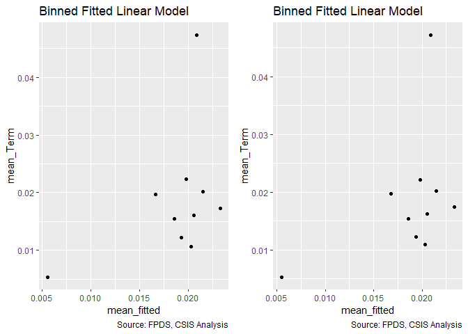<!-- -->

```
## Warning in residuals_binned(model1_old, bins = bins): Always uses Xlb
## Estimated Pr(Termination), should update.
```

```
## Warning in residuals_binned(model1_new, bins = bins): Always uses Xlb
## Estimated Pr(Termination), should update.
```

```
## Warning in if (class(model1_new) %in% c("glmerMod", "lme4", "lmerMod")) {:
## the condition has length > 1 and only the first element will be used
```

```
## Warning in if (!class(model1_new) %in% c("glmerMod", "lme4", "lmerMod") & :
## the condition has length > 1 and only the first element will be used
```

<!-- -->

```
## [[1]]
##        model deviance null.deviance difference
## 1 model1_old 45976.90      46388.62   411.7142
## 2 model1_new 45960.91      46388.62   427.7067
```
Other cost based and other fixed price are in line with expectations. UCA is strongly contrary to expectations.
####15B: Cumulative

```r
#Create the model
term_salary_pricing_15B <- glm(data=serv_smp, b_Term ~ cln_US6sal + 
                   cln_PSCrate+ cp_OffPerf7+cp_OffPSC7+
                 cn_PairHist7+cln_PairCA +
                   cln_Base + cln_Days+ clr_Ceil2Base+
                   Comp+
                   Veh+
                   Pricing+
                   Crisis+
                   cln_Def6HHI+clr_Def6toUS+
                   cln_Def3HHI+clr_Def3toUS+
                   cp_PairObl7+
                   cln_OffObl7+cln_OffFocus + Pricing:cl_US6_avg_sal_lag1, 
                 family=binomial(link="logit"))

glmer_examine(term_salary_pricing_15B)
```

```
##                                     GVIF Df GVIF^(1/(2*Df))
## cln_US6sal                    171.233595  1       13.085626
## cln_PSCrate                     1.386434  1        1.177469
## cp_OffPerf7                     1.642336  1        1.281537
## cp_OffPSC7                      2.353651  1        1.534161
## cn_PairHist7                    1.440268  1        1.200112
## cln_PairCA                      3.064763  1        1.750646
## cln_Base                        1.478161  1        1.215796
## cln_Days                        1.256419  1        1.120901
## clr_Ceil2Base                   1.319373  1        1.148640
## Comp                            1.412292  3        1.059223
## Veh                             2.375331  4        1.114206
## Pricing                       212.182036  6        1.562760
## Crisis                          1.523766  3        1.072720
## cln_Def6HHI                     1.905959  1        1.380565
## clr_Def6toUS                    1.598505  1        1.264320
## cln_Def3HHI                     1.922367  1        1.386494
## clr_Def3toUS                    1.744688  1        1.320867
## cp_PairObl7                     1.407015  1        1.186177
## cln_OffObl7                     1.230386  1        1.109228
## cln_OffFocus                    2.069557  1        1.438596
## Pricing:cl_US6_avg_sal_lag1 34403.042237  7        2.108835
```
Excluded for VIF reasons.

####16A: Office Partnership:Actions
Performance based contracting should  encourage higher communication interactions and allow for more flexability, potentially increasing the benefits of regular interaction.
(Options, Breach, Terminations)
Interact: Actions	cp_OffPerf7:cln_PairCA			+	-	-

```r
summary_continuous_plot(serv_smp1m,"cp_OffPerf7","cln_PairCA",metric="cbre")
```

```
## Warning in `[<-.factor`(`*tmp*`, ri, value = c(0, 0, 0, 0, 0, 0, 0, 0, 0, :
## invalid factor level, NA generated
```

```
## Warning: Removed 8816 rows containing missing values (geom_point).
```

<!-- -->

```r
#Create the models
term_partnership_actions_16A_no_interact <- glm(data=serv_smp, b_Term ~ cp_OffPerf7 + cln_PairCA,
                                                family=binomial(link="logit"))
glmer_examine(term_partnership_actions_16A_no_interact)
```

```
## cp_OffPerf7  cln_PairCA 
##    1.065249    1.065249
```

```r
term_partnership_actions_16A <- glm(data=serv_smp, b_Term ~ cp_OffPerf7 + cln_PairCA + cp_OffPerf7:cln_PairCA,
                                    family=binomial(link="logit"))
glmer_examine(term_partnership_actions_16A)
```

```
##            cp_OffPerf7             cln_PairCA cp_OffPerf7:cln_PairCA 
##               1.284462               1.504225               1.618728
```

```r
#compare the models

stargazer::stargazer(term_partnership_actions_16A_no_interact, term_partnership_actions_16A, type="text", digits=2)
```

```
## 
## ===================================================
##                            Dependent variable:     
##                        ----------------------------
##                                   b_Term           
##                             (1)            (2)     
## ---------------------------------------------------
## cp_OffPerf7               0.12***         0.01     
##                            (0.03)        (0.03)    
##                                                    
## cln_PairCA                0.33***        0.20***   
##                            (0.03)        (0.03)    
##                                                    
## cp_OffPerf7:cln_PairCA                   0.44***   
##                                          (0.04)    
##                                                    
## Constant                  -3.98***      -4.00***   
##                            (0.01)        (0.02)    
##                                                    
## ---------------------------------------------------
## Observations              250,000        250,000   
## Log Likelihood           -23,104.82    -23,051.31  
## Akaike Inf. Crit.        46,215.64      46,110.63  
## ===================================================
## Note:                   *p<0.1; **p<0.05; ***p<0.01
```

```r
summary_residual_compare(term_partnership_actions_16A_no_interact, term_partnership_actions_16A, bins=5)
```

<!-- -->

```
## Warning in residuals_binned(model1_old, bins = bins): Always uses Xlb
## Estimated Pr(Termination), should update.
```

```
## Warning in residuals_binned(model1_new, bins = bins): Always uses Xlb
## Estimated Pr(Termination), should update.
```

```
## Warning in if (class(model1_new) %in% c("glmerMod", "lme4", "lmerMod")) {:
## the condition has length > 1 and only the first element will be used
```

```
## Warning in if (!class(model1_new) %in% c("glmerMod", "lme4", "lmerMod") & :
## the condition has length > 1 and only the first element will be used
```

<!-- -->

```
## [[1]]
##        model deviance null.deviance difference
## 1 model1_old 46209.64      46388.62   178.9738
## 2 model1_new 46102.63      46388.62   285.9855
```
Expectations are contrary to expectations.
####16B: Cumulative

```r
#Create the model
term_partnership_actions_16B <- glm(data=serv_smp, b_Term ~ cln_US6sal + 
                   cln_PSCrate+ cp_OffPerf7+cp_OffPSC7+
                 cn_PairHist7+cln_PairCA +
                   cln_Base + cln_Days+ clr_Ceil2Base+
                   Comp+
                   Veh+
                   Pricing+
                   Crisis+
                   cln_Def6HHI+clr_Def6toUS+
                   cln_Def3HHI+clr_Def3toUS+
                   cp_PairObl7+
                   cln_OffObl7+cln_OffFocus + cp_OffPerf7:cln_PairCA,
                 family=binomial(link="logit"))

#Compare the models
stargazer::stargazer(term_partnership_actions_16B, Term_12C, type="text", digits=2)
```

```
## 
## ========================================================
##                                 Dependent variable:     
##                             ----------------------------
##                                        b_Term           
##                                  (1)            (2)     
## --------------------------------------------------------
## cln_US6sal                       0.01          0.01     
##                                 (0.04)        (0.04)    
##                                                         
## cln_PSCrate                     0.08**        0.08**    
##                                 (0.04)        (0.04)    
##                                                         
## cp_OffPerf7                    -0.14***      -0.14***   
##                                 (0.04)        (0.04)    
##                                                         
## cp_OffPSC7                     0.54***        0.54***   
##                                 (0.04)        (0.04)    
##                                                         
## cn_PairHist7                   -0.07**        -0.07**   
##                                 (0.04)        (0.04)    
##                                                         
## cln_PairCA                     0.36***        0.35***   
##                                 (0.05)        (0.04)    
##                                                         
## cln_Base                       0.28***        0.28***   
##                                 (0.04)        (0.04)    
##                                                         
## cln_Days                       1.03***        1.03***   
##                                 (0.04)        (0.04)    
##                                                         
## clr_Ceil2Base                  0.79***        0.79***   
##                                 (0.02)        (0.02)    
##                                                         
## Comp1 offer                    0.24***        0.24***   
##                                 (0.05)        (0.05)    
##                                                         
## Comp2-4 offers                 0.23***        0.23***   
##                                 (0.05)        (0.05)    
##                                                         
## Comp5+ offers                  0.76***        0.76***   
##                                 (0.05)        (0.05)    
##                                                         
## VehS-IDC                       -0.84***      -0.84***   
##                                 (0.05)        (0.05)    
##                                                         
## VehM-IDC                       -0.43***      -0.43***   
##                                 (0.05)        (0.05)    
##                                                         
## VehFSS/GWAC                    -0.28***      -0.28***   
##                                 (0.07)        (0.07)    
##                                                         
## VehBPA/BOA                     -1.37***      -1.37***   
##                                 (0.12)        (0.12)    
##                                                         
## PricingOther FP                 -0.12          -0.12    
##                                 (0.14)        (0.14)    
##                                                         
## PricingT&M/LH/FPLOE            -0.81***      -0.81***   
##                                 (0.16)        (0.16)    
##                                                         
## PricingIncentive               -2.30***      -2.30***   
##                                 (0.71)        (0.71)    
##                                                         
## PricingOther CB                -1.40***      -1.40***   
##                                 (0.13)        (0.13)    
##                                                         
## PricingUCA                     -1.20***      -1.20***   
##                                 (0.28)        (0.28)    
##                                                         
## PricingCombination or Other    -1.05***      -1.04***   
##                                 (0.22)        (0.22)    
##                                                         
## CrisisARRA                     -0.71***      -0.71***   
##                                 (0.26)        (0.26)    
##                                                         
## CrisisDis                        0.43          0.43     
##                                 (0.34)        (0.34)    
##                                                         
## CrisisOCO                       -0.03          -0.04    
##                                 (0.09)        (0.09)    
##                                                         
## cln_Def6HHI                     -0.07*        -0.07*    
##                                 (0.04)        (0.04)    
##                                                         
## clr_Def6toUS                   -0.19***      -0.20***   
##                                 (0.06)        (0.06)    
##                                                         
## cln_Def3HHI                    0.24***        0.24***   
##                                 (0.04)        (0.04)    
##                                                         
## clr_Def3toUS                   -0.51***      -0.51***   
##                                 (0.05)        (0.05)    
##                                                         
## cp_PairObl7                    -0.38***      -0.38***   
##                                 (0.05)        (0.05)    
##                                                         
## cln_OffObl7                    0.11***        0.11***   
##                                 (0.04)        (0.04)    
##                                                         
## cln_OffFocus                   0.17***        0.17***   
##                                 (0.04)        (0.04)    
##                                                         
## cp_OffPerf7:cln_PairCA          -0.03                   
##                                 (0.05)                  
##                                                         
## Constant                       -4.15***      -4.15***   
##                                 (0.04)        (0.04)    
##                                                         
## --------------------------------------------------------
## Observations                   250,000        250,000   
## Log Likelihood                -19,638.02    -19,638.20  
## Akaike Inf. Crit.             39,344.05      39,342.39  
## ========================================================
## Note:                        *p<0.1; **p<0.05; ***p<0.01
```

```r
summary_residual_compare(term_partnership_actions_16B, Term_12C, bins=5)
```

<!-- -->

```
## Warning in residuals_binned(model1_old, bins = bins): Always uses Xlb
## Estimated Pr(Termination), should update.
```

```
## Warning in residuals_binned(model1_new, bins = bins): Always uses Xlb
## Estimated Pr(Termination), should update.
```

```
## Warning in if (class(model1_new) %in% c("glmerMod", "lme4", "lmerMod")) {:
## the condition has length > 1 and only the first element will be used
```

```
## Warning in if (!class(model1_new) %in% c("glmerMod", "lme4", "lmerMod") & :
## the condition has length > 1 and only the first element will be used
```

<!-- -->

```
## [[1]]
##        model deviance null.deviance difference
## 1 model1_old 39276.05      46388.62   7112.566
## 2 model1_new 39276.39      46388.62   7112.222
```
Not significant though in line with expectatiosn. Though the AIC has increased suggesting. This will not be added to the model.

####17A: Office Partnership:Market Vendor Share for that Office
Performance based contracting is thought to mitigte some of the risks of vendor  lock.
(option,breach,termination)
Interact: Market Share Vendor for that Office	cp_OffPerf7: cp_PairObl7			++	--	--


```r
summary_double_continuous(serv_smp1m,"cp_OffPerf7","cp_PairObl7")
```

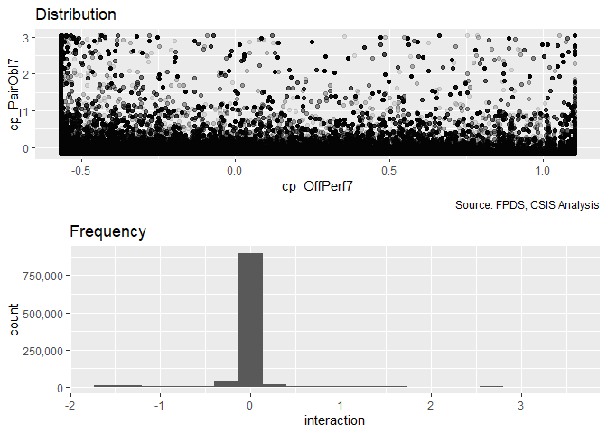<!-- --><!-- --><!-- -->

```r
#Define the models
term_partnership_share_17A_no_interact <- glm(data=serv_smp, b_Term ~ cp_OffPerf7 + cp_PairObl7,
                 family=binomial(link="logit"))
glmer_examine(term_partnership_share_17A_no_interact)
```

```
## cp_OffPerf7 cp_PairObl7 
##    1.000005    1.000005
```

```r
term_partnership_share_17A <- glm(data=serv_smp, b_Term ~ cp_OffPerf7 + cp_PairObl7 + cp_OffPerf7:cp_PairObl7,
                 family=binomial(link="logit"))
glmer_examine(term_partnership_share_17A)
```

```
##             cp_OffPerf7             cp_PairObl7 cp_OffPerf7:cp_PairObl7 
##                1.002474                1.020210                1.017756
```

```r
#Compare the models
stargazer::stargazer(term_partnership_share_17A_no_interact, term_partnership_share_17A, type="text", digits=2)
```

```
## 
## ====================================================
##                             Dependent variable:     
##                         ----------------------------
##                                    b_Term           
##                              (1)            (2)     
## ----------------------------------------------------
## cp_OffPerf7                0.19***        0.19***   
##                             (0.03)        (0.03)    
##                                                     
## cp_PairObl7                -0.33***      -0.30***   
##                             (0.04)        (0.04)    
##                                                     
## cp_OffPerf7:cp_PairObl7                   0.21***   
##                                           (0.07)    
##                                                     
## Constant                   -3.98***      -3.98***   
##                             (0.02)        (0.02)    
##                                                     
## ----------------------------------------------------
## Observations               250,000        250,000   
## Log Likelihood            -23,134.19    -23,130.14  
## Akaike Inf. Crit.         46,274.37      46,268.28  
## ====================================================
## Note:                    *p<0.1; **p<0.05; ***p<0.01
```

```r
summary_residual_compare(term_partnership_share_17A_no_interact, term_partnership_share_17A, bins=5)
```

<!-- -->

```
## Warning in residuals_binned(model1_old, bins = bins): Always uses Xlb
## Estimated Pr(Termination), should update.
```

```
## Warning in residuals_binned(model1_new, bins = bins): Always uses Xlb
## Estimated Pr(Termination), should update.
```

```
## Warning in if (class(model1_new) %in% c("glmerMod", "lme4", "lmerMod")) {:
## the condition has length > 1 and only the first element will be used
```

```
## Warning in if (!class(model1_new) %in% c("glmerMod", "lme4", "lmerMod") & :
## the condition has length > 1 and only the first element will be used
```

<!-- -->

```
## [[1]]
##        model deviance null.deviance difference
## 1 model1_old 46268.37      46388.62   120.2410
## 2 model1_new 46260.28      46388.62   128.3375
```
Significant and contrary to expectation, small reduction in AIC.
####17B: Cumulative

```r
#Create the model
term_partnership_share_17B <- glm(data=serv_smp, b_Term ~ cln_US6sal + 
                   cln_PSCrate+ cp_OffPerf7+cp_OffPSC7+
                 cn_PairHist7+cln_PairCA +
                   cln_Base + cln_Days+ clr_Ceil2Base+
                   Comp+
                   Veh+
                   Pricing+
                   Crisis+
                   cln_Def6HHI+clr_Def6toUS+
                   cln_Def3HHI+clr_Def3toUS+
                   cp_PairObl7+
                   cln_OffObl7+cln_OffFocus + cp_OffPerf7:cp_PairObl7,
                 family=binomial(link="logit"))
glmer_examine(term_partnership_share_17B)
```

```
##                             GVIF Df GVIF^(1/(2*Df))
## cln_US6sal              1.661466  1        1.288979
## cln_PSCrate             1.386208  1        1.177373
## cp_OffPerf7             1.456752  1        1.206960
## cp_OffPSC7              2.311459  1        1.520348
## cn_PairHist7            1.429264  1        1.195518
## cln_PairCA              3.076382  1        1.753962
## cln_Base                1.477896  1        1.215688
## cln_Days                1.257822  1        1.121527
## clr_Ceil2Base           1.305150  1        1.142432
## Comp                    1.407415  3        1.058613
## Veh                     2.355185  4        1.113020
## Pricing                 1.187930  6        1.014454
## Crisis                  1.539164  3        1.074519
## cln_Def6HHI             1.910024  1        1.382036
## clr_Def6toUS            1.639799  1        1.280546
## cln_Def3HHI             1.926341  1        1.387927
## clr_Def3toUS            1.723938  1        1.312988
## cp_PairObl7             1.546566  1        1.243610
## cln_OffObl7             1.234679  1        1.111161
## cln_OffFocus            2.055798  1        1.433806
## cp_OffPerf7:cp_PairObl7 1.261655  1        1.123234
```

```r
#Compare the models
stargazer::stargazer(Term_12C, term_partnership_share_17B, type="text", digits=2)
```

```
## 
## ========================================================
##                                 Dependent variable:     
##                             ----------------------------
##                                        b_Term           
##                                  (1)            (2)     
## --------------------------------------------------------
## cln_US6sal                       0.01          0.01     
##                                 (0.04)        (0.04)    
##                                                         
## cln_PSCrate                     0.08**        0.08**    
##                                 (0.04)        (0.04)    
##                                                         
## cp_OffPerf7                    -0.14***      -0.14***   
##                                 (0.04)        (0.04)    
##                                                         
## cp_OffPSC7                     0.54***        0.54***   
##                                 (0.04)        (0.04)    
##                                                         
## cn_PairHist7                   -0.07**        -0.07**   
##                                 (0.04)        (0.04)    
##                                                         
## cln_PairCA                     0.35***        0.35***   
##                                 (0.04)        (0.04)    
##                                                         
## cln_Base                       0.28***        0.28***   
##                                 (0.04)        (0.04)    
##                                                         
## cln_Days                       1.03***        1.03***   
##                                 (0.04)        (0.04)    
##                                                         
## clr_Ceil2Base                  0.79***        0.80***   
##                                 (0.02)        (0.02)    
##                                                         
## Comp1 offer                    0.24***        0.25***   
##                                 (0.05)        (0.05)    
##                                                         
## Comp2-4 offers                 0.23***        0.23***   
##                                 (0.05)        (0.05)    
##                                                         
## Comp5+ offers                  0.76***        0.76***   
##                                 (0.05)        (0.05)    
##                                                         
## VehS-IDC                       -0.84***      -0.84***   
##                                 (0.05)        (0.05)    
##                                                         
## VehM-IDC                       -0.43***      -0.43***   
##                                 (0.05)        (0.05)    
##                                                         
## VehFSS/GWAC                    -0.28***      -0.28***   
##                                 (0.07)        (0.07)    
##                                                         
## VehBPA/BOA                     -1.37***      -1.36***   
##                                 (0.12)        (0.12)    
##                                                         
## PricingOther FP                 -0.12          -0.12    
##                                 (0.14)        (0.14)    
##                                                         
## PricingT&M/LH/FPLOE            -0.81***      -0.81***   
##                                 (0.16)        (0.16)    
##                                                         
## PricingIncentive               -2.30***      -2.30***   
##                                 (0.71)        (0.71)    
##                                                         
## PricingOther CB                -1.40***      -1.40***   
##                                 (0.13)        (0.13)    
##                                                         
## PricingUCA                     -1.20***      -1.21***   
##                                 (0.28)        (0.28)    
##                                                         
## PricingCombination or Other    -1.04***      -1.04***   
##                                 (0.22)        (0.22)    
##                                                         
## CrisisARRA                     -0.71***      -0.71***   
##                                 (0.26)        (0.26)    
##                                                         
## CrisisDis                        0.43          0.43     
##                                 (0.34)        (0.34)    
##                                                         
## CrisisOCO                       -0.04          -0.02    
##                                 (0.09)        (0.09)    
##                                                         
## cln_Def6HHI                     -0.07*        -0.07*    
##                                 (0.04)        (0.04)    
##                                                         
## clr_Def6toUS                   -0.20***      -0.21***   
##                                 (0.06)        (0.06)    
##                                                         
## cln_Def3HHI                    0.24***        0.24***   
##                                 (0.04)        (0.04)    
##                                                         
## clr_Def3toUS                   -0.51***      -0.51***   
##                                 (0.05)        (0.05)    
##                                                         
## cp_PairObl7                    -0.38***      -0.36***   
##                                 (0.05)        (0.06)    
##                                                         
## cln_OffObl7                    0.11***        0.11***   
##                                 (0.04)        (0.04)    
##                                                         
## cln_OffFocus                   0.17***        0.17***   
##                                 (0.04)        (0.04)    
##                                                         
## cp_OffPerf7:cp_PairObl7                        0.10     
##                                               (0.08)    
##                                                         
## Constant                       -4.15***      -4.15***   
##                                 (0.04)        (0.04)    
##                                                         
## --------------------------------------------------------
## Observations                   250,000        250,000   
## Log Likelihood                -19,638.20    -19,637.50  
## Akaike Inf. Crit.             39,342.39      39,343.00  
## ========================================================
## Note:                        *p<0.1; **p<0.05; ***p<0.01
```

```r
summary_residual_compare(Term_12C, term_partnership_share_17B, bins=5)
```

<!-- -->

```
## Warning in residuals_binned(model1_old, bins = bins): Always uses Xlb
## Estimated Pr(Termination), should update.
```

```
## Warning in residuals_binned(model1_new, bins = bins): Always uses Xlb
## Estimated Pr(Termination), should update.
```

```
## Warning in if (class(model1_new) %in% c("glmerMod", "lme4", "lmerMod")) {:
## the condition has length > 1 and only the first element will be used
```

```
## Warning in if (!class(model1_new) %in% c("glmerMod", "lme4", "lmerMod") & :
## the condition has length > 1 and only the first element will be used
```

<!-- -->

```
## [[1]]
##        model deviance null.deviance difference
## 1 model1_old 39276.39      46388.62   7112.222
## 2 model1_new 39275.00      46388.62   7113.619
```
No value added according to AIC. Leave it out.

####17C: Office Volume:Market Vendor Share for that Office
A small office heavily reliant on a single vendor may just be practical consolidation of contract. For a large office, said primacy is more noteworthy and may indicate vendor lock-in. In keeping with p_Market as a whole this may mean more options exercised and fewer terminations  given the absence of other choices. However, a greater likelihood of ceiling breaches and a greater size of ceiling breaches is the expected donside.

(option,breach,termination)
Interact: Office Volume cln_OffObl7: cp_PairObl7		+	+	-


```r
#Define the models


Term17C_no_interact <- glm(data=serv_smp, b_Term ~ cln_OffObl7 + cp_PairObl7, family=binomial(link="logit"))
glmer_examine(Term17C_no_interact)
```

```
## cln_OffObl7 cp_PairObl7 
##    1.009929    1.009929
```

```r
Term17C <- glm(data=serv_smp, b_Term ~ cln_OffObl7 + cp_PairObl7 + cln_OffObl7:cp_PairObl7, family=binomial(link="logit"))
glmer_examine(Term17C)
```

```
##             cln_OffObl7             cp_PairObl7 cln_OffObl7:cp_PairObl7 
##                1.067265                1.003338                1.068631
```

```r
#Compare the models
stargazer::stargazer(Term17C_no_interact, Term17C, type="text", digits=2)
```

```
## 
## ====================================================
##                             Dependent variable:     
##                         ----------------------------
##                                    b_Term           
##                              (1)            (2)     
## ----------------------------------------------------
## cln_OffObl7                0.50***        0.53***   
##                             (0.04)        (0.04)    
##                                                     
## cp_PairObl7                -0.29***      -0.26***   
##                             (0.04)        (0.04)    
##                                                     
## cln_OffObl7:cp_PairObl7                   0.59***   
##                                           (0.15)    
##                                                     
## Constant                   -4.00***      -3.99***   
##                             (0.02)        (0.02)    
##                                                     
## ----------------------------------------------------
## Observations               250,000        250,000   
## Log Likelihood            -23,074.97    -23,066.04  
## Akaike Inf. Crit.         46,155.93      46,140.07  
## ====================================================
## Note:                    *p<0.1; **p<0.05; ***p<0.01
```

```r
summary_residual_compare(Term17C_no_interact, Term17C)
```

<!-- -->

```
## Warning in residuals_binned(model1_old, bins = bins): Always uses Xlb
## Estimated Pr(Termination), should update.
```

```
## Warning in residuals_binned(model1_new, bins = bins): Always uses Xlb
## Estimated Pr(Termination), should update.
```

```
## Warning in if (class(model1_new) %in% c("glmerMod", "lme4", "lmerMod")) {:
## the condition has length > 1 and only the first element will be used
```

```
## Warning in if (!class(model1_new) %in% c("glmerMod", "lme4", "lmerMod") & :
## the condition has length > 1 and only the first element will be used
```

<!-- -->

```
## [[1]]
##        model deviance null.deviance difference
## 1 model1_old 46149.93      46388.62   238.6813
## 2 model1_new 46132.07      46388.62   256.5418
```
The interaction significantly estimates a greater risk of termination. This is contrary to the expectation that this interaction might capture lock-in.

####17D: Cumulative

```r
#Create the model
Term17D <- glm(data=serv_smp,
                        b_Term ~  cln_US6sal + 
                   cln_PSCrate+ cp_OffPerf7+cp_OffPSC7+
                 cn_PairHist7+cln_PairCA+
                 cln_Base + clr_Ceil2Base + cln_Days+
                 Comp+
                   Veh+
                   Pricing+
                   Crisis+
                 cln_Def6HHI+clr_Def6toUS+
                 cln_Def3HHI+
                   clr_Def3toUS+
                 cp_PairObl7+
                   cln_OffObl7+ 
                 cln_OffFocus+cln_OffObl7:cp_PairObl7, family=binomial(link="logit"))
glmer_examine(Term17D)
```

```
##                             GVIF Df GVIF^(1/(2*Df))
## cln_US6sal              1.662059  1        1.289209
## cln_PSCrate             1.386280  1        1.177404
## cp_OffPerf7             1.462097  1        1.209172
## cp_OffPSC7              2.337323  1        1.528831
## cn_PairHist7            1.430867  1        1.196188
## cln_PairCA              3.190389  1        1.786166
## cln_Base                1.476432  1        1.215085
## clr_Ceil2Base           1.298577  1        1.139551
## cln_Days                1.255043  1        1.120287
## Comp                    1.406374  3        1.058482
## Veh                     2.343192  4        1.112310
## Pricing                 1.187126  6        1.014397
## Crisis                  1.548273  3        1.075576
## cln_Def6HHI             1.911586  1        1.382601
## clr_Def6toUS            1.601646  1        1.265562
## cln_Def3HHI             1.927138  1        1.388214
## clr_Def3toUS            1.721796  1        1.312172
## cp_PairObl7             1.584893  1        1.258926
## cln_OffObl7             1.450138  1        1.204217
## cln_OffFocus            2.051541  1        1.432320
## cp_PairObl7:cln_OffObl7 1.328719  1        1.152701
```

```r
#Compare the models
stargazer::stargazer(Term_12C, Term17D,type="text", digits=2)
```

```
## 
## ========================================================
##                                 Dependent variable:     
##                             ----------------------------
##                                        b_Term           
##                                  (1)            (2)     
## --------------------------------------------------------
## cln_US6sal                       0.01          0.01     
##                                 (0.04)        (0.04)    
##                                                         
## cln_PSCrate                     0.08**        0.07**    
##                                 (0.04)        (0.04)    
##                                                         
## cp_OffPerf7                    -0.14***      -0.15***   
##                                 (0.04)        (0.04)    
##                                                         
## cp_OffPSC7                     0.54***        0.55***   
##                                 (0.04)        (0.04)    
##                                                         
## cn_PairHist7                   -0.07**        -0.07**   
##                                 (0.04)        (0.04)    
##                                                         
## cln_PairCA                     0.35***        0.34***   
##                                 (0.04)        (0.05)    
##                                                         
## cln_Base                       0.28***        0.27***   
##                                 (0.04)        (0.04)    
##                                                         
## cln_Days                       1.03***        1.03***   
##                                 (0.04)        (0.04)    
##                                                         
## clr_Ceil2Base                  0.79***        0.79***   
##                                 (0.02)        (0.02)    
##                                                         
## Comp1 offer                    0.24***        0.24***   
##                                 (0.05)        (0.05)    
##                                                         
## Comp2-4 offers                 0.23***        0.23***   
##                                 (0.05)        (0.05)    
##                                                         
## Comp5+ offers                  0.76***        0.76***   
##                                 (0.05)        (0.05)    
##                                                         
## VehS-IDC                       -0.84***      -0.83***   
##                                 (0.05)        (0.05)    
##                                                         
## VehM-IDC                       -0.43***      -0.43***   
##                                 (0.05)        (0.05)    
##                                                         
## VehFSS/GWAC                    -0.28***      -0.28***   
##                                 (0.07)        (0.07)    
##                                                         
## VehBPA/BOA                     -1.37***      -1.35***   
##                                 (0.12)        (0.12)    
##                                                         
## PricingOther FP                 -0.12          -0.11    
##                                 (0.14)        (0.14)    
##                                                         
## PricingT&M/LH/FPLOE            -0.81***      -0.81***   
##                                 (0.16)        (0.16)    
##                                                         
## PricingIncentive               -2.30***      -2.31***   
##                                 (0.71)        (0.71)    
##                                                         
## PricingOther CB                -1.40***      -1.40***   
##                                 (0.13)        (0.13)    
##                                                         
## PricingUCA                     -1.20***      -1.20***   
##                                 (0.28)        (0.28)    
##                                                         
## PricingCombination or Other    -1.04***      -1.05***   
##                                 (0.22)        (0.22)    
##                                                         
## CrisisARRA                     -0.71***      -0.71***   
##                                 (0.26)        (0.26)    
##                                                         
## CrisisDis                        0.43          0.42     
##                                 (0.34)        (0.34)    
##                                                         
## CrisisOCO                       -0.04          -0.05    
##                                 (0.09)        (0.09)    
##                                                         
## cln_Def6HHI                     -0.07*        -0.07*    
##                                 (0.04)        (0.04)    
##                                                         
## clr_Def6toUS                   -0.20***      -0.21***   
##                                 (0.06)        (0.06)    
##                                                         
## cln_Def3HHI                    0.24***        0.24***   
##                                 (0.04)        (0.04)    
##                                                         
## clr_Def3toUS                   -0.51***      -0.51***   
##                                 (0.05)        (0.05)    
##                                                         
## cp_PairObl7                    -0.38***      -0.34***   
##                                 (0.05)        (0.06)    
##                                                         
## cln_OffObl7                    0.11***        0.14***   
##                                 (0.04)        (0.04)    
##                                                         
## cln_OffFocus                   0.17***        0.17***   
##                                 (0.04)        (0.04)    
##                                                         
## cp_PairObl7:cln_OffObl7                        0.25*    
##                                               (0.14)    
##                                                         
## Constant                       -4.15***      -4.15***   
##                                 (0.04)        (0.04)    
##                                                         
## --------------------------------------------------------
## Observations                   250,000        250,000   
## Log Likelihood                -19,638.20    -19,636.45  
## Akaike Inf. Crit.             39,342.39      39,340.90  
## ========================================================
## Note:                        *p<0.1; **p<0.05; ***p<0.01
```

```r
summary_residual_compare(Term_12C, Term17D,bins=50)
```

<!-- -->

```
## Warning in residuals_binned(model1_old, bins = bins): Always uses Xlb
## Estimated Pr(Termination), should update.
```

```
## Warning in residuals_binned(model1_new, bins = bins): Always uses Xlb
## Estimated Pr(Termination), should update.
```

```
## Warning in if (class(model1_new) %in% c("glmerMod", "lme4", "lmerMod")) {:
## the condition has length > 1 and only the first element will be used
```

```
## Warning in if (!class(model1_new) %in% c("glmerMod", "lme4", "lmerMod") & :
## the condition has length > 1 and only the first element will be used
```

<!-- -->

```
## [[1]]
##        model deviance null.deviance difference
## 1 model1_old 39276.39      46388.62   7112.222
## 2 model1_new 39272.90      46388.62   7115.713
```
Result is significant at the 0.1 level, estimates a higher risk of terminations contrary to expectation, and adds little to the in AIC terms model, leaving it out.

####18A: Office Partnership:Initial Contract Duration (logged)
Performance  based contracting is thought to mitigate the risks of longer time horizons and may even work  better with  them by incentivizing vendor investments.
(option, breach, term)
Interact: Initial Contract Duration (logged)	cp_OffPerf7: capped_cln_Days			++	--	--


```r
summary_double_continuous(serv_smp1m,"cp_OffPerf7","cln_Days")
```

<!-- --><!-- --><!-- -->

```r
#Create the Model
term_partnership_duration_18A_no_interact <- glm(data=serv_smp , b_Term ~ cp_OffPerf7 + cln_Days,
                 family=binomial(link="logit"))
glmer_examine(term_partnership_duration_18A_no_interact)
```

```
## cp_OffPerf7    cln_Days 
##    1.000985    1.000985
```

```r
term_partnership_duration_18A <- glm(data=serv_smp, b_Term ~ cp_OffPerf7 + cln_Days + cp_OffPerf7: cln_Days,
                 family=binomial(link="logit"))
glmer_examine(term_partnership_duration_18A)
```

```
##          cp_OffPerf7             cln_Days cp_OffPerf7:cln_Days 
##             1.354819             1.006300             1.349883
```

```r
#Compare the models
stargazer::stargazer(term_partnership_duration_18A_no_interact, term_partnership_duration_18A, type="text", digits=2)
```

```
## 
## =================================================
##                          Dependent variable:     
##                      ----------------------------
##                                 b_Term           
##                           (1)            (2)     
## -------------------------------------------------
## cp_OffPerf7             0.22***        0.12***   
##                          (0.03)        (0.04)    
##                                                  
## cln_Days                1.36***        1.36***   
##                          (0.04)        (0.04)    
##                                                  
## cp_OffPerf7:cln_Days                   0.47***   
##                                        (0.08)    
##                                                  
## Constant                -4.15***      -4.15***   
##                          (0.02)        (0.02)    
##                                                  
## -------------------------------------------------
## Observations            250,000        250,000   
## Log Likelihood         -22,466.67    -22,448.18  
## Akaike Inf. Crit.      44,939.34      44,904.36  
## =================================================
## Note:                 *p<0.1; **p<0.05; ***p<0.01
```

```r
summary_residual_compare(term_partnership_duration_18A_no_interact, term_partnership_duration_18A, bins=5)
```

<!-- -->

```
## Warning in residuals_binned(model1_old, bins = bins): Always uses Xlb
## Estimated Pr(Termination), should update.
```

```
## Warning in residuals_binned(model1_new, bins = bins): Always uses Xlb
## Estimated Pr(Termination), should update.
```

```
## Warning in if (class(model1_new) %in% c("glmerMod", "lme4", "lmerMod")) {:
## the condition has length > 1 and only the first element will be used
```

```
## Warning in if (!class(model1_new) %in% c("glmerMod", "lme4", "lmerMod") & :
## the condition has length > 1 and only the first element will be used
```

<!-- -->

```
## [[1]]
##        model deviance null.deviance difference
## 1 model1_old 44933.34      46388.62   1455.272
## 2 model1_new 44896.36      46388.62   1492.259
```
Significant and contrary to expectation.

####18B: Cumulative

```r
#Create the model
term_partnership_duration_18B <- glm(data=serv_smp, b_Term ~ cln_US6sal + 
                   cln_PSCrate+ cp_OffPerf7+cp_OffPSC7+
                 cn_PairHist7+cln_PairCA +
                   cln_Base + cln_Days+ clr_Ceil2Base+
                   Comp+
                   Veh+
                   Pricing+
                   Crisis+
                   cln_Def6HHI+clr_Def6toUS+
                   cln_Def3HHI+clr_Def3toUS+
                   cp_PairObl7+
                   cln_OffObl7+cln_OffFocus + cp_OffPerf7:cln_Days,
                 family=binomial(link="logit"))

#Compare the models
stargazer::stargazer(Term_12C,term_partnership_duration_18B,  type="text", digits=2)
```

```
## 
## ========================================================
##                                 Dependent variable:     
##                             ----------------------------
##                                        b_Term           
##                                  (1)            (2)     
## --------------------------------------------------------
## cln_US6sal                       0.01          0.01     
##                                 (0.04)        (0.04)    
##                                                         
## cln_PSCrate                     0.08**         0.06*    
##                                 (0.04)        (0.04)    
##                                                         
## cp_OffPerf7                    -0.14***      -0.29***   
##                                 (0.04)        (0.04)    
##                                                         
## cp_OffPSC7                     0.54***        0.57***   
##                                 (0.04)        (0.04)    
##                                                         
## cn_PairHist7                   -0.07**        -0.09**   
##                                 (0.04)        (0.04)    
##                                                         
## cln_PairCA                     0.35***        0.35***   
##                                 (0.04)        (0.04)    
##                                                         
## cln_Base                       0.28***        0.31***   
##                                 (0.04)        (0.04)    
##                                                         
## cln_Days                       1.03***        1.01***   
##                                 (0.04)        (0.04)    
##                                                         
## clr_Ceil2Base                  0.79***        0.79***   
##                                 (0.02)        (0.02)    
##                                                         
## Comp1 offer                    0.24***        0.23***   
##                                 (0.05)        (0.06)    
##                                                         
## Comp2-4 offers                 0.23***        0.24***   
##                                 (0.05)        (0.05)    
##                                                         
## Comp5+ offers                  0.76***        0.77***   
##                                 (0.05)        (0.05)    
##                                                         
## VehS-IDC                       -0.84***      -0.84***   
##                                 (0.05)        (0.05)    
##                                                         
## VehM-IDC                       -0.43***      -0.45***   
##                                 (0.05)        (0.05)    
##                                                         
## VehFSS/GWAC                    -0.28***      -0.28***   
##                                 (0.07)        (0.07)    
##                                                         
## VehBPA/BOA                     -1.37***      -1.38***   
##                                 (0.12)        (0.12)    
##                                                         
## PricingOther FP                 -0.12         -0.25*    
##                                 (0.14)        (0.15)    
##                                                         
## PricingT&M/LH/FPLOE            -0.81***      -0.80***   
##                                 (0.16)        (0.16)    
##                                                         
## PricingIncentive               -2.30***      -2.35***   
##                                 (0.71)        (0.71)    
##                                                         
## PricingOther CB                -1.40***      -1.44***   
##                                 (0.13)        (0.13)    
##                                                         
## PricingUCA                     -1.20***      -1.19***   
##                                 (0.28)        (0.28)    
##                                                         
## PricingCombination or Other    -1.04***      -1.05***   
##                                 (0.22)        (0.22)    
##                                                         
## CrisisARRA                     -0.71***      -0.70***   
##                                 (0.26)        (0.26)    
##                                                         
## CrisisDis                        0.43          0.39     
##                                 (0.34)        (0.34)    
##                                                         
## CrisisOCO                       -0.04          -0.01    
##                                 (0.09)        (0.09)    
##                                                         
## cln_Def6HHI                     -0.07*         -0.06    
##                                 (0.04)        (0.04)    
##                                                         
## clr_Def6toUS                   -0.20***      -0.23***   
##                                 (0.06)        (0.06)    
##                                                         
## cln_Def3HHI                    0.24***        0.27***   
##                                 (0.04)        (0.04)    
##                                                         
## clr_Def3toUS                   -0.51***      -0.49***   
##                                 (0.05)        (0.05)    
##                                                         
## cp_PairObl7                    -0.38***      -0.44***   
##                                 (0.05)        (0.05)    
##                                                         
## cln_OffObl7                    0.11***        0.12***   
##                                 (0.04)        (0.04)    
##                                                         
## cln_OffFocus                   0.17***        0.19***   
##                                 (0.04)        (0.04)    
##                                                         
## cp_OffPerf7:cln_Days                          0.73***   
##                                               (0.07)    
##                                                         
## Constant                       -4.15***      -4.15***   
##                                 (0.04)        (0.04)    
##                                                         
## --------------------------------------------------------
## Observations                   250,000        250,000   
## Log Likelihood                -19,638.20    -19,586.79  
## Akaike Inf. Crit.             39,342.39      39,241.58  
## ========================================================
## Note:                        *p<0.1; **p<0.05; ***p<0.01
```

```r
summary_residual_compare( Term_12C,term_partnership_duration_18B, bins=5)
```

<!-- -->

```
## Warning in residuals_binned(model1_old, bins = bins): Always uses Xlb
## Estimated Pr(Termination), should update.
```

```
## Warning in residuals_binned(model1_new, bins = bins): Always uses Xlb
## Estimated Pr(Termination), should update.
```

```
## Warning in if (class(model1_new) %in% c("glmerMod", "lme4", "lmerMod")) {:
## the condition has length > 1 and only the first element will be used
```

```
## Warning in if (!class(model1_new) %in% c("glmerMod", "lme4", "lmerMod") & :
## the condition has length > 1 and only the first element will be used
```

<!-- -->

```
## [[1]]
##        model deviance null.deviance difference
## 1 model1_old 39276.39      46388.62   7112.222
## 2 model1_new 39173.58      46388.62   7215.033
```
Significant but contrary to expectation. Tentatively excluding.


####19A: Past Years:Contract Pricing
Positive prior relationships increase the effectiveness of cost-based contracts. T&M / LH / FP: LoE are in the middle here, so leaving  them out.

(Option, Breach,Term)
Firm-Fixed Price (base)				-	+	+
Other Fixed Price				-	+	+
Time & Materials / Labor Hours / FP: LoE						
Incentive Fee (both FPIF or CBIF)				++	--	--
Other Cost Based				+	-	-
Undefinitized Contract Award				+	-	-
Combination				+	-	-

```r
summary_discrete_plot(serv_smp1m,"cn_PairHist7","Pricing")
```

```
## Warning: Ignoring unknown parameters: binwidth, bins, pad
```

<!-- -->

```
## [[1]]
##                     
##                         FFP Other FP Incentive Combination or Other
##   -0.727574636460554 148339      360        61                 1205
##   -0.519998477795702 113819      442        76                 1286
##   -0.31242231913085  105071      428       154                 1112
##   -0.104846160465998 105014      544       291                 1488
##   0.102729998198854  115210      985       500                 2399
##   0.310306156863706   94393     1033       610                 1207
##   0.517882315528558   72485      761       599                  911
##   0.72545847419341   137145     1893      1710                  377
##                     
##                      Other CB T&M/LH/FPLOE    UCA
##   -0.727574636460554     2575         1713   1370
##   -0.519998477795702     3607         1412   1360
##   -0.31242231913085      3866         1528   1455
##   -0.104846160465998     6632         2797   1335
##   0.102729998198854      7223         3446   1768
##   0.310306156863706      7940         3125   1079
##   0.517882315528558      8485         2419    878
##   0.72545847419341      17687         2494   1898
## 
## [[2]]
## , ,  = None
## 
##                     
##                         FFP Other FP Incentive Combination or Other
##   -0.727574636460554 139338      336        54                 1108
##   -0.519998477795702 107290      418        75                 1180
##   -0.31242231913085   98816      421       150                 1005
##   -0.104846160465998  98443      520       278                 1400
##   0.102729998198854  107737      944       462                 2262
##   0.310306156863706   88243     1011       592                 1155
##   0.517882315528558   67974      742       571                  841
##   0.72545847419341   130149     1880      1362                  367
##                     
##                      Other CB T&M/LH/FPLOE    UCA
##   -0.727574636460554     2464         1613   1268
##   -0.519998477795702     3408         1341   1270
##   -0.31242231913085      3684         1463   1371
##   -0.104846160465998     6391         2719   1187
##   0.102729998198854      7023         3338   1640
##   0.310306156863706      7672         2996   1021
##   0.517882315528558      8242         2297    841
##   0.72545847419341      17261         2349   1766
## 
## , ,  = Ceiling Breach
## 
##                     
##                         FFP Other FP Incentive Combination or Other
##   -0.727574636460554   9001       24         7                   97
##   -0.519998477795702   6529       24         1                  106
##   -0.31242231913085    6255        7         4                  107
##   -0.104846160465998   6571       24        13                   88
##   0.102729998198854    7473       41        38                  137
##   0.310306156863706    6150       22        18                   52
##   0.517882315528558    4511       19        28                   70
##   0.72545847419341     6996       13       348                   10
##                     
##                      Other CB T&M/LH/FPLOE    UCA
##   -0.727574636460554      111          100    102
##   -0.519998477795702      199           71     90
##   -0.31242231913085       182           65     84
##   -0.104846160465998      241           78    148
##   0.102729998198854       200          108    128
##   0.310306156863706       268          129     58
##   0.517882315528558       243          122     37
##   0.72545847419341        426          145    132
## 
## 
## [[3]]
## , ,  = 0
## 
##                     
##                         FFP Other FP Incentive Combination or Other
##   -0.727574636460554 144239      354        60                 1181
##   -0.519998477795702 112131      432        76                 1272
##   -0.31242231913085  103685      417       154                 1089
##   -0.104846160465998 103712      540       290                 1473
##   0.102729998198854  113142      950       498                 2371
##   0.310306156863706   91697     1003       609                 1197
##   0.517882315528558   70572      728       597                  907
##   0.72545847419341   134434     1837      1709                  373
##                     
##                      Other CB T&M/LH/FPLOE    UCA
##   -0.727574636460554     2553         1662   1360
##   -0.519998477795702     3578         1399   1352
##   -0.31242231913085      3853         1510   1449
##   -0.104846160465998     6610         2782   1327
##   0.102729998198854      7166         3421   1763
##   0.310306156863706      7902         3112   1072
##   0.517882315528558      8455         2408    873
##   0.72545847419341      17615         2479   1893
## 
## , ,  = 1
## 
##                     
##                         FFP Other FP Incentive Combination or Other
##   -0.727574636460554   4100        6         1                   24
##   -0.519998477795702   1688       10         0                   14
##   -0.31242231913085    1386       11         0                   23
##   -0.104846160465998   1302        4         1                   15
##   0.102729998198854    2068       35         2                   28
##   0.310306156863706    2696       30         1                   10
##   0.517882315528558    1913       33         2                    4
##   0.72545847419341     2711       56         1                    4
##                     
##                      Other CB T&M/LH/FPLOE    UCA
##   -0.727574636460554       22           51     10
##   -0.519998477795702       29           13      8
##   -0.31242231913085        13           18      6
##   -0.104846160465998       22           15      8
##   0.102729998198854        57           25      5
##   0.310306156863706        38           13      7
##   0.517882315528558        30           11      5
##   0.72545847419341         72           15      5
```

```r
#Create the models
term_history_pricing_19A_no_interact <- glm(data=serv_smp, b_Term ~ cn_PairHist7 + Pricing,
                 family=binomial(link="logit"))
glmer_examine(term_history_pricing_19A_no_interact)
```

```
##                  GVIF Df GVIF^(1/(2*Df))
## cn_PairHist7 1.009318  1        1.004648
## Pricing      1.009318  6        1.000773
```

```r
term_history_pricing_19A <- glm(data=serv_smp, b_Term ~ cn_PairHist7 + Pricing + cn_PairHist7:Pricing,
                 family=binomial(link="logit"))
glmer_examine(term_history_pricing_19A)
```

```
##                          GVIF Df GVIF^(1/(2*Df))
## cn_PairHist7         1.047229  1        1.023342
## Pricing              4.385099  6        1.131093
## cn_PairHist7:Pricing 4.536502  6        1.134297
```

```r
#Compare the models
stargazer::stargazer(term_history_pricing_19A_no_interact, term_history_pricing_19A, type="text", digits=2)
```

```
## 
## =====================================================================
##                                              Dependent variable:     
##                                          ----------------------------
##                                                     b_Term           
##                                               (1)            (2)     
## ---------------------------------------------------------------------
## cn_PairHist7                                  0.02          0.03     
##                                              (0.03)        (0.03)    
##                                                                      
## PricingOther FP                             0.55***        0.40**    
##                                              (0.14)        (0.17)    
##                                                                      
## PricingT&M/LH/FPLOE                         -0.87***      -0.96***   
##                                              (0.16)        (0.17)    
##                                                                      
## PricingIncentive                            -2.34***       -1.87**   
##                                              (0.71)        (0.73)    
##                                                                      
## PricingOther CB                             -1.49***      -1.42***   
##                                              (0.12)        (0.13)    
##                                                                      
## PricingUCA                                  -1.48***      -1.50***   
##                                              (0.28)        (0.28)    
##                                                                      
## PricingCombination or Other                 -0.75***      -1.08***   
##                                              (0.21)        (0.28)    
##                                                                      
## cn_PairHist7:PricingOther FP                                0.52     
##                                                            (0.33)    
##                                                                      
## cn_PairHist7:PricingT&M/LH/FPLOE                          -1.53***   
##                                                            (0.36)    
##                                                                      
## cn_PairHist7:PricingIncentive                               -1.79    
##                                                            (1.57)    
##                                                                      
## cn_PairHist7:PricingOther CB                                -0.35    
##                                                            (0.27)    
##                                                                      
## cn_PairHist7:PricingUCA                                     0.33     
##                                                            (0.58)    
##                                                                      
## cn_PairHist7:PricingCombination or Other                  -1.74***   
##                                                            (0.56)    
##                                                                      
## Constant                                    -3.89***      -3.89***   
##                                              (0.02)        (0.02)    
##                                                                      
## ---------------------------------------------------------------------
## Observations                                250,000        250,000   
## Log Likelihood                             -23,003.66    -22,986.04  
## Akaike Inf. Crit.                          46,023.32      46,000.08  
## =====================================================================
## Note:                                     *p<0.1; **p<0.05; ***p<0.01
```

```r
summary_residual_compare(term_history_pricing_19A_no_interact, term_history_pricing_19A, bins=5)
```

<!-- -->

```
## Warning in residuals_binned(model1_old, bins = bins): Always uses Xlb
## Estimated Pr(Termination), should update.
```

```
## Warning in residuals_binned(model1_new, bins = bins): Always uses Xlb
## Estimated Pr(Termination), should update.
```

```
## Warning in if (class(model1_new) %in% c("glmerMod", "lme4", "lmerMod")) {:
## the condition has length > 1 and only the first element will be used
```

```
## Warning in if (!class(model1_new) %in% c("glmerMod", "lme4", "lmerMod") & :
## the condition has length > 1 and only the first element will be used
```

<!-- -->

```
## [[1]]
##        model deviance null.deviance difference
## 1 model1_old 46007.32      46388.62   381.2967
## 2 model1_new 45972.08      46388.62   416.5390
```
Combination in line with expectations. Others are as well, but almost nothing is significant. 
####19B: Cumulative

```r
#Create the model
term_history_pricing_19B <- glm(data=serv_smp, b_Term ~ cln_US6sal + 
                   cln_PSCrate+ cp_OffPerf7+cp_OffPSC7+
                 cn_PairHist7+cln_PairCA +
                   cln_Base + cln_Days+ clr_Ceil2Base+
                   Comp+
                   Veh+
                   Pricing+
                   Crisis+
                   cln_Def6HHI+clr_Def6toUS+
                   cln_Def3HHI+clr_Def3toUS+
                   cp_PairObl7+
                   cln_OffObl7+cln_OffFocus + cn_PairHist7:Pricing,
                 family=binomial(link="logit"))

#Compare the models
stargazer::stargazer(Term_12C,term_history_pricing_19B,  type="text", digits=2)
```

```
## 
## =====================================================================
##                                              Dependent variable:     
##                                          ----------------------------
##                                                     b_Term           
##                                               (1)            (2)     
## ---------------------------------------------------------------------
## cln_US6sal                                    0.01          0.01     
##                                              (0.04)        (0.04)    
##                                                                      
## cln_PSCrate                                  0.08**        0.08**    
##                                              (0.04)        (0.04)    
##                                                                      
## cp_OffPerf7                                 -0.14***      -0.15***   
##                                              (0.04)        (0.04)    
##                                                                      
## cp_OffPSC7                                  0.54***        0.54***   
##                                              (0.04)        (0.04)    
##                                                                      
## cn_PairHist7                                -0.07**        -0.07*    
##                                              (0.04)        (0.04)    
##                                                                      
## cln_PairCA                                  0.35***        0.35***   
##                                              (0.04)        (0.04)    
##                                                                      
## cln_Base                                    0.28***        0.28***   
##                                              (0.04)        (0.04)    
##                                                                      
## cln_Days                                    1.03***        1.03***   
##                                              (0.04)        (0.04)    
##                                                                      
## clr_Ceil2Base                               0.79***        0.80***   
##                                              (0.02)        (0.02)    
##                                                                      
## Comp1 offer                                 0.24***        0.24***   
##                                              (0.05)        (0.05)    
##                                                                      
## Comp2-4 offers                              0.23***        0.23***   
##                                              (0.05)        (0.05)    
##                                                                      
## Comp5+ offers                               0.76***        0.75***   
##                                              (0.05)        (0.05)    
##                                                                      
## VehS-IDC                                    -0.84***      -0.83***   
##                                              (0.05)        (0.05)    
##                                                                      
## VehM-IDC                                    -0.43***      -0.42***   
##                                              (0.05)        (0.05)    
##                                                                      
## VehFSS/GWAC                                 -0.28***      -0.28***   
##                                              (0.07)        (0.07)    
##                                                                      
## VehBPA/BOA                                  -1.37***      -1.36***   
##                                              (0.12)        (0.12)    
##                                                                      
## PricingOther FP                              -0.12          -0.22    
##                                              (0.14)        (0.18)    
##                                                                      
## PricingT&M/LH/FPLOE                         -0.81***      -0.92***   
##                                              (0.16)        (0.18)    
##                                                                      
## PricingIncentive                            -2.30***      -1.95***   
##                                              (0.71)        (0.73)    
##                                                                      
## PricingOther CB                             -1.40***      -1.45***   
##                                              (0.13)        (0.15)    
##                                                                      
## PricingUCA                                  -1.20***      -1.22***   
##                                              (0.28)        (0.28)    
##                                                                      
## PricingCombination or Other                 -1.04***      -1.32***   
##                                              (0.22)        (0.28)    
##                                                                      
## CrisisARRA                                  -0.71***      -0.71***   
##                                              (0.26)        (0.26)    
##                                                                      
## CrisisDis                                     0.43          0.43     
##                                              (0.34)        (0.34)    
##                                                                      
## CrisisOCO                                    -0.04          -0.04    
##                                              (0.09)        (0.09)    
##                                                                      
## cln_Def6HHI                                  -0.07*        -0.07*    
##                                              (0.04)        (0.04)    
##                                                                      
## clr_Def6toUS                                -0.20***      -0.20***   
##                                              (0.06)        (0.06)    
##                                                                      
## cln_Def3HHI                                 0.24***        0.24***   
##                                              (0.04)        (0.04)    
##                                                                      
## clr_Def3toUS                                -0.51***      -0.51***   
##                                              (0.05)        (0.05)    
##                                                                      
## cp_PairObl7                                 -0.38***      -0.37***   
##                                              (0.05)        (0.05)    
##                                                                      
## cln_OffObl7                                 0.11***        0.11***   
##                                              (0.04)        (0.04)    
##                                                                      
## cln_OffFocus                                0.17***        0.17***   
##                                              (0.04)        (0.04)    
##                                                                      
## cn_PairHist7:PricingOther FP                                0.33     
##                                                            (0.34)    
##                                                                      
## cn_PairHist7:PricingT&M/LH/FPLOE                          -1.19***   
##                                                            (0.35)    
##                                                                      
## cn_PairHist7:PricingIncentive                               -1.45    
##                                                            (1.53)    
##                                                                      
## cn_PairHist7:PricingOther CB                                0.17     
##                                                            (0.29)    
##                                                                      
## cn_PairHist7:PricingUCA                                     0.52     
##                                                            (0.59)    
##                                                                      
## cn_PairHist7:PricingCombination or Other                   -1.23**   
##                                                            (0.56)    
##                                                                      
## Constant                                    -4.15***      -4.15***   
##                                              (0.04)        (0.04)    
##                                                                      
## ---------------------------------------------------------------------
## Observations                                250,000        250,000   
## Log Likelihood                             -19,638.20    -19,628.29  
## Akaike Inf. Crit.                          39,342.39      39,334.58  
## =====================================================================
## Note:                                     *p<0.1; **p<0.05; ***p<0.01
```

```r
summary_residual_compare(Term_12C, term_history_pricing_19B, bins=5)
```

<!-- -->

```
## Warning in residuals_binned(model1_old, bins = bins): Always uses Xlb
## Estimated Pr(Termination), should update.
```

```
## Warning in residuals_binned(model1_new, bins = bins): Always uses Xlb
## Estimated Pr(Termination), should update.
```

```
## Warning in if (class(model1_new) %in% c("glmerMod", "lme4", "lmerMod")) {:
## the condition has length > 1 and only the first element will be used
```

```
## Warning in if (!class(model1_new) %in% c("glmerMod", "lme4", "lmerMod") & :
## the condition has length > 1 and only the first element will be used
```

<!-- -->

```
## [[1]]
##        model deviance null.deviance difference
## 1 model1_old 39276.39      46388.62   7112.222
## 2 model1_new 39256.58      46388.62   7132.033
```
Largely not significant and only lowers AIC a bit, but seems worth leaving in for now.

####20A: Competition:NAICS6 Detailed Industry (Level 6)
If competition is an instrument for consolidation, than it should be most effective when consolidation is lower.

(Option, Breach,Term)
No Competition (Baseline)				-	++	-
1 Offer:				-	+	-
2-4 Offers				+	-	+
5+ Offers				-	-	+

```r
summary_continuous_plot(serv_smp1m,"cln_Def6HHI","Comp",metric="cbre")
```

```
## Warning in `[<-.factor`(`*tmp*`, ri, value = c(0, 0, 0, 0, 0, 0, 0, 0, 0, :
## invalid factor level, NA generated
```

<!-- -->

```r
#Create the models
term_competition_naics_20A_no_interact <- glm(data=serv_smp, b_Term ~ Comp + cln_Def6HHI,
                 family=binomial(link="logit"))
glmer_examine(term_competition_naics_20A_no_interact)
```

```
##                 GVIF Df GVIF^(1/(2*Df))
## Comp        1.016222  3        1.002686
## cln_Def6HHI 1.016222  1        1.008079
```

```r
term_competition_naics_20A <- glm(data=serv_smp, b_Term ~ Comp + cln_Def6HHI + Comp:cln_Def6HHI,
                 family=binomial(link="logit"))
glmer_examine(term_competition_naics_20A)
```

```
##                      GVIF Df GVIF^(1/(2*Df))
## Comp             1.045440  3        1.007434
## cln_Def6HHI      6.662015  1        2.581088
## Comp:cln_Def6HHI 6.867928  3        1.378704
```
Excluded on VIF grounds.

####21A: Ratio Initial Base to Ceiling Ratio (logged):Initial Contract Ceiling (logged)
This interaction approximates has a role similar to that of contract ceiling, although due to centering and logging it isn't equivalent. Thus in essence it covers the dollars rather than merely the proportion available for options. More option  space gives more flexibility to the government and may lessen the need for ceiling breaches and terminations. Likewise, this interaction provides something like the dollar size of available  options, so naturally it can be associated with a greater spending.
(Options, Breach, Terminations)
Initial Contract Ceiling (logged)	clr_Ceil2Base:cln_Base		TRUE	++	-	-

```r
summary_double_continuous(serv_smp1m,"clr_Ceil2Base","cln_Base")
```

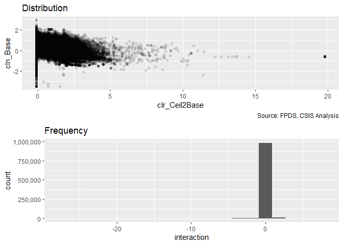<!-- --><!-- --><!-- -->

```r
#Create the models
term_base2ceil_ceiling_21A_no_interact <- glm(data=serv_smp, b_Term ~ clr_Ceil2Base + cln_Base,
                 family=binomial(link="logit"))
glmer_examine(term_base2ceil_ceiling_21A_no_interact)
```

```
## clr_Ceil2Base      cln_Base 
##      1.015836      1.015836
```

```r
term_base2ceil_ceiling_21A <- glm(data=serv_smp, b_Term ~ clr_Ceil2Base + cln_Base + clr_Ceil2Base:cln_Base,
                 family=binomial(link="logit"))
glmer_examine(term_base2ceil_ceiling_21A)
```

```
##          clr_Ceil2Base               cln_Base clr_Ceil2Base:cln_Base 
##               1.071118               1.311189               1.364497
```

```r
#Compare the Models
stargazer::stargazer(term_base2ceil_ceiling_21A_no_interact, term_base2ceil_ceiling_21A, type="text", digits=2)
```

```
## 
## ===================================================
##                            Dependent variable:     
##                        ----------------------------
##                                   b_Term           
##                             (1)            (2)     
## ---------------------------------------------------
## clr_Ceil2Base             1.10***        1.09***   
##                            (0.01)        (0.02)    
##                                                    
## cln_Base                  0.35***        0.43***   
##                            (0.03)        (0.03)    
##                                                    
## clr_Ceil2Base:cln_Base                  -0.13***   
##                                          (0.03)    
##                                                    
## Constant                  -4.21***      -4.21***   
##                            (0.02)        (0.02)    
##                                                    
## ---------------------------------------------------
## Observations              250,000        250,000   
## Log Likelihood           -20,979.50    -20,967.40  
## Akaike Inf. Crit.        41,964.99      41,942.80  
## ===================================================
## Note:                   *p<0.1; **p<0.05; ***p<0.01
```

```r
summary_residual_compare(term_base2ceil_ceiling_21A_no_interact, term_base2ceil_ceiling_21A, bins=20)
```

<!-- -->

```
## Warning in residuals_binned(model1_old, bins = bins): Always uses Xlb
## Estimated Pr(Termination), should update.
```

```
## Warning in residuals_binned(model1_new, bins = bins): Always uses Xlb
## Estimated Pr(Termination), should update.
```

```
## Warning in if (class(model1_new) %in% c("glmerMod", "lme4", "lmerMod")) {:
## the condition has length > 1 and only the first element will be used
```

```
## Warning in if (!class(model1_new) %in% c("glmerMod", "lme4", "lmerMod") & :
## the condition has length > 1 and only the first element will be used
```

<!-- -->

```
## [[1]]
##        model deviance null.deviance difference
## 1 model1_old 41958.99      46388.62   4429.621
## 2 model1_new 41934.80      46388.62   4453.812
```
Not significant, no longer in line with expecations. Leaving it out.
####21B: Cumulative

```r
#Create the model
term_base2ceil_ceiling_21B <- glm(data=serv_smp, b_Term ~ cln_US6sal + 
                   cln_PSCrate+ cp_OffPerf7+cp_OffPSC7+
                 cn_PairHist7+cln_PairCA +
                   cln_Base + cln_Days+ clr_Ceil2Base+
                   Comp+
                   Veh+
                   Pricing+
                   Crisis+
                   cln_Def6HHI+clr_Def6toUS+
                   cln_Def3HHI+clr_Def3toUS+
                   cp_PairObl7+
                   cln_OffObl7+cln_OffFocus +
                    cn_PairHist7:Pricing+ 
                   clr_Ceil2Base:cln_Base,
                 family=binomial(link="logit"))
glmer_examine(term_base2ceil_ceiling_21B)
```

```
##                            GVIF Df GVIF^(1/(2*Df))
## cln_US6sal             1.660167  1        1.288475
## cln_PSCrate            1.393305  1        1.180383
## cp_OffPerf7            1.457031  1        1.207076
## cp_OffPSC7             2.304951  1        1.518207
## cn_PairHist7           1.461619  1        1.208975
## cln_PairCA             3.071136  1        1.752466
## cln_Base               1.680331  1        1.296276
## cln_Days               1.257639  1        1.121445
## clr_Ceil2Base          1.340428  1        1.157769
## Comp                   1.415168  3        1.059582
## Veh                    2.397767  4        1.115516
## Pricing                5.191071  6        1.147109
## Crisis                 1.531747  3        1.073654
## cln_Def6HHI            1.925757  1        1.387717
## clr_Def6toUS           1.592303  1        1.261865
## cln_Def3HHI            1.919459  1        1.385445
## clr_Def3toUS           1.734287  1        1.316923
## cp_PairObl7            1.414340  1        1.189260
## cln_OffObl7            1.237447  1        1.112406
## cln_OffFocus           2.067553  1        1.437899
## cn_PairHist7:Pricing   4.960131  6        1.142767
## cln_Base:clr_Ceil2Base 1.565342  1        1.251136
```

```r
#Compare the models
stargazer::stargazer(term_history_pricing_19B, term_base2ceil_ceiling_21B, type="text", digits=2)
```

```
## 
## =====================================================================
##                                              Dependent variable:     
##                                          ----------------------------
##                                                     b_Term           
##                                               (1)            (2)     
## ---------------------------------------------------------------------
## cln_US6sal                                    0.01          0.01     
##                                              (0.04)        (0.04)    
##                                                                      
## cln_PSCrate                                  0.08**        0.08**    
##                                              (0.04)        (0.04)    
##                                                                      
## cp_OffPerf7                                 -0.15***      -0.15***   
##                                              (0.04)        (0.04)    
##                                                                      
## cp_OffPSC7                                  0.54***        0.54***   
##                                              (0.04)        (0.04)    
##                                                                      
## cn_PairHist7                                 -0.07*        -0.07*    
##                                              (0.04)        (0.04)    
##                                                                      
## cln_PairCA                                  0.35***        0.36***   
##                                              (0.04)        (0.04)    
##                                                                      
## cln_Base                                    0.28***        0.26***   
##                                              (0.04)        (0.04)    
##                                                                      
## cln_Days                                    1.03***        1.03***   
##                                              (0.04)        (0.04)    
##                                                                      
## clr_Ceil2Base                               0.80***        0.80***   
##                                              (0.02)        (0.02)    
##                                                                      
## Comp1 offer                                 0.24***        0.24***   
##                                              (0.05)        (0.06)    
##                                                                      
## Comp2-4 offers                              0.23***        0.23***   
##                                              (0.05)        (0.05)    
##                                                                      
## Comp5+ offers                               0.75***        0.76***   
##                                              (0.05)        (0.05)    
##                                                                      
## VehS-IDC                                    -0.83***      -0.83***   
##                                              (0.05)        (0.05)    
##                                                                      
## VehM-IDC                                    -0.42***      -0.43***   
##                                              (0.05)        (0.05)    
##                                                                      
## VehFSS/GWAC                                 -0.28***      -0.29***   
##                                              (0.07)        (0.07)    
##                                                                      
## VehBPA/BOA                                  -1.36***      -1.33***   
##                                              (0.12)        (0.12)    
##                                                                      
## PricingOther FP                              -0.22          -0.23    
##                                              (0.18)        (0.18)    
##                                                                      
## PricingT&M/LH/FPLOE                         -0.92***      -0.94***   
##                                              (0.18)        (0.18)    
##                                                                      
## PricingIncentive                            -1.95***      -1.96***   
##                                              (0.73)        (0.73)    
##                                                                      
## PricingOther CB                             -1.45***      -1.45***   
##                                              (0.15)        (0.15)    
##                                                                      
## PricingUCA                                  -1.22***      -1.22***   
##                                              (0.28)        (0.28)    
##                                                                      
## PricingCombination or Other                 -1.32***      -1.35***   
##                                              (0.28)        (0.28)    
##                                                                      
## CrisisARRA                                  -0.71***      -0.70***   
##                                              (0.26)        (0.26)    
##                                                                      
## CrisisDis                                     0.43          0.44     
##                                              (0.34)        (0.34)    
##                                                                      
## CrisisOCO                                    -0.04          -0.03    
##                                              (0.09)        (0.09)    
##                                                                      
## cln_Def6HHI                                  -0.07*        -0.08*    
##                                              (0.04)        (0.04)    
##                                                                      
## clr_Def6toUS                                -0.20***      -0.20***   
##                                              (0.06)        (0.06)    
##                                                                      
## cln_Def3HHI                                 0.24***        0.24***   
##                                              (0.04)        (0.04)    
##                                                                      
## clr_Def3toUS                                -0.51***      -0.51***   
##                                              (0.05)        (0.05)    
##                                                                      
## cp_PairObl7                                 -0.37***      -0.38***   
##                                              (0.05)        (0.05)    
##                                                                      
## cln_OffObl7                                 0.11***        0.12***   
##                                              (0.04)        (0.04)    
##                                                                      
## cln_OffFocus                                0.17***        0.17***   
##                                              (0.04)        (0.04)    
##                                                                      
## cn_PairHist7:PricingOther FP                  0.33          0.32     
##                                              (0.34)        (0.34)    
##                                                                      
## cn_PairHist7:PricingT&M/LH/FPLOE            -1.19***      -1.20***   
##                                              (0.35)        (0.35)    
##                                                                      
## cn_PairHist7:PricingIncentive                -1.45          -1.44    
##                                              (1.53)        (1.53)    
##                                                                      
## cn_PairHist7:PricingOther CB                  0.17          0.17     
##                                              (0.29)        (0.29)    
##                                                                      
## cn_PairHist7:PricingUCA                       0.52          0.52     
##                                              (0.59)        (0.59)    
##                                                                      
## cn_PairHist7:PricingCombination or Other    -1.23**        -1.23**   
##                                              (0.56)        (0.57)    
##                                                                      
## cln_Base:clr_Ceil2Base                                      0.05*    
##                                                            (0.03)    
##                                                                      
## Constant                                    -4.15***      -4.15***   
##                                              (0.04)        (0.04)    
##                                                                      
## ---------------------------------------------------------------------
## Observations                                250,000        250,000   
## Log Likelihood                             -19,628.29    -19,626.88  
## Akaike Inf. Crit.                          39,334.58      39,333.76  
## =====================================================================
## Note:                                     *p<0.1; **p<0.05; ***p<0.01
```

```r
summary_residual_compare(term_base2ceil_ceiling_21B, term_history_pricing_19B, bins=100)
```

<!-- -->

```
## Warning in residuals_binned(model1_old, bins = bins): Always uses Xlb
## Estimated Pr(Termination), should update.
```

```
## Warning in residuals_binned(model1_new, bins = bins): Always uses Xlb
## Estimated Pr(Termination), should update.
```

```
## Warning in if (class(model1_new) %in% c("glmerMod", "lme4", "lmerMod")) {:
## the condition has length > 1 and only the first element will be used
```

```
## Warning in if (!class(model1_new) %in% c("glmerMod", "lme4", "lmerMod") & :
## the condition has length > 1 and only the first element will be used
```

<!-- -->

```
## [[1]]
##        model deviance null.deviance difference
## 1 model1_old 39253.76      46388.62   7134.855
## 2 model1_new 39256.58      46388.62   7132.033
```
In line with expectations, helps with AIC, significant, though does throw off the highest end of the fitted range.

####22A: Available Options:Initial Contract Duration (logged)
Option years are commonly associated with long contracts. This approach reduces the need for terminations and may increase the extend of options exercised as it means continuing a contract rather than including additional features. Option years may also provide more options for cost controls. and reduce ceiling breaches.
(Options, Ceiling Breach, Terminations)
++	-	-


```r
summary_double_continuous(serv_smp1m,"clr_Ceil2Base","cln_Days")
```

<!-- --><!-- --><!-- -->

```r
#Create Models
term_base2ceil_duration_22A_no_interact <- glm(data=serv_smp, b_Term ~ clr_Ceil2Base + cln_Days,
                 family=binomial(link="logit"))
glmer_examine(term_base2ceil_duration_22A_no_interact)
```

```
## clr_Ceil2Base      cln_Days 
##      1.022469      1.022469
```

```r
term_base2ceil_duration_22A <- glm(data=serv_smp, b_Term ~ clr_Ceil2Base + cln_Days + clr_Ceil2Base:cln_Days,
                 family=binomial(link="logit"))
glmer_examine(term_base2ceil_duration_22A)
```

```
##          clr_Ceil2Base               cln_Days clr_Ceil2Base:cln_Days 
##               1.552796               1.110278               1.674593
```

```r
#Compare the Models
stargazer::stargazer(term_base2ceil_duration_22A_no_interact, term_base2ceil_duration_22A, type="text", digits=2)
```

```
## 
## ===================================================
##                            Dependent variable:     
##                        ----------------------------
##                                   b_Term           
##                             (1)            (2)     
## ---------------------------------------------------
## clr_Ceil2Base             1.00***        0.96***   
##                            (0.01)        (0.02)    
##                                                    
## cln_Days                  1.05***        1.01***   
##                            (0.04)        (0.04)    
##                                                    
## clr_Ceil2Base:cln_Days                   0.16***   
##                                          (0.04)    
##                                                    
## Constant                  -4.31***      -4.31***   
##                            (0.02)        (0.02)    
##                                                    
## ---------------------------------------------------
## Observations              250,000        250,000   
## Log Likelihood           -20,668.26    -20,661.67  
## Akaike Inf. Crit.        41,342.51      41,331.34  
## ===================================================
## Note:                   *p<0.1; **p<0.05; ***p<0.01
```

```r
summary_residual_compare(term_base2ceil_duration_22A_no_interact, term_base2ceil_duration_22A, bins=5)
```

<!-- -->

```
## Warning in residuals_binned(model1_old, bins = bins): Always uses Xlb
## Estimated Pr(Termination), should update.
```

```
## Warning in residuals_binned(model1_new, bins = bins): Always uses Xlb
## Estimated Pr(Termination), should update.
```

```
## Warning in if (class(model1_new) %in% c("glmerMod", "lme4", "lmerMod")) {:
## the condition has length > 1 and only the first element will be used
```

```
## Warning in if (!class(model1_new) %in% c("glmerMod", "lme4", "lmerMod") & :
## the condition has length > 1 and only the first element will be used
```

<!-- -->

```
## [[1]]
##        model deviance null.deviance difference
## 1 model1_old 41336.51      46388.62   5052.101
## 2 model1_new 41323.34      46388.62   5065.279
```
Significant but contrary to expectations and small AIC increase.
####22B: Cumulative

```r
#Create the model
term_base2ceil_duration_22B <- glm(data=serv_smp, b_Term ~ cln_US6sal + 
                   cln_PSCrate+ cp_OffPerf7+cp_OffPSC7+
                 cn_PairHist7+cln_PairCA +
                   cln_Base + cln_Days+ clr_Ceil2Base+
                   Comp+
                   Veh+
                   Pricing+
                   Crisis+
                   cln_Def6HHI+clr_Def6toUS+
                   cln_Def3HHI+clr_Def3toUS+
                   cp_PairObl7+
                   cln_OffObl7+cln_OffFocus +
                    cn_PairHist7:Pricing+ 
                   clr_Ceil2Base:cln_Base +
                 clr_Ceil2Base:cln_Days,
                 family=binomial(link="logit"))
glmer_examine(term_base2ceil_duration_22B)
```

```
##                            GVIF Df GVIF^(1/(2*Df))
## cln_US6sal             1.661869  1        1.289135
## cln_PSCrate            1.394319  1        1.180813
## cp_OffPerf7            1.457600  1        1.207311
## cp_OffPSC7             2.311373  1        1.520320
## cn_PairHist7           1.461339  1        1.208859
## cln_PairCA             3.073504  1        1.753141
## cln_Base               1.729333  1        1.315041
## cln_Days               1.357728  1        1.165216
## clr_Ceil2Base          2.028412  1        1.424223
## Comp                   1.421614  3        1.060385
## Veh                    2.414926  4        1.116511
## Pricing                5.195360  6        1.147188
## Crisis                 1.534250  3        1.073947
## cln_Def6HHI            1.927852  1        1.388471
## clr_Def6toUS           1.593041  1        1.262157
## cln_Def3HHI            1.920519  1        1.385828
## clr_Def3toUS           1.733450  1        1.316606
## cp_PairObl7            1.414021  1        1.189126
## cln_OffObl7            1.237418  1        1.112393
## cln_OffFocus           2.070385  1        1.438883
## cn_PairHist7:Pricing   4.958904  6        1.142744
## cln_Base:clr_Ceil2Base 1.817153  1        1.348018
## cln_Days:clr_Ceil2Base 1.900163  1        1.378464
```

```r
#Compare the models
stargazer::stargazer(term_base2ceil_ceiling_21B, term_base2ceil_duration_22B, type="text", digits=2)
```

```
## 
## =====================================================================
##                                              Dependent variable:     
##                                          ----------------------------
##                                                     b_Term           
##                                               (1)            (2)     
## ---------------------------------------------------------------------
## cln_US6sal                                    0.01          0.01     
##                                              (0.04)        (0.04)    
##                                                                      
## cln_PSCrate                                  0.08**        0.08**    
##                                              (0.04)        (0.04)    
##                                                                      
## cp_OffPerf7                                 -0.15***      -0.15***   
##                                              (0.04)        (0.04)    
##                                                                      
## cp_OffPSC7                                  0.54***        0.54***   
##                                              (0.04)        (0.04)    
##                                                                      
## cn_PairHist7                                 -0.07*        -0.07*    
##                                              (0.04)        (0.04)    
##                                                                      
## cln_PairCA                                  0.36***        0.36***   
##                                              (0.04)        (0.04)    
##                                                                      
## cln_Base                                    0.26***        0.27***   
##                                              (0.04)        (0.04)    
##                                                                      
## cln_Days                                    1.03***        1.01***   
##                                              (0.04)        (0.05)    
##                                                                      
## clr_Ceil2Base                               0.80***        0.78***   
##                                              (0.02)        (0.02)    
##                                                                      
## Comp1 offer                                 0.24***        0.24***   
##                                              (0.06)        (0.05)    
##                                                                      
## Comp2-4 offers                              0.23***        0.23***   
##                                              (0.05)        (0.05)    
##                                                                      
## Comp5+ offers                               0.76***        0.75***   
##                                              (0.05)        (0.05)    
##                                                                      
## VehS-IDC                                    -0.83***      -0.83***   
##                                              (0.05)        (0.05)    
##                                                                      
## VehM-IDC                                    -0.43***      -0.42***   
##                                              (0.05)        (0.05)    
##                                                                      
## VehFSS/GWAC                                 -0.29***      -0.28***   
##                                              (0.07)        (0.07)    
##                                                                      
## VehBPA/BOA                                  -1.33***      -1.33***   
##                                              (0.12)        (0.12)    
##                                                                      
## PricingOther FP                              -0.23          -0.22    
##                                              (0.18)        (0.18)    
##                                                                      
## PricingT&M/LH/FPLOE                         -0.94***      -0.94***   
##                                              (0.18)        (0.18)    
##                                                                      
## PricingIncentive                            -1.96***      -1.96***   
##                                              (0.73)        (0.73)    
##                                                                      
## PricingOther CB                             -1.45***      -1.46***   
##                                              (0.15)        (0.15)    
##                                                                      
## PricingUCA                                  -1.22***      -1.22***   
##                                              (0.28)        (0.28)    
##                                                                      
## PricingCombination or Other                 -1.35***      -1.34***   
##                                              (0.28)        (0.28)    
##                                                                      
## CrisisARRA                                  -0.70***      -0.70***   
##                                              (0.26)        (0.26)    
##                                                                      
## CrisisDis                                     0.44          0.44     
##                                              (0.34)        (0.34)    
##                                                                      
## CrisisOCO                                    -0.03          -0.03    
##                                              (0.09)        (0.09)    
##                                                                      
## cln_Def6HHI                                  -0.08*        -0.08*    
##                                              (0.04)        (0.04)    
##                                                                      
## clr_Def6toUS                                -0.20***      -0.20***   
##                                              (0.06)        (0.06)    
##                                                                      
## cln_Def3HHI                                 0.24***        0.24***   
##                                              (0.04)        (0.04)    
##                                                                      
## clr_Def3toUS                                -0.51***      -0.51***   
##                                              (0.05)        (0.05)    
##                                                                      
## cp_PairObl7                                 -0.38***      -0.38***   
##                                              (0.05)        (0.05)    
##                                                                      
## cln_OffObl7                                 0.12***        0.12***   
##                                              (0.04)        (0.04)    
##                                                                      
## cln_OffFocus                                0.17***        0.18***   
##                                              (0.04)        (0.04)    
##                                                                      
## cn_PairHist7:PricingOther FP                  0.32          0.33     
##                                              (0.34)        (0.33)    
##                                                                      
## cn_PairHist7:PricingT&M/LH/FPLOE            -1.20***      -1.20***   
##                                              (0.35)        (0.35)    
##                                                                      
## cn_PairHist7:PricingIncentive                -1.44          -1.44    
##                                              (1.53)        (1.53)    
##                                                                      
## cn_PairHist7:PricingOther CB                  0.17          0.18     
##                                              (0.29)        (0.29)    
##                                                                      
## cn_PairHist7:PricingUCA                       0.52          0.52     
##                                              (0.59)        (0.59)    
##                                                                      
## cn_PairHist7:PricingCombination or Other    -1.23**        -1.23**   
##                                              (0.57)        (0.57)    
##                                                                      
## cln_Base:clr_Ceil2Base                       0.05*          0.03     
##                                              (0.03)        (0.03)    
##                                                                      
## cln_Days:clr_Ceil2Base                                      0.07     
##                                                            (0.05)    
##                                                                      
## Constant                                    -4.15***      -4.15***   
##                                              (0.04)        (0.04)    
##                                                                      
## ---------------------------------------------------------------------
## Observations                                250,000        250,000   
## Log Likelihood                             -19,626.88    -19,625.67  
## Akaike Inf. Crit.                          39,333.76      39,333.35  
## =====================================================================
## Note:                                     *p<0.1; **p<0.05; ***p<0.01
```

```r
summary_residual_compare( term_base2ceil_ceiling_21B, term_base2ceil_duration_22B,bins=100)
```

<!-- -->

```
## Warning in residuals_binned(model1_old, bins = bins): Always uses Xlb
## Estimated Pr(Termination), should update.
```

```
## Warning in residuals_binned(model1_new, bins = bins): Always uses Xlb
## Estimated Pr(Termination), should update.
```

```
## Warning in if (class(model1_new) %in% c("glmerMod", "lme4", "lmerMod")) {:
## the condition has length > 1 and only the first element will be used
```

```
## Warning in if (!class(model1_new) %in% c("glmerMod", "lme4", "lmerMod") & :
## the condition has length > 1 and only the first element will be used
```

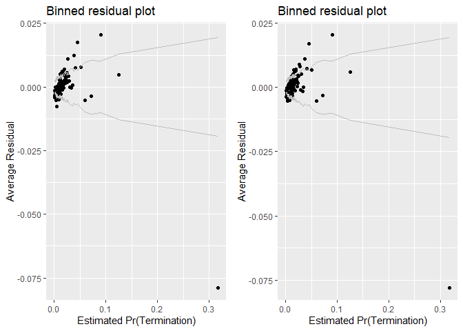<!-- -->

```
## [[1]]
##        model deviance null.deviance difference
## 1 model1_old 39253.76      46388.62   7134.855
## 2 model1_new 39251.35      46388.62   7137.267
```

Contrary to expectation, does little to reduce  AIC, leaving it out.

## Pre-Multilevel Model Summary


```r
 # !is.na(def_serv$cl_US6_avg_sal_lag1)&
 #  !is.na(def_serv$cln_PSCrate)&
 #  !is.na(def_serv$cp_OffPerf7)&
 #  !is.na(def_serv$cp_OffPSC7)&
 #  !is.na(def_serv$cn_PairHist7)&
 #  !is.na(def_serv$cln_PairCA)&


#Terminations
stargazer::stargazer(Term_01A,Term_01B,Term_02A,Term_02B,Term_03A,Term_03B,Term_03D,term_history_pricing_19B,
                       type="text",
                       digits=2)
```

```
## 
## ================================================================================================================================
##                                                                            Dependent variable:                                  
##                                          ---------------------------------------------------------------------------------------
##                                                                                  b_Term                                         
##                                             (1)        (2)        (3)        (4)        (5)        (6)        (7)        (8)    
## --------------------------------------------------------------------------------------------------------------------------------
## cln_US6sal                                 0.08**                                                            -0.06*      0.01   
##                                            (0.03)                                                            (0.03)     (0.04)  
##                                                                                                                                 
## cln_PSCrate                                           0.07**                                                0.10***     0.08**  
##                                                       (0.03)                                                 (0.03)     (0.04)  
##                                                                                                                                 
## cp_OffPerf7                                                     0.20***                                      -0.003    -0.15*** 
##                                                                  (0.03)                                      (0.03)     (0.04)  
##                                                                                                                                 
## cp_OffPSC7                                                                 0.45***                          0.37***    0.54***  
##                                                                             (0.02)                           (0.03)     (0.04)  
##                                                                                                                                 
## cn_PairHist7                                                                           -0.05                -0.23***    -0.07*  
##                                                                                        (0.03)                (0.03)     (0.04)  
##                                                                                                                                 
## cln_PairCA                                                                                       0.36***    0.31***    0.35***  
##                                                                                                   (0.03)     (0.03)     (0.04)  
##                                                                                                                                 
## cln_Base                                                                                                               0.28***  
##                                                                                                                         (0.04)  
##                                                                                                                                 
## cln_Days                                                                                                               1.03***  
##                                                                                                                         (0.04)  
##                                                                                                                                 
## clr_Ceil2Base                                                                                                          0.80***  
##                                                                                                                         (0.02)  
##                                                                                                                                 
## Comp1 offer                                                                                                            0.24***  
##                                                                                                                         (0.05)  
##                                                                                                                                 
## Comp2-4 offers                                                                                                         0.23***  
##                                                                                                                         (0.05)  
##                                                                                                                                 
## Comp5+ offers                                                                                                          0.75***  
##                                                                                                                         (0.05)  
##                                                                                                                                 
## VehS-IDC                                                                                                               -0.83*** 
##                                                                                                                         (0.05)  
##                                                                                                                                 
## VehM-IDC                                                                                                               -0.42*** 
##                                                                                                                         (0.05)  
##                                                                                                                                 
## VehFSS/GWAC                                                                                                            -0.28*** 
##                                                                                                                         (0.07)  
##                                                                                                                                 
## VehBPA/BOA                                                                                                             -1.36*** 
##                                                                                                                         (0.12)  
##                                                                                                                                 
## PricingOther FP                                                                                                         -0.22   
##                                                                                                                         (0.18)  
##                                                                                                                                 
## PricingT&M/LH/FPLOE                                                                                                    -0.92*** 
##                                                                                                                         (0.18)  
##                                                                                                                                 
## PricingIncentive                                                                                                       -1.95*** 
##                                                                                                                         (0.73)  
##                                                                                                                                 
## PricingOther CB                                                                                                        -1.45*** 
##                                                                                                                         (0.15)  
##                                                                                                                                 
## PricingUCA                                                                                                             -1.22*** 
##                                                                                                                         (0.28)  
##                                                                                                                                 
## PricingCombination or Other                                                                                            -1.32*** 
##                                                                                                                         (0.28)  
##                                                                                                                                 
## CrisisARRA                                                                                                             -0.71*** 
##                                                                                                                         (0.26)  
##                                                                                                                                 
## CrisisDis                                                                                                                0.43   
##                                                                                                                         (0.34)  
##                                                                                                                                 
## CrisisOCO                                                                                                               -0.04   
##                                                                                                                         (0.09)  
##                                                                                                                                 
## cln_Def6HHI                                                                                                             -0.07*  
##                                                                                                                         (0.04)  
##                                                                                                                                 
## clr_Def6toUS                                                                                                           -0.20*** 
##                                                                                                                         (0.06)  
##                                                                                                                                 
## cln_Def3HHI                                                                                                            0.24***  
##                                                                                                                         (0.04)  
##                                                                                                                                 
## clr_Def3toUS                                                                                                           -0.51*** 
##                                                                                                                         (0.05)  
##                                                                                                                                 
## cp_PairObl7                                                                                                            -0.37*** 
##                                                                                                                         (0.05)  
##                                                                                                                                 
## cln_OffObl7                                                                                                            0.11***  
##                                                                                                                         (0.04)  
##                                                                                                                                 
## cln_OffFocus                                                                                                           0.17***  
##                                                                                                                         (0.04)  
##                                                                                                                                 
## cn_PairHist7:PricingOther FP                                                                                             0.33   
##                                                                                                                         (0.34)  
##                                                                                                                                 
## cn_PairHist7:PricingT&M/LH/FPLOE                                                                                       -1.19*** 
##                                                                                                                         (0.35)  
##                                                                                                                                 
## cn_PairHist7:PricingIncentive                                                                                           -1.45   
##                                                                                                                         (1.53)  
##                                                                                                                                 
## cn_PairHist7:PricingOther CB                                                                                             0.17   
##                                                                                                                         (0.29)  
##                                                                                                                                 
## cn_PairHist7:PricingUCA                                                                                                  0.52   
##                                                                                                                         (0.59)  
##                                                                                                                                 
## cn_PairHist7:PricingCombination or Other                                                                               -1.23**  
##                                                                                                                         (0.56)  
##                                                                                                                                 
## Constant                                  -3.96***   -3.96***   -3.97***   -3.98***   -3.96***   -3.97***   -3.99***   -4.15*** 
##                                            (0.01)     (0.01)     (0.01)     (0.02)     (0.01)     (0.01)     (0.02)     (0.04)  
##                                                                                                                                 
## --------------------------------------------------------------------------------------------------------------------------------
## Observations                              250,000    250,000    250,000    250,000    250,000    250,000    250,000    250,000  
## Log Likelihood                           -23,191.15 -23,191.65 -23,171.58 -23,048.00 -23,193.15 -23,112.98 -22,997.20 -19,628.29
## Akaike Inf. Crit.                        46,386.29  46,387.29  46,347.17  46,100.00  46,390.30  46,229.96  46,008.41  39,334.58 
## ================================================================================================================================
## Note:                                                                                                *p<0.1; **p<0.05; ***p<0.01
```

```r
texreg::htmlreg(list(Term_01A,Term_01B,Term_02A,Term_02B,Term_03A,Term_03B,Term_03D,Term_12C),file="..//Output//Term_model_lvl1.html",
                single.row = TRUE,
                # custom.model.name=c("Ceiling Breaches"),
                stars=c(0.1,0.05,0.01,0.001),
                groups = list(
                              "Services Complexity" = 2:3,
                              "Office Capacity" =4:5,
                              "Past Relationship"=6:7
                              ),
                custom.coef.map=study_coef_list,
                bold=0.05,
                custom.note="%stars. Numerical inputs are rescaled.",
                caption="Table 7: Logit Bivariate Look at Study Variables and Terminations",
                caption.above=TRUE)
```

```
## The table was written to the file '..//Output//Term_model_lvl1.html'.
```

# Multilevel Model
####25A: 2019-08-14 First run, original multilevel.
This was created while we were still using ceiling instead of base.

```r
if(file.exists("..\\output\\term25A.rdata")) load(file="..\\output\\term25A.rdata")

if(!exists("term25A")){
  #Create the model
  term25A <- glmer(data=serv_smp, b_Term ~ cln_US6sal + 
                     cln_PSCrate+ cp_OffPerf7+cp_OffPSC7+
                     cn_PairHist7+cln_PairCA +
                     cln_Base + cln_Days+ clr_Ceil2Base+
                     Comp+
                     Veh+
                     Pricing+
                     Crisis+
                     cln_Def6HHI+clr_Def6toUS+
                     cln_Def3HHI+clr_Def3toUS+
                     cp_PairObl7+
                     cln_OffObl7+cln_OffFocus +
                     cn_PairHist7:Pricing+ 
                     # clr_Ceil2Base:cl_Ceil+
                     (1 | NAICS3/NAICS6/ServArea)+  
                     (1 | Agency/Office) +
                     (1 | Place)+ 
                     (1 | StartFY),
                   family=binomial(link="logit"),
                   verbose=TRUE)
  glmer_examine(term25A,display = TRUE)
  save(term25A,file="..\\output\\term25A.rdata")
}
#Compare the models
stargazer::stargazer(term_base2ceil_ceiling_21B, term25A, type="text", digits=2)
```

```
## 
## =======================================================================
##                                                Dependent variable:     
##                                           -----------------------------
##                                                      b_Term            
##                                            logistic  generalized linear
##                                                        mixed-effects   
##                                              (1)            (2)        
## -----------------------------------------------------------------------
## cln_US6sal                                   0.01                      
##                                             (0.04)                     
##                                                                        
## cln_PSCrate                                 0.08**                     
##                                             (0.04)                     
##                                                                        
## cp_OffPerf7                                -0.15***                    
##                                             (0.04)                     
##                                                                        
## cp_OffPSC7                                 0.54***                     
##                                             (0.04)                     
##                                                                        
## cn_PairHist7                                -0.07*                     
##                                             (0.04)                     
##                                                                        
## cln_PairCA                                 0.36***                     
##                                             (0.04)                     
##                                                                        
## cln_Base                                   0.26***                     
##                                             (0.04)                     
##                                                                        
## cln_Days                                   1.03***                     
##                                             (0.04)                     
##                                                                        
## clr_Ceil2Base                              0.80***                     
##                                             (0.02)                     
##                                                                        
## Comp1 offer                                0.24***                     
##                                             (0.06)                     
##                                                                        
## Comp2-4 offers                             0.23***                     
##                                             (0.05)                     
##                                                                        
## Comp5+ offers                              0.76***                     
##                                             (0.05)                     
##                                                                        
## cl_US6_avg_sal_lag1Const                                   -0.13*      
##                                                            (0.07)      
##                                                                        
## cl_CFTE                                                    -0.04       
##                                                            (0.04)      
##                                                                        
## c_pPBSC                                                    -0.01       
##                                                            (0.07)      
##                                                                        
## c_pOffPSC                                                 0.27***      
##                                                            (0.08)      
##                                                                        
## c_pairHist                                                -0.24***     
##                                                            (0.04)      
##                                                                        
## cl_pairCA                                                 -0.13**      
##                                                            (0.06)      
##                                                                        
## cl_Ceil                                                   0.44***      
##                                                            (0.04)      
##                                                                        
## cl_Days                                                   0.85***      
##                                                            (0.05)      
##                                                                        
## cl_Base2Ceil                                              0.53***      
##                                                            (0.03)      
##                                                                        
## Comp1or51 offer                                           0.26***      
##                                                            (0.06)      
##                                                                        
## Comp1or52-4 offers                                        0.40***      
##                                                            (0.05)      
##                                                                        
## Comp1or55+ offers                                         0.68***      
##                                                            (0.05)      
##                                                                        
## VehS-IDC                                   -0.83***       -0.65***     
##                                             (0.05)         (0.05)      
##                                                                        
## VehM-IDC                                   -0.43***       -0.39***     
##                                             (0.05)         (0.06)      
##                                                                        
## VehFSS/GWAC                                -0.29***       -0.32***     
##                                             (0.07)         (0.08)      
##                                                                        
## VehBPA/BOA                                 -1.33***       -1.10***     
##                                             (0.12)         (0.13)      
##                                                                        
## PricingOther FP                             -0.23                      
##                                             (0.18)                     
##                                                                        
## PricingT&M/LH/FPLOE                        -0.94***                    
##                                             (0.18)                     
##                                                                        
## PricingIncentive                           -1.96***                    
##                                             (0.73)                     
##                                                                        
## PricingOther CB                            -1.45***                    
##                                             (0.15)                     
##                                                                        
## PricingUCA                                 -1.22***                    
##                                             (0.28)                     
##                                                                        
## PricingCombination or Other                -1.35***                    
##                                             (0.28)                     
##                                                                        
## PricingUCAOther FP                                        -0.68***     
##                                                            (0.19)      
##                                                                        
## PricingUCAT&M/LH/FPLOE                                    -0.55***     
##                                                            (0.18)      
##                                                                        
## PricingUCAIncentive                                        -1.15       
##                                                            (0.72)      
##                                                                        
## PricingUCAOther CB                                        -0.61***     
##                                                            (0.14)      
##                                                                        
## PricingUCAUCA                                             -0.80***     
##                                                            (0.28)      
##                                                                        
## PricingUCACombination or Other                            -0.80***     
##                                                            (0.27)      
##                                                                        
## CrisisARRA                                 -0.70***        -0.51*      
##                                             (0.26)         (0.26)      
##                                                                        
## CrisisDis                                    0.44          0.67**      
##                                             (0.34)         (0.34)      
##                                                                        
## CrisisOCO                                   -0.03           0.05       
##                                             (0.09)         (0.11)      
##                                                                        
## cln_Def6HHI                                 -0.08*                     
##                                             (0.04)                     
##                                                                        
## clr_Def6toUS                               -0.20***                    
##                                             (0.06)                     
##                                                                        
## cln_Def3HHI                                0.24***                     
##                                             (0.04)                     
##                                                                        
## clr_Def3toUS                               -0.51***                    
##                                             (0.05)                     
##                                                                        
## cp_PairObl7                                -0.38***                    
##                                             (0.05)                     
##                                                                        
## cln_OffObl7                                0.12***                     
##                                             (0.04)                     
##                                                                        
## cln_OffFocus                               0.17***                     
##                                             (0.04)                     
##                                                                        
## cn_PairHist7:PricingOther FP                 0.32                      
##                                             (0.34)                     
##                                                                        
## cn_PairHist7:PricingT&M/LH/FPLOE           -1.20***                    
##                                             (0.35)                     
##                                                                        
## cn_PairHist7:PricingIncentive               -1.44                      
##                                             (1.53)                     
##                                                                        
## cn_PairHist7:PricingOther CB                 0.17                      
##                                             (0.29)                     
##                                                                        
## cn_PairHist7:PricingUCA                      0.52                      
##                                             (0.59)                     
##                                                                        
## cn_PairHist7:PricingCombination or Other   -1.23**                     
##                                             (0.57)                     
##                                                                        
## cln_Base:clr_Ceil2Base                      0.05*                      
##                                             (0.03)                     
##                                                                        
## cl_def6_HHI_lag1                                           0.15**      
##                                                            (0.07)      
##                                                                        
## cl_def6_ratio_lag1                                         -0.01       
##                                                            (0.06)      
##                                                                        
## cl_def3_HHI_lag1                                           -0.04       
##                                                            (0.07)      
##                                                                        
## cl_def3_ratio_lag1                                          0.10       
##                                                            (0.11)      
##                                                                        
## c_pMarket                                                  -0.01       
##                                                            (0.06)      
##                                                                        
## cl_OffVol                                                   0.01       
##                                                            (0.05)      
##                                                                        
## cl_office_naics_hhi_k                                     -0.21***     
##                                                            (0.08)      
##                                                                        
## c_pairHist:PricingUCAOther FP                               0.27       
##                                                            (0.33)      
##                                                                        
## c_pairHist:PricingUCAT&M/LH/FPLOE                         -0.75**      
##                                                            (0.34)      
##                                                                        
## c_pairHist:PricingUCAIncentive                             -0.78       
##                                                            (1.56)      
##                                                                        
## c_pairHist:PricingUCAOther CB                               0.15       
##                                                            (0.26)      
##                                                                        
## c_pairHist:PricingUCAUCA                                    0.33       
##                                                            (0.53)      
##                                                                        
## c_pairHist:PricingUCACombination or Other                  -0.81       
##                                                            (0.54)      
##                                                                        
## cl_Ceil:cl_Base2Ceil                                      -0.13***     
##                                                            (0.02)      
##                                                                        
## Constant                                   -4.15***       -4.66***     
##                                             (0.04)         (0.12)      
##                                                                        
## -----------------------------------------------------------------------
## Observations                               250,000        250,000      
## Log Likelihood                            -19,626.88     -18,178.69    
## Akaike Inf. Crit.                         39,333.76      36,451.37     
## Bayesian Inf. Crit.                                      36,941.55     
## =======================================================================
## Note:                                       *p<0.1; **p<0.05; ***p<0.01
```

```r
summary_residual_compare( term_base2ceil_ceiling_21B, term25A,bins=100)
```

<!-- -->

```
## Warning in residuals_binned(model1_old, bins = bins): Always uses Xlb
## Estimated Pr(Termination), should update.
```

```
## Warning in residuals_binned(model1_new, bins = bins): Always uses Xlb
## Estimated Pr(Termination), should update.
```

<!-- -->

```
## [[1]]
## CrisisProductOrServiceArea:(NAICS:NAICS3).(Intercept) 
##                                           0.387211336 
##                             Office:Agency.(Intercept) 
##                                           0.726431395 
##                              NAICS:NAICS3.(Intercept) 
##                                           0.254925533 
##                          PlaceCountryISO3.(Intercept) 
##                                           0.001850118 
##                                    NAICS3.(Intercept) 
##                                           0.181247898 
##                                    Agency.(Intercept) 
##                                           0.171807168 
##                                   StartFY.(Intercept) 
##                                           0.103764621 
## 
## [[2]]
## [1] "Model failed to converge with max|grad| = 0.053846 (tol = 0.001, component 1)"
```

####25B: 2019-08-14 Switch to base and 1m sample.


```r
if(file.exists("..\\output\\term25B.rdata")) load(file="..\\output\\term25B.rdata")


if(!exists("term25B")){
  #Create the model
  term25B <- glmer(data=serv_smp1m, b_Term ~ cln_US6sal + 
                     cln_PSCrate+ cp_OffPerf7+cp_OffPSC7+
                     cn_PairHist7+cln_PairCA +
                     cln_Base + cln_Days+ clr_Ceil2Base+
                     Comp+
                     Veh+
                     Pricing+
                     Crisis+
                     cln_Def6HHI+clr_Def6toUS+
                     cln_Def3HHI+clr_Def3toUS+
                     cp_PairObl7+
                     cln_OffObl7+cln_OffFocus +
                     cn_PairHist7:Pricing+ 
                     (1 | NAICS3/NAICS6/ServArea)+  
                     (1 | Agency/Office) +
                     (1 | Place)+ 
                     (1 | StartFY),
                   family=binomial(link="logit"),
                   verbose=TRUE)
  glmer_examine(term25B,display = TRUE)
  save(term25B,file="..\\output\\term25B.rdata")
}

#Compare the models
stargazer::stargazer(term_base2ceil_ceiling_21B, term25B, type="text", digits=2)
```

```
## 
## ======================================================================
##                                               Dependent variable:     
##                                          -----------------------------
##                                                     b_Term            
##                                           logistic  generalized linear
##                                                       mixed-effects   
##                                             (1)            (2)        
## ----------------------------------------------------------------------
## cln_US6sal                                  0.01          -0.05       
##                                            (0.04)         (0.06)      
##                                                                       
## cln_PSCrate                                0.08**         -0.02       
##                                            (0.04)         (0.02)      
##                                                                       
## cp_OffPerf7                               -0.15***         0.03       
##                                            (0.04)         (0.04)      
##                                                                       
## cp_OffPSC7                                0.54***        0.31***      
##                                            (0.04)         (0.04)      
##                                                                       
## cn_PairHist7                               -0.07*        -0.28***     
##                                            (0.04)         (0.02)      
##                                                                       
## cln_PairCA                                0.36***         -0.04       
##                                            (0.04)         (0.03)      
##                                                                       
## cln_Base                                  0.26***        0.29***      
##                                            (0.04)         (0.02)      
##                                                                       
## cln_Days                                  1.03***        0.90***      
##                                            (0.04)         (0.02)      
##                                                                       
## clr_Ceil2Base                             0.80***        0.50***      
##                                            (0.02)         (0.01)      
##                                                                       
## Comp1 offer                               0.24***        0.30***      
##                                            (0.06)         (0.03)      
##                                                                       
## Comp2-4 offers                            0.23***        0.37***      
##                                            (0.05)         (0.03)      
##                                                                       
## Comp5+ offers                             0.76***        0.71***      
##                                            (0.05)         (0.03)      
##                                                                       
## VehS-IDC                                  -0.83***       -0.67***     
##                                            (0.05)         (0.03)      
##                                                                       
## VehM-IDC                                  -0.43***       -0.41***     
##                                            (0.05)         (0.03)      
##                                                                       
## VehFSS/GWAC                               -0.29***       -0.18***     
##                                            (0.07)         (0.04)      
##                                                                       
## VehBPA/BOA                                -1.33***       -0.97***     
##                                            (0.12)         (0.06)      
##                                                                       
## PricingOther FP                            -0.23         -0.95***     
##                                            (0.18)         (0.10)      
##                                                                       
## PricingT&M/LH/FPLOE                       -0.94***       -0.45***     
##                                            (0.18)         (0.09)      
##                                                                       
## PricingIncentive                          -1.96***       -1.02***     
##                                            (0.73)         (0.39)      
##                                                                       
## PricingOther CB                           -1.45***       -0.37***     
##                                            (0.15)         (0.08)      
##                                                                       
## PricingUCA                                -1.22***       -0.72***     
##                                            (0.28)         (0.14)      
##                                                                       
## PricingCombination or Other               -1.35***        -0.16       
##                                            (0.28)         (0.10)      
##                                                                       
## CrisisARRA                                -0.70***       -0.32**      
##                                            (0.26)         (0.13)      
##                                                                       
## CrisisDis                                   0.44          0.48**      
##                                            (0.34)         (0.19)      
##                                                                       
## CrisisOCO                                  -0.03          -0.07       
##                                            (0.09)         (0.08)      
##                                                                       
## cln_Def6HHI                                -0.08*          0.04       
##                                            (0.04)         (0.04)      
##                                                                       
## clr_Def6toUS                              -0.20***         0.02       
##                                            (0.06)         (0.04)      
##                                                                       
## cln_Def3HHI                               0.24***          0.03       
##                                            (0.04)         (0.04)      
##                                                                       
## clr_Def3toUS                              -0.51***       0.24***      
##                                            (0.05)         (0.09)      
##                                                                       
## cp_PairObl7                               -0.38***       -0.13***     
##                                            (0.05)         (0.04)      
##                                                                       
## cln_OffObl7                               0.12***          0.03       
##                                            (0.04)         (0.03)      
##                                                                       
## cln_OffFocus                              0.17***        -0.24***     
##                                            (0.04)         (0.05)      
##                                                                       
## cn_PairHist7:PricingOther FP                0.32           0.09       
##                                            (0.34)         (0.18)      
##                                                                       
## cn_PairHist7:PricingT&M/LH/FPLOE          -1.20***       -0.60***     
##                                            (0.35)         (0.18)      
##                                                                       
## cn_PairHist7:PricingIncentive              -1.44          -0.09       
##                                            (1.53)         (0.65)      
##                                                                       
## cn_PairHist7:PricingOther CB                0.17          0.30**      
##                                            (0.29)         (0.13)      
##                                                                       
## cn_PairHist7:PricingUCA                     0.52          -0.51*      
##                                            (0.59)         (0.26)      
##                                                                       
## cn_PairHist7:PricingCombination or Other  -1.23**          0.32       
##                                            (0.57)         (0.23)      
##                                                                       
## cln_Base:clr_Ceil2Base                     0.05*                      
##                                            (0.03)                     
##                                                                       
## Constant                                  -4.15***       -4.45***     
##                                            (0.04)         (0.15)      
##                                                                       
## ----------------------------------------------------------------------
## Observations                              250,000       1,000,000     
## Log Likelihood                           -19,626.88     -71,257.17    
## Akaike Inf. Crit.                        39,333.76      142,606.40    
## Bayesian Inf. Crit.                                     143,149.90    
## ======================================================================
## Note:                                      *p<0.1; **p<0.05; ***p<0.01
```

```r
summary_residual_compare( term_base2ceil_ceiling_21B, term25B,bins=100)
```

<!-- -->

```
## Warning in residuals_binned(model1_old, bins = bins): Always uses Xlb
## Estimated Pr(Termination), should update.
```

```
## Warning in residuals_binned(model1_new, bins = bins): Always uses Xlb
## Estimated Pr(Termination), should update.
```

<!-- -->

```
## [[1]]
## ServArea:(NAICS6:NAICS3).(Intercept)            Office:Agency.(Intercept) 
##                            0.4246339                            0.8130444 
##            NAICS6:NAICS3.(Intercept)                    Place.(Intercept) 
##                            0.3333396                            0.6252668 
##                   NAICS3.(Intercept)                   Agency.(Intercept) 
##                            0.2077932                            0.2444498 
##                  StartFY.(Intercept) 
##                            0.1094118 
## 
## [[2]]
## [1] "Model failed to converge with max|grad| = 0.021645 (tol = 0.001, component 1)"
```
