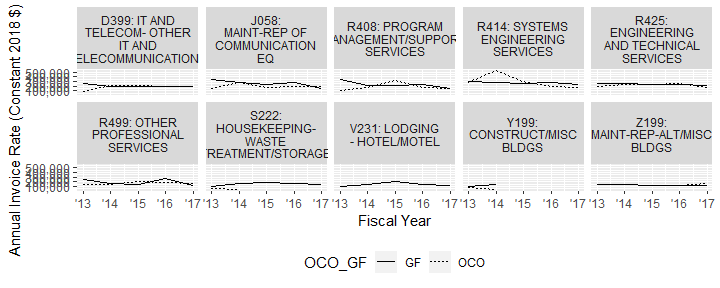
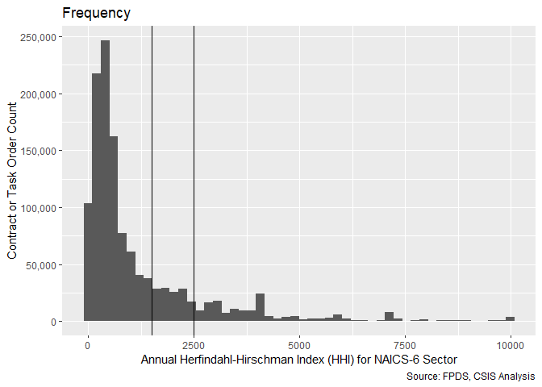

#Setup


First we load the data. The dataset used is a U.S. Defense Contracting dataset derived from FPDS.


```
## Warning: replacing previous import 'Hmisc::summarize' by 'dplyr::summarize'
## when loading 'csis360'
```

```
## Warning: replacing previous import 'Hmisc::src' by 'dplyr::src' when
## loading 'csis360'
```

```
## Warning: replacing previous import 'dplyr::intersect' by
## 'lubridate::intersect' when loading 'csis360'
```

```
## Warning: replacing previous import 'dplyr::union' by 'lubridate::union'
## when loading 'csis360'
```

```
## Warning: replacing previous import 'dplyr::setdiff' by 'lubridate::setdiff'
## when loading 'csis360'
```

```
## 
## Attaching package: 'dplyr'
```

```
## The following objects are masked from 'package:stats':
## 
##     filter, lag
```

```
## The following objects are masked from 'package:base':
## 
##     intersect, setdiff, setequal, union
```

```
## Loading required package: MASS
```

```
## 
## Attaching package: 'MASS'
```

```
## The following object is masked from 'package:dplyr':
## 
##     select
```

```
## Loading required package: Matrix
```

```
## Loading required package: lme4
```

```
## 
## arm (Version 1.10-1, built: 2018-4-12)
```

```
## Working directory is F:/Users/Greg/Repositories/Services/analysis
```

```
## 
## Please cite as:
```

```
##  Hlavac, Marek (2018). stargazer: Well-Formatted Regression and Summary Statistics Tables.
```

```
##  R package version 5.2.2. https://CRAN.R-project.org/package=stargazer
```

```
## Version:  1.36.23
## Date:     2017-03-03
## Author:   Philip Leifeld (University of Glasgow)
## 
## Please cite the JSS article in your publications -- see citation("texreg").
```

```
## 
## Attaching package: 'texreg'
```

```
## The following object is masked from 'package:arm':
## 
##     coefplot
```

```
## -- Attaching packages ------------------------------------------------------------------------------------------------------------------------------------------------- tidyverse 1.2.1 --
```

```
## v tibble  2.1.3     v purrr   0.3.3
## v tidyr   1.0.0     v stringr 1.4.0
## v tibble  2.1.3     v forcats 0.4.0
```

```
## -- Conflicts ---------------------------------------------------------------------------------------------------------------------------------------------------- tidyverse_conflicts() --
## x tidyr::expand()  masks Matrix::expand()
## x tidyr::extract() masks texreg::extract()
## x dplyr::filter()  masks stats::filter()
## x dplyr::lag()     masks stats::lag()
## x tidyr::pack()    masks Matrix::pack()
## x MASS::select()   masks dplyr::select()
## x tidyr::unpack()  masks Matrix::unpack()
```

```
## Loading required package: carData
```

```
## Registered S3 methods overwritten by 'car':
##   method                          from
##   influence.merMod                lme4
##   cooks.distance.influence.merMod lme4
##   dfbeta.influence.merMod         lme4
##   dfbetas.influence.merMod        lme4
```

```
## 
## Attaching package: 'car'
```

```
## The following object is masked from 'package:purrr':
## 
##     some
```

```
## The following object is masked from 'package:arm':
## 
##     logit
```

```
## The following object is masked from 'package:dplyr':
## 
##     recode
```

```
## 
## Attaching package: 'scales'
```

```
## The following object is masked from 'package:purrr':
## 
##     discard
```

```
## The following object is masked from 'package:readr':
## 
##     col_factor
```

```
## The following object is masked from 'package:arm':
## 
##     rescale
```

Contracts are classified using a mix of numerical and categorical variables. While the changes in numerical variables are easy to grasp and summarize, a contract may have one line item that is competed and another that is not. As is detailed in the exploration on R&D, we are only considering information available prior to contract start. The percentage of contract obligations that were competed is a valuable benchmark, but is highly influenced by factors that occured after contract start.


# Data Exploration

## Prod Serv


```r
ProdServ_summary<-
  read_delim("..\\data\\semi_clean\\ProductOrServiceCode.ProdServHistoryCFTEcoalesceLaggedConst.txt",delim="\t",
             na=c("NA","NULL"),
             guess_max = 200000)
```

```
## Parsed with column specification:
## cols(
##   fiscal_year = col_double(),
##   OCO_GF = col_character(),
##   ProductOrServiceCode = col_character(),
##   ProductOrServiceCode1L = col_character(),
##   IsRnDdefenseSystem = col_double(),
##   CFTE_Rate_1year = col_double(),
##   CFTE_Factor_1year = col_double(),
##   CFTE_Factor_1yearP4 = col_double(),
##   CFTE_Factor_1yearP4avg = col_double(),
##   CFTE_Factor_1yearP1 = col_double(),
##   CFTE_Factor_1yearP1avg = col_double(),
##   GDPdeflatorName = col_character()
## )
```

```r
top_ProdServ<-def_serv %>% group_by(ProdServ,CFTE_Rate_1year,OCO_GF) %>%
  dplyr::summarise(annual_action_obligation=sum(Action_Obligation_OMB20_GDP18),
                   annual_count=length(StartFY))  %>% 
  dplyr::summarise(ProdServ_action_obligation=sum(annual_action_obligation),
                   ProdServ_count=sum(annual_count)) 
top_ProdServ$ProdServ_dollar_rank<-rank(-top_ProdServ$ProdServ_action_obligation)
top_ProdServ$ProdServ_count_rank<-rank(-top_ProdServ$ProdServ_count)


ProdServ_summary<-left_join(ProdServ_summary,top_ProdServ %>% 
                              dplyr::select(ProdServ,ProdServ_dollar_rank,ProdServ_count_rank)
                            , by=c("ProductOrServiceCode"="ProdServ"))
rm(top_ProdServ)


ProdServ_summary<-as.data.frame(ProdServ_summary)
ProdServ_summary<-read_and_join_experiment(ProdServ_summary,
                        lookup_file = "ProductOrServiceCodes.csv",
                        path="https://raw.githubusercontent.com/CSISdefense/Lookup-Tables/master/",
                                      dir="",
                        by=c("ProductOrServiceCode"="ProductOrServiceCode"),
                        add_var=c("ProductOrServiceCodeText","Simple"),
                        skip_check_var=c("ProductOrServiceCodeText","Simple")
                        #                  "ProdServ_shorthand")
               )
```

```
## Parsed with column specification:
## cols(
##   .default = col_character(),
##   Unseperated = col_logical(),
##   IsService = col_double(),
##   IsCatchAllCode = col_double(),
##   isRnD1to5 = col_double(),
##   PBLscore = col_double(),
##   IsPossibleReclassification = col_double(),
##   IsPossibleSoftwareEngineering = col_logical(),
##   OCOcrisisScore = col_double(),
##   OCOcrisisPercent = col_double(),
##   CrisisPercent = col_logical(),
##   IsRnDdefenseSystem = col_double(),
##   Level1_Code = col_double(),
##   Level2_Code = col_double()
## )
```

```
## See spec(...) for full column specifications.
```

```r
#Remove R&D
ProdServ_summary<-ProdServ_summary %>% dplyr::filter(Simple=="Services" &
                                                       fiscal_year>=2011)


# View(ProdServ_summary)

ProdServ_summary$ProdServName<-factor(paste(
                                              ProdServ_summary$ProductOrServiceCode,
                                              ProdServ_summary$ProductOrServiceCodeText,sep=": "))

ProdServ_summary$ProdServName<-factor(ProdServ_summary$ProdServName
                                            ,levels=levels(ProdServ_summary$ProdServName),
                                            ,labels=swr(levels(ProdServ_summary$ProdServName),nwrap = 15)
                                            )


ProdServ_summary$CFTE_Rate_1yearP4<-1/ProdServ_summary$CFTE_Factor_1yearP4

ProdServ_short<-subset(ProdServ_summary,ProdServ_dollar_rank<=6 |
                             ProdServ_count_rank<=6)

ProdServ_short$FYdate<-as.Date(paste(ProdServ_short$fiscal_year,"01","01",sep="-"))

(
ProdServ20top<-ggplot(ProdServ_short,
       aes(x=FYdate,y=CFTE_Rate_1yearP4,linetype=OCO_GF))+#color=ProdServ_Code
  geom_line()+
  scale_y_continuous(label=scales::comma)+ 
    scale_x_date(date_labels = "'%y",limits=as.Date(c("2013-01-01", "2017-01-01")))+
  # scale_x_continuous(breaks=c(2006,2009,2011,2014))+
  labs(x="Fiscal Year",y="Annual Invoice Rate (Constant 2018 $)")+ 
    facet_wrap(~ProdServName,ncol=5)+theme(
                        legend.position = "bottom")#+
    # coord_cartesian(xlim = as.Date(c("2013-01-01", "2017-01-01")))
)
```

```
## Warning: Removed 6 rows containing missing values (geom_path).
```

<!-- -->

```r
ggsave600dpi(ProdServ20top,file="..//Output\\ProdServ20top.png",width=6.5,height=3.5,
             size=8,lineheight=1)
```

```
## Warning: Removed 6 rows containing missing values (geom_path).
```

```r
ggsave(ProdServ20top,file="..//Output\\ProdServ20top.eps",width=6.5,height=3)
```

```
## Warning: Removed 6 rows containing missing values (geom_path).
```


## Variable examination

```r
HH1plot<-freq_continuous_plot(def_serv,"def6_HHI_lag1",bins=50)
HH1plot<-HH1plot+geom_vline(xintercept=c(1500,2500))+labs(x="Annual Herfindahl-Hirschman Index (HHI) for NAICS-6 Sector",y="Contract or Task Order Count")
HH1plot
```

```
## Warning: Removed 30285 rows containing non-finite values (stat_bin).
```

<!-- -->

```r
ggsave(HH1plot,file="..//Output//HH1freq.png",width=5.5,height=5.5,dpi=600)
```

```
## Warning: Removed 30285 rows containing non-finite values (stat_bin).
```

```r
ggsave(HH1plot,file="..//Output//HH1freq.eps",width=5.5,height=5.5,dpi=600)
```

```
## Warning: Removed 30285 rows containing non-finite values (stat_bin).
```

```r
sum(def_serv$Action_Obligation.OMB20_GDP18[def_serv$EffComp=="No Comp."],na.rm=TRUE)/sum(def_serv$Action_Obligation.OMB20_GDP18,na.rm=TRUE)
```

```
## [1] NaN
```

```r
sum(def_serv$Action_Obligation.OMB20_GDP18[def_serv$EffComp=="1 Offer"],na.rm=TRUE)/sum(def_serv$Action_Obligation.OMB20_GDP18,na.rm=TRUE)
```

```
## [1] NaN
```

```r
sum(def_serv$Action_Obligation.OMB20_GDP18[def_serv$EffComp=="2+ Offers"],na.rm=TRUE)/sum(def_serv$Action_Obligation.OMB20_GDP18,na.rm=TRUE)
```

```
## [1] NaN
```

```r
nrow(def_serv[def_serv$EffComp=="No Comp.",])/nrow(def_serv)
```

```
## [1] 0.2800416
```

```r
sum(def_serv$Action_Obligation.OMB20_GDP18[is.na(def_serv$EffComp)],na.rm=TRUE)/sum(def_serv$Action_Obligation.OMB20_GDP18,na.rm=TRUE)
```

```
## [1] NaN
```

```r
# Effplot<-freq_discrete_plot(subset(def_serv,"EffComp"))
# Effplot<-Effplot+labs(x="Effective Competition",y="Contract or Task Order Count")
# ggsave(Effplot,file="..//Output//EffFreq.png",width=5.5,height=5.5,dpi=600)
```


# Models
## Loading Models
### Exercised Options
Note that because we use the complete dataset for exercised options, there's no 1 million entry variant.

```r
if(file.exists("..//Output//b_SomeOpt27A.rda"))  load("..//Output//b_SomeOpt27A.rda")

if(!exists("b_SomeOpt27A")){
  b_SomeOpt27A <- glmer(data=serv_opt, b_SomeOpt ~  cln_US6sal +
                            cln_PSCrate+ cp_OffPerf7+cp_OffPSC7+
                            cn_PairHist7+cln_PairCA+
                            cln_Base + clr_Ceil2Base + cln_Days+
                            Comp+
                            Veh+
                            PricingUCA+
                            Crisis+
                            cln_Def6HHI+clr_Def6toUS+
                            cln_Def3HHI+
                            clr_Def3toUS+
                            cp_PairObl7+
                            cln_OffObl7+
                            cln_OffFocus+
                            cp_OffPerf7:cp_PairObl7 +
                            # cln_OffObl7:cp_PairObl7 + 
                            cn_PairHist7:PricingUCA + 
                            # cp_OffPerf7:cln_PairCA +
                            clr_Ceil2Base:cln_Base + 
                            cp_OffPSC7:cln_OffObl7 + 
                            (1 | NAICS3/NAICS6/ServArea)+
                            (1 | Agency/Office) +
                            (1 | Place)+
                            (1 | StartFY),
                          family=binomial(link="logit"),
                          verbose=TRUE)
  save(b_SomeOpt27A, file="..\\Output\\b_SomeOpt27A.rda")
}
glmer_examine(b_SomeOpt27A)
```

```
## Warning: 'icc' is deprecated.
## Use 'performance::icc()' instead.
## See help("Deprecated")
```

```
## [[1]]
##                             GVIF Df GVIF^(1/(2*Df))
## cln_US6sal              1.028277  1        1.014040
## cln_PSCrate             1.027237  1        1.013527
## cp_OffPerf7             1.089068  1        1.043584
## cp_OffPSC7              1.200713  1        1.095771
## cn_PairHist7            1.405622  1        1.185589
## cln_PairCA              1.797064  1        1.340546
## cln_Base                1.723120  1        1.312677
## clr_Ceil2Base           1.431878  1        1.196611
## cln_Days                1.057840  1        1.028513
## Comp                    1.149647  3        1.023515
## Veh                     1.386955  4        1.041736
## PricingUCA              1.896517  6        1.054783
## Crisis                  1.024990  3        1.004122
## cln_Def6HHI             1.119419  1        1.058026
## clr_Def6toUS            1.331187  1        1.153771
## cln_Def3HHI             1.161359  1        1.077664
## clr_Def3toUS            1.351926  1        1.162723
## cp_PairObl7             1.599734  1        1.264806
## cln_OffObl7             2.819625  1        1.679174
## cln_OffFocus            1.057293  1        1.028247
## cp_OffPerf7:cp_PairObl7 1.324845  1        1.151019
## cn_PairHist7:PricingUCA 1.957950  6        1.057589
## cln_Base:clr_Ceil2Base  2.048563  1        1.431280
## cp_OffPSC7:cln_OffObl7  2.749011  1        1.658014
## 
## [[2]]
## # Intraclass Correlation Coefficient
## 
##      Adjusted ICC: 0.236
##   Conditional ICC: 0.205
## 
## [[3]]
## [1] "Model failed to converge with max|grad| = 0.110023 (tol = 0.001, component 1)"
## 
## [[4]]
## ServArea:(NAICS6:NAICS3).(Intercept)            Office:Agency.(Intercept) 
##                            0.3530846                            0.7415007 
##            NAICS6:NAICS3.(Intercept)                    Place.(Intercept) 
##                            0.1966052                            0.3775788 
##                   NAICS3.(Intercept)                   Agency.(Intercept) 
##                            0.2271073                            0.2442771 
##                  StartFY.(Intercept) 
##                            0.2157766
```

```r
if(file.exists("..//Output//b_AllOpt26C.rda")) load("..//Output//b_AllOpt26C.rda")

if(!exists("b_AllOpt26C")){
  #Create the model
  

  b_AllOpt26C <- glmer(data=serv_exeropt,
                       b_AllOpt ~  cln_US6sal + 
                   cln_PSCrate+ cp_OffPerf7+cp_OffPSC7+
                 cn_PairHist7+cln_PairCA+
                 cln_Base + clr_Ceil2Base + cln_Days+
                 Comp+
                   Veh+
                   Pricing+
                   Crisis+
                 cln_Def6HHI+clr_Def6toUS+
                 cln_Def3HHI+
                   clr_Def3toUS+
                 cp_PairObl7+
                   cln_OffObl7+ 
                 cln_OffFocus+
                   cp_OffPerf7:cp_PairObl7 + 
                  # cp_OffPerf7:cln_PairCA + 
                   cp_OffPSC7:cln_OffFocus+
                   
                   Pricing:cln_PSCrate+
                      # cp_OffPerf7:cln_Days+
                 # Pricing:cln_PSCrate+
                   cln_OffObl7:cln_OffFocus+
                      (1 | NAICS3/NAICS6/ServArea)+  
                      (1 | Agency/Office) +
                      (1 | Place)+ 
                      (1 | StartFY),
                      family=binomial(link="logit"),
                      verbose=TRUE)
  
  save(b_AllOpt26C,file="..\\output\\b_AllOpt26C.rda")

}

glmer_examine(b_AllOpt26C)
```

```
## Warning: 'icc' is deprecated.
## Use 'performance::icc()' instead.
## See help("Deprecated")
```

```
## [[1]]
##                             GVIF Df GVIF^(1/(2*Df))
## cln_US6sal              1.061222  1        1.030156
## cln_PSCrate             1.098421  1        1.048056
## cp_OffPerf7             1.113371  1        1.055164
## cp_OffPSC7              1.271621  1        1.127662
## cn_PairHist7            1.347695  1        1.160903
## cln_PairCA              1.763803  1        1.328082
## cln_Base                1.154644  1        1.074544
## clr_Ceil2Base           1.064128  1        1.031566
## cln_Days                1.042479  1        1.021019
## Comp                    1.165783  3        1.025895
## Veh                     1.436021  4        1.046273
## PricingUCA              3.550527  6        1.111368
## Crisis                  1.039954  3        1.006551
## cln_Def6HHI             1.151775  1        1.073208
## clr_Def6toUS            1.560218  1        1.249087
## cln_Def3HHI             1.229400  1        1.108783
## clr_Def3toUS            1.628290  1        1.276045
## cp_PairObl7             1.330786  1        1.153597
## cln_OffObl7             1.146267  1        1.070638
## cln_OffFocus            1.069404  1        1.034120
## cp_OffPerf7:cp_PairObl7 1.129495  1        1.062777
## cp_OffPSC7:cln_OffFocus 1.248045  1        1.117159
## cln_PSCrate:PricingUCA  3.402848  6        1.107440
## 
## [[2]]
## # Intraclass Correlation Coefficient
## 
##      Adjusted ICC: 0.139
##   Conditional ICC: 0.124
## 
## [[3]]
## [1] "Model failed to converge with max|grad| = 0.00350207 (tol = 0.001, component 1)"
## 
## [[4]]
## ServArea:(NAICS6:NAICS3).(Intercept)            Office:Agency.(Intercept) 
##                           0.23712053                           0.46587417 
##            NAICS6:NAICS3.(Intercept)                    Place.(Intercept) 
##                           0.34204659                           0.23662135 
##                   NAICS3.(Intercept)                   Agency.(Intercept) 
##                           0.04903319                           0.26304650 
##                  StartFY.(Intercept) 
##                           0.12415826
```

```r
glmer_examine(b_SomeOpt27A)
```

```
## Warning: 'icc' is deprecated.
## Use 'performance::icc()' instead.
## See help("Deprecated")
```

```
## [[1]]
##                             GVIF Df GVIF^(1/(2*Df))
## cln_US6sal              1.028277  1        1.014040
## cln_PSCrate             1.027237  1        1.013527
## cp_OffPerf7             1.089068  1        1.043584
## cp_OffPSC7              1.200713  1        1.095771
## cn_PairHist7            1.405622  1        1.185589
## cln_PairCA              1.797064  1        1.340546
## cln_Base                1.723120  1        1.312677
## clr_Ceil2Base           1.431878  1        1.196611
## cln_Days                1.057840  1        1.028513
## Comp                    1.149647  3        1.023515
## Veh                     1.386955  4        1.041736
## PricingUCA              1.896517  6        1.054783
## Crisis                  1.024990  3        1.004122
## cln_Def6HHI             1.119419  1        1.058026
## clr_Def6toUS            1.331187  1        1.153771
## cln_Def3HHI             1.161359  1        1.077664
## clr_Def3toUS            1.351926  1        1.162723
## cp_PairObl7             1.599734  1        1.264806
## cln_OffObl7             2.819625  1        1.679174
## cln_OffFocus            1.057293  1        1.028247
## cp_OffPerf7:cp_PairObl7 1.324845  1        1.151019
## cn_PairHist7:PricingUCA 1.957950  6        1.057589
## cln_Base:clr_Ceil2Base  2.048563  1        1.431280
## cp_OffPSC7:cln_OffObl7  2.749011  1        1.658014
## 
## [[2]]
## # Intraclass Correlation Coefficient
## 
##      Adjusted ICC: 0.236
##   Conditional ICC: 0.205
## 
## [[3]]
## [1] "Model failed to converge with max|grad| = 0.110023 (tol = 0.001, component 1)"
## 
## [[4]]
## ServArea:(NAICS6:NAICS3).(Intercept)            Office:Agency.(Intercept) 
##                            0.3530846                            0.7415007 
##            NAICS6:NAICS3.(Intercept)                    Place.(Intercept) 
##                            0.1966052                            0.3775788 
##                   NAICS3.(Intercept)                   Agency.(Intercept) 
##                            0.2271073                            0.2442771 
##                  StartFY.(Intercept) 
##                            0.2157766
```


### Ceiling Breach


```r
if(file.exists("..//Output//b_CBre29AB.rda")) load("..//Output//b_CBre29AB.rda")
if(file.exists("..//Output//n_CBre29C.rda")) load("..//Output//n_CBre29C.rda")

if(!exists("b_CBre29B")){
  b_CBre29B <- glmer(data=serv_smp1m, b_CBre ~  cln_US6sal +
                       cln_PSCrate+ cp_OffPerf7+cp_OffPSC7+
                       cn_PairHist7+cln_PairCA+
                       cln_Base + clr_Ceil2Base + cln_Days+
                       Comp+
                       Veh+
                       Pricing+
                       Crisis+
                       cln_Def6HHI+clr_Def6toUS+
                       #cln_Def3HHI+
                       clr_Def3toUS+
                       cp_PairObl7+
                       cln_OffObl7+
                       cln_OffFocus+
                       cp_OffPerf7:cln_PairCA+
                       #cp_OffPerf7:cp_PairObl7+
                       cp_OffPerf7:cln_Days+
                       # clr_Ceil2Base:cln_Base+
                       (1 | NAICS3/NAICS6/ServArea)+
                       (1 | Agency/Office) +
                       (1 | Place)+
                       (1 | StartFY),
                     family=binomial(link="logit"),
                     verbose=TRUE)
  save(b_CBre29A,b_CBre29B,file="..\\output\\b_CBre29AB.rda")

}
glmer_examine(b_CBre29B)
```

```
## Warning: 'icc' is deprecated.
## Use 'performance::icc()' instead.
## See help("Deprecated")
```

```
## [[1]]
##                            GVIF Df GVIF^(1/(2*Df))
## cln_US6sal             1.018520  1        1.009217
## cln_PSCrate            1.045974  1        1.022729
## cp_OffPerf7            1.304960  1        1.142349
## cp_OffPSC7             1.624703  1        1.274638
## cn_PairHist7           1.253837  1        1.119748
## cln_PairCA             1.543825  1        1.242508
## cln_Base               1.168937  1        1.081174
## clr_Ceil2Base          1.060536  1        1.029823
## cln_Days               1.171785  1        1.082490
## Comp                   1.127426  3        1.020191
## Veh                    1.425822  4        1.045341
## PricingUCA             1.108592  6        1.008628
## Crisis                 1.046844  3        1.007659
## cln_Def6HHI            1.252008  1        1.118932
## clr_Def6toUS           1.195481  1        1.093381
## cln_Def3HHI            1.248737  1        1.117469
## clr_Def3toUS           1.193970  1        1.092689
## cp_PairObl7            1.223293  1        1.106026
## cln_OffObl7            1.742165  1        1.319911
## cln_OffFocus           1.057607  1        1.028400
## cp_OffPerf7:cln_PairCA 1.140726  1        1.068048
## cp_OffPerf7:cln_Days   1.067543  1        1.033220
## 
## [[2]]
## # Intraclass Correlation Coefficient
## 
##      Adjusted ICC: 0.428
##   Conditional ICC: 0.377
## 
## [[3]]
## [1] "Model failed to converge with max|grad| = 0.00855539 (tol = 0.001, component 1)"
## 
## [[4]]
## ServArea:(NAICS6:NAICS3).(Intercept)            Office:Agency.(Intercept) 
##                            0.5014640                            1.2105593 
##            NAICS6:NAICS3.(Intercept)                    Place.(Intercept) 
##                            0.3496012                            0.5216457 
##                   NAICS3.(Intercept)                   Agency.(Intercept) 
##                            0.4041312                            0.4092928 
##                  StartFY.(Intercept) 
##                            0.1489441
```

```r
if(!exists("n_CBre29C")){
    
  n_CBre29C <- lmer(data=serv_breach, ln_CBre ~ cln_US6sal + 
                      cln_PSCrate+ cp_OffPerf7+cp_OffPSC7+
                      cn_PairHist7+cln_PairCA+
                      cln_Base + clr_Ceil2Base + cln_Days+
                      Comp+
                      Veh+
                      Pricing+
                      Crisis+
                      cln_Def6HHI+clr_Def6toUS+
                      #cln_Def3HHI+
                      clr_Def3toUS+
                      cp_PairObl7+
                      cln_OffObl7+ 
                      #cl_office_NAICS6_hhi_kc+
                      cp_OffPerf7:cln_PairCA+
                      (1 | NAICS3/NAICS6/ServArea)+  
                      (1 | Agency/Office) +
                      (1 | Place)+ 
                      (1 | StartFY),
                    verbose=TRUE)
  
  save(n_CBre29C,file="..\\output\\n_CBre29C.rda")
}


glmer_examine(n_CBre29C)
```

```
## Warning: 'icc' is deprecated.
## Use 'performance::icc()' instead.
## See help("Deprecated")
```

```
## [[1]]
##                            GVIF Df GVIF^(1/(2*Df))
## cln_US6sal             1.035158  1        1.017427
## cln_PSCrate            1.058065  1        1.028623
## cp_OffPerf7            1.289682  1        1.135642
## cp_OffPSC7             1.568078  1        1.252229
## cn_PairHist7           1.249840  1        1.117963
## cln_PairCA             1.547820  1        1.244114
## cln_Base               1.219706  1        1.104403
## clr_Ceil2Base          1.057761  1        1.028475
## cln_Days               1.216735  1        1.103057
## Comp                   1.126630  3        1.020071
## Veh                    1.416657  4        1.044499
## PricingUCA             1.106887  6        1.008499
## Crisis                 1.057016  3        1.009284
## cln_Def6HHI            1.257406  1        1.121341
## clr_Def6toUS           1.270200  1        1.127032
## cln_Def3HHI            1.256098  1        1.120758
## clr_Def3toUS           1.262303  1        1.123523
## cp_PairObl7            1.264106  1        1.124325
## cln_OffObl7            1.555172  1        1.247065
## cln_OffFocus           1.082395  1        1.040382
## cp_OffPerf7:cln_PairCA 1.144219  1        1.069682
## cp_OffPerf7:cln_Days   1.084706  1        1.041492
## 
## [[2]]
## # Intraclass Correlation Coefficient
## 
##      Adjusted ICC: 0.157
##   Conditional ICC: 0.091
## 
## [[3]]
## [1] "Model failed to converge with max|grad| = 0.00282497 (tol = 0.002, component 1)"
## 
## [[4]]
## ServArea:(NAICS6:NAICS3).(Intercept)            Office:Agency.(Intercept) 
##                           0.20418545                           0.22300006 
##            NAICS6:NAICS3.(Intercept)                    Place.(Intercept) 
##                           0.13202220                           0.18581150 
##                   NAICS3.(Intercept)                   Agency.(Intercept) 
##                           0.15192495                           0.13507128 
##                  StartFY.(Intercept) 
##                           0.03879358
```

```r
# if(!exists("b_CBre29B_restart")){
#   pars<-get_pars(b_CBre25A)
#   b_CBre25A_restart <- update(b_CBre25A, 
#                                      start=pars,
#                                      verbose=1)
#   save(b_CBre25A,
#        b_CBre25A_restart,
#        file="..//output//b_CBre25A.rdata")
# }
# glmer_examine(b_CBre25A_restart)


# 
# save(b_CBre25A,
#      b_CBre25A.devfun,
#      CBre_Cons_13_scgrad,
#      b_CBre25A.restart,
#      CBre_Comp_13B,
#      CBre_Comp_13B.devfun,
#      CBre_Comp_13B.restart,
#      file="..//output//b_CBre25A.rdata")

# source(system.file("utils", "allFit.R", package="lme4"))
# b_CBre25A.all <- allFit(b_CBre25A)
# b_CBre25A_ss_cons <- summary(b_CBre25A.all)


# glmer_examine(b_CBre25A.restart,display=TRUE)
# odds_ratio(b_CBre25A.restart,"b_CBre25A")
```
"Model failed to converge with max|grad| = 0.00135328 (tol = 0.001, component 1)"" - AllOpt25A


### Termination


```r
if(file.exists("..//Output//term25B.rdata")) load("..//Output//term25B.rdata")

if(!exists("term25B")){

  term25B <- glmer(data=serv_smp1m, b_Term ~ cl_US6_avg_sal_lag1Const + 
                     cl_CFTE+ c_pPBSC+c_pOffPSC+
                     c_pairHist+cl_pairCA +
                     cl_Base + cl_Days+ cl_Base2Ceil+
                     Comp1or5+
                     Veh+
                     PricingUCA+
                     Crisis+
                     cl_def6_HHI_lag1+cl_def6_ratio_lag1+
                     cl_def3_HHI_lag1+cl_def3_ratio_lag1+
                     c_pMarket+
                     cl_OffVol+cl_office_naics_hhi_k +
                     c_pairHist:PricingUCA+ 
                     (1 | NAICS3/NAICS/CrisisProductOrServiceArea)+  
                     (1 | Agency/Office) +
                     (1 | PlaceCountryISO3)+ 
                     (1 | StartFY),
                   family=binomial(link="logit"),
                   verbose=TRUE)
  
  save(term25A,term25B,file="..\\output\\term25AB.rdata")
}

glmer_examine(term25B)
```

```
## Warning: 'icc' is deprecated.
## Use 'performance::icc()' instead.
## See help("Deprecated")
```

```
## [[1]]
##                             GVIF Df GVIF^(1/(2*Df))
## cln_US6sal              1.019710  1        1.009807
## cln_PSCrate             1.079084  1        1.038790
## cp_OffPerf7             1.056187  1        1.027710
## cp_OffPSC7              1.085853  1        1.042042
## cn_PairHist7            1.332721  1        1.154435
## cln_PairCA              1.709285  1        1.307396
## cln_Base                1.154476  1        1.074466
## cln_Days                1.179830  1        1.086200
## clr_Ceil2Base           1.079817  1        1.039142
## Comp                    1.150102  3        1.023582
## Veh                     1.442152  4        1.046831
## PricingUCA              2.851087  6        1.091233
## Crisis                  1.089560  3        1.014398
## cln_Def6HHI             1.154083  1        1.074282
## clr_Def6toUS            1.330290  1        1.153382
## cln_Def3HHI             1.176483  1        1.084658
## clr_Def3toUS            1.335521  1        1.155647
## cp_PairObl7             1.243286  1        1.115027
## cln_OffObl7             1.095692  1        1.046753
## cln_OffFocus            1.108155  1        1.052690
## cn_PairHist7:PricingUCA 2.901367  6        1.092824
## 
## [[2]]
## # Intraclass Correlation Coefficient
## 
##      Adjusted ICC: 0.319
##   Conditional ICC: 0.282
## 
## [[3]]
## [1] "Model failed to converge with max|grad| = 0.0474448 (tol = 0.001, component 1)"
## 
## [[4]]
## ServArea:(NAICS6:NAICS3).(Intercept)            Office:Agency.(Intercept) 
##                           0.43129011                           0.85916162 
##            NAICS6:NAICS3.(Intercept)                    Place.(Intercept) 
##                           0.36005266                           0.61270930 
##                   NAICS3.(Intercept)                   Agency.(Intercept) 
##                           0.19454196                           0.26691591 
##                  StartFY.(Intercept) 
##                           0.05794786
```

### Study Variables Only

```r
texreg::htmlreg(list(b_SomeOpt27A,b_AllOpt26C,b_CBre29B,n_CBre29C,term25B),file="..//Output//study_var_model_lvl1.html",
                single.row = TRUE,
                custom.model.name=c("Some Options","All Options","Breach Likelihood","Breach Size","Termination"),
                stars=c(0.1,0.05,0.01,0.001),
                #groups = list(
                 #             "Services Complexity" = 2:3,
                  #            "Office Capacity" =4:5,
                   #           "Past Relationship"=6:7
                    #          ),
                custom.coef.map=study_coef_list,
                bold=0.05,
                custom.note="%stars. Numerical inputs are rescaled.",
                caption="Table 6: Study Variables and Outcomes",
                caption.above=TRUE)
```

```
## The table was written to the file '..//Output//study_var_model_lvl1.html'.
```

## Results by Dependent Variable

### Exercised Options

```r
#MODELS - b_SomeOpt27A; b_AllOpt26C

stargazer::stargazer(b_SomeOpt27A, b_AllOpt26C,
                       single.row = TRUE,
                custom.model.name=c("Exercised Options"),
                stars=c(0.1,0.05,0.01,0.001),
                       type="text",
                       digits=2)
```

```
## 
## ===========================================================================
##                                                   Dependent variable:      
##                                             -------------------------------
##                                                b_SomeOpt       b_AllOpt    
##                                                   (1)             (2)      
## ---------------------------------------------------------------------------
## cln_US6sal                                    0.03 (0.06)     0.06 (0.05)  
## cln_PSCrate                                 -0.07** (0.03)   -0.05 (0.03)  
## cp_OffPerf7                                  -0.02 (0.04)     0.04 (0.04)  
## cp_OffPSC7                                   0.001 (0.05)   0.17*** (0.05) 
## cn_PairHist7                                0.32*** (0.02)  0.13*** (0.02) 
## cln_PairCA                                   -0.01 (0.04)   -0.13*** (0.04)
## cln_Base                                      0.02 (0.03)   -0.19*** (0.03)
## clr_Ceil2Base                               0.25*** (0.01)  -0.79*** (0.02)
## cln_Days                                    0.42*** (0.03)  -0.38*** (0.04)
## Comp1 Offer                                  0.07** (0.03)   -0.004 (0.03) 
## Comp2-4 Offers                              0.11*** (0.03)   -0.02 (0.03)  
## Comp5+ Offers                               -0.17*** (0.03) -0.09*** (0.03)
## VehS-IDC                                    -0.70*** (0.04) -0.17*** (0.04)
## VehM-IDC                                    -0.30*** (0.04) -0.15*** (0.04)
## VehFSS/GWAC                                 -0.18*** (0.04)  -0.07* (0.04) 
## VehBPA/BOA                                  -0.52*** (0.07) 0.27*** (0.08) 
## PricingUCAOther FP                          -0.56*** (0.15) -0.57*** (0.20)
## PricingUCAIncentive                          -0.33 (0.27)     0.32 (0.25)  
## PricingUCACombination or Other              0.32*** (0.08)   -0.10 (0.07)  
## PricingUCAOther CB                           0.14** (0.06)  0.17*** (0.06) 
## PricingUCAT&M/LH/FPLOE                       0.002 (0.06)    -0.04 (0.06)  
## PricingUCAUCA                                -0.07 (0.11)    -0.11 (0.14)  
## CrisisARRA                                  -0.36** (0.16)   -0.24 (0.21)  
## CrisisDis                                    -0.32 (0.30)   -1.58*** (0.43)
## CrisisOCO                                   -0.99*** (0.10) -0.43*** (0.11)
## cln_Def6HHI                                 -0.19*** (0.04) -0.10** (0.04) 
## clr_Def6toUS                                 -0.06 (0.06)   0.17*** (0.06) 
## cln_Def3HHI                                 -0.15*** (0.06)   0.02 (0.05)  
## clr_Def3toUS                                 -0.04 (0.07)     0.05 (0.06)  
## cp_PairObl7                                 -0.12** (0.05)   -0.09 (0.05)  
## cln_OffObl7                                 0.14*** (0.05)  -0.11*** (0.03)
## cln_OffFocus                                -0.48*** (0.05)  -0.08 (0.05)  
## cp_OffPerf7:cp_PairObl7                     0.29*** (0.07)    0.12 (0.08)  
## cn_PairHist7:PricingUCAOther FP               0.01 (0.34)                  
## cn_PairHist7:PricingUCAIncentive             1.12** (0.47)                 
## cn_PairHist7:PricingUCACombination or Other -0.57*** (0.17)                
## cn_PairHist7:PricingUCAOther CB               0.11 (0.08)                  
## cn_PairHist7:PricingUCAT&M/LH/FPLOE          -0.07 (0.11)                  
## cn_PairHist7:PricingUCAUCA                   -0.05 (0.22)                  
## cln_Base:clr_Ceil2Base                      0.50*** (0.02)                 
## cp_OffPSC7:cln_OffObl7                      1.08*** (0.14)                 
## cp_OffPSC7:cln_OffFocus                                      0.24** (0.10) 
## cln_PSCrate:PricingUCAOther FP                               -0.10 (0.55)  
## cln_PSCrate:PricingUCAIncentive                              -0.27 (0.54)  
## cln_PSCrate:PricingUCACombination or Other                    0.29 (0.18)  
## cln_PSCrate:PricingUCAOther CB                              0.40*** (0.13) 
## cln_PSCrate:PricingUCAT&M/LH/FPLOE                            0.07 (0.18)  
## cln_PSCrate:PricingUCAUCA                                   0.89*** (0.33) 
## Constant                                    0.61*** (0.19)  1.27*** (0.13) 
## ---------------------------------------------------------------------------
## Observations                                    87,387          62,180     
## Log Likelihood                                -44,438.59      -36,660.40   
## Akaike Inf. Crit.                              88,975.17       73,416.80   
## Bayesian Inf. Crit.                            89,434.70       73,850.61   
## ===========================================================================
## Note:                                           *p<0.1; **p<0.05; ***p<0.01
## 
## =================
## Exercised Options
## -----------------
## 
## ====================
## 0.10 0.05 0.01 0.001
## --------------------
```

```r
#Chart for report:

texreg::htmlreg(list(b_SomeOpt27A, b_AllOpt26C),file="..//Output//options.html",
                single.row = TRUE,
                custom.model.name=c("Some Options Exercised Model", "All Options Exercised Model"),
                stars=c(0.1,0.05,0.01,0.001),
                groups = list(
                  "Study Variables" = 2:7,
                  # "Services Complexity" = 2:3,
                  # "Office Capacity" =4:5,
                  # "Past Relationship"=6:7,
                  "Contract Characteristics"=8:26,
                  "NAICS/Office Characteristics" =27:33,
                  # "NAICS Characteristics" =27:30,
                  # "Office Characteristics" =31:33,
                  "Interactions including Study Variables"=34:48,
                  "Other Interactions"=49
                ),
                custom.coef.map=all_coef_list,
                bold=0.05,
                custom.note="%stars. Numerical inputs are rescaled.",
                caption="Table 6: Exercised Options",
                caption.above=TRUE)
```

```
## The table was written to the file '..//Output//options.html'.
```

### Ceiling Breach

```r
  stargazer::stargazer(#b_SomeOpt27A,b_AllOpt26C,
                       b_CBre29B,n_CBre29C,
                       single.row = TRUE,
                custom.model.name=c("Breach Frequency (Logit)","Breach Size for Breached Contracts (Regression"),
                stars=c(0.1,0.05,0.01,0.001),
                       type="text",
                       digits=2)
```

```
## 
## =================================================================
##                                       Dependent variable:        
##                                ----------------------------------
##                                      b_CBre           ln_CBre    
##                                generalized linear     linear     
##                                  mixed-effects     mixed-effects 
##                                       (1)               (2)      
## -----------------------------------------------------------------
## cln_US6sal                        -0.07 (0.06)     -0.05 (0.06)  
## cln_PSCrate                      0.05*** (0.01)   0.08*** (0.02) 
## cp_OffPerf7                      0.12*** (0.03)    -0.03 (0.03)  
## cp_OffPSC7                       0.17*** (0.02)   0.12*** (0.03) 
## cn_PairHist7                    -0.09*** (0.01)     0.03 (0.02)  
## cln_PairCA                       0.45*** (0.02)   -0.07** (0.03) 
## cln_Base                         1.37*** (0.01)   2.66*** (0.02) 
## clr_Ceil2Base                    0.30*** (0.01)   0.29*** (0.02) 
## cln_Days                         0.30*** (0.01)   0.06*** (0.02) 
## Comp1 Offer                       0.003 (0.02)     -0.01 (0.03)  
## Comp2-4 Offers                   0.13*** (0.01)   -0.09*** (0.02)
## Comp5+ Offers                    0.19*** (0.01)   -0.05** (0.02) 
## VehS-IDC                        -0.48*** (0.02)     0.03 (0.02)  
## VehM-IDC                        -0.14*** (0.02)    -0.005 (0.03) 
## VehFSS/GWAC                      -0.0003 (0.03)    0.11** (0.05) 
## VehBPA/BOA                      -0.39*** (0.03)   -0.15*** (0.05)
## PricingUCAOther FP              -0.59*** (0.06)   -1.02*** (0.10)
## PricingUCAIncentive              2.37*** (0.07)   0.79*** (0.11) 
## PricingUCACombination or Other   0.29*** (0.05)   0.47*** (0.07) 
## PricingUCAOther CB                -0.05 (0.03)    0.88*** (0.05) 
## PricingUCAT&M/LH/FPLOE           0.13*** (0.04)   0.65*** (0.07) 
## PricingUCAUCA                     0.04 (0.04)     0.33*** (0.06) 
## CrisisARRA                        0.08* (0.04)     -0.06 (0.06)  
## CrisisDis                         0.07 (0.09)     0.40*** (0.13) 
## CrisisOCO                         -0.07 (0.05)      0.07 (0.07)  
## cln_Def6HHI                     -0.11*** (0.03)     0.01 (0.04)  
## clr_Def6toUS                      0.05 (0.05)     0.15*** (0.06) 
## cln_Def3HHI                       -0.04 (0.03)    0.14*** (0.05) 
## clr_Def3toUS                      0.03 (0.07)       0.11 (0.08)  
## cp_PairObl7                     -0.22*** (0.02)    0.08** (0.03) 
## cln_OffObl7                       0.003 (0.02)      0.02 (0.02)  
## cln_OffFocus                    -0.34*** (0.04)     0.01 (0.05)  
## cp_OffPerf7:cln_PairCA           0.46*** (0.02)   -0.18*** (0.04)
## cp_OffPerf7:cln_Days            -0.10*** (0.02)   -0.17*** (0.03)
## Constant                        -4.32*** (0.18)   8.80*** (0.12) 
## -----------------------------------------------------------------
## Observations                       1,000,000          69,776     
## Log Likelihood                    -180,980.70       -138,615.70  
## Akaike Inf. Crit.                  362,045.50       277,317.30   
## Bayesian Inf. Crit.                362,541.70       277,710.90   
## =================================================================
## Note:                                 *p<0.1; **p<0.05; ***p<0.01
## 
## =======================================================================
## Breach Frequency (Logit) Breach Size for Breached Contracts (Regression
## -----------------------------------------------------------------------
## 
## ====================
## 0.10 0.05 0.01 0.001
## --------------------
```

```r
texreg::htmlreg(list(b_CBre29B,n_CBre29C),file="..//Output//ceiling_breaches.html",
                single.row = TRUE,
                custom.model.name=c("Likelihood\n(Logit)","Size Given Breach\n(Regression)"),
                stars=c(0.1,0.05,0.01,0.001),
                groups = list(
                                                "Study Variables" = 2:7,
                              # "Services Complexity" = 2:3,
                              # "Office Capacity" =4:5,
                              # "Past Relationship"=6:7,
                              "Contract Characteristics"=8:26,
                                                 "NAICS/Office Characteristics" =27:33,
                              "Interactions"=34:35
                              ),
                custom.coef.map=all_coef_list,
                bold=0.05,
                custom.note="%stars. Numerical inputs are rescaled.",
                caption="Table 8: Ceiling Breaches",
                caption.above=TRUE)
```

```
## The table was written to the file '..//Output//ceiling_breaches.html'.
```

### Terminations


```r
#Absolute Exercised Options
  stargazer::stargazer(#b_SomeOpt27A,b_AllOpt26C,
                       term25B,
                       single.row = TRUE,
                custom.model.name=c("Termination"),
                stars=c(0.1,0.05,0.01,0.001),
                       type="text",
                       digits=2)
```

```
## 
## =======================================================================
##                                                 Dependent variable:    
##                                             ---------------------------
##                                                       b_Term           
## -----------------------------------------------------------------------
## cln_US6sal                                         -0.03 (0.06)        
## cln_PSCrate                                        -0.01 (0.02)        
## cp_OffPerf7                                        0.09** (0.04)       
## cp_OffPSC7                                        0.41*** (0.04)       
## cn_PairHist7                                      -0.26*** (0.02)      
## cln_PairCA                                        -0.07** (0.03)       
## cln_Base                                          0.27*** (0.02)       
## cln_Days                                          0.87*** (0.03)       
## clr_Ceil2Base                                     0.49*** (0.01)       
## Comp1 Offer                                       0.36*** (0.03)       
## Comp2-4 Offers                                    0.35*** (0.03)       
## Comp5+ Offers                                     0.72*** (0.03)       
## VehS-IDC                                          -0.66*** (0.03)      
## VehM-IDC                                          -0.39*** (0.03)      
## VehFSS/GWAC                                       -0.17*** (0.05)      
## VehBPA/BOA                                        -0.92*** (0.06)      
## PricingUCAOther FP                                -1.52*** (0.09)      
## PricingUCAIncentive                               -1.25*** (0.45)      
## PricingUCACombination or Other                     -0.11 (0.11)        
## PricingUCAOther CB                                -0.42*** (0.08)      
## PricingUCAT&M/LH/FPLOE                            -0.44*** (0.09)      
## PricingUCAUCA                                     -0.80*** (0.15)      
## CrisisARRA                                         -0.21 (0.13)        
## CrisisDis                                          0.49** (0.20)       
## CrisisOCO                                           0.02 (0.07)        
## cln_Def6HHI                                        0.002 (0.04)        
## clr_Def6toUS                                       0.11* (0.06)        
## cln_Def3HHI                                        -0.01 (0.05)        
## clr_Def3toUS                                       -0.01 (0.07)        
## cp_PairObl7                                       -0.13*** (0.04)      
## cln_OffObl7                                         0.01 (0.03)        
## cln_OffFocus                                      -0.31*** (0.05)      
## cn_PairHist7:PricingUCAOther FP                   -1.42*** (0.15)      
## cn_PairHist7:PricingUCAIncentive                    0.30 (0.94)        
## cn_PairHist7:PricingUCACombination or Other         0.24 (0.23)        
## cn_PairHist7:PricingUCAOther CB                   0.41*** (0.14)       
## cn_PairHist7:PricingUCAT&M/LH/FPLOE               -0.62*** (0.18)      
## cn_PairHist7:PricingUCAUCA                         -0.53* (0.28)       
## Constant                                          -4.56*** (0.15)      
## -----------------------------------------------------------------------
## Observations                                         1,000,000         
## Log Likelihood                                      -68,782.99         
## Akaike Inf. Crit.                                   137,658.00         
## Bayesian Inf. Crit.                                 138,201.50         
## =======================================================================
## Note:                                       *p<0.1; **p<0.05; ***p<0.01
## 
## ===========
## Termination
## -----------
## 
## ====================
## 0.10 0.05 0.01 0.001
## --------------------
```

```r
texreg::htmlreg(list(term25B),file="..//Output//terminations.html",
                single.row = TRUE,
                custom.model.name=c("Termination"),
                stars=c(0.1,0.05,0.01,0.001),
                groups = list(
                              "Study Variables" = 2:7,
                              "Contract Characteristics"=8:26,
                              "NAICS Characteristics" =27:30,
                              "Office Characteristics" =31:33,
                              "Interactions"=34:39
                              ),
                custom.coef.map=all_coef_list,
                bold=0.05,
                custom.note="%stars. Numerical inputs are rescaled.",
                caption="Table 10: Terminations",
                caption.above=TRUE)
```

```
## The table was written to the file '..//Output//terminations.html'.
```


## Odds Ratios

### Exercised Options

```r
# comp.or<-odds_ratio(b_CBre29B,"b_CBre29B","Both","Both")
# write.csv(get_study_variables_odds_ratio(comp.or),file="..//output//ceiling_breach_study_odds_ratio.csv",row.names=FALSE)
# get_icc(b_CBre29B)
# 
# #https://www.lcampanelli.org/mixed-effects-modeling-lme4/
# gridExtra::grid.arrange(dotplot(ranef(b_CBre29B, condVar = T), strip = T, scales=list(relation='free'))$Agency,
#              nrow=1)
comp.or<-odds_ratio(b_SomeOpt27A,"b_SomeOpt27A",output = "Some Options Exercised Likelihood", walds = TRUE, rename_list=all_coef_list)
```

```
## Warning in if (!is.na(rename_list)) {: the condition has length > 1 and
## only the first element will be used
```

```r
write.csv(get_study_variables_odds_ratio(comp.or, study = "services"),file="..//output//some_exer_opt_study_odds_ratio.csv",row.names=FALSE)
get_icc(b_SomeOpt27A)
```

```
## Warning: 'icc' is deprecated.
## Use 'performance::icc()' instead.
## See help("Deprecated")
```

```
## [[1]]
## # Intraclass Correlation Coefficient
## 
##      Adjusted ICC: 0.236
##   Conditional ICC: 0.205
## 
## [[2]]
## [1] "Model failed to converge with max|grad| = 0.110023 (tol = 0.001, component 1)"
```

```r
# #https://www.lcampanelli.org/mixed-effects-modeling-lme4/
# gridExtra::grid.arrange(dotplot(ranef(b_SomeOpt25A, condVar = T), strip = T, scales=list(relation='free'))$Agency,
#              nrow=1)

comp.or<-odds_ratio(b_AllOpt26C,"b_AllOpt26C",output = "All Options Exercised Likelihood", walds = TRUE, rename_list=all_coef_list)
```

```
## Warning in if (!is.na(rename_list)) {: the condition has length > 1 and
## only the first element will be used
```

```r
write.csv(get_study_variables_odds_ratio(comp.or, study = "services"),file="..//output//all_exer_opt_study_odds_ratio.csv",row.names=FALSE)
get_icc(b_AllOpt26C)
```

```
## Warning: 'icc' is deprecated.
## Use 'performance::icc()' instead.
## See help("Deprecated")
```

```
## [[1]]
## # Intraclass Correlation Coefficient
## 
##      Adjusted ICC: 0.139
##   Conditional ICC: 0.124
## 
## [[2]]
## [1] "Model failed to converge with max|grad| = 0.00350207 (tol = 0.001, component 1)"
```

### Ceiling Breach 

```r
# comp_or<-odds_ratio(b_CBre29B,output="Breach Likelihood",rename_list=all_coef_list)
  comp_or_walds<-odds_ratio(b_CBre29B,"b_CBre29B",output="Breach Likelihood",walds=TRUE,rename_list=all_coef_list)
```

```
## Warning in if (!is.na(rename_list)) {: the condition has length > 1 and
## only the first element will be used
```

```r
# save(comp.or,file="..//Output//comp.or.rdata")
write.csv(get_study_variables_odds_ratio(comp_or_walds,study="services"),file="..//output//ceiling_breach_study_odds_ratio_walds.csv",row.names=FALSE)
get_icc(b_CBre29B)
```

```
## Warning: 'icc' is deprecated.
## Use 'performance::icc()' instead.
## See help("Deprecated")
```

```
## [[1]]
## # Intraclass Correlation Coefficient
## 
##      Adjusted ICC: 0.428
##   Conditional ICC: 0.377
## 
## [[2]]
## [1] "Model failed to converge with max|grad| = 0.00855539 (tol = 0.001, component 1)"
```

```r
#https://www.lcampanelli.org/mixed-effects-modeling-lme4/
# gridExtra::grid.arrange(dotplot(ranef(b_CBre29B, condVar = T), strip = T, scales=list(relation='free'))$Agency,
#              nrow=1)
```


### Terminations 


```r
  term_or_walds<-odds_ratio(term25B,"term25B",output="Termination Likelihood",walds=TRUE,rename_list=all_coef_list)
```

```
## Warning in if (!is.na(rename_list)) {: the condition has length > 1 and
## only the first element will be used
```

```r
# save(term.or,file="..//Output//term.or.rdata")
write.csv(get_study_variables_odds_ratio(term_or_walds,study="services"),file="..//output//termination_study_odds_ratio_walds.csv",row.names=FALSE)
get_icc(term25B)
```

```
## Warning: 'icc' is deprecated.
## Use 'performance::icc()' instead.
## See help("Deprecated")
```

```
## [[1]]
## # Intraclass Correlation Coefficient
## 
##      Adjusted ICC: 0.319
##   Conditional ICC: 0.282
## 
## [[2]]
## [1] "Model failed to converge with max|grad| = 0.0474448 (tol = 0.001, component 1)"
```

```r
# gridExtra::grid.arrange(dotplot(ranef(term25B, condVar = T), strip = T, scales=list(relation='free'))$Agency,
#              nrow=1)
# dotplot(ranef(term25B, condVar = T), strip = T, scales=list(relation='free'))$NAICS3
```


## Discussion by Study Variable
### Service Complexity

```r
complex_coef<-all_coef_list[c(grep("cln_US6sal",names(all_coef_list)),
                              grep("cl_US6_avg_sal_lag1Const",names(all_coef_list)),
                              grep("cl_CFTE",names(all_coef_list)),
                              grep("cln_PSCrate",names(all_coef_list))
                              )]
                              

texreg::htmlreg(list(b_SomeOpt27A,b_AllOpt26C,b_CBre29B,n_CBre29C,term25B),file="..//Output//service_complexity.html",
                single.row = FALSE,
                custom.model.name=c("Some Options\nExercised\n(Logit)",
                                    "All Options\nExercised\n(Logit)",
                                    "Ceiling Breach\nLikelihood\n(Logit)",
                                    "Ceiling Breach\nSize Given Breach\n(Regression)",
                                    "Termination\n(Logit)"),
                stars=c(0.1,0.05,0.01,0.001),
                # groups = list(
                #               "Services Complexity" = 1:2,
                #               # "Office Capacity" =4:5,
                #               # "Past Relationship"=6:7,
                #   # "Services Complexity"=2:7,
                #               # "Contract Characteristics"=8:26,
                #                                 # "NAICS/Office Characteristics" =27:31,
                # 
                #               # "NAICS Characteristics" =27:29,
                #               # "Office Characteristics" =30:31,
                #               "Interactions"=3:4
                #               ),
                custom.coef.map=complex_coef,
                bold=0.05,
                custom.note="%stars. Numerical inputs are rescaled.",
                caption="Table 12: Service Complexity Results Across Models",
                caption.above=TRUE)
```

```
## The table was written to the file '..//Output//service_complexity.html'.
```


### Contract-Management Capacity

```r
office_coef<-all_coef_list[sort(unique(c(grep("c_pPBSC",names(all_coef_list)),
                              grep("cp_OffPerf7",names(all_coef_list)),
                              grep("c_pOffPSC",names(all_coef_list)),
                              grep("pOffPSC",names(all_coef_list)),
                              grep("cp_OffPSC7",names(all_coef_list))
                              )))]
                              

texreg::htmlreg(list(b_SomeOpt27A,b_AllOpt26C,b_CBre29B,n_CBre29C,term25B),
                file="..//Output//office_capacity.html",
                single.row = TRUE,
                custom.model.name=c("Some Options\nExercised\n(Logit)",
                                    "All Options\nExercised\n(Logit)",
                                    "Ceiling Breach\nLikelihood\n(Logit)",
                                    "Ceiling Breach\nSize Given Breach\n(Regression)",
                                    "Termination\n(Logit)"),
                stars=c(0.1,0.05,0.01,0.001),
                # groups = list(
                #               "Services Complexity" = 1:2,
                #               # "Office Capacity" =4:5,
                #               # "Past Relationship"=6:7,
                #   # "Services Complexity"=2:7,
                #               # "Contract Characteristics"=8:26,
                #                                 # "NAICS/Office Characteristics" =27:31,
                # 
                #               # "NAICS Characteristics" =27:29,
                #               # "Office Characteristics" =30:31,
                #               "Interactions"=3:4
                #               ),
                custom.coef.map=office_coef,
                bold=0.05,
                custom.note="%stars. Numerical inputs are rescaled.",
                caption="Table 13: Contract-Management Capacity Results Across Models",
                caption.above=TRUE)
```

```
## The table was written to the file '..//Output//office_capacity.html'.
```


### Partner History

```r
pair_coef<-all_coef_list[sort(c(grep("c_pairHist",names(all_coef_list)),
                              grep("cn_PairHist7",names(all_coef_list)),
                              grep("cl_pairCA",names(all_coef_list)),
                              grep("cln_PairCA",names(all_coef_list))
                              ))]
                              

texreg::htmlreg(list(b_SomeOpt27A,b_AllOpt26C,b_CBre29B,n_CBre29C,term25B),
                file="..//Output//pair_history.html",
                single.row = TRUE,
                custom.model.name=c("Some Options\nExercised\n(Logit)",
                                    "All Options\nExercised\n(Logit)",
                                    "Ceiling Breach\nLikelihood\n(Logit)",
                                    "Ceiling Breach\nSize Given Breach\n(Regression)",
                                    "Termination\n(Logit)"),
                stars=c(0.1,0.05,0.01,0.001),
                # groups = list(
                #               "Services Complexity" = 1:2,
                #               # "Office Capacity" =4:5,
                #               # "Past Relationship"=6:7,
                #   # "Services Complexity"=2:7,
                #               # "Contract Characteristics"=8:26,
                #                                 # "NAICS/Office Characteristics" =27:31,
                # 
                #               # "NAICS Characteristics" =27:29,
                #               # "Office Characteristics" =30:31,
                #               "Interactions"=3:4
                #               ),
                custom.coef.map=pair_coef,
                bold=0.05,
                custom.note="%stars. Numerical inputs are rescaled.",
                caption="Table 14: Paired History Results Across Models",
                caption.above=TRUE)
```

```
## The table was written to the file '..//Output//pair_history.html'.
```

## Residuals Plot


```r
(
options_residual<-gridExtra::grid.arrange(
  binned_fitted_versus_residuals(b_SomeOpt27A,bins=50)+
      labs(title="Some Options Binned Actuals",
           caption=NULL,
            x="Estimated Pr(Some Options)",y="Actual Pr(Some Options)"),
    residuals_binned(b_SomeOpt27A, bins=50)+labs(title="Some Options Binned Residuals",
                                                  x="Estimated Pr(Some Options)",y="Residuals"),
    
    
    binned_fitted_versus_residuals(b_AllOpt26C,bins=50)+
      labs(title="All Options Binned Actuals",
           caption=NULL,
           x="Estimated Pr(All Options | Some Options)",y="Actual Pr(All Options | Some Options)"),
  residuals_binned(b_AllOpt26C, bins=50)+labs(title="All Options Binned Residuals",
                                                  x="Estimated Pr(All Options | Some Options)",
                                              y="Residuals"),
    ncol=2)
)
```

```
## Warning in residuals_binned(b_SomeOpt27A, bins = 50): Always uses Xlb
## Estimated Pr(Termination), should update.
```

```
## Warning in residuals_binned(b_AllOpt26C, bins = 50): Always uses Xlb
## Estimated Pr(Termination), should update.
```

<!-- -->

```
## TableGrob (2 x 2) "arrange": 4 grobs
##   z     cells    name           grob
## 1 1 (1-1,1-1) arrange gtable[layout]
## 2 2 (1-1,2-2) arrange gtable[layout]
## 3 3 (2-2,1-1) arrange gtable[layout]
## 4 4 (2-2,2-2) arrange gtable[layout]
```

```r
ggsave(options_residual,file="..//output//opt_residual.png",width=6.5*1.2, height=8*1.2)


(
  ceiling_breach_residual<-gridExtra::grid.arrange(
    binned_fitted_versus_residuals(b_CBre29B,bins=50)+
      labs(title="Ceiling Breach Likelihood Binned Actuals",caption=NULL,
           x="Estimated Pr(Breach)",y="Actual Pr(Breach)"),
    residuals_binned(b_CBre29B, bins=50)+labs(title="Ceiling Breach Binned Residual",
                                              x="Estimated Pr(Breach)",y="Residuals"),
    binned_fitted_versus_residuals(n_CBre29C,bins=50)+
      labs(title="Ceiling Breach Size Actuals",caption=NULL,
           x="Estimated Mean(Log(Breach Size) | Breach)",y="Actual Mean(Log(Breach Size) | Breach)"),
    resid_plot(n_CBre29C,sample=25000)+labs(title="Sample of 25,000 Breach Size Residuals",
                                            x="Estimated Log(Breach Size) | Breach")
  )
)
```

```
## Warning in residuals_binned(b_CBre29B, bins = 50): Always uses Xlb
## Estimated Pr(Termination), should update.
```

```
## Warning: Computation failed in `stat_smooth()`:
## 'Calloc' could not allocate memory (937768800 of 8 bytes)
```

<!-- -->

```
## TableGrob (2 x 2) "arrange": 4 grobs
##   z     cells    name           grob
## 1 1 (1-1,1-1) arrange gtable[layout]
## 2 2 (1-1,2-2) arrange gtable[layout]
## 3 3 (2-2,1-1) arrange gtable[layout]
## 4 4 (2-2,2-2) arrange gtable[layout]
```

```r
ggsave(ceiling_breach_residual,file="..//output//cbre_residual.png",width=6.5*1.2, height=8*1.2)


(
  terminations_residual<-gridExtra::grid.arrange(
    binned_fitted_versus_residuals(term25B,bins=100)+
      labs(title="Terminations Binned Actuals",caption=NULL,
           x="Estimated Pr(Terminations)",y="Actual Pr(Terminations)"),
    residuals_binned(term25B, bins=100)+labs(title="Terminations Binned Residual"),
    ncol=2
    )
)
```

```
## Warning in residuals_binned(term25B, bins = 100): Always uses Xlb Estimated
## Pr(Termination), should update.
```

<!-- -->

```
## TableGrob (1 x 2) "arrange": 2 grobs
##   z     cells    name           grob
## 1 1 (1-1,1-1) arrange gtable[layout]
## 2 2 (1-1,2-2) arrange gtable[layout]
```

```r
  ggsave(terminations_residual,file="..//output//term_residual.png",width=6.5*1.2, height=4*1.2)
```
