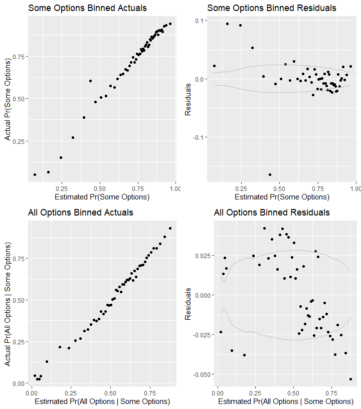

#Setup

```
## Warning: replacing previous import 'Hmisc::summarize' by 'dplyr::summarize'
## when loading 'csis360'
```

```
## Warning: replacing previous import 'Hmisc::src' by 'dplyr::src' when
## loading 'csis360'
```

```
## Warning: replacing previous import 'dplyr::intersect' by
## 'lubridate::intersect' when loading 'csis360'
```

```
## Warning: replacing previous import 'dplyr::union' by 'lubridate::union'
## when loading 'csis360'
```

```
## Warning: replacing previous import 'dplyr::setdiff' by 'lubridate::setdiff'
## when loading 'csis360'
```

```
## 
## Attaching package: 'dplyr'
```

```
## The following objects are masked from 'package:stats':
## 
##     filter, lag
```

```
## The following objects are masked from 'package:base':
## 
##     intersect, setdiff, setequal, union
```

```
## Loading required package: MASS
```

```
## 
## Attaching package: 'MASS'
```

```
## The following object is masked from 'package:dplyr':
## 
##     select
```

```
## Loading required package: Matrix
```

```
## Loading required package: lme4
```

```
## 
## arm (Version 1.10-1, built: 2018-4-12)
```

```
## Working directory is C:/Users/gsand/Repositories/Services/analysis
```

```
## Loading required package: coda
```

```
## 
## Attaching package: 'coda'
```

```
## The following object is masked from 'package:arm':
## 
##     traceplot
```

```
## Loading required package: boot
```

```
## 
## Attaching package: 'boot'
```

```
## The following object is masked from 'package:arm':
## 
##     logit
```

```
## 
## Please cite as:
```

```
##  Hlavac, Marek (2018). stargazer: Well-Formatted Regression and Summary Statistics Tables.
```

```
##  R package version 5.2.2. https://CRAN.R-project.org/package=stargazer
```

```
## Version:  1.36.23
## Date:     2017-03-03
## Author:   Philip Leifeld (University of Glasgow)
## 
## Please cite the JSS article in your publications -- see citation("texreg").
```

```
## 
## Attaching package: 'texreg'
```

```
## The following object is masked from 'package:arm':
## 
##     coefplot
```

```
## -- Attaching packages --------------------------------------------------------------------------------------------------------------------- tidyverse 1.2.1 --
```

```
## v tibble  2.1.1     v purrr   0.3.2
## v tidyr   0.8.3     v stringr 1.4.0
## v tibble  2.1.1     v forcats 0.4.0
```

```
## -- Conflicts ------------------------------------------------------------------------------------------------------------------------ tidyverse_conflicts() --
## x tidyr::expand()  masks Matrix::expand()
## x tidyr::extract() masks texreg::extract()
## x dplyr::filter()  masks stats::filter()
## x dplyr::lag()     masks stats::lag()
## x MASS::select()   masks dplyr::select()
```

```
## Loading required package: carData
```

```
## 
## Attaching package: 'car'
```

```
## The following object is masked from 'package:purrr':
## 
##     some
```

```
## The following object is masked from 'package:boot':
## 
##     logit
```

```
## The following object is masked from 'package:arm':
## 
##     logit
```

```
## The following object is masked from 'package:dplyr':
## 
##     recode
```

```
## 
## Attaching package: 'scales'
```

```
## The following object is masked from 'package:purrr':
## 
##     discard
```

```
## The following object is masked from 'package:readr':
## 
##     col_factor
```

```
## The following object is masked from 'package:arm':
## 
##     rescale
```


Contracts are classified using a mix of numerical and categorical variables. While the changes in numerical variables are easy to grasp and summarize, a contract may have one line item that is competed and another that is not. As is detailed in the exploration on R&D, we are only considering information available prior to contract start. The percentage of contract obligations that were competed is a valuable benchmark, but is highly influenced by factors that occured after contract start..


First we load the data. The dataset used is a U.S. Defense Contracting dataset derived from   FPDS.


```r
if(!exists("def_serv")) load("../data/clean/transformed_def_serv.Rdata")
if(!exists("serv_smp")) load(file="../data/clean/def_sample.Rdata")
```

# Pre-Model Graphs
None at present.
# Models
## Loading Models
### Exercised Options
Note that because we use the complete dataset for exercised options, there's no 1 million entry variant.

```r
if(file.exists("..//Output//p_Opt_12C.rdata")) load("..//Output//p_Opt_12C.rdata")


if(!exists("p_Opt_12C")){
  p_Opt_12C <- glm (data=serv_opt,
                    lp_OptGrowth ~  cl_US6_avg_sal_lag1Const + 
                      cl_CFTE+ c_pPBSC+c_pOffPSC+
                      c_pairHist+cl_pairCA +
                      cl_Ceil + capped_cl_Days+
                      Comp1or5+
                      Veh+
                      PricingUCA+
                      Crisis+
                      cl_def6_HHI_lag1+cl_def6_ratio_lag1+
                      cl_def3_HHI_lag1+cl_def3_ratio_lag1+
                      c_pMarket+
                      cl_OffVol+cl_hh_index_k #,
                    # verbose=1
                    )
  glmer_examine(p_Opt_12C)
  save(p_Opt_12C,file="..//Output//p_Opt_12C.rdata")
}

stargazer::stargazer(p_Opt_12C,type="text",
                     digits=2)
```

```
## 
## ==========================================================
##                                    Dependent variable:    
##                                ---------------------------
##                                       lp_OptGrowth        
## ----------------------------------------------------------
## cl_US6_avg_sal_lag1Const                 0.02***          
##                                          (0.01)           
##                                                           
## cl_CFTE                                 -0.11***          
##                                          (0.01)           
##                                                           
## c_pPBSC                                 -0.03***          
##                                          (0.01)           
##                                                           
## c_pOffPSC                                0.20***          
##                                          (0.01)           
##                                                           
## c_pairHist                              -0.02***          
##                                          (0.01)           
##                                                           
## cl_pairCA                                0.16***          
##                                          (0.01)           
##                                                           
## cl_Ceil                                  0.15***          
##                                          (0.01)           
##                                                           
## capped_cl_Days                           -0.01*           
##                                          (0.01)           
##                                                           
## Comp1or51 offer                          0.06***          
##                                          (0.01)           
##                                                           
## Comp1or52-4 offers                       0.03***          
##                                          (0.01)           
##                                                           
## Comp1or55+ offers                        0.09***          
##                                          (0.01)           
##                                                           
## VehS-IDC                                -0.30***          
##                                          (0.01)           
##                                                           
## VehM-IDC                                -0.15***          
##                                          (0.01)           
##                                                           
## VehFSS/GWAC                               0.005           
##                                          (0.01)           
##                                                           
## VehBPA/BOA                              -0.65***          
##                                          (0.01)           
##                                                           
## PricingUCAOther FP                      -0.21***          
##                                          (0.04)           
##                                                           
## PricingUCAIncentive                       0.12*           
##                                          (0.06)           
##                                                           
## PricingUCACombination or Other           0.14***          
##                                          (0.02)           
##                                                           
## PricingUCAOther CB                       0.16***          
##                                          (0.01)           
##                                                           
## PricingUCAT&M/LH/FPLOE                   -0.002           
##                                          (0.02)           
##                                                           
## PricingUCAUCA                             -0.02           
##                                          (0.03)           
##                                                           
## CrisisARRA                              -0.45***          
##                                          (0.05)           
##                                                           
## CrisisDis                               -0.41***          
##                                          (0.09)           
##                                                           
## CrisisOCO                               -0.34***          
##                                          (0.02)           
##                                                           
## cl_def6_HHI_lag1                         0.04***          
##                                          (0.01)           
##                                                           
## cl_def6_ratio_lag1                      -0.08***          
##                                          (0.01)           
##                                                           
## cl_def3_HHI_lag1                         0.16***          
##                                          (0.01)           
##                                                           
## cl_def3_ratio_lag1                      -0.06***          
##                                          (0.01)           
##                                                           
## c_pMarket                               -0.23***          
##                                          (0.01)           
##                                                           
## cl_OffVol                                0.04***          
##                                          (0.01)           
##                                                           
## cl_hh_index_k                           -0.06***          
##                                          (0.01)           
##                                                           
## Constant                                 0.66***          
##                                          (0.01)           
##                                                           
## ----------------------------------------------------------
## Observations                             72,976           
## Log Likelihood                         -71,043.39         
## Akaike Inf. Crit.                      142,150.80         
## ==========================================================
## Note:                          *p<0.1; **p<0.05; ***p<0.01
```

```r
#Considering 
# write.csv(exp(summary(p_Opt_12C)$coefficients[,1])-1,file="../Output/exp_p_Opt_12C.csv")
# p_Opt_12C_exp<-log_analysis(p_Opt_12C)

glmer_examine(p_Opt_12C,display=TRUE)
```

```
## glm(formula = lp_OptGrowth ~ cl_US6_avg_sal_lag1Const + cl_CFTE + 
##     c_pPBSC + c_pOffPSC + c_pairHist + cl_pairCA + cl_Ceil + 
##     capped_cl_Days + Comp1or5 + Veh + PricingUCA + Crisis + cl_def6_HHI_lag1 + 
##     cl_def6_ratio_lag1 + cl_def3_HHI_lag1 + cl_def3_ratio_lag1 + 
##     c_pMarket + cl_OffVol + cl_hh_index_k, data = serv_opt)
##                                coef.est coef.se
## (Intercept)                     0.66     0.01  
## cl_US6_avg_sal_lag1Const        0.02     0.01  
## cl_CFTE                        -0.11     0.01  
## c_pPBSC                        -0.03     0.01  
## c_pOffPSC                       0.20     0.01  
## c_pairHist                     -0.02     0.01  
## cl_pairCA                       0.16     0.01  
## cl_Ceil                         0.15     0.01  
## capped_cl_Days                 -0.01     0.01  
## Comp1or51 offer                 0.06     0.01  
## Comp1or52-4 offers              0.03     0.01  
## Comp1or55+ offers               0.09     0.01  
## VehS-IDC                       -0.30     0.01  
## VehM-IDC                       -0.15     0.01  
## VehFSS/GWAC                     0.00     0.01  
## VehBPA/BOA                     -0.65     0.01  
## PricingUCAOther FP             -0.21     0.04  
## PricingUCAIncentive             0.12     0.06  
## PricingUCACombination or Other  0.14     0.02  
## PricingUCAOther CB              0.16     0.01  
## PricingUCAT&M/LH/FPLOE          0.00     0.02  
## PricingUCAUCA                  -0.02     0.03  
## CrisisARRA                     -0.45     0.05  
## CrisisDis                      -0.41     0.09  
## CrisisOCO                      -0.34     0.02  
## cl_def6_HHI_lag1                0.04     0.01  
## cl_def6_ratio_lag1             -0.08     0.01  
## cl_def3_HHI_lag1                0.16     0.01  
## cl_def3_ratio_lag1             -0.06     0.01  
## c_pMarket                      -0.23     0.01  
## cl_OffVol                       0.04     0.01  
## cl_hh_index_k                  -0.06     0.01  
## ---
##   n = 72976, k = 32
##   residual deviance = 29942.0, null deviance = 34237.8 (difference = 4295.9)
##   overdispersion parameter = 0.4
##   residual sd is sqrt(overdispersion) = 0.64
```

```
##                              GVIF Df GVIF^(1/(2*Df))
## cl_US6_avg_sal_lag1Const 2.154107  1        1.467688
## cl_CFTE                  1.587357  1        1.259904
## c_pPBSC                  1.352445  1        1.162947
## c_pOffPSC                2.178856  1        1.476095
## c_pairHist               1.581016  1        1.257385
## cl_pairCA                3.985758  1        1.996436
## cl_Ceil                  1.527450  1        1.235901
## capped_cl_Days           1.196469  1        1.093832
## Comp1or5                 1.701497  3        1.092627
## Veh                      4.182603  4        1.195861
## PricingUCA               1.423730  6        1.029878
## Crisis                   1.812547  3        1.104201
## cl_def6_HHI_lag1         1.544603  1        1.242821
## cl_def6_ratio_lag1       1.559790  1        1.248915
## cl_def3_HHI_lag1         1.968130  1        1.402901
## cl_def3_ratio_lag1       2.102308  1        1.449934
## c_pMarket                2.199375  1        1.483029
## cl_OffVol                1.316536  1        1.147404
## cl_hh_index_k            1.573128  1        1.254244
```

```r
stargazer::stargazer(p_Opt_12C,type="text",
                       digits=2)
```

```
## 
## ==========================================================
##                                    Dependent variable:    
##                                ---------------------------
##                                       lp_OptGrowth        
## ----------------------------------------------------------
## cl_US6_avg_sal_lag1Const                 0.02***          
##                                          (0.01)           
##                                                           
## cl_CFTE                                 -0.11***          
##                                          (0.01)           
##                                                           
## c_pPBSC                                 -0.03***          
##                                          (0.01)           
##                                                           
## c_pOffPSC                                0.20***          
##                                          (0.01)           
##                                                           
## c_pairHist                              -0.02***          
##                                          (0.01)           
##                                                           
## cl_pairCA                                0.16***          
##                                          (0.01)           
##                                                           
## cl_Ceil                                  0.15***          
##                                          (0.01)           
##                                                           
## capped_cl_Days                           -0.01*           
##                                          (0.01)           
##                                                           
## Comp1or51 offer                          0.06***          
##                                          (0.01)           
##                                                           
## Comp1or52-4 offers                       0.03***          
##                                          (0.01)           
##                                                           
## Comp1or55+ offers                        0.09***          
##                                          (0.01)           
##                                                           
## VehS-IDC                                -0.30***          
##                                          (0.01)           
##                                                           
## VehM-IDC                                -0.15***          
##                                          (0.01)           
##                                                           
## VehFSS/GWAC                               0.005           
##                                          (0.01)           
##                                                           
## VehBPA/BOA                              -0.65***          
##                                          (0.01)           
##                                                           
## PricingUCAOther FP                      -0.21***          
##                                          (0.04)           
##                                                           
## PricingUCAIncentive                       0.12*           
##                                          (0.06)           
##                                                           
## PricingUCACombination or Other           0.14***          
##                                          (0.02)           
##                                                           
## PricingUCAOther CB                       0.16***          
##                                          (0.01)           
##                                                           
## PricingUCAT&M/LH/FPLOE                   -0.002           
##                                          (0.02)           
##                                                           
## PricingUCAUCA                             -0.02           
##                                          (0.03)           
##                                                           
## CrisisARRA                              -0.45***          
##                                          (0.05)           
##                                                           
## CrisisDis                               -0.41***          
##                                          (0.09)           
##                                                           
## CrisisOCO                               -0.34***          
##                                          (0.02)           
##                                                           
## cl_def6_HHI_lag1                         0.04***          
##                                          (0.01)           
##                                                           
## cl_def6_ratio_lag1                      -0.08***          
##                                          (0.01)           
##                                                           
## cl_def3_HHI_lag1                         0.16***          
##                                          (0.01)           
##                                                           
## cl_def3_ratio_lag1                      -0.06***          
##                                          (0.01)           
##                                                           
## c_pMarket                               -0.23***          
##                                          (0.01)           
##                                                           
## cl_OffVol                                0.04***          
##                                          (0.01)           
##                                                           
## cl_hh_index_k                           -0.06***          
##                                          (0.01)           
##                                                           
## Constant                                 0.66***          
##                                          (0.01)           
##                                                           
## ----------------------------------------------------------
## Observations                             72,976           
## Log Likelihood                         -71,043.39         
## Akaike Inf. Crit.                      142,150.80         
## ==========================================================
## Note:                          *p<0.1; **p<0.05; ***p<0.01
```


### Ceiling Breach


```r
if(file.exists("..//Output//b_CBre12C.rdata")) load("..//Output//b_CBre12C.rdata")

if(!exists("b_CBre12C")){
  b_CBre12C <- glm (data=serv_smp,
                 b_CBre ~  cl_US6_avg_sal_lag1Const + 
                   cl_CFTE+ c_pPBSC+c_pOffPSC+
                 c_pairHist+cl_pairCA +
                   cl_Ceil + capped_cl_Days+
                   Comp1or5+
                   Veh+
                   PricingUCA+
                   Crisis+
                   cl_def6_HHI_lag1+cl_def6_ratio_lag1+
                   cl_def3_HHI_lag1+cl_def3_ratio_lag1+
                   c_pMarket+
                   cl_OffVol+cl_hh_index_k , family=binomial(link="logit")#,
                 # verbose=1
                 )
  
  
  b_CBre12C_1m <- glm (data=serv_smp1m,
                 b_CBre ~  cl_US6_avg_sal_lag1Const + 
                   cl_CFTE+ c_pPBSC+c_pOffPSC+
                 c_pairHist+cl_pairCA +
                   cl_Ceil + capped_cl_Days+
                   Comp1or5+
                   Veh+
                   PricingUCA+
                   Crisis+
                   cl_def6_HHI_lag1+cl_def6_ratio_lag1+
                   cl_def3_HHI_lag1+cl_def3_ratio_lag1+
                   c_pMarket+
                   cl_OffVol+cl_hh_index_k , family=binomial(link="logit")#,
                 # verbose=1
                 )
  
  
  save(b_CBre12C,b_CBre12C_1m,#b_CBre12C,b_CBre12C.restart,
       file="..//output//b_CBre12C.rdata")
}
glmer_examine(b_CBre12C_1m,display=TRUE)
```

```
## glm(formula = b_CBre ~ cl_US6_avg_sal_lag1Const + cl_CFTE + c_pPBSC + 
##     c_pOffPSC + c_pairHist + cl_pairCA + cl_Ceil + capped_cl_Days + 
##     Comp1or5 + Veh + PricingUCA + Crisis + cl_def6_HHI_lag1 + 
##     cl_def6_ratio_lag1 + cl_def3_HHI_lag1 + cl_def3_ratio_lag1 + 
##     c_pMarket + cl_OffVol + cl_hh_index_k, family = binomial(link = "logit"), 
##     data = serv_smp1m)
##                                coef.est coef.se
## (Intercept)                    -2.94     0.01  
## cl_US6_avg_sal_lag1Const       -0.04     0.01  
## cl_CFTE                         0.11     0.01  
## c_pPBSC                        -0.18     0.01  
## c_pOffPSC                       1.12     0.01  
## c_pairHist                      0.00     0.01  
## cl_pairCA                       0.19     0.01  
## cl_Ceil                         1.09     0.01  
## capped_cl_Days                  0.10     0.01  
## Comp1or51 offer                -0.13     0.02  
## Comp1or52-4 offers              0.23     0.01  
## Comp1or55+ offers               0.32     0.01  
## VehS-IDC                       -0.25     0.01  
## VehM-IDC                       -0.17     0.02  
## VehFSS/GWAC                    -0.54     0.03  
## VehBPA/BOA                     -0.50     0.03  
## PricingUCAOther FP             -0.84     0.08  
## PricingUCAIncentive             0.11     0.05  
## PricingUCACombination or Other -0.39     0.04  
## PricingUCAOther CB             -0.99     0.03  
## PricingUCAT&M/LH/FPLOE         -0.58     0.04  
## PricingUCAUCA                   0.02     0.04  
## CrisisARRA                      0.74     0.04  
## CrisisDis                       0.64     0.08  
## CrisisOCO                       0.07     0.02  
## cl_def6_HHI_lag1                0.18     0.01  
## cl_def6_ratio_lag1             -0.11     0.01  
## cl_def3_HHI_lag1               -0.41     0.01  
## cl_def3_ratio_lag1             -0.12     0.01  
## c_pMarket                      -0.54     0.01  
## cl_OffVol                      -0.52     0.01  
## cl_hh_index_k                  -0.28     0.01  
## ---
##   n = 988899, k = 32
##   residual deviance = 396282.8, null deviance = 429434.2 (difference = 33151.5)
```

```
##                              GVIF Df GVIF^(1/(2*Df))
## cl_US6_avg_sal_lag1Const 1.693681  1        1.301415
## cl_CFTE                  1.320745  1        1.149237
## c_pPBSC                  1.469365  1        1.212174
## c_pOffPSC                2.625536  1        1.620351
## c_pairHist               1.336981  1        1.156279
## cl_pairCA                2.358421  1        1.535715
## cl_Ceil                  1.547328  1        1.243916
## capped_cl_Days           1.425684  1        1.194020
## Comp1or5                 1.282049  3        1.042279
## Veh                      1.865184  4        1.081036
## PricingUCA               1.241156  6        1.018167
## Crisis                   1.342681  3        1.050337
## cl_def6_HHI_lag1         2.130591  1        1.459654
## cl_def6_ratio_lag1       1.776934  1        1.333017
## cl_def3_HHI_lag1         1.958161  1        1.399343
## cl_def3_ratio_lag1       2.228527  1        1.492825
## c_pMarket                1.305559  1        1.142610
## cl_OffVol                1.310767  1        1.144887
## cl_hh_index_k            2.253166  1        1.501055
```

```r
# odds_ratio(b_CBre12C_1m,"b_CBre12C")
stargazer::stargazer(b_CBre12C,b_CBre12C,type="text",
                       digits=2)
```

```
## 
## ===========================================================
##                                    Dependent variable:     
##                                ----------------------------
##                                           b_CBre           
##                                     (1)            (2)     
## -----------------------------------------------------------
## cl_US6_avg_sal_lag1Const          -0.05**        -0.05**   
##                                    (0.03)        (0.03)    
##                                                            
## cl_CFTE                           0.08***        0.08***   
##                                    (0.02)        (0.02)    
##                                                            
## c_pPBSC                           -0.15***      -0.15***   
##                                    (0.02)        (0.02)    
##                                                            
## c_pOffPSC                         1.13***        1.13***   
##                                    (0.02)        (0.02)    
##                                                            
## c_pairHist                         -0.02          -0.02    
##                                    (0.02)        (0.02)    
##                                                            
## cl_pairCA                         0.21***        0.21***   
##                                    (0.03)        (0.03)    
##                                                            
## cl_Ceil                           1.10***        1.10***   
##                                    (0.02)        (0.02)    
##                                                            
## capped_cl_Days                    0.10***        0.10***   
##                                    (0.02)        (0.02)    
##                                                            
## Comp1or51 offer                   -0.10***      -0.10***   
##                                    (0.03)        (0.03)    
##                                                            
## Comp1or52-4 offers                0.22***        0.22***   
##                                    (0.02)        (0.02)    
##                                                            
## Comp1or55+ offers                 0.30***        0.30***   
##                                    (0.03)        (0.03)    
##                                                            
## VehS-IDC                          -0.24***      -0.24***   
##                                    (0.03)        (0.03)    
##                                                            
## VehM-IDC                          -0.16***      -0.16***   
##                                    (0.03)        (0.03)    
##                                                            
## VehFSS/GWAC                       -0.56***      -0.56***   
##                                    (0.05)        (0.05)    
##                                                            
## VehBPA/BOA                        -0.45***      -0.45***   
##                                    (0.06)        (0.06)    
##                                                            
## PricingUCAOther FP                -0.64***      -0.64***   
##                                    (0.14)        (0.14)    
##                                                            
## PricingUCAIncentive                -0.11          -0.11    
##                                    (0.11)        (0.11)    
##                                                            
## PricingUCACombination or Other    -0.47***      -0.47***   
##                                    (0.08)        (0.08)    
##                                                            
## PricingUCAOther CB                -1.03***      -1.03***   
##                                    (0.05)        (0.05)    
##                                                            
## PricingUCAT&M/LH/FPLOE            -0.60***      -0.60***   
##                                    (0.07)        (0.07)    
##                                                            
## PricingUCAUCA                       0.05          0.05     
##                                    (0.08)        (0.08)    
##                                                            
## CrisisARRA                        0.83***        0.83***   
##                                    (0.07)        (0.07)    
##                                                            
## CrisisDis                         0.69***        0.69***   
##                                    (0.15)        (0.15)    
##                                                            
## CrisisOCO                           0.08          0.08     
##                                    (0.05)        (0.05)    
##                                                            
## cl_def6_HHI_lag1                  0.20***        0.20***   
##                                    (0.02)        (0.02)    
##                                                            
## cl_def6_ratio_lag1                -0.12***      -0.12***   
##                                    (0.03)        (0.03)    
##                                                            
## cl_def3_HHI_lag1                  -0.45***      -0.45***   
##                                    (0.03)        (0.03)    
##                                                            
## cl_def3_ratio_lag1                -0.10***      -0.10***   
##                                    (0.03)        (0.03)    
##                                                            
## c_pMarket                         -0.57***      -0.57***   
##                                    (0.03)        (0.03)    
##                                                            
## cl_OffVol                         -0.52***      -0.52***   
##                                    (0.02)        (0.02)    
##                                                            
## cl_hh_index_k                     -0.28***      -0.28***   
##                                    (0.02)        (0.02)    
##                                                            
## Constant                          -2.95***      -2.95***   
##                                    (0.02)        (0.02)    
##                                                            
## -----------------------------------------------------------
## Observations                      247,077        247,077   
## Log Likelihood                   -49,543.89    -49,543.89  
## Akaike Inf. Crit.                99,151.78      99,151.78  
## ===========================================================
## Note:                           *p<0.1; **p<0.05; ***p<0.01
```

```r
# if(!exists("b_CBre12C_restart")){
#   pars<-get_pars(b_CBre12C)
#   b_CBre12C_restart <- update(b_CBre12C, 
#                                      start=pars,
#                                      verbose=1)
#   save(b_CBre12C,
#        b_CBre12C.restart,
#        b_CBre12C,
#        b_CBre12C_restart,
#        file="..//output//b_CBre12C.rdata")
# }
# glmer_examine(b_CBre12C_restart)


# 
# save(b_CBre12C,
#      b_CBre12C.devfun,
#      CBre_Cons_13_scgrad,
#      b_CBre12C.restart,
#      CBre_Comp_13B,
#      CBre_Comp_13B.devfun,
#      CBre_Comp_13B.restart,
#      file="..//output//b_CBre12C.rdata")

# source(system.file("utils", "allFit.R", package="lme4"))
# b_CBre12C.all <- allFit(b_CBre12C)
# b_CBre12C_ss_cons <- summary(b_CBre12C.all)


# glmer_examine(b_CBre12C.restart,display=TRUE)
# odds_ratio(b_CBre12C.restart,"b_CBre12C")
```
"Model failed to converge with max|grad| = 0.00750942 (tol = 0.001, component 1)"


### Termination


```r
if(file.exists("..//Output//Term_12C.rdata")) load("..//Output//Term_12C.rdata")

if(!exists("Term_12C")){
  Term_12C <- glm (data=serv_smp,
                   b_Term ~ cl_US6_avg_sal_lag1Const + 
                     cl_CFTE+ c_pPBSC+c_pOffPSC+
                     c_pairHist+cl_pairCA+
                     cl_Ceil + capped_cl_Days+
                     Comp1or5+
                     Veh+
                     PricingUCA+
                     Crisis+
                     cl_def6_HHI_lag1+cl_def6_ratio_lag1+
                     cl_def3_HHI_lag1+cl_def3_ratio_lag1+
                     c_pMarket+
                     cl_OffVol+cl_hh_index_k, family=binomial(link="logit")#,
                   # verbose=1
                   )
  glmer_examine(Term_12C)
  
    Term_12C_1m <- glm (data=serv_smp1m,
                   b_Term ~ cl_US6_avg_sal_lag1Const + 
                     cl_CFTE+ c_pPBSC+c_pOffPSC+
                     c_pairHist+cl_pairCA+
                     cl_Ceil + capped_cl_Days+
                     Comp1or5+
                     Veh+
                     PricingUCA+
                     Crisis+
                     cl_def6_HHI_lag1+cl_def6_ratio_lag1+
                     cl_def3_HHI_lag1+cl_def3_ratio_lag1+
                     c_pMarket+
                     cl_OffVol+cl_hh_index_k, family=binomial(link="logit")#,
                   # verbose=1
                   )
  glmer_examine(Term_12C_1m)

  save(Term_12C,Term_12C_1m,file="..//output//Term_12C.rdata")
}

glmer_examine(Term_12C_1m,display=TRUE)
```

```
## glm(formula = b_Term ~ cl_US6_avg_sal_lag1Const + cl_CFTE + c_pPBSC + 
##     c_pOffPSC + c_pairHist + cl_pairCA + cl_Ceil + capped_cl_Days + 
##     Comp1or5 + Veh + PricingUCA + Crisis + cl_def6_HHI_lag1 + 
##     cl_def6_ratio_lag1 + cl_def3_HHI_lag1 + cl_def3_ratio_lag1 + 
##     c_pMarket + cl_OffVol + cl_hh_index_k, family = binomial(link = "logit"), 
##     data = serv_smp1m)
##                                coef.est coef.se
## (Intercept)                    -4.09     0.02  
## cl_US6_avg_sal_lag1Const        0.00     0.02  
## cl_CFTE                         0.01     0.02  
## c_pPBSC                        -0.18     0.02  
## c_pOffPSC                       0.90     0.02  
## c_pairHist                     -0.08     0.02  
## cl_pairCA                       0.61     0.02  
## cl_Ceil                         0.54     0.02  
## capped_cl_Days                  1.15     0.02  
## Comp1or51 offer                 0.46     0.03  
## Comp1or52-4 offers              0.27     0.02  
## Comp1or55+ offers               1.00     0.02  
## VehS-IDC                       -1.08     0.02  
## VehM-IDC                       -0.82     0.03  
## VehFSS/GWAC                    -0.15     0.04  
## VehBPA/BOA                     -1.00     0.05  
## PricingUCAOther FP             -0.92     0.08  
## PricingUCAIncentive            -2.51     0.33  
## PricingUCACombination or Other -0.56     0.09  
## PricingUCAOther CB             -1.45     0.06  
## PricingUCAT&M/LH/FPLOE         -0.79     0.08  
## PricingUCAUCA                  -1.29     0.13  
## CrisisARRA                     -0.98     0.12  
## CrisisDis                      -0.01     0.19  
## CrisisOCO                      -0.38     0.04  
## cl_def6_HHI_lag1               -0.29     0.02  
## cl_def6_ratio_lag1             -0.49     0.03  
## cl_def3_HHI_lag1                0.46     0.02  
## cl_def3_ratio_lag1             -0.61     0.03  
## c_pMarket                      -0.62     0.03  
## cl_OffVol                       0.43     0.03  
## cl_hh_index_k                   0.14     0.02  
## ---
##   n = 988899, k = 32
##   residual deviance = 162682.5, null deviance = 185133.9 (difference = 22451.4)
```

```
##                              GVIF Df GVIF^(1/(2*Df))
## cl_US6_avg_sal_lag1Const 1.654271  1        1.286185
## cl_CFTE                  1.437229  1        1.198845
## c_pPBSC                  1.552817  1        1.246121
## c_pOffPSC                2.297770  1        1.515840
## c_pairHist               1.375420  1        1.172783
## cl_pairCA                2.919285  1        1.708592
## cl_Ceil                  1.433007  1        1.197083
## capped_cl_Days           1.287794  1        1.134810
## Comp1or5                 1.346522  3        1.050837
## Veh                      2.032449  4        1.092704
## PricingUCA               1.176160  6        1.013613
## Crisis                   1.574942  3        1.078642
## cl_def6_HHI_lag1         2.173286  1        1.474207
## cl_def6_ratio_lag1       1.603708  1        1.266376
## cl_def3_HHI_lag1         2.055616  1        1.433742
## cl_def3_ratio_lag1       1.727297  1        1.314267
## c_pMarket                1.443347  1        1.201394
## cl_OffVol                1.488332  1        1.219972
## cl_hh_index_k            2.079607  1        1.442084
```

```r
# odds_ratio(Term_12C_1m,"Term_12C")
stargazer::stargazer(Term_12C,Term_12C_1m,type="text",
                       digits=2)
```

```
## 
## ===========================================================
##                                    Dependent variable:     
##                                ----------------------------
##                                           b_Term           
##                                     (1)            (2)     
## -----------------------------------------------------------
## cl_US6_avg_sal_lag1Const           0.09**         0.005    
##                                    (0.04)        (0.02)    
##                                                            
## cl_CFTE                            0.001          0.01     
##                                    (0.03)        (0.02)    
##                                                            
## c_pPBSC                           -0.22***      -0.18***   
##                                    (0.04)        (0.02)    
##                                                            
## c_pOffPSC                         0.93***        0.90***   
##                                    (0.04)        (0.02)    
##                                                            
## c_pairHist                        -0.13***      -0.08***   
##                                    (0.04)        (0.02)    
##                                                            
## cl_pairCA                         0.67***        0.61***   
##                                    (0.04)        (0.02)    
##                                                            
## cl_Ceil                           0.50***        0.54***   
##                                    (0.04)        (0.02)    
##                                                            
## capped_cl_Days                    1.14***        1.15***   
##                                    (0.04)        (0.02)    
##                                                            
## Comp1or51 offer                   0.38***        0.46***   
##                                    (0.06)        (0.03)    
##                                                            
## Comp1or52-4 offers                0.26***        0.27***   
##                                    (0.05)        (0.02)    
##                                                            
## Comp1or55+ offers                 0.99***        1.00***   
##                                    (0.05)        (0.02)    
##                                                            
## VehS-IDC                          -1.12***      -1.08***   
##                                    (0.04)        (0.02)    
##                                                            
## VehM-IDC                          -0.82***      -0.82***   
##                                    (0.05)        (0.03)    
##                                                            
## VehFSS/GWAC                       -0.15**       -0.15***   
##                                    (0.07)        (0.04)    
##                                                            
## VehBPA/BOA                        -0.98***      -1.00***   
##                                    (0.11)        (0.05)    
##                                                            
## PricingUCAOther FP                -0.86***      -0.92***   
##                                    (0.16)        (0.08)    
##                                                            
## PricingUCAIncentive               -2.60***      -2.51***   
##                                    (0.71)        (0.33)    
##                                                            
## PricingUCACombination or Other    -0.48***      -0.56***   
##                                    (0.18)        (0.09)    
##                                                            
## PricingUCAOther CB                -1.39***      -1.45***   
##                                    (0.13)        (0.06)    
##                                                            
## PricingUCAT&M/LH/FPLOE            -0.54***      -0.79***   
##                                    (0.15)        (0.08)    
##                                                            
## PricingUCAUCA                     -0.94***      -1.29***   
##                                    (0.23)        (0.13)    
##                                                            
## CrisisARRA                        -0.83***      -0.98***   
##                                    (0.23)        (0.12)    
##                                                            
## CrisisDis                           0.03          -0.01    
##                                    (0.36)        (0.19)    
##                                                            
## CrisisOCO                         -0.50***      -0.38***   
##                                    (0.09)        (0.04)    
##                                                            
## cl_def6_HHI_lag1                  -0.34***      -0.29***   
##                                    (0.04)        (0.02)    
##                                                            
## cl_def6_ratio_lag1                -0.57***      -0.49***   
##                                    (0.06)        (0.03)    
##                                                            
## cl_def3_HHI_lag1                  0.54***        0.46***   
##                                    (0.04)        (0.02)    
##                                                            
## cl_def3_ratio_lag1                -0.61***      -0.61***   
##                                    (0.05)        (0.03)    
##                                                            
## c_pMarket                         -0.67***      -0.62***   
##                                    (0.06)        (0.03)    
##                                                            
## cl_OffVol                         0.31***        0.43***   
##                                    (0.06)        (0.03)    
##                                                            
## cl_hh_index_k                     0.14***        0.14***   
##                                    (0.04)        (0.02)    
##                                                            
## Constant                          -4.08***      -4.09***   
##                                    (0.04)        (0.02)    
##                                                            
## -----------------------------------------------------------
## Observations                      247,077        988,899   
## Log Likelihood                   -20,074.81    -81,341.25  
## Akaike Inf. Crit.                40,213.63     162,746.50  
## ===========================================================
## Note:                           *p<0.1; **p<0.05; ***p<0.01
```

## Tables for Paper

```r
study_coef_list<-list("(Intercept)"="(Intercept)",
                      "cl_US6_avg_sal_lag1Const"="Log(Det. Ind. Salary)",
                      "cl_CFTE"="Log(Service Invoice Rate)",
                      "c_pPBSC"="Office Perf.-Based %",
                      "c_pOffPSC"="Office Service Exp. %",
                      "c_pairHist"="Paired Years",
                      "cl_pairCA"="Log(Paired Actions)"
)


all_coef_list<-list("(Intercept)"="(Intercept)",
                    "cl_US6_avg_sal_lag1Const"="Log(Det. Ind. Salary)",
                    "cl_CFTE"="Log(Service Invoice Rate)",
                    "c_pPBSC"="Office Perf.-Based %",
                    "c_pOffPSC"="Office Service Exp. %",
                    "c_pairHist"="Paired Years",
                    "cl_pairCA"="Log(Paired Actions)",
                    
                    #Contract Controls
                    
                    "Comp1or51 offer"="Comp=1 offer",
                    "Comp1or52-4 offers"="Comp=2-4 offers",
                    "Comp1or55+ offers"="Comp=5+ offers",
                    
                    "CompOffr1 offer"="Comp=1 offer",
                    "CompOffr2 offers"="Comp=2 offers",
                    "CompOffr3-4 offers"="Comp=3-4 offers",
                    "CompOffr5+ offers"="Comp=5+ offers",
                    
                    "cl_Ceil"="Log(Init. Ceiling)",
                    "capped_cl_Days"="Log(Init. Days)",
                    "VehS-IDC"="Vehicle=S-IDC",
                    "VehM-IDC"="Vehicle=M-IDC",
                    "VehFSS/GWAC"="Vehicle=FSS/GWAC",
                    "VehBPA/BOA"="Vehicle=BPA/BOA",
                    "PricingUCAFFP"="Pricing=FFP",
                    "PricingUCAOther FP"="Pricing=Other FP",
                    "PricingUCAIncentive"="Pricing=Incentive Fee",
                    "PricingUCACombination or Other"="Pricing=Combination or Other",
                    "PricingUCAOther CB"="Pricing=Other CB",
                    "PricingUCAT&M/LH/FPLOE"="Pricing=T&M/LH/FP:LoE",
                    "PricingUCAUCA"="Pricing=UCA",
                    
                    "PricingFeeOther FP"="Pricing=Other FP",
                    "PricingFeeIncentive"="Pricing=Incentive Fee",
                    "PricingFeeCombination or Other"="Pricing=Combination or Other",
                    "PricingFeeOther CB"="Pricing=Other CB",
                    "PricingFeeT&M/LH/FPLOE"="Pricing=T&M/LH/FP:LoE",
                    "b_UCA"="UCA",
                    "CrisisARRA"="Crisis=ARRA",
                    "CrisisDis"="Crisis=Disaster",
                    "CrisisOCO"="Crisis=OCO",
                    "b_Intl"="Performed Abroad",

                    #NAICS
                    "cl_def3_HHI_lag1"="Log(Subsector HHI)",
                    "cl_def6_HHI_lag1"="Log(Det. Ind. HHI)",
                    "cl_def3_ratio_lag1"="Log(Subsector Ratio)",
                    "cl_def6_obl_lag1"="Log(Det. Ind. DoD Obl.)",
                    "cl_def6_ratio_lag1"="Log(Det. Ind. Ratio)",
                    #Office
                    "c_pMarket"="Percent Market",
                    "cl_OffVol"="Office Volume",
                    "cl_hh_index_k"="Office Concentration",
                    
                    
                    #interations
                    # # "cl_def6_HHI_lag1:capped_cl_Days"="Log(Det. Ind. HHI):Log(Init. Days)",
                    # "cl_def6_HHI_lag1:cl_def6_obl_lag1"="Log(Det. Ind. HHI):Log(Det. Ind. DoD Obl.)",
                    # # "cl_def3_HHI_lag1:cl_def3_ratio_lag1"="Log(Subsector HHI):Log(Subsector Ratio)"),
                    "cl_def6_HHI_lag1:b_UCA"="Log(Det. Ind. HHI):UCA",
                    # "cl_Ceil:b_UCA"="Log(Init. Ceiling):UCA",
                    # "CompOffr1 offer:b_UCA"="Comp=1 offer:UCA",
                    # "CompOffr2 offers:b_UCA"="Comp=2 offers:UCA",
                    # "CompOffr3-4 offers:b_UCA"="Comp=3-4 offers:UCA",
                    # "CompOffr5+ offers:b_UCA"="Comp=5+ offers:UCA"
                    "VehS-IDC:b_Intl"="Vehicle=S-IDC:Performed Abroad",
                    "VehM-IDC:b_Intl"="Vehicle=M-IDC:Performed Abroad",
                    "VehFSS/GWAC:b_Intl"="Vehicle=FSS/GWAC:Performed Abroad",
                    "VehBPA/BOA:b_Intl"="Vehicle=BPA/BOA:Performed Abroad",
                    "cl_US6_avg_sal_lag1:PricingFeeOther FP"="Pricing=Other FP:Log(Det. Ind. U.S. Avg. Salary)",
                    "cl_US6_avg_sal_lag1:PricingFeeIncentive"="Pricing=Incentive Fee:Log(Det. Ind. U.S. Avg. Salary)",
                    "cl_US6_avg_sal_lag1:PricingFeeCombination or Other"="Pricing=Comb./or Other:Log(Det. Ind. U.S. Avg. Salary)",
                    "cl_US6_avg_sal_lag1:PricingFeeOther CB"="Pricing=Other CB:Log(Det. Ind. U.S. Avg. Salary)",
                    "cl_US6_avg_sal_lag1:PricingFeeT&M/LH/FPLOE"="Pricing=T&M/LH/FP:LoE:Log(Det. Ind. U.S. Avg. Salary)"
)
```

### Study Variables Only

```r
texreg::htmlreg(list(p_Opt_12C,b_CBre12C_1m,Term_12C_1m),file="..//Output//study_var_model_lvl1.html",
                single.row = TRUE,
                custom.model.name=c("Exercised Option","Ceiling Breach","Termination"),
                stars=c(0.1,0.05,0.01,0.001),
                groups = list(
                              "Services Complexity" = 2:3,
                              "Office Capacity" =4:5,
                              "Past Relationship"=6:7
                              ),
                custom.coef.map=study_coef_list,
                bold=0.05,
                custom.note="%stars. Numerical inputs are rescaled.",
                caption="Table 6: Study Variables and Outcomes",
                caption.above=TRUE)
```

```
## The table was written to the file '..//Output//study_var_model_lvl1.html'.
```


### All Variables


```r
#Absolute Exercised Options
  stargazer::stargazer(p_Opt_12C,b_CBre12C_1m,Term_12C_1m,
                       single.row = TRUE,
                custom.model.name=c("Exercised Option","Ceiling Breach","Termination"),
                stars=c(0.1,0.05,0.01,0.001),
                       type="text",
                       digits=2)
```

```
## 
## ==============================================================================
##                                              Dependent variable:              
##                                -----------------------------------------------
##                                 lp_OptGrowth       b_CBre          b_Term     
##                                    normal         logistic        logistic    
##                                      (1)             (2)             (3)      
## ------------------------------------------------------------------------------
## cl_US6_avg_sal_lag1Const       0.02*** (0.01)  -0.04*** (0.01)  0.005 (0.02)  
## cl_CFTE                        -0.11*** (0.01) 0.11*** (0.01)    0.01 (0.02)  
## c_pPBSC                        -0.03*** (0.01) -0.18*** (0.01) -0.18*** (0.02)
## c_pOffPSC                      0.20*** (0.01)  1.12*** (0.01)  0.90*** (0.02) 
## c_pairHist                     -0.02*** (0.01)  0.0003 (0.01)  -0.08*** (0.02)
## cl_pairCA                      0.16*** (0.01)  0.19*** (0.01)  0.61*** (0.02) 
## cl_Ceil                        0.15*** (0.01)  1.09*** (0.01)  0.54*** (0.02) 
## capped_cl_Days                  -0.01* (0.01)  0.10*** (0.01)  1.15*** (0.02) 
## Comp1or51 offer                0.06*** (0.01)  -0.13*** (0.02) 0.46*** (0.03) 
## Comp1or52-4 offers             0.03*** (0.01)  0.23*** (0.01)  0.27*** (0.02) 
## Comp1or55+ offers              0.09*** (0.01)  0.32*** (0.01)  1.00*** (0.02) 
## VehS-IDC                       -0.30*** (0.01) -0.25*** (0.01) -1.08*** (0.02)
## VehM-IDC                       -0.15*** (0.01) -0.17*** (0.02) -0.82*** (0.03)
## VehFSS/GWAC                     0.005 (0.01)   -0.54*** (0.03) -0.15*** (0.04)
## VehBPA/BOA                     -0.65*** (0.01) -0.50*** (0.03) -1.00*** (0.05)
## PricingUCAOther FP             -0.21*** (0.04) -0.84*** (0.08) -0.92*** (0.08)
## PricingUCAIncentive             0.12* (0.06)    0.11** (0.05)  -2.51*** (0.33)
## PricingUCACombination or Other 0.14*** (0.02)  -0.39*** (0.04) -0.56*** (0.09)
## PricingUCAOther CB             0.16*** (0.01)  -0.99*** (0.03) -1.45*** (0.06)
## PricingUCAT&M/LH/FPLOE          -0.002 (0.02)  -0.58*** (0.04) -0.79*** (0.08)
## PricingUCAUCA                   -0.02 (0.03)     0.02 (0.04)   -1.29*** (0.13)
## CrisisARRA                     -0.45*** (0.05) 0.74*** (0.04)  -0.98*** (0.12)
## CrisisDis                      -0.41*** (0.09) 0.64*** (0.08)   -0.01 (0.19)  
## CrisisOCO                      -0.34*** (0.02) 0.07*** (0.02)  -0.38*** (0.04)
## cl_def6_HHI_lag1               0.04*** (0.01)  0.18*** (0.01)  -0.29*** (0.02)
## cl_def6_ratio_lag1             -0.08*** (0.01) -0.11*** (0.01) -0.49*** (0.03)
## cl_def3_HHI_lag1               0.16*** (0.01)  -0.41*** (0.01) 0.46*** (0.02) 
## cl_def3_ratio_lag1             -0.06*** (0.01) -0.12*** (0.01) -0.61*** (0.03)
## c_pMarket                      -0.23*** (0.01) -0.54*** (0.01) -0.62*** (0.03)
## cl_OffVol                      0.04*** (0.01)  -0.52*** (0.01) 0.43*** (0.03) 
## cl_hh_index_k                  -0.06*** (0.01) -0.28*** (0.01) 0.14*** (0.02) 
## Constant                       0.66*** (0.01)  -2.94*** (0.01) -4.09*** (0.02)
## ------------------------------------------------------------------------------
## Observations                       72,976          988,899         988,899    
## Log Likelihood                   -71,043.39      -198,141.40     -81,341.25   
## Akaike Inf. Crit.                142,150.80      396,346.80      162,746.50   
## ==============================================================================
## Note:                                              *p<0.1; **p<0.05; ***p<0.01
## 
## ===========================================
## Exercised Option Ceiling Breach Termination
## -------------------------------------------
## 
## ====================
## 0.10 0.05 0.01 0.001
## --------------------
```

```r
texreg::htmlreg(list(p_Opt_12C,b_CBre12C_1m,Term_12C_1m),file="..//Output//all_var_model_lvl1.html",
                single.row = TRUE,
                custom.model.name=c("Exercised Option","Ceiling Breach","Termination"),
                stars=c(0.1,0.05,0.01,0.001),
                groups = list(
                              "Services Complexity" = 2:3,
                              "Office Capacity" =4:5,
                              "Past Relationship"=6:7,
                              "Contract Characteristics"=8:25,
                              "NAICS Characteristics" =26:29,
                                                            "Office Characteristics" =30:32
                              
                              ),
                custom.coef.map=all_coef_list,
                bold=0.05,
                custom.note="%stars. Numerical inputs are rescaled.",
                caption="Table 7: All Variables and Outcomes",
                caption.above=TRUE)
```

```
## The table was written to the file '..//Output//all_var_model_lvl1.html'.
```

## Odds Ratios

### Ceiling Breach 

```r
# or1<-odds_ratio(b_CBre12C_1m,"b_CBre12C","Both","Both")
# or2<-odds_ratio(CBre_Comp_13C,"CBre_Comp_13C","Competition","Ceiling Breaches")
# or3<-odds_ratio(CBre_Cons_Comp_15A,"CBre_Cons_Comp_15A","Both","Ceiling Breaches")
# comp.or<-rbind(or1,or2,or3)
# 
# write.csv(get_study_variables_odds_ratio(comp.or),file="..//output//ceiling_breach_study_odds_ratio.csv",row.names=FALSE)
# 
# 
# 
# or1<-odds_ratio(b_CBre12C,"b_CBre12C","Concentration","Ceiling Breaches")
# or2<-odds_ratio(CBre_Comp_13C_1m,"CBre_Comp_13C_1m","Competition","Ceiling Breaches")
# or3<-odds_ratio(CBre_Cons_Comp_15A_1m,"CBre_Cons_Comp_15A_1m","Both","Ceiling Breaches")
# comp.or<-rbind(or1,or2,or3)
# 
# write.csv(get_study_variables_odds_ratio(comp.or),file="..//output//ceiling_breach_study_odds_ratio_1m.csv",row.names=FALSE)
# get_icc(CBre_Cons_Comp_15A_1m)
# 
# #https://www.lcampanelli.org/mixed-effects-modeling-lme4/
# gridExtra::grid.arrange(dotplot(ranef(b_CBre12C.restart, condVar = T), strip = T, scales=list(relation='free'))$Agency,
#              dotplot(ranef(CBre_Comp_13C, condVar = T), strip = T, scales=list(relation='free'))$Agency,
#              dotplot(ranef(CBre_Cons_Comp_15A, condVar = T), strip = T, scales=list(relation='free'))$Agency,
#              nrow=1)
# 
```


### Terminations 


```r
# gridExtra::grid.arrange(dotplot(ranef(Term_12C, condVar = T), strip = T, scales=list(relation='free'))$Agency,
#              dotplot(ranef(Term_Comp_13E2, condVar = T), strip = T, scales=list(relation='free'))$Agency,
#              dotplot(ranef(Term_Cons_Comp_14A, condVar = T), strip = T, scales=list(relation='free'))$Agency,
#              nrow=1)
# dotplot(ranef(Term_12C, condVar = T), strip = T, scales=list(relation='free'))$NAICS3
# 
# 
# or1<-odds_ratio(Term_12C,"Term_12C","Concentration","Ceiling Breaches")
# or2<-odds_ratio(Term_Comp_13E2,"Term_Comp_13E2","Competition","Ceiling Breaches")
# or3<-odds_ratio(Term_Cons_Comp_14C,"Term_Cons_Comp_14C","Both","Ceiling Breaches")
# term.or<-rbind(or1,or2,or3)
# 
# write.csv(get_study_variables_odds_ratio(term.or),file="..//output//termination_study_odds_ratio.csv",row.names=FALSE)
# 
# or1<-odds_ratio(Term_12C_1m,"Term_12C_1m","Concentration","Ceiling Breaches")
#   or2<-odds_ratio(Term_Comp_13E2,"Term_Comp_13F_1m","Competition","Ceiling Breaches")
# or3<-odds_ratio(Term_Cons_Comp_14C_1m,"Term_Cons_Comp_14C_1m","Both","Ceiling Breaches")
# term.or<-rbind(or1,or2,or3)
# 
# write.csv(get_study_variables_odds_ratio(term.or),file="..//output//termination_study_odds_ratio_1m.csv",row.names=FALSE)
# 
```


## Residuals Plot


```r
# debug(binned_fitted_versus_residuals)

(
  residual_logit<-gridExtra::grid.arrange(
    binned_fitted_versus_residuals(b_CBre12C_1m,bins=50)+
      labs(title="Ceiling Breach Binned Actuals",caption=NULL,
           x="Estimated Pr(Ceiling Breach)",y="Actual Pr(Ceiling Breach)"),
    residuals_plot(b_CBre12C_1m, bins=50)+labs(title="Ceiling Breach Binned Residual Plot"),
    binned_fitted_versus_residuals(Term_12C_1m,bins=50)+
      labs(title="Termination Binned Actuals Plot",caption=NULL,
           x="Estimated Pr(Termination)",y="Actual Pr(Termination)"),
    residuals_plot(Term_12C_1m, bins=50)+labs(title="Termination Residuals Plot"),
    binned_fitted_versus_residuals(p_Opt_12C,bins=50)+
      labs(title="Both Binned Actuals",
           caption=NULL,
           x="Estimated % Exercised Option Growth",y="Actual % Exercised Option Growth"),
    residuals_plot(p_Opt_12C, bins=50)+labs(title="Exercised Options Binned Residuals Plot")
    ,ncol=2)
)
```

```
## Warning: Computation failed in `stat_smooth()`:
## 'Calloc' could not allocate memory (937768800 of 8 bytes)
```

<!-- -->

```
## TableGrob (3 x 2) "arrange": 6 grobs
##   z     cells    name           grob
## 1 1 (1-1,1-1) arrange gtable[layout]
## 2 2 (1-1,2-2) arrange gtable[layout]
## 3 3 (2-2,1-1) arrange gtable[layout]
## 4 4 (2-2,2-2) arrange gtable[layout]
## 5 5 (3-3,1-1) arrange gtable[layout]
## 6 6 (3-3,2-2) arrange gtable[layout]
```

```r
ggsave(residual_logit,file="..//output//residual_logit.png",width=7.5, height=8.5)
ggsave(residual_logit,file="..//output//residual_lot.eps",width=7.5, height=8.5)
```
