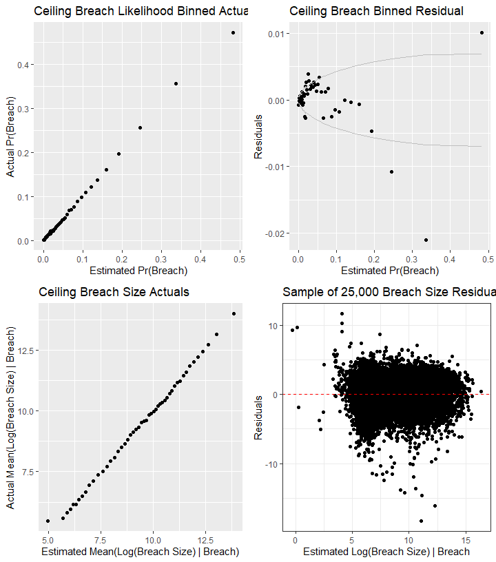
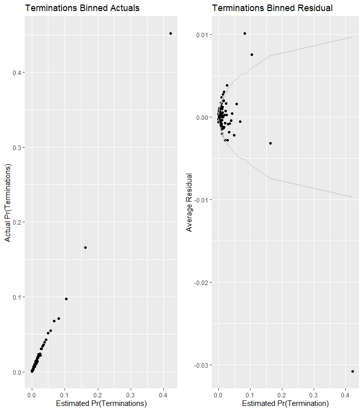

#Setup


First we load the data. The dataset used is a U.S. Defense Contracting dataset derived from FPDS.


```
## Warning: replacing previous import 'Hmisc::summarize' by 'dplyr::summarize'
## when loading 'csis360'
```

```
## Warning: replacing previous import 'Hmisc::src' by 'dplyr::src' when
## loading 'csis360'
```

```
## Warning: replacing previous import 'dplyr::intersect' by
## 'lubridate::intersect' when loading 'csis360'
```

```
## Warning: replacing previous import 'dplyr::union' by 'lubridate::union'
## when loading 'csis360'
```

```
## Warning: replacing previous import 'dplyr::setdiff' by 'lubridate::setdiff'
## when loading 'csis360'
```

```
## 
## Attaching package: 'dplyr'
```

```
## The following objects are masked from 'package:stats':
## 
##     filter, lag
```

```
## The following objects are masked from 'package:base':
## 
##     intersect, setdiff, setequal, union
```

```
## Loading required package: MASS
```

```
## 
## Attaching package: 'MASS'
```

```
## The following object is masked from 'package:dplyr':
## 
##     select
```

```
## Loading required package: Matrix
```

```
## Loading required package: lme4
```

```
## 
## arm (Version 1.10-1, built: 2018-4-12)
```

```
## Working directory is C:/Users/gsand/Repositories/Services/analysis
```

```
## 
## Please cite as:
```

```
##  Hlavac, Marek (2018). stargazer: Well-Formatted Regression and Summary Statistics Tables.
```

```
##  R package version 5.2.2. https://CRAN.R-project.org/package=stargazer
```

```
## Version:  1.36.23
## Date:     2017-03-03
## Author:   Philip Leifeld (University of Glasgow)
## 
## Please cite the JSS article in your publications -- see citation("texreg").
```

```
## 
## Attaching package: 'texreg'
```

```
## The following object is masked from 'package:arm':
## 
##     coefplot
```

```
## -- Attaching packages ------------------------------------------------------------------------------------------------------------------------------ tidyverse 1.2.1 --
```

```
## v tibble  2.1.3     v purrr   0.3.3
## v tidyr   1.0.0     v stringr 1.4.0
## v tibble  2.1.3     v forcats 0.4.0
```

```
## -- Conflicts --------------------------------------------------------------------------------------------------------------------------------- tidyverse_conflicts() --
## x tidyr::expand()  masks Matrix::expand()
## x tidyr::extract() masks texreg::extract()
## x dplyr::filter()  masks stats::filter()
## x dplyr::lag()     masks stats::lag()
## x tidyr::pack()    masks Matrix::pack()
## x MASS::select()   masks dplyr::select()
## x tidyr::unpack()  masks Matrix::unpack()
```

```
## Loading required package: carData
```

```
## Registered S3 methods overwritten by 'car':
##   method                          from
##   influence.merMod                lme4
##   cooks.distance.influence.merMod lme4
##   dfbeta.influence.merMod         lme4
##   dfbetas.influence.merMod        lme4
```

```
## 
## Attaching package: 'car'
```

```
## The following object is masked from 'package:purrr':
## 
##     some
```

```
## The following object is masked from 'package:arm':
## 
##     logit
```

```
## The following object is masked from 'package:dplyr':
## 
##     recode
```

```
## 
## Attaching package: 'scales'
```

```
## The following object is masked from 'package:purrr':
## 
##     discard
```

```
## The following object is masked from 'package:readr':
## 
##     col_factor
```

```
## The following object is masked from 'package:arm':
## 
##     rescale
```

Contracts are classified using a mix of numerical and categorical variables. While the changes in numerical variables are easy to grasp and summarize, a contract may have one line item that is competed and another that is not. As is detailed in the exploration on R&D, we are only considering information available prior to contract start. The percentage of contract obligations that were competed is a valuable benchmark, but is highly influenced by factors that occured after contract start.

# Pre-Model Graphs
None at present.
# Models
## Loading Models
### Exercised Options
Note that because we use the complete dataset for exercised options, there's no 1 million entry variant.

```r
if(file.exists("..//Output//b_SomeOpt25Cv3.rda")) load("..//Output//b_SomeOpt25Cv3.rda")
# 
if(!exists("b_SomeOpt25Cv3")){
  #Create the model

  b_SomeOpt25Cv3 <- glmer(data=serv_opt, b_SomeOpt ~  cln_US6sal +
                            cln_PSCrate+ cp_OffPerf7+cp_OffPSC7+
                            cn_PairHist7+cln_PairCA+
                            cln_Base + clr_Ceil2Base + cln_Days+
                            Comp+
                            Veh+
                            Pricing+
                            Crisis+
                            cln_Def6HHI+clr_Def6toUS+
                            cln_Def3HHI+
                            clr_Def3toUS+
                            cp_PairObl7+
                            cln_OffObl7+
                            cln_OffFocus+
                            cp_OffPerf7:cp_PairObl7 +
                            cp_OffPerf7:cln_PairCA +
                            cn_PairHist7:Pricing +
                            cp_PairObl7:cln_OffObl7 +
                            clr_Ceil2Base:cln_Base +
                            pOffPSC:cln_OffObl7 +
                            (1 | NAICS3/NAICS6/ServArea)+
                            (1 | Agency/Office) +
                            (1 | Place)+
                            (1 | StartFY),
                          family=binomial(link="logit"),
                          verbose=TRUE)
  save(b_SomeOpt25Cv3, file="..\\Output\\b_SomeOpt25Cv3.rda")
}

glmer_examine(b_SomeOpt25Cv3)
```

```
## Warning: 'icc' is deprecated.
## Use 'performance::icc()' instead.
## See help("Deprecated")
```

```
## [[1]]
##                             GVIF Df GVIF^(1/(2*Df))
## cln_US6sal              1.047479  1        1.023464
## cln_PSCrate             1.024780  1        1.012314
## cp_OffPerf7             1.136534  1        1.066084
## cp_OffPSC7              1.228139  1        1.108214
## cn_PairHist7            1.402637  1        1.184330
## cln_PairCA              1.829788  1        1.352697
## cln_Base                1.930475  1        1.389415
## clr_Ceil2Base           1.098552  1        1.048118
## cln_Days                1.054625  1        1.026949
## Comp                    1.134899  3        1.021315
## Veh                     1.430044  4        1.045728
## Pricing                 2.222059  6        1.068800
## Crisis                  1.018403  3        1.003044
## cln_Def6HHI             1.208464  1        1.099302
## clr_Def6toUS            1.158370  1        1.076276
## cln_Def3HHI             1.208161  1        1.099164
## clr_Def3toUS            1.188483  1        1.090176
## cp_PairObl7             1.813427  1        1.346636
## cln_OffObl7             3.171537  1        1.780881
## cln_OffFocus            1.098722  1        1.048199
## cp_OffPerf7:cp_PairObl7 1.642782  1        1.281711
## cp_PairObl7:cln_OffObl7 1.674192  1        1.293906
## cn_PairHist7:Pricing    2.234718  6        1.069306
## cp_OffPerf7:cln_PairCA  1.311745  1        1.145314
## cln_Base:clr_Ceil2Base  1.826092  1        1.351330
## cp_OffPSC7:cln_OffObl7  2.972175  1        1.724000
## 
## [[2]]
## # Intraclass Correlation Coefficient
## 
##      Adjusted ICC: 0.285
##   Conditional ICC: 0.257
## 
## [[3]]
## [1] "Model failed to converge with max|grad| = 0.00987252 (tol = 0.001, component 1)"
## 
## [[4]]
## ServArea:(NAICS6:NAICS3).(Intercept)            Office:Agency.(Intercept) 
##                           0.37036191                           0.73454189 
##            NAICS6:NAICS3.(Intercept)                    Place.(Intercept) 
##                           0.21098304                           0.52045517 
##                   NAICS3.(Intercept)                   Agency.(Intercept) 
##                           0.17013830                           0.03999664 
##                  StartFY.(Intercept) 
##                           0.53665792
```

```r
if(file.exists("..//Output//b_AllOpt26A.rda")) load("..//Output//b_AllOpt26A.rda")

if(!exists("b_AllOpt26A")){
  #Create the model
  

  b_AllOpt26A <- glmer(data=serv_exeropt,
                       b_AllOpt ~  cln_US6sal + 
                   cln_PSCrate+ cp_OffPerf7+cp_OffPSC7+
                 cn_PairHist7+cln_PairCA+
                 cln_Base + clr_Ceil2Base + cln_Days+
                 Comp+
                   Veh+
                   Pricing+
                   Crisis+
                 cln_Def6HHI+clr_Def6toUS+
                 cln_Def3HHI+
                   clr_Def3toUS+
                 cp_PairObl7+
                   cln_OffObl7+ 
                 cln_OffFocus+
                   cp_OffPerf7:cp_PairObl7 + 
                  # cp_OffPerf7:cln_PairCA + 
                   cp_OffPSC7:cln_OffFocus+
                   
                   Pricing:cln_PSCrate+
                      # cp_OffPerf7:cln_Days+
                 # Pricing:cln_PSCrate+
                   cln_OffObl7:cln_OffFocus+
                      (1 | NAICS3/NAICS6/ServArea)+  
                      (1 | Agency/Office) +
                      (1 | Place)+ 
                      (1 | StartFY),
                      family=binomial(link="logit"),
                      verbose=TRUE)
  
  save(b_AllOpt26A,file="..\\output\\b_AllOpt26A.rda")

}

glmer_examine(b_AllOpt26A)
```

```
## Warning: 'icc' is deprecated.
## Use 'performance::icc()' instead.
## See help("Deprecated")
```

```
## [[1]]
##                              GVIF Df GVIF^(1/(2*Df))
## cln_US6sal               1.064923  1        1.031951
## cln_PSCrate              1.099503  1        1.048572
## cp_OffPerf7              1.109265  1        1.053216
## cp_OffPSC7               1.286291  1        1.134148
## cn_PairHist7             1.359993  1        1.166187
## cln_PairCA               1.787506  1        1.336976
## cln_Base                 1.159549  1        1.076823
## clr_Ceil2Base            1.066374  1        1.032654
## cln_Days                 1.042561  1        1.021059
## Comp                     1.161180  3        1.025219
## Veh                      1.459185  4        1.048368
## Pricing                  4.163678  6        1.126220
## Crisis                   1.028852  3        1.004752
## cln_Def6HHI              1.186484  1        1.089259
## clr_Def6toUS             1.181533  1        1.086983
## cln_Def3HHI              1.189430  1        1.090610
## clr_Def3toUS             1.230824  1        1.109425
## cp_PairObl7              1.371218  1        1.170990
## cln_OffObl7              1.363349  1        1.167626
## cln_OffFocus             1.117581  1        1.057157
## cp_OffPerf7:cp_PairObl7  1.167857  1        1.080674
## cp_OffPSC7:cln_OffFocus  1.266560  1        1.125415
## cln_PSCrate:Pricing      3.980569  6        1.122007
## cln_OffObl7:cln_OffFocus 1.298144  1        1.139361
## 
## [[2]]
## # Intraclass Correlation Coefficient
## 
##      Adjusted ICC: 0.137
##   Conditional ICC: 0.119
## 
## [[3]]
## [1] "Model failed to converge with max|grad| = 0.00364159 (tol = 0.001, component 1)"
## 
## [[4]]
## ServArea:(NAICS6:NAICS3).(Intercept)            Office:Agency.(Intercept) 
##                            0.1811424                            0.4707001 
##            NAICS6:NAICS3.(Intercept)                    Place.(Intercept) 
##                            0.3079215                            0.2689522 
##                   NAICS3.(Intercept)                   Agency.(Intercept) 
##                            0.1296557                            0.2352865 
##                  StartFY.(Intercept) 
##                            0.1714321
```

```r
glmer_examine(b_SomeOpt25Cv3)
```

```
## Warning: 'icc' is deprecated.
## Use 'performance::icc()' instead.
## See help("Deprecated")
```

```
## [[1]]
##                             GVIF Df GVIF^(1/(2*Df))
## cln_US6sal              1.047479  1        1.023464
## cln_PSCrate             1.024780  1        1.012314
## cp_OffPerf7             1.136534  1        1.066084
## cp_OffPSC7              1.228139  1        1.108214
## cn_PairHist7            1.402637  1        1.184330
## cln_PairCA              1.829788  1        1.352697
## cln_Base                1.930475  1        1.389415
## clr_Ceil2Base           1.098552  1        1.048118
## cln_Days                1.054625  1        1.026949
## Comp                    1.134899  3        1.021315
## Veh                     1.430044  4        1.045728
## Pricing                 2.222059  6        1.068800
## Crisis                  1.018403  3        1.003044
## cln_Def6HHI             1.208464  1        1.099302
## clr_Def6toUS            1.158370  1        1.076276
## cln_Def3HHI             1.208161  1        1.099164
## clr_Def3toUS            1.188483  1        1.090176
## cp_PairObl7             1.813427  1        1.346636
## cln_OffObl7             3.171537  1        1.780881
## cln_OffFocus            1.098722  1        1.048199
## cp_OffPerf7:cp_PairObl7 1.642782  1        1.281711
## cp_PairObl7:cln_OffObl7 1.674192  1        1.293906
## cn_PairHist7:Pricing    2.234718  6        1.069306
## cp_OffPerf7:cln_PairCA  1.311745  1        1.145314
## cln_Base:clr_Ceil2Base  1.826092  1        1.351330
## cp_OffPSC7:cln_OffObl7  2.972175  1        1.724000
## 
## [[2]]
## # Intraclass Correlation Coefficient
## 
##      Adjusted ICC: 0.285
##   Conditional ICC: 0.257
## 
## [[3]]
## [1] "Model failed to converge with max|grad| = 0.00987252 (tol = 0.001, component 1)"
## 
## [[4]]
## ServArea:(NAICS6:NAICS3).(Intercept)            Office:Agency.(Intercept) 
##                           0.37036191                           0.73454189 
##            NAICS6:NAICS3.(Intercept)                    Place.(Intercept) 
##                           0.21098304                           0.52045517 
##                   NAICS3.(Intercept)                   Agency.(Intercept) 
##                           0.17013830                           0.03999664 
##                  StartFY.(Intercept) 
##                           0.53665792
```


### Ceiling Breach


```r
if(file.exists("..//Output//b_CBre29AB.rda")) load("..//Output//b_CBre29AB.rda")

if(!exists("b_CBre29B")){
  b_CBre29B <- glmer(data=serv_smp1m, b_CBre ~  cln_US6sal +
                       cln_PSCrate+ cp_OffPerf7+cp_OffPSC7+
                       cn_PairHist7+cln_PairCA+
                       cln_Base + clr_Ceil2Base + cln_Days+
                       Comp+
                       Veh+
                       Pricing+
                       Crisis+
                       cln_Def6HHI+clr_Def6toUS+
                       #cln_Def3HHI+
                       clr_Def3toUS+
                       cp_PairObl7+
                       cln_OffObl7+
                       cln_OffFocus+
                       cp_OffPerf7:cln_PairCA+
                       #cp_OffPerf7:cp_PairObl7+
                       cp_OffPerf7:cln_Days+
                       # clr_Ceil2Base:cln_Base+
                       (1 | NAICS3/NAICS6/ServArea)+
                       (1 | Agency/Office) +
                       (1 | Place)+
                       (1 | StartFY),
                     family=binomial(link="logit"),
                     verbose=TRUE)
  save(b_CBre29A,b_CBre29B,file="..\\output\\b_CBre29AB.rda")

}
glmer_examine(b_CBre29B)
```

```
## Warning: 'icc' is deprecated.
## Use 'performance::icc()' instead.
## See help("Deprecated")
```

```
## [[1]]
##                            GVIF Df GVIF^(1/(2*Df))
## cln_US6sal             1.031540  1        1.015647
## cln_PSCrate            1.040981  1        1.020285
## cp_OffPerf7            1.327036  1        1.151971
## cp_OffPSC7             1.694827  1        1.301855
## cn_PairHist7           1.266040  1        1.125184
## cln_PairCA             1.556359  1        1.247541
## cln_Base               1.178172  1        1.085436
## clr_Ceil2Base          1.054316  1        1.026799
## cln_Days               1.167189  1        1.080365
## Comp                   1.121085  3        1.019232
## Veh                    1.430197  4        1.045742
## Pricing                1.067455  6        1.005455
## Crisis                 1.046224  3        1.007560
## cln_Def6HHI            1.030654  1        1.015211
## clr_Def6toUS           1.180614  1        1.086561
## clr_Def3toUS           1.194564  1        1.092961
## cp_PairObl7            1.233907  1        1.110814
## cln_OffObl7            1.811823  1        1.346040
## cln_OffFocus           1.061505  1        1.030293
## cp_OffPerf7:cln_PairCA 1.166241  1        1.079926
## cp_OffPerf7:cln_Days   1.064677  1        1.031832
## 
## [[2]]
## # Intraclass Correlation Coefficient
## 
##      Adjusted ICC: 0.428
##   Conditional ICC: 0.381
## 
## [[3]]
## [1] "Model failed to converge with max|grad| = 0.0670472 (tol = 0.001, component 1)"
## 
## [[4]]
## ServArea:(NAICS6:NAICS3).(Intercept)            Office:Agency.(Intercept) 
##                            0.4607491                            1.2414533 
##            NAICS6:NAICS3.(Intercept)                    Place.(Intercept) 
##                            0.3823538                            0.4392544 
##                   NAICS3.(Intercept)                   Agency.(Intercept) 
##                            0.4442963                            0.3961069 
##                  StartFY.(Intercept) 
##                            0.1391915
```

```r
if(file.exists("..//Output//CBre25A.rda")) load("..//Output//CBre25A.rda")

if(!exists("n_CBre25A")){
    
  n_CBre25A <- lmer(data=serv_breach, ln_CBre ~ cln_US6sal + 
                      cln_PSCrate+ cp_OffPerf7+cp_OffPSC7+
                      cn_PairHist7+cln_PairCA+
                      cln_Base + clr_Ceil2Base + cln_Days+
                      Comp+
                      Veh+
                      Pricing+
                      Crisis+
                      cln_Def6HHI+clr_Def6toUS+
                      #cln_Def3HHI+
                      clr_Def3toUS+
                      cp_PairObl7+
                      cln_OffObl7+ 
                      #cl_office_NAICS6_hhi_kc+
                      cp_OffPerf7:cln_PairCA+
                      (1 | NAICS3/NAICS6/ServArea)+  
                      (1 | Agency/Office) +
                      (1 | Place)+ 
                      (1 | StartFY),
                    verbose=TRUE)
  
  save(n_CBre25A,file="..\\output\\n_CBre25A.rda")
}


glmer_examine(n_CBre25A)
```

```
## Warning: 'icc' is deprecated.
## Use 'performance::icc()' instead.
## See help("Deprecated")
```

```
## [[1]]
##                            GVIF Df GVIF^(1/(2*Df))
## cln_US6sal             1.043359  1        1.021450
## cln_PSCrate            1.047556  1        1.023502
## cp_OffPerf7            1.297150  1        1.138925
## cp_OffPSC7             1.552161  1        1.245857
## cn_PairHist7           1.258603  1        1.121875
## cln_PairCA             1.567469  1        1.251986
## cln_Base               1.203104  1        1.096861
## clr_Ceil2Base          1.056344  1        1.027786
## cln_Days               1.195631  1        1.093449
## Comp                   1.112113  3        1.017868
## Veh                    1.410407  4        1.043922
## Pricing                1.071976  6        1.005809
## Crisis                 1.053055  3        1.008653
## cln_Def6HHI            1.028841  1        1.014318
## clr_Def6toUS           1.098625  1        1.048153
## clr_Def3toUS           1.112190  1        1.054604
## cp_PairObl7            1.258396  1        1.121782
## cln_OffObl7            1.528491  1        1.236321
## cp_OffPerf7:cln_PairCA 1.159844  1        1.076960
## 
## [[2]]
## # Intraclass Correlation Coefficient
## 
##      Adjusted ICC: 0.160
##   Conditional ICC: 0.092
## 
## [[3]]
## [1] "Model failed to converge with max|grad| = 0.00219991 (tol = 0.002, component 1)"
## 
## [[4]]
## ServArea:(NAICS6:NAICS3).(Intercept)            Office:Agency.(Intercept) 
##                           0.21764855                           0.22259707 
##            NAICS6:NAICS3.(Intercept)                    Place.(Intercept) 
##                           0.11722286                           0.18983714 
##                   NAICS3.(Intercept)                   Agency.(Intercept) 
##                           0.14869246                           0.13630345 
##                  StartFY.(Intercept) 
##                           0.04961028
```

```r
# if(!exists("b_CBre29B_restart")){
#   pars<-get_pars(b_CBre25A)
#   b_CBre25A_restart <- update(b_CBre25A, 
#                                      start=pars,
#                                      verbose=1)
#   save(b_CBre25A,
#        b_CBre25A_restart,
#        file="..//output//b_CBre25A.rdata")
# }
# glmer_examine(b_CBre25A_restart)


# 
# save(b_CBre25A,
#      b_CBre25A.devfun,
#      CBre_Cons_13_scgrad,
#      b_CBre25A.restart,
#      CBre_Comp_13B,
#      CBre_Comp_13B.devfun,
#      CBre_Comp_13B.restart,
#      file="..//output//b_CBre25A.rdata")

# source(system.file("utils", "allFit.R", package="lme4"))
# b_CBre25A.all <- allFit(b_CBre25A)
# b_CBre25A_ss_cons <- summary(b_CBre25A.all)


# glmer_examine(b_CBre25A.restart,display=TRUE)
# odds_ratio(b_CBre25A.restart,"b_CBre25A")
```
"Model failed to converge with max|grad| = 0.00135328 (tol = 0.001, component 1)"" - AllOpt25A


### Termination


```r
if(file.exists("..//Output//term25B.rdata")) load("..//Output//term25B.rdata")

if(!exists("term25B")){

  term25B <- glmer(data=serv_smp1m, b_Term ~ cl_US6_avg_sal_lag1Const + 
                     cl_CFTE+ c_pPBSC+c_pOffPSC+
                     c_pairHist+cl_pairCA +
                     cl_Base + cl_Days+ cl_Base2Ceil+
                     Comp1or5+
                     Veh+
                     PricingUCA+
                     Crisis+
                     cl_def6_HHI_lag1+cl_def6_ratio_lag1+
                     cl_def3_HHI_lag1+cl_def3_ratio_lag1+
                     c_pMarket+
                     cl_OffVol+cl_office_naics_hhi_k +
                     c_pairHist:PricingUCA+ 
                     (1 | NAICS3/NAICS/CrisisProductOrServiceArea)+  
                     (1 | Agency/Office) +
                     (1 | PlaceCountryISO3)+ 
                     (1 | StartFY),
                   family=binomial(link="logit"),
                   verbose=TRUE)
  
  save(term25A,term25B,file="..\\output\\term25AB.rdata")
}

glmer_examine(term25B)
```

```
## Warning: 'icc' is deprecated.
## Use 'performance::icc()' instead.
## See help("Deprecated")
```

```
## [[1]]
##                          GVIF Df GVIF^(1/(2*Df))
## cln_US6sal           1.023581  1        1.011722
## cln_PSCrate          1.077570  1        1.038061
## cp_OffPerf7          1.061212  1        1.030152
## cp_OffPSC7           1.088078  1        1.043110
## cn_PairHist7         1.327677  1        1.152249
## cln_PairCA           1.684679  1        1.297952
## cln_Base             1.156270  1        1.075300
## cln_Days             1.174037  1        1.083530
## clr_Ceil2Base        1.079836  1        1.039152
## Comp                 1.131030  3        1.020733
## Veh                  1.426813  4        1.045432
## Pricing              2.548032  6        1.081062
## Crisis               1.099538  3        1.015941
## cln_Def6HHI          1.370578  1        1.170717
## clr_Def6toUS         1.088018  1        1.043081
## cln_Def3HHI          1.376273  1        1.173147
## clr_Def3toUS         1.085676  1        1.041958
## cp_PairObl7          1.245483  1        1.116012
## cln_OffObl7          1.096063  1        1.046930
## cln_OffFocus         1.108827  1        1.053009
## cn_PairHist7:Pricing 2.533441  6        1.080544
## 
## [[2]]
## # Intraclass Correlation Coefficient
## 
##      Adjusted ICC: 0.307
##   Conditional ICC: 0.273
## 
## [[3]]
## [1] "Model failed to converge with max|grad| = 0.021645 (tol = 0.001, component 1)"
## 
## [[4]]
## ServArea:(NAICS6:NAICS3).(Intercept)            Office:Agency.(Intercept) 
##                            0.4246339                            0.8130444 
##            NAICS6:NAICS3.(Intercept)                    Place.(Intercept) 
##                            0.3333396                            0.6252668 
##                   NAICS3.(Intercept)                   Agency.(Intercept) 
##                            0.2077932                            0.2444498 
##                  StartFY.(Intercept) 
##                            0.1094118
```

### Study Variables Only

```r
texreg::htmlreg(list(b_SomeOpt25Cv3,b_AllOpt26A,b_CBre29B,n_CBre25A,term25B),file="..//Output//study_var_model_lvl1.html",
                single.row = TRUE,
                custom.model.name=c("Some Options","All Options","Breach Likelihood","Breach Size","Termination"),
                stars=c(0.1,0.05,0.01,0.001),
                #groups = list(
                 #             "Services Complexity" = 2:3,
                  #            "Office Capacity" =4:5,
                   #           "Past Relationship"=6:7
                    #          ),
                custom.coef.map=study_coef_list,
                bold=0.05,
                custom.note="%stars. Numerical inputs are rescaled.",
                caption="Table 6: Study Variables and Outcomes",
                caption.above=TRUE)
```

```
## The table was written to the file '..//Output//study_var_model_lvl1.html'.
```

## Results by Dependent Variable

### Exercised Options

```r
#MODELS - b_SomeOpt25Cv3; b_AllOpt26A

stargazer::stargazer(b_SomeOpt25Cv3, b_AllOpt26A,
                       single.row = TRUE,
                custom.model.name=c("Exercised Options"),
                stars=c(0.1,0.05,0.01,0.001),
                       type="text",
                       digits=2)
```

```
## 
## ========================================================================
##                                                Dependent variable:      
##                                          -------------------------------
##                                             b_SomeOpt       b_AllOpt    
##                                                (1)             (2)      
## ------------------------------------------------------------------------
## cln_US6sal                                 0.01 (0.06)     0.08 (0.06)  
## cln_PSCrate                               -0.06* (0.03)  -0.07** (0.03) 
## cp_OffPerf7                              -0.16*** (0.05)  0.002 (0.05)  
## cp_OffPSC7                               -0.18*** (0.06) 0.18*** (0.06) 
## cn_PairHist7                             0.26*** (0.02)  0.14*** (0.03) 
## cln_PairCA                                -0.07 (0.04)   -0.22*** (0.05)
## cln_Base                                 0.23*** (0.04)  -0.14*** (0.03)
## clr_Ceil2Base                            0.30*** (0.01)  -0.80*** (0.02)
## cln_Days                                 0.29*** (0.03)  -0.45*** (0.04)
## Comp1 offer                                0.01 (0.03)    0.002 (0.03)  
## Comp2-4 offers                            -0.03 (0.03)    -0.04 (0.03)  
## Comp5+ offers                            -0.07** (0.03)  -0.08** (0.03) 
## VehS-IDC                                 -0.69*** (0.04) -0.20*** (0.05)
## VehM-IDC                                 -0.23*** (0.04) -0.13*** (0.04)
## VehFSS/GWAC                              -0.17*** (0.04)  -0.06 (0.04)  
## VehBPA/BOA                               -0.29*** (0.08)  0.25** (0.10) 
## PricingOther FP                          -0.70*** (0.17) -0.50** (0.22) 
## PricingIncentive                          -0.34 (0.30)    0.58* (0.31)  
## PricingCombination or Other              0.36*** (0.09)  -0.14** (0.07) 
## PricingOther CB                          0.25*** (0.06)  0.21*** (0.06) 
## PricingT&M/LH/FPLOE                        0.06 (0.07)    -0.03 (0.07)  
## PricingUCA                                -0.09 (0.12)    -0.09 (0.15)  
## CrisisARRA                               -0.42** (0.16)   -0.24 (0.22)  
## CrisisDis                                 -0.32 (0.31)   -1.46*** (0.42)
## CrisisOCO                                -0.34*** (0.12) -0.26** (0.12) 
## cln_Def6HHI                              -0.13*** (0.05)  -0.09* (0.05) 
## clr_Def6toUS                              -0.01 (0.04)     0.04 (0.05)  
## cln_Def3HHI                               -0.02 (0.05)    -0.05 (0.06)  
## clr_Def3toUS                               0.03 (0.08)    -0.02 (0.08)  
## cp_PairObl7                               -0.02 (0.05)    -0.07 (0.06)  
## cln_OffObl7                              0.20*** (0.05)  -0.09*** (0.03)
## cln_OffFocus                             -0.32*** (0.06) -0.13** (0.06) 
## cp_OffPerf7:cp_PairObl7                  0.69*** (0.08)    0.15 (0.09)  
## cp_PairObl7:cln_OffObl7                    0.13 (0.12)                  
## cn_PairHist7:PricingOther FP              -0.09 (0.37)                  
## cn_PairHist7:PricingIncentive            1.55*** (0.51)                 
## cn_PairHist7:PricingCombination or Other -0.45** (0.18)                 
## cn_PairHist7:PricingOther CB              0.20** (0.10)                 
## cn_PairHist7:PricingT&M/LH/FPLOE           0.08 (0.12)                  
## cn_PairHist7:PricingUCA                    0.16 (0.22)                  
## cp_OffPerf7:cln_PairCA                   -0.61*** (0.06)                
## cln_Base:clr_Ceil2Base                   0.26*** (0.02)                 
## cp_OffPSC7:cln_OffObl7                   1.03*** (0.16)                 
## cp_OffPSC7:cln_OffFocus                                   -0.10 (0.11)  
## cln_PSCrate:PricingOther FP                               -0.23 (0.61)  
## cln_PSCrate:PricingIncentive                              -0.60 (0.70)  
## cln_PSCrate:PricingCombination or Other                   0.40** (0.20) 
## cln_PSCrate:PricingOther CB                              0.43*** (0.14) 
## cln_PSCrate:PricingT&M/LH/FPLOE                            0.17 (0.20)  
## cln_PSCrate:PricingUCA                                   1.42*** (0.37) 
## cln_OffObl7:cln_OffFocus                                  -0.003 (0.07) 
## Constant                                   0.05 (0.22)   1.15*** (0.15) 
## ------------------------------------------------------------------------
## Observations                                 74,274          51,357     
## Log Likelihood                             -37,835.41      -29,663.31   
## Akaike Inf. Crit.                           75,772.83       59,424.62   
## Bayesian Inf. Crit.                         76,242.82       59,858.10   
## ========================================================================
## Note:                                        *p<0.1; **p<0.05; ***p<0.01
## 
## =================
## Exercised Options
## -----------------
## 
## ====================
## 0.10 0.05 0.01 0.001
## --------------------
```

```r
#Chart for report:

texreg::htmlreg(list(b_SomeOpt25Cv3, b_AllOpt26A),file="..//Output//options.html",
                single.row = TRUE,
                custom.model.name=c("Some Options Exercised Model", "All Options Exercised Model"),
                stars=c(0.1,0.05,0.01,0.001),
                groups = list(
                  "Study Variables" = 2:7,
                  # "Services Complexity" = 2:3,
                  # "Office Capacity" =4:5,
                  # "Past Relationship"=6:7,
                  # "Past Relationship"=6:7,
                  "Contract Characteristics"=8:26,
                  "NAICS/Office Characteristics" =27:33,
                  # "NAICS Characteristics" =27:30,
                  # "Office Characteristics" =31:33,
                  "Interactions"=34:52
                ),
                custom.coef.map=all_coef_list,
                bold=0.05,
                custom.note="%stars. Numerical inputs are rescaled.",
                caption="Table 6: Exercised Options",
                caption.above=TRUE)
```

```
## The table was written to the file '..//Output//options.html'.
```

### Ceiling Breach

```r
  stargazer::stargazer(#b_SomeOpt25Cv3,b_AllOpt26A,
                       b_CBre29B,n_CBre25A,
                       single.row = TRUE,
                custom.model.name=c("Breach Frequency (Logit)","Breach Size for Breached Contracts (Regression"),
                stars=c(0.1,0.05,0.01,0.001),
                       type="text",
                       digits=2)
```

```
## 
## ==============================================================
##                                    Dependent variable:        
##                             ----------------------------------
##                                   b_CBre           ln_CBre    
##                             generalized linear     linear     
##                               mixed-effects     mixed-effects 
##                                    (1)               (2)      
## --------------------------------------------------------------
## cln_US6sal                    -0.003 (0.06)     -0.02 (0.06)  
## cln_PSCrate                   0.06*** (0.01)   0.09*** (0.02) 
## cp_OffPerf7                   0.07*** (0.03)    -0.06 (0.04)  
## cp_OffPSC7                    0.19*** (0.02)   0.13*** (0.03) 
## cn_PairHist7                 -0.08*** (0.01)     0.03 (0.02)  
## cln_PairCA                    0.44*** (0.02)    -0.01 (0.03)  
## cln_Base                      1.35*** (0.01)   2.65*** (0.02) 
## clr_Ceil2Base                 0.25*** (0.01)   0.25*** (0.02) 
## cln_Days                      0.28*** (0.01)    0.05** (0.02) 
## Comp1 offer                   -0.03* (0.02)     -0.05* (0.03) 
## Comp2-4 offers                0.11*** (0.01)   -0.11*** (0.02)
## Comp5+ offers                 0.18*** (0.01)   -0.07*** (0.02)
## VehS-IDC                     -0.48*** (0.02)    -0.01 (0.02)  
## VehM-IDC                     -0.18*** (0.02)    -0.02 (0.03)  
## VehFSS/GWAC                    -0.01 (0.03)     0.12** (0.05) 
## VehBPA/BOA                   -0.29*** (0.03)   -0.13** (0.06) 
## PricingOther FP              -0.40*** (0.09)   -0.36** (0.14) 
## PricingIncentive              2.39*** (0.07)   0.81*** (0.12) 
## PricingCombination or Other   0.26*** (0.05)   0.43*** (0.07) 
## PricingOther CB              -0.09*** (0.03)   0.81*** (0.05) 
## PricingT&M/LH/FPLOE           0.11** (0.04)    0.66*** (0.07) 
## PricingUCA                     0.07* (0.04)    0.37*** (0.07) 
## CrisisARRA                    0.12*** (0.04)    -0.06 (0.06)  
## CrisisDis                      0.07 (0.09)     0.39*** (0.13) 
## CrisisOCO                     -0.10** (0.05)     0.08 (0.08)  
## cln_Def6HHI                    -0.02 (0.02)     0.06** (0.03) 
## clr_Def6toUS                  0.07** (0.03)      0.01 (0.03)  
## clr_Def3toUS                 -0.46*** (0.07)   0.29*** (0.08) 
## cp_PairObl7                  -0.24*** (0.03)     0.01 (0.04)  
## cln_OffObl7                   0.04** (0.02)     0.06** (0.02) 
## cln_OffFocus                 -0.36*** (0.04)                  
## cp_OffPerf7:cln_PairCA        0.38*** (0.03)   -0.20*** (0.04)
## cp_OffPerf7:cln_Days         -0.12*** (0.02)                  
## Constant                     -4.55*** (0.18)   8.82*** (0.13) 
## --------------------------------------------------------------
## Observations                    1,000,000          61,184     
## Log Likelihood                 -173,798.70       -121,011.90  
## Akaike Inf. Crit.               347,679.30       242,103.90   
## Bayesian Inf. Crit.             348,163.80       242,464.80   
## ==============================================================
## Note:                              *p<0.1; **p<0.05; ***p<0.01
## 
## =======================================================================
## Breach Frequency (Logit) Breach Size for Breached Contracts (Regression
## -----------------------------------------------------------------------
## 
## ====================
## 0.10 0.05 0.01 0.001
## --------------------
```

```r
texreg::htmlreg(list(b_CBre29B,n_CBre25A),file="..//Output//ceiling_breaches.html",
                single.row = TRUE,
                custom.model.name=c("Likelihood\n(Logit)","Size Given Breach\n(Regression)"),
                stars=c(0.1,0.05,0.01,0.001),
                groups = list(
                                                "Study Variables" = 2:7,
                              # "Services Complexity" = 2:3,
                              # "Office Capacity" =4:5,
                              # "Past Relationship"=6:7,
                              "Contract Characteristics"=8:26,
                                                "NAICS/Office Characteristics" =27:32,
                              "Interactions"=33:34
                              ),
                custom.coef.map=all_coef_list,
                bold=0.05,
                custom.note="%stars. Numerical inputs are rescaled.",
                caption="Table 8: Ceiling Breaches",
                caption.above=TRUE)
```

```
## The table was written to the file '..//Output//ceiling_breaches.html'.
```

### Terminations


```r
#Absolute Exercised Options
  stargazer::stargazer(#b_SomeOpt25Cv3,b_AllOpt26A,
                       term25B,
                       single.row = TRUE,
                custom.model.name=c("Termination"),
                stars=c(0.1,0.05,0.01,0.001),
                       type="text",
                       digits=2)
```

```
## 
## ====================================================================
##                                              Dependent variable:    
##                                          ---------------------------
##                                                    b_Term           
## --------------------------------------------------------------------
## cln_US6sal                                      -0.05 (0.06)        
## cln_PSCrate                                     -0.02 (0.02)        
## cp_OffPerf7                                      0.03 (0.04)        
## cp_OffPSC7                                     0.31*** (0.04)       
## cn_PairHist7                                   -0.28*** (0.02)      
## cln_PairCA                                      -0.04 (0.03)        
## cln_Base                                       0.29*** (0.02)       
## cln_Days                                       0.90*** (0.02)       
## clr_Ceil2Base                                  0.50*** (0.01)       
## Comp1 offer                                    0.30*** (0.03)       
## Comp2-4 offers                                 0.37*** (0.03)       
## Comp5+ offers                                  0.71*** (0.03)       
## VehS-IDC                                       -0.67*** (0.03)      
## VehM-IDC                                       -0.41*** (0.03)      
## VehFSS/GWAC                                    -0.18*** (0.04)      
## VehBPA/BOA                                     -0.97*** (0.06)      
## PricingOther FP                                -0.95*** (0.10)      
## PricingIncentive                               -1.02*** (0.39)      
## PricingCombination or Other                     -0.16 (0.10)        
## PricingOther CB                                -0.37*** (0.08)      
## PricingT&M/LH/FPLOE                            -0.45*** (0.09)      
## PricingUCA                                     -0.72*** (0.14)      
## CrisisARRA                                     -0.32** (0.13)       
## CrisisDis                                       0.48** (0.19)       
## CrisisOCO                                       -0.07 (0.08)        
## cln_Def6HHI                                      0.04 (0.04)        
## clr_Def6toUS                                     0.02 (0.04)        
## cln_Def3HHI                                      0.03 (0.04)        
## clr_Def3toUS                                   0.24*** (0.09)       
## cp_PairObl7                                    -0.13*** (0.04)      
## cln_OffObl7                                      0.03 (0.03)        
## cln_OffFocus                                   -0.24*** (0.05)      
## cn_PairHist7:PricingOther FP                     0.09 (0.18)        
## cn_PairHist7:PricingIncentive                   -0.09 (0.65)        
## cn_PairHist7:PricingCombination or Other         0.32 (0.23)        
## cn_PairHist7:PricingOther CB                    0.30** (0.13)       
## cn_PairHist7:PricingT&M/LH/FPLOE               -0.60*** (0.18)      
## cn_PairHist7:PricingUCA                         -0.51* (0.26)       
## Constant                                       -4.45*** (0.15)      
## --------------------------------------------------------------------
## Observations                                      1,000,000         
## Log Likelihood                                   -71,257.17         
## Akaike Inf. Crit.                                142,606.40         
## Bayesian Inf. Crit.                              143,149.90         
## ====================================================================
## Note:                                    *p<0.1; **p<0.05; ***p<0.01
## 
## ===========
## Termination
## -----------
## 
## ====================
## 0.10 0.05 0.01 0.001
## --------------------
```

```r
texreg::htmlreg(list(term25B),file="..//Output//terminations.html",
                single.row = TRUE,
                custom.model.name=c("Termination"),
                stars=c(0.1,0.05,0.01,0.001),
                groups = list(
                              "Study Variables" = 2:7,
                              "Contract Characteristics"=8:26,
                              "NAICS Characteristics" =27:30,
                              "Office Characteristics" =31:33,
                              "Interactions"=34:39
                              ),
                custom.coef.map=all_coef_list,
                bold=0.05,
                custom.note="%stars. Numerical inputs are rescaled.",
                caption="Table 10: Terminations",
                caption.above=TRUE)
```

```
## The table was written to the file '..//Output//terminations.html'.
```


## Odds Ratios

### Exercised Options

```r
# comp.or<-odds_ratio(b_CBre29B,"b_CBre29B","Both","Both")
# write.csv(get_study_variables_odds_ratio(comp.or),file="..//output//ceiling_breach_study_odds_ratio.csv",row.names=FALSE)
# get_icc(b_CBre29B)
# 
# #https://www.lcampanelli.org/mixed-effects-modeling-lme4/
# gridExtra::grid.arrange(dotplot(ranef(b_CBre29B, condVar = T), strip = T, scales=list(relation='free'))$Agency,
#              nrow=1)

comp.or<-odds_ratio(b_SomeOpt25Cv3,"b_SomeOpt25Cv3",output = "Some Options Exercised Likelihood", walds = TRUE, rename_list=all_coef_list)
```

```
## Warning in if (!is.na(rename_list)) {: the condition has length > 1 and
## only the first element will be used
```

```r
write.csv(get_study_variables_odds_ratio(comp.or, study = "services"),file="..//output//some_exer_opt_study_odds_ratio.csv",row.names=FALSE)
get_icc(b_SomeOpt25Cv3)
```

```
## Warning: 'icc' is deprecated.
## Use 'performance::icc()' instead.
## See help("Deprecated")
```

```
## [[1]]
## # Intraclass Correlation Coefficient
## 
##      Adjusted ICC: 0.285
##   Conditional ICC: 0.257
## 
## [[2]]
## [1] "Model failed to converge with max|grad| = 0.00987252 (tol = 0.001, component 1)"
```

```r
# #https://www.lcampanelli.org/mixed-effects-modeling-lme4/
# gridExtra::grid.arrange(dotplot(ranef(b_SomeOpt25A, condVar = T), strip = T, scales=list(relation='free'))$Agency,
#              nrow=1)

comp.or<-odds_ratio(b_AllOpt26A,"b_AllOpt26A",output = "All Options Exercised Likelihood", walds = TRUE, rename_list=all_coef_list)
```

```
## Warning in if (!is.na(rename_list)) {: the condition has length > 1 and
## only the first element will be used
```

```r
write.csv(get_study_variables_odds_ratio(comp.or, study = "services"),file="..//output//all_exer_opt_study_odds_ratio.csv",row.names=FALSE)
get_icc(b_AllOpt26A)
```

```
## Warning: 'icc' is deprecated.
## Use 'performance::icc()' instead.
## See help("Deprecated")
```

```
## [[1]]
## # Intraclass Correlation Coefficient
## 
##      Adjusted ICC: 0.137
##   Conditional ICC: 0.119
## 
## [[2]]
## [1] "Model failed to converge with max|grad| = 0.00364159 (tol = 0.001, component 1)"
```

### Ceiling Breach 

```r
# comp_or<-odds_ratio(b_CBre29B,output="Breach Likelihood",rename_list=all_coef_list)
  comp_or_walds<-odds_ratio(b_CBre29B,"b_CBre29B",output="Breach Likelihood",walds=TRUE,rename_list=all_coef_list)
```

```
## Warning in if (!is.na(rename_list)) {: the condition has length > 1 and
## only the first element will be used
```

```r
# save(comp.or,file="..//Output//comp.or.rdata")
write.csv(get_study_variables_odds_ratio(comp_or_walds,study="services"),file="..//output//ceiling_breach_study_odds_ratio_walds.csv",row.names=FALSE)
get_icc(b_CBre29B)
```

```
## Warning: 'icc' is deprecated.
## Use 'performance::icc()' instead.
## See help("Deprecated")
```

```
## [[1]]
## # Intraclass Correlation Coefficient
## 
##      Adjusted ICC: 0.428
##   Conditional ICC: 0.381
## 
## [[2]]
## [1] "Model failed to converge with max|grad| = 0.0670472 (tol = 0.001, component 1)"
```

```r
#https://www.lcampanelli.org/mixed-effects-modeling-lme4/
# gridExtra::grid.arrange(dotplot(ranef(b_CBre29B, condVar = T), strip = T, scales=list(relation='free'))$Agency,
#              nrow=1)
```


### Terminations 


```r
  term_or_walds<-odds_ratio(term25B,"term25B",output="Termination Likelihood",walds=TRUE,rename_list=all_coef_list)
```

```
## Warning in if (!is.na(rename_list)) {: the condition has length > 1 and
## only the first element will be used
```

```r
# save(term.or,file="..//Output//term.or.rdata")
write.csv(get_study_variables_odds_ratio(term_or_walds,study="services"),file="..//output//termination_study_odds_ratio_walds.csv",row.names=FALSE)
get_icc(term25B)
```

```
## Warning: 'icc' is deprecated.
## Use 'performance::icc()' instead.
## See help("Deprecated")
```

```
## [[1]]
## # Intraclass Correlation Coefficient
## 
##      Adjusted ICC: 0.307
##   Conditional ICC: 0.273
## 
## [[2]]
## [1] "Model failed to converge with max|grad| = 0.021645 (tol = 0.001, component 1)"
```

```r
# gridExtra::grid.arrange(dotplot(ranef(term25B, condVar = T), strip = T, scales=list(relation='free'))$Agency,
#              nrow=1)
# dotplot(ranef(term25B, condVar = T), strip = T, scales=list(relation='free'))$NAICS3
```


## Discussion by Study Variable
### Service Complexity

```r
complex_coef<-all_coef_list[c(grep("cln_US6sal",names(all_coef_list)),
                              grep("cl_US6_avg_sal_lag1Const",names(all_coef_list)),
                              grep("cl_CFTE",names(all_coef_list)),
                              grep("cln_PSCrate",names(all_coef_list))
                              )]
                              

texreg::htmlreg(list(b_SomeOpt25Cv3,b_AllOpt26A,b_CBre29B,n_CBre25A,term25B),file="..//Output//service_complexity.html",
                single.row = TRUE,
                custom.model.name=c("Some Options\nExercised\n(Logit)",
                                    "All Options\nExercised\n(Logit)",
                                    "Ceiling Breach\nLikelihood\n(Logit)",
                                    "Ceiling Breach\nSize Given Breach\n(Regression)",
                                    "Termination\n(Logit)"),
                stars=c(0.1,0.05,0.01,0.001),
                # groups = list(
                #               "Services Complexity" = 1:2,
                #               # "Office Capacity" =4:5,
                #               # "Past Relationship"=6:7,
                #   # "Services Complexity"=2:7,
                #               # "Contract Characteristics"=8:26,
                #                                 # "NAICS/Office Characteristics" =27:31,
                # 
                #               # "NAICS Characteristics" =27:29,
                #               # "Office Characteristics" =30:31,
                #               "Interactions"=3:4
                #               ),
                custom.coef.map=complex_coef,
                bold=0.05,
                custom.note="%stars. Numerical inputs are rescaled.",
                caption="Table 9: Ceiling Breaches",
                caption.above=TRUE)
```

```
## The table was written to the file '..//Output//service_complexity.html'.
```


### Office Capacity

```r
office_coef<-all_coef_list[sort(unique(c(grep("c_pPBSC",names(all_coef_list)),
                              grep("cp_OffPerf7",names(all_coef_list)),
                              grep("c_pOffPSC",names(all_coef_list)),
                              grep("pOffPSC",names(all_coef_list)),
                              grep("cp_OffPSC7",names(all_coef_list))
                              )))]
                              

texreg::htmlreg(list(b_SomeOpt25Cv3,b_AllOpt26A,b_CBre29B,n_CBre25A,term25B),
                file="..//Output//office_capacity.html",
                single.row = TRUE,
                custom.model.name=c("Some Options\nExercised\n(Logit)",
                                    "All Options\nExercised\n(Logit)",
                                    "Ceiling Breach\nLikelihood\n(Logit)",
                                    "Ceiling Breach\nSize Given Breach\n(Regression)",
                                    "Termination\n(Logit)"),
                stars=c(0.1,0.05,0.01,0.001),
                # groups = list(
                #               "Services Complexity" = 1:2,
                #               # "Office Capacity" =4:5,
                #               # "Past Relationship"=6:7,
                #   # "Services Complexity"=2:7,
                #               # "Contract Characteristics"=8:26,
                #                                 # "NAICS/Office Characteristics" =27:31,
                # 
                #               # "NAICS Characteristics" =27:29,
                #               # "Office Characteristics" =30:31,
                #               "Interactions"=3:4
                #               ),
                custom.coef.map=office_coef,
                bold=0.05,
                custom.note="%stars. Numerical inputs are rescaled.",
                caption="Table 10: Office Capacity",
                caption.above=TRUE)
```

```
## The table was written to the file '..//Output//office_capacity.html'.
```


### Partner History

```r
pair_coef<-all_coef_list[sort(c(grep("c_pairHist",names(all_coef_list)),
                              grep("cn_PairHist7",names(all_coef_list)),
                              grep("cl_pairCA",names(all_coef_list)),
                              grep("cln_PairCA",names(all_coef_list))
                              ))]
                              

texreg::htmlreg(list(b_SomeOpt25Cv3,b_AllOpt26A,b_CBre29B,n_CBre25A,term25B),
                file="..//Output//pair_history.html",
                single.row = TRUE,
                custom.model.name=c("Some Options\nExercised\n(Logit)",
                                    "All Options\nExercised\n(Logit)",
                                    "Ceiling Breach\nLikelihood\n(Logit)",
                                    "Ceiling Breach\nSize Given Breach\n(Regression)",
                                    "Termination\n(Logit)"),
                stars=c(0.1,0.05,0.01,0.001),
                # groups = list(
                #               "Services Complexity" = 1:2,
                #               # "Office Capacity" =4:5,
                #               # "Past Relationship"=6:7,
                #   # "Services Complexity"=2:7,
                #               # "Contract Characteristics"=8:26,
                #                                 # "NAICS/Office Characteristics" =27:31,
                # 
                #               # "NAICS Characteristics" =27:29,
                #               # "Office Characteristics" =30:31,
                #               "Interactions"=3:4
                #               ),
                custom.coef.map=pair_coef,
                bold=0.05,
                custom.note="%stars. Numerical inputs are rescaled.",
                caption="Table 11: Past Relationship",
                caption.above=TRUE)
```

```
## The table was written to the file '..//Output//pair_history.html'.
```


## Residuals Plot


```r
(
options_residual<-gridExtra::grid.arrange(
  binned_fitted_versus_residuals(b_SomeOpt25Cv3,bins=50)+
      labs(title="Some Options Binned Actuals",
           caption=NULL,
            x="Estimated Pr(Some Options)",y="Actual Pr(Some Options)"),
    residuals_binned(b_SomeOpt25Cv3, bins=50)+labs(title="Some Options Binned Residuals",
                                                  x="Estimated Pr(Some Options)",y="Residuals"),
    
    
    binned_fitted_versus_residuals(b_AllOpt26A,bins=50)+
      labs(title="All Options Binned Actuals",
           caption=NULL,
           x="Estimated Pr(All Options | Some Options)",y="Actual Pr(All Options | Some Options)"),
  residuals_binned(b_AllOpt26A, bins=50)+labs(title="All Options Binned Residuals",
                                                  x="Estimated Pr(All Options | Some Options)",
                                              y="Residuals"),
    ncol=2)
)
```

```
## Warning in residuals_binned(b_SomeOpt25Cv3, bins = 50): Always uses Xlb
## Estimated Pr(Termination), should update.
```

```
## Warning in residuals_binned(b_AllOpt26A, bins = 50): Always uses Xlb
## Estimated Pr(Termination), should update.
```

<!-- -->

```
## TableGrob (2 x 2) "arrange": 4 grobs
##   z     cells    name           grob
## 1 1 (1-1,1-1) arrange gtable[layout]
## 2 2 (1-1,2-2) arrange gtable[layout]
## 3 3 (2-2,1-1) arrange gtable[layout]
## 4 4 (2-2,2-2) arrange gtable[layout]
```

```r
ggsave(options_residual,file="..//output//opt_residual.png",width=6.5*1.2, height=8*1.2)


(
  ceiling_breach_residual<-gridExtra::grid.arrange(
    binned_fitted_versus_residuals(b_CBre29B,bins=50)+
      labs(title="Ceiling Breach Likelihood Binned Actuals",caption=NULL,
           x="Estimated Pr(Breach)",y="Actual Pr(Breach)"),
    residuals_binned(b_CBre29B, bins=50)+labs(title="Ceiling Breach Binned Residual",
                                              x="Estimated Pr(Breach)",y="Residuals"),
    binned_fitted_versus_residuals(n_CBre25A,bins=50)+
      labs(title="Ceiling Breach Size Actuals",caption=NULL,
           x="Estimated Mean(Log(Breach Size) | Breach)",y="Actual Mean(Log(Breach Size) | Breach)"),
    resid_plot(n_CBre25A,sample=25000)+labs(title="Sample of 25,000 Breach Size Residuals",
                                            x="Estimated Log(Breach Size) | Breach")
  )
)
```

```
## Warning in residuals_binned(b_CBre29B, bins = 50): Always uses Xlb
## Estimated Pr(Termination), should update.
```

```
## Warning: Computation failed in `stat_smooth()`:
## 'Calloc' could not allocate memory (937768800 of 8 bytes)
```

<!-- -->

```
## TableGrob (2 x 2) "arrange": 4 grobs
##   z     cells    name           grob
## 1 1 (1-1,1-1) arrange gtable[layout]
## 2 2 (1-1,2-2) arrange gtable[layout]
## 3 3 (2-2,1-1) arrange gtable[layout]
## 4 4 (2-2,2-2) arrange gtable[layout]
```

```r
ggsave(ceiling_breach_residual,file="..//output//cbre_residual.png",width=6.5*1.2, height=8*1.2)


(
  terminations_residual<-gridExtra::grid.arrange(
    binned_fitted_versus_residuals(term25B,bins=100)+
      labs(title="Terminations Binned Actuals",caption=NULL,
           x="Estimated Pr(Terminations)",y="Actual Pr(Terminations)"),
    residuals_binned(term25B, bins=100)+labs(title="Terminations Binned Residual"),
    ncol=2
    )
)
```

```
## Warning in residuals_binned(term25B, bins = 100): Always uses Xlb Estimated
## Pr(Termination), should update.
```

<!-- -->

```
## TableGrob (1 x 2) "arrange": 2 grobs
##   z     cells    name           grob
## 1 1 (1-1,1-1) arrange gtable[layout]
## 2 2 (1-1,2-2) arrange gtable[layout]
```

```r
  ggsave(terminations_residual,file="..//output//term_residual.png",width=6.5*1.2, height=4*1.2)
```
