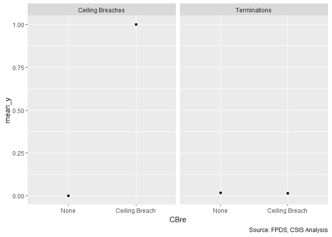
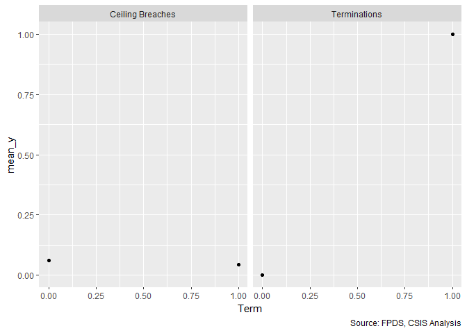
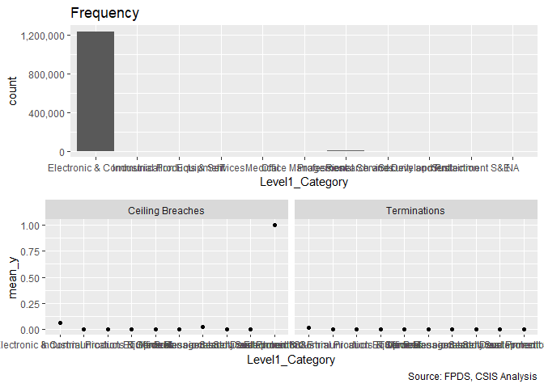

```r
#*************************************Required Libraries******************************************
require(dplyr)
```

```
## Loading required package: dplyr
```

```
## 
## Attaching package: 'dplyr'
```

```
## The following objects are masked from 'package:stats':
## 
##     filter, lag
```

```
## The following objects are masked from 'package:base':
## 
##     intersect, setdiff, setequal, union
```

```r
require(grid)
```

```
## Loading required package: grid
```

```r
require(reshape2)
```

```
## Loading required package: reshape2
```

```r
require(stringr)
```

```
## Loading required package: stringr
```

```r
require(ggplot2)
```

```
## Loading required package: ggplot2
```

```r
library(Hmisc)
```

```
## Loading required package: lattice
```

```
## Loading required package: survival
```

```
## Loading required package: Formula
```

```
## 
## Attaching package: 'Hmisc'
```

```
## The following objects are masked from 'package:dplyr':
## 
##     src, summarize
```

```
## The following objects are masked from 'package:base':
## 
##     format.pval, units
```

```r
library(readr)
library(csis360)
```

```
## Warning: replacing previous import 'Hmisc::summarize' by 'dplyr::summarize'
## when loading 'csis360'
```

```
## Warning: replacing previous import 'Hmisc::src' by 'dplyr::src' when
## loading 'csis360'
```

```
## Warning: replacing previous import 'dplyr::intersect' by
## 'lubridate::intersect' when loading 'csis360'
```

```
## Warning: replacing previous import 'dplyr::union' by 'lubridate::union'
## when loading 'csis360'
```

```
## Warning: replacing previous import 'dplyr::setdiff' by 'lubridate::setdiff'
## when loading 'csis360'
```

```r
library(arm)
```

```
## Loading required package: MASS
```

```
## 
## Attaching package: 'MASS'
```

```
## The following object is masked from 'package:dplyr':
## 
##     select
```

```
## Loading required package: Matrix
```

```
## Loading required package: lme4
```

```
## 
## arm (Version 1.10-1, built: 2018-4-12)
```

```
## Working directory is C:/Users/gsand/Repositories/Services/scripts
```

```r
library(reshape2)
library(tidyverse)
```

```
## -- Attaching packages --------------------------------------------------------------------------------------------------------------------- tidyverse 1.2.1 --
```

```
## v tibble  2.1.1     v purrr   0.3.2
## v tidyr   0.8.3     v forcats 0.4.0
```

```
## -- Conflicts ------------------------------------------------------------------------------------------------------------------------ tidyverse_conflicts() --
## x tidyr::expand()    masks Matrix::expand()
## x dplyr::filter()    masks stats::filter()
## x dplyr::lag()       masks stats::lag()
## x MASS::select()     masks dplyr::select()
## x Hmisc::src()       masks dplyr::src()
## x Hmisc::summarize() masks dplyr::summarize()
```

```r
#*************************************Options*****************************************************
options(error=recover)
options(warn=1)

#*************************************Lookup Files*****************************************************

Path<-"https://github.com/CSISdefense/R-scripts-and-data/blob/master/"
# Path<-"K:\\2007-01 PROFESSIONAL SERVICES\\R scripts and data\\"
# Path<-"~\\FPDS\\R scripts and data\\"
# Path<-"C:\\Users\\Greg Sanders\\SkyDrive\\Documents\\R Scripts and Data SkyDrive\\"
source("https://raw.githubusercontent.com/CSISdefense/Vendor/master/Scripts/DIIGstat.r")
```

```
## 
## Attaching package: 'sjstats'
```

```
## The following object is masked from 'package:Hmisc':
## 
##     deff
```

```
## Loading required package: carData
```

```
## 
## Attaching package: 'car'
```

```
## The following object is masked from 'package:purrr':
## 
##     some
```

```
## The following object is masked from 'package:arm':
## 
##     logit
```

```
## The following object is masked from 'package:dplyr':
## 
##     recode
```

```
## 
## Attaching package: 'scales'
```

```
## The following object is masked from 'package:purrr':
## 
##     discard
```

```
## The following object is masked from 'package:arm':
## 
##     rescale
```

```
## The following object is masked from 'package:readr':
## 
##     col_factor
```

```r
source("https://raw.githubusercontent.com/CSISdefense/Crisis-Funding/master/Scripts/ContractCleanup.r")
```

```
## 
## Attaching package: 'lubridate'
```

```
## The following object is masked from 'package:base':
## 
##     date
```

```r
source("https://raw.githubusercontent.com/CSISdefense/R-scripts-and-data/master/lookups.r")
```

```
## -------------------------------------------------------------------------
```

```
## You have loaded plyr after dplyr - this is likely to cause problems.
## If you need functions from both plyr and dplyr, please load plyr first, then dplyr:
## library(plyr); library(dplyr)
```

```
## -------------------------------------------------------------------------
```

```
## 
## Attaching package: 'plyr'
```

```
## The following object is masked from 'package:lubridate':
## 
##     here
```

```
## The following object is masked from 'package:purrr':
## 
##     compact
```

```
## The following objects are masked from 'package:Hmisc':
## 
##     is.discrete, summarize
```

```
## The following objects are masked from 'package:dplyr':
## 
##     arrange, count, desc, failwith, id, mutate, rename, summarise,
##     summarize
```

```r
source("https://raw.githubusercontent.com/CSISdefense/R-scripts-and-data/master/helper.r")
```


Contracts are classified using a mix of numerical and categorical variables. While the changes in numerical variables are easy to grasp and summarize, a contract may have one line item that is competed and another that is not. As is detailed in the exploration on R&D, we are only considering information available prior to contract start. The percentage of contract obligations that were competed is a valuable benchmark, but is highly influenced by factors that occured after contract start..


First we load the data. The dataset used is a U.S. Defense Contracting dataset derived from   FPDS.


## Data Transformations and Summary

```r
load(file="../data/clean/defense_contract_complete.RData")


def_serv<-def %>% filter(PSR %in% c("Services"))
def_serv<-def_serv[def_serv$MinOfSignedDate>=as.Date("2008-01-01") & def_serv$MinOfSignedDate<=as.Date("2015-12-31"),]
rm(def)
#   


# summary(def_serv$UnmodifiedContractBaseAndAllOptionsValue)
# def_serv$UnmodifiedContractBaseAndAllOptionsValue[def_serv$override_unmodified_ceiling==TRUE]<-NA
# summary(def_serv$UnmodifiedContractBaseAndExercisedOptionsValue)
# def_serv$UnmodifiedContractBaseAndExercisedOptionsValue[def_serv$override_unmodified_base==TRUE]<-NA
# summary(def_serv$ChangeOrderBaseAndAllOptionsValue)
# summary(def_serv$ChangeOrderCeilingGrowth)
# def_serv$ChangeOrderBaseAndAllOptionsValue[def_serv$override_change_order_growth==TRUE]<-NA
# def_serv$ChangeOrderCeilingGrowth[def_serv$override_change_order_growth==TRUE]<-NA
save(def_serv,file="../data/clean/defense_services_complete.RData")
```

### Base 

```r
load(file="../data/clean/defense_services_complete.RData")
    def_serv  <-read_and_join_experiment( def_serv  ,
                                        "Contract.sp_ContractExercisedOptions.txt",
                                        path="",
                                        directory="..\\data\\semi_clean\\",
                                        by=c("CSIScontractID"),
                                        # add_var=c("AnyUnmodifiedUnexercisedOptions",
                                        #           "AnyUnmodifiedUnexercisedOptionsWhy",
                                        #           "UnmodifiedBase",
                                        #           "SteadyScopeOptionGrowthAlone",
                                        #           "SteadyScopeOptionRescision",
                                        #           "AdminOptionModification"),
                                        new_var_checked=FALSE,
                                        create_lookup_rdata=TRUE,
                                        lookup_char_as_factor=TRUE)
  

colnames(def_serv)[colnames(def_serv)=="SteadyScopeOptionRescinded"]<-"SteadyScopeOptionRescision"


  sumcheck<-abs(def_serv$UnmodifiedBase+
  def_serv$ChangeOrderOptionModification+
  def_serv$SteadyScopeOptionGrowthAlone+
    def_serv$SteadyScopeOptionGrowthMixed+
    def_serv$SteadyScopeOptionRescision+
    def_serv$AdminOptionModification+
    def_serv$EndingOptionModification+
    def_serv$OtherOptionModification-
    ifelse(is.na(def_serv$SumOfbaseandexercisedoptionsvalue),
           0,def_serv$SumOfbaseandexercisedoptionsvalue))>1

if(any(sumcheck==TRUE)){
  write.csv(file="..\\output\\exercised_options_sumcheck_failures.csv",
    def_serv[sumcheck,] %>% dplyr::select(CSIScontractID,
                               UnmodifiedBase,
                               ChangeOrderOptionModification,
                               SteadyScopeOptionGrowthAlone,
                               SteadyScopeOptionGrowthMixed,
                               SteadyScopeOptionRescision,
                               AdminOptionModification,
                               EndingOptionModification,
                               OtherOptionModification,
                               SumOfbaseandexercisedoptionsvalue)
  )
  if(any(sumcheck&def_serv$UnmodifiedBase>0))
    stop("Exercised Option Checksum failure.")
  else warning("Checksum failure for entries with na unmodified")
}
rm(sumcheck)

def_serv$n_OptGrowth <- def_serv$SteadyScopeOptionGrowthAlone +
  ifelse(def_serv$SteadyScopeOptionRescision+def_serv$SteadyScopeOptionGrowthMixed+def_serv$AdminOptionModification<0,
         def_serv$SteadyScopeOptionRescision+def_serv$SteadyScopeOptionGrowthMixed+def_serv$AdminOptionModification,0)+1
def_serv$n_OptGrowth[def_serv$n_OptGrowth<=1 & def_serv$SteadyScopeOptionGrowthAlone>0]<-NA
def_serv$n_OptGrowth[def_serv$SteadyScopeOptionGrowthAlone==0]<-1
summary(def_serv$n_OptGrowth)
```

```
##      Min.   1st Qu.    Median      Mean   3rd Qu.      Max.      NA's 
## 1.000e+00 1.000e+00 1.000e+00 6.036e+04 1.000e+00 1.090e+09       864
```

```r
save(def_serv,file="../data/clean/defense_services_complete.RData")
```


### Entity


```r
load(file="../data/clean/defense_services_complete.RData")

# #****This should be in dataset building, not transform.
    def_serv<-read_and_join_experiment( def_serv,
                                                   "Contract.sp_ContractEntityID.txt",
                                                   path="",
                                                   directory="..\\data\\semi_clean\\",
                                                   by=c("CSIScontractID"),
                                                   add_var=c("EntityID","UnmodifiedEntityID"),
                                                   new_var_checked=FALSE,
                                        create_lookup_rdata=TRUE)
    def_serv$EntityID[is.na(def_serv$EntityID)]<-
      def_serv$UnmodifiedEntityID[is.na(def_serv$EntityID)]
  save(def_serv,file="../data/clean/defense_services_complete.RData")
```


### Crisis

```r
load(file="../data/clean/defense_services_complete.RData")
load("..\\data\\clean\\fed_transformed.rdata")
fed <- fed %>% group_by() %>% dplyr::select(CSIScontractID,Crisis)
def_serv<-left_join(def_serv,fed,by="CSIScontractID")
summary(factor(def_serv$Crisis))
```

```
##   Other    ARRA     Dis     OCO    NA's 
## 1135551    6526    1917   72123   25332
```

```r
rm(fed)
#About 25.4k inexplicably missing
# summary(def_serv[is.na(def_serv$Crisis),])
# 
# debug(transform_contract)
# # head(def_serv)
save(def_serv,file="../data/clean/defense_services_complete.RData")
```


### Transform

```r
load(file="../data/clean/defense_services_complete.RData")
def_serv<-transform_contract(def_serv)
```

```
## Parsed with column specification:
## cols(
##   CSIScontractID = col_double(),
##   override_unmodified_ceiling = col_logical(),
##   override_unmodified_base = col_logical(),
##   override_change_order_growth = col_logical(),
##   override_exercised_growth = col_logical(),
##   CSIS_inspection = col_character()
## )
```

```
## 
##  Applying
##  OMB20_GDP18 
##  in 
##  Lookup_Deflators.csv 
##  from
##  https://raw.githubusercontent.com/CSISdefense/Lookup-Tables/master/
```

```
## Parsed with column specification:
## cols(
##   Fiscal_Year = col_double(),
##   GDPdeflator = col_double(),
##   GDPdeflatorName = col_character(),
##   GDPdeflator2015 = col_character(),
##   GDPdeflator2016 = col_character(),
##   GDPdeflator1990 = col_character(),
##   GDPdeflator2005 = col_character(),
##   GDPdeflator2011 = col_character(),
##   GDPdeflator2012 = col_character(),
##   GDPdeflator2013 = col_character(),
##   GDPdeflator2017 = col_character(),
##   Unknown2017 = col_character(),
##   OMB19_19 = col_character(),
##   GDPdeflator2014 = col_character(),
##   OMB20_GDP18 = col_double()
## )
```

```
## 
##  Applying
##  OMB20_GDP18 
##  in 
##  Lookup_Deflators.csv 
##  from
##  https://raw.githubusercontent.com/CSISdefense/Lookup-Tables/master/
```

```
## Parsed with column specification:
## cols(
##   Fiscal_Year = col_double(),
##   GDPdeflator = col_double(),
##   GDPdeflatorName = col_character(),
##   GDPdeflator2015 = col_character(),
##   GDPdeflator2016 = col_character(),
##   GDPdeflator1990 = col_character(),
##   GDPdeflator2005 = col_character(),
##   GDPdeflator2011 = col_character(),
##   GDPdeflator2012 = col_character(),
##   GDPdeflator2013 = col_character(),
##   GDPdeflator2017 = col_character(),
##   Unknown2017 = col_character(),
##   OMB19_19 = col_character(),
##   GDPdeflator2014 = col_character(),
##   OMB20_GDP18 = col_double()
## )
```

```
## Warning: Factor `qHighCeiling` contains implicit NA, consider using
## `forcats::fct_explicit_na`

## Warning: Factor `qHighCeiling` contains implicit NA, consider using
## `forcats::fct_explicit_na`
```

```
## 
##  Applying
##  OMB20_GDP18 
##  in 
##  Lookup_Deflators.csv 
##  from
##  https://raw.githubusercontent.com/CSISdefense/Lookup-Tables/master/
```

```
## Parsed with column specification:
## cols(
##   Fiscal_Year = col_double(),
##   GDPdeflator = col_double(),
##   GDPdeflatorName = col_character(),
##   GDPdeflator2015 = col_character(),
##   GDPdeflator2016 = col_character(),
##   GDPdeflator1990 = col_character(),
##   GDPdeflator2005 = col_character(),
##   GDPdeflator2011 = col_character(),
##   GDPdeflator2012 = col_character(),
##   GDPdeflator2013 = col_character(),
##   GDPdeflator2017 = col_character(),
##   Unknown2017 = col_character(),
##   OMB19_19 = col_character(),
##   GDPdeflator2014 = col_character(),
##   OMB20_GDP18 = col_double()
## )
```

```
## Warning: Column `NAICS2` joining factor and character vector, coercing into
## character vector
```

```
## Warning: Column `ProductOrServiceCode` joining character vector and factor,
## coercing into character vector
```

```
## Warning: Column `ContractingOfficeCode` joining factors with different
## levels, coercing to character vector
```

```
## Warning in read_and_join_experiment(contract,
## "Office.sp_EntityIDofficeHistoryLaggedConst.txt", : NAs found in by
## variable. Filtering them out.
```

```
## 
##  Applying
##  OMB20_GDP18 
##  in 
##  Lookup_Deflators.csv 
##  from
##  https://raw.githubusercontent.com/CSISdefense/Lookup-Tables/master/
```

```
## Parsed with column specification:
## cols(
##   Fiscal_Year = col_double(),
##   GDPdeflator = col_double(),
##   GDPdeflatorName = col_character(),
##   GDPdeflator2015 = col_character(),
##   GDPdeflator2016 = col_character(),
##   GDPdeflator1990 = col_character(),
##   GDPdeflator2005 = col_character(),
##   GDPdeflator2011 = col_character(),
##   GDPdeflator2012 = col_character(),
##   GDPdeflator2013 = col_character(),
##   GDPdeflator2017 = col_character(),
##   Unknown2017 = col_character(),
##   OMB19_19 = col_character(),
##   GDPdeflator2014 = col_character(),
##   OMB20_GDP18 = col_double()
## )
```

```
## 
##  Applying
##  OMB20_GDP18 
##  in 
##  Lookup_Deflators.csv 
##  from
##  https://raw.githubusercontent.com/CSISdefense/Lookup-Tables/master/
```

```
## Parsed with column specification:
## cols(
##   Fiscal_Year = col_double(),
##   GDPdeflator = col_double(),
##   GDPdeflatorName = col_character(),
##   GDPdeflator2015 = col_character(),
##   GDPdeflator2016 = col_character(),
##   GDPdeflator1990 = col_character(),
##   GDPdeflator2005 = col_character(),
##   GDPdeflator2011 = col_character(),
##   GDPdeflator2012 = col_character(),
##   GDPdeflator2013 = col_character(),
##   GDPdeflator2017 = col_character(),
##   Unknown2017 = col_character(),
##   OMB19_19 = col_character(),
##   GDPdeflator2014 = col_character(),
##   OMB20_GDP18 = col_double()
## )
```

```
## Warning: Column `ProductOrServiceCode` joining character vector and factor,
## coercing into character vector
```

```r
#
#
discrete_percent_plot(def_serv,"CBre")
```

```
## Warning: group_by_() is deprecated. 
## Please use group_by() instead
## 
## The 'programming' vignette or the tidyeval book can help you
## to program with group_by() : https://tidyeval.tidyverse.org
## This warning is displayed once per session.
```

```
## Warning: summarise_() is deprecated. 
## Please use summarise() instead
## 
## The 'programming' vignette or the tidyeval book can help you
## to program with summarise() : https://tidyeval.tidyverse.org
## This warning is displayed once per session.
```

<!-- -->

```r
discrete_percent_plot(def_serv,"Term")
```

<!-- -->

```r
# 
  summary_discrete_plot(def_serv,"Level1_Category")
```

```
## Warning: Ignoring unknown parameters: binwidth, bins, pad
```

<!-- -->

```
## [[1]]
## 
##                                            
##                                    1237816 
## Aircraft, Ships/Submarines & Land Vehicles 
##                                          0 
##       Clothing, Textiles & Subsistence S&E 
##                                          0 
##       Electronic & Communication Equipment 
##                                          3 
##                  Facilities & Construction 
##                                          0 
##             Industrial Products & Services 
##                                          2 
##                                         IT 
##                                          1 
##                                    Medical 
##                                          1 
##                          Miscellaneous S&E 
##                                          0 
##                          Office Management 
##                                          1 
##                      Professional Services 
##                                       3617 
##                   Research and Development 
##                                          1 
##                    Security and Protection 
##                                          2 
##                            Sustainment S&E 
##                                          1 
##      Transportation and Logistics Services 
##                                          0 
##                       Weapons & Ammunition 
##                                          0 
## 
## [[2]]
##                                             
##                                                 None Ceiling Breach
##                                              1162901          74915
##   Aircraft, Ships/Submarines & Land Vehicles       0              0
##   Clothing, Textiles & Subsistence S&E             0              0
##   Electronic & Communication Equipment             3              0
##   Facilities & Construction                        0              0
##   Industrial Products & Services                   2              0
##   IT                                               1              0
##   Medical                                          1              0
##   Miscellaneous S&E                                0              0
##   Office Management                                1              0
##   Professional Services                         3541             76
##   Research and Development                         1              0
##   Security and Protection                          2              0
##   Sustainment S&E                                  0              1
##   Transportation and Logistics Services            0              0
##   Weapons & Ammunition                             0              0
## 
## [[3]]
##                                             
##                                                    0       1
##                                              1214509   23307
##   Aircraft, Ships/Submarines & Land Vehicles       0       0
##   Clothing, Textiles & Subsistence S&E             0       0
##   Electronic & Communication Equipment             3       0
##   Facilities & Construction                        0       0
##   Industrial Products & Services                   2       0
##   IT                                               1       0
##   Medical                                          1       0
##   Miscellaneous S&E                                0       0
##   Office Management                                1       0
##   Professional Services                         3600      17
##   Research and Development                         1       0
##   Security and Protection                          2       0
##   Sustainment S&E                                  1       0
##   Transportation and Logistics Services            0       0
##   Weapons & Ammunition                             0       0
```

```r
# 
# 
# summary(def_serv$Unmodifieddef_servBaseAndAllOptionsValue)
# summary(def_serv$Action.Obligation)
# 
save(file="../data/clean/transformed_def_serv.Rdata",def_serv)
```
   
Should be transferred into transform contract at some point


### Office Diversity NAICS 

```r
load(file="../data/clean/transformed_def_serv.Rdata")


cal_deflator<-remove_bom(read.csv("https://raw.githubusercontent.com/CSISdefense/Lookup-Tables/master/economic/Lookup_Calendar_Deflator.csv"))
cal_deflator<-cal_deflator %>% dplyr::select(Calendar_Year,BEA18)


#Average salary
def_serv$CensusYear<-factor(def_serv$StartCY)
summary(def_serv$CensusYear)
```

```
##   2008   2009   2010   2011   2012   2013   2014   2015 
## 186617 190789 182009 167255 154158 123448 126306 110867
```

```r
levels(def_serv$CensusYear)<-list("2007"=c("2008","2009","2010","2011","2012"),
                                 "2012"=c("2013","2014","2015","2016","2017"))
def_serv$CensusYear<-as.numeric(as.character(def_serv$CensusYear))

if("BEA18" %in% colnames(def_serv)) def_serv <- def_serv  %>% dplyr::select(-BEA18)
def_serv<-dplyr::left_join(def_serv, cal_deflator,
          by=c("CensusYear"="Calendar_Year"))
def_serv$US6_avg_sal_lag1Const<-def_serv$US6_avg_sal_lag1/def_serv$BEA18


def_serv$l_US6_avg_sal_lag1Const<-na_non_positive_log(def_serv$US6_avg_sal_lag1Const)
      def_serv$cl_US6_avg_sal_lag1Const<-arm::rescale(def_serv$l_US6_avg_sal_lag1Const)

def_serv <- def_serv  %>% dplyr::select(-BEA18,CensusYear)
colnames(def_serv[colnames(def_serv)=="US6_avg_sal_lag1"])<-"US6_avg_sal_lag1_then_year"
colnames(def_serv[colnames(def_serv)=="cl_US6_avg_sal_lag1"])<-"cl_US6_avg_sal_lag1_then_year"


#def6_obl_lag1Const
def_serv<-dplyr::left_join(def_serv, cal_deflator,
          by=c("StartCY"="Calendar_Year"))

def_serv$def6_obl_lag1Const<-def_serv$def6_obl_lag1/def_serv$BEA18
def_serv <- def_serv  %>% dplyr::select(-BEA18)
def_serv$l_def6_obl_lag1Const<-na_non_positive_log(def_serv$def6_obl_lag1Const)
      def_serv$cl_def6_obl_lag1Const<-arm::rescale(def_serv$l_def6_obl_lag1Const)

colnames(def_serv[colnames(def_serv)=="def6_obl_lag1"])<-"def6_obl_lag1_then_year"
colnames(def_serv[colnames(def_serv)=="cl_def6_obl_lag1"])<-"cl_def6_obl_lag1_then_year"
#Removing l_s just to reduce size. They can be derived easily.

# def_serv<-def_serv[!colnames(def_serv) %in% colnames(def_serv)[grep("^l_",colnames(def_serv))]]


#********************Still not done***************************
#Def NAICS size
#Salary
#Both require calendar year deflators

# summary(def_serv$Action.Obligation)
# def_serv<-deflate(def_serv,
#                    money_var = "Action.Obligation",
#                    deflator_var="OMB.2019",
#                   fy_var="StartFY",
#                  path="C:/Users/gsand/Repositories/Lookup-Tables/"
# )
# def_serv<-deflate(def_serv,
#                    money_var = "Ceil",
#                    deflator_var="OMB.2019",
#                   fy_var="StartFY",
#                  path="C:/Users/gsand/Repositories/Lookup-Tables/"
# )
# def_serv$l_Ceil<-na_non_positive_log(def_serv$Ceil.OMB.2019)
# def_serv$cl_Ceil<-arm::rescale(def_serv$l_Ceil)


# def_serv<-def_serv[def_serv$PSR %in% c("Services"),]
# summary(factor(def_serv$OCO_GF))
# colnames(def_serv)[colnames(def_serv)=="Office"]<-"ContractingOfficeCode"
# 
# colnames(def_serv)[colnames(def_serv)=="StartFY"]<-"fiscal_year"
# def_serv<-read_and_join_experiment( def_serv,
#                                     "Office.sp_OfficeHistoryCapacityLaggedConst.txt",
#                                     path="",
#                                     directory="..\\data\\semi_clean\\",
#                                     by=c("ContractingOfficeCode","fiscal_year"),
#                                     add_var=c("office_obligatedamount_1year",
#                                               "office_numberofactions_1year",
#                                               "office_PBSCobligated_1year",
#                                               "office_obligatedamount_7year"),
#                                     new_var_checked=FALSE)
# def_serv<-read_and_join_experiment( def_serv,
#                                           "Office.sp_ProdServOfficeHistoryLaggedConst.txt",
#                                           path="",
#                                           directory="..\\data\\semi_clean\\",
#                                           by=c("ContractingOfficeCode","fiscal_year","ProductOrServiceCode"),
#                                           add_var=c("office_psc_obligatedamount_7year"),
#                                           new_var_checked=FALSE,
#                                     col_types="ccddddc")
# def_serv<-read_and_join_experiment( def_serv,
#                                           "Office.sp_EntityIDofficeHistoryLaggedConst.txt",
#                                           path="",
#                                           directory="..\\data\\semi_clean\\",
#                                           by=c("EntityID","ContractingOfficeCode","fiscal_year"),
#                                           add_var=c("office_entity_paircount_7year","office_entity_numberofactions_1year",
#                                                     "office_entity_obligatedamount_7year"),
#                                           new_var_checked=FALSE)
# def_serv<-read_and_join( def_serv,
#                            "ProductOrServiceCode.ProdServHistoryCFTEcoalesceLaggedConst.txt",
#                            path="",
#                            directory="..\\data\\semi_clean\\",
#                            by=c("fiscal_year","OCO_GF","ProductOrServiceCode"),
#                            add_var=c("CFTE_Rate_1year"),
#                            new_var_checked=FALSE)
#   colnames(def_serv)[colnames(def_serv)=="fiscal_year"]<-"StartFY"
# colnames(def_serv)[colnames(def_serv)=="ContractingOfficeCode"]<-"Office"


# deflate <- function(
#   data,
#   money_var = "Amount",
#   fy_var = "Fiscal_Year",
#   deflator_file = "Lookup_Deflators.csv",
#   deflator_var="OMB20_GDP18",
#   path="https://raw.githubusercontent.com/CSISdefense/Lookup-Tables/master/",
#   directory="economic/",
#   deflator_dropped=TRUE
# )


length(unique((def_serv$Office)))
```

```
## [1] 1220
```

```r
length(unique((def_serv$Agency)))
```

```
## [1] 28
```

```r
length(unique((def_serv$NAICS)))
```

```
## [1] 1059
```

```r
length(unique((def_serv$NAICS3)))
```

```
## [1] 108
```

```r
#********** NAICS - Office hhi
if(!"office_naics_hhi_k" %in% colnames(def_serv)){
  annual_office_naics_hhi <- read.csv("..//data//clean//annual_office_naics_hhi.csv",
                                      header = TRUE, row.names = "X") %>% 
    dplyr::select(-c("obligatedAmount","numberOfContracts"))
  
  #Pulling in join annual_office_naics_hhi
  def_serv <- def_serv %>%
    mutate("StartFY_lag1" = StartFY - 1) %>%
    left_join(annual_office_naics_hhi, by = c("Office" = "ContractingOfficeCode", "StartFY_lag1" = "Fiscal_year")) %>%
    dplyr::select(-c("StartFY_lag1"))
  rm(annual_office_naics_hhi)
  
  #Pulling in join avg_office_naics_hhi
  avg_office_naics_hhi <- read.csv("..//data//clean//average_office_naics_hhi.csv", header = TRUE, row.names = "X") %>% 
    dplyr::select(-c("obligatedAmount","numberOfContracts"))
  def_serv <- def_serv %>%
    left_join(avg_office_naics_hhi, by = c("Office" = "ContractingOfficeCode"))
  rm(avg_office_naics_hhi)
  
  #Imputing missing
  summary(def_serv$office_naics_hhi_obl)
  def_serv$office_naics_hhi_obl[is.na(def_serv$office_naics_hhi_obl)]<-def_serv$avg_office_naics_hhi_obl[is.na(def_serv$office_naics_hhi_obl)]
  summary(def_serv$office_naics_hhi_k)
  def_serv$office_naics_hhi_k[is.na(def_serv$office_naics_hhi_k)]<-def_serv$avg_office_naics_hhi_k[is.na(def_serv$office_naics_hhi_k)]
  
  def_serv$cl_office_naics_hhi_obl <- arm::rescale(na_non_positive_log(def_serv$office_naics_hhi_obl))
  def_serv$cl_office_naics_hhi_k <- arm::rescale(na_non_positive_log(def_serv$office_naics_hhi_k))
  def_serv<- def_serv %>% dplyr::select(-c(avg_office_naics_hhi_obl,avg_office_naics_hhi_k))
}
```

```
## Warning: Column `Office`/`ContractingOfficeCode` joining character vector
## and factor, coercing into character vector

## Warning: Column `Office`/`ContractingOfficeCode` joining character vector
## and factor, coercing into character vector
```

```r
#********** Performance Based Services Contracting
# def_serv$l_pPBSC<-log(def_serv$pPBSC+1)

#********** Office experience in PSC
# def_serv$l_pOffPSC<-log(def_serv$pOffPSC+1)

#********** Vendor Market Share
# def_serv$l_pMarket<-log(def_serv$pMarket+1)


#********* Number of actions between vendor and office
# def_serv$l_CA<-log(def_serv$office_entity_numberofactions_1year+1)

#********8 Invoice rate  for PSC
# def_serv$l_CFTE<-log(def_serv$CFTE_Rate_1year)

save(file="../data/clean/transformed_def_serv.Rdata",def_serv)
```
