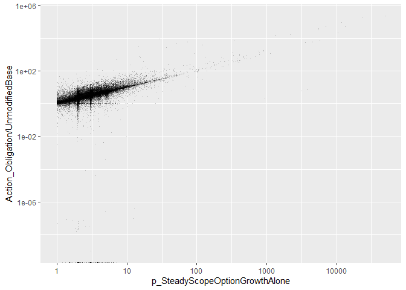
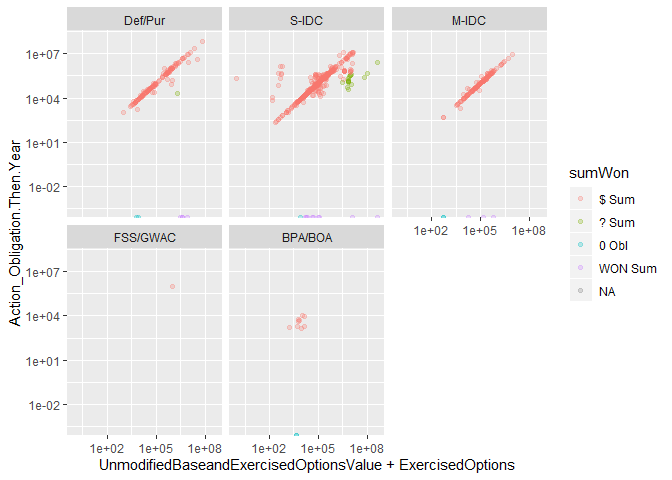
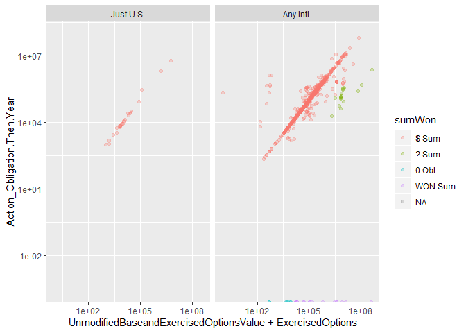
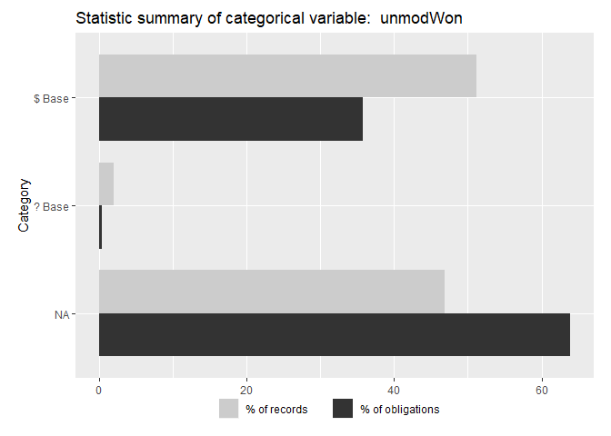
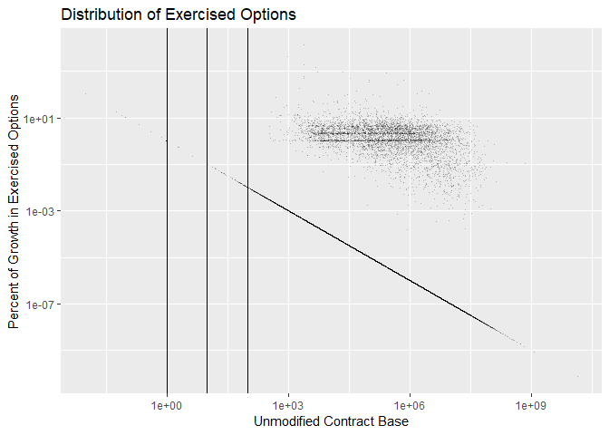
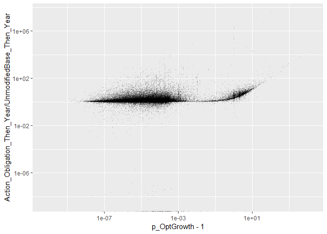
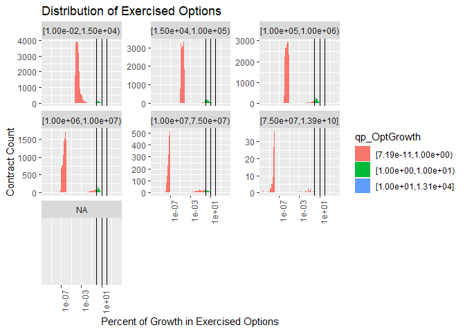

#Setup

```
## Warning: replacing previous import 'Hmisc::summarize' by 'dplyr::summarize'
## when loading 'csis360'
```

```
## Warning: replacing previous import 'Hmisc::src' by 'dplyr::src' when
## loading 'csis360'
```

```
## Warning: replacing previous import 'dplyr::intersect' by
## 'lubridate::intersect' when loading 'csis360'
```

```
## Warning: replacing previous import 'dplyr::union' by 'lubridate::union'
## when loading 'csis360'
```

```
## Warning: replacing previous import 'dplyr::setdiff' by 'lubridate::setdiff'
## when loading 'csis360'
```

```
## Warning: package 'ggplot2' was built under R version 3.5.3
```

```
## Warning: package 'dplyr' was built under R version 3.5.3
```

```
## 
## Attaching package: 'dplyr'
```

```
## The following objects are masked from 'package:stats':
## 
##     filter, lag
```

```
## The following objects are masked from 'package:base':
## 
##     intersect, setdiff, setequal, union
```

```
## Warning: package 'arm' was built under R version 3.5.3
```

```
## Loading required package: MASS
```

```
## 
## Attaching package: 'MASS'
```

```
## The following object is masked from 'package:dplyr':
## 
##     select
```

```
## Loading required package: Matrix
```

```
## Loading required package: lme4
```

```
## Warning: package 'lme4' was built under R version 3.5.3
```

```
## 
## arm (Version 1.10-1, built: 2018-4-12)
```

```
## Working directory is C:/Users/JGraham/Documents/CSIS/Services/scripts
```

```
## Warning: package 'R2WinBUGS' was built under R version 3.5.3
```

```
## Loading required package: coda
```

```
## Warning: package 'coda' was built under R version 3.5.3
```

```
## 
## Attaching package: 'coda'
```

```
## The following object is masked from 'package:arm':
## 
##     traceplot
```

```
## Loading required package: boot
```

```
## 
## Attaching package: 'boot'
```

```
## The following object is masked from 'package:arm':
## 
##     logit
```

```
## Warning: package 'knitr' was built under R version 3.5.3
```

```
## Warning: package 'stargazer' was built under R version 3.5.2
```

```
## 
## Please cite as:
```

```
##  Hlavac, Marek (2018). stargazer: Well-Formatted Regression and Summary Statistics Tables.
```

```
##  R package version 5.2.2. https://CRAN.R-project.org/package=stargazer
```

```
## Warning: package 'texreg' was built under R version 3.5.3
```

```
## Version:  1.36.23
## Date:     2017-03-03
## Author:   Philip Leifeld (University of Glasgow)
## 
## Please cite the JSS article in your publications -- see citation("texreg").
```

```
## 
## Attaching package: 'texreg'
```

```
## The following object is masked from 'package:arm':
## 
##     coefplot
```

```
## Warning: package 'reshape2' was built under R version 3.5.3
```

```
## Warning: package 'sjstats' was built under R version 3.5.3
```

```
## Warning: package 'car' was built under R version 3.5.3
```

```
## Loading required package: carData
```

```
## Warning: package 'carData' was built under R version 3.5.2
```

```
## 
## Attaching package: 'car'
```

```
## The following object is masked from 'package:boot':
## 
##     logit
```

```
## The following object is masked from 'package:arm':
## 
##     logit
```

```
## The following object is masked from 'package:dplyr':
## 
##     recode
```

```
## Warning: package 'scales' was built under R version 3.5.3
```

```
## 
## Attaching package: 'scales'
```

```
## The following object is masked from 'package:arm':
## 
##     rescale
```

```
## [1] 8076
```


```r
load("../data/clean/transformed_def_serv.Rdata")
# load(file="..\\data\\semi_clean\\opt_pre_clean.rdata")
  


W912UM <- def_serv %>% filter(Office=="W912UM")
W912UMtrans<-read.delim(file="..\\data\\semi_clean\\W912UM_trans.csv", sep=",")
W912UMtrans<-remove_bom(W912UMtrans)
opt_preclean<-def_serv %>% filter(ExercisedOptions>1)
opt_preclean$q_OptGrowth<-Hmisc::cut2(opt_preclean$p_OptGrowth-1,c(0,1e-10,1,10))
summary(opt_preclean$q_OptGrowth)
```

```
##            0.00e+00 [1.00e-10,1.00e+00) [1.00e+00,1.00e+01) 
##                   0               11673               39776 
## [1.00e+01,5.88e+07]                NA's 
##                1177                 334
```

```r
# save(W912UM,W912UMtrans,opt_preclean,file="..\\data\\semi_clean\\opt_pre_clean.rdata")


summary(def_serv$ExercisedOptions)
```

```
##      Min.   1st Qu.    Median      Mean   3rd Qu.      Max.      NA's 
##         0         0         0     61446         0 504504112         6
```

```r
summary(def_serv$UnmodifiedBaseandExercisedOptionsValue)
```

```
##      Min.   1st Qu.    Median      Mean   3rd Qu.      Max.      NA's 
## 0.000e+00 7.454e+03 2.979e+04 4.911e+05 1.372e+05 1.392e+10      8148
```


# Before Cleaning

```r
summary(Hmisc::cut2(opt_preclean$p_OptGrowth-1,c(1,
                                                 5,
                                          10,
                                          100
                                          )))
```

```
## [6.23e-07,1.00e+00) [1.00e+00,5.00e+00) [5.00e+00,1.00e+01) 
##               11673               36953                2823 
## [1.00e+01,1.00e+02) [1.00e+02,5.88e+07]                NA's 
##                1092                  85                 334
```

```r
nrow(opt_preclean %>% filter((p_OptGrowth-1)>100 & UnmodifiedBaseandExercisedOptionsValue<=0))
```

```
## [1] 0
```

```r
nrow(opt_preclean %>% filter((p_OptGrowth-1)>10 & (UnmodifiedBaseandExercisedOptionsValue+ExercisedOptions)<UnmodifiedContractBaseAndAllOptionsValue.Then.Year))
```

```
## [1] 759
```

```r
summary(opt_preclean$Ceil[(opt_preclean$p_OptGrowth-1)>10 & opt_preclean$UnmodifiedBaseandExercisedOptionsValue>0])
```

```
##    [0,15k) [15k,100k)  [100k,1m)   [1m,10m)  [10m,75m)     [75m+] 
##         51        351        331        299        110         35 
##       NA's 
##        334
```

```r
summary(opt_preclean$Ceil[(opt_preclean$p_OptGrowth-1)>100 & opt_preclean$UnmodifiedBaseandExercisedOptionsValue>0])
```

```
##    [0,15k) [15k,100k)  [100k,1m)   [1m,10m)  [10m,75m)     [75m+] 
##         16          7          8         18         17         19 
##       NA's 
##        334
```

```r
opt_preclean$Why_Outlier<-NA
opt_preclean$Why_Outlier[opt_preclean$UnmodifiedBaseandExercisedOptionsValue<=0]<-"No Unmodified Base"
opt_preclean$Why_Outlier[is.na(opt_preclean$Why_Outlier)&
                   opt_preclean$Actizon_Obligation_Then_Year*2>=opt_preclean$UnmodifiedBaseandExercisedOptionsValue+
                   opt_preclean$ExercisedOptions]<-
  "Obligations at least half Base+Opt"
```

```
## Warning: Unknown or uninitialised column: 'Actizon_Obligation_Then_Year'.
```

```r
opt_preclean$Why_Outlier[is.na(opt_preclean$Why_Outlier)&
                   opt_preclean$Office=="W912UM"]<-
  "Korean Office W912UM"
opt_preclean$Why_Outlier[is.na(opt_preclean$Why_Outlier)&((opt_preclean$UnmodifiedBaseandExercisedOptionsValue + opt_preclean$ExercisedOptions) < opt_preclean$UnmodifiedContractBaseAndAllOptionsValue.Then.Year)] <- "Base + Growth < Unmodified Ceiling"
opt_preclean$Why_Outlier[is.na(opt_preclean$Why_Outlier)&
                   opt_preclean$ExercisedOptions>=2.5e8]<-
  ">=$250M, Insepect"
opt_preclean$Why_Outlier[is.na(opt_preclean$Why_Outlier)&
                   opt_preclean$p_OptGrowth-1>10]<-
  "Other Unexplained 10x Options Growth"
opt_preclean$Why_Outlier<-factor(opt_preclean$Why_Outlier,
                         levels=c(
                           "No Unmodified Base",
                           "Obligations at least half Bast+Opt",
                           "Later Deobligated",
                           "Korean Office W912UM",
                           "Base + Growth < Unmodified Ceiling",
                           ">=$250M, Insepect",
                           "Other Unexplained 10x Options Growth"
                         ))
summary(opt_preclean$Why_Outlier[(opt_preclean$p_OptGrowth-1)>10])
```

```
##                   No Unmodified Base   Obligations at least half Bast+Opt 
##                                    0                                    0 
##                    Later Deobligated                 Korean Office W912UM 
##                                    0                                    0 
##   Base + Growth < Unmodified Ceiling                    >=$250M, Insepect 
##                                  759                                    2 
## Other Unexplained 10x Options Growth                                 NA's 
##                                  416                                  334
```

```r
summary(opt_preclean$Why_Outlier)
```

```
##                   No Unmodified Base   Obligations at least half Bast+Opt 
##                                    0                                    0 
##                    Later Deobligated                 Korean Office W912UM 
##                                    0                                   13 
##   Base + Growth < Unmodified Ceiling                    >=$250M, Insepect 
##                                32419                                    4 
## Other Unexplained 10x Options Growth                                 NA's 
##                                  416                                20108
```

```r
p_outlier_summary<-opt_preclean %>% filter(p_OptGrowth-1>10) %>% group_by(Why_Outlier) %>%
  dplyr::summarise(nContract=length(ExercisedOptions),
    SumOfExercisedOptions=sum(ExercisedOptions),
                   MaxOfExercisedOptions=max(ExercisedOptions),
                   SumOfAction_Obligation.Then.Year=sum(Action_Obligation.Then.Year))


n_outlier_summary<-opt_preclean %>% filter(ExercisedOptions>2.5e8) %>% group_by(Why_Outlier) %>%
  dplyr::summarise(nContract=length(ExercisedOptions),
    SumOfExercisedOptions=sum(ExercisedOptions),
                   MaxOfExercisedOptions=max(ExercisedOptions),
                   SumOfAction_Obligation.Then.Year=sum(Action_Obligation.Then.Year))


summary(Hmisc::cut2(opt_preclean$ExercisedOptions,c(1e3,
                                          1e6,
                                          1e7,
                                          1e8,
                                          2.5e8,
                                          1e9,
                                          1e10,
                                          2e10
                                          )))
```

```
## [2.0e+00,1.0e+03) [1.0e+03,1.0e+06) [1.0e+06,1.0e+07) [1.0e+07,1.0e+08) 
##               239             43118              8156              1378 
## [1.0e+08,2.5e+08) [2.5e+08,1.0e+09)           1.0e+09 [1.0e+10,2.0e+10] 
##                58                11                 0                 0
```

```r
summary(opt_preclean$Ceil[opt_preclean$ExercisedOptions>=1e6])
```

```
##    [0,15k) [15k,100k)  [100k,1m)   [1m,10m)  [10m,75m)     [75m+] 
##         16          6         88       6599       2621        273
```

```r
summary(opt_preclean$Ceil[opt_preclean$ExercisedOptions>=1e9])
```

```
##    [0,15k) [15k,100k)  [100k,1m)   [1m,10m)  [10m,75m)     [75m+] 
##          0          0          0          0          0          0
```

```r
write.csv(file="..\\Data\\semi_clean\\p_opt_outliers.csv",opt_preclean %>% filter((p_OptGrowth-1)>10 & Why_Outlier != "Base + Growth < Unmodified Ceiling"),row.names = FALSE)
write.csv(file="..\\Data\\semi_clean\\n_opt_outliers.csv",opt_preclean %>% filter(ExercisedOptions>=2.5e8 & Why_Outlier != "Base + Growth < Unmodified Ceiling"),row.names = FALSE)
```
Examining cases of large options growth, 1177 contracts experienced greater than 10 fold growth. An increase of that side strains credulity, even in high risk defense contracting. While by no means impossible, the more likely explaination is a misrecorded base.

The study team broke down the outliers into 6 categories:


Why_Outlier                             nContract   SumOfExercisedOptions   MaxOfExercisedOptions   SumOfAction_Obligation.Then.Year
-------------------------------------  ----------  ----------------------  ----------------------  ---------------------------------
Base + Growth < Unmodified Ceiling            759              4749223337               297118416                         7978035782
>=$250M, Insepect                               2               607608842               327123958                          622718542
Other Unexplained 10x Options Growth          416              1754231630               244663141                         2032033462


* No Unmodified Base: Contracts with an initial base <=0. These are eliminated from the sample as missing data.
* Obligations at least half Bast+Opt: For this category, total obligations of the contract were at least half the value of the initial base plus options growth under exercised options. These contrats have had spending that massively exceeded their original base, so the growth in absolute terrms seems plausible. This category accounts for the overwhelming majority of outlier spending but only a tiny fraction of change order growth.
* Later Deobligated: The change order growth metrics only counts increases. These may simply have been mistaken increases, as when including deobligation the growth no longer exceeded 10x the original base. The number, obligations, and change order growth of these contracts are comparatively small, and thus should not distort the overall data.
* Korean Office W912UM refers to a contracting office that sometimes records base and all options values in Korean Won, approximate exchange rate 1,000 Won : 1 USD. 
* There are nrow(opt_preclean %>% dplyr::filter(Why_Outlier ==">=$250M, Insepect" & (p_OptGrowth-1)>10)) contracts with options growth of over $250 million that account for hundreds of billions in change order growth. These merit manual inspection.
* Finally a few score contrats have unexplained growth, but remain below the $10M threshold. The quantity and magnitude of these contrats is not sufficient to risk the overall model.

This examination left the study team less confident in percentage growth as a metric, especially in extreme cases, while increasing the study team's confidence in measures of growth in absoute term. In the worst case, simply removing all of the unexplained over  10 million contracts from the sample would reduce the number of contracts by a tiny amount and reduce the spending accounted for by  6.2271854\times 10^{8}.

Shifting the focus to all contracts with growth of at least 250 million, there are far fewer contracts that account for far more money.


Why_Outlier                           nContract   SumOfExercisedOptions   MaxOfExercisedOptions   SumOfAction_Obligation.Then.Year
-----------------------------------  ----------  ----------------------  ----------------------  ---------------------------------
Base + Growth < Unmodified Ceiling            7              2452597812               504504112                         5249839311
>=$250M, Insepect                             4              1311186048               368576019                         1857907964


Inspecting W912UM, either to remove or fix its oversized growth, is an imperative as it accounts for the majority of these contracts or task orders. Even so, there are still 4 That merit special inspection for given that there growth far outpaces their spending.


## Options Growth

```r
(
ggplot(opt_preclean, aes(x=UnmodifiedBaseandExercisedOptionsValue,y=p_OptGrowth-1)) +#,color=q_OptGrowth
  geom_point(alpha=0.25,shape=".")+
  # theme(axis.text.x = element_text(angle = 90, hjust = 1))+
  scale_x_log10()+scale_y_log10()+
  #+
  geom_vline(xintercept = c(1,10,100))+#+geom_vline(xintercept = 0.1)+
# facet_wrap(~Ceil,scales="free_y")+#+, space="free_y"
  labs(title="Distribution of Exercised Options",
       y="Percent of Options Growth from Base",
       x="Unmodified Contract Base")#,
       # fill="Termination Completion"
)
```

```
## Warning: Removed 334 rows containing missing values (geom_point).
```

<!-- -->

```r
(
ggplot(opt_preclean, aes(x=UnmodifiedBaseandExercisedOptionsValue,y=ExercisedOptions)) +#,color=q_OptGrowth
  geom_point(alpha=0.25,shape=".")+
  # theme(axis.text.x = element_text(angle = 90, hjust = 1))+
  scale_x_log10()+scale_y_log10()+
  #+
  geom_vline(xintercept = c(1,10,100))+#+geom_vline(xintercept = 0.1)+
# facet_wrap(~Ceil,scales="free_y")+#+, space="free_y"
  labs(title="Distribution of Exercised Options",
       y="Absolute Options Growth from Base",
       x="Unmodified Contract Base")#,
       # fill="Termination Completion"
)
```

```
## Warning: Removed 334 rows containing missing values (geom_point).
```

<!-- -->

```r
(
ggplot(opt_preclean, aes(x=UnmodifiedBaseandExercisedOptionsValue+ExercisedOptions,y=Action_Obligation.Then.Year)) +#,color=q_OptGrowth
  geom_point(alpha=0.25,shape=".")+
  # theme(axis.text.x = element_text(angle = 90, hjust = 1))+
  scale_x_log10()+scale_y_log10()#+
  #+
#   geom_vline(xintercept = c(1,10,100))+#+geom_vline(xintercept = 0.1)+
# # facet_wrap(~Ceil,scales="free_y")+#+, space="free_y"
#   labs(title="Distribution of Exercised Options",
#        y="Percent of Options Growth from Base",
#        x="Unmodified Contract Base")#,
#        # fill="Termination Completion"
)
```

```
## Warning in self$trans$transform(x): NaNs produced
```

```
## Warning: Transformation introduced infinite values in continuous y-axis
```

```
## Warning: Removed 347 rows containing missing values (geom_point).
```

<!-- -->

```r
summary(opt_preclean$ExercisedOptions)
```

```
##      Min.   1st Qu.    Median      Mean   3rd Qu.      Max. 
##         2     21200     93814   1442378    535214 504504112
```

```r
(
ggplot(opt_preclean, aes(x=p_OptGrowth-1,fill=q_OptGrowth)) +
  geom_histogram(bins=100)+
  theme(axis.text.x = element_text(angle = 90, hjust = 1))+
  scale_x_log10()+
  #+
  geom_vline(xintercept = c(1,10,100))+#+geom_vline(xintercept = 0.1)+
facet_wrap(~Ceil,scales="free_y")+#+, space="free_y"
  labs(title="Distribution of Exercised Options",
       y="Contract Count",
       x="Percent of Options Growth from Base")#,
       # fill="Termination Completion"
)
```

```
## Warning: Removed 334 rows containing non-finite values (stat_bin).
```

<!-- -->

```r
(
ggplot(opt_preclean, aes(x=ExercisedOptions,fill=q_OptGrowth)) +
  geom_histogram(bins=100)+
  theme(axis.text.x = element_text(angle = 90, hjust = 1))+
  scale_x_log10()+
  #+
  geom_vline(xintercept = 1)#+geom_vline(xintercept = 0.1)+
#facet_grid(NoPreTermObl~.,scales="free_y", space="free_y")+
  # labs(title="Distribution of Contracts with Obligations After Last termination",
  #      y="Contract Count",
  #      x="Percent of Obligations After Day of Termination",
  #      fill="Termination Completion"
)
```

<!-- -->

```r
(
ggplot(opt_preclean, aes(x=ExercisedOptions,fill=q_OptGrowth)) +
  geom_histogram(bins=100)+
  theme(axis.text.x = element_text(angle = 90, hjust = 1))+
  scale_x_log10()+
  #+
  geom_vline(xintercept = 1)+
facet_wrap(~Ceil,scales="free_y")#+, space="free_y"
#+geom_vline(xintercept = 0.1)+
#facet_grid(NoPreTermObl~.,scales="free_y", space="free_y")+
  # labs(title="Distribution of Contracts with Obligations After Last termination",
  #      y="Contract Count",
  #      x="Percent of Obligations After Day of Termination",
  #      fill="Termination Completion"
)
```

<!-- -->

## >250 Inspect

```r
inspect250<-opt_preclean %>% filter(Why_Outlier==">=$250M, Insepect")
inspect250$CSIScontractID
```

```
## [1] 1416351 8568990 8441432 8441462
```

```r
inspect250trans<-read.delim(file="..\\data\\semi_clean\\gt250k_n_exercised_opt_outliers.txt", sep="\t")


#gt250k_n_exercised_opt_outliers.txt
```

## W912IM

### Contract Initial Examination

```r
sum(W912UM$Action_Obligation.Then.Year[])
```

```
## [1] 1431110859
```

```r
(
ggplot(W912UM, aes(x=UnmodifiedBaseandExercisedOptionsValue+ExercisedOptions,y=Action_Obligation.Then.Year)) +#,color=q_OptGrowth
  geom_point(alpha=0.25,shape=".")+
  # theme(axis.text.x = element_text(angle = 90, hjust = 1))+
  scale_x_log10()+scale_y_log10()+
  #+
#   geom_vline(xintercept = c(1,10,100))+#+geom_vline(xintercept = 0.1)+
facet_wrap(~StartFY,scales="free_y")#+, space="free_y"
#   labs(title="Distribution of Exercised Options",
#        y="Percent of Options Growth from Base",
#        x="Unmodified Contract Base")#,
#        # fill="Termination Completion"
)
```

```
## Warning: Transformation introduced infinite values in continuous y-axis
```

```
## Warning: Removed 787 rows containing missing values (geom_point).
```

<!-- -->

```r
summary(W912UM$UnmodifiedBaseandExercisedOptionsValue)
```

```
##      Min.   1st Qu.    Median      Mean   3rd Qu.      Max.      NA's 
##         1     31246    104568   2011443    323046 437475168       786
```

```r
W912UM$unmodWon<-NA
W912UM$unmodWon[W912UM$UnmodifiedBaseandExercisedOptionsValue>=W912UM$Action_Obligation.Then.Year*400&
                  W912UM$Action_Obligation.Then.Year>0]<-'WON Base'
W912UM$unmodWon[is.na(W912UM$unmodWon) &
                    W912UM$UnmodifiedBaseandExercisedOptionsValue>=W912UM$Action_Obligation.Then.Year*20 &
                  W912UM$UnmodifiedBaseandExercisedOptionsValue>10000
                  ]<-'? Base'
W912UM$unmodWon[is.na(W912UM$unmodWon) &
                    (W912UM$UnmodifiedBaseandExercisedOptionsValue<W912UM$Action_Obligation.Then.Year*20|
                  W912UM$UnmodifiedBaseandExercisedOptionsValue<10000)]<-'$ Base'
summary(factor(W912UM$unmodWon))
```

```
## $ Base ? Base   NA's 
##    858     34    786
```

```r
W912UM$optWon<-NA
W912UM$optWon[abs(W912UM$ExercisedOptions)==0]<-'0 Opt'
W912UM$optWon[abs(W912UM$ExercisedOptions)>=W912UM$Action_Obligation.Then.Year*100&
                  W912UM$ExercisedOptions>10000]<-'WON Opt'
W912UM$optWon[is.na(W912UM$optWon) &
                    abs(W912UM$ExercisedOptions)>=W912UM$Action_Obligation.Then.Year*10&
                  W912UM$ExercisedOptions>10000]<-'? Opt'
W912UM$optWon[is.na(W912UM$optWon) &
                  (abs(W912UM$ExercisedOptions)<W912UM$Action_Obligation.Then.Year*10|
                   W912UM$ExercisedOptions<=10000)]<-'$ Opt'
summary(factor(W912UM$optWon))
```

```
## $ Opt 0 Opt  NA's 
##    13  1659     6
```

```r
W912UM$sumWon<-NA
W912UM$sumWon[W912UM$Action_Obligation.Then.Year==0]<-'0 Obl'
W912UM$sumWon[W912UM$UnmodifiedBaseandExercisedOptionsValue+
                W912UM$ExercisedOptions>=W912UM$Action_Obligation.Then.Year*400&
                 W912UM$UnmodifiedBaseandExercisedOptionsValue+
                W912UM$ExercisedOptions>10000]<-'WON Sum'
W912UM$sumWon[is.na(W912UM$sumWon) &
                    W912UM$UnmodifiedBaseandExercisedOptionsValue+
                W912UM$ExercisedOptions>=W912UM$Action_Obligation.Then.Year*20&
                 W912UM$UnmodifiedBaseandExercisedOptionsValue+
                W912UM$ExercisedOptions>10000]<-'? Sum'
W912UM$sumWon[is.na(W912UM$sumWon) &
                    (W912UM$UnmodifiedBaseandExercisedOptionsValue+
                W912UM$ExercisedOptions<W912UM$Action_Obligation.Then.Year*20|
                 W912UM$UnmodifiedBaseandExercisedOptionsValue+
                W912UM$ExercisedOptions>10000)]<-'$ Sum'
summary(factor(W912UM$sumWon))
```

```
##   $ Sum   ? Sum   0 Obl WON Sum    NA's 
##     850      18      19      16     775
```

```r
(
ggplot(W912UM, aes(x=UnmodifiedBaseandExercisedOptionsValue+ExercisedOptions,y=Action_Obligation.Then.Year,color=sumWon)) +#,color=q_OptGrowth
  geom_point(alpha=0.25)+
  # theme(axis.text.x = element_text(angle = 90, hjust = 1))+
  scale_x_log10()+scale_y_log10()+
  #+
#   geom_vline(xintercept = c(1,10,100))+#+geom_vline(xintercept = 0.1)+
facet_grid(unmodWon~optWon)#+, space="free_y"
#   labs(title="Distribution of Exercised Options",
#        y="Percent of Options Growth from Base",
#        x="Unmodified Contract Base")#,
#        # fill="Termination Completion"
)
```

```
## Warning: Transformation introduced infinite values in continuous y-axis

## Warning: Removed 787 rows containing missing values (geom_point).
```

<!-- -->

```r
(
ggplot(W912UM, aes(x=UnmodifiedBaseandExercisedOptionsValue+ExercisedOptions,y=Action_Obligation.Then.Year,color=sumWon)) +#,color=q_OptGrowth
  geom_point(alpha=0.25)+
  # theme(axis.text.x = element_text(angle = 90, hjust = 1))+
  scale_x_log10()+scale_y_log10()+
  #+
#   geom_vline(xintercept = c(1,10,100))+#+geom_vline(xintercept = 0.1)+
facet_wrap(~Veh)#+, space="free_y"
#   labs(title="Distribution of Exercised Options",
#        y="Percent of Options Growth from Base",
#        x="Unmodified Contract Base")#,
#        # fill="Termination Completion"
)
```

```
## Warning: Transformation introduced infinite values in continuous y-axis

## Warning: Removed 787 rows containing missing values (geom_point).
```

<!-- -->

```r
(
ggplot(W912UM, aes(x=UnmodifiedBaseandExercisedOptionsValue+ExercisedOptions,y=Action_Obligation.Then.Year,color=sumWon)) +#,color=q_OptGrowth
  geom_point(alpha=0.25)+
  # theme(axis.text.x = element_text(angle = 90, hjust = 1))+
  scale_x_log10()+scale_y_log10()+
  #+
#   geom_vline(xintercept = c(1,10,100))+#+geom_vline(xintercept = 0.1)+
facet_wrap(~Intl)#+, space="free_y"
#   labs(title="Distribution of Exercised Options",
#        y="Percent of Options Growth from Base",
#        x="Unmodified Contract Base")#,
#        # fill="Termination Completion"
)
```

```
## Warning: Transformation introduced infinite values in continuous y-axis

## Warning: Removed 787 rows containing missing values (geom_point).
```

<!-- -->

```r
summary(W912UM$Intl)
```

```
## Just U.S. Any Intl. 
##        26      1652
```

```r
W912UM$unmodWon<-factor(W912UM$unmodWon)
summary(W912UM$Veh)
```

```
##  Def/Pur    S-IDC    M-IDC FSS/GWAC  BPA/BOA 
##      226     1207      233        1       11
```

```r
summary(W912UM$unmodWon)
```

```
## $ Base ? Base   NA's 
##    858     34    786
```

```r
summary(factor(W912UM$optWon))
```

```
## $ Opt 0 Opt  NA's 
##    13  1659     6
```

```r
statsummary_discrete(c("unmodWon"), W912UM %>% filter(Intl=="Any Intl."&
                                                        !Veh %in% c("FSS/GWAC","BPA/BOA")),
                     value_col="Action_Obligation.Then.Year")
```

```
##   unmodWon %of records % of $s
## 1   $ Base      50.03%  35.34%
## 2   ? Base       2.07%   0.40%
## 3       NA      47.90%  64.26%
```

All of the questionable contracts take place internationally and none use BPA/BOA or FSS/GWACs. That makes sense and raises confidence, but given that the clearly USD contract categories are less common, this doesn't help in resolving the ambiguous cases. That said, Single Award IDCs appear to have most of the ambigious cases, which suggests that this might be resolvable by looking at parent IDVs in those cases. 
### Transaction
#### Unmodified Transactions

```r
# W912UMtrans<-read.delim(file="..\\data\\semi_clean\\W912UM_complete.txt", sep="\t")


W912UMtrans<-inner_join(W912UMtrans,W912UM %>% group_by() %>%
                          dplyr::select(CSIScontractID,
                                        unmodWon,sumWon,optWon,
                                        ExercisedOptions,
                                        UnmodifiedBaseandExercisedOptionsValue,
                                        Action_Obligation.Then.Year,
                                        ExercisedOptions),
                        by="CSIScontractID")

W912UMtrans$ExercisedOptions[is.na(W912UMtrans$ExercisedOptions)]<-0
W912UMtrans$baseandexercisedoptionsvalue<-as.numeric(as.character(W912UMtrans$baseandexercisedoptionsvalue))
W912UMtrans$baseWonT<-NA
W912UMtrans$baseWonT[W912UMtrans$baseandexercisedoptionsvalue>=W912UMtrans$obligatedamount*400&
                        W912UMtrans$baseandexercisedoptionsvalue>10000&
                        W912UMtrans$baseandexercisedoptionsvalue>=W912UMtrans$Action_Obligation.Then.Year*400&
                       (W912UMtrans$obligatedamount>0 | W912UMtrans$Action_Obligation.Then.Year>0)& 
                       W912UMtrans$modnumber=='0']<-'WON Base'
W912UMtrans$baseWonT[is.na(W912UMtrans$baseWonT) &
                    W912UMtrans$baseandexercisedoptionsvalue>=W912UMtrans$obligatedamount*20&
                      W912UMtrans$baseandexercisedoptionsvalue>10000&
                        W912UMtrans$baseandexercisedoptionsvalue>=W912UMtrans$Action_Obligation.Then.Year*20&
                      W912UMtrans$modnumber=='0']<-'? Base'
W912UMtrans$baseWonT[is.na(W912UMtrans$baseWonT) &
                    (W912UMtrans$baseandexercisedoptionsvalue<W912UMtrans$obligatedamount*20|
                        W912UMtrans$baseandexercisedoptionsvalue<W912UMtrans$Action_Obligation.Then.Year*20|
                       W912UMtrans$baseandexercisedoptionsvalue<=10000) &
                      W912UMtrans$modnumber=='0']<-'$ Base'
W912UMtrans$baseWonT[W912UMtrans$modnumber!='0']<-"Not Unmodified Transaction"


summary(factor(W912UMtrans$baseWonT))
```

```
##                     $ Base                     ? Base 
##                        875                         27 
## Not Unmodified Transaction                   WON Base 
##                       3410                        776
```

```r
if(any(is.na(W912UMtrans$baseWonT))) stop("Unclassified baseWonT")
# View(W912UMtrans[is.na(),])
# write.csv(file="..\\Data\\semi_clean\\NA_baseWonT.csv",W912UMtrans[is.na(W912UMtrans$baseWonT),],row.names = FALSE)

#Examining disagreements
# View(W912UMtrans %>% filter(baseWonT=='WON Base'& unmodWon!='WON Base') )
# View(W912UMtrans %>% filter(baseWonT!='WON Base'& unmodWon=='WON Base') )
#Examining ?s
# View(W912UMtrans %>% filter(baseWonT=='? Base'& obligatedamount>0) )
# View(W912UMtrans %>% filter(baseWonT=='? Base'& obligatedamount==0) )
  

statsummary_discrete(c("unmodWon"),W912UMtrans %>% filter(modnumber=='0'),
                     value_col="Action_Obligation.Then.Year")
```

```
##   unmodWon %of records % of $s
## 1   $ Base      51.13%  35.77%
## 2   ? Base       2.03%   0.40%
## 3       NA      46.84%  63.83%
```

```r
grouped_barplot(c("unmodWon"),W912UMtrans %>% filter(modnumber=='0'),
                     value_col="Action_Obligation.Then.Year")
```

<!-- -->

```r
UnmodDisagree<-W912UMtrans %>% filter(baseWonT=='WON Base'& unmodWon!='WON Base') 
# View(W912UM %>% filter(CSIScontractID %in% UnmodDisagree$CSIScontractID))
CSIScontractID_ceil_to_na<-W912UMtrans$CSIScontractID[W912UMtrans$baseWonT == 'WON Base'&
                                                        !is.na(W912UMtrans$baseWonT)]


#Spreading  the labeled values to modified entries, which helps in the next step.
W912UMtrans$baseWonT[W912UMtrans$baseWonT=="Not Unmodified Transaction" &
  W912UMtrans$CSIScontractID %in% CSIScontractID_ceil_to_na]<-'WON Base'
# 
W912UMtrans$baseWonT[W912UMtrans$baseWonT=="Not Unmodified Transaction" &
  W912UMtrans$CSIScontractID %in% W912UMtrans$CSIScontractID[W912UMtrans$baseWonT == '? Base'&
                                                        !is.na(W912UMtrans$baseWonT)]]<- '? Base'
W912UMtrans$baseWonT[W912UMtrans$baseWonT=="Not Unmodified Transaction" &
  W912UMtrans$CSIScontractID %in% W912UMtrans$CSIScontractID[W912UMtrans$baseWonT == '$ Base'&
                                                        !is.na(W912UMtrans$baseWonT)]]<- '$ Base'

summary(factor(W912UMtrans$baseWonT))
```

```
##   $ Base   ? Base WON Base 
##     2104       92     2892
```


Contracts bases are marked null if:
* Contracting office W912UM 
* Initial transaction has a base 400 times obligations.
* initial base 400 times total obligations.
* Initial or total obligations are positive.
Then it the base is set to NA and it will not be in the sample.


#### Change Order Transactions

```r
W912UMtrans$optWonT<-NA
W912UMtrans$optWonT[W912UMtrans$modnumber=='0']<-"Unmodified Transaction"
W912UMtrans$optWonT[is.na(W912UMtrans$optWonT)&
                      (W912UMtrans$baseandexercisedoptionsvalue==0 | 
                       W912UMtrans$ExercisedOptions==0)
                    &W912UMtrans$modnumber!='0']<-'0 Opt Growth'
W912UMtrans$optWonT[is.na(W912UMtrans$optWonT)&
                      abs(W912UMtrans$baseandexercisedoptionsvalue)>=abs(W912UMtrans$obligatedamount*400)&
                        (abs(W912UMtrans$ExercisedOptions)+
                           W912UMtrans$UnmodifiedBaseandExercisedOptionsValue)>=
                       W912UMtrans$Action_Obligation.Then.Year*10&
                      abs(W912UMtrans$ExercisedOptions)>10000
                        # (W912UMtrans$baseandexercisedoptionsvalue>=
                        #    W912UMtrans$UnmodifiedBaseandExercisedOptionsValue*100 |
                       #   (!is.na(W912UMtrans$baseWonT) & W912UMtrans$baseWonT %in% c('WON Base','? Base')))&
                       # # (W912UMtrans$obligatedamount>0 | W912UMtrans$Action_Obligation.Then.Year>0)& 
                      # abs(W912UMtrans$baseandexercisedoptionsvalue)>0 & W912UMtrans$ExercisedOptions>0
                    ]<-'WON Opt'
W912UMtrans$optWonT[is.na(W912UMtrans$optWonT) &
                        abs(W912UMtrans$baseandexercisedoptionsvalue)>=abs(W912UMtrans$obligatedamount*20)&
                        (abs(W912UMtrans$ExercisedOptions)+
                           W912UMtrans$UnmodifiedBaseandExercisedOptionsValue)>=
                       W912UMtrans$Action_Obligation.Then.Year*5&
                      abs(W912UMtrans$ExercisedOptions)
                        # (W912UMtrans$baseandexercisedoptionsvalue>=
                        #    W912UMtrans$UnmodifiedBaseandExercisedOptionsValue*10 |
                        #  (!is.na(W912UMtrans$baseWonT) & W912UMtrans$baseWonT %in% c('WON Base','? Base')))&
                      # abs(W912UMtrans$baseandexercisedoptionsvalue)>0 & W912UMtrans$ExercisedOptions>0
                      ]<-'? Opt'
W912UMtrans$optWonT[is.na(W912UMtrans$optWonT) &
                        (abs(W912UMtrans$baseandexercisedoptionsvalue)<abs(W912UMtrans$obligatedamount*20)|
                        (abs(W912UMtrans$ExercisedOptions)+
                           W912UMtrans$UnmodifiedBaseandExercisedOptionsValue)<
                       W912UMtrans$Action_Obligation.Then.Year*5 |
                         abs(W912UMtrans$ExercisedOptions)<=10000)
                        # (W912UMtrans$baseandexercisedoptionsvalue<
                        #    W912UMtrans$UnmodifiedBaseandExercisedOptionsValue*10 |
                        #  (!is.na(W912UMtrans$baseWonT) & W912UMtrans$baseWonT %in% c('WON Base','? Base')))&
                      # abs(W912UMtrans$baseandexercisedoptionsvalue)>0 & W912UMtrans$ExercisedOptions>0
                      ]<-'$ Opt'

summary(factor(W912UMtrans$optWonT))
```

```
##                  $ Opt           0 Opt Growth Unmodified Transaction 
##                     40                   3370                   1678
```

```r
if(any(is.na(W912UMtrans$optWonT))) stop("Unclassified optWonT")
# View(W912UMtrans[is.na(W912UMtrans$optWonT),])
write.csv(file="..\\Data\\semi_clean\\optWonT.csv",W912UMtrans %>% filter(optWonT=="WON Opt"),row.names = FALSE)
```


#### Examining International Related Vars

```r
levels(W912UMtrans$vendorcountrycode)<-list(
  # ""="",
  "ABW: ARUBA"="ABW: ARUBA",
  "JPN: JAPAN"="JPN: JAPAN",
  "KOR: KOREA, REPUBLIC OF"=c("KOR: KOREA, REPUBLIC OF","KOR","SOUTH KOREA"),
  "USA: UNITED STATES OF AMERICA"=c("USA: UNITED STATES OF AMERICA","UNITED STATES","USA")
)

summary(W912UMtrans$optWonT)
```

```
##    Length     Class      Mode 
##      5088 character character
```

```r
ggplot(W912UMtrans %>% filter(modnumber=='0') ,aes(x=baseWonT))+geom_bar()+facet_wrap(~vendorcountrycode)
```

<!-- -->

```r
ggplot(W912UMtrans %>% filter(modnumber!='0'),aes(x=optWonT))+geom_bar()+facet_wrap(~vendorcountrycode)
```

<!-- -->

```r
ggplot(W912UMtrans %>% filter(modnumber!='0'),aes(x=optWonT))+geom_bar()+facet_wrap(~baseWonT)
```

<!-- -->

```r
ggplot(W912UMtrans,aes(x=sumWon))+geom_bar()+facet_wrap(~vendorcountrycode)
```

<!-- -->

```r
W912UMtrans$placeofperformancecountrycode
```

```
##    [1] KOR KOR KOR KOR KOR KOR KOR KOR KOR KOR KOR KOR KOR KOR KOR KOR KOR
##   [18] KOR KOR KOR KOR KOR KOR KOR KOR KOR KOR KOR KOR KOR KOR KOR KOR KOR
##   [35] KOR KOR KOR KOR KOR KOR KOR KOR KOR KOR KOR KOR KOR KOR KOR KOR KOR
##   [52] USA KOR KOR KOR KOR KOR KOR KOR KOR KOR KOR KOR KOR KOR KOR KOR KOR
##   [69] KOR KOR KOR KOR KOR KOR KOR KOR KOR KOR KOR KOR KOR KOR KOR KOR USA
##   [86] KOR KOR KOR KOR KOR KOR KOR KOR KOR KOR KOR KOR KOR KOR KOR KOR KOR
##  [103] KOR KOR KOR KOR KOR KOR KOR KOR KOR KOR KOR KOR KOR KOR KOR KOR KOR
##  [120] KOR KOR KOR KOR KOR KOR KOR KOR KOR KOR KOR KOR KOR KOR KOR KOR KOR
##  [137] KOR KOR KOR KOR KOR KOR KOR KOR KOR KOR KOR KOR KOR KOR KOR KOR KOR
##  [154] KOR KOR KOR KOR KOR KOR KOR USA KOR KOR KOR KOR KOR KOR KOR KOR KOR
##  [171] KOR KOR KOR KOR KOR KOR KOR KOR KOR KOR KOR KOR KOR KOR KOR KOR KOR
##  [188] KOR KOR KOR KOR KOR KOR KOR KOR KOR KOR KOR KOR KOR KOR KOR KOR KOR
##  [205] KOR KOR KOR KOR KOR KOR KOR KOR KOR KOR KOR KOR KOR KOR KOR KOR USA
##  [222] KOR KOR KOR KOR KOR KOR KOR KOR KOR KOR KOR KOR KOR KOR KOR KOR KOR
##  [239] LSO KOR KOR KOR KOR KOR KOR KOR KOR KOR KOR KOR KOR KOR KOR LSO KOR
##  [256] KOR KOR KOR KOR KOR KOR KOR KOR KOR KOR KOR KOR KOR KOR KOR KOR KOR
##  [273] KOR KOR KOR KOR KOR KOR KOR KOR KOR KOR KOR KOR KOR KOR KOR KOR KOR
##  [290] KOR KOR KOR KOR KOR KOR KOR KOR KOR KOR KOR KOR KOR KOR KOR KOR KOR
##  [307] KOR KOR KOR KOR KOR KOR KOR KOR KOR KOR KOR KOR KOR KOR KOR KOR KOR
##  [324] KOR KOR KOR KOR KOR KOR KOR KOR KOR KOR KOR KOR KOR KOR KOR KOR KOR
##  [341] KOR KOR KOR KOR KOR KOR KOR KOR KOR KOR KOR KOR KOR KOR KOR KOR KOR
##  [358] KOR KOR KOR KOR KOR KOR KOR KOR KOR KOR KOR KOR KOR KOR USA KOR KOR
##  [375] KOR KOR KOR KOR KOR KOR KOR KOR KOR KOR KOR KOR KOR KOR KOR KOR KOR
##  [392] KOR KOR KOR KOR KOR KOR KOR KOR KOR KOR USA KOR KOR KOR KOR USA KOR
##  [409] USA KOR KOR KOR KOR USA KOR KOR KOR KOR KOR KOR KOR KOR KOR KOR KOR
##  [426] KOR KOR KOR KOR KOR KOR KOR KOR KOR KOR KOR USA KOR KOR KOR KOR KOR
##  [443] KOR KOR KOR KOR KOR KOR KOR USA USA KOR KOR KOR KOR KOR KOR KOR KOR
##  [460] KOR KOR KOR KOR KOR KOR KOR KOR KOR KOR KOR KOR KOR KOR KOR KOR KOR
##  [477] KOR KOR KOR KOR KOR KOR KOR KOR KOR KOR KOR KOR KOR KOR KOR KOR KOR
##  [494] KOR KOR KOR KOR KOR KOR KOR KOR KOR KOR KOR KOR KOR KOR KOR KOR KOR
##  [511] KOR KOR KOR KOR KOR KOR KOR KOR KOR KOR KOR KOR KOR KOR KOR KOR KOR
##  [528] KOR KOR KOR KOR KOR KOR KOR KOR KOR KOR KOR KOR KOR KOR KOR KOR KOR
##  [545] KOR KOR KOR KOR KOR KOR KOR KOR KOR KOR KOR KOR KOR KOR KOR KOR KOR
##  [562] KOR KOR KOR KOR KOR KOR KOR KOR KOR KOR KOR KOR KOR KOR KOR KOR KOR
##  [579] KOR KOR KOR KOR KOR KOR LSO KOR KOR KOR KOR KOR KOR KOR KOR KOR KOR
##  [596] KOR KOR KOR KOR KOR KOR KOR KOR KOR USA KOR KOR KOR KOR KOR KOR KOR
##  [613] KOR KOR KOR KOR KOR KOR USA KOR KOR KOR KOR KOR KOR KOR KOR KOR KOR
##  [630] KOR KOR KOR KOR KOR KOR KOR KOR KOR KOR KOR KOR KOR KOR KOR KOR KOR
##  [647] KOR KOR KOR KOR KOR KOR KOR KOR KOR MNG KOR KOR KOR KOR KOR KOR KOR
##  [664] KOR KOR KOR KOR KOR KOR KOR KOR KOR KOR KOR KOR KOR KOR KOR KOR KOR
##  [681] KOR KOR KOR KOR KOR KOR KOR KOR KOR KOR KOR KOR KOR KOR KOR KOR KOR
##  [698] KOR KOR KOR KOR KOR KOR KOR KOR KOR KOR KOR KOR KOR KOR KOR KOR KOR
##  [715] KOR KOR KOR KOR KOR KOR KOR KOR USA KOR KOR KOR KOR KOR KOR KOR KOR
##  [732] KOR KOR KOR KOR KOR KOR KOR KOR KOR KOR KOR KOR KOR KOR KOR KOR KOR
##  [749] KOR KOR KOR KOR KOR KOR KOR USA KOR KOR KOR KOR KOR KOR KOR KOR KOR
##  [766] KOR KOR KOR KOR LSO KOR KOR KOR KOR KOR KOR KOR KOR KOR KOR KOR KOR
##  [783] KOR KOR KOR KOR KOR KOR KOR KOR KOR KOR KOR KOR KOR KOR KOR KOR KOR
##  [800] KOR KOR KOR KOR KOR USA KOR KOR KOR KOR KOR KOR KOR KOR KOR KOR KOR
##  [817] KOR KOR KOR KOR USA KOR KOR KOR KOR KOR KOR KOR KOR KOR KOR KOR KOR
##  [834] KOR KOR KOR KOR KOR KOR KOR KOR KOR KOR KOR KOR KOR KOR KOR KOR KOR
##  [851] KOR KOR KOR KOR KOR KOR KOR KOR KOR KOR KOR USA KOR KOR KOR KOR KOR
##  [868] KOR KOR KOR KOR KOR KOR KOR KOR KOR KOR KOR KOR KOR KOR KOR KOR KOR
##  [885] KOR KOR KOR KOR KOR KOR KOR KOR KOR KOR KOR KOR KOR KOR KOR KOR KOR
##  [902] KOR KOR KOR KOR KOR LSO KOR KOR KOR KOR KOR KOR KOR KOR KOR KOR KOR
##  [919] KOR KOR KOR KOR KOR KOR KOR KOR KOR KOR KOR KOR KOR USA KOR KOR KOR
##  [936] KOR KOR KOR KOR KOR KOR KOR KOR KOR KOR KOR KOR KOR KOR KOR KOR KOR
##  [953] KOR KOR KOR KOR KOR KOR KOR KOR KOR KOR KOR KOR KOR KOR USA KOR USA
##  [970] KOR KOR KOR KOR KOR USA KOR KOR KOR KOR KOR KOR KOR KOR KOR KOR KOR
##  [987] KOR KOR KOR KOR KOR KOR KOR KOR KOR KOR KOR KOR KOR KOR KOR KOR KOR
## [1004] KOR KOR KOR KOR KOR KOR KOR KOR KOR KOR KOR KOR KOR KOR KOR KOR KOR
## [1021] KOR KOR KOR KOR KOR KOR KOR KOR KOR KOR KOR KOR KOR KOR KOR KOR KOR
## [1038] KOR KOR KOR KOR KOR KOR KOR KOR KOR KOR KOR KOR KOR KOR KOR KOR KOR
## [1055] KOR KOR KOR KOR KOR KOR KOR KOR KOR KOR KOR KOR KOR KOR KOR KOR KOR
## [1072] KOR KOR KOR KOR KOR KOR KOR KOR KOR KOR KOR KOR KOR KOR KOR KOR KOR
## [1089] KOR KOR KOR KOR KOR KOR KOR KOR KOR KOR KOR KOR KOR KOR KOR KOR KOR
## [1106] KOR KOR KOR KOR KOR KOR KOR KOR KOR KOR KOR KOR KOR KOR KOR KOR KOR
## [1123] KOR KOR KOR KOR KOR KOR KOR KOR KOR KOR KOR KOR KOR KOR KOR KOR KOR
## [1140] KOR KOR KOR KOR KOR KOR KOR KOR KOR KOR KOR KOR KOR KOR KOR KOR KOR
## [1157] KOR KOR KOR KOR KOR KOR KOR KOR KOR KOR KOR KOR KOR KOR KOR KOR KOR
## [1174] USA KOR KOR KOR KOR KOR KOR KOR KOR KOR KOR KOR KOR KOR KOR KOR KOR
## [1191] KOR KOR KOR KOR KOR KOR KOR KOR KOR KOR KOR KOR KOR KOR KOR KOR KOR
## [1208] KOR KOR KOR KOR KOR KOR KOR KOR KOR KOR KOR KOR KOR KOR KOR KOR KOR
## [1225] KOR KOR KOR KOR KOR KOR KOR KOR KOR KOR KOR KOR KOR KOR KOR KOR KOR
## [1242] KOR KOR KOR KOR KOR KOR KOR KOR KOR KOR KOR KOR KOR KOR KOR KOR KOR
## [1259] KOR KOR KOR KOR KOR KOR KOR KOR KOR KOR KOR KOR KOR KOR KOR KOR KOR
## [1276] KOR KOR KOR KOR KOR KOR KOR KOR KOR KOR KOR KOR KOR KOR KOR KOR KOR
## [1293] KOR KOR KOR KOR KOR KOR KOR KOR KOR KOR KOR KOR KOR KOR KOR KOR KOR
## [1310] KOR KOR KOR KOR KOR KOR KOR KOR KOR KOR KOR KOR KOR KOR KOR KOR KOR
## [1327] KOR KOR KOR KOR KOR KOR KOR KOR KOR KOR KOR KOR KOR KOR KOR KOR KOR
## [1344] KOR KOR KOR KOR KOR KOR KOR KOR KOR KOR KOR KOR KOR KOR KOR KOR KOR
## [1361] KOR KOR KOR KOR KOR KOR KOR KOR KOR KOR KOR KOR KOR KOR KOR KOR KOR
## [1378] KOR KOR KOR KOR KOR KOR KOR KOR KOR KOR KOR KOR KOR KOR KOR KOR KOR
## [1395] KOR KOR KOR KOR KOR KOR KOR KOR KOR KOR KOR KOR KOR KOR KOR KOR KOR
## [1412] KOR KOR KOR KOR KOR KOR KOR KOR KOR KOR KOR KOR KOR KOR KOR KOR KOR
## [1429] KOR KOR KOR KOR KOR KOR KOR KOR KOR KOR KOR KOR KOR KOR KOR KOR KOR
## [1446] KOR KOR KOR KOR KOR KOR KOR KOR KOR KOR KOR KOR KOR KOR KOR KOR KOR
## [1463] KOR KOR KOR KOR KOR KOR KOR KOR KOR KOR KOR KOR KOR KOR KOR KOR KOR
## [1480] KOR KOR KOR KOR KOR KOR KOR KOR KOR KOR KOR KOR USA KOR KOR KOR KOR
## [1497] USA KOR KOR KOR KOR KOR KOR KOR KOR KOR KOR KOR KOR KOR KOR KOR KOR
## [1514] KOR KOR KOR KOR KOR KOR KOR KOR KOR KOR KOR KOR KOR KOR KOR KOR KOR
## [1531] KOR KOR KOR KOR KOR KOR KOR KOR KOR KOR KOR KOR KOR KOR KOR KOR KOR
## [1548] KOR KOR KOR KOR KOR KOR KOR KOR KOR KOR KOR KOR KOR KOR KOR KOR KOR
## [1565] KOR KOR KOR KOR KOR KOR KOR KOR KOR KOR KOR KOR KOR KOR KOR KOR KOR
## [1582] KOR KOR KOR KOR KOR KOR KOR KOR KOR KOR KOR KOR KOR KOR KOR KOR KOR
## [1599] KOR KOR KOR KOR KOR KOR KOR KOR KOR KOR KOR KOR KOR KOR KOR KOR KOR
## [1616] KOR KOR KOR KOR KOR KOR KOR KOR KOR KOR KOR KOR KOR KOR KOR KOR KOR
## [1633] KOR KOR KOR KOR KOR KOR KOR KOR KOR KOR KOR KOR KOR KOR KOR KOR KOR
## [1650] KOR KOR KOR KOR KOR KOR KOR KOR KOR KOR KOR KOR KOR KOR KOR KOR KOR
## [1667] KOR USA KOR KOR KOR KOR KOR KOR KOR KOR KOR KOR KOR KOR KOR KOR KOR
## [1684] KOR KOR KOR KOR KOR KOR KOR KOR KOR KOR KOR KOR KOR KOR KOR KOR KOR
## [1701] KOR KOR KOR KOR KOR KOR KOR USA KOR KOR KOR KOR KOR KOR KOR KOR KOR
## [1718] KOR KOR KOR KOR KOR KOR KOR KOR KOR KOR KOR KOR KOR KOR KOR KOR KOR
## [1735] KOR KOR KOR KOR KOR KOR KOR KOR KOR KOR KOR KOR KOR KOR KOR KOR KOR
## [1752] KOR KOR KOR KOR KOR KOR KOR KOR KOR KOR KOR KOR KOR KOR KOR KOR KOR
## [1769] KOR KOR KOR KOR KOR KOR KOR KOR KOR KOR KOR KOR KOR KOR KOR KOR KOR
## [1786] KOR KOR KOR KOR KOR KOR KOR KOR KOR KOR KOR KOR KOR KOR KOR KOR KOR
## [1803] KOR KOR KOR KOR KOR KOR KOR KOR KOR KOR KOR KOR KOR KOR KOR KOR KOR
## [1820] KOR KOR KOR KOR KOR KOR KOR KOR KOR KOR KOR KOR KOR KOR KOR KOR KOR
## [1837] KOR KOR KOR KOR KOR KOR KOR KOR KOR KOR KOR KOR KOR KOR KOR KOR KOR
## [1854] KOR KOR KOR KOR KOR KOR KOR KOR KOR KOR KOR KOR KOR KOR KOR KOR KOR
## [1871] KOR KOR KOR KOR KOR KOR KOR KOR KOR KOR KOR KOR KOR KOR KOR KOR KOR
## [1888] KOR KOR KOR KOR KOR KOR KOR KOR KOR KOR KOR KOR KOR KOR KOR KOR KOR
## [1905] KOR KOR KOR KOR KOR KOR KOR KOR KOR KOR KOR KOR KOR KOR KOR KOR KOR
## [1922] KOR KOR KOR KOR KOR KOR KOR KOR KOR KOR KOR KOR KOR KOR KOR KOR KOR
## [1939] KOR KOR KOR KOR KOR KOR KOR KOR KOR KOR KOR KOR KOR KOR KOR KOR KOR
## [1956] KOR KOR KOR KOR KOR KOR KOR KOR KOR KOR KOR KOR KOR KOR KOR KOR KOR
## [1973] KOR KOR KOR KOR KOR KOR KOR KOR KOR KOR KOR KOR KOR KOR KOR KOR KOR
## [1990] KOR KOR KOR KOR KOR KOR KOR KOR KOR KOR KOR KOR KOR KOR KOR KOR KOR
## [2007] KOR KOR KOR KOR KOR KOR KOR KOR KOR KOR KOR KOR KOR KOR KOR KOR KOR
## [2024] KOR KOR KOR KOR KOR KOR KOR KOR KOR KOR KOR KOR KOR KOR KOR KOR KOR
## [2041] KOR KOR KOR KOR KOR KOR KOR KOR KOR KOR KOR KOR KOR KOR KOR KOR KOR
## [2058] KOR KOR KOR KOR KOR KOR KOR KOR KOR KOR KOR KOR KOR KOR KOR KOR KOR
## [2075] KOR KOR KOR KOR KOR KOR KOR KOR KOR KOR KOR KOR KOR KOR KOR KOR KOR
## [2092] KOR KOR KOR KOR KOR KOR KOR KOR KOR KOR KOR KOR KOR KOR KOR KOR KOR
## [2109] KOR KOR KOR KOR KOR KOR KOR KOR KOR KOR KOR KOR KOR KOR KOR KOR KOR
## [2126] KOR KOR KOR KOR KOR KOR KOR KOR KOR KOR KOR KOR KOR KOR KOR KOR KOR
## [2143] KOR KOR KOR KOR KOR KOR KOR KOR KOR KOR KOR KOR KOR KOR KOR KOR KOR
## [2160] KOR KOR KOR KOR KOR KOR KOR KOR KOR KOR KOR KOR KOR KOR KOR KOR KOR
## [2177] KOR KOR KOR KOR KOR KOR KOR KOR KOR KOR KOR KOR KOR KOR KOR KOR KOR
## [2194] KOR KOR KOR KOR KOR KOR KOR KOR KOR KOR KOR KOR KOR KOR KOR KOR KOR
## [2211] KOR KOR KOR KOR KOR KOR KOR KOR KOR KOR KOR KOR KOR KOR KOR KOR KOR
## [2228] KOR KOR KOR KOR KOR KOR KOR KOR KOR KOR KOR KOR KOR KOR KOR KOR KOR
## [2245] KOR KOR KOR KOR KOR KOR KOR KOR KOR KOR KOR KOR KOR KOR KOR KOR KOR
## [2262] KOR KOR KOR KOR KOR KOR KOR KOR KOR KOR KOR KOR KOR KOR KOR KOR KOR
## [2279] KOR KOR KOR KOR KOR KOR KOR KOR KOR KOR KOR KOR KOR KOR KOR KOR KOR
## [2296] KOR KOR KOR KOR KOR KOR KOR KOR KOR KOR KOR KOR KOR KOR KOR KOR KOR
## [2313] KOR KOR KOR KOR KOR KOR KOR KOR KOR KOR KOR KOR KOR KOR KOR KOR KOR
## [2330] KOR KOR KOR KOR KOR KOR KOR KOR KOR KOR KOR KOR KOR KOR KOR KOR KOR
## [2347] KOR KOR KOR KOR KOR KOR KOR KOR KOR KOR KOR KOR KOR KOR KOR KOR KOR
## [2364] KOR KOR KOR KOR KOR KOR KOR KOR KOR KOR KOR KOR KOR KOR KOR KOR KOR
## [2381] KOR KOR KOR KOR KOR KOR KOR KOR KOR KOR KOR KOR KOR KOR KOR KOR KOR
## [2398] KOR KOR KOR KOR KOR KOR KOR KOR KOR KOR KOR KOR KOR KOR KOR KOR KOR
## [2415] KOR KOR KOR KOR KOR KOR KOR KOR KOR KOR KOR KOR KOR KOR KOR KOR KOR
## [2432] KOR KOR KOR KOR KOR KOR KOR KOR KOR KOR KOR KOR KOR KOR KOR KOR KOR
## [2449] KOR KOR KOR KOR KOR KOR KOR KOR KOR KOR KOR KOR KOR KOR KOR KOR KOR
## [2466] KOR KOR KOR KOR KOR KOR KOR KOR KOR KOR KOR KOR KOR KOR KOR KOR KOR
## [2483] KOR KOR KOR KOR KOR KOR KOR KOR KOR KOR KOR KOR KOR KOR KOR KOR KOR
## [2500] KOR KOR KOR KOR KOR KOR KOR KOR KOR KOR KOR KOR KOR KOR KOR KOR KOR
## [2517] KOR KOR KOR KOR KOR KOR KOR KOR KOR KOR KOR KOR KOR KOR KOR KOR KOR
## [2534] KOR KOR KOR KOR KOR KOR KOR KOR KOR KOR KOR KOR KOR KOR KOR KOR KOR
## [2551] KOR KOR KOR KOR KOR KOR KOR KOR KOR KOR KOR KOR KOR KOR KOR KOR KOR
## [2568] KOR KOR KOR KOR KOR KOR KOR KOR KOR KOR KOR KOR KOR KOR KOR KOR KOR
## [2585] KOR KOR KOR KOR KOR KOR KOR KOR KOR KOR KOR KOR KOR KOR KOR KOR KOR
## [2602] KOR KOR KOR KOR KOR KOR KOR KOR KOR KOR KOR KOR KOR KOR KOR KOR KOR
## [2619] KOR KOR KOR KOR KOR KOR KOR KOR KOR KOR KOR KOR KOR KOR KOR KOR KOR
## [2636] USA KOR KOR KOR KOR KOR KOR KOR KOR KOR KOR KOR KOR KOR KOR KOR KOR
## [2653] KOR KOR KOR KOR KOR KOR KOR KOR KOR KOR KOR KOR KOR KOR KOR KOR KOR
## [2670] KOR KOR KOR KOR KOR KOR KOR KOR KOR KOR KOR KOR KOR KOR KOR KOR KOR
## [2687] KOR KOR KOR KOR KOR KOR KOR KOR KOR KOR KOR KOR KOR KOR KOR KOR KOR
## [2704] KOR KOR KOR KOR KOR KOR KOR KOR KOR KOR KOR KOR KOR KOR MNG KOR KOR
## [2721] KOR KOR KOR KOR KOR KOR KOR KOR KOR KOR KOR KOR KOR KOR KOR KOR KOR
## [2738] KOR KOR KOR KOR KOR KOR KOR KOR KOR KOR KOR KOR KOR KOR KOR KOR KOR
## [2755] KOR KOR KOR KOR KOR KOR KOR KOR KOR KOR KOR KOR KOR KOR KOR KOR KOR
## [2772] KOR KOR KOR KOR KOR KOR KOR KOR KOR KOR KOR KOR KOR KOR KOR KOR KOR
## [2789] KOR KOR KOR KOR KOR KOR KOR KOR KOR KOR KOR KOR KOR KOR KOR KOR KOR
## [2806] KOR KOR KOR KOR KOR KOR KOR KOR KOR KOR KOR KOR KOR KOR KOR KOR KOR
## [2823] KOR KOR KOR KOR KOR KOR KOR USA KOR KOR KOR KOR KOR KOR KOR KOR KOR
## [2840] KOR KOR KOR KOR KOR KOR KOR KOR KOR KOR KOR KOR KOR KOR KOR KOR KOR
## [2857] KOR KOR KOR KOR KOR KOR KOR KOR KOR KOR KOR KOR KOR KOR KOR KOR KOR
## [2874] KOR KOR KOR KOR KOR KOR KOR KOR KOR KOR KOR KOR KOR KOR KOR KOR KOR
## [2891] KOR KOR KOR KOR KOR KOR KOR KOR KOR KOR KOR KOR KOR KOR KOR KOR KOR
## [2908] KOR KOR KOR USA KOR KOR KOR KOR KOR KOR KOR KOR KOR KOR KOR KOR KOR
## [2925] KOR KOR KOR KOR KOR KOR KOR KOR KOR KOR KOR KOR KOR USA KOR KOR KOR
## [2942] KOR USA KOR KOR KOR KOR KOR KOR KOR KOR KOR KOR USA KOR KOR KOR KOR
## [2959] KOR KOR KOR KOR KOR KOR KOR KOR KOR KOR KOR KOR KOR KOR KOR KOR KOR
## [2976] KOR KOR KOR KOR KOR KOR KOR KOR KOR KOR KOR KOR KOR KOR KOR KOR KOR
## [2993] KOR KOR KOR KOR KOR KOR KOR KOR KOR KOR KOR KOR KOR KOR KOR KOR USA
## [3010] KOR KOR KOR KOR KOR KOR KOR KOR KOR KOR KOR KOR KOR KOR KOR KOR KOR
## [3027] KOR KOR KOR KOR KOR KOR KOR KOR KOR KOR KOR KOR KOR KOR KOR KOR KOR
## [3044] KOR KOR KOR KOR KOR KOR KOR KOR KOR KOR KOR KOR KOR KOR KOR KOR KOR
## [3061] KOR KOR KOR KOR KOR KOR KOR KOR KOR KOR KOR KOR KOR KOR KOR KOR KOR
## [3078] KOR KOR KOR KOR KOR KOR KOR KOR KOR KOR KOR KOR KOR KOR KOR KOR KOR
## [3095] KOR KOR KOR KOR KOR KOR KOR KOR KOR KOR KOR KOR KOR KOR KOR KOR KOR
## [3112] KOR KOR KOR KOR KOR KOR KOR KOR KOR KOR KOR KOR KOR KOR KOR KOR KOR
## [3129] KOR KOR KOR KOR KOR KOR KOR KOR KOR KOR KOR KOR KOR KOR KOR KOR KOR
## [3146] KOR KOR KOR KOR KOR KOR KOR KOR KOR KOR KOR USA KOR KOR KOR USA KOR
## [3163] USA KOR KOR KOR KOR KOR KOR KOR KOR KOR KOR KOR KOR KOR KOR KOR KOR
## [3180] KOR KOR KOR KOR KOR KOR KOR KOR KOR KOR KOR KOR KOR KOR KOR KOR KOR
## [3197] KOR KOR KOR KOR KOR KOR KOR KOR KOR KOR KOR KOR KOR KOR KOR KOR KOR
## [3214] KOR KOR KOR KOR KOR KOR KOR KOR KOR KOR KOR KOR KOR KOR KOR KOR KOR
## [3231] KOR KOR KOR KOR KOR KOR KOR KOR KOR KOR KOR KOR KOR KOR KOR KOR KOR
## [3248] KOR KOR KOR KOR KOR KOR KOR KOR KOR KOR KOR KOR KOR KOR KOR KOR KOR
## [3265] KOR KOR KOR KOR KOR KOR KOR KOR KOR KOR KOR KOR KOR KOR KOR KOR KOR
## [3282] KOR KOR KOR KOR KOR KOR KOR KOR KOR KOR KOR KOR KOR KOR KOR KOR KOR
## [3299] KOR KOR KOR KOR KOR KOR KOR KOR KOR KOR KOR KOR KOR KOR KOR KOR KOR
## [3316] KOR KOR KOR KOR KOR KOR KOR KOR KOR KOR KOR KOR KOR KOR KOR KOR KOR
## [3333] KOR KOR KOR KOR KOR KOR KOR KOR KOR KOR KOR KOR KOR KOR KOR KOR KOR
## [3350] KOR KOR KOR KOR KOR KOR KOR KOR KOR KOR KOR KOR KOR KOR KOR KOR KOR
## [3367] KOR KOR KOR KOR KOR KOR KOR KOR KOR KOR KOR KOR KOR KOR KOR KOR KOR
## [3384] KOR KOR KOR KOR KOR KOR KOR KOR KOR KOR KOR KOR KOR KOR KOR KOR KOR
## [3401] KOR KOR KOR KOR KOR KOR KOR KOR KOR KOR KOR KOR KOR KOR KOR KOR KOR
## [3418] KOR KOR KOR KOR KOR KOR KOR KOR KOR KOR KOR KOR KOR KOR KOR KOR KOR
## [3435] KOR KOR KOR KOR KOR KOR KOR KOR KOR KOR KOR KOR KOR KOR KOR KOR KOR
## [3452] KOR KOR KOR KOR KOR KOR KOR KOR KOR KOR KOR KOR KOR KOR KOR KOR KOR
## [3469] KOR KOR KOR KOR KOR KOR KOR KOR KOR KOR KOR KOR KOR KOR KOR KOR KOR
## [3486] USA KOR KOR KOR KOR KOR KOR KOR KOR KOR KOR KOR KOR KOR KOR KOR KOR
## [3503] KOR KOR KOR KOR KOR KOR KOR KOR KOR KOR KOR KOR KOR KOR KOR KOR KOR
## [3520] KOR KOR KOR KOR KOR KOR KOR KOR KOR KOR KOR KOR KOR KOR KOR KOR KOR
## [3537] KOR KOR USA KOR KOR KOR KOR KOR KOR KOR KOR KOR KOR KOR KOR KOR KOR
## [3554] KOR KOR KOR KOR KOR KOR KOR KOR KOR KOR KOR KOR KOR KOR KOR KOR KOR
## [3571] KOR KOR KOR KOR KOR KOR KOR USA KOR KOR KOR KOR KOR KOR KOR KOR KOR
## [3588] KOR KOR KOR KOR KOR KOR KOR KOR KOR KOR KOR KOR KOR KOR KOR KOR KOR
## [3605] KOR KOR KOR KOR KOR KOR KOR KOR KOR KOR KOR KOR KOR KOR KOR KOR KOR
## [3622] KOR KOR KOR KOR KOR KOR KOR KOR KOR KOR KOR KOR KOR KOR KOR KOR KOR
## [3639] KOR KOR KOR KOR KOR KOR KOR KOR KOR KOR KOR KOR KOR KOR KOR KOR KOR
## [3656] KOR KOR KOR KOR KOR KOR KOR KOR KOR KOR KOR KOR KOR KOR KOR KOR KOR
## [3673] KOR KOR KOR KOR KOR KOR KOR KOR USA KOR KOR KOR KOR KOR KOR KOR KOR
## [3690] KOR KOR KOR KOR USA KOR KOR KOR KOR KOR KOR KOR KOR KOR KOR KOR KOR
## [3707] KOR KOR KOR KOR KOR KOR KOR KOR KOR KOR KOR KOR KOR KOR KOR KOR KOR
## [3724] KOR KOR KOR KOR KOR KOR KOR KOR KOR KOR KOR KOR KOR KOR KOR KOR KOR
## [3741] KOR KOR KOR KOR KOR KOR KOR KOR KOR KOR KOR KOR KOR KOR KOR KOR KOR
## [3758] KOR KOR KOR KOR USA KOR KOR KOR KOR KOR KOR KOR KOR KOR KOR KOR KOR
## [3775] KOR KOR KOR KOR KOR KOR KOR KOR KOR KOR KOR KOR KOR KOR KOR KOR KOR
## [3792] KOR KOR KOR KOR KOR KOR KOR KOR KOR KOR KOR KOR KOR KOR KOR KOR KOR
## [3809] KOR KOR KOR KOR KOR KOR KOR KOR KOR KOR USA KOR KOR KOR KOR KOR KOR
## [3826] KOR KOR KOR KOR KOR KOR KOR KOR USA KOR KOR KOR KOR KOR KOR KOR KOR
## [3843] KOR KOR KOR KOR KOR KOR KOR KOR KOR KOR KOR KOR KOR KOR KOR KOR KOR
## [3860] KOR KOR KOR KOR KOR KOR KOR KOR KOR KOR KOR KOR KOR KOR KOR KOR KOR
## [3877] KOR KOR USA KOR KOR KOR KOR KOR KOR KOR KOR KOR KOR KOR KOR KOR KOR
## [3894] KOR KOR KOR KOR KOR KOR KOR KOR KOR KOR KOR KOR KOR KOR KOR KOR KOR
## [3911] KOR KOR USA KOR KOR KOR KOR KOR KOR KOR KOR KOR KOR KOR KOR KOR KOR
## [3928] KOR KOR KOR KOR KOR KOR KOR KOR KOR KOR KOR KOR KOR KOR KOR KOR KOR
## [3945] KOR KOR KOR KOR KOR KOR KOR KOR KOR KOR KOR KOR KOR KOR USA KOR KOR
## [3962] KOR KOR KOR KOR KOR KOR KOR KOR KOR KOR KOR KOR KOR KOR KOR KOR KOR
## [3979] KOR KOR KOR KOR KOR KOR KOR KOR KOR KOR KOR KOR KOR KOR KOR KOR KOR
## [3996] KOR KOR KOR KOR KOR KOR KOR KOR KOR KOR KOR KOR KOR KOR KOR KOR KOR
## [4013] KOR KOR KOR KOR KOR KOR KOR KOR KOR KOR KOR KOR KOR KOR KOR KOR KOR
## [4030] KOR KOR KOR KOR KOR KOR KOR KOR KOR KOR KOR USA KOR KOR KOR KOR KOR
## [4047] KOR KOR KOR KOR KOR KOR KOR KOR KOR KOR KOR KOR KOR KOR KOR KOR KOR
## [4064] KOR KOR KOR KOR KOR KOR KOR KOR KOR KOR KOR KOR KOR KOR KOR KOR KOR
## [4081] KOR KOR KOR KOR KOR KOR KOR KOR KOR KOR KOR KOR KOR KOR KOR KOR KOR
## [4098] KOR KOR KOR KOR KOR KOR KOR KOR KOR KOR KOR KOR KOR KOR KOR KOR KOR
## [4115] KOR KOR KOR KOR KOR KOR KOR KOR KOR KOR KOR KOR KOR KOR KOR KOR KOR
## [4132] KOR KOR KOR KOR KOR KOR KOR KOR KOR KOR KOR KOR KOR KOR KOR KOR USA
## [4149] KOR KOR KOR KOR KOR KOR KOR KOR KOR KOR KOR KOR KOR KOR KOR KOR KOR
## [4166] KOR KOR KOR KOR KOR KOR KOR KOR KOR KOR KOR KOR KOR KOR KOR KOR KOR
## [4183] KOR KOR KOR KOR KOR KOR KOR KOR KOR KOR KOR KOR KOR KOR KOR KOR KOR
## [4200] KOR KOR KOR KOR KOR KOR KOR KOR KOR KOR KOR KOR KOR KOR KOR KOR KOR
## [4217] KOR KOR KOR KOR KOR KOR KOR KOR KOR KOR KOR KOR KOR KOR KOR KOR KOR
## [4234] KOR KOR KOR KOR KOR KOR KOR KOR KOR KOR KOR KOR KOR KOR KOR USA KOR
## [4251] KOR KOR KOR KOR KOR KOR KOR KOR KOR KOR KOR KOR KOR KOR KOR KOR KOR
## [4268] KOR KOR KOR KOR KOR KOR KOR USA KOR KOR KOR KOR KOR KOR KOR KOR KOR
## [4285] KOR KOR KOR KOR KOR KOR KOR KOR KOR KOR KOR KOR KOR KOR KOR KOR KOR
## [4302] KOR KOR KOR KOR KOR KOR KOR KOR KOR KOR KOR KOR KOR KOR KOR KOR KOR
## [4319] KOR KOR KOR KOR KOR KOR KOR KOR KOR KOR KOR KOR KOR KOR KOR KOR KOR
## [4336] KOR KOR KOR KOR KOR KOR KOR KOR KOR KOR KOR KOR KOR KOR KOR KOR KOR
## [4353] KOR KOR KOR KOR KOR KOR KOR KOR KOR KOR KOR KOR KOR KOR KOR KOR KOR
## [4370] KOR KOR KOR KOR KOR KOR KOR KOR KOR KOR KOR KOR KOR KOR KOR KOR KOR
## [4387] KOR KOR KOR KOR KOR KOR KOR KOR KOR KOR KOR KOR KOR KOR KOR KOR KOR
## [4404] KOR KOR KOR KOR KOR KOR KOR KOR KOR KOR KOR KOR KOR KOR KOR KOR KOR
## [4421] KOR KOR KOR KOR KOR KOR KOR KOR KOR KOR KOR KOR KOR KOR KOR KOR KOR
## [4438] KOR KOR KOR KOR KOR KOR KOR KOR KOR KOR KOR KOR KOR KOR KOR KOR KOR
## [4455] KOR KOR KOR KOR KOR KOR KOR KOR KOR KOR KOR KOR KOR KOR KOR KOR KOR
## [4472] KOR KOR KOR KOR KOR KOR KOR KOR KOR KOR KOR KOR KOR KOR KOR KOR KOR
## [4489] KOR KOR KOR KOR KOR KOR KOR KOR KOR KOR USA KOR KOR KOR KOR KOR KOR
## [4506] KOR KOR KOR KOR KOR KOR KOR KOR KOR KOR KOR KOR KOR KOR KOR KOR KOR
## [4523] KOR KOR KOR KOR KOR KOR KOR KOR KOR KOR KOR KOR KOR KOR KOR KOR KOR
## [4540] KOR KOR KOR KOR KOR USA KOR KOR KOR KOR KOR KOR KOR KOR KOR KOR KOR
## [4557] KOR KOR KOR KOR KOR KOR KOR KOR KOR KOR KOR KOR KOR KOR KOR KOR KOR
## [4574] KOR KOR KOR KOR KOR KOR KOR KOR KOR KOR KOR KOR KOR KOR KOR KOR KOR
## [4591] KOR KOR KOR KOR KOR USA KOR KOR KOR KOR KOR KOR KOR KOR KOR KOR KOR
## [4608] KOR KOR KOR KOR KOR KOR KOR KOR KOR KOR KOR KOR KOR KOR KOR KOR KOR
## [4625] KOR KOR KOR KOR KOR KOR KOR KOR KOR KOR KOR KOR KOR KOR KOR KOR KOR
## [4642] KOR KOR KOR KOR KOR KOR KOR KOR KOR KOR KOR KOR KOR KOR KOR KOR KOR
## [4659] KOR KOR KOR KOR KOR KOR KOR KOR KOR KOR KOR KOR KOR KOR KOR KOR KOR
## [4676] KOR KOR KOR KOR KOR KOR KOR KOR KOR     KOR KOR KOR KOR KOR KOR KOR
## [4693] KOR KOR KOR KOR KOR KOR KOR KOR KOR KOR KOR KOR KOR KOR KOR KOR KOR
## [4710] KOR KOR KOR KOR KOR KOR KOR KOR KOR KOR KOR KOR KOR KOR KOR KOR KOR
## [4727] KOR KOR KOR KOR KOR KOR KOR KOR KOR KOR KOR KOR KOR KOR KOR KOR KOR
## [4744] KOR KOR KOR KOR KOR KOR KOR KOR KOR KOR KOR KOR KOR KOR KOR KOR KOR
## [4761] KOR KOR KOR KOR KOR KOR KOR KOR KOR KOR KOR KOR KOR KOR KOR KOR KOR
## [4778] KOR KOR KOR KOR KOR KOR KOR KOR KOR KOR KOR USA KOR KOR KOR KOR KOR
## [4795] KOR KOR KOR KOR KOR KOR KOR KOR KOR KOR KOR KOR KOR KOR KOR KOR KOR
## [4812] KOR KOR KOR KOR KOR KOR KOR KOR KOR KOR KOR KOR KOR KOR KOR KOR KOR
## [4829] KOR KOR KOR KOR KOR KOR KOR KOR KOR KOR KOR KOR KOR KOR KOR KOR KOR
## [4846] KOR KOR KOR KOR KOR KOR KOR KOR KOR KOR KOR KOR KOR KOR KOR KOR KOR
## [4863] KOR KOR KOR KOR KOR KOR KOR KOR KOR KOR KOR KOR KOR KOR KOR KOR KOR
## [4880] KOR KOR KOR KOR KOR KOR KOR KOR KOR KOR KOR KOR KOR KOR KOR KOR KOR
## [4897] KOR KOR KOR KOR KOR KOR KOR KOR KOR KOR KOR KOR KOR KOR KOR KOR KOR
## [4914] KOR KOR KOR KOR KOR KOR KOR KOR KOR KOR KOR KOR KOR KOR KOR KOR KOR
## [4931] KOR KOR KOR KOR KOR KOR KOR KOR KOR KOR KOR KOR KOR KOR KOR KOR KOR
## [4948] KOR KOR KOR KOR KOR KOR KOR KOR KOR KOR KOR KOR KOR KOR KOR KOR KOR
## [4965] KOR KOR KOR KOR KOR KOR KOR KOR KOR KOR KOR KOR KOR KOR KOR KOR KOR
## [4982] KOR KOR KOR KOR KOR KOR KOR KOR KOR KOR KOR KOR KOR KOR KOR KOR KOR
## [4999] KOR KOR KOR KOR KOR KOR KOR KOR KOR KOR KOR KOR KOR KOR KOR KOR KOR
## [5016] KOR KOR KOR KOR KOR KOR KOR KOR KOR KOR KOR KOR KOR KOR KOR KOR KOR
## [5033] KOR KOR KOR KOR KOR KOR KOR KOR KOR KOR KOR KOR KOR KOR KOR KOR KOR
## [5050] KOR KOR KOR KOR KOR KOR KOR KOR KOR KOR KOR KOR KOR KOR KOR KOR KOR
## [5067] KOR KOR KOR KOR KOR KOR KOR KOR KOR KOR KOR KOR KOR KOR KOR KOR KOR
## [5084] KOR KOR KOR KOR KOR
## Levels:  KOR LSO MKD MNG USA VNM
```

```r
ggplot(W912UMtrans %>% filter(modnumber=='0'),aes(x=unmodWon))+
  geom_bar()+facet_wrap(~placeofmanufacture)
```

<!-- -->

```r
ggplot(W912UMtrans %>% filter(modnumber=='0'),aes(x=unmodWon))+
  geom_bar()+facet_wrap(~countryoforigin)
```

<!-- -->

```r
ggplot(W912UMtrans %>% filter(modnumber=='0'),aes(x=unmodWon))+
  geom_bar()+facet_wrap(~placeofperformancecountrycode)
```

<!-- -->

```r
# View(W912UMtrans %>% filter(unmodWon %in% c("? Base","Won Base") & vendorcountrycode=="USA: UNITED STATES OF AMERICA" & modnumber=='0'))

# Miscategorized<-W912UMtrans %>% filter(unmodWon %in% c("? Base","WON Base") & (
#   vendorcountrycode=="USA: UNITED STATES OF AMERICA" |
#     countryoforigin=="USA" |
#     placeofperformancecountrycode=="USA")
#   & modnumber=='0')

summary(factor(W912UMtrans$optWonT))
```

```
##                  $ Opt           0 Opt Growth Unmodified Transaction 
##                     40                   3370                   1678
```

```r
Miscategorized<-W912UMtrans %>% filter((unmodWon %in% c("? Base","WON Base")|
                                          baseWonT %in% c("? Base","WON Base")|
                                          optWon %in% c("? Opt","WON Opt")|
                                          optWonT %in% c("? Opt","WON Opt")
                                        )& (
  
    placeofperformancecountrycode=="USA")
  & modnumber=='0')

if(nrow(Miscategorized)>0) stop("False positive contract in Won performed in US")
# View(W912UM %>% filter(CSIScontractID %in% Miscategorized$CSIScontractID))
```

# Cleaning


```r
load("../data/clean/transformed_def_serv.Rdata")


summary(def_serv$ExercisedOptions)
```

```
##      Min.   1st Qu.    Median      Mean   3rd Qu.      Max.      NA's 
##         0         0         0     61446         0 504504112         6
```

```r
summary(def_serv$p_OptGrowth)
```

```
##     Min.  1st Qu.   Median     Mean  3rd Qu.     Max.     NA's 
##        1        1        1       49        1 58837341     7369
```

```r
summary(factor(W912UMtrans$optWonT))
```

```
##                  $ Opt           0 Opt Growth Unmodified Transaction 
##                     40                   3370                   1678
```

```r
summary(factor(W912UMtrans$optWon))
```

```
## $ Opt 0 Opt  NA's 
##    70  4942    76
```

```r
summary(factor(W912UM$optWon))
```

```
## $ Opt 0 Opt  NA's 
##    13  1659     6
```

```r
def_serv$UnmodifiedBaseandExercisedOptionsValue[
  def_serv$CSIScontractID %in% c(W912UM$CSIScontractID[W912UM$unmodWon=="WON Base"],
                                     W912UMtrans$CSIScontractID[W912UMtrans$baseWonT=="WON Base"])]<-NA
def_serv$UnmodifiedBaseandExercisedOptionsValue[def_serv$UnmodifiedBaseandExercisedOptionsValue==0]<-NA

def_serv$Ceil[
  def_serv$CSIScontractID %in% c(W912UM$CSIScontractID[W912UM$unmodWon=="WON Base"],
                                     W912UMtrans$CSIScontractID[W912UMtrans$baseWonT=="WON Base"])]<-NA
def_serv$Ceil[def_serv$UnmodifiedBaseandExercisedOptionsValue==0]<-NA

def_serv$cl_Ceil[
  def_serv$CSIScontractID %in% c(W912UM$CSIScontractID[W912UM$unmodWon=="WON Base"],
                                     W912UMtrans$CSIScontractID[W912UMtrans$baseWonT=="WON Base"])]<-NA
def_serv$cl_Ceil[def_serv$UnmodifiedBaseandExercisedOptionsValue==0]<-NA


summary(def_serv$UnmodifiedBaseandExercisedOptionsValue)
```

```
##      Min.   1st Qu.    Median      Mean   3rd Qu.      Max.      NA's 
## 0.000e+00 7.454e+03 2.979e+04 4.911e+05 1.372e+05 1.392e+10      8148
```

```r
def_serv$ExercisedOptions[def_serv$CSIScontractID %in% c(W912UM$CSIScontractID[W912UM$optWon=="WON Opt"],
                                                       W912UMtrans$CSIScontractID[W912UMtrans$optWonT=="WON Opt"]
                                                         )]<-NA
def_serv$ExercisedOptions[def_serv$CSIScontractID %in% c(W912UM$CSIScontractID[W912UM$optWon=="WON Opt"],
                                                       W912UMtrans$CSIScontractID[W912UMtrans$optWonT=="WON Opt"]
                                                         )]<-NA
def_serv$p_OptGrowth[def_serv$CSIScontractID %in% c(W912UM$CSIScontractID[W912UM$optWon=="WON Opt"],
                                                       W912UMtrans$CSIScontractID[W912UMtrans$optWonT=="WON Opt"]
                                                         )]<-NA
def_serv$lp_OptGrowth[def_serv$CSIScontractID %in% c(W912UM$CSIScontractID[W912UM$optWon=="WON Opt"],
                                                       W912UMtrans$CSIScontractID[W912UMtrans$optWonT=="WON Opt"]
                                                         )]<-NA


summary(def_serv$ExercisedOptions)
```

```
##      Min.   1st Qu.    Median      Mean   3rd Qu.      Max.      NA's 
##         0         0         0     61446         0 504504112         6
```

```r
summary(def_serv$Ceil)
```

```
##    [0,15k) [15k,100k)  [100k,1m)   [1m,10m)  [10m,75m)     [75m+] 
##     454321     406673     292593      76490      10293       2034 
##       NA's 
##        785
```

```r
summary(def_serv$cl_Ceil)
```

```
##    Min. 1st Qu.  Median    Mean 3rd Qu.    Max.    NA's 
##  -3.397  -0.350  -0.032  -0.001   0.308   3.242    4155
```

```r
#The original variables for b_Term and b_ are Term and opt
grouped_barplot("Opt", def_serv,value_col="Action_Obligation.Then.Year")
```

<!-- -->

```r
statsummary_discrete(c("Opt"), def_serv,value_col="Action_Obligation.Then.Year")
```

```
##                    Opt %of records % of $s
## 1 Initial Base=Ceiling      92.52%  72.65%
## 2            No Growth       2.75%   6.02%
## 3        Option Growth       4.11%  20.68%
## 4                   NA       0.62%   0.65%
```

```r
opt<-def_serv %>% filter(AnyUnmodifiedUnexercisedOptions==1)
opt$q_OptGrowth<-Hmisc::cut2(opt$p_OptGrowth-1,c(1,10))
summary(opt$q_OptGrowth)
```

```
## [    0,    1) [    1,   10) [   10,23516]          NA's 
##         45044         39135          1136             6
```

## Examining Outliers


```r
opt$Why_Outlier<-NA
opt$Why_Outlier[is.na(opt$UnmodifiedBaseandExercisedOptionsValue)]<-"No Unmodified Base"
opt$Why_Outlier[is.na(opt$Why_Outlier)&
                   opt$Action_Obligation.Then.Year*2>=opt$UnmodifiedBaseandExercisedOptionsValue+
                   opt$ExercisedOptions]<-
  "Obligations at least half Bast+Opt"
opt$Why_Outlier[is.na(opt$Why_Outlier)&
                   opt$Office=="W912UM"]<-
  "Korean Office W912UM"
opt$Why_Outlier[is.na(opt$Why_Outlier)&
                   opt$ExercisedOptions>=2.5e8]<-
  ">=$250M, Insepect"
opt$Why_Outlier[is.na(opt$Why_Outlier)&
                   opt$p_OptGrowth-1>10]<-
  "Other Unexplained 10x Options Growth"
opt$Why_Outlier<-factor(opt$Why_Outlier,
                         levels=c(
                           "No Unmodified Base",
                           "Obligations at least half Bast+Opt",
                           "Later Deobligated",
                           "Korean Office W912UM",
                           ">=$250M, Insepect",
                           "Other Unexplained 10x Options Growth"
                         ))

#Percent Growth
summary(Hmisc::cut2(opt_preclean$p_OptGrowth-1,c(1,
                                          10,
                                          100
                                          )))
```

```
## [6.23e-07,1.00e+00) [1.00e+00,1.00e+01) [1.00e+01,1.00e+02) 
##               11673               39776                1092 
## [1.00e+02,5.88e+07]                NA's 
##                  85                 334
```

```r
summary(Hmisc::cut2(opt$p_OptGrowth-1,c(1,
                                          10,
                                          100
                                          )))
```

```
## [    0,    1) [    1,   10) [   10,  100) [  100,23516]          NA's 
##         45044         39135          1067            69             6
```

```r
summary(opt$Ceil[(opt$p_OptGrowth-1)>10])
```

```
##    [0,15k) [15k,100k)  [100k,1m)   [1m,10m)  [10m,75m)     [75m+] 
##         29        339        327        296        110         35 
##       NA's 
##          6
```

```r
summary(opt$Ceil[(opt$p_OptGrowth-1)>100])
```

```
##    [0,15k) [15k,100k)  [100k,1m)   [1m,10m)  [10m,75m)     [75m+] 
##          1          6          8         18         17         19 
##       NA's 
##          6
```

```r
p_outlier_summary<-opt %>% filter(p_OptGrowth-1>10) %>% group_by(Why_Outlier) %>%
  dplyr::summarise(nContract=length(ExercisedOptions),
    SumOfExercisedOptions=sum(ExercisedOptions),
                   MaxOfExercisedOptions=max(ExercisedOptions),
                   SumOfAction_Obligation.Then.Year=sum(Action_Obligation.Then.Year))

#Absolute Growth
summary(Hmisc::cut2(opt_preclean$ExercisedOptions,c(1e3,
                                          1e6,
                                          1e7,
                                          1e8,
                                          2.5e8,
                                          1e9,
                                          1e10,
                                          2e10
                                          ))
)
```

```
## [2.0e+00,1.0e+03) [1.0e+03,1.0e+06) [1.0e+06,1.0e+07) [1.0e+07,1.0e+08) 
##               239             43118              8156              1378 
## [1.0e+08,2.5e+08) [2.5e+08,1.0e+09)           1.0e+09 [1.0e+10,2.0e+10] 
##                58                11                 0                 0
```

```r
summary(Hmisc::cut2(opt$ExercisedOptions,c(1e3,
                                          1e6,
                                          1e7,
                                          1e8,
                                          2.5e8,
                                          1e9,
                                          1e10,
                                          2e10
                                          ))
)
```

```
## [0.0e+00,1.0e+03) [1.0e+03,1.0e+06) [1.0e+06,1.0e+07) [1.0e+07,1.0e+08) 
##             34450             41674              7798              1326 
## [1.0e+08,2.5e+08) [2.5e+08,1.0e+09)           1.0e+09 [1.0e+10,2.0e+10] 
##                57                10                 0                 0 
##              NA's 
##                 6
```

```r
summary(opt$Ceil[opt$ExercisedOptions>=1e6])
```

```
##    [0,15k) [15k,100k)  [100k,1m)   [1m,10m)  [10m,75m)     [75m+] 
##          1          1         20       6349       2555        265 
##       NA's 
##          6
```

```r
summary(opt$Ceil[opt$ExercisedOptions>=1e9])
```

```
##    [0,15k) [15k,100k)  [100k,1m)   [1m,10m)  [10m,75m)     [75m+] 
##          0          0          0          0          0          0 
##       NA's 
##          6
```

```r
n_outlier_summary<-opt %>% filter(ExercisedOptions>2.5e8) %>% group_by(Why_Outlier) %>%
  dplyr::summarise(nContract=length(ExercisedOptions),
    SumOfExercisedOptions=sum(ExercisedOptions),
                   MaxOfExercisedOptions=max(ExercisedOptions),
                   SumOfAction_Obligation.Then.Year=sum(Action_Obligation.Then.Year))
```

The cleaning has cut in half the outliers with growth >=100,000,000, although the influence has been much smaller on the percentage growth outliers, reinforcing the choice to switch to absolute growth. The study team chose to set a threshold of Shifting the focus to all contracts with growth of at least 250 million, there are far fewer contracts that account for far more money.


Why_Outlier                           nContract   SumOfExercisedOptions   MaxOfExercisedOptions   SumOfAction_Obligation.Then.Year
-----------------------------------  ----------  ----------------------  ----------------------  ---------------------------------
Obligations at least half Bast+Opt           10              3428782673               504504112                         6749117568


After the cleaning, 2 categories remain relevant.


Why_Outlier                             nContract   SumOfExercisedOptions   MaxOfExercisedOptions   SumOfAction_Obligation.Then.Year
-------------------------------------  ----------  ----------------------  ----------------------  ---------------------------------
Obligations at least half Bast+Opt           1088              6687176803               327123958                        10217057628
Other Unexplained 10x Options Growth           48               171934435                51557340                           52960005


* Obligations at least half Bast+Opt: For this category, total obligations of the contract were at least half the value of the initial base plus options growth under exercised options. As before, this category accounts for the overwhelming majority of outlier spending but only a tiny fraction of change order growth.
* There are 0 contracts with options growth of over $250 million that account for hundreds of billions in change order growth. These merit manual inspection.

## Graphs after Cleaning


```r
(
ggplot(opt, aes(x=UnmodifiedBaseandExercisedOptionsValue,y=p_OptGrowth-1)) +#,color=q_OptGrowth
  geom_point(alpha=0.25,shape=".")+
  # theme(axis.text.x = element_text(angle = 90, hjust = 1))+
  scale_x_log10()+scale_y_log10()+
  #+
  geom_vline(xintercept = c(1,10,100))+#+geom_vline(xintercept = 0.1)+
# facet_wrap(~Ceil,scales="free_y")+#+, space="free_y"
  labs(title="Distribution of Exercised Options",
       y="Percent of Options Growth from Base",
       x="Unmodified Contract Base")#,
       # fill="Termination Completion"
)
```

```
## Warning: Transformation introduced infinite values in continuous y-axis
```

```
## Warning: Removed 9 rows containing missing values (geom_point).
```

<!-- -->

```r
(
ggplot(opt, aes(x=UnmodifiedBaseandExercisedOptionsValue,y=ExercisedOptions)) +#,color=q_OptGrowth
  geom_point(alpha=0.25,shape=".")+
  # theme(axis.text.x = element_text(angle = 90, hjust = 1))+
  scale_x_log10()+scale_y_log10()+
  #+
  geom_vline(xintercept = c(1,10,100))+#+geom_vline(xintercept = 0.1)+
# facet_wrap(~Ceil,scales="free_y")+#+, space="free_y"
  labs(title="Distribution of Exercised Options",
       y="Percent of Options Growth from Base",
       x="Unmodified Contract Base")#,
       # fill="Termination Completion"
)
```

```
## Warning: Transformation introduced infinite values in continuous y-axis

## Warning: Removed 9 rows containing missing values (geom_point).
```

<!-- -->

```r
(
ggplot(opt, aes(x=UnmodifiedBaseandExercisedOptionsValue+ExercisedOptions,y=Action_Obligation.Then.Year)) +#,color=q_OptGrowth
  geom_point(alpha=0.25,shape=".")+
  # theme(axis.text.x = element_text(angle = 90, hjust = 1))+
  scale_x_log10()+scale_y_log10()#+
  #+
#   geom_vline(xintercept = c(1,10,100))+#+geom_vline(xintercept = 0.1)+
# # facet_wrap(~Ceil,scales="free_y")+#+, space="free_y"
#   labs(title="Distribution of Exercised Options",
#        y="Percent of Options Growth from Base",
#        x="Unmodified Contract Base")#,
#        # fill="Termination Completion"
)
```

```
## Warning in self$trans$transform(x): NaNs produced
```

```
## Warning: Transformation introduced infinite values in continuous y-axis
```

```
## Warning: Removed 92 rows containing missing values (geom_point).
```

<!-- -->

```r
summary(opt$ExercisedOptions)
```

```
##      Min.   1st Qu.    Median      Mean   3rd Qu.      Max.      NA's 
##         0         0     13068    857278    162510 504504112         6
```

```r
(
ggplot(opt, aes(x=ExercisedOptions,y=ExercisedOptions)) +#,color=q_OptGrowth
  geom_point(alpha=0.25,shape=".")+
  # theme(axis.text.x = element_text(angle = 90, hjust = 1))+
  scale_x_log10()+scale_y_log10()#+
  #+
#   geom_vline(xintercept = c(1,10,100))+#+geom_vline(xintercept = 0.1)+
# # facet_wrap(~Ceil,scales="free_y")+#+, space="free_y"
#   labs(title="Distribution of Exercised Options",
#        y="Percent of Options Growth from Base",
#        x="Unmodified Contract Base")#,
#        # fill="Termination Completion"
)
```

```
## Warning: Transformation introduced infinite values in continuous x-axis
```

```
## Warning: Transformation introduced infinite values in continuous y-axis
```

```
## Warning: Removed 6 rows containing missing values (geom_point).
```

<!-- -->

```r
(
ggplot(opt, aes(x=p_OptGrowth-1,fill=q_OptGrowth)) +
  geom_histogram(bins=100)+
  theme(axis.text.x = element_text(angle = 90, hjust = 1))+
  scale_x_log10()+
  #+
  geom_vline(xintercept = c(1,10,100))+#+geom_vline(xintercept = 0.1)+
facet_wrap(~Ceil,scales="free_y")+#+, space="free_y"
  labs(title="Distribution of Exercised Options",
       y="Contract Count",
       x="Percent of Options Growth from Base")#,
       # fill="Termination Completion"
)
```

```
## Warning: Transformation introduced infinite values in continuous x-axis
```

```
## Warning: Removed 34218 rows containing non-finite values (stat_bin).
```

<!-- -->

```r
(
ggplot(opt, aes(x=ExercisedOptions,fill=q_OptGrowth)) +
  geom_histogram(bins=100)+
  theme(axis.text.x = element_text(angle = 90, hjust = 1))+
  scale_x_log10()+
  #+
  geom_vline(xintercept = 1)#+geom_vline(xintercept = 0.1)+
#facet_grid(NoPreTermObl~.,scales="free_y", space="free_y")+
  # labs(title="Distribution of Contracts with Obligations After Last termination",
  #      y="Contract Count",
  #      x="Percent of Obligations After Day of Termination",
  #      fill="Termination Completion"
)
```

```
## Warning: Transformation introduced infinite values in continuous x-axis

## Warning: Removed 34218 rows containing non-finite values (stat_bin).
```

<!-- -->

```r
(
ggplot(opt, aes(x=ExercisedOptions,fill=q_OptGrowth)) +
  geom_histogram(bins=100)+
  theme(axis.text.x = element_text(angle = 90, hjust = 1))+
  scale_x_log10()+
  #+
  geom_vline(xintercept = 1)+
facet_wrap(~Ceil,scales="free_y")#+, space="free_y"
#+geom_vline(xintercept = 0.1)+
#facet_grid(NoPreTermObl~.,scales="free_y", space="free_y")+
  # labs(title="Distribution of Contracts with Obligations After Last termination",
  #      y="Contract Count",
  #      x="Percent of Obligations After Day of Termination",
  #      fill="Termination Completion"
)
```

```
## Warning: Transformation introduced infinite values in continuous x-axis

## Warning: Removed 34218 rows containing non-finite values (stat_bin).
```

<!-- -->
