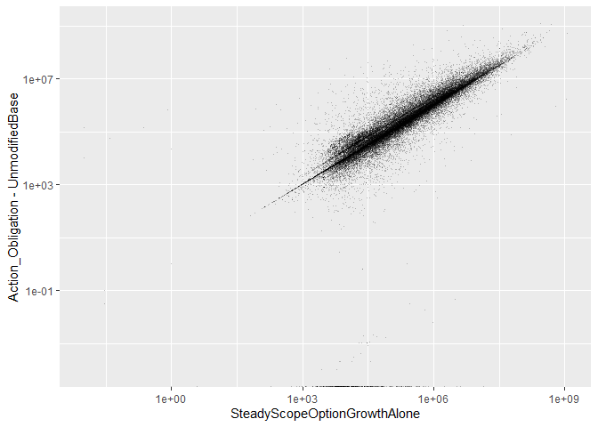

#Setup

```
## Warning: replacing previous import 'Hmisc::summarize' by 'dplyr::summarize'
## when loading 'csis360'
```

```
## Warning: replacing previous import 'Hmisc::src' by 'dplyr::src' when
## loading 'csis360'
```

```
## Warning: replacing previous import 'dplyr::intersect' by
## 'lubridate::intersect' when loading 'csis360'
```

```
## Warning: replacing previous import 'dplyr::union' by 'lubridate::union'
## when loading 'csis360'
```

```
## Warning: replacing previous import 'dplyr::setdiff' by 'lubridate::setdiff'
## when loading 'csis360'
```

```
## Warning: package 'ggplot2' was built under R version 3.5.3
```

```
## Warning: package 'dplyr' was built under R version 3.5.3
```

```
## 
## Attaching package: 'dplyr'
```

```
## The following objects are masked from 'package:stats':
## 
##     filter, lag
```

```
## The following objects are masked from 'package:base':
## 
##     intersect, setdiff, setequal, union
```

```
## Warning: package 'arm' was built under R version 3.5.3
```

```
## Loading required package: MASS
```

```
## 
## Attaching package: 'MASS'
```

```
## The following object is masked from 'package:dplyr':
## 
##     select
```

```
## Loading required package: Matrix
```

```
## Loading required package: lme4
```

```
## Warning: package 'lme4' was built under R version 3.5.3
```

```
## 
## arm (Version 1.10-1, built: 2018-4-12)
```

```
## Working directory is C:/Users/JGraham/Documents/CSIS/Services/scripts
```

```
## Warning: package 'R2WinBUGS' was built under R version 3.5.3
```

```
## Loading required package: coda
```

```
## Warning: package 'coda' was built under R version 3.5.3
```

```
## 
## Attaching package: 'coda'
```

```
## The following object is masked from 'package:arm':
## 
##     traceplot
```

```
## Loading required package: boot
```

```
## 
## Attaching package: 'boot'
```

```
## The following object is masked from 'package:arm':
## 
##     logit
```

```
## Warning: package 'knitr' was built under R version 3.5.3
```

```
## Warning: package 'stargazer' was built under R version 3.5.2
```

```
## 
## Please cite as:
```

```
##  Hlavac, Marek (2018). stargazer: Well-Formatted Regression and Summary Statistics Tables.
```

```
##  R package version 5.2.2. https://CRAN.R-project.org/package=stargazer
```

```
## Warning: package 'texreg' was built under R version 3.5.3
```

```
## Version:  1.36.23
## Date:     2017-03-03
## Author:   Philip Leifeld (University of Glasgow)
## 
## Please cite the JSS article in your publications -- see citation("texreg").
```

```
## 
## Attaching package: 'texreg'
```

```
## The following object is masked from 'package:arm':
## 
##     coefplot
```

```
## Warning: package 'reshape2' was built under R version 3.5.3
```

```
## Warning: package 'sjstats' was built under R version 3.5.3
```

```
## Warning: package 'car' was built under R version 3.5.3
```

```
## Loading required package: carData
```

```
## Warning: package 'carData' was built under R version 3.5.2
```

```
## 
## Attaching package: 'car'
```

```
## The following object is masked from 'package:boot':
## 
##     logit
```

```
## The following object is masked from 'package:arm':
## 
##     logit
```

```
## The following object is masked from 'package:dplyr':
## 
##     recode
```

```
## Warning: package 'scales' was built under R version 3.5.3
```

```
## 
## Attaching package: 'scales'
```

```
## The following object is masked from 'package:arm':
## 
##     rescale
```

```
## [1] 8076
```


```r
#load("../data/clean/transformed_def_serv.Rdata")
load(file="..\\data\\semi_clean\\opt_pre_clean.rdata")
  

#File Pre-processed and Loaded
#W912UM <- def_serv %>% filter(Office=="W912UM")
#W912UMtrans<-read.delim(file="..\\data\\semi_clean\\W912UM_trans.csv", sep=",")
#W912UMtrans<-remove_bom(W912UMtrans)
#opt_preclean<-def_serv %>% filter(ExercisedOptions>1)
#opt_preclean$q_OptGrowth<-Hmisc::cut2(opt_preclean$p_OptGrowth-1,c(0,1e-10,1,10))
summary(opt_preclean$q_OptGrowth)
```

```
##            0.00e+00 [1.00e-10,1.00e+00) [1.00e+00,1.00e+01) 
##                   0               11673               39776 
## [1.00e+01,5.88e+07]                NA's 
##                1177                 334
```

```r
#save(W912UM,W912UMtrans,opt_preclean,file="..\\data\\semi_clean\\opt_pre_clean.rdata")


summary(opt_preclean$ExercisedOptions)
```

```
##      Min.   1st Qu.    Median      Mean   3rd Qu.      Max. 
##         2     21200     93814   1442378    535214 504504112
```

```r
summary(opt_preclean$UnmodifiedBaseandExercisedOptionsValue)
```

```
##      Min.   1st Qu.    Median      Mean   3rd Qu.      Max.      NA's 
##         0     12640     69369   1044646    404250 718091456       334
```


# Before Cleaning

```r
summary(Hmisc::cut2(opt_preclean$p_OptGrowth-1,c(1,
                                                 5,
                                          10,
                                          100
                                          )))
```

```
## [6.23e-07,1.00e+00) [1.00e+00,5.00e+00) [5.00e+00,1.00e+01) 
##               11673               36953                2823 
## [1.00e+01,1.00e+02) [1.00e+02,5.88e+07]                NA's 
##                1092                  85                 334
```

```r
nrow(opt_preclean %>% filter((p_OptGrowth-1)>100 & UnmodifiedBaseandExercisedOptionsValue<=0))
```

```
## [1] 0
```

```r
nrow(opt_preclean %>% filter((p_OptGrowth-1)>10 & (UnmodifiedBaseandExercisedOptionsValue+ExercisedOptions)<UnmodifiedContractBaseAndAllOptionsValue.Then.Year))
```

```
## [1] 759
```

```r
summary(opt_preclean$Ceil[(opt_preclean$p_OptGrowth-1)>10 & opt_preclean$UnmodifiedBaseandExercisedOptionsValue>0])
```

```
##    [0,15k) [15k,100k)  [100k,1m)   [1m,10m)  [10m,75m)     [75m+] 
##         51        351        331        299        110         35 
##       NA's 
##        334
```

```r
summary(opt_preclean$Ceil[(opt_preclean$p_OptGrowth-1)>100 & opt_preclean$UnmodifiedBaseandExercisedOptionsValue>0])
```

```
##    [0,15k) [15k,100k)  [100k,1m)   [1m,10m)  [10m,75m)     [75m+] 
##         16          7          8         18         17         19 
##       NA's 
##        334
```

```r
opt_preclean$Why_Outlier<-NA
opt_preclean$Why_Outlier[opt_preclean$UnmodifiedBaseandExercisedOptionsValue<=0]<-"No Unmodified Base"
opt_preclean$Why_Outlier[is.na(opt_preclean$Why_Outlier)&
                   opt_preclean$Action_Obligation.Then.Year*2>=opt_preclean$UnmodifiedBaseandExercisedOptionsValue+
                   opt_preclean$ExercisedOptions]<-
  "Obligations at least half Base+Opt"
opt_preclean$Why_Outlier[is.na(opt_preclean$Why_Outlier)&
                   opt_preclean$Office=="W912UM"]<-
  "Korean Office W912UM"
opt_preclean$Why_Outlier[is.na(opt_preclean$Why_Outlier)&((opt_preclean$UnmodifiedBaseandExercisedOptionsValue + opt_preclean$ExercisedOptions) < opt_preclean$UnmodifiedContractBaseAndAllOptionsValue.Then.Year)] <- "Base + Growth < Unmodified Ceiling"
opt_preclean$Why_Outlier[is.na(opt_preclean$Why_Outlier)&
                   opt_preclean$ExercisedOptions>=2.5e8]<-
  ">=$250M, Insepect"
opt_preclean$Why_Outlier[is.na(opt_preclean$Why_Outlier)&
                   opt_preclean$p_OptGrowth-1>10]<-
  "Other Unexplained 10x Options Growth"

opt_preclean$Why_Outlier<-factor(opt_preclean$Why_Outlier, levels = c("No Unmodified Base", "Obligations at least half Base+Opt", "Korean Office W912UM", "Base + Growth < Unmodified Ceiling", ">=$250M, Insepect", "Other Unexplained 10x Options Growth"))

summary(opt_preclean$Why_Outlier[(opt_preclean$p_OptGrowth-1)>10])
```

```
##                   No Unmodified Base   Obligations at least half Base+Opt 
##                                    0                                 1127 
##                 Korean Office W912UM   Base + Growth < Unmodified Ceiling 
##                                    0                                   30 
##                    >=$250M, Insepect Other Unexplained 10x Options Growth 
##                                    0                                   20 
##                                 NA's 
##                                  334
```

```r
summary(opt_preclean$Why_Outlier)
```

```
##                   No Unmodified Base   Obligations at least half Base+Opt 
##                                    0                                50432 
##                 Korean Office W912UM   Base + Growth < Unmodified Ceiling 
##                                    1                                 1449 
##                    >=$250M, Insepect Other Unexplained 10x Options Growth 
##                                    0                                   20 
##                                 NA's 
##                                 1058
```

```r
p_outlier_summary<-opt_preclean %>% filter(p_OptGrowth-1>10) %>% group_by(Why_Outlier) %>%
  dplyr::summarise(nContract=length(ExercisedOptions),
    SumOfExercisedOptions=sum(ExercisedOptions),
                   MaxOfExercisedOptions=max(ExercisedOptions),
                   SumOfAction_Obligation.Then.Year=sum(Action_Obligation.Then.Year))


n_outlier_summary<-opt_preclean %>% filter(ExercisedOptions>2.5e8) %>% group_by(Why_Outlier) %>%
  dplyr::summarise(nContract=length(ExercisedOptions),
    SumOfExercisedOptions=sum(ExercisedOptions),
                   MaxOfExercisedOptions=max(ExercisedOptions),
                   SumOfAction_Obligation.Then.Year=sum(Action_Obligation.Then.Year))


summary(Hmisc::cut2(opt_preclean$ExercisedOptions,c(1e3,
                                          1e6,
                                          1e7,
                                          1e8,
                                          2.5e8,
                                          1e9,
                                          1e10,
                                          2e10
                                          )))
```

```
## [2.0e+00,1.0e+03) [1.0e+03,1.0e+06) [1.0e+06,1.0e+07) [1.0e+07,1.0e+08) 
##               239             43118              8156              1378 
## [1.0e+08,2.5e+08) [2.5e+08,1.0e+09)           1.0e+09 [1.0e+10,2.0e+10] 
##                58                11                 0                 0
```

```r
summary(opt_preclean$Ceil[opt_preclean$ExercisedOptions>=1e6])
```

```
##    [0,15k) [15k,100k)  [100k,1m)   [1m,10m)  [10m,75m)     [75m+] 
##         16          6         88       6599       2621        273
```

```r
summary(opt_preclean$Ceil[opt_preclean$ExercisedOptions>=1e9])
```

```
##    [0,15k) [15k,100k)  [100k,1m)   [1m,10m)  [10m,75m)     [75m+] 
##          0          0          0          0          0          0
```

```r
write.csv(file="..\\Data\\semi_clean\\p_opt_outliers.csv",opt_preclean %>% filter((p_OptGrowth-1)>10 & Why_Outlier != "Base + Growth < Unmodified Ceiling"),row.names = FALSE)
write.csv(file="..\\Data\\semi_clean\\n_opt_outliers.csv",opt_preclean %>% filter(ExercisedOptions>=2.5e8 & Why_Outlier != "Base + Growth < Unmodified Ceiling"),row.names = FALSE)
```
Examining cases of large options growth, 1177 contracts experienced greater than 10 fold growth. An increase of that size strains credulity, even in high risk defense contracting. While by no means impossible, the more likely explaination is a misrecorded base.

The study team broke down the outliers into three categories:


Why_Outlier                             nContract   SumOfExercisedOptions   MaxOfExercisedOptions   SumOfAction_Obligation.Then.Year
-------------------------------------  ----------  ----------------------  ----------------------  ---------------------------------
Obligations at least half Base+Opt           1127              6937211681               327123958                        10579287244
Base + Growth < Unmodified Ceiling             30               142745783                51557340                           42558356
Other Unexplained 10x Options Growth           20                31106344                 8087198                           10942186


* No Unmodified Base: Contracts with an initial base <=0. These are eliminated from the sample as missing data.
* Obligations at least half Base+Opt: For this category, total obligations of the contract were at least half the value of the initial base plus options growth under exercised options. These contracts have had spending that massively exceeded their original base, so the growth in absolute terrms seems plausible. This category accounts for the majority of outlier spending and an overwhelming majority of all exercised options growth amongst outliers (but less than 10% of total exercised options growth when compared to the full sample).
* Finally a few score contrats have unexplained growth, but remain below the $10M threshold. The quantity and magnitude of these contracts is not sufficient to risk the overall model.

This examination left the study team less confident in percentage growth as a metric, especially in extreme cases, while increasing the study team's confidence in measures of growth in absoute term. In the worst case, simply removing all of the unexplained over  10 million contracts from the sample would reduce the number of contracts by a tiny amount and reduce the spending accounted for by  0.

Shifting the focus to all contracts with absolute growth of at least 250 million, there are far fewer contracts that account for far less money.


Why_Outlier                           nContract   SumOfExercisedOptions   MaxOfExercisedOptions   SumOfAction_Obligation.Then.Year
-----------------------------------  ----------  ----------------------  ----------------------  ---------------------------------
Obligations at least half Base+Opt           11              3763783860               504504112                         7107747274


## Options Growth

```r
(
ggplot(opt_preclean, aes(x=UnmodifiedBaseandExercisedOptionsValue,y=p_OptGrowth-1)) +#,color=q_OptGrowth
  geom_point(alpha=0.25,shape=".")+
  # theme(axis.text.x = element_text(angle = 90, hjust = 1))+
  scale_x_log10()+scale_y_log10()+
  #+
  geom_vline(xintercept = c(1,10,100))+#+geom_vline(xintercept = 0.1)+
# facet_wrap(~Ceil,scales="free_y")+#+, space="free_y"
  labs(title="Distribution of Exercised Options",
       y="Percent of Options Growth from Base",
       x="Unmodified Contract Base")#,
       # fill="Termination Completion"
)
```

```
## Warning: Removed 334 rows containing missing values (geom_point).
```

<!-- -->

```r
(
ggplot(opt_preclean, aes(x=UnmodifiedBaseandExercisedOptionsValue,y=ExercisedOptions)) +#,color=q_OptGrowth
  geom_point(alpha=0.25,shape=".")+
  # theme(axis.text.x = element_text(angle = 90, hjust = 1))+
  scale_x_log10()+scale_y_log10()+
  #+
  geom_vline(xintercept = c(1,10,100))+#+geom_vline(xintercept = 0.1)+
# facet_wrap(~Ceil,scales="free_y")+#+, space="free_y"
  labs(title="Distribution of Exercised Options",
       y="Absolute Options Growth from Base",
       x="Unmodified Contract Base")#,
       # fill="Termination Completion"
)
```

```
## Warning: Removed 334 rows containing missing values (geom_point).
```

<!-- -->

```r
(
ggplot(opt_preclean, aes(x=UnmodifiedBaseandExercisedOptionsValue+ExercisedOptions,y=Action_Obligation.Then.Year)) +#,color=q_OptGrowth
  geom_point(alpha=0.25,shape=".")+
  # theme(axis.text.x = element_text(angle = 90, hjust = 1))+
  scale_x_log10()+scale_y_log10()+
  #+
#   geom_vline(xintercept = c(1,10,100))+#+geom_vline(xintercept = 0.1)+
# # facet_wrap(~Ceil,scales="free_y")+#+, space="free_y"
   labs(title="Distribution of Exercised Options",
#        y="Percent of Options Growth from Base",
        x="Unmodified Contract Base + Exercised Options")#,
#        # fill="Termination Completion"
)
```

```
## Warning in self$trans$transform(x): NaNs produced
```

```
## Warning: Transformation introduced infinite values in continuous y-axis
```

```
## Warning: Removed 347 rows containing missing values (geom_point).
```

<!-- -->

```r
summary(opt_preclean$ExercisedOptions)
```

```
##      Min.   1st Qu.    Median      Mean   3rd Qu.      Max. 
##         2     21200     93814   1442378    535214 504504112
```

```r
(
ggplot(opt_preclean, aes(x=p_OptGrowth-1,fill=q_OptGrowth)) +
  geom_histogram(bins=100)+
  theme(axis.text.x = element_text(angle = 90, hjust = 1))+
  scale_x_log10()+
  #+
  geom_vline(xintercept = c(1,10,100))+#+geom_vline(xintercept = 0.1)+
facet_wrap(~Ceil,scales="free_y")+#+, space="free_y"
  labs(title="Distribution of Exercised Options",
       y="Contract Count",
       x="Percent of Options Growth from Base")#,
       # fill="Termination Completion"
)
```

```
## Warning: Removed 334 rows containing non-finite values (stat_bin).
```

<!-- -->

```r
(
ggplot(opt_preclean, aes(x=ExercisedOptions,fill=q_OptGrowth)) +
  geom_histogram(bins=100)+
  theme(axis.text.x = element_text(angle = 90, hjust = 1))+
  scale_x_log10()+
  #+
  geom_vline(xintercept = 1)+#+geom_vline(xintercept = 0.1)+
#facet_grid(NoPreTermObl~.,scales="free_y", space="free_y")+
   labs(title="Distribution of Contracts by Exercised Options Growth")#,
  #      y="Contract Count",
  #      x="Percent of Obligations After Day of Termination",
  #      fill="Termination Completion"
)
```

<!-- -->

```r
(
ggplot(opt_preclean, aes(x=ExercisedOptions,fill=q_OptGrowth)) +
  geom_histogram(bins=100)+
  theme(axis.text.x = element_text(angle = 90, hjust = 1))+
  scale_x_log10()+
  #+
  geom_vline(xintercept = 1)+
facet_wrap(~Ceil,scales="free_y")+#+, space="free_y"
#+geom_vline(xintercept = 0.1)+
#facet_grid(NoPreTermObl~.,scales="free_y", space="free_y")+
   labs(title="Distribution of Contracts by Exercised Options Growth, Grouped by Ceiling")#,
  #      y="Contract Count",
  #      x="Percent of Obligations After Day of Termination",
  #      fill="Termination Completion"
)
```

<!-- -->

## >250 Inspect

```r
inspect250<-opt_preclean %>% filter(Why_Outlier==">=$250M, Insepect")
inspect250$CSIScontractID
```

```
## numeric(0)
```

```r
inspect250trans<-read.delim(file="..\\data\\semi_clean\\gt250k_n_exercised_opt_outliers.txt", sep="\t")


#gt250k_n_exercised_opt_outliers.txt
```
No contracts with unexplained >=\$250M absolute growth exist in the dataset.  4 such contracts demonstrate absolute growth >=\$250M, but are coded instead as 'Obligations at least half Base+Opt.'  Manual inspection of these makes clear that the growth identified is legitimate, and should be included in the dataset.

## Other Unexplained x10 Inspect
The contracts coded as 'other unexplained' above were inspected manually given their relative scarcity.  Several were found to contain suspect transactions that were later corrected, meaning these contracts should be dropped from our sample, which will occur through use of the CSIS360 repository, and the lookup table "override_lookup.Rda".
