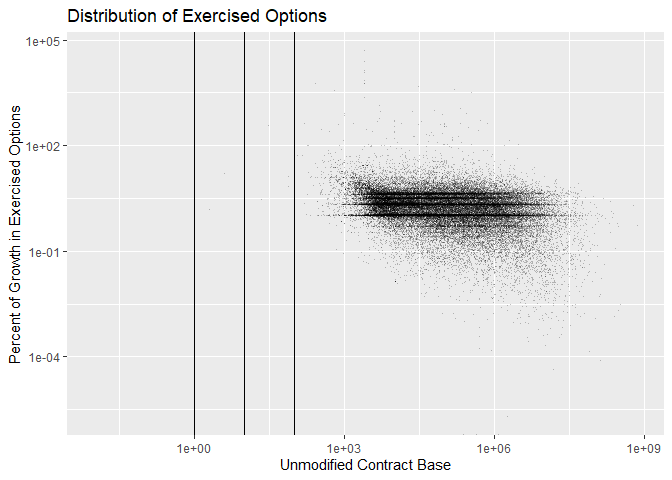
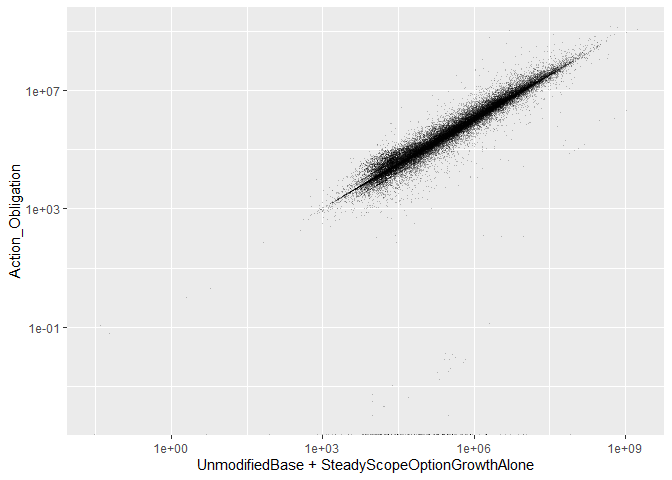

#Setup

```
## [1] 32659
```


```
##            0.00e+00 [1.00e-10,1.00e+00) [1.00e+00,1.00e+01) 
##                   0               11673               39776 
## [1.00e+01,5.88e+07]                NA's 
##                1177                 334
```

```
##      Min.   1st Qu.    Median      Mean   3rd Qu.      Max. 
##         2     21200     93814   1442378    535214 504504112
```

```
##      Min.   1st Qu.    Median      Mean   3rd Qu.      Max.      NA's 
##         0     12640     69369   1044646    404250 718091456       334
```


# Before Cleaning
## Options Growth

```
## Warning: Removed 334 rows containing missing values (geom_point).
```

<!-- -->

```
## Warning: Removed 334 rows containing missing values (geom_point).
```

<!-- -->

```
## Warning in self$trans$transform(x): NaNs produced
```

```
## Warning: Transformation introduced infinite values in continuous y-axis
```

```
## Warning: Removed 347 rows containing missing values (geom_point).
```

<!-- -->

```
## Warning: Removed 334 rows containing non-finite values (stat_bin).
```

<!-- --><!-- --><!-- -->

## Why Outlier

```r
summary(Hmisc::cut2(opt_preclean$p_OptGrowth-1,c(1,
                                                 5,
                                          10,
                                          100
                                          )))
```

```
## [6.23e-07,1.00e+00) [1.00e+00,5.00e+00) [5.00e+00,1.00e+01) 
##               11673               36953                2823 
## [1.00e+01,1.00e+02) [1.00e+02,5.88e+07]                NA's 
##                1092                  85                 334
```

```r
summary(opt_preclean$Ceil[(opt_preclean$p_OptGrowth-1)>10 & opt_preclean$UnmodifiedBaseandExercisedOptionsValue>0 &
                            !is.na(opt_preclean$UnmodifiedBaseandExercisedOptionsValue>0 )])
```

```
##    [0,15k) [15k,100k)  [100k,1m)   [1m,10m)  [10m,75m)     [75m+] 
##         51        351        331        299        110         35
```

```r
summary(opt_preclean$Ceil[(opt_preclean$p_OptGrowth-1)>100 & opt_preclean$UnmodifiedBaseandExercisedOptionsValue>0&
                            !is.na(opt_preclean$UnmodifiedBaseandExercisedOptionsValue>0)])
```

```
##    [0,15k) [15k,100k)  [100k,1m)   [1m,10m)  [10m,75m)     [75m+] 
##         16          7          8         18         17         19
```

```r
summary(Hmisc::cut2(opt_preclean$ExercisedOptions,c(1e3,
                                          1e6,
                                          1e7,
                                          1e8,
                                          2.5e8,
                                          1e9,
                                          1e10,
                                          2e10
                                          )))
```

```
## [2.0e+00,1.0e+03) [1.0e+03,1.0e+06) [1.0e+06,1.0e+07) [1.0e+07,1.0e+08) 
##               239             43118              8156              1378 
## [1.0e+08,2.5e+08) [2.5e+08,1.0e+09)           1.0e+09 [1.0e+10,2.0e+10] 
##                58                11                 0                 0
```

```r
summary(opt_preclean$Ceil[opt_preclean$ExercisedOptions>=1e6])
```

```
##    [0,15k) [15k,100k)  [100k,1m)   [1m,10m)  [10m,75m)     [75m+] 
##         16          6         88       6599       2621        273
```

```r
opt_preclean$Why_Outlier<-NA
opt_preclean$Why_Outlier[opt_preclean$UnmodifiedBaseandExercisedOptionsValue<=0 |
                           is.na(opt_preclean$UnmodifiedBaseandExercisedOptionsValue<=0 )]<-"No Unmodified Base"
opt_preclean$Why_Outlier[is.na(opt_preclean$Why_Outlier)&
                   opt_preclean$Action_Obligation.Then.Year*2>=opt_preclean$UnmodifiedBaseandExercisedOptionsValue+
                   opt_preclean$ExercisedOptions]<-
  "Obligations at least half Base+Opt"
opt_preclean$Why_Outlier[is.na(opt_preclean$Why_Outlier)&
                   opt_preclean$Office=="W912UM"]<-
  "Korean Office W912UM"
opt_preclean$Why_Outlier[is.na(opt_preclean$Why_Outlier)&((opt_preclean$UnmodifiedBaseandExercisedOptionsValue + opt_preclean$ExercisedOptions) < opt_preclean$UnmodifiedContractBaseAndAllOptionsValue.Then.Year)] <- "Base + Growth < Unmodified Ceiling"
opt_preclean$Why_Outlier[is.na(opt_preclean$Why_Outlier)&
                   opt_preclean$ExercisedOptions>=2.5e8]<-
  ">=$250M, Inspect"
opt_preclean$Why_Outlier[is.na(opt_preclean$Why_Outlier)&
                   opt_preclean$p_OptGrowth-1>=10]<-
  "Other Unexplained 10x Options Growth"
opt_preclean$Why_Outlier[is.na(opt_preclean$Why_Outlier)&
                   opt_preclean$p_OptGrowth-1<=5]<-
  "<= 5x Options Growth"
opt_preclean$Why_Outlier[is.na(opt_preclean$Why_Outlier)&
                   opt_preclean$p_OptGrowth-1>=5 & opt_preclean$p_OptGrowth-1<10]<-
  "5x < Options Growth <=10x"
opt_preclean$Why_Outlier<-factor(opt_preclean$Why_Outlier, 
                                 levels = c("No Unmodified Base", "Obligations at least half Base+Opt", "Korean Office W912UM",
                                            "Base + Growth < Unmodified Ceiling", "<= 5x Options Growth",
                                            "5x < Options Growth <=10x",">=$250M, Insepect",
                                            "Other Unexplained 10x Options Growth"))

summary(opt_preclean$Why_Outlier)
```

```
##                   No Unmodified Base   Obligations at least half Base+Opt 
##                                  334                                50432 
##                 Korean Office W912UM   Base + Growth < Unmodified Ceiling 
##                                    0                                 1449 
##                 <= 5x Options Growth            5x < Options Growth <=10x 
##                                  691                                   33 
##                    >=$250M, Insepect Other Unexplained 10x Options Growth 
##                                    0                                   21
```

```r
p_outlier_summary<-opt_preclean %>% filter(p_OptGrowth-1>10) %>% group_by(Why_Outlier) %>%
  dplyr::summarise(nContract=length(ExercisedOptions),
    SumOfExercisedOptions=sum(ExercisedOptions),
                   MaxOfExercisedOptions=max(ExercisedOptions),
                   SumOfAction_Obligation.Then.Year=sum(Action_Obligation.Then.Year))


n_outlier_summary<-opt_preclean %>% filter(ExercisedOptions>2.5e8) %>% group_by(Why_Outlier) %>%
  dplyr::summarise(nContract=length(ExercisedOptions),
    SumOfExercisedOptions=sum(ExercisedOptions),
                   MaxOfExercisedOptions=max(ExercisedOptions),
                   SumOfAction_Obligation.Then.Year=sum(Action_Obligation.Then.Year))

nrow(opt_preclean[is.na(opt_preclean$Why_Outlier),])
```

```
## Warning: Factor `qHighCeiling` contains implicit NA, consider using
## `forcats::fct_explicit_na`
```

```
## [1] 0
```

```r
write.csv(file="..\\Data\\semi_clean\\p_opt_outliers.csv",opt_preclean %>% filter((p_OptGrowth-1)>10 & Why_Outlier != "Base + Growth < Unmodified Ceiling"),row.names = FALSE)
write.csv(file="..\\Data\\semi_clean\\n_opt_outliers.csv",opt_preclean %>% filter(ExercisedOptions>=2.5e8 & Why_Outlier != "Base + Growth < Unmodified Ceiling"),row.names = FALSE)
```
Examining cases of large options growth, 1177 contracts experienced greater than 10 fold growth. An increase of that size strains credulity, even in high risk defense contracting. While by no means impossible, the more likely explaination is a misrecorded base.

The study team broke down the outliers into three categories:


Why_Outlier                             nContract   SumOfExercisedOptions   MaxOfExercisedOptions   SumOfAction_Obligation.Then.Year
-------------------------------------  ----------  ----------------------  ----------------------  ---------------------------------
Obligations at least half Base+Opt           1127              6937211681               327123958                        10579287244
Base + Growth < Unmodified Ceiling             30               142745783                51557340                           42558356
Other Unexplained 10x Options Growth           20                31106344                 8087198                           10942186


* No Unmodified Base: Contracts with an initial base <=0. These are eliminated from the sample as missing data.
* Obligations at least half Base+Opt: For this category, total obligations of the contract were at least half the value of the initial base plus options growth under exercised options. These contracts have had spending that massively exceeded their original base, so the growth in absolute terrms seems plausible. This category accounts for the majority of outlier spending and an overwhelming majority of all exercised options growth amongst outliers (but less than 10% of total exercised options growth when compared to the full sample).
* Finally a few score contrats have unexplained growth, but remain below the $10M threshold. The quantity and magnitude of these contracts is not sufficient to risk the overall model.

This examination left the study team less confident in percentage growth as a metric, especially in extreme cases, while increasing the study team's confidence in measures of growth in absoute term. In the worst case, simply removing all of the unexplained over  10 million contracts from the sample would reduce the number of contracts by a tiny amount and reduce the spending accounted for by  0.

Shifting the focus to all contracts with absolute growth of at least 250 million, there are far fewer contracts and they all have spent at least half their base+exercised growth value.


Why_Outlier                           nContract   SumOfExercisedOptions   MaxOfExercisedOptions   SumOfAction_Obligation.Then.Year
-----------------------------------  ----------  ----------------------  ----------------------  ---------------------------------
Obligations at least half Base+Opt           11              3763783860               504504112                         7107747274


## >250 Inspect

No contracts with unexplained >=\$250M absolute growth exist in the dataset.  4 such contracts demonstrate absolute growth >=\$250M, but are coded instead as 'Obligations at least half Base+Opt.'  Manual inspection of these makes clear that the growth identified is legitimate, and should be included in the dataset.

## Other Unexplained x10 Inspect
The contracts coded as 'other unexplained' above were inspected manually given their relative scarcity.  Several were found to contain suspect transactions that were later corrected, meaning the option growth value will be set as NA in the datasets and the contracts excluded from our sample, which will occur through use of the CSIS360 repository, and the lookup table "contract/override_lookup.csv" in contract folder of the CSISdefense/Lookup-Tables repository.


```r
inspect10x<-opt_preclean %>% filter(Why_Outlier=="Other Unexplained 10x Options Growth")


override<-read.delim(file="https://raw.githubusercontent.com/CSISdefense/Lookup-Tables/master/contract/CSIS_contract_inspection.csv", sep=",") 
inspect10x<-left_join(inspect10x,override,by="CSIScontractID")
if(any(is.na(inspect10x$CSIS_inspection))) stop("Contract without CSIS_inspection label")

inspect10xtrans<-read.delim(file="..\\data\\semi_clean\\gt10t_p_other_unexplained_outliers.txt", sep="\t")
inspect10xtrans<-inspect10xtrans %>% filter(CSIScontractID %in% inspect10x$CSIScontractID)
inspect10xtrans<-left_join(inspect10xtrans,override,by="CSIScontractID")
if(any(is.na(inspect10xtrans$CSIS_inspection))) stop("Transaction without CSIS_inspection label")


pk_inspect_summary<-inspect10x %>% group_by(CSIS_inspection) %>%
  dplyr::summarise(nContract=length(ExercisedOptions),
    SumOfExercisedOptions=sum(ExercisedOptions),
                   MaxOfExercisedOptions=max(ExercisedOptions),
                   SumOfAction_Obligation.Then.Year=sum(Action_Obligation.Then.Year))

knitr::kable(pk_inspect_summary,format.args = list(big.mark=","))
```


CSIS_inspection                      nContract   SumOfExercisedOptions   MaxOfExercisedOptions   SumOfAction_Obligation.Then.Year
----------------------------------  ----------  ----------------------  ----------------------  ---------------------------------
Apparent Error: Uncorrected                  1               1,569,174               1,569,174                          372,113.5
Error: Corrected Administratively            1               1,015,140               1,015,140                          260,582.0
Error: Corrected Other                       3               9,591,793               4,561,048                        2,492,986.8
Passed Examination                          16              18,935,237               8,087,198                        7,818,253.3

```r
pt_inspect_summary<-inspect10xtrans %>% group_by(CSIS_inspection) %>%
  dplyr::summarise(nContract=length(unique(CSIScontractID)),
                   nTransaction=length(CSIStransactionID),
    SumOfBaseAndExercisedOptions=sum(baseandexercisedoptionsvalue,na.rm=TRUE),
    GrossBaseAndExercisedOptions=sum(ifelse(baseandexercisedoptionsvalue>0,baseandexercisedoptionsvalue,0),na.rm=TRUE),
    NegativeBaseAndAllOptions=sum(ifelse(baseandexercisedoptionsvalue<0,baseandexercisedoptionsvalue,0),na.rm=TRUE),
                   MaxOfBaseAndExercisedlOptions=max(baseandexercisedoptionsvalue,na.rm=TRUE),
    MinOfBaseAndExercisedOptions=min(baseandexercisedoptionsvalue,na.rm=TRUE),
                   ObligatedAmount=sum(obligatedamount,na.rm=TRUE))

knitr::kable(pt_inspect_summary,format.args = list(big.mark=","))
```


CSIS_inspection                      nContract   nTransaction   SumOfBaseAndExercisedOptions   GrossBaseAndExercisedOptions   NegativeBaseAndAllOptions   MaxOfBaseAndExercisedlOptions   MinOfBaseAndExercisedOptions   ObligatedAmount
----------------------------------  ----------  -------------  -----------------------------  -----------------------------  --------------------------  ------------------------------  -----------------------------  ----------------
Apparent Error: Uncorrected                  1             13                      372,113.5                      1,877,649                -1,505,535.0                       1,569,174                     -1,504,375         372,113.5
Error: Corrected Administratively            1              5                      260,582.0                      1,186,249                  -925,667.1                       1,015,140                       -904,726         260,582.0
Error: Corrected Other                       3             21                    2,492,986.9                     10,136,405                -7,643,418.1                       4,561,048                     -4,153,462       2,492,986.8
Passed Examination                          16            195                   18,831,933.8                     22,517,758                -3,685,823.8                       2,342,716                     -1,032,130       7,818,253.3
