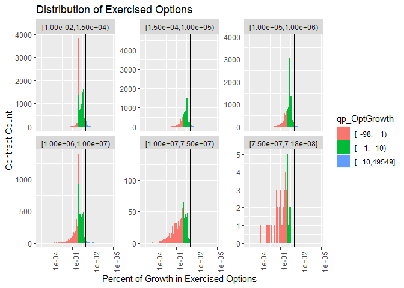
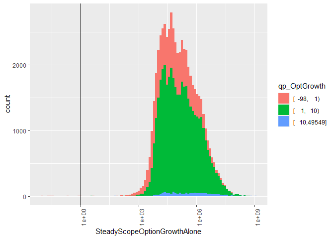
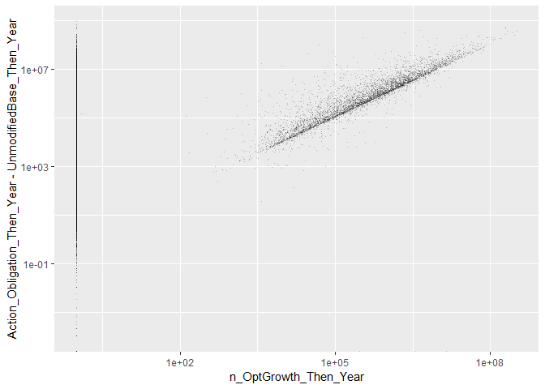
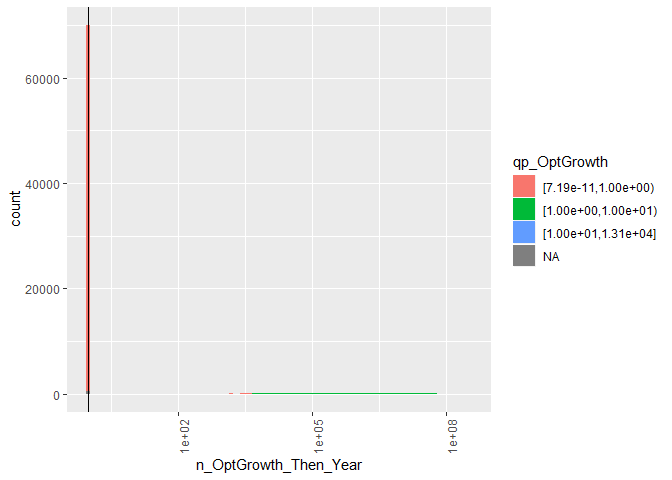

#Setup

```
## [1] 16250
```

# Before Cleaning

```
##      Min.   1st Qu.    Median      Mean   3rd Qu.      Max. 
## 0.000e+00 2.125e+04 9.280e+04 1.469e+06 5.255e+05 1.090e+09
```

```
## [1.00e-02,1.50e+04) [1.50e+04,1.00e+05) [1.00e+05,1.00e+06) 
##               14216               14640               14745 
## [1.00e+06,1.00e+07) [1.00e+07,7.50e+07) [7.50e+07,7.18e+08] 
##                6578                 888                  42
```


## Examining Base and Exercised Modifications

### Outlier Labeling


```r
summary(Hmisc::cut2(opt_preclean$p_SteadyScopeOptionGrowthAlone-1,c(1,
                                                 5,
                                          10,
                                          100
                                          )))
```

```
## [  -97,    1) [    1,    5) [    5,   10) [   10,  100) [  100,23516] 
##         14747         32440          2783          1067            72
```

```r
summary(opt_preclean$qHighBase[(opt_preclean$p_SteadyScopeOptionGrowthAlone-1)>10 & opt_preclean$UnmodifiedBase>0 &
                            !is.na(opt_preclean$UnmodifiedBase)])
```

```
## [1.00e-02,1.50e+04) [1.50e+04,1.00e+05) [1.00e+05,1.00e+06) 
##                 577                 280                 222 
## [1.00e+06,1.00e+07) [1.00e+07,7.50e+07) [7.50e+07,7.18e+08] 
##                  58                   2                   0
```

```r
summary(opt_preclean$qHighBase[(opt_preclean$p_SteadyScopeOptionGrowthAlone-1)>100 & opt_preclean$UnmodifiedBase>0&
                            !is.na(opt_preclean$UnmodifiedBase)])
```

```
## [1.00e-02,1.50e+04) [1.50e+04,1.00e+05) [1.00e+05,1.00e+06) 
##                  38                  14                  18 
## [1.00e+06,1.00e+07) [1.00e+07,7.50e+07) [7.50e+07,7.18e+08] 
##                   2                   0                   0
```

```r
nrow(opt_preclean %>% filter((p_SteadyScopeOptionGrowthAlone-1)>100 & UnmodifiedBase<=0))
```

```
## [1] 0
```

```r
opt_preclean$Why_Outlier<-NA
opt_preclean$Why_Outlier[opt_preclean$UnmodifiedBase<=0 |
                           is.na(opt_preclean$UnmodifiedBase<=0 )]<-"No Unmodified Base"
opt_preclean$Why_Outlier[is.na(opt_preclean$Why_Outlier)&
                            opt_preclean$Action_Obligation*2>=opt_preclean$UnmodifiedBase+
                            opt_preclean$SteadyScopeOptionGrowthAlone]<-
  "Obligations at least half Base+Opt"
opt_preclean$Why_Outlier[is.na(opt_preclean$Why_Outlier)&
                            opt_preclean$Action_Obligation*2>=
                            (opt_preclean$UnmodifiedBase+
                               opt_preclean$SteadyScopeOptionGrowthAlone+opt_preclean$AdminOptionModification)]<-
  "At Least 1/2 After Admin Rescision"
opt_preclean$Why_Outlier[is.na(opt_preclean$Why_Outlier)&
                            opt_preclean$Action_Obligation*2>=
                            (opt_preclean$UnmodifiedBase+
                               opt_preclean$SteadyScopeOptionGrowthAlone+opt_preclean$ChangeOrderOptionModification)]<-
  "At Least 1/2 After Steady Scope Rescision"
opt_preclean$Why_Outlier[is.na(opt_preclean$Why_Outlier)&
                            opt_preclean$Action_Obligation*2>=
                            (opt_preclean$UnmodifiedBase+
                               opt_preclean$SteadyScopeOptionGrowthAlone+opt_preclean$SteadyScopeOptionRescision)]<-
  "At Least 1/2 After Change Order Rescision"
opt_preclean$Why_Outlier[is.na(opt_preclean$Why_Outlier)&
                            opt_preclean$Action_Obligation*2>=
                            (opt_preclean$UnmodifiedBase+
                               opt_preclean$SteadyScopeOptionGrowthAlone+opt_preclean$OtherOptionModification)]<-
  "At Least 1/2 After Other Rescision"
opt_preclean$Why_Outlier[is.na(opt_preclean$Why_Outlier)&
                            opt_preclean$Action_Obligation*2>=
                            (opt_preclean$UnmodifiedBase+
                               opt_preclean$SteadyScopeOptionGrowthAlone+opt_preclean$EndingOptionModification)]<-
  "At Least 1/2 After Ending Rescision"
opt_preclean$Why_Outlier[is.na(opt_preclean$Why_Outlier)&
                            opt_preclean$Office=="W912UM"]<-
  "Korean Office W912UM"
# opt_preclean$Why_Outlier[is.na(opt_preclean$Why_Outlier)&
#                            ((opt_preclean$UnmodifiedBase + opt_preclean$SteadyScopeOptionGrowthAlone) <
#                               opt_preclean$UnmodifiedqHighBase)] <- "Base + Growth < Unmodified Ceil"
opt_preclean$Why_Outlier[is.na(opt_preclean$Why_Outlier)&
                            opt_preclean$SteadyScopeOptionGrowthAlone>=2.5e8]<-
  ">=$250M, Inspect"
opt_preclean$Why_Outlier[is.na(opt_preclean$Why_Outlier)&
                   opt_preclean$p_SteadyScopeOptionGrowthAlone-1<=5]<-
  "<= 5x Options Growth"
opt_preclean$Why_Outlier[is.na(opt_preclean$Why_Outlier)&
                   opt_preclean$p_SteadyScopeOptionGrowthAlone-1>=5 & opt_preclean$p_SteadyScopeOptionGrowthAlone-1<10]<-
  "5x < Options Growth <=10x"
opt_preclean$Why_Outlier[is.na(opt_preclean$Why_Outlier)&
                            opt_preclean$p_SteadyScopeOptionGrowthAlone-1>10]<-
  "Other Unexplained 10x Options Growth"

opt_preclean$Why_Outlier<-factor(opt_preclean$Why_Outlier,
                                  levels=c(
                                    "No Unmodified Base",
                                    "Obligations at least half Base+Opt",
                                    "At Least 1/2 After Admin Rescision",
                                    "At Least 1/2 After Ending Rescision",
                                    "At Least 1/2 After Steady Scope Rescision",
                                    "At Least 1/2 After Change Order Rescision",
                                    "At Least 1/2 After Other Rescision",
                                    "Korean Office W912UM",
                                    "Base + Growth < Unmodified Ceil",
                                    "<= 5x Options Growth",
                                    "5x < Options Growth <=10x",
                                    "Other Unexplained 10x Options Growth",
                                    ">=$250M, Inspect"
                                                                      ))

nrow(opt_preclean[is.na(opt_preclean$Why_Outlier),])
```

```
## [1] 0
```

```r
summary(opt_preclean$Why_Outlier)
```

```
##                        No Unmodified Base 
##                                         0 
##        Obligations at least half Base+Opt 
##                                     49014 
##        At Least 1/2 After Admin Rescision 
##                                       289 
##       At Least 1/2 After Ending Rescision 
##                                       599 
## At Least 1/2 After Steady Scope Rescision 
##                                       134 
## At Least 1/2 After Change Order Rescision 
##                                       429 
##        At Least 1/2 After Other Rescision 
##                                        12 
##                      Korean Office W912UM 
##                                         5 
##           Base + Growth < Unmodified Ceil 
##                                         0 
##                      <= 5x Options Growth 
##                                       581 
##                 5x < Options Growth <=10x 
##                                        33 
##      Other Unexplained 10x Options Growth 
##                                        13 
##                          >=$250M, Inspect 
##                                         0
```

```r
p_outlier_summary<-opt_preclean %>% filter(p_SteadyScopeOptionGrowthAlone-1>10) %>% group_by(Why_Outlier) %>%
  dplyr::summarise(nContract=length(SteadyScopeOptionGrowthAlone),
                   SumOfExercisedOptions=sum(SteadyScopeOptionGrowthAlone),
                   MaxOfExercisedOptions=max(SteadyScopeOptionGrowthAlone),
                   Action_Obligation=sum(Action_Obligation))


n_outlier_summary<-opt_preclean %>% filter(SteadyScopeOptionGrowthAlone>2.5e8) %>% group_by(Why_Outlier) %>%
  dplyr::summarise(nContract=length(SteadyScopeOptionGrowthAlone),
                   SumOfExercisedOptions=sum(SteadyScopeOptionGrowthAlone),
                   MaxOfExercisedOptions=max(SteadyScopeOptionGrowthAlone),
                   Action_Obligation=sum(Action_Obligation))


summary(Hmisc::cut2(opt_preclean$SteadyScopeOptionGrowthAlone,c(1e3,
                                           1e6,
                                           1e7,
                                           1e8,
                                           2.5e8,
                                           1e9,
                                           1e10,
                                           2e10
)))
```

```
## [1.0e-02,1.0e+03) [1.0e+03,1.0e+06) [1.0e+06,1.0e+07) [1.0e+07,1.0e+08) 
##               238             41674              7798              1330 
## [1.0e+08,2.5e+08) [2.5e+08,1.0e+09) [1.0e+09,1.0e+10) [1.0e+10,2.0e+10] 
##                57                11                 1                 0
```

```r
summary(opt_preclean$qHighBase[opt_preclean$SteadyScopeOptionGrowthAlone>=1e6])
```

```
## [1.00e-02,1.50e+04) [1.50e+04,1.00e+05) [1.00e+05,1.00e+06) 
##                  23                  96                3136 
## [1.00e+06,1.00e+07) [1.00e+07,7.50e+07) [7.50e+07,7.18e+08] 
##                5180                 723                  39
```

```r
summary(opt_preclean$qHighBase[opt_preclean$SteadyScopeOptionGrowthAlone>=1e9])
```

```
## [1.00e-02,1.50e+04) [1.50e+04,1.00e+05) [1.00e+05,1.00e+06) 
##                   0                   0                   1 
## [1.00e+06,1.00e+07) [1.00e+07,7.50e+07) [7.50e+07,7.18e+08] 
##                   0                   0                   0
```

```r
write.csv(file="..\\Data\\semi_clean\\p_opt_outliers.csv",opt_preclean %>% filter((p_SteadyScopeOptionGrowthAlone-1)>10 & Why_Outlier != "Obligations at least half Base+Opt"),row.names = FALSE)
write.csv(file="..\\Data\\semi_clean\\n_opt_outliers.csv",opt_preclean %>% filter(SteadyScopeOptionGrowthAlone>=2.5e8 & Why_Outlier != "Obligations at least half Base+Opt"),row.names = FALSE)
```
Examining cases of large options growth, 1139 contracts experienced greater than 10 fold growth. An increase of that side strains credulity, even in high risk defense contracting. While by no means impossible, the more likely explaination is a misrecorded base.

The study team broke down the outliers into 6 categories:


Why_Outlier                                  nContract   SumOfExercisedOptions   MaxOfExercisedOptions   Action_Obligation
------------------------------------------  ----------  ----------------------  ----------------------  ------------------
Obligations at least half Base+Opt                1088              6687176803               327123958         10217057628
At Least 1/2 After Admin Rescision                   5               631272611               625776000             1716690
At Least 1/2 After Ending Rescision                 12                16997814                11857843             6686164
At Least 1/2 After Steady Scope Rescision            2                 2123354                 1763069             1031224
At Least 1/2 After Change Order Rescision           17                39518915                17642249            18269875
Korean Office W912UM                                 2              1150874880              1090428000             2205914
Other Unexplained 10x Options Growth                13               107797742                51557340            26337478


* No Unmodified Base: Contracts with an base <=0. These are eliminated from the sample as missing data.
* Obligations at least half Base+Opt: For this category, total obligations of the contract were at least half the value of the base plus options growth under exercised options. These contracts have had spending that massively exceeded their original base, so the growth in absolute terrms seems plausible. This category accounts for the majority of outlier spending and an overwhelming majority of all exercised options growth amongst outliers (but less than 10% of total exercised options growth when compared to the full sample).
* Later Deobligated: The change order growth metrics only counts increases. These may simply have been mistaken increases, as when including deobligation the growth no longer exceeded 10x the original base. The number, obligations, and change order growth of these contracts are comparatively small, and thus should not distort the overall data.
* Korean Office W912UM refers to a contracting office that sometimes records base and all options values in Korean Won, approximate exchange rate 1,000 Won : 1 USD. 
* There are 0 contracts with options growth of over $250 million that account for hundreds of billions in change order growth. These merit manual inspection.
* Finally a few score contrats have unexplained growth, but remain below the $10M threshold. The quantity and magnitude of these contracts is not sufficient to risk the overall model.

This examination left the study team less confident in percentage growth as a metric, especially in extreme cases, while increasing the study team's confidence in measures of growth in absoute term. In the worst case, simply removing all of the unexplained over  10 million contracts from the sample would reduce the number of contracts by a tiny amount and reduce the spending accounted for by  0.

Shifting the focus to all contracts with absolute growth of at least 250 million, there are far fewer contracts and they all have spent at least half their base+exercised growth value.


Why_Outlier                           nContract   SumOfExercisedOptions   MaxOfExercisedOptions   Action_Obligation
-----------------------------------  ----------  ----------------------  ----------------------  ------------------
Obligations at least half Base+Opt           10              3428782673               504504112          6749117568
At Least 1/2 After Admin Rescision            1               625776000               625776000             1081425
Korean Office W912UM                          1              1090428000              1090428000             2067919


Inspecting W912UM, either to remove or fix its oversized growth, is an imperative as it accounts for the majority of these contracts or task orders. Even so, there are still 0 that merit special inspection for given that there growth far outpaces their spending.

### Options Growth

```r
(
  ggplot(opt_preclean, aes(x=UnmodifiedBase,y=p_SteadyScopeOptionGrowthAlone-1)) +#,color=qp_OptGrowth
    geom_point(alpha=0.25,shape=".")+
    # theme(axis.text.x = element_text(angle = 90, hjust = 1))+
    scale_x_log10()+scale_y_log10()+
    #+
    geom_vline(xintercept = c(1,10,100))+#+geom_vline(xintercept = 0.1)+
    # facet_wrap(~qHighBase,scales="free_y")+#+, space="free_y"
    labs(title="Distribution of Exercised Options",
         y="Percent of Growth in Exercised Options",
         x="Unmodified Contract Base")#,
  # fill="Termination Completion"
)
```

```
## Warning in self$trans$transform(x): NaNs produced
```

```
## Warning: Transformation introduced infinite values in continuous y-axis
```

```
## Warning: Removed 8 rows containing missing values (geom_point).
```

<!-- -->

```r
(
  ggplot(opt_preclean, aes(x=UnmodifiedBase,y=SteadyScopeOptionGrowthAlone)) +#,color=qp_OptGrowth
    geom_point(alpha=0.25,shape=".")+
    # theme(axis.text.x = element_text(angle = 90, hjust = 1))+
    scale_x_log10()+scale_y_log10()+
    #+
    geom_vline(xintercept = c(1,10,100))+#+geom_vline(xintercept = 0.1)+
    # facet_wrap(~qHighBase,scales="free_y")+#+, space="free_y"
    labs(title="Distribution of Exercised Options",
         y="Absolute Options Growth",
         x="Unmodified Contract Base")#,
  # fill="Termination Completion"
)
```

<!-- -->

```r
(
  ggplot(opt_preclean, aes(x=UnmodifiedBase+SteadyScopeOptionGrowthAlone,y=Action_Obligation)) +#,color=qp_OptGrowth
    geom_point(alpha=0.25,shape=".")+
    # theme(axis.text.x = element_text(angle = 90, hjust = 1))+
    scale_x_log10()+scale_y_log10()#+
  #+
  #   geom_vline(xintercept = c(1,10,100))+#+geom_vline(xintercept = 0.1)+
  # # facet_wrap(~qHighBase,scales="free_y")+#+, space="free_y"
  #   labs(title="Distribution of Exercised Options",
  #        y="Percent of Growth in Exercised Options",
  #        x="Unmodified Contract Base")#,
  #        # fill="Termination Completion"
)
```

```
## Warning in self$trans$transform(x): NaNs produced
```

```
## Warning: Transformation introduced infinite values in continuous y-axis
```

```
## Warning: Removed 13 rows containing missing values (geom_point).
```

<!-- -->

```r
(
  ggplot(opt_preclean, aes(x=SteadyScopeOptionGrowthAlone,y=Action_Obligation-UnmodifiedBase)) +#,color=qp_OptGrowth
    geom_point(alpha=0.25,shape=".")+
    # theme(axis.text.x = element_text(angle = 90, hjust = 1))+
    scale_x_log10()+scale_y_log10()#+
  #+
  #   geom_vline(xintercept = c(1,10,100))+#+geom_vline(xintercept = 0.1)+
  # # facet_wrap(~qHighBase,scales="free_y")+#+, space="free_y"
  #   labs(title="Distribution of Exercised Options",
  #        y="Percent of Growth in Exercised Options",
  #        x="Unmodified Contract Base")#,
  #        # fill="Termination Completion"
)
```

```
## Warning in self$trans$transform(x): NaNs produced
```

```
## Warning: Transformation introduced infinite values in continuous y-axis
```

```
## Warning: Removed 1646 rows containing missing values (geom_point).
```

<!-- -->

```r
(
  ggplot(opt_preclean, aes(x=p_SteadyScopeOptionGrowthAlone,y=Action_Obligation/UnmodifiedBase)) +#,color=qp_OptGrowth
    geom_point(alpha=0.25,shape=".")+
    # theme(axis.text.x = element_text(angle = 90, hjust = 1))+
    scale_x_log10()+scale_y_log10()#+
  #+
  #   geom_vline(xintercept = c(1,10,100))+#+geom_vline(xintercept = 0.1)+
  # # facet_wrap(~qHighBase,scales="free_y")+#+, space="free_y"
  #   labs(title="Distribution of Exercised Options",
  #        y="Percent of Growth in Exercised Options",
  #        x="Unmodified Contract Base")#,
  #        # fill="Termination Completion"
)
```

```
## Warning in self$trans$transform(x): NaNs produced
```

```
## Warning: Transformation introduced infinite values in continuous x-axis
```

```
## Warning in self$trans$transform(x): NaNs produced
```

```
## Warning: Transformation introduced infinite values in continuous y-axis
```

```
## Warning: Removed 15 rows containing missing values (geom_point).
```

<!-- -->

```r
(
  ggplot(opt_preclean, aes(x=p_SteadyScopeOptionGrowthAlone-1,fill=qp_OptGrowth)) +
    geom_histogram(bins=100)+
    theme(axis.text.x = element_text(angle = 90, hjust = 1))+
    scale_x_log10()+
    #+
    geom_vline(xintercept = c(1,10,100))+#+geom_vline(xintercept = 0.1)+
    facet_wrap(~qHighBase,scales="free_y")+#+, space="free_y"
    labs(title="Distribution of Exercised Options",
         y="Contract Count",
         x="Percent of Growth in Exercised Options")#,
  # fill="Termination Completion"
)
```

```
## Warning in self$trans$transform(x): NaNs produced
```

```
## Warning: Transformation introduced infinite values in continuous x-axis
```

```
## Warning: Removed 11 rows containing non-finite values (stat_bin).
```

<!-- -->

```r
(
  ggplot(opt_preclean, aes(x=SteadyScopeOptionGrowthAlone,fill=qp_OptGrowth)) +
    geom_histogram(bins=100)+
    theme(axis.text.x = element_text(angle = 90, hjust = 1))+
    scale_x_log10()+
    #+
    geom_vline(xintercept = 1)#+geom_vline(xintercept = 0.1)+
  #facet_grid(NoPreTermObl~.,scales="free_y", space="free_y")+
  # labs(title="Distribution of Contracts with Obligations After Last termination",
  #      y="Contract Count",
  #      x="Percent of Obligations After Day of Termination",
  #      fill="Termination Completion"
)
```

<!-- -->

```r
(
  ggplot(opt_preclean, aes(x=SteadyScopeOptionGrowthAlone,fill=qp_OptGrowth)) +
    geom_histogram(bins=100)+
    theme(axis.text.x = element_text(angle = 90, hjust = 1))+
    scale_x_log10()+
    #+
    geom_vline(xintercept = 1)+
    facet_wrap(~qHighBase,scales="free_y")#+, space="free_y"
  #+geom_vline(xintercept = 0.1)+
  #facet_grid(NoPreTermObl~.,scales="free_y", space="free_y")+
  # labs(title="Distribution of Contracts with Obligations After Last termination",
  #      y="Contract Count",
  #      x="Percent of Obligations After Day of Termination",
  #      fill="Termination Completion"
)
```

<!-- -->


## Adjusting options growth
### Inspections 
#### >250 Inspect

```
##                        No Unmodified Base 
##                                         0 
##        Obligations at least half Base+Opt 
##                                         0 
##        At Least 1/2 After Admin Rescision 
##                                         1 
##       At Least 1/2 After Ending Rescision 
##                                         0 
## At Least 1/2 After Steady Scope Rescision 
##                                         0 
## At Least 1/2 After Change Order Rescision 
##                                         0 
##        At Least 1/2 After Other Rescision 
##                                         0 
##                      Korean Office W912UM 
##                                         0 
##           Base + Growth < Unmodified Ceil 
##                                         0 
##                      <= 5x Options Growth 
##                                         0 
##                 5x < Options Growth <=10x 
##                                         0 
##      Other Unexplained 10x Options Growth 
##                                         0 
##                          >=$250M, Inspect 
##                                         0
```

```
## Warning in scan(file = file, what = what, sep = sep, quote = quote, dec =
## dec, : EOF within quoted string
```

```
## # A tibble: 1,505 x 253
## # Groups:   CSIScontractID [64]
##    ï..unique_trans~ transaction_sta~ obligatedamount baseandexercise~
##    <fct>            <fct>                      <dbl> <fct>           
##  1 a71e2a63-a87a-8~ Active                   -9000   0.0000          
##  2 e30b6b92-2272-7~ Active                  -64699.  -64699.1992     
##  3 e05c2374-94a1-1~ Active                  653796   11819027456.0000
##  4 db079641-1380-a~ Active                     -18.9 -18.9200        
##  5 7072fc7e-f250-4~ Active                   13270.  13270.3301      
##  6 4dbde398-48b0-a~ Active                   16500   832474.0000     
##  7 ae079ed0-f333-1~ Active                  -42000   0.0000          
##  8 83f8c2b0-ab9a-d~ Active                   20000   0.0000          
##  9 1a78c348-e41f-b~ Active                  242080.  246080.4375     
## 10 d7b0189d-7320-7~ Active                  145145.  145144.7969     
## # ... with 1,495 more rows, and 249 more variables:
## #   baseandalloptionsvalue <dbl>, maj_agency_cat <fct>, mod_agency <fct>,
## #   maj_fund_agency_cat <int>, contractingofficeagencyid <fct>,
## #   contractingofficeid <fct>, fundingrequestingagencyid <fct>,
## #   fundingrequestingofficeid <fct>, fundedbyforeignentity <fct>,
## #   signeddate <fct>, effectivedate <fct>, currentcompletiondate <fct>,
## #   ultimatecompletiondate <fct>, lastdatetoorder <fct>,
## #   contractactiontype <fct>, reasonformodification <fct>,
## #   typeofcontractpricing <fct>, priceevaluationpercentdifference <fct>,
## #   subcontractplan <fct>, lettercontract <fct>, multiyearcontract <fct>,
## #   performancebasedservicecontract <fct>, majorprogramcode <fct>,
## #   contingencyhumanitarianpeacekeepingoperation <fct>,
## #   contractfinancing <fct>, costorpricingdata <fct>,
## #   costaccountingstandardsclause <fct>,
## #   descriptionofcontractrequirement <fct>,
## #   purchasecardaspaymentmethod <fct>, nationalinterestactioncode <fct>,
## #   progsourceagency <fct>, progsourceaccount <fct>,
## #   progsourcesubacct <fct>, account_title <fct>, rec_flag <fct>,
## #   typeofidc <fct>, multipleorsingleawardidc <fct>, programacronym <lgl>,
## #   vendorname <fct>, vendoralternatename <fct>,
## #   vendorlegalorganizationname <fct>, vendordoingasbusinessname <fct>,
## #   divisionname <fct>, divisionnumberorofficecode <fct>,
## #   ccrexception <int>, streetaddress <fct>, streetaddress2 <lgl>,
## #   streetaddress3 <fct>, city <fct>, zipcode <int>,
## #   vendorcountrycode <fct>, vendor_state_code <fct>, vendor_cd <int>,
## #   vendorsitecode <fct>, vendoralternatesitecode <fct>, dunsnumber <int>,
## #   parentdunsnumber <fct>, phoneno <dbl>, faxno <dbl>,
## #   registrationdate <fct>, renewaldate <fct>, mod_parent <fct>,
## #   locationcode <fct>, statecode <fct>, pop_state_code <fct>,
## #   placeofperformancecountrycode <fct>, placeofperformancezipcode <int>,
## #   placeofperformancecongressionaldistrict <fct>, psc_cat <fct>,
## #   productorservicecode <fct>, systemequipmentcode <fct>,
## #   claimantprogramcode <fct>, principalnaicscode <int>,
## #   informationtechnologycommercialitemcategory <fct>, gfe_gfp_code <fct>,
## #   useofepadesignatedproducts <fct>, recoveredmaterialclauses <fct>,
## #   seatransportation <fct>, contractbundling <fct>,
## #   consolidatedcontract <fct>, countryoforigin <fct>,
## #   placeofmanufacture <fct>, manufacturingorganizationtype <fct>,
## #   agencyid <int>, piid <fct>, modnumber <fct>, transactionnumber <int>,
## #   fiscal_year <int>, idvagencyid <int>, idvpiid <fct>,
## #   idvmodificationnumber <fct>, solicitationid <fct>,
## #   extentcompeted <fct>, reasonnotcompeted <fct>,
## #   numberofoffersreceived <int>,
## #   commercialitemacquisitionprocedures <fct>,
## #   commercialitemtestprogram <fct>,
## #   smallbusinesscompetitivenessdemonstrationprogram <fct>,
## #   a76action <fct>, solicitationprocedures <fct>, ...
```
Iniitial criteria involved only 4 contracts demonstrate absolute growth >=\$250M, but are coded instead as 'Obligations at least half Base+Opt.'  Manual inspection of these makes clear that the growth identified is legitimate, and should be included in the dataset. Updated criteria included slightly more contracts.

**Contract (CSIScontractID):** 8496476
**PIID:** W912UM10C0004 - Firm Fixed Price Federal Contract Award to LG TELECOM CO., LTD.
**Product/Service Code (ProdServ):** R699
**NAICS Code (NAICS):** 519190
This one won't end up in the sample because of a ceiling in Won,  though the base appears to have been in USD and both options growth and ceiling growth are adjusted to reasonable levels thanks to an other administrative modification. No detail is given on that specific mod aside from the description of COMMERCIAL DATA CIRCUIT CONNECTIVITY-3RD OPTION YEAR EXERCISE that applies to most of  the contract.


**Contract (CSIScontractID):** 
**PIID:** 
**Product/Service Code (ProdServ):** 
**NAICS Code (NAICS):** 

#### Other Unexplained x10 Inspect
The contracts coded as 'other unexplained' above were inspected manually given their relative scarcity.  Several were found to contain suspect transactions that were later corrected, meaning the option growth value will be set as NA in the datasets and the contracts excluded from our sample, which will occur through use of the CSIS360 repository, and the lookup table "contract/override_lookup.csv" in contract folder of the CSISdefense/Lookup-Tables repository.


```r
summary(opt_preclean$Why_Outlier)
```

```
##                        No Unmodified Base 
##                                         0 
##        Obligations at least half Base+Opt 
##                                     49014 
##        At Least 1/2 After Admin Rescision 
##                                       289 
##       At Least 1/2 After Ending Rescision 
##                                       599 
## At Least 1/2 After Steady Scope Rescision 
##                                       134 
## At Least 1/2 After Change Order Rescision 
##                                       429 
##        At Least 1/2 After Other Rescision 
##                                        12 
##                      Korean Office W912UM 
##                                         5 
##           Base + Growth < Unmodified Ceil 
##                                         0 
##                      <= 5x Options Growth 
##                                       581 
##                 5x < Options Growth <=10x 
##                                        33 
##      Other Unexplained 10x Options Growth 
##                                        13 
##                          >=$250M, Inspect 
##                                         0
```

```r
inspect10x<-opt_preclean %>% filter(!Why_Outlier %in% c("Obligations at least half Base+Opt",
                                                        "Korean Office W912UM",
                                                        "No Unmodified Base")&
                                      (p_SteadyScopeOptionGrowthAlone-1)>10)
colnames(inspect10x)[colnames(inspect10x)=="UnmodifiedBase"]<-"Base"

summary(inspect10x$Why_Outlier)
```

```
##                        No Unmodified Base 
##                                         0 
##        Obligations at least half Base+Opt 
##                                         0 
##        At Least 1/2 After Admin Rescision 
##                                         5 
##       At Least 1/2 After Ending Rescision 
##                                        12 
## At Least 1/2 After Steady Scope Rescision 
##                                         2 
## At Least 1/2 After Change Order Rescision 
##                                        17 
##        At Least 1/2 After Other Rescision 
##                                         0 
##                      Korean Office W912UM 
##                                         0 
##           Base + Growth < Unmodified Ceil 
##                                         0 
##                      <= 5x Options Growth 
##                                         0 
##                 5x < Options Growth <=10x 
##                                         0 
##      Other Unexplained 10x Options Growth 
##                                        13 
##                          >=$250M, Inspect 
##                                         0
```

```r
override<-read.delim(file="https://raw.githubusercontent.com/CSISdefense/Lookup-Tables/master/contract/CSIS_contract_inspection.csv", sep=",")
inspect10x<-left_join(inspect10x,override,by="CSIScontractID")
# if(any(is.na(inspect10x$CSIS_inspection))) stop(paste("Contract without CSIS_inspection label:",
#                                                 paste((unique(inspect10x$CSIScontractID[is.na(inspect10x$CSIS_inspection)])),
#                                                       collapse=", ")))


knitr::kable(inspect10x%>% group_by(CSIScontractID) %>% dplyr::select(CSIScontractID,
                                         Base,
                                         SteadyScopeOptionGrowthAlone,
                                         SteadyScopeOptionGrowthMixed,
                                         SteadyScopeOptionRescision,
                                         ChangeOrderOptionModification,
                                         EndingOptionModification,
                                         OtherOptionModification,
                                         # Action_Obligation,
                                         # Deobligations
                                         CSIS_inspection
                                         ),format.args = list(big.mark=","))
```


 CSIScontractID           Base   SteadyScopeOptionGrowthAlone   SteadyScopeOptionGrowthMixed   SteadyScopeOptionRescision   ChangeOrderOptionModification   EndingOptionModification   OtherOptionModification  CSIS_inspection                   
---------------  -------------  -----------------------------  -----------------------------  ---------------------------  ------------------------------  -------------------------  ------------------------  ----------------------------------
     10,060,591     200,000.00                   3,990,652.50                      21,857.56                   -83,234.43                            0.00                 -23,680.00                         0  Passed Examination                
     24,596,370     200,613.00                   2,545,263.00                           0.00                         0.00                            0.00                       0.00                         0  NA                                
      2,893,470      79,715.00                   1,015,140.00                      91,394.11                   -20,941.14                            0.00                       0.00                         0  Error: Corrected Administratively 
     60,378,093      16,642.50                     190,779.79                           0.00                    -1,200.00                            0.00                       0.00                         0  Passed Examination                
     18,192,191       1,701.18                      22,768.68                           0.00                         0.00                        4,409.76                 -19,903.77                         0  Passed Examination                
      1,306,182       6,536.00                      87,503.75                           0.00                  -125,853.65                       76,089.00                       0.00                         0  NA                                
     18,189,486       1,376.00                      33,984.00                           0.00                         0.00                            0.00                 -33,984.00                         0  NA                                
     18,504,240     164,093.00                   4,561,048.00                     175,000.00                -1,706,962.00                            0.00              -1,275,035.12                         0  Error: Corrected Other            
     24,685,121     155,119.00                   4,292,441.00                           0.00                         0.00                            0.00                       0.00                         0  Error: Corrected Other            
      3,463,800      15,000.00                     156,000.00                           0.00                  -123,000.00                            0.00                       0.00                         0  NA                                
     23,709,649     145,971.00                   1,615,159.20                      98,698.10                -1,134,692.92                            0.00                       0.00                         0  NA                                
      8,665,643      53,451.00                     855,216.00                         250.15                  -231,621.00                      -52,916.49                -260,347.40                         0  Passed Examination                
     23,881,549     474,518.00                  17,642,249.00                     171,444.01                -9,231,768.75                            0.00                -151,232.23                         0  NA                                
     18,802,894     529,173.12                   6,307,042.00                           0.00                      -500.00                            0.00                       0.00                         0  NA                                
      1,286,145       5,920.00                      67,440.00                       4,740.00                         0.00                            0.00                       0.00                         0  Passed Examination                
      8,677,136      61,278.00                   2,051,753.45                           0.00                         0.00                            0.00              -1,096,433.74                         0  NA                                
      2,362,527       4,000.00                      45,000.00                      13,602.32                         0.00                            0.00                 -40,745.56                         0  Passed Examination                
     18,189,315      13,270.33                     153,806.88                           0.00                         0.00                            0.00                       0.00                         0  NA                                
     27,649,914      51,700.00                     529,920.00                     465,300.00                  -320,604.62                            0.00                -506,471.05                         0  Passed Examination                
      8,666,052      16,575.00                     298,350.00                           0.00                         0.00                            0.00                       0.00                         0  Passed Examination                
      8,114,536       6,866.00                      81,842.00                           0.00                         0.00                            0.00                 -78,477.40                         0  Passed Examination                
     27,098,370      34,000.00                     806,400.00                           0.00                         0.00                            0.00                       0.00                         0  NA                                
      1,294,337       8,050.25                     195,561.25                     107,249.00                   -87,877.00                            0.00                 -92,453.15                         0  NA                                
      3,473,194       1,120.00                      21,402.00                           0.00                         0.00                            0.00                 -19,516.00                         0  NA                                
     18,199,664     244,182.00                   2,938,038.00                       6,633.00                -2,520,624.00                            0.00                 -28,955.42                         0  NA                                
      8,496,476     163,345.45                 625,776,000.00                 409,978,545.45               -19,763,981.82                    7,760,000.00                -729,867.35                         0  W912UM Won                        
      8,673,962      11,593.00                   1,385,059.00                           0.00                  -511,705.00                            0.00                       0.00                         0  NA                                
     24,590,177      37,636.80                     451,641.59                           0.00                  -334,438.24                            0.00                       0.00                         0  NA                                
      2,964,273     750,000.00                  51,557,340.00                           0.00                         0.00                            0.00                       0.00                         0  NA                                
     24,590,159      29,307.20                     351,686.41                           0.00                         0.00                            0.00                -380,993.59                         0  NA                                
      9,991,092   1,477,706.50                  14,960,893.75                   8,023,209.87                  -650,973.48                            0.00                       0.00                         0  NA                                
      8,413,869      50,400.00                     738,304.00                           0.00                  -507,959.00                            0.00                       0.00                         0  Error: Corrected Other            
     18,189,308       3,523.00                      35,604.00                           0.00                         0.00                            0.00                 -25,326.00                         0  NA                                
      8,675,166       3,582.40                     360,284.41                           0.00                   -89,280.00                     -124,897.80                       0.00                         0  NA                                
      8,005,655      26,475.00                     297,075.00                           0.00                  -222,520.50                            0.00                       0.00                         0  NA                                
     18,186,731       3,420.00                     307,481.28                           0.00                         0.00                            0.00                -285,029.19                         0  NA                                
     15,461,175     580,549.50                  11,857,842.67                     142,423.64                   -82,016.05                            0.00              -7,219,690.50                         0  NA                                
     24,799,263      56,945.00                     906,043.00                           0.00                         0.00                      224,292.00              -1,032,130.39                         0  Passed Examination                
      9,991,108     414,424.59                   8,087,198.12                     617,373.04                  -508,033.99                            0.00                       0.00                         0  Passed Examination                
     16,642,987     246,080.44                  10,629,464.18                           0.00                         0.00                            0.00                       0.00                         0  NA                                
     18,189,518       3,175.32                      35,222.88                           0.00                         0.00                            0.00                       0.00                         0  NA                                
     61,815,629       2,208.00                      47,840.00                           0.00                   -23,920.00                            0.00                  -5,152.00                         0  Passed Examination                
      2,970,558     104,342.00                   2,728,149.00                           0.00                         0.00                            0.00                       0.00                         0  Passed Examination                
      8,413,827      46,780.00                     730,520.00                           0.00                  -415,950.00                            0.00                       0.00                         0  Passed Examination                
     61,686,173       2,024.68                      22,588.51                           0.00                   -22,588.51                            0.00                       0.00                         0  NA                                
      8,012,194       7,410.00                     563,052.18                      36,650.48                  -179,371.93                            0.00                -157,501.33                         0  NA                                
      8,008,914      73,461.22                   1,763,069.28                           0.00                  -624,420.38                     -220,383.66                -110,191.83                         0  NA                                
     27,512,038      60,112.80                   1,282,406.40                           0.00                         0.00                            0.00                -853,831.36                         0  NA                                
     18,801,607     386,058.00                  12,330,909.00                           0.00                         0.00                            0.00                       0.00                         0  NA                                

```r
inspect10xtrans<-read.delim(file="..\\data\\semi_clean\\exercised_opt_outliers.txt", sep="\t",quote="")
inspect10xtrans<-inspect10xtrans %>% filter(CSIScontractID %in% inspect10x$CSIScontractID)
inspect10xtrans<-left_join(inspect10x %>% dplyr::select(CSIScontractID,CSIS_inspection,Why_Outlier),inspect10xtrans,
                           by="CSIScontractID")
# if(any(is.na(inspect10xtrans$CSIS_inspection))) stop("Transaction without CSIS_inspection label")
if(any(is.na(inspect10xtrans$piid))) stop(paste("Missing CSIScontractIDs in exercised_opt_outliers.txt:",
                                                paste((unique(inspect10xtrans$CSIScontractID[is.na(inspect10xtrans$piid)])),
                                                      collapse=", ")))

write.csv(file="..\\data\\semi_clean\\gt10x_exercised_opt_outliers_why_origin.csv", 
          inspect10xtrans,
          row.names = FALSE)


#Bi kibger becessary thanks to updated queries.
# transk<-inspect10xtrans %>% group_by(CSIScontractID) %>%
#   dplyr::summarise(nTransaction=length(CSIStransactionID),
#     SumOfBaseAndExercisedOptions=sum(baseandexercisedoptionsvalue,na.rm=TRUE),
#     GrossBaseAndExercisedOptions=sum(ifelse(baseandexercisedoptionsvalue>0,baseandexercisedoptionsvalue,0),na.rm=TRUE),
#     SteadyScopeOptionRescinded=sum(ifelse(baseandexercisedoptionsvalue<0 & reasonformodification %in% 
#                                       c('B','C','G','M'),baseandexercisedoptionsvalue,0),na.rm=TRUE),
#     EndingOptionModification=sum(ifelse(baseandexercisedoptionsvalue<0 & reasonformodification %in% c('K','E','F','X'),
#                                     baseandexercisedoptionsvalue,0),na.rm=TRUE),
#     OtherOptionReduction=sum(ifelse(baseandexercisedoptionsvalue<0 & !reasonformodification %in% c('B','C','G','M','K','E','F','X'),
#                                     baseandexercisedoptionsvalue,0),na.rm=TRUE),
#                    Deobligations=sum(ifelse(obligatedamount<0,obligatedamount,0),na.rm=TRUE))
# 
# 
# inspect10x<-left_join(inspect10x,transk, by="Why_Outlier")
# rm(transk)

# p_inspect_summary<-inspect10x %>% group_by(CSIS_inspection) %>%
#   dplyr::summarise(nContract=length(CSIScontractID),
#                    # nTransaction=sum(nTransaction),
#                    Base=sum(Base),
#     SteadyScopeOptionGrowthAlone=sum(SteadyScopeOptionGrowthAlone),
#     SteadyScopeOptionGrowthAlone=sum(SteadyScopeOptionGrowthAlone),
#     SteadyScopeOptionRescision=sum(SteadyScopeOptionRescision),
#     EndingOptionModification=sum(EndingOptionModification),
#     OtherOptionReduction=sum(OtherOptionReduction),
#     Action_Obligation=sum(Action_Obligation,na.rm=TRUE),
#     Deobligations=sum(Deobligations,na.rm=TRUE)  )
# 
# knitr::kable(p_inspect_summary,format.args = list(big.mark=","))
```


### Considering Alternate Labeling Systems


```r
summary(opt_preclean$Why_Outlier)
```

```
##                        No Unmodified Base 
##                                         0 
##        Obligations at least half Base+Opt 
##                                     49014 
##        At Least 1/2 After Admin Rescision 
##                                       289 
##       At Least 1/2 After Ending Rescision 
##                                       599 
## At Least 1/2 After Steady Scope Rescision 
##                                       134 
## At Least 1/2 After Change Order Rescision 
##                                       429 
##        At Least 1/2 After Other Rescision 
##                                        12 
##                      Korean Office W912UM 
##                                         5 
##           Base + Growth < Unmodified Ceil 
##                                         0 
##                      <= 5x Options Growth 
##                                       581 
##                 5x < Options Growth <=10x 
##                                        33 
##      Other Unexplained 10x Options Growth 
##                                        13 
##                          >=$250M, Inspect 
##                                         0
```

```r
# Step 1, Steady Scope Option Growth
opt_preclean$n_OptGrowth_test <- opt_preclean$SteadyScopeOptionGrowthAlone
opt_preclean$p_OptGrowth_test <- opt_preclean$n_OptGrowth_test/opt_preclean$UnmodifiedBase


#File Pre-processed and Loaded
opt_preclean$qp_OptGrowth<-Hmisc::cut2(opt_preclean$p_SteadyScopeOptionGrowthAlone-1,c(0,1e-10,1,10))
summary(opt_preclean$qp_OptGrowth)
```

```
## [-9.70e+01, 0.00e+00)              0.00e+00 [ 1.00e-10, 1.00e+00) 
##                     8                     3                 14736 
## [ 1.00e+00, 1.00e+01) [ 1.00e+01, 2.35e+04] 
##                 35223                  1139
```

```r
#save(W912UM,W912UMtrans,opt_preclean,file="..\\data\\semi_clean\\opt_pre_clean.rdata")


# Step 2, No non-whole number base
opt_preclean$p_OptGrowth_test <- opt_preclean$n_OptGrowth_test/ifelse(opt_preclean$UnmodifiedBase>0,
                                                    opt_preclean$UnmodifiedBase,NA)
opt_preclean$qp_OptGrowth <-Hmisc::cut2(opt_preclean$p_OptGrowth_test,c(0,1,5,10))
opt_preclean$qp_OptGrowth<-factor(opt_preclean$qp_OptGrowth,levels=c(levels(opt_preclean$qp_OptGrowth),"W912UM"))
opt_preclean$qp_OptGrowth[opt_preclean$Office=="W912UM"]<-"W912UM"
summary(opt_preclean$qp_OptGrowth)
```

```
## [    0,    1) [    1,    5) [    5,   10) [   10,23516]        W912UM 
##         14588         32586          2783          1136            16
```

```r
opt_preclean %>% group_by(qp_OptGrowth) %>% dplyr::summarise(
  nContract=length(CSIScontractID),
  OblOverBase=sum(ifelse(Action_Obligation>UnmodifiedBase,1,0)/length(CSIScontractID)),
  AvgOblToBase=mean(Action_Obligation/UnmodifiedBase,na.rm=TRUE),
  # MaxOfSteadyScopeOptionGrowthAlone=max(SteadyScopeOptionGrowthAlone),
  OblM=sum(Action_Obligation)/1000000,
  SumOfn_OptGrowthM=sum(n_OptGrowth_test)/1000000,
  SumOfCOCGM=sum(SteadyScopeOptionGrowthAlone)/1000000,
  AvgOfp_OptGrowth=mean(p_OptGrowth_test,na.rm=TRUE),
  AvgOfp_COCG=mean(p_SteadyScopeOptionGrowthAlone,na.rm=TRUE))
```

```
## # A tibble: 5 x 9
##   qp_OptGrowth nContract OblOverBase AvgOblToBase   OblM SumOfn_OptGrowt~
##   <fct>            <int>       <dbl>        <dbl>  <dbl>            <dbl>
## 1 [    0,    ~     14588       0.922         1.87 4.43e4           10220.
## 2 [    1,    ~     32586       0.973         3.70 8.27e4           48095.
## 3 [    5,   1~      2783       0.988         9.95 1.00e4            7959.
## 4 [   10,2351~      1136       0.996       486.   1.03e4            6859.
## 5 W912UM              16       0.812         3.29 1.39e1            1970.
## # ... with 3 more variables: SumOfCOCGM <dbl>, AvgOfp_OptGrowth <dbl>,
## #   AvgOfp_COCG <dbl>
```

```r
#Step 3 Rescinding Net-Negative Admin Adjustments

opt_preclean$n_OptGrowth_test <- opt_preclean$SteadyScopeOptionGrowthAlone + ifelse(opt_preclean$AdminOptionModification<0,
                                                      opt_preclean$AdminOptionModification,0)

opt_preclean$p_OptGrowth_test <- opt_preclean$n_OptGrowth_test/ifelse(opt_preclean$UnmodifiedBase>0,
                                                    opt_preclean$UnmodifiedBase,NA)
opt_preclean$qp_OptGrowth <-Hmisc::cut2(opt_preclean$p_OptGrowth_test,c(0,1,5,10))
opt_preclean$qp_OptGrowth<-factor(opt_preclean$qp_OptGrowth,levels=c(levels(opt_preclean$qp_OptGrowth),"W912UM"))
opt_preclean$qp_OptGrowth[opt_preclean$Office=="W912UM"]<-"W912UM"

opt_preclean %>% group_by(qp_OptGrowth) %>% dplyr::summarise(
  nContract=length(CSIScontractID),
  OblOverBase=sum(ifelse(Action_Obligation>UnmodifiedBase,1,0)/length(CSIScontractID)),
  AvgOblToBase=mean(Action_Obligation/UnmodifiedBase,na.rm=TRUE),
  # MaxOfSteadyScopeOptionGrowthAlone=max(SteadyScopeOptionGrowthAlone),
  OblM=sum(Action_Obligation)/1000000,
  SumOfn_OptGrowthM=sum(n_OptGrowth_test)/1000000,
  SumOfCOCGM=sum(SteadyScopeOptionGrowthAlone)/1000000,
  AvgOfp_OptGrowth=mean(p_OptGrowth_test,na.rm=TRUE),
  AvgOfp_COCG=mean(p_SteadyScopeOptionGrowthAlone,na.rm=TRUE))
```

```
## # A tibble: 6 x 9
##   qp_OptGrowth nContract OblOverBase AvgOblToBase   OblM SumOfn_OptGrowt~
##   <fct>            <int>       <dbl>        <dbl>  <dbl>            <dbl>
## 1 [-2426,    ~       254       0.315         2.04 1.01e3          -10788.
## 2 [    0,    ~     15086       0.927         1.89 4.51e4           10420.
## 3 [    1,    ~     31912       0.976         3.74 8.14e4           47261.
## 4 [    5,   1~      2724       0.990        10.1  9.70e3            7554.
## 5 [   10,2351~      1117       0.996       494.   1.02e4            6802.
## 6 W912UM              16       0.812         3.29 1.39e1             585.
## # ... with 3 more variables: SumOfCOCGM <dbl>, AvgOfp_OptGrowth <dbl>,
## #   AvgOfp_COCG <dbl>
```

```r
#Step 4 Rescinding Net-Negative Steady Scope Adjustments
opt_preclean$n_OptGrowth_test <- opt_preclean$SteadyScopeOptionGrowthAlone +
  ifelse(opt_preclean$SteadyScopeOptionRescision+opt_preclean$AdminOptionModification<0,
         opt_preclean$SteadyScopeOptionRescision+opt_preclean$AdminOptionModification,0)

opt_preclean$p_OptGrowth_test <- opt_preclean$n_OptGrowth_test/ifelse(opt_preclean$UnmodifiedBase>0,
                                                    opt_preclean$UnmodifiedBase,NA)

opt_preclean$qp_OptGrowth <-Hmisc::cut2(opt_preclean$p_OptGrowth_test,c(0,1,5,10))
opt_preclean$qp_OptGrowth<-factor(opt_preclean$qp_OptGrowth,levels=c(levels(opt_preclean$qp_OptGrowth),"W912UM"))
opt_preclean$qp_OptGrowth[opt_preclean$Office=="W912UM"]<-"W912UM"

opt_preclean %>% group_by(qp_OptGrowth) %>% dplyr::summarise(
  nContract=length(CSIScontractID),
  OblOverBase=sum(ifelse(Action_Obligation>UnmodifiedBase,1,0)/length(CSIScontractID)),
  AvgOblToBase=mean(Action_Obligation/UnmodifiedBase,na.rm=TRUE),
  # MaxOfSteadyScopeOptionGrowthAlone=max(SteadyScopeOptionGrowthAlone),
  OblM=sum(Action_Obligation)/1000000,
  SumOfn_OptGrowthM=sum(n_OptGrowth_test)/1000000,
  SumOfCOCGM=sum(SteadyScopeOptionGrowthAlone)/1000000,
  AvgOfp_OptGrowth=mean(p_OptGrowth_test,na.rm=TRUE),
  AvgOfp_COCG=mean(p_SteadyScopeOptionGrowthAlone,na.rm=TRUE))
```

```
## Warning: Factor `qp_OptGrowth` contains implicit NA, consider using
## `forcats::fct_explicit_na`
```

```
## # A tibble: 7 x 9
##   qp_OptGrowth nContract OblOverBase AvgOblToBase    OblM SumOfn_OptGrowt~
##   <fct>            <int>       <dbl>        <dbl>   <dbl>            <dbl>
## 1 [-5256,    ~       945       0.429        11.7  4.97e+3          -11347.
## 2 [    0,    ~     16152       0.942         1.92 4.75e+4           10567.
## 3 [    1,    ~     30413       0.982         3.84 7.68e+4           44439.
## 4 [    5,   1~      2524       0.992        10.2  8.58e+3            6535.
## 5 [   10,2337~      1058       0.997       513.   9.56e+3            6401.
## 6 W912UM              16       0.812         3.29 1.39e+1             388.
## 7 <NA>                 1       1             4.19 5.38e-1            -676.
## # ... with 3 more variables: SumOfCOCGM <dbl>, AvgOfp_OptGrowth <dbl>,
## #   AvgOfp_COCG <dbl>
```

```r
#Step 4 Change Order Rescisions  
opt_preclean$n_OptGrowth_test <- opt_preclean$SteadyScopeOptionGrowthAlone +
  ifelse(opt_preclean$SteadyScopeOptionRescision+opt_preclean$AdminOptionModification+
           opt_preclean$SteadyScopeOptionGrowthMixed<0,
         opt_preclean$SteadyScopeOptionRescision+opt_preclean$AdminOptionModification+
           opt_preclean$SteadyScopeOptionGrowthMixed,0)

opt_preclean$p_OptGrowth_test <- opt_preclean$n_OptGrowth_test/ifelse(opt_preclean$UnmodifiedBase>0,
                                                    opt_preclean$UnmodifiedBase,NA)

opt_preclean$qp_OptGrowth <-Hmisc::cut2(opt_preclean$p_OptGrowth_test,c(0,1,5,10))
opt_preclean$qp_OptGrowth<-factor(opt_preclean$qp_OptGrowth,levels=c(levels(opt_preclean$qp_OptGrowth),"W912UM"))
opt_preclean$qp_OptGrowth[opt_preclean$Office=="W912UM"]<-"W912UM"

opt_preclean %>% group_by(qp_OptGrowth) %>% dplyr::summarise(
  nContract=length(CSIScontractID),
  OblOverBase=sum(ifelse(Action_Obligation>UnmodifiedBase,1,0)/length(CSIScontractID)),
  AvgOblToBase=mean(Action_Obligation/UnmodifiedBase,na.rm=TRUE),
  # MaxOfSteadyScopeOptionGrowthAlone=max(SteadyScopeOptionGrowthAlone),
  OblM=sum(Action_Obligation)/1000000,
  SumOfn_OptGrowthM=sum(n_OptGrowth_test)/1000000,
  SumOfCOCGM=sum(SteadyScopeOptionGrowthAlone)/1000000,
  AvgOfp_OptGrowth=mean(p_OptGrowth_test,na.rm=TRUE),
  AvgOfp_COCG=mean(p_SteadyScopeOptionGrowthAlone,na.rm=TRUE))
```

```
## # A tibble: 6 x 9
##   qp_OptGrowth nContract OblOverBase AvgOblToBase   OblM SumOfn_OptGrowt~
##   <fct>            <int>       <dbl>        <dbl>  <dbl>            <dbl>
## 1 [  -37.2,  ~       557      0.0521        0.883 5.38e2            -192.
## 2 [    0.0,  ~     15764      0.940         1.87  4.53e4           10059.
## 3 [    1.0,  ~     31071      0.982         3.82  8.19e4           46736.
## 4 [    5.0,  ~      2609      0.992        10.3   9.47e3            7272.
## 5 [   10.0,23~      1092      0.997       505.    1.02e4            6709.
## 6 W912UM              16      0.812         3.29  1.39e1            1338.
## # ... with 3 more variables: SumOfCOCGM <dbl>, AvgOfp_OptGrowth <dbl>,
## #   AvgOfp_COCG <dbl>
```

```r
write.csv(file="..\\Data\\semi_clean\\p_opt_outliers_post_cleaning.csv",opt_preclean %>% filter((p_SteadyScopeOptionGrowthAlone-1)>10),row.names = FALSE)
write.csv(file="..\\Data\\semi_clean\\n_opt_outliers_post_cleaning.csv",opt_preclean %>% filter(SteadyScopeOptionGrowthAlone>=2.5e8),row.names = FALSE)
```
After examining the range of results, clearly the adjustment metric that comes closest to the alternate measure of OblOverBase is to adjust SteadyScopeOptionAlone with the sum of SteadyScopeOptionMix, SteadyScopeOptionRecision, and SteadyScopeOtherAdmin. Adding the always >=0 SteadyScopeOptionMix seems to help greatly, likely because many of the rescisions in steady scope or admin are adjusting for mix changes.


### Implementing the change

```r
opt_preclean$n_OptGrowth <- opt_preclean$SteadyScopeOptionGrowthAlone +
  ifelse(opt_preclean$SteadyScopeOptionRescision+opt_preclean$AdminOptionModification+
           opt_preclean$SteadyScopeOptionGrowthMixed<0,
         opt_preclean$SteadyScopeOptionRescision+opt_preclean$AdminOptionModification+
           opt_preclean$SteadyScopeOptionGrowthMixed,0)+1
opt_preclean$n_OptGrowth[opt_preclean$n_OptGrowth<=1 & opt_preclean$SteadyScopeOptionGrowthAlone>0]<-NA
summary(opt_preclean$n_OptGrowth)
```

```
##      Min.   1st Qu.    Median      Mean   3rd Qu.      Max.      NA's 
## 1.000e+00 2.024e+04 8.818e+04 1.430e+06 5.081e+05 1.090e+09       690
```

```r
opt_preclean$p_SteadyScopeOptionGrowthAlone <- opt_preclean$n_OptGrowth/ifelse(opt_preclean$UnmodifiedBase>0,
                                                    opt_preclean$UnmodifiedBase,NA)+1
summary(opt_preclean$p_SteadyScopeOptionGrowthAlone)
```

```
##      Min.   1st Qu.    Median      Mean   3rd Qu.      Max.      NA's 
##     1.000     2.000     2.637     5.654     3.778 23517.186       690
```

```r
inspect250<-opt_preclean %>% filter(!Why_Outlier %in% 
                                       c("Obligations at least half Base+Opt","Korean Office W912UM") &
                                       n_OptGrowth >= 2.5e8)
nrow(inspect250)
```

```
## [1] 0
```


# Cleaning


After examination, checking the net steady scope and administrative modifications and, when negative, reducing exercised options by that amount seams to do a reasonable job of seperating those contracts that have genuinely expxerienced real cost overruns from those that may have had an administrative error that wildly overinflated the size of the exercised options This adjustment isn't ideal as it does result in $16 billion of options growth contracts that no longer have a net increase and thus will need to be excluded from the sample, but it also addresses the majority of the 250M plus exercised options algorithmically, which is important as it is  outside the capabilities  of  the studyteam to manually inspect the hordes of smaller contracts.

## Validate Transformed_Dataset
This is a quick inspection to make sure that the version of the transformed dataset to be used is current, focusing on base and steady state options growth.


```r
load(file="../Data/Clean/transformed_def_serv.Rdata")
#Overrides
def_serv<-read_and_join_experiment( def_serv,
                               "CSIS_contract_inspection.csv",
                               path="https://raw.githubusercontent.com/CSISdefense/Lookup-Tables/master/",
                               directory="contract/",
                               by=c("CSIScontractID"),
                               # add_var=c("EntityID","UnmodifiedEntityID"),
                               new_var_checked=FALSE,
                               create_lookup_rdata=FALSE
)
```

```
## Parsed with column specification:
## cols(
##   CSIScontractID = col_double(),
##   override_unmodified_ceiling = col_logical(),
##   override_unmodified_base = col_logical(),
##   override_change_order_growth = col_logical(),
##   override_exercised_growth = col_logical(),
##   CSIS_inspection = col_character()
## )
```

```r
#Making sure the transformed dataset has been set to NA 
if(any(!is.na(def_serv$UnmodifiedBase[
  def_serv$override_unmodified_base==TRUE]))){
  stop("Unmodified Base set to be overiden have not been set to NA. Rerun Create_Dataset.R")
}

if(any(!is.na(def_serv$n_OptGrowth_OMB20_GDP18[
  def_serv$override_exercised_growth==TRUE]))){
  stop("Exercised Options set to be overiden have not been set to NA. Rerun Create_Dataset.R")
}
```

# Examining Outliers


```r
grouped_barplot("Opt", def_serv,value_col="Action_Obligation_Then_Year")
```

<!-- -->

```r
statsummary_discrete(c("Opt"), def_serv,value_col="Action_Obligation_Then_Year")
```

```
##                    Opt %of records % of $s
## 1 Initial Base=Ceiling      92.65%  72.65%
## 2        Option Growth       6.82%  26.62%
## 3                   NA       0.54%   0.73%
```

```r
opt<-def_serv %>% filter(b_CBre==1)
opt$qp_OptGrowth<-Hmisc::cut2(opt$p_OptGrowth-1,c(1,10))

highroundedcutoffs<-c(15000,100000,1000000,10000000,75000000)
opt$qHighBase <- Hmisc::cut2(opt$UnmodifiedBase_Then_Year,cuts=highroundedcutoffs)
rm(highroundedcutoffs)#lowroundedcutoffs,


if (all(levels(opt$qHighBase)[1:5]==c("[0.00e+00,1.50e+04)",
                                               "[1.50e+04,1.00e+05)",
                                               "[1.00e+05,1.00e+06)",
                                               "[1.00e+06,1.00e+07)",
                                               "[1.00e+07,7.50e+07)"))|
    all(levels(opt$qHighBase)[1:5]==c("[0.0e+00,1.5e+04)",
                                               "[1.5e+04,1.0e+05)",
                                               "[1.0e+05,1.0e+06)",
                                               "[1.0e+06,1.0e+07)",
                                               "[1.0e+07,7.5e+07)"))
){
  opt$qHighBase<-factor(opt$qHighBase,
                                 
                                 levels=levels(opt$qHighBase),
                                 labels=c("[0,15k)",
                                          "[15k,100k)",
                                          "[100k,1m)",
                                          "[1m,10m)",
                                          "[10m,75m)",
                                          "[75m+]"),
                                 ordered=TRUE
  )
}


opt$Why_Outlier<-NA
opt$Why_Outlier[is.na(opt$UnmodifiedBase_Then_Year)]<-"No Unmodified Base"
opt$Why_Outlier[is.na(opt$Why_Outlier)&
                   opt$Action_Obligation_Then_Year*2>=opt$UnmodifiedBase_Then_Year+
                   opt$n_OptGrowth_Then_Year]<-
  "Obligations at least half Base+Opt"
opt$Why_Outlier[is.na(opt$Why_Outlier)&
                   opt$Office=="W912UM"]<-
  "Korean Office W912UM"
opt$Why_Outlier[is.na(opt$Why_Outlier)&
                   opt$n_OptGrowth_Then_Year>=2.5e8]<-
  ">=$250M, Inspect"
opt$Why_Outlier[is.na(opt$Why_Outlier)&
                   opt$p_OptGrowth-1>10]<-
  "Other Unexplained 10x Options Growth"
opt$Why_Outlier<-factor(opt$Why_Outlier,
                         levels=c(
                           "No Unmodified Base",
                           "Obligations at least half Base+Opt",
                           "Later Deobligated",
                           "Korean Office W912UM",
                           ">=$250M, Inspect",
                           "Other Unexplained 10x Options Growth"
                         ))

#Percent Growth
summary(Hmisc::cut2(opt$p_OptGrowth-1,c(1,
                                             10,
                                             100
)))
```

```
## [7.19e-11,1.00e+00) [1.00e+00,1.00e+01) [1.00e+01,1.00e+02) 
##               71144                3172                 144 
## [1.00e+02,1.31e+04]                NA's 
##                  18                 514
```

```r
summary(Hmisc::cut2(opt$p_OptGrowth-1,c(1,
                                    10,
                                    100
)))
```

```
## [7.19e-11,1.00e+00) [1.00e+00,1.00e+01) [1.00e+01,1.00e+02) 
##               71144                3172                 144 
## [1.00e+02,1.31e+04]                NA's 
##                  18                 514
```

```r
summary(opt$qHighBase[(opt$p_OptGrowth-1)>10])
```

```
## [1.00e-02,1.50e+04) [1.50e+04,1.00e+05) [1.00e+05,1.00e+06) 
##                  52                  50                  38 
## [1.00e+06,1.00e+07) [1.00e+07,7.50e+07) [7.50e+07,1.39e+10] 
##                  20                   0                   0 
##                NA's 
##                 514
```

```r
summary(opt$qHighBase[(opt$p_OptGrowth-1)>100])
```

```
## [1.00e-02,1.50e+04) [1.50e+04,1.00e+05) [1.00e+05,1.00e+06) 
##                   8                   4                   4 
## [1.00e+06,1.00e+07) [1.00e+07,7.50e+07) [7.50e+07,1.39e+10] 
##                   2                   0                   0 
##                NA's 
##                 514
```

```r
p_outlier_summary<-opt %>% filter(p_OptGrowth-1>10) %>% group_by(Why_Outlier) %>%
  dplyr::summarise(nContract=length(n_OptGrowth_Then_Year),
                   SumOfn_OptGrowth=sum(n_OptGrowth_Then_Year),
                   MaxOfn_OptGrowth=max(n_OptGrowth_Then_Year),
                   SumOfAction_Obligation_Then_Year=sum(Action_Obligation_Then_Year))

#Absolute Growth
summary(Hmisc::cut2(opt$n_OptGrowth_Then_Year,c(1e3,
                                           1e6,
                                           1e7,
                                           1e8,
                                           2.5e8,
                                           1e9,
                                           1e10,
                                           2e10
))
)
```

```
## [1.0e+00,1.0e+03) [1.0e+03,1.0e+06) [1.0e+06,1.0e+07) [1.0e+07,1.0e+08) 
##             69967              3314              1357               283 
## [1.0e+08,2.5e+08) [2.5e+08,1.0e+09)           1.0e+09 [1.0e+10,2.0e+10] 
##                12                 3                 0                 0 
##              NA's 
##                56
```

```r
summary(Hmisc::cut2(opt$n_OptGrowth_Then_Year,c(1e3,
                                  1e6,
                                  1e7,
                                  1e8,
                                  2.5e8,
                                  1e9,
                                  1e10,
                                  2e10
))
)
```

```
## [1.0e+00,1.0e+03) [1.0e+03,1.0e+06) [1.0e+06,1.0e+07) [1.0e+07,1.0e+08) 
##             69967              3314              1357               283 
## [1.0e+08,2.5e+08) [2.5e+08,1.0e+09)           1.0e+09 [1.0e+10,2.0e+10] 
##                12                 3                 0                 0 
##              NA's 
##                56
```

```r
summary(opt$qHighBase[opt$n_OptGrowth_Then_Year>=1e6])
```

```
## [1.00e-02,1.50e+04) [1.50e+04,1.00e+05) [1.00e+05,1.00e+06) 
##                   7                  23                 491 
## [1.00e+06,1.00e+07) [1.00e+07,7.50e+07) [7.50e+07,1.39e+10] 
##                 884                 237                   9 
##                NA's 
##                  60
```

```r
summary(opt$qHighBase[opt$n_OptGrowth_Then_Year>=1e9])
```

```
## [1.00e-02,1.50e+04) [1.50e+04,1.00e+05) [1.00e+05,1.00e+06) 
##                   0                   0                   0 
## [1.00e+06,1.00e+07) [1.00e+07,7.50e+07) [7.50e+07,1.39e+10] 
##                   0                   0                   0 
##                NA's 
##                  56
```

```r
n_outlier_summary<-opt %>% filter(n_OptGrowth_Then_Year>2.5e8) %>% group_by(Why_Outlier) %>%
  dplyr::summarise(nContract=length(n_OptGrowth_Then_Year),
                   SumOfn_OptGrowth=sum(n_OptGrowth_Then_Year),
                   MaxOfn_OptGrowth=max(n_OptGrowth_Then_Year),
                   SumOfAction_Obligation_Then_Year=sum(Action_Obligation_Then_Year))
```

The cleaning has cut in half the outliers with growth >=100,000,000, although the influence has been much smaller on the percentage growth outliers, reinforcing the choice to switch to absolute growth. The study team chose to set a threshold of Shifting the focus to all contracts with growth of at least 250 million, there are far fewer contracts that account for far more money.


Why_Outlier                           nContract   SumOfn_OptGrowth   MaxOfn_OptGrowth   SumOfAction_Obligation_Then_Year
-----------------------------------  ----------  -----------------  -----------------  ---------------------------------
Obligations at least half Base+Opt            3          904202098          327123959                          878601730


After the cleaning, 2 categories remain relevant.


Why_Outlier                             nContract   SumOfn_OptGrowth   MaxOfn_OptGrowth   SumOfAction_Obligation_Then_Year
-------------------------------------  ----------  -----------------  -----------------  ---------------------------------
Obligations at least half Base+Opt            157         2509233057          327123959                       4182321054.8
Other Unexplained 10x Options Growth            3            1277333             906044                           332547.9


* Obligations at least half Orig+CRai: For this category, total obligations of the contract were at least half the value of the base plus options growth under alone steady scope. As before, this category accounts for the overwhelming majority of outlier spending but only a tiny fraction of change order growth.
* There are 0 contracts with options growth of over $250 million that account for hundreds of billions in change order growth. These merit manual inspection.

## Graphs after Cleaning


```r
(
  ggplot(opt, aes(x=UnmodifiedBase_Then_Year,y=p_OptGrowth-1)) +#,color=qp_OptGrowth
    geom_point(alpha=0.25,shape=".")+
    # theme(axis.text.x = element_text(angle = 90, hjust = 1))+
    scale_x_log10()+scale_y_log10()+
    #+
    geom_vline(xintercept = c(1,10,100))+#+geom_vline(xintercept = 0.1)+
    # facet_wrap(~qHighBase,scales="free_y")+#+, space="free_y"
    labs(title="Distribution of Exercised Options",
         y="Percent of Growth in Exercised Options",
         x="Unmodified Contract Base")#,
  # fill="Termination Completion"
)
```

```
## Warning: Removed 514 rows containing missing values (geom_point).
```

<!-- -->

```r
(
  ggplot(opt, aes(x=UnmodifiedBase_Then_Year,y=n_OptGrowth_Then_Year)) +#,color=qp_OptGrowth
    geom_point(alpha=0.25,shape=".")+
    # theme(axis.text.x = element_text(angle = 90, hjust = 1))+
    scale_x_log10()+scale_y_log10()+
    #+
    geom_vline(xintercept = c(1,10,100))+#+geom_vline(xintercept = 0.1)+
    # facet_wrap(~qHighBase,scales="free_y")+#+, space="free_y"
    labs(title="Distribution of Exercised Options",
         y="Absolute Options Growth",
         x="Unmodified Contract Base")#,
  # fill="Termination Completion"
)
```

```
## Warning: Removed 514 rows containing missing values (geom_point).
```

<!-- -->

```r
(
  ggplot(opt, aes(x=UnmodifiedBase_Then_Year+n_OptGrowth_Then_Year,
                   y=Action_Obligation_Then_Year)) +#,color=qp_OptGrowth
    geom_point(alpha=0.25,shape=".")+
    # theme(axis.text.x = element_text(angle = 90, hjust = 1))+
    scale_x_log10()+scale_y_log10()#+
  #+
  #   geom_vline(xintercept = c(1,10,100))+#+geom_vline(xintercept = 0.1)+
  # # facet_wrap(~qHighBase,scales="free_y")+#+, space="free_y"
  #   labs(title="Distribution of Exercised Options",
  #        y="Percent of Growth in Exercised Options",
  #        x="Unmodified Contract Base")#,
  #        # fill="Termination Completion"
)
```

```
## Warning in self$trans$transform(x): NaNs produced
```

```
## Warning: Transformation introduced infinite values in continuous y-axis
```

```
## Warning: Removed 527 rows containing missing values (geom_point).
```

<!-- -->

```r
(
  ggplot(opt, aes(x=n_OptGrowth_Then_Year,
                   y=Action_Obligation_Then_Year-UnmodifiedBase_Then_Year)) +#,color=qp_OptGrowth
    geom_point(alpha=0.25,shape=".")+
    # theme(axis.text.x = element_text(angle = 90, hjust = 1))+
    scale_x_log10()+scale_y_log10()#+
  #+
  #   geom_vline(xintercept = c(1,10,100))+#+geom_vline(xintercept = 0.1)+
  # # facet_wrap(~qHighBase,scales="free_y")+#+, space="free_y"
  #   labs(title="Distribution of Exercised Options",
  #        y="Percent of Growth in Exercised Options",
  #        x="Unmodified Contract Base")#,
  #        # fill="Termination Completion"
)
```

```
## Warning in self$trans$transform(x): NaNs produced
```

```
## Warning: Transformation introduced infinite values in continuous y-axis
```

```
## Warning: Removed 6890 rows containing missing values (geom_point).
```

<!-- -->

```r
# 
(
  ggplot(opt, aes(x=p_OptGrowth-1,
                   y=Action_Obligation_Then_Year/UnmodifiedBase_Then_Year)) +#,color=qp_OptGrowth
    geom_point(alpha=0.25,shape=".")+
    # theme(axis.text.x = element_text(angle = 90, hjust = 1))+
    scale_x_log10()+scale_y_log10()#+
  #+
  #   geom_vline(xintercept = c(1,10,100))+#+geom_vline(xintercept = 0.1)+
  # # facet_wrap(~qHighBase,scales="free_y")+#+, space="free_y"
  #   labs(title="Distribution of Exercised Options",
  #        y="Percent of Growth in Exercised Options",
  #        x="Unmodified Contract Base")#,
  #        # fill="Termination Completion"
)
```

```
## Warning in self$trans$transform(x): NaNs produced
```

```
## Warning: Transformation introduced infinite values in continuous y-axis
```

```
## Warning: Removed 527 rows containing missing values (geom_point).
```

<!-- -->

```r
(
  ggplot(opt, aes(x=p_OptGrowth-1,fill=qp_OptGrowth)) +
    geom_histogram(bins=100)+
    theme(axis.text.x = element_text(angle = 90, hjust = 1))+
    scale_x_log10()+
    #+
    geom_vline(xintercept = c(1,10,100))+#+geom_vline(xintercept = 0.1)+
    facet_wrap(~qHighBase,scales="free_y")+#+, space="free_y"
    labs(title="Distribution of Exercised Options",
         y="Contract Count",
         x="Percent of Growth in Exercised Options")#,
  # fill="Termination Completion"
)
```

```
## Warning: Removed 514 rows containing non-finite values (stat_bin).
```

<!-- -->

```r
(
  ggplot(opt, aes(x=n_OptGrowth_Then_Year,fill=qp_OptGrowth)) +
    geom_histogram(bins=100)+
    theme(axis.text.x = element_text(angle = 90, hjust = 1))+
    scale_x_log10()+
    #+
    geom_vline(xintercept = 1)#+geom_vline(xintercept = 0.1)+
  #facet_grid(NoPreTermObl~.,scales="free_y", space="free_y")+
  # labs(title="Distribution of Contracts with Obligations After Last termination",
  #      y="Contract Count",
  #      x="Percent of Obligations After Day of Termination",
  #      fill="Termination Completion"
)
```

```
## Warning: Removed 56 rows containing non-finite values (stat_bin).
```

<!-- -->

```r
(
  ggplot(opt, aes(x=n_OptGrowth_Then_Year,fill=qp_OptGrowth)) +
    geom_histogram(bins=100)+
    theme(axis.text.x = element_text(angle = 90, hjust = 1))+
    scale_x_log10()+
    #+
    geom_vline(xintercept = 1)+
    facet_wrap(~qHighBase,scales="free_y")#+, space="free_y"
  #+geom_vline(xintercept = 0.1)+
  #facet_grid(NoPreTermObl~.,scales="free_y", space="free_y")+
  # labs(title="Distribution of Contracts with Obligations After Last termination",
  #      y="Contract Count",
  #      x="Percent of Obligations After Day of Termination",
  #      fill="Termination Completion"
)
```

```
## Warning: Removed 56 rows containing non-finite values (stat_bin).
```

<!-- -->


